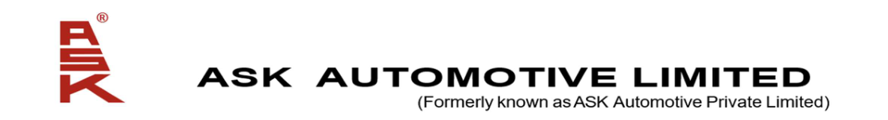

**[Image: Aug2026.pdf-0001-00.png (1117x153, 40.1KB)]**

August 04, 2026 

BSE Limited National Stock Exchange of India Limited Exchange Plaza, Phiroze Jeejeebhoy Towers, Dalal Street, C-1, Block - G, Bandra Kurla Complex, Bandra (East), Mumbai - 400 001 Mumbai - 400 051 **Scrip Code: 544022 Symbol: ASKAUTOLTD ISIN No.: INE491J01022 ISIN No.: INE491J01022 Re.: ASK Automotive Limited Re.: ASK Automotive Limited** 

###### **Sub: Presentation to be made to the Analysts and /or Investors** 

Dear Sir/Madam, 

Pursuant to the requirement of Regulation 30 read with Part A of Schedule III of the SEBI (Listing Obligations and Disclosure Requirements) Regulations, 2015, please find enclosed herewith the presentation to be made to the Analysts and/or Investors on the Unaudited Financial Results of the Company for the quarter ended on June 30, 2026. 

The same shall be available on our website i.e. www.askbrake.com. 

This is for your information. 

Thanking you, 

###### For **ASK Automotive Limited** 

Rajani Digitally signed by Rajani Sharma Sharma Date: 2026.08.04 18:29:08 +05'30' 

**Rajani Sharma Company Secretary & Compliance Officer Membership No.: ACS 14391** 

###### **Encl: As above** 

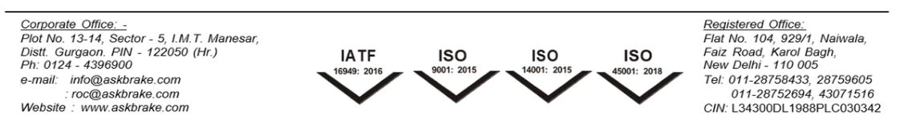

**[Image: Aug2026.pdf-0001-13.png (1132x155, 78.5KB)]**

**[Image: Aug2026.pdf-0002-00.png (186x78, 6.6KB)]**

# **ASK AUTOMOTIVE LIMITED** 

## **Quarterly Earnings Call || Q1 FY27** 

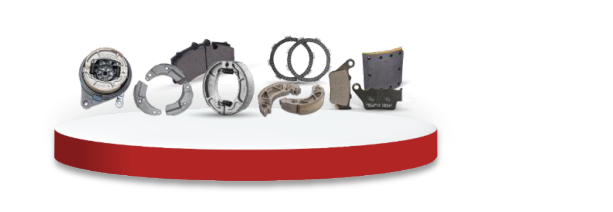

**[Image: Aug2026.pdf-0002-03.png (613x212, 55.6KB)]**

**Advanced Braking Systems** 

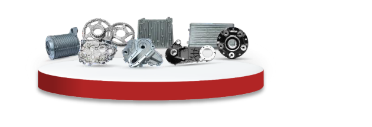

**[Image: Aug2026.pdf-0002-05.png (630x215, 65.3KB)]**

**Aluminum Lightweighting Precision Solutions** 

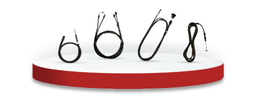

**[Image: Aug2026.pdf-0002-07.png (559x222, 35.1KB)]**

**Safety Control Cables** 

_https://askbrake.com_ 

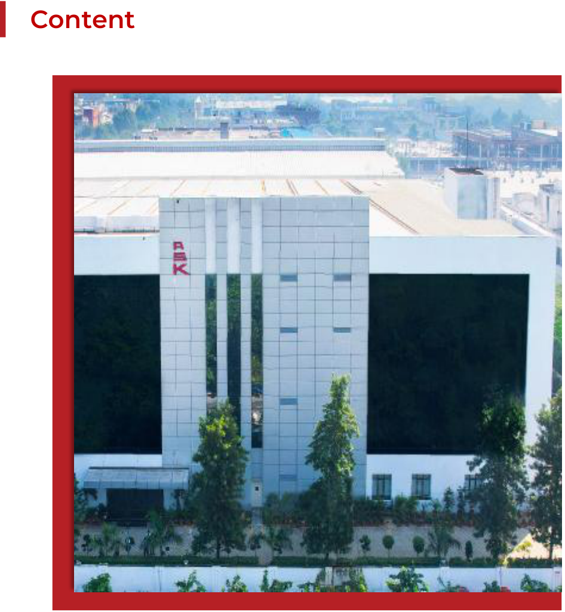

**[Image: Aug2026.pdf-0003-00.png (946x1024, 1168.0KB)]**

<!-- Start of picture text -->
Content <!-- End of picture text -->

**[Image: Aug2026.pdf-0003-01.png (186x78, 6.6KB)]**

**[Image: Aug2026.pdf-0003-02.png (942x110, 10.1KB)]**

<!-- Start of picture text -->
01 Overview: ASK Group 4 <!-- End of picture text -->

**[Image: Aug2026.pdf-0003-03.png (112x105, 3.2KB)]**

<!-- Start of picture text -->
01 <!-- End of picture text -->

|**01**|**Overview: ASK Group**|**4**|
|---|---|---|
|**02**|**Financial Performance-Q1 FY27**|**5-8**|
|**03**|**Key Growth Strategies & Recent Breakthro**|**ugh** **9-10**|
|**04**|**Technical Collaborations & Partnerships**|**11**|
|**05**|**Transition to Renewal Energy**|**12**|
|**06**|**Customer Relationship and Recognitions**|**13-14**|
|**07**|**Others**|**15-19**|
|**08**|**Annexures**|**20-22**|

**[Image: Aug2026.pdf-0003-05.png (942x109, 11.0KB)]**

<!-- Start of picture text -->
02 Financial Performance-Q1 FY27 5-8 <!-- End of picture text -->

**[Image: Aug2026.pdf-0003-06.png (120x105, 3.5KB)]**

<!-- Start of picture text -->
02 <!-- End of picture text -->

**[Image: Aug2026.pdf-0003-07.png (942x109, 13.9KB)]**

<!-- Start of picture text -->
03 Key Growth Strategies & Recent Breakthrough 9-10 <!-- End of picture text -->

**[Image: Aug2026.pdf-0003-08.png (120x105, 3.6KB)]**

<!-- Start of picture text -->
03 <!-- End of picture text -->

**[Image: Aug2026.pdf-0003-09.png (942x109, 11.7KB)]**

<!-- Start of picture text -->
04 Technical Collaborations & Partnerships 11 <!-- End of picture text -->

**[Image: Aug2026.pdf-0003-10.png (942x109, 11.1KB)]**

<!-- Start of picture text -->
05 Transition to Renewal Energy 12 <!-- End of picture text -->

**[Image: Aug2026.pdf-0003-11.png (941x110, 13.4KB)]**

<!-- Start of picture text -->
06 Customer Relationship and Recognitions 13-14 <!-- End of picture text -->

**[Image: Aug2026.pdf-0003-12.png (121x105, 3.7KB)]**

<!-- Start of picture text -->
06 <!-- End of picture text -->

**[Image: Aug2026.pdf-0003-13.png (942x109, 8.3KB)]**

<!-- Start of picture text -->
Others 15-19 07 <!-- End of picture text -->

**[Image: Aug2026.pdf-0003-14.png (122x105, 3.5KB)]**

<!-- Start of picture text -->
07 <!-- End of picture text -->

**[Image: Aug2026.pdf-0003-15.png (941x109, 9.4KB)]**

<!-- Start of picture text -->
08 Annexures 20-22 <!-- End of picture text -->

**[Image: Aug2026.pdf-0003-16.png (123x105, 3.5KB)]**

<!-- Start of picture text -->
08 <!-- End of picture text -->

2 

### **Cautionary Statement** 

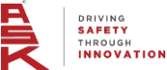

**[Image: Aug2026.pdf-0004-01.png (186x78, 6.6KB)]**

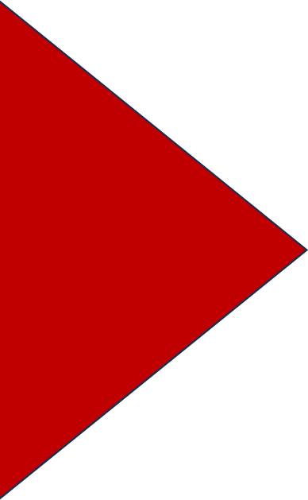

**[Image: Aug2026.pdf-0004-02.png (388x629, 14.3KB)]**

This presentation and the accompanying slides (the “presentation”) contain selected information about the activities of ASK Automotive Limited (the “Company”) and its subsidiaries and affiliates (together, the “Group”) as at the date of the presentation. It does not purport to present a comprehensive overview of the Group or contain all the information necessary to evaluate an investment in the Company. 

Some of the statements in this communication may be forward looking statements within the meaning of applicable laws and regulations. Actual results might differ substantially from those expressed or implied. Important developments that could affect the Company’s operations include changes in the industry structure, significant changes in political and economic environment in India and overseas, tax laws, import duties, litigation and labour relations. 

The information contained herein has been prepared to assist prospective investors in making their own evaluation of the Company and does not purport to be all-inclusive or to contain all of the information a prospective or existing investor may desire. In all cases, interested parties should conduct their own research/investigation and analysis of the Company and the data set forth in this information. The Company makes no representation or warranty as to the accuracy or completeness of this information and shall not have any liability for any representations (expressed or implied) regarding information contained in, or for any omissions from, this information or any other written or oral communications transmitted to the recipient in the course of its evaluation of the Company. 

While we have made every attempt to ensure that the information contained in this presentation has been obtained from reliable source, the Company is not responsible for any errors or omissions, or for the results from the use of this information. All information in this presentation is provided on "as is" basis with no guarantee of completeness, accuracy, timeliness or of the results obtained from the use of this information and without warranty of any kind, express or implies including but not limited to warranties of performance for a particular purpose. In no event will the Company, its Directors, legal representatives, employees thereof be liable to anyone for any decision made or action taken by relying on data/information in this presentation. 

3 

**[Image: Aug2026.pdf-0005-00.png (220x95, 8.9KB)]**

#### **ASK Group Overview - ASK is a leading Brand in 2W Braking Segment in India** 

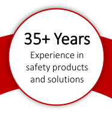

**[Image: Aug2026.pdf-0005-02.png (186x188, 14.0KB)]**

<!-- Start of picture text -->
35+ Years Experience in safety products and solutions <!-- End of picture text -->

##### **ASK Automotive Limited Leading Safety Systems Manufacturer** 

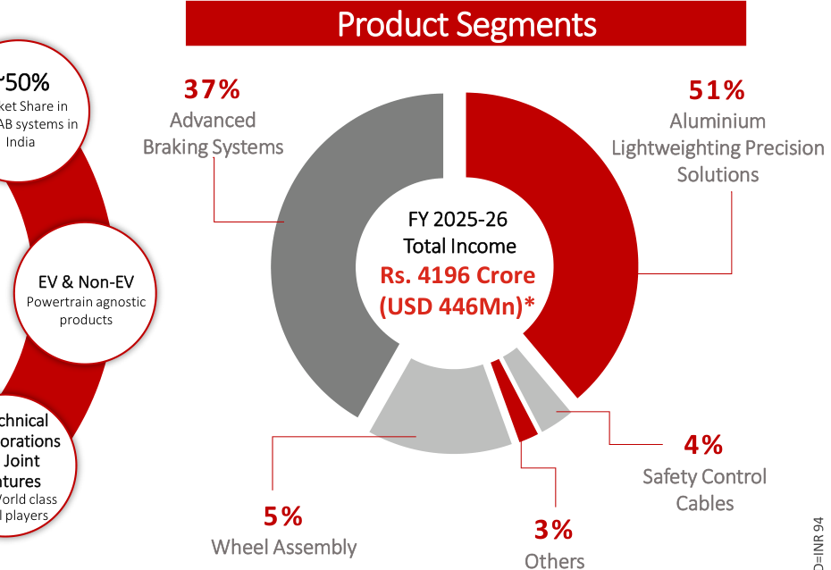

**[Image: Aug2026.pdf-0005-04.png (930x638, 96.3KB)]**

<!-- Start of picture text -->
Product Segments ~50% 37% 51% Advanced  Aluminium India  Braking Systems Lightweighting Precision Solutions FY 2025-26  Total Income EV & Non-EV  Rs. 4196 Crore Powertrain agnostic  (USD 446Mn)* products 4% Safety Control Cables 5% 3% Wheel Assembly Others <!-- End of picture text -->

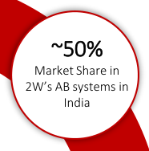

**[Image: Aug2026.pdf-0005-05.png (186x188, 14.2KB)]**

<!-- Start of picture text -->
~50% Market Share in 2W’s AB systems in India <!-- End of picture text -->

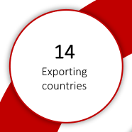

**[Image: Aug2026.pdf-0005-06.png (186x186, 11.6KB)]**

<!-- Start of picture text -->
14 Exporting countries <!-- End of picture text -->

ASK Automotive Limited is a Public Listed Indian auto ancillary major, having diversified operations and offers powertrain-agnostic products under Advanced Braking Systems, Aluminium Lightweighting precision solutions, and Safety Control Cables business segments. 

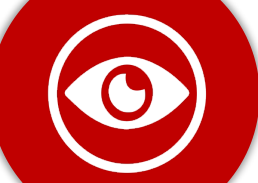

**[Image: Aug2026.pdf-0005-08.png (258x183, 14.5KB)]**

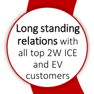

**[Image: Aug2026.pdf-0005-09.png (186x186, 16.1KB)]**

<!-- Start of picture text -->
Long standing relations  with all top 2W ICE and EV customers <!-- End of picture text -->

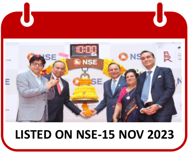

**[Image: Aug2026.pdf-0005-10.png (380x307, 137.2KB)]**

<!-- Start of picture text -->
LISTED ON NSE-15 NOV 2023 <!-- End of picture text -->

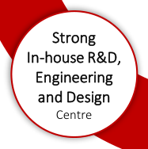

**[Image: Aug2026.pdf-0005-11.png (187x188, 15.3KB)]**

<!-- Start of picture text -->
Strong In-house R&D, Engineering and Design Centre <!-- End of picture text -->

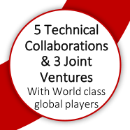

**[Image: Aug2026.pdf-0005-12.png (186x186, 16.5KB)]**

<!-- Start of picture text -->
5 Technical Collaborations & 3 Joint Ventures With World class global players <!-- End of picture text -->

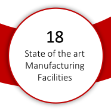

**[Image: Aug2026.pdf-0005-13.png (186x186, 12.7KB)]**

<!-- Start of picture text -->
18 State of the art Manufacturing Facilities <!-- End of picture text -->

Financial Highlights 

**Last 4 years CAGR Key Ratios FY 2026** 20.0% 31.9% 38.4% 0.50 0.95 26.9% Revenue EBITDA EPS Debt-Equity Avg. Debt-EBITDA RoACE 

4 

#### **Key Business Performance Highlights  - Q1 FY27 (Consolidated)** 

**[Image: Aug2026.pdf-0006-01.png (186x78, 6.6KB)]**

- ❖ **Robust growth in both top line and bottom line** 

   - ❖ **EBITDA up +32.7%, PAT up +28.8% YOY** 

- ❖ **Highest ever Quarterly Revenue, EBITDA & PAT** 

   - ❖ **EBITDA Margins at 12.0%** 

- ❖ **Revenue growth outperformed Industry growth** 

- ❖ **Consolidated Revenue Growth up + 52.1% YOY** Passthrough impact of Significant increase in Alloy Prices on revenue  + 33.4% 

Wheel Assembly strategic reduction impact (-) 6.6% 

- ❖ **Absolute EBITDA remained strong at Rs. 164 Cr. against Rs.123 Cr. in Q1 FY26 .** However, EBITDA percentage was impacted due to abrupt and phenomenal pass-through Alloy prices. 

###### ❖ **EPS at Rs 4.32, up+28.8% YOY,** 

**Overall Net Revenue Growth up + 25.3% YOY** 

- ❖ **Absolute EBITDA improvement resulting from:-** 

   - Higher Volume driven economies of scale 

   - Benefit from increasing capacity utilisation at Karoli and new Bangalore facility 

   - Strategic Closure of  low value-added Wheel Assembly business 

**5** 

#### **Financial Performance of Q1 FY 27 (in Crores) - Consolidated** 

**[Image: Aug2026.pdf-0007-01.png (186x78, 6.6KB)]**

#### **<mark>TOTAL INCOME</mark>** 

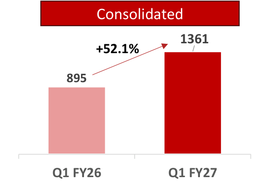

**[Image: Aug2026.pdf-0007-03.png (570x376, 14.1KB)]**

<!-- Start of picture text -->
Consolidated 1361 +52.1% 895 Q1 FY26 Q1 FY27 <!-- End of picture text -->

###### Net Revenue* 

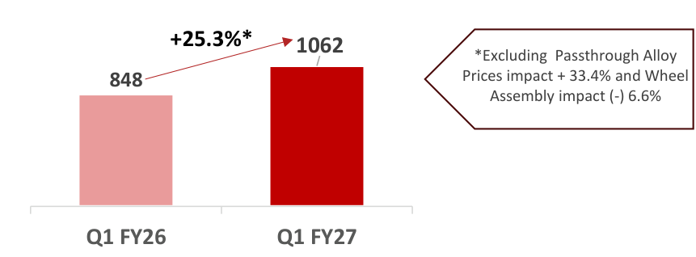

**[Image: Aug2026.pdf-0007-05.png (861x318, 21.8KB)]**

<!-- Start of picture text -->
+25.3%* 1062 *Excluding  Passthrough Alloy 848 Prices impact + 33.4% and Wheel Assembly impact (-) 6.6% Q1 FY26 Q1 FY27 <!-- End of picture text -->

**[Image: Aug2026.pdf-0007-06.png (359x55, 1.8KB)]**

<!-- Start of picture text -->
EBITDA <!-- End of picture text -->

**[Image: Aug2026.pdf-0007-07.png (360x55, 1.3KB)]**

<!-- Start of picture text -->
PAT <!-- End of picture text -->

###### <mark>EBITDA and PAT Margins%</mark> 

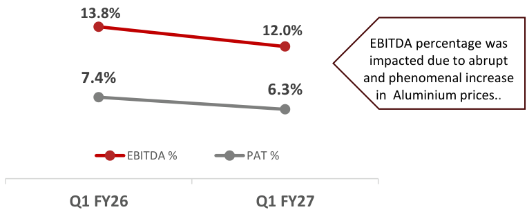

**[Image: Aug2026.pdf-0007-09.png (763x307, 24.3KB)]**

<!-- Start of picture text -->
13.8% 12.0% EBITDA percentage was impacted due to abrupt 7.4% and phenomenal increase 6.3% in  Aluminium prices.. EBITDA % PAT % Q1 FY26 Q1 FY27 <!-- End of picture text -->

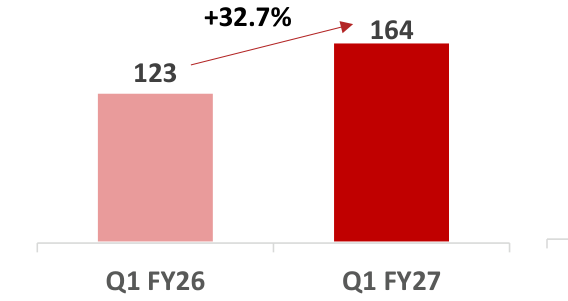

**[Image: Aug2026.pdf-0007-10.png (568x301, 10.4KB)]**

<!-- Start of picture text -->
+32.7% 164 123 Q1 FY26 Q1 FY27 <!-- End of picture text -->

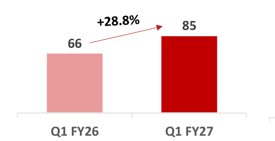

**[Image: Aug2026.pdf-0007-11.png (567x292, 9.6KB)]**

<!-- Start of picture text -->
85 66 Q1 FY26 Q1 FY27 <!-- End of picture text -->

**6** 

#### **Revenue by Product Segment and Channel Q1 FY27 – Consolidated** 

**[Image: Aug2026.pdf-0008-01.png (186x78, 6.6KB)]**

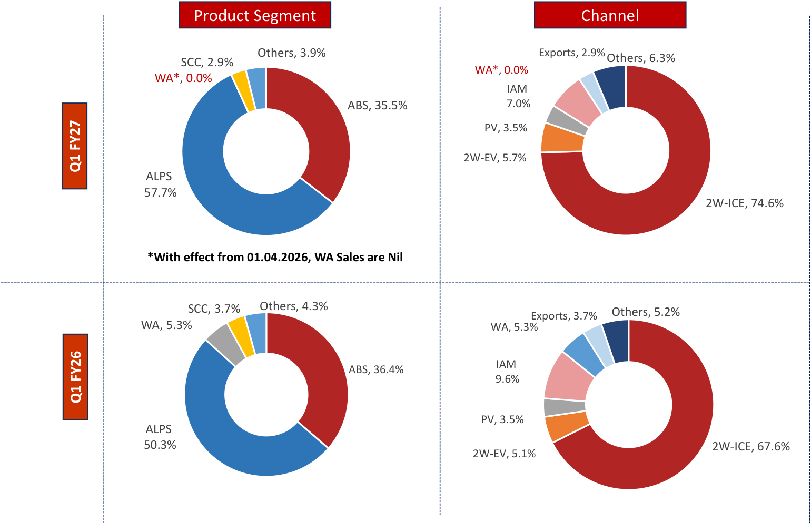

**[Image: Aug2026.pdf-0008-02.png (1540x997, 131.4KB)]**

<!-- Start of picture text -->
Product Segment Channel Others, 3.9% Exports, 2.9% Others, 6.3% SCC, 2.9% WA*, 0.0% WA*, 0.0% IAM ABS, 35.5%  7.0% PV, 3.5% 2W-EV, 5.7% ALPS  57.7% 2W-ICE, 74.6% *With effect from 01.04.2026, WA Sales are Nil SCC, 3.7% Others, 4.3% Others, 5.2% Exports, 3.7% WA, 5.3% WA, 5.3% IAM ABS, 36.4%  9.6% PV, 3.5% ALPS  50.3% 2W-ICE, 67.6% 2W-EV, 5.1% Q1 FY27 Q1 FY26 <!-- End of picture text -->

**7** 

#### **Product Segment Revenue (Rs. Crores) Q1 FY27- Consolidated** 

**[Image: Aug2026.pdf-0009-01.png (186x78, 6.6KB)]**

###### <mark>Advanced Braking Systems</mark> 

###### <mark>Aluminium LW Precision Solutions</mark> 

###### <mark>Safety Control Cables</mark> 

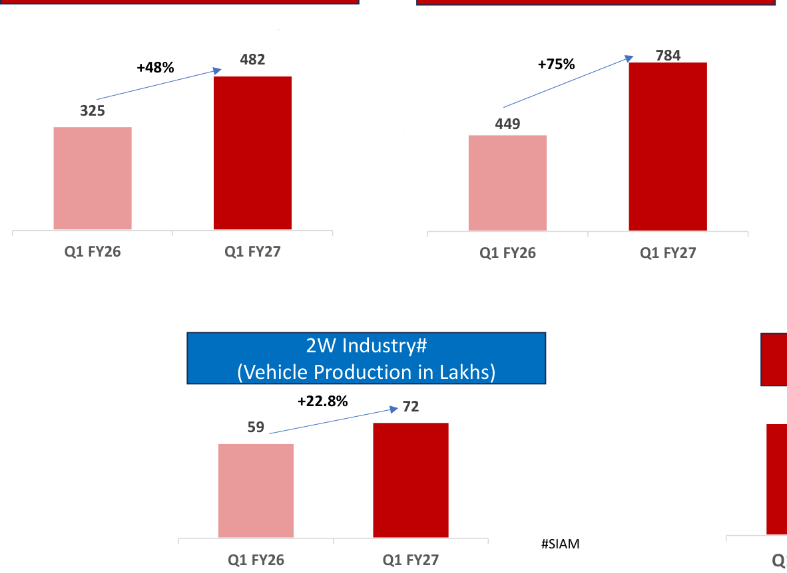

**[Image: Aug2026.pdf-0009-05.png (1182x862, 43.2KB)]**

<!-- Start of picture text -->
+48% 482 +75% 784 325 449 Q1 FY26 Q1 FY27 Q1 FY26 Q1 FY27 2W Industry# (Vehicle Production in Lakhs) +22.8% 72 59 #SIAM Q1 FY26 Q1 FY27 <!-- End of picture text -->

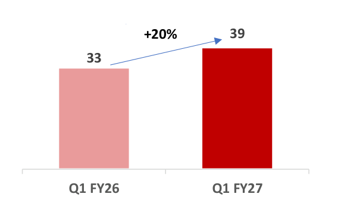

**[Image: Aug2026.pdf-0009-06.png (578x336, 9.7KB)]**

<!-- Start of picture text -->
+20% 39 33 Q1 FY26 Q1 FY27 <!-- End of picture text -->

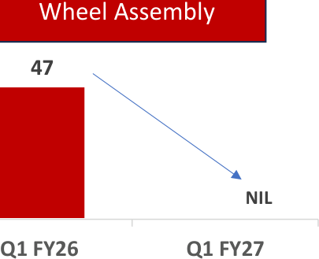

**[Image: Aug2026.pdf-0009-07.png (405x329, 11.3KB)]**

<!-- Start of picture text -->
Wheel Assembly 47 0 NIL Q1 FY26 Q1 FY27 <!-- End of picture text -->

*With effect from 01.04.2026, WA sales are Nil 

8 

#### **Key Growth Strategies** 

**[Image: Aug2026.pdf-0010-01.png (186x78, 9.1KB)]**

Develop innovative systems and solutions and have strong pipeline of products 

Strengthen position in the growing EV sector in India 

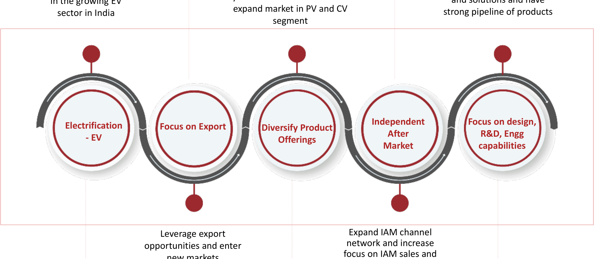

**[Image: Aug2026.pdf-0010-04.png (1976x862, 315.2KB)]**

<!-- Start of picture text -->
expand market in PV and CV sector in India strong pipeline of products segment Independent  Focus on design, Electrification  Focus on Export Diversify Product After  R&D, Engg - EV Offerings Market capabilities Leverage export  Expand IAM channel network and increase opportunities and enter focus on IAM sales and <!-- End of picture text -->

9 

#### **Recent Breakthrough** 

**Happy to share that the technical collaboration with Kyushu Yanagawa Japan has been successfully implemented at our Karoli plant and 1st Supply of  High Pressure Die Casted Alloy Wheel has started to our leading Japanese customer.** 

**[Image: Aug2026.pdf-0011-02.png (186x78, 6.6KB)]**

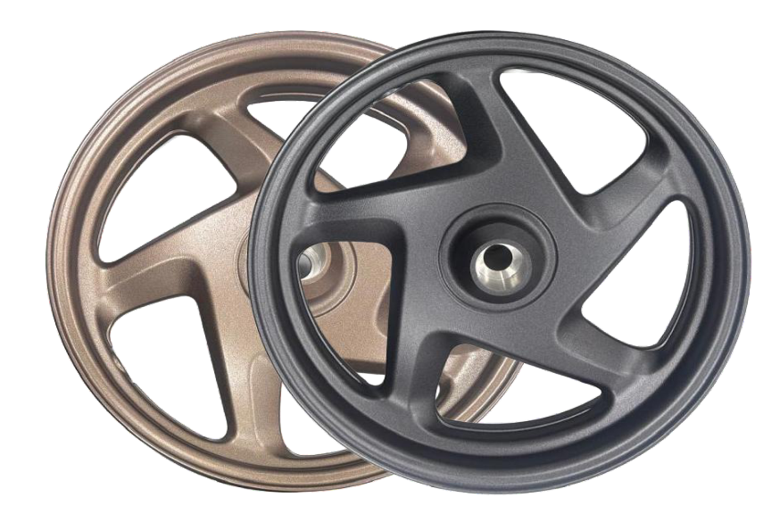

**[Image: Aug2026.pdf-0011-03.png (874x585, 620.2KB)]**

**10** 

#### **World Class Technical Collaborations and Global Partnerships...** 

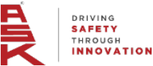

**[Image: Aug2026.pdf-0012-01.png (220x95, 8.9KB)]**

###### **2001 - Japanese Manufacturer** 

A prestigious manufacturer & supplier of Non-asbestos Brake Shoes to the world’s leading 2W manufacturers 

**[Image: Aug2026.pdf-0012-04.png (109x115, 5.5KB)]**

<!-- Start of picture text -->
2001 <!-- End of picture text -->

**[Image: Aug2026.pdf-0012-05.png (107x115, 5.3KB)]**

<!-- Start of picture text -->
2016 <!-- End of picture text -->

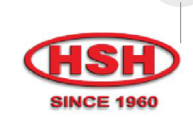

**[Image: Aug2026.pdf-0012-06.png (242x149, 43.3KB)]**

**2016 - HSH Safety Control Cable Ind. Co. Ltd.** 

Leading manufacturer of high-quality control cables and with more than six decades of experience in global markets 

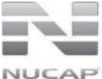

**[Image: Aug2026.pdf-0012-09.png (130x101, 10.7KB)]**

###### **2016 - NUCAP, Canada** 

A Patented Retention Systems - Mechanical Bonding Disc Brake Pads for 2W, PV and CV 

**[Image: Aug2026.pdf-0012-12.png (395x115, 10.9KB)]**

<!-- Start of picture text -->
2016 2024 <!-- End of picture text -->

**[Image: Aug2026.pdf-0012-13.png (103x115, 5.1KB)]**

<!-- Start of picture text -->
2025 <!-- End of picture text -->

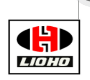

**[Image: Aug2026.pdf-0012-14.png (186x165, 10.6KB)]**

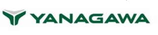

**[Image: Aug2026.pdf-0012-15.png (321x72, 20.2KB)]**

**2025 - Kyushu Yanagawa Seiki, Co., Ltd., Japan** 

###### **2024 - LIOHO, TAIWAN** 

A Leading Player in manufacturer of automotive system 

A leading Motorcycle wheel supplier with high pressure Aluminium die casting technology 

components and metal parts including  Alloy Wheel 

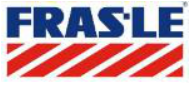

**[Image: Aug2026.pdf-0012-21.png (191x85, 39.2KB)]**

###### **2018 - FRAS-LE, Brazil** 

A Randon group company, Fras-le is a global leader in brake linings and pads for commercial vehicles, supplying to global OEMs 

**[Image: Aug2026.pdf-0012-24.png (97x117, 5.2KB)]**

<!-- Start of picture text -->
2018 <!-- End of picture text -->

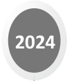

**[Image: Aug2026.pdf-0012-25.png (97x117, 4.9KB)]**

<!-- Start of picture text -->
2024 <!-- End of picture text -->

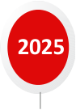

**[Image: Aug2026.pdf-0012-26.png (94x136, 5.0KB)]**

<!-- Start of picture text -->
2025 <!-- End of picture text -->

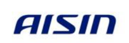

**[Image: Aug2026.pdf-0012-27.png (257x87, 26.2KB)]**

**[Image: Aug2026.pdf-0012-28.png (178x66, 5.3KB)]**

**2025 - T D Holding** 

**2024 - AISIN, Japan** 

**Gmbh (Technical License holding Company of GEMO)** 

AISIN Group Companies, a leading Japanese OE Auto Components supplier, is among the Top 10 global Tier One automotive suppliers of Passenger Car products 

For Manufacturing of Sunroof Operating Cables  for passenger Vehicles with proven licensed technical know how. 

11 

#### **ESG - Transition towards Renewable Energy** 

**[Image: Aug2026.pdf-0013-01.png (220x95, 8.9KB)]**

###### **Solar usage (units in kWh millions)** 

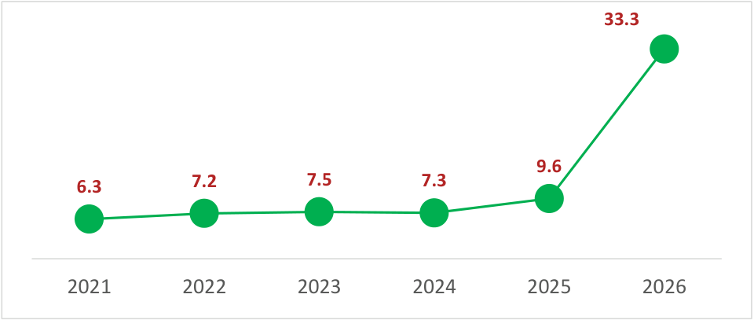

**[Image: Aug2026.pdf-0013-03.png (960x407, 17.4KB)]**

<!-- Start of picture text -->
33.3 9.6 7.2 7.5 7.3 6.3 2021 2022 2023 2024 2025 2026 <!-- End of picture text -->

###### **<u>PNG usage (units in SCM millions)</u>** 

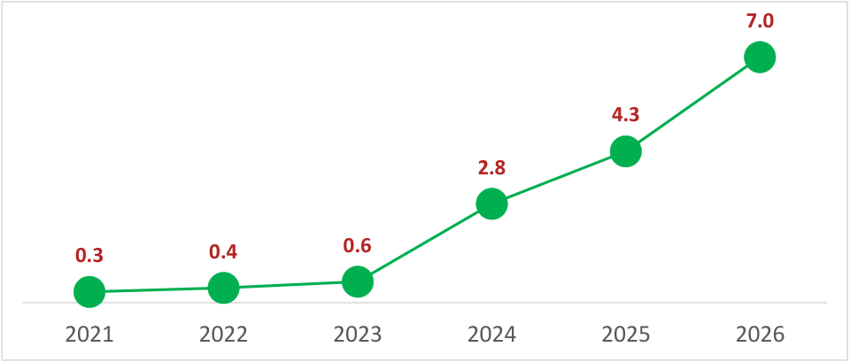

**[Image: Aug2026.pdf-0013-05.png (960x409, 18.9KB)]**

<!-- Start of picture text -->
7.0 4.3 2.8 0.6 0.3 0.4 2021 2022 2023 2024 2025 2026 <!-- End of picture text -->

▪ Clear focus towards Renewal Energy 

▪ 100% conversion of Diesel to PNG in melting furnaces 

▪ 9.9 MWp Solar Power Plant for captive consumption operationalized. 

▪ Upcoming one more Captive Solar power plant of 11.55 MWp in Rajasthan and expected to be operational by Q2 FY27. 

▪ Highly Rated by Customers on Sustainability: **Maruti – Excellent, TVS – Gold, Hero MotoCorp – 100% compliant, Yamaha – 100% compliant** 

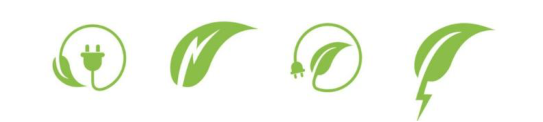

**[Image: Aug2026.pdf-0013-11.png (543x122, 39.6KB)]**

12 

#### **Long-standing Relationship with Indian and Global OEM players** 

**[Image: Aug2026.pdf-0014-01.png (220x95, 8.9KB)]**

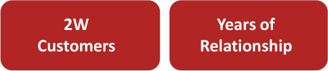

**[Image: Aug2026.pdf-0014-02.png (536x116, 8.2KB)]**

<!-- Start of picture text -->
2W Years of Customers Relationship <!-- End of picture text -->

**[Image: Aug2026.pdf-0014-03.png (540x119, 7.5KB)]**

<!-- Start of picture text -->
Hero 33 MotoCorp Limited <!-- End of picture text -->

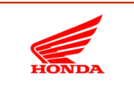

**[Image: Aug2026.pdf-0014-04.png (149x101, 5.6KB)]**

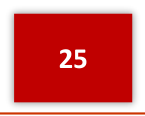

**[Image: Aug2026.pdf-0014-05.png (145x116, 2.1KB)]**

<!-- Start of picture text -->
25 <!-- End of picture text -->

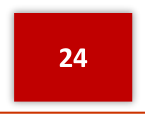

**[Image: Aug2026.pdf-0014-06.png (145x114, 2.0KB)]**

<!-- Start of picture text -->
24 <!-- End of picture text -->

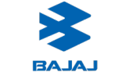

**[Image: Aug2026.pdf-0014-07.png (165x92, 4.2KB)]**

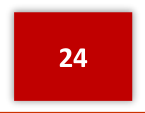

**[Image: Aug2026.pdf-0014-08.png (145x113, 2.0KB)]**

<!-- Start of picture text -->
24 <!-- End of picture text -->

**[Image: Aug2026.pdf-0014-09.png (74x99, 19.2KB)]**

**[Image: Aug2026.pdf-0014-10.png (540x120, 9.4KB)]**

<!-- Start of picture text -->
23 <!-- End of picture text -->

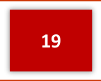

**[Image: Aug2026.pdf-0014-11.png (145x116, 2.1KB)]**

<!-- Start of picture text -->
19 <!-- End of picture text -->

**[Image: Aug2026.pdf-0014-12.png (130x88, 6.5KB)]**

**[Image: Aug2026.pdf-0014-13.png (1389x225, 78.8KB)]**

<!-- Start of picture text -->
2 Wheelers-ICE Hero MotoCorp Limited <!-- End of picture text -->

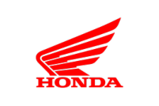

**[Image: Aug2026.pdf-0014-14.png (201x134, 7.7KB)]**

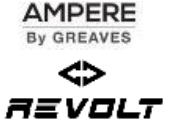

**[Image: Aug2026.pdf-0014-15.png (170x132, 13.6KB)]**

**[Image: Aug2026.pdf-0014-16.png (195x43, 4.1KB)]**

**[Image: Aug2026.pdf-0014-17.png (224x128, 7.1KB)]**

**[Image: Aug2026.pdf-0014-18.png (185x70, 4.6KB)]**

**[Image: Aug2026.pdf-0014-19.png (151x51, 2.9KB)]**

**[Image: Aug2026.pdf-0014-20.png (132x48, 3.3KB)]**

**[Image: Aug2026.pdf-0014-21.png (120x67, 2.2KB)]**

**[Image: Aug2026.pdf-0014-22.png (1389x220, 94.1KB)]**

<!-- Start of picture text -->
4 Wheelers <!-- End of picture text -->

**[Image: Aug2026.pdf-0014-23.png (93x86, 9.5KB)]**

**[Image: Aug2026.pdf-0014-24.png (238x84, 7.8KB)]**

**[Image: Aug2026.pdf-0014-25.png (155x97, 7.6KB)]**

**[Image: Aug2026.pdf-0014-26.png (182x76, 7.8KB)]**

**[Image: Aug2026.pdf-0014-27.png (226x40, 5.1KB)]**

**[Image: Aug2026.pdf-0014-28.png (203x55, 9.0KB)]**

**[Image: Aug2026.pdf-0014-29.png (553x58, 34.6KB)]**

**[Image: Aug2026.pdf-0014-30.png (147x47, 5.6KB)]**

**[Image: Aug2026.pdf-0014-31.png (166x34, 4.8KB)]**

^ Supplied through JV 

13 

#### **Awards and Recognitions** 

**[Image: Aug2026.pdf-0015-01.png (99x166, 24.8KB)]**

**[Image: Aug2026.pdf-0015-02.png (57x164, 19.2KB)]**

**[Image: Aug2026.pdf-0015-03.png (62x164, 19.7KB)]**

**[Image: Aug2026.pdf-0015-04.png (90x162, 21.7KB)]**

**[Image: Aug2026.pdf-0015-05.png (151x172, 22.4KB)]**

**[Image: Aug2026.pdf-0015-06.png (130x160, 49.1KB)]**

**[Image: Aug2026.pdf-0015-07.png (97x153, 23.5KB)]**

**[Image: Aug2026.pdf-0015-08.png (95x151, 23.3KB)]**

**India’s Best Managed Companies 2025** Award by Deloitte 

**[Image: Aug2026.pdf-0015-10.png (503x338, 346.3KB)]**

**[Image: Aug2026.pdf-0015-11.png (153x143, 8.0KB)]**

**[Image: Aug2026.pdf-0015-12.png (299x124, 90.4KB)]**

**8 Awards** for Excellence in Development 

**[Image: Aug2026.pdf-0015-14.png (299x178, 95.7KB)]**

**[Image: Aug2026.pdf-0015-15.png (155x143, 8.0KB)]**

**13 Awards** for Excellence in Quality 

**[Image: Aug2026.pdf-0015-17.png (503x215, 198.1KB)]**

**[Image: Aug2026.pdf-0015-18.png (155x144, 8.0KB)]**

**[Image: Aug2026.pdf-0015-19.png (299x111, 84.8KB)]**

**10 Awards** for Excellence in Performance 

**[Image: Aug2026.pdf-0015-21.png (156x144, 8.0KB)]**

**[Image: Aug2026.pdf-0015-22.png (219x118, 18.0KB)]**

**[Image: Aug2026.pdf-0015-23.png (136x110, 8.6KB)]**

**6 Awards** for Excellence in Cost Innovation 

**[Image: Aug2026.pdf-0015-25.png (174x62, 5.4KB)]**

**[Image: Aug2026.pdf-0015-26.png (220x95, 8.9KB)]**

**[Image: Aug2026.pdf-0015-27.png (68x170, 16.7KB)]**

**[Image: Aug2026.pdf-0015-28.png (72x170, 15.0KB)]**

**[Image: Aug2026.pdf-0015-29.png (73x158, 20.1KB)]**

**[Image: Aug2026.pdf-0015-30.png (78x162, 19.7KB)]**

**[Image: Aug2026.pdf-0015-31.png (205x112, 39.5KB)]**

**[Image: Aug2026.pdf-0015-32.png (313x174, 115.6KB)]**

**[Image: Aug2026.pdf-0015-33.png (291x151, 105.2KB)]**

**[Image: Aug2026.pdf-0015-34.png (309x99, 67.3KB)]**

**[Image: Aug2026.pdf-0015-35.png (291x93, 61.0KB)]**

**[Image: Aug2026.pdf-0015-36.png (293x180, 106.5KB)]**

**[Image: Aug2026.pdf-0015-37.png (311x180, 124.8KB)]**

<!-- Start of picture text -->
14 <!-- End of picture text -->

**[Image: Aug2026.pdf-0015-38.png (101x130, 33.2KB)]**

**[Image: Aug2026.pdf-0015-39.png (135x124, 6.2KB)]**

**[Image: Aug2026.pdf-0015-40.png (180x122, 6.3KB)]**

14 

#### **Diverse & Extensive Product Portfolio** 

**[Image: Aug2026.pdf-0016-01.png (220x95, 8.9KB)]**

**[Image: Aug2026.pdf-0016-02.png (197x172, 7.0KB)]**

<!-- Start of picture text -->
Advanced Braking System <!-- End of picture text -->

**[Image: Aug2026.pdf-0016-03.png (332x258, 72.6KB)]**

<!-- Start of picture text -->
Brake Shoe Brake Pad Brake Panel Case Mission <!-- End of picture text -->

**[Image: Aug2026.pdf-0016-04.png (295x157, 14.0KB)]**

**[Image: Aug2026.pdf-0016-05.png (536x326, 62.8KB)]**

<!-- Start of picture text -->
3W Brake Shoe Brake Shoe <!-- End of picture text -->

**[Image: Aug2026.pdf-0016-06.png (122x88, 12.9KB)]**

###### **<mark>CV (Joint Venture)</mark>** 

**[Image: Aug2026.pdf-0016-08.png (122x84, 12.6KB)]**

**[Image: Aug2026.pdf-0016-09.png (149x99, 14.2KB)]**

**[Image: Aug2026.pdf-0016-10.png (197x173, 6.9KB)]**

<!-- Start of picture text -->
Aluminium LW Precision Solutions <!-- End of picture text -->

**[Image: Aug2026.pdf-0016-11.png (301x174, 14.2KB)]**

**[Image: Aug2026.pdf-0016-12.png (140x95, 21.3KB)]**

**[Image: Aug2026.pdf-0016-13.png (118x82, 18.4KB)]**

**[Image: Aug2026.pdf-0016-14.png (136x84, 10.7KB)]**

**[Image: Aug2026.pdf-0016-15.png (122x82, 6.8KB)]**

**[Image: Aug2026.pdf-0016-16.png (118x87, 13.7KB)]**

**[Image: Aug2026.pdf-0016-17.png (130x85, 15.5KB)]**

**[Image: Aug2026.pdf-0016-18.png (299x116, 27.8KB)]**

<!-- Start of picture text -->
Throttle Body Filter Housing <!-- End of picture text -->

**[Image: Aug2026.pdf-0016-19.png (149x87, 16.2KB)]**

**[Image: Aug2026.pdf-0016-20.png (93x86, 12.0KB)]**

**[Image: Aug2026.pdf-0016-21.png (262x109, 32.9KB)]**

<!-- Start of picture text -->
Fan Hammer <!-- End of picture text -->

**[Image: Aug2026.pdf-0016-22.png (143x110, 18.1KB)]**

<!-- Start of picture text -->
Geared Pulley <!-- End of picture text -->

**[Image: Aug2026.pdf-0016-23.png (97x53, 9.7KB)]**

**[Image: Aug2026.pdf-0016-24.png (83x87, 10.0KB)]**

**[Image: Aug2026.pdf-0016-25.png (198x147, 5.7KB)]**

<!-- Start of picture text -->
Safety Control Cables <!-- End of picture text -->

**[Image: Aug2026.pdf-0016-26.png (361x320, 28.4KB)]**

<!-- Start of picture text -->
2W Speedometer Cable Assembly <!-- End of picture text -->

**[Image: Aug2026.pdf-0016-27.png (334x263, 16.8KB)]**

<!-- Start of picture text -->
Front Brake Cable Assembly <!-- End of picture text -->

**[Image: Aug2026.pdf-0016-28.png (1269x259, 89.7KB)]**

<!-- Start of picture text -->
Front Brake Cable  Rear Brake Cable  Throttle  Speedometer Cable Gear Shift Cable Assembly Assembly Cables Assembly <!-- End of picture text -->

**[Image: Aug2026.pdf-0016-29.png (297x174, 12.0KB)]**

15 

#### **Board of Directors** 

###### **Kuldip Singh Rathee -** **_Chairman & MD_** 

**[Image: Aug2026.pdf-0017-02.png (153x144, 30.0KB)]**

- Bachelor’s degree in arts (Economics Honours) from Delhi University 

- Served in the Central Reserve Police Force and was directly recruited for the post of deputy superintendent of police in 1974 and served till 1978 

- Previously enlisted as a contractor in Class I (B&R) with the Directorate General of Works, Central Public Works Department, Government of India 

- Experience in the real estate sector and in the manufacturing sector 

**[Image: Aug2026.pdf-0017-07.png (153x140, 32.5KB)]**

###### **Vijay Rathee Non-Executive Director** 

- Bachelor’s degree in science and a master’s degree in science (Zoology) 

- Experience in the banking sector and the manufacturing sector and  was previously associated as an officer with Punjab & Sind Bank 

###### **Prashant Rathee –** **_Joint Managing Director_** 

**[Image: Aug2026.pdf-0017-12.png (153x130, 25.7KB)]**

- Bachelor’s degree in commerce from Delhi University 

- Previously a director on the board of A.A. Autotech Private Limited from 2008 till it merged with ASK Automotive. 

- Extensive experience in the manufacturing sector 

###### **Aman Rathee –** **_Joint Managing Director_** 

**[Image: Aug2026.pdf-0017-17.png (153x126, 27.1KB)]**

- Bachelor’s degree in science (engineering) and a master’s degree in business administration from Purdue University, Indiana (USA) and a certification in M&A from Harvard Business School, Massachusetts (USA) 

- Previously a director on the board of A.A. Autotech Private Limited from 2012 till it merged with ASK Automotive 

- Extensive experience in the manufacturing sector 

**[Image: Aug2026.pdf-0017-21.png (149x128, 24.4KB)]**

###### **Rajesh Kataria -** **_Whole-Time Director_** 

- Bachelor’s degree in business administration and a master’s course in business administration (human resources) 

- Currently responsible for Operational Management of the Company 

**[Image: Aug2026.pdf-0017-25.png (157x126, 28.6KB)]**

**[Image: Aug2026.pdf-0017-26.png (153x130, 38.5KB)]**

**[Image: Aug2026.pdf-0017-27.png (158x142, 22.7KB)]**

**[Image: Aug2026.pdf-0017-28.png (159x124, 25.7KB)]**

**[Image: Aug2026.pdf-0017-29.png (161x128, 20.2KB)]**

**[Image: Aug2026.pdf-0017-30.png (220x95, 8.9KB)]**

###### **Vinay Kumar Piparsania -** **_Independent Director_** 

- Bachelor’s degree in technology (mechanical engineering) from Indian Institute of Technology, Delhi and a master’s degree in business administration from Tulane University, New Orleans, Louisiana (USA) 

- Experience in the automotive sector and was previously associated with Ford India, BMW Oman, Hero Corporate Service Limited, TVS Automobile Solutions and currently the principal at MillenStrat Advisory & Research 

###### **Deepti Sehgal -** **_Independent Director_** 

- Bachelor’s degree in commerce from the University of Delhi, and a postgraduate diploma in business administration from Indian Institute of Management, Ahmedabad, Gujarat 

- Experience in the consultancy sector and was previously associated with Infogain Corporation, Deloitte Touche Tohmatsu India, GE Capital International Services and IBM India 

###### **Kumaresh Chandra Misra -** **_Independent Director_** 

- Bachelor’s degree in arts. a bachelor’s degree in law, a postgraduate diploma in business administration from Indian Institute of Management, Ahmedabad, Gujarat and a master’s degree in arts (political economy) from Boston University, Boston, Massachusetts (USA) 

- A retired IAS officer and previously Joint Secretary with the Ministry of Chemicals and Fertilizers. 

###### **Yogesh Kapur -** **_Independent Director_** 

- Bachelor’s degree in commerce (honours) from University of Delhi, Delhi and is a fellow of the Institute of Chartered Accountants of India 

- Experience in investment banking and was previously associated with Axis Capital Limited and was also the managing director at Enam Securities Private Limited. He was also associated with HDFC for 8 years 

- Currently on the board of director of Relaxo Footwear Ltd, Rico Auto Industries Ltd, Greenlam Ltd, Kirloskar Oil Engines Ltd and 4 other companies. 

###### **Rajan Wadhera-** **_Independent Director_** 

- Bachelor’s degree of technology in aeronautical engineering from the Indian Institute of Technology, Bombay and a Master’s degree in technology with specialization in Aircraft propulsion from the Indian Institute of Technology, Bombay. 

- Previously associated with Mahindra and Mahindra Limited as President, Automotive and Farm equipment sectors and Eicher Motors Limited as Director – supply chain. 

- Currently on the board of director of G N A Axles Ltd , AJAX Engineering Ltd, Metalman Auto Ltd.and Texspin Bearing Ltd. 

16 

#### **Geographical Presence across India** 

**[Image: Aug2026.pdf-0018-01.png (220x95, 8.9KB)]**

**[Image: Aug2026.pdf-0018-02.png (1966x864, 266.4KB)]**

<!-- Start of picture text -->
Himachal Pradesh Baddi – 1 Plant Uttarakhand Corporate Office Haryana Haridwar – 2 Plants Gurugram/Manesar - 9 Plants, JV - 1 Plant Rajasthan Karoli  (WOS) – 1 Plant 9,000+ Gujarat Workforce Ahmedabad - 1 Plant Karnataka  Bengaluru (3 Plants) ASK -  1 Plant, WOS  -  2 Plants 18 State of the art Manufacturing Facilities <!-- End of picture text -->

_WOS - ASK Automobiles Private Limited, a wholly owned subsidiary of ASK Automotive JV - ASK FRAS-LE Friction Private Limited_ 

17 

#### **ASK Group’s Strengths** 

**[Image: Aug2026.pdf-0019-01.png (299x128, 15.1KB)]**

**[Image: Aug2026.pdf-0019-02.png (151x151, 2.8KB)]**

**[Image: Aug2026.pdf-0019-03.png (781x111, 13.7KB)]**

<!-- Start of picture text -->
Largest manufacturer of 2W Advanced Braking System in India with ~50% market share <!-- End of picture text -->

**[Image: Aug2026.pdf-0019-04.png (155x153, 2.7KB)]**

**[Image: Aug2026.pdf-0019-05.png (872x74, 8.5KB)]**

<!-- Start of picture text -->
Powertrain Agnostic product offerings in both EV and Non-EV <!-- End of picture text -->

**[Image: Aug2026.pdf-0019-06.png (155x153, 2.5KB)]**

**[Image: Aug2026.pdf-0019-07.png (1007x72, 9.1KB)]**

<!-- Start of picture text -->
5 World Class Technical Collaborations and 3 World Class Joint Ventures <!-- End of picture text -->

**[Image: Aug2026.pdf-0019-08.png (152x152, 2.8KB)]**

**[Image: Aug2026.pdf-0019-09.png (1380x71, 10.8KB)]**

<!-- Start of picture text -->
High entry barriers due to proprietary material formulations, in-house Engg, Designing & Tool room <!-- End of picture text -->

**[Image: Aug2026.pdf-0019-10.png (153x153, 2.6KB)]**

**[Image: Aug2026.pdf-0019-11.png (1457x74, 12.8KB)]**

<!-- Start of picture text -->
Long standing relationship with customers & established Aftermarket focused on Quality, Cost & Delivery <!-- End of picture text -->

**[Image: Aug2026.pdf-0019-12.png (151x151, 3.3KB)]**

**[Image: Aug2026.pdf-0019-13.png (1789x116, 24.7KB)]**

<!-- Start of picture text -->
Robust financial performance with 16.2% Revenue growth, 24.1% EBITDA growth, 20.1% PAT growth and RoACE of 26.9% in FY26. Credit Rating by Crisil : Long term AA, Short term A1+ <!-- End of picture text -->

18 

#### **AHSAAS Trust – A CSR Initiative** 

**[Image: Aug2026.pdf-0020-01.png (220x95, 8.9KB)]**

###### **Focusing Our Efforts Today for a Better Tomorrow for Everyone.** 

AHSAAS, the philanthropic arm of ASK Automotive was born out of our chairman & Managing Director Mr. Kuldip Singh Rathee and his wife and Non- Executive Director Ms. Vijay Rathee with an aim and dedication to contributing toward socio-economic growth in the states of our operations. 

**[Image: Aug2026.pdf-0020-04.png (80x80, 3.6KB)]**

**[Image: Aug2026.pdf-0020-05.png (514x296, 292.8KB)]**

**[Image: Aug2026.pdf-0020-06.png (80x80, 3.7KB)]**

**[Image: Aug2026.pdf-0020-07.png (462x296, 251.9KB)]**

**[Image: Aug2026.pdf-0020-08.png (74x80, 6.4KB)]**

**[Image: Aug2026.pdf-0020-09.png (463x296, 310.8KB)]**

###### **EDUCATION** 

**HEALTH CARE** 

###### **WOMEN SAFETY** 

**[Image: Aug2026.pdf-0020-13.png (81x80, 2.9KB)]**

**[Image: Aug2026.pdf-0020-14.png (502x297, 217.7KB)]**

**[Image: Aug2026.pdf-0020-15.png (83x80, 4.7KB)]**

**[Image: Aug2026.pdf-0020-16.png (455x297, 235.5KB)]**

**[Image: Aug2026.pdf-0020-17.png (83x79, 3.1KB)]**

**[Image: Aug2026.pdf-0020-18.png (463x296, 242.2KB)]**

**SKILL DEVELOPMENT** 

19 

**SPORTS TALENT NURTURING** 

**CONSERVATION** 

**[Image: Aug2026.pdf-0021-00.png (186x78, 6.6KB)]**

## **Annexure** 

20 

#### **Profit and Loss Q1 FY27 - Consolidated (in Rs. Crore)** 

|**Particulars (Rs. Cr)**|**Q1 FY27**|**Q1 FY26**|**% Change** **(YoY)**|
|---|---|---|---|
|Revenue|1358.1|891.3||
|Other Income|3.0|3.7||
|**Total Income**|**1361.1**|**895.0**|**52.1%**|
|Cost of Material Consumed|1026.3|621.3||
|Change in inventories|-85.0|-50.4||
|Employees Benefit Expenses|61.0|53.4||
|Other Expenses|195.4|147.6||
|Dies for own use|-0.2|-0.3||
|**EBITDA**|**163.6**|**123.3**|**32.7%**|
|**EBITDA margin (%)**|**12.0%**|**13.8%**|**-176 bps**|
|Depreciation|33.1|26.5||
|EBIT|130.4|96.8||
|Finance Cost|15.9|10.2||
|PBT before profit/(loss) of JV|114.6|86.6||
|Share in Profit/Loss of JV|-2.3|0.6||
|PBT|112.3|87.2||
|Income Tax & Deffered Tax|27.1|21.1||
|**PAT**|**85.1**|**66.1**|**28.8%**|
|**PAT margin(%)**|**6.3%**|**7.4%**|**-113 bps**|

EBITDA percentage was impacted due to abrupt and phenomenal increase in Aluminium prices. 

**[Image: Aug2026.pdf-0022-03.png (186x78, 6.6KB)]**

21 

#### **Glossary** 

|**Term**|**Description**|
|---|---|
|AB|Advanced Braking|
|ALP|Aluminium Lightweighting Precision|
|SCC|Safety Control Cables|
|AM / IAM|Independent Aftermarket|
|OEM|Original Equipment Manufacturer|
|ATV|All-terrain vehicles|
|2W|Two-wheeler|
|EV|Electric Vehicle|
|3W|Three-wheeler|
|PV|Passenger Vehicles|
|CV|Commercial Vehicles|
|JV|Joint Venture|

**[Image: Aug2026.pdf-0023-02.png (299x128, 15.1KB)]**

|**Term**|**Description**|
|---|---|
|ECU|Electric Control Unit|
|MCU|Motor Control Unit|
|HMI|Human-machine interface|
|HEV|Hybrid Electric Vehicles|
|BEV|Battery Electric Vehicles|
|ICE|Internal Combustion Engine|
|EBITDA|Earnings Before Interest, Tax, Depreciation and Amortization|
|CAGR|Compounded Annual Growth Rate|
|PAT|Profit After Tax|
|RoACE|Return on Average Capital Employed|
|RoAE|Return on Average Equity|

22 

#### **For further information Contact** 

**[Image: Aug2026.pdf-0024-01.png (248x107, 10.2KB)]**

**[Image: Aug2026.pdf-0024-02.png (526x528, 69.0KB)]**

|**ASK Automotive Ltd.**|**Adfactors PR**|
|---|---|
|1. Mr. Naresh Kumar : Chief Financial Officer naresh@askbrake .com|1. Mr. Rushabh Shah rushabh .shah@adfactorspr.com|
|2. Mr. Manoj Sharma: Chief General Manager-Investor Relations investor@askbrake .com||

**23** 

---

## Extracted Images

| # | File | Dimensions | Size |
|---|------|------------|------|
| 1 | Aug2026.pdf-0001-00.png | 1117x153 | 40.1KB |
| 2 | Aug2026.pdf-0001-13.png | 1132x155 | 78.5KB |
| 3 | Aug2026.pdf-0002-00.png | 186x78 | 6.6KB |
| 4 | Aug2026.pdf-0002-03.png | 613x212 | 55.6KB |
| 5 | Aug2026.pdf-0002-05.png | 630x215 | 65.3KB |
| 6 | Aug2026.pdf-0002-07.png | 559x222 | 35.1KB |
| 7 | Aug2026.pdf-0003-00.png | 946x1024 | 1168.0KB |
| 8 | Aug2026.pdf-0003-01.png | 186x78 | 6.6KB |
| 9 | Aug2026.pdf-0003-02.png | 942x110 | 10.1KB |
| 10 | Aug2026.pdf-0003-03.png | 112x105 | 3.2KB |
| 11 | Aug2026.pdf-0003-05.png | 942x109 | 11.0KB |
| 12 | Aug2026.pdf-0003-06.png | 120x105 | 3.5KB |
| 13 | Aug2026.pdf-0003-07.png | 942x109 | 13.9KB |
| 14 | Aug2026.pdf-0003-08.png | 120x105 | 3.6KB |
| 15 | Aug2026.pdf-0003-09.png | 942x109 | 11.7KB |
| 16 | Aug2026.pdf-0003-10.png | 942x109 | 11.1KB |
| 17 | Aug2026.pdf-0003-11.png | 941x110 | 13.4KB |
| 18 | Aug2026.pdf-0003-12.png | 121x105 | 3.7KB |
| 19 | Aug2026.pdf-0003-13.png | 942x109 | 8.3KB |
| 20 | Aug2026.pdf-0003-14.png | 122x105 | 3.5KB |
| 21 | Aug2026.pdf-0003-15.png | 941x109 | 9.4KB |
| 22 | Aug2026.pdf-0003-16.png | 123x105 | 3.5KB |
| 23 | Aug2026.pdf-0004-01.png | 186x78 | 6.6KB |
| 24 | Aug2026.pdf-0004-02.png | 388x629 | 14.3KB |
| 25 | Aug2026.pdf-0005-00.png | 220x95 | 8.9KB |
| 26 | Aug2026.pdf-0005-02.png | 186x188 | 14.0KB |
| 27 | Aug2026.pdf-0005-04.png | 930x638 | 96.3KB |
| 28 | Aug2026.pdf-0005-05.png | 186x188 | 14.2KB |
| 29 | Aug2026.pdf-0005-06.png | 186x186 | 11.6KB |
| 30 | Aug2026.pdf-0005-08.png | 258x183 | 14.5KB |
| 31 | Aug2026.pdf-0005-09.png | 186x186 | 16.1KB |
| 32 | Aug2026.pdf-0005-10.png | 380x307 | 137.2KB |
| 33 | Aug2026.pdf-0005-11.png | 187x188 | 15.3KB |
| 34 | Aug2026.pdf-0005-12.png | 186x186 | 16.5KB |
| 35 | Aug2026.pdf-0005-13.png | 186x186 | 12.7KB |
| 36 | Aug2026.pdf-0006-01.png | 186x78 | 6.6KB |
| 37 | Aug2026.pdf-0007-01.png | 186x78 | 6.6KB |
| 38 | Aug2026.pdf-0007-03.png | 570x376 | 14.1KB |
| 39 | Aug2026.pdf-0007-05.png | 861x318 | 21.8KB |
| 40 | Aug2026.pdf-0007-06.png | 359x55 | 1.8KB |
| 41 | Aug2026.pdf-0007-07.png | 360x55 | 1.3KB |
| 42 | Aug2026.pdf-0007-09.png | 763x307 | 24.3KB |
| 43 | Aug2026.pdf-0007-10.png | 568x301 | 10.4KB |
| 44 | Aug2026.pdf-0007-11.png | 567x292 | 9.6KB |
| 45 | Aug2026.pdf-0008-01.png | 186x78 | 6.6KB |
| 46 | Aug2026.pdf-0008-02.png | 1540x997 | 131.4KB |
| 47 | Aug2026.pdf-0009-01.png | 186x78 | 6.6KB |
| 48 | Aug2026.pdf-0009-05.png | 1182x862 | 43.2KB |
| 49 | Aug2026.pdf-0009-06.png | 578x336 | 9.7KB |
| 50 | Aug2026.pdf-0009-07.png | 405x329 | 11.3KB |
| 51 | Aug2026.pdf-0010-01.png | 186x78 | 9.1KB |
| 52 | Aug2026.pdf-0010-04.png | 1976x862 | 315.2KB |
| 53 | Aug2026.pdf-0011-02.png | 186x78 | 6.6KB |
| 54 | Aug2026.pdf-0011-03.png | 874x585 | 620.2KB |
| 55 | Aug2026.pdf-0012-01.png | 220x95 | 8.9KB |
| 56 | Aug2026.pdf-0012-04.png | 109x115 | 5.5KB |
| 57 | Aug2026.pdf-0012-05.png | 107x115 | 5.3KB |
| 58 | Aug2026.pdf-0012-06.png | 242x149 | 43.3KB |
| 59 | Aug2026.pdf-0012-09.png | 130x101 | 10.7KB |
| 60 | Aug2026.pdf-0012-12.png | 395x115 | 10.9KB |
| 61 | Aug2026.pdf-0012-13.png | 103x115 | 5.1KB |
| 62 | Aug2026.pdf-0012-14.png | 186x165 | 10.6KB |
| 63 | Aug2026.pdf-0012-15.png | 321x72 | 20.2KB |
| 64 | Aug2026.pdf-0012-21.png | 191x85 | 39.2KB |
| 65 | Aug2026.pdf-0012-24.png | 97x117 | 5.2KB |
| 66 | Aug2026.pdf-0012-25.png | 97x117 | 4.9KB |
| 67 | Aug2026.pdf-0012-26.png | 94x136 | 5.0KB |
| 68 | Aug2026.pdf-0012-27.png | 257x87 | 26.2KB |
| 69 | Aug2026.pdf-0012-28.png | 178x66 | 5.3KB |
| 70 | Aug2026.pdf-0013-01.png | 220x95 | 8.9KB |
| 71 | Aug2026.pdf-0013-03.png | 960x407 | 17.4KB |
| 72 | Aug2026.pdf-0013-05.png | 960x409 | 18.9KB |
| 73 | Aug2026.pdf-0013-11.png | 543x122 | 39.6KB |
| 74 | Aug2026.pdf-0014-01.png | 220x95 | 8.9KB |
| 75 | Aug2026.pdf-0014-02.png | 536x116 | 8.2KB |
| 76 | Aug2026.pdf-0014-03.png | 540x119 | 7.5KB |
| 77 | Aug2026.pdf-0014-04.png | 149x101 | 5.6KB |
| 78 | Aug2026.pdf-0014-05.png | 145x116 | 2.1KB |
| 79 | Aug2026.pdf-0014-06.png | 145x114 | 2.0KB |
| 80 | Aug2026.pdf-0014-07.png | 165x92 | 4.2KB |
| 81 | Aug2026.pdf-0014-08.png | 145x113 | 2.0KB |
| 82 | Aug2026.pdf-0014-09.png | 74x99 | 19.2KB |
| 83 | Aug2026.pdf-0014-10.png | 540x120 | 9.4KB |
| 84 | Aug2026.pdf-0014-11.png | 145x116 | 2.1KB |
| 85 | Aug2026.pdf-0014-12.png | 130x88 | 6.5KB |
| 86 | Aug2026.pdf-0014-13.png | 1389x225 | 78.8KB |
| 87 | Aug2026.pdf-0014-14.png | 201x134 | 7.7KB |
| 88 | Aug2026.pdf-0014-15.png | 170x132 | 13.6KB |
| 89 | Aug2026.pdf-0014-16.png | 195x43 | 4.1KB |
| 90 | Aug2026.pdf-0014-17.png | 224x128 | 7.1KB |
| 91 | Aug2026.pdf-0014-18.png | 185x70 | 4.6KB |
| 92 | Aug2026.pdf-0014-19.png | 151x51 | 2.9KB |
| 93 | Aug2026.pdf-0014-20.png | 132x48 | 3.3KB |
| 94 | Aug2026.pdf-0014-21.png | 120x67 | 2.2KB |
| 95 | Aug2026.pdf-0014-22.png | 1389x220 | 94.1KB |
| 96 | Aug2026.pdf-0014-23.png | 93x86 | 9.5KB |
| 97 | Aug2026.pdf-0014-24.png | 238x84 | 7.8KB |
| 98 | Aug2026.pdf-0014-25.png | 155x97 | 7.6KB |
| 99 | Aug2026.pdf-0014-26.png | 182x76 | 7.8KB |
| 100 | Aug2026.pdf-0014-27.png | 226x40 | 5.1KB |
| 101 | Aug2026.pdf-0014-28.png | 203x55 | 9.0KB |
| 102 | Aug2026.pdf-0014-29.png | 553x58 | 34.6KB |
| 103 | Aug2026.pdf-0014-30.png | 147x47 | 5.6KB |
| 104 | Aug2026.pdf-0014-31.png | 166x34 | 4.8KB |
| 105 | Aug2026.pdf-0015-01.png | 99x166 | 24.8KB |
| 106 | Aug2026.pdf-0015-02.png | 57x164 | 19.2KB |
| 107 | Aug2026.pdf-0015-03.png | 62x164 | 19.7KB |
| 108 | Aug2026.pdf-0015-04.png | 90x162 | 21.7KB |
| 109 | Aug2026.pdf-0015-05.png | 151x172 | 22.4KB |
| 110 | Aug2026.pdf-0015-06.png | 130x160 | 49.1KB |
| 111 | Aug2026.pdf-0015-07.png | 97x153 | 23.5KB |
| 112 | Aug2026.pdf-0015-08.png | 95x151 | 23.3KB |
| 113 | Aug2026.pdf-0015-10.png | 503x338 | 346.3KB |
| 114 | Aug2026.pdf-0015-11.png | 153x143 | 8.0KB |
| 115 | Aug2026.pdf-0015-12.png | 299x124 | 90.4KB |
| 116 | Aug2026.pdf-0015-14.png | 299x178 | 95.7KB |
| 117 | Aug2026.pdf-0015-15.png | 155x143 | 8.0KB |
| 118 | Aug2026.pdf-0015-17.png | 503x215 | 198.1KB |
| 119 | Aug2026.pdf-0015-18.png | 155x144 | 8.0KB |
| 120 | Aug2026.pdf-0015-19.png | 299x111 | 84.8KB |
| 121 | Aug2026.pdf-0015-21.png | 156x144 | 8.0KB |
| 122 | Aug2026.pdf-0015-22.png | 219x118 | 18.0KB |
| 123 | Aug2026.pdf-0015-23.png | 136x110 | 8.6KB |
| 124 | Aug2026.pdf-0015-25.png | 174x62 | 5.4KB |
| 125 | Aug2026.pdf-0015-26.png | 220x95 | 8.9KB |
| 126 | Aug2026.pdf-0015-27.png | 68x170 | 16.7KB |
| 127 | Aug2026.pdf-0015-28.png | 72x170 | 15.0KB |
| 128 | Aug2026.pdf-0015-29.png | 73x158 | 20.1KB |
| 129 | Aug2026.pdf-0015-30.png | 78x162 | 19.7KB |
| 130 | Aug2026.pdf-0015-31.png | 205x112 | 39.5KB |
| 131 | Aug2026.pdf-0015-32.png | 313x174 | 115.6KB |
| 132 | Aug2026.pdf-0015-33.png | 291x151 | 105.2KB |
| 133 | Aug2026.pdf-0015-34.png | 309x99 | 67.3KB |
| 134 | Aug2026.pdf-0015-35.png | 291x93 | 61.0KB |
| 135 | Aug2026.pdf-0015-36.png | 293x180 | 106.5KB |
| 136 | Aug2026.pdf-0015-37.png | 311x180 | 124.8KB |
| 137 | Aug2026.pdf-0015-38.png | 101x130 | 33.2KB |
| 138 | Aug2026.pdf-0015-39.png | 135x124 | 6.2KB |
| 139 | Aug2026.pdf-0015-40.png | 180x122 | 6.3KB |
| 140 | Aug2026.pdf-0016-01.png | 220x95 | 8.9KB |
| 141 | Aug2026.pdf-0016-02.png | 197x172 | 7.0KB |
| 142 | Aug2026.pdf-0016-03.png | 332x258 | 72.6KB |
| 143 | Aug2026.pdf-0016-04.png | 295x157 | 14.0KB |
| 144 | Aug2026.pdf-0016-05.png | 536x326 | 62.8KB |
| 145 | Aug2026.pdf-0016-06.png | 122x88 | 12.9KB |
| 146 | Aug2026.pdf-0016-08.png | 122x84 | 12.6KB |
| 147 | Aug2026.pdf-0016-09.png | 149x99 | 14.2KB |
| 148 | Aug2026.pdf-0016-10.png | 197x173 | 6.9KB |
| 149 | Aug2026.pdf-0016-11.png | 301x174 | 14.2KB |
| 150 | Aug2026.pdf-0016-12.png | 140x95 | 21.3KB |
| 151 | Aug2026.pdf-0016-13.png | 118x82 | 18.4KB |
| 152 | Aug2026.pdf-0016-14.png | 136x84 | 10.7KB |
| 153 | Aug2026.pdf-0016-15.png | 122x82 | 6.8KB |
| 154 | Aug2026.pdf-0016-16.png | 118x87 | 13.7KB |
| 155 | Aug2026.pdf-0016-17.png | 130x85 | 15.5KB |
| 156 | Aug2026.pdf-0016-18.png | 299x116 | 27.8KB |
| 157 | Aug2026.pdf-0016-19.png | 149x87 | 16.2KB |
| 158 | Aug2026.pdf-0016-20.png | 93x86 | 12.0KB |
| 159 | Aug2026.pdf-0016-21.png | 262x109 | 32.9KB |
| 160 | Aug2026.pdf-0016-22.png | 143x110 | 18.1KB |
| 161 | Aug2026.pdf-0016-23.png | 97x53 | 9.7KB |
| 162 | Aug2026.pdf-0016-24.png | 83x87 | 10.0KB |
| 163 | Aug2026.pdf-0016-25.png | 198x147 | 5.7KB |
| 164 | Aug2026.pdf-0016-26.png | 361x320 | 28.4KB |
| 165 | Aug2026.pdf-0016-27.png | 334x263 | 16.8KB |
| 166 | Aug2026.pdf-0016-28.png | 1269x259 | 89.7KB |
| 167 | Aug2026.pdf-0016-29.png | 297x174 | 12.0KB |
| 168 | Aug2026.pdf-0017-02.png | 153x144 | 30.0KB |
| 169 | Aug2026.pdf-0017-07.png | 153x140 | 32.5KB |
| 170 | Aug2026.pdf-0017-12.png | 153x130 | 25.7KB |
| 171 | Aug2026.pdf-0017-17.png | 153x126 | 27.1KB |
| 172 | Aug2026.pdf-0017-21.png | 149x128 | 24.4KB |
| 173 | Aug2026.pdf-0017-25.png | 157x126 | 28.6KB |
| 174 | Aug2026.pdf-0017-26.png | 153x130 | 38.5KB |
| 175 | Aug2026.pdf-0017-27.png | 158x142 | 22.7KB |
| 176 | Aug2026.pdf-0017-28.png | 159x124 | 25.7KB |
| 177 | Aug2026.pdf-0017-29.png | 161x128 | 20.2KB |
| 178 | Aug2026.pdf-0017-30.png | 220x95 | 8.9KB |
| 179 | Aug2026.pdf-0018-01.png | 220x95 | 8.9KB |
| 180 | Aug2026.pdf-0018-02.png | 1966x864 | 266.4KB |
| 181 | Aug2026.pdf-0019-01.png | 299x128 | 15.1KB |
| 182 | Aug2026.pdf-0019-02.png | 151x151 | 2.8KB |
| 183 | Aug2026.pdf-0019-03.png | 781x111 | 13.7KB |
| 184 | Aug2026.pdf-0019-04.png | 155x153 | 2.7KB |
| 185 | Aug2026.pdf-0019-05.png | 872x74 | 8.5KB |
| 186 | Aug2026.pdf-0019-06.png | 155x153 | 2.5KB |
| 187 | Aug2026.pdf-0019-07.png | 1007x72 | 9.1KB |
| 188 | Aug2026.pdf-0019-08.png | 152x152 | 2.8KB |
| 189 | Aug2026.pdf-0019-09.png | 1380x71 | 10.8KB |
| 190 | Aug2026.pdf-0019-10.png | 153x153 | 2.6KB |
| 191 | Aug2026.pdf-0019-11.png | 1457x74 | 12.8KB |
| 192 | Aug2026.pdf-0019-12.png | 151x151 | 3.3KB |
| 193 | Aug2026.pdf-0019-13.png | 1789x116 | 24.7KB |
| 194 | Aug2026.pdf-0020-01.png | 220x95 | 8.9KB |
| 195 | Aug2026.pdf-0020-04.png | 80x80 | 3.6KB |
| 196 | Aug2026.pdf-0020-05.png | 514x296 | 292.8KB |
| 197 | Aug2026.pdf-0020-06.png | 80x80 | 3.7KB |
| 198 | Aug2026.pdf-0020-07.png | 462x296 | 251.9KB |
| 199 | Aug2026.pdf-0020-08.png | 74x80 | 6.4KB |
| 200 | Aug2026.pdf-0020-09.png | 463x296 | 310.8KB |
| 201 | Aug2026.pdf-0020-13.png | 81x80 | 2.9KB |
| 202 | Aug2026.pdf-0020-14.png | 502x297 | 217.7KB |
| 203 | Aug2026.pdf-0020-15.png | 83x80 | 4.7KB |
| 204 | Aug2026.pdf-0020-16.png | 455x297 | 235.5KB |
| 205 | Aug2026.pdf-0020-17.png | 83x79 | 3.1KB |
| 206 | Aug2026.pdf-0020-18.png | 463x296 | 242.2KB |
| 207 | Aug2026.pdf-0021-00.png | 186x78 | 6.6KB |
| 208 | Aug2026.pdf-0022-03.png | 186x78 | 6.6KB |
| 209 | Aug2026.pdf-0023-02.png | 299x128 | 15.1KB |
| 210 | Aug2026.pdf-0024-01.png | 248x107 | 10.2KB |
| 211 | Aug2026.pdf-0024-02.png | 526x528 | 69.0KB |
