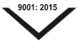
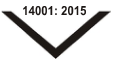

**®** 

# **ASK AUTOMOTIVE LIMITED** 

(Formerly known as A S K   Automotive Private Limited) 

Date: February 03, 2025 

BSE Limited Phiroze Jeejeebhoy Towers, Dalal Street, Mumbai - 400 001 **Scrip Code** : 544022 **ISIN No.:** INE491J01022 **Re.:** ASK Automotive Limited 

National Stock Exchange of India Limited Exchange Plaza, C-1, Block - G, Bandra Kurla Complex, Bandra (East), Mumbai - 400 051 Symbol: ASKAUTOLTD **ISIN No.:** INE491J01022 **Re.:** ASK Automotive Limited 

#### **Sub: Transcript of Investors/analysts Call – Q3 of FY 2025-26 Un-Audited Financial** **<u>Results</u>** 

Dear Sir/Madam, 

Pursuant to the requirement of Regulation 30 read with Part A of Schedule III of the SEBI (Listing Obligations and Disclosure Requirements) Regulations, 2015, please find enclosed herewith Transcript of Investors/analysts Call organized on January 29, 2026 post declaration of Un-Audited Financial Results of the Company (Standalone & Consolidated) for the quarter and nine months ended on December 31, 2025. 

The same shall be available on our website i.e. www.askbrake.com. 

Kindly take the above information on your record. 

Thanking you. 

#### For **ASK Automotive Limited** 

Rajani Digitally signed by Rajani Sharma Sharma Date: 2026.02.03 17:13:37 +05'30' 

#### **Rajani Sharma Company Secretary &Compliance Officer Membership No.: ACS14391** 

**Encl:** As above 

_-_ _<u>Corporate Office:</u> Plot No. 13-14, Sector - 5, I.M.T. Manesar, Distt. Gurgaon. PIN - 122050 (Hr.) Ph: 0124 - 4396900 e-mail: info@askbrake.com : roc@askbrake.com Website : www.askbrake.com_ 

**[Image: Feb2026.pdf-0001-17.png (111x57, 4.6KB)]**

**[Image: Feb2026.pdf-0001-18.png (113x60, 4.6KB)]**

**[Image: Feb2026.pdf-0001-19.png (113x60, 4.5KB)]**

**[Image: Feb2026.pdf-0001-20.png (111x57, 4.5KB)]**

_<u>Registered Office:</u> Flat No. 104, 929/1, Naiwala, Faiz Road, Karol Bagh, New Delhi - 110 005 Tel: 011-28758433, 28759605 011-28752694, 43071516 CIN:_ L34300DL1988PLC030342 

**[Image: Feb2026.pdf-0002-00.png (253x101, 7.7KB)]**

## “ASK Automotive Limited Q3 and 9M FY26 PostResults Conference Call” 

### **January 29, 2026** 

**[Image: Feb2026.pdf-0002-03.png (250x101, 7.7KB)]**

**[Image: Feb2026.pdf-0002-04.png (335x91, 13.4KB)]**

**[Image: Feb2026.pdf-0002-05.png (228x108, 13.5KB)]**

**– MANAGEMENT: MR. KULDIP SINGH RATHEE CHAIRMAN AND MANAGING DIRECTOR – MR. PRASHANT RATHEE JOINT MANAGING DIRECTOR** 

**– MR. AMAN RATHEE JOINT MANAGING DIRECTOR – MR. NARESH KUMAR CHIEF FINANCIAL OFFICER – MR. MANOJ SHARMA CHIEF GENERAL MANAGER, INVESTOR RELATIONS – MODERATOR: MR. RUSHABH SHAH ADFACTORS PR** 

Page 1 of 12 

_ASK Automotive Limited January 29, 2026_ 

**[Image: Feb2026.pdf-0003-01.png (250x100, 7.7KB)]**

###### **Moderator:** 

Ladies and gentlemen, good day and welcome to ASK Automotive Q3 and 9M FY26 Post Results Earning call hosted by Adfactors PR. 

As a reminder, all participant lines will be in the listen-only mode and there will be an opportunity for you to ask questions after the presentation concludes. Should you need assistance during this conference call, please signal an operator by pressing ‘*’, then ‘0’ on your touchtone phone. Please note that this conference is being recorded. 

I now hand the conference over to Mr. Rushabh Shah from Adfactors. Thank you and over to you, sir. 

###### **Rushabh Shah:** 

Good evening to everyone and welcome to Q3 and 9M FY26 Earnings Call of ASK Automotive Limited. 

From the management, we have with us Mr. Kuldip Singh Rathee – Chairman and Managing Director; Mr. Prashant Rathee – Joint Managing Director; Mr. Aman Rathee – Joint Managing Director; Mr. Naresh Kumar – Chief Financial Officer and Mr. Manoj Sharma - Chief General Manager, Investor Relations. 

Before we begin the call, I would like to mention that some of the statements made during the call may be forward-looking in nature and hence it may involve risks and uncertainties, including those related to the future financials and operating performance of the company. Please bear with us if there are any call drops during the course of the conference call. We would like to ensure the call is reconnected at the earliest. 

I would now like to hand over the call to Mr. Kuldip Singh Rathee - Chairman and Managing Director for his opening remarks. Thank you and over to you, sir. 

###### **Kuldip Singh Rathee:** 

Thank you, Mr. Rushabh. Good evening, ladies and gentlemen. It is my great pleasure to welcome you all to our Q3 and 9M FY26 Earnings Conference Call. 

I hope you have had the opportunity to review the detailed presentation submitted to the exchanges and available on our website. The Government of India's GST 2.0 reform marks a pivotal milestone that is set to elevate the Indian automobile industry and energize the broader economy, given the sector's deep forward and backward linkages. 

###### **Now, let me begin by sharing a quick overview of the broader industry as reported by SIAM:** 

The Indian automobile sector witnessed healthy momentum in 9M FY26 with overall vehicle production across all segments registering robust year-on-year growth of 9.3%. The two-wheeler segment matched the overall vehicle production growth at 8.8% on year-on-year basis. We are 

Page 2 of 12 

_ASK Automotive Limited January 29, 2026_ 

**[Image: Feb2026.pdf-0004-01.png (250x100, 7.7KB)]**

optimistic that the growth momentum will remain in the coming quarters as well, supported by stable macroeconomic conditions and GST 2.0 reforms that have improved overall affordability and consumer sentiment. 

The two-wheeler industry closed 9M FY26 with a strong production volume of 19.6 million units, up from 18 million units in 9M FY25. In Q3 FY26 alone, production touched 6.8 million units as compared to 5.9 million in the same quarter last year. 

Looking ahead, we believe that the industry will continue to gain from the far-reaching macroeconomic policy reforms undertaken by the government, particularly GST 2.0 reforms, personal income tax rationalization announced in the union budget 2025-26, successive rate cuts and liquidity enhancement measures by the Reserve Bank of India. These have positively impacted consumer purchasing power and improved access to the vehicle financing, created a conducive environment for the sustained demand. Rising rural income will also be beneficial for the two-wheeler sector. Since all our products were under the category of 28% GST, hence the reduction of GST rate from 28% to 18% is helping us to outgrow in the Indian aftermarket and gain more market share from grey market operators and duplicators. With this positive backdrop, we remain optimistic about the growth trajectory of the sector in the coming quarters. 

Before we move on to ASK's business performance, we would like to highlight that our 9.9 megawatt solar plant at Sirsa, Haryana has started supplies from April 25. We are excited with the results in terms of sustainable operational economies. Happy to announce that the company is installing one more captive solar power plant of 11.55 megawatt at Rajasthan, which is expected to be operational by Q1 FY27. This reflects ASK's special focus on green energy. 

###### **Moving on to business updates:** 

I am delighted to share with you that we had a strong finish to the Q3 and 9M FY26 in both revenue and profitability. This marks our 9th consecutive quarter of robust performance since the company's listing. During Q3 FY26, we delivered revenue growth of 28% excluding wheel assembly business. The wheel assembly strategic reduction was 51.5% and thus our consolidated published revenue has grown by 18.5% on year-on-year basis. We achieved growth of 26.8% in EBITDA and 21.3% in PAT on year-on-year basis. This is the highest ever absolute revenue EBITDA and PAT earned by us in any quarter in the past. We continue to outperform the twowheeler industry in terms of vehicle production growth during Q3 FY26. Further, we have achieved the EBITDA margin of 13.4% in Q3 FY26, representing an improvement of 88 basis points over Q3 FY25. Our EBITDA margin is affected by aluminum alloy prices. Upward increase in prices of aluminum affects our EBITDA percentage because of denominator effect. However, our absolute EBITDA number remains the same. 

With this strong performance and profitability, our earnings per share in Q3 FY26 has increased to Rs. 4.05 per share against Rs. 3.34 per share in the same period last year. Improvement in margins is mainly driven by better economies of scale due to higher volumes, benefit from 

Page 3 of 12 

_ASK Automotive Limited January 29, 2026_ 

**[Image: Feb2026.pdf-0005-01.png (250x100, 7.7KB)]**

increasing capacity utilization at Karoli and New Bangalore facility and strategic reduction in low-value added wheel assembly business. As a result, in 9M FY26, we delivered revenue growth of 18.6%, excluding wheel assembly business. Because of wheel assembly strategic reduction by 52.8%, the consolidated revenue which is published has grown by 10.2% on yearon-year basis, achieved growth of 21.9% in EBITDA and 18.8% in PAT on year-on-year basis. We have delivered EBITDA margin of 13.5%, an improvement of 130 basis points on year-onyear basis. With strong performance and profitability, our earnings per share in 9M FY26 has increased to Rs. 11.45 per share against Rs. 9.64 per share in the same period last year. 

Our all three product segments performed well in Q3 and 9M FY26 in terms of revenue growth. We have sustained our market leadership position in the Advanced Braking System. Our Advanced Braking System revenue grew by 22% in Q3 and 12% in 9M FY26 on year-on-year basis. The Aluminum Lightweighting Precision Solution revenue grew by 36% in Q3 and 24% in 9M FY26 on year-on-year basis. The Safety Control Cable revenue also recorded growth of 22% in Q3 and 10% in 9M FY26 on year-on-year basis. 

In the unstable global geopolitical environment due to tariff and other issues, our revenue from exports were at Rs. 100 crore against Rs. 108 crore last year in the same period. However, based on Q3 FY26 performance, we do feel that we will touch the last year's number. 

Thank you very much for your patient hearing. With this, we leave the floor open for question and answer. 

###### **Moderator:** 

Thank you so much, sir. Ladies and gentlemen, we will now begin with the question-and-answer session. First question comes from the line of Raghunandan N L from Nuvama Research. Please go ahead. 

###### **Raghunandan N L:** 

Thank you, sir, for the opportunity. Congratulations to you and the entire team for the strong numbers. My first question was on the CAPEX side. The new CAPEX of Rs. 35 crore and increasing the capacity to 32 crore Brake Shoes and Pads. So how much would now the total CAPEX be for FY26 and also your thoughts on FY27 CAPEX? And even for FY26, if you can also provide a breakup of CAPEX that will be very useful? 

###### **Kuldip Singh Rathee:** 

We will close the FY26 CAPEX. We had planned Rs. 450 crore initially in the FY26. However, we tried to minimize wherever it was possible. But then, another CAPEX of Rs. 40 crore we did to set up the solar power plant, which was not scheduled initially. And with this extra CAPEX, but still we will close the CAPEX at Rs. 500 crore. 

###### **Raghunandan N L:** 

Noted, sir. And how do you see it for FY27? 

**Kuldip Singh Rathee:** 

FY27 CAPEX will be less. We intend to be within limits of Rs. 400 crore only. 

**Raghunandan N L:** 

Got it, sir. And on Brake Pads, approximately what would be your market share? 

Page 4 of 12 

**[Image: Feb2026.pdf-0006-00.png (250x100, 7.7KB)]**

_ASK Automotive Limited January 29, 2026_ 

**Kuldip Singh Rathee:** See, the Brake Pads, overall market is less than that. So our market share should be around between 10%-12% or something. 

**Raghunandan N L:** Got it, sir. And congratulations on the performance on exports in this quarter. You had earlier spoken about the Ford order. Would that be commencing by end of FY26? And how do you see that Ford order commencing and ramping up over FY27 and FY28? And also because of this order, would you expect FY26 exports to be flat? **Kuldip Singh Rathee:** See, FY26 exports, as I mentioned, will be flat. However, the exports to Ford have already started. The containers are going, but because of the great uncertainties created by the tariff issues, not only by US, but also by Mexico, where some parts were going and they have also imposed 50% duties. But still, we are very hopeful that since our product is highly technical, we feel there will be some smooth supplies in the FY27. **Raghunandan N L:** Got it, sir. Just the last question. Can you share, how was the utilization at Bangalore and Karoli plant this quarter? **Kuldip Singh Rathee:** Yes, sir. In this quarter, we have reached between 75%-80% capacity utilization in the Bangalore plant. And now, it is almost fully operational Bangalore plant. And the capacity utilization in Rajasthan plant remains at 65% only, because in that we are waiting for some new items to be started, which are likely to start in the H2. **Raghunandan N L:** Got it, sir. Thank you. Thank you so much and wishing all the best. **Kuldip Singh Rathee:** Thank you, sir. **Moderator:** Thank you. Our next question comes from the line of Naveen Kumar Dubey from Narnolia Financial Service Limited. Please go ahead. **Naveen Kumar Dubey:** Yes. Hi, sir. Congratulations for the strong set of numbers. I have two questions. First question is related to the margin. Our ALPS business is like 50% of the revenue currently. And aluminum prices have gone up, but we do not see much of impact on the margin. Have we taken any price increases in that? **Kuldip Singh Rathee:** No, Mr. Naveen, we have not taken any price increase so far. And the margins that you see is already down by at least 30-40 basis point because of the aluminum price increase. The revenue has gone up by that much and the EBITDA margin has come down by 30 basis point. So what you see, the EBITDA margin in this quarter of 13.4% would have been 13.7% or 13.8% had the aluminum prices have not skyrocketed. **Naveen Kumar Dubey:** And the second question is on the same frame, Alloy Wheel business. We have done that Japanese collaboration and how is that progressing, sir? 

Page 5 of 12 

_ASK Automotive Limited January 29, 2026_ 

**[Image: Feb2026.pdf-0007-01.png (250x100, 7.7KB)]**

**Kuldip Singh Rathee:** That is progressing pretty well. We are going to take out the product in our premises, first product before February end. They will be testing for a few months and we hope to start the supplies in the start of H2. **Naveen Kumar Dubey:** Thank you, sir. That is it from my side. **Moderator:** Thank you so much. Our next question comes from the line of Vijay Pandey from Nuvama Wealth Management. Please go ahead. **Vijay Pandey:** Hi, sir. Thank you for taking my question. Sir, two questions. One was on the commodity prices. How are we tackling this increased commodity inflation, especially on the Aluminum side? Do we have any hedge or is it a pass-through? How should we look into that? **Kuldip Singh Rathee:** The Aluminum prices are pass-throughs month-on-month. So we are not very much affected on that account. So that is what we said that the absolute EBITDA number is remaining the same. Only the percentage of the EBITDA has gone down by 30 basis points. **Vijay Pandey:** Secondly sir, our new plant, which we are setting up, this will be powered by solar. So is there any extra incremental CAPEX because of the solar situation, because the cost of solar panel has gone up? Like, can you confirm the incremental unit economic sales? **Kuldip Singh Rathee:** No, we are not incurring any extra. There is no impact because the project is getting almost complete. All the supplies had already come before the price increase. So this new solar plant will be set up within the stipulated budget. **Vijay Pandey:** And sir, is it possible if you can give us an outlook for the remainder of the 4th quarter and go into FY27, slide breakup for the two-wheelers, especially in the rural and urban that will be pretty helpful? **Kuldip Singh Rathee:** So as regards the coming quarter is there, we have very strong projections from the OEMs. And even the independent aftermarket is looking very good because of the GST reduction from 28% to 18% in our line. So we are very bullish even on this Q4. And as regards the next year, we are very bullish on that because we feel that this two-wheeler story will continue because it has started continuing only after a gap of many years. So even the next year seems to be very good. **Vijay Pandey:** Thank you. **Moderator:** Thank you. Our next question comes from the line of Deep Shah from YES Securities Institutional Equities. Please go ahead. **Deep Shah:** Yes. Hi, sir. Thanks a lot for the opportunity. Sir, few questions. So first to begin with on the Alloy Wheels itself. While you have alluded some timelines to our Kyushu Japanese JV, if you 

Page 6 of 12 

_ASK Automotive Limited January 29, 2026_ 

**[Image: Feb2026.pdf-0008-01.png (250x100, 7.7KB)]**

can throw some light on the Lioho, the Taiwan JV that we were working for. So any progress in that? That would be my first question? 

**Kuldip Singh Rathee:** Yes. Taiwan, I think is going on well. It is under testing. There were a few amendments to be done. We have already done those amendments. But I have explained it in every call that this being a safety item, we cannot do any hurried call, we cannot take. So let the customer take the call. But we are very confident all the results will definitely come in the Taiwan collaboration. Also, positive results will come. **Deep Shah:** And sir, the second question is about the Sunroof Cable JV that we did and then some sort of supply what is expected from 1H FY27. So where are we on that journey? Is it on track or is there any initial, let us say, soft commitments by the OEMs, if you can throw some light there? **Kuldip Singh Rathee:** We are very much on track on that. Already, the machines have come, the setup is there and I think all our samples, etc., production will come out in the Q2 FY27 and the supply should start in the H2. **Deep Shah:** And sir, roughly, what would be the addressable revenue size for us? **Kuldip Singh Rathee:** Addressable revenue side is not too big. Addressable revenue side is about Rs. 100 Cr. That is all. But you see, I told in the last call that we don't do many things just for the sake of money. We take pride in saying that this is Atmanirbhar Bharat project and we will be the first one to initialize it in the country. **Deep Shah:** Surely. And sir, last question is about the AISIN JV. So there also we had commented about some appointment of some 40-50 odd dealers for aftermarket penetration. So where are we on that aspect? **Kuldip Singh Rathee:** That is ramping up now, slowly and gradually and maybe in the first quarter of next year, we will breakeven in that. **Deep Shah:** Thanks a lot for that. **Kuldip Singh Rathee:** Thank you. **Moderator:** Thank you. Next question comes from the line of Yash Agrawal from Nirmal Bang. Please go ahead. **Yash Agrawal:** Good evening, sir. And congratulations for the great set of results. I just wanted to know your view on any update on the draft ABS exhibition which was meant to be implemented by the 1st Jan. So do you have any update on that? 

Page 7 of 12 

_ASK Automotive Limited January 29, 2026_ 

**[Image: Feb2026.pdf-0009-01.png (250x100, 7.7KB)]**

**Kuldip Singh Rathee:** No, there is no update from the government. I think it was a draft which is now hanging because of the request of the OEMs. **Yash Agrawal:** And also in the quarter 3, we have seen that a two-wheeler ICE segment growth outpaced the two-wheeler EV segment. So maybe because of the GST benefit, the ICE segment is doing better in the two-wheeler side. So do we expect this trend to continue going forward? **Kuldip Singh Rathee:** You are right, because now the gap is very less because of the GST reduction. And that way, I think the ICE sector is rather in a stronger position. **Yash Agrawal:** And what are your expectations for the Q4 two-wheeler production growth estimates? Have you revised it higher as compared to the last time? **Kuldip Singh Rathee:** We know our projections. We always say we will grow in mid-teens and we will be growing in mid-teens. **Yash Agrawal:** Thank you from my side. **Moderator:** Thank you. Our next question comes from the line of Harsh Sheth from PI Square. Please go ahead. **Harsh Sheth:** Hi, sir. I just wanted to understand your guidance about your debt levels and what are our plans with that? **Kuldip Singh Rathee:** Our debt equity never increases 0.5x and we will remain below that in spite of the extra expenditures on CAPEX that will be increasing this financial year. And it is always one year of EBITDA. Normally, it is close to that. **Harsh Sheth:** I just also wanted to understand what would be your ideal capacity utilization across your various plants on a blended level? **Kuldip Singh Rathee:** See, the economies of scale come and we are overall at 80% capacity utilization. We love to do that. But however, we put up the next plant much before because we are suppliers to all our prestigious customers and direct online and just-in-time suppliers. So we keep always some extra capacities. **Moderator:** Thank you. Our next question comes from the line of Sahil Sanghvi from Monarch Networth Capital. Please go ahead. **Sahil Sanghvi:** Good evening, sir. Thank you for the opportunity and congratulations for very good numbers. Sir, just wanted to understand the growth in the ABS segment and the ALPS segment that we have reported. So ideally, in the Braking segment, we usually have something, some growth around the two-wheeler industry. But this time, it is much higher. So if you could help us with 

Page 8 of 12 

**[Image: Feb2026.pdf-0010-00.png (250x100, 7.7KB)]**

##### _ASK Automotive Limited January 29, 2026_ 

the reason and also the Aluminum segment has grown a little higher than our run rate for the last 2-3 quarters. So just the reason for that and do you expect that these growth rates will sustain? **Kuldip Singh Rathee:** See, there has been an impact on the Indian aftermarket. As I have mentioned many times that before the reduction of GST, we were unfortunate to be on the 28% bracket, now that it has come down to 18%. So a lot of grey market, we are giving a tough fight to the grey market operators, which are prevalent in the country. So I think we are grabbing more and more share from them. So that there is a very huge growth in the Indian aftermarket. That is the main reason plus our ICE OEM players, their duty was also reduced from 28% to 18%. So their numbers have also increased tremendously. And in the Q3, even they grew by 15%. **Sahil Sanghvi:** So similar reasons apply for the Aluminum segment? **Kuldip Singh Rathee:** Aluminum segment, yes. Similar reasons or even otherwise, the work can come from anywhere. That is a very flexible and great opportunity. That is why we call it the sunrise industry. **Sahil Sanghvi:** Got it, sir. Got it. Thank you, sir. **Moderator:** Thank you. Our next question comes from the line of Sagar Shetty from BP Equity. Please go ahead. **Sagar Shetty:** Yes, sir. Am I audible? **Kuldip Singh Rathee:** Yes, please. **Sagar Shetty:** Yes. So congrats on the good set of numbers. So I just wanted to get a picture on how, like after the GST rate cut, how is the sentiment going on with the OEMs? Are we seeing any particular better demand from two-wheelers or PVs or anything like that? If you could just give some color on it? **Kuldip Singh Rathee:** See, after the reduction in GST, two-wheeler demand is really picking up, both at the OEM level and the independent aftermarket level. And it has been a real big boost to the two-wheeler sector. **Sagar Shetty:** And sir, do we expect some like, if not in Q4, but FY27 onward, do we expect some revision in our growth guidance, like from mid-teen digits to somewhere around high teen digits or anything like that? Or do we expect some? **Kuldip Singh Rathee:** We always expect mid-teens and we are happy to achieve that. Because, see, we are outgrowing the market. You will appreciate that. Even this year, in spite of such good times, the two-wheeler sector in 9 months has grown only by 8.8%, and whereas we have grown substantially higher. **Sagar Shetty:** Right. And sir, if I could just ask one more thing, like with the ABS thing going on, so if the draft has not been announced by the government, so what is going on with the OEMs right now? 

Page 9 of 12 

_ASK Automotive Limited January 29, 2026_ 

**[Image: Feb2026.pdf-0011-01.png (250x100, 7.7KB)]**

What is the sentiment with the two-wheeler manufacturers? Have we had any conversation with them? And is there any kind of thing you have discussed on how? 

**Kuldip Singh Rathee:** No. I have repeatedly said that we will not talk on this hypothetical question and we will discuss when the final notification comes because our OEMs are already in discussion with the government that it is not practical. So let the result come out of that. We are not aware what they are discussing with the government. 

**Sagar Shetty:** Got it, sir. Thank you so much. **Moderator:** Thank you. Our next question comes from the line of Nitin Agrawal from JM Financial. Please go ahead. **Nitin Agrawal:** Yes, thanks for the opportunity and congratulations on a great set of numbers. I wanted to know about your EBITDA margin guidance since we have ramped up the Bangalore facility and the Rajasthan facility is expected to ramp up. So are we trying to, are we thinking of revising our estimates upwards going in FY27 or are we maintaining around 13.7% thereabouts? **Kuldip Singh Rathee:** We had given a guidance of 13.7%, but that gets affected at least by 30 basis points because of the denominator factor of the Aluminium price increase. So that 13.7% becomes 13.4% and we are very hopeful that we will try to maintain around that only in the next financial year. **Nitin Agrawal:** Sir, but you highlighted that the Aluminium prices are a pass-through on a month-on-month basis. So eventually the margin will come back to what we were guiding for initially. Is that understanding correct? **Kuldip Singh Rathee:** No, that understanding is not correct. The contribution that we get for doing the job remains the same. So when the Aluminium prices go up, the EBITDA margins percentage goes down. But the absolute EBITDA remains the same. **Nitin Agrawal:** Got it. That is it from my side. Thank you. **Moderator:** Thank you. Our next question comes from the line of Vijay Pandey from Nuvama Wealth Management. Please go ahead. **Vijay Pandey:** Thank you for the follow-up. I just want to confirm about the launch pipeline for the new products in the next year. So we have Sunroof, we have two programs of Alloy Wheels. If you can just confirm when can we expect commercial production or mass production? **Kuldip Singh Rathee:** Both the programs we will be launching in the start of H2. 

**Vijay Pandey:** So both elements, the element with Taiwan, the one element with the Japanese company, both will come in the second half only? 

Page 10 of 12 

_ASK Automotive Limited January 29, 2026_ 

**[Image: Feb2026.pdf-0012-01.png (250x100, 7.7KB)]**

**Kuldip Singh Rathee:** Yes, second half they can come. They will come in second half after due testing and even this Sunroof Cable will also come. That will also come. **Vijay Pandey:** I think generally how much time does it take for the full ramp up? So when can we expect? **Kuldip Singh Rathee:** We are prepared from day one. We are prepared today also because we have already invested everything. So once the testing is complete, then we will immediately gear up. **Vijay Pandey:** Thank you, sir, and all the best for the quarter. **Kuldip Singh Rathee:** Thank you. **Moderator:** Thank you. Our next question comes from the line of Rishi Kapadia from CLSA. Please go ahead. **Rishi Kapadia:** Yes, thank you so much for taking my questions and congratulations on a good set of numbers. Sir, my first question is on Wheel Assembly business. By when can we expect that this would kind of completely phase out? **Kuldip Singh Rathee:** Sir, the customer has assured that by March end the balance will also go, which is about 48%. So let us see once the customer takes it back, we will be announcing in the next call. But if the customer takes it back in March, then next year also, you will see the same representation from our side that excluding Wheel Assembly, this is the growth and without Wheel Assembly published is this much. 

**Rishi Kapadia:** Thank you, sir. And sir, my second question is on your ROCE, you are currently delivering 27%28% of ROCE and despite capacity utilizations of your two plant at lower levels. So what do you expect? Can ROCE go ahead from current levels or 27%-28% is something that would kind of build in? 

**Kuldip Singh Rathee:** I hope, Rishi, you are satisfied with 27% ROCE. That is a tough job to achieve, which we are achieving. And the second thing I would correct that one plant has already gone to 80% capacity utilization. So only one is left now at 65%. ROCE will remain. This will be difficult to maintain 27%, but we make all our efforts to maintain 27%. 

**Rishi Kapadia:** And sir, lastly, just the clarification, would Aluminium inflation would lead to roughly 2% revenue inflation as well or it will be lesser than? 

**Kuldip Singh Rathee:** Certainly. One side, it leads to revenue inflation. The other side, it leads to reduction in the percentage of EBITDA margin, not the absolute, but percentage of EBITDA margin. **Rishi Kapadia:** So the quantum would be just 2% roughly, right? 

**Kuldip Singh Rathee:** 

Yes, you can say, 3%. 2%-3%, yes. 

Page 11 of 12 

_ASK Automotive Limited January 29, 2026_ 

**[Image: Feb2026.pdf-0013-01.png (250x100, 7.7KB)]**

**Rishi Kapadia:** Thank you so much. **Moderator:** Thank you. As there are no further questions from the participants, I would like to hand the conference over to Mr. Kuldip Singh Rathee from ASK Automotive Limited for closing comments. Thank you and over to you, sir. **Kuldip Singh Rathee:** Thank you, everyone, for such a patient hearing. And I would like to once again reassure you that the future looks very bright. And as you know that I am always an optimist, our Q4 is going to be very bright and even the next year seems to be very good. On that positive note, I would like to end and thank you. Thank you very much once again. **Moderator:** Thank you so much, sir. On behalf of ASK Automotive, that concludes this conference. Thank you for joining us and you may now disconnect your lines. 

This is a transcript and may contain transcription errors. The Company or the sender takes no responsibility for such errors, although an effort has been made to ensure high level of accuracy 

Page 12 of 12 

---

## Extracted Images

| # | File | Dimensions | Size |
|---|------|------------|------|
| 1 | Feb2026.pdf-0001-17.png | 111x57 | 4.6KB |
| 2 | Feb2026.pdf-0001-18.png | 113x60 | 4.6KB |
| 3 | Feb2026.pdf-0001-19.png | 113x60 | 4.5KB |
| 4 | Feb2026.pdf-0001-20.png | 111x57 | 4.5KB |
| 5 | Feb2026.pdf-0002-00.png | 253x101 | 7.7KB |
| 6 | Feb2026.pdf-0002-03.png | 250x101 | 7.7KB |
| 7 | Feb2026.pdf-0002-04.png | 335x91 | 13.4KB |
| 8 | Feb2026.pdf-0002-05.png | 228x108 | 13.5KB |
| 9 | Feb2026.pdf-0003-01.png | 250x100 | 7.7KB |
| 10 | Feb2026.pdf-0004-01.png | 250x100 | 7.7KB |
| 11 | Feb2026.pdf-0005-01.png | 250x100 | 7.7KB |
| 12 | Feb2026.pdf-0006-00.png | 250x100 | 7.7KB |
| 13 | Feb2026.pdf-0007-01.png | 250x100 | 7.7KB |
| 14 | Feb2026.pdf-0008-01.png | 250x100 | 7.7KB |
| 15 | Feb2026.pdf-0009-01.png | 250x100 | 7.7KB |
| 16 | Feb2026.pdf-0010-00.png | 250x100 | 7.7KB |
| 17 | Feb2026.pdf-0011-01.png | 250x100 | 7.7KB |
| 18 | Feb2026.pdf-0012-01.png | 250x100 | 7.7KB |
| 19 | Feb2026.pdf-0013-01.png | 250x100 | 7.7KB |
