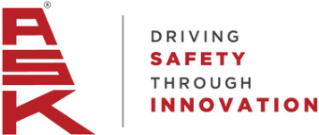
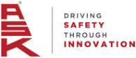

**®** 

# **ASK AUTOMOTIVE LIMITED** 

(Formerly known as A S K   Automotive Private Limited) 

Date: May 25, 2026 

BSE Limited Phiroze Jeejeebhoy Towers, Dalal Street, Mumbai - 400 001 **Scrip Code** : 544022 **ISIN No.:** INE491J01022 **Re.:** ASK Automotive Limited 

National Stock Exchange of India Limited Exchange Plaza, C-1, Block - G, Bandra Kurla Complex, Bandra (East), Mumbai - 400 051 Symbol: ASKAUTOLTD **ISIN No.:** INE491J01022 **Re.:** ASK Automotive Limited 

### **Sub: Transcript of Investors/analysts Call – Q4 and FY 2025-26 Audited Financial** **<u>Results</u>** 

Dear Sir/Madam, 

Pursuant to the requirement of Regulation 30 read with Part A of Schedule III of the SEBI (Listing Obligations and Disclosure Requirements) Regulations, 2015, please find enclosed herewith Transcript of Investors/analysts Call organized on May 20, 2026 post declaration of Audited Financial Results of the Company (Standalone & Consolidated) for the quarter and financial year ended on March 31, 2026. 

The same shall be available on our website i.e. www.askbrake.com. 

Kindly take the above information on your record. 

Thanking you. 

### For **ASK Automotive Limited** 

Digitally signed by Rajani Rajani Sharma Sharma Date: 2026.05.25 14:49:46 +05'30' 

**Rajani Sharma Company Secretary &Compliance Officer Membership No.: ACS14391** 

**Encl:** As above 

_-_ _<u>Corporate Office:</u>_ 

_Plot No. 13-14, Sector - 5, I.M.T. Manesar, Distt. Gurgaon. PIN - 122050 (Hr.) Ph: 0124 - 4396900_ 

_e-mail: info@askbrake.com : roc@askbrake.com Website : www.askbrake.com_ 

**[Image: May2026.pdf-0001-19.png (111x59, 4.6KB)]**

**[Image: May2026.pdf-0001-20.png (113x59, 4.5KB)]**

**[Image: May2026.pdf-0001-21.png (113x59, 4.4KB)]**

**[Image: May2026.pdf-0001-22.png (111x59, 4.5KB)]**

_<u>Registered Office:</u>_ 

_Flat No. 104, 929/1, Naiwala, Faiz Road, Karol Bagh, New Delhi - 110 005_ 

_Tel: 011-28758433, 28759605 011-28752694, 43071516 CIN:_ L34300DL1988PLC030342 

**[Image: May2026.pdf-0002-00.png (357x151, 31.5KB)]**

## “ASK Automotive Limited 

Q4 and FY26 Post Results Earnings Conference Call” May 20, 2026 

**[Image: May2026.pdf-0002-03.png (195x84, 15.4KB)]**

**[Image: May2026.pdf-0002-04.png (253x59, 13.4KB)]**

**[Image: May2026.pdf-0002-05.png (209x107, 10.2KB)]**

**MANAGEMENT: MR. KULDIP SINGH RATHEE – CHAIRMAN AND MANAGING DIRECTOR MR. PRASHANT RATHEE – JOINT MANAGING DIRECTOR MR. AMAN RATHEE – JOINT MANAGING DIRECTOR MR. NARESH KUMAR SHARMA– CHIEF FINANCIAL OFFICER** 

**MODERATOR: MR. RUSHABH SHAH – ADFACTORS PR** 

Page **1** of **11** 

_ASK Automotive Limited May 20, 2026_ 

**[Image: May2026.pdf-0003-01.png (174x75, 12.6KB)]**

**Moderator:** 

**Rushabh Shah:** 

Ladies and gentlemen, good day and welcome to ASK Automotive Q4 and FY26 Post Results Earnings Conference Call, hosted by Adfactors PR. As a reminder, all participant lines will be in the listen-only mode and there will be an opportunity for you to ask questions after the presentation concludes. Should you need assistance during this conference call, please signal an operator by pressing star then zero on a touchtone phone. Please note that this conference is being recorded. I now hand the conference over to Mr. Rushabh Shah from Adfactors PR. Thank you and over to you, sir. 

Thank you. A very good evening to everyone and warm welcome to the Q4 and FY26 earnings call of ASK Automotive Limited. From the senior management, we have with us Mr. Kuldip Singh Rathee, Chairman and Managing Director; Mr. Prashant Rathee, Joint Managing Director; Mr. Aman Rathee, Joint Managing Director; and Mr. Naresh Kumar Sharma, Chief Financial Officer. 

Before we begin the earnings call, I would like to mention that some of the statements made during today's call may be forward-looking in nature and hence it may involve risk and uncertainty, including those related to future financials and operating performance of the company. Please bear with us if there are any call drops during the course of the conference call. We would ensure that the call is reconnected at the earliest. I now hand over the call to Mr. Kuldip Singh Rathee, Chairman and Managing Director for his opening remarks. Thank you and over to you, sir. 

**Kuldip Singh Rathee:** 

Thank you, Mr. Rushabh. Good evening, ladies and gentlemen. It's my great pleasure to welcome you all to our Q4 and FY26 earnings conference call. I hope you have had the opportunity to review the detailed presentation submitted to the exchanges and available on our website. In FY26, Indian economy remained resilient and stands as the world's fastest growing major economy. 

As per RBI's recent estimate, the GDP is expected to attain an impressive growth rate of 7.6%. This momentum is driven largely by robust domestic demand, resilient private consumption, strong investment in infrastructure and enabling government policies. The Government of India's GST 2.0 reforms mark a pivotal milestone that is driving structural shift in the growth momentum across the Indian automobile industry and has energized the broader economy, given the sector's deep forward and backward linkages. 

GST 2.0 being a structural reform, the benefit of which will accrue over a long period of time. After 28th February, 2026, geopolitical conflict in West Asia has disrupted the global economy, posing an unprecedented challenge in supply chain, creating undue volatility in energy, commodity and currency across the globe and it has started affecting Indian economy as well. The phenomenal increase in aluminium alloy prices in particular have affected our industry. 

Despite these challenges, we are optimistic that the growth momentum will remain in the coming quarters. Let me begin by sharing a quick overview of the broader industry as reported by SIAM. The Indian automobile sector witnessed healthy momentum in FY26 with overall vehicle production across all segments registering a robust year-on-year growth of 11.8%. The twowheeler segment matched the overall vehicle production growth at 11.8% on year-on-year basis. 

Page **2** of **11** 

_ASK Automotive Limited May 20, 2026_ 

**[Image: May2026.pdf-0004-01.png (174x75, 12.6KB)]**

The two-wheeler industry closed FY26 with a strong production volume of 26.7 million units, up from 23.9 million units in FY25. In Q4 alone, production touched 7 million units as compared to 5.8 million in the same quarter last year. I am happy to share that this year the two-wheeler industry production volumes have surpassed the previous peak of FY19. 

Looking ahead, we believe that the industry will continue to gain from the far-reaching macroeconomic policy reforms undertaken by the government, particularly GST 2.0 reforms, personal income tax rationalization announced in the Union Budget 25-26, successive rate cuts, and liquidity enhancement measures by the Reserve Bank of India. These have positively impacted consumer purchasing power and improved access to vehicle financing, created a conducive environment for sustained demand. 

Rising rural income will also be beneficial for the two-wheeler segment. Since all our products were under the category of 28% GST, hence the reduction of GST rate from 28% to 18% is helping us to outgrow in the Indian aftermarket and capture more market share from grey market operators and duplicators. Happy to share that our independent aftermarket has grown by 24.7% in FY26. We still remain optimistic that the geopolitical situation shall normalize soon, and the growth trajectory of our sector shall be maintained. 

Before we move on to ASK's business performance, we would like to highlight that on the green energy front, as already shared with you earlier, I am happy to update that our 9.9 megawatt solar plant at Sirsa, Haryana has been fully operational since April 2025 and is delivering the sustainable operational economies on the expected lines. Our second captive solar plant of 11.55 megawatt in Bikaner, Rajasthan is progressing well and is expected to be commissioned in Q2 FY27, this reflects ASK's special focus on green energy. 

Moving on to our business updates. I am delighted to share with you that we had a strong performance in the fourth quarter and full year in both revenue and profitability. This is the 10th consecutive quarter of robust performance by us since listing of the company. As already shared in the previous con-call that our EBITDA margin gets affected due to volatility in the aluminium prices because of the denominator effects. 

We delivered strong performance in Q4 FY26 in business and recorded consolidated revenue growth of 35.3%. Excluding pass-through impact of significant increase in aluminium prices on revenue, which was 8% and wheel assembly business strategic reduction, which was negative 2.7%, overall, our net revenue has grown by 30% on year-on-year basis. 

We achieved EBITDA of Rs. 140 Cr with 31.1% year-on-year growth. EBITDA margin at 12.1%, however, this EBITDA percentage was impacted due to pass-through alloy prices as mentioned earlier. For this impact, EBITDA percentage would have been higher by 80 basis points. We achieved PAT of Rs. 72 Cr with 24.2% year-on-year growth. EPS has increased to Rs. 3.63 against Rs. 2.92 in last year in the same period, up 24.2% year-on-year. 

As regards our annual results for FY26, we delivered consolidated revenue growth of 16.2%. Excluding pass-through impact of significant increase in alloy prices on revenue, that is 3.1% 

Page **3** of **11** 

_ASK Automotive Limited May 20, 2026_ 

**[Image: May2026.pdf-0005-01.png (174x75, 12.6KB)]**

and impact of wheel assembly business strategic reduction, that is 7%, overall net revenue has grown by 20.1% on year-on-year basis. 

We have outperformed the two-wheeler industry production growth of FY26. We achieved EBITDA of Rs. 551 Cr with 24.1% year-on-year growth. EBITDA margin at 13.1%, however, EBITDA percentage was impacted due to pass-through alloy prices. For this impact, EBITDA percentage would have been higher by 40 basis points. 

This reflects the result of our continued focus on expanding value-added businesses, improving utilization of production capacities and bringing cost efficiencies. Our aim is to sustain current level of EBITDA margins and continue our efforts to improve gradually in the subsequent quarters, depending upon the growth of the two-wheeler industry and geopolitical environment. 

With strong performance, our EPS has increased to Rs. 15.08 per share against Rs. 12.56 per share in the last year same period. Our all three product segments performed well and surpassed the industry growth of 11.8% in FY26 in terms of revenue growth. We have sustained our market leadership position in the advanced braking system. Our advanced braking system revenue grew by 32% in Q4 FY26 and 17% in FY26 on year-on-year basis. 

The aluminium light-weighting precision solutions revenue grew by 47% in Q4 FY26 and 30% in FY26 on year-on-year basis. The safety control cable revenue also recorded growth of 26% in Q4 FY26 and 14% in FY26 on year-on-year basis. Our revenue from exports were at Rs. 141 Cr in FY26 against Rs. 147 Cr last year because of the trade disruptions due to higher tariff rates, geopolitical tensions, supply chain issues, logistic costs and other bottlenecks. We could not achieve our target on the export front. We have delivered strong returns in FY26 with ROACE at 26.9% and ROE at 25.3%. The board has recommended a dividend of 92.5%, that is Rs. 1.85 per equity share of face value of Rs. 2 each. 

Another key update, strategic reduction in low margin wheel assembly business is now complete. From 1st April 2026, wheel assembly revenue will be nil. On year-on-year comparison in FY27 also, our real growth will be 4% higher than the published growth on year-on-year basis. Recent developments in geopolitical scenario and significant increase in minimum wages by some of the state governments has created an input cost pressure on the industry. The customers have been requested to support, and we are confident that all our prestigious OEMs will compensate this input cost escalation. We also remain optimistic on the medium-term industry outlook supported by improving consumer sentiment, expected benefits from the 8th Pay Commission and continued policy support for manufacturing and formalization through labour reforms. 

These structural developments provide greater confidence in India's long-term consumption and manufacturing growth trajectory. We are confident that will continue to grow around mid-teens in FY27. Thank you very much for your patient hearing. With this, we leave the floor open for questions. 

**Moderator:** 

Thank you very much. We will now begin the question and answer session. The first question is from the line of Ankit from IIFL. Please go ahead. 

Page **4** of **11** 

_ASK Automotive Limited May 20, 2026_ 

**[Image: May2026.pdf-0006-01.png (174x75, 12.6KB)]**

|**Ankit:**|Thank you so much for the opportunity. I just wanted to know if there is any deficiency in|
|---|---|
||margins other than the already called out 80 bps impact of pass-through of alloy prices in Q4 FY26?|
|**Kuldip Singh Rathee:**|No, there is only differences because the alloy prices shot up through the roof and especially they rose about 10% in the March itself. That is why the whole Q4 margins were affected and because of the abrupt increase in March in the aluminium prices, some of the aluminium rise could not be passed on, in the aftermarket. There was a conscious loss by us of Rs. 5 Cr because every day we cannot increase the prices and the prices were rising actually every day. Everything has been corrected April onwards and all these aluminium price rises which has happened in April also, they have been passed on to the customer both on the aftermarket front as well as to our OEM customers.|
|**Ankit:**|Okay. So how much would be the price hike in April?|
|**Kuldip Singh Rathee:**|Price hike of what, aluminium?|
|**Ankit:**|Yes.|
|**Kuldip Singh Rathee:**|The aluminium is abrupt. It rose, it has risen from 285 to even 365 the price, but the price has been given by the customer.|
|**Ankit:**|Okay, got it.|
|**Kuldip Singh Rathee:**|In April, we have also increased the prices in the aftermarket and we said that whatever rise happens because it's such a volatile situation that we need to pass it on. In the month of March, neither we expected the prices to go up on day-to-day basis and nor everybody as an optimist was expecting that the war will end soon, which of course has prolonged at the moment.|
|**Ankit:**|Yes, got it. And just another housekeeping question. Can you share what was the utilization at the Bangalore and Karoli plant?|
|**Kuldip Singh Rathee:**|Very, very happy to share that Bangalore we have reached 90% capacity utilization that we set up last year, our 18thplant and the third plant in Bengaluru. The Bangalore all capacities are full now. In the Karoli plant, the capacities utilization is still 65%, that is the reason that we have made investment for the alloy wheels.|
||The alloy wheel supplies to the Japanese customer in the beginning of the H2, so this current year you'll see much higher capacity utilization in the Karoli plant also.|
|**Ankit:**|Okay, sir. Got it. Great, sir. Thank you so much.|
|**Moderator:**|Thank you. The next question is from the line of Nitin Agarwal from JM Financial. Please go ahead.|
|**Nitin Agarwal:**|Thanks for the opportunity and congratulations on great set of numbers despite the challenges across the Board. Just wanted to understand your outlook for FY27 for the underlying industry.|

Page **5** of **11** 

_ASK Automotive Limited May 20, 2026_ 

**[Image: May2026.pdf-0007-01.png (174x75, 12.6KB)]**

So where do we see FY27 for two-wheeler industry production volume growth? Are we seeing any production cut by the OEMs given the challenges that we are facing in terms of exports and the freight rates? 

And secondly, on the margin, where do we see the margin going forward given the denominator impact is going to be there as we have indicated that we have taken the price hike in April also. What could be the steady state margin guidance from your end? Thanks. 

**Kuldip Singh Rathee:** As far outlook of the two-wheeler industry is concerned, our all our OEM customers they are carrying on with their original production schedules which shows a nice growth in this year also and none of the supplies have been affected by the raw materials or anything. We have passed on the aluminium price increase impact. Overall we achieved EBITDA margin of 13.1% and except for the denominator factor. We will be able to maintain that EBITDA margin.  If the aluminium prices are shot through the roof, then our EBITDA margin may look less but the absolute numbers what we have planned in the next financial year will remain the same. 

**Nitin Agarwal:** Okay, one more question with regards to ABS implementation. We don't see anything. Do you hear anything or any update out there if it is going to be implemented? 

**Kuldip Singh Rathee:** We are not aware of anything and after that nothing has come. 

**Nitin Agarwal:** Okay, thank you. That's it from my side. Thank you. 

**Moderator:** Thank you. The next question is from the line of Rahul Kumar from Nuvama. Please go ahead. 

**Rahul Kumar:** Yes, hi. Thank you for the opportunity and congratulations on strong quarter. Sir, on the independent aftermarket segment, it has grown by 25% year-on-year in FY26. So what has driven the strong growth and how do you see the outlook for this segment in FY27? 

**Kuldip Singh Rathee:** I have been explaining right from beginning in each and every quarter that we were suffering on the GST front in the independent aftermarket because of the 28% GST. The government was kind enough to revise it to 18% in GST 2.0. As soon as it was revised, our sales in the independent aftermarket shot up because we could snatch some share of the gray market operators and the duplicators from the in the aftermarket. That's how this stupendous growth and we do feel that this year also we'll be maintaining a good growth in the independent aftermarket. 

**Rahul Kumar:** Thank you. Sir, on the second question, how do you see the export outlook for FY27 and on the Ford order, can you talk about the execution timeline and also if there are any new order wins that can support export growth ahead? 

**Kuldip Singh Rathee:** This year we are very confident of growing at 20%, provided the geopolitical situation remains reasonable, which we are as an optimist, which we feel that it shall be sorted out soon rather than later. So, if it is sorted out, we have the orders in hand and we are definitely going to grow at 20%. 

**Rahul Kumar:** Okay. Lastly, on FY27 capex plan, what would be the capex for FY27 and are there any plans on new investment which can help in launching new products in FY27? 

Page **6** of **11** 

_ASK Automotive Limited May 20, 2026_ 

**Kuldip Singh Rathee:** 

**[Image: May2026.pdf-0008-02.png (174x75, 12.6KB)]**

No, the products that are going to be served to the customers, we have already invested because we go one year in advance. For next year growth of mid-teens, we need to invest around RS.400 Cr which we shall be investing in this year also. All these internal accruals free cash will be ploughed back in the company, so we will see to it even the debt levels are contained within the limits. 

**Rahul Kumar:** 

On alloy wheels, what is the revenue expectation for FY27 and 28? 

**Kuldip Singh Rathee:** FY27 we are expecting revenue of around Rs. 90 - Rs. 100 Cr and FY28 will be about Rs. 220 Cr. 

**Rahul Kumar:** Okay. Thank you very much. That's all from my side. **Moderator:** Thank you. The next question is from the line of Mrunmayee Jogalekar from Asit C Mehta Investment Intermediates. Please go ahead. 

**Mrunmayee Jogalekar:** Yes, thank you for the opportunity. Sir, firstly I wanted to ask that in Q1 so far, have we faced any production disruptions as such? **Kuldip Singh Rathee:** No, we have not faced any disruption in the production side. Even the even the orders from the customers are also robust. **Mrunmayee Jogalekar:** Okay, great, sir. You touched upon the fact that, the employee costs have been inching up and you are in negotiations with the customer. But any can you quantify by how much have the costs increased and any timeline as to when you expect some pass-through to happen on that side? **Kuldip Singh Rathee:** Whatever the aluminium prices, the customer is already compensating us. As far as regarding the wages, everybody knows the government has increased the wages and whatever the government wages increase, it's always compensated by the customers.  We don't see the margin pressure on that side. Of course, it may be the customers will need to increase the prices of the vehicle by some percentage. **Mrunmayee Jogalekar:** But we might see the impact of that in Q1 at least and then probably with a lag the benefit. **Kuldip Singh Rathee:** No, there's hardly any impact because the wage increases what I feel is optimistically, the money remains in the country only. We give more wages to the workers and that class and they have more buying capacity because more money in their hand. If the price increase by Rs. 1,000 - Rs. 2,000, it shouldn't make a difference to the overall sales in the sector. **Mrunmayee Jogalekar:** Got it, sir. A slightly probably medium-term question. Like with rise in alloy prices, it could be just a near-term impact, but then does it become a tougher conversation to probably increase our wallet share in the ALPS segment or for the alloy wheel business? **Kuldip Singh Rathee:** No, that content it will not increase. Only thing is sometimes as we clearly mentioned, this year also we are very transparent in our reporting that our overall revenue in the quarter looked 8% more, sales growth, that was only aluminium price increase, nothing else. We also talk of the real net growth every quarter and every year. 

Page **7** of **11** 

_ASK Automotive Limited May 20, 2026_ 

**[Image: May2026.pdf-0009-01.png (174x75, 12.6KB)]**

**Mrunmayee Jogalekar:** No, I mean from the OEM side, does it become a conversation that, whether to go for aluminium or to stick with steel for certain component because the price differential? **Kuldip Singh Rathee:** No, in two-wheeler segment, there is no such conversation till now. **Mrunmayee Jogalekar:** Okay, sir. Thank you for that. **Moderator:** Thank you. The next question is from the line of Michell Shell from Alquity. Please go ahead. **Michell Shell:** Thank you. Could you please give me your thoughts on what would happen if the monsoon is deficient this year? Given your sensitivity to the two-wheeler industry, we could expect some weakness versus your expectations or has that not historically been the case for you? Thank you. **Kuldip Singh Rathee:** This monsoon if it is deficient, it certainly affects the agriculture income, that everyone knows. But we can't quantify the impact that it will have, let the time come. Many of the times the forecasts have been reversed also. In last 2 years also they were saying El Nino factor which never happened and maybe the government increases the MSP prices of the farmer farmers' crop and they get duly compensated because of that. **Michell Shell:** And last time there was a deficient monsoon, was there a material impact on your business or not really? **Kuldip Singh Rathee:** I think not in this year. Maybe we'll see what happens next year, but this year seems to be good. **Michell Shell:** I'm sorry, I'm not clear. Last time there was a bad monsoon, what happened to your sales? **Kuldip Singh Rathee:** Sir, we don't clearly remember. Sorry, I don't want to give a wrong data to you, but I don't think we were much impacted because we got impacted, yes, two-wheeler sector got impacted only when COVID came, that was a big impact. Before that till FY 18 - 19, we don't even remember and after that there has not been any deficient monsoon. **Michell Shell:** Okay, thank you. **Moderator:** The next question is from the line of Rishi Kapadia from CLSA. Please go ahead. **Rishi Kapadia:** Thank you so much for taking my questions and congratulations for such good set of results. I have two questions. One is if let's assume that government comes up with a mandate of ABS, but it is still fair to assume that majority of our sales in the braking system is through independent aftermarket and OEM? So, the impact would be relatively lesser for us considering we are not directly selling majority of our sales to the new vehicles and catering major to the population of two-wheelers on road. That's one? Second, if I look at the two-wheeler EV revenue for us, it is more or less growing at high single digit in FY26. Is that correct? And if yes, versus the EV volume growth for the industry, it is relatively lower. So anything to kind of call out there? 

Page **8** of **11** 

_ASK Automotive Limited May 20, 2026_ 

**[Image: May2026.pdf-0010-01.png (174x75, 12.6KB)]**

**Kuldip Singh Rathee:** I'll take your second question first. The EV segment is growing still at single digit, and we are also growing with the EV segment. As you are aware, we are supplying to almost every EV manufacturer in the country, so we are growing as they are growing. Our one of the major customers has grown less in this last year, which is Ola, that was our quite a major customer. Still, we have taken the other customers and good share in that and we are growing. If the EV sector now grows further in double digit, we'll also grow in the double digit. Regarding your first question, I think that's a very hypothetical question and I'm sorry I can't answer on that. **Rishi Kapadia:** Okay, thank you. **Moderator:** Thank you. The next question is from the line of Yash Agarwal from Nirmal Bang. Please go ahead. **Yash Agarwal:** Hi, sir. Thank you for the opportunity. I just wanted to know your capex outlook for FY27. **Kuldip Singh Rathee:** FY27 we'll be spending about Rs. 400 Cr. **Yash Agarwal:** And what will be the breakup of the like capex exactly? **Kuldip Singh Rathee:** Capex breakup is very little is the maintenance budget, that's about Rs.40 to Rs. 50 Cr, rest is all the capex for the new plant capacities, which we keep on adding. **Yash Agarwal:** Also, the one bookkeeping question, like the working capital is negative in the FY26. Any particular reason why it was so negative in like what was the key items which were there in that? **Naresh Kumar:** This is Naresh this side. This is due to sudden increase in aluminium prices in the month of March and the impact is on the balance sheet date. That's why it's looking like that because the pricing to the customers takes time to pass on in the terms of invoices. So, there is increase in receivables share and I think that is the only reason. **Yash Agarwal:** Okay. So, like going forward, we will expect them in coming quarters to reverse, right? **Naresh Kumar:** Yes, yes, it will normalize, you know. **Yash Agarwal:** My second question is basically on the strategic partnership that we have with Lioho and Kyushu on the alloy wheel. So where are we right now and when can we expect them to contribute to our overall top line? **Kuldip Singh Rathee:** The second partnership is also as I've already mentioned under testing and we are very confident that something should come out before H2. **Yash Agarwal:** And update on the cable JV with TD Holding. **Kuldip Singh Rathee:** GTD cable holding, the production has come out and to the system suppliers have audited the plant and the supplies again will start in H2. 

Page **9** of **11** 

_ASK Automotive Limited May 20, 2026_ 

**[Image: May2026.pdf-0011-01.png (174x75, 12.6KB)]**

Our current capacity is basically sufficient for the initial level of orders for both? 

**Yash Agarwal:** Our current capacity is basically sufficient for the initial level of orders for both? **Kuldip Singh Rathee:** Yes, that already we have set up, you know, because as you know last two years we have invested heavily and now they are giving the results. **Yash Agarwal:** Okay, sir. That's it. Thank you from my side. **Moderator:** Thank you. The next question is from the line of Sahil Sanghvi from Monarch Networth Capital. Please go ahead. **Sahil Sanghvi:** Hi, sir. Thank you for the opportunity and well done to your team and yourself for the good results. My first question is, sir, looking at the 35% growth that we've done this quarter, even if I remove the impact of a 8% of the price pass-on, then also we have outperformed the underlying industry, which grew two-wheeler industry which grew by 20%. So, what's exactly driving this growth? Is it wallet share expansion in our current customer base or how would you explain this? **Kuldip Singh Rathee:** Mr. Sahil, that's with the God's grace, that's the track record of the company that for last 30 years we've been outperforming the industry., I think that's what we have done in the last quarter also and we'll outgrow current year also. **Sahil Sanghvi:** Right, sir. And sir, on the alloy wheel side, the first product was expected to be out in February. So, if you can give us some update on that front, how? **Kuldip Singh Rathee:** That's already that's already out. It came out on scheduled time from the Karoli plant and handed over to the Japanese customer. That's what I said that H2 beginning the supplies will start. **Sahil Sanghvi:** Right, right. And sunroof also we are on track? **Kuldip Singh Rathee:** Yes, very much on track. The plant has been audited by the sunroof system suppliers and I think again the same time H2, all the previous ventures shall bring fruit, and the supplies will start. **Sahil Sanghvi:** So then including all this incremental revenue that we can expect something from sunroof and from alloy wheels, this is the 20% guidance is including all of this, right? **Kuldip Singh Rathee:** We have not given you 20% guidance, we have given you mid-teens guidance. **Sahil Sanghvi:** Okay, okay. **Kuldip Singh Rathee:** I would like to correct that, you know. **Sahil Sanghvi:** But including the sunroof and alloy wheels, right? **Kuldip Singh Rathee:** Naturally, because how you outgrow the industry? You add new products, you add more content, you know, and you add new customers and this is how you grow, you know, there's no rocket science in outgrowing. **Sahil Sanghvi:** Sure, sir. Thank you. Thank you, sir. 

Page **10** of **11** 

_ASK Automotive Limited May 20, 2026_ 

**[Image: May2026.pdf-0012-01.png (174x75, 12.6KB)]**

**Moderator:** Thank you. The next question is from the line of Preet from InCred AMC. Please go ahead. **Preet:** Thank you for the opportunity and congratulations for the good set of results. Sir, just adding on to the last participant's question that you mentioned you have been outgrowing the industry from past 30 years and by adding new products and so what was the reason exactly reason behind this year that how we outgrow the market and what would be the reason that we would be doing outgrowing the market in FY27? **Kuldip Singh Rathee:** I just now told the, answered this question that one is the historical reason because we've been outperforming and that we continue to do so. Second thing is that whatever joint ventures we signed or the collaborations we signed, they will bring fruit in the coming year. They'll start bringing fruit from H2 onwards, and they will totally fructify in the next year, so these two years we'll be outgrowing because of the new products and meanwhile we keep on adding small, small new customers. They start small after lot of testing and then they grow, you know, have a natural growth. Am I clear? **Preet:** Yes, Thank you, sir. That was helpful. **Moderator:** Thank you. As there are no further questions, I now hand the conference over to Mr. Kuldip Singh Rathee from ASK Automotive Limited for closing comments. **Kuldip Singh Rathee:** Thank you, ladies and gentlemen. Thank you very much for sparing your valuable time and attending the conference earnings call and we would like to reassure you that again this year we'll be working hard and we'll try to come up to your expectations. Thank you very much. **Moderator:** Thank you. On behalf of Adfactors PR, that concludes this conference. Thank you for joining us and you may now disconnect your lines. _This is a transcript and may contain transcription errors. The Company or the sender takes no responsibility for such errors, although an effort has been made to ensure high level of accuracy_ 

Page **11** of **11** 

---

## Extracted Images

| # | File | Dimensions | Size |
|---|------|------------|------|
| 1 | May2026.pdf-0001-19.png | 111x59 | 4.6KB |
| 2 | May2026.pdf-0001-20.png | 113x59 | 4.5KB |
| 3 | May2026.pdf-0001-21.png | 113x59 | 4.4KB |
| 4 | May2026.pdf-0001-22.png | 111x59 | 4.5KB |
| 5 | May2026.pdf-0002-00.png | 357x151 | 31.5KB |
| 6 | May2026.pdf-0002-03.png | 195x84 | 15.4KB |
| 7 | May2026.pdf-0002-04.png | 253x59 | 13.4KB |
| 8 | May2026.pdf-0002-05.png | 209x107 | 10.2KB |
| 9 | May2026.pdf-0003-01.png | 174x75 | 12.6KB |
| 10 | May2026.pdf-0004-01.png | 174x75 | 12.6KB |
| 11 | May2026.pdf-0005-01.png | 174x75 | 12.6KB |
| 12 | May2026.pdf-0006-01.png | 174x75 | 12.6KB |
| 13 | May2026.pdf-0007-01.png | 174x75 | 12.6KB |
| 14 | May2026.pdf-0008-02.png | 174x75 | 12.6KB |
| 15 | May2026.pdf-0009-01.png | 174x75 | 12.6KB |
| 16 | May2026.pdf-0010-01.png | 174x75 | 12.6KB |
| 17 | May2026.pdf-0011-01.png | 174x75 | 12.6KB |
| 18 | May2026.pdf-0012-01.png | 174x75 | 12.6KB |
