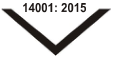
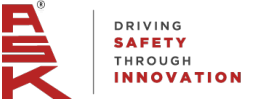
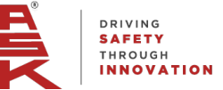
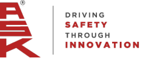

**®** 

# **ASK AUTOMOTIVE LIMITED** 

(Formerly known as A S K   Automotive Private Limited) 

Date: November 04, 2025 

BSE Limited Phiroze Jeejeebhoy Towers, Dalal Street, Mumbai - 400 001 **Scrip Code** : 544022 **ISIN No.:** INE491J01022 **Re.:** ASK Automotive Limited 

National Stock Exchange of India Limited Exchange Plaza, C-1, Block - G, Bandra Kurla Complex, Bandra (East), Mumbai - 400 051 Symbol: ASKAUTOLTD **ISIN No.:** INE491J01022 **Re.:** ASK Automotive Limited 

#### **Sub: Transcript of Investors/analysts Call – Q2 & H1 FY 2025-26 Un-Audited Financial** **<u>Results</u>** 

Dear Sir/Madam, 

Pursuant to the requirement of Regulation 30 read with Part A of Schedule III of the SEBI (Listing Obligations and Disclosure Requirements) Regulations, 2015, please find enclosed herewith Transcript of Investors/analysts Call organized on October 31, 2025 post declaration of Un-Audited Financial Results of the Company (Standalone & Consolidated) for the quarter and half year ended on September 30, 2025. 

The same shall be available on our website i.e. www.askbrake.com. 

Kindly take the above information on your record. 

Thanking you. 

#### For **ASK Automotive Limited** 

Rajani Digitally signed by Rajani Sharma Date: 2025.11.04 Sharma 17:30:00 +05'30' 

**Rajani Sharma Vice President (Legal) Company Secretary &Compliance Officer Membership No.: ACS14391** 

**Encl:** As above 

**[Image: Nov2025.pdf-0001-16.png (111x59, 4.5KB)]**

**[Image: Nov2025.pdf-0001-17.png (113x57, 4.5KB)]**

**[Image: Nov2025.pdf-0001-18.png (113x57, 4.4KB)]**

**[Image: Nov2025.pdf-0001-19.png (111x59, 4.5KB)]**

_-_ _<u>Corporate Office:</u> Plot No. 13-14, Sector - 5, I.M.T. Manesar, Distt. Gurgaon. PIN - 122050 (Hr.) Ph: 0124 - 4396900 e-mail: info@askbrake.com : roc@askbrake.com Website : www.askbrake.com_ 

_<u>Registered Office:</u> Flat No. 104, 929/1, Naiwala, Faiz Road, Karol Bagh, New Delhi - 110 005 Tel: 011-28758433, 28759605 011-28752694, 43071516 CIN:_ L34300DL1988PLC030342 

**[Image: Nov2025.pdf-0002-00.png (253x101, 7.7KB)]**

## “ASK Automotive Limited Q2 & H1 FY '26 Earnings Conference Call” 

### **October 31, 2025** 

**[Image: Nov2025.pdf-0002-03.png (250x101, 7.7KB)]**

**[Image: Nov2025.pdf-0002-04.png (228x110, 13.6KB)]**

**MANAGEMENT: Mr. Kuldip Singh Rathee – Chairman And Managing Director, ASK Automotive Limited Mr. Aman Rathee – Joint Managing Director, ASK Automotive Limited Mr. Naresh Kumar– Chief Financial Officer, ASK Automotive Limited Mr. Manoj Sharma – Chief General Manager -Investor Relations, ASK Automotive Limited** 

Page 1 of 13 

**[Image: Nov2025.pdf-0003-00.png (250x100, 7.7KB)]**

##### _ASK Automotive Limited October 31, 2025_ 

###### **Moderator:** 

Ladies and gentlemen, good day and welcome to ASK Automotive Q2 & H1 FY '26 Earnings Conference Call, hosted by Adfactors PR. 

As a reminder, all participant lines will be in listen-only mode and there will be an opportunity for you to ask questions after the presentation concludes. Should you need assistance during the conference call, please signal an operator by pressing “*”, then “0” on your touch tone phone. Please note that this conference is being recorded. 

I now hand the conference over to Snighter Albuquerque from Adfactors PR. Thank you and over to you. 

###### **Snighter Albuquerque:** 

Thank you. A very good evening to everyone, and welcome to the Q2 & H1 FY '26 Earnings Call of ASK Automotive Limited. 

From the Senior Management we have with us Mr. Kuldip Singh Rathee – Chairman and Managing Director; Mr. Aman Rathee – Joint Managing Director; Mr. Naresh Kumar – Chief Financial Officer; and Mr. Manoj Sharma – Chief General Manager -Investor Relations. 

Before we begin the Earnings Call, I would like to mention that some of the statements made during today’s call may be forward-looking in nature and hence it may involve risks and uncertainties, including those related to the future financials and operating performance of the company. Also, please bear with us if there is a call drop during the course of the conference call. We would ensure the call is reconnected at the earliest. 

I would now like to hand over the call to Mr. Kuldip Singh Rathee, Chairman and Managing Director, for his opening remarks. Thank you and over to you, sir. 

###### **Kuldip Singh Rathee:** 

Thank you, Mr. Snighter **.** Good evening, ladies and gentlemen. It is my great pleasure to welcome you all to our Q2 &H1 FY '26 Earnings Conference Call. I hope you have had the opportunity to review the detailed presentation submitted to the exchanges and available on our website. 

The Government of India's GST 2.0 reforms mark a pivotal milestone that is set to elevate the Indian automobile industry and energize the broader economy, given the sector's deep forward and backward linkages. Despite the revised GST rates being applicable for very few days of September, all automotive segments like passenger vehicles, two-wheelers and three-wheelers have recorded their best ever September sales. 

Now, let me begin by sharing a quick overview of the broader industry as reported by SIAM: 

The Indian automobile sector witnessed healthy momentum in H1 FY '26 with overall vehicle production across all segments registering a robust year-on-year growth of 5.8%. The twowheeler segment matched the overall vehicle production growth at 5.8% on year-on-year basis. We are optimistic to achieve higher growth trajectory in FY '26, supported by strong festive 

Page 2 of 13 

_ASK Automotive Limited October 31, 2025_ 

**[Image: Nov2025.pdf-0004-01.png (250x100, 7.7KB)]**

season momentum, stable macroeconomic conditions, and GST 2.0 reforms that have improved overall affordability and consumer sentiment. 

The two-wheeler industry closed H1 FY '26 with a strong production volume of 12.8 million units, up from 12.1 million units in H1 FY '25. In Q2 alone, production touched 6.9 million units as compared to 6.3 million in the same quarter last year. 

Looking ahead, we believe the industry stands to gain further from supportive macroeconomic policies, particularly GST 2.0 reforms, personal income tax rationalization announced in the Union Budget 2025-26, combined with two successive rate cuts by the Reserve Bank of India. These measures are likely to enhance consumer purchasing power and improve access to vehicle financing, creating a conducive environment for sustained demand. The good monsoon will further ensure rising income in the agriculture sector and will be beneficial for the two-wheeler sector. 

Since all our products were under the category of 28% GST, hence the reduction of GST rate from 28% to 18% is especially good for ASK because it will help us to outgrow in the Indian aftermarket and gain more market share from grey market operators and duplicators. With this positive backdrop, we remain optimistic about the growth trajectory of the sector in the coming quarters. 

We would like to highlight that our 9.9 MWp solar plant at Sirsa, Haryana has started supplies from April '25. We are excited with the results in terms of sustainable operational economies and happy to announce that the company is installing one more captive solar power plant of 11.55 Megawatt at Rajasthan, which is expected to be operational by Q1 FY '27. This reflects ASK's special focus on green energy. 

Moving on to business updates, I am delighted to share with you that we had a strong finish to the second quarter and half year in both revenue and profitability. This marks our 8th consecutive quarter of robust performance since the company’s listing. 

During Q2 FY '26, we delivered revenue growth of 16.6% excluding wheel assembly business. Wheel assembly strategic reduction was (-) 53.6%, and thus consolidated revenue has grown by 8.5% on year-on-year basis. We achieved growth of 19.5% in EBITDA and 18.6% in PAT on year-on-year basis. This is the highest ever absolute revenue, EBITDA and PAT earned by us in any quarter in the past. 

We continue to outperform the two-wheeler industry in terms of vehicle production growth during Q2 FY '26. Further, we have achieved the EBITDA margin of 13.4% in Q2 FY '26, representing an improvement of 124 basis points over Q2 FY '25. But for the significant increase in aluminum alloy prices during the quarter, our EBITDA margin would have been 13.7%. Our EBITDA margin is affected by aluminum alloy prices. Upward increase in prices of aluminum affects our EBITDA percentage because of the denominator effect,however, our absolute EBITDA number remains the same. 

Page 3 of 13 

_ASK Automotive Limited October 31, 2025_ 

**[Image: Nov2025.pdf-0005-01.png (250x100, 7.7KB)]**

With this strong performance on profitability, our earnings per share in Q2 FY '26 has increased to Rs. 4.05 per share against Rs. 3.41 per share in the same period last year. Improvement in margins is mainly driven by better economies of scale due to higher volumes, benefit from increasing capacity utilization at Karoli and new Bangalore facilities, and strategic reduction in low-value-added wheel assembly business. 

As a result, in first half of FY '26, we delivered revenue growth of 14%, excluding wheel assembly business. Wheel assembly's strategic reduction by (-) 53.6%, the consolidated revenue has grown by 6.1% on year-on-year basis. Achieved growth of 19.4% in EBITDA and 17.5% in PAT on year-on-year basis, we have delivered EBITDA margin of 13.6%, an improvement of 151 basis points on year-on-year basis. With strong performance on profitability, our earning per share in H1 FY '26 has increased to Rs. 7.4 per share against  Rs. 6.3 per share in the same period last year. 

Our all three product segments performed well in Q2 & H1 FY'26 in terms of revenue growth. We have sustained our market leadership position in the advanced braking system with a revenue growth of  10% in Q2 and 7% in H1 FY '26 on year-on-year basis. 

The Aluminum Light Weighting Precision Solutions’ revenue grew by 22% in Q2 and 19% in H1 FY '26 on year-on-year basis. The Safety Control Cable revenue also recorded growth of 2% in Q2 and 4% in H1 FY '26 on year-on-year basis. 

In the unstable global geopolitical environment due to tariff and other issues of rare earths and magnets, our revenue from exports were at Rs. 63 crore against Rs. 74 crore last year in the same period, however we do feel that we will cross last year's number. 

Thank you very much for your patient hearing. With this, we leave the floor open for question and answer. 

###### **Moderator:** 

Thank you very much. We will now begin the question-and-answer session. The first question is from the line of Rishi Kapadia from CLSA India Private Limited. Please go ahead. 

###### **Rishi Kapadia:** 

First of all, congratulations to the management for reporting such a strong number. Sir, first of all, congratulations that you delivered a strong 19% growth in the EBITDA front and you did call out that there was a 30 bips impact due to the aluminum price inflation. So, is it fair to assume that the revenue was inflated due to this by around 2.5% to 3%? That's one. 

And second, for this quarter as well for Q3, we are seeing some aluminum cost inflation. So, anything to highlight what would be the effect on the revenue and the margin for the Q3? That's my first question. 

Yes, you have very rightly pointed out that if the EBITDA margin percentage gets affected by 30 basis point, even the revenue also goes up by about 2.5% to 3%,  that is a very correct observation of yours because of the aluminum price increase. 

**Kuldip Singh Rathee:** 

Page 4 of 13 

_ASK Automotive Limited October 31, 2025_ 

**[Image: Nov2025.pdf-0006-01.png (250x100, 7.7KB)]**

**Kuldip Singh Rathee:** Aluminum prices are going up only, they have not stopped. We will let you know quarter-onquarter what the trend remains. We are getting the aluminum prices, whatever is the raw material cost plus the value addition, so, in percentages it will keep on changing, but the absolute numbers will remain the same. **Rishi Kapadia:** My second question is towards the safety cable segment where it was one of a growth segment. But for this quarter, we have just grown by 2% and that on a lower base. So, anything to highlight? Was there anything significant happened in the segment? **Kuldip Singh Rathee:** Nothing significant has happened, except that,  the approvals from the companies is on few certain models. If the model ratios change, then it gets affected and it is a result of that basically. **Rishi Kapadia:** Going forward, what growth assumption do you think  in safety cable segment ? **Kuldip Singh Rathee:** That will depend on what more demand comes for which vehicle now after this GST reduction. All efforts are in that there should be a reasonable growth. Overall growth in the revenues will be totally as per our guidelines. From the beginning, we have given the guideline of mid-teens and plus this aluminum price impact, that we still hold. **Rishi Kapadia:** We have seen very strong growth in the export front, despite adverse macro-economical conditions. So, any highlight on how the exports volume would look like? What is your outlook for FY '26 and '27 on export front? **Kuldip Singh Rathee:** Export front, we were very bullish. We were trying hard on that, but suddenly this geopolitical situation changed, and that has really affected this particular year, otherwise we were very bullish even on this financial year. As per the news, if this rare earth and magnet issue gets resolved, I think the Q4 should be, again, normal. That is why we still believe that we will cross the last year's number, in spite of all the odds against us. **Moderator:** The next question is from the line of Yash Agarwal from Nirmal Bang. Please go ahead. **Yash Agarwal:** First of all, congratulations for a great set of results. My first question is, can you please give breakup of Rs. 600 crore of CAPEX done in last two years and Rs. 250 crore of CAPEX done in first half and also the outlook for remaining FY '26 and next year? **Naresh Kumar:** Our CAPEX in the last two years is mainly towards the plant and machinery and some part is in the building. This year we have a plan of around Rs. 450 crore of CAPEX in the complete total year, out of that, Rs. 370-odd crore already released and the rest will be in the second half. **Yash Agarwal:** And for the next year? **Kuldip Singh Rathee:** Next year will depend because now after doing this CAPEX, we are completely sorted for the growth of the next financial year. As per optimism, whatever the way the situation develops, we will be investing, normally we do invest around Rs. 400 crore every year because on an optimistic note. 

Page 5 of 13 

_ASK Automotive Limited October 31, 2025_ 

**[Image: Nov2025.pdf-0007-01.png (250x100, 7.7KB)]**

**Yash Agarwal:** When do you expect the additional capacities to ramp up fully, like based on my assumption, it is close to 60% right now? **Kuldip Singh Rathee:** Yes, it is 60% right now. In next financial year, we expect this to go to something like 75%, 80%. **Yash Agarwal:** What will be your projection for next few years when they can reach close to 80%, 85% in next year? **Naresh Kumar:** Actually, our capacities also keep adding. **Kuldip Singh Rathee:** We keep on adding, we can't mention in the terms of percentages. We have the ambition to grow at mid-teens, so accordingly we have to invest because we have been outgrowing the industry always so far. And for that we need to do the CAPEX. **Yash Agarwal:** Given the fact that two-wheeler aluminum casting is highly competitive, what growth do you expect here beyond FY '27? And what are your internal targets for aluminum casting in other types of private vehicle and exports? **Kuldip Singh Rathee:** This is sunrise industry, not only ours for everyone in the segment. We see a great potential going ahead in this particular segment. **Yash Agarwal:** Do you have any tentative targets, anything, like, how much would be the growth? **Kuldip Singh Rathee:** We have to grow at mid-teens, that is our internal target. **Yash Agarwal:** What is the update on the alloy wheel business? How much CAPEX do we plan here and what are the timeline? **Kuldip Singh Rathee:** Alloy wheel business already we have done the CAPEX and the machines will get delivered by February this financial year in the Q4.We will take out the product with the Japanese collaboration by around April or May and after testing,  the supplies should start to the Japanese OEM. Whereas the Taiwan collaboration is under testing with one of the OEMs, being a safety item, they are taking a little more time. All our parts are safety parts and the customers do take time to test it, so, as and when it comes, even that should start. **Yash Agarwal:** That's very helpful. That's all from my side. **Moderator:** The next question is from the line of Raghunandhan from Nuvama Research. Please go ahead. **Raghunandan:** Thank you, sir, for the opportunity. Congratulations on strong profitability and festive greetings. Sir, my first question is on Bangalore and Karoli plants. For Bangalore plant, utilization was expected to reach 60% in Q2. Has this been achieved? And is it on track to be 75% by Q4? Also, how much was the utilization at Karoli? I think last quarter it was 65%. 

Page 6 of 13 

_ASK Automotive Limited October 31, 2025_ 

**[Image: Nov2025.pdf-0008-01.png (250x100, 7.7KB)]**

###### **Kuldip Singh Rathee:** 

We have mentioned that  in Q2, utilization reached 60% in the Bangalore facility, which we opened on 14th January and in Q4, we are very confident that it will reach 70%-75% capacity utilization. As far as the Karoli plant is concerned, since there is more and more investment going on there, we cannot go by the percentages, but yes, we will probably remain anywhere between 60%-70% capacity utilization. Because more and more investment is being done, I think we may be at 60% counting that investment. 

**Raghunandan:** 

Got it, sir. And would you be tracking the margins at these plants, sir? How would they compare with the blended level? And you can indicate by when would you think that they will match the blended level of margin? 

**Kuldip Singh Rathee:** 

They have already matched the blended level. 

**Raghunandan:** 

Good to hear that, sir. Thank you. My second question was on alloy wheels business. You indicated that April onwards, the production could start off and supplies to Japanese OEMs will pan out. So, how do you see the business shaping up in terms of what could be the possible revenue in FY '27 or 28? Or based on the CAPEX, what can be the peak revenue potential here? 

**Kuldip Singh Rathee:** 

There are two collaborations we are having. In the first collaboration with Taiwan, the product we have already taken out last September, it is under testing for more than around one year. As I said, all of our parts are safety items, so we know it takes a lot of time and we are never in a hurry. The customer has to be fully sure to grant clearance for that, so once the clearance comes, we will start supplies from that collaboration. The second collaboration is from Japan, which is for a particular Japanese customer. This, as I said, the machines will come and installed in Q4 completely. In the Q1, we will be taking out the samples and giving to the Japanese customers. Whatever time they take on the testing and approvals, after that the supplies will start. The moment the approvals come, we will be able to give you the guidelines, otherwise, before that, to give the financial guidelines will be a little premature. 

**Raghunandan:** 

Understood, sir. Thanks for the explanation. Just a clarification here, sir. Based on the CAPEX you have incurred for alloy wheels, what would be the capacity in terms of revenue potential here? Would it be like Rs. 200-Rs. 300 crore? 

###### **Kuldip Singh Rathee:** 

Yes. Already that CAPEX that we have done will ensure the revenues of Rs. 250 crore. Whenever the approval comes, we will let you know and I think we are geared up to supply up to Rs. 250 crore. 

**Raghunandan:** 

Thank you for that, sir. 

**Moderator:** 

The next question is from the line of Nitin from JM Financial. Please go ahead. 

**Nitin:** 

Thank you for the opportunity. In light of increasing aluminum alloy prices, do we maintain a margin target of around 14% on FY '26? 

**Kuldip Singh Rathee:** 

No. Nitin, we are doing pretty well and we do hope to maintain the present margins. 

Page 7 of 13 

_ASK Automotive Limited October 31, 2025_ 

**[Image: Nov2025.pdf-0009-01.png (250x100, 7.7KB)]**

|**Nitin:**|So, there will be slight miss on the margin trend in light of this rise in the aluminum prices, is that correct?|
|---|---|
|**Kuldip Singh Rathee:**|Why do you say guidance was what? What was the guidance?|
|**Nitin:**|It was 14%, if I remember.|
|**Kuldip Singh Rathee:**|It was 13.7% guidance andwe have already explained that 30 basis point in percentages only will get affected, nothing else,absolute EBITDA numbers remain the same. We are not off the mark in that guidance.|
|**Nitin:**|Got it. Second is related to the mandatory ABS anti-lock braking systems. So, is there any further update from the government or from your customer that you see that it is going to be mandated from 1st of January, 2026?|
|**Kuldip Singh Rathee:**|Not to our knowledge. And I think this question was asked to the one of the reputed OEMs also, even they could not answer to that. There is a lot of uncertainty. Let the notification come, then only we can clarify.|
|**Nitin:**|All right. That is it from my side.|
|**Moderator:**|Thank you. The next question is from the line of Ronak Mehta from ICICI Securities. Please go ahead.|
|**Ronak Mehta:**|Congratulations on good set of numbers. My first question is just a clarification. I think one statement was, I think you mentioned that you have already done CAPEX for the, one of the tie- ups of the alloy wheel business. I believe that CAPEX would be about Rs. 125 crore, right? Because typically asset turns are about two times, and which is how you came to that number of Rs. 250 crore revenue potential. Is that understanding correct?|
|**Kuldip Singh Rathee:**|The good part in the process that we are taking of producing alloy wheels with high pressure die casting is that all the machinery and the investment is very fungible, it can be used on any other product. Since, that plant where we had invested Rs. 125 crore that already will be reaching 70%-75% capacity utilization, so that is already fully used.|
|**Ronak Mehta:**|Understood, sir. Just wanted to check, for the Karoli plant, how much investment have we done so far? And yes, so that is the first question?|
|**Kuldip Singh Rathee:**|This year, we will be doing total investment of  around Rs. 450 crore of  in that, the Karoli plant will be doing about Rs. 250 crore and rest will be some maintenance expenses and Rs. 100 crore will be further doing in the Bangalore plant.|
|**Ronak Mehta:**|So, Rs. 250 crore this year for Karoli and till last year, we have already invested about Rs. 450 crore, so about Rs. 700 crore?|

Page 8 of 13 

_ASK Automotive Limited October 31, 2025_ 

**[Image: Nov2025.pdf-0010-01.png (250x100, 7.7KB)]**

**Kuldip Singh Rathee:** Last year, till March, we had invested Rs. 490 crore. 

**Ronak Mehta:** My second question is on the new products side. So, any new products under development that you want to highlight? When are you likely to come up with some new products? Because new product addition can obviously drive much faster growth for you given how the growth has been for you in the last few years, you have substantially outperformed the underlying industry backed by the new products and new customer addition. So, any update, anything that you are working on, you want to highlight on the new product side? 

**Kuldip Singh Rathee:** We are continuously working on some new products and I think as soon as the breakthrough comes, we will keep on briefing everyone on that account, but that effort continuously goes on. **Ronak Mehta:** Sir, should we expect the new product to come this year, next year? **Kuldip Singh Rathee:** It will come next financial year because this year, the business plan we are through,what we have projected and given, I think we will be achieving it confidently. **Ronak Mehta:** Fair enough, Sir. Thank you so much and. all the best. **Kuldip Singh Rathee:** Thank you. **Moderator:** Thank you. The next question is from the line of Naveen Kumar Dubey from Narnolia Financial Services Limited. Please go ahead. **Naveen Kumar Dubey:** Congratulations on a strong set of performance. My question is related to the two-wheeler industry itself. So, one more thing which is coming from 1st January, I think that the pay commission is getting implemented. So, what kind of additional benefit for two-wheeler industry we can expect? **Kuldip Singh Rathee:** This quarter 4, we are very optimistic because as you rightly said, all the good developments are taking place already. The whole industry is quite bullish this year, so we expect that growth, which has been 5.8% so far overall in the years, maybe it touches 7%. **Naveen Kumar Dubey:** Yes, because TVS was guiding, I think around 8% in the second half? **Kuldip Singh Rathee:** As you see that quarter 1 was 0.7% only, so Q2 has improved substantially, and I think that is a big boost to the two-wheeler industry. **Naveen Kumar Dubey:** Will this growth be continued for maybe next 2-3 years, considering the kind of tailwind that industry is going to have for at least next 2-3 years? **Kuldip Singh Rathee:** Well, I can't explain that much, but yes this year and next year, it is likely to continue. **Naveen Kumar Dubey:** How is the export market situation right now? Is it improving or is it the similar as it was a few months back? 

Page 9 of 13 

_ASK Automotive Limited October 31, 2025_ 

**[Image: Nov2025.pdf-0011-01.png (250x100, 7.7KB)]**

**Kuldip Singh Rathee:** 

No, it is almost similar to what it was because it is not in good shape. The news that China is releasing all the rare earths and the magnet situation that has given a boost in our minds that next few months or next one year, I think there is a truce for one year between US and China. Next one year, the supply should be normal and hopefully it should pick up. 

**Naveen Kumar Dubey:** We have seen some reduction in cash flow generation from operations in the first half compared to last year. So, was there anything different from last year or? 

**Naresh Kumar:** You are talking about the standalone or consolidated basis? 

**Naveen Kumar Dubey:** Yes, consolidated basis. **Naresh Kumar:** Yes, this is mainly due to 2-3 things. One is the inventory increase because this time, festival season. We were expecting very good festival season and GST 2.0 impact, we invented some inventory, so working capital is impacted. 

**Kuldip Singh Rathee:** Actually, the implementation and reduction in GST came from 23rd of September. There were very few days in Q2 and all the festivals right from Dussehra to Diwali, which is the main sale period that was in October, so there was a transition, so we built up the inventory. 

**Naveen Kumar Dubey:** How is our content value is increasing? Do we have any kind of data since last 2-3 years? How is that moved? 

**Kuldip Singh Rathee:** Our content value remains very strong. Whatever it was, it is carrying on. As we said earlier, though EV is not performing much. otherwise in EV content is about 40% - 50% more than ICE. 

**Naveen Kumar Dubey:** Thank you, sir. That is it from my side and all the best. 

**Kuldip Singh Rathee:** Thank you. 

**Moderator:** The next question is from the line of Vijay Pandey from Nuvama Wealth Management. Please go ahead. 

**Vijay Pandey:** Congratulations for an excellent quarter. Sir, couple of questions, just wanted to check in terms of aftermarket, this includes the ABS sales or like the aftermarket sales, it includes all 3 segments, our ABS, ALPS, and safety control, or is it only one or two segments? 

**Kuldip Singh Rathee:** In aftermarket, it is only 2 segments that is the brakes and the cables, not the aluminum. 

**Vijay Pandey:** And the passenger vehicle will be entirely ALPS? 

**Kuldip Singh Rathee:** Yes, it will be ALPS. 

**Vijay Pandey:** Secondly, sir, I wanted to check about the German JV, which we discussed in the last quarter conference call. Any idea what will be the revenue potential and what can be the profit potential from that? 

Page 10 of 13 

_ASK Automotive Limited October 31, 2025_ 

**[Image: Nov2025.pdf-0012-01.png (250x100, 7.7KB)]**

|**Kuldip Singh Rathee:**|Well, the JV potential, we will start working  next month and we hope to come into production early in H2 of next financial year.|
|---|---|
|**Vijay Pandey:**|H2 of FY '27?|
|**Kuldip Singh Rathee:**|Yes, please. It will take like 9 months or so.|
|**Vijay Pandey:**|Sir, what can be the topline or bottom line in that case for the JV business?|
|**Kuldip Singh Rathee:**|Sir, let it come first. I think we will let you know. There will be many more calls before that.|
|**Vijay Pandey:**|I will fall in the queue. Thank you.|
|**Moderator:**|Thank you. The next question is from the line of Ronak Mehta from ICICI securities. Please go ahead.|
|**Ronak Mehta:**|Thank you for the opportunity once again. Sir, just one last question from my side. Looking at your growth in the aluminum segment, is it fair to assume that you are gaining market share in the ICE aluminum casting segment as well?|
|**Kuldip Singh Rathee:**|We are doing well on all fronts, ICE as well as EV, and some aluminum segment, the growth has come from the PV also.|
|**Ronak Mehta:**|Sir, so can you highlight some of the new programs that can drive this kind of a growth rate even for next year?|
|**Kuldip Singh Rathee:**|We are very confident that this will continue next year also. I think the visibility is there.|
|**Ronak Mehta:**|Sure, sir. Thank you so much, sir.|
|**Moderator:**|Thank you. The next question is from the line of Sagar Shetty from BP Wealth. Please go ahead.|
|**Sagar Shetty:**|Thank you so much for the opportunity and congrats on the good set of numbers. So, actually, I would just like to follow up on the new plan. So, should we go with the previous assumption that the asset turnover expectation will continue to be around 1.75 or is there any update on the ratio?|
|**Kuldip Singh Rathee:**|It will certainly continue like that.|
|**Sagar Shetty:**|The revenue potential will also continue to be the same for both the plants?|
|**Kuldip Singh Rathee:**|You can see the financial prudence of the company and we are very cautious on investments, especially focus on the bottom line, so this will definitely remain like that. We would like to maintain our ROCEs also, which is one of the best in the industry and we are very focused on that also.|

Page 11 of 13 

_ASK Automotive Limited October 31, 2025_ 

**[Image: Nov2025.pdf-0013-01.png (250x100, 7.7KB)]**

**Sagar Shetty:** Just on the Sunroof Cable JV, so is the setup for the project on schedule like the Rs. 10 crore investment which you planned earlier? So, is it in line with your timeline or is there any changes on that? Like we were expecting the revenue to be expected by 2027? 

**Kuldip Singh Rathee** We told you that the Sunroof joint venture will be putting into production in 9 months and in H2 of next financial year, some breakthroughs should come in revenue. 

**Sagar Shetty:** 

Thank you. 

**Moderator:** Thank you. The next question is from the line of Maulik Gandhi from Val-Q Investment Advisory Private Limited. Please go ahead. **Maulik Gandhi:** My first question is that currently, in the aluminum lightweight intervention solutions for the four-wheeler, you are currently doing for only the ECU body. So, are we planning to add more products in the four-wheeler space so that we could explore into some other areas in fourwheelers for Aluminum Light Weighting? 

**Kuldip Singh Rathee:** Yes, you will see the numbers have improved and the supplies to the passenger cars and we have added some more products. **Maulik Gandhi:** What would be our content for vehicles in the four-wheeler? **Kuldip Singh Rathee:** It is not significant at the moment. **Maulik Gandhi:** By 2-3 years’ time, do we expect this business to be, let us say, around 10%-12% of our total is turning? **Kuldip Singh Rathee:** We are trying hard to improve on all fronts and  our main aim is to focus on our mid-teens growth, that is more important. **Maulik Gandhi:** That is it from my side. Thank you. **Moderator:** Thank you. As there are no further questions from the participants, I now hand the conference over to Mr. Kuldip Singh Rathee from ASK Automotive Limited for closing comments. Thank you and over to you. **Kuldip Singh Rathee:** Yes, thank you very much, everyone. Thank you for your patient listening and well, I hope that I could clarify your queries quite transparently. In fact, I would also like to say that I am an optimist and I always remain optimist. The numbers that we give you are our aspirational numbers. But let me tell you, we work very hard to achieve those numbers,  that is what we have been doing so far. The company will hopefully keep on performing a similar manner in the coming future and create value for our stakeholders,that is the intention. Thank you very much. **Moderator:** Thank you. On behalf of Adfactors PR, that concludes this conference. Thank you for joining us and you may now disconnect your lines. 

Page 12 of 13 

_ASK Automotive Limited October 31, 2025_ 

**[Image: Nov2025.pdf-0014-01.png (250x100, 7.7KB)]**

This is a transcript and may contain transcription errors. The Company or the sender takes no responsibility for such errors, although an effort has been made to ensure high level of accuracy 

Page 13 of 13 

---

## Extracted Images

| # | File | Dimensions | Size |
|---|------|------------|------|
| 1 | Nov2025.pdf-0001-16.png | 111x59 | 4.5KB |
| 2 | Nov2025.pdf-0001-17.png | 113x57 | 4.5KB |
| 3 | Nov2025.pdf-0001-18.png | 113x57 | 4.4KB |
| 4 | Nov2025.pdf-0001-19.png | 111x59 | 4.5KB |
| 5 | Nov2025.pdf-0002-00.png | 253x101 | 7.7KB |
| 6 | Nov2025.pdf-0002-03.png | 250x101 | 7.7KB |
| 7 | Nov2025.pdf-0002-04.png | 228x110 | 13.6KB |
| 8 | Nov2025.pdf-0003-00.png | 250x100 | 7.7KB |
| 9 | Nov2025.pdf-0004-01.png | 250x100 | 7.7KB |
| 10 | Nov2025.pdf-0005-01.png | 250x100 | 7.7KB |
| 11 | Nov2025.pdf-0006-01.png | 250x100 | 7.7KB |
| 12 | Nov2025.pdf-0007-01.png | 250x100 | 7.7KB |
| 13 | Nov2025.pdf-0008-01.png | 250x100 | 7.7KB |
| 14 | Nov2025.pdf-0009-01.png | 250x100 | 7.7KB |
| 15 | Nov2025.pdf-0010-01.png | 250x100 | 7.7KB |
| 16 | Nov2025.pdf-0011-01.png | 250x100 | 7.7KB |
| 17 | Nov2025.pdf-0012-01.png | 250x100 | 7.7KB |
| 18 | Nov2025.pdf-0013-01.png | 250x100 | 7.7KB |
| 19 | Nov2025.pdf-0014-01.png | 250x100 | 7.7KB |
