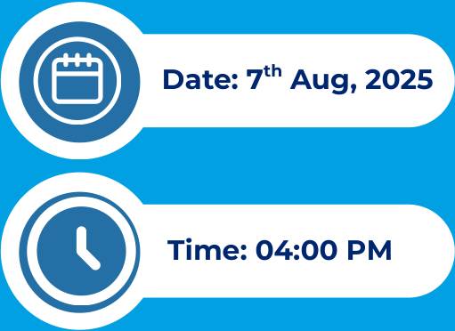

Date: 13.08.2025 

To 

National Stock Exchange of India Limited ‘Exchange Plaza’, Bandra-Kurla Complex Bandra (East), Mumbai 400051 

#### **<u>Scrip Symbol:</u>** ACCENTMIC 

**<u>ISIN:</u>** INE0Q5D01013 

#### **<u>Sub: Submission of Transcript of Investor Meet</u>** 

Dear Sir/Madam, 

Pursuant to Regulation 30 and Part A of Schedule III of SEBI (Listing Obligations and Disclosure Requirements) Regulations 2015, please find attached the transcript of the aforesaid investor meet held on August 07, 2025 at 04:00 p.m. 

Kindly take the above information on record and disseminate. 

Thanking You, Yours Truly 

#### **For Accent Microcell Limited** 

HIRAL KANUBHA Digitally signed by HIRAL KANUBHAI GEDIYADN: cn=HIRAL KANUBHAIGEDIYA c=IN o=PersonalReason: I am the author of I GEDIYA this documentLocation: Date: 2025-08-13 17:42+05:30 

#### **Hiral Gediya** 

Company Secretary and Compliance Officer (M. No.A48107) 

# GENERAL INVESTORS MEET Accent Microcell Limited 

**[Image: ACCENT_13082025174352_Schedule_of_Investors_meet_trancript.pdf-0002-01.png (313x672, 39.4KB)]**

**[Image: ACCENT_13082025174352_Schedule_of_Investors_meet_trancript.pdf-0002-02.png (361x825, 66.7KB)]**

**[Image: ACCENT_13082025174352_Schedule_of_Investors_meet_trancript.pdf-0002-03.png (511x372, 25.4KB)]**

<!-- Start of picture text -->
Date: 7 Aug, 2025th Time: 04:00 PM <!-- End of picture text -->

## **ATTENDEES FROM THE MANAGEMENT:** 

**[Image: ACCENT_13082025174352_Schedule_of_Investors_meet_trancript.pdf-0002-05.png (187x157, 8.8KB)]**

**Mr. Ghanshyam Patel Mr. Vasant Patel Managing director and CFO Chairman Mr. Nitin Patel Mr. Ashish Singh Executive Director Global Business Head 1 Mr. Nipam Jani Mr.  Pratik Rughani Sr. Accounts Manager Sr. Accounts Manager Hosted By:** Finportal Investments Pvt. Ltd. 

**[Image: ACCENT_13082025174352_Schedule_of_Investors_meet_trancript.pdf-0002-07.png (189x160, 8.4KB)]**

**[Image: ACCENT_13082025174352_Schedule_of_Investors_meet_trancript.pdf-0002-08.png (191x159, 8.5KB)]**

**[Image: ACCENT_13082025174352_Schedule_of_Investors_meet_trancript.pdf-0002-09.png (219x178, 19.7KB)]**

7th August, 2025 

**[Image: ACCENT_13082025174352_Schedule_of_Investors_meet_trancript.pdf-0003-01.png (350x105, 13.4KB)]**

**Finportal:** Good day, everyone, and welcome to the general investor meeting of Accent Microcell Limited. The purpose of today's call is to address investor queries related to the company's operations. Please note that this call is being recorded, and may contain forward-looking statements based on current expectations. These are subject to in risk and uncertainties that could cause actual results to differ materially. The company is not obligated to update any forward-looking statement unless required by applicable law. Listeners are advised not to place undue reliance on such statements without further delay. Let's begin the Q. And A. session. I would like them. I would like to give to the management to give a brief introduction post, which will start the question and answer session. 

**Pratik Rughani:** Hi! Good afternoon, everyone. Oh. Hi! We are here to say, have a clarity about what the progress about the Accent Microcell Limited. We have chairman sir and managing director of company with us along with our core team members led with global business and accounts team and the compliance department. I think most of the stakeholders are already aware about what the products we are into. We'll directly start with the question and answer, and we'll try to answer it as precise as possible. 

**Finportal:** Okay, sir, I would request the participants to please raise their hand to ask the questions. I will take the 1st question from Mr. Hitesh. 

**Pratik Rughani:** Yes, sir. Good afternoon, please. 

**Hitesh mahida:** Oh, can you? Hello! 

**Pratik Rughani:** Yes, sir, your voice is audible. Please. 

**Hitesh mahida:** Yeah, yeah. So just wanted to check. I mean, with the recent issue at the plant. How favorably does it affect us? Or has it really not been any impactful for us? How are the MCC prices behaving, do we? We are that the prices are sort of inching up. 

**Pratik Rughani** : Sir, or chairman, sir, will respond to the questions or the clarity that you are looking for. Yeah. Hi, yes. We also came across about this incident happened at. So, it was actually unfortunate, and be able to taken the measures. Which kind of incident not happen at accent side beside this. If we look into the oral pharma and particular segment where we have been supplying the product range, so, of course is, there has been product. Inquiry has been increased, and we have been taking care of the business from our business side. 

**Hitesh mahida:** But, sir, can you throw some more light? I mean, how are we benefiting in any ways, or how can you quantify the kind of benefit we are seeing in the business. 

7th August, 2025 

**[Image: ACCENT_13082025174352_Schedule_of_Investors_meet_trancript.pdf-0004-01.png (350x105, 13.4KB)]**

**Pratik Rughani:** Yes, already for last. 

**Hitesh mahida:** Couple of months. 

**Pratik Rughani:** We have been receiving inquiries from our business globally, and at present we have also good quantum of business we have received so far, and we have been mentally the same ratio in our upcoming future guide. 

**Hitesh mahida:** Okay? And do we have enough capacity to cater to the increasing demand. 

**Pratik Rughani** : Yes, we have at present about, you can say for 4 to 5 months. We have business on hand, and that's why. Actually, we are also coming up with phase 2 for unit 3. And we are also planning to set up the good amount of content already we have, declared the quantity where we are planning to. Set up for our unique 3 phase, 2. 

**Hitesh mahida:** Okay, and the new inquiries which are coming, they would be coming in at higher prices for us. 

**Pratik Rughani:** Yes, of course it's also we have. We have been trying to receive the business from our existing as well as new business associates at good amount of price. 

**Hitesh mahida:** And, sir, in the how long do you think will the Sigachi plant take to come back on track. 

**Pratik Rughani:** So about this thing. 

**Hitesh mahida:** Thank you. 

**Pratik Rughani:** We are not able to comment any kind of so it's as per company's policy. We are not able to comment on this thing. 

**Hitesh mahida:** But do you think there is a high chance that it will be a very prolonged kind of this thing? Issue for the company? Hello! See ya! Your voice is. 

**Pratik Rughani:** You know, it's these particular. 

**Hitesh mahida:** Sorry I lost you in between. I think the voice was not clear. 

**Pratik Rughani:** Being more. 

**Hitesh mahida:** Hello! 

**Pratik Rughani:** Okay. Hello. The business. 

7th August, 2025 

**[Image: ACCENT_13082025174352_Schedule_of_Investors_meet_trancript.pdf-0005-01.png (350x105, 13.4KB)]**

**Hitesh mahida:** Lovely. 

**Finportal:** Pratik, sir, I think there's some issue at your end. Kindly. 

**Hitesh mahida:** Yeah, we are unable to hear clearly. 

**Pratik Rughani:** Isaac! Oh. 

**Hitesh mahida:** Hello! 

**Pratik Rughani:** All good. 

**Hitesh mahida:** No, I think there is still some problem at your end. 

**Pratik Rughani:** You know. 

**Hitesh mahida:** There seems to be some issue at your end. 

**Ghanshyam Patel:** Yes, audible, now audible. 

**Hitesh mahida:** Yeah. Yeah. Now it is very. Now it is good. 

**Ghanshyam Patel:** Just a moment, just a moment, just a moment. Actually there is some echoing background. Give me 1 min. 

**Finportal:** I know. I think you have 2 systems at one place. That is where it is happening. 

**Ghanshyam Patel:** And please attach to it. Please attach to it. Okay, now it's perfect. Okay. 

**Hitesh mahida:** Yes, sir. So yeah, if you can repeat, I mean, how does this entire scenario benefit you? Do you have enough capacity right now in place have you been able to increase your prices as far as MCC? Is concerned. 

**Ghanshyam Patel:** Yes, of course. Yes, according to come current market scenario, what? We have been receiving the business order across the globe. So 1st of all, actually, we need to cater our existing business. What we have been maintaining. And beside this in future business, we have been receiving and confirming the orders for you can say, for the 3, 4, yeah. 5 months later, what we have been committing to the market. 

**Hitesh mahida:** And how much of a market share did Sigachi have in this overall market? And are there also increase in imports, as far as MCC. Is concerned. 

7th August, 2025 

**[Image: ACCENT_13082025174352_Schedule_of_Investors_meet_trancript.pdf-0006-01.png (350x105, 13.4KB)]**

**Ghanshyam Patel:** Yes, of all. If we talk about MCC. Importing to India, there is since long back. There is also MCC. Importing from you can see Taiwan side and Japan side as well as us side. So there is some portion of MCC. Which have been importing to India. 

**Hitesh mahida:** But that the imports have increased or the domestic guys have increased the market share. 

**Ghanshyam Patel:** No, if we talk about domestic particular market for micro restaurant cellulose, the I don't think so. Any. Some drastically importing percentage. But of course his price has been little bit. You can say correction has been made. 

**Hitesh mahida:** Okay? So, sir, based on the current scenario. What do you think? For the next 2 or 3 years, how much sort of growth. Do you expect? How much this should benefit you on the margin front. 

**Ghanshyam Patel:** Yes, sir, currently. if we talk about CAGR, so about 5 to 6% and upcoming times, at least for a couple of years, that would be. We are expecting to increase at least one to 1.5% more, because, beside pharma nutraceutical segments, there are so many other segments are also, you can say, overall, good business is materializing. So we are expecting good positive impact for MCC globally. 

**Hitesh mahida:** So this 5. So, as you said, there is a lot of demand. But then this 5, 6% growth seems to be pretty muted on that back of it. 

**Ghanshyam Patel:** Yeah. But if we, if you see for last couple of years, CAGR, what have been maintaining for particular MCC micro crystalline cellulose product in the market, and so many segments are also coming up with for micro crystalline uses. So, it's for micro crystalline cellulose for particular, for pharma and  Nutraceuticals segment as per my knowledge and experience. It's in order for 5 to 6 %. 

**Hitesh mahida:** But even in the current scenario also, you expect it to be only 5 to 6%. 

**Ghanshyam Patel:** So for current scenario, of course, as I mentioned earlier, that it's positive impact. By 1.1 point 5% extra. 

**Hitesh mahida:** So 5, 6% can go to maybe 7% is what. 

**Ghanshyam Patel:** Yes. Correct. Oh, okay. 

**Hitesh mahida:** Okay, thanks. That's it for mine. 

7th August, 2025 

**[Image: ACCENT_13082025174352_Schedule_of_Investors_meet_trancript.pdf-0007-01.png (350x105, 13.4KB)]**

**Ghanshyam Patel:** Yes, welcome. 

**Finportal:** We'll take the next question from Mr. Deepa Poddar. 

**Deepak Poddar:** Yeah. Hello. Am I audible? 

**Ghanshyam Patel:** Yes, you are. 

**Deepak Poddar:** Yeah, okay, yeah, thank you very much for this opportunity and taking time out for this call. So just I mean taking the forward the previous participant question. So what we're saying is that on a base basis, we can grow by 5 to 6%. And because of the current scenario of one of the peer. Having some problem in some of the capacities, we can grow by 7 to 8%. That's what you're saying. 

**Ghanshyam Patel:** Not only because of this particular incident happened at the Sigachi. I'm just talking about overall market of MCC and cellulose demands, but as that has been. Actually, I'm expecting to impact. Positively. 

**Deepak Poddar:** So you're talking about industry demand. 

**Ghanshyam Patel:** Yes, absolutely. 

**Deepak Poddar:** Okay, okay, okay, so what about our group? So how should we look at the as a company level group? 

**Ghanshyam Patel:** Just a moment, sir, at least say 15 to 20% CAGR for next 3 to 5 years. We are expecting. 

**Deepak Poddar:** Complexity. 

**Ghanshyam Patel:** Yes, sir. 

**Deepak Poddar:** Okay. And how should one look at margins? I think currently, our margins are last. It was in the range of 16%. Right. So how should one look at Editor Margin. 

**Ghanshyam Patel:** Sir EBITDA margin was around 16% going ahead as we are coming out with unique 3 in phase, manner, that is phase one and phase 2. Phase one will be in say, it will be a premium range of exhibition product. So margin will be on quote quite higher side as compared to MCC. And for phase 2, we are coming out with a plan of MCC. So the margin will be on similar lines. So if we talk about the weighted average margin, I think it at Emitter level, it should 

7th August, 2025 

**[Image: ACCENT_13082025174352_Schedule_of_Investors_meet_trancript.pdf-0008-01.png (350x105, 13.4KB)]**

be around 20 to 22 percentage. So, for example, I mean, our current capacity is 9,200 metric tons per hour. Right? So it's around 9,600. 

**Deepak Poddar:** 9,600 is our current capacity, so our phase? One, is about 2,400. And what is the capacity of as well. 

**Ghanshyam Patel:** Yes, sir, phase one at 100% capacity utilization. It will be around 2,400 metric ton per annum and phase 2 will be 12,000 metric ton but 2,400 should be read with the premium range of experience product that what we are coming out with. for which the prices were quite on higher side as compared to MCC. 

**Deepak Poddar:** Sure. So at current capacity 9,000, what can be the maximum revenue potential at 9,600 tons? 

**Ghanshyam Patel:** Sir. That is already part of the finances that would you said roughly. Around 2, 50 to 2, 75 to 18. 

**Deepak Poddar:** Mean 2 60 to 2 80, I mean in that time. So currently we are doing that revenue again. Last year we were at 2, 65 crores only. So we are utilizing our current capacity optimally. Right. 

**Ghanshyam Patel:** Yes, sir, but apart from MCC, we have say in house, we have developed a couple of new product as well. So the margin is likely going to improve. Going ahead. 

**Deepak Poddar:** Okay, okay. And this base one, this 2,400. What can be the revenue potential at optimum utilization? 

**Ghanshyam Patel:** Sir. Look into the various guidelines in place. I won't be able to quantify in terms of financial figure, but yes, from the from current fiscal given a full year capacity, we are expecting it to be utility level, to be around 60% for the 1st year. 

**Deepak Poddar:** Okay, no. So 60% utilization 1st day that I understood. But what does it mean in terms of, I mean, in terms of. 

**Ghanshyam Patel:** I can say I can share you the tentative rate at which the CCS product is sold at present. So accordingly, one can walk. 

**Deepak Poddar:** Go ahead. So is the. 

**Ghanshyam Patel:** The price of CC. CCS is around 3.5 times of MCC. 

7th August, 2025 

**[Image: ACCENT_13082025174352_Schedule_of_Investors_meet_trancript.pdf-0009-01.png (350x105, 13.4KB)]**

**Deepak Poddar:** 3.5 times of MCC. And what is MCC. currently utilization. 

**Ghanshyam Patel:** Sir. For export markets around 2 30 per kg. And for domestic is around 1 80 per kg. 

**Deepak Poddar:** So domestic is 1 80, and the export is 2 30 per g. 

**Ghanshyam Patel:** Because the portion of net, and the charges are levied, so that is resulting into increase in the price of export prices. 

**Deepak Poddar:** Oh, okay, so this 1st half year will not be expecting much growth, right? Because ideally, we are currently utilizing our current capacity at optimum level, and this phase, one will be coming by what October 25. 

**Ghanshyam Patel:** Yes, sir. By say, quarter 3 of the current financial year. So anywhere between, say by the end of October or in the 1st couple of weeks of November. 

**Deepak Poddar:** To provide. So basically in 1st half will not be able to utilize. So 1st half, we expect mutant growth right and on. 

**Ghanshyam Patel:** Sir, that needs to be read with the say, increase in the price of exchange rate, along with a couple of new products that would you have developed in house such as MCC spheres, SMCC. And co-processed MCC. 

**Deepak Poddar:** Okay, okay, okay, I got it. And when you mentioned about EBITDA margin of 2022%. So in how many years we are targeting that. 

**Ghanshyam Patel:** Sir, positively say, next couple of years. 

**Deepak Poddar:** Okay. Okay. 

**Ghanshyam Patel:** So it will. It will be a gradual process that can happen. Say within say, once the phase 2 is, say, maybe fully operationalized, or at a phase 2 at a capacity of 70%. 

**Deepak Poddar:** For post phase, 2. Operationalization and phase 2. When we are expecting phase 2. To come on, come on, stream. 

**Ghanshyam Patel:** Sir, we're expecting it to be in the month of say, July 2,026. 

**Deepak Poddar:** Okay. Okay. Okay. July, 2,026. 

**Ghanshyam Patel:** Yes, sir. 

7th August, 2025 

**[Image: ACCENT_13082025174352_Schedule_of_Investors_meet_trancript.pdf-0010-01.png (350x105, 13.4KB)]**

**Deepak Poddar:** I I got it. I got it. So once, phase 2 is, we are able to utilize 70%. So we can see about 20% kind of at the time. 

**Ghanshyam Patel:** Yes, sir, that needs to be read with the 70%. What I have said is for the entire year. So accordingly, for 9 months. We need to derive the roughly, the capacity will be around 50 to 55 percentage for that particular financial year. 

**Deepak Poddar:** 1010. Okay, okay. I. And is it possible for you to share what can be the revenue potential from these 2? I mean, given the. 

**Ghanshyam Patel:** I already said, the rate per Kg. For MCC. As well along with the premium range of exhibit product for extrapolating it. At this point of time will be a bit difficult from our end. 

**Deepak Poddar:** So some range. I'm so based on what number you're giving, I'm coming at around 200 to 50 Kilo, right? That is a rough cut in. 

**Ghanshyam Patel:** Sir, sir, last year we closed at 2, 65. So accordingly, you can say, work it out the rest of the top line. What can be estimated? Top line. 

**Deepak Poddar:** Okay, I understand. And the value added our capacity is only this 2,400 metric ton, right? That is, CCS. that is phase one that is a value-added product. 

**Ghanshyam Patel:** Yes, sir, apart from the 3 products that that we are going to manufacture in Unit 3, that is, CCS, CMC and SSG, there are a couple of new products that we already we have started selling those products, namely, SMCC. Powder cellulose, MCC. Spears and Co. Process. MCC, so these are already sold from our end set up from our unit. 

**Deepak Poddar:** Okay. 

**Ghanshyam Patel:** That that is also a premium range of experience product. So now the basket of portfolio will be around 12 to 15 product instead of 3 to 4 products. 

**Deepak Poddar:** Correct, and you mentioned 1 point to the previous participant. I miSSGd that. So, the new current entity pricing. Have you seen some in increase because of one of your peer capacity going off? I mean, have you something improvement in pricing front. 

**Ghanshyam Patel:** Sir. In a way, yes, taken into account, due to one unfortunate event. Is asked by the participant. 

**Deepak Poddar:** Okay, and what is our export? Mix currently. 

7th August, 2025 

**[Image: ACCENT_13082025174352_Schedule_of_Investors_meet_trancript.pdf-0011-01.png (350x105, 13.4KB)]**

**Ghanshyam Patel:** Sir. It's around 65 percentage of the total turnover. 

**Deepak Poddar:** And how much is to a US. 

**Ghanshyam Patel:** So, the US. It's around 4 to 5%. 

**Deepak Poddar:** So, if any kind of tariff, it doesn't impact. 

**Ghanshyam Patel:** Sir, as of now, to the extent would you understand? There is no clarity regarding tariff for the Pharma sector. 

**Deepak Poddar:** Once it is announced we can have a separate discussion for it. 

**Deepak Poddar:** Oh, fair got it? Think? Yeah, that that would be from my side. I would like to wish you all the very best. Yeah, thank you so much. 

**Ghanshyam Patel:** Thank you. Thank you very much. 

**Finportal:** Oh, thank you. We'll take the next question from Mr. Pranav Doshi. 

**Pranav Doshi:** Yeah. Hi, sir, am I audible? 

**Ghanshyam Patel:** Yes, please. 

**Pranav Doshi:** Yeah, thank you. So 1st of all, good afternoon. And so, a couple of questions from my side so 1st would be that, let's say, one of our peers Sigachi. They are doing the gross margin of around. I think 50 odd percent and we are at around 40%. And let's say, one of our other recently listed peers, Patel, can. They are at, I think, even 30 odd percent. So I think I just wanted to understand the product mix, or what is actually leading to, let's say, such differences in gross margins across MCC players, yeah, that is my 1st question. 

**Ghanshyam Patel:** Should I wait for your second question, or I should respond to your 1st question. 

**Pranav Doshi:** I think you can respond to my 1st question. 

**Ghanshyam Patel:** Sir, we can comment about the product mix or the products that what we are catering to we are not sure. Say, whatever the name you stated, what kind of product basket of portfolio they are having. I also said you the export percentage that what you are having at present peers might be having a different export and domestic percentage. So that can be probable reason why there is such deviation can be observed apart from that, say, usage of, say, 

7th August, 2025 

**[Image: ACCENT_13082025174352_Schedule_of_Investors_meet_trancript.pdf-0012-01.png (350x105, 13.4KB)]**

super grade of raw material can be one of the reason why. There's a difference in the gross margin that you have observed. 

**Pranav Doshi:** Okay? So, sir, this superior grade of raw material which you are talking about. So can you just like throw some color on like, what are materials. 

**Ghanshyam Patel:** Sir, it will be technical. But let me give it a try. Yes. basically say, if we talk about the raw material that is named Rudrpal. So basically, there are, say majorly, there are 2 groups of raw material, that is, and one is sapi. So the portion. So if we talk about the peers. We are not sure the portion percentage of sapi that is used by the peers but we have a fixed portion of the superior Gretop bulk that is used by us for manufacturing. MCC. Take into account our end users. We are getting into pharmaceutical and nutraceutical end users or distributors. 

**Pranav Doshi:** Okay? And I think the like the premium one would be sapi then right? If I'm not wrong. 

**Ghanshyam Patel:** Yes, sir, there's a huge deviation between the price of Riya Okasya and Sapi. Let's take a hypothetical example. If the price of riya is around ₹60. Price of, say, I, converted into INR. The price of sapi will run anywhere between 80 to 85. 

**Pranav Doshi:** 85, and the Akasia would be 16. 

**Ghanshyam Patel:** Yes, sir, because we are not sure about their end use and customers behavior. We are catering to the customers who are using this product in pharmaceutical and nutraceutical. So there might be different applicant kinds of MCC. That they might catering to. 

**Pranav Doshi:** And so just on the CCS front. So, this phase, one that we are commencing so we would have the CCS after that. Right? So currently, we do not sell any CCS. 

**Ghanshyam Patel:** We sell CCS. But say around say, we procure CMC, as of now, and we produce CCS, and we sell it in the say export market and the domestic market. It is not a new product for us, but the volume is not as big as what we are coming out with. 

**Pranav Doshi:** Okay, so like, currently, we are manufacturing CCS, then is my understanding. 

**Ghanshyam Patel:** So, we are procuring CMC. Which is acting as a raw material for CCS and we are manufacturing CCS in house. So you can say goods is procured on a semi process basis, and further process is carried out from our end. Now the entire process will be carried out from our end, starting from the say, use of raw material till the CCS is produced. 

7th August, 2025 

**[Image: ACCENT_13082025174352_Schedule_of_Investors_meet_trancript.pdf-0013-01.png (350x105, 13.4KB)]**

**Pranav Doshi:** And I think this would lead to the better margins that we would be able to produce CMC. In house right. 

**Ghanshyam Patel:** Positively. Yes, sir. 

**Pranav Doshi:** Okay, perfect. And like, just one question. So our debtor days they've increased in the last 2 years. So, we were at around 70-80 odd range. And now we are at I think over 100 so like, what is the reason for that? 

**Ghanshyam Patel:** Sir, that data needs to be read with, the say, certain percentage decrease in the export sales as well, because we have started targeting Indian MNCs wherein to enter or to have a competitive edge. Labor payment terms have been offered by the company. 

**Pranav Doshi:** Okay. So I think this has been going on for the last 2 years. Then. 

**Ghanshyam Patel:** Yes, sir, you can see it, because the process validation is such a thing, a stability approach, and all those stuff it takes around 2 to 3 years. Say, whenever you have, say new MNC on board. 

**Pranav Doshi:** So like, can we assume that? Let's say, since we want to expand in domestic markets, we were just giving them as one off, and like incrementally once the new MNCs are on boarded, then these would rationalize a bit. 

**Ghanshyam Patel:** Definitely, yes. 

**Pranav Doshi:** Okay. And like, is there any target working capital days that we are targeting or going ahead. 

**Ghanshyam Patel:** Every business sets optimistic target to reduce the working capital days we are making all the efforts to ensure that the working cycle which stand at present is reduced. 

**Pranav Doshi:** But no number as such. Right then. 

**Ghanshyam Patel:** Sir, finances will speak for itself. So mark figures are available in public domain. We need to wait for a couple of months once the September results are declared, you can, one can expect, say, the adequate levels of working capital. That will be there in the finances. 

**Pranav Doshi:** Okay, yeah. I think that's it from us. 

**Ghanshyam Patel:** Yeah, thank, you. 

7th August, 2025 

**[Image: ACCENT_13082025174352_Schedule_of_Investors_meet_trancript.pdf-0014-01.png (350x105, 13.4KB)]**

**Finportal:** Thank you. We'll take the next question now from Mr. Rahul Kumar. 

**Rahul Kumar:** Hello! 

**Ghanshyam Patel:** Hi, sir! 

**Rahul Kumar:** Hi. 

**Rahul Kumar:** You just explained that you're trying to target the local or Indian pharma companies. And that's why you're giving better payment terms. Can you explain the approval process for the same? How long does it take? What's the process? Etc. 

**Ghanshyam Patel:** Yes, the approval of the I mean. The 1st phase is the document they ask for after the document, the sampling process takes place, and the approvals are somewhere around 6 months to one year in the Pharma MNCs. And in some of the MNCs of a bit higher range. It will be somewhere around 2 years. The approval takes place. 

**Rahul Kumar:** Okay, all right. And is there? Why is CCS 4 times the realization? What's so special about CCS as an excipient. 

**Ghanshyam Patel:** Yes, basically function for Microcrystalline cellulose and cross Croscarmellose Sodiumare quite different. MCC. Is generally, it is used for pharmaceutical as a bulking agent and CCS. Is used as a rapid disintegrant. So, volume for cross carbon sodium, compared to Microcrystalline cellulose, is a little bit lower side, and functionality wise is quite different between MCC. And CCS. So that's why CCS price is higher compared to MCC. 

**Rahul Kumar:** Got it, alright Next is around Unit 3. I think a lot of people have asked about that. You earlier had mentioned that I think. October end or November 1st week you'll be able to commence that plant, I mean is that is that correct? 

**Ghanshyam Patel:** Hmm. 

**Rahul Kumar:** So, you stick to those timelines. 

**Ghanshyam Patel:** Yes, sir, it will be taken care of, the aSSGmbling, and the installation of machinery is already in place, so accordingly, we'll be able to achieve the deadlines that what you are stating. 

**Rahul Kumar:** Okay. So unit 3, the phase one and phase 2. They are both at the same location. Yes, they are not like separate. They are both, I think, 30-40 kilometers from Ahmedabad. That's the location. 

7th August, 2025 

**[Image: ACCENT_13082025174352_Schedule_of_Investors_meet_trancript.pdf-0015-01.png (350x105, 13.4KB)]**

**Ghanshyam Patel:** Yes, sir, so it is located in Naika district. Heada. 

**Rahul Kumar:** Okay, fine. Okay, that's it from me. Thank you. 

**Ghanshyam Patel:** And, sir, one more thing I want to be clear the timeline that what you are sharing will take into account say the trial and process as well, which is such a deemed practice that one needs to follow, to ensure that there's no difficulty in the commercial production. So, post the deadline, that what you are stating of, say, 10-15 days, or maybe 20 days of trial and excess will be carried out as well. 

**Rahul Kumar:** Sorry. What trial and error. 

**Ghanshyam Patel:** Trial, and run. 

**Rahul Kumar:** Trial run. Okay. Sure. Thank you. 

**Ghanshyam Patel:** Yes. 

**Finportal:** We'll take the next question from Mr. Shivang Joshi. 

**Shivang Joshi:** Hello! Good evening, sir. I hope I'm audible. 

**Ghanshyam Patel:** Yeah. Good evening. Yes. Please. 

**Shivang Joshi:** A lot of my questions are answered. Thank you for a lot of clarifications. So, 1st thing in our current in, say, FY 25 number. You say that we are already supplying some of the value added products? Can you broad split between having how much of the revenue would be coming from MCC. Only the FY 25. 

**Ghanshyam Patel:** Yes, sir. The percentage of the revenue mix. If we talk about the percentage of MCC is around 85 percentage apart from that. Say, there are 4 to 5 other products, namely, CCS, MS MCC. Other pro process product as well. Other excipient products, which comprises of around 15 percentage out of which apart from MS others are premium range of experience product. So, post successful achievement of the say order book and the customer satisfaction level the management says total of coming out with a unit 3 within enhanced capacity. So, it is not like. It's a new product line for us. They are already into these products, and we are already doing enough, or a sufficient customer base for it. 

**Shivang Joshi:** And when you're taking orders for these new products, I would not say new products. You are already supplying these products in a smaller quantity earlier. But what gives you more confidence in the sense that whom are you replacing in this product? Now? Is it 

7th August, 2025 

**[Image: ACCENT_13082025174352_Schedule_of_Investors_meet_trancript.pdf-0016-01.png (350x105, 13.4KB)]**

import substitution? Is cost the only benefit that you are having here? Can you give some idea to us? What is your right to win when you go out to your current as well as new customers, especially for the new products that you've just spoken about. CC. SMS, MSC spheres and the entire range that is coming in unit 3, phase one. Whom are we replacing here? 

**Ghanshyam Patel:** Okay. Now the for the new product, the customer most mostly remains the same. The Pharma customers, the end users are the buyers of the new product as well. Because the functionality is more or less similar to MCC. But with a better flow, ability and the functionality. and other than that, there are some new segments we have identified in which this new range of products will be supplied. So, this is the main replacement, the regular Pharma customer and the customer from the new segments. 

### **Shivang Joshi:** Okay. 

### **Ghanshyam Patel:** Yeah. 

**Shivang Joshi:** So, you have mentioned in your earlier calls, I have gone through the calls. The some differing statements about how big can be the market. What can be a broad idea if you can give us? MCC. Only domestic? What if you can give some kind of ballpark number? How big is the market of MCC. In India. How big globally the new products, broad market size, and, if possible, for you to share what? Who will be the other key players here? An indicative idea for us will be better for us to gauge. What, exactly, is a new market that you're going to cater with the new capacity which will be operational this year? 

**Ghanshyam Patel:** Let's say the new markets will be tobacco, cosmetic segment, and 

### **Shivang Joshi:** And if. 

### **Ghanshyam Patel:** You can call. 

**Shivang Joshi:** Notify it in maybe tonnage terms or revenue terms, as you may deem fit. 

**Ghanshyam Patel:** I mean, see in terms of revenue. I cannot give you any idea at this moment, but in terms of quantity we are identified that the total of MCC. As such, is around 2,50,000 metric ton. So this new product category of MCC. Fall under the same range. 

**Shivang Joshi:** Okay, 2,50,000 is a global market size. 

**Ghanshyam Patel:** Yes, yes. 

**Shivang Joshi:** Okay 

7th August, 2025 

**[Image: ACCENT_13082025174352_Schedule_of_Investors_meet_trancript.pdf-0017-01.png (350x105, 13.4KB)]**

**Shivang Joshi:** and including okay, the new products will be up. A subset of this 250,000 metrics itself. 

**Ghanshyam Patel:** Yes, yes, they are. Yes. 

**Shivang Joshi:** Okay, so this, this includes all the further derivatives that we are already doing the value-added products, the CCS, MC, and it also includes the new product range, just clarifying. 

**Ghanshyam Patel:** It includes everything. Yes. 

**Shivang Joshi:** Perfect and okay in the new products, which will be 3 and a half times the realization of MCC. Specifically, could you give an idea here you will be largely exporting, or it will be again a domestic play, or how the broad split still remains. Similar. 65% exports is what you're targeting, going ahead some color if you can give there. 

**Ghanshyam Patel:** So 70%, it will be export in the global market, and 30 will be domestic supply. 

**Shivang Joshi:** Okay, even for the incremental capacity. And further clarification today, your capacity as you replied to one of the previous participants is 9,600 metric ton your presentation, I think, gives 9,200. But I take 9,600 for now for Unit 3. You have 22,400 ton in phase, one where it will be where you expect immediate ramp up right from November onwards and 12,000 ton is the phase 2 of Unit 3. Correct me if I my numbers are correct. 

**Ghanshyam Patel:** Yes, sir, your understanding is actually in line with what we have stated. 

**Shivang Joshi:** And the current realization basis the peak revenues that you did last year. There'll be some upwards movement in because of the current market scenario. Can you quantify? What exactly is the realization improvement that you are seeing? Say in 1st half if not 1st quarter? If 1st half of the current realization. If I were to compare with second half of last year or full FY 25, where the realization per ton were largely stable, how much has it gone up by 5%10%? If you can give a broad number. 

**Ghanshyam Patel:** Sir. That will be difficult for us to quantify. But 

**Shivang Joshi:** Domestic as you've mentioned domestic as well. 

**Shivang Joshi:** Thank you for, Excuse me. 

**Ghanshyam Patel:** Yes, sir, as I've stated earlier. Say, we have. We have come out with a new range of premium exhibit product as well from our existing units. So that will lead to the say, 

7th August, 2025 

**[Image: ACCENT_13082025174352_Schedule_of_Investors_meet_trancript.pdf-0018-01.png (350x105, 13.4KB)]**

incremental increase in the price so roughly, you can say around say, 5 to 7 percentage say, increase in the sales of finished goods because of the new range that we have started selling off, namely, SMCC, Spheres powder cellulose, and other say, combination co-process. MCC. 

**Shivang Joshi:** Perfect. And this will be at obviously so, 5-7% incremental realization that would be direct flowing through or major part of which will flow through to your gross margins as well, gross and EBITDA margin, that is, that can be assumed 

**Ghanshyam Patel:** It would be prudent enough to say, extract it accordingly. 

**Shivang Joshi:** Perfect that that's very good. And a similar mix can be extrapolated to phase 2 of the unit 3 that you are bringing up next year, for which you mentioned 70% utilization in FY 27 on an annualized basis and on a like to like comparison, the CCS. Or rather phase, one would be at least 3 times, if not 3 and a half times in terms of realization per kg. And blended margins, as you rightly mentioned is 20 to 22% 

**Shivang Joshi:** just wanted a validation, so that my understanding is not having any gaps. 

**Ghanshyam Patel:** Yes, that is taking into account the way weighted average concept, because the quantum of premium range of excipient product will be 2,400 metric ton as compared to the say, MCC. Products and capacity. What you are going to have in future. 

**Shivang Joshi:** Okay, that's helpful. Secondly, if I were to look at your inventory days earlier, I mean, your inventory days have materially come down in the last couple of years. Now, with these new products that will come up from phase one and the major capacity in phase 2. Do you expect your inventory days to be similar? Like your march 25 number or there will be an interim spike in inventory day because of your new capacities coming in. 

**Ghanshyam Patel:** Sir. For at least what we were what we ever to understand as of now in the month of say, for the September resulted what we are expecting the inventory levels, what we are expecting to be in line with the last reported numbers for fiscal 26. It will be premature for us to comment at this point of time. 

**Shivang Joshi:** Okay, rather, let me ask it differently. I'm not looking for a specific inventory days of 75 days or 80 days in your business, the way you conduct the business, how many, how many months of raw material, inventory or WIP inventory? What is the process? Cycle for your products, and how much of FG or finished goods inventory that you generally have as a part of your routine business. If you can explain that. 

7th August, 2025 

**[Image: ACCENT_13082025174352_Schedule_of_Investors_meet_trancript.pdf-0019-01.png (350x105, 13.4KB)]**

**Ghanshyam Patel:** For remote. It's around 2 months and for finish course is around one month. 

**Shivang Joshi:** Okay? And for the new products, your suppliers also remain the same or you will have a different list of suppliers for which you'll have to have more inventory in hand to just trying to understand. 

**Ghanshyam Patel:** Sir, majority of the suppliers, and what I am able to understand the terms of payment will remain more or less on a similar lens. 

**Shivang Joshi:** Perfect that helps. And finally, on the Capex piece, what is the balance, Capex, that you have to do for both unit one and sorry phase 1 and phase 2 in Unit 3. 

**Ghanshyam Patel:** so, I can share you the say, rough idea about the total capex for entire unit 3 as of now, that is phase 1 phase 2, except the land portion, I think. It will be around say, it will be anywhere between 105 to 110 cr. 

**Shivang Joshi:** And how much you've already spent till March 25 or the last reported numbers. 

**Ghanshyam Patel:** Sorry it's part of the financial, so you can refer it. Sir, if possible. 

**Shivang Joshi:** Okay, sure. 

**Ghanshyam Patel:** Because the component will be in the CWIP portion. So I don't 

**Shivang Joshi:** perfect no problem, no problem, no problem. I'll check it from this evening. 

**Shivang Joshi:** Confirming for the new products. See, currently, you are selling your products in under 4 brands. 

**Ghanshyam Patel:** Yes, sir. 

**Shivang Joshi:** Yeah, I'm seeing the 4 brands that we under which we sell our current products are all the brand names and trademarks are lying with the listed company, only right, just wanting to understand that. 

**Ghanshyam Patel:** Yes, sir. 

**Shivang Joshi:** Okay, so Accent, Aerosol, Maximum Cell and Wincel, the trademarks and the rights for all these brands are with the listed company and any other group companies are not in any of the competing business. Just wanted to confirm that with you, sir. 

### **Ghanshyam Patel:** No, sir. 

7th August, 2025 

**[Image: ACCENT_13082025174352_Schedule_of_Investors_meet_trancript.pdf-0020-01.png (350x105, 13.4KB)]**

**Shivang Joshi:** Okay. And so, what is the nature of business of these other promoter entities? I understand you have been bringing down the RPT every period after period. But what business are they into? And if you were to put, if I were to ask your management, bandwidth is completely occupied with Accent Microcell. Only if you can just help us understand that. 

**Ghanshyam Patel:** Yes, sir, the core Board of Directors are, completely engaged in the business of Accent Microcell Limited, and the business ventures that what you are referring to it has nothing to do with the experience range of products that we, what ascent is dealing into. 

**Shivang Joshi:** Perfect. Thank you so much for the. 

**Ghanshyam Patel:** So, it won't act as a competitor as well in future. Going ahead 

**Ghanshyam Patel:** perfect. Just wanted to clarify that. Thank you. 

**Shivang Joshi:** Thank you so much for all the answers, and all the very best. 

**Ghanshyam Patel:** Yeah. Thank good one, sir. 

**Finportal:** We'll take the next question from Mr. Pinkesh Jeep. 

**Pinkesh Jain:** Hello! 

**Ghanshyam Patel:** Yes, sir, your voice is audible. Please ask your question. 

**Pinkesh Jain:** Yeah, thank you for this, webinar. I have a couple of questions. So 1st of all, I want to know the nature of the sales contracts, I mean, what is the proportion of fixed price? And how many are variable? And also in terms of passing on the cost like is there a lag? And which can affect the margins for the in the interim? And also, if you can help with the mix between long term and spot contracts. Yeah, that is my 1st question. 

**Ghanshyam Patel:** Okay. Basically, for the long-term contract, we opt for those distributors who can give us a quantity assurance for which we more or less fix a price on a 6 month or monthly or a 1 yearly basis and if there is no quantity commitment given by the global distributor or global companies. Then, we do not have any, what do you say? The price benefit or a price locking for such companies. So that is the main difference. 

**Pinkesh Jain:** Okay. And currently, what will be the proportion of such contracts in our turnover. 

**Ghanshyam Patel:** 10 to 15% contracts we are having globally rest are on a freehand basis or open contract basis. 

7th August, 2025 

**[Image: ACCENT_13082025174352_Schedule_of_Investors_meet_trancript.pdf-0021-01.png (350x105, 13.4KB)]**

**Pinkesh Jain:** So that means you. So you sell it in the spot market right? 

**Ghanshyam Patel:** You can. Yeah. A spot business basis. Yes. 

**Pinkesh Jain:** Okay. So as far as these long-term contracts are concerned. So how does the cost increases are like factored in the pricing? 

**Ghanshyam Patel:** I mean. See, we inform them in the in the while we enter into an agreement, that if there is any deviation in the raw material prices or freight prices. It will impact the final price other than that. We do not see any major changes in the contract. 

**Pinkesh Jain:** Okay, so sir, also like, what is the total market of MCC. In India, sir, in terms of quantity. You said 2.5 lakh is globally. 

**Ghanshyam Patel:** We have 2.5 lakh is globally 50,000 metric ton for the Indian market. 

**Pinkesh Jain:** 50,000 metric ton. Okay 

**Ghanshyam Patel:** These all are per annum figures, sir. 

**Pinkesh Jain:** Yes, yes. So, if you can just throw light on this aspect also that you are coming up with a 12,000-ton capacity next year, and your Competitor has also announced in the age another 12,000-ton capacity. So 24,000 tons so how do you see the demand supply equilibrium, and I mean, will there be any impact on the pricing or anything of that sort? 

**Ghanshyam Patel:** Sir. Is in the starting of the say meeting, one of the participants asked about the CAGR potential growth of the MCC market. So, if we talk about the global market of MCC, that is, around 2 lakh 50,000 metric ton for the last fiscal. So, if we roughly take an example of 7 to 7.5% that that turns out to be around roughly around say, let's say 16 to 17,000 metric ton per annum. So, we don't foresee any kind of decrease in price of the MCC. Going ahead. 

**Pinkesh Jain:** Okay, okay? And you also said that exports currently is a 65% of your business. So, I think, FY 25, we closed with 53%. So has exports business gone up post March. 

**Ghanshyam Patel:** Yes, sir, it has gone up post march, and say, when generally one speaks about, say, export sales. Generally one expects the foreign currency. The exports to be received in the convertible exchange. Even certain portion of merchant export is treated in exports, while, say, declaring the financial results so in total for the last fiscal. The export turnover was around 61%. If I'm not wrong. 

**Pinkesh Jain:** Okay, okay, I thought, I read in the presentation, it was, it was 53%. Okay. 

7th August, 2025 

**[Image: ACCENT_13082025174352_Schedule_of_Investors_meet_trancript.pdf-0022-01.png (350x105, 13.4KB)]**

**Ghanshyam Patel:** No, no, sir, no, it was 61%, sir, they are not very much sure about it. 

**Pinkesh Jain:** Okay, okay. And so one more clarification. I mean, because initially, the there was some disturbance in the line. So post this fire event at the computer, I mean, if you can just again like reiterate, I mean, what has been the pricing trend that you have witneSSGd in past one or 2 months. 

**Ghanshyam Patel:** Yes, as I mentioned earlier, that yes, my market demand has been increased overall. You can say industry wise, and of course yes, whatever capacity, what the plant actually has been affected. Of course. Yes, the same quantity has been also increased, and the same has been inquiry floated in the market. 

**Pinkesh Jain:** Okay. So, we are also getting benefit out of that. 

**Ghanshyam Patel:** Yeah, of course. Yes. Okay. Okay. 

**Pinkesh Jain:** Yeah, fine. Thank you. 

**Ghanshyam Patel:** Yeah. 

**Finportal:** I will take the next question from Mr. Hardik Gandhi. 

**Hardik Gandhi:** Hello! So Hi! Am I audible? 

**Ghanshyam Patel:** Yes, sir. Please. 

**Hardik Gandhi:** Yeah. So just wanted to know on the execution timelines that we had a significant delay in for the phase, one of Unit 3 right? And now we are on track, but just wanted to know the approval proceSSGs for that, like you did mention that we are going to ramp up pretty fast. But how? How is that process going to happen? Given that, we have we received the approvals for the same. 

**Ghanshyam Patel:** So just wanted to clarify, say, for setting up any pharma unit, or in say industry pre approval is mandatory. Before commencing the construction activities, no doubt say, before commencing the commercial and trial run process separate approval is indeed required. So we have already the required approach in place. So we are expecting it to be commercialized, say, by say, as I stated earlier, by the end of October or in the few 1st few weeks of November current year. 

**Hardik Gandhi:** Yeah, but I was asking more from the client side where they do come for sampling and audit. So from that angle 

7th August, 2025 

**[Image: ACCENT_13082025174352_Schedule_of_Investors_meet_trancript.pdf-0023-01.png (350x105, 13.4KB)]**

### **Ghanshyam Patel:** Absolutely. 

**Hardik Gandhi:** Since this is a new product. That's why. 

**Ghanshyam Patel:** Yes, sir, that is, also a different that is stability, approval. I hope you are referring to. So as I said earlier we are already into this product. These are not new product for us, no doubt. Customer visit will be there. Certainly all of what it will be there, but we are very optimistic about it, and that will be taken care within the timeline. That would you? Stated. 

**Hardik Gandhi:** Okay. So you are expecting all the things to be completed by end of November, like, at least by end of November, and you can have a full 4 months rammed up production in this year. 

**Ghanshyam Patel:** Yeah. And state stated, with the 60% capacity, utilization being the 1st year of any new plant for a pharma industry. 

**Hardik Gandhi:** Understood. And, sir, coming to, the next thing is that you mentioned you are. You are like you'll grow at a rate of 15 to 20% CAGR for the next few years. But are you understating by a huge margin? Because I'm as far as I can calculate the peak revenue from the new plant will be approximately 150 crores. The peak revenue from the phase 2, which will be operational I'm assuming in a year's time. Is that correct? In a year's time. 

**Ghanshyam Patel:** Sir, when I when we stated with the percentage of around 15 to 20 percentage, it was over a period of 3 to 5 years, so I cannot assume in that manner. So what a period! 

**Ghanshyam Patel:** No, I'm just asking. 

**Hardik Gandhi:** You need one and 2, sir. Sorry phase one and 2 of the unit 3. 

**Ghanshyam Patel:** So when I was referring to the road potential, it was for a period of 5 years. Okay, 20%. Okay. So in the near term you. That's great. 

**Hardik Gandhi:** Can go higher. 

**Ghanshyam Patel:** Oh, yeah. 

**Hardik Gandhi:** In the near term you are expecting a higher growth, and then over the long term, then you will stabilize at a like a 15-16, 15-20%, CAGR. 

**Ghanshyam Patel:** Exactly as of now. Yes. 

7th August, 2025 

**[Image: ACCENT_13082025174352_Schedule_of_Investors_meet_trancript.pdf-0024-01.png (350x105, 13.4KB)]**

**Hardik Gandhi:** As of now. Yes, okay. And again in the new plan will there be a similar audit process from new customers as well as anyone, because you did mention earlier that it takes a big, longer approval process from any new client or anything. So that's why? The question is coming from that angle. 

**Ghanshyam Patel:** Sir, what we have planned it. Say, why, say, it is not damped as Unit 4. The reason behind is that you need 3, phase one and phase 2 will ensure that the audit will happen only once. 

**Hardik Gandhi:** Understood. And again, just to clarify the operational timeline for unit 3, Phase 2, which you'll be starting. The construction now is approximately by. When will you start the mass production? 

**Ghanshyam Patel:** Sir, trial run will commence from say, July 26, as I was stated earlier. 

**Hardik Gandhi:** Substance. Electricity has been already been taken started from our end, as far as the building and civil work is concerned. Okay, so approximately 9 months, or 10 months. 

**Ghanshyam Patel:** You can say we are. We are just starting the month, it could be reasonable to assume one year. 

**Hardik Gandhi:** Okay. But yeah. So by August, next year we'll be like, fully done with everything as well as the customer audits, and we can ramp up the production is, is that understanding correct. 

**Ghanshyam Patel:** Definitely. Yes, read with the capacity utilization that what we have stated multiple times. 

**Hardik Gandhi:** Yeah, yeah. And just on the margin front. Since there is already an incremental margin coming from due to raw material prices and better pricing realization. Yeah, you in for the new products which will be ramping up in at least the phase one, right? We did mention at least 3x the current 3x prices of MCC. Right? So on that front. How better margins are we expecting from MCC. Like at least on the margin front. 

**Ghanshyam Patel:** Sir, for MCC, we are expecting similar margins to remain. But for premium range of experience, product we are expecting higher margin percentage. 

**Hardik Gandhi:** Yeah. So I just wanted to know the ballpark like you're targeting some. 

7th August, 2025 

**[Image: ACCENT_13082025174352_Schedule_of_Investors_meet_trancript.pdf-0025-01.png (350x105, 13.4KB)]**

**Ghanshyam Patel:** Sir, it needs to be read with the capacity that what you are going to have for experience range of product and the premium range of experience product. So I have stated it the EBITDA level to be around 20 to 22 percentage. 

**Hardik Gandhi:** Okay? And just wanted to understand some mindset given that. We are getting 3x realization better margins in the other product which is the high end product. Why are we not expanding on that front like I do? I do already know we are expanding 2,400 metric ton in the newer product. But why not go more in that segment rather than MCC. 

**Ghanshyam Patel:** Sir, we need to say we are specialized in MCC. For, say, almost 20 years. So we are into this new product for last maybe around 7 to 8 years. So it will be pre premature for us to say, go for, say, iron capacity for premium range of product. The point that you stated is already on the cards, the we are thinking about it. And once we achieve a certain level of capacity, utilization for phase, one that is premium range of equipment product. It can be thought of. 

**Hardik Gandhi:** And who would be your competitors in the premium range. If you can name a few. 

**Ghanshyam Patel:** Sir. The competitors are will be Rocket Company's name. Rocket Jrs. Germany. This will be the main company and Mingtai Taiwan based company. 

**Hardik Gandhi:** Okay, any domestic competitors? Not much, not many. 

**Ghanshyam Patel:** Gujarat Micro X. 

**Hardik Gandhi:** Okay? And is, is there? Is there a fear of dumping in MCC? Or any of the premium rain products from any of the big other economies like China or anyone? Is there a possibility of that? 

**Ghanshyam Patel:** Not as per our knowledge? No. 

**Hardik Gandhi:** Okay, so this is very selective to limited countries. And there's very few chances of dumping on these things. 

**Ghanshyam Patel:** Yes, yes. 

**Hardik Gandhi:** Okay, yeah, thank you so much for your time. All the best for the future. That's it. From my end. 

**Ghanshyam Patel:** Thank you, sir. 

7th August, 2025 

**[Image: ACCENT_13082025174352_Schedule_of_Investors_meet_trancript.pdf-0026-01.png (350x105, 13.4KB)]**

**Finportal:** We'll take the next question from Mr. Yashen. 

**Yashen Savla:** Hello! Yes, bulk of my questions are answered. Just wanted to ask that for the new products that we are starting. We already have orders in hand, like pre orders in hand, that we are expecting 60% utilization within the 1st 3, 4 months itself. 

**Ghanshyam Patel:** Yes, already. As mentioned by us already. Actually, we are having almost 5 to 6 months. We have order on hands. So we are. Know any. There is any threat about this. Unique 3 phase one, and even phase two's order and business. 

**Yashen Savla:** Okay, understood and post, these 2 expansions are done. Do we have? We have already purchased land for further expansion or, we currently only have land for these expansions. 

**Ghanshyam Patel:** Sir, adequate lead is in place for phase one and phase 2 taking into account for the developments in the capacity utilization level further process and necessary external in the best interest of the company, and all the stakeholders will be taken care of. 

**Yashen Savla:** Okay, thank you. Thank you so much. 

**Finportal:** We'll take the next question from Mr. Meet Mehta. 

**Meet Mehta:** Hello! Am I audible? 

**Ghanshyam Patel:** Yes, sir. Please. 

**Meet Mehta:** Yeah. So all my question has been answered. Just one question about raw material sourcing. So can you help me with where from? Where do you source your raw materials, from which regions? 

**Ghanshyam Patel:** Sir. Taking into account, say, different grades of football that is used to manufacture the exhibits products. We majorly, we input from U.S.A, South Africa, Sweden, Indonesia, and say, a few other from, say, smaller countries. 

### **Meet Mehta:** Okay. 

**Ghanshyam Patel:** This is, I'm talking about the 95% of the major raw material that what we import generally, and the rest of ancillary products are, generally purchased from say, local market, that even in India. 

7th August, 2025 

**[Image: ACCENT_13082025174352_Schedule_of_Investors_meet_trancript.pdf-0027-01.png (350x105, 13.4KB)]**

**Meet Mehta:** Okay. And do you see any supply chain constraint right now? Or do you foresee because of the geopolitical tension. 

**Ghanshyam Patel:** So, the territory within which, from which we are importing the goods that would. There is no such issue so far. So we don't expect any kind of negative impact for sourcing of our raw material. 

**Meet Mehta:** Okay, thank you. That's it. From my side. 

**Ghanshyam Patel:** Yeah, thank you, sir. 

**Finportal:** I will take the next question from Mr. Daksh Jain. 

**Daksh Jain:** Hello! Why am I audible? 

**Ghanshyam Patel:** Yeah. Yes. Please. 

**Daksh Jain:** Sir, our piranha unit, which is majorly domestic, oriented, is doing negligible profits, while the rich unit which is export oriented is making all the profits almost like the 90% of the profits. So why are we serving the domestic market? If the money maker is the export market. 

**Ghanshyam Patel:** Several. It doesn't make a business sense just to say, identify few customers and to deal with them saying, say in abnormal percentage. So we have diversified the customer base, and accordingly taking into account for the expansion plan that what you are having that is, phase one and phase 2 that will substantially, that will cater to say, domestic market as well. 30 to 30 30 to 40% at least, so if we don't have the customer base once the phase 2 is open or commercialized. We will be left with only one option there to export and looking to the geopolitical tension and all the tariff noise that is around. We don't want to restrict ourselves with, say, limited number of customers. So we need to understand and say, increase the customer base within India as well. So that's why we have started targeting Indian MNCs as well, even though with certain liberal payment terms to ensure that the existing customers are there with us, and they have helped us significantly during the initial starting of our busineSSGs. So we want to be loyal to our customer as well. 

**Daksh Jain:** Okay. But still the revenue from the domestic side is 120 crores approx. for the FY25, and the profits are only 2 crores. So that's a 2% margin. So why are we doing this business at all? I mean, I get a loyalty point. But the margins are so low. 

**Ghanshyam Patel:** Sir, when it comes to MCC. There are 2 technology within which the MCC are produced. When we are talking about the domestic market. It is majorly 70 to 80%. Its non- 

7th August, 2025 

**[Image: ACCENT_13082025174352_Schedule_of_Investors_meet_trancript.pdf-0028-01.png (350x105, 13.4KB)]**

spray dry material that what we are catering from the domestic market wherein the percentage high percentage revenue that what you are able to see for export market is a spray dryer material that what we are selling into our salesforce market. So around 80 to 90% its capacity. No doubt we have a facility of spread air machinery at the piranha plant as well. But more focus is into a non-spreader product of MCC. So the technology is quite different. 

**Daksh Jain:** Okay, but can, can't we, you know, upgrade our facility and convert the facilities into spray, dry and serve the export market directly. And you know. 

**Ghanshyam Patel:** Better. 

**Daksh Jain:** Oh! So! 

**Ghanshyam Patel:** Sir, taking into account the number of years for period and the on the upcoming expansion plan. Management is thought about it, and the same will be taken into account in the phase 2 of MCC for Unit 3. 

**Daksh Jain:** You. You are considering upgrading the unit’s right. 

**Ghanshyam Patel:** So, we are going to continue with the existing units, along with the expanding, the say, product portfolio and the capacity expansion of MCC for spreader as well as non-spreader brand of MCC. 

**Daksh Jain:** Okay? And my next question is like, in the RPD disclosure for the FY25. There is a purchase of immovable property from 3, 4 promoters worth 6 crores, can you? Tell what is the property? 

**Ghanshyam Patel:** Sir, land was purchased from the parties that you stated for which due to the lack of the say inventory, for which inventory storage was required. Say, we have, build up a new go down as well. Warehouse as well on the land that is purchased by the companies. 

**Daksh Jain:** Okay, but it is from your entities. So why can't? Why couldn't we procure from the, you know market itself? 

**Ghanshyam Patel:** Sir, it was adjacent to the piranha plant, so we thought it in the best interest of the company to procure it at say Armstead Price, and accordingly the immobile products were purchased. 

7th August, 2025 

**[Image: ACCENT_13082025174352_Schedule_of_Investors_meet_trancript.pdf-0029-01.png (350x105, 13.4KB)]**

**Daksh Jain:** Okay? And my next question is that I can see that your debt is almost negligible, and the company has almost a 150 crores per equity. So why can't we? You know level of the company and go for a larger capex, then restrict ourselves to the equity part only. 

**Ghanshyam Patel:** Sir. The point that you have stated is already under consideration. Once the both unit is commercialized, the same will be taken into account about, the say, the benefit of leverage. We are quite aware of it. 

**Daksh Jain:** Okay. So that's you know. 

**Ghanshyam Patel:** Apart from that. Just to be clear for the fund raising that what you have done for the right issue. It is around 40 crores, and the total cost of phase 2 will be around roughly between 55 to 60 crores. So that can be thought of going ahead, how the plant work is progreSSGd. 

**Daksh Jain:** Okay, okay? And my last question is that you know, back in few years back your capacity was expanded in the 1,200 tons, and it was said, that is what done force the GPCV approval. So my question is that the capacity was already there, or you know, there was a capacity constrained by the GPCV. That you can only operate at this capacity and post approval. You can unlock the capacity that is already like dormant. 

**Ghanshyam Patel:** Yes, sir, the machinery capacity was already there. The return from the regulatory authorities were awaited once the upload was issued. Accordingly, the capacity. Expansion was carried out. 

**Daksh Jain:** Okay. So the machine was already there. But the approval was not there. 

**Ghanshyam Patel:** In a way, yes, sir. So it was all about. It was all about optimum utilization of resources. So the machinery was already there. But now say, once the review table, we have, said accordingly, we have achieved the relevant production capacity as granted by the GPCV. 

**Daksh Jain:** Okay, okay, thank you. That's it. From my side. 

**Ghanshyam Patel:** Thank you, sir. Look, ma'am. 

**Finportal:** We'll take the next question from Mr. Himanshu Bisani. 

**Himanshu Bisani:** Hello! Am I audible? 

**Ghanshyam Patel:** Yes, sir. Please. 

7th August, 2025 

**[Image: ACCENT_13082025174352_Schedule_of_Investors_meet_trancript.pdf-0030-01.png (350x105, 13.4KB)]**

**Himanshu Bisani:** Yeah, Hi, sir. So firstly, my question, most of my questions were answered. So, firstly, my question was, on considering you know recent Sigachi incident. Are there any delays or challenges that we are facing in securing approvals for the new plan? 

**Ghanshyam Patel:** No, sir, there is no such instances from our end, at least. 

**Himanshu Bisani:** Okay. And we have already stated that we are very confident on ramping up the ramping up the plant new plant. But for the 70 crore guidance that you have earlier given for Fy26 is from the new plant, which would really, you know, imply a utilization of 45-50%. How confident are we on that. 

**Ghanshyam Patel:** Sir, the percentage of utilization that what you are referring to should be read with the 12 month capacity. If the say, plan runs for the entire year, so accordingly, it needs to be read with the number of months for which the commercialization is taken into account. 

**Himanshu Bisani:** Yeah. So even if I consider that if we do not consider the utilization number, just the revenue number. So how confident are not getting 70 crore from the Fy26 from the new plan. 

**Ghanshyam Patel:** Sir, as I stated earlier, from our unit apart from the 3 new products that what you are coming out with namely, CCS, CMS, SSG, now. So our R and D team has developed a new 4 products that is, SMCC, cellulose powder, MCC Spers and the Coprocess MCC. So that are also premium range of product. So that will be so that ROM. There will be MCC. So that will be kind of a captive concern for us, so that will result into an increase in the top line along with the, say, 4 months of the top line, or from unit 3. 

**Himanshu Bisani:** Okay. And, sir, for the phase, 2 of the 3rd unit, that is, 12,000 metric tons of MCC plant. Did you mention the cost as well? I think I miSSGd it. What is the cost for that 12,000 ton plant? 

**Ghanshyam Patel:** Sir, I hope you are referring to Capex, or phase 2. Yes. Phase 2. Correct. Yes, sir, it is around 55 to 60 crore, except the value of land. 

**Himanshu Bisani:** Okay? So it was similar, for the 55 crores was similar for the 2,800 tons plant as well. Right? 

**Ghanshyam Patel:** Yes, sir, but that was altogether premium. 

**Himanshu Bisani:** For the premium product. Yeah. 

> th August, 2025 

**[Image: ACCENT_13082025174352_Schedule_of_Investors_meet_trancript.pdf-0031-01.png (350x105, 13.4KB)]**

**Ghanshyam Patel:** Yes, sir. 

**Himanshu Bisani:** So 110 crores of Capex for this unit 3 entire. 

**Ghanshyam Patel:** Roughly, yes. 

**Himanshu Bisani:** Okay, okay, sir, and with the rights issue and everything, we are almost funded enough to complete the Capex without any significant debtors. 

**Ghanshyam Patel:** So that will be premature for us to comment technical account. One need to understand the requirement of the working capital for phase one as well. So, if required nominal amount of debt can be thought of. 

**Himanshu Bisani:** Okay? Yes, sir, on last question, I understand you have given it on a level. But I just want to understand what if you could give it in a, you know, qualitative side. A recently listed peer we have, which is more, you know, more into the premium grade of products that we do, that we are planning to do. And we have guided for a 25% margins that we can have in this segment gradually. But that computer reports a 30, 31% gross level and 15% EBITDA margins. How do you see the difference? And if you cannot comment on them. How, what is. 

**Ghanshyam Patel:** Didn't mind. 

**Himanshu Bisani:** And guidance for us, as well. 

**Ghanshyam Patel:** Sir, generally, when it comes to PR Say, we don't think so. The player that you are stating can be termed as in PR for us. Say, when we say that in phase one, we are coming out with 3 new products. CCS, CMC and SSG, all are having 3 different profit levels, EBITDA levels margin levels and the pet levels. So we are going to focus more on CCS rather than SSG and CMC can be act as a raw material for us produce CCS as well. There's 1 technology in place for that as well. So we are not sure about the say, percentage of SSG or CMC. That will be produced by the stated. 

**Himanshu Bisani:** Okay. Okay? So lastly, we did on a peak, almost on a peak capacity. We did around 260 to 65 crores of revenue in Fy25, and that would be around for the new plant. We are assuming a 150 crore of peak top line, and let's say, in Fy28, you are at a full ramp up for the phase 2 as well, so can you. Can we assume that a 280 and 285, 6,700 crores of top line is what we can look at considering the entire capacity goes up to full utilization? 

**Ghanshyam Patel:** Sir, to be very frank with you, it won't be appropriate for us to comment about the top line as of now taking into account various regularity, and say. 

7th August, 2025 

**[Image: ACCENT_13082025174352_Schedule_of_Investors_meet_trancript.pdf-0032-01.png (350x105, 13.4KB)]**

**Himanshu Bisani:** For the peak potential that we can do at current prices. I am not asking for a guidance or I'm not holding you to the numbers, just the peak revenue potential. We can. 

**Ghanshyam Patel:** But if all goes well definitely it is, it is prudent to assume or extrapolate it. Accordingly. 

**Himanshu Bisani:** Yeah. So at current prices, 700 current of top line that we can assume from all the 3 units running. 

**Ghanshyam Patel:** Hey? You know. Yes, sir. 

**Himanshu Bisani:** At a significantly premium margins because of the new plant that we are doing. 

**Ghanshyam Patel:** Sir, that needs to be that needs to be read with the weighted average concept wherein, the quantity of premium range of experience product needs to be read with the current production. That is, we are more focused on MCC as of now going ahead. The premium range of experience will be around 2,400. So accordingly, we need to understand and extrapolate it. 

**Himanshu Bisani:** Makes sense, sir. Thank you so much for answering everything. Thank you. 

**Ghanshyam Patel:** Thank you, sir. 

**Finportal:** Good we'll take the next question from Mr. Deepak Poddar. 

**Deepak Poddar:** Hello! Yeah. Am I? Audible? 

**Ghanshyam Patel:** Yes, sir. Please. 

**Deepak Poddar:** Yeah, yeah, thank you very much. Once again, sir, for this opportunity. So just wanted to understand. I mean in in one of the previous call. I think we have mentioned that incremental revenue from this phase one. I mean that 2,400 meter can have a 25% pack month. Is that something which is right understanding? Or am I missing something. 

**Ghanshyam Patel:** Sir, I hope you are referring to the 17th May earnings call that what we did the say a broad say presentation was said from our end, taking into account tentative pricing and the say, quantity that what we are coming out with. So we'll stick to that numbers subject to all goes well, so at present. It will be difficult for us to quantify it. But, as asked by the previous participant, the big revenues was stated so in SIM, on similar lines, one can expect the 

7th August, 2025 

**[Image: ACCENT_13082025174352_Schedule_of_Investors_meet_trancript.pdf-0033-01.png (350x105, 13.4KB)]**

stated numbers going ahead if all goes well and there is no impact negative impact of geopolitical tension. And I'm not sure about the tariff factor as well. 

**Deepak Poddar:** Mean on a normal scenario. I mean, the CCS can have 25% PAT margin. 

**Ghanshyam Patel:** Sir, we are already dealing or other for, say at least, for 8 years we are into this product. Definitely, it is prudent enough to assume the PAT levels of 25% from CCS, that is, that is the basic difference between MCC. And premium range of product that would service clarified that it accepted this integration process. 

**Deepak Poddar:** Okay. So on, full utilization, a 25% pack management season is, is student to see again. 

**Ghanshyam Patel:** It will be difficult for us to quantify it as of now, I have said and the PAT levels, I think it will be enough for anyone to extrapolate it. Accordingly. 

**Deepak Poddar:** No, no. So what PAT levels we are talking about, I mean, I miSSGd that. So as per you have mentioned pricing wise, I know. But what part percentage we're talking about. 

**Ghanshyam Patel:** Sir. Sir, let me be bit precise and clear. See, you need 3 phase one, we are coming out with 3 products. CCS, CMC and SSG, all are having different profit margins. So 25% that what you are stating is CCS, and we are going to concentrate more on CCS going ahead. So pay much is for the unit. 3 on a standalone basis can be assumed at 25%. That that what you are stating. 

**Deepak Poddar:** I got it. And then how much percentage of CCS would be in phase one, since you said focus would be more on CCS. So phase one, how much percentage of total would be CCS among all these 3 products? So based on our tentative working. Say, around 70 percentage, we are going to concentrate on CCS and remaining 15% each for CMC and SSG. 

**Deepak Poddar:** Okay. Okay. Okay. 

**Ghanshyam Patel:** It's like a basket of the product. So even if you want to say, focus 100% on CCS, there will be certain lot of customers wherein, they will ask for CMC and SSG. As well, because ultimately it is an exhibit range of products basket of product that what you are going to offer to customers recommended. So we are going to manufacture that as well. 

**Deepak Poddar:** Fair enough, fair enough. And yeah, yeah, I got it. I got it. And just I mean on CMC and SSG. Also I have. I have, a lower back margin as compared to CCS. That would be right understanding right. 

7th August, 2025 

**[Image: ACCENT_13082025174352_Schedule_of_Investors_meet_trancript.pdf-0034-01.png (350x105, 13.4KB)]**

**Ghanshyam Patel:** Yes, sir. 

**Deepak Poddar:** Okay, fine. I think. Yeah, I think, largely, that's what I wanted to understand. Yeah, yeah, I think, yeah, that would be from my side. Thank you so much. 

**Ghanshyam Patel:** Thank you, sir. 

**Finportal:** We'll take the next question from Mr. Siddharth Agarwal. 

**Siddharth Agarwal:** Hi, good afternoon, sir, sir. I just wanted to understand the industry demand a little bit better from our conversation in this call. What I understand is the global demand is roughly 250,000 metric ton and Indian demand is 50,000 metric ton, and with our new capacities, and you know our, you know some of our peers also expanding our capacities. It is quite likely that you would have another 30 - 40,000 metric ton capacity coming in India. In the coming, you know, next 2 years. And I think you also mentioned that the demand in India is growing at roughly 5 to 7% a year is, are all these numbers roughly correct? 

**Ghanshyam Patel:** Sir, when we stated the growth rate, it was about a global demand perspective. 

**Siddharth Agarwal:** Okay, so how is the domestic demand growing? If you can give some color on that. 

**Ghanshyam Patel:** Sir Bro. Sir, we have obtained a certain database so domestic demand is also say, quite well. So it is going on a similar lens. 

**Siddharth Agarwal:** So, when we give all the incremental capacities that are coming in the industry, and especially given the, you know, the high set turnover and the profitability. Do you think it could be a risk that the profitability in this business can reduce a little bit or see more pressure in the coming years as more capacity come online? Or is it largely a lot of these capacities meant for export markets? 

**Ghanshyam Patel:** So our focus is to cater to more, to export market. But it will be, say, it will be result. It will be a combination of both. Say, increase in the export percentage market along with the distribution of overhead as well. So we don't foresee any kind of say, decrease in the pet levels that what you are obtaining for MCC. As of now. 

**Siddharth Agarwal:** Okay? So other than India is, who are our major global competitors and export markets? Is it Chinese players, or who are? Who is our competition with? 

7th August, 2025 

**[Image: ACCENT_13082025174352_Schedule_of_Investors_meet_trancript.pdf-0035-01.png (350x105, 13.4KB)]**

**Ghanshyam Patel:** The major players are from us. Rocket is the name another player is from Germany Grs and one more player from Taiwan name Ming Thai. So these are the main global players. We are competing against. 

**Siddharth Agarwal:** Great. So, in nutshell, we think that, you know, with increased capacities also, we would be able to take some of the market share from these global MNCs in the overall market and profitability will still be maintained at roughly similar level, and it will overall improve because of our change in product mix. 

**Ghanshyam Patel:** Yes, true. yes, and just adding to this, I just wanted to share the good news from the accent side about the name about the company. Actually, I just don't want to reveal the name of the company, but after you can see 3 to 4 years of approval exercise, we have just received the final confirmation about the business just to start up, and the product would be microsterized cellulose, and that would be renowned and well established multinational company globally. So that company we are going to supply in good amount of you can see multiple 1,000 turns we are going to in couple of next years’ time. So that's what actually, we are just going to do business with this company. 

**Siddharth Agarwal:** Congratulations. So that's a very good news all the very best to the entire company. 

**Ghanshyam Patel:** Yeah, thank, you. 

**Finportal:** We'll take the next question from Mr. Rahul Kumar. 

**Rahul Kumar:** Hello, yeah. It was. 

**Ghanshyam Patel:** Which. 

**Rahul Kumar:** Yeah. So you know, MCC tablet, mostly, at least on the farmer side, if I'm not wrong. so drug companies must file NDAs or and your documents file regulator. So they must mention the excipient supplier. And you know the name and also the unit is that. 

### **Ghanshyam Patel:** Yes. 

**Rahul Kumar:** That's all done. 

**Ghanshyam Patel:** Right. Absolutely yes. 

**Rahul Kumar:** So, if that is the case, then it I would presume that switching would be a little bit of a challenge for that Pharma Company? Or is that true. 

7th August, 2025 

**[Image: ACCENT_13082025174352_Schedule_of_Investors_meet_trancript.pdf-0036-01.png (350x105, 13.4KB)]**

**Ghanshyam Patel:** Yeah, absolutely. If we talk about the highly regulatory market, the same scenario would be. And once even any of the companies register under this kind of any NDA or like this. Any business, then, of course, is, that would be a very long run to do business. So that's what actually, we are just chasing this kind of business so that we can also have a good business on a longer-term basis. 

**Rahul Kumar:** Right. So in recent history, maybe 5 years, just for the sake of the conversation. Are there any customers that have switched entirely MCC supply on the Pharma side? 

**Ghanshyam Patel:** Okay. Come again with the question. 

**Rahul Kumar:** My question is, let's say, in the last 5 years you were working with the Pharma Company or supplying them MCC. 

### **Ghanshyam Patel:** Yes. 

**Rahul Kumar:** So are there any instances where that company has stopped sourcing MCC from us and gone to another player. 

**Ghanshyam Patel:** Yeah, in business. It happens so. Yes, it happens. or Oscar isn't mainly price Otai quality, Otai both. Or this is the one of the major factor. 

### **Rahul Kumar:** Okay. 

**Ghanshyam Patel:** Or sometimes you can say supply. We could challenge Zota to be a factor, otay. So there, there can be many reasons for that. 

**Rahul Kumar:** Sure. Sure. Take care. Okay, thank you. 

**Finportal:** Also, we have a few questions in the Q&A tab. If you can take from there. 

**Ghanshyam Patel:** Yes, sir! 

**Finportal:** The 1st question is from Mr. Tanay Desai. 

**Ghanshyam Patel:** Check, yes. 

**Finportal:** By what timeline will related, party transactions will go down to 0. 

**Ghanshyam Patel:** I mean screenshot of it. Here, here, wait a moment, please. You guys did it? The participant is there online along with in this webinar. Because for us it will be bit difficult to you comment about it. 

7th August, 2025 

**[Image: ACCENT_13082025174352_Schedule_of_Investors_meet_trancript.pdf-0037-01.png (350x105, 13.4KB)]**

**Finportal:** I think he has left the call. 

**Ghanshyam Patel:** Madam, about RPT, say. 

**Finportal:** it’s okay he's not in the call. We don't have to answer. 

**Ghanshyam Patel:** No, in any case. About, when it comes to RPT stating it to be 0 will be very, very optimistic. So we'll prefer not to comment to it. 

**Finportal:** All these are okay. Do we have any other question from any other participant? You can raise your hand. 

**Ghanshyam Patel:** Copy which column, Icon. 

**Finportal:** We have one question from Mr. Suresh Sancheti, so please ask your question. 

**Suresh Sancheti:** Hello! Good evening! Am I audible, sir? 

**Ghanshyam Patel:** Yes, please. 

**Suresh Sancheti:** Sir, total apna capacity, 21,000 capacity, 6,000 capacity issues as our company. How much metric ton some future me hoga to total capacity. Can you just give a brief? 

**Ghanshyam Patel:** Sir, I will. If you want the total kinetic, I stated, it will be 24,000 metric ton per annum if you want the split of it. Unit wise. I I'll be fine with it. If 24,000 metric ton per annum won't suffice. Your requirement. 

**Suresh Sancheti:** 24,000. Can you be? Give the specific details, sir? Very cool. 

**Ghanshyam Patel:** Yes, please, sir, unit one will having a capacity of 2,400 metric ton per annum, as of now. 

**Suresh Sancheti:** Yes. 

**Ghanshyam Patel:** 7,200 from the head Acc unit. 

**Suresh Sancheti:** Okay. 

**Ghanshyam Patel:** Unit 3 will be in a phased manner. Phase. One will comprises of premium range of exhibit product of around 2,400 metric ton and phase 2, again will be MCC 12,000 metric ton. So it will. Total will be 24,000 metric ton per annum. 

**Suresh Sancheti:** Okay, in this 24,000, how much will be the dedicated to MCC only, sir. 

7th August, 2025 

**[Image: ACCENT_13082025174352_Schedule_of_Investors_meet_trancript.pdf-0038-01.png (350x105, 13.4KB)]**

**Ghanshyam Patel:** Sir. Paying 2,400 of premium range of excipient product. Rest will be MCC only to be if you want to quantify it will be 21,600 metric ton per annum. 

**Suresh Sancheti:** Okay, sir, okay, okay. And one more question, sir, related party transaction. Your previous question, can you just summarize? Okay? Say. 

**Ghanshyam Patel:** Sir? The last questions. If you are referring to that particular question, it was pertaining to the purchase of immobile property. It was a one of event we don't foresee such kind of transaction taking place in future when it comes to immobile property purchase of immobile. 

**Suresh Sancheti:** Okay, sir, sir, 61% export. Say, and you are catering to pharma industry specifically domestic demand upon manufacturing of Pharma, India, may Jada ho like, why, we are well, percentage either. Whereas export countries like where we are focusing 61% konse area. Can you? Just brief. 

**Ghanshyam Patel:** Percentage wise. North America, South America may 55% have total business model. 

**Suresh Sancheti:** Okay, sir. 

**Ghanshyam Patel:** Or Europe, Europe say somewhere around 8, or 10% go ahead. 

**Suresh Sancheti:** Okay. 

**Ghanshyam Patel:** Or 5% from Australia. 

**Suresh Sancheti:** Okay. 

**Ghanshyam Patel:** So let them let them say 15 to 20%. Wanna say business model. 

**Suresh Sancheti:** Okay, sir. 

**Ghanshyam Patel:** Asian. Yes, Asian, 30 to 35, 30 to 35%, Asian or African Regency via Thai global Thai business. 

**Suresh Sancheti:** Okay, sir, okay, and increase our market share in this. Yeah. Margins. Come, May I put your reason as sir up? Why you are not? 

**Ghanshyam Patel:** Make up! 

**Suresh Sancheti:** Cool. 

7th August, 2025 

**[Image: ACCENT_13082025174352_Schedule_of_Investors_meet_trancript.pdf-0039-01.png (350x105, 13.4KB)]**

**Ghanshyam Patel:** So compared to this scenario. Domestic market share? Yeah, particularly in terms of profit margin compared to export. 

**Suresh Sancheti:** Okay. 

**Ghanshyam Patel:** Yes. 

**Suresh Sancheti:** Okay, sir. Thank you, sir, wishing you all the best. Hopefully you will reward us. Thank you. 

**Ghanshyam Patel:** Yeah, thank, you. 

**Finportal:** We'll take the next question from Mr. Shivang Joshi. 

**Shivang Joshi:** Thank you for the follow up. Sir, just one question last year, and I believe in FY24 as well. You had some traded volumes as well, because your capacity, your sales in volume terms, are much higher than what your capacity is. Can you actually give us the sales volumes for the last 3 years? If you have handy total sale volumes in metric contents. 

**Ghanshyam Patel:** Sir, I hope your question is limited to the say, one manufacturing activities that would be carried out and the goods that what we have traded? If I'm not wrong. Hello! Be able to. Hello! It's correct, I hope. You are ready 

**Shivang Joshi:** Am I audible now? Am I audible now? Okay. Sorry I was speaking. I didn't realize I'm saying that yes, I'm referring to the own, produced volumes as well as the traded volumes, because your revenues of 265 crores would include both of them. If you can give a split, and the exact sales volumes for the last, maybe 2-3 years. If you have it handy. 

**Ghanshyam Patel:** Yeah, definitely, sir. I hope the percentage of the manufactured goods and the traded goods will suffice your requirement. 

**Shivang Joshi:** It will, and the and the aggregate volume, in tonnage, terms. 

**Ghanshyam Patel:** Definitely, sir. Yeah, just a moment, please. Sir, for financial year 25 that is 2425, the trended volumes were around 15 percentage, and the 85 percentage was the own manufacturing goods for the previous fiscal from 25, that is, financial 2024. It was 80 and 20, and it was 90 and 10 for finisher, 20 to 23, and you have already had the say, capacity to raise a level for the manufacturing for the both manufacturing unit. If you want, I can share it with you as well. 

**Shivang Joshi:** It is. If you can share, it is close to 20%. Only. 

7th August, 2025 

**[Image: ACCENT_13082025174352_Schedule_of_Investors_meet_trancript.pdf-0040-01.png (350x105, 13.4KB)]**

**Ghanshyam Patel:** Definitely the capacity utilization from pirana plant was 100% throughout the year. For all the 3 years. It was 95 percentage in the last year. Financer 25. It was 82.51 percentage a year ago, that is, 23-24. Take into account the approval received from GPCB that we have received. So that has resulted into an expansion in the hedge unit in terms of 100 metric ton per month and for financial 20 to 23. It was 95%. 

**Shivang Joshi:** One understanding. If you can just give because this year we'll have capacity in place. The traded volumes will be replaced with our own manufactured volumes, Am I right? 

**Ghanshyam Patel:** Sir. Post commercialization of phase 2. Definitely, yes. 

**Shivang Joshi:** So sorry in the next year, in FY 27. 

**Ghanshyam Patel:** Yes, because the traded volumes that you are referring to is generally it's a majority of the component is MCC. So phase one won't result into a drastic reduction. In the traded volumes. Definitely, phase 2 will result into, or rather reflect the say, drastic reduction in the traded volumes. 

**Shivang Joshi:** So just by virtue of you converting your traded volumes to own volumes itself, will lead to a margin improvement. 

**Ghanshyam Patel:** Certainly, sir. 

**Shivang Joshi:** Perfect. Just wanted to clarify that, and how much margin would be making on traded goods. Any ballpark number. It'd be very low number, but. 

**Ghanshyam Patel:** Sir, it is not. It is not on a lower side, at least. It is around 5 to 7 percentage. 

**Shivang Joshi:** At EBITDA level. 

**Ghanshyam Patel:** No. PAT levels. 

**Shivang Joshi:** I believe. 

**Ghanshyam Patel:** Because we have already the existing customer base. So that's why we are able to achieve higher pet levels in the traded volumes as well. 

**Shivang Joshi:** Perfect. Okay, this is helpful. Thank you so much, sir. 

**Ghanshyam Patel:** Yeah, thank, you. 

**Finportal:** We'll take the next question from Mr. Pinkesh. 

7th August, 2025 

**[Image: ACCENT_13082025174352_Schedule_of_Investors_meet_trancript.pdf-0041-01.png (350x105, 13.4KB)]**

### **Pinkesh Jain:** Hello! 

**Ghanshyam Patel:** Yes, sir. Please. 

**Pinkesh Jain:** Yeah. So just one thing just to clarify when you say, when you have guided for this 25% margin from the phase, one of Unit 3. That is a PAT margin, right? 

### **Ghanshyam Patel:** Yes, sir. 

**Pinkesh Jain:** Okay? And on an. And when you say that on weighted average basis, it will be 20 to 22%. Is that again on the PAT basis? 

**Ghanshyam Patel:** Yes that is subject to the entire capacity, utilization of phase one and phase 2 from unit 3. That with already existing capacity in place. 

**Pinkesh Jain:** Yeah, but that is PAT margin 20 to 22% of the weighted average on the full 24,000 capacity. Correct? 

**Ghanshyam Patel:** Sir. As of now, what we understand it is. Yes, take into account the 

distribution of overheads along with certain level of other benefits as well, going ahead that we are coming out with different applicants of MCC. And I hope you are part of the integral, as far as already said, about establishing new customer as well within, from which we are expecting a good amount of volume, at least. 

**Pinkesh Jain:** Yeah, so are you liberty? Are you at liberty to the I mean? Reveal more details about that new customer. I mean. 

**Ghanshyam Patel:** I think, sir, enough was declared, or rather said, by Sir even it was not part of the agenda it enough from our end to disclose more about it. 

**Pinkesh Jain:** No problem, sir. 

**Ghanshyam Patel:** The peers are also can be. It will be a part of a public domain document. So, we don't want to really much about it, I think result will speak for itself. 

**Pinkesh Jain:** No problem, sir. Thank you so much. Again. Yeah. 

**Ghanshyam Patel:** Yeah, thank, you. 

**Finportal:** We'll take the next question from Mr. Himanshu Bisani. 

7th August, 2025 

**[Image: ACCENT_13082025174352_Schedule_of_Investors_meet_trancript.pdf-0042-01.png (350x105, 13.4KB)]**

**Himanshu Bisani:** Hello, yes, sir. So just to clarify, are we talking about 25% margin or 25% EBITDA margin for the CCS line? 

**Ghanshyam Patel:** Sir, as I stated earlier it, sir, so when we are sharing the paid margins of a particular product, we are restricting ourselves for the unit 3 phase 1, 25% CCS that needs to be read with the weighted average concept wherein the percentage of premium experience will be much on a lower side, at least from initial base. 

**Himanshu Bisani:** That I understand I just wanted to understand the standalone level for CCS only because I was under the impression that it is 25% EBITDA margins, not PAT margins. 

**Ghanshyam Patel:** Sir, for CCS. Whatever the margins, what we are referring to, it's on PAT level, sir. 

**Himanshu Bisani:** Okay, okay, thank you so much. 

**Finportal:** As there are no further questions, I thank you all for joining today's call, and I would like the management to give closing remarks. 

**Ghanshyam Patel:** Yes, sir. Thank you very much. Thank you. Everyone. Thank you for taking out the time for sharing about and discussing about your queries and all these things. So we are, of course, as committed to fulfill your all the queries, whatever you have shared, and still you have any queries. Then, definitely, you can also reach out to our IR team. And definitely, they will take care about this thing. And once again, thank you very much for being on this platform. Thank you. 

**Finportal:** On behalf of Accent Microcell Limited. I thank you all for joining today's call. You may now disconnect. Thank you. 

---

## Extracted Images

| # | File | Dimensions | Size |
|---|------|------------|------|
| 1 | ACCENT_13082025174352_Schedule_of_Investors_meet_trancript.pdf-0002-01.png | 313x672 | 39.4KB |
| 2 | ACCENT_13082025174352_Schedule_of_Investors_meet_trancript.pdf-0002-02.png | 361x825 | 66.7KB |
| 3 | ACCENT_13082025174352_Schedule_of_Investors_meet_trancript.pdf-0002-03.png | 511x372 | 25.4KB |
| 4 | ACCENT_13082025174352_Schedule_of_Investors_meet_trancript.pdf-0002-05.png | 187x157 | 8.8KB |
| 5 | ACCENT_13082025174352_Schedule_of_Investors_meet_trancript.pdf-0002-07.png | 189x160 | 8.4KB |
| 6 | ACCENT_13082025174352_Schedule_of_Investors_meet_trancript.pdf-0002-08.png | 191x159 | 8.5KB |
| 7 | ACCENT_13082025174352_Schedule_of_Investors_meet_trancript.pdf-0002-09.png | 219x178 | 19.7KB |
| 8 | ACCENT_13082025174352_Schedule_of_Investors_meet_trancript.pdf-0003-01.png | 350x105 | 13.4KB |
| 9 | ACCENT_13082025174352_Schedule_of_Investors_meet_trancript.pdf-0004-01.png | 350x105 | 13.4KB |
| 10 | ACCENT_13082025174352_Schedule_of_Investors_meet_trancript.pdf-0005-01.png | 350x105 | 13.4KB |
| 11 | ACCENT_13082025174352_Schedule_of_Investors_meet_trancript.pdf-0006-01.png | 350x105 | 13.4KB |
| 12 | ACCENT_13082025174352_Schedule_of_Investors_meet_trancript.pdf-0007-01.png | 350x105 | 13.4KB |
| 13 | ACCENT_13082025174352_Schedule_of_Investors_meet_trancript.pdf-0008-01.png | 350x105 | 13.4KB |
| 14 | ACCENT_13082025174352_Schedule_of_Investors_meet_trancript.pdf-0009-01.png | 350x105 | 13.4KB |
| 15 | ACCENT_13082025174352_Schedule_of_Investors_meet_trancript.pdf-0010-01.png | 350x105 | 13.4KB |
| 16 | ACCENT_13082025174352_Schedule_of_Investors_meet_trancript.pdf-0011-01.png | 350x105 | 13.4KB |
| 17 | ACCENT_13082025174352_Schedule_of_Investors_meet_trancript.pdf-0012-01.png | 350x105 | 13.4KB |
| 18 | ACCENT_13082025174352_Schedule_of_Investors_meet_trancript.pdf-0013-01.png | 350x105 | 13.4KB |
| 19 | ACCENT_13082025174352_Schedule_of_Investors_meet_trancript.pdf-0014-01.png | 350x105 | 13.4KB |
| 20 | ACCENT_13082025174352_Schedule_of_Investors_meet_trancript.pdf-0015-01.png | 350x105 | 13.4KB |
| 21 | ACCENT_13082025174352_Schedule_of_Investors_meet_trancript.pdf-0016-01.png | 350x105 | 13.4KB |
| 22 | ACCENT_13082025174352_Schedule_of_Investors_meet_trancript.pdf-0017-01.png | 350x105 | 13.4KB |
| 23 | ACCENT_13082025174352_Schedule_of_Investors_meet_trancript.pdf-0018-01.png | 350x105 | 13.4KB |
| 24 | ACCENT_13082025174352_Schedule_of_Investors_meet_trancript.pdf-0019-01.png | 350x105 | 13.4KB |
| 25 | ACCENT_13082025174352_Schedule_of_Investors_meet_trancript.pdf-0020-01.png | 350x105 | 13.4KB |
| 26 | ACCENT_13082025174352_Schedule_of_Investors_meet_trancript.pdf-0021-01.png | 350x105 | 13.4KB |
| 27 | ACCENT_13082025174352_Schedule_of_Investors_meet_trancript.pdf-0022-01.png | 350x105 | 13.4KB |
| 28 | ACCENT_13082025174352_Schedule_of_Investors_meet_trancript.pdf-0023-01.png | 350x105 | 13.4KB |
| 29 | ACCENT_13082025174352_Schedule_of_Investors_meet_trancript.pdf-0024-01.png | 350x105 | 13.4KB |
| 30 | ACCENT_13082025174352_Schedule_of_Investors_meet_trancript.pdf-0025-01.png | 350x105 | 13.4KB |
| 31 | ACCENT_13082025174352_Schedule_of_Investors_meet_trancript.pdf-0026-01.png | 350x105 | 13.4KB |
| 32 | ACCENT_13082025174352_Schedule_of_Investors_meet_trancript.pdf-0027-01.png | 350x105 | 13.4KB |
| 33 | ACCENT_13082025174352_Schedule_of_Investors_meet_trancript.pdf-0028-01.png | 350x105 | 13.4KB |
| 34 | ACCENT_13082025174352_Schedule_of_Investors_meet_trancript.pdf-0029-01.png | 350x105 | 13.4KB |
| 35 | ACCENT_13082025174352_Schedule_of_Investors_meet_trancript.pdf-0030-01.png | 350x105 | 13.4KB |
| 36 | ACCENT_13082025174352_Schedule_of_Investors_meet_trancript.pdf-0031-01.png | 350x105 | 13.4KB |
| 37 | ACCENT_13082025174352_Schedule_of_Investors_meet_trancript.pdf-0032-01.png | 350x105 | 13.4KB |
| 38 | ACCENT_13082025174352_Schedule_of_Investors_meet_trancript.pdf-0033-01.png | 350x105 | 13.4KB |
| 39 | ACCENT_13082025174352_Schedule_of_Investors_meet_trancript.pdf-0034-01.png | 350x105 | 13.4KB |
| 40 | ACCENT_13082025174352_Schedule_of_Investors_meet_trancript.pdf-0035-01.png | 350x105 | 13.4KB |
| 41 | ACCENT_13082025174352_Schedule_of_Investors_meet_trancript.pdf-0036-01.png | 350x105 | 13.4KB |
| 42 | ACCENT_13082025174352_Schedule_of_Investors_meet_trancript.pdf-0037-01.png | 350x105 | 13.4KB |
| 43 | ACCENT_13082025174352_Schedule_of_Investors_meet_trancript.pdf-0038-01.png | 350x105 | 13.4KB |
| 44 | ACCENT_13082025174352_Schedule_of_Investors_meet_trancript.pdf-0039-01.png | 350x105 | 13.4KB |
| 45 | ACCENT_13082025174352_Schedule_of_Investors_meet_trancript.pdf-0040-01.png | 350x105 | 13.4KB |
| 46 | ACCENT_13082025174352_Schedule_of_Investors_meet_trancript.pdf-0041-01.png | 350x105 | 13.4KB |
| 47 | ACCENT_13082025174352_Schedule_of_Investors_meet_trancript.pdf-0042-01.png | 350x105 | 13.4KB |
