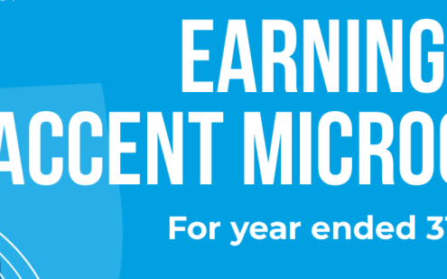
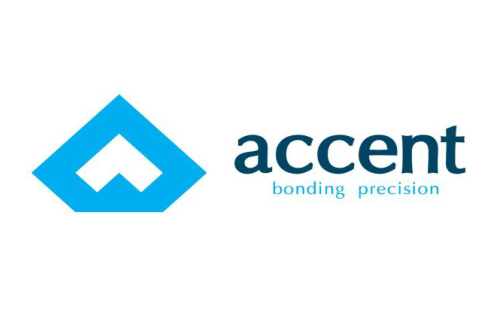

Date: 20.05.2025 

To 

National Stock Exchange of India Limited ‘Exchange Plaza’, Bandra-Kurla Complex Bandra (East), Mumbai 400051 

**<u>Scrip Symbol:</u>** ACCENTMIC 

**<u>ISIN:</u>** INE0Q5D01013 

**<u>Sub: Submission of transcript of earnings conference call pursuant to Regulation 30 of SEBI (Listing Obligations and Disclosure Requirements) Regulations, 2015</u>** 

Dear Sir/Madam, 

We wish to inform you that the Company had conducted an Analyst Meet with Investors/Analysts on May 17th, 2025, with respect to the financial results of the Company for the half year and Financial Year Ended March 31st, 2025. 

The transcript of the aforesaid Analyst Meet with Investors/Analysts is enclosed here. 

Kindly take the above information on record and disseminate. 

Thanking You, Yours Truly 

## **For Accent Microcell Limited** 

HIRAL Digitally signed by HIRAL KANUBHAI KANUBHA GEDIYA Date: 2025.05.20 I GEDIYA 17:29:21 +05'30' **Hiral Gediya** Company Secretary and Compliance Officer (M. No.A48107) 

**[Image: ACCENT_20052025173721_Investor_Transcript17052025.pdf-0002-00.png (495x309, 29.3KB)]**

**Ghanshyam Patel:** Okay, so we got with an image. 

**[Image: ACCENT_20052025173721_Investor_Transcript17052025.pdf-0003-00.png (495x309, 54.4KB)]**

**Finportal:** I'll start. Ladies and gentlemen, good day, and welcome to the earnings call of Accent Microsoft Limited for the financial year ended 31st March 2025. All participants are currently on mute. The floor will be open for questions when the management presentation concludes. 

Representing Accent today, we have Mr. Vasant Patel, Chairman; Mr. Ghanshyam Patel, Managing Director and CFO; Mr. Nitin Patel, Executive Director; Mr. Nipam Jani, Senior Accounts Manager; Mr. Pratik Rughani, Senior Accounts Manager; and Mr. Ashish Singh, Global Business Head. 

Without further delay, I now invite the management to share a brief overview of the company's performance and provide insights into our operations through a brief presentation. Thank you, and over to you, sir. 

**Ghanshyam Patel:** Hi, good morning, everyone. Warm welcome to everyone attending the webinar on behalf of management. My name is Pratik Rughani. I'm going to have a presentation of Accent Microsoft Limited post declaring the results of the financial year ended 2025.Just to start about the disclaimer—minimum, I hope the screen sharing is on. So, about the presentation— 

**Finportal:** No, your screen is not visible, Pratik. 

**Ghanshyam Patel:** Your location? Okay, so— 

**Finportal:** I'm sorry. 

**Ghanshyam Patel:** I'm talking about my screen; I'm talking about the presentation. PBT, PBD. **Finportal:** Okay. 

**Ghanshyam Patel:** As everyone can see here, this is the name of the company. We are having an investor presentation for the year ended 31st March 2025. To start on a note, it's a basic disclaimer that whatever the presentation is, there is no forward-looking guidance given in the presentation. It's about the clarity that we are trying to give to the investors and all the stakeholders about the company financials. This is a company overview. The company was incorporated in the year 2012, when there was a Piranha unit, and then we procured the land for 

**[Image: ACCENT_20052025173721_Investor_Transcript17052025.pdf-0004-00.png (495x309, 54.4KB)]**

the unit. The present product portfolio comprises three products: MCC, mannitol fluid, and crosscaramel sodium. These are the names of two units—one is at Piranha, and the second is at JEC. 

This PPT slide will give a brief about the company's vision, mission, and the products that we cater to, along with the number of experienced team members we have and the global presence that is in 75-plus countries. The brand is also stated here, through which our various finished goods are sold. 

Our vision is: as a global leader in pharmaceutical excipients, we are committed to sustainable growth, enhancing quality of life, and staying true to our core values. 

The mission, driven by innovation and strengthened through global collaboration, is to deliver high-quality excipients with integrity, ensuring transparency, trust, and excellence in healthcare and beyond. 

We have an internal team of 200-plus members. We have a presence in 75-plus countries, including through a distributor network. Within the three-product portfolio—rather, finished goods—there are different categories of goods that are produced, so accordingly we have mentioned here 15-plus product grades. Even though the company was incorporated in the year 2012 as a Private Limited, we are in industries, so accordingly we have mentioned it as 24 years here. This is just a presentation about our journey so far, from incorporation to date. 

Basically, if we talk about the journey in decades, the partnership firm was established in the year 2001. In 2012, it was converted into a Private Limited, wherein, along with the conversion, we bought land in the HSCZ as well for the establishment of our HSCZ unit. Later, in 2022, we became a Public Limited company with an intent to go public and IPO rather, so in 2023, we started acquiring land for Unit-3 and accordingly the funds were raised later on. In 2024, if we see the substantial benchmarks or achievements, the commercial construction activities have started and the plant has significantly progressed in terms of construction activities and placing orders for all the machinery. That can be viewed by everyone with this slide. 

These are the core certificates that we have in place for both our units. These are the list of certificates, namely, EXCiPact, FSSC, FDA, and as per the company’s requirement or countries’ requirements, the certificates are in place. 

**[Image: ACCENT_20052025173721_Investor_Transcript17052025.pdf-0005-00.png (495x309, 54.4KB)]**

This slide will give an overview of the key strengths of the company. We have global market expansion; our products are built upon the use of the latest technology; we are committed to quality excellence; we have a good in-house supply-chain team, precisely a business operation and supply-chain department, who take care of relevant delivery processes, and with a vision of even sustainable and responsible growth. 

These are the core product portfolios, within which we have different grades of product. MCC is one of our main products. Apart from that, in the current year, we have come out with a couple of new products in addition to what we are bringing out with Unit-3. You can see the slide wherein the names of products are mentioned. MCC is the core product; SMCC and MCC Spheres are the recently two newly developed products. Microcrystalline cellulose with CMC is the co-processed product with the use of MCC. 

There are another two products: CCS Magnum and Powder Cellulose. These are all our products developed from our R&D and QC team, so the research work was going on for the last two to three years. 

**Ghanshyam Patel:** Going ahead, you will see sales from the new products of Unit-3 along with sales from SMCC and MCC Spheres, which are more premium-grade excipient products wherein basically the raw material is MCC, so we are not concerned about the procurement of raw material for those products. 

These are the primary industries that we cater to at present, more focusing on pharmaceutical, nutraceutical, food and bakery, cosmetics, and welding electrodes. Apart from that, there are other technical grades as well, but those don’t compose more than around 2–3 % of revenue, so we have preferred to keep the slide as precise as possible. 

This is a world map wherein our presence is reflected. As we have stated earlier, we have a presence in around 75-plus countries, including the distributorship model that we follow for our business. So, if we talk about exports, we have 17-plus years of export experience. After almost two decades of experience, we have catered to around 75 countries. 

If you talk about the financials of 2025, the breakup of revenue has been shared here, wherein 53.49 % is export revenue and the balance is domestic revenue. There is an increase in the 

**[Image: ACCENT_20052025173721_Investor_Transcript17052025.pdf-0006-00.png (495x309, 54.4KB)]**

domestic-revenue percentage this year, as compared to the previous year, as we are targeting Indian MNCs from the last financial year. 

This slide gives an overview of our core product, MCC, and the expected CAGR of our excipient industry is reflected. 

If we talk about the SWOT analysis, these are the main strengths of our company: innovationdriven R&D, diversified market presence, dynamic leadership, favorable industry tailwinds—as you know, pharma is an in-vogue sector right now, so we fall under the category of pharmaceutical excipients, i.e., bulk drugs—strong financial backbone, strong supplier-distribution network, and proven expertise in process scaling. 

These are the founder-promoters of our company: Mr. Vasant Patel, who is the Chairman of the company; Mr. Ghanshyam Patel is the MD and CFO of the company; Mr. Nitin Patel is an Executive Director of the company; and Mr. Vinod Patel, who is also an Executive Director of the company. Apart from these four Directors, we have three Independent Directors in place as well and one Woman Director on our Board. 

**Ghanshyam Patel:** This slide represents the key business highlights till the end of financial year 2025:                         expanded and diversified product portfolio, operational and manufacturing excellence, commitment to regulatory and quality standards, robust presence in domestic and international markets. 

This is the photo of the plant personnel, along with images of the admin buildings of both the plants, together with photos of core machinery at the SEZ unit. The photo of the machinery you see is of a glass-lined reactor, which is the most advanced technology used to produce MCC and other excipient grades of products. 

If you talk about the capacity of individual plants, at Piranha we have an individual capacity of 2,000 metric tons; at the SEZ the capacity is around 7,200 metric tons per annum. If we talk about capacity utilization, Unit-1 was at 100 % in the last fiscal, and Unit-2 was at 95 %. 

**[Image: ACCENT_20052025173721_Investor_Transcript17052025.pdf-0007-00.png (495x309, 54.4KB)]**

Along with the photos of the plant, you can see the product flexibility and customer-centric approach that we follow, and the grade of raw material—the supreme-grade raw material—we use to produce MCC and other finished goods, namely CCS and MSC. 

Now, I think the most important slide that most of the investors were waiting for: we are coming out with Unit-3, wherein three different products will be launched—a premium range of excipient products. CCS we are already supplying to our existing customers, but we are coming out with a more-enhanced capacity; along with CCS, we’ll be producing CMC and sodium starch glycolate. At present, our installed capacity for both units are 9,200 metric tons per annum, which is going to increase by 12,000 metric tons per annum with an added range of premium excipient products. 

You can see the tentative revenue potential once the unit is commercialized and the production timeline we are looking for. As such, taking SEBI regulations in place, we are not supposed to give any forward-looking guidance, but this is just a rough idea to give investors insight into our present order book. We have confirmed orders for the next projected three months’ stable workflow, front-products, and continuity; predictable demand enables strategic planning. 

These are the tables—or rather the pie charts—presenting the capacity breakup. The capacity figures were already stated earlier; this chart just reflects the components of revenue, export and domestic, which we have already discussed—this is simply in chart form. I think most of the investors or attendees who are at the webinar must have gone through the financials. This is just the financial synopsis of the broad parameters: the bottom line was around ₹33 crore and the top line around ₹265 crore. We’ll discuss in depth about the financials and operating performance in the question-and-answer round, so I’ll keep this slide for later. 

**Ghanshyam Patel:** These are the balance sheet figures, accessible to everyone through the NSE portal and through our website as well: equity, capital reserves, borrowings, other liabilities, fixed assets, loans, advances, CWIP, and other assets. 

This is a pie chart presenting the revenue breakup—revenue, PAT, EBITDA achieved, and the yearon-year percentage increase in growth that the company—your company—has been able to achieve. 

**[Image: ACCENT_20052025173721_Investor_Transcript17052025.pdf-0008-00.png (495x309, 54.4KB)]**

Revenue from operations has increased by 8 %. There’s an increase in PAT of around 10 %. EBITDA has increased by around 12 %. The EBIT margin is unchanged, and there is a significant drop in borrowings compared with the previous year. 

Thank you, everyone, for your patient hearing. I think we can open the floor for the question-andanswer round—one question at a time if possible—so that our internal team can answer accordingly and there’s no confusion, ensuring each and every question of the investors is addressed. Over to you. 

**Finportal:** We’ll now begin the question-and-answer session. Participants who wish to ask a question may raise their hand. We’ll take one question per person as said. We’ll take the first question from Mr. Himanshu. 

**Ghanshyam Patel:** Please. Yes, sir, good morning. 

**Himanshu Bisani:** Hello, am I audible? 

**Ghanshyam Patel:** Yes, sir, please. 

**Himanshu Bisani:** Hi, sir, good morning. Congratulations on a steady set of numbers, and thanks for the opportunity. Sir, I wanted to check on the current mix of the ₹265 crore top line we did this year. What is the mix of premium products—value-added like CCS and MSC? 

**Ghanshyam Patel:** Sir, hi, my name is Pratik. I’m going to answer your concern. At present, the premium-range component consists of around 10 % of the revenue; the balance comes from MCC, our main product. 

**Himanshu Bisani:** Okay. And, sir, what would be our realization difference between, let’s say, an MCC and a CCS or other higher-average premium realizations? 

**Ghanshyam Patel:** Sir, tentatively—given the market scenario as of now—it will be around 3.5× to 4× the prevailing market price of MCC. 

**Himanshu Bisani:** Understood, sir. I also wanted to understand, because we have a listed peer as well. When I look at the margins of that business—it is mostly into MCC currently, without high value-added products—but still they have better operating margins. From what I can gather, that 

**[Image: ACCENT_20052025173721_Investor_Transcript17052025.pdf-0009-00.png (495x309, 54.4KB)]**

is due to the material cost. There is a significant difference in material cost between us and our listed peer. Any idea on that, any outlook? 

**Finportal:** Sir, we’ll take one question at a time. You can answer this, and then we’ll move to the next attendee. 

**Ghanshyam Patel:** Yes, madam. Sir, as per our company policy, we prefer not to comment on peers’ finances. We understand we are doing fair enough and expect to deliver in future as well. 

**Finportal:** Okay, we’ll take the next question from Mr. Mahesh. 

**Mahesh Attal:** Hi, am I audible? 

# **Ghanshyam Patel:** Yes. 

**Mahesh Attal:** My question is on the capex that we are supposed to do. You said in the presentation you’ll be adding ₹70 crore this year. I just want to know what the capex is on that. 

**Ghanshyam Patel:** Sir, the total capex required is already part of the DRHP. Tentatively, capex will be around ₹55 crore. 

**Finportal:** We’ll take the next question from Ms. Nupur Karnani. 

**Ghanshyam Patel:** Yes, madam, mic on. 

**Nupur Karnani:** Good morning, everyone. Firstly, congratulations to the management for consistency in results. I want to ask about the current capacity utilization at the HSEZ and Piranha manufacturing units, and also understand: the products we deal in are MCC, CCS and CMC, so what margins will we enjoy in these three categories? 

**Ghanshyam Patel:** Our Chairman, Mr. Vasant Patel, will respond. 

**Vasant Patel:** Hi, good morning. Regarding utilization of Unit 1 and Unit 2, as mentioned in the presentation: currently we are utilizing Unit 1 (Piranha) at almost 100 %, and the HSEZ unit at about 95 % utilization. 

**Finportal:** We’ll take the next question from Mr. Priyank. 

**[Image: ACCENT_20052025173721_Investor_Transcript17052025.pdf-0010-00.png (495x309, 54.4KB)]**

**Priyank Chheda:** Madam, please allow at least two-three questions; one question alone cannot clarify everything. Hi, Ghanshyam-ji. We did around 9,000 tons last year and revenue of ₹265 crore, so our average selling price comes to around ₹300 per kilo. Now, for Unit 3 at Kheda we were planning large capex, but I understand we are just adding capacity of 2,800 tons though we have a huge land parcel. We were supposed to go for a rights issue and then do capex for a large capacity in one go, given huge demand visibility and export opportunity. Please explain the strategy for Kheda: how much are we adding, what is the plan ahead? We’re adding 2,800 tons— what will be the average selling price for CCS, CMC, SSG, and what EBITDA margins do we envisage from this unit? 

**Ghanshyam Patel:** Sir, hi, my name is Pratik. I’ll respond. From Unit 3, average realization for all three products will be roughly ₹600–₹650 per kg. Regarding the rights issue you mentioned: we have already got in-principle approval from the exchanges for the DRHP, so fund-raising for that expansion is in progress. It is only a matter of time before the Board meets to decide the exact rights ratio and pricing. 

**Finportal:** We’ll take the next question from Mr. Aman Soni. 

**Aman Soni:** Hello, am I audible? 

**Ghanshyam Patel:** Yes, sir. 

**Aman Soni:** We are entering high-margin segments expected to improve blended margins. What margin target are we looking for in FY 26? 

**Ghanshyam Patel:** Once Unit 3 is commercialized, margin for the premium-range products will be roughly 25 % on a bottom-line basis. 

**Finportal:** We’ll take the next question from Mr. Dinesh. 

**Dinesh Kulkarni:** Hello, am I audible? 

**Ghanshyam Patel:** Yes, sir. 

**[Image: ACCENT_20052025173721_Investor_Transcript17052025.pdf-0011-00.png (495x309, 54.4KB)]**

**Ghanshyam Patel:** Sir, hi, my name is Pratik. I’m going to answer your concern. At present, the premium-range component consists of around 10 % of the revenue; the balance comes from MCC, our main product. 

**Himanshu Bisani:** Okay. And, sir, what would be our realization difference between, let’s say, an MCC and a CCS or other higher-average premium realizations? 

**Ghanshyam Patel:** Sir, tentatively—given the market scenario as of now—it will be around 3.5× to 4× the prevailing market price of MCC. 

**Himanshu Bisani:** Understood, sir. I also wanted to understand, because we have a listed peer as well. When I look at the margins of that business—it is mostly into MCC currently, without high value-added products—but still they have better operating margins. From what I can gather, that is due to the material cost. There is a significant difference in material cost between us and our listed peer. Any idea on that, any outlook? 

**Finportal:** Sir, we’ll take one question at a time. You can answer this, and then we’ll move to the next attendee. 

**Ghanshyam Patel:** Yes, madam. Sir, as per our company policy, we prefer not to comment on peers’ finances. We understand we are doing fair enough and expect to deliver in future as well. 

**Finportal:** Okay, we’ll take the next question from Mr. Mahesh. 

**Mahesh Attal:** Hi, am I audible? 

**Ghanshyam Patel:** Yes. 

**Mahesh Attal:** My question is on the capex that we are supposed to do. You said in the presentation you’ll be adding ₹70 crore this year. I just want to know what the capex is on that. 

**Ghanshyam Patel:** Sir, the total capex required is already part of the DRHP. Tentatively, capex will be around ₹55 crore. 

**Finportal:** We’ll take the next question from Ms. Nupur Karnani. 

**Ghanshyam Patel:** Yes, madam, mic on. 

**[Image: ACCENT_20052025173721_Investor_Transcript17052025.pdf-0012-00.png (495x309, 54.4KB)]**

**Nupur Karnani:** Good morning, everyone. Firstly, congratulations to the management for consistency in results. I want to ask about the current capacity utilization at the HSEZ and Piranha manufacturing units, and also understand: the products we deal in are MCC, CCS and CMC, so what margins will we enjoy in these three categories? 

**Ghanshyam Patel:** Our Chairman, Mr. Vasant Patel, will respond. 

**Vasant Patel:** Hi, good morning. Regarding utilization of Unit 1 and Unit 2, as mentioned in the presentation: currently we are utilizing Unit 1 (Piranha) at almost 100 %, and the HSEZ unit at about 95 % utilization. 

**Finportal:** We’ll take the next question from Mr. Priyank. 

**Priyank Chheda:** Madam, please allow at least two-three questions; one question alone cannot clarify everything. Hi, Ghanshyam-ji. We did around 9,000 tons last year and revenue of ₹265 crore, so our average selling price comes to around ₹300 per kilo. Now, for Unit 3 at Kheda we were planning large capex, but I understand we are just adding capacity of 2,800 tons though we have a huge land parcel. We were supposed to go for a rights issue and then do capex for a large capacity in one go, given huge demand visibility and export opportunity. Please explain the strategy for Kheda: how much are we adding, what is the plan ahead? We’re adding 2,800 tons— what will be the average selling price for CCS, CMC, SSG, and what EBITDA margins do we envisage from this unit? 

**Ghanshyam Patel:** Sir, hi, my name is Pratik. I’ll respond. From Unit 3, average realization for all three products will be roughly ₹600–₹650 per kg. Regarding the rights issue you mentioned: we have already got in-principal approval from the exchanges for the DRHP, so fund-raising for that expansion is in progress. It is only a matter of time before the Board meets to decide the exact rights ratio and pricing. 

**Finportal:** We’ll take the next question from Mr. Aman Soni. 

**Aman Soni:** Hello, am I audible? 

**Ghanshyam Patel:** Yes, sir. 

**[Image: ACCENT_20052025173721_Investor_Transcript17052025.pdf-0013-00.png (495x309, 54.4KB)]**

**Aman Soni:** We are entering high-margin segments expected to improve blended margins. What margin target are we looking for in FY 26? 

**Ghanshyam Patel:** Once Unit 3 is commercialized, margin for the premium-range products will be roughly 25 % on a bottom-line basis. 

**Finportal:** We’ll take the next question from Mr. Dinesh. 

**Dinesh Kulkarni:** Hello, am I audible? 

**Ghanshyam Patel:** Yes, sir. 

**Dinesh Kulkarni:** Thanks for giving me the opportunity and congratulations on the good set of numbers. May I first request you to put the deck—the PPT—on the company website or BSE portal, or any support portal we can access? 

**Ghanshyam Patel:** Sir, it was uploaded before the start of the meeting as per the required norms in place, so I think by the end of this webinar you will be able to access it. 

**Dinesh Kulkarni:** That’s great. Okay, sure, I’ll check that out. Thank you for that. My question, sir, is: you mentioned Unit 3—when will it come online, how much of the work is done in percentage terms, do we have fixed contracts for that capacity, and will it be only for the premium products you mentioned? Will it have higher margins than the current units? If you could talk about Unit 3 details, including revenue potential in the next two–three years, that would be great. 

**Ghanshyam Patel:** Sir, sharing details related to Unit 3 is fair enough, but giving forward guidance for two–three years is a bit difficult from our end. Yes, we expect commercial production from Unit 3 to start around September to October, and margins will be much higher than what we have now. Margin levels, on a conservative basis, are around 25 % for Unit 3 on a standalone basis. 

**Finportal:** Mr. Neil, you can ask your question now. 

**Neil Bahal:** Hello, hi everyone—nice to connect with you after a while. Am I audible? **Ghanshyam Patel:** Yes, sir. 

**[Image: ACCENT_20052025173721_Investor_Transcript17052025.pdf-0014-00.png (495x309, 54.4KB)]**

**Neil Bahal:** Most of my questions have already been answered by previous participants. I understand production from the new Unit 3 will start around September or October, and you are going in a phased manner for ramp-up. Am I correct? 

# **Ghanshyam Patel:** Yes, sir. 

**Neil Bahal:** Could you tell me a bit about how you will phase it? By when do you expect Phase 1 to reach a level where you begin work on Phase 2, in terms of production start? 

**Ghanshyam Patel** : Sir, as stated earlier, we expect commercial production for Unit 3 Phase 1 in September to October 2025. For Phase 2, once the fund-raising is taken care of—the land is already acquired and related land-development work has started—we expect Unit 3 Phase 2 to be commercialized by around June 2026. 

**Neil Bahal:** Okay. I heard peak Phase 1 revenue of ₹70 crore. Is that right—Phase 1 peak revenue? 

**Ghanshyam Patel:** No, no, no, sir, it was taken into account the number of months for which the commercialization was available. 

**Neil Bahal:** That is in year one. So, ₹70 crore is year one? 

**Ghanshyam Patel:** Yes, sir. 

**Neil Bahal:** Okay, so but that is not getting us to full capacity utilization. So, what is the peak capacity of this Phase One? What will be our revenue? 

**Ghanshyam Patel:** Sir, it will be somewhat around ₹150 to ₹160 crores. 

**Neil Bahal:** Okay, so in year one, you're assuming that we will be at 45 to 50% utilization level? 

**Ghanshyam Patel:** Exactly, sir. 

**Neil Bahal:** Okay, and year two—and this going from ₹70 to ₹140 crore—will happen in the second year, or do you expect it in the third year? 

**Ghanshyam Patel:** It will be happening in the third year as well. 

**Neil Bahal:** Okay, so let’s say 45% in the first year, probably 70-odd percent in the second, 

**[Image: ACCENT_20052025173721_Investor_Transcript17052025.pdf-0015-00.png (495x309, 54.4KB)]**

**Ghanshyam Patel:** Yes. 

**Neil Bahal:** and then whatever is the maximum that you can do in the third year. 

**Ghanshyam Patel:** Sir. 

**Neil Bahal:** Okay, and at the same time you're likely to do a rights issue or some sort of a fundraise 

**Neil Bahal:** which will enable you to commence construction for Phase 2 also? 

**Ghanshyam Patel:** Exactly, sir. 

**Neil Bahal:** It will be a— 

**Ghanshyam Patel:** Kind of a—that will be a brownfield expansion. 

**Neil Bahal:** Understood. What kind of a fundraise would be required for this, and how much will you do in equity dilution? 

**Ghanshyam Patel:** Sir, we don’t foresee any kind of equity dilution as of now. We have received an approval from the exchanges for the draft letter of offer for the proposed rights issue. 

**Ghanshyam Patel:** So, what we are able to understand—the approval has been received up to an amount of ₹940 crores, which is there in the public domain, and the balance of the project cost will be funded out of internal accruals. So, at present, we don’t foresee any kind of equity dilution when it comes to promoters' holding. 

**Neil Bahal:** Understood, understood. And this Phase 2. 

**Neil Bahal:** The same way you explained Phase One—that in the first year of commercial production we’ll get an XYZ amount of revenue and in three years we’ll be fully ramped up—is it likely to be the same for Phase Two in terms of timing? 

**Ghanshyam Patel:** It will be much earlier in Phase Two, because it is the same product, MCC, that we are coming out with, so it will be much easier for us to target our existing customers and secure the orders that we have already shared with you in the PPT. 

**[Image: ACCENT_20052025173721_Investor_Transcript17052025.pdf-0016-00.png (495x309, 54.4KB)]**

**Neil Bahal:** So, just so that I can work on a mental model for myself: I’m assuming that by FY 28— this is FY 26, next year FY 27, third year FY 28—Phase One will be almost at peak capacity, which will be about ₹150 crores. In the meanwhile, Phase Two will be ready and also producing. So in FY 28, ₹150 crores from Phase One—what do you expect from Phase Two? 

**Ghanshyam Patel:** Sir, for Phase Two I need to account—give me a moment, please, sir. 

**Neil Bahal:** Of course, this is just guidance and we’ll not hold you to it; it’s just your expectations. 

**Ghanshyam Patel:** Roughly it will be revenue of around ₹220 to ₹250 crores on a standalone basis for Phase Two. 

**Finportal:** Neil sir, please get back in the queue; we’ll take you afterwards. For the next question I request Mr. Prabal to ask his question. 

**Prabal Jain:** Hello, hi, am I audible? 

**Ghanshyam Patel:** Yes, sir. Please. 

**Prabal Jain** : I’ll actually continue the thread that Neil was asking, because that is the only thing I also wanted to know. First, I read somewhere that your environmental clearance is pending, or something from the Gujarat Pollution Board. Is that sorted? 

**Ghanshyam Patel:** To the extent we understand, there is no such issue pending. Yes, there is one matter related to the NGT—that, I hope, I am not sure whether you are referring to that matter or not—but yes, there’s one NGT matter which can be termed a contingent liability. When we talk about contingent liability, there are three scenarios: remote, possible, and probable. At present that contingent liability is remote, according to us. 

**Prabal Jain:** Basically, what I want to understand—you're saying Phase One will commence by September or October—so do you have all the necessary approvals to begin that unit? 

**Ghanshyam Patel:** Sir, when it comes to establishing a pharma unit, before starting construction activities you need to obtain the relevant approvals, no doubt. For commercialization there is a different approval in place, which we foresee will not be a big task for us, taking into account our 

**[Image: ACCENT_20052025173721_Investor_Transcript17052025.pdf-0017-00.png (495x309, 54.4KB)]**

existing two units already in place, and the main product CCS, which we are already producing in a lesser capacity. 

**Finportal:** Mr. Mahesh, you can ask your question now. 

**Mahesh Attal:** Thank you. Sir, my question is about your ₹70-crore revenue this year. You have done ₹55 crores of capex, so what I understand is that the asset-turn of our business is around three times. Am I correct in that assumption? 

**Ghanshyam Patel:** Sir, that is fine for the next fiscal, if you are talking about it, because the capacity utilization is on a pro-rata basis—that is, effective commercial production from the month of October. 

**Mahesh Attal:** Sorry to interrupt, but you have already done a capex of ₹55 crores for Phase One, right? 

**Ghanshyam Patel:** No, sir, that is in process. 

**Mahesh Attal:** So, what is the total capex for Phase One? 

**Ghanshyam Patel:** It will be ₹55 crores, sir, but that is in process. The entire capex will be reflected in the next financials. 

**Mahesh Attal:** That means the asset-turn, or the peak capacity—the peak revenue from that unit—is ₹150 to ₹160 crores, from what I understand. 

**Ghanshyam Patel:** Yes, sir, but we need to understand and consolidate the turnover ratio for Unit One and Unit Two as well. 

**Mahesh Attal:** What I’m trying to understand here is: when you put in ₹55 crores and you are able to generate ₹160 crores, the asset-turnover is about three times, right? 

**Ghanshyam Patel:** That is correct, sir—that is on a standalone basis, yes, and with higher profit margins. 

**[Image: ACCENT_20052025173721_Investor_Transcript17052025.pdf-0018-00.png (495x309, 54.4KB)]**

**Mahesh Attal:** So, what we should take from here on is: for any phase that will be coming up ahead, any peak revenue will be—like we have to go back and re-work—and the asset-turn is about three times of any capex that you do. 

**Ghanshyam Patel:** Sir, for Unit Three, the first phase that you are referring to is an altogether different range of products that we are coming out with. If you are referring to the next phase of expansion, we are coming out with MCC with roughly a capacity of around 12,000 metric tons per annum, so that asset-turnover ratio will be much higher. In order to reach a conclusion—Unit Three, Phase One plus Phase Two—the asset-turnover ratio will not be less than 4.5 to 5 times. 

**Mahesh Attal:** What is the differential between the export margin and the domestic margin on your product line, sir? 

**Ghanshyam Patel:** Sir, roughly, it is around 10 percent. 

**Mahesh Attal:** And you expect the financial-year-’25 ratio to sustain in the next year also, 53 and 46? 

**Ghanshyam Patel:** Definitely, yes, sir. Looking to the expansion and the commercialization of Unit Three, the ratio is going to improve—the export ratio is going to increase compared to domestic, because we have a targeted audience for the export market. 

**Finportal:** We’ll take the next question from Himanshu. 

**Himanshu Bisani:** Hi, sir, thanks for the opportunity again. From what I understood, Phase One’s peak revenue is ₹150 – ₹160 crores and Phase Two’s peak revenue could be ₹220 – ₹250 crores. 

**Ghanshyam Patel:** As of now, tentatively, yes. 

**Himanshu Bisani:** Provided that Phase One meets our expectations, when do you plan to start the Phase Two expansion—just roughly? 

**Ghanshyam Patel:** We already answered this. Once the fund-raising for the second phase is done, we expect commercialization to begin in June 2026. 

**[Image: ACCENT_20052025173721_Investor_Transcript17052025.pdf-0019-00.png (495x309, 54.4KB)]**

**Himanshu Bisani:** Understood. One more question on the raw-material side. What is the outlook and the current scenario? Are we facing any difficulty in procuring raw material at a reasonable price? 

**Ghanshyam Patel:** No, sir. We have an established base of suppliers, we have sufficient export orders in hand, and we have quantity commitments with those suppliers. We don’t foresee any negative impact on our finances when it comes to procuring raw material. 

**Finportal:** Ms. Nupur, you can ask your question now. 

**Finportal:** We’ll take the question from Mr. Munjal Shah 

**Munjal Shah:** Hello! 

**Ghanshyam Patel:** Hi, sir! 

**Munjal Shah:** Am I audible? 

**Ghanshyam Patel:** Yes, please. 

**Munjal Shah:** Thank you for the opportunity, and congratulations on a decent set of numbers. My first question: looking at our historical margins, we have grown from about 8 %–10 % to 16 % by FY 25. Now we are talking about Unit 3 margins of roughly 25 %. What were we doing in the past to get to 16 %, and what are we planning so that margins rise to 25 %? A brief journey would help. 

**Ghanshyam Patel:** To be precise, when we talk about the 25 % margin, that is on a standalone basis for Unit 3. That must be read together with the existing capacity. I am not sure where the margin of 15 %–16 % you mentioned has been derived. If you are talking about PAT levels, the present margin is around 12 %–13 %. 

**Munjal Shah:** Ghanshyam-ji, based on the numbers, the EBITDA margin—i.e., the operating margin—reflects 15 %–16 % on a consolidated basis, correct? 

**Ghanshyam Patel:** Yes, definitely. 

**[Image: ACCENT_20052025173721_Investor_Transcript17052025.pdf-0020-00.png (495x309, 54.4KB)]**

**Munjal Shah:** So which products were we actually working on that led us to this 15 % to 16 % margin, and what new products are we planning that will improve our margins to 25 %? That is what I wanted to understand. 

**Ghanshyam Patel:** Yes, sir. For Unit 3 we are coming out with three new products, that is, CCS, CMC and SSG. Apart from the benefits that we are going to sell from those new products, we have developed three new in-house products—namely, MCG spheres, microcrystalline cellulose powder and SMCC. We have been working on these three products for the last two to three years in-house; our R&D team was working on them. That has resulted in a better margin, and in the future, you can expect the same quantity to be multiplied going ahead. 

**Munjal Shah:** Okay, okay. And, sir, when we say that we will do Phase One, which will have 2,800 metric tons, what will the capacity of Phase Two be? 

**Ghanshyam Patel:** Sir, the capacity of Phase One will be 2,400 metric tons, to be precise, and the capacity for Phase Two will be 12,000 metric tons, taking into account that we are going to produce MCC in Phase Two. 

**Munjal Shah:** Okay, okay, and do we have visibility of orders? Basically, when we are going for such a big expansion—if I’m looking at it, we are close to 12,000 metric tons per annum capacity right now, and with the addition of Phase Two, which we are expecting in June 2026, we are doubling our capacity. Do we have the visibility behind placing such a huge capex? It would be really helpful if you could throw some light on that. 

**Ghanshyam Patel:** Sir, taking into account the presentation we shared, wherein both our plants are almost working at 95 % to 100 % capacity, and the orders booked for the domestic and export markets that we have right now, we understand that achieving the desired capacity-utilization level for Unit 3 Phase One and Unit 3 Phase Two won’t be a big task for us, because our existing customers are only going to buy this product from us. So, we don’t see any problem when it comes to capacity utilization or selling these finished goods. 

**Finportal:** Ms. Nupur, you can ask your question now. 

**Nupur Karnani:** Thank you. I would like to ask one thing. You said that the third manufacturing unit will be set up, and from that unit the PAT margin on a standalone basis will be somewhere around 25 %. I want to understand, in the total revenue mix, what will be the percentage from that 

**[Image: ACCENT_20052025173721_Investor_Transcript17052025.pdf-0021-00.png (495x309, 54.4KB)]**

particular unit—from those premium products—how much will they contribute to the total revenue of the company? And also, if I look at the financials, debtors-to-sales have increased from 21.91 to 24.52. That indicates a rise in receivables relative to revenue, because the top line increased by only about 8 %. Could you please elaborate on how the company plans to manage its receivables and overall working capital going forward? 

**Ghanshyam Patel:** Yes, madam, just to address your concern point-wise. If we talk about the total revenue from Unit 3, Unit 1 and Unit 2—that’s on a consolidated basis—we roughly expect, if only Phase One is considered as of now, around ₹400 crores to ₹425 crores of revenue. Post Phase Two, we expect that number to rise, taking into account the developments that happen after June 2026. 

**Ghanshyam Patel:** And if, say, the percentage of the premium range will be around 25 % to 30 % of the total revenue, that is from Unit 3. 

**Ghanshyam Patel:** Apart from that, one of your questions was regarding the increase in the level of working capital. Yes, in the last quarter of the last financial year we entered—no, not a formal agreement, but we started selling goods to Indian local MNCs as well, sorry, Indian MNCs. So, initially, just as an entry point, we offered certain liberal payment terms, which is reflected in the increase in the ratio of domestic sales. That is the main reason why there is, to an extent, a temporary increase in the working-capital levels. 

**Nupur Karnani:** So how are you going to manage the situation? Your ratio of domestic sales has increased, but if I look at the top line it has shown a surge of 8 %. If I look at the rise in debtors, it is somewhere around 24 %. So, your need for working capital has increased—how are you going to deal with that? The cash-conversion cycle has increased by ten days and that is definitely going to affect your business. 

**Ghanshyam Patel:** Madam, to the extent that we talk about the free cash flow we generated in the last fiscal and what we expect in the current fiscal, we don’t foresee any kind of additional working-capital requirements in future, at least for Unit 1 and Unit 2. 

**Finportal:** Mr. Dinesh, you can ask your question now. 

**Dinesh Kulkarni:** Okay, sir, thanks for giving me another opportunity. My question is very specific. If we go to page 11 in the financials you published earlier, we see that the H-unit, right? 

**[Image: ACCENT_20052025173721_Investor_Transcript17052025.pdf-0022-00.png (495x309, 54.4KB)]**

The export sales have remained flat—almost no change—and domestic has, in fact, declined by a few crores. Could you explain what is going on with this H-unit facility? Why are we not seeing growth? That’s my first question; I’ll ask the second later. If you could answer this, please. 

**Ghanshyam Patel:** Sir, I hope you are referring to the current financial year 2024-25, where you are seeing the— 

**Dinesh Kulkarni:** Yes, yes. If you go to page 11, you can see the H-unit exports have been literally flat—that is ₹140 crores and ₹140.7 crores—whereas domestic sales have been almost around ₹9 crores. 

# **Ghanshyam Patel:** Yes, sir. 

**Dinesh Kulkarni:** So, my question is, why is that? I understand the capacity utilization is 100 %, assuming that, so there is no additional capacity. But are we expecting any decline in the realization or pricing because of which we are not able to generate higher revenue here? 

**Ghanshyam Patel:** No, sir. As you stated, we are at such a level of production capacity where you need to understand that we are categorized—if we talk about the industry—that the capacity utilization has resulted in export sales remaining at a limited or restricted level. That has been compensated by the increase in domestic sales. 

**Dinesh Kulkarni:** No, but for the H-unit I’m specifically asking. 

**Ghanshyam Patel:** That is what I’m trying to say. On a year-on-year basis, the sales of that unit— if you talk about export—have remained at the same levels. 

# **Dinesh Kulkarni:** Hello? 

**Ghanshyam Patel:** Which has been compensated by us. Ultimately the financials are published for Unit 1 and Unit 2 both, so if we have a good option or market available for our Piranha unit, then we always have an option to sell into the domestic market. Accordingly, from the Piranha unit you can see a substantial increase in sales. As you stated, it is already working at 90 % to 95 % capacity. The order book is in place within predefined rates, subject to certain terms and conditions, so there is not much growth—if you talk about the H-unit—in sales order growth; by way of selling into the domestic market. 

**[Image: ACCENT_20052025173721_Investor_Transcript17052025.pdf-0023-00.png (495x309, 54.4KB)]**

**Dinesh Kulkarni:** I understand. So, are we expecting any further realizations from the existing facilities we have? Because I’m assuming Unit 3 will take some time to come online and stabilize. Are we expecting any increase in pricing and all that? Because I’m assuming volumes will remain more or less the same for the existing units, right? 

**Ghanshyam Patel:** The product combination is going to change substantially. As I earlier stated, we have developed three new products—namely SMCC, spheres, and cellulose powder as well— so that combination is going to increase, and they are premium-range excipient products. In terms of quantity, it might not change much, but yes, the revenue realization will be higher. 

**Finportal:** We will take the next question from Sanika. 

**Sanika Khemani:** Hello? 

**Ghanshyam Patel:** Yes, madam. 

**Sanika Khemani:** Yeah. So, sir, right now we are at around 96 %–97 % capacity utilization and our next unit is coming in September–October. Can we say that our H1 numbers are going to be relatively flat as we compare them on a year-on-year basis, and for the full year with Unit 3 Phase 1, are we looking at around ₹350 crores of revenue for FY 26? 

**Ghanshyam Patel:** Madam, sorry to say, but answering the precise requirement you are looking for will not be practically possible from our end to quantify the figures; we are not supposed to give any kind of forward-looking guidance. We can share the capacity levels and the premium range of products that are there and their contribution, which is going to increase in the coming half year—rather, to be precise, until 30 September 2025. Post-Unit 3, we can see a substantial increase in sales and bottom-line levels, taking uniform realization from Unit 3. 

**Sanika Khemani:** Okay. So, in H1, from where are we expecting the growth, apart from the premiumization of the product? 

**Ghanshyam Patel:** Madam, as I said earlier in the last questions, the capacity for the new products that we have developed in-house We are going to sell that “More-Pro” product, which will be a kind of basket of products along with the MCC. So that might have a positive impact on the total revenue, because the three new products that we have developed are also categorized under the premium range of excipient products. 

**[Image: ACCENT_20052025173721_Investor_Transcript17052025.pdf-0024-00.png (495x309, 54.4KB)]**

**Sanika Khemani:** Okay, okay. Thank you. 

**Ghanshyam Patel:** Thank you, ma’am. 

**Finportal:** Mr. Aman, you can ask your question now. 

**Finportal:** Cool. 

**Finportal:** We’ll take the next question from Prabal Jain. 

**Prabal Jain:** Yes, hi! First of all, a very humble request to the Finportal people—Abhishek bhutra and Hetvi ma’am—please let us actually ask some follow-up questions; otherwise, there is no point to this call. If you are willing to let us, ask only one or two questions, then it doesn’t serve the purpose. The point is to actually have some follow-up and understand what is happening, so please, let us. If you want to place a limit, place it at two minutes or something like that. 

**Prabal Jain:** Okay, okay. 

**Finportal:** Actually, the problem is that there are too many questions, and if one person keeps on asking questions, the other people won’t get the chance. 

**Prabal Jain:** You can keep—no, sir—one minute. You can keep your forty-five minutes; you can entertain forty-five people in one minute each, and everyone will be able to have satisfaction. Management is anyway not coming on a public call, right? The only time we have to interact with management is two times in one year. 

**Finportal:** The frequency will also increase, but that’s okay—we’ll keep it in mind. You can ask your question. 

**Prabal Jain:** So, I have some questions, Ghanshyam-ji, on your Unit 3. First of all, you are saying that you will have all the approvals in place right before you commence the unit—from NGT, from the Pollution Board, everywhere—right? 

# **Ghanshyam Patel:** Hey? 

**Ghanshyam Patel:** Oh, sorry for the inconvenience, sir. We’ll try to ensure that most of your questions are answered as per your precise requirement. I think our chairman is going to respond to your questions. Chairman-sir, over to you. 

**[Image: ACCENT_20052025173721_Investor_Transcript17052025.pdf-0025-00.png (495x309, 54.4KB)]**

**Ghanshyam Patel:** Yes, sir. 

**Ghanshyam Patel (Chairman):** About your question: already we have received the certain and confirmed whatever is required—the certifications and approvals from the department at that time and at the level at which we are going through. And, of course, as mentioned by Prate earlier, once we are commencing our production line-up, then certain other approvals and licenses will be required for the final approval and commencement. 

**Ghanshyam Patel:** The final product approvals will be obtained by us on a time-to-time basis. 

**Prabal Jain:** Sir, please don’t get me wrong. The reason I’m asking is that this has been a very critical issue. We are already one-and-a-half years into the process, and the delays are surely coming from approvals. I understand India as a country—fine. The only liberty I want is: let us ask the questions at least; we’re not even allowed to ask the questions. Okay. Unit 3: you are saying that Phase 1 will be your value-added products, right? You are saying the capacity will be 2.8 k metric tons per annum, and you are expecting better margins here—something to the tune of 2425 percent. And Phase 2, you’re saying you will add 12,000 metric tons per annum of the MCC product only, which is your existing product line—95 percent of the top line. Am I correct? 

# **Ghanshyam Patel:** Correct. 

**Prabal Jain:** And, sir, the Phase 2—12,000 metric tons per annum—is a very big capacity. Currently you are at, I think, 9.5 k metric tons, right? 

**Ghanshyam Patel:** Yes, for Unit 1 and Unit 2 together. 

**Prabal Jain:** Combined, correct. So, on a standalone basis, if I understand Unit 3, you will add completely whatever new capacity you have right now in Phase 2, correct? 

# **Ghanshyam Patel:** Yes. 

**Prabal Jain:** Okay, great. So, is it fair to assume that you are doing ₹260 crores revenue now, so in Unit 3 alone, in Phase 2, you’ll pull off at least ₹260 crores, right? 

**Ghanshyam Patel:** Yes. 

**[Image: ACCENT_20052025173721_Investor_Transcript17052025.pdf-0026-00.png (495x309, 54.4KB)]**

**Prabal Jain:** And now Phase 1 will come first. So, Phase 1—2.8 k metric tons per annum—is your VAP products, which carry 25 percent margin, and you are saying that ₹70 crores you can do in the first year. But what is the peak revenue of Phase 1, the VAP products? 

**Ghanshyam Patel:** Sir, it will be ₹150 crores. 

**Prabal Jain:** This is only for Phase 1 of Unit 3. Okay, so ₹150 crores for this, and Phase 2—for which you’ll be doing the rights issue, as you discussed with Neil recently— 

**Ghanshyam Patel:** Yes, sir. 

**Prabal Jain:** Okay, and rights approval you have got. So, sir, now my final question: Unit 3— what is the maximum top line you will be doing, assuming Phase 1 goes live, Phase 2 goes live, and you discussed something about Phase 3 also, if I’m not wrong? Assuming you have all three phases going live, what is the peak revenue and by when? What is the financial year when you expect all three phases to go live and the peak revenue to kick in? 

**Ghanshyam Patel:** Sir, financial year ’29 can be considered for it, and the peak revenue for standalone Unit 3 will be ₹150 crores for Phase 1 and around, I guess. Let me work it out. 

**Prabal Jain:** ₹260 crores is on 10 k, so I’m assuming—let’s add 20 percent more—about ₹320 crores for Phase 2. 

**Ghanshyam Patel:** At present it would be too optimistic to assume 20 percent more; we are expecting around ₹275 crores. 

**Prabal Jain:** Okay, ₹275 crores, no issues. And Phase 3—can you give me some color? What will be the product and what will be the capacity? 

**Ghanshyam Patel:** You mean Unit 3 Phase 1? 

**Prabal Jain:** Yes, we are all talking about Unit 3 only. 

**Ghanshyam Patel:** CCS, SSG and CMC. 

**Prabal Jain:** Okay, and what would be the capacity? 

**Ghanshyam Patel:** It would be 2,400 metric tons. 

**[Image: ACCENT_20052025173721_Investor_Transcript17052025.pdf-0027-00.png (495x309, 54.4KB)]**

**Prabal Jain:** And the potential revenue from this? These are the VAP products, I’m assuming 25 percent-type margin. 

**Ghanshyam Patel:** ₹150 crores. 

**Prabal Jain:** Perfect. So, what I’m understanding is you will be adding—total—and for Phase 3 you haven’t begun the fund-raise yet; that will commence after the rights issue and Phase 2, right? 

**Ghanshyam Patel:** Yes. The land acquisition has been taken care of; construction activities will commence once the fund-raising goes through. 

**Prabal Jain:** Okay, fine. One last question: the ₹70 crore revenue you’re presenting for Phase 1— do you have confirmed orders, or are you assuming that once it goes live, we’ll be able to pull off ₹70 crores? 

**Ghanshyam Patel:** We already have orders for this amount, and we will supply the same to our existing customers worldwide. 

**Prabal Jain:** Okay, so you have confirmed orders. Thank you so much and all the very best. One request: if you could give us a monthly update or at least a quarterly business update, that would be very helpful, and if management can come on a con-call every quarter, that would be the icing on the cake. 

**Ghanshyam Patel:** We are working on continuous improvement and will definitely try to ensure that. 

**Prabal Jain:** It will actually work in your favor, sir. There are only two players in the market producing these products, and I think the new product you are commencing in Phase 1 of Unit 3 makes you the only player in India producing it. That would help you gain visibility and better investor appeal. 

**Ghanshyam Patel:** Yes, our intent is to reach out to all stakeholders, so it will definitely be taken care of positively. 

**Prabal Jain:** Sure, sir, definitely. Thank you so much, and hoping the best for you. Thank you. 

**Ghanshyam Patel:** Thank you. And what's up? 

**[Image: ACCENT_20052025173721_Investor_Transcript17052025.pdf-0028-00.png (495x309, 54.4KB)]**

**Finportal:** Mr. Priyank, you can ask your question. 

**Priyank Chheda:** Again, thank you. And I add to what the previous participant had a query, now, sir. Now, what would be the Capex for Phase 2 and Phase 3? Phase 1, I understand, is ₹55 crores, Phase 2 and Phase 3? 

**Ghanshyam Patel:** Sir, for Unit 3, let's talk about Phase-wise. Phase 1 Capex will be around ₹55 crores. 

**Ghanshyam Patel:** Phase 2 Capex will be around ₹55 to ₹60 crores. 

**Ghanshyam Patel:** And when it comes to the Capex plans and the fundraising, we already got the approval. The DLF, the approval has been issued for further fundraising, which will be in the form of a rights issue, which you are planning in the near future. 

**Priyank Chheda:** Got it, and Pratik, if you can also help me with the numbers of FY 25, what was the total volume that we sold from both the plants, and the breakup of that between domestic and exports? 

**Ghanshyam Patel:** Sir, I hope you are referring to the quantities that we have sold. 

**Priyank Chheda:** Volume sold in FY 25 for exports and domestic and total volumes. 

**Ghanshyam Patel:** Yes, sir, fair enough. Just a moment, please. Sir, the quantity was around— apart from the capacity due to the orders booked on hand, we have purchased certain semiprocessed goods as well, wherein only two processes were carried out from our end. So, apart from our existing capacity, taking into account the huge order book on hand and to ensure that the customer remains with us, we have carried out some outsourcing work as well. 

**Ghanshyam Patel:** So, that has resulted in a quantity of around 12,000 metric tons being sold during the year from both the plants. 

**Priyank Chheda:** So, this, what I understand, includes the manufacturing plus the trading portion. So, if you can give clarity on this, how much of that was manufactured and how much of that was traded? 

**Ghanshyam Patel:** Yes. 

**[Image: ACCENT_20052025173721_Investor_Transcript17052025.pdf-0029-00.png (495x309, 54.4KB)]**

**Priyank Chheda:** Can you give clarity on this? 

**Ghanshyam Patel:** 9,000 metric tons were manufactured in-house by us, and around 2,500 to 3,000 metric tons—this is not exactly trading, but for us, it was a procurement of semi-finished goods, and then later on, a certain level of processing was carried out in-house as well. 

**Ghanshyam Patel:** This was done taking into account pharmacopoeia and other regulatory requirements. 

**Priyank Chheda:** Would it be possible to explain the nature of these buyout items and the processes we do Versus what we do, the manufacturing—in the case of MCC, I understand how it is made from wood pulp, adding certain chemicals into it. Now, would it be possible to help us explain what these 3,000 tons is, and what is the value added that we do? Maybe this also answers the questions of lower EBITDA margins versus the other players. 

**Ghanshyam Patel:** Definitely, sir. Sir, basically, when it comes to bulk drugs, whatever the contract we have engaged so far with outsiders, wherein you have termed it trading. So, basically, two processes we carry in-house. One is a blending process, and the second one is a homogeneous particle size. 

**Ghanshyam Patel:** To the extent we understand, we have the use of the latest technology, that is the use of vibroshifter, wherein the blending process is carried out, and one is for bulk homogeneous particle size. We have specific machinery in place wherein the particle size is homogenized, which is required as per the pharmacopoeia norms. So those two processes are carried out by us. Yes, and to answer your second question, it does result in a certain level of drop in the EBITDA margin when it comes to the procurement of semi-processed goods and selling them to outsiders as compared to the in-house manufacturing activities. 

**Priyank Chheda:** Perfect, that really helps. And when it comes to the value-added products from Phase 1, do we have the customer approvals, or would it take some time to get the approval and to get the quantity sold? Now, to get the asset utilized in year one, year two, year three. 

# **Ghanshyam Patel:** Oh! 

**Priyank Chheda:** So, Jamie and, sir, is going to respond to your question. Pretty and big. 

**[Image: ACCENT_20052025173721_Investor_Transcript17052025.pdf-0030-00.png (495x309, 54.4KB)]**

**Ghanshyam Patel:** Yes, thank you. Yes, already we have started the activities to get approval from our existing as well as new customers. So, we have already started to send the samples and certain documents, whatever is required, to get the approval for this new product for Phase 1. 

Priyank Chheda: And this homogenization of the particles that we do, the homogenization that we do from the trading portion, would it continue even after, say, Phase 2 of MCC comes up, or would that get insourced? And that would also further lead to, would lead to improvement in the EBITDA margins. What would be the broader strategy over there? 

**Ghanshyam Patel:** According to the current market scenario, actually, we don't require to receive any outside material. So, we would have enough quantity of material from our Unit 3, Phase 2. 

**Priyank Chheda:** Perfect. So that means that once Phase 2 is up, 

**Ghanshyam Patel:** We would then look forward to a better EBITDA margin, even from the MCC, like-to-like. 

**Priyank Chheda:** Got it, and in terms of raw material What's the scenario in terms of wood pulp? How do we make sure that we hedge against the increase in raw material prices, and how much time would it take to pass on the same increase in cost of wood pulp within the MCC and the other value-added products? 

**Ghanshyam Patel:** Sir, we have a system in place wherein there's a fixed purchase price for the wood pulp for at least a period of one quarter. 

**Ghanshyam Patel:** Accordingly, the order books that we take for the finished goods are read with, say, if you have an order book for around 3 months, then the necessary prices of wood pulp, or the quantity commitment for the wood pulp, is already ensured to us before taking a further order book. 

**Ghanshyam Patel:** If there is an abnormal increase in the certain price apart from multiple factors, let’s say in exports if it is ocean freight, then definitely it is passed on to the customers for which we have not necessarily provided with us to show to the customers where the increase in price is passed on. 

**Ghanshyam Patel:** So basically, in the export market, the business model that we follow is a kind of a quantity commitment scenario. Prices will always fluctuate. If there's an abnormal increase in 

**[Image: ACCENT_20052025173721_Investor_Transcript17052025.pdf-0031-00.png (495x309, 54.4KB)]**

the price of raw material and in export, in the price of raw material as well as the price of ocean freight. 

**Finportal:** Mr. Manjeet, you can ask your question now. 

**Manjeet Buaria:** Yeah. Am I audible? 

**Finportal:** Yes, yes, yes. 

**Manjeet Buaria:** Thank you, sir. Sir, I had two questions. One was, if you could explain what the contingent liability issue is with the NGT. I don't know about that, so if you could just explain that, that was one. And the second question, I just wanted to understand, you know, on the last call we had discussed the related party transactions in the company. So, if you could give us some visibility as to by when these related party transactions will start trending towards negligible, because they have been quite meaningful. So, if you could just touch upon these two, please. 

**Ghanshyam Patel:** Sir, if you talk about, if you answer your first question, that is NGT matter, say, the problem is across the industries wherein, say, without taking much base, the notice is sold to the say across the industries. So, we are not the only unit wherein such a notice has been received for units. There are many units wherein such notices are being given by the environmental department, that is precisely termed as NGT matter, National Green Tribunal. 

**Ghanshyam Patel:** When it comes to say contingent liability, when it comes to having a financial impact in the balance sheet, there are three criteria. Whether the liability will not be in our favor, rather we will be to pay the liability. One is remote, possible, and probable. So as of now, and looking into the developments and the hearing that is happening on a monthly or quarterly basis, we don't foresee any kind of impact from our end. 

**Ghanshyam Patel:** So, it has been classified as remote, wherein no impact in the financials can be seen in the near future. 

**Manjeet Buaria:** No, sir, I wanted to understand in case it goes against us, and I'm sure we can appeal to a higher court as well, but as step one, in case it goes against us, what is the penalty or liability that will come up? What is the amount which NGT has put on us? 

**Ghanshyam Patel:** The penalty amount is already stated in the contingent liability. It is 4.11 crores, and looking at the strong shareholders' funds and equity that we are having, we don't see. 

**[Image: ACCENT_20052025173721_Investor_Transcript17052025.pdf-0032-00.png (495x309, 54.4KB)]**

Even if we refer to the maturity concept, I don't foresee the amount Substantial for us to as we have. We have a good amount of shareholder funds available with us. 

**Manjeet Buaria:** So very clear, sir, in the second point on related party transactions. Please. 

**Ghanshyam Patel:** Sir, the related party transaction for H2 financial 25 has been reduced substantially. It is almost, say, very less as compared to the earlier period. Going ahead, as we have said earlier, most of the activities will be carried out in-house by us. So, we can see the negligible level of related party transactions in the near future. 

**Manjeet Buaria:** I hear you and, sir, one last question, sorry, was, if you could just touch upon, in the opening remarks you mentioned that you have started working with Indian MNCs. So, if you could just give us some idea about what are the new customers you have added in the last 12 or 24 months, with whom you are not working, let's say, before FY23. And you know who these MNCs are. That was my last question. Thank you so much. 

**Ghanshyam Patel:** Sir, taking into account certain business sense, and the, say, investment period of, say, the marketing team, it will be very difficult for us to reveal the name of the customers. Take into account, say, the details. What we are discussing right now can be in the public domain as well. We can share the industry that we have catered to, but it won't be possible for us to share the name of the, say, customer, or the name of the MNCs. 

**Finportal:** Sanika, you can ask your question now. 

**Sanika Khemani:** Hi, sir, just one last question. So, when we say we are looking at 70 crores of revenue in the first year of operation from Unit 3, so that is going to be in the H2 of this year, or is it over one entire year of operation? 

**Ghanshyam Patel:** Madam, that all depends upon the exact date of the commercialization of Unit 3 Phase 1. Based upon that, our tentative figure was set in the PPT. So just to give a rough idea about if the unit, one or Unit 3 Phase 1 works at an X capacity for an X number of days, a tentative revenue of 70 crores can be expected. It was no way a kind of a forward-looking guidance from our end. 

**[Image: ACCENT_20052025173721_Investor_Transcript17052025.pdf-0033-00.png (495x309, 54.4KB)]**

**Sanika Khemani:** No, no, not in terms of forward-looking guidance. So, I was just trying to understand. Is it, is that 70 crore number, based on the entire one year of operation, or was it based on H2 only? 

**Sanika Khemani:** Yes, sir. 

**Ghanshyam Patel:** No, madam, it was for, say, around 6 months of operations. 

**Sanika Khemani:** 6 months of operation. Okay? So, if everything goes well, we are looking at 70 crores of revenue from Unit 3 in H2 of this year. 

**Ghanshyam Patel:** Yes, please. 

**Sanika Khemani:** Okay. Okay. Thank you. 

**Ghanshyam Patel:** Thank you. 

**Finportal:** Mr. Aman, you can ask your question now. 

**Aman Soni:** Hello! Am I audible? 

**Ghanshyam Patel:** Yes, sir. Please. 

**Aman Soni:** Sir, my question is on the tariff side. With the recent increase in tariffs on imported products in the U.S. by the Trump administration, pharmaceutical companies, which are currently in relief, are among our key customers, but in the future, they may experience a negative impact on their revenue. If the tariff gets implemented in this context, how do you assess the potential impact of this tariff on our business? Because if pharma production itself goes down, the consumable demand will also suffer. 

**Ghanshyam Patel:** Hi, Aman, at this precise moment we do not see any tariff being levied on our products or on the product we are manufacturing. But just in case if anything turns up in the future, we have a plan which we are working on, so that will be taken care of. 

**Aman Soni:** Can you elaborate on that plan? 

**Ghanshyam Patel:** Currently, we cannot disclose anything. 

**Aman Soni:** Okay, sir. 

**[Image: ACCENT_20052025173721_Investor_Transcript17052025.pdf-0034-00.png (495x309, 54.4KB)]**

**Finportal:** Mr. Dinesh, you can ask your question now. 

**Dinesh Kulkarni:** Hello! Can you hear me? 

**Aman Soni:** Thank you. 

**Dinesh Kulkarni:** Hello! 

**Ghanshyam Patel:** Yes, sir. Please. 

**Dinesh Kulkarni:** Okay, so thank you for giving me another opportunity. So, my question is, as you mentioned, our raw material is mostly wood pulp, right? I just want to understand where you source this from, like, is it imported from other countries, or is it locally produced? Because that will have an impact on your cost as well, right, gross margins. That is my first question. If you can answer that. 

**Ghanshyam Patel:** Sir, basically, the majority of the wood pulp used in India is from a couple of manufacturers in India, and from what we understand, the wood pulp is used captively by them. So, our wood pulp, the one we import, is basically imported from South Africa, the U.S.A., Canada, Sweden, and Indonesia as well. 

**Dinesh Kulkarni:** Okay. And have you seen any large change? Because this is something new for all of us. Have you seen any large raw material price changes when you import due to whatever is happening geopolitically, maybe it's COVID, the Ukraine war, and stuff like that? Have you seen any volatility in the raw material prices? 

**Ghanshyam Patel:** Sir, if we talk about the COVID era, everything was abnormal. So yes, during the COVID period, there were abnormal fluctuations in the prices of wood pulp. But now everything is back to pre-COVID levels. So, as of now, when we are speaking, we don't foresee any kind of major change in the price of raw material, and in case there is any increase or decrease in the price of raw material, that will be taken care of by offsetting the sales of finished goods. 

**Dinesh Kulkarni:** Okay, sounds good. So, the second question on the same lines. You mentioned we are supplying our products to pharmaceuticals, food, and all that. If you could, you know, give us the percentage-wise breakup for these industries in terms of revenue and volume, that would be really great because it will help us understand how you foresee things. How would it, you know, 

**[Image: ACCENT_20052025173721_Investor_Transcript17052025.pdf-0035-00.png (495x309, 54.4KB)]**

pan out in the near future? Will the percentage of pharma and food/bakery change? Because I assume those are at higher margins, right? If you could give us a breakup of that. 

**Ghanshyam Patel:** Sir, around 65 to 75 percent of our finished goods are catered to the pharma segment. 

**Ghanshyam Patel:** Okay? Roughly, 15% comprises of food and nutra, and 10 to 15 percent are technical grades. The new applicants of MNCs that we have come out with in the last 2 years. 

**Dinesh Kulkarni:** And do the margins remain the same across these products? 

**Ghanshyam Patel:** It depends on certain factors. If, for example, the goods are sold to the U.S. market, the margins are quite on the higher side. So, it depends on the country. But if we talk about domestic, the margins are at similar levels. 

**Dinesh Kulkarni:** Okay, okay. So, do you think the margins would change going forward? Because we'll be adding more premium products across these industries? 

**Ghanshyam Patel:** Yes, definitely, sir. The margins are going to improve, taking into account the present plans of the export ratio we are planning for Unit 3, and then Units 1 and 2. Even the export percentage is going to be on the higher side compared to the reported period. 

**Dinesh Kulkarni:** Okay, sir, and really great, you know, discussion with you, sir. I would just request you that, as the previous participant mentioned, we should do more of these, you know, calls with investors and analysts. That helps us to make informed decisions. 

**Ghanshyam Patel:** Definitely considered. It will be considered positively, and we'll try to improve on it, sir. 

**Dinesh Kulkarni:** Thank you very much, and all the best. 

**Ghanshyam Patel:** Thank you, sir. 

**Finportal:** We'll now take the last question from Mr. Prabal. 

**Ghanshyam Patel:** Yep. 

**Finportal:** As there are no further questions, I would now like to invite Mr. Vasant Patel to share his remarks. 

**[Image: ACCENT_20052025173721_Investor_Transcript17052025.pdf-0036-00.png (495x309, 54.4KB)]**

**Ghanshyam Patel:** Yes, thank you very much. Thank you very much to all stakeholders and participants on this online platform. And thank you very much for sharing your concerns and queries with us and giving us the opportunity to serve you. Thank you very much once again. 

**Finportal:** Thank you, sir. On behalf of Accent Microcell Limited, we sincerely thank you for your time and continued interest. We appreciate your participation in today's call. You may now disconnect. Thank you. Have a great day ahead. 

**Ghanshyam Patel:** Thank you. 

---

## Extracted Images

| # | File | Dimensions | Size |
|---|------|------------|------|
| 1 | ACCENT_20052025173721_Investor_Transcript17052025.pdf-0002-00.png | 495x309 | 29.3KB |
| 2 | ACCENT_20052025173721_Investor_Transcript17052025.pdf-0003-00.png | 495x309 | 54.4KB |
| 3 | ACCENT_20052025173721_Investor_Transcript17052025.pdf-0004-00.png | 495x309 | 54.4KB |
| 4 | ACCENT_20052025173721_Investor_Transcript17052025.pdf-0005-00.png | 495x309 | 54.4KB |
| 5 | ACCENT_20052025173721_Investor_Transcript17052025.pdf-0006-00.png | 495x309 | 54.4KB |
| 6 | ACCENT_20052025173721_Investor_Transcript17052025.pdf-0007-00.png | 495x309 | 54.4KB |
| 7 | ACCENT_20052025173721_Investor_Transcript17052025.pdf-0008-00.png | 495x309 | 54.4KB |
| 8 | ACCENT_20052025173721_Investor_Transcript17052025.pdf-0009-00.png | 495x309 | 54.4KB |
| 9 | ACCENT_20052025173721_Investor_Transcript17052025.pdf-0010-00.png | 495x309 | 54.4KB |
| 10 | ACCENT_20052025173721_Investor_Transcript17052025.pdf-0011-00.png | 495x309 | 54.4KB |
| 11 | ACCENT_20052025173721_Investor_Transcript17052025.pdf-0012-00.png | 495x309 | 54.4KB |
| 12 | ACCENT_20052025173721_Investor_Transcript17052025.pdf-0013-00.png | 495x309 | 54.4KB |
| 13 | ACCENT_20052025173721_Investor_Transcript17052025.pdf-0014-00.png | 495x309 | 54.4KB |
| 14 | ACCENT_20052025173721_Investor_Transcript17052025.pdf-0015-00.png | 495x309 | 54.4KB |
| 15 | ACCENT_20052025173721_Investor_Transcript17052025.pdf-0016-00.png | 495x309 | 54.4KB |
| 16 | ACCENT_20052025173721_Investor_Transcript17052025.pdf-0017-00.png | 495x309 | 54.4KB |
| 17 | ACCENT_20052025173721_Investor_Transcript17052025.pdf-0018-00.png | 495x309 | 54.4KB |
| 18 | ACCENT_20052025173721_Investor_Transcript17052025.pdf-0019-00.png | 495x309 | 54.4KB |
| 19 | ACCENT_20052025173721_Investor_Transcript17052025.pdf-0020-00.png | 495x309 | 54.4KB |
| 20 | ACCENT_20052025173721_Investor_Transcript17052025.pdf-0021-00.png | 495x309 | 54.4KB |
| 21 | ACCENT_20052025173721_Investor_Transcript17052025.pdf-0022-00.png | 495x309 | 54.4KB |
| 22 | ACCENT_20052025173721_Investor_Transcript17052025.pdf-0023-00.png | 495x309 | 54.4KB |
| 23 | ACCENT_20052025173721_Investor_Transcript17052025.pdf-0024-00.png | 495x309 | 54.4KB |
| 24 | ACCENT_20052025173721_Investor_Transcript17052025.pdf-0025-00.png | 495x309 | 54.4KB |
| 25 | ACCENT_20052025173721_Investor_Transcript17052025.pdf-0026-00.png | 495x309 | 54.4KB |
| 26 | ACCENT_20052025173721_Investor_Transcript17052025.pdf-0027-00.png | 495x309 | 54.4KB |
| 27 | ACCENT_20052025173721_Investor_Transcript17052025.pdf-0028-00.png | 495x309 | 54.4KB |
| 28 | ACCENT_20052025173721_Investor_Transcript17052025.pdf-0029-00.png | 495x309 | 54.4KB |
| 29 | ACCENT_20052025173721_Investor_Transcript17052025.pdf-0030-00.png | 495x309 | 54.4KB |
| 30 | ACCENT_20052025173721_Investor_Transcript17052025.pdf-0031-00.png | 495x309 | 54.4KB |
| 31 | ACCENT_20052025173721_Investor_Transcript17052025.pdf-0032-00.png | 495x309 | 54.4KB |
| 32 | ACCENT_20052025173721_Investor_Transcript17052025.pdf-0033-00.png | 495x309 | 54.4KB |
| 33 | ACCENT_20052025173721_Investor_Transcript17052025.pdf-0034-00.png | 495x309 | 54.4KB |
| 34 | ACCENT_20052025173721_Investor_Transcript17052025.pdf-0035-00.png | 495x309 | 54.4KB |
| 35 | ACCENT_20052025173721_Investor_Transcript17052025.pdf-0036-00.png | 495x309 | 54.4KB |
