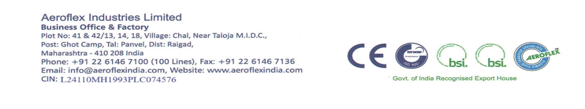

**[Image: aeroaug2025.pdf-0001-00.png (172x168, 19.0KB)]**

## **August 04, 2025** 

|To,|To,|
|---|---|
|The General Manager,|The Listing Department.|
|Department of Corporate Services,|National Stock Exchange of India Limited|
|BSE Limited,|Exchange Plaza, C-1, Block G|
|P.J. Towers, Dalal Street,|Bandra Kurla Complex|
|Mumbai – 400001|Bandra (E), Mumbai – 400 051|
|**Company Code No.: 543972**|**Trading Symbol: AEROFLEX**|

**<u>Subject: Transcript of the Investors’ Conference Call held on July 29, 2025 for Q1 & FY26 Results</u>** 

Dear Sir/ Madam, 

In reference to our earlier intimation dated July 29, 2025, regarding audio recording of the Investors’ Conference Call and pursuant to Regulation 30 of the SEBI (Listing Obligations and Disclosure Requirements) Regulations, 2015, we are enclosing herewith the transcript of Investors’ Conference Call held on Tuesday, July 29, 2025 at 11:00 a.m. (IST) for Q1 & FY26 Results. 

The transcript is also available on Company’s website at: 

<u>https://www.aeroflexindia.com/wp-content/uploads/Transcript-of-Q1-FY26-EarningConference-Call-held-on-July-292025.pdf</u> 

The audio recording of the Investors’ Conference Call held on July 29, 2025 for Q1 & FY26 Results is available on Company’s website at: 

<u>https://www.aeroflexindia.com/wp-content/uploads/2025-Q1-Audio-Recording.mp3</u> 

Request you to kindly take the above information on records. 

Thanking You, 

## **FOR AEROFLEX INDUSTRIES LIMITED** 

MUSTAFA Digitally signed by MUSTAFA ABID ABID KACHWALA Date: 2025.08.04 KACHWALA 14:48:13 +05'30' **Mustafa Abid Kachwala Whole-time director DIN: 03124453** 

## **_Encl: As above_** 

**[Image: aeroaug2025.pdf-0001-15.png (1005x188, 117.8KB)]**

**[Image: aeroaug2025.pdf-0002-00.png (213x199, 25.6KB)]**

# “Aeroflex Industries Limited 

Q1 FY '26 Earnings Conference Call” 

July 29, 2025 

“E&OE - This transcript is edited for factual errors. In case of discrepancy, the audio recordings uploaded on the stock exchange on 29th July 2025 will prevail.” 

**[Image: aeroaug2025.pdf-0002-05.png (149x133, 16.6KB)]**

**[Image: aeroaug2025.pdf-0002-06.png (209x107, 8.2KB)]**

**MANAGEMENT: MR. ASAD DAUD – MANAGING DIRECTOR – AEROFLEX INDUSTRIES LIMITED** 

Page **1** of **16** 

_Aeroflex Industries Limited July 29, 2025_ 

**[Image: aeroaug2025.pdf-0003-01.png (101x91, 8.6KB)]**

### **Moderator:** 

Ladies and gentlemen, good day, and welcome to the Aeroflex Industries Limited Q1 FY '26 Earnings Conference Call. This conference call may contain forward-looking statements about the company, which are based on the beliefs, opinions and expectations of the company as on the date of this call. These statements are not the guarantees of future performance and involves risks and uncertainties that are difficult to predict. 

As a reminder, all participant lines will be in the listen-only mode and there will be an opportunity for you to ask questions after the presentation concludes. Should you need assistance during the conference call, please signal an operator by pressing the star, then zero on your touchtone phone. Please note that this conference is being recorded. 

I now hand the conference over to Mr. Asad Daud, Managing Director of Aeroflex Industries. Thank you, and over to you, sir. 

### **Asad Daud:** 

Thank you so much. I hope I'm audible to everyone. Good morning, everyone. I welcome you all to Aeroflex Industries Limited's Q1 FY '26 Earnings Call. Joining me today are members of our senior management team and representatives from Strategic Growth Advisors (SGA), who is our Investor Relations partner. I hope that you have had a chance to review our Q1 results and the investor presentation, which is available on the stock exchange and also on our company website. 

This quarter has been a challenging one, as you have seen from the results. And it has been the first time in a very long time where our performance has deviated from our consistent record. The decline in revenue was primarily because of external macroeconomic environment, especially the issues regarding tariff and the consequent disruption in the buyer segment across several key geographies in the export market. 

This regulatory uncertainty led to a temporary dip in the procurement from our customers, which also resulted in delayed orders and also cautious offtake. But we believe that this dip is only transitory, and we have started to see signs of stabilization and sentiment coming back to some sort of normalcy. And we have also started to see the order flows starting to move in Q2, I'm sorry. 

We remain confident that the impact, which has been seen in this quarter will be offset over the remainder of the year. And we strongly believe that the long-term demand for our products continues to remain strong and our strategic road map is also firmly intact. 

Some of the key highlights of the quarter. So one of the most significant developments that happened is our entry into the next-gen cooling technology for the data center infrastructure. We are proud to announce that we have signed a long-term agreement with a listed U.S. corporation with a market capitalization of -- which has a market capitalization of over USD 50 billion. This agreement is for the supply of liquid cooling solutions for the data centers. 

Page **2** of **16** 

_Aeroflex Industries Limited July 29, 2025_ 

**[Image: aeroaug2025.pdf-0004-01.png (101x91, 8.6KB)]**

I think this is a great sector for the company to enter into considering the multi-decade growth opportunity that this high potential sector provides to the company, not only in India, but across the world. Our state-of-the-art bellows plant and our engineering and our R&D team are the key factors that help us to get this opportunity. 

I'm also happy to share that we have received the first order of about INR7.8 crores for providing these cooling solutions to the data centers. This order entails development of advanced flow control components, which will be used for the cooling systems. 

Now talking about our performance for the first quarter. Our total income stood at INR84.67 crores, which is a decline of 6% on a Y-o-Y basis. Our EBITDA stood at INR15.8 crores, which translates to an EBITDA margin of about 18.68%. Our profit after tax stood at 7.7% (Errata: Actual number to be read as INR 7.1 crores), which is a PAT margin of around 8.46%, which is mainly due to higher depreciation. 

From a margin perspective, our hoses and assemblies segment continued to deliver strong margins in the range of 22% to 23%, which is in line with the trends over the past few years. However, the overall margin for the company on a consolidated basis saw a reduction primarily due to a couple of factors. 

One is the ongoing expansion of operations at our subsidiary, Hyd-Air Engineering, which is currently in the scaling phase and also the metal bellows plant, which has not yet reached the optimum capacity utilization. So these are the 2 projects that we have -- in which we have -- it's for the long term and where we feel that over the next few quarters, we'll be able to see these 2 segments contributing both in terms of revenue and also in terms of margin. 

So these are the strategic investments, capex that the company has made. And as their capacity utilization increases, we expect operational efficiencies to improve and also the margins to normalize over the next few quarters. 

The segment of our assemblies continues to contribute more than 50% of our total sales, which is in line with our full year targets. Despite this temporary blip, we expect to continue with our planned capacity expansion as we see that this is just a temporary blip, which will be normalized in this quarter and the growth to resume after that. 

To sum up, I think Q1 has been softer than what we had expected. But it -- but we are firmly -- we firmly have the belief for our long-term outlook, and we remain focused on execution, on scaling up, and we believe the business is well positioned to bounce back in the next few quarters with renewed momentum. 

Looking ahead in terms of this financial year, outlook continues to remain positive. Our capacity expansions are progressing well and are in line with our long-term objectives and growth. As expected, these ongoing investments led to a slight dip in our margins. But as the new capacity scale up and fixed costs get absorbed, we expect the margins to gradually increase over the next few quarters. 

Page **3** of **16** 

_Aeroflex Industries Limited July 29, 2025_ 

**[Image: aeroaug2025.pdf-0005-01.png (101x91, 8.6KB)]**

Our foray into the cooling solutions space, it provides a strategic opportunity and it opens new doors to high-growth sectors such as data centers and advanced thermal management technologies. This will enable us to move from traditional business to enter into this new age, next-generation innovation-led industry. 

We are focused on deepening our capabilities and also strengthening our product portfolio. And we are building a more globally diverse presence across the world. Looking ahead, we are confident in the overall growth trajectory of the company. And we are putting in all our efforts to fulfill our targets for this financial year. 

I would like to thank all of you for the continued support and trust that you have had in the company. Last quarter was just a blip, and we hope normalcy will resume from this quarter onwards. 

With this, I conclude my remarks. And now I would like to open the floor for Q&A. 

**Moderator:** Thank you very much. We will now begin the question-and-answer session. The first question is from the line of Raman KV from Sequent Investments. **Raman KV:** Sir, I just wanted to understand that in Q4 also, there was a revenue degrowth due to shipment delays. And you mentioned that those will be spillover in terms of in Q1 with respect to most of the delayed shipments were sent in April. And again, in Q1 also, there was a delay? So basically, I just wanted to understand, one was that there was a spillover of previous quarter also. And despite that, there was a revenue decline. So I just wanted to understand going forward, will there be revenue decline for next 2 quarters as well? 

**Asad Daud:** So in terms of, for Q1, the majority reason for the dip in sales is because of the new orders or the new decline in the demand from the international market. The exports degrew in the last quarter. However, the domestic market grew by more than 30% in Q1. So the decline in sales in Q1 is mostly due to the temporary dip in demand. 

So I hope -- and for the next 2 quarters, so, like I mentioned, we've already started to see things coming back to normalcy. Obviously, we will not be able to give specific numbers, but we have seen that we have started to already see the order flow from our export customers become much better in the month of June and July and hopefully in the next few -- in the next few months as well. I believe that the last quarter was just a temporary blip in the growth of our company. 

**Raman KV:** Okay, sir. And sir, with respect to the data center order of INR7.8 crores, which you received, what is the execution time line? 

**Asad Daud:** So it will be executed mostly in H2 as in dispatched. 

**Raman KV:** And sir, what is the market opportunity of your product? Like I want to understand you are supplying liquid cooling solutions with respect to data centers. What is the total addressable market domestically as well as internationally? 

Page **4** of **16** 

_Aeroflex Industries Limited July 29, 2025_ 

**[Image: aeroaug2025.pdf-0006-01.png (101x91, 8.6KB)]**

### **Asad Daud:** 

So in terms of data cooling, the estimated market size as the market estimate is somewhere around $4.4 billion, right. But that's for the entire cooling solutions for data centers. And we obviously form a subset of that. So specifically the products that we are giving, it will be hard to give a market size of that particular product. 

But if you see the overall data center cooling market, that's around $4.4 billion, and that's growing at a CAGR of 20% worldwide right now. So it is expected to become almost 5x in the next 7 years. 

So that's the market size in terms of -- obviously, this is our first order that we have received. Also have multiple discussions lined up subsequently as well. So we are hoping that this particular division will have a substantial contribution to the overall business of our company over the next couple of years. 

**Raman KV:** Sir, my final question is with respect to your guidance. You earlier in Q4 guided about 20% to 25% PAT growth in FY '26 as well as EBITDA margin improvement. And you said metal, bellows, and Hyd-Air will contribute INR30 crores each. Are we sticking to the guidance or now that there has been a degrowth in terms of market demand, it will be revised? 

**Asad Daud:** Yes. So in terms of our guidance, right, yes, we had given a guidance of the EBITDA growth of 25%. And I think as a company, we believe that once we have a certain target, the entire team puts in their 150% in order to achieve those targets. 

However, obviously, there are some situations which is beyond the control of the members or the company, right. But our internal target is obviously to achieve our annual targets. But since obviously, the first quarter has not been as per our planning, but we estimate that our growth would continue to be in the range of more than 20%. 

**Raman KV:** 20% PAT growth or revenue growth, sir? 

**Asad Daud:** No, EBITDA growth. Reason being PAT growth will be slightly lower because we have higher depreciation. So a lot of our investments in our capex. So if you see the Q1 results, you'll see the depreciation has increased. So hence, that is why we have given the growth guidance for EBITDA. 

**Raman KV:** And sir, this metal bellow and Hyd-Air, they start contributing INR30 crores each in this year? 

**Asad Daud:** Yes. So we expect metal bellows and Hyd-Air to start -- so Hyd-Air has already started to contribute to the sales of Aeroflex. Obviously, the scale is yet to reach, but we expect this year that both of them will have contribution. I think combined, both of them should contribute at least 15% to the -- 10% to 15% to the overall sales on a yearly basis. 

**Moderator:** The next question is from the line of Viraj Parekh from Carnelian Asset Management. 

**Viraj Parekh:** Just a follow-up question on the first participant. In the last quarter, you said there will be some spillover of orders in the next quarter in May and June. So given that Q1 has also been weak, 

Page **5** of **16** 

_Aeroflex Industries Limited July 29, 2025_ 

**[Image: aeroaug2025.pdf-0007-01.png (101x91, 8.6KB)]**

should we assume that if the spillover was not there, the numbers should have been lower than what we delivered this quarter? 

### **Asad Daud:** 

So last year, it was -- so the last quarter, there was the spillover of the dispatches, the orders. In terms of the dispatches, it moved to this quarter. So yes, so this quarter, obviously, the demand was lower specifically in the month of -- in the early parts of the quarter. 

But like I said, July has been a good month where we are seeing the things are coming back to normalcy and also with this new project that we have and that we have received, I think we have a lot of positive things happening in this month already and start of this quarter already. So, I think a Q1 is a blip. And I think we expect Q2 to be normalized and then Q3 to see back the company into the growth trajectory. 

### **Viraj Parekh:** 

**Asad Daud:** 

**Viraj Parekh:** 

In terms of percentage terms, how much would be the spillover from Q4 to Q1? 

I would not have the exact percentage right now, but I can get back to you post call. 

Sure. Just second question, sir. We are saying that things will get normalized in Q2 and the rest of the year. If I'm correct, this year out of Europe has been significantly down for us as a region and U.S. for -- as you highlighted in the last quarter, there is tariff uncertainty, but Europe particularly catches my eye because I think we are at a INR14 crores quarterly run rate for Europe, which is the lowest in the last 5 quarters. 

So if I'm to assume that we get back to Europe in a similar run rate as last year, there would -- it would require a 40% to 45% growth from the current quarterly run rate. So can you help me understand is this possible or not? 

**Asad Daud:** 

Yes. So we had a decline in Europe also and also in the U.S. as well in terms of the sales. Obviously, Europe was also significantly impacted because some of our largest customers who we sell to, they ultimately use our products in their machineries, and they also have a lot of exports to the U.S. So hence, their demand also saw a slowdown wherein it actually affected us. 

So Europe got doubly affected; one, obviously, from the demand itself in Europe and second, because some of our customers of Europe, they supply their end products across the U.S. as well. And they also got impacted. So that is why -- see, U.S. continues -- even after this drop, U.S. continues to be our biggest market, right 

And our focus has been to grow the U.S. market and to increase our presence in U.S. because the European market has been a topsy-turvy over the last few years. And we will continue to focus on increasing our presence in this market. 

Also, like I mentioned that we have seen an uptick in demand in this month in July from some of our European customers where they believe that the things are starting to get back to normalcy. Also recently with the deal with the EU and the U.S., right? So I think that's also going to help the demand to come back in Europe as well. 

The next question is from the line of Prem Luniya from Astute Investment Management. 

**Moderator:** 

Page **6** of **16** 

_Aeroflex Industries Limited July 29, 2025_ 

**[Image: aeroaug2025.pdf-0008-01.png (101x91, 8.6KB)]**

### **Prem Luniya:** 

### **Asad Daud:** 

So sir, actually, going back to the first question of the cooling market, which we have cracked in. I wanted to understand the customer in which we have cracked in, was this a replacement of a company who was already providing and now we have started providing or was it a completely new product? And if it is completely new product, if it was a replacement, can you just tell me what was the complete procurement by that company so that I can understand what is the market which we are catering to and what can be... 

This is a completely new product and a new project. So this product is obviously being utilized in the U.S. and in Europe. But this is the first time in India where this company is utilizing the product manufactured in India for the data center. So this is basically a completely new demand. It's not replacing any existing competition or any existing customer. 

In terms of the -- so this project is with regards to the new technology, which is the liquid cooling. So just to explain to everybody, the old data centers were generally cooled through air cooling, which was when the computing power requirement was not very high. But now since over the last 2 to 3 years with the use of -- or the increased use of AI, with the increased use of high power and high-speed computing, air cooling is not sufficient to cool the data centers. 

There is a new technology of liquid cooling where using a chemical and through the process of thermal cooling, you -- that is actually the data centers or the disks of the centers are cooled through this particular chemical, which flows through a piping system. So hence, this is kind of a new -- like a new technology, which is, I think, I would say, probably less than a couple of years old. And hence, this is a completely new area that we entered into and we want to supply. 

And obviously, with the increase in adoption of AI across the world and also in a lot of sectors, not only tech but also in the non-tech sectors, obviously, there will be a huge demand for data centers. And the data center, especially with high-speed processing and high-power processing, they will require liquid cooling. So hence, the demand for this particular cooling system is only going to see exponential growth over the next few years. 

### **Prem Luniya:** 

### **Asad Daud:** 

Right, sir. Just can you quantify that where do we see this business going to, let's say, 10%, 15% 1, 2 years down the line? And also, will it have the same type of replacement cycle as the other industries where we cater to? And just one more question was on -- can you please quantify how much was the market share of Aeroflex in Indian exports of our particular products? 

Okay. So in terms of the replacement cycle for this, so it will be difficult for me to give a number because this is the first time that we are developing this product. And mostly, it depends on the amount of the quantum of the cooling that is being utilized. Obviously, there will be requirement for replacement parts or spare parts and also the contract that we have signed with the company involves supply of spares and supply of parts in case of any replacement as well. 

In terms of market share of Aeroflex's exports, so I don't have the exact number in terms of market share, but I would say the Aeroflex is the largest exporter of hoses and assemblies from India. So we are by far the biggest player in terms of export. Also, we are the largest in terms of the domestic market as well. So we are the leaders both in the domestic market as well as in the export market. Difficult to give an exact market share number, but we are number one by far. 

Page **7** of **16** 

_Aeroflex Industries Limited July 29, 2025_ 

**[Image: aeroaug2025.pdf-0009-01.png (101x91, 8.6KB)]**

### **Moderator:** 

The next question is from the line of Aastha from Pkeday. 

**Aastha:** Can I know what would be the revenue contribution from each of the segments going forward? And what was the contribution from each of the segments? I understand that you have given the split between assemblies and the other segment, but did we get any revenue from metal bellows? **Asad Daud:** Yes. So we had about approximately INR1.3 crores of business in the metal bellows. So we expect that over the next couple of years, at least 10% to 20% of our revenue should come from these businesses and plus the new liquid cooling solutions project, right, that will be executed using our bellows facility and our machinery for bellows. So that will also see a significant uptake in terms of the percentage of contribution from this particular division. 

**Aastha:** So sir, this 10% to 20% will be by which year? **Asad Daud:** This is I'm talking about this year should -- so in this year, with all the new projects of bellows of this -- of liquid cooling and of Hyd-Air, 10% to 20% of the business we can expect in this year from these particular divisions. It will be difficult to give an exact percentage, so a ballpark figure of 10% to 20%. 

**Aastha:** Sir, what would be the margins in metal bellows? 

**Asad Daud:** In metal bellows, the EBITDA margin is around 28% to 30% at an optimum capacity utilization. Obviously, right now, the utilization is not at that capacity. Hence, you're not seeing that those margins in the numbers. But once the bellows plant reaches a certain capacity utilization, you'll see the margins of 28% to 30% because the gross margins in the metal bellows range anywhere from 50% to 60%. 

**Aastha:** Okay. Sir, what is the order book as of now? Do we have certain order book in each of the segments? 

**Asad Daud:** So in terms of metal bellows and for -- obviously, in terms of the liquid cooling, we've already mentioned the order that we have received. In terms of Hyd-Air and bellows, obviously, the scale at which they are, right now, the order book is small. But we're seeing that we have started to -- so we have also got certification from the American Society of Engineers where -- which is one of the requirement for metal bellows. 

We have already received that certification. And we have also applied for a couple of more certifications for metal bellows, which we are expected to receive by September or October of this year. **Aastha:** Sir, but my question is that do we have any order book in hand? I know that we have approximately INR8 crores in metal bellows. But apart from that for assemblies or other segments as well? 

**Asad Daud:** Yes. So those order book are -- so we have -- we divide our orders. So in terms of the overall business of Aeroflex, we have 2 sets of customers. One is those customers who give us a tentative quantity on a yearly basis and then they place periodic POs based on their quarterly requirement. 

Page **8** of **16** 

_Aeroflex Industries Limited July 29, 2025_ 

**[Image: aeroaug2025.pdf-0010-01.png (101x91, 8.6KB)]**

And then we have certain projects that we work with the customers. These are long-term projects wherein we start working with them on prototypes, then testing. 

Obviously, first comes design, then prototypes then testing and then it goes into production. And then we have the set of distributors or assemblers who buy the regular product from us, and they mostly buy on 2 containers, 1 container basis. So those are ongoing orders which happened on a quarterly or a monthly basis. So we specifically don't have like a specific number for an order book of a certain value or a certain amount. 

### **Aastha:** 

**Asad Daud:** 

Got it. Sir, my last question would be that who else we are competing with when it comes to data center liquid cooling products. And if we are competing with the player like in India as well as in the foreign market and in the foreign market, how much would be the price difference in percentage terms? 

Okay. So right now, the project that we have got it for supplying to the India market. So the U.S. Company has received the contract for the data center cooling for the India market, and we need to supply our products in the India market. So specifically in terms of price comparison will be difficult to tell you because once we were in the international market, only then we'll be able to share with you the exact price comparison. 

In the international market, our competitors are already supplying these kind of systems to the data centers, the likes of Senior and the likes of a Parker. Both of them are supplying the cooling systems to the data centers. 

**Moderator:** 

**Jeevan:** 

**Asad Daud:** 

The next question is from the line of Jeevan from Jeevan. 

Sir, this quarter 1 was due to the tariff issue, it is lumpiness or normally also quarter 1 is weak as compared to quarter 2 or quarter 3 versus quarter first? 

So generally, Q1 is obviously kind of the quarters which is generally, I would say, sometimes it's weak because of certain spillover, but it will be difficult to confirm that the reason being because our business depends on a lot also on the projects, right. So some of the projects can start in Q1, so we can see higher demand in Q1. So difficult to just say that whether Q1 is always weak. Sometimes it's weak, sometimes it's strong. 

And one of the major reasons for the dip in the sales, like I mentioned, is the temporary dip in demand from the customers. It was -- to a great extent, it was related to tariffs. Reason being I might not have informed in the earnings call, but the tariffs on our products increased by almost 3x. So it was earlier -- approximately about 3.5%, and it increased to 10%. So that was also a significant cost addition to our customers as well, right, where they had to bear an additional duty of 6.5% on the products. 

Hence, we saw a temporary dip in the demand from the customers, especially those who are distributors or who are assemblers who wanted to reduce the inventory who wanted to understand the market because a lot of the panic initially was that due to this high tariffs, there will be a significant decrease in the demand. Hence, one of the customers wanted to carry a large inventory with them. So these were a few reasons where we saw that because of the tariff issue, 

Page **9** of **16** 

_Aeroflex Industries Limited July 29, 2025_ 

**[Image: aeroaug2025.pdf-0011-01.png (101x91, 8.6KB)]**

there was a dip in the demand, which ultimately led to the dip in the order flow and then ultimately the dispatches. 

### **Jeevan:** 

A follow-up to the previous caller. You said that certain competitor in the cooling solution is there in abroad. But is there any competitor in India also as we or we are the only supplier in India for the cooling solution to the data centers? 

### **Asad Daud:** 

So from the -- whatever information that we have that we are the first ones to enter into this space in India in terms of manufacturing of this product, that's why this -- the company that we have tied up with have chosen us as their supplier for the data cooling solution. So this is a completely new business for India as well. 

### **Moderator:** 

The next question is from the line of Jyoti Singh from Arihant Capital Markets Limited. 

**Jyoti Singh:** Just a few clarification. Like you earlier mentioned on the focus -- expansion on the focus. So like we are focusing on Europe more or on U.S. because Europe, we already have good presence. And another on the data computing liquid cooling side, any RFQs on the order book side in any certain geography we can discuss? 

And lastly, on the competitor name side, like you mentioned a few, but it was not very clear. So if we can discuss on the data center cooling liquid side competition, who all are there? And going forward, still we are seeing demand impact because of the tariff, if anything we can discuss on that side? 

### **Asad Daud:** 

Yes. So your first question was Europe versus U.S.A. So, U.S.A. remains our biggest market and the focus of the company remains the U.S. Europe over the past 3 to 4 years has seen a lot of ups and downs, I think more downs than ups. The U.S. was impacted right now because of the tariffs that I already mentioned. So -- but U.S. will continue to remain our dominant market, and we will continue our efforts to focus on the U.S.A. market in the near future as well. 

In terms of the RFQs, the orders we have already received the order for INR7.8 crores for providing the liquid -- providing the components for data cooling for data centers. In terms of competition for this particular segment, I mentioned Parker Hannifin, which is a listed company in the U.S. and Senior. I think they are based in U.K. and they are also listed. So these 2 are our competitors in this segment as well. 

And your last question was on tariffs. As I think I already mentioned about tariffs that -- one of the major reasons for the decrease in demand in the first quarter was largely driven by the issue of tariffs. 

**Moderator:** The next question is from the line of Soumya S from Insightful Investments. 

**Soumya S:** I just had a confirmation. I couldn't hear you when you gave the exact revenue for metal bellows for the quarter. Did you say INR4.8 crores or INR1.8 crores? 

**Asad Daud:** INR1.3 crores. **Soumya S:** INR1.3 crores. Okay. Got it. 

Page **10** of **16** 

_Aeroflex Industries Limited July 29, 2025_ 

**[Image: aeroaug2025.pdf-0012-01.png (101x91, 8.6KB)]**

### **Asad Daud:** 

Also just to update to everyone. I think in terms of also -- obviously, we've not yet had any questions on that particular point, but I just wanted to update to all the members on the call. In terms of our QIP, so a lot of the people had spoken to me previously about the plans for the QIP. So I just wanted to update everyone that the whole idea for the company for the QIP works primarily for inorganic acquisitions. And to everyone that we will only purchase for the QIP once we have finalized the terms of the acquisition. So -- and any acquisition that we do will be value accretive for the shareholders. So the QIP will only be done once the acquisition opportunity. Hence, I just wanted to update this to all the members. 

**Moderator:** The next question is from the line of Maitri Shah from Sapphire Capital. **Maitri Shah:** Yes. I just had 2 questions. The first one was we're supplying cooling system parts. So could you explain what percentage of parts in the entire cooling system do we cater to? **Asad Daud:** Sorry, what part? **Maitri Shah:** The parts that we are supplying, what is the percentage of that in the entire cooling system? **Asad Daud:** It is difficult to give a number for that because the entire system -- the project is taken by the company who has ultimately given us this contract. So, the cooling or the cooling solution is just one part of the entire project -- the cooling project that they have taken. So, it will be difficult for me to give you a number on that… **Maitri Shah:** At least like percentage of, like maybe 10% of our parts are used in the entire cooling system. Is that... **Asad Daud:** Very frank, it will be hard for me to say because any number I said will be just a very, very wild estimate. So, I think we'll be just to wait for at least a couple of quarters when we have started to deliver the cooling solutions. And once we get better understanding in terms of the final usage, only then we'll be able to give you an estimate. So right now, it will be slightly premature, I would say, to give any number on the percentage. **Maitri Shah:** Okay. That makes sense. And previously, we said that we are guiding for a 20% growth in our EBITDA. Is that correct? Hello? **Asad Daud:** Yes. I missed you. **Maitri Shah:** Are we guiding for the 20% growth in our EBITDA. Is that correct? **Asad Daud:** Yes, considering the Q1 results. **Maitri Shah:** So, there's a 20% growth in our EBITDA with a 19% margin. So are we expecting our revenues to be around the INR500 crores mark for this year, FY '26? **Asad Daud:** So, our margins will be definitely much, much more as compared to what we had in the first quarter, right. Generally, our margins -- our EBITDA margin should range anywhere between 21% to 22% on an annual basis. 

Page **11** of **16** 

_Aeroflex Industries Limited July 29, 2025_ 

**[Image: aeroaug2025.pdf-0013-01.png (101x91, 8.6KB)]**

**Maitri Shah:** 

**Asad Daud:** 

**Maitri Shah:** 

**Asad Daud:** 

### **Maitri Shah:** 

**Asad Daud:** 

This is on the consol level? 

Yes, yes. Total, yes, at a consol level. 

Yes, because in the presentation, it was mentioned that we are guiding for a 19% margin -- EBITDA margin on consol level. So, are we increasing the guidance to 21%? 

No, I think in the presentation, it was 19% is the margins, which is in Q1, not on projection. So -- maybe you would want to just double check. 

Yes, it was -- okay. So we are guiding for a 21% margin. 

Yes, 21% to 22% margin. That's what -- so like I think in a couple of quarters back, maybe I think last year, our aim is that in some quarter, margins could go up. In some quarters, margins could go down. Our aim is that like we -- I mentioned approximately around a year or so back that over the next 4 to 5 years, we expect our EBITDA margins to increase anywhere from -- at that time, it was around 20%. So, from 20% to 25% over the next 4 to 5 years. That's what we plan, right? 

So, yes, it could happen in 1 quarter, margins could be 19%, in 1 quarter margins could go up to 23%. But what we focus on, we focus on our long-term targets. Our long-term target is for the next 4 to 5 years to reach an EBITDA margin of 25%. 

### **Moderator:** 

**Dhaval Shah:** 

**Asad Daud:** 

The next question is from the line of Dhaval Shah from Fort Capital. 

So, one quick question. You just mentioned that the tariff has increased from 3% odd to 10%. Now we recently had a statement from Trump saying that the global baseline tariff will be 15% to 20%. So, one -- so in best case scenario, if it is 15%, in worst case, 20%, what's your take on that? And what could be the impact on our business? 

So, it will be difficult to predict Mr. Trump, what happens. But obviously, any increase in tariffs just have -- tends to have a short-term impact on the business. Like I mentioned, like the increase in the tariffs in Q1, impact in Q1, but we have already seen that from July, it's coming back to normalcy. So, any increase -- substantial increase in tariffs tends to have an impact only for a couple of months. 

So in case, for example, if the tariffs further increase, which I hope not, but you'll see an impact for a couple of months, but then over a period of time, it tends to smoothen out. Also, if you see that our growth in our domestic business has been significant in this quarter. So, we are also aware of the situation in the international market. And hence, we are trying to the extent possible to derisk ourselves from any external shocks in the international market. 

Also, if you see this order of almost INR8 crores from the cooling systems, right, that will also be a domestic order. So that will also help in increasing the sales of the domestic business. So, we are seeing increased -- right now, the contribution of domestic business to our sales is 28%, whereas I think almost a year or so back, it was around 15%-16%. So, you're seeing that the 

Page **12** of **16** 

_Aeroflex Industries Limited July 29, 2025_ 

**[Image: aeroaug2025.pdf-0014-01.png (101x91, 8.6KB)]**

domestic business is seeing a considerable increase. And I think over the next couple of quarters, this might also increase. 

### **Dhaval Shah:** 

Right. So, your export margins would be certainly higher than the domestic margins. So, your EBITDA growth guidance takes into consideration increased contribution from domestic revenue and probably decrease from the export revenue, right? 

**Asad Daud:** So, in terms of our margins, yes, export exports have definitely better margins, but domestic has better inventory, better working capital cycle. So, profit per unit of time is better in domestic as compared to the international market. But the overall margins in terms of the value might be better than export, but in terms of unit of time, it's better in the domestic market. 

**Dhaval Shah:** Okay. And so this new business, which is data center... 

**Asad Daud:** I can't hear you. Hello? You're not audible. 

**Dhaval Shah:** 

Question is that the new business, which is data center cooling solution, the margins for those business are going to be higher or lower than the current margins -- average margins for the business, current business? 

**Asad Daud:** Actually, we have signed a confidential agreement with the customer. So hence, I will not be able to share the margins for this particular business right now because like this is specific to a customer, so it will be difficult for me to share anything right now because it will be in the public domain. It will be against out agreement. 

**Moderator:** The next question is from the line of Rahul from TCG AMC. 

**Rahul:** So basically, I had 2 questions. One was that what would be the peak metal bellow revenue and Hyd-Air revenue, like your Phase 1 metal bellow capex has already been done. So, can you guide us that what is the peak revenue potential? And by which year like FY '27 or end of FY '26, you'll be able to reach that? That's my first question. 

**Asad Daud:** So, the peak revenue for the bellow project would be somewhere close to INR80 crores to INR90 crores. And the peak revenue right now, considering the current investments that we have made in Hyd-Air would be somewhere close to INR32 crores to INR35 crores. We are also expanding -- so we are also over the second half of the year, we will set up more machines in Hyd-Air. But currently, the peak revenue for Hyd-Air would be somewhere close to INR30 crores to INR35 crores on an annual basis. 

**Rahul:** Okay. So how much would the Hyd-Air revenue would go into your internal consumption of your assemblies? 

**Asad Daud:** So say, on a ballpark figure, approximately 25% to 30% of the sales of Hyd-Air would be internally utilized. 

**Rahul:** Okay. My second question, sir, is that basically, we saw a very good growth in the domestic market and your aspiration is to grow by 25% on an annual basis for the next coming years on the basis of EBITDA. 

Page **13** of **16** 

_Aeroflex Industries Limited July 29, 2025_ 

**[Image: aeroaug2025.pdf-0015-01.png (101x91, 8.6KB)]**

So, I wanted to understand that is the domestic market that big to absorb this kind of growth going forward, if we see any tariff issues prolonged for the incremental future. So, will you be able to channelize and get the growth by supplying it to the domestic players? Or is it a bit of a challenge in terms of domestic growth? 

### **Asad Daud:** 

So domestic market, right, domestic market will not be able to replace completely the export market, right, because export being a larger chunk of our business still will continue to be one of the main -- the focus area of the company. The domestic market will have the growth opportunities. 

One is obviously in the existing sectors that we are already present in terms of new projects, new expansions brought on by -- in the manufacturing space. Second, also this new technology of the cooling systems, right, the market in India has just started, right. So that is an opportunity. 

So, the domestic business will be -- the growth will be driven by, one, the existing industries that we have already been into plus also these new businesses or the new technologies or the new sectors that we are entering into. The growth in the export cannot be completely compensated by domestic. That will not be possible. 

The growth in the export will happen, one from obviously, higher demand coming in from our existing customers and also new projects and new OEMs that we have started to get on board. Those will contribute to the sales in the export market. 

**Rahul:** Okay. So, the domestic demand is being catered by other domestic players? Is it that? Or are we importing? 

**Asad Daud:** So, we are manufacturing and the domestic demand is catered obviously by Aeroflex also and also by the players who are in the domestic market. So it's a mixture of both. So Aeroflex is also supplying in the domestic market and our competitors are also supplying in the domestic market. **Rahul:** So any market share data, if you can share with us for the domestic market that you hold? **Asad Daud:** Specifically for the domestic market, I don't have a market share data. We have for the overall worldwide market, which is part of our presentation. Specifically for India market is not there. **Moderator:** The next question is from the line of Rahul Kumar from Vaikarya. 

**Rahul Kumar:** Just one question actually. For the exports which you did to U.S., did you have to bear the extra tariff of 10%? **Asad Daud:** So, in most cases, our shipments are FOB or CIF. So, in most cases, our customers only bore the cost of the tariff. There were like a few 1 or 2 cases where we had to, but that was just -- it was a very small quantity and a small order. But in most cases, the customers only bore the cost. 

**Rahul Kumar:** Okay. And what are the discussions ongoing with respect to the, let's say, the contracts going forward in terms of the tariffs and the pricing? 

Page **14** of **16** 

_Aeroflex Industries Limited July 29, 2025_ 

**[Image: aeroaug2025.pdf-0016-01.png (101x91, 8.6KB)]**

### **Asad Daud:** 

So the whole -- when we spoke to our customers starting in the middle of April, right, they had an internal -- a lot of them had agreed to reduce their procurement temporarily as they were not sure about the demand for their end products in the market because everybody felt with the tariffs coming in, there will be a significant drop in demand in the U.S. in terms of the products. So hence, the entire procurement cycle got delayed. 

But what they've seen is that the expected reduction in demand was not as significant as the people had expected. And hence, starting to see that people have started to see the orders flowing in back to normalcy. 

**Rahul Kumar:** No, I just wanted to understand your contracts with your customers in light of tariffs now… 

**Asad Daud:** Yes. So, what happens is with a couple of our large customers, we have annual contracts, but quantity -- so they give tentative quantity for the year. And then the quantity on a quarterly basis based on their market demand, they release the POs. So, like I mentioned, the POs for the first quarter when they released the quantities were lesser than what they would generally procure. 

So -- and like I mentioned, that was because of the expectation in the market that the demand is going to significantly go down. Hence, the few of the contracts that we had, the customer wanted to buy a lesser quantity than the contract. 

And then like I mentioned, that we have a lot of customers who are distributors and assemblers and they generally work on orders on a multi-container basis, say, for example, 2 containers or 3 containers. And they place the order only when they have -- or only when they see a sharp decline, they tend to delay their purchase so that they don't have to bear the brunt of our inventory. 

**Rahul Kumar:** Okay. And what's your share of business in exports from these assemblers and distributors and OEMs? 

**Asad Daud:** Okay. It's mostly -- so we have 3 segments. We have OEMs, we have channel partners or distributors and then we have assemblers. Our split is mostly equal where we have 30% of our business coming in from OEMs, around 5% of the business coming in from the distributors and the remaining from the assemblers. 

**Rahul Kumar:** Okay. And is that a similar mix for the domestic business also? 

**Asad Daud:** No. So, in the domestic business, about only -- so in the domestic business, only about 20% to 25% of the business comes in from distributors and assemblers. The reason being in the domestic market, we are supplying directly to the end customer. So the likes of your steel plants, oil and gas plants, ports and terminals, we are a direct vendor to them. So we supply directly. We have ARCs and annual rate contracts and AMC. So in India, the split is 75-25. 

**Rahul Kumar:** Okay. And just for exports also again, are you -- do you have to reprice your products in view of tariffs? 

Page **15** of **16** 

_Aeroflex Industries Limited July 29, 2025_ 

**[Image: aeroaug2025.pdf-0017-01.png (101x91, 8.6KB)]**

### **Asad Daud:** 

So, like I mentioned earlier, the increase in the cost of tariffs was mostly borne by the customer. So, generally, repricing for us is not so relevant. On a case-by-case basis where we feel that the customer might be really adamant on a certain discount in lieu of tariffs, we do it on a case-bycase basis depending on customer, his business potential, his business tenure with the company. So, it actually depends on the customer, but it's been generally few and far between right now. 

**Rahul Kumar:** Okay. And let's say, when you're exporting to U.S. and where are your competitors based out of? Are they based out of U.S. or is it China? 

**Asad Daud:** No. So our competitors are based out of U.S. Our competitors are based in Europe. Competitors are based in -- so when we supply to Europe, the competitors are mostly European companies. Then it is the companies who are manufacturing in Turkey. 

And when we are supplying to the U.S., it is -- we are competing with obviously, the American manufacturers, plus also manufacturers in Turkey and Europe who are ultimately supplying to the U.S. So -- and then obviously, when we are supplying in India, our competitors are the ones who are manufacturing in India. 

**Rahul Kumar:** Okay. So for the supplies to U.S. are you not at a relative disadvantage with respect to pricing… **Asad Daud:** Sorry, I was not able to hear you. Can you just repeat it, please? **Rahul Kumar:** No. I think given the tariffs now, are you not at a relative disadvantage versus your U.S. manufacturer, competitor? **Asad Daud:** Not yet. I think tariffs of 10% doesn't -- because the difference between our cost landed and the U.S. cost is still much more than 10%. So even if a 10% duty which is there right now, we are not at a disadvantage as compared to European -- sorry, as compared to the American manufacturers. Obviously, if it goes up to 25%, 30%, that's a different case. But right now, that's not an issue. 

**Moderator:** Thank you. Due to time constraints, this will be the last question. I would now like to hand the conference over to the management for closing comments. **Asad Daud:** Thank you so much, everyone, for your questions. If in case I've not been able to answer any questions of anybody, you can reach out to SGA, who is our Investor Relations Advisors, and they can clarify you on the same. Thank you so much for your time for listening to us and for sharing your queries. Hope to see you for the next earnings call. Thanks a lot. 

**Moderator:** On behalf of Aeroflex Industries Limited, that concludes this conference. Thank you for joining us, and you may now disconnect your lines. 

Page **16** of **16** 

---

## Extracted Images

| # | File | Dimensions | Size |
|---|------|------------|------|
| 1 | aeroaug2025.pdf-0001-00.png | 172x168 | 19.0KB |
| 2 | aeroaug2025.pdf-0001-15.png | 1005x188 | 117.8KB |
| 3 | aeroaug2025.pdf-0002-00.png | 213x199 | 25.6KB |
| 4 | aeroaug2025.pdf-0002-05.png | 149x133 | 16.6KB |
| 5 | aeroaug2025.pdf-0002-06.png | 209x107 | 8.2KB |
| 6 | aeroaug2025.pdf-0003-01.png | 101x91 | 8.6KB |
| 7 | aeroaug2025.pdf-0004-01.png | 101x91 | 8.6KB |
| 8 | aeroaug2025.pdf-0005-01.png | 101x91 | 8.6KB |
| 9 | aeroaug2025.pdf-0006-01.png | 101x91 | 8.6KB |
| 10 | aeroaug2025.pdf-0007-01.png | 101x91 | 8.6KB |
| 11 | aeroaug2025.pdf-0008-01.png | 101x91 | 8.6KB |
| 12 | aeroaug2025.pdf-0009-01.png | 101x91 | 8.6KB |
| 13 | aeroaug2025.pdf-0010-01.png | 101x91 | 8.6KB |
| 14 | aeroaug2025.pdf-0011-01.png | 101x91 | 8.6KB |
| 15 | aeroaug2025.pdf-0012-01.png | 101x91 | 8.6KB |
| 16 | aeroaug2025.pdf-0013-01.png | 101x91 | 8.6KB |
| 17 | aeroaug2025.pdf-0014-01.png | 101x91 | 8.6KB |
| 18 | aeroaug2025.pdf-0015-01.png | 101x91 | 8.6KB |
| 19 | aeroaug2025.pdf-0016-01.png | 101x91 | 8.6KB |
| 20 | aeroaug2025.pdf-0017-01.png | 101x91 | 8.6KB |
