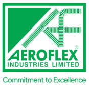
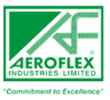

**[Image: aeroflex_feb2026.pdf-0001-00.png (174x167, 29.0KB)]**

## **<u>February 02, 2026</u>** 

To, To, The General Manager, The Listing Department. Department of Corporate Services, National Stock Exchange of India Limited BSE Limited, Exchange Plaza, C-1, Block G P.J. Towers, Dalal Street, Bandra Kurla Complex Mumbai – 400001 Bandra (E), Mumbai – 400 051 <u>Company Code No.: 543972 Trading Symbol: AEROFLEX</u> 

Dear Sir/ Madam, 

**<u>Subject: Transcript of the Investors’ Conference Call held on January 29, 2026, for Q3 & FY26 Results</u>** 

In continuation to our earlier intimation dated January 29, 2026, regarding audio recording of the Investors’ Conference Call and pursuant to Regulation 30 of the SEBI (Listing Obligations and Disclosure Requirements) Regulations, 2015, we are enclosing herewith the transcript of Investors’ Conference Call held on Thursday, January 29, 2026, at 11:00 a.m. (IST) for Q3 & FY26 Results. 

The transcript is also available on Company’s website at: 

<u>https://www.aeroflexindia.com/wp-content/uploads/Transcript-for-Q3-Earning-Conferencecall-held-on-January-29-2026.pdf</u> 

The audio recording of the Investors’ Conference Call held on January 29, 2026, for Q3 & FY26 Results is available on Company’s website at: 

<u>https://www.aeroflexindia.com/wp-content/uploads/Q3-Audio-Recording-25-26.mp3</u> 

Request you to kindly take the same on record. 

Thanking You, 

Yours faithfully, 

## **For AEROFLEX INDUSTRIES LIMITED** 

Ruthu John Digitally signed by Ruthu John Parampogi Date: 2026.02.02 Parampogi 16:23:55 +05'30' 

**Ruthu Parampogi Company Secretary & Compliance Officer M. No.: A60982** 

**Encl: As above** 

**[Image: aeroflex_feb2026.pdf-0001-17.png (1094x171, 109.9KB)]**

**[Image: aeroflex_feb2026.pdf-0002-00.png (228x214, 28.2KB)]**

# “Aeroflex Industries Limited 

# Q3 FY '26 Earnings Conference Call” 

# January 29, 2026 

E&OE - This transcript is edited for factual errors. In case of discrepancy, the audio recordings uploaded on the stock exchange on 29th January 2026 will prevail. 

**[Image: aeroflex_feb2026.pdf-0002-05.png (157x143, 18.2KB)]**

**[Image: aeroflex_feb2026.pdf-0002-06.png (224x114, 5.5KB)]**

**– – MANAGEMENT: MR. ASAD DAUD MANAGING DIRECTOR AEROFLEX INDUSTRIES LIMITED** 

Page **1** of **20** 

_Aeroflex Industries Limited January 29, 2026_ 

**[Image: aeroflex_feb2026.pdf-0003-01.png (107x97, 9.5KB)]**

### **Moderator:** 

Ladies and gentlemen, good day, and welcome to Aeroflex Industries Limited Q3 FY '26 Earnings Conference Call. As a reminder, all participant lines will be in the listen-only mode and there will be an opportunity for you to ask questions after the presentation concludes. Should you need assistance during the conference call, please signal an operator by pressing star, then zero on your touchtone phone. Please note that this call is being recorded. 

I will now hand the conference over to Mr. Asad Daud, Managing Director, for the opening remarks. Thank you, and over to you, sir. 

### **Asad Daud:** 

Thank you so much. Good morning, everyone. I welcome you all to Aeroflex Industries Limited Q3 FY '26 earnings call. Joining us today are members of our senior management team, along with representatives from Strategic Growth Advisors, who is our Investor Relations partner. 

I hope that you have had the opportunity to review our financial results and the investor presentation, which is available on the stock exchange and also on the company's website. I'm pleased to report that in the last quarter, which is Q3 FY '26, it was another strong quarter for us, which was marked by our highest ever quarterly revenue, our highest ever EBITDA and PAT. 

This performance was driven by our continued focus on value-added products and our expansion into new and high-growth applications, which includes products for data centers and AI infrastructure. Despite the tariff-related headwinds, our quarterly export business grew 30% on a Y-o-Y basis, which reflects a strong customer stickiness and our execution capabilities. 

Overall, we delivered an EBITDA margin of 23.5%, which reflects the scalability of our business and also the benefits from an improved product mix. We added 1 million meters of hose capacity in this month, which takes our total installed capacity to 17.5 million meters per annum. The balance 2.5 million meters will be commissioned in a phased manner and is expected to be completed by Q2 of the next financial year. 

During the quarter, we achieved several important operational and strategic milestones. A key strategic highlight for the quarter was our entry into the high-performance liquid cooling solutions for data centers. We completed the first commercial dispatch of the advanced flow control components and skid assemblies for the liquid cooling application. 

And to support the rising demand that we are witnessing, we are expanding our skid assembly capacity to 15,000 units per annum, and the same is expected to be completed by June 2026. This expansion is fully aligned with the growing opportunities that we see in the global data center and the AI infrastructure space. 

To strengthen our skid assembly operations, we are also setting up a new plant at Chakan in Pune. This facility will act as a supportive unit to augment the production capacity at our existing plants. Also, we continue to strengthen the production of our assemblies section. And during the 

Page **2** of **20** 

_Aeroflex Industries Limited January 29, 2026_ 

**[Image: aeroflex_feb2026.pdf-0004-01.png (107x97, 9.5KB)]**

quarter, we added 6 new assembly stations, thereby increasing the total number of assembly stations to 46. 

As part of our ongoing focus towards efficient capital allocation and based on the updated market assessment and the phased demand visibility and also on optimization of our internal resources and capital, we have decided to rationalize the capital expenditure for the Miniature Metal Bellows project from the earlier planned outlay of INR23 crores to INR10.5 crores. 

Accordingly, the proposed installed capacity for this particular project would be revised from 240,000 pieces per annum to about 50,000 pieces per annum. And this would be sufficient to meet the near-term demand for the Miniature Metal Bellows, but it also allows us to scale up in a phased manner as the volume increases. 

The lower upfront investment also helps us to reduce the project gestation risk and also enables faster payback. The balance funds will be utilized towards other ongoing expansion projects where we feel we have the demand visibility and also our execution time lines would become stronger. 

The ongoing investments in the process automation, which includes both robotic and automated welding stations and an annealing plant are progressing as planned and with the targeted completion by the end of this calendar year. These initiatives are aimed at improving the throughput and also enhancing consistency and helping us to penetrate into mission-critical business segments. 

Our subsidiary, Hyd-Air, generated revenues of INR8.5 crores in this quarter as compared to approximately INR2.9 crores in the same quarter in the previous year. And we expect Hyd-Air's contribution to continue scaling over the next few quarters. But now to talk about our financial performance. In Q3, our total income stood at INR121 crores, which is a growth of 21% on a Y- on-Y basis. Our EBITDA stood at INR28.5 crores, which is 28% on a growth on a Y-on-Y basis and our EBITDA margin stood at 23.6%. 

Our PAT stood at INR16.5 crores, which grew at 8% on a Y-on-Y basis with a margin -- with a PAT margin of 13.5%. Our cash PAT increased to INR22.75 crores, which reflects a strong cash generation and operating performance. 

For the 9 months, our total income stood at INR317 crores. Our EBITDA was INR70.5 crores with a margin of 22.2%. Our PAT stood at almost INR38 crores with a margin of approximately 12%. And on a 9-month basis, our contribution of the value-added products, which includes the assemblies, fittings, bellows and skid assemblies now contribute 54% of our total sales. 

The outlook for the remaining quarter of this financial year is very good. We are supported by our healthy order book, strong customer relationships and increasing penetration in global data center and AI infrastructure market. With a strong cash generative business model with our deep engineering capabilities and a high focus on value-added solutions and products, we are poised to sustain our growth momentum and deliver long-term share value to our shareholders. 

Page **3** of **20** 

_Aeroflex Industries Limited January 29, 2026_ 

**[Image: aeroflex_feb2026.pdf-0005-01.png (107x97, 9.5KB)]**

Thank you, everyone, for joining today's earnings call, and we will now open the floor up for questions. Thanks a lot. 

**Moderator:** Thank you very much. We will now begin the question-and-answer session. The first question is from the line of Raman KV from Sequent Investments. Please go ahead. 

**Raman KV:** Congratulation on good set of numbers. I have a few questions. My first question is with respect to the liquid cooling skid system. As we have an exclusive agreement with a U.S.-based company, I think, I just want to understand two things. Are we going to pay some royalty to use their, how do I say, royalty to them? Or is it like a revenue share model between both of the company? And on the unit economics, if you can explain the unit economics of this liquid cooling skid system, that would be helpful? 

**Asad Daud:** So in this, there is no royalty that we pay to them. It's a normal buyer-seller transaction. Although we have signed an agreement with them for exclusivity for the next 5 years. This is for just the India market. It does not include the overseas market. And also, it's -- in terms of the -- so that is the answer to your first question. 

With regards to your second question, in terms of the unit economics, so it works on a -- so we receive the orders from them and then we accordingly manufacture the products and then supply to them. So that's how the entire the business model works. 

**Raman KV:** So I just want to understand that now I think you have around the capacity with respect to this is 2,000 cases, and you are expanding it to 15,000 cases? 

**Asad Daud:** Assemblies. Yes, yes. 

**Raman KV:** Assemblies, yes. And the capex for this was around INR100 crores, and you said you can do INR300 crores to INR350 crores of revenue at peak utilization, this is my understanding. So if my understanding is right, your per piece realization is around INR3 lakhs? 

**Asad Daud:** Capex is less than INR100 crores, just that. 

**Raman KV:** Okay. Understood, sir. So when I come to the realization, your realization is around INR3 lakhs per piece at peak utilization? 

**Asad Daud:** Correct. Yes. 

- **Raman KV:** Is my understanding correct. **Asad Daud:** That's assuming an 80% capacity utilization. Yes. 

**Raman KV:** Yes. Now I just want to understand, let's say there is a data center that needs to be constructed. Let's say, it's INR100 crores worth of data center project. How much out of that will be your liquid cooling systems skid? I just want to understand the total addressable market with respect to this particular business? 

Page **4** of **20** 

_Aeroflex Industries Limited January 29, 2026_ 

**[Image: aeroflex_feb2026.pdf-0006-01.png (107x97, 9.5KB)]**

### **Asad Daud:** 

So obviously, it depends a lot on the entire layout of the project, where it is being built or what is the megawatt of the project, how many floors and how much is the space. Because ultimately, liquid cooling also depends on how much megawatt is being put on a particular piece of land, if I may say so. 

Also, it varies from operator to operator. So for example, a data center built by X would have a different design for liquid cooling as compared to a data center built by, say, Y or a data center built by Z because each one wants to have their own proprietary technology for this particular investment. 

Just to add in, tell you about the global market size for liquid cooling. Right now, the global market size as it stands currently, it's about almost close to $3 billion, right? And it is growing at a CAGR of about 33% on every year. I'm talking about the international market, right? 

Now that is poised to increase to about $21 billion over the next 6 to 7 years, right? So that is the market size of the total liquid cooling. So then you can actually divide that by data center market, so you'll get an idea about how much is the liquid cooling market as compared to the total data center market. 

**Raman KV:** Understood, sir. And sir, with respect to Hyd-Air, what's our current capacity utilization? And are we planning to have any further capex with respect to this? 

**Asad Daud:** 

Yes. So at Hyd-Air, Hyd-Air actually works on CNC machine. So most of the products at HydAir are, so we are in the process of increasing our capacity in Hyd-Air as well. The same is poised to be announced very soon. Right now, we are working at -- so in terms of the capacity, in terms of number of pieces, if I can say that as per the number of pieces, we are running at about 70-odd percent capacity utilization. 

But obviously, we plan to add a few more machines and a few more new machines, which will help us to increase our capacity on our existing machines as well. So with that, we expect HydAir to grow over the next year or so. So Hyd-Air capex is planned soon. We'll be able to share the numbers in due course of time. 

**Raman KV:** And sir, initially in previous calls, you mentioned that Hyd-Air at your optimum capacity can do INR45 crores to INR50 crores of annual revenue. Is my understanding correct? 

**Asad Daud:** Yes, that's correct. 

**Raman KV:** Okay. And sir, my final question is with respect to export. What percentage of your total revenue is exports? And if you can bifurcate the export like where it comes from, how much is U.S.A., how much is EU? And will the current FTA signing with EU and U.K. will be beneficial for you in terms of growing your export order book? 

**Asad Daud:** So right now, about 74% of our total business comes from export. And out of that, almost 90% -- 85% to 95% comes from the EU and the U.S.A. So if I talk about EU and U.S.A. combined, they contribute around 85% of our overall export business. Now definitely, with the FTA, which 

Page **5** of **20** 

_Aeroflex Industries Limited January 29, 2026_ 

**[Image: aeroflex_feb2026.pdf-0007-01.png (107x97, 9.5KB)]**

is -- which was announced a couple of days back, definitely, we are going to see over the next couple of years, higher traction coming in from the EU sector. 

If you see in this quarter itself, our total exports have grown by about 30%. And out of that, EU was a major contributor in that. So obviously, in the last quarter, there was no FTA, but we strongly feel that with this FTA being signed and obviously, it will come into operations in the next few quarters, we definitely feel that it's going to be a big boost for us. 

Also considering that the fact that it will also make our products even more competitive in the EU market, especially in terms of competition from players or manufacturers based out of Turkey who are getting duty-free material to be exported to EU. So that would be very beneficial to us as well. So yes, definitely with the EU would be, I would say, the strong growth area for us in the near future. 

### **Raman KV:** 

**Asad Daud:** 

**Moderator:** 

**Viraj Parekh:** 

Understood, sir. Sir, just a follow-up, 85% to 90%, can you just give a split with respect to only EU and only U.S.A., if possible? 

So the EU right now is about 30% and the U.S.A. is about 55%. 

The next question is from the line of Viraj Parekh from Carnelian. 

So just my first question is a follow-up on the previous participant. I mean, more than the quarterly revenue, I'm interested in the 9-monthly revenue. Exports has kind of been weak this 9 months financial year ended. And primarily, we've seen growth from the domestic market. Correct me if I'm wrong. Right? 

So in that, if I look at Europe and America, I feel Europe has been flat. I think it was INR59 crores last year versus INR60 crores this year in terms of 9 months. America was INR129 crores last year and INR136 crores this year, approximately a 5% kind of a growth, which is approximately 55%, 60% of our business? 

So if you could just share some highlights in terms of -- I mean, last quarter, we spoke that not a single customer canceled the orders, probably they are deferring them. So are we supposed to be a spillover in Q4? Is Q4 supposed to be very strong for us? Or is it more -- is a lot of more pessimism in the American market for the entire year? So I just wanted to understand your thoughts of what's the on-ground situation there? 

**Asad Daud:** 

Yes. Okay. So thank you so much for the question. So I just wanted to update to you. If you see our Q1 results, right, we had a very, I would say, a very bad Q1 number. So because of that, you see that our 9 months numbers are still don't appear as good as what they are. It's because of a very, I would say, a very bad Q1. That's why if you see the growth, even after 30% of growth in these particular markets on a 9-month basis, our growth is still in the single digit. 

But obviously, things nowadays change every quarter-to-quarter, right? Now we're seeing that there is strong demand that we're seeing from the export market. Obviously, the U.S. market, like I mentioned, we did not have any order cancellations. And now we are starting to receive repeat orders coming on from our existing customers. 

Page **6** of **20** 

_Aeroflex Industries Limited January 29, 2026_ 

**[Image: aeroflex_feb2026.pdf-0008-01.png (107x97, 9.5KB)]**

The only issue that we are facing in terms of the tariffs is obviously getting new customers and new OEMs on board, which is taking a lot more time because of these tariffs, but our existing customers are continuing to place order to us because right now, they don't have any alternate supplier. 

With regards to the EU, like I mentioned also in the -- in a couple of my previous earnings call, we felt that the EU would be a strong market for us in the near future. And that is what we are seeing in, in the EU market that over the next, I think, a few quarters, we expect the business from EU to increase. Obviously, this FTA, once it is implemented, would definitely be a booster for us in terms of our business to the EU. 

Yes, domestic market over the 9 months has grown and the international market has grown lesser than that. But I would say that the kind of disruptions that we had in the international market were nowhere near as compared to -- as in the kind of disruption that we had in the international market was much more as compared to the domestic market where we did not have anything. So we will also have to see the growth in terms of the challenges that we have been facing. 

But I would say despite that, I think the last quarter has been extremely good for us. And we expect the same to happen in this -- in the current quarter, which is ongoing and also in the next financial year as well. 

### **Viraj Parekh:** 

So just a follow-up before I ask my second question. Domestic, as you rightly said, we've been doing well. Can you highlight certain areas where we've done well? Have we -- are we competing with whom what are we doing? Are we gaining new customers? 

Are we gaining more wallet share with an existing customer? If you -- earlier you used to give some kind of an end user industry mix. And I think for this quarter, it's not been given. So I just wanted to request that if you could just stay a bit consistent with the disclosure so that it's easier for us to track the performance as well? And if you could just highlight in domestic, where are we doing well in the end user industry mix? Like where are we seeing more traction, more growth? Because that's been a phenomenal 9 months for us in the domestic market? 

### **Asad Daud:** 

Yes. So in the domestic market, we have seen the two major industries where we've seen a significant uptick. One is the steel industry that we are seeing good demand coming in. And we have seen it from the ports and terminal industry, where we are seeing significant uptick in orders from various ports and terminals for our various products. So these are the two industries in the domestic sector. 

There are smaller industries with regards to construction and food and all, but the most prominent ones are the ports and terminals and steel. And with -- and specifically with talking about Hyd-Air. So over there, we are seeing a very good traction coming in from the railways industry. So these are the three major industries where we are seeing strong traction coming in. 

### **Viraj Parekh:** 

I asked if you have gained new customers or increased wallet share in existing customers in the domestic market? 

Page **7** of **20** 

_Aeroflex Industries Limited January 29, 2026_ 

**[Image: aeroflex_feb2026.pdf-0009-01.png (107x97, 9.5KB)]**

### **Asad Daud:** 

Both. Like I mentioned, so we already had customers in the steel industry in ports and terminals. So we have gained more business from them. And second, we have also entered into new ports where we did not have our presence earlier. In terms of the steel industry, there's no major new customer, but the major new customers have come in, in ports and terminals and in the chemical industry. 

### **Viraj Parekh:** 

Got it, sir. Sir, my second question is just a bit on the planned pipeline of capex, which we have. If you could firstly just bifurcate the capex that we've done in this financial year up till date in hoses, in bellows, in the liquid data cooling solutions versus the cash we have on the books, including the amount that we recently raised. 

Also, if you could just help me understand the kind of capacity utilization we are on, especially in the hoses side? And at what level are we seeing because I think we are very confident on that demand growing strongly? So how are we seeing that growth forward in the domestic and the export market at whatever capacity utilization we are envisaging to be in the next two quarters for the next financial year? 

And just the last question would be on the liquid cooling solutions. If I understand correctly, we are using bellows' capacity as a feedstock to -- it's a mixture, like a -- skid is a mixture of multiple components, if I'm correct to understand it. What kind of margins are we going to see? Because I think bellows were supposed to drive our margins upward being a niche product. So you've given like kind of a INR3 lakh average revenue per piece. What kind of margins do we see given the exclusivity we have with the U.S. partner? 

**Asad Daud:** 

Okay. First of all --. 

**Viraj Parekh:** Don't break up just cash --. 

**Asad Daud:** There are a lot of questions. So I would like to --. 

**Viraj Parekh:** I think I'll just break up on the cash and the capacity front and post that unit economics? 

**Asad Daud:** 

Yes. So just to update, we have not yet received the funds from the preferential allotment because we received the in-principle approval from stock exchanges in this week itself, so most likely in the upcoming week, we would be receiving the money and allotting or getting the funds from the preferential allotment. So that is to clarify on one point.  Second point with regards to the total capex that we have done across the entire spectrum in this 9 months, which is in this -- in the current financial year is approximately INR36 crores. 

That is spread across the various -- the whole business, the liquid cooling. Obviously, the investment in the liquid cooling, the major investment in the liquid cooling would start now because initially, what we did, like you mentioned is we utilized some of the machines from the bellows plant and then we got some of the other machines to kickstart the project in the first phase. 

Page **8** of **20** 

_Aeroflex Industries Limited January 29, 2026_ 

**[Image: aeroflex_feb2026.pdf-0010-01.png (107x97, 9.5KB)]**

And now since we are expanding or planning a bigger expansion in capacity, we want to now invest significantly in the liquid cooling space. So that was that. In terms of, obviously, anything else that I missed out from your question? 

**Viraj Parekh:** Sir, what is the cash in hand right now as on date? 

**Asad Daud:** As of 31st of December, it was approximately about INR20 crores cash in hand in bank. 

**Viraj Parekh:** Sir, in your presentation, you've written assemblies, you've added some six assembly stations. So you said -- I think 9 months, you said you INR36 crores. Can you bifurcate into hoses, bellows, assemblies and cooling solutions? 

**Asad Daud:** Okay. So in terms of assemblies, is part of the hoses because that's just one part of the project. So I'll just give you the broad numbers. Approximately till 31st of December, we have invested approximately INR9 crores for the liquid cooling. These all data are as of 31st of December. For the bellows, it is around INR5 crores. This is for the 9 months I'm talking about. And for the hoses and for assemblies and for assembly stations and the welding, all of that is about INR22 crores. This is for the 9 months. 

**Viraj Parekh:** Right, sir. And for the next months, what was the planned capex amount? 

**Asad Daud:** So first, obviously, the remaining capex to be done for the hoses division, then we -- as we had announced in last month that we are going to increase capacity for skid assemblies. The capex would go into that. And the third one would be for the annealing plant, along with the automated and robotic assemblies that is required along with the annealing plant for specific projects that we have from a couple of our customers. 

**Viraj Parekh:** So what would be the amount? **Asad Daud:** Those amounts have already been given in the last Board meeting. So I would suggest you to if you could refer to that because the overall capex, including working capital and all that we have planned is around INR97 crores. That includes --. 

**Viraj Parekh:** Just wanted to understand what would be the peak debt with all the capex being done next year? 

**Asad Daud:** Peak debt? 

**Viraj Parekh:** Yes. I'm assuming that we have taken… 

**Asad Daud:** There is no debt -- we have not taken any debt. 

**Viraj Parekh:** As on date, I know. I'm saying that right now, we have raised the money to fund our capex. Post that, we will be taking a little bit of internal accruals and some part of debt to do the second line of capex for the liquid data cooling solutions. So I just want to understand what would be our debt number? 

Page **9** of **20** 

_Aeroflex Industries Limited January 29, 2026_ 

**[Image: aeroflex_feb2026.pdf-0011-01.png (107x97, 9.5KB)]**

**Asad Daud:** 

As of now, we don't plan to raise any debt as of now. In case we require in the future for any short term, I think that would be decided at that time. But as of now, we don't plan to take on any debt. 

**Viraj Parekh:** Got it. Sir, just last question. In terms of the unit economics for the liquid data cooling solutions, what would be the margin profile for this? 

**Asad Daud:** So I think I had mentioned this probably in my last earnings call as well. Since right now, we are dealing with or as in we have an exclusive contract with this U.S. customer, it will not be possible for me to give you a specific number of margin on this business, obviously, due to confidentiality reasons. 

But along with this particular business, I think we expect our overall margins to remain as expected or as we had mentioned in the range of 23% to 25% over the next couple of years. Because right now, it's -- this particular business is dedicated for one customer. So I hope you understand that it's not possible for me to openly share the margins on a public forum. 

**Moderator:** The next question is from the line of Pritesh from Lucky Investment. 

**Pritesh:** Just from a slightly longer horizon perspective. So now at what sales level is your metal bellow quarterly sales level or annual sales level in FY '26 and utilization? And for the capacity that you have put, when do you see -- in which year do you see the peak utilization and the peak revenue on the current capacity? 

Same way on the skid -- the liquid skid assembly side, this 15,000 unit and this INR300 crores, INR350 crores of revenue, which is the year or the quarter where we start seeing the peak utilization of this piece? 

**Asad Daud:** Okay. So the metal bellows right now is at an annual run rate of INR12 crores as of now. We expect this to increase to about INR36 crores the run rate in the next few quarters. Obviously, being very honest, it is a little behind our schedule. We expected it to be much faster. And I think I just mentioned before a couple of questions back in terms of the U.S. market, right? 

So we expected a big business to come of metal bellows from the U.S. market. But because of this, the tariff that is being slightly -- the timelines have slightly gone up. But we also participated in an exhibition recently and we saw a very good lead generation from that. 

So we expect the bellows business to achieve a run rate of INR36 crores over the next few quarters. With regards to the peak utilization, I think we expect the bellows plant to achieve the peak utilization in about 2 years' time from now. 

**Pritesh:** 

Peak is INR100 crores, right? 

**Asad Daud:** Yes, INR100 crores. Actually INR85 crores… 

**Pritesh:** So 2 years, which means it will go in FY '28 or FY '29 basically? 

**Asad Daud:** I think it will be by the end of FY '28 and start of FY '29. 

Page **10** of **20** 

_Aeroflex Industries Limited January 29, 2026_ 

**[Image: aeroflex_feb2026.pdf-0012-01.png (107x97, 9.5KB)]**

**Pritesh:** FY '29 for safety. Then the liquid cooling? **Asad Daud:** Liquid cooling, so the capex that we have planned, we should expect the liquid cooling peak utilization should be achieved in, I would say, 2.5 years, 2 to 2.5 years. **Pritesh:** So peak of about INR350 crores in FY '29 again? **Asad Daud:** Yes, '29. **Pritesh:** And what are the margins in liquid cooling and margins in bellow? GP and the operating margin? **Asad Daud:** I just spoke regarding the margins for liquid cooling. I mentioned that not possible for me to share because we are dealing with this one customer. So on a public forum, I cannot share the exact margin. **Pritesh:** Okay. But directionally, are they better or inferior to the existing margins that you have in hoses? **Asad Daud:** No. So in terms of the hoses, they are better than the margin in the hoses. They are almost in line with the margins that we have our assemblies. **Pritesh:** The margins are better than hoses and in line with assemblies? **Asad Daud:** Yes. **Pritesh:** Okay. Done, sir. And lastly, on the hoses side now, you have a capacity on ground and then you have these challenges. I don't think that the international challenges have rectified in terms of the tariff and etcetera. So how do you see the growth in the assembly -- the hoses side? **Asad Daud:** So when I talk about hoses, so we have to talk about both hoses and hose assemblies because they are part… **Pritesh:** Correct. Hose and hose assemblies. Yes. **Asad Daud:** So if you see this -- the last quarter was -- we had very good sales in the international market. And if you see over a 9-month, yes, over 9-month, the sales might be -- the growth might be in single digit. But obviously, there were the Q1, like I mentioned, was very modest for us and hence, the overall numbers look not as strong as what they actually are. So in terms of the outlook, so I think with this FTA, I think you'll see increased business coming in from the EU because over the last 3 years, almost, I think we had more or less flat sales or barely minimum growth in sales from the EU region. But I think over the next 1 year, I think, and hopefully, with this FTA being implemented very soon, we'll see higher business coming in from the EU market. 

U.S. market from the existing customer point is strong. Obviously, like I mentioned, with the new customers, there are still some challenges especially with regards to these tariffs. Hoping that if the tariffs also get resolved soon, we'll see a significant uptick also coming in from the U.S. market, which continues to remain our biggest market still. 

Page **11** of **20** 

_Aeroflex Industries Limited January 29, 2026_ 

**[Image: aeroflex_feb2026.pdf-0013-01.png (107x97, 9.5KB)]**

**Moderator:** 

The next question is from the line of Singaraju Ram from Omvetri Holdings. 

### **Singaraju Ram:** 

Sir, I have two questions both regarding our liquid cooling secondary fluid metal solutions. One, if our SFN systems are not available, would customers lead to redesign their entire cooling systems? Or can they substitute components without major changes? And the second question is can the SFN liquid cooling solutions and technologies be adapted beyond data centers? For example, electric vehicle engine cooling or semiconductor chip cooling, etcetera, something like that sir? 

**Asad Daud:** So if I have understood your question correctly, first question is if SFN components are not there, then will the liquid cooling work? Is that correct? The first question? 

**Singaraju Ram:** No, sir. If our systems are not available, then customers have to redesign their entire cooling system or simply can they substitute our components with the competitor's products? 

**Asad Daud:** So as of now we are one of the first movers in this space in India in terms of the components. So as of now -- if we are not providing the system or there is delay from our end, the only option available to the customers would be to import it. So as of now, there is -- the customer does not have much option. And what was the second question that you said? 

**Singaraju Ram:** Sir, can these technologies, SFN be adapted beyond data centers? For example, to electric vehicle engine cooling or semiconductor direct chip cooling, some other applications sir? 

### **Asad Daud:** 

So what we are providing is basically a cooling or a flow solution. Ultimately, it is used for cooling. Right now, it is used for cooling data centers. But actually, it can be used for cooling any other kind of system or any other kind of application because ultimately, it's a flow control. So you can actually change the design of the flow control. 

And instead of, say, cooling data centers, you can cool tomorrow, say, a large machinery or say, a semiconductor plant or -- so the adaptability of -- and specifically the machines that we have or that we have already installed and are also in the pipeline to install, they are not specifically meant to just for data centers. 

So I'm just saying tomorrow, if just for just for any reason, the entire data center industry collapses, we can still use our machines to manufacture the flow controls for other HVAC industries. 

### **Moderator:** 

Thank you. The next question is from the line of Nikunj Bhanushali from Kosh Wealth. Please proceed. 

**Nikunj Bhanushali:** 

Hi, thank you for the opportunity. So just I wanted to go through the peak revenues from each division. We have the current four to five divisions. First is the Hose and Assembly business, then there's metal bellows, there's miniature metal bellows, liquid cooling and then there's HydAir. So peak revenues from each of the divisions, if you could give me the numbers? 

### **Asad Daud:** 

Yes. So with regards to the liquid cooling, I think already just a couple of questions back. 

**Nikunj Bhanushali:** 

Yes that is the INR300 crores, INR350 crores? 

Page **12** of **20** 

_Aeroflex Industries Limited January 29, 2026_ 

**[Image: aeroflex_feb2026.pdf-0014-01.png (107x97, 9.5KB)]**

### **Asad Daud:** 

About -- yes, INR300 crores to INR350 crores at utilization -- at the peak utilization. In terms of the hose and assemblies business, the hose assemblies business, at the peak utilization of capacity of 20 million, we would reach and considering if 70% of the sales comes from the assemblies, we're expecting a turnover of between INR650 crores to INR675 crores. And in terms of the bellows, as I said already, around INR85 crores at peak utilization and Hyd-Air, as of the capacity right now, it's about INR45 crores based on the current capacity. 

### **Nikunj Bhanushali:** 

Metal bellows has got both miniature as well, right? 

**Asad Daud:** Yes. Miniature, so as I mentioned in my speech, we are re-deploying some of the capital from miniature metal bellows to the other projects. So miniature metal bellows right now, yes, the peak utilization would be about INR8 crores, INR9 crores. Overall, if you see it would be somewhere about close to I think more than INR1,000 crores over the next 3 years that we expect to generate. 

**Nikunj Bhanushali:** Right. That was just the questions. Thank you so much. **Asad Daud:** Thank you so much. **Moderator:** Thank you. The next question is from the line of Vansh from Nvest Analytical Advisors. Please proceed. **Vansh:** Thanks for the opportunity. Am I audible? **Asad Daud:** Yes, you are audible. **Vansh:** So first question is liquid cooling adoption given that many of the data center still use air cooling, what makes you confident. Specifically, what are the key triggers that will drive this shift, so that would be my first question? **Asad Daud:** Sorry, if I heard you correctly, you're saying that what makes the shift from air cooling to liquid cooling. Am I right? **Vansh:** Correct. **Asad Daud:** Yes. Okay. So a lot of the old data centers or the data centers, which were up and running for many years, right, they were in the traditional air cooling system. Now the reason for them being on the air cooling is because the capacity of those data centers were actually very small and liquid cooling as a technology was not developed, I would say, 4, 5 years back. 

Now with liquid cooling and also with the chip capacities increasing. So we have the chips we can compute much more power. So -- and if the chips are using much more power, they need much more cooling and at a faster pace. Hence, if you do through air cooling, the cost -- the running and the recurring cost of air cooling is huge. And obviously, for any data center, especially at a large scale to be viable, the recurring cost has to be lesser. 

So hence, obviously, the technology of liquid cooling has evolved or was invented. And now for all the new data centers that are coming up, 99% of them are coming up with the liquid cooling 

Page **13** of **20** 

_Aeroflex Industries Limited January 29, 2026_ 

**[Image: aeroflex_feb2026.pdf-0015-01.png (107x97, 9.5KB)]**

only in some form or the other. And the reason is because the liquid cooling, the initial investment is higher, but the recurring cost is significantly lower. I hope I was able to answer your question. 

**Vansh:** Yes. And my next question is what is the life cycle of this typical life cycle of this liquid cooling solution when it is deployed in a data center and the replacement demand? **Asad Daud:** Obviously, in terms of the life cycle, I think it can stay for at least a minimum 4 to 5 years without much repairs. But obviously, if there are some component or some part of the system, which is -- which gets damaged or which needs to be changed, I think that can be changed easily with the current liquid cooling systems that we are developing. 

Say, for example, if a part of the line, there is some damage, we have built the system in such a way that we can actually bypass that particular line for a short period of time, replace the part and then again bring it on the line. So the replacement is -- we have designed it in a way that the replacement becomes very quick. 

**Vansh:** Okay. So the replacement demand… **Moderator:** Mr. Vansh, may we request you to join the question queue for your follow up questions because there are other participants waiting for their turn. **Asad Daud:** I am so sorry actually there is some noise therefore your voice is not -- I am really sorry I am not able to hear you. I am sorry. You can take the next one. **Moderator:** Thank you. The next question is from the line of Ashar Kapadi from Front Wave Research. Please proceed. **Ashar Kapadi:** Hi, thank you for the opportunity and congrats on a good set of numbers. I was just going through the investor presentation of last quarter versus current quarter. And if I look at our capacity addition plans, there's a delay across all our categories like hoses, assemblies as well as bellows. And specifically for bellows, if I look at metal bellows, the capacity addition plan was 1,20,000 to 3,00,000 units. And for miniature bellows, it was like 2,40,000 units. Now that has been curtailed significantly to 60,000 units. And for metal bellows, it's 1,20,000 units. So just wanted to understand this significant curtailment it looks like. So just wanted to wrap my head around this. So what's the particular reason behind it? 

**Asad Daud:** Yes. So it's basically -- so to clarify on a few points. First is the expansion of metal bellows from 1,20,000 to 3,00,000 was part of the Phase 2, if you see in the last presentation. The Phase 2 was as informed in my previous calls also that we would only start work on Phase 2 once Phase 1 is up to an optimum capacity utilization. So that was anyways planned for a later time, first of all that. 

Second of all, as I mentioned in my speech as well, we have reduced our capital expenditure in miniature metal bellows from about INR23.5 crores to -- sorry, about from INR23 crores to 

Page **14** of **20** 

_Aeroflex Industries Limited January 29, 2026_ 

**[Image: aeroflex_feb2026.pdf-0016-01.png (107x97, 9.5KB)]**

about INR10.5 crores. Obviously, with that reduction, there will obviously be reduction in the capacity. 

And the reason is that we feel that right now, we want to -- so as per the demand that we are seeing from the international market for miniature metal bellows, we feel that the first phase, it is better for us to deploy lesser capital, get the ball rolling. And then over a period of time as we see demand picking up, then putting in more capital. 

So the idea for us is that we want to deploy our capital. We have seen over the past 3 to 4 months that we want to deploy now our capital to the area where we feel that we can -- we are seeing a significant demand coming in and we want to redeploy our capital to those areas where we are seeing the demand as of right now as compared to investing in capital where we see demand coming in maybe 1 or 2 years down the line. So that is the strategy that we have. And it also helps us to -- in a faster payback. It also helps us to make money faster. So that's the business call that we have taken. 

**Ashar Kapadi:** 

Understood. That’s really helpful. Thank you and all the very best. 

**Moderator:** 

The next question is from the line of Vinayak from Xponent Tribe. 

**Vinayak:** I just wanted to ask your liquid cooling skid solutions. In the previous call, you mentioned that they are part of the domestic revenue and not the exports revenue. So just wanted to ask, are you exporting the skid assemblies, firstly to your customer and then they are bringing it back like assembling the stuff and then relayed back? Or like are you just providing them in the country itself. 

**Asad Daud:** No, no. So we are not exporting any liquid assembly -- sorry, skid assemblies. All the skid assemblies that we are manufacturing or the orders that we have received for the skid assemblies is for the India market only. Right now, as of now, there is no export and it is just for the India market as I speak right now. Maybe 6 months down the line, we may start with exports. But as of now, there is nothing -- there is no export of skid assemblies. 

**Vinayak:** Okay. So you're supplying your customers domestically and not exporting? 

**Asad Daud:** Domestically, yes, domestically, yes. 

**Vinayak:** And sir, what is the visibility we have, like, current visibility in the liquid cooling space, like for the next 1 year, 2 years, if you could give an idea about that? 

**Asad Daud:** Well, next 1, 2 years is obviously, we are doing the capex for the skid assemblies based on what visibility that we have been given by our partner. And accordingly, we are deploying the capex for that. If you see -- if you talk about the immediate business, so right now, we have a pipeline of about INR45 crores that we already have, which is planned for dispatches as per the schedule given by our partner. So that is the immediate plan that we have. 

Page **15** of **20** 

_Aeroflex Industries Limited January 29, 2026_ 

**[Image: aeroflex_feb2026.pdf-0017-01.png (107x97, 9.5KB)]**

But yes, our entire capex for the skid assemblies is based on the projections and the discussions that we have had with our partners. So it's based on -- or we are actually doing the capex based on the demand forecast that has been given by our partner. 

**Vinayak:** And so that, like, the INR350 crores number at the peak utilization, when do you expect that to be done? 

**Asad Daud:** '29, FY'29, like I mentioned earlier. **Moderator:** The next question is from the line of Nidhi Tiwary from Adroit Financial. 

**Nidhi Tiwary:** So far now I have gotten all answers which have been raised by the other companies. So now my question was, so are there any plans to target more market beyond the US and current export businesses where we can diversify the margins. And also I had one question like with -- sorry. 

**Asad Daud:** You were saying diversify beyond the US. Is that correct? **Nidhi Tiwary:** Yes, beyond the US. So that we could diversify our demand base for the product. And also my second question -- yes. 

**Asad Daud:** 

Go ahead with your second question and then I'll answer. 

**Nidhi Tiwary:** Yes. So my question is like stainless steel as a key raw material, how are you managing raw material price volatility and its impact on margins because it's quite high, right? 

**Asad Daud:** 

So to answer your first question, so diversifying the risk beyond US. So if you see in this financial, specifically, we have focused a lot -- I'm sorry, on the domestic market and that we have also seen in terms of the numbers. Also, if you see the liquid cooling, the skid assemblies, right? So right now, the entire plan is for the sales in the India market. So that also kind of derails ourselves from the risk of USA. 

But saying that, despite, I think USA is right now our biggest market as of today, it continues to be so. We are focusing on Europe also because Europe, especially now with this FTA being announced and it would soon come into force as well. I think we'll see a lot of business coming in from the EU as well. So that is one part of delisting ourselves from USA. 

With regards to raw material, so specifically in case of our orders, we do back-to-back raw material planning. We do long-term contracts with our suppliers, specifically for our major raw materials, which is -- in terms of the hoses, it's the stainless steel wire and the stainless steel coil. 

So we do back to back. But obviously, if there is significant volatility in the raw material prices, then it affects the margin slightly. But I think right now, we have not seen it as yet. The volatility was there a couple of years back when there was significant uptake, and then obviously a significant downward trend in the raw material prices. But over the last couple of years, I think it's more or less stable with minor fluctuations. So yes. 

Page **16** of **20** 

_Aeroflex Industries Limited January 29, 2026_ 

**[Image: aeroflex_feb2026.pdf-0018-01.png (107x97, 9.5KB)]**

**Nidhi Tiwary:** You have a good retention of orders from USA. Still we don't have a retention that we're not getting new orders from them. So will that impact our margin in FY'26 or FY'27 because our penetration is high USA? **Asad Daud:** Sorry, I didn't get your question. Can you just repeat your question again? **Nidhi Tiwary:** Just tried to ask you that we are not getting new orders from USA. But still our retention is good, right? **Asad Daud:** I mentioned that we are getting the repeat business from our existing customers. The new customers, yes, we are facing some delays in onboarding new customers, obviously, because of the situation of the tariffs because --. **Nidhi Tiwary:** I got your point… **Moderator:** Hello Ms. Nidhi. We are unable to hear you. **Asad Daud:** There is some disturbance at your back end. So because of that, we're not able to hear your question correctly, so that's why. **Moderator:** The next question is from the line of Arjun from Longequity Partners. **Arjun:** Amazing results given the fact that we have a tariff of 50%, and we took a price hit of 8%. So how do you see in this backdrop our margins for the next 1 or 2 quarters like Q4 and Q1 of next year? **Asad Daud:** I would still maintain that we look at our margins from a long-term perspective, right? A couple of years back, our margin was around 20% to 21%. We -- our aim is over the next couple of years to have our margins at up to 25%, right? Obviously, some quarters would be good. 

Some quarters might not be good, as you would have seen from our --Q1 was not so good and Q3 is -- I would still say Q3 is good. I would not say very good, but I think Q3 is good. We expect the margins to continue to grow in the next quarters and in the next year. So the target would be to achieve a margin -- an EBITDA margin of 25% over the next couple of years. 

**Arjun:** So, I'm just like a little curious here, and I would appreciate if you elaborate this more. Even with the tariff impact, you're saying that we would still maintain a margin of 22%, 23%. Am I - - and with the 8% price hit. Am I hearing it right? 

**Asad Daud:** Yes. So what happened is when we gave a discount to our customers, right, we also work internally with our engineering team, with our production team, with our R&D team, and to also optimize on our costs because the reason is that in terms of -- when we give out the discount to our customers, we also need to work internally how to ensure that this discount directly does not impact our bottom line immediately. 

So we work internally with our teams to optimize our cost. We also work with our vendors, right, to ask them to bear also some of the costs or some of the price that we had passed on, 

Page **17** of **20** 

_Aeroflex Industries Limited January 29, 2026_ 

**[Image: aeroflex_feb2026.pdf-0019-01.png (107x97, 9.5KB)]**

right? So it was a joint effort from the entire team and also from our supply chain partners to help us that -- to reduce the impact of -- to reduce the impact of the discount that we had given. 

And hopefully, the tariff would go away soon and then our margins would be much better. But yes, the reduction in the price sometimes actually makes you more agile, right, because then you work doubly hard to optimize your cost and to optimize your supply chain as well. 

**Arjun:** This is fantastic because what I can infer from this is that if -- when things get normalized, and we hope they get very soon, we could actually see 400, 500 basis points increase of margins, right, in that case because, one, we have done internal engineering to make ourselves more efficient. And two, we have an external environment support. 

**Asad Daud:** Yes. So I would not be able to give you the exact number. But yes, definitely, if the tariffs go away, our margins would be much higher than what it is right now. I will not able to give a specific number, obviously. 

**Arjun:** No, no, I appreciate it. And I totally get the sensitivity of it. Just from a different angle because we are an exclusive player to one of the biggest US multinational company. And I'm sure they've been -- they have a huge Asia Pac segment in which they're functioning. How big would India would be for -- in the whole APAC for them? I mean, just to understand how big the size could be? 

**Asad Daud:** Specifically for the liquid cooling or for the entire business. 

**Arjun:** For the liquid cooling. For the liquid cooling, I'm assuming would -- this kind of an effort by this multinational company made across APAC. So how big is India for them in the liquid cooling in the whole APAC? 

**Asad Daud:** It's difficult for me to answer on their behalf because I don't know their APAC numbers. I don't know their exact India numbers. So how big is liquid cooling as compared to their APAC, difficult to give you a number. But what I can say is that their India team is working like literally day and night with us to -- obviously, it was first to start the first dispatches and now to increase the capacity. 

So I think they want to make India as the second hub for their worldwide supply. So right now, the Indian team is obviously focused on the supplies to India. But whatever discussion that we have had, their ultimate long-term goal is to make the India entity as a global supplier for skid assemblies over the next, I would say, say, 3 to 4 years' time. 

So specifically on numbers, I would not have because this company is a multibillion-dollar company. I don't know their APAC numbers. And obviously, they are into a huge number of businesses. So liquid cooling is a part of their overall business. They are into multiple, multiple different businesses. So exact numbers, I'm afraid I would not have it. 

**Arjun:** No, true. I totally get that part. And one last question from my end, and it could be a very specific question. If you see the breakup, I see there's a significant traction in your assembly segment for the 9 months, we have crossed close to 52%. How do you see this traction going forward? 

Page **18** of **20** 

_Aeroflex Industries Limited January 29, 2026_ 

**[Image: aeroflex_feb2026.pdf-0020-01.png (107x97, 9.5KB)]**

### **Asad Daud:** 

I think this traction is only going to increase. I think the assemblies is part of our overall sales is only going to increase because the entire focus of the company, for us, for the entire team is to increase the sales of assemblies because that's the future that we see. 

So when I talk about assemblies, right, I'm not talking -- so when I talk about assemblies, I'm just leaving the skid assemblies aside for the time being. In assemblies, the main raw material is basically hose and braid. 

So for us, if we increase the sales of assemblies, we are actually increasing our production of hose braid also because ultimately, hose braid is a part of the assembly. So the focus is for the entire team is to increase the sales of the assemblies. 

### **Arjun:** 

### **Asad Daud:** 

If I can just squeeze one last question. You said that it's not a -- what you have done for the liquid coolant can be also used in other sectors, which I'm trying to say that it is a change in design in the hose and if I understand it very superficially. So what stops other players to come into it if it is just a change of a design? Or is there something which makes us more stickier to the client? 

So first of all, whatever the design of the skid assemblies that we have developed jointly with our partners. So it's -- our partner has worked with us and we have worked with them to jointly develop this entire system, right? So the expertise lie in the design, in the R&D and in the engineering. 

And then obviously, on the shop floor level, the expertise lies in conversion of the design into an actual finished product, which will be utilized at the customer's end. So see, I would say it is anyone can start any business at any time, right? That never stops anybody, right? The only -- so the thing is, first of all, you need to have the expertise to do that. 

Second of all, you need to have that kind of a customer also to, say, for example, if tomorrow, say, I'm just giving an example, randomly say, if Amazon is having a data center or some other company is setting up its data center, right? So you need to have those kind of customers also with you so that you can actually give them that solution. So your access to those customers is also very important. 

And third is you need to have -- so we have built this engineering and the skills of the entire flow control over a period of the last 15, 20 years. So we know what exactly are the issues that you'll face when you are controlling the flow of any kind of a liquid in an entire cooling system because we have a few proprietary software that we have -- that we work with, where it shows you the simulation actually shows that in case of the flow being increased at this particular level, you'll actually have breakage or damage in this particular area. 

So these kind of expertise and skills, they are developed over a period of time. It is difficult for anyone to replicate in a very short period of time. So that's why you'll see that there's the moat that we have in this business right now. 

Ladies and gentlemen, due to time constraint, we take that as the last question. I now hand the conference over to the management for the closing comments. Over to you, sir. 

**Moderator:** 

Page **19** of **20** 

_Aeroflex Industries Limited January 29, 2026_ 

**[Image: aeroflex_feb2026.pdf-0021-01.png (107x97, 9.5KB)]**

**Asad Daud:** 

Thank you so much, everyone, for your questions. I think there were a couple of people who I was not able to hear their questions. So I would request them to probably send their questions to the SGA team, and we'll arrange to reply to you at the earliest. 

And if I'm not able to answer anyone else's question as well, so just request you to get in touch with SGA, and we could answer your queries or we could schedule a meeting as well. So thank you so much, everyone. 

**Moderator:** Thank you. On behalf of Aeroflex Industries Limited, that concludes this conference. Thank you for joining us, and you may now disconnect your lines. 

Page **20** of **20** 

---

## Extracted Images

| # | File | Dimensions | Size |
|---|------|------------|------|
| 1 | aeroflex_feb2026.pdf-0001-00.png | 174x167 | 29.0KB |
| 2 | aeroflex_feb2026.pdf-0001-17.png | 1094x171 | 109.9KB |
| 3 | aeroflex_feb2026.pdf-0002-00.png | 228x214 | 28.2KB |
| 4 | aeroflex_feb2026.pdf-0002-05.png | 157x143 | 18.2KB |
| 5 | aeroflex_feb2026.pdf-0002-06.png | 224x114 | 5.5KB |
| 6 | aeroflex_feb2026.pdf-0003-01.png | 107x97 | 9.5KB |
| 7 | aeroflex_feb2026.pdf-0004-01.png | 107x97 | 9.5KB |
| 8 | aeroflex_feb2026.pdf-0005-01.png | 107x97 | 9.5KB |
| 9 | aeroflex_feb2026.pdf-0006-01.png | 107x97 | 9.5KB |
| 10 | aeroflex_feb2026.pdf-0007-01.png | 107x97 | 9.5KB |
| 11 | aeroflex_feb2026.pdf-0008-01.png | 107x97 | 9.5KB |
| 12 | aeroflex_feb2026.pdf-0009-01.png | 107x97 | 9.5KB |
| 13 | aeroflex_feb2026.pdf-0010-01.png | 107x97 | 9.5KB |
| 14 | aeroflex_feb2026.pdf-0011-01.png | 107x97 | 9.5KB |
| 15 | aeroflex_feb2026.pdf-0012-01.png | 107x97 | 9.5KB |
| 16 | aeroflex_feb2026.pdf-0013-01.png | 107x97 | 9.5KB |
| 17 | aeroflex_feb2026.pdf-0014-01.png | 107x97 | 9.5KB |
| 18 | aeroflex_feb2026.pdf-0015-01.png | 107x97 | 9.5KB |
| 19 | aeroflex_feb2026.pdf-0016-01.png | 107x97 | 9.5KB |
| 20 | aeroflex_feb2026.pdf-0017-01.png | 107x97 | 9.5KB |
| 21 | aeroflex_feb2026.pdf-0018-01.png | 107x97 | 9.5KB |
| 22 | aeroflex_feb2026.pdf-0019-01.png | 107x97 | 9.5KB |
| 23 | aeroflex_feb2026.pdf-0020-01.png | 107x97 | 9.5KB |
| 24 | aeroflex_feb2026.pdf-0021-01.png | 107x97 | 9.5KB |
