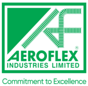
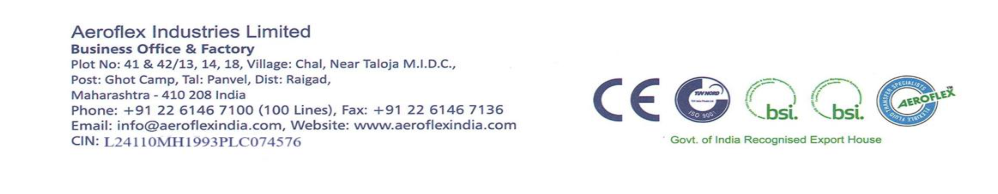
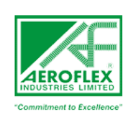
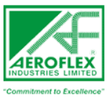

**[Image: aeronov2025.pdf-0001-00.png (182x178, 20.7KB)]**

## **<u>November 03, 2025</u>** 

|To,|To,|
|---|---|
|The General Manager,|The Listing Department.|
|Department of Corporate Services,|National Stock Exchange of India Limited|
|BSE Limited,|Exchange Plaza, C-1, Block G|
|P.J. Towers, Dalal Street,|Bandra Kurla Complex|
|Mumbai – 400001|Bandra (E), Mumbai – 400 051|
|Company Code No.: 543972|Trading Symbol: AEROFLEX|

Dear Sir/ Madam, 

**<u>Subject: Transcript of the Investors’ Conference Call held on October 29, 2025 for Q2 & H1 FY26 Results</u>** 

In continuation to our earlier intimation dated October 29, 2025 regarding audio recording of the Investors’ Conference Call and pursuant to Regulation 30 of the SEBI (Listing Obligations and Disclosure Requirements) Regulations, 2015, we are enclosing herewith the transcript of Investors’ Conference Call held on Wednesday, October 29, 2025 at 11:00 a.m. (IST) for Q2 & H2 FY26 Results. 

The transcript is also available on Company’s website at: 

<u>https://www.aeroflexindia.com/wp-content/uploads/Transcript-of-Q2-FY26-EarningConference-Call-held-on-October-29-2025.pdf</u> 

The audio recording of the Investors’ Conference Call held on October 29, 2025 for Q2 & H2 FY26 Results is available on Company’s website at: 

<u>https://www.aeroflexindia.com/wp-content/uploads/2025-Q2-Audio-Recording.mp3</u> 

Request you to kindly take the same on record. 

Thanking You, 

Yours faithfully, 

## **For AEROFLEX INDUSTRIES LIMITED** 

Mustafa Abid Digitally signed by Mustafa Abid Kachwala Kachwala Date: 2025.11.03 16:54:41 +05'30' 

**Mustafa Abid Kachwala Whole-time Director DIN: 03124453** 

## **Encl: As above** 

**[Image: aeronov2025.pdf-0001-17.png (998x194, 126.1KB)]**

**[Image: aeronov2025.pdf-0002-00.png (228x214, 28.2KB)]**

# “Aeroflex Industries Limited 

# Q2 and H1 FY '26 Earnings Conference Call” 

# October 29, 2025 

“E&OE - This transcript is edited for factual errors. In case of discrepancy, the audio recordings uploaded on the stock exchange on 29th October 2025 will prevail.” 

**[Image: aeronov2025.pdf-0002-05.png (157x142, 18.2KB)]**

**[Image: aeronov2025.pdf-0002-06.png (224x111, 5.5KB)]**

**– – MANAGEMENT: MR. ASAD DAUD MANAGING DIRECTOR AEROFLEX INDUSTRIES LIMITED** 

Page **1** of **14** 

_Aeroflex Industries Limited October 29, 2025_ 

**[Image: aeronov2025.pdf-0003-01.png (107x97, 9.5KB)]**

### **Moderator:** 

Ladies and gentlemen, good day, and welcome to Aeroflex Industries Limited Q2 and H1 FY '26 Earnings Conference Call. As a reminder, all participant lines will be in the listen-only mode and there will be an opportunity for you to ask questions after the presentation concludes. Should you need assistance during the conference call, please signal an operator by pressing star and then zero on your touchtone phone. Please note, this conference is being recorded. 

I now hand over the conference over to Mr. Asad Daud, Managing Director. Thank you, and over to you, sir. 

### **Asad Daud:** 

Thank you so much. Good morning to everyone. I welcome you all to Aeroflex Industries Limited Q2 FY '26 Earnings Call. Joining me today are members of our senior management team and representatives from SGA, Strategic Growth Advisors, who are our Investor Relations partner. I hope you have had a chance to review our results and investor presentation, which are available on the stock exchange and our company website. 

I'm delighted to share that your company has achieved its highest ever quarterly performance across all the key metrics. For the first time, we have surpassed a quarterly revenue milestone of INR100 crores, which is also accompanied by our best ever EBITDA margins of 23.5%. 

Both the revenue and EBITDA have shown growth on a year-on-year basis and also on a quarteron-quarter basis, which underscores our strength and resilience of our business. This achievement reflects and is the result of the dedication of our team, the trust of our customers and our continued focus on operational excellence. 

Despite certain external challenges, which we are all aware of, particularly the imposition of the U.S. tariffs on India, I'm happy to share that we have not received any cancellation of our existing orders from our U.S. customers. 

Although a few shipments have been deferred from Q2 to Q3 but there has been no cancellations and this clearly reflects the strength of our customer relationships, the quality of our products and the confidence that our customer has in Aeroflex as a long-term trusted partner. 

Our subsidiary, Hyd-Air has started to gain strong traction with this range of products witnessing strong demand. We expect this momentum to continue in the coming quarters as well and we also aim to further enhance its product offering and also expand the addressable market. As HydAir continues to scale, it is poised to make an increasingly meaningful contribution to the consolidated growth and performance of Aeroflex Industries. 

Also, one of the key highlights of this quarter was the strong progress that we have made in our latest business, which is the liquid cooling solutions business. Building on the breakthrough order that we received in the last quarter, Q1 from the large listed U.S. corporation, I'm happy to share that we have now received the second order from the same customer. 

This development not only reaffirms their confidence in us, but it also marks a deeper integration into this fast-growing application of liquid cooling in data centers. The liquid cooling space 

Page **2** of **14** 

_Aeroflex Industries Limited October 29, 2025_ 

**[Image: aeronov2025.pdf-0004-01.png (107x97, 9.5KB)]**

represents an enormous opportunity, which is driven by the global shift towards highperformance computing and sustainable cooling systems. 

We are confident that this will become a significant growth driver for the company in the next few years. From an operational standpoint, we continue to focus on enhancing our product portfolio, entering into value-added products, expanding our capacity and improving our productivity through automation and through process optimization. Our consistent efforts towards innovation, cost efficiency and our customer-centric product development are one of the key enablers of our growth journey. 

Now talking about the financial performance. Our total income stood at INR111 crores, which is a growth of 16% on a year-on-year basis and 31% on a quarter-on-quarter basis. This is driven by higher revenue contribution from our subsidiary fittings business, which is Hyd-Air business and also the higher contribution of sales from the domestic market. The sales of Hyd-Air business stood at INR9 crores in Q2. 

We also believe that the performance delivered in this quarter is sustainable over the next few quarters as well despite the ongoing volatility in the international market on account of tariffs. Additionally, the liquid cooling business will start contributing to the top line from Q3 onwards with further traction anticipated in the subsequent quarters and also in the next financial year. 

Our EBITDA for the quarter stood at INR26 crores, which is a growth of 23% on a Y-o-Y basis and 65% on a Q-on-Q basis, which results to our highest ever margins of 23.5%. Our margins expanded by about 136 basis points on a year-on-year basis, primarily driven by our focus towards higher margin and value-added products and also a favorable currency movement. Margins are expected to remain within the range of 21% to 22% in the coming quarters. 

Our profit after tax stood at INR14.23 crores, which is a growth of 4% on a year-on-year basis and 9% on a Q-on-Q basis with a PAT margin of 12.82%. Our cash PAT grew significantly to INR20.33 crores, which is a growth of 26% on a Y-o-Y basis and 55% on a Q-on-Q basis, which reflects strong cash generation and improved operational performance. 

Now in terms of our H1 numbers, our total income stood at INR195.72 crores, which is a growth of 5% on a year-on-year basis. This is despite the fact that the Q1 was not a good quarter for our company. 

Our EBITDA stood at INR41.87 crores, which is an EBITDA margin of 21.7% and we expect this margin to be in the range during this financial year. Our PAT stood at INR21.4 crores with a PAT margin of 10.93% and our cash PAT stood at INR33.43 crores with a PAT margin of 17.08%. 

Our value-added segment of assemblies contributed 53% of the total sales, which is in line with our full year target. Also, the domestic sales contribution improved from 19% to 27%, driven both by the increase in sales from the domestic business of Aeroflex Industries and also the increase in sales from Hyd-Air. Also, our cash flow from operations increased significantly in H1. 

Page **3** of **14** 

_Aeroflex Industries Limited October 29, 2025_ 

**[Image: aeronov2025.pdf-0005-01.png (107x97, 9.5KB)]**

Looking ahead, we remain focused on deepening our focus towards higher value-added products and also expand our presence in emerging sectors such as liquid cooling. We will continue to pursue growth through new product development, through optimization of margins through effective utilization of our capacity, through geographic diversification and also looking at any inorganic growth opportunities. These initiatives position us to strengthen our market leadership and deliver consistent growth in revenue, margin and shareholder returns. 

Before I conclude, I would like to express my gratitude to all our team members for their dedication and support and also to our customers, partners, investors, shareholders and board members for their continued support, guidance and trust to the company. Thank you all for joining today. 

And with that, I conclude my speech, and we can now -- we are now open for questions. 

**Moderator:** Thank you very much. We will now begin the question and answer session. The first question is from the line of Nishita from Sapphire Capital. 

**Nishita:** You mentioned that we are doing capex in the presentation for like increased capacities for the hoses assemblies and metal bellows and miniature metal bellows, which will all be concluded by March 2026? 

**Asad Daud:** Correct. **Nishita:** So I just wanted to know what is the total capex amount for all these additional capex? **Asad Daud:** So the total capex for miniature metals bellows and for the hose combined is -- which was passed in January of this year was INR77 crores, which is the breakup of INR54 crores for the hose division and INR23 crores for the miniature metal bellows. That was the budgeted capex. **Nishita:** Okay. And like what is the -- where are we at? What is the development in the capex that we have done till now? **Asad Daud:** So out of the INR54 crores capex for the hose division, we have done a capex till Q2 of INR19.74 crores, and in miniature metals bellows out of the planned capex of INR23 crores, we have done a capex of INR6.08 crores. Some of the machines of bellows, we are utilizing for our liquid cooling project as well. So hence, we are using a lot of the machines which we can of the bellows division also in the liquid cooling space. 

**Nishita:** Okay. Understood. Also from this capex, when the whole of capex is done, what is the incremental revenue we expect from this additional capacity? **Asad Daud:** So in terms of the miniature metal bellows, once the entire capex is completed and the peak utilization, we are expecting an annual revenue in the range of INR25 crores to INR30 crores. And for the hose division, capacity at peak utilization capacity of 20 million meters per annum, considering that about 70% of the sales will be from the assemblies business, we expect a revenue potential between INR650 crores to INR670 crores. 

Page **4** of **14** 

_Aeroflex Industries Limited October 29, 2025_ 

**[Image: aeronov2025.pdf-0006-01.png (107x97, 9.5KB)]**

**Nishita:** Okay. So, like can you give a timeline for the ramp-up of the utilization to the peak level like from March '26? Is it going to be in phases? 

**Asad Daud:** Yes. So, our entire capex happens in phases depending on the size requirement and the machine requirement that we have. So, we can expect the peak utilization to be -- once our expansion is completed, we expect the peak utilization to happen in the next couple of years post that. **Nishita:** Okay. Understood. And my next question is the INR7.8 crores of order that you received in liquid cooling solutions, what is the execution timeline for that? **Asad Daud:** So the first order that we have received which was in July, that is going to be executed in the current quarter, which is Q3. And the second order that we have received in September that is going to be executed in Q4. **Nishita:** Okay. Understood. Understood. That is, it. And any revenue guidance for FY '26, FY '27 you would like to give? **Asad Daud:** Yes. So generally, we don't give guidance on the numbers. But if you see over the past few years, the growth that we have achieved, we are aiming for the same over the next 4 to 5 years as well. Obviously, like I mentioned in my earlier earnings call also that there could be some quarters where due to external reasons, the business might be affected. 

But our aim is that we are looking at it from the next 4 to 5 years horizon, where we have a certain target that we want to achieve over the next 4 to 5 years. And I think with all the developments that is going on and all the new projects and also the existing projects that we have, I'm sure that we'll be able to reach our targets over the next 4 years. 

**Moderator:** The next question is from the line of Viraj Parekh from Carnelian Asset Management. **Viraj Parekh:** Just a few questions. First, I think -- pardon me if I'm repeating, I joined the call a bit late. You mentioned domestic has done well this quarter from domestic and Hyd-Air sales. If I'm correct, domestic was around INR29 crores this quarter and Hyd was around INR9 crores out of it. So, is it fair to assume that domestic business was flat for us quarter-on-quarter and the growth is mainly driven from the Hyd-Air increase in sales? 

### **Asad Daud:** 

Just give me a minute. Hyd-Air had a sales of approximately INR9 crores in Q2 as compared to -- there was a clerical error in the presentation as compared to INR1.5 crores in Q2 of last financial year. So obviously, there is a significant growth in Hyd-Air, but if you see our quarteron-quarter in terms of our top line. Our top line on a quarter-on-quarter basis increased from about INR85 crores to almost INR111 crores, which is almost INR26 crores jump. 

So out of that, if I account INR7.5 crores to Hyd-Air itself or about INR6 crores to Hyd-Air itself, then the remaining is purely from the business of Aeroflex Industries and that also, the exports grew by 3%, so say about INR2 crores to INR3 crores in terms of value terms was in export and the remaining is from the domestic. So, there is a significant growth in the domestic business of Aeroflex on a stand-alone basis also. 

Page **5** of **14** 

_Aeroflex Industries Limited October 29, 2025_ 

**[Image: aeronov2025.pdf-0007-01.png (107x97, 9.5KB)]**

**Viraj Parekh:** Just wanted to understand again, you said that the typo. So, in the presentation is written INR9 crores for Q2 against INR3 crores for Q1 FY '26? 

**Asad Daud:** Yes, yes. So, the INR3 crores is basically for H1 of FY '25. So, there was a typo error in the presentation. **Viraj Parekh:** Okay. So basically... **Asad Daud:** I'll just give you the brief number. **Viraj Parekh:** Right. Can you give me the Hyd-Air brief for the H1s? **Asad Daud:** Yes. So, the Hyd-Air brief for the H1, I'll just give you a comparison of H1 last year versus H1 of this year, which will help you in better analysis. So Hyd-Air H1 last year was INR3 crores as compared to H1 of this year is INR15 crores. 

**Viraj Parekh:** So H1 was INR4 crores? **Asad Daud:** Q1 was INR6 crores. I'm giving you a ballpark figure. It's like INR5.9 crores something. **Viraj Parekh:** Okay. Fine. Also, just wanted to understand now given that there may be potential decrease in tariffs for us, how does it pan out for us in America? And we've had our bellows capacity being -- sorry, the hoses capacity being almost doubled. And if you can just shed some light on the demand environment there? 

I mean have you recently visited the country and taken a stock with customers of how things are planning, how are the sentiment or how is the order book looking for you going ahead? I'm not talking about FY '26, I'm more concerned for FY '27. 

And same question would be for the bellows business. I'm assuming that capex is on stream to commercialize in 2026, March 2026. So, given that, how are you trying to build the order book in terms of reaching out to customers and ramping up the capacity? Because I believe that is the main basis for our margins expanding going ahead. Just all question are for the 2027 versus the 2026? 

**Asad Daud:** Yes. So just to give a brief overview of the U.S. business. So, like I mentioned that as soon as the tariffs, the penalty tariffs, the oil penalty tariffs were imposed, we started to have discussions with our U.S. customers immediately discussing with them on their existing orders, the potential impact on their business, what help do they require from our end. 

So, a lot of the discussions happened and I'm happy to share, like I also mentioned in my speech that we did not receive a single cancellation of orders from our U.S. customers, which shows that there is a huge demand for our products, and there is no immediate alternate supplier for them who could actually fulfill their demand. So that is one extremely positive aspect that we have seen from talking to all of our U.S. customers. 

Our Vice President, who handles the entire U.S. business, he visited -- he was almost in the U.S. in the entire month of September to discuss with all the customers and find suitable solution for 

Page **6** of **14** 

_Aeroflex Industries Limited October 29, 2025_ 

**[Image: aeronov2025.pdf-0008-01.png (107x97, 9.5KB)]**

us to continue supplying them the products that they demand. So, with some of our customers from the U.S., we have also received further orders as well in this month for supply in this quarter and also for supply in the start of the next calendar year. 

So, we feel that despite the 50% odd tariffs, we are still seeing demand from our U.S. customers continue, although a few of the smaller ones have, like I mentioned, have asked us to defer shipments from September to some in October and some in November. But largely, the existing orders is on track. 

In terms of talking for the next calendar year or the next financial year for specifically the U.S. market per se, I think with expectation that over the past couple of days, the developments have happened, expectation is that by the end of this calendar year, which is probably by December or something, we expect tariffs to go down. Once that happens, I think we can see a significant uptick in demand, especially from the U.S. business. 

And also, if you see that the exports on a Q-on-Q basis increased by about 3%. Out of that, about 1.5%, 2% was increase in business from the U.S. market itself. So far, we have not seen the significant drop in the U.S. business, although I would say on record that if not for the tariffs, I think our results would have been much, much better than what -- or our performance would have been much, much better as compared to what we had in Q2. 

I think we would have had a significantly -- even more better performance in Q2, if not for the tariffs because a lot of our customers had orders with us. We also had orders which we had to, like I mentioned, deferred some of them to October. Otherwise, this would have been the -- by far the best quarter ever for our company and even better than what we had. So that is one. 

In terms of the bellows business, we are seeing now, like, for example, in the past couple of months, we have started to get orders from Europe, from Canada. We recently just got an order of bellows from Argentina. 

The one thing in bellows is that due to the tariffs, the U.S. tariffs, I think that is one of the areas where we got affected was the kind of business that we were expecting in the bellows from the U.S. that has seen a bit of a delay because for them, bellows from Aeroflex was a new product. 

And hence, due to these tariffs, the sharp spike in orders that we were receiving, or we were expecting from the U.S. that could not be materialized. So, I think once the tariff issue is resolved, I think we can see a lot of orders from the U.S. market for our bellows. But saying that we have already -- we have about approximately INR2 crores to INR2.5 crores orders in hand of bellows from the other markets, which includes Europe, Canada, and South America. 

In terms of the expansion of bellows, so like I mentioned, some of the machines of the bellows we are utilizing for our liquid cooling project as well, where the same machines are being used for liquid cooling. 

Also, we are ongoing with our expansion on the miniature metal bellows in terms of the machines that we require specifically for that. Plus, we're also planning to do further capacity 

Page **7** of **14** 

_Aeroflex Industries Limited October 29, 2025_ 

**[Image: aeronov2025.pdf-0009-01.png (107x97, 9.5KB)]**

building for the liquid cooling. I think probably once it is finalized, we will share it with everyone once it is approved by the Board. 

### **Viraj Parekh:** 

### **Asad Daud:** 

**Viraj Parekh:** 

**Asad Daud:** 

Just one follow-up about the first U.S. business you're talking about. Given that the first year we grew at 5% first half, are we confident given that we're getting new orders, there is no cancellation of orders. Can we expect sometime around mid-double-digit to high double-digit CAGR growth over the next 2 years in terms of revenue? 

Yes, definitely. I think that is definitely achievable. 

Right. So then our overall guidance can be in the range of mid- to high teens, kind of a range, like 20% growth should be achievable going ahead from 2027 onwards, given if things fall in our favor in terms of tariffs? 

Yes, there are a lot of ifs and buts. So -- but yes, see, our aim is obviously growth in the top line and growth in the bottom line as well. So that is where we are extremely conscious where we want to grow profitably, where the growth has to be on the top line and the bottom line. 

And like I mentioned, we have a lot of projects ongoing. Obviously, the liquid cooling is the latest one. But apart from that, we have the bellows one, which is ongoing in the U.S. business. Also, there is a lot of demand that's coming in or in terms of higher diameter sizes for the metal hoses division. 

So that is an area also where we are focusing, where we are seeing more inquiries, more potential business that can come. So definitely, I think mid- to high teens is a growth number that is definitely achievable over the next few years. 

**Viraj Parekh:** 

### **Asad Daud:** 

Right. Just last 2 questions, I'll get in line. First is on the liquid cooling project, which you said is ramping up well, and you have 2 orders to deliver this quarter and next quarter. What is the potential do you see? I believe there is some customer with whom you've tied up. What potential do you see this business growing with them? And if you can share some details about the arrangement and the tie-up with them? 

So this company is basically the Indian subsidiary of the U.S. company. We have signed a contract with them to supply them liquid cooling solutions for data centers. Like I mentioned, we received one order in July. We received another one in September. The first order is planned to be dispatched in this quarter, and the second order is planned to be dispatched in Q4 at early parts of Q4. 

Also, we are discussing with them to ramp up our capacity, as they have given us some of their plans for the next calendar year. So, they have asked us to ramp up the capacity in order to serve them in the next couple of years. We are already working on that in terms of the infra required in terms of the machine required, in terms of the ancillary equipment, and also in terms of the capital required. 

So, probably, I would say, in the next month or so, we'll be able to give more details on further expansion in this particular segment. Obviously, it's a contract with them that we have exclusive 

Page **8** of **14** 

_Aeroflex Industries Limited October 29, 2025_ 

**[Image: aeronov2025.pdf-0010-01.png (107x97, 9.5KB)]**

for India. So, we will be their sole suppliers for the liquid cooling project in India. And we have been speaking to the top level of their company in India. 

So -- and also there is potential -- obviously, it is very early stage. But they have also said that once they're satisfied with our quality, our supply, and our service, there could be a potential for -- that they could explore us to deliver this product to also -- to their international customers as well. So that is something in the future. But yes, definitely, I think this segment over the next 2 to 3 years would be a significant contributor to Aeroflex Industries for sure. 

**Viraj Parekh:** Got it. Just last question, sir. I think you mentioned that we expect margins to be in the range between 21% and 22%. This quarter, there was a good enough rise in our gross margins, which initially flowed to the EBITDA. So, was there any one-off, if you can explain? 

### **Asad Daud:** 

Yes. So, the margins in this quarter, Q2, which almost 23.5%, there were a couple of reasons for that. One is, if you see our material margins was at an all-time high. That is due to a lot of the value-added products, like I mentioned, that we have supplied. 

So, for example, we have got -- we supplied a lot of the assemblies which are into bigger size diameters where the margins are obviously better as compared to supplying the smaller sizes. So that was something that helped. Plus also, if you see in terms of our material, we also -- our engineering team continuously work on developing the products such that we plan to reduce not only our costing, but the costing to our customers as well. So that was one reason. 

And also, like I mentioned, I think favorable foreign currency also helped in this -- obviously, the rupee depreciating over the past 3 to 4 months from the levels that it was that also contributed some amount to the higher margins. Hence, I mentioned that if you see on an annualized basis and if you see for this year, we expect the EBITDA margins on a full year basis to be in the range of between 21% to 22%. 

### **Moderator:** 

The next question is from the line of Lokesh Maru from Nippon India Mutual Funds. 

**Lokesh Maru:** A couple of questions from my side. One is, like you mentioned, the sale to the Indian subsidiary of a U.S. company. So, is it counted within our domestic business or is it counted in exports? 

**Asad Daud:** It is counted in the domestic business, but there has been no sales as yet. So far, there has been no billing. So technically, as of right now, there is no sales. 

**Lokesh Maru:** Understood. So, the incremental sales that we have done in domestic, if you could help understand which are these pockets, how are they picking up? And what is the outlook for domestic? 

**Asad Daud:** So, for domestic obviously, one was the increase in the sales of the Hyd-Air business. And in terms of the increase in sales was on account of multiple areas. So, one is we saw increase in sales from the steel plant. We also saw increase in sales from ports and terminals, then we have seen increase in sales coming from the power sector as well. So, there are multiple regions where we have seen an increase in sales happening in Aeroflex, also and in the subsidiary Hyd-Air. 

Page **9** of **14** 

_Aeroflex Industries Limited October 29, 2025_ 

**[Image: aeronov2025.pdf-0011-01.png (107x97, 9.5KB)]**

### **Lokesh Maru:** 

Understood. Sir, just one question from my side is, so like you said, there has been no cancellation to our U.S. orders, right? There has been some bit of deferment. So just to understand, so since there is not a significant impact on our sales or orders from there. Can you help understand -- you had highlighted earlier that the largest -- I mean, the market leaders in this segment are from the U.S. predominantly, right? 

So, when you make a cell there, so for them, if we were to look at price differential, like for us, it is 50% right now. But for them, what does their supply chain look like? How much is domestic manufacturing for them in the U.S.? How much do they maybe import, right? If you could help us understand the scenario, it would really help? 

### **Asad Daud:** 

So, in terms of those manufacturers in the U.S., right, a lot of the raw material is also imported by them. So, in that case, their imports are also subject to the 50% tariff, and then on top of that, obviously, they have their own cost of operations, which is much, much higher as compared to what we have in India. 

So that is the reason why you have seen that -- we have not seen any cancellations because in our industry, it is unlike, say, a consumer industry where the supplier or the vendor can shift from a supplier to A supplier to a B supplier very easily. In our case, it is not that easy. 

I'm not saying that it can never happen, but it takes a lot of time because for somebody else to build up that capacity to build up that efficiency and to give that kind of quality at that kind of price, it takes time. Hence, that is why we have seen that the business from the U.S. has not dipped. 

And in terms of our international competition, they have been manufacturing across the world, whether in Europe, whether in USA, whether in India, whether in Southeast Asia, or anywhere across the world. But their strategy remains to have -- they have a certain segment where they cater to, and we are catering to a certain segment, right? 

So, which shows that despite the tariffs, I think we have been able to negotiate and to overcome it right now, obviously, expecting some relief on the same in this quarter, so that we can see a significant uptick in the business over the next few quarters. 

### **Lokesh Maru:** 

### **Asad Daud:** 

Sir, now that the shipping lines and shipping have settled, is it fair to assume or understand that our exports to Europe can also come back? I mean, can accelerate earlier, let's say, Turkey was in vicinity now since everything has settled, what is your expectation from Europe sales going forward? 

So, after the U.S., Europe is our second biggest market. And that is where we have been focusing on over the past 2 quarters, since the time the announcement of the proposed tariffs happened in the month of April. But Europe has its own legacy issues. But I think Europe will see some uptick in demand from the next calendar year onwards. 

The only issue that Europe is facing is because there are tariffs on Europe as well, although it is much lesser than India, but it is much higher than what it was earlier. Europe, being a higher 

Page **10** of **14** 

_Aeroflex Industries Limited October 29, 2025_ 

**[Image: aeronov2025.pdf-0012-01.png (107x97, 9.5KB)]**

price or a higher value-driven economy for them, additional tariffs on top of their cost becomes very significant. 

So, that is why I see Europe would take about a couple of quarters. But I think from the next calendar year onwards, I see demand picking up in Europe as well. We have already seen in some countries of Europe, we have seen uptick in demand in this financial year as compared to the last year. 

**Moderator:** The next question is from the line of Chirag from Keynote Capital. **Chirag:** Heart felt congratulations as and team for the amazing set of numbers. Sir, my first question is to understand in Hyd-Air, if I'm not wrong, at optimum utilization, the revenue that we can do is around INR30 crores, INR35 crores. And on a quarterly level, we have already reached INR9 crores number. So, are we focusing on expanding the capacity over here? **Asad Daud:** Yes. So that is already under discussion. And probably in the next month or so, we will be the announcing the same. So yes, there is plan to increase the capacity in Hyd-Air very soon. **Chirag:** Perfect. Sir, second thing I wanted to understand, if I'm able to see utilization levels in hoses specifically, we have made a production of about 11 million to 11.5 million volumes in meters. And last year, in H1, it was around 13.4 million. So, it was strategically reduced because of the scenario, or am I reading something incorrectly? **Asad Daud:** No. Our capacity is 16.5 million meters. So, 11 million meters for half a year, the figures are not correct. So maybe you might just want to check. **Chirag:** Sir, you given in the presentation that our utilization was around 68.65% in H1? **Asad Daud:** Yes, 68.65% is of 16.5 million millimeters, but that's 16.5 million meters is actually annualized. So yes, you'll have to take half year... **Chirag:** On an annualized basis only I was asking, that on an annualized basis it is coming around 11.3 million, which on last year H1, it was around 13.4… **Asad Daud:** Yes. So, there are a couple of reasons. So one is, we have seen more orders coming in, like I also mentioned just previously, a couple of questions back. We have seen a lot of orders coming in for bigger diameter hoses. And in case of a bigger diameter hose, in case of the number of meters are lower as compared to a smaller diameter hose. Hence, if you see from meter to meter, you might see a reduction. But if you see in terms of volume or in terms of the value, it's much higher. 

So, there has been a focus of the company to focus on higher diameter of hoses because the margins in the higher diameter hoses are much more as compared to when you're selling very, very smaller diameter hoses. Obviously, competition in smaller diameter hoses is much more as compared to competition in high diameter hoses where we are one of the leaders in the space in the higher diameter hoses. So, if you see the... 

Page **11** of **14** 

_Aeroflex Industries Limited October 29, 2025_ 

**[Image: aeronov2025.pdf-0013-01.png (107x97, 9.5KB)]**

**Chirag:** I lost you somewhere when you were explaining the competition part. Could you just repeat that one? 

### **Asad Daud:** 

Yes, I'm saying the competition in smaller diameter hoses is more compared to the competition in higher diameter hoses because not everybody can produce such wider diameter of hoses. Plus, also the machines required to make the same are big. The investment required is much bigger. The engineering skills required to make high-diameter hoses are much more compared to smaller diameter hoses. 

And hence, we have seen over the past 2 quarters that the sales of high-diameter hoses have increased significantly. And hence, you would see that difference in the meters as compared to last year, because last year, the sales of smaller diameters hoses were more. When I am talking about higher diameters hoses, I'm talking about 6-inch, 8-inch, 10-inch, 12-inch. **Chirag:** Right. Right. Right. And next thing from my side is that I'm from an industry split perspective, I'm able to see that we have again reached the level of INR30 crores quarterly revenue in the new age industry, which we had earlier last year, Q3. So, can I expect that going forward, this is going to be the base, and we are on an annualized run rate of INR100 crores plus for the new age industry now? 

**Asad Daud:** Yes. I think that is going to grow significantly now with the liquid-cooling vertical. I think that is going to grow leaps and bounds over the next few quarters and the next year as well. **Moderator:** The next question is from the line of Aaryan Khot from LIC Mutual Fund. **Aaryan Khot:** Just wanted a color on the existing tariff... **Asad Daud:** I'm not able to hear you. Can you just repeat again? **Aaryan Khot:** I just wanted a color on the existing tariffs impact on our business. How is the arrangement in terms of who is bearing the cost between us and our customers? **Asad Daud:** So, in terms of the tariff, right, obviously, initially when it was announced, the customers obviously asked us how any customer would do, right, would ask us for a hefty discount. Obviously, we have given some discount, but not in the range of what was demanded by them. So, the majority of the tariff is being borne by the customers themselves, with a small rebate that we have given to them to help them temporarily overcome this situation. So, for us, the impact would not be so significant. So, the major of the tariff is being borne by the customers themselves. 

**Moderator:** The next question is from the line of Shubham Thorat from Perpetual Capital Advisors. **Shubham Thorat:** So, first of all, I would like to know how products fare in the U.S. and Europe after this tariff by the U.S. I mean, what are the price differentials with the local players there? 

**Asad Daud:** So, part of the question I had already answered. So, first of all, in Europe, obviously, there are no tariffs from India to Europe. So, the situation remains what it was earlier. With regards to the 

Page **12** of **14** 

_Aeroflex Industries Limited October 29, 2025_ 

**[Image: aeronov2025.pdf-0014-01.png (107x97, 9.5KB)]**

U.S., there are tariffs on India, obviously, but a lot of the manufacturers in the U.S., the manufacturers of our products, they import the raw material. Hence, the tariffs are also applicable to them on the raw material. Hence, there is not a lot of difference in the pricing or in the pricing after the tariffs. 

Obviously, the tariffs portion on the conversion cost, which is the difference between the raw material and the selling price, obviously, that would be there, but that is still much less as compared to the cost of manufacturing in the U.S. So, hence, we have not seen major changes in demand so far in the U.S. market. 

**Shubham Thorat:** Okay. The second and final question I had is post the current capex that we are doing, what would be our capacity? **Asad Daud:** 20 million meters per annum. 

**Shubham Thorat:** Okay, so this is for metal bellows, right? 

**Asad Daud:** No, for the hose. For metal bellows, it will be -- currently, we have done about 120,000 pieces per annum. And the miniature one that we are doing is about 240,000 pieces per annum. 

**Moderator:** The next question is from the line of Tushar Sarda from Athena Investments. 

**Tushar Sarda:** Okay. So, on the U.S., you said that the orders have been deferred. If you can just explain the U.S. business in a little more detail, what is the annual size, and how many orders have been deferred, and what turnover you actually did in the last quarter? If you already answered, I'm sorry, because my line has not been good. I've been on and off the call? 

**Asad Daud:** So, in terms of the contribution of the USA to our overall export business, that continues to remain at about 60% of the overall export. That includes the entire Americas, North and South. So, if you take the U.S., which is a major portion of that remains about 40% to 45% of our overall export business. 

And that has remained the same from Q1 to Q2 in terms of the percentage. Now, in terms of the deferment of shipments, so, approximately INR5 crores to INR6 crores worth of material has been deferred for shipments from Q2 to Q3. So that is the broad figures. 

**Tushar Sarda:** Okay. If and when the tariffs are rationalized or reduced or whatever, do you expect this contribution 60% to move up significantly? 

**Asad Daud:** Yes. I think if not for the tariffs, I think this contribution would have moved up in Q2 itself. But obviously, we expect that I think once the tariff situation is stabilized, I think this contribution would definitely increase. 

To what percentage it would be slightly difficult to say at this stage, definitely with the discussion that we had with the customers pre-tariff, I think this contribution would have definitely gone ahead. And we expect it to increase because of the recent news that we are hearing that hopefully, the tariffs would be eased out over the next couple of months. 

Page **13** of **14** 

_Aeroflex Industries Limited October 29, 2025_ 

**[Image: aeronov2025.pdf-0015-01.png (107x97, 9.5KB)]**

**Tushar Sarda:** 

Okay. And apart from deferment of orders, are customers also holding back placing fresh orders? 

### **Asad Daud:** 

So the large ones have not. The large ones are continuing to place the orders. But obviously, the smaller ones are taking the time. But for this calendar year, I think we already have the orders that we plan. And the discussions for the next calendar year have already started with a lot of our customers, with the potential for the next calendar year. And we are seeing in terms of the business that a few of our large customers are discussing with us. I think the next year, the business is definitely going to be much higher as compared to this year. 

**Tushar Sarda:** And sorry to squeeze in a last question. On this cooling product, what is the turnover in Q2? And how much can it become, actually start servicing it? 

### **Asad Daud:** 

So there is no turnover as yet in Q2 because we have not yet supplied the product as yet. It's going to be supplied in Q3. And we have already received orders of approximately INR8 plus 8, so approximately INR16 crores already. 

And difficult to give an exact number on how much it can be, but from a discussion that we have with our customers with whom we have this contract, I think -- like I mentioned, I think over the next couple of years, this division would contribute significantly to the overall performance and the growth of Aeroflex. 

**Moderator:** Ladies and gentlemen, due to time constraints, that was the last question. I now hand over the conference to Mr. Asad Daud, the Managing Director, for the closing comments. 

**Asad Daud:** Thank you so much, everyone, for your questions. If in case I have not been able to answer your questions or in case if you need any other information from our end, you can get in touch with SGA, who is our Investor Relations Advisors. And also, you can get in touch with me or our team. 

Thank you so much again, everyone, for joining today's earnings call, and hope to see you in the next earnings call. 

**Moderator:** Thank you. On behalf of Aeroflex Industries Limited, thank you for joining us, and you may now disconnect your lines. 

Page **14** of **14** 

---

## Extracted Images

| # | File | Dimensions | Size |
|---|------|------------|------|
| 1 | aeronov2025.pdf-0001-00.png | 182x178 | 20.7KB |
| 2 | aeronov2025.pdf-0001-17.png | 998x194 | 126.1KB |
| 3 | aeronov2025.pdf-0002-00.png | 228x214 | 28.2KB |
| 4 | aeronov2025.pdf-0002-05.png | 157x142 | 18.2KB |
| 5 | aeronov2025.pdf-0002-06.png | 224x111 | 5.5KB |
| 6 | aeronov2025.pdf-0003-01.png | 107x97 | 9.5KB |
| 7 | aeronov2025.pdf-0004-01.png | 107x97 | 9.5KB |
| 8 | aeronov2025.pdf-0005-01.png | 107x97 | 9.5KB |
| 9 | aeronov2025.pdf-0006-01.png | 107x97 | 9.5KB |
| 10 | aeronov2025.pdf-0007-01.png | 107x97 | 9.5KB |
| 11 | aeronov2025.pdf-0008-01.png | 107x97 | 9.5KB |
| 12 | aeronov2025.pdf-0009-01.png | 107x97 | 9.5KB |
| 13 | aeronov2025.pdf-0010-01.png | 107x97 | 9.5KB |
| 14 | aeronov2025.pdf-0011-01.png | 107x97 | 9.5KB |
| 15 | aeronov2025.pdf-0012-01.png | 107x97 | 9.5KB |
| 16 | aeronov2025.pdf-0013-01.png | 107x97 | 9.5KB |
| 17 | aeronov2025.pdf-0014-01.png | 107x97 | 9.5KB |
| 18 | aeronov2025.pdf-0015-01.png | 107x97 | 9.5KB |
