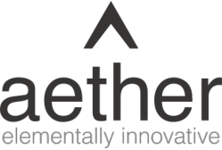
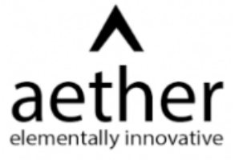
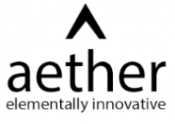
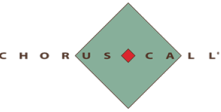
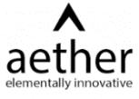

**[Image: Feb2026.pdf-0001-00.png (249x168, 12.0KB)]**

February 10, 2026 

## Ref. No.: **AIL/SE/64/2025-26** 

To, 

## **BSE Limited** 

Phiroze Jeejeebhoy Towers, Dalal Street, Fort, Mumbai-400001, MH. 

Scrip Code: **543534** 

**National Stock Exchange of India Limited** Exchange Plaza, Bandra Kurla Complex, Bandra (E), Mumbai-400051, MH. 

Symbol: **AETHER** 

Dear Madam / Sir, 

## **Subject:** **<u>Transcript of the Earning Conference Call</u>** 

In accordance with Regulation 30 of the SEBI (Listing Obligation and Disclosure Requirements) Regulations, 2015, the Transcript of the Earning Conference Call scheduled on Tuesday, February 3, 2026, on the financial performance of the Company for the Third Quarter and Nine Months ended on December 31, 2025, is enclosed herewith. 

We request you to kindly take the information on your records. 

Thank you. 

## **For Aether Industries Limited** 

**[Image: Feb2026.pdf-0001-15.png (294x126, 39.7KB)]**

## **Chitrarth Rajan Parghi** 

Company Secretary & Compliance Officer Mem. No.: F12563 

**[Image: Feb2026.pdf-0001-18.png (205x207, 74.6KB)]**

Encl.: As attached 

CHITRARTH RAJAN PARGHI 

Digitally signed by CHITRARTH RAJAN PARGHI Date: 2026.02.10 12:00:58 +05'30' 

### **Aether Industries Limited** 

Page **1** of **1** 

**Registered Office:** Plot No. 8203, GIDC Sachin, Surat-394230, Gujarat, India. **Phone:** +91-261-6603000 **||  Email:** info@aether.co.in **||  Web:** www.aether.co.in **II  CIN:** L24100GJ2013PLC073434 **Factory:** Plot No. 8203, Beside Shakti Distillery, Near Rajkamal Chokdi, Road No. 8, Sachin GIDC, Sachin, Surat-394230, Gujarat, India. 

**[Image: Feb2026.pdf-0002-00.png (293x205, 26.1KB)]**

# “Aether Industries Limited 

# Q3 FY '26 Earnings Conference Call” 

# **February 03, 2026** 

**[Image: Feb2026.pdf-0002-04.png (175x124, 10.8KB)]**

**[Image: Feb2026.pdf-0002-05.png (188x87, 14.1KB)]**

**[Image: Feb2026.pdf-0002-06.png (221x112, 5.5KB)]**

**– MANAGEMENT: DR. AMAN DESAI PROMOTER AND WHOLE TIME – DIRECTOR AETHER INDUSTRIES LIMITED** 

**– MR. ROHAN DESAI PROMOTER AND WHOLE TIME** 

**– DIRECTOR AETHER INDUSTRIES LIMITED** 

**– – MR. FAIZ NAGARIYA CHIEF FINANCIAL OFFICER AETHER INDUSTRIES LIMITED** 

**– MR. KUSHAL DOSHI LEAD INVESTMENT RELATIONS – AETHER INDUSTRIES LIMITED** 

**– MODERATOR: MR. NILESH GHUGE HDFC SECURITIES** 

Page **1** of **18** 

_Aether Industries Limited February 03, 2026_ 

**[Image: Feb2026.pdf-0003-01.png (153x109, 13.1KB)]**

**Moderator:** 

Ladies and gentlemen, good day, and welcome to Aether Industries Limited Q3 FY '26 Earnings Conference Call. As a reminder, all participant lines will be in the listen-only mode and there will be an opportunity for you to ask questions after the presentation concludes. Should you need assistance during the conference call, please signal an operator by pressing star then zero on your touch-tone telephone. Please note that this conference is being recorded. 

I now hand the conference over to Mr. Nilesh Ghuge from HDFC Securities. Thank you, and over to you, Mr. Ghuge. 

#### **Nilesh Ghuge:** 

Yes. Thank you, Renju. Good afternoon, all. On behalf of HDFC Securities, I welcome everyone to this Aether Industries conference call to discuss the results for the quarter ended December 2025 and 9 months of the financial year 2025-'26. 

From the Aether Industries, we have with us today Dr. Aman Desai, Promoter and Whole Time Director; Mr. Rohan Desai, Promoter and Whole Time Director; Mr. Faiz Nagariya, Chief Financial Officer; Mr. Kushal Doshi, Lead Investor Relations; and Ms. Shubhangi Desai, Executive IR. 

Without further ado, I will now hand over the floor to Mr. Kushal Doshi to begin with the earnings for the quarter 3 FY '26. Over to you, Kushal. 

**Kushal Doshi:** 

Thank you, Nilesh. A warm welcome to everyone. Today, our Board has approved the financial results for the third quarter and 9 months for financial year 2026 and the same has been filed with the exchanges as well as updated over our website. 

Please note that this conference call is being recorded, and the transcript of the same will be made available on the website of Aether Industries Limited and the stock exchanges. Please also note that the audio of the conference call is the copyright material of Aether Industries Limited and cannot be copied, rebroadcasted or attributed in press or media without specific and written consent of the company. 

Let me draw your attention to the fact that on this call, our discussion will include certain forward-looking statements, which are predictions, projections or other estimates about the future events. These estimates reflect management's current expectations on future performance of the company. Please note that these estimates involve several risks and uncertainties that could cause our actual results to differ materially from what is expressed or implied. Aether Industries Limited or its officials do not undertake any obligation to publicly update any forward-looking statements, whether as a result of future events or otherwise. 

Now Mr. Rohan Desai will begin by sharing Aether's business outlook, ongoing expansion, then Dr. Aman Desai will provide inputs on the R&D and new client initiatives and strategy of the company going forward. And Mr. Faiz Nagariya will cover the financial highlights for the period under review. 

Now I hand over the call to Mr. Rohan Desai for his opening remarks. Over to you, Rohan. 

Page **2** of **18** 

_Aether Industries Limited February 03, 2026_ 

**[Image: Feb2026.pdf-0004-01.png (153x109, 13.1KB)]**

#### **Rohan Desai:** 

Good evening, everyone. I hope everybody is doing well, and I'm glad to connect with you all to discuss the performance of our company for quarter 3 of financial year 2026. I'm delighted to inform you that the construction and installation of Site 3++ and the first 2 production blocks of Site 5 has been completed and water plus and solvent trials have been commenced. Commercial production from these sites will comment shortly. The 3 business verticals continue to perform well, even though global environment continues to remain volatile. 

Last quarter, we have seen 43% of the sales from contracts plus exclusive manufacturing, 41% from large scale manufacturing and 8% from contract research and manufacturing services. Our export revenue stood at 36% of the total revenue and the domestic sales stood at 64%. In terms of the sectoral spread, for the quarter 3, pharma and agro is now contributing only 45% combined, while oil and gas and material science contributes 22% and 18%, respectively. As mentioned in the previous call, we expect share of oil and gas and material science to scale up by the year-end. 

In large-scale manufacturing business vertical, the demand of our products remained robust, while price has remained stable in the quarter. Volume growth has been over 10% quarter-onquarter basis, and over 25% year-on-year basis. We have added 3 new products in the largescale manufacturing vertical from Site 5 which are targeted towards pharmaceutical and agrochemical sectors. Validation quantities have been sent out from the other plants. We have plan to launch the commercial production shortly in Site 5. 

All the 3 products will be manufactured for the first time in India and are currently priced between $30 to $40 per kilo. In the quarter, we have added 5 new marquee clients. Sales from Site 4, in this quarter have increased to INR60 crores as compared to INR50 crores in quarter 2 of financial year 2026, representing an impressive 20% growth quarter-on-quarter. The current run rate is expected to continue for the financial year 2026, and we see an increase in the trend in financial year 2027. 

The increase in volume is expected as we start to supply to more of the sites of Baker Hughes, and we are looking to add more products, which are currently in CRAMS and increase our wallet share. Converge polyol continues to see an increase in sales in this quarter, and we are on track to achieve our targets in financial year 2026. 

We are pleased to inform you that despite the volatile macro environment, we see a number of customers' inquiry increasing for this particular product. The acceptability and adaptation of the product makes us optimistic for financial year 2027 as we continue to further research on Converge polyol to see how the product can be adopted by companies which were not in our search to as a customer earlier. 

Our contract with Otsuka Chemical is on track and we are expected to achieve a target of INR35 crores to INR40 crores of sales in financial year 2026. In site 5, we have forayed into electronic chemicals, specifically related to semiconductor industry, the clients, which will be supplying our base in Japan, South Korea and Taiwan. The validation batches for these chemicals have been dispatched already. 

Page **3** of **18** 

_Aether Industries Limited February 03, 2026_ 

**[Image: Feb2026.pdf-0005-01.png (153x109, 13.1KB)]**

In summary, we are extremely excited as we look to commence Site 3 -- sorry, we look to commence 3 production blocks in Site 3++, and Site 5, respectively, at Aether and our company becoming a preferred partner, not only in R&D, but also for commercialization of our products. 

With this, I would like to conclude speaking, and I would like -- I would request Dr. Aman to touch upon the R&D and new client initiatives for this period. Over to you, Aman. 

#### **Aman Desai:** 

Thank you, Rohan. Good evening, everybody. I hope all are doing well, and I'm very happy to connect with you again at the end of a promising quarter, I think. In the last few months, we have been extremely busy at Aether, Site 3+ as well as the first 2 production blocks of Site 5, will both more or less simultaneously commence commercial production in the very near future, so both Site 3+ and the first 2 blocks of Site 5. At the same time, we are also doing R&D expansion. So we are doing 2 R&D expansions. We are doing a short-term R&D expansion and a long-term R&D expansion. 

In the short-term R&D expansion right away in the next couple of months itself, we are installing 20 additional fume hoods in the existing facility, a major part of which will be engineering labs, similar to what we talked about in the last quarter. At the same time, we are also doing a longterm R&D expansion where we are installing 15 additional labs, 150 fume hoods out of which 5 will be engineering labs. And we are also going into advanced very modern cutting-edge analytical equipment like NMR, nuclear magnetic resonance spectroscopy. 

The engineering labs, that is both in the short term and the long-term expansions of the R&D will help us to focus much more on chemical engineering, chemical technology and scale up from the R&D itself, which will enable us to further tap into what our current focus in CRAMS is, which is non-pharma and non-agro, oil and gas and material sciences. These sectors require much more chemical engineering at the inception of R&D along with organic chemistry. And that's what the expansions in the R&D are going to be focused on. 

The Site 1 as it stands, the R&D center is fully tapped -- fully utilized today, and that's why we made the decision of doing this short-term expansion of 20 fume hoods, along with the longterm expansion of the double expansion that we are doing in the R&D. 

Over the last few months, moving on to the interactions with customers, especially Europe, it is becoming increasingly evident to us that the manufacturing and chemical manufacturing in Europe is being especially hard hit. 

As a result, in the current environment, a number of plants are being shutting down in the Europe, increasingly so. Customers are looking to partner with reliable partners in India, the choice is definitely India and we are seeing a clear urgency and expedition of finalizing the contracts which we have been iterating and reiterating over the last few quarters. 

We are discussing significant contracts, significant ventures with the biggest chemical companies in Europe today. And you will see all of these pan out over the next few months, in the next few quarters in the announcements that we make. As mentioned by Rohan, not only have we entered into a CEM exclusive contract, manufacturing contract with electronic 

Page **4** of **18** 

_Aether Industries Limited February 03, 2026_ 

**[Image: Feb2026.pdf-0006-01.png (153x109, 13.1KB)]**

chemicals related to semiconductors, but we have also entered into a CEM contract with a European, one of the largest chemical companies in Europe targeting the material science sector. 

This contract, although it is small right now, is on its way to becoming a significant large contract going forward within the next 1 year itself. One production line in Site 3, which currently houses LSM projects is currently being modified to house this particular CEM contract with the European multinational customer. This will help us in improving the capacity utilization of this plant in the Site 3 as well as save us time in setting up new capacity. 

In the existing customers, the business and the projects with Baker Hughes are ongoing significantly well. We are adding new products and new projects there. And the Site 3+, as I mentioned earlier, with Milliken is going to shortly commence commercial production in the very, very near future. So we have our hands full. 

The sites are busy, and we are expanding on all sites of Site 1, Site 3 and Site 5. And with this robust pipeline that we today have in CRAMS, we are quite confident of being able to fill up all these assets and fill up all these sites in the very near future with innovative customers and exclusive relationships with multinationals and innovators across the globe. 

And with our own business model of large-scale manufacturing, which are the first time made in India products. So let me stop talking. Happy to answer your questions as they come and hand over the call to Faiz, now, who will give you an overview of the financial highlights and over to you, Faiz. 

#### **Faiz Nagariya:** 

Thank you, Dr. Aman, and good evening, everybody. I'm glad to present the financial results of Aether Industries Limited for Q3 and 9 months of financial year '26. The consolidated revenue from operations of the company stood at INR3,171 million in Q3 of financial year '26 as against INR2,197 million in Q3 of financial year '25, which is an increase of 44% year-on-year. This has resulted in EBITDA of INR1,083 million in Q3 of financial year '26 as against INR620 million in Q3 of financial year '25, which is an increase of 75% in comparing quarters. 

EBITDA margin stood at 34% in Q3 of FY '26 as against 28% in Q3 of FY '25. The PAT amounted to INR645 million in Q3 of financial year '26 as against INR434 million in Q3 of financial year '25, which is an increase of 49% year-on-year. The PAT margin stood at 20% in Q3 of financial year '26 as against 18% of Q3 of financial year '25. 

The consolidated revenue from operations of the company stood at INR8,534 million in 9 months of financial year '26 as against INR5,985 million in 9 months of financial year '25, which is a 43% increase in the comparing 9 months. 

The EBITDA of INR2,716 million in 9 months of financial year of '26 as against INR1,525 million in 9 months of financial year '25, which is an increase of 75% in the comparing 9 months. All this has resulted in PAT amount of INR1,655 million in 9 months of financial year '26 as against INR1,081 million in 9 months of financial year '25, which is a 53% increase in comparing 9 months. 

Page **5** of **18** 

_Aether Industries Limited February 03, 2026_ 

**[Image: Feb2026.pdf-0007-01.png (153x109, 13.1KB)]**

PAT margins stood at 19% in 9 months of financial at '26 as against 17% in 9 months of financial year '25. The remaining claim for the fixed assets for the loss has been put up through the insurance surveys along with loss of profit claim and we are confident to get the same settled with the insurance company by or before the end of financial year '26. 

The net working capital cycle remains at 160 days as against 149 days as on September 30, '25, mainly because of inventory buildup for the start of Site 3++ and Site 5, which are expected to begin from March '26. The capacity utilization at all plants stand as under; Site 2 is 76%, Site 3, 70% and Site 4 it's 49%. These are progressing as per the strategic planning done by the company. 

Thank you once again, and we look forward to better outcomes than this in future as well. Back to you, Kushal. 

#### **Kushal Doshi:** 

#### **Moderator:** 

#### **Sajal Kapoor:** 

#### **Aman Desai:** 

Thank you, Faiz. We shall now request the moderator to open the forum for question and answers. 

Thank you. We will now begin the question-and-answer session. The first question comes from the line of Sajal Kapoor with Antifragile Thinking. 

Given the novel scale-up chemistry skills are scarce in India and attrition risk is structurally higher across the industry, how does Aether treat talent retention as a core priority and what hard trade-offs has management consciously made in favor of employee continuity? That's my first question. 

Thank you for the question. A very relevant question. Companies all over the country in the chemical space are expanding and talent recruitment and retention is one of the topmost priorities. It should be one of the topmost priorities and is one of the most priorities with us. We spent a lot of time at the management level, at the family level, focusing on this issue. 

We have a lot of efforts that we undertake, including attractive ESOPs, attractive packages other benefits, other incentives across the company at all levels, starting from the workers to the top management where the focus is retention -- focus is retention of the talent once they're in. And also we are very, very careful and curative when it comes to the selection of the candidates into the team and into the Aether family. 

We are in a city of Surat, which is a nice city to live in. We are right in the middle of an industrial belt that starts from Mumbai and ends at Ahmedabad, and Surat is the largest city in the middle. We have good schools, good colleges in and around the city. There's a lot of factors that we think of, and this has been the focus of the company for the last 13 years, is finding the top talent and retaining the top talent. 

**Sajal Kapoor:** 

That's wonderful. Good to hear that, Dr. Aman. And my second question is, when scale-up experiments fail time lines sometimes slip or customer expectations rise how does Aether's culture show up on the ground? I mean, what behaviors from leaders and management signal psychological safety for employees and trust, during these, high-stress moments, perhaps for -- for some of the employees who are actively engaged in those experiments where -- because 

Page **6** of **18** 

_Aether Industries Limited February 03, 2026_ 

**[Image: Feb2026.pdf-0008-01.png (153x109, 13.1KB)]**

experiments by definition are uncertain. So in that context, I mean, what sort of cultural attributes can one see or experience on the ground? Because ultimately, it's the culture that is one of the key differentiators in the fabric of any organization. 

#### **Aman Desai:** 

Happy to answer questions, which are not linked to ratios and numbers and ROCEs. But jokes apart, very relevant question. We -- the direct answer, I think, is that we lead from the top. We are family and our promoter family is a mix of techno-commercial excellence. Our Chairman and Managing Director, Ashwin Desai, our father, is a chemical engineer. 

I am a chemical engineer by bachelor's, and a PhD in organic chemistry, and so we lead from the top, especially when there are problems. We are very, very involved. We have about 50 projects going on in R&D today, and all of the 50 projects are directly led by myself and in dotted lines by our CTO, Jim Ringer. 

When the projects are scaled up in the pilot plant, the pilot plant reports directly to me. Production and operations, via the corresponding leaders, report directly to me, and we lead from the top. Especially when there are challenges or upsets, the first one on the ground is the leaders and myself. So we lead from the top is the short answer to your question, and I think that spreads a culture of responsibility and undertaking across the company. 

And also we have a culture of stop work at all levels, from the ground employees to the topmost leaders. All people have the capability to stop work whenever it's a safety issue. So that freedom and liberty is given across the organization, and that's the culture we establish. The nature of R&D is such that what we tell our leaders is research and development, there are 2 results and both are equally good results, one its success and one is failure. And so you can fail in experiments or you can succeed in experiments and both of them are acceptable outcomes. And that makes some glimpses of the culture that we have. 

And the other part of that answer also is that we try extremely hard not to fail when we scale up. And that's why we have what I call the largest pilot plant in the world. We have more than 200 reactors in the pilot plant. We have the right equipment for the right application. And so when we scale up the chemistry, we spend an incredible amount of time into developing the processes and the chemistry and the chemical engineering behind these scale ups that when we go to fullscale the dictum in the company is that we should scale up having a cup of tea, which means that the scale up should go so well that it never fails. So hopefully, that answers both parts of your question. Thank you. 

#### **Sajal Kapoor:** 

**Moderator:** 

**Parikshit Gujarati:** 

It does. It does. Very comforting, and thank you for detailing those responses. And by the way, that 50 projects that we have today should hopefully become 100 and 200 over time. 

The next question comes from the line of Parikshit Gujarati with Niveshaay. 

Congratulations on a very good set of numbers. So, my first question was on the CEM side. Given you -- so I was asking that what will be your strategy? Will you acquire new CEM customers over the time? Or you will gain the pocket share of the existing customers? 

Page **7** of **18** 

_Aether Industries Limited February 03, 2026_ 

**[Image: Feb2026.pdf-0009-01.png (153x109, 13.1KB)]**

#### **Aman Desai:** 

Yes, thank you, and a good question also. The answer is both. We work extremely hard in curating and establishing these relationships, our relationships with these innovators is at the topmost levels in the techno-commercial domains. And these relationships are led directly by Rohan or myself or Norbert or Jim or Ray Roach, which are our business development leaders. And so we work very, very hard in establishing the relationships across the leaderships of these companies. 

The sole purpose being that we are the go-to partner. We are their one-stop solution for research, for scale-up and for commercial supply. And so basically, not only do we want the current projects that we are doing with Baker Hughes and Milliken, but we want the next 10 products in their pipeline and that they are generally required for research, scale-up, and supply. So that's number one. 

And number 2 is, of course, we are working with a lot of innovators across the globe. We are not working with all. The goal is to work with all, right? And so we are continuously looking for new customers, new contacts, new outreaches. We are exhibiting in about 10 shows worldwide every year. There are also references being given by our existing customers to their friends in the industry, and this has happened across 4 concrete projects where we have started new relationships simply by reference from our existing customers. And so going after new customers is a consistent goal. 

And the ultimate goal being that we want to be able to be in a luxurious position of being able to pick and choose the projects that we work on and the strategic partnerships that we focus on in our business development. 

#### **Parikshit Gujarati:** 

#### **Aman Desai:** 

Okay, okay. And sir, my next question was that how much time does it take to convert the customer from CRAMS to CEM? 

It really depends. We have examples where this has happened in 6 months. And then we have examples where it has taken 6 years to convert such customers into the context of exclusive manufacturing business. It simply depends upon their pipeline and the timeline of these pipelines. 

So if you look at a pharma molecule, the pipeline to take something from Phase I to commercial is 7, 8 years. If you look at oil and gas, the timeline is 1 year, right? And so everything in between. So it really depends. But on average, you should consider, I think, between 1 to 2 years. 

#### **Parikshit Gujarati:** 

#### **Kushal Doshi:** 

#### **Moderator:** 

Okay. Okay. And sir, down the line 2, 3 years, what contribution will be from the CEM segment, the total revenue of your business? 

So what we are targeting is basically 70% of our revenue coming from CRAMS and CEM and 30% coming from large scale manufacturing. 

Next question comes from the line of Maneesh Bhadane with 360 ONE Capital. 

Page **8** of **18** 

_Aether Industries Limited February 03, 2026_ 

**[Image: Feb2026.pdf-0010-01.png (153x109, 13.1KB)]**

#### **Maneesh Bhadane:** 

#### **Kushal Doshi:** 

**Moderator:** 

**Darshan Garg:** 

**Rohan Desai:** 

**Darshan Garg:** 

**Aman Desai:** 

Sir, as you mentioned in your opening commentary that your one of the future customer will be from the Europe, that will be the material science. So is the customer name Brenntag? Because they are also into the material science. 

We do not name our customers. So this is confidential, but we can tell you that it's a customer from Europe in the material science sector. We'll not comment anything further than that. 

Next question comes from the line of Darshan Garg with Tiger Assets. 

Hope I'm audible? 

Yes. 

Sir, so in the CEM segment, we understand that you cannot disclose the specific products. However, structurally, there appears to be a significant opportunity in the non-pharma, non-agro chemistries. So from an industry standpoint, how high are the individuals for the global chemical players in these products. So specifically, what makes customers prefer outsourcing to you rather than backward integrating themselves and how protected are these businesses from pricing pressure as more players enter in this specific products in the future? 

Yes. I think as we said -- as I said in my commentary that in the West, it's increasingly impossible to manufacture any more or even scale up anymore. And so back integration for these customers is simply out of the question in Europe and America because it's just not economical for them to do so. The pricing has increased significantly across all fronts in the West, where, in our case, in India, the pricing is remaining consistent, slightly increasing. And so there is no way the process and product economics of the rest can compete with Indian economics. That's number one. 

And number two, especially in the non-pharma and non-agro sector, which I believe is what you're commenting on, these companies don't typically shop around too much once they're established strategic partnerships with companies like Aether, then we work on transparent costing, a very transparent relationship, very forthright communications, in which case both companies create a win-win for each other in terms of time line, in terms of costing, capex, opex everything is transparently discussed. And in this case, if we are aligning on these aspects with these innovators, there's really no second opinion that they seek or second supplier that they seek. 

And as such, there is no pricing pressure because these are transparently achieved goals for both companies. For the customer to achieve what their costing is required to be, to market and launch these new products, and for us, companies like Aether, to maintain where we want our EBITDA and profit margins to be, and that's all transparently discussed and aligned. And so in this case, there's no pricing pressure. There's no competition. And it's a long-term relationship that you establish and a strategic partnership that you establish, not for this year, not for 2 years, for the next 20 years, not for the 1 or 2 projects for the next 10 projects in their pipeline. 

And that's, I think, the niche that we have found in this non-pharma, non-ag sector, where we are the first of its kind in India going after these sectors. And now with these relationships, so 

Page **9** of **18** 

_Aether Industries Limited February 03, 2026_ 

**[Image: Feb2026.pdf-0011-01.png (153x109, 13.1KB)]**

strongly established with these innovators, we are well ahead in our partnerships with them and being where we want to be as their one-stop solution and as their go-to partner for their needs. 

#### **Darshan Garg:** 

Okay. Thank you for the detailed answer, sir. Secondly, sir, could you help us understand the contract renewal cycle in your business? So typically, how often are these contracts renewed? And are they done at fixed prices or linked to the spot or raw material prices? 

#### **Rohan Desai:** 

So contracts are usually for 5-year, 10-year minimum and then it is auto renewed until the contract is canceled. The pricings are negotiated every year. It is based on open costing sheet platform, which we have derived, which has all the parameters, all the overheads, which are covered. And so every year, we sit and hash out and discuss for one day or two days with the customer and then close the contract in on win-win basis. 

**Moderator:** Next question comes from the line of Kumar Saumya, Ambit Capital. 

**Kumar Saumya:** Am I audible? 

**Rohan Desai:** Yes, Kumar. 

**Kumar Saumya:** So first question was on the contract manufacturing business. So if you see the Q-on-Q, the business has gone from INR131 crores to INR135 crores. And on front of it, your Baker Hughes business is up from about INR50 crores to -- sorry, about INR50 crores to INR60 crores. So could you please give some more clarity on how the other contracts are panning out right now? Where are we on the Converge polyol and then how is the base legacy contract business is doing? 

**Rohan Desai:** 

I will answer to the Converge polyol. The Converge polyol is, as I spoke earlier in my speech, the Converge polyol is picking up very well. A lot of new customers are sampling this product and testing this product and have already given certain quantities, small quantity orders to us. So we see this going through very well. In financial year 2026 and '27, we will be following this up very well. 

Also, Converge polyol is being used to make furthermore derivatives on this product side and which we are doing and developing and giving to our customer for qualifications. As far as the CRAMS, CEM business is ongoing, there are one product, which has a cyclical trend. So hence, that product for the quarter had been less sold, but in this quarter, it will be turning up good. 

**Kumar Saumya:** Okay. And sir, secondly, on the LSM side. So we have seen improvement in the LSM business on a sequential basis as well. So what would be the key product that would be driving that? 

**Rohan Desai:** We have several key products on this, but we would not like to disclose the products, but we can discuss it offline if you want, and we can explain to you on an offline basis. 

**Kumar Saumya:** Just on an overview, how you are seeing the demand in pharma and agro business right now, specifically in pharma API intermediates that you are in? How is the demand trend right now? 

**Rohan Desai:** 

Overall, the volumes are back. The volumes have increased quarter-on-quarter, 10%, year-onyear, 25% for us. So we are seeing good demand for our products in pharma and agro. And overall, also the demand has been good because there's a lot of pricing that bottomed out quite 

Page **10** of **18** 

_Aether Industries Limited February 03, 2026_ 

**[Image: Feb2026.pdf-0012-01.png (153x109, 13.1KB)]**

a bit since last 2 or 3 quarters. So we are seeing the demand coming up properly. And we hope that the demand remains robust for all these products for us. That's the expectation from us. 

**Kumar Saumya:** When you say 25% year-on-year volume growth, you mean the overall business or just the pharma and agro? 

**Aman Desai:** 

Only for large-scale manufacturing. 

**Kumar Saumya:** Okay. Only on large scale. And lastly, sir, Faiz sir mentioned on the working capital side, so where are we on that? How is the working capital right now? You mentioned something on inventory side? 

**Faiz Nagariya:** Yes. So we are still able to manage the working capital, and it was 149, 150 days on 31st March, which is -- sorry, on 30th September, which is approximately 160 days only just because we have procured inventories, raw materials for the Site 3++ coming up and also Site 5. So we have built up some inventories because the production starts from March onwards. Otherwise, everything is in control, which was there in September 30. 

**Kumar Saumya:** Got it. Got it. And sir, lastly, on this other segment, we have seen material improvement Q-onQ from about INR10 crores to INR25 crores, INR26 crores. If you could give some clarity as in what is the driving Q-on-Q improvement in that segment? 

**Faiz Nagariya:** No, see, this is onetime because our auditors have asked us to put the FLOP claim, which is received in this other section, which is approximately INR15 crores. Otherwise, there is no other business which is there in that. It will always remain at 1% or 2%, not more than that. So FLOP claim, which is, we said, it's the auditors have asked us to classify in revenue from other operations, so it is parked in the others currently. 

**Kumar Saumya:** And sir, lastly, on the margin side, will it be fair to assume that our sustainable EBITDA margin guide run rate would be roughly 34%, 35%? 

**Faiz Nagariya:** No, it will -- we would like to still be conservative and we'll always be around -- would like to be around 29% to 30% is not more than that. As I told you, there is a certain onetime this FLOP claim has come up. That has also increased the margins a bit because it's put up in the other revenues. Otherwise, we'll be around 29%, 30-ish percent. 

**Kumar Saumya:** Got it. And lastly, sir, in terms of capex, how much we have done so far in the 9 months? 

**Faiz Nagariya:** In the 9 months, we have approximately done the CWIP, which stands for Site 3++ and Panoli, the Site 5, approximately INR500 crores. 

**Kumar Saumya:** Okay. And how much are we targeting to close this year? 

**Faiz Nagariya:** This year, it will be -- both the sites will -- Phase 2 of -- sorry, 2 blocks of the Phase 1 will be ready for Panoli, which will be capitalized and there will be still approximately INR200 crores in the CWIP and Site 3++ also will be capitalized, which will be approximately INR250 crores or INR260 crores odd. 

Page **11** of **18** 

_Aether Industries Limited February 03, 2026_ 

**[Image: Feb2026.pdf-0013-01.png (153x109, 13.1KB)]**

#### **Kumar Saumya:** 

So roughly INR550 crores to INR600 crores, we should see as a cash flow item in terms of capex? 

**Faiz Nagariya:** The full year? **Kumar Saumya:** Yes, yes, full year. 

**Faiz Nagariya:** No, full year, it will be approximately INR500 crores, INR450 crores to INR500 crores. **Moderator:** Next question comes from the line of Nitin Agarwal with DAM Capital. 

**Nitin Agarwal:** There has been a significant increase in our R&D expenses over the years and particularly for the 9 months. So if you can just help us understand, are there any -- which are any specific areas where we are particularly ramping up our R&D spend? 

**Rohan Desai:** Aman will add more on this, but we are specifically targeting non-pharma, non-agro sectors. There are a lot of inbound inquiries coming from material science segment, oil and gas segment, which we are addressing at the moment in the R&D. And so the R&D expenses and the R&D investments are quite high. Aman? 

**Aman Desai:** Yes. So we're doing short-term expansions in R&D as well, as I mentioned in my speech, with 20 fume hoods. We are installing a nuclear magnetic resonance spectroscopy equipment, which is a significantly expensive analytical tool for advanced organic synthesis. And so we are looking at expanding R&D quantitatively and qualitatively, and there's a cost to that. 

**Nitin Agarwal:** And second, we talked about some of some potentially large-scale contracts are getting signed up on the contract manufacturing side. But from infrastructure -- manufacturing infrastructure perspective, what does it mean? Does it mean that we need to accelerate some more rollouts in our Site 5, or there is enough capacity in the current network to take on some of the future contracts that you will probably sign up? 

**Aman Desai:** There is enough capacity in the current pipeline to fill up the assets as we are building them. So we are quite optimistic of our pipeline and the ability to fill up the vessels and the plants as they come online. 

**Rohan Desai:** Also, we are monitoring the inbound inquiries and that's being converted into commercialization. So if there is a requirement or a need to fast track the expansions, we would be able to do that also. 

**Moderator:** Next question comes from the line of Vignesh Iyer with Sequent Investments. 

**Vignesh Iyer:** Sir, congratulations on strong set of numbers. Sir, my only question is on the utilization that we are targeting for Site 3++ and Site 5 for FY '27, if you can share the same. 

**Faiz Nagariya:** So see, Site 3++, which starts from the month of March -- the next year, it will be the first year. We anticipate it to be approximately around 45% to 50% capacity utilization. And Site 5 will be just 2 blocks we are starting, and we expect that to be around 35% to 40% capacity utilization in the next year. 

Page **12** of **18** 

_Aether Industries Limited February 03, 2026_ 

**[Image: Feb2026.pdf-0014-01.png (153x109, 13.1KB)]**

#### **Vignesh Iyer:** 

Okay. And the capex that you have done on Site 3++? 

**Rohan Desai:** It will be approximately INR260 crores. 

**Moderator:** Next question comes from the line of Bhavika Jain with Mehta Capital. 

**Bhavika Jain:** So basically, I have a question regarding one of your announcements related to lithium batteries chemical for some global player. So I just want to know like if you can share some light on the capacity and the ramp-up time line when it's expected to go live? 

**Kushal Doshi:** Bhavika, we are not into the electrolyte business. So I do not know where you got this information from. 

**Bhavika Jain:** Sorry, lithium batteries like chemical -- specialized chemicals for lithium batteries, something like that? 

**Kushal Doshi:** We are not manufacturing lithium batteries or additives, as of now. 

**Bhavika Jain:** Okay. And the second question is regarding that -- because you have a lot of CEM contracts. So I just want to know that apart from Baker and Milliken, how many number of contracts you have right now like in your portfolio? And in terms of clients, like how many clients are onboard with Aether right now? 

**Faiz Nagariya:** Approximately 7 customers are onboarded for the CEM business. 

**Moderator:** Next question comes from the line of Saikumar with Family Fund. 

**Saikumar:** Congratulations on a great set of numbers. And my question is on the Converge polyol. So currently, you have around 2,000 tonnes per annum capacity, right? So when you see global market demand, it's around 850 tonnes per annum. Correct me if I'm wrong. So how do you see 2, 3 years down the line? So what kind of market share you are going to capture out of this large pipe? Can you please give us some number, like what's your thoughts on that? 

**Rohan Desai:** Current capacity is 500 tonnes only. Once we reach 500 tonnes, we will take a 2 KTA plant, that is 2,000 tonnes. We are slightly behind target on this, but... 

**Moderator:** Speakers, sorry for interrupting. Your voice is breaking. Can you come a little closer to the mic and speak? 

**Rohan Desai:** As I said earlier, 2026 financial year and 2027 is seeing a good demand on this product. So we will cover this gap soon enough. And then once we trigger a 2 KTA plant, we will let you know. The demand or the addressable market on case industry is 850 KTA and not metric tonnes. That is what the addressable demand is, and we will be only taking care of a 2 KTA plant to start with and then see how it goes from there. 

**Saikumar:** So you're expecting it to increase after 2 KTA, right? So like how much percentage of you want to capture it like from 850 KTA, so for 3 years down the line, like what's your thought on capturing market? 

Page **13** of **18** 

_Aether Industries Limited February 03, 2026_ 

**[Image: Feb2026.pdf-0015-01.png (153x109, 13.1KB)]**

#### **Rohan Desai:** 

Three years down the line, we would be doing 2 KTA approximately. That's our target -- initial target. And once we achieve that, we will be discussing with the principal and see how we can take it forward and expand this capacity forward. 

**Saikumar:** 

Okay. And one more question, last question. So in your previous call, you just mentioned out of some projects that are under R&D, you are expecting around 3 to 4 molecules of the size of Milliken. Are you sticking with that? Or else, are you seeing any traction coming forward like further more molecules coming out of that scale? 

Yes. Sticking with that and there's... 

**Aman Desai:** Yes. Sticking with that and there's... **Saikumar:** And what is the timeline like what you're expecting in that kind of 3 to 4 molecules in the next year or some... 

**Aman Desai:** In the next -- between 1 to 3 years, all of these should be panning out into significant contracts. **Moderator:** Next question comes from the line of Bhavika Jain with Mehta Capital. **Bhavika Jain:** So basically, like in your Q3 presentation of FY '24, it's mentioned that there is an announcement partnership with a major global Lithium-ion battery producer. So I was asking regarding that. 

**Aman Desai:** 

Yes, that was one -- that was for electrolyte additives, where we had developed these for the first time in India, and we had tied up with a global partner for that. After this time last year, the pricing in China became extremely aggressive and tanked to almost half of what it was. And so at that time, it was not economically viable for us. And so we had put the entire project and the entire field on hold, on pause. These stand developed, these stand scaled up, these stand ready to be launched into manufacturing. 

We are continuously having discussions with this particular customer and other customers in this area. But until as and when the global pricing position doesn't improve to the -- from the absurd levels that they are today, we are going to put this on pause for the moment. So you're right, there was this announcement, and that is the current status. 

**Bhavika Jain:** 

Got it. And the other question I have regarding your Baker facility. So as per my understanding, you are currently manufacturing 8 products for the Baker. So I just want to understand from a long-term point of view, like how you're going to maintain this relation, like are you planning to, like onboard more products for the company or because the oilfield, like as an application industry, it's quite volatile? So I just want to understand the management view on the Baker facility, like what's the view of the management? 

**Aman Desai:** 

We are positioning ourselves as a strategic partner to the customer with a low-cost, aggressive economically costing from the Indian manufacturing perspective, going after the entire portfolio of chemicals business in the oil and gas and the oilfield services and Baker Hughes is one of the biggest companies in this market. And so the potential across the number of products as well as the volume of each product is significant. And that is the focus is to be a strategic partner across a basket of products for the next decades to come. And so that's our position in respect to Baker Hughes and our other strategic partners. 

Page **14** of **18** 

_Aether Industries Limited February 03, 2026_ 

**[Image: Feb2026.pdf-0016-01.png (153x109, 13.1KB)]**

#### **Bhavika Jain:** 

Okay. And just last question is regarding our margin side, like because you have 3 business models. So if you can share, if it's possible, like the margin breakup like approx, what margin can be expected from this business segment? 

**Kushal Doshi:** Sure, Bhavika. So the CRAM side of the business model has margins ranging between 60% to 65% at EBITDA level. At the CEM, it is between 27% to 30%. And for LSM, it is between 21% to 23% EBITDA margins. 

**Moderator:** Next question comes from the line of Ankur with Old Rice Invest. **Ankur:** I had one question to the management is regarding the working capital. So if we see it's a very heavy working capital business. So is it inherent with the business model? Or is there any other solution which we are looking going forward with the scale? What are the views of the management on the same? 

**Faiz Nagariya:** Yes. So see, the LSM business, which we are doing is we are directly competing with China, and China is offering very aggressive payment terms to the customers, which range from 180 to 250 days with LC terms also. That's why we are more -- not -- we cannot say more, but we are trying to focus more on towards CEM, wherein the payment terms are very much shorter than what we have in LSM and also the inventory flushing is quite faster in the CEM business than LSM. So strategically, we are trying to increase more on the CEM business and the CRAMS business. 

**Moderator:** Next question comes from the line of Amay Sharda with Purnartha Investment Advisors. **Amay Sharda:** I just had 2 questions. One was regarding the LSM business. Do we see any kind of increase in the prices of the chemicals now due to the anti-involution trend with China? 

**Rohan Desai:** Not at the moment. We are not seeing that. I believe so that after their annual holidays, which is happening in the next 2 weeks, we will see some traction or some policy change from them. So we have to wait for 2, 3 weeks to understand how China will react on the pricing. 

**Amay Sharda:** Okay. Got it, sir. And can you give me the 9 months CFO number for the 9 months? **Rohan Desai:** Cash flow from operations. 

**Faiz Nagariya:** We do not present cash flow from operations in the 9 months. It is only 6 months, which is there. So we are not present at that. 

**Moderator:** Next question comes from the line of Atishray Malhan with Abakkus Mutual Fund. 

**Atishray Malhan:** Congratulations on a good set of numbers. Two questions from my side. Firstly, on the semiconductor chemicals that you mentioned, now I appreciate you cannot dwell, delve into the specifics, but is this for a photoresist chemical? 

**Rohan Desai:** So let me tell you that there are 3 applications for this product. It's a low dielectric resin and substrate for high-speed PCB in advanced electronics. Also, it has application in silane coupling agents for electronic grade glass fibers and high-performance composites. And lastly, it has also 

Page **15** of **18** 

_Aether Industries Limited February 03, 2026_ 

**[Image: Feb2026.pdf-0017-01.png (153x109, 13.1KB)]**

applications in specialty polymers, including ion exchange resins, photoresist and rubber resins modifiers for industrial and electronic applications. That's the best what I can see till now. I mean once we formalize this announcement, we will let you know more about this product. 

#### **Atishray Malhan:** 

No, no, fair enough. That was more than what I was expecting. The second question is on the Milliken contract. So are we on track to commercialize from Q1 FY '27? 

**Aman Desai:** 

Yes, absolutely. 

**Atishray Malhan:** Okay. So the commercialization will start from FY '27 onwards, right? 

**Aman Desai:** 

Yes. 

**Moderator:** Next question comes from the line of Chintan Shah with JM Financial Family Office. 

**Chintan Shah:** 

So I just had one question, and this is regarding to better understand the fungibility of our manufacturing plants. So I understand we have good long-term contracts with our customers, especially for CEM segment. But just in case, I mean, something doesn't work or the content doesn't work out. So I just want to understand, can we repurpose those plants to use it, say, LSM and how quickly we do that or we would have to probably find some other customer for those sort of products? 

**Aman Desai:** 

Yes. Thank you. We have the focus from day 1 in the manufacturing has been to build fungible plants and multipurpose plants across individual core competencies, our so-called 8x8 metrics. And so when we build plants, then we build them so that they are multipurpose and fungible across these core competencies, and we focus on these core competencies. And so in our R&D, in the 50 projects that we have, say, for example, most of them are focusing on these core competencies. 

And so in case things don't work out, if contracts change, if force majeure are incurred, if directions change for the customers or the products or China pressure comes in, we always go back to the pipeline and then introduce products in these fungible plants across those core competencies. 

#### **Moderator:** 

Next question comes from the line of Naushad Chaudhary with Aditya Birla. 

#### **Naushad Chaudhary:** 

Congrats on decent set of numbers. Few clarifications, sir, starting with gross margin. Just wanted to check if there is any benefit of the raw material prices softness, especially phenol or other materials. Is there any component of that benefit also in the gross margin? So first one, I wanted to understand if there is any benefit of raw material prices softness on the gross margin? 

#### **Faiz Nagariya:** 

No, currently, no benefit at all. 

#### **Naushad Chaudhary:** 

Because I remember in the down cycle, we had this issue of phenol on our gross margin when the prices of this phenol were spiking that was impacting our gross margin. I was wondering if the cycle is down for phenol should have some benefit. Anyway second, on the overall staff cost, if I compare your staff cost as a percentage of revenue versus many other domestic guys which are into a similar kind of business, your staff cost seems very, very efficient versus other guys 

Page **16** of **18** 

_Aether Industries Limited February 03, 2026_ 

**[Image: Feb2026.pdf-0018-01.png (153x109, 13.1KB)]**

as a percentage of revenue despite we being heavy in terms of contract manufacturing and CRAMS. So how do we explain this kind of efficiency in terms of staff or overall staff productivity? 

#### **Aman Desai:** 

Good question. Yes. So we -- as I mentioned earlier in one of the answers to the questions, talent recruitment and talent retention is a key focus for the company. And we are very, very careful in our recruitment strategy across all levels, which keeps this number in check. And also, what I answered in the last question as well was that we lead from the top as well. 

And so the core team that we have in the promoter family and then in the top leadership circles, they all wear multiple hats and lead multiple portfolios and multiple domains, which keeps the organizational structure and the hierarchy quite flat, which keeps the number in check as well. And so great observation. It's a correct observation, and it's a conscious strategy of the company to enable that. 

**Naushad Chaudhary:** And what would be the average age of the overall staff, especially which are in the R&D? 

**Aman Desai:** So in the R&D, the average staff age will be around 30. The average staff age across the company will be 32, 33. The average leadership average age will be around 40, 45, and that gives you an idea. 

**Naushad Chaudhary:** And last, on the Baker and Milliken, are we sole supplier in these 2 products? 

**Aman Desai:** 

We are one of the -- we are the only supplier, yes. 

**Naushad Chaudhary:** And just curious to know from a client point of view, what made them to keep you only for the -- to supply this product, why they would -- they should not think of mitigating the risk in terms of their concentration? 

**Aman Desai:** Multiple answers to that question, but it's a strategic partnership that is enabled. They are also very keen to have only single suppliers or because of the intellectual property protection, the confidentiality protection as well. They are innovators who want to protect their technology and not have it be in the hands of multiple people. Also, it's the confidence that we provide these customers and innovators and the relationship that we have and the executional innovation capabilities that we have, which lets them -- gives them enough confidence that having only partners will suffice. 

And also, we give redundant geographically separate manufacturing sites for these customers and their products. And so for example, we have multiple sites, Sites 2, 3, 4, 5 for manufacturing. And we can usually -- because we have fungible manufacturing plants across our core competencies, we can usually provide the supply from multiple sites, which also gives them resiliency of their supply in case of an event in one particular site. So multiple answers to that question. Hopefully, that gives you a flavor. 

Next question comes from the line of Deep Sanghavi with Dalal & Broacha Stock Broking Private Limited. 

**Moderator:** 

Page **17** of **18** 

_Aether Industries Limited February 03, 2026_ 

**[Image: Feb2026.pdf-0019-01.png (153x109, 13.1KB)]**

#### **Deep Sanghavi:** 

Congratulations on a great set of numbers. So my first question was on CRAMS. So for CRAMS research, do the clients give the money in advance? Or like do we first invest and then we get the money? 

**Aman Desai:** Combination of both on strategic long-term projects, we are happy to invest as well. But at the typical strategies, customer pays for everything in advance and as the work goes along. 

**Deep Sanghavi:** Okay. Okay. And my second question is like what is the expected revenue coming from Baker going forward? 

**Kushal Doshi:** We will not be able to answer any forward-looking statements, especially for specific CEM clients. But what we can tell you is that the trend looks good. It's trending upwards. The growth has been 20% quarter-on-quarter for this quarter, for third quarter, and we see an increasing trend as we try to continue to service Baker in different sites and expand our products which we can offer Baker. 

**Deep Sanghavi:** Got it. Just a follow-up. Like is there any other future guidance that you could give or no? **Kushal Doshi:** We usually refrain from giving guidances for future. **Moderator:** Next question comes from the line of Lakshay Agarwal, an Individual Investor. **Lakshay Agarwal:** Also an amazing set of numbers. So my first question is that so for Baker Hughes contract, we had like 8 products in the pipeline, of which 2 products are giving us like the current quarter run rate of INR60 crores from Site 4 itself. So where are we with the remaining products? And what would be the potential market size for the same? 

**Faiz Nagariya:** Mr. Lakshya, I think so there is some misunderstanding at your end as we are currently doing 8 products, and there are other 7 to 8 products in pipeline. So this INR60 crores revenue, which has come -- it has come up from these 8 products and other products are in pipeline wherein the research is going on and the scale up is being done. 

**Lakshay Agarwal:** Okay. Understood. And so the pipeline, which you mentioned of the 7, 8 products, so what would be the potential market size for the same? 

**Aman Desai:** I think we probably should not comment on the potential market size of the pipeline molecules at this stage at least. 

**Moderator:** Ladies and gentlemen, that was the last question for today. We have reached the end of questionand-answer session. I would now like to hand the conference over to the management for closing comments. 

**Kushal Doshi:** Thank you, everyone, for participating on the call. We hope that we have addressed majority of your questions. If you still have any further questions, please feel free to reach out to us. Stay safe, and have a great day. Thank you. 

**Moderator:** Thank you. On behalf of HDFC Securities Limited, that concludes this conference. Thank you for joining us. You may now disconnect your lines. 

Page **18** of **18** 

---

## Extracted Images

| # | File | Dimensions | Size |
|---|------|------------|------|
| 1 | Feb2026.pdf-0001-00.png | 249x168 | 12.0KB |
| 2 | Feb2026.pdf-0001-15.png | 294x126 | 39.7KB |
| 3 | Feb2026.pdf-0001-18.png | 205x207 | 74.6KB |
| 4 | Feb2026.pdf-0002-00.png | 293x205 | 26.1KB |
| 5 | Feb2026.pdf-0002-04.png | 175x124 | 10.8KB |
| 6 | Feb2026.pdf-0002-05.png | 188x87 | 14.1KB |
| 7 | Feb2026.pdf-0002-06.png | 221x112 | 5.5KB |
| 8 | Feb2026.pdf-0003-01.png | 153x109 | 13.1KB |
| 9 | Feb2026.pdf-0004-01.png | 153x109 | 13.1KB |
| 10 | Feb2026.pdf-0005-01.png | 153x109 | 13.1KB |
| 11 | Feb2026.pdf-0006-01.png | 153x109 | 13.1KB |
| 12 | Feb2026.pdf-0007-01.png | 153x109 | 13.1KB |
| 13 | Feb2026.pdf-0008-01.png | 153x109 | 13.1KB |
| 14 | Feb2026.pdf-0009-01.png | 153x109 | 13.1KB |
| 15 | Feb2026.pdf-0010-01.png | 153x109 | 13.1KB |
| 16 | Feb2026.pdf-0011-01.png | 153x109 | 13.1KB |
| 17 | Feb2026.pdf-0012-01.png | 153x109 | 13.1KB |
| 18 | Feb2026.pdf-0013-01.png | 153x109 | 13.1KB |
| 19 | Feb2026.pdf-0014-01.png | 153x109 | 13.1KB |
| 20 | Feb2026.pdf-0015-01.png | 153x109 | 13.1KB |
| 21 | Feb2026.pdf-0016-01.png | 153x109 | 13.1KB |
| 22 | Feb2026.pdf-0017-01.png | 153x109 | 13.1KB |
| 23 | Feb2026.pdf-0018-01.png | 153x109 | 13.1KB |
| 24 | Feb2026.pdf-0019-01.png | 153x109 | 13.1KB |
