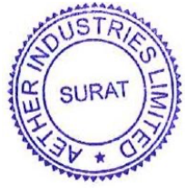
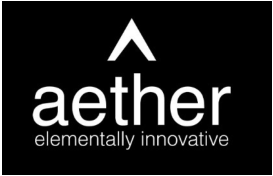
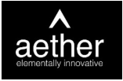

**[Image: Jul2025.pdf-0001-00.png (249x168, 12.0KB)]**

July 29, 2025 

## Ref. No.: **AIL/SE/30/2025-26** 

To, 

## **BSE Limited** 

Phiroze Jeejeebhoy Towers, Dalal Street, Fort, Mumbai-400001, MH. 

Scrip Code: **543534** 

**National Stock Exchange of India Limited** Exchange Plaza, Bandra Kurla Complex, Bandra (E), Mumbai-400051, MH. 

Symbol: **AETHER** 

Dear Madam / Sir, 

## **Subject:** **<u>Transcript of the Earning Conference Call</u>** 

In accordance with Regulation 30 of the SEBI (Listing Obligation and Disclosure Requirements) Regulations, 2015, the Transcript of the Earning Conference Call scheduled on Thursday, July 24, 2025, on the financial performance of the Company for the First Quarter ended on June 30, 2025, is enclosed herewith. 

We request you to kindly take the information on your records. 

Thank you. 

## **For Aether Industries Limited** 

**[Image: Jul2025.pdf-0001-15.png (296x126, 40.2KB)]**

## **Chitrarth Rajan Parghi** 

Company Secretary & Compliance Officer Mem. No.: F12563 

**[Image: Jul2025.pdf-0001-18.png (205x207, 74.6KB)]**

Encl.: As attached 

CHITRARTH RAJAN PARGHI 

Digitally signed by CHITRARTH RAJAN PARGHI Date: 2025.07.29 17:16:29 +05'30' 

Page **1** of **1** 

### **Aether Industries Limited** 

**Registered Office:** Plot No. 8203, GIDC Sachin, Surat-394230, Gujarat, India. **Phone:** +91-261-6603000 **||  Email:** info@aether.co.in **||  Web:** www.aether.co.in **II  CIN:** L24100GJ2013PLC073434 **Factory:** Plot No. 8203, Beside Shakti Distillery, Near Rajkamal Chokdi, Road No. 8, Sachin GIDC, Sachin, Surat-394230, Gujarat, India. 

**[Image: Jul2025.pdf-0002-00.png (273x176, 14.3KB)]**

# “Aether Industries Limited Q1 FY '26 Earnings Conference Call” 

July 24, 2025 

**[Image: Jul2025.pdf-0002-03.png (157x103, 6.6KB)]**

**[Image: Jul2025.pdf-0002-04.png (174x68, 27.5KB)]**

**[Image: Jul2025.pdf-0002-05.png (209x105, 10.2KB)]**

**MANAGEMENT: DR. AMAN DESAI – PROMOTER AND WHOLE TIME DIRECTOR – AETHER INDUSTRIES LIMITED MR. ROHAN DESAI – PROMOTER AND WHOLE TIME DIRECTOR – AETHER INDUSTRIES LIMITED MR. FAIZ NAGARIYA – CHIEF FINANCIAL OFFICER – AETHER INDUSTRIES LIMITED MR. KUSHAL DOSHI – LEAD INVESTOR RELATIONS -- AETHER INDUSTRIES LIMITED MS. SHUBHANGI DESAI – EXECUTIVE INVESTOR RELATIONS – AETHER INDUSTRIES LIMITED** 

**MODERATOR: MR. NILESH GHUGE – HDFC SECURITIES** 

Page **1** of **14** 

_Aether Industries Limited July 24, 2025_ 

**[Image: Jul2025.pdf-0003-01.png (157x103, 6.6KB)]**

#### **Moderator:** 

Ladies and gentlemen, good day, and welcome to the Q1 FY '26 Earnings Conference Call of Aether Industries, hosted by HDFC Securities. As a reminder, all participant lines will be in the listen only mode and there will be an opportunity for you to ask questions after the presentation concludes. Should you need assistance during the conference call, please signal an operator by pressing star then zero on your touchtone phone. Please note that this conference is being recorded. 

I now hand the conference over to Mr. Nilesh Ghuge from HDFC Securities. Thank you, and over to you, sir. 

#### **Nilesh Ghuge** : 

Yes. Thank you, Steve. Good afternoon, all. On behalf of HDFC Securities, I welcome everyone to this Aether Industries conference call to discuss the results for the quarter ended June 2025. From the Aether Industries, we have with us today, Dr. Aman Desai, Promoter and Whole-Time Director; Mr. Rohan Desai, Promoter and Whole-Time Director; Mr. Faiz Nagariya, Chief Financial Officer; Mr. Kushal Doshi, Lead Investor Relations; and Ms. Shubhangi Desai, Executive IR. 

Without further ado, I will now hand over the floor to Mr. Kushal Doshi to begin with the earnings call for the Q1 FY '26. Over to you, Kushal. 

**Kushal Doshi:** 

Thank you, Nilesh. A warm welcome to everyone. Apologies for the delay. Today, on July 24, 2025, our Board has approved the financial results for the first quarter for the fiscal year FY '26, and the same has been filed with the exchanges as well as updated over our website. 

Please note that this conference call is being recorded, and the transcript of the same will be made available on the website of Aether Industries Limited and the Stock Exchanges. Please also note that the audio of the conference call is the copyright material of Aether Industries Limited and cannot be copied, rebroadcasted or attributed in press or media without specific and written consent of the company. 

Let me draw your attention to the fact that on this call, our discussion will include certain forward-looking statements, which are predictions, projections or other estimates about future events. These estimates reflect management's current expectations on future performance of the company. Please note that these estimates involve several risks and uncertainties that could cause the actual results to differ materially from what is expected or implied. Aether Industries Limited or its officials do not undertake any obligation to publicly update any forward-looking statements, whether as a result of future events or otherwise. 

Now, Mr. Rohan Desai will begin by sharing Aether's business outlook and will be followed by Dr. Aman Desai, who will share the ongoing expansions and strategy of the company going forward. And then we'll have Mr. Faiz Nagariya, who will cover the financial highlights for the period under review. 

Now, I shall hand over the call to Mr. Rohan Desai for his opening remarks. Over to you, Rohan. 

Page **2** of **14** 

_Aether Industries Limited July 24, 2025_ 

**[Image: Jul2025.pdf-0004-01.png (157x103, 6.6KB)]**

#### **Rohan Desai:** 

Thank you, Kushal. Good evening, everyone. I hope everybody is doing well, and I'm glad to connect with you all to discuss the performance of our company for Quarter 1 of financial year 2026. 

Last quarter was marked by heightened geopolitical tensions and tariff uncertainties. On the back of this, I am pleased to inform you that the demand of our products in the large-scale manufacturing vertical grew by 9% year-on-year and 8% quarter-on-quarter basis. Overall, the company has seen an increase in volume on the back of CEM business model also. The demand for our products continue to remain buoyant, and we have added six new clients in this quarter. 

Prices for our products in the LSM business model vertical has remained stable, and this is evident by our margins remaining stable for this quarter. With respect to Aether’s business model, we have seen 51% contribution of sales from large-scale manufacturing business model, 37% coming from Contract/Exclusive Manufacturing business model and 10% coming from Contract Research and Manufacturing Services business model during this quarter. 

Contract/Exclusive Manufacturing is set to show a good growth where the orders towards Baker Hughes is expected to increase, and we will also start the manufacturing for Milliken products for Site 3+. Our exports revenue stood at 33% of the total revenues and domestic sales stood at 66%. Please note, major shift in the domestic revenues is attributable to the supplies made to Baker Hughes’ Indian entity. 

On the capex front, we are on track. Site 3+, which we have dedicated to Milliken is expected to commence production by quarter 4 of financial year 2026. Site 5, which is based out of Panoli continues to progress smoothly and the target to commission the first two production blocks in Phase 1 continues to be -- by the end of quarter 3 of financial year 2026. 

On Site 5, we plan to launch our own large-scale manufacturing business products in the first production block, which are targeted towards pharmaceutical, agrochemical and material science sector. The average pricing for these products ranges between $30 to $40 a kilo. This product have been approved and qualified by our customers and are going to be manufactured for the first time in India. 

We are confident that we will be able to operate the plant at optimum level in 18 months from commercial production of -- from the start of the commercial production. The capex cost per plant at Site 5 is approximately INR160 crores to INR180 crores, and we plan to achieve an asset turn of 1.75x at maturity. The second production block will be dedicated to CEM manufacturing. 

In terms of the sectoral split, for this quarter, we have seen pharma and agro now contributing only 46% combined, while oil and gas and the material science segments are contributing 19% and 17%, respectively. This is on the expected line as we expect the share of pharma and agro to continue to remain at 50% levels as the share of oil and gas and material science sectors is expected to increase drastically. 

Page **3** of **14** 

_Aether Industries Limited July 24, 2025_ 

**[Image: Jul2025.pdf-0005-01.png (157x103, 6.6KB)]**

Our vision in terms of revenue contribution from sectors continues to an equal share of revenues from; one, pharmaceutical and agro; second, oil and gas; third, material science; and the fourth is sustainability and renewables. 

In summary, I would like to say, despite of the macro volatility or soft economic environment in the last few months, we have had heightened client visits at Aether with the number of projects either being fast track or new client discussions taking place, whereby Aether is becoming a preferred partner or the only partner for R&D and commercialization of the products. We are encouraged by the discussions which are being taking place. 

With this, I would like to conclude speaking, and I would request Dr. Aman Desai to touch upon the research and development and new client initiatives for this period. Over to you, Aman. 

**Aman Desai:** 

Very happy to connect with you all again. Just to continue where Rohan left off, I'm first pleased to inform you that during this quarter, Aether Industries executed a contract manufacturing agreement with Milliken Chemical & Textile India Company Private Limited, which is a wholly-owned subsidiary of U.S.A. headquartered Milliken & Company. This is a very important milestone for us and a testimony really to the CRAMS research model that is being practiced at Aether. This product is now going to transfer from the CRAMS business model to the exclusive contract manufacturing business model. 

Under this agreement, Aether will be the sole contract manufacturing partner for a key strategic product for Milliken. The initial duration of this contract is 10 years, for which we will be fully dedicating our new Site 3+. We have been working on this product along with the customer over the last several years in the contract research and contract manufacturing services business model, where we were developing the process together, scaling up together. Then now this is being launched into commercial manufacturing at Aether, and we will be the sole contract manufacturing partner. 

During the quarter, we also participated in the Chemspec Europe exhibition, where we had more than 20 one-on-one customers with various innovators and customers and industry leaders across sectors. It is clearly visible that in the West, the companies are unable to manufacture in the current environment, much more so in Europe and several companies, as you know, have been shutting down their commercial plants there. India is really a viable option in this for an alternate. Everybody does not want to be in China, and India is really the only option. 

I'm currently right now on a 2-week work tour in the U.S., meeting various customers across various sectors in various cities and participating in an exhibition where we are exhibiting, and there is also over here in the U.S., a clear trend emerging of customers increasing the inquiries and fast tracking a lot of the projects that we have been discussing over the last several years. 

Customers are indeed looking to partner with reliable partners in India and are expediting in finalizing the contracts much faster than what we have experienced in the past. We believe that Aether is extremely well placed considering the relationships that we have already forged with 

Page **4** of **14** 

_Aether Industries Limited July 24, 2025_ 

**[Image: Jul2025.pdf-0006-01.png (157x103, 6.6KB)]**

these customers at the highest levels in the technical echelons of these companies and also on the basis of the world-class infrastructure that we have built at Aether and are continuing to build. 

This year, we will also be expanding further our R&D facilities. The plan is to incur a capex of INR30 crores to INR40 crores to increase the number of labs from the current 15 to -- current 8 labs to an additional 15 labs and the current 65 fume hoods to an additional 130 fume hoods, including 4 engineering labs. This clearly demonstrates that the number of inquiries we are getting from our customers are increasing rapidly. We are also trying to target new customers and also target additional products that fit into our core competency model with existing customers and new customers. 

This helps in increasing our wallet share with each of our customers. Currently, in R&D, we have more than 50 projects, of which the majority of them are non-agro and non-pharma. With the ongoing capex at Site-5, we are extremely excited about this site. It is proceeding as per schedule and as per timeline, and we have a clear line of sight for the first 4 plants in which the first 2 are expected to be completed by the end of this calendar year, as mentioned by Rohan earlier. 

We have a large number of projects in the pipeline in R&D and the pilot plant, and we are quite confident of being able to fill up the entire site with innovative and first time Made in India products in our LSM business model as well as significantly increasing number of products which are getting finalized now for the site 5 in the exclusive manufacturing business model. 

In summary, I've always mentioned that this is going to be a golden age for the Indian chemical companies and a number of opportunities are available now to the Indian specialty companies who have invested in R&D capabilities and infrastructure. I do believe that this is coming off age now, and this is proving to be true in the current global scenario. 

We believe Aether is well poised to take maximum advantage of this opportunity that exists today in the global specialty chemical industry. Hopefully, we'll be at the forefront, taking advantage of these opportunities and translating these opportunities into actual projects being executed and actual revenue being generated for the company. 

Thank you all again for being online with us for the call, and we are very happy to take questions. Now, before that, I will request Faiz, our CFO, to give you an overview of the financial results for the first quarter of FY '26. Faiz? 

**Faiz Nagariya:** 

Yes. Thank you, Dr. Aman, and good evening, everybody. I'm glad to present the financial results of Aether Industries Limited for Q1 of FY '26. The total consolidated revenue of the company stood at INR2,587 million in Q1 of FY '26 as against INR1,920 million in Q1 of FY '25, which is a 35% increase year-on-year. This resulted in EBITDA of INR 781 million in Q1 of financial year '26 as against INR 402 million in Q1 of financial year '25, which is an increase of 94% in the comparing periods. 

Page **5** of **14** 

_Aether Industries Limited July 24, 2025_ 

**[Image: Jul2025.pdf-0007-01.png (157x103, 6.6KB)]**

EBITDA margin stood at 30% in Q1 of FY '26 as against 22% in Q1 of FY '25. The PAT amounted to INR470 million in Q1 of financial year '26 as against INR299 million in Q1 of financial year '25, which is an increase by 57% year-on-year. The PAT margin stood at 18% in Q1 of FY '26 as against 16% in Q1 of financial year '25. 

We have always been trying to reduce the working capital cycle, and we are happy to inform that we have been able to reduce the working capital cycle more to 190 days, which was 195 as on 31, March '25, wherein inventory days, which was 175 days has come down to 165 days. 

We are planning to do capex of INR350 crores in financial year '26, which will be broken down into R&D, Site 3++ and Panoli, that is the Site 5. The remaining claim for the fixed assets for the loss has been put up to the insurance surveyor along with the loss of profit claim, and we are confident to get the same settled by the insurance company by or before Q2 of financial '26. In fact, the FLOP claim is submitted by the surveyor to the insurance company, and we are hoping to get the same within July '25 or August '25. 

Thank you once again, and we look forward to good growth story here onwards. Back to you, Kushal. 

**Kushal Doshi:** Thank you, Faiz. We request the moderator to open the call for question-and-answers. 

**Moderator:** 

The first question is from the line of Abhijit Akella from KIE. 

**Abhijit Akella:** Just a few to understand the numbers a little bit better. The CEM revenues seem to be up somewhat modestly this quarter on a sequential basis. Just sort of wondering, how much of that is attributable to Baker Hughes? If there was a significant ramp-up in Baker, then was there any other contracts that kind of maybe softened a little bit sequentially? That was one. 

Then on the other hand, the LSM business seems to have shown fairly good growth sequentially. If you could please just help us understand what specific projects might have driven that growth? 

**Faiz Nagariya:** Yes, I'll take the question. If required, Rohan can pitch in. Actually, the growth factor for contract manufacturing is the Baker, which has kicked in, which started from the last quarter slowly and then we have capitalized in that, and we have taken -- we have got a revenue of around INR410 million from them, and that is the driving force. Of course, we are also taking up various other contract manufacturing wherein the Aramco material Converge material has also been sold to a couple of customers, and we are ramping up on that. I hope I have answered your first question, Abhijit. 

**Abhijit Akella:** Yes. Just the INR41 crores that we booked this quarter, what would the number have been in the fourth quarter, second? 

**Faiz Nagariya:** It is only INR25 crores, I think so. 

**Abhijit Akella:** Sequentially, it's an increase of about INR16 crores and yet the LSM revenue is up by only some INR4 crores? 

Page **6** of **14** 

_Aether Industries Limited July 24, 2025_ 

**[Image: Jul2025.pdf-0008-01.png (157x103, 6.6KB)]**

**Faiz Nagariya:** Yes. **Abhijit Akella:** Just trying to understand what happened -- I mean, any softening in the remainder of the business? **Faiz Nagariya:** See, the LSM is also, it's going up -- as Rohan said in his commentary also, there is a volume growth which we are witnessing since last few quarters. This time also in LSM, there is a volume growth itself. The prices are still subdued because of the Chinese dumping. All the 3 models are seeing a growth, and we see a growth trajectory in the future as well. **Abhijit Akella:** Just one other thing on the outlook for this year. If you could please just help us with your outlook for the major growth projects, Baker Hughes, Milliken, Site-5, how much could we expect in terms of contribution in this year, fiscal '26 and then FY '27? **Faiz Nagariya:** Yes, Abhijit, we would not like to give a forward-looking statement for the revenue potential, but of course, with the names which you have spoken will all be the driving forces for us, and we look forward to a good growth trajectory. I'm sorry for the same. **Abhijit Akella:** Just one last thing from my side. On the insurance front, how much is the amount that we are expecting to collect? **Faiz Nagariya:** Approximately, we expect that we will still receive approximately INR50 crores to INR60 crores more. **Moderator:** The next question is from the line of Amay Sharda from Purnartha Investment Advisor. **Amay Sharda:** I just had some basic questions. I'm relatively new to the company. Just wanted to understand when you first set up a plant, what is the minimum utilization level at which a plant becomes profitable for you? **Kushal Doshi:** At maturity, these plants are expected to have a capacity utilization between 70% to 75%. **Amay Sharda:** Then like below 70%, they are not profitable? Or are they still profitable? **Faiz Nagariya:** Can you just repeat your question because there is some disconnect in your question. **Amay Sharda:** My question was that like when you first set up a new plant, like, let's say, you're setting up Site 3++, so what is the minimum utilization level that the plant needs to get to 30%, 40%, 50% at which it becomes profitable for you to maintain the 20%, 30% of margins that you're having? **Faiz Nagariya:** When we select the products, we initially select the products which are giving us an EBITDA margin of at least 25%-plus. Then only we take up and it's not that the margins start coming after the capacity or the capacity reached to some extent. We start getting the profits from the day we start the sales. Only thing is we give a trajectory of the ramping up. The full capacity utilization, which is approximately around 75% to 80% or maximum 85% of our plant, it takes approximately 2 years. 

Page **7** of **14** 

_Aether Industries Limited July 24, 2025_ 

**[Image: Jul2025.pdf-0009-01.png (157x103, 6.6KB)]**

**Rohan Desai:** Let me try to answer this question differently. On the CEM side, what really happens is that the pricings are built up in a way that in the first year, you are utilizing only 40% of the capacity and you are developing that product and streamlining that product. The product will be at a x price. Then once the product is stabilized, the product will fall -- the price will come to a commercialized price of Y price. Usually, the capacity utilization is not a concern over here when you are talking about CEM projects. If you're talking about the LSM projects, if you reach 40%, 45% of your capacity levels, you start generating profits out of it. **Amay Sharda:** One more question I had was that for Site 3+ and 3++, these are 2 different sites? Or like is it one in the same site? **Rohan Desai:** We bought Site-3 and then we bought Site 3++. That is adjoining land. We just named it as Site 3++ just for the stakeholders to understand, I mean, very clearly, what we are doing. Both the sites will be joined together and will be amalgamated, I mean, merged together to be Site-3 in future, which we'll make a notification of -- at the proper time. It's just an adjoining part of land, Site 3++. **Amay Sharda:** One more question was regarding the electrolyte additives segment that began some time ago. This question was like how is it ramping up so far? What kind of scale up can we expect further? What were the revenues in FY '25, if you can help with that? **Rohan Desai:** On the revenue-wise, we are not seeing any major revenues coming out of electrolyte additives for this current year. We would be seeing close to INR10 crores to INR15 crores of revenues at max coming out from electronic additives, but we are currently involved in a few CRAMS, Contract Research and Manufacturing Services activities with regards to additives, which will announce at the proper part of time. **Kushal Doshi:** The current electrolytes are trading at; it does not make any economic sense of any commercial production at current levels. We are not manufacturing any electrolytes as we speak. **Amay Sharda:** Regarding the Otsuka Chemicals contract, so like has the ramp-up been good in FY '25 for that or like we'll expect it from FY '26? **Rohan Desai:** Yes. It is going as per the plan. There is no problems in that. It's going as per the timelines mentioned in the contract and as per the projections, which we had decided at the time of signing of the contract. **Amay Sharda:** We expect it to ramp up fully in FY '26? We can expect the INR500 million revenues for FY '26? **Rohan Desai:** 26, no, 27. 26 would be approximately INR35 crores to INR40 crores. **Amay Sharda:** One last question was regarding the Polaroid contract. When do we expect supplies to begin for the Polaroid MSA that you signed for CRAMS business? 

Page **8** of **14** 

_Aether Industries Limited July 24, 2025_ 

**[Image: Jul2025.pdf-0010-01.png (157x103, 6.6KB)]**

|**Rohan Desai:**|We are already doing Polaroid since quite a few years. I mean, so it's ongoing. The contract is working out very well, and we are delivering the products to them.|
|---|---|
|**Amay Sharda:**|But you signed a new MSA in FY '23, right?|
|**Rohan Desai:**|On Polaroid? No.|
|**Amay Sharda:**|In CRAMS, there was something for Polaroid, right?|
|**Rohan Desai:**|No.|
|**Moderator:**|The next question is from the line of Krishan Parwani from JM Financial.|
|**Krishan Parwani:**|A couple from my side. First, I wanted to understand what led to the degrowth in the agro and pharma business?|
|**Rohan Desai:**|There is no degrowth in the agro and pharma business. There is a growth in oil and gas segment and the other segments. Hence, you are seeing the degrowth.|
|**Krishan Parwani:**|Because last quarter and the previous year similar quarter, our agro revenue was in the range of INR40 crores to INR46 crores. This quarter, I think we are what, INR28 crores, if I'm not mistaken. Then pharma is INR90 crores, yes.|
|**Rohan Desai:**|Yes. Quarter 1, we renewed the contract basically. It has been deferred by 2 months, but it's well in control. I think it's just phasing from one quarter to another. We do not see any pricing pressure on pharma and agro as of today. All the prices are stable, bottomed out and the demand is there. On the volume side, we are seeing increase in the demand, in fact. I think everything is well in control in pharma and agro side.|
|**Faiz Nagariya:**|I will add to it that, Krishan, last quarter, we did approximately INR920 million in pharma, which is INR900 million. There's no degrowth. It's just -- it's almost flat. In agro, we had approximately INR400 million, which is around INR300 million. As Rohan said that there will be -- this is the first quarters, and the things ramp up in the next few quarters. There is no degrowth as such. The volumes are going up.|
|**Krishan Parwani:**|Maybe just contract timing. In the large scale, good to see the revenue going up. What has led to this growth in the large scale? Because I think pharma is flat, so which other segment has contributed in the large-scale manufacturing growth?|
|**Rohan Desai:**|We have material science, which I think has grown. Faiz, correct me if I'm wrong with that number.|
|**Faiz Nagariya:**|Yes, correct. No. Apart from the last -- in the last material science, there is also an increase -- a bit of increase in other sectors wherein like we are supplying small -- some small quantities to the new entrants also. Those are there. The pharma is in line with the last quarter itself, no much changes. Material science as Rohan said. Otherwise, there is flattish for (inaudible).|

Page **9** of **14** 

_Aether Industries Limited July 24, 2025_ 

**[Image: Jul2025.pdf-0011-01.png (157x103, 6.6KB)]**

**Krishan Parwani:** Understood. This is good given we have significantly seen a ramp-up in the sales. On the balance sheet side, I just wanted to understand how much of the gross block is expected to be capitalized in the current fiscal and capex outlook for this year? **Faiz Nagariya:** Capex outlook for this year, as I spoke in my comment, is approximately around INR300 crores to INR350 crores. We will be capitalizing approximately the Site 3++, which is approximately INR200 crores to INR250 crores. **Krishan Parwani:** In this fiscal, are you looking to pay off your debt? Just wanted to understand the interest outflow from that. 

**Faiz Nagariya:** Can you just repeat your question? **Krishan Parwani:** I was asking, do you intend to pay off your debt? I think you had INR180-odd crores of debt. I know you are on net cash side. Just wanted to understand the interest expense part because I think you are paying quarterly INR5 crores or so. **Faiz Nagariya:** Krishan, all this is working capital and working capital debt will continue because we do not have any long-term debt. These are all short-term debt. For the working which we are using. We would continue this. I think so it will continue for the next couple of years unless we have good internal accruals to pay this off because we are not doing any kind of other fundraise going forward currently. 

**Moderator:** The next question is from the line of Nitin Agarwal from DAM Capital. **Nitin Agarwal:** When we look through the remaining part of the year, from a growth perspective, do you see growth largely coming in from the existing kind of contracts scaling up? Or do you expect any newer sort of specific contracts, which will start -- which will get commercialized as we go along, which can be a meaningful driver for the growth in the remaining quarter of the year? **Rohan Desai:** Yes. We are looking at Baker Hughes in a big way. That's Site-4, then we are looking at Site 3++, which is Milliken contract, which will be commercialized in this financial year, and then it will be ramped up in the next financial year. 

Then we are also looking to start Site-5, 2 production blocks in this financial year, which will be ramped up in the next 18 months period. We are looking at this. This is all new molecules, which we will be launching and also some of the businesses will -- I mean, the top line of the existing molecules will also increase over year. But the major drivers will be these new sites and then these new projects. 

**Nitin Agarwal:** On the contract manufacturing the CEM contracts, like the Milliken one that you announced recently, typically, what is the -- given the current environment, how much time does it take for you to typically -- how long the negotiation cycle with clients like? How many contracts do you think -- I mean, how many such conversations would you be in advanced stages where maybe something can close over the next few quarters? 

Page **10** of **14** 

_Aether Industries Limited July 24, 2025_ 

**[Image: Jul2025.pdf-0012-01.png (157x103, 6.6KB)]**

**Rohan Desai:** Currently, we have a lot of malls in there, so approximately 12 to 18 projects which we are discussing, which are almost in the verge of finalization, or the talks are ongoing. The negotiations currently are very fast track because of the reasons which -- what Aman spoke about earlier in his commentary. I think the timelines now is less than 4 to 6 months for finalization of the contracts, which was earlier 1, 1.5 years, which you usually take from the completion of the CRAMS activities and moving it into CEM business model. It has been shortened, and it is very fast now. It's moving in a very, very rapid pace. **Nitin Agarwal:** That's great to hear. But the point as, given where our capacity today are, assuming you sign any such new contracts, we would have to necessarily create capacity in Unit 5 to get to these requirements? Or do we have capacities in the existing units to take care of some of these things which can potentially get signed up? **Rohan Desai:** If the quantum is less than, let's say, assuming 100 tons, 200 tons, we can accommodate it in the Site-3 or Site-2. For Baker Hughes, we have Site-4, which is dedicated, so we can expand that and modify them and add in that site. If there are CEM contracts, which are bulk in nature, which are big in nature of about 200 tons to 500 tons or above 500 tons, then we have to go into Site-5. But we have a long -- we already have a good insight of which projects are going to be qualified in Site-5. We will not be delayed in terms of setting up the plants. If you see the presentation and if you see the image of the site, you will see the other 2 production blocks are already up. It's already constructed. You just need to install the equipment and the pipings and it takes usually 6 months to 9 months to get the whole production block online now, which was earlier 18 months for the Greenfield sites. **Nitin Agarwal:** Secondly, on the 2 commercial blocks that you -- 2 blocks that you will be starting Unit 5 this year on the 2 LSM, which are dedicated to LSM projects, by when do you see commercial revenues coming in from these -- from the LSM molecules for these products? **Rohan Desai:** I think quarter 4 of this financial year, we will be how do you say, streamlining the site and this production block, but from quarter 1 of the next financial year, I think we will be seeing a good inflow of revenues coming out of this LSM model and the CEM model also. **Nitin Agarwal:** These 2 LSM blocks, the products that you're looking to make in these blocks, like earlier in the past, you used to indicate some sort of addressable market for the products. I mean the products you've identified for these 2 blocks, what would be the potential market size for these products? **Rohan Desai:** In terms of the value, I think we are looking at INR1,500 crores of market size of the -- all 3 products combined in LSM model. On the CEM side, I would not like to comment on it at the moment. **Nitin Agarwal:** LSM is for 1 block or 2 blocks for LSM unit wise? **Rohan Desai:** One block. 

Page **11** of **14** 

_Aether Industries Limited July 24, 2025_ 

**[Image: Jul2025.pdf-0013-01.png (157x103, 6.6KB)]**

|**Nitin Agarwal:**|You said for LSM, for CEM.|
|---|---|
|**Rohan Desai:**|Yes.|
|**Moderator:**|The next question is from the line of Uttam Purohit from Monarch Networth Capital.|
|**Uttam Purohit:**|As working capital days are different for each segment, if you could help me with what standard inventory days and debtor days we aim to maintain in each segment? What's the figure right now?|
|**Faiz Nagariya:**|As I told in my commentary, the current working capital cycle is approximately around 190 days. For the 3 models, LSM is always on a higher side, CEM is on the lower side and CRAMS is the lowest one. We just try to maintain -- try to make an equilibrium and try to reduce the working capital cycle as much as possible. Our target is to reach around 165 to 165 days or 170 days by end of this financial year. The target in next 2 to 3 years is around 150 days of working capital.|
|**Uttam Purohit:**|Currently, out of the exports, US is around 5% to 6%. Could you help with like what the other geographies are and how much they contribute?|
|**Faiz Nagariya:**|Other geographies are Europe, wherein we have Germany, we are selling to Netherlands. We have China also, we have Japan. We are selling to Middle East also. We have sales to Korea. Various countries are there. Europe is approximately 6% to 7% -- sorry, 10% to 11%. China is approximately 4% to 5%. Japanese also approximately 3% to 4%. We are exporting to approximately 19 countries. Mexico is one of them.|
|**Uttam Purohit:**|Last question on the CEM side capex. Generally, when we establish a plant, so are those plants specifically designed for that product or there is -- plants are generally in standard, and they require some bit of complexity to cater to that product?|
|**Rohan Desai:**|I'll try and answer this question. The plants are designed in a multipurpose manner, and they are fitted with the specific requirements of the particular products, but what we usually say is that our plants are true multipurpose plants, which can be shifted from one chemistry to another if required with some rechecks in the equipment and the pipings.|
|**Uttam Purohit:**|We would require only INR10 crores to INR20 crores kind of capex for INR100 crores kind of plant to just change the product type, right?|
|**Rohan Desai:**|Not INR15 crores, INR20 crores, that's very high number. I mean that's 20% of the capex which you are talking about. We are talking about less than INR50 lakh to move from chemistry to another chemistry.|
|**Uttam Purohit:**|For the CEM, again, on the CEM capex side, so generally, we establish the CEM line after we get the confidence out of a CRAMS product, which can be converted into a CEM, or we establish, or we generally start to keep up capacity already for any product which can be there?|
|**Rohan Desai:**|Yes. If you just go through investor presentations, earlier presentations, we are talking about 8 chemistries and 8 technologies, which are our core competencies. We operate out of this 8|

Page **12** of **14** 

_Aether Industries Limited July 24, 2025_ 

**[Image: Jul2025.pdf-0014-01.png (157x103, 6.6KB)]**

chemistries and eigth technologies, and so moving from this -- we are not moving from eighth chemistry to the ninth chemistry, right? We know what we are going to do. That's how we fit the plants, and that is how we move from -- we are able to move from one chemistry to another chemistry with the least amount of modifications and capex required. 

**Moderator:** The next question is from the line of Rohan Shukla from Anand Rathi. 

**Rohan Shukla:** I just had one question. When we say that the capex target for FY '26 is INR350 crores, how much do we expect it to be infused in Site 5? What could be the asset turnover? 

**Faiz Nagariya:** Around the INR350 crores, we will be approximately putting up approximately INR100 crores -- INR150 crores in Site 5. The asset turn on maturity will be approximately 1.5x to 1.75x. **Moderator:** The next question is from the line of Rohit Nagraj from Batlivala & Karani. **Rohit Nagraj:** Congrats on good performance and margins. First question is to Dr. Aman. Since you've been speaking to some of the U.S. customers, normally, what is the timeline from which we get some confirmation from the customer to our R&D and form and to commercialization? 

**Faiz Nagariya:** Yes. Just a second. I'll just repeat this question to Aman because he's on the line. Sir, he is asking that, what is the timeline which you take to place the customer? What is the timeline in which you finalize the commercialization with them? **Aman Desai:** Yes, it depends on the product-to-product and the project-to-project, but typically, we are finding that what was earlier a timeline of between, say, 1 year to 2 years to go towards commercialization with various customers or even 1 year to 3 years, depending upon the advancement of the commercialization on their end, it is now being fast tracked to within 1 year. 

A lot of the people that actually, I'm talking to in this 2 weeks over here in the US, and the various customers we are discussing with, they are all portraying a sense of urgency to translate their products into commercialization, either because of the problems they are having over here or because they want to expedite the launch of their products. So it's a very -- it really depends upon the process and the complexity, the number of steps and the advancement of their own internal pipeline, but anywhere between 6 months to 2 years is what we are seeing currently. 

**Rohit Nagraj:** The second question on the Milliken contracts. Have we shared in terms of what could be the size of the opportunity over a period of 10 years? In terms of the margin profile, will it be similar to the existing business margin profile? 

**Faiz Nagariya:** I'll take this question, then Aman can speak. We have not given any revenue projections because we cannot comment on that. The margins will be similar or better than what we have at the company side. 

Page **13** of **14** 

_Aether Industries Limited July 24, 2025_ 

**[Image: Jul2025.pdf-0015-01.png (157x103, 6.6KB)]**

|**Rohit Nagraj:**|Does this also open up more opportunities with Milliken in terms of other projects where we are currently working on and there is a greater likelihood that those projects will also get commercialized in the next foreseeable future?|
|---|---|
|**Rohan Desai:**|I will take this question. Yes, we are working on multiple projects with various customers, including of Milliken. Yes, the answer to your question is, yes.|
|**Moderator:**|The next question is from the line of Atishray Malhan from Fortress Group.|
|**Atishray Malhan:**|I have a few questions pertaining to the Milliken contract. Firstly, can you maybe provide some insight into the application this product is used in?|
|**Rohan Desai:**|This is used in material science polymer industry specifically. That's the best I can tell you about this product. We are -- we cannot tell you more than this at this moment. In the due time, we'll let you know the applications and the product name if the client gives us permission.|
|**Atishray Malhan:**|Yes. I appreciate that. That's helpful. Just is this a fairly new product for Milliken? Or is this a fairly established one?|
|**Rohan Desai:**|This is a new product for Milliken. We will be the only manufacturer and the first manufacturer of this product and to commercialize this product in the world.|
|**Atishray Malhan:**|Just last one from my side. Any specific geographies this will be used in? Or is this fairly widespread?|
|**Rohan Desai:**|Again, I cannot comment on it. It's under confidentiality; hence, I cannot give you more information at this point of time.|
|**Moderator:**|Ladies and gentlemen, that was the last question for today's conference call. I now hand the conference over to the management for their closing comments.|
|**Kushal Doshi:**|Yes. I would like to thank everyone for attending the conference call. Apologies again for the delay from our side, and we look forward to seeing you on the call. Thank you, everyone.|
|**Moderator:**|Thank you. On behalf of HDFC Securities, that concludes this conference. Thank you for joining us, and you may now disconnect your lines. Thank you.|

Page **14** of **14** 

---

## Extracted Images

| # | File | Dimensions | Size |
|---|------|------------|------|
| 1 | Jul2025.pdf-0001-00.png | 249x168 | 12.0KB |
| 2 | Jul2025.pdf-0001-15.png | 296x126 | 40.2KB |
| 3 | Jul2025.pdf-0001-18.png | 205x207 | 74.6KB |
| 4 | Jul2025.pdf-0002-00.png | 273x176 | 14.3KB |
| 5 | Jul2025.pdf-0002-03.png | 157x103 | 6.6KB |
| 6 | Jul2025.pdf-0002-04.png | 174x68 | 27.5KB |
| 7 | Jul2025.pdf-0002-05.png | 209x105 | 10.2KB |
| 8 | Jul2025.pdf-0003-01.png | 157x103 | 6.6KB |
| 9 | Jul2025.pdf-0004-01.png | 157x103 | 6.6KB |
| 10 | Jul2025.pdf-0005-01.png | 157x103 | 6.6KB |
| 11 | Jul2025.pdf-0006-01.png | 157x103 | 6.6KB |
| 12 | Jul2025.pdf-0007-01.png | 157x103 | 6.6KB |
| 13 | Jul2025.pdf-0008-01.png | 157x103 | 6.6KB |
| 14 | Jul2025.pdf-0009-01.png | 157x103 | 6.6KB |
| 15 | Jul2025.pdf-0010-01.png | 157x103 | 6.6KB |
| 16 | Jul2025.pdf-0011-01.png | 157x103 | 6.6KB |
| 17 | Jul2025.pdf-0012-01.png | 157x103 | 6.6KB |
| 18 | Jul2025.pdf-0013-01.png | 157x103 | 6.6KB |
| 19 | Jul2025.pdf-0014-01.png | 157x103 | 6.6KB |
| 20 | Jul2025.pdf-0015-01.png | 157x103 | 6.6KB |
