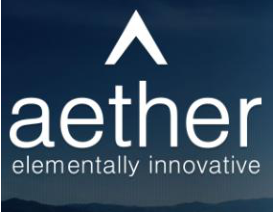
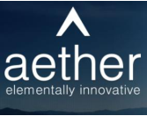
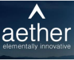
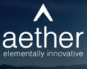

**[Image: May2026.pdf-0001-00.png (249x168, 12.0KB)]**

May 21, 2026 

## Ref. No.: **AIL/SE/11/2026-27** 

To, 

**BSE Limited** Phiroze Jeejeebhoy Towers, Dalal Street, Fort, Mumbai-400001, MH. 

Scrip Code: **543534** 

**National Stock Exchange of India Limited** Exchange Plaza, Bandra Kurla Complex, Bandra (E), Mumbai-400051, MH. 

Symbol: **AETHER** 

Dear Madam / Sir, 

## **Subject:** **<u>Transcript of the Earning Conference Call</u>** 

In accordance with Regulation 30 of the SEBI (Listing Obligation and Disclosure Requirements) Regulations, 2015, the Transcript of the Earning Conference Call scheduled on Friday, May 15, 2026, on the financial performance of the Company for the Fourth Quarter and Financial Year ended on March 31, 2026, is enclosed herewith. 

We request you to kindly take the information on your records. 

Thank you. 

## **For Aether Industries Limited** 

CHITRARTH Digitally signed by CHITRARTH RAJAN RAJAN PARGHI Date: 2026.05.21 PARGHI 18:11:56 +05'30' **Chitrarth Rajan Parghi** 

Company Secretary & Compliance Officer Mem. No.: F12563 

Encl.: As attached 

Page **1** of **1** 

**Aether Industries Limited** 

**Registered Office:** Plot No. 8203, GIDC Sachin, Surat-394230, Gujarat, India. **Phone:** +91-261-6603000 **||  Email:** info@aether.co.in **||  Web:** www.aether.co.in **II  CIN:** L24100GJ2013PLC073434 **Factory:** Plot No. 8203, Beside Shakti Distillery, Near Rajkamal Chokdi, Road No. 8, Sachin GIDC, Sachin, Surat-394230, Gujarat, India. 

**[Image: May2026.pdf-0002-00.png (274x213, 64.5KB)]**

# “Aether Industries Limited 

# Q4 and FY26 Earnings Conference Call” 

# May 15, 2026 

**[Image: May2026.pdf-0002-04.png (167x132, 29.5KB)]**

**[Image: May2026.pdf-0002-05.png (196x82, 16.0KB)]**

**[Image: May2026.pdf-0002-06.png (221x111, 5.6KB)]**

**– MANAGEMENT: DR. AMAN DESAI PROMOTER AND WHOLE TIME** 

**– DIRECTOR AETHER INDUSTRIES LIMITED** 

**– MR. ROHAN DESAI PROMOTER AND WHOLE TIME** 

**– DIRECTOR AETHER INDUSTRIES LIMITED** 

**– – MR. FAIZ NAGARIYA CHIEF FINANCIAL OFFICER AETHER INDUSTRIES LIMITED** 

**– MR. KUSHAL DOSHI LEAD INVESTMENT RELATIONS – AETHER INDUSTRIES LIMITED – MS. SHUBHANGI DESAI EXECUTIVE INVESTOR – RELATIONS AETHER INDUSTRIES LIMITED** 

**– MODERATOR: MR. NILESH GHUGE HDFC SECURITIES** 

Page **1** of **20** 

_Aether Industries Limited May 15, 2026_ 

**[Image: May2026.pdf-0003-01.png (123x99, 18.2KB)]**

#### **Moderator:** 

Ladies and gentlemen, good day, and welcome to Aether Industries Limited Q4 and FY26 Earnings Conference Call, hosted by HDFC Securities. As a reminder, all participant lines will be in the listen-only mode and there will be an opportunity for you to ask questions after the presentation concludes. Should you need assistance during the conference call, please signal an operator by pressing star then zero on your touch-tone telephone. Please note that this conference is being recorded. 

I now hand the conference over to Mr. Nilesh Ghuge from HDFC Securities. Thank you, and over to you, sir. 

#### **Nilesh Ghuge:** 

Yes. Thank you, Yusuf. Good afternoon, all. On behalf of HDFC Securities, I welcome everyone to this Aether Industries conference call to discuss the results for the quarter ended March 2026 and financial year '26. 

From the Aether Industries, we have with us today Dr. Aman Desai, Promoter and Whole-Time Director; Mr. Rohan Desai, Promoter and Whole Time Director; Mr. Faiz Nagariya, Chief Financial Officer; Mr. Kushal Doshi, Lead Investor Relations; and Ms. Shubhangi Desai, Executive IR. 

Without further ado, I will now hand over the floor to Mr. Kushal Doshi to begin with the earnings for the quarter and financial year. Over to you, Kushal. 

#### **Kushal Doshi:** 

Thank you, Nilesh. A warm welcome to everyone. Today, our Board has approved the financial results for the fourth quarter and fiscal year 2026, and the same have been filed with the exchanges as well as updated over our website. Please note that this conference call is being recorded, and the transcript of the same will be made available on the website of Aether Industries Limited and the stock exchanges. 

Please also note that the audio of the conference call is copyright material of Aether Industries Limited and cannot be copied, rebroadcasted or attributed in the press or media without specific and written consent of the company. 

Let me draw your attention to the fact that on this call, our discussion will include certain forward-looking statements, which are predictions, projections or other estimates about future events. These estimates reflect management's current expectations on future performance of the company. 

Please note that these estimates involve several risks and uncertainties that could cause our actual results to differ materially from what is expressed or implied. Aether Industries Limited or its officials do not undertake any obligations to publicly update any forward-looking statements, whether as a result of future events or otherwise. 

Now Mr. Rohan Desai will begin by sharing Aether's business outlook, ongoing expansions. Then Dr. Aman Desai will provide inputs on the R&D and new client initiatives and strategy of 

Page **2** of **20** 

_Aether Industries Limited May 15, 2026_ 

**[Image: May2026.pdf-0004-01.png (123x99, 18.2KB)]**

the company going forward, and Mr. Faiz Nagariya will cover the financial highlights for the period under review. 

I shall hand over the call to Mr. Rohan Desai for his opening remarks. Over to you, Rohan. 

#### **Rohan Desai:** 

Thank you, Kushal. Good evening, everyone. Thank you for joining us today. Over the last 2 months since the conflict began, there has been unprecedented disruption at scale. Roughly 20% of global oil capacities went offline and nearly half of the global ethylene and propylene supplies -- polyethylene supplies have been disrupted. 

These are unparalleled numbers, reflecting a combination of physical infrastructure damage, feedstock limitations and severe logistics disruptions. Despite broader near-term market volatility, we anticipate demand will remain resilient for our products, providing meaningful pricing potential, particularly in large-scale manufacturing business model as evident by recent March settlements. 

Let me share what it actually means for Aether. Our large-scale manufacturing business vertical has seen a sharp increase in the price of our products in quarter 4 caused by the conflict. Importantly, those prices are still being maintained in April and May. Pricing has been exceptionally strong over 20% year-on-year and 18% quarter-on-quarter in Q4. We believe this pricing environment is sustainable in the medium term. 

We are also in the cusp of major milestones. There are 3 new large-scale manufacturing products, 2 in pharmaceutical and one agrochemical from Site 5, which will be commissioned by May end or starting of June 1st week. Validation batches are done and orders are already in hand. Large scale manufacturing business model contributed 43% of the sales and CRAMS and CEM together delivered a strong 55% of our revenues. 

Site 4 has seen a tremendous growth from INR50 crores to INR220 crores, a 4x increase and now represents 21% of our total sales. Pharma plus agro still at a healthy 46% and material science at 17%, a share we expect to grow meaningfully with Site 3++ ramping up very fast. 

Let's talk about momentum with global customers. In the last few months, which has been incredibly exciting on the commercial front. We have participated in key chemical exhibitions in Japan and Europe and the quality of the conversations were insightful with respect to their strategies and future plans. Existing customers are deepening their commitment and new ones are actively qualifying us. 

This year, we have completed 50-plus customers and certification audits and added 19 marquee clients to our rosters. Multiple customers have already completed pre-audits for Site 5. These interactions have reinforced our confidence that CRAMS and CEM can contribute 70% plus sales in the coming years. 

Page **3** of **20** 

_Aether Industries Limited May 15, 2026_ 

**[Image: May2026.pdf-0005-01.png (123x99, 18.2KB)]**

We have hit our targets on converge polyols, innovative high-margin product and have strong order visibility for FY 2027. And in the semiconductor materials space, the feedback from our customers have been very positive. We see this opportunity tripling by 2030. 

Looking ahead, in summary, we are entering a new growth phase powered by 3 big levers; successful commissioning of Site 3++ and Phase 1 of Site 5, deepening relationships with global technology and industrial leaders and sharp focus on operating cash flow and disciplined execution. With that, I would like to hand over this call to Dr. Aman, who will talk us through the exciting progress in R&D and our new client acquisition initiatives. Over to you, Aman. 

#### **Aman Desai:** 

Thank you, Rohan. Good evening, everybody. I'm extremely happy to connect with you all again as we do every quarter. As we continue to navigate these volatile times that Rohan has talked about at length, let me talk about R&D and projects and competencies. 

I'm very pleased to inform you that the interim R&D expansion with 2 new labs and 18 fume hoods, including 5 engineering fume hoods and a very nice 400 megahertz NMR nuclear magnetic resonance machine installation have been completed in the current R&D facility, and we expect the commercialization of these new fume hoods and NMR machines to begin from Q2 onwards of this fiscal. 

As we had expected over the last few quarters, the number of CRAMS inquiries continues to increase and these new fume hoods and the NMR, which corresponds to this interim R&D expansion that we are doing will hold us in good stead and help us address these increased inquiries. 

We already have a number of new projects lined up in the material science and the oil and gas sectors for the new capacity that we have now commissioned, and that's the area that we are focusing on in terms of new business development. 

The construction of the entirely new R&D plant and the new R&D wing that we are also undergoing is also progressing on schedule and is completed -- expected to be commissioned in second quarter of FY28. This new R&D building and the new R&D site will have 15 new labs, including 5 engineering labs and a cumulative almost 140 fume hoods. 

And this will represent a double expansion, a 2x expansion over the current R&D strength that we have, including the interim R&D expansion, 2x expansion over that, which is a significant R&D expansion. And this is being done with full visibility of additional load on the CRAMS business model that we foresee. 

With the current leadership in R&D also having been set to address this increased demand of the R&D CRAMS inquiries and this significantly increased R&D infrastructure, we are also in the process of grooming the next generation of R&D leaders in the R&D organization. And so there's a huge focus on that. These new leaders are expected to take leadership roles in our new worldclass R&D facility, which will be online in the next 1 or 2 years. 

Page **4** of **20** 

_Aether Industries Limited May 15, 2026_ 

**[Image: May2026.pdf-0006-01.png (123x99, 18.2KB)]**

Also with my associations with premier institutes in the country like ICT, Mumbai; NCL, Pune and other institutes where I'm an official PhD co-guide as well as a member of the Board of studies, we are really tapping into this network that we have to groom our next generation of R&D leaders, and we are confident of having a young and dynamic team of R&D leaders, which are expected to work on these increased CRAMS projects coming through in the significantly expanded R&D infrastructure that we are -- we have set up and in the process of setting up. 

Over the course of the quarter and the last few weeks, we have had a number of follow-ups and site visits from senior management and the highest levels of management of current and prospective customers. We have participated in chemical conferences in India, Japan and Europe, and it is evidently clear that global chemical companies do want to get ahead of the curve accelerating the developmental plans with reliable partners and the focus in all these engagements that we have with all these innovators across the industry spectrum, especially material sciences, oil and gas is singularly India. They want to be in India, unless they can't. 

And so it's really up to us to maximize this potential of collaborations that we are seeing. We believe that we are well placed considering the relationships that we have already forged with these clients and also the world-class infrastructure that we are setting up in R&D, as I've already talked about, the pilot plant, which is one of the largest pilot plants in the world that we have and the new sites that Rohan has spent some time talking about. 

I'm also very happy to inform you that we are also expanding and we have expanded our senior leadership team, which is what we call our global technology and business development team with the addition of Mr. Guenter Stevens. Guenter has extensive experience in chemical R&D, process development, raw material development and sustainable technology development within Germany. 

So he started his career with Bayer and then ended his career with more than 3 decades in ALTANA and BYK Chemie, which is a leading additives company -- multibillion-dollar leading additives company in the world. He has extensive experience in the chemical industry and will be based out of Germany. 

But specifically, what's very exciting about his repertoire and experience is his experience of technology and leadership in technology and R&D and product development for material sciences, performance materials and application testing, which is an area and a core competency of application testing that Aether is not amongst the -- forte of Aether's core competencies today. 

And he is expected to and he will be opening up an entirely new envelope and new frontier for core competencies and application areas for Aether to tap into. And so that's why his skill sets complement the core expertise which Aether currently has built. And with this, it is very exciting in the terms of the new frontiers we'll be able to enter into and also thereby tap into new customers for additional projects and products in R&D, in pilot plant as well as in production. 

Page **5** of **20** 

_Aether Industries Limited May 15, 2026_ 

**[Image: May2026.pdf-0007-01.png (123x99, 18.2KB)]**

We are -- in addition, we are looking to add one more chemistry to our core competencies, which is what we are calling focused and integrated polymerizations, also leading for this core competency onto our core technology competencies of high-pressure chemistry, extreme process conditions and continuous technology. We are currently working on a few opportunities based on this focus on integrated polymerization, and we have identified a number of opportunities in the CRAMS space for this chemical process. 

This chemistry is, again, being mostly targeted towards the material science and the oil and gas sectors. We continue to focus on CEM opportunities, exclusive manufacturing opportunities. I expect quite a few of the CRAMS projects that we have in our pipeline today to shift to the CEM vertical in this financial year, which has just started, and most of these will be launched in Site 5. 

We continue to develop and deepen our relationship with existing customers by entering into new CRAMS projects with them, which fills up the pipeline of the CRAMS, which will further on lead into exclusive manufacturing, contract manufacturing. In the last fiscal year, as Rohan mentioned, we have commercialized the Site 3++, increased our revenue from Site 4 and also commence the commercialization of a small CEM contract from Site 3 for our global customer. 

Site 5, as Rohan mentioned, is also very exciting and the first phases will be launched momentarily. With the current projects and the robust pipeline of projects which are expected to commence shortly, we are very confident of achieving our vision of 70% of revenues coming from CRAMS and contract exclusive manufacturing business models by fiscal year '30. So let me stop talking. 

In summary, I would like to mention that we are extremely well placed to take advantage of the current golden age of the specialty chemical industry in India, the opportunities are expected in the next few years and our investments in the new R&D site interim and completely new as well as Site 5, which are world-class, will certainly have a positive impact on the company. So thank you very much. 

Looking forward to the questions. And again, thank you for joining us on Friday evening. Kushal, Faiz, over to you. 

#### **Faiz Nagariya:** 

#### **Moderator:** 

#### **Faiz Nagariya:** 

#### **Moderator:** 

Thank you, Dr. Aman. Good evening, everybody. I would like to present the financial results of Aether Industries Limited for Q4 of financial year '26 and full year of financial year '26. The total consolidated revenue... 

Sorry to interrupt, sir, your voice is not clear. 

Now is it clear? 

Yes, sir. Please go ahead. 

Page **6** of **20** 

**[Image: May2026.pdf-0008-00.png (123x99, 18.2KB)]**

#### **Faiz Nagariya:** 

### _Aether Industries Limited May 15, 2026_ 

Yes. The total consolidated revenue from operations of the company stood at INR11,601 million in financial year '26 as against INR8,406 million in financial year '25. That is an increase of 38% year-on-year. This has resulted in EBITDA of INR3,547 million in financial year '26 as against INR2,312 million in financial year '25, which is an increase of 53% in the comparing financial years. EBITDA margin stood at 31% in financial year '26 as against 28% in financial year '25. 

The PAT amounted to INR2,195 million in financial year '26 as against INR1,584 million in financial year '25, which is an increase of 39% year-on-year. The PAT margin stood at 19% in financial year '26 as against 18% in financial year '25. 

The consolidated revenue from operations of the company stood at INR3,051 million in Q4 of financial year '26 as against INR3,188 million in Q3 of financial year '26. This has resulted in EBITDA of INR814 million in Q4 of FY26 as against INR1,099 million in Q3 of financial year '26. And the PAT has been INR540 million in Q4 of FY26 as against INR645 million in Q3. 

The main reason for the decline in revenues and profitability in Q4 as against Q3 of financial year '26 were on account of one-off items like one-time FLOP claim income, which was booked of INR20 million -- INR200 million in Q3 of financial year '26. The same has also impacted EBITDA by around INR150 million in Q3 of financial year '26, and it also was impacted -- also impacted the PAT by INR112 million in Q3 of financial year '26. 

Further, a provision for loss of inventory on account of fire at an external warehouse near Site 1 on March 11, '26 amounting to INR70 million has been provided in Q4 of financial year '26. Further, year-end provisions coming for the first time of approximately INR10 million has also impacted the Q4 financial results. 

I would like to give more glimpse on the claim of the fire, which occurred in November 29, 2023 at Site 2. The final claim for the fixed assets lost in fire accident on November 29, 2023, has been submitted to the insurance surveyor and the same is being assessed at the insurance company with expectations to get the claims settled by end of Q1 of FY27. 

We have also taken -- we also removed the assets which were destroyed by fire, and it has been impacted in the financials of the financial year '26. We remain cognizant of the working capital and reduction in working capital is a priority for us. We have been able to reduce the overall working capital cycle to 179 days as on 31st March '26 from 194 days as of 31st March '25. 

Even though these levels remain elevated, the inventory days increased primarily on account of raw material purchase and the production of the new molecules going on at Site 3++ and the raw materials purchase at Site 5. We expect the working capital days to decline as we expect revenues from Site 3++ and the commencement of Site 5 very soon. 

Also with the increase in CEM contracts and expansion of CRAMS facilities should have a positive bearing on the reduction of working capital intensity. Cash flows from operations have 

Page **7** of **20** 

**[Image: May2026.pdf-0009-00.png (123x99, 18.2KB)]**

### _Aether Industries Limited May 15, 2026_ 

increased to INR1,424 million in financial year '26 from INR1,000 million in financial year '25 on account of increase in profitability and improvement in working capital cycles. 

The total capex for financial year '26 was INR3,838 million and the capex expected for financial year '27 is INR3,000 million to INR3,500 million. The capex in financial year '27 will be primarily for Site 5 and also for the new R&D site, which is already progressing well. The capacity utilization at plant stands as under Site 2, 75%; Site 3, 70%; and Site 4, 55%. 

Thank you once again, and we look forward to better outcomes than this in future as well. Back to you, Kushal. 

#### **Kushal Doshi:** 

#### **Moderator:** 

#### **Sajal Kapoor:** 

Thank you, Faiz. Can we open for Q&A? 

Thank you very much, sir. We will now begin the question-and-answer session. First question is from the line of Sajal Kapoor from Antifragile Thinking. 

I'm getting a sense that there is a reinforcing flywheel likely emerging as the setup increasingly looks like more chemistry capabilities, attracting larger global customers, which then enables more complex molecules which then improves margins and stickiness, generates more cash flow, funds more R&D and capex and creates even deeper capabilities. 

So with that kind of a context, the question is, if the current capex and R&D cycle succeeds exactly as management imagines, what will be structurally different about Aether's business model 5 years from today that may not be visible today? 

#### **Aman Desai:** 

Yes. I'll take it. This is Aman. Very interesting question. Precisely captured the intention and the goal behind what we are trying to do. We want to establish ourselves as a company in specialty chemicals, agnostic of industry application, focusing on really innovation with a marriage of chemistry and technology and engineering and systems. 

And so this was actually the very first slide that we made back in 2013 when we started the company was precisely this innovation in chemistry and technology and systems. And so it's nice to see how it's panning out and that we are sticking to what was our foundational premise of the company. 

We see it panning out in terms of what we are doing in the competencies, in the chemistry, technologies, leading to complex products, as you said, being aided by this really fundamentally solid and cutting-edge infrastructure that we are putting up in R&D and pilot plant and then complementing it with manufacturing assets, especially our Site 5. 

And so what will be structurally different in 5 years from now, we hope not much. We hope it continues to stay the same, but only do it for the lack of a better word, bigger and better. And -- but at the same time, being fundamentally grounded in the foundational premise of the company, which is what we talked about. And so I don't know if this answered your question, but thank you. Well said, and that's what exactly what we're trying to focus on as a company. 

Page **8** of **20** 

_Aether Industries Limited May 15, 2026_ 

**[Image: May2026.pdf-0010-01.png (123x99, 18.2KB)]**

#### **Sajal Kapoor:** 

That's helpful. And then secondly, as Aether scales, what do you think becomes more important to sustain the moat or the competitive advantage, capital deployed, chemistry complexity or customer integration? And how has that answer kind of changed internally over the last few years, starting from 2013, as you said, right? 

I mean what is -- is there any shift in internal kind of a benchmark between capital deployed, chemistry complexity or customer integration or perhaps it's a mix of everything? I mean how do you measure success internally above and beyond the visible numbers that we all see? 

#### **Aman Desai:** 

Yes. It's -- initially, it was more about setting up the chemistry, setting up the products, establishing the customers, establishing -- proving ourselves in a way to ourselves and to the customers. Now it's more about there's plentiful opportunities. There's plentiful in the Indian context as well as in what we have done for ourselves. There's plentiful opportunities across the industry domain across customers. 

Fortunately, and hopefully be in a position to be able to pick and choose as well what we want to work on and what we want to do. And then the challenge now is execution, execution, execution, translating these opportunities into practice in the R&D in the pilot plant and production for which, of course, the team needs to be built, which is what we are focusing on as well, which is a big chunk of my speech today was the leadership team that we are trying to build at all levels. And so now it's the challenge and the exciting part ahead is now putting these things into practice in a bigger and vaster scale than we have previously. 

#### **Moderator:** 

Next question is from the line of Amay Sharda from Purnartha Investment Advisors. 

**Amay Sharda:** So sir, just wanted to understand with the increase in the currency prices, do we get any kind of a benefit given that we export a lot of our finished goods? 

**Rohan Desai:** Yes. But we do have a natural hedge where we are importing certain products also from various parts of the world. So we have a natural hedge on this. We try to capitalize this as much as possible. However, our exports currently because of various uncertainties had been reduced by the CEM customers, which had structurally put their Indian subsidiaries ahead. 

So we are selling to Indian subsidiaries and then they are exporting the same to various part of the world instead of us selling into the U.S. basically. But now that things have been resolved, and I think in the quarters to come, you will see the exports growing and coming back to 50%, 60% of our total top line. 

**Amay Sharda:** So does that mean that we may get some benefit going forward with the currency price? So maybe our margins will increase going forward? 

#### **Rohan Desai:** 

Hopefully, yes. 

**Amay Sharda:** Okay. And sir, is there any kind of a demand disruption because of this disruption going on in the oil market? 

Page **9** of **20** 

_Aether Industries Limited May 15, 2026_ 

**[Image: May2026.pdf-0011-01.png (123x99, 18.2KB)]**

**Rohan Desai:** No. We have seen a steady demand in all our products as such. So there is no hoarding of material happening in this instance during this war. 

**Amay Sharda:** Okay. And sir, you also mentioned that in the LSM segment, the prices have increased. So did that increase basically in the March month or maybe like before that as well, the prices have increased? 

**Rohan Desai:** No. It has happened post the war scenario. 

**Amay Sharda:** So the benefit of that again is expected in the coming quarters. 

**Rohan Desai:** In this quarter also, we are seeing the pricing being sustained. So I think that will benefit quarter 1. 

**Amay Sharda:** Okay. Okay. And are we seeing any kind of an increase in the -- so like you said we are seeing increase in the raw material prices as well. But like I think we have an open cost P&L with all of our clients. So that is not expected to impact us negatively or am I missing something? 

**Rohan Desai:** Yes. It is not going to impact us. 

**Faiz Nagariya:** For the CEM at least, which is an open cost P&L. So for that, it will not be -- it will not impact. But for LSM, there will be some delta wherein certain margins will go up and then it will subside. **Moderator:** Next question is from the line of Sai Kumar from Family Fund. 

**Sai Kumar:** So currently, I would like to know what's -- in this current quarter, what is the revenue for the Baker Hughes? Previous quarter, it was something around INR60 crores. So is there any increase in this quarter? And we have a lot of -- I mean, Baker Hughes has some refineries in the Middle East. So due to this war, most of the refineries, they had some impact due to this war. So do you see any supply getting disrupted to Baker Hughes in this -- yes, that is the question, sir. 

**Faiz Nagariya:** Yes. So the revenue to Baker Hughes in this last quarter was approximately INR76 crores. INR68 crores was from the subsidiary and also from our main company also, there were some CRAMS which was done for them. And INR68 crores has gone. And there is no disruption which has happened to the supplies which are doing to Baker Hughes. And in fact, we are getting continuous orders from them. Currently, we have not faced any reductions or delay or cancellation of orders from them. 

**Sai Kumar:** Okay. So in this quarter, it was around -- compared to previous quarter? 

**Faiz Nagariya:** Yes. It was INR68 crores in the material we have supplied to them. **Sai Kumar:** Okay. And one more thing on the Baker Hughes side. You said there are 7 to 8 molecules that are going to be getting supplied to the last call you said. So is there any progress on that? Another new molecules you said, right? Do you see any progress on that side? 

Page **10** of **20** 

**[Image: May2026.pdf-0012-00.png (123x97, 18.2KB)]**

||_Aether Industries Limited_ _May 15, 2026_|
|---|---|
|**Kushal Doshi:**|It is currently in the CRAMS process. Once we have visibility, we will come back to you on that once it gets processed in CRAMS. But right now, the R&D continues on those products.|
|**Faiz Nagariya:**|Okay. Yes. And the second question is on the Saudi Aramco JV, sir, on the polyol side. So what is the -- like are you seeing any impact for Saudi Aramco supplies to polyols? And what is the demand you are going to see for the polyols in the next 2 to 3 years.|
|**Rohan Desai:**|There is no -- we have application which is niche in nature. We -- the application of the Converge polyol is in the CASE industry that is coating, adhesives, sealant and elastomers industry. It is a niche industry and has a niche application. So we have not seen any disruption happening on that. And the demand has also not reduced because of the external situations which have faced since last 2 months.|
|**Moderator:**|Next question is from the line of Prasad V from Union Mutual Fund.|
|**Prasad V:**|Congrats on good set of numbers.|
|**Moderator:**|There's lots of disturbance.|
|**Prasad V:**|Am I audible now?|
|**Moderator:**|No, there is background noise coming from your end. Your line is distorted.|
|**Prasad V:**|So my question was on this new Board member…|
|**Moderator:**|Prasad, there is a disturbance coming from your line.|
|**Prasad V:**|Okay. I'll join back the queue again. I'll try…|
|**Moderator:**|Next question is from the line of Abhijit Akella from KIE.|
|**Abhijit Akella:**|First one just on the LSM business. Is it correct that the revenues are a little bit lower on a sequential basis, just to check about -- I think they have about INR111 -- sorry, yes, INR111- odd crores compared to INR131 crores in the preceding quarter, whereas we were talking about almost 20% kind of price increases. So if you could please just help us understand what that might be?|
|**Kushal Doshi:**|Abhijit, you're right. In terms of the absolute amount, it is a decline. That's primarily because in the last month -- in the month of March, we were not able to ship some of the products due to logistical issues. These have been shipped in the month of April and May as we speak. Coincidentally, also, they have been shipped at a higher price. So yes, you are right with that. With respect to the pricing, as Rohan mentioned, we have seen increase in pricing, which has sustained through April and May.|
|**Abhijit Akella:**|Okay. But there's no sign of volume softness from any customers, right, in the face of higher prices?|

Page **11** of **20** 

_Aether Industries Limited May 15, 2026_ 

**[Image: May2026.pdf-0013-01.png (123x99, 18.2KB)]**

**Kushal Doshi:** 

No, not yet. 

**Abhijit Akella:** Okay. All right. Fair enough. Then just on the working capital, what's the outlook for next year now? I mean, with CEM ramping up significantly, how much of a reduction in working capital days could one expect for next year? 

**Faiz Nagariya:** We are continuously working on the working capital reductions and lots of measures are being done. And we had considerably reduced in the first 6 months also, if you are aware. And this increase is on account of the new site, which started for the Milliken, the Site 3++ wherein the raw materials and the work in progress of the materials was there. And we see that, again, this will subside when the -- because deliveries have started in April and May to Milliken. So now the flushing of inventory is going on, the debtors will be paid also. So we see that by end of this year -- this financial year '27, we'll be again having a healthy working capital reduction, which we expect to be around 160 days at least. Our try is to bring it down to 150 days, but 160 days is what we are expecting currently to be. **Abhijit Akella:** Okay. So from 179 to 160, that's expectation, right? Okay. **Faiz Nagariya:** Yes. **Abhijit Akella:** And in terms of the debt number, which is about INR400-odd crores right now, what's the outlook for that? Will that increase a little bit further as capex goes up? Or do you think we can maintain it around these levels? 

**Faiz Nagariya:** No, no, definitely, it will increase because we have been speaking about that the QIP monies have been completed in the Q3 itself. So we will now be requiring some debt. We already started speaking with the bankers, and you will see the debt coming up -- increasing a bit in the current year. And it will gradually increase. It's not that it will increase in one go. We'll be taking the debt for the requirements of the project progress. And that will also ease certain other things. And so debt will increase, but not very fast. It will be sequential. 

**Abhijit Akella:** Understood. And finally, just one last thing from my side with regard to the growth outlook for next year -- revenue growth outlook. Any sort of guidance we'd like to put out there in terms of overall top line growth? And also if it's possible to just share with us, will most of the growth continue to be driven by the ramp-up in Milliken and Baker Hughes? Or are there other projects as well, which can start to contribute significantly, maybe Converge or maybe Site 5 or anything else, which can make a meaningful contribution? Any color around that would be helpful. 

#### **Kushal Doshi:** 

Abhijit, so we don't usually give guidance in terms of revenue growth for the year. But what we can tell you is that, yes, the Site 4 and Site 3+ will continue to get ramped up in this financial year. We will also be having the 18 fume hoods and NMR, which will start contributing in terms of projects. 

Page **12** of **20** 

**[Image: May2026.pdf-0014-00.png (123x99, 18.2KB)]**

_Aether Industries Limited May 15, 2026_ 

And the most important thing, I think, will be the commencement of commercialization of Site 5 in Phase 1, where we look to commercialize this entire phase in this financial year. These will be the major growth drivers in terms of revenues in this financial year FY27. We hope to keep margins stable between the 29% to 30% EBITDA margins as well as in the PAT around 19% to 20%. 

**Abhijit Akella:** Sorry, just one last follow-up question there. So Site 5, how much can one expect for the upcoming year and also the 18 fume hoods R&D expansion? How much time one expect from these initiatives? 

**Kushal Doshi:** Abhijit, sorry, we'll not be able to -- we don't give the site-wise data. So I'll not be able to comment on that. 

**Moderator:** Next question is from the line of Nikunj Gupta from AK Investments. 

**Nikunj Gupta:** Sir, my first question is based on past quarter-to-quarter performance, why margins were not hit in this quarter? **Faiz Nagariya:** Margins, actually, in my commentary also, I have given a very clear indication. The major reason was the INR70 million inventory write-off on account of fire, which took place at the external warehouse. Also in the third quarter, there was FLOP claim income, which was part of the revenues from other operations, which was not there in the fourth quarter. 

Otherwise, the quarter has been -- and of course, year-end provisions which were not there in the 3 quarters initially, which were done. Otherwise, there is no problem in the margins as such. So again, you'll see the same thing coming up -- coming back in the first quarter. There's a oneoff switcher there. So because of that, it's gone down. 

**Moderator:** Next question is from the line of Jay Shah from Genuity Capital. 

**Jay Shah:** The question is for Aman broadly, and it's more on the qualitative side. First of all, congratulations for a great set and being ICT alumni, you know, it feels proud to be an Aether shareholder the way the Aether Industries is scaling up. 

Aman, the question is in the legacy products like 4MEP, NODG, the chemistries had been out there for a while, and we were competing against the likes of BASF, Lanxess, Eastman, etcetera, guys who have a 100-year old legacy and still we've been able to scale up, but as I see in our presentation also 2 areas and especially I want to focus on material science where a lot is being done by Aether and I think this is one of the fields of the future because the geopolitics is shaping up is more like you have to do more with less material and keep more and more R&D and the demand that semiconductor, AI, these kind of sectors are coming up with. 

So I want to know now in these new chemistries or new products that will be needed by these industries when Aether is competing against Dow or a BASF or LANXESS, etcetera, what gives 

Page **13** of **20** 

_Aether Industries Limited May 15, 2026_ 

**[Image: May2026.pdf-0015-01.png (123x99, 18.2KB)]**

Aether a fighting seat at the table so that the principal comes ahead and actually shakes the hand with you versus one of these giants? 

#### **Aman Desai:** 

Yes. Thanks for the question, and always happy to talk to ICT alumni and still very much involved in ICT. I think I visit once in 6 months at least. I'm an official PhD holder there. And so happy to meet in Munna Canteen over a cup of coffee. But to answer your question, basically, we continue to focus on core technologies, core chemistries, core competencies, innovate. 

I think we are one of the very few companies in specialty chemicals, especially at our level in India that has a massive force of chemical engineering, chemical engineers along with chemists and chemistry in the R&D itself at the inception stages of any project. That's where we can truly innovate in terms of unit operations and chemical engineering outlook towards the processes that we develop, which ultimately translates into increased cost competitiveness when we go to scale up production. 

And then also the economies of scale that we try to achieve are truly world-class in all the production facilities that we set up. And finally, I think it's also -- if you are competing with the BASF, Eastman, and LANXESS as you mentioned, those are placed in with assets in Europe and U.S., especially, then the cost competitiveness from the labor component of the production cost is truly very competitive in India, and this cost position will remain for a very long time. We are a country of 1.6 billion with 60% under the age of 30. A billion under age of 30. And so this is going to remain. 

And so combining the innovations in chemistry and technology that we bring in into the processes which are truly new age and modern and economies of scale of anything that we do and then being strategically located in India provides us firmly a preferred seat at the table. It's not a seat at the table, a preferred seat at the table with these principals. 

#### **Jay Shah:** 

Okay. That's lovely to hear. Just diving down more on advanced materials, Aman, if you can just explain me that when it comes to R&D or even product development, how is it that the whole process works? Maybe you can take any sector like an EV or semiconductor or maybe space or defense where a lot of new coatings are being required by the industry or new kind of solvents are being required by the industry. So how is it that the Aether plus the principal, is it a pull and a push model? 

Or is it Aether that is doing something bottom up on its own or is it the requirement of the customer -- like if you can throw some light on one of the breakthrough products that our Advanced Material division has currently, how has it developed something? I mean, obviously, I don't want the name, but just the whole process. 

I mean that's a whole business model, it will take much longer than a minute to explain. But in a very broad perspective, it's truly a collaborative approach. that we take with the customer, where the customer has the product innovation where they have proved the efficacy in a plant, in a body in a material or in some application, the efficacy is proven, where improving the 

**Aman Desai:** 

Page **14** of **20** 

_Aether Industries Limited May 15, 2026_ 

**[Image: May2026.pdf-0016-01.png (123x99, 18.2KB)]**

efficacy, they made the molecule, but they didn't really care about how the molecule was made. Just wanted to prove the efficacy on material in material sciences. And that's where we step in where we pretty much tend to start from scratch, start on paper. 

A lot of times, we take apart the entire route that they use to make the molecule in R&D during discovery, where we take apart the whole molecule and the process that they have and put it back together in what will be the ultimate economical, sustainable manufacturing process, bringing in our innovation in chemistry and not only in chemistry, but also chemical engineering technology. 

And so then we do the process development in the lab, validate the process, innovate in the lab and scale up in the pilot plant, which is where we have one of the largest pilot plants in the world where we have more than 15 projects going on at the same time where we can really pilot our process to depth, and that's where you can really innovate by way of chemical engineering as well as in the pilot plant. 

And then so that when you go into manufacturing, our internal mantra is that the first manufacturing should be had with a cup of tea. And so the process should be so well defined. And that's broadly -- it's a collaborative approach that we take, where we really bring in the process side and the customer brings on the discovery side. Thank you for question. 

#### **Moderator:** 

#### **Bhavika Singhvi:** 

#### **Aman Desai:** 

#### **Bhavika Singhvi:** 

#### **Aman Desai:** 

#### **Rohan Desai:** 

Next question is from the line of Bhavika Singhvi from Niveshaay. 

So my first question is on the R&D side. As you mentioned that you are doing an expansion in R&D side with 18 fumes already being installed. Can I get to know for what sector we are focusing like if you can give the bifurcation sector-wise that from the R&D, which sector we are targeting? And the second, how much the portion of R&D is going for the client specific for CEM section and for the LSM section? 

We focus on all sectors; pharma, agro, material sciences and oil and gas are the 4 main sectors, and the pipeline is filled with projects from all sectors. The current primary focus is material sciences and oil and gas. And in terms of the business models, you could say the pipeline is 70%, 75% CRAMS, product manufacturing, exclusive manufacturing and 20%, 25%, 30% LSM business model. 

Okay. And as you mentioned in the beginning that in the semiconductor material space, you are expecting the opportunity to triple by 2030. So can you tell me what the current opportunity you are getting in this segment of semiconductor. 

Details in terms of -- what exactly is the question? 

Bhavika, Rohan here. We are looking at producing on the first phase of 400 tonnes of particular set of molecules and where the average price would be $40 to $50 per kilo. So I think you can do the math and you will have that number. 

Page **15** of **20** 

**[Image: May2026.pdf-0017-00.png (123x99, 18.2KB)]**

_Aether Industries Limited May 15, 2026_ 

#### **Bhavika Singhvi:** 

Got it. And just the last one on the LSM side, as you said that Q1 was -- Q4 was impacted because of the current situation. So are we expected to see the growth in going forward if such situation get normalized in future? And what the growth we can expect segment-wise from LSM, CRAMS and CEM? 

**Rohan Desai:** 

As of today, what we think and what we are anticipating is that in the medium term, the prices will not decline. And so I think for the next 2 quarters, we are safe to say that this elevated prices will remain and it will -- we'll maintain this price momentum for the next 2 to 3 quarters. 

**Kushal Doshi:** In terms of the business verticals, I don't think we can give you a split as to what vertical will be growing, but it's safe to assume that the CRAMS and CEM business models being shared in the pie will continue to increase, especially with the commercialization of Site 3++, increase in revenue from Site 4 and commercialization of Site 5. So I think this 55% from CRAMS and CEM will continue to rise in this financial year. 

**Moderator:** Next question is from the line of Rohit Nagraj from 360 ONE Capital. 

**Rohit Nagraj:** First question is in terms of the debt. So this year, you had mentioned that you'll be investing about INR300 crores to INR350 crores, and there is already debt sitting on the books, plus we will have additional revenues coming in for which the working capital requirement will also be there. So what is the number -- approximate number that we are looking at FY27? And what is the current cost of debt? 

**Faiz Nagariya:** Approximately by end of financial year '27, you can expect INR200 crores to INR250 crores additional in the debt, not more than that. And I'm sorry, on the open platform, I cannot give you the cost of debt. 

**Rohit Nagraj:** Sure. Second question, again, in terms of the capex. So if you could just let us know in terms of what is the remaining capex across the 3 sites, which we have already announced? So effectively, what would be the total capex that is still remaining, part of which probably will be commissioned during this year and part will fall in the next year? 

**Faiz Nagariya:** It will be approximately all put together, the Site 5 is the major site and the Site 1 where we are expanding the R&D. So all put together, it will be approximately INR1,500 crores to INR1,600 crores, all in next 4 years, not in 1 year, next 4 years. 

**Rohit Nagraj:** Okay. Fair enough. And any number on the asset turns for the entire INR1,500 crores ballpark? 

**Faiz Nagariya:** I didn't get you. 

**Kushal Doshi:** Asset turns. Asset turn for Site 5 is being targeted between 1.5 to 1.75. 

**Moderator:** Next question is from the line of Prasad Hase from Spark Capital PWM. 

Page **16** of **20** 

**[Image: May2026.pdf-0018-00.png (123x99, 18.2KB)]**

_Aether Industries Limited May 15, 2026_ 

#### **Prasad Hase:** 

Sir, my question was regarding CRAMS. So for last 3 years, if you see on annual level, our CRAMS was roughly around 12% to 14%. But this year, it has significantly fallen to 9%. So my question was is there any structural development you see the contribution rising again to double digit maybe in FY27? 

#### **Faiz Nagariya:** 

Prasad, I'll take this. In the absolute terms, the CRAMS numbers have increased, though there is a slow increase -- it's a service income. So it is increased because other verticals like the CEM is increasing well. So the percentage, it is showing at 10%. Otherwise, if you see on a year-onyear basis, last year, it was around, I think 100. 

This time it is 107. Next year, we are expecting it to grow more. And this is going to grow in this way only because CRAMS is a service income and it will keep on coming when the customers want to develop some products. 

**Prasad Hase:** Okay. And sir, I just want to try my luck. Any ballpark mix that you look forward? Maybe you can guide us for FY28 at least? 

#### **Faiz Nagariya:** 

Sorry, can you repeat that question again? 

**Prasad Hase:** 

Any ballpark product mix, segment-wise mix, if you can give guidance for at least FY28. 

**Kushal Doshi:** FY28, but what we're looking over the next 3 to 4 years is 70% of the revenue coming from CRAMS and CEM and 30-odd percent coming from large-scale manufacturing. 

#### **Moderator:** 

Next question is from the line of Prateek Shrivastava from Nivesh Wisdom. 

**Prateek Shrivastava:** First, let me congratulate on a great set of numbers and a great product mix, 70-30 which you are going toward. So the first question is on the fire safety. Now we have seen 2 fire incidents, one in November, now in March. So my question is what are the additional steps we are taking to sort of address this? 

#### **Aman Desai:** 

Yes. Thank you. Obviously, needless to say this is -- safety remains the top most priority of the company in all aspects. The November 2023 fire incident was the major one where we have spoken quite a bit about it and there's no need to speak about it again, I believe. But in terms of the current fire incident that happened was truly non-event, minimal loss to property and no injury, no casualty, no injury even to anybody. 

And it was completely caused by an event that was not under our control. It came from a neighboring premises. And in fact, the safety systems that were there in the warehouse worked exceedingly well to protect the majority of the properties inside the warehouse. 

And what was remaining was the very top floor, which was impacted where it was only packing material, and we have obviously done a thorough study of why even that much was impacted, and we are putting in measures to prevent that. 

Page **17** of **20** 

_Aether Industries Limited May 15, 2026_ 

**[Image: May2026.pdf-0019-01.png (123x99, 18.2KB)]**

And so actually, this last incident was completely out of our hands, away from all operations, no injury, systems worked very well to prevent this from escalating. And so we are satisfied with the level of response that was automatically triggered from that incident and whatever was missing has been taken care of, and we continue to improve on a daily basis on safety and it remains a top priority of the company. 

#### **Prateek Shrivastava:** 

I think this is -- this should be taken at a higher priority given again the new management which you are setting up in the company. So I think this is very important and thank you, sir, for -- because I think we truly believe in the management and the company, but sometimes these incidents just causes some confusion, right, and chaos. 

My second question is on the product mix. So first on the LSM revenue. So we are seeing that in Q4, our LSM revenue dropped 9% Y-o-Y despite 25% volume growth. Now if I take that, it means that there was a 25 -- sorry, 27% to around 30% price erosion in LSM. So what can this be attributed to? Is this China driven? Or can you share some more color on this? 

#### **Kushal Doshi:** 

I'm not sure how you got the price erosion, but what we have seen is a price increase. There's been a volume decrease in LSM in Q4, which, as I mentioned to you earlier was that on account of the logistics issues, which has then been shipped to the respective customers in the months of April and May, which were done at a higher price. 

Having said that, in terms of pricing as well as demand, it continues to sustain, and we are seeing good progress with respect to the LSM model, especially with our current products as well as the new products, which will be coming up on commercialization from Site 5. 

#### **Prateek Shrivastava:** 

#### **Kushal Doshi:** 

#### **Prateek Shrivastava:** 

#### **Rohan Desai:** 

Yes, sir. And coming to Site 5, we are saying that we'll have 3 new LSM products, right, at $30 to $40 per kg. Is that right, sir? 

Absolutely. 

Does China currently manufacture any of these molecules? And do we know what the market price would that be for around? 

Two are Chinese. One is a Japanese manufacturer. So we are competing against majorly a Japanese manufacturer. But again, needless to say, China is present in all the molecules which we or anybody else in India is making. So for that reason, we have to indirectly or directly fight against China or compete against China. 

On the pricing side, we always defend our pricing. We are never very aggressive in terms of selling at lower margins. So we always keep our pricing at par. And we also consider import duties as a delta between the Chinese price or foreign price and Asia price when we are selling in the domestic market. 

Page **18** of **20** 

_Aether Industries Limited May 15, 2026_ 

**[Image: May2026.pdf-0020-01.png (123x99, 18.2KB)]**

**Prateek Shrivastava:** Got it, sir. And sir, we are moving towards a 70-30 target, right? 70 for CEM and CRAMS and 30 for LSM. Any sort of guidance on the timeline when we can reach this distribution, this product mix? **Kushal Doshi:** No, I don't think we would like to give you any time line, but we are targeting this in the next couple of years. So yes. **Moderator:** Next question is from the line of Rohit Ohri from Progressive Shares. **Rohit Ohri:** Three questions from my side. One, the tailwinds of China plus one and probably Europe plus one now, they're still supportive where some of these customers would be looking at alternative suppliers where we can play a big role as scaled specialty manufacturing platform. These recent wins which were there, these were basically because of either pricing or chemical capabilities or maybe because of our supplier reliability? **Aman Desai:** Yes. So China Plus One, Europe Plus One is all happening and accelerating and increasing so. And I think it's a mix of all the factors that you listed, it's chemical capabilities, proven track record. We talked quite a bit about our innovation and competencies. That's certainly the most attractive point, but also being placed strategically in India where the cost competitiveness, I think we are driving. And so combining both the competencies and innovation truly comparable to anywhere in the world, along with being a strategic location of India helps quite a bit. And yes, that's what pushes towards. **Rohit Ohri:** Okay. If you can take us through at Site 5, how many production blocks are already constructed and probably running? And how many are still yet to be constructed in Phase 2? **Aman Desai:** Kushal? **Rohan Desai:** Rohan here. We have already completed the construction of 4 blocks. Two blocks are already ready to run. So water trials and solvent trials are ongoing. I think we'll have a good news very soon when we start the commercial production on 2 production blocks. However, we have started digging hole in the other 4 production blocks so that we are out of the ground before the rain hit us. And a total of 16 production blocks can come in on Site 5. 

And then we also have 15 acres of Site 5 plus, which is the adjoining plot we recently bought. So over there, we think around 4 another production blocks can come in. So if you combine both the land bank, it's 45 -- 46 acres, and we'll have 20 production blocks coming in more or less as per our plan as of today, our plan in this Site 5. 

**Rohit Ohri:** Okay. My last question, Dr. Aman, currently, we must be at around maybe 8x8. By when do you think we will be at 10x10? 

**Aman Desai:** We started with 8x8. I think we are already at about, say, 9x 9, if you will, and 10x 10 should be for sure within the end of this year. And so we are rapidly accelerating the adoption of newer 

Page **19** of **20** 

**[Image: May2026.pdf-0021-00.png (123x99, 18.2KB)]**

_Aether Industries Limited May 15, 2026_ 

competencies and chemistries and technologies supplementing and complementing the original 8x8. So that's the focus, remains the focus, will always be the focus. Thank you. **Rohit Ohri:** Is it possible to share something on these upcoming chemistries that you're already working on? **Aman Desai:** So I mentioned in my speech earlier about integrated and focused polymerizations, specifically continuous high pressure and extreme process conditions polymerizations. That's literally the flavor of the quarter, doing quite a bit towards that. **Moderator:** As there are no further questions from the participants, I now hand the conference over to the management for the closing comments. **Kushal Doshi:** We thank everyone for joining the conference call. If there are any further questions, please reach out to us directly. Thank you once again. Bye-bye. 

**Moderator:** Thank you, sir. On behalf of HDFC Securities, that concludes this conference. Thank you all for joining us, and you may now disconnect your lines. 

Page **20** of **20** 

---

## Extracted Images

| # | File | Dimensions | Size |
|---|------|------------|------|
| 1 | May2026.pdf-0001-00.png | 249x168 | 12.0KB |
| 2 | May2026.pdf-0002-00.png | 274x213 | 64.5KB |
| 3 | May2026.pdf-0002-04.png | 167x132 | 29.5KB |
| 4 | May2026.pdf-0002-05.png | 196x82 | 16.0KB |
| 5 | May2026.pdf-0002-06.png | 221x111 | 5.6KB |
| 6 | May2026.pdf-0003-01.png | 123x99 | 18.2KB |
| 7 | May2026.pdf-0004-01.png | 123x99 | 18.2KB |
| 8 | May2026.pdf-0005-01.png | 123x99 | 18.2KB |
| 9 | May2026.pdf-0006-01.png | 123x99 | 18.2KB |
| 10 | May2026.pdf-0007-01.png | 123x99 | 18.2KB |
| 11 | May2026.pdf-0008-00.png | 123x99 | 18.2KB |
| 12 | May2026.pdf-0009-00.png | 123x99 | 18.2KB |
| 13 | May2026.pdf-0010-01.png | 123x99 | 18.2KB |
| 14 | May2026.pdf-0011-01.png | 123x99 | 18.2KB |
| 15 | May2026.pdf-0012-00.png | 123x97 | 18.2KB |
| 16 | May2026.pdf-0013-01.png | 123x99 | 18.2KB |
| 17 | May2026.pdf-0014-00.png | 123x99 | 18.2KB |
| 18 | May2026.pdf-0015-01.png | 123x99 | 18.2KB |
| 19 | May2026.pdf-0016-01.png | 123x99 | 18.2KB |
| 20 | May2026.pdf-0017-00.png | 123x99 | 18.2KB |
| 21 | May2026.pdf-0018-00.png | 123x99 | 18.2KB |
| 22 | May2026.pdf-0019-01.png | 123x99 | 18.2KB |
| 23 | May2026.pdf-0020-01.png | 123x99 | 18.2KB |
| 24 | May2026.pdf-0021-00.png | 123x99 | 18.2KB |
