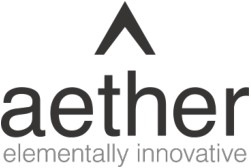
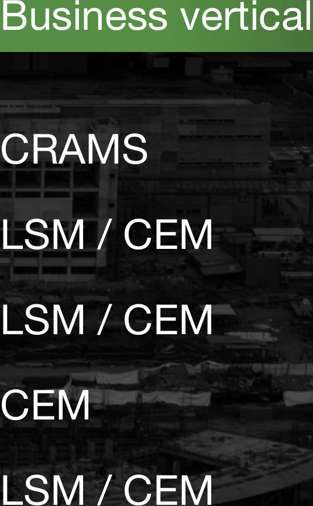

**[Image: Aug2026.pdf-0001-00.png (251x168, 12.1KB)]**

July 31, 2026 

###### Ref. No.: **AIL/SE/23/2026-27 - Update** 

To, 

###### **BSE Limited** 

Phiroze Jeejeebhoy Towers, Dalal Street, Fort, Mumbai-400001, MH. 

Scrip Code: **543534** 

**National Stock Exchange of India Limited** Exchange Plaza, Bandra Kurla Complex, Bandra (E), Mumbai-400051, MH. 

Symbol: **AETHER** 

Dear Madam / Sir, 

###### **Subject:** **<u>Frequently Asked Questions on the Presentation</u>** 

In accordance with Regulation 30 of the SEBI (Listing Obligation and Disclosure Requirements) Regulations, 2015, and further to the intimation having Reference No.: AIL/SE/23/2026-27, Frequently Asked Questions (FAQs) on the presentation shared, is enclosed herewith. 

We request you to kindly take the information on your records. 

Thanking you. 

###### **For Aether Industries Limited** 

Digitally signed by CHITRARTH CHITRARTH RAJAN PARGHI RAJAN PARGHI Date: 2026.07.31 12:20:11 +05'30' 

###### **Chitrarth Rajan Parghi** 

Company Secretary & Compliance Officer Mem. No.: F12563 

Encl.: As attached 

Page **1** of **1** 

**Aether Industries Limited** 

**Registered Office:** Plot No. 8203, GIDC Sachin, Surat-394230, Gujarat, India. **Phone:** +91-261-6603000 **||  Email:** info@aether.co.in **||  Web:** www.aether.co.in **II  CIN:** L24100GJ2013PLC073434 **Factory:** Plot No. 8203, Beside Shakti Distillery, Near Rajkamal Chokdi, Road No. 8, Sachin GIDC, Sachin, Surat-394230, Gujarat, India. 

- Q1 FY27 s 

- <mark>FA Q</mark> 

**[Image: Aug2026.pdf-0002-01.png (76x65, 2.2KB)]**

Frequently Asked Questions 

Quarterly performance Site nomenclature 02 01 Operations and supply chain Capital expenditure 04 03 Margins, working capital and debt 05 

**[Image: Aug2026.pdf-0003-02.png (1711x447, 52.8KB)]**

<!-- Start of picture text -->
Site nomenclature 02 <!-- End of picture text -->

**[Image: Aug2026.pdf-0003-03.png (1691x453, 52.8KB)]**

<!-- Start of picture text -->
Capital expenditure 04 <!-- End of picture text -->

**[Image: Aug2026.pdf-0003-04.png (2038x455, 71.0KB)]**

<!-- Start of picture text -->
Margins, working capital and debt 05 <!-- End of picture text -->

**[Image: Aug2026.pdf-0003-05.png (76x65, 2.0KB)]**

## Quarterly performance 

Q. What has driven sales growth of 27% year on year and 7% quarter on quarter? 

Sales for the quarter were extremely strong and demonstrate that all three business verticals are performing to plan. Contract and Exclusive Manufacturing (CEM) grew approximately 75% year on year, and Contract Research and Manufacturing Services (CRAMS) grew approximately 20% year on year. CRAMS and CEM together now contribute 60% of revenue. We expect these two verticals to reach 70% over the next couple of years, notwithstanding the new products being launched in the Large Scale Manufacturing (LSM) vertical. 

Q. How did each of the three business verticals perform during the quarter? 

##### **CRAMS** 

During Q1 we completed the installation of 18 additional fume hoods and a Nuclear Magnetic Resonance (NMR) machine at the R&D centre. We now have over 65 live 

projects, of which 70% are in non-pharmaceutical and non-agrochemical sectors. The NMR capability enables us to bid for projects in the oil and gas and material science sectors, where we are seeing strong traction. We are also pursuing opportunities in application testing and product development for material science and performance materials. 

- **CEM** The major contracts continue to deliver. Revenue from Baker Hughes for the quarter was !700 million. Strata (Site 4), which is dedicated to Baker Hughes, reached a utilisation level of 58% and will continue to scale up over the coming quarters. During the quarter we also began booking revenue from Ascend, which is dedicated to Milliken Chemical and Textile (India) Company, a subsidiary of Milliken & Company, USA; the plant is running in line with expectations. Converge Polyol, developed jointly with Saudi Aramco, saw good off-take during the quarter, and we remain on track to achieve sales of !650–750 million in the current Þnancial year. Our contract with a European major for a smaller CEM programme in the material science space has also been commercialised at Ascend, taking utilisation at that plant to 72%. 

**[Image: Aug2026.pdf-0004-08.png (76x65, 3.4KB)]**

##### **LSM** 

We saw no decline in demand for our LSM products during the quarter, and pricing remained strong — up 22.5% year on year and 1% quarter on quarter. LSM volume was up 11.7% quarter on quarter and down 22% year on year, principally because certain production lines have been reallocated to the CEM vertical as a deliberate strategic decision. We also launched LSM products from Magnum during the quarter, which are expected to begin contributing to revenue from Q2 FY2027. 

Q. What was the sectoral distribution of sales for the quarter? The pharmaceutical and agrochemical sectors contributed 32.2% and 9.5% of revenue from operations respectively. Oil and gas contributed 31.4%, crossing !1,000 million of revenue for the quarter for the Þrst time. Material science contributed 16.6%. The portfolio remains well diversiÞed across sectors. 

**[Image: Aug2026.pdf-0005-03.png (76x65, 3.4KB)]**

## Site nomenclature 

Q. What are the new names of the manufacturing sites? Our sites have been renamed as follows: 

**[Image: Aug2026.pdf-0006-02.png (1392x123, 42.3KB)]**

<!-- Start of picture text -->
Previous name New name <!-- End of picture text -->

**[Image: Aug2026.pdf-0006-03.png (1415x126, 50.3KB)]**

<!-- Start of picture text -->
New name <!-- End of picture text -->

**[Image: Aug2026.pdf-0006-04.png (1415x126, 79.1KB)]**

<!-- Start of picture text -->
Business vertical <!-- End of picture text -->

Previous name Site 1 ! Site 2 ! Site 3 and Site 3++ ! 

**[Image: Aug2026.pdf-0006-06.png (535x866, 250.4KB)]**

<!-- Start of picture text -->
Business vertical CRAMS! LSM / CEM! LSM / CEM! CEM! LSM / CEM <!-- End of picture text -->

New name Catalyst ! Genesis! Ascend! Strata! Magnum 

#### Site 4 ! 

**[Image: Aug2026.pdf-0006-09.png (76x65, 3.7KB)]**

Site 5 and Site 5+ 

## Operations and supply chain 

#### Q. Has the Company faced any difÞculty in procuring raw materials? 

As stated on our previous conference call, we have faced no issues in procuring raw materials. Raw material prices, which rose in March at the onset of the Middle Eastern crisis, remained stable through the quarter. We have been able to pass the earlier increases through to customers, as reßected in gross margin of 49.83% in Q1 FY2027 against 47.93% in Q1 FY2026. 

FY2026 47.93% 

# **FY2027 49.83%** 

**[Image: Aug2026.pdf-0012-05.png (76x65, 3.3KB)]**

## Capital expenditure 

Q. Can you provide an update on capital expenditure for the quarter? 

Site 1+ — new R&D centre Construction of the new R&D centre, adjacent to the existing site, continues to make steady progress and is expected to be ready by Q2 FY2028. Total capital expenditure for the centre is approximately !1,000 million, and it will house 120 fume hoods and 8 technical labs. Magnum (Site 5) Total capital expenditure for this site is approximately !833 million in Q1 FY2027. We are working to commercialise two further production blocks — one for the semiconductor segment and one for a CEM contract with a European major — by Q3 FY2027. Total capital expenditure for the current Þnancial year is expected to be !3,000 million – !3,500 million. The Capex shall be ~!600 million at Site Catalyst and remaining at 

Site Magnum. 

**[Image: Aug2026.pdf-0013-04.png (76x65, 2.0KB)]**

## Margins, working capital and debt 

Q. Can you comment on EBITDA margins? EBITDA margin for Q1 FY2027 was 31.47%, against 30.61% in Q1 FY2026, principally reßecting the increased contribution from the CRAMS and CEM verticals. We maintain our guidance of approximately 30% EBITDA margin for FY2027. Q. How did the working capital cycle move during the quarter? Debtor days reduced on the back of aggressive collections, and inventory days reduced marginally. The overall working capital cycle is marginally lower than at March 2026. Q. What are the Company’s current debt levels? As at 30 June 2026, outstanding borrowings comprised !4,215 million of working capital 

loans and !1,000 million of term loans. 

**[Image: Aug2026.pdf-0014-03.png (76x65, 2.8KB)]**

Chemistry i s o u r l a n g u a g e Innovation i s o u r i d e n t i t y 

### - Aether 

This document contains statements that are forward-looking in nature. Such statements are based on management’s current expectations and involve known and unknown risks 

and uncertainties that could cause actual results to differ materially. The Company undertakes no obligation to publicly update any forward-looking statement. 

Aether Industries Limited · Plot No. 8203, Road No. 82, GIDC Industrial Estate, Sachin, Surat, Gujarat 394230 · Investor Relations: investors@aether.co.in 

**[Image: Aug2026.pdf-0015-05.png (76x65, 3.4KB)]**

---

## Extracted Images

| # | File | Dimensions | Size |
|---|------|------------|------|
| 1 | Aug2026.pdf-0001-00.png | 251x168 | 12.1KB |
| 2 | Aug2026.pdf-0002-01.png | 76x65 | 2.2KB |
| 3 | Aug2026.pdf-0003-02.png | 1711x447 | 52.8KB |
| 4 | Aug2026.pdf-0003-03.png | 1691x453 | 52.8KB |
| 5 | Aug2026.pdf-0003-04.png | 2038x455 | 71.0KB |
| 6 | Aug2026.pdf-0003-05.png | 76x65 | 2.0KB |
| 7 | Aug2026.pdf-0004-08.png | 76x65 | 3.4KB |
| 8 | Aug2026.pdf-0005-03.png | 76x65 | 3.4KB |
| 9 | Aug2026.pdf-0006-02.png | 1392x123 | 42.3KB |
| 10 | Aug2026.pdf-0006-03.png | 1415x126 | 50.3KB |
| 11 | Aug2026.pdf-0006-04.png | 1415x126 | 79.1KB |
| 12 | Aug2026.pdf-0006-06.png | 535x866 | 250.4KB |
| 13 | Aug2026.pdf-0006-09.png | 76x65 | 3.7KB |
| 14 | Aug2026.pdf-0012-05.png | 76x65 | 3.3KB |
| 15 | Aug2026.pdf-0013-04.png | 76x65 | 2.0KB |
| 16 | Aug2026.pdf-0014-03.png | 76x65 | 2.8KB |
| 17 | Aug2026.pdf-0015-05.png | 76x65 | 3.4KB |
