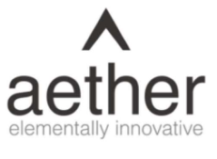
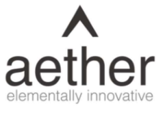
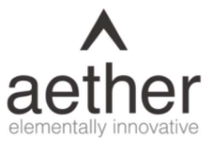

**[Image: Nov2025.pdf-0001-00.png (249x168, 12.0KB)]**

November 18, 2025 

### Ref. No.: **AIL/SE/52/2025-26** 

To, 

### **BSE Limited** 

Phiroze Jeejeebhoy Towers, Dalal Street, Fort, Mumbai-400001, MH. 

Scrip Code: **543534** 

**National Stock Exchange of India Limited** Exchange Plaza, Bandra Kurla Complex, Bandra (E), Mumbai-400051, MH. 

Symbol: **AETHER** 

Dear Madam / Sir, 

### **Subject:** **<u>Transcript of the Earning Conference Call</u>** 

In accordance with Regulation 30 of the SEBI (Listing Obligation and Disclosure Requirements) Regulations, 2015, the Transcript of the Earning Conference Call scheduled on Thursday, November 13, 2025, on the financial performance of the Company for the Second Quarter ended on September 30, 2025, is enclosed herewith. 

We request you to kindly take the information on your records. 

Thank you. 

### **For Aether Industries Limited** 

**[Image: Nov2025.pdf-0001-15.png (296x126, 40.2KB)]**

### **Chitrarth Rajan Parghi** 

Company Secretary & Compliance Officer Mem. No.: F12563 

**[Image: Nov2025.pdf-0001-18.png (205x207, 74.6KB)]**

Encl.: As attached 

Digitally signed by CHITRARTH CHITRARTH RAJAN PARGHI RAJAN PARGHI Date: 2025.11.18 16:58:18 +05'30' 

Page **1** of **1** 

#### **Aether Industries Limited** 

**Registered Office:** Plot No. 8203, GIDC Sachin, Surat-394230, Gujarat, India. **Phone:** +91-261-6603000 **||  Email:** info@aether.co.in **||  Web:** www.aether.co.in **II  CIN:** L24100GJ2013PLC073434 **Factory:** Plot No. 8203, Beside Shakti Distillery, Near Rajkamal Chokdi, Road No. 8, Sachin GIDC, Sachin, Surat-394230, Gujarat, India. 

**[Image: Nov2025.pdf-0002-00.png (239x175, 19.1KB)]**

# “Aether Industries Limited Q2 FY'26 Earnings Conference Call” 

## **November 13, 2025** 

**[Image: Nov2025.pdf-0002-03.png (241x174, 19.2KB)]**

**[Image: Nov2025.pdf-0002-04.png (255x53, 21.3KB)]**

**[Image: Nov2025.pdf-0002-05.png (214x103, 11.6KB)]**

**MANAGEMENT: DR. AMAN DESAI – PROMOTER & WHOLE-TIME DIRECTOR, AETHER INDUSTRIES LIMITED MR. ROHAN DESAI – PROMOTER AND WHOLE-TIME DIRECTOR, AETHER INDUSTRIES LIMITED MR. FAIZ NAGARIYA – CHIEF FINANCIAL OFFICER, AETHER INDUSTRIES LIMITED MR. KUSHAL DOSHI – LEAD INVESTOR RELATIONS, AETHER INDUSTRIES LIMITED MS. SHUBHANGI DESAI – EXECUTIVE IR, AETHER INDUSTRIES LIMITED MODERATOR: MR. NILESH GHUGE – HDFC SECURITIES LIMITED** 

Page 1 of 17 

**[Image: Nov2025.pdf-0003-00.png (241x176, 19.3KB)]**

##### _Aether Industries Limited November 13, 2025_ 

###### **Moderator:** 

Ladies and gentlemen, good day and welcome to the Aether Industries Limited Q2 FY'26 Earnings Conference Call hosted by HDFC Securities Limited. 

As a reminder, all participant lines will be in the listen-only mode and there will be an opportunity for you to ask questions after the presentation concludes. Should you need assistance during the conference call, please signal an operator by pressing ‘*’ then ‘0’ on your touchtone phone. 

Please note that this conference is being recorded. I now hand the conference over to Mr. Nilesh Ghuge from HDFC Securities Limited. Thank you and over to you, sir. 

###### **Nilesh Ghuge:** 

Thank you, Bhoomika. Good afternoon all. On behalf of HDFC Securities, I welcome everyone to this Aether Industries conference call to discuss the results for the quarter ended September 2025 and first half of the Financial Year 2025-'26. 

From the Aether Industries, we have with us today Dr. Aman Desai – Promoter and Whole-Time Director; Mr. Rohan Desai – Promoter and Whole-Time Director; Mr. Faiz Nagariya – Chief Financial Officer; Mr. Kushal Doshi – Lead Investor Relations and Ms. Shubhangi Desai – Executive IR. 

Without further ado, I will now hand over the floor to Mr. Kushal Doshi to begin with the earnings for the Q2 FY'26. Over to you, Kushal. 

###### **Kushal Doshi:** 

Thank you, Nilesh. Warm welcome to everyone. Today, our Board has approved the Financial Results for the 2nd Quarter and the First Half of Fiscal Year 2026 and the same has been filed with the exchanges as well as updated over our website. 

Please note that this conference call is being recorded and the transcript of the same will be made available on the website of Aether Industries Limited and the exchanges. Please also note that the audio of the conference call is the copyright material of Aether Industries Limited and cannot be copied, rebroadcasted or attributed in press or media without specific and written consent of the Company. 

Let me draw your attention to the fact that on this call, our discussion will include forwardlooking statements which are predictions, projections or other estimates about future events. These estimates reflect management's current expectations on future performance of the Company. Please note that these estimates involve several risks and uncertainties that could cause our actual results to differ materially from what is expressed or implied. Aether Industries Limited or its officials do not undertake any obligation to publicly update any forward-looking statements, whether as a result of future events or otherwise. 

Page 2 of 17 

**[Image: Nov2025.pdf-0004-00.png (241x176, 19.3KB)]**

##### _Aether Industries Limited November 13, 2025_ 

Now, Mr. Rohan Desai will begin by sharing Aether's business outlook, ongoing expansion. Then, Dr. Aman Desai will provide inputs on the R&D and new plan initiatives and strategy of the Company going forward and Mr. Faiz Nagaria will cover the financial highlights for the period under review. 

Now, I hand over the call to Mr. Rohan Desai for the opening remarks. Over to you, Rohan. 

**Rohan Desai:** 

Good evening, everyone. I hope everybody is doing well and I am glad to connect with you all to discuss the performance of our Company for Q2 of Financial Year 2026. I am happy to inform you that all the three business verticals at Aether are performing well, creating a solid foundation for the second half of Financial Year 2026. 

This quarter, the sales mix was roughly 47% from contract and exclusive manufacturing, 41% from large-scale manufacturing and about 9% from contract research and manufacturing services. For the first time, CEM has contributed more than the LSM business vertical and CRAMS and CEM combined have contributed more than 50% of the sales. This is in line with our vision where CEM and CRAMS together will contribute 60%-70% of the sales in the next two years period. 

Contracts with exclusive manufacturing is set to show good growth as the pipeline looks promising. We are ramping up volumes and sales to make a use of Site-4. We will start manufacturing for Milliken at Site-3+ coming Q4 of Financial Year 2026. And there is this new CEM contract kicking off from one of the blocks at Site-5 around the same time. I figure this site should stabilize and get to optimum output in 15-18 months or so. Sales from our subsidiary Aether Specialty Chemicals Limited in this quarter has increased to Rs. 50 crores approximately as compared to Rs. 41 crores in the last quarter. The current run rate is expected to continue for Financial Year 2026, and we see an increase in the trend in Financial Year 2027. The increase in volumes is expected as we start supplying to more of the sites of Baker Hughes as well as increase the product portfolio which is currently 8 products for Baker Hughes. We have seen an increase in sales of Converge Polyol in the quarter and are on track to achieve our target for this financial year. 

The Converge Polyol for which we have completed life assessment cycle study is now being sampled by a number of multinational companies which are targeting to replace their current Polyol with the current Converge Polyol over the next couple of years. The Otsuka Chemicals contract is on track, and we are expected to achieve the target of 35 crores-40 crores of sales for the period of this Financial Year 2026. Shifting to LSM, the demand of our products and pricing for our products have remained stable. As mentioned, last quarter we will be launching three new products in the LSM block which will be the second production block at Site-5. The products are targeted towards pharmaceutical, agrochemicals and materials science sector and 

Page 3 of 17 

**[Image: Nov2025.pdf-0005-00.png (241x176, 19.3KB)]**

##### _Aether Industries Limited November 13, 2025_ 

the average pricing of these products would be $30 to $40 per kilo. The products are expected to be manufactured for the first time in India and are expected to be scaled up in Financial Year 2027. 

In the quarter, we have added four new clients to our list of marquee clients. For the first half sector breakdown would be pharmaceutical and agrochemicals now contribute only 48% combined while oil and gas and materials science contribute 19% and 18% respectively. I expect the share of oil and gas and materials science sectors to scale up by the end of the year as the supply to Baker Hughes and Milliken increases by the end of the financial year. 

On the CAPEX front, we have deployed Rs. 245 crores so far in the current financial year and all the sites are on schedule. Site-3+, which is dedicated to Milliken, is expected to commence production in Quarter 4 of Financial Year 2026. Site-5, which is based on Panoli, continues to progress smoothly and we target to commission the first two production blocks of Phase-1 by the start of Quarter 4 of Financial Year 2026. 

These new sites will be ramped up in Financial Year 2027 and help Aether in maintaining its growth momentum. In summary, we remain extremely excited as we look to commence three new production blocks at Aether and our Company becoming a preferred partner not only for R&D, CRAMS but also for commercialization of these products. 

With this, I would like to conclude speaking and I would request Dr. Aman to touch upon the R&D initiatives and new client initiatives for this period. Over to you, Aman. 

###### **Dr. Aman Desai:** 

Thank you, Rohan. Good evening, everybody, again. I am very happy to connect with all of you again for this quarterly update. 

Just to continue where Rohan left off, while the expansion on Site-3+, and Site-5 continues, as Rohan has detailed in length, which I will not go into, we are also in the process of increasing reasonably the R&D capacity at Aether, which was already world-class to begin with. We are targeting to add another two labs, including one engineering lab, which totals to 24 new fume hoods in the existing facility itself over the next couple of months. We have also started the construction of the new R&D plant extension, which is expected to have more than 130 fume hoods. That is a significant R&D expansion in the existing facility and a whole new R&D extension building that we are targeting, the first one by the next few months and the next one over the next one year or so. The number of inbound inquiries we are getting from customers across sectors on the CRAMS vertical gives us confidence in this expansion and will also enable us to add more chemistries and technologies and core competencies to our portfolio. Currently in R&D, in the eight research groups that we have, we have more than 55 projects ongoing, the majority of which are non-ag and non-pharma. 

Page 4 of 17 

**[Image: Nov2025.pdf-0006-00.png (241x176, 19.3KB)]**

##### _Aether Industries Limited November 13, 2025_ 

Over the course of the quarter, we have had a number of follow-ups and site visits from senior management in the R&D and technology side of current and prospective customers. It is clearly visible to us that the companies, the innovators are no longer able to manufacture in the West, in the current environment and have been shutting down the commercial plants in the West, in Europe and the US. India is increasingly becoming very viable and in some cases the only viable option. Customers are looking to partner with reliable partners in India and India is the first choice that these customers have and they are expediting in finalizing the contracts in the current scenario where they are closing down their manufacturing assets on a fast track basis. We believe we are at Aether, we are well placed considering all the relationships that we have already forged with all these customers and also the world-class infrastructure that Aether has already built and is currently building on an aggressive pace. 

In the first half of Fiscal ‘26, we have also completed right now, as of date, 26 customer and certification audits. With the ongoing CAPEX at Site-5, our Panoli site, we are extremely excited for this site. We have a clear line of sight for this manufacturing Site-5, of which the first two production blocks, which are completely fitted out with the expected products, these are expected to be completed by the end of this financial year, as Rohan has alluded to earlier. We have a number of projects in the pipeline, and we are confident of filling up this entire Site-5 with innovative and first time made in India products. 

In summary, I have always mentioned that there will be a ocean of opportunities that are available to Indian specialty companies who have invested in infrastructure, in R&D capabilities, in core competencies and with the assets and infrastructure that we have, we should definitely be tapping into these opportunities significantly and look to prosper going forward. We believe Aether is one of these companies that can take advantage of these ocean of opportunities with our cutting-edge R&D and hopefully will be at the forefront to take advantage of all these opportunities that are coming to us. 

So again, thank you all for joining us today evening and being online with us for the call. Happy to answer questions at the end and Faiz, our CFO, will now give you the overview of the financial highlights and the results for the Q2 and the first half of fiscal 26. 

###### **Faiz Nagariya:** 

Thank you, Dr. Aman and good evening, everybody. I am glad to present the financial results of Aether Industries Limited for Q2 and H1 of FY'26. 

The total consolidated revenue from operations of the Company stood at Rs. 2,751 million in Q2 of FY'26 as against Rs. 1,988 million in Q2 of FY'25 which is a 38% increase year-on-year. This has resulted in EBITDA of Rs. 853 million in Q2 of FY'26 as against Rs. 503 million in Q2 of FY'25 which is an increase of 70% in the comparing quarters. EBITDA margin stood at 31% in Q2 of FY'26 as against 25% in Q2 of FY'25. 

Page 5 of 17 

**[Image: Nov2025.pdf-0007-00.png (241x176, 19.3KB)]**

##### _Aether Industries Limited November 13, 2025_ 

The profit after tax amounted to Rs. 540 million in Q2 of FY''26 as against Rs. 348 million in Q2 of FY'25 which is an increase of 55% year-on-year. The PAT margin stood at 19% in Q2 of FY'26 as against 17% in Q2 of FY'25. The consolidated revenue from operations of the Company stood at Rs. 5,312 million in H1 of FY'26 as against Rs. 3,788 million in H1 of FY'25 which is an increase of 40% in the comparing half years. This has resulted in EBITDA of Rs. 1,634 million in H1 of FY'26 as against Rs. 904 million in H1 of FY'25 an increase of 81% in comparing half years. The PAT amounted to Rs 1,010 million in H1 of FY'26 as against Rs. 647 in H1 of FY'25 which is a 56% increase in the comparing half years. 

During the quarter we have received another Rs. 250 million from the insurance company towards the claim for fixed assets as on account payment. The remaining claim for fixed assets for the loss has been put up to the insurance service along with loss of profit and we are confident to get the same settled by the insurance company by or before the end of Q3 of FY'26. We have always been working towards working capital management since last few years and we are happy to inform that we have been able to reduce the overall working capital cycle to 149 days as on September 30, 2025 which was 194 days as on 31st March, 2025. This has been possible due to reduction in inventory cycle to 160 days as on September 30, 2025 from 173 days as on 31st March, 2025 and a reduction of data cycle to 106 days as on September 30, 2025 for 126 days as on 31st March, 2025. 

I would like to give a glimpse of the capacity utilization of our three sites. Site-2, the capacity utilization in six months is approximately 76%, Site-3 is 68% and Site-4 is 46%. 

Things are progressing as per the strategic planning done by the Company. I once again thank you and we look forward to better outcomes than this in future as well. Back to you, Kushal. 

**Kushal Doshi:** 

Thank you, Faiz. I request the moderator to open the floor for Q&A. 

**Moderator:** 

Thank you very much. We will now begin the question-and-answer session. The first question comes from the line of Ravi Singh from Cosmic Horizon Capital. Please go ahead. 

**Ravi Singh:** 

Hi, thank you for this opportunity. Sir, we are already at a PAT margin of approximately 21% prior to extraordinary items for Q2 when the ex-LSM business, which is CRAMS and CEM is at about, say, 57% of overall revenues. Now, say in the next two years, as you have mentioned on the call, when the CRAMS and CEM business goes to 70%-75% of revenue, is it and also by then most of our plans are able to ramp up, is it possible that from this 21% currently, the margins at PAT level can go up to, say, 24%-25% plus levels? 

**Kushal Doshi:** 

Hi, this is Kushal out here. Unlikely that margins will go to 24%-25%, I think what we will be looking at and what the vision is to have 70% CRAMS CEM, 30% with LSM, which will take 

Page 6 of 17 

**[Image: Nov2025.pdf-0008-00.png (241x176, 19.3KB)]**

##### _Aether Industries Limited November 13, 2025_ 

some time. With also our ongoing CAPEX the depreciation is also expected to increase. So, we will be yet in the margin front on the net profit at around 19%-20% mark. 

**Ravi Singh:** Okay, so even once the CRAMS and CEM ramps up, you will be still at 20% mostly because of the depreciation? **Kushal Doshi:** Because the CAPEX is continuing at Site-5, Panoli, which is 16 production blocks. So, you only have the first two production blocks which have come up and subsequently you will be seeing the CAPEX going through for the second and third phase. **Faiz Nagariya:** So, I would like to add that going forward now, see, we were using the QIP money for the CAPEX. Going forward, we will be using debt funds, whether from banks or financial institutions. So, that will also add to certain finance costs. Of course, that will be capitalized towards the CAPEX which will be done, but still certain working capital facilities will also be increased. So, that also will keep the margins at around 19%-20%. **Ravi Singh:** I am talking once this ramps up fully, say 2 to 3 years down the line, once working capital also stabilizes and your revenues also ramp up, by then, is it possible that we can touch '22-'23 kind of levels? **Faiz Nagariya:** We would like to be conservative and be around 19%-20% and keep the rest in our pockets to see how we ramp up in the future with the other products which have come up. Because with the other products also, we will have to see the costings and everything. **Ravi Singh:** Makes sense. And on the asset turn, the same has been subdued for the last two years, mainly because of the kind of CAPEX that we have been undertaking for the last four years. So, just trying to understand once the CAPEX ramps up, is it fair to assume say 1.65x to 1.75x asset turn on the gross block for the Company as a whole? Is that possible or do you feel we can do better? **Kushal Doshi:** So, we target between 1.5x to 1.75x asset turn. So, that is achievable. That is what we are going to be looking for. **Ravi Singh:** Got it. And lastly, also on Site-5, just wanted to confirm, the CAPEX guidance is Rs. 500 crores with the peak asset turns of 1.75x, which should be achieved by FY'28. Is that right? **Kushal Doshi:** No. The total CAPEX for Site-5 will be closer to Rs. 2,200 to Rs. 2,300 crores. This will go on till around FY'30. This is what we have been planned and we have said in the past. The asset turns for this entire side once it's fully operational and all the plants are stabilized will be targeted at around 1.5x to 1.75x. 

Page 7 of 17 

**[Image: Nov2025.pdf-0009-00.png (241x176, 19.3KB)]**

##### _Aether Industries Limited November 13, 2025_ 

**Ravi Singh:** 

Okay. So, Rs. 2,000 crores will be the CAPEX, which will go on till FY'30. But the one which will be operational, the Phase-1 and Phase-2 which should be operational by Q4 FY'26, what will be the CAPEX for that for the first two phases? 

**Kushal Doshi:** 

So, it's not Phase-1 and Phase-2. It's part of Phase-1, first of all. How we have broken up is that there are four phases. First Phase has first four production blocks along with the utilities. Because when you build up the entire site, the utilities are brought in for all the 16 production blocks. Okay. The second phase will have the next four and subsequently Phase-3 and phase 4 will have the four production blocks each. So, that's how it will be growing. In terms of CAPEX, we will be starting off with the first two along with all the utilities for which have been built up for. So, you will not be spending Rs. 2,200 crores or Rs. 2,300 crores upfront. It will be on a phased manner. 

**Ravi Singh:** Got it. Thank you and wishing you all the very best. Thanks. 

**Kushal Doshi:** 

Thanks 

**Moderator:** Thank you. The next question comes from the line of Kumar Saumya from Ambit Capital. Please go ahead. 

**Kumar Saumya:** Hi. Good evening, sir. Sir, a couple of questions from my side. First question is on the material science business. We have seen contributions stepping up in the last three quarters at around 80%-90%. So, Kushal, can you please help me with that, is it entirely Saudi Aramco supplies or do we have something else over there as well? 

**Rohan Desai:** No. There are multiple products out there which we cannot disclose because of the confidentiality. But there are multiple products out there. **Kumar Saumya:** And secondly, on the Block 1 Panoli that you said, this is a long-term contract that you're setting up. Any guidance over there? What could be the product like and what is the potential over there? 

**Rohan Desai:** It's an interesting molecule in the material science field, but we will wait for the right time to announce that. 

**Kumar Saumya:** Okay. And lastly, on the CAPEX side, we were of the view that annual CAPEX would be somewhere between Rs. 350 crores to Rs. 400 crores, while we have already done Rs. 250 crores. So, is there somewhat revision in the CAPEX guidance because out of the Rs. 2,200 crores, something has already been done, right? 

Page 8 of 17 

**[Image: Nov2025.pdf-0010-00.png (241x176, 19.3KB)]**

_Aether Industries Limited November 13, 2025_ 

**Faiz Nagariya:** So, we have ramped up the CAPEX at Site-3+ and Site-5 on the requirements of the customer where in Site-3+. So, we have expedited the things. Otherwise, the guidance which we are given of around Rs. 350 crores is very much in line and it would be maybe a 5%-10% increase, not more than that. 

**Kumar Saumya:** Okay, sir. Thank you. This was very helpful, sir. Thank you. That will be all, sir. I will come back. **Faiz Nagariya:** Thank you. **Moderator:** Thank you. The next question comes from the line of Amay Sharda from Punartha Investment Advisors. Please go ahead. 

**Amay Sharda:** Just wanted to understand what is the revenue that we did from Baker Hughes site in this quarter? **Faiz Nagariya:** Rs. 51 crores. **Amay Sharda:** And the revenues for Saudi Aramco as well? **Faiz Nagariya:** We cannot disclose on the open platform, sir. **Amay Sharda:** Sure. So, I just wanted to understand what led to this huge increase in the CEM segment like Q- on-Q, I think from 95 went to 131. So, what was the reason? Any specific contract that ramped up? **Rohan Desai:** So, we have multiple contracts which we cannot disclose, which are being ramped up because of the client's interest of moving faster since the last, if you have heard the transcript of the last two earnings calls, we have always mentioned that there are a lot of inquiries which are converting into opportunities at Aether and so we are ramping them up in the existing facilities and making use of it. **Amay Sharda:** Sure. And regarding the margins that we have, I think since last 2-3 quarters, we are reporting 30% plus margins. So, is this sustainable going forward as well on the EBITDA level? **Faiz Nagariya:** Yes. Definitely, it is sustainable because we are entering to more and more contract manufacturing and CRAMS which is increasing. So, 30% margin is surely sustainable and we would be sustaining them. **Amay Sharda:** And even the Baker Hughes contract is at the same level of margins or is it slightly lower margin contract? 

Page 9 of 17 

**[Image: Nov2025.pdf-0011-00.png (241x176, 19.3KB)]**

##### _Aether Industries Limited November 13, 2025_ 

###### **Kushal Doshi:** 

We usually don't discuss CEM contracts on margin basis, but on the overall company level basis, we continue to maintain between 29% to 30% EBITDA margins. 

**Amay Sharda:** 

Sure. Okay. Thank you so much. That is it from my end. 

**Moderator:** 

Thank you. The next question comes from the line of Aagam from Aagam Investments. Please go ahead. 

**Aagam:** 

Thank you. So, in terms of the CAPEX, what should those options, let's say the Site-3 CAPEX and the Site-5 CAPEX, so first thing is how much revenue can we expect for this financial year? And I know you don't give a guidance, but broadly, what should we end the year with? And once Site-3, Site-5 is operational, what is FY'27, FY'28 looking like? Whatever color you can give through, maybe not quantitatively or quantitatively, how is it? How are we looking? So, let's say we did around Rs. 850 crores last year. So, how is the number looking like 3 years down the line? If you can talk on this. 

**Kushal Doshi:** 

Aagam, thank you for the question. So, for this financial year, Site-5 is not expected to generate any revenue because the plants will be getting operationalized by the first week of Q4 or end of Q3, first week Q4. So, they will be just getting stabilized. We do not expect any much revenue coming from the first two production blocks, which will be commencing. What we have always mentioned is the CAPEX for the first two sites is around Rs. 160 crores each, where we have targeted close to around 1.5x to 1.75x asset turn when they are fully operational and stabilized, which takes between 15 months to 18 months. In the first financial year, we expect these units to work at capacity utilizations of around 40% to 50% and then steadily ramp up. So, that's, giving a broad guidance and color of the first two production blocks, which helps you get a sense of the revenues for the first two production blocks over the next two years. 

**Aagam:** 

How is the current year looking like, second half? 

**Kushal Doshi:** 

It's looking strong. The first half has laid a solid foundation, as mentioned by Rohan. We have had all the three business verticals performing very well. As both Rohan and Dr. Aman mentioned, the number of inquiries which we are seeing from different customers and prospective customers continues to increase. There has been a ramp up also in the R&D site, as mentioned by Dr. Aman. We have 55 projects going on. 70% of them are non-agro, non-pharma. So, clearly, it's looking good. We are also seeing good trajectory in terms of our demand for our products at Baker Hughes. So, expect that trajectory to continue, growth trajectory. Secondly, I think the more important part is that we have three production blocks starting off. One is Milliken, which is Site-3+, and the two production on Site-5. So, once these three start ramping up in FY'27, the growth momentum is expected to continue. 

Page 10 of 17 

**[Image: Nov2025.pdf-0012-00.png (241x176, 19.3KB)]**

##### _Aether Industries Limited November 13, 2025_ 

**Aagam:** 

Should second half be better than first half? 

**Kushal Doshi:** 

Historically, it has always been like that. For us at Aether, the the second half always sees a much faster growth compared to the first half. So, we expect that trend to continue. 

**Aagam:** 

Okay. And also, on a statement, you mentioned that it's like CAPEX is Rs. 200 crores. So, maybe Rs. 180 crores-Rs. 200 crores which you are spending currently, so would we look like fundraising in the future or it will be entirely through internal accruals? 

**Kushal Doshi:** 

It will be a mixture of internal accruals and debt as of now. There is no plan to raise any further equity going forward as we see right now for the next 5 to 7 years. 

**Aagam:** 

Okay. So, probably we are in the range of 20%-25%. So, once this capacity is coming, should I assume we should grow northwards of 25%? A ballpark number just for understanding purpose. 

**Kushal Doshi:** 

Yes, we should be growing at around 25% going forward. 

**Aagam:** 

Okay. Thanks. I will get back in the queue. 

**Moderator:** 

Thank you. The next question comes from the line of Abhijit Akella from Kotak Institutional Equities. Please go ahead. 

**Abhijit Akella:** 

Good evening. Thank you so much for taking my questions. It would just be great to get your updated perspective maybe on some of the newer growth projects we have in the pipeline. So, maybe particularly on Converge and maybe on Novoloop as well. I know it's been a little bit of maybe slower going early on in terms of adoption of the product, but are you seeing improving traction in terms of how customers are pursuing the end product and how sales are progressing there? 

###### **Rohan Desai:** 

Let me take up Converge first, Abhijit, and Aman will add on to other projects afterwards. Converge is shaping up well. We were delayed after the launch of the product because the lifecycle assessment study was not completed on that product. So, we completed that. And at the parallel time, we had sent out a lot of samples which were turned into qualifications, quantities which we were able to sell in the previous 3-4 quarters. And now we are seeing a lot of inbound business inquiries coming in on these products where people want to shift from the traditional polyol to this wonderful Converge polyol. Aman, can you add more on to interesting opportunities out there? 

###### **Dr. Aman Desai:** 

I am sorry, I missed this question. Is this about the large-scale manufacturing business model? 

Page 11 of 17 

**[Image: Nov2025.pdf-0013-00.png (241x176, 19.3KB)]**

##### _Aether Industries Limited November 13, 2025_ 

**Abhijit Akella:** Actually, I was asking about Converge and Novoloop and maybe some of the other interesting smaller businesses that we have in the portfolio, whether we are seeing improving traction in those. 

**Dr. Aman Desai:** 

Yes, so Converge, as Rohan mentioned upon, Novoloop is also progressing well in the work that we are doing. And then there's a whole bunch of other contracts and customers that we have, which we haven't been able to disclose externally yet, which we hope to be doing over the next few months and within the next year. And there's at least 4-5 different projects going on with specific customers at that scale, which are very promising and have the potential of growing up rapidly. And just to give you an example, Milliken started about four or five years ago as a small research project. And then today, we are dedicating a whole site to that project with a 10-year supply agreement. We have at least four or five such very promising contracts ongoing and shaping up towards that kind of scale currently. And as I mentioned, we have 55 plus projects going on in R&D today. And so even if 20% of those go through to commercialization, which is a conservative estimate, it's very promising next few years ahead. And so we are very excited about that. 

**Kushal Doshi:** Abhijeet, just to add to what Dr. Aman mentioned, what we have seen is that once we are able to break into a client, whether it be Baker or Milliken, what has resulted is in also opening up a library of projects which they have internally. And with the way the development is happening on the R&D side, we clearly see a number of these new projects also being expedited within Europe, shutting down a lot of their plants. So this is resulting into many more opportunities on the CEM side going forward. 

**Abhijit Akella:** Yes, thank you. Thanks for that. So just to clarify, these 55 plus projects that we have right now in the CRAMS model, what would this number have been, say, a year back or two years back, just for reference? That could be helpful. And maybe similarly on the CEM side as well, how many projects do we have at this point versus what the number was a year or two ago? 

**Dr. Aman Desai:** 55 is the total number of projects, for example. Out of that, 70% would be CRAMS/CEM, and 30% would be internal molecules in the LSM model. So 70% of 55, which is about 38 or 40, say, 40 CRAMS CEM projects and 15 large-scale manufacturing projects. And this number, say, two years ago would have been 66% of this. So we have two-thirds of what we are doing right now would have been two years ago. We have been steadily growing since the last expansion that we did in R&D. We have jumped reasonably in the number of projects that are going on. And now with the expansion that is planned for the next two months, as I mentioned in my script, and especially with the new R&D extension next year, which will give us a 2x expansion, double expansion over the current capacity, we are looking at going over easily 120 projects by the next one and a half years ongoing in the R&D. And that's the line of sight that we kind of envision for the expansion that we are doing. 

Page 12 of 17 

**[Image: Nov2025.pdf-0014-00.png (241x176, 19.3KB)]**

##### _Aether Industries Limited November 13, 2025_ 

**Abhijit Akella:** 

Okay, so 55 going to 120 plus in the next couple of years, just to clarify. 

**Dr. Aman Desai:** 

Hopefully. 

**Abhijit Akella:** Got it. Okay. And just on the mix between LSM and CEM/CRAMS within this, as well as in the revenue. So this quarter, we have seen a big shift away from LSM towards CEM. Number one is that entirely discretionary. In other words, are you dedicating more of your available capacity towards CEM and away from LSM? And is there a similar kind of trend playing out on the R&D side as well? Is more of your capacity being dedicated towards CEM? 

**Dr. Aman Desai:** So we continue to focus on LSM. We continue to nurture and build molecules in the LSM business model. But what happens is in the CEM and CRAMS business model, the customer drives it as much as you're driving. And we have always maintained that as time goes on, as we spread out more, as customers get more confidence in us, we become the preferred partner for everything to do from research to scale up to supply. And right now, for a lot of these partners that we have that are already out in the public domain, and more than three times that that are not in the public domain, we are being considered the preferred go-to partner for all of the needs and research and scale up and supply. And so those opportunities and projects that are incoming actually multiply as the years go on. And so it's an inherent feature of this business model that we have consciously built is that this will multiply significantly in years to come, which is what we are seeing in the numbers that you have seen and that we expect to continue to go forward. And so the CEM and CRAMS will grow and grow faster as compared to the LSM model, although we consciously make sure that every one of the eight research groups that are operating in the R&D department have a significant portion, at least 25% to 30% of the projects that they are doing should be focusing on LSM in our own model so that we are not dependent on any one business model. 

**Abhijit Akella:** Right. So just to clarify on that. So the decline in LSM that we see this quarter in revenue terms is nothing to do with demand. It's purely capacity reallocation. Is that correct? 

**Kushal Doshi:** 

Yes. 

**Abhijit Akella:** Thank you. Sure. And just one last thing from my side on the financials before I get back in the queue. So just on the insurance front, this exceptional item is still continuing here, which I believe is the insurance charge that you're paying. What's the outlook for this? How long does this continue? Is there some visibility by when it can go down? And what is the total amount for which we have launched a claim? How much has been received so far? And sort of where exactly does it show up on the balance sheet, the asset side? 

Page 13 of 17 

**[Image: Nov2025.pdf-0015-00.png (241x176, 19.3KB)]**

##### _Aether Industries Limited November 13, 2025_ 

###### **Faiz Nagariya:** 

Sure. First of all, about the extraordinary items, this will continue till financial year at 27 end. The amount will be reduced. You can see that it's already reduced from the last year. So this because there is a third renewal, which is coming up in December. So there will be some markup of a premium in this. So this will continue till 31st March '27. After that, this will not be there. And then coming to your question for the total claim, which we have lost, these are approximately Rs. 100 crores. And we have received Rs. 60 crores already and Rs. 3.5 crores is earmarked to be given to us by the insurance company for the **FLOP** , which they will be giving us with the entire claim, which will be settled now. And we expect that every other entire claim will be settled by end of December. And in balance sheet, the claim for stock was already put up in the P&L account in the last quarter of the financial year '25, which was already informed to everybody. And the claim for assets which is received is standing in the balance sheet in the liability side. And once the entire claim is settled, the surplus or deficit will be put up to the P&L account. 

**Abhijit Akella:** Okay, got it. So the exceptional items lying, we have high confidence that it sort of goes down to zero, basically from maybe... **Faiz Nagariya:** I will just give you a volume figure that when after the fire, the insurance premium, which was increased was approximately 10 crores. In the next year, we had to pay approximately 6 crores more. So  now maybe in this year, it will be 3 crores or 2 crores more, not more than that. **Abhijit Akella:** Got it. Thank you so much for all the clarifications and all the best. **Kushal Doshi:** Thank you. **Moderator:** Thank you. The next question comes from the line of Krishan Parwani from JM Financial. Please go ahead. **Krishan Parwani:** Yes. Hi, sir. Congrats on good numbers. Three questions from my side. Firstly, can you please highlight price and volume growth during the quarter on a QOQ and YOY basis? **Faiz Nagariya:** Krishan, I think so we will have to connect separately. We will not be giving guidance on public call. **Krishan Parwani:** No problem. And so for FY'27, will Milliken be the major growth driver? And secondly, what sort of revenues are you let's say targeting from Site-5 in FY'27? **Kushal Doshi:** So in terms of growth, it will not only be Milliken, but it will be a ramp up in Baker Hughes contract as well as Milliken. Also, in terms of Site-5, as I mentioned to you earlier in the call was that we spent around Rs. 160 crores per production block in Phase-1. That's primarily because the utilities have been built up. These will be all expected to work at capacity utilization 

Page 14 of 17 

**[Image: Nov2025.pdf-0016-00.png (241x176, 19.3KB)]**

##### _Aether Industries Limited November 13, 2025_ 

levels between 30% and 50%. And that's how we will be seeing our revenues ramp up for FY'27 from Site-5. 

**Krishan Parwani:** Got it. And lastly, it's great to see reduction in working capital cycle. Really appreciate it. So what's your target for working capital days for FY'27? 

**Faiz Nagariya:** Krishan, we are at around 150. We would be willing to go more down, but I think so 140 should be a good number to go down. And then gradually as contract manufacturing kicks in more and more, we would be able to bring it down. But 140, you can see. 

**Krishan Parwani:** Understood. That's great to hear. Congrats once again and thank you. Wish you all the best. 

Thank you. 

**Kushal Doshi:** Thank you. **Moderator:** Thank you. The next question comes from the line of Nilesh Ghuge from HDFC Securities. Please go ahead. **Nilesh Ghuge:** Hi. The question is to Dr. Aman. Aman, in your remark, you mentioned that you are expanding your R&D lab and you are expecting that number of projects from 55 to about 120. So in that also, you mentioned that engineering lab. Can you elaborate on that? And secondly, the kind of customer base or end user industry you are targeting with the number of projects going up from 55 to 120? 

**Dr. Aman Desai:** Great question, Nilesh. And I understand that comes from your chemical engineering background. And we can talk about this for two hours, I think. But the engineering lab is a very key lab. So in the current expansion in the existing facility, we are doing one engineering lab. I will try and keep this short, as tempting as it is to go into details. But in the current expansion, we will have one engineering lab and a new R&D extension. We are going to have up to four engineering labs. And this is very unique in the perspective of India, and the global companies do have this. But it's very unique in Indian perspective. These engineering labs focus on chemical engineering, chemical technology, scale up. So we will be focusing on unit operations and not the chemistry. And so the technology competencies will be focused on. And so things like hightech infrastructural distillations, continuous wiper distillations, continuous unit operations, continuous reactor skids, small custom-built modular skids that go into fume hoods at the lab level, process intensification, process safety, reactive chemicals, and testing and hazard analysis. And so a lot of chemical engineering will go on in the R&D level, which will make things that implementation and scale up much more easier and faster and economical. And so this is a very nice aspect of R&D that most companies in India will miss out on these engineering labs that we will be focusing on in the expansions. And this will help us get into, which I will answer their second question, is that this will help us get into much more in the R&D pipeline of the 

Page 15 of 17 

**[Image: Nov2025.pdf-0017-00.png (241x176, 19.3KB)]**

##### _Aether Industries Limited November 13, 2025_ 

non-pharma and non-agro sectors that we are targeting so hard. And so these sectors, for example, oil and gas, petrochemicals, material sciences are much more, their molecules, their projects are much more chemical engineering than chemistry. And these engineering labs will help us deliver success on these very difficult chemical engineering problems that these companies throw at us. And so the focus of these expansions and especially these engineering labs will be these petrochemical and oil and gas and oil services and material science sectors that we are consciously targeting. So great question. That's what I hope I answered both your questions, Nilesh. 

**Nilesh Ghuge:** 

Thanks. Thanks so much for answering my question. And the second question is to Rohan sir. See, sir, if I compare the one, one and a half year back with prices of all our LSM and other products, they are at a rock bottom. So how is the current pricing scenario? And how do you see the prices of the LSM product in, let's say, second half of FY'26 and '27? 

**Rohan Desai:** 

So Nilesh, the pricing is stable at the moment. We see certain fluctuations here and there on the price going and trying to go upwards. But then because of the demand supply situation where the supply is more, the prices come back again to the original bottom, which is there. So I think in a second half of this financial year, I don't see a price uptrend happening in at least in any of our products at this moment, unless something extraordinary happens in the world, which I am not aware of at the moment. I don't think anything will lead to a price increase on our products. 

**Nilesh Ghuge:** Okay. Thanks, sir. And just one clarification. In opening remarks, I mentioned that capacity utilization of our site 4, which is Baker Hughes, which is about 46%. But there is a still, there is a expansion scope, the land parcel is available at Site-4. Is my understanding correct? 

**Faiz Nagariya:** Correct. Yes. I have given you the indication for the current CAPEX or the assets which are put up on ground for that, I have given you that. 

**Nilesh Ghuge:** Okay. And that current land parcel is just a 50% roughly of the total site? 

**Faiz Nagariya:** Yes. Yes. Approximately 50% to 60%. 

**Nilesh Ghuge:** Thanks. That's all from my side. 

**Moderator:** Thank you. Ladies and gentlemen, as there are no further questions from the participants, I would now like to hand the conference over to management for closing comments. 

**Kushal Doshi:** We thank everyone for attending the Q&A as well as the conference call of Aether Industries Limited for 2nd Quarter. If there are any further questions, please do reach out to us. We will be happy to answer them. Thank you and looking forward to meeting you all in Q3. Thank you. 

Page 16 of 17 

**[Image: Nov2025.pdf-0018-00.png (241x176, 19.3KB)]**

_Aether Industries Limited November 13, 2025_ 

###### **Moderator:** 

On behalf of HDFC Securities Limited, that concludes this conference. Thank you for joining us and you may now disconnect your lines. Thank you. 

Page 17 of 17 

---

## Extracted Images

| # | File | Dimensions | Size |
|---|------|------------|------|
| 1 | Nov2025.pdf-0001-00.png | 249x168 | 12.0KB |
| 2 | Nov2025.pdf-0001-15.png | 296x126 | 40.2KB |
| 3 | Nov2025.pdf-0001-18.png | 205x207 | 74.6KB |
| 4 | Nov2025.pdf-0002-00.png | 239x175 | 19.1KB |
| 5 | Nov2025.pdf-0002-03.png | 241x174 | 19.2KB |
| 6 | Nov2025.pdf-0002-04.png | 255x53 | 21.3KB |
| 7 | Nov2025.pdf-0002-05.png | 214x103 | 11.6KB |
| 8 | Nov2025.pdf-0003-00.png | 241x176 | 19.3KB |
| 9 | Nov2025.pdf-0004-00.png | 241x176 | 19.3KB |
| 10 | Nov2025.pdf-0005-00.png | 241x176 | 19.3KB |
| 11 | Nov2025.pdf-0006-00.png | 241x176 | 19.3KB |
| 12 | Nov2025.pdf-0007-00.png | 241x176 | 19.3KB |
| 13 | Nov2025.pdf-0008-00.png | 241x176 | 19.3KB |
| 14 | Nov2025.pdf-0009-00.png | 241x176 | 19.3KB |
| 15 | Nov2025.pdf-0010-00.png | 241x176 | 19.3KB |
| 16 | Nov2025.pdf-0011-00.png | 241x176 | 19.3KB |
| 17 | Nov2025.pdf-0012-00.png | 241x176 | 19.3KB |
| 18 | Nov2025.pdf-0013-00.png | 241x176 | 19.3KB |
| 19 | Nov2025.pdf-0014-00.png | 241x176 | 19.3KB |
| 20 | Nov2025.pdf-0015-00.png | 241x176 | 19.3KB |
| 21 | Nov2025.pdf-0016-00.png | 241x176 | 19.3KB |
| 22 | Nov2025.pdf-0017-00.png | 241x176 | 19.3KB |
| 23 | Nov2025.pdf-0018-00.png | 241x176 | 19.3KB |
