Aptech Limited Regd. office: Aptech House A-65, MIDC, Marol, Andheri (E), Mumbai - 400 093. T: 91 22 6828 2300 / 6646 2300 F: 91 22 6828 2399 www Aptech-worldwide corn 

**[Image: f15dba5e-d4bd-46b8-a475-a0b728305ab9.pdf-0001-01.png (397x112, 73.7KB)]**

###### **_Unleash your potential_** 

|**May 25, 2026**|
|---|

|**To,** **BSE Limited**|**To,** **National Stock Exchange of India Limited**|
|---|---|
|25thFloor, P J Towers,|Exchange Plaza, Plot no. C/1, G Block,|
|Dalal Street,|Bandra-Kurla Complex,|
|Mumbai – 400 001|Bandra (E),Mumbai - 400 051|
|**Scrip Code: 532475**|**Symbol: APTECHT**|
|Email:corp.comm@bseindia.com|Email:compliance@nse.co.in|

Dear Sir/ Madam, 

###### **Sub: Submission of Investor Presentation for Q4 & FY2025-26.** 

Pursuant to Regulation 30 read with Schedule III of the SEBI (Listing Obligations and Disclosure Requirements) Regulations, 2015, please find enclosed herewith the Investor Presentation on the Audited Financial Results of the Company for the quarter and financial year ended March 31, 2026. 

The aforesaid Investor Presentation is also being uploaded on the website of the Company. 

This is for your information and record. 

Thanking you. 

###### **For Aptech Limited** 

SHRUTI Digitally signed by SHRUTI Y LAUD Date: 2026.05.25 Y LAUD 13:46:20 +05'30' 

**Shruti Laud Compliance Officer Membership No. A38705 Place: Mumbai** 

**[Image: f15dba5e-d4bd-46b8-a475-a0b728305ab9.pdf-0001-14.png (551x33, 9.5KB)]**

**[Image: f15dba5e-d4bd-46b8-a475-a0b728305ab9.pdf-0002-00.png (391x124, 26.7KB)]**

UNLOCKING POTENTIAL, SHAPING FUTURES 

**[Image: f15dba5e-d4bd-46b8-a475-a0b728305ab9.pdf-0002-02.png (533x153, 28.5KB)]**

<!-- Start of picture text -->
APTEC H <!-- End of picture text -->

**[Image: f15dba5e-d4bd-46b8-a475-a0b728305ab9.pdf-0002-03.png (966x153, 41.2KB)]**

<!-- Start of picture text -->
LIMITED <!-- End of picture text -->

**[Image: f15dba5e-d4bd-46b8-a475-a0b728305ab9.pdf-0002-04.png (353x25, 5.1KB)]**

<!-- Start of picture text -->
Investor Presentation Q4 - <!-- End of picture text -->

**[Image: f15dba5e-d4bd-46b8-a475-a0b728305ab9.pdf-0002-05.png (100x25, 2.3KB)]**

<!-- Start of picture text -->
FY2026 <!-- End of picture text -->

INVESTOR PRESENTATION - Q3 FY2026 

1 

## SAFE HARBOR 

**[Image: f15dba5e-d4bd-46b8-a475-a0b728305ab9.pdf-0003-01.png (259x84, 12.6KB)]**

###### Caution Regarding Forward Looking Statements 

Certain statements herein may be forward-looking statements, which may involve a number of risks, uncertainties, assumptions and other factors that could cause actual results to differ materially from those in such forward-looking statements. All statements, other than statements of historical fact are statements that could be perceived or deemed as forward-looking statements, including but not limited to the statements containing the words ‘planned’, ‘expects’, ‘believes’, ‘strategy’, ‘opportunity’, ‘anticipates’, ‘hopes’ or other similar words. The risks and uncertainties relating to these statements include but are not limited to, risks and uncertainties regarding the impact of pending regulatory and/ or judicial proceedings, general economic conditions, consumer demand, seasonality, new store growth, fluctuations in earnings, competitive pressures, new product growth, ability to manage growth and other factors including those factors which may affect our cost advantage, wage increases in India, customer acceptances of our services, products and fee structures, our ability to attract and retain highly skilled professionals and our ability to integrate acquired assets in a cost-effective and timely manner. 

I N V E S T O R P R E S E N T A T I O N – Q 4 F Y 2 0 2 6 

2 

**[Image: f15dba5e-d4bd-46b8-a475-a0b728305ab9.pdf-0004-00.png (244x245, 29.6KB)]**

#### **VISION** 

To be the preferred learning solutions company offering vocational training, skilling and non-formal education and make our students highly employable and job-ready with our industry relevant course curriculum. 

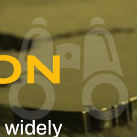

**[Image: f15dba5e-d4bd-46b8-a475-a0b728305ab9.pdf-0004-03.png (225x225, 52.0KB)]**

#### **MISSION** 

Aptech Limited – a trusted, self reliant and widely recognized Indian Brand, with global footprint delivering vocational training, skilling and non-formal education to students, professionals, universities & corporates, aiming to create and foster an ecosystem where youth are skilled, trained and prepared for successful employment or entrepreneurship. 

**[Image: f15dba5e-d4bd-46b8-a475-a0b728305ab9.pdf-0004-06.png (259x84, 13.5KB)]**

I N V E S T O R P R E S E N T A T I O N – Q 4 F Y 2 0 2 6 

3 

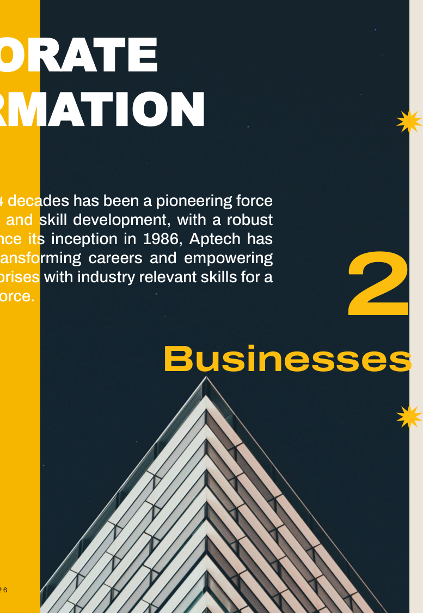

**[Image: f15dba5e-d4bd-46b8-a475-a0b728305ab9.pdf-0005-00.png (777x1125, 476.8KB)]**

<!-- Start of picture text -->
2 Businesses <!-- End of picture text -->

## CORPORATE INFORMATION 

Aptech over the last 4 decades has been a pioneering force in vocational training and skill development, with a robust global presence.  Since its inception in 1986, Aptech has been dedicated to transforming careers and empowering individuals and enterprises with industry relevant skills for a dynamic global workforce. 

**[Image: f15dba5e-d4bd-46b8-a475-a0b728305ab9.pdf-0005-03.png (259x84, 12.6KB)]**

###### Global Retail 

###### (Customer is an individual student) 

Aptech, a homegrown Indian brand has been at the forefront of vocational training and skill-building.  Ever since its commencement in 1986 and with a significant presence globally, Aptech Limited has effectively ventured into diverse sectors ranging from IT training, media & entertainment, virtual production, beauty & wellness, retail & aviation, pre-school segment, amongst others. 

Under Individual Training, Aptech offers career and professional training through its multi-brands- Arena Animation & Maya Academy of Advanced Creativity (MAAC), Lakmē Academy powered by Aptech , Avalon Academy, Aptech Learning, The Virtual Production Academy, ProAlley and Aptech International Pre-school, amongst others. 

###### Institutional Business 

(Customer is an institution/corporation) 

The Institutional Business segment specializes in assessments and testing services. 

With over 2 decades of delivering high-quality, reliable examination and assessment solutions by supporting recruitment and entrance exams for government institutions and autonomous bodies 

I N V E S T O R P R E S E N T A T I O N – Q 4 F Y 2 0 2 6 

4 

**[Image: f15dba5e-d4bd-46b8-a475-a0b728305ab9.pdf-0006-00.png (99x101, 10.0KB)]**

Pan-India presence across 26 states/UTs 570+ operational centers spread across 

173 cities 

**[Image: f15dba5e-d4bd-46b8-a475-a0b728305ab9.pdf-0006-03.png (114x113, 7.0KB)]**

Global footprint of 177+ operational centres across 16 countries 

**[Image: f15dba5e-d4bd-46b8-a475-a0b728305ab9.pdf-0006-05.png (103x103, 13.7KB)]**

**[Image: f15dba5e-d4bd-46b8-a475-a0b728305ab9.pdf-0006-06.png (97x96, 10.2KB)]**

**[Image: f15dba5e-d4bd-46b8-a475-a0b728305ab9.pdf-0006-07.png (14x81, 2.1KB)]**

**[Image: f15dba5e-d4bd-46b8-a475-a0b728305ab9.pdf-0006-08.png (257x14, 6.5KB)]**

40 

Years of Excellence 7.5+ million students worldwide 20+ million tested 

## BOARD OF DIRECTORS (1/2) 

**[Image: f15dba5e-d4bd-46b8-a475-a0b728305ab9.pdf-0007-01.png (205x205, 62.6KB)]**

**[Image: f15dba5e-d4bd-46b8-a475-a0b728305ab9.pdf-0007-02.png (205x205, 47.0KB)]**

**[Image: f15dba5e-d4bd-46b8-a475-a0b728305ab9.pdf-0007-03.png (205x205, 61.7KB)]**

**MR. SIVARAMAKRISHNAN IYER** (Non-Executive Independent Director) 

**MR. NIKHIL DALAL** (Non-Executive Independent Director) 

**MR. AMEET HARIANI** 

(Chairman & Non-Executive Independent Director) 

- ❖ 35+ years of experience in corporate & commercial law, M&A, arbitration, and real estate finance; Solicitor enrolled with Bombay Incorporated Law Society and the Law Society of England & Wales 

- ❖ Chartered Accountant with expertise in corporate finance, M&A & capital structuring 

   - ❖ Managing Director of JBCN Education, a progressive organization operating in the education vertical 

- ❖ Strategic advisor to companies & private investors across investment &  fundraising decisions 

   - ❖ He holds a double major in Finance and Computer Information Technology from the prestigious Carnegie Mellon University in the United States 

- ❖ Founder of Hariani & Co., bringing extensive legal, governance, & board oversight expertise 

**[Image: f15dba5e-d4bd-46b8-a475-a0b728305ab9.pdf-0007-14.png (205x205, 59.3KB)]**

**[Image: f15dba5e-d4bd-46b8-a475-a0b728305ab9.pdf-0007-15.png (207x205, 61.7KB)]**

**[Image: f15dba5e-d4bd-46b8-a475-a0b728305ab9.pdf-0007-16.png (205x205, 51.8KB)]**

**MR. AMIT GOELA** (Non-Executive and Non-Independent Director) 

**MS. VANDANA CHAMARIA** (Non-Executive Independent Director) 

**MR. VISHAL GUPTA** (Non-Executive and Non-Independent Director) 

- ❖ 30+ years of distinguished experience in the Indian financial & securities markets; Leads Investments at Rare Enterprises with expertise in macroeconomics, equity research, M&A, restructuring, and value creation 

   - ❖ Chartered Accountant (since 2009) and MBA from IESE Business School, Barcelona 

- ❖ Former head of Business, Brand and Reputation Marketing at Google India. She currently serves as Group CMO for Blue Tokai 

   - ❖ Executor & Trustee of Late Mr. Rakesh Jhunjhunwala’s Estate, actively involved in estate management and associated philanthropic initiatives at Rare Family Foundation 

- ❖ Brings deep expertise in marketing, brand building and digital ecosystems 

- ❖ MBA in Finance (University of North Florida) with significant international experience, bringing a global perspective to investment strategy 

**[Image: f15dba5e-d4bd-46b8-a475-a0b728305ab9.pdf-0007-26.png (259x84, 12.4KB)]**

**[Image: f15dba5e-d4bd-46b8-a475-a0b728305ab9.pdf-0007-27.png (207x205, 54.3KB)]**

**MR. RONNIE TALATI** (Non-Executive Independent Director) 

- ❖ Former Senior Leader at Titan; built Fastrack into a leading youth brand 

- ❖ Strong expertise in branding, marketing & consumer business scaling 

**[Image: f15dba5e-d4bd-46b8-a475-a0b728305ab9.pdf-0007-31.png (205x205, 55.9KB)]**

**MR. RAJIV AGARWAL** (Non-Executive and Non-Independent Director) 

- ❖ Graduated as a Chemical Engineer (IIT BHU, 1993) with deep expertise in investment strategy, multi-sector exposure, and board-level advisory experience 

   - Manages strategic investments for Rare Enterprises, Rekha Jhunjhunwala, and Rare Trusts, with responsibility for investment and risk management 

- ❖ 

6 

I N V E S T O R P R E S E N T A T I O N – Q 4 F Y 2 0 2 6 

## MANAGEMENT TEAM (2/2) 

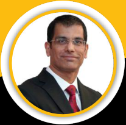

**[Image: f15dba5e-d4bd-46b8-a475-a0b728305ab9.pdf-0008-01.png (207x205, 49.8KB)]**

**[Image: f15dba5e-d4bd-46b8-a475-a0b728305ab9.pdf-0008-02.png (205x205, 43.8KB)]**

**[Image: f15dba5e-d4bd-46b8-a475-a0b728305ab9.pdf-0008-03.png (205x205, 37.9KB)]**

**MR. SANDIP WELING** 

**MR. NEERAJ MALIK** 

###### **MR. PAWAN NAWAL** 

   - ❖ Chief Financial Officer 

- ❖ Whole-time Director & CBO (Global Retail) 

- ❖ Whole-time Director & CBO (Institutional Business) 

   - ❖ 25+ years across IT, consumer, telecommunication & digital service companies 

- ❖ 32+ years in consumer, franchise and distribution-led businesses 

- ❖ 24+ years across IT, enterprise solutions and B2B platforms 

   - ❖ Oversees financial discipline, capital allocation, controls & compliance 

- ❖ Drives retail growth and scalability 

- ❖ Leads institutional Business & enterprise  skilling initiatives 

**[Image: f15dba5e-d4bd-46b8-a475-a0b728305ab9.pdf-0008-16.png (259x84, 12.4KB)]**

**[Image: f15dba5e-d4bd-46b8-a475-a0b728305ab9.pdf-0008-17.png (205x205, 54.1KB)]**

###### **MR. SHOURYA K. CHAKRAVARTY** 

- ❖ ChiefHuman Resources Officer 

- ❖ 30+ years across IT, ITeS, FMCG, Education 

- ❖ Leads People Strategy, Leadership Development, Culture, Career Services & Development 

7 

I N V E S T O R P R E S E N T A T I O N – Q 4 F Y 2 0 2 6 

### CORPORATE HOLDING STRUCTURE 

**[Image: f15dba5e-d4bd-46b8-a475-a0b728305ab9.pdf-0009-01.png (14x81, 1.1KB)]**

**[Image: f15dba5e-d4bd-46b8-a475-a0b728305ab9.pdf-0009-02.png (257x14, 3.9KB)]**

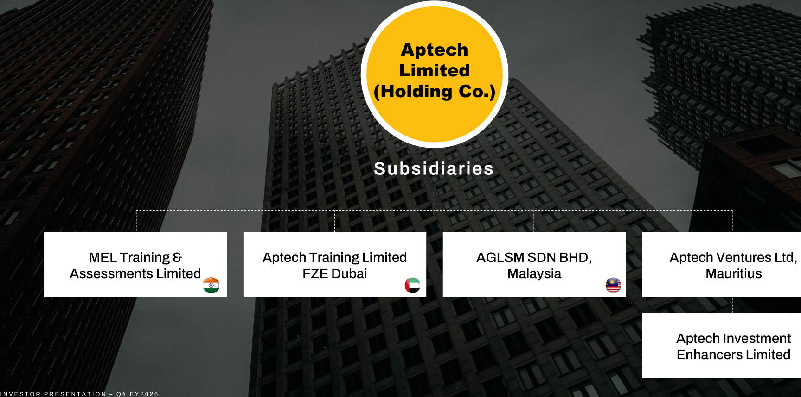

**[Image: f15dba5e-d4bd-46b8-a475-a0b728305ab9.pdf-0009-03.png (1727x858, 1330.2KB)]**

<!-- Start of picture text -->
Aptech Limited (Holding Co.) Subsidiaries MEL Training &  Aptech Training Limited  AGLSM SDN BHD,  Aptech Ventures Ltd, Assessments Limited FZE Dubai Malaysia Mauritius Aptech Investment Enhancers Limited I N V E S T O R P R E S E N T A T I O N – Q 4 F Y 2 0 2 6 <!-- End of picture text -->

**[Image: f15dba5e-d4bd-46b8-a475-a0b728305ab9.pdf-0009-04.png (37x38, 2.6KB)]**

**[Image: f15dba5e-d4bd-46b8-a475-a0b728305ab9.pdf-0009-05.png (37x38, 2.7KB)]**

8 

## REVENUE MODEL 

**[Image: f15dba5e-d4bd-46b8-a475-a0b728305ab9.pdf-0010-01.png (14x81, 0.7KB)]**

**[Image: f15dba5e-d4bd-46b8-a475-a0b728305ab9.pdf-0010-02.png (257x14, 3.9KB)]**

###### **Retail delivers scalable, annuity-style growth Institutional provides diversification and downside protection** 

|Parameters|Retail Segment (B2C)|Institutional Segment (B2B / B2G)|
|---|---|---|
|Revenue Source|Course fees, startup / renewal fees, training revenue|Assessment fees, training & certification contracts|
|Revenue Nature|Enrolment-driven, repeat intakes|Project / contract-based|
|Pricing Power|Moderate (higher in  Overseas)|Depends on contract mix|
|Margin Profile|Higher operating leverage|Margin varies by project|
|Cost Structure|Asset-light, business partnered expansion|Execution-focused, lower marketing cost|
|Cash Flow Visibility|High with stable business partner base|Linked to contract execution cycle|
|Scalability|High via franchise additions|Moderate, execution bandwidth dependent|
|Risk Factors|Enrolment slowdown, franchise ROI stress, Slower adoption to newer courses|Client concentration, contract renewals|
|Contribution to Consolidated|Drives growth and valuation via scalable enrolments|Provides revenue visibility through a diversified mix of|
|Business|and brand-led demand|institutional contracts|

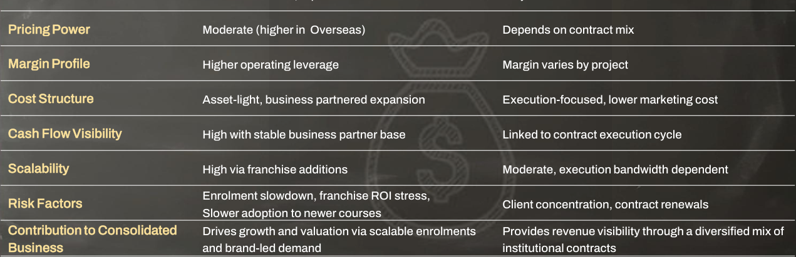

**[Image: f15dba5e-d4bd-46b8-a475-a0b728305ab9.pdf-0010-05.png (1271x412, 245.3KB)]**

<!-- Start of picture text -->
Pricing Power Moderate (higher in  Overseas) Depends on contract mix Margin Profile Higher operating leverage Margin varies by project Cost Structure Asset-light, business partnered expansion Execution-focused, lower marketing cost Cash Flow Visibility High with stable business partner base Linked to contract execution cycle Scalability High via franchise additions Moderate, execution bandwidth dependent Enrolment slowdown, franchise ROI stress, Risk Factors Client concentration, contract renewals Slower adoption to newer courses Contribution to Consolidated  Drives growth and valuation via scalable enrolments  Provides revenue visibility through a diversified mix of Business and brand-led demand institutional contracts <!-- End of picture text -->

9 

I N V E S T O R P R E S E N T A T I O N – Q 4 F Y 2 0 2 6 

**[Image: f15dba5e-d4bd-46b8-a475-a0b728305ab9.pdf-0011-00.png (1462x176, 26.1KB)]**

<!-- Start of picture text -->
BRAND PORTFOLIO TIMELINE BRAND PORTFOLIO TIMELINE <!-- End of picture text -->

###### **Overseas:  No** 

###### **Overseas:  Yes** 

###### **Overseas:  No** 

###### **Overseas:  No** 

Brand: Aptech English Learning 

Brand: Aptech Aviation Academy 

Brand : Aptech Computer 

Brand: Lakmé Academy Powered by Aptech (In Alliance with Lakmé Lever Private Limited) 

1986 

1996 2006 2007 2009 2010 

2015 2016 

**[Image: f15dba5e-d4bd-46b8-a475-a0b728305ab9.pdf-0011-12.png (14x81, 0.6KB)]**

**[Image: f15dba5e-d4bd-46b8-a475-a0b728305ab9.pdf-0011-13.png (257x14, 4.1KB)]**

###### **Overseas:  No** 

Brand: The Virtual Production 

###### 2023 

###### **Overseas:  Yes** 

Brand: Arena Animation 

###### **Overseas:  Yes** 

###### **Overseas:  Yes** 

Brand: Aptech Hardware and Brand: MAAC 

###### **Overseas:  No** 

Brand: Aptech International Preschool 

**BRANDS:** 

**[Image: f15dba5e-d4bd-46b8-a475-a0b728305ab9.pdf-0011-25.png (197x74, 16.2KB)]**

**[Image: f15dba5e-d4bd-46b8-a475-a0b728305ab9.pdf-0011-26.png (199x74, 13.1KB)]**

**[Image: f15dba5e-d4bd-46b8-a475-a0b728305ab9.pdf-0011-27.png (196x72, 9.0KB)]**

**[Image: f15dba5e-d4bd-46b8-a475-a0b728305ab9.pdf-0011-28.png (224x99, 21.1KB)]**

**[Image: f15dba5e-d4bd-46b8-a475-a0b728305ab9.pdf-0011-29.png (199x76, 11.7KB)]**

**[Image: f15dba5e-d4bd-46b8-a475-a0b728305ab9.pdf-0011-30.png (197x72, 15.6KB)]**

**[Image: f15dba5e-d4bd-46b8-a475-a0b728305ab9.pdf-0011-31.png (203x76, 17.9KB)]**

**[Image: f15dba5e-d4bd-46b8-a475-a0b728305ab9.pdf-0011-32.png (199x72, 5.6KB)]**

## DOMESTIC FOOTPRINT 

|**Brand-wise Presence**|**# of Centres**|**# of States and UTs**|**# of Cities / Towns**|
|---|---|---|---|
|Arena Animation|169|24|93|
|Lakmé Academy Powered by Aptech (LAPA)|172|25|105|
|Maya Academy of Advanced Creativity (MAAC)|136|23|70|
|Aptech Learning|66|17|37|
|Aptech International Pre-school|15|9|9|
|Aptech Aviation|12|9|11|
|**Total**|**570**|**26**|**173**|

|No of Centres|570 Domestic Centres|
|---|---|
|Tier - 1 Cities|47%|
|Tier - 2 Cities|34%|
|Tier - 3 & 4 Cities|19%|

**[Image: f15dba5e-d4bd-46b8-a475-a0b728305ab9.pdf-0012-03.png (259x84, 12.6KB)]**

**[Image: f15dba5e-d4bd-46b8-a475-a0b728305ab9.pdf-0012-04.png (620x661, 330.9KB)]**

_*Status as on 31__st_ _March 2026_ 

I N V E S T O R P R E S E N T A T I O N – Q 4 F Y 2 0 2 6 

11 

## INTERNATIONAL FOOTPRINT 

**[Image: f15dba5e-d4bd-46b8-a475-a0b728305ab9.pdf-0013-01.png (259x84, 12.6KB)]**

|Brand-wise Presence|# of Centres|# of Countries|||||
|---|---|---|---|---|---|---|
|Aptech Learning / ACE|100|15|||||
|Arena Multimedia|66|10|||||
|Aptech English Aptech Networking Maya Academy of Advanced Creativity(MAAC)|4 6 1|4 4 1|||||
|Total|177||||||
|Region|# of Centres|# of Countries|||||
|Africa|81|6||||**Top Continent**|
|Asia|35|1|**Nigeria**|**Egypt**|**Swaziland**| **in terms #**|
|Middle East SAARC (ex. India)|10 51|5 4||||**of Countries:** **Africa**|
|Total|177|16|**Kenya**|**Uganda**|**Zambia**||

_*Status as on 31__st_ _March 2026_ 

I N V E S T O R P R E S E N T A T I O N – Q 4 F Y 2 0 2 6 

12 

## INTERNATIONAL MARKET-WISE EXPANSION STRATEGY & INVESTMENT APPROACH 

**[Image: f15dba5e-d4bd-46b8-a475-a0b728305ab9.pdf-0014-01.png (259x84, 12.6KB)]**

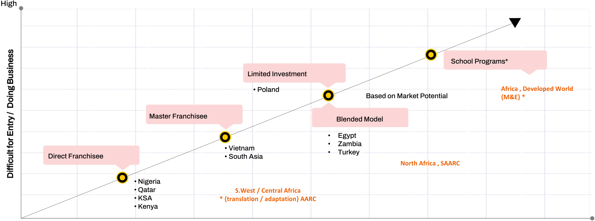

**[Image: f15dba5e-d4bd-46b8-a475-a0b728305ab9.pdf-0014-02.png (1783x664, 100.3KB)]**

<!-- Start of picture text -->
High School Programs* Limited Investment • Poland Africa , Developed World Based on Market Potential {M&E} * Master Franchisee Blended Model • Egypt • Zambia • Vietnam • Turkey Direct Franchisee • South Asia North Africa , SAARC •  Nigeria •  Qatar S.West / Central Africa •  KSA * {translation / adaptation} AARC •  Kenya Difficult for Entry /  Doing Business <!-- End of picture text -->

Low 

High 

Investment 

13 13 

I N V E S T O R P R E S E N T A T I O N – Q 4 F Y 2 0 2 6 

## COUNTRYWISE – CORE BUSINESS & POSITIONING 

**[Image: f15dba5e-d4bd-46b8-a475-a0b728305ab9.pdf-0015-01.png (259x84, 12.6KB)]**

###### VIETNAM 

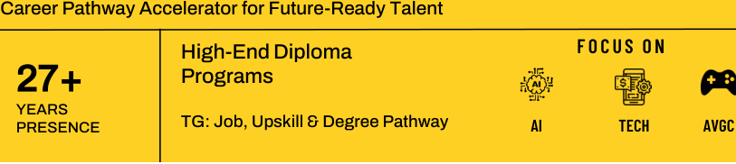

**[Image: f15dba5e-d4bd-46b8-a475-a0b728305ab9.pdf-0015-03.png (813x182, 24.9KB)]**

<!-- Start of picture text -->
Career Pathway Accelerator for Future-Ready Talent High-End Diploma  F OCUS ON 27+  Programs YEARS PRESENCE  TG: Job, Upskill & Degree Pathway  AI TECH AVGC <!-- End of picture text -->

**[Image: f15dba5e-d4bd-46b8-a475-a0b728305ab9.pdf-0015-04.png (42x43, 1.2KB)]**

###### SAARC 

Professional Skill Accelerator + Employability Edge 

Leading TECH Institute with Industry-Linked Programs & 26+ Placement Focus YEARS PRESENCE TG: Employability, Upskill, High School Equivalence 

###### NIGERIA 

Gateway to Global Careers & Tech Mobility High-Value International Pathways 27+ Tech Programs **+** Programs YEARS PRESENCE TG: Job, Upskill & Degree Pathway 

###### EGYPT 

Structured Skill Development within Institutional Ecosystem University-Affiliated Academic-Integrated Delivery Model 10+ YEARS TG: Mandatory Program for MBBS, BDMS by Govt. of Egypt. PRESENCE 

**[Image: f15dba5e-d4bd-46b8-a475-a0b728305ab9.pdf-0015-12.png (18x162, 0.7KB)]**

###### QATAR 

Career Catalyst for Expats & Nationals 

> Job **+** International Degree 33+ Oriented Programs Pathways YEARS PRESENCE TG: Govt. Job, Upskill & Degree Pathway 

**[Image: f15dba5e-d4bd-46b8-a475-a0b728305ab9.pdf-0015-16.png (57x57, 0.1KB)]**

ROW (Kenya, Uganda, Bahrain, Eswatini, Bangladesh) 

**[Image: f15dba5e-d4bd-46b8-a475-a0b728305ab9.pdf-0015-18.png (959x157, 20.3KB)]**

<!-- Start of picture text -->
Accessible Global Tech Education Platform PREMIUM Tech & Creative Vocational  International Degree + Education Provider Pathway TG: Job, Upskill & Degree Pathway <!-- End of picture text -->

14 

I N V E S T O R P R E S E N T A T I O N – Q 4 F Y 2 0 2 6 

STRATEGY UPDATE 

## INSTITUTIONAL BUSINESS (EBG) 

**[Image: f15dba5e-d4bd-46b8-a475-a0b728305ab9.pdf-0016-02.png (259x84, 12.6KB)]**

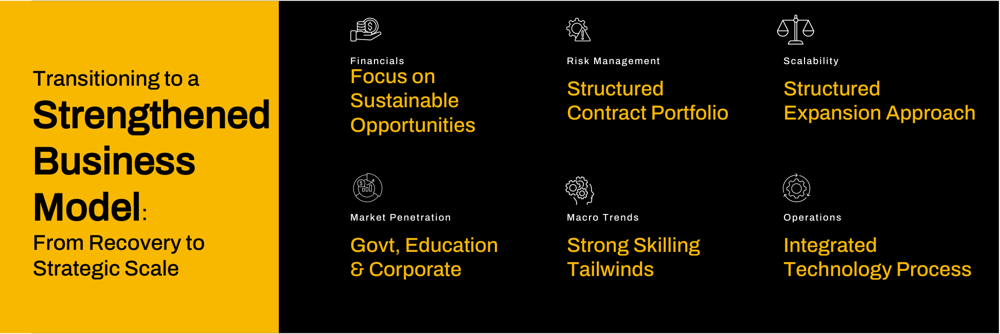

**[Image: f15dba5e-d4bd-46b8-a475-a0b728305ab9.pdf-0016-03.png (1944x651, 93.1KB)]**

<!-- Start of picture text -->
Financials Risk Management Scalability Transitioning to a  Focus on Structured  Structured Sustainable Contract Portfolio Expansion Approach Strengthened  Opportunities Business Model :  Market Penetration Macro Trends Operations From Recovery to  Govt, Education Strong Skilling Integrated Strategic Scale & Corporate Tailwinds Technology Process <!-- End of picture text -->

Recovery Phase 

Stability Quality Growth 

**[Image: f15dba5e-d4bd-46b8-a475-a0b728305ab9.pdf-0016-06.png (1157x86, 8.7KB)]**

<!-- Start of picture text -->
STABLE STRUCTURED STRATEGIC <!-- End of picture text -->

**[Image: f15dba5e-d4bd-46b8-a475-a0b728305ab9.pdf-0016-07.png (244x235, 10.7KB)]**

**[Image: f15dba5e-d4bd-46b8-a475-a0b728305ab9.pdf-0016-08.png (293x57, 5.7KB)]**

<!-- Start of picture text -->
LONG -TERM VALUE CREATION <!-- End of picture text -->

15 

I N V E S T O R P R E S E N T A T I O N – Q 4 F Y 2 0 2 6 

###### STRATEGIC OUTCOME 

## WAY FORWARD – SUSTAINABLE & DE-RISKED GROWTH 

**[Image: f15dba5e-d4bd-46b8-a475-a0b728305ab9.pdf-0017-02.png (259x84, 12.6KB)]**

- Testing + Training ❖ Enterprise capability ❖ Scalable partnerships 

**[Image: f15dba5e-d4bd-46b8-a475-a0b728305ab9.pdf-0017-04.png (53x55, 1.2KB)]**

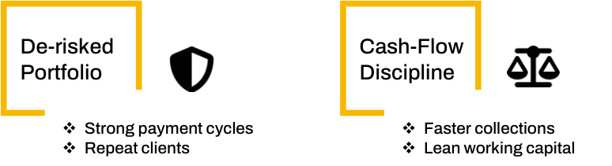

**[Image: f15dba5e-d4bd-46b8-a475-a0b728305ab9.pdf-0017-05.png (774x211, 22.5KB)]**

<!-- Start of picture text -->
De-risked Cash-Flow Portfolio Discipline ❖ Strong payment cycles ❖ Faster collections ❖ Repeat clients ❖ Lean working capital <!-- End of picture text -->

Institutional Biz : Capability Moat Long-Term Capability Partner 

- ❖ Technology-Assisted Evaluation 

- ❖ Technology platforms 

- ❖ Algorithm led question banks 

**[Image: f15dba5e-d4bd-46b8-a475-a0b728305ab9.pdf-0017-10.png (650x674, 210.6KB)]**

16 

I N V E S T O R P R E S E N T A T I O N – Q 4 F Y 2 0 2 6 

## BUSINESS MOAT 

**[Image: f15dba5e-d4bd-46b8-a475-a0b728305ab9.pdf-0018-01.png (257x81, 12.6KB)]**

**[Image: f15dba5e-d4bd-46b8-a475-a0b728305ab9.pdf-0018-02.png (132x45, 4.8KB)]**

**Mo** **<mark>at Differentiato</mark> rs A** **<mark>ptech’s Brand Positionin</mark> g Delivery** Integrated PHYGITAL ecosystem combining centres, **Model** digital learning, mentorship and practical execution **Strategic** Career-oriented skilling, employability and industry- **Focus** linked outcomes **Expansion** Asset-light partner-led expansion with disciplined **Model** scaling **Revenue** Diversified revenues across retail, institutional and **Profile** international business **Student** Physical interaction, mentorship, placements and **Engagement** blended learning support retention **Capital** Lower capex intensity with scalable operating **Efficiency** leverage **Competitive** Strong brand legacy, centre network, industry **Positioning** partnerships and workforce skilling relevance 

**<mark>New-Age EdTech Peers</mark>** Primarily digital-first learning platforms 

Academic, test-prep and content-led learning 

Marketing-led customer acquisition driven scaling 

Predominantly student subscription-led revenues Content engagement and educator-led stickiness Higher platform investment and acquisition costs Strong digital reach and online content scale 

17 

## KEY STRENGTHS / TAILWINDS 

**[Image: f15dba5e-d4bd-46b8-a475-a0b728305ab9.pdf-0019-01.png (926x187, 72.0KB)]**

<!-- Start of picture text -->
Strategic  Directional Area Tailwinds <!-- End of picture text -->

**[Image: f15dba5e-d4bd-46b8-a475-a0b728305ab9.pdf-0019-02.png (14x15, 0.3KB)]**

Launch of next-gen creator economy programs under MAAC & Arena Animation covering video creation, GenAI-driven content, personal branding & monetization. 

Aligned with “Create in India, Create for the World”, positioning Aptech to benefit from the fast-growing Orange Economy and global creator ecosystem. 

**Future-Ready Creator &Digital Skills** 

**[Image: f15dba5e-d4bd-46b8-a475-a0b728305ab9.pdf-0019-06.png (61x20, 1.5KB)]**

**[Image: f15dba5e-d4bd-46b8-a475-a0b728305ab9.pdf-0019-07.png (63x20, 1.4KB)]**

PHYGITAL model (physical centres supported by digital delivery) enabling lowcapex scale across Tier-3 and rural India. 

Global  expansion  initiatives,  including engagement at the Vietnam–India Business Forum (FY25). 

**Geographic &** 

**[Image: f15dba5e-d4bd-46b8-a475-a0b728305ab9.pdf-0019-11.png (61x20, 1.1KB)]**

**[Image: f15dba5e-d4bd-46b8-a475-a0b728305ab9.pdf-0019-12.png (61x20, 1.5KB)]**

**Market Expansion** 

Virtual Production Academy launched with programs in immersive media, real-time 3D, and GenAI. 

Enhances vocational relevance by aligning courses with next-gen content creation technologies. 

###### **Innovation-Led** 

**[Image: f15dba5e-d4bd-46b8-a475-a0b728305ab9.pdf-0019-17.png (62x20, 1.3KB)]**

**[Image: f15dba5e-d4bd-46b8-a475-a0b728305ab9.pdf-0019-18.png (61x20, 1.1KB)]**

**Curriculum** 

Structured CSAT (Customer Satisfaction) framework implemented across all brands to improve learner satisfaction, retention and referrals. 

Real-time dashboards and monthly surveys ensure continuous performance monitoring. 

**Customer-Centric Execution (CSAT-Driven)** 

**[Image: f15dba5e-d4bd-46b8-a475-a0b728305ab9.pdf-0019-23.png (62x20, 1.2KB)]**

**[Image: f15dba5e-d4bd-46b8-a475-a0b728305ab9.pdf-0019-24.png (61x20, 1.2KB)]**

3-year collaboration with NFDC - National Film Development Corporation of India (under Ministry of Information & Broadcasting, GoI) to develop industry-ready talent for the creative economy. 

Expanding growth engines in AVGC and Media and Entertainment through strategic institutional partnerships. 

**New Growth Engines & Strategic Partnerships** 

**[Image: f15dba5e-d4bd-46b8-a475-a0b728305ab9.pdf-0019-28.png (62x19, 1.2KB)]**

**[Image: f15dba5e-d4bd-46b8-a475-a0b728305ab9.pdf-0019-29.png (61x19, 1.3KB)]**

**[Image: f15dba5e-d4bd-46b8-a475-a0b728305ab9.pdf-0019-30.png (61x19, 1.2KB)]**

**[Image: f15dba5e-d4bd-46b8-a475-a0b728305ab9.pdf-0019-31.png (259x84, 12.9KB)]**

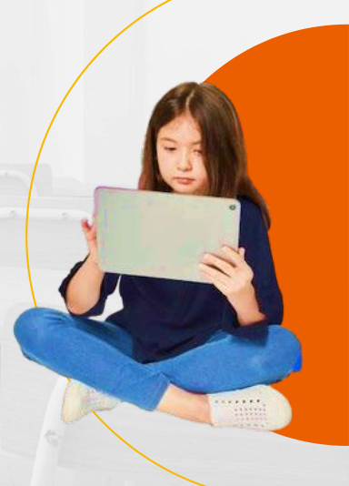

**[Image: f15dba5e-d4bd-46b8-a475-a0b728305ab9.pdf-0019-32.png (384x534, 195.4KB)]**

Enterprise-wide AI Charter introduced to integrate Generative AI across training programs. 

18 

I N V E S T O R P R E S E N T A T I O N – Q 4 F Y 2 0 2 6 

## ROADMAP-TO-OUTCOME TRANSLATION 

**[Image: f15dba5e-d4bd-46b8-a475-a0b728305ab9.pdf-0020-01.png (259x84, 12.8KB)]**

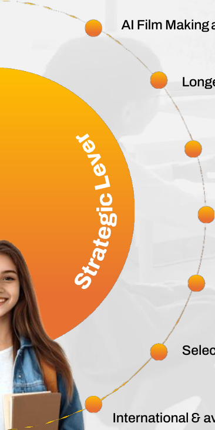

**[Image: f15dba5e-d4bd-46b8-a475-a0b728305ab9.pdf-0020-02.png (366x732, 129.6KB)]**

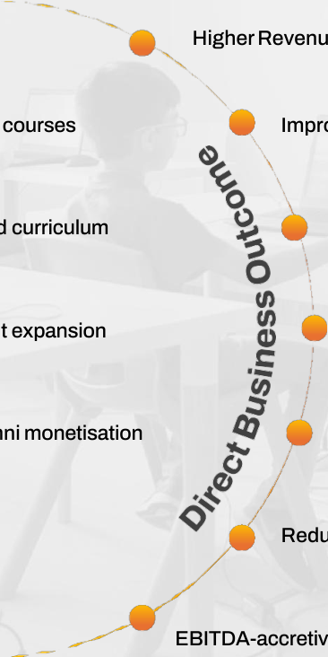

**[Image: f15dba5e-d4bd-46b8-a475-a0b728305ab9.pdf-0020-03.png (366x732, 91.8KB)]**

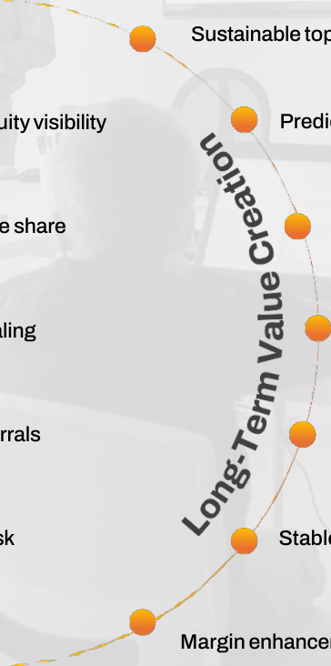

**[Image: f15dba5e-d4bd-46b8-a475-a0b728305ab9.pdf-0020-04.png (364x732, 72.0KB)]**

AI Film Making and Story Telling HigherRevenue per Student (ARPU) Longer-duration, career-oriented courses Improvedorder book & annuityvisibility Centralised content & AI-led curriculum HigherAptechrevenue share Franchise-led, asset-light expansion Low capex, fast scaling CSAT-led execution& alumni monetisation Better retention& referrals Selective institutionalcontracts Reduced volatility& legal risk International & aviation-focusedexpansion EBITDA-accretive growth 

Sustainable topline growth Predictable cash flows Marginexpansion HigherROCE & FCF conversion Lower acquisition cost, higher LTV Stable earnings profile Margin enhancement& diversification 

19 

I N V E S T O R P R E S E N T A T I O N – Q 4 F Y 2 0 2 6 

## INVESTMENT RATIONALE 

Aptech’s brand-led, franchise-driven model enables scalable growth with minimal capital deployment, delivering high operating leverage, RoCE, strong free cash flow generation, and resilience across cycles. 

With long-standing brands such as Aptech Learning, Arena Animation, MAAC, and Aptech Aviation, the company enjoys high recall and trustcreating a durable entry barrier in vocational education where outcomes and credibility matter. 

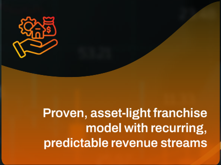

**[Image: f15dba5e-d4bd-46b8-a475-a0b728305ab9.pdf-0021-03.png (441x330, 68.6KB)]**

<!-- Start of picture text -->
- Proven, asset light franchise model with recurring, predictable revenue streams <!-- End of picture text -->

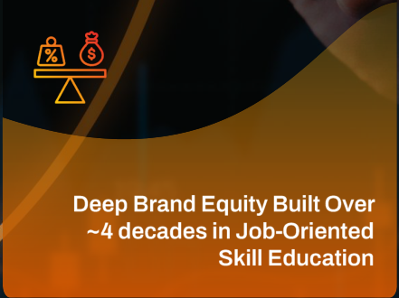

**[Image: f15dba5e-d4bd-46b8-a475-a0b728305ab9.pdf-0021-04.png (441x330, 93.0KB)]**

<!-- Start of picture text -->
Deep Brand Equity Built Over ~4 decades in Job -Oriented Skill Education <!-- End of picture text -->

Launch of India’s first holistic end-toend Virtual Production Academy and Gen-AI aligned programs demonstrates management’s ability to refresh offerings proactively, future-proofing the business and mitigating course obsolescence risk. 

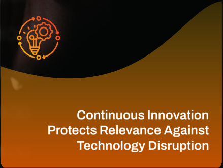

**[Image: f15dba5e-d4bd-46b8-a475-a0b728305ab9.pdf-0021-06.png (439x330, 49.8KB)]**

<!-- Start of picture text -->
Continuous Innovation Protects Relevance Against Technology Disruption <!-- End of picture text -->

**[Image: f15dba5e-d4bd-46b8-a475-a0b728305ab9.pdf-0021-07.png (14x81, 0.5KB)]**

**[Image: f15dba5e-d4bd-46b8-a475-a0b728305ab9.pdf-0021-08.png (257x14, 3.3KB)]**

Debt-free balance sheet, high EBITDAto-cash conversion, no promoter pledging, conservative capital allocation, and absence of unrelated diversification position Aptech as a rare, governance-clean compounder in the educational and vocational training space. 

**[Image: f15dba5e-d4bd-46b8-a475-a0b728305ab9.pdf-0021-10.png (439x330, 26.2KB)]**

<!-- Start of picture text -->
Strong Governance, Cash Discipline, and Low Downside Risk <!-- End of picture text -->

**Blending physical trust with digital scale while moving up the skilling value chain** 

20 

I N V E S T O R P R E S E N T A T I O N – Q 4 F Y 2 0 2 6 

### MAAC & ARENA ANIMATION Preparing Next-Gen for Future Creative Careers 

**[Image: f15dba5e-d4bd-46b8-a475-a0b728305ab9.pdf-0022-01.png (832x119, 65.8KB)]**

<!-- Start of picture text -->
Emerging Media filmmaking, and digital content creation programsAI integrated across animation, VFX, gaming,  06 Technologies <!-- End of picture text -->

**[Image: f15dba5e-d4bd-46b8-a475-a0b728305ab9.pdf-0022-02.png (484x119, 36.6KB)]**

<!-- Start of picture text -->
Exposure to virtual production trends, immersive content, and next-generation media workflows <!-- End of picture text -->

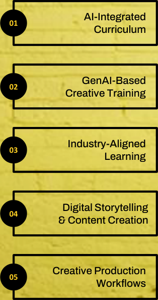

**[Image: f15dba5e-d4bd-46b8-a475-a0b728305ab9.pdf-0022-03.png (314x593, 172.8KB)]**

<!-- Start of picture text -->
AI-Integrated 01 Curriculum GenAI-Based 02 Creative Training Industry-Aligned 03 Learning Digital Storytelling 04 & Content Creation Creative Production 05 Workflows <!-- End of picture text -->

**[Image: f15dba5e-d4bd-46b8-a475-a0b728305ab9.pdf-0022-04.png (832x119, 63.9KB)]**

<!-- Start of picture text -->
Training in AI image/video generation, AI audio  Balanced Learning creation, and AI-assisted content workflows 07 Model <!-- End of picture text -->

**[Image: f15dba5e-d4bd-46b8-a475-a0b728305ab9.pdf-0022-05.png (484x119, 27.2KB)]**

<!-- Start of picture text -->
Combines AI-enabled workflows with core creative fundamentals and artistic thinking <!-- End of picture text -->

**[Image: f15dba5e-d4bd-46b8-a475-a0b728305ab9.pdf-0022-06.png (832x119, 72.2KB)]**

<!-- Start of picture text -->
Exposure to real-time production, virtual Enhanced Student production, film, gaming, VFX, advertising, and  08 Outcomes creator economy ecosystems <!-- End of picture text -->

**[Image: f15dba5e-d4bd-46b8-a475-a0b728305ab9.pdf-0022-07.png (484x119, 33.9KB)]**

<!-- Start of picture text -->
Improves creativity, productivity, presentation capability, and employability across digital industries <!-- End of picture text -->

**[Image: f15dba5e-d4bd-46b8-a475-a0b728305ab9.pdf-0022-08.png (832x117, 77.6KB)]**

<!-- Start of picture text -->
Focus on storytelling, concept design,  Expanding Career storyboard creation, and modern digital  09 Opportunities presentation techniques <!-- End of picture text -->

**[Image: f15dba5e-d4bd-46b8-a475-a0b728305ab9.pdf-0022-09.png (484x117, 31.2KB)]**

<!-- Start of picture text -->
Enables careers across OTT, animation, VFX, gaming, advertising, broadcast, and digital media sectors <!-- End of picture text -->

**[Image: f15dba5e-d4bd-46b8-a475-a0b728305ab9.pdf-0022-10.png (832x117, 84.4KB)]**

<!-- Start of picture text -->
Students trained on industry-style creative  Strategic Growth pipelines and practical project execution 10 Vision <!-- End of picture text -->

**[Image: f15dba5e-d4bd-46b8-a475-a0b728305ab9.pdf-0022-11.png (484x117, 34.4KB)]**

<!-- Start of picture text -->
Building industry-ready creative talent aligned with global AVGC, GenAI, and creator economy demand <!-- End of picture text -->

**[Image: f15dba5e-d4bd-46b8-a475-a0b728305ab9.pdf-0022-12.png (259x84, 14.9KB)]**

21 

I N V E S T O R P R E S E N T A T I O N – Q 4 F Y 2 0 2 6 

## INDUSTRY OUTLOOK 

**[Image: f15dba5e-d4bd-46b8-a475-a0b728305ab9.pdf-0023-01.png (259x84, 12.5KB)]**

|**Industry Segment**|
|---|

**[Image: f15dba5e-d4bd-46b8-a475-a0b728305ab9.pdf-0023-03.png (88x88, 3.5KB)]**

###### **Media & Entertainmentt (M&E)** 

**[Image: f15dba5e-d4bd-46b8-a475-a0b728305ab9.pdf-0023-05.png (78x88, 1.6KB)]**

**Key Industry Stats Forward IndustryOutlook Aptech Capability & Positioning** The Indian beauty and personal care Employment-led growth driven by Aptech’s Lakmé Academy Powered by market was valued at USD 28 billion premiumization, digital marketing, AI/AR Aptech (LAPA) is a key segment, in2024 and is expected to grow at a adoption and influencer ecosystems addressing the beauty and wellness CAGR of 5.6% to USD 48.3 billion by supports steady long-term skill demand. skilling market, aligned with its short- 

The Indian beauty and personal care market was valued at USD 28 billion in2024 and is expected to grow at a CAGR of 5.6% to USD 48.3 billion by 2033. Indian M&E industry stood at ₹2.5 trillion in 2024 and is expected to reach ₹3.07 trillion by 2027, with digital media now contributing 32% of total revenues. 

Aptech’s Lakmé Academy Powered by Aptech (LAPA) is a key segment, addressing the beauty and wellness skilling market, aligned with its shortcycle, employability-focused training model. Arena Animation and MAAC are aligned to digital-first content creation skills, enabling Aptech to stay relevant as media consumption formats evolve. 

Consumption is structurally shifting toward digital platforms, driving sustained demand for digitally skilled creative talent despite stagnation in traditional media. 

###### **AVGC / Animation / VFX** 

**[Image: f15dba5e-d4bd-46b8-a475-a0b728305ab9.pdf-0023-11.png (86x86, 4.5KB)]**

AVGC revenuesdeclined 9% in 2024 to ₹103 billion due to global commissioning slowdown but are expected to recover at a 12.5% CAGR to ₹147 billion by 2027. 

Growth is driven by gig-based employment, AI-led content creation, short-form platforms and immersive technologies such as virtual production and 3D design 

The segment is undergoingshort-term cyclical correctionbut retains strong longterm structural potential driven by immersive media, localization& experiential content. 

Union Budget 2026–27 allocated ₹250 crore to develop AVGC talent, including creator labs in 15,000schools and 500 colleges under the “Create in India“ initiative. 

Aptech continuesto strengthen core AVGC capabilities through Arena and MAAC, with curriculumaligned to emerging formats such as OTT, high-end VFX and immersive media. 

**Educational Skilling & Assessment** 

**[Image: f15dba5e-d4bd-46b8-a475-a0b728305ab9.pdf-0023-18.png (86x84, 4.3KB)]**

India’s test preparation market is projected to grow at ~6.7% CAGR (2025–30), creating an opportunity driven by rising competitive exam intensity and increasing student enrollments 

Structural demand driven by demographics, employability gaps and government-backed skilling initiatives, with increasing focus on AI, manufacturing and job-aligned training. 

Aptech’s core focus on skill training and assessments in the institutional segment is closely aligned with both government and private sector skilling demand, backed by strong training and assessment capabilities. 

22 

I N V E S T O R P R E S E N T A T I O N – Q 4 F Y 2 0 2 6 

## FINANCIAL PERFORMANCE 

**[Image: f15dba5e-d4bd-46b8-a475-a0b728305ab9.pdf-0024-01.png (259x84, 12.6KB)]**

|**Particulars (INR Lakhs)**|**Q4 FY'26**|**Q3 FY'26**|**Q4 FY’25**|**H2 FY'26**|**H2 FY'25**|**YoY%***|**FY'26**|**FY'25**|**YoY%***|
|---|---|---|---|---|---|---|---|---|---|
|**Revenue from Operations**|**11,100**|**13,711**|**11,869**|**24,811**|**22,890**|**8%**|**50,343**|**46,010**|**9%**|
|Less: Operating expenses|10,809|12,348|11,091|23,157|21,467|8%|47,191|43,111|**9%**|
|**EBITDA**|**292**|**1,363**|**778**|**1,655**|**1,423**|**16%**|**3,151**|**2,899**|**9%**|
|EBITDA Margin (%)|2.63%|9.94%|6.56%|6.67%|6.21%|+45 bps|6.26%|6.30%|-4 bps|
|Add: Other Income|394|331|360|726|808|-10%|1,636|1,601|2%|
|Less: Depreciation|193|204|194|397|411|-3%|804|853|-6%|
|**Profit Before Interest, Tax & Exceptional** **Items**|**493**|**1,490**|**944**|**1,984**|**1,820**|**9%**|**3,983**|**3,647**|**9%**|
|Less: Interest|32|41|13|73|46|57%|181|97|87%|
|**Profit Before Tax**|**461**|**1,450**|**930**|**1,911**|**1,773**|**8%**|**3,802**|**3,550**|**7%**|
|Less: Tax (Current + Deferred)|283|353|435|636|935|-32%|1,189|1,567|-24%|
|**Net Profit (excl. extra ord)**|**178**|**1,096**|**495**|**1,274**|**838**|**52%**|**2,613**|**1,984**|**32%**|
|Net Profit Margin (%) (excl. extra ord)|1.61%|8.00%|4.17%|5.14%|3.66%|+147 bps|5.19%|4.31%|+88 bps|
|Exceptional Items|-|240|1|240|-14|-|260|76|-|
|**Net Profit (Reported)**|**178**|**856**|**494**|**1,034**|**852**|**21%**|**2,352**|**1,908**|**23%**|
|Reported EPS (Rs)|0.31|1.48|0.85|1.79|1.47|22%|4.06|3.29|23%|
|Adj. EPS (Rs)|0.31|1.89|0.85|2.20|1.45|52%|4.50|3.42|32%|

Exceptional item on account of change in labour code to the tune of Rs 2.40 cr in Q3FY26 

* Rounded off 

23 

I N V E S T O R P R E S E N T A T I O N – Q 4 F Y 2 0 2 6 

## SEGMENTAL PERFORMANCE 

**[Image: f15dba5e-d4bd-46b8-a475-a0b728305ab9.pdf-0025-01.png (259x84, 12.6KB)]**

|**Particulars (INR Lakhs)**|**Q4 FY'26**|**Q3 FY'26**|**Q4 FY'25**|**H2 FY'26**|**H2 FY'25**|**YoY%***|**FY'26**|**FY'25**|**YoY%***|
|---|---|---|---|---|---|---|---|---|---|
|**Segment Revenue**||||||||||
|Retail|8,147|10,179|10,338|18,326|20,704|-11%|38,923|42,492|-8%|
|Institutional|2,954|3,532|1,531|6,486|2,186|197%|11,419|3,518|225%|
|**Revenue from Operations**|**11,100**|**13,711**|**11,869**|**24,811**|**22,890**|**8%**|**50,343**|**46,010**|**9%**|
|Retail (%)|73%|74%|87%|74%|90%|-1,659 bps|77%|92%|-1,504 bps|
|Institutional (%)|27%|26%|13%|26%|10%|+1,659 bps|23%|8%|+1,504 bps|
|**Segment Results**||||||||||
|Retail|1,028|1,676|1,522|2,704|3,412|-21%|5,793|7,096|-18%|
|Institutional|34|346|-91|380|-587|165%|280|-1,457|119%|
|Total|1,062|2,023|1,431|3,085|2,825|9%|6,072|5,639|8%|
|Exceptional Items|-|-|-1|-|14||-20|-76||
|**Total Segment Results (A) (EBIT)**|**1,062**|**2,023**|**1,430**|**3,085**|**2,839**|**9%**|**6,052**|**5,564**|**9%**|
|Retail (EBIT %)|97%|83%|106%|88%|120%|-3,251 bps|96%|128%|-3,184 bps|
|Institutional (EBIT %)|3%|17%|-6%|12%|-21%|+3,301 bps|5%|-26%|+3,081 bps|
|**Unallocable Expenses**||||||||||
|Finance Cost|2|10|2|13|21|-41%|57|39|45%|
|Other Expenses|875|870|818|1,745|1,668|5%|3,386|3,362|1%|
|Exceptional Items|-|240|-|240|-||240|-||
|**Total Unallocable Expenses (B)**|**878**|**1,120**|**820**|**1,998**|**1,689**|**18%**|**3,683**|**3,402**|**8%**|
|Other Income (C)|277|307|320|584|637|-8%|1,172|1,312|-11%|
|**PBT (A-B+C)**|**461**|**1,209**|**929**|**1,670**|**1,786**|**-6%**|**3,541**|**3,474**|**2%**|

Exceptional item on account of change in labour code to the tune of Rs 2.40 cr in Q3FY26 * Rounded off 

24 

I N V E S T O R P R E S E N T A T I O N – Q 4 F Y 2 0 2 6 

## CONSOLIDATED INCOME STATEMENT 

**[Image: f15dba5e-d4bd-46b8-a475-a0b728305ab9.pdf-0026-01.png (259x84, 12.6KB)]**

|**Particulars (INR Lakhs)**|**FY21**|**FY22**|**FY23**|**FY24**|**FY25**|**FY26**|
|---|---|---|---|---|---|---|
|**Revenue from Operations**|**11,808**|**22,610**|**45,692**|**43,681**|**46,010**|**50,343**|
|Less: Operating expenses|10,274|18,488|38,119|39,545|43,111|47,191|
|**EBITDA**|**1,534**|**4,121**|**7,573**|**4,135**|**2,899**|**3,151**|
|EBITDA Margin %|13%|18%|17%|9%|6%|6%|
|Add: Other income|756|1,069|1,317|1,587|1,601|1,636|
|Less : Depreciation & Amortisation|1,247|830|650|836|853|804|
|**Profit Before Interest, Tax & Exceptional Items**|**1,043**|**4,360**|**8,240**|**4,886**|**3,647**|**3,983**|
|Less: Interest|165|18|14|139|97|181|
|**Profit Before Tax**|**878**|**4,342**|**8,226**|**4,747**|**3,550**|**3,802**|
|Less: Tax (Current + Deferred)|-348|-601|1,457|1,132|1,567|1,189|
|**Net Profit (excl. extra ord)**|**1,226**|**4,944**|**6,769**|**3,614**|**1,984**|**2,613**|
|Net profit Margin (%) (excl. extra ord)|10%|22%|15%|8%|4%|5%|
|Less: Exceptional Items|-|-|-|710|76|260|
|**Net Profit (Reported)**|**1,226**|**4,944**|**6,769**|**2,904**|**1,908**|**2,352**|
|Reported EPS (Rs) (bonus adjusted)|3.03|12.07|*11.69|5.01|3.29|4.06|

Note: Institutional segment, earlier classified as discontinued in FY21, was reinstated as a continuing operation from Feb’22 following a sustained turnaround in business performance Amount Rounded to the nearest lakh for ease of representation 

*Issued bonus shares in the ratio of 2:5 (FV Rs. 10) as approved by Board on May 24, 2023 and shareholders on July 05, 2023. FY24 equity share capital stands at 5.80 crore shares (₹5,799 lakh), post bonus. 

25 

I N V E S T O R P R E S E N T A T I O N – Q 4 F Y 2 0 2 6 

## CONSOLIDATED BALANCE SHEET 

**[Image: f15dba5e-d4bd-46b8-a475-a0b728305ab9.pdf-0027-01.png (259x84, 12.6KB)]**

|**Particulars (INR Lakhs)**|**Mar-24**|**Mar-25**|**Mar-26**|**Particulars (INR Mn)**|**Mar-24**|**Mar-25**|**Mar-26**|
|---|---|---|---|---|---|---|---|
|**EQUITY AND LIABILITIES**||||**ASSETS**||||
|||||**Non-Current Assets**||||
|Share Capital|5,799|5,800|5,800|||||
|||||Property, Plant, Equipment & Intangible Assets|2,764|2,215|3,408|
|Total Reserves|20,199|19,332|19,061|Capital Work in Progress|-|-|1|
|**Shareholder's Funds /** **Ttl Eit**|**25,998**|**25,132**|**24,862**|Intangible assets under development|401|782|18|
|**oaquy** ||||Long Term Investment|294|264|242|
|**Non-Current Liabilities**||||Advances and Financial Assets|1,864|240|7,782|
|Other Long Term Liabilities|699|504|1,000|Deferred Tax Assets|3,845|3,707|3,282|
|Long Term Provisions|250|266|574|Other Non Current Assets|965|493|504|
|||||**Total Non-Current Assets**|**10,133**|**7,701**|**15,238**|
|**Total Non-Current Liabilities**|**950**|**770**|**1,574**|**Current Assets**||||
|**Current Liabilities**||||Current Investments|2,000|-|-|
|Trade Payables|3,942|5,065|6,762|Inventories|122|66|43|
|||||Trade Receivables|4,738|3,595|6,700|
|Other Current & Financial Liabilities*|9,856|7,930|9,342|Cash and Bank|2,520|3,298|3,524|
|Short Term Provisions|130|141|235|Advances and Financial Assets|14,206|17,808|9,954|
|**Total Current Liabilities**|**13928**|**13136**|**16339**|Other Current Assets|7,157|6,570|7,315|
||**,**|**,**|**,**|**Total Current Assets**|**30,743**|**31,337**|**27,537**|
|**Total Liabilities**|**40,876**|**39,038**|**42,775**|**Total Assets**|**40,876**|**39,038**|**42,775**|

* Other Current Liabilities include unearned revenue, which is towards invoice raised in advance for the services yet to be delivered 

26 

I N V E S T O R P R E S E N T A T I O N – Q 4 F Y 2 0 2 6 

## FINANCIAL PERFORMANCE 

**[Image: f15dba5e-d4bd-46b8-a475-a0b728305ab9.pdf-0028-01.png (259x84, 12.6KB)]**

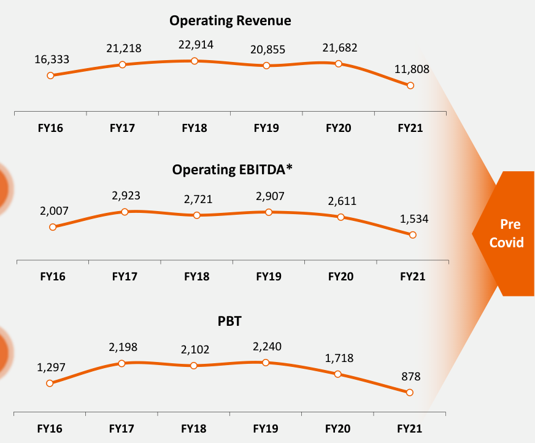

**[Image: f15dba5e-d4bd-46b8-a475-a0b728305ab9.pdf-0028-02.png (872x722, 68.2KB)]**

<!-- Start of picture text -->
Operating Revenue 21,218  22,914  20,855  21,682 16,333 11,808 FY16 FY17 FY18 FY19 FY20 FY21 Operating EBITDA* 2,923  2,721  2,907  2,611 2,007 1,534 Pre Covid FY16 FY17 FY18 FY19 FY20 FY21 PBT 2,198  2,102  2,240 1,718 1,297 878 FY16 FY17 FY18 FY19 FY20 FY21 <!-- End of picture text -->

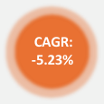

**[Image: f15dba5e-d4bd-46b8-a475-a0b728305ab9.pdf-0028-03.png (115x116, 10.7KB)]**

<!-- Start of picture text -->
CAGR: -5.23% <!-- End of picture text -->

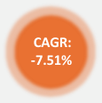

**[Image: f15dba5e-d4bd-46b8-a475-a0b728305ab9.pdf-0028-04.png (115x116, 10.7KB)]**

<!-- Start of picture text -->
CAGR: -7.51% <!-- End of picture text -->

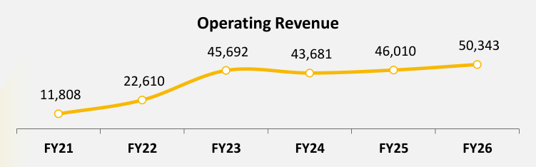

**[Image: f15dba5e-d4bd-46b8-a475-a0b728305ab9.pdf-0028-05.png (751x234, 19.0KB)]**

<!-- Start of picture text -->
Operating Revenue 50,343 45,692  43,681  46,010 22,610 11,808 FY21 FY22 FY23 FY24 FY25 FY26 <!-- End of picture text -->

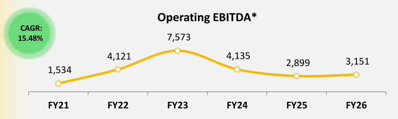

**[Image: f15dba5e-d4bd-46b8-a475-a0b728305ab9.pdf-0028-06.png (784x236, 31.3KB)]**

<!-- Start of picture text -->
Operating EBITDA* CAGR: 15.48% 7,573 4,121  4,135 2,899  3,151 1,534 FY21 FY22 FY23 FY24 FY25 FY26 <!-- End of picture text -->

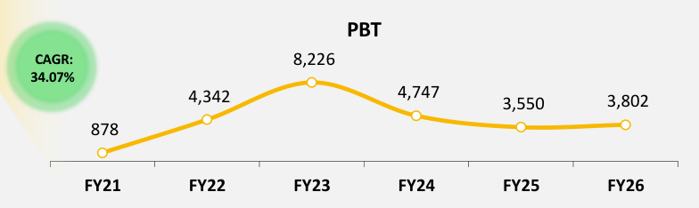

**[Image: f15dba5e-d4bd-46b8-a475-a0b728305ab9.pdf-0028-07.png (784x234, 29.9KB)]**

<!-- Start of picture text -->
PBT CAGR: 8,226 34.07% 4,342  4,747  3,550  3,802 878 FY21 FY22 FY23 FY24 FY25 FY26 <!-- End of picture text -->

Effectively Post-Covid FY21 onwards, a gradual shift from the franchise system towards higher direct student delivery. Improved enrolment monetisation and operational visibility. Post-covid, Domestic retail growth reflects this transition. 

*EBITDA excluding other income, interest and dividend income 

27 

I N V E S T O R P R E S E N T A T I O N – Q 4 F Y 2 0 2 6 

**[Image: f15dba5e-d4bd-46b8-a475-a0b728305ab9.pdf-0029-00.png (257x81, 12.5KB)]**

SEGMENT REVENUE All financial numbers in Rs. Lakhs 

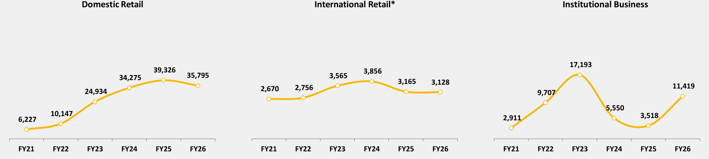

**[Image: f15dba5e-d4bd-46b8-a475-a0b728305ab9.pdf-0029-02.png (1843x415, 46.4KB)]**

<!-- Start of picture text -->
Domestic Retail International Retail* Institutional Business 17,193 39,326  3,856 34,275  35,795 3,565 3,165  3,128 2,670  2,756  11,419 24,934  9,707 5,550 6,227  10,147  2,911  3,518 FY21 FY22 FY23 FY24 FY25 FY26 FY21 FY22 FY23 FY24 FY25 FY26 FY21 FY22 FY23 FY24 FY25 FY26 <!-- End of picture text -->

Effectively Post-Covid FY21 onwards, a gradual shift from the franchise system towards higher direct student delivery. Improved enrolment monetisation and operational visibility. Post-covid, Domestic retail growth reflects this transition. 

*Impact of currency volatility in Nigeria and Egypt has been recognised as an exceptional item in the financials. 

28 28 

I N V E S T O R P R E S E N T A T I O N – Q 4 F Y 2 0 2 6 

## CASH & CASH FLOW TRENDS 

**[Image: f15dba5e-d4bd-46b8-a475-a0b728305ab9.pdf-0030-01.png (259x84, 12.5KB)]**

***Cash, Cash Equivalents** 

**#Free Cash Flow** 

**Dividend Payout Ratio (%)** 

**Dividend Per Share (in Rs.)** 

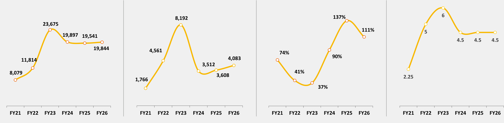

**[Image: f15dba5e-d4bd-46b8-a475-a0b728305ab9.pdf-0030-06.png (1869x459, 60.1KB)]**

<!-- Start of picture text -->
8,192  137% 6 23,675 111% 5 19,897 19,541 4.5 4.5 4.5 19,844 4,561  74% 90% 4,083 11,814 3,512 8,079  41% 3,608  2.25 1,766 37% FY21 FY22 FY23 FY24 FY25 FY26 FY21 FY22 FY23 FY24 FY25 FY26 FY21 FY22 FY23 FY24 FY25 FY26 FY21 FY22 FY23 FY24 FY25 FY26 <!-- End of picture text -->

All figures are in INR Lakhs 

*Cash, Cash Equivalents includes Financial Investments 

#Free Cash Flow = PBT + Depreciation – Capex 

29 

I N V E S T O R P R E S E N T A T I O N – Q 4 F Y 2 0 2 6 

## SHAREHOLDING PATTERN 

**[Image: f15dba5e-d4bd-46b8-a475-a0b728305ab9.pdf-0031-01.png (259x84, 12.6KB)]**

(Q4 FY’26) 

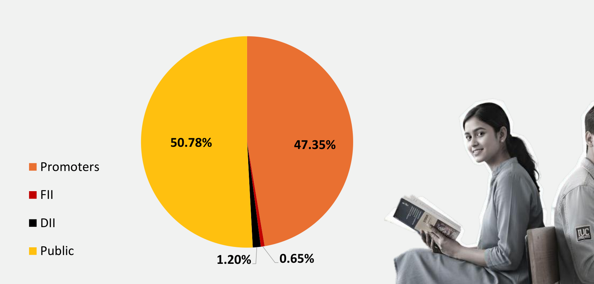

**[Image: f15dba5e-d4bd-46b8-a475-a0b728305ab9.pdf-0031-03.png (1613x774, 369.5KB)]**

<!-- Start of picture text -->
50.78% 47.35% Promoters FII DII Public 1.20% 0.65% <!-- End of picture text -->

30 

I N V E S T O R P R E S E N T A T I O N – Q 4 F Y 2 0 2 6 

AWARDS RECOGNITION 

## AWARDS & RECOGNITION 

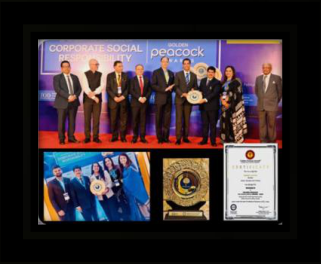

**[Image: f15dba5e-d4bd-46b8-a475-a0b728305ab9.pdf-0032-02.png (321x264, 118.3KB)]**

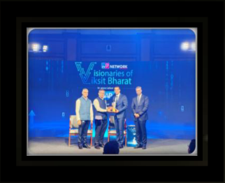

**[Image: f15dba5e-d4bd-46b8-a475-a0b728305ab9.pdf-0032-03.png (322x262, 99.4KB)]**

Aptech Limited has been conferred with the prestigious Golden Peacock HR Excellence Award 2025 

Aptech Limited was conferred the ‘Visionary of Viksit Bharat’ Award by TV9 Group. The award was receivedby Mr. Sandip Weling, Whole-time Director and Chief Business Officer, Global Retail, Aptech Ltd 

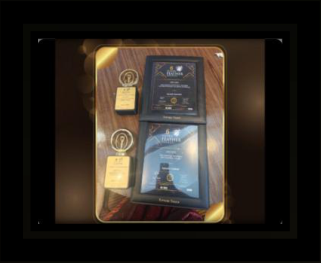

**[Image: f15dba5e-d4bd-46b8-a475-a0b728305ab9.pdf-0032-06.png (321x263, 83.7KB)]**

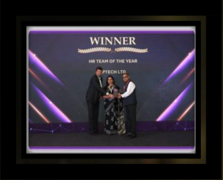

**[Image: f15dba5e-d4bd-46b8-a475-a0b728305ab9.pdf-0032-07.png (322x259, 80.9KB)]**

Aptech Limited has been honoured for “Best Industry–Academia Interface” at the 6th edition of Silver Feather Awards 2025 in association with HRAI, SiliconIndia Magazine & Global Hues Media Network 

Aptech was conferred with the 'HR Team of the Year Award' at the 8th Edition of HR TechSummit & Awards 2025organised by the UBS Forums 

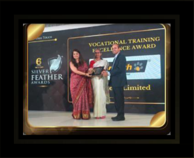

**[Image: f15dba5e-d4bd-46b8-a475-a0b728305ab9.pdf-0032-10.png (321x263, 103.5KB)]**

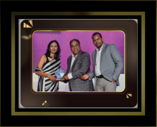

**[Image: f15dba5e-d4bd-46b8-a475-a0b728305ab9.pdf-0032-11.png (322x261, 91.5KB)]**

Aptech Limited has been honoured for “Excellence in Vocational Training” at the 6th edition of Silver Feather Awards 2025 in association with HRAI, SiliconIndia Magazine & Global Hues Media Network 

Aptech received the 'Franchisor of the Year' in the Vocational & Skill Development Training category at the 21st Franchise Awards 2025, organised by Franchise India Holdings Limited 

**[Image: f15dba5e-d4bd-46b8-a475-a0b728305ab9.pdf-0032-14.png (14x81, 2.4KB)]**

**[Image: f15dba5e-d4bd-46b8-a475-a0b728305ab9.pdf-0032-15.png (257x14, 5.8KB)]**

**[Image: f15dba5e-d4bd-46b8-a475-a0b728305ab9.pdf-0032-16.png (15x10, 0.5KB)]**

<!-- Start of picture text -->
31 <!-- End of picture text -->

I N V E S T O R P R E S E N T A T I O N – Q 4 F Y 2 0 2 6 

# THANK YOU! 

##### APTECH LIMITED 

(E): investors_relations@aptech.co.in www.aptech-worldwide.com 

###### **® KAPT** I **FY** CONSULTING 

Strategy & Investor Relations | Consulting 

(E): contact@kaptify.in 

(T): +91-845 288 6099 

<u>www.kaptify.in</u> 

**[Image: f15dba5e-d4bd-46b8-a475-a0b728305ab9.pdf-0033-08.png (575x182, 16.4KB)]**

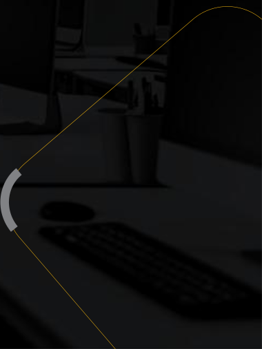

**[Image: f15dba5e-d4bd-46b8-a475-a0b728305ab9.pdf-0033-09.png (380x507, 42.8KB)]**

---

## Extracted Images

| # | File | Dimensions | Size |
|---|------|------------|------|
| 1 | f15dba5e-d4bd-46b8-a475-a0b728305ab9.pdf-0001-01.png | 397x112 | 73.7KB |
| 2 | f15dba5e-d4bd-46b8-a475-a0b728305ab9.pdf-0001-14.png | 551x33 | 9.5KB |
| 3 | f15dba5e-d4bd-46b8-a475-a0b728305ab9.pdf-0002-00.png | 391x124 | 26.7KB |
| 4 | f15dba5e-d4bd-46b8-a475-a0b728305ab9.pdf-0002-02.png | 533x153 | 28.5KB |
| 5 | f15dba5e-d4bd-46b8-a475-a0b728305ab9.pdf-0002-03.png | 966x153 | 41.2KB |
| 6 | f15dba5e-d4bd-46b8-a475-a0b728305ab9.pdf-0002-04.png | 353x25 | 5.1KB |
| 7 | f15dba5e-d4bd-46b8-a475-a0b728305ab9.pdf-0002-05.png | 100x25 | 2.3KB |
| 8 | f15dba5e-d4bd-46b8-a475-a0b728305ab9.pdf-0003-01.png | 259x84 | 12.6KB |
| 9 | f15dba5e-d4bd-46b8-a475-a0b728305ab9.pdf-0004-00.png | 244x245 | 29.6KB |
| 10 | f15dba5e-d4bd-46b8-a475-a0b728305ab9.pdf-0004-03.png | 225x225 | 52.0KB |
| 11 | f15dba5e-d4bd-46b8-a475-a0b728305ab9.pdf-0004-06.png | 259x84 | 13.5KB |
| 12 | f15dba5e-d4bd-46b8-a475-a0b728305ab9.pdf-0005-00.png | 777x1125 | 476.8KB |
| 13 | f15dba5e-d4bd-46b8-a475-a0b728305ab9.pdf-0005-03.png | 259x84 | 12.6KB |
| 14 | f15dba5e-d4bd-46b8-a475-a0b728305ab9.pdf-0006-00.png | 99x101 | 10.0KB |
| 15 | f15dba5e-d4bd-46b8-a475-a0b728305ab9.pdf-0006-03.png | 114x113 | 7.0KB |
| 16 | f15dba5e-d4bd-46b8-a475-a0b728305ab9.pdf-0006-05.png | 103x103 | 13.7KB |
| 17 | f15dba5e-d4bd-46b8-a475-a0b728305ab9.pdf-0006-06.png | 97x96 | 10.2KB |
| 18 | f15dba5e-d4bd-46b8-a475-a0b728305ab9.pdf-0006-07.png | 14x81 | 2.1KB |
| 19 | f15dba5e-d4bd-46b8-a475-a0b728305ab9.pdf-0006-08.png | 257x14 | 6.5KB |
| 20 | f15dba5e-d4bd-46b8-a475-a0b728305ab9.pdf-0007-01.png | 205x205 | 62.6KB |
| 21 | f15dba5e-d4bd-46b8-a475-a0b728305ab9.pdf-0007-02.png | 205x205 | 47.0KB |
| 22 | f15dba5e-d4bd-46b8-a475-a0b728305ab9.pdf-0007-03.png | 205x205 | 61.7KB |
| 23 | f15dba5e-d4bd-46b8-a475-a0b728305ab9.pdf-0007-14.png | 205x205 | 59.3KB |
| 24 | f15dba5e-d4bd-46b8-a475-a0b728305ab9.pdf-0007-15.png | 207x205 | 61.7KB |
| 25 | f15dba5e-d4bd-46b8-a475-a0b728305ab9.pdf-0007-16.png | 205x205 | 51.8KB |
| 26 | f15dba5e-d4bd-46b8-a475-a0b728305ab9.pdf-0007-26.png | 259x84 | 12.4KB |
| 27 | f15dba5e-d4bd-46b8-a475-a0b728305ab9.pdf-0007-27.png | 207x205 | 54.3KB |
| 28 | f15dba5e-d4bd-46b8-a475-a0b728305ab9.pdf-0007-31.png | 205x205 | 55.9KB |
| 29 | f15dba5e-d4bd-46b8-a475-a0b728305ab9.pdf-0008-01.png | 207x205 | 49.8KB |
| 30 | f15dba5e-d4bd-46b8-a475-a0b728305ab9.pdf-0008-02.png | 205x205 | 43.8KB |
| 31 | f15dba5e-d4bd-46b8-a475-a0b728305ab9.pdf-0008-03.png | 205x205 | 37.9KB |
| 32 | f15dba5e-d4bd-46b8-a475-a0b728305ab9.pdf-0008-16.png | 259x84 | 12.4KB |
| 33 | f15dba5e-d4bd-46b8-a475-a0b728305ab9.pdf-0008-17.png | 205x205 | 54.1KB |
| 34 | f15dba5e-d4bd-46b8-a475-a0b728305ab9.pdf-0009-01.png | 14x81 | 1.1KB |
| 35 | f15dba5e-d4bd-46b8-a475-a0b728305ab9.pdf-0009-02.png | 257x14 | 3.9KB |
| 36 | f15dba5e-d4bd-46b8-a475-a0b728305ab9.pdf-0009-03.png | 1727x858 | 1330.2KB |
| 37 | f15dba5e-d4bd-46b8-a475-a0b728305ab9.pdf-0009-04.png | 37x38 | 2.6KB |
| 38 | f15dba5e-d4bd-46b8-a475-a0b728305ab9.pdf-0009-05.png | 37x38 | 2.7KB |
| 39 | f15dba5e-d4bd-46b8-a475-a0b728305ab9.pdf-0010-01.png | 14x81 | 0.7KB |
| 40 | f15dba5e-d4bd-46b8-a475-a0b728305ab9.pdf-0010-02.png | 257x14 | 3.9KB |
| 41 | f15dba5e-d4bd-46b8-a475-a0b728305ab9.pdf-0010-05.png | 1271x412 | 245.3KB |
| 42 | f15dba5e-d4bd-46b8-a475-a0b728305ab9.pdf-0011-00.png | 1462x176 | 26.1KB |
| 43 | f15dba5e-d4bd-46b8-a475-a0b728305ab9.pdf-0011-12.png | 14x81 | 0.6KB |
| 44 | f15dba5e-d4bd-46b8-a475-a0b728305ab9.pdf-0011-13.png | 257x14 | 4.1KB |
| 45 | f15dba5e-d4bd-46b8-a475-a0b728305ab9.pdf-0011-25.png | 197x74 | 16.2KB |
| 46 | f15dba5e-d4bd-46b8-a475-a0b728305ab9.pdf-0011-26.png | 199x74 | 13.1KB |
| 47 | f15dba5e-d4bd-46b8-a475-a0b728305ab9.pdf-0011-27.png | 196x72 | 9.0KB |
| 48 | f15dba5e-d4bd-46b8-a475-a0b728305ab9.pdf-0011-28.png | 224x99 | 21.1KB |
| 49 | f15dba5e-d4bd-46b8-a475-a0b728305ab9.pdf-0011-29.png | 199x76 | 11.7KB |
| 50 | f15dba5e-d4bd-46b8-a475-a0b728305ab9.pdf-0011-30.png | 197x72 | 15.6KB |
| 51 | f15dba5e-d4bd-46b8-a475-a0b728305ab9.pdf-0011-31.png | 203x76 | 17.9KB |
| 52 | f15dba5e-d4bd-46b8-a475-a0b728305ab9.pdf-0011-32.png | 199x72 | 5.6KB |
| 53 | f15dba5e-d4bd-46b8-a475-a0b728305ab9.pdf-0012-03.png | 259x84 | 12.6KB |
| 54 | f15dba5e-d4bd-46b8-a475-a0b728305ab9.pdf-0012-04.png | 620x661 | 330.9KB |
| 55 | f15dba5e-d4bd-46b8-a475-a0b728305ab9.pdf-0013-01.png | 259x84 | 12.6KB |
| 56 | f15dba5e-d4bd-46b8-a475-a0b728305ab9.pdf-0014-01.png | 259x84 | 12.6KB |
| 57 | f15dba5e-d4bd-46b8-a475-a0b728305ab9.pdf-0014-02.png | 1783x664 | 100.3KB |
| 58 | f15dba5e-d4bd-46b8-a475-a0b728305ab9.pdf-0015-01.png | 259x84 | 12.6KB |
| 59 | f15dba5e-d4bd-46b8-a475-a0b728305ab9.pdf-0015-03.png | 813x182 | 24.9KB |
| 60 | f15dba5e-d4bd-46b8-a475-a0b728305ab9.pdf-0015-04.png | 42x43 | 1.2KB |
| 61 | f15dba5e-d4bd-46b8-a475-a0b728305ab9.pdf-0015-12.png | 18x162 | 0.7KB |
| 62 | f15dba5e-d4bd-46b8-a475-a0b728305ab9.pdf-0015-16.png | 57x57 | 0.1KB |
| 63 | f15dba5e-d4bd-46b8-a475-a0b728305ab9.pdf-0015-18.png | 959x157 | 20.3KB |
| 64 | f15dba5e-d4bd-46b8-a475-a0b728305ab9.pdf-0016-02.png | 259x84 | 12.6KB |
| 65 | f15dba5e-d4bd-46b8-a475-a0b728305ab9.pdf-0016-03.png | 1944x651 | 93.1KB |
| 66 | f15dba5e-d4bd-46b8-a475-a0b728305ab9.pdf-0016-06.png | 1157x86 | 8.7KB |
| 67 | f15dba5e-d4bd-46b8-a475-a0b728305ab9.pdf-0016-07.png | 244x235 | 10.7KB |
| 68 | f15dba5e-d4bd-46b8-a475-a0b728305ab9.pdf-0016-08.png | 293x57 | 5.7KB |
| 69 | f15dba5e-d4bd-46b8-a475-a0b728305ab9.pdf-0017-02.png | 259x84 | 12.6KB |
| 70 | f15dba5e-d4bd-46b8-a475-a0b728305ab9.pdf-0017-04.png | 53x55 | 1.2KB |
| 71 | f15dba5e-d4bd-46b8-a475-a0b728305ab9.pdf-0017-05.png | 774x211 | 22.5KB |
| 72 | f15dba5e-d4bd-46b8-a475-a0b728305ab9.pdf-0017-10.png | 650x674 | 210.6KB |
| 73 | f15dba5e-d4bd-46b8-a475-a0b728305ab9.pdf-0018-01.png | 257x81 | 12.6KB |
| 74 | f15dba5e-d4bd-46b8-a475-a0b728305ab9.pdf-0018-02.png | 132x45 | 4.8KB |
| 75 | f15dba5e-d4bd-46b8-a475-a0b728305ab9.pdf-0019-01.png | 926x187 | 72.0KB |
| 76 | f15dba5e-d4bd-46b8-a475-a0b728305ab9.pdf-0019-02.png | 14x15 | 0.3KB |
| 77 | f15dba5e-d4bd-46b8-a475-a0b728305ab9.pdf-0019-06.png | 61x20 | 1.5KB |
| 78 | f15dba5e-d4bd-46b8-a475-a0b728305ab9.pdf-0019-07.png | 63x20 | 1.4KB |
| 79 | f15dba5e-d4bd-46b8-a475-a0b728305ab9.pdf-0019-11.png | 61x20 | 1.1KB |
| 80 | f15dba5e-d4bd-46b8-a475-a0b728305ab9.pdf-0019-12.png | 61x20 | 1.5KB |
| 81 | f15dba5e-d4bd-46b8-a475-a0b728305ab9.pdf-0019-17.png | 62x20 | 1.3KB |
| 82 | f15dba5e-d4bd-46b8-a475-a0b728305ab9.pdf-0019-18.png | 61x20 | 1.1KB |
| 83 | f15dba5e-d4bd-46b8-a475-a0b728305ab9.pdf-0019-23.png | 62x20 | 1.2KB |
| 84 | f15dba5e-d4bd-46b8-a475-a0b728305ab9.pdf-0019-24.png | 61x20 | 1.2KB |
| 85 | f15dba5e-d4bd-46b8-a475-a0b728305ab9.pdf-0019-28.png | 62x19 | 1.2KB |
| 86 | f15dba5e-d4bd-46b8-a475-a0b728305ab9.pdf-0019-29.png | 61x19 | 1.3KB |
| 87 | f15dba5e-d4bd-46b8-a475-a0b728305ab9.pdf-0019-30.png | 61x19 | 1.2KB |
| 88 | f15dba5e-d4bd-46b8-a475-a0b728305ab9.pdf-0019-31.png | 259x84 | 12.9KB |
| 89 | f15dba5e-d4bd-46b8-a475-a0b728305ab9.pdf-0019-32.png | 384x534 | 195.4KB |
| 90 | f15dba5e-d4bd-46b8-a475-a0b728305ab9.pdf-0020-01.png | 259x84 | 12.8KB |
| 91 | f15dba5e-d4bd-46b8-a475-a0b728305ab9.pdf-0020-02.png | 366x732 | 129.6KB |
| 92 | f15dba5e-d4bd-46b8-a475-a0b728305ab9.pdf-0020-03.png | 366x732 | 91.8KB |
| 93 | f15dba5e-d4bd-46b8-a475-a0b728305ab9.pdf-0020-04.png | 364x732 | 72.0KB |
| 94 | f15dba5e-d4bd-46b8-a475-a0b728305ab9.pdf-0021-03.png | 441x330 | 68.6KB |
| 95 | f15dba5e-d4bd-46b8-a475-a0b728305ab9.pdf-0021-04.png | 441x330 | 93.0KB |
| 96 | f15dba5e-d4bd-46b8-a475-a0b728305ab9.pdf-0021-06.png | 439x330 | 49.8KB |
| 97 | f15dba5e-d4bd-46b8-a475-a0b728305ab9.pdf-0021-07.png | 14x81 | 0.5KB |
| 98 | f15dba5e-d4bd-46b8-a475-a0b728305ab9.pdf-0021-08.png | 257x14 | 3.3KB |
| 99 | f15dba5e-d4bd-46b8-a475-a0b728305ab9.pdf-0021-10.png | 439x330 | 26.2KB |
| 100 | f15dba5e-d4bd-46b8-a475-a0b728305ab9.pdf-0022-01.png | 832x119 | 65.8KB |
| 101 | f15dba5e-d4bd-46b8-a475-a0b728305ab9.pdf-0022-02.png | 484x119 | 36.6KB |
| 102 | f15dba5e-d4bd-46b8-a475-a0b728305ab9.pdf-0022-03.png | 314x593 | 172.8KB |
| 103 | f15dba5e-d4bd-46b8-a475-a0b728305ab9.pdf-0022-04.png | 832x119 | 63.9KB |
| 104 | f15dba5e-d4bd-46b8-a475-a0b728305ab9.pdf-0022-05.png | 484x119 | 27.2KB |
| 105 | f15dba5e-d4bd-46b8-a475-a0b728305ab9.pdf-0022-06.png | 832x119 | 72.2KB |
| 106 | f15dba5e-d4bd-46b8-a475-a0b728305ab9.pdf-0022-07.png | 484x119 | 33.9KB |
| 107 | f15dba5e-d4bd-46b8-a475-a0b728305ab9.pdf-0022-08.png | 832x117 | 77.6KB |
| 108 | f15dba5e-d4bd-46b8-a475-a0b728305ab9.pdf-0022-09.png | 484x117 | 31.2KB |
| 109 | f15dba5e-d4bd-46b8-a475-a0b728305ab9.pdf-0022-10.png | 832x117 | 84.4KB |
| 110 | f15dba5e-d4bd-46b8-a475-a0b728305ab9.pdf-0022-11.png | 484x117 | 34.4KB |
| 111 | f15dba5e-d4bd-46b8-a475-a0b728305ab9.pdf-0022-12.png | 259x84 | 14.9KB |
| 112 | f15dba5e-d4bd-46b8-a475-a0b728305ab9.pdf-0023-01.png | 259x84 | 12.5KB |
| 113 | f15dba5e-d4bd-46b8-a475-a0b728305ab9.pdf-0023-03.png | 88x88 | 3.5KB |
| 114 | f15dba5e-d4bd-46b8-a475-a0b728305ab9.pdf-0023-05.png | 78x88 | 1.6KB |
| 115 | f15dba5e-d4bd-46b8-a475-a0b728305ab9.pdf-0023-11.png | 86x86 | 4.5KB |
| 116 | f15dba5e-d4bd-46b8-a475-a0b728305ab9.pdf-0023-18.png | 86x84 | 4.3KB |
| 117 | f15dba5e-d4bd-46b8-a475-a0b728305ab9.pdf-0024-01.png | 259x84 | 12.6KB |
| 118 | f15dba5e-d4bd-46b8-a475-a0b728305ab9.pdf-0025-01.png | 259x84 | 12.6KB |
| 119 | f15dba5e-d4bd-46b8-a475-a0b728305ab9.pdf-0026-01.png | 259x84 | 12.6KB |
| 120 | f15dba5e-d4bd-46b8-a475-a0b728305ab9.pdf-0027-01.png | 259x84 | 12.6KB |
| 121 | f15dba5e-d4bd-46b8-a475-a0b728305ab9.pdf-0028-01.png | 259x84 | 12.6KB |
| 122 | f15dba5e-d4bd-46b8-a475-a0b728305ab9.pdf-0028-02.png | 872x722 | 68.2KB |
| 123 | f15dba5e-d4bd-46b8-a475-a0b728305ab9.pdf-0028-03.png | 115x116 | 10.7KB |
| 124 | f15dba5e-d4bd-46b8-a475-a0b728305ab9.pdf-0028-04.png | 115x116 | 10.7KB |
| 125 | f15dba5e-d4bd-46b8-a475-a0b728305ab9.pdf-0028-05.png | 751x234 | 19.0KB |
| 126 | f15dba5e-d4bd-46b8-a475-a0b728305ab9.pdf-0028-06.png | 784x236 | 31.3KB |
| 127 | f15dba5e-d4bd-46b8-a475-a0b728305ab9.pdf-0028-07.png | 784x234 | 29.9KB |
| 128 | f15dba5e-d4bd-46b8-a475-a0b728305ab9.pdf-0029-00.png | 257x81 | 12.5KB |
| 129 | f15dba5e-d4bd-46b8-a475-a0b728305ab9.pdf-0029-02.png | 1843x415 | 46.4KB |
| 130 | f15dba5e-d4bd-46b8-a475-a0b728305ab9.pdf-0030-01.png | 259x84 | 12.5KB |
| 131 | f15dba5e-d4bd-46b8-a475-a0b728305ab9.pdf-0030-06.png | 1869x459 | 60.1KB |
| 132 | f15dba5e-d4bd-46b8-a475-a0b728305ab9.pdf-0031-01.png | 259x84 | 12.6KB |
| 133 | f15dba5e-d4bd-46b8-a475-a0b728305ab9.pdf-0031-03.png | 1613x774 | 369.5KB |
| 134 | f15dba5e-d4bd-46b8-a475-a0b728305ab9.pdf-0032-02.png | 321x264 | 118.3KB |
| 135 | f15dba5e-d4bd-46b8-a475-a0b728305ab9.pdf-0032-03.png | 322x262 | 99.4KB |
| 136 | f15dba5e-d4bd-46b8-a475-a0b728305ab9.pdf-0032-06.png | 321x263 | 83.7KB |
| 137 | f15dba5e-d4bd-46b8-a475-a0b728305ab9.pdf-0032-07.png | 322x259 | 80.9KB |
| 138 | f15dba5e-d4bd-46b8-a475-a0b728305ab9.pdf-0032-10.png | 321x263 | 103.5KB |
| 139 | f15dba5e-d4bd-46b8-a475-a0b728305ab9.pdf-0032-11.png | 322x261 | 91.5KB |
| 140 | f15dba5e-d4bd-46b8-a475-a0b728305ab9.pdf-0032-14.png | 14x81 | 2.4KB |
| 141 | f15dba5e-d4bd-46b8-a475-a0b728305ab9.pdf-0032-15.png | 257x14 | 5.8KB |
| 142 | f15dba5e-d4bd-46b8-a475-a0b728305ab9.pdf-0032-16.png | 15x10 | 0.5KB |
| 143 | f15dba5e-d4bd-46b8-a475-a0b728305ab9.pdf-0033-08.png | 575x182 | 16.4KB |
| 144 | f15dba5e-d4bd-46b8-a475-a0b728305ab9.pdf-0033-09.png | 380x507 | 42.8KB |
