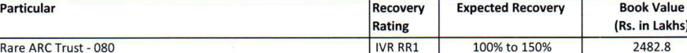
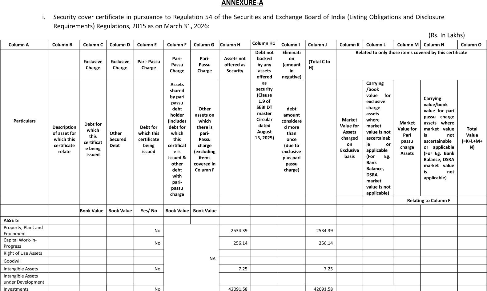
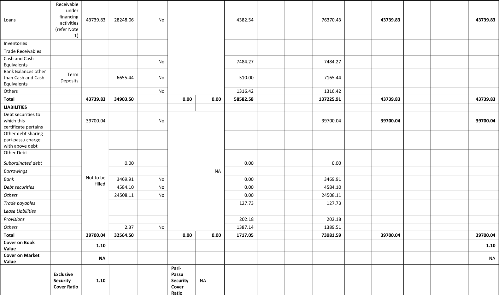
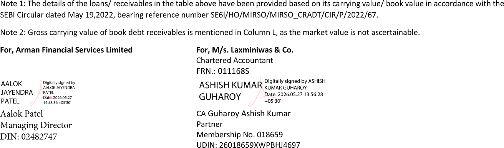

**[Image: March2026.pdf-0001-00.png (145x86, 4.3KB)]**

**[Image: March2026.pdf-0001-01.png (726x45, 14.8KB)]**

**___________________________________________________________________________________________________________________________________________________________________________________________** 

Registered Office: 502-503, SAKAR III, OPP. OLD HIGH COURT, OFF ASHRAM ROAD, AHMEDABAD-380014, GUJARAT, INDIA PH.: +91-79-40507000, 27541989   E-mail: finance@armanindia.com CIN: L55910GJ1992PLC018623 

<mark>May 27, 2026</mark> 

|To,|To,|
|---|---|
|BSE Limited|National Stock Exchange of India Limited|
|P. J. Tower,|“Exchange Plaza” C-1, Block G,|
|Dalal Street,|Bandra Kurla Complex,|
|Mumbai–400001|Bandra,Mumbai- 400051|
|**Script Code:  531179**|**Symbol: ARMANFIN**|
|**ISIN**:**INE109C01017**|**Series: EQ **|

Dear Sir, 

##### **SUB: AUDITED FINANCIAL RESULTS FOR THE QUARTER AND YEAR ENDED ON MARCH 31, 2026 - OUTCOME OF BOARD MEETING** 

##### **REF: PURSUANT TO REGULATION 33 AND 52 OF SEBI (LISTING OBLIGATIONS & DISCLOSURE REQUIREMENTS) REGULATIONS, 2015** 

Pursuant to Regulation 30, read with part A of Schedule III and Regulation 33 and 52 of SEBI (Listing Obligations & Disclosure Requirements) Regulations, 2015, we wish to inform you that Board of Directors of the Company in their meeting held today i.e. May 27, 2026, inter alia, have considered and approved the following: 

1. The Audited Standalone and Consolidated Financial Results of the Company for the quarter and year ended March 31, 2026 along with the Audit Report. 

2. Approved the redesignation of Mr. Uttam Patel (Membership No.: ACS 42878) from Company Secretary & Compliance Officer to Company Secretary & Chief Compliance Officer (“CCO”) of Arman Financial Services Limited with effect from May 28, 2026. He shall continue to be designated as a Key Managerial Personnel and part of the Senior Management Personnel of the Company. 

Further, Mr. Ankit Laddha existing CCO will continue as CCO of Namra Finance Limited, Wholly Owned Subsidiary. 

Accordingly, for Arman Financial Services Limited, the aforesaid change shall be considered as change/replacement in Chief Compliance Officer. 

The details as required pursuant to SEBI Master Circular No. HO/49/14/14(7)2025-CFDPOD2/I/3762/2026 dated January 30, 2026 is enclosed as Annexure-A. 

3. Declaration of Chief Financial Officer regarding unmodified opinion on the aforesaid Financial Results is attached. 

**[Image: March2026.pdf-0002-00.png (145x86, 4.3KB)]**

**[Image: March2026.pdf-0002-01.png (726x45, 14.8KB)]**

> **___________________________________________________________________________________________________________________________________________________________________________________________** Registered Office: 502-503, SAKAR III, OPP. OLD HIGH COURT, OFF ASHRAM ROAD, AHMEDABAD-380014, GUJARAT, INDIA PH.: +91-79-40507000, 27541989   E-mail: finance@armanindia.com CIN: L55910GJ1992PLC018623 

4. Reviewed, revised and updated certain existing policies of the Company and also formulated / adopted additional statement / policies, wherever required, in order to align with applicable regulatory requirements and operational needs. 

The Meeting commenced at 04:30 p.m. and concluded at 05:45 p.m. 

Thanking You Yours faithfully, 

##### **For, Arman Financial Services Limited** 

Uttambhai Digitally signed by Uttambhai Narayanbhai Narayanbhai Patel Date: 2026.05.27 Patel 17:50:24 +05'30' Uttam Patel Company Secretary 

###### ARMAN nNANCIAl. SERVICES LIMITED 

Reg. off: 502-503, SAKAR III, OPP. OLD HIGH COURT,AHMEDABAD-380014 

CIN: L55910GJ1992PLC018623; Ph-079-40S07000; E-mail: finance@armanindia.com; Website: www.armanindia.com STATEMENT OF CONSOLIDATED AUDITED FINANCIAL RESULTS FOR THE QUARTER / YEAR ENDED ON MARCH 31, 2026 

|||Q|uarterEnded|(Rs. In Lak |hs except per Year|share data) Ended|
|---|---|---|---|---|---|---|
|Sr.No.|Particulars|31.03.2026| 31.12.2025|31.03.2025| 31.03.2026|31.03.2025|
|||>fer Note No|Unaudited |efer Note No|Audited|Audited|
|1|Income from operations||||||
||a. Revenue from Operations||||||
||i. Interest Income|15,748.71|14,170.92|14,158.54|57,720.28|61,887.31|
||ii. Gain on assignment of financial assets|789.26|640.09|1,102.72|2,978.05|4,039.36|
||iii. Net Gain on Sale of financial instrument|||3,675.00||3,675.00|
||iv. Fees and Commision income|880.33|996.43|711.07|3,196.29|2,560.67|
||V. Net Gain on Fair Value Changes|140.04|199.62|287.88|691.88|841.95|
||Total revenue from Operations|17,558.34|16,007.06|19,935.22|64,586.50|73,004.30|
||b. Other Income||||0.07|0.09|
||Total Income|17,558.34|16,007.06|19,935.22|64,S86.S7|73,004.39|
|2|Expenses||||||
||a. Finance cost|5,278.49|5,079.84|5,174.71|20,541.87|23,936.10|
||b. Impairment losses on financial assets|1,724.75|2,621.92|8,898.03|14,825.22|26,410.13|
||c. Employees benefits expense|4,147.38|3,890.71|3,222.81|15,026.09|11,233.71|
||d. Depreciation and amortisation expense|36.72|43.15|47.86|168.82|179.07|
||e. Other expenses|2,162.43|1,521.06|1,326.00|6,288.74|4,336.15|
||Total Expenses|13,349.77|13,156.68|18,669.41|56,850.72|66,095.17|
|3|Profit / (Loss) before an Exceptional and Tax (1-2)|4,208.57|2,850.38|1,265.81|7,735.84|6,909.22|
|4|Exceptional Items||||||
|5|Profit / (Loss) before Tax (3 - 4)|4,208.57|2,850.38|1,265.81|7,735.84|6,909.22|
|6|Tax Expense (net)||||||
||- Current tax|371.70|346.30|(673.70)|1,519.70|2,311.20|
||- Short / (excess) Provision of Income Tax of earlier years|15.37||131.87|15.37|131.87|
||- Deffered tax liability / (asset)|(279.84)|285.88|531.19|540.24|(741.17)|
||Net Tax Expenses|107.24|632.18|(10.64)|2,075.32|1,701.90|
|7|Profit for the period /year from continuing operations (5-6)|4,101.33|2,218.20|1,276.45|5,660.53|5,207.32|
|8|Profit / (ioss) from discontinued operations||||||
|9|Tax expense of discontinued operations||||||
|10|Profit / (ioss) from discontinued operations (after tax) (8-9)||||||
|11|Profit for the period / year (7+10)|4,101.33|2,218.20|1,276.45|5,660.53|5,207.32|
|12|Other comprehensive income / (loss) (a) (i) Items that will not be reclassified to profit and loss||||||
||- Remeasurement of Defined Benefit Obligations|32.14|8.81|31.57|43.15|26.41|
||(Ii) Income tax relating to items that will not be reclassified to profit and loss|(8.09)|(2.22)|(7.94)|(10.86)|(6.65)|
||Sub Total (a)|24.05|6.59|23.62|32.29|19.76|
||(b) (i) Items that will be reclassified to profit and loss||||||
||- Fair valuation gain / (loss) on financial instruments measured at FVOCI|(157.28)|(404.76)|132.55|(486.41)|214.21|
||(II) Income tax relating to items that will be reclassified to profit|39.58|101.87|(33.36)|122.42|(53.91)|
||andloss||||||
|| Sub Total (b)|(117.70)|(302.89)|99.19|(363.99)|160.30|
||Net Other comprehensive Income / (loss) (a)+(b)|(93.65)|(296.30)|122.81|(331.70)|180.06|
|13|TotalComprehensiveIncome|4,007.68|1,921.90|1,399.26|5,328.82|5,387.38|
|| Paid up Equity Share capital (face value of Rs. 10/-)|1,051.29|1,051.29|1,049.05|1,051.29|1,049.05|
|14|Earnings per share (of Rs. 10/- Each)(Not Annualised)||||||
||(a)BasicEPS|39.06|21.13|12.17|53.91|49.67|
|| (b)DilutedEPS|38.82|20.99|12.07|53.57|49.26|

- Notes These Audited standalone financial results have been prepared in accordance with the recognition and measurement principles of Indian Accounting Standard ("Ind AS") prescribed under section 133 of the Companies Act 2013 (the "Act")readwith relevant rules issued thereunder and the other accounting principles generally accepted in India and and in compliancewith Regulation 33 and Regulation 52 of the Securities and Board of India (Listing Obligations and Disclosure Requirements) 

- 1 Regulations, 2015, as amended (the'SEBI Listing Regulations'). Any application clarifications/ directions issued byReserveBank of India ('RB!') or other regulators are implemented as and when they are issued/ applicable. These financial results are available on the website of the Company viz. https://armanindia.com and on the website of BSE Limited ("BSE') (www.bseindia.com) and National Stock Exchange of India Limited ("NSE") (www.nseindia.com). 

   - The Audited Consolidated financial results for the quarter / period ended March 31, 2026 have been reviewed by the Audit 

- 2 Committee and subsequently approved by the Board of Directors of the Company at its meeting held on May 27, 2026. The Group is engaged primarily in the business of financing and all its operations are in India only. Accordingly,there is no 

- 3 separate reportable segment as per Ind AS 108 on 'Operating Segments' in respect of the Company. Disclosures in compliance with Regulation 52 (4) and 54(2) of the SEBI (Listing Obligations and Disclosure Requirements) 

- 4 Regulations, 2015 for the year ended March 31, 2026isattachedherewith. 

- Figures for the quarter ended March 31, 2026 and March 31, 2025 are the balancing figures between audited figures in respect 

- 5 of the full financial year and the published year to date figures upto the end of third quarter of the respective financial year, which were subjected to Limited Review. 

- Previous quarter / year figures have been regrouped / reclassified, wherever found necessary, to conform to current period / 

- 6 year classification. 

   - Details of loans transferred during the period ended March 31, 2026 under the RBI Master Direction RBI/DOR/2025-26/359 

- 7 DOR.ACC.REC.No.278/21.04.018/2025-26 on Reserve Bank of India (Non-Banking Financial Companies - FinancialStatements: 

   - Presentation and Disclosures) Directions, 2025 dated November 28, 2025 are given below: 

   - Details of transfer through Direct assignment in respect of loans not in default during the quarter and period ended March31, 2026: 

|Particular|Quarter ended March 31, 2026|Year ended March 31, 2026|
|---|---|---|
|Number of Loans|23,068|1,04,249|
|Book value of loans assets assigned (^ in Lakhs)|11,432.47|46,581.27|
|Sale Consideration Received (^ in Lakhs)|10,289.22|41,923.14|
|Number of Transactions|4|12|
|Weighted average remaining maturity (in months)|19.54|19.20|
|Weighted average holding period after origination (in months)|4.36|4.57|
|Retention of beneficial economic interest|10%|10%|
|Coverage of tangible security Coverage|||
|Rating wise distribution of rated loans|||
|Number of instances (transactions) where transferred as agreed to replace|||
|the transferred loans|||
|Numberoftransferredloansreplaced|||

- 8 Details of the recovery ratings assigned for Security Receipts as at March 31, 2026 are given below: 

**[Image: March2026.pdf-0004-11.png (873x68, 56.9KB)]**

<!-- Start of picture text -->
Particular Recovery Expected Recovery Book Value Rating (Rs. in Lakhs) Rare ARC Trust - 080 IVR RRl 100% to 150% 2482.8 <!-- End of picture text -->

Date: 27.05.2026 

For, Arman Financial Services Limited 

Place: Ahmedabad 

**[Image: March2026.pdf-0004-15.png (461x59, 43.3KB)]**

<!-- Start of picture text -->
; 1 tn Vice ChairmanAalokJayendra& ManagingPatelDirector 1 :3j DIN-02482747 <!-- End of picture text -->

##### ARMAN FINANCIAL SERVICES LIMITED 

Reg. off: 502-503, SAKAR III, OPP. OLD HIGH COURT,AHMEDABAD-380014 

CIN: L55910GJ1992PLC018623; Ph-079-40507000; E-mail: flnance@armanindia.com; Website: www.armanindia.com Consolidated Balance Sheet as at March 31, 2026 

||||(Rs. in Lakhs)|
|---|---|---|---|
||Particulars|March 31, 2026|March 31, 2025|
||ASSETS|||
|(1)|Financial Assets|||
|(a)|Cash and cash equivalents|8,778,32|6,775.03|
|(b)|Bank Balance other than (a) above|31,109,22|33,566.96|
|(c)|Loans|2,21,347,39|1,68,366.43|
|(d)|Investments|9,246,14|3,897.15|
|(e)|Other Financial assets|2,598,90|4,157.22|
|(2)|Non-financial Assets|||
||Current tax Assets (Net)|633,63||
|(b)|Deferred tax Assets (Net)|2,167,39|2,596.07|
||Property, Plant and Equipment & Other Intangible assets|2,943,52|2,999.33|
|(d)|Capital Work-in-Progress|256,14|19.62|
|(e)|Right of Use Asset|218,44|105.21|
|(f)|Other non-financial assets|481,93|248.62|
||Total Assets|2,79,781.02|2,22,731.65|
||LIABILITIES AND EQUITY LIABILITIES|||
|{1)|Financial Liabilities|||
|(a)|Trade Payables|||
||(i) total outstanding dues of micro enterprises and small enterprises|26.81|52.42|
||(ii) total outstanding dues of creditors other than micro enterprises|||
||and small enterprises|164.36|71.78|
|(b)|Debt Securities|84,426.17|33,451.09|
|(c)|Borrowings (Other than Debt Securities)|92,146.08|88,780.96|
|(d)|Subordinated Liabilities|1,000.00|1,000.00|
|(e)|Other financial liabilities|7,771.10|11,147.22|
|(2)|Non-FInancial Liabilities|||
|(a)|Provisions|573.24|321.74|
|(b)|CurrentTaxLiaiblities(Net)||202,28|
|(c)| Other non-financial liabilities|340.05|262.84|
|(3)|EQUITY|||
||Equity Share capital|1,051.29|1,049.05|
|(b)|Other Equity|92,281.93|86,392.28|
||TotalLiabilitiesandEquity|2,79,781.02|2,22,731.65|

« 

##### ARMAN FINANCIAI. SERVICES LIMITED 

###### CONSOLIDATED CASH FLOW STATEMENT FOR THE YEAR ENDED MARCH 31, 2026 

Reg. off: 502-503, SAKAR III, OPP. OLD HIGH COURT,AHMEDABAD-380014 CIN; L55910GJ1992PLC018623; Ph-079-40507000; E-mail: finance@armanindia.com; Website: www.armanindia.com 

|||||(Rs. in Lakhs)|
|---|---|---|---|---|
|PARTICUURS|March 31, 2|026|March 31,|2025|
|A: CashfromOperatingActivities:|||||
| Net profit before taxation||7,735.84||6,909.22|
|Adjustment For:|||||
|Depreciation and amortisation|130.26||142.80||
|Depriciation on Right of Use Assets|38.56||36.27||
|Interest Income |(57,720.28)||(61,887.31) ||
|Net gain on equity instruments measured through profit and loss|||(61.59)||
|Finance cost Expense |20,541.87 ||23,936.10||
|Provision for impairment on financial assets|(3,906.63)||2,715.30||
|Gain On Assignment of Assets(Net of Expense) |(2,978.05) ||(4,039.36) ||
|Loss / (Profit) on sale of Current Investment Remeaurement of define benefit plan|(691.88) 43.15||(780.35) 26.41||
|Employee Stock Option Plan Expense|457.68||726.50||
|Loss / (Profit) on Disposal of PPE & Intangible |(0.07)||(0.09)||
|Loss/(Profit) on Derecognition of Investment for financial guarantee FinancialGuaranteeIncome|||||
|||(44,085.39)||(39,185.34)|
|Operating profit before working Capital changes||(36,349.55)||(32,276.13)|
|Adjustment For lncrease/(Decrease) in Operating Assets: |||||
|Loans and Advances|(49,560.75)||32,423.66||
|Financial Assets|3,804.86 ||4,688.56 ||
|Non Financial Assets|(233.31)||(2.36)||
|BankbalanceotherthanCashandCashequivalents|2,457.74||7,046.56||
| Adjustment For lncrease/(Oecrease) in Operating Liabilities;|||||
|Trade Payables|66.96||(74.35) ||
|Other Non Financial liability|77.22||(175.78)||
|Other Financial Liabilities |(3,663.76)||3,900.19 ||
|Subordinated Debts|||(500.00)||
|Provision|251.50||62.85||
|||(46,799.53)||47,369.33|
|Cash Generated From Operations||(83,149.08)||15,093.21|
|Interest Income Received|58,451.79||61,183.23||
|Finance Cost Paid|(20,571.94)||(24,031.55)||
|Income tax paid|(2,370.98)|35,508.86|(2,963.38)|34,188.30|
|Net Cash From Operating Activities;||(47,640.22)||49,281.51|
|B: Cash Flow From Investing Activities:|||||
|Purchase of Property, Plant & Equipment|(311.00)||(2,537.16)||
|Sale of Property, Plant & Equipment|0.10||0.14||
|Purchase of investments|(1,76,876.98)||(97,469.54)||
|Proceeds from Sale/redemption of investments|1,72,219.87||95,126.14||
|Net Cash from Investment Activities:||(4,968.02)||(4,880.42)|
|C: Cash Flow From Financing Activities:|||||
|Proceeds from issue of share capital (including Premium)|105.39||58.88||
|Share Issue Expense|||||
|Proceeds from long term borrowings|1,38,840.07||65,118,72||
|Repayment of borrowings RepaymentofCCD|(96,075.52)||(97,721.15)||
| Netincrease/(decrease)inworkingcapitalborrowings|11,768.80||(16,903.91)||
| Repayment of Principal Component of Lease Liability (Net)|(27.22)||(37.64)||
|Net Cash from Financing Activities:||54,611.52||(49,485.10)|
|Net Increase in Cash Si Cash Equivalents||2,003.29||(5,084.01)|
|Cash&cashequivalentsatthebeginning ||6,775.03||11,859.04|
| Cash & cash equivalents at the end pi|(A p"|8,778.32||6,775.03|
|% A',|to, *||||

## Arman Financial Services Limited 

Registered Office: 502-503, SAKAR III, OPP. OLD HIGH COURT, OFF ASHRAM ROAD, AHMEDABAD-380014, GUJARAT, INDIA PH.: +91-79-40507000, 27541989 E-mail: finance@armanindia.comCIN:L55910GJ1992PLC018623 

#### Disclosure in Compliance with Regulation 52(4) of the SEBI (Listing Obligations & Disclosure Requirements) Regulations, 2015 for the quarter / period ended on March 31, 2026 as per consolidated financial results. 

|SRN|Particulars|For the Quarter ended on March 31,2026|For the Period ended on March 31, 2026|
|---|---|---|---|
|1.|Debt-equity ratio (Note 2)|1.90x|1.90x|
|2.|Debt service coverage ratio|N.A.|N.A.|
|3.|Interest service coverage ratio|N.A.|N.A.|
|4.|Outstanding redeemable preference shares (quantityand value)|Nil|Nil|
|5.|Capital redemption reserve|N.A.|N.A.|
|6.|Debenture redemption reserve|N.A.|N.A.|
|7.|Net worth (f in lakhs) (Note 3)|93,333.22|93,333.22|
|8.|Net Profit/(Loss) after tax (f in lakhs)|4,101.33|5,660.53|
|9.|Earnings per share (in ?) (Not annualized for the quarter)|||
||i. Basic (^)|39.06|53.91|
||ii. Diluted (?)|38.82|53.57|
|10.|Current ratio|N.A.|N.A.|
|11.|Long term debt to working capital|N.A.|N.A.|
|12.|Bad debts to Account receivable ratio|N.A.|N.A.|
|13.|Current liability ratio|N.A.|N.A.|
|14.|Total debts to total assets (Note 4)|0.63|0.63|
|15.|Debtors turnover|N.A.|N.A.|
|16.|Inventory turnover|N.A.|N.A.|
|17.|Operating margin|N.A.|N.A.|
|18.|Net profit margin (%) (Note 5)|23.36%|8.76%|
|19.|Sector specific equivalent ratios: i. Stage III loan assets to Gross loan assets (%) (Note 6) ii. Net Stage III loan assets to Gross loan assets (%)(Note7)|3.43% 0.93%|3.43% 0.93%|

Notes: 

1. The figures/ratios which are not applicable to the Company, being an NBFC, are marked as "N.A." 2. Debt-Equity ratio = (Debt Securities + Borrowings (other than debt securities) + Subordinated Liabilities) / (Equity Share Capital+ Other equity) 

3. Net worth = Equity Share Capital + Other Equity 4. Total debts to total assets = (Debt Securities + Borrowings (other than debt securities)) / Total assets 5. Net profit margin (%) = Net profit / (loss) after tax/TotalIncome 6. Stage III loan assets to Gross loan assets = Gross stage III loan assets / Gross loan assets 7. Net Stage III loan assets to Gross loan assets = (Gross stage III loan assets - impairment loss allowance for stage III loan assets) / Gross loan assets 

##### For, Arman Financial Services Limited 

**[Image: March2026.pdf-0007-08.png (9x11, 0.4KB)]**

<!-- Start of picture text -->
K <!-- End of picture text -->

Aalok Jayendra Patel Vice Chairman & Managing Director DIN:02482747 

4 

###### ARMAN FINANCIAL SERVICES LIMITED 

Reg. off: 502-503, SAKAR III, OPP. OLD HIGH COURT, AHMEDABAD-380014, GUJARAT 

CIN:L55910GJ1992PIC018623 Ph-079-40507000; E-mail: finance@armanindia.com; Website: www.armanindia.com STATEMENT OF STANDALONE AUDITED FINANCIAL RESULTS FOR THE QUARTER / YEAR ENDED MARCH 31, 2026 

|||Q|uarterEnded|(Rs. In L |akh except pe Year E|r share data) nded|
|---|---|---|---|---|---|---|
|Sr.No.|Particulars |31.03.2026| 31.12.2025|31.03.2025|31.03.2026|31.03.2025|
|||Refer Note-7|Unaudited|Refer Note-7|Audited|Audited|
|1|Income from operations||||||
||a. Revenue from Operations||||||
||i. Interest Income based on Effective Interest Method|5,709.25|5,133.49|4,817.64|20,617.59|17,413.93|
||ii. Fees and Commision Income|191.04|155.80|226.16|654.79|575.10|
||iii. Net Gain on Fair Value Changes of Assets through Profit & Loss |116.03|73.81|12.21|306.97|198.65|
||iv. Gain on assignment of Financial Assets||||||
||Total revenue from Operations|6,016.32|5,363.11|5,056.01|21,579.35|18,187.68|
||b. Other Income|20.30|33.65|424.19|142.73|342.13|
||Total Income|6,036.62|5,396.76|5,480.20|21,722.08|18,529.81|
|2|Expenses||||||
||a. Finance Cost|1,722.82|1,398.83|1,183-44|5,702.54|4,356.42|
||b. Impairment losses on financial assets|214.62|689.37|740-91|2,499-59|2,886.57|
||c. Employees benefits expense|1,708.59|1,536.95|1,014.81|5,664.74|3,695-34|
||d. Depreciation and amortisation expense|10.07|9.76|10.31|39.93|37.03|
||e. Other expenses|999.68|501.28|808.50|2,407.74|1,754.75|
||Total Expenses|4,655.76|4,136.20|3,757.98|16,314.54|12,730.10|
|3|Profit / (Loss) before an Exceptional and Tax (1-2)|1,380.86|1,260.56|1,722.22|5,407.54|5,799.71|
|4|Exceptionalitems||||||
|5| Profit / (Loss) before Tax (3 • 4)|1,380.86|1,260.56|1,722.22|5,407.54|5,799.71|
|6|Tax Expense (net)||||||
||- Current tax|359.50|317.70|479-30|1,422.80|1,745.20|
||-Short/(excess)ProvisionofIncomeTaxofearlieryears|15.37|||15.37||
|| - Deffered tax liability / (asset)|21.41|3.00|(36.16)|(91.53)|(262.45)|
||Net Tax Expenses|396.28|320.70|443.14|1,346.65|1,482.75|
|7|Profit for the period / year from continuing operations (5-6)|984.58|939.86|1,279.09|4,060.89|4,316.96|
|8|Profit / (loss) from discontinued operations||||||
|9|Tax expense of discontinued operations||||||
|10|Profit / (loss) from discontinued operations (after tax) (8-9)||||||
|11|Profit for the period / year (7+10)|984.58|939.86|1,279,09|4,060.89|4,316.96|
|12|Other comprehensive income / (loss)||||||
||(a) (t) Items that will not be reclassified to profit and loss||||||
||- Fair valuation gain / (loss) on financial instruments measured at FVOCI||||||
||- Remeasurement of Defined Benefit Obligations|13.07|-1-46|7.88|8.67|5.86|
||(ii) Income tax relating to items that will not be reclassified to profit and loss|(3.29)|0.37|(1.98)|(2.18)|(1.47)|
||Sub Total (a)|9.78|(1.10)|5.89|6.49|4.38|
||(b) (I) Items that will be reclassified to profit and loss||||||
||- Fair valuation gain / (loss) on financial instruments measured at FVOCI|(148.87)|-41.28|(10.03)|45.02|(19.67)|
||(Ii) Income tax relating to items that will not be reclassified to profit and loss|37.47|10.39|2.52|(11.33)|4.95|
||SubTotal(b)|(111.40)|(30.89)|(7.51)|33.69|(14.72)|
|| NetOthercomprehensiveincome/(loss)(a)+(b)|(101.62)|(31.98)|(1.61)|40.18|(10.33)|
|13| TotalComprehensiveIncome|882.95|907.87|1,277.48|4,101.07|4,306.63|
|| Paid up Equity Share capital (face value of Rs. 10/-)|1,051.29|1,051.29|1,049.05|1,051.29|1,049.05|
|14|Earnings per share (in Rs.) (Not Annualised)||||||
||(a)BasicEPS|9.38|8.94|12.19|38.68|41.17|
|| (b)DilutedEPS|9.32|8.88|12.10|38.43|40.84|

###### Notes 

- 1 These Audited standalone financial results have been prepared in accordance with the recognition and measurement principles of Indian Accounting Standard ("Ind AS") prescribed under section 133 of the Companies Act 2013 (the "Act") read with relevant rules issued thereunder and the other accounting principles generally accepted in India and and in compliance with Regulation 33 and Regulation 52 of the Securities and Board of India (Listing Obiigations and Disclosure Requirements) Regulations, 2015, as amended (the'SEBI Listing Reguiations'). Any application clarifications/ directions issued byReserve Bank of india ('RBI') or other reguiators are implemented as and when they are issued/ appiicabie. These financial results are available on the website of the Company viz. https://armanindia.com and on the website of BSE Limited (''BSE') (www.bseindia.com) and National Stock Exchange of India Limited {''N5E'') (www.nseindia.com). 

- 2 The Audited standalone financial results for the quarter / Year ended March 31, 2026 have been reviewed by theAudit Committee and subsequently approved by the Board of Directors of the Company at it's meeting held on May 27, 2026. 

- 3 The standalone financial results for the year ended 31 March 2026 have been audited by the statutory auditorsofthe Company.The Statutory Auditors expressed an unmodifiedconclusiononthesefinancialresults. 

- 4 The Company is engaged primarily in the business of financing and all its operations are in India only. Accordingly, there is no separate reportable segment as per Ind AS 108 on 'Operating Segments' in respect of the Company. 

- 5 Details of loans transferred during the period ended March 31, 2026 under the RBI Master Direction RBI/DOR/202526/359 DOR.ACC.REC.No.278/21.04.018/2025-26 on Reserve Bank of India (Non-Banking Financial Companies - Financial Statements: Presentation and Disclosures) Directions, 2025 dated November 28, 2025 are given below: 

(i) Details of transfer through Direct assignment in respect of loans not in default during the quarter and period ended March 31, 2026: 

|Particular|Period ended March 31, 2026|Quarter ended March 31, 2026|
|---|---|---|
|Number of Loans|||
|Book value of loans assets assigned (^ in Lakhs)|||
|Sale Consideration Received (^ in Lakhs)|||
|Number of Transactions|||
|Weighted average remaining maturity (in months)|||
|Weighted average holding period after origination (in months)|||
|Retention of beneficial economic interest|||
|Coverage of tangible security Coverage|||
|Rating wise distribution of rated loans|||
|Number of instances (transactions) where transferred as agreed to replace the transferred loans|||
|Numberoftransferredloansreplaced|||

- 6 Disclosures in compliance with Regulation 52 (4) and 54(2) of the SEBI (Listing Obligations and Disclosure Requirements) Regulations, 2015 for the year ended March 31, 2026isattachedherewith. 

- 7 Figures for the quarter ended March 31, 2026 and March 31, 2025 are the balancing figures between audited figures in respect of the full financial year and the published year to date figures upto the end of third quarter of the respective financial year, which were subjected to Limited Review. 

- 8 Figures of previous reporting periods have been regrouped/ reclassified wherever necessary to correspond with the figures of the current reporting period. 

###### Date; 27.05.2026 

Place: Ahmedabad 

**[Image: March2026.pdf-0013-13.png (328x163, 61.3KB)]**

<!-- Start of picture text -->
For, Arman Financial Services Limited ^ Aalok Jayendra Patel wr 1«»IV Vice Chairman & Managing Director DIN-02482747 <!-- End of picture text -->

##### AilMAN nNANClAL SERVICES LIMITED 

Reg. off: 5U^-bUJ, bAKAK 111, UPK. ULD HICaH LUUKI, AHIVItL)ABAU-3»UUl4, GUJARAT CIN:L55910GJ1992PLC018623 Ph-079-40507000; E-mail: finance@armanindia.com; Website: www.armanindia.com 

#### Standalone Balance Sheet as at March 31, 2026 

||||(Rs. In lakhs)|
|---|---|---|---|
||Particulars|March 31, 2026|March 31, 2025|
||ASSETS|||
|(1)|Financial Assets|||
|(a)|Cash and cash equivalents|7,484.27|480.94|
|(b)|Bank Balance other than (a) above|7,165.44|6,897.72|
|(c)|Loans|76,370.43|55,272.33|
|(d)|Investments|42,091.58|35,126.21|
|(e)|Other Financial assets|336.98|448.68|
|(2)|Non-financial Assets|||
|(a)|Current tax assets (Net)|50.79||
|(b)|Deferred tax assets (Net)|754.85|676.83|
|(c)|Property, plant and equipment|2,534.39|2,530.66|
|(d)|Other intangible assets|7.25|9.56|
|(e)|Capital Work-in-progress|256.14|19.62|
|(f)|Other non-financial assets|173.80|150.23|
||Total Assets|1,37,225.91|1,01,612.78|
||LIABILITIES AND EQUITY LIABILITIES|||
|(1)|Financial Liabilities|||
||Trade Payables|||
||(i) total outstanding dues of micro enterprises and small enterprises (ii) total outstanding dues of creditors other than micro enterprisesand small enterprises|127.73|22.05|
|(b)|Debt securities|44,284.14|13,953.58|
|(c)|Borrowings (Other than debt securities)|27,978.02|27,170.03|
|(d)|Subordinated liabilities|||
|(e)|Other financial liabilities|1,241.03|883.14|
|(2)|Non-Financial Liabilities|||
||Current tax liabilities (Net)||648.84|
|(b)|Provisions|202.18|105.48|
|(c)|Other non-financial liabilities|148.48|249.47|
|(3)|EQUITY|||
|(a)|Equity Share capital|1,051.29|1,049.05|
|(b)|Other Equity |62,193.03|57,531.13|
||rr TotalLiabilitiesandEquity|1,37,225.91|1,01,612.78|

###### ARMAN FINANCIAI. SERVICES LlMrTED 

Reg. off: 502-503, SAKAR III, OPP. OLD HIGH COURT, AHMEDABAD-380014, GUJARAT 

CIN:L55910GJ1992PLC018623 Ph-079-40507000; E-mail; fin3nce@armanindia.e0m; Website: www.armanindia.com STANDLAONE CASH FLOW STATEMENT FOR THE YEAR ENDED MARCH 31, 2026 

|PARTICULARS|March 31,|2026|March 31,|(Rs. In Lakhs) 2025|
|---|---|---|---|---|
|Cash from Operating Activities; A:|||||
|Net profit before taxation||5,407.54||5,799.71|
|Adjustment For:|||||
|Depreciation and amortisation|39.93||37.03||
|Interest Income|(20,617.59)||(17,413.93)||
|Finance cost Expense Provision for impairment on financial assets|5,702.54 277.15||4,356.42 1,071.57||
|Gain On Assignment of Assets (Net of Expense)|||||
|Loss / (Profit) on sale of Current Investment|(306.97)||(198.65)||
|Remeaurement of define benefit plan|8.67||5.86||
|Employee Stock Option Plan Expense|174.07||265.00||
|Interest on shortfall of advance Tax|||||
|Loss on Disposal of Property, Plant & Equipment|||(0.09)||
|Loss/(Profit) on Derecognition of Investment for financial guaran- |454.00 ||447.70 ||
|Financial Gaurantee Income|(142.73)||(342.03)||
|||(14,410.93)||(11,771.14)|
|Operating profit before working Capital changes :||(9,003.39)||(5,971.42)|
|Adjustment For lncrease/(Decrease) in Operating Assets:|||||
|Loans and Advances|(21,330.23)||(15,679.58)||
|Financial Assets|71.82||989.83||
|Non Financial Assets Bank balance other than Cash and Cash equivalents|(23.57) (267.72)||20.82 82.09||
|Adjustment For lncrease/(Decrease) in Operating Liabilities: |||||
|Trade Payables OtherNonFinancialliability|105.68 41.74||(16.03) (97.66)||
| Other Financial Liabilities|81.15||26.79||
|Subordinated Debts|||(500.00)||
|Provision|96.70|(21,224.43)|20.72|(15,153.03)|
|Cash Generated From Operations||(30,227.82)||(21,124.45)|
|Interest Income Received|20,657.48||17,242.15||
|Finance Cost Paid Incometaxpaid|(5,693.21) (2,137.81)|12,826.45|(4,724.04) (1,041.37)|11,476.74|
| Net Cash From Operating Activities:||(17,401.36)||(9,647.71)|
|Cash Flow From Investing Activities: B:|||||
|Purchase of Property, Plant & Equipment|(277.87)||(2,417.43)||
|Sale of Property, Plant & Equipment|||0.14 ||
|Purchase of investments|(87,360.65)||(38,181.14)||
|Saleofinvestments|80,531.87||31,379.79||
| Net Cash from investment Activities:||(7,106.65)||(9,218.64)|
|CashFlowFromFinancingActivities: C:|||||
| Proceeds from issue of share capital (including Premium)|105.39||58.88||
|ShareIssueExpenses|||||
| Proceeds from longterm borrowings|62,840.07||28,726.20||
|Repaymentofborrowings|(31,726.21)||(17,426.99)||
| Net increase / (decrease) in working capital borrowings|292.10||1,036.94||
|Net Cash from Financing Activities:||31,511.35||12,395.03|
|Net Increase in Cash & Cash Equivalents||7,003.33||(6,471.33)|
|Cash &cash equivalents at the beginning||480.94||6,952.26|
|Cash &cash equivalents at the end|£1|7,484.27||480.94|
|'.t *|v>||||

# Arman Financial Services Limited 

Registered Office: 502-503, SAKAR III. OPP. OLD HIGH COURT, OFF ASHRAM ROAD, AHMEDABAb-380014. GUJARAT, INDIA PH.: +91-79-40507000, 27541989 E-mall: finance@armanindia.comCIN:L65910GJ1992PLC018623 

#### Disclosure in Compliance with Regulation 52(4) of the SEBI (Listing Obligations & Disclosure Requirements) Regulations, 2015 for the Quarter / period ended on March 31, 2026 as per Standalone financial results. 

|SRN|Particulars|For the Quarter ended on March 31, 2026|For the Period ended on March 31, 2026|
|---|---|---|---|
|1.|Debt-equity ratio (Note 2)|1.14x|1.14x|
|2.|Debt service coverage ratio|N.A.|N.A.|
|3.|Interest service coverage ratio|N.A.|N.A.|
|4.|Outstanding redeemable preference shares (quantity and value)|Nil|Nil|
|5.|Capital redemption reserve|N.A.|N.A.|
|6.|Debenture redemption reserve|N.A.|N.A.|
|7.|Net worth (? in lakhs) (Note 3)|63,244.32|63,244.32|
|8.|Net Profit after tax (^ in lakhs)|984.58|4,060.89|
|9.|Earnings per share (in (Not annualized)|||
||i. Basic (?)|9.38|38.68|
||ii. Diluted (?)|9.32|38.43|
|10.|Current ratio|N.A.|N.A.|
|11.|Long term debt to working capital|N.A.|N.A.|
|12.|Bad debts to Account receivable ratio|N.A.|N.A.|
|13.|Current liability ratio|N.A.|N.A.|
|14.|Total debts to total assets (Note 4)|0.53|0.53|
|15.|Debtors turnover|N.A.|N.A.|
|16.|Inventory turnover|N.A.|N.A.|
|17.|Operating margin|N.A.|N.A.|
|18.|Net profit margin (%) (Note 5)|16.31%|18.69%|
|19.|Sector specific equivalent ratios: i. Stage III loan assets to Gross loan assets (%) (Note 6)|3.50%|3.50%|
||ii. Net Stage III loan assets to Gross loan assets (%) (Note 7)|0.89%|0.89%|
||iii. Capitaltorisk-weightedassetsratio(%)(Note8)|27.86%|27.86%|

Notes: 

1. The figures/ratios which are not applicable to the Company, being an NBFC, are marked as "N.A." 

2. Debt-Equity ratio = {Debt Securities + Borrowings (other than debt securities) + Subordinated Liabilities} / (Equity Share Capital+ Other equity} 

3. Net worth = Equity Share Capital + Other Equity 4. Total debts to total assets = (Debt Securities + Borrowings (other than debt securities)} / Total assets 5. Net profit margin (%) = Net profit / (loss) after tax/TotalIncome 

6. Stage III loan assets to Gross loan assets = Gross stage III loan assets / Gross loan assets 7. Net Stage III loan assets to Gross loan assets = {Gross stage III loan assets - impairment loss allowance for stage III loan assets} / Gross loan assets 

8. Capital to risk-weighted assets ratio has been computed as per RBI guidelines 

##### For, Arm 

###### :ial Services Limited 

**[Image: March2026.pdf-0016-12.png (122x39, 8.2KB)]**

<!-- Start of picture text -->
-'oJJi <!-- End of picture text -->

■ 

Aalok Jayendra Patel Vice Chairman & Managing Director DIN:02482747 

**[Image: March2026.pdf-0024-00.png (1582x946, 215.4KB)]**

**[Image: March2026.pdf-0025-00.png (1582x935, 147.3KB)]**

**[Image: March2026.pdf-0026-00.png (1312x386, 92.9KB)]**

**[Image: March2026.pdf-0027-00.png (145x86, 4.3KB)]**

**[Image: March2026.pdf-0027-01.png (726x45, 14.8KB)]**

**___________________________________________________________________________________________________________________________________________________________________________________________** 

Registered Office: 502-503, SAKAR III, OPP. OLD HIGH COURT, OFF ASHRAM ROAD, AHMEDABAD-380014, GUJARAT, INDIA PH.: +91-79-40507000, 27541989   E-mail: finance@armanindia.com CIN: L55910GJ1992PLC018623 

##### **Annexure-A** 

The details as required pursuant to SEBI Master Circular No. HO/49/14/14(7)2025-CFDPOD2/I/3762/2026 dated January 30, 2026. 

Re-designation of Mr. Uttam Patel (Membership No.: ACS 42878) from Company Secretary & Compliance Officer to Company Secretary & Chief Compliance Officer 

|**SRN**|**Particulars**|**Details**|
|---|---|---|
|1.|Reason for change viz. appointment, ~~reappointment, resignation, removal,~~ ~~death or otherwise~~|Re-designation of Mr. Uttam Patel (Membership No.: ACS 42878) from Company Secretary & Compliance Officer to CompanySecretary& Chief Compliance Officer|
|2.|Date of appointment/~~reappointment/~~ ~~cessation~~(as applicable) and term of appointment/reappointment|**Date of Re-Designation**– With effect from May 28, 2026. **Term of appointment**– As per the Employment Terms of the Company,subject to RBI Guidelines.|
|3.|Brief Profile|Uttam Patel is a qualified Company Secretary, M.Com, and LLB with over a decade of experience in corporate compliance, particularly within listed companies. He specializes in ensuring adherence to statutory and regulatory requirements, including those governed by the Registrar of Companies, the Securities and Exchange Board of India, Stock Exchanges, and other regulatory bodies. A member of the Institute of Company Secretaries of India (ICSI) since August 2014, Uttam has developed strong expertise in corporate governance, regulatory filings, and stakeholder management. He brings a comprehensive and strategic approach to compliance, collaborating effectively with both internal and external stakeholders to ensure seamless regulatory operations. He has been associated with Arman Financial Services Limited as Company Secretary & Compliance Officer since lastyear.|
|4.|Disclosure of relationships between directors (in case of appointment of a director)|Not Applicable|

### Arman Financial Services Limited 

501-504, SAKAR III, OPP. OLD HIGH COURT, OFF ASHRAMROAD,AHMEDABAD-SSO014,GUJARAT,INDIA PH. +91-79-40507000, 27541989 e-mail finance@armanindia.com Web www.armanindia.com CIN L55910GJ1992PLC018623 

May 11, 2026 

To, To, BSE Limited National Stock Exchange of India Limited P. J. Tower, "Exchange Plaza" C-1, Block G, Dalai Street, Bandra Kurla Complex, Mumbai-400001 Bandra, Mumbai- 400051 Script Code: 531179 Symbol: ARMANFIN ISIN: 1NE109C01017 Series: EQ 

P. J. Tower, Dalai Street, Mumbai-400001 Script Code: 531179 ISIN: 1NE109C01017 

###### Dear Sir, 

Sub: Declaration Pursuant to Regulation 33(3)(d) and 52(3)(a) of SEBI {Listing Obligations & Disclosure Requirements) Regulation, 2015. 

###### Declaration 

i hereby declare that the statutory Auditors, M/s Laxminiwas&Co.,CharteredAccountanthaveissued Audit Report(s) with unmodified opinion on Standalone&ConsolidatedAuditedFinancialResultsfor the quarter / year ended on March 31, 2026. 

This declaration is issued in compliance of Regulation 33(3)(d) and 52(3)(a) of SEBI (Listing Obligations & Disclosure Requirements) Regulation, 2015. 

Kindly take it on your record. 

###### Yours faithfully, 

For, Arman Financial Services Limited 

Ut Vivek Modi Executive Director & Group CFO 

**[Image: March2026.pdf-0028-14.png (107x19, 4.7KB)]**

<!-- Start of picture text -->
Vivek Modi <!-- End of picture text -->

**[Image: March2026.pdf-0029-00.png (145x86, 4.3KB)]**

**[Image: March2026.pdf-0029-01.png (726x45, 14.8KB)]**

**___________________________________________________________________________________________________________________________________________________________________________________________** 

Registered Office: 502-503, SAKAR III, OPP. OLD HIGH COURT, OFF ASHRAM ROAD, AHMEDABAD-380014, GUJARAT, INDIA PH.: +91-79-40507000, 27541989   E-mail: finance@armanindia.com CIN: L55910GJ1992PLC018623 

<mark>To,</mark> 

<mark>May 27, 2026</mark> 

<mark>BSE Limited Phiroze Jeejeebhoi Tower, Dalal Street, Mumbai–400001</mark> 

<mark>Dear Sir/Madam,</mark> 

##### **<mark>Sub: Declaration under Regulation 52(7) of SEBI (LODR) Regulations, 2015</mark>** 

<mark>Pursuant to Regulation 52(7) and 52(7A) of the SEBI (Listing Obligations and Disclosure Requirements) Regulations, 2015, the proceeds of Non-Convertible Securities were utilized for the purpose for which such proceeds were raised and there were no material deviations in the use of proceeds of issue of non-convertible debt securities from the objects stated in the offer document during the quarter ended March 31, 2026.</mark> 

<mark>Please find enclosed herewith a statement indicating the utilization of issue proceeds and the statement indicating deviation/ variation pursuant to the Annexure IV – A of Master circular for listing obligations and disclosure requirements for Non-convertible Securities SEBI/HO/DDHS/DDHS-PoD-1/P/CIR/2025/0000000103 dated July 11, 2025.</mark> 

Kindly take it on your record. 

Thanking you, 

Yours faithfully, 

##### **For Arman Financial Services Limited** 

Uttambhai Digitally signed by Uttambhai Narayanbhai Narayanbhai Patel Date: 2026.05.27 Patel 17:51:57 +05'30' 

**Uttam Patel** Company Secretary 

**[Image: March2026.pdf-0030-00.png (145x86, 4.3KB)]**

**[Image: March2026.pdf-0030-01.png (726x45, 14.8KB)]**

**___________________________________________________________________________________________________________________________________________________________________________________________** 

Registered Office: 502-503, SAKAR III, OPP. OLD HIGH COURT, OFF ASHRAM ROAD, AHMEDABAD-380014, GUJARAT, INDIA PH.: +91-79-40507000, 27541989   E-mail: finance@armanindia.com CIN: L55910GJ1992PLC018623 

##### A. Statement of utilization of issue proceeds: 

|Name of the Issuer|ISIN Mode of Fund Raising (Public issues/ Private placement) Type of instru ment|Date of raising funds|Amount Raised (In Cr.) Funds utilized (In Cr.)|Any deviation (Yes/ No)|If 8 is Yes, then specify the purpose of for which the funds were utilized|Remarks, if any|
|---|---|---|---|---|---|---|
|Arman Financial Services |INE109C07139 Private Placement NCD|29/01/2026|125.00 125.00|No|N. A|N. A|
|Limited|||||||
|Arman Financial Sri|INE109C07147 Private Plmnt NCD|25/03/2026|125.00 125.00|No|N. A|N. A|
|evces Limited B. Statem **procee**|acee ent of deviation/ variation in use of Issu **ds)**|e proceeds:|**Not Applicable (No d**|**eviation** **in** **t**|**he utilization**|**of the**|
|Particulars |||||||
|Name of lis |ted entity ||||||
|Mode of fu|nd raising||||||
|Type of inst|rument||||||
|Date of rais|ing funds||||||
|Amount rai|sed||||||
|Reportfiled Is there a de Whether an prospectus/|forquarterended viation/ variation in use of funds raised? y approval is required to vary the objec offer document?|ts of the issu| e stated in the|No|t Applicable||
|Ifyes, detai|ls ofthe approvalsorequired?||||||
|Date of app|roval||||||
|Explanation Comments Comments Objectsfor |forthe deviation/ variation of the audit committee after review of the auditors, if any  which fundshave been raised and where t     |herehas been |a deviation/ variation,  |inthefollow |ing table:   ||
|Original |Modified     Original   Modified | Funds |Amount of deviatio |n/ variation |for the   Rem|arks, if any|
|object|object, if allocation allocation,|if utilised|quarter according to|applicable ob|ject (in||
| | any   any N| ot Applicable| Rs. crore and in %) ||||

**[Image: March2026.pdf-0031-00.png (145x86, 4.3KB)]**

**[Image: March2026.pdf-0031-01.png (726x45, 14.8KB)]**

> **___________________________________________________________________________________________________________________________________________________________________________________________** Registered Office: 502-503, SAKAR III, OPP. OLD HIGH COURT, OFF ASHRAM ROAD, AHMEDABAD-380014, GUJARAT, INDIA PH.: +91-79-40507000, 27541989   E-mail: finance@armanindia.com CIN: L55910GJ1992PLC018623 

Deviation could mean: 

a) Deviation in the objects or purposes for which the funds have been raised. <u>b) Deviation in the amount of funds actually utilized as against what was originally disclosed.</u> 

Uttambhai Digitally signed by Name of signatory: Uttam Patel Uttambhai Narayanbhai Narayanbhai Patel Designation: Company Secretary Date: 2026.05.27 17:50:55 <u>Date: May 27, 2026</u> Patel +05'30' 

---

## Extracted Images

| # | File | Dimensions | Size |
|---|------|------------|------|
| 1 | March2026.pdf-0001-00.png | 145x86 | 4.3KB |
| 2 | March2026.pdf-0001-01.png | 726x45 | 14.8KB |
| 3 | March2026.pdf-0002-00.png | 145x86 | 4.3KB |
| 4 | March2026.pdf-0002-01.png | 726x45 | 14.8KB |
| 5 | March2026.pdf-0004-11.png | 873x68 | 56.9KB |
| 6 | March2026.pdf-0004-15.png | 461x59 | 43.3KB |
| 7 | March2026.pdf-0007-08.png | 9x11 | 0.4KB |
| 8 | March2026.pdf-0013-13.png | 328x163 | 61.3KB |
| 9 | March2026.pdf-0016-12.png | 122x39 | 8.2KB |
| 10 | March2026.pdf-0024-00.png | 1582x946 | 215.4KB |
| 11 | March2026.pdf-0025-00.png | 1582x935 | 147.3KB |
| 12 | March2026.pdf-0026-00.png | 1312x386 | 92.9KB |
| 13 | March2026.pdf-0027-00.png | 145x86 | 4.3KB |
| 14 | March2026.pdf-0027-01.png | 726x45 | 14.8KB |
| 15 | March2026.pdf-0028-14.png | 107x19 | 4.7KB |
| 16 | March2026.pdf-0029-00.png | 145x86 | 4.3KB |
| 17 | March2026.pdf-0029-01.png | 726x45 | 14.8KB |
| 18 | March2026.pdf-0030-00.png | 145x86 | 4.3KB |
| 19 | March2026.pdf-0030-01.png | 726x45 | 14.8KB |
| 20 | March2026.pdf-0031-00.png | 145x86 | 4.3KB |
| 21 | March2026.pdf-0031-01.png | 726x45 | 14.8KB |
