**[Image: Aug2025.pdf-0001-00.png (2000x1125, 1152.9KB)]**

<!-- Start of picture text -->
ARROW GREENTECH LTD. Investor Presentation www.arrowgreentech.com <!-- End of picture text -->

## Safe Harbor 

**[Image: Aug2025.pdf-0002-01.png (203x89, 13.1KB)]**

This presentation and the accompanying slides (the “Presentation”), which have been prepared by **Arrow Greentech Limited** (the “Company”), have been prepared solely for information purposes and do not constitute any offer, recommendation or invitation to purchase or subscribe for any securities, and shall not form the basis or be relied on in connection with any contract or binding commitment what so ever. No offering of securities of the Company will be made except by means of a statutory offering document containing detailed information about the Company. 

This Presentation has been prepared by the Company based on information and data which the Company considers reliable, but the Company makes no representation or warranty, express or implied, whatsoever, and no reliance shall be placed on, the truth, accuracy, completeness, fairness and reasonableness of the contents of this Presentation. This Presentation may not be all inclusive and may not contain all of the information that you may consider material. Any liability in respect of the contents of, or any omission from, this Presentation is expressly excluded. 

Certain matters discussed in this Presentation may contain statements regarding the Company’s market opportunity and business prospects that are individually and collectively forward-looking statements. Such forward-looking statements are not guarantees of future performance and are subject to known and unknown risks, uncertainties and assumptions that are difficult to predict. These risks and uncertainties include, but are not limited to, the performance of the Indian economy and of the economies of various international markets, the performance of the industry in India and world-wide, competition, the company’s ability to successfully implement its strategy, the Company’s future levels of growth and expansion, technological implementation, changes and advancements, changes in revenue, income or cash flows, the Company’s market preferences and its exposure to market risks, as well as other risks. The Company’s actual results, levels of activity, performance or achievements could differ materially and adversely from results expressed in or implied by this Presentation. The Company assumes no obligation to update any forward-looking information contained in this Presentation. Any forward-looking statements and projections made by third parties included in this Presentation are not adopted by the Company and the Company is not responsible for such third party statements and projections. 

**2** 

**[Image: Aug2025.pdf-0003-00.png (1078x1125, 1498.6KB)]**

**[Image: Aug2025.pdf-0003-01.png (830x596, 30.9KB)]**

# Q1 FY26 – Results Highlights 

## Chairman & MD’s Comments on Results 

**[Image: Aug2025.pdf-0004-01.png (203x89, 13.1KB)]**

### **Chairman and MD Mr. Shilpan Patel |** 

**[Image: Aug2025.pdf-0004-03.png (420x420, 182.7KB)]**

_“We are pleased to announce the performance of Arrow Greentech for the Q1 FY26. For the Quarter, we have registered a revenue of Rs. 416 Millions. EBITDA stood at Rs. 142 million, with a margin of 34.2%. Profit After Tax was Rs. 109 million, with margins of 25.1%. While our continued focus on operational efficiency delivered incremental gains in profitability, the quarter was characterized by relatively softer revenue and margin performance._ 

_We remain mindful of the evolving global landscape, which continues to be shaped by geopolitical tensions, supply chain challenges, and broader macroeconomic headwinds. It is pertinent to note that at present moment there are negligible exports to USA, while our exports to Brazil have gone up as far as green product are concerned. In this context, our diversified product portfolio, agile operations, and disciplined financial approach provide resilience and flexibility to navigate uncertainty while pursuing growth opportunities across domestic and international markets._ 

_Our strategic focus continues to center on high-tech security products and innovative solutions aligned with the Atma Nirbhar Bharat initiative. This not only reinforces our presence in the domestic market but also unlocks new avenues for export-led growth. The Green Product business segment continued to demonstrate steady growth in Q1 FY26, driven by increasing sales for sustainable solutions and the company's ongoing commitment to eco-conscious innovation. This remains a core area of focus for the future, aligning with our long-term vision of sustainability._ 

_Looking ahead, we are committed to evolving our product portfolio in line with industry trends and customer needs. Our strategy emphasizes targeted innovation, advanced product development, and securing key intellectual property. Backed by robust R&D capabilities and a dedicated team, we are well-positioned to deliver enduring value to all stakeholders.”_ 

##### **<u>Operational/Financial Highlights</u>** 

- Revenue from operations for Q1 FY26 stood at Rs. 416 Millions, as compared to Rs. 573 Millions in Q4 FY25 

- EBITDA for Q1 FY26 was Rs. 142 Millions, as compared to Rs. 160 Millions in Q4 FY25 

- EBITDA margin for Q1 FY26 stood at 34.2% as against 28.0% in Q4 FY25 

- PAT for Q1 FY26 was at Rs. 109 Millions as compared to Rs. 114 Millions in Q4 FY25, PAT margins expand by 580 bps in Q1 FY26 

**4** 

## Q1 FY26 Result Highlights (Q-o-Q) 

**[Image: Aug2025.pdf-0005-01.png (203x89, 13.1KB)]**

**O** **<mark>p</mark> eratin** **<mark>g</mark> Revenue** **<mark>(</mark> Rs. In Mn** **<mark>)</mark>** 

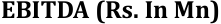

**[Image: Aug2025.pdf-0005-03.png (221x24, 2.8KB)]**

<!-- Start of picture text -->
EBITDA  ( Rs. In Mn ) <!-- End of picture text -->

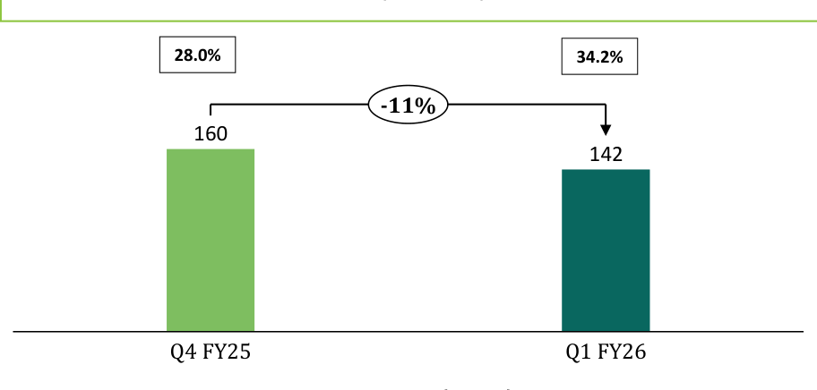

**[Image: Aug2025.pdf-0005-04.png (912x436, 14.2KB)]**

<!-- Start of picture text -->
28.0% 34.2% -11% 160 142 Q4 FY25 Q1 FY26 <!-- End of picture text -->

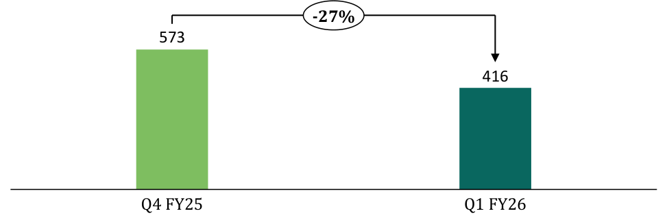

**[Image: Aug2025.pdf-0005-05.png (973x321, 11.9KB)]**

<!-- Start of picture text -->
-27% 573 416 Q4 FY25 Q1 FY26 <!-- End of picture text -->

**Segment Wise (In Mn)** 

**[Image: Aug2025.pdf-0005-07.png (175x24, 2.3KB)]**

<!-- Start of picture text -->
PAT (Rs. In Mn) <!-- End of picture text -->

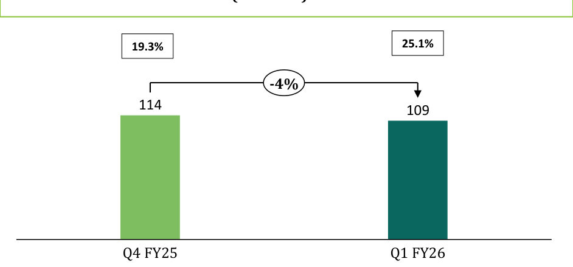

**[Image: Aug2025.pdf-0005-08.png (942x439, 14.1KB)]**

<!-- Start of picture text -->
19.3% 25.1% -4% 114 109 Q4 FY25 Q1 FY26 <!-- End of picture text -->

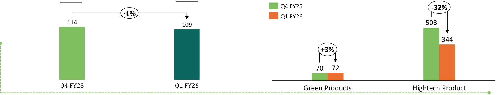

**[Image: Aug2025.pdf-0005-09.png (1911x366, 33.0KB)]**

<!-- Start of picture text -->
Q4 FY25 -32% -4% Q1 FY26 114 503 109 344 +3% 70 72 Q4 FY25 Q1 FY26 Green Products Hightech Product <!-- End of picture text -->

**5** 

## Q1 FY26 Result Highlights (Y-o-Y) 

**[Image: Aug2025.pdf-0006-01.png (203x89, 13.1KB)]**

**O** **<mark>p</mark> eratin** **<mark>g</mark> Revenue** **<mark>(</mark> Rs. In Mn** **<mark>)</mark>** 

**[Image: Aug2025.pdf-0006-03.png (221x24, 2.8KB)]**

<!-- Start of picture text -->
EBITDA  ( Rs. In Mn ) <!-- End of picture text -->

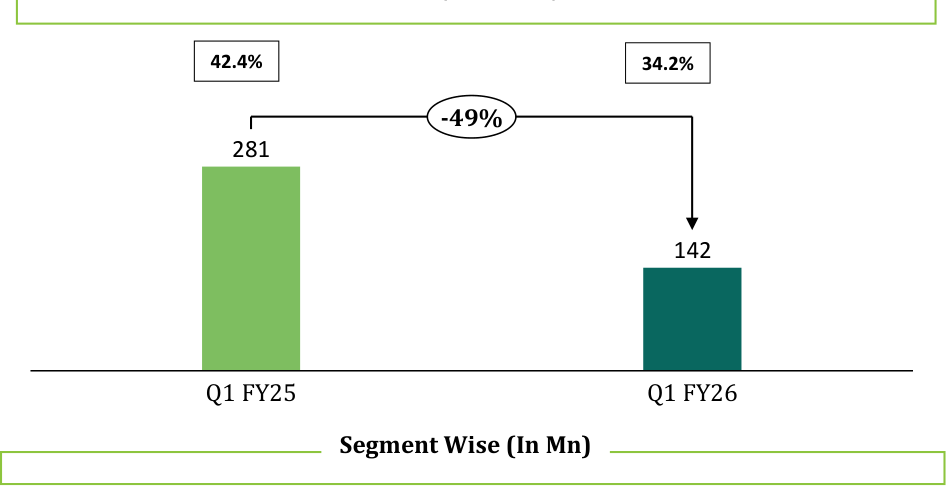

**[Image: Aug2025.pdf-0006-04.png (946x487, 18.9KB)]**

<!-- Start of picture text -->
42.4% 34.2% -49% 281 142 Q1 FY25 Q1 FY26 Segment Wise (In Mn) <!-- End of picture text -->

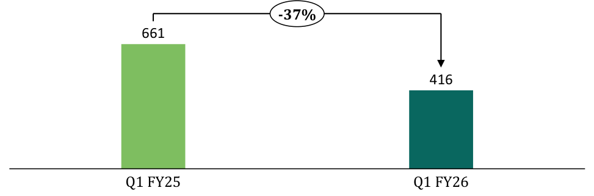

**[Image: Aug2025.pdf-0006-05.png (973x321, 11.5KB)]**

<!-- Start of picture text -->
-37% 661 416 Q1 FY25 Q1 FY26 <!-- End of picture text -->

**[Image: Aug2025.pdf-0006-06.png (175x24, 2.3KB)]**

<!-- Start of picture text -->
PAT (Rs. In Mn) <!-- End of picture text -->

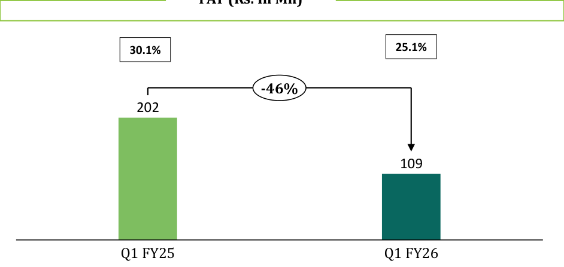

**[Image: Aug2025.pdf-0006-07.png (942x446, 15.8KB)]**

<!-- Start of picture text -->
30.1% 25.1% -46% 202 109 Q1 FY25 Q1 FY26 <!-- End of picture text -->

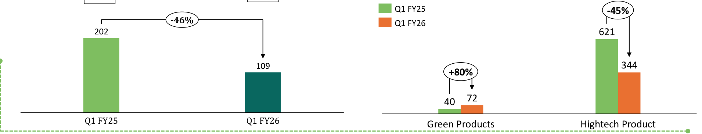

**[Image: Aug2025.pdf-0006-08.png (1911x366, 33.7KB)]**

<!-- Start of picture text -->
Q1 FY25 -45% -46% Q1 FY26 202 621 109 344 +80% 72 40 Q1 FY25 Q1 FY26 Green Products Hightech Product <!-- End of picture text -->

**6** 

## Consolidated Profit & Loss Statement 

**[Image: Aug2025.pdf-0007-01.png (203x89, 13.1KB)]**

|**Particulars (Rs. Mn)**|**Q1 FY26**|**Q4 FY25**|**Q-o-Q**|**Q1 FY25**|**Y-o-Y**|**FY25**|
|---|---|---|---|---|---|---|
|Revenue from Operations|416|573||661||2434|
|**Total Revenue**|**416**|**573**|**-27%**|**661**|**-37%**|**2,434**|
|Cost of Material Consumed|153|145||237||727|
|Purchase of stock in trade|114|133||27||339|
|Change in Inventories of Finishedgoods & Work in Progress|-87|14||16||54|
|**Total Raw Material**|**180**|**291**||**281**||**1,121**|
|**Gross Profit**|**236**|**282**|**-16%**|**380**|**-38%**|**1,313**|
|**Gross Profit Margin(%)**|**56.8%**|**49.1%**||**57.5%**||**54.0%**|
|Employee Expenses|39|40||38||153|
|Other Expenses|55|81||62||277|
|**EBITDA**|**142**|**160**|**-11%**|**281**|**-49%**|**883**|
|**EBITDA Margin(%)**|**34.2%**|**28.0%**||**42.4%**||**36.3%**|
|Other Income|19|18||8||53|
|Depreciation|18|20||17||74|
|**EBIT**|**143**|**158**|**-9%**|**271**|**-47%**|**862**|
|**EBIT Margin(%)**|**34.4%**|**27.5%**||**41.0%**||**35.4%**|
|Finance Cost|1|0||0||2|
|**Profit before Tax**|**143**|**157**|**-9%**|**271**|**-47%**|**860**|
|**Profit before Tax(%)**|**34.3%**|**27.5%**||**41.0%**||**35.3%**|
|Tax|33|43||69||230|
|**Profit After Tax**|**109**|**114**|**-4%**|**202**|**-46%**|**630**|
|**PAT Margin(%)**|**25.1%**|**19.3%**||**30.1%**||**25.3%**|
|EPS(Asper Profit after Tax)|7.21|7.58||13.36||41.83|

**7** 

**[Image: Aug2025.pdf-0008-00.png (830x596, 30.9KB)]**

# ABOUT THE COMPANY 

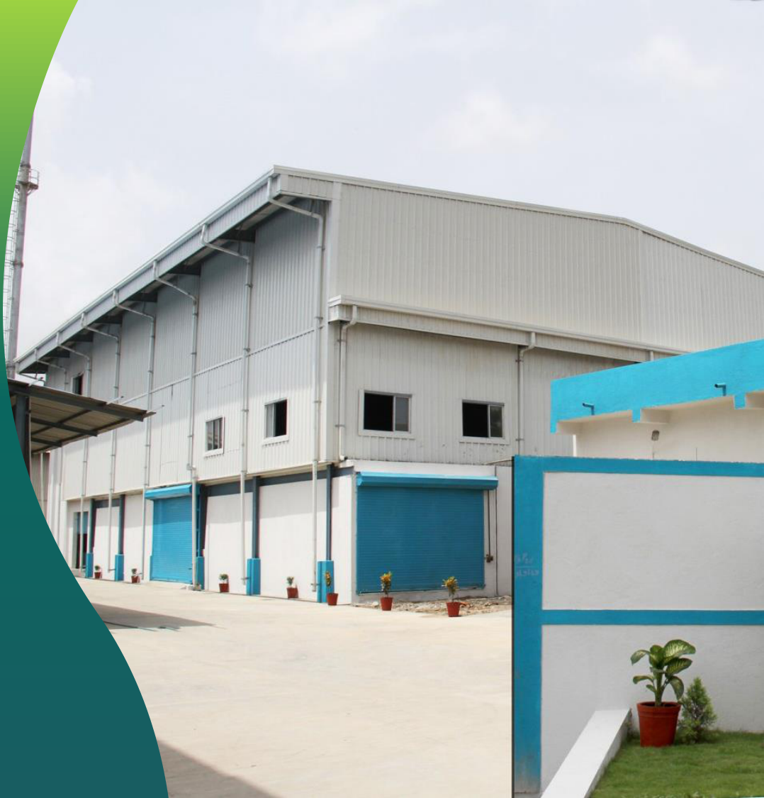

**[Image: Aug2025.pdf-0008-02.png (1078x1125, 1086.6KB)]**

## Leadership Team :Board Of Directors 

**[Image: Aug2025.pdf-0009-01.png (209x286, 90.2KB)]**

**[Image: Aug2025.pdf-0009-02.png (208x286, 102.5KB)]**

**[Image: Aug2025.pdf-0009-03.png (228x28, 2.7KB)]**

<!-- Start of picture text -->
Mr. Shilpan P. Patel <!-- End of picture text -->

**[Image: Aug2025.pdf-0009-04.png (218x67, 4.7KB)]**

<!-- Start of picture text -->
Mr. Neil Patel Jt. Managing Director <!-- End of picture text -->

###### Chairman & M.D 

He holds a Master's in Business Administration from Sam Houston State University, Texas. With experience in the coating industry from Grace Paper Industries Pvt. Ltd, he developed the award-winning Water Soluble Film in 1990, a product with significant environmental impact. 

He possess excellent entrepreneurship and organizational skills and demonstrating keen interest in assuming operational responsibilities since joining the company. 

He serves as a member of the Audit and Stakeholders Relationship committee of the company. 

Appointed to the Board on October 30, 1992, Mr. Patel oversees Business Development and Strategic Management. Under his leadership, Arrow  has secured over 40 patents worldwide and received several awards, including the National IP Award for Patents & Commercialization. 

**[Image: Aug2025.pdf-0009-10.png (209x286, 92.2KB)]**

**Mr. Prashant Mehta** Independent Director 

He is a  Company Secretary with over 40 years of experience, has held key roles in renowned companies such as 

Premier Ltd, Jindal Iron and Steel Co Ltd. (now JSW Steel), and Shoppers Stop, bringing invaluable expertise in legal and secretarial affairs to the table. 

**[Image: Aug2025.pdf-0009-14.png (203x89, 13.1KB)]**

**9** 

## Leadership Team :Board Of Directors 

**[Image: Aug2025.pdf-0010-01.png (209x286, 114.3KB)]**

**[Image: Aug2025.pdf-0010-02.png (208x286, 75.9KB)]**

###### **Mrs. Jigisha Patel** 

**Mr. Yogesh Gajjar** Independent Director 

Woman  Director 

She possess a great knowledge in supervising and co-ordinating the administration along with Managing and Handling Team. 

He had done Diploma in Electronics from Government Polytechnic College in the year 1975. He is into Business of Electricals and 

She also have a wide range of experience and knowledge in Corporate Affairs. 

Electronics services for last 45 years. 

He possesses good entrepreneurship and excellent organizational spirit. He has vast experience & knowledge in the field of electronics. He is based in Ahmedabad. 

**[Image: Aug2025.pdf-0010-11.png (209x286, 88.4KB)]**

**Mrs. Barkharani Nevatia** Independent Director 

She is a Chartered Accountant practicing in Pune and Mumbai, offers extensive experience in 

corporate tax, statutory audits, and specialized knowledge in GST and Income Tax, backed by an LLB degree from Mumbai University and education from Narsee Monjee College of Commerce and Economics. 

**[Image: Aug2025.pdf-0010-15.png (203x89, 13.1KB)]**

**10** 

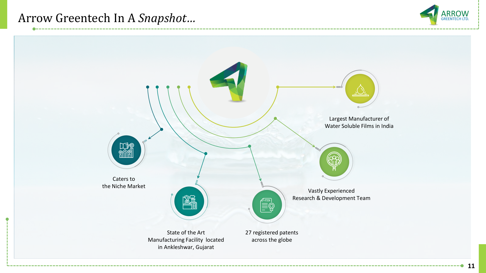

**[Image: Aug2025.pdf-0011-00.png (2000x1125, 652.6KB)]**

<!-- Start of picture text -->
Arrow Greentech In A  Snapshot… Largest Manufacturer of Water Soluble Films in India Caters to the Niche Market Vastly Experienced Research & Development Team State of the Art 27 registered patents Manufacturing Facility  located  across the globe in Ankleshwar, Gujarat 11 <!-- End of picture text -->

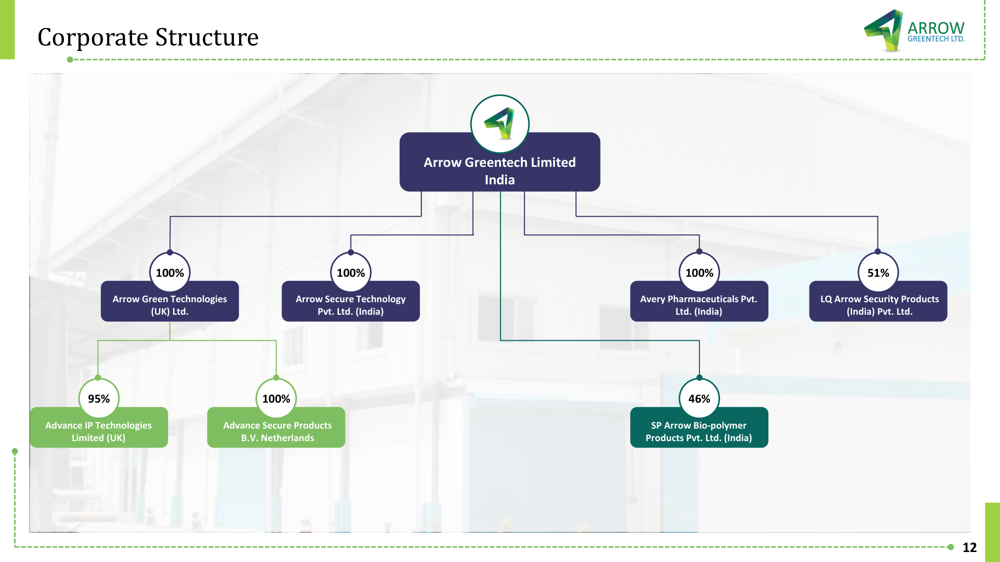

**[Image: Aug2025.pdf-0012-00.png (2000x1125, 505.0KB)]**

<!-- Start of picture text -->
Corporate Structure Arrow Greentech Limited India 100% 100% 100% 51% Arrow Green Technologies Arrow Secure Technology  Avery Pharmaceuticals Pvt.  LQ Arrow Security Products (UK) Ltd. Pvt. Ltd. (India) Ltd. (India) (India) Pvt. Ltd. 95% 100% 46% Advance IP Technologies  Advance Secure Products  SP Arrow Bio-polymer Limited (UK)  B.V. Netherlands  Products Pvt. Ltd. (India) 12 <!-- End of picture text -->

## Business Overview 

**[Image: Aug2025.pdf-0013-01.png (203x89, 13.1KB)]**

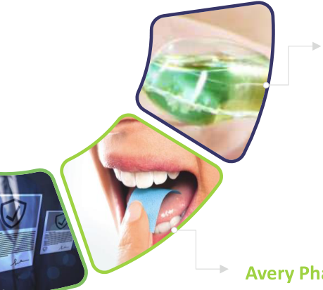

**[Image: Aug2025.pdf-0013-02.png (459x413, 178.4KB)]**

**[Image: Aug2025.pdf-0013-03.png (262x222, 93.7KB)]**

###### **Water Soluble Films** 

###### **Other** 

The other segments include Klenz Pro and BioPlast. 

Development, Production & Marketing of Wide Range of Water Soluble Films 

- › **KlenzPro:** The most concentrated range of hygiene products which are supplied in watersoluble capsules, without generating plastic waste 

**[Image: Aug2025.pdf-0013-09.png (450x248, 157.4KB)]**

- › **Bioplast:** The bio-compostable film is an ecofriendly alternative to replace single-use plastic for our future generations 

###### **Intellectual Property** 

###### **Avery Pharma** 

Total of 27 granted patents across the World across all key business verticals of paper and packing industry, Security products, Health, Hygiene & Food and Printing & PSA Materials 

A 100% wholly-owned subsidiary of Arrow Greentech Limited, the company is committed to the cause of enhancing patient outcomes with a novel approach to oral drug administration, via its Mouth Dissolving Strips (MDS) 

###### **Security Products** 

Security products include Anti-counterfeit security thread for high security papers, brand protection technologies etc. 

**[Image: Aug2025.pdf-0013-17.png (1885x206, 2.7KB)]**

**13** 

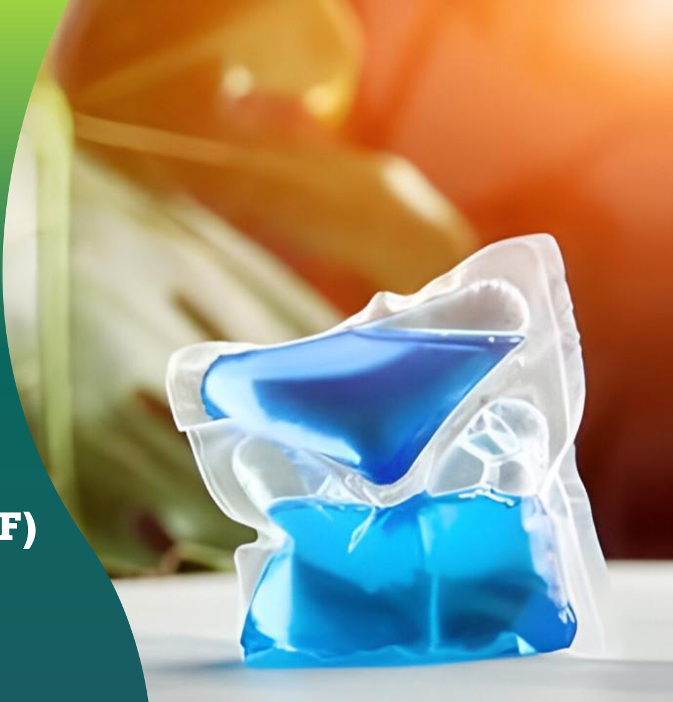

**[Image: Aug2025.pdf-0014-00.png (1078x1125, 1258.0KB)]**

**[Image: Aug2025.pdf-0014-01.png (276x121, 19.8KB)]**

**[Image: Aug2025.pdf-0014-02.png (265x59, 8.7KB)]**

# WATER SOLUBLE FILM (WSF) 

## What Is Water Soluble Film (WSF)? 

**[Image: Aug2025.pdf-0015-01.png (203x89, 13.1KB)]**

#### **<mark>Applications of WSF</mark>** 

Packaging material that is environmentally safe & fully biodegradable when disposed in water. 

Arrow manufactures water-soluble PVA / PVOH (Poly Vinyl Alcohol) film by solution casting. Casting machines are custom-built to suit the customer’s requirements best 

**Properties of WSF** Optimum Tensile Strength Excellent Moisture/Heat Sealing Flexibility for using in multiple Eco-friendly forms of packaging 

**Watersol is the trademark product of Arrow Greentech Ltd.** 

**Eco Friendly Packaging Industrial Printing** (Agrochem **Consumables** (Hydrographic / Packaging, Detergent (Mould release, Hydro dipping) Packaging, other Embroidery, etc.) Primary Packaging) **Other Applications Protective** (Battery separator, **Laundry Bags Packaging Film** active embedded film, anti counterfeit film) **RM** PVA + Other Additives **Process** Batching - Casting - Slitting - PVA film **Value Addition** Embossing – Printing 

**15** 

## Features 

**[Image: Aug2025.pdf-0016-01.png (203x89, 13.1KB)]**

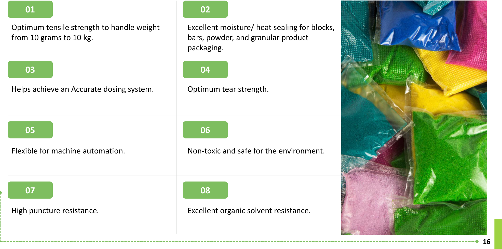

**[Image: Aug2025.pdf-0016-02.png (1971x980, 1528.5KB)]**

<!-- Start of picture text -->
01 02 Optimum tensile strength to handle weight  Excellent moisture/ heat sealing for blocks, from 10 grams to 10 kg.  bars, powder, and granular product packaging. 03 04 Helps achieve an Accurate dosing system. Optimum tear strength. 05 06 Flexible for machine automation. Non-toxic and safe for the environment. 07 08 High puncture resistance. Excellent organic solvent resistance. 16 <!-- End of picture text -->

## Use of Water-Soluble Film 

**Cement / Dye Enzyme Film** 

**Toilet Cleaning Blocks** 

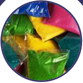

**[Image: Aug2025.pdf-0017-03.png (169x169, 59.3KB)]**

**[Image: Aug2025.pdf-0017-04.png (170x169, 60.8KB)]**

**[Image: Aug2025.pdf-0017-05.png (170x169, 49.0KB)]**

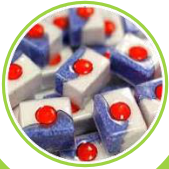

**[Image: Aug2025.pdf-0017-06.png (169x169, 61.7KB)]**

**Infection Control Laundry Bags** 

**Dishwasher Tablet** 

**Laundry Bags** 

**Liquid Detergents** 

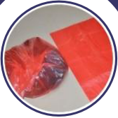

**[Image: Aug2025.pdf-0017-11.png (168x169, 48.4KB)]**

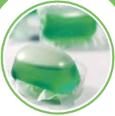

**[Image: Aug2025.pdf-0017-12.png (168x169, 50.4KB)]**

**[Image: Aug2025.pdf-0017-13.png (168x169, 50.2KB)]**

**Embroidery Backing Sheet** 

**[Image: Aug2025.pdf-0017-15.png (203x89, 13.1KB)]**

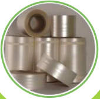

**[Image: Aug2025.pdf-0017-16.png (170x169, 48.9KB)]**

**Agrochemical Film** 

**17** 

## Water Soluble Films (WSF) Industry Snapshot 

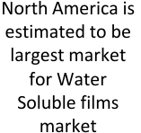

**[Image: Aug2025.pdf-0018-01.png (157x148, 8.2KB)]**

<!-- Start of picture text -->
North America is estimated to be largest market for Water Soluble films market <!-- End of picture text -->

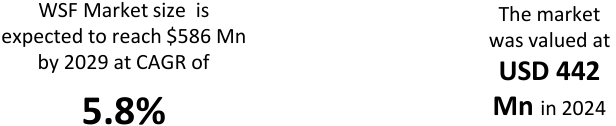

**[Image: Aug2025.pdf-0018-02.png (616x126, 15.9KB)]**

<!-- Start of picture text -->
WSF Market size  is  The market expected to reach $586 Mn  was valued at by 2029 at CAGR of USD 442 5.8% Mn  in 2024 <!-- End of picture text -->

**[Image: Aug2025.pdf-0018-03.png (336x259, 15.1KB)]**

**[Image: Aug2025.pdf-0018-04.png (337x257, 13.9KB)]**

**[Image: Aug2025.pdf-0018-05.png (337x257, 18.6KB)]**

**[Image: Aug2025.pdf-0018-06.png (336x257, 16.5KB)]**

**[Image: Aug2025.pdf-0018-07.png (355x257, 14.9KB)]**

**[Image: Aug2025.pdf-0018-08.png (336x257, 17.9KB)]**

The Asia-Pacific region leads the market driven by fast industrial growth, rising demand for convenience products, and expansion in packaging and agriculture. 

PVA (Polyvinyl Alcohol) dominates the The market is FRAGMENTED with water-soluble films market due to its many players accounting for excellent water solubility, biodegradability, majority market revenue share and non-toxic properties. 

**[Image: Aug2025.pdf-0018-11.png (203x89, 13.1KB)]**

**18** 

## State Of The Art Manufacturing Facilities 

**[Image: Aug2025.pdf-0019-01.png (203x89, 13.1KB)]**

#### **ANKLESHWAR, GUJARAT** 

**[Image: Aug2025.pdf-0019-03.png (1885x206, 285.2KB)]**

**19** 

## Global Presence 

**[Image: Aug2025.pdf-0020-01.png (203x89, 13.1KB)]**

**[Image: Aug2025.pdf-0020-02.png (178x41, 5.4KB)]**

- Presence in Europe, Asia, North & South America and Africa – mainly 3 supply points located in India, United Kingdom and South America 

- Wide Distribution channel to service our clients from around the world 

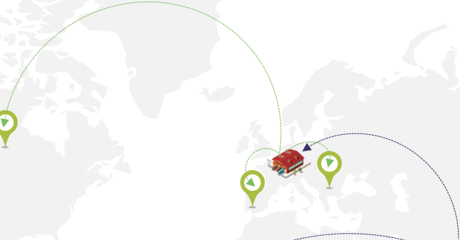

**[Image: Aug2025.pdf-0020-05.png (663x347, 33.8KB)]**

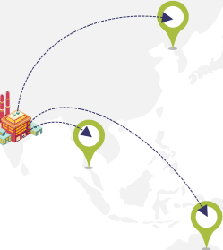

**[Image: Aug2025.pdf-0020-06.png (249x279, 16.7KB)]**

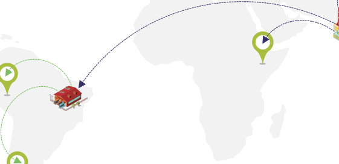

**[Image: Aug2025.pdf-0020-07.png (561x272, 21.1KB)]**

**[Image: Aug2025.pdf-0020-08.png (1007x64, 17.4KB)]**

<!-- Start of picture text -->
Factory Warehousing Facility  Supply Zones Direct Supply Secondary Supply <!-- End of picture text -->

**[Image: Aug2025.pdf-0020-09.png (63x43, 3.9KB)]**

**20** 

**[Image: Aug2025.pdf-0021-00.png (830x596, 30.9KB)]**

# SECURITY PRODUCTS 

**[Image: Aug2025.pdf-0021-02.png (1078x1125, 762.0KB)]**

## Security Products 

**[Image: Aug2025.pdf-0022-01.png (76x76, 3.4KB)]**

<!-- Start of picture text -->
04 <!-- End of picture text -->

**[Image: Aug2025.pdf-0022-02.png (130x128, 7.3KB)]**

<!-- Start of picture text -->
05 <!-- End of picture text -->

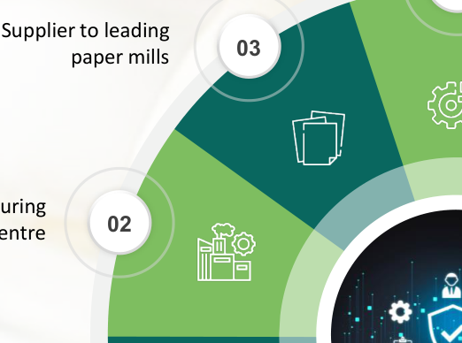

**[Image: Aug2025.pdf-0022-03.png (522x388, 81.5KB)]**

<!-- Start of picture text -->
Supplier to leading 03 paper mills 02 <!-- End of picture text -->

**[Image: Aug2025.pdf-0022-04.png (68x68, 3.8KB)]**

**[Image: Aug2025.pdf-0022-05.png (75x78, 6.0KB)]**

**[Image: Aug2025.pdf-0022-06.png (284x283, 108.6KB)]**

**[Image: Aug2025.pdf-0022-07.png (70x69, 4.5KB)]**

**[Image: Aug2025.pdf-0022-08.png (380x302, 56.5KB)]**

<!-- Start of picture text -->
01 <!-- End of picture text -->

**[Image: Aug2025.pdf-0022-09.png (63x64, 3.9KB)]**

**[Image: Aug2025.pdf-0022-10.png (130x130, 8.9KB)]**

<!-- Start of picture text -->
06 <!-- End of picture text -->

**[Image: Aug2025.pdf-0022-11.png (130x130, 7.7KB)]**

<!-- Start of picture text -->
07 <!-- End of picture text -->

**[Image: Aug2025.pdf-0022-12.png (203x89, 13.1KB)]**

**22** 

**[Image: Aug2025.pdf-0023-00.png (830x596, 30.9KB)]**

# INTELLECTUAL PROPERTY 

**[Image: Aug2025.pdf-0023-02.png (1078x1125, 1147.8KB)]**

## Intellectual Property 

**[Image: Aug2025.pdf-0024-01.png (203x89, 13.1KB)]**

**[Image: Aug2025.pdf-0024-02.png (1916x895, 118.0KB)]**

<!-- Start of picture text -->
01 02 03 04 27 Patents granted across Globe  Our inhouse R&D and IP team is  Monetization  of  key  patents  Patent filed in the area of including the India, UK, USA,  continuously working on new  through out-licensing of patents  security  products,  brand South Africa, Europe and Eurasia  innovation and patents and  production  of  patented  protection,  security  papers, products security films, self adhesive material,  healthcare,  bio- compostable material etc. 05 06 07 08 State of Art R&D Lab and IP cell  Innovation is focused on green  30 Indian patent applications and  40  registered  trademark  in in Mumbai and high-tech products 13 foreign patent applications  India. under process covering various sectors and  geographies. <!-- End of picture text -->

**24** 

## Arrow’s Intellectual Property 

**[Image: Aug2025.pdf-0025-01.png (203x89, 13.1KB)]**

###### **<mark>Granted Patents</mark>** 

Arrow Greentech Limited at present has 27 granted patents globally covering the territories of – India, UK, USA, South Africa, Europe and Eurasia 

###### **<mark>Patent Applications</mark>** 

Arrow Greentech Limited also has 30 Indian patent applications and 13 foreign patent applications under process covering various sectors, through mainly covering Water-Soluble Films and Security Section 

###### **<mark>Trademarks</mark>** 

Arrow Greentech Limited has 40 in-force registered Trademarks along with 8 Trademark application currently under processing 

###### **<mark>Group 1 – Paper and Packing Industry</mark>** 

|**Cold Water** **Soluble** **Film**|**High strength** **process of m**|**paper and** **anufacture**|**High security** **process of m**|**paper and** **anufacture**|**Self d**|**estructive irrever**|**sible security pack**|**aging film**|**Method of pro** **security fil** **security film** **the said**|**ducing  a high** **m and high** **produced by** **method**|**Bio-Compostable** **Multi-Layered composite** **and methods of manufacturing the** **Same**|
|---|---|---|---|---|---|---|---|---|---|---|---|
|**India** (20.02.24)|**United States** (22.11.11)|**Europe** (23.08.17)|**Europe** (13.09.17)|**India** (03.01.18)|**India** (21.01.09)|**Eurasia** (30.12.09)|**Europe** (05.05.10)|**United States** (23.08.2016) (Div) (07.12.21)|**Europe** (15.08.12)|**India** (31.10.18)|**India** (10.01.24)|

###### **<mark>Group 2 – Packaging Industry</mark>** 

|**Improved Water** **Soluble Film and** **method of making** **the same**|**Cold Water Soluble Film**|**High strength** **process of m**|**paper and** **anufacture**|**Self des**|**tructive irreversibl**|**e security packa**|**ging film**|**Bio-Compostable** **Multi-Layered composite** **and methods of manufacturing** **them**|**Edible water soluble packaging** **film and package made out of** **the said film**|
|---|---|---|---|---|---|---|---|---|---|
|**India** (12.12.23)|**India** (20.02.24)|**United States** (22.11.11)|**Europe** (23.08.17)|**India** (21.01.09)|**Eurasia** (30.12.09)|**Europe** **(**05.05.10)|**United States** **(**23.08.16) (Div)  (07.12.21)|**India** (10.01.24)|**India** (05.06.12)|

**25** 

## Arrow’s Intellectual Property 

**[Image: Aug2025.pdf-0026-01.png (203x89, 13.1KB)]**

###### **<mark>Group 3 – Security Products</mark>** 

|**Security** **Laminates**|**High security pap** **manuf**|**er and process of** **acture**|**S**|**elf destructive irreversibl**|**e security packaging fil**|**m**|**Method of pro** **security film and** **produced by th**|**ducing  a high** **high security film** **e said method**|**Security Yarn**|**Dual  Color Shift** **Security Film**|
|---|---|---|---|---|---|---|---|---|---|---|
|||||||**United States**|||||
|**UK** (24.01.24)|**Europe** (13.09.17)|**India** (03.01.18)|**India** (21.01.09)|**Eurasia** (30.12.09)|**Europe** (05.05.10)|(23.08.16) (Div) (07.12.21)|**Europe** (15.08.12)|**India** (31.10.18)|**India** (08.09.23)|**United States** (14.01.25)|

###### **<mark>Group 4 – Health, Hygiene & Food</mark>** 

|**Improved Water Soluble Film** **and method of making the same**|**Cold Water Soluble Film**|**Medicated Bands**|**Edible water soluble** **packaging film and package** **made out of the said film**|**A water solu** **samples**|**ble film based matri** **extracted from livin**|**x to contain** **g species**|**A Cleaning Device with** **Sustained Release of Actives**|
|---|---|---|---|---|---|---|---|
|**India**|**India**|**India**|**India**|**India**|**Europe**|**USA**|**India**|
|(12.12.23)|(20.02.24)|(13.05.24)|(05.06.12)|(27.03.12)|(24.07.13)|(18.03.14)|(01.02.23)|

###### **<mark>Group 5 – Printing and PSA Materials</mark>** 

**New Improved Self adhesive materials with a water Self Adhesive Wall Paper with Reduced Adhesive Material and soluble films Self adhesive materials with a water soluble protective layer Water Soluble Film India South Africa United States India** (30.10.23) (1.12.08) (09.11.10) (16.03.23) 

**26** 

## Key Granted Patents across the Globe 

**[Image: Aug2025.pdf-0027-01.png (203x89, 13.1KB)]**

|**Health**|**Hygiene**|**Packaging**|**Security**|**Printing**|**Self-Adhesive**|
|---|---|---|---|---|---|
|`o` Mouth Melting strips, Gel strips, Enzyme strips `o` Vitamins, Drugs, Medicine, Disinfectants and other Pharma ingredients `o` For clinical setting like blood, serum, urine testing etc.|`o` Used to add Active ingredients of Detergents, Softeners, Cleaning Laundry, Dishes, Floorings, Walls, Furnitures and other cleaning agents that are retained and remained intact for a longer time|`o` Used in agronutrients such as fertilizers, urea, agrochemicals etc. `o` Used for packaging for food products, liquid cement, shopping bags etc. or other biodegrable material|`o` Used in making security labels or secure packaging of the products for identification `o` Used in manufacturing of security documents such as cheques, bank notes, passport papers etc.|`o` Used for printing fabrics, net or perforated cloth `o` Used for printing paper, vinyl `o` Used in printing of hoardings, one-way vision films|`o` Used in making labels for product identification and/or advertising etc.|

**27** 

## Key Granted Patents across the Globe 

**[Image: Aug2025.pdf-0028-01.png (203x89, 13.1KB)]**

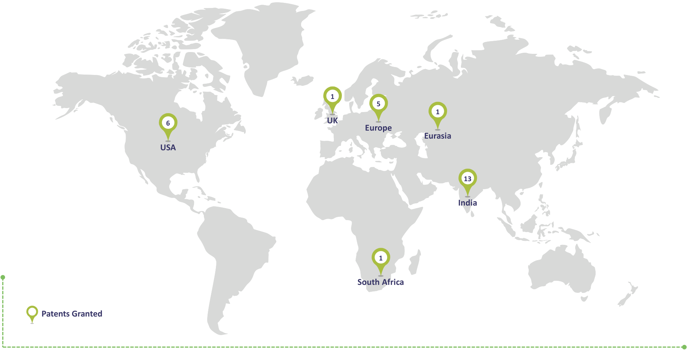

**[Image: Aug2025.pdf-0028-02.png (1887x962, 103.0KB)]**

<!-- Start of picture text -->
1 5 1 6 UK Europe Eurasia USA 13 India 1 South Africa Patents Granted <!-- End of picture text -->

**28** 

**[Image: Aug2025.pdf-0029-00.png (830x596, 30.9KB)]**

# Mouth Dissolving Strip 

**[Image: Aug2025.pdf-0029-02.png (1163x1125, 641.8KB)]**

## Arrow RX 

**[Image: Aug2025.pdf-0030-04.png (149x134, 5.3KB)]**

<!-- Start of picture text -->
01 <!-- End of picture text -->

Avery Pharmaceuticals Pvt Ltd is 100% Subsidiary company of Arrow Greentech Limited 

**[Image: Aug2025.pdf-0030-06.png (149x135, 5.4KB)]**

<!-- Start of picture text -->
02 <!-- End of picture text -->

Manufacturing of Mouth Dissolving Strips (Pharmaceuticals & Nutraceuticals) 

**[Image: Aug2025.pdf-0030-08.png (149x134, 5.5KB)]**

<!-- Start of picture text -->
03 <!-- End of picture text -->

WHO GMP approved manufacturing facility with state of art plant & machinery and in-house product development center in Sanand (Gujarat) 

**[Image: Aug2025.pdf-0030-10.png (149x138, 5.5KB)]**

<!-- Start of picture text -->
04 <!-- End of picture text -->

Product Approval from Food and Drug Controller Administration (FDCA) and Central FSSAI License received for approx. 50 products including new products i.e. Sildenafil, Ondansetron, Amoldipine, Vitamin D3, Vitamin B12, Vitamin K2, Vitamin B3, Folic Acid, Iron, Zinc strips, Nicotine, Curcumin+Piperine etc. 

**[Image: Aug2025.pdf-0030-12.png (149x139, 5.7KB)]**

<!-- Start of picture text -->
05 <!-- End of picture text -->

Who-GMP, FSSAI, GLP, ISO 9001 and ISO 22000 certified facility 

**[Image: Aug2025.pdf-0030-14.png (149x134, 5.8KB)]**

<!-- Start of picture text -->
06 <!-- End of picture text -->

**[Image: Aug2025.pdf-0030-15.png (149x139, 5.5KB)]**

<!-- Start of picture text -->
07 <!-- End of picture text -->

**[Image: Aug2025.pdf-0030-16.png (149x138, 5.7KB)]**

<!-- Start of picture text -->
08 <!-- End of picture text -->

**[Image: Aug2025.pdf-0030-17.png (149x138, 5.6KB)]**

<!-- Start of picture text -->
09 <!-- End of picture text -->

**[Image: Aug2025.pdf-0030-18.png (149x139, 5.5KB)]**

<!-- Start of picture text -->
10 <!-- End of picture text -->

**[Image: Aug2025.pdf-0030-19.png (203x89, 13.1KB)]**

Expertise from parent company on casting of film and embedding various APIs in Lingual,Sub- Lingual and Buccal 

Commercial production began in August 2022 

Long-term contract signed with big MNC company for export markets 

In discussion with various domestic and international companies for long-term supply contract 

The company is undertaking CDMO project (Contract Development and Manufacturing Organization) 

**30** 

## Product Development & Approvals 

**[Image: Aug2025.pdf-0031-01.png (203x89, 13.1KB)]**

#### **<mark>List of FASSAI Products</mark>** 

|**Sr. No.**|**Name of Approved Products**|**Category**|**Sr. No.**|**Name of Approved Products**|**Category**|
|---|---|---|---|---|---|
|1|Vitamin B12 (Cyanocobalamin) 1500 mcg Mouth Dissolving Strip|Nutraceuticals|28|Lutein + Zeaxanthin (10 mg + 2 mg) Mouth Dissolving Strip|Nutraceuticals|
|2|Food Grade Edible Film for Packaging|Nutraceuticals|29 |Curcumin 50 mgMouth DissolvingStrip |Nutraceuticals |
|3|Vitamin D3 800 IU Mouth Dissolving Strip|Nutraceuticals|30 |Astaxanthin 4 mgMouth DissolvingStrip |Nutraceuticals |
|4|Vitamin D3 + K2 + Calcium (1000 IU + 9 mcg + 90 mg) Mouth Dissolving Strip|Nutraceuticals|31 32|Curcumin 100 mgMouth DissolvingStrip Clove Oil 8 mgMouth DissolvingStrip|Nutraceuticals Nutraceuticals|
|5|Natural Probiotics Strips 5  BCFU Mouth Dissolving Strip|Nutraceuticals|33|HempMouth DissolvingStrip0.3% w/w|Nutraceuticals|
|6|Folic Acid 400 mcg Mouth Dissolving Strip|Nutraceuticals|34|Melatonin and Valerian (10 mg + 3 mg) Mouth Dissolving Strip|Nutraceuticals|
|7|Caffeine + Vitamin B12 + Ginkgo (15 mg + 4 mg + 3 mg) Mouth Dissolving Strip|Nutraceuticals|35|Melatonin 10 mg, HOPS 4 mg and Valerian Root 3 mg Mouth Dissolving Strips|Nutraceuticals|
|8|Hangover Mouth Dissolving Strip|Nutraceuticals|36|Echinacea Purpuria & Honey Propolis (100 mg + 5 mg) Mouth Dissolving Strips|Nutraceuticals|
|9|L-Methyl Folate 1 mg Mouth Dissolving Strip|Nutraceuticals|37|L-Arginine & Caffeine (10 mg + 25 mg) Mouth Dissolving Strips|Nutraceuticals|
|10|Vitamin D3 + K2 (2000 IU +15 mcg) Mouth Dissolving Strip|Nutraceuticals|38|Vitamin D3 400 IU Mouth Dissolving Strip (Health Supplements)|Nutraceuticals|
|11|Vitamin K2 200 mcg Mouth Dissolving Strip|Nutraceuticals|39|Vitamin D3 600 IU Mouth Dissolving Strip (Health Supplements)|Nutraceuticals|
|12|Folic Acid 500 mcg Mouth Dissolving Strip|Nutraceuticals||Iron 17 mg Mouth Dissolving Strips (Nutraceutical)|Nutraceuticals|
|13|Astaxanthin 5 mg Mouth Dissolving Strip|Nutraceuticals|40|||
|14|Vitamin D3 1000 IU Mouth Dissolving Strip|Nutraceuticals|41|Vitamin C 50 mg Mouth Dissolving Strip (Health Supplement)|Nutraceuticals|
|15|Astaxanthin 10 mg Mouth Dissolving Strip|Nutraceuticals|42|Vitamin C 40 mg Mouth Dissolving Strip (Health Supplement) |Nutraceuticals|
|16|Vitamin D3 2000 IU Mouth Dissolving Strip|Nutraceuticals|43|Vitamin C + Zinc + Vitamin D3 (40 mg + 10 mg + 400 IU) Mouth DissolvingStrip|Nutraceuticals|
|17|Vitamin B12 (Cyanocobalamin) 500 mcg Mouth Dissolving Strip|Nutraceuticals|44|Vitamin B3 (Nicotinamide) 14 mg Mouth Dissolving Strip (Health Supplement)|Nutraceuticals|
|18|Vitamin B-Complex Mouth Dissolving Strip|Nutraceuticals|45|Vitamin B3 (Niacin) 14 mg Mouth Dissolving Strip (Health Supplement) |Nutraceuticals|
|||||Vitamin C + Zinc (40 mg + 10 mg) Mouth Dissolving Strip (Health||
|19|Vitamin B12 (Cyanocobalamin) 1000 mcg Mouth Dissolving Strip|Nutraceuticals|46|Supplement)|Nutraceuticals|
|20|Ashwagandha 50 mg Mouth Dissolving Strip|Nutraceuticals|47|Vitamin K2 55 mcg Mouth Dissolving Strips (Health Supplement) Vitamin D3 + K2 (400 IU + 55 mc) Mouth Dissolvin Stri (Health|Nutraceuticals|
|21|Ashwagandha 100 mg Mouth Dissolving Strip|Nutraceuticals|48|g  g p Supplement)|Nutraceuticals|
|22|Curcumin + Piperine (45 mg + 5 mg) Mouth Dissolving Strip|Nutraceuticals|49|Zinc Picolinate 10 mg Mouth Dissolving Strip (Nutraceutical)|Nutraceuticals|
|23|Melatonin 0.5 mg Mouth Dissolving Strips|Nutraceuticals|50|Caffeine 50 mg Mouth Dissolving Strips (Health Supplements)|Nutraceuticals|
|24|Melatonin 1 mg Mouth Dissolving Strips|Nutraceuticals|51|Lactoferrin 5 mg Mouth Dissolving Strips (Health Supplements)|Nutraceuticals|
|25|Melatonin 3 mg Mouth Dissolving Strips|Nutraceuticals|52|Lactoferrin 10 mg Mouth Dissolving Strips (Health Supplements)|Nutraceuticals|
|26|Melatonin 5 mg Mouth Dissolving Strips|Nutraceuticals||Immune Booster Mouth Dissolving Strips (Nutraceutical)|Nutraceuticals|
|27|Melatonin 10 mg Mouth Dissolving Strips|Nutraceuticals|53|||
||||54|Folic Acid 200 mcg Mouth Dissolving Strips (Health Supplement)|Nutraceuticals|

**31** 

## Product Development & Approvals 

**[Image: Aug2025.pdf-0032-01.png (203x89, 13.1KB)]**

#### **<mark>List of RX Approved Products</mark>** 

|**SR No**|**Name of Product**|**Strength**|**Grade**|
|---|---|---|---|
|1|Sildenafil Citrate|25 mg|IP|
|2|Sildenafil Citrate|50 mg|IP|
|3|Ondensentron Hydrochloride Dihydrate|4 mg|IP|
|4|Ondansetron Hydrochloride Dihydrate|8 mg|IP|
|5|Amlodipine Besylate|5 mg|IP|
|6|Amlodipine Besylate|10 mg|IP|
|7|Sildenafil Citrate|25 mg|USP|
|8|Sildenafil Citrate|50 mg|USP|
|9|Ondansetron Hydrochloride Dihydrate|4 mg|USP|
|10|Ondansetron Hydrochloride Dihydrate|8 mg|USP|
|11|Vitamin D3 (Cholecalciferol)|2000 IU|IP|
|12|Vitamin B12 (Methylcobalamin)|1500 mcg|IP|
|13|Eliglustat Sublingual Film|12/16/20/24 mg|IH|
|14|Tadalafil|10/20 mg|USP|
|15|Nicotine Polacrilex|2/4 mg|USP|

**[Image: Aug2025.pdf-0032-04.png (276x93, 12.4KB)]**

Dedication To Innovation 

- Various other products are under development or approval phase 

- Inhouse product development team is continuously working on new development and innovation and New drug application projects 

**32** 

## Arrow RX 

**[Image: Aug2025.pdf-0033-01.png (203x89, 13.1KB)]**

**[Image: Aug2025.pdf-0033-02.png (278x93, 12.3KB)]**

Dedication To Innovation 

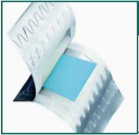

**[Image: Aug2025.pdf-0033-04.png (238x230, 63.6KB)]**

###### **MDS****TM** **Films – NDDS** 

- Mouth Dissolving Strips (MDS) - Thin Films loaded with Actives for Drug Delivery 

- Taken Orally and melts instantaneously in the mouth when placed on or under the tongue 

- The active substance enters the bloodstream directly via the oral mucosa without having to pass through the gastrointestinal tract 

- Achieve highest loading of active ingredient into mouth dissolving film successfully 

**[Image: Aug2025.pdf-0033-10.png (238x230, 77.3KB)]**

###### **Novel Drug Delivery Device -NDDD** 

- NDDD contains Actives embedded within and/or coated upon Water Soluble or Water Dispersible Polymers 

- The active ingredients are released at a precise – controlled rate from a readily soluble polymer into an aqueous environment through one or more perforated bio-digestible films, post which DDD dissolves  overtime and is bio absorbed over time 

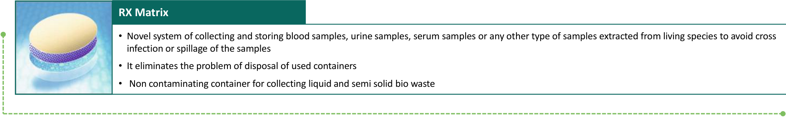

**[Image: Aug2025.pdf-0033-14.png (1887x283, 132.0KB)]**

<!-- Start of picture text -->
RX Matrix • Novel system of collecting and storing blood samples, urine samples, serum samples or any other type of samples extracted from living species to avoid cross infection or spillage of the samples • It eliminates the problem of disposal of used containers •  Non contaminating container for collecting liquid and semi solid bio waste <!-- End of picture text -->

**33** 

## Arrow RX 

**[Image: Aug2025.pdf-0034-01.png (203x89, 13.1KB)]**

**[Image: Aug2025.pdf-0034-02.png (278x93, 12.3KB)]**

Dedication To Innovation 

#### **<mark>Why Arrow MDS</mark>** 

- Granted Patent for Actives Embedded Water Soluble film (WSF). 

- One or more actives can be embedded or entrapped at selected concentrations and dispositions therein such that the material embedded can be delivered at precise and selected dosages to the point of application 

   - Quick disintegration on contact with saliva. 

   - Customizing MDS as lingual, sublingual & Buccal. 

   - Immediate drug release. 

   - Ensure Precision Dosing. 

   - Increase Bioavailability of drug. 

- Arrow Trade Name – MDS “Mouth Dissolving Strips” 

- Drug gets delivered by three different routes i.e. Lingual, Sublingual and Buccal. The three different route offers benefits of Quick onset of action and sustained release of drug for any of the categories of patients especially, veterinary, psychosomatic, schizophrenic, pediatric and geriatric patients 

- Identified various molecules to be embedded in WSF in first phase 

- Taste masking of bitter drug using patented technology. 

Safer and faster drug  deliverance. 

▪ 

- Enables faster systemic absorption and bypass hepatic metabolism. hence improves bioavailability of drug. 

▪ 

▪ Instant onset of action. 

▪ Longer Shelf life 

Reduces side effects as low in chemical combinations. 

▪ 

▪ Can be easily  administered to non-cooperative and difficult patients 

**34** 

**[Image: Aug2025.pdf-0035-00.png (830x596, 30.9KB)]**

# FINANCIAL OVERVIEW 

**[Image: Aug2025.pdf-0035-02.png (1078x1125, 1497.9KB)]**

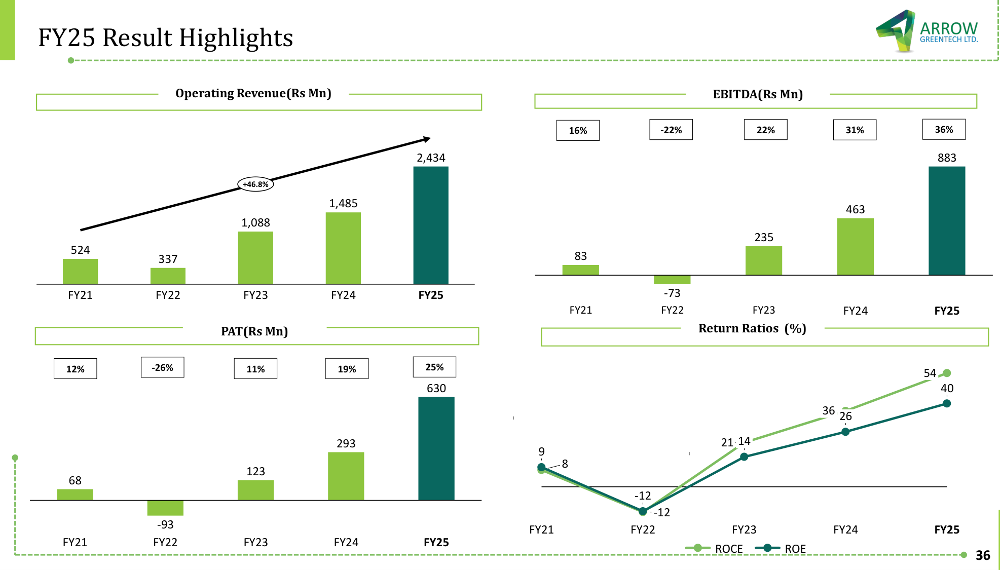

**[Image: Aug2025.pdf-0036-00.png (1973x1125, 120.8KB)]**

<!-- Start of picture text -->
FY25 Result Highlights O p eratin g  Revenue ( Rs Mn ) EBITDA(Rs Mn) 16% -22% 22% 31% 36% 2,434 883 +46.8% 1,485 463 1,088 235 524 337 83 FY21 FY22 FY23 FY24 FY25 -73 FY21 FY22 FY23 FY24 FY25 PAT(Rs Mn) Return Ratios   ( % ) 12% -26% 11% 19% 25% 54 630 40 36 26 293 21 14 9 8 123 68 -12 -12 -93 FY21 FY22 FY23 FY24 FY25 FY21 FY22 FY23 FY24 FY25 ROCE ROE 36 <!-- End of picture text -->

**[Image: Aug2025.pdf-0037-00.png (1161x1125, 1314.5KB)]**

###### **For further information, please contact:** 

**Company :** 

**[Image: Aug2025.pdf-0037-03.png (146x63, 9.1KB)]**

**Arrow Greentech Ltd. (BSE: 516064 | NSE: ARROWGREEN)** 

###### **Poonam Bansal** 

Company Secretary & Compliance Officer Email: poonam@arrowgreentech.com 

###### **Investor Relations Advisors :** 

**[Image: Aug2025.pdf-0037-08.png (289x68, 6.9KB)]**

**MUFG Intime India Private Limited** A part of MUFG Corporate Markets, a division of MUFG Pension & Market Services 

Mr. Bhavya Shah 

Mr. Chirag Bhatiya 

+91 80827 48577 

+91 81047 78836 

bhavya.shah@in.mpms.mufg.com 

chirag.bhatiya@in.mpms.mufg.com 

Thank You 

---

## Extracted Images

| # | File | Dimensions | Size |
|---|------|------------|------|
| 1 | Aug2025.pdf-0001-00.png | 2000x1125 | 1152.9KB |
| 2 | Aug2025.pdf-0002-01.png | 203x89 | 13.1KB |
| 3 | Aug2025.pdf-0003-00.png | 1078x1125 | 1498.6KB |
| 4 | Aug2025.pdf-0003-01.png | 830x596 | 30.9KB |
| 5 | Aug2025.pdf-0004-01.png | 203x89 | 13.1KB |
| 6 | Aug2025.pdf-0004-03.png | 420x420 | 182.7KB |
| 7 | Aug2025.pdf-0005-01.png | 203x89 | 13.1KB |
| 8 | Aug2025.pdf-0005-03.png | 221x24 | 2.8KB |
| 9 | Aug2025.pdf-0005-04.png | 912x436 | 14.2KB |
| 10 | Aug2025.pdf-0005-05.png | 973x321 | 11.9KB |
| 11 | Aug2025.pdf-0005-07.png | 175x24 | 2.3KB |
| 12 | Aug2025.pdf-0005-08.png | 942x439 | 14.1KB |
| 13 | Aug2025.pdf-0005-09.png | 1911x366 | 33.0KB |
| 14 | Aug2025.pdf-0006-01.png | 203x89 | 13.1KB |
| 15 | Aug2025.pdf-0006-03.png | 221x24 | 2.8KB |
| 16 | Aug2025.pdf-0006-04.png | 946x487 | 18.9KB |
| 17 | Aug2025.pdf-0006-05.png | 973x321 | 11.5KB |
| 18 | Aug2025.pdf-0006-06.png | 175x24 | 2.3KB |
| 19 | Aug2025.pdf-0006-07.png | 942x446 | 15.8KB |
| 20 | Aug2025.pdf-0006-08.png | 1911x366 | 33.7KB |
| 21 | Aug2025.pdf-0007-01.png | 203x89 | 13.1KB |
| 22 | Aug2025.pdf-0008-00.png | 830x596 | 30.9KB |
| 23 | Aug2025.pdf-0008-02.png | 1078x1125 | 1086.6KB |
| 24 | Aug2025.pdf-0009-01.png | 209x286 | 90.2KB |
| 25 | Aug2025.pdf-0009-02.png | 208x286 | 102.5KB |
| 26 | Aug2025.pdf-0009-03.png | 228x28 | 2.7KB |
| 27 | Aug2025.pdf-0009-04.png | 218x67 | 4.7KB |
| 28 | Aug2025.pdf-0009-10.png | 209x286 | 92.2KB |
| 29 | Aug2025.pdf-0009-14.png | 203x89 | 13.1KB |
| 30 | Aug2025.pdf-0010-01.png | 209x286 | 114.3KB |
| 31 | Aug2025.pdf-0010-02.png | 208x286 | 75.9KB |
| 32 | Aug2025.pdf-0010-11.png | 209x286 | 88.4KB |
| 33 | Aug2025.pdf-0010-15.png | 203x89 | 13.1KB |
| 34 | Aug2025.pdf-0011-00.png | 2000x1125 | 652.6KB |
| 35 | Aug2025.pdf-0012-00.png | 2000x1125 | 505.0KB |
| 36 | Aug2025.pdf-0013-01.png | 203x89 | 13.1KB |
| 37 | Aug2025.pdf-0013-02.png | 459x413 | 178.4KB |
| 38 | Aug2025.pdf-0013-03.png | 262x222 | 93.7KB |
| 39 | Aug2025.pdf-0013-09.png | 450x248 | 157.4KB |
| 40 | Aug2025.pdf-0013-17.png | 1885x206 | 2.7KB |
| 41 | Aug2025.pdf-0014-00.png | 1078x1125 | 1258.0KB |
| 42 | Aug2025.pdf-0014-01.png | 276x121 | 19.8KB |
| 43 | Aug2025.pdf-0014-02.png | 265x59 | 8.7KB |
| 44 | Aug2025.pdf-0015-01.png | 203x89 | 13.1KB |
| 45 | Aug2025.pdf-0016-01.png | 203x89 | 13.1KB |
| 46 | Aug2025.pdf-0016-02.png | 1971x980 | 1528.5KB |
| 47 | Aug2025.pdf-0017-03.png | 169x169 | 59.3KB |
| 48 | Aug2025.pdf-0017-04.png | 170x169 | 60.8KB |
| 49 | Aug2025.pdf-0017-05.png | 170x169 | 49.0KB |
| 50 | Aug2025.pdf-0017-06.png | 169x169 | 61.7KB |
| 51 | Aug2025.pdf-0017-11.png | 168x169 | 48.4KB |
| 52 | Aug2025.pdf-0017-12.png | 168x169 | 50.4KB |
| 53 | Aug2025.pdf-0017-13.png | 168x169 | 50.2KB |
| 54 | Aug2025.pdf-0017-15.png | 203x89 | 13.1KB |
| 55 | Aug2025.pdf-0017-16.png | 170x169 | 48.9KB |
| 56 | Aug2025.pdf-0018-01.png | 157x148 | 8.2KB |
| 57 | Aug2025.pdf-0018-02.png | 616x126 | 15.9KB |
| 58 | Aug2025.pdf-0018-03.png | 336x259 | 15.1KB |
| 59 | Aug2025.pdf-0018-04.png | 337x257 | 13.9KB |
| 60 | Aug2025.pdf-0018-05.png | 337x257 | 18.6KB |
| 61 | Aug2025.pdf-0018-06.png | 336x257 | 16.5KB |
| 62 | Aug2025.pdf-0018-07.png | 355x257 | 14.9KB |
| 63 | Aug2025.pdf-0018-08.png | 336x257 | 17.9KB |
| 64 | Aug2025.pdf-0018-11.png | 203x89 | 13.1KB |
| 65 | Aug2025.pdf-0019-01.png | 203x89 | 13.1KB |
| 66 | Aug2025.pdf-0019-03.png | 1885x206 | 285.2KB |
| 67 | Aug2025.pdf-0020-01.png | 203x89 | 13.1KB |
| 68 | Aug2025.pdf-0020-02.png | 178x41 | 5.4KB |
| 69 | Aug2025.pdf-0020-05.png | 663x347 | 33.8KB |
| 70 | Aug2025.pdf-0020-06.png | 249x279 | 16.7KB |
| 71 | Aug2025.pdf-0020-07.png | 561x272 | 21.1KB |
| 72 | Aug2025.pdf-0020-08.png | 1007x64 | 17.4KB |
| 73 | Aug2025.pdf-0020-09.png | 63x43 | 3.9KB |
| 74 | Aug2025.pdf-0021-00.png | 830x596 | 30.9KB |
| 75 | Aug2025.pdf-0021-02.png | 1078x1125 | 762.0KB |
| 76 | Aug2025.pdf-0022-01.png | 76x76 | 3.4KB |
| 77 | Aug2025.pdf-0022-02.png | 130x128 | 7.3KB |
| 78 | Aug2025.pdf-0022-03.png | 522x388 | 81.5KB |
| 79 | Aug2025.pdf-0022-04.png | 68x68 | 3.8KB |
| 80 | Aug2025.pdf-0022-05.png | 75x78 | 6.0KB |
| 81 | Aug2025.pdf-0022-06.png | 284x283 | 108.6KB |
| 82 | Aug2025.pdf-0022-07.png | 70x69 | 4.5KB |
| 83 | Aug2025.pdf-0022-08.png | 380x302 | 56.5KB |
| 84 | Aug2025.pdf-0022-09.png | 63x64 | 3.9KB |
| 85 | Aug2025.pdf-0022-10.png | 130x130 | 8.9KB |
| 86 | Aug2025.pdf-0022-11.png | 130x130 | 7.7KB |
| 87 | Aug2025.pdf-0022-12.png | 203x89 | 13.1KB |
| 88 | Aug2025.pdf-0023-00.png | 830x596 | 30.9KB |
| 89 | Aug2025.pdf-0023-02.png | 1078x1125 | 1147.8KB |
| 90 | Aug2025.pdf-0024-01.png | 203x89 | 13.1KB |
| 91 | Aug2025.pdf-0024-02.png | 1916x895 | 118.0KB |
| 92 | Aug2025.pdf-0025-01.png | 203x89 | 13.1KB |
| 93 | Aug2025.pdf-0026-01.png | 203x89 | 13.1KB |
| 94 | Aug2025.pdf-0027-01.png | 203x89 | 13.1KB |
| 95 | Aug2025.pdf-0028-01.png | 203x89 | 13.1KB |
| 96 | Aug2025.pdf-0028-02.png | 1887x962 | 103.0KB |
| 97 | Aug2025.pdf-0029-00.png | 830x596 | 30.9KB |
| 98 | Aug2025.pdf-0029-02.png | 1163x1125 | 641.8KB |
| 99 | Aug2025.pdf-0030-04.png | 149x134 | 5.3KB |
| 100 | Aug2025.pdf-0030-06.png | 149x135 | 5.4KB |
| 101 | Aug2025.pdf-0030-08.png | 149x134 | 5.5KB |
| 102 | Aug2025.pdf-0030-10.png | 149x138 | 5.5KB |
| 103 | Aug2025.pdf-0030-12.png | 149x139 | 5.7KB |
| 104 | Aug2025.pdf-0030-14.png | 149x134 | 5.8KB |
| 105 | Aug2025.pdf-0030-15.png | 149x139 | 5.5KB |
| 106 | Aug2025.pdf-0030-16.png | 149x138 | 5.7KB |
| 107 | Aug2025.pdf-0030-17.png | 149x138 | 5.6KB |
| 108 | Aug2025.pdf-0030-18.png | 149x139 | 5.5KB |
| 109 | Aug2025.pdf-0030-19.png | 203x89 | 13.1KB |
| 110 | Aug2025.pdf-0031-01.png | 203x89 | 13.1KB |
| 111 | Aug2025.pdf-0032-01.png | 203x89 | 13.1KB |
| 112 | Aug2025.pdf-0032-04.png | 276x93 | 12.4KB |
| 113 | Aug2025.pdf-0033-01.png | 203x89 | 13.1KB |
| 114 | Aug2025.pdf-0033-02.png | 278x93 | 12.3KB |
| 115 | Aug2025.pdf-0033-04.png | 238x230 | 63.6KB |
| 116 | Aug2025.pdf-0033-10.png | 238x230 | 77.3KB |
| 117 | Aug2025.pdf-0033-14.png | 1887x283 | 132.0KB |
| 118 | Aug2025.pdf-0034-01.png | 203x89 | 13.1KB |
| 119 | Aug2025.pdf-0034-02.png | 278x93 | 12.3KB |
| 120 | Aug2025.pdf-0035-00.png | 830x596 | 30.9KB |
| 121 | Aug2025.pdf-0035-02.png | 1078x1125 | 1497.9KB |
| 122 | Aug2025.pdf-0036-00.png | 1973x1125 | 120.8KB |
| 123 | Aug2025.pdf-0037-00.png | 1161x1125 | 1314.5KB |
| 124 | Aug2025.pdf-0037-03.png | 146x63 | 9.1KB |
| 125 | Aug2025.pdf-0037-08.png | 289x68 | 6.9KB |
