**[Image: Feb2026.pdf-0001-00.png (129x123, 28.0KB)]**

#### ARROW GREENTECH LTD 

###### **February 15, 2026** 

To Manager (CRD)                                                           Manager (CRD) **BSE Ltd. National Stock Exchange of India Ltd. (NSE)** P.J. Towers, Dalal Street,                                            Exchange Plaza, Bandra Kurla Complex Mumbai 400 001                                                          Bandra (E), Mumbai - 400051 **Script Code- 516064                                                  Script Code- ARROWGREEN** 

**<u>Ref:  Script Code- 516064                                          Script Code- ARROWGREEN</u> Sub: Presentation on Business Performance of the Company** 

Dear Sir, 

With reference to captioned subject matter, please find enclosed herewith presentation on business performance of the Company. 

This is for your information and records. 

Thanking you, 

Yours faithfully, 

###### _For_ **Arrow Greentech Limited** 

POONAM Digitally signed by POONAM BANSAL BANSAL Date: 2026.02.15 19:52:16 +05'30' Poonam Bansal **Company Secretary** 

**[Image: Feb2026.pdf-0001-12.png (119x90, 20.4KB)]**

###### <u>ARROW GREENTECH LTD</u> 

CIN No.: L21010MH1992PLC069281 **Registered Office: 1/F Laxmi Industrial Estate, New Link Road, Andheri (West), Mumbai 400 053, Maharashtra, Phone: +91 22-4974 3758 , Email : contact@arrowgreentech.com Website: www.arrowgreentech com Works: Plot No 531 0,5311, GIDC, Ankleshwar 392002, Gujarat, INDIA Phone : +912646-224743/224744 E-mail :** **<u>ank@arrowgreentech.com</u>** 

**[Image: Feb2026.pdf-0002-00.png (382x168, 34.1KB)]**

### ARROW GREENTECH LTD. 

Investor Presentation 

www.arrowgreentech.com 

**[Image: Feb2026.pdf-0003-00.png (65x119, 6.1KB)]**

#### **Safe Harbor** 

**[Image: Feb2026.pdf-0003-02.png (203x90, 13.1KB)]**

This presentation and the accompanying slides (the “Presentation”), which have been prepared by **Arrow Greentech Limited** (the “Company”), have been prepared solely for information purposes and do not constitute any o ff er, recommendation or invitation to purchase or subscribe for any securities, and shall not form the basis or be relied on in connection with any contract or binding commitment what so ever. No o ff ering of securities of the Company will be made except by means of a statutory o ff ering document containing detailed information about the Company. 

This Presentation has been prepared by the Company based on information and data which the Company considers reliable, but the Company makes no representation or warranty, express or implied, whatsoever, and no reliance shall be placed on, the truth, accuracy, completeness, fairness and reasonableness of the contents of this Presentation. This Presentation may not be all inclusive and may not contain all of the information that you may consider material. Any liability in respect of the contents of, or any omission from, this Presentation is expressly excluded. 

Certain matters discussed in this Presentation may contain statements regarding the Company’s market opportunity and business prospects that are individually and collectively forward-looking statements. Such forward-looking statements are not guarantees of future performance and are subject to known and unknown risks, uncertainties and assumptions that are difficult to predict. These risks and uncertainties include, but are not limited to, the performance of the Indian economy and of the economies of various international markets, the performance of the industry in India and world-wide, competition, the company’s ability to successfully implement its strategy, the Company’s future levels of growth and expansion, technological implementation, changes and advancements, changes in revenue, income or cash flows, the Company’s market preferences and its exposure to market risks, as well as other risks. The Company’s actual results, levels of activity, performance or achievements could di ff er materially and adversely from results expressed in or implied by this Presentation. The Company assumes no obligation to update any forward-looking information contained in this Presentation. Any forward-looking statements and projections made by third parties included in this Presentation are not adopted by the Company and the Company is not responsible for such third party statements and projections. 

**<mark>2</mark>** 

**[Image: Feb2026.pdf-0004-00.png (1436x165, 155.4KB)]**

<!-- Start of picture text -->
Q3 & 9M FY26 – Results Highlights <!-- End of picture text -->

**[Image: Feb2026.pdf-0005-00.png (65x119, 6.1KB)]**

#### **Chairman & MD’s Comments on Results** 

**[Image: Feb2026.pdf-0005-02.png (347x347, 129.2KB)]**

###### **Mr. Shilpan Patel** Chairman and Managing Director 

_“ We are pleased to announce the performance for Arrow Greentech during Q3 FY26. During the quarter, company reported revenue from operation of ₹561 million, with marginal growth on YoY basis. EBITDA stood at ₹192 million along with EBITDA margin of 34.3% increased by 175 bps YoY, Profit After Tax came at ₹133 million and PAT margin of 22.8% witnessing a margin expansion of 19 bps YoY._ 

_During the quarter, our Green Products segment delivered revenue of ₹103 million as compared to ₹53 million, growth of 94% YoY. This milestone is significant not merely from a scale perspective, but from a strategic standpoint. The Green segment represents our long-term growth engine -built around sustainable materials, water-soluble films, and biodegradable polymer technologies that align with global environmental priorities. On the other hand, our High-Tech segment continues to be the primary revenue driver, contributing ₹458 million during the quarter. This underscores the strength of our relationships, execution capability, and supply reliability in this specialized domain. While the High-Tech segment operates in a relatively mature market, we have maintained revenue momentum through consistent order flow and operational discipline. Importantly, the steady cash flows generated here enable us to reinvest into our future expansion, thereby balancing stability with future-oriented growth._ 

_For Future Outlook, our focus continues to be on broadening and diversifying our product basket to effectively meet the dynamic demands of the industry. The Company’s strategy combines financial prudence with innovation-led growth. With disciplined capital allocation, strong R&D capabilities, and a diversified revenue base, management remains confident in delivering sustainable growth and long-term value creation.”_ 

**[Image: Feb2026.pdf-0005-07.png (203x90, 13.1KB)]**

###### **Operational / Financial Highlights** 

- Revenue from operations for Q3 FY26 stood at Rs. 561 Millions, as compared to Rs. 551 Millions in Q3 FY25 

- The Green segment contributed 18% of revenue at Rs. 103 million, up 94% YoY from Rs. 53 million which is 10% of revenue in Q3 FY25, while the High-Tech segment remained steady 

- EBITDA for Q3 FY26 is Rs. 192 Millions, as compared to Rs. 179 Millions in Q3 FY25 

- PAT for Q3 FY26 is at Rs. 133 Millions as compared to Rs. 128 Millions in Q3 FY25, With PAT margins of 22.8% in Q3 FY26. 

**<mark>4</mark>** 

**[Image: Feb2026.pdf-0006-00.png (65x119, 6.1KB)]**

#### **Q3 FY26 Result Highlights** 

**[Image: Feb2026.pdf-0006-02.png (203x90, 13.1KB)]**

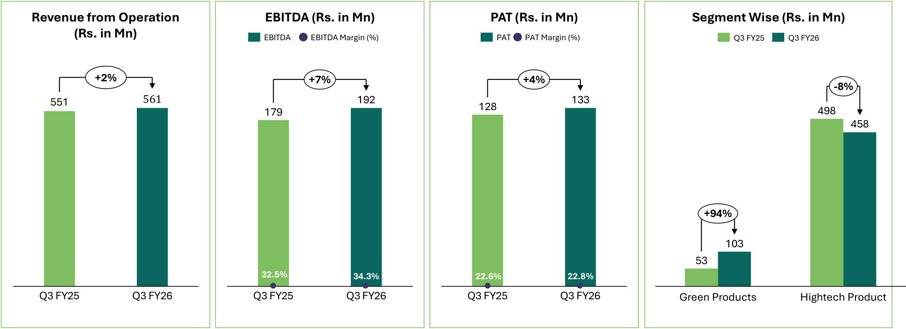

**[Image: Feb2026.pdf-0006-03.png (1973x720, 78.7KB)]**

<!-- Start of picture text -->
Revenue from Operation EBITDA (Rs. in Mn) PAT (Rs. in Mn) Segment Wise (Rs. in Mn) (Rs. in Mn) EBITDA EBITDA Margin (%) PAT PAT Margin (%) Q3 FY25 Q3 FY26 +2% +7% +4% -8% 551 561 192 133 128 179 498 458 +94% 103 53 32.5% 34.3% 22.6% 22.8% Q3 FY25 Q3 FY26 Q3 FY25 Q3 FY26 Q3 FY25 Q3 FY26 Green Products Hightech Product <!-- End of picture text -->

**<mark>5</mark>** 

**[Image: Feb2026.pdf-0007-00.png (65x119, 6.1KB)]**

#### **9M FY26 Result Highlights** 

**[Image: Feb2026.pdf-0007-02.png (203x90, 13.1KB)]**

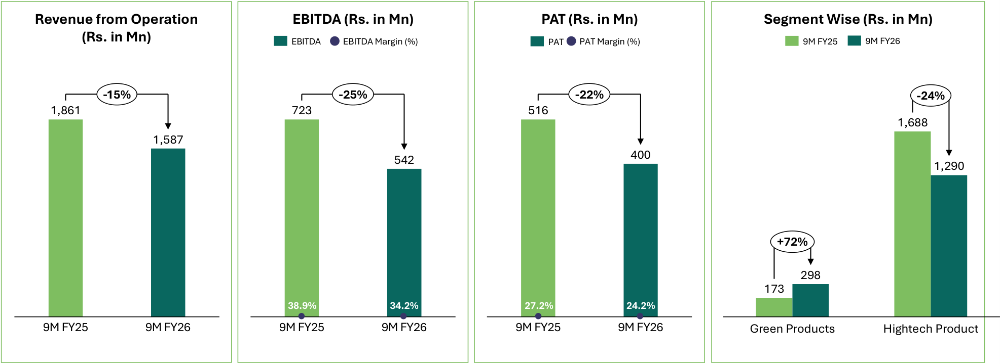

**[Image: Feb2026.pdf-0007-03.png (1973x720, 80.2KB)]**

<!-- Start of picture text -->
Revenue from Operation EBITDA (Rs. in Mn) PAT (Rs. in Mn) Segment Wise (Rs. in Mn) (Rs. in Mn) EBITDA EBITDA Margin (%) PAT PAT Margin (%) 9M FY25 9M FY26 -15% -25% -22% -24% 1,861 723 516 1,688 1,587 400 542 1,290 +72% 298 173 38.9% 34.2% 27.2% 24.2% 9M FY25 9M FY26 9M FY25 9M FY26 9M FY25 9M FY26 Green Products Hightech Product <!-- End of picture text -->

**<mark>6</mark>** 

**[Image: Feb2026.pdf-0008-00.png (65x119, 6.1KB)]**

#### **Consolidated Profit & Loss Statement** 

**[Image: Feb2026.pdf-0008-02.png (203x90, 13.1KB)]**

|**Particulars (Rs. in Mn)**|**Q3 FY26**|**Q3 FY25**|**Y-o-Y**|**Q2 FY26**|**Q-o-Q**|**9M FY26**|**9M FY25**|**Y-o-Y**|
|---|---|---|---|---|---|---|---|---|
|Revenue from Operations|561|551||611||1587|1861||
|**Revenue from Operations**|**561**|**551**|**1.7%**|**611**|**-8.2%**|**1,587**|**1,861**|**-14.7%**|
|Cost of Material Consumed|135|145||172||459|582||
|Purchase of stock in trade|91|106||91||296|206||
|Change in Inventories of Finishedgoods & Work in Progress|30|21||28||-29|41||
|**Total Raw Material**|**256**|**272**||**290**||**726**|**829**||
|**Gross Profit**|**304**|**279**|**9.1%**|**320**|**-5.0%**|**861**|**1,031**|**-16.5%**|
|**Gross Profit Margin(%)**|**54.3%**|**50.6%**||**52.4%**||**54.3%**|**55.4%**||
|Employee Expenses|44|39||40||124|113||
|Other Expenses|68|61||73||195|195||
|**EBITDA**|**192**|**179**|**7.2%**|**208**|**-7.4%**|**542**|**723**|**-25.0%**|
|**EBITDA Margin(%)**|**34.3%**|**32.5%**||**34.0%**||**34.2%**|**38.9%**||
|Other Income|22|16||21||62|35||
|Depreciation|19|19||20||57|54||
|**EBIT**|**194**|**176**|**10.5%**|**209**|**-7.0%**|**546**|**704**|**-22.4%**|
|**EBIT Margin(%)**|**34.6%**|**31.9%**||**34.2%**||**34.4%**|**37.9%**||
|Finance Cost|1|1||1||3|2||
|**Profit before Tax**|**193**|**175**|**10.3%**|**208**|**-7.1%**|**543**|**703**|**-22.7%**|
|**Profit before Tax(%)**|**34.4%**|**31.8%**||**34.0%**||**34.2%**|**37.8%**||
|Tax|60|47||50||144|187||
|**Profit After Tax**|**133**|**128**|**3.6%**|**157**|**-15.6%**|**400**|**516**|**-22.6%**|
|**PAT Margin(%)**|**22.8%**|**22.6%**||**24.9%**||**24.2%**|**27.2%**||
|EPS(Asper Profit after Tax)|8.81|8.52||10.42||26.46|34.25|**7**|

**[Image: Feb2026.pdf-0009-00.png (1436x165, 178.1KB)]**

<!-- Start of picture text -->
ABOUT THE COMPANY <!-- End of picture text -->

**[Image: Feb2026.pdf-0010-00.png (65x119, 6.1KB)]**

#### **Leadership Team: Board Of Directors** 

**[Image: Feb2026.pdf-0010-02.png (203x90, 13.1KB)]**

**[Image: Feb2026.pdf-0010-03.png (304x285, 98.3KB)]**

###### **Mr. Shilpan P. Patel** 

Chairman & M.D 

He holds a Master's in Business Administration from Sam Houston State University, Texas. With experience in the coating industry from Grace Paper Industries Pvt. Ltd, he developed the award-winning Water Soluble Film in 1990, a product with significant environmental impact. Appointed to the Board on October 30, 1992, Mr. Patel oversees Business Development and Strategic Management. Under his leadership, Arrow has received several awards, including the National IP Award for Patents & Commercialization. 

**[Image: Feb2026.pdf-0010-07.png (304x284, 109.3KB)]**

###### **Mr. Neil Patel** 

Jt. Managing Director 

He possess excellent entrepreneurship and organizational skills and demonstrating keen interest in assuming operational responsibilities since joining the company. 

He serves as a member of the Audit and Stakeholders Relationship committee of the company. 

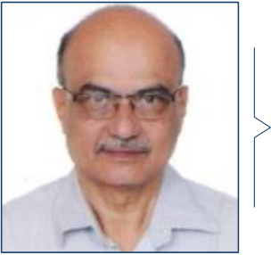

**[Image: Feb2026.pdf-0010-12.png (304x286, 101.7KB)]**

###### **Mr. Prashant Mehta** 

Independent Director 

He is a  Company Secretary with over 40 years of experience, has held key roles in renowned companies such as Premier Ltd, Jindal Iron and Steel Co Ltd. (now JSW Steel), and Shoppers Stop, bringing invaluable expertise in legal and secretarial affairs to the table. 

**<mark>9</mark>** 

**[Image: Feb2026.pdf-0011-00.png (65x119, 6.1KB)]**

#### **Leadership Team: Board Of Directors** 

**[Image: Feb2026.pdf-0011-02.png (203x90, 13.1KB)]**

**[Image: Feb2026.pdf-0011-03.png (304x285, 135.9KB)]**

###### **Mrs. Jigisha Patel** 

Woman  Director 

She possess a great knowledge in supervising and coordinating the administration along with Managing and Handling Team. She also has a wide range of experience and knowledge in Corporate Affairs. 

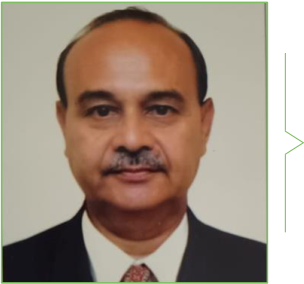

**[Image: Feb2026.pdf-0011-07.png (304x284, 90.2KB)]**

###### **Mr. Yogesh Gajjar** 

Independent Director 

He has done Diploma in Electronics from Government Polytechnic College in the year 1975. He is into Business of Electricals and Electronics services for last 45 years. He possesses good entrepreneurship and excellent organizational spirit. He has vast experience & knowledge in the field of electronics. He is based in Ahmedabad. 

**[Image: Feb2026.pdf-0011-11.png (304x286, 103.2KB)]**

###### **Mrs. Barkharani Nevatia** 

Independent Director 

She is a Chartered Accountant practicing in Pune and Mumbai, offers extensive experience in corporate tax, statutory audits, and specialized knowledge in GST and Income Tax, backed by an LLB degree from Mumbai University and education from Narsee Monjee College of Commerce and Economics. 

**<mark>10</mark>** 

**[Image: Feb2026.pdf-0012-00.png (65x119, 6.1KB)]**

#### **Arrow Greentech In A** **_Snapshot…_** 

**[Image: Feb2026.pdf-0012-02.png (203x90, 13.1KB)]**

**[Image: Feb2026.pdf-0012-03.png (146x141, 7.8KB)]**

**[Image: Feb2026.pdf-0012-04.png (146x139, 7.0KB)]**

**[Image: Feb2026.pdf-0012-05.png (146x138, 7.3KB)]**

**[Image: Feb2026.pdf-0012-06.png (146x140, 8.3KB)]**

**[Image: Feb2026.pdf-0012-07.png (146x141, 6.8KB)]**

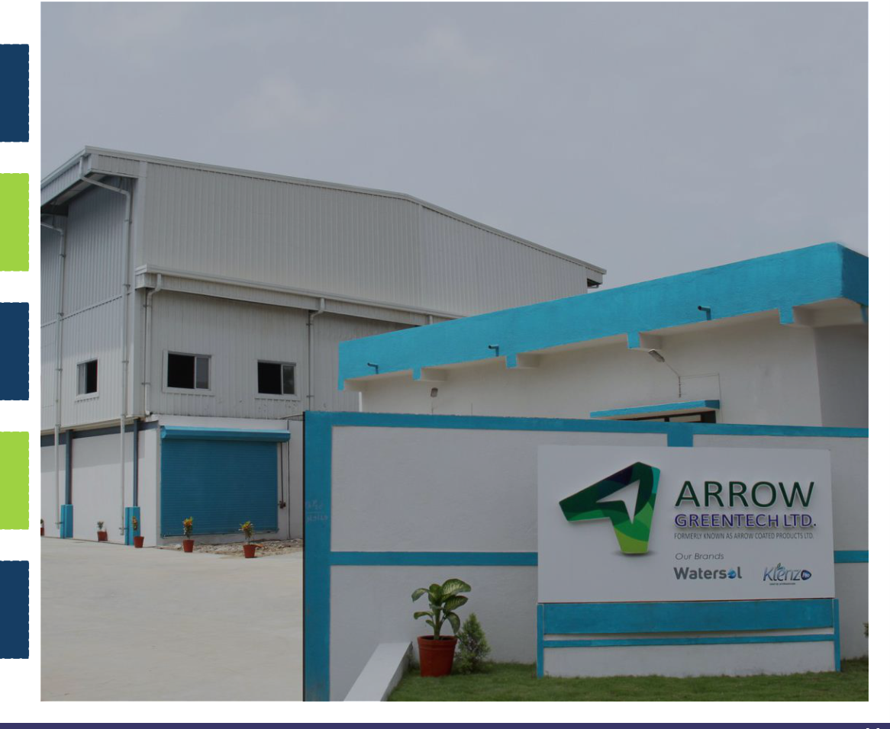

**[Image: Feb2026.pdf-0012-08.png (1166x956, 862.2KB)]**

**Caters to the Niche Market** 

**State of the Art Manufacturing Facility  located in Ankleshwar, Gujarat** 

**24 registered patents and 40 Trademarks across the globe Vastly Experienced Research & Development Team Largest Manufacturer of Water Soluble Films in India** 

**<mark>11</mark>** 

**[Image: Feb2026.pdf-0013-00.png (65x119, 6.1KB)]**

#### **Corporate Structure** 

**[Image: Feb2026.pdf-0013-02.png (203x90, 13.1KB)]**

**[Image: Feb2026.pdf-0013-03.png (122x121, 13.0KB)]**

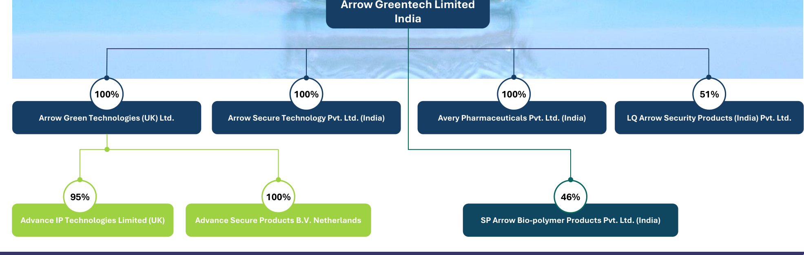

**[Image: Feb2026.pdf-0013-04.png (1971x628, 263.3KB)]**

<!-- Start of picture text -->
Arrow Greentech Limited India 100% 100% 100% 51% Arrow Green Technologies (UK) Ltd. Arrow Secure Technology Pvt. Ltd. (India) Avery Pharmaceuticals Pvt. Ltd. (India) LQ Arrow Security Products (India) Pvt. Ltd. 95% 100% 46% Advance IP Technologies Limited (UK)  Advance Secure Products B.V. Netherlands  SP Arrow Bio-polymer Products Pvt. Ltd. (India) <!-- End of picture text -->

**<mark>12</mark>** 

**[Image: Feb2026.pdf-0014-00.png (65x119, 6.1KB)]**

#### **Business Overview** 

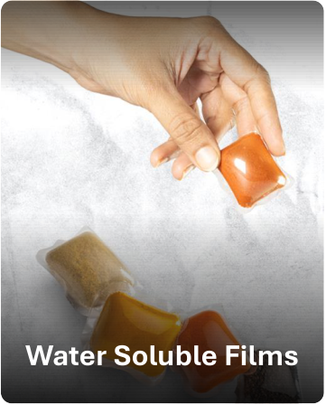

**[Image: Feb2026.pdf-0014-02.png (361x448, 242.3KB)]**

<!-- Start of picture text -->
Water Soluble Films <!-- End of picture text -->

**[Image: Feb2026.pdf-0014-03.png (359x448, 269.0KB)]**

<!-- Start of picture text -->
Intellectual Property <!-- End of picture text -->

Development, Production & Marketing of Wide Range of WaterSoluble Films 

Total of 24 granted patents across the World across all key business verticals of paper and packing industry, Security products, Health, Hygiene & Food and Printing & PSA Materials 

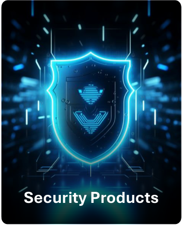

**[Image: Feb2026.pdf-0014-06.png (362x448, 277.4KB)]**

<!-- Start of picture text -->
Security Products <!-- End of picture text -->

Security products include Anticounterfeit security thread for high security papers, brand protection technologies etc. 

**[Image: Feb2026.pdf-0014-08.png (361x448, 116.7KB)]**

<!-- Start of picture text -->
Avery Pharma <!-- End of picture text -->

A 100% wholly-owned subsidiary of Arrow Greentech Limited, the company is committed to the cause of enhancing patient outcomes with a novel approach to oral drug administration, via its Mouth Dissolving Strips (MDS) 

**[Image: Feb2026.pdf-0014-10.png (203x90, 13.1KB)]**

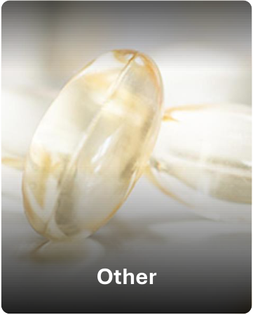

**[Image: Feb2026.pdf-0014-11.png (361x448, 155.7KB)]**

<!-- Start of picture text -->
Other <!-- End of picture text -->

The other segments include Watersol Capsules and BioPlast. 

- › **Watersol Capsules:** The most concentrated range of hygiene products which are supplied in water-soluble capsules, without generating plastic waste 

- › **Bioplast:** The bio-compostable film is an eco-friendly alternative to replace singleuse plastic for our future generations 

**<mark>13</mark>** 

**[Image: Feb2026.pdf-0015-00.png (372x101, 24.1KB)]**

**[Image: Feb2026.pdf-0015-01.png (1436x165, 54.2KB)]**

<!-- Start of picture text -->
WATER SOLUBLE FILM (WSF) <!-- End of picture text -->

**[Image: Feb2026.pdf-0016-00.png (65x119, 6.1KB)]**

#### **What Is Water Soluble Film (WSF)?** 

**[Image: Feb2026.pdf-0016-02.png (203x90, 13.1KB)]**

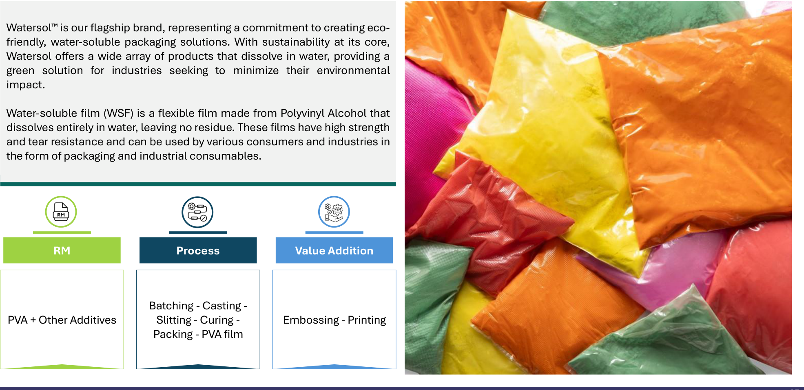

**[Image: Feb2026.pdf-0016-03.png (1971x958, 1944.3KB)]**

<!-- Start of picture text -->
Watersol  is our flagship brand, representing a commitment to creating eco- friendly, water-soluble packaging solutions. With sustainability at its core, Watersol offers a wide array of products that dissolve in water, providing a green solution for industries seeking to minimize their environmental impact. Water-soluble film (WSF) is a flexible film made from Polyvinyl Alcohol that dissolves entirely in water, leaving no residue. These films have high strength and tear resistance and can be used by various consumers and industries in the form of packaging and industrial consumables. RM Process Value Addition Batching - Casting - PVA + Other Additives  Slitting - Curing -  Embossing - Printing Packing - PVA film <!-- End of picture text -->

**<mark>15</mark>** 

**[Image: Feb2026.pdf-0017-00.png (65x119, 6.1KB)]**

#### **Applications of WSF** 

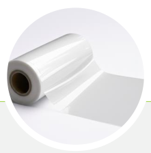

**[Image: Feb2026.pdf-0017-02.png (221x224, 22.7KB)]**

**[Image: Feb2026.pdf-0017-03.png (222x224, 70.7KB)]**

**Healthcare** : Specifically developed for use in hospitals and healthcare facilities, these PVOH-based bags allow for the safe and hygienic handling of contaminated linen. 

**Packaging** : Used extensively for unit dose packaging of detergents, agrochemicals and dyes. 

. 

**[Image: Feb2026.pdf-0017-07.png (224x224, 82.9KB)]**

**Agriculture** : Used for packaging pesticides and fertilizers, reducing exposure risk for handlers and minimizing environmental impact. 

**[Image: Feb2026.pdf-0017-09.png (293x293, 90.0KB)]**

<!-- Start of picture text -->
Textiles : Used in embroidery as <!-- End of picture text -->

**Textiles** : Used in embroidery as water soluble backing materials which dissolves completely after the embroidery process. . 

**[Image: Feb2026.pdf-0017-11.png (203x90, 13.1KB)]**

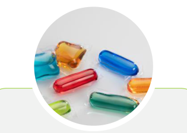

**[Image: Feb2026.pdf-0017-12.png (315x224, 59.4KB)]**

**Consumer Goods** : Applied in making pouches for laundry detergents, dishwashing liquids, and other household cleaning products. Water soluble film provides a convenient and mess-free solution for packaging liquid and powder detergents. 

. 

Properties of WSF 

**[Image: Feb2026.pdf-0017-16.png (99x99, 6.1KB)]**

**Biodegradability** 

**[Image: Feb2026.pdf-0017-18.png (94x95, 5.1KB)]**

**Transparency** 

**[Image: Feb2026.pdf-0017-20.png (99x101, 5.2KB)]**

**Non-Toxic & Safe** 

**[Image: Feb2026.pdf-0017-22.png (87x89, 5.0KB)]**

**Versatile** 

**[Image: Feb2026.pdf-0017-24.png (88x75, 2.1KB)]**

**Barrier Properties** 

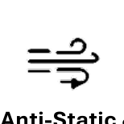

**[Image: Feb2026.pdf-0017-26.png (154x155, 4.8KB)]**

**<mark>16</mark>** 

**[Image: Feb2026.pdf-0018-00.png (65x119, 6.1KB)]**

#### **Features** 

**[Image: Feb2026.pdf-0018-02.png (203x90, 13.1KB)]**

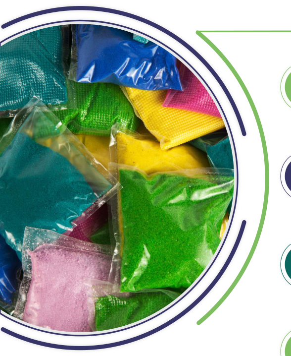

**[Image: Feb2026.pdf-0018-03.png (588x718, 728.4KB)]**

**[Image: Feb2026.pdf-0018-04.png (13x13, 0.1KB)]**

**[Image: Feb2026.pdf-0018-05.png (13x13, 0.1KB)]**

**[Image: Feb2026.pdf-0018-06.png (46x104, 1.7KB)]**

**[Image: Feb2026.pdf-0018-07.png (45x104, 1.8KB)]**

**[Image: Feb2026.pdf-0018-08.png (45x105, 1.7KB)]**

**[Image: Feb2026.pdf-0018-09.png (46x105, 1.8KB)]**

Optimum tensile strength to handle **01 05** Flexible for machine automation. weight from 10 grams to 10 kg. Excellent moisture/ heat sealing for Non-toxic and safe for the **02** blocks, bars, powder, and granular **06** environment. product packaging. Helps achieve an Accurate dosing **03 07** High puncture resistance. system. **04** Optimum tear strength. **08** Excellent organic solvent resistance. 

**[Image: Feb2026.pdf-0018-11.png (46x104, 1.8KB)]**

**[Image: Feb2026.pdf-0018-12.png (46x104, 1.8KB)]**

**[Image: Feb2026.pdf-0018-13.png (46x104, 1.6KB)]**

**[Image: Feb2026.pdf-0018-14.png (45x104, 1.6KB)]**

**[Image: Feb2026.pdf-0018-15.png (45x104, 1.7KB)]**

**[Image: Feb2026.pdf-0018-16.png (46x104, 1.7KB)]**

**<mark>17</mark>** 

**[Image: Feb2026.pdf-0019-00.png (65x119, 6.1KB)]**

#### **Product Usage** 

**[Image: Feb2026.pdf-0019-02.png (201x87, 13.1KB)]**

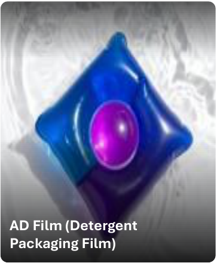

**[Image: Feb2026.pdf-0019-03.png (363x441, 245.4KB)]**

<!-- Start of picture text -->
AD Film (Detergent Packaging Film) <!-- End of picture text -->

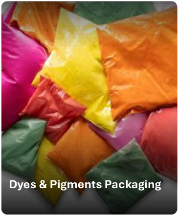

**[Image: Feb2026.pdf-0019-04.png (364x441, 334.8KB)]**

<!-- Start of picture text -->
Dyes & Pigments Packaging <!-- End of picture text -->

**[Image: Feb2026.pdf-0019-05.png (364x443, 366.3KB)]**

<!-- Start of picture text -->
Toilet Block Packaging Film <!-- End of picture text -->

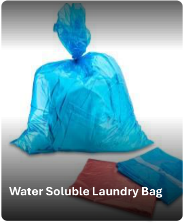

**[Image: Feb2026.pdf-0019-06.png (363x443, 191.2KB)]**

<!-- Start of picture text -->
Water Soluble Laundry Bag <!-- End of picture text -->

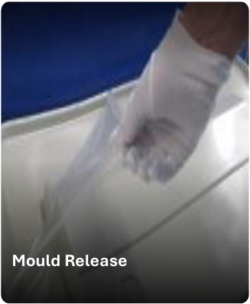

**[Image: Feb2026.pdf-0019-07.png (363x441, 150.3KB)]**

<!-- Start of picture text -->
Mould Release <!-- End of picture text -->

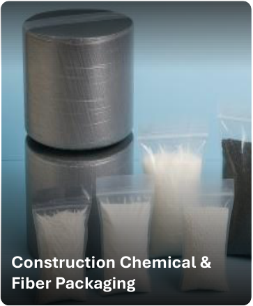

**[Image: Feb2026.pdf-0019-08.png (363x440, 179.5KB)]**

<!-- Start of picture text -->
Construction Chemical & Fiber Packaging <!-- End of picture text -->

**[Image: Feb2026.pdf-0019-09.png (1557x478, 800.5KB)]**

<!-- Start of picture text -->
Seed Bomb/Tape Packaging Watersol  Capsules  Embroidery film Agrochemical packaging film <!-- End of picture text -->

**<mark>18</mark>** 

**[Image: Feb2026.pdf-0020-00.png (65x119, 6.1KB)]**

#### **Water Soluble Films (WSF) Industry Snapshot** 

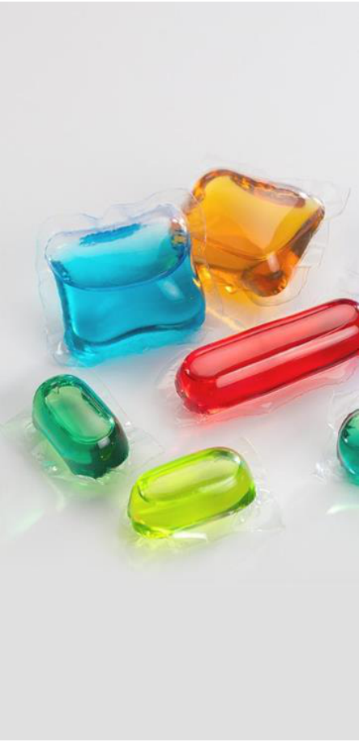

**[Image: Feb2026.pdf-0020-02.png (446x922, 403.5KB)]**

**[Image: Feb2026.pdf-0020-03.png (109x109, 4.9KB)]**

**[Image: Feb2026.pdf-0020-04.png (84x25, 1.7KB)]**

<!-- Start of picture text -->
5.8% <!-- End of picture text -->

WSF Market size  is expected to reach $586 Mn by 2029 at CAGR of 

**[Image: Feb2026.pdf-0020-06.png (109x109, 3.8KB)]**

The market was valued at **USD 442 Mn** in 2024 

The Asia-Pacific region leads the market driven by fast industrial growth, rising demand for convenience products, and expansion in packaging and agriculture. 

**[Image: Feb2026.pdf-0020-09.png (109x109, 4.8KB)]**

**[Image: Feb2026.pdf-0020-10.png (109x109, 5.0KB)]**

**[Image: Feb2026.pdf-0020-11.png (109x109, 4.5KB)]**

**[Image: Feb2026.pdf-0020-12.png (109x109, 5.2KB)]**

**[Image: Feb2026.pdf-0020-13.png (203x90, 13.1KB)]**

North America is estimated to be largest market for Water Soluble films market 

PVA (Polyvinyl Alcohol) dominates the water-soluble films market due to its excellent water solubility, biodegradability and non-toxic properties. 

The market is **FRAGMENTED** with many players accounting for majority market revenue share 

**<mark>19</mark>** 

**[Image: Feb2026.pdf-0021-00.png (65x119, 6.1KB)]**

#### **State Of The Art Manufacturing Facilities** 

**[Image: Feb2026.pdf-0021-02.png (203x90, 13.1KB)]**

**ANKLESHWAR, GUJARAT** 

**[Image: Feb2026.pdf-0021-04.png (233x93, 11.5KB)]**

<!-- Start of picture text -->
~ 350 Km far from Mumbai <!-- End of picture text -->

**[Image: Feb2026.pdf-0021-05.png (260x67, 8.7KB)]**

<!-- Start of picture text -->
far from Mumbai <!-- End of picture text -->

**~ 350 Km far from Mumbai** 

##### **R&D Centre** 

**[Image: Feb2026.pdf-0021-08.png (210x66, 5.3KB)]**

<!-- Start of picture text -->
with Modern <!-- End of picture text -->

**[Image: Feb2026.pdf-0021-09.png (201x66, 4.9KB)]**

<!-- Start of picture text -->
Equipments <!-- End of picture text -->

**Land on 99 years** 

**[Image: Feb2026.pdf-0021-11.png (409x66, 14.1KB)]**

<!-- Start of picture text -->
renewable lease from GIDC <!-- End of picture text -->

**[Image: Feb2026.pdf-0021-12.png (407x103, 37.3KB)]**

<!-- Start of picture text -->
Common Utilities available for future expansion <!-- End of picture text -->

**<mark>20</mark>** 

**[Image: Feb2026.pdf-0022-00.png (65x119, 6.1KB)]**

#### **Global Presence** 

**[Image: Feb2026.pdf-0022-02.png (567x297, 33.0KB)]**

**[Image: Feb2026.pdf-0022-03.png (126x151, 7.9KB)]**

**[Image: Feb2026.pdf-0022-04.png (203x90, 13.1KB)]**

**[Image: Feb2026.pdf-0022-05.png (180x41, 5.5KB)]**

- Presence in Europe, Asia, North & South America and Africa – mainly 3 supply points located in India, United Kingdom and South America 

- Wide Distribution channel to service our clients from around the world 

**[Image: Feb2026.pdf-0022-08.png (895x80, 18.7KB)]**

<!-- Start of picture text -->
Factory Warehousing  Supply  Direct  Secondary Facility  Zones Supply Supply <!-- End of picture text -->

**<mark>21</mark>** 

**[Image: Feb2026.pdf-0023-00.png (1436x165, 201.1KB)]**

<!-- Start of picture text -->
SECURITY PRODUCTS <!-- End of picture text -->

**[Image: Feb2026.pdf-0024-00.png (65x119, 6.1KB)]**

#### **Security Products** 

**[Image: Feb2026.pdf-0024-02.png (203x90, 13.1KB)]**

**[Image: Feb2026.pdf-0024-03.png (1943x662, 1136.9KB)]**

**[Image: Feb2026.pdf-0024-04.png (75x75, 6.0KB)]**

**[Image: Feb2026.pdf-0024-05.png (70x69, 4.3KB)]**

**[Image: Feb2026.pdf-0024-06.png (68x68, 3.6KB)]**

**[Image: Feb2026.pdf-0024-07.png (68x68, 3.9KB)]**

**[Image: Feb2026.pdf-0024-08.png (68x68, 4.8KB)]**

**[Image: Feb2026.pdf-0024-09.png (62x62, 2.6KB)]**

**[Image: Feb2026.pdf-0024-10.png (62x62, 3.8KB)]**

Manufacturing of antiState of Art counterfeit products for Manufacturing facility use in high security with inhouse R&D center papers, brand protection etc. 

Supplier to leading paper Proprietary technology mills 

Part of the niche group Dealing in supply of supplying such products various raw materials globally 

100% indigenous technologies & fully integrated technologies 

**<mark>23</mark>** 

**[Image: Feb2026.pdf-0025-00.png (1436x165, 138.8KB)]**

<!-- Start of picture text -->
INTELLECTUAL PROPERTY <!-- End of picture text -->

**[Image: Feb2026.pdf-0026-00.png (65x119, 6.1KB)]**

**[Image: Feb2026.pdf-0026-01.png (203x90, 13.1KB)]**

#### **Intellectual Property** 

**[Image: Feb2026.pdf-0026-03.png (38x342, 3.0KB)]**

**[Image: Feb2026.pdf-0026-04.png (38x342, 2.7KB)]**

**[Image: Feb2026.pdf-0026-05.png (38x342, 2.8KB)]**

**[Image: Feb2026.pdf-0026-06.png (38x342, 2.6KB)]**

Arrow obtained more than 50 patents globally, of which 24 are presently inOur inhouse R&D and force spanning various IP team is continuously territories including India, working on new UK, USA, Europe and Sri innovation and patents Lanka **1 2** 

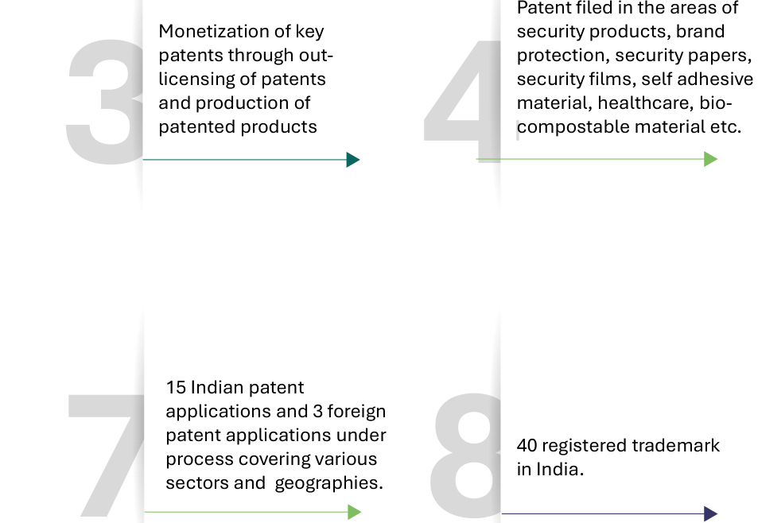

**[Image: Feb2026.pdf-0026-08.png (953x658, 69.4KB)]**

<!-- Start of picture text -->
Patent filed in the areas of Monetization of key  security products, brand patents through out- protection, security papers, licensing of patents  security films, self adhesive and production of  material, healthcare, bio- patented products compostable material etc. 3 4 15 Indian patent applications and 3 foreign patent applications under 40 registered trademark process covering various in India. sectors and  geographies. 7 8 <!-- End of picture text -->

**[Image: Feb2026.pdf-0026-09.png (38x342, 2.8KB)]**

**[Image: Feb2026.pdf-0026-10.png (38x342, 2.7KB)]**

**[Image: Feb2026.pdf-0026-11.png (39x342, 2.6KB)]**

**[Image: Feb2026.pdf-0026-12.png (38x342, 2.9KB)]**

**[Image: Feb2026.pdf-0026-13.png (834x163, 21.1KB)]**

<!-- Start of picture text -->
Innovation is focused State of Art R&D Lab  on green and high-tech and IP cell in Mumbai products 5 6 <!-- End of picture text -->

**<mark>25</mark>** 

**[Image: Feb2026.pdf-0027-00.png (65x119, 6.1KB)]**

#### **Arrow’s Intellectual Property** 

**[Image: Feb2026.pdf-0027-02.png (203x90, 13.1KB)]**

###### **<mark>Granted Patents</mark>** 

Arrow Greentech Limited at present has 24 granted patents globally covering the territories of – India, UK, USA, Europe and Sri Lanka 

###### **<mark>Patent Applications</mark>** 

Arrow Greentech Limited also has 15 Indian patent applications and 3 foreign patent applications under process covering various sectors, through mainly covering Water-Soluble Films and Security Section 

###### **<mark>Trademarks</mark>** 

Arrow Greentech Limited has 40 in-force registered Trademarks along with 19 Trademark application currently under processing 

###### **<mark>Group 1 – Paper and Packing Industry</mark>** 

|**Cold Water** **Soluble Film**|**High strength paper and** **process of manufacture**|**High securit** **process of m**|**y paper and** **anufacture**|**Self destru** **security**|**ctive irreversible** **packaging film**|**Method of pr** **security fi** **security film** **the said**|**oducing  a high** **lm and high** **produced by** **method**|**Bio-Compostable** **Multi-Layered composite** **and methods of manufacturing the** **Same**|
|---|---|---|---|---|---|---|---|---|
|**India** (20.02.24)|**United States** (22.11.11)|**Europe** (13.09.17)|**India** (03.01.18)|**Europe** (05.05.10)|**United States** (23.08.2016) (Div) (07.12.21)|**Europe** (15.08.12)|**India** (31.10.18)|**India** (10.01.24)|

###### **<mark>Group 2 – Packaging Industry</mark>** 

|**Improved Water** **Soluble Film and** **method of making the** **same**|**Cold Water Soluble Film**|**High strength paper** **and process of** **manufacture**|**Self destructiv** **pack**|**e irreversible security** **aging film**|**Bio-Compostable** **Multi-Layered composite** **and methods of manufacturing** **them**|**Edible water soluble packaging film** **and package made out of the said** **film**|
|---|---|---|---|---|---|---|
|**India** (12.12.23)|**India** (20.02.24)|**United States** (22.11.11)|**Europe** **(**05.05.10)|**United States** **(**23.08.16) (Div)  (07.12.21)|**India** (10.01.24)|**India** (05.06.12)|

**<mark>26</mark>** 

**[Image: Feb2026.pdf-0028-00.png (65x119, 6.1KB)]**

#### **Arrow’s Intellectual Property** 

**[Image: Feb2026.pdf-0028-02.png (203x90, 13.1KB)]**

###### **<mark>Group 3 – Security Products</mark>** 

|**Security L**|**aminates**|**High security pap** **manufa**|**er and process of** **cture**|**Self destructive i** **packa**|**rreversible security** **ging film**|**Method of producing** **and high security film** **met**|**a high security film** **produced by the said** **hod**|**Security Yarn**|
|---|---|---|---|---|---|---|---|---|
|**Sri Lanka**|**UK**|**Europe**|**India**|**Europe**|**United States**  (23.08.16)|**Europe**|**India**|**India**|
|(05.06.25)|(24.01.24)|(13.09.17)|(03.01.18)|(05.05.10)|(Div) (07.12.21)|(15.08.12)|(31.10.18)|(08.09.23)|

###### **<mark>Group 4 – Health, Hygiene & Food</mark>** 

|**Improved Water Soluble Film** **and method of making the** **same**|**Cold Water Soluble Film**|**Medicated Bands**|**Edible water soluble** **packaging film and** **package made out of the** **said film**|**A water solub** **matrix to con** **extracted from**|**le film based** **tain samples** **living species**|**A Cleaning Device with** **Sustained Release of** **Actives**|
|---|---|---|---|---|---|---|
|**India**|**India**|**India**|**India**|**Europe**|**USA**|**India**|
|(12.12.23)|(20.02.24)|(13.05.24)|(05.06.12)|(24.07.13)|(18.03.14)|(01.02.23)|

###### **<mark>Group 5 – Printing and PSA Materials</mark>** 

|**New Improved Self adhesive materials with a water soluble** **films**|**Self adhesive materials with a water soluble protective** **layer**|**Self Adhesive Wallpaper with Reduced Adhesive Material and Water** **Soluble Film**|
|---|---|---|
|**India**|**United States**|**India**|
|(30.10.23)|(09.11.10)|(16.03.23)|

**<mark>27</mark>** 

**[Image: Feb2026.pdf-0029-00.png (65x119, 6.1KB)]**

#### **Key Granted Patents across the Globe** 

**[Image: Feb2026.pdf-0029-02.png (938x274, 196.1KB)]**

<!-- Start of picture text -->
• Mouth Melting strips, Gel strips, Enzyme strips • Vitamins, Drugs, Medicine, Disinfectants and other Pharma ingredients • For clinical setting like blood, serum, urine testing etc. Health <!-- End of picture text -->

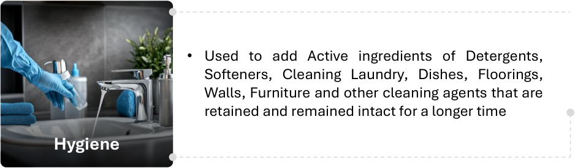

**[Image: Feb2026.pdf-0029-03.png (938x274, 165.0KB)]**

<!-- Start of picture text -->
• Used to add Active ingredients of Detergents, Softeners, Cleaning Laundry, Dishes, Floorings, Walls, Furniture and other cleaning agents that are retained and remained intact for a longer time Hygiene <!-- End of picture text -->

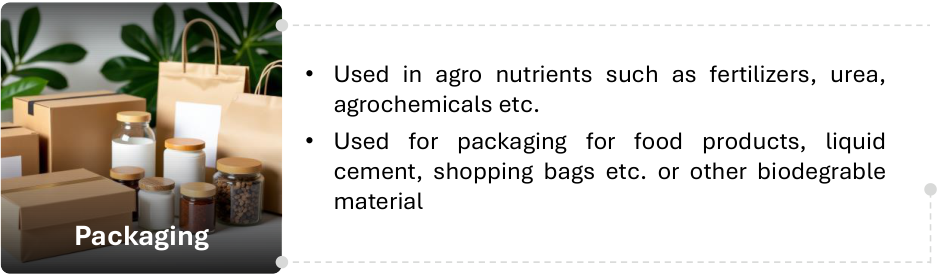

**[Image: Feb2026.pdf-0029-04.png (938x276, 167.1KB)]**

<!-- Start of picture text -->
• Used in agro nutrients such as fertilizers, urea, agrochemicals etc. • Used for packaging for food products, liquid cement, shopping bags etc. or other biodegrable material Packaging <!-- End of picture text -->

**[Image: Feb2026.pdf-0029-05.png (203x90, 13.1KB)]**

**[Image: Feb2026.pdf-0029-06.png (922x273, 123.4KB)]**

<!-- Start of picture text -->
• Used in making security labels or secure packaging of the products for identification • Used in manufacturing of security documents such as cheques, bank notes, passport papers etc. Security <!-- End of picture text -->

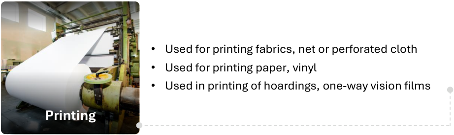

**[Image: Feb2026.pdf-0029-07.png (922x276, 162.6KB)]**

<!-- Start of picture text -->
• Used for printing fabrics, net or perforated cloth • Used for printing paper, vinyl • Used in printing of hoardings, one-way vision films Printing <!-- End of picture text -->

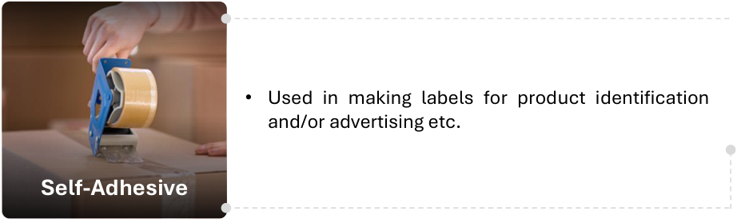

**[Image: Feb2026.pdf-0029-08.png (922x274, 111.9KB)]**

<!-- Start of picture text -->
• Used in making labels for product identification and/or advertising etc. Self-Adhesive <!-- End of picture text -->

**<mark>28</mark>** 

**[Image: Feb2026.pdf-0030-00.png (65x119, 6.1KB)]**

#### **Key Granted Patents across the Globe** 

**[Image: Feb2026.pdf-0030-02.png (203x90, 13.1KB)]**

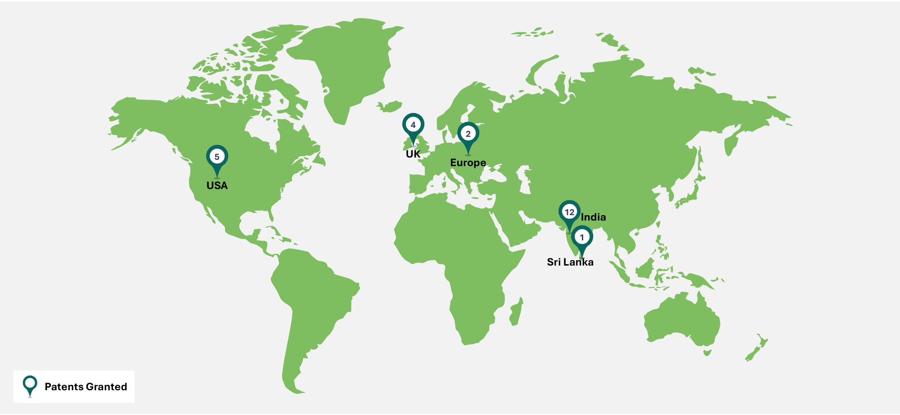

**[Image: Feb2026.pdf-0030-03.png (2000x922, 108.5KB)]**

<!-- Start of picture text -->
4 2 5 UK Europe USA 12 India 1 Sri Lanka Patents Granted <!-- End of picture text -->

**<mark>29</mark>** 

# **ARROW RX** 

**[Image: Feb2026.pdf-0031-01.png (1436x165, 91.6KB)]**

<!-- Start of picture text -->
Mouth Dissolving Strip (MDS) (An Innovative Drug Delivery Solution) <!-- End of picture text -->

**[Image: Feb2026.pdf-0032-00.png (65x119, 6.1KB)]**

#### **Arrow RX** 

**[Image: Feb2026.pdf-0032-02.png (203x90, 13.1KB)]**

Avery Pharmaceuticals (AP), a specialty pharmaceutical company and wholly-owned subsidiary of Arrow Greentech Ltd. (AGTL), is redefining oral drug delivery through its patented Embedded Water-Soluble Film Technology. Its Mouth Dissolving Strips (MDS) offer a novel, patient-centric alternative to conventional oral dosage forms, ensuring faster absorption, precision dosing, and improved compliance. 

WHO GMP approved Avery Pharma has over 54 In discussion with various Avery Pharmaceuticals Pvt Ltd is manufacturing facility with state of Who-GMP, FSSAI, GLP, ISO 9001 products approved under FSSAI domestic and international 100% Subsidiary company of art plant & machinery and inand ISO 22000 certified facility and more than 10 products under companies for long-term supply Arrow Greentech Limited house product development prescription (Rx) approval contract center in Sanand (Gujarat) **01 02 03 04 05 06 07 08 09 10** Product Approval from Food and Drug Controller Administration MDS are innovative, fastThe company is currently (FDCA) and Central FSSAI dissolving films that deliver pursuing product registrations in License received for approx. 50 Expertise from parent company active pharmaceutical Long-term contract signed with various countries like Russia, products including new products on casting of film and embedding ingredients (APIs) more rapidly big MNC company for export Yemen, Vietnam, and is engaged i.e. Sildenafil, Ondansetron, various APIs in Lingual,Subcompared to traditional dosage markets in Contract Development and Amoldipine, Vitamin D3, Vitamin Lingual and Buccal forms such as tablets, capsules, Manufacturing Organization B12, Vitamin K2, Vitamin B3, and liquids (CDMO) projects. Folic Acid, Iron, Zinc strips, Nicotine, Curcumin+Piperine etc. 

In discussion with various domestic and international companies for long-term supply contract 

**[Image: Feb2026.pdf-0032-06.png (111x98, 3.3KB)]**

<!-- Start of picture text -->
10 <!-- End of picture text -->

The company is currently pursuing product registrations in various countries like Russia, Yemen, Vietnam, and is engaged in Contract Development and Manufacturing Organization (CDMO) projects. 

**<mark>31</mark>** 

**[Image: Feb2026.pdf-0033-00.png (65x119, 6.1KB)]**

#### **Product Development & Approvals** 

**[Image: Feb2026.pdf-0033-02.png (203x90, 13.1KB)]**

|||**List of FASSAI**|**Products** |||
|---|---|---|---|---|---|
|**Sr. No.**|**Product Name / Combination**|**Strength(s) / Dosage**|**Sr. No.**|**Product Name / Combination**|**Strength(s) / Dosage**|
|1|VitaminB12 (Cyanocobalamin) MDS|500mcg/ 1000mcg/ 1500mcg|21 |Clove Oil MDS|8 mg|
|||400 IU / 600 IU / 800 IU / 1000 IU /|22|HempMDS|0.3%w/w|
|2|Vitamin D3 MDS| 2000 IU|23|Echinacea Purpuria + Honey PropolisMDS|100 + 5 mg|
|3|VitaminD3 + K2 MDS|400 IU + 55 mcg / 2000 IU + 15 mcg|24|L-Arginine + CaffeineMDS|10 + 25 mg|
|4|Vitamin D3 + K2 + Calcium MDS|1000IU + 9 mcg+ 90 mg|25|Caffeine+ VitaminB12 + Ginkgo MDS|15 + 4 + 3 mg|
|5|Folic Acid MDS|200mcg / 400mcg / 500mcg|26|Caffeine+ Multivitamin MDS|-|
|6|L-Methyl Folate MDS|1 mg|27|CaffeineMDS|40 mg/ 50 mg|
|7|VitaminB-Complex MDS|-|28 |Caffeine+ L-TheanineMDS|40 + 10 mg|
|8|VitaminB3 (Nicotinamide/ Niacin) MDS|14mg|29|Melatonin MDS|0.5 mg/ 1 mg/ 3 mg/ 5 mg/ 10 mg|
|9|Vitamin C MDS|40 mg / 50 mg|30|Melatonin+ Valerian / Hops / HibiscusMDS|10 + 3 mg / 10 + 4 + 3 mg / 5 + 2 mg|
|10|Vitamin C + Zinc MDS|40 mg + 10 mg|31|SleepMX Brand Melatonin MDS|3 mg/ 5 mg |
||||||10 mg + B7 30 mcg + D3 600 IU + E 10 mg +|
|11|Vitamin C + Zinc + Vitamin D3 MDS|40 + 10 + 400 IU|32|Millet + Vitamins MDS|B9 200mcg|
|12|VitaminK2 MDS|55 mcg / 200 mcg|33|Bacillus Coagulans + Fructo oligosaccharidesMDS|5 BCFU + 10 mg|
|13|Iron MDS|17mg|34|Natural ProbioticsMDS|5 BCFU|
|14|Zinc Picolinate MDS|10mg||||
||||35|IBtMDS||
|15|Lactoferrin MDS|5 mg / 10 mg||mmune ooser|- Vitamin A 900 mcg+D3 600 IU + K2 50 mcg|
|16|Ashwagandha MDS|50 mg/ 100 mg|36|Multi-Vitamin Complex MDS|+B55 mg+B6 2 mg+B7 30 mcg+B12 2.4 mcg+B9 200mcg + Iodine150 mcg+ Mananese2 m|
|17|Curcumin MDS|50 mg/ 100 mg|37|Mouth Freshener Films|g g -|
|18|Curcumin + PiperineMDS|45 + 5 mg|38|Food Grade Edible Film|-|
|19|AstaxanthinMDS|4 mg/ 5 mg/ 10 mg|39|Vitamin D3 + K2 + Calcium MDS|1000IU + 9 mcg+ 90 mg|
|20|Lutein + ZeaxanthinMDS|10 + 2 mg|40|HangoverMDS|-|

_All the product belong to Nutraceuticals Category_ 

**<mark>32</mark>** 

**[Image: Feb2026.pdf-0034-00.png (65x119, 6.1KB)]**

#### **Product Development & Approvals** 

**[Image: Feb2026.pdf-0034-02.png (203x90, 13.1KB)]**

###### **<mark>List of RX Approved Products</mark>** 

|**Sr. No.**|**Product Name**|**Strength(s)**|**Category**|
|---|---|---|---|
|1|Nicotine Polacrilex MDS|1/2/4 mg|WHO GMP Product|
|2|Ondansetron MDS|4/8 mg|WHO GMP Product|
|3|Sildenafil MDS|25/50 mg|WHO GMP Product|
|4|Amlodipine MDS|5/10 mg|Licensed for Domestic & Export|
|5|Tadalafil ODS|5/10/20 mg|Licensed for Domestic & Export|
|6|Vitamin D3 MDS|2000/60000 IU|Licensed for Domestic & Export|
|7|Vitamin B12 MDS|1500 mcg|Licensed for Domestic & Export|
|8|NOS PRIMES SPICED ROSE|2 mg|Licensed for Domestic & Export|
|9|Clonazepam ODS|0.5/1/2 mg|Test License Product|
|10|Dextromethorphan ODS|5.5/11 mg|Test License Product|
|11|Donepezil ODS|5/10 mg|Test License Product|
|12|Eliglustat Sublingual Film|4/8/12/16/20/24 mg|Test License Product|
|13|Ketorolac ODS|10 mg|Test License Product|
|14|Levocetirizine ODS|2.5/5 mg|Test License Product|
|15|Levocetirizine + Montelukast ODS|2.5/5 & 5/10 mg|Test License Product|
|16|Montelukast|4/5/10 mg|Test License Product|
|17|Paracetamol ODS|60/120 mg|Test License Product|
|18|Rizatriptan ODS|5/10 mg|Test License Product|
|19|Simethicone ODS|62.5 mg|Test License Product|
|20|Voglibose ODS|0.2/0.3 mg|Test License Product|
|21|Zolmitriptan ODS|2.5/5 mg|Test License Product|

**<mark>33</mark>** 

**[Image: Feb2026.pdf-0035-00.png (65x119, 6.1KB)]**

#### **Arrow RX** 

**[Image: Feb2026.pdf-0035-02.png (203x90, 13.1KB)]**

**[Image: Feb2026.pdf-0035-03.png (388x133, 13.7KB)]**

Innovative Drug Delivery Systems Redefining Oral and Biomedical Applications 

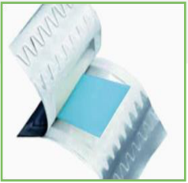

**[Image: Feb2026.pdf-0035-05.png (238x232, 63.4KB)]**

###### **MDS****TM** **Films – NDDS** 

Precision Thin Films for Rapid Oral Drug Delivery. 

- Mouth Dissolving Strips that melt instantly and bypass the GI tract. 

- Enables direct bloodstream absorption and high bioavailability. 

- Proven success in achieving high active loading in WSF. 

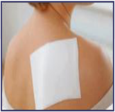

**[Image: Feb2026.pdf-0035-11.png (238x232, 77.1KB)]**

###### **Novel Drug Delivery Device - NDDD** 

Controlled Release Through Smart Biodegradable Polymers. 

- Embedded/coated actives within water-soluble or dispersible films. 

- Enables precise, time-controlled release and absorption. 

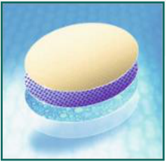

**[Image: Feb2026.pdf-0035-16.png (238x232, 92.0KB)]**

###### **RX Matrix** 

Revolutionizing Safe Bio-Sample Collection & Disposal. 

- Innovative system to collect, store, and dispose of biological samples safely. 

- Eliminates cross-contamination and improves biosafety. 

**<mark>34</mark>** 

**[Image: Feb2026.pdf-0036-00.png (65x119, 6.1KB)]**

#### **Arrow RX** 

**[Image: Feb2026.pdf-0036-02.png (203x90, 13.1KB)]**

###### Patented Technology Highlights: 

**Avery Pharmaceuticals** has developed a **patented Embedded Water-Soluble Film** platform — commercialized under the trade name **MDS (Mouth Dissolving Strips)** 

- Granted **Patent for Active Embedded Water-Soluble Film** 

• Allows embedding or entrapment of one or more actives at controlled concentrations for **targeted, precise delivery** 

• Supports **multiple delivery routes — lingual, sublingual, and buccal** — ensuring faster absorption and sustained release 

• Applicable to **pediatric, geriatric, psychiatric, and veterinary therapies** 

• **Pipeline-ready:** Multiple molecules identified for first-phase embedding 

**[Image: Feb2026.pdf-0036-10.png (1106x585, 941.6KB)]**

###### **Avery’s Edge** 

A technology-led CDMO partner transforming complex oral formulations into scalable, market-ready solutions that elevate patient outcomes and partner value. 

**<mark>35</mark>** 

**[Image: Feb2026.pdf-0037-00.png (65x119, 6.1KB)]**

#### **Arrow RX** 

**[Image: Feb2026.pdf-0037-02.png (203x90, 13.1KB)]**

As a specialized CDMO, Avery Pharmaceuticals combines formulation science, patented film technology, and scalable manufacturing to deliver next-generation Mouth Dissolving Strips (MDS) — a rapid, precise, and patient-friendly oral drug delivery platform. 

**Arrow MDS - A CDMO-Driven Innovation** 

**[Image: Feb2026.pdf-0037-05.png (993x846, 1203.2KB)]**

###### **CDMO Advantage** 

End-to-end capability — from formulation development to commercial-scale manufacturing 

Precision dosing & enhanced bioavailability through controlled active loading 

Faster onset, safer delivery, and better compliance across patient segments 

Partner-focused flexibility for both pharmaceutical and nutraceutical applications 

Customizable MDS formats (lingual, Taste-masking sublingual, buccal) for innovation for improved diverse therapeutic patient acceptance needs 

**<mark>36</mark>** 

**[Image: Feb2026.pdf-0038-00.png (1436x165, 171.1KB)]**

<!-- Start of picture text -->
FINANCIAL OVERVIEW <!-- End of picture text -->

**[Image: Feb2026.pdf-0039-00.png (65x119, 6.1KB)]**

#### **FY25 Result Highlights** 

###### **Operating Revenue(Rs Mn)** 

###### **EBITDA(Rs Mn)** 

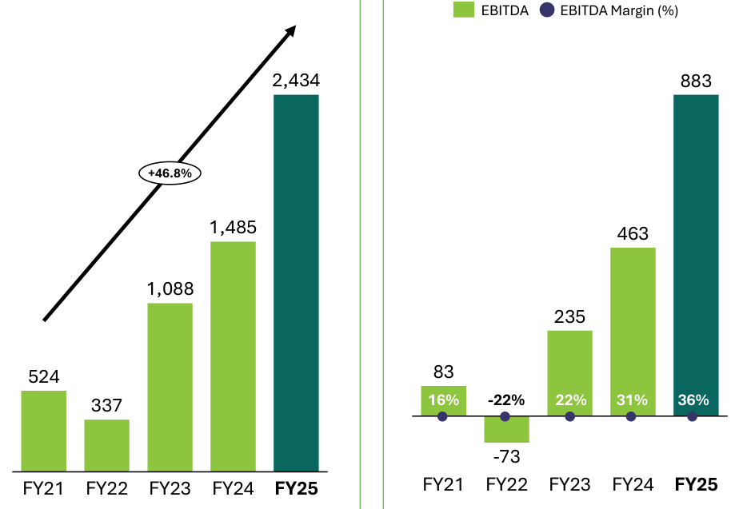

**[Image: Feb2026.pdf-0039-04.png (924x637, 39.9KB)]**

<!-- Start of picture text -->
EBITDA EBITDA Margin (%) 2,434 883 +46.8% 1,485 463 1,088 235 524 83 337 16% -22% 22% 31% 36% -73 FY21 FY22 FY23 FY24 FY25 FY21 FY22 FY23 FY24 FY25 <!-- End of picture text -->

**[Image: Feb2026.pdf-0039-05.png (203x90, 13.1KB)]**

###### **Return Ratios  (%)** 

###### **PAT(Rs Mn)** 

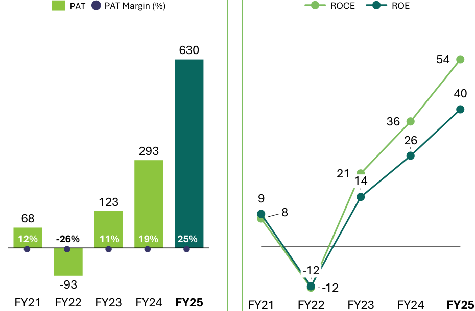

**[Image: Feb2026.pdf-0039-08.png (930x610, 44.8KB)]**

<!-- Start of picture text -->
PAT PAT Margin (%) ROCE ROE 630 54 40 36 26 293 21 14 9 123 8 68 12% -26% 11% 19% 25% -12 -93 -12 FY21 FY22 FY23 FY24 FY25 FY21 FY22 FY23 FY24 FY25 <!-- End of picture text -->

**<mark>38</mark>** 

**[Image: Feb2026.pdf-0040-00.png (417x343, 16.4KB)]**

###### **For further information, please contact:** 

###### **Company :** 

**[Image: Feb2026.pdf-0040-03.png (265x118, 19.6KB)]**

###### **Arrow Greentech Ltd. (BSE: 516064 | NSE: ARROWGREEN)** 

###### **Poonam Bansal** 

**[Image: Feb2026.pdf-0040-06.png (488x709, 286.3KB)]**

Company Secretary & Compliance Officer Email: poonam@arrowgreentech.com 

###### **Investor Relations Advisors :** 

**[Image: Feb2026.pdf-0040-09.png (286x69, 7.9KB)]**

###### **MUFG Intime India Private Limited** 

A part of MUFG Corporate Markets, a division of MUFG Pension & Market Service 

Mr. Chirag Bhatiya +91 81047 78836 chirag.bhatiya@in.mpms.mufg.com chirag.bhatiya@in.mpms.mufg.com 

Mr. Devansh Dedhia +91 99301 47479 devansh.dedhia@in.mpms.mufg.com devansh.dedhia@in.mpms.mufg.com 

**Meeting Request** Link 

## **<mark>Thank You</mark>** 

---

## Extracted Images

| # | File | Dimensions | Size |
|---|------|------------|------|
| 1 | Feb2026.pdf-0001-00.png | 129x123 | 28.0KB |
| 2 | Feb2026.pdf-0001-12.png | 119x90 | 20.4KB |
| 3 | Feb2026.pdf-0002-00.png | 382x168 | 34.1KB |
| 4 | Feb2026.pdf-0003-00.png | 65x119 | 6.1KB |
| 5 | Feb2026.pdf-0003-02.png | 203x90 | 13.1KB |
| 6 | Feb2026.pdf-0004-00.png | 1436x165 | 155.4KB |
| 7 | Feb2026.pdf-0005-00.png | 65x119 | 6.1KB |
| 8 | Feb2026.pdf-0005-02.png | 347x347 | 129.2KB |
| 9 | Feb2026.pdf-0005-07.png | 203x90 | 13.1KB |
| 10 | Feb2026.pdf-0006-00.png | 65x119 | 6.1KB |
| 11 | Feb2026.pdf-0006-02.png | 203x90 | 13.1KB |
| 12 | Feb2026.pdf-0006-03.png | 1973x720 | 78.7KB |
| 13 | Feb2026.pdf-0007-00.png | 65x119 | 6.1KB |
| 14 | Feb2026.pdf-0007-02.png | 203x90 | 13.1KB |
| 15 | Feb2026.pdf-0007-03.png | 1973x720 | 80.2KB |
| 16 | Feb2026.pdf-0008-00.png | 65x119 | 6.1KB |
| 17 | Feb2026.pdf-0008-02.png | 203x90 | 13.1KB |
| 18 | Feb2026.pdf-0009-00.png | 1436x165 | 178.1KB |
| 19 | Feb2026.pdf-0010-00.png | 65x119 | 6.1KB |
| 20 | Feb2026.pdf-0010-02.png | 203x90 | 13.1KB |
| 21 | Feb2026.pdf-0010-03.png | 304x285 | 98.3KB |
| 22 | Feb2026.pdf-0010-07.png | 304x284 | 109.3KB |
| 23 | Feb2026.pdf-0010-12.png | 304x286 | 101.7KB |
| 24 | Feb2026.pdf-0011-00.png | 65x119 | 6.1KB |
| 25 | Feb2026.pdf-0011-02.png | 203x90 | 13.1KB |
| 26 | Feb2026.pdf-0011-03.png | 304x285 | 135.9KB |
| 27 | Feb2026.pdf-0011-07.png | 304x284 | 90.2KB |
| 28 | Feb2026.pdf-0011-11.png | 304x286 | 103.2KB |
| 29 | Feb2026.pdf-0012-00.png | 65x119 | 6.1KB |
| 30 | Feb2026.pdf-0012-02.png | 203x90 | 13.1KB |
| 31 | Feb2026.pdf-0012-03.png | 146x141 | 7.8KB |
| 32 | Feb2026.pdf-0012-04.png | 146x139 | 7.0KB |
| 33 | Feb2026.pdf-0012-05.png | 146x138 | 7.3KB |
| 34 | Feb2026.pdf-0012-06.png | 146x140 | 8.3KB |
| 35 | Feb2026.pdf-0012-07.png | 146x141 | 6.8KB |
| 36 | Feb2026.pdf-0012-08.png | 1166x956 | 862.2KB |
| 37 | Feb2026.pdf-0013-00.png | 65x119 | 6.1KB |
| 38 | Feb2026.pdf-0013-02.png | 203x90 | 13.1KB |
| 39 | Feb2026.pdf-0013-03.png | 122x121 | 13.0KB |
| 40 | Feb2026.pdf-0013-04.png | 1971x628 | 263.3KB |
| 41 | Feb2026.pdf-0014-00.png | 65x119 | 6.1KB |
| 42 | Feb2026.pdf-0014-02.png | 361x448 | 242.3KB |
| 43 | Feb2026.pdf-0014-03.png | 359x448 | 269.0KB |
| 44 | Feb2026.pdf-0014-06.png | 362x448 | 277.4KB |
| 45 | Feb2026.pdf-0014-08.png | 361x448 | 116.7KB |
| 46 | Feb2026.pdf-0014-10.png | 203x90 | 13.1KB |
| 47 | Feb2026.pdf-0014-11.png | 361x448 | 155.7KB |
| 48 | Feb2026.pdf-0015-00.png | 372x101 | 24.1KB |
| 49 | Feb2026.pdf-0015-01.png | 1436x165 | 54.2KB |
| 50 | Feb2026.pdf-0016-00.png | 65x119 | 6.1KB |
| 51 | Feb2026.pdf-0016-02.png | 203x90 | 13.1KB |
| 52 | Feb2026.pdf-0016-03.png | 1971x958 | 1944.3KB |
| 53 | Feb2026.pdf-0017-00.png | 65x119 | 6.1KB |
| 54 | Feb2026.pdf-0017-02.png | 221x224 | 22.7KB |
| 55 | Feb2026.pdf-0017-03.png | 222x224 | 70.7KB |
| 56 | Feb2026.pdf-0017-07.png | 224x224 | 82.9KB |
| 57 | Feb2026.pdf-0017-09.png | 293x293 | 90.0KB |
| 58 | Feb2026.pdf-0017-11.png | 203x90 | 13.1KB |
| 59 | Feb2026.pdf-0017-12.png | 315x224 | 59.4KB |
| 60 | Feb2026.pdf-0017-16.png | 99x99 | 6.1KB |
| 61 | Feb2026.pdf-0017-18.png | 94x95 | 5.1KB |
| 62 | Feb2026.pdf-0017-20.png | 99x101 | 5.2KB |
| 63 | Feb2026.pdf-0017-22.png | 87x89 | 5.0KB |
| 64 | Feb2026.pdf-0017-24.png | 88x75 | 2.1KB |
| 65 | Feb2026.pdf-0017-26.png | 154x155 | 4.8KB |
| 66 | Feb2026.pdf-0018-00.png | 65x119 | 6.1KB |
| 67 | Feb2026.pdf-0018-02.png | 203x90 | 13.1KB |
| 68 | Feb2026.pdf-0018-03.png | 588x718 | 728.4KB |
| 69 | Feb2026.pdf-0018-04.png | 13x13 | 0.1KB |
| 70 | Feb2026.pdf-0018-05.png | 13x13 | 0.1KB |
| 71 | Feb2026.pdf-0018-06.png | 46x104 | 1.7KB |
| 72 | Feb2026.pdf-0018-07.png | 45x104 | 1.8KB |
| 73 | Feb2026.pdf-0018-08.png | 45x105 | 1.7KB |
| 74 | Feb2026.pdf-0018-09.png | 46x105 | 1.8KB |
| 75 | Feb2026.pdf-0018-11.png | 46x104 | 1.8KB |
| 76 | Feb2026.pdf-0018-12.png | 46x104 | 1.8KB |
| 77 | Feb2026.pdf-0018-13.png | 46x104 | 1.6KB |
| 78 | Feb2026.pdf-0018-14.png | 45x104 | 1.6KB |
| 79 | Feb2026.pdf-0018-15.png | 45x104 | 1.7KB |
| 80 | Feb2026.pdf-0018-16.png | 46x104 | 1.7KB |
| 81 | Feb2026.pdf-0019-00.png | 65x119 | 6.1KB |
| 82 | Feb2026.pdf-0019-02.png | 201x87 | 13.1KB |
| 83 | Feb2026.pdf-0019-03.png | 363x441 | 245.4KB |
| 84 | Feb2026.pdf-0019-04.png | 364x441 | 334.8KB |
| 85 | Feb2026.pdf-0019-05.png | 364x443 | 366.3KB |
| 86 | Feb2026.pdf-0019-06.png | 363x443 | 191.2KB |
| 87 | Feb2026.pdf-0019-07.png | 363x441 | 150.3KB |
| 88 | Feb2026.pdf-0019-08.png | 363x440 | 179.5KB |
| 89 | Feb2026.pdf-0019-09.png | 1557x478 | 800.5KB |
| 90 | Feb2026.pdf-0020-00.png | 65x119 | 6.1KB |
| 91 | Feb2026.pdf-0020-02.png | 446x922 | 403.5KB |
| 92 | Feb2026.pdf-0020-03.png | 109x109 | 4.9KB |
| 93 | Feb2026.pdf-0020-04.png | 84x25 | 1.7KB |
| 94 | Feb2026.pdf-0020-06.png | 109x109 | 3.8KB |
| 95 | Feb2026.pdf-0020-09.png | 109x109 | 4.8KB |
| 96 | Feb2026.pdf-0020-10.png | 109x109 | 5.0KB |
| 97 | Feb2026.pdf-0020-11.png | 109x109 | 4.5KB |
| 98 | Feb2026.pdf-0020-12.png | 109x109 | 5.2KB |
| 99 | Feb2026.pdf-0020-13.png | 203x90 | 13.1KB |
| 100 | Feb2026.pdf-0021-00.png | 65x119 | 6.1KB |
| 101 | Feb2026.pdf-0021-02.png | 203x90 | 13.1KB |
| 102 | Feb2026.pdf-0021-04.png | 233x93 | 11.5KB |
| 103 | Feb2026.pdf-0021-05.png | 260x67 | 8.7KB |
| 104 | Feb2026.pdf-0021-08.png | 210x66 | 5.3KB |
| 105 | Feb2026.pdf-0021-09.png | 201x66 | 4.9KB |
| 106 | Feb2026.pdf-0021-11.png | 409x66 | 14.1KB |
| 107 | Feb2026.pdf-0021-12.png | 407x103 | 37.3KB |
| 108 | Feb2026.pdf-0022-00.png | 65x119 | 6.1KB |
| 109 | Feb2026.pdf-0022-02.png | 567x297 | 33.0KB |
| 110 | Feb2026.pdf-0022-03.png | 126x151 | 7.9KB |
| 111 | Feb2026.pdf-0022-04.png | 203x90 | 13.1KB |
| 112 | Feb2026.pdf-0022-05.png | 180x41 | 5.5KB |
| 113 | Feb2026.pdf-0022-08.png | 895x80 | 18.7KB |
| 114 | Feb2026.pdf-0023-00.png | 1436x165 | 201.1KB |
| 115 | Feb2026.pdf-0024-00.png | 65x119 | 6.1KB |
| 116 | Feb2026.pdf-0024-02.png | 203x90 | 13.1KB |
| 117 | Feb2026.pdf-0024-03.png | 1943x662 | 1136.9KB |
| 118 | Feb2026.pdf-0024-04.png | 75x75 | 6.0KB |
| 119 | Feb2026.pdf-0024-05.png | 70x69 | 4.3KB |
| 120 | Feb2026.pdf-0024-06.png | 68x68 | 3.6KB |
| 121 | Feb2026.pdf-0024-07.png | 68x68 | 3.9KB |
| 122 | Feb2026.pdf-0024-08.png | 68x68 | 4.8KB |
| 123 | Feb2026.pdf-0024-09.png | 62x62 | 2.6KB |
| 124 | Feb2026.pdf-0024-10.png | 62x62 | 3.8KB |
| 125 | Feb2026.pdf-0025-00.png | 1436x165 | 138.8KB |
| 126 | Feb2026.pdf-0026-00.png | 65x119 | 6.1KB |
| 127 | Feb2026.pdf-0026-01.png | 203x90 | 13.1KB |
| 128 | Feb2026.pdf-0026-03.png | 38x342 | 3.0KB |
| 129 | Feb2026.pdf-0026-04.png | 38x342 | 2.7KB |
| 130 | Feb2026.pdf-0026-05.png | 38x342 | 2.8KB |
| 131 | Feb2026.pdf-0026-06.png | 38x342 | 2.6KB |
| 132 | Feb2026.pdf-0026-08.png | 953x658 | 69.4KB |
| 133 | Feb2026.pdf-0026-09.png | 38x342 | 2.8KB |
| 134 | Feb2026.pdf-0026-10.png | 38x342 | 2.7KB |
| 135 | Feb2026.pdf-0026-11.png | 39x342 | 2.6KB |
| 136 | Feb2026.pdf-0026-12.png | 38x342 | 2.9KB |
| 137 | Feb2026.pdf-0026-13.png | 834x163 | 21.1KB |
| 138 | Feb2026.pdf-0027-00.png | 65x119 | 6.1KB |
| 139 | Feb2026.pdf-0027-02.png | 203x90 | 13.1KB |
| 140 | Feb2026.pdf-0028-00.png | 65x119 | 6.1KB |
| 141 | Feb2026.pdf-0028-02.png | 203x90 | 13.1KB |
| 142 | Feb2026.pdf-0029-00.png | 65x119 | 6.1KB |
| 143 | Feb2026.pdf-0029-02.png | 938x274 | 196.1KB |
| 144 | Feb2026.pdf-0029-03.png | 938x274 | 165.0KB |
| 145 | Feb2026.pdf-0029-04.png | 938x276 | 167.1KB |
| 146 | Feb2026.pdf-0029-05.png | 203x90 | 13.1KB |
| 147 | Feb2026.pdf-0029-06.png | 922x273 | 123.4KB |
| 148 | Feb2026.pdf-0029-07.png | 922x276 | 162.6KB |
| 149 | Feb2026.pdf-0029-08.png | 922x274 | 111.9KB |
| 150 | Feb2026.pdf-0030-00.png | 65x119 | 6.1KB |
| 151 | Feb2026.pdf-0030-02.png | 203x90 | 13.1KB |
| 152 | Feb2026.pdf-0030-03.png | 2000x922 | 108.5KB |
| 153 | Feb2026.pdf-0031-01.png | 1436x165 | 91.6KB |
| 154 | Feb2026.pdf-0032-00.png | 65x119 | 6.1KB |
| 155 | Feb2026.pdf-0032-02.png | 203x90 | 13.1KB |
| 156 | Feb2026.pdf-0032-06.png | 111x98 | 3.3KB |
| 157 | Feb2026.pdf-0033-00.png | 65x119 | 6.1KB |
| 158 | Feb2026.pdf-0033-02.png | 203x90 | 13.1KB |
| 159 | Feb2026.pdf-0034-00.png | 65x119 | 6.1KB |
| 160 | Feb2026.pdf-0034-02.png | 203x90 | 13.1KB |
| 161 | Feb2026.pdf-0035-00.png | 65x119 | 6.1KB |
| 162 | Feb2026.pdf-0035-02.png | 203x90 | 13.1KB |
| 163 | Feb2026.pdf-0035-03.png | 388x133 | 13.7KB |
| 164 | Feb2026.pdf-0035-05.png | 238x232 | 63.4KB |
| 165 | Feb2026.pdf-0035-11.png | 238x232 | 77.1KB |
| 166 | Feb2026.pdf-0035-16.png | 238x232 | 92.0KB |
| 167 | Feb2026.pdf-0036-00.png | 65x119 | 6.1KB |
| 168 | Feb2026.pdf-0036-02.png | 203x90 | 13.1KB |
| 169 | Feb2026.pdf-0036-10.png | 1106x585 | 941.6KB |
| 170 | Feb2026.pdf-0037-00.png | 65x119 | 6.1KB |
| 171 | Feb2026.pdf-0037-02.png | 203x90 | 13.1KB |
| 172 | Feb2026.pdf-0037-05.png | 993x846 | 1203.2KB |
| 173 | Feb2026.pdf-0038-00.png | 1436x165 | 171.1KB |
| 174 | Feb2026.pdf-0039-00.png | 65x119 | 6.1KB |
| 175 | Feb2026.pdf-0039-04.png | 924x637 | 39.9KB |
| 176 | Feb2026.pdf-0039-05.png | 203x90 | 13.1KB |
| 177 | Feb2026.pdf-0039-08.png | 930x610 | 44.8KB |
| 178 | Feb2026.pdf-0040-00.png | 417x343 | 16.4KB |
| 179 | Feb2026.pdf-0040-03.png | 265x118 | 19.6KB |
| 180 | Feb2026.pdf-0040-06.png | 488x709 | 286.3KB |
| 181 | Feb2026.pdf-0040-09.png | 286x69 | 7.9KB |
