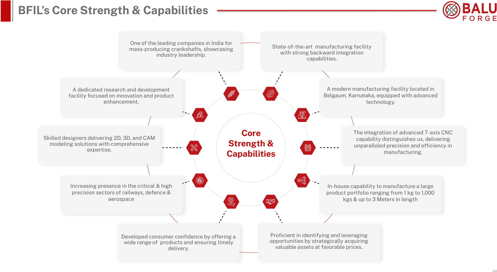
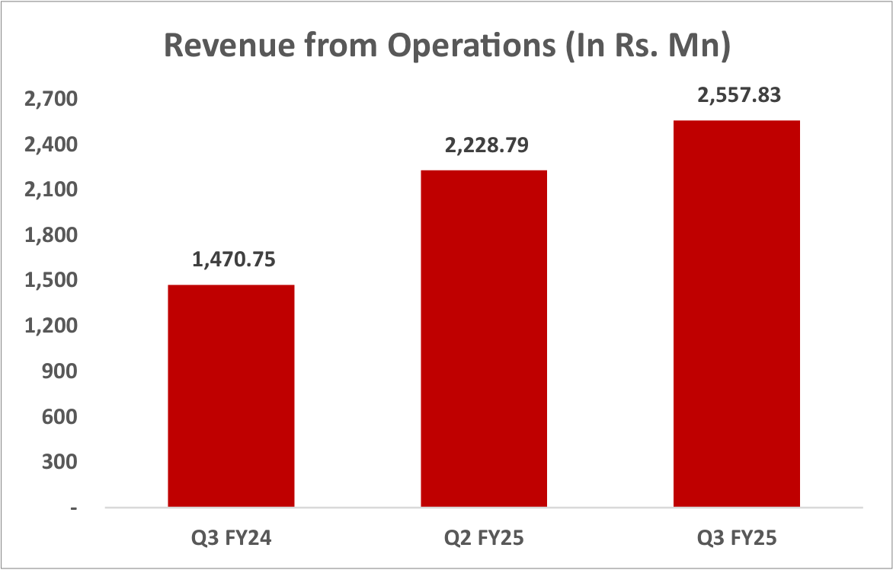
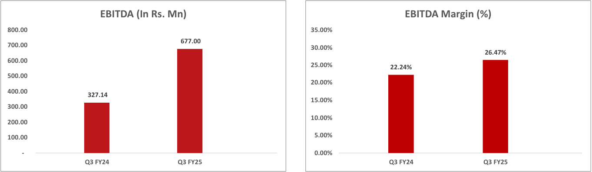
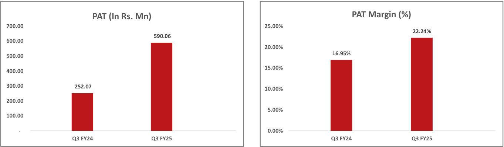
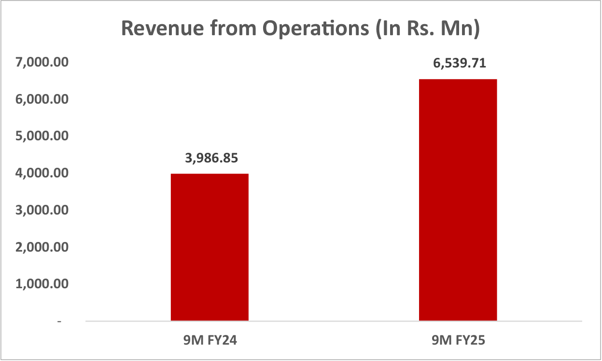
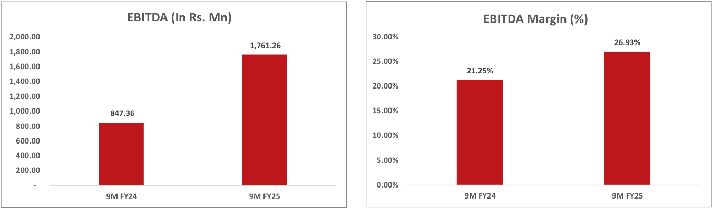
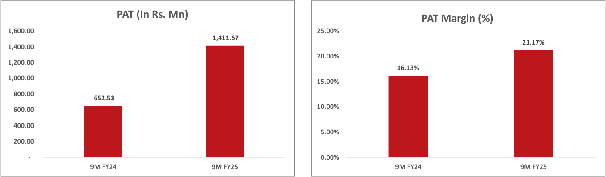

**[Image: BaluApril2025.pdf-0001-00.png (83x83, 6.4KB)]**

**[Image: BaluApril2025.pdf-0001-01.png (84x51, 6.9KB)]**

**[Image: BaluApril2025.pdf-0001-02.png (69x81, 2.6KB)]**

**[Image: BaluApril2025.pdf-0001-03.png (25x25, 1.6KB)]**

**[Image: BaluApril2025.pdf-0001-04.png (22x24, 1.4KB)]**

Date: April 08, 2025 

To, Department of Corporate Services, **BSE Limited,** P J Towers, Dalal Street, Mumbai- 400 001. **BSE: Scrip Code: 531112** 

To, Listing Department, 

**National Stock Exchange of India Limited,** “Exchange Plaza”, C-1, Block-G, Bandra Kurla Complex, Bandra (E), Mumbai- 400 051. **NSE Trading Symbol: BALUFORGE** 

Respected Sir / Madam, 

**<u>Subject:  Submission of Investor Presentation made by the Company under Regulation 30 of SEBI (Listing Obligations and Disclosure Requirements) Regulations, 2015.</u>** 

In terms of Regulation 30 of SEBI (Listing Obligations and Disclosure Requirements) Regulations, 2015 and other applicable provisions, please find herewith attached Investor Presentation made by the Company to Investor/Analyst at Factory Visit held today i.e. Tuesday, April 08, 2025. 

Further we wish to inform that the copy of the Investor Presentation is available on the Company website at: <u>https://www.baluindustries.com/financial-information.php</u> 

This intimation is also being uploaded on the Company’s website in compliance with Regulation 46(2) of the Listing Regulations. 

We request you to take the same on records. 

###### **For Balu Forge Industries Limited** 

JASPALSINGH Digitally signed by JASPALSINGH PREHLADSINGH PREHLADSINGH CHANDOCK Date: 2025.04.08 16:24:33 CHANDOCK +05'30' 

**Jaspalsingh Prehladsingh Chandock Managing Director DIN 00813218** 

Enclosed: A/A 

**[Image: BaluApril2025.pdf-0001-19.png (887x149, 84.4KB)]**

**[Image: BaluApril2025.pdf-0002-00.png (332x123, 10.2KB)]**

# **<mark>EARNING</mark> RELEASE** 

**[Image: BaluApril2025.pdf-0002-02.png (563x535, 80.8KB)]**

Q3 & 9M FY25 

**[Image: BaluApril2025.pdf-0002-04.png (230x376, 21.2KB)]**

**[Image: BaluApril2025.pdf-0002-05.png (157x457, 22.5KB)]**

## **Navigating This Report** 

**[Image: BaluApril2025.pdf-0002-07.png (121x112, 7.2KB)]**

About Balu Forge 

BFIL’s Core Strengths & Capabilities Key Financial Highlights (Quarterly & 9M) Consolidated Financial Statements Our Strategic Priorities For Future Growth Management Commentary Disclaimer and Contact details 

**[Image: BaluApril2025.pdf-0002-10.png (130x246, 12.5KB)]**

**[Image: BaluApril2025.pdf-0002-11.png (26x17, 0.5KB)]**

**[Image: BaluApril2025.pdf-0002-12.png (28x15, 0.6KB)]**

**[Image: BaluApril2025.pdf-0002-13.png (381x94, 6.9KB)]**

<!-- Start of picture text -->
07th February 2025 BSE  : 531112 |  NSE  : BALUFORGE <!-- End of picture text -->

**[Image: BaluApril2025.pdf-0002-14.png (26x18, 0.5KB)]**

**Expanding Horizons Getting Future Ready** 

**[Image: BaluApril2025.pdf-0002-16.png (13x16, 0.4KB)]**

<!-- Start of picture text -->
® <!-- End of picture text -->

® 

### **About The Company** 

**[Image: BaluApril2025.pdf-0003-02.png (199x74, 6.0KB)]**

BFIL, a company with **35 years** of experience, is renowned for its specialized engineering solutions and precision machined components. 

The company operates three state-of-the-art advanced plants across 8 acres and a greenfield manufacturing campus spread over 46 acres will be commercialized shortly in phases. 

BFIL’s diverse product range serves various industries, including automobiles, industrial vehicles, earthmoving machinery, wind energy, aerospace, defence, oil and gas, locomotives and railway applications, marine, agriculture, and more. 

The company boasts a broad export and distribution network covering over **80 Countries** and serving more than **25 OEMs** globally. 

BFIL boasts advanced R&D facility & capability, driven by a dedicated team of professionals. 

BFIL is focused on new product development and the application of advanced alloys and material chemistries in specialized segments. 

The company generates more than **90%** of revenues through exports. 

1 

Balu Forge Industries Ltd. 

® 

### **Driving Growth Through Advanced Expansion** 

**[Image: BaluApril2025.pdf-0004-02.png (199x74, 6.0KB)]**

###### **Facility:** 

A new state-of-the-art integrated forging and machining campus in Belgaum, Karnataka, spanning 46 acres. 

###### **Machining Capacity:** 

32,000 TPA for machined components presently. A further expansion of the machining capacity & introduction of new technologies is in process which will significantly enhance both the machining capability & capacity. The company can machine critical high precision components up to 3 meters in length. 

###### **Forging Capacity:** 

Enhanced by acquiring specialized assets with an additional 72,000 TPA of forging capacity. A further expansion to increase the weight category serviced & to further increase the capacity is in process which will position the company in a very niche league of Forging companies globally. The company can forge components up to 1,000 kgs in weight through the closed die hot forging route. This capability will further be enhanced to increase the weight category of the products produced at the company. 

###### **Advanced Equipment:** 

Includes a 16-ton closed-die forging hydraulic hammer line and an 8,000-ton mechanical forging press powered by GERB Anti Vibration System. The introduction of 7 Axis machining capability has added a new dimension to the high precision machining prowess at the company. 

###### **Automation:** 

Fully automated upcoming facility featuring advanced technologies like anti vibration systems and robotic handling. 

###### **Industry 4.0 Standards:** 

Cutting-edge manufacturing practices for superior efficiency and quality production of 72,000 tons of forged components annually. 

2 

Balu Forge Industries Ltd. 

® 

**[Image: BaluApril2025.pdf-0005-01.png (1824x998, 185.1KB)]**

<!-- Start of picture text -->
BFIL’s Core Strength & Capabilities One of the leading companies in India for State-of-the-art  manufacturing facility mass-producing crankshafts, showcasing with strong backward integration industry leadership. capabilities. A dedicated research and development  A modern manufacturing facility located in facility focused on innovation and product  Belgaum, Karnataka, equipped with advanced enhancement.  technology. Core  The integration of advanced 7-axis CNC Skilled designers delivering 2D, 3D, and CAM  capability distinguishes us, delivering modeling solutions with comprehensive  Strength &  unparalleled precision and efficiency in expertise. Capabilities manufacturing. Increasing presence in the critical & high In-house capability to manufacture a large precision sectors of railways, defence & product portfolio ranging from 1 kg to 1,000 aerospace kgs & up to 3 Meters in length Developed consumer confidence by offering a  Proficient in identifying and leveraging wide range of  products and ensuring timely  opportunities by strategically acquiring delivery. valuable assets at favorable prices. <!-- End of picture text -->

3 

Balu Forge Industries Ltd. 

® 

### **Quarterly Key Financial Highlights (Consolidated)** 

**[Image: BaluApril2025.pdf-0006-02.png (199x74, 6.0KB)]**

**[Image: BaluApril2025.pdf-0006-03.png (1172x749, 41.7KB)]**

<!-- Start of picture text -->
Revenue from Opera�ons (In Rs. Mn)  2,700 2,557.83  2,400 2,228.79  2,100  1,800 1,470.75  1,500  1,200  900  600  300  - Q3 FY24 Q2 FY25 Q3 FY25 <!-- End of picture text -->

4 

Balu Forge Industries Ltd. 

® 

### **Quarterly Key Financial Highlights (Consolidated)** 

**[Image: BaluApril2025.pdf-0007-02.png (199x74, 6.0KB)]**

**[Image: BaluApril2025.pdf-0007-03.png (1363x397, 30.4KB)]**

<!-- Start of picture text -->
EBITDA (In Rs. Mn)  EBITDA Margin (%)  800.00 35.00% 677.00  700.00 30.00% 26.47%  600.00 25.00% 22.24%  500.00 20.00%  400.00 327.14 15.00%  300.00 10.00%  200.00  100.00 5.00%  - 0.00% Q3 FY24 Q3 FY25 Q3 FY24 Q3 FY25 <!-- End of picture text -->

**[Image: BaluApril2025.pdf-0007-04.png (1363x399, 28.9KB)]**

<!-- Start of picture text -->
PAT (In Rs. Mn)  PAT Margin (%)  700.00 25.00% 22.24% 590.06  600.00 20.00% 16.95%  500.00 15.00%  400.00  300.00 252.07  10.00%  200.00 5.00%  100.00  - 0.00% Q3 FY24 Q3 FY25 Q3 FY24 Q3 FY25 <!-- End of picture text -->

5 

Balu Forge Industries Ltd. 

® 

### **9MFY25 Key Financial Highlights (Consolidated)** 

**[Image: BaluApril2025.pdf-0008-02.png (199x74, 6.0KB)]**

**[Image: BaluApril2025.pdf-0008-03.png (1247x749, 35.1KB)]**

<!-- Start of picture text -->
Revenue from Opera�ons (In Rs. Mn)  7,000.00 6,539.71  6,000.00  5,000.00 3,986.85  4,000.00  3,000.00  2,000.00  1,000.00  - 9M FY24 9M FY25 <!-- End of picture text -->

6 

Balu Forge Industries Ltd. 

® 

### **9MFY25 Key Financial Highlights (Consolidated)** 

**[Image: BaluApril2025.pdf-0009-02.png (199x74, 6.0KB)]**

**[Image: BaluApril2025.pdf-0009-03.png (1353x399, 32.9KB)]**

<!-- Start of picture text -->
EBITDA (In Rs. Mn)  EBITDA Margin (%)  2,000.00 30.00% 1,761.26  26.93%  1,800.00 25.00%  1,600.00 21.25%  1,400.00 20.00%  1,200.00  1,000.00 847.36  15.00%  800.00 10.00%  600.00  400.00 5.00%  200.00  - 0.00% 9M FY24 9M FY25 9M FY24 9M FY25 <!-- End of picture text -->

**[Image: BaluApril2025.pdf-0009-04.png (1353x397, 29.9KB)]**

<!-- Start of picture text -->
PAT (In Rs. Mn) PAT Margin (%)  1,600.00 25.00% 1,411.67 21.17%  1,400.00 20.00%  1,200.00 16.13%  1,000.00 15.00%  800.00 652.53 10.00%  600.00 Balu Forge Industries Ltd.  400.00 5.00%  200.00  - 0.00% 9M FY24 9M FY25 9M FY24 9M FY25 <!-- End of picture text -->

7 

Balu Forge Industries Ltd. 

® 

### **Consolidated Income Statement** 

**[Image: BaluApril2025.pdf-0010-02.png (199x74, 6.0KB)]**

|**Par�culars (Rs. Mn)**|**Q3 FY25**|**Q3 FY24**|**YoY%**|**Q2 FY25**|**9M FY25**|**9M FY24**|**YoY%**|
|---|---|---|---|---|---|---|---|
|**Revenue from Opera�ons**|2,557.83|1,470.75|**73.91%**|2,228.79|6,539.71|3,986.85|**64.03%**|
|Other Income|95.66|16.16||23.53|129.77|58.90||
|**Total Income**|**2,653.49**|**1,486.91**||**2,252.33**|**6,669.48**|**4,045.75**||
|Total Expenses excl. D&A & Finance Cost|1,880.83|1,143.61||1,576.58|4,778.45|3,139.49||
|**EBITDA (Excluding Other Income)**|**677.00**|**327.14**|**106.95%**|**652.22**|**1,761.26**|**847.36**|**107.85%**|
|**EBITDA Margin (%)**|**26.47%**|**22.24%**||**29.26%**|**26.93%**|**21.25%**||
|Deprecia�on & Amor�za�on|8.47|5.13||8.31|24.77|14.32||
|Finance Cost|22.58|38.63||29.41|67.48|101.07||
|**PBT before Excep�onal Item**|**741.62**|**299.54**||**638.03**|**1,798.78**|**790.88**|**127.44%**|
|Excep�onal Items|-|-||-|-|-||
|**PBT**|**741.62**|**299.54**|**147.59%**|**638.03**|**1,798.78**|**790.88**||
|Tax|151.56|47.47||158.08|387.11|138.35||
|**PAT**|**590.06**|**252.07**|**134.09%**|**479.95**|**1,411.67**|**652.53**|**116.34%**|
|**PAT Margin %**|**22.24%**|**16.95%**||**21.31%**|**21.17%**|**16.13%**||
|Other comprehensive (proft)/ loss|14.29|2.14||1.67|15.52|1.69||
|**Net PAT**|**604.35**|**254.21**|**137.74%**|**481.62**|**1,427.19**|**654.22**|**118.15%**|
|Diluted EPS (In Rs.)|5.19|2.57||4.26|12.62|6.61||

8 

Balu Forge Industries Ltd. 

® 

### **Our Strategic Priorities For Future Growth** 

###### **Key Outline Of The Strategy** 

###### **Focus Area** 

Enhancement of both the Capacity & Capability in the areas of Heavy Closed Die Forging & High precision critical machined components. 

**Capacity Expansion** 

Diversifying our product portfolio with a focus on Aerospace, Railways & Defence related offerings which yields better margins owing to complexity. 

**Product** Railways & Defence related offerings which yields better **Expansion** margins owing to complexity. **Higher** Aiming to expand market presence in the commercial vehicle **Wallet Share** (CV), Railways & the Defence sector. Focused on adding new OEM partnerships annually across the **Customer** globe & new customers in the sunrise sectors of Railway & **Addition** 

Focused on adding new OEM partnerships annually across the globe & new customers in the sunrise sectors of Railway & Defence. 

**[Image: BaluApril2025.pdf-0011-09.png (119x105, 3.9KB)]**

**Geographic** Expanding our global reach to enter new markets through **Expansion** expansion of the product mix. 

**[Image: BaluApril2025.pdf-0011-11.png (199x74, 6.0KB)]**

###### **Our Progress Thus Far** 

The Forging Capacity of 72,000 Tons annually is under installation in the new manufacturing campus. The acquisition & installation of the first 7-axis machine has been completed. The company is in the process of further acquisitions to increase the capacity in both the domains of Heavy Forging & High Precision Machining. 

The forging capacity is under commercialization & products with varied material chemistries from Aluminum to Titanium is under testing/prototyping with key customers. A large product portfolio from the defence & the railway industry is under prototyping & some have also reached commercialization. The company is in the process of commissioning an SPM production line for critical defence components. 

We have continued to increase the wallet share from existing customers in the CV sector & also addition of new customers across the Commercial Vehicle, Railways & Defence sectors. We are seeing a bigger Europe + 1 impact rather than the common trend of China + 1. We foresee this tailwind to continue in the upcoming quarter & the increasing shift to India as a factory of the world will continue to be a strong enabler of our company's growth. 

The company is progressing positively in customer addition through ToT and contract manufacturing opportunities, achieving key milestones in the Railway and Defence industries. These developments highlight its growing expertise and potential to secure longterm partnerships in these critical sectors which incrementally will be the major contributors & growth drivers for the company going forward. 

Increased focus on further expanding the global reach of the company. New market opportunities have been explored on the global front especially where the company had historically very low market share. This has been enabled by the global team expansion in key low market share regions & also mainly due to increased product offerings. A clear strategy to derisk from rampant war zones & geo political issues is also in place to safeguard the financial position of the company. 

9 

Balu Forge Industries Ltd. 

® 

### **Management Commentary** 

**[Image: BaluApril2025.pdf-0012-02.png (199x74, 6.0KB)]**

###### **Commenting on the performance of Q2FY25, Mr. Trimaan Chandock, Executive Director of BFIL  stated:** 

_We are pleased to report strong performance for Q3FY25, with revenue growing_ **_73.91%_** _to_ **_INR 2,557.83 Mn_** _in Q3FY25, from INR 1,470.75 Mn in Q3FY24, driven by a robust demand for our specialized engineering products. EBITDA increased by_ **_106.95%_** _to_ **_INR 677.00 Mn_** _In Q3FY25 as compared to INR 327.14 Mn, with EBITDA margins expanding by_ **_422 bps_** _from 22.24% in Q3FY24 to_ **_26.47%_** _in Q3FY25, supported by operational efficiencies and a focus on high-margin value added niche products._ 

_PAT grew_ **_134.09%_** _from INR 252.07 Mn in Q3FY24 to_ **_INR 590.06 Mn_** _in Q3FY25, with PAT margins improved by_ **_528 bps_** _from 16.95% in Q3FY24 to_ **_22.24%_** _in Q3FY25. There is an increase in other income this quarter due to forex gains from rupee depreciation, as the company benefits from higher export sales._ 

_For 9M FY25, revenue grew_ **_64.03%_** _to_ **_INR 6,539.71 Mn_** _, compared to INR 3,986.85 Mn in 9M FY24. EBITDA increased_ **_107.85%_** _to_ **_INR 1,761.26 Mn_** _in 9MFY25 as compared to INR 847.36 Mn in Q3FY24, with EBITDA margins expanding by_ **_568 bps_** _from 21.25% in 9M FY24 to_ **_26.93%_** _in 9MFY25. PAT grew by_ **_116.34%_** _to_ **_INR 1,411.67 Mn_** _in 9MFY25 as compared to INR 652.53 Mn in 9MFY24, with PAT margins improved by_ **_504 bps_** _from 16.13% in 9MFY24 to_ **_21.17%_** _in 9MFY25._ 

_These results highlight our resilient business model and strong market positioning, setting the stage for continued growth. Our success stems from strategies like portfolio expansion, client diversification, and delivering solutions across key sectors. As the indian forging industry benefits from China+1 and Europe+1, Balu Forge is investing in innovation and partnerships for sustainable growth and global expansion._ 

_In addition to our financial performance, this quarter saw significant advancements in strategic initiatives:_ 

###### **_Strategic Partnerships for High-Growth Industries_** 

_We have signed a Memorandum of Understanding (MoU) with Swan Energy Limited to create a Special Purpose Vehicle (SPV) focused on serving global industries, including defence, aerospace, railways, and nuclear. This strategic diversification positions us as a prominent player in high-growth, technology-driven sectors._ 

###### **_Capacity Expansion with Advanced Technology_** 

_The integration of 7-axis CNC machining technology strengthens Balu Forge’s capability to produce intricate, high-precision components. This expansion, financed through internal accruals, is poised to fuel growth in the aerospace, defence and oil & gas sectors._ 

###### **_Focus on Critical Components_** 

_Our targeted focus on high-value, critical components such as aerospace components, critical defence and railway components demonstrates a strategic alignment with global market demands._ 

10 

Balu Forge Industries Ltd. 

® 

### **Management Commentary** 

**[Image: BaluApril2025.pdf-0013-02.png (199x74, 6.0KB)]**

_We are pleased to inform the stakeholders of the company that the green field manufacturing campus commissioning is in full swing & will house a fully automated plant with modern technology, larger integration of Industry 4.0, installation of a solar farm for energy saving, plant commissioning as per the latest ISO standards, Implementation of 5S & TPM practices & Implementation of  OSHA standards._ 

_In conclusion, our focus on cost optimization, enhanced production efficiency, and a more agile supply chain has established a robust platform for sustainable growth. Leveraging our advanced engineering capabilities and ongoing innovation, we are strategically positioned to capitalize on emerging market opportunities and generate long-term value. Our steadfast commitment to operational excellence and customer satisfaction reinforces our competitive advantage in the industry._ 

#### **Management Guidance:** 

We continue to maintain the guidance for FY25 as below: 

Revenue is expected to grow in the range of **55% - 60%** in FY25 over FY24, led  by new customer addition in sectors like railway and defence. 

EBITDA margins are expected to conservatively be in the corridor of **25% - 27%** for FY25 on the back of increasing scale of operations and efficiencies thereon. The same will be at a sustainable level of **30% - 32%** for FY26 after commercialisation of the new plant. 

#### For Further Information on the Company, Please Visit: www.baluindustries.com 

###### **Disclaimer:** 

**Certain statements in this document may be forward-looking statements. Such forward-looking statements are subject to certain risks and uncertainties, like government actions, local political or economic developments, technological risks, and many other factors that could cause our actual results to differ materially from those contemplated by the relevant forward-looking statements. Balu Forge Industries Limited will not be in any way responsible for any action taken based on such statements and undertakes no obligation to publicly update these forward-looking statements to reflect subsequent events or circumstances.** 

##### **Contact Details** 

**Tabassum Begum (Company Secretary)** 

**Krunal Shah / Vinayak Shirodkar** 

**Balu Forge Industries Limited** 

**Contact: +91 86550 75578** 

**Captive IR Strategic Advisors Pvt. Ltd. Contact: +91 93724 67194** 

**Email: compliance@baluindustries.com** 

**Email: krunal@cap-ir.com / vinayak@cap-ir.com** 

11 

Balu Forge Industries Ltd. 

**[Image: BaluApril2025.pdf-0014-00.png (331x123, 10.2KB)]**

® 

TOGETHER WE WILL WIN 

**[Image: BaluApril2025.pdf-0014-03.png (1920x574, 370.2KB)]**

---

## Extracted Images

| # | File | Dimensions | Size |
|---|------|------------|------|
| 1 | BaluApril2025.pdf-0001-00.png | 83x83 | 6.4KB |
| 2 | BaluApril2025.pdf-0001-01.png | 84x51 | 6.9KB |
| 3 | BaluApril2025.pdf-0001-02.png | 69x81 | 2.6KB |
| 4 | BaluApril2025.pdf-0001-03.png | 25x25 | 1.6KB |
| 5 | BaluApril2025.pdf-0001-04.png | 22x24 | 1.4KB |
| 6 | BaluApril2025.pdf-0001-19.png | 887x149 | 84.4KB |
| 7 | BaluApril2025.pdf-0002-00.png | 332x123 | 10.2KB |
| 8 | BaluApril2025.pdf-0002-02.png | 563x535 | 80.8KB |
| 9 | BaluApril2025.pdf-0002-04.png | 230x376 | 21.2KB |
| 10 | BaluApril2025.pdf-0002-05.png | 157x457 | 22.5KB |
| 11 | BaluApril2025.pdf-0002-07.png | 121x112 | 7.2KB |
| 12 | BaluApril2025.pdf-0002-10.png | 130x246 | 12.5KB |
| 13 | BaluApril2025.pdf-0002-11.png | 26x17 | 0.5KB |
| 14 | BaluApril2025.pdf-0002-12.png | 28x15 | 0.6KB |
| 15 | BaluApril2025.pdf-0002-13.png | 381x94 | 6.9KB |
| 16 | BaluApril2025.pdf-0002-14.png | 26x18 | 0.5KB |
| 17 | BaluApril2025.pdf-0002-16.png | 13x16 | 0.4KB |
| 18 | BaluApril2025.pdf-0003-02.png | 199x74 | 6.0KB |
| 19 | BaluApril2025.pdf-0004-02.png | 199x74 | 6.0KB |
| 20 | BaluApril2025.pdf-0005-01.png | 1824x998 | 185.1KB |
| 21 | BaluApril2025.pdf-0006-02.png | 199x74 | 6.0KB |
| 22 | BaluApril2025.pdf-0006-03.png | 1172x749 | 41.7KB |
| 23 | BaluApril2025.pdf-0007-02.png | 199x74 | 6.0KB |
| 24 | BaluApril2025.pdf-0007-03.png | 1363x397 | 30.4KB |
| 25 | BaluApril2025.pdf-0007-04.png | 1363x399 | 28.9KB |
| 26 | BaluApril2025.pdf-0008-02.png | 199x74 | 6.0KB |
| 27 | BaluApril2025.pdf-0008-03.png | 1247x749 | 35.1KB |
| 28 | BaluApril2025.pdf-0009-02.png | 199x74 | 6.0KB |
| 29 | BaluApril2025.pdf-0009-03.png | 1353x399 | 32.9KB |
| 30 | BaluApril2025.pdf-0009-04.png | 1353x397 | 29.9KB |
| 31 | BaluApril2025.pdf-0010-02.png | 199x74 | 6.0KB |
| 32 | BaluApril2025.pdf-0011-09.png | 119x105 | 3.9KB |
| 33 | BaluApril2025.pdf-0011-11.png | 199x74 | 6.0KB |
| 34 | BaluApril2025.pdf-0012-02.png | 199x74 | 6.0KB |
| 35 | BaluApril2025.pdf-0013-02.png | 199x74 | 6.0KB |
| 36 | BaluApril2025.pdf-0014-00.png | 331x123 | 10.2KB |
| 37 | BaluApril2025.pdf-0014-03.png | 1920x574 | 370.2KB |
