**[Image: BaluAugust2025.pdf-0001-00.png (83x83, 6.4KB)]**

**[Image: BaluAugust2025.pdf-0001-01.png (84x51, 6.9KB)]**

**[Image: BaluAugust2025.pdf-0001-02.png (69x81, 2.6KB)]**

**[Image: BaluAugust2025.pdf-0001-03.png (25x25, 1.6KB)]**

**[Image: BaluAugust2025.pdf-0001-04.png (22x24, 1.4KB)]**

Date: August 07, 2025 

To, Department of Corporate Services, **BSE Limited,** P J Towers, Dalal Street, Mumbai- 400 001. **BSE: Scrip Code: 531112** 

To, Listing Department, **National Stock Exchange of India Limited,** “Exchange Plaza”, C-1, Block-G, Bandra Kurla Complex, Bandra (E), Mumbai- 400 051. **NSE Trading Symbol: BALUFORGE** 

###### **Sub: -** **<u>Earnings Release for the Quarter ended 30</u>****th** **<u>June, 2025</u>** 

Dear Sir/Madam, 

Please find enclosed herewith the Earnings Release for the Quarter ended 30th June, 2025. 

Kindly take the same on your record and acknowledge. 

Thanking You, Yours Truly, 

###### **For Balu Forge Industries Limited** 

JASPALSINGH Digitally signed by JASPALSINGH PREHLADSINGH PREHLADSINGH CHANDOCK Date: 2025.08.07 20:29:45 CHANDOCK +05'30' 

**Jaspalsingh Chandock Managing Director DIN: - 00813218** 

Enclosure: As above 

**[Image: BaluAugust2025.pdf-0001-17.png (887x149, 84.4KB)]**

**[Image: BaluAugust2025.pdf-0002-00.png (121x122, 8.2KB)]**

**[Image: BaluAugust2025.pdf-0002-01.png (16x18, 0.5KB)]**

<!-- Start of picture text -->
® <!-- End of picture text -->

**[Image: BaluAugust2025.pdf-0002-02.png (34x36, 1.3KB)]**

**[Image: BaluAugust2025.pdf-0002-03.png (36x36, 1.5KB)]**

## **EARNING PRESENTATION Q1 FY26  |  7****th** **Aug 2025** 

**BSE** : 531112 | **NSE** : BALUFORGE 

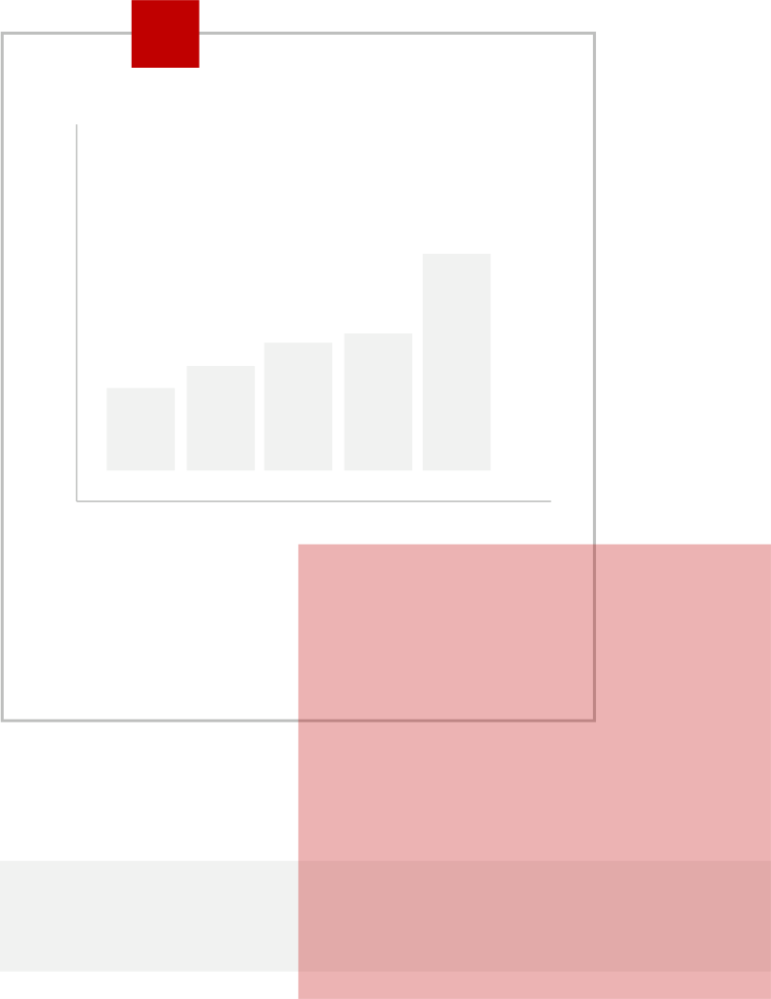

**[Image: BaluAugust2025.pdf-0002-06.png (819x1062, 11.6KB)]**

**EXPANDING HORIZONS GETTING FUTURE READY** 

**®** 

**[Image: BaluAugust2025.pdf-0003-01.png (70x70, 0.2KB)]**

##### **Balu Forge at a Glance** 

Prominent Indian company supplying precision-engineered products and forged components to diversified industries. 

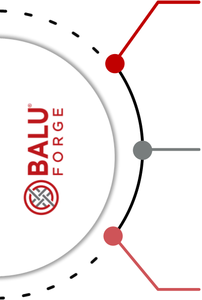

**[Image: BaluAugust2025.pdf-0003-04.png (403x599, 39.8KB)]**

Integrated facilities with comprehensive capabilities to support a large array of industries 

Facility equipped with both closed die forging hammers and presses, including our most powerful 16-ton hydraulic Forging Hammer. 

Fully integrated Forging and Machining production capabilities for captive consumption. Offers a large product portfolio ranging from 1 Kg to 1,000 Kgs and up to 3 Metres long. 

Diverse product range serving various industries, including automobiles, industrial vehicles, earthmoving machinery, wind energy, aerospace, defence, oil and gas, locomotives and railway applications, marine and agriculture. 

Advanced R&D facility & capability, driven by a dedicated team of professionals. Focused on new product development and the application of advanced alloys and material chemistries in specialized segments. 

**[Image: BaluAugust2025.pdf-0003-10.png (65x68, 3.9KB)]**

**[Image: BaluAugust2025.pdf-0003-11.png (19x19, 0.7KB)]**

###### **<mark>Overview</mark>** 

**35+** 

#### **100,000+ MTPA** 

Years of extensive industry experience 

**(Will increase to 150,000 MTPA)** Forging Capacity 

#### **500+** 

**45,000+ MTPA** 

**(Will increase to 80,000 MTPA)** Machining Capacity 

Workforce 

#### **46+ Acres** 

**4** 

Manufacturing Facilities 

New Advanced Facilities 

**80+** Countries Served 

**25** 

OEM Customers Globally 

**[Image: BaluAugust2025.pdf-0003-28.png (20x22, 0.7KB)]**

2 

**®** 

**[Image: BaluAugust2025.pdf-0004-01.png (70x70, 0.2KB)]**

##### **Investment Case** 

###### **Strategic Acquisition Capabilities** 

Proficient in identifying & leveraging opportunities through the strategic acquisition of potential assets at reasonable prices 

###### **High Precision Offering** 

- Offering high precision machining to demands of critical industries 

###### **Strong Distribution Network** 

A robust distribution network spanning over 80 countries across six continents, ensuring global reach 

###### **Diverse Product Offerings** 

- A broad range of product offerings and applications catering to various industries 

###### **Renowned Global Brand** 

- A well-established brand name recognized across global markets for quality and reliability 

###### **Skilled Design Team** 

- A team of skilled designers experienced in operating 2D, 3D and CAM modelling 

- software, offering clients comprehensive design solutions 

**[Image: BaluAugust2025.pdf-0004-15.png (65x68, 3.9KB)]**

**[Image: BaluAugust2025.pdf-0004-16.png (19x19, 0.7KB)]**

###### **Dedicated R&D Facility** 

- A dedicated research and development 

- facility focused on innovation and product enhancement 

###### **State-of-the-Art Facility** 

- A modern manufacturing facility located in Belgaum, Karnataka, equipped with advanced technology 

###### **Experienced Professional Team** 

- A dedicated team of skilled and 

- experienced professionals committed to excellence in manufacturing and service delivery 

**[Image: BaluAugust2025.pdf-0004-23.png (20x22, 0.7KB)]**

3 

**®** 

**[Image: BaluAugust2025.pdf-0005-01.png (70x70, 0.2KB)]**

**[Image: BaluAugust2025.pdf-0005-02.png (65x68, 3.9KB)]**

##### **Chairman & Managing Director’s Message** 

**[Image: BaluAugust2025.pdf-0005-04.png (19x19, 0.7KB)]**

# “ 

_The global precision engineering landscape is undergoing a transformative shift, driven by increasing automation and the adoption of advanced manufacturing technologies. In India, as we are transitioning from legacy manufacturing to real time monitoring, precision engineering stands at the core of this transformation, forming the foundation for futureready, innovation-led growth, strengthening the country’s position as a global manufacturing hub._ 

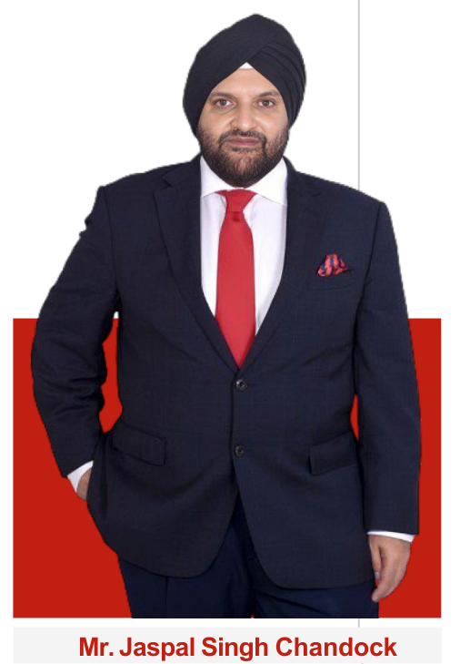

**[Image: BaluAugust2025.pdf-0005-07.png (517x729, 277.5KB)]**

<!-- Start of picture text -->
Mr. Jaspal Singh Chandock <!-- End of picture text -->

_On that backdrop, we delivered strong financial and operational results in Q1 FY26, reinforcing our commitment to engineering excellence and future preparedness. Revenue from operations for Q1 FY26 stood at ₹2,332 million, marking a strong 33% year-on-year growth over ₹1,753 million in Q1 FY25. This performance was driven by an improved valueadded product mix and increased operating leverage, resulting in a notable 635 basis points expansion in operating margins. Profit after tax came in at ₹570 million for the quarter, reflecting a robust 67% growth over the same period last year._ 

_On a sequential basis, the quarter saw a marginal decline, primarily due to ongoing geopolitical uncertainties, regional conflicts, and volatile tariff environments. Despite these external headwinds, profitability remained stable, and the company continued to strengthen its market position through focused execution and operational resilience._ 

_During the quarter, we focussed on boosting our capacity. The initiatives include the addition of a new Empty Shell production line, the 25T Hydraulic Hammer forging line among the world’s largest closed die hammers and the integration of state-of-the-art 7-axis and 11-axis machining lines. Our product capabilities are evolving, with unit weights progressing beyond 1 ton and gradually advancing towards 1.5 tons in a phased manner._ 

_Our forging capacity is on track to increase from 100,000 tons to 150,000 tons annually, while machining capacity will rise from 45,000 tons to 80,000 tons per annum. We are also progressing steadily on our greenfield facility, in line with planned timelines._ 

_Geographically, we continue to pursue a diversified strategy to mitigate long-term risks posed by volatile tariff situations. The majority of our new capacities are expected to be operational within this financial year._ 

_As we look ahead, apart from boosting our capacity, we are reinforcing our position as a global precision engineering powerhouse from India. With a strong foundation, advanced infrastructure, and a clear strategic vision, we are poised to capture the emerging opportunities and shape the future of precision engineering._ **<mark>Mr. Jaspal Singh Chandock</mark>** 

**[Image: BaluAugust2025.pdf-0005-14.png (20x22, 0.7KB)]**

**(Chairman & Managing Director)** 

4 

**®** 

**[Image: BaluAugust2025.pdf-0006-01.png (70x70, 0.2KB)]**

##### **Q1 FY26 Financial Performance** 

**[Image: BaluAugust2025.pdf-0006-03.png (65x68, 3.9KB)]**

**[Image: BaluAugust2025.pdf-0006-04.png (19x19, 0.7KB)]**

**[Image: BaluAugust2025.pdf-0006-05.png (20x22, 0.7KB)]**

_All figure in Rs. Mn._ 

###### **Revenue from Operations** 

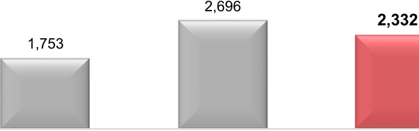

**[Image: BaluAugust2025.pdf-0006-08.png (593x186, 8.8KB)]**

<!-- Start of picture text -->
2,696 2,332 1,753 <!-- End of picture text -->

**[Image: BaluAugust2025.pdf-0006-09.png (128x139, 2.1KB)]**

**[Image: BaluAugust2025.pdf-0006-10.png (781x124, 3.9KB)]**

<!-- Start of picture text -->
PAT 66.9% <!-- End of picture text -->

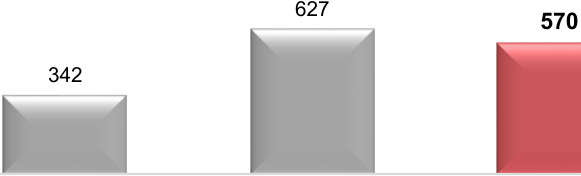

**[Image: BaluAugust2025.pdf-0006-11.png (581x176, 7.7KB)]**

<!-- Start of picture text -->
627 570 342 <!-- End of picture text -->

**[Image: BaluAugust2025.pdf-0006-12.png (126x136, 1.9KB)]**

**[Image: BaluAugust2025.pdf-0006-13.png (781x119, 4.4KB)]**

<!-- Start of picture text -->
EBITDA 67.3% <!-- End of picture text -->

**[Image: BaluAugust2025.pdf-0006-14.png (374x155, 4.4KB)]**

<!-- Start of picture text -->
432 <!-- End of picture text -->

**[Image: BaluAugust2025.pdf-0006-15.png (128x149, 2.0KB)]**

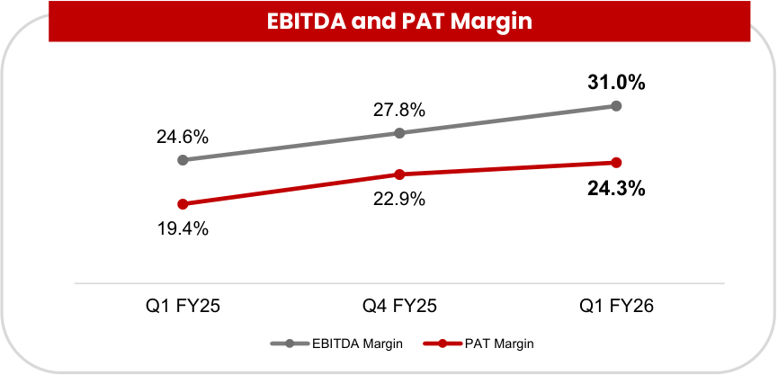

**[Image: BaluAugust2025.pdf-0006-16.png (865x417, 27.1KB)]**

<!-- Start of picture text -->
EBITDA and PAT Margin 31.0% 27.8% 24.6% 24.3% 22.9% 19.4% Q1 FY25 Q4 FY25 Q1 FY26 EBITDA Margin PAT Margin <!-- End of picture text -->

Notes: 

2. All other Margins are calculated on Total Income 

5 

1. EBITDA and EBITDA Margin excludes Other Income 

**®** 

**[Image: BaluAugust2025.pdf-0007-01.png (70x70, 0.2KB)]**

##### **FY25 Financial Performance** 

**[Image: BaluAugust2025.pdf-0007-03.png (65x68, 3.9KB)]**

**[Image: BaluAugust2025.pdf-0007-04.png (19x19, 0.7KB)]**

**[Image: BaluAugust2025.pdf-0007-05.png (20x22, 0.7KB)]**

_All figure in Rs. Mn._ 

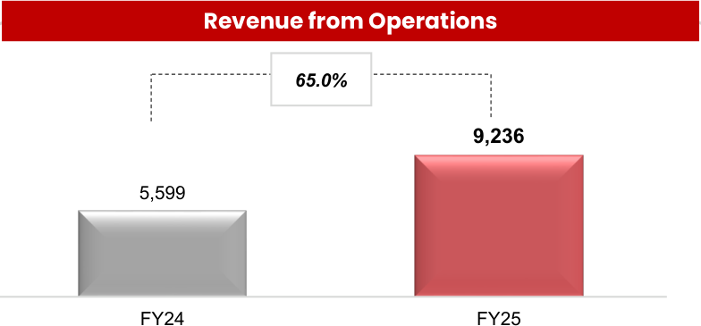

**[Image: BaluAugust2025.pdf-0007-07.png (784x365, 17.2KB)]**

<!-- Start of picture text -->
Revenue from Operations 65.0% 9,236 5,599 FY24 FY25 <!-- End of picture text -->

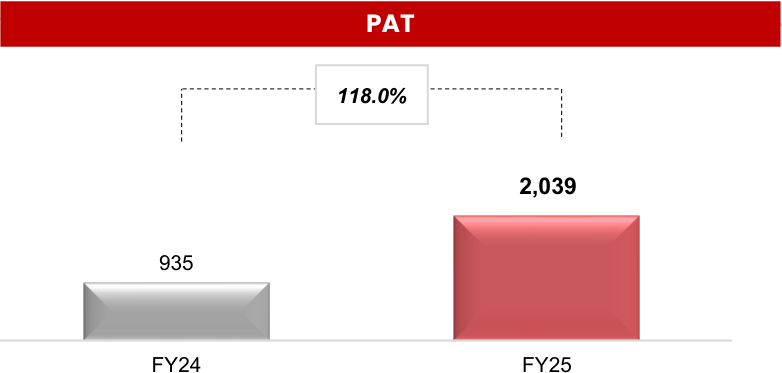

**[Image: BaluAugust2025.pdf-0007-08.png (782x373, 13.4KB)]**

<!-- Start of picture text -->
PAT 118.0% 2,039 935 FY24 FY25 <!-- End of picture text -->

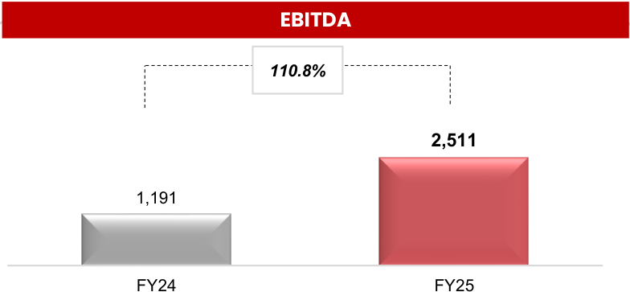

**[Image: BaluAugust2025.pdf-0007-09.png (784x363, 13.4KB)]**

<!-- Start of picture text -->
EBITDA 110.8% 2,511 1,191 FY24 FY25 <!-- End of picture text -->

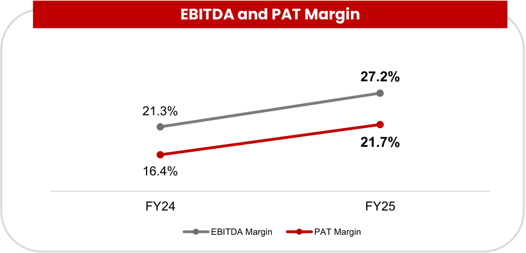

**[Image: BaluAugust2025.pdf-0007-10.png (865x417, 20.9KB)]**

<!-- Start of picture text -->
EBITDA and PAT Margin 27.2% 21.3% 21.7% 16.4% FY24 FY25 EBITDA Margin PAT Margin <!-- End of picture text -->

Notes: 

2. All other Margins are calculated on Total Income 

6 

1. EBITDA and EBITDA Margin excludes Other Income 

**®** 

**[Image: BaluAugust2025.pdf-0008-01.png (70x70, 0.2KB)]**

##### **Q1 and FY26 Profit & Loss** 

**[Image: BaluAugust2025.pdf-0008-03.png (65x68, 3.9KB)]**

**[Image: BaluAugust2025.pdf-0008-04.png (19x19, 0.7KB)]**

**[Image: BaluAugust2025.pdf-0008-05.png (20x22, 0.7KB)]**

|**(Rs. Mn)**|**Q1 FY26**|**Q1 FY25**|**_Y-o-Y (%)_**|**Q4 FY25**|**_Q-o-Q (%)_**|**FY25**|**FY24**|**_Y-o-Y (%)_**|
|---|---|---|---|---|---|---|---|---|
|Revenue from Operations|2,332|1,753|_33.0%_|2,696|_-13.5%_|9,236|5,599|_65.0%_|
|Other Income|17|11|_58.9%_|42|_-59.6%_|171|102|_67.5%_|
|**Total Income**|**2,349**|**1,764**|**_33.2%_**|**2,738**|**_-14.2%_**|**9,408**|**5,701**|**_65.0%_**|
|Raw Material Costs|1,441|1,159|_24.3%_|1,743|_-17.3%_|6,026|3,763|_60.1%_|
|**EBITDA**|**723**|**432**|**_67.3%_**|**750**|**_-3.6%_**|**2,511**|**1,191**|**_110.8%_**|
|_EBITDA Margin (%)_|**_31.0%_**|**_24.6%_**|**_635 bps_**|**_27.8%_**|**_319 bps_**|**_27.2%_**|**_21.3%_**|**_591 bps_**|
|Finance Cost|22|15|_44.1%_|42|_-47.0%_|110|136|_(19.7)%_|
|Depreciation and Amortization|17|8|_111.1%_|9|_93.1%_|34|21|_63.1%_|
|**Profit Before Tax**|**700**|**419**|**_67.1%_**|**741**|**_-5.4%_**|**2,539**|**1,137**|**_123.4%_**|
|_PBT Margin (%)_|**_29.8%_**|**_23.8%_**|**_605 bps_**|**_27.0%_**|**_277 bps_**|**_27.0%_**|**_19.9%_**|**_706 bps_**|
|Tax Expenses|130|_77_|_67.9%_|114|_14.4%_|501|202|148.3%|
|**PAT**|**570**|**342**|**_66.9%_**|**627**|**_-9.0%_**|**2,039**|**935**|**_118.0%_**|
|_PAT Margin (%)_|**_24.3%_**|**_19.4%_**|**_491 bps_**|**_22.9%_**|**_138 bps_**|**_21.7%_**|**_16.4%_**|**_527 bps_**|
|Basic EPS (Rs per share)|5.04|3.33|_51.4%_|5.74|_-12.2%_|19.28|9.80|_96.7%_|

Notes: 

7 

1. EBITDA and EBITDA Margin excludes Other Income 

2. All other Margins are calculated on Total Income 

**®** 

**[Image: BaluAugust2025.pdf-0009-01.png (70x70, 0.2KB)]**

##### **Precision Engineering Product Portfolio** 

**[Image: BaluAugust2025.pdf-0009-03.png (65x68, 3.9KB)]**

**[Image: BaluAugust2025.pdf-0009-04.png (19x19, 0.7KB)]**

**[Image: BaluAugust2025.pdf-0009-05.png (20x22, 0.7KB)]**

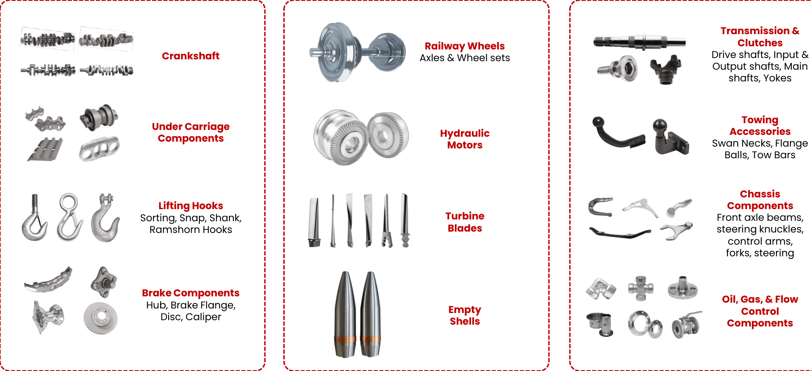

**[Image: BaluAugust2025.pdf-0009-06.png (1805x825, 475.0KB)]**

<!-- Start of picture text -->
Transmission & Clutches Railway Wheels Crankshaft Axles & Wheel sets Drive shafts, Input & Output shafts, Main shafts, Yokes Towing Under Carriage  Hydraulic  Accessories Components Motors Swan Necks, Flange Balls, Tow Bars Chassis Lifting Hooks Components Sorting, Snap, Shank, Turbine  Front axle beams, Ramshorn Hooks Blades steering knuckles, control arms, forks, steering Brake Components Oil, Gas, & Flow Hub, Brake Flange, Empty  Control Disc, Caliper Shells Components <!-- End of picture text -->

8 

**®** 

**[Image: BaluAugust2025.pdf-0010-01.png (70x70, 0.2KB)]**

##### **Business Journey** 

**[Image: BaluAugust2025.pdf-0010-03.png (65x68, 3.9KB)]**

**[Image: BaluAugust2025.pdf-0010-04.png (19x19, 0.7KB)]**

**[Image: BaluAugust2025.pdf-0010-05.png (20x22, 0.7KB)]**

###### **Successful Track Record of Acquiring and Integrating High End Forging & Machining Equipment** 

**[Image: BaluAugust2025.pdf-0010-07.png (72x114, 5.7KB)]**

**[Image: BaluAugust2025.pdf-0010-08.png (74x116, 5.1KB)]**

**[Image: BaluAugust2025.pdf-0010-09.png (72x114, 5.6KB)]**

**[Image: BaluAugust2025.pdf-0010-10.png (74x116, 5.3KB)]**

**[Image: BaluAugust2025.pdf-0010-11.png (74x112, 5.8KB)]**

**[Image: BaluAugust2025.pdf-0010-12.png (73x116, 4.7KB)]**

**[Image: BaluAugust2025.pdf-0010-13.png (74x112, 5.8KB)]**

**1989 1991 1995 2006 2010 2011 2012** The foundation First First component Acquisition & Acquisition & The company Got accredited with of ‘Balu’ was component exported to an Installation of the Installation of the successfully achieved ISO/TS16949:2009 laid by Mr. manufactured overseas market Ursus Manufacturing Thyssenkrupp the milestone of accreditation from Prehlad Singh in our factory Plant from Ursus, Plant from building a presence in world renowned Chandock Poland L’horme, France over 80 countries company TUV NORD worldwide **2014 2017 2020 2021/2022 2023 2024 2024/2025** Achieved Became a supplier Got Accredited with Acquired the Laid the foundation Acquisition of 3 Invested in 7 axis, manufacturing of of Choice to over the 14001:2015 & ISO Precision Machining for the greenfield fully automated 11 axis machining 1000 crankshafts 25 OEs spread 45001:2018 Unit of the Mercedes forging & forging lines with capability, 25T in a single day over 5 Continents Certifications. Became Benz Truck factory machining facility GERB Technology Hydraulic an Approved Vendor to from Mann- heim, spread over 46 namely: 16T, 10T hammer line & a the Ordnance Factory Germany Acres in Belgaum, Forging Hydraulic fully automated Board & established a India Hammer & 8000T Empty Shell & special- ized Balu successfully Forging Press. Mortar production manufacturing unit for completed the ESG These machines line with an the Defence Industry. audit by a reputed contribute to a annual capacity Balu completed the audit firm & joined combined forging of 360,000 shells transition & listing on the United Nations capacity of 72,000 per annum the Stock Exchange. Global Compact tons annually The constitution of the Program company was changed in its efforts to be to public limited ESG compliant 

9 

company 

**®** 

**[Image: BaluAugust2025.pdf-0011-01.png (70x70, 0.2KB)]**

##### **Value Chain** 

###### **Building Blocks** 

###### **Manufacturing Process** 

**[Image: BaluAugust2025.pdf-0011-05.png (65x68, 3.9KB)]**

###### **Growth Drivers** 

**[Image: BaluAugust2025.pdf-0011-07.png (19x19, 0.7KB)]**

**[Image: BaluAugust2025.pdf-0011-08.png (20x22, 0.7KB)]**

###### **Forging Plant** 

**[Image: BaluAugust2025.pdf-0011-10.png (116x100, 3.8KB)]**

**[Image: BaluAugust2025.pdf-0011-11.png (78x105, 4.5KB)]**

**[Image: BaluAugust2025.pdf-0011-12.png (99x111, 8.6KB)]**

**Sourcing of Raw Materials:** 

raw materials sourced from semi forged components and steel plants. 

**Research & Development:** Strong R&D capabilities drive our history of innovative product development. 

**Manufacturing Expertise:** 

4 state of the art production facilities. 

In-House Tool Room & Metallurgical Lab 

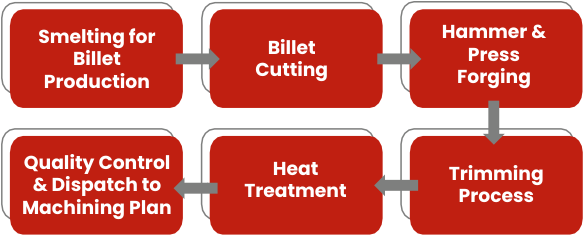

**[Image: BaluAugust2025.pdf-0011-19.png (585x237, 24.4KB)]**

<!-- Start of picture text -->
Smelting for  Billet  Hammer & Billet  Press Cutting Production Forging Quality Control  Heat  Trimming & Dispatch to  Treatment Process Machining Plan <!-- End of picture text -->

###### **Machining Plant** 

In-House Tool Room & Metallurgical Lab 

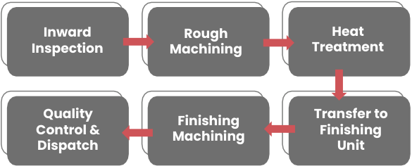

**[Image: BaluAugust2025.pdf-0011-22.png (585x236, 20.1KB)]**

<!-- Start of picture text -->
Inward  Rough Heat Inspection Machining Treatment Quality  Transfer to Finishing Control & Finishing Machining Dispatch Unit <!-- End of picture text -->

Empowering industries with unmatched product solutions. 

Increasing presence in critical sectors of defence, aerospace & railways. 

Dominating export markets and unlocking limitless global potential. 

Relentlessly expanding to meet booming demand through organic and inorganic growth. 

Fast-tracking B2B growth with direct partnerships to top-tier OEMs and Tier 1 clients. 

Precision engineering and in-house forging are driving EBITDA growth. 

**Provides 25+ high profile OEM globally with cutting-edge precision components and comprehensive solutions across industries** 

10 

**®** 

**[Image: BaluAugust2025.pdf-0012-01.png (70x70, 0.2KB)]**

##### **Strategic Priorities for Future Growth** 

**[Image: BaluAugust2025.pdf-0012-03.png (136x132, 6.0KB)]**

**[Image: BaluAugust2025.pdf-0012-04.png (134x132, 6.0KB)]**

###### **Revenue Contributions** 

###### **Capacity Expansion** 

- The company is wellprotected from geopolitical risks and industry downturns due to its diversified approach across multiple sectors and minimal geographical concentration 

• The Company currently has a forging capacity of 100,000 MTPA, which is planned to be expanded in phases to 150,000 MTPA. Machining capacity stood at 45,000 MTPA and is planned to be enhanced progressively to 80,000 MTPA, enabling growth across key sectors including Defence, Aerospace, and Railways. 

- The revenue share from the Non-automotive sector is expected to increase in the coming years as the company expands into Defence, Aerospace, and Railways 

   - Expanded the precision machining capacity to meet growing demand from higher forging capacity 

- Additionally, growth in legacy sectors, particularly Commercial Vehicles, will continue, despite a reduction in their overall contribution. 

- Focused on acquiring capacity in critical areas such as defence components, the heaviest weight category of closed-die forgings and highprecision machining. 

**[Image: BaluAugust2025.pdf-0012-13.png (136x132, 5.6KB)]**

###### **Customer Additions** 

- Expanded the customer base in the Defence, Aerospace and Railway industries, driving revenue growth 

- Developed capabilities tailored to meet the evolving demands of the Defence and Aerospace industries, ensuring long-term growth in these sectors 

- Achieved positive growth in traditional sectors, particularly the Commercial Vehicle (CV) segment. 

**[Image: BaluAugust2025.pdf-0012-18.png (197x67, 7.3KB)]**

**[Image: BaluAugust2025.pdf-0012-19.png (136x132, 3.7KB)]**

**[Image: BaluAugust2025.pdf-0012-20.png (137x132, 7.4KB)]**

###### **Geographic Expansion Innovation & Technological Addition Advancements** 

- • 

- The company has expanded Integrated 7-axis & 11- axis multiits on ground presence across axis machining, automation in more countries to enhance forging and anti-vibration serviceability and strengthen systems to enhance product its position in key markets precision, operational efficiency and scalability 

• Alongside the China+1 shift, the emerging Europe+1 trend is creating new opportunities, with increasing production moving out of the EU 

   - Continued investment in advanced technologies to maintain the production of high quality, precision engineered components across various industries 

- Well-positioned in terms of industries capacity and capability to address this growing demand. • Prioritization the production of 

- • Our strategically diversified the fully machined, value-added components, reflecting its core 

- global presence ensures expertise in precision machining, 

- minimal disruption to our while offering comprehensive 

- operations mitigating the solutions to clients. 

- Our strategically diversified global presence ensures minimal disruption to our operations mitigating the impact of geopolitical uncertainties, regional conflicts, and fluctuating tariff regimes. 

• Acquired one of the world’s largest closed die forging 25T hydraulic hammer, significantly enhancing our forging capacity and aligning with our long term strategy to scale high volume, complex component production. This is presently under commissioning. 

11 

**®** 

**[Image: BaluAugust2025.pdf-0013-01.png (70x70, 0.2KB)]**

##### **Defence: Growth Strategy** 

**[Image: BaluAugust2025.pdf-0013-03.png (65x68, 3.9KB)]**

**[Image: BaluAugust2025.pdf-0013-04.png (19x19, 0.7KB)]**

**[Image: BaluAugust2025.pdf-0013-05.png (20x22, 0.7KB)]**

###### **Received approval to supply 180+ products** 

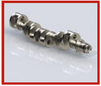

**[Image: BaluAugust2025.pdf-0013-07.png (168x143, 22.5KB)]**

**Crank Shaft** 

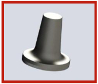

**[Image: BaluAugust2025.pdf-0013-09.png (168x143, 13.1KB)]**

**Hub Carrier** 

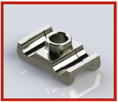

**[Image: BaluAugust2025.pdf-0013-11.png (166x143, 26.3KB)]**

**Shoe** 

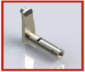

**[Image: BaluAugust2025.pdf-0013-13.png (168x143, 19.4KB)]**

**Crank** 

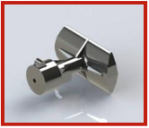

**[Image: BaluAugust2025.pdf-0013-15.png (166x143, 22.4KB)]**

**Breach Base** 

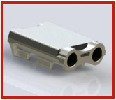

**[Image: BaluAugust2025.pdf-0013-17.png (166x143, 23.8KB)]**

**Track Link** 

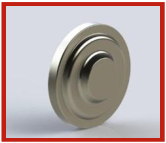

**[Image: BaluAugust2025.pdf-0013-19.png (166x143, 20.7KB)]**

**Gear Ring (Solid)** 

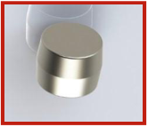

**[Image: BaluAugust2025.pdf-0013-21.png (166x143, 19.1KB)]**

**Sun Gear** 

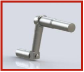

**[Image: BaluAugust2025.pdf-0013-23.png (166x143, 15.3KB)]**

**Road Wheel Arm** 

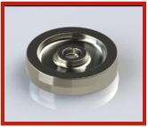

**[Image: BaluAugust2025.pdf-0013-25.png (166x143, 26.7KB)]**

**Intermediate Gear** 

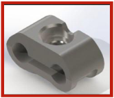

**[Image: BaluAugust2025.pdf-0013-27.png (166x143, 25.6KB)]**

**Clamp** 

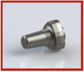

**[Image: BaluAugust2025.pdf-0013-29.png (166x143, 20.7KB)]**

**Carrier Forging** 

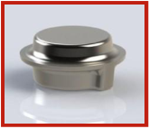

**[Image: BaluAugust2025.pdf-0013-31.png (165x143, 22.1KB)]**

**Flange** 

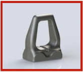

**[Image: BaluAugust2025.pdf-0013-33.png (165x143, 18.5KB)]**

**Track Guide** 

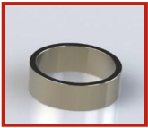

**[Image: BaluAugust2025.pdf-0013-35.png (165x143, 20.8KB)]**

**Gear Ring (Hollow)** 

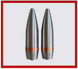

**[Image: BaluAugust2025.pdf-0013-37.png (161x143, 13.9KB)]**

**Empty shell** 

1. expand defense production capabilities & the defence product portfolio 

2. Key focus areas include artillery, armored vehicle parts, weapons, ammunition and engine components. 

3. Successfully supplied to the overseas defence industry for several years. 

4. Aiming to expand the global customer base while strengthening our position as a leading defense production center. 

5. A dedicated forging and machining line for empty shell production is currently in the commercialization phase, enhancing our product portfolio and strengthening our support for the defense sector. 

12 

**®** 

**[Image: BaluAugust2025.pdf-0014-01.png (70x70, 0.2KB)]**

##### **Update on the Greenfield Facility** 

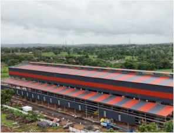

**[Image: BaluAugust2025.pdf-0014-03.png (296x226, 132.1KB)]**

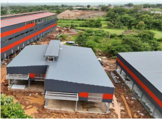

**[Image: BaluAugust2025.pdf-0014-04.png (319x234, 179.2KB)]**

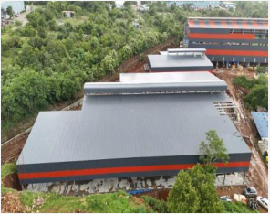

**[Image: BaluAugust2025.pdf-0014-05.png (296x234, 162.3KB)]**

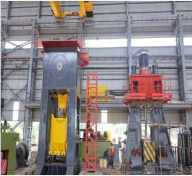

**[Image: BaluAugust2025.pdf-0014-06.png (319x291, 224.3KB)]**

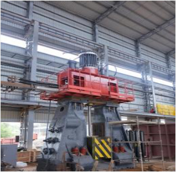

**[Image: BaluAugust2025.pdf-0014-07.png (296x289, 206.7KB)]**

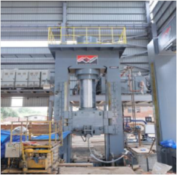

**[Image: BaluAugust2025.pdf-0014-08.png (292x289, 194.0KB)]**

Note : The above are on ground images of the greenfield manufacturing campus 

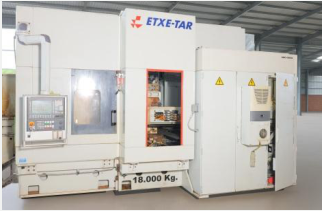

**[Image: BaluAugust2025.pdf-0014-10.png (322x211, 108.6KB)]**

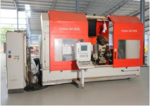

**[Image: BaluAugust2025.pdf-0014-11.png (296x209, 127.4KB)]**

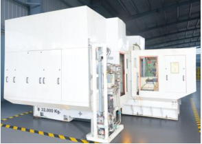

**[Image: BaluAugust2025.pdf-0014-12.png (294x209, 96.8KB)]**

Note : Key additions to our precision machining lines 

**[Image: BaluAugust2025.pdf-0014-14.png (65x68, 3.9KB)]**

**[Image: BaluAugust2025.pdf-0014-15.png (20x22, 0.7KB)]**

**[Image: BaluAugust2025.pdf-0014-16.png (19x19, 0.7KB)]**

1. On track to expand forging capacity to 150,000 tons annually. driven by continuous infrastructure and machinery upgrades. 

2. The 25T closed die forging hydraulic hammer line is currently under commissioning and will significantly enhance our production capabilities for large and complex components. 

3. The commissioning of an 8,000-ton capacity mechanical forging press is currently underway. 

4. Achieved the capability to produce closed die forgings up to 1 ton, with expansion plans underway to scale production capacity to 1.5 tons. 

5. Fully automated setup featuring advanced technology, including an anti-vibration system and robotic handling. 

6. Adherence to Industry 4.0 standards for modern manufacturing practices. 

7. Significant improvements in research and development capabilities for alloy mixing and metal combinations. 

8. A dedicated forging and machining line for empty shell production is currently in the commercialization phase, enhancing our product portfolio and strengthening our support for the defense sector. 

9. Machining capacity currently stands at 45,000 MTPA and is planned to be increased to 80,000 MTPA to cater to increasing value addition demand. 

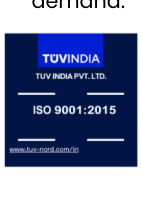

**[Image: BaluAugust2025.pdf-0014-26.png (142x204, 8.1KB)]**

**[Image: BaluAugust2025.pdf-0014-27.png (140x197, 11.1KB)]**

**[Image: BaluAugust2025.pdf-0014-28.png (141x137, 34.6KB)]**

**[Image: BaluAugust2025.pdf-0014-29.png (155x141, 34.4KB)]**

13 

**®** 

**[Image: BaluAugust2025.pdf-0015-01.png (70x70, 0.2KB)]**

##### **Dedicated In-house Research & Development** 

We prioritized the allocation of resources to ongoing research and development, ensuring continuous improvements in product quality, performance, and efficiency. 

###### Our R&D team consists of **75** skilled professionals. 

##### **R&D Process** 

- **State-of-the-Art Machining** : Our machining facilities feature cutting-edge infrastructure, including a comprehensive in-house tool room, metallurgical laboratories, design & process capabilities, as well as inspection & testing facilities 

- **Advanced & Additive Manufacturing** : We utilize a range of additive manufacturing techniques to ensure flexibility and speed in rapid prototyping and product development 

- **Product Engineering & New Product Development** : We concentrate our efforts on engineering and creating new products across industries 

- : 

- **Development of New Materials** Our projects focus on exploring various new material chemistries to analyze compositions and applications of innovative metals 

**[Image: BaluAugust2025.pdf-0015-10.png (65x68, 3.9KB)]**

**[Image: BaluAugust2025.pdf-0015-11.png (20x22, 0.7KB)]**

**[Image: BaluAugust2025.pdf-0015-12.png (19x19, 0.7KB)]**

Customer lifecycle and long product journey : 15 to 20 years 

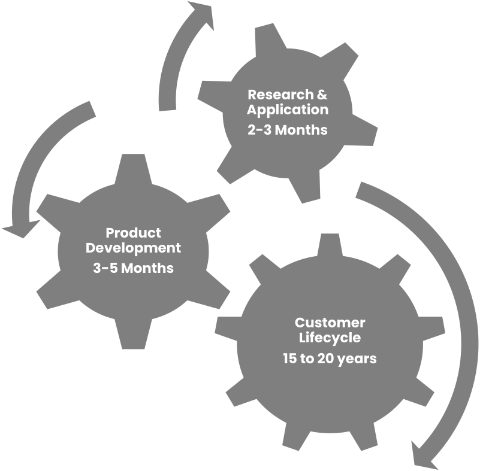

**[Image: BaluAugust2025.pdf-0015-14.png (836x787, 50.9KB)]**

<!-- Start of picture text -->
Research & Application 2-3 Months Product Development 3-5 Months Customer Lifecycle 15 to 20 years <!-- End of picture text -->

14 

**®** 

**[Image: BaluAugust2025.pdf-0016-01.png (70x70, 0.2KB)]**

##### **Sustainability – ESG** 

**[Image: BaluAugust2025.pdf-0016-03.png (65x68, 3.9KB)]**

**[Image: BaluAugust2025.pdf-0016-04.png (19x19, 0.7KB)]**

**[Image: BaluAugust2025.pdf-0016-05.png (20x22, 0.7KB)]**

##### **ESG Commitments** 

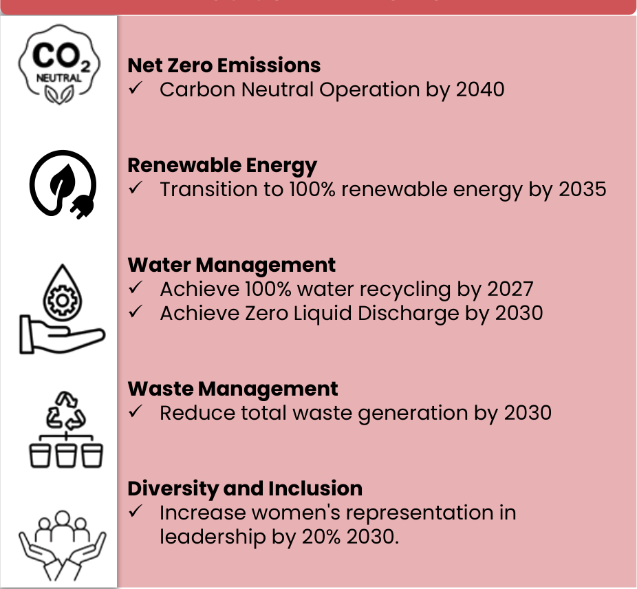

**[Image: BaluAugust2025.pdf-0016-07.png (926x856, 131.7KB)]**

<!-- Start of picture text -->
Net Zero Emissions ✓ Carbon Neutral Operation by 2040 Renewable Energy ✓ Transition to 100% renewable energy by 2035 Water Management ✓ Achieve 100% water recycling by 2027 ✓ Achieve Zero Liquid Discharge by 2030 Waste Management ✓ Reduce total waste generation by 2030 Diversity and Inclusion ✓ Increase women's representation in leadership by 20% 2030. <!-- End of picture text -->

**[Image: BaluAugust2025.pdf-0016-08.png (584x69, 2.3KB)]**

<!-- Start of picture text -->
CSR <!-- End of picture text -->

###### **INR 8.6 Mn** 

**[Image: BaluAugust2025.pdf-0016-10.png (583x91, 5.6KB)]**

<!-- Start of picture text -->
Amount spent on CSR in FY25 <!-- End of picture text -->

15 

**®** 

**[Image: BaluAugust2025.pdf-0017-01.png (70x70, 0.2KB)]**

##### **Sustainability – ESG** 

**[Image: BaluAugust2025.pdf-0017-03.png (65x68, 3.9KB)]**

**[Image: BaluAugust2025.pdf-0017-04.png (19x19, 0.7KB)]**

**[Image: BaluAugust2025.pdf-0017-05.png (20x22, 0.7KB)]**

Balu Forge Industries Limited has been committed to environmental sustainability, prioritizing ESG principles well before they gained widespread recognition 

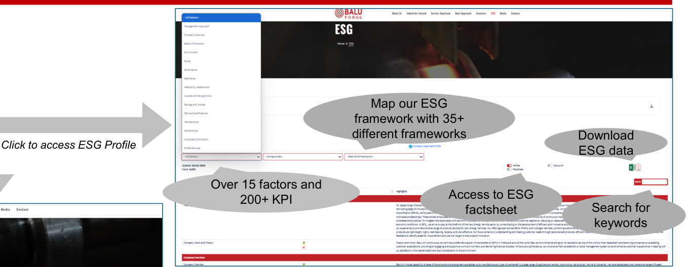

**[Image: BaluAugust2025.pdf-0017-07.png (1372x528, 239.2KB)]**

<!-- Start of picture text -->
Map our ESG framework with 35+ different frameworks Download Click to access ESG Profile ESG data Over 15 factors and Access to ESG 200+ KPI factsheet Search for keywords <!-- End of picture text -->

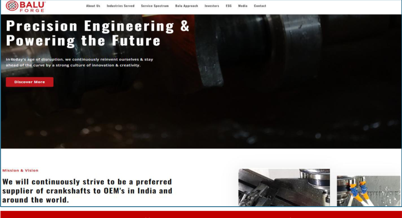

**[Image: BaluAugust2025.pdf-0017-08.png (782x424, 242.5KB)]**

**[Image: BaluAugust2025.pdf-0017-09.png (195x60, 6.1KB)]**

https://www.baluindustries.com/ 

16 

**®** 

**[Image: BaluAugust2025.pdf-0018-01.png (70x70, 0.2KB)]**

##### **Frequently Asked Questions (FAQs)** 

**[Image: BaluAugust2025.pdf-0018-03.png (65x68, 3.9KB)]**

**[Image: BaluAugust2025.pdf-0018-04.png (19x19, 0.7KB)]**

**[Image: BaluAugust2025.pdf-0018-05.png (20x22, 0.7KB)]**

###### **1. What is Balu Forge’s expansion strategy over the next 3–5 years?** 

Balu Forge’s growth roadmap for the next three to five years is anchored in scaling capacities, deepening sectoral presence, and advancing technological capabilities while maintaining a capital-efficient model. 

At the heart of this expansion is the development of our fully integrated 46-acre Belagavi facility, which will drive a significant scale-up in both machining and forging operations. By FY27, our machining capacity is projected to grow to 80,000 TPA, supported by a dedicated forging capacity that is entirely aligned for captive consumption. This integrated setup positions us to deliver complex, high-spec components to demanding sectors like defence, aerospace, and power generation areas that offer attractive margins and longterm business stability. 

Our strategy also places strong emphasis on sectoral diversification, with targeted expansion into industries that require high precision, compliance, and performance including defense platforms, aerospace assemblies, and heavy transportation systems. By offering a wider range of products made from advanced materials including aluminum, titanium, and other critical alloys we are strengthening our position as a one-stop solution provider for precision engineering needs. 

Geographically, we are actively strengthening our presence across the Americas, Africa, Europe, Asia, and the Middle East, aligned with global certification programs and the Indian government’s “Make in India” vision. This international footprint allows us to serve high-value clients globally while building resilient and diversified revenue streams. 

Looking ahead, Balu Forge is focused not just on expanding capacity, but on building an ecosystem capable of delivering innovation, flexibility, and quality at scale. With continued investment in defence production lines, acquisition of advanced assets, and expansion into future-ready sectors, we aim to drive sustainable revenue growth, margin expansion, and long-term shareholder value. 

###### **2. Why does the company not revalue its older assets after its listing via the reverse merger route in 2020?** 

The company has not revalued its Fixed Assets (i.e. Plant and Machinery) as the Indian Accounting Standard (IND-AS) allows to book fixed assets at amortized cost or at original acquisition cost less accumulated depreciation i.e. WDV value. There is no mandatory requirement in companies act 2013 to record the Fixed Assets at revalued amount. Even if we do the revaluation of fixed assets now the income tax law will not allow depreciation on the revalued amount. Therefore, our Fixed Assets i.e. plant and machinery stand at WDV value. 

17 

_Note: We will be summarizing some of the recurring questions received from the investor community each quarter with the upcoming earnings release._ 

**®** 

**[Image: BaluAugust2025.pdf-0019-01.png (70x70, 0.2KB)]**

##### **Frequently Asked Questions (FAQs)** 

**[Image: BaluAugust2025.pdf-0019-03.png (65x68, 3.9KB)]**

**[Image: BaluAugust2025.pdf-0019-04.png (19x19, 0.7KB)]**

**[Image: BaluAugust2025.pdf-0019-05.png (20x22, 0.7KB)]**

###### **3. What steps are being taken to improve operational efficiency?** 

Operational efficiency is a core driver of margin improvement at Balu Forge. Key initiatives include: 

- Deployment of IoT-enabled CNC machines, robotic handling, and anti-vibration systems for high-precision forging & machining. 

- Adoption of machine learning models to monitor real-time performance, reduce downtime, and extend asset life. 

- Enhanced production cycles and resource allocation for multi-line flexibility. This enables us to keep our precision machining lines fungible to service a larger product portfolio. 

- Advanced quality systems and checks are in place to ensure product consistency, particularly for critical applications in defence and aerospace. 

These initiatives have collectively increased productivity, optimized cost structures, and supported margin 

###### **4. What role do defense and aerospace play in the company’s future growth?** 

Defense and aerospace are high-margin, high-potential verticals for Balu Forge and form a critical component of our growth strategy: 

- **Automated Empty Shell Line:** We have installed a fully automated empty shell line with an annual capacity of 360,000 shells (155 mm), significantly enhancing our defence manufacturing capability. The vendor approval has already been received from a large player in India. 

- **Aerospace Certifications:** We are pursuing key global certifications to become a qualified aerospace component supplier to OEMs and Tier-1 companies worldwide. We have already received vendor approval from a large vendor in the domestic ecosystem. 

- Make in India & Global Reach initiatives align with India’s defense localization policies, while also opening global export opportunities in the Americas, Europe, and MENA. 

- **Revenue Mix Evolution:** As defense and aerospace revenue share gradually rises, it will boost overall margins, given the premium pricing of these segments 

This focus on long-term government contracts and strategic export opportunities ensures sustainable, high-margin growth. 

18 

_Note: We will be summarizing some of the recurring questions received from the investor community each quarter with the upcoming earnings release._ 

**®** 

**[Image: BaluAugust2025.pdf-0020-01.png (70x70, 0.2KB)]**

##### **Frequently Asked Questions (FAQs)** 

**[Image: BaluAugust2025.pdf-0020-03.png (65x68, 3.9KB)]**

**[Image: BaluAugust2025.pdf-0020-04.png (19x19, 0.7KB)]**

**[Image: BaluAugust2025.pdf-0020-05.png (20x22, 0.7KB)]**

###### **5. What is the company’s capex plan and funding strategy?** 

Our capital expenditure roadmap and funding strategy reflect a prudent, low-leverage growth model: 

- By FY27, the gross block is expected to reach ₹750–800 crore, driven by capacity expansion and automation initiatives. 

- The Capex requirement is fully funded through fresh preference share issues, warrants & internal accruals, supplemented by selective equity infusions where required, ensuring minimal debt exposure. 

- Funds are prioritized for expanding machining and forging lines, Industry 4.0 automation, and high-value defense and aerospace production. 

This capital-efficient strategy supports high asset turns, robust cash flows, and long-term shareholder value creation. 

###### **6. Does the US tariff situation affect Balu Forge?** 

The exposure is very limited & generally the exposure is well distributed globally without any dependence on any region or country. We do not foresee any impact on Balu Forge on account of these Tariffs. 

###### **7. What is the story behind the foundation of Balu Forge & let us know how the journey began?** 

In 1989, our founder Mr Prehlad Singh Chandock, along with a small team, set up a machining plant (3000 square feet) in Belgaum, Karnataka, as a job work vendor for crankshafts (a critical component used in internal combustion engines) as an ancillary support provider to companies across the country. Building on this growth momentum, the company, while cementing its position in the domestic market, took a bold step to venture into the export market starting 1994. This strategic move enabled the company to extend its presence in the global market that is over 80 countries today, thus paving the way to emerge as one of the most trusted suppliers to Original Equipment Manufacturers (OEMs) & the global aftermarket over the next three decades. The company truly had a very humble beginning & the growth momentum has truly taken a better part of almost 4 decades to have the strong pillars of foundation that can be seen today. 

19 

_Note: We will be summarizing some of the recurring questions received from the investor community each quarter with the upcoming earnings release._ 

**®** 

**[Image: BaluAugust2025.pdf-0021-01.png (70x70, 0.2KB)]**

##### **Frequently Asked Questions (FAQs)** 

**[Image: BaluAugust2025.pdf-0021-03.png (65x68, 3.9KB)]**

**[Image: BaluAugust2025.pdf-0021-04.png (19x19, 0.7KB)]**

**[Image: BaluAugust2025.pdf-0021-05.png (20x22, 0.7KB)]**

###### **8. What are the key factors that differentiate Balu Forge from other precision engineering firms, especially in the defence, aerospace, and railways sectors?** 

We operate Four state-of-the-art manufacturing facilities. There is a new greenfield facility in Belagavi, Karnataka is currently undergoing a greenfield expansion across 46 acres. We manage all machining operations in-house and are now have integrated forging operations for captive consumption only. Our end-to-end, fully integrated plant supports globally dispersed clients across the entire value chain—from concept and design to engineering, manufacturing, testing, and validation. 

With advanced 7-axis and 11-axis CNC machines, automated shell lines, and heavy forging capabilities up to 1,000 kg, we provide fully integrated precision engineering solutions. 

We are implementing advanced forging and machining capabilities that support a broad product range from 1 Kg to 1000 Kgs and lengths up to 3 metres. This includes both closed die forging hammers and presses, notably a 16 Ton Hydraulic Forging Hammer. Our vertical integration, multi-sector exposure, and ability to deliver high-value, critical components for defence and aerospace sectors set us apart globally. 

This vertically integrated and scalable infrastructure, combined with our ability to deliver high-precision components across critical sectors like defence, aerospace, and railways, distinctly sets us apart from other precision engineering firms. 

###### **9. What were some of the most defining milestones in Balu Forge’s growth—particularly the acquisitions of Ursus, Thyssenkrupp, and the Mercedes-Benz precision unit?** 

After securing a strong foothold in the domestic market, the company achieved the major export opportunity in 1994 by embarking on its global expansion journey through exports that is spread over 80 countries today, which laid the foundation for the accelerated growth trajectory. 

However, the real boost in the company’s operation came with the many fixed asset acquisitions that the company has done over the decades starting with the Ursus manufacturing plant from Poland in 2006, followed by the Thyssenkrupp’s facility in France, in 2010. These strategic acquisitions significantly enhanced Balu Forge’s manufacturing capabilities and helped in diversifying its product portfolio while simultaneously establishing the company as a global force in precision engineering. 

Encouraged by its strong performance in both domestic and international markets, the company went public in 2020. Since then, we have made several strategic acquisitions including the Precision Machining Unit from Daimler’s Truck Factory in Mannheim, Germany, and one of the largest forging equipment assets from Ukraine. The addition of advanced 7-axis and 11-axis precision machining further enhanced its technical capabilities. Most recently, the company acquired one of the world’s largest closed-die forging hammers (25T) from Romania, which is now being installed at our 46-acre greenfield campus in Belagavi, Karnataka. We have also set up a large-scale production line for 155 mm empty shells to support defence manufacturing in India and abroad. 

20 

_Note: We will be summarizing some of the recurring questions received from the investor community each quarter with the upcoming earnings release._ 

**®** 

**[Image: BaluAugust2025.pdf-0022-01.png (70x70, 0.2KB)]**

##### **Frequently Asked Questions (FAQs)** 

**[Image: BaluAugust2025.pdf-0022-03.png (65x68, 3.9KB)]**

**[Image: BaluAugust2025.pdf-0022-04.png (19x19, 0.7KB)]**

**[Image: BaluAugust2025.pdf-0022-05.png (20x22, 0.7KB)]**

###### **10. Please kindly clarify on the holding of the Enforcement Directorate (ED) in the company?** 

This transaction was executed independently in the open market and does not involve any participation or facilitation by the company. 

We would like to elaborate hereby that the said holding is towards a secondary market transaction where holding of certain shareholders has been transferred to Enforcement Directorate Raipur. 

As a listed entity, Balu Forge does not have oversight or influence over such shareholder-level transactions in the secondary market. We also have no access to the personal or business dealings of individual shareholders. The company further confirms that it has no direct or indirect association with the parties involved in this transaction. 

###### **11. What is your planned investment for capacity expansion, including inorganic growth, over the next five years? Additionally, what strategies will you employ to secure these funds?** 

Over the next five years, we have earmarked significant capital investments for capacity expansion and technological upgradation. The greenfield facility alone represents a major financial commitment, designed to bolster our forging and machining capabilities with state-of-the-art equipment and advanced automation systems. 

Inorganic growth remains integral to our strategy, as evidenced by the acquisition of the Mercedes-Benz precision machining unit, which significantly enhanced our global footprint. We will continue exploring acquisition opportunities that align with our core competencies and market objectives. 

To fund these initiatives, we are focused on leveraging a mix of internal accruals & capital infusion as was done recently as well. Our robust balance sheet and consistent cash flow generation provide a solid foundation for these strategic investments. 

###### **12. What revenue growth does the company anticipate for the current year and the next?** 

For FY 26, we will maintain the revenue growth guidance in the range of 40-45%, driven by strategic capacity expansions and increased penetration into high-demand industries. The commercialization of the Mercedes-Benz unit and the operationalization of the greenfield facility are key catalysts, significantly boosting production volumes and enhancing our ability to meet rising global demand. We are also prioritizing high-value segments like defence and aerospace, where our expertise in advanced machining and heavy forging aligns well with the sector's stringent quality requirements. Additionally, we are leveraging our strong relationships and long-term contracts to secure consistent revenue streams. Through the adoption of real-time monitoring, we are optimizing our production processes to achieve improved EBITDA margins and sustainable financial performance. 

21 

_Note: We will be summarizing some of the recurring questions received from the investor community each quarter with the upcoming earnings release._ 

**®** 

**[Image: BaluAugust2025.pdf-0023-01.png (70x70, 0.2KB)]**

##### **Frequently Asked Questions (FAQs)** 

**[Image: BaluAugust2025.pdf-0023-03.png (65x68, 3.9KB)]**

**[Image: BaluAugust2025.pdf-0023-04.png (19x19, 0.7KB)]**

**[Image: BaluAugust2025.pdf-0023-05.png (20x22, 0.7KB)]**

###### **13. The tax outgo from the cash flow statement is not line with the tax liability, please kindly clarify the same as to why is it not reflecting in the cash flow statement?** 

Any movement related to tax liabilities is captured under changes in working capital as part of operating cash flows. The difference between the reported tax liability and the tax outflow in the cash flow statement arises primarily from the timing of actual tax payments. In our case, a significant portion of the tax is paid post the financial year-end, based on self-assessment. As a result, these payments do not appear in the current year’s cash flow from operations but will be reflected in the subsequent year’s cash flows. 

###### **14. Why is the asset turnover of the company higher than industry & some of its peers?** 

In 2018 one of the world's foremost valuation company, Mott Macdonald valued our fixed assets close to Rs.300 Crores. The company was listed via a reverse merger & the assets were transferred on book value (written down value) in August, 2020 & the revaluation of the assets was not done at the said time. The company has over 250 CNC Machines & multiple Forging lines as on date. 

The strategy of the company historically had been to acquire used assets through auctions, private treaties, liquidations, etc from various parts of the world. The acquisition journey is well defined on multiple releases and corporate presentations over the years starting from 2006 (Acquisition from Poland) to date. The company also has built an inhouse team, department & expertise over the three decades of experience dedicated for refurbishment & commissioning of used assets. 

The strategy going forward will be towards buying not only used machines but also new machinery as the company progresses on its journey. 

Our capitalized assets as recorded in FY25 is Rs.142 Crores and Capital WIP is around Rs. 417 Crores. 

###### **15. Why does the company not revalue its older assets after its listing via the reverse merger route in 2020?** 

The company has not revalued its Fixed Assets (i.e. Plant and Machinery) as the Indian Accounting Standard (IND-AS) allows to book fixed assets at amortized cost or at original acquisition cost less accumulated depreciation i.e. WDV value. There is no mandatory requirement in companies act 2013 to record the Fixed Assets at revalued amount. Even if we do the revaluation of fixed assets now the income tax law will not allow depreciation on the revalued amount. Therefore, our Fixed Assets i.e. plant and machinery stand at WDV value. A valuation conducted by Mott MacDonald substantiates the current carrying values of our assets. 

22 

_Note: We will be summarizing some of the recurring questions received from the investor community each quarter with the upcoming earnings release._ 

**®** 

**[Image: BaluAugust2025.pdf-0024-01.png (70x70, 0.2KB)]**

##### **Frequently Asked Questions (FAQs)** 

**[Image: BaluAugust2025.pdf-0024-03.png (65x68, 3.9KB)]**

**[Image: BaluAugust2025.pdf-0024-04.png (19x19, 0.7KB)]**

**[Image: BaluAugust2025.pdf-0024-05.png (20x22, 0.7KB)]**

###### **16. How has the company transformed in recent years from a family run business to an organization?** 

The real transition started after the listing of the company in 2020 where the transition was undertaken from a family run company to an organization of the future. The past couple of years has been additions in key roles at the company where a lot of industry veterans have joined the organization from more established peers. This has helped transform the company into a decentralized organization. Today all key roles in the organization are under the leadership of industry veterans with many decades of experience in some of the leading organizations across the world. 

###### **17.  Please throw some light on the R&D team & preventive maintenance of the company.** 

With over 35 years of experience, Balu Forge has consistently built deep domain expertise across every new vertical we have entered. A key part of this journey has been our strong focus on in-house R&D. 

Today, our R&D team comprises over 75 skilled professionals, many of whom bring extensive experience from top-tier engineering firms. This team plays a crucial role in product innovation, process optimization, and material research enabling us to stay ahead of industry standards and serve high-spec applications across all sectors we cater to. 

On the operations side, we have a well-established preventive maintenance framework, supported by dedicated in-house tool room and maintenance teams. This ensures optimal equipment uptime, extended machinery lifespan, and consistent high production quality. 

Our approach towards preventive maintenance not only enhances efficiency but also supports long-term cost effectiveness and production reliability. 

23 

_Note: We will be summarizing some of the recurring questions received from the investor community each quarter with the upcoming earnings release._ 

**®** 

**[Image: BaluAugust2025.pdf-0025-01.png (70x70, 0.2KB)]**

###### **Disclaimer:** 

**[Image: BaluAugust2025.pdf-0025-03.png (65x68, 3.9KB)]**

**[Image: BaluAugust2025.pdf-0025-04.png (19x19, 0.7KB)]**

**[Image: BaluAugust2025.pdf-0025-05.png (20x22, 0.7KB)]**

Certain statements in this document may be forward-looking statements. Such forward-looking statements are subject to certain risks and uncertainties, like government actions, local political or economic developments, technological risks, and many other factors that could cause our actual results to differ materially from those contemplated by the relevant forward-looking statements. Balu Forge Industries Limited will not be in any way responsible for any action taken based on such statements & undertakes no obligation to publicly update these forward-looking statements to reflect subsequent events or circumstances. 

**[Image: BaluAugust2025.pdf-0025-07.png (166x168, 66.2KB)]**

### **Thank You** 

www.baluindustries.com 

For further information on the Balu Forge, please visit: www.baluindustries.com 

**[Image: BaluAugust2025.pdf-0025-11.png (74x74, 4.5KB)]**

**[Image: BaluAugust2025.pdf-0025-12.png (22x24, 0.8KB)]**

**[Image: BaluAugust2025.pdf-0025-13.png (22x22, 0.8KB)]**

**Tabassum Begum (Company Secretary** ) Contact: +91 86550 75578 

Email: compliance@baluindustries.com 

**[Image: BaluAugust2025.pdf-0025-16.png (339x115, 10.4KB)]**

**Chaitanya Satwe / Akshay Hirani** Contact: +91 22 6169 5988 Email: baluforge@churchgatepartners.com 

**[Image: BaluAugust2025.pdf-0025-18.png (96x97, 6.1KB)]**

**[Image: BaluAugust2025.pdf-0025-19.png (28x32, 0.9KB)]**

24 

---

## Extracted Images

| # | File | Dimensions | Size |
|---|------|------------|------|
| 1 | BaluAugust2025.pdf-0001-00.png | 83x83 | 6.4KB |
| 2 | BaluAugust2025.pdf-0001-01.png | 84x51 | 6.9KB |
| 3 | BaluAugust2025.pdf-0001-02.png | 69x81 | 2.6KB |
| 4 | BaluAugust2025.pdf-0001-03.png | 25x25 | 1.6KB |
| 5 | BaluAugust2025.pdf-0001-04.png | 22x24 | 1.4KB |
| 6 | BaluAugust2025.pdf-0001-17.png | 887x149 | 84.4KB |
| 7 | BaluAugust2025.pdf-0002-00.png | 121x122 | 8.2KB |
| 8 | BaluAugust2025.pdf-0002-01.png | 16x18 | 0.5KB |
| 9 | BaluAugust2025.pdf-0002-02.png | 34x36 | 1.3KB |
| 10 | BaluAugust2025.pdf-0002-03.png | 36x36 | 1.5KB |
| 11 | BaluAugust2025.pdf-0002-06.png | 819x1062 | 11.6KB |
| 12 | BaluAugust2025.pdf-0003-01.png | 70x70 | 0.2KB |
| 13 | BaluAugust2025.pdf-0003-04.png | 403x599 | 39.8KB |
| 14 | BaluAugust2025.pdf-0003-10.png | 65x68 | 3.9KB |
| 15 | BaluAugust2025.pdf-0003-11.png | 19x19 | 0.7KB |
| 16 | BaluAugust2025.pdf-0003-28.png | 20x22 | 0.7KB |
| 17 | BaluAugust2025.pdf-0004-01.png | 70x70 | 0.2KB |
| 18 | BaluAugust2025.pdf-0004-15.png | 65x68 | 3.9KB |
| 19 | BaluAugust2025.pdf-0004-16.png | 19x19 | 0.7KB |
| 20 | BaluAugust2025.pdf-0004-23.png | 20x22 | 0.7KB |
| 21 | BaluAugust2025.pdf-0005-01.png | 70x70 | 0.2KB |
| 22 | BaluAugust2025.pdf-0005-02.png | 65x68 | 3.9KB |
| 23 | BaluAugust2025.pdf-0005-04.png | 19x19 | 0.7KB |
| 24 | BaluAugust2025.pdf-0005-07.png | 517x729 | 277.5KB |
| 25 | BaluAugust2025.pdf-0005-14.png | 20x22 | 0.7KB |
| 26 | BaluAugust2025.pdf-0006-01.png | 70x70 | 0.2KB |
| 27 | BaluAugust2025.pdf-0006-03.png | 65x68 | 3.9KB |
| 28 | BaluAugust2025.pdf-0006-04.png | 19x19 | 0.7KB |
| 29 | BaluAugust2025.pdf-0006-05.png | 20x22 | 0.7KB |
| 30 | BaluAugust2025.pdf-0006-08.png | 593x186 | 8.8KB |
| 31 | BaluAugust2025.pdf-0006-09.png | 128x139 | 2.1KB |
| 32 | BaluAugust2025.pdf-0006-10.png | 781x124 | 3.9KB |
| 33 | BaluAugust2025.pdf-0006-11.png | 581x176 | 7.7KB |
| 34 | BaluAugust2025.pdf-0006-12.png | 126x136 | 1.9KB |
| 35 | BaluAugust2025.pdf-0006-13.png | 781x119 | 4.4KB |
| 36 | BaluAugust2025.pdf-0006-14.png | 374x155 | 4.4KB |
| 37 | BaluAugust2025.pdf-0006-15.png | 128x149 | 2.0KB |
| 38 | BaluAugust2025.pdf-0006-16.png | 865x417 | 27.1KB |
| 39 | BaluAugust2025.pdf-0007-01.png | 70x70 | 0.2KB |
| 40 | BaluAugust2025.pdf-0007-03.png | 65x68 | 3.9KB |
| 41 | BaluAugust2025.pdf-0007-04.png | 19x19 | 0.7KB |
| 42 | BaluAugust2025.pdf-0007-05.png | 20x22 | 0.7KB |
| 43 | BaluAugust2025.pdf-0007-07.png | 784x365 | 17.2KB |
| 44 | BaluAugust2025.pdf-0007-08.png | 782x373 | 13.4KB |
| 45 | BaluAugust2025.pdf-0007-09.png | 784x363 | 13.4KB |
| 46 | BaluAugust2025.pdf-0007-10.png | 865x417 | 20.9KB |
| 47 | BaluAugust2025.pdf-0008-01.png | 70x70 | 0.2KB |
| 48 | BaluAugust2025.pdf-0008-03.png | 65x68 | 3.9KB |
| 49 | BaluAugust2025.pdf-0008-04.png | 19x19 | 0.7KB |
| 50 | BaluAugust2025.pdf-0008-05.png | 20x22 | 0.7KB |
| 51 | BaluAugust2025.pdf-0009-01.png | 70x70 | 0.2KB |
| 52 | BaluAugust2025.pdf-0009-03.png | 65x68 | 3.9KB |
| 53 | BaluAugust2025.pdf-0009-04.png | 19x19 | 0.7KB |
| 54 | BaluAugust2025.pdf-0009-05.png | 20x22 | 0.7KB |
| 55 | BaluAugust2025.pdf-0009-06.png | 1805x825 | 475.0KB |
| 56 | BaluAugust2025.pdf-0010-01.png | 70x70 | 0.2KB |
| 57 | BaluAugust2025.pdf-0010-03.png | 65x68 | 3.9KB |
| 58 | BaluAugust2025.pdf-0010-04.png | 19x19 | 0.7KB |
| 59 | BaluAugust2025.pdf-0010-05.png | 20x22 | 0.7KB |
| 60 | BaluAugust2025.pdf-0010-07.png | 72x114 | 5.7KB |
| 61 | BaluAugust2025.pdf-0010-08.png | 74x116 | 5.1KB |
| 62 | BaluAugust2025.pdf-0010-09.png | 72x114 | 5.6KB |
| 63 | BaluAugust2025.pdf-0010-10.png | 74x116 | 5.3KB |
| 64 | BaluAugust2025.pdf-0010-11.png | 74x112 | 5.8KB |
| 65 | BaluAugust2025.pdf-0010-12.png | 73x116 | 4.7KB |
| 66 | BaluAugust2025.pdf-0010-13.png | 74x112 | 5.8KB |
| 67 | BaluAugust2025.pdf-0011-01.png | 70x70 | 0.2KB |
| 68 | BaluAugust2025.pdf-0011-05.png | 65x68 | 3.9KB |
| 69 | BaluAugust2025.pdf-0011-07.png | 19x19 | 0.7KB |
| 70 | BaluAugust2025.pdf-0011-08.png | 20x22 | 0.7KB |
| 71 | BaluAugust2025.pdf-0011-10.png | 116x100 | 3.8KB |
| 72 | BaluAugust2025.pdf-0011-11.png | 78x105 | 4.5KB |
| 73 | BaluAugust2025.pdf-0011-12.png | 99x111 | 8.6KB |
| 74 | BaluAugust2025.pdf-0011-19.png | 585x237 | 24.4KB |
| 75 | BaluAugust2025.pdf-0011-22.png | 585x236 | 20.1KB |
| 76 | BaluAugust2025.pdf-0012-01.png | 70x70 | 0.2KB |
| 77 | BaluAugust2025.pdf-0012-03.png | 136x132 | 6.0KB |
| 78 | BaluAugust2025.pdf-0012-04.png | 134x132 | 6.0KB |
| 79 | BaluAugust2025.pdf-0012-13.png | 136x132 | 5.6KB |
| 80 | BaluAugust2025.pdf-0012-18.png | 197x67 | 7.3KB |
| 81 | BaluAugust2025.pdf-0012-19.png | 136x132 | 3.7KB |
| 82 | BaluAugust2025.pdf-0012-20.png | 137x132 | 7.4KB |
| 83 | BaluAugust2025.pdf-0013-01.png | 70x70 | 0.2KB |
| 84 | BaluAugust2025.pdf-0013-03.png | 65x68 | 3.9KB |
| 85 | BaluAugust2025.pdf-0013-04.png | 19x19 | 0.7KB |
| 86 | BaluAugust2025.pdf-0013-05.png | 20x22 | 0.7KB |
| 87 | BaluAugust2025.pdf-0013-07.png | 168x143 | 22.5KB |
| 88 | BaluAugust2025.pdf-0013-09.png | 168x143 | 13.1KB |
| 89 | BaluAugust2025.pdf-0013-11.png | 166x143 | 26.3KB |
| 90 | BaluAugust2025.pdf-0013-13.png | 168x143 | 19.4KB |
| 91 | BaluAugust2025.pdf-0013-15.png | 166x143 | 22.4KB |
| 92 | BaluAugust2025.pdf-0013-17.png | 166x143 | 23.8KB |
| 93 | BaluAugust2025.pdf-0013-19.png | 166x143 | 20.7KB |
| 94 | BaluAugust2025.pdf-0013-21.png | 166x143 | 19.1KB |
| 95 | BaluAugust2025.pdf-0013-23.png | 166x143 | 15.3KB |
| 96 | BaluAugust2025.pdf-0013-25.png | 166x143 | 26.7KB |
| 97 | BaluAugust2025.pdf-0013-27.png | 166x143 | 25.6KB |
| 98 | BaluAugust2025.pdf-0013-29.png | 166x143 | 20.7KB |
| 99 | BaluAugust2025.pdf-0013-31.png | 165x143 | 22.1KB |
| 100 | BaluAugust2025.pdf-0013-33.png | 165x143 | 18.5KB |
| 101 | BaluAugust2025.pdf-0013-35.png | 165x143 | 20.8KB |
| 102 | BaluAugust2025.pdf-0013-37.png | 161x143 | 13.9KB |
| 103 | BaluAugust2025.pdf-0014-01.png | 70x70 | 0.2KB |
| 104 | BaluAugust2025.pdf-0014-03.png | 296x226 | 132.1KB |
| 105 | BaluAugust2025.pdf-0014-04.png | 319x234 | 179.2KB |
| 106 | BaluAugust2025.pdf-0014-05.png | 296x234 | 162.3KB |
| 107 | BaluAugust2025.pdf-0014-06.png | 319x291 | 224.3KB |
| 108 | BaluAugust2025.pdf-0014-07.png | 296x289 | 206.7KB |
| 109 | BaluAugust2025.pdf-0014-08.png | 292x289 | 194.0KB |
| 110 | BaluAugust2025.pdf-0014-10.png | 322x211 | 108.6KB |
| 111 | BaluAugust2025.pdf-0014-11.png | 296x209 | 127.4KB |
| 112 | BaluAugust2025.pdf-0014-12.png | 294x209 | 96.8KB |
| 113 | BaluAugust2025.pdf-0014-14.png | 65x68 | 3.9KB |
| 114 | BaluAugust2025.pdf-0014-15.png | 20x22 | 0.7KB |
| 115 | BaluAugust2025.pdf-0014-16.png | 19x19 | 0.7KB |
| 116 | BaluAugust2025.pdf-0014-26.png | 142x204 | 8.1KB |
| 117 | BaluAugust2025.pdf-0014-27.png | 140x197 | 11.1KB |
| 118 | BaluAugust2025.pdf-0014-28.png | 141x137 | 34.6KB |
| 119 | BaluAugust2025.pdf-0014-29.png | 155x141 | 34.4KB |
| 120 | BaluAugust2025.pdf-0015-01.png | 70x70 | 0.2KB |
| 121 | BaluAugust2025.pdf-0015-10.png | 65x68 | 3.9KB |
| 122 | BaluAugust2025.pdf-0015-11.png | 20x22 | 0.7KB |
| 123 | BaluAugust2025.pdf-0015-12.png | 19x19 | 0.7KB |
| 124 | BaluAugust2025.pdf-0015-14.png | 836x787 | 50.9KB |
| 125 | BaluAugust2025.pdf-0016-01.png | 70x70 | 0.2KB |
| 126 | BaluAugust2025.pdf-0016-03.png | 65x68 | 3.9KB |
| 127 | BaluAugust2025.pdf-0016-04.png | 19x19 | 0.7KB |
| 128 | BaluAugust2025.pdf-0016-05.png | 20x22 | 0.7KB |
| 129 | BaluAugust2025.pdf-0016-07.png | 926x856 | 131.7KB |
| 130 | BaluAugust2025.pdf-0016-08.png | 584x69 | 2.3KB |
| 131 | BaluAugust2025.pdf-0016-10.png | 583x91 | 5.6KB |
| 132 | BaluAugust2025.pdf-0017-01.png | 70x70 | 0.2KB |
| 133 | BaluAugust2025.pdf-0017-03.png | 65x68 | 3.9KB |
| 134 | BaluAugust2025.pdf-0017-04.png | 19x19 | 0.7KB |
| 135 | BaluAugust2025.pdf-0017-05.png | 20x22 | 0.7KB |
| 136 | BaluAugust2025.pdf-0017-07.png | 1372x528 | 239.2KB |
| 137 | BaluAugust2025.pdf-0017-08.png | 782x424 | 242.5KB |
| 138 | BaluAugust2025.pdf-0017-09.png | 195x60 | 6.1KB |
| 139 | BaluAugust2025.pdf-0018-01.png | 70x70 | 0.2KB |
| 140 | BaluAugust2025.pdf-0018-03.png | 65x68 | 3.9KB |
| 141 | BaluAugust2025.pdf-0018-04.png | 19x19 | 0.7KB |
| 142 | BaluAugust2025.pdf-0018-05.png | 20x22 | 0.7KB |
| 143 | BaluAugust2025.pdf-0019-01.png | 70x70 | 0.2KB |
| 144 | BaluAugust2025.pdf-0019-03.png | 65x68 | 3.9KB |
| 145 | BaluAugust2025.pdf-0019-04.png | 19x19 | 0.7KB |
| 146 | BaluAugust2025.pdf-0019-05.png | 20x22 | 0.7KB |
| 147 | BaluAugust2025.pdf-0020-01.png | 70x70 | 0.2KB |
| 148 | BaluAugust2025.pdf-0020-03.png | 65x68 | 3.9KB |
| 149 | BaluAugust2025.pdf-0020-04.png | 19x19 | 0.7KB |
| 150 | BaluAugust2025.pdf-0020-05.png | 20x22 | 0.7KB |
| 151 | BaluAugust2025.pdf-0021-01.png | 70x70 | 0.2KB |
| 152 | BaluAugust2025.pdf-0021-03.png | 65x68 | 3.9KB |
| 153 | BaluAugust2025.pdf-0021-04.png | 19x19 | 0.7KB |
| 154 | BaluAugust2025.pdf-0021-05.png | 20x22 | 0.7KB |
| 155 | BaluAugust2025.pdf-0022-01.png | 70x70 | 0.2KB |
| 156 | BaluAugust2025.pdf-0022-03.png | 65x68 | 3.9KB |
| 157 | BaluAugust2025.pdf-0022-04.png | 19x19 | 0.7KB |
| 158 | BaluAugust2025.pdf-0022-05.png | 20x22 | 0.7KB |
| 159 | BaluAugust2025.pdf-0023-01.png | 70x70 | 0.2KB |
| 160 | BaluAugust2025.pdf-0023-03.png | 65x68 | 3.9KB |
| 161 | BaluAugust2025.pdf-0023-04.png | 19x19 | 0.7KB |
| 162 | BaluAugust2025.pdf-0023-05.png | 20x22 | 0.7KB |
| 163 | BaluAugust2025.pdf-0024-01.png | 70x70 | 0.2KB |
| 164 | BaluAugust2025.pdf-0024-03.png | 65x68 | 3.9KB |
| 165 | BaluAugust2025.pdf-0024-04.png | 19x19 | 0.7KB |
| 166 | BaluAugust2025.pdf-0024-05.png | 20x22 | 0.7KB |
| 167 | BaluAugust2025.pdf-0025-01.png | 70x70 | 0.2KB |
| 168 | BaluAugust2025.pdf-0025-03.png | 65x68 | 3.9KB |
| 169 | BaluAugust2025.pdf-0025-04.png | 19x19 | 0.7KB |
| 170 | BaluAugust2025.pdf-0025-05.png | 20x22 | 0.7KB |
| 171 | BaluAugust2025.pdf-0025-07.png | 166x168 | 66.2KB |
| 172 | BaluAugust2025.pdf-0025-11.png | 74x74 | 4.5KB |
| 173 | BaluAugust2025.pdf-0025-12.png | 22x24 | 0.8KB |
| 174 | BaluAugust2025.pdf-0025-13.png | 22x22 | 0.8KB |
| 175 | BaluAugust2025.pdf-0025-16.png | 339x115 | 10.4KB |
| 176 | BaluAugust2025.pdf-0025-18.png | 96x97 | 6.1KB |
| 177 | BaluAugust2025.pdf-0025-19.png | 28x32 | 0.9KB |
