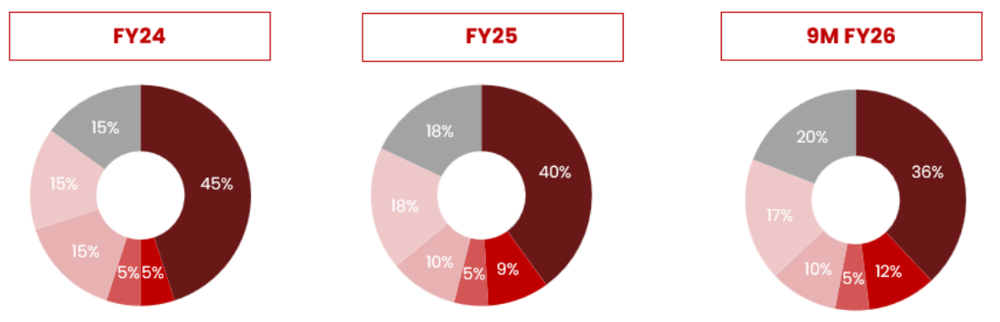
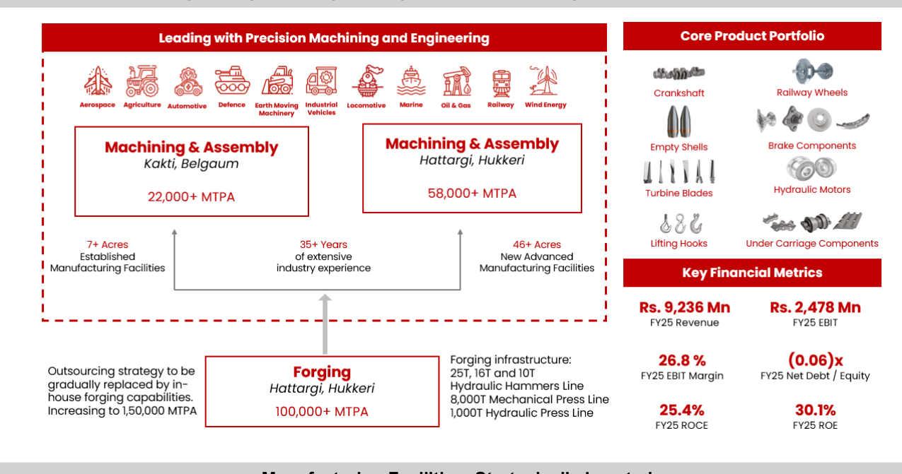
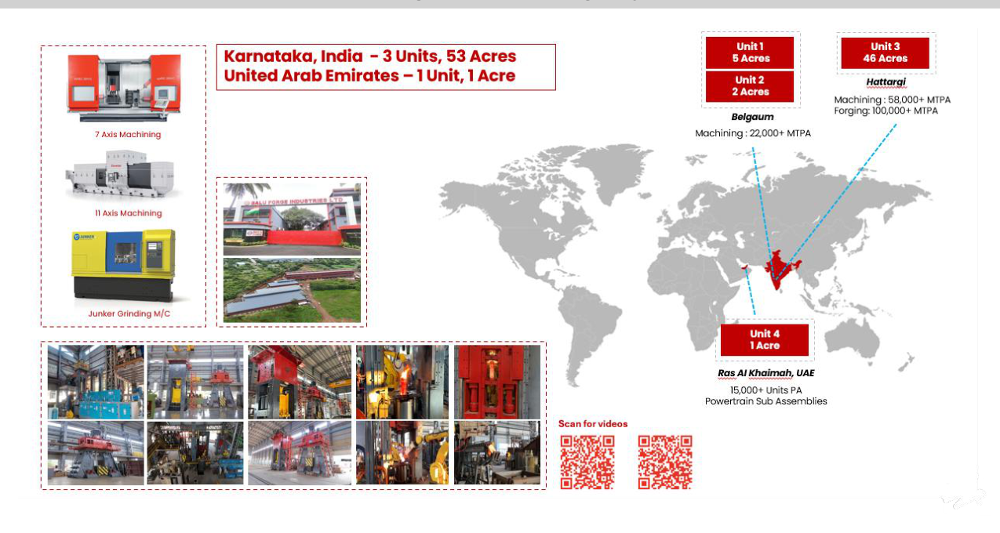

**[Image: BaluFeb2026.pdf-0001-00.png (83x83, 6.4KB)]**

**[Image: BaluFeb2026.pdf-0001-01.png (84x51, 6.9KB)]**

**[Image: BaluFeb2026.pdf-0001-02.png (69x81, 2.6KB)]**

**[Image: BaluFeb2026.pdf-0001-03.png (25x25, 1.6KB)]**

**[Image: BaluFeb2026.pdf-0001-04.png (22x24, 1.4KB)]**

Date: February 12, 2026 

To, Department of Corporate Services, **BSE Limited,** P J Towers, Dalal Street, Mumbai- 400 001. **BSE: Scrip Code: 531112** 

To, 

Listing Department, **National Stock Exchange of India Limited,** “Exchange Plaza”, C-1, Block-G, Bandra Kurla Complex, Bandra (E), Mumbai- 400 051. **NSE Trading Symbol: BALUFORGE** 

**-** **<u>Subject: Disclosure under Regulation 30 of SEBI (Listing Obligations and Disclosure Requirements) Regulations, 2015 – Submission of Press Release.</u>** 

Dear Sir/Madam, 

In terms of Regulation 30 of SEBI (Listing Obligations and Disclosure Requirements) Regulations, 2015, please find enclosed the Press Release regarding Un-Audited Financial Results for the Quarter and Nine Months ended December 31, 2025. The details of the said Financial Results are furnished in the attached Press Release. 

The above information will also be made available on the website of the Company at <u>www.baluindustries.com.</u> 

Kindly take the same on your records. 

Thanking You, Yours Truly, 

## **For Balu Forge Industries Limited** 

JASPALSINGH Digitally signed by JASPALSINGH PREHLADSING PREHLADSINGH CHANDOCK H CHANDOCK Date: 2026.02.12 20:02:16 +05'30' 

**Jaspalsingh Chandock Managing Director DIN: - 00813218** 

Enclosure: As above 

**[Image: BaluFeb2026.pdf-0001-19.png (887x149, 84.4KB)]**

Q3 and 9M FY2026 Earnings Press Release 

**[Image: BaluFeb2026.pdf-0002-01.png (215x107, 12.9KB)]**

- **Revenue from Operations of Rs. 8,438 Mn in Q3 FY26, up by 29.0% YoY** 

   - **EBITDA of Rs. 2,396 Mn in Q3 FY26, up by 36.0% YoY PAT of Rs. 1,932 Mn in Q3 FY26, up by 36.8% YoY** 

**Mumbai, 12****th** **February 2026:** Balu Forge Industries Ltd. (the “Company” or “BFIL”) (BSE: 531112 | NSE: BALUFORGE), a leading precision engineering and manufacturing company, has announced its unaudited financial results for the quarter and nine months ended 31st December 2025. 

# **Consolidated Financial Performance:** 

|Rs. Mn|Q3 FY26|Q3 FY25|_Y-o-Y_ _(%)_|Q2 FY26|_Q-o-Q_ _(%)_|_9M_ _FY26_|_9M_ _FY25_|_Y-o-Y_|
|---|---|---|---|---|---|---|---|---|
|Revenue from Operations|3,111|2,558|_29.0%_|2,995|_3.9%_|8,438|6,540|_29.0%_|
|EBITDA|845|677|_24.8%_|828|_2.1%_|2,396|1,761|_36.0%_|
|_EBITDA Margin%_|_27.2%_|_26.5%_||_27.6%_||_28.4%_|_26.9%_||
|PAT|711|590|_20.5%_|650|_9.4%_|1,932|1,412|_36.8%_|
|_PAT Margin%_|_22.5%_|_22.2%_||_21.5%_||_22.6%_|_21.2%_||
|EPS (Rs.)|6.4|5.5|_16.4%_|6.08|_5.3%_|17.0|13.5|_34.7%_|

# **Consolidated 9M FY26 Revenue from Operations by End – User Industry:** 

**[Image: BaluFeb2026.pdf-0002-08.png (1161x374, 71.2KB)]**

**[Image: BaluFeb2026.pdf-0002-09.png (978x39, 3.7KB)]**

1 

Q3 and 9M FY2026 Earnings Press Release 

**[Image: BaluFeb2026.pdf-0003-01.png (199x92, 12.5KB)]**

# **Commenting on the performance, Mr. Jaspal Singh Chandock, Chairman & Managing Director of BFIL stated:** 

_In 9M FY26, the Company reported revenue from operations of Rs. 8,438 million, representing a year-on-year growth of 29.0%, driven by sustained demand momentum. EBITDA for the quarter was Rs. 2,396 million, with a year-on-year growth of 36.1%, with a margin of 28.4%, reflecting stable cost structures and operating leverage benefits, while profit after tax was Rs.  1,932 million, translating into a PAT margin of 22.6%. The performance underscores disciplined execution, margin resilience, and the ongoing strengthening of Balu Forge’s integrated manufacturing platform._ 

_During the quarter, we successfully operationalised a set of high-impact strategic assets that position the Company for sustained growth over the next decade. Our newly commissioned precision machining facility has now been fully commercialised, equipped with advanced 7-Axis and 11-Axis CNC machining lines. This capability enables us to manufacture highly complex components from specialised alloys with micron-level accuracy, decisively moving Balu Forge up the value chain and strengthening our role in mission-critical applications._ 

_In parallel, we have commercialised our dedicated artillery shell production line, with a specific focus on the high-demand 155mm large calibre. This represents a significant milestone in our defence manufacturing journey and reinforces our commitment to the Atmanirbhar Bharat vision by building indigenous capabilities in a strategically critical segment._ 

_These operational achievements have already translated into meaningful external validation. During the quarter, Balu Forge was formally inducted into the NATO Supply Chain, an endorsement that reflects our adherence to the highest global quality, compliance, and reliability standards, and one that opens access to some of the world’s most demanding defence markets._ 

_This external recognition, along with the Company's requisite manufacturing infrastructure and operational capability, reinforces our position to support long-term supply programs and maintain the capacity to service engagements for up to five years. With advanced precision machining facilities and production lines, Balu Forge is well equipped to meet both current and future demands efficiently._ 

_In summary, Q3 was the quarter in which our strategic investments were converted into operational assets, global credentials, and expansion initiatives. With these foundations firmly in place, Balu Forge is now positioned on a trajectory of scalable and sustainable growth in defence and other critical segments._ 

**For further information, please contact:** 

**[Image: BaluFeb2026.pdf-0003-10.png (191x90, 10.9KB)]**

**[Image: BaluFeb2026.pdf-0003-11.png (259x90, 7.9KB)]**

**Tabassum Begum (Company Secretary** ) **Neha Dingria/ Akshay Hirani** +91 86550 75578 +91 22 6169 5988 <u>compliance@baluindustries.com baluforge@churchgatepartners.com</u> 

2 

Q3 and 9M FY2026 Earnings Press Release 

**[Image: BaluFeb2026.pdf-0004-01.png (199x92, 12.5KB)]**

# **Balu Forge: Integrated Engineering Manufacturer of High-Precision Components** 

**[Image: BaluFeb2026.pdf-0004-03.png (1275x671, 221.0KB)]**

# **Manufacturing Facilities: Strategically Located** 

**[Image: BaluFeb2026.pdf-0004-05.png (1275x680, 854.2KB)]**

3 

Q3 and 9M FY2026 Earnings Press Release 

**[Image: BaluFeb2026.pdf-0005-01.png (199x92, 12.5KB)]**

## **About Balu Forge Industries:** 

Balu Forge Industries Limited, founded by Mr. Prehlad Singh Chandock, is a leading Indian precision engineering company delivering forged and machined components across multiple global industries. The company offers a comprehensive product portfolio ranging from 1 kg to 1,000 kg and up to 3 meters in length, supporting diverse applications in automotive, industrial vehicles, earthmoving equipment, wind energy, aerospace, defence, oil and gas, railways, marine, and agriculture. Its operations include fully integrated forging and machining capabilities, with advanced manufacturing facilities in Belgaum, Karnataka, spread over a 46+ acre campus. Equipped with high-capacity hydraulic hammers and forging presses, and supported by a dedicated inhouse tool room, metallurgical labs, and CNC machining units, Balu Forge ensures consistent precision and quality. The company’s strategy is driven by innovation, with a specialized R&D division focusing on new materials and rapid prototyping. Strategic initiatives emphasize expanding defence production, enhancing automation, and strengthening global partnerships. With a strong focus on operational scalability, customer diversification, and ESG commitments, Balu Forge continues to strengthen its global footprint and industry positioning. For more details, please visit: https://www.baluindustries.com/ 

## **Disclaimer:** 

This investor release is not an offer to sell any securities or a solicitation to buy any securities of Balu Forge Industries Limited (the "company") or its subsidiaries (together with the company, the "group"). Certain statements in this document may be forward looking statements. These forward-looking statements can be identified by the use of forward-looking terminology, including the terms "believes", " estimates"," anticipates", " projects", " expects", " intends", " may", " will"," or " or, in each case, their negative or other variations or comparable terminology, or by discussions of strategy, plans, aims, objectives, goals, future events or intention. Such forward-looking statements are subject to certain risks and uncertainties like government actions, local political or economic developments, technological risks, and many other factors that could cause our actual results to differ materially from those contemplated by the relevant forward-looking statements. Forward looking statements are not guarantees of future performance including those relating to general business plans and strategy of the Company, its future outlook and growth prospects, and future developments in its businesses and its competitive and regulatory environment. No representation, warranty or undertaking, express or implied, is made or assurance given that such statements, views, projections or forecasts, if any, are correct or that the objectives of the Company will be achieved. The Company assumes no responsibility to publicly amend, modify or revise any forward-looking statements, on the basis of any subsequent development, information or events, or otherwise. Unless otherwise stated in this Investor Release, the information contained herein is based on management information and estimates. The information contained herein is subject to change without notice and past performance is not indicative of future results. Balu Forge will not be in any way responsible for any action taken based on such statements and undertakes no obligation to publicly update these forward- looking statements to reflect subsequent events or circumstances. 

**Balu Forge Industries Limited** Registered Office: 506, 5th Floor, Imperial Palace, 45 Telly Park Road, Andheri (East), Mumbai 400069 

4 

---

## Extracted Images

| # | File | Dimensions | Size |
|---|------|------------|------|
| 1 | BaluFeb2026.pdf-0001-00.png | 83x83 | 6.4KB |
| 2 | BaluFeb2026.pdf-0001-01.png | 84x51 | 6.9KB |
| 3 | BaluFeb2026.pdf-0001-02.png | 69x81 | 2.6KB |
| 4 | BaluFeb2026.pdf-0001-03.png | 25x25 | 1.6KB |
| 5 | BaluFeb2026.pdf-0001-04.png | 22x24 | 1.4KB |
| 6 | BaluFeb2026.pdf-0001-19.png | 887x149 | 84.4KB |
| 7 | BaluFeb2026.pdf-0002-01.png | 215x107 | 12.9KB |
| 8 | BaluFeb2026.pdf-0002-08.png | 1161x374 | 71.2KB |
| 9 | BaluFeb2026.pdf-0002-09.png | 978x39 | 3.7KB |
| 10 | BaluFeb2026.pdf-0003-01.png | 199x92 | 12.5KB |
| 11 | BaluFeb2026.pdf-0003-10.png | 191x90 | 10.9KB |
| 12 | BaluFeb2026.pdf-0003-11.png | 259x90 | 7.9KB |
| 13 | BaluFeb2026.pdf-0004-01.png | 199x92 | 12.5KB |
| 14 | BaluFeb2026.pdf-0004-03.png | 1275x671 | 221.0KB |
| 15 | BaluFeb2026.pdf-0004-05.png | 1275x680 | 854.2KB |
| 16 | BaluFeb2026.pdf-0005-01.png | 199x92 | 12.5KB |
