**[Image: BaluNov2025.pdf-0001-00.png (83x83, 6.4KB)]**

**[Image: BaluNov2025.pdf-0001-01.png (84x51, 6.9KB)]**

**[Image: BaluNov2025.pdf-0001-02.png (69x81, 2.6KB)]**

**[Image: BaluNov2025.pdf-0001-03.png (25x25, 1.6KB)]**

**[Image: BaluNov2025.pdf-0001-04.png (22x24, 1.4KB)]**

Date: November 14, 2025 

To, Department of Corporate Services, **BSE Limited,** P J Towers, Dalal Street, Mumbai- 400 001. **BSE: Scrip Code: 531112** 

To, Listing Department, **National Stock Exchange of India Limited,** “Exchange Plaza”, C-1, Block-G, Bandra Kurla Complex, Bandra (E), Mumbai- 400 051. **NSE Trading Symbol: BALUFORGE** 

**Sub: -** **<u>Earnings Release for the Quarter and Half Year ended September 30, 2025</u>** 

Dear Sir/Madam, 

Please find enclosed herewith the Earnings Release for the Quarter and half year ended September 30, 2025. 

Kindly take the same on your record and acknowledge. 

Thanking You, Yours Truly, 

###### **For Balu Forge Industries Limited** 

JASPALSINGH Digitally signed by JASPALSINGH PREHLADSINGH PREHLADSINGH CHANDOCK Date: 2025.11.14 21:43:42 CHANDOCK +05'30' 

**Jaspalsingh Chandock Managing Director DIN: - 00813218** 

Enclosure: As above 

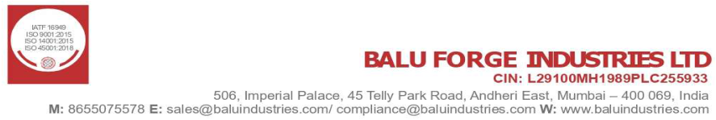

**[Image: BaluNov2025.pdf-0001-17.png (887x149, 84.4KB)]**

**®** 

## **Earnings Presentation** 

**Q2 and H1 FY26  |  November 2025** 

**Expanding Horizons Getting Future Ready** 

**[Image: BaluNov2025.pdf-0002-04.png (122x120, 8.1KB)]**

**[Image: BaluNov2025.pdf-0002-05.png (35x39, 1.3KB)]**

**[Image: BaluNov2025.pdf-0002-06.png (36x36, 1.5KB)]**

**[Image: BaluNov2025.pdf-0002-07.png (509x509, 9.7KB)]**

**BSE** : 531112 | **NSE** : BALUFORGE 

**®** 

**[Image: BaluNov2025.pdf-0003-01.png (70x70, 0.2KB)]**

#### **Introduction to Balu Forge** 

###### **Leading with Precision Machining and Engineering** 

**[Image: BaluNov2025.pdf-0003-04.png (106x104, 7.7KB)]**

**[Image: BaluNov2025.pdf-0003-05.png (97x86, 4.8KB)]**

**[Image: BaluNov2025.pdf-0003-06.png (97x90, 4.9KB)]**

**[Image: BaluNov2025.pdf-0003-07.png (98x91, 6.5KB)]**

**[Image: BaluNov2025.pdf-0003-08.png (74x68, 3.3KB)]**

**[Image: BaluNov2025.pdf-0003-09.png (64x66, 2.7KB)]**

**[Image: BaluNov2025.pdf-0003-10.png (64x67, 3.1KB)]**

**[Image: BaluNov2025.pdf-0003-11.png (65x70, 3.5KB)]**

**[Image: BaluNov2025.pdf-0003-12.png (81x66, 2.7KB)]**

**[Image: BaluNov2025.pdf-0003-13.png (45x65, 1.7KB)]**

**Aerospace Agriculture Automotive Defence Earth Moving Industrial Locomotive Marine Oil & Gas Railway Wind Energy Machinery Vehicles Machining & Assembly Machining & Assembly** _Hattargi, Hukkeri Kakti, Belgaum_ 58,000+ MTPA 22,000+ MTPA 7+ Acres 35+ Years 46+ Acres Established of extensive New Advanced Manufacturing Facilities industry experience Manufacturing Facilities 

Forging infrastructure: **Forging** 25T, 16T and 10T _Hattargi, Hukkeri_ Hydraulic Hammers Line 8,000T Mechanical Press Line 100,000+ MTPA 1,000T Hydraulic Press Line 

Outsourcing strategy to be gradually replaced by inhouse forging capabilities. Increasing to 1,50,000 MTPA 

**[Image: BaluNov2025.pdf-0003-17.png (65x68, 3.9KB)]**

**[Image: BaluNov2025.pdf-0003-18.png (20x22, 0.7KB)]**

**[Image: BaluNov2025.pdf-0003-19.png (19x19, 0.7KB)]**

###### **Core Product Portfolio** 

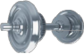

**[Image: BaluNov2025.pdf-0003-21.png (94x61, 8.4KB)]**

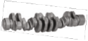

**[Image: BaluNov2025.pdf-0003-22.png (126x59, 9.1KB)]**

Crankshaft Railway Wheels Empty Shells Brake Components Turbine Blades Hydraulic Motors Lifting Hooks Under Carriage Components 

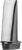

**[Image: BaluNov2025.pdf-0003-24.png (22x50, 1.7KB)]**

###### **Key Financial Metrics** 

**Rs. 9,236 Mn Rs. 2,478 Mn** FY25 Revenue FY25 EBIT **26.8 % (0.06)x** FY25 EBIT Margin FY25 Net Debt / Equity 

**25.4% 30.1%** FY25 ROCE FY25 ROE 2 

**®** 

**[Image: BaluNov2025.pdf-0004-01.png (70x70, 0.2KB)]**

#### **Business Journey** 

**[Image: BaluNov2025.pdf-0004-03.png (65x68, 3.9KB)]**

**[Image: BaluNov2025.pdf-0004-04.png (19x19, 0.7KB)]**

**[Image: BaluNov2025.pdf-0004-05.png (20x22, 0.7KB)]**

###### **Successful Track Record of Acquiring and Integrating High End Forging & Machining Equipment** 

**[Image: BaluNov2025.pdf-0004-07.png (72x114, 5.7KB)]**

**[Image: BaluNov2025.pdf-0004-08.png (74x116, 5.1KB)]**

**[Image: BaluNov2025.pdf-0004-09.png (72x114, 5.6KB)]**

**[Image: BaluNov2025.pdf-0004-10.png (74x116, 5.3KB)]**

**[Image: BaluNov2025.pdf-0004-11.png (74x112, 5.8KB)]**

**[Image: BaluNov2025.pdf-0004-12.png (73x116, 4.7KB)]**

**[Image: BaluNov2025.pdf-0004-13.png (74x112, 5.8KB)]**

**1989 1991 1995 2006 2010 2011 2012** The foundation First First component Acquisition & Acquisition & The company Got accredited with of ‘Balu’ was component exported to an Installation of the Installation of the successfully achieved ISO/TS16949:2009 laid by Mr. manufactured overseas market Ursus Manufacturing Thyssenkrupp the milestone of accreditation from Prehlad Singh in our factory Plant from Ursus, Plant from building a presence in world renowned Chandock Poland L’horme, France over 80 countries company TUV NORD worldwide **2014 2017 2020 2021/2022 2023 2024 2024/2025** Achieved Became a supplier Got Accredited with Acquired the Laid the foundation Acquisition of 3 Invested in 7 axis, manufacturing of of Choice to over the 14001:2015 & ISO Precision Machining for the greenfield fully automated 11 axis machining 1000 crankshafts 25 OEs spread 45001:2018 Unit of the Mercedes forging & forging lines with capability, 25T in a single day over 5 Continents Certifications. Became Benz Truck factory machining facility GERB Technology Hydraulic an Approved Vendor to from Mannheim, spread over 46 namely: 16T, 10T hammer line & a the Ordnance Factory Germany Acres in Belgaum, Forging Hydraulic fully automated Board & established a India Hammer & 8000T Empty Shell & specialized Balu successfully Forging Press. Mortar production manufacturing unit for completed the ESG line with an the Defence Industry. audit by a reputed annual capacity Balu completed the audit firm & joined of 360,000 shells transition & listing on the United Nations per annum the Stock Exchange. Global Compact The constitution of the Program company was changed in its efforts to be to public limited ESG compliant 

company 

20 

**®** 

**[Image: BaluNov2025.pdf-0005-01.png (70x70, 0.2KB)]**

**[Image: BaluNov2025.pdf-0005-02.png (36x41, 2.0KB)]**

#### **Balu Forge Equity Story** 

**[Image: BaluNov2025.pdf-0005-04.png (17x19, 0.7KB)]**

| **Precision Engineered** **Product Portfolio for** **Global OEMs** 1.| • Manufactures precision machined and forged components • Serves diverse end-markets including automotive, industrial machinery, power generation, defence, and railways • Supplies precision-engineered components to 25 global OEMs across 80 countries|
|---|---|
|**Acquired Integrated** **Manufacturing** **Platform** 2.|• Operates four facilities across India and the UAE with integrated forging, heat-treatment, and machining lines • 16-ton hydraulic and 8,000-ton mechanical presses, CNC machines, and robotic systems for high precision production • Acquired facilities from Mercedes-Benz Truck AG (Germany), Thyssenkrupp AG (France), and Ursus SA (Poland)|
|**Facility at Hattargi** **Provides Platform for** **Future Growth** 3.|• Developing a 46-acre facility with machining capacity of 58,000+ MTPA and a captive forging capacity of 1,50,000 MTPA • Advanced automation, digital systems, and a scalable platform for complex components strengthen export capability • This facility will raise total Machining Capacity to over 80,000 MTPA and Forging Capacity to 1,50,000 MTPA|
|**Expanding in** **High-Value** **Engineering Sectors** 4.|• Expanding into defence, aerospace, railways, energy, and industrial equipment with complex precision components • Forging and machining line for Empty Shell production with a capacity of 360,000 shells p.a. being commercialized • Secured approvals for 180+ products across these segments, strengthening customer relationship and qualification base|
|**Ongoing Investment** **in Technology and** **R&D** 5.|• Equipped with 7-axis and 11-axis machining systems and a 25-ton hydraulic hammer for high-precision forgings • A Dedicated R&D team of 75 people and design centre focused on new product development and process optimisation • Industry 4.0-enabled automation enhances productivity, accuracy, and traceability across operations|
|**High Margin Growth** **with Well Capitalised** **Balance Sheet (FY25)** 6.|• FY25 Revenue from Operations of Rs. 9,236 Mn with EBITDA margin of 27.2% and PAT margin of 21.7% • ROCE of 30.1% and ROE of 25.4%;Net Cash of Rs 603 Mn provides flexibility to continue the acquisition strategy • Cash flow from operations of Rs. 1,482 Mn, with CFO to EBITDA conversion of 59%. 4|

**®** 

**[Image: BaluNov2025.pdf-0006-01.png (70x70, 0.2KB)]**

**[Image: BaluNov2025.pdf-0006-02.png (65x68, 3.9KB)]**

#### **Chairman & Managing Director’s Message** 

**[Image: BaluNov2025.pdf-0006-04.png (19x19, 0.7KB)]**

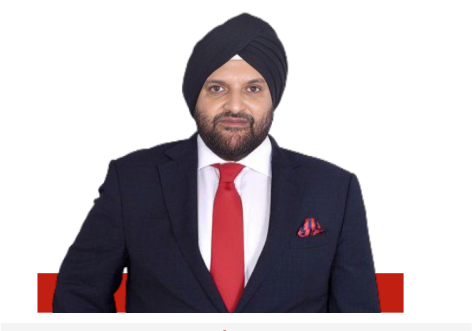

**[Image: BaluNov2025.pdf-0006-05.png (472x331, 103.1KB)]**

# “ 

Revenue from Operations in Q2 FY26 was Rs 2,995 million, an increase of 34.4% year-on-year. EBITDA for the quarter was Rs 828 million, with an EBITDA margin of 27.6%, while PAT was Rs 650 million, reflecting a margin of 21.5%. For H1 FY26, Revenue from Operations was Rs 5,327 million, up 33.8% over H1 FY25, with EBITDA of Rs 1,551 million and PAT of Rs 1,261 million. This performance reflects steady execution and the continued strengthening of Balu Forge’s integrated manufacturing platform. 

###### **<mark>Mr. Jaspal Singh Chandock</mark>** 

The greenfield facility at Hattargi, Karnataka, is advancing as planned and remains central to our ongoing expansion. The plant integrates captive forging and precision machining under one setup, improving efficiency and output. Commissioning of the 25-ton closed-die forging hammer, 8,000-ton mechanical press, and automated machining lines is progressing on schedule. When fully operational, total forging and machining capacities will increase to 150,000 tons and 80,000 tons per year, respectively. 

**Chairman & Managing Director** 

##### **Rs. 5,327 Mn** 

H1 FY26 Revenue (33.8% YoY) 

**[Image: BaluNov2025.pdf-0006-13.png (20x22, 0.7KB)]**

##### **Rs. 1,551 Mn** 

H1 FY26 EBITDA (29.1% Margin) 

The defence division remains a key focus. The dedicated forging and machining line for Empty Shell production, with a capacity of 360,000 shells per year is in the commercialization phase. The company has vendor approvals from leading Indian defence players and continues to add new products across artillery, armoured vehicle and engine components, strengthening its role in India’s defence manufacturing ecosystem. 

##### **Rs. 404 Mn** 

H1 FY26 Cash Flow from Operations 

**0.02x** 

H1 FY26 Net Debt / Equity 

We continue to focus on disciplined execution and capacity readiness as we scale operations across forging and machining. The Hattargi facility will strengthen our fully integrated manufacturing base and improve our ability to serve complex, high-value applications. With defence production entering the commercialization stage and capacity expansion on track, Balu Forge is positioned to drive the next phase of growth through scale, technology, and customer diversification. 

5 

**®** 

**[Image: BaluNov2025.pdf-0007-01.png (70x70, 0.2KB)]**

#### **Strategically Located Manufacturing Facilities** 

**[Image: BaluNov2025.pdf-0007-03.png (65x68, 3.9KB)]**

**[Image: BaluNov2025.pdf-0007-04.png (19x19, 0.7KB)]**

**[Image: BaluNov2025.pdf-0007-05.png (20x22, 0.7KB)]**

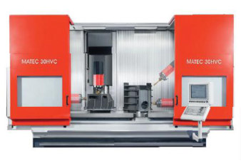

**[Image: BaluNov2025.pdf-0007-06.png (338x226, 110.3KB)]**

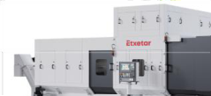

**[Image: BaluNov2025.pdf-0007-07.png (239x109, 25.3KB)]**

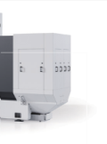

**[Image: BaluNov2025.pdf-0007-08.png (120x162, 11.6KB)]**

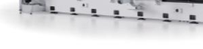

**[Image: BaluNov2025.pdf-0007-09.png (225x55, 11.0KB)]**

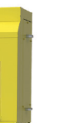

**[Image: BaluNov2025.pdf-0007-10.png (76x123, 5.5KB)]**

**[Image: BaluNov2025.pdf-0007-11.png (300x62, 20.8KB)]**

**[Image: BaluNov2025.pdf-0007-12.png (150x62, 4.7KB)]**

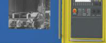

**[Image: BaluNov2025.pdf-0007-13.png (151x62, 14.2KB)]**

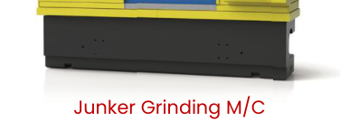

**[Image: BaluNov2025.pdf-0007-14.png (376x134, 34.1KB)]**

<!-- Start of picture text -->
Junker Grinding M/C <!-- End of picture text -->

**[Image: BaluNov2025.pdf-0007-15.png (45x42, 1.1KB)]**

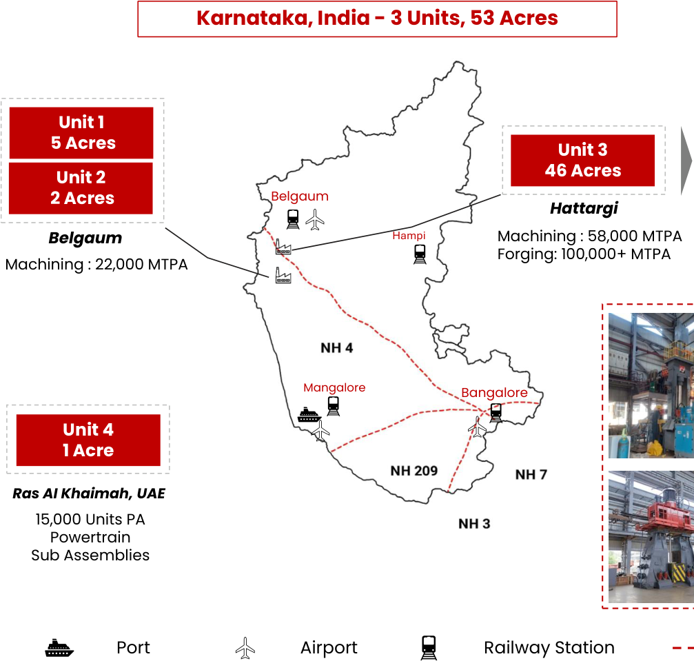

**[Image: BaluNov2025.pdf-0007-16.png (1007x959, 291.7KB)]**

<!-- Start of picture text -->
Karnataka, India - 3 Units, 53 Acres Unit 1  5 Acres Unit 3 46 Acres Unit 2  2 Acres Belgaum Hattargi Belgaum Hampi Machining : 58,000 MTPA Forging: 100,000+ MTPA Machining : 22,000 MTPA Mangalore Bangalore Unit 4 1 Acre Ras AI Khaimah, UAE 15,000 Units PA Powertrain Sub Assemblies Port Airport Railway Station <!-- End of picture text -->

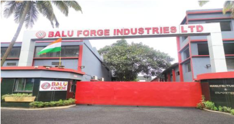

**[Image: BaluNov2025.pdf-0007-17.png (394x209, 165.3KB)]**

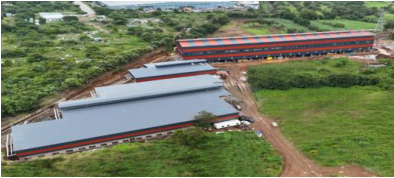

**[Image: BaluNov2025.pdf-0007-18.png (394x178, 175.9KB)]**

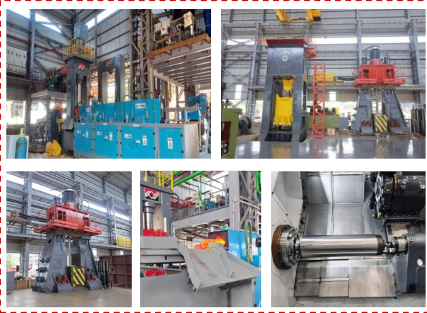

**[Image: BaluNov2025.pdf-0007-19.png (603x442, 581.0KB)]**

National Highway 

6 

Manufacturing Facilities 

**®** 

**[Image: BaluNov2025.pdf-0008-01.png (70x70, 0.2KB)]**

#### **Q2 FY26 Consolidated Financial Performance** 

**[Image: BaluNov2025.pdf-0008-03.png (65x68, 3.9KB)]**

**[Image: BaluNov2025.pdf-0008-04.png (19x19, 0.7KB)]**

**[Image: BaluNov2025.pdf-0008-05.png (20x22, 0.7KB)]**

_All figures in Rs. Mn._ 

###### **Revenue from Operations** 

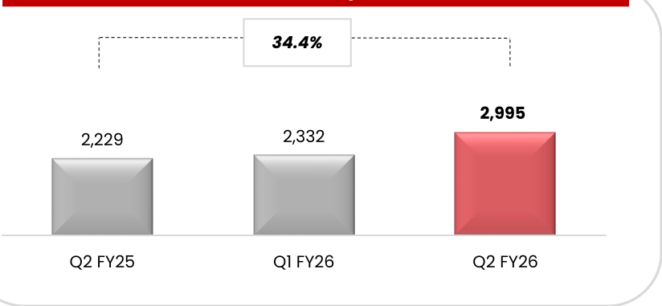

**[Image: BaluNov2025.pdf-0008-08.png (824x381, 18.9KB)]**

<!-- Start of picture text -->
34.4% 2,995 2,229 2,332 Q2 FY25 Q1 FY26 Q2 FY26 <!-- End of picture text -->

**[Image: BaluNov2025.pdf-0008-09.png (781x124, 3.6KB)]**

<!-- Start of picture text -->
PAT 35.5% <!-- End of picture text -->

**[Image: BaluNov2025.pdf-0008-10.png (126x136, 1.9KB)]**

**[Image: BaluNov2025.pdf-0008-11.png (376x119, 3.4KB)]**

**[Image: BaluNov2025.pdf-0008-12.png (781x119, 4.3KB)]**

<!-- Start of picture text -->
EBITDA 27.0% <!-- End of picture text -->

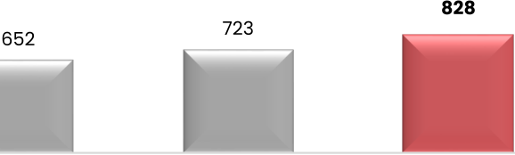

**[Image: BaluNov2025.pdf-0008-13.png (578x174, 8.3KB)]**

<!-- Start of picture text -->
828 723 652 <!-- End of picture text -->

**[Image: BaluNov2025.pdf-0008-14.png (374x120, 3.5KB)]**

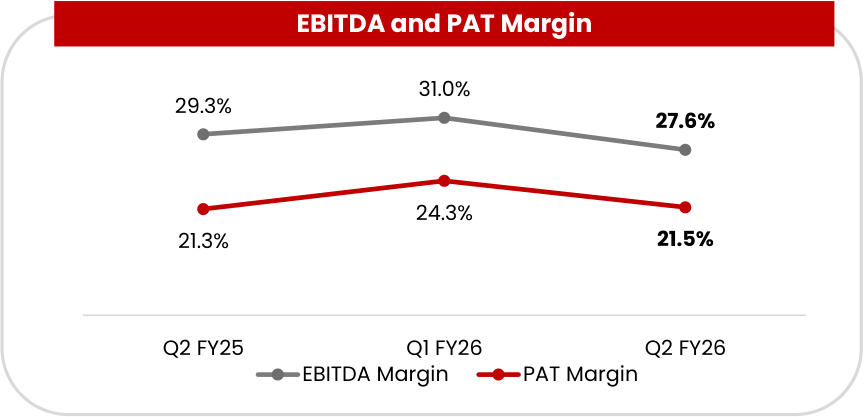

**[Image: BaluNov2025.pdf-0008-15.png (865x417, 29.6KB)]**

<!-- Start of picture text -->
EBITDA and PAT Margin 31.0% 29.3% 27.6% 24.3% 21.3% 21.5% Q2 FY25 Q1 FY26 Q2 FY26 EBITDA Margin PAT Margin <!-- End of picture text -->

Notes: 

1. EBITDA and EBITDA Margin excludes Other Income 2. All other Margins are calculated on Total Income 

7 

**®** 

**[Image: BaluNov2025.pdf-0009-01.png (70x70, 0.2KB)]**

#### **H1 FY26 Consolidated Financial Performance** 

**[Image: BaluNov2025.pdf-0009-03.png (65x68, 3.9KB)]**

**[Image: BaluNov2025.pdf-0009-04.png (19x19, 0.7KB)]**

**[Image: BaluNov2025.pdf-0009-05.png (20x22, 0.7KB)]**

_All figures in Rs. Mn._ 

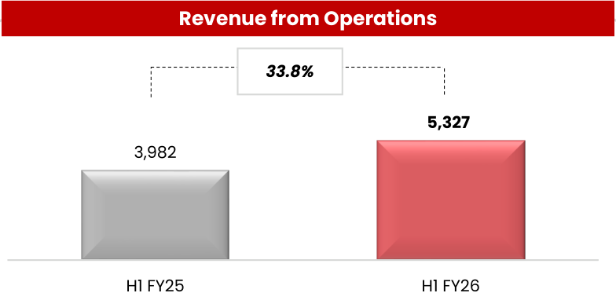

**[Image: BaluNov2025.pdf-0009-07.png (784x373, 16.9KB)]**

<!-- Start of picture text -->
Revenue from Operations 33.8% 5,327 3,982 H1 FY25 H1 FY26 <!-- End of picture text -->

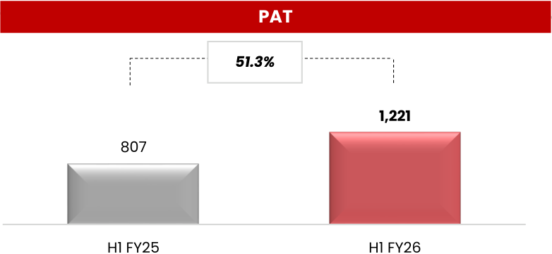

**[Image: BaluNov2025.pdf-0009-08.png (782x361, 13.0KB)]**

<!-- Start of picture text -->
PAT 51.3% 1,221 807 H1 FY25 H1 FY26 <!-- End of picture text -->

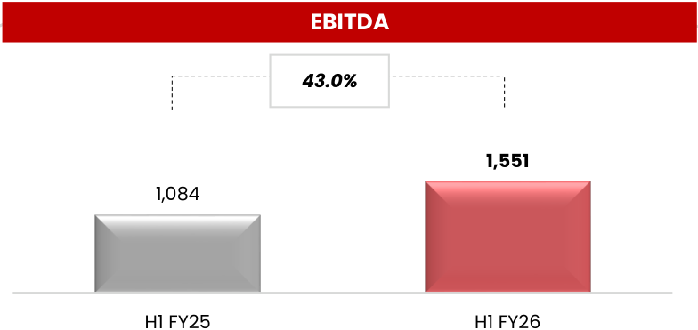

**[Image: BaluNov2025.pdf-0009-09.png (784x371, 13.8KB)]**

<!-- Start of picture text -->
EBITDA 43.0% 1,551 1,084 H1 FY25 H1 FY26 <!-- End of picture text -->

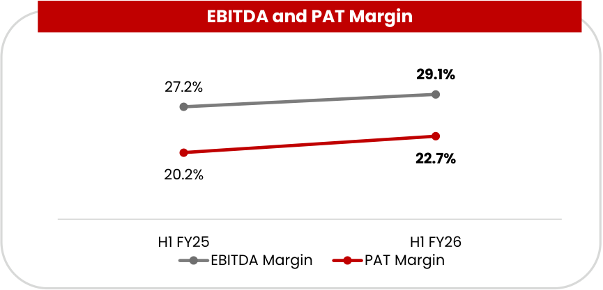

**[Image: BaluNov2025.pdf-0009-10.png (865x417, 23.9KB)]**

<!-- Start of picture text -->
EBITDA and PAT Margin 29.1% 27.2% 22.7% 20.2% H1 FY25 H1 FY26 EBITDA Margin PAT Margin <!-- End of picture text -->

Notes: 

1. EBITDA and EBITDA Margin excludes Other Income 

2. All other Margins are calculated on Total Income 

8 

**®** 

**[Image: BaluNov2025.pdf-0010-01.png (70x70, 0.2KB)]**

**[Image: BaluNov2025.pdf-0010-02.png (43x44, 2.4KB)]**

#### **Capital Structure** 

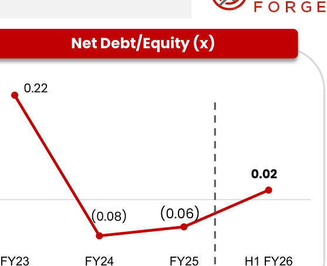

**[Image: BaluNov2025.pdf-0010-04.png (557x452, 24.5KB)]**

<!-- Start of picture text -->
Net Debt/Equity (x) 0.22 0.02 (0.08) (0.06) FY23 FY24 FY25 H1 FY26 <!-- End of picture text -->

|**(Rs. Mn)**|**H1 FY26**|**FY25**|**Net Debt/Equity (x)**|
|---|---|---|---|
|Property, Plant & Equipment (Tangible, Intangible, RoU, Goodwill)|4,364|1,830|0.22|
|CWIP|3,506|4,171||
|Cash And Bank Balances|378|962|**0.02**|
|Inventories|1,336|981|(0.08) (0.06)|
|Trade Receivables|3,714|3,273|FY23 FY24 FY25 H1 FY26|
|Other Assets|1,944|1,305||
|**Total Assets**|**15,242**|**12,522**|**ROCE and ROE (%)**|
|Total Equity|12,489|10,532|30% 30%|
|Borrowing|640|359|26% **26%**|
|Trade Payables|1,108|1,180|22% 25% 25%|
|Other Liabilities|1,005|451|**21%**|
|**Total Equity & Liabilities**|**15,242**|**12,522**|FY23 FY24 FY25 H1 FY26*|
|Notes: 1. ROE: PAT/Average Equity; ROCE: EBIT/ Average Capital Employed 2. D/E: Net Debt/Total Equity 3. For H1 FY26, ROCE and ROE have been annualised|||**9** ROCE % ROE % 9|

**®** 

**[Image: BaluNov2025.pdf-0011-01.png (70x70, 0.2KB)]**

#### **Cash Flows and Working Capital** 

**[Image: BaluNov2025.pdf-0011-03.png (65x68, 3.9KB)]**

**[Image: BaluNov2025.pdf-0011-04.png (19x19, 0.7KB)]**

**[Image: BaluNov2025.pdf-0011-05.png (20x22, 0.7KB)]**

_Rs. in Mn_ 

###### **Cash Flow from Operations** 

**[Image: BaluNov2025.pdf-0011-08.png (149x203, 1.8KB)]**

**[Image: BaluNov2025.pdf-0011-09.png (151x105, 1.6KB)]**

**[Image: BaluNov2025.pdf-0011-10.png (149x86, 2.0KB)]**

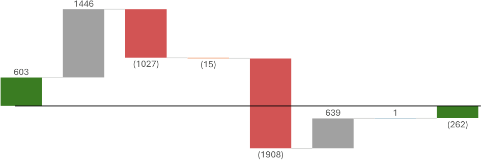

**[Image: BaluNov2025.pdf-0011-11.png (947x314, 9.6KB)]**

<!-- Start of picture text -->
1446 (1027) (15) 603 639  1 (262) (1908) <!-- End of picture text -->

Net Cash for Operating CashflowOperating Change in Tax PaidTax Paid Investing Financing ActivityFinancing Increase in Net Cash for FY25Net Cash for Net Cash for FY25FY25 Cash Flow Change in Working …Working Investing ActivityActivity Activity Decrease in Bank …Bank Balance H1 FY26 Capital 

**[Image: BaluNov2025.pdf-0011-13.png (889x147, 10.7KB)]**

<!-- Start of picture text -->
Working Capital (In Days) 163 129 104 109 <!-- End of picture text -->

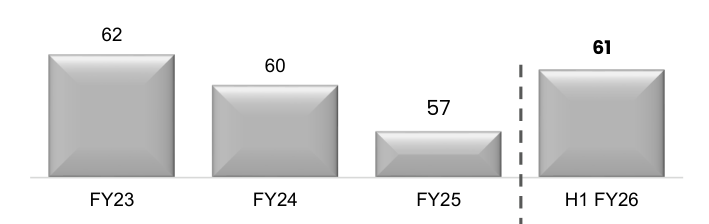

**[Image: BaluNov2025.pdf-0011-14.png (709x224, 11.8KB)]**

<!-- Start of picture text -->
62 61 60 57 FY23 FY24 FY25 H1 FY26 <!-- End of picture text -->

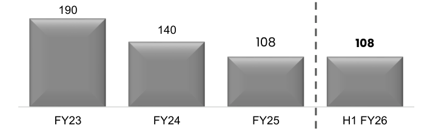

**[Image: BaluNov2025.pdf-0011-15.png (709x222, 12.4KB)]**

<!-- Start of picture text -->
190 140 108 108 FY23 FY24 FY25 H1 FY26 <!-- End of picture text -->

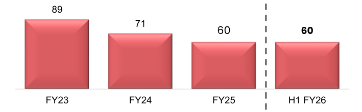

**[Image: BaluNov2025.pdf-0011-16.png (709x221, 14.3KB)]**

<!-- Start of picture text -->
89 71 60 60 FY23 FY24 FY25 H1 FY26 <!-- End of picture text -->

10 

**®** 

**[Image: BaluNov2025.pdf-0012-02.png (70x70, 0.2KB)]**

**[Image: BaluNov2025.pdf-0012-03.png (68x71, 0.2KB)]**

**[Image: BaluNov2025.pdf-0012-04.png (43x44, 2.4KB)]**

#### **H1 FY26 Revenue Contribution Analysis** 

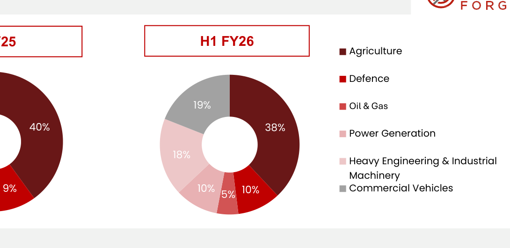

**[Image: BaluNov2025.pdf-0012-06.png (1090x530, 46.9KB)]**

<!-- Start of picture text -->
H1 FY26 Agriculture Defence 19% Oil & Gas 40% 38% Power Generation 18% Heavy Engineering & Industrial Machinery 9% 10% 10% Commercial Vehicles 5% <!-- End of picture text -->

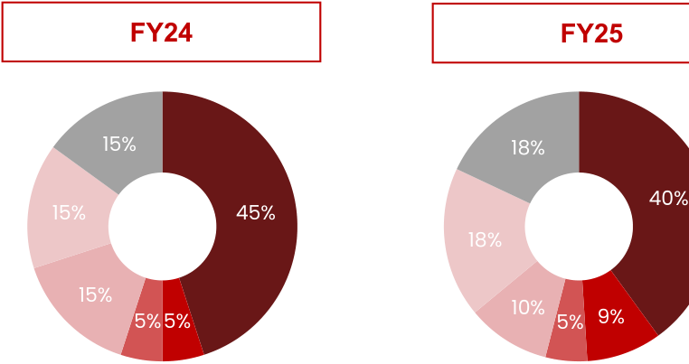

**[Image: BaluNov2025.pdf-0012-07.png (762x403, 29.9KB)]**

<!-- Start of picture text -->
FY24 FY25 15% 18% 40% 15% 45% 18% 15% 10% 5% 5% 5% 9% <!-- End of picture text -->

#### **Order Book and Revenue Guidance** 

###### **Order Book Industries wise** 

###### **Revenue Guidance** 

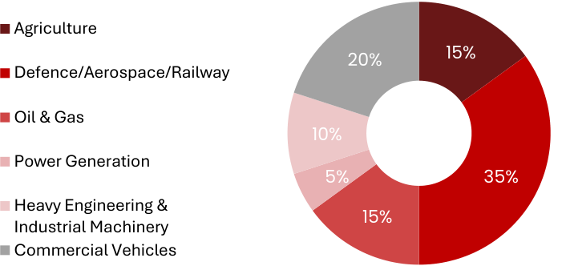

**[Image: BaluNov2025.pdf-0012-11.png (711x332, 34.1KB)]**

<!-- Start of picture text -->
Agriculture 15% 20% Defence/Aerospace/Railway Oil & Gas 10% Power Generation 5% 35% Heavy Engineering & 15% Industrial Machinery Commercial Vehicles <!-- End of picture text -->

- For FY26, Balu Forge will maintain the revenue growth guidance in the range of 40-45%, driven by strategic capacity expansions and increased penetration into high-demand industries 

- The commercialization and operationalization of Unit 3 in Hattargi are key catalysts 

- Balu Forge is also prioritizing high-value segments like defence and aerospace, where expertise in advanced machining and heavy forging aligns well with the sector's stringent quality requirements 

- Additionally, Balu Forge is leveraging strong customer relationships and long-term contracts to secure consistent revenue streams 

- Through the adoption of real-time monitoring, Balu Forge is optimizing its production processes to achieve improved EBITDA margins and sustainable financial performance 

11 

**®** 

**[Image: BaluNov2025.pdf-0013-01.png (70x70, 0.2KB)]**

#### **Property, Plant and Equipment** 

**[Image: BaluNov2025.pdf-0013-03.png (65x68, 3.9KB)]**

**[Image: BaluNov2025.pdf-0013-04.png (19x19, 0.7KB)]**

**[Image: BaluNov2025.pdf-0013-05.png (20x22, 0.7KB)]**

###### **Capital Work in Progress (Rs Mn)** 

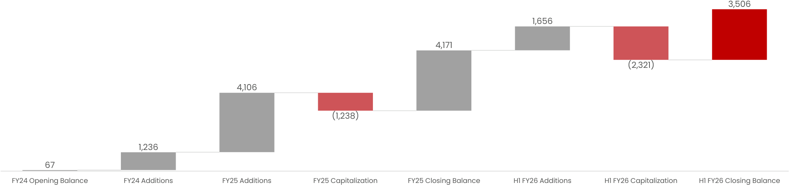

**[Image: BaluNov2025.pdf-0013-07.png (1934x455, 26.3KB)]**

<!-- Start of picture text -->
3,506 1,656 4,171 (2,321) 4,106 (1,238) 1,236 67 FY24 Opening Balance FY24 Additions FY25 Additions FY25 Capitalization FY25 Closing Balance H1 FY26 Additions H1 FY26 Capitalization H1 FY26 Closing Balance <!-- End of picture text -->

- Balu Forge’s asset turnover is relatively high compared to peers as the company has historically acquired used assets through global auctions, private treaties, and liquidations, keeping capital costs low and improving asset efficiency 

- Additionally, the relatively low capitalized PP&E base temporarily inflates the asset turnover ratio until these assets are transferred out of CWIP 

- As of FY25, about 74% of total fixed assets are classified as Capital Work-in-Progress (CWIP). However, in H1 FY26, a significant portion of CWIP has been capitalized, reducing its proportion to 48% 

- As these assets continue to be capitalized over time, the asset base will increase, and the asset turnover ratio will gradually normalize 

- Additionally, Balu Forge imports most machinery under the Government of India’s MOOWR scheme, with its Hattargi Facility operating as a bonded manufacturing unit 

- Machinery imported under the scheme is exempt from customs duty and IGST, improving upfront cash flow management 

- MOOWR assets are not subject to depreciation, even after being commissioned and in use 

1212 

**®** 

**[Image: BaluNov2025.pdf-0014-01.png (70x70, 0.2KB)]**

#### **Precision Engineering Product Portfolio** 

###### **Auto Components** 

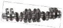

**[Image: BaluNov2025.pdf-0014-04.png (128x58, 8.9KB)]**

**[Image: BaluNov2025.pdf-0014-05.png (126x60, 9.1KB)]**

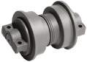

**[Image: BaluNov2025.pdf-0014-06.png (87x62, 7.8KB)]**

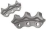

**[Image: BaluNov2025.pdf-0014-07.png (92x58, 6.6KB)]**

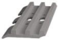

**[Image: BaluNov2025.pdf-0014-08.png (84x60, 6.3KB)]**

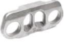

**[Image: BaluNov2025.pdf-0014-09.png (92x62, 7.9KB)]**

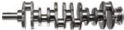

**[Image: BaluNov2025.pdf-0014-10.png (124x30, 6.8KB)]**

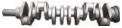

**[Image: BaluNov2025.pdf-0014-11.png (122x28, 6.0KB)]**

**[Image: BaluNov2025.pdf-0014-12.png (132x22, 1.8KB)]**

<!-- Start of picture text -->
Crankshaft <!-- End of picture text -->

**Under Carriage Components** 

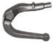

**[Image: BaluNov2025.pdf-0014-14.png (59x47, 4.0KB)]**

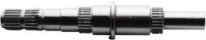

**[Image: BaluNov2025.pdf-0014-15.png (206x40, 9.0KB)]**

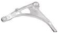

**[Image: BaluNov2025.pdf-0014-16.png (82x47, 2.7KB)]**

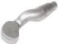

**[Image: BaluNov2025.pdf-0014-17.png (58x45, 2.9KB)]**

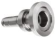

**[Image: BaluNov2025.pdf-0014-18.png (95x64, 7.8KB)]**

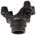

**[Image: BaluNov2025.pdf-0014-19.png (72x70, 6.5KB)]**

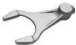

**[Image: BaluNov2025.pdf-0014-20.png (76x45, 3.8KB)]**

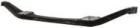

**[Image: BaluNov2025.pdf-0014-21.png (140x28, 4.1KB)]**

###### **Chassis Components** 

###### **Transmission & Clutches** 

Drive shafts, Input & Output shafts, Main shafts, Yokes 

Front Axle Beams, Steering Knuckles, Control Arms, Forks, Steering 

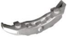

**[Image: BaluNov2025.pdf-0014-26.png (111x61, 7.1KB)]**

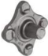

**[Image: BaluNov2025.pdf-0014-27.png (61x71, 6.0KB)]**

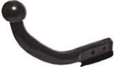

**[Image: BaluNov2025.pdf-0014-28.png (166x98, 11.7KB)]**

**[Image: BaluNov2025.pdf-0014-29.png (113x113, 14.2KB)]**

**[Image: BaluNov2025.pdf-0014-30.png (86x85, 5.1KB)]**

**[Image: BaluNov2025.pdf-0014-31.png (78x74, 7.0KB)]**

**Towing  Accessories** Swan Necks, Flange Balls, Tow Bars 

**Brake Components** Hub, Brake Flange, Disc, Caliper 

**[Image: BaluNov2025.pdf-0014-34.png (65x68, 3.9KB)]**

###### **Non-Auto Components** 

**[Image: BaluNov2025.pdf-0014-36.png (218x137, 36.2KB)]**

**[Image: BaluNov2025.pdf-0014-37.png (24x124, 3.4KB)]**

**[Image: BaluNov2025.pdf-0014-38.png (25x123, 3.4KB)]**

**[Image: BaluNov2025.pdf-0014-39.png (18x122, 2.8KB)]**

**[Image: BaluNov2025.pdf-0014-40.png (13x121, 1.9KB)]**

**[Image: BaluNov2025.pdf-0014-41.png (18x121, 3.1KB)]**

**[Image: BaluNov2025.pdf-0014-42.png (32x111, 3.9KB)]**

**Railway Wheels** Axles & Wheel sets 

**Turbine Blades** 

**[Image: BaluNov2025.pdf-0014-45.png (242x151, 24.4KB)]**

**[Image: BaluNov2025.pdf-0014-46.png (61x111, 8.8KB)]**

**[Image: BaluNov2025.pdf-0014-47.png (66x111, 9.4KB)]**

**[Image: BaluNov2025.pdf-0014-48.png (61x105, 8.0KB)]**

**Hydraulic Motors** 

**Lifting Hooks** Sorting, Snap, Shank, Ramshorn Hooks 

**[Image: BaluNov2025.pdf-0014-51.png (95x173, 29.6KB)]**

**[Image: BaluNov2025.pdf-0014-52.png (59x59, 3.3KB)]**

**[Image: BaluNov2025.pdf-0014-53.png (69x55, 4.0KB)]**

**[Image: BaluNov2025.pdf-0014-54.png (70x49, 3.4KB)]**

**[Image: BaluNov2025.pdf-0014-55.png (78x63, 4.6KB)]**

**[Image: BaluNov2025.pdf-0014-56.png (70x63, 4.3KB)]**

**[Image: BaluNov2025.pdf-0014-57.png (64x57, 3.9KB)]**

**Oil, Gas, & Flow Control Components** 

**Empty Shells** 

**[Image: BaluNov2025.pdf-0014-60.png (19x19, 0.7KB)]**

**[Image: BaluNov2025.pdf-0014-61.png (20x22, 0.7KB)]**

13 

**®** 

**[Image: BaluNov2025.pdf-0015-01.png (70x70, 0.2KB)]**

#### **Aerospace and Defence: Growth Strategy** 

##### **Received approval to supply 180+ products** 

**[Image: BaluNov2025.pdf-0015-04.png (168x142, 22.5KB)]**

**[Image: BaluNov2025.pdf-0015-05.png (165x142, 22.3KB)]**

**[Image: BaluNov2025.pdf-0015-06.png (168x142, 15.3KB)]**

**[Image: BaluNov2025.pdf-0015-07.png (165x142, 22.1KB)]**

**Flange** 

**Crank Shaft** 

**Breach Base** 

**Road Wheel Arm** 

**[Image: BaluNov2025.pdf-0015-12.png (168x143, 13.1KB)]**

**[Image: BaluNov2025.pdf-0015-13.png (165x143, 23.8KB)]**

**[Image: BaluNov2025.pdf-0015-14.png (168x143, 26.7KB)]**

**[Image: BaluNov2025.pdf-0015-15.png (165x143, 18.5KB)]**

**Track Guide** 

**Intermediate Gear** 

**Hub Carrier** 

**Track Link** 

**[Image: BaluNov2025.pdf-0015-20.png (166x143, 26.3KB)]**

**[Image: BaluNov2025.pdf-0015-21.png (167x143, 20.6KB)]**

**[Image: BaluNov2025.pdf-0015-22.png (165x143, 25.6KB)]**

**[Image: BaluNov2025.pdf-0015-23.png (165x143, 20.8KB)]**

**Gear Ring (Hollow)** 

**Clamp** 

**Gear Ring (Solid)** 

**Shoe** 

**[Image: BaluNov2025.pdf-0015-28.png (165x144, 19.1KB)]**

**[Image: BaluNov2025.pdf-0015-29.png (166x142, 20.6KB)]**

**[Image: BaluNov2025.pdf-0015-30.png (168x142, 19.3KB)]**

**[Image: BaluNov2025.pdf-0015-31.png (161x140, 13.9KB)]**

**Crank** 

**Sun Gear** 

**Carrier Forging** 

**Empty shell** 

**[Image: BaluNov2025.pdf-0015-36.png (65x68, 3.9KB)]**

**[Image: BaluNov2025.pdf-0015-37.png (19x19, 0.7KB)]**

###### **Long-Term Capacity Expansion** 

- Multi-year investments to scale Defence manufacturing infrastructure 

- Adding 25T hammer, 8,000T press, and multi-axis machining lines for precision components 

###### **Product Diversification & Technology Edge** 

- Expanding into artillery, armoured vehicle, ammunition, and engine components 

- Adopting Industry 4.0 automation, additive manufacturing, and alloy innovation to meet global Defence standards 

###### **Global Expansion & Partnerships** 

- Approved by the Ordnance Factory Board (OFB) to supply components for India’s Defence sector 

- Expanding reach across Europe and the Middle East to strengthen global positioning 

###### **Empty Shell Product Line** 

- Dedicated forging and machining line for empty shell production (capacity: 360,000 shells p.a.) in the commercialization phase 

**[Image: BaluNov2025.pdf-0015-49.png (20x22, 0.7KB)]**

14 

**®** 

**[Image: BaluNov2025.pdf-0016-01.png (70x70, 0.2KB)]**

#### **Balu Forge Value Chain** 

**[Image: BaluNov2025.pdf-0016-03.png (65x68, 3.9KB)]**

**[Image: BaluNov2025.pdf-0016-04.png (19x19, 0.7KB)]**

**[Image: BaluNov2025.pdf-0016-05.png (20x22, 0.7KB)]**

|**Building Blocks**|**Advan**|**ced Processes**|**Product**|**Excellence**|**Indu**|**stries S**|**erved**|
|---|---|---|---|---|---|---|---|
|**Sourcing of Raw Materials:** raw materials sourced from semi forged components and steel plants.|**Smelting for** **Billet** **Production** **Fo** In-House Tool|**Billet** **Cutting** **Hammer &** **Press** **Forging** **rging Plant** Room & Metallurgical Lab|Crankshaft Empty Shells|Railway Wheels Brake Components|**Aerospace** |**Agricultur**|**e** **Automotive**|
|**Research & Development:** Strong R&D capabilities drive our history of innovative product development.|**Quality Control** **& Dispatch to** **Machining Plan** **Ma** In-House Too|**Heat** **Treatment** **Trimming** **Process** **chining Plant** l Room & Metallurgical Lab|Lifting Hooks Turbine Blades|Hydraulic Motors Under Carriage Components|**Defence**|**Marine**|**Locomotive**|
||**Inward** **Inspection**|**Rough** **Machining** **Heat** **Treatment**|||**Oil & Gas**|**Railway**|**Wind Energy**|
|**Manufacturing Expertise:** 4 state of the art production facilities.|**Quality** **Control &** **Dispatch**|**Transfer to** **Finishing** **Unit** **Finishing** **Machining**|Towing  Accessori Transmission & Clutches|Oil, Gas, & Flow Components es Chassis Components|**Earth Mo** **Machin**|**ving** **ery** **I** |15 **ndustrial** **Vehicles**|

**®** 

**[Image: BaluNov2025.pdf-0017-01.png (70x70, 0.2KB)]**

#### **Dedicated 75 Person R&D Team** 

**Successful R&D ensures continuous improvements in product quality, performance, and efficiency** 

**[Image: BaluNov2025.pdf-0017-04.png (466x78, 4.7KB)]**

<!-- Start of picture text -->
R&D Process <!-- End of picture text -->

- : 

- **State of the Art Machining** 

Machining facilities feature cutting-edge infrastructure, including a comprehensive in-house tool room, metallurgical laboratories, design & process capabilities, as well as inspection & testing facilities 

- : 

- **Advanced & Additive Manufacturing** 

Utilize a range of additive manufacturing techniques to ensure flexibility and speed in rapid prototyping and product development 

**[Image: BaluNov2025.pdf-0017-09.png (36x41, 2.0KB)]**

**[Image: BaluNov2025.pdf-0017-10.png (626x668, 35.7KB)]**

<!-- Start of picture text -->
Customer lifecycle and long product journey: 15 to 20 years Research & Application 2-3 Months Product Development 3-5 Months Customer Lifecycle 15 to 20 years <!-- End of picture text -->

**[Image: BaluNov2025.pdf-0017-11.png (19x19, 0.7KB)]**

**[Image: BaluNov2025.pdf-0017-12.png (20x22, 0.7KB)]**

- : 

- **Product Engineering & New Product Development** 

Concentrated efforts on engineering and creating new products across industries 

- : 

- **Development of New Materials** 

Projects focus on exploring various new material chemistries to analyze compositions and applications of innovative metals 

**[Image: BaluNov2025.pdf-0017-17.png (174x157, 25.9KB)]**

**[Image: BaluNov2025.pdf-0017-18.png (168x22, 2.3KB)]**

<!-- Start of picture text -->
Certifications <!-- End of picture text -->

**[Image: BaluNov2025.pdf-0017-19.png (168x157, 27.1KB)]**

**[Image: BaluNov2025.pdf-0017-20.png (167x155, 41.8KB)]**

**[Image: BaluNov2025.pdf-0017-21.png (170x157, 43.1KB)]**

16 

**®** 

**[Image: BaluNov2025.pdf-0018-01.png (70x70, 0.2KB)]**

#### **Sustainability – ESG Profile Highlights** 

**[Image: BaluNov2025.pdf-0018-03.png (65x68, 3.9KB)]**

**[Image: BaluNov2025.pdf-0018-04.png (19x19, 0.7KB)]**

**[Image: BaluNov2025.pdf-0018-05.png (20x22, 0.7KB)]**

**[Image: BaluNov2025.pdf-0018-06.png (464x259, 9.3KB)]**

<!-- Start of picture text -->
CSR INR 7.5 Mn Amount spent on CSR in FY25 <!-- End of picture text -->

###### **ESG Commitments** 

**[Image: BaluNov2025.pdf-0018-08.png (1837x538, 72.7KB)]**

<!-- Start of picture text -->
Net Zero Emissions Water Management Zero INR 7.5 Mn Carbon Neutral Achieve 100% Amount spent on Liquid Discharge by 2030 Operation by 2040 Water Recycling by 2027 CSR in FY25 97,666 GJ Renewable Energy  Waste Management INR 1.1 Mn Electricity or Energy Transition 100% Reduce Total Waste Amount Donated in FY25 Consumption 2025  Renewable Energy by 2035 Generation by 2030 <!-- End of picture text -->

**[Image: BaluNov2025.pdf-0018-09.png (1835x239, 36.1KB)]**

<!-- Start of picture text -->
20% Zero 517 Zero Increase Women’s  Reported Incidents of Individuals Benefitted Representation In Leadership  harassment, discrimination  Fatalities in 2025 Through CSR spend By 2030 or victimisation in FY2025 <!-- End of picture text -->

17 

**®** 

**[Image: BaluNov2025.pdf-0019-01.png (70x70, 0.2KB)]**

#### **Sustainability – Real Time ESG Profile on Website** 

**[Image: BaluNov2025.pdf-0019-03.png (65x68, 3.9KB)]**

**[Image: BaluNov2025.pdf-0019-04.png (19x19, 0.7KB)]**

**[Image: BaluNov2025.pdf-0019-05.png (20x22, 0.7KB)]**

###### **Balu Forge ESG Profile** 

**[Image: BaluNov2025.pdf-0019-07.png (1618x488, 237.8KB)]**

<!-- Start of picture text -->
Click to access ESG Profile Map our ESG framework with 35+ different  Download  AI frameworks ESG data  Agent Over 15 factors and Access to ESG 200+ KPI Search for factsheet keywords <!-- End of picture text -->

**[Image: BaluNov2025.pdf-0019-08.png (291x35, 3.6KB)]**

<!-- Start of picture text -->
Balu Forge Website <!-- End of picture text -->

**[Image: BaluNov2025.pdf-0019-09.png (599x375, 168.3KB)]**

With this new AI-powered enhancement, our ESG Profile now enables stakeholders to: 

- Engage in real time through an interactive, OpenAI-powered chatbot 

- Receive customised responses to ESG queries on disclosures, data, and performance 

https://www.baluindustries.com/ 

- Experience clear and transparent engagement throughout our ESG journey 

- Copy / paste responses easily for use in reports, briefing notes, and related documentation 

**[Image: BaluNov2025.pdf-0019-16.png (196x63, 6.1KB)]**

**18** 

_Balu Forge ESG Profile Link (Click Here)_ 

**®** 

**[Image: BaluNov2025.pdf-0020-01.png (70x70, 0.2KB)]**

#### **Q2 and H1 FY26 Profit & Loss** 

**[Image: BaluNov2025.pdf-0020-03.png (65x68, 3.9KB)]**

**[Image: BaluNov2025.pdf-0020-04.png (19x19, 0.7KB)]**

**[Image: BaluNov2025.pdf-0020-05.png (20x22, 0.7KB)]**

|**(Rs. Mn)**|**Q2 FY26**|**Q2 FY25**|**_Y-o-Y (%)_**|**Q1 FY26**|**_Q-o-Q (%)_**|**H1 FY26**|**H1 FY25**|**_Y-o-Y (%)_**|
|---|---|---|---|---|---|---|---|---|
|Revenue from Operations|2,995|2,229|34.4%|2,332|28.4%|5,327|3,982|_33.8%_|
|Other Income|33|24|39.9%|17|95.7%|50|19.3|_nm_|
|**Total Income**|**3,028**|**2,252**|**34.4%**|**2,349**|**28.9%**|**5,377**|**4,001**|**_34.4%_**|
|Raw Material Costs|1,969|1,429|_37.8%_|1,441|_36.7%_|3,410|2,589|_31.7%_|
|**EBITDA**|**828**|**652**|**_27.0%_**|**723**|**_14.6%_**|**1,551**|**1,084**|**_43.0%_**|
|_EBITDA Margin (%)_|**_27.6%_**|**_29.3%_**||**_31.0%_**||**_29.1%_**|**_27.2%_**||
|Finance Cost|40|29|_36.9%_|22|_80.4%_|63|45|_39.4%_|
|Depreciation and Amortization|21|8|_nm_|16|_27.4%_|38|16|_nm_|
|**Profit Before Tax**|**799**|**638**|**_25.3%_**|**700**|**_14.1%_**|**1,500**|**1,042**|**_43.9%_**|
|_PBT Margin (%)_|**_26.4%_**|**_28.3%_**||**_29.8%_**||**_27.9%_**|**_26.1%_**||
|Tax Expenses|149|_158_|_(5.8)%_|130|_14.4%_|279|236|_18.4%_|
|**PAT**|**650**|**480**|**_35.5%_**|**570**|**_14.0%_**|**1,221**|**807**|**_53.3%_**|
|_PAT Margin (%)_|**_21.5%_**|**_21.3%_**||**_24.3%_**||**_22.7%_**|**_20.2%_**||
|Basic EPS (Rs per share)|6.08|4.55|_33.6%_|5.04|_20.6%_|10.76|7.90|_40.9%_|

Notes: 

19 

1. EBITDA and EBITDA Margin excludes Other Income 2. All other Margins are calculated on Total Income 

**®** 

**[Image: BaluNov2025.pdf-0021-01.png (70x70, 0.2KB)]**

#### **Balance Sheet** 

|**Equity and Liabilities(Rs Mn)**|**H1 FY26**|**FY2025**|
|---|---|---|
|EquityShare Capital|1,140|1,108|
|Other Equity |11,349|9,424|
|**Equity Attributable to Equity Holders of the** **Group**|**12,489**|**10,532**|
|Non-ControllingInterests|-|-|
|**Total Equity**|**12,489**|**10,532**|
|Financial Liabilities|||
|Lease Liabilities|144|-|
|Provisions|13|12|
|Borrowings|113|161|
|Deferred Tax Liabilities|13|-|
|Other Non-Current Liabilities|-|-|
|**Total Non-Current Liabilities**|**283**|**172**|
|Financial Liabilities|||
|(i) Borrowings|527|199|
|(ii) Trade Payables|1,108|1,180|
|(iii) Other Financial Liabilities|238|68|
|(iv) Lease Liabilities|31|39|
|Provisions|3|2|
|Other Current Liabilities|11|11|
|Current Tax Liabilities (Net)|551|318|
|**Total Current Liabilities**|**2,469**|**1,817**|
|**Total Equity and Liabilities**|**15,242**|**12,522**|

**[Image: BaluNov2025.pdf-0021-04.png (65x68, 3.9KB)]**

**[Image: BaluNov2025.pdf-0021-05.png (20x22, 0.7KB)]**

**[Image: BaluNov2025.pdf-0021-06.png (19x19, 0.7KB)]**

|**Assets(Rs Mn)**|**H1 FY26**|**FY2025**|
|---|---|---|
|Property, Plant and Equipment|3,854|1,468|
|Capital Work-in-Progress|3,506|4,171|
|Right of Use Assets|184|36|
|Goodwill|325|325|
|Financial Assets|||
|(i) Bank Balance|-|-|
|(ii) Investments|-|-|
|(iii) Other Financial Assets|15|6|
|Deferred Tax Assets (Net)|-|17|
|Other Non-Current Assets|757|822|
|**Total Non-Current Assets**|**8,642**|**6,845**|
|Inventory|1,336|981|
|Financial Assets|||
|(i) Investments|-|-|
|(ii) Trade Receivable|3,714|3,273|
|(iii) Cash and Cash Equivalents|346|931|
|(iv) Other Bank Balances|32|31|
|(v) Loans|-|2|
|(vi) Other Financial Assets|62|67|
|Other Current Assets|1,109|393|
|**Total Current Assets**|**6,600**|**5,677**|
|**Total Assets**|**15,242**|**12,522**|

**20** 

**®** 

**[Image: BaluNov2025.pdf-0022-01.png (70x70, 0.2KB)]**

#### **Cash Flow Statement** 

**[Image: BaluNov2025.pdf-0022-03.png (65x68, 3.9KB)]**

**[Image: BaluNov2025.pdf-0022-04.png (19x19, 0.7KB)]**

**[Image: BaluNov2025.pdf-0022-05.png (20x22, 0.7KB)]**

|**Cash Flow Statement**|**H1 FY26**|**H1 FY25**|
|---|---|---|
|**Cash Flow from Operating Activities**|||
|Profit After Tax|1,541|1,059|
|Adjustment for Non-Operating Items|(95)|(185)|
|**Operating Profit before Working Capital Changes**|**1,446**|**873**|
|Changes in Working Capital|(1,027)|(318)|
|**Cash Generated from Operations**|**419**|**555**|
|Less: Direct Taxes paid|(15)|(55)|
|**Net Cash from Operating Activities**|**404**|**500**|
|Cash Flow from Investing Activities|(1,908)|(3,429)|
|Cash Flow from Financing Activities|920|2,807|
|**Net increase/ (decrease) in Cash and Cash equivalent**|**(585)**|**(122)**|
|Cash and Cash Equivalents at the beginning of the period|931|879|
|**Cash and Cash equivalents at the end of the period**|**346**|**758**|

**21** 

**®** 

**[Image: BaluNov2025.pdf-0023-01.png (70x70, 0.2KB)]**

#### **Disclaimer:** 

**[Image: BaluNov2025.pdf-0023-03.png (65x68, 3.9KB)]**

**[Image: BaluNov2025.pdf-0023-04.png (19x19, 0.7KB)]**

**[Image: BaluNov2025.pdf-0023-05.png (20x22, 0.7KB)]**

_This investor release is not an offer to sell any securities or a solicitation to buy any securities of Balu Forge Industries Limited (the "company") or its subsidiaries (together with the company, the "group"). Certain statements in this document may be forward looking statements. These forward-looking statements can be identified by the use of forward-looking terminology, including the terms "believes", " estimates"," anticipates", " projects", " expects", " intends", " may", " will"," or " or, in each case, their negative or other variations or comparable terminology, or by discussions of strategy, plans, aims, objectives, goals, future events or intention. Such forward-looking statements are subject to certain risks and uncertainties like government actions, local political or economic developments, technological risks, and many other factors that could cause our actual results to differ materially from those contemplated by the relevant forward-looking statements. Forward looking statements are not guarantees of future performance including those relating to general business plans and strategy of the Company, its future outlook and growth prospects, and future developments in its businesses and its competitive and regulatory environment. No representation, warranty or undertaking, express or implied, is made or assurance given that such statements, views, projections or forecasts, if any, are correct or that the objectives of the Company will be achieved. The Company assumes no responsibility to publicly amend, modify or revise any forward-looking statements, on the basis of any subsequent development, information or events, or otherwise. Unless otherwise stated in this Investor Release, the information contained herein is based on management information and estimates. The information contained herein is subject to change without notice and past performance is not indicative of future results. Balu Forge will not be in any way responsible for any action taken based on such statements and undertakes no obligation to publicly update these forward- looking statements to reflect subsequent events or circumstances._ 

### **Thank You** 

For further information on Balu Forge, please visit: www.baluindustries.com 

**[Image: BaluNov2025.pdf-0023-09.png (74x76, 4.5KB)]**

**[Image: BaluNov2025.pdf-0023-10.png (22x24, 0.8KB)]**

**[Image: BaluNov2025.pdf-0023-11.png (22x22, 0.8KB)]**

**Tabassum Begum (Company Secretary** ) Contact: +91 86550 75578 

Email: compliance@baluindustries.com 

**[Image: BaluNov2025.pdf-0023-14.png (339x115, 10.4KB)]**

**Neha Dingria / Akshay Hirani** Contact: +91 22 6169 5988 Email: baluforge@churchgatepartners.com 

**[Image: BaluNov2025.pdf-0023-16.png (172x172, 69.7KB)]**

www.baluindustries.com 

22 

---

## Extracted Images

| # | File | Dimensions | Size |
|---|------|------------|------|
| 1 | BaluNov2025.pdf-0001-00.png | 83x83 | 6.4KB |
| 2 | BaluNov2025.pdf-0001-01.png | 84x51 | 6.9KB |
| 3 | BaluNov2025.pdf-0001-02.png | 69x81 | 2.6KB |
| 4 | BaluNov2025.pdf-0001-03.png | 25x25 | 1.6KB |
| 5 | BaluNov2025.pdf-0001-04.png | 22x24 | 1.4KB |
| 6 | BaluNov2025.pdf-0001-17.png | 887x149 | 84.4KB |
| 7 | BaluNov2025.pdf-0002-04.png | 122x120 | 8.1KB |
| 8 | BaluNov2025.pdf-0002-05.png | 35x39 | 1.3KB |
| 9 | BaluNov2025.pdf-0002-06.png | 36x36 | 1.5KB |
| 10 | BaluNov2025.pdf-0002-07.png | 509x509 | 9.7KB |
| 11 | BaluNov2025.pdf-0003-01.png | 70x70 | 0.2KB |
| 12 | BaluNov2025.pdf-0003-04.png | 106x104 | 7.7KB |
| 13 | BaluNov2025.pdf-0003-05.png | 97x86 | 4.8KB |
| 14 | BaluNov2025.pdf-0003-06.png | 97x90 | 4.9KB |
| 15 | BaluNov2025.pdf-0003-07.png | 98x91 | 6.5KB |
| 16 | BaluNov2025.pdf-0003-08.png | 74x68 | 3.3KB |
| 17 | BaluNov2025.pdf-0003-09.png | 64x66 | 2.7KB |
| 18 | BaluNov2025.pdf-0003-10.png | 64x67 | 3.1KB |
| 19 | BaluNov2025.pdf-0003-11.png | 65x70 | 3.5KB |
| 20 | BaluNov2025.pdf-0003-12.png | 81x66 | 2.7KB |
| 21 | BaluNov2025.pdf-0003-13.png | 45x65 | 1.7KB |
| 22 | BaluNov2025.pdf-0003-17.png | 65x68 | 3.9KB |
| 23 | BaluNov2025.pdf-0003-18.png | 20x22 | 0.7KB |
| 24 | BaluNov2025.pdf-0003-19.png | 19x19 | 0.7KB |
| 25 | BaluNov2025.pdf-0003-21.png | 94x61 | 8.4KB |
| 26 | BaluNov2025.pdf-0003-22.png | 126x59 | 9.1KB |
| 27 | BaluNov2025.pdf-0003-24.png | 22x50 | 1.7KB |
| 28 | BaluNov2025.pdf-0004-01.png | 70x70 | 0.2KB |
| 29 | BaluNov2025.pdf-0004-03.png | 65x68 | 3.9KB |
| 30 | BaluNov2025.pdf-0004-04.png | 19x19 | 0.7KB |
| 31 | BaluNov2025.pdf-0004-05.png | 20x22 | 0.7KB |
| 32 | BaluNov2025.pdf-0004-07.png | 72x114 | 5.7KB |
| 33 | BaluNov2025.pdf-0004-08.png | 74x116 | 5.1KB |
| 34 | BaluNov2025.pdf-0004-09.png | 72x114 | 5.6KB |
| 35 | BaluNov2025.pdf-0004-10.png | 74x116 | 5.3KB |
| 36 | BaluNov2025.pdf-0004-11.png | 74x112 | 5.8KB |
| 37 | BaluNov2025.pdf-0004-12.png | 73x116 | 4.7KB |
| 38 | BaluNov2025.pdf-0004-13.png | 74x112 | 5.8KB |
| 39 | BaluNov2025.pdf-0005-01.png | 70x70 | 0.2KB |
| 40 | BaluNov2025.pdf-0005-02.png | 36x41 | 2.0KB |
| 41 | BaluNov2025.pdf-0005-04.png | 17x19 | 0.7KB |
| 42 | BaluNov2025.pdf-0006-01.png | 70x70 | 0.2KB |
| 43 | BaluNov2025.pdf-0006-02.png | 65x68 | 3.9KB |
| 44 | BaluNov2025.pdf-0006-04.png | 19x19 | 0.7KB |
| 45 | BaluNov2025.pdf-0006-05.png | 472x331 | 103.1KB |
| 46 | BaluNov2025.pdf-0006-13.png | 20x22 | 0.7KB |
| 47 | BaluNov2025.pdf-0007-01.png | 70x70 | 0.2KB |
| 48 | BaluNov2025.pdf-0007-03.png | 65x68 | 3.9KB |
| 49 | BaluNov2025.pdf-0007-04.png | 19x19 | 0.7KB |
| 50 | BaluNov2025.pdf-0007-05.png | 20x22 | 0.7KB |
| 51 | BaluNov2025.pdf-0007-06.png | 338x226 | 110.3KB |
| 52 | BaluNov2025.pdf-0007-07.png | 239x109 | 25.3KB |
| 53 | BaluNov2025.pdf-0007-08.png | 120x162 | 11.6KB |
| 54 | BaluNov2025.pdf-0007-09.png | 225x55 | 11.0KB |
| 55 | BaluNov2025.pdf-0007-10.png | 76x123 | 5.5KB |
| 56 | BaluNov2025.pdf-0007-11.png | 300x62 | 20.8KB |
| 57 | BaluNov2025.pdf-0007-12.png | 150x62 | 4.7KB |
| 58 | BaluNov2025.pdf-0007-13.png | 151x62 | 14.2KB |
| 59 | BaluNov2025.pdf-0007-14.png | 376x134 | 34.1KB |
| 60 | BaluNov2025.pdf-0007-15.png | 45x42 | 1.1KB |
| 61 | BaluNov2025.pdf-0007-16.png | 1007x959 | 291.7KB |
| 62 | BaluNov2025.pdf-0007-17.png | 394x209 | 165.3KB |
| 63 | BaluNov2025.pdf-0007-18.png | 394x178 | 175.9KB |
| 64 | BaluNov2025.pdf-0007-19.png | 603x442 | 581.0KB |
| 65 | BaluNov2025.pdf-0008-01.png | 70x70 | 0.2KB |
| 66 | BaluNov2025.pdf-0008-03.png | 65x68 | 3.9KB |
| 67 | BaluNov2025.pdf-0008-04.png | 19x19 | 0.7KB |
| 68 | BaluNov2025.pdf-0008-05.png | 20x22 | 0.7KB |
| 69 | BaluNov2025.pdf-0008-08.png | 824x381 | 18.9KB |
| 70 | BaluNov2025.pdf-0008-09.png | 781x124 | 3.6KB |
| 71 | BaluNov2025.pdf-0008-10.png | 126x136 | 1.9KB |
| 72 | BaluNov2025.pdf-0008-11.png | 376x119 | 3.4KB |
| 73 | BaluNov2025.pdf-0008-12.png | 781x119 | 4.3KB |
| 74 | BaluNov2025.pdf-0008-13.png | 578x174 | 8.3KB |
| 75 | BaluNov2025.pdf-0008-14.png | 374x120 | 3.5KB |
| 76 | BaluNov2025.pdf-0008-15.png | 865x417 | 29.6KB |
| 77 | BaluNov2025.pdf-0009-01.png | 70x70 | 0.2KB |
| 78 | BaluNov2025.pdf-0009-03.png | 65x68 | 3.9KB |
| 79 | BaluNov2025.pdf-0009-04.png | 19x19 | 0.7KB |
| 80 | BaluNov2025.pdf-0009-05.png | 20x22 | 0.7KB |
| 81 | BaluNov2025.pdf-0009-07.png | 784x373 | 16.9KB |
| 82 | BaluNov2025.pdf-0009-08.png | 782x361 | 13.0KB |
| 83 | BaluNov2025.pdf-0009-09.png | 784x371 | 13.8KB |
| 84 | BaluNov2025.pdf-0009-10.png | 865x417 | 23.9KB |
| 85 | BaluNov2025.pdf-0010-01.png | 70x70 | 0.2KB |
| 86 | BaluNov2025.pdf-0010-02.png | 43x44 | 2.4KB |
| 87 | BaluNov2025.pdf-0010-04.png | 557x452 | 24.5KB |
| 88 | BaluNov2025.pdf-0011-01.png | 70x70 | 0.2KB |
| 89 | BaluNov2025.pdf-0011-03.png | 65x68 | 3.9KB |
| 90 | BaluNov2025.pdf-0011-04.png | 19x19 | 0.7KB |
| 91 | BaluNov2025.pdf-0011-05.png | 20x22 | 0.7KB |
| 92 | BaluNov2025.pdf-0011-08.png | 149x203 | 1.8KB |
| 93 | BaluNov2025.pdf-0011-09.png | 151x105 | 1.6KB |
| 94 | BaluNov2025.pdf-0011-10.png | 149x86 | 2.0KB |
| 95 | BaluNov2025.pdf-0011-11.png | 947x314 | 9.6KB |
| 96 | BaluNov2025.pdf-0011-13.png | 889x147 | 10.7KB |
| 97 | BaluNov2025.pdf-0011-14.png | 709x224 | 11.8KB |
| 98 | BaluNov2025.pdf-0011-15.png | 709x222 | 12.4KB |
| 99 | BaluNov2025.pdf-0011-16.png | 709x221 | 14.3KB |
| 100 | BaluNov2025.pdf-0012-02.png | 70x70 | 0.2KB |
| 101 | BaluNov2025.pdf-0012-03.png | 68x71 | 0.2KB |
| 102 | BaluNov2025.pdf-0012-04.png | 43x44 | 2.4KB |
| 103 | BaluNov2025.pdf-0012-06.png | 1090x530 | 46.9KB |
| 104 | BaluNov2025.pdf-0012-07.png | 762x403 | 29.9KB |
| 105 | BaluNov2025.pdf-0012-11.png | 711x332 | 34.1KB |
| 106 | BaluNov2025.pdf-0013-01.png | 70x70 | 0.2KB |
| 107 | BaluNov2025.pdf-0013-03.png | 65x68 | 3.9KB |
| 108 | BaluNov2025.pdf-0013-04.png | 19x19 | 0.7KB |
| 109 | BaluNov2025.pdf-0013-05.png | 20x22 | 0.7KB |
| 110 | BaluNov2025.pdf-0013-07.png | 1934x455 | 26.3KB |
| 111 | BaluNov2025.pdf-0014-01.png | 70x70 | 0.2KB |
| 112 | BaluNov2025.pdf-0014-04.png | 128x58 | 8.9KB |
| 113 | BaluNov2025.pdf-0014-05.png | 126x60 | 9.1KB |
| 114 | BaluNov2025.pdf-0014-06.png | 87x62 | 7.8KB |
| 115 | BaluNov2025.pdf-0014-07.png | 92x58 | 6.6KB |
| 116 | BaluNov2025.pdf-0014-08.png | 84x60 | 6.3KB |
| 117 | BaluNov2025.pdf-0014-09.png | 92x62 | 7.9KB |
| 118 | BaluNov2025.pdf-0014-10.png | 124x30 | 6.8KB |
| 119 | BaluNov2025.pdf-0014-11.png | 122x28 | 6.0KB |
| 120 | BaluNov2025.pdf-0014-12.png | 132x22 | 1.8KB |
| 121 | BaluNov2025.pdf-0014-14.png | 59x47 | 4.0KB |
| 122 | BaluNov2025.pdf-0014-15.png | 206x40 | 9.0KB |
| 123 | BaluNov2025.pdf-0014-16.png | 82x47 | 2.7KB |
| 124 | BaluNov2025.pdf-0014-17.png | 58x45 | 2.9KB |
| 125 | BaluNov2025.pdf-0014-18.png | 95x64 | 7.8KB |
| 126 | BaluNov2025.pdf-0014-19.png | 72x70 | 6.5KB |
| 127 | BaluNov2025.pdf-0014-20.png | 76x45 | 3.8KB |
| 128 | BaluNov2025.pdf-0014-21.png | 140x28 | 4.1KB |
| 129 | BaluNov2025.pdf-0014-26.png | 111x61 | 7.1KB |
| 130 | BaluNov2025.pdf-0014-27.png | 61x71 | 6.0KB |
| 131 | BaluNov2025.pdf-0014-28.png | 166x98 | 11.7KB |
| 132 | BaluNov2025.pdf-0014-29.png | 113x113 | 14.2KB |
| 133 | BaluNov2025.pdf-0014-30.png | 86x85 | 5.1KB |
| 134 | BaluNov2025.pdf-0014-31.png | 78x74 | 7.0KB |
| 135 | BaluNov2025.pdf-0014-34.png | 65x68 | 3.9KB |
| 136 | BaluNov2025.pdf-0014-36.png | 218x137 | 36.2KB |
| 137 | BaluNov2025.pdf-0014-37.png | 24x124 | 3.4KB |
| 138 | BaluNov2025.pdf-0014-38.png | 25x123 | 3.4KB |
| 139 | BaluNov2025.pdf-0014-39.png | 18x122 | 2.8KB |
| 140 | BaluNov2025.pdf-0014-40.png | 13x121 | 1.9KB |
| 141 | BaluNov2025.pdf-0014-41.png | 18x121 | 3.1KB |
| 142 | BaluNov2025.pdf-0014-42.png | 32x111 | 3.9KB |
| 143 | BaluNov2025.pdf-0014-45.png | 242x151 | 24.4KB |
| 144 | BaluNov2025.pdf-0014-46.png | 61x111 | 8.8KB |
| 145 | BaluNov2025.pdf-0014-47.png | 66x111 | 9.4KB |
| 146 | BaluNov2025.pdf-0014-48.png | 61x105 | 8.0KB |
| 147 | BaluNov2025.pdf-0014-51.png | 95x173 | 29.6KB |
| 148 | BaluNov2025.pdf-0014-52.png | 59x59 | 3.3KB |
| 149 | BaluNov2025.pdf-0014-53.png | 69x55 | 4.0KB |
| 150 | BaluNov2025.pdf-0014-54.png | 70x49 | 3.4KB |
| 151 | BaluNov2025.pdf-0014-55.png | 78x63 | 4.6KB |
| 152 | BaluNov2025.pdf-0014-56.png | 70x63 | 4.3KB |
| 153 | BaluNov2025.pdf-0014-57.png | 64x57 | 3.9KB |
| 154 | BaluNov2025.pdf-0014-60.png | 19x19 | 0.7KB |
| 155 | BaluNov2025.pdf-0014-61.png | 20x22 | 0.7KB |
| 156 | BaluNov2025.pdf-0015-01.png | 70x70 | 0.2KB |
| 157 | BaluNov2025.pdf-0015-04.png | 168x142 | 22.5KB |
| 158 | BaluNov2025.pdf-0015-05.png | 165x142 | 22.3KB |
| 159 | BaluNov2025.pdf-0015-06.png | 168x142 | 15.3KB |
| 160 | BaluNov2025.pdf-0015-07.png | 165x142 | 22.1KB |
| 161 | BaluNov2025.pdf-0015-12.png | 168x143 | 13.1KB |
| 162 | BaluNov2025.pdf-0015-13.png | 165x143 | 23.8KB |
| 163 | BaluNov2025.pdf-0015-14.png | 168x143 | 26.7KB |
| 164 | BaluNov2025.pdf-0015-15.png | 165x143 | 18.5KB |
| 165 | BaluNov2025.pdf-0015-20.png | 166x143 | 26.3KB |
| 166 | BaluNov2025.pdf-0015-21.png | 167x143 | 20.6KB |
| 167 | BaluNov2025.pdf-0015-22.png | 165x143 | 25.6KB |
| 168 | BaluNov2025.pdf-0015-23.png | 165x143 | 20.8KB |
| 169 | BaluNov2025.pdf-0015-28.png | 165x144 | 19.1KB |
| 170 | BaluNov2025.pdf-0015-29.png | 166x142 | 20.6KB |
| 171 | BaluNov2025.pdf-0015-30.png | 168x142 | 19.3KB |
| 172 | BaluNov2025.pdf-0015-31.png | 161x140 | 13.9KB |
| 173 | BaluNov2025.pdf-0015-36.png | 65x68 | 3.9KB |
| 174 | BaluNov2025.pdf-0015-37.png | 19x19 | 0.7KB |
| 175 | BaluNov2025.pdf-0015-49.png | 20x22 | 0.7KB |
| 176 | BaluNov2025.pdf-0016-01.png | 70x70 | 0.2KB |
| 177 | BaluNov2025.pdf-0016-03.png | 65x68 | 3.9KB |
| 178 | BaluNov2025.pdf-0016-04.png | 19x19 | 0.7KB |
| 179 | BaluNov2025.pdf-0016-05.png | 20x22 | 0.7KB |
| 180 | BaluNov2025.pdf-0017-01.png | 70x70 | 0.2KB |
| 181 | BaluNov2025.pdf-0017-04.png | 466x78 | 4.7KB |
| 182 | BaluNov2025.pdf-0017-09.png | 36x41 | 2.0KB |
| 183 | BaluNov2025.pdf-0017-10.png | 626x668 | 35.7KB |
| 184 | BaluNov2025.pdf-0017-11.png | 19x19 | 0.7KB |
| 185 | BaluNov2025.pdf-0017-12.png | 20x22 | 0.7KB |
| 186 | BaluNov2025.pdf-0017-17.png | 174x157 | 25.9KB |
| 187 | BaluNov2025.pdf-0017-18.png | 168x22 | 2.3KB |
| 188 | BaluNov2025.pdf-0017-19.png | 168x157 | 27.1KB |
| 189 | BaluNov2025.pdf-0017-20.png | 167x155 | 41.8KB |
| 190 | BaluNov2025.pdf-0017-21.png | 170x157 | 43.1KB |
| 191 | BaluNov2025.pdf-0018-01.png | 70x70 | 0.2KB |
| 192 | BaluNov2025.pdf-0018-03.png | 65x68 | 3.9KB |
| 193 | BaluNov2025.pdf-0018-04.png | 19x19 | 0.7KB |
| 194 | BaluNov2025.pdf-0018-05.png | 20x22 | 0.7KB |
| 195 | BaluNov2025.pdf-0018-06.png | 464x259 | 9.3KB |
| 196 | BaluNov2025.pdf-0018-08.png | 1837x538 | 72.7KB |
| 197 | BaluNov2025.pdf-0018-09.png | 1835x239 | 36.1KB |
| 198 | BaluNov2025.pdf-0019-01.png | 70x70 | 0.2KB |
| 199 | BaluNov2025.pdf-0019-03.png | 65x68 | 3.9KB |
| 200 | BaluNov2025.pdf-0019-04.png | 19x19 | 0.7KB |
| 201 | BaluNov2025.pdf-0019-05.png | 20x22 | 0.7KB |
| 202 | BaluNov2025.pdf-0019-07.png | 1618x488 | 237.8KB |
| 203 | BaluNov2025.pdf-0019-08.png | 291x35 | 3.6KB |
| 204 | BaluNov2025.pdf-0019-09.png | 599x375 | 168.3KB |
| 205 | BaluNov2025.pdf-0019-16.png | 196x63 | 6.1KB |
| 206 | BaluNov2025.pdf-0020-01.png | 70x70 | 0.2KB |
| 207 | BaluNov2025.pdf-0020-03.png | 65x68 | 3.9KB |
| 208 | BaluNov2025.pdf-0020-04.png | 19x19 | 0.7KB |
| 209 | BaluNov2025.pdf-0020-05.png | 20x22 | 0.7KB |
| 210 | BaluNov2025.pdf-0021-01.png | 70x70 | 0.2KB |
| 211 | BaluNov2025.pdf-0021-04.png | 65x68 | 3.9KB |
| 212 | BaluNov2025.pdf-0021-05.png | 20x22 | 0.7KB |
| 213 | BaluNov2025.pdf-0021-06.png | 19x19 | 0.7KB |
| 214 | BaluNov2025.pdf-0022-01.png | 70x70 | 0.2KB |
| 215 | BaluNov2025.pdf-0022-03.png | 65x68 | 3.9KB |
| 216 | BaluNov2025.pdf-0022-04.png | 19x19 | 0.7KB |
| 217 | BaluNov2025.pdf-0022-05.png | 20x22 | 0.7KB |
| 218 | BaluNov2025.pdf-0023-01.png | 70x70 | 0.2KB |
| 219 | BaluNov2025.pdf-0023-03.png | 65x68 | 3.9KB |
| 220 | BaluNov2025.pdf-0023-04.png | 19x19 | 0.7KB |
| 221 | BaluNov2025.pdf-0023-05.png | 20x22 | 0.7KB |
| 222 | BaluNov2025.pdf-0023-09.png | 74x76 | 4.5KB |
| 223 | BaluNov2025.pdf-0023-10.png | 22x24 | 0.8KB |
| 224 | BaluNov2025.pdf-0023-11.png | 22x22 | 0.8KB |
| 225 | BaluNov2025.pdf-0023-14.png | 339x115 | 10.4KB |
| 226 | BaluNov2025.pdf-0023-16.png | 172x172 | 69.7KB |
