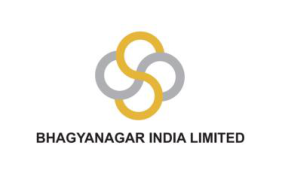

# DEVENDR 

# A SURANA 

Digitally signed by DEVENDRA SURANA DN: c=IN, o=Personal, 2.5.4.20=6C6F75F84CA5C85911968C72528 AE7A54C0B974042BF4EFF3D7D07370BAA4 B74, postalCode=500009, st=Andhra Pradesh, serialNumber=607D07F8956BF819026CD1 662D61125F42D774045E25EE5F0D004422 83B9C39B, cn=DEVENDRA SURANA Date: 2026.02.04 14:38:29 +05'30' 

Date-31st January, 2026 

**[Image: 9b1fc339-afd0-4a63-9000-54490272bb6a.pdf-0002-01.png (282x176, 19.7KB)]**

Time-12:00pm (IST) 

**Finportal:** Good day, and welcome to the Q3FY26 earnings call for **Bhagyanagar India Ltd** . We appreciate your participation as we review the company’s operational and financial performance for the quarter, as well as our strategic outlook moving forward. 

The goal of today’s call is to provide a comprehensive overview of the company’s progress and address any questions from our investors and stakeholders. Please note that this call is being recorded, and some statements made during this session may be forward-looking, based on current assumptions. These statements are subject to risks and uncertainties, and actual results may vary. The company does not assume any obligation to update these statements, except as required by law. We encourage all participants to consider these factors and avoid placing undue reliance on forwardlooking information. 

Representing **Bhagyanagar India Ltd.** today, we have: 

- Mr. Devendra Surana - Managing Director 

- Mr. Narendra Surana - Founder 

- Mr. Advait Surana - Business Development Manager 

- 

   - Mr. Surendra Bhutoria - Chief Financial Officer 

- Mr. Rahul Surana - Financial Manager 

I will now hand the floor over to the management team for their opening remarks. The presentation has been shared with the exchange. Participants can refer it later for the full PPT. Following their address, we will open the floor for the Q&A session. 

Thank you. Over to you. 

**BHAGYANAGAR INDIA LIMITED:** Good morning, everybody. I'm Narendra Surana, founder of the company. I welcome you all to the investor presentation. A detailed brief will be given by the managing director, `Devendra` Surana, and after which, again, I will come back to you regarding some of the real estate development and the de-merger. Thank you. 

Thank you very much for joining us today on this investor earnings call. Very happy to be in front of you the second time, after a very stellar quarterly results, which we have, announced yesterday. For those who have not joined us in the past, I will give a **brief overview** of the journeys of the company. 

- The company started production of copper rod in **1982** , as it was required in those days for a lot of telecom equipment. We started just with the production of copper rods in 1982 with the old technology of bus bar rolling. 

- In **1988** , we upgraded the technology by importing one of the best equipment’s from the world, from Finland, from Outokumpu, with the CC rod, which, gave us a production of 1,000 tons per, 10,000 tons per annum. 

- In **1992** , we started our journey for value-added products. Started with just copper strips, and then enamel wires and other things, which we added as we went on. 

- In **1994** , we added, auto components. 

- In **2004** , we added confirmed extrusion strips in our production lineup. 

- **2007** , we started solar, copper pipes and solar collectors. 

Date-31st January, 2026 Time-12:00pm (IST) 

**[Image: 9b1fc339-afd0-4a63-9000-54490272bb6a.pdf-0003-01.png (282x176, 19.7KB)]**

- In **2012** , we added copper foil and sheets to our product range. 

- However, the game changer for the company started after **2014** and **2017** , when we went into a backward integration and started scrap recycling facility in a 60-acre facility outside of Hyderabad. This is, with a capacity of 25,000 metric tons per annum. So, in the last 10 years, from 2014 to now, we have almost, taken our production 10 times. 

- **2020** , we entered into transformer windings. 

- **2023** , we added solar interconnects, and 

- **2025** , we reached a capacity of 30,000 metric tons. 

- During this year, we are under further additional of capacity. By, end of February, we should reach 35,000 metric tons per annum as our total installed capacity, by February end. 

## We have two plants. 

- One is in, Toopran, which is a 60-acre facility. We have a 60-acre facility, which is housing our main plant, which includes 8-megawatt acres of solar power plants, as we can be seen in the picture. These 60 acres is more than enough for us. For any future expansion, which we can envisage, probably even up to 3 to 4 times the existing capacity, this land parcel will be enough, so we'll never have a shortage of land for any expansion and future. 

- We also have another facility in the city of 4 acres, where we do a lot of value-added products, and a lot of intricate products, especially the solar wires and others. 

Our journey in the initial stages, we started from a commodity, went into value-added products, then went into backward integration and became a total scrap recycling company ensuring that recycling happens, and we are a circular economy. Of late, the government is giving a lot, not only the government, the rest of the world is also giving a lot of importance to ESG- environmental and social governance. We are right in the center of that. And hope to take advantage of this, awareness, as well as, future, options which come along with recycling. 

I will ask Advait to talk a little about the plastic recycling before I take on. Hello? So, one of the core principles of our company is to add as much value as we can to anything that leaves our factory. And with the recent push of circular economy that the government has on the agenda, we decided that we should get into **recycling of plastic** . So currently, as a byproduct of all the scrap that we get, we get around **800 tons of plastic** , as a byproduct, and we are doing around **150 tons of value addition** to this plastic. So, we are currently making LDP granules that go into cables, and we're also doing injection molding of plastic that go into fan bases for OEMs, etc. And in the next year, we're looking to add more processes and more, more machines into our plastic recycling plant. 

We're currently looking to **add PVC granules as another product** that we'll make, which go into shoe bases, and we're going to also **add pyrolysis** , which will convert the plastic into alternative fuel. So from 150 tons of plastic recycling, we're hoping to reach 500 tons by the next year. 

Yeah, that's it. Thank you. 

If you can take it to the financial highlights, I think I can just, talk a little more about the financial performance for the 9 months. So, our company has reached… 

- The **turnover** , which, total turnover of, 1643 cores, which is higher than the entire turnover of the FY25. From 1625 for the whole year last year, we have already reached 1643, and we hope to have the best quarter ahead of us. The January-March quarter is looking very promising. The 1643 crores show a 40% Year-on-year increase compared to the 9 months, ended 31st December 2024. 

- The **EBITDA** of 69.98 cores for the 9 months is also a growth of 172% over the last year's EBITDA. 

Date-31st January, 2026 Time-12:00pm (IST) 

**[Image: 9b1fc339-afd0-4a63-9000-54490272bb6a.pdf-0004-01.png (282x176, 19.7KB)]**

- The **EBITDA margin** of 4.26% for 9 months is also well over double of last year, and the EBITDA margin for the third quarter itself has gone to 4.9%. We are trying to push and see if we can cross 5% over the coming quarters. 

- The **PBT** for 9 months is 43 crores, and the **PAT** is 31.68 crores. The operational PAT being one of the highest we have ever achieved for this company. Advait, can you… I'll request Advait to talk about the value-added products, and what we are planning there. 

So, let me just talk a little bit about our value-added products and new innovations that we've done in the first half here. So, one thing that we've achieved is we've installed **state-of-the-art heat recovery systems on our furnaces.** So, what this does is it not only reduces the cycle time of all the furnaces, but it also reduces the amount of fuel required to make a certain batch. So, in the future, we should be able to see a **big decrease in the fuel cost** , as well as more efficiencies from our furnaces. 

Apart from this, we've also added a few value-added products in our portfolio. As you can see on the screen, the main highlights of these are the **tin and silver-plated copper bus bars that go into AI data centers.** We focus this to be a very big demand sector in the future, upcoming years, and we've already entered this market. It is mainly currently an export market for this product, and we're sending these materials to US and other countries. 

Another product that we have currently entered is **solar wires.** It had been in a prototype stage at a small scale earlier, but now we've expanded, we've gotten a lot more lines of these machines, and we're producing solar interconnect wires that are thin, very fine solar wires coated with a solder that get, soldered onto a solar panel between the cells. And we've also installed state-of-the-art Systems in our, tracking systems in all of our machines, so that we can improve our efficiencies over there as well. Thank you, Advait, for that very interesting area from the factory. 

So, what are we seeing going forward? Copper, as we all know, is the metal of the future. I think all of us have been seeing the retail frenzy which is happening in the market. Everybody is talking about copper being the new gold. And, why is there so much, frenzy for copper in the market? It is because the **three buzzwords** in industry today are **AI, EV, and green energy** . And all these three require much more copper than normal, Usages. So, if you look at green energy, green energy requires about 3.5 times more copper compared to conventional energy. And all additions, or 70% addition to power capacity worldwide, and especially in India, is coming by way of green energy, whether it is wind or solar. So, this will… these augers very well for the copper demand. Similarly, EVs require about 4 times more copper per vehicle if you look at the entire system. So, that also… is, showing a lot of demand for copper growth in future. The third, AI. AI is a power guzzler. And anything which requires power requires a lot of copper. So, all the EV, data centers which are coming are very, very intensive in terms of usage of copper in all forms. So, with this 3, we expect the, demand for copper to boom continuously for the next 10 to 15 years, and we as a company hope to be part of that story. 

We are well poised with our supply chain for **supply of copper scrap** , which we get from all over the world, I think there is no corner of the earth from where we are not getting scrap, whether it is South America, North America, Canada, Europe, UK, Middle East, Southeast Asia, Japan, or, all the way to Australia and New Zealand. We get copper scrap from every corner of the Earth. On the supply side, we have a very, very good, well-established, customer base. We have about **500 customers** , mostly in OEMs, in every sector, starting from electrical to, switch gears to automobiles. So, wherever copper is required, we are well-placed, poised to take advantage of this huge increase in, demand, which is likely to happen over the next few years. 

Date-31st January, 2026 

Time-12:00pm (IST) 

**[Image: 9b1fc339-afd0-4a63-9000-54490272bb6a.pdf-0005-02.png (282x176, 19.7KB)]**

We are also well-poised with having enough land and area, and, we are, fortunate enough to have a team which is capable of, ensuring that we take care of more demand. 

Earlier, we were looking at reaching a turnover of 5,000 crores by the year 2030, but seeing the demand, we have preponed it to 28-29 now, so our target is to reach a 5,000-crore turnover by 28-29, looking at the demand and the growth which is happening in the market. 

Coming forward, we are looking at the **de-merger of this company into two companies** . The Bhagyanagar Copper, which is mainly our copper company, will be demerged into a new company by the name Tieramaet Limited, which will focus primarily on the copper and copper growth which we have outlined so far. 

The rest of the company, which is mainly our… a little bit of wind energy portfolio and real estate, will remain in Bhagyanagar India, which will be the main entity. And the shareholding in the two companies will be a mirror image shareholding. Every shareholder of Bhagyanagar India will get one share of Tieramaet. As regards the future plans of Bhagyanagar India and the real estate portion, I'll request Narendra to share his ideas. 

So, I would like to inform you about the **three land parcels** that we currently hold in the company, these are primarily in the industrial areas, and the state government of Telangana has announced a Hyderabad industrial Transformation policy, which allows for conversion of all industrial lands to commercial or residential property, and they want to push out all the industries from within the ORR, which is the immediate city to outside the ORR, which would be about 25 to 30 kilometers away, and we are already geared up for that by having shifted our main manufacturing to **_Toopran_** , which is just outside the industrial area… outside the Outer Ring Road. So, any kind of expansion or requirement of production would come there, and we have these 3 industrial parcels, out of which…One is in a place called Upal, which has already grown into a semi-urban or urban area, and demand for residential and office space has gone up, quite substantially. And, many new, large companies or national players have already, started setting up their projects in that area. 

So, we have also been in touch with various real estate players, and there is a possibility of constructing approximately 16 lakh square feet or so of residential area in one of our locations, and the likelihood of us getting about 4 lakh square feet without any further investment is possible on that particular location through a joint development with a very well-established player. I cannot name those companies because we have not yet finalized the agreement, and we are hopeful that this would happen before March. So, we are looking forward to very immediate future. 

Apart from this, we have two other land parcels, which are also in very prominent locations, and we will be looking at some kind of development in those areas as well. And we are also, in touch with, the government here, and the Industrial Development Corporation for more such activities, including warehousing, etc., which we have been doing partially on one of our land parcels. So, apart from this, I think, On the real estate, I would like to elaborate a little more in future meetings, but the one at Tupal is looking very promising in the near future. Thank you. 

Thank you, just, to…have the closing remarks before we open it for Q&A. So we are looking at, very good situation for this year end, as well for… as well as for the next year. So… all the things for the 9 months have already been told, and I will, looking forward to your questions, in which I can express some other things which need to be done. 

Date-31st January, 2026 

Time-12:00pm (IST) 

**[Image: 9b1fc339-afd0-4a63-9000-54490272bb6a.pdf-0006-02.png (282x176, 19.7KB)]**

**Finportal:** Thank you so much, team, for a very, detailed insights about the company. We will now move on to the Q&A session. I request the participants who wish to ask a question, to please raise their hand. We will take the first question from Mr. Mitesh Bhandari. 

## **Mitesh Bhandari:** Hello? 

**BHAGYANAGAR INDIA LIMITED:** Yes Mitesh? Yeah, I can hear you, Mitesh. 

**Mitesh Bhandari:** Yes, sir. Very good, good afternoon, and, congratulations for an excellent quarter gone by. And, wishing the journey, picks up a better pace from here on. Sir, what do you expect, the next, year or couple of years, you've set your target for 28-29. I have a couple of questions **. One, is there a threat as the prices of copper go up? Copper is also likely to be, replicated with aluminum in various sectors, as they talk about that metal having similar characteristics, but being lightweight as well.** 

**And second is, on the profitability side, we are at around 1.52% PAT. Is that a, A number is very low, or is there scope for improvement on that?** 

**BHAGYANAGAR INDIA LIMITED:** Okay, thank you for those questions. 

Let me first talk about the replacement with aluminum. Yes, aluminum is a good replacement for copper in terms of the electrical properties, and in a lot of areas which are not very critical, like, transformers, cables and fans. Aluminum is already replacing copper, and we have now been seeing this ratio of copper to aluminum of over 3 - 3.5 for the last 15 years. So the major areas of replacement from copper to aluminum are already over. 

Having said that, I won't say that there are not many more areas where Copper can be replaced by aluminum. There are two areas which are critical where copper only can be used. 

One is the reliability of copper is much higher than aluminum, because aluminum tends to oxidize, and all the connections and other things tend to wear out much faster than copper. Where reliability is high. Aluminum is definitely not taken. Aluminum also takes much more space. So whenever you make any component out of aluminum, the area, space, and the outer coverings, whatever it is. So, for example, if you make a cable. Instead of copper, if you make an aluminum cable, it is cheaper, but however, the size becomes bigger, and the plastic and the other things which go on top. becomes much more expensive. So there is always an area where this cost-benefit analysis comes down. That replacement. Same in motors. Same, in motors or anything. If somebody replaces a motor with aluminum, the size of the motor will become very big. So, all other components will become much more expensive, and the spice will become very big. So, an absolute… more than this, all this, the reliability comes down. Replacement happens, but I think it's been happening for the last 15 years, and there are less and less areas which are still left out for further replacement. 

In terms of profitability, we are looking at EBITDA margins stabilizing around 5% of the turnover. And, as the turnover goes up, our PAT margin will go up from 2% to 3%. That is what we are looking at. While the EBITDA margin remains constant, around 5%, the PAT margin will slowly inch up as our other expenses come down, including interest and other things. 

**Mitesh Bhandari:** Thank you. 

**BHAGYANAGAR INDIA LIMITED:** Thank you. Any other… next question? 

**Finportal:** Thank you, sir. We will move to the next question from Mr. Atul Rawal. Sir, please unmute yourself and ask the question. 

Date-31st January, 2026 

**[Image: 9b1fc339-afd0-4a63-9000-54490272bb6a.pdf-0007-01.png (282x176, 19.7KB)]**

Time-12:00pm (IST) 

**Atul Raval:** Good afternoon, sir. Atul here. 

**BHAGYANAGAR INDIA LIMITED:** Yeah 

**Atul Raval:** Thank you for the information, very nicely presented here. My question is, sir, **in last quarter, In September quarter, we had built up an inventory of copper by infusing around 100 crore into short-term debt. Did we get any benefits out of it in this quarter because of rise in price of copper?** And second question is, **are we left with any inventory at the end of December quarter?** 

**BHAGYANAGAR INDIA LIMITED:** So, thank you for your question, Atul. Yes, the inventory has gone up in September and December quarter because of our higher dependence on the import and our margins have gone up, partly because we are using more of imported copper and less of the domestic copper. We have got some benefit of the buoyancy of the market, but not really inventory gains as such, because Our, mostly our inventory is hedged on a regular basis, while we are doing some dynamic hedging in the… going forward, but most… the profits are mainly from operations and not from inventory gains. 

**Atul Raval:** Okay, sir. One more question. **The land parcels that we are having, and now we are in process of developing the same. Can you just indicate some sort of overall value that we can generate out of it, let's say going forward in 3-4 years?** 

**BHAGYANAGAR INDIA LIMITED:** land parcels value, you want to say? Just 4 lakh square feet. Yeah, actually, what is happening is the western part of the city, the prices have really shot up. And, we are doing a catchup on the prices, of real estate prevalent in Bangalore and Chennai. While the infrastructure quality of infrastructure has far surpassed Bangalore, and many GCCs, the new companies which are coming and setting up their offices in India, are preferring to come to Hyderabad. So, we are seeing a kind of allround development spreading towards the eastern part of the city, where we have more land parcels, because that was predominantly an industrial area. So, we are seeing the pricing go up. 

For example, I could just give an example, not to be noted on that. The price used to be about 5,000 to 6,000 rupees per square feet in the eastern side, and about 12,000 to 15,000 in the western side. Now, we are moving towards 10,000 already on the eastern side, where we have our land parcels, and the demand is also growing up because Many of the IT sector employees have started living in these areas because they were more affordable. So, the entire ecosystem is also developing around this area, and this will further push up the price. 

**Atul Raval:** Thank you, thank you, sir. Thank you for this, and maybe at any convenient time for you, we would like to visit the plants. 

**BHAGYANAGAR INDIA LIMITED:** Yeah, most welcome. We can make call arrangements. 

**Atul Raval:** Yeah, thank you, thank you, sir. 

**Finportal:** Thank you, sir. We will take the next question from Mr. Navin Prasad. 

**Navin Prasad:** Hello, sir. Am I audible? 

**BHAGYANAGAR INDIA LIMITED:** Yeah. 

Date-31st January, 2026 Time-12:00pm (IST) 

**[Image: 9b1fc339-afd0-4a63-9000-54490272bb6a.pdf-0008-01.png (282x176, 19.7KB)]**

**Navin Prasad:** Congrats for the, great set of numbers. I have just one question. As I understood correctly, so **we are planning, and basically exporting a lot of component for the AI-related stuff, right? Do you… and, those are basically on the USA and other, the outside India regions, right? Do you see any competition in the, in those markets? And if there is competition, how we are seeing, pricing around those competitions.** 

**BHAGYANAGAR INDIA LIMITED:** So currently, this market is very new even to us, and we're just in touch with a few companies. So, for us, silver coating and, Tin coating is possible on the bus bar because of the product quality. Our product is of very high quality, and it's very hard for people to match. We've been making this product for over 20 years, and we have a lot of machines, a lot of expertise, and all systems are set in-house. So for anyone to compete with it, it takes a lot of time, a lot of effort, and a lot of R&D. 

So, in the short term, we don't see a lot of competition, and price-wise, I think India is very competitive with most of the… in comparison to other countries. And a lot of these countries that we are selling to, they don't prefer to take material from China, due to their policies, so we're looking at this to be a very big market for us, and not something that anyone else can easily enter. 

Okay So, being a total, manufacture right from scrap to the finished product. Our competitive edge is definitely there when we are looking at this product. The main, thing required for this is a marketing push to ensure that we get more of this. The silver bearing bus bar is basically used very heavily in the, data centers .Thank you. 

**Navin Prasad:** Yeah, and **how we are placing ourself in the India region as well, because it's just booming… starting to boom in the India as well, right? Because it started in USA, I think, back 2-3 years, or 4 years, but now it started becoming a lot of people are coming And trying to open the data center here. So, how we are planning to place ourselves for the India How do you see… kind of demand there as well, yeah.** 

**BHAGYANAGAR INDIA LIMITED:** Yeah, yeah. This product demand in India is very high, and we have one of the biggest market shares in this product in India. Like I said, we have 500 customers all over the country. For bus bars, especially, our products are very well established, and we are, one of the… I think the  biggest player in this area in India. 

**Navin Prasad:** Okay, yeah, thank you, sir. 

**Finportal:** Thank you, sir. We will take the next question from Mr. Vaibhav Gupta. 

**Vaibhav Gupta:** Hello? 

**BHAGYANAGAR INDIA LIMITED:** Yeah, Vaibhav. 

**Vaibhav Gupta:** Hi, am I unable to you sir? 

**BHAGYANAGAR INDIA LIMITED:** Yeah, Vaibhav, tell me. 

**Vaibhav Gupta:** Yeah, so, I'm very new to your company, and I have a couple of questions. 

**BHAGYANAGAR INDIA LIMITED:** Yeah. 

Date-31st January, 2026 Time-12:00pm (IST) 

**[Image: 9b1fc339-afd0-4a63-9000-54490272bb6a.pdf-0009-01.png (282x176, 19.7KB)]**

**Vaibhav Gupta:** So, the, the, basically, **in your presentation, you have mentioned that you are, that your aspiration is to do, 5,000 CRs of revenue in, 28-29, right? So, this is just for the copper business, or, like, it will be including the de-merging of the other businesses as well as on the console business?** 

**BHAGYANAGAR INDIA LIMITED:** So, we'll be demerged, hopefully, in the year 26-27, and 5,000 crores is the, turnover for the copper business. 

**Vaibhav Gupta:** 5,000 is solely for the copper business. 

**BHAGYANAGAR INDIA LIMITED:** That's right. 

**Vaibhav Gupta:** Okay, and **on your debt side, sir, I see that your debt and interest cost is key pricing. So, what is your outlook on that, sir? Are we planning to… how we are planning to reduce the debt and interest costs? Because, you know, it's, it's basically reducing our, lower bottom line as well. So…How do we plan to reduce our interest costs and, that stuff?** 

**BHAGYANAGAR INDIA LIMITED:** So, if you see our long-term debt is almost zero. It is only the working capital debt. As our turnover goes up, and as our, both receivables and, both our receivables as well as our inventory will, go up, hopefully we'll manage with the same inventory, but our receivables might go up in absolute terms. So I'm not looking at really reducing our debt in a big way, other than, getting a higher turnover with the same amount of working capital as what our target is. 

Just on an aside, I think, I don't know whether we have updated this. We were earlier rated as BBB, now we have just got a rating of BBB+. So that will help us reduce our interest cost. We are hoping that by next year end, we should reach, A-, which will further help us reduce our interest costs. 

## **Vaibhav Gupta:** Okay. And, **on the industry side, so how do you see the, you know, the coppers are the, now basically using the data center, renewable, power, and also how do you see the data center renewable and power industries opportunity in coming 4-5 years?** 

**BHAGYANAGAR INDIA LIMITED:** Yeah, that's exactly what I said. I mean, next 5-10, maybe up to at least 2040. I see this, 3 industries booming. I mean, AI, green energy, and EV are, definitely the sunrise industry for the next 10 to 15 years, 10 years at a minimum. And copper industry will grow alongside all these 3 industries, and we are well poised to take advantage of all the three macro growth centers And India is also poised to take advantage of all the three. 

**Vaibhav Gupta:** Okay, and, **on this, 5,000 CRs of top line, what will be, what, what are we planning for the beta margins and 5 margins? With, EBITDA, I guess, 5%, as you mentioned.** 

**BHAGYANAGAR INDIA LIMITED:** Yes, that's right. We are targeting 5% EBITDA margin, and PAT, hopefully, will keep going up, inching slowly up. Towards 3, and maybe slightly beyond 3. 

**Vaibhav Gupta:** Okay, so, 3 for, like, 5,000 topline. 

**BHAGYANAGAR INDIA LIMITED:** Yeah, 3… it might go up a little more than 3. 

**Vaibhav Gupta:** On a conservative way, it would be around 5… 3%. 

**BHAGYANAGAR INDIA LIMITED:** Yeah, 3+. 

Date-31st January, 2026 Time-12:00pm (IST) 

**[Image: 9b1fc339-afd0-4a63-9000-54490272bb6a.pdf-0010-01.png (282x176, 19.7KB)]**

**Vaibhav Gupta:** Okay, perfect. And I just have one last **question on the forefront governance side. What kind of issues are we facing there, sir? Because I saw that there are so many, like, resignation in the upper management in your company, let's say in the last 3-4 years. So, what kinds of issues are there, sir?** 

**BHAGYANAGAR INDIA LIMITED:** Sorry, I didn't get that question again. 

**Vaibhav Gupta:** So, I have a question on the corporate governance side. So, I saw that, I checked your resignation side, basically. So I saw that there are so many resignations on the, of the CS and all upper management, in the last 3-4 years. So, what kind of corporate governance issues are we facing there? **Why there is so many resignations?** 

**BHAGYANAGAR INDIA LIMITED:** Aha. Good question on company secretary. So, if you look at our overall company, the, turnover of our employees is almost, negligible. All the people in my factory, senior staff and, in the office also, we have hardly anything, but unfortunately, that, seat of company secretary seems to be a little jinxed. We have had quite a few resignations. Also, what happens is, A lot of people look at the tag of a 2,000 crore or a 1500 crore listed company. And, get better offers. I think that is the only thing which I can think of, because people are getting a lot of better prospects, having seen that somebody is a company secretary of a thousand crore-plus company. So that is the reason I think we are losing out on that, one area. 

**Vaibhav Gupta:** Okay, okay, that's all from my side. And just last question, **what is your outlook for FY26, sir? Like, the top line EBITDA and margins?** 

**BHAGYANAGAR INDIA LIMITED:** We are looking at at least a 25% growth. This year, we are looking at roughly 35-40%, and next year, at least 25% growth for the next year. In all the three. 

**Vaibhav Gupta:** Okay, okay, okay, fine, thanks. Cool, that's all from my side. Thank you. 

**Finportal:** Thank you, we'll move to the next question from Mr. Rahul Mehta. Please unmute yourself and ask the question. 

**Rahul Mehta:** First of all, congratulations for excellent set of numbers. **First of all, I just wanted to, have an idea about the total valuation of the land parcel that company has right now.** 

**BHAGYANAGAR INDIA LIMITED:** We have 3 land parcels, so… There is a cost which is there by the industrial development area; because all 3 land parcels are in the industrial development area. But because of this new policy of Hyderabad industrial transformation, the Cost has gone up because many real estate developers are wanting to buy land here and develop projects. So, we cannot really give a valuation, but… 

**Rahul Mehta:** So, sir, my question is very basic. **What could be the valuation? If you do buy the civil valuer, right? What is the approximate?** You must be having it in your book value, in the inventory. So, **what is the basic value of the rent parcels that companies carrying?** 

**BHAGYANAGAR INDIA LIMITED:** With the valuation, the circle rate valuation by the SRO, and approximately the land cost in that area, it would be between 200 to 300 crores. 

**Rahul Mehta:** Got it. Okay. Now, sir, coming to the copper, like, **how much this tariff and China competition could bother us?** In the competition. 

Date-31st January, 2026 Time-12:00pm (IST) 

**[Image: 9b1fc339-afd0-4a63-9000-54490272bb6a.pdf-0011-01.png (282x176, 19.7KB)]**

**BHAGYANAGAR INDIA LIMITED:** Fortunately, or whatever, China has never been very active in copper products, anywhere in the world. So, we've never faced competition from China in terms of copper. Competition is mainly from the local players, and we are well-placed to meet any competition because of our integrated operations. So, I don't see much, competition… I mean, competition is always there, but definitely not international competition. 

As far as tariff is concerned, tariff from US… USA is a very small part of our exports, which is also very specialized to data centers, so we are not overly worried about the tariffs from USA. There's a small component of our sales. 

**Rahul Mehta:** Alright, do we have an upper edge compared to China in the tariff is concerned, or it's a flat tariff, as they have it in still in aluminum? 

**BHAGYANAGAR INDIA LIMITED:** So, India is at 50% tariffs, so I don't think we have… see, as I said, US is not a very major market for us, so we really don't concentrate too much on it. I don't think we have an advantage of tariff over USA. However, with the EU FTA, which has now come in. We might look at opening up new markets. So far, we have not been exporting anything to Europe. With the new FTA, maybe that can become a good market for us, because we are very, very competitive in India. 

Especially in the electrical, transformer, and other sectors, and a lot of our customers are MNCs from that area. With the FTA now coming in, I think we might be able to take our business from the Indian subsidiaries to their parents all over the world. We see an advantage over… because of the EU FTA. There is no threat of tariff from USA, because my US exposure is very, very low. 

**Rahul Mehta:** All right, sir, thank you very much, and given an opportunity, we would like to come there and visit, the… 

**BHAGYANAGAR INDIA LIMITED:** Most welcome. We'll coordinate that yeah. 

**Rahul Mehta:** Alright, thank you, thank you so much. 

**Finportal:** Thank you, sir. We will move to the next question from Mr. Aryan Bhatia. 

**Aryan Bhatia:** Thank you. Thanks for the opportunity, sir. **My first question is regarding our realization. So, if I look at, we have sold around 18,000 metric ton of copper, and we have got something revenue of around, 1650 crores. So if I look at the realization, it comes at around 8,50,000, but on the other hand, if I look at your raw material, that is copper cathode, it is trading at around $13,000, which comes to at 12 lakhs, So, how come our realization is, you know, less than our raw material cost? Because the gross margin in industry is around 10%. So, shouldn't our realization should be more than 12 lakh? So, it is coming currently at around 8,50,000. So, could you please help me out why there is such a divergence?** 

**BHAGYANAGAR INDIA LIMITED:** Very interesting question, Aryan. First of all, the copper prices are volatile. And the $13,000 which you see is today. Beginning of the year, it was close to $9,000. So, and we… our raw material is, mainly copper scrap, not copper cathode, which is cheaper than copper cathode. I hope that gives you some idea. Also, I think there is a small element of job work. Do you have the figure? A small amount of our, tonnage is in job work, so that doesn't contribute any top line. But it's a very interesting dynamic which you have just mentioned. We'll also look at this analysis, and hopefully in the next presentation, clarity will be better on this factor. 

Date-31st January, 2026 

Time-12:00pm (IST) 

**[Image: 9b1fc339-afd0-4a63-9000-54490272bb6a.pdf-0012-02.png (282x176, 19.7KB)]**

**Aryan Bhatia:** Okay, and so my question is, like, **what is the current realization in, like, in January we are getting on a part-time basis?** 

**BHAGYANAGAR INDIA LIMITED:** So, our range from commodity to finished products is very, very wide. So, on any given day our ,Yeah. So, on any given day, our realization… for example, yesterday's sale could be from 1280 to 1350 rupees. 

**Aryan Bhatia:** Okay, so can we expect, like, the realization in the next quarter to jump beyond 1,000 per kg, as compared to…current realization 

**BHAGYANAGAR INDIA LIMITED:** Yeah Definitely, it'll be much higher than 1000 per kg, because the commodity price itself has gone up. Just to clarify to you once again, our pricing is based on the current market value of the copper. We have very little long-term contracts, and every order is basically copper plus fabrication. So this… this quarter, the realization per ton will be much higher than the last quarter. And that is the reason one of… for… until last quarter, most of the growth was because of the volume. This quarter, the growth will also be because of the very high value of copper. 

**Aryan Bhatia:** Okay, got it. So, and **my last question is regarding the value-added or commodity. So, how in this industry, like. Is the value-added product defined as, like, bus bar, or wires as compared to commodity? I just wanted to get the sense, what is commodity and what is value-added in the industry? Is commodity wire rod, and value-added bus bars, or strips, or enamel wires?** And the margin difference between them. 

**BHAGYANAGAR INDIA LIMITED:** So mostly commodities we categorize as rods, ingots, something that comes out of the furnace has maybe one process before it's shipped out. And something that's value-added is when it's mixed with other materials, like enamel, like other metals, like silver, tin, where there are many processes involved where there's much higher skilled labor involved. and much more machinery involved, we categorize as value-added. So, in commodity, our margins can be anywhere between 1% to 3%, and in value-added, our margins can be anywhere between 5-10%, if that answers your question. 

**Aryan Bhatia:** Okay, thank you. Thank you and best of luck! 

**Finportal:** Thank you so much, sir. We'll move on to the next question from Mr. Pakshal jain. 

**Pakshal Jain:** Hi sir, am I audible? 

**BHAGYANAGAR INDIA LIMITED:** Yeah, clear. 

**Pakshal Jain:** Thank you so much for the opportunity, sir, and appreciation to the fantastic, numbers. **I just was, needing some color on the Tieramet, that we are… the corporate action that we are going through, which we are, getting a listed entity separate. So, can you give us some idea on what that structure would look like? Because I just want to understand the debt structure, and maybe what assets are going there, or there are just assets that are staying in the current listed entity as well.** 

**And what is the business that is going there exactly, and what would be the debt structure accordingly? Because, just to understand, you know, how that company would function their own.** 

**BHAGYANAGAR INDIA LIMITED:** So, the company will be moved into two parts. 

To keep it very simple, everything which is there in Bhagyanagar India today, in the consolidated balance sheet, will move to the, **Tieramet** , the new company. What will be left out in, the old company, that is 

Date-31st January, 2026 

Time-12:00pm (IST) 

**[Image: 9b1fc339-afd0-4a63-9000-54490272bb6a.pdf-0013-02.png (282x176, 19.7KB)]**

Bhagyanagar India, will be the land parcels and the windmills. And, the book value of the land passes and windmills is roughly about 30 crores. 

So what will be left out in the company, Bhagyanagar India is 30 crores with zero debt. Everything else will move to the new company. So, if you look at the exclusion part, it becomes much easier. 30 crores without any debt, land parcels and windmills will remain in Bhagyanagar India. Everything else in the consolidated balance sheet will go to Bhagyanagar Copper. The scheme, after scheme balance sheet is also given on the website, if you want to have a look at it. 

**Pakshal Jain:** Got it, sir. Thank you so much. I just had one small question. **In the last con call, as you also mentioned, that copper prices, when they're rising, of course, they add a bit to the EBITDA margins, but not as much, because I think that there is a hedge as well, and you mentioned the current con call as well, regarding that. Can you also give us some clarity on the working capital cycle? Because, as you also mentioned last time, that there is a pressure on the working capital, and as we already have a high debt structure. Will this rising copper prices also impact our working capital cycle going forward from Europe? Because in the last con call and this con call. the copper prices have shot up, very hugely. So, what would the impact look like in that sense, in the working capital change?** 

**BHAGYANAGAR INDIA LIMITED:** So, you're absolutely right, as the copper prices go up, while it doesn't have any impact on other issues, the working capital will definitely go up. The number of days in the cycle doesn't change, but the value goes up because everything is much more expensive. So our working capital will go up, our short-term debts from the bank will go up, everything will go up. But what will also happen is our turnover will go up, and hopefully we'll be able to maintain the EBITDA margins. So, it helps us in terms of overall profitability. However, the working capital will definitely go up. Even at the same number of, even at the same cycle of working capital. 

**Pakshal Jain:** That's great, sir. Just one last question, regarding the recycling bit on the… on the newly comthe new company that we are looking at. So, **what are we also looking at the recycling bit, in the sense that, are we also looking at plastic as a recycling material, or what else are we looking at in that company, in terms of this thing, the recycling part?** 

**BHAGYANAGAR INDIA LIMITED:** So, currently, the form in which we import copper, it's mainly wires, household wires, other kinds of cables. So this plastic that we get is mainly our own in-house plastic that we're not buying from outside. So currently, without much value addition, most of it is going outside the company, so we're looking to recycle this plastic in our own company, and we're going to set up a few processes for that. That's what your question is. 

## **Pakshal Jain: So there is a chance of margin improvement, in the current business as well, so that if we are using the product which is not being used to.** 

**BHAGYANAGAR INDIA LIMITED:** Negligible. It'll go up a little bit? It will go up, but it's not… Yeah. …impact much on the… PAT margin shouldn't increase by that much from plastic, from my understanding. So, what happens is, as the copper prices go up, there is a pressure on us, because what happens? The EBITDA per ton. on copper doesn't go up so much. But to maintain that 5% EBITDA margin, we have to do all this type of other things to ensure that even at a higher level of copper, we maintain that 5% margin. 

**Pakshal Jain:** Got it, so that was all looking at the… the EBITDA margins will remain the same. So, got that answer, so thank you so much. 

**BHAGYANAGAR INDIA LIMITED:** Yeah. 

Date-31st January, 2026 

Time-12:00pm (IST) 

**[Image: 9b1fc339-afd0-4a63-9000-54490272bb6a.pdf-0014-02.png (282x176, 19.7KB)]**

**Finportal:** Thank you, sir. We'll move on to the next question from Mr. Madhur Rathi. 

**Madhur Rathi:** So, thank you for the opportunity. Sir, I wanted to understand regarding our raw material sourcing arrangement. Because it seems that this will be the biggest challenge going forward, so if you can help us understand **how do we plan to scale that up to reach the 5,000 crore revenue mark that we have.** 

**BHAGYANAGAR INDIA LIMITED:** So, Madhur, the good thing is that, we have now sourcing arrangements throughout the world, as I said, from South America to Australia to, you know, every corner of the world. And, we have been, present everywhere. We have built up a reputation for being a great company to deal with. We have, sponsored events like, the material recycling conferences, and, put our name right up till there, and created a lot of contacts, links, and relationships all over the world. And, Touchwood. From one year back, when we used to, find it difficult to source material, now we are in a situation to choose our sources of material to ensure that our requirements is full. One of the reasons of our higher inventory is because now we are getting more material than we actually, would want. So hopefully, with this type of, rapport, as well as reputation which we have built up, we should not have a problem sourcing 5,000 crores worth of scrap. 

**Madhur Rathi:** Got it. And sir, **what is your current cost of debt? And you mentioned that we've been upgraded by the credit rating agency, so where do we see this going forward?** 

**BHAGYANAGAR INDIA LIMITED:** Probably about, 8.5 to 9%.And going forward, I guess we may save about 0.25 or so. Post our, upgrade in rating from BBB to BBB+. And we are hoping that after the announcement of our yearly results, we'll try for A-, and that will give us a space of 0.5 to 1% in further reduction of… borrowing cost. 

**Madhur Rathi:** Got it. Sir, what was the… sir, **in our investor presentation, sir, our EBITDA per KG has grown from 19 rupees per, in FY25 9 months, to 37 rupees, sir. So, what was…The inventory gain that led to this increase, and what was the value-added portion that led to this increase?** 

**BHAGYANAGAR INDIA LIMITED:** So, most of this is, only, the value-added portion increase in, The EBITDA margin has gone up, or margin per ton has gone up, mainly because of moving towards value-added products. Even in the commodity sales, we have regretted sales where the margins are lower, and looking at higher margin commodity sales. That has really helped us, increase our margin. Also. there is a secondary level when the prices go up, there is a higher demand from the market, and we are able to get a better, value addition. When there is lower prices, there is less demand from the market, and the margin comes down. But inventory grains is negligible in this. 

**Madhur Rathi:** Okay, so there was no inventory gain during the 9th year. 

**BHAGYANAGAR INDIA LIMITED:** Yeah. 

**Madhur Rathi:** Okay, sir, just a final question from my end. Sir, you may… sir **, what is the area why, area of these three land parcels? And,** 

**For the other two land parcels, or what kind of… so, are we planning residential only, or can we go for the commercial real estate, which can provide a good rental income to the… our subsidiary going forward?** 

**BHAGYANAGAR INDIA LIMITED:** So, one area is prime for residential, which Narendra has already informed you. 

Date-31st January, 2026 

Time-12:00pm (IST) 

**[Image: 9b1fc339-afd0-4a63-9000-54490272bb6a.pdf-0015-02.png (282x176, 19.7KB)]**

The other two areas, we have not yet put it, out there. Both are, again, in the industrial areas. One area can be converted both to residential and offices. One area will probably be better suited for warehouses and others, so we are still looking at the options for the other two. First, we are working on one part of it. 

**Madhur Rathi:** Got it. Sir, that was from mine, sir. Thank you so much, and all the best, and sir, it would be very, sir, so on a valuation front, sir, these rental real estate’s get much better than, residential business, so I would like you to consider those. Sir, thank you so much, and all the best. 

**BHAGYANAGAR INDIA LIMITED:** Thank you so much, Madhur. 

**Finportal:** Thank you, sir. We'll, take the next question from Mr. Mitesh. 

**Mitesh Bhandari:** Sir, I had one follow-on question with respect to recycling, and with respect to competition. So, **there was a recent announcement by Jain Resource Recycling, based out of Chennai, that they're going to put up a copper bus bar plant. And…Again, a flip question related to the same entity. How is it that they are able to generate a much higher market cap because of much higher profitability being in the recycling business? However, we having in-house consumption and a legacy of You know, being in this commodity for a very long period, where are we not able to match up to, the recycling margins which you are now planning to enter?** 

**BHAGYANAGAR INDIA LIMITED:** Yeah, so what Jain is planning in terms of bus bar, we are already doing it for quite a few years. And, you're right, Jain Recycling and us are more or less in the same, space. Both of us are, doing a lot of copper products. But in addition to copper, Jain also does aluminum, lead, and I think plastics in a very big way. We are trying to get into plastics so that our margins can go up. Aluminum and lead being lower value items, the EBITDA margin is normally a little higher as a percentage. Margin per ton, I don't think there'll be too much difference. In terms of valuation, because of our… lower return on capital employed. I think our valuation is not as much. I think Jain and others are able to garner much higher premiums because the return on capital employed is much higher. We have a much higher working capital cycle, that's the reason our, because when we do value-added products, we need to give credit. When we give credit, our cycle becomes slightly longer, and our capital employed is also going up. That is my basic understanding why we are not able to match the Valuation of Jain. 

**Mitesh Bhandari:** Also, in terms of the shareholding, we don't have any, domestic Sorry, sir. Also, **in terms of our shareholding, we don't have institutional shareholding on our, cap table versus them. So, does that also create an impact?** 

**BHAGYANAGAR INDIA LIMITED:** it does create an impact, because, you know, this whole ESG and environment, till, situation, which is giving a lot of premium, we have never been able to garner one, because our market cap is less than 1,000 crores. So, a lot of… we are out of the radar of a lot of companies from that point of view. Hopefully, we should soon get there. 

**Mitesh Bhandari:** Okay, thank you. 

**BHAGYANAGAR INDIA LIMITED:** Thank you very much. Hopefully, all this exercise, what we are doing is also one reason why we make our awareness, and people like you question why we should be valued less. 

**Mitesh Bhandari:** I mean, it's in both our benefits, to, catch up the train sir. 

**BHAGYANAGAR INDIA LIMITED:** Thank you very much. 

Date-31st January, 2026 

Time-12:00pm (IST) 

**[Image: 9b1fc339-afd0-4a63-9000-54490272bb6a.pdf-0016-02.png (282x176, 19.7KB)]**

**Finportal:** Thank you, sir. We have another question from Mr. Atul. So please unmute yourself and ask the question. 

**Atul Raval:** Sir, this is a follow-up question. **Since the copper prices are fluctuating too much. I was just curious about how do we match the import prices of copper scrap vis-a-vis the material that we sell, the final product, since… because of the… so much of fluctuations, maybe, at times it could be gains, at times it could be great losses.** So, if you can throw some light on that. Thank you. 

**BHAGYANAGAR INDIA LIMITED:** Yeah, So, what happens, Atul, the pricing in copper is always based on the LME. So, our purchases and sales are more or less, You can say they match out. So we also buy on the LME basis, we sell on the LME basis. So while on a daily basis there is a lot of fluctuation, 

Also, our sale prices are based only on our purchase price. I mean, today, if I buy at 1000 rupees, I have to sell at 1100 rupees. Tomorrow, if I buy at 1100 rupees, I have to sell at 1210. So that… That, works out straight away. 

**Atul Raval:** Okay, sir. Right. So, normally there would not be kind of fluctuations based on whatever fluctuations are in the prices of copper, translating into… 

**BHAGYANAGAR INDIA LIMITED:** In our Commodity, in our commodity, you can never say never. But at the same time, we manage it very well along with our hedging policies, so that it really doesn't affect our overall working. So we manage the commodity volatility, we have been doing it for the last 40 years, so we are able to manage it reasonably well. Thank you. We'll take the next question. 

**Finportal:** Atul sir, do you have any other question? 

**Atul Raval:** What I see is are some of the recycling companies recently, like one Sunlight Recycling in Gujarat. So, they've been doing it… they are selling it much lower EBITDA margins, but their working capital cycle, or their credit period, is very less. So maybe the kind of bill discounting or something like that. 

**BHAGYANAGAR INDIA LIMITED:** What happens… what happens is sunlight is making CCR. So it is only one process. 

## **Atul Raval:** Okay. 

**BHAGYANAGAR INDIA LIMITED:** So, whereas, we are, and most of the, probably, scrap is domestic. We import the scrap, lead time is longer, our scrap is in the form of cable, we need to process this cable scrap, and then when we make the CCR, we also make value-added products, which again takes a longer lead time. In addition to that, we are giving this to… directly to OEMs rather than to, big businesses which are… big cable companies or others, like Sunlight does, where there is a bulk sale and an immediate payment. We give it to OEMs where there is a 30 days payment cycle. 

**Atul Raval:** Ok sir, thank you. 

**BHAGYANAGAR INDIA LIMITED:** Thank you. 

**Finportal:** Thank you, sir. We have one question in the Q&A tab. How much recycled copper is used inhouse? What has been the impact on margin due to usage of recycled copper? 

Date-31st January, 2026 

**[Image: 9b1fc339-afd0-4a63-9000-54490272bb6a.pdf-0017-01.png (282x176, 19.7KB)]**

Time-12:00pm (IST) 

**BHAGYANAGAR INDIA LIMITED:** So, our predominant use is recycled copper only. And, I mean, we use very little virgin copper. We do use about 10-15% of virgin copper. So, our entire business plan is based on recycled copper. 

**Finportal:** Okay, sir. Do we have any other questions from any other participant? I would like to thank the Management team for a very interactive session. I thank all the participants for joining the session. 

I request all the participants that if any of your question is unanswered, I'm dropping the mail IDs in the chat box. You can reach out to us anytime, and we'll be happy to answer all the questions. 

Thank you, everyone. Thank you so much. You may now disconnect. 

---

## Extracted Images

| # | File | Dimensions | Size |
|---|------|------------|------|
| 1 | 9b1fc339-afd0-4a63-9000-54490272bb6a.pdf-0002-01.png | 282x176 | 19.7KB |
| 2 | 9b1fc339-afd0-4a63-9000-54490272bb6a.pdf-0003-01.png | 282x176 | 19.7KB |
| 3 | 9b1fc339-afd0-4a63-9000-54490272bb6a.pdf-0004-01.png | 282x176 | 19.7KB |
| 4 | 9b1fc339-afd0-4a63-9000-54490272bb6a.pdf-0005-02.png | 282x176 | 19.7KB |
| 5 | 9b1fc339-afd0-4a63-9000-54490272bb6a.pdf-0006-02.png | 282x176 | 19.7KB |
| 6 | 9b1fc339-afd0-4a63-9000-54490272bb6a.pdf-0007-01.png | 282x176 | 19.7KB |
| 7 | 9b1fc339-afd0-4a63-9000-54490272bb6a.pdf-0008-01.png | 282x176 | 19.7KB |
| 8 | 9b1fc339-afd0-4a63-9000-54490272bb6a.pdf-0009-01.png | 282x176 | 19.7KB |
| 9 | 9b1fc339-afd0-4a63-9000-54490272bb6a.pdf-0010-01.png | 282x176 | 19.7KB |
| 10 | 9b1fc339-afd0-4a63-9000-54490272bb6a.pdf-0011-01.png | 282x176 | 19.7KB |
| 11 | 9b1fc339-afd0-4a63-9000-54490272bb6a.pdf-0012-02.png | 282x176 | 19.7KB |
| 12 | 9b1fc339-afd0-4a63-9000-54490272bb6a.pdf-0013-02.png | 282x176 | 19.7KB |
| 13 | 9b1fc339-afd0-4a63-9000-54490272bb6a.pdf-0014-02.png | 282x176 | 19.7KB |
| 14 | 9b1fc339-afd0-4a63-9000-54490272bb6a.pdf-0015-02.png | 282x176 | 19.7KB |
| 15 | 9b1fc339-afd0-4a63-9000-54490272bb6a.pdf-0016-02.png | 282x176 | 19.7KB |
| 16 | 9b1fc339-afd0-4a63-9000-54490272bb6a.pdf-0017-01.png | 282x176 | 19.7KB |
