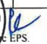
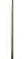

**[Image: ResultJun2026.pdf-0001-00.png (226x63, 10.0KB)]**

# Date: July 31, 2026 

To, 

# **BSE Limited,** 

1st Floor, New Trading Ring, Rotunda Building, PJ Towers, Dalal Street, Mumbai – 400 001 **Scrip Code: 544414** 

**National Stock Exchange of India Limited** Exchange Plaza, Bandra- Kurla Complex, Bandra (East), Mumbai – 400 051 **NSE Symbol: BLUSPRING** 

Dear Sir/ Madam, 

# **Sub: Outcome of Board Meeting of the Company held on July 31, 2026** 

Pursuant to Regulation 30 and 33 of the SEBI (Listing Obligations and Disclosure Requirements) Regulations, 2015, we hereby inform you that the Board of Directors of Bluspring Enterprises Limited (‘the Company’) at its meeting held today, i.e., July 31, 2026, has approved the Unaudited Financial Results (Standalone and Consolidated) for the first quarter ended June 30, 2026. Pursuant to Regulation 33 of the Securities and Exchange Board of India (Listing and Disclosure Requirements) Regulations, 2015 (“Listing Regulations”), we are enclosing herewith the Unaudited (Standalone and Consolidated) financial results along with the Limited Review Report issued by the Statutory Auditors of the Company for the first quarter ended June 30, 2026. 

The Board Meeting commenced at 04:45 P.M. IST and concluded at 06:15 P.M. IST. 

The above information will also be available on the website of the Company at <u>www.bluspring.com.</u> 

Request you to please take the same on record. 

Thanking you. 

Yours sincerely, 

# **For Bluspring Enterprises Limited** 

ARJUN SUNIL Digitally signed by ARJUN SUNIL MAKHECHA MAKHECHA Date: 2026.07.31 20:47:19 +05'30' 

**Arjun Sunil Makhecha Company Secretary & Compliance Officer Membership no. ACS 29253** 

Encl: as above 

**Bluspring Enterprises Limited** 

Regd. Office: 3/3/2, Bellandur Gate, Sarjapur Main Road, Bengaluru – 560103, Karnataka Tel: 080-6105 6001 | E-mail: corporatesecretarial@bluspring.com | CIN: L81100KA2024PLC184648 

**Chartered Accountants** Prestige Trade Tower, Level 19 46, Palace Road, High Grounds Bengaluru·550 001 Karnataka, India 

**Deloitte Haskins & Sells** 

> Tel: +91 80 6188 6000 Fax: +91 80 6188 501 1 

## **INDEPENDENT AUDITOR'S REVIEW REPORT ON REVIEW OF INTERIM CONSOLIDATED FINANCIAL RESULTS** 

### **TO THE BOARD OF DIRECTORS OF BLUSPRING ENTERPRISES LIMITED** 

1. We have reviewed the accompanying Statement of Consolidated Unaudited Financial Results of **BLUSPRING ENTERPRISES LIMITED** ("the Parent") and its subsidiaries (the Parent and its subsidiaries together referred to as "the Group") and its share of the net profit after tax and total comprehensive income of its Joint Venture for the quarter ended June 30, 2026 ("the Statement") being submitted by the Parent pursuant to the requirement of Regulation 33 of the SEBI (Listing Obligations and Disclosure Requirements) Regulations, 2015, as amended ("the Listing Regulations"). 

2. This Statement, which is the responsibility of the Parent's Management and approved by the Parent's Board of Directors, has been prepared in accordance with the recognition and measurement principles laid down in the Indian Accounting Standard 34 "Interim Financial Reporting" ("Ind AS 34"), prescribed under Section 133 of the Companies Act, 2013 read wit h relevant rules issued t hereunder and other accounting principles generally accepted in India and in compliance with the Listing Regulations. Our responsibility is to express a conclusion on the Statement based on our review. 

3. We conducted our review of the Statement in accordance with the Standard on Review Engagements (SRE) 2410 "Review of Interim Financial Information Performed by the Independent Auditor of the Entity", issued by the Institute of Chartered Accountants of India ("ICAI"). A review of interim financial information consists of making inquiries, primarily of Parent's personnel responsible for financial and accounting matters and applying analytical and other review procedures. A review is substantially less in scope than an audit conducted in accordance with Standards on Auditing specified under Section 143(10) of the Companies Act, 2013 and consequently does not enable us to obtain assurance that we would become aware of all significant matters that might be identified in an audit. Accordingly, we do not express an audit opinion. 

We also performed procedures in accordance with the circular issued by the SEBI under Regulat ion 33(8) of the SEBI (Listing Obligations and Disclosure Requirements) Regulations, 2015, as amended, to the extent applicable. 

4. The Statement includes the results of the entities listed in Annexure 1 to this report. 

5. Based on our review conducted and procedures performed as stated in paragraph 3 above and based on the consideration of the review reports of other auditors referred to in paragraph 6 below, nothing has come to our attention that causes us to believe that the accompanying St atement, prepared in accordance with the recognition and measurement principles laid down in the aforesaid Indian Accounting Standard and other accounting principles generally accepted in I ndia, has not disclosed the information required to be disclosed in terms of the listing regulations, including the manner in which it is to be disclosed, or that it contains any material misstatement. 

6. We did not review the interim financial information of 6 subsidiaries included in t he consolidated unaudited financial results whose interim financial information reflect total revenues of Rs. 1,671.81 million, total net loss after tax of Rs. 65.02 million and total comprehensive loss of Rs 85.35 million for the quarter ended June 30, 2026, as considered in the Statement. The consolidated unaudited financial results also includes the Group's share of profit after tax of Rs. 0.83 million and total comprehensive income of Rs. 0.03 million for the quarter ended June 30, 2026, as considered in the Statement, in respect of one joint venture, whose interim financial information have not been reviewed by us. These interim financial information have been reviewed by other auditors whose reports have been furnished to us by the Management and our conclusion on the Statement, in so far as it relates to the amounts and disclosures included in respect of these subsidiaries and joint venture is based solely on the report of the other auditors and the procedures performed by us as stated in paragraph 3 above. 

**[Image: ResultJun2026.pdf-0002-12.png (68x122, 8.6KB)]**

Our conclusion on the Statement is not modified in respect of these matters. 

**Deloitte Haskins & Sells** 

7. The consolidated unaudited financial results includes the interim financial information of 4 subsidiaries which have not been reviewed by their auditors, whose interim financial information reflect total revenue of Rs. 2.09 million, total loss after tax of Rs. 2.64 million and total comprehensive loss of Rs. 2.57 million for the quarter ended June 30, 2026, as considered in the Statement. According to the information and explanations given to us by the Management, these interim financial information are not material to the Group. 

Our Conclusion on the Statement is not modified in respect of our reliance on the interim financial information certified by the Management. 

> For **Deloitte Haskins & Sells** Chartered Accountants 

**[Image: ResultJun2026.pdf-0003-04.png (297x192, 45.4KB)]**

<!-- Start of picture text -->
•~~ 1 Mad~ avi Kalva Partner Membership Number:  213550 UDIN: 26213550EUXRBB7595 <!-- End of picture text -->

Place: Bengaluru Date: July 31, 2026 

Enclosure - Annexure 1 

**Deloitte Haskins & Sells** 

## **Annexure - 1:** 

|**Nature**|**SNo**|**Nameoftheentity**|
|---|---|---|
||1|TerrierSecurityServices(India)Private Limited|
||2|Vedang Cellular Services Private Limited|
||3|TrimaxSmartInfraprojectsPrivate Limited|
||4|Monster.com(India)Private Limited|
||5|Monster.comSGPTELimited|
||6|Monster.com HK Limited|
||7|Agensi Pekerjaan Monster Malaysia Sdn. Bhd(formerly|
|Subsidiaries (including||known asMonsterMalaysia Sdn Bhd)|
| stepsubsidiaries)|8|Blusprinq New Horizon One Private Limited|
||9|Blusprinq New HorizonTwoPrivate Limited|
||10|Bluspring Middle East ContractingLLCSPC(incorporated on April032026)|
||11|BluspringESOPTrust(incorporatedw.e.f.28April2026).|
||12|STEAGEnergy ServicesIndiaPrivate Limited(stepdown subsidiaryw.e.fMay 212026).|
||13|STEAGEnergy Services (Botswana)PlYLimited(stepdown subsidiarvw.e.fMav 212026).|
|JointVenture|1|STEAGO&M Company Private Limited (Joint Venturew.e.f. May 21,2026).|

**[Image: ResultJun2026.pdf-0004-03.png (70x118, 8.4KB)]**

**Bluspring Enterprises Limited** 

Registered Office: 313/2, Bellandur Gate, Sarjapur Road, Bengaluru 560 I 03 CIN: L81100KA2024PLC184648 

**[Image: ResultJun2026.pdf-0005-02.png (30x17, 0.4KB)]**

|Statem|entofconsolidated unaudited financial results forthequarter ended 30 J|une 2026|**Conso**|_(fNR in miflion exce_ **lidated**|_pr per share dara)_|
|---|---|---|---|---|---|
|||| **Quarter ended**||Yearended|
|**SI.No.**| **Particulars**|30June2026|**31March 2026** **(refer note 2)**|**30 June 2025**|**31March 2026**|
|||**(Unaudited)**|**(Unaudited)**|**(Unaudited)**|**(Audited)**|
||**Income** a)Revenue from operations|9,492.89|8,647.98|7,972.30|33,820 34|
||b) Other income|5371|6590|8.67|14873|
||**Total income(a+b)**|**9,546.60**|**8,713.88**|**7,980.97**|**33,969.07**|
|2|**Expenses**|||||
||a)Costofmaterialandstores andspareparts consumed|648 48|666 30|580.05|2,611.37|
||b) Employee benefits expense|7,55773|6,94689|6,380.85|26,90183|
||c) Finance costs|98.27|74 75|74,91|338.22|
||d) Depreciation and amortisation expense|138.11|108.02|122.87|469.88|
||e)Other expenses|1,08122|783.61|894.66|3,52576|
||**Total expenses(a+b **+**c**+**d**+e)|**9,523.81**|**8,579.57**|**8,053.34**|**33,847.06**|
|3|**Profit/(Loss) before shareofprofitofequity accounted investees,**|**22.79**|**134.31**|**(72.37)**|**122.01**|
||**exceptional items and tax(1**-**2)**|||||
|4|Shareofprofitofjointventure accounted for using equity method (netofincome tax)|0.83||||
|5|**Prolit/(Loss) before exceptional items and tax(3**+ 4)|**23.62**|**134.31**|**(72.37)**|**122.01**|
|6|Exceptional items ( refer note6)||5475|12.71|366.34|
|7|**Profit/(Loss) before tax (5**-**6)**|**23.62**|**79.56**|**(85.08)**|**(244.33)**|
|8|**Tax expense/(credit)**|||||
|| Current tax expense|8070|35,37|41,30|190 49|
||Income tax expense/(credit) relating to earlier year Deferred tax expense/( credit)|003 (41.30)|(46.16) 52,08|(54. 84)|(46. 16) (158.26)|
||**Total tax expense/(credit)**|**39.43**|**41.29**|**(13.54)**|**(13.93)**|
|9|**Prolit/(Loss) for the quarter/year (7**-**8)**|**(15.81)**|**38.27**|**(71.54)**|**(230.40)**|
|IO|**Other comprehensive income/(loss)** _(!)Items that will not be reclassified subsequenr/y to projil or loss_|||||
|| Remeasurement loss on defined benefit plans|(7434)|(78.07)|(76.23)|(180 84)|
||Income tax relating to items thatwilInotbereclassified toprofit|1870|21,28|1922|4983|
|| orloss|||||
|| Shareofother comprehensive incomeofjointventure accounted|003||||
||for using equity method (netofincome tax) _(II)hemstharwi/1be reclassified subsequentlyroprofit or loss_|||||
||Foreign exchange differencesontranslationoffinancial |(18.82)|18,36|(1168)|25.62|
||statementsofforeign operations **Other comprehensive loss, netoftaxes**|(74.43)|(38.43)|(68.69)|(105.39)|
|11|**Total comprehensive loss for the quarter/year (9**+**10)**|**(90.24)**|**(0.16)**|**(140.23)**|**(335.79)**|
|12|**Prolit/(loss) attributableto:**|||||
||Ownersofthe Company|(486)|4123|(47 71)|(153 42)|
||Non-controlling interests|(10 95)|(2,96)|(23 83)|(76.98)|
||**Total prolit/(loss) for the quarter/year**|**(15.81)**|**38.27**|**(71.54)**|**(230.40)**|
|13|**Other comprehensive income/(loss) attributableto:**|||||
||Ownersofthe Company|(6108)|(43.33)|(61.19)|(104 93)|
||Non-controlling interests| (13 35)| 4,90| (7.50)| (0.46)|
||**Total other comprehensive income/(loss) for the quarter/year**|**(74.43)**|**(38.43)**|**(68.69)**|**(105.39)**|
|14|**Ttl hi i/(l) ttibtblt **|||||
||**oa compreensve ncomeoss aruaeo:** Ownersofthe Company|(65.94)|(2. 10)|(108.90)|(258 , 35)|
||Non-controlling interests|(2430)|1.94|(3133)|(77.44)|
||**Total comprehensive profit/(loss) for the quarter/year**|**(90.24)**|**(0.16)**|**(140.23)**|**(335.79)**|
|15|**Paid-up equity share capital (Face valueofINR 10.00 per share)**|**1,494.41**|**1,491.32**|**1,489.49**|**1,491.32**|
|16|Reservesi.e other equity||||5.190,88|
||**(**|**not annualised)** |**(not annualised)** |**{not annualised)** 2|(**annualised)** 103|
|||(0.03) (0. 03)|0.28 0 . 27|(0.3) _(0_32)|(.) (103)|

**[Image: ResultJun2026.pdf-0005-04.png (67x63, 8.3KB)]**

**[Image: ResultJun2026.pdf-0005-05.png (65x51, 7.5KB)]**

**[Image: ResultJun2026.pdf-0005-06.png (24x59, 1.3KB)]**

#### **Bluspring Enterprises Limited** 

Registered Office: 3/3/2, Bellandur Gate, Sarjapur Road, Bengaluru 560 I 03 CIN: L8 I I00KA2024PLC I 84648 

Based on the "management approach" as defined in Ind AS I 08 - Operating Segments, the Chief Operating Decision Maker evalL1ates the Grollp performance and allocates resources based on an analysis of various performance indicators by business segments. 

**Statement of consolidated unaudited segment wise revenue, results, assets and liabilities for the quarter ended 30 June 2026** 

||||||_(INRinmillion)_|
|---|---|---|---|---|---|
||||**Consoli**|**dated**||
|||| **Quarter ended** ||**Year ended**|
|SI. No|**Particulars**|**30 June 2026**|**31March 2026** (**refer note**2)|**30 June 2025**|**31March 2026**|
|||**(Unaudited)**|**(Unaudited)**|**(Unaudited)**|**(Audited)**|
|I|**Segment revenue**|||||
||a)Facility Management and Food Services|5,202.70|5,194.36|4,764.64|20,308.80|
||b) Smart Infra, Energy and Engineering• (refer note 5)|2,228.68|1,574.02|1,518.82|6,150.60|
||c) Security Services|1,867.13|1,691.72|1,489.64|6,585.36|
|| d) Foundit|194.38|187.88|199.20|775.58|
||**Total income from operations**|**9,492.89**|**8,647.98**|**7,972.30**|**33,820.34**|
|2 |**Segment results**|||||
||a)Facility Management and Food Services|237.24|243.72|190.14|874.13|
||b)Smart Infra, Energy and Engineering* (refer note 5)|206.72|176.89|115.04|568.65|
||c) Security Services|51.70|58.91|36.14|188.20|
||d)Foundit|(146.94)|(103.48)|(121.35)|(425.88)|
||**Total**|**348.72**|**376.04**|**219.97**|**1,205.10**|
||Less: (i) Unallocated corporate expenses|143.26|124.86|103.23|423.72|
||Less: (ii) Depreciation and amortisation expense|138.11|108.02|122.87|469.88|
||Less: (iii) Finance costs|98.27|74.75|74.91|338.22|
||Add: (iv) Other income|53.71|65.90|8.67|148.73|
||Add: (v) Shareofprofitofequity accounted investees (netofincome tax)|0.83|-|-|-|
||**Protit/(Loss) before exceptional items and tax**|**23.62**|**134.31**|**(72.37)**|**122.01**|
||Exceptional items ( refer note6)|-|54.75|12.71|366.34|
||**Protit/(Loss) before tax**|**23.62**|**79.56**|**(85.08)**|**(244.33)**|
|3 |**Segment assets**|||||
||a)Facility Management and Food Services|9,128.16|8,431.92|8,211.88|8,431.92|
||b) Smart Infra, Energy and Engineering• (refer note 5)|5,774.78|2,344.14|2,430.67|2,344.14|
||c)Security Services|2,042.32|1,552.90|1,498.11|1,552.90|
||d)Foundit|2,228.07|2,229.87|**2,336.93**|2,229.87|
||e)Unallocated|3,871.86|2,345.37|2,910.70|2,345.37|
||**Total**|**23,045.19**|**16,904.20**|**17,388.29**|**16,904.20**|
|4 |**Segment liabilities**|||||
||a)Facility Management and Food Services|3,613.87|3,571.84|3,606.61|3,571.84|
||b) Smart Infra, Energy and Engineering* (refer note 5)|4,579.40|2,060.56|1,592.69|2,060.56|
|| c) Security Services|1,310.05|1,195.44|945.I I|1,195.44|
|| d)Foundit|1,119.35|1,077.68|1,099.58|1,077.68|
||e) Unallocated|4,430.27|1,603.62|2,556.54|1,603.62|
||**Total**|**15,052.94**|**9,509.14**|**9,800.53**|**9,509.14**|

• The segment has been renamed as "Smart Infra, Energy and Engineering" with effect from 1 April 2026. The segment was previously named as "Telecom and Industrials" up to 31 March 2026. 

See accompanying notes to the co~ m.gnaudited financial results. ~~~ i~i;,~~:;:~o/i;; * _6''_ :,...., -:-- • ..-,~'\)✓.., * _t.: ftr~_ ,, \ \;. _/'_ "'-<:;:~,· 

**[Image: ResultJun2026.pdf-0006-07.png (99x92, 14.9KB)]**

**[Image: ResultJun2026.pdf-0006-08.png (82x124, 15.9KB)]**

**Bluspring Enterprises Limited** Registered Office: 3/3/2, Bellandur Gate, Sarjapur Road, Bengaluru 560 I 03 CJN: LSI IO0KA2024PLCl84648 

**Notes for the quarter ended 30 June 2026:** 

   - The consolidated unaudited financial infomiation ofBluspring Enterprises Limited ("the Company") including its subsidiaries,joint venture and Bluspring ESOP Trust (collectively known as the "Group") (as mentioned in Appendix I to these notes) for the quarter ended 30 June 2026 have been taken on record by the Board of Directors at its meeting held on 31 July 2026. The statutory auditors have expressed an unqualified review conclusion on the financial results for the quarter ended 30 June 2026. These consolidated unaudited financial results have been extracted from the consolidated unaudited financial information 

- 2 The consolidated unaudited financial results for the quarter ended 30 June 2026 ("the Statement") includes the consolidated results for the quarter ended 31 March 2026 being the balancing figure of audited figures in respect oflhe full financial year and published unaudited year to date figures upto the end of the third quarter of the respective financial year, which was subject to review by the statutory auditors. 

- 3 The consolidated unaudited financial results and the review report of the statutory auditors is being filed with Bombay Stock Exchange ("BSE") and National Stock Exchange ("NSE") and will be made available on the Company's website www.bluspring.com. 

- **4** The consolidated unaudited financial results have been prepared in accordance with the recognition and measurement principles laid down in the applicable Indian accounting standards prescribed under Section 133 of the Companies Act, 2013, read with relevant rules issued thereunder and other accounting principles generally accepted in India, and in terms or Regulation 33 of the SEBI (Listing Obligations and Disclosure Requirements) Regulations, 2015, as amended. 

- **5 (a) Acquisition:** 

   - **STEAG Energy Services (India) Private Limited ("SES!") (including STEAG Energy Services (Botswana) Proprietary Limited, its subsidiary and investment in STEAG O&M Company Private Limited, a joint venture together referred to as "STEAG")** 

During the quarter, Bluspring New Horizon One Private Limited ("BNHOPL") (a wholly owned subsidiary of the Company) successfully completed the acquisition of SES! on 20 May 2026 for a consideration of INR 1,803,03 million. As the transaction is completed during this quarter, the consolidated unaudited financial results reflects the contribution of STEAG from 21 May 2026 (being the effective date of control) to 30 June 2026. BNHOPL obtained a term loan facility ofINR 1,750.00 million to fund this acquisition. 

The unaudited financial information ofSTEAG for the period from 21 May 2026 to 30 June 2026 are included in "Smart Infra, Energy and Engineering" segment. 

**(b) Proposed acquisition:** 

**LSG Sky Chefs (India) Privat~ Limited ("LSG India"):** 

On 13 April 2026, Bluspring New Horizon Two Private Limited (a wholly owned subsidiary of Bluspring Enterprises Limited) entered into a definitive agreement to acquire I 00% stake in LSG India, a leading provider of in-flight catering and allied aviation services for domestic and international airlines. The total consideration is based on an enterprise value of!NR 1,290.00 million, subject to customary adjustments as set out in the definitive agreements The acquisition shall be completed subject to regulatory approvals and fulfilment of mutually agreed conditions of the definitive agreement. 

- **6 Exceptional items:** 

   - (i} During the previous year ended 3 I March 2026, the Company incurred certain professional fees with respect to acquisition of SES! and LSG India aggregating to fNR 67 79 million (quarter ended 31 March 2026: INR 67, 79 million), 

   - (ii) During the previous year ended 31 March 2026, the Company incurred certain demerger expenses for professional services and certain employee benefits expense aggregating to INR 12.71 million (quarter ended 30 June 2025: INR 12.71 million). 

(iii) On 21 November 2025, the Government of India notified provisions of the Code on Wages, 2019, the Industrial Relations Code 2020, the Code on Social Security, 2020 and the Occupational Safety, Health and Workings Conditions Code, 2020, ("Labour code") which consolidates twenty nine existing labour laws into a unified framework governing employee benefits during the employment and post-employment. 

Based on the guidance issued by the Institute of Chartered Accountants of India, together with the draft Central Rules and FAQs released by the Ministry ofLabour & Employment, the Group has assessed the financial implications of the changes on employee benefits liabilities. The Group has recognised an incremental expense of INR 285.84 million during the previous year ended 31 March 2026 (quarter ended 31 March 2026: credit of!NR 13.04 million) 

- 7 During the quarter ended 30 June 2026, the Company has set-up a Trust "Bluspring ESOP Trust" on 28 April 2026 to administer the Bluspring Enterprises Limited - Employee Stock Option Scheme 2026 and future employee benefit plans. 

for and on behalf of Board of Directors of 

**Bluspring Enterprises Limited** 

**[Image: ResultJun2026.pdf-0007-21.png (227x115, 29.0KB)]**

<!-- Start of picture text -->
/2~ (  'h;ef 1~~\'t!culrve 1~~\'t!culrve  ,~  Officer and and  1:::recut1ve <!-- End of picture text -->

/2~ ( **_'h;ef 1~~\'t!culrve 1~~\'t!culrve_** ,~ **_Officer and and 1:::recut1ve D,rector_** _/JIN: 0980879 3_ Place: Bengaluru 

**[Image: ResultJun2026.pdf-0007-23.png (114x168, 26.8KB)]**

Date: 31 July 2026 

**Bluspring Enterprises Limited** 

Registered Of1ice: 3/3/2, Bellandur Gate, Sarjapur Road, Bengaluru 560 103 CIN L81 I00KA2024PLC184648 

|**Ap1>rndi~**•I|||
|---|---|---|
|**Nature**|**S. No.**|**Enlity name**|
|**Subsidiary/Step-subsidiary**|1|Vedang Cellular Services Private Limited|
||2 3 4|Terrier Security Services (India) Private Limited Monstercom (India) Private Limited Monster.com.SG PTE Limited|
||_5_|Monster,comHKLimited|
||6|Agensi Pekerjaan Monster Malaysia Sdn Bhd|
||7|Trimax Smart lnfraprojects Private Limited|
||**8**|Bluspring New Horizon One Private Limited (incorporatedwef 9 February 2026)|
||9 10 II 12 13|Bluspring New Horizon Two Private Limited (incorporated w.e.f.9 February 2026) Bluspring Middle East Contracting- L.L.C - S.P.C (incorporated w e.f. 3 April 2026) STEAG Energy Services (India) Private Limited (subsidiarywef.21May 2026) STEAG Energy Services (Botswana) Proprietary Limited (step subsidiary w.cf.21May 2026) Bluspring ESOP Trust (set-up w.ef.28 April 2026)|
|**Joint Venlure**|1|STEAG O&M Company Private Limited (Joint venture w.e.f.21May 2026)|

**[Image: ResultJun2026.pdf-0008-03.png (28x32, 2.2KB)]**

**[Image: ResultJun2026.pdf-0008-04.png (72x67, 9.7KB)]**

**[Image: ResultJun2026.pdf-0008-05.png (30x30, 2.3KB)]**

**Chartered Ac:tountants** Prestige Trade Tawer, Level 19 46, Palace Road, High Grounds Bengaluru-560 001 Karnataka, India 

**Deloitte Haskins & Sells** 

Tel: +91 80 6188 6000 Fax: +91 80 6188 601 1 

## **INDEPENDENT AUDITOR'S REVIEW REPORT ON REVIEW OF INTERIM STANDALONE FINANCIAL RESULTS** 

### **TO THE BOARD OF DIRECTORS OF BLUSPRING ENTERPRISES LIMITED** 

1. We have reviewed the accompanying Statement of Standalone Unaudited Financial Results of **BLUSPRING ENTERPRISES LIMITED** ("the Company"), for the quarter ended June 30, 2026 ("the Statement"), being submitted by the Company pursuant to the requirement of Regulation 33 of the SEBI (Listing Obligations and Disclosure Requirements) Regulations, 2015, as amended ("the Listing Regulations"). 

2. This Statement, which is the responsibility of the Company's Management and approved by the Company's Board of Directors, has been prepared in accordance with the recognition and measurement principles laid down in the Indian Accounting Standard 34 "Interim Financial Reporting" ("Ind AS 34"), prescribed under Section 133 of the Companies Act, 2013 read with relevant rules issued thereunder and other accounting principles generally accepted in India and in compliance with Listing Regulations. Our responsibility is to express a conclusion on the Statement based on our review. 

3. We conducted our review of the Statement in accordance with the Standard on Review Engagements (SRE) 2410 "Review of Interim Financial Information Performed by the Independent Auditor of the Entity", issued by the Institute of Chartered Accountants of India ("ICAI"). A review of interim financial information consists of making inquiries, primarily of the Company's personnel responsible for financial and accounting matters, and applying analytical and other review procedures. A review is substantially less in scope than an audit conducted in accordance with Standards on Auditing specified under Section 143(10) of the Companies Act, 2013 and consequently does not enable us to obtain assurance that we would become aware of all significant matters that might be identified in an audit. Accordingly, we do not express an audit opinion. 

4. Based on our review conducted as stated in paragraph 3 above nothing has come to our attention that causes us to believe that the accompanying Statement, prepared in accordance with the recognition and measurement principles laid down in the aforesaid Indian Accounting Standard and other accounting principles generally accepted in India, has not disclosed the informat ion required to be disclosed in terms of the Listing regulations including the manner in which it is to be disclosed, or that it contains any material misstatement. 

For **Deloitte Haskins & Sells** Chartered Accountants Firm Registration Number: 008072S ~ Partner Membership Number: 213550 UDIN :262135S0XSZLFC9519 

**[Image: ResultJun2026.pdf-0009-10.png (234x134, 42.0KB)]**

Place: Bengaluru Date: July 31, 2026 

**Bluspring Enterprises Limited** 

Registered Office: 3/3/2, Bellandur Gate, Sarjapur Road, Bengaluru 560 103 CIN:L81100KA2024PLC184648 

|Stateme|ntofstandalone unaudited financial results for the quarter ended 30 Jun|e 2026||_(INRinmillion exc_|_evt ver share data)_|
|---|---|---|---|---|---|
||||**Stan**|**dalone**||
||||**Quarter ended**||**Year ended**|
|**SI.No.**|**Particulars**|**30 June 2026**|**31March 2026** **(refer note 2)**|**30 June 2025**|**31March 2026**|
|||**(Unaudited)**|**(Unaudited)**|**(Unaudited)**|**(Audited)**|
|I|**Income**|||||
||a) Revenuefromoperations|5,975.98|5,953.26|5,403.73|23,117.63|
|| b)Other income|35.36|35.56|25.96|120.19|
||**Total income(a+b)**|**6,011.34**|**5,988.82**|**5,429.69**|**23,237.82**|
|2|**Expenses**|||||
|| a) Costofmaterial and stores and spare parts consumed|633.86|663.65|578.80|2,603.99|
||b)Employee benefits expense|4,781.45|4,646.86|4,253.29|17,904.79|
|| c)Finance costs|39.95|42.28|40.46|181.96|
||d)Depreciation and amortisation expense|71.11|53.86|70.42|260.92|
|| e) Other expenses|431.80|325.14|482.82|1,935.81|
||**Total expenses(a+b **+**c**+**d**+**e)**|**5,958.17**|**5,731.79**|**5,425.79**|**22,887.47**|
|3|**Profit before exceptional items and tax(1**-**2)**|**53.17**|**257.03**|**3.90**|**350.35**|
|4|Exceptional items (refer note 6)|.|34.75|12.71|291.09|
|5|**Profit/(Loss) before tax(3**-**4)**|**53.17**|**222.28**|**(8.81)**|**59.26**|
|6|**Tax expense/(credit)**|||||
|| Current tax expense/( credit)|39.25|(3.72)|25.00|92.55|
||Income tax relating to earlier year|-|(46.16)|-|(46.16)|
|| Deferred tax expense/( credit)|(25.77)|54.61|(46.80)|(155.12)|
||**Total tax expense/(credit)**|**13.48**|**4.73**|**(21.80)**|**(108.73)**|
|7|**Profit for the quarter/year(5**-**6)**|**39.69**|**217.55**|**12.99**|**167.99**|
|8|**Other comprehensive income/(loss)**|||||
||Items that will not be reclassified subsequentlytoprofit or loss|||||
||Remeasurement gain/(loss) on defined benefit plans|(40.31)|(90.68)|(57.09)|(184.70)|
|| Income tax relating to items that will not be classified to profit or lo|ss 10.15|22.83|14.40|46.49|
||**Total Other comprehensive loss, netoftaxes**|**(30.16)**|**(67.85)**|**(42.69)**|**(138.21)**|
|9|**Total comprehensive income/(loss) for the quarter/year**(7+**8)**|**9.53**|**149.70**|**(29.70)**|**29.78**|
|10|Paid-up equity share capital (Face valueofINR 10.00 per share)|1,494.41|1,491.32|1.489.49|1,491.32|
|II| Reserves i.e. Other equity||||7,200.23|
|12|Earnings per equity share (EPS)|(not annualised)|(not annualised)|(not annualised)|(annualised)|
||(a) Basic (in INR)|0.27|1.46|0.09|1.13|
||(b) Diluted (in INR)|0.26|1.44|0.09|1.12|

See accompanying notes to the standalone unaudited financial results. 

**[Image: ResultJun2026.pdf-0010-04.png (61x80, 9.1KB)]**

**[Image: ResultJun2026.pdf-0010-05.png (39x40, 3.7KB)]**

**Bluspring Enterprises Limited** 

Registered Office: 3/3/2, Bellandur Gate, Sarjapur Road, Bengaluru 560 I 03 CIN: L81 I00KA2024PLCl84648 

##### **Notes for the quarter ended 30 June 2026:** 

- The standalone unaudited financial information of Bluspring Enterprises Limited ("the Company") for the quarter ended 30 June 2026 have been taken on record by the Board of Directors at its meeting held on 31 July 2026 The statutory auditors have expressed an unqualified review conclusion on the financial results for the quarter ended 30 June 2026. These standalone financial results have been extracted from the standalone unaudited financial information. 

- 2 The standalone unaudited financial results for the quarter ended 30 June 2026 ("the Statement") includes the results for the quarter ended 31 March 2026 being the balancing figure of audited figures in respect of the full financial year and published unaudited year to date figures upto the end of the third quarter of the respective financial year, which was subject to review by the statutory auditors. 

- 3 Pursuant to the provisions of the Listing Agreement, the Management has decided to publish consolidated unaudited financial results in the newspapers. The standalone unaudited financial results and the review report of the statutory auditors is being filed with Bombay Stock Exchange ("SSE") and National Stock Exchange ("NSE") and will be made available on the Company's website www.bluspring.com. 

- 4 The standalone unaudited financial results have been prepared in accordance with the recognition and measurement principles laid down in the applicable Indian accounting standards prescribed under Section 133 of the Companies Act, 2013, read with relevant rules issued thereunder and accounting principles generally accepted in India, and in terms of Regulation 33 of the SEBI (Listing Obligations and Disclosure Requirements) Regulations, 2015, as amended. 

- 5 In accordance with Ind AS 108, Operating segments, segment information has been provided in the consolidated unaudited financial results of the Company and therefore no separate disclosure on segment information is given in these standalone unaudited financial results. 

- 6 **Exceptional items:** 

- (i) During the previous year ended 31 March 2026, the Company incurred certain professional fees with respect to acquisition of STEAG Energy Services (India) Private Limited and LSG Sky Chefs (India) Private Limited India aggregating to INR 67.79 million (quarter ended 31 March 2026: INR 67. 79 million). • 

- (ii) During the previous year ended 31 March 2026, the Company redeemed 2,000 Compulsorily Convertible Debentures ("CCDs"), issued by one of its subsidiaries, amounting to INR 20.00 million, and reversed impairment booked during earlier period amounting to INR 20 00 million (quarter ended 3 I March 2026: credit of!NR 20.00 million), 

- (iii) During the previous year ended 31 March 2026, the Company incurred certain demerger expenses for professional services and certain employee benefits expense aggregating to!NR 12.71 million(quarterended30June2025: INR 12.71 million). 

(iv) On 21 November 2025, the Government of India notified provisions of the Code on Wages, 2019, the Industrial Relations Code 2020, the Code on Social Security, 2020 and the Occupational Safety, Health and Workings Conditions Code, 2020, ("Labour code") which consolidates twenty nine existing labour laws into a unified framework governing employee benefits during the employment and post-employment. 

Based on the guidance issued by the Institute of Chartered Accountants of India, together with the draft Central Rules and FAQs released by the Ministry of Labour & Employment, the Company has assessed the financial implications of the changes on employee benefits liabilities. The Company has recognised an incremental expense of INR 230.59 million during the previous year ended 31 March 2026 (quarter ended 31 March 2026: credit of INR 13.04 million). 

- 7 During the quarter ended 30 June 2026, the Company has set-up a Trust "Bluspring ESOP Trust" on 28 April 2026 to administer the Bluspring Enterprises Limited - Employee Stock Option Scheme 2026 and future employee benefit plans. 

- **8 (a) Acquisition:** 

**STEAG Energy Services (India) Private Limited ("SES!") (including STEAG Energy Services (Botswana) Proprietary Limited, its subsidiary and investment in STEAG O&M Company Private Limited, a joint venture together referred to as "STEAG")** 

- During the quarter, Bluspring New Horizon One Private Limited ("BNHOPL") (a wholly owned subsidiary of the Company) successfully completed the acquisition of SES! on 20 May 2026 for a consideration of INR 1,803,03 million 

**(b) Proposed acquisition:** 

##### **LSG Sky Chefs (India) Private Limited ("LSG India"):** 

On 13 April 2026, Bluspring New Horizon Two Private Limited (a wholly owned subsidiary of Bluspring Enterprises Limited) entered into a definitive agreement to acquire I 00% stake in LSG India, a leading provider of in-flight catering and allied aviation services for domestic and international airlines. The total consideration is based on an enterprise value of INR 1,290.00 million, subject to customary adjustments as set out in the definitive agreements. The acquisition shall be completed subject to regulatory approvals and fulfilment of mutually agreed conditions of the definitive agreement. 

> for and on behalf of Board of Directors of **Bluspring Enterprises Limited** 

**[Image: ResultJun2026.pdf-0011-22.png (204x109, 27.1KB)]**

<!-- Start of picture text -->
~..~ <!-- End of picture text -->

~..~ _Chi~(/,xecutive Officer and l:'xecutive Director J)fN: 09808793_ 

**[Image: ResultJun2026.pdf-0011-24.png (33x30, 1.8KB)]**

Place: Bengaluru 

Date: 31 July 2026 

---

## Extracted Images

| # | File | Dimensions | Size |
|---|------|------------|------|
| 1 | ResultJun2026.pdf-0001-00.png | 226x63 | 10.0KB |
| 2 | ResultJun2026.pdf-0002-12.png | 68x122 | 8.6KB |
| 3 | ResultJun2026.pdf-0003-04.png | 297x192 | 45.4KB |
| 4 | ResultJun2026.pdf-0004-03.png | 70x118 | 8.4KB |
| 5 | ResultJun2026.pdf-0005-02.png | 30x17 | 0.4KB |
| 6 | ResultJun2026.pdf-0005-04.png | 67x63 | 8.3KB |
| 7 | ResultJun2026.pdf-0005-05.png | 65x51 | 7.5KB |
| 8 | ResultJun2026.pdf-0005-06.png | 24x59 | 1.3KB |
| 9 | ResultJun2026.pdf-0006-07.png | 99x92 | 14.9KB |
| 10 | ResultJun2026.pdf-0006-08.png | 82x124 | 15.9KB |
| 11 | ResultJun2026.pdf-0007-21.png | 227x115 | 29.0KB |
| 12 | ResultJun2026.pdf-0007-23.png | 114x168 | 26.8KB |
| 13 | ResultJun2026.pdf-0008-03.png | 28x32 | 2.2KB |
| 14 | ResultJun2026.pdf-0008-04.png | 72x67 | 9.7KB |
| 15 | ResultJun2026.pdf-0008-05.png | 30x30 | 2.3KB |
| 16 | ResultJun2026.pdf-0009-10.png | 234x134 | 42.0KB |
| 17 | ResultJun2026.pdf-0010-04.png | 61x80 | 9.1KB |
| 18 | ResultJun2026.pdf-0010-05.png | 39x40 | 3.7KB |
| 19 | ResultJun2026.pdf-0011-22.png | 204x109 | 27.1KB |
| 20 | ResultJun2026.pdf-0011-24.png | 33x30 | 1.8KB |
