**[Image: ResultMarch2026.pdf-0001-00.png (234x63, 12.2KB)]**

<!-- Start of picture text -->
Bluspring <!-- End of picture text -->

# Date: May 19, 2026 

To, 

# **BSE Limited,** 

1st Floor, New Trading Ring, Rotunda Building, PJ Towers, Dalal Street, Mumbai – 400 001 **Scrip Code: 544414** 

**National Stock Exchange of India Limited** Exchange Plaza, Bandra- Kurla Complex, Bandra (East), Mumbai – 400 051 **NSE Symbol: BLUSPRING** 

Dear Sir/ Madam, 

# **Sub: Outcome of Board Meeting of the Company held on May 19, 2026** 

Pursuant to Regulation 30 and 33 of the SEBI (Listing Obligations and Disclosure Requirements) Regulations, 2015 and SEBI (Share Based Employee Benefits and Sweat Equity) Regulations, 2021, we hereby inform you that the Board of Directors of Bluspring Enterprises Limited (‘the Company’) at its meeting held today, i.e., May 19, 2026, has approved the Audited Financial Results (Standalone and Consolidated) of the Company prepared as per Indian Accounting Standard (Ind-AS) for the fourth quarter and year ended March 31, 2026 along with the Audit Report issued by the Statutory Auditors of the Company thereon with unmodified opinion pursuant to Regulation 33 of the Securities and Exchange Board of India (Listing and Disclosure Requirements) Regulations, 2015 (“Listing Regulations”), a copy of which is enclosed herewith. 

Further, a declaration as required under Regulation 33(3)(d) of the Listing Regulations signed by the Chief Financial Officer of the Company is also enclosed herewith. 

The Board Meeting commenced at 04:45 P.M. IST and concluded at 08:00 P.M. IST. 

The above information will also be available on the website of the Company at www.bluspring.com. 

**[Image: ResultMarch2026.pdf-0001-12.png (215x23, 2.9KB)]**

Request you to please take the same on record. 

# **For Bluspring Enterprises Limited** 

ARJUN SUNIL Digitally signed by ARJUN SUNIL MAKHECHA MAKHECHA Date: 2026.05.19 21:59:25 +05'30' 

**Arjun Sunil Makhecha Company Secretary & Compliance Officer Membership no. ACS 29253 Encl: as above** 

### **Bluspring Enterprises Limited** 

Regd. Office: 3/3/2, Bellandur Gate, Sarjapur Main Road, Bengaluru – 560103, Karnataka Tel: 080-6105 6001 | E-mail: corporatesecretarial@bluspring.com | CIN: L81100KA2024PLC184648 

**Deloitte Haskins & Sells** 

**Chartered Ac:countants** Prestige Trade Tower, Level 19 46, Palace Road, High Grounds Bengaluru-560 001 Karnataka, India 

Tel: +91 80 6188 6000 Fax: +91 80 61B8 6011 

## **INDEPENDENT AUDITOR'S REPORT ON AUDIT OF ANNUAL CONSOLIDATED FINANCIAL RESULTS AND REVIEW OF QUARTERLY FINANCIAL RESULTS** 

## **TO THE BOARD OF DIRECTORS OF BLUSPRING ENTERPRISES LIMITED** 

# **Opinion and Conclusion** 

We have (a) audited the Consolidated Financial Results for the year ended March 31, 2026 and (b) reviewed the Consolidated Financial Results for the quarter ended March 31, 2026(refer 'Other Matters' section below), which were subject to limited review by us, both included in the accompanying "Statement of Consolidated Financial Results for the Quarter and Year Ended March 31, 2026 of **BLUSPRING ENTERPRISES LIMITED** (the "Holding Company") and its subsidiaries (the Holding Company and its subsidiaries together referred to as the "Group"), for the quarter and year ended March 31, 2026, (the "Statement"), being submitted by the Holding Company pursuant to the requirements of Regulation 33 of the SEBI (Listing Obligations and Disclosure Requirements) Regulations, 2015, as amended (the "LODR Regulations"). 

# **(a) Opinion on Annual Consolidated Financial Results** 

In our opinion and to the best of our information and according to the explanations given to us, and based on the consideration of the audit reports of other auditors on separate financial statements of the subsidiaries, referred to in Other Matters section below, the Consolidated Financial Results for the year ended March 31, **2026:** 

   - (i) includes the financial results of the subsidiaries as specified in Annexure 1 of the report; 

   - (ii) are presented in accordance with the requirements of the LODR Regulations; and 

   - (iii) gives a true and fair view in conformity with the recognition and measurement principles laid down in the Indian Accounting Standards and other accounting principles generally accepted in India of the consolidated net loss and consolidated other comprehensive loss and other financial information of the Group for the year ended March 31, 2026. 

- **(b) Conclusion on Unaudited Consolidated Financial Results for the quarter ended March 31, 2026** 

With respect to the Consolidated Financial Results for the quarter ended March 31, 2026, based on our review conducted and procedures performed as stated in paragraph (b) of Auditor's Responsibilities section below and based on the consideration of the review reports of other auditors referred to in Other Matters section below, nothing has come to our attention that causes us to believe that the Consolidated Financial Results for the quarter ended March 31, 2026, prepared in accordance with the recognition and measurement principles laid down in the Indian Accounting Standards and other accounting principles generally accepted in India, has not disclosed the information required to be disclosed in terms of LODR Regulations, including the manner in which it is to be disclosed, or that it contains any material misstatement. 

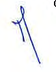

**[Image: ResultMarch2026.pdf-0002-14.png (82x106, 7.9KB)]**

**Deloitte Haskins & Sells** 

**[Image: ResultMarch2026.pdf-0003-01.png (65x17, 0.4KB)]**

**[Image: ResultMarch2026.pdf-0003-02.png (167x17, 1.9KB)]**

**[Image: ResultMarch2026.pdf-0003-03.png (40x15, 0.5KB)]**

**[Image: ResultMarch2026.pdf-0003-04.png (74x17, 0.7KB)]**

**[Image: ResultMarch2026.pdf-0003-05.png (34x21, 0.9KB)]**

**[Image: ResultMarch2026.pdf-0003-06.png (97x17, 2.1KB)]**

**[Image: ResultMarch2026.pdf-0003-07.png (100x17, 2.0KB)]**

# **Basis for Opinion on the Audited Consolidated Financial Results for the year ended March 31, 2026** 

We conducted our audit in accordance with the Standards on Auditing ("SA"s) specified under Section 143{10) of the Companies Act, 2013 (the "Act"). Cur responsibilities under those Standards are further described in paragraph (a) of Auditor's Responsibilities section below. We are independent of the Group in accordance with the Code of Ethics issued by the Institute of Chartered Accountants of India (the "ICAI") together with the ethical requirements that are relevant to Dur audit of the Consolidated Financial Results for the year ended March 31, 2026 urder the provisions of the Act and the Rules thereunder, and we have fulfilled ::iur other ethical responsibilities in accordance with these requirements and the ICA:'s Code of Ethics. We believe that the audit evidence obtained by us and the audit evidence obtained by other auditors in terms of their reports referred to in Other Matters section below, is sufficient and appropriate to provide a basis for our audit opinion. 

# **Management's and Board of Directors' Responsibilities for the Statement** 

This Statement, which includes the Consolidated Financial Results i5: the responsibility of the Holding Company's Board of Directors and has been approved by them for the issuance. The Consolidated Financial Results for the year ended March 31, 2026, has been compiled from the related audited consolidated financial statements. This responsibility includes the preparation and presentation of the Consolidated Financial Results for the quarter and year ended March 31, 2026 that give a true and fair view of the consolidated net profit and consolidated other comprehensive income/ loss and other financial information of the Group in accordance with the recognition and measurement principles laid down in the Indian Accounting Stardards, prescribed under Section 133 of the Act, read with relevant rules issued thereunder and other accounting principles generally accepted in India and in complian:e with the LODR Regulations. 

The respective Board of Directors of the companies included in the Group are responsible for maintenance of adequate accounting records in accordance with the provisions of the Act for safeguarding the assets of the Group and for preventing and detecting frauds and other irregularities; selection and application of appropriate accounting policies; making judgments and estimates that are reasorable and prudent; and the design, implementation and maintenance of adequate internal financial controls, that were operating effectively for ensuring the accuracy :md completeness of the accounting records, relevant to the preparation and presentation of the respective financial results that give a true and fair view and are free from material misstatement, whether due to fraud or error, which have been used for the purpose of preparation of this Consolidated Financial Results by the Directo-s of the Holding Company, as aforesaid. 

In preparing the Consolidated Financial Results, the respective Bocrd of Directors of the companies included in the Group are responsible for assessing the ability of the respective entities to continue as a going concern, disclosing, as a:::>plicable, matters related to going concern and using the going concern basis of acccunting unless the respective Board of Directors either intends to liquidate their respective entities or to cease operations, or has no realistic alternative but to do so. 

The respective Board of Directors of the companies included in the Group are responsible for overseeing the financial reporting process of the GroJp. 

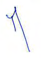

**[Image: ResultMarch2026.pdf-0003-15.png (84x120, 8.1KB)]**

**Deloitte Haskins & Sells** 

**[Image: ResultMarch2026.pdf-0004-01.png (80x17, 0.6KB)]**

**[Image: ResultMarch2026.pdf-0004-02.png (49x17, 0.8KB)]**

**[Image: ResultMarch2026.pdf-0004-03.png (89x15, 1.1KB)]**

**[Image: ResultMarch2026.pdf-0004-04.png (38x13, 0.4KB)]**

**[Image: ResultMarch2026.pdf-0004-05.png (49x15, 0.6KB)]**

**[Image: ResultMarch2026.pdf-0004-06.png (40x17, 0.1KB)]**

**[Image: ResultMarch2026.pdf-0004-07.png (42x21, 1.3KB)]**

**[Image: ResultMarch2026.pdf-0004-08.png (74x17, 1.7KB)]**

**[Image: ResultMarch2026.pdf-0004-09.png (97x17, 2.1KB)]**

**[Image: ResultMarch2026.pdf-0004-10.png (41x17, 1.1KB)]**

# **Auditor's Responsibilities** 

- **(a) Audit of the Consolidated Financial Results for the year ended March 31, 2026** 

Our objectives are to obtain reasonable assurance about whether the Consolidated Financial Results for the year ended March 31, 2C•26 as a whole are free from material misstatement, whether due to fraud or errc·r, and to issue an auditor's report that includes our opinion. Reasonable assurance is a high level of assurance, but is not a guarantee that an audit conducted i7 accordance with SAs will always detect a material misstatement when it exists. ~isstatements can arise from fraud or error and are considered material if, ind vidually or in the aggregate, they could reasonably be expected to influence the economic decisions of users taken on the basis of this Consolidated Fina1cial Results. 

As part of an audit in accordance with SAs, we exercise professional judgment and maintain professional skepticism throughout the audit. We also: 

- Identify and assess the risks of material misstatement of the Annual Consolidated Financial Results, whether due to fraud or error, design and perform audit procedures responsive to those risks, and obtain audit evidence that is sufficient and appropriate to provide a basis for our opinion. The risk of not detecting a material misstatement resulting from fraud is higher than for one resulting from error, as fraud may involve collusion, forgery, intentional omissions, misrepresentations, or the cverride of internal control. 

- Obtain an understanding of internal control relevant to th-= audit in order to design audit procedures that are appropriate in the circumstances, but not for the purpose of expressing an opinion on the effectiveness of such controls. 

- Evaluate the appropriateness of accounting policies used and the reasonableness of accounting estimates made by the Board of Directors. 

- Evaluate the appropriateness and reasonableness of disclosures made by the Board of Directors in terms of the requirements specified under LODR Regulations. 

- Conclude on the appropriateness of the Board of Director!<' use of the going concern basis of accounting and, based on the audit e·,idence obtained, whether a material uncertainty exists related to events or conditions that may cast significant doubt on the ability of the Group to continue as a going concern. If we conclude that a material uncertainty exist5:, we are required to draw attention in our auditor's report to the related disclosures in the Consolidated Financial Results or, if such disclosures are inadequate, to modify our opinion. Our conclusions are based on the audit '=Vidence obtained up to the date of our auditor's report. However, future ev'=nts or conditions may cause the Group to cease to continue as a going con~rn. 

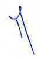

**[Image: ResultMarch2026.pdf-0004-20.png (72x105, 7.4KB)]**

- Evaluate the overall presentation, structure and content of the Annual Consolidated Financial Results, including the disclosures, and whether the Annual Consolidated Financial Results represent the underying tra nsactions and events in a manner that achieves fair presentation. 

**Deloitte Haskins & Sells** 

**[Image: ResultMarch2026.pdf-0005-01.png (33x15, 0.5KB)]**

**[Image: ResultMarch2026.pdf-0005-02.png (298x17, 1.7KB)]**

**[Image: ResultMarch2026.pdf-0005-03.png (88x17, 0.8KB)]**

**[Image: ResultMarch2026.pdf-0005-04.png (38x21, 1.1KB)]**

**[Image: ResultMarch2026.pdf-0005-05.png (74x19, 1.6KB)]**

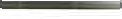

**[Image: ResultMarch2026.pdf-0005-06.png (122x19, 3.1KB)]**

- Perform procedures in accordance with the circular issued by the SEBI under Regulation 33(8) of the LODR Regulations to the extent applicable. 

- Obtain sufficient appropriate audit evidence regarding the Annual Standalone Financial Results/ Financial Information of the entities within the Group to express an opinion on the Annual Consolidated Financicl Results. We are responsible for the direction, supervision and performance of the audit of financial information of such entities included in the Annual Consolidated Financial Results of which we are the independent auditors. For the entities included in the Annual Consolidated Financial Results, which have been audited by the other auditors, such other auditors remain ·esponsible for the direction, supervision and performance of the audits carried out by them. We remain solely responsible for our audit opinion. 

Materiality is the magnitude of misstatements in the An1ual Consolidated Financial Results that, individually or in aggregate, makes it probable that the economic decisions of a reasonably knowledgeable use· of the Annual Consolidated Financial Results may be influenced. We consider quantitative materiality and qualitative factors in (i) planning the scope of our audit work and in evaluating the results of our work; and (ii) to evaluate the effect of any identified misstatements in the Annual Consolidated Financial Results. 

We communicate with those charged with governance of the Holding Company and such other entities included in the Consolidated Financial Results of which we are the independent auditors regarding, among other matters, the planned scope and timing of the audit and significant audit findings including any significant deficiencies in internal control that we identify during our audit. 

We also provide those charged with governance with a statement that we have complied with relevant ethical requirements regarding inde.Jendence, and to communicate with them all relationships and other matters that may reasonably be thought to bear on our independence, and where applicable, related safeguards. 

- **(b) Review of the Consolidated Financial Results for the quarter ended March 31,2026** 

We conducted our review of the Consolidated Financial Results for the quarter ended March 31, 2026 in accordance with the Standard on Re,:iew Engagements (SRE) 2410 'Review of Interim Financial Information Performed by the Independent Auditor of the Entity', issued by the ICAI. A review of interim financial information consists of making inquiries, primarily of the Company's personnel responsible for financial and accounting matters, and applying analytical and other review procedures. A review is substanta11y less in scope than an audit conducted in accordance with SAs specified under Section 143(10) of the Act and consequently does not enable us to obtain assurance that we would become aware of all significant matters that might be identified in an audit. Accordingly, we do not express an audit opinion. 

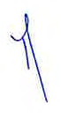

**[Image: ResultMarch2026.pdf-0005-14.png (69x128, 7.5KB)]**

The Statement includes the results of the entities as listed under paragraph (a)(i) of Opinion and Conclusion section above. 

**Deloitte Haskins & Sells** 

**Chartered Accountants** Prestige Trade Tower, Level 19 46, Palace Road, High Grounds Bengaluru-560 001 Karnataka, India 

> Tel: +91 80 6188 6000 Fax: +91 BO 6188 6011 

# **Other Matters** 

- The Statement includes the results for the quarter ended March **31,** 2026 being the balancing figure between audited figures in respect of the full financial year and the published year to date figures up to the third quarter of the current financial year which were subject to limited review by us. Our report is not modified in respect of this matter. 

- The standalone financial information for the corresponding quarter ended on March 31, 2025, as reported in these standalone unaudited financial results, has been extracted by the Management from the financial information of Quess Corp Limited pertaining to Transferred business 2 for the period January 01, 2025 to March 31, 2025.Our report on the Statement is not modified in respect of this matter. 

- We did not audit the financial statements/ financial information of four subsidiaries included in the consolidated financial results, whose financial statements/ financial information reflect total assets of Rs. 4,052.76 million as at March 31, 2026 and total revenues of Rs 1,007.34 million and Rs. 4,149.51 million for the quarter and year ended March 31, 2026 respectively, total net loss after tax of Rs. 42.95 million and Rs. 363.69 million for the quarter and year ended March 31, 2026 respectively and other comprehensive loss of Rs 4.37 million and Rs. 10.01 million for the quarter and year ended March 31, 2026 respectively and net cash inflows of Rs. 21.05 million for the year ended March 31, 2026, as considered in the Statement. These financial statements / financial information have been audited/ reviewed, as applicable, by other auditors whose reports have been furnished to us by the Management and our opinion and conclusion on the Statement, in so far as it relates :o the amounts and disclosures included in respect of these subsidiaries is based solely on the reports of the other auditors and the procedures performed by us as stated under Auditor's Responsibilities section above. 

Our report on the Statement is not modified in respect of the above matters with respect to our reliance on the work done and the reports of other auditors. 

- The consolidated financial results includes the unaudited financial statements/ financial information of four subsidiaries, whose financial sta:ements / financial information reflect total assets of Rs. 36.22 million as at March 31, 2026 and total revenues of Rs 1.75 million and Rs. 7.12 million for the quarter and year ended March 31, 2026 respectively, total net loss after tax of Rs 3.62 million and Rs. 5.92 million for the quarter and year ended March 31, 2026 respectively and other comprehensive loss of Rs 1.26 million and Rs. 2.52 million for the quarter and year ended March 31, 2026 respectively and net cash outflows of Rs. 10.42 million for the year ended March 31, 2026, as considered in the Stateme1t. These financial statements/ financial information are unaudited and have been furnished to us by the Management and our opinion and conclusion on the Statement, in so far as it relates to the amounts and disclosures included in respect of trese subsidiaries, is based solely on such unaudited financial statements/financial information. In our opinion and according to the information and explanations given to us by the Board of Directors, these financial statements / financial information 3re not material to the Group. 

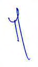

**[Image: ResultMarch2026.pdf-0006-09.png (76x134, 8.7KB)]**

**Deloitte Haskins & Sells** 

**[Image: ResultMarch2026.pdf-0007-01.png (57x17, 0.7KB)]**

**[Image: ResultMarch2026.pdf-0007-02.png (38x15, 0.4KB)]**

**[Image: ResultMarch2026.pdf-0007-03.png (41x15, 0.6KB)]**

**[Image: ResultMarch2026.pdf-0007-04.png (201x15, 1.8KB)]**

**[Image: ResultMarch2026.pdf-0007-05.png (74x17, 0.7KB)]**

**[Image: ResultMarch2026.pdf-0007-06.png (74x17, 1.3KB)]**

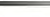

**[Image: ResultMarch2026.pdf-0007-07.png (50x17, 1.1KB)]**

**[Image: ResultMarch2026.pdf-0007-08.png (31x19, 0.7KB)]**

Our report on the Statement is not modified in respect of the above matter with respect to our reliance on the financial statements/ financial information certified by the Board of the Directors. 

For **Deloitte Haskins & Sells** 

Chartered Accountants Firm Registration Number:008072S 

**[Image: ResultMarch2026.pdf-0007-12.png (214x134, 34.9KB)]**

Partner 

Place: Bengaluru Date: May 19, 2026 

Membership Number: 213550 UDIN: _2--6_ J-1.'.355O A 1.'.355O A .'.355O A A _FO Q Q_ k _155"0-1 5"0-1_ 

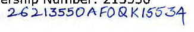

**[Image: ResultMarch2026.pdf-0007-16.png (326x54, 25.2KB)]**

<!-- Start of picture text -->
2--6  J-1.'.355O A 1.'.355O A .'.355O A A  FO Q Q  k  155"0-1 5"0-1 <!-- End of picture text -->

**Deloitte Haskins & Sells** 

# **Annexure 1:** 

|**Nature**|**SI, No.**|**EntitvName**|
|---|---|---|
|Subsidiaries/|1|TerrierSecurityServices(India)Private Limited|
|Step-Subsidiaries|2|Vedang Cellular Services Private Limited|
||3|TrimaxSmartInfraprojectsPrivate Limited|
||4|Monster.com(India)PrivateLimited|
||5|Monster.com.SCIPte.Limited|
||6|Monster.com.HKLimited|
||7|MonsterMalaysia SDN BHD|
||8|Bluspring New Horizon One Private Limited (incorporatedon February192026)|
||9|Bluspring New HorizonTwoPrivate Limited (incorporatedon February192026)|

**[Image: ResultMarch2026.pdf-0009-00.png (71x30, 1.5KB)]**

##### **Bluspring Enlerprises Limited** 

Registered Office 3/3/2. Bel landur Gate, Sarjapur Road, Bengal uru 560 103 CIN: LS I I 00KA2024PLC 184648 

|Statem|entofconsolidated tinaneial results for the quarter and year ended31M|arch 2026||**Consolidated**|_(/NJ/.in million e._|_tccprpershare dotc,)_|
|---|---|---|---|---|---|---|
||||**Quarter ended**||**Year ended**||
|||||||**fortheJICriod**|
|**SI.:-1·0.**| **Particulars**|**31 :\·larch 2026** **(refer note2)**|**31 December** **2025**|**31March 2025** **(refer note2)**|**31 .\'larch 2026**|**11February 202,i** **to31March2025** (**refer note**7)|
|||**(l:naudited)**|**(linauditcd)**|**(t.:naudited)**|**(Audited)**|**(Audited)**|
|I|**Income**||||||
||**a)**Revenue from nperntions|8-64798|8,625 30|&.01506|33,820.34|34,835.72|
||b) Other income|65 90|21.25|4.17|14873|51.14|
||**Total income(a+b)**|**8,713.88**|**8,646.55**|**8,019.23**|**33,969.07**|**34,886.86**|
|2|**E.,penses**||||||
||a) Costofmaterial and store, and spare parts consumed|666.30|70137|593,07|2,611.37|2,311.89|
||b)Employee benefits expense|6.946.89|6,748A2|6,316.08|26,901 .83|27,263.42|
||c) Finance costs|74,75|11064|79 28|338.22|377.92|
||d)Depreciation and amortisation expense|\08,02|112.05|114,65|469.88|504.96|
||e)Other expenses|783.61|935 59|1,058.47|3,525.76|4,445,00|
||**Total expenses(a+b **+**c**+**d**+**e)**|**8,579.57**|**8,608.07**|**8,161.55**|**33,847.06**|**34,903.19**|
|3|**Profit/(loss) before exceptional items and tax**(I - 2)|**134.31**|**38.48**|**(142.32)**|**122.0l**|**(16.33)**|
|4|Exceptional items (refer note6)|54 75|298**88**|61.67|366 34|1,680.27|
|5|**Prolit/(loss) before ta:. (3**-**4)**|**79.56**|**(260.40)**|**(203.99)**|**(244.33)**|**(1,696.60)**|
|6|**Tax (e.,pense)lcrellit**||||||
||Current tax expense|(3537)|(14 90)|(7634)|(190.49)|(232.47)|
||Income tax relatingtoprevious period|4616|-|-|46.16|-|
||DeferredLax(expense)/credil|(5208)|42 96|47 93|158.26|137 85|
||**Total tax (expense)/crt!dit**|**(41.29)**|**21!.06**|**(28,41)**|**13.93**|**(94.62)**|
|7|**Profit/(loss) for the period/year (5**+**6)**|**38.27**|**(232 ..M)**|**(232,411)**|**(230.40)**|**(1,791.22)**|
|**8**|**Othercompnh•nsiveincome**||||||
||_(I)flems1h01willnotbereclassified subseq,.entlyroproJitorloss_||||||
|| Remeasurement gain/(loss) on delined benefit plans|(78.07)|12.07|(4.98)|(180.84)|12.19|
||Income tax relating to items that wi II not be reclassifiedtoprofit orloss|21.28|(035)|1.24|49,83|(3.07)|
||_(fl)Items that,,,,Ifbereclassified subsequently to prafilorloss_ Foreign exchange differences on translationoffinancial |I&.36|3.73|(6.37)|25.62|(3.70)|
||statementsofforeign operations||||||
||**Other comprehensive income/(loss), netoftaxes**|**(38.43)**|**15.45**|**(10.11}**|**(105.39)**|**5.42**|
|9|**Totalcomvnhensiveincomel(loss) for theyeer/pedod**(7+**8)**|**(0.16)**|**(216.89)**|**(242.51)**|**(335.79)**|**(1,785.80)**|
|10|**Profit/(loss) atfributablc to:**||||||
||Ownersofthe Company|4123|( 199,27)|(197.41)|(153.42)|(1.720.32)|
||Non-controlling interests|(296)|(33.07)|(34.99)|(7698)|(70.90)|
||**TolaJ prolit/(loss) for the year/period**|**38.27**|**(232.34)**|**(232.40)**|**(230.40)**|**{1,791.22)**|
|**11**|**Other comprehensive incomc/(loss) attributable to!**||||||
||0-.11er.1oftl1e Company|(43.33)|1668|(7.13)|(104.93)|23.89|
||Non-controlling interests|4,90|(I23)|(298)|(0.46)|(18.47)|
||**Total other rnmprehensive incomel(loss) for lhe year/period**|**(38.43)**|**15.45**|**(10.11)**|**(105.39)**|**5.42**|
|12|**Total comprehensive incomcl(loss) attributable to;**||||||
|| Owner,ofthe Company|(2.10)|( 182.59)|(204.54)|(258.35)|(L69643)|
||Non-controllinginterests| 1.94| (34.30)| (37.97)| (77.44)| (89.37)|
||**Total comprehensive prolit/(Joss) for the year/period**|**(0.16)**|**(216.89)**|**(242.51)**|**(335.79)**|**(1,785.80)**|
|13|**Paid-up equit)" share capital (Face value nr l"iR 10.00Jlo:r~h11r~)**|**1.491.32**|**1,4119.49**|**1.4W>.49**|**l.491.32**|**1.4119.49**|
|I-[.|Reserves i.e. other equity||||5.190.88|5.4619J|
|15|**Earnings per equity sh:u-c**(E**PS)** (alBasic { inl:\"Rl|**(not annualised)** 0 28|**(not annualised)**   ( I 34)|**(not annualised)** l33|**(annualised)** I I 03)|**(annualised)** 1155|
|| {bJDilltled I inINR)'| (I~7| 11J--l)|t.) 1133)| 11 OJI|() \ I I551|

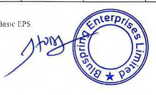

**[Image: ResultMarch2026.pdf-0009-04.png (318x194, 79.5KB)]**

<!-- Start of picture text -->
Basic  l.'PS <!-- End of picture text -->

S..:-i.: f'KL"OlllpilLlYLng not~s to Ll1e: crnisol1d;:itcd li11~111c1JI rc-s.ulls 

"ti,r rh, rcr1ods \\'ilh 11cg,1lll'C ll,1SLC l:J'S. Dilul~d !::I'S \\Ill b~ sam, as Basic l.'PS 

**[Image: ResultMarch2026.pdf-0009-07.png (28x40, 1.0KB)]**

**[Image: ResultMarch2026.pdf-0009-08.png (13x57, 0.9KB)]**

**[Image: ResultMarch2026.pdf-0009-09.png (15x74, 1.5KB)]**

#### **Bluspring Enterprises Lirnittd** 

Registered Office: 3/3/2, Bellandur Gate, Sarjapur Road. Bengaluru 560 I 03 CIN: !.81 l 00KA2024PLC 184648 

|Cons|olidated Balance Sheetasat31March 2026|**Asat**|_(INRinmillion)_ **Asal**|
|---|---|---|---|
|**Parti**|**culars**| **31'Harch 2026** | **31 :\farch 2025** |
|||**(Audited)**|**(Audited)**|
|_I\_|**ASSETS**|||
|I|**Non-current assets**|||
||Property, plant and equipment|263.04 |198.63 |
||Right-of-use assets|535.31|540.25|
||Goodwill|3,932.79|3,860.11|
||Other intangible assets |393.87 |424-24 |
||Intangible assets under developmenl|80.71|**68.85**|
||**Finandal assets**|||
||Investments|350.02|350.02|
||Other financial assets |312.06 |290.68 |
||Deferred tax assets (net)|277.04|309. 73|
||Income tax assets (net)|680.22|4&8.61|
||Other non-current assets|33.30|56.09|
||**Total non-current assets**|**6,858.36**|**6,587.21**|
|2|**Current assets**|||
||Inventories|69.56|74,76|
||**Financial assets**|||
||Trade receivables|||
||- Billed|5,443.85|6,300.04|
||- Unbilled|3,327.30|1.459.74|
||Cash and cash equivalents|498. 72|563.90|
|| Bank balances other than cash and cash equivalents above| 47.39| l 18.19|
|| OtherIinancial assets|211.04|51.51|
||Other current assets|447.98|429.09|
||**Tutal current assets**|**10,045.84**|**8.997.23**|
||**1otal Assets**|**16.904.20**|**15_<;84.44**|
|B|**EQUITY AND LIABILITIES**|||
|I| **Equity**|||
||Equity share capital|1,491.32|1,489.49|
||Share application money pending allotment |1.16|- |
||Other equity|5.190.88|S.461.93|
||TotalEquity**attributable to owners**of**the Company**|**6,683.36**|**6,951.42**|
||Non-control ling interests|**711.70**|**789.14**|
||**Total equity**|**7.395.06**|**7.740.56**|
|2|**Liabilities**|||
||**!'ion-current liabilities**|||
||**Financial liabilities**|||
||Lease liabilities|42 1.54|471.15|
||Provisions|1,507.65|964.37|
||Deferred lax liabilities (net)|45.93|286.71|
||Total**non-current liabilities**|**1,975.12**|**1.722.23**|
|3|**Current liabilities**|||
||**FinancialJiabilities**|||
|| Borrowings|796.03|788.86|
||Lease I iabilities|141.40|138.59|
||Trnde payables|1267.26|662.62|
|| Other financial liahilitics|, 3,83LOO|3,290.91|
||Other current liabilities|1,320.74|l.084.66|
||Provisions| 177.59|156.0 1|
||**Total current liabilities**|**7,534.02**|**6,121.65**|
||**Total Liabilities**|**9.509.14**|**7,843.88**|
||**Total**Eauitv**and Liabilities**|**16 904.20**|**15.584.-14**|

See accompanying notes tu the financial resL1its. 

**[Image: ResultMarch2026.pdf-0010-04.png (332x185, 72.0KB)]**

##### **Bluspring Eoterprises Limited** 

Registered Office: 3/3/2, Bellandur Gate, Sarjapur Road, Bengal uru 560 I 03 CIN: L8 I I 00KA2024PLCI 84648 

|Consolidated statementofcashnow,forwnrended31March 2026||_(fNR_/11_milflo11/ _ Fortheeriod|
|---|---|---|
|**Particulars**|Fortheyearended 31March2026|p 11February2024to 31March2025|
||<Audi ted)|**(Audilcd) **|
|**Cashnowsfrom 011crating activities** Loss after tax| (23040)| (1,79122)|
|**Adjustments to reconcile n~t11rofltto net cash providedbyoperating activities:**|||
|Tax expense/( credit) Itt itfd|( 13.93) 6194|9462  4|
|neresonncomeaxreuns Interestontenn deposits|() (8.17)|(\,67) (30.64)|
|(Profit)/loss on saleofproperty, plant and equipmenl, net |(0.11) |4.61 |
|Employee stock options reversal (net) finance costs|(15.66) 338 .22|(93.81) 377.92|
|Depreciation and amortisation|469,88| 504.96|
|Exceptional items (refer note6)|||
| - !mpairmenlofGoodwillforoneofthe subsidiary||\,500.00|
|- Consideration receivable writtenoff|-|46.00|
|- Expected credit allowanceonflnanciala~sets|-|63.06|
|- Demerger re lated expenses|12.71|7121|
|-Impactofnew wage code|28584|-|
| - Acquisition related expense|.  67.79|-|
|Profiton derecognilion oflea~eliabilityand right-of-useasset|(64.94)|-|
| Foreign exchange (gain )/loss| (12,22)|396|
|Expected credit loss allowance on financialassets|(246.46)|18387|
| Liabilities no longer required written back| -|(164)|
|Bad debts written olT|258.46|-|
|**Operating cash flows before working capital (hangcs**|**779.07**|**918.23**|
|**Changesinopcniting assets and liabililies**|||
|Changesininventories|520|(424)|
| Changesintrade rccci vables and unbi lied revenue Changesinloans, other flnancialassetsand othera5~ets|. (963.33) (203.12)| (1.5I93\J (9301)|
| Changesintrade payables| 604.64| 229.76|
|Changesinother financial liabilities, other liabilities and provisions|679.29|525.25|
|**Cash generated from operalions** Incometaxe5(paid)/refund received, net|**901.75** (385.77)|**56.68** (277.87)|
|**!\'et cash flows from/(used**in)**operating activities (A)**|**515.98**|**(221.19)**|
|**Cash flows rrom investing activities**|||
|Expenditureonproperty, plant and eguipment and intangibles|(280.\3)|(265 33)|
|Proceeds rrom saleofproperty, plant and equipment and intangibles Expenditureforbusiness purchase|0.l l (40.57)|- (20.00)|
|Purchaseoradditional equitysharesofsubsidiary|(4163)|-|
| Placementofbank deposits|. \0.52|-|
|Redemptionofbank deposils |70,80 |46.30 |
|Interest received on term deposits Interest received on incometaxrefund|15.88 61.94|2743 -|
|**:-Oetcash nscdininvesting activities (B)**|**(203.08)**|**(211.60)**|
|**Cash flows from financing activitil'S**|||
|Repaymentoflongterm borrowings|-|(295.94)|
|Pd f ht t bi|1||
|rocees rom sor erm orrowngs Shares issued on exerciseofemployee stock options|7.7 I 83|-|
|Share application money pending allotment|I 16||
| Repaymentoflease liabilities| (191.02)|( \ 59.51)|
|Interest paid Paymentofdividend to non-control Iinginterestofsubsidiary|(197.22) -|(218.62) **C**1.06)|
|**~ ctcashu5eil**in**financing activities (C)**|**(378.08)**|**(675.13)**|
|**:-Oeldttrease**incashandcash equivalents**(A+B+C)**|**(65.18)**|**(l,l07.92)**|
| Cash and cash equivalcnls al the beginningofthe year/period| 563,90| 1.671.82|
|**Cash and cash equivalentsatthe endofthe year/period**|**498.72**|**563.90**|
|**Componentsofcashandcash equi,·olcnts**|||
|Cash on hand ~alanceswithbanks|2.14|-|
|**rncurrentaccoLtnt~** |--19611 |56099 |
|In EEFCacmunl **Cash andcashequh·alentsinconsolidlllccl balance sheet**|0 +7 **498.72**|: 9 I 563.90|

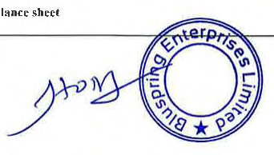

**[Image: ResultMarch2026.pdf-0011-03.png (342x194, 77.5KB)]**

**[Image: ResultMarch2026.pdf-0011-04.png (13x120, 2.1KB)]**

#### Bluspri ng Enterprises Limited Registered Office: 3/3/2, Rcllandur Gate, Sarjapur Road. Bcngaluru 560 103 C JN: L81 l 00KA2024PLC l 84648 

Based on the "management approach" as defined in Ind AS I 08 - Operating Segments, the Chief Operating Decision Maker evaluates the Group performance and allocates resources ba~ed on an analysis of various performance indicators by business segments. 

|Statcmen1ofcomolfdatedsegment wise revenue, results.asset|s and liabilities for|the !Juancr and|yearended31Ma|rch 2026.|_(li'v'R_**_in_**_million)_|
|---|---|---|---|---|---|
||||**Consolidated**|||
|||**t dd**||**\'dd**|**For the eriod11**|
|||**uarer ene**|**'**|**earene**|**p ** **Fb 2024 t**|
|**SI.c\o** **Parlicula rs**|**31.\'larch 2026** **(refer note2)**|**31 December** **2025**|**31:\larch** **2025** **{refer note2)**|**JI :\'larch 2026**|**eruary  o** **31 :\'larch 2025** **(refer note**7)|
||**(Unaudited)**|**(V naudited)**|**(Unaudited)**|**(Audited)**|**(Audited)**|
|**1** **Segment revenue**||||||
|a) Facility Management and Food Services|5,194.36|5,212.65|4,737.76|20,308.80|20)50.33|
|b) Telecom and Industrials|!,574.02|1,505.71|1,614.18|6,150.60|6,486.12|
|c) Security Services|1,691.72|1,726.21|1,474.86|6,585.36|6.604.11|
|d) Foundit|**187.88**|180.73|188.26|775.58|1,395.16|
|**Total income from operations**|**8,647.98**|**8,625.30**|**8,015.06**|**33,/120.34**|**34,835.72**|
|_1_ **Segment results**||||||
|a) Facilily Management and Food Services|243.72|23349|156.31|874.13|926.06|
|b) Telecom and Industrials|176.89|148.94|156.77|568.65|588.81|
|c) Security Services|58.91|42.83|19.4 7|188.20|180.28|
|d) Foundit|(103.48)|(84.28)|( !98.30)|(425.88)|(440.58)|
|**Total**|**376.04**|**340.98**|**134.25**|**1,205.10**|**1,254.57**|
|Less:(i)Unallocated cmporate expenses|124.86|101.06|86.81|423.72|439.16|
|Less: (ii) Depreciation and amortisation expense|!08.02|112.05|114.65|469.88|504.96|
|Less: (iii) Finance costs|74.75|110.64|79.28|338.22|377.92|
|Add: (iv) Other income|65.90|21.25|4.17|148.73|51!4|
|**rrofit/(loss) before exceptional items and tax**|**134.31**|**38.48**|**(142.32)**|**122.01**|**(16.33)**|
|Less: Exceptional items (refer note6)|54.75|298.88|61.67|366.34|1.680.27|
|**Profil/(loss)bdorctax**|**79.56**|**(260.40)**|**(203.99)**|**(244.33)**|**(1,696.60)**|
|3 **s~gmcnt assets**||||||
|a) Facility Management and Food Services|8,431.92|8,396.75|7J91.89|8,431 .92|7,391 .89|
|h) Telecom and Industrials|2,344,14|2,293.73|2,319.IO|2,344.14|2,319.10|
|c) Security Services|1,552.90|1,785.18|1,260.41|1,552.90|1,260.41|
|d) Foundit|2,229.87|2,106.53|2,362.09|2,229.87|2,362.09|
|e) Unallocated|2,345.37|2,584.10|2,250.95|2,345.37|2,250.95|
|**Total**|**16,904.20**|**17,166.29**|**15,584.44**|**16,904.20**|**15,584.44**|
|4 **Segmcnt liabilities**||||||
|**a)**Facility Management and Food Services|3,571 .84|3,529.87|3.176.83|3,571.84|3.176.83|
|b) Telecom and Industrials|2,060.56|1,682.37|1,453.09|2,060.56|1,453.09|
|c) Security Services|1,195.44|1.180.44|916.83|l,l95.44|916.83|
|d) l'oundit|1,077.68|940.17|1.155.71|1,077.68|1,155.71|
|e) Unallocated|1,603.62|2,458.31|1,141.42|1,603.62|Ll41.42|
|**Total**|**9,509.14**|**9,791.16**|**7,843.88**|**9,509.14**|**7,843.88**|

See accompanying notes to the financial results. 

**[Image: ResultMarch2026.pdf-0012-04.png (359x203, 76.0KB)]**

**[Image: ResultMarch2026.pdf-0012-05.png (15x41, 0.4KB)]**

**[Image: ResultMarch2026.pdf-0012-06.png (15x64, 1.1KB)]**

**[Image: ResultMarch2026.pdf-0012-07.png (13x40, 0.6KB)]**

Bluspring Enterprises Limited Registered Office: 31312, Bellandur Gate, Sarjapur Road, Bengaluru 560 I 03 C!N: L81 I00KA2024PI.C184648 

> :\'otes for the quarter and year ended 31 .\farch 2026: 

   - Tile consolidated financ;a1 infom1ation ofBluspring Ente[JJrises Limited ("the Company") including its subsidiaries (collectively known as the "Group") (as mentioned in t\ppendis I lo these nores) for tl1e quaner and year ended 3 I March 20~6 have been taken oJJ record by tl1e Board of Directors at its mc-.:ting held on 19 May 2026. The statutory auditors have expressed an unqual i fled review conclusion on the financial results for the quarter ended _3_ 1 Marcil 2026 and have expressed an unqualified audit opinion on the financial resulls for the year ende<i 31 March ~0~6 These con.solidated financial resulrs have been extracted rrom the consolidated financial infom1ation. 

   - The Statement includes the restilts for the qttarters ended 3 t March 2016 and 31 March 2025 being the balancing 0gurc of audited figures in respect ot· the full linancial years and unaudited year to date figures uplo 1he end of the third quarter of the respective financial years. 

- 3 The Company got listed on Bombay Stock Exchange ("BSE") and National Stock Exchange ("NSE") on 11 June 2025 The consolidated audited financial rcsulis and the audit report of the Statutory Auditors is being filed with Bombay Stock Exchan!,>e ("BSE") and National Stock Exchange ( "NSE") and will be made available on tl1e Co,npany's website www.bIuspring.com. 

- 4 Tile consolidated financial results have been prepaned in accordance with the r.:cognition and measurement principles laid down in the applicable Indian accounting standards prescribed under Section I 33 of the Companies Act, 20 \3, read with relevant rules issued thereunder and other aceoun1ing principles generally accepted in India., and in tenms of Regulation 33 ofll1e SEB! (Listing Obligations and Disclosure Requirements) Regulations, 2015, as amended. • 

- 5 (a) **Propo~ed** acquisitions: 

##### **STEAG Energy Services (India) Private Limite<l ("SES!"):** 

On 19 March 2026, Bluspring New Horizon One Private Limited (a wholly owned subsidiary ofBluspring Enterprises Limited) entered into a definitive agreement to acquire 100% ,hare capital of SESI, a leading provider or operations and maintenance, digital solutions and end-to-end engineering & management advisory services to conventional and renewable power/energy industry across India, Botswana, Middle East and other overseas markets through itself and its subsidiaries. The total consideration payable for the acquisition is JNR 1,800.00 million. The acquisition shall be complcled subjecl to regulatory approvals and fulfilment of mutually agreed conditions of the definitive agreement. 

LSG Sky Chefs (India) Pri,·ate Limited ("LSG India"): 

On 13 April 2026, BIU5pring New l-lorizon Two Private Limited (a wholly owned subsidiary ofBluspring Enterprises Limited) entered into a definitive agreement to acquire 100% .stake in LSG India, a leading provider of in-flight catering and allied aviation services for domestic and international airlines. The total consideration is based on an enterprise value oflNR 1,290 00 million, subject to customary adjustments _as_ set our in the definitive agreements. The acquisition shall be completed subject to re~ulatory approvals and fulfilment of mutually agreed conditions of the definitive agreement. 

   - (h) Acquisition of business of Archer lnt,gratcd Service., Private Limited ('Archer') and Astrin Traders and Supplies Private Limited ('Astrin ') 

   - During tbe period ended 31 Marci, 2025, the Board of Directors of the Company considered and approved 1he Business Transfer Agreement ("BTA') forpurcl, ase of food catering **and facility management services business of Archer and As.trin as a going concern on a slump sale bac;;is for a lump sum ca.sh consideration of lNR l 10.00 m illion. The** consideration was payable subjec1 10 completion of a~recd conditions stated in BTA. 

   - During 1he year ended JI March 2026, the conditions stated in RT _t\_ were satisl1cd and the transactions was completed al a final consideration of INR I 05.44 mill ion, as per terms 

   - ofBTA. Tl1c fair value of net assets acquired including the identified intangibles as on rhc acquisilion date as a pan of the 1ransaction amounted to INR 84.89 million. The excess of purchase consideration over the fair value uf net asselS acquired has been attributed towards goodwill aggregating to INR _20.55_ million. The goodwill is attributable to operational .synergies including revenues from new customers, Rcst1lts fron11l1is acquisition and goodwill are included under Facility management and food services segment 

- **6 Exceptional Items:** (i) Durillg the quarter and year ended 31 March 2026, the Compant· incurred cer1ain professional lees with respect to proposed acquisilion of SESI and LSG India by its wholly **owned subsidiaries aggregates to INR 67.79 million.** 

   - (iii) During the year ended 31 Manch 2026, the Company incurred certain demcrger expenses for professional services and certain employee benefits expense aggregating to INR 12 71 million 

   - (iv) On 21 November _2025,_ the Government oflndia notified provisions of the Code on Wages. 2019, the Industrial Relations Code 2020, the Code on Social Security, 2020 and the Occupational Safety, Health and Workings Conditions Code, 2020, ("Labour code") which consolidates twenty nine existing labour laws into a unified framework governing employee benefits during lhe employment and post-employment, 

   - Based on the guidance issued by the lnsti1ute of Chartered Accountants of India, 1ogc1hcr with the draft Central Rules and fAQs released by the Ministry of Labour & Employment, the Group has assessed the financial implications of the changes on employee benefits liabilities. The Group has recognised an incremental expense of INR 298.88 million during the q uane r ended J t December 20 25. 

During the quarter ended 31 March 2026, the management ~assessed the impact of the above change based on the revised pay structure, which resulted in a credit of INR 13.04 million in the standalone financial results. Accordingly, for the year cndcd 3 I March 2026, the not expense recognised in 'Exceptional items' aggregates ro !NR 285.84 million. 

- 7 In accordance with the composite scl,eme of arrangement between Qucss Co[JJ Limited (··uemcrgcd Company"), Uigitidc Solutions i,imited r·Re.sulting Company r ·i and Bluspring £n1erprises Limited ("Resulting Company 2") and their respective shareholder;; and creditors ( referred as "Scheme of Arrangement") the demerged Company carried out the activities of Transferred Businesses :! in trust fur the Company upto effective date i.e. 3 I March 2025, The comparative financial information of the Company have been prepared as of and for rhe period from I I February 1024 (Date of Incorporation) to 31 March 2025, in accordance with Appendix _C_ to Ind AS I 03 -·Business Combinations" by using the financial information maintained by 1hc Ucmcrgcxl Company. 

_{,11·_ and on behalf of lloard of Direclors of **Rluspring Enterprises Limiletl** 

**[Image: ResultMarch2026.pdf-0013-22.png (198x118, 27.6KB)]**

<!-- Start of picture text -->
j._t,~ ../  (  "h1ej l:~\'i!C/tOve (?(lic:er (?(lic:er a11d fxec:i,11ve <!-- End of picture text -->

_j._t,~_ ../ _(_ **_"h1ej l:~\'i!C/tOve (?(lic:er (?(lic:er a11d fxec:i,11ve /),rectrJJ-_** _l)f:V: ii'Jl///,F93_ ~lac~: flengaluru IJatc: t 9 May _1016_ 

**[Image: ResultMarch2026.pdf-0013-24.png (184x201, 53.4KB)]**

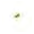

**[Image: ResultMarch2026.pdf-0013-25.png (34x34, 0.9KB)]**

**[Image: ResultMarch2026.pdf-0013-26.png (15x64, 0.8KB)]**

**[Image: ResultMarch2026.pdf-0013-27.png (15x62, 0.8KB)]**

**Bluspring Enterpris,:s** Limited Registered Office: 3/JC., Bellandur Gate. Sarjapur Road. Bengaluru S60 I 03 CJN, L81 I00KA2024PLCl8464B 

**Nature S. No. Entity name Subsidiary/ Step-subsidia11** I Vedang Cellular Services Private Limited 2 Terrier Security Services (India) Private Limited J Monster.com (India) Private Limitc-<l 4 Monsrer.com.SG PTE Limited 5 Monster.corn HK Limited 6 Agens i Pekerj aan Monster Malaysia Sdn. B hd 7 Trimax Smart lnfraprojects Private Limited 8 Bluspring New Horiion One Private Limited (incorporated w.e.fl9 February2026) 9 Bluspring New Horizon Two Private Limilcd ( incorporated w.e f 19 February 2026) 

**[Image: ResultMarch2026.pdf-0014-02.png (293x184, 65.2KB)]**

**[Image: ResultMarch2026.pdf-0014-03.png (15x176, 2.8KB)]**

**Deloitte Haskins & Sells** 

**Chartered Accountants** Prestige Trade Tower, Level 19 46, Palace Road, High Grounds Bengaluru-560 001 Karnataka, I ndla 

Tel: +91 80 6188 5000 Fax: +91 80 6188 6011 

# **INDEPENDENT AUDITOR'S REPORT ON AUDIT OF ANNUAL STANDALONE FINANCIAL RESULTS AND REVIEW OF QUARTERLY FINANCIAL RESULTS** 

## **TO THE BOARD OF DIRECTORS OF BLUSPRING ENTERPRISES LIMITED** 

## **Opinion and Conclusion** 

We have (a) audited the Standalone Financial Results for the year ended March 31, 2026 and (b) reviewed the Standalone Financial Results for the quarter ended March 31, 2026 (refer 'other Matters' section below), which were subject to limited review by us, both included in the accompanying ''Statement of Standalone Financial Results for the Quarter and Year Ended March 31, 2026 of **BLUSPRING ENTERPRISES LIMITED** {the "Company"), (the "Statement"), being submitted by the Company pursuant to the requirements of Regulation 33 of the SEBI (Listing Obligations and Disclosure Requirements) Regulations, 2015, as amended (the "LODR Regulations"). 

# **(a) Opinion on Annual Standalone Financial Results** 

In our opinion and to the best of our information and according to the explanations given to us, the Standalone Financial Results for the year ended March 31, 2026: 

- i. are presented in accordance with the requirements of the LODR Regulations; and 

- ii. gives a true and fair view in conformity with the recognition and measurement principles laid down in the Indian Accounting Standards and other accounting principles generally accepted in.India of the net profit and other comprehensive loss and other financial information of the Company for the year then ended. 

# **(b) Conclusion on Unaudited Standalone Financial Results for the quarter ended March 31, 2026** 

With respect to the Standalone Financial Results for the quarter ended March 31, 2026, based on our review conducted as stated in paragraph (b) of Auditor's Responsibilities section below, nothing has come to our attention that causes us to believe that the Standalone Financial Results for the quarter ended March 31, 2026, prepared in accordance with the recognition and measurement principles laid down in the Indian Accounting Standards and other accounting principles generally accepted in India, has not disclosed the information required to be disclosed in terms of the LODR Regulations, including the manner in which it is to be disclosed, or that it contains any material misstatement. 

# **Basis for Opinion on the Audited Standalone Financial Results for the year** 

# **ended March 31, 2026** 

We conducted our audit in accordance with the Standards on Auditing ("SA"s) specified under Section 143(10) of the Companies Act, 2013 (the "Act"). Our responsibilities under those Standards are further described in paragraph (a) of Auditor's Responsibilities section below. We are independent of the Company in accordance with the Code of Ethics issued by the Institute of Chartered Accountants of India (the "ICAI") together with the ethical requirements that are relevant to our audit of the Standalone Financial Results for the year ended March 31, 2026 under the provisions of the Act and the Rules thereunder, and we have fulfilled our other ethical responsibilities in 

**[Image: ResultMarch2026.pdf-0015-16.png (15x167, 2.5KB)]**

**[Image: ResultMarch2026.pdf-0015-17.png (82x132, 8.8KB)]**

**Deloitte Haskins & Sells** 

accordance with these requirements and the ICAI's Code of Ethics. We believe that the audit evidence obtained by us is sufficient and appropriate to provide a basis for our audit opinion. 

# **Management's and Board of Directors' Responsibilities for the Statement** 

This Statement which includes the Standalone Financial Results is the responsibility of the Company's Board of Directors and has been approved by them for the issuance. The Standalone Financial Results for the year ended March 31, 2026 has been compiled from the related audited standalone financial statements. This responsibility includes the preparation and presentation of the Standalone Financial Results for the quarter and year ended March 31, 2026 that give a true and fair view of the net profit and other comprehensive loss and other financial information in accordance with the recognition and measurement principles laid down in the Indian Accounting Standards prescribed under Section 133 of the Act read with relevant rules issued thereunder and other accounting principles generally accepted in India and in compliance with the LODR Regulations. This responsibility also includes maintenance of adequate accounting records in accordance with the provisions of the Act for safeguarding the assets of the Company and for preventing and detecting frauds and other irregularities; selection and application of appropriate accounting policies; making judgments and estimates that are reasonable and prudent; and the design, implementation and maintenance of adequate internal financial controls that were operating effectively for ensuring the accuracy and completeness of the accounting records, relevant to the preparation and presentation of the Standalone Financial Results that give a true and fair view and is free from material misstatement, whether due to fraud or error. 

In preparing the Standalone Financial Results, the Board of Directors is responsible for assessing the Company's ability, to continue as a going concern, disclosing, as applicable, matters related to going concern and using the going concern basis of accounting unless the Board of Directors either intends to liquidate the Company or to cease operations, or has no realistic alternative but to do so. 

**[Image: ResultMarch2026.pdf-0016-05.png (15x41, 0.4KB)]**

**[Image: ResultMarch2026.pdf-0016-06.png (15x57, 0.7KB)]**

The Board of Directors is also responsible for overseeing the financial reporting process of the Company. 

# **Auditor's Responsibilities** 

# **(a) Audit of the Standalone Financial Results for the year ended March 31, 2026** 

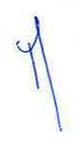

**[Image: ResultMarch2026.pdf-0016-10.png (80x144, 10.3KB)]**

Our objectives are to obtain reasonable assurance about whether the Standalone Financial Results for the year ended March 31, 2026 as a whole are free from material misstatement, whether due to fraud or error, and to issue an auditor's report that includes our opinion. Reasonable assurance is a high level of assurance, but is not a guarantee that an audit conducted in accordance with SAs will always detect a material misstatement when it exists. Misstatements can arise from fraud or error and are considered material if, individually or in the aggregate, they could reasonably be expected to influence the economic decisions of users taken on the basis of this Standalone Financial Results. 

**[Image: ResultMarch2026.pdf-0016-12.png (28x186, 6.4KB)]**

**Deloitte Haskins & Sells** 

As part of an audit in accordance with SAs, we exercise professional judgment and maintain professional skepticism throughout the audit. We also: 

- Identify and assess the risks of material misstatement of the Annual Standalone Financial Results, whether due to fraud or error, design and perform audit procedures responsive to those risks, and obtain audit evidence that is sufficient and appropriate to provide a basis for our opinion. The risk of not detecting a material misstatement resulting from fraud is higher than for one resulting from error, as fraud may involve collusion, forgery, intentional omissions, misrepresentations, or the override of internal control. 

**[Image: ResultMarch2026.pdf-0017-03.png (13x42, 0.5KB)]**

- Obtain an understanding of internal control relevant to the audit in order to design audit procedures that are appropriate in the circumstances, but not for the purpose of expressing an opinion on the effectiveness of the Company's internal control. 

- Evaluate the appropriateness of accounting policies used and the reasonableness of accounting estimates made by the Board of Directors. 

- Evaluate the appropriateness and reasonableness of disclosures made by the Board of Directors in terms of the requirements specified under Regulation 33 of the LODR Regulations. 

- Conclude on the appropriateness of the Board of Directors' use of the going concern basis of accounting and, based on the audit evidence obtained, whether a material uncertainty exists related to events or conditions that may cast significant doubt on the ability of the Company to continue as a going concern. If we conclude that a material uncertainty exists, we are required to draw attention in our auditor's report to the related disclosures in the Statement or, if such disclosures are inadequate, to modify our opinion. Our conclusions are based on the audit evidence obtained up to the date of our auditor's report. However, future events or conditions may cause the Company to cease to continue as a going concern. 

**[Image: ResultMarch2026.pdf-0017-08.png (15x120, 0.9KB)]**

- Evaluate the overall presentation, structure and content of the Annual Standalone Financial Results, including the disclosures, and whether the Annual Standalone Financial Results represent the underlying transactions and events in a manner that achieves fair presentation. 

- Obtain sufficient appropriate audit evidence regarding the Annual Standalone Financial Results of the Company to express an opinion on the Annual Standalone Financial Results. 

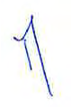

**[Image: ResultMarch2026.pdf-0017-11.png (80x121, 8.5KB)]**

Materiality is the magnitude of misstatements in the Annual Standalone Financial Results that, individually or in aggregate, makes it probable that the economic decisions of a reasonably knowledgeable user of the Annual Standalone Financial Results may be influenced. We consider quantitative materiality and qualitative factors in (i) planning the scope of our audit work and in evaluating the results of our work; and (ii) to evaluate the effect of any identified misstatements in the Annual Standalone Financial Results. 

> We communicate with those charged with governance regarding, among other matters, the planned scope and timing of the audit and significant audit fi ndings including any significant deficiencies in internal control that we identify during our audit. 

**[Image: ResultMarch2026.pdf-0017-14.png (15x49, 1.3KB)]**

**[Image: ResultMarch2026.pdf-0017-15.png (22x191, 6.6KB)]**

**[Image: ResultMarch2026.pdf-0017-16.png (28x41, 2.0KB)]**

**Deloitte Haskins & Sells** 

We also provide those charged with governance with a statement that we have complied with relevant ethical requirements regarding independence, and to communicate with them all relationships and other matters that may reasonably be thought to bear on our independence, and where applicable, related safeguards. 

- **(b) Review of the Standalone Financial Results for the quarter ended March 31, 2026** 

We conducted our review of the Standalone Financial Results for the quarter ended March 31, 2026 in accordance with the Standard on Review Engagements ("SRE") 2410 'Review of Interim Financial Information Performed by the Independent Auditor of the Entity', issued by the ICAI. A review of interim financial information consists of making inquiries, primarily of the Company's personnel responsible for financial and accounting matters, and applying analytical and other review procedures. A review is substantially less in scope than an audit conducted in accordance with SAs specified under Section 143(10) of the Act and consequently does not enable us to obtain assurance that we would become aware of all significant matters that might be identified in an audit. Accordingly, we do not express an audit opinion. 

# **Other Matters** 

- The Statement includes the results for the Quarter ended March 31, 2026 being the balancing figure between audited figures in respect of the full financial year and the published year to date figures up to the third quarter of the current financial year which were subject to limited review by us. Our report on the Statement is not modified in respect of this matter. 

- The standalone financial information for the corresponding quarter ended on March 31, 2025, as reported in these standalone unaudited financial results, has been extracted by the Management from the financial information of Quess Corp Limited pertaining to Transferred business 2 for the period January 01, 2025 to March 31, 2025.Our report on the Statement is not modified in respect of this matter. 

For **Deloitte Haskins & Sells** Chartered Accountants Firm Registration Number: 008072S M~~ Partner Membership Number:213550 UDIN: _.2-6 .)...13550U I .)...13550U I I_ e,_ tvA 12-f tvA 12-f 12-f 2-f 17 

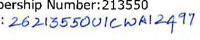

**[Image: ResultMarch2026.pdf-0018-08.png (340x68, 35.3KB)]**

<!-- Start of picture text -->
Number:213550 .2-6 .)...13550U I .)...13550U I I  e,_ tvA 12-f tvA 12-f 12-f 2-f  17 <!-- End of picture text -->

Place: Bengaluru Date: May 19, 2026 

**[Image: ResultMarch2026.pdf-0018-10.png (15x42, 0.4KB)]**

**[Image: ResultMarch2026.pdf-0018-11.png (15x74, 0.7KB)]**

**[Image: ResultMarch2026.pdf-0018-12.png (15x41, 0.4KB)]**

**[Image: ResultMarch2026.pdf-0018-13.png (15x49, 1.0KB)]**

**[Image: ResultMarch2026.pdf-0018-14.png (18x184, 5.8KB)]**

**[Image: ResultMarch2026.pdf-0018-15.png (28x56, 2.4KB)]**

**[Image: ResultMarch2026.pdf-0019-00.png (51x30, 0.9KB)]**

#### Bluspring Enterprises Limited Registered Office: 3/3/2. Bellandur Gate, Sarjapur Road, !Jengaluru 560 103 CIN: L81 I00KA2024PI.C184648 

|Statem|entofstandalone financial results tor the quarter and vear ended 31 March|2026||_(/N_|_H.inmillion exc_|_en/pershare data/_|
|---|---|---|---|---|---|---|
|||||**Slandalonc**|||
||||**Quarter ended**||**Yea**|**r ended**|
|||**31**:\-larch|**31 December**|**31~larch**|**31.,larch**|**For the eriod11**|
|**SI. No.**| **Particulars**|**2026** **(rerer note2)**|**2025**|**2025** (**refer note2)**| **2026**|**p ** **February 2024 to** **31March 2025**|
|||||||**(refer note 8)**|
|||**(l/naudited)**|**(Unaudited)**|**(l'naudited)**|**(Audited)**|**(Audited)**|
|I|**Income**||||||
||a)Revenue from operations|5,95326|5,914.52|5,412.01|23,117.63|23,223.75|
||b)Other income|35.56|27.56|32.98|120.19|119.21|
||Totalincome(a+b)|**5,988.82**|**5,942.08**|**5,444.99**|**23,237.82**|**23.342.96**|
|2|**Expenses**||||||
||a) Costofmaterial and stores and span: parts consumed|663.65|69902|596.54|2,603.99|2,300.76|
||b)Employee benefits expense|4,646.86|4,477.15|4)35.80|17.904.79|!8,159.27|
||c)finance costs|42.28|56.27|30.81|181.96|192.44|
||d)Depreciation and amortisation expense|53.86|64.89|63.27|260.92|288.02|
||e)Other expenses|325.14|571.44|577.85|1,935.81|2,268.51|
||**Total expenses (a**+**b**+**c**+**d**+**e)**|**5,731.79**|**5,868.77**|**5,504.27**|**22,887.47**|**23,209.00**|
|3|**Prolit/(loss) before exceptional**items**andtax**(I-**2)**|**257.03**|**73.31**|**(59.28)**|**350.35**|**133.96**|
|4|Exceptional items (refer note7)|34.75|243.63|61.67|291.09|944.21|
|_5_|**Protit/(loss) berore tax(3**- 4)|**222.28**|**(170.32)**|**(120.95)**|**59.26**|**(810.25)**|
|6|**Tax (expense)lcredit**||||||
||Current tax (cxpense)/credit|3.72|7.15|(37.15)|(92.55)|(120.66)|
||Income tax relating lo previous year|46.16|-|-|46.16|-|
||Deferred tax (expense)/crcdit|(54.61)|39.04|25.04|155.!2|106.13|
||**Total tax (exptnse)/crcdit**|**(4.73)**|**46.19**|**(12.**II)|**108.73**|**(14.53)**|
|7|**Profit/(loss) for the year/period (5**+**6)**|**217.55**|**(124.13)**|**(133.06)**|**167.99**|**(824.78)**|
|8|**Other comprehensive income**||||||
||_Items rhat willnotbe reclassified subsequently10profitorlol·s_||||||
||Remeasurement gainl(loss) on defined benefit plans|(90.68)|10.26|20.31|( 184.70)|62.87|
||Incometaicrelating to items that will not be classified to profitorloss|22.83|(2.59)|(5.11)|46.49|(IS.82)|
||**Other comprehensive lncome/(loss), netoftaxes**|**(67.85)**|7.67|**15.20**|**(138.21)**|**47.05**|
|9|**Total comprehensive incomel(loss) for the year/period**(7+**8)**|**149.70**|(I**16.46)**|**(117.86)**|**29.78**|**(777. 73)**|
|10|Paid-up equity share capital (Face valueof!NR10.00 per share)|1,491.32|1,489.49|1,489.49|1,491.32|1,489.49|
|**11**|Reserves i.e. Other equity|||| 7,200 23| 7,146.12|
|12|Earningsperequi\yshare (EPS)|(not anm1alised)|(not annualised)|(not annualised)|(annualised)|(annualised)|
||(a) Basic (in INR)|1.46|(0.83)|(089)|1.13|(5.54)|
||(blDiluted (in INR)*|1.44|( 0.83 l|(0.89)|1.12|(5.54)|

See accompanying notes to lhe fina11cial results. 

*for the periods with negative !Jasic EPS, Diluted EPS will be same as Basic EPS. 

**[Image: ResultMarch2026.pdf-0019-05.png (321x201, 71.0KB)]**

**[Image: ResultMarch2026.pdf-0019-06.png (13x57, 1.0KB)]**

**[Image: ResultMarch2026.pdf-0019-07.png (15x53, 0.9KB)]**

#### **Bluspring Enterprises Limited** 

Registered Office: 3/3/2, Rcllandur Gate, Sarjapur Road, Bengaluru 560 103 CIN: l8 l **1** OOKA2024PLC 184648 

|**Stan**|**dalone Balance Sheetasat31.\<larch2026**|**At **|_(h\'R m1111//1011;_ **At **|
|---|---|---|---|
|**rarti**|**culars**|**sa ** **31:\llarch 2026** |**sa ** **31 March 2025** |
|||**(Audited)**|**(Audited)**|
|A|**ASSETS**|||
|I|**Non-current assets**|||
||Property, plant and equipment|217.53|142,86|
||Right-of-use assets |348.27|215.65|
||Goodwill Other intangible assets|2,787.90 151.07|2.767.40 193.99|
||**Financial assets**|||
||Investments|2,981.44|2,935.78|
||Loans|1,320.94|753.07|
||Other financial assets|264.67|291.09|
||Income tax assets (net)|209.00|91.99|
||0 ther non-cu rrcnt assets|30.64|50.21|
||**Total non-current assets**|**S,311.46**|**7,442.04**|
|2|**Current assets**|||
||Inventories |69.56|63.39|
||**Financial assets** Trade rece ivabIes|||
||Billed|3,722.16|4,361.48|
||Unbilled|2,000.29|393.18|
||Ca~h andcashequivalents|362.69|448.48|
||Bank balances other than cashandcash equivalents above|2.60|79.04|
||Other financial assets|268.!7|126. 74|
||Other currenIassels|216.!9|167.64|
||**Total current assets**|**6.641.66**|**5.639.95**|
||Total**Assets**|**14,953.12**|**13,081.99**|
|B|**EQl!ITYAND LIABILITIES**|||
|I|**Equity**|||
||Equity share capital|1A9I.32|1;489.49|
||Share appli.ation money pending allotment |1.16|- |
||Other eq~ity|7,200.23|7,146.12|
||**Total Equity**|**8,692.71**|**8.635.61**|
|2|**Liabilities**|||
||**:'\'on-current liabililies**|||
||**Financial liabilities**|||
||Lease liabilities|293.87|I 77.05|
||Provisions|l,I I 6.23|652.92|
||Deferred tax liabilities (net)|45.93|247.53|
||Total**non-cur.-cnt liabilities**|**1.456.03**|**1,077.50**|
|3|**Current liabilities**|||
||**Financial liabilities**|||
||Borrowings|350,00|320.04|
||Lease I iabil ities|70.91|42.52|
||Trade payable,|||
||Total outstanding duesofmicro enterprises and small enterprises|208.24|\58.05|
||rotal outstanding duesofcreditors other than micro enterprises and smal I enterprises Other financial liabilities|469.!0 290195|156.64 2.134.44|
||Other current liabilities|,. 650.99| 412.17|
||Provisions| 153.19|145.02|
||Totalcurrentliabilities|**4,804.38**|**3,368.88**|
||Totall.iabili ties|**6,260AI**|**4,.J46.38**|
||TotalEquityandLiabilities|**14,953.12**|**lJ.081.9\1**|
|s~~Hc|cnmpm1~ing nol~sLolhcl111ancialre.,ults|||

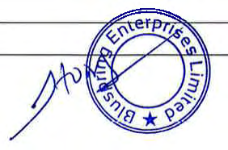

**[Image: ResultMarch2026.pdf-0020-03.png (282x186, 70.7KB)]**

**[Image: ResultMarch2026.pdf-0020-04.png (15x146, 2.3KB)]**

**[Image: ResultMarch2026.pdf-0020-05.png (20x40, 0.9KB)]**

**61usp<ing Enterprises Limit<d** 

Registered Office: 3/3/2. 13eUandur Gate. Sarjapur Road, Bcngaluru 560 I 03 CJ:-;: **L8** l lODKA2024PI.C 184648 

|S1andulonestatementofcash !lows for the~·carended 3 l :\larch :!'026|For1hoear|_(/NU mnullrrm)_ ror**lh**Ceriod|
|---|---|---|
|Pal'tirufars|y ended31.\larch |p **11 February202~to** |
||2026 **(\dild)**|J**1 :wan:h202s** **(\dild)**|
|Cash nows from ope-rating acrivirics|**,ue **|**, uc **|
|Pro fit/(1 oss I afterla~ \djusrmt:ntStor«ondltnet-ofiltonett":ashroi:dedboer11ri11e:activitirs:|167.99|(824.78)|
|,    p.  .p..... yp.  Taxexpense/(credit)|(108.73)| 14,53|
|[ntcn::s.tontax refunds|(4.43)||
|Interest011tenn dcposirs | (2.95)|   [21.19)|
|C'orporafeguaranteecommissionreceived Dividtildincomeoninvestmentinsubsidiary|(19.02)| (3408)|
|,,      Interest on Joans given to related parties|(92.60)| .  (42.82)|
|Employee stock optioncos.t|21.34|30.72|
|Finance costs |181.96|192.44 |
|Depreciationandamortisation|260.92|2&8.D2|
|Expectedcredil loss/(gain) on r.nancial a<sels., net|(262.63)| 218.59|
| BaddebISwri~enoff Exceprionalitems(refernote7)| 15786| |
|- Impairmentoninvestment Dltd||826.97 |
|- emergerreae expenses • ImpactofNewWagecode|1271 230_59_|71.11|
|- Reversalofimp.Unnentofoneofthe subsidiary |(20.00) ||
|• Ac:qnis!tionrelatedex.penses - Consideration rcceiv~blev..'littenoff|6779|46.00|
|L"rtrcalised forein exchMe loss/(ainJ|0 17| 004|
|g g g Oper:atingnshfln,"!iibeforemovementsinworkingcapitaJ|(. ) **590.63**| . 765.65|
|Changes in ope-raring assetsam.IUabmties|||
| ChangesiniuvcntUTics Changes in trade rec;eivablesandunbllk:d revenue:|(6.17) (802.45)|   0,22 (983.73.)|
|Changesinloan$..otherfinanciaJ~ssetsaodolher assels Ch i d bl|(224.13) | (82,05) |
|angr.:s n trae p~yaes Ch.Jnges inotherfinancial liabilities, 01her ltabililies8.fldpro,,isions|362.65 91S.39|126.53 509,93|
|Cushgeneratedfromoperations|83592|33655|
| Jncome taxes (paid)/refum.J rccclvcd, net|. (209.88)| .  (212.65)|
|~cl'cc1shJlon·sfromoperatingacri'\'itjes(A)|626.04|123.90|
|C:)!llhflows from investing activities|||
|F.xpendirureonproperty. plantandequipment and in1angiblcs (nve~tmcnt in subsidiaries|( 143.16) (45.66)|   (68.97)|
|Proceeds from redemptionofdcbc,ituresin subsidiary||2300|
| Dividend rcccivcd || 34,08|
|Redemptionofbankdeposits LoansandadvaJ1ces giventorelated parties |90.73 (S67.87)| 44.92 (496.37) |
|RepaymerllofloansBildadvances. by related parties Corporateg,uararireecommission received|19.02|% ,56|
|Interestincomeonloanstorelated parties|9260||
| Expc.."11diturc:forbusiness purchase|.  (40.57)| (20.00)|
|Interest receivedonloans.torelated parties Interest received||0.47 |
| Interest received onincometax refund|48.87 4.43|6.27|
|:-icfcashusedjni11vestingatti,·ities(B)|(541.61)| (380.0~)|
|Cashtlowsfromfinancinl: acrivitics|||
|Proceeds/(1ep.1yments} fro1n s.hurttc:mborrowings|]996|(53787)|
|,  Shc:m::si_,;;sucdnnexerciwofemployee slock options|.  \.83|,|
|Share application,non~,pending allom,ent|l.16||
| Reamentoflease liabilities|4|~906|
|py   Interestpaid|(87,8) (115.33)|(.) ( I l •l.29)|
|~tfti.Uhu~etlinfinancing ~ctivitics(C)|(170.22)|(701.22)|
|°'"cti1u:.1·e:,.utiuU1!h.1111(1CA~lte4un-:tleut~ (...\Hl+L'}|(85.19)|(957.36)|
|Cashandcashequivalentsalthebeginningofihe year/period '    '|448,48 |1.405 84 |
|Cash and lash equivalents;atthe enrlofrhe}C:u/pcr-iod|362.69|448A8|
|Componentsofca.shandcashequi\'alcnts |||
|Cashtlnband 8abni;~si.nd1ba11~5|212||
| Illi:11nc111 :''lc:oLtnr:-::|||
|. .... (~,shandcashequh•alentsasperstandalonebal:.im:esheet|362.69||
|S1.::c.icco,1111,>an~mgnotes10rhelirnlth;:i:.ifi'csult:i|||

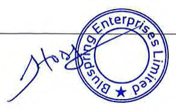

**[Image: ResultMarch2026.pdf-0021-03.png (290x182, 71.4KB)]**

**[Image: ResultMarch2026.pdf-0021-04.png (15x41, 0.5KB)]**

**[Image: ResultMarch2026.pdf-0021-05.png (18x28, 0.8KB)]**

**[Image: ResultMarch2026.pdf-0021-06.png (15x61, 1.3KB)]**

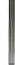

**[Image: ResultMarch2026.pdf-0021-07.png (15x65, 1.5KB)]**

**Bluspring 1-:ntcrpriscs Limited** 

Registered Orflcc: Ji3!2, Bellandur Gate, Sarjapur Road, Bcngaluru 560 I 03 

CIN: L81 TOOKA2024PLCI 84648 

##### '.\oles for the quarter• nd year ended 3 l :\-larch 2026: 

- lhe standalone financial results of Bluspring Enterprises Limited ("the Company") for Che quaner and year ended 31 March 2026 have been taken on record by the Board of Di rectors at its meeting held on IQ May 2026. The statutory· auditors have expressed an unqual died review conclusion on the financial results for chc q uaner ended 31 March 2026 and have expressed an unqualified audit opinion on the financial results for the year ended 31 March 2026 These standalone financial results have been extmcted from the standalone financial information. 

- 2 The Statement includes the ,~suits for the quaner ended 3 I March 2026 and 31 March 2025, being the halancing figure of audited figures in respect of the full financial year and puhlisl1cd unaudited year to date figures upto the end of the third quarter or the respective tillancial years, 

- 3 Pursuant lo the provisions ot· the Listing Agreement the Management has decided to publish consolidated audited financial results in the newspapers. The standalone audited financial results and the audit/ review report.s of the statutory auditors is being, filed with Bombay Stock Exchange ("BSE") and National Stock Exchange ("NSE") and will be made available on the Company's website www.bluspring.com. 

- 4 The standalone financial results have been prepared in accordance with the recognition and measurement principles laid down in the applicable Indian accounting standards prescribed under Sectiun 133 of the Companies Act, 2013, read with relevant rules issued thereunder and accounting principles generally accepted in India, and in terms or Regulation 33 of SEBI (I.isling Obligation and Disclosure Requirements) Regulations, '.lOI 5, as amended 

- ln accordance with Ind AS I 08, Operating segments, segment information has been provided in the consolidated audited financial results of the Company and therefore no separate disclosure on segment information is given in these standalone audited financial results 

- 6 **(a) Proposed acquisitions:** 

STEAG 1-:nergy Services ( India) Private Limited (" SESI" ): 

On 19 March 2026, Bluspring New Horizon One Private Limited (a wholly owned subsidiary ofBluspring [nterprises Limited) entered into a definitive agreement to acquire 100% share capital of SESI, a leading provider of operations and maintenance, digital solutions and end-to-end engineering & management advisory services to conventional and renewable power/energy industry across India, Botswana, Middle East and other overseas markets through itself and its subsidiaries. The total consideration payable for the acquisition is INR 1,800.00 million. The acquisition shall be completed subject to regulatory approvals and fulfilment of mutually agreed conditions of the definitive agreement, 

**LSC Sky Chefs(lndia) Private Limited ("LSC India"):** 

On 13 April 2026, Bluspring New Horiwn Two Private Limited (a wholly owned subsidiary uf Bluspring f'nterprises Limited) entered into a definitive agreement to acquire I 00% stake in LSG India, a le.ding provider of in-flight catering and allied aviation services for domestic and international airlines, The total consideration is based on an enterprise value of INR 1.290,00 million, subject to customary adjustments as set out in the definitive agreements The acquisition slrnll be completed subject to regulatory approvals and fulfilment of mutm,lly agreed conditions or the definitive agreement. 

(b) Acquisilion of business of Archer lntegrat•d Services Private Limited ('Archer') and Astrin Traders and Supp)i,s Private Limited ('Astrin') 

During the period ended 31 March 2025, the Board of Directors or the Company considered and approved the Business Transfer Agreement (' BT A') r·or purchase of food catering and facility management services busine.ss of Archer and Astrin as a going concern on a slump sale basis for a lump sum cash consideration or rNR 110 00 million. The consideration was payable subject to completion of agreed conditions stated in BT1\. 

During the year ended 31 March 2026, the conditions stated in BT A were satisfied and the transactions was completed al a final consideration of INR \05,44 mill ion, as per terms of 

BT A The fair value of net assets acquired including the identified intangibles as on the acqu isi!ion date as a pan of the transaction amounted to INR 84.89 mil hon. The excess of purchase consideration over the fair value of net assets acquired has been attributed towards goodwill aggregating to JNR 20,55 million. The goodwill is attributable to operational synergies including revenues from new customers Results from this acquisition and goodwill are included under Facility management and food services segment 

- 7 **lsxceptional** items: 

- (i) During the quancr and year ended 31 March 2026, the Company incurred cenaiJJ professional fees with respect to proposed acquisition of SES! and LSG India by its wholly owned subsidiaries aggregates to INR 67 79 million, 

- (ii) During the quancr and year ended 31 March 2026, the Company redeemed 2,000 (3 l March 2025: 2,300) Compulsorily Convenible Debentures CCCDs'"), issued by one of its subsidiaries, amounting to lNR '.l0.00 million (31 March 2015: INR 23.03 million). and reversed impainnent booked earlier amounting to JNR 20.00 mi llion (31 March 20'.l5: INR 23 03 million), 

- (iii) During the year ended 31 March 2026, the Company incurred cenain demergcr expenses for professional services and cenain employee benefits expense aggregating to INR 12.71 million. 

(iv) On 21 November 2025, the Government of India notified provisions of the Code on Wages, 2019. the Industrial Relations Code 2020, the Code on Social Security, 2020 and the Occupational Safety, Health and Workings Conditions Code, 2020, ("Labo,ir code") which consolidates twenty nine existing labour laws into a unified framework governing employee benefits during the employment and post-employment. 

l:lased on the guidance issued by the Institute ofChanered Accountants of India, together with the draft Central Rules and FAQs released hy the Ministry of Labour & Employment, the Company has assessed the financial implications of the changes on empioyee benefit 1 iabilities. The Company has recognised an incremental expense of INR 243 ,63 mill ion, during the quarter ended 31 December 2025, 

During the quarter ended 31 March 20'.l6, the management reassessed the impact of the above change based on the revised pay structure, which resulted in a credit of INR 13.04 mill ion in the standalone Ii nancial results. Accordingly, for the year ended 31 March 2026, the net expense recognised in 'Exceptional items' aggregates to JNR 230.59 mi I lion. 

- 8 In accordance with the composite scheme of arrangement between Quess Corp Limited {"Ocmerged Company"), Digitide Solutions Limited ("Resulting company I") and Bluspring Enterprises Limited ("Resulting Company 2") and their respective shareholders and credilors (referred as "Scheme of arrangement") the demerged company carried out the activities of transferred Businesses 2 in trust for the company upto effective date i.e., 3 l March _20'.l5,_ The comparative financial infonnation of the company have been prepare<! as of and for the period rrom 11 February ~024 (Date of Incorporation) to 31 March '.l025, in accordance with Appendix C to Ind AS 103 "Business Combinations" by using the financial infonnation maint~ined by the Demerged company. 

_/or_ and on be hall o l lfoard o I Llirectors o I 

**[Image: ResultMarch2026.pdf-0022-27.png (198x201, 55.9KB)]**

Bluspring Enterprise, Limited 

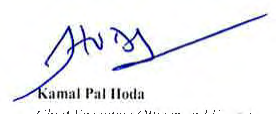

**[Image: ResultMarch2026.pdf-0022-29.png (276x114, 31.2KB)]**

_( 'ht..:/ l .'Xt-'t'Ul/\'t.' (_ )//It\.'!' _uni I i ~·.-cu1111·r.: I >U'<.:CltJI' })/.\: ,wxo.,·-•)3_ i>lm.:i.::: l:3~ng_alun1 Orne I') :-..fay 2\126 

**[Image: ResultMarch2026.pdf-0022-31.png (15x71, 1.0KB)]**

**[Image: ResultMarch2026.pdf-0022-32.png (20x38, 1.0KB)]**

**[Image: ResultMarch2026.pdf-0022-33.png (15x72, 1.6KB)]**

**[Image: ResultMarch2026.pdf-0022-34.png (18x76, 2.2KB)]**

**~ Bluspring** 

Date: May 19, 2026 

To, 

**BSE Limited,** 

1st Floor, New Trading Ring, Rotunda Building, **PJ** Towers, Dalal Street, Mumbai - 400 001 Scrip Code: 544414 

**National Stock Exchange of India Limited** Exchange Plaza, Bandra- Kurla Complex, Bandra (East), Mumbai- 400 051 NSE Symbol: BL USPRING 

Dear Sir/ Madam, 

**Sub: Declaration under Regulation 33(3)( d) of the Securities and Exchange Board of India** (Listing and Disclosure Requirements) Regulations, 2015 

We hereby confirm and declare that the Statutory Auditors of the Company i.e., M/ s. Deloitte Haskins & Sells, Chartered Accountants (Firm Registration No. 0080725), have issued the Auditor's Report on Standalone and Consolidated Audited Financial Results of the Company for the financial year ended March 31, 2026 with unmodified opinion. 

Request you to please take the same on record. 

Yours sincerely, 

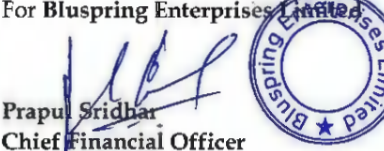

**[Image: ResultMarch2026.pdf-0023-11.png (384x151, 93.2KB)]**

<!-- Start of picture text -->
For  Bluspring Enterpri Pra)  ~ Chief ~ Cial  Officer <!-- End of picture text -->

**Bluspring Enterprises Limited Regd. Office: 3/3/2, Bellandur Gate, Sarjapur Main Road, Bengaluru** - **560103, Karnataka Tel: 080-6105 6001** I **E-mail: corporatesecretarial@bluspring.com** I **CIN: L81100KA2024PLC184648** 

---

## Extracted Images

| # | File | Dimensions | Size |
|---|------|------------|------|
| 1 | ResultMarch2026.pdf-0001-00.png | 234x63 | 12.2KB |
| 2 | ResultMarch2026.pdf-0001-12.png | 215x23 | 2.9KB |
| 3 | ResultMarch2026.pdf-0002-14.png | 82x106 | 7.9KB |
| 4 | ResultMarch2026.pdf-0003-01.png | 65x17 | 0.4KB |
| 5 | ResultMarch2026.pdf-0003-02.png | 167x17 | 1.9KB |
| 6 | ResultMarch2026.pdf-0003-03.png | 40x15 | 0.5KB |
| 7 | ResultMarch2026.pdf-0003-04.png | 74x17 | 0.7KB |
| 8 | ResultMarch2026.pdf-0003-05.png | 34x21 | 0.9KB |
| 9 | ResultMarch2026.pdf-0003-06.png | 97x17 | 2.1KB |
| 10 | ResultMarch2026.pdf-0003-07.png | 100x17 | 2.0KB |
| 11 | ResultMarch2026.pdf-0003-15.png | 84x120 | 8.1KB |
| 12 | ResultMarch2026.pdf-0004-01.png | 80x17 | 0.6KB |
| 13 | ResultMarch2026.pdf-0004-02.png | 49x17 | 0.8KB |
| 14 | ResultMarch2026.pdf-0004-03.png | 89x15 | 1.1KB |
| 15 | ResultMarch2026.pdf-0004-04.png | 38x13 | 0.4KB |
| 16 | ResultMarch2026.pdf-0004-05.png | 49x15 | 0.6KB |
| 17 | ResultMarch2026.pdf-0004-06.png | 40x17 | 0.1KB |
| 18 | ResultMarch2026.pdf-0004-07.png | 42x21 | 1.3KB |
| 19 | ResultMarch2026.pdf-0004-08.png | 74x17 | 1.7KB |
| 20 | ResultMarch2026.pdf-0004-09.png | 97x17 | 2.1KB |
| 21 | ResultMarch2026.pdf-0004-10.png | 41x17 | 1.1KB |
| 22 | ResultMarch2026.pdf-0004-20.png | 72x105 | 7.4KB |
| 23 | ResultMarch2026.pdf-0005-01.png | 33x15 | 0.5KB |
| 24 | ResultMarch2026.pdf-0005-02.png | 298x17 | 1.7KB |
| 25 | ResultMarch2026.pdf-0005-03.png | 88x17 | 0.8KB |
| 26 | ResultMarch2026.pdf-0005-04.png | 38x21 | 1.1KB |
| 27 | ResultMarch2026.pdf-0005-05.png | 74x19 | 1.6KB |
| 28 | ResultMarch2026.pdf-0005-06.png | 122x19 | 3.1KB |
| 29 | ResultMarch2026.pdf-0005-14.png | 69x128 | 7.5KB |
| 30 | ResultMarch2026.pdf-0006-09.png | 76x134 | 8.7KB |
| 31 | ResultMarch2026.pdf-0007-01.png | 57x17 | 0.7KB |
| 32 | ResultMarch2026.pdf-0007-02.png | 38x15 | 0.4KB |
| 33 | ResultMarch2026.pdf-0007-03.png | 41x15 | 0.6KB |
| 34 | ResultMarch2026.pdf-0007-04.png | 201x15 | 1.8KB |
| 35 | ResultMarch2026.pdf-0007-05.png | 74x17 | 0.7KB |
| 36 | ResultMarch2026.pdf-0007-06.png | 74x17 | 1.3KB |
| 37 | ResultMarch2026.pdf-0007-07.png | 50x17 | 1.1KB |
| 38 | ResultMarch2026.pdf-0007-08.png | 31x19 | 0.7KB |
| 39 | ResultMarch2026.pdf-0007-12.png | 214x134 | 34.9KB |
| 40 | ResultMarch2026.pdf-0007-16.png | 326x54 | 25.2KB |
| 41 | ResultMarch2026.pdf-0009-00.png | 71x30 | 1.5KB |
| 42 | ResultMarch2026.pdf-0009-04.png | 318x194 | 79.5KB |
| 43 | ResultMarch2026.pdf-0009-07.png | 28x40 | 1.0KB |
| 44 | ResultMarch2026.pdf-0009-08.png | 13x57 | 0.9KB |
| 45 | ResultMarch2026.pdf-0009-09.png | 15x74 | 1.5KB |
| 46 | ResultMarch2026.pdf-0010-04.png | 332x185 | 72.0KB |
| 47 | ResultMarch2026.pdf-0011-03.png | 342x194 | 77.5KB |
| 48 | ResultMarch2026.pdf-0011-04.png | 13x120 | 2.1KB |
| 49 | ResultMarch2026.pdf-0012-04.png | 359x203 | 76.0KB |
| 50 | ResultMarch2026.pdf-0012-05.png | 15x41 | 0.4KB |
| 51 | ResultMarch2026.pdf-0012-06.png | 15x64 | 1.1KB |
| 52 | ResultMarch2026.pdf-0012-07.png | 13x40 | 0.6KB |
| 53 | ResultMarch2026.pdf-0013-22.png | 198x118 | 27.6KB |
| 54 | ResultMarch2026.pdf-0013-24.png | 184x201 | 53.4KB |
| 55 | ResultMarch2026.pdf-0013-25.png | 34x34 | 0.9KB |
| 56 | ResultMarch2026.pdf-0013-26.png | 15x64 | 0.8KB |
| 57 | ResultMarch2026.pdf-0013-27.png | 15x62 | 0.8KB |
| 58 | ResultMarch2026.pdf-0014-02.png | 293x184 | 65.2KB |
| 59 | ResultMarch2026.pdf-0014-03.png | 15x176 | 2.8KB |
| 60 | ResultMarch2026.pdf-0015-16.png | 15x167 | 2.5KB |
| 61 | ResultMarch2026.pdf-0015-17.png | 82x132 | 8.8KB |
| 62 | ResultMarch2026.pdf-0016-05.png | 15x41 | 0.4KB |
| 63 | ResultMarch2026.pdf-0016-06.png | 15x57 | 0.7KB |
| 64 | ResultMarch2026.pdf-0016-10.png | 80x144 | 10.3KB |
| 65 | ResultMarch2026.pdf-0016-12.png | 28x186 | 6.4KB |
| 66 | ResultMarch2026.pdf-0017-03.png | 13x42 | 0.5KB |
| 67 | ResultMarch2026.pdf-0017-08.png | 15x120 | 0.9KB |
| 68 | ResultMarch2026.pdf-0017-11.png | 80x121 | 8.5KB |
| 69 | ResultMarch2026.pdf-0017-14.png | 15x49 | 1.3KB |
| 70 | ResultMarch2026.pdf-0017-15.png | 22x191 | 6.6KB |
| 71 | ResultMarch2026.pdf-0017-16.png | 28x41 | 2.0KB |
| 72 | ResultMarch2026.pdf-0018-08.png | 340x68 | 35.3KB |
| 73 | ResultMarch2026.pdf-0018-10.png | 15x42 | 0.4KB |
| 74 | ResultMarch2026.pdf-0018-11.png | 15x74 | 0.7KB |
| 75 | ResultMarch2026.pdf-0018-12.png | 15x41 | 0.4KB |
| 76 | ResultMarch2026.pdf-0018-13.png | 15x49 | 1.0KB |
| 77 | ResultMarch2026.pdf-0018-14.png | 18x184 | 5.8KB |
| 78 | ResultMarch2026.pdf-0018-15.png | 28x56 | 2.4KB |
| 79 | ResultMarch2026.pdf-0019-00.png | 51x30 | 0.9KB |
| 80 | ResultMarch2026.pdf-0019-05.png | 321x201 | 71.0KB |
| 81 | ResultMarch2026.pdf-0019-06.png | 13x57 | 1.0KB |
| 82 | ResultMarch2026.pdf-0019-07.png | 15x53 | 0.9KB |
| 83 | ResultMarch2026.pdf-0020-03.png | 282x186 | 70.7KB |
| 84 | ResultMarch2026.pdf-0020-04.png | 15x146 | 2.3KB |
| 85 | ResultMarch2026.pdf-0020-05.png | 20x40 | 0.9KB |
| 86 | ResultMarch2026.pdf-0021-03.png | 290x182 | 71.4KB |
| 87 | ResultMarch2026.pdf-0021-04.png | 15x41 | 0.5KB |
| 88 | ResultMarch2026.pdf-0021-05.png | 18x28 | 0.8KB |
| 89 | ResultMarch2026.pdf-0021-06.png | 15x61 | 1.3KB |
| 90 | ResultMarch2026.pdf-0021-07.png | 15x65 | 1.5KB |
| 91 | ResultMarch2026.pdf-0022-27.png | 198x201 | 55.9KB |
| 92 | ResultMarch2026.pdf-0022-29.png | 276x114 | 31.2KB |
| 93 | ResultMarch2026.pdf-0022-31.png | 15x71 | 1.0KB |
| 94 | ResultMarch2026.pdf-0022-32.png | 20x38 | 1.0KB |
| 95 | ResultMarch2026.pdf-0022-33.png | 15x72 | 1.6KB |
| 96 | ResultMarch2026.pdf-0022-34.png | 18x76 | 2.2KB |
| 97 | ResultMarch2026.pdf-0023-11.png | 384x151 | 93.2KB |
