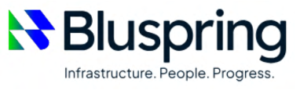
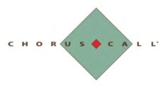

**[Image: May2026.pdf-0001-00.png (243x68, 10.6KB)]**

Date: May 22, 2026 

To, 

# **BSE Limited,** 

1st Floor, New Trading Ring, Rotunda Building, PJ Towers, Dalal Street, Mumbai – 400 001 **Scrip Code: 544414** 

**National Stock Exchange of India Limited** Exchange Plaza, Bandra- Kurla Complex, Bandra (East), Mumbai – 400 051 **NSE Symbol: BLUSPRING** 

Dear Sir/ Madam, 

# **Sub: Transcript of Earnings Call – Q4 FY26** 

Pursuant to Regulation 30 of the Securities and Exchange Board of India (Listing Obligations and Disclosure Requirements) Regulations, 2015, please find enclosed herewith the Transcript of the Earnings Call held on May 20, 2026. The above information is also available - - on the website of the Company at <u>https://www.bluspring.com/for investors/financial information/</u> 

Request you to please take the same on record. 

Thanking you, 

Yours sincerely, 

For **Bluspring Enterprises Limited** ARJUN SUNIL Digitally signed by ARJUN SUNIL MAKHECHA MAKHECHA Date: 2026.05.22 19:27:20 +05'30' **Arjun Sunil Makhecha Company Secretary & Compliance Officer Membership no. ACS 29253** 

**Bluspring Enterprises Limited** 

Regd. Office: 3/3/2, Bellandur Gate, Sarjapur Main Road, Bengaluru – 560103, Karnataka Tel: 080-6105 6001 | E-mail: corporatesecretarial@bluspring.com | CIN: L81100KA2024PLC184648 

**[Image: May2026.pdf-0002-00.png (382x115, 47.2KB)]**

<!-- Start of picture text -->
~t  Bluspring Infrastructure. People. Progress. <!-- End of picture text -->

“Bluspring Enterprises Limited Q4 FY26 Earnings Conference Call” 

May 20, 2026 

**[Image: May2026.pdf-0002-03.png (226x89, 20.4KB)]**

<!-- Start of picture text -->
I ~t Bluspring Infrastructure. People. Progress. <!-- End of picture text -->

**[Image: May2026.pdf-0002-04.png (168x73, 14.9KB)]**

<!-- Start of picture text -->
~·. IJFL !.~/ CAPITAL <!-- End of picture text -->

**[Image: May2026.pdf-0002-05.png (230x126, 15.7KB)]**

<!-- Start of picture text -->
C  H  O  R  L  L ' <!-- End of picture text -->

**– MANAGEMENT: MR. KAMAL PAL HODA EXECUTIVE DIRECTOR AND – CHIEF EXECUTIVE OFFICER BLUSPRING ENTERPRISES LIMITED – – MR. PRAPUL SRIDHAR CHIEF FINANCIAL OFFICER BLUSPRING ENTERPRISES LIMITED – – MR. NIBODH SHETTY HEAD INVESTOR RELATIONS – BLUSPRING ENTERPRISES LIMITED** 

**– MODERATOR: MR. SIDDHARTH ZABAK IIFL CAPITAL SERVICES LIMITED** 

Page **1** of **17** 

_Bluspring Enterprises Limited May 20, 2026_ 

**[Image: May2026.pdf-0003-01.png (197x67, 15.9KB)]**

<!-- Start of picture text -->
Bluspring Infrastructure. People. Progress. <!-- End of picture text -->

## **Moderator:** 

Ladies and gentlemen, good day and welcome to the Bluspring Enterprises, 4Q FY26 earnings call, hosted by IIFL Capital Services Limited. As a reminder, all participant lines will be in the listen-only mode and there will be an opportunity for you to ask questions after the presentation concludes. Should you need assistance during the conference call, please signal an operator by pressing star then zero on your touchtone phone. Please note, that this conference is being recorded. 

I now hand the conference over to Mr. Siddharth Zabak from IIFL Capital. Thank you, and over to you, sir. 

**Siddharth Zabak:** Thank you. Ladies and gentlemen, good morning and thank you for joining us… **Moderator:** I am sorry to interrupt, sir. Your voice is muffled. Can you please use your handset mode? **Siddharth Zabak:** Thank you. Ladies and gentlemen, good morning and thank you for joining us on the 4Q for FY26, results conference call, for Bluspring Enterprises Limited. It is my pleasure to introduce the senior management team of Bluspring, who are here with us today to discuss the results. 

We have Mr. Hoda, Executive Director and CEO; Mr. Prapul Sridhar, CFO; and Mr. Nibodh Shetty, Head Investor Relations. We will begin the call with opening remarks by the management team and thereafter we will open the call for a Q&A session. 

I would like to now hand over the call to Mr. Nibodh Shetty to take the proceedings forward. Thank you, and over to you, Nibodh. **Nibodh Shetty:** Good morning, everyone. Thank you for joining 4Q FY26, Bluspring Enterprise Limited, earnings call. At this point, we would like to highlight that today's discussion may include forward-looking statements which are based on current expectations and are subject to business risks, regulatory changes, macroeconomic environment and geopolitical conditions. 

We do not guarantee these statements or results and are not obliged to update them at any point of time. These statements should be read in conjunction with the Safe Harbor clause, provided on slide number 2 of our investor presentation. 

With that, I hand the call over to our CEO, Mr. Kamal Pal Hoda, for his opening remarks. Over to you, Kamal. 

**Kamal Pal Hoda:** Thanks, Nibodh. Good morning, everyone, and thank you for joining the call today. The completion of our first financial year, as an independent listed company represents a significant milestone for our organization. 

During our inaugural analyst call in Q1, we reaffirmed a renewed sense of purpose, a sharper vision, and a strong commitment to create long-term value. Since then, our performance has strengthened with each successive quarter, navigating the changing regulatory and external environments towards delivering a robust financial performance. The stability and strength of our core business have provided the confidence to pursue business expansion through disciplined inorganic growth. 

Page **2** of **17** 

_Bluspring Enterprises Limited May 20, 2026_ 

**[Image: May2026.pdf-0004-01.png (197x67, 15.9KB)]**

<!-- Start of picture text -->
Bluspring Infrastructure. People. Progress. <!-- End of picture text -->

We recently announced the signing of definitive agreement for acquisition of STEAG Energy Services (India) Private Limited, a leading energy services company, and LSG Sky Chefs (India) Private Limited, an in-flight catering, and allied aviation Services Company. I'll discuss both these acquisitions in detail, after discussing the full year FY26 and Q4 highlights excluding the investment vertical. 

We delivered a strong financial year with broad-based growth across key metrics. Revenue for FY26 grew 11% year-on-year to INR 3,304 crores, while Q4 revenue increased 8% year-onyear to INR 846 crores. 

Our sales engine continues to perform strongly. In FY26, we have secured new 164 contracts with a total annual contract value of INR 459 crores. 

EBITDA for FY26 increased by 10% year-on-year to INR 121 crores. EBITDA for Q4 FY26 stood at INR 35 crores, growing 44% year-on-year and 9% quarter-on-quarter. Q4 EBITDA margin crossed 4% benchmark, reaching 4.2%, a 35 basis points quarter-on-quarter increase. The margin expansion was driven by seasonal improvement in our Food and Telecom business, improved contract mix, and collection efficiencies. 

Profit after-tax, adjusted for the one-time impact of new Labour Code related changes, grew 26% year-on-year to INR 67 crores. Q4 PAT stood at INR 20 crores, up 73% year-on-year. Adjusted EPS for FY26 stood at INR 4.5 per share. 

Now coming to segment-wise updates starting with Facility and Food services. This segment continues to be the largest driver for our business, contributing to over 60% of our revenues. FY26 revenue stood at INR 2,031 crores, up 12% year-on-year, while Q4 revenue grew 10% year-on-year to INR 519 crores. 

The business added 24 new contracts with INR 124 crores ACV, giving excellent head start to New Year's growth. The business continued focus on quality deals and investment in leadership, branding and sales has started to bear fruit and have laid strong foundation for sustained and profitable growth in the years ahead. 

Staying on the theme of quality growth, we signed definitive agreement of acquisition of LSG Sky Chefs India's Bengaluru operations in April 2026. The acquisition marks a key milestone in our growth push in high margin segments. 

Talking a bit more details about LSG, founded in 2001, LSG Sky Chefs India Private Limited or LSG India, as we call it, is a leading provider of in-flight catering and allied aviation services for domestic and international airlines including IndiGo, Lufthansa, Etihad, and Qatar Airways. 

Supported by a workforce of over 400 employees, LSG India's Bangalore operations generate revenue of over INR 110 crores and mid-to-high teens EBITDA margins. The acquisition gives Bluspring access to in-flight catering facilities operating at Bangalore airport, under a long-term concession agreement, until 2039. 

Page **3** of **17** 

_Bluspring Enterprises Limited May 20, 2026_ 

**[Image: May2026.pdf-0005-01.png (197x67, 15.9KB)]**

<!-- Start of picture text -->
Bluspring Infrastructure. People. Progress. <!-- End of picture text -->

According to Bangalore International Airport, BIAL estimates, air passenger traffic at Bangalore airport is poised to rise from present 45 million now, towards 70 million by 2030, enabling Bluspring to capture the high growth aviation catering segment. 

Moving to telecom and industrials vertical, for us, employee wellbeing and safety remains paramount. We continue to report zero on-job fatalities in Q4. This was achieved on back of strong emphasis and investment in training, health and safety. The industrial vertical logged over 25,000 health and safety training hours in FY26. 

FY26 revenue for telecom and industrial grew 7% year-on-year to INR 615 crores. While the overall segment growth was muted due to delay in planned capital expenditure from leading telecom operators, however, the industrial sub-vertical grew by 7% quarter-on-quarter on back of new contract mobilizations. 

The focus in this segment continues to be on transitioning from manpower provider to strategic operations partner. The segment continues its margin up-tick and delivered double-digit EBITDA margins. This was supported by higher margins industrial contracts and disciplined cost optimization across operations. 

In industrial vertical, we recently announced signing of definitive agreements for acquisition of STEAG Energy Services (India) Private Limited in March of 2026. Founded in 2001, STEAG India operates, on an asset-light business model aligned with our core business approach. 

It manages both captive and non-captive power plants. The company provides end-to-end plant management solutions including plant operations and maintenance, O&M, control room operations and overhauling services. 

These services contribute 90% of STEAG India's revenue base and are typically secured through long-term contracts ranging from three to five years, providing strong visibility into stable and recurring cash flows. 

The balance of company's revenues is generated through high margin advisory and technologydriven services including digital performance monitoring, predictive analytics, diagnostics, training simulators, flexibilization solutions, and simulation studies. 

STEAG currently employs over 2,000 professionals and manages approximately 7-gigawatts of power assets along with 2,200 tons per hour of process steam supply capacity. Its portfolio includes supercritical power plants and refinery utilities, demonstrating proven capabilities across the broader electricity value chain. The company clocks annual revenues of INR 700 crores with EBITDA margins in high-single digits. 

Moving to our Security Services business, the security vertical recorded its highest ever headcount which crossed 24,000 for the first time. The business clocked FY26 revenues of INR 659 crores, an increase of 14% year-on-year. 

Page **4** of **17** 

_Bluspring Enterprises Limited May 20, 2026_ 

**[Image: May2026.pdf-0006-01.png (197x67, 15.9KB)]**

<!-- Start of picture text -->
Bluspring Infrastructure. People. Progress. <!-- End of picture text -->

This growth was powered by headcount additions of around 2,900 additional security guards during the financial year. The business continued its upward trajectory in Q4 with revenue of INR 169 crores, a 15% year-on-year increase. 

Q4 FY26 witnessed a headcount addition of 850 guards. The focus of this business continues to be adding new logos, increasing business from existing clients and further strengthening sourcing channels to enable faster mobilizations. 

Moving on to our investments in foundit. This has been a turnaround quarter for foundit. As we had highlighted in earlier quarters, we have invested significant time and resources into revamping the product and focusing on getting unit economics right and moving towards breakeven. 

The revamped product has been received well by the clients and we registered a strong sales of INR 26 crores during Q4 FY26. The sales velocity has jumped by 50% from an average sale of INR 17 crores during the first three quarters of FY26 to INR 26 crores in Q4 FY26. The strong growth in sales would convert into revenues in the upcoming quarters. 

For Q4, foundit delivered a revenue of INR 19 crores. All the key product metrics such as total applications, recruiter search, total traffic and six months active user base have shown growth during the year. In line with our recent guidance, we have lowered our EBITDA losses from INR 12 crores in Q3 to INR 9 crores in Q4 FY26. 

In foundit, we are further accelerating our AI adoption which will help in keeping cost in control and increasing productivity. This is in line with our commitment to be EBITDA profitable by end of this financial year. 

The focus for Q1 for foundit is on strategic sales, marketing spends to accelerate seeker growth, automation of platform, maintaining revenue trajectory, and continue to improve on our EBITDA. 

Before I hand over the call to Prapul, I would like to emphasize: 

In our first year post-demerger, we have undertaken focused initiatives to accelerate sales, adopt a more technology-led operating model, and identify new avenues of growth across our businesses. We also made targeted investments in talent and leadership to build and sustain these capabilities. 

As the year has progressed, the benefits of these investments have begun to materialize, reflecting in an 11% year-on-year revenue growth in FY26 and a 112 basis points expansion in EBITDA margins for the year from 3.1% we reported in Q1 of FY26 to 4.2% in Q4 of FY26. The recently announced acquisitions will further support margin acceleration. 

The coming financial year will continue to build on the momentum of our first year with a clear focus of driving growth, enhancing margins, and improving return on equity to higher levels. 

Page **5** of **17** 

_Bluspring Enterprises Limited May 20, 2026_ 

**[Image: May2026.pdf-0007-01.png (197x67, 15.9KB)]**

<!-- Start of picture text -->
Bluspring Infrastructure. People. Progress. <!-- End of picture text -->

With that backdrop, I'll now hand it over to our CFO, Prapul Sridhar, for a financial deep dive. Over to you, Prapul. Prapul Sridhar 

## **Prapul Sridhar:** 

Thank you, Kamal, and a very good morning to all of you present in the call. Let me take you through our financial performance excluding foundit for the year and quarter ending March 31st, 2026. 

During the quarter, we reported revenues of INR 846 crores, a growth of 8% year-on-year and flat sequentially. On a full year basis, our revenue stands at INR 3,304 crores, a growth of 11% year-on-year. This growth was broad-based across all segments with telecom being an exception. The temporary slowdown in telecom industry is intertwined with the pause in the capex rollout of telecom players. 

During the quarter, we have mobilized close to around 42 new contracts contributing to annual contract value of INR 181 crores. We continue to have a well-diversified client base and sector presence, with top 30 clients contributing to less than 50% of our revenues. Our overall headcount grew by 6,600 during the year. We now stand a strong 93,000 plus workforce working for us. 

The EBITDA for the quarter stood at INR 35 crores, up a growth of 44% year-on-year and 9% sequentially. Full year EBITDA now stands at INR 121 crores, a growth of 10% year-on-year. Our EBITDA margin saw a consistent quarterly increase with Q1 being 3.1% and an exit of Q4 at 4.2%, a 112 basis points jump during the year. 

This was aided largely by volume growth with new contracts being mobilized at better margins, improvement in age collections and rationalization of low margin clients during the year. 

Our interest cost reduced sequentially by 41% to a steady state of around INR 5 to 6 crores per quarter. We got Bluspring rated recently by Fitch Group Company and we saw downward revisions in our borrowing rates since then. 

Our adjusted PAT for the quarter stood at INR 20 crores, a growth of 73% year-on-year and 6% sequentially. For full year FY26, our adjusted PAT stood at INR 67 crores, a growth of 27% year-on-year. Thereby our EPS stood at INR 4.5 per share. 

Exceptional item during the quarter was INR 6.8 crores. This was on account of certain costs relating to professional fees which we incurred for the acquisitions announced recently. We continued on our previously stated trajectory on reducing debt. 

We are happy to report that we stand at a net cash position of INR 15 crores as of March 2026. Our working capital days for the year stood at 37 days as compared to 46 days a year back. 

Moving now towards segmental performance. Our Facilities and Food Services business continue to be our largest segment. The revenue for Q4 FY26 was up 10% year-on-year and flat sequentially. 

Page **6** of **17** 

_Bluspring Enterprises Limited May 20, 2026_ 

**[Image: May2026.pdf-0008-01.png (197x67, 15.9KB)]**

<!-- Start of picture text -->
Bluspring Infrastructure. People. Progress. <!-- End of picture text -->

The revenue growth was driven by 24 new client additions during the quarter, an annual contract value addition of INR 124 crores. We have continued to add clients across education, commercial and healthcare businesses in this vertical with a total revenues for the year closing at INR 2,031 crores with 12% year-on-year growth. 

EBITDA for the quarter stood at INR 24 crores for this vertical, registering a growth of 56% year-on-year and 4% sequentially. The growth was driven largely due to stronger age collections rather than volume growth reported. 

The telecom and industrial segment recorded revenues of INR 157 crores for the quarter. Full year revenues now stands at INR 615 crores, a growth of 7% year-on-year. As mentioned earlier, the growth in this segment was muted for telecom vertical. 

However, we registered a strong growth in industrial segment in the metal space with new contracts coming at better margins. EBITDA for the quarter in telecom and industrials was INR 18 crores, recording a growth of 13% year-on-year and 19% sequentially. A full year EBITDA in this segment stands at INR 57 crores, which has a growth of 11% year-on-year. 

Moving on to Security Services segment, which saw a recorded revenue of INR 169 crores for the quarter, which is a growth of 15% year-on-year and flat sequentially. A full year revenues closed at INR 659 crores, registering a growth of 14% year-on-year. 

We closed the year with over a record headcount increase of 2,900 guards, taking the overall headcount to 24,000 plus workforce. The security business recorded EBITDA of INR 6 crores for the quarter and INR 19 crores for full year, a growth of 23% year-on-year. EBITDA growth was aided by robust additions of headcount and collection efficiencies. 

Coming to the acquisitions that we announced recently, the acquisitions of STEAG India is expected to add nearly 20% to our top line and improve our pro forma EBITDA margins for the year by approximately 90 basis to 100 basis points. 

The business model is annuity based running across multiple years. The transaction is ROE and PAT accretive. We plan to fund this acquisition primarily through debt and internal accruals. 

Our priority for the financial year is to repay the acquisition debt aggressively following the integration. The acquisition comes at an important juncture of our journey and will elevate us into a higher margin trajectory company. 

Post-acquisition, the share of our high margin telecom and industrial verticals would grow from 19% to 33% of revenues. We will focus all our efforts in current year on integrating the acquired businesses and unlocking synergies. The closure of the deal announcement is expected to happen this month. 

Coming to our second acquisition of LSG Sky Chefs, this is an annuity based aviation catering business with multi-year contracts with leading airline companies. The business clocks revenues of around INR 110 crores annually. 

Page **7** of **17** 

_Bluspring Enterprises Limited May 20, 2026_ 

**[Image: May2026.pdf-0009-01.png (197x67, 15.9KB)]**

<!-- Start of picture text -->
Bluspring Infrastructure. People. Progress. <!-- End of picture text -->

EBITDA margins of this business are in mid-to-high-teens, which would augment our margins further. The transaction would also be PAT and ROE accretive and would largely be funded from debt and internal accruals. We remain on track to close the acquisition in the next 30 to 60 days. 

Coming to foundit. As mentioned earlier, this has been a turnaround quarter for this business as we witnessed a significant up-tick in sales of INR 26 crores for the quarter, which would translate into revenues in the quarters ahead. This has been highest ever sales clocked in the last six quarters. 

The business recorded revenues of around INR 19 crores for the quarter. Our losses in the business has come down from INR 12 crores in Q3 to INR 9 crores in Q4. We continue our efforts to contain costs and increasing efficiencies in sales. 

We intend to increase our surgical marketing spend to grow revenues further from the current levels. I would like to conclude by reiterating that this has been the first full year of independent operations. 

It has been a year of reset and restart for us, where we realigned our business models, focused on profitable growth, improved internal processes, implemented systems and technology to improve efficiencies and collections, migrated to SAP, implemented Salesforce across the verticals, brought down our debt levels and lowered our cost to serve. I'm sure, that these measures will lead us to a sustained growth trajectory in the times come. 

With that, I conclude my opening remarks and open the call for questions and answers. 

## **Moderator:** 

**Grish:** 

**Moderator:** 

**Grish:** 

Thank you very much. The first question is from the line of Grish, an Individual Investor. Please go ahead. 

Hello, am I audible? 

Yes, you are. 

All right. So, I would like to start with congratulating the team on completing the first year and on a fantastic set of results. As you guys have mentioned, I can also see that EBITDA margin has gone up steadily by over 100bps in last four quarters. And my both my questions are related to this particular trend. 

So, first of all, is it fair to assume that post STEAG consolidation, which is a INR700 crore company with high single digit margin, can we expect that Bluspring will be able to achieve 5% EBITDA margin on a sustained basis in near future? And my second question is if you can provide some update on the timelines on the closure of both these transactions, STEAG and LSG. Thank you. 

Thank you for that question. So you are right, you know, as mentioned in our speech and also reflected from our numbers, we've moved from 3% which was our starting margins in Q1 of 

**Kamal Pal Hoda:** 

Page **8** of **17** 

_Bluspring Enterprises Limited May 20, 2026_ 

**[Image: May2026.pdf-0010-01.png (197x67, 15.9KB)]**

<!-- Start of picture text -->
Bluspring Infrastructure. People. Progress. <!-- End of picture text -->

FY26 to 4%, 4.2% now in FY26 Q4. And with this acquisition, our internal estimate is that we should definitely be in the touching distance of 5% margins. 

In terms of timelines, since these are two separate acquisitions, STEAG acquisition we are expected to close within this week. So starting Q1, we'll start consolidating STEAG with Bluspring. And as far as LSG acquisitions, we are looking at a timelines of another 30 to 45 days within which we assume the acquisitions to get completed. 

**Grish:** 

So then it will accelerate our growth rate as well if I'm understanding this correctly? 

**Kamal Pal Hoda:** Yes. So there is an organic growth as we've demonstrated last year, you know, we've done a double-digit growth. So from our organic businesses, we expect a 14% to 15% growth. And with these inorganic acquisitions, you know, with INR 700 crores of annualized revenue from STEAG and INR 110 crores of annualized revenues from LSG, that will add on to the existing organic growth. 

**Grish:** Thank you. **Moderator:** We will take our next question from the line of Yash Sharma from 360 ONE Capital. Please go ahead. **Yash Sharma:** Hello, hi sir. Thank you for this opportunity and congratulations on a good set of results. So, all of the question that I have is in relation to the STEAG India acquisition. So I'll go with the first question. So how does the STEAG India acquisition fit into the Bluspring growth strategy? **Kamal Pal Hoda:** Sorry, Yash, is your question that, how does STEAG India integrate with Bluspring? **Yash Sharma:** Yes, so yes, broadly that, as in how would the acquisition fit into the overall growth strategy for Bluspring. 

**Kamal Pal Hoda:** Yes. So Yash, you know, as you can see, we've positioned ourselves as an integrated infrastructure services company and STEAG offers end-to-end power services spanning across feasibility, commissioning, O&M. And, you know, they also were subsidiary of a 90-year-old German company. So the technical capabilities that they have towards solutions in the power industry are a great addition to the Bluspring capabilities. 

Also, STEAG has in addition to domestic presence as well as access to 7 gigawatts of power plant operations and maintenance within India, they also have overseas presence. So they have a large contract close to around 600 megawatts in one African country. They also have operations in Middle East and in Vietnam. And majority of their contracts are SLA based contracts and not manpower based contracts. So they definitely become a great addition to the Bluspring services. 

**Yash Sharma:** 

Got it, sir. That was clear. So the second question I have is that how much the EBITDA from both of the acquisition will increase going forward? And can you give some light on the profit after-tax margin post the acquisition also? 

Page **9** of **17** 

_Bluspring Enterprises Limited May 20, 2026_ 

**[Image: May2026.pdf-0011-01.png (197x67, 15.9KB)]**

<!-- Start of picture text -->
Bluspring Infrastructure. People. Progress. <!-- End of picture text -->

**Kamal Pal Hoda:** 

Yes. So Yash, as we have mentioned during our previous calls as well as in this IR Presentation, STEAG operates at high-single digit EBITDA margins. So at INR 700 crores of revenue, you know, let's say around INR 60 crores to INR 65 crores of annualized EBITDA should come from STEAG. 

LSG operates close to around 17% to 18% presently operating margins. And with INR110 crores of revenue, they should probably add another INR 20 crores of EBITDA from LSG operations. So both put together, we expect another INR 80 crores of EBITDA to be added on a combined basis. 

On a profit after-tax, we believe with both these operations integrated well both financially as well as culturally, we should cross on an annualized basis a INR 100 crores PAT company with both these acquisitions integrated well. 

**Yash Sharma:** 

Got it, sir. Clear enough. So that you have said that culturally also it will help. So that brings on my next question that how do we see the synergies and cross-selling opportunities playing out? 

**Kamal Pal Hoda:** 

Yes. So there are ample opportunities. As you know, one of our service lines into engineering asset management under the brand Hofincons, we have a very large presence in the industrial asset management space, specifically in the metals, both ferrous and non-ferrous metal industries. 

And we work with some of the very large manufacturing plants in that space, providing end-toend operation and maintenance solutions. And similarly, STEAG is working, you know, with some of these clients also on an end-to-end power plant operations for captive power plants for such metals. So there is lot of cross-sell opportunity both for Hofincons as well as STEAG. 

And like I said, Yash, you know, we want to showcase ourselves as India's largest integrated infrastructure services company. So, you know, if you take let's say a very large manufacturing setup in any industry, we can become a one-stop solution now with, you know, industrial services, housekeeping services, security services, food services and now also power plant operation services. So we can be a one-stop solution for any large, you know, industrial manufacturing setup. 

**Yash Sharma:** 

Got it, sir. So just last question from my side, so what date are we thinking from with the perspective of consolidation for both the acquisitions? 

**Kamal Pal Hoda:** 

Yes. I indeed answered yes in my previous question, but I'll repeat. So STEAG acquisition we are hopeful to complete within this week. So starting end of this month, we will start consolidating STEAG. And LSG should take another 30 to 45 days. 

**Yash Sharma:** 

Got it, sir. Thank you. Thank you so much for this, sir, and all the best. 

**Kamal Pal Hoda:** 

Thank you. 

**Moderator:** Thank you. Next question is from the line of Sarvesh Gupta from Maximal Capital PMS. Please go ahead. 

Page **10** of **17** 

_Bluspring Enterprises Limited May 20, 2026_ 

**[Image: May2026.pdf-0012-01.png (197x67, 15.9KB)]**

<!-- Start of picture text -->
Bluspring Infrastructure. People. Progress. <!-- End of picture text -->

**Sarvesh Gupta:** 

Hi, sir, and congratulations on a good set of numbers. Sir, firstly, on the organic growth piece, so, you know... 

**Moderator:** 

I'm sorry to interrupt, Sarvesh. Can you speak a little louder, please? 

**Sarvesh Gupta:** Yes, yes. So on the organic growth piece, we have given a ACV of around INR450 odd crores, right, for FY26, which translates to 12%, 13%. And then there can be some accounts which can be lost also every year, right? So if I do that math, it's coming to more like 10% sort of a growth on an organic basis. So how do we look at the organic growth because you mentioned I think 15% earlier? 

**Kamal Pal Hoda:** 

Yes. Thanks for that question, Sarvesh. You are right and in fact, if you look at our current year results, we've grown 11%. So exactly, you know, we've probably organically grown close to around 15%, 16% and we've lost certain contracts. Some we've lost to competition, some we've also lost because we wanted to intentionally come out of some really low margin contracts. 

And that has also reflected in our margin trajectory moving upwards from 3% to 4%. So internally we've weeded out all those contracts, so we do not believe that the reduction should be of the magnitude that we saw in the year one. 

Also, you know, being year one, we were, you know, we started the year with a negligible investment in our sales leadership, which we have strengthened over the years. As we start this year, we have a full-fledged sales team which is also well integrated into the culture of the company. 

So, you know, if I reflect back from year one with let's say 50% of my sales team capability and also, you know, me trying to weed out some loss-making contracts, I start this year with a position of strength where I don't have any more contracts that I want to intentionally lose because of poor margins and I also have a full-fledged sales team, so that gives me confidence to commit 15%, 16% organic growth. 

**Sarvesh Gupta:** 

Okay. And I am assuming that on top of that, we will still be on the hunt for inorganic opportunities because the space where you are operating, there can be a lot of inorganic opportunities from time to time. 

**Kamal Pal Hoda:** 

So Sarvesh, our first and foremost priority is to integrate these two acquisitions. As demonstrated through these acquisitions, we have a lot of deal discipline, you know, if you look at the prices at which we have got these assets. We've disclosed that, you know, STEAG acquisition, we're going to pay enterprise value of INR 180 crores. 

We got almost INR 140 crores of cash in the business. So we'll obviously be very selective in our acquisitions. We'll follow the same deal discipline that we have followed with these two acquisitions. But our topmost priority right now is to integrate these two acquisitions within Bluspring. 

**Sarvesh Gupta:** 

Okay. And you know, the other question is on foundit. So here we have been losing money, of course, you know, this quarter has been good. But it A, doesn't fit with the other businesses that 

Page **11** of **17** 

_Bluspring Enterprises Limited May 20, 2026_ 

**[Image: May2026.pdf-0013-01.png (197x67, 15.9KB)]**

<!-- Start of picture text -->
Bluspring Infrastructure. People. Progress. <!-- End of picture text -->

we have and B, given all kind of AI risk, etcetera, you know, there can always be a cloud over the long-term outlook for this business. So what is the management's, you know, near-term let's say FY27 plan as well as in the medium term, what do you want to do with this and how do you want to deal with foundit? 

## **Kamal Pal Hoda:** 

Sure. Thanks, Sarvesh, for that question. So you're absolutely right and that's why if you see in all our presentations, we show our operating assets separately and foundit we show it as an investment because we know that, you know, this is a very different asset than our organic businesses that we are growing. 

So in terms of since your questions are on near-term and medium-term, in near-term we definitely want to, you know, increase our revenue share and bring down the losses for that business. Quarter four has been a demonstration of that and, you know, we are midway almost in quarter one and we believe we'll be able to repeat our performance over next two, three quarters. 

So in the near-term, we've given a guidance that by end of this year, quarter four, we want to be a EBITDA break-even. And as you can see, you know, we've jumped from INR 17 crores of revenue to almost IN R26 crores of revenue and if we can continue this trajectory upwards, we're very confident that by exit of this financial year, we should exit with a breakeven. And then that brings us to the medium-term. 

See, we've categorically called this out as an investment. We believe that there is lot of value of this asset both for us and eventually if we find a right investor who can scale this asset, you know, it's a space which has got only one large player in the market and hence, you know, for such a large market like our country, there's definitely an opportunity for a number two player to scale up. 

So in the medium-term, we will not shy away in, you know, coming down and becoming let's say a minority investor in foundit, but till that time we want to scale up this asset and find out a right, you know, investor for foundit. 

## **Sarvesh Gupta:** 

## **Kamal Pal Hoda:** 

Yes. So that is understood, but you know right now the company is bleeding money. So till what point of time will the parent support? Have we decided any guardrails that this is a maximum that we want to invest further let's say FY27 onwards because the funding requirement of this business can be there for a for a long time if it doesn't reaches the break-even and that can always be under question mark. 

Yes. So Sarvesh, we have deliberated this internally with our board and we are keen to see the turnaround for FY27. So as of now, we have visibility of funding limits for foundit for the current year and its growth and whatever is the shortfall, the parent supports. We also in past have raised capital for foundit from external investors and if there would be a need, we believe that there'll be people willing to invest in this business model. 

Like I said, this is a year where we want to fully solve foundit and the first and the foremost step in that solution is to move more near towards break-even. With that objective being achieved in quarter four, we will definitely be taking some steps to monetize our investments in foundit. 

Page **12** of **17** 

_Bluspring Enterprises Limited May 20, 2026_ 

**[Image: May2026.pdf-0014-01.png (197x67, 15.9KB)]**

<!-- Start of picture text -->
Bluspring Infrastructure. People. Progress. <!-- End of picture text -->

**Sarvesh Gupta:** 

## **Kamal Pal Hoda:** 

Okay. On STEAG, you know, given the kind of valuation at which we have bought INR180 crore equity value with INR140 crore cash in the company for INR65 crore EBITDA. So I mean, are the revenues going to come in the coming years or is this just a one-time sort of a revenue EBITDA performance and hence it has been sold at this sort of a valuation? I mean, basically is it sustainable and how do you look into it, you know, in the coming years? 

Sure. So see, STEAG is first of all a company which has been in India for last almost 25 years. This company was founded by STEAG Power GmbH, which is almost 90-year-old German energy player. And STEAG themselves, if you look at our presentation in last three years, in FY24 they were at INR 530 crores, FY25 they were at INR 600 crores and FY26 last year they've closed at INR 700 crores. 

So they've been growing and, you know, it's not that it's a one-time revenue. They have access to long-term contracts. Generally power plant contracts range from three to five years and as of now, the visibility of their revenue is definitely there for next three years. And typically all these contracts, you know, when they come up for renewal, we also get as in STEAG also gets a chance to participate during renewals. 

The reason and one of the foremost reasons for let's say the Germans to let go this Indian assets is because strategically they want to now focus more on the Europe market and the energy crisis, in the Germany. So that's why, you know, they had an intent to focus only in the Europe market and they were letting go the Indian assets and to a certain extent, we kind of got lucky to get this asset. 

## **Sarvesh Gupta:** 

**Kamal Pal Hoda:** 

## **Prapul Sridhar:** 

Okay. Now on the pre-Ind AS basis, you know, what are the major -- I mean, first of all, a feedback if you can incorporate that into one of the slides from next quarter. And secondly, what will be the adjustment at your EBITDA level and at the PBT PAT level? 

Yes, I'll let Prapul answer that, but we do not have sizeable Ind AS adjustments in Bluspring. 

Yes. So around INR 121 crores of EBITDA that is reported, you will notice close to around INR 10 crores is coming from only Ind AS, the remaining is all operating EBITDA, number one. And even in terms of our PAT that we have reported, there are only two adjustments to the PAT from an exceptional item perspective. 

One, is the labor code that we had reported in Q3, close to around INR 29 crores of one-time hit that we had taken because of the labor code changes one. In Q4, we have taken INR 6.8 crores of exceptional items towards professional charges for the acquisitions that we have announced. Those are the only two call-outs in PAT as well. 

**Sarvesh Gupta:** 

**Kamal Pal Hoda:** 

**Moderator:** 

Okay, that's all from my side. Thank you, sir. 

Thank you. 

Thank you. We will take our next question from the line of Zaki Nasser, an Individual Investor. Please go ahead. 

Page **13** of **17** 

_Bluspring Enterprises Limited May 20, 2026_ 

**[Image: May2026.pdf-0015-01.png (197x67, 15.9KB)]**

<!-- Start of picture text -->
Bluspring Infrastructure. People. Progress. <!-- End of picture text -->

**Zakir Nasser:** 

**Moderator:** 

**Zaki Nasser:** 

Yes, sir, can you hear me? 

Yes, you're audible. 

Yes, congratulations on a turnaround quarter, Kamal ji and team. Sir, as it is clearly intended that foundit is an investment for Bluspring, but on a consol level, it keeps it keeps burning cash. So would you be reasonably confident that this year Q4 you will you will make it EBITDA neutral at least? 

And as you mentioned, market the size of India cannot have only one player in the in this segment. So what would your intent be, sir? Would you would you want to turn it around or would you want to sell it out? I mean, as from the management perspective. Thank you, sir. And this INR 100 crore PAT what you mentioned would be ex of foundit, right? 

## **Kamal Pal Hoda:** 

Yes. Thanks for your questions, Zakir. So the three questions; let me start in the reverse order. Yes, you're right, we'll cross INR 100 crores PAT ex of foundit. I think on our intent and our confidence level of EBITDA neutral, I think I did answer when similar question came from Sarvesh. But you know, just to again reassure, if you look at the performance, you know, we've done sizeable investments in the product and the sales capabilities and leadership of foundit. 

We have seen on-ground results in Q4, where the revenue has increased, the sales number has increased from INR 17 crores that we were hovering around from the previous three or four quarters to INR 26 crores. Historically, we've seen quarter ones are generally soft quarters for talent platforms and but we're very confident that we'll be able to repeat our performance of Q4 in Q1 as well. 

So we are on that trajectory of an internally aligned of taking the company to a EBITDA breakeven company by the end of this financial year. On our medium-term intent, I also clarified in the previous call that we see this as an investment and, you know, we'll not shy away at the right time to monetize sizeable part of our investment, but we would also want to find a suitable home for foundit. 

As I had explained, there's a phenomenal opportunity in the market while there is a bit of a cloud as, you know, in the previous question Sarvesh had mentioned about AI risk and IT companies, but if we see our wallet share, that way is pretty small. 

So from an overall market sizing perspective and, you know, a only second player in the market, the opportunity size for us is still phenomenal and that's what in the in the near-term we are trying to capture by enhancing our sales. And yes, I think the third question which was on PAT I answered that the INR100 crores number that we are targeting to cross this year is without foundit. 

**Zaki Nasser:** 

So sir, would it be safe to assume that foundit if it touches INR 35 crore run rate, we will be PAT positive on it, sir? 

Page **14** of **17** 

_Bluspring Enterprises Limited May 20, 2026_ 

**Kamal Pal Hoda:** Yes, that's the range. So that's the cost base of foundit right now and we do not need to invest anything further in terms of people or product. So you're right, INR 34 crores, INR 35 crores is the range. 

**Zakir Nasser:** 

Thank you, sir. Best wishes for the year. 

**Kamal Pal Hoda:** 

Thank you. 

**Moderator:** Thank you. Next question is from the line of Ashish Pareek, an Individual Investor. Please go ahead. 

**Ashish Pareek:** 

Hello, am I audible? 

**Kamal Pal Hoda:** 

Yes, you are. 

**Ashish Pareek:** Thank you for the opportunity, sir, and congratulations on good set of numbers. Sir, I have two questions. One is regarding the consolidated top line that we predict after these two acquisitions and FY27. So that is the first one, sir. 

And second one is regarding those one-offs and exceptional items that we have been showing on our balance sheet. So from now on, do we assume that these one-offs and exceptional items are behind us and we will be PAT positive and there will be no losses reported? These are my two questions. 

## **Kamal Pal Hoda:** 

Yes, Ashish, thanks for your questions. On consolidated top line, I think again I answered it in the previous question. So organically, see we closed the year at INR 3,300 crores. Organically, we are targeting 15% to 16% growth in FY27. And to top it up, another INR 800 crores comes from the inorganic route. 

**[Image: May2026.pdf-0016-15.png (775x42, 27.2KB)]**

<!-- Start of picture text -->
But  the  INR -E- -,  C  (i\l  !.;  bluspring.com/for·investors/announcements/?sf_paged•3&_gl• l"wp9c0°_gd_au•MTMSMDQxMzc20S4xNzc5MTaNDky0_9a•Nj...  * <!-- End of picture text -->

800 crores is an annualized number. It also comes proportionately from the day we consolidate. 

Page **15** of **17** 

_Bluspring Enterprises Limited May 20, 2026_ 

**[Image: May2026.pdf-0017-01.png (197x67, 15.9KB)]**

<!-- Start of picture text -->
Bluspring Infrastructure. People. Progress. <!-- End of picture text -->

So for example, STEAG we will obviously get full 10 months. LSG could be, you know, 8 to 9 months depending upon when we do the transaction. 

As far as one-off and exceptions, I think Prapul, did explain even in the current year, the entire corporate India took a one-off for Labour Code charges. So that's the only one-off that we have and nothing else. So that way we are also not having anything one-off except the Labour Code impact which like I said every listed company in the country took. 

And the second exception was only the acquisition cost for these two acquisitions, which includes diligence done by, you know, big four companies and counsel fees, legal and banker charges for the transaction, which is again a customary thing to do in accounting to show the effect of such cost separately from the operating cost. 

So even in the current year, we have not done any exceptional reporting other than the two which were obviously, you know, situational driven. And for future standpoint also, we want to continue to report all operating expenses and operating profits. As far as cash position, we are already a cash positive company. 

If you see our cash flow, you know, excluding foundit, we've done close to around 70% of, you know, operating cash flows to EBITDA ratios. So we've generated cash during the first year itself and we'll continue to guide the market to be a, you know, a 55% to 60% operating cash flow company vis-à-vis operating EBITDA. 

**Ashish Pareek:** 

**Kamal Pal Hoda:** 

**Ashish Pareek:** 

**Kamal Pal Hoda:** 

**Moderator:** 

**Shreya** : 

**Kamal Pal Hoda:** 

Thank you, sir. Just a one follow-up, from these acquisitions, do we would be having like any amount of amortization or depreciation expenses one-offs? 

No, it is again a capex light both the companies are very capex light companies. And we don't foresee any large item that is impacting the depreciation at an overall level. We don't foresee that, both the acquisitions. 

Thank you so much, sir, for patiently answering. Thank you so much. 

Thank you, Ashish. 

Thank you. We will take our next question from the line of Kaustav from BMSPL Capital. Please go ahead. 

Yes. Hi. Good morning. This is Shreya on behalf of Kaustav. I get a sense that FY27 will be a period of consolidation of the two acquisitions, but I want to understand what will the growth be in terms of revenue and EBITDA margins in the business that stands today if we do not include these two acquisitions? So basically, how will the business ex of these two acquisitions look like in FY27 versus FY26? 

Sure. Thanks, Shreya, for that question. So organic growth in terms of revenue our guidance is 15% to 16%. Organically, we've touched 4% EBITDA. So that's the range of EBITDA that we want to be from an organic businesses. Quarter ones would be an exception, because two of our high-margin businesses, which is food and telecom, have a seasonality effect in quarter ones. 

Page **16** of **17** 

_Bluspring Enterprises Limited May 20, 2026_ 

**[Image: May2026.pdf-0018-01.png (197x67, 15.9KB)]**

<!-- Start of picture text -->
Bluspring Infrastructure. People. Progress. <!-- End of picture text -->

Food, because we work with lot of large education institutions and due to summer holidays, quarter ones are generally soft quarters. So we may drop from 4% in quarter ones, but then we come back strongly from quarter two onwards. That has been the historical trend as well. 

So, you know, the organic revenue growth 15%, 16%, organic EBITDA range 4%. With these two acquisitions, the EBITDA margins jump from 4% to 5%. And the revenue growth, like I said, you know, organic plus close to around 700 odd crores from these two acquisitions should add. I hope that answers your question, Shreya. 

**Shreya:** 

Yes. Thank you so much and all the best. 

**Kamal Pal Hoda:** 

Thank you. 

**Moderator:** Thank you. As there are no further questions from the participants, I would now like to hand the conference back to the management for closing comments. 

**Kamal Pal Hoda:** 

Thank you and thank you for all the investors for attending today's call and asking all valid questions. This has been a great first financial year for us as a listed company and we've tried to tick all the boxes of the commitments that we gave during our first inaugural analyst call in Q1, whether it was the margins that we wanted to target or the discipline that we wanted to do with our acquisitions, our digital investments that we did throughout the year and our leadership investments that we have more or less now done. 

FY27 is, you know, as we look forward, we look forward with lot of optimism, you know, both from our organic businesses as well as integration of these two acquisitions. Thank you once again and look forward to interacting with you in the coming quarters. 

**Moderator:** Thank you very much. On behalf of IIFL Capital Services Limited, that concludes this conference. Thank you all for joining us today. And you may now disconnect your lines. 

**Kamal Pal Hoda:** 

Thank you. 

Page **17** of **17** 

---

## Extracted Images

| # | File | Dimensions | Size |
|---|------|------------|------|
| 1 | May2026.pdf-0001-00.png | 243x68 | 10.6KB |
| 2 | May2026.pdf-0002-00.png | 382x115 | 47.2KB |
| 3 | May2026.pdf-0002-03.png | 226x89 | 20.4KB |
| 4 | May2026.pdf-0002-04.png | 168x73 | 14.9KB |
| 5 | May2026.pdf-0002-05.png | 230x126 | 15.7KB |
| 6 | May2026.pdf-0003-01.png | 197x67 | 15.9KB |
| 7 | May2026.pdf-0004-01.png | 197x67 | 15.9KB |
| 8 | May2026.pdf-0005-01.png | 197x67 | 15.9KB |
| 9 | May2026.pdf-0006-01.png | 197x67 | 15.9KB |
| 10 | May2026.pdf-0007-01.png | 197x67 | 15.9KB |
| 11 | May2026.pdf-0008-01.png | 197x67 | 15.9KB |
| 12 | May2026.pdf-0009-01.png | 197x67 | 15.9KB |
| 13 | May2026.pdf-0010-01.png | 197x67 | 15.9KB |
| 14 | May2026.pdf-0011-01.png | 197x67 | 15.9KB |
| 15 | May2026.pdf-0012-01.png | 197x67 | 15.9KB |
| 16 | May2026.pdf-0013-01.png | 197x67 | 15.9KB |
| 17 | May2026.pdf-0014-01.png | 197x67 | 15.9KB |
| 18 | May2026.pdf-0015-01.png | 197x67 | 15.9KB |
| 19 | May2026.pdf-0016-15.png | 775x42 | 27.2KB |
| 20 | May2026.pdf-0017-01.png | 197x67 | 15.9KB |
| 21 | May2026.pdf-0018-01.png | 197x67 | 15.9KB |
