**[Image: Aug2026.pdf-0001-00.png (1233x199, 225.2KB)]**

August 03, 2026 

|To,||
|---|---|
|**BSE Limited** Phiroze Jeejebhoy Towers|**National Stock Exchange of India Limited** “Exchange Plaza”|
|Dalal Street Mumbai - 400 001|Bandra-Kurla Complex, Bandra (East) Mumbai - 400051|
|Scrip Code (BSE): 544009|Symbol: BLUEJET|

**Sub: Analysts/ Investors Presentation on Financial Results for the first quarter ended June 30, 2026** 

Dear Sir / Ma'am, 

Pursuant to Regulation 30 of the Securities and Exchange Board of India (Listing Obligations and Disclosure Requirements) Regulations, 2015, please find enclosed Analysts/Investors Presentation on the Financial Results for the first quarter ended June 30, 2026. 

You are requested to take the same on record. 

Thanking you, 

Yours faithfully, 

###### For **Blue Jet Healthcare Limited** 

Sweta Digitally signed by Sweta Poddar Poddar Date: 2026.08.03 15:04:47 +05'30' **Sweta Poddar Company Secretary & Compliance Officer** 

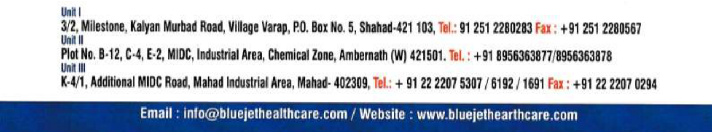

**[Image: Aug2026.pdf-0001-11.png (1241x232, 283.6KB)]**

**[Image: Aug2026.pdf-0002-00.png (545x122, 24.1KB)]**

## **Investor** **<u>Presentation</u> Q1 FY27** 

**[Image: Aug2026.pdf-0002-02.png (747x793, 477.0KB)]**

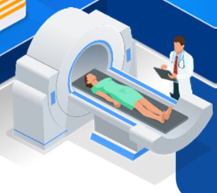

**[Image: Aug2026.pdf-0002-03.png (269x239, 77.1KB)]**

1 

##### **Disclaimer** 

**[Image: Aug2026.pdf-0003-01.png (124x103, 12.6KB)]**

The Presentation is to provide the general background information about the Company’s activities as at the date of the Presentation. The information contained herein is for general information purposes only and based on estimates and should not be considered as a recommendation that any investor should subscribe / purchase the company shares. The Company makes no representation or warranty, express or implied, as to, and does not accept any responsibility or liability with respect to, the fairness, accuracy, completeness or correctness of any information contained herein. 

This presentation may include certain “forward looking statements”. These statements are based on current expectations, forecasts and assumptions that are subject to risks and uncertainties which could cause actual outcomes and results to differ materially from these statements. Important factors that could cause actual results to differ materially from our expectations include, amongst others, general economic and business conditions in India and abroad, ability to successfully implement our strategy, our research & development efforts, our growth & expansion plans and technological changes, changes in the value of the Rupee and other currencies, changes in the Indian and international interest rates, change in laws and regulations that apply to the Indian and global pharmaceutical and chemical industries, increasing competition, changes in political conditions in India or any other country and changes in the foreign exchange control regulations in India. Neither the company, nor its Directors and any of the affiliates or employee have any obligation to update or otherwise revise any forward-looking statements. The readers may use their own judgment and are advised to make their own calculations before deciding on any matter based on the information given herein. 

No part of this presentation may be reproduced, quoted or circulated without prior written approval from Blue Jet Healthcare Ltd. 

**2** 

**[Image: Aug2026.pdf-0004-00.png (545x122, 30.4KB)]**

### Table of **<u>Content</u>** 

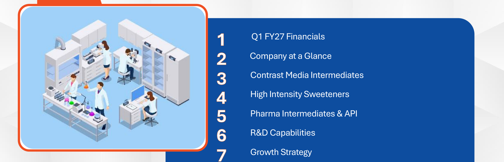

**[Image: Aug2026.pdf-0004-02.png (1650x534, 360.4KB)]**

<!-- Start of picture text -->
Q1 FY27 Financials Company at a Glance Contrast Media Intermediates High Intensity Sweeteners Pharma Intermediates & API R&D Capabilities Growth Strategy <!-- End of picture text -->

3 

**[Image: Aug2026.pdf-0005-00.png (1650x233, 99.2KB)]**

**[Image: Aug2026.pdf-0005-01.png (850x561, 399.3KB)]**

**[Image: Aug2026.pdf-0005-02.png (53x106, 3.4KB)]**

#### **Q1 FY27 Financials** 

4 

##### **Q1 FY27 vs Q4 FY26 (QoQ) Earnings Highlights** 

**[Image: Aug2026.pdf-0006-01.png (124x103, 12.6KB)]**

**[Image: Aug2026.pdf-0006-02.png (761x68, 6.8KB)]**

<!-- Start of picture text -->
Financial Highlights <!-- End of picture text -->

- **Revenue from Operations in Q1 June 26 was ₹ 2,931mn, EBITDA ₹ 981mn (33% Margin) and PAT ₹ 783mn (27% Margin).** 

- **Revenue from Operations in Q4 March 26 was ₹ 2,347mn, EBITDA ₹ 713mn (30% Margin) and PAT ₹ 643mn (27% Margin).** 

- **QoQ comparison: Revenue from operations increased by 25%, EBITDA increased by 38% ( ₹ 268mn) and PAT increased by 22% (Rs 140 mn) during Q1 June 26.** 

- **The increase in Revenue from Operations during current quarter is due to higher sales in PI & API category.** 

- **EBIDTA: stands at 33% for the quarter higher due to higher sales volume (25%) & benefit of operating leverage.** 

5 

##### **Q1 FY27 vs Q1 FY26 (YoY) Earnings Highlights** 

**[Image: Aug2026.pdf-0007-01.png (124x103, 12.6KB)]**

**[Image: Aug2026.pdf-0007-02.png (761x68, 6.9KB)]**

<!-- Start of picture text -->
Financial Highlights <!-- End of picture text -->

- **Revenue from Operations in Q1 June 26 was ₹ 2,931mn, EBITDA ₹ 981mn (33% Margin) and PAT ₹ 783mn (27% Margin).** 

- **Revenue from Operation in Q1 June 25  was ₹ 3,548mn, EBITDA ₹ 1,210mn (34% Margin) and PAT ₹ 912mn (26% Margin).** 

- **YoY comparison, Revenue from operations decreased by 17%, EBITDA decreased by 19% ( ₹ 229mn) and PAT decreased  by 14% ( ₹ 129mn) during Q1 June 26.** 

- **The decrease in revenue from operations during  Q1 June 26 was due to lower sales in PI category i.e., ₹ 1,210mn vs ₹ 2,120mn in Q1 June 25.** 

6 

##### **Q1 FY27 Earnings Highlights** 

**[Image: Aug2026.pdf-0008-01.png (124x103, 12.6KB)]**

**[Image: Aug2026.pdf-0008-02.png (759x68, 7.2KB)]**

<!-- Start of picture text -->
Business Updates <!-- End of picture text -->

- **PI & API have shown good traction this qtr.** 

- **The R&D center at Hyderabad facilities are on track & are expected to be operational on or before Sept’26. 1****st** **Phase talent pool on boarded.** 

- **The Vizag project activities have been commenced with onboarding of technical consultants as well as company received approval for Consent to Establish.** 

- **The Company successfully completed fund raising aggregating to ₹ 8,000 million by allotting 1,58,10,276 equity shares of face value of ₹ 2 each to the eligible Qualified Institutional Buyers (QIB), at the issue price of ₹ 506 per equity share (including a premium of ₹ 504 per equity share).** 

- **The Company has been awarded with Silver Medal by EcoVadis for its outstanding sustainability environment management practices. This prestigious achievement places Blue Jet amongst the top 15% of companies with a 90****th** **percentile ranking in sustainability performance evaluated by EcoVadis.** 

**[Image: Aug2026.pdf-0008-08.png (521x512, 350.1KB)]**

<!-- Start of picture text -->
7 <!-- End of picture text -->

##### **Q1 FY27 Vs Q4 FY26 Financial Performance – Key Metrics** 

**[Image: Aug2026.pdf-0009-02.png (124x103, 12.6KB)]**

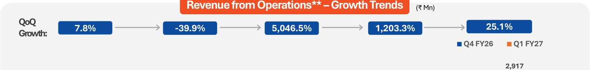

**[Image: Aug2026.pdf-0009-03.png (1487x177, 23.0KB)]**

<!-- Start of picture text -->
Revenue from Operations** –Growth Trends ( ₹  Mn) QoQ 7.8% -39.9% 5,046.5% 1,203.3% 25.1% Growth: Q4 FY26 Q1 FY27 2,917 <!-- End of picture text -->

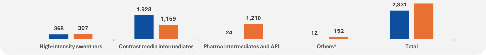

**[Image: Aug2026.pdf-0009-04.png (1487x171, 15.5KB)]**

<!-- Start of picture text -->
2,331 1,928 1,159 1,210 368 397 24 12 152 High-intensity sweetners Contrast media intermediates Pharma intermediates and API Others* Total <!-- End of picture text -->

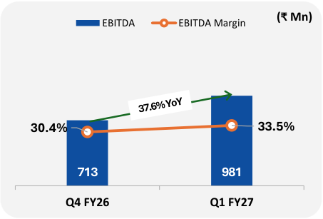

**[Image: Aug2026.pdf-0009-05.png (453x307, 15.4KB)]**

<!-- Start of picture text -->
EBITDA EBITDA Margin (₹ Mn) 30.4% 33.5% 713 981 Q4 FY26 Q1 FY27 <!-- End of picture text -->

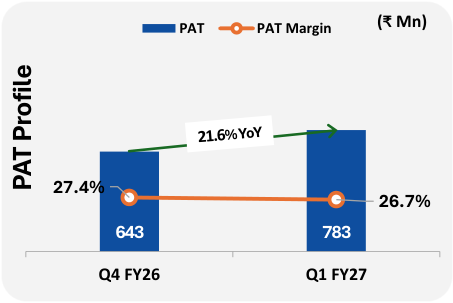

**[Image: Aug2026.pdf-0009-06.png (453x303, 15.9KB)]**

<!-- Start of picture text -->
PAT PAT Margin (₹ Mn) 27.4% 26.7% 643 783 Q4 FY26 Q1 FY27 PAT Profile <!-- End of picture text -->

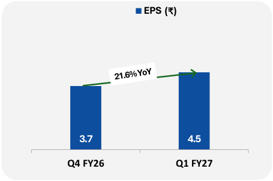

**[Image: Aug2026.pdf-0009-07.png (455x303, 9.4KB)]**

<!-- Start of picture text -->
EPS (₹) 3.7 4.5 Q4 FY26 Q1 FY27 <!-- End of picture text -->

- *Others include spent oils and industrial mix solvents and R&D services . 

- ****** Excludes Other Operating Revenue. 

**8** 

##### **Q1 FY27 Vs Q1 FY26 Financial Performance – Key Metrics** 

**[Image: Aug2026.pdf-0010-02.png (124x103, 12.6KB)]**

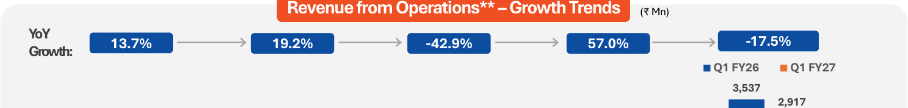

**[Image: Aug2026.pdf-0010-03.png (1487x177, 21.8KB)]**

<!-- Start of picture text -->
Revenue from Operations** –Growth Trends ( ₹  Mn) YoY 13.7% 19.2% -42.9% 57.0% -17.5% Growth: Q1 FY26 Q1 FY27 3,537 2,917 <!-- End of picture text -->

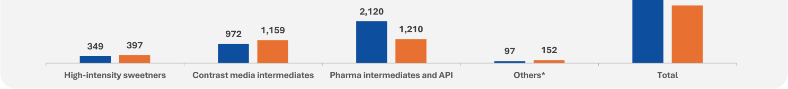

**[Image: Aug2026.pdf-0010-04.png (1487x171, 15.0KB)]**

<!-- Start of picture text -->
2,120 972 1,159 1,210 349 397 97 152 High-intensity sweetners Contrast media intermediates Pharma intermediates and API Others* Total <!-- End of picture text -->

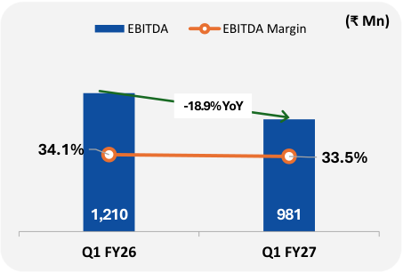

**[Image: Aug2026.pdf-0010-05.png (453x307, 14.5KB)]**

<!-- Start of picture text -->
EBITDA EBITDA Margin (₹ Mn) -18.9% YoY 34.1% 33.5% 1,210 981 Q1 FY26 Q1 FY27 <!-- End of picture text -->

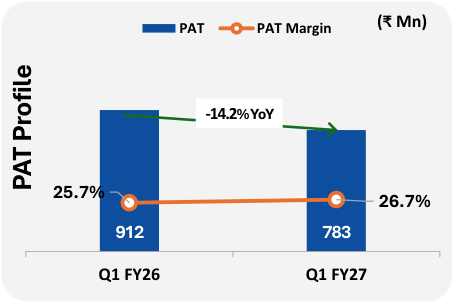

**[Image: Aug2026.pdf-0010-06.png (453x303, 15.7KB)]**

<!-- Start of picture text -->
PAT PAT Margin (₹ Mn) -14.2 % YoY 25.7% 26.7% 912 783 Q1 FY26 Q1 FY27 PAT Profile <!-- End of picture text -->

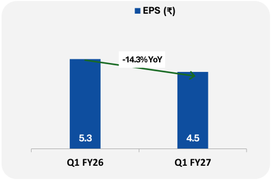

**[Image: Aug2026.pdf-0010-07.png (455x303, 9.2KB)]**

<!-- Start of picture text -->
EPS (₹) -14.3% YoY 5.3 4.5 Q1 FY26 Q1 FY27 <!-- End of picture text -->

- *Others include spent oils and industrial mix solvents and R&D services . 

- ****** Excludes Other Operating Revenue. 

**9** 

##### **Profit and Loss Statement** 

**[Image: Aug2026.pdf-0011-01.png (124x103, 12.6KB)]**

|**Particulars (₹ Mn)**|**Q1 FY27**|**Q4 FY26**|**QoQ**|**Q1 FY26**|**YoY**|
|---|---|---|---|---|---|
|**Revenue from Operations**|**2,931**|**2,347**|**24.9%**|**3,548**|**-17.4%**|
|Cost Of Goods Sold|1,371|1,022||1,829||
|**Gross Profit**|**1,560**|**1,325**|**17.8%**|**1,719**|**-9.2%**|
|Employee benefits expenses|201|185||174||
|Other expenses|378|427||334||
|**Total Expenses**|1,950|1,634||2,338||
|**EBITDA**|**981**|**713**|**37.6%**|**1,210**|**-18.9%**|
|_EBITDA Margin_|_33.5%_|_30.4%_||_34.1%_||
|Depreciation and amortization|67|65||57||
|**PBIT**|**1,066**|**877**|**21.5%**|**1,236**|**-13.7%**|
|Exceptional Items|-|-||-||
|Finance costs|7|6||7||
|Other Income|152|229||83||
|**PBT**|**1,059**|**871**|**21.6%**|**1,229**|**-13.8%**|
|Tax Expense|277|228||317||
|**PAT**|**783**|**643**|**21.6%**|**912**|**-14.2%**|
|_PAT Margin_|_26.7%_|_27.4%_||_25.7%_||

**10** 

##### **Financial Performance over the years – Key Metrics** 

**[Image: Aug2026.pdf-0012-01.png (124x103, 12.6KB)]**

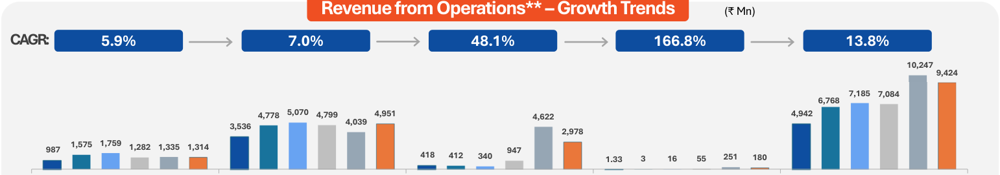

**[Image: Aug2026.pdf-0012-02.png (1542x271, 35.8KB)]**

<!-- Start of picture text -->
Revenue from Operations** –Growth Trends ( ₹  Mn) CAGR: 5.9% 7.0% 48.1% 166.8% 13.8% 10,247 9,424 7,185 7,084 6,768 4,778 5,070 4,799 4,951 4,622 4,942 4,039 3,536 2,978 987  1,575 1,759 1,282 1,335 1,314 947 418  412 340 1.33 3 16 55 251 180 <!-- End of picture text -->

**[Image: Aug2026.pdf-0012-03.png (20x20, 0.2KB)]**

**[Image: Aug2026.pdf-0012-04.png (18x20, 0.2KB)]**

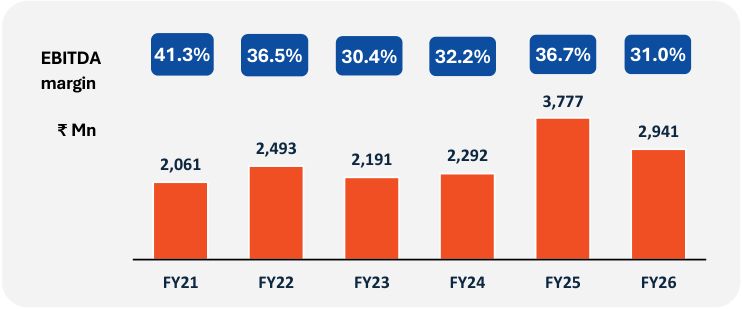

**[Image: Aug2026.pdf-0012-05.png (742x309, 19.8KB)]**

<!-- Start of picture text -->
EBITDA  41.3% 36.5% 30.4% 32.2% 36.7% 31.0% margin 3,777 ₹  Mn 2,941 2,493 2,061 2,191 2,292 FY21 FY22 FY23 FY24 FY25 FY26 <!-- End of picture text -->

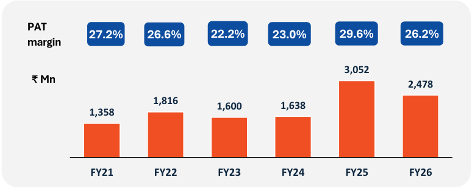

**[Image: Aug2026.pdf-0012-06.png (774x309, 19.5KB)]**

<!-- Start of picture text -->
PAT 27.2% 26.6% 22.2% 23.0% 29.6% 26.2% margin 3,052 ₹  Mn 2,478 1,816 1,600 1,638 1,358 FY21 FY22 FY23 FY24 FY25 FY26 <!-- End of picture text -->

- *Others include spent oils, Industrial mix  solvents and R&D 

- **Excludes Other Operating Revenue 

**11** 

##### **Financials for the last five years** 

|**Particulars (₹ Mn)**|**FY21**|**FY22**|**FY23**|**FY24**|**FY25**|**FY26**|
|---|---|---|---|---|---|---|
|**Revenue from Operations**|4,989|6,835|7,210|7,116|10,300|9,473|
|Other Income|89|194|240|289|463|687|
|**Total Revenue**|**5,078**|**7,029**|**7,449**|**7,404**|**10,762**|**10,160**|
|Cost of Materials consumed|1,695|2,875|3,360|3,144|4,612|4,358|
|Employee benefits expenses|290|330|419|532|610|735|
|Finance costs|53|33|14|2|1|62|
|Depreciation and amortization|197|221|251|281|178|240|
|Other expenses|945|1,137|1,240|1,148|1,300|1,439|
|**Total Expenses**|**3,178**|**4,597**|**5,283**|**5,106**|**6,701**|**6,834**|
|Exceptional Items|(53)|-|-|(97)|-|-|
|**PBT**|**1,847**|**2,432**|**2,166**|**2,200**|**4,061**|**3,325**|
|Tax Expense|489|616|566|563|1,009|847|
|**PAT**|**1,358**|**1,816**|**1,600**|**1,637**|**3,052**|**2,478**|

**[Image: Aug2026.pdf-0013-02.png (124x103, 12.6KB)]**

|**Particulars (₹ Mn)**|**FY21**|**FY22**|**FY23**|**FY24**|**FY25**|**FY26**|
|---|---|---|---|---|---|---|
|**I. Assets**|||||||
|Property, plant and equipment|1,188|1,185|1,282|1,491|2,596|2,529|
|Other non-current assets|275|466|688|2,041|1,519|4,312|
|**Total non-current assets**|**1,463**|**1,651**|**1,970**|**3,532**|**4,116**|**6,841**|
|Inventories|1,177|1,050|1,257|1,298|2,639|1,874|
|Trade receivables|1,440|2,274|2,394|1,769|3,495|3,390|
|Investments(Current)|368|938|1,893|2,355|1,867|2,267|
|Cash and cash equivalents|611|754|654|410|330|609|
|Other current assets|304|467|453|1,224|1,728|1,430|
|**Total current assets**|**3,900**|**5,483**|**6,651**|**7,056**|**10,059**|**9,570**|
|**Total assets**|**5,363**|**7.134**|**8.621**|**10,588**|**14,175**|**16,412**|
|**II. Equity and liabilities**|||||||
|**Total equity**|**3,398**|**5,215**|**6,815**|**8,452**|**11,331**|**13,599**|
|Borrowings|287|-|-|-|-|-|
|Other non-current liabilities|47|173|67|77|285|538|
|**Total non-current liabilities**|**334**|**173**|**67**|**77**|**285**|**538**|
|Current borrowings|229|-|-|-|-|-|
|Tradepayables|595|565|538|303|891|569|
|Other current liabilities|807|1,180|1,201|1,757|1,669|1,706|
|**Total current liabilities**|**1,631**|**1,745**|**1,739**|**2,060**|**2,559**|**2,275**|
|**Total liabilities**|**1,965**|**1,918**|**1,806**|**2,136**|**2,844**|**2,813**|
|**Total equity and liabilities**|**5,363**|**7,134**|**8,621**|**10,588**|**14,175**|**16,412**|

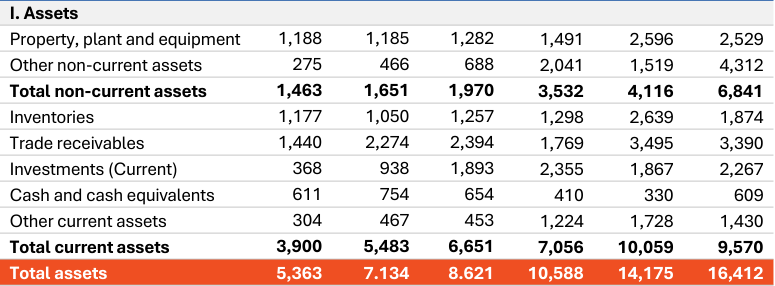

**[Image: Aug2026.pdf-0013-04.png (775x286, 53.2KB)]**

<!-- Start of picture text -->
I. Assets Property, plant and equipment 1,188 1,185 1,282 1,491 2,596 2,529 Other non-current assets 275  466  688  2,041 1,519 4,312 Total non-current assets 1,463  1,651  1,970  3,532 4,116 6,841 Inventories 1,177 1,050 1,257 1,298 2,639 1,874 Trade receivables 1,440 2,274 2,394 1,769 3,495 3,390 Investments (Current) 368 938 1,893 2,355 1,867 2,267 Cash and cash equivalents 611 754 654 410 330 609 Other current assets 304 467 453 1,224 1,728 1,430 Total current assets 3,900  5,483  6,651  7,056 10,059 9,570 Total assets 5,363 7.134 8.621 10,588 14,175 16,412 <!-- End of picture text -->

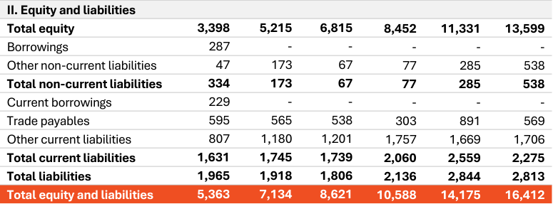

**[Image: Aug2026.pdf-0013-05.png (775x287, 48.7KB)]**

<!-- Start of picture text -->
II. Equity and liabilities Total equity 3,398  5,215  6,815  8,452 11,331 13,599 Borrowings 287  - - - - - Other non-current liabilities 47  173  67  77 285 538 Total non-current liabilities 334  173  67  77 285 538 Current borrowings 229  - - - - - Trade payables 595  565  538  303 891 569 Other current liabilities 807  1,180  1,201  1,757 1,669 1,706 Total current liabilities 1,631  1,745  1,739  2,060 2,559 2,275 Total liabilities 1,965  1,918  1,806  2,136 2,844 2,813 Total equity and liabilities 5,363  7,134  8,621  10,588 14,175 16,412 <!-- End of picture text -->

**12** 

##### **Shareholder Information** 

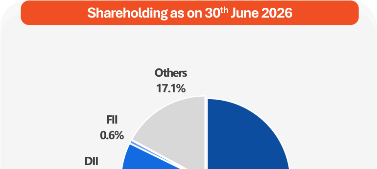

**[Image: Aug2026.pdf-0014-01.png (770x346, 18.6KB)]**

<!-- Start of picture text -->
Shareholding as on 30 th June 2026 Others 17.1% FII 0.6% DII <!-- End of picture text -->

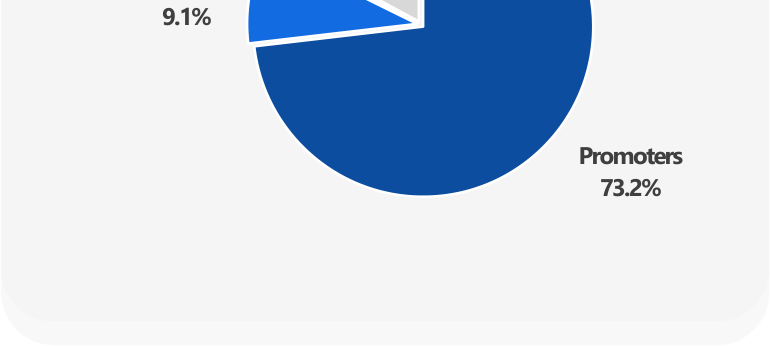

**[Image: Aug2026.pdf-0014-02.png (770x346, 13.2KB)]**

<!-- Start of picture text -->
9.1% Promoters 73.2% <!-- End of picture text -->

**[Image: Aug2026.pdf-0014-03.png (124x103, 12.6KB)]**

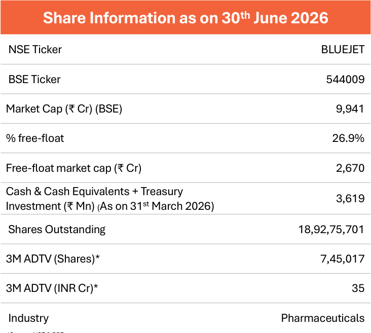

**[Image: Aug2026.pdf-0014-04.png (732x657, 52.8KB)]**

<!-- Start of picture text -->
Share Information as on 30 th June 2026 NSE Ticker BLUEJET BSE Ticker 544009 Market Cap ( ₹  Cr) (BSE) 9,941 % free-float 26.9% Free-float market cap ( ₹  Cr) 2,670 Cash & Cash Equivalents + Treasury 3,619 Investment ( ₹  Mn) (As on 31 st March 2026) Shares Outstanding 18,92,75,701 3M ADTV (Shares)* 7,45,017 3M ADTV (INR Cr)* 35 Industry Pharmaceuticals <!-- End of picture text -->

|NSE Ticker|BLUEJET|
|---|---|
|BSE Ticker|544009|
|Market Cap (₹Cr) (BSE)|9,941|
|% free-float|26.9%|
|Free-float market cap (₹Cr)|2,670|
|Cash & Cash Equivalents + Treasury Investment(₹Mn) (As on 31st March 2026)|3,619|
|Shares Outstanding|18,92,75,701|
|3M ADTV (Shares)*|7,45,017|
|3M ADTV (INR Cr)*|35|
|Industry|Pharmaceuticals|
|*Source: NSE & BSE ADTV (Shares): Average Daily Traded Volume ADTV (INR Cr): Average Daily Traded Value||

**13** 

**[Image: Aug2026.pdf-0015-00.png (1650x233, 99.2KB)]**

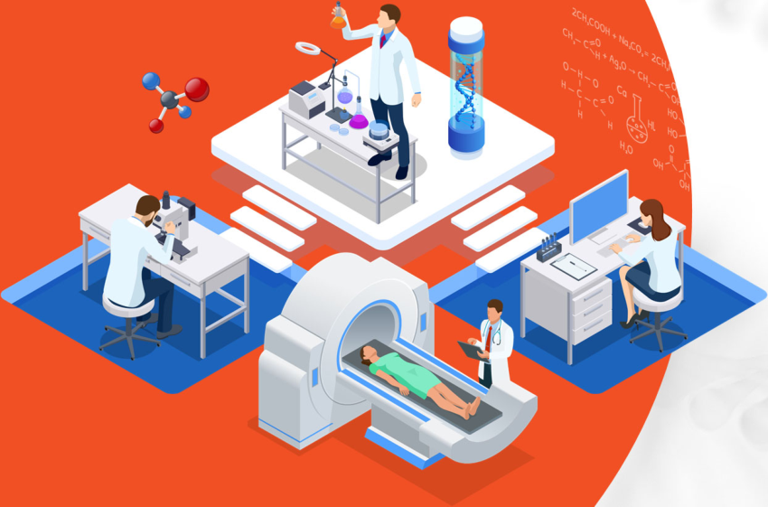

**[Image: Aug2026.pdf-0015-01.png (850x561, 382.7KB)]**

**[Image: Aug2026.pdf-0015-02.png (79x106, 4.9KB)]**

#### **Company at a Glance** 

14 

##### **Our Journey** 

**[Image: Aug2026.pdf-0016-01.png (124x103, 12.6KB)]**

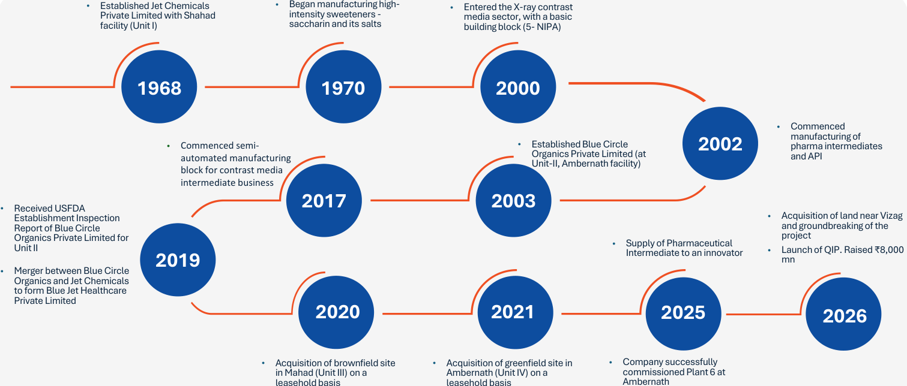

**[Image: Aug2026.pdf-0016-02.png (1511x644, 136.5KB)]**

<!-- Start of picture text -->
• Established Jet Chemicals  • Began manufacturing high- • Entered the X-ray contrast Private Limited with Shahad  intensity sweeteners - media sector, with a basic facility (Unit I)  saccharin and its salts building block (5- NIPA) 1968 1970 2000 • Commenced manufacturing of • Commenced semi- • Established Blue Circle  2002 pharma intermediates automated manufacturing  Organics Private Limited (at  and API Unit-II, Ambernath facility) block for contrast media intermediate business • Received USFDA  2017 2003 Establishment Inspection  • Acquisition of land near Vizag Report of Blue Circle  and groundbreaking of the Organics Private Limited for Unit II • Supply of Pharmaceutical Intermediate to an innovator • projectLaunch of QIP. Raised  ₹ 8,000 mn 2019 • Merger between Blue Circle Organics and Jet Chemicals to form Blue Jet Healthcare Private Limited 2020 2021 2025 2026 • Acquisition of brownfield site  • Acquisition of greenfield site in  • Company successfully in Mahad (Unit III) on a  Ambernath (Unit IV) on a  commissioned Plant 6 at leasehold basis leasehold basis Ambernath <!-- End of picture text -->

**15** 

**16** 

##### **Who we are** 

**[Image: Aug2026.pdf-0017-02.png (124x103, 12.6KB)]**

A **specialty pharmaceutical** and 

**healthcare ingredient** and **intermediate** 

company, offering **niche products** with 

an approach of **“Collaboration,** 

**Development, Manufacturing”** to 

**CDMO** business. 

##### **Blue Jet Healthcare at a glance** 

**[Image: Aug2026.pdf-0018-01.png (124x103, 12.6KB)]**

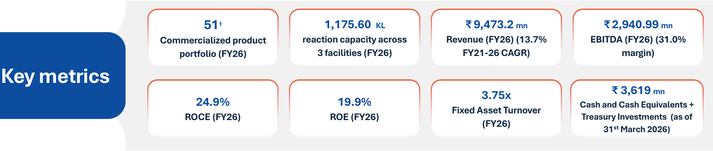

**[Image: Aug2026.pdf-0018-02.png (1579x337, 74.8KB)]**

<!-- Start of picture text -->
51 1 1,175.60  KL ₹ 9,473.2 mn ₹ 2,940.99 mn Commercialized product  reaction capacity across Revenue (FY26) (13.7%  EBITDA (FY26) (31.0% portfolio (FY26) 3 facilities (FY26) FY21-26 CAGR) margin) Key metrics ₹  3,619 mn 3.75x 24.9% 19.9% Cash and Cash Equivalents + Fixed Asset Turnover ROCE (FY26) ROE (FY26) Treasury Investments  (as of (FY26) 31 st March 2026) <!-- End of picture text -->

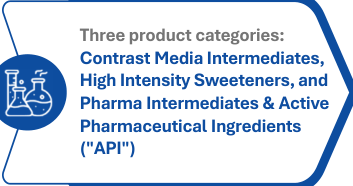

**[Image: Aug2026.pdf-0018-03.png (353x186, 19.5KB)]**

<!-- Start of picture text -->
Three product categories: Contrast Media Intermediates, High Intensity Sweeteners, and Pharma Intermediates & Active Pharmaceutical Ingredients ("API") <!-- End of picture text -->

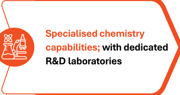

**[Image: Aug2026.pdf-0018-04.png (353x186, 16.4KB)]**

<!-- Start of picture text -->
Specialised chemistry capabilities; with dedicated R&D laboratories <!-- End of picture text -->

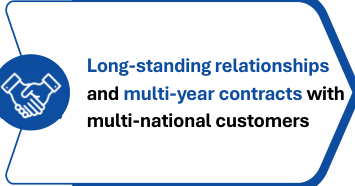

**[Image: Aug2026.pdf-0018-05.png (355x186, 17.1KB)]**

<!-- Start of picture text -->
Long-standing relationships and multi-year contracts with multi-national customers <!-- End of picture text -->

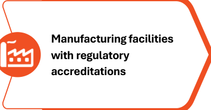

**[Image: Aug2026.pdf-0018-06.png (355x186, 13.0KB)]**

<!-- Start of picture text -->
Manufacturing facilities with regulatory accreditations <!-- End of picture text -->

1. Includes 19, 4, and 28 commercialized products for contrast media, high intensity sweeteners, and pharma intermediates and APIs respectively Source: Company Information 

**17** 

##### **Overview of our Product Categories** 

- Contrast media are agents used in medical imaging to enhance the visibility of body tissues 

   - High-intensity sweetener business involves development, manufacture and marketing of saccharin and its salts 

- Company supplies critical starting intermediate and several advanced intermediates 

**[Image: Aug2026.pdf-0019-04.png (382x3, 0.9KB)]**

**[Image: Aug2026.pdf-0019-05.png (383x3, 0.9KB)]**

- Table-top sweeteners, oral care products, beverages (primarily soft-drinks), confectionary products, pharmaceutical products, food supplements, and animal feeds 

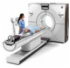

**[Image: Aug2026.pdf-0019-07.png (70x68, 7.2KB)]**

**[Image: Aug2026.pdf-0019-08.png (69x68, 10.3KB)]**

**[Image: Aug2026.pdf-0019-09.png (382x5, 0.9KB)]**

**[Image: Aug2026.pdf-0019-10.png (306x5, 0.8KB)]**

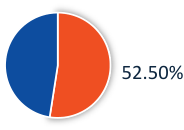

**[Image: Aug2026.pdf-0019-11.png (184x130, 6.3KB)]**

<!-- Start of picture text -->
52.50% <!-- End of picture text -->

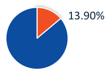

**[Image: Aug2026.pdf-0019-12.png (178x126, 4.8KB)]**

<!-- Start of picture text -->
13.90% <!-- End of picture text -->

**[Image: Aug2026.pdf-0019-13.png (124x103, 12.6KB)]**

- Collaboration with innovator pharmaceutical companies and multi-national generic companies 

- Provides intermediates that serve as pharmaceutical building blocks for APIs in chronic therapeutic areas 

**[Image: Aug2026.pdf-0019-16.png (382x3, 0.9KB)]**

- Chronic therapeutic areas such as cardiovascular system (“CVS”), central nervous system (“CNS”), oncology etc 

**[Image: Aug2026.pdf-0019-18.png (382x5, 0.9KB)]**

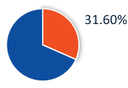

**[Image: Aug2026.pdf-0019-19.png (186x128, 5.5KB)]**

<!-- Start of picture text -->
31.60% <!-- End of picture text -->

**[Image: Aug2026.pdf-0019-20.png (383x5, 0.9KB)]**

- Top 4 players accounts for **~75%** global marketshare1 

- **4–27** years of relationship with the **3 of the largest manufacturers .** 

- **Offers high-intensity sweeteners to over 300** customers globally 

- **Marquee customers** – **in FMCG and Agro chemical Space** 

- Markets predominantly in **regulated markets** 

- Over **56** customers globally of which **40** in India 

Note:1 In each of MAT June 2019, 2020, 2021, 2022 and 2023 

Source: Company information, IQVIA report dated October 9, 2023 (“Industry Report”) 

**18** 

**[Image: Aug2026.pdf-0020-00.png (1650x233, 99.2KB)]**

**[Image: Aug2026.pdf-0020-01.png (850x561, 399.3KB)]**

**[Image: Aug2026.pdf-0020-02.png (78x106, 5.4KB)]**

#### **Contrast Media Intermediates** 

19 

##### **Overview of Contrast Media and its growth drivers** 

**[Image: Aug2026.pdf-0021-01.png (124x103, 12.6KB)]**

- Chemical agents that **enhances the contrast of an imaging modality** in diagnostic imaging, thereby **aiding diagnosis of diseases** 

- Once inside the human body, selectively and temporarily taken up by different body tissues 

- **Enhance the images, leading to better visualizations of the tissues and organs** 

- **X-ray / Computed Tomography (CT) contrast agents:** Iodinebased contrast media agents 

- **Magnetic Resonance Imaging (MRI) contrast agents** : Gadolinium-based agents 

- **Ultrasound (USG) agents:** Stabilized microbubble-based contrast media agents 

**[Image: Aug2026.pdf-0021-08.png (55x44, 2.3KB)]**

**[Image: Aug2026.pdf-0021-09.png (43x45, 2.0KB)]**

###### **Growing population and changing demographics** 

(65 yrs.+) estimated to increase from 6.9% of the total world population in 2000 to 10.4% by 20251 

**Growing prevalence of lifestyle diseases** Such as diabetes, physical inactivity, obesity, etc. 

###### **Increased convenience** 

Through online booking and reporting 

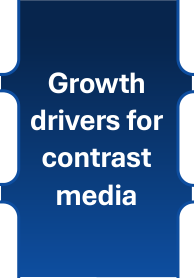

**[Image: Aug2026.pdf-0021-15.png (194x278, 10.4KB)]**

<!-- Start of picture text -->
Growth drivers for contrast media <!-- End of picture text -->

###### **Rising healthcare expenditure** 

Global health expenditure grew at 3.9% CAGR from 2000–17 

###### **Focus on early diagnostics** 

Driven by advancement in diagnostic technologies and growing public awareness 

**Increasing demand for preventive healthcare** Driven by increased awareness and rising curative costs 

Note:1 World Bank national account data 

**20** 

Source: Industry Report 

##### **The global Contrast Media industry is highly concentrated** 

**[Image: Aug2026.pdf-0022-01.png (124x103, 12.6KB)]**

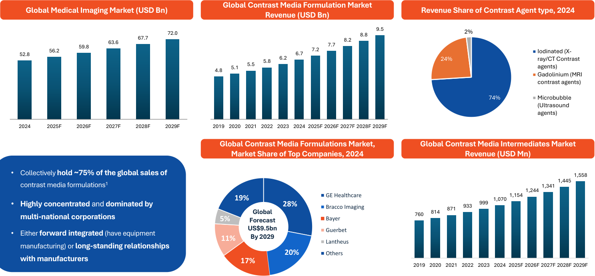

**[Image: Aug2026.pdf-0022-02.png (1487x690, 137.3KB)]**

<!-- Start of picture text -->
Global Contrast Media Formulation Market Global Medical Imaging Market (USD Bn) Revenue Share of Contrast Agent type, 2024 Revenue (USD Bn) CAGR, 2024-2029F - 6.4% 67.7 72.0 CAGR, 2019-2024: 6.8%CAGR, 2024-2029F: 7.2% 8.2 8.8 9.5 2% 59.8 63.6 7.7 52.8 56.2 6.7 7.2 Iodinated (X- 5.8 6.2 24% ray/CT Contrast 5.5 4.8 5.1 agents) Gadolinium (MRI contrast agents) 74% Microbubble (Ultrasound agents) 2024 2025F 2026F 2027F 2028F 2029F 2019 2020 2021 2022 2023 2024 2025F 2026F 2027F 2028F 2029F Global Contrast Media Formulations Market,  Global Contrast Media Intermediates Market Market Share of Top Companies, 2024 Revenue (USD Mn) CAGR, 2019-2024 - 7.1% • Collectively  hold ~75% of the global sales of  CAGR, 2024-2029F - 7.8% 1,558 1,445 contrast media formulations 1 1,341 1,244 19% GE Healthcare 1,070 1,154 • Highly concentrated  and  dominated by  28% Bracco Imaging 871 933 999 multi-national corporations 5% ForecastGlobal  Bayer 760 814 • Either  forward integrated  (have equipment  US$9.5bn  Guerbet 11% By 2029 Lantheus manufacturing) or  long-standing relationships 20% Others with manufacturers 17% 2019 2020 2021 2022 2023 2024 2025F 2026F 2027F 2028F 2029F <!-- End of picture text -->

1. June 2019, 2020, 2021, 2022 and 2023 _Source: F&S Report_ 

21 

##### **High entry barriers for key intermediates’ vendors** 

- More than **two decades of experience** 

###### **CAGR: 7.0 %** 

**[Image: Aug2026.pdf-0023-03.png (19x508, 1.6KB)]**

- **75%+ of exports** of a selected contrast media intermediate **(5-Amino-N,N'-bis (2,3dihydroxypropyl) isophthalamide)** from India1 

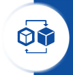

**[Image: Aug2026.pdf-0023-05.png (107x109, 7.6KB)]**

Revenue ( ₹ mn) 

- Strategically **focused on complex chemistry** categories 

**[Image: Aug2026.pdf-0023-08.png (39x353, 2.9KB)]**

**[Image: Aug2026.pdf-0023-09.png (38x336, 2.8KB)]**

**[Image: Aug2026.pdf-0023-10.png (38x334, 2.9KB)]**

**[Image: Aug2026.pdf-0023-11.png (276x6, 0.9KB)]**

**[Image: Aug2026.pdf-0023-12.png (474x6, 1.1KB)]**

- Regularly supplying **key starting intermediate** as the building block 

**[Image: Aug2026.pdf-0023-14.png (107x109, 8.2KB)]**

**[Image: Aug2026.pdf-0023-15.png (38x249, 2.8KB)]**

- Several **functionally critical advanced intermediates** 

- **4 to 27** years with 3 of the largest contrast media manufacturers in the world, directly 

**[Image: Aug2026.pdf-0023-18.png (276x5, 0.9KB)]**

**[Image: Aug2026.pdf-0023-19.png (474x5, 1.1KB)]**

- **Medium to long term supply contracts** with customers 

**[Image: Aug2026.pdf-0023-21.png (109x109, 7.8KB)]**

- **~70% of total sales** backed by **contracted** sales volumes2 

- **Products qualified, approved and validated** 

Source: Company information 

Note:1 In each of the Financial Years 2020, 2021 and 2022; 2 For Financial Years 2021, 2022, 2023 and three months ended 1Q 2023 Source: Industry Report 

**[Image: Aug2026.pdf-0023-26.png (38x282, 2.9KB)]**

**[Image: Aug2026.pdf-0023-27.png (39x347, 4.9KB)]**

**[Image: Aug2026.pdf-0023-28.png (124x103, 12.6KB)]**

**[Image: Aug2026.pdf-0023-29.png (39x84, 1.6KB)]**

**22** 

###### **Continue to forward integrate into more advanced intermediates for Contrast Media** 

**[Image: Aug2026.pdf-0024-01.png (124x103, 12.6KB)]**

**[Image: Aug2026.pdf-0024-02.png (59x53, 5.3KB)]**

**Strong product development** and process **optimization capabilities** underpinned by **in-house R&D capabilities** 

**[Image: Aug2026.pdf-0024-04.png (117x118, 4.4KB)]**

**[Image: Aug2026.pdf-0024-05.png (55x50, 3.7KB)]**

**[Image: Aug2026.pdf-0024-06.png (59x51, 1.9KB)]**

Focus on molecules with **customer interest** and **strategy** in either **outsourcing or alternate sourcing** the next stage of advanced intermediates 

**Key starting intermediate** as building block in 2000 to **19 additional advanced intermediates** as of FY26 

**[Image: Aug2026.pdf-0024-09.png (574x3, 1.3KB)]**

**[Image: Aug2026.pdf-0024-10.png (574x5, 1.3KB)]**

**[Image: Aug2026.pdf-0024-11.png (117x116, 5.3KB)]**

**[Image: Aug2026.pdf-0024-12.png (51x47, 4.6KB)]**

Further **improving chemistry** capabilities in close **synergy** with our customers ( **4 to 27** years with 3 of top 4 players directly) 

**[Image: Aug2026.pdf-0024-14.png (117x118, 5.5KB)]**

**23** 

**[Image: Aug2026.pdf-0025-00.png (1650x233, 99.2KB)]**

**[Image: Aug2026.pdf-0025-01.png (850x561, 399.3KB)]**

**[Image: Aug2026.pdf-0025-02.png (83x106, 4.8KB)]**

#### **High Intensity Sweeteners** 

24 

##### **Blue Jet’s positioning in High Intensity Sweetener** 

**[Image: Aug2026.pdf-0026-01.png (124x103, 12.6KB)]**

###### **Products** 

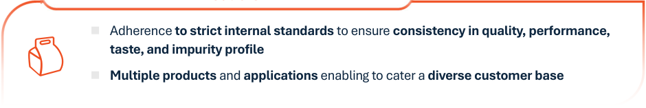

**[Image: Aug2026.pdf-0026-03.png (940x157, 25.5KB)]**

<!-- Start of picture text -->
 Adherence  to strict internal standards  to ensure  consistency in quality, performance, taste, and impurity profile  Multiple products  and  applications  enabling to cater a  diverse customer base <!-- End of picture text -->

**[Image: Aug2026.pdf-0026-04.png (545x47, 7.2KB)]**

<!-- Start of picture text -->
Compliance, GMP, supply chain reliability <!-- End of picture text -->

**[Image: Aug2026.pdf-0026-05.png (937x156, 28.5KB)]**

<!-- Start of picture text -->
Compliance, GMP, supply chain reliability  Have received US-FDA inspection report  Semi-automated manufacturing facility  Strong product development and process optimization capabilities <!-- End of picture text -->

###### **Customers** 

- Offers high-intensity sweeteners to over **300 customers globally** 

- Focus on **marquee customers** across various sub-sectors 

- Table-top sweeteners, oral care products, beverages (primarily soft-drinks), confectionary products, pharmaceutical products, food supplements, and animal feeds 

**[Image: Aug2026.pdf-0026-10.png (32x218, 1.1KB)]**

**[Image: Aug2026.pdf-0026-11.png (34x343, 0.8KB)]**

**[Image: Aug2026.pdf-0026-12.png (32x383, 1.2KB)]**

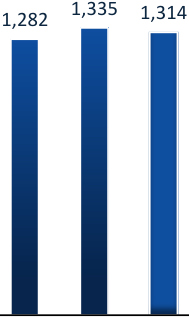

**[Image: Aug2026.pdf-0026-13.png (189x318, 6.1KB)]**

<!-- Start of picture text -->
1,335 1,314 1,282 <!-- End of picture text -->

**[Image: Aug2026.pdf-0026-14.png (32x91, 1.0KB)]**

Sources: Company information 

**25** 

##### **Global High Intensity Sweeteners Market** 

**[Image: Aug2026.pdf-0027-01.png (124x103, 12.6KB)]**

**[Image: Aug2026.pdf-0027-02.png (28x109, 0.4KB)]**

**[Image: Aug2026.pdf-0027-03.png (28x118, 0.5KB)]**

**[Image: Aug2026.pdf-0027-04.png (30x124, 0.5KB)]**

**[Image: Aug2026.pdf-0027-05.png (28x130, 0.5KB)]**

**[Image: Aug2026.pdf-0027-06.png (28x138, 0.5KB)]**

**[Image: Aug2026.pdf-0027-07.png (30x147, 0.5KB)]**

**[Image: Aug2026.pdf-0027-08.png (28x157, 0.5KB)]**

**[Image: Aug2026.pdf-0027-09.png (28x168, 0.5KB)]**

**[Image: Aug2026.pdf-0027-10.png (30x178, 0.5KB)]**

**[Image: Aug2026.pdf-0027-11.png (28x190, 0.5KB)]**

**[Image: Aug2026.pdf-0027-12.png (28x203, 0.5KB)]**

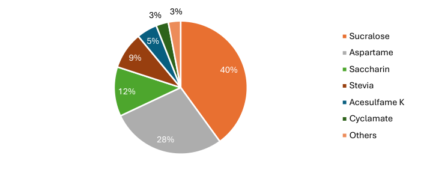

**[Image: Aug2026.pdf-0027-13.png (736x283, 22.7KB)]**

<!-- Start of picture text -->
3% 3% Sucralose 5% 9% Aspartame 40% Saccharin Stevia 12% Acesulfame K Cyclamate Others 28% <!-- End of picture text -->

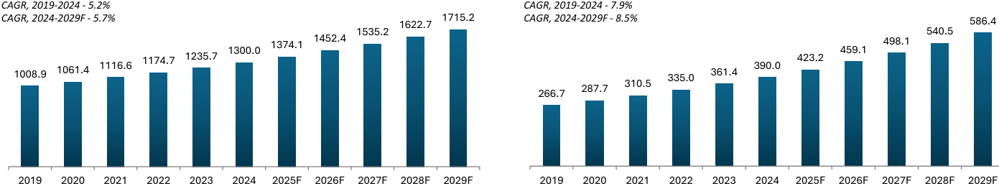

**[Image: Aug2026.pdf-0027-14.png (1391x259, 36.7KB)]**

<!-- Start of picture text -->
CAGR, 2019-2024 - 5.2% CAGR, 2019-2024 - 7.9% CAGR, 2024-2029F - 5.7% 1622.7 1715.2 CAGR, 2024-2029F - 8.5% 586.4 1535.2 540.5 1374.1 1452.4 498.1 1300.0 459.1 1174.7 1235.7 423.2 1008.9 1061.4 1116.6 335.0 361.4 390.0 310.5 287.7 266.7 2019 2020 2021 2022 2023 2024 2025F 2026F 2027F 2028F 2029F 2019 2020 2021 2022 2023 2024 2025F 2026F 2027F 2028F 2029F <!-- End of picture text -->

_Source: Industry Report_ 

26 

**[Image: Aug2026.pdf-0028-00.png (1650x233, 99.2KB)]**

**[Image: Aug2026.pdf-0028-01.png (850x561, 399.3KB)]**

**[Image: Aug2026.pdf-0028-02.png (78x104, 5.0KB)]**

#### **Pharma Intermediates & API** 

27 

###### **Trends and features of the Pharma Intermediates and APIs Product Category** 

**[Image: Aug2026.pdf-0029-01.png (124x103, 12.6KB)]**

###### **Increased propensity to outsource manufacturing of intermediates & APIs** 

- **Enables asset light model** and ability to focus on development of **novel products for venture capital backed start-ups** 

- **Provides cost advantages** and **supply chain efficiencies** 

###### **De-risking dependence on China by global API and formulations players** 

- Concerns around specific APIs made in China, accentuated with Covid-19 

- China **implemented stricter regulations** and witnessed rising wage costs 

###### **Self sufficiency with import substitution** 

- Government initiatives such as **PLI schemes** and **bulk drug parks** 

- Growth driven by **proven skills, educational systems, supply chain reliability, and IP protection** 

###### **The growth in the global pharmaceuticals market** 

- Launch of novel therapies (including biologics and personalized therapies) 

**[Image: Aug2026.pdf-0029-13.png (22x511, 1.8KB)]**

- 

**Features of a typical arrangement to supply of intermediates to innovators of NCEs** 

   - 

   - 

- Expansion of existing therapies in several geographies 

- Growing demand for generic medicines 

Source: Industry Report 

**28** 

###### **Overview of Blue Jet’s Pharma Intermediates and APIs Product Category** 

**[Image: Aug2026.pdf-0030-01.png (124x103, 12.6KB)]**

**[Image: Aug2026.pdf-0030-02.png (76x78, 5.3KB)]**

**[Image: Aug2026.pdf-0030-03.png (51x51, 2.4KB)]**

**[Image: Aug2026.pdf-0030-04.png (128x78, 5.3KB)]**

<!-- Start of picture text -->
Therapeutic <!-- End of picture text -->

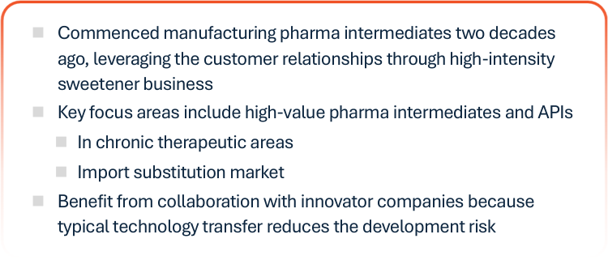

**[Image: Aug2026.pdf-0030-05.png (750x321, 43.2KB)]**

<!-- Start of picture text -->
 Commenced manufacturing pharma intermediates two decades ago, leveraging the customer relationships through high-intensity sweetener business  Key focus areas include high-value pharma intermediates and APIs  In chronic therapeutic areas  Import substitution market  Benefit from collaboration with innovator companies because typical technology transfer reduces the development risk <!-- End of picture text -->

|Commenced manufacturing pharma intermediates two decades ago, leveraging the customer relationships through high-intensity sweetener business| **Pharma Intermediat** **product category  pe**|**e and** **rform**|**APIs** **ance**||
|---|---|---|---|---|
|Key focus areas include high-value pharma intermediates and APIs|**CAGR: 48.1%**||||
|In chronic therapeutic areas|Revenue (INR mn)||||
|Import substitution market||4,622|||
|Benefit from collaboration with innovator companies because typical technology transfer reduces the development risk|||||
|Innovator pharmaceutical companies and multi-national generic pharmaceutical|||2,978||
|Over 40 customers in India, and 16 globally across Europe, North America, South America, and Asia|947|||1,210|
||418 412 340||||
|Cardiovascular system (“CVS”) |||||
|Oncology Central nervous system (“CNS”)|**FY21** **FY22** **FY23** **FY24**|**FY25**|**FY26**|**Q1** **FY27**|

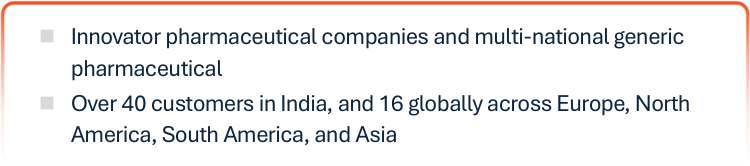

**[Image: Aug2026.pdf-0030-07.png (750x166, 22.1KB)]**

<!-- Start of picture text -->
 Innovator pharmaceutical companies and multi-national generic pharmaceutical  Over 40 customers in India, and 16 globally across Europe, North America, South America, and Asia <!-- End of picture text -->

**[Image: Aug2026.pdf-0030-08.png (750x165, 15.2KB)]**

<!-- Start of picture text -->
 Cardiovascular system (“CVS”)  Oncology  Central nervous system (“CNS”) <!-- End of picture text -->

**29** 

###### **CDMO Potential in API for Indian Players** 

**[Image: Aug2026.pdf-0031-01.png (124x103, 12.6KB)]**

**[Image: Aug2026.pdf-0031-02.png (11x11, 0.1KB)]**

**[Image: Aug2026.pdf-0031-03.png (62x97, 1.9KB)]**

<!-- Start of picture text -->
24.3 67.8 <!-- End of picture text -->

**[Image: Aug2026.pdf-0031-04.png (61x42, 1.0KB)]**

<!-- Start of picture text -->
35.7 <!-- End of picture text -->

**[Image: Aug2026.pdf-0031-05.png (61x92, 1.0KB)]**

<!-- Start of picture text -->
93.1 <!-- End of picture text -->

**[Image: Aug2026.pdf-0031-06.png (11x11, 0.2KB)]**

**[Image: Aug2026.pdf-0031-07.png (60x61, 1.2KB)]**

<!-- Start of picture text -->
55.0 <!-- End of picture text -->

**[Image: Aug2026.pdf-0031-08.png (60x133, 1.2KB)]**

<!-- Start of picture text -->
135.0 <!-- End of picture text -->

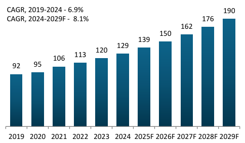

**[Image: Aug2026.pdf-0031-09.png (484x283, 13.6KB)]**

<!-- Start of picture text -->
CAGR, 2019-2024 - 6.9% 190 CAGR, 2024-2029F - 8.1% 176 162 150 139 129 120 113 106 92 95 2019 2020 2021 2022 2023 2024 2025F 2026F 2027F 2028F 2029F <!-- End of picture text -->

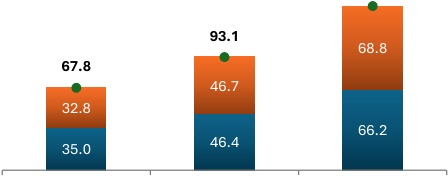

**[Image: Aug2026.pdf-0031-10.png (448x178, 8.7KB)]**

<!-- Start of picture text -->
93.1 68.8 67.8 46.7 32.8 66.2 46.4 35.0 <!-- End of picture text -->

**[Image: Aug2026.pdf-0031-11.png (12x11, 0.2KB)]**

**[Image: Aug2026.pdf-0031-12.png (11x11, 0.2KB)]**

**[Image: Aug2026.pdf-0031-13.png (33x59, 0.3KB)]**

**[Image: Aug2026.pdf-0031-14.png (33x65, 0.4KB)]**

**[Image: Aug2026.pdf-0031-15.png (33x71, 0.4KB)]**

**[Image: Aug2026.pdf-0031-16.png (33x81, 0.4KB)]**

**[Image: Aug2026.pdf-0031-17.png (33x93, 0.4KB)]**

**[Image: Aug2026.pdf-0031-18.png (33x104, 0.4KB)]**

**[Image: Aug2026.pdf-0031-19.png (33x116, 0.4KB)]**

**[Image: Aug2026.pdf-0031-20.png (33x133, 0.5KB)]**

**[Image: Aug2026.pdf-0031-21.png (33x152, 0.5KB)]**

**[Image: Aug2026.pdf-0031-22.png (37x178, 0.5KB)]**

**[Image: Aug2026.pdf-0031-23.png (36x201, 0.5KB)]**

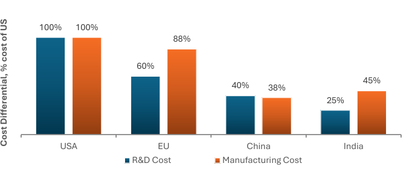

**[Image: Aug2026.pdf-0031-24.png (677x280, 21.7KB)]**

<!-- Start of picture text -->
100% 100% 88% 60% 45% 40% 38% 25% USA EU China India R&D Cost Manufacturing Cost Cost Differential, % cost of US <!-- End of picture text -->

_Source: F&S Report_ 

30 

###### **Leverage our long-standing customer relationships to continue entering adjacencies in the pharma intermediate and API category** 

**[Image: Aug2026.pdf-0032-01.png (124x103, 12.6KB)]**

**[Image: Aug2026.pdf-0032-02.png (711x105, 14.4KB)]**

<!-- Start of picture text -->
Investigational new drugs and new chemical entities (NCEs) <!-- End of picture text -->

**[Image: Aug2026.pdf-0032-03.png (711x105, 16.4KB)]**

<!-- Start of picture text -->
Leverage long-standing relationships with innovator companies <!-- End of picture text -->

Develop advanced intermediates for NCEs under trials for US-FDA approvals 

**[Image: Aug2026.pdf-0032-05.png (711x107, 13.9KB)]**

<!-- Start of picture text -->
Drugs that are still under patent and not genericized <!-- End of picture text -->

**[Image: Aug2026.pdf-0032-06.png (711x104, 15.6KB)]**

<!-- Start of picture text -->
Process research, analytical research and chemistry capabilities <!-- End of picture text -->

Offering  advanced  intermediates  to  innovators  for four active pharmaceutical ingredients (APIs) which are still under patent 

- Including two APIs in the oncology sector, one API in the cardiovascular system category and one API in the central nervous system category 

**[Image: Aug2026.pdf-0032-09.png (87x86, 6.8KB)]**

###### **Genericized drugs that are still niche** 

Offering multiple advanced intermediates to a number of large generics companies for chronic illness therapies 

**[Image: Aug2026.pdf-0032-12.png (711x86, 12.9KB)]**

<!-- Start of picture text -->
Continuous focus on product quality <!-- End of picture text -->

**31** 

**[Image: Aug2026.pdf-0033-00.png (1650x233, 99.2KB)]**

**[Image: Aug2026.pdf-0033-01.png (850x561, 399.3KB)]**

**[Image: Aug2026.pdf-0033-02.png (76x106, 5.6KB)]**

#### **R&D Capabilities** 

32 

##### **Our R&D framework** 

**[Image: Aug2026.pdf-0034-01.png (124x103, 12.6KB)]**

**[Image: Aug2026.pdf-0034-02.png (1481x44, 2.8KB)]**

<!-- Start of picture text -->
Process research <!-- End of picture text -->

**Process research Portfolio Process Process scale-up Regulatory filings evaluation development and validation and approvals Analytical research Chemistry research Method Characterization of Polymorphism Pharmaceutical salt High pressure Literature search development and impurities and screening and screening and Cryogenic reactions reactions optimization standards optimization optimization Non-carry over Stability/hold-time High temperature Asymmetric Enzymatic Particle size Method validation studies studies reactions hydrogenation transformations distribution studies Innovative and complex processes Catalytic Hoffman Iodination Bromination Chlorination Diazotization Esterification hydrogenation re-arrangement** 

**[Image: Aug2026.pdf-0034-04.png (1492x90, 29.4KB)]**

<!-- Start of picture text -->
Portfolio  Process  Process scale-up  Regulatory filings evaluation development  and validation and approvals <!-- End of picture text -->

**[Image: Aug2026.pdf-0034-05.png (200x103, 4.1KB)]**

<!-- Start of picture text -->
Literature search <!-- End of picture text -->

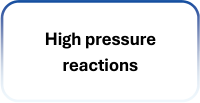

**[Image: Aug2026.pdf-0034-06.png (200x103, 5.0KB)]**

<!-- Start of picture text -->
High pressure reactions <!-- End of picture text -->

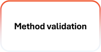

**[Image: Aug2026.pdf-0034-07.png (200x103, 4.4KB)]**

<!-- Start of picture text -->
Method validation <!-- End of picture text -->

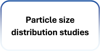

**[Image: Aug2026.pdf-0034-08.png (200x103, 5.5KB)]**

<!-- Start of picture text -->
Particle size distribution studies <!-- End of picture text -->

**[Image: Aug2026.pdf-0034-09.png (1483x58, 7.3KB)]**

<!-- Start of picture text -->
Innovative and complex processes <!-- End of picture text -->

**[Image: Aug2026.pdf-0034-10.png (182x93, 4.4KB)]**

<!-- Start of picture text -->
Catalytic hydrogenation <!-- End of picture text -->

**[Image: Aug2026.pdf-0034-11.png (182x93, 2.0KB)]**

<!-- Start of picture text -->
Iodination <!-- End of picture text -->

**[Image: Aug2026.pdf-0034-12.png (182x93, 2.1KB)]**

<!-- Start of picture text -->
Bromination <!-- End of picture text -->

**[Image: Aug2026.pdf-0034-13.png (182x93, 2.4KB)]**

<!-- Start of picture text -->
Chlorination <!-- End of picture text -->

**[Image: Aug2026.pdf-0034-14.png (183x93, 2.4KB)]**

<!-- Start of picture text -->
Diazotization <!-- End of picture text -->

**[Image: Aug2026.pdf-0034-15.png (183x93, 2.6KB)]**

<!-- Start of picture text -->
Esterification <!-- End of picture text -->

**[Image: Aug2026.pdf-0034-16.png (182x93, 3.7KB)]**

<!-- Start of picture text -->
Hoffman re-arrangement <!-- End of picture text -->

**33** 

##### **Sustainability** 

**[Image: Aug2026.pdf-0035-01.png (124x103, 12.6KB)]**

**Various initiatives on energy efficiency, renewable energy, and water conservation to reduce carbon footprint** 

**[Image: Aug2026.pdf-0035-03.png (428x99, 9.5KB)]**

<!-- Start of picture text -->
Invested in windmills with installed capacity of 3.3MW <!-- End of picture text -->

**[Image: Aug2026.pdf-0035-04.png (49x47, 2.0KB)]**

**[Image: Aug2026.pdf-0035-05.png (425x97, 10.8KB)]**

<!-- Start of picture text -->
Created carbon sinks through tree plantations <!-- End of picture text -->

**[Image: Aug2026.pdf-0035-06.png (426x97, 9.2KB)]**

<!-- Start of picture text -->
Focus on enhancing energy efficiency <!-- End of picture text -->

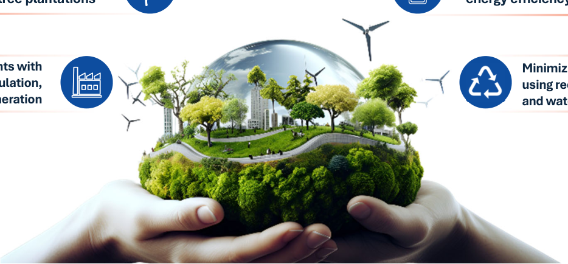

**[Image: Aug2026.pdf-0035-07.png (934x434, 492.5KB)]**

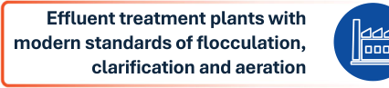

**[Image: Aug2026.pdf-0035-08.png (426x97, 17.0KB)]**

<!-- Start of picture text -->
Effluent treatment plants with modern standards of flocculation, clarification and aeration <!-- End of picture text -->

**[Image: Aug2026.pdf-0035-09.png (361x97, 15.0KB)]**

<!-- Start of picture text -->
Minimizing solvents and using recycled solvents and water <!-- End of picture text -->

**34** 

**[Image: Aug2026.pdf-0036-00.png (1650x233, 99.2KB)]**

**[Image: Aug2026.pdf-0036-01.png (850x561, 399.3KB)]**

**[Image: Aug2026.pdf-0036-02.png (78x104, 4.2KB)]**

#### **Growth Strategy** 

35 

##### **Our strategies** 

**[Image: Aug2026.pdf-0037-01.png (124x103, 12.6KB)]**

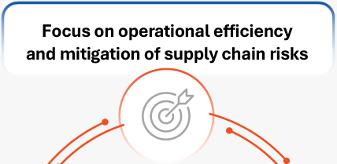

**[Image: Aug2026.pdf-0037-02.png (428x209, 20.4KB)]**

<!-- Start of picture text -->
Focus on operational efficiency and mitigation of supply chain risks <!-- End of picture text -->

**[Image: Aug2026.pdf-0037-03.png (170x172, 9.1KB)]**

**[Image: Aug2026.pdf-0037-04.png (123x158, 7.6KB)]**

**[Image: Aug2026.pdf-0037-05.png (425x98, 15.1KB)]**

<!-- Start of picture text -->
Continue to invest in R&D infrastructure and capabilities <!-- End of picture text -->

**[Image: Aug2026.pdf-0037-06.png (425x98, 17.6KB)]**

<!-- Start of picture text -->
Continue to forward integrate into more advanced intermediates for Contrast Media <!-- End of picture text -->

**[Image: Aug2026.pdf-0037-07.png (157x155, 25.3KB)]**

**[Image: Aug2026.pdf-0037-08.png (446x133, 21.2KB)]**

<!-- Start of picture text -->
Build additional production capacity to keep in step with the envisaged increase in customer demands <!-- End of picture text -->

**[Image: Aug2026.pdf-0037-09.png (139x134, 7.3KB)]**

**[Image: Aug2026.pdf-0037-10.png (123x123, 6.7KB)]**

**[Image: Aug2026.pdf-0037-11.png (425x127, 23.4KB)]**

<!-- Start of picture text -->
Leverage our long-standing customer relationships to continue entering adjacencies in the pharma intermediate and API category <!-- End of picture text -->

**36** 

37 

**[Image: Aug2026.pdf-0038-01.png (1650x233, 99.2KB)]**

**[Image: Aug2026.pdf-0038-02.png (850x561, 399.3KB)]**

**[Image: Aug2026.pdf-0038-03.png (78x106, 5.9KB)]**

#### **Management and Board of Directors** 

###### **Experienced and visionary management team backed by independent - Board of Directors** 

**[Image: Aug2026.pdf-0039-01.png (124x103, 12.6KB)]**

**[Image: Aug2026.pdf-0039-02.png (149x116, 24.0KB)]**

**[Image: Aug2026.pdf-0039-03.png (149x116, 21.7KB)]**

**[Image: Aug2026.pdf-0039-04.png (149x116, 24.5KB)]**

**[Image: Aug2026.pdf-0039-05.png (148x116, 20.6KB)]**

**[Image: Aug2026.pdf-0039-06.png (148x116, 19.8KB)]**

**[Image: Aug2026.pdf-0039-07.png (147x116, 22.6KB)]**

**Ganesh Vimalendu Kumar Singh Karuppannan (V.K. Singh) Chief Financial Officer Chief Operating Officer** 

**Akshay Bansarilal Shiven Akshay Naresh Suryakant Shah Arora Arora Executive Director, Head Executive Chairman Managing Director – Marketing** 

**Chandrashekar Parenky President – Research and Development** 

- Has more than three  Has more than six years  Has more than three decades of experience of experience with decades of experience with the Company the Company in marketing 

- Previously worked with Philips Electronics, Dr. Reddy’s Laboratories, Granules as CFO 

   - Previously worked with  Previously worked at Strides Pharma, Emcure Amoli Organics and Pharmaceuticals, RPG Kores (India) as CEO Life Sciences, and  Holds a doctorate of 

   - Ranbaxy Laboratories 

- Holds bachelor’s and master’s degrees in science from University of Mumbai 

- Holds a bachelor’s degree in business from Bond University, Gold Coast, Australia 

- Currently also associated as a director of BC Bio Sciences 

   - Holds a doctorate of 

   - Ranbaxy Laboratories philosophy in science 

   - Has a bachelor’s degree from the University of in chemical engineering Bombay and a master’s from IIT Kanpur and a degree from Birla master’s programme Institute of Technology from IIFT, New Delhi & Science 

- associated as a director  Associate member of of BC Bio Sciences Institute of Chartered Accountants of India 

- Holds a diploma in since 1988 

- Chemical Engineering from the Khopoli Polytechnic College, Raigad 

**38** 

###### **Experienced and visionary management team backed by independent Board of Directors (cont’d)** 

**[Image: Aug2026.pdf-0040-01.png (124x103, 12.6KB)]**

**[Image: Aug2026.pdf-0040-02.png (149x114, 25.3KB)]**

**[Image: Aug2026.pdf-0040-03.png (149x116, 21.9KB)]**

**Popat B Kedar Executive Director** 

**Sweta Poddar Company Secretary and Compliance Officer** 

- Holds a Bachelor’s and  Has experience of Master’s degree in Science, over a decade as a specializing in Inorganic company secretary Chemistry from Shivaji  Associated with 

- University, Kolhapur. 

   - Associated with Chinar Chemicals Private Ltd. and Aarey Drugs and Pharmaceuticals Ltd. 

- Has over 34 years of experience as a Plant Manager, previously working with Infotech Pharma Pvt. Ltd., Godavari Drugs Pvt. Ltd., and Sara Research Centre. 

   - Holds a bachelors’ degree in commerce from the University of Calcutta 

- Associated with the company since July 2005 and served as a Director at Blue Jet Healthcare Limited from December 31, 2020, to February 1, 2022. 

**[Image: Aug2026.pdf-0040-11.png (147x114, 15.2KB)]**

**Girish Paman Vanvari Independent Director** 

- Founder and Partner of Transaction Square LLP and Valuation Square LLP . He is the member of Institute of Chartered accountants of India. 

- Has experience in tax, regulatory, and business advisory functions 

- Holds a bachelor’s degree in commerce from Shri Narsee Monjee College of Commerce and Economics 

- Other Directorships held: Tarsons Products Ltd , Aurbindo Pharma Ltd , Himadri Specilaity Chemical Ltd, Kolte Patil Developers Ltd 

**[Image: Aug2026.pdf-0040-17.png (149x114, 22.9KB)]**

**Preeti Gautam Mehta Independent Director** 

- Practicing advocate & solicitor and a senior partner of Kanga & Co 

- Over 30 years of experience in corporate laws, foreign investments, M&A & PE investments, banking, franchising, and hospitality 

- Other Directorships held: Sumitomo  Chemicals Ltd, Prpten - E Gov Technlogies Ltd, JCB  India Ltd 

**[Image: Aug2026.pdf-0040-22.png (148x114, 25.3KB)]**

**[Image: Aug2026.pdf-0040-23.png (148x116, 22.3KB)]**

**Divya Sameer Momaya Independent Director** 

**Priyanka Yadav Independent Director** 

- Holds a bachelor’s degree in commerce from the University of Pune 

   - Ms. Priyanka Yadav, a Fellow Member of ICSI, holds bachelor's, master's, and law degrees from the University of Mumbai. 

- Partner of D. S. Momaya & Co. LLP and first director of MMB Advisors Private Limited 

   - She leads Priyanka Yadav & Associates with 6+ years of experience in corporate laws, NCLT matters, and compliance. 

- Previously worked with BSE Limited and BSEL Infrastructure Realty Limited 

- Other Directorships held:  An expert in listing compliance, IPOs, and 

- GTPL  Hathway Ltd, Motilal corporate restructuring, she 

- Oswal Finacial Services Ltd, Motial Oswal Home Finance advises on governance and ltd legal due diligence. **39** 

# **Thank you!** 

###### **BLUE JET HEALTHCARE LIMITED** 

###### **INVESTOR RELATIONS AT** 

###### **Registered Office** 

701,702, 7th Floor, Bhumiraj Costarica, Sector 18, Sanpada, Navi Mumbai Thane 400705, Maharashtra, India 

**[Image: Aug2026.pdf-0041-05.png (86x85, 10.0KB)]**

###### **Blue Jet Healthcare Limited** 

Sanjay Sinha, Deputy Chief Financial Officer sanjay.sinha@bluejethealthcare.com 

**NSE** : BLUEJET, **BSE:** 544009 **ISIN:** INE0KBH01020 **Website:** www.bluejethealthcare.com 

**[Image: Aug2026.pdf-0041-09.png (84x85, 3.8KB)]**

Kunal Bhoite kunal.bhoite@in.ey.com 

Advait Bhadekar advait.bhadekar@in.ey.com 

---

## Extracted Images

| # | File | Dimensions | Size |
|---|------|------------|------|
| 1 | Aug2026.pdf-0001-00.png | 1233x199 | 225.2KB |
| 2 | Aug2026.pdf-0001-11.png | 1241x232 | 283.6KB |
| 3 | Aug2026.pdf-0002-00.png | 545x122 | 24.1KB |
| 4 | Aug2026.pdf-0002-02.png | 747x793 | 477.0KB |
| 5 | Aug2026.pdf-0002-03.png | 269x239 | 77.1KB |
| 6 | Aug2026.pdf-0003-01.png | 124x103 | 12.6KB |
| 7 | Aug2026.pdf-0004-00.png | 545x122 | 30.4KB |
| 8 | Aug2026.pdf-0004-02.png | 1650x534 | 360.4KB |
| 9 | Aug2026.pdf-0005-00.png | 1650x233 | 99.2KB |
| 10 | Aug2026.pdf-0005-01.png | 850x561 | 399.3KB |
| 11 | Aug2026.pdf-0005-02.png | 53x106 | 3.4KB |
| 12 | Aug2026.pdf-0006-01.png | 124x103 | 12.6KB |
| 13 | Aug2026.pdf-0006-02.png | 761x68 | 6.8KB |
| 14 | Aug2026.pdf-0007-01.png | 124x103 | 12.6KB |
| 15 | Aug2026.pdf-0007-02.png | 761x68 | 6.9KB |
| 16 | Aug2026.pdf-0008-01.png | 124x103 | 12.6KB |
| 17 | Aug2026.pdf-0008-02.png | 759x68 | 7.2KB |
| 18 | Aug2026.pdf-0008-08.png | 521x512 | 350.1KB |
| 19 | Aug2026.pdf-0009-02.png | 124x103 | 12.6KB |
| 20 | Aug2026.pdf-0009-03.png | 1487x177 | 23.0KB |
| 21 | Aug2026.pdf-0009-04.png | 1487x171 | 15.5KB |
| 22 | Aug2026.pdf-0009-05.png | 453x307 | 15.4KB |
| 23 | Aug2026.pdf-0009-06.png | 453x303 | 15.9KB |
| 24 | Aug2026.pdf-0009-07.png | 455x303 | 9.4KB |
| 25 | Aug2026.pdf-0010-02.png | 124x103 | 12.6KB |
| 26 | Aug2026.pdf-0010-03.png | 1487x177 | 21.8KB |
| 27 | Aug2026.pdf-0010-04.png | 1487x171 | 15.0KB |
| 28 | Aug2026.pdf-0010-05.png | 453x307 | 14.5KB |
| 29 | Aug2026.pdf-0010-06.png | 453x303 | 15.7KB |
| 30 | Aug2026.pdf-0010-07.png | 455x303 | 9.2KB |
| 31 | Aug2026.pdf-0011-01.png | 124x103 | 12.6KB |
| 32 | Aug2026.pdf-0012-01.png | 124x103 | 12.6KB |
| 33 | Aug2026.pdf-0012-02.png | 1542x271 | 35.8KB |
| 34 | Aug2026.pdf-0012-03.png | 20x20 | 0.2KB |
| 35 | Aug2026.pdf-0012-04.png | 18x20 | 0.2KB |
| 36 | Aug2026.pdf-0012-05.png | 742x309 | 19.8KB |
| 37 | Aug2026.pdf-0012-06.png | 774x309 | 19.5KB |
| 38 | Aug2026.pdf-0013-02.png | 124x103 | 12.6KB |
| 39 | Aug2026.pdf-0013-04.png | 775x286 | 53.2KB |
| 40 | Aug2026.pdf-0013-05.png | 775x287 | 48.7KB |
| 41 | Aug2026.pdf-0014-01.png | 770x346 | 18.6KB |
| 42 | Aug2026.pdf-0014-02.png | 770x346 | 13.2KB |
| 43 | Aug2026.pdf-0014-03.png | 124x103 | 12.6KB |
| 44 | Aug2026.pdf-0014-04.png | 732x657 | 52.8KB |
| 45 | Aug2026.pdf-0015-00.png | 1650x233 | 99.2KB |
| 46 | Aug2026.pdf-0015-01.png | 850x561 | 382.7KB |
| 47 | Aug2026.pdf-0015-02.png | 79x106 | 4.9KB |
| 48 | Aug2026.pdf-0016-01.png | 124x103 | 12.6KB |
| 49 | Aug2026.pdf-0016-02.png | 1511x644 | 136.5KB |
| 50 | Aug2026.pdf-0017-02.png | 124x103 | 12.6KB |
| 51 | Aug2026.pdf-0018-01.png | 124x103 | 12.6KB |
| 52 | Aug2026.pdf-0018-02.png | 1579x337 | 74.8KB |
| 53 | Aug2026.pdf-0018-03.png | 353x186 | 19.5KB |
| 54 | Aug2026.pdf-0018-04.png | 353x186 | 16.4KB |
| 55 | Aug2026.pdf-0018-05.png | 355x186 | 17.1KB |
| 56 | Aug2026.pdf-0018-06.png | 355x186 | 13.0KB |
| 57 | Aug2026.pdf-0019-04.png | 382x3 | 0.9KB |
| 58 | Aug2026.pdf-0019-05.png | 383x3 | 0.9KB |
| 59 | Aug2026.pdf-0019-07.png | 70x68 | 7.2KB |
| 60 | Aug2026.pdf-0019-08.png | 69x68 | 10.3KB |
| 61 | Aug2026.pdf-0019-09.png | 382x5 | 0.9KB |
| 62 | Aug2026.pdf-0019-10.png | 306x5 | 0.8KB |
| 63 | Aug2026.pdf-0019-11.png | 184x130 | 6.3KB |
| 64 | Aug2026.pdf-0019-12.png | 178x126 | 4.8KB |
| 65 | Aug2026.pdf-0019-13.png | 124x103 | 12.6KB |
| 66 | Aug2026.pdf-0019-16.png | 382x3 | 0.9KB |
| 67 | Aug2026.pdf-0019-18.png | 382x5 | 0.9KB |
| 68 | Aug2026.pdf-0019-19.png | 186x128 | 5.5KB |
| 69 | Aug2026.pdf-0019-20.png | 383x5 | 0.9KB |
| 70 | Aug2026.pdf-0020-00.png | 1650x233 | 99.2KB |
| 71 | Aug2026.pdf-0020-01.png | 850x561 | 399.3KB |
| 72 | Aug2026.pdf-0020-02.png | 78x106 | 5.4KB |
| 73 | Aug2026.pdf-0021-01.png | 124x103 | 12.6KB |
| 74 | Aug2026.pdf-0021-08.png | 55x44 | 2.3KB |
| 75 | Aug2026.pdf-0021-09.png | 43x45 | 2.0KB |
| 76 | Aug2026.pdf-0021-15.png | 194x278 | 10.4KB |
| 77 | Aug2026.pdf-0022-01.png | 124x103 | 12.6KB |
| 78 | Aug2026.pdf-0022-02.png | 1487x690 | 137.3KB |
| 79 | Aug2026.pdf-0023-03.png | 19x508 | 1.6KB |
| 80 | Aug2026.pdf-0023-05.png | 107x109 | 7.6KB |
| 81 | Aug2026.pdf-0023-08.png | 39x353 | 2.9KB |
| 82 | Aug2026.pdf-0023-09.png | 38x336 | 2.8KB |
| 83 | Aug2026.pdf-0023-10.png | 38x334 | 2.9KB |
| 84 | Aug2026.pdf-0023-11.png | 276x6 | 0.9KB |
| 85 | Aug2026.pdf-0023-12.png | 474x6 | 1.1KB |
| 86 | Aug2026.pdf-0023-14.png | 107x109 | 8.2KB |
| 87 | Aug2026.pdf-0023-15.png | 38x249 | 2.8KB |
| 88 | Aug2026.pdf-0023-18.png | 276x5 | 0.9KB |
| 89 | Aug2026.pdf-0023-19.png | 474x5 | 1.1KB |
| 90 | Aug2026.pdf-0023-21.png | 109x109 | 7.8KB |
| 91 | Aug2026.pdf-0023-26.png | 38x282 | 2.9KB |
| 92 | Aug2026.pdf-0023-27.png | 39x347 | 4.9KB |
| 93 | Aug2026.pdf-0023-28.png | 124x103 | 12.6KB |
| 94 | Aug2026.pdf-0023-29.png | 39x84 | 1.6KB |
| 95 | Aug2026.pdf-0024-01.png | 124x103 | 12.6KB |
| 96 | Aug2026.pdf-0024-02.png | 59x53 | 5.3KB |
| 97 | Aug2026.pdf-0024-04.png | 117x118 | 4.4KB |
| 98 | Aug2026.pdf-0024-05.png | 55x50 | 3.7KB |
| 99 | Aug2026.pdf-0024-06.png | 59x51 | 1.9KB |
| 100 | Aug2026.pdf-0024-09.png | 574x3 | 1.3KB |
| 101 | Aug2026.pdf-0024-10.png | 574x5 | 1.3KB |
| 102 | Aug2026.pdf-0024-11.png | 117x116 | 5.3KB |
| 103 | Aug2026.pdf-0024-12.png | 51x47 | 4.6KB |
| 104 | Aug2026.pdf-0024-14.png | 117x118 | 5.5KB |
| 105 | Aug2026.pdf-0025-00.png | 1650x233 | 99.2KB |
| 106 | Aug2026.pdf-0025-01.png | 850x561 | 399.3KB |
| 107 | Aug2026.pdf-0025-02.png | 83x106 | 4.8KB |
| 108 | Aug2026.pdf-0026-01.png | 124x103 | 12.6KB |
| 109 | Aug2026.pdf-0026-03.png | 940x157 | 25.5KB |
| 110 | Aug2026.pdf-0026-04.png | 545x47 | 7.2KB |
| 111 | Aug2026.pdf-0026-05.png | 937x156 | 28.5KB |
| 112 | Aug2026.pdf-0026-10.png | 32x218 | 1.1KB |
| 113 | Aug2026.pdf-0026-11.png | 34x343 | 0.8KB |
| 114 | Aug2026.pdf-0026-12.png | 32x383 | 1.2KB |
| 115 | Aug2026.pdf-0026-13.png | 189x318 | 6.1KB |
| 116 | Aug2026.pdf-0026-14.png | 32x91 | 1.0KB |
| 117 | Aug2026.pdf-0027-01.png | 124x103 | 12.6KB |
| 118 | Aug2026.pdf-0027-02.png | 28x109 | 0.4KB |
| 119 | Aug2026.pdf-0027-03.png | 28x118 | 0.5KB |
| 120 | Aug2026.pdf-0027-04.png | 30x124 | 0.5KB |
| 121 | Aug2026.pdf-0027-05.png | 28x130 | 0.5KB |
| 122 | Aug2026.pdf-0027-06.png | 28x138 | 0.5KB |
| 123 | Aug2026.pdf-0027-07.png | 30x147 | 0.5KB |
| 124 | Aug2026.pdf-0027-08.png | 28x157 | 0.5KB |
| 125 | Aug2026.pdf-0027-09.png | 28x168 | 0.5KB |
| 126 | Aug2026.pdf-0027-10.png | 30x178 | 0.5KB |
| 127 | Aug2026.pdf-0027-11.png | 28x190 | 0.5KB |
| 128 | Aug2026.pdf-0027-12.png | 28x203 | 0.5KB |
| 129 | Aug2026.pdf-0027-13.png | 736x283 | 22.7KB |
| 130 | Aug2026.pdf-0027-14.png | 1391x259 | 36.7KB |
| 131 | Aug2026.pdf-0028-00.png | 1650x233 | 99.2KB |
| 132 | Aug2026.pdf-0028-01.png | 850x561 | 399.3KB |
| 133 | Aug2026.pdf-0028-02.png | 78x104 | 5.0KB |
| 134 | Aug2026.pdf-0029-01.png | 124x103 | 12.6KB |
| 135 | Aug2026.pdf-0029-13.png | 22x511 | 1.8KB |
| 136 | Aug2026.pdf-0030-01.png | 124x103 | 12.6KB |
| 137 | Aug2026.pdf-0030-02.png | 76x78 | 5.3KB |
| 138 | Aug2026.pdf-0030-03.png | 51x51 | 2.4KB |
| 139 | Aug2026.pdf-0030-04.png | 128x78 | 5.3KB |
| 140 | Aug2026.pdf-0030-05.png | 750x321 | 43.2KB |
| 141 | Aug2026.pdf-0030-07.png | 750x166 | 22.1KB |
| 142 | Aug2026.pdf-0030-08.png | 750x165 | 15.2KB |
| 143 | Aug2026.pdf-0031-01.png | 124x103 | 12.6KB |
| 144 | Aug2026.pdf-0031-02.png | 11x11 | 0.1KB |
| 145 | Aug2026.pdf-0031-03.png | 62x97 | 1.9KB |
| 146 | Aug2026.pdf-0031-04.png | 61x42 | 1.0KB |
| 147 | Aug2026.pdf-0031-05.png | 61x92 | 1.0KB |
| 148 | Aug2026.pdf-0031-06.png | 11x11 | 0.2KB |
| 149 | Aug2026.pdf-0031-07.png | 60x61 | 1.2KB |
| 150 | Aug2026.pdf-0031-08.png | 60x133 | 1.2KB |
| 151 | Aug2026.pdf-0031-09.png | 484x283 | 13.6KB |
| 152 | Aug2026.pdf-0031-10.png | 448x178 | 8.7KB |
| 153 | Aug2026.pdf-0031-11.png | 12x11 | 0.2KB |
| 154 | Aug2026.pdf-0031-12.png | 11x11 | 0.2KB |
| 155 | Aug2026.pdf-0031-13.png | 33x59 | 0.3KB |
| 156 | Aug2026.pdf-0031-14.png | 33x65 | 0.4KB |
| 157 | Aug2026.pdf-0031-15.png | 33x71 | 0.4KB |
| 158 | Aug2026.pdf-0031-16.png | 33x81 | 0.4KB |
| 159 | Aug2026.pdf-0031-17.png | 33x93 | 0.4KB |
| 160 | Aug2026.pdf-0031-18.png | 33x104 | 0.4KB |
| 161 | Aug2026.pdf-0031-19.png | 33x116 | 0.4KB |
| 162 | Aug2026.pdf-0031-20.png | 33x133 | 0.5KB |
| 163 | Aug2026.pdf-0031-21.png | 33x152 | 0.5KB |
| 164 | Aug2026.pdf-0031-22.png | 37x178 | 0.5KB |
| 165 | Aug2026.pdf-0031-23.png | 36x201 | 0.5KB |
| 166 | Aug2026.pdf-0031-24.png | 677x280 | 21.7KB |
| 167 | Aug2026.pdf-0032-01.png | 124x103 | 12.6KB |
| 168 | Aug2026.pdf-0032-02.png | 711x105 | 14.4KB |
| 169 | Aug2026.pdf-0032-03.png | 711x105 | 16.4KB |
| 170 | Aug2026.pdf-0032-05.png | 711x107 | 13.9KB |
| 171 | Aug2026.pdf-0032-06.png | 711x104 | 15.6KB |
| 172 | Aug2026.pdf-0032-09.png | 87x86 | 6.8KB |
| 173 | Aug2026.pdf-0032-12.png | 711x86 | 12.9KB |
| 174 | Aug2026.pdf-0033-00.png | 1650x233 | 99.2KB |
| 175 | Aug2026.pdf-0033-01.png | 850x561 | 399.3KB |
| 176 | Aug2026.pdf-0033-02.png | 76x106 | 5.6KB |
| 177 | Aug2026.pdf-0034-01.png | 124x103 | 12.6KB |
| 178 | Aug2026.pdf-0034-02.png | 1481x44 | 2.8KB |
| 179 | Aug2026.pdf-0034-04.png | 1492x90 | 29.4KB |
| 180 | Aug2026.pdf-0034-05.png | 200x103 | 4.1KB |
| 181 | Aug2026.pdf-0034-06.png | 200x103 | 5.0KB |
| 182 | Aug2026.pdf-0034-07.png | 200x103 | 4.4KB |
| 183 | Aug2026.pdf-0034-08.png | 200x103 | 5.5KB |
| 184 | Aug2026.pdf-0034-09.png | 1483x58 | 7.3KB |
| 185 | Aug2026.pdf-0034-10.png | 182x93 | 4.4KB |
| 186 | Aug2026.pdf-0034-11.png | 182x93 | 2.0KB |
| 187 | Aug2026.pdf-0034-12.png | 182x93 | 2.1KB |
| 188 | Aug2026.pdf-0034-13.png | 182x93 | 2.4KB |
| 189 | Aug2026.pdf-0034-14.png | 183x93 | 2.4KB |
| 190 | Aug2026.pdf-0034-15.png | 183x93 | 2.6KB |
| 191 | Aug2026.pdf-0034-16.png | 182x93 | 3.7KB |
| 192 | Aug2026.pdf-0035-01.png | 124x103 | 12.6KB |
| 193 | Aug2026.pdf-0035-03.png | 428x99 | 9.5KB |
| 194 | Aug2026.pdf-0035-04.png | 49x47 | 2.0KB |
| 195 | Aug2026.pdf-0035-05.png | 425x97 | 10.8KB |
| 196 | Aug2026.pdf-0035-06.png | 426x97 | 9.2KB |
| 197 | Aug2026.pdf-0035-07.png | 934x434 | 492.5KB |
| 198 | Aug2026.pdf-0035-08.png | 426x97 | 17.0KB |
| 199 | Aug2026.pdf-0035-09.png | 361x97 | 15.0KB |
| 200 | Aug2026.pdf-0036-00.png | 1650x233 | 99.2KB |
| 201 | Aug2026.pdf-0036-01.png | 850x561 | 399.3KB |
| 202 | Aug2026.pdf-0036-02.png | 78x104 | 4.2KB |
| 203 | Aug2026.pdf-0037-01.png | 124x103 | 12.6KB |
| 204 | Aug2026.pdf-0037-02.png | 428x209 | 20.4KB |
| 205 | Aug2026.pdf-0037-03.png | 170x172 | 9.1KB |
| 206 | Aug2026.pdf-0037-04.png | 123x158 | 7.6KB |
| 207 | Aug2026.pdf-0037-05.png | 425x98 | 15.1KB |
| 208 | Aug2026.pdf-0037-06.png | 425x98 | 17.6KB |
| 209 | Aug2026.pdf-0037-07.png | 157x155 | 25.3KB |
| 210 | Aug2026.pdf-0037-08.png | 446x133 | 21.2KB |
| 211 | Aug2026.pdf-0037-09.png | 139x134 | 7.3KB |
| 212 | Aug2026.pdf-0037-10.png | 123x123 | 6.7KB |
| 213 | Aug2026.pdf-0037-11.png | 425x127 | 23.4KB |
| 214 | Aug2026.pdf-0038-01.png | 1650x233 | 99.2KB |
| 215 | Aug2026.pdf-0038-02.png | 850x561 | 399.3KB |
| 216 | Aug2026.pdf-0038-03.png | 78x106 | 5.9KB |
| 217 | Aug2026.pdf-0039-01.png | 124x103 | 12.6KB |
| 218 | Aug2026.pdf-0039-02.png | 149x116 | 24.0KB |
| 219 | Aug2026.pdf-0039-03.png | 149x116 | 21.7KB |
| 220 | Aug2026.pdf-0039-04.png | 149x116 | 24.5KB |
| 221 | Aug2026.pdf-0039-05.png | 148x116 | 20.6KB |
| 222 | Aug2026.pdf-0039-06.png | 148x116 | 19.8KB |
| 223 | Aug2026.pdf-0039-07.png | 147x116 | 22.6KB |
| 224 | Aug2026.pdf-0040-01.png | 124x103 | 12.6KB |
| 225 | Aug2026.pdf-0040-02.png | 149x114 | 25.3KB |
| 226 | Aug2026.pdf-0040-03.png | 149x116 | 21.9KB |
| 227 | Aug2026.pdf-0040-11.png | 147x114 | 15.2KB |
| 228 | Aug2026.pdf-0040-17.png | 149x114 | 22.9KB |
| 229 | Aug2026.pdf-0040-22.png | 148x114 | 25.3KB |
| 230 | Aug2026.pdf-0040-23.png | 148x116 | 22.3KB |
| 231 | Aug2026.pdf-0041-05.png | 86x85 | 10.0KB |
| 232 | Aug2026.pdf-0041-09.png | 84x85 | 3.8KB |
