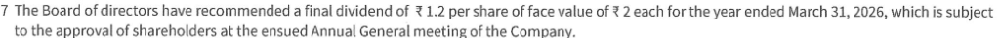
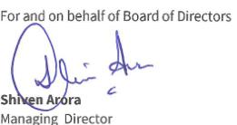
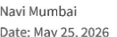

**[Image: Mar2026Result.pdf-0001-00.png (151x41, 7.8KB)]**

<!-- Start of picture text -->
@ <!-- End of picture text -->

BLUE HEALTHCARE JET 

BLUE JET HEALTHCARE LIMITED REGISTERED & CORPORATE : 701 & 702, BHUMIRAJ COSTARICA, PLOT 1 & 2, SECTOR - 18, SANPADA, NAVI MUMBAI - 400705 T : 022- 41840550 / 40037603 ह: +91 2227814204 E : sales@bluejethealthcare.com | CINNO. : L99999MH1968PLCO14154 

May 25,2026 

|To,||
|---|---|
|TheManager|TheManager|
|ListingDepartment|ListingDepartment|
|BSELimited|NationalStockExchangeofIndiaLimited|
|PhirozeJeejebhoyTowers|ExchangePlaza,PlotNo.C/1,GBlock,|
|DalalStreet|Bandra-KurlaComplex, Bandra(East)|
|Mumbai-400001|Mumbai-400051|
|ScripCode(BSE):544009|Symbol:BLUEJET|

### Sub.: Outcome of Board Meeting held today i.e, Monday, May 25, 2026. 

Dear Sir/ Ma'am, 

In furtherance of our intimation dated May 19, 2026 and in terms with Regulation 30 read with Schedule III and other applicable provisions of the SEBI (Listing Obligations and Disclosure Requirements) Regulations, 2015, as amended ("SEBI Listing Regulations"), we hereby inform you that, the Board of Directors of the Company at their meeting held today viz. Monday, May 25, 2026, inter-alia, has approved the following: - 

- a) Audited Standalone Financial Results of the Company for the fourth quarter and financial year ended March 31, 2026. A signed copy of the Audited Standalone Financial Results along with the Auditor's Report thereon. is enclosed herewith. 

Further, pursuant to provisions of Regulation 33(3)(d) of the SEBI (Listing Obligations and Disclosure Requirements) Regulations, 2015, it is hereby declared that KKC & Associates LLP, the Statutory Auditors of the Company, have issued the Audit Reports for the financial year 2025- 26 with an unmodified opinion. 

- b) Recommendation of a final dividend of Rupees 1.2 (60%) per Equity Share of the face value of Rs.2 each (Rupees Two only) for the Financial Year ended March 31, 2026. The Final Dividend is subject to the approval of the members at the ensuing Annual General Meeting which will be held within stipulated timeline as per the provisions of the Companies Act, 2013. 

The record date and dividend payment date will be determined later for the said dividend. 

- c) Proposal for raising of funds of up to 310,000 million (Rupees Ten Thousand Million) by way of creation, offering and issuance of any instrument or security for cash, with or without green shoe option, including fully paid-up Equity Shares, fully or partly convertible debentures, any other equity based instruments or securities, convertible preference shares of any kind or type, any other financial instruments/ securities convertible into and/or linked to Equity Shares (including warrants (detachable or not), or otherwise, in registered or bearer form) (collectively “Securities”) or combination of any of the aforementioned Securities in one or more tranches and/or one or more issuances simultaneously or otherwise through 006 or more public issue(s), preferential issue(s), private placement(s), qualified institutions placement(s) and/or any combination thereof or any 

unit 3/2, Milestone, Kalyan Murbad Road, Village Varap, P0. Box No. 5, Shahad-421 103, Tel.: 91 251 2280283 Fax : +91 251 2280567 Plot No. B-12, C-4, E-2, MIDC, Industrial Area, Chemical Zone, Ambernath (W) 421501. 161. : +91 8956363877/8956363878 Unit 1l -4/1, Additional MIDC Road, Mahad Industrial Area, Mahad- 402309, + 91 22 2207 5307/ 6192 / 1691 Fax : +91 22 2207 0294 

Sweta Digitally signed by Sweta Poddar Poddar Date: 2026.05.25 12:31:56 +05'30' 

## kkc & associates llp Chartered Accountants 

(formerly Khimji Kunverji & Co LLP) 

Independent Auditor’s report on annual financial results of Blue Jet Healthcare Limited under Regulation 33 of the SEBI (Listing Obligations and Disclosure Requirements) Regulations, 2015 

To The Board of Directors of Blue Jet Healthcare Limited 

#### Opinion 

- 1 We have audited the accompanying financial results of Blue Jet Healthcare Limited (‘the Company’) for the year ended 31 March 2026, being submitted by the Company pursuant to the requirements of Regulation 33 of the SEBI (Listing Obligations and Disclosure Requirements) Regulations, 2015, as amended (‘Listing Regulations’). 

   - ॥ our opinion and to the best of our information and according to the explanations given to us, the aforesaid financial results: 

   - 2.1. are presented in accordance with the requirements of the Listing Regulations in this regard; and 

   - 2.2. give a true and fair view in conformity with the recognition and measurement principles laid down in the applicable Indian accounting standards (‘Ind AS’) and other accounting principles generally accepted in India, of the net profit and Other Comprehensive Income and Other Financial Information for the year ended 31 March 2026. 

#### Basis for Opinion 

- By We conducted our audit in accordance with the Standard on Auditing (‘SAs’) specified under section 143(10) of the Companies Act, 2013 (‘the Act’). Our responsibilities under those SAs are further described in the Auditor's Responsibilities for the Audit of the Financial Results section of our report. We are independent of the Company in accordance with the Code of Ethics issued by the Institute of Chartered Accountants of India together with the ethical requirements that are relevant to our audit of the financial statements under the provisions of the Act and the rules thereunder, and we have fulfilled our other ethical responsibilities in accordance with these requirements and the Code of Ethics. We believe that the audit evidence obtained is sufficient and appropriate to provide a basis for our opinion. 

### Management’s responsibilities for the Financial Results 

4. These financial results have been prepared on the basis of the annual financial statements. The Company’s Board of Directors is responsible for the preparation and presentation of these financial results that give a true and fair view of the net profit after tax and other comprehensive income and other financial information in accordance with the recognition and measurement principles laid down in Ind AS prescribed under Section 133 of the Act read with relevant rules issued thereunder and other accounting principles generally accepted in India and in compliance with the Listing Regulations. This responsibility also includes maintenance of adequate accounting records in accordance with the provisions of the Act for safeguarding of the assets of the Company and for preventing and detecting frauds and other irregularities; selection and application of appropriate accounting policies; making judgments and estimates that are reasonable and prudent; and the design, implementation and maintenance of adequate internal financial controls that were operating effectively for ensuring the accuracy and completeness of the accounting records, relevant to the preparation and presentation of the financial results that give a true and fair view and are free from material misstatement, whether due to fraud or error, which has been used for the purpose of preparation of the financial results by the Directors of the Company, as aforesaid. 

Sunshine Tower, Level 19, Senapati Bapat Marg, Elphinstone Road, Mumbai 400013, India T:+9122 61437333 E:info@kkcllp.in W: www.kkcllp.in LLPIN: AAP-2267 

Suite 52, Bombay Mutual Building, Sir Phirozshah Mehta Road, Fort, Mumbai 400001, India 

kkc & associates llp Chartered Accountants (formerly Khimji Kunverji & Co LLP) 

   - In preparing the financial results, the Board of Directors is responsible for assessing the Company's ability to continue 35 a going concern, disclosing, as applicable, matters related to going concern and using the going concern basis of accounting unless the Board of Directors either intends to liquidate the Company or to cease operations, or has no realistic alternative but to do so. 

6. The Board of Directors is also responsible for overseeing the Company's financial reporting process. 

#### Auditor's Responsi ies for the Audit of the Financial Results 

7. Our objectives are to obtain reasonable assurance about whether the financial results as a whole are free from material misstatement, whether due to fraud or error, and to issue an auditor's report that includes our opinion. Reasonable assurance is a high level of assurance but s not a guarantee that an audit conducted in accordance with SAs will always detect a material misstatement when it exists. Misstatements can arise from fraud or error and are considered material if, individually or in the aggregate, they could reasonably be expected to influence the economic decisions of users taken on the basis of these financial results. 

   - As part of an audit in accordance with SAs, we exercise professional judgment and maintain professional skepticism throughout the audit. We also: 

   - 8.1. Identify and assess the risks of material misstatement of the financial results, whether due to fraud or error, design and perform audit procedures responsive to those risks, and obtain audit evidence that is sufficient and appropriate to provide a basis for our opinion. The risk of not detecting a material misstatement resulting from fraud is higher than for one resulting from error, as fraud may involve collusion, forgery, intentional omissions, misrepresentations, or the override of internal control. 

   - 8.2. Obtain an understanding of internal control relevant to the audit in order to design audit procedures that are appropriate in the circumstances. Under Section 143(3)(i) of the Act, we are also responsible for expressing our opinion on whether the Company has adequate internal financial controls with reference to financial statements in place and the operating effectiveness of such controls. 

   - 8.3. Evaluate the appropriateness of accounting policies used and the reasonableness of accounting estimates and related disclosures made by the Board of Directors. 

   - 8.4. Conclude on the appropriateness of the Board of Directors' use of the going concern basis of accounting and, based on the audit evidence obtained, whether a material uncertainty exists related to events or conditions that may cast significant doubt on the Company's ability to continue as a going concern. If we conclude that a material uncertainty exists, we are required to draw attention in our auditor's report to the related disclosures in the financial results or, if such disclosures are inadequate, to modify our opinion. Our conclusions are based on the audit evidence obtained up to the date of our auditor's report. However, future events or conditions may cause the Company to cease to continue as a going concern. 

   - 8.5. Evaluate the overall presentation, structure and content of the financial results, including the disclosures, and whether the financial results represent the underlying transactions and events in a manner that achieves fair presentation. 

**[Image: Mar2026Result.pdf-0004-11.png (941x47, 38.3KB)]**

<!-- Start of picture text -->
Sunshine Tower, Level 19, Senapati Bapat Marg, Elphinstone Road, Mumbai 400013, India  V\_/" T:+912261437333  E:info@kkcllp.in  W: www.kkcllp.in   LLPIN: AAP-2267 <!-- End of picture text -->

- Suite 52, Bombay Mutual Building, Sir Phirozshah Mehta Road, Fort, Mumbai 400001, India 

kkc & associates llp 

Chartered Accountants 

(formerly Khimji Kunverji & Co LLP) 

9. We communicate with those charged with governance regarding, among other matters, the planned scope and timing of the audit and significant audit findings, including any significant deficiencies in internal control that we identify during our audit. 

10. We also provide those charged with governance with a statement that we have complied with relevant ethical requirements regarding independence, and to communicate with them all relationships and other matters that may reasonably be thought to bear on our independence, and where applicable, related safeguards. 

### Other Matters 

11. The financial results include the result for the quarter ended 31 March 2026 being the balancing figure between the audited figures in respect of the full financial year and the published unaudited year to date figures up to the third quarter of the current financial year which were subject to limited review by us. 

For KKC & Associates LLP 

Chartered Accountants 

(formerly Khimji Kunverji & Co LLP) Firm Registration Number: 105146W/W100621 e Kamlesh R. Jagetia Partner ICAI Membership No: 139585 UDIN: 2613 BRDIXGXIDYSF3% 

Place: Navi Mumbai 

Date: 25 May 2026 

Sunshine Tower, Level 19, Senapati Bapat Marg, Elphinstone Road, Mumbai 400013, India T:+912261437333 E:info@kkcllp.in W: www.kkcllp.in LLPIN: AAP-2267 

Suite 52, Bombay Mutual Building, Sir Phirozshah Mehta Road, Fort, Mumbai 400001, India 

BLUE JET HEALTHCARE LIMITED STATEMENT OF AUDITED FINANCIAL RESULTS FOR THREE MONTHS AND YEAR ENDED 31-03-2026 

||— |Th     |reeMonthsEnd     |ed     |YearEnded|    |Zinmillion  VearEnded |     |
|---|---|---|---|---|---|---|
|| Particulars| m   |   m |   31-03-2025    | m |   31-03-2025 |
|1||Revenue|(Audited)  (ReferNote5) |W | (Audited) (ReferNote5) |(Audited) |(Audited) |
| 2|fromOperations  Otherlincome|2,346.68 |1,924.14 |3,404.45 |947321 |10,299.85 |
| 3|  TotalIncome(1+2)|22920 |132.09 |122.25   |686.54 |462.56 |
| | |2,575.88|2,056.23| 3,526.70||10,159.75|10,762.41|
|4|Expenses ||||||
||CostofMaterialsConsumed         |928.87|789.32|1,634.81|3,881.33|540245|
||Changes[Decrease/(Increase)]inInventoriesofFinished g00dsआवWorllnBrogrese |93.16 |139.17 |(100.08) |476.82|(790.24)|
||EmployeeBenefitsExpense FinanceCosts|184.82 |190.72 |159.92 |735.35 |609.97 |
|| Depreciation|5.83 |3.39 |034 |6239 |098 |
||andAmortisationExpense Other|64.55 |59.83 |49.47 |240.02 |177.89 |
||Expenses TotalExpenses|42116 |336.03 |31012 |1,438.72 |1,300.37 |
|| |1,704.39 |1,518.46 |2,054.58 |6,834.63 |6,701.42|
|5| 6||ProfitbeforeTax(3-4)  TaxExpense:|871.49|537.77|147212|332512|4,060.99|
|| CurrentTax Short/|215.00 |119.90 |365.00 |812.00 |965.00 |
||(Excess)TaxProvisionrelatedtoprioryears |090 |- |275 |090 |275 |
||DeferredTax(credit)/charge TotalTaxExpense|12.15 |16२1 |3.42 |34.06 |4121 |
|| |228.05 |136.11|37117|846.96|1,008.96|
||Profitfortheperiod]year(5-6) |643.44|40166|1,100.95|2,478.16|3,052.03|
|&||OtherComprehensiveIncome   ||||||
||() itemsthatwillnotbereclassifiedtoprofitorloss iyIncomeTaxrelatingtotems|127 |(७.40)   |0.42 |(2.65) |042 |
||thatwillnotbereclassified(0 profitorloss |०३ | L3 |010 |061 |©10)|
||OtherComprehensiveIncomefortheperiod)year|0.95|(4.04)|0.32|(1.98)|032|
|9| |TotalComprehensiveIncomefortheperiod/year(7+8) |644.39 |397.62 |1,101.27 |2,476.18 |3,052.35|
|10| |Paid-upEquityShareCapital(FaceValue2 2 pershare) |346.93|346.93|346.93|346.93| 346.93|
|11| |OtherEquity ||||13,252.19| 10,984.18|
|12|EarningsperShare(EPS)ofFacevalue₹2/-each* ||||| |
||(a)Basic-(र) |3m |232 |635 |1429 |1759 |
||(b)Diluted-(र) “EPSarenotannualisedforinterimperiods|3n|232|6.३5|14.29|17.59|

**[Image: Mar2026Result.pdf-0006-02.png (159x36, 7.7KB)]**

<!-- Start of picture text -->
O\  ACCOUNTANTS  |~ I~ <!-- End of picture text -->

#### Notes: 

> 1 STATEMENT OF ASSETS AND LIABILITIES 

|Asat Particulars 31-03-2026 |%inmillion Asat 31-03-2025|
|---|---|
|(Audited)|(Audited)|
|I ASSETS ||
|1|NonCurrentAssets ||
|PropertyPlantandEquipment ||
| 2,529.10 IntangibleAssets|2,596.42|
| 21.75 CapitalWorkinProgress |233|
| 3,013.76 |888.84|
| Intangibleassetsunderdevelopment = | 2.80|
|RightofUseAssets 613.43 FinancialAssets| 404.12|
|Investments(Non-Current) 251.85 |-|
| OtherFinancialAssets 199.50 | 55.14|
| Non-CurrentTaxAssets(Net) 76.51 | -|
|OtherNon-CurrentAssets 135.25| |
| TotalNon-CurrentAssets |166.19|
| 6,841.15 2/|CurrentAssets |4,115.84|
|Inventories 1,873.89 |2,639.24|
|FinancialAssets||
|Investments(Current) 2,266.97 TradeReceivables|1,866.92|
| 3,390.46 CashandCashEquivalents |3,495.33 |
| 608.57 OtherBalanceswithBanks 880.14 |329.79 868.09|
|OtherCurrentFinancialAssets 126.08 OtherCurrentAssets| 86.66|
| 424.32 TotalCurrentAssets |773.44 |
| 9,570.43|10,059.47|
|_ ASSETS 16,411.58| |
| i EQUITYANDLIABILITIES||
|1|EQUITY ||
|EquityShareCapital 346.93 OtherEquity 13,252.19|346.93 |
| LIABILITIES    |10,984.18|
|2|Non-CurrentLi ities ||
|FinancialLiabilities ||
|LeaseLiability 375.80 Provisions 55.79|165.26 |
| DeferredTaxLiabilities(Net) 106.31 |46.96 72.91|
| TotalNon-CurrentLiabilities | |
| 14,137.02 3|CurrentLiabilities|11,616.24|
|FinancialLiabilities||
|LeaseLiability 46.04 TradePayables |34.60|
|TotaloutstandingduesofMicro,SmallandMediumEnterprises ||
| 62.23 |18.87|
|TotaloutstandingduestootherthanMicro,SmallandMedium 506.97 | 871.66|
| enterprises.||
|OtherCurrentFinancialLiabilities 495.48 Current|284.03|
|TaxLiabilities(Net) 1,119.26 |1,317.90|
| OtherCurrentLiabilities 19.95 | 18.84|
| Provisions 24.63 TotalCurrentLiabilities   | 13.17 |
| 2,274.56 |2,559.07|
|      TOTALEQUITYANDLIABIL   ||
|N&&ie;aiai58)]     ITIES oY/ Ne\   ||
|      U 2||

2 STATEMENT OF CASH FLOWS 

|||%inmillion |
|---|---|---|
|Particulars|Yearended|Yearended|
||31-03-2026 |31-03-2025 |
||(Audited)|(Audited)|
|उ Cash FlowfromOperatingActivities: |||
|ProfitBeforetax|3,325.12|4,060.99|
|Adjustmentsfor: |||
|DepreciationandAmortisation |240.02|177.89|
|(Gain)/LossonFairValuationofInvestments Provisionfor|(96.91) |(105.47) |
|EmployeeBenefits |25.75|22.22|
|(Reversalof)/ProvisionforBadDebts/830debtsWrittenoff |0.41| (1.29)|
|Excessprovision/sundrybalanceswrittenback(net) InterestIncome|(0.84) | (0.09) |
| |(89.23)|(51.15)|
|PreferenceDividend |0.02| 0.02|
|FinanceCosts |62.37|0.96|
|UnrealisedForeignExchange(Gain)/Loss |(74.23)|(49.28)|
|AmortizationofDeferredLeaseExpense |0.35|0.40|
|(Profit)/LossonSale/RetirementofProperty,PlantandEquipment(net) |-|(2.51)|
|Provisionfordoubtfuladvances/receivables |-|1.52|
|ProfitonSaleofCurrentInvestments(net) |(53.29)|(78.18)|
|Operatingprofitbeforeworkingcapitalchanges|3,339.54|3,976.03|
|Movementsinworkingcapital: |||
|(Increase)/DecreaseinTradepayablesandotherLiabilities |(255.78)|483.88|
|Decrease/(Increase)inTradereceivables |279.58|(1,695.06)|
|Decrease/(Increase)inInventories |765.34|(1,340.88)|
|Decrease/(Increase)inFinancialandOtherAssets |300.83|(75.96)|
|CashgeneratedfromOperations |1,089.97|(2,628.01)|
|Taxespaid(netofrefunds) |(1,088.05)|(890.37)|
|Net CashgeneratedfromOperatingActivities(A) |m| 457.65|
|B|CashFlowfromInvestingActivities:|||
|PurchaseofProperty,PlantandEquipmentandIntangibleAssets |(2,194.63)|(798.80)|
|SaleofProperty,PlantandEquipment |-|3.82|
|Redemption/(Investment)inFixedDeposits(net) Purchaseof|(145.42) |(430.57) |
|Investments |(3,940.01) |(852.74)|
|SaleofInvestments |3,438.26|1,674.38|
|Interestreceived |86.01 |52.08 |
|NetCashusedinInvestingActivities(8)|2,755.78)|_m‘|
|C|CashFlowfromFinancingActivities: |||
|RepaymentofPrincipaltowardsLeaseLiability |(36.33)|(11.12)|
|InterestPaidonLeaseLiability |(15.44)|(0.96)|
|EquityDividendPaid |(208.16)|(173.47)|
|PreferenceDividendPaid |(0.02)|(0.02)|
|InterestPaidoncurrentborrowings|| |
|        |(46.94) |- |
|NetCashusedinFinancingActivities(C) 306_.|89| ) 185.57]|
|NetIncrease/(Decrease)inCashandCashEquivalents(A+ B+C) |278.78|(79.75)|
|CashandCashEquivalentsatthebeginningoftheyear |329.79|409.54|
|CashandCashEquivalentsattheendoftheyear|608.57|329.79|

- 3 The above financial results of the Company for the three months and year ended March 31, 2026 have been reviewed by the Audit Committee and approved by the Board of Directors of the Company at their respective meetings held on May 25, 2026. Further, the above financial results have been| audited by the Statutory Auditor of the Company. 

- 4 The company is engaged in manufacturing of Artificial Sweetener, Contrast Media Intermediate, Pharma Intermediate, APIs used in Pharmaceutical and Healthcare products and the same constitutes ७ single reportable business segment 35 per IND AS 108. 

- 5 The results for the three months ended March 31, 2026 and March 31, 2025 are balancing figure between the audited financial statements for the financial year ended March 31,2026 and March 31, 2025 respectively and published unaudited results for nine months ended December 31, 2025 and December 31, 2024 respectively. 

- 6 The Company does not have any subsidiaries, associates, or joint ventures as on March 31, 2026. Consequently, the preparation of consolidated financial statements is not applicable. 

**[Image: Mar2026Result.pdf-0009-02.png (1024x39, 27.3KB)]**

<!-- Start of picture text -->
7 The Board of directors have recommended a final dividend of ₹ 1.2 per share of face value of ₹ 2 each for the year ended March 31, 2026, which is subject to the approval of shareholders at the ensued Annual General meeting of the Company. <!-- End of picture text -->

**[Image: Mar2026Result.pdf-0009-03.png (261x138, 22.7KB)]**

<!-- Start of picture text -->
For and on behalf of Board of Directors (> - shixenAsbra  < Managing Director <!-- End of picture text -->

**[Image: Mar2026Result.pdf-0009-04.png (131x42, 4.5KB)]**

<!-- Start of picture text -->
Navi  Mumbai Date: May 25, 2026 <!-- End of picture text -->

**[Image: Mar2026Result.pdf-0009-05.png (157x33, 7.0KB)]**

<!-- Start of picture text -->
O\  ACCOUHTANTS  |~ I~ <!-- End of picture text -->

# © 

BLUE JET HEALTHCARE 

BLUE JET HEALTHCARE LIMITED REGISTERED & CORPORATE : 701 & 702, BHUMIRAJ COSTARICA, PLOT 1 & 2, SECTOR - 18, SANPADA, NAVI MUMBAI - 400705 T : 022- 41840550 / 40037603 ह: +91 2227814204 E : sales@bluejethealthcare.com CINNO. : L99999MH1968PLC014154 

#### Disclosure of details in relation to proposed Fund Raising 

|Sr.No.| Particulars|Details|
|---|---|---|
||typeofsecuritiesproposedtobeissued(viz. equityshares,convertiblesetc.)|EquitySharesand/orothereligible securities convertibleintoand/orlinkedtoequityshares)or anycombinationthereof,inaccordancewith applicablelaw,inoneormoretranches|
||Typeofissuance(furtherpublicoffering, rights issue, depository receipts (ADR/GDR), qualified institutions placement,preferentialallotmentetc.)|IntheformofQualifiedInstitutionsPlacements (“QIP”),PreferentialIssue,PrivatePlacementand/ oranyothermethodorcombinationofmethodsas maybeconsideredappropriateornecessaryandas permittedunderapplicablelaws,subjecttosuch regulatory/statutoryapprovalsasmayberequired andsubjecttoapprovalofshareholdersofthe Company.|
||Totalno.ofsecuritiesissuedor thetotal amountforwhichthesecuritieshavebeen issued(approximately)| Uptoanaggregateamountnotexceedingर10,000 million(RupeesTenThousandMillion)oran equivalentamountthereof(inclusiveofsuch premiumasmaybefixedonsuchSecurities)atsuch priceorpricesasmaybepermissibleunder applicablelaw|
||Incaseof preferentialissuethelistedentity shalldisclosethefollowingadditional detailstothestockexchange(s)|TobedeterminedbytheBoardoranyCommittee thereofaspertherequirement,attheappropriate time.|
||Incase ofbonusissuethelistedentityshall disclosethefollowingadditionaldetailsto the stockexchange(s)|NotApplicable|
||Incase ofissuanceofdepositoryreceipts (ADR/GDR)orFCCBthelistedentity shalldisclosefollowingadditionaldetailsto the stockexchange(s)|NotApplicable|
||incaseofissuanceofdebtsecuritiesor other non-convertiblesecuritiesthelisted entity shalldisclosefollowingadditional detailstothestockexchange(s)|TobedeterminedbytheBoardoranyCommittee thereofaspertherequirement,attheappropriate time.|
||termination of of securities any cancellation or proposal for issuance includingreasonsthereof.| NotApplicable|

unit 3/2, Milestone, Kalyan Murbad Road, Village Varap, P0. Box No. 5, Shahad-421 103, Tel.: 91 251 2280283 Fax : +91 251 2280567 Plot No. B-12, C-4, E-2, MIDC, Industrial Area, Chemical Zone, Ambernath (W) 421501. Tel. +91 8956363877/8956363878 Unit 1l K-4/1, Additional MIDC Ro: Mahad Industrial Area, Mahad- 402309, Tel.: + 91 22 2207 5307 / 6192 / 1691 Fax : +91 22 2207 0294 www.bluejethearthcare.com 

# © 

BLUE JET HEALTHCARE 

BLUE JET HEALTHCARE LIMITED REGISTERED & CORPORATE : 701 & 702, BHUMIRAJ COSTARICA, PLOT 1 & 2, SECTOR - 18, SANPADA, NAVI MUMBAI - 400705 T : 022- 41840550 / 40037603 ह: +91 2227814204 E : sales@bluejethealthcare.com CINNO. : : L99999MH1968PLC014154 

CINNO. : : L99999MH1968PLC014154 

#### Disclosure of details in relation to re-appointment of Internal Auditor 

|Sr. No.|Particulars|Details|
|---|---|---|
|-| NameoftheFirm|M/sH.H.Chimthanawala&Co|
|I| reasonforchangeviz.appointment,  re-appointment, resignation, removal,deathorotherwise||Re-appointmentasInternalAuditorofthe |Company|
|.| date of appointment/ re-  appointment/ (asapplicable)& term ofappointment/re- appointment||Foraperiodofoneyeari.eFinancialYear2026-27 |
|4.||brief profile (ण case | appointment)|HH.Chimthanawala&Co.,CharteredAccountants, havingheadofficeatNagpurandbranchofficein Mumbai.Thefirm15providingbroadspectrumof servicestotheirclientele.Thefirmisengagedin auditoflargecorporatesspanninginvarioussectors. Firmhavingregistrationnumber112363W. Afirmisnothavinganyrelationshipwithany directorsandKMPsoftheCompany.|

unit 3/2, Milestone, Kalyan Murbad Road, Village Varap, P0. Box No. 5, Shahad-421 103, Tel.: 91 251 2280283 Fax : +91 251 2280567 Plot No. B-12, C-4, E-2, MIDC, Industrial Area, Chemical Zone, Ambernath (W) 421501. Tel. +91 8956363877/8956363878 Unit 1l K-4/1, Additional MIDC Ro: Mahad Industrial Area, Mahad- 402309, Tel.: + 91 22 2207 5307 / 6192 / 1691 Fax : +91 22 2207 0294 lebsite : www.bluejethearthcare.com 

---

## Extracted Images

| # | File | Dimensions | Size |
|---|------|------------|------|
| 1 | Mar2026Result.pdf-0001-00.png | 151x41 | 7.8KB |
| 2 | Mar2026Result.pdf-0004-11.png | 941x47 | 38.3KB |
| 3 | Mar2026Result.pdf-0006-02.png | 159x36 | 7.7KB |
| 4 | Mar2026Result.pdf-0009-02.png | 1024x39 | 27.3KB |
| 5 | Mar2026Result.pdf-0009-03.png | 261x138 | 22.7KB |
| 6 | Mar2026Result.pdf-0009-04.png | 131x42 | 4.5KB |
| 7 | Mar2026Result.pdf-0009-05.png | 157x33 | 7.0KB |
