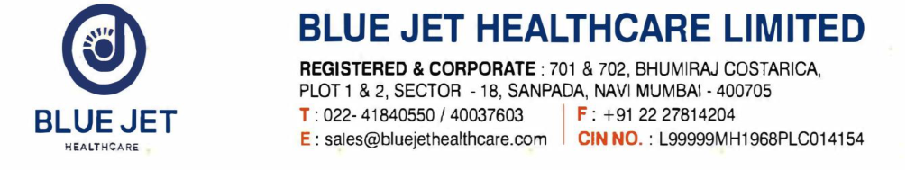

July 28, 2025 

**[Image: Jul2025.pdf-0001-01.png (1005x190, 154.9KB)]**

To, 

**BSE Limited National Stock Exchange of India Limited** Phiroze Jeejebhoy Towers “Exchange Plaza” Dalal Street Bandra-Kurla Complex, Bandra (East) Mumbai - 400 001 Mumbai – 400051 **<u>Scrip Code (BSE): 544009 Symbol: BLUEJET</u>** 

**Sub:** **<u>Transcript of the Earnings Call with Analysts/Investors on Financial Results for the quarter ended June 30, 2025</u>** 

Dear Sir / Ma'am, 

Pursuant to Regulation 30 of the SEBI (LODR) Regulations, 2015, please find enclosed the transcript of the Earnings Call with the Analysts/ Investors on the Financial Results for the quarter ended June 30, 2025 held on July 22, 2025. 

The same is also available at: <u>https://bluejethealthcare.com/investor-presentation/</u> 

You are requested to take the same on record. 

Thanking you, 

Yours faithfully, 

For **Blue Jet Healthcare Limited** 

SWETA Digitally signed by SWETA PODDAR PODDAR Date: 2025.07.28 11:17:07 +05'30' 

**Ms. Sweta Poddar Company Secretary & Compliance Officer (M. No.: F12287)** 

**[Image: Jul2025.pdf-0001-14.png (1238x221, 250.4KB)]**

**[Image: Jul2025.pdf-0002-00.png (714x97, 28.6KB)]**

# “Blue Jet Healthcare Limited Q1 FY'26 Earnings Conference Call” 

## **July 22, 2025** 

**MANAGEMENT: MR. SHIVEN ARORA - MANAGING DIRECTOR** 

**MR. VK SINGH - CHIEF OPERATING OFFICER** 

**MR. GANESH KARUPPANNAN - CHIEF FINANCIAL OFFICER** 

**MR. SANJAY SINHA - DEPUTY CHIEF FINANCIAL OFFICER** 

Page 1 of 18 

_Blue Jet Healthcare Limited July 22, 2025_ 

**[Image: Jul2025.pdf-0003-01.png (373x50, 10.2KB)]**

### **Moderator:** 

Ladies and gentlemen, good day and welcome to the Q1 FY'26 Earnings Conference Call of Blue Jet Healthcare. 

As a reminder, all participant lines will be in the listen-only mode and there will be an opportunity for you to ask questions after the presentation concludes. Should you need assistance during the conference call, please signal an operator by pressing *’ then ‘0’ on your touchtone phone. 

I now hand the conference over to Mr. Advait Bhadekar. Thank you and over to you, sir. 

### **Advait Bhadekar:** 

Thank you, Viven. Good evening and a warm welcome everyone to Q1 FY'26 Earnings Call of Blue Jet Healthcare Limited. Please note, the Investor Presentation and the Financial Results are available on the Company Website and the Stock Exchanges. 

Also, anything said on this call which reflects our outlook for the future, or which could be construed as a forward-looking statement, must be reviewed in conjunction with the risks that the company faces. 

The conference call is being recorded and the transcript along with the audio of the same will be made available on the website of the company as well as on the exchange. Please also note that the audio of the conference call is the copyright material of Blue Jet Healthcare Limited and cannot be copied, rebroadcasted or attributed in press or media without specific and written consent of the company. 

From the Management, we have with us Mr. Shiven Arora – Managing Director, Mr. VK Singh – Chief Operating Officer, Mr. Ganesh Karuppannan – Chief Financial Officer and Mr. Sanjay Sinha – Deputy Chief Financial Officer. 

Now, I would request Mr. Shiven Arora – Managing Director of Blue Jet Healthcare Limited to provide you with the updates for the quarter ended 30th June 2025. Thank you and over to you, sir. 

### **Shiven Arora:** 

Thank you, Advait. Good evening, everyone. Thank you for joining us today. 

I am pleased to share that we have started FY'26 on a solid note. Our Q1 Results reflect sustained momentum from the second half of last year. Despite the expected normalization of some operating parameters, importantly, this quarter reaffirms the resilience of our business model and the strength of our customer relationships. 

### **Financial performance overview:** 

Revenue from operations of Q1 stood at Rs. 3,548 million, up 4% sequentially and 118% yearon-year, driven by consistent volume growth across our PI, API and contrast media platforms. EBITDA came in at Rs. 1,210 million, translating to a margin of 34%, lower quarter-on-quarter 

Page 2 of 18 

_Blue Jet Healthcare Limited July 22, 2025_ 

**[Image: Jul2025.pdf-0004-01.png (373x50, 10.2KB)]**

due to phasing of production, inventory normalization and product mix. PAT for the quarter was Rs. 912 million with a net margin of 25.7%. 

On a year-on-year basis, EBITDA and PAT grew by 178% and 114% respectively, on a strong base volume expansion and enhanced operational scale. We continue to generate healthy operating cash flows with disciplined capital deployment across R&D and capacity expansion. 

### **Business segment commentary:** 

Pharma intermediates and API, this segment maintained robust momentum with the cardiovascular intermediate continuing to scale under long-term contracts. We are seeing strong customer demand visibility and expect additional launches in H2. In contrast media, commercial volumes from new molecules launched in Q4 FY'25 have now stabilized. We expect sequential growth in H2 as client offtake ramps up. High-intensity sweeteners, volumes remain steady. ASPs are stabilizing after a soft FY'25. Our value-added variant strategy remains intact. In terms of operational and strategic highlights, we completed phase 2 expansion in unit 2, which is now fully operational. Progress continues at Unit-3 Mahad, where the construction is on schedule for H2 FY'26 commissioning. This plant is being designed for continuous processing. 

### **In terms of the R&D center:** 

Rs. 400 million committed towards capabilities and amino acid derivatives and late-stage intermediates is under motion. Our employee cost and utility overheads remain well-controlled with the cost of goods sold optimizing. 

### **In terms of outlook:** 

We remain confident in our outlook for FY'26. Demand visibility across key customers is healthy. Capacity is now in place and product pipelines are expanding. In particular, we see structural tailwinds from de-risking of supply chains by global innovators, increasing adoption of complex APIs and NCE intermediates, growing traction in contrast media, especially with new molecules under validation. We expect the business to maintain strong growth and margin trajectory through FY'26, and we remain focused on discipline execution, innovation-led partnerships, and long-term value creation. 

With that, I will now invite our CEO – Mr. VK Singh to walk you through the operational update. Thank you. 

### **VK Singh:** 

Hi, good evening, everyone. 

### **I will start by a few notes on the capacity:** 

The new CDMO capacity catering to the PI and CMI segment at Unit-2 Ambernath is now fully on stream. The advanced intermediate to the contrast media NCE that we had indicated will be launched from this capacity is now commercial. Revenues from this molecule can be cited in the 

Page 3 of 18 

_Blue Jet Healthcare Limited July 22, 2025_ 

**[Image: Jul2025.pdf-0005-01.png (373x50, 10.2KB)]**

quarter that's gone by. This new block now has a consistent production schedule due to high order visibility. The cardiovascular intermediate that we have in this block with the innovator has seen a huge uptick as compared to Quarter 1 FY'25 and has shown consistent growth over the last several quarters as the end molecule is doing well in US, Europe, and ROW markets. Currently, we are at 60% capacity utilization, and we believe we have the capability to capture any further uptick in demand should that happen in the near future. 

At Unit-3 Mahad, we were creating a capacity for backward integration for the CMI segment. This is a highly engineered plant based on flow synthesis, will be the first that we will have for making the KSM for our CMI product. Work is in progress in full swing, and as indicated, the site should be ready for validations and will go on stream in second half of FY'26. With this plant going on stream, we will strengthen our position as a credible and leading supplier of CMI to all the leading innovator companies in this segment. 

We further demonstrate our resolve to retain a leadership position in the CMI segment. With this backward integration, we not only achieve strategic independence, but also insulate the business from significant volatility of the key raw material pricing. As a country, we are experiencing significant tailwinds for the CDMO business. There has been a huge surge in RFPs. While our focus has historically been on the chronic segment, we had been building capacity to supply building blocks and peptide fragments to innovators, and also the global CDMOs engaged in this field. Given the interest that we are seeing in this segment, we are advancing with a plan to build a multipurpose plant at Mahad and a state-of-the-art R&D center at Hyderabad. The GMP compliant approximately 30 reactor plant will be a versatile plant with capability to supply from a few kilos to multi-tons to our CDMO clients in any geography. 

At Mahad, both in the block meant for vertical integration and the multipurpose block we believe which will go on stream in H2 FY'27, a high level of automation is being built to ensure batchto-batch consistency, optimal leans, and risk-proof operations. As a consequence of this high level of versatility and automation that is being built into the Unit-3 Mahad, we envisage that the earlier planned CAPEX of Rs. 250 crores for Unit-3 shall increase to about Rs. 300 crores. Of this, about Rs. 100 crores has already been incurred, and the balance Rs. 200 crores will be incurred up to FY27. The state-of-the-art R&D center being built at a cost of about Rs. 40 crores shall focus on the newer chemistry platforms like peptides, intermediates for GLP-1s, biocatalysis with a focus on immobilized catalysts, and work to augment and strengthen the innovator-oriented pipeline of the company with a focus on chronic diseases. Today at R&D, we are tracking about 20 new opportunities with high client interest and visibility. About 30% of these, which is approximately six, are in late phase III or commercial phase. 

As a company, we are committed to carbon sequestration. We are conscious about the environment, and our carbon footprint is consistently reducing. We contribute about 70% of our overall energy consumption from wind and solar. 

### **Now I come to the most interesting part of this readout, our future expansion plans:** 

Page 4 of 18 

_Blue Jet Healthcare Limited July 22, 2025_ 

**[Image: Jul2025.pdf-0006-01.png (373x50, 10.2KB)]**

In the last four years, we have quadrupled our manufacturing capacity. In the next two to three years, maintaining the same growth momentum, we plan to add another 1,000 KL capacity to keep in step with our aspiration, to keep in step with our medium-term goals, and to keep in step with the business commitments which have been backed by client lock-ins. To achieve this, we plan to acquire a large land parcel, where we will lay the foundation of a globally competitive and world-class CDMO. This land will be developed in three phases. In phase one, we plan four blocks, two dedicated to contrast media, one for high-intensity sweetener, where we plan to manufacture another sweetener from a successive generation to what we already have for some of our existing clients, and the fourth will be a multi-purpose block. 

With this, I hand it over to Ganesh to take you through the financials. 

### **Ganesh Karuppannan:** 

Thank you, VK. Good evening, everyone. 

### **I will walk you through our key financial and operational highlights for Q1 FY'26:** 

While Shiven talked about the quarterly performance, I repeat, we sustained topline momentum in Q1 with broad-based contribution across all three product categories. Revenue from operations stood at Rs. 3.54 billion, up 4.5% sequentially, and 118% year-over-year. EBITDA for the quarter was at Rs. 1.2 billion or 34.1 of the sale, which is 7% sequentially declining, yet a 173% increase over Q1 last year. Profit after tax stood at 912 million, with a profit path margin of 25.7, down from Q4, but up by 148% year-over-year. 

On a full-year basis, Q1 FY'26 compared favorably with Q1 FY'25 across revenue, EBITDA, and PAT, reflecting sustained operating leverage and commercial traction. We will explain the variance more of sequential quarter with current quarter, which could be more relevant. 

### **I just move on to the gross margin:** 

The gross margin for the quarter was 48.5%, down by 6.5% from 55% in Q4. I will explain the movement. If you notice in the P&L, there is a reduction in the finished goods and WIP to the tune of 750 million in Q1 as against an increase of 100 million in Q4'25. This means a 750 million drawdown in finished goods and WIP inventory versus a 110 million built up in Q4. As overheads are absorbed in inventory valuation, this decline in inventory releases more overheads into the P&L, compressing the margin. Of the 6.5% reduction in gross margin, roughly more than 4.4% is attributable to this inventory adjustment and 2.1% to the product mix, specifically on account of higher contribution by PI, API segments and lower contribution by others segment. 

If you were to take a cumulative number of Q4 and Q1, you would end up with a 53% gross margin, which explains this 4.5% decline is merely on account of release of inventory in this quarter. There were no major changes in key raw material prices and our procurement cost remains well managed. 

### **Moving on to certain other P&L considerations:** 

Page 5 of 18 

_Blue Jet Healthcare Limited July 22, 2025_ 

**[Image: Jul2025.pdf-0007-01.png (373x50, 10.2KB)]**

A 27 million GST demand impacted EBITDA by approximately 0.7% during the quarter, which is a one-time effect. Similarly, Forex gain were lower due to US dollar depreciation in Q1, leading to a muted Forex gain in Q1. 

### **Moving on to segmented performance:** 

PI and API grew by 8.2% quarter-on-quarter, and we were able to sustain the momentum. Artificial sweetener grew 17.4% quarter-over-quarter, reflecting a recovery from muted historical performance. Contrast media saw a 3.9% quarter-over-quarter dip, mainly due to phasing. However, the outlook is positive with commercialization of new iodinated intermediate and supplies of gadolinium-based products, which are planned in this quarter. 

From a balance sheet perspective, we hold 2.7 billion in cash and treasury instrument and we continue to generate positive operating cash flows aligned with internal expectations. 

In terms of CAPEX, during Q1, we approximately incurred an expenditure of 280 million. 

Our guidance for FY'25 remained unchanged. We remain confident of achieving our FY'26 goals through consistent cost discipline, capacity utilization, and pipeline progression. 

With this, I hand over back for the Q&A session. So, moderator, you can line up the questions. 

### **Moderator:** 

Thank you very much. We will now begin the question-and-answer session. We have our first question from the line of Kunal Dhamesha from Macquarie. Please go ahead. 

### **Kunal Dhamesha:** 

Good evening and thank you for the opportunity and congratulations on great topline momentum. I have a question on gross margin. I think the clarification was good, but let's say from here on, how should we think about the run rate maybe on an annual basis? What's the range that we should look at? Is it 50% kind of run rate that we should look at adjusting for this 4.5% one off? And secondly, let's say once the iodinated ABA HCL kind of grows, how that 53% could move? Any clarity on that could be helpful. And then, I have more questions. I will come back. 

### **Ganesh Karuppannan:** 

See, if I look at this change in the finished goods, we are actually back to the 53 levels. So, like this is just an issue which is relevant only for this. On a regular basis, we don't see any change in the gross margin with this current product. So, we have a couple of new launches which are slated for Q2, Q3 and could actually come back or if there is any changes in when this iodinated new product comes in, you can actually see the change in the numbers. 

### **Kunal Dhamesha:** 

So, should we expect it to improve from the levels, current levels or how should we think about it? 

**Ganesh Karuppannan:** 

We don't give guidance on the future. So, based on the current portfolio mix, it's going to be 53 and we will be in a position to sustain similar levels in the coming quarters. 

Page 6 of 18 

_Blue Jet Healthcare Limited July 22, 2025_ 

**[Image: Jul2025.pdf-0008-01.png (373x50, 10.2KB)]**

|**Kunal Dhamesha:** **Ganesh Karuppannan:**|Okay. And this 53 you mentioned is the 53 days of finished goods inventory? No, this is 53% of gross margin.|
|---|---|
|**Kunal Dhamesha:**|But let's say finished good inventory now, where would we and then is it in line with our expectations?|
|**Ganesh Karuppannan:**|So, in terms of inventory days, there is no significant change. It came down by 131 days, that is working capital to total turnover. We should be around similar range way forward.|
|**Kunal Dhamesha:**|Okay. Sure. And then second one on the iodinated intermediate. So, we are seeing that the block is ready, capacity is ready and it would get commissioned or will start supplying in Q2. Is the way to understand?|
|**Shiven Arora:**|Yes. That is the right assumption.|
|**Kunal Dhamesha:**|Sure. And what's the capacity in terms of let's say reactor capacity or let's say tons, if you could share and how do we expect the ramp up to be? Will it be like a gradual ramp up or step jump?|
|**Shiven Arora:**|In terms of what I can share right now, the net realization per kg improves significantly with this launch, we won't be able to disclose the volume or KL capacity. But from a criticality standpoint, and our growth journey, this is a fairly good needle mover.|
|**Kunal Dhamesha:**|Sure. And one on the pharmaceutical intermediate, I believe that we had suggested that 120 KL capacity is what we had put for the cardiovascular intermediate. Is that number correct?|
|**Shiven Arora:**|That's the right assumption. 120 KL is what we've indicated. That's the right number. Happy to get on with the questions, please. Thank you.|
|**Kunal Dhamesha:**|Yes. I have more questions. I will join back the queue. Thank you.|
|**Moderator:**|Thank you. The next question is from the line of Meet Katrodiya from Niveshaay. Please go ahead.|
|**Meet Katrodiya:**|Yes, thank you so much for the opportunity. So, sir, I want to understand a little deeper in terms of gross margin. So, like gross margin fell 6.5% this quarter and 4.4% impact due to changes in inventory means we sold much of the higher cost inventory we have in last quarter, right? So, could you break down how much of the gross margin drop came from under absorbed fixed overhead or pricing change or is it like one of inventory adjustment? Basically, I want to break up of 4.4%?|
|**Ganesh Karuppannan:**|See, whenever you have a change in finished goods, whatever overhead which gets inventorized gets released to the P&L. For example, if you draw from your finished goods, whatever overhead that has been inventorized gets released to the P&L. So, there is no breakup for 4.4. It is totally the overheads, what got inventorized in the last quarter, because this time our closing finished|

Page 7 of 18 

_Blue Jet Healthcare Limited July 22, 2025_ 

**[Image: Jul2025.pdf-0009-01.png (373x50, 10.2KB)]**

goods is much lower compared to the previous quarter. So, technically means we have actually sold the finished goods of last quarter in this quarter and any associated overheads relating to those stock gets released to the P&L. That is the way you have to look at it. 

**Meet Katrodiya:** Okay, so the figure 4.4% in change in inventory contains all the overheads, right? There is nothing raw material cost or maybe…my understanding is right? 

**Ganesh Karuppannan:** 

Yes. 

**Sanjay Sinha:** Meet, I will just add here. Whenever inventory gets reduced, your cost goes up in accounting language. So, this is exactly that has happened. If you see the last four columns of the P&L, each year cost has reduced. But because of this change in inventory, the cost has gone up. In simple language, when inventory goes down, your cost goes up and it affects your gross contribution. 

**Meet Katrodiya:** Okay, understood. Thank you, sir. Yes, next one is on pharma intermediate side. What kind of feasibility do we have from innovators as the product expands into new geography and settlement with generic ANDA filer is giving good long-term benefits. So, are you seeing increased demand that will lead our PI segment to grow from this quarterly run rate of 200 crores or do we anticipate growth to taper off due to rising competition? **VK Singh:** Once again, we would reiterate that we don't really give guidance like this. But then you should not assume a quarterly run rate, right? Perhaps you have to look at larger time segment. In the CDMO business, quarter is not a very good indication. That's number one. Number two, as far as the end molecule is concerned, the growth numbers are very encouraging. And there is a very interesting lifecycle management also happening at Esperion where they are coming out with newer products in combination with this Bempedoic acid. So, I guess overall the tiding to the market are excellent for the molecule. We don't see any issue at all. We are poised for good growth. 

**Moderator:** Thank you. The next question is from the line of Piyush Kumar from Magnus Investments. Please go ahead. **Piyush Kumar:** Sir, my question is regarding the entire three segments of your business. So, which is the most bullish segment that you are on? Which segment is getting the most calls from clients and the entire industry? So, what do you think about that? 

**VK Singh:** So, for us, contrast media is our flagship vertical and the mainstay of the business. We are very predominantly contrast media focused company. On the other side, the PI business you have seen has gained great traction. There the addressable market is much larger, much, much larger, right? Much bigger than contrast media. So, because of the China plus one tailwinds or whatever you say, there's a lot of RFPs that we are getting over there. And then we have been, so well positioned in the sweetener business. And we are with almost all clients of the FMCG. The new generation or the next generation sweetener or the new sweetener that we will add will give a 

Page 8 of 18 

_Blue Jet Healthcare Limited July 22, 2025_ 

**[Image: Jul2025.pdf-0010-01.png (373x50, 10.2KB)]**

||fillip to whatever turnover we are doing the sweetener business. Overall, I would say that today, all three product verticals are poised for a healthy growth.|
|---|---|
|**Piyush Kumar:**|Okay, sir. And my last question is, how should one look at your business? Should we look at the QOQ or just YOY? That is the question for you.|
|**VK Singh:**|See, if you look at our performance for the last several quarters, you would see that we have been very consistent quarter on quarter. But then for any B2B business, particularly a CDMO business, a quarter may not be a very good indication. Right? So, I mean, there are businesses where if you will slice and dice, you will see a lot of consistency in daily sales. But this is not that type of business. That's all that I would say at this point of time.|
|**Piyush Kumar:**|Okay. Thank you, sir. All the best.|
|**VK Singh:**|Thank you.|
|**Moderator:**|Thank you. The next question is from the line of Shashank Krishnakumar from Emkay Global. Please go ahead.|
|**Shashank Krishnakumar:**|Hi, thanks for taking my question. I think we did attribute to phasing of production this quarter. I just wanted to check if production levels in 1Q are meaningfully lower? There's also in connection with the gross margins. Given that we have very strong order book visibility. So, just wanted to understand that.|
|**Ganesh Karuppannan:**|It's actually, maybe it's a wrong wording I had used. It's not phasing out of inventory. It's basically like reduction in inventory. I think that's the way you have to look at it.|
|**Shashank Krishnakumar:**|So, production or utilization levels were not lower on a QOQ basis, right? Just wanted to understand that.|
|**Ganesh Karuppannan:**|No, the productions are based on customer orders. So, we have a very sustained production. So, this is something certain inventory produced in the last quarter got sold in this quarter.|
|**Shashank Krishnakumar:**|Got it. Thank you. That's helpful. My second question was on the new launches that you pointed to in 2Q and 3Q. So, does that include the iodinated intermediate and any other launch from other business segments? Just wanted to understand which were the two new products that you were alluding to?|
|**Shiven Arora:**|So, in contrast media itself from an H2 perspective, there's this iodinated AB HCL that we spoke about. And there is the backward integration that we are doing. So, these are the two material launches. However, there are a few other intermediates that we supply to newer contrast agents. These are newer applications with some innovators. These are all lab quantities but have a promising future. So, this is more about contrast media. About pharma intermediates. pharma intermediates also, there are new opportunities that we are tracking. As I mentioned that some|

Page 9 of 18 

_Blue Jet Healthcare Limited July 22, 2025_ 

**[Image: Jul2025.pdf-0011-01.png (373x50, 10.2KB)]**

of them are in phase 3 and late phase and a couple of them are already commercial. So, I think there are interesting opportunities there also. 

**Moderator:** Thank you. The next question is from the line of Arpit Tapadia from IGE Family Office. Please go ahead. 

**Arpit Tapadia:** My first question is regarding the land that we have returned to the authorities and got our refund back. Any particular reason is behind? **VK Singh:** Actually, our application has been for a much, much larger parcel. But today in the red category, Gujarat does not have too much of land. So, we got about 8 acres. We took that, but then we felt that that was subscale because now we have spotted and in the process of finalizing a much, much larger piece of land. Therefore, it was logical for us to surrender this in view of the much larger parcel of land that we would be acquiring very shortly. And we will make an announcement about that, which is in step with the aspiration that the company has. **Arpit Tapadia:** Got it. My second question is in line with the previous participant only. Since we have lowered down our inventory into this quarter and our sales at overall level is more than the previous quarter, then we must have ramped down our production level into this quarter? **Ganesh Karuppannan** Yes. Our closing inventory of finished goods is lower compared to previous quarter. And we have the production plan in place for Q2 and Q3, which will actually get back to the original levels. **Arpit Tapadia:** Got it. So, what is our sustainable level of inventory that we want to maintain? **Ganesh Karuppannan** No, it is more than sustainable level. It is more to do with the customer order and because we make based on customer order, so it is dependent on that. **Arpit Tapadia:** Okay. I will fall back into the queue for further questions. **Moderator:** Thank you. The next question is from the line of Ayush Agarwal from MAPL Value Investment Fund. Please go ahead. **Ayush Agarwal:** Ganesh sir, this is a question for you on the inventory. I am sorry for harping on it again. But I do not believe that we record finished goods on the selling price. We record finished goods on the lower of cost basically. I am reading your annual report note which has accounting policy on finished goods. And it is clearly mentioned that we value at lower of cost and NRV. So, the overhead that we are talking which have been brought from last quarter to this quarter does not really make a lot of sense to me. So, if you can help us understand and even if I look at our past quarter cost of raw materials, they have never actually crossed 46%-47% and while I understand that pharma Intermediate has scaled up in the last 3-4 quarters, when it scaled up in December '24, then also our cost of raw materials was 45%, which was the same in March '25 number as well. So, if you can really help us understand what happened to our gross margin this quarter, it would be helpful. 

Page 10 of 18 

_Blue Jet Healthcare Limited July 22, 2025_ 

**[Image: Jul2025.pdf-0012-01.png (373x50, 10.2KB)]**

**Ganesh Karuppannan:** Finished goods is never valued on sale price. It is basically raw material plus associated overheads. Any direct overhead gets allocated. This is the accounting principle every company follows in valuing the finished goods. So, you can easily understand what is the raw material cost and what is the direct overheads which gets allocated. So, in a quarter where you have a larger finished goods, you would have actually like inventorized certain overheads, the direct overheads and if you maintain similar inventory levels quarter on quarter, you do not see that impact in the P&L. In our case, between Q4 and Q1, the finished goods inventory came down in Q1 to the tune of Rs. 75 crore, which is basically the raw material cost plus direct overheads allocated. So, if you just see what is the overheads which got allocated, the difference in overheads between Q4 and Q1 of this current quarter, the impact is close to 4%-4.4%. **Ayush Agarwal:** That comes to around 17 crores-18 crores. Do you mean that we did not recognize that last quarter and our numbers were higher by that last quarter? **Ganesh Karuppannan** Yes. If you want to understand more clearly, if you just take the Q4 and Q1 of this, the calendar six months, you would get a gross margin of 53%. **Ayush Agarwal:** Understood. Second question, sir, is on the Capex, which our CEO mentioned that we want to add 1,000 KL capacity in the next two to three years. And we start with phase I of four blocks, two of them for CMI, one for high intensity sweetener, and one in MPB block **.** Given the growth happening in the pharma intermediate molecule and given what our customers is preparing for in the future, why no CAPEX towards this as where I understand we are at 60%, but why no Capex towards pharma intermediate in the next phase of expansion? **VK Singh:** I think maybe the voice drained off and maybe you were not able to hear. Pharma intermediates is becoming an important part of the entire scheme of the company. There is one block that will come up in Mahad, which we very clearly mentioned, that's like a multipurpose block, will be catering to this segment. And even for our new big land parcel that we spoke about, our expansion plan for the future, there also we mentioned that there's going to be a multipurpose block which will be catering to this third product vertical. So, I think we are building up good capacity in anticipation of the RFPs that we have. **Shiven Arora:** I think just to add on to that, as a company DNA, when we have a customer lock-in and a contract visibility, that's when we initiate a thought process of adding a particular block. And that's how we see in contrast media also, we believe that two additional blocks should be added due to certain discussions with the customers and the innovators. **Ayush Agarwal:** Just to follow up on this, given that we are already doing backup integration into APD for our contrast media intermediates. And we are putting up two more blocks for contrast media. So, what could be the roadmap for contrast media from here? **Shiven Arora:** The end formulation market is definitely growing. And from $6.7 billion in terms of end formulation is projected to become $10 billion in the next few years. So, in anticipation of this 

Page 11 of 18 

_Blue Jet Healthcare Limited July 22, 2025_ 

**[Image: Jul2025.pdf-0013-01.png (373x50, 10.2KB)]**

growth, we have a strong push from our customers also to add capacities to take care of these growing demands. 

### **Moderator:** 

Thank you. The next question is from the line of Bansi Desai. Please go ahead. 

### **Bansi Desai:** 

Hi, thanks for taking my question. My question is again on contrast media. So, if I just look at this business for us for the last two to three years, we've been, in that range, or in fact, you know, looking at this quarter's number at Rs. 97 crores, we are much below our quarterly run rate that we've seen in this business even two years back. So, from a Rs. 500 crore business in fiscal 23, we came down to Rs. 480 crores in fiscal '24. We came down to Rs. 400 crores in fiscal'25 probably because of customers, changes in the facility, etc. But starting this year, we are again at Rs. 97 crores. So, if you can just help us understand, probably two years back, we would have thought that end market is growing at mid to high single digit, Blue Jet launching more molecules, you should have been grown probably at mid-single digit or higher than that. And from there to here, we are still probably at this, run rate of 97 crores. So, are we going to see a step up again in this business from the new launches that you are guiding? And if one has to look at two to three-year view, maybe quarterly is not the right way to look at the numbers. I understand that. But if I have to take two to three-year view, how should one think about growth for Contrast Media? 

**Ganesh Karuppannan** Bansi, there are three levers. One is the largest customer, the forecast, whatever they have indicated to us, the iodinated product, and the intermediate for the gadolinium molecule. Now, if we look at all the three together, there is a good probability we should actually get back to the 23 levels. I think that is our aspiration. So, that's what we are working on. So, this would actually become a new base for us. If we could actually reach the 23 level in 25 or 26, then we can actually build on, you will obviously have the growth on the iodinated molecule, you will actually see the full year impact in FY'27. And the NCE molecule also would grow in 27-28. And in the meantime, we do expect certain new opportunities, which we are actually planning from FY28, 29, what VK and Shiven alluded to in terms of additional capacities for Contrast Media. 

**Bansi Desai:** And how is the capacity utilization for Contrast Media, particularly you mentioned 60% at an overall level. Is it any different for Contrast Media? 

**VK Singh:** What I mentioned was for the PI segment, that particular block that we had created, just to give a sense that should there be an increase in demand, we are well poised to capture that. Overall, I think at a company level, maybe 75%. 

**Moderator:** Thank you. The next question is from the line of Ravi Purohit from Securities Investment Management Private Limited. Please go ahead. 

**Ravi Purohit:** Hi. Thanks for taking my question. Sir, I've been kind of reading our environment clearance report for the new Mahad unit, right? And in that, we have provided a list of products where we are adding capacities. And one of them is also API for Bempedoic Acid, right? So, I think so far 

Page 12 of 18 

_Blue Jet Healthcare Limited July 22, 2025_ 

**[Image: Jul2025.pdf-0014-01.png (373x50, 10.2KB)]**

we've been doing only the intermediate. So, in Bempedoic Acid, are we looking to add API facility, API capacity as well? And similarly, in Contrast Media, we are putting up two new blocks in the new large capacity that we are planning to set up over the next 2 to 3 years. Now, there also historically, we've been, are we kind of looking to add larger API capacities in many of these, where the value of the end product, of course, could be significantly larger than what we have been getting in the intermediate? So, if you could just share some thoughts and some, color on where we are headed on either of these, both PI as well as the Contrast Media on the journey from intermediate to whether we will or will not be doing APIs. 

### **VK Singh:** 

So, if you will see our performance over the last couple of years, three, four, five years, you will see that our per KL realizations have gone up significantly and very consecutively. And our per kg realizations have also gone up from building blocks to intermediates, advanced intermediates. Now, both in our Contrast Media and PI, what we supply to our clients are very advanced intermediates, which are just one or two steps short of the final API. The final API could be a logical extension. But as you know, and Shiven also mentioned what the DNA of the company is, we always do it with a specific client lock-in and client interest. So, it has to come from one of our existing clients. We don't wish to participate in the generic space. As far as your reading of our environmental clearance is concerned, while the advanced intermediate that we make for Bempedoic is just two steps away from the final API. But then many a times we give a laundry list of products because going back to the EC for amendments of the product list is not very convenient nor efficient. 

### **Moderator:** 

Thank you. The next question is from the line of Ajay from Niveshaay. Please go ahead. 

**Ajay:** 

Thank you for the opportunity. My question is on contrast media. So, as mentioned by the previous participants that the speed of growth has been slow, but we also believe the big scale can be achieved in this business with forward integration. So, sequentially, how or what are your expectations with this segment going ahead? And do we plan to forward integrate? 

### **VK Singh:** 

So, there's a clear roadmap for that. But as we mentioned that we always do it for the customers on a CDMO model. We don't participate in the generic space. So, I think as it pans out we will keep you updated. At this point of time, we cannot comment any more than what we have. 

### **Ajay:** 

Got it. And last question. Again, this is on the inventory. You mentioned that there was underabsorbed overhead, and this is typically due to the lower production, which we also expect going forward to pick up, which will eventually result in sales or sales in coming quarters, which will result in better absorption of fixed costs. So, my question is, in case this doesn't happen, what are the steps being taken to absorb or manage these overheads going forward? And if you can also highlight the range of gross margins what we should look at, that would be helpful. 

### **Ganesh Karuppannan** 

It is not under-absorption of overheads. It is the overhead inventorized in the previous quarter getting released to P&L in this quarter. Okay? So, it is not that, under-absorption is completely a different topic. So, this is nothing to do with under-absorption. 

Page 13 of 18 

_Blue Jet Healthcare Limited July 22, 2025_ 

**[Image: Jul2025.pdf-0015-01.png (373x50, 10.2KB)]**

**Ajay:** But in the press release, it has been mentioned the same. **Ganesh Karuppannan** Okay, I will just check on that. One minute. Because this may be like for you to simplify. If you just take the P&L of Q4'25 and Q1'26 P&L and merge it, you can actually understand the net impact and you would actually see gross margin is intact at 53%. **Ajay:** If I even back-calculate, the number comes down to 51.6%. So, I am not able to clearly understand. And in the press release also, it has been mentioned clearly that it's driven by shift in product mix, reduced inventory level and resulting in lower overhead absorption. **Ganesh Karuppannan** Okay. We will take it offline. I will actually explain the complete calculation on this. **Ajay:** And also, sir, last question. Sir, we have plans of fund-raise. So, if you can give details on what are the plans going forward for the same? **Ganesh Karuppannan** We are still in the drawing room stage. We are yet to finalize anything. As and when we conclude on this, we will actually communicate. Right now, we have just taken a shareholder resolution and we are still evaluating the options. **Ajay:** Okay, sir. Thank you. **Moderator:** Thank you. The next question is from the line of Bansi Desai from JP Morgan. Please go ahead. **Bansi Desai:** Hi. Thanks again for the opportunity. Just on the PI-API for the cardiovascular product, it appears that the realizations have remained pretty stable, is that true? And therefore, if the realizations, say for instance, were to remain stable and if we were to see increased uptake in quantity, should we assume this kind of run rate to continue? **Ganesh Karuppannan** With the current cost structure, our margins are intact. **Bansi Desai:** No, sir. I was talking about the revenue for the PI-API? **Ganesh Karuppannan** Yes. I mean, as you know, Bansi, the molecule is doing extremely well. And I think what we have done at the annual level, that we should be able to maintain with some growth in that. **Bansi Desai:** Okay, perfect. Thank you so much. **Moderator:** Thank you. The next question is from the line of Abhishek Sharma from D&H Electrodes Pvt. Ltd. Please go ahead. **Abhishek Sharma:** Hello. Good evening, sir. Sir, is there any cyclical pattern in the company's revenue organization? Just like that in the first half of the financial year, typically constitutes a lower portion of annual revenues compared to the second half. 

Page 14 of 18 

_Blue Jet Healthcare Limited July 22, 2025_ 

**[Image: Jul2025.pdf-0016-01.png (373x50, 10.2KB)]**

**Ganesh Karuppannan** We do not have any seasonality in our industry. It is all more to do with customer orders. Sanjay, you want to add on? **Sanjay Sinha:** Sir, this is basically, this is all related to, we are into make-to-order. So, as and when order is there, we manufacture. So, there is no cyclical, it is not a formulation company. **Abhishek Sharma:** Okay. Thank you. **Ganesh Karuppannan** Thank you. **Moderator:** Thank you. The next question is from the line of Vidit Shah from Spark Capital. Please go ahead. **Vidit Shah:** Hi. Thanks for taking my question. Sir, two questions I had. Sir, one was, while I understand that inventory has hit the P&L, I would assume that revenue too would be booked in the same quarter. So, I am still confused around why margins have taken such a sharp decline, unless there were one-off overheads which have been recognized in the quarter. But happy to take that offline if you may. But my second question was on why are we seeing reduced levels of inventory? Why are we consciously reducing levels of inventory in Q1? **Sanjay Sinha:** Basically, I mean, in simple words, it says the movement of COGS that is not going to those. So, if you see, whenever the inventory goes down, COGS goes up in simple accounts. So, that is the impact. So, inventory has reduced. **Vidit Shah:** But the revenue would also go up in the same way, right? So, margins may not be impacted. **Sanjay Sinha:** Yes, but the revenue has also gone up. But the stock was lying in the last quarter. It got displaced this quarter. Got it? **Vidit Shah:** Okay. **Sanjay Sinha:** So, the movement, if you see the movement, is the impact of COGS. And of course, overhead and all is there, but this movement of COGS, basically. So, just minus raw material cost, which is the gross margin and remove the COGS, still the margin is around 52%. **Vidit Shah:** Okay. Maybe we can take that offline. But if you could just help me understand why are levels of inventory decreasing? Is that a conscious effort? Or is this a plant maintenance sort of? **Ganesh Karuppannan** No, this is more of a customer's dispatch schedule. So, each customer has their dispatch schedule. So, it is more to do with their logistics planning. **Vidit Shah:** Okay. So, would that be fair to assume then that Q2, the dispatches may not be as much as Q1? Is that how to look at it? **Ganesh Karuppannan** Not exactly. So, this is because we have our production schedule for Q2, Q3. So, whatever happened in Q1 should not have impact on the production of Q2. 

Page 15 of 18 

_Blue Jet Healthcare Limited July 22, 2025_ 

**[Image: Jul2025.pdf-0017-01.png (373x50, 10.2KB)]**

**Vidit Shah:** Okay. Those were my two questions. Thanks for answering them and all the best. Thank you. **Moderator:** Thank you. The next question is from the line of Kunal Dhamesha from Macquarie. Please go ahead. **Kunal Dhamesha:** Hi, thank you for the follow-up question. My question is primarily on the peptide segment. If you could help us understand the capabilities that we have, what are our aspirations there, and then, what is the capacity that we are planning and where it would be Capex required, so that would be great. 

**VK Singh:** See, on the peptide segment, we are working on peptide fragments. At the R&D stage, we are working on some peptides, but then what is more advanced and what we are discussing with certain innovator companies are the intermediates to the end peptides, some of them being the GLP-1 products where we are in a conversation with certain innovator companies for the intermediates. So, basically, we are working on the amino acid derivatives and peptide fragments. Till the time we build our multipurpose plant in Mahad, the smaller requirements that will be there in this segment will be catered to from the multipurpose plant in Unit 2. When the Mahad capacity comes in, that will address this business segment and demand. And as I mentioned that in the larger scale of things, when we have this much, much larger land parcel and capacity that we plan to create in the next couple of years, there will be capacity for this segment there also. It will all be in step with the client lock-in and visibility of business that we have. 

**Kunal Dhamesha:** So, when we say this fragments, would it be more like dipeptide, tripeptide or octamer, decamer, what are we trying to kind of achieve here? And then in terms of the technology that we would be adopting, whether it's chemical synthesis and on a large-scale basis, would it continue or we are also looking at the other type of technology available there? **VK Singh:** See, as I mentioned that we are doing amino acid derivatives. We will not be making the amino acid, which are on fermentation-based technologies. As we speak, we have developed already about 45 peptide fragments. We are not in the library or catalog type of business, where we do 300 or 400. There's a big opportunity over there, but that's not what we are focusing. We are working on those where there's high conviction and client visibility. We are, since I mentioned peptide fragments, then we are not really talking about tripeptides, tetrapeptides or the decapeptides. We have in the new R&D center that we are creating, we will have one lab which will be doing peptide synthesis, but then the high conviction opportunities that we are tracking are more on the fragment side. **Kunal Dhamesha:** Sure, maybe I will take it offline. I need to get more details around this. Thank you for your answer. **Moderator:** Thank you. The next question is from the line of Ravi Purohit from Securities Investment Management Pvt. Ltd. Please go ahead. 

Page 16 of 18 

_Blue Jet Healthcare Limited July 22, 2025_ 

**[Image: Jul2025.pdf-0018-01.png (373x50, 10.2KB)]**

**Ravi Purohit:** My question also was similar to the previous participants' questions. Amino acid chains and the fragments are not very easy to establish. Is it something that we are working on and will eventually showcase to clients or we have already established certain processes and certain products on existing showcase to clients? Where are we in that? Is it something that we aspire to do or certain products or certain chains we've already established and it's only a matter of talking to the client, showing to them what we are capable of and have a capacity to basically manufacture? Because what we understand is the chain is not very easy to kind of produce and replicate. 

**VK Singh:** You need a specialized skill set for this, which we have. We have been working on this type of chemistry for the last two, two and a half years. We have a couple of scientists who are extremely good in this type of synthesis. As I mentioned, we are not in the catalogue business. As we speak, we are not venturing now. We already have about 45 peptide fragments which are already ready. They can be commercialized almost immediately. This preparation or readiness that we have is based upon customer interest. There's no blue sky gazing in this. 

**Moderator:** Thank you. The next question is from the line of Ankit Sahay from Fusion Capital. Please go ahead. 

**Ankit Sahay:** My question is on the gross margin. Rather than taking it offline, it would be helpful if most of the participants have this question so we can clarify on this here itself. **Ganesh Karuppannan** What is your question on gross margin? 

**Ankit Sahay:** You mentioned the right to look at a consolidated of Q4 FY'25 and Q1 FY'26. Why to do that and why the revenue should be recorded in the Q4 itself and not in Q1? 

**Ganesh Karuppannan** Unless you make a sale, then only you can recognize the revenue. In our case, you have both finished goods and goods in transit. Certain finished goods are recognized as sale only when it reaches the customer destination. So, the finished goods has two parts. One is what we physically have it at site and the second one is in transit because certain Incoterms allows us to recognize revenue only when it reaches the customer. When you take both of this, you have this, this is I would actually call it more as an aberration for this quarter. I would actually say this is more an accounting, the way Sanjay put it across. When the inventory gets released, this overhead absorption happens. I think had we maintained a similar finished goods level like last quarter; you would not have seen this impact. **Ankit Sahay:** Yes, got it. So, overhead from the last quarter is coming here because the inventory levels are reduced. **Moderator:** Thank you. The next question is from the line of Saket from Sagari Capital. Please go ahead. **Saket:** Thanks for the opportunity. So, we talked about a lot of traction as far as CDMO RFPs are concerned. So, could you share details around, say, how many projects we have currently across different phases, say, in Q1 and what was the corresponding number, say, last year just to get a 

Page 17 of 18 

_Blue Jet Healthcare Limited July 22, 2025_ 

**[Image: Jul2025.pdf-0019-01.png (373x50, 10.2KB)]**

sense of how has the product pipeline in the CDMO or especially in the pharma API/intermediate phase. So, how has that trended over the last year or so? 

**VK Singh:** So, I think we all understand that this CDMO part where we are participating with our customers during the clinical phase or regulatory phase or the commercial phase, it's a slow burn. Today, as we speak, and I mentioned in my narrative that we are sitting on about 20 RFPs. Six of them are in late stage phase III or commercial. Right? Last year, I think the number was 11 or 12. I don't remember exactly, but I think it was 11 or 12. So, you do see consistent growth from last year to now. And some products gain traction, particularly in the chronic space. And now, in addition to that chronic space, since we are looking at peptide fragments, that's a new opportunity that has opened up. **Saket:** Fantastic. So, my next question would be, what is the typical asset turn for our pharma intermediate business? So, is it 1.1, 1.2? What's the asset turn? **VK Singh:** Overall, at a company level, because our capacities are fungible, let's not go product categorywise or business segment-wise. But at a company level, I think we have clocked one of the best in the industry north of four. **Saket:** So, is it that net block or gross block, that four we are talking about? Four would be a net block, I guess. **VK Singh:** Net block, yes. **Saket:** So, at gross block, if CFO sir can respond. So, I am just trying to understand, when you put in the new CAPEX, what kind of numbers would we expect on a gross level? **Ganesh Karuppannan** See, we have a pretty long-term plan in terms of our CAPEX. We will shortly come back with a bigger outlay, which will take care of the future expansion. Our assessment over a period of, if you take the next five years, our asset turn should be somewhere close to 2.5 to 3. **Saket:** Okay. Now, thanks for the opportunity and best wishes to the team. **Moderator:** Thank you. As there are no further questions from the participants, I now hand the conference over to management for closing comments. **Ganesh Karuppannan** Thank you very much for your participation and we will see you in the next investor call. Thank you very much. **Moderator:** On behalf of Blue Jet Healthcare, that concludes this conference. Thank you for joining us and you may now disconnect your lines. 

**(** This document was edited for readability purposes.) 

Page 18 of 18 

---

## Extracted Images

| # | File | Dimensions | Size |
|---|------|------------|------|
| 1 | Jul2025.pdf-0001-01.png | 1005x190 | 154.9KB |
| 2 | Jul2025.pdf-0001-14.png | 1238x221 | 250.4KB |
| 3 | Jul2025.pdf-0002-00.png | 714x97 | 28.6KB |
| 4 | Jul2025.pdf-0003-01.png | 373x50 | 10.2KB |
| 5 | Jul2025.pdf-0004-01.png | 373x50 | 10.2KB |
| 6 | Jul2025.pdf-0005-01.png | 373x50 | 10.2KB |
| 7 | Jul2025.pdf-0006-01.png | 373x50 | 10.2KB |
| 8 | Jul2025.pdf-0007-01.png | 373x50 | 10.2KB |
| 9 | Jul2025.pdf-0008-01.png | 373x50 | 10.2KB |
| 10 | Jul2025.pdf-0009-01.png | 373x50 | 10.2KB |
| 11 | Jul2025.pdf-0010-01.png | 373x50 | 10.2KB |
| 12 | Jul2025.pdf-0011-01.png | 373x50 | 10.2KB |
| 13 | Jul2025.pdf-0012-01.png | 373x50 | 10.2KB |
| 14 | Jul2025.pdf-0013-01.png | 373x50 | 10.2KB |
| 15 | Jul2025.pdf-0014-01.png | 373x50 | 10.2KB |
| 16 | Jul2025.pdf-0015-01.png | 373x50 | 10.2KB |
| 17 | Jul2025.pdf-0016-01.png | 373x50 | 10.2KB |
| 18 | Jul2025.pdf-0017-01.png | 373x50 | 10.2KB |
| 19 | Jul2025.pdf-0018-01.png | 373x50 | 10.2KB |
| 20 | Jul2025.pdf-0019-01.png | 373x50 | 10.2KB |
