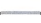
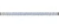
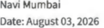

August 03, 2026 

|To,||
|---|---|
|The Manager|The Manager|
|Listing Department|Listing Department|
|**BSE Limited**|**National Stock Exchange of India Limited**|
|Phiroze Jeejebhoy Towers|Exchange Plaza, Plot No. C/1, G Block,|
|Dalal Street Mumbai - 400 001|Bandra-Kurla Complex, Bandra (East)|
|Scrip Code (BSE): 544009|Mumbai - 400051 Symbol: BLUEJET|

## **Sub.: Outcome of Board Meeting held today i.e, Monday, August 03, 2026** . 

Dear Sir / Ma'am, 

In terms of Regulation 30 read with Schedule III and other applicable provisions of SEBI (Listing Obligations and Disclosure Requirements) Regulations, 2015, we hereby inform you that, the Board of Directors of the Company at their meeting held today viz. Monday, August 03, 2026 _, inter-alia,_ has approved the following: - 

- a) Unaudited Standalone Financial Results of the Company for the first quarter ended June 30, 2026. A signed copy of the Unaudited Standalone Financial Results along with the Limited Review Report thereon is enclosed herewith as **Annexure A** 

- b) Re-appointment of Mr. Akshay B Arora (DIN: 00105637) as the Whole Time Director and Executive Chairman for a further period of five (5) years, effective from April 13, 2027 to April 12, 2032, liable to retire by rotation, subject to the approval of the shareholders at the ensuing Annual General Meeting. 

The detailed disclosures as required under Regulation 30 of the SEBI Listing Regulations read with SEBI Master Circular No. SEBI/HO/CFD/PoD2/CIR/P/0155 dated November 11, 2024 is enclosed as **Annexure B** ; 

- c) Re-appointment of Mr. Shiven Akshay Arora (DIN: 07351133) as the Managing Director of the Company for the further term of 5 years from April 13, 2027 to April 12, 2032, not liable to retire by rotation, subject to the approval of the shareholders at the ensuing Annual General Meeting. 

The detailed disclosures as required under Regulation 30 of the SEBI Listing Regulations read with SEBI Master Circular No. SEBI/HO/CFD/PoD2/CIR/P/0155 dated November 11, 2024 is enclosed as **Annexure C** ; 

- d) Re-appoint M/s KKC & Associates LLP, Chartered Accountants (ICAI Firm Registration No. 117366W/W-100018) as the Statutory Auditors of the Company for a second term of five consecutive years till the conclusion of the 63rd Annual General Meeting of the Company in terms of the aforesaid provisions, subject to the approval of the shareholders at the ensuing Annual General Meeting. 

The detailed disclosures as required under Regulation 30 of the SEBI Listing Regulations read with SEBI Master Circular No. SEBI/HO/CFD/PoD2/CIR/P/0155 dated November 11, 2024 is enclosed as **Annexure D;** 

- **e)** Record date September 14, 2026, for the purpose of determining entitlement to receive Dividend of Rs. 1.2/- (@ 60%) per Equity Share having face value of Rs. 2/- each fully paid-up for the financial year 2025- 26 as recommended by Board of the Directors at its meeting held on May 25, 2026. 

- f) The 58th Annual General Meeting (“AGM”) of the Company will be held on September 21, 2026, at 11:00 A.M. IST through Video Conferencing ('VC') or Other Audio-Visual Means (OAVM'). The Notice of the AGM and the Annual Report will be released in due course. 

The meeting commenced at 12:10 P.M. and concluded at 12:27 P.M. 

Kindly take the same on your record. 

Thanking you, Yours faithfully, 

## **For Blue Jet Healthcare Limited** 

Sweta Digitally signed by Sweta Poddar Poddar Date: 2026.08.03 12:42:20 +05'30' **Sweta Poddar Company Secretary & Compliance Officer Mem. No. F12287** 

# **kkc & associates lip** 

#### Chartered Accountants 

(formerly Khimji Kunverji & Co LLP) 

**[Image: Jun2026Result.pdf-0003-03.png (309x30, 8.0KB)]**

Independent Auditor's Review Report on unaudited financial results for the quarter ended 30 June 2026 of Blue Jet Healthcare Limited under Regulation 33 of the SEBI (Listing Obligations and Disclosure Requirements) Regulations, 2015, as amended. 

#### To 

The Board of Directors of Blue Jet Healthcare Limited 

##### **Introduction** 

1. We have reviewed the accompanying statement of unaudited financial results of Blue Jet Healthcare Limited ('the Company') for the quarter ended 30 June 2026 ('the Statement'), being submitted by the Company pursuant to the requirements of Regulation 33 of the Securities and Exchange Board of India {Listing Obligations and Disclosure Requirements) Regulations, 2015, as amended ('Listing Regulations'). We have initialled the Statement for identification purpose only. 

2. This Statement, which is the responsibility of the Company's Management and approved by the Board of Directors of the Company, has been prepared in accordance with the recognition and measurement principles laid down in the Indian Accounting Standard ('Ind AS') 34 'Interim Financial Reporting' specified in section 133 of the Companies Act, 2013 ('the Act'), read with relevant rules issued thereunder and other accounting principles generally accepted in India and in compliance with Regulation 33 of the Listing Regulations. Our responsibility is to express a conclusion on the Statement based on our review. 

##### **Scope of Review** 

3. We conducted our review of the Statement in accordance with the Standard on Review Engagements ('SRE') 2410 - 'Review of Interim Financial Information Performed by the Independent Auditor of the Entity' issued by the Institute of Chartered Accountants of India ('the ICAI'). This standard requires that we plan and perform the review to obtain moderate assu rance as to whether the Statement is free of material misstatement. A review is limited primarily to inquiries of company's personnel and analytical procedures applied to financial data and thus provides less assurance than an audit. We have not performed an audit and accordingly, we do not express an audit opinion. 

##### **Conclusion** 

4. Based on our review conducted as above, nothing has come to our attention that causes us to believe that the accompanying Statement, prepared in accordance with the recognition and measurement principles laid down in Ind AS, specified under Section 133 of the Act as amended, read with relevant rules issued thereunder and other accounting principles generally accepted in India has not disclosed the information required to be disclosed in terms of Regulation 33 of the Listing Regulations, including the manner in which it is to be disclosed, or that it contains any material misstatement. 

**[Image: Jun2026Result.pdf-0003-14.png (186x190, 56.2KB)]**

**[Image: Jun2026Result.pdf-0003-15.png (1050x27, 24.8KB)]**

- Sunshine Tower, Level 19, Senapati Ba pat Marg, Elphinstone Road, Mumbai 400013, India T: +9122 6143 7333 E: info@kkcllp.in W: www.kkcllp.in LLPIN: AAP-2267 

**[Image: Jun2026Result.pdf-0003-17.png (41x23, 0.8KB)]**

Suite 52, Bombay Mutual Building, Sir Phirozshah Mehta Road, Fort, Mumbai 400001, India 

# **kkc & associates lip** 

### Chartered Accountants 

(formerly Khimji Kunverji & Co LLP) 

**[Image: Jun2026Result.pdf-0004-03.png (311x32, 8.4KB)]**

##### **Other Matter** 

5. Attention is drawn to the fact that the figures for the quarter ended 31 March 2026 as reported in these financial results are the balancing figures between audited figures in respect of the full previous financial year and the published unaudited year to date figures up to the third quarter of the previous financial year. The figures up to the end of the third quarter of previous financial year had only been reviewed and not subjected to audit. 

Our conclusion is not modified in respect of this matter. 

#### For **KKC & Associates LLP** 

Chartered Accountants (formerly Khimji Kunverji & Co LLP) Firm Registration Number: 105146W/ W100621 **Kamlesh R Jagetia** Partner ICAI Membership No: 139585 UDIN: 26139585GLWFBK5235 

**[Image: Jun2026Result.pdf-0004-09.png (189x193, 53.9KB)]**

Place: Navi Mumbai 

Date: 03 August 2026 

**[Image: Jun2026Result.pdf-0004-12.png (1048x32, 29.4KB)]**

Sunshine Tower, Level 19, Senapati Ba pat Marg, Elphinstone Road, Mumbai 400013, India 

T: +9122 6143 7333 E: info@kkcllp.in W: www.kkcllp.in LLPIN: MP-2267 

**[Image: Jun2026Result.pdf-0004-15.png (59x26, 1.2KB)]**

Suite 52, Bombay Mutual Building, Sir Phirozshah Mehta Road, Fort, Mumbai 400001, India 

###### **BLUE JET HEALTHCARE LIMITED** 

###### **STATEMENT OF UNAUDITED FINANCIAL RESULTS FOR THREE MONTHS ENDED 30-06-2026** 

|||**T**|**hree Months Ende**|**d**|**finmillion** **Vear Ended**|
|---|---|---|---|---|---|
||**Particulars**|**30-06-2026**|**31-03-2026**|**30-06-2025**|**31-03-2026**|
|||**(Unaudited)**|**(Audited)** **(Refer Note 3)**|**(Unaudited)**|**(Audited)**|
|**1**|Revenue from Operations|2,931.13|2,346.68|3,547.58|9,473.21|
|**2**|Other Income|152.37|229.20|82.54|686.54|
|**3**|**Total Income (1+2)**|**3,083.50**|**2,575.88**|**3,630.12**|**10,159.75**|
|**4**|**Expenses**|||||
||Cost of Materials Consumed|1,788.78|928.87|1,078.90|3,881.33|
||Changes [Decrease /(Increase)] in InventoriesofFinished goods and Work-in-Progress|(417.67)|93.16|750.07|476.82|
||Employee Benefits Expense|201.17|184.82|174.26|735.35|
||Finance Costs|6.60|5.83|6.90|62.39|
||Depreciation and Amortisation Expense|67.06|64.55|56.98|240.02|
||Other Expenses|378.10|427.16|334.41|1,438.72|
||**Total Expenses**|**2,024.04**|**1,704.39**|**2,401.52**|**6,834.63**|
|**5**|**Profit before Tax (3-4)**|**1,059.46**|**871.49**|**1,228.60**|**3,325.12**|
|**6**|Tax Expense:|||||
||CurrentTax|265.00|215.00|298.00|812.00|
||Short/ (Excess)TaxProvision relatedtoprior years||0.90||0.90|
||DeferredTax(credit)/ charge|11.82|12.15|18.90|34.06|
||**Total Tax Expense**|**276.82**|**228.05**|**316.90**|**846.96**|
|**7**|**Profit fortheperiod/ year (5-6)**|**782.64**|**643.44**|**911.70**|**2,478.16**|
|**8**|**Other Comprehensive Income**|||||
||(i) Itemsthatwillnotbe reclassifiedtoprofitorloss||1.27||(2.65)|
||(ii) IncomeTax relatingtoitems that willnotbereclassified to profitorloss||(0.32)||0.67|
||**Other Comprehensive Income fortheperiod/ year**||**0.95**||**(1.98)**|
|**9**|**Total Comprehensive Income fortheperiod/ year(7+ 8)**|**782.64**|**644.39**|**911.70**|**2,476.18**|
|**10**|Paid-up Equity Share Capital(FaceValue'{2 per share)|346.93|346.93|346.93|346.93|
|**11**|Other Equity||||13,252.19|
|**12**|**Earnings per Share (EPS)ofFace value'f2/- each***|||||
||(a)Basic -(st)|4.51|3.71|5.26|14.29|
||(b) Diluted -(st)|4.51|3.71|5.26|14.29|
||'EPSarenotannualised forinterim periods|||||

**Notes:** 

- 1 The above financial results of the Company for the three months ended June 30, 2026 have been reviewed by the Audit Committee and approved by the Board of Directors of the Company at their respective meetings held on August 03, 2026. Further, the above financial results have been reviewed by the Statutory Auditor of the Company. 

- 2 The company is engaged in manufacturing of Artificial Sweetener, Contrast Media Intermediate, Pharma Intermediate, APls used in Pharmaceutical and Healthcare products and the same constitutes a single reportable business segment as per IND AS 108. 

- 3 The results for the three months ended March 31, 2026 are balancing figure between the audited financial statements for the financial year ended March 31, 2026 and published unaudited results for nine months ended December 31, 2025. 

- 4 Subsequent to the quarter ended June 30, 2026, the Company allotted 1,58,10,276 equity shares of face value of st 2 each to the eligible Qualified Institutional Buyers (Q IB), at the issue price of st 506 per equity share (including a premium of st 504 per equity share), aggregating to'{ 8,000.00 million, pursuant to Qualified Institutional Placement (QIP) in accordance with the provisions of the Securities and Exchange Board of India (Issue of Capital and Di sclosure Requirements) Regulations (the " SEBI ICDR Regulations''). 

- 5 The Company does not have any subsidiaries, associates, or joint ventures as on June 30, 2026. Consequently, the preparation of consolidated financial statements is not applicable. 

**[Image: Jun2026Result.pdf-0005-09.png (199x14, 5.4KB)]**

<!-- Start of picture text -->
For and on behalf of Board of <!-- End of picture text -->

**[Image: Jun2026Result.pdf-0005-10.png (149x40, 6.9KB)]**

<!-- Start of picture text -->
Navi Mumbai Date:August03,2026 <!-- End of picture text -->

**[Image: Jun2026Result.pdf-0005-11.png (203x203, 37.2KB)]**

## **Annexure B:** 

## **Re-appointment of Mr. Akshay B Arora (DIN: 00105637) as the Whole Time Director and Executive Chairman.** 

|**Sr.** **No.**|**Particulars**|**Details**|
|---|---|---|
|**1. **|**Name of the Director**|Mr. Akshay Bansarilal Arora|
|**2.**|**reason for change viz. appointment, re-** **appointment, resignation, removal, death** **or otherwise**|Re-appointment as the Whole-Time Director and Executive Chairman of the Company, subject to the approval of the shareholders at the ensuing Annual General Meeting.|
|**3.**|**date of   appointment/** **re-appointment/cessation (as applicable)** **&   term   of appointment/re-appointment**|Mr. Akshay Bansarilal Arora is proposed to be re-appointed as Whole Time Director and Executive Chairman for a period of five years with effect from April 13, 2027 to April 12, 2032, liable to retire by rotation|
|**4.**|**brief profile**|Akshay Bansarilal Arora is the Executive Chairman of the Company. He has been on the Board since April 13, 1983. He was appointed as the Executive Chairman of the Company with effect from April 13, 2022. He holds a bachelor’s degree in science (Chemistry) from the University of Bombay and a master’s degree in science (Organic Chemistry) from St. Xavier’s College, University of Mumbai. He has more than four decades of experience while being associated with the Company.|
|**5.**|**Disclosure of relationships between** **directors (in case of appointment of a** **director).**|Mr. Akshay Bansarilal Arora is a promoter and father of Mr. Shiven Akshay Arora, Managing Director|
|**6.**|**Information as required pursuant to** **Circular No. LIST/COMP/14/2018- 19** **issued by BSE Limited and Circular No.** **NSE/ CML/2018/24 issued by the National** **Stock Exchange of India Ltd., dated 20****th** **June, 2018**|Mr. Akshay Bansarilal Arora is not debarred from holding the office of director by virtue of any SEBI order or any other such authority.|

**Annexure C:** 

## **Re-appointment of Mr. Shiven Akshay Arora (DIN: 07351133) as the Managing Director of the Company** 

|**Sr.** **No.**|**Particulars**|**Details**|
|---|---|---|
|**1. **|**Name of the Director**|Mr. Shiven Akshay Arora|
|**2.**|**reason for change viz. appointment, re-** **appointment, resignation, removal, death** **or otherwise**|Re-appointment as the Managing Director of the Company, subject to the approval of the shareholders at the ensuing Annual General Meeting.|
|**3.**|**date of   appointment/** **re-appointment/cessation (as applicable) &** **term   of appointment/re-appointment**| Mr. Shiven Akshay Arora is proposed to be re-appointed as Managing Director for a period of five years with effect from April 13, 2027 to April 12, 2032, not liable to retire by rotation.|
|**4. **|**brief profile**|Mr. Shiven Akshay Arora is the Managing Director of the Company. He has been on the Board since December 8, 2015. He was appointed as the Managing Director of the Company with effect from April 13, 2022. He holds a bachelor’s degree in business from Bond University, Gold Coast, Australia. He has more than ten years of experience while being associated with the Company.|
|**5.**|**Disclosure of relationships between** **directors (in case of appointment of a** **director).**|Mr. Shiven Akshay Arora is a promoter and son of Mr. Akshay Bansarilal Arora, Executive Chairman|
|**6.**|**Information as required pursuant to** **Circular No. LIST/COMP/14/2018- 19** **issued by BSE Limited and Circular No.** **NSE/ CML/2018/24 issued by the National** **Stock Exchange of India Ltd., dated 20th** **June, 2018**|Mr. Shiven Akshay Arora is not debarred from holding the office of director by virtue of any SEBI order or any other such authority.|

## **Annexure D:** 

## **Re-appoint M/s KKC & Associates LLP, Chartered Accountants (ICAI Firm Registration No. 117366W/W-100018) as the Statutory Auditors of the Company** 

|**Sr. No.**|**Particulars**|**Details**|
|---|---|---|
|**1. **|**Name of the Firm**|M/s. KKC & Associates LLP, Chartered Accountants (“KKC”)|
|**2. **|**reason** **for** **change** **viz.** **appointment, re-appointment,** **resignation, removal, death or** **otherwise**|The first term of KKC will be expiring at ensuing 58th Annual General Meeting. KKC being eligible for reappointment for a further period of five years, the Board has approved their re- appointment subject to approval of shareholders at ensuing 58thAnnual General Meeting,|
|**3. **|**Date of   appointment/** **re-appointment/cessation** **(as** **applicable) &   term   of** **appointment/re-appointment**|Based on the recommendations of the Audit Committee, the Board of Directors at their meeting held on August 3, 2026 approved the re-appointment of KKC as the Statutory Auditors of the Company to hold office for a second term of 5 (five) consecutive years from conclusion of the 58thAnnual General Meeting until the conclusion of the 63rdAnnual General Meeting of the Company to be held for the financial year 2030-31, subject to approval of shareholders at ensuing Annual General Meeting,|
|**4. **|**brief** **profile** **(in** **case** **of** **appointment)**|KKC & Associates LLP, Chartered Accountants (Firm Registration No. 105146W/W100621), is a peer- reviewed firm established in 1936 with nearly 90 years of professional experience. The firm has 18 partners and operates through offices in Mumbai, Pune, Bengaluru and Baroda. It provides audit, assurance, taxation and advisory services to a diverse client base across sectors, including listed companies, manufacturing, banking, financial services and other service industries. The firm possesses significant experience in statutory audits, reporting on internal financial controls, risk-based audits and capital market-related assurance engagements, and adopts a technology-enabled, partner-led audit methodology supported by a robust system of quality management.|
||**Disclosure** **of** **relationships**||
|**5. **|**between directors (in case of** **appointment of a director)**|Not Applicable|

---

## Extracted Images

| # | File | Dimensions | Size |
|---|------|------------|------|
| 1 | Jun2026Result.pdf-0003-03.png | 309x30 | 8.0KB |
| 2 | Jun2026Result.pdf-0003-14.png | 186x190 | 56.2KB |
| 3 | Jun2026Result.pdf-0003-15.png | 1050x27 | 24.8KB |
| 4 | Jun2026Result.pdf-0003-17.png | 41x23 | 0.8KB |
| 5 | Jun2026Result.pdf-0004-03.png | 311x32 | 8.4KB |
| 6 | Jun2026Result.pdf-0004-09.png | 189x193 | 53.9KB |
| 7 | Jun2026Result.pdf-0004-12.png | 1048x32 | 29.4KB |
| 8 | Jun2026Result.pdf-0004-15.png | 59x26 | 1.2KB |
| 9 | Jun2026Result.pdf-0005-09.png | 199x14 | 5.4KB |
| 10 | Jun2026Result.pdf-0005-10.png | 149x40 | 6.9KB |
| 11 | Jun2026Result.pdf-0005-11.png | 203x203 | 37.2KB |
