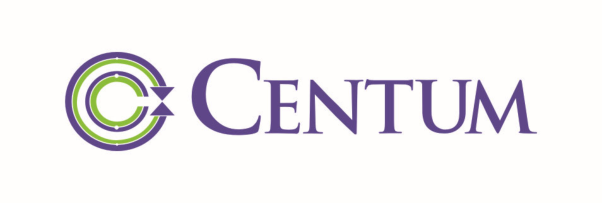

**[Image: 8e6c0ca3-653e-4821-bdc6-993dd45a9c43.pdf-0001-00.png (603x205, 43.3KB)]**

Ref: CEL/NSEBSE/11082025 

11th August, 2025 

To, 

Listing Department, Department of Corporate Services – Listing, National Stock Exchange of India Limited, BSE Limited, Exchange Plaza, P. J. Towers, Bandra Kurla Complex, Dalal Street, Bandra (East), Mumbai – 400 051 Mumbai – 400 001 

## **Re: Scrip Symbol: CENTUM/ Scrip Code: 517544** 

Dear Sir/ Madam, 

## **<u>Sub: Transcript of the conference call with Analysts/ Investors</u>** 

In continuation to our letter dated 06th August, 2025 and pursuant to Regulation 30 and 46 of SEBI (Listing Obligations and Disclosure Requirements) Regulations, 2015, the Transcript of the conference call that was organized with the Analysts / Investors on 06th August, 2025 at 16:00 hours IST has been uploaded on website of the Company at - <u>https://www.centumelectronics.com/financial results/</u> 

Yours faithfully, 

## For **Centum Electronics Limited** 

INDU H S 

Digitally signed by INDU H S Date: 2025.08.11 18:53:17 +05'30' 

**Indu H S Company Secretary & Compliance Officer ICSI Membership No. F12285** 

Encl: as above 

### **Centum Electronics Limited** 

# 44, KHB Industrial Area, Yelahanka New Town, Bangalore - 560 106, Karnataka, India **Tel** +91-(0)80-4143-6000 **Fax** +91-(0)80-4143-6005 **Website** <u>www.centumelectronics.com</u> **E-mail** <u>info@centumelectronics.com CIN - L85110KA1993PLC013869</u> 

**[Image: 8e6c0ca3-653e-4821-bdc6-993dd45a9c43.pdf-0002-00.png (299x80, 21.8KB)]**

“Centum Electronics Limited Q1 FY ‘26 Earnings Conference Call” 

# **August 06, 2025** 

**[Image: 8e6c0ca3-653e-4821-bdc6-993dd45a9c43.pdf-0002-03.png (298x80, 21.9KB)]**

**[Image: 8e6c0ca3-653e-4821-bdc6-993dd45a9c43.pdf-0002-04.png (268x76, 13.0KB)]**

**[Image: 8e6c0ca3-653e-4821-bdc6-993dd45a9c43.pdf-0002-05.png (228x109, 13.6KB)]**

**MANAGEMENT: MR. NIKHIL MALLAVARAPU -- JOINT MANAGING DIRECTOR, CENTUM ELECTRONICS LIMITED MR. K. S. DESIKAN -- CHIEF FINANCIAL OFFICER AND HEAD OF STRATEGY CENTUM GROUP, CENTUM ELECTRONICS LIMITED MR. SUNDARARAJAN PARTHASARATHY -- CHIEF FINANCIAL OFFICER - DESIGNATE, CENTUM ELECTRONICS LIMITED – MODERATOR: MR. MOHIT LOHIA ICICI SECURITIES PRIVATE LIMITED** 

Page 1 of 19 

_Centum Electronics Limited August 06, 2025_ 

**[Image: 8e6c0ca3-653e-4821-bdc6-993dd45a9c43.pdf-0003-01.png (298x80, 21.7KB)]**

#### **Moderator:** 

Ladies and gentlemen, good day and welcome to the Centum Electronics Limited Q1 FY ‘26 Earnings Conference call, hosted by ICICI Securities Private Limited. 

As a reminder, all participant’ lines will be in the listen-only mode. And there will be an opportunity for you to ask questions, after the presentation concludes. Should you need assistance during the conference call, please signal an operator by pressing “*”, then “0” on your touchtone phone. Please note that this conference is being recorded. 

I now hand the conference over to Mr. Mohit Lohia. Thank you and over to you, sir. 

#### **Mohit Lohia:** 

Yes. Hi. Thanks and good afternoon, everyone. Thank you for joining us today for the Q1 FY ’26 Call of Centum Electronics Limited. 

First of all, I would like to thank management for providing us the opportunity to host the call. From the management side, we have Mr. Nikhil Mallavarapu – Joint Managing Director; and Mr. K. S. Desikan – Chief Financial Officer; Mr. Sundararajan Parthasarathy – Chief Financial Officer (Designate). 

So without further delay, I would now hand over the call to management for the opening remarks. Thank you and over to you, sir. 

#### **Nikhil Mallavarapu:** 

Thank you, Mr. Mohit. And good afternoon, everyone. Welcome to our earnings call to discuss the performance of the 1st Quarter of financial year 2026. Let me first mention a special thanks to our host of today’s call at ICICI Securities. I am joined today with our CFO, Mr. Desikan; and our CFO - Designate, Mr. Sundararajan Parthasarathy as well. 

Let me first start by briefing you on the key performance highlights for the quarter under review, after which our CFO - Designate, Mr. Sundararajan, will take you through the financial highlights. And for the Q&A, I will take the questions along with our CFO, Mr. Desikan, as well. 

So, in the 1st Quarter under review, we delivered a strong performance on both revenue and EBITDA margins, with consolidated revenue from operations growing by 11.4% year-on-year. This was driven by a strong growth at the standalone level of 35% year-on-year growth, primarily driven by the high margin, build-to-spec business. And these deliveries are for our domestic defense and space customers. 

There was, however, degrowth in our international subsidiaries. The demand there is yet to pick up in the ER&D business because of delays in customer decisions on new projects due to uncertain macro factors in Europe. Despite these headwinds, the pipeline of opportunities with key European defense and aerospace customers is improving. And we expect a better performance in the second half of this financial year, of course, contingent on the conversion of these identified opportunities. 

Page 2 of 19 

_Centum Electronics Limited August 06, 2025_ 

**[Image: 8e6c0ca3-653e-4821-bdc6-993dd45a9c43.pdf-0004-01.png (298x80, 21.7KB)]**

In addition, we are making progress on our evaluation of strategic actions to arrest losses and reposition the business, especially, with regard to our Canadian subsidiary. On the order book front, our order book position grew to Rs. 1,769 crores as of 30th June, 2025, driven by new EMS customers entering into the serial production phase after successful NPI qualifications. Along with this, we have also received new development orders from DRDO for critical programs like the Virupaksha Radar, which we expect will unlock a significant long-term pipeline linked to various airborne platform programs. 

Now, I would request Mr. Sundararajan to give you more details on the financial performance. 

#### **Sundararajan P.:** 

Thank you, Nikhil, and a very warm welcome to all of you. Let me brief you on the financial highlights for the 1st Quarter of financial year ending 2026. 

At a standalone level, the revenue from operations was about Rs. 180 crores, which increased by 35% year-on-year. The EBITDA for the quarter was around Rs. 27 crores, which also grew by more than 100% year-on-year, with EBITDA margins reported at 14.92%. 

The net profit for the quarter was around Rs. 16.5 crores, which surge by more than 250% yearon-year. At a consolidated level, revenue from operations for the quarter was reported at Rs. 273 crores, which grew by 11% year-on-year. The EBITDA for the quarter was about Rs. 23 crores. The growth of 47% year-on-year, and the EBITDA margin reported at 8.38%. The net profit for the quarter was around Rs. 4.5 crores with PAT margins reported at 1.65%. 

With that, we can open the floor for Q&A sessions. Thank you so much. 

#### **Moderator:** 

Thank you very much. We will now begin with the question-and-answer session. The first question is from the line of Harsh from Perpetual Capital Advisors. Please go ahead. 

#### **Harsh:** 

Yes, sir. So, my first question was on the ER&D business. The ER&D revenues were under pressure. So, can you elaborate on the pathway to recovery for this business, and what is the expected timeline for this recovery? And also, with Europe actively increasing defense spending, do you see meaningful uptake in this R&D opportunity and are you seeing this translated into inquiries or order wins also? 

#### **Nikhil Mallavarapu:** 

Great. Thank you, Harsh, for the question. So, yes, with regard to the ER&D business, we have clearly seen a demand softness over the past 18 months or so, which led effectively by, firstly, the automotive sector, partially also on the aerospace sector. But we are seeing an improvement in the pipeline of opportunities, driven largely by the defense customers and to a certain extent also with certain aerospace programs. 

So, we expect to have some of these pipeline conversions happen over the next few months. And with that, we are targeting to have an improved performance in the year in part at least in the second half of this financial year. So, that is, I would say, the overall summary with regard to the ER&D business. So, yes, we are certainly seeing signs of the increased spending in Europe 

Page 3 of 19 

_Centum Electronics Limited August 06, 2025_ 

**[Image: 8e6c0ca3-653e-4821-bdc6-993dd45a9c43.pdf-0005-01.png (298x80, 21.7KB)]**

in the form of a better pipeline of opportunities on the defense side. And we hope, that this will sustain and convert in the time to come. 

#### **Harsh:** 

Right. And, sir, the domestic BTS order book has remained flat Q-o-Q. Could you share why is this and are there any expected conversions or current enquiry pipelines and expected conversions in the near term? 

**Nikhil Mallavarapu:** Yes. I mean, while the order book has been relatively flat, you must remember that there is been a significant growth of revenue in deliveries over the last quarter, which is what we just highlighted. So, from an order booking standpoint, it continues to remain healthy and we continue to see a healthy pipeline of opportunities that we expect to book over the remainder of this year. So, domestic BTS business continues to be a growth area for us. 

**Harsh:** And sir, what is the typical execution timeline of the current BTS order book? **Nikhil Mallavarapu:** Yes, typically, the BTS orders are in the range of between 2 years to 2.5 year execution. **Harsh:** Great. And sir, on the development orders, which often carry lower or negative margin initially, what is the conversion timeline into production orders, like are we starting to see some of these translate into higher margin opportunities? 

**Nikhil Mallavarapu:** Yes, certainly. So, I mean, I would say broadly, you can categorize the type of orders we have into two parts. One is large development programs itself, which are the kind of things that we do for  space programs, for example, where, these are largely project based or project type of business, which involves a design phase and delivery or manufacturing phase for these things. But these are not huge in numbers, because satellites are still relatively small in quantity, but high in value. 

On the other side, you have defense programs, where there is several different types of subsystems and all of that, where we have a development contract in the beginning, or even in certain cases, we take on the development of products to indigenize imported systems, which itself lasts maybe about 18 months, 18 months to 24 months of design and qualification cycle. And subsequently, we will receive production orders for that over a longer period of time. So, these are the two types of contracts that we typically have. But as I mentioned, the design and qualification period itself is somewhere in the range of around 18 months, 18 months to 24 months. **Moderator:** Thank you. The next question is from the line of Raman KV from Sequent Investments. Please go ahead. **Raman KV:** Hello, sir. Thank you for allowing me to ask you a question and congratulations on a good set of numbers. Sir, I just wanted to understand, one, can you give any update with respect to the Canadian subsidiary has there been any deal that has been finalized? 

Page 4 of 19 

_Centum Electronics Limited August 06, 2025_ 

**[Image: 8e6c0ca3-653e-4821-bdc6-993dd45a9c43.pdf-0006-01.png (298x80, 21.7KB)]**

**Nikhil Mallavarapu:** Yes, thanks, Raman. This, of course, is a key priority. As you have been mentioning, we have made some good progress on that. We believe we should have a decision for this in the coming months and we hope to basically have a decision for that by the end of the current quarter. And there will be some time associated, a short period following that to close and basically, complete the transaction. So, we are still working towards that timeline. 

**Raman KV:** Sir, and can you give a ballpark figure at what will be the cash inflow once you sell off this business? 

**Nikhil Mallavarapu:** Yes, I am not able to disclose anything of that sort at the moment. And also, you should remember this is a loss making business, so the expectation of any significant cash in is not high. **Raman KV:** Okay. And sir, my second question is with respect to the order book. Can you give the order book split? **Nikhil Mallavarapu:** I think, in the earnings presentation we have highlighted this, but just give me one minute. So, yes, at a high level, we see that about Rs. 710 crores is the order book for EMS, Rs. 886 crores is BTS and ER&D service is Rs. 171 crores. **Raman KV:** Sir, and my final question is with respect to the gross margin. During this quarter, I mean, although, the EBITDA margin has increased by almost 200 basis points on year-on-year, but the gross margin has declined by 100 bps. Is there any one-off or the current gross margin is the steady state gross margin? **Nikhil Mallavarapu:** I will look at it. Yes, go ahead. **K. S. Desikan:** So, EBITDA margin improved by gross margin. What do you mean by gross margin? **Raman KV:** I am talking about only -- 

**K. S. Desikan:** Okay. So, what do you mean by gross margin declining? Can you please explain? 

**Raman KV:** Yes. So, when I am comparing it on year-on-year basis, your grass margin is around 50% to 51%, which is basically margin with respect to the materials consumed. And currently, it is around at 49% - 50%. 

**Nikhil Mallavarapu:** Yes, I think for the part of materials consumed, just to clarify, there is a big contribution of the mix of the revenues that plays into this. So, fundamentally, each of these businesses have different levels of gross margins that we have. The build-to-spec business, considering the fact that design is done by us and so on, we have a higher level of gross margin in that business, compared to the EMS. 

Page 5 of 19 

_Centum Electronics Limited August 06, 2025_ 

**[Image: 8e6c0ca3-653e-4821-bdc6-993dd45a9c43.pdf-0007-01.png (298x80, 21.7KB)]**

And if you look finally even at the engineering services part of the business, it is only people cost because we have no material cost as such in engineering services by itself. So, the level of gross margin would be highly dependent on the mix of the three types of business that we have. 

**Raman KV:** Okay. Thank you, sir. **Moderator:** Thank you. The next question is from the line of Harshil Shethia from Singularity AMC. Please go ahead. **Harshil Shethia:** Sir, how much loss does the Canadian subsidiary do as of today, as of FY ‘25? **K. S. Desikan:** Last year, we have lost about €2.4 million. And in the two years prior to that, also we have been losing about €2 million each year. And that is the reason that we are trying to take that hard decision of stopping the bleeding by one way or another. **Nikhil Mallavarapu:** So similarly, in Q1-FY26 it was about€600,000 - €700,000. **Harshil Shethia:** Sir, €600,000 - €700,000 is the EBITDA loss that you are talking about? **K. S. Desikan:** No, it is EBT, EBT level, €600,000. **Harshil Shethia:** €600,000 for the quarter? **K. S. Desikan:** For the quarter. No, this is Euros. **Harshil Shethia:** Euros. Okay. **K. S. Desikan:** Yes. **Harshil Shethia:** And sir, how many employees are still left in the Canadian subsidiary? I guess, we had already downsized in the last two years. **Nikhil Mallavarapu:** Yes, there are currently around 30 employees that we have there. **Harshil Shethia:** Okay. And this is basically the Alstom business, right? **Nikhil Mallavarapu:** They are the biggest, they are the largest customers contributing to this business. That is right. **Harshil Shethia:** So, when you are saying, you are trying to reposition this Canadian subsidiary, are you basically negotiating with Alstom or trying to sell the division off? **Nikhil Mallavarapu:** Yes. We are exploring different options. I mean, our first objective is to stop the loss, fundamentally. So, like I said, at this stage, I am not able to divulge much because we are under NDA and we need to complete the discussions ongoing. But we are discussing both options, to be clear. 

Page 6 of 19 

_Centum Electronics Limited August 06, 2025_ 

**[Image: 8e6c0ca3-653e-4821-bdc6-993dd45a9c43.pdf-0008-01.png (298x80, 21.7KB)]**

**Harshil Shethia:** And how much does the Canadian subsidiary contribute to revenues in FY ‘25? **K. S. Desikan:** The current quarter, let me say, because, it has been coming down, and the current quarter, the subsidiary overall is about Rs. 95 crores, of which the Canadian entity is about Rs. 17 crores to Rs. 18 crores. **Harshil Shethia:** And how much would it be last year, some Rs. 50 crores - Rs. 60 crores or higher than that? **K. S. Desikan:** It would have been about Rs. 70 crores - Rs. 70 crores to Rs. 75 crores. **Harshil Shethia:** Okay. And sir, lastly, what is the current bid pipeline, in terms of order book as of today? And what is our expectation, in terms of order inflow growth for FY ‘26? **Nikhil Mallararapu:** You are talking about the overall group, right? **Harshil Shethia:** Yes, on a consolidated basis. **Nikhil Mallavarapu:** Yes, I mean, we do not really, again, express exactly what the bid pipeline is looking like, but I can just say that, we do have a healthy pipeline and a plan to book the business to be able to continue a healthy level of growth that we have been targeting. As we have mentioned in the past, our medium-term growth objective is to be in the range of about 18% to 20% at a consolidated level, and at a standalone level, we will be higher than that. So, we feel we have an appropriate pipeline to be able to continue that level of growth going forward. **Harshil Shethia:** Okay. And sir, lastly, on the CAPEX front, I guess you had earlier mentioned that we will do a Rs. 40 crore CAPEX in FY ‘26, and that would take our gross block up to around Rs. 390 crores - Rs. 400 crores. So, sir, what kind of asset terms do you see in the business? What is our utilization levels at each and every facility, if you can tell? **K. S. Desikan:** See, currently, now I talk about the standalone only because there are no CAPEX in the subsidiary. Currently, we are running around 6x to 7x, and that may not significantly increase in the current year. But considering the growth from 6x to 7x, we expect this to move about 8x to 9x in the next year or two because significant CAPEX will get added to this. **Harshil Shethia:** So, the Rs. 40 crore CAPEX that you had announced on the last call will be done purely for the Indian business? **K. S. Desikan:** Yes. **Harshil Shethia:** Okay. And we are not pumping in any money for our subsidiaries, right? **K. S. Desikan:** No. 

Page 7 of 19 

_Centum Electronics Limited August 06, 2025_ 

**[Image: 8e6c0ca3-653e-4821-bdc6-993dd45a9c43.pdf-0009-01.png (298x80, 21.7KB)]**

#### **Harshil Shethia:** 

Okay. And sir, in this gross block of around Rs. 380 crores - Rs. 390 crores, which will happen by the end of the year, how much would be from the Indian business and how much would be from overseas subsidiaries? 

**K. S. Desikan:** 

You mean gross block? 

**Harshil Shethia:** Yes, sir. 

**K. S. Desikan:** No, gross block is mostly Indian ones because there is no fixed asset base. The subsidiary, people business. 

**Nikhil Mallavarapu:** The people business, the engineering services, so there is no major CAPEX and fixed assets in the subsidiaries. 

**Harshil Shethia:** Yes. Okay. And sir, lastly, what I want to understand is, in the Canada business, was it ER&D and BTS both or was it just some any single segment? 

**Nikhil Mallavarapu:** Yes, today it is largely a BTS business. With the history, the background over here is that this used to be actually a part of Alstom in the past. It was carved out and given to the subsidiary or to the company even before actually we acquired the French company. 

This is to be clear, the Canada subsidiary is a subsidiary of the French business, and it came along with the acquisition of the French business. So, this was originally carved out and given as an engineering services contract for the people. And over time, it was a declining contract, which was to be converted into a BTS or product supply agreement with multiple different contracts and so on. 

So, where we are today is essentially that the level of product deliveries and the margins associated with that is not enough to justify the costs that we have in Canada. And so, that is part of the reason we are incurring the loss. 

Now, on the other side, one of the things that we have done is also created a team in India. So, we have now about 30 engineers, 30 engineers to 40 engineers in India able to design and develop the same sort of solutions, and we are already delivering this for Delhi and Chennai metros in India. We won a first order even for the Vande Bharat program in the past quarter. And so, we are able to continue this capability from India without reliance on Canada. 

#### **Harshil Shethia:** 

Okay. 

#### **Moderator:** 

Thank you. The next question is from the line of Vikram Sharma from Niveshaay. Please go ahead. 

Page 8 of 19 

_Centum Electronics Limited August 06, 2025_ 

**[Image: 8e6c0ca3-653e-4821-bdc6-993dd45a9c43.pdf-0010-01.png (298x80, 21.7KB)]**

#### **Vikram Sharma:** 

Hi, sir. Congratulations for the good numbers. So sir, my question is, what is the size of this development order received from DRDO? And also, if you can explain about the overall opportunity size in the next three years to four years? 

#### **Nikhil Mallavarapu:** 

Yes. The size of the development order itself is relatively small. I mean, this is the range of maybe around Rs. 10 crores or so. But these are major platforms that can, that will come subsequently. Obviously, as I mentioned, just the time to design and qualify this at the platform level. I mean, for us to design and deliver this is an 18 month to 24 month project, and then for it to be qualified at the platform level integrated on the plane has some lead time associated with that. 

So, in the period of three years to four years, it may not directly yield huge orders. But subsequent to that, I mean, this is one, this is for a major platform, which is the Sukhoi-30, and the size of opportunity there can be to the tune of maybe Rs. 1,000 crores or so. 

And the other important thing is also while we are developing this for the specific program, the technology are sort of like building blocks, so you can, we can use these technologies to also try to open up and create opportunities in other programs, which we will also be pursuing. 

So, yes, it is a significant development because this is a cutting edge technology that we will be developing for radars. And we are confident that this should open up some sizable opportunities for us going forward. 

**Vikram Sharma:** Okay. And could you talk more on the Airborne Platform Program, you briefly mentioned in the presentation. So, what are the products and what are we targeting? 

**Nikhil Mallavarapu:** Yes. So, I mean, staying on this point of the radar itself, I mean, this itself represents an important opportunity. The one I talked about in the presentation, which is for the Virupaksha program, is intended for the Su-30 platform. But like I was mentioning, similar type of technology, there are requirements and needs for other type of platforms, including on various types of UAVs, helicopters, and other future next generation fighters also. So, those are one. 

And then, of course, in addition to this, we are also working on certain other subsystems and technology in the radar and electronic warfare domain. 

**Vikram Sharma:** Okay. And sir, the last question on the EMS and BTS business breakup, so we have seen a 15% margin at a standalone level. This is comparatively higher to which we guide. So, was there any one-time BTS business revenue contribution in this quarter or the split is normal, we can expect in the next year also? 

**K. S. Desikan:** So, one thing I would say is, please look at the company on the yearly basis, because it is difficult to say, pull up, on the full, the BTS and the EMS business, we maintain the characteristics. But during the quarter, see, one may be higher and even product mix, etc. So, the point to note is, overall, we should be able to maintain the same percentages that we have been doing. 

Page 9 of 19 

_Centum Electronics Limited August 06, 2025_ 

**[Image: 8e6c0ca3-653e-4821-bdc6-993dd45a9c43.pdf-0011-01.png (298x80, 21.7KB)]**

#### **Vikram Sharma:** 

Okay. Thank you. 

**Moderator:** 

Thank you. The next question is from the line of Ankit Gupta from Bamboo Capital. Please go ahead. 

#### **Ankit Gupta:** 

Thanks for the opportunity, and congratulations for a great set of numbers and getting the development orders for Virupaksha Radar. So, Nikhil, we have been talking about three, four segments that we have been concentrating on the BTS side. One is the defense satellite, one is the radar, then we have EWS, as well as the tank electronics. 

So, for all the three, four major segments that we have been talking about, can you give us some flavor on how are things going on your order intake side, and when are we expected to get some development, as well as commercial orders from these segments? 

#### **Nikhil Mallavarapu:** 

Yes. So, if you look at the last years, the last financial years, we had a good increase, in terms of our overall order book. And that was driven essentially by a few key programs, one being a radar program itself, where we have designed with DRDO in the early stage, some of the critical TR module flanks for naval radar that came from production orders for us in the last year. We will be executing that. And the same product we hope will have further demand as our customer gets newer orders for these type of platforms and so on. So, that is one, in terms of products that we have already designed and we have started to get the first production orders for. 

In addition to that, as I mentioned, in terms of new technology developments, again, in this sector, we talked about the Virupaksha order. And so, we are now going to be developing significant part of the radars at center. So, that is on the radar front. The space side has been another area that we had some sizable orders last year. We are also anticipating some good orders coming this year from a few different programs. So, we are working hard to capture those. 

And then, on the EW side as well, we have responded to certain large opportunities from the customers on, again, airborne platforms, different things, but some of them are competitive bids, so we will have to wait for the results of some of these opportunities, but these are large opportunities that we have. And finally, on the land systems side, here again, we have been investing over the past few years, in terms of developing equivalent solutions to imported systems and subsystems. We have seen some of those orders come in, even including in the current quarter. 

And there are a few other key products that we are also in the advanced stages of development and qualification. And we hope to have the qualification completed in this financial year, and maybe the first orders for those also coming in at the end of this year or the beginning of next year, next financial year. So, all-in-all, I think the progress is good, both in terms of our development pipeline roadmap, as well as order intake coming in from key customers. 

So, we have been trying to work directly as a system supplier to the tri-services and we were hoping that, we were developing some products for them, where the order size can be of the 

**Ankit Gupta:** 

Page 10 of 19 

_Centum Electronics Limited August 06, 2025_ 

**[Image: 8e6c0ca3-653e-4821-bdc6-993dd45a9c43.pdf-0012-01.png (298x80, 21.7KB)]**

magnitude of around Rs. 200 crores - Rs. 300 crores or even Rs. 500 crores, a single order size. So, how close are we to getting those contracts, where are they, in terms of development state, do you think in the coming financial year, FY ‘26 or FY ‘27, we should be able to back some of these large contracts and this can add to our order book substantially? 

#### **Nikhil Mallavarapu:** 

We continue to work on some of those opportunities, I think, we have submitted various proposals and waiting, the government, obviously, has process associated with those. So, they are still in the, I would say, various approval stages within the government itself. So, we do not see, in the very short term, some of these major opportunities, coming through. But we continue to work on them and monitor them very closely. And as and when the approval processes come through and they come out in the form of RFPs and all of that, we are well positioned to be able to bid on those. 

But having said that, again, I come back to the point of our own organic business, where we have already done a lot of work and effort, in terms of development and customer engagements. And we are quite confident that the orders coming from there should be healthy and will support the growth of this part of the business for us in the coming few years. 

**K. S. Desikan:** 

So, in other words, if I were to summarize, I would say, for the large opportunities, the potential is still there and the pipeline visibility is improving, yet the actual order when we will get depends on the government processes, which seem to be improving, but still we are not able to clearly say, it will happen this year or so. As we progress and as we get more visibility, we should be able to inform you. 

**Ankit Gupta:** 

Sure. So, can we expect that, with the current programs that we have on a standalone basis, our BTS revenues can grow by 20% to 25% or even higher, maybe by 30% over the next two-three years, and if we get some of these large tri-services orders, our BTS revenue can grow magnificent, depending on if you get some of those large orders or not. And can we expect some of those gains in FY ’27 - ‘28, if not this year, ‘26? 

#### **Nikhil Mallavarapu:** 

Your guess is as good as mine. But yes, all I can say is your first point, the growth that we can see on the standalone business, driven by the order book that we have, I think we are reasonably confident that we can continue to go down that path. And yes, as and when these big ticket opportunities click, it can be a step improvement also for the overall business. 

#### **Ankit Gupta:** 

Sir, thank you. And wish you all the best. 

**Moderator:** Thank you. The next question is from the line of Hrushikesh Shah from Alchemy Capital. Please go ahead. 

#### **Hrushikesh Shah:** 

Hello. Yes. My question was regarding the margins this quarter. See, our BTS segment revenue share as compared to last quarter has improved by 600 basis points, but still our margins are lower this time. And BTS segment being the highest margin segment for us, what is the reason for lower margins? 

Page 11 of 19 

_Centum Electronics Limited August 06, 2025_ 

**[Image: 8e6c0ca3-653e-4821-bdc6-993dd45a9c43.pdf-0013-01.png (298x80, 21.7KB)]**

**Moderator:** Mr. Shah, can you please keep the device closer to you? We cannot hear you properly. **Hrushikesh Shah:** Am I audible now? **Moderator:** No. Can you please speak a little louder? **Hrushikesh Shah:** One second. I will join the queue again. **Moderator:** Okay. Sure. **Hrushikesh Shah:** Yes. **Moderator:** The next question is from the line of Ananth Shenoy from AS Capital. Please go ahead. **Ananth Shenoy:** Good afternoon. In the Rs. 57 crore standalone BTS business, can you give a rough split between the space and the defense? And I am reading that there is a significant, the government is fast tracking the space based surveillance. Can you talk about the opportunity for us there? **Nikhil Mallavarapu:** Yes. First of all, we do not really give the break up, in terms of space and defense because in several cases we also have programs for defense, which are, on a space platform, for example, right, so, the way we see it is more just generally with respect to business for our domestic customers in space and defense as a whole. 

Having said that, I mean, we do quite a bit of critical work and programs for the space side of the business. So, we do have an important contribution coming from both parts of it in the overall revenue. To your question about the SBS-3 program, this is, the budgets have just been sanctioned and a big part of it will be going to ISRO, after which these will come out in the form of various RFQs for private industries and so on. 

So, these are all at different stages of maturity, but we have been working with ISRO for a long time and we continue to look and participate in several different areas of engagement here. So, we have read the whole thing about the government asking to fast-track it. But for us right now, it is still at the early stages of the program and we are waiting to see how these pan out in the form of different types of RFQs and opportunities for private sector industry. 

#### **Ananth Shenoy:** 

Sure. So, these orders will be, like when we get these orders, will they get executed this year or do you think it will happen next year? And can you brief us on what is the size that we are looking for in this particular project? 

**Nikhil Mallavarapu:** So, the timelines get spread over multiple years, at least two years there will be, there are multiple different opportunities and orders that will come through. So, yes, that is the first point to your question. The second one in terms of the pie size, this is something I am not able to share right now. We have a view of all the different opportunities that are there, some of them where we have unique positioning because of proprietary IPO technology that we have on our site. And 

Page 12 of 19 

_Centum Electronics Limited August 06, 2025_ 

**[Image: 8e6c0ca3-653e-4821-bdc6-993dd45a9c43.pdf-0014-01.png (298x80, 21.7KB)]**

some which are competitive bids where we have to compete against others. So, the pie itself is substantial. We will need to see how much of that we will be booking ourselves. 

#### **Ananth Shenoy:** 

Sure. My second question is about yesterday in the AGM, you had mentioned a three year outlook about 18% to 20% EBITDA margins that we will do in three years. Can you tell about the roadmap? How can we, like on the current margins, how can we go to 18% to 20%? 

#### **Nikhil Mallavarapu:** 

Yes, no, just to be clear, what we talked about is 18% to 20% growth rate at a consolidated level. We are not referring to this as revenue growth, not EBITDA margin. EBITDA margin, our objective is to be at the range of 13% to 15% at a consolidated level, which today is at 8.5% or so. 

So, the roadmap that we see there, first of all, as you see the standalone part of the business is already at a roughly 14% level. So, we expect and are working to maintain, maybe slightly improve that. But given the growth rate that we will experience in both the EMS and the BTS business, the standalone EBITDA levels will be more or less in a similar sort of range. 

The opportunity for improvement will come largely from the subsidiary, which today is at almost, if you look at the last year, was at roughly 1.5% kind of EBITDA level, which is dragging down the overall consolidated number. And so, the path to fixing that are fundamentally two things. 

One is the Canadian subsidiary, which I talked about a little bit earlier, which is a major contributor for some of the losses that we are seeing there. We are taking some action, strategic steps, in discussion with our key customer there to be able to stop those losses in the coming quarter or two. 

And the second aspect of it, which is more on the France subsidiary, where essentially the sale has reduced, and that has resulted in the impact on the margins. There we are working, in terms of focusing our sales efforts on the key customers in defense and aerospace, where we have seen the pipeline improve over the past quarter or two. And we are working in a focused way to try to convert those into opportunities and improve the sale, which will help improve the margin also at the France subsidiary level. 

So, with all of this, we are working on a roadmap that would help us improve this subsidiary margin from this 1% to try to get to a 10% - 11% kind of level in roughly two year time period. And so, that is the overall plan for margin improvement, I would say. 

#### **Ananth Shenoy:** 

Okay. Thank you. 

#### **Moderator:** 

Thank you. The next question is from the line of Harsh from Perpetual Capital Advisors. Please go ahead. 

Page 13 of 19 

_Centum Electronics Limited August 06, 2025_ 

**[Image: 8e6c0ca3-653e-4821-bdc6-993dd45a9c43.pdf-0015-01.png (298x80, 21.7KB)]**

|**Harsh:**|Yes, sir. Sir, you had mentioned some NPI qualifications, previously, I wanted to understand if|
|---|---|
||these are tied to energy, semiconductor or some other sectors and what is the anticipated revenue contribution from these opportunities?|
|**Nikhil Mallavarapu:**|These are basically with new customers. First, just to clarify, first of all, when we say NPI qualification, typically when we are awarded a new business either from existing or from a new customer, we go through a qualification phase where we build prototypes and we go through a rigorous testing and so on. And so, once those are approved, then we get into mass production. So, what I was referring to here was basically on two - three key customer segments. One was semiconductor segment. Another is around biometric security solutions. And the third is, again, back to defense and aerospace for the export customers. So, with all of this, I think for the current financial year itself, our objective is some of these NPI itself will add about USD 15 million or so, in terms of revenue, U.S. dollars revenue.|
|**Harsh:**|So, USD 16 million?|
|**Nikhil Mallavarapu:**|USD 15 million, yes. Roughly about USD 15 million.|
|**Harsh:**|Right. Okay. And what is the total opportunity over the next four years five years? How much level?|
|**Nikhil Mallavarapu:**|I mean, these are all pretty much recurring products. So, these revenues may go up or down, based on specific years of demand from the customers. But like, the way we see it, EMS business is more dependent on the customer relationship than on the specific product itself. And so, with these customers, while we are, what we have done, gone through these NPI qualifications and so on for certain set of products, we continue to have a pipeline of new products also, which we are quoting and winning and will help to increase our engagement with these customers, as we go forward into the coming years.|
|**Harsh:**|Great. That is all from my side. Thank you.|
|**Moderator:**|Thank you. The next question is from the line of Raman KV from Sequent Investments. Please go ahead.|
|**Raman KV:**|Thank you for allowing me to ask the question. Sir, I just wanted to understand, on the CAPEX front, you are doing Rs. 40 crores of CAPEX in FY ‘26 with respect to the standalone entity. How much incremental revenue will this add in? Historically, I have been able to work with respect to, I am just talking about the standalone entity, on a gross block of Rs. 230 crores, you were able to do Rs. 750 crores. Can we expect the same as a turn?|
|**K. S. Desikan:**|Yes, I think it will be slightly better also.|
|**Raman KV:**|So, it will be around 4x to 5x?|

Page 14 of 19 

_Centum Electronics Limited August 06, 2025_ 

**[Image: 8e6c0ca3-653e-4821-bdc6-993dd45a9c43.pdf-0016-01.png (298x80, 21.7KB)]**

**K. S. Desikan:** 5x on the gross block. At the net block level is what earlier I was talking about. It can be around 6x to 7x, yes. And this corresponds with the revenue growth that Nikhil has been indicating. **Raman KV:** Sir, but that is like a follow-up. Historically, our standalone entity has been growing about 25% every year. For the past, at least, from what I can see, for the past two years - three years. So, once this block commences operation, can we expect that in FY ‘27, there will be an additional leg of growth? 

**K. S. Desikan:** No. Just to explain this actual CAPEX itself, if you look at this standalone entity in the BTS business, basically we have different set of capabilities, right? So, we are going right from, analog, digital, power, RF, so on and so forth. So, when I say, we are augmenting the capabilities, we also augment the capacities in the respective capabilities. So, whatever we had, the capabilities, that is how we have been growing. And going forward, we are increasing the capabilities and also increasing the capacities in the existing as well as the future capabilities. 

**Raman KV:** Okay. 

**K. S. Desikan:** So, it is an eye opening process, so that is the reason why I said we should be able to maintain our slightly improved. **Raman KV:** Okay. Thank you, sir. **Moderator:** Thank you. The next question is from the line of Abhi Mevawala from Wise Capital. Please go ahead. **Abhi Mevawala:** Thank you for the opportunity. I have only one question related to our UK subsidiary, Centum Electronics UK Limited. I want to know, basically, in the last two years, we have invested around Rs. 33 crores in FY ‘24 and Rs. 45 crores in FY ‘25. So, what kind of opportunity we are looking there? **Nikhil Mallavarapu:** It is UK subsidiary. **K. S. Desikan:** UK is actually a pass through. It is a special purpose vehicle. So, the investment was in the French subsidiary. So, you see that, from the Centum Electronics parent company, we invest in the Centum UK. And Centum UK is investing in the French company. So, UK is not an operating entity at all. 

**Abhi Mevawala:** Okay. So, basically, we are investing more in France. **K. S. Desikan:** That was right. Yes. **Abhi Mevawala:** Sir, another point. In latest quarter, around Rs. 12 crores loss, we incur from the subsidiary. So, how much loss we incur from Canada? 

Page 15 of 19 

_Centum Electronics Limited August 06, 2025_ 

**[Image: 8e6c0ca3-653e-4821-bdc6-993dd45a9c43.pdf-0017-01.png (298x80, 21.7KB)]**

**K. S. Desikan:** 

So, it is roughly 50 – 50, 50% in Canada and 50% in France of the Rs. 12 crores. But whereas, the revenue from Canada is very, very small, but the loss is quite high. So, that is the reason we are trying to stop that. 

**Abhi Mevawala:** 

So, basically, it is loss from employee. Employee cost. 

**K. S. Desikan:** 

Yes. 

**Abhi Mevawala:** 

Employee cost. 

**K. S. Desikan:** 

Yes. 

**Abhi Mevawala:** 

Okay. Thank you. 

**Moderator:** Thank you. The next question is on the line of Ajay from Niveshaay. Please go ahead. 

**Ajay:** 

Hello. Yes. Congratulations on good set of numbers. I wanted to understand like, how is the distribution of business under the EMS segment? More on the sector, which sector are being focused over there? And also, is it more diversified across customers? Or do we have repeat orders from few customers? If you could highlight more on the EMS part of the business. Thank you. 

#### **Nikhil Mallavarapu:** 

Yes, sure. Yes, the EMS business is certainly, we are quite well diversified, we address customers in defence, aerospace for exports. We address industrial and energy, some medical customers, and as well as the automotive or mobility kind of customers. So, these are all the sectors that we are in, and now, as I mentioned, some of the newer customers that we have added and we are ramping up are in the semiconductor space, semiconductor equipment and biometrics and security. 

So, these are all the different sectors that we are catering to and all I would say pretty much, all of the business is recurring in nature. These are products that have long life cycles and can last 10 years or more in many cases. And so, we have a fairly high level of recurring revenue in this part of the business for us. 

Even from a geography standpoint, it is quite well diversified, I mean, here again, I would say, a big part of it is for export. We have some part which is domestic, but we are exporting again to Europe, we are exporting to the U.S., to other countries in Asia, including Israel and even now to countries like Malaysia, Singapore, and so on. So, there is a fairly good level of diversification in this part of the business. 

**Ajay:** 

Understood. And one last question, I wanted to understand more on the BTS side of things. We have been highlighting the amount of opportunity that we have available from this segment, considering the vast domestic, aerospace and defense sector as a whole. So, any growth guidance 

Page 16 of 19 

_Centum Electronics Limited August 06, 2025_ 

**[Image: 8e6c0ca3-653e-4821-bdc6-993dd45a9c43.pdf-0018-01.png (298x80, 21.7KB)]**

you would be comfortable giving, like how the segment can grow maybe two, three years down the line? 

**Nikhil Mallavarapu:** We do not give any specific guidance on specific parts of the business. I think we have maintained that at a consolidated level, we are moving at 18% to 20%, with obviously, a higher growth rate coming from the standalone business. And that is a combination of both the buildto-spec and the EMS business growing at a healthy growth rate of 25% plus that we are targeting. So, that is I would say at a high level for the time to come. 

**Ajay:** 

Understood. Thank you very much. All the very best. 

**Nikhil Mallavarapu:** Thank you. 

**Moderator:** Thank you. The next question is from the line of Hrushikesh Shah from Alchemy Capital. Please go ahead. 

#### **Hrushikesh Shah:** 

Hi. So, my question was regarding our EBITDA margins. See, on a yearly basis, we have done well. But on quarterly basis, even with our BTS segment now contributing around 38% from 32% on quarterly basis, why are our EBITDA margins down? 

**K. S. Desikan:** That is what I was trying to say earlier also. We cannot compare the yearly percentage to the quarterly percentage. The challenge is, for example, the mix changes during the quarters. So, we should be able to maintain the EBITDA margin, which Nikhil was indicating, around 14% to 15% on a yearly basis. 

**Nikhil Mallavarapu:** Yes. There are a few things that contribute to this, to the EBITDA margins. One is, of course, the mix of the BTS and EMS, but also just the level of sales. So, the fundamental point is that some of this business is lumpy in nature. So, we have level of sales varying not just the percentage of the contribution, but the level of the sales also that plays into this. 

So, I think I would just go back to what Desikan was saying. And of course, even within each business, even within the BTS business or within the EMS business, there are different product mix, which will contribute to different levels of margin variation, right? 

#### **Hrushikesh Shah:** 

And this 14% is on consolidated basis or on standalone basis? 

#### **K. S. Desikan:** 

Standalone. 

#### **Nikhil Mallavarapu:** 

Standalone. 

#### **Hrushikesh Shah:** 

Standalone. Okay. 

#### **K. S. Desikan:** 

Standalone EBITDA is 14.9% for the quarter. 

Page 17 of 19 

_Centum Electronics Limited August 06, 2025_ 

**[Image: 8e6c0ca3-653e-4821-bdc6-993dd45a9c43.pdf-0019-01.png (298x80, 21.7KB)]**

#### **Hrushikesh Shah:** 

Okay. Got it. Thank you. 

**Moderator:** Thank you. The next question is from the line of Pranav, who is an individual investor. Please go ahead. 

**Pranav:** 

Yes. Nikhil, I have got only one question. As I understand, a lot of start-ups are also doing quite well in this field of space, and they are working on a very niche areas. So, when we are saying that this space sector is very, very interesting and the opportunity size and the size which also he is talking about is around roughly USD 3 billion to USD 4 billion. Now, are we planning to work with this kind of companies or we will be working with some kind of multinational or foreign companies to take on bigger, huge projects in future? 

**Nikhil Mallavarapu:** Yes, thanks for that. So, in a nutshell, we are doing all three. So, we are already working on partnering and working with some of these start-ups in different ways, either by doing some of the core parts of their satellites or in certain cases, we are also with the end users, working on some sort of partnership type of agreement where we will be the prime contractor. And there will be a certain work share that is divided between what we do and the core IP or technology that the startup brings. So, that is one aspect of it. 

But coming back to your question, there is the opportunity that we are talking about in some of these key and large programs will be driven through ISRO and this is where our own internal capabilities and engagements that we have, combined with some specific strategic partnerships where we are working with some global companies are both being pursued to be able to position ourselves to capture these opportunities. 

And I would say, from a business perspective, from our visibility at least the bigger share of it will come either driven by our own internal capabilities or in certain, very specific cases, through the partnership with global companies. 

**Pranav:** 

Yes, thank you very much. 

**K. S. Desikan:** I would like to add one quick point on that, while we are quite open to work with the large private companies and international organizations and also the start-ups. See, start-ups are something that we cannot ignore at this point of time because they bring innovation to the table, but what we do is, we ensure that we do not lose money with that, we ensure that because for every 10 start-ups, maybe 2 start-ups have succeeded exceedingly that. So, what we ensure is when we work with start-ups, we ensure that we get our money on the material front at least, definitely. 

**Pranav:** Yes. So, we are not going to buy them out or we are not going to enter into some kind of investment game. I agree. Thank you very much. Thank you. 

**K. S. Desikan.:** 

Yes. Thank you. 

Page 18 of 19 

_Centum Electronics Limited August 06, 2025_ 

**[Image: 8e6c0ca3-653e-4821-bdc6-993dd45a9c43.pdf-0020-01.png (298x80, 21.7KB)]**

**Moderator:** Thank you. The next question is from the line of Ananth Shenoy from AS Capital. Please go ahead. 

**Ananth Shenoy:** Thanks for the follow-up. Is there any update on Indra Sistemas or some MOU you had signed? **Nikhil Mallavarapu:** No further update on that program. It is still basically stalled and we have no further update from the government on this program. **Ananth Shenoy:** Okay. Thank you. **Moderator:** Thank you. The next question is from the line of Sai Vijay from Capstocks. Please go ahead. **Sai Vijay:** Thank you, sir. My question is a follow-up question regarding the margins that someone had previously asked. You mentioned that the margins will vary across quarters due to different mix. So, my question is our revenue recognition for build-to-spec is very heavily focused on quarter four. So, can we expect a more even distribution across quarters this year or would it follow similar patterns? **K. S. Desikan:** So, your observation is by and large right. If you look at in the past for two years - three years also, the margin expansion happened in Q4. But we were a little fortunate this year, I would say. If you look at even Q1, I think margin was better compared to last year Q1. So, this year around, maybe it will be distributed not on an equal basis. Maybe still, the higher margin probably will be clocked in the last quarter. But this year is slightly better than the previous year, where most of it happened only in the Q4. **Sai Vijay:** All right. Thank you, sir. All the best to the team. **Nikhil Mallavarapu:** Thank you. **Moderator:** Thank you. We will take that as our last question for today. I now hand the conference over to the management for closing comments. **Nikhil Mallavarapu:** Thank you all for participating in this earnings conference call. I hope we were able to answer your questions satisfactorily, and at the same time, offer insights into our business. If you have any further questions or would like to know more about the company, please reach out to our Investor Relations managers at Valorem Advisors. Thank you and stay safe. 

**K. S. Desikan.:** Thank you. **Moderator:** On behalf of ICICI Securities Limited, that concludes this conference. Thank you for joining us and you may now disconnect your lines. 

Page 19 of 19 

---

## Extracted Images

| # | File | Dimensions | Size |
|---|------|------------|------|
| 1 | 8e6c0ca3-653e-4821-bdc6-993dd45a9c43.pdf-0001-00.png | 603x205 | 43.3KB |
| 2 | 8e6c0ca3-653e-4821-bdc6-993dd45a9c43.pdf-0002-00.png | 299x80 | 21.8KB |
| 3 | 8e6c0ca3-653e-4821-bdc6-993dd45a9c43.pdf-0002-03.png | 298x80 | 21.9KB |
| 4 | 8e6c0ca3-653e-4821-bdc6-993dd45a9c43.pdf-0002-04.png | 268x76 | 13.0KB |
| 5 | 8e6c0ca3-653e-4821-bdc6-993dd45a9c43.pdf-0002-05.png | 228x109 | 13.6KB |
| 6 | 8e6c0ca3-653e-4821-bdc6-993dd45a9c43.pdf-0003-01.png | 298x80 | 21.7KB |
| 7 | 8e6c0ca3-653e-4821-bdc6-993dd45a9c43.pdf-0004-01.png | 298x80 | 21.7KB |
| 8 | 8e6c0ca3-653e-4821-bdc6-993dd45a9c43.pdf-0005-01.png | 298x80 | 21.7KB |
| 9 | 8e6c0ca3-653e-4821-bdc6-993dd45a9c43.pdf-0006-01.png | 298x80 | 21.7KB |
| 10 | 8e6c0ca3-653e-4821-bdc6-993dd45a9c43.pdf-0007-01.png | 298x80 | 21.7KB |
| 11 | 8e6c0ca3-653e-4821-bdc6-993dd45a9c43.pdf-0008-01.png | 298x80 | 21.7KB |
| 12 | 8e6c0ca3-653e-4821-bdc6-993dd45a9c43.pdf-0009-01.png | 298x80 | 21.7KB |
| 13 | 8e6c0ca3-653e-4821-bdc6-993dd45a9c43.pdf-0010-01.png | 298x80 | 21.7KB |
| 14 | 8e6c0ca3-653e-4821-bdc6-993dd45a9c43.pdf-0011-01.png | 298x80 | 21.7KB |
| 15 | 8e6c0ca3-653e-4821-bdc6-993dd45a9c43.pdf-0012-01.png | 298x80 | 21.7KB |
| 16 | 8e6c0ca3-653e-4821-bdc6-993dd45a9c43.pdf-0013-01.png | 298x80 | 21.7KB |
| 17 | 8e6c0ca3-653e-4821-bdc6-993dd45a9c43.pdf-0014-01.png | 298x80 | 21.7KB |
| 18 | 8e6c0ca3-653e-4821-bdc6-993dd45a9c43.pdf-0015-01.png | 298x80 | 21.7KB |
| 19 | 8e6c0ca3-653e-4821-bdc6-993dd45a9c43.pdf-0016-01.png | 298x80 | 21.7KB |
| 20 | 8e6c0ca3-653e-4821-bdc6-993dd45a9c43.pdf-0017-01.png | 298x80 | 21.7KB |
| 21 | 8e6c0ca3-653e-4821-bdc6-993dd45a9c43.pdf-0018-01.png | 298x80 | 21.7KB |
| 22 | 8e6c0ca3-653e-4821-bdc6-993dd45a9c43.pdf-0019-01.png | 298x80 | 21.7KB |
| 23 | 8e6c0ca3-653e-4821-bdc6-993dd45a9c43.pdf-0020-01.png | 298x80 | 21.7KB |
