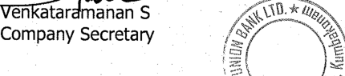

trUB lRUSTATO EXCELLEIICE dt{cE tgoa. 

# trIrY UNItrN BnNr LIvTITED 

CIN : 165110TN1904P1C001287 

Regd. Office: 149, T.S.R.(Big) Street, Kumbakonam-612001. Thanjavur District. Tamil Nadu. Telephone No : 0435 - 2402322 E-mail : shares@cityunionbank.com Website : www.cityunionbank.bank.in 

#### C. O/S h a res/ LR- 5 I 2025 -26 

### February 07,2026 

National Stock Exchange of India Ltd., Exchange Plaza, 5th Floor, Plot No.C/1, G Block, Bandra-Kurla Complex, Bandra (E), Mumbai 400 051 

BSE Ltd., 

DCS - CRD, Phi roze Jeejeebhoy Towers, 25th Floor, Dalal Street, Mumbai 400 001 

### Scrip Code: CUB 

### Scrip Code: 532210 

Dear Sir / Madam, 

### Sub: Transcripts of the Earnings Conference Call - e3 & 9M Fy 2026 

> Pursuant to Regulation 46 of SEBI Listing Regulations, 2015 (as amended), the Bank has hosted in its website,the transcript of Earnings Conference Call- Q3 & 9M FY 2026, with regard to the 

> Standalone Un-Audited Financial Results of the Bank for the Quarter & Nine months ended 

> December 3L,2025, as approved by the Board of Directors of the Bank, on February 02,2026. The weblink is given below: 

#### httPs://www.ciWunionbanK.bank.in/filemanager/Feb26/TRANSCRIPTO39MFY2026.pdf 

> Kindly take the same on record, 

#### Thanking you 

> Yours faithfully 

##### fOT CITY UNION BANK TIMITED 

**[Image: 38f5c931-1c1c-45ff-b382-a5420c31dea8.pdf-0001-19.png (430x95, 15.5KB)]**

<!-- Start of picture text -->
S tl$.* Company Secretary 5 E \< /j, <!-- End of picture text -->

"NARAYANA"Administrative Office, No.24-B, Gandhi Nagar, Kumbakonam - 612 001 Phone :0435 -2402322 

**[Image: 38f5c931-1c1c-45ff-b382-a5420c31dea8.pdf-0002-00.png (341x103, 30.3KB)]**

“City Union Bank Limited Q3 9 Months FY '26 Earnings Conference Call” February 02, 2026 

**[Image: 38f5c931-1c1c-45ff-b382-a5420c31dea8.pdf-0002-02.png (197x59, 12.5KB)]**

**[Image: 38f5c931-1c1c-45ff-b382-a5420c31dea8.pdf-0002-03.png (185x82, 10.6KB)]**

**[Image: 38f5c931-1c1c-45ff-b382-a5420c31dea8.pdf-0002-04.png (209x105, 10.2KB)]**

**– MANAGEMENT: DR. N. KAMAKODI MANAGING DIRECTOR AND – CHIEF EXECUTIVE OFFICER CITY UNION BANK LIMITED MR. R. VIJAY ANANDH – EXECUTIVE DIRECTOR – CITY UNION BANK LIMITED MR. V. RAMESH – EXECUTIVE DIRECTOR – CITY UNION BANK LIMITED MR. J. SADAGOPAN – CHIEF FINANCIAL OFFICER – CITY UNION BANK LIMITED** 

Page **1** of **14** 

_City Union Bank Limited February 02, 2026_ 

**[Image: 38f5c931-1c1c-45ff-b382-a5420c31dea8.pdf-0003-01.png (197x59, 14.2KB)]**

## **MODERATOR:** 

###### **Moderator:** 

## **– MR. JIGNESH SHIAL AMBIT CAPITAL** 

Ladies and gentlemen, good day, and welcome to the City Union Bank Limited Q3 9 Months FY '26 Earnings Conference Call hosted by Ambit Capital Private Limited. As a reminder, all participant lines will be in the listen-only mode and there will be an opportunity for you to ask questions after the presentation concludes. Should you need assistance during the conference call, please signal an operator by pressing star then zero on your touchtone phone. 

I now hand the conference over to Mr. Jignesh Shial from AMBIT Capital Private Limited. Thank you, and over to you, sir. 

###### **Jignesh Shial:** 

Yes. Thank you, Rutuja, and good evening, everyone. On behalf of AMBIT Capital, I would like to thank the management of City Union Bank for allowing us the opportunity to host Q3 FY '26 and 9 Months FY '26 earnings call. We have along with us Dr. N. Kamakodi, MD and CEO; Mr. R. Vijay Anandh, Executive Director; Mr. V. Ramesh, Executive Director; Mr. J. Sadagopan, CFO; and the management team of City Union Bank. 

I'll now hand over to call to Mr. N. Kamakodi, MD and CEO of City Union Bank for opening remarks. Over to you, sir. 

###### **N. Kamakodi:** 

Good evening, everyone. Dr. Kamakodi here. Hearty welcome to all of you for this con call to discuss the unaudited financial results of City Union Bank for the third quarter 9 months ended 31st December 2025 for financial year 2026. The Board approved the results today, and I hope all of you have received the copies of the results and the presentation. 

As you all know, my tenure as MD and CEO of the bank i.e 15 years will be completed on 30th April. As you all know, this is my 59th quarter today. So we have one more quarter to go. And based on the regulations currently in force, let's say, I have to complete my tenure on 30th April. Keeping that into account, our Board has sent the list of candidates to RBI. And once we receive the further approval, we will be in a position to communicate to you all the status. 

So far, everything is going as per the planning and all so far, so good. And we are also happy to note that our net worth has crossed INR10,000 crores mark to date, which is an important milestone in the history of the bank. And we are also happy to inform you one of our Board members, Professor V. Kamakoti, who is also the Director of the IIT Madras, had been honoured with the country's prestigious Padma award, Padma Shri and his significant contributions to our country science and technology sector, and we are happy to share with you all. 

And also, we have a new introduction to our Board today. Shri K. Subramanian, Chartered Accountant and also an executive with almost 38, 39 years service with the 

Page **2** of **14** 

_City Union Bank Limited February 02, 2026_ 

**[Image: 38f5c931-1c1c-45ff-b382-a5420c31dea8.pdf-0004-01.png (197x59, 14.2KB)]**

Tata Consultancy Services has been inducted into our Board, we expect a good contribution from him in the future. Other details are available in the presentation. So with this, I hand over the mic to our Executive Director, Mr. Vijay Anandh, who will discuss the numbers. And also, we will be discussing the question and answers at the end. Over to Vijay Anandh. 

###### **R. Vijay Anandh:** 

Thank you, sir. Good evening, all. During last con call, we had shared with you our expectations for the current financial year as below. We could see the visibility in achieving mid-teen to high-teen growth, at least 2% to 3% over and above that of the industry. Our deposit growth is aligning with credit growth, and this will continue. CRR cut is giving positive impact, and we are expecting some positive bias in the NIM during Q3 and Q4. 

ROA is expected to remain at our current level of 1.5% plus. Our cost-to-income ratio remains in the range of 48% to 50% for financial year '26. For the current quarter, 9 months ended FY '26, our performance is more or less aligned with our expectations, whatever we have shared with you all. You could see we have surpassed on some counts. 

Advance growth. We had registered 21% advance growth in Q3 financial year '26 Y-oY, and our advance have increased to INR60,892 crores from INR50,409 crores in Q3 FY '25.  This growth is consistent starting from Q1 FY '25, and we had achieved double-digit credit growth all the quarters up to Q3 FY '26, i.e for the last 7 consecutive quarters, we have achieved this double-digit growth. In Q3 alone, our advances have grown over by INR3,300 crores, which is more or less similar to our Q2 growth. Also, the growth of 21% is the highest credit growth after financial year '80, which is almost after 28 quarters. 

As given earlier, we will continue with a targeted growth of mid-teens, which is 2% to 3% over and above the system growth. At the same time, we will not let go the opportunities when we encounter. The focus continues on core MSME, gold loans and secured retail. 

Deposit front. Our deposits also had a growth of 21%, similar to advances, and our deposits stood at INR70,516 crores for Q3 FY '26 as compared to INR58,271 crores in Q3 FY '25. Our average CD ratio for Q3 FY '26 stood at 86%. The CASA percentage to total deposits stood at 27%. The daily average CASA grew by 3% between Q2 FY '26 and Q3 FY '26 and 19% year-on-year, which is Q3 FY '25 and Q3 FY '26. As you know, we had received AA rating last quarter, which enhanced our opportunities to participate in the wholesale deposit market. To test the waters, we went for a certificate of deposit for INR49 crores in Q2 FY '26 and around INR1,150 crores in Q3 FY '26 to get a feel of the market. Anyway, our focus will be on granular retail deposits, and this participation in CD market is purely to get an experience. 

Page **3** of **14** 

_City Union Bank Limited February 02, 2026_ 

**[Image: 38f5c931-1c1c-45ff-b382-a5420c31dea8.pdf-0005-01.png (197x59, 14.2KB)]**

Asset quality status. In asset quality front, we are continuing with the trend of recoveries over and above slippages as we have seen in last several quarters. For Q3 FY '26, the slippage is around INR193 crores, while the total recoveries is INR219 crores, consisting of INR164 crores from live NPA and INR55 crores from technically written-off accounts, resulting in reduced NPA figures. Our gross NPA percentage had reduced to 2.17% from 2.42% in Q2 FY '26 and 2.99% in Q1 FY '26. 

Both gross NPA and net NPA in both percentage and absolute terms is reducing quarterby-quarter for the last 11 quarters, I'll say, close to 3 years on a continuous basis. When compared to Q3 FY '25, the GNPA had reduced from 3.36%, which is almost 119 bps reduction. Similarly, our net NPA number had come below the INR500 crores mark and decreased to INR469 crores and our net NPA percentage to 0.78% in Q3 FY '26 as compared to 1.42%, resulting in 64 bps reduction in net NPA on a year-on-year basis. 

Net NPA was at 1.2% in Q1 FY '26 and 0.9% in Q2 FY '26. We are now at 0.78%, showing substantial sequential increase. In our last con call, we have stated that our overall SMA, including SMA 0, 1 and 2 put together are in decreasing trend for the past few quarters. The total SMA numbers for Q3 FY '26 stood at 3.68% compared to 5.06% in last quarter, showing significant improvement in these numbers. Overall, SMA-2 to total advance has come down below 1% and stood at 0.95% in Q3 FY '26 as compared to 1.34% to Q2 FY '26 and 1.59% in Q1 FY '26. As we speak today, we are at 0.95% for this quarter. 

For Q3 FY '26, PCR with technical write-off stood at 83%, which has improved from 77% in Q3 last year. Starting from Q1 FY '25, we have been increasing our PCR without TW to bring it closer to the industry levels. For the current quarter, PCR without technical write-off had improved to 64% compared to 59% in Q3 FY '25. 

Interest income. Our interest income had grown by 19% in Q3 FY '26 and improved to INR1,756 crores from INR1,479 crores in Q3 FY '25.  For 9 months ended FY '26, our interest income stood at INR5,014 crores as compared to INR4,301 crores, showing 17% growth, INR5,014 crores compared to INR4,301 crores. 

Yield. On yield front, our yield on advances stood at 9.73% in Q3 FY '26 as compared to 9.81% in Q3 last year. Compared to Q2 FY '26, the yield has marginally improved by 7 bps. For 9 months FY '26, the same is 9.73% as against 9.74% similar period last year. 

On the cost side, the cost of deposits have reduced by 14 bps sequentially due to the repricing benefit and stood at 5.57% for the quarter compared to 5.71% in Q2 FY '26. As a result, our NIM has increased from 3.63% in Q2 FY '26 to 3.89% in Q3 FY '26. Faster repricing of deposits and increase in gold portfolio with fixed rate is driving this improved NIM. For the 9 months ended FY '26, the NIM is at 3.69% as compared to 

Page **4** of **14** 

_City Union Bank Limited February 02, 2026_ 

**[Image: 38f5c931-1c1c-45ff-b382-a5420c31dea8.pdf-0006-01.png (197x59, 14.2KB)]**

3.59% for the same period in FY '25. We expect a stable NIM for Q4 as well with 10 bps plus or minus. 

The other income for 9 months FY '26 has increased by 16% to INR748 crores from INR647 crores last year. Further opportunities on treasury profits are getting limited, which we are working hard to compensate through other means like insurance income, processing charges, etcetera. 

Our operating profit had grown by 18% in Q3 FY '26 and stood at INR513 crores compared to INR436 crores in Q3 FY '25, which is in tune with 21% business growth. For year-to-date, that is 9 months ended FY '26, it had improved to INR1,435 crores from INR1,238 crores for 9 months ended FY '25, registering a 16% growth. 

The total PAT had grown by 16%. For 9 months ended FY '26, it stood at INR967 crores as against INR836 crores in the corresponding period in FY '25. And Q3 FY '26, our PAT was INR332 crores as against INR286 crores in Q3 FY '25. 

Cost to income. Our cost-to-income ratio for Q3 FY '26 stood at 48.56% compared to 49.16% in Q2 FY '26, showing some decrease. While for 9 months ended FY '26, it stood at 48.62%. 

ROA. Our ROA for Q3 FY '26 is at 1.53% and our 9 months FY '26 ROA is at 1.55%, which is over and above our long-term level of 1.5%. 

To sum up, we have achieved consistent double-digit growth in all the 4 quarters of FY '25 and also 3 quarters for the current financial year. We would end up in high-teen growth for FY '26, which will be over and above the industry level growth. Our focus continues to be in the areas of core MSME, gold loan and secured retail. 

Our deposit growth will be aligned with the credit growth with focus on CASA and granular deposits. The effects of CRR cut will have some positive bias in the next quarter as well as in our NIM levels. ROA is expected to remain at our current level of 1.5 plus and our cost-to-income ratio remains in the range of 48% to 50% for financial year '26. Thanks a lot to everyone. Happy to take the questions. 

###### **Moderator:** 

###### **Sameer Bhise:** 

###### **N. Kamakodi:** 

Thank you very much. The first question is from the line of Sameer Bhise from Dymon Asia. Please go ahead. 

Congrats on a fantastic set of numbers. Just wanted to understand the provisioning breakup for this quarter. Given that it is slightly higher on a sequential basis, does it also involve any floating or standard asset provisions? I can also see that PCR has gone up. But if you could elaborate the thought process here, I think it will be helpful. 

See, we had INR74 crores provision for NPA vis-a-vis INR40 crores for the last quarter. And the provision for tax is almost stable at INR85 both years and the standard asset 

Page **5** of **14** 

_City Union Bank Limited February 02, 2026_ 

**[Image: 38f5c931-1c1c-45ff-b382-a5420c31dea8.pdf-0007-01.png (197x59, 14.2KB)]**

provision increased from INR7 crores to INR22 crores. See, the logic is when I hand over, I have to reduce the NPA level as much as possible. And we have achieved our targeted ROA of 1.5 percentage plus, and we are going for higher provision to improve the coverage ratio and also reduce the net NPA numbers. 

###### **Sameer Bhise:** 

Yes. Okay. Fair enough. And secondly, if one were to look at incrementally, how should one look at slippage ratios going ahead because we are entering -- we are now on a reasonably strong growth trajectory and also share of retail assets continues to inch up. So if you could comment on that, especially for FY '27, if you can share some thoughts, that will be great? 

**N. Kamakodi:** See, basically, for many quarters now, the total recoveries of live NPA and technically written off NPA together are more than the slippage numbers. And using that and also having some incremental provision, we were slightly behind the pack in terms of gross and net NPA percentage even last year, which we have caught up to a greater extent. 

- Whenever we feel that gross NPA and net NPA numbers are comfortable and we can go for higher profits, we'll be taking the call, and we will be reviewing that situation. And probably Vijay will also concur with me like based on that decision, the incremental credit provisioning will be decided. 

**Moderator:** The next question is from the line of Anand Dama from Emkay Global. 

- **Anand Dama:** Congratulations for a good set of results. Sir, what is basically driving up our margins? We saw your interest on advances actually shooting up this quarter despite most players reporting a rate cut. Is it that last year or basically earlier on, we had a lot of interest reversals, which is not happening now, or the incremental loans are basically coming at a better yields. The MCLR-related regulatory issues that we had, that also seems to be largely behind. So what basically explains the jump in the interest on advances that you're seeing at this point of time? 

- **R. Vijay Anandh:** So sir, basically, we had a repricing on deposits, as mentioned in my commentary, almost INR14,200 crores got repriced. This is from the deposit side. And from the advances side, we have moved to fixed rate in gold loans. So that is now stable. And in MSME also, we are targeting the numbers what we are supposed to as well in retail secured. I think the combination of these factors is helping us in getting it right. 

**Anand Dama:** So do you expect the interest on loans to go up further? 

**R. Vijay Anandh:** I don't think so, sir. Quite difficult. 

###### **Anand Dama:** 

Okay. And your cost will keep coming down. 

Page **6** of **14** 

_City Union Bank Limited February 02, 2026_ 

**[Image: 38f5c931-1c1c-45ff-b382-a5420c31dea8.pdf-0008-01.png (197x59, 14.2KB)]**

**N. Kamakodi:** Yes. One more thing which you have to keep in account, Anand Dama, the reduced CRR ratio also is helping us. And also, we are operating at a slightly inched up average CD ratio, all are helping us to have a better margin. 

**Anand Dama:** Okay. And that basically gives you confidence that in fourth quarter margin should be largely flattish. 

**N. Kamakodi:** Yes. That's why we have -- like us -- as usual, we have given plus or minus 10 basis point band. 

**Anand Dama:** And sir, how should we look at FY '27? Should the margins be in the range of about 3.9% or should inch up further some? 

**N. Kamakodi:** Ask for 1 quarter at a time. The -- you are still not sure how the RBI rate cuts are, going to move. There are multiple factors which we have to look into. But whatever that happens, our endeavour is to have 3.75% to 4% is what we had done in the previous cycle for a few quarters. That stability is what we are targeting and trying to work out. 

**Anand Dama:** But assuming there is no rate cuts, then you should expect a stable to better margins next year? 

**N. Kamakodi:** 

Yes, yes. 

**Anand Dama:** Sir, secondly, what is driving up your other opex during the current quarter? It was INR254 crores versus INR230 crores last quarter. Is it more related to business or there was some one-off over here? 

- **R. Vijay Anandh:** No, I think it's almost same. It was flat. We are at INR455 crores in Q2, and we are at INR484 crores. So majorly, it's going to be technology expenses and salaries, nothing much. 

**Anand Dama:** You've largely taken the Labor Code impact, right, this quarter itself? 

**N. Kamakodi:** See, fortunately, we are not getting impacted because right from the beginning, our calculations on the retiral benefits and all are based on the basic plus DA basis only. It was not purely based on the basic. 

And also that both the things would come above 50% is also not making any impact to us. Only thing is impacting us in a minor form is the gratuity you have to give for even 1 year, unlike what it was 10 years in the past, for which we don't expect a big impact and all. We have not yet got the actuarial calculations from LIC which is managing our fund. Expecting those things, we have made a marginal provision of INR2 crores for the current quarter. 

Page **7** of **14** 

_City Union Bank Limited February 02, 2026_ 

**[Image: 38f5c931-1c1c-45ff-b382-a5420c31dea8.pdf-0009-01.png (197x59, 14.2KB)]**

**Anand Dama:** Okay. And sir, ECL provision you made last quarter. This quarter, you not made any ECL... 

**N. Kamakodi:** This quarter also about INR4 crores, INR5 crores we have made. So this quarter, we have not made any incremental provision for ECL. 

**Anand Dama:** Okay. So you expect you to make this quarter? 

**N. Kamakodi:** Yes. See, basically, after that SMA numbers are coming down, we are keeping a tab on that and trying to look at how we can take it forward. 

**Anand Dama:** Sure. And sir, lastly, RBI supervision would be over by now, hopefully, you would have got the final report. Any observations over there in terms of PSL or anything else? 

**N. Kamakodi:** No. I think if you remember, we had that hit about 3 years back. After that, this cycle is over and nothing to market. 

**Moderator:** The next question is from the line of Haresh Kapoor from 360 One Capital. 

**Haresh Kapoor:** So my first question is your gold loan portfolio in agri has declined 2% on a Q-o-Q basis. So anything to read into that? That's my first question. My second question is what proportion of the deposits are yet to be repriced in quarter 4? And my third and the last question is within the overall advances, last time around you quoted that there is INR500 crores renewable energy portfolio, which is slightly higher yielding than your core MSME portfolio. So just within the overall advances, what proportion is the highyield portfolio? And what would be that proportion, say, 2, 3 quarters down the... 

**R. Vijay Anandh:** So gold loans we don't expect much. It's almost -- it's an agricultural gold loan, which has come down. And again, based on the season, harvesting and other things. So we don't expect that I think it should be back to normal. So nothing much materialistic in this. With respect to your next question of repricing of deposits, another INR1,782 crores to go. This is a repricing which is going to happen in the next couple of quarters. So this is on your second question. Sorry, I missed your third question. I'm sorry, sir. 

**Haresh Kapoor:** Yes. So third question was, so last time in the last quarter's con call, you had mentioned that you have started doing renewable energy portfolio, which was around INR500 crores end of Q2. And there were certain other segments where you are earning slightly higher yield than trying to understand what are those segments? And what would be the proportion of those segments, say, 2, 3 quarters down the line? 

**N. Kamakodi:** I think you are linking what we got from the IFC. The purpose is kept for the solar. And many of our customers are asking and that is a slow and steady progress. And our expectation is that we should be able to complete that before the completion of the calendar year 2026. So the progress is slow and steady without much issues so far. 

Page **8** of **14** 

_City Union Bank Limited February 02, 2026_ 

**[Image: 38f5c931-1c1c-45ff-b382-a5420c31dea8.pdf-0010-01.png (197x59, 14.2KB)]**

**Moderator:** The next question is from the line of from Pritesh Bumb from DAM Capital Advisors. Please go ahead. 

**Pritesh Bumb:** Congrats on a great set of numbers. Just a few questions. One is that what is the growth outlook from here on? So we've seen a very strong loan growth. You had guided in the last quarter that we may also do something around 18%, 20%, more than that. So how do you see that from here on? 

**R. Vijay Anandh:** Sir, as I explained in the summary, we are expecting it to high teen. So we will continue to grow like this, high teens. **Pritesh Bumb:** And sir, if I want to ask a follow-up on that is what CD ratio we are comfortable on from here on... 

**R. Vijay Anandh:** Want to be between 85% to 86%. That's the number we are looking at. **Pritesh Bumb:** 85% to 86% is where we are comfortable at Right. Sir, can you give some data on this how much is EBLR fixed MCLR as a share in our loans? 

**R. Vijay Anandh:** EBLR around 48%, MCLR around 17% and 32% by way of fixed rate for gold loans and 3% towards gross NPA. **Pritesh Bumb:** Okay. Got it. And last question was on write-off. We've seen write-off going up a bit quarter-to-quarter. Last quarter, we had -- quarter-on-quarter, it has fallen, but as a number still looks like we're growing about plus INR1,000 crores. So what is the thought process there? And what is intervening that write-off? 

**N. Kamakodi:** Kamakodi here, there are thought process involved in this. One, wherever we have made maximum provisions and all, we are using this opportunity to reduce it so that the management of gross and net NPA will be better. 

And number two, it also helps in the taxation purpose also. So considering both -- and you can also see that we continuously have a decent stream of recoveries from the return off assets. Even this year also, we had a very reasonable sum. So these technical write-off is one instrument, which we are using for quite some time, and we feel comfortable with that. And our future also, we feel we will be continuing with the same methodology. 

**Pritesh Bumb:** Sure. And sir, if I can squeeze one more. Our tax rate has been consistently lower at about 20%, and we managed to keep that for some time. So can that continue for some time more, given -- is there some rule there? You mentioned about write-off. 

**R. Vijay Anandh:** It will go as far as we are, let's say, once again, depending upon how much write-offs we are doing and how much incremental provision we are making. So it will take a comprehensive step on all these parameters put together. This will probably continue for at least another 2, 3 or 4 quarters, maybe even to the completion of the next year. 

Page **9** of **14** 

_City Union Bank Limited February 02, 2026_ 

**[Image: 38f5c931-1c1c-45ff-b382-a5420c31dea8.pdf-0011-01.png (197x59, 14.2KB)]**

And future will be depending upon increase in your NPA,  slippage cycle, which we hope we should be another -- not less than 4, 5 quarters away. 

**Moderator:** The next question is from the line of Rohan M from Equirus Securities. 

**Rohan M:** Congrats on good set of numbers. Sir, in the previous -- in the repo cuts which have happened up till now, we have been able to manage by not transmitting the entire cut to the borrowers. So, for the 25 basis point cut that has happened in December, like will that be a complete transmission or we will be able to manage with lower cut? And has that got reflected in the yield this quarter? 

**R. Vijay Anandh:** Yes. Whatever the rate cut which has happened by December, this has completely got transferred to the customers, and there is nothing much left in EBLR. **Rohan M:** So, effectively 25 basis points has got transmitted? 

**R. Vijay Anandh:** Yes. **N. Kamakodi:** For all the loans which are which are in EBLR. So, we have 30 percentage in gold loans. Those portions will not get that. So that is why the overall impact will be less than 25 basis point. And just to give you our overall annual impact because of this rate cut comes to about INR40-odd crores, INR45 crores, which translates into about INR11 crores per quarter because of this last rate cut whatever we had. And one thing is that in this third quarter, it has happened only towards the last one month or so. 

But this impact will be there for all the three months in this current quarter. But you will be having that compensation from the benefits we are getting on the repricing of term deposits, which Vijay Anandh gave a figure of about INR14,000 crores to INR17,000 crores or something like that. So, with that, taking both these things into account only,  based on our expectation that our NIM will be by and large stable, may even have an upward bias, but will be in the band of plus or minus 10%. 

**Rohan M:** And sir, just on the yield on the MSME portfolio, how would it have moved in the last 9 months, whether March to December? 

**N. Kamakodi:** MSME, we are maintaining at 9.5. The yield is more or less same. So there is nothing much material. Broadly no changes in the quarter, sir. **Rohan M:** March also it was -- it would have been at a similar in March? **N. Kamakodi:** By and large, yes, same. **R. Vijay Anandh:** Plus or minus 10, 15 basis points. **N. Kamakodi:** 10, 15 bps. Materialistically, not a big difference, sir. 

Page **10** of **14** 

_City Union Bank Limited February 02, 2026_ 

**[Image: 38f5c931-1c1c-45ff-b382-a5420c31dea8.pdf-0012-01.png (197x59, 14.2KB)]**

**Rohan M:** And sir, on the standard asset provision of INR22 crores this quarter, is it only linked to the increase in the balance sheet or is there any other component here? **R. Vijay Anandh:** Only increase in the balance sheet. **Rohan M:** And sir, with the reduction in SMA, where do we stand on the ECL requirement -- ECL provisions versus requirements? **N. Kamakodi:** We have, in fact, discussed about this in the -- I think last quarter or I think even on the second quarter, we discussed that at length. And we are seeing negative bias even in that requirement in the last couple of quarters because of the lower SMA numbers. You can probably get the details from last quarter con-call, we have discussed at length on these numbers. **Rohan M:** Right. Sir, but as per the assessment, as of 3Q… **N. Kamakodi:** I also clearly said I will not be giving any exact number till other banks give the exact numbers. I stand to that statement. I will not be the one of the first banks to give that. But directionally have given everything possible with which you can make your own assessment. And after I declared that, there is still downward bias on that requirement is what I can add. **Moderator:** The next question is from the line of Subramanian K. from Itus Capital. **Subramanian K.:** Congrats on good set of numbers. My first question is, what are the segments in retail facing competition and how is the yield for each segment has changed after the rate cut? **R. Vijay Anandh:** So, retail -- our major focus is on LAP and home loans. And of course, we are leveraging our rural branches for affordable home loans. LAP, I think we are down by 20, 25 bps what we used to do before. What advantage we are getting is our DSA sourcing, socalled third-party sourcing is negligible. We don't go beyond 10, 15 percentage. So that's giving us a benefit. 

So as we speak, the LAP is around 9.4, 9.5. Affordable in rural, we have been consistent with the brand sourcing and that's giving us a double-digit yield. So there is -- in home loans, we are always at around 8.8% to 9%. That's been our core thing. 

**N. Kamakodi:** Yes. Just to add to Vijay Anandh's comments and also just to give a right perspective to your question, after RBI rate cut, at industry level, we are not seeing any equal or substantial reduction on the new files procured. So, by and large old rates are holding up because of liquidity position in the overall industry. 

And we had a few weeks when we could even negotiate increase in the rates also. But overall speaking, on weighted average basis, there is some downward push, but it is not exactly correlating with the 25 basis point rate cut. It is somewhere in between. 

Page **11** of **14** 

_City Union Bank Limited February 02, 2026_ 

**[Image: 38f5c931-1c1c-45ff-b382-a5420c31dea8.pdf-0013-01.png (197x59, 14.2KB)]**

**Subramanian K.:** Got it. My second question is on the deposits. So, deposits is currently growing at a low teen base. So, going forward, how do you think this will be growing at a high base? **N. Kamakodi:** See, we have given, like, adding the CD and other things, both have grown by about 21 percentage is what you are seeing from one point to point basis. And for us, what we have seen is that it is not that every quarter the growth rate of deposits and growth rate of advances will match. There are fluctuations here and there. 

As explained by ED, Mr. Vijay Anandh, the focus for us is on retail term deposits and also granular CASA. And we don't have anything to currently suggest that the deposit growth will not be matching with the credit growth or whatever it is. Both deposit and credit growth on overall business basis on a, what do you call, one year full basis. 

As suggested by ED, Mr. Vijay Anandh, it will be in low to mid-teens. Now we are saying mid to high-teens. Some amount of positive bias we are able to see. And we don't get any threatening now to suggest that we will not be having sufficient deposit growth and all. That could be quarterly operations. 

To manage that liquidity position only, we have made trials on the certificate of deposits and understood the process and all and keeping it as a backup. One or two-quarter liquidity management can be done by that. But overall growth rate of our business will be from the retail term deposits, granular CASA, and also on advances front MSME, gold loan, and secured retail. 

**Moderator:** The next question is from the line of Param Subramanian from Investec. 

**Param Subramanian:** Firstly, on the quarter-on-quarter opex growth, so there is no meaningful change in our channel sourcing or payments to DSAs or any such thing, right, because the quarteron-quarter opex growth is up. And if not, what is driving this? Some colour and how we should think about this going ahead. **R. Vijay Anandh:** Very negligible for DSA payout. As I said a couple of minutes before, the DSA sourcing is hardly from 10% to 12% for us. So there is no DSA… 

**N. Kamakodi:** Just to give you a perspective, in third quarter, there will be a provision for the Diwali bonus and things like that. Last year, if you look into our salary increase between Q2 and Q3, it was INR178 crores to INR196 crores, about INR18 crores growth -- last year, it happened in the fourth quarter. And some amount of quarterly aberrations will be there based on when we give the variable pay and other things for these things. 

So there is an increase on salary between Q2 and Q3, about INR6 crores, INR7 crores and about INR30 crores increase in the overall operating expenditure. In that, depreciation also increased from INR25.7 crores to INR29 crores, another INR4 crores. Like that, in different items, another item basically on GST taxation payment. So it increased from INR12.25 crores in the Q2 to INR21 crores in the Q3, about INR9 crores. 

Page **12** of **14** 

_City Union Bank Limited February 02, 2026_ 

**[Image: 38f5c931-1c1c-45ff-b382-a5420c31dea8.pdf-0014-01.png (197x59, 14.2KB)]**

So this, the INR35 crores -- INR29 crores incremental cost, the breakup is coming from about Q2 to Q3, breakup of increased salaries about INR3 crores-INR4 crores. The GST payment by about INR8 crores-INR9 crores and the depreciation about INR4 croresINR5 crores. Like that, it is getting segregated among multiple headcounts. Depending upon the situation, it is overall cost-to-income ratio, whatever we had indicated during the year beginning, it is holding up and feel, in fact, there is a small reduction in the overall cost-to-income ratio also. 

**Param Subramanian:** Fair enough. So largely all business as usual. So nothing… 

**N. Kamakodi:** Nothing abnormal in the pattern between Q2 and Q3. 

**Param Subramanian:** Okay. Fair enough. Sir, next on the gold loans, if you can tell us what is the LTV on sourcing, roughly, and on book also? 

**N. Kamakodi:** At the onboarding time, it is around 65. When you add the interest for the one-year period for all the non-agri gold loans, it comes to 72 or 73. **Param Subramanian:** 72, including the interest, okay. And on your book basis, on average, roughly, you would have an idea? **N. Kamakodi:** After the increase in the gold price, it is worked out around 55% to the overall portfolio. **Param Subramanian:** Okay, so fair amount of equity is there. Okay, that part is clear. Thirdly, sir, how to think about growth going into FY '27? I mean, I heard in the opening commentary, we are clearly surpassing our normal trend line. This is our best growth since FY '18, as you called out. But how to think about growth going into next year? 

**N. Kamakodi:** So we have given, what do you call, a lot of sentences on this question asked. And you are asking a question for which we have not any -- we don't have any written answers with us. But what we can -- you can infer is that we earlier, we said we will be growing from low to mid-teens. So now we say mid to high teens. **Param Subramanian:** Okay, fair enough. Congratulations on the quarter, sir. **Moderator:** The next question is from the line of Gaurav Jani from Prabhudas Lilladher. **Gaurav Jani:** Congrats. Just one question on the gold book, right? You mentioned 30% of your total book is gold, right? **R. Vijay Anandh:** Yes. **Gaurav Jani:** Okay. And that is fixed rate. So what would be the tenure of these loans? **R. Vijay Anandh:** For agri, it may be in the range of 18 months to 24 months, whereas for non-agri, it's around 12 months. 

Page **13** of **14** 

_City Union Bank Limited February 02, 2026_ 

**[Image: 38f5c931-1c1c-45ff-b382-a5420c31dea8.pdf-0015-01.png (197x59, 14.2KB)]**

###### **Gaurav Jani:** 

Okay. So within 12 months, these can be repriced. 

**R. Vijay Anandh:** Yes. 

**Moderator:** Thank you. As there are no further questions from the participants, with that, I now hand the conference over to management for closing comments. 

**N. Kamakodi:** Thank you all for attending this conference. And if you have any more questions, you can always contact Mr. Jayaraman or our ED, Mr. Vijay Anandh. And as I explained to you, I have successfully completed my 59th quarter. And so far, so good. Things have been working out well. And I think going from here, on every parameter, you will start seeing improvement. So, with these few words, I once again thank you all for joining and also thanks to Ambit for arranging this. Thank you all. 

**Moderator:** Thank you. Ladies and gentlemen, on behalf of Ambit Capital Private Limited, that concludes this conference. Thank you for joining us, and you may now disconnect your lines. 

Page **14** of **14** 

---

## Extracted Images

| # | File | Dimensions | Size |
|---|------|------------|------|
| 1 | 38f5c931-1c1c-45ff-b382-a5420c31dea8.pdf-0001-19.png | 430x95 | 15.5KB |
| 2 | 38f5c931-1c1c-45ff-b382-a5420c31dea8.pdf-0002-00.png | 341x103 | 30.3KB |
| 3 | 38f5c931-1c1c-45ff-b382-a5420c31dea8.pdf-0002-02.png | 197x59 | 12.5KB |
| 4 | 38f5c931-1c1c-45ff-b382-a5420c31dea8.pdf-0002-03.png | 185x82 | 10.6KB |
| 5 | 38f5c931-1c1c-45ff-b382-a5420c31dea8.pdf-0002-04.png | 209x105 | 10.2KB |
| 6 | 38f5c931-1c1c-45ff-b382-a5420c31dea8.pdf-0003-01.png | 197x59 | 14.2KB |
| 7 | 38f5c931-1c1c-45ff-b382-a5420c31dea8.pdf-0004-01.png | 197x59 | 14.2KB |
| 8 | 38f5c931-1c1c-45ff-b382-a5420c31dea8.pdf-0005-01.png | 197x59 | 14.2KB |
| 9 | 38f5c931-1c1c-45ff-b382-a5420c31dea8.pdf-0006-01.png | 197x59 | 14.2KB |
| 10 | 38f5c931-1c1c-45ff-b382-a5420c31dea8.pdf-0007-01.png | 197x59 | 14.2KB |
| 11 | 38f5c931-1c1c-45ff-b382-a5420c31dea8.pdf-0008-01.png | 197x59 | 14.2KB |
| 12 | 38f5c931-1c1c-45ff-b382-a5420c31dea8.pdf-0009-01.png | 197x59 | 14.2KB |
| 13 | 38f5c931-1c1c-45ff-b382-a5420c31dea8.pdf-0010-01.png | 197x59 | 14.2KB |
| 14 | 38f5c931-1c1c-45ff-b382-a5420c31dea8.pdf-0011-01.png | 197x59 | 14.2KB |
| 15 | 38f5c931-1c1c-45ff-b382-a5420c31dea8.pdf-0012-01.png | 197x59 | 14.2KB |
| 16 | 38f5c931-1c1c-45ff-b382-a5420c31dea8.pdf-0013-01.png | 197x59 | 14.2KB |
| 17 | 38f5c931-1c1c-45ff-b382-a5420c31dea8.pdf-0014-01.png | 197x59 | 14.2KB |
| 18 | 38f5c931-1c1c-45ff-b382-a5420c31dea8.pdf-0015-01.png | 197x59 | 14.2KB |
