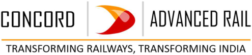
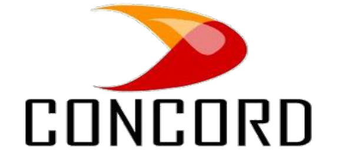
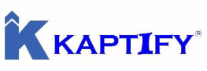

**[Image: May2025.pdf-0001-00.png (495x108, 28.5KB)]**

### CONCORD\BSE\20\2025-26 

May 20, 2025 

The Secretary, 

Listing Department, BSE Limited, 1st Floor, Phiroze Jeejeebhoy Towers,  Dalal Street, Mumbai-400001, Maharashtra 

### **<u>Scrip Code:</u>** <u>543619;</u> **<u>Symbol:</u>** <u>CNCRD</u> 

**<u>Ref: Submission under Regulation 30 of the SEBI (Listing Obligations & Disclosure</u> –** **<u>Requirements) Regulations, 2015 Transcript of Post Earnings Conference Call.</u>** 

Dear Sir/ Madam, 

With reference to our Post Results Conference Call for H2-FY 2024-25, held with the Investors/Analysts on Thursday, May 15, 2025 at 1:00 P.M. and pursuant to Regulation 30 and Part A of Schedule III of the SEBI (Listing Obligations and Disclosure Requirements) Regulations, 2015, we, Concord Control Systems Limited, are submitting herewith transcript of the said meeting. 

We request you to please take the same on your records. 

Thanking You, 

Yours’ Sincerely, 

### **_for Concord Control Systems Limited_** 

PUJA Digitally signed by PUJA GUPTA Date: 2025.05.20 GUPTA 14:48:17 +05'30' 

**_Puja Gupta Company Secretary & Compliance Officer Mem. No.: A28664_** 

**[Image: May2025.pdf-0001-15.png (1238x84, 22.4KB)]**

**[Image: May2025.pdf-0002-00.png (581x255, 61.2KB)]**

# **CONCORD CONTROL SYSTEMS LIMITED** 

**H2 & FY25** 

## **POST EARNINGS CONFERENCE CALL** 

May 15, 2025 

## **Management Team** 

Mr. Gaurav Lath - Joint MD 

### **Call Coordinator** 

**[Image: May2025.pdf-0002-08.png (263x91, 20.3KB)]**

Strategy & Investor Relations Consulting 

Concord Control Systems Limited (CNCRD) H2 & FY25 Post Earnings Conference Call May 15, 2025 

### **Presentation** 

**Vinay Pandit:** Ladies and gentlemen, I welcome you all to the H2 and FY'25 Post Earnings Conference Call of Concord Control Systems Limited. Today we have with us, Mr. Gaurav Lath, Promoter and Joint Managing Director. 

As a disclaimer, I would like to inform all of you that this call may contain forward-looking statements, which may involve risk and uncertainties. Also, a reminder that this call is being recorded. 

I would now request the management to quickly run us through the business and performance highlights for the period ended 31 March, 2025, the growth plan and vision for the coming year. Post which, we will open the floor for Q&A. Over to you. 

### **Gaurav Lath:** 

Thank you, Vinayji and good morning to everyone. And all the investors and analysts, I welcome all of you to the con call of our Company, Concord Control Systems Limited. As you must have seen the results which have been published for the financial year 31st March 2025. It has been an exciting year for us. We’ll take you through the highlights and key details of how the year has unfolded for us. 

So, Mr. Mohsin, can you please run the slides? So I'll quickly take you through the key highlights of the year. In this year, we have increased our revenues by 113% from H2 '24 to H2 '25. Our EBITDA margins have also increased by 67% from the last half year to this half year of FY '24 to '25. Our net profits have significantly increased and our earning per share has increased by 97.6%. 

The overall revenue on the consolidated basis of the Company for the financial year 31st March 2025 is at ₹124.5 crores, which is a significant increase of 90% from the last year's revenue. Our net profit (PAT) has increased to ₹22.60 crores, which is an increase of 77% from our last year. And our order book has also significantly increased while we have been delivering and growing the Company. 

You can see there is a top line increase of 90% in the revenues. Still, we have managed a sustainable order book of more than ₹200 crores as on 31st March, 2025. And our debt-to-equity ratio, it is negligible on nil. If I talk about the income statement for H2 FY '25, the revenue from operations have increased from the last financial year to this year by 90%. 

The EBITDA margins, profit before tax, and the PAT margins have further increased. You may please look at it at detail. The overall EBITDA 

Page 2 of 20 

Concord Control Systems Limited (CNCRD) H2 & FY25 Post Earnings Conference Call May 15, 2025 

has increased by 73%, and the PAT margins have improved by 77% and grown from the last year to this year. 

We’ll now walk you through the highlights and key developments in our order book over the past year. we had an order book of ₹196.57 crores. and received ₹141.56 crores for this year, which is a significant number for us , as we are growing and we executed ₹125 crores worth of orders. So we still have a very sustainable order in hand on a consolidated basis. 

As a management, Nitin and me have been focused on bringing more and more business to the Company, developing new technologies and taking the Company forward as we have always been committed to the growth of the Company. This is what we've delivered so far, and this is what we aim to deliver as we move forward. This has already been shared in our previous investor presentations including the most recent one. 

However, I’d like to share that in the case of Advanced Rail — our wholly owned subsidiary we acquired in early Q1 2025 — we have now increased our ownership from 90% to 100%. When we began the acquisition of this company, its core focus was on embedded electronics for locomotives. Since then, the business has demonstrated significant progress and growth and that remains a key focus area for us.  If we talk about the business structure, our business is divided into five verticals now. 

Earlier, it was only four verticals, traction, coaching, locomotive, and wayside. This year, we have added a new vertical from Metro businesses where we have done a German TOT. So, in financial year 2025, we entered into a Transfer of Technology agreement with a German Company to start the monitoring of overhead, catenary as well as the entire asset of the OHE for the condition monitoring, which will further enhance the performance and will reduce the maintenance of such a critical asset of the Metros in the Country. 

This is a fairly new one of its kind technology which we have brought to India under the Make in India initiative. And the opportunity size is roughly about ₹250 crores until financial year 2030. We have already received a lot of interest, a lot of enquiries in this particular product and business and we are actively pursuing orders. 

Now if we talk about the business of DPWCS, which is also known as Super Anaconda, which we are doing under Advanced Rail. This is one of the key products which we are offering. And the entire focus of the management, the technical team, the R&D, everybody is fully aligned to 

Page 3 of 20 

Concord Control Systems Limited (CNCRD) H2 & FY25 Post Earnings Conference Call May 15, 2025 

work more and more and ensure that we are able to support this business and grow the DPWCS market more and more in the Country. 

As I had shared in my earlier presentations, DPWCS is a product which is focused on improving the freight movement in the Country, when the Indian Government or the Indian Railways attach multiple freight trains into a single formation so that the throughput of the freight movement improves. This is now becoming a very relevant technology in the current scenario, and the focus of Indian railways is increasing more and more in this area. 

It is a significantly large opportunity for fitment of these DPWCS or Super Anaconda products in the existing as well as new freight locomotives. The opportunity size in this business for the next four to five years would roughly be approximately ₹2,000 plus crores. That’s why we are working tirelessly every day to focus on this product and continuously grow the business across the Country. We are in multiple advanced stages of finalisation of certain orders around this product. 

Now if we talk about Kavach, which we are doing as a business under Progota India Private Limited, there are certain key developments where soon we will be participating in a tender where the field trials section will be allocated to us. The prototype for Kavach 4.0 is under evaluation by RDSO, and this is a very large business opportunity from Concord's perspective, which we are always focused on and relentlessly working in getting our SIL4 certifications, getting everything in order, and everything is working in tandem. 

And we are very hopeful of a better information and news in the recent times. On the Wayside equipment, which we are also doing under Progota, this is a product where we were getting a technology under Make in India from Spain. We are again as per our last commitments, we are very well in our milestones and achieving all the milestones for getting an approval soon from RDSO and taking this forward. 

In WILD, this is a business which we initiated in the last financial year where we had joined hands with Indian Institute of Science Bangalore incubated start-up, where we wanted to develop this product rather bring this product to the Indian Railways mainstream. 

And we are very happy to share that, we have already secured certain orders in this field and we are working towards finalisation of the same in the recent coming weeks. So while it is again a large opportunity, we are completely working towards getting the business soon and make it large. 

Page 4 of 20 

Concord Control Systems Limited (CNCRD) H2 & FY25 Post Earnings Conference Call May 15, 2025 

It's a very critical technology for ensuring the safety of railways at high speed. 

When we talk about the Way Forward, we have added the Metro business opportunity in this bucket where we have added ₹250 crores as an opportunity size by 2030 and roughly, if you put all the business opportunities together, it is a very sizable business where Concord as a team is focused, and we are sure that we will start getting more and more business as we have already delivered last year, we keep delivering our promises. 

If we talk about the Way Forward, we are still committed to grow at a scale of 40% to 50% in our revenue on year-on-year basis as well as from a CAGR perspective for the next three to five years. We are committed to sustain and maintain our EBITDA margins in the range of 22% to 25%, which we have delivered in the last year performance as well, and we are very hopeful that we will keep delivering the same in future as well. 

As per global perspective, we are progressing and aiming to position ourselves as a 360 degree solution provider for all the railway problems, we  reiterate that we are focused on the safety and the speed of Indian Railways. And not only railways in India, but with the help of WILD, with the help of Advanced Rail and all the current technologies which we are building today, we feel or hope that we are now well positioned to look at the global market, and we are now aiming to explore more and more solutions, support, system integration for global railway and locomotive clients. 

Our focus on hydrogen and battery powered locomotives is also increasing and we feel or hope that there will be a significant milestone which we will achieve in the coming years around hydrogen and battery powered locomotives, which again is not only an Indian railways business, but a global business with a lot of potential. 

I now request the floor to be opened for questions with the disclaimer that we will not be able to give specifics about orders or transfer of technology due to the competitive and confidentiality reasons, but we are happy to answer, all the questions which we can. 

### **Question-and-Answer Session** 

### **Vinay Pandit:** 

Thank you, Gaurav. All those who wish to ask a question may use the option of raise hand. We'll take the first question from Akshay Patel. Akshay you can go ahead. 

Page 5 of 20 

Concord Control Systems Limited (CNCRD) H2 & FY25 Post Earnings Conference Call May 15, 2025 

- **Akshay Patel:** Congratulations for the strong set of numbers. My first question is about the other cost, which has steeply increased compared to half one of FY '25. So what is the reason for the same? Our other expenses were ₹3.54 crores in half one of FY '25, and it has been increased to ₹9.76 crores in this half? 

- **Gaurav Lath:** I don’t have that information on hand right now, but I’ll definitely share it with you as soon as I do. 

- **Akshay Patel:** Sure. And my second question is about how much order book addition we are expecting in FY '26 from current ₹212 crores order book? 

- **Gaurav Lath:** Generally, in our order book we focus on ensuring that we are able to execute orders within 12 to 18 months. So that will be the guidance and way forward. 

- **Akshay Patel:** Yes. That's right. But, what I am asking is that, what is your visibility of order book addition? New orders coming, new orders flow for this current financial year FY '26? 

- **Gaurav Lath:** It will be significant. 

- **Akshay Patel:** Okay. Fair enough. And my last question is that we have specified the different market potential of all our different products. So what can be our market share in all of our addressable market business potential in different, different products? Currently, we have seen that our potential addressable market is around ₹47,000 crores? 

- **Gaurav Lath:** So, Akshayji, I think this is a very valid question. Thanks for asking. But railway operates in an area where there are multiple competitors and multiple products, and it is very difficult to define an SOB or a share of business overall as a ₹47,000 crore market. The number of competitors varies across our product range. For some products, we face just one or two competitors; for others, it could be three to four, and in certain cases, even up to eight. Because of this variation, it's quite difficult to assign a single number to the competitive landscape, though railway also operates in a part one and a part two, basically, an approved and a developmental category. 

So at a lot of places, we are an approved category vendor, which gives us access to around 80% of the tendering. And we are very well positioned to grow in that segment. 

Page 6 of 20 

Concord Control Systems Limited (CNCRD) H2 & FY25 Post Earnings Conference Call May 15, 2025 

- **Akshay Patel:** Okay. So follow-up on that would be, like, what has been our share of business in all our products in the past years, and what are the opportunities? And can you please specify about our competitive edge as to, wherein which segment we are stronger than our competitor, like in technology or like in products and something like this? 

- **Gaurav Lath:** Thank you again for asking that. Our edge is our technology and our design and research team. Today, as we speak Concord, Advanced Rail, Progota, all put together, we would have a strength of more than 60 or 70 plus engineers only focused on the R&D side, which gives us a very strong advantage and edge when we talk about getting the technologies, ensuring that everything remains in house. We maintain our IPs. We ensure that the cost will be optimised from time-to-time within the technology. So that always remains our edge in our business. 

- **Akshay Patel:** Okay. Fair enough. Thank you so much for the answers, and all the best for FY '26. 

- **Gaurav Lath:** Thank you, Akshayji. And I will definitely get back to you with the other expenses question. 

- **Akshay Patel:** Sure. 

- **Moderator:** Thank you. We'll take the next question from Ayush Khanna. Please go ahead. 

- **Ayush Khanna:** Thank you. So my first question is that can you explain a bit more on your new metro business, and how do you plan to synergise the same with your other businesses? 

- **Gaurav Lath:** So, Ayush, thank you again for asking that. Metro is also a large business in terms of railways as a whole, and it is a very closely integrated industry within the railway sector. So for us, synergizing and working with railways is not new, as well as working with metros is also not new.  We have a very high level of competency plus every day we are increasing the team size and building the competencies. As I was talking about the R&D and everything, as I mentioned that the German TOT is under make in India, so a lot of technology will be brought to India and then developed and supplied to the metros and then serviced. So we're well positioned to do that. 

- **Ayush Khanna:** Okay. Also in the DPWCS, how do you arrive at the opportunity size of ₹2,500 crores? So that is per loco kind of cost opportunity. And like how many players are there in this category? 

Page 7 of 20 

Concord Control Systems Limited (CNCRD) H2 & FY25 Post Earnings Conference Call May 15, 2025 

- **Gaurav Lath:** Today, I think there are three approved vendors. We are one of them. And if you talk about a locomotive, there would be a population of 13,000 plus locomotives in the Country where 1,200 new locomotives are made every year. Out of this number, at least 50% would be freight locomotives, and all the freight locomotives, as I mentioned earlier while explaining DPWCS, has to undergo a retro-fitment a Railway is focused on increasing the throughput and the average movement of freight in the Country. 

So to ensure that all the freight locomotives will be at some point converted or retrofitted with DPWCS as a product, which is roughly a product worth ₹20 lakhs to ₹35 lakhs depending on the specification and design, multiple subsets put together. So that is the size of the opportunity, and that's how we arrived there. 

- **Ayush Khanna:** Okay. Thank you. 

- **Moderator:** Thank you, Ayush. We'll take a question from the chat. Recently, HBL Power Limited got RDSO approval for Kavach 4.0. If Concord also preparing for 4.0 version or ahead of it as well, if SIL4 certification is received already for Kavach? 

- **Gaurav Lath:** Thank you for asking that question. Yes, we are working for Kavach 4.0 that is the latest spec of RDSO, which is the research and design body of railways and the approval authority for Kavach in the Country. That is the latest spec, and we are working on the same spec. And if to talk about the SIL4 certification, SIL4 certification is a parallel activity which has been ongoing for a few months, and we are very well positioned in that as well. 

- **Moderator:** The other question from Shailesh Jain is that Ministry of Railways is rolling out 2x25 kV electrification on all new high density and high speed routes. Is company expecting orders related to it in H1? 

- **Gaurav Lath:** We already have a product basket under traction for 2x25 kVA. Rather, we would be one of the few companies or the early ones to move ahead and develop an entire productivity around traction products for 2x25. And we are receiving orders as well as executing them from time-to-time. We are very hopeful that the order size will keep increasing as the 2x25 installation increase in the Country. 

- **Moderator:** Okay. Thank you. We'll take the next question from Tanvi Bhandari. Please go ahead. 

Page 8 of 20 

Concord Control Systems Limited (CNCRD) H2 & FY25 Post Earnings Conference Call May 15, 2025 

- **Tanvi Bhandari:** I just wanted to ask about your working capital cycle. How do you expect this going forward given that our inventory and debtors have increased significantly? So just some light on this thought? 

- **Gaurav Lath:** Tanvi, thank you so much for bringing this up. After acquisition of Advanced Rail, we are more focused on embedded electronics. And when any company manufactures embedded electronic based products and solutions, definitely it is a niche area and has a lot of value added in it. But at the same time, it comes with a lot of import as well as a lot of electronic components, the capacities are being developed in the Country for which the inventory cycles increase as well as these products involve commissioning and installation at site of these products. So some of the products are to be installed, and some of the products are to be just sold directly to the railways. 

So when the installation comes, a certain portion of the payment comes after the installation and commissioning is completed, which is done by a large team of service engineers and service support and the field team which we have. And that is also a sizable number of team. As a capability, we expect that we would be the ones who would do the same installation much faster than others. So, again, we are very hopeful that we'll keep doing our best there. 

- **Tanvi Bhandari:** Just a follow-up question. So the working capital cycle will approximately remain around the same range, because of this niche product? 

- **Gaurav Lath:** Yes. 

- **Tanvi Bhandari:** Okay. And just one more question. So given the huge industry opportunity that you have, going forward, do you again plan to take any further debt or would you still manage some internal approvals or maybe some more fundraise or something? 

- **Gaurav Lath:** Tanvi a very relevant question. Thank you for asking that. Definitely, as and when the business needs arise, we will look at fund availability as well as options of how we can raise through debt or through equity, and we will pursue whichever is in the best interest of the Company. 

- **Tanvi Bhandari:** Okay. Got you. Thank you. 

**Moderator:** Thank you, Tanvi. We'll take the next question from Anurag Agarwal. Please go ahead. 

Page 9 of 20 

Concord Control Systems Limited (CNCRD) H2 & FY25 Post Earnings Conference Call May 15, 2025 

- **Anurag Agarwal:** So last time we met, you mentioned that we'll probably get our Kavach approvals by H1 FY '26. Are we still on the same timeline? 

- **Gaurav Lath:** We are progressively working towards it, and we are well within our timelines. 

- **Anurag Agarwal:** Okay. Another question, this half yearly, we saw a significant decrease in our margins. What could be the possible reasons for that? 

- **Gaurav Lath:** Can you please share the data? 

- **Anurag Agarwal:** Last half yearly we were at 28%. Last year, we were at 26%. This year, we are at 20%. Despite an increase in revenue, I thought we'd probably gain margins due to operating leverage. 

- **Gaurav Lath:** I will get back to you with an answer, but immediately, if I have to answer that, I would say that monitor data on an annualised basis, not on a half year to half year basis because Advanced Rail was an acquisition in between. And there were multiple things which were happening around it. So you have to monitor data on annualised basis, not on a half year perspective for this year. 

- **Anurag Agarwal:** Got it. Last question. 

- **Akshay Patel:** Can I add one thing on this? 

- **Gaurav Lath:** Akshayji just before you answer that, I'll just complete my answer with Anuragji. 

- **Akshay Patel:** Sure. No problem. 

- **Gaurav Lath:** We still are maintaining an annualised margin as per our guidance of 22% to 25%. 

- **Anurag Agarwal:** Correct. Last question on my end. Since our strategy has been to get a lot of technology transfer from International Companies, what are some of the criteria's assessed by these companies, and how do we fare in those criteria's? 

- **Gaurav Lath:** There are multiple reasons for that. One of them is how deeply rooted we are into the railway ecosystem. I mean that railways divided into multiple zones and multiple production units for coaching as well as for locomotives across the Country, along with multiple metro installations and new metro developments across the Country. It's a wide sector in itself 

Page 10 of 20 

Concord Control Systems Limited (CNCRD) H2 & FY25 Post Earnings Conference Call May 15, 2025 

and having offices at almost each of these production units,  we have penetrated in the overall large ecosystem from an OHE perspective, to a traction, to a coaching perspective and to multiple sectors. 

There are very few companies who are positioned in this manner and when you go to any global company, everybody wants to work with India, thanks to Modiji and our current Indian ecosystem. India is poised for growth and the market opportunity in India is much larger than many other countries abroad. So, everybody wants to work in India, and they look at companies which are compliant and listed. Everything adds up. Your financial strength, your knowledge of the subject, your research team, everything adds up to reach there. And I think, God is kind that we are in the right place at the right time. 

**Anurag Agarwal:** Got it. Thank you so much. 

### **Moderator:** 

Thank you, Anurag. We'll take the next question from Nupur Surve. Please go ahead. 

### **Nupur Surve:** 

So where are we on Kavach? And by when do you see yourself being in the orders? Since I believe the development to approval to order and tender cycle is long, and will we end up losing a major part of this opportunity of ₹40,000 crores since we have seen three to four players receiving large orders in this area of business? 

**Gaurav Lath:** 

Nupurji, a very valid question, and I think that is a question which many of us would want an answer for. So thank you for raising that. As I mentioned earlier, Kavach is a very, very large opportunity, and it is not for two or three or four or five players, but something which can be commissioned in the interest of the Country as a nation to become a safer railway service provider by at least 10 to 15 such Kavach manufacturing companies and installation companies. 

Now to talk about specifically about us, we are at the right speed. I had shared earlier also that we are undergoing prototype evaluation of our Kavach 4.0 by RDSO, which is a very big forward-looking milestone for us. At the same time, there are certain sections which will be allocated for field trials and for which the tenders will be out soon as we are hoping for the same and working towards it as a team. 

So, I don't see that, Kavach is an opportunity where we are losing pace. We are well within our time frame to achieve what we want to achieve. 

Page 11 of 20 

Concord Control Systems Limited (CNCRD) H2 & FY25 Post Earnings Conference Call May 15, 2025 

- **Moderator:** Thank you, Nupur. We'll take a question from the chat. It's from Faisal Khan. He asks, in the last call, the management had indicated that multiple acquisitions are in the pipeline. Can we know the status of these? 

- **Gaurav Lath:** Thank you, Faisal for asking that question. Faisal, any acquisition needs a lot of due-dil and a lot of compliance. Plus, we see ourselves as promoters of the company, but at the same time, custodian of public money. So we have to invest very carefully in any opportunity which knocks our door. Multiple such opportunities are being evaluated. And in due course, whenever we are through with any firm commitments, we will definitely be sharing the news at large. 

- **Moderator:** Thank you. second question is, LiDAR technology is another big area within railways. Is Concord looking at tapping this market? 

- **Gaurav Lath:** Yes. LiDAR is an opportunity, a sizable opportunity, though we are already working on many such sizable opportunities. But to answer your question in a single statement, yes. We are evaluating options. 

- **Moderator:** Thank you. We'll take another question from the chat. It's from Shailesh Jain. He asked, Government is developing thousands of kilometre high density and high speed routes and rolling out into 25 kV electrification. Why traction product market is taken only ₹550 crores? The company is quite strong with traction products. Market should be more bigger. 

- **Gaurav Lath:** Shaileshji, we all like a bigger market and we also want to expand as much as possible, but currently, our product basket includes only these products. There are certain developments which we are working on for the past few months. As and when, we are able to roll them out, I'm sure we will have better opportunities and larger TAM to target for. 

- **Moderator:** Thank you. We'll take another question from Anirudh Kulkarni. Please go ahead. 

- **Anirudh Kulkarni:** Hi, Gaurav. Anirudh this side. I'm Manager of Family Office in Mumbai. Firstly, suggestion from my end. Since we come at a half yearly basis, if the management can come ahead and give a quarterly, top line and bottom line, if not a detailed balance sheet and P&L, but at least a sense on the revenue and the bottom line. That would be helpful. Even on the con call side, if the management can come ahead on a quarterly basis, would be helpful and would be in the interest of the investors as well. That was one. 

On a question side, my top most question would be on the margins, which has declined at an annual basis from 26% to 23%, if you can maybe come 

Page 12 of 20 

Concord Control Systems Limited (CNCRD) H2 & FY25 Post Earnings Conference Call May 15, 2025 

back. I think others have also asked the same question. So what was the reason behind it? And, secondly on the order book size, any new orders which were added in the second half, if you would like to enlighten us on that? 

- **Gaurav Lath:** So, Anirudh, first of all, thank you for a constructive feedback, and we will definitely work as a team towards it. And we'll try to move from half year to a quarter-to-quarter basis. Anyways, we will be positioned for main board in the next few quarters. So, yes, we will definitely work towards it. On the second point, you mentioned about the order book. 

- **Anirudh Kulkarni:** That's correct. On the order book. 

- **Gaurav Lath:** Can you please repeat the question again? 

- **Anirudh Kulkarni:** So I think in the H1, we had order book of tentatively 200 plus odd crores. As on it, what would be the order book and if any new orders have been added in the H2? 

- **Gaurav Lath:** So I would not have an exact number offhand for H2, but during the year, we received an order to the tune of ₹141.5 crores. And as of 31st March, our unexecuted order book stands at ₹212.5 crores, which is nearly 1.7x of our revenues of financial year '25. 

- **Anirudh Kulkarni:** Understood. So the additional ₹145 crores have been added in the second half? 

- **Gaurav Lath:** I would still have to check that. 

- **Anirudh Kulkarni:** All right. Understood. My follow-up question would be on the CapEx. If any near term CapEx, does the management is looking at adding any CapEx right now? 

- **Gaurav Lath:** I think I had answered that question earlier. CapEx is always a part of any new development or any new research which is happening and an ongoing activity. So we are invested there. Plus, we are increasing capacities from time-to-time. So as and when the business requires anything, the CapEx would be arranged and we would be investing in CapEx as per business needs. 

- **Anirudh Kulkarni:** All right. My last question, Gauravji, is on the tendering process. I think the first half was a slowdown in the tender flow out from railways. How was the H2 and in the near term, the H1 of FY '26. Is it expected to have more tenders right now from the railways? 

Page 13 of 20 

Concord Control Systems Limited (CNCRD) H2 & FY25 Post Earnings Conference Call May 15, 2025 

### **Gaurav Lath:** 

- It is not very well outplayed that which H1 would have or H2 would have a higher share of orders or tendering coming in. But generally, railways is into yearly planning when it comes to production units. And we generally see like for example or coaching you'll see more tenders coming out from September to November. For locos, it will be a different cycle. For some, pink book requirements, there is no seasonality of these tenders. And since our sectors are split into various different verticals, it is very difficult to comment on a H1, H2 basis. 

**Anirudh Kulkarni:** Understood. 

- **Gaurav Lath:** Yeah. Just to reply to the earlier question of yours, we received ₹60 crores of order in H1, which means effectively, it would be about ₹152 crores of orders received in H2. 

- **Anirudh Kulkarni:** All right. Out of the total outstanding of ₹200 odd crores, ₹152 crores will be additional amount? 

**Gaurav Lath:** Yes. 

- **Anirudh Kulkarni:** Got it. And on the margins, maybe you can come back later for the decline in the margins from 26% to 23%. 

- **Gaurav Lath:** No. So we answered that question that you have to monitor data on annualised basis. 

**Anirudh Kulkarni:** Which is at annualised basis which I'm asking. 

- **Gaurav Lath:** So from an annualised basis, we have maintained our margins from 22% to 25%. 

- **Anirudh Kulkarni:** All right. From the, perspective from March '24, the margins were 26%, and March '25, it is at 23%. So that decline of 3 odd percent is what I was asking. It's in the guidelines of the range. I understand. But the reason for the decline is what I was looking at. 

- **Gaurav Lath:** Yes. So, as I mentioned earlier also, Advanced Rail, the company when we acquired was a much smaller, much less efficient working, which obviously would take time as a business cycle to evolve. So it will take its own time to further evolve. 

### **Anirudh Kulkarni:** All right. 

Page 14 of 20 

Concord Control Systems Limited (CNCRD) H2 & FY25 Post Earnings Conference Call May 15, 2025 

- **Moderator:** Thank you, Anirudh. We'll take the next question from Ayush Khanna. Please go ahead. 

- **Ayush Khanna:** Yeah. Just a follow-up question that by when do you see yourself at ₹500 crore revenue, and how would this business look individually, at ₹500 crores? 

- **Gaurav Lath:** So, Ayush, we are very ambitious, and I think that is clearly evident in our few years of performance. We will not leave anything unturned to reach to ₹500 crores as and when we are able to. But today, if I have to talk about, I can only say that we will maintain our CAGR growth in revenue. But all these opportunities, DPWCS, Kavach, all the opportunities are very well positioned to make us reach there much faster than when we actually want. So let the time come. 

**Ayush Khanna:** Okay. Thank you so much. 

- **Moderator:** Thank you, Ayush. We'll take the next question from Karan Sharma. Please go ahead. 

- **Karan Sharma:** Thank you for the opportunity. I just want to ask at 40% to 50% CAGR, you will potentially be doubling your revenue every two years. But this will also put some significant strain on your current management team. So what are you doing on that front, I mean on the management side to run all these businesses? 

- **Gaurav Lath:** Karan, thank you for bringing that up. We are constantly adding the team not only at the management level, but at the execution level. At all the tiers, we are creating new organocharts. We want to keep the organisation really lean, but at the same time more efficient plus bringing like, for example, for the metro business, we are adding a full team which is focused on metro and have an experience in the metro vertical. We are adding few people from the loco side who are experts on the technology as well as though we have a lot of people in house, but that is where we are focused. Plus, we are also upskilling a lot of current team members and promoting them to their deserving roles. 

So, I think it's a journey. You can't really stop once the engine starts moving, all the coaches automatically being to follow. So, we are building all those coaches to move forward together in sync. 

- **Karan Sharma:** So, basically, management team also, I think we'll be getting sectoral experts, and they will be like guiding the team to move forward. 

Page 15 of 20 

Concord Control Systems Limited (CNCRD) H2 & FY25 Post Earnings Conference Call May 15, 2025 

**Gaurav Lath:** Absolutely. 

- **Karan Sharma:** All right. And, second, over and above this Advanced Rail manufacturing facility, what are our plans to set up manufacturing for other products? And I mean, what's your plan towards that? 

- **Gaurav Lath:** So, Karan, I answered that as and when the capacity requirements increase, we will keep adding capacities in whichever field and sector it is required. We are not entering from that anywhere. Currently, we are well positioned. We don't see immediate requirements. But if it is required, we are adding people or a team. We are adding CapEx. We are adding capacities, plants, whatever is required. 

- **Karan Sharma:** Okay. So, I mean, any visibility on any other products that you are planning for? 

- **Gaurav Lath:** Multiple research and developments are going on. Once they are developed, we will definitely share. 

- **Karan Sharma:** All right. Sure. Thank you. 

- **Moderator:** Thank you, Karan. We'll take the question from Riddhi Agarwal. Ridhi, if you can unmute. 

- **Riddhi Agarwal:** Yes. My first question is what operational or financial synergies do we expect to realise from the acquisition of ARCPL? 

- **Moderator:** From the amalgamation of Advanced Rail? 

- **Riddhi Agarwal:** Yes. From the acquisition of ARCPL? 

- **Gaurav Lath:** Multiple advantages of that. We have also shared the benefits and advantages in our outcome of the Board meeting. But just to share, it will improve our management efficiency. It will improve our overall financial planning, and it will also improve the team efficiencies and will optimise certain costs because of which operating at different company levels, you operate on a single level. It is always beneficial from a company's perspective. 

- **Riddhi Agarwal:** Just a follow-up question. Are there any integration risk of onetime cost due to this merger? 

- **Gaurav Lath:** No. I don't see that. 

Page 16 of 20 

Concord Control Systems Limited (CNCRD) H2 & FY25 Post Earnings Conference Call May 15, 2025 

- **Riddhi Agarwal:** Okay. My last question would be, there was a significant increase in reserves and surplus. So can you elaborate your sources on this? And also, where would you be using this reserves? Maybe in internal growth or dividend paying? 

- **Gaurav Lath:** So Riddhi, I think the significant increase in reserves and surplus is due to the premium. When the preferential as well as the acquisition happened. And what was the next question? 

- **Riddhi Agarwal:** My next question was how you would be using these reserves, maybe for different paying or for internal growth? 

- **Gaurav Lath:** So with our ambitious plan, I think we have a lot of opportunities which we are currently working on. So we will use it, mindfully as and when we are able to. 

- **Riddhi Agarwal:** Okay. Thank you so much and all the best for the coming year. 

- **Gaurav Lath:** Thank you, Riddhi. 

- **Moderator:** Thank you, Riddhi. We'll take the next question from Mahak Jain. Please go ahead. 

- **Mahak Jain:** Hi, I have few questions. The first one being, like can you please share the revenue bifurcation, the margins from each of the business segments, like which one being the major contributor and from all other segments and how the new vertical that have been added to the business is going to contribute to the bottom line and the top line of the business? 

- **Gaurav Lath:** Mahak, thank you for the question. We have already shared the standalone versus the consolidated statements. But just to share, I think we did a turnover of about ₹73.92 crores in Concord Control Systems Limited as a standalone and ₹51.21 crores in Advanced Rail, where the bottom line on a profit after tax basis was ₹15.07 crores in Concord and ₹8.11 crores in Advanced Rail respectively. 

- **Mahak Jain:** And how is the new vertical segment of the metro is going to contribute to the top line in the margins or the bottom line of the company? 

- **Gaurav Lath:** So any technology, which is new to the Country as well as with the current scenario when it is developed in India, going forward, we see a significant improvement in margins once it is indigenised, which happens to any technology, which is done under make in India. And from a top line perspective, it's a target market of almost ₹250 crores in the next four to 

Page 17 of 20 

Concord Control Systems Limited (CNCRD) H2 & FY25 Post Earnings Conference Call May 15, 2025 

five years. So a sizable contribution should come from there. And we are one of the few movers, so we should take advantage of it. 

- **Mahak Jain:** Okay. I just wanted to confirm, like this company has any plans to shift to main board and UPS when are we the planning for the same? 

- **Gaurav Lath:** 

   - So as per compliances, I think we have to complete three years on the exchange before migrating to any larger platform, which we will be completing on October 10, 2025. 

- **Mahak Jain:** Okay. So we are planning to shift within a year or not or, like we are not planning for some way October? 

- **Gaurav Lath:** If the law permits, why not? 

- **Mahak Jain:** Okay. And the last question that I wanted to ask, like you have said that you have received your first order under Concord Labs for the Wayside Equipment’s. Could you kindly elaborate about what the order that you have received in? 

- **Gaurav Lath:** Due to certain confidentiality reasons and competitive scenarios, we will definitely be sharing details soon. 

- **Mahak Jain:** Okay. Thank you so much, Gauravji. And all the best for the future. 

- **Gaurav Lath:** Thank you. 

- **Moderator:** Thank you, Mahak. We'll take a question from the chat. It's from Shailesh Jain. He is asking, Progota India Private Limited is an associate company. Are we planning to increase investment in it and make it wholly owned subsidiary? 

- **Gaurav Lath:** Shaileshji I have answered this question multiple times. Concord is well positioned for multiple opportunities and multiple buckets, Kavach being one of them. And from time-to-time, we keep evaluating our equity positions in each of our associate or acquired or subsidiary companies. And as and when we find a requirement or a development, which requires further enhancement, we act on it. As custodians of public money, we are always cautious in investing and growing the business equity or ownership. But we will keep doing it as and when an opportunity or a need arises. 

Page 18 of 20 

Concord Control Systems Limited (CNCRD) H2 & FY25 Post Earnings Conference Call May 15, 2025 

- **Moderator:** Thank you. We'll take question from chat from Tanvi Bhandari. She's asking why the promoter holding declined from 70% to 67.06%, and also, what was the main object of doing private placement? 

- **Gaurav Lath:** Thank you for asking that. The promoter holding declined because of fresh preferential allotment to increase the funds requirement of the company. And as we were growing the company and we acquired in the last year, plus after acquiring Advanced Rail in the first quarter of this year, we immediately improved the operations and invested in the capital, which is evident from the balance sheets as well as financial statements, which we have shared. And the preferential funds were raised from Marquee investors who participated. And it's always good to have mentors and advisors and people who are keeping you on track and can be a vigilant eye for detail for you to keep performing. 

- **Moderator:** Okay. She's asking further that is it to a related party, this private placement? 

- **Gaurav Lath:** No. **Moderator:** Okay. Thank you. We'll take the next question from Vasu Patel. Please go ahead. 

- **Vasu Patel:** Hello, my question is regarding the Kavach, because it has been hotspot area for now. So once we come under the approved vendor list, so how much order we are expecting in future? 

- **Gaurav Lath:** Vasu, it's a valid question, but today, I will not be able to answer this because of multiple reasons. As and when we fare, as I have been telling earlier in this call that our speed of getting approved and getting everything in order in Kavach is very well. We are doing what we can, and we are at the right pace. So everything right will happen at the right time. 

- **Vasu Patel:** Okay. And my second question is regarding, what are the key differentials in our approach compared to as we know, we have big players like HBL and KEC Internationals that will help us to secure the orders. What we are doing differently from them? 

- **Gaurav Lath:** Two things. One, any Government tender is a very transparent process where you have to technically win and qualify for the tender, and then you have to financially win the bid. So our key differentiator would be our technology. And since everything is in house, we have really worked hard to make a product, if everybody is considered at par, we will also say that we are at par or better than others. But at a very, very low cost, we have 

Page 19 of 20 

Concord Control Systems Limited (CNCRD) H2 & FY25 Post Earnings Conference Call May 15, 2025 

developed the entire product. So we will have its own competitive advantage when we reach there. 

**Vasu Patel:** Oh, so, basically, we have a lesser margin than other players, right? 

**Gaurav Lath:** 

I said lesser margin, higher margin. 

- **Vasu Patel:** Higher margin? 

- **Gaurav Lath:** Lesser cost. 

- **Vasu Patel:** Lesser cost. Yes. Okay. Got it. Thanks. 

- **Vinay Pandit:** Yes. Hi, Gaurav. I think that is the last question for the day. Would you like to give any closing comment before we end this call? 

- **Gaurav Lath:** 

- Thank you, Vinayji. To all the investors, thank you so much for all the questions. Your continuous love and support and the kind of number of people who join the call is always encouraging. Nitin and me both along with our entire team of Concord, Advanced Rail, Progota, all the companies put together are working day and night to bring more and more business, more and more energy, and more and more revenues as well as bottom lines to the company. We will keep doing that without deterring from our goals, and we will keep delivering and keep growing the way we want to. 

So thank you so much for your continuous support, and we will always act as custodians of public money, and we will invest very carefully in any opportunity which comes to our way. And thank you to the Kaptify team for putting this all together. 

- **Vinay Pandit:** Thank you. Thank you to all the participants for joining on the call, and thank you to the management team. That brings us to the end of today's conference call. Thank you. 

Page 20 of 20 

---

## Extracted Images

| # | File | Dimensions | Size |
|---|------|------------|------|
| 1 | May2025.pdf-0001-00.png | 495x108 | 28.5KB |
| 2 | May2025.pdf-0001-15.png | 1238x84 | 22.4KB |
| 3 | May2025.pdf-0002-00.png | 581x255 | 61.2KB |
| 4 | May2025.pdf-0002-08.png | 263x91 | 20.3KB |
