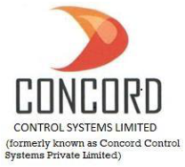
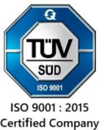
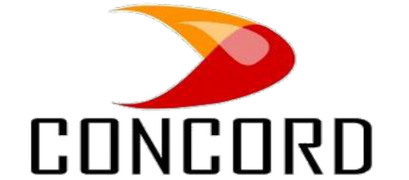

**[Image: Nov2024.pdf-0001-00.png (208x188, 44.8KB)]**

CONCORD\BSE\64\2024-25 

**[Image: Nov2024.pdf-0001-02.png (128x161, 34.9KB)]**

November 27, 2024 

The Secretary, Listing Department, BSE Limited, 1st Floor, Phiroze Jeejeebhoy Towers,  Dalal Street, Mumbai-400001, Maharashtra 

### **<u>Scrip Code:</u>** <u>543619;</u> **<u>Symbol:</u>** <u>CNCRD</u> 

**<u>Ref: Submission under Regulation 30 of the SEBI (Listing Obligations & Disclosure</u> –** **<u>Requirements) Regulations, 2015 Transcript of Post Earnings Conference Call.</u>** 

Dear Sir/ Madam, 

With reference to our Post Results Conference Call for H1-FY 2024-25, held with the Investors/Analysts on Thursday, November 21, 2024 at 4:00 P.M. and pursuant to Regulation 30 and Part A of Schedule III of the SEBI (Listing Obligations and Disclosure Requirements) Regulations, 2015, we, Concord Control Systems Limited, are submitting herewith transcript of the said meeting. 

We request you to please take the same on your records. 

Thanking You, 

Yours’ Sincerely, 

### **_for Concord Control Systems Limited (formerly known as Concord Control Systems Private Limited)_** 

PUJA Digitally signed by PUJA GUPTA Date: 2024.11.27 GUPTA 17:52:04 +05'30' 

### **Puja Gupta Company Secretary and Compliance Officer M. no. 28664** 

**[Image: Nov2024.pdf-0001-15.png (1018x19, 25.2KB)]**

Reg. Off: G-36, U.P.S.I.D.C. Industrial Area, Deva Road, Chinhat, Lucknow- 226019 Uttar Pradesh E-mail: cs@concordgroup.in; adminoffice@concordgroup.in, Mobile: +91-9919539555, +917800008745 Website: <u>www.concordgroup.in; CIN: U31908UP2011PLC043229</u> 

**[Image: Nov2024.pdf-0002-00.png (581x257, 61.7KB)]**

# **CONCORD CONTROL SYSTEMS LIMITED** 

## **H1 & FY25** 

## **POST EARNINGS CONFERENCE CALL** 

November 21, 2024 

## **Management Team** 

Mr. Gaurav Lath - Joint Managing Director 

### **Call Coordinator** 

**[Image: Nov2024.pdf-0002-08.png (263x91, 20.3KB)]**

Strategy & Investor Relations Consulting 

Concord Control Systems Limited (CNCRD) H1 & FY25 Post Earnings Conference Call November 21, 2024 

### **Presentation** 

**Vinay Pandit:** 

Ladies and gentlemen, I welcome you all to the H1 FY'25 Post Earnings Conference Call of Concord Control Systems Limited. Today on the call from the management team we have with us Mr. Gaurav Lath, Joint Managing Director, along with his finance and secretarial team. 

As a disclaimer, I would like to inform all of you that this call may contain forward-looking statements, which may involve risk and uncertainties. Also, a reminder that this call is being recorded. 

I would now request the management to quickly run us through the investor presentation, talking and detailing about the business and performance highlights along with the growth plan and vision for the coming year. Post which, we will open the floor for Q&A over to the management team. 

**Gaurav Lath:** 

Thank you, Mr. Vinay and, Kaptify team for putting this together. And along with me, I have our CFO, Mayank; our CS, Puja; and Avisha, who are joining me in this presentation. Based on the contents of this investor presentation and the earnings call, we'll quickly talk about us, followed by the business overview, then the way forward key highlights, and the industrial overview all put together. 

We have started Concord Control Systems Limited in 2011 in a very humble small setup, but the Company was always focused on Indian Railways ecosystems and being an OEM to the railways, we supply only exclusive products to railways. When we had started this Company, we had a vision that there are a lot of technologies and products which can be improved in this ecosystems and we always focus on railway as our key competency as well as the main client. 

Concord Control Systems Limited is approved by various railway approval authorities like RDSO for all the production units for locomotives as well as the production units for the passenger coaches. We have a significant size of team which focuses on the R&D. We always focus on three to five years ahead from today and always keep churning out products accordingly and keep the development process at the core of the Company as a core strength. 

Today, we have set up in Lucknow, Bangalore, as well as Hyderabad. With these set up, we always focused on giving a more holistic presence to the Indian Railways which has large network of more than 69,000 track kilometres and it becomes easier for us to cater to the requirements 

Page 2 of 21 

Concord Control Systems Limited (CNCRD) H1 & FY25 Post Earnings Conference Call November 21, 2024 

of the railways. We always focus on the testing and the quality aspect of the products. 

We are in the process of setting up a centre of design and excellence, where we can completely focus on the research side, and it's a parallel activity which always complements the operations. Today, we stand with a large team of more than 50 people in all the Companies. 

In past 13 years, the journey has been nothing more than gratifying and we have grown up gradually by adding new products line like traction, products to the coaching items, locomotive wayside. We got listed on the SME Exchange of Bombay Stock Exchange in October 2022 and since then there are three acquisitions like 1) Concord Lab to Market, 2) Progota India Private Limited and a significant stake in 3) Advanced Rail Control Pvt Ltd, which is a very recent acquisition in May, 2024. 

Mr. Nitin Jain and me started this business together and have a clear sense of the journey ahead. Mr. Nitin Jain is an Engineer, and I look after the Management side of the entire organisation. 

Under the umbrella of Concord Control Systems Limited, we have three significant ventures: 

1) Progota India Private Limited with 26% stake. This Company is completely focusing on indigenised development of ‘Kavach’, which we all know that today is one of the most critical technologies to be proliferated across the Country in such a large railway network. 

2) Advanced Rail Control Pvt Ltd, here we are focusing on all the embedded electronics, which are used in locomotives as well as propulsion technology. 

3) Concord Lab to Market Innovation Pvt Ltd, with 50% holding we focus on the wayside equipments which was incubated under IISC Bangalore. So a very eminent team of research scientists are working hard to develop a lot of products. Our focus is to bring these products to the market and plug it into the railway ecosystem. 

We have different verticals. Traction, coaching is part of the standalone business. These are primarily verticals where we are only manufacturing products and gradually we wanted to transition from a product manufacturing company to more of a solution provider. 

Page 3 of 21 

Concord Control Systems Limited (CNCRD) H1 & FY25 Post Earnings Conference Call November 21, 2024 

In Traction products, we do battery chargers and control panels. We manufacture a lot of distribution panels, terminal boards, AC-DC, all types of various products which are related to the overhead electrification of Indian railways. A large part of the network has now been electrified. But with the recent change in the consumption pattern of power or rather the power utilisation of the railway network, the railway is now moving into 2x25 and that is a new market which is opening up. And we're already ready for it and have started supplying products. So our entire range of products have moved from the conventional traction products to these 2x25 KVA offering. 

In Coaching products, we do a lot of products related to the passenger coaches, which are from the inter vehicular couplers to BLDC fans, emergency lights, cable management systems, and bellow ducts and exhaust fans. This is a vertical phase, which has seen a significant growth in the past few years and has contributed largely to the EBITDA of the Company in the past few financial year performances. 

In Advanced Rail Controls Pvt Ltd, we are making all the embedded electronics, which are primarily contributing to obsolescence management of Indian Railways as an-ops import substitute for large HMIs and products and this is a completely design driven organisation. We supply to Indian Railways and other Companies like Alstom, Bhel, CG etc. 

The products in Advanced Rail Control Pvt Ltd range from locomotive, diagnostic system, doppler radar, addition control, traction motor speed sensor, remote monitoring, brake interface units, DPWCS, which is one of the future of railways and is called Super Anaconda, which is a very lucrative opportunity which we are pursuing. Along with that, we manufacture all types of driver displays of the HMIs, vehicle control units, master controllers etc. in house. 

Distributed power supply is combination of so many products like CCU, a break interface unit, a driver interface unit, a BIU control panel, which is called Distributed Power Wireless Control System and this is primarily used for freight locomotives in the Country to set traffic management in Railways. 

These are all products which are in addition to fire detection unit, pressure sensor oil circuits, everything which we do at Advanced Rail Control Pvt Ltd. 

Page 4 of 21 

Concord Control Systems Limited (CNCRD) H1 & FY25 Post Earnings Conference Call November 21, 2024 

All PCB are designed in-house as an obsolescence management tool for Indian Railways. There were a lot of locomotives which were brought with the technology transfer from many years back in India and it is difficult to find working solutions globally. So we do this obsolescence management for Indian Railways through these products. 

On the wayside equipment, we are into ‘Kavach’. We have this facility at Hyderabad, which is in process of designing the indigenised ‘Kavach’ for Indian Railways. There are only few parties which are approved, and we are one of the front runners of the technology, which will get the approval soon. 

Multi Section Digital Axle Counter is a product which we're developing under Progota. This product is getting a transfer of technology from a Spanish Company, which helps to identify whether the track is clear for the next movement of train or not. So for example, if a 10-bogie vehicle passes a section, and if one of the wheels is left behind, it basically counts the number of axles which have gone and decides whether the signal should be red or green and whether the track is occupied or clear. So it's again a breakthrough technology which we are bringing to railways. 

Under Concord Lab to Market Innovations Private Limited, we are developing a product called WILD (Wheel Impact Load Detector). It basically identifies the wheel condition, and it does condition monitoring whether the wheel is in the right place or not, whether it is chipped or not, whether there is any wear and tear or there's a strain on the wheel which will help to identify a lot of reasons of derailment or accidents. 

Expected business opportunity from all the product lines which we just shared can contribute up to ₹550 crores of a target opportunity size until 2030. 

So as we were talking about numbers, we look to grow the Company until next three to five years with the CAGR revenue of about 40% to 50% and this growth will also sustain the EBITDA margins in the range of 23% to 25%. We're very hopeful that we'll be able to garner such kind of growth as well as perform and show results which we are aiming. 

And along with this, we're also starting to look outside India focusing on more opportunities globally. 

Page 5 of 21 

Concord Control Systems Limited (CNCRD) H1 & FY25 Post Earnings Conference Call November 21, 2024 

On the ESG side, we're also bidding for multiple battery and hydrogen powered locomotives projects, which are in the developmental phase right now. Next. 

In the H1FY'25, we have and today as on 30th September, the order book is at ₹206 crores. The asset has grown from ₹3.13 crores to ₹24.12 crores. So there has been a significant jump in the asset, largely contributed with the acquisition of Advanced Rail. And the return of equity stands at around 28.15%. And the EBITDA margins have also increased by 248 basis points. 

**Vinay Pandit:** Gaurav Ji, shall we move to the Q&A now.. 

**Gaurav Lath:** Yes. 

### **Question-and-Answer Session** 

**Moderator:** We'll take the first question from **Mr.** Agastya Dave. Mr. Agastya, you can go ahead please. 

**Agastya Dave:** Thank you, Vinay Ji. Thank you, Gaurav Ji. 

- **Gaurav Lath:** Hi, Mr. Agastya. 

- **Agastya Dave:** Very nice presentation as usual. You actually answered a lot of the questions that I had in my mind, but there are couple of points which I wanted to ask you. One is clear that you have a lot of products. There are clearly a requirement for all these products to be used for the railways. 

But in how many of these product segments are the railways actually looking to buy? In how many segments are they actually convinced that they need a solution? 

**Gaurav Lath:** So, as I mentioned about the opportunity size,  almost the verticals, products are regularly bought by Indian Railways today, and we are continuously supplying to them. 

**Agastya Dave:** All of them? 

**Gaurav Lath:** Almost. These are all different verticals and products which are used at different stages, s Like for example, if I have to give you a very basic example, if you are making fans today, and if new bogies are being 

Page 6 of 21 

Concord Control Systems Limited (CNCRD) H1 & FY25 Post Earnings Conference Call November 21, 2024 

made, you have to put fans in them, So there is a market which we have to serve. For example, I had told you  that in 2025, there will be  new opportunity that  2,000 to 3,000 track kilometres are to be upgraded in future. . 

So every year, there's a rolling plan of 2,000 to 5000 kilometres depending on the budget, and  if a substation is installed , you have to install products  whether it is a battery charger, distribution panel. So products are to be used. Like, for example Kavach, you see, it's 69,000 track kilometres where the implementation has to be happened. Only 1,100 or 1,200 track kilometres have been energised with Kavach till now. 

- **Agastya Dave:** So, Kavach was actually the reason why I asked you because there is clearly a need for Kavach and the railway has been dilly-dallying on it for such a long time. And as you said, barely I think 1,000 odd kilometres have been covered. So many accidents are happening, yet the progress is very, very slow. So it doesn't look like the railway is actually convinced that they need all. So not for a second am I questioning the opportunity or your capabilities. I'm just worried on the railway side with how enthusiastic they are about deploying all of these, especially Kavach? 

- **Gaurav Lath:** 

   - I will not answer especially for Kavach, but I would say as a whole, the largest amount of Capex spend by  Indian Government  is on railways and the focus is to indigenise a lot of technology. The focus is to bring more and more comfort and safety to the passengers and railway is doing everything to ensure it. . When things get rolling, they move fast and with great power. So, we  see that progress will be happening and we are very optimistic about it. 

- **Agastya Dave:** 

- Understood. So this ₹40,000 crores of Kavach, that is the biggest opportunity, right? So for you, how do you see, first of all, what kind of market share do you think you can capture there? There are enough competitors, but in your view, how strong is your product? In your view, how big? As you’ve shown in the slide, this is your total addressable market, right? So to what extent can you mine this opportunity? 

### **Gaurav Lath:** 

So as an entrepreneur, everybody wants to mine the maximum. There are  no number associated to our efforts or capabilities, but every product has a different competition mix. Like, for example, Kavach has three approved vendors as on date as per my view. The rollover has been slow for the past five years, but now we will see a significant 

Page 7 of 21 

Concord Control Systems Limited (CNCRD) H1 & FY25 Post Earnings Conference Call November 21, 2024 

rollover of Kavach happening across the Country. So a lot of tenders are about to come. We are expecting  to be one of the few ones who will be soon part of the list of Kavach manufacturers. 

**Agastya Dave:** When are you expecting that to happen officially? You'll be approved as a vendor? 

- **Gaurav Lath:** So it's in process, which is full of milestones. And I think we are very much close to get the approval. First, the product has to be developed, then the capacity assessment has to happen. Then  the product feasibility has to be checked and approved by RDSO, then it goes for a field trial. And parallelly, the SIL 4 certification, which is the highest level of safety certification globally for any such public usage product has to happen. So that will be   going on parallelly. I  am unable  to comment where we are exactly, but we are at a pace which is commendable. We have already crossed a lot of milestones, which I just shared. 

- **Agastya Dave:** Yes. Understood. Gaurav Ji , last question from my side, to cater to all these opportunities and the guidance that you have given for the next three to five years, one thing that I don't understand about you and your Company as of now is the manufacturing setup. And what kind of Capex do you need to actually translate that growth into reality? So in that, how much capital would you need I'm not asking about working capital here. Purely asset base, your manufacturing base. And what are your plans there? Is there an element, is there a situation where certain products will be outsourced to someone else and you will just be the supplier, or everything will be manufactured in-house? If everything needs to be manufactured in-house, what kind of facilities do you need going forward? 

- **Gaurav Lath:** So, I'll just give a one line answer for that , I just showed in one of our key highlights that our asset-based base has increased significantly. 

- **Agastya Dave:** Because of the acquisition, ₹24 crores, correct. 

- **Gaurav Lath:** Which adds to a new facility altogether. It's a 1-acre facility in Bangalore with a lot of capabilities, in-house. So all of that is for targeting this addressable market. 

- **Agastya Dave:** 

   - That's sufficient as of now? 

- **Gaurav Lath:** So that's a step forward, and we will keep adding facilities as and when required. 

Page 8 of 21 

Concord Control Systems Limited (CNCRD) H1 & FY25 Post Earnings Conference Call November 21, 2024 

- **Agastya Dave:** So what kind of annual Capex would you need? Again, ballpark. I'm not asking for like even specific. 

- **Gaurav Lath:** We will get back to you. 

- **Agastya Dave:** Okay. I was assuming like ₹2 crores to ₹5 crores every year, minimum Capex. Does that sound accurate to you, or is it more than that? 

- **Gaurav Lath:** May be more than that. 

- **Agastya Dave:** More than that. Per year ₹2 crores to ₹5 crores minimum there. 

- **Gaurav Lath:** Hopefully. 

- **Agastya Dave:** Understood. Thank you very much. Thank you and all the best. 

- **Gaurav Lath:** Thank you. Thank you for the question. 

- **Agastya Dave:** And congratulations for a very good quarter. Thank you. Thank you, Vinay Ji. 

- **Moderator:** Thank you. We'll take the next question from Mr. Prathamesh. Mr. Prathamesh, you can go ahead. 

- **Prathamesh:** So just wanted to know about the industry in terms of Kavach. So recently, I think Government has come out with a new outlay of Kavach in three phases. And as per my understanding, in Phase 1, around 14,000 kilometres worth of tender will be allotted in this year. We just wanted to know how has been the process around. Has the tender started coming out or…? 

- **Gaurav Lath:** Yes, Government is moving very fast. 

- **Prathamesh:** So for this year, has this tender outlet started? 

- **Gaurav Lath:** Hopefully. 

- **Prathamesh:** Okay. And so how much time it takes to, like to get into the order book, let's say, from bidding tenders to getting into the order book, the timeline? 

- **Gaurav Lath:** 12 to 18 months approximately. 

Page 9 of 21 

Concord Control Systems Limited (CNCRD) H1 & FY25 Post Earnings Conference Call November 21, 2024 

**Prathamesh:** 

Okay. 12 to 18 months approximately and so in terms of our Subsidiary Company Progota, I think we have around 25% stake in it. 

**Gaurav Lath:** 

26%. Yes. 

- **Prathamesh:** Yeah. 26%. So are we planning to increase it in coming time? 

- **Gaurav Lath:** 

Time will tell. 

- **Prathamesh:** 

Okay. Thank you. That's it for my side. 

- **Gaurav Lath:** 

Thank you, Prathamesh ji. 

- **Moderator:** We'll take the next member from chat, Mr. Rahul Arya. We'll take the next question from Mr. Mihir Ambani. Mr. Mihir, you can go ahead, please. 

- **Mihir Ambani:** Yes. Thank you for the opportunity. So this was like the first half of the question was already answered regarding Kavach. But I wanted to know apart from that, is there any major contributor in the growth guidance which is 40% to 50%? 

- **Gaurav Lath:** From the locomotive products, we said that the target addressable market is about ₹2.5 thousand crores for the next five to six years and that is going to contribute maximum, because that adds a completely new vertical at Concord. From traction and coaching, we added locomotive as a strong base. So that will steadily contribute to the growth forward along with others. 

- **Mihir Ambani:** Sure and do we have any other PIL benefits associated with Kavach as of now? And if yes, can we quantify them? 

**Gaurav Lath:** Difficult to answer that right now. 

**Mihir Ambani:** Just a vague ballpark? **Gaurav Lath:** We'll get back to you. **Mihir Ambani:** Sure. Thank you. **Gaurav Lath:** Thank you, Mihir ji. **Moderator:** We'll take the next question from Mr. Mahesh Atal. Mr. Mahesh, you can go ahead, please. 

Page 10 of 21 

Concord Control Systems Limited (CNCRD) H1 & FY25 Post Earnings Conference Call November 21, 2024 

**Mahesh Atal:** 

Hi, Gaurav Ji. Congratulations. Great set of numbers, I would say. 

**Gaurav Lath:** 

Hi, Mahesh ji. Thank you so much. This all boosts our confidence. 

**Mahesh Atal:** 

Yes . So let's delve into I would be asking you a very basic question because this is going through your Company just now. So first, I would like to know. Let's say there's a bogie, okay, which is a passenger bogie. I don't know the cost of it. Please tell me the cost of one bogie on an average, okay? And let's say LHB bogie, general bogie. And what is that we bid for? Let's say in Concord. This is my first question at Concord, okay? Now what would be my bidding out of all fans, cables and others, what would be total value of the bid? This is my first question. 

Second question is coming to Advanced Rail Controls. Let's see if I take Advanced Rail Controls today. What was the last financial year sale for them? And again, the same query with Advanced Rail that they are, I think more into the engine part, I guess. I feel there is more focus on the engine side. All the things will be inclined to the engine part. So I would like to know. Okay. Let's say there's a CLW, and there you bid for it. And how much would be the bid value of Advanced Rail per locomotive, okay? These are my two questions with different companies. 

- **Gaurav Lath:** So you are talking about the bogies, so you want to know how many products do we install into one bogie, what would be the cost, and how much we can bid? That is your question. 

- **Mahesh Atal:** 

   - How much value do you get? 

- **Gaurav Lath:** So near about ₹4 lakhs to ₹5 lakhs, ₹4 lakhs to ₹6 lakhs, for installing products on one bogie. 3,000 bogies are being manufactured in India every year. 

- **Mahesh Atal:** So this value is for the general bogies, right? Not for the all LHB bogies. **Gaurav Lath:** I'm talking about LHB bogies. **Mahesh Atal:** But not to the AC bogies, right? You don't supply much to the AC bogies. 

**Gaurav Lath:** We supply to them as well. So it's a product mix, which is well spread across all sorts of coaching solutions, which railway offers. 

Page 11 of 21 

Concord Control Systems Limited (CNCRD) H1 & FY25 Post Earnings Conference Call November 21, 2024 

- **Mahesh Atal:** Let’s say AC bogie and general bogie, what could be the differentiation? 

- **Gaurav Lath:** A very small differentiation would be, a general bogie would use more of fans. 

- **Mahesh Atal:** Yes . So I'm asking about value wise. 

- **Gaurav Lath:** So value wise. 

- **Mahesh Atal:** So Suppose your material worth 4-6 lakh is going in a general coach, and if it’s in an AC Coach, how much will it be? 

- **Gaurav Lath:** Assume its ₹6 lakhs. 

- **Mahesh Atal:** Goes more than that.? 

- **Gaurav Lath:** In some cases, it goes more than that, in some cases, it goes less than that. 

- **Mahesh Atal:** So more or less you averaged out it to 4 to 8. 

- **Gaurav Lath:** Yes. 

- **Mahesh Atal:** Okay. 

- **Gaurav Lath:** And when you questioned about the products related to Advanced Rail, which for example, CLW is manufacturing, and how much does it goes into CLW, to answer that question, roughly in one locomotive, more or less, ₹40 lakhs to ₹50 lakhs worth of products we get installed. 

- **Mahesh Atal:** What would be the cost of general bogie, total cost, Gaurav ji if you could? 

- **Gaurav Lath:** Right now unable to answer. 

- **Mahesh Atal:** Okay. You are not aware of that. Okay. 

- **Gaurav Lath:** If there is one bogie, then  locomotive costs will be between ₹8 crores to ₹14, ₹15 crores approximately. 

**Mahesh Atal:** So Advanced Rail, my question would be, now again, the second after getting that detail on this. Now my query would be, look, there has been 

Page 12 of 21 

Concord Control Systems Limited (CNCRD) H1 & FY25 Post Earnings Conference Call November 21, 2024 

a change in railway’s style of, I mean, since last year, the focus has shifted from the premium cars like, Vande Bharat to more of general. Now they are looking more into manufacturing, like, 10,000. I was reading one con call, where the management was of a view that they are now going for a 10,000-wagon bid I mean, they're going to bring a tender of 10,000 wagon. 

- **Gaurav Lath:** 

And so what is the question, sir? 

- **Mahesh Atal:** 

   - So my question would be, do we see this more opportunity coming to us in Concord also going ahead? 

- **Gaurav Lath:** Absolutely. 

- **Mahesh Atal:** Our growth could come major from Concord rather than… 

- **Gaurav Lath:** No. I would not say major from Concord. It is well spread. I would say we are not limited or rather our risk is very distributed between traction, coaching, locomotive. We are looking this from that perspective, not company-wise, , there will be overall growth.  For example, three years ago, there was electrification boom, so there was more growth in our traction product. So this keeps changing, when you are working with the Government, or a policy driven client, you always have to be well spread across verticals to ensure that nothing impacts your top line or bottom line to an extent where you're not able to meet your targets. 

   - So I think today, we can safely assume that we are very well spread. If I have answered your question? 

- **Mahesh Atal:** Yes. So let's say, there's a tender tomorrow 1,000 bogies. What are the chances that we could get? How much of that? Because but I'm asking about, taking into account all the competition that we have in that particular segment. If you bid on a 100-bogie tender, how much do you make out of it, on an average. 

- **Gaurav Lath:** Very difficult to comment. Every entrepreneur wants to make more revenue than others. But it depends on another factors. 

- **Mahesh Atal:** I'm asking about the past history. 

- **Gaurav Lath:** I will check and get back to you. 

- **Mahesh Atal:** Fine. And my last question, if I could squeeze in would be on the Progota. In Progota, you have just told that it is on the stage of approval. 

Page 13 of 21 

Concord Control Systems Limited (CNCRD) H1 & FY25 Post Earnings Conference Call November 21, 2024 

So could you please enlighten like, what is pending from their side? Where are we on that stage, and how much time it could take? 

- **Gaurav Lath:** 

Whose side? 

- **Mahesh Atal:** On the railway side, right? It is under approval, you said. 

- **Gaurav Lath:** No,  process is going on.  There's nothing pending. It is an activity which is in progress. As I earlier mentioned, there are multiple milestones. We have achieved a few of them and the next milestone is to be done.  At this moment, the whole Ministry and everybody wants Kavach to be implemented. So everybody is focused on it. 

- **Mahesh Atal:** What was the turnover of this Advanced Rail last financial year? 

- **Gaurav Lath:** Last financial year, I think we did around ₹19 crores. 

- **Mahesh Atal:** And what would be the target or any guidance you could give on that? 

- **Gaurav Lath:** We have an order book which is significantly large, and a lot of it has added when we acquired the company, the company had an order book of ₹140 crores in pending. So we hope that we will be completing in next 16 to 18 months approximately. So you can have a ballpark from there. 

- **Mahesh Atal:** Fair enough, Gaurav ji. Thank you for answering all my queries. All the best. 

- **Gaurav Lath:** Thank you, Mahesh ji. 

- **Moderator:** Thank you. We'll take the next question from Mr. Hanu Rao. Mr. Hanu, please go ahead. 

- **Hanu Rao:** Thanks, Gaurav Ji. It's very good set of numbers from the Company. 

- **Gaurav Lath:** Thank you. 

- **Hanu Rao:** I have a question related to Kavach. So what is the margins on this business, actually? 

- **Gaurav Lath:** Sir, it’s too early to comment. 

Page 14 of 21 

Concord Control Systems Limited (CNCRD) H1 & FY25 Post Earnings Conference Call November 21, 2024 

**Hanu Rao:** Okay.  So because in your PPT, you presented like 50 lakhs for the month in a metro track and ₹70 lakhs for around local moto installation. So I'm just asking based on… 

**Gaurav Lath:** So we have tried to assess the opportunity. Margins would fairly be close to our way forward. 

**Hanu Rao:** Any rough estimate. I'm not asking about exact? 

**Gaurav Lath:** Very difficult to answer today. More or less, we should have a healthy EBITDA, I would say. 

**Hanu Rao:** Okay. Maybe because already around three projects are ongoing with some other different locations like Chennai, and then one more I heard is like in Kolkata. So maybe if you have rough estimate or else it's okay? **Gaurav Lath:** It should be close to the guidance given by us, close to our EBITDA. Let's see. **Hanu Rao:** Okay. Thank you. All the best for you and your team. **Gaurav Lath:** Thank you. **Moderator:** We'll take the next question from Mr. Suman Kumar. Mr. Suman, you can go ahead. In the meanwhile, I'll take a question from the chat window. There's a question from Mr. Rahul Arya. You recently raised preferential money from market investors. Can you highlight what are we looking forward to from these funds? Is it for inorganic acquisition or increasing stake in subsidiary or anything else? 

**Gaurav Lath:** Actually, Rahul ji, it's a mix of all. It's also to fund the working capital requirement. It's also to reduce leverage of Advanced Rail in terms of loans. It is also to further invest on Capex and further acquisitions and so it's a mix of all. **Moderator:** Suman Ji, you have unmuted. You can go ahead, please. **Suman Kumar:** Thank you, Gaurav ji. Thanks for the opportunity. Couple of questions. One, I track few other players in the railway industry. Primarily people who manufacture back wagons and passenger cars. What I've seen is probably the onset of bidding pipeline probably has not been so forthcoming over the last couple of quarters. 

Page 15 of 21 

Concord Control Systems Limited (CNCRD) H1 & FY25 Post Earnings Conference Call November 21, 2024 

So while we have been hearing that there is a lot of focus from the Government, but from your experience or from your knowledge of the industry, have you seen that the bidding pipeline has not actually moved at the pace that they have been talking about. So is that a concern for you, from the perspective of bidding new ones? 

### **Gaurav Lath:** 

   - First of all, Suman ji, we see a significant growth in all the sectors, whether it is coaching or wagons or any other sector for that matter. And going forward also, as you mentioned that since we are risk averse to a large extent, and that's why we have been able to focus on distributing our bets in so many areas. Any policy change will not majorly impact the current growth. So I don't think it is going to impact the guidance which we have given. 

- **Suman Kumar:** And could you repeat the guidance for me please? 

- **Gaurav Lath:** We expect to grow at a CAGR of 40% to 50%. 

- **Suman Kumar:** 40% to 50%. Okay. The next question is I see that operating margin is a good healthy 26 to 28%. I just wanted to understand from you whether these are sustainable in medium to long-term or there is an opportunity to do further or you'll see risk? 

- **Gaurav Lath:** The current numbers which we have given, only a few  crores have been contributed from Advanced Rail from the locomotive. Primarily, everything is coming from the standalone as we speak till now. We have always been a product driven Company, as I mentioned from traction and coaching standpoint, which was covered under the standalone business as mentioned in the Slide A and B. 

When you move from a product company to a solutions company, your margin tends to improve slightly. So we are hoping that it will further improve. So sustaining should not be a problem if I have answered correctly to your question. 

### **Suman Kumar:** 

Sure. You did. I have the last question,   In the past, we have seen your ROCE, which is basically the uses of capital in the range of around 65% to 70%. Last in this half, we have seen it come down to a level of around 25%, 28%. Is it happening because you have just raised the capital and then you again see it inching to the level of, what you have been delaying. Or you see there is a dilution in terms of how you are able to spread your assets? 

Page 16 of 21 

Concord Control Systems Limited (CNCRD) H1 & FY25 Post Earnings Conference Call November 21, 2024 

**Gaurav Lath:** So, I think, largely it is because of  contribution for the acquisitions and we're significantly improving and  going forward. We will see a better ratios in coming years. 

**Suman Kumar:** Where do you see it stabilising? **Gaurav Lath:** That's a hard number to count today. I will get back to you. **Suman Kumar:** No problem. Thank you so much. That was all that I had and all the best to you. 

**Gaurav Lath:** And it was more for the new issue of shares and all that. So largely, when you look at the entire year, it will be stabilise. **Suman Kumar:** But directionally, do you think that it would be [indiscernible]? **Gaurav Lath:** Right now unable to comment. **Suman Kumar:** No problem. Sure. Thank you so much. Appreciate you patiently getting all of it. Thanks. **Gaurav Lath:** Thank you, Suman ji. Thank you for all the questions. **Moderator:** We will take the next question from Mr. Pritish Chheda. Mr. Pritish, you can go ahead. **Pritish Chheda:** Yes. Hi, my question is this order book that you're talking about, ₹140 crore in Advanced Rail, my guess is, is it to do with the embedded electronics side of the order value of the existing product line? Is that the ₹140 crore order to be executed over the next, whatever, 12 to 18 months approximately? Is right my understanding? 

**Gaurav Lath:** Yes, Pritish, you are right. **Pritish Chheda:** This piece of the market, is what market size in your opinion. You mean giving time across all the other product line. The existing product line is, what size of, what is the annual time market? 

**Gaurav Lath:** You're only talking about the embedded electronics which we're doing from Advanced Rail? 

**Pritish Chheda:** Your doppler radar, your locomotive diagnostic, the traction motor. These are all the things. 

Page 17 of 21 

Concord Control Systems Limited (CNCRD) H1 & FY25 Post Earnings Conference Call November 21, 2024 

**Gaurav Lath:** Until 2030, we are expecting about ₹2,000 crores to ₹2,500 crores approximately. 

**Pritish Chheda:** No, I want to know now not about 2030. Okay, what is the ongoing market size? My guess is this thing must be going in locos, right? 

- **Gaurav Lath:** It is in pipeline. 

- **Pritish Chheda:** So you have annual loco production of whatever 1,200 or 2,000 or whatever that number is. I think just put together is some 1,200 or 2,000 number, right? 

- **Gaurav Lath:** Yes,  approximately we sell ₹40 lakhs to ₹50 lakhs of product in every new loco. Plus, there is a lot of retro fitment opportunities, which we're working on. 

- **Pritish Chheda:** So ₹40 lakhs into 1,200 is about or ₹50 lakhs into 1,200 is about ₹600 crores market. 

- **Gaurav Lath:** So say 400 to 500, ₹400 crores to ₹600 crores approximately. **Pritish Chheda:** 400 to 600, so your market share today is what 20 divided by 400, right? Last year, you did about ₹20 crore of business share when you bought with Advanced Control, right. That's how it is. This market share should go where on the existing product line? 

- **Gaurav Lath:** So we're very hopeful that, we will grow much more than what it was growing till now. 20 was a very small number. 

- **Pritish Chheda:** You don't want to give out a targeted market share? **Gaurav Lath:** The target is we hope to do everything, but you eventually grab a bite. **Pritish Chheda:** My question is in this ₹600 crore or ₹400 crores to ₹600 crore piece of business, you don't want to give out a targeted market share because the loco production is a loco production, right. 1,200 locos or maybe 1,500 locos produced every year. 

- **Gaurav Lath:** We may safely assume ₹120 crores to maybe ₹200 crores approximately. 

- **Pritish Chheda:** You will reach that type of business? **Gaurav Lath:** We are expected to achieve that. 

Page 18 of 21 

Concord Control Systems Limited (CNCRD) H1 & FY25 Post Earnings Conference Call November 21, 2024 

- **Pritish Chheda:** And how many players are there in these product lines today? 

- **Gaurav Lath:** Every product has a different competition mix. It's very hard to say that some products would have four vendors, some products would have eight vendors. You really can't give a number to it. 

- **Pritish Chheda:** No problem. And in your speech, you're talking about products like Anaconda, then Wheel Impact Load Detector, and MSDAC or whatever that means. What is the progress on these product lines? The progress is are these RDSO approved products? They're supposed to be RDSO approved. Where are we on these product lines? 

- **Gaurav Lath:** So, for Super Anaconda, we have  already approval from the desired approval agency. Everything is not get approval from RDSO, but there are verticals in railways where you get the approvals from. 

- **Pritish Chheda:** You are ready to sell, basically. It's a commercial available product ready to be sold to railway if you want to start selling tomorrow. 

- **Gaurav Lath:** Hopefully It will be commercialised in this financial year. . 

- **Pritish Chheda:** Okay. So that product is a product which is ready to sell. It's not like which is to be ready to sell, right? 

- **Gaurav Lath:** It is in pipeline. 

- **Pritish Chheda:** And so this is for Super Anaconda? 

- **Gaurav Lath:** Yes. And second question was WILD. 

- **Pritish Chheda:** Wheel Impact, yes. 

- **Gaurav Lath:** We are under guidance, so we will not be able to comment for WILD right now. But there's a significant progress happening. And the third product was MSDAC which is currently under approval. 

**Pritish Chheda:** Ok. So basically, we would see one product getting commercial, and the other three products, we have to check with you on the progress. Which of the product do you think is closer to commercial next year? 

**Gaurav Lath:** Hopefully all of them. 

**Pritish Chheda:** Okay. No problem. All the best to you. Thank you. 

Page 19 of 21 

Concord Control Systems Limited (CNCRD) H1 & FY25 Post Earnings Conference Call November 21, 2024 

**Gaurav Lath:** Thank you, Pritish ji. Thank you for the questions. I really liked it, enjoyed it. **Pritish Chheda:** I tried to put it in the right way. Bye. **Moderator:** We'll take a question from chat by Mr. Faisal. His first question is Europe has an aging infrastructure in railways, and they're looking to revamp. Is the company looking at tapping opportunities in the region? **Gaurav Lath:** Yes, expecting in near future. **Moderator:** Indian Railways will be launching hydrogen trains for trials in December 2024. Do you see opportunities in that business as well? **Gaurav Lath:** Yes, we see opportunities in that business. **Moderator:** So do you want to elaborate a bit both of these? **Gaurav Lath:** Right now unable to answer. **Moderator:** Okay. There's a question from Mr. Suman Kumar. Do you foresee the need to raise capital to meet the growth guidance you've given over the next two to three years? **Gaurav Lath:** Not in planning. **Moderator:** There's a question from Ms. Riddhi Agarwal. Are you looking for any further acquisitions? **Gaurav Lath:** Yes. Multiple deals are in discussion. **Moderator:** I think we've already answered this, but I'll just repeat it in case we missed it. Mr. Sameer Nayak has asked a question. Have you already started bidding for Kavach for the supply to Government tenders? **Gaurav Lath:** It will start soon. **Moderator:** Okay. We'll take the question from Mr. Agastya. Mr. Agastya, you can go ahead. **Agastya Dave:** Yes. Thank you, Vinay Ji. Gaurav Ji, just a follow-up on what you just said. Multiple deals that you're looking at. So your guidance is without 

Page 20 of 21 

Concord Control Systems Limited (CNCRD) H1 & FY25 Post Earnings Conference Call November 21, 2024 

these deals or taking into account that there would be further acquisitions. 

- **Gaurav Lath:** This is based on the current business structure we have. 

- **Agastya Dave:** 

   - Okay. And when you're evaluating deals, so what exactly are you looking at capabilities or capacities? 

- **Gaurav Lath:** 

   - Capabilities. 

- **Agastya Dave:** Great. Thank you. All the best. 

- **Gaurav Lath:** Thank you. 

- **Vinay Pandit:** Thank you. I think there are no further questions. Would you like to give any closing comments, Mr. Gaurav, before we end the call? 

- **Gaurav Lath:** 

- So thank you to all the investors, who took out time for this call and was patient enough to wait for the queues to ask questions. And we feel that Concord as a Company is trying to do a very small change and trying to transform the railways. And that's why we say by transforming railways, we'd be able to transform India to some extent. 

We focused on this vision and we are always custodians of investor capital, and we are very prudently choose to invest in  appropriate manner we can. Thank you so much. 

- **Vinay Pandit:** Sure. Thank you. Thank you to all the participants for joining on the call and thank you to the management team. That brings us to the end of today's conference. Thank you. 

### **Gaurav Lath:** 

- Thank you, Kaptify team and Concord's finance team to be there for and putting this up together. 

### **Vinay Pandit:** 

Thank you, Gaurav Ji. 

Page 21 of 21 

---

## Extracted Images

| # | File | Dimensions | Size |
|---|------|------------|------|
| 1 | Nov2024.pdf-0001-00.png | 208x188 | 44.8KB |
| 2 | Nov2024.pdf-0001-02.png | 128x161 | 34.9KB |
| 3 | Nov2024.pdf-0001-15.png | 1018x19 | 25.2KB |
| 4 | Nov2024.pdf-0002-00.png | 581x257 | 61.7KB |
| 5 | Nov2024.pdf-0002-08.png | 263x91 | 20.3KB |
