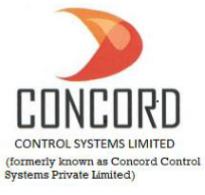
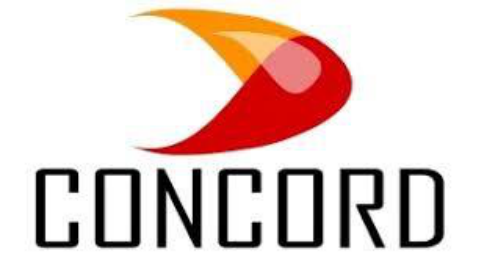
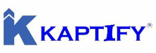

**[Image: Nov2025.pdf-0001-00.png (205x195, 48.8KB)]**

CONCORD\BSE\70\2025-26 

November 11, 2025 

The Secretary, Listing Department, BSE Limited, 1st Floor, Phiroze Jeejeebhoy Towers,  Dalal Street, Mumbai-400001, Maharashtra 

### **<u>Scrip Code:</u>** <u>543619;</u> **<u>Symbol:</u>** <u>CNCRD,</u> **<u>ISIN</u>** <u>: INE0N0J01014</u> 

**<u>Ref: Submission under Regulation 30 of the SEBI (Listing Obligations & Disclosure</u> –** **<u>Requirements) Regulations, 2015 Transcript of Post Earnings Conference Call.</u>** 

Dear Sir/ Madam, 

With reference to our Post Results Conference Call for H1-FY 2025-26, held with the Investors/Analysts on Thursday, November 06, 2025 at 2:00 P.M. and pursuant to Regulation 30 and Part A of Schedule III of the SEBI (Listing Obligations and Disclosure Requirements) Regulations, 2015, we, Concord Control Systems Limited, are submitting herewith transcript of the said meeting. 

We request you to please take the same on your records. 

Thanking You, Yours’ Sincerely, 

### **_for Concord Control Systems Limited_** 

Digitally signed PUJA by PUJA GUPTA Date: GUPTA 2025.11.11 18:18:18 +05'30' 

### **Puja Gupta Company Secretary and Compliance Officer** 

**[Image: Nov2025.pdf-0001-13.png (1018x17, 24.9KB)]**

Reg. Off: G-36, U.P.S.I.D.C. Industrial Area, Deva Road, Chinhat, Lucknow- 226019 Uttar Pradesh E-mail: cs@concordgroup.in; adminoffice@concordgroup.in, Mobile: +91-9919539555, +917800008745 Website: www.concordgroup.in; CIN: L31908UP2011PLC043229 

**[Image: Nov2025.pdf-0002-00.png (489x255, 73.4KB)]**

# **Concord Control Systems Limited** 

## **H1 FY26** 

## **POST EARNINGS CONFERENCE CALL** 

November 6, 2025 02:00 PM IST 

## **Management Team** 

Mr. Gaurav Lath - Joint Managing Director 

### **Call Coordinator** 

**[Image: Nov2025.pdf-0002-08.png (263x90, 20.4KB)]**

Strategy & Investor Relations Consulting 

Concord Control Systems Limited H1 FY26 Post Earnings Conference Call November 6, 2025 02:00 PM IST 

### **Presentation** 

### **Vinay Pandit:** 

Ladies and gentlemen, on behalf of Kaptify Consulting Investor Relations Team, I welcome you all to the H1 FY26 Post-Earnings Conference Call of Concord Control Systems Limited. Today on the call from the management team we have with us, Mr. Gaurav Lath, Joint Managing Director. 

As a disclaimer, I would like to inform all of you that this call may contain forward-looking statements, which may involve risks and uncertainties. Also, a reminder that this call is being recorded. 

I would now request the management to brief us about the business and performance highlights for the period ended September 2025, the growth plan and vision for the coming year, post which we will open the floor for Q&A. Over to you, sir. 

**Gaurav Lath:** 

Namaskar to all of you and good afternoon everyone. It's an absolute pleasure to connect with all of you once again. And let me start by saying that, I'm really proud that Concord has delivered highest ever H1 numbers. Year-on-year, we have been trying to grow and continuously deliver growth. But this year has been phenomenal growth till H1 of 2526. 

Our growth continues to be exceptionally strong. Our foundation is solid, and our momentum has never been better. When we announced that Concord would continue growing at a CAGR of 40% to 50%, many thought our ambitions were bold. But today, I can confidently say that we are not only on track, we are poised to surpass those targets. This confidence comes from the incredible progress and new developments taking place across the company. Today, I stand before you not with one update, but with four major developments that will define the next phase of Concord’s journey. Each of these initiatives is significant, strategic, and built for scale. Together, they will power the next chapter of our growth story. 

Each of these milestones ensures that Concord is set for a strong run-up in the coming months and quarters. We have always prided ourselves on being a company that thinks ahead, that believes in a futuristic vision. But today, Concord is not just thinking about the future, we are executing it, and doing it speedily. With the progress we’ve made and the innovations we are driving, Concord is now on the verge of becoming a much larger and more impactful railway innovation company than we have ever been before. 

Page 2 of 27 

Concord Control Systems Limited H1 FY26 Post Earnings Conference Call November 6, 2025 02:00 PM IST 

So the major big developments of H1 FY26 is that, we got the RDSO technical prototype clearance of Kavach 4.0. What does this mean? It means that all our products under RDSO framework has successfully cleared technical prototype stage. In simple terms, this means the product has been fully developed, and the initial round of functionality and performance testing has been successfully completed. And now the product is ready to be installed for field trials. Once this happens, the product will be ready for widespread implementation across the railway network. 

We are now commercializing the years of dedications and R&D efforts. This is the most significant milestone in the company that we have worked so far. The biggest advantage that the company gets from this is that, now we are eligible to participate in every upcoming tender of Kavach. And there are tenders, which are in pipeline in the next couple of months from ICF and CLW for multiple train sets and coach units. So now we are happy to share this that we are here. 

The second major development is that we have secured our first order for the field trial of Kavach 4.0. As part of this project, we will be conducting trials across five stations, six Remote Interface Units (RIUs), and ten local Kavach systems in the South Central Railway zone, covering a section length of 53 kilometres. This is a significant milestone because it marks the first live implementation of our Kavach 4.0 technology on the ground. We are confident that these trials will be highly successful and will further strengthen Concord’s credibility and leadership in railway safety and automation solutions. 

Until now, many believed that we were being a little ambitious, that we were only talking about Kavach. But today, we stand at a turning point. Kavach 4.0 is now becoming a mainstream, deployable product of Concord. This transformation from vision to execution, marks a defining moment for us as a company. 

The third major news and I think this is going to transform the entire journey of Concord in coming years is that we have developed the country's first zero emission propulsion for diesel locomotives, which means the diesel locomotives whose codal life ends, we take that engine and we convert it into a fully electric or a battery powered zero emission locomotive. And this not only reduces the scrappage of the railway asset, but it also enhances the cost as well as gives the cost benefit to the user so that they can use this on a zero carbon emission, net zero basis for future use. This is going to be a game changer for us not only 

Page 3 of 27 

Concord Control Systems Limited H1 FY26 Post Earnings Conference Call November 6, 2025 02:00 PM IST 

for the Indian market, but with this, we also foresee that there will be a large opportunity coming from the global markets. 

In fact, the global market for zero-emission locomotive propulsion is extremely large and currently, there are very few players operating in this space. With Concord now manufacturing the entire locomotive subsystems in-house following our strategic acquisition last year, we have been able to turn this capability around in an exceptional and transformative way. The innovations we are bringing to railway propulsion are not only designed for the Indian market, but also position us strongly for global opportunities. Our zero-emission locomotives can be powered by advanced battery systems or by alternative fuels such as hydrogen. In fact, we are already in the advanced stages of developing a hybrid hydrogen-battery propulsion system, which will mark another breakthrough for Concord and further strengthen our commitment to sustainable, next-generation railway technology. 

So this is going to be one of the most important news of this H1 for us. And we hope that this will change the trajectory and will transform Concord as a major railway innovation company in India. 

The fourth acquisition is again very close to our heart. Nitin and me are really bullish about this, that we have entered into the high value electric manufacturing services, which is electronics manufacturing services for railway electronics. And this is a very futuristic move. Many people are struggling to comprehend why we have embarked on this. But with being the largest flex PCB manufacturer and an installed capacity in India, we feel that this will not only put Concord on the Indian railway EMS map, but will also make us strategically ready for future box building solutions for railway grade assemblies for global suppliers. And we see a revenue potential of more than INR200 crores at full capacity with an EBITDA margin of almost 20% upwards hopefully. And we foresee that we will be expanding the capacities in near future as well. 

So these are the four key developments which are going to change what we do today. And last year, we started this journey by acquiring Advanced Rail in Bangalore. The execution of that acquisition has been phenomenal. It was a very bold move. Similarly, Fusion is again a bold move with railway EMS coming in play. But to be honest, the turnaround has been really dramatic. The capital which we had invested, we have already been able to repay that through profits and the business is showing tremendous growth potential going forward. 

Page 4 of 27 

Concord Control Systems Limited H1 FY26 Post Earnings Conference Call November 6, 2025 02:00 PM IST 

And we can now proudly say that Concord is more of a R&D, technology and an innovations company. Today, we have more than 110 R&D engineers who are fully employed in R&D. So our core strength is now a 100% research-backed design and development firm for railways. And we envisage or rather we have a vision where we feel that we will become a railway technology and an innovation company not only for India, but for the global railways as well. With the current in-house capabilities of R&D, integrated manufacturing facilities, and the entire team of people which we have, we are very strongly positioned to design, do the entire electronics assembly, do the software development, testing and ultimately do the field trials and field commissioning of our products. So these are the key highlights which I have. 

And now moving on to the revenue. So the business highlights for this year is that we have grown our revenues by 64% on a year-on-year basis. And today we stand at INR81.55 crores. Our EBITDA margin has, overall EBITDA has grown by 53%. And today we are at INR21.73 crores. The net profit of the company has increased by 85% if I compare with H1 of FY25 with H1 of FY26, which means a INR16 crores of net profit is delivered in the first half year of financial year 26. And today we have a very strong order book of more than INR313 crores, which signifies an increase of almost 47% in our current order book. And this explosive growth is just the beginning. What we have consistently observed in our past performance is that our H2 numbers are always stronger than our H1 numbers. 

So we are very confident that we will fulfil the numbers of H1 and H2 in the same way and we will be able to give that growth to the company. Our net profit of H1 last year was INR8.67 crores. This time we have made INR16.02 crores, which by far any standards we have been, till now we were promising that we will be able to give a 40%, 50% CAGR growth, but we have tried to outperform that and this is what we feel Concord is always conservative in promising our growth, but eventually we deliver it better and show it. Every single day, Nitin and I are driven by one single goal i.e. growth. 

These numbers which we have delivered are way better than what we have delivered so far. But at the same time if I talk about our future growth, then in our way forward we will say that by whatever we delivered in financial year FY25, we are hopeful that in the next 2 to 3 years we will grow that by almost 5 times and this is just not our ambition, but we are very clear, confident and hopeful that we will be able to deliver that kind of growth in next 2 to 3 years. Only on the 

Page 5 of 27 

Concord Control Systems Limited H1 FY26 Post Earnings Conference Call November 6, 2025 02:00 PM IST 

guidance basis we say that we look forward to grow at 40% to 50% CAGR for next 3 to 5 years in terms of our revenue, but we feel that against the numbers of FY25, next 2 to 3 years will be our golden period and our growth in that will be very transformational. 

Next 24 to 36 months are going to be the years of Concord where we are hopeful that we will see new products because of this R&D capability, we will see new technologies being developed in-house, we will open new market opportunities for Concord and we are completely investing in our engineering expertise and process innovations because that's how any company is built. It cannot be by chance, but it has to be by design. So with this we have a very high conviction that Concord will deliver new heights in next 24 to 36 months. 

Now if I have to talk about the business structure, so last time when we were discussing, Progota with only 26% stake. It was an associate company, but I have been asked this question multiple times that what is the possibility of increasing stake in this? So today I can proudly say that we are now having 46.5% stake in Progota, and we at Concord are really conservative about any opportunity. We only get into something when we see that there is an opportunity which is about to be converted and this is exactly what happened when we took this call of increasing the stake. We are only a few months away from getting a very high growth potential and an order pipeline. 

As a deal structuring, we are always conservative. We feel that till the opportunity matures or there is a situation where it is fully ready, then only we move fast and then only we work on increasing or acquiring that company immediately because it's a high conviction move and it is a very well calculated move then. So with this, I think Progota and Kavach is going to be a game changer for us and contribute to our revenues. We are hopeful that tenders will be coming from ICF soon for train sets. We are also very hopeful that there will be very large tender of locomotives which are about to come from the other production units. We are ready to participate in orders as I was earlier mentioning that we have been approved as a vendor who can participate in tenders. So that's why we have increased our stake. 

If I have to talk about Advanced Rail from the locomotive side in the business structure, Super Anaconda and DPWCS has been a transformational growth for us. Today, the entire order pipeline of INR313 crores, majority of it comes from these wireless communication and control systems which we have developed for 

Page 6 of 27 

Concord Control Systems Limited H1 FY26 Post Earnings Conference Call November 6, 2025 02:00 PM IST 

locomotives. And not only that, we are focusing on the entire propulsion system for the zero emission side of the business. 

With this technology of wireless communications and remote monitoring, we are hopeful that the order pipeline for next two to three quarters is going to be multiplying from where it is today. I would not say an incremental addition, but I would say a multiplying effect will come only from Advanced Rail because Advanced Rail is now a company which is going to be soon merged into Concord and it will become one single unit. 

Then if I have to talk about all my other opportunities in terms of the metro business, so last time we mentioned that the metro business was a new business which we started with a German company and we did a transfer of technology with them. We have received the order from DMRC. Today, I can say that the order is being successfully delivered with multiple meetings and visits jointly conducted on the entire metro network, on the specific lines for which the order has been awarded to us and we are seeing significant interest coming in from other metros and main lines for the same product because this is a game-changing technology for the Indian overhead monitoring of the entire asset life and preventive maintenance. 

And if I have to talk about WILD which is part of our Concord Lab-toMarket Innovations bucket, in this, we had received an order of more than 20 sets of WILD which are already under commissioning and delivery at various sites across the country starting from Jammu to Odisha to other places and the speed of execution has been phenomenal with the Indian Institute of Science Bangalore incubated start-up L2M and us have been working relentlessly to deliver this and there are many more requirements which are being generated by other railways and soon we will see those orders also becoming part of our order funnel for this. And we are very hopeful that this opportunity or the target opportunity which is there in 2030 instead of 5 years we might do it a little before in 3 to 4 years maybe. 

So we are very positive on the developments which we are currently working on. And as we look forward I think the journey of Concord has just begun. The acceleration has already started but today we see that there is a massive growth which is going to come in the next few years. The strong foundation for that growth has already been laid and Concord is entering into that golden phase where the next 2 to 3 years will change everything. 

Page 7 of 27 

Concord Control Systems Limited H1 FY26 Post Earnings Conference Call November 6, 2025 02:00 PM IST 

I would like to say that we will write our new story in the next 3 years and I think everybody internally in the team is proud of the fact that Concord is trying to scale at this pace and we foresee that we will continue to deliver outcomes at the same result pace and now with Fusion and zero emission coming in we feel that we will not only work for the Indian ecosystem but we foresee that we are getting ready for the global railway subsystems category. And with that Nitin and me both share a very strong vision that we want to become a railway company of India for which we are making efforts to become the largest railway technology player from India for the world and we not only just grow but we build a legacy which is completely driven by innovations and R&D and new technologies. 

So with this I think we are coming to the end of our short discussion and sharing of key highlights which we wanted to share. Happy to answer any questions. 

**Moderator:** Thank you. We will now begin the question-and-answer session. We will take the first question from Akshay Kaila. Please go ahead. **Akshay Kaila:** Hello sir. Am I audible? 

**Moderator:** Yes Akshay. 

**Akshay Kaila:** First of all congratulations for the very, very good set of numbers sir. My first question is what was the acquisition cost of Fusion technology and what is the revenue potential and EBITDA margins potential in the PCB business over the next 2 to 3 years? 

**Gaurav Lath:** Sure Akshay. 

- **Moderator:** Okay. 

- **Gaurav Lath:** So Akshay, Fusion as a company is one of the largest flexible PCB installed capacities in the country. And with this electronic manufacturing services we feel that not only the current setup of flex but the entire railway EMS is becoming a very large player for us. For our own backward integration of PCBs, which we manufacture at Progota and Advanced Rail for Kavach as well as loco systems but also for the entire global loco systems and we feel that at full scale the company should be doing a revenue of about INR200 crores and the EBITDA margins should be upwards 20%. 

**Akshay Kaila:** 

And sir, acquisition cost. 

Page 8 of 27 

Concord Control Systems Limited H1 FY26 Post Earnings Conference Call November 6, 2025 02:00 PM IST 

- **Gaurav Lath:** 

It was on the key highlight page. 

- **Akshay Kaila:** And sir, acquisition cost of Fusion Tech have we decided till now? 

- **Gaurav Lath:** So acquisition cost is confidential as part of the agreement and it will be shared in 2 years. 

- **Akshay Kaila:** Sir, currently we have got the order of Kavach system of around INR20 crores in Progota, India for the inspection or the testing of the Kavach system, right? 

- **Gaurav Lath:** Yes, we have got the order value of INR19.5 crores in which we have to manufacture, supply, install and commission 5 stations, 6 remote interface units and 10 local Kavach systems on a route kilometre strength of length of 53 kilometres from Kacheguda to Mahbubnagar Nagar in South Central Railway. 

- **Akshay Kaila:** Okay. And so when do we expect this to be completed and significant order flow once the inspection is done can be generated in Concord control? 

- **Gaurav Lath:** We are actively working on this and the speed and the track record with which we are moving till now and you have also seen that we have increased the stake. So we are only positioned because we know that we will be delivering these orders soon. We will also start getting more orders and the size of the orders should be significant. 

- **Akshay Kaila:** 

- Okay, sir. And sir, last question from my side is that where do you see Concord Control Systems Ltd as a world consolidated company in 2030? So what is your goal and vision to where do we see this company in 2030? 

### **Gaurav Lath:** 

- Sir, if I talk about 2030, then I just said that we want to become India's largest railway company in terms of revenue, in terms of products, but more from a technology and capability standpoint where people know us that we are a company that solves railway problems and innovates to bring new products which are genuinely required to the field and understand the requirements of the entire network of the field. 

But in terms of revenue, if I talk about the numbers of our financial year 2025, we think that we will try to increase it 5 times in 2-3 years on a conservative side. 

Page 9 of 27 

Concord Control Systems Limited H1 FY26 Post Earnings Conference Call November 6, 2025 02:00 PM IST 

- **Akshay Kaila:** 

Okay, sir. All right. Thank you so much for answering my questions. And all the best for the future. 

- **Gaurav Lath:** 

Thank you, Akshay. 

- **Moderator:** Thank you, Akshay. We will take the next question from Rupesh Tatia. Please go ahead. 

- **Rupesh Tatia:** Hi, sir. Thank you for the opportunity. I have 3, 4 questions, all of them on Kavach. So first question, sir, is this recent Kavach announcement that you did few, maybe 1 or 2 weeks ago. Am I correct in understanding that your hardware now has been qualified for Kavach 4.0? 

- **Gaurav Lath:** So our entire product has been developed and has been functionally tested by the main authorities. And based on that, the RDSO has validated us for field trials for which we have already secured an order and have received the tender. And based on this, we are now fully capable to supply this product as well as we are very happy when we see this, that railway has been able to check our product which is completely 100% developed by our own team in-house. 

- **Rupesh Tatia:** Okay. So now you have to do 5,000 km trial, right, to get the 4.0 certificate. So have you been -- has the trial started? Have you been allocated a loco? Which section are you going to go do a trial? Some updates around that and then the timeline, when will we get the certificate? 

- **Gaurav Lath:** Sir, as I told you earlier, the section of Kacheguda- Budvel- GudapalliMahbubnagar of the South Central Railway. The length of this section is 53 kilometres. And the trial says that we have to cover 5,000 loco kilometres. It does not mean that we have to cover 5,000 kilometres. It means that if there is a section from one end to the other end, it is 53 kilometres. And if one loco passes from point A, from the starting to the end, the loco covers 53 kilometres. And that means our trial of 53 kilometres is conducted. So if three trains are passing the same section in one day, then we are covering more than 150 kilometres. 

So assuming, I am just giving an assumption for mathematical calculation, that if three trains passes the same section of 53 kilometres every day, it would take us roughly about 31 days of uninterrupted running to complete the trials. 

Page 10 of 27 

Concord Control Systems Limited H1 FY26 Post Earnings Conference Call November 6, 2025 02:00 PM IST 

**Rupesh Tatia:** So that I understand, sir. This logic I understand. My question was very simple. Has the trial started? 

- **Gaurav Lath:** Trial will start. 

- **Rupesh Tatia:** And if it's started how many kilometres have been done? I mean, all these mathematical things I understand because I track the industry. 

- **Gaurav Lath:** The trial will start. Very nice. The trial will start soon, sir. 

- **Rupesh Tatia:** Any timeline when the trial will start? **Gaurav Lath:** We will start the loco commissioning in a few weeks. 

- **Rupesh Tatia:** Few weeks. Okay. And then coming second question is on the loco opportunity. So there are -- my understanding is there are three sort of large tenders. One is the current 10,000 tender, which I think the industry players are executing. Then there is another 6,500 approximately tender, I think, from CLW. And then there is 2,500 roughly tender from Railway Coach Factory. So I think for us, these new tenders, 6,500 and 2,500, have we qualified as a development vendor? 

- **Gaurav Lath:** Yes. 

- **Rupesh Tatia:** And if yes, then what kind of quantity do you expect? And when do you expect that these tenders will close and we'll get the order? So that is about the new tender. And then this existing tender, I think there is some, I think, re-tendering clause. So what kind of opportunity you see in this 10,000? You think 3,000 will get re-tender, 5,000 we will get retendering? Any view? And then what kind of opportunity we will get? So if you can address this in two parts. 

- **Gaurav Lath:** So Kavach is a very large opportunity. And you rightly said that there is one tender of ICF for 2,500, roughly 2,500 train sets, which is already published in the public forum. The other tender which is already published is more than 6,000 locomotives by one of the loco works manufacturing facility of railways. In both the tenders, Progota India as Concord is definitely qualified to participate as a developmental vendor. And we foresee that these tenders will be finalized before this financial year ends. And we will have secured good amount of orders if we are able to secure a decent position. 

### **Rupesh Tatia:** 

Okay. And the re-tendering one, sir? 

Page 11 of 27 

Concord Control Systems Limited H1 FY26 Post Earnings Conference Call November 6, 2025 02:00 PM IST 

**Gaurav Lath:** Railway today is undergoing large deployment of Kavach. And with the current accelerated plans, railway wanted that the 10,000 locomotives should be implemented with Kavach. And the product should be installed in all the Kavach by December. So let us see how the industry people perform. And we will be able to share the highlights as soon as the December ends and we get to know how much has been done. 

**Rupesh Tatia:** 

And, sir, in the last -- 

**Moderator:** Thank you, Rupesh. **Rupesh Tatia:** Just one clarification. **Moderator:** Please. **Rupesh Tatia:** Just one clarification. **Moderator:** Please, please. There are a lot of participants. Please, I request you to rejoin the queue. We will take the next question -- before taking the next question, I request the participants to limit the questions to two participant. We will take the next question from Shashank Sagar. Please go ahead. Shashank? **Shashank Sagar:** Yeah, hello. **Moderator:** Yes, Shashank. **Shashank Sagar:** Yes, sir, just, I wanted to know about what is the maximum size in Kavach we can bid for? Like, what is the cap? Is there any cap? **Gaurav Lath:** Cap in the sense? No, sir. **Shashank Sagar:** Like, sir, can we bid for an order of INR200 crores, INR300 crores? **Gaurav Lath:** Absolutely, sir. We can bid. And railway has two different categories of developmental as well as approved sources. So we will be participating as a developmental vendor in these tenders. But all the tenders, we are eligible to bid. There is no turnover capping for any tenders. 

Page 12 of 27 

Concord Control Systems Limited H1 FY26 Post Earnings Conference Call November 6, 2025 02:00 PM IST 

### **Shashank Sagar:** 

Okay. Sir, are you looking to raise your guidance? Like, you can get for from Fusion of INR200 crores. You can bid from here as well. So we will do more than INR40 crores, INR50 crores. 

### **Gaurav Lath:** 

   - Sir, I told you earlier that the next 36 months are very important for us. And it is our golden period. And we feel that we acquired Advanced Rail last year. And in one year, we turned it in an explosive way and stabilized it. And in today's date, it is acting like an innovation hub for us, where all the railway technologies are being built. Second, by increasing our stake in Progota, Progota will become a game changer for the next couple of years in terms of our growth potential, along with zero-emission opening global doors, which brings a lot of opportunities, double-triple size opportunities from our current business. And with all of that, by the time these all things pan out, Fusion will also become a very large contributor to our growth. So year-on-year growth, we will not only want to outperform, but also want to outbid. And we have overdelivered our promises in the past as well. So let's see how we move forward in the next 2-3 years. But we are very bullish about the next few years. 

- **Shashank Sagar:** One more request, you recently said order book of INR19 crore, you showed that. But last year's closing was INR224 crore, it was now INR369, you must have got orders in-between which you haven't updated. So it is difficult to track as a retail investor. If you can give any quarterly updates on the progress of the order book, or overall, so it will help us a lot. 

- **Gaurav Lath:** That's right. And when we started the year, we were at INR212 crores of order book. We have received orders of more than INR180 crores in this half year. And we have executed orders of INR80 crores. Today we stand at a closing order book, today means at the closure of the half year, we stand at an order book of INR313 crore plus. And we will keep increasing this order book. And we will try and give quarterly updates of order books as well. 

- **Shashank Sagar:** No, sir. What I mean to say is that you might have received an order worth more than INR160 crore, INR170 crores. But we received a notification as a retail investor of the Kavach order worth INR14 crore, INR15 crores. We did not receive a notification of the rest of the orders. So, we do not know what is going on in the company. So it will be helpful. Thank you. 

### **Gaurav Lath:** 

Point noted, sir. 

Page 13 of 27 

Concord Control Systems Limited H1 FY26 Post Earnings Conference Call November 6, 2025 02:00 PM IST 

**Moderator:** Thank you, Shashank. We will take the next question from Chitresh Lunawat. Please go ahead. 

- **Chitresh Lunawat** Fantastic updates, sir. Very happy to be the shareholder from the very first day when Concord listed. Thank you, sir. Sir, my questions are regarding, we are talking about so many orders and other things. So, what about the working capital requirements, sir? Do we have a tie-up with any bank? Or any other plans like for the funds required? 

- **Gaurav Lath:** So, Chitreshji, first of all, thank you for being our investor. And thank you for the patronage from the day of listing as you told. So it feels good to hear that you have confidence in us. And I will try to keep up to our promise. And as far as orders are concerned, yes. Orders is a continuous journey. And as orders come and go, we keep generating cash flows from the company. Plus, at the same time, we are working with multiple banks to increase as and when the working capital requirement arises. 

- **Chitresh Lunawat** So we are not having any option for fundraising, right? Are we thinking about raising funds in the near future? 

- **Gaurav Lath:** Sir, as and when there is growth, we will do when it is necessary, be it from the banks or from the investors. 

- **Chitresh Lunawat** Sure, sir. So, please do consider retail investors. **Gaurav Lath:** We are conservative about keeping the cost of capital as low as possible. So we will definitely do that in the interest of the company. But that will not hamper or the need of capital will never be a concern for growth in the company. 

- **Chitresh Lunawat** Sure, sir. And my next question was on the Fusion acquisition, sir. So, we have seen your history you go slow in the acquisition. You make a big percentage from a small percentage. Like Progota and Advanced Rail. But here in Fusion, we have made 80% directly. And it's normally a non-revenue company. So are we seeing such a big scope immediately in Fusion? And also, is there any PLI or government support in this? 

- **Gaurav Lath:** So flexible PCB India is one of the most sunshine sectors with semiconductors and everything coming in. And there are massive PLI schemes which the government of India is coming with and is contributing to grow this industry. You rightly said, sir, that this is a strategic acquisition. And this acquisition was -- we increased -- we did 

Page 14 of 27 

Concord Control Systems Limited H1 FY26 Post Earnings Conference Call November 6, 2025 02:00 PM IST 

a significant majority stake acquisition only because even today, this is India's largest installed capacity for flex PCB. And all the PLI schemes that will come will take more time. So we see a very high revenue potential in years to come from this company. 

- **Chitresh Lunawat** Same thing for Progota also. Even in Progota, there is 46% and we are expecting big orders. So will we go for 100% from 46%? Or is there no option in that, sir? 

- **Gaurav Lath:** Sir, we have slowly reached here from 26%. Now look ahead. We keep growing and our decision-making so far is a little conservative till the time it becomes a very high conviction high calculated move. We slowly structure the deal and then wait for the commercialization to happen. Once the commercialization is about to happen then we try and acquire and seek the opportunity. So, let's see, sir. We'll keep growing. 

- **Chitresh Lunawat** Thank you sir, Thank you for having this con call And all the best for listing, getting into the main board also, sir. I think you guys are working on that. And definitely would like to meet you also, sir. If we can keep the AGM physical, that will be helpful. Thank you, sir. 

- **Gaurav Lath:** It will be a pleasure to meet the investors on a face-to-face basis. And we are soon getting ready for the main board. As soon as the compliances are complete for the main board we will be going ahead with the main board application. 

- **Moderator:** Thank you, sir. We'll take the next question from Anurag Agarwal. Please go ahead. 

- **Anurag Agarwal:** Hi, sir. First of all, congratulations on the results. Basically, I had a fundamental question. We've done multiple rounds of acquisitions in many companies. So what is our process of acquiring a company? Because mostly, as per our investor experience most acquisitions fail. However, currently our track record is good. In terms of acquisitions only what capabilities have we seen in Progota? What is the current manpower capacity? Or any other capability which made us acquire them? And why can they get Kavach approval and not a wholly owned subsidiary or a main company of Concord get approval for Kavach 4.0? Is there a possibility that our company can also get Kavach approval directly? 

- **Gaurav Lath:** So, Anurag ji, thank you for saying that. Yes, Concord has grown inorganically through acquisitions. And that has been the driver for growth for our company for years to come. From a product company, 

Page 15 of 27 

Concord Control Systems Limited H1 FY26 Post Earnings Conference Call November 6, 2025 02:00 PM IST 

we have gradually moved to a technology and an innovation company. And this positioning we could only bring on board because of all this coming in play. Generally, your question is what do we see that we acquire? We either look at any technology which is directly impacting the safety of Indian Railways. That is one technology we want to get into. Everything you can't develop in-house on day one. So you have to partner, collaborate and bring more people and work with them, if you understand the railway ecosystem. So we see where we are going to add value as a company. 

Who fits in our value chain and where? And as soon as we identify a company in that value chain we try to understand the product. Then we try and understand how much of that product's technology is in-house that company. So the technology is our main backbone. And if that company has the technology then we would like to combine with them and want to make it ours. Rather than we see what is in us and what is in it. So, the idea is to collaborate and grow rather than compete. 

### **Anurag Agarwal:** 

### **Gaurav Lath:** 

Got it. Coming to the retrofitting of diesel locomotives, you spoke that it has an immense possibility. I just wanted to understand a few things related to it. If a customer opts for choosing the retrofitted locomotive versus buying a new locomotive what kind of a savings can the customer get? Secondly, how many diesel locomotives are there in India which are yet to retire where we can retrofit them? Third, can there also be circumstances where consumers can think we should go for a more advanced version of locomotive rather than getting it retrofitted? 

Anurag, again, a very impressive question. So to answer your question any old scrap, any junk, why we say anything as scrap is once the codal life codal life means the life it takes to run on a track, which is called fit-to-run. If a locomotive's fit-to-run period ends it is basically treated as scrap or junk and you only get the scrap value of the product. 

If you make the same product as new and you end up saving 30% to 40% of cost depending on the type of fuel for the client you are genuinely creating an ecosystem where the product becomes more acceptable than buying a new locomotive. And in this, from 700 HP it's not like you said, buy a new one. So products up to 3200 HP in today's date is what we are trying to design. And when I say 32 HP basically in the entire country, rather entire world the highest ever diesel locomotive conversion into a zero emission hydrogen hybrid system is not more than 1600 or 1800. We are attempting 3200. 

Page 16 of 27 

Concord Control Systems Limited H1 FY26 Post Earnings Conference Call November 6, 2025 02:00 PM IST 

So Everything is possible and we are very proud that we are part of this supply chain. We have been able to develop this product in-house and we see immense potential in terms of revenue for the next many years coming only from this. If I talk globally our current revenue, top line, in the next few years I see that 50% of this should come from global revenues from this product as well as other locomotive subsystems. 

**Anurag Agarwal:** Got it. So just to reemphasize on the part, how many such diesel locomotives are yet to revive in India. 

**Gaurav Lath:** I will come back to you with a number. **Anurag Agarwal:** Okay. Thank you so much, sir. **Moderator:** Thank you, Anurag. I'll request the participants to limit the questions to two per participants. We'll take the next question from Shubham Agarwal. Please go ahead. 

- **Shubham Agarwal:** Hello. Can you hear me? 

**Moderator:** Yes, Shubham. 

- **Shubham Agarwal:** Okay, great. Congratulations, sir, on a great set of numbers. My first question was on the stand-alone revenue of the company. Although the consolidated revenue grew by 64% I noticed that the stand-alone revenue has declined by 26% year-on-year. Could you please break down the performance and tell us what drove the standalone and the consolidated numbers? 

- **Gaurav Lath:** So, we have done approx. INR26 crores from the standalone balance sheet versus Advanced Rail contributes a larger portion of the growth for Concord. And we see that the same growth is going to continue, but at the same time, Concord numbers or the standalone numbers are well positioned to continue as per our last financial year numbers as well. 

- **Shubham Agarwal:** Okay, great. And sir, the second question was on Fusion like what will its likely contribution be in FY26? Because I noticed in the statement that you mentioned you will try to make it operational again by yearend. And how soon is the company looking to hit the revenue of INR200 crores that has been guided? 

- **Gaurav Lath:** So Shubham, this is a fairly new ecosystem which we have entered. We are very confident and we have a very high conviction that we will deliver what we are envisaging as a revenue potential in that company. 

Page 17 of 27 

Concord Control Systems Limited H1 FY26 Post Earnings Conference Call November 6, 2025 02:00 PM IST 

Maybe we will be better equipped to answer these points in detail in the next H2 results. Right now, there have hardly been a few days of acquisition. 

**Shubham Agarwal:** Okay, thank you. And just one last question. Are you optimistic that we can achieve a INR200 crore consolidated revenue in FY26? 

**Gaurav Lath:** Every promoter wants to do as much as possible and we want to do a lot of explosive work. Our H2 is always heavier than H1 and we expect that the same should continue. But we are very happy with the results of H1 and we hope that we will continue the same growth as we have been doing in the past many years. 

**Shubham Agarwal:** Okay, sir. Thank you so much. **Moderator:** Thank you. We'll take the next question from Vishal Dudhwala. Please go ahead. **Vishal Dudhwala:** Yeah. First of all, congratulations on a good set of numbers. So, first question is on your order book. Like, order book has grown sharply but the conversion into revenue is not as sharp as the order book. So can you throw some light on your conversion in next to 18 or month? **Gaurav Lath:** Vishalji, thank you so much for the question. Yes, the order book has increased significantly and we are very happy for that. In fact, we are well positioned to deliver the order book in next 18 to 24 months. So we don't see any challenge on the execution side. 

There are certain approvals which were needed to start execution of these orders which are already in place and now we are fully positioned to execute. In fact, within one year all these numbers are largely from Advanced Rail on the locomotive DPWCS and remote monitoring and the wireless systems. The kind of turnaround we have been doing in that venture and getting everything in order plus getting all the approvals and trials getting completed we foresee that the execution will become faster than what it has been till now. 

**Vishal Dudhwala:** Okay. So can you say what's the quarterly run rate you are seeing in FY26? **Gaurav Lath:** It is very difficult to give a quarterly run rate but H2 is always heavier than H1. This is our past trajectory so we hope that we will be able to deliver the same, plus at the same time once the product gets into the execution mode from the trial and testing phase it becomes even faster. 

Page 18 of 27 

Concord Control Systems Limited H1 FY26 Post Earnings Conference Call November 6, 2025 02:00 PM IST 

|**Vishal Dudhwala:**|Okay. And the second question is on your Kavach prototype. At what stage you are at to commercialize the full supplier? Can you throw some light on it? How many field drives are pending and at what stage are you in currently?|
|---|---|
|**Gaurav Lath:**|So I had already answered this question earlier but I will repeat my answer. We have received the RDSO technical prototype clearance which means that we are now a fully approved developmental vendor of Indian Railways for Kavach 4.0 and it also allows us to participate in all the upcoming tenders of Indian Railways for Kavach which was earlier discussed on the call and there are significant tenders which are coming in and we hope that if all these tenders are finalized by this financial year then there will be a sizable order book at Progota within the company. And about the field trial it is a 53 kilometre section length in which we have to do 5,000 local kilometres and we will start commissioning and installation in few weeks from now.|
|**Vishal Dudhwala:**|Okay. So can you just say what's the unit economics of it like EBITDA margin or something on it?|
|**Gaurav Lath:**|So Kavach as a product is a high margin because it's a safety technology and it's a niche product and years of R&D and development is required to develop the product and we foresee that it should contribute anywhere upwards of 25% in terms of EBITDA margins, plus an annuity stream of maintenance and upgrades which will further support the cash flows for many, many years to come.|
|**Vishal Dudhwala:**|Okay.|
|**Moderator:**|Thank you Vishal. I request you to rejoin the queue please. We'll take the next question from Juili Baviskar. Please go ahead.|
|**Juili Baviskar:**|Hi. So from my understanding in Kavach you are L2 bidder right now. So when can we expect you to become L1 bidder and also how you see Kavach as an opportunity in future and what are your plans--?|
|**Gaurav Lath:**|Sorry. Can you please repeat the first question? I was not able to hear you properly.|
|**Juili Baviskar:**|Okay. So from my understanding you are L2 bidder right now in Kavach. So when we can expect you to become an L1 bidder and how|

Page 19 of 27 

Concord Control Systems Limited H1 FY26 Post Earnings Conference Call November 6, 2025 02:00 PM IST 

you see Kavach as an opportunity in future and how much market share you can gain in future and also in Kavach we can see the execution problem is there from other companies. We can see that in December they are not able to complete. So is there any execution problem and also you are facing that. 

### **Gaurav Lath:** 

So we are not an L1 or an L2 bidder. L1 and L2 bidders are basically the lowest cost in any tender. We may be an L1 or an L2 bidder in the upcoming tender. That is what we all are hoping for. Let's see whether we will be L1 or L3 or L4 that depends on the pricing of the product but I think you are referring to the developmental and approved sources of Kavach. 

So today we are a developmental source of Kavach and with this we foresee that in all the upcoming tenders we will be eligible for the developmental quantities of the orders and why our execution I feel that Concord is well positioned to execute faster the Kavach subsystems because we already understand the locomotives, we already have our products installed in a lot of locomotives, we already have our service engineers, service network and installation teams at multiple sites across the country because of our current product list of driver displays, distributed power, wireless supply controls, FSKs, remote monitoring system. 

With all these current locomotive products we understand a locomotive better. We in fact manufacture a lot of brake interface units and Kavach subsystems in-house, in Advanced Rail which is our Bangalore firm. So with Kavach I think it's a forward integration for us and we will be executing faster than many. I think we will be better positioned to execute faster. 

### **Juili Baviskar:** 

### **Gaurav Lath:** 

Okay. And my other question is you have now two, three revenue streams in your head, Kavach, now Fusion and also you have that Anaconda thing. So my question is how are you focusing on these different revenue streams? Do you have a particular focus on one particular thing or how do you want to grow all of these sections together so that is my question? 

So railway as a sector is an opportunity pool of various products and technologies and from time to time we have to act on each side of the business. So I think we are actively as a management, Nitin and me both are completely focused on the growth which is coming from the locomotive subsystems today. Tomorrow it will be from Kavach and Zero Emission and day after that it will be from Fusion and the entire 

Page 20 of 27 

Concord Control Systems Limited H1 FY26 Post Earnings Conference Call November 6, 2025 02:00 PM IST 

locomotives being exported from India. So it's a phased growth trajectory which the company is on. 

- **Juili Baviskar:** 

Thank you so much. 

- **Moderator:** Thank you Juili. We'll take the next question from Naman Parmar Please go ahead. 

- **Naman Parmar:** Yeah, good afternoon sir. So firstly on the locomotive side so how much percentage of the cost of the locomotive you are serving like if locomotive cost is around INR18 crore to INR20 crore then how much you are serving? 

- **Gaurav Lath:** So Naman, I think on a per locomotive basis the electronics which we manufacture and supply would be ranging about INR70 lakhs to INR80 lakhs per locomotive, plus the propulsion and the Kavach coming in it should significantly increase by more than 20% to 25% of the overall cost of the locomotive. 

- **Naman Parmar:** So the propulsion system that the basically the IGBT propulsion system, so you have done any technology tie-up for that? So how hard it is to crack that particular product and other player can enter this or not? 

- **Gaurav Lath:** Railway is an open and a transparent forum. Everybody can participate and prove their products and get approvals. But I think we have a very strong R&D and a research team and we are developing our entire propulsion in-house without any tie-ups with any other firm. So we feel that the entire technology is in-house developable by our own team and we have the capable manpower in place and we can proudly boast for that. 

- **Naman Parmar:** Okay, understood. And any product that we… 

- **Gaurav Lath:** We have more than 118 R&D engineers which are only focused on innovating and designing and creating IPs for the company and for railways. 

- **Naman Parmar:** Okay, understood. Any product that we have supplied under the Vande Bharat trains? 

- **Gaurav Lath:** So Kavach trainsets would be part of Kavach as well plus there are multiple other products which we manufacture at our locomotive facility which are also supplied to Amrit Bharat, Vande Bharat and other product categories of Indian Railways. 

Page 21 of 27 

Concord Control Systems Limited H1 FY26 Post Earnings Conference Call November 6, 2025 02:00 PM IST 

- **Naman Parmar:** Okay. So what will be the opportunity size for that in particularly Vande Bharat trainsets? 

- **Gaurav Lath:** Specifically, for EMUs and MEMOs we feel that and trainsets we feel that the opportunity size would be significantly large. We have not done a break-up of trainsets. For that we will come back to you. 

- **Naman Parmar:** 

Okay, and lastly if you can… 

- **Gaurav Lath:** Loco subsystems, if I have to go to the TAM I think loco subsystems all put together we have put near about INR2,500 crores as an opportunity size for us, which also includes trainsets. 

- **Naman Parmar:** Understood. **Moderator:** Naman, I request you to rejoin the queue. **Naman Parmar:** Yeah, only one last question. Lastly, if you can give order book breakup how much is from traction, metro, loco? 

- **Gaurav Lath:** It will not be available off-hand with me I will work on it and get back to you. 

- **Naman Parmar:** Okay, thank you so much. **Moderator:** Thank you, Naman. We'll take the follow-up question from Rupesh Tatia. Please go ahead. 

- **Rupesh Tatia:** Yeah, hi, thank you for the follow-up. The question I was asking is in the first 10,000 loco tender, 20% was reserved for the development vendors. So in the two big follow-on tenders is it fair to expect that similar quantity will be reserved for development vendors? 

**Gaurav Lath:** Yes. 

- **Rupesh Tatia:** Okay, and now I see there are so many development vendors G.G.Tronics is there, Quadrant is there, you are there, Bharat Electronics is there, E2E Rail is there. So five at least I know. So within development vendors how will the quantities be divided? Will it be based on the progress of certification or what will be the criteria to split that opportunity? 

Page 22 of 27 

Concord Control Systems Limited H1 FY26 Post Earnings Conference Call November 6, 2025 02:00 PM IST 

**Gaurav Lath:** So, Rupeshji, there are multiple, more than 15 companies who would be developing Kavach but all those 15 companies would have not received the technical clearance from RDSO and would not be eligible to participate as developmental vendors in the upcoming tenders. So I don't foresee so many people participating as you mentioned. 

- **Rupesh Tatia:** So how many development vendors are there as of today, approved? **Gaurav Lath:** I will come back to you with a list, sir. **Rupesh Tatia:** Okay. Thank you. 

**Moderator:** Thank you. We'll take the next question from Alok Shah. Please go ahead. 

- **Alok Shah:** Am I audible? **Moderator:** Yes, Alok. **Alok Shah:** Oh, yeah. So I just had one question. There is some audio behind, I think. 

- **Moderator:** No, I think it's from your side. 

- **Alok Shah:** Okay, sorry. So I just wanted to ask one question that the PCB acquisition we have done of Flex so what is the competitive edge after gaining the company because are we designing or we are just assembling the PCBs? So I just wanted a clarification on that. 

- **Gaurav Lath:** Thank you, Alokji, for bringing that. We are not assembling but we are going to design and manufacture the flexible PCBs in-house. So the entire printed circuit board would be manufactured on German and European machines which are installed in the plant. And this is in terms of edge which will give us a competitive edge in terms of the entire backward integration of our PCB procurement because today with Kavach as well as with Advanced Rail and all the electronic components which we are today manufacturing and supplying we use a lot of printed circuit boards and this facility will come as a backward integration for the entire EMS requirement of ours. And for the future market as well. 

**Alok Shah:** Okay. So just to get a clarity we will be more focused on railway-side EMS or it will be like a general electronics manufacturing? 

Page 23 of 27 

Concord Control Systems Limited H1 FY26 Post Earnings Conference Call November 6, 2025 02:00 PM IST 

**Gaurav Lath:** It will not be a general electronics manufacturing. We will be setting up an entire end-to-end ecosystem for railway EMS in India for the world through this acquisition of Fusion. But this also opens a lot of doors for us outside the current domain of business which we have. And that is a natural progression which we will gain from this with higher margins and higher values. 

**Alok Shah:** Understood, thanks. **Moderator:** Thank you, Alok. We'll take the follow-up question from Anurag. Please go ahead. **Anurag Agarwal:** Hello. **Moderator:** Yes, Anurag. **Anurag Agarwal:** Hi, sir. Thank you for giving me the opportunity to ask again. I just wanted to ask two more questions. What are some restrictions that might be placed on a developmental vendor of Kavach versus a fully approved vendor? **Gaurav Lath:** Thank you, Anurag, for asking that. To clarify there are no restrictions in terms of product specifications or product deployment of Kavach for any approved or a developmental vendor. As earlier it was being discussed the developmental vendor is entitled for 20% of the quantity of a tender compared to an approved vendor. That is the only differentiator. Otherwise, the product capabilities, the technology the product installation everything remains the same. And that is why there is no capping on turnover. **Anurag Agarwal:** Got it. However, there is a capping on the tender size which is 20%. Got it. Got it. Also, would you want to say we have a differentiated product of Kavach as compared to our peers? **Gaurav Lath:** We are a company which has a 100% in-house developed product and we are not dependent on any third-party developer for any improvements or cost optimization which brings our overall cost of the product significantly lower than others. And at the same time the edge which Concord has because of all the other loco subsystems which we manufacture in-house like brake interface unit, like driver displays, CCUs, VCUs all of that will further enhance our cost optimization and we feel that we will have a very cost-efficient product compared to a lot of others with completely in-house research team. 

Page 24 of 27 

Concord Control Systems Limited H1 FY26 Post Earnings Conference Call November 6, 2025 02:00 PM IST 

**Anurag Agarwal:** Got it. Thank you for answering. 

- **Moderator:** Thank you. Thank you, Anurag. We'll take the next question from Nischal Mittal. Please go ahead. 

- **Nischal Mittal:** Hi, Gaurav. Congratulations for the good numbers for the half year. So, one question on this strategic investment that you guys have done into Fusion Electronics. So what is the play here? What is the capability or the background for which we have acquired or we have made this investment? And how much CapEx does it have currently? Because I think we have not talked about the existing scale this business has. So if you can talk about some of these things I think would be helpful. 

- **Gaurav Lath:** Thank you, Nischal for asking this. So today Fusion is the largest installed capacity of flexible PCBs in the country of more than 2 lakh square meters. And not only flex but this can also make rigid PCBs. And we see a revenue potential of more than INR200 crores at full capacity if we are able to achieve that. And this is kind of a backward integration for our current products. But this strategically gives us the advantage of box building a lot of solutions for railway grade assemblies for a lot of global clients. Like all the large global players already are seeking a lot of products as box build solutions. And this will help us box build for them. 

So we will not only manufacture for the Indian railways but will also help us look at global railway opportunities and add that as our revenues in near future. 

- **Nischal Mittal:** And Gaurav, because PCB manufacturing is advanced PCB or flex PCB manufacturing is a very CapEx intensive business. Is there any -- what is its current size in terms of the CapEx revenues and what is it that we want to take it to? Because this will require capital infusion. I understand it correct PCB manufacturing requires 1x of asset turns. So, it requires a decent amount of CapEx infusion as well. So, we are looking at it more like for a PCB manufacturing or we are looking at it more for a EMS which will be more asset light. 

- **Gaurav Lath:** So the company as I said has already having a full scale capacity for flex PCB manufacturing, not SMT. SMT is an add-on to the entire process. So the CapEx is already done and obviously we will be enhancing the technology and improving but that is what we do at Concord. We identify great opportunities we plug them into our system by acquiring them and then we generate a high value outcome of that entire acquisition. 

Page 25 of 27 

Concord Control Systems Limited H1 FY26 Post Earnings Conference Call November 6, 2025 02:00 PM IST 

**Moderator:** Thank you Nischal. Sir, we will take the last question from Chitresh Lunawat. Please go ahead. 

**Chitresh Lunawat** As we have heard we have around 110 research engineers working on. So I was curious to know we have so many technologies so what are the new technologies we are working on like MSDAC like multi-section digital action counter or CBTC, like communication based control like anything on this front like are we working on other technologies also which would help railways as well as metros as well. **Gaurav Lath:** So, Chitreshji thank you for asking that. Yes, today Nitin and me both are very proud of the fact that we have so many R&D engineers who work in pure R&D. And that's how we have been able to develop the entire zero emission propulsion in-house. And now we are working on multiple zero emission propulsions for alternative fuels like hydrogen and others and hybrid variants and higher capacities which are again going to be used by the industries in India as well as abroad. 

Plus at the same time we are coming up with various remote monitoring and HMI solutions which we are working on along with different kinds of propulsion which are again completely in-house designed and developed. And for us now R&D is no more a department, and for us it is a mindset and we are very happy that innovation is part of our mindset today at Concord. 

**Chitresh Lunawat** Thank you. Thank you, sir. This was my question. Thank you. **Moderator:** Thank you, Chitresh. Sir, since that was the last question would you like to give any closing comments? **Gaurav Lath:** Thank you everyone for all the insightful questions. I can only say that we are building India's next railway's powerhouse and the world is watching us and we will try to deliver what we promised to. And we don't take risks. We take a lot of calculated bold moves and with every move a new milestone is added to the company, a new dimension is added to Concord and this is going to open a lot of doors for Concord in India as well as in global railway engineering sector and we see Concord becoming a flag bearer of railway technology and for the next 24 to 36 months, we see that we are going to write our most powerful chapter with speed, scale and definitely smart execution. And Concord will definitely become a strong and a big railway company in India which will be most admired for its engineering and railway sector. 

Page 26 of 27 

Concord Control Systems Limited H1 FY26 Post Earnings Conference Call November 6, 2025 02:00 PM IST 

**Moderator:** 

Thank you. Thank you sir. Thank you to the management and thank you to all the participants for joining on this call. This brings us to the end of this conference call. Thank you. 

Page 27 of 27 

---

## Extracted Images

| # | File | Dimensions | Size |
|---|------|------------|------|
| 1 | Nov2025.pdf-0001-00.png | 205x195 | 48.8KB |
| 2 | Nov2025.pdf-0001-13.png | 1018x17 | 24.9KB |
| 3 | Nov2025.pdf-0002-00.png | 489x255 | 73.4KB |
| 4 | Nov2025.pdf-0002-08.png | 263x90 | 20.4KB |
