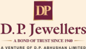
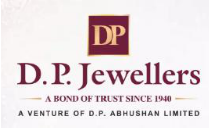
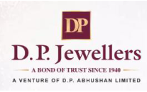
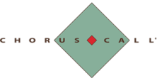
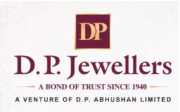

# **D. P. Abhushan Limited** 

**NSE: DPABHUSHAN | BSE: 544161 | ISIN: INE266Y01019 www.dpjewellers.com | investor@dpjewellers.com** 

**Date:** November 12, 2025 

To, **National Stock Exchange of India Limited** Exchange Plaza, Bandra Kurla Complex Bandra East, Mumbai – 400051 

**<u>Symbol: “DPABHUSHAN”</u>** 

To, **BSE Limited,** Phiroze Jeejeebhoy Towers, Dalal Street, Mumbai – 400 001 

**<u>BSE SCRIP Code –</u> “544161”** 

### **Sub: Transcript of Q2 FY26 Earnings Call held on Thursday, November 06, 2025.** 

Pursuant to Regulations 30 and 46 (2) (oa) of the SEBI (Listing Obligations and Disclosure Requirements) Regulations, 2015, please find enclosed herewith the Transcript of Q2 FY26 Earnings Call held between the Company and Investors on Thursday, November 06, 2025 on the Unaudited Financial Results of the Company for the quarter ended on September 30, 2025. 

The aforesaid transcript is also being hosted on the website of the Company, www.dpjewellers.com in accordance with the Regulation 46 of SEBI (Listing Obligations and Disclosure Requirements) Regulations, 2015. 

Kindly take the same on record. 

Thanking you. 

FOR **AND ON BEHALF OF D. P. ABHUSHAN LIMITED** 

**[Image: Dec2025.pdf-0001-13.png (122x121, 17.6KB)]**

SANTOSH Digitally signed by SANTOSH KATARIA KATARIA Date: 2025.11.12 13:20:06 +05'30' **Santosh Kataria Chairman and Managing Director DIN: 02855068** 

**[Image: Dec2025.pdf-0001-15.png (174x99, 13.3KB)]**

**CIN:** L74999MP2017PLC043234 **Website:** www.dpjewellers.com | **E-mail:** cs@dpjewellers.com **Registered Office:** 138, Chandani Chowk, Ratlam (M.P.) – 457001 | T: +91 7412 408900 **Corporate Office:** 19, Chandni Chowk, 2nd Floor, Ratlam (M.P.) – 457001 | T: +91 7412 408899 | F: +91 7412 247022 

**[Image: Dec2025.pdf-0002-00.png (418x257, 105.4KB)]**

## D P Abhushan Limited 

Q2 FY '26 Earnings Conference Call” November 06, 2025 

**[Image: Dec2025.pdf-0002-03.png (207x130, 31.4KB)]**

**[Image: Dec2025.pdf-0002-04.png (149x62, 3.9KB)]**

**[Image: Dec2025.pdf-0002-05.png (222x114, 5.7KB)]**

**– MANAGEMENT: MR. SANTOSH KATARIA CHAIRMAN AND MANAGING – DIRECTOR D P ABHUSHAN LIMITED – – MR. ANIL KATARIA WHOLE-TIME DIRECTOR D P ABHUSHAN LIMITED – – MR. VIKAS KATARIA PROMOTER D P ABHUSHAN LIMITED – – MR. MANISH LADDHA CHIEF FINANCIAL OFFICER D P ABHUSHAN LIMITED** 

**– MODERATOR: MR. AJIT MISHRA ERNST & YOUNG INVESTOR RELATIONS TEAM** 

Page **1** of **13** 

_DP Abhushan Limited November 06, 2025_ 

**[Image: Dec2025.pdf-0003-01.png (180x112, 24.6KB)]**

**Moderator:** 

Ladies and gentlemen, good day, and welcome to the DP Abhushan Ltd Q2 FY '26 Earnings Conference Call. As a reminder, all participant lines will be in the listen-only mode and there will be an opportunity for you to ask questions after the presentation concludes. Should you need assistance during the call, please signal an operator by pressing star then zero on your touchtone phone. Please note that this conference is being recorded. 

I now hand the conference over to Mr. Ajit Mishra from Ernst & Young Investor Relations Team. Thank you and over to you, Sir. 

#### **Ajit Mishra:** 

Thank you, good evening to all the participants on this call. I am Ajit Mishra from Ernst & Young Investor relations. Before we proceed to the call, let me remind you that the discussion may contain forward-looking statements that may involve known or unknown risks, uncertainties, and other factors. It must be viewed in conjunction with our business risks that could cause future result performance or achievement to differ significantly from what it expressed or implied by such forward-looking statements. 

Please note that we have mailed the press release, results & the same are available on the exchange & company website. In case, if you have not received the same, you can write to us, and we will be happy to send the same over to you. 

To take us through the results and answer your questions today, we have the top management of DP Abhushan Limited represented by Santosh Kataria, Chairman and Managing Director, Anil Kataria, Whole Time Director, Mr. Vikas Kataria, Promoter and Mr. Manish Laddha Chief financial officer. 

We will start the call with an opening remark on company performance for the quarter and half year gone past and then will conduct Question & Answer session. With that said, I will now hand over the call to Anil Sir. Over to you, Sir. 

#### **Anil Kataria:** 

Good evening, everyone, thank you for joining the Q2FY26 earnings call. On behalf of D.P. Abhushan Limited, I extend a warm welcome to all our investors, analysts, and stakeholders. We truly appreciate your continued trust and support. 

Before we move into the financial performance, let me share some broader industry observations during the second quarter, July to September 2025. 

The Indian jewellery market, particularly in Central India, witnessed mixed dynamics this quarter. Gold prices remained elevated, which impacted overall revenue growth on a year-onyear basis. This price surge has led to consumer budget constraints, with many customers choosing to delay purchases in anticipation of a price correction or stabilization. This has led to continued softness in demand during 2QFY26, however early festive occasions in September provided a strong boost in demand for daily wear, wedding and premium jewellery. 

On the demand side, structural shifts has been observed growing discretionary income of middleclass population, a rising young urban population keen on contemporary designs, and jewellery increasingly being viewed as a lifestyle accessory rather than just a status symbol. Daily wear and gifting categories are gaining traction alongside traditional wedding purchases. 

Page **2** of **13** 

_DP Abhushan Limited November 06, 2025_ 

**[Image: Dec2025.pdf-0004-01.png (180x112, 24.6KB)]**

Diamond-studded jewellery is emerging as a key growth driver, supported by western fashion influences and evolving consumer preferences. Silver is also gaining popularity among younger consumers as an affordable alternative, and the silver price growth rate is more than the gold. 

Despite short-term volatility in gold prices, the long-term outlook for the industry remains robust, driven by cultural affinity, rising incomes, and increasing penetration of organized retail. Strengthening market share of organized sector into Tier 2 & Tier-3 cities is expected to drive the next wave of demand, creating significant opportunities for branded regional players like us. 

With this context, I will now hand over to Mr. Vikas Kataria, who will take you through the detailed operational highlights for the quarter. 

#### **Vikas Kataria:** 

#### Thank you! 

I would like to take you all to our business highlights during Q2FY26. 

As Anil ji Mentioned the gold and jewellery industry backdrop, Q2 witnessed significant volatility in gold prices, which reached historic highs, this led to a sharp decline in jewellery demand volumes across India although value terms grew due to higher ticket sizes. Consumers continued to view gold as a safe-haven asset, but purchases shifted toward lighter-weight jewellery and alternative categories like silver and diamond-studded pieces. The festive season, particularly Navratri & Dussehra, along with early festive purchases of Diwali provided some relief, driving strong demand in September and cushioning the impact of price-led softness earlier in the quarter. 

For H1FY26, total sales stood at ₹1,507.99 crore, broadly flat year-on-year. Ratlam, including both stores, contributed ₹394.08 crore, down 19% due to price-led softness and a strong base effect. Indore and Bhopal declined 5% and 4%, while Ujjain, Udaipur, and Kota delivered growth of 4%, 4%, and 11%, respectively. New stores, Ajmer and Neemuch added ₹30.33 crore and ₹76.97 crore, validating our expansion strategy. 

Footfall for April–September was 1,06,852 with an overall conversion rate of 79%. Ratlam maintained a strong 87%, while Neemuch and Ajmer achieved 84% and 70%, indicating healthy traction. 

We continue to strengthen our presence across Central India with new stores planned in Gujarat, Chhattisgarh, Madhya Pradesh, and Rajasthan, leveraging the growing purchasing power in these regions. All new stores will follow the Company-Owned Company-Operated (COCO) model to ensure complete control over operations, inventory, and customer experience. 

To support this next phase of strategic expansion, our QIP process is underway and expected to conclude soon. Updates will be shared through official channels, and the proceeds will be utilized for store expansion and to enhance products offerings across our stores. 

I would like to handover to Santosh ji to further Share few Business highlights during the quarter. 

Page **3** of **13** 

_DP Abhushan Limited November 06, 2025_ 

**[Image: Dec2025.pdf-0005-01.png (180x112, 24.6KB)]**

#### **Santosh Kataria:** 

Thank you. During the quarter, we undertook several targeted brand-building initiatives to strengthen customer engagement and market presence: Gold Ring & Earring Exhibition in Ajmer, Jewellery Exhibition in Dewas, Festive Campaigns during Navratri, Chain & Bangle Promotions in Neemuch and Udaipur, Jewels of Mewar’ Exhibition in Udaipur and Kota. 

These initiatives significantly enhanced brand visibility and customer contact, driving incremental revenue and reinforcing our presence in key markets. Additionally, I am pleased to share an important update regarding our employee engagement and retention strategy. The Nomination and Remuneration Committee has granted 62,300 Employee Stock Options (ESOPs) under the ‘D.P. Abhushan Limited Employee Stock Option Plan 2024’. This plan is designed to reward and motivate our team members who have contributed significantly to the company’s growth. 

The ESOPs have been allocated not only to key managerial and senior personnel but also to long-serving employees who have been integral to our journey. This initiative reflects our commitment to creating wealth for employees, fostering a sense of ownership, and aligning their interests with the long-term success of the company. 

With that said, I would now like to hand over to Manish Laddha ji for a detailed financial overview. 

#### **Manish Laddha:** 

Good evening, everyone. First of all, thank you. Let me take you through the financial performance for Q2FY26 and H1FY26. 

For Q2FY26, revenue from operations stood at ₹967.65 crore, up 79% QoQ from ₹540.37 crore, driven by festive demand, but down 4% YoY due to gold price volatility. EBITDA came in at ₹75.80 crore, a sharp 99% YoY increase, with margins improving to 7.83% versus 3.79% last year, though lower than Q1 due to seasonal marketing spending. Profit after tax was ₹51.46 crore, up 105% YoY, with PAT margin at 5.32% compared to 2.50% last year. EPS for the quarter stood at ₹22.57, more than double YoY. 

On a half-yearly basis, revenue from operations was ₹1,508 crore, flat YoY. EBITDA for H1FY26 was ₹131.05 crore, up 72% YoY, with margins at 8.68% versus 5.06% last year. PAT for H1 stood at ₹87.88 crore, up 75% YoY, and EPS at ₹38.64, reflecting strong profitability despite muted top-line growth. 

Segment-wise, gold contributed 91% of revenue, silver grew 103% YoY, and diamonds declined slightly by 3%, indicating continued diversification in product mix. 

Overall, despite price-led headwinds, improved margins and cost efficiencies have driven strong bottom-line growth. 

With that, I would now like to open the floor for Question-and-Answer Session. 

**Moderator:** 

Thank you very much. We will now begin the question-and-answer session. First question is from the Ashish Khurana from Ankh Capital. Please go ahead. 

Page **4** of **13** 

_DP Abhushan Limited November 06, 2025_ 

**[Image: Dec2025.pdf-0006-01.png (180x112, 24.6KB)]**

**Ashish Khurana:** Thank you for the opportunity. Sir, I just had one question. If I divide our revenue with the conversion and I come to an approximation of the average invoice value, then this year, the first half it looks like, if it compared to last year, it was down by 7% to 8%, average bill value. This is what my calculation says. So, if you can confirm this if it is right or not. 

And if it is right, then is it because of the product mix that people are moving towards lower carat purchases? Or is it because we have opened new stores and it is taking some time to scale up those stores and hence the average ticket price is low? So, this was the question. 

**Vikas Kataria:** Aashish ji, thank you for your question. So, the average ticket price is somewhere between INR125 to INR130. And because of the gold price hike, the average ticket size has increased. And definitely, people are starting to take interest in lower carats as well. 

Earlier, it used to be a 22-carat major. Even now, 22-carat is a major category. But still, people are starting to take interest in 18-carat as well. Plus, if we talk about diamonds, there is interest in 14-carat as well. So, both these categories are moving well. 

**Ashish Khurana:** Sir, just clarification. In the new stores that were opened last year, in Ajmer and Neemuch, are we seeing the company's overall average bill similar or is it higher or lower? 

**Vikas Kataria:** 

It is similar. If we look at Neemuch, it is almost like the rest of our stores, whether it is Ratlam, Ujjain, Indore, etc. It is on the same lines. Neemuch is a new territory so we can't say exactly. But if we talk about the bulk, then 85% is similar. 

**Ashish Khurana:** Okay, sir. All the best for the upcoming wedding season. Thank you, sir. **Moderator:** Thank you. Next question is from Divya Daga from VGSPL. Please go ahead. 

**Divya Daga:** Hello, sir. I have three questions for you. My first question is, the top 3 showrooms, there is a dip in revenue. I want to know the reason for that. Second, we were to raise QIPs to INR600. We said in the previous conference call, we will raise it in August. What is the status on that? I wanted to know. Third, this year, we were to open 5-6 new stores. So, are we on track related to this? 

**Vikas Kataria:** Yes. So, your first question is about the decline in revenue in our flagship stores. So, because of the initials, if we look at it, from the start of January, the gold price is continuously increasing, which was increasing in Q1 and Q2 as well. Because of this, our top performing flagship stores have seen a decline in revenue. 

But if we talk about the way forward, if there is stability in the gold price, then it will cover up in the future. We think that the last year that we did, almost there or we will do it plus this year. So, we are very much in line. If we look at it completely till the end of the year, then due to this good marriage, wedding season, this time there is a very good weddings as well. 

And now if we talk about Q3, then Q3 has been very good. Plus, even after Q3, if we look at it continuously, then the market is very good and there is a lot of demand. So, we think that it will cover up anywhere and we will perform better than last year. 

Page **5** of **13** 

_DP Abhushan Limited November 06, 2025_ 

**[Image: Dec2025.pdf-0007-01.png (180x112, 24.6KB)]**

And your second question was that we were to raise from QIPs. So, as I just told you that we are under process and I think we will be concluding it soon. So, as it is, we will update you with the official channel. 

And third, the thing about store expansion. So, this year we are thinking that we will do QIP plus 5-6 stores. So, in April, we opened a store in Ratlam. Plus, we are still under process. One or two of our locations are under process. We have almost finalized a location in Dhar. And one more location is under process. So, almost 2-3 new stores will be planned which will come in the financial year. 

**Divya Daga:** Sir, one last question. Is there a decline in volume this time? If there is, then what is the percent decline? I want to know. 

#### **Vikas Kataria:** 

There is a decline in volume. Value-wise, we are half yearly to half yearly. We are similar. If I talk about the decline in volume, then there is a volume decline of around 20%. Till half-year. 

#### **Divya Daga:** 

Okay, sir. Thank you so much. 

**Moderator:** Thank you. Next question is from Vikrant Kashyap from Asian Market Securities. Please go ahead. 

**Vikrant Kashyap:** 

Sir, good evening. My first question is on growth. So, if we talk about the 20% volume degrowth, can you please tell us how much degrowth was there in this quarter? Because value-wise, the price of gold has increased by 42% in the last year. If we compare quarter to quarter. So, if there is a revenue decline in your flagship store, it means we are talking about severe decline in volumes. 

So, can you quantify how much decline you have in gold in volume terms? And what do you think is the major reason for that? Do you think that some pockets have been damaged? Is it regional pain or structural damage? 

#### **Vikas Kataria:** 

So, our first quarter is somewhere around 15% volume decline. And in the second quarter is almost around 30% volume decline in the second quarter. Because the gold price suddenly rose in the second quarter. So, it was a bit slow. But if we talk about the next two quarters, we are confident that the degrowth in the last two quarters will compensate for it. 

If we talk about October, then there was a very good response in October. And moving forward, we are still seeing very good demand in the continuously running months. 

#### **Vikrant Kashyap:** 

Sir, I would like to understand this from you. Two listed company peers gave October's sales figures, 45%, 56% growth. So, what is your number? If you want to quantify, how much growth did you see in October? 

#### **Vikas Kataria:** 

From October -- if we talk about October alone, then we saw around 40% growth in October. 

#### **Vikrant Kashyap:** 

Okay, sir. Yes, sir. I have one more question on growth. When our volume has declined, our revenue has not been picked up, but still our average ticket value has also increased, but in our 

Page **6** of **13** 

_DP Abhushan Limited November 06, 2025_ 

**[Image: Dec2025.pdf-0008-01.png (180x112, 24.6KB)]**

margin, there is a lot of exception, lots of growth. So, can you explain to me what the margin level is? Where did you get such a big delta? 

#### **Vikas Kataria:** 

There are Multiple factors contributing to this. As mentioned earlier, it includes making charges, our studded mix, and the impact of silver prices. We will focus on these two, three categories. So, this is the one reason. Plus, our gold price has increased. So, we have also seen the incremental advantage of gold price. 

**Vikrant Kashyap:** Okay. I have one last question. Across India, we have observed that the buyer's sentiment has declined from 22 carats to 18 carats, 14 carats. So, at inventory level in your stores, have we taken inventory correction in 22 carats and focused more on 18 carats, 14 carats due to the industry trend? Or do we still feel that there is so much demand for 22 carats that going forward in this wedding season, the demand for more inventories will be more than 22 carats? 

#### **Vikas Kataria:** 

Traditionally, the Indian consumer views gold jewelry primarily as an investment, with 22-carat gold being the preferred choice. However, the newer generation Gen Z and millennials are increasingly leaning towards lightweight and fashionable jewelry, making 18-carat gold a popular option among them. In the 18-carat segment, we’ve taken several corrective steps and introduced a wide range of new designs. We've also launched a dedicated brand, Amora, which has been receiving an encouraging response. That said, 22-carat gold continues to be our leading category, with consistent demand. Even in October and beyond, we’re seeing sustained momentum in this segment. 

**Moderator:** Thank you. The next question is from Vijay Chauhan from RH PMS. 

**Vijay Chauhan:** Yes. So, my first question is on the inventory hedging policy. So, how much inventory do we hedge or what is our natural inventory policy that we follow? And how much inventory gain we can attribute in this quarter to the gross margin if you look at the normalized gross margin versus the recent quarter margins that we have seen. So, that is my first question. 

#### **Vikas Kataria:** 

Yes, typically we follow the weighted average method for inventory valuation. Our inventory management is based on this policy. As of now, we do not hedge our inventory in the conventional sense. However, we follow a natural hedging approach—if we hold 100 kg of inventory and sell 1 kg, we immediately replenish it at the same price, maintaining price consistency. Based on this approach, we’ve seen an inventory gain of approximately 20–25%. 

**Vijay Chauhan:** Okay. Okay. So, normalized gross margin, what is the range for that one? Normalized gross margin in the sustainable basis? 

#### **Vikas Kataria:** 

Normally, 8% to 9% is the gross margin. 

**Vijay Chauhan:** Okay. Okay. And the volume degrowth that you are mentioning, as you were mentioning earlier about H1, that is the gold equivalent, right? The 24-carat gold equivalent that you are considering. There is no volume of stones in that. Is it fair to assume that? meaning 20% volume degrowth that you are talking about in H1, that is your only. So, only 24 carat gold is used in jewellery, that is the volume, right? You don't add stones in that weight, right? So, my question to ask… 

Page **7** of **13** 

_DP Abhushan Limited November 06, 2025_ 

**[Image: Dec2025.pdf-0009-01.png (180x112, 24.6KB)]**

We are discussing only about gold jewelry. 

**Vikas Kataria:** We are discussing only about gold jewelry. **Vijay Chauhan:** Yes. Because why am I asking this? Because -- so you are excluding the stones and the stones that are used in jewelry, that volume is not part of this calculation that you are saying, right? 

**Vikas Kataria:** Right. Right. 

**Moderator:** Next question is from Bharat from SSJ Investment. 

**Bharat:** So, my question is, earlier the management had indicated that it is evaluating the FOCO model due to strong interest from the potential partners. So, could you please share any updates on the planned rollout or pilot initiatives under this model? 

**Vikas Kataria:** Yes, the FOCO model is currently under finalization and progressing through the necessary steps. We’ve already closed one location, and the first pilot project under this model is expected to be launched soon. We anticipate completing the setup within the current financial year, with the franchise operations likely to commence early in the next financial year. 

**Moderator:** 

Next question is from Sunil Nephwani from Sunil Investments. 

**Sunil Nephwani:** Sir, Namaste. My question is, sir, like your peers in our industry, they all hedge the gold in their inventory. And like you said in the previous answer that you don't hedge the inventory. So, what is the main reason behind not hedging the inventory and do you have any plans in the future to hedge the inventory? 

**Vikas Kataria:** Yes, Sunilji, thank you for asking. We don’t hedge our inventory in the traditional way because we’ve naturally built a strong system over the years. We’ve been in the jewellery business for 85 years, and the fourth generation is now managing it. Over time, we’ve built inventory at different price levels, and today we follow the weighted average method for valuation. Our book’s value of gold is around ₹90,000 to ₹93,000 per 10 grams, while the current market price is around ₹1,24,000 to ₹1,25,000. So even if gold prices fall by 10–15%, we won’t face any major losses on our inventory. 

Historically, gold has rarely dropped more than 25–30% from its peak. But if prices stay low for a longer period, we are open to considering formal hedging. Also, for any new store we plan to open, where fresh inventory needs to be built, we will definitely use gold metal loans and hedge the inventory properly. These are part of our internal policies. We avoid building inventory when gold prices are at their peak and prefer to manage it through GML and hedging when needed. 

#### **Moderator:** 

Next question is from Sourav Basak, who is an Individual Investor. Please go ahead. 

**Sourav Basak:** Sir, Namaste. 

**Vikas Kataria:** 

Namaste, sir. 

Page **8** of **13** 

_DP Abhushan Limited November 06, 2025_ 

**[Image: Dec2025.pdf-0010-01.png (180x112, 24.6KB)]**

#### **Sourav Basak:** 

Hello. Sir, I have a question. In this quarter and the previous quarter, our revenue growth has not come that much. So, in the next quarter, can we expect good revenue growth? Otherwise, if revenue growth will not come, then how will profit and EPS growth come in the future? 

#### **Vikas Kataria:** 

Yes, thank you, Sourav ji. As mentioned earlier, we’ve seen strong momentum starting from the third quarter, and we expect this to continue. The upcoming two quarters are part of the peak wedding season, with a large number of weddings scheduled through March. In fact, around 47 lakh weddings are expected between now and February–March, which gives us strong confidence in the demand outlook. Based on current trends, we are projecting an overall revenue growth of 20–25% for the year. 

**Sourav Basak:** So, you are saying that from the previous year, we will see a 25% revenue growth this year, right? 

#### **Vikas Kataria:** 

Yes, we will see a 20%-25% revenue growth Y-o-Y, yes. 

**Sourav Basak:** Sir, I wanted future guidance. So, in the next 5 to10 years, can we see DP Abhushan as a panIndia player like Kalyan Jewelers? 

#### **Vikas Kataria:** 

Absolutely. Looking ahead, our expansion roadmap over the next 4–5 years includes key markets such as Madhya Pradesh, Gujarat, Chhattisgarh, Rajasthan, and Maharashtra. These regions are integral to our growth strategy, and we are confident that the coming year will see significant progress in terms of store expansion, revenue growth, and profitability. We remain committed to delivering strong performance across all metrics. 

**Sourav Basak:** Sir, there is one more question. revenue growth has not come. We do not have that much. Still, it has almost doubled in EPS. Profits are also very good. How did this happen, sir? Please explain this a little. 

#### **Vikas Kataria:** 

Sir, there were a few key reasons behind the performance. As mentioned earlier, we’ve been focusing on high-making charge jewellery, expanding our studded diamond jewellery mix, and strengthening our silver jewellery offerings. These three areas are central to our strategy for driving higher margins. 

Additionally, inventory gains have also contributed positively. When we look at the overall combination of these factors, it has resulted in strong performance. 

Looking ahead, while the previous couple of quarters may have been slightly subdued due to fluctuations in gold prices, we anticipate strong performance in the upcoming two quarters. Based on our years of experience in the jewellery business, we’ve seen that any softness in one or two quarters is usually compensated by stronger performance in the subsequent ones. 

So overall, we remain confident in achieving 20–25% year-on-year growth and will continue to work towards that goal. 

Page **9** of **13** 

_DP Abhushan Limited November 06, 2025_ 

**[Image: Dec2025.pdf-0011-01.png (180x112, 24.6KB)]**

#### **Sourav Basak:** 

Okay, okay. Sir, there is one more question. Will this 8%-9% profit margin continue, or is there a chance of an increase in the future? Because you are going towards customized jewellery, which might get more making charges? 

#### **Vikas Kataria:** 

Right, right. So, we will take this margin and will maintain it. It will remain on a similar line. 

**Sourav Basak:** Okay, okay. Sir, if in this quarter, the price of gold does not increase so much, then will we go negative in EPS also? Will our EPS decrease? 

#### **Vikas Kataria:** 

No if the price had not increased, then the demand would have been very good. Our rolling would have been fast. Normally, if you see the trend, because we watch it very closely, when the market was continuously increasing from INR88,000 to INR1,10,000-INR1,10,000INR1,15,000, when the price was increasing, then the customer thought that maybe this day would come, the market will go down again, so everyone was holding. 

But as soon as the market went above INR1,15,000-INR1,18,000, then suddenly the demand started to come out. There was a time when gold and silver were at the top price, gold was also at the top, both had an inventory shortage. Silver was available on the market at a premium, there was no delivery of gold, there was a shortage, so it depends a little on sentiment. 

If it had been flat or at the same price, then the customer's purchase would have been there, because the wedding season was very good this time, there were a lot of weddings. We all know that this year, I think, the record of weddings, so the purchase is bound to happen. That is why we are seeing the results in October or November. 

**Sourav Basak:** Sir, one more question. You informed us that there has been growth of 85%, in the time of Dussehra sales, in 9-10 days. So, sir, in 9-10 days, your sales increased so much, as compared to remaining 80-81 days, how much did your sales drop? 

#### **Vikas Kataria:** 

This year, Navratri began a bit earlier and fell in the second quarter, while Dussehra was celebrated in the third quarter. The festive period, from around 22nd September to 2nd October, covered both Navratri and Dussehra, which had a positive impact on seasonal demand and overall momentum. 

**Sourav Basak:** So, at that time, you guys did a great sales growth, for example you sold INR100 in the previous year, so this time you sold it for INR185...? 

#### **Vikas Kataria:** 

Navratri began in the second quarter, while Dussehra extended into the third quarter. If we look at the 10-day festive period from Navratri to Dussehra, we saw very strong sales, despite high gold prices. The demand during this time was quite encouraging, and the overall performance during the festive window was very positive. 

#### **Moderator:** 

Thank you. Next question is from Aakriti Singh from Value Worth Investment. Please go ahead. 

**Aakriti Singh:** Hi, sir. Thank you for the opportunity. Very good evening. 

**Aakriti Singh:** I have two sets of questions. First is, are there any plans to strengthen the omnichannel and e- commerce presence to accelerate growth in the next 2 years? 

Page **10** of **13** 

_DP Abhushan Limited November 06, 2025_ 

**[Image: Dec2025.pdf-0012-01.png (180x112, 24.6KB)]**

**Vikas Kataria:** Yes, we are currently in the process of launching our e-commerce platform. It’s in the trial phase, and we expect to go live before the end of this financial year likely before the last quarter begins. The preparations are progressing well, and we’re confident about the rollout timeline. **Aakriti Singh:** Okay. Okay, sir. And secondly, given the current market dynamics, can you share ballpark revenue and EBITDA margin outlook for whole FY26? **Vikas Kataria:** We believe we're currently in a strong phase, with year-over-year growth tracking in the range of 20% to 25%. On the profitability front, we're targeting an EBITDA margin between 7% and 8%. 

**Aakriti Singh:** For the whole year, for FY26? **Vikas Kataria:** For the whole year, yes. **Aakriti Singh:** Okay. Okay, that's great. Thank you, sir. And all the best. **Vikas Kataria:** Thank you. **Moderator:** Thank you. Next question is from Amit K Mishra from Lotus Asset Managers. Please go ahead. **Amit K Mishra:** Hi. Sir, one question. Are we going slow on store opening side? Because last year, I think we have guided something around 10 stores in the next 2-3 years. And still, one store has opened in Ratlam? 

**Vikas Kataria:** We’re currently in the process of adding two more stores, and we remain on track with our expansion strategy. Over the next 2–3 years, we plan to open around 8 to 10 new stores. For this financial year, we expect to launch 1–2 stores, and going forward, we aim to consistently open 2 to 4 stores annually. 

**Amit K Mishra:** Okay. So, does this include franchisee model maybe? Are you planning or it's just companyowned stores? 

**Vikas Kataria:** So, this is the guideline for the COCO model. Company-owned-company-owned-operated store. And franchisee will be separate. We are going to start franchise as well. 

**Amit K Mishra:** Okay. And just a little overview on the competition side. Like, just for example, in Indore, many companies are trying to open stores in Indore. So, there, I mean, just to understand how competition and how the demand scenario is playing out, because you have been since many years in Indore. And now, in the recent last 1-2 years, we have seen 6-7 companies, bigger companies are planning and have opened stores in Indore? 

**Vikas Kataria:** I think this is something we’re seeing across markets. Take Indore, for example, many companies are entering new locations, but D.P. continues to be the first choice among customers. We’re consistently working to maintain our leadership position through our jewellery designs, curated collections, customer-centric policies, and service excellence. Despite market fluctuations and rising gold prices, we’re in a strong phase. Even with new players entering the market, we’re achieving our targets effectively. In fact, the presence of more brands is helping 

Page **11** of **13** 

_DP Abhushan Limited November 06, 2025_ 

**[Image: Dec2025.pdf-0013-01.png (180x112, 24.6KB)]**

to attract a wider customer base, which ultimately creates a bigger opportunity for us to grow and expand our business further. 

**Amit K Mishra:** Thank you so much. **Moderator:** Thank you. Next question is of Vijay Chauhan from RHPMS. Please go ahead. **Vijay Chauhan:** Yes, so my question was on October growth. So how much growth do you mention right now for October on a year-over-year basis versus last October to this October? **Vikas Kataria:** So, it's around in the range of 30-40%. We will be growing in October. **Vijay Chauhan:** Okay. Will you be able to disclose the last October's number? How much is it in terms of value? We had around INR1050 crore in Q3. And how much was part of the October month, because typically, it's a Diwali period during that time. So, majority of sales must be made during the Diwali period only. 

**Vikas Kataria:** Yes. So, last year October sales is INR450 crore. **Vijay Chauhan** : Last year October was INR450 crore. **Vikas Kataria:** Yes. **Vijay Chauhan:** Okay. So, we should be around INR650 as of now, of what you are mentioning for October this month -- this year. 

**Vikas Kataria:** Yes, somewhere around like that. Yes, INR625-INR630. 

**Vijay Chauhan:** Okay. And with the advent of this wedding season, we are seeing the same football, like the consumer's uptake. So, will it be continuing in November as well? **Vikas Kataria:** Yes, yes. It is expected to continue in October as well. **Vijay Chauhan:** Thanks for the clarification. **Vijay Chauhan:** Thank you. **Moderator:** Next question is from Sourav Basak, who's an Individual Investor. Please go ahead. **Sourav Basak:** Sir, I joined the queue again. I had one more question. **Vikas Kataria:** Yes, please go ahead. **Sourav Basak:** Sir, I noticed that the promoter holding is around 75%, which reflects a strong level of confidence in the business. Is it fair to assume that there are no plans to dilute this stake further? **Vikas Kataria:** Yes, absolutely we’re very confident about the business. We've been in this industry for many years and continue to see strong potential ahead. That’s why promoter holding remains high at around 75%. 

Page **12** of **13** 

_DP Abhushan Limited November 06, 2025_ 

**[Image: Dec2025.pdf-0014-01.png (180x112, 24.6KB)]**

However, we are considering a QIP and are waiting for the right timing. When we move forward with it, there will likely be some dilution, but it will be strategic and aligned with our growth plans. 

**Sourav Basak:** Yes. So after that, do you have any plan to buy back? I mean, do you have a plan to buy back the share and go from 74%-75% holding? 

**Vikas Kataria:** At this stage, we can't comment definitively, but we’re confident about the potential of this business. We've built it over many years and continue to see strong growth opportunities. Any decision to dilute promoter’s stake will be made with careful consideration and only if it aligns with our long-term strategy. 

**Sourav Basak:** Sir, I’ve noticed that many of our competitors have built a strong online presence. Do you see online channels as a viable opportunity for us as well? Or is there a specific reason we’re not focusing on that space yet? 

**Vikas Kataria:** We’re now gearing up to launch our online platform, which is fully developed and expected to go live before the end of this financial year. While our core strength has always been in Tier 2 and Tier 3 cities especially in Madhya Pradesh and Central India where customers still prefer visiting physical stores to buy jewellery, we recognize the importance of expanding our reach. 

As part of our Pan-India growth strategy, we’re building an omnichannel presence to ensure we connect with a wider audience. This will allow us to serve both traditional customers and the growing segment that prefers online shopping. 

#### **Sourav Basak:** 

Okay, sir. Thank you. 

**Moderator:** Thank you very much. That was the last question. I would now like to hand the conference over to Mr. Anil Kataria for closing comments. 

#### **Anil Kataria:** 

Thank you, everyone, for your thoughtful questions and active participation in today’s earnings call. As we bring this call to an end, we remain committed to expanding our footprint, enhancing our product offerings, and delivering unparalleled service to our customers. These efforts position us well to create long-term value for our customers, employees, and shareholders. 

I would also like to take a moment to thank our incredible team for their hard work and dedication, as well as our stakeholders for their continued trust and support. 

Thank you once again for joining us today. We are excited about the future of DP Abhushan and look forward to sharing our progress with you in the coming quarters. If you have any further questions, please feel free to reach out to our EY Investor Relations team. 

_Note: (This transcript has been edited, without altering the content, to ensure clarity and improve readability.)_ 

Page **13** of **13** 

---

## Extracted Images

| # | File | Dimensions | Size |
|---|------|------------|------|
| 1 | Dec2025.pdf-0001-13.png | 122x121 | 17.6KB |
| 2 | Dec2025.pdf-0001-15.png | 174x99 | 13.3KB |
| 3 | Dec2025.pdf-0002-00.png | 418x257 | 105.4KB |
| 4 | Dec2025.pdf-0002-03.png | 207x130 | 31.4KB |
| 5 | Dec2025.pdf-0002-04.png | 149x62 | 3.9KB |
| 6 | Dec2025.pdf-0002-05.png | 222x114 | 5.7KB |
| 7 | Dec2025.pdf-0003-01.png | 180x112 | 24.6KB |
| 8 | Dec2025.pdf-0004-01.png | 180x112 | 24.6KB |
| 9 | Dec2025.pdf-0005-01.png | 180x112 | 24.6KB |
| 10 | Dec2025.pdf-0006-01.png | 180x112 | 24.6KB |
| 11 | Dec2025.pdf-0007-01.png | 180x112 | 24.6KB |
| 12 | Dec2025.pdf-0008-01.png | 180x112 | 24.6KB |
| 13 | Dec2025.pdf-0009-01.png | 180x112 | 24.6KB |
| 14 | Dec2025.pdf-0010-01.png | 180x112 | 24.6KB |
| 15 | Dec2025.pdf-0011-01.png | 180x112 | 24.6KB |
| 16 | Dec2025.pdf-0012-01.png | 180x112 | 24.6KB |
| 17 | Dec2025.pdf-0013-01.png | 180x112 | 24.6KB |
| 18 | Dec2025.pdf-0014-01.png | 180x112 | 24.6KB |
