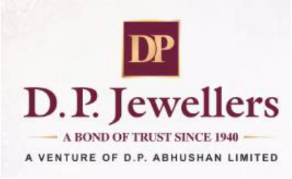
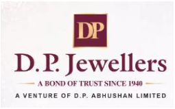

**Date:** May 26, 2026 

To, To, **National Stock Exchange of India Limited BSE Limited,** Exchange Plaza, Phiroze Jeejeebhoy Towers, Bandra Kurla Complex Dalal Street, Bandra East, Mumbai – 400051 Mumbai – 400 001 **<u>Symbol: “DPABHUSHAN” BSE SCRIP Code –</u> “544161”** 

## **Subject: Transcript of Q4 FY26 Earnings Call held on Friday, May 22, 2026.** 

Dear Sir/ Madam, 

Pursuant to Regulations 30 and 46 (2) (oa) of the SEBI (Listing Obligations and Disclosure Requirements) Regulations, 2015, please find enclosed herewith the Transcript of Q4 FY26 Earnings Call held between the Company and Investors on Friday, May 22, 2026 on the Audited Financial Results of the Company for the quarter and year ended on March 31, 2026. 

The aforesaid transcript is also being hosted on the website of the Company, www.dpjewellers.com in accordance with the Regulation 46 of SEBI (Listing Obligations and Disclosure Requirements) Regulations, 2015. 

Kindly take the same on your record and oblige us. 

Thanking you, 

Yours faithfully, 

## **For D. P. ABHUSHAN LIMITED** 

ANIL Digitally signed by ANIL KATARIA KATARIA Date: 2026.05.26 18:22:14 +05'30' 

**Anil Kataria Whole-time Director DIN: 00092730** 

**[Image: May2026.pdf-0001-12.png (143x142, 13.0KB)]**

**Encl: As mentioned above** 

**[Image: May2026.pdf-0002-00.png (418x257, 104.5KB)]**

# D. P. Abhushan Limited 

# Q4 FY26 Earnings Conference Call” 

# May 22, 2026 

**[Image: May2026.pdf-0002-04.png (255x159, 43.3KB)]**

**[Image: May2026.pdf-0002-05.png (224x113, 5.7KB)]**

**– – MANAGEMENT: MR. ANIL KATARIA WHOLE-TIME DIRECTOR D. P. ABHUSHAN LIMITED – – MR. VIKAS KATARIA PROMOTER D. P. ABHUSHAN LIMITED – – MR. MANISH LADDHA CHIEF FINANCIAL OFFICER D. P. ABHUSHAN LIMITED** 

**– MODERATOR: MR. AJIT MISHRA ERNST & YOUNG INVESTOR RELATIONS** 

Page **1** of **17** 

_D. P. Abhushan Limited May 22, 2026_ 

**[Image: May2026.pdf-0003-01.png (170x105, 21.6KB)]**

### **Moderator:** 

Ladies and gentlemen, good day, and welcome to the D. P. Abhushan Limited Q4 FY26 Earnings Call. As a reminder, all participant lines will be in listen-only mode, and there will be an opportunity for you to ask questions after the presentation concludes. Should you need assistance during the conference call, please signal an operator by pressing star then zero on your touchtone phone. Please note that this conference is being recorded. 

I now hand the conference over to Mr. Ajit Mishra from EY Investor Relations. Thank you, and over to you, sir. 

### **Ajit Mishra:** 

Good evening. Thank you for joining the call. I'm Ajit Mishra from EY Investor Relations. Before we begin, let me remind you that the discussion may contain forward-looking statements that may involve known or unknown risks, uncertainties and other factors. It must be viewed in conjunction with our business risks that could cause future results performance or achievement to differ significantly from what is expressed or implied by such forward-looking statements. 

Please note, the press release, financial results, investor presentations have been already circulated via e-mail and are available on the stock exchanges, as well as on the company's website. In case anyone has not received the documents, please feel free to reach out to us, and we'll be happy to share them. 

To take you through FY26 results and business performance today, we have with us senior management team of D.P. Abhushan Limited, Mr. Anil Kataria, Whole Time Director; Mr. Vikas Kataria, Promoter; and Mr. Manish Laddha, Chief Financial Officer. We will begin the call with the management's opening remarks on the company's performance for the quarter and financial year ended 2026, followed by a question-and-answer session. 

With that, I would now like to hand over the call to Mr. Anil Kataria sir. Over to you, sir. Thank you. 

### **Anil Kataria:** 

Good evening, everyone and thank you for joining us on the Q4FY26 earnings call. On behalf of D. P. Abhushan Limited, I welcome all our investors, analysts, and stakeholders. 

On behalf of the management team, I welcome all our investors, analysts, and stakeholders. 

I hope you have had the opportunity to review our financial results and Investor presentation. 

Before we discuss the financial performance and key business highlights, let me reflect upon Jewellery industry trends for the financial year 2026. 

Over the last few years, the Indian jewellery industry has continued to transition toward more organised, transparent, and trusted players. While gold remains deeply connected to Indian culture, weddings, and family savings, customer preferences are gradually evolving. Consumers today are looking for better designs, transparency in pricing, trusted purity standards, and a smoother buying experience across both physical and digital channels. 

Page **2** of **17** 

_D. P. Abhushan Limited May 22, 2026_ 

**[Image: May2026.pdf-0004-01.png (170x105, 21.6KB)]**

Cultural and Wedding-Driven Demand the single largest driver of jewellery demand in India Gold jewellery continues to be viewed as an essential part of marriage rituals, gifts, and longterm savings and security. The cultural importance of jewellery remains intact. Even in periods of elevated gold prices, we continue to see jewellery demand remain resilient, especially in wedding-led purchases and relationship-driven markets like ours. Rising gold prices have pushed consumers toward lighter designs. Daily-wear gold, studded jewellery, and minimalist designs are gaining popularity This trend supports higher purchase frequency with lower ticket sizes. 

Initiatives such as Gold exchange-led purchases, Gold Accumulation schemes / EMI Plans are gaining traction which has helped sustain demand despite high gold prices. Digital catalogues, virtual try-ons, online bookings, and social media discovery now influence jewellery buying decisions. While final purchases often happen in-store, the journey increasingly starts online. 

Over the past few weeks, there has also been industry-wide discussion around the recent customs duty changes and the Honourable Prime Minister’s comments regarding mindful spending practices. We understand and respect the larger intent behind these remarks. 

At the same time, jewellery in India continues to hold strong emotional, cultural, and financial significance for families across generations. In our view, organised and trusted jewellers with strong customer relationships, transparent business practices, and regional brand loyalty are likely to remain well-positioned even through near-term fluctuations in consumer sentiment or gold prices. 

Focus on promoting gold recycling and monetisation is expected to improve domestic gold availability over time. Given gold’s strong cultural, emotional, and investment significance in India, any demand impact is likely to remain moderate and transitional rather than structural. 

In this context, we have proactively strengthened our customer engagement strategy through the launch of our structured gold accumulation scheme DP Swarn Plus. While our traditional old gold exchange program continues to be a key contributor, this new initiative offers customers a more disciplined and affordable pathway to purchase jewellery, particularly in a high gold price environment. The scheme allows customers to accumulate gold through structured monthly instalments, enabling price averaging, reducing volatility, and encouraging more planned and systematic purchases. 

For us, it helps build a forward-booked demand pipeline with strong customer lock-in and assured conversion into jewellery sales, thereby improving visibility and supporting demand stability in a high gold price scenario. 

In parallel, we are also accelerating our omni-channel capabilities, with our e-commerce platform already live, mobile application in the final testing phase, and active expansion across leading online marketplaces, enabling us to enhance customer reach and engagement across both physical and digital channels. 

Page **3** of **17** 

_D. P. Abhushan Limited May 22, 2026_ 

**[Image: May2026.pdf-0005-01.png (170x105, 21.6KB)]**

Additionally, during the year, we have conducted targeted fest and exhibitions across our stores, showcasing our exclusive product portfolio of Jewellery and Diamonds and collections, which has significantly strengthened customer engagement and improved brand visibility. 

Now I would like to handover to Vikas ji for operational highlights and outlook. 

### **Vikas Kataria:** 

Thank you Anil Bhai. I welcome everyone on this earnings call. 

During the year, the Company further strengthened its footprint in Central India with the successful inauguration of a new s in Dhar, following the expansion in Ratlam earlier in the year, taking the total showroom network to 12. 

Our total retail store area stood at ~53,650 sq. ft. supporting our growing scale of operations. On the productivity front, we delivered an average revenue of ~INR7.6 lakhs per sq. ft. and ~INR339 crores per store for FY26, reflecting strong store-level performance and efficient utilization of retail space. Our average ticket size remained healthy at ~INR1.27 lakhs, indicating balanced demand across categories, while inventory turnover stood at ~4.7x, highlighting efficient inventory management and faster stock rotation. The Company has also strengthened its risk management framework through Proactive adoption of Gold Metal Loans (GML) and hedging mechanisms to manage volatility and maintain margin stability, effectively safeguarding inventory against gold price volatility. 

From a product mix perspective, wedding jewellery continues to dominate at ~60%, followed by festival and lightweight jewellery at ~25%, and corporate and other gifting at ~15%, reflecting a well-diversified and demand-aligned portfolio. Our store-level conversion remains strong, with key stores such as Ratlam and Ratlam II delivering higher-than-average conversion levels, while overall conversion has remained largely stable at ~82%–83%. 

During the year, we continued to deepen our presence across key markets, strengthened customer engagement initiatives, expand our retail footprint and invest in digital and omnichannel capability to make the buying experience more seamless for customers. 

Going ahead, we aim to expand our footprints in Madhya Pradesh, Rajasthan, Gujarat, Maharashtra, Chhattisgarh, through a disciplined, research-led approach backed by detailed regional analysis, customer preferences. At D.P. Abhushan, our focus remains clear, strengthening customer trust, improving operational efficiency, expanding responsibly and continue to build a long-term sustainable business. 

With that said, I would now like to hand over to Manish Laddha ji for a detailed financial overview. 

### **Manish Laddha:** 

Good evening, everyone. Let me now walk you all through the financial performance for Q4FY26 and the Full year ended FY26. 

For Q4 FY26, total revenue stood at INR1,338.9 crores, registering a strong growth of 87% yearon-year, driven by continued traction across our operating markets. EBITDA came in at INR73 crores, up 72% YoY. EBITDA margin for the quarter stood at 5.45%. PAT for Q4 FY26 stood 

Page **4** of **17** 

_D. P. Abhushan Limited May 22, 2026_ 

**[Image: May2026.pdf-0006-01.png (170x105, 21.6KB)]**

at INR50.6 crores, up 101% YoY, with margins of 3.78%. This strong year-on-year growth reflects our improved business scale and profitability. 

For the full year FY26, revenue stood at INR4,070.3 crores, reflecting a healthy growth of 23% YoY, supported by strong festive and wedding demand in second half of the year along with contribution from newly added stores and improved customer engagement initiatives. EBITDA stood at INR309.7 crores, reflecting a strong growth of 77% YoY, with EBITDA margins improving to 7.61%, an expansion of 234 basis points over FY25. This improvement was driven by better scale, improved operating efficiencies. PAT stood at INR211.8 crores, delivering a robust growth of 88% YoY, with PAT margins improving to 5.20%, an expansion of 180 basis points over FY25. 

On product mix revenue contribution from the gold grew 80% YoY for the quarter remaining the primary growth driver for the quarter. The silver segment witnessed exceptional growth, rising from INR16 crores to INR69 crores, reflecting a sharp ~333% YoY increase, driven by higher customer traction and improved product mix. The diamond segment also reported healthy growth of ~38% YoY, increasing from INR26 crores to INR36 crores, supported by growing acceptance of studded jewellery and premium offerings. 

For the full year FY26, gold segment revenue stood at INR3,702 crores as against INR3,071 crores in FY25, registering a steady growth of ~21% YoY. The silver segment emerged as a key growth area, increasing significantly from INR68 crores to INR183 crores, delivering a strong ~168% YoY growth on the other hand, the diamond segment saw a marginal decline of ~5% YoY, reflecting some moderation in premium discretionary spending. 

With that, I would now like to open the floor for Question-and-Answer Session. 

### **Moderator:** 

### **Chetan:** 

### **Manish Laddha:** 

### **Chetan:** 

**Manish Laddha:** 

Thank you very much. We’ll now begin the question-and-answer session. The first question is from the line of Chetan from Systematix Group. Please go ahead. 

Hi, sir. Thank you for the opportunity, and **c** ongratulations to the team on a very strong top-line performance. I have a few questions. So firstly, during the quarter, we witnessed a drop in our gross margin. So, what drove this Q4 margin compression? Was it product mix, or lower inventory gains as the gold prices have stabilized or some other reason? 

See Chetan, the gold prices was playing a very important role in the last quarter, which everybody has visualized, because of the geopolitical situation. But, nevertheless, on the steady side, for the entire year, when we look at the numbers, so the GP has been increased almost 30% as compared to the previous year where we had a GP of around 7.72% compared to with the 10% GP we have achieved during this year. 

Okay, sir. And sir, secondly, we have now initiated gold metal loans and hedging strategy. So, how should we look at steady-state margins going ahead? 

It may have an impact slightly on the margin side. But, yes, we have started taking all the possible segment of the products available in the market, whether it is GML or whether it is future market or any kind of leasing, which is available in the market. And it is going to help in 

Page **5** of **17** 

_D. P. Abhushan Limited May 22, 2026_ 

**[Image: May2026.pdf-0007-01.png (170x105, 21.6KB)]**

our working capital cycle also. And definitely, the finance cost is going to gradually go down also. 

**Chetan:** Okay. And just one last question. If you can tell us how has the demand been in April and May until now? 

**Manish Laddha:** So, far as April and mid-May, when we look at, this is before PM comment. So, I think the growth was doing good. As such, we did not find any kind of pressure on any of the showroom, and the walk-ins keep on coming. I think, so far, it was a very good 1.5 months. 

**Chetan:** Okay, sir. Got it. Thank you, and all the best. **Moderator:** Thank you. The next question is from the line of Kanishk Gupta from SS Family Office. Please go ahead. 

**Kanishk Gupta:** Yeah. Sir, hello, very good afternoon. Sir, I wanted to ask you, you had discussed the QIP plans and multistate expansion strategy during the Q2 FY26 call. So, over the next five years, what, kind of, revenue scale does the company internally want to achieve through this expansion? And what would be the key drivers behind this growth? Would it be the store additions or same-store sales growth or market share gains? 

**Vikas Kataria:** Thank you, Ganesh, for your question. Yes, we are planning to undertake a QIP; however, we have currently put it on hold as market conditions are not favourable. As a result, we have not proceeded with it yet. 

That said, our growth plans remain intact, and we continue to expand steadily each year. As mentioned earlier, we are focusing on expansion across Madhya Pradesh, Rajasthan, Gujarat, Chhattisgarh, and Maharashtra. For this year, we have planned to open three to four new stores. Additionally, we have already finalized one franchisee and will be opening one franchise store as well. 

**Kanishk Gupta:** Sir, approximately after the next five years, internally, any discussions on the revenue that you want to achieve? 

**Vikas Kataria:** Over the next five years, by the end of 2030, we aim to grow at an annual rate of approximately 25% to 30%. 

### **Kanishk Gupta:** 

In terms of top line, sir? 

**Vikas Kataria:** 

In terms of top line, yeah. 

**Kanishk Gupta:** Okay, sir. And a follow-up on this also, as the business scale, as you said, do you expect operating leverage benefits and margin improvement once the newer stores mature and fixed cost gets absorbed by the larger revenue base? 

**Vikas Kataria:** 

Yes, definitely. We are already seeing improvement in margins, and our operational efficiency is also improving. We are in the process of strengthening our team by bringing in a few experienced professionals, which will further support these efficiencies. 

Page **6** of **17** 

_D. P. Abhushan Limited May 22, 2026_ 

**[Image: May2026.pdf-0008-01.png (170x105, 21.6KB)]**

With these initiatives in place, we are confident of achieving better margin levels as the business continues to scale. 

**Kanishk Gupta:** Sir, when can we see the improvement kicking in rapidly? 

**Vikas Kataria:** You will see a gradual improvement in margins every year as the business scales and efficiencies improve. 

**Kanishk Gupta:** Okay, sir. And can you provide me with a number of the same-store sales growth? **Vikas Kataria:** So yeah, the number of the same-store sales growth is ~20% is the SSG growth. 

**Kanishk Gupta:** And this would be Y-o-Y? 

**Vikas Kataria:** Y-o-Y, yes. 

**Kanishk Gupta:** Okay, sir. Just the last question would be that last few years, operating cash flow conversion has remained weak despite PAT growth, largely due to mainly inventory requirements. So, how would the working capital normalization be going forward? And when can the business start generating sustainable positive operating cash flows? 

**Vikas Kataria:** We operate in the jewellery business, where a significant portion of capital is tied up in inventory. Whenever we open a new store, we need to invest in building inventory for that location. Therefore, as we continue to expand our store network, our capital requirements for inventory will also increase. 

For instance, this year we opened a new store in Dhar, for which we had to build the necessary inventory. As a result, inventory will always remain a key area requiring continuous capital deployment. 

**Kanishk Gupta:** Sir, you have a plan to open four to five stores every year until FY30, which will require significant inventory. In that case, can we expect cash flow positivity to remain stable after FY30? 

**Vikas Kataria:** Post FY30, if we slow down or pause our expansion, we can certainly focus on achieving stable cash flow positivity. However, as long as we continue to expand, a significant portion of capital will be deployed towards inventory and store growth. Even in the current scenario, if expansion is moderated, achieving positive cash flows is possible. 

**Kanishk Gupta:** Okay, sir. That will be it from my side. All the best for the future, sir. 

**Moderator:** Thank you. The next question is from the line of Shreya Bhatia, an Individual Investor. Please go ahead. 

**Shreeya Bhatia:** 

Hello. 

**Vikas Kataria:** Yeah, hello. 

Page **7** of **17** 

_D. P. Abhushan Limited May 22, 2026_ 

**[Image: May2026.pdf-0009-01.png (170x105, 21.6KB)]**

**Shreeya Bhatia:** 

Good afternoon, sir. Thank you for the opportunity. Sir, I have couple of questions to ask. So firstly, what is the outlook for FY27 demand considering that the gold prices have increased and there's geopolitical uncertainty? So, can the company sustain 20% plus revenue growth going ahead? 

### **Vikas Kataria:** 

Yes, we are confident of achieving growth of around 20% going forward, driven by strong wedding demand in the country. Additionally, we are actively promoting our old gold exchange policies, which is further supporting customer demand. 

With these factors in place, we are quite confident of delivering 20%+ growth in the current year as well. 

**Shreeya Bhatia:** Okay, sir. Okay. That is really helpful, sir. And, sir, can you provide some light on the recent customer demand scenario post-government announcement in the regions you are present, basically the Madhya Pradesh and Rajasthan region? How's the customer demand scenario there? 

**Vikas Kataria:** Yes, there is underlying customer demand, although it may not be completely consistent at all times. Recently, we have seen some impact due to fluctuations in gold prices. However, customers are expecting some stability in prices going forward, which should support sentiment. 

In India, jewellery demand is largely event-driven, especially by weddings, which continue to be a key growth driver. Additionally, there is strong traction in old gold exchange, which also supports ongoing demand. 

That said, demand can be temporarily affected by seasonality. For instance, the wedding season has recently concluded, and months like June and July typically see relatively lower demand. However, we expect demand to pick up again from Raksha Bandhan onwards. 

At the same time, we are working on various strategies to unlock value from gold already available with customers, such as jewellery stored at home or in lockers. We are encouraging customers to convert this into new jewellery through exchange and redesign offerings, which will help us drive continuous revenue. Overall, we are making focused efforts to sustain demand and growth. 

**Shreeya Bhatia:** Okay, sir. And sir, one last question from my side is, during FY26, how much benefit came from the inventory gains due to the increase in gold prices? 

**Vikas Kataria:** Approximately 28% to 30% of the inventory gains have been reflected in our books. 

**Shreeya Bhatia:** Okay. That’s really helpful, sir. Thank you for answering my question. I’ll join back the queue. 

**Moderator:** Thank you. The next question is from the line of Shafaat Hussain as an Individual Investor. Please go ahead. 

**Shafaat Hussain:** Congratulations, sir, on a good set of numbers. Sir, my question is on the recent statement made by Prime Minister about delaying on gold purchases for at least a year. You mentioned that sales 

Page **8** of **17** 

_D. P. Abhushan Limited May 22, 2026_ 

**[Image: May2026.pdf-0010-01.png (170x105, 21.6KB)]**

were strong for about 1.5 months, but what about the remaining month and quarter, Q1 FY27 and Q2, how do you feel about this? Will you be able to beat the Q1 of FY25, its earnings, which was INR36 crores stand-alone profit in this quarter, Q1? 

### **Vikas Kataria:** 

Thank you. We will definitely try to outperform our previous performance. See, the Prime Minister’s statement may have a slight short-term impact on sentiment, but overall, we believe the underlying demand for gold remains strong. 

Also, in India, a large amount of gold is already held by customers, and we are seeing good traction in the exchange segment. Many customers are now looking at converting their old, idle jewellery which has been lying in lockers for years into new designs. We are actively focusing on this and strengthening our exchange programs. 

In our view, there is always a way forward. Jewellery, especially gold, is deeply rooted in our culture not just as something people wear, but also as a store of value and wealth. So, while there may be some short-term fluctuations in demand, the long-term outlook remains positive, and we are confident that consumption will continue to grow. 

### **Shafaat Hussain:** 

So, sir, it means, you will beat the earnings, which was INR36 crores in the last year Q1FY27? 

### **Vikas Kataria:** 

Yes, yes. We are trying. 

**Shafaat Hussain:** Sir, I have another question. You currently have five stores in Rajasthan and seven in Madhya Pradesh. Given that Jaipur and Jodhpur are major cities in Rajasthan, why don’t you have stores there yet? Also, while you are talking about expanding into Chhattisgarh and Gujarat, do you have plans to enter Jaipur and Jodhpur? 

### **Vikas Kataria:** 

Our approach is slightly different we usually prefer entering markets where we can build a strong position rather than going directly into highly crowded areas with many established brands. 

For example, in Gujarat, we are starting with Dahod and then moving to Baroda, where we already have an existing customer base from nearby regions. This helps us enter the market with better traction. 

That said, Rajasthan remains a key focus for us. We are planning to open a store in Jodhpur, and Jaipur is definitely part of our future expansion roadmap. We are targeting Jaipur in the next one to two years. 

Our strategy is to first build brand presence and recall in surrounding regions and then enter larger cities. This allows us to establish and maintain the ranking in the markets we enter and achieve the scale and business volumes we are targeting. 

**Shafaat Hussain:** Sir, my last question is that what, kind of, competition are you getting from Titan and Kalyan Jewellers? 

**Vikas Kataria:** Yes, we see competition as healthy. In fact, when there is competition in the market, it benefits everyone. We also get the opportunity to learn from other players and continuously improve ourselves. 

Page **9** of **17** 

_D. P. Abhushan Limited May 22, 2026_ 

**[Image: May2026.pdf-0011-01.png (170x105, 21.6KB)]**

||As more organized players enter, the market becomes more structured and grows faster, which is positive overall. At the same time, being a regional player with a deep understanding of our customers gives us a certain advantage in serving them better.|
|---|---|
|**Shafaat Hussain:**|Okay, sir. Thank you. Best of luck for the future.|
|**Vikas Kataria:**|Thank you.|
|**Moderator:**|Thank you. The next question is from the line of Subhanu Bangal from SH Capital Please go ahead.|
|**Subhanu Bangal:**|Yes, sir, I hope I’m audible. As we observed, performance in the first nine months was relatively subdued, but in Q4 we saw strong growth of over 80%, including around 20% same-store growth. Could you help us understand the remaining growth in terms of volume and value?|
|**Vikas Kataria:**|Sure. In FY26, most of our growth was driven by value rather than volume. On the volume side, we actually saw a decline of around 20% overall.|
||This trend was largely in line with the broader industry, where volume growth remained under pressure due to high gold prices. Throughout FY26, gold prices were on an upward trajectory and quite volatile, which impacted affordability and consumer buying patterns. As a result, while value growth remained strong, volume growth was relatively muted.|
|**Subhanu Bangal:**|Our total growth was full value growth. Is my understanding correct?|
|**Vikas Kataria:**|Yes, yes.|
|**Subhanu Bangal:**|My next question on margin. For example, our full year gold segment growth was around 21%, and diamond segment growth was decline around 5%. But we are saying that our margin will improve a little bit. But if diamond segment growth is not there, our margin will not improve as much as we are thinking. What will be our margin guidance in FY27?|
|**Vikas Kataria:**|Our margin guidance will be around 6% to 6.5%, EBITDA margin.|
|**Subhanu Bangal:**|Understood. Okay. That's it, sir. Thank you and best of luck.|
|**Vikas Kataria:**|Thank you.|
|**Moderator:**|Thank you. The next question is from the line of Abhi Bilala, an Individual Investor. Please go ahead.|
|**Abhi Bilala:**|Hello, Am I audible?|
|**Moderator:**|Yes, sir.|
|**Abhi Bilala:**|Good afternoon, sir. Congratulations on a good set of numbers. So, a couple of questions have|
||already been answered. So, my last question would be what would be the revenue guidance for the coming year, FY27 and FY28?|

Page **10** of **17** 

_D. P. Abhushan Limited May 22, 2026_ 

**[Image: May2026.pdf-0012-01.png (170x105, 21.6KB)]**

### **Vikas Kataria:** 

So FY27 and FY28, the revenue we are planning around like 20%, 25% growth. So INR4,800 crores, and the next year will be INR5,500 crores. 

**Abhi Bilala:** Okay, okay. And the store expansion would be in the range of around four to five stores per year, that's correct? **Vikas Kataria:** Yes, yes. **Abhi Bilala:** Okay, okay. That's all from my side. Thank you. **Moderator:** Thank you. The next question is from the line of Kanishk Gupta from SS Family Office. Please go ahead. **Kanishk Gupta:** Yes, sir. Sir, Q1 FY26 our margins were 10% approximately. And in Q4 FY26, it has come down to 5.5 percentage. So, how are we planning to get back on track to achieve the 10%? **Manish Laddha:** See, margins are expected to remain steady. As far as gross margins are concerned, we expect the business to maintain approximately 10% to 11%. 

In terms of EBITDA, we are targeting a normal range of around 6% to 6.5%, which we have consistently maintained. Barring any abnormal movements in gold prices due to geopolitical situations, EBITDA is expected to remain within this 6% to 6.5% range. **Kanishk Gupta:** Sir, with the hedging strategy, as we discussed before by the management, what would be the peak margins that you would achieve, let's say, till FY30? **Manish Laddha:** So, we are targeting EBITDA margins to remain between 8% and 8.5%, which is our FY30 vision already in place. We are going to achieve this through improvements in product mix, along with initiatives such as hedging, GML, and various leasing models. 

Additionally, as our showrooms mature after opening, they are expected to generate better returns. So, putting all of this together, we are confident of achieving EBITDA margins between 8% and 8.5% by 2030. 

**Kanishk Gupta:** Okay, sir. And in terms of high-value products that you have launched, how is customer demand on foot right now? Are the customers really asking for the high-value product? How does the demand look like currently for the high-value products? 

**Manish Laddha:** So, definitely, our sales come-in constituting more than 60% on account of wedding. And when we look at the term wedding, it always comes with the high-value products, whether it is necklace, heavy chains, or any bangles and all. So, it is going to remain continue till the wedding season will remain, and it will always dominate. In fact, when we look at Tier-2 and Tier-3, still people are hesitating to go on the lower carats. So, it is going to remain, I think, on the upside so far as Tier-2 and Tier-3s are concerned. 

**Kanishk Gupta:** Okay, sir. Sir, and you said the QIP would be delayed a bit. So how do you plan on funding the capex that you are planning to do in multiple states? 

Page **11** of **17** 

_D. P. Abhushan Limited May 22, 2026_ 

**[Image: May2026.pdf-0013-01.png (170x105, 21.6KB)]**

### **Manish Laddha:** 

So, definitely, this has only been postponed; it is not outside our plan. We have internal accruals in place, and we have also arranged funding from our banks, along with various models of costeffective financing such as leasing and GML. So, we will explore all available options. 

As far as our expansion plans for FY27 and FY28 are concerned, they will be executed through internal accruals as well. 

**Kanishk Gupta:** So, can we also expect the company getting a bit of long-term borrowings? 

**Manish Laddha:** No, we have not yet planned for any long-term borrowings. If you look at our balance sheet, more than 90% to 95% of our investment is in inventory. So, our capital requirement is largely driven by inventory, and there is no immediate need for long-term funding. 

The funding we are considering without carrying any cost is primarily equity. Once market conditions stabilize, we will revisit our plans to approach investors. This will allow us to bring them as partners in our overall growth journey without incurring additional financing costs. 

**Kanishk Gupta:** Okay, sir. And also, sir, I would like to ask that the 15% custom duty hike. Before that, the inventory days has increased for the FY26 to 100 days, and in FY25, it was 87 days. Can you let me know the reason for that, sir? 

**Manish Laddha:** So basically, as you would have noticed, we opened one showroom in Dhar, Madhya Pradesh, in the month of March. Because of this, we had to build a significant amount of inventory for that store, and we also received a good response. We inaugurated the showroom on the 29th of March, but the preparations required, including stocking a substantial amount of inventory, had already been done beforehand. That is the reason you would have observed that the inventory levels appear on the higher side; otherwise, they would have been normal. 

**Kanishk Gupta:** Sir, what could be the normalized number for inventory days that you want to achieve in the long run? 

**Manish Laddha:** It is going to remain between 75 to 85 days, not more than that far as our business model is concerned. We have always observed that our inventory turn has been remained between 4.5 times to 5.5 times, and this is going to remain the same for over the years also because our model is something different than what is available in the chain store or the big corporates. 

**Kanishk Gupta:** Sir, can you share some more information on what you just said? 

**Manish Laddha:** See, when we look at the inventory turns, we always look from the higher side of inventory when we open any stores. So, when you compare with other jeweller’s, they might be keeping between INR20 crores to INR25 crores is the higher side of the inventory. But when we open our store, it is of the larger size, between 3,000 to 5,000 square feet, and we keep the inventory between INR40 crores to INR60 crores minimum. 

The more the inventory we will show to our customer, because nowadays, the design has become a very centric, and the generation is always coming to showrooms while working through 

Page **12** of **17** 

_D. P. Abhushan Limited May 22, 2026_ 

**[Image: May2026.pdf-0014-01.png (170x105, 21.6KB)]**

mobile, what are the latest design available. So, we have to keep the optimum amount of inventory. That is the reason our customer conversion rate is also very high. 

So, this is the reason we always keep the inventory on the higher side to get the maximum turn. And when you look at this in past also, the inventory days was 75, 77 days and around 80, 85 days. But yes, in the month of March, we opened one showroom. So, on account of that INR100 crores, INR125 crores was lying with the Dhar showroom. That was the increase side when we compare these numbers. So, we always compare the last month, so it might be showing 90 days or 100-odd days. Otherwise, it will fall down definitely. 

**Kanishk Gupta:** Sir, what I meant to say is that you still have many more stores to open in the future. So, keeping that in mind, you have stated the number of 75 to 85 days? **Manish Laddha:** No. Our business model itself is like that only. And see, whenever if any inventory doesn't move, then we always reshuffle between 75 to 90 days to other showrooms and check that whether any kind of likelihood is getting changed on account of reasonable frequencies. And accordingly, we take call. 

So, in any case, inventory will never be old in our entire stub. When we look at the entire number of our inventories, the entire inventory is below 365 days. So, it is going to remain between that only, and it is a tested number. So as far as our SOPs are concerned, it will remain between 75 to 90 days. 

**Moderator:** Sorry to interrupt. Mr. Gupta, please rejoin the queue for more questions. The next question is from the line of Isha Shah, an Individual Investor. Please go ahead. **Isha Shah:** Hi, sir. I had a couple of questions. Sir, what is the contribution of old gold exchange and customized jewellery to your overall sales mix? **Vikas Kataria:** So, the old gold exchange is somewhere 35% to 40% as of now. **Isha Shah:** Okay. And sir, how much of FY26 revenue growth was driven by newly opened stores such as Ajmer, Neemuch, Ratlam? And so how are the customer responses and demand scenario in these regions, including Dhar? **Vikas Kataria:** So, the contribution from the new stores is around 12% to 15% of the overall business. **Isha Shah:** Okay. And sir, except Madhya Pradesh and Rajasthan, which state you would like to enter first on priority basis? **Vikas Kataria:** So, Gujarat, Maharashtra and Chhattisgarh is on the priority basis, we are planning to enter. **Isha Shah:** Okay, Thank you. So, that’s all from my side. **Moderator:** Thank you. The next question is from the line of Chetan from Systematix Group. Please go ahead. 

Page **13** of **17** 

_D. P. Abhushan Limited May 22, 2026_ 

**[Image: May2026.pdf-0015-01.png (170x105, 21.6KB)]**

**Chetan:** 

**Chetan:** Yeah. Thank you for the follow-up opportunity. My question was on store expansion. So, you said that we have also signed for a franchisee partner, right? So, from a store expansion of around four to five stores on an annual basis, how much will be franchisee and how much will be COCO? Any number we have decided on? **Vikas Kataria:** Yeah, so our primary focus remains on the COCO model, and most of our store additions are through COCO stores. The franchisee model is still at a pilot stage we will start with one franchisee, and based on the response, we will gradually scale it up. For this financial year, we are planning to open around three to four COCO stores, along with adding more franchisees in a phased manner. **Chetan:** Okay. Got it. Yeah. Thank you, sir. **Moderator:** Thank you. The next question is from the line of Kanishk Gupta from SS Family. Please go ahead. **Kanishk Gupta:** Sir, once again, is it safe to say that 100 is the peak of inventory days? **Manish Laddha:** Yes. **Kanishk Gupta:** Okay. Sir. And post-QIP, because currently, the promoter holding is really, really strong amongst best, or among many multiple companies. So, I would like to know, can you throw some light post-QIP how would the promoter holding look like? **Manish Laddha:** So, it depends on how much we will anticipate so far as QIP is concerned. But yes, we have targeted that it is going to be diluted between 5% to 8%. The post dilution, if suppose we have 75%, or it may be around between 65% to 68%, that may remain. **Kanishk Gupta:** So, sir, this money would really support the expansion strategy that you are planning across multiple states, is that correct? **Manish Laddha:** Yes. **Kanishk Gupta:** Okay, sir. That would be it from my side. Thank you so much. **Moderator:** Thank you. The next question is from the line of Abhi Bilala, an Individual Investor. Please go ahead. **Abhi Bilala:** Hello. Good afternoon, sir. Sir, in one of the earlier calls, you had mentioned that we would be planning to open around six stores in FY26 and another six to seven stores in FY27. And also, the FY26 guidance was around INR4,500 crores, and INR6,000 crores for FY27. But I see that both the numbers are being revised on the downside. So, what is the reason that we are revising the number? Is it because of the QIP, or any other reason because of the demand or anything like that? **Vikas Kataria:** So, the overall plan remains the same. We have only slowed down the pace of expansion due to the current scenario. However, we are still aiming to achieve our targets. 

Page **14** of **17** 

_D. P. Abhushan Limited May 22, 2026_ 

**[Image: May2026.pdf-0016-01.png (170x105, 21.6KB)]**

Our long-term goal is to reach around 51 stores by 2030. That said, some expansion may be deferred by one or two quarters due to the recent initiatives announced by the Honourable Prime Minister. We are closely monitoring the impact before proceeding further. 

If everything remains under control. We will open around five to six stores this year, and we plan to continue at a similar pace next year. However, on a more conservative basis, we may scale this down slightly to around three to four store additions, depending on market conditions. 

**Abhi Bilala:** Okay. So, we are sticking with the long-term guidance of around 50 stores by FY30? So maybe in the short-term, it is affecting because of the geopolitical reasons, but we are sticking to the long-term? 

**Vikas Kataria:** To the long-term, yes, yes. **Abhi Bilala:** Yes, okay. Thank you. That's all from my side. **Moderator:** Thank you. The next question is from the line of Gaurav Gandhi, an Individual Investor. Please go ahead. **Gaurav Gandhi:** Sir ji, namaskar. My question is that we have started this online venture on the online site of D.P. Jewellers. And as you said in the presentation that we are going to launch a mobile app. So, how much revenue are we anticipating from this new venture or new avenue? 

**Vikas Kataria:** So, over the long term, in the next three to five years, we are targeting around 3% to 5% of our topline revenue to come from this segment. 

As the industry is increasingly moving towards digital, with more decisions and transactions happening online, we also want to strengthen our presence in this space. Since other players are already active, we see this as an important area to focus on. 

Accordingly, we are working towards building a strong omni-channel presence. Based on our current plans, we expect this channel to contribute around 3% to 5% of our revenue over the next five years. 

**Gaurav Gandhi:** Sir, how much impact will it have on profit? How much profit, do you think will increase from this revenue? 

**Vikas Kataria:** In terms of profitability, we expect this segment to contribute an incremental INR25 to INR30 crores in profit annually. 

**Gaurav Gandhi:** Thank you from my side. Thank you very much. 

**Moderator:** Thank you. The next question is from the line of Kanishk Gupta from SS Family Office. Please go ahead. 

**Kanishk Gupta:** Sir, I wanted to ask that the price of silver is so high, so what impact will it have on demand? Will customers demand less silver jewellery, or is the demand still intact? 

Page **15** of **17** 

_D. P. Abhushan Limited May 22, 2026_ 

**[Image: May2026.pdf-0017-01.png (170x105, 21.6KB)]**

### **Vikas Kataria:** 

Silver demand remains intact. In fact, with gold prices increasing and impacting demand, we are seeing a shift towards silver. 

We believe that demand for silver will continue to grow, especially as more attractive and welldesigned jewellery options are becoming available that can serve as alternatives to gold. 

Accordingly, we are also focusing on strengthening our silver segment. Overall, we expect silver demand to remain strong and continue growing going forward. 

**Kanishk Gupta:** Sir, let's go to a broader base for the next five years, what will be your vision and targets for the company? 

**Vikas Kataria:** So, by 2030, we are planning to have a total of around 51 stores. On the long-term growth front, we are targeting a topline growth of approximately 25% to 30% annually. 

**Kanishk Gupta:** Sir, which jewellery are you more aggressive for now? 

**Vikas Kataria:** We are equally aggressive across all three categories gold, diamonds, and silver. We are as bullish on gold as we are on diamonds and silver. 

In India, jewellery is not just an expense; it is seen as an investment. That’s why we remain positive across all these segments. 

In the case of diamonds, gold continues to play an important role, as most diamond jewellery is set in gold. So, demand for gold remains strong from that perspective as well. 

At the same time, silver is gaining traction, especially with the rise in prices and increasing consumer interest. A wide variety of products and jewellery designs are now available in silver, making it a strong and growing category. 

Overall, we remain bullish across all three segments and are focusing on strengthening our presence in each of them. 

**Kanishk Gupta:** Sir, so, currently you are targeting Tier-2 and Tier-3 cities. So, what will be the plan for expansion in Tier-1? 

**Vikas Kataria:** Our initial focus will be on strengthening our presence in Tier-2 and Tier-3 cities. Once we have established strong coverage across these regions, we will then plan our entry into Tier-1 markets. 

**Kanishk Gupta:** So, sir, till FY30, we can say that your presence will be in all tiers? 

**Vikas Kataria:** Yes, mostly we will be in the major. 

**Kanishk Gupta:** Okay, sir. Sir, all the best for the future. Thank you. 

**Vikas Kataria:** Thank you. 

**Moderator:** Thank you. As there are no further questions from the participants, I now hand the conference over to Mr. Anil Kataria for closing comments. 

Page **16** of **17** 

_D. P. Abhushan Limited May 22, 2026_ 

**[Image: May2026.pdf-0018-01.png (170x105, 21.6KB)]**

### **Anil Kataria:** 

Thank you, everyone, for your thoughtful questions and active participation in today’s earnings call. 

While recent regulatory measures, government announcements, and elevated gold prices may influence short-term consumer sentiment, we remain confident in the underlying strength of the jewellery sector and our positioning within it. 

As we conclude today’s call, we would like to reiterate our focus on strengthening our core operations while scaling our digital capabilities. We are actively investing in enhancing our digital presence, improving customer engagement across channels, and building an integrated omni-channel experience to complement our physical store network. 

Thank you for joining us today. We look forward to engaging with you again in the coming quarters. Should you have any further queries, please feel free to reach out to the EY Investor Relations team. 

### **Moderator:** 

Thank you. On behalf of D.P. Abhushan Limited, that concludes this conference. Thank you for joining us, and you may now disconnect your lines. 

_Note: (This transcript has been edited, without altering the content, to ensure clarity and improve readability.)_ 

Page **17** of **17** 

---

## Extracted Images

| # | File | Dimensions | Size |
|---|------|------------|------|
| 1 | May2026.pdf-0001-12.png | 143x142 | 13.0KB |
| 2 | May2026.pdf-0002-00.png | 418x257 | 104.5KB |
| 3 | May2026.pdf-0002-04.png | 255x159 | 43.3KB |
| 4 | May2026.pdf-0002-05.png | 224x113 | 5.7KB |
| 5 | May2026.pdf-0003-01.png | 170x105 | 21.6KB |
| 6 | May2026.pdf-0004-01.png | 170x105 | 21.6KB |
| 7 | May2026.pdf-0005-01.png | 170x105 | 21.6KB |
| 8 | May2026.pdf-0006-01.png | 170x105 | 21.6KB |
| 9 | May2026.pdf-0007-01.png | 170x105 | 21.6KB |
| 10 | May2026.pdf-0008-01.png | 170x105 | 21.6KB |
| 11 | May2026.pdf-0009-01.png | 170x105 | 21.6KB |
| 12 | May2026.pdf-0010-01.png | 170x105 | 21.6KB |
| 13 | May2026.pdf-0011-01.png | 170x105 | 21.6KB |
| 14 | May2026.pdf-0012-01.png | 170x105 | 21.6KB |
| 15 | May2026.pdf-0013-01.png | 170x105 | 21.6KB |
| 16 | May2026.pdf-0014-01.png | 170x105 | 21.6KB |
| 17 | May2026.pdf-0015-01.png | 170x105 | 21.6KB |
| 18 | May2026.pdf-0016-01.png | 170x105 | 21.6KB |
| 19 | May2026.pdf-0017-01.png | 170x105 | 21.6KB |
| 20 | May2026.pdf-0018-01.png | 170x105 | 21.6KB |
