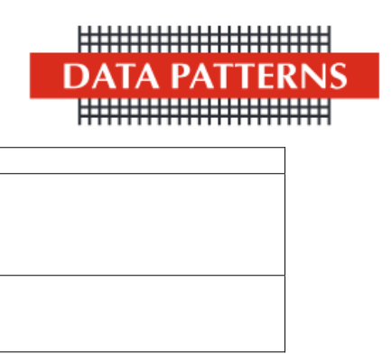

SEC/SE/122/2025-26 Chennai, March 15, 2026 

**[Image: DataPatternAnnouncement3.pdf-0001-01.png (434x174, 22.3KB)]**

|To|To|
|---|---|
|**National Stock Exchange of India Limited**|**BSE Limited**|
|Exchange Plaza, Bandra Kurla Complex,|25thFloor, P.J. Towers,|
|Bandra(E),|Dalal Street,|
|Mumbai – 400051|Mumbai – 400 001|
|NSE Symbol - DATAPATTNS|Company Code: 543428|

# **Sub: Corrigendum – Revision of Order Value and Quantity** 

**Ref: Bagging/ Receiving Orders/Contracts – Data Patterns (India) Limited secures Rs.288 Cr. New Order.** 

Dear Sir/ Madam, 

This has referent to our earlier communicated bearing Letter no.SEC/SE/121/2025-26 dated March 15, 2026 on the intimation of receipt of a Contract for a value of Rs.279 Crores for supply of 34 units of Doppler Weather Radars. 

We wish to clarify that the Order Value and Quantity were incorrectly mentioned in the said communication due to inadvertent error. The correct details of the Order are **Rs.288 Crores for supply of 32 units of Doppler Weather Radars.** 

Pursuant to Regulations 30 of SEBI (Listing Obligations and Disclosure Requirements) Regulations, 2015 read with SEBI Circular No. SEBI/HO/CFD/PoD2/CIR/P/0155 dated November 11, 2024, the details of the said order is given below: 

|**S.No.**|**Particulars**|**Details**|
|---|---|---|
|1.|Name of the entity awarding the order(s)/contract(s)|Indian Metrological Department|
|2.|Significant terms and conditions of order(s)/contract(s)awarded in brief|Supply of 32 units of Doppler Weather Radars|
|3.|Whether order(s) / contract(s) have been awarded bydomestic/international entity|Domestic Entity|
|4.|Nature of order(s) /contract(s);|Supplyof 32 units of Doppler Weather Radars|
|5.|Whether domestic or international;|Domestic|
|6.|Time period by which the order(s)/contract(s) is to be executed|As per Contract|
|7.|Broad consideration or size of the order(s)/contract(s)|Rs. 288 Crore|

**[Image: DataPatternAnnouncement3.pdf-0001-10.png (1275x211, 69.2KB)]**

|**S.No.**|**Particulars**|**Details**|
|---|---|---|
|8.|Whether the promoter/ promoter group / group companies have any interest in the entity that awarded the order(s)/contract(s)? If yes,nature of interest and details thereof|No|
|9.|Whether the order(s)/contract(s) would fall within related party transactions? If yes, whether the same is done at “arm’s length”.|No|

**[Image: DataPatternAnnouncement3.pdf-0002-01.png (434x393, 23.6KB)]**

We request you to take the above record and oblige. 

Thanking You. 

# For **Data Patterns (India) Limited** 

Digitally R signed by R PRAKASH PRAKASH 

Prakash R Company Secretary and Compliance Officer Membership No. F13620 

Encl: As above 

**[Image: DataPatternAnnouncement3.pdf-0002-08.png (1275x211, 69.2KB)]**

---

## Extracted Images

| # | File | Dimensions | Size |
|---|------|------------|------|
| 1 | DataPatternAnnouncement3.pdf-0001-01.png | 434x174 | 22.3KB |
| 2 | DataPatternAnnouncement3.pdf-0001-10.png | 1275x211 | 69.2KB |
| 3 | DataPatternAnnouncement3.pdf-0002-01.png | 434x393 | 23.6KB |
| 4 | DataPatternAnnouncement3.pdf-0002-08.png | 1275x211 | 69.2KB |
