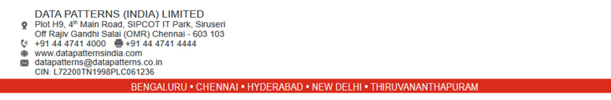

**[Image: DataPatternNov2025.pdf-0001-00.png (296x96, 38.0KB)]**

SEC/SE/089/2025-26 Chennai, November 19, 2025 

|To|To|
|---|---|
|**National Stock Exchange of India Limited**|**BSE Limited**|
|Exchange Plaza, Bandra Kurla Complex,|25thFloor, P.J. Towers,|
|Bandra(E),|Dalal Street,|
|Mumbai – 400051|Mumbai – 400 001|
|NSE Symbol - DATAPATTNS|Company Code: 543428|

## **Sub: Disclosure under Regulation 30 of SEBI (Listing Obligations and Disclosure Requirements) Regulations, 2015 – Transcript of Earnings Conference Call** 

Dear Sir/ Madam, 

Further to our earlier letter no. SEC/SE/080/2025-26 dated November 10, 2025 intimating the schedule of Earning Conference call on the financial results for the quarter and half year ended September 30, 2025, please find enclosed herewith the transcript of the Earnings Conference Call held on Thursday, November 13, 2025 at 10.30 A.M. IST. 

The transcript of the earnings call is also available on the website of the company. 

We request you to take the above record and oblige. 

Thanking You. 

For **Data Patterns (India) Limited** 

R Digitally PRAKAS signed by H R PRAKASH 

Prakash R Company Secretary and Compliance Officer Membership No. F13620 

Encl: As above 

**[Image: DataPatternNov2025.pdf-0001-13.png (1275x211, 154.9KB)]**

**[Image: DataPatternNov2025.pdf-0002-00.png (316x101, 34.9KB)]**

# “Data Patterns India Limited 

# Q2 & H1 FY26 Earnings Conference Call” 

November 13, 2025 

**[Image: DataPatternNov2025.pdf-0002-04.png (232x74, 20.4KB)]**

**[Image: DataPatternNov2025.pdf-0002-05.png (303x63, 8.7KB)]**

**[Image: DataPatternNov2025.pdf-0002-06.png (228x103, 14.3KB)]**

**– MANAGEMENT: MR. S. RANGARAJAN CHAIRMAN AND MANAGING** 

**DIRECTOR–DATA PATTERNS INDIA LIMITED – MR. VENKATA SUBRAMANIAN CHIEF FINANCIAL – OFFICER DATA PATTERNS INDIA LIMITED** 

**– MODERATOR: MS. MONALI JAIN GO INDIA ADVISORS** 

Page **1** of **16** 

_Data Patterns India Limited November 13, 2025_ 

**[Image: DataPatternNov2025.pdf-0003-01.png (232x74, 20.4KB)]**

### **Moderator:** 

Ladies and gentlemen, good day, and welcome to the Data Patterns India Limited Q2 and H1 FY26 Earnings Conference Call hosted by Go India Advisors LLP. As a reminder, all participant lines will be in the listen-only mode and there will be an opportunity for you to ask questions after the presentation concludes. Should you need assistance during the conference call, please signal an operator by pressing star then zero on your touchtone phone. Please note that this conference is being recorded. 

I now hand the conference over to Monali Jain. Thank you, and over to you, ma'am. 

### **Monali Jain:** 

Thank you, Anjali. Good morning, everyone and welcome to Data Patterns India Limited earnings call to discuss the Q2 and H1 FY26 earnings. We have the senior management of the company on call; Mr. S. Rangarajan, Chairman and Managing Director; Mr. Venkata Subramanian, Chief Financial Officer. 

We must remind you that the discussion on today's call may include certain forward-looking statements and must be therefore viewed in conjunction with the risks the company faces. I now request Mr. Rangarajan to take us through the company's business outlook and financial highlights, subsequent to which we can open the floor for Q&A. Thank you, and over to you, sir. 

**S. Rangarajan:** 

Thank you, Monali. Good morning, ladies and gentlemen. I'm delighted to welcome you all to the Q2 and H1 FY '26 earnings call. I trust you've had a chance to go through our earnings presentation available on our stock exchanges and on our company website. Before Venkat takes you through the financial highlights, I'd like to begin with a few key business updates and strategic insights from our side. 

We delivered strong revenue growth during Q2 and H1 FY '26, with top line more than doubling year-on-year at INR407 crores compared to H1 of last year, along with robust growth in EBITDA and profits. Margins were lower during the period owing to the execution of a strategic project amounting to INR180 crores during the quarter. The contract was taken at a competitive price considering long-term possible opportunities. 

Despite this, our profitability remains healthy. EBITDA and PAT stood at INR100 crores and INR75 crores, respectively. Our order book, including the orders negotiated and the pending receipt stands at around INR1,300 crores with fresh order inflows of INR351 crores during H1, including significant orders from BrahMos and ECIL. 

In H1, we also secured EW orders developed the QIP fund. So far, we've utilized approximately INR122 crores from the QIP proceeds for product development. The products are at an advanced stage of development. We expect more high-value orders in the coming quarters as our technology and products gain wider acceptance among customers. 

Our export order book remains healthy at around INR80 crores. The Transportable Precision Approach Radar, TPAR, exported to European customer has successfully completed client acceptance. We expect some positive traction from international markets. 

Page **2** of **16** 

_Data Patterns India Limited November 13, 2025_ 

**[Image: DataPatternNov2025.pdf-0004-01.png (232x74, 20.4KB)]**

At Data Patterns, we are proactively developing systems well ahead of formal requirements to ensure we are ready with these opportunities, as and when these opportunities emerge. We effectively participate in MOD tenders. It is essential for companies to have products that are already developed and internally audited. 

Our approach focused on anticipating future defence needs and building indigenous solutions in advance. This strategy not only enhance our eligibility for high-value tenders, but also positions us as a preferred partner. As we pursue growth, our focus on profitability remains intact, and we continue to prioritize quality margins over short-term expansion. 

The company is transitioning from a subsystem supplier to a full systems integrator, designing complete radar and EW systems with in-house expertise, creating a strong differentiation in the market. We also continue to focus on investing in people and infrastructure to cater to the future expansion. 

Looking ahead, the overall business environment looks -- remains encouraging, both in India and international markets. With a healthy order pipeline and strong execution visibility, we are confident of achieving earlier guidance on revenue and margins. With that, I now request Venkat to take you through the financial performance in detail. 

### **Venkata Subramanian:** 

Thank you, sir, and good morning, everyone. I will take you through the key highlights of our financial performance for the quarter and half year ended 30th September 2025. Q2 FY '26 revenue stood at INR308 crores, up by 238% year-on-year and 210% quarter-on-quarter, driven by strong execution across multiple programs. 

H1 FY '26 revenue grew 109% year-on-year to INR407 crores, reflecting sustained operational momentum. EBITDA for Q2 stood at INR69 crores, up 100% year-on-year. H1 EBITDA was INR101 crores higher by 41% year-on-year. Net profit for Q2 was INR49 crores, up 63% yearon-year. 

For H1, it was INR75 crores, a growth of 18% year-on-year. Q2 gross margin stood at 39% while EBITDA margin was 22% and PAT margin was 16%. Margins for the quarter were lower due to the execution of a strategic low-margin contract explained by our CMD. However, the core profitability remains healthy and margins are expected to improve in H2 with more balanced product mix. Working capital is well controlled at 343 days. 

We expect to collect most of our current receivables in H2 and aim to maintain the working capital days at the similar level for the full year. Strong H1 growth demonstrates our execution strength and robust demand environment. With a solid order book and encouraging inflows during the first half, we remain confident of achieving our full year revenue and EBITDA margin guidance. Thank you. And now we open the floor for questions. 

Thank you very much. We will now begin the question and answer session. The first question comes from the line of Amit Dixit from Goldman Sachs. 

**Moderator:** 

Page **3** of **16** 

_Data Patterns India Limited November 13, 2025_ 

**[Image: DataPatternNov2025.pdf-0005-01.png (232x74, 20.4KB)]**

### **Amit Dixit:** 

Congratulations for a very strong set of numbers, sir. A couple of questions from my side. The first one is on the strategic order that we executed. Essentially, as it seems from the financials, it was a short-term order executed in real quick time. Do we expect to participate in more such orders as and when they come? 

If so, can you mention your -- where do you think the -- you will bid for these orders? I believe it is in Radar in this case, but whether it will be Radar, EW, I mean, which segment you are looking forward to bid? And how do we see this going ahead? I mean, because that is certainly margin dilutive but revenue accretive? 

### **S. Rangarajan:** 

See, I can't discuss much on the strategic order. That's why it's called a strategic order. But we took this contract because there is a large potential for multiple such contracts. What we need to say from our side is that the product has been executed very well. Customers are happy on the performance of the product. 

And there are two things to take away from this product. One is there is a future potential. I can't explain the potential at the present moment due to the nature of the contract. And -- but there is a future potential. Point two, this is the first time the company has taken such a large contract, which involves power systems, building, construction, mechanical systems, design of something like 140 tons of material as a payload, which can be moved. 

This is a whole -- it's a very complex mechanical -- electromechanical system. Electronics also is state-of-the-art world-class. So to do all this, we need to put a large team to see that we can execute this contract with customer focus and satisfying the customer needs and meeting the complete specifications. 

We could do that. This itself is a good thing because going from a smaller product company to large systems company, this development or capability development is very important. And I think we have managed that. That is the second important thing which we could achieve in this. This is all I can say at the present moment. 

As regards future such contracts, similar contracts, et cetera, obviously, when something happens when we believe it is strategic and gives a technology perspective as well as revenue growth and bottom line future growth, we will obviously participate, but it's a competitive environment. 

We may or may not be able to get all these contracts. But yes, Data Patterns wants to grow in this line of business, complete systems. So we are working both on the radars and EW and other areas of avionics as well. So we do take up strategic contracts in all areas of applications, not necessarily only the radars. I hope it answers your question. 

### **Amit Dixit:** 

Yes, sir. The second one is on our consortium for AMCA. So this consortium is with BEML and Bharat Forge. Just wanted to understand the rationale of participating with these 2 partners. And what is our scope in the consortium? And I know it is very early, but if you could just highlight 

Page **4** of **16** 

_Data Patterns India Limited November 13, 2025_ 

**[Image: DataPatternNov2025.pdf-0006-01.png (232x74, 20.4KB)]**

the kind of share we will get out of total value of AMCA or whatever metrics you want to quantify, that would be very helpful, sir? 

### **S. Rangarajan:** 

As you said, it's a bit too early. It's an RFI response. And after RFI shortlisting takes place, an RFP happens and then the contract goes to somebody. It is only one company which gets the contract. So it's very early for me to comment on it. But why are we in this is because Bharat Forge is a large Indian company. 

There's a lot of capability building complete systems and well-positioned for growth. And they are also similar to us in the sense they do want to do everything in India. So that makes us -- in terms of alignment, it is very good. Second area is that our focus has been in avionics, and we do state-of-the-art avionics in the country. 

As a matter of fact, the more -- what we do, nobody else in India does in terms of avionics range. So we have the cockpit solutions. We have radars, we have electronic warfare. We have a whole lot of other systems which can go into any Fighter aircraft. So we can add value in all of them. 

And there's also electronic integration, which is necessary as part of this. Exactly what role what each one would play will have to be decided based on how the overall thing pans out. But I think it's a good fit. We'll wait and watch what the customer says and whether there's an opportunity for us to get a contract or not. We should be able to talk about it a bit later as and when more clarity arises in the situation. 

**Moderator:** The next question comes from the line of Jayakanth from Bandhan Alternatives. 

**Jayakanth:** Very strong set of numbers. Sir, I just wanted to ask you, there was this recently DRDO had come out with this RFI for shared-aperture antennas where there will be merging radars, EWs and communications. So I don't know how much you can share about this. So I just wanted to get your opinion with regards to how Data Pattern is going ahead with that. And plus, there was this -- I just wanted to get a sense from you for the jammer pods for the Super Sukhoi if it is possible by Data Patterns, if whatever is being planned by the MOD. Yes, that's from my side? 

**S. Rangarajan:** Regarding first one, RFI, I'm not clear exactly which one you're referring to. What is sharedaperture radar I'm not very clear about that. 

**Jayakanth:** This is under the DRDO TDF where they are planning to have this shared-aperture radars, merging the radars, EWs and comms to radar, Slash RCS on battle platforms, especially for your air force and your Navy ships and ground vehicles? 

**S. Rangarajan:** I'm not aware of particular requirement you are talking. So I'm not able to comment on it. As regard the jammer pod, yes, we have developed the pod for the Super Sukhoi and that testing is happening in-house. We've already offered this to Air Force. The Air Force team also addressing this and understanding what we've done. 

Page **5** of **16** 

_Data Patterns India Limited November 13, 2025_ 

**[Image: DataPatternNov2025.pdf-0007-01.png (232x74, 20.4KB)]**

||So the process is on at the present moment. That's all I can say. I don't know what else you want|
|---|---|
||me to say because I think we need requirement specification. So pod is developed. We will use QIP funds and develop the system. It's just not the pod, but also the complete EW suite for the Super Sukhoi. Pod is part of it. So yes, it is under evaluation and further development along with reps from Air Force.|
|**Jayakanth:**|And sir, one more thing. There was this news wherein the radars which were used for your MiG- 29, there were some issues. So are we going to be supplying some of it?|
|**S. Rangarajan:**|See, these are all -- a lot of things comes in the newspaper and article comes. I can't comment on so many articles that's coming. Where the origination of the article, I really don't know. We have developed our own radars for -- which can fit into MiG-29 as well as Su-30 and such similar fighter aircrafts. We have a program running internally funded, and we are building the products. These are all in advanced stage of development. But how it will pan out, where it really go is really we can't comment on it because there's a lot of -- this is based on Air Force and Navy requirements. So how the paper will proceed, people are aware that we are doing things, but that's all I can say, and we continue to complete development and take it to a level of completion so that then it can be considered for their requirement.|
|**Moderator:**|The next question comes from the line of Dipen from Phillip Capital.|
|**Dipen:**|Congratulations on a very great set of numbers. Sir, my first question is, I wanted to know, so how are the order wins which are expected in H2 and beyond? So any large or high-value platform or platform-related subsystem expected because your guidance is close to around INR1,000 crores in second half and INR2,000 crores to INR3,000 crores in 18 to 24 months. So any high value -- so color on high-value platforms would be helpful?|
|**S. Rangarajan:**|I don't want to talk about specific future contracts on an open line. I should say, yes, there are more orders expected as you go along in H2. And that is why the guidance of what has been given. We expect some more contracts to happen in the next 3 to 4 months' time. That has to happen. And regarding the rest of the year -- beyond that, I think at the present moment, I don't want to comment. We will consolidate for the year now and understand what the order book is going to be like next year, what new pipeline we are looking at next year. And then that will come on the earnings call probably post this year. We will give you some guidance. But we don't have any particular guidance beyond that at the present moment.|
|**Dipen:**|Got it. Sir, any update on BrahMos Seeker? And so like we were expecting it to get some trial contract in this quarter. So any updates there?|
|**S. Rangarajan:**|Yes, the negotiations are completed. So the contract has to come, and we are already in advanced stage of product development. So yes, we are very keen to see that, that contract comes and|

Page **6** of **16** 

_Data Patterns India Limited November 13, 2025_ 

**[Image: DataPatternNov2025.pdf-0008-01.png (232x74, 20.4KB)]**

quickly deliver because there is likelihood of production orders in this. So we are -- there's a high focus on these contracts. 

### **Dipen:** 

Got it, sir. Sir, last question on the export orders. Sir, you mentioned that earlier you have already gotten an export order from a European region. So any other region opening up or you are seeing traction for your products in the export region. So Europe was one, so any other areas that are showing some traction? 

**S. Rangarajan:** Yes, there are other interested customers. So we have -- they're going to Europe, specifically for addressing the requirement in Europe and outside Europe also in South America and things like that. So there are active -- we're making active proposes in all these areas. We have to wait and watch really what happens and how each country develops requirement shapes out. Yes, that is one. 

Second is we also have -- this is what we expect on TPAR which I have told you. We also are looking at other contracts, which is from the U.K., which we have regular order, which we're executing. We expect the increase in that volume business also. Third, we're also looking at codevelopment of worldwide requirements in certain areas of radar and EW. 

So with some large foreign multinationals. That also is in the play. So that not only we develop for India, we also want to develop for the world in some areas where we have competency. So we have signed such agreements also on co-development to see that we invest ahead for not only India requirement, but also go worldwide. So things are happening. 

We're also looking at export market very seriously now, and we're going to put a team for export and see how we can build an export market for ourselves. It's all necessary because we're doing parts and pieces at the earlier days. Now the complete systems are happening. whenever systems are completed, I would like to see that this is exportable and look at export markets as we go along. 

So there is going to be a focus on export going ahead. It's going to take a bit of time. The size of business here in India is large. Nevertheless, we need to see that we not overly stressed only in India, and we must have a pan-world product offerings. So there is going to be -- there's an intent from management to see that pursue such requirements. 

### **Moderator:** 

The next question comes from the line of Lavina Quadros from Jefferies. 

**Lavina Quadros:** 

Sir, again, congrats on a good set of results. Just an extension of the export question only. See, when I've gone through your presentations, you're already exporting radars. You've always mentioned that. This particular quarter, you have mentioned that it's the first fully developed radar on the export side by Data Patterns. Any sense you can give on how it changes your export market potential? Does it change it at all? Can you get more inquiries because of this that you all have fully developed it? Just want to understand that bit? 

Page **7** of **16** 

_Data Patterns India Limited November 13, 2025_ 

**[Image: DataPatternNov2025.pdf-0009-01.png (232x74, 20.4KB)]**

### **S. Rangarajan:** 

Yes. That is what I answered in the last question also on capital. See, one is doing a part of the system for some OEM that is based on OEM's actual requirements and they keep ordering the parts, which is already developed for them. But the other one is when you build a full system, there are requirements outside India, so we can address that requirement also. 

So this is the second way of doing it. Actually, mostly large systems are only exported outside, not parts of it. It gives a larger opening for us to actually build products for the rest of the world. So the focus should be there as we go along. But we started with subsystems and now we have gone into systems. So we will focus on both of them. 

As and when the products are ready here in India, we'll also look at export markets outside of India also. So the important thing is once we test in India, this is also then additional markets we're looking at. So this is how it is. But this -- of course, the TPAR order came originally to exports. 

So we modified the existing position of radar. We did for airports and Navy in India, a complete redesign for a transportable application. India doesn't have this. But now that we've got the European contracts and some other contracts, maybe India will look at it also go along, but to answer your question, yes, there will be opening of more orders, hopefully, because these products will work well, delivered works well, then I think this is a gradual way of getting into exports as we go along. And these are complex systems. So there's not much competition worldwide for these kind of systems. 

### **Moderator:** 

The next question comes from the line of Jyoti Gupta from Nirmal Bang. 

### **Jyoti Gupta:** 

Congratulations on a good set of numbers. Two questions. One, what percentage of INR667 crores, which part of your receivables would be realized in H2? Could we see anywhere between like 80% of that of INR667 crores. And the other thing is, then do I increase my revenue guidance from INR850 crores, which I've taken to INR1,000 crores this year and margins would be sustained close to 40% or it will be slightly higher because I believe your upcoming contracts will have higher margins. 

And this INR180 crores is one-off and that we do not see any such low-value contracts in the next two quarters. Also, how low was the margins from this contract? Was it like sub-20% because you had a very good rollout in terms of your contracts that you've been actually executing in the last 3, 4 years that I see? 

### **S. Rangarajan:** 

Okay. The exact percentage of collectibles, I really don't have an answer off the top. A large portion of the collectibles will be collected in the next H2 is what we think, whatever is collectible. Venkat, would you agree? 

**Venkata Subramanian:** 

How much of the current order book will be delivered and... 

### **S. Rangarajan:** 

No, she's talking collectibles I thought. Jyoti, you have collectible or you talking debtors or order book? 

Page **8** of **16** 

_Data Patterns India Limited November 13, 2025_ 

**[Image: DataPatternNov2025.pdf-0010-01.png (232x74, 20.4KB)]**

**Jyoti Gupta:** Collectibles, sir, you're not audible, sir. Can you be a bit loud? 

**S. Rangarajan:** Exact numbers, I don't know we want to give, but then yes, most of it will be collected during H2. That is to answer question one. Question two, we remain with the guidance given earlier. I don't want to -- obviously, there will be slightly upward movement on the revenue guidance because there is this contract which is executed. 

But on the bottom line guidance, we remain whatever we've told earlier. We don't want to modify at the present moment. And regarding exactly what we got in this contract, we are not in a liberty to say exact margin and all that in an open call. So you would understand that it is not practical for me to say this.What is the other fourth question you asked? I remember only 3 of them. 

**Jyoti Gupta:** Sorry. So I have two questions, which I'll take offline, sir. So maybe since you're not comfortable, we can actually discuss it offline. 

**Moderator:** The next question comes from the line of Sumant Kumar from Motilal Oswal. 

**Sumant Kumar:** So my question is regarding the working capital. So we are still in cash conversion cycle of 345 days. So I understand the nature of the business, okay? So in any way, what is the key steps, key initiatives we have so we can reduce this cash conversion cycle to a lower level? And what is our target for, say, next 2 to 3 years for this? 

**S. Rangarajan:** See, what happens is we're doing a lot of development contracts. This takes a longer time for cash conversion once we deliver and test, we have integration and things like that in testing, field testing. So take a longer time to really achieve the cash conversion cycle. So once we move from larger development contracts to production orders is yet to happen, something happens, but it's not the way we ought to happen. 

We need to have a lot of order book where we can do quarter-to-quarter sales. And then production orders get you what maybe a few months collectible, et cetera. Unless that happens, cycle will not change so drastically. Going ahead, I think gradually, it will from 345 days, it will come to 270 days and then maybe go down further depending on the kind of contracts we get, nature of contracts, but in all of these contracts, there is a lot of advance given by the customer. So that goes towards funding of the contracts really. And we still remain a debt-free company. 

**Sumant Kumar:** Okay. So that is not included in this cash conversion cycle? 

**Venkata Subramanian:** No, that is not included. **Sumant Kumar:** Okay. So considering that, what is our cash conversion cycle? **Moderator:** Mr. Sumant, I'm sorry to interrupt, but we cannot take more than 2 questions. May I request you to join the queue again? 

**Sumant Kumar:** This is a second question, I think. 

Page **9** of **16** 

_Data Patterns India Limited November 13, 2025_ 

**[Image: DataPatternNov2025.pdf-0011-01.png (232x74, 20.4KB)]**

**S. Rangarajan:** Can you answer this? **Venkata Subramanian:** What is the question? **Sumant Kumar:** My question is -- so the advance you are getting from the customer, if you consider that, what is the cash conversion cycle for us? **Venkata Subramanian:** Yes. If you exclude it, it will be around 310 to 315 days such thing at current position. But going forward, the new contracts that we are expecting are expected to have more advances, then obviously, the cash conversion cycle is expected to net off that advances. Cash conversion cycle will be better than what you see as a number now. **Moderator:** The next question comes from the line of Hardik Rawat from IIFL Capital. **Hardik Rawat:** Congratulations on a good set of numbers, sir. My first question would be with regards to the strategic order. Now I understand that you cannot share much more details on the specifics of the project. But from a margin standpoint, would it be safe to assume that had we not ex of this project, our EBITDA margins for the current quarter would have been in the guided range of 35% to 40%? **S. Rangarajan:** Yes, definitely. **Hardik Rawat:** Got it, sir. And for the disclosures given in the PPT, roughly INR200 crores of execution has been done for the DRDO in this quarter. Would it be safe to assume that a large part, if not all, roughly 75% would be towards this large order? What would be the overall contribution? A large part of it. Sir, second question would be with regards to our order book, which currently stands at INR640-odd crores. Sir, could you please mention three or five large orders which are priced in this? And what would be the value of those contracts? **S. Rangarajan:** I don't have the list of orders on hand with me to answer this. And I don't know whether specific contract price I want to really share it. We normally don't put it on website all that because of this reason that we calculate, and we don't do this week to week when the order comes, we don't push it. We don't share such information. The large contracts, I mentioned also, there's some large contract from BrahMos and one from ECIL. I also mentioned that in the part of the opening remarks itself. So then there are a number of other contracts which we have and some more are expected. We have quoted, negotiations will happen. Some more contracts are also expected in the next 3 to 4 months' time. **Hardik Rawat:** And one last question was with regards to the disclosed INR550-odd crores worth of orders which have been negotiated, but just not confirmed. Should we expect that these orders should get confirmed in the coming month or 2 or a part of it has already been confirmed as on date? **S. Rangarajan:** No. We expect in the next 2, 3 months, during the rest of the year, we should have -- they sometimes takes time. And so the contract once we negotiate it takes a few months or sometimes 

Page **10** of **16** 

_Data Patterns India Limited November 13, 2025_ 

**[Image: DataPatternNov2025.pdf-0012-01.png (232x74, 20.4KB)]**

2 months. So there are MOD contracts which is taking some time. Some -- for some or other reason, it's getting postponed. So we expect, yes, in the next 2, 3 months, we should get the contracts. **Hardik Rawat:** Got it sir. So with that, these orders confirming our total order inflows would stand at about INR350 crores plus INR550 crores, so roughly INR900-odd crores. How do you look at the order inflows picture for FY '26 as a whole and in absolute terms? Should we be -- are we well poised considering I'm not looking for any guidance here. But do you seem confident in crossing that INR1,500-odd mark since the order inflow -- order awarding trajectory has been pretty good this year? **S. Rangarajan:** Yes. **Hardik Rawat:** Got it. I have more questions, but -- sorry, sir, yes, you were saying? **S. Rangarajan:** Yes, we have -- we expect more than that contracts in the next few months. **Moderator:** The next question comes from the line of Garvit Goyal from Nvest Analytics Advisory LLP. **Garvit Goyal:** Congrats for a good set of numbers. My first question is on -- I just want to understand and know about the new products that are currently into development. And maybe in the next 6 to 12 months, we are going to launch these products. So can you put some color on this area, sir? **S. Rangarajan:** We're working on radars on a number of them actually, various kinds of radars. One is airborne fire control radars, then there are ground radars for detection and even detection as well as fire control. We're also looking at EW programs for airborne podded and unpodded versions and also for detection -- drone detection on the ground, we have advanced products in drone detection and passive as well as other products, which are also jamer drones. Already we participated in a number of trials, products maturing very well. And out of which already we've got 1 or 2 orders from MOD. So this also will get executed in the coming year. So there are a number of products in those areas where we are addressing the requirements of our country. 

We're also doing some communication systems. This is also in advanced stage of development. Fourth, there is a lot of glass cockpit and a whole lot of other things for avionics is also under development. So there's a variety of programs and products which we are doing. And overall, if you look at the landscape, it will be in products in radar, EW, avionics, ESM, electronic intelligence and such similar requirement and also drone detection and jamming. These are all the areas which we're working on. And those areas are also seekers. They are building some next-generation seekers. 

Good to hear, sir. And all these products that we are currently developing, this is for both India and export opportunity, right? 

**Garvit Goyal:** 

Page **11** of **16** 

_Data Patterns India Limited November 13, 2025_ 

**[Image: DataPatternNov2025.pdf-0013-01.png (232x74, 20.4KB)]**

**S. Rangarajan:** Not all of them, some are only for India with specific programs, which is we can't export all so. But some of them are generic. See, we have a standard approach ever since inception, been doing building blocks because once the building blocks are ready, it is easier to develop future systems like modifications, add and subtract, we can get a full system up. So address the market. Second is 0 1 kind of tender markets, it's also risky to develop products. So if we can use building blocks, then we derisk ourselves in the development area. So this is the second area why we do this, and we've continuously done this all through from inception. We continue to do that. So the building blocks itself can be configured for various applications, which also are exportable. They are looking at some opportunities like that also. And they're working with partners outside India to see how to address their requirements. We are doing both, yes. **Garvit Goyal:** And sir, overall, what is the expected TAM for all those programs? See, it's my second question only, ma'am. So I think you can allow me. So yes, just to understand what is the expected TAM for all these programs, the products that is currently under development, sir? **S. Rangarajan:** For TAM, that is about INR15,000 crores to INR20,000 crores. TAM is large. So that is how the development happens... **Garvit Goyal:** I missed that number? **S. Rangarajan:** INR15,000 crores to INR20,000 crores... **Garvit Goyal:** Understood. And we will be the first one who are developing in India... **S. Rangarajan:** Pardon. **Garvit Goyal:** We will be the only one in India who are developing these kind of products, isn't it? **S. Rangarajan:** See, it's what we believe. We do not know what is happening in the backyard. So really -- We Have -- we believe what we're doing and we commit ourselves doing what we're doing, yes. Competition is not only India, it comes from abroad also. There are mature products abroad, which is also -- do a work share and offered in India. India actually imports more than 70%, 80% of our requirements. So you should not forget that. You can't say it's not made in India, only Data Pattern is doing it, so you'll get all the orders. That also doesn't happen. People tie up with foreigners, and we offer the products in India. **Moderator:** The next question comes from the line of Vishal, a Shareholder. **Vishal:** This was regarding the AMCA program. Now there is also one other consortium of L&T and BEL are also bidding for the contract. So what are the probabilities in case the final contract goes to that consortium, the avionics portion may again flow back in some form of other to Data Patterns. Is there a probability? 

Page **12** of **16** 

_Data Patterns India Limited November 13, 2025_ 

**[Image: DataPatternNov2025.pdf-0014-01.png (232x74, 20.4KB)]**

|**S. Rangarajan:**|We believe -- we hope so. We don't know because the initial RFP is still unpublished. So until|
|---|---|
||we know the RFP and what really comes, it's only RFI now. So I can't comment on what is really planned on delivery in the first 5 prototypes, what avionics is planned and how they are asking us to see the so-called partners or RFI responses to buy and integrate it. It is all not visible at the present.|
|**Vishal:**|But the probability is high, right?|
|**S. Rangarajan:**|I even don't know whether they are planning, what they're planning. The RFP is not out, so we do not know.|
|**Vishal:**|Okay. And sir, what is the broad time line would you put for the AMCA program? You said the time line is not still sure, but it would be maybe 1 year or so or maybe more than that? For more clarity on this?|
|**S. Rangarajan:**|I believe they want to place the contracts early. It's in less than a year, maybe 6 months is what they're saying. So we need to wait and watch how the process goes.|
|**Moderator:**|The next question comes from the line of Vandit Jain from SageOne Investments.|
|**Vandit Jain:**|I have just one question around the AMC contracts that we see as part of the order book around 31%. Can you explain the nature of contracts of these AMC contracts, particularly with respect to BrahMos, what business are they?|
|**S. Rangarajan:**|See, we have delivered BrahMos fire control systems, groundworks launches, airborne launches, the test systems for BrahMos missiles done this from 2006, we've been delivering the systems, some of them in 2013 or '18. So I think what we've got here is mostly ground systems.|
||We have a maintenance contract where we have to keep the uptime guarantee and deliver it. We already have people distributed our service engineers around India, take care of immediate response and satisfy the customers quite happy. And in continuation, we've got some contracts for the next 5 years.|
|**Vandit Jain:**|So this will not require any further capex or any investments from our side?|
|**S. Rangarajan:**|No.|
|**Vandit Jain:**|Got it. Thank you.|
|**Moderator:**|Thank you. Due to time constraints, the last question comes from Yash Poddar from Viansh Ventures.|
|**Yash Poddar:**|So my question was about the -- I would like to flip the lens on the strategic contract order and ask the question regarding we have taken this at a competitive price because there is a strategic|

Page **13** of **16** 

_Data Patterns India Limited November 13, 2025_ 

**[Image: DataPatternNov2025.pdf-0015-01.png (232x74, 20.4KB)]**

reason behind it, and that also brought down the margins. But if we normalize this, if we assume that going forward. 

We are to get repeated orders within this category itself, irrespective of the quantum, it could be the same, it could be larger. What would be the actual normalized margins for this type of a strategic contract order if you had taken it at a regular rate and not the competitive pricing, how much further would that take up our margins? **S. Rangarajan:** This has to be negotiated with the customer. I think you had asked that question to him, not me. As and when the requirement comes, the inquiry comes, we quote and the negotiation happens. So it's a very -- the question today is not answerable by any of us. It will be happened only when it really happens. So we believe we stand a chance because the contract size will be larger. And so maybe we should be able to get a reasonable margin. But exactly what it is, I have no idea at the present moment. **Yash Poddar:** Okay. And my second question was about that in the presentation, we are seeing that you are estimating INR1,000 crores inflow for the remaining part of the year. In this current quarter, the larger component has come out to be a developmental revenue. So the remaining INR1,000 crores expected inflow, is that going to be more towards -- can you tell us like the breakup between the production development and AMC side? How will that be split up the remaining INR1,000 crores? **S. Rangarajan:** I'm not really -- I'm not -- actually don't have a paper in front of me to answer this level of detail. But I don't know this INR1,000 crores next few months. I don't know whether given. I don't know. **Venkata Subramanian:** That is including the INR552 crores of contracts already negotiated to come which we are expecting to come. And most of it is all product related. Something may be development and something may be production contracts, but not on AMC not service basically. **S. Rangarajan:** There is going to be a production contract. If it happens, a sizable contract should happen. But for the next 2 to 3 months, we should know. We're expecting more orders to happen. I can only say that. And whatever the guidance we have given, we will accomplish and exceed the guidance contracts. 

**Yash Poddar:** Okay. So if I understood this right, I'm just double checking my understanding that INR1,000 crores that is expected to come will be primarily production and development and not services. **S. Rangarajan:** What Venkata is saying, yes. **Yash Poddar:** Right. Okay. Thank you so much. 

**Moderator:** Thank you. Due to time constraint, that was the last question for today's conference. I now hand the conference over to management for closing comments. 

Page **14** of **16** 

_Data Patterns India Limited November 13, 2025_ 

**[Image: DataPatternNov2025.pdf-0016-01.png (232x74, 20.4KB)]**

### **S. Rangarajan:** 

Thank you all for tuning in and asking the questions and being on the earnings call. We believe we are on the right track as a company. We're investing ahead to build products to address the large markets. We've -- in India, we've always relied on imported products all through. And very few companies actually build products except in government agencies like DPSUs and DRDO. Most DRDO-driven programs for DPSUs, is where the products really come in. 

And other companies, large companies collaborate with foreigners to build the products in India. We've taken a different approach to build indigenous products with its IP-driven, capabilitydriven products. We continue to focus on such programs and products where there is a bottom line business also as we go along. And we have taken QIP funds to invest in such programs and products. 

I think we are on the right track. We're very bullish on the future as we go along. We're also working very closely with DRDO on very strategic programs and products, which have to deliver to customer on an urgent basis. So the requirement for machine mode projects in DRDO also has increased considering the geopolitical situation in India. 

And based on this, the requirement to convert into the contracts into products early, seeing it reaches the customer early is also felt the need in DRDO and other parts of our users. So we are addressing such urgent requirements ahead of time so that we are always ahead of time in delivery. 

And second area is we're building very competitive, very capable products, world-class systems. Any product designed here is world-class, contemporary technology. And we're building an organization to continue to go on this building products for India and outside India. Like I said in one of the calls, we're also trying to work in partnership with outside large multinationals to see whether they can do co-development. 

There are options, possibilities because currently, there's a situation there also in Europe and other areas where investments are being made in defence, which is easy to not even talk about there because of the existing environment worldwide. So there is a need for addressing market requirements urgently. 

We're trying to see what is it we can with our competency address those requirements. So we're getting into serious discussions ground, may have in face-to-face meetings, they're coming here, we are going there to discuss to see whether we can address the worldwide requirements at the speed in which they themselves cannot do probably one-third the time of their addressing requirements. We can do this faster. It finds favor with our customers abroad. And also that we are willing to co-invest in such product development is also finding favor. 

So I think that is the second area where we will focus on and get into exports in a serious way. The advantage of exports is that we work with private sector there. And also the requirements are very large. Unlike here, where we talk about 1 product takes 2 years, 3 years to go through qualifications, 5 years to wait for an actual contract to happen. They will do this in 1 to 1.5 years, 2 years' time. 

Page **15** of **16** 

_Data Patterns India Limited November 13, 2025_ 

**[Image: DataPatternNov2025.pdf-0017-01.png (232x74, 20.4KB)]**

We're able to get into production mode very much faster. Requirements are large and they're immediate and current. So we can address this. So we believe that scaling up is faster in such requirements. So the size of business accessible is not as big as we can do in India, but this can be a longer term and also via media solution to see that we grow the business. So this is the second area we are focusing on. 

To enable this also to see that we can continue to do on this journey, you also have to see the required manpower is built and competencies are built. That is why we're continuously recruiting people. You will see that in our P&L also, the staff salary and all that, you see there's substantial increase in salaries and things like that. This is basically because we're taking more inputs. We also have people training them. That is also happening. 

We're also working on capex to see that whatever products we develop, we are actually future ready and the products developed -- once developed and the production order comes, we are ahead of time in delivering the production orders. So we're not wanting -- we're not doing it stage by stage. We are doing it in parallel to see that we can deliver quickly. Our ambition is to see that we grow fast and deliver quickly to see that we scale the company much faster. 

So all this is what we say thinking and based on which the management is working to see that the various pieces are in place, the foundation is in place and the strategy in place to see that we can address this. So I think we are going in the right track at the present moment. Big contract should happen maybe in another year, a couple of years, 2 years, 3 years. 

It will happen, which can really propel the growth of the company for far higher heights than what we've been able to do in the last 2 years. So we've been growing at 20%, 30% year-onyear. I think with the large markets, we should grow faster as we go along. We're taking some directives and investments to see that we drive the business to a faster growth stage as we go along 2, 3 years down the line. 

So that's all I want to leave you with. We are very serious about what we're doing and committed to trying to build a model company with IP-driven organization. We are in that process of what we're doing that. We hope that the future is -- addresses with the confidence which we have, it will work out the way we want. 

Thank you again for joining us in this earnings call. Any further questions, please address it to Monali Jain and Go India Advisors, and we would be happy to see that we give you the right answers. Whatever we can in an open forum, what we can, we'll definitely see that we give you the right answers. Thank you once again to all. Thank you. 

### **Moderator:** 

This brings the conference call to an end. On behalf of Go India Advisors, we thank you all for joining us. Thank you and you may now disconnect your lines. 

Page **16** of **16** 

---

## Extracted Images

| # | File | Dimensions | Size |
|---|------|------------|------|
| 1 | DataPatternNov2025.pdf-0001-00.png | 296x96 | 38.0KB |
| 2 | DataPatternNov2025.pdf-0001-13.png | 1275x211 | 154.9KB |
| 3 | DataPatternNov2025.pdf-0002-00.png | 316x101 | 34.9KB |
| 4 | DataPatternNov2025.pdf-0002-04.png | 232x74 | 20.4KB |
| 5 | DataPatternNov2025.pdf-0002-05.png | 303x63 | 8.7KB |
| 6 | DataPatternNov2025.pdf-0002-06.png | 228x103 | 14.3KB |
| 7 | DataPatternNov2025.pdf-0003-01.png | 232x74 | 20.4KB |
| 8 | DataPatternNov2025.pdf-0004-01.png | 232x74 | 20.4KB |
| 9 | DataPatternNov2025.pdf-0005-01.png | 232x74 | 20.4KB |
| 10 | DataPatternNov2025.pdf-0006-01.png | 232x74 | 20.4KB |
| 11 | DataPatternNov2025.pdf-0007-01.png | 232x74 | 20.4KB |
| 12 | DataPatternNov2025.pdf-0008-01.png | 232x74 | 20.4KB |
| 13 | DataPatternNov2025.pdf-0009-01.png | 232x74 | 20.4KB |
| 14 | DataPatternNov2025.pdf-0010-01.png | 232x74 | 20.4KB |
| 15 | DataPatternNov2025.pdf-0011-01.png | 232x74 | 20.4KB |
| 16 | DataPatternNov2025.pdf-0012-01.png | 232x74 | 20.4KB |
| 17 | DataPatternNov2025.pdf-0013-01.png | 232x74 | 20.4KB |
| 18 | DataPatternNov2025.pdf-0014-01.png | 232x74 | 20.4KB |
| 19 | DataPatternNov2025.pdf-0015-01.png | 232x74 | 20.4KB |
| 20 | DataPatternNov2025.pdf-0016-01.png | 232x74 | 20.4KB |
| 21 | DataPatternNov2025.pdf-0017-01.png | 232x74 | 20.4KB |
