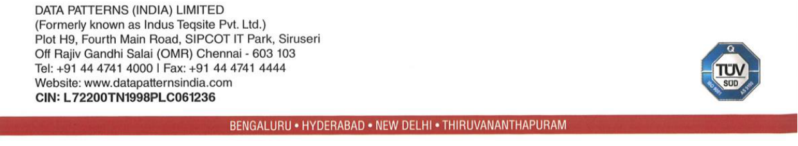

**[Image: DataPatternAugust2025.pdf-0001-00.png (336x120, 72.5KB)]**

## SEC/SE/056/2025-26 

Chennai, August 13, 2025 

To To **National Stock Exchange of India Limited BSE Limited** Exchange Plaza, Bandra Kurla Complex, 25th Floor, P.J. Towers, Bandra(E), Dalal Street, Mumbai - 400051 Mumbai - 400001 NSE Symbol - DATAPATTNS Company Code: 543428 

## **Sub: Disclosure under Regulation 30 of SEBI (Listing Obligations and Disclosure Requirements) Regulations, 2015 - Transcript of Earnings Conference Call** 

Dear Sir/Madam, 

Further to our earlier letter no. SEC/SE/042/2025-26 dated August 01, 2025 intimating the schedule of Earnings Conference Call on the financial results for the quarter ended June 30, 2025, please find enclosed herewith the transcript of the Earnings Conference Call held on Friday, August 08, 2025 at 09.15 A.M. IST. 

The transcript of the earnings call is also available on website of the Company. 

We request you to take the above on record and oblige. 

Thanking You. 

## For **Data Patterns (India) Limited** 

Digitally R signed by R PRAKASH PRAKASH 

Prakash R Company Secretary and Compliance Officer Membership No: F13620 

Encl: As above 

**[Image: DataPatternAugust2025.pdf-0001-14.png (1241x228, 171.8KB)]**

**[Image: DataPatternAugust2025.pdf-0002-00.png (316x101, 34.9KB)]**

# “Data Patterns (India) Limited Q1 FY '26 Earnings Conference Call” August 08, 2025 

**[Image: DataPatternAugust2025.pdf-0002-02.png (232x74, 20.4KB)]**

**[Image: DataPatternAugust2025.pdf-0002-03.png (319x44, 11.0KB)]**

**[Image: DataPatternAugust2025.pdf-0002-04.png (228x103, 14.1KB)]**

**– MANAGEMENT: MR. S. RANGARAJAN CHAIRMAN AND MANAGING – DIRECTOR DATA PATTERNS (INDIA) LIMITED – MR. VENKATA SUBRAMANIAN CHIEF FINANCIAL – OFFICER DATA PATTERNS (INDIA) LIMITED** 

**– MODERATOR: MS. MONALI JAIN GO INDIA ADVISORS** 

Page **1** of **21** 

_Data Patterns (India) Limited August 08, 2025_ 

**[Image: DataPatternAugust2025.pdf-0003-01.png (232x74, 20.4KB)]**

|**Moderator:**|Ladies and gentlemen, good day, and welcome to Data Patterns India Limited Q1 FY '26|
|---|---|
||Earnings Conference Call hosted by Go India Advisors. As a reminder, all participants' lines will be in listen-only mode and there will be an opportunity for you to ask questions after the presentation concludes. Should you need assistance during this conference call, please signal an operator by pressing star than zero on your touch-tone phone. Please note that this conference is being recorded. I now hand over the conference to Ms. Monali Jain from Go India Advisors. Thank you, and over to you, ma'am.|
|**Monali Jain:**|Thanks, Pari. Good morning, everyone, and welcome to Data Patterns (India) Limited Earnings Call to discuss Q1 FY '26 Earnings. We have the senior management of the company on call, Mr. S. Rangarajan, Chairman and Managing Director and Mr. Venkata Subramanian, Chief Financial Officer. We must remind you that the discussion on today's call may include certain forward-looking statements and must be therefore viewed in conjunction with the risks that company faces. May I now request Mr. Rangarajan to take us through the company's business outlook and financial highlights, subsequent to which we can open the floor for Q&A. Thank you, and over to you, sir.|
|**S. Rangarajan:**|Thank you, Monali. Good morning, ladies and gentlemen. I'm pleased to welcome you all to our Q1 FY '26 Earnings Call. I hope you had the opportunity to review our earnings presentation, which is available on the stock exchanges and on our website. Before Venkat takes you through the financial performance, let me start by sharing some key updates and strategic commentary from my end. We have delivered a reasonable start to the year despite some delays in customer approvals that impacted the pace of revenue recognition. Nevertheless, the quarter has met our expectations. Our order book now stands at a strong INR1,079 crores with more than INR320 crores of orders received since the start of the financial year, including some orders from BrahMos and MoD. Our export order book remains healthy at about INR100 crores, and we're seeing increase in traction from international markets. Post the Operation Sindoor, we are witnessing heightened urgency from the government to procure and deploy indigenous defense equipment, some of which aligns well with our capabilities. However, to participate meaningfully in such opportunities, it is critical that companies have fully developed products and complete internal trials before submission. This underscores our strategy. We must build first to be eligible to win. At Data Patterns, we have consistently invested ahead of the curve to expand our addressable market, especially in areas where there are no existing domestic products. Our goal is to identify|

Page **2** of **21** 

_Data Patterns (India) Limited August 08, 2025_ 

**[Image: DataPatternAugust2025.pdf-0004-01.png (232x74, 20.4KB)]**

these opportunities, leverage our core competencies and develop differentiated capabilities that give us a sustainable edge. 

We remain deeply committed to R&D and product development. We already deployed over INR120 crores in the new product development activities with a focus on building indigenous capabilities across radar systems, electronic warfare, communication systems and airborne systems. 

Our continued efforts in the product development have resulted in products of international quality. We are optimistic that these products will soon be tested and potentially lead to bigger contracts. These initiatives align with our long-term strategy to scale our total addressable market, and we're doing that with discipline and foresight. At the same time, we remain unwavering in our focus on profitability and value creation to our stakeholders. 

To conclude, the environment is shaping up positively, both domestically and globally. Our pipeline is strong and we're confident of achieving full year growth guidance of 20% to 25%, revenue growth while maintaining healthy EBITDA margins in the 35% to 40% range. 

With that, I'll now hand it over to Venkata to walk you through the financials in more detail. 

**Venkata Subramanian:** Thank you, sir, and good morning, everyone. Let me take you through the financial highlights for the first quarter of FY '26. Q1 FY '26 revenue stood at INR99 crores, down by about 4.6% year-on-year due to customer approval-related delays that deferred dispatches and revenue recognition. 

Cost of goods sold declined by 30% year-on-year due to favorable product metrics. EBITDA came in at around INR32 crores, with margin at 32.3%, showcasing our operational efficiency even on a lower top line. 

Net profit stood at INR25.5 crores with PAT margin at 25.7%, highlighting our continued focus on profitability. We expect pickup in the execution and revenue growth from Q2 onwards backed by a strong order book and visibility. As mentioned earlier, we remain firmly on track to meet our stated guidance of 20% to 25% revenue growth. 

With that, I now open the floor for questions. Thank you. 

**Moderator:** Thank you. We will now begin the question-and-answer session. The first question is from the line of Dipen Vakil from Phillip Capital. 

**Dipen Vakil:** Sir, my first question is on the lines of -- so this quarter, out of INR183 crores of order wins, majorly, we have won orders on the AMC side or services side of contracts. So, can you tell us more about this contract in terms of their execution period and the cyclicity or when we can -- how is the ordering pattern for it, whether they are awarded yearly? So, can you give us some - - shed some more light on these orders? 

Page **3** of **21** 

_Data Patterns (India) Limited August 08, 2025_ 

**[Image: DataPatternAugust2025.pdf-0005-01.png (232x74, 20.4KB)]**

**S. Rangarajan:** The main AMC contract we received is from BrahMos. This is for a 5-year AMC, but it's predated AMC from -- starting from last January. I think January or March. February. So this is -- normally, we do the AMC in 3 years to 5 years for BrahMos. And this is a 5-year AMC contract, which is billable yearly. **Dipen Vakil:** Okay. So, we can expect similar contracts to come in every 5 years or every year? **S. Rangarajan:** See what happens is this 5-year contract is for orders executed. And post warranty, these contracts have come for what we executed earlier. We also have orders for additional BrahMos deliverables this year. We're also expecting additional BrahMos orders because more orders are now coming from BrahMos, from the Air Force and Navy. So those back-to-back orders we expect also to Data Patterns. 

We also expect more seeker orders. So, it's a question of older orders, we get AMC. As and when the new orders come and their warranty period is over, we again get an AMC. It's a comprehensive AMC we get from BrahMos. It's been going on for 10 years plus now. 

**Venkata Subramanian:** And there are some few products where warranty is still continuing. So once that warranty is completed, we will get AMC contracts on those systems also. **Dipen Vakil:** Got it, sir. Sir, and talking about the order pipeline that you also mentioned that there's a strong order pipeline right now. And also recently, government has granted AON for a fire control system for BrahMos. 

Sir, so is it possible for you to give us that out of INR2,000 crores to INR3,000 crores of order inflows that you're expecting in 18 to 24 months, how much of -- can we achieve more than INR1,200 crores in this year, which will help us to sustain like the decent execution visibility going ahead? So, can you give us some more clarity on that? 

**S. Rangarajan:** The number of contracts which we're executing, which we expect -- there is rollover of this Ashwini contract. This is still not -- we haven't got the order. BEL have got an order. Back-toback discussions are on, we expect the contract maybe in the next 3 to 5, 6 months' time. That also should come this year. 

There are a number of contracts, which -- for airborne radars which we've done development. These also are expected to fructify in the next 5, 6 months' time. Similarly, we have a list of this kind of what we call the order pipeline and where we are a single vendor. So the contracts are supposed to happen. So we believe in the next 6, 7, 8 months probably before end of the year or early next year, we should get some INR1,000-plus crores orders. 

We are also on -- the other thing, we've also done development -- product development using the funds taken from the market. These are all mature, getting to development maturity. We expect there will be some development contracts for these orders for flight testing. So, we have a list of such contracts. I don't know whether I can tell you exactly which line item or how much 

Page **4** of **21** 

_Data Patterns (India) Limited August 08, 2025_ 

**[Image: DataPatternAugust2025.pdf-0006-01.png (232x74, 20.4KB)]**

the value is going to be. But the order pipeline of this INR1,000, INR2,000 crores we're talking about are 2 billion to 3 billion which we're talking about is all based on those kind of contracts. 

**Moderator:** The next question is from the line of Hardik Rawat from IIFL Capital. **Hardik Rawat:** My first question would be with regards to the delays that you mentioned. So, sir, could you please tell us exactly which orders have faced these delays in customer testing? And what could be the quantum of slippage in revenue recognition that we've seen in the quarter? **S. Rangarajan:** I don't want to name customer and value. Value, I can tell you around maybe INR27 crores. But they just started testing now. Last 10 days, work has started. Customer acceptance has started. So, if this goes on properly, we should be able to bill it in the coming quarters. But this is what is planned. 

At least every quarter, we plan to bill it quarter. But because of inspections getting delayed substantially, we were not able to do this for the last 1 year. But inspection has started now. So hopefully, that will get billed probably this quarter. **Hardik Rawat:** Got it, sir. Sir, another question was with regards to your commentary on the order inflows. Now your commentary is quite encouraging. And it would be a fair assumption that roughly INR15 billion-plus worth of order for the full fiscal is something that we should be looking at, INR15 billion to INR20 billion on an overall basis? **S. Rangarajan:** There are contracts likely to happen. But unfortunately, we are not able to cover the exact time of the contract now because there are some delays happening which is beyond our control. But yes, INR15 billion can happen, maybe slightly less or slightly more, but it depends on how government really moves these kind of products. 

But more than -- other than what we've already done, there are other products which are going through MoD, FET. This is what's called part of the tender, they're going through field evaluation trials on EW. There are a few products ongoing in EW. We successfully crossed an EW product. So, we expect the tender bid to open. Hopefully, we will get the order. 

And some more are in pipeline next month, this coming month and next month. Some more are -- these are all products which is 100% designed in-house vis-a-vis other companies which we import and integrate, has been designed in-house. We expect some traction in EW programs on ELINT and Commint and ground systems. So there are requirements like this. 

Similarly, there are requirements of single tendering for a radar warning receivers, which is going to be airborne for Sukhoi 30 and other platforms. Those are also expected. So timing may vary now and then. 

But other than the pipeline which we've talked about, the new requirements that Government have come up because of this Operation Sindoor, and we're also participating in those kind of contracts now. We probably started about 2 years back developing these products, truck- 

Page **5** of **21** 

_Data Patterns (India) Limited August 08, 2025_ 

**[Image: DataPatternAugust2025.pdf-0007-01.png (232x74, 20.4KB)]**

mounted systems. So, the specifications are meeting, and we are continuously improving specifications to see that we meet the international specs and meet the customer requirements. 

So we expect some more contracts in those areas also. Plus the -- our seeker for BrahMos has successfully flight tested. We expect some contracts to happen in the next coming months. And after that, once that is delivered, we're talking about some 100 systems, etcetera. 

But most of the seekers now -- all the seekers now are imported seekers for BrahMos, the idea is to make this indigenous. If this happens now, I expect a substantial increase in order as we go around in the coming year. 

**Hardik Rawat:** Got it, sir. Sir, speaking of BrahMos, what would be sort of a value of orders that we could see, say, for example, 100 of these systems get -- assuming that we receive that order, what could be the potential order size? 

**S. Rangarajan:** It's a bit premature. Let me get closer to it. First, we'll get the development order executed. And then towards nearing the date, we'll be able to tell you the size of order because I don't want to predict the value business before inquiry comes from BrahMos. That will not be correct. So I can only tell you it would be substantial. 

And these are all the things which will give me yearly -- see, what we're trying to do is you can't have a 1-year contract order book for that -- that does not augur well for defense agencies, especially on capital goods. We need to have at least 3, 4 years of order book. And then only we can invest in scale. 

We are doing the opposite here in India. Because you need to have products and to address the market, we are actually putting our money and developing hundreds of crores or putting money and developing and getting the products online, then going through evaluation trials and things like that. 

It's a very hard way of growing. But the only way accessible to us. Otherwise, it's just only collaboration. So we have taken the hard route and going through what we think we are competent and where there are no such product available in India, so we're trying to be unique in that and building products and putting our money and effort on this. 

So, it's a different strategy which what we're doing, and I think it will pan out in the next 5, 6 months. You'll see that some traction is happening in all these areas. 

### **Hardik Rawat:** 

I appreciate it, sir. Sir, one last question before I get back to the queue. Our employee costs have seen a 27% Y-o-Y escalation. Just wanted to understand what has driven this? Is this headcountdriven or simply wage inflation? 

### **S. Rangarajan:** 

No. It is headcount-driven. There is wage revision plus headcount driven. Suppose we want, from a INR700 crores, to be a INR5,000 crores company in the next, let's say, 4 years, 5 years, 

Page **6** of **21** 

_Data Patterns (India) Limited August 08, 2025_ 

**[Image: DataPatternAugust2025.pdf-0008-01.png (232x74, 20.4KB)]**

we need to do not just the products. We are building upfront products, going through flight test, getting qualified, so the orders can come in the next 2 to 3 years' time. 

Once you do that, you also need to have people to see that we produce the kind of -- we cannot scale like this. These are all complex products. And though we do automated test equipment to produce them in numbers as we go along, the types which you do is so large, it is not the same type of product which is done in 100,000 pieces. It becomes very simple. 

The types are so large and so many, and all are complex that it is necessary to have quality people, trained people to do this. So, we have started recruiting people, training them for their requirement as we go along. 

The second thing -- third thing we are doing also is creating infrastructure, production infrastructure, anticipating these contracts to happen. So, we will be spending now so that we will be able to deliver in 3 years from now or 2 years from now, the contract happens and deliver. 

You can't deliver. Suddenly it takes INR700 crores, to INR1,500 crores to INR2,500 crores. It's not practical. We can't do it. We need to put in the infrastructure and see the delivery model happens. So, these are all cautiously done and we are going ahead and investing in people and training. And that is how the cost is going up. 

### **Moderator:** 

The next question is from the line of Amit Dixit from Goldman Sachs. 

### **Amit Dixit:** 

A couple of questions, sir. The first one is on the -- if I look at the order inflow texture, so FY '24, '25 orders have largely been-order inflow had largely been on production side. But Q1 FY '26 has been skewed on services side. 

So just wanted to understand that whether this is the kind of pattern that we will see going ahead, also that services would be a major portion or it is just that certain orders have been delayed, and we expect the normal order profile to be back to 70%, 75% of production? And whatever services we get, it will be, of course, plus, over and above that? 

### **S. Rangarajan:** 

See, it cannot be a service-oriented business what we have because we don't have too many contracts actually delivered to customers. Order delivered today, mostly in the last 10, 15, 20 years has been to DRDO. And that doesn't mature into a services contract or AMC contact later. 

Only when it goes to the actual users, services contract starts happening. So, this has just started, right, we're just starting with the users. Direct deliveries to MoD, Army, Air Force is happening now. That will then mature into service contracts. 

So what you see in BrahMos is a long term -- in 2006, we've been delivering BrahMos branches. So the services contracts happening with more and more BrahMos deliveries, more service contract happening from that. It's one of the few contracts which is happening like this. Many more should happen, only once you put -- populate more hardware orders on the -- with the users. This will happen in the next few years. 

Page **7** of **21** 

_Data Patterns (India) Limited August 08, 2025_ 

**[Image: DataPatternAugust2025.pdf-0009-01.png (232x74, 20.4KB)]**

So our main order book will be on actual delivery contracts as well as development contracts. But this year, I think from this year onwards, the development contracts have become lesser, and we think the delivery production contracts will become more. We've taken a lot of development contracts earlier. 

This will all, hopefully in the next year or so, mature into production contracts as we go along. And now that we are doing our own in-house development for MoD requirements, we expect direct delivery contracts to happen -- or production contracts to happen with the MoD. 

**Amit Dixit:** Got it. The second one is on the recent AON that was recorded for INR67,000 crores. Now if we look at it, there are several items that actually fall within your purview. So any broad idea of TAM you would like to provide from that INR67,000 crores? And also on the execution side, we saw that Q1 FY '26 was skewed towards BEL. So is it the kind of revenue profile that we will see during the year or to just in this particular quarter? 

**S. Rangarajan:** I can't comment on the AoN because what is realizable out of those contracts, when you bulk it together, I won't be able to comment on it. We only look at contracts which is accessible to us. So not just -- whatever AoN is published, we don't really look at it very seriously. So I can't comment on that. 

On the second area which you're talking about, it all depends on the kind of contract, whether it be BEL or HAL or ECIL or MoD and depending on the timeliness of when they want the delivery to happen. So that -- it depends on that, not necessarily it will only be BEL-oriented or any other organisation oriented. It depends on the mix of contracts that we get. 

Ours is not a quarterly revenue business. That is why we are saying that towards the end of the year, a lot of contracts will get delivered towards the end of the year, maintaining our -- whatever position we've taken, say a 20%, 25% growth. Actually, what I expect is the top line growth is farther. My more worry is on the bottom line. We wanted to retain 20%, 25% bottom line growth is what we plan to do. So that is where our focus is and also increase the scale of the business. 

**Moderator:** The next question is from the line of Jyoti Gupta from Nirmal Bang. 

**Jyoti Gupta:** My question was on a similar line in terms of BEL. Two things that I wanted to understand was, one, is there -- while you have different platforms where you're actually delivering, is there a course where the margins I had anticipated slightly higher, is that -- are we getting lesser margins from BEL compared to other platforms? Or is it like this quarter has been a little bit of a washout? 

Second is, you will be delivering the radars of the EW for HAL and that is -- it looks like high. But if the numbers for LCA Mark-1s increase for FY '26, which is likely to happen given the engines will be delivered on time, higher than what we expected, like we were expecting 5 LCAs, but I think we should look at something like a 7 to 8 LCAs this year. Will that not also help you improve your revenue as well as your profitability? Just your thoughts on that. 

Page **8** of **21** 

_Data Patterns (India) Limited August 08, 2025_ 

**[Image: DataPatternAugust2025.pdf-0010-01.png (232x74, 20.4KB)]**

### **S. Rangarajan:** 

Okay. On the first question which you had, you said our margins have come down. Actually, our margins have gone up. Gross margins have gone up to 80%. I thought we have done very well on the gross margin. You're probably talking EBITDA. EBITDA is a different story because the top line comes down, expenses remain the same. So EBITDA comes down. But our gross margins have increased. 

So the profitability has actually increased, not come down. And this -- as and when the revenue goes up, EBITDA also will go up because that is a fixed cost to the company, which will go up. So I don't think we are worried about our profitability at the present moment. Whatever you're delivering, whoever it is. It doesn't matter which the organization is. They are IP-driven products. Our profitability has only gone up. 

The point is the revenue has come down because of nondelivery in certain items because of customer acceptance delays. So that is what was explained earlier also. So that is actually the reason why we could not deliver what we want to deliver. But that is getting compensated next quarter. 

And some of the orders have taken a long lead time for manufacturing, design, development and manufacturing. So it doesn't fall in the quarter-to-quarter category. So this will happen during the course of this year. The larger orders, 1 order we've already executed last year. One large order, INR180 crores, we expect to execute this quarter or next quarter. 

So it's been 1.5 years kind of development time frames. Those take a lot of time to build. It's a very, very complex system, so it's taking time. So that is the first question. I think you misread our numbers. 

On the second on LCA Mark-1A, we don't actually do much in LCA Mark-1A or LCA. We are doing the cockpit displays, and that is the one thing which we have on an order. They want more for the additional 97. The inquiry has come. We have not quoted because what we already developed, the deliveries have not happened to HAL. So after HAL picks up the delivery and pays us, then we will make quotes for other things. 

But we do have orders for the LCA Mark-2. We do the glass cockpit, which is called the Large Area Display, LAD order. It's a very modern system, thinnest system in the world like an F-35 that we'll be delivering in the next 3, 4 months' time. We do the mission systems for LCA Mark2. We have the order to do that. 

We expect that we should populate LCA Mark-2 with a lot more of our products, including the EW. LCA Mark-1A also, we had the EW, which is flying very well. But unfortunately, government decided to import it from ELTA Radar and Uttam Radar is not being considered presently under the change in things. 

So accordingly, because it comes to the package, we didn't get the RWR, though it is flying very well. But we will be considered for the Mark-2 and we are also being considered for Sukhoi 30 for that. 

Page **9** of **21** 

_Data Patterns (India) Limited August 08, 2025_ 

**[Image: DataPatternAugust2025.pdf-0011-01.png (232x74, 20.4KB)]**

So there are a number of such programs, which we're working on. But LCA Mark-1A we're not very sure really what is the level of contribution unless they take our new radars and port it to LCA Mark-1A. This is all on a discussion stage. I can't comment on it at present. But we're very, very bullish on the future. 

There may be 1 or 2 programs we are not in but on an overall level, if you take, since we have done a lot of product development, we are very bullish about scaling the company and looking at contracts beyond INR5,000, INR10,000 crores in the next few years' time. That is where we are trying to pitch our business. 

### **Jyoti Gupta:** 

Okay. Sir, I would like to understand one more thing on jammer ports that you have worked on, where all is it being -- who have been -- I mean, which all platforms are there being used? And what's the kind of order that you received on that. 

### **S. Rangarajan:** 

See, we can't receive an order. The government has no provision to place an order on private sector at the present moment, unless we go through an RFP and a proposal of RFI/RFP and open tender. However important or needed the whole contract is for them, they cannot do this. But it is proceeding very well. 

We have developed the part which is going through air trials now, air trials meaning aerodynamic trials and the liquid coolant trials are all going on. It will be finished in the next 1 month. Our own methodology of jamming technologies, techniques is being tested. The hardware has been fully realized. So that is being tested. Hopefully, in the next 1, 1.5 months, we can finish it. 

We've also made an offer to Air Force to fit it into the SU-30. They have taken it very positively because of the -- this is a self-protection jammer, which is fitted to all the aircraft. It goes in the wingtips of both the wingtips and this will be jamming coverage. So since we have done this and they've seen it, they've taken a very positive view about it. 

Internally, they are discussing how to give us a Sukhoi 30 to do a no cost, no commitment trials. We believe in the next 1 week, we should get clearance to accommodate a Sukhoi 30 for us, is really to see that we do flight trials. And once the flight trials are over, then the inquiries will start for flight tested equipment. 

We believe that there is no other company in India. Of course, DRDO's there, they're already having a part, and that is also going to go through flight test. So we'll have an alternative, and we believe we have done very, good very modern, low weight, better aerodynamic part with more jamming efficacy, more power. 

So we believe we stand a very good chance in this. But we have to go through the rigors of flight testing. It will take us 1, 1.5 years to do this. Post that, the requirements are large. In January of this year, government has -- MoD escalated that for some INR7,400 crores for the jammer part for the EW suite. We have the RWR. 

Page **10** of **21** 

_Data Patterns (India) Limited August 08, 2025_ 

**[Image: DataPatternAugust2025.pdf-0012-01.png (232x74, 20.4KB)]**

We have all the antenna. And everything on the jammer port plus the jammer port has been designed in-house. So we become automatically a player to be considered as long as we do the flight testing, and Air Force has promised us that they'll give us a Sukhoi 30 to flight test. 

So government is very positive on industry participation in industry-driven R&D. And after delivering validation of the 5 systems in ground, they're willing to even spend on flight testing on their own, which is a welcome difference in the last 10 years. So we believe we are very well positioned there. 

But for all this to happen, because this contract value is about INR10,000 crores, requirements are there. So we believe that we are well positioned in it. But all this will take time for it to -- this is all the TAM I'm talking about, this upfront money we're taking to develop. But it's -- we have done our end of the job. We believe that we'll continue to do well. So probably another year from now, I'll be able to answer your question more clearly. 

**Moderator:** The next question is from the line of Krishna Doshi from Ashika Stock Services. 

**Krishna Doshi:** While most of my questions have already been answered, I have a question that like right now, we just mentioned that the development contracts are going to go down, while we are going to see an increase in the production contracts. So just trying to understand sir, how is it going to impact our margins? 

**S. Rangarajan:** See it doesn't matter what contract we take of development or production because our company normally funds the development ourselves. So the price is given for the production value, only the price is given to customers even during development contract. So actually, we don't charge a nonrecurring development fee in most of the contracts we take up. So I don't think there is any difference between production and development in terms of gross margins. 

And the second is, during production contract, there is also -- government compensates us for the U.S. dollar exchange rate and reputation. All this is also taken care by them when a production contract happens. So typically, we don't think we have a problem between margins and type of contracts. 

**Krishna Doshi:** Okay, sir. And is it possible to quantify like what sort of orders are we expecting, when it comes to the emergency procurement? Like what will be the quantum of the orders that you are expecting? 

**S. Rangarajan:** Very difficult to predict, ma'am, because emergency procurement has a bunch of requirements, and out of which some of them we can address, but these have to be demonstrated, field evaluation trials have to happen. 

And then you pass the field evaluation trials, then you are -- the lowest quote gets a contract. It's a lot of competitive bids. Most of the emergency procurement contracts goes towards either PSUs or indirect imports through an Indian agent or made in India, some kind of a company. 

Page **11** of **21** 

_Data Patterns (India) Limited August 08, 2025_ 

**[Image: DataPatternAugust2025.pdf-0013-01.png (232x74, 20.4KB)]**

We have our own designs where IP belongs us. In EW, we have done a lot of work. Similarly, some of the systems in avionics, their procurement is happening now, and we are participating in these kind of replacing imported systems with Indian capabilities. But what we will turn out in terms of contract book, I cannot tell you. 

And we are confident that EW some of the things we will be able to convert because we have done all the development in-house, so we should be cost effective is what we are thinking. But only when the commercial bids are open, we will know. So I can't really detail out extent of value of contracts. This has to come quarter-to-quarter as and when we win the contract. 

### **Krishna Doshi:** 

Okay, sir. And just a last question. So it was regarding on the export side, now that we are seeing the NATO rearmament plan and as we already know, we are doing a substantial export to the U.K. market. So just trying to understand how are we going to scale up there? And is it that now we are seeing better opportunities in export also? Like earlier, I remember you saying that our focus is the domestic demand. Like are we now shifting our focus towards export? 

### **S. Rangarajan:** 

Yes, our focus still remains domestic because there's a huge untapped market. We import 80% of our defense requirements, in various forms, though it is finally called Indian-made. A lot of systems, subsystems in that is imported. So the focus is to try where we have competencies in technologies and IP capabilities. 

We can differentiate on the rest of Indian companies. We would like to focus on that because there is immediate need and it's a long-term need to see that we can address those needs. So we will do that. But however, we don't want to -- not to look at export, we would like to look at export. 

But the NATO country, whatever you're talking about, those requirements is to scale up defense equipment, et cetera, they have a local supply chain. It's very difficult to break that supply chain to build available systems. And new technologies normally they try to do within their own country. 

None other countries like to import defense equipment, different technologies. Nobody likes to import. Western Countries don't import defense technology of outside us. So what really comes down to company -- countries in India is manufacturing contracts to reduce their cost. That is really what happens though we do manufacturing also, our focus is not pure and fire EMS line. We are an IP driven organization. So we try to build, add value and then build and then sell. 

So where that is possible, we are trying to do that. Yes, in U.K., we've been doing some work. We expect that to increase. We're also trying to do some more work with the same U.K. company. They're transferring certain technologies in manufacturing. But these are value-driven products, not manufacturing for manufacturing sake. 

Similarly, we are trying to also look at collaborations in certain disciplines where we can not only look at contracts abroad. But more importantly, these can get indigenized and main Indian company for Indian markets, we can produce them. 

Page **12** of **21** 

_Data Patterns (India) Limited August 08, 2025_ 

**[Image: DataPatternAugust2025.pdf-0014-01.png (232x74, 20.4KB)]**

So we'll get some opportunities. We have to expand our scale you go along, we had to put the marketing organization for, but this is a slightly longer-term goal, take us 3 years to put the marketing infrastructure and then address U.S. and European markets. But what we can do is once the products are done in India, full products are done by us. We can also sell to Far East Asian countries, other than Western countries, we can also sell the contracts in systems to. So there is automatically a byproduct of what we do in India and get exported because a lot of products are technologically advanced and second to none. So we should be able to address the market, but that's going to take a bit more longer. First, we need to improve in India, then we can export it. **Moderator:** The next question is from the line of Jai Chauhan from Trinetra Asset Managers. **Jai Chauhan:** So I just have 1 question. Like with companies like Astra Microwave also working with RF & Microwave and radar domains, what are your key differentiators when competing for tenders? And how does it work exactly, sir? **S. Rangarajan:** See we also do RF & Microwave. We don't do only RF & Microwave. we already also -- like them, we started like a subsystem and some part of the system. We're graduating ourselves to a complete systems company now. We have more than 100 mechanical engineers doing mechanical design on thermal structure. 

So we are putting people to design full systems on Radar, Signal Processing and everywhere, similarly IP for EW, IP and radar, IP and communication. So I think these are the differentiators. We are not on RF & Microwave alone. We do RF & Microwave also. That's not the only end to what we do. We want to build complete systems. **Jai Chauhan:** Right, sir. Understood. But if you look at -- if I look at the competitor, like for example, Astra case, if you take an example, they're also doing complete subsystems like in radar domains. And I just wanted to understand like how does this work in the tender system when you apply for the key competency that you have in the specific product? And like how do you win tenders for the same? Is it divided between the companies? And how does it work exactly? **S. Rangarajan:** There are 2 kinds of business. 1 is it goes to end user, end user buys complete equipment, not parts of the equipment. The second is you design it and send it to the development agency, which is DRDO kind of organizations, where they design the system and ask the subsystems to be tendered out or components to be tendered out. All of us compete for the component subsystems. 

So whatever you are talking about will be applicable to the second part, where you sell to or go to tender with DRDO as the component goes slow kind of business goes. Some of them goes because you have competency other people don't have, so they do single in that cases. Some of them open tender, limited tender and competition happens. So it depends on the end use, really. 

We are trying to -- we have worked with DRDO for last 25 years. Learned a lot from them and through contracts from them. Today, I think the time has come, not only to look at only DRDO 

Page **13** of **21** 

_Data Patterns (India) Limited August 08, 2025_ 

**[Image: DataPatternAugust2025.pdf-0015-01.png (232x74, 20.4KB)]**

markets. We also have to look at the MoD market, because MoD market now it's opened up to Indians. 

Just not 15 years back, not open to Indians, but they only want full systems. So our focus today is to build full -- if you want to build scale, you want to be a INR10,000 crores company, it's going to be very difficult to do this by making components and subsystems. 

Okay, it's going to take a lot of time. And everywhere, there is one more competitor, who will come at a slightly lower cost, and you will still lose the business. And it also takes development, production takes a lot of time. So we decided that we will build a competency metrics and a product capability, build the product for the end user. This is the game changer, which is what we are putting a lot of money and development effort to. 

So the company is changing from a component and subsystem vendor to a system vendor. So this is what's happening. So that is a change which you'll see in the next 2 to 3 years, how the Data Patterns will be taking a complete shift in the way the business is done by us in the last 20 years to what we're going to do in the next 10 years. 

### **Moderator:** 

The next question is from the line of CA Garvit Goyal from Nvest Analytics Advisory. 

**Garvit Goyal:** First question is on the delay that happened in this quarter due to some customer approvals, you mentioned some trial are going on. So my question is like we are saying that testing is that happening now. And at the same time, we are saying in Q2, we will start ramping up. So what is giving you this confidence that even if the testing doesn't result in execution in Q2, then we will be able to grow in Q2? That's my first question. 

**S. Rangarajan:** No, I don't think you understood what you've been talking about at all. Because what we talked about is orders, the delay -- delivers a single contract for the last 1-odd year, we've been postponing quarter-to-quarter because customer acceptance has got delayed. That is what we talked about. 

Now in our office and the acceptance is happening, products will obviously meet the requirement. It's a production order. It is not a development order. There's no development in this. The repeat production, which got to deliver first in 2005 is what we're talking in 2025. So only thing they have to come for acceptance. 

Without acceptance, they can't ship it. And that is why the delay has happened. They have been here now. As long as they continue to be here and acceptance goes on, till September, we should be able to dispatch what I said. It's got nothing to do with Q3 or Q4. 

**Garvit Goyal:** 

No, actually, my question was a little different, but you understood. I'm just trying to understand, like you mentioned on Q2 onwards, ramp-up is going to happen, like we will be able to see decent execution, right? 

Page **14** of **21** 

_Data Patterns (India) Limited August 08, 2025_ 

**[Image: DataPatternAugust2025.pdf-0016-01.png (232x74, 20.4KB)]**

So I'm just trying to understand like this quarter was affected by the customer delays and the delay is still continuing through Q2, what is giving you the confidence that on Q2 onwards, we will be able to execute in a decent manner? Like is it any other projects that we are working on or any other contract that we will be delivering is what I'm trying to understand. 

### **S. Rangarajan:** 

Any contract, this can happen. This is the government of India. Any contract will happen. I have no control over government of India. So I can only answer the question as I see it today. Tomorrow, if the guys don't come for inspection, again, the delay may happen. I have no control. We believe it will not happen because there is an urgent need for them to develop. Already we are 2 years behind schedule in the early delivery, and customer is shouting, end customer. 

So hopefully, they will not put any spokes to deliveries from our side is what we hope because there's an urgency to pull from the customer, end customer. But whatever I say, finally, is government, PSUs, they decide when they pick up a product, when they don't pick up a product. I can't be sure that this will happen. 

But at the present moment, whatever indications we have, I don't think they're going to have a problem in the next quarter 2, quarter 3. They enrolled our program because they need their products urgently. 

**Garvit Goyal:** Got it. And secondly, on the margin front, on a Y-on-Y basis, there is a slight dip in the margin. So I want to understand like what is the key reason for the same? And because we are still sticking to our annual guidance. So I just want to understand what is the key reason why, on a Y-on-Y basis, our margins are low? 

**S. Rangarajan:** See, margins are governed by product mix. Sometimes we take contracts with very low margins or not normal margins because we believe it's a long-term -- this product will have value to the company. I can create some IP, I can create an order book, which is going to scale multiple times and scale the company. 

So based on some strategic decision-making, it takes some contracts with low margin. Ideally, we don't take most of the contract. We don't take with low margins because it is going to be L1 business. We are mostly not there in most of the businesses. We can also compete, but our focus is try to build more products with more IP-driven products, which is differentiated from rest of competition. And that is how we are trying to take contracts. So that is the first part. 

On the second part, what you are talking about, year-on-year, it's come down. What has happened is the -- because of that 1 or 2 contracts, which is taken with lesser margins, say last year over last to last year, the PAT percentage or EBITDA percentage might have come down. 

But what has not happened if you look at is my overall PAT has gone up 20%, 21% as commented by you. So the PAT has gone up. The margins is a question of the mix of contracts which you have taken consciously to see where it adds value to the company. 

Page **15** of **21** 

_Data Patterns (India) Limited August 08, 2025_ 

**[Image: DataPatternAugust2025.pdf-0017-01.png (232x74, 20.4KB)]**

And if you look at this quarter, our gross margin is higher. But since the revenue is lower, the EBITDA margin is lower. That is what I explained in the first question to Philips. So that is where it is. 

### **Garvit Goyal:** 

And lastly, on the product side. In your annual report, this time, you have highlighted many new products. So I just want to understand, in the PPT also, you mentioned about some new products that are in the testing phase for which we will be able to get some orders. So I just want to understand on the product part, like these products is the data that on only 1 which has this kind of portfolio for these products in India? 

**S. Rangarajan:** As I understand it, yes. **Garvit Goyal:** And who are the customers for like -- can you give us the names of the areas we are getting to via these products? 

**S. Rangarajan:** This is -- one is, let's say, fire control radars, airborne. We are looking at upgrade opportunity in SU-30 and MiG-29 for Air Force and Navy. This can also go to LCA Mark 2, if they choose to buy it. But this is a DRDO decision, we can't decide for them. What we are pitching for this as and when the capability of the product is established, we'll pitch for it. 

Similarly in EW, again, for the upgrade contracts as well as the new aircraft, which is being designed in India, we can pitch for both of them. Why we pitch for the upgrade contracts and built products have been issue is that there is no single company in India, who have a complete product, which can look at the upgrade. 

Point number 2, the upgrade opportunities is a volume business, and that will be finalized in the next 2 years' time, 3 years' time, which is a substantive business, which is more than INR10,000 crores to INR15,000 crores. So when there is open market and the competency doesn't exist and the product doesn't exist in India in the private sector, we said we can do this. 

The other companies has to come in is multinational for foreigners. But foreigners will not work with the Russian companies, Western companies. So the market is then only to India. So DRDO is also doing their own products in these areas because the Air Force has given them money, Navy has given the money to build the products to them. So they are in parallel doing this. 

We are also in the industry, it's industry-funded -- our funded product development program, which we think that we'll probably build the product ahead and meeting the requirement and exceeding the specifications. 

So this is a kind of gambit we've taken and building products. So those are all kind of products, which you see. Which is unique to an Indian industry context, but not unique to government of India. Indian government is also doing what they're doing. But we are trying to pitch our systems against -- to see whether this can match their requirements, and we can get an order book which is substantial. 

Page **16** of **21** 

_Data Patterns (India) Limited August 08, 2025_ 

**[Image: DataPatternAugust2025.pdf-0018-01.png (232x74, 20.4KB)]**

**Moderator:** The next question is from the line of Rupesh Tatiya from Shree Rama Managers PMS. **Rupesh Tatiya:** I had 2 questions, 1 on BrahMos and 1 on MPA, Maritime Patrol Radar. So on BrahMos, I heard you say that you have won some seeker order. The clarification I am looking for is, is this for BrahMos or is it for BrahMos NG? **S. Rangarajan:** Okay. I'm not -- I think you mis -- misread my statement. I've not received the BrahMos seeker order. We had a seeker order, which is tested now and proven successful. We expect -- we have some inquiries now. We expect the contract to happen in the next month or so. If once that this contract is done as a predevelopment contract or a production contract, we expect that production orders should also falling, which is sizable value. So we are focused on making it a success. We already started development of those activities so that we can do an outstanding product for BrahMos seeker. And hopefully, we'll get a... **Rupesh Tatiya:** But this is BrahMos or next-generation BrahMos NG? **S. Rangarajan:** BrahMos NG is not part of Indian contracts at the present moment. We've not even signed any memorandum of understanding with the Russian Government on NG. So it is still not in the play, as I understand. Yes, there were NG figure out, but I don't think we have it with us. **Rupesh Tatiya:** But there is some -- I mean I read some news articles that in a couple of days, there is some manufacturing facility tender. **S. Rangarajan:** I also read a lot of news articles. I don't know, 90% of these articles, I'm unable to believe. Although I'm in the same subject area, 90%, 95%, I'm unable to believe. Every week, every 2 days, some articles are coming up. And I really don't know where they pickup the data really. **Rupesh Tatiya:** Okay. So this is BrahMos gimbal ARH you're talking about? And any time lines you can give around these orders? **S. Rangarajan:** Some initial order is supposed to happen in the next 1 month or 2 months' time, they are supposed to call us for negotiations. And once we deliver this and qualify the system, then they said that they will place orders for production, may be a letter of intent to production also will get placed along with this. We have to wait and watch what happens. Maybe 6, 9 months from now, we should be in a production order is what I'm thinking. Again, this is my guesstimate. It is finally BrahMos has to decide, and it will happen. And when the approvals happen for the first lot, which we deliver. But I think in that time frame, we should be able to do this is what I'm thinking. 

And the second question you had is on the Maritime Patrol Data. We have done our end of the work and given it to DRDO. DRDO is flight testing it. Flight testing is still not completed. Since flight testing is not completed, at the present moment, maybe is planning to import the radars from ELTA. 

Page **17** of **21** 

_Data Patterns (India) Limited August 08, 2025_ 

**[Image: DataPatternAugust2025.pdf-0019-01.png (232x74, 20.4KB)]**

So that negotiations are on from HAL to ELTA, negotiations are on now. We may miss the bus for the patrol radar because it is up to DRDO when they will position the radar and do the flight test in Navy. If that is done in time, maybe it can get considered. But if they delay it, then it will not get considered. 

But what DRDO is saying is other than the Navy, there is also Coast Guard requirement for 30 plus radars. And that also is likely to happen. But time line is something which I'm not in a position to comment on. 

**Rupesh Tatiya:** But sir, this NPA, this is in the context of which program. This is Dornier 228 upgrade you're talking about or LUHII because that part is not clear to me. **S. Rangarajan:** Dornier 228. 

**Rupesh Tatiya:** So what you're saying is Dornier 228, we might have missed the bus. **S. Rangarajan:** We don't know that. As of now, the contracts have not been placed. But until DRDO approves the product because we have only done the hardware there, they are putting the software and playing it. So unless DRDO approves it to maybe that all the flight tests are over and completed, it will not get considered. So we are all hoping that the flight test and approve it. 

**Rupesh Tatiya:** Okay. And then with these 30 radar orders, which will -- that will be which platform subsequent some of that first got... **S. Rangarajan:** Coast Guard. **Rupesh Tatiya:** Okay. So first lot you might have ELTA radar, the second lot onwards, there might be the cities... **S. Rangarajan:** No, no, there is no first lot, second lot. One is for Navy. The second one is Coast Guard. What Navy buy. So we don't know. Coast Guard, it's not an organization. So they don't have to take inputs from what Navy has done. **Rupesh Tatiya:** Okay. And then my final question is on NETRA, maybe Mark 1a, Mark 1, Mark 2, all 3 programs, if you can give some idea about where these programs are, what is our contribution and when can we see some orders? 

**S. Rangarajan:** Again, this is DRDO's decision who they pitch the contract to. We have flight proven ESM and EW. ESM and RWR already flight 4 and NETRA. So for NETRA 1 and NETRA 2, if they consider it, that will become a contract for us. The rest of the subsystems is all on tender, radar and second radar all in tender, it all happens. So it will be L1 basis. 

So we will pitch for it, but we are not predicting any of those things because any contract which is L1, we do not know whether we'll get it or not. So we don't add it to the pipeline. 

Page **18** of **21** 

_Data Patterns (India) Limited August 08, 2025_ 

**[Image: DataPatternAugust2025.pdf-0020-01.png (232x74, 20.4KB)]**

**Rupesh Tatiya:** What are the time lines? I mean, number of aircraft you can -- because I think -- I'm hoping after operation Sindoor hopefully, there is more requirement? **S. Rangarajan:** It's already 2 years since the program has been approved. Again, because of money sanctions, it has still gone back to CCS. So once CCS clears it, it will probably might be taken. I can't comment on time lines. It's best you talk to the government officials. **Moderator:** The next question is from the line of Rahul Jain from LionRock Capital. **Rahul Jain:** I'm relatively a bit new to the company. You consistently mentioned a pipeline of orders of about INR20 billion to INR30 billion over the next 18 to 24 months the last few quarters. Is it possible for you to either kind of give some sense of what are the key programs one should be looking at to get a better sense of when those orders could come? Or the other way to look at it would be, obviously, India defence budget is going, but is there any specific areas we should be following up on to get a better sense of the opportunity in plant of Data Patterns over the next few years from an ordering perspective? **S. Rangarajan:** Okay. Second question first. We do not do pipeline based on the budgets, defense budget. It has got no relevance to us because that is a very big number. And we can't whittle it down to what really comes where we can address the market. So we don't look at those kind of numbers. The pipeline is made up of contracts, what we believe will be repeat orders based on contracts already delivered and approved, developed and delivered to customers. And we expect the repeat order to happen. So that is all based on what the previous services you've done. 

So that pipeline is what we talk about and where the order should only come to us and not to anybody else, it's not competitive bids. But at the present moment, I won't be able to give you line item-wise because we don't have inquiries for them. The inquiries have to come, and which will not preempt the customer. It's also sensitive information, and we won't be able to discuss it in public. 

**Rahul Jain:** Okay. But is -- like any -- I understand, obviously, radar is a big part of the business? 

**S. Rangarajan:** Radar, EW, a whole lot of other substance avionics, what we've already delivered. All this will come into repeat, we've done for naval systems. A lot of things were done with DRDO. And all of them are repeat orders will happen either through HAL or Bharat Electronics. So there will be the overall agency to put the systems together. Finally, it will come to one of those companies. But the timing and the value proposition, I won't be able to tell you. I have some idea, but I can't divulge that in an open discussion. **Moderator:** Ladies and gentlemen, that was the last question for today due to time constraints. I now hand over the conference to management for closing comments. 

Page **19** of **21** 

_Data Patterns (India) Limited August 08, 2025_ 

**[Image: DataPatternAugust2025.pdf-0021-01.png (232x74, 20.4KB)]**

### **S. Rangarajan:** 

Thank you, all. Thank you for the patience. Thank you for tuning in and asking questions and listening to our commentary and the interest shown in Data Patterns. I just need to conclude saying that again, we're very bullish about the future markets. We were doing it. I think we're doing a lot of right things in Data Patterns. 

We have a differentiated product. We are building competencies, very differentiated to rest of India. We're building products, which is equivalent to what Western countries are offering there in Europe and U.S. 

So we believe as a product, what we'd like to develop is second to none. And there's a huge need in India to Make in India. But though we talk about Make in India, the processes to Make in India is also very tough. There has to be an Indian content kind of quality requirement. The design in India content is not specified. 

So it also allows import to happen from various quarters and does some value add here and sell to India. So there is -- this also allows a lot of imports to happen. And we have taken a hard route of trying to design and develop in India and address the market in Indian IP. If Indian IP is developed, we can also export it to the rest of the world. 

We believe that is a way to go awarded a longer term. And we have taken the longer route and harder route, considering that we've been in business for many years. They built up ground up development thanks to ISRO and DRDO, we done the product development in-house. The competencies are developed in-house we decided that that's the right way to go. 

And since there's a huge untapped market in India, I said we should be able to get a percentage of the market, provided, we have products to address the market. That is why we took money from the market of INR500 crores to the product development activities. Those are spent wisely and we are counting the pennies to spend the money, build the products in EW. 

It's a very, very modern product for EW suite. We also developed a 5 control radars for SU-30. We're already doing the remit rate systems, transferable SDR and a whole lot of other products for the Make 2 program for EW ground-based in radars, which we are trying to participate in. I'm sure some of them will be successful. The combined market we are trying to address in all this is more INR25,000 crores. So given the percentage of the market, I think, is substantial. 

Though we're not going to be happy with a percentage, we would like to take the whole market being ahead of others. We are trying to see how to do this. The customers have been positive, Navy and Air Force, particularly very positive to what our products are demonstrating and showing to them. 

They're willing -- they're giving a full support to us, offering the aircraft to us to see the upgrade and flight testing can happen, which they'll probably spend more money than we have spent on product development itself. 

Page **20** of **21** 

_Data Patterns (India) Limited August 08, 2025_ 

**[Image: DataPatternAugust2025.pdf-0022-01.png (232x74, 20.4KB)]**

So I think everything looks good now. The products are coming out very well. It is going to take some bit of time to convert these large opportunities and make it as an order for our revenue. We are also putting infrastructure, build the capability to manufacture them build people to see that this can be delivered and also support these systems. 

All of them are happening. We are investing steadily ahead of time, see that the company within the next 3 years' time to scale to a INR30,000 crores company revenue. This is what our interest is. Having been in this business so long, we want to be leaders in this business going ahead. 

We're also going to focus coming down on exports to see we're not only dependent on government business in India, and we can distribute the risk across many other agencies and be part of a larger organization outside India. We will put our efforts going ahead to see that we build an organization which can also be export-friendly. This is what is the idea. This is the strategy. We're working towards this. 

As a present moment, we believe that we're going in the right direction. And that's all I want to leave you all with. If you have any questions further to this, please send it to Go India. We will more than happy to answer the questions. 

Thank you once again for listening in and the interest in Data Patterns. Thank you all. 

### **Moderator:** 

Thank you. On behalf of Go India Advisors, this concludes this conference. Thank you for joining us, and you may now disconnect your lines 

Page **21** of **21** 

---

## Extracted Images

| # | File | Dimensions | Size |
|---|------|------------|------|
| 1 | DataPatternAugust2025.pdf-0001-00.png | 336x120 | 72.5KB |
| 2 | DataPatternAugust2025.pdf-0001-14.png | 1241x228 | 171.8KB |
| 3 | DataPatternAugust2025.pdf-0002-00.png | 316x101 | 34.9KB |
| 4 | DataPatternAugust2025.pdf-0002-02.png | 232x74 | 20.4KB |
| 5 | DataPatternAugust2025.pdf-0002-03.png | 319x44 | 11.0KB |
| 6 | DataPatternAugust2025.pdf-0002-04.png | 228x103 | 14.1KB |
| 7 | DataPatternAugust2025.pdf-0003-01.png | 232x74 | 20.4KB |
| 8 | DataPatternAugust2025.pdf-0004-01.png | 232x74 | 20.4KB |
| 9 | DataPatternAugust2025.pdf-0005-01.png | 232x74 | 20.4KB |
| 10 | DataPatternAugust2025.pdf-0006-01.png | 232x74 | 20.4KB |
| 11 | DataPatternAugust2025.pdf-0007-01.png | 232x74 | 20.4KB |
| 12 | DataPatternAugust2025.pdf-0008-01.png | 232x74 | 20.4KB |
| 13 | DataPatternAugust2025.pdf-0009-01.png | 232x74 | 20.4KB |
| 14 | DataPatternAugust2025.pdf-0010-01.png | 232x74 | 20.4KB |
| 15 | DataPatternAugust2025.pdf-0011-01.png | 232x74 | 20.4KB |
| 16 | DataPatternAugust2025.pdf-0012-01.png | 232x74 | 20.4KB |
| 17 | DataPatternAugust2025.pdf-0013-01.png | 232x74 | 20.4KB |
| 18 | DataPatternAugust2025.pdf-0014-01.png | 232x74 | 20.4KB |
| 19 | DataPatternAugust2025.pdf-0015-01.png | 232x74 | 20.4KB |
| 20 | DataPatternAugust2025.pdf-0016-01.png | 232x74 | 20.4KB |
| 21 | DataPatternAugust2025.pdf-0017-01.png | 232x74 | 20.4KB |
| 22 | DataPatternAugust2025.pdf-0018-01.png | 232x74 | 20.4KB |
| 23 | DataPatternAugust2025.pdf-0019-01.png | 232x74 | 20.4KB |
| 24 | DataPatternAugust2025.pdf-0020-01.png | 232x74 | 20.4KB |
| 25 | DataPatternAugust2025.pdf-0021-01.png | 232x74 | 20.4KB |
| 26 | DataPatternAugust2025.pdf-0022-01.png | 232x74 | 20.4KB |
