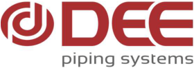

**[Image: DEE_12March_2026.pdf-0001-00.png (280x99, 26.0KB)]**

## **Date: March 12, 2026** 

|**BSE Limited**|**National Stock Exchange of India Limited**|
|---|---|
|Listing & Compliance Department|Listing & Compliance Department|
|Phiroze Jeejeebhoy Towers,|Exchange Plaza, C-1 Block G,|
|Dalal Street, Mumbai - 400001|Bandra Kurla Complex, Bandra (E), Mumbai – 400051|
|**Security Code : 544198**|**Symbol: DEEDEV**|

## **Sub: Intimation of schedule of Investors/ Analysts Plant Visit** 

We wish to inform you, pursuant to Regulation 30 of SEBI (Listing Obligations and Disclosure Requirements) Regulations, 2015, this is to inform you that the Company has organized a Plant Visit for Investors/ Analyst at its **New Anjar Plant, Gujarat on Friday, 20th March, 2026.** 

No confidential / Unpublished Price Sensitive Information (UPSI) will be shared during the plant visit. 

Please be informed that the above-mentioned schedule is subject to changes, if any. 

Thanking you, 

## For **DEE Development Engineers Limited** 

Ranjan Kumar Sarangi Digitally signed by Ranjan Kumar Sarangi DN: c=IN, o=Personal, pseudonym=geymra64pvdq7xkic81t0jbs32hlzon9, 2.5.4.20=994f1424bc4df049edf35de69f080db9b68dfc64081e2119d8b0be6908e14423, postalCode=121002, st=Haryana, serialNumber=9877b65cc26b4d48d2d8637b4b9694d6c844494b5764c3373331c8380a7d8d8c, cn=Ranjan Kumar Sarangi Date: 2026.03.12 14:00:08 +05'30' 

## **Ranjan Kumar Sarangi Company Secretary and Compliance Officer** 

Membership No.: F8604 Address: Unit 1, Prithla - Tatarpur Road, Village Tatarpur Dist. Palwal, Faridabad, Haryana – 121 102 

# **DEE DEVELOPMENT ENGINEERS LIMITED** 

**Regd. Office:** Unit 1, Prithla-Tatarpur Road, Village Tatarpur, Dist. Palwal, Haryana- 121102, India **Works:** Unit 1, 2 & 3, Village Tatarpur, Dist. Palwal, Haryana- 121102, India **T:** +91 1275 248200, **F:** +91 1275 248314, **E:** info@deepiping.com, **W:** www.deepiping.com **CIN:** L74140HR1988PLC030225 **GST Registration No** . 06AACCD0207H1ZA 

---

## Extracted Images

| # | File | Dimensions | Size |
|---|------|------------|------|
| 1 | DEE_12March_2026.pdf-0001-00.png | 280x99 | 26.0KB |
