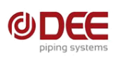

**[Image: DEEFEB2026.pdf-0001-00.png (266x93, 10.5KB)]**

**Date:** 10th February 2026 

### **Listing Compliance Department** 

|**BSE Limited**|**The National Stock Exchange of India Ltd.**|
|---|---|
|Phiroze Jeejeebhoy Tower,|Exchange Plaza, Plot No. C/1, G Block,|
|Dalal Street,|Bandra Kurla Complex, Bandra (E),|
|Mumbai – 400001|Mumbai – 400051|
|ScripCode:**544198**|Symbol:**DEEDEV**|

**Sub: Submission of Transcript of Earnings Conference Call for the Quarter ended 31****st** **December, 2025** 

Dear Sir/ Madam, 

Pursuant to Regulation 30 of SEBI (Listing Obligations and Disclosure Requirements) Regulations, 2015 please find enclosed the transcript of Earnings Conference Call with investors/analysts held on Thursday, 5th February, 2026 to discuss the Unaudited Financial Results of the Company for the Quarter ended 31st December, 2025. 

The above information is also available on the website of the Company at <u>www.deepiping.com.</u> 

This is for your information and record please. 

Yours faithfully, 

For **DEE Development Engineers Limited** 

Ranjan Kumar Digitally signed by Ranjan Kumar Sarangi Date: 2026.02.10 14:51:02 Sarangi +05'30' **________________________________________ Ranjan Kumar Sarangi Company Secretary and Compliance Officer** Membership No.: F8604 Address: Unit 1, Prithla - Tatarpur Road, Village Tatarpur Dist. Palwal, Faridabad, Haryana – 121 102 

### **DEE DEVELOPMENT ENGINEERS LIMITED** 

**Regd. Office:** Unit 1, Prithla-Tatarpur Road, Village Tatarpur, Dist. Palwal, Haryana- 121102, India **Works:** Unit 1, 2 & 3, Village Tatarpur, Dist. Palwal, Haryana- 121102, India **T:** +91 1275 248200, **F:** +91 1275 248314, **E:** info@deepiping.com, **W:** www.deepiping.com **CIN:** L74140HR1988PLC030225 **GST Registration No** . 06AACCD0207H1ZA 

**[Image: DEEFEB2026.pdf-0002-00.png (172x101, 15.6KB)]**

# **Dee Development Engineers Limited Q3 & 9M FY26 Earnings Conference Call** 

**February 05, 2026** 

**Management:** 

## Mr. Krishan Lalit Bansal – Promoter, Chairman & Managing Director Mr. Brham Yadav – Chief Financial Officer 

#### **Moderator:** 

Good afternoon, ladies and gentlemen. A very warm welcome to Q3 and 9M FY 2026 Earnings Conference Call of Dee Development Engineers Limited. 

From the Senior Management we have with us today Mr. Krishan Lalit Bansal - Promoter, Chairman and Managing Director and Mr. Brham Yadav - Chief Financial Officer. 

As a reminder all participant lines will be in the listen-only mode and there will be an opportunity for you to ask questions after the presentation concludes. Should you need assistance during the conference call please signal an operator by pressing “*” then “0” on your touchtone phone. Please note that this conference is being recorded. 

I now hand the conference over to Mr. Anand Venugopal from Adfactors PR. Thank you and over to you Anand. 

**Anand Venugopal:** Thank you Michelle. Good afternoon, everyone. We welcome you to the Q3 and 9M FY 2026 Earnings Call of Dee Development Engineers Limited. Before we begin the Earnings Call, I would like to mention that some of the statements made in today's call might be forward-looking in nature and hence it may involve risks and uncertainties including those related to future financial and operating performance. Please bear with us if there is a call drop during the course of the conference call. We will ensure the call is reconnected soon. 

#### **Krishan Lalit Bansal:** 

I will now hand over the call to Mr. Krishan Bansal Sir to share his views. Over to you Bansal Sir. Thank you so much Anand. Good afternoon, everyone and thank you for joining us. I hope all of you have had the opportunity to go through our investor presentation which has been uploaded on the exchanges. 

Page 1 of 15 

Over the past few quarters, we have been consciously strengthening our core engineering franchise, improving execution intensity and completing the major building blocks of our growth CAPEX. This phase of investment is now nearing completion, and we are beginning to see its benefits reflect in operating performance capacity utilization and margin profile. Importantly our core business process piping manufacturing solutions, heavy fabrication and others continue to be our main value accretive and margin driving businesses and this is clearly reflected in the improvement in our operating performance over the last nine months. 

In Q3 FY26 we delivered healthy growth in revenue and EBITDA driven by strong execution in the core business. While the CFO will walk you through the detailed financials, I would like to highlight that core business EBITDA for 9M FY26 stood at Rs. 129.8 crore representing a yearon-year growth of 175.5% driven by better execution, improved utilization and operating leverage across our facilities. This core business EBITDA excludes the losses from the non-core power segment which are reflected at the consolidated level. 

From a broader perspective the policy and investment environment remain supportive as highlighted in the recent union budget 2026-27 the government has maintained a strong focus on capital expenditure with FY’27 CAPEX budgeted to grow by about 11% to 12% over the revised estimate along with sustained allocations toward infrastructure, transport, energy and industrial corridors. This is complemented by an encouraging trends in our overseas market as well which form a meaningful part of our core business where investments in energy, process industries and infrastructure are also gaining momentum. Together domestic and international demand drivers are creating a strong multi-year opportunity set for complex core offerings across process piping manufacturing solutions heavy fabrication and other businesses. 

Strategically during the quarter, we have further sharpened our focus by clearly segregating the business into core and non-core segments. Our core business comprises process piping manufacturing solutions, heavy fabrication and others which include, you know, our Molsieve acquisition. While the non-core business is the power generation division within the non-core segment we are actively pivoting towards biomass pellet manufacturing and exploring the InvIT structure to house the additional pellet capacity, with the objective of ringfencing capital and limiting incremental cash outflow from the power segment. This approach is aimed at improving capital efficiency by reducing cash burn in the power business, enhancing integration with our biomass platform and creating a more sustainable and scalable model over the medium term. 

On the execution front the Anjar facility is now fully operational and is contributing to revenue growth and operating leverage as utilization ramps up. In parallel our seamless pipe plant is progressing well and is nearing commissioning as approved by the board this facility will have an annual capacity of 7,000 tonnes with a CAPEX of about Rs. 90 crore of which Rs. 22.5 crore will be funded through internal accruals. At optimal utilization we expect this plant to generate peak annual revenue of around Rs. 450 crore with an IRR of approximately 30% to 35% given 

Page 2 of 15 

the high alloy thick walled and application critical nature of the product mix. The plant will manufacture thick walled seamless pipes up to 120 mm using alloy and stainless-steel grades catering to critical applications such as large thermal power plants and subsea and other high spec projects. 

This is strategically important backward integration initiative that will strengthen our capabilities in high spec applications, improve supply security support margins and reduce lead times. With the current CAPEX cycle nearing completion, we expect better asset turns **,** stronger cash generation and further improvement in return ratios going forward. 

Looking ahead we continue to see good demand visibility for our core business particularly from the power sector apart from opportunities in oil and gas and process industries both in India and abroad. With a strong order pipeline, improving operating leverage and most of our growth CAPEX behind us, we believe Dee is well positioned to compound profitable growth and create sustained long-term value for our stakeholders. 

Now I invite our CFO Mr. Brham Yadav to help us through the financial highlights of the quarter ended 31st December, 2025. Over to Mr. Brham Prakash Yadav please. 

#### **Brham Yadav:** 

Thank you sir good afternoon to everyone on this call. 

I will now take you through our financial performance for Q3 and 9M FY’26: 

During the quarter we reported strong growth on all our key performance parameters like revenue from operations for the Q3 stood at Rs. 286.7 crore registering a year-on-year growth of 77% and for 9M stood at Rs. 780.4 crore in INR registering a year-on-year growth of 44.3%. Our operating EBITDA for Q3 was Rs. 43.4 crore up by 666.4% on a year-on-year basis driven by a low base in the previous year and strong operating leverage this quarter. 

For the 9M figures, the operating EBITDA stood at Rs. 123.4 crore which is up by 104.8% yearon-year basis. Operating EBITDA margin improved to 15.2% in Q3 FY’26 as compared to 3.5% in Q3 FY’25 and stood at 15.8% for 9M, up from 11.1% from corresponding period last year. The consolidated operating EBITDA is Rs. 123.4 crore for 9M is after adjusting one time hit of Rs. 4.2 crore with respect to Labor Code impact and along with Rs. 6.4 crore operating EBITDA loss in the non-core business which is power generation division. If we exclude this impact of Rs. 10.6 crore our operating EBITDA would have been Rs. 134.0 crore instead of Rs. 123.4 crore. Similarly, the operating EBITDA margin would have improved to 18.04% for 9M FY’26. Now the overall PAT for Q3 FY’26 Rs. 18.6 crore while nine-month FY’26 PAT stood at Rs. 49.5 crore reflecting a return to profitability on a quarterly basis and a year-on-year growth of 308.2% for 9M period. This performance was primarily driven by operating leverage supported by higher execution momentum and improved capacity utilization. 

Page 3 of 15 

Friends, lastly, I would to highlight that our robust order book indicates strong multi-year revenue visibility. We remain committed to execute key projects to build a project portfolio that supports our profit and expanding our footprint across relevant markets. 

With this I would like to open the question & answer and look forward to receiving your questions. Thank you. 

#### **Moderator:** 

Thank you very much sir. Ladies and gentlemen, we will now begin with the question-andanswer session. The first question is from the line of Kamlesh Bagmar from lotus asset managers. Please go ahead. 

Note - Please refer to the revised Investor Presentation and Press Release uploaded on BSE on 05.02.2026 at 10:24 PM and 06.02.2026 at 3:12 PM, respectively, containing the updated figures. The above transcript has been duly revised in accordance with the said disclosures. 

#### **Kamlesh Bagmar:** 

Yes. Thanks for the opportunity and excellent performance over the last couple of quarters. Sir just one question just wanted to understand that as we highlighted in our opening remarks that there was roughly around Rs. 14.5 crore of EBITDA loss because of tariff revision in the power business. So, if I see last year so our revenue contribution from the power business was roughly around 10% and it was operating at roughly around 20% EBITDA margin. So, even if I see this nine months like say assuming 9% to 10% of revenue contribution, like assuming that there has been no tariff revision even like say 10% would have been the revenue contribution and 20% would have been the margin. So, on our overall margin the impact would not be have been more than 20 bps. So, we have reported 17.4% margin for core business that is piping and fabrication. The impact has not been more than 20-30 bps because the revenue contribution of the power business has only been around 10% and even in the EBITDA the contribution was roughly around 8% to 9%. So, why we are saying that the EBITDA impact is roughly around of Rs. 14.6 crore, so just wanted to understand that. 

#### **Krishan Lalit Bansal:** 

Brham ji can you answer or should I? 

**Brham Yadav:** 

Yes, please sir. 

**Krishan Lalit Bansal:** I mean if you can take it, it is good otherwise, I will go. 

**Brham Yadav:** Sir you can explain. 

**Krishan Lalit Bansal:** Thank you Kamlesh ji for your question. I will simply, I mean I will not be able to comment on the exact numbers but what I would like to say is that one of our plants was of earlier operating at the rate of Rs. 8.57 and now we are operating it at Rs. 3.5 that means there is a loss of Rs. 5 per unit. So, that means further you know if we are right now booking a revenue of Rs. 1.5 crore per month it would have been around Rs. 4 crore, in a normal circumstance, it would 

Page 4 of 15 

have been Rs. 4 crore. So, that means around Rs. 2.5 crore loss is coming every month which will directly impact the EBITDA and the PAT only because all expenses we are incurring on that except for the very little on the fuel saving because we are running it at slightly lower capacity otherwise you know all other expenses everything is going on and hence it is a direct impact of almost around Rs. 3 crore or Rs. 2.5 crore every month which is around Rs. 22.5 crore in terms of this thing and if we consider power sector our power division also which is in the main company, so there also we are getting a hit of almost around Rs. 1.5 to Rs. 2. So, there also it is the same impact. Net effect translates through actually 14.3 which is the exact working which we have done on paper and we can share with you if you want it there is absolutely nothing hidden in that because it is very clear as I have tried to explain that it is because the tariff revision has been downwards so it is the direct impact. 

**Kamlesh Bagmar:** I agree sir but let us say when we were guiding like around 19% to 20% margin before this hit 

#### **Krishan Lalit Bansal:** 

Yes. At that time full tariff margin was taken. 

**Kamlesh Bagmar:** Yes. So, in the core piping business we are making 17.4% margin in this 9MFY26. So, one I have doubt on this margin so have we took that Labor Code impact in the operating EBITDA or it is below? 

**Brham Yadav:** Operating EBITDA only. 

**Kamlesh Bagmar:** No so Rs. 4.5 crore 

**Brham Yadav:** Yes, let me explain Rs. 4.2 crore is already included in the operating EBITDA that we have taken. 

**Kamlesh Bagmar:** So, we have given Rs. 45.8 crore of EBITDA okay sir? And if you see the overall EBITDA for this quarter it is 47.6. So, I want to just ask that is this Rs. 45.8 crore EBITDA which you have mentioned as the core operating EBITDA. So, does it include Rs. 4.2 crore of Labor Code impact or not sir because otherwise 

**Brham Yadav:** Yes, it is already included. 

**Kamlesh Bagmar:** So, that is why the whole comparison becomes non-meaningful because when we compare with the EBITDA because overall EBITDA does not have the impact of Labor Code while your core operating EBITDA has the impact of this Rs. 4.2 crore. 

**Brham Yadav:** Pardon? 

**Kamlesh Bagmar:** Sir, you have given Rs. 45.8 crore of core business EBITDA. 

**Brham Yadav:** Yes. 

Page 5 of 15 

**Kamlesh Bagmar:** So, does it include the Labor Code impact or not? **Brham Yadav:** Just a minute. Yes it includes. **Kamlesh Bagmar:** Okay. So, can you tell the figure what is the core EBITDA before this Labor Code impact because so I would just ask my total question. Sir you have given the total EBITDA Rs. 47.6 crore which is before the impact of Labor Code and you have given the core EBITDA for your, like say piping and fabrication which is Rs. 45.8 crore and if I deduct this Rs. 45.8 crore from Rs. 47.6 crore then the residual EBITDA which is Rs. 1.8 crore, it is for the power business. When we are saying that our power business is making losses then how can there be Rs. 1.8 crore positive EBITDA. So, that means that in Rs. 45.8 crore we have taken the impact of Labor Code so it is not comparable. You should have given the EBITDA which is before the Labor Code impact in the presentation. 

#### **Krishan Lalit Bansal:** 

Anyway if there is any confusion we will send the revised filing on the stock exchange but again let me make it very clear that our original guidance was 18% to 20%, I mean without considering the impact of this tariff review and at that time there was no thought of that this Labor Code impact will also come. So, even if we exclude this Labor Code impact you know we are absolutely, I am saying as per the original guidance only just considering the impact of the power division tariff. We have been giving the guidance in all our last three calls that we shall now be doing anything between 16% to 18% considering this particular loss and we are absolutely on track as a matter of you know we are much better than what we have projected in the last two calls on this particular subject. 

**Kamlesh Bagmar:** No, I totally appreciate that it is more of a let us say data presentation issue . 

#### **Krishan Lalit Bansal:** 

We will rectify that since there is a change of team there may be slight issues here and there and we will rectify that and immediately send a revised filing on this stock exchange today itself. 

Note - Please refer to the revised Investor Presentation and Press Release uploaded on BSE on 05.02.2026 at 10:24 PM and 06.02.2026 at 3:12 PM, respectively, containing the updated figures. The above transcript has been duly revised in accordance with the said disclosures. 

#### **Kamlesh Bagmar:** 

And sir secondly, now you have highlighted that your core business, so in these nine months we have done Rs. 17.4 crore EBITDA margin. So, now going forward your seamless will come in and you will have a far better execution as the orders are coming from the power sector. So, where do we see our margins only on the core business because power as you had highlighted that a lot of things happening there. So, going forward in FY’27 where do we see 

#### **Krishan Lalit Bansal:** 

18% to 20% sir. As we have been telling, it will be 18% to 20% in that range, there is absolutely no doubt on that. 

Page 6 of 15 

|**Kamlesh Bagmar:**|And lastly sir what is the commentary on the new order coming in. Sir what level of orders are we seeing or to book in this particular quarter sir?|
|---|---|
|**Krishan Lalit Bansal:**|In this quarter we are well on track to get many orders. I mean many bids have been opened and we have been declared L1 and we are not able to disclose it till we get the formal order but I can tell you that  whatever anticipations, whatever guidance we have given earlier it stands true and many tenders I will say that have been opened and we are L1 in many of those.|
|**Kamlesh Bagmar:**|Okay. And sir what will be the ballpark size of those orders like say|
|**Krishan Lalit Bansal:**|Maybe Rs. 300 to 400 crore|
|**Moderator:**|Sir, I am sorry to interrupt you. Mr. Bagmar I would request you to kindly rejoin the queue for follow-up questions please. There are others who are waiting for their turn.|
|**Kamlesh Bagmar:**|No issue. Thank you.|
|**Moderator:**|Thank you. We will take the next question from the line of Utkarsh Chanana from SMC private wealth. Please go ahead.|
|**Utkarsh Chanana:**|Hello am I audible?|
|**Moderator:**|Yes sir but there is a background noise from your end. I would request to kindly move to the quieter place.|
|**Utkarsh Chanana:**|Sure sir. Good afternoon and congrats on a good performance sir. I just wanted to ask that why tax in this quarter so low and for future estimates can you guide what can be the tax that we can assume for our estimates?|
|**Krishan Lalit Bansal:**|Brham could you get his question, I think it is related to tax or what?|
|**Utkarsh Chanana:**|Pardon. The tax charge this quarter is of 8%.|
|**Brham Yadav:**|Just a minute. There is a deferred tax as well. Hello.|
|**Utkarsh Chanana:**|Yes sir. So, I just wanted to ask that what can be the normalized tax rate we can take for future estimates?|
|**Brham Yadav:**|22% plus cess and surcharge. It is 25.17%.|
|**Utkarsh Chanana:**|Alright sir. Thank you so much.|
|**Brham Yadav:**|Yes. Thank you.|

Page 7 of 15 

**Moderator:** Thank you. The next question is from the line of Daksh from Nexa Securities. Please go ahead. **Daksh:** Hello. **Moderator:** Daksh please proceed with your question. I have unmuted your line. **Daksh:** Yes. Good afternoon, sir. So, my question is regarding the pellet which we are going to start from next quarter. So, can you just reiterate on the timeline and from FY’27 will it be EBITDA neutral or there will still be some operating losses for power division? **Krishan Lalit Bansal:** It will be absolutely EBITDA neutral. Our pellet plant is about to get commissioned, and the trials are going on and we may make some sale in the month of March, but the full capacity sales will start maybe in the month of April and it will be definitely EBITDA neutral there will not be much gain. There may be still very little gain but whatever losses we have incurred in this particular year, which is going to be almost Rs. 36 crore will not be there in the coming year. **Daksh:** Okay sir. Got it. **Krishan Lalit Bansal:** That is it. I mean this loss will not be there, you can assume just that this loss will not be there but there may not be any gain also. **Daksh:** Okay. Got it sir. Thank you. **Moderator:** Thank you the next question is from the line of Prisha Shah from RS Family Office. Please go ahead. **Prisha Shah:** Okay. Hi sir. Good afternoon. So, I have a couple of questions. First being with the 3x revenue growth target which you have given for over three to five years. So, what specific operational efficiencies are being implemented to ensure that our asset turn stays above the 3x, 5x range? **Krishan Lalit Bansal:** Our major Anjar expansion is going to be responsible for that. We shall be doing a lot of revenue from that particular plant and at the same time this being very near to the port we shall be having a lot of saving in terms of logistics cost plus at the same time this being an absolutely new setup which has been set up considering all lean manufacturing principles we expect a very huge operational leverage also which has started showing in our present results also and this plant will be dedicated purely for oil and gas sector and seamless pipe manufacturing business and our Tatarpur plant, our earlier plant shall be dedicated to the power business. In power business we get much higher revenue because of the nature of the work we perform and that is the basis of reaching 3x level by 30. 

Page 8 of 15 

**Prisha Shah:** Okay sir. Understood. I have one more question pertaining to industry. So, with the global interest now being focusing on nuclear energy, which is reviving, how is Dee utilizing its NPCIL qualified capabilities to secure the larger share of these international piping contracts? **Krishan Lalit Bansal:** We are already in advanced stage of discussions with NPCIL and some private players also who are setting up the plant right now and that is our next focus on business growth. Sometimes people ask that what after this present cycle of power sector finishes then to answer that to everybody is that we are having lot of focus on diversifying ourselves into nuclear business into semiconductors business and pharma business. That is going to be our next major line of diversification. Of course in the piping manufacturing solution only nothing special but our focus may shift to these particular sectors into a large extent. **Prisha Shah:** Okay sir. That answers my question. Thank you so much for the opportunity. **Krishan Lalit Bansal:** Thank you. **Moderator:** Thank you. The next question is from the line of Ripunjay Aggarwal from Amar Alliance Equity Research Private Limited. Please go ahead. **Ripunjay Aggarwal:** Good afternoon, sir. **Krishan Lalit Bansal:** Yes please. **Ripunjay Aggarwal:** First of all I want to congratulate you on an excellent result this quarter. I have few questions pertaining to your business operations. If you may allow I need to understand the inventory holding when we see and analyze the inventory holding comes to a greater period of time as compared to other businesses. Would you please put some light on it sir as per our total sales how much inventory do we need to hold on our stock book and how does this business operate? **Krishan Lalit Bansal:** Sir this question is coming every time and we are trying to respond it every time also but again I will just try to explain you once again. Since we are a project driven company, so we have to do everything as per the requirement of the projects. They are all 100% tailor-made items which we are making, and they are made as per the customer specs and we say that it is built to print it. It is not a standard product that we will manufacture it, store it and distribute it through our distributor network. Whenever we get an order we have huge amount of specifications involved for each order and there is a particular vendor list involved that we have to buy the material from a particular vendor only. So, all those things force us that as soon as we get the order we have to immediately place our orders on our vendors because many of the items will come from import and the sea time, shipment and the manufacturing time, I mean most of the products will be manufactured against our requirements. We are not sourcing practically anything which are available off the shelf. Our buying from the traders is 

Page 9 of 15 

hardly 1% to 2% of our total buying. Rest every buying is coming from the manufacturing mills and 50% of it is import also. So, this forces us that we have to place the orders immediately and that creates a situation where we have to hold the inventory as per our order booking. Our order booking is let us say today is around Rs. 1300 crore, so we have to have an inventory of almost Rs 600 or 500 crore above worth just for raw material and other things only. So, that is the real cause for our inventory and this is our nature of business because we have to follow all the specifications given by the customer and we have to maintain all the items, we have to get the items first and then only we can start manufacturing the spools or the skids which we are manufacturing that is the main cause for that. So, you have to consider our inventory not from the previous years sales. You have to consider our inventory considering the present order book. 

#### **Ripunjay Aggarwal:** 

#### **Krishan Lalit Bansal:** 

#### **Ripunjay Aggarwal:** 

#### **Krishan Lalit Bansal:** 

#### **Ripunjay Aggarwal:** 

Got it. Sir that means the moment we have more orders in hand, unexecuted order also in hand that means our inventory or inventories are ought to rise because we need to be ordering and we need to hold that specific inventory for that particular project or the order in the coming execution. 

Correct sir. Absolutely correct. 

Okay. Fair enough sir. Sir, I have another question on your existing debt cycle sir. Sir, we understand that we brought in, we came to public, the IPO came in one and a half, two years back and now there was an expansion further. Since we have a good margins on our business I see if we would be able to reduce our debt or interest cost it would directly impact the bottom line per se of the business. Is there any vision of the management towards reducing the debt going forward? 

Yes sir. Definitely. Let me again answer that question. Sir, as I just said in my opening remarks that our CAPEX cycle is almost at the finish line stage. So, whatever CAPEX needs to be done, I will say 95% to 98% CAPEX that will happen within March of this financial year and in the coming years whatever new CAPEX will be there it will be primarily for maintenance purposes only which may range between Rs. 10 crore to Rs. 15 crore or something like that. So, there is absolutely no new inflow of any term loan or something like that and every year we shall be paying almost around Rs. 40 crore towards repayment of the debt which is definitely going to reduce our burden on this interest cost and other things plus we anticipate that there will be huge improvement in interest costs because of positive cash flows which we are expecting in H1 of FY’27. So, these two factors make us quite upbeat that we should be able to reduce our financial cost much lower than what we shall be having in this year. 

Thank you so much sir. I have just one last question if you could allow me and that is sir, in our own business that is customized piping solution that we call in the investor presentation also at the optimum utilization of our existing capacity what should be our top line at that level once we achieve above 90% of the total production capacity sir? 

Page 10 of 15 

**Krishan Lalit Bansal:** Rs 2300 to 2500 crore with the present facilities. **Ripunjay Aggarwal:** Sure sir. Thank you so much sir and all the best for the coming quarter. **Krishan Lalit Bansal:** Thank you so much. **Moderator:** Thank you. The next question is from the line of Ram Modi from Prabhudas Leeladhar. Please go ahead. **Ram Modi:** Hi sir. Good morning. I am sorry just joined a little late but I just wanted to check about our power plants in North. Sir we have been, I think we lost almost Rs 15, 16 odd crore in  those power plants. So, whether we see them getting resolved over next six months or it will take a longer time on the litigation side? **Krishan Lalit Bansal:** Sir I will say that first I will talk about our older power plant which is in the name of Malwa Power Private Limited in which what tariffs got revised from almost Rs. 8.5 to Rs. 3.5 per unit. Its final hearing with the PSERC were held around 10, 15 days back and we are expecting order and at any given time and again I will say that in that order we will not definitely get 100% relief but whatever relief we are expecting is that it should be at par with the tariff which we are getting at power division, where it will become sort of a cash neutral thing. There will not be any further drainage of cash from the operation of the power plant just by getting this new tariff order. But again as we have been telling to mitigate that situation we have already put a pellet manufacturing unit for biomass pellets and it is under commissioning and we may be declaring its COD very shortly. So, with that in place definitely whatever was the negative impact that will be removed altogether and we may not be I think very high income in that but it will not be a cash drain. 

**Ram Modi:** Okay and on the second power plant sir? 

**Krishan Lalit Bansal:** Same situation I am telling because in the second system the tariff was revised to 5.87 per unit or something like that for which we have already filed our appeal with the high court. It is still to be heard so we are not sure when that outcome will come but what I am trying to say is that with the tariff of this Rs. 5.8 per unit and if we get a similar tariff or let us say Rs. 5.5 per unit or something for the Malwa power and with the commissioning of the pellet plant, we shall be cash neutral or we shall be EBITDA neutral from this particular division and whatever loss we are going to incur in this particular financial year which is around Rs. 36 crore will not happen in FY’27 at all. **Ram Modi:** But I am just lastly sir on this itself, sorry for extending this but if suppose the husk or those prices move up or down whether this Rs. 5.8 production cost per unit will remain relatively stable for us because again this would be a long-term PPA which will be signing with the Punjab electricity board. 

Page 11 of 15 

|**Krishan Lalit Bansal:**|Sir, we are practically not using any husk, we are using paddy straw for which the price is not|
|---|---|
||likely to vary much and that much escalation also we get in the PPA. So, since we are not using paddy husk, so we are quite well insulated from the price escalation since we are using only paddy straw.|
|**Ram Modi:**|Okay because I think this year our P&L actually got significantly drained because of this power plant itself.|
|**Krishan Lalit Bansal:**|Yes, I am telling you around Rs. 36 crore is the drain this year. In full year this much will be the total drain.|
|**Ram Modi:**|Okay and sir secondly on our guidance on the year end power, the order book still remains the same or we are still seeing some delays on this?|
|**Krishan Lalit Bansal:**|No. We are absolutely on track sir. We are absolutely on track since you joined late|
|**Ram Modi:**|I will read from the transcripts sir. There is no need for repeating it.|
|**Krishan Lalit Bansal:**|Yes. I have already told that. We are well on track sir.|
|**Ram Modi:**|Okay. Thanks a lot sir.|
|**Krishan Lalit Bansal:**|Thank you.|
|**Moderator:**|Thank you. The next question is from the line of Prashant an individual investor. Please go ahead.|
|**Prashant:**|Yes. Thanks for the opportunity. I have a couple of questions. Actually if I look at slide number 15 of your presentation it is mentioned that the order book is Rs. 1303 crore as of 31st December’25 and there is a domestic and an exports split also given. Could you please break it down into how much is PSU and how much is non-PSU split of this order book.|
|**Krishan Lalit Bansal:**|That is difficult to answer immediately but in the coming year a lot of PSU business will be there which may be almost around, domestic revenue it may be around 40% to 60% of the domestic revenue may come from PSU's only in the coming year. But it is a ballpark figure I mean I am just telling you from my mind otherwise if detail is to be required we have to work it out.|
|**Prashant:**|So, is it that I mean and export on most of the orders is from private players?|
|**Krishan Lalit Bansal:**|Export is all private players only export is always from private players.|
|**Prashant:**|Okay and to one of the earlier questions you had mentioned that inventory should be looked in relation to the order book on hand and not the past sales. So, in that case I mean my question|

Page 12 of 15 

is I mean would it be normal or is it an industry trend that we would also get since this involves a large amount of specific procurement do we also get some advance for material purchase from the customer **Krishan Lalit Bansal:** Sometime we get and sometimes we do not get particularly from companies like BHEL we do not get but from others we get it against bank guarantees but it is very limited amounts, I mean it does not fill our hunger but whatever we get that is good and it is the problem of our business or whatever you call that. **Prashant:** Okay, I mean we are manufacturing, I am sorry we are procuring pipes for fabrication I mean in terms of the feedback or the conference calls of the pipe manufacturers they say that it is a very soft market and they have to extend a good amount of credit to maintain sales. So, other way around since we are consumers I mean are we getting that benefit? How do you see the input cost trend and the credit terms and how will it help us in managing working capital? **Krishan Lalit Bansal:** So, as I am telling you when we are talking to the mills we have to pay them up front they do not give any leverage, the maximum leverage they give us is the LC which they can extend up to 30 days or something like that but nothing beyond that. But if we are buying it from traders we do get some credit 30 to 60 days, there is nothing beyond that but as far as the price trend is concerned there is a little bit upward trend right now but I do not know whether you have been attending the previous calls or not our stand on that is that we remain primarily insulated because we order the material almost immediately after receipt of the orders. So, if we get the new order now, let us say if it was previously quoted it they have a very little impact but it is not going to hurt us in the long run. **Prashant:** So, just to understand, the moment we get an order we in the back-to-back we place an order for our inputs. **Krishan Lalit Bansal:** That is it. **Prashant:** But at the time of placing order do we have to make the payment or do we make the payment at the time of when we take the delivery? **Krishan Lalit Bansal:** That is against delivery only but sometimes we have to pay in advance. **Prashant:** Okay. And on the fabrication side one of your competitors has mentioned they are getting a large amount of business from heat exchangers so is that addressable segment for us or we are not focusing on that as of now? **Krishan Lalit Bansal:** No, we are not into that industry, its a specialized industry so we are not into that absolutely. Our core business will remain piping manufacturing and piping solutions only. We are not into heat exchangers. 

Page 13 of 15 

|**Prashant:** **Krishan Lalit Bansal:**|So, the fabrication basically will address piping markets only or anything on any adjacencies? All plants. In any major plant whether it is a power plant or it is a refinery or it is a petrochemical or it is a semiconductor industry or it is a nuclear plant or it is a pharma plant you require, almost 10% to 15% of the CAPEX for any of these plants will go towards piping only.|
|---|---|
|**Prashant:**|Sir I understood. My point was like in your presentation on slide number 12 you have mentioned that you do heavy fabrication, then you do tanks, storage vessels, silos those kind of things.|
|**Krishan Lalit Bansal:**|Heavy fabrication we are already doing in our subsidiary, DEE Fabricom India Private Limited, we are doing heavy fabrication we are doing wind tower fabrication, that is a separate subsidiary all together but our primary business remains in terms of pipe spools and skids only and pipe fittings. Pressure vessels, whatever we have shown is we are making it just for our in- house consumption only for our skid business.|
|**Prashant:**|Okay and just last one on the no power side, I mean you have explained in detail, I mean is it possible for us to get out of this PPA and go fully on merchant I mean merchant power or sell it through the power exchanges?|
|**Krishan Lalit Bansal:**|It is not viable because we are into biomass power so where we have a lot of fuel costs but that is viable nowadays for people like wind and solar where full power is involved into that and we have a lot many other operational expenses where those expenses do not come in picture for solar and wind and hence it is not viable. Our viable rate itself is around a little above Rs. 4.5 to Rs. 5.per unit just breakeven rate I am saying.|
|**Prashant:**|Breakeven okay. That is it from my side and wish you all the best.|
|**Krishan Lalit Bansal:**|Thank you.|
|**Moderator:**|Thank you. The next question is from the line of Sanket Thakkar an individual investor. Please go ahead.|
|**Sanket Thakkar:**|Thank you for the opportunity sir. Sir we initially planned foreign fundraising for incremental working capital meeting for higher order appetite. Now in terms of sir next two years let us say we are at Rs. 1300 crore order book in December and incremental Rs. 300 crore to Rs. 400 crore you mentioned in pipeline. So, basis closing March we should be around Rs. 1300 crore, Rs. 1400 crore right? But for FY’27 to be at let us say Rs. 2000 crore order book how we are planning to meet those fundings and how that appetite will come?|
|**Krishan Lalit Bansal:**|It will come from our improved cash flow only. We do not anticipate any new debt if all of a sudden let us say orders worth Rs. 1,000 crore come or something like that then we may have|

Page 14 of 15 

to but otherwise if the orders come progressively throughout the year then you know we will not require anything because of our internal cash accruals only. 

**Sanket Thakkar:** So, immediate let us say 50% to increase, the order book of 50% should not be concerned right? Our balance sheet will allow. **Krishan Lalit Bansal:** That is it. That is very true. **Sanket Thakkar:** Okay. Thank you sir. **Krishan Lalit Bansal:** Thank you. **Moderator:** Thank you. Ladies and gentlemen that was the last question for today. I now hand the conference over to Mr. Krishan Lalit Bansal – Promoter, Chairman and Managing Director of Dee Development Engineers Limited for closing comments. Thank you and over to you sir. **Krishan Lalit Bansal:** Thank you everyone for joining the call today. Our performance this quarter reinforces our confidence in the business and our strategy and we remain focused on execution, capital efficiency and long-term value creation for our stakeholders. Thank you once again. Thank you everyone for all your questions and we hope you are all satisfied with our answers and if there is anything we are always open for anything. Thank you so much. 

**Moderator:** Thank you members of the management. On behalf of Dee Development Engineers Limited that concludes this conference. We thank you for joining us and you may now disconnect your lines. Thank you. 

_This is a transcript and may contain transcription errors. The company or the sender takes no responsibility for such errors, although an effort has been made to ensure high level of accuracy._ 

***** 

Page 15 of 15 

---

## Extracted Images

| # | File | Dimensions | Size |
|---|------|------------|------|
| 1 | DEEFEB2026.pdf-0001-00.png | 266x93 | 10.5KB |
| 2 | DEEFEB2026.pdf-0002-00.png | 172x101 | 15.6KB |
