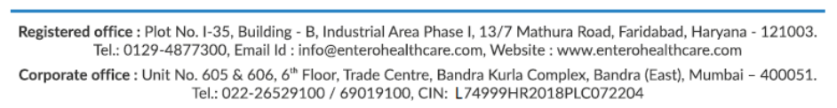

**[Image: Jun2025.pdf-0001-00.png (942x120, 42.5KB)]**

**Ref: 18/SE/LC/2025-26** 

**Date:** 04/06/2025 

To, **Head, Listing Compliance Department BSE Limited** Phiroze Jeejeebhoy Towers Dalal Street, Mumbai - 400 001. **Scrip Code: 544122** 

**Head, Listing Compliance Department National Stock Exchange of India Limited** Exchange Plaza, Plot No. C/1. G Block, Bandra -Kurla Complex, Bandra (East), Mumbai- 400051 **Scrip Symbol: ENTERO** 

Dear Sir/Madam, 

**<u>Subject: Intimation under Regulation 30 of the SEBI (Listing Obligations and Disclosure</u> -** **<u>Requirements), Regulations 2015 Transcript of Earnings Call/ Conference Call.</u>** 

In continuation to our letter dated May 23, 2025, bearing reference no. 07/SE/LC/2025-26, and pursuant to Regulation 30 and Regulation 46(2) of SEBI (Listing Obligations and Disclosure Requirements) Regulations, 2015, the transcript of the Earnings Call/ Conference Call held on May 28, 2025 at 02:30 pm (IST) to discuss the Company’s financial results for the Quarter and Year ended March 31, 2025 is annexed herewith. 

This is for your information and records. 

Yours faithfully, 

### For **Entero Healthcare Solutions Limited** 

Sanu Digitally signed by Sanu Vishal Vishal Kapoor Date: 2025.06.04 Kapoor 18:05:19 +05'30' Sanu Kapoor **VP- General Counsel, Company Secretary & Compliance Officer** 

Encl. a/a 

**[Image: Jun2025.pdf-0001-13.png (942x122, 51.6KB)]**

**[Image: Jun2025.pdf-0002-00.png (578x157, 119.7KB)]**

# “Entero Healthcare Solutions Limited Q4 &FY ‘2025 Earnings Conference Call” 

## **May 28, 2025** 

E&OE - This transcript is edited for factual errors. In case of discrepancy, the audio recordings uploaded on the stock exchange on 28th May 2025 will prevail. 

**[Image: Jun2025.pdf-0002-04.png (286x80, 33.2KB)]**

**[Image: Jun2025.pdf-0002-05.png (253x134, 51.1KB)]**

**[Image: Jun2025.pdf-0002-06.png (228x112, 13.5KB)]**

- 

- **MANAGEMENT: MR. PRABHAT AGARWAL MANAGING DIRECTOR & CHIEF EXECUTIVE OFFICER** 

   - 

   - **MR. PREM SETHI WHOLE-TIME DIRECTOR AND CHIEF OPERATING OFFICER** 

   - 

   - **MR. BALAKRISHNAN KAUSHIK GROUP CHIEF FINANCIAL OFFICER** 

- 

- **ANALYST: MR. RAHUL JEEWANI IIFL CAPITAL SERVICES LIMITED** 

Page 1 of 21 

_Entero Healthcare Solutions Limited May 28, 2025_ 

**[Image: Jun2025.pdf-0003-01.png (290x80, 34.5KB)]**

#### **Moderator:** 

Ladies and gentlemen, good day and welcome to the Q4 FY ‘25 Earnings Conference Call of Entero Healthcare Solutions Limited, hosted by IIFL Capital Services Limited. 

As a reminder, all participants’ lines will be in the listen-only mode. And there will be an opportunity for you to ask questions after the presentation concludes. Should you need assistance during the conference call, please signal an operator by pressing “*”, then “0” on your touchtone phone. Please note that this conference is being recorded. 

Please note this conference may contain forward-looking statements about the Company which are based on the beliefs, opinions and expectations of the Company as on date of this call. These statements are not the guarantees of future performance and involve risks and uncertainties that are difficult to predict. 

I now hand the conference over to Mr. Rahul Jeewani from IIFL Capital Services. Thank you and over to you. 

#### **Rahul Jeewani:** 

Yes. Thank you. Hi, good afternoon, everyone. And I welcome you to Entero Healthcare’s 4th Quarter FY ‘25 Earnings Conference Call being hosted by IIFL Capital. 

From Entero we have with us today the Senior Management Team comprising Mr. Prabhat Agarwal – Managing Director & CEO; Mr. Prem Sethi, Whole-Time Director and COO; and Balakrishnan Kaushik, Group CFO. 

I will hand over the call to the Management for them to make their Opening Comments and post that we will open the floor for Q&A. Over to you, sir. 

#### **Prabhat Agarwal:** 

Yes. Thank you, Rahul. Good afternoon, everyone. And thank you for joining the earnings conference call to discuss the Operational and Financial Performance for Q4 FY ‘25. My name is Prabhat. And on this call I am joined by Prem – Co-founder and COO of Entero; Bala, who is the Group CFO; and SGA, which is our Investor Relations advisors. 

I hope everyone had an opportunity to go through the Financial Results and Investor Presentation which has been uploaded on Stock Exchanges and on our Company's website. I shall provide a brief overview of the operational and financial highlights for the financial year, after which Bala will take you through the highlights of our Q4 FY ‘25 Financial Performance. 

Let me begin by saying that FY ‘25 has been a landmark year for Entero Healthcare Solutions. We crossed Rs. 5,000 crosses in revenues. Surpassed 100,000 customer base across pharmacies and hospitals. And achieved over Rs. 100 crores in profit after tax. All have been significant milestones in our journey. Also, in the second-half of the year, we turned operating cash flow positive. 

The above achievements give us the confidence in the vast scalability potential of our business model and also validates the market acceptance of our value proposition and right-to-win in this fragmented market. 

Page 2 of 21 

_Entero Healthcare Solutions Limited May 28, 2025_ 

**[Image: Jun2025.pdf-0004-01.png (290x80, 34.5KB)]**

Our strategic playbook is centered around the following: 

Number one, organic scale-up in underserved markets through expanding our geographic footprint and product segments. And delivering better buying experience to our customers through deployment of technology-led solutions and efficient physical infrastructure and processes. 

Our presence now spans 500 districts across 20 states supported by 101 warehouses. We serve more than 95,300 retail pharmacies, which is almost one out of 10 pharmacies operating in India and 3,600 hospitals. Our product portfolio or SKU count has crossed 80,600 and we now work with over 2,700 healthcare product manufacturers. This gives us a truly unique national scale distribution capability, both deep and broad in a market that remains largely fragmented. 

Organic growth is complemented with entry into new geographic markets and newer product segments through inorganic acquisitions, that helps us to scale and penetrate the market faster. We successfully completed and integrated 10 strategic acquisitions during the year, contributing Rs. 792 crores in annualized revenue. These acquisitions have expanded our geographic footprint in multiple new cities and diversified our product portfolio across new segments, including medical devices, diagnostic consumables and equipments, surgical consumables and specialty pharma. 

The unique pan-India distribution platform built from the above attracts many new healthcare brand partnerships and collaboration opportunities as the platform provides wide India reach at one-go to every Company that associates with us. We have further augmented our value-added service capabilities in terms of comprehensive commercial solutions covering both demand generation and demand fulfillment. This brings us closer to our long-term vision of building India's most comprehensive, efficient and digitally integrated healthcare distribution platform, which is difficult to replicate. 

#### **In terms of key financial metrics for the year:** 

FY ‘25 marked the period of solid growth, strategic expansion and improved operating metrics. We registered revenue of Rs. 5,096 crores, achieving a 30% year-on-year growth rate which includes 16% organic growth against an IPM growth of 8%, thereby outpacing the industry growth by 2x. Our gross margins improved by 57 basis points to 9.5% aided by margin accretive categories, value-added services and procurement efficiencies. 

EBITDA rose by 53% year-on-year to Rs. 172 crores, with operating margins expanding by 52 basis points to 3.4%, with the last two quarters’ margin being 3.7%. Profit after tax for the year stood at Rs. 107 crores growing nearly 2.7x from the previous year, underscoring the strength of our operating model and disciplined financial execution. 

Page 3 of 21 

_Entero Healthcare Solutions Limited May 28, 2025_ 

**[Image: Jun2025.pdf-0005-01.png (290x80, 34.5KB)]**

#### **In terms of the business outlook for Financial Year ‘26 and beyond:** 

Looking ahead, we remain very optimistic about the long-term opportunity in the healthcare distribution space in India. The addressable market, which includes pharmaceutical, medical devices and surgical consumables stands at $33.2 billion and is expected to grow at 10%-11% CAGR over the next five years. Importantly, the shift towards organized distribution is accelerating and we are ideally positioned to lead this consolidation. 

Our growth strategy going forward will continue to rest on **three fundamental pillars** . 

**First** , we will **sustain our organic momentum** by onboarding new pharmacies and hospitals, and increasing our wallet share with existing customers. Our organic growth has consistently tracked 1.5 to 2 times of IPM growth rate, and we expect this to continue. 

**Secondly** , we will pursue **disciplined inorganic growth.** With a proven M&A playbook and a robust acquisition pipeline, will continue to onboard high-quality regional players that are strategically aligned with our long-term goals. We have already announced six new strategic acquisitions which collectively would add over Rs. 400 crores of annualized revenues and expand our geographical reach and further add to our business portfolio in the areas of trade generics, specialty pharma, medical consumables and devices. 

These acquisitions are EBITDA margin accretive on blended level and would enhance our overall margins. We are being very selective in our inorganic approach and are targeting to acquire only those targets that add either new geography, new product segment or capabilities and our margin accretive. While we expect the pace of acquisitions to normalize in a couple of years, in the near term our unutilized IPO proceeds give us the flexibility to capture attractive opportunities. Our FY ‘25 revenue growth was 30%, and we expect to deliver similar or better growth rates in FY ‘26 also. 

**Thirdly** , we are committed to **expanding EBITDA margins** through margin accretive product categories and value-added services, procurement efficiencies and operational efficiencies. We are targeting to exceed 4% EBITDA margins in FY ‘26 on a full year basis. Fourth, our focus would be on improving working capital management, which in combination with margin expansion would provide positive approaching cash flows in full year ‘26. 

To conclude, we remain committed to creating a truly differentiated, technology-led and valueaccretive platform in healthcare distribution that delivers sustained returns to all our stakeholders. I extend my heartfelt gratitude to our team for their unwavering dedication and to our shareholders for their steadfast support and trust in our vision. 

With this, I now request Bala to summarize the Company's Financial Performance for Q4 and FY ‘25. 

Alright. Thank you, Prabhat. And good afternoon, everyone. 

**Balakrishnan Kaushik:** 

Page 4 of 21 

_Entero Healthcare Solutions Limited May 28, 2025_ 

**[Image: Jun2025.pdf-0006-01.png (290x80, 34.5KB)]**

#### **Coming to Q4 FY ‘25 consolidated financial highlights:** 

Revenue for Q4 is at Rs. 1,339 crores, registering a growth of 29% on a year-on-year basis. 11% of this growth is organic and 22% is from acquisition. As mentioned by Prabhat, we completed 10 acquisitions in FY ‘25 and we have recorded Rs. 225 crores revenue from these new acquisitions in Q4 FY ‘25. The seamless integration of our recent acquisitions is expanding our geographic footprint in cities like Jaipur, Ujjain, Trivandrum, Khammam, and we also have expanded our category footprint along with driving meaningful margin expansion and is expected to enhance our operating leverage by unlocking scale efficiencies, enriching our product mix and aligning the acquired entities with our centralized technology-enabled platform. 

Coming to gross margins: We recorded gross profit margins of 9.8% in Q4 vis-à-vis 9.0% in Q4 of the previous year, an improvement of 81 basis points. This improvement in our gross margin reflects our focused efforts to scale high-margin categories such as specialty pharmaceuticals, surgical consumables, diagnostic products, alongside sustained procurement efficiencies enabled by our expanding scale and integrated supply chain infrastructure. 

Coming now to EBITDA: EBITDA for the quarter stood at Rs. 49 crores, which is the growth of 69% year-on-year basis. EBITDA margins in Q4 FY ‘25 stood at 3.7% vis-à-vis 2.8% in the same quarter last year, recording an improvement of 86 basis points. This margin expansion was achieved despite ongoing investments to support integration and scale up of our recent acquisitions - underscoring the strength of our operating model and our ability to drive efficiency while building for long-term growth. 

Profit after tax for the quarter stood at Rs. 31 crores, marking a 48% year-on-year growth, driven by strong EBITDA expansion and prudent financial management. 

Our return on capital employed improved meaningfully to 11.6% compared to 9% in Q4 FY ‘24 and we managed to maintain our working capital cycle at 60 days, a reduction of three days from the previous quarter. 

With this, I would like to conclude the presentation and open the floor for questions-andanswers. Thank you. 

#### **Moderator:** 

#### **Chintan Sheth:** 

#### **Prabhat Agarwal:** 

Thank you very much. We will now begin the question-and-answer session. The first question is from the line of Chintan Sheth from Girik Capital. Please go ahead. 

Hi. Thanks a lot. Congrats for the good set of numbers. So, coming to the organic growth in the presentation, if you see the slide where we compare our organic growth, IPM and others, there is some asterix on the net margin impact of 3%. Could you explain what is it which resulted into organic growth being 11% for the current quarter? If you could explain that. 

Yes. We had a change in agreement with one of our companies where we are providing super distribution services to them. And earlier we were recognizing the full revenue, now we are recognizing only the gross margins on that agreement. 

Page 5 of 21 

_Entero Healthcare Solutions Limited May 28, 2025_ 

**[Image: Jun2025.pdf-0007-01.png (290x80, 34.5KB)]**

**Chintan Sheth:** Okay. But that completely flows down to EBITDA, I believe, right? **Prabhat Agarwal:** That flows to gross margins and after expenses flows to EBITDA. **Chintan Sheth:** Okay. Okay. But does that impact like-to-like? How should we look at it? Because if I look at that, if I adjust the growth, that 3% for the overall fees, I believe the growth revenue growth number will look a little better versus what we have reported, right? **Prabhat Agarwal:** So this 11% is after adjusting for that. **Chintan Sheth:** Yes, that's what I am saying. If we include that on the like-to-like basis, the growth would have been 32%, 33% for the quarter? **Prabhat Agarwal:** Yes, yes, correct. Right. **Chintan Sheth:** Okay. And does that impact our margin profitability point of view or this is just an adjustment? **Prabhat Agarwal:** Not meaningfully. **Chintan Sheth:** Not meaningfully. Then the reported margin for the current quarter 3.7%, on the like-to-like basis it could have been lower, right, if you include the 3% revenue adjustment which we did. **Prabhat Agarwal:** Yes, in some single digit basis points, yes. **Chintan Sheth:** Okay, okay. And the guidance of 4% plus for the full year versus our earlier guidance that we will exit 4Q next year at around 5%, do we see that trend of EBITDA improvement continuing or we will end up somewhere little lower on the exit run rate basis? **Prabhat Agarwal:** So the guidance we are giving you is that full year basis we will be more than 4%, okay. Now, quarter-by-quarter it is difficult to provide a guidance right now. In fact, last year also I said that we would exit at 4% which unfortunately we did not do, right. So I do not want to stick my neck out on a quarterly basis. Rather, the full year performance is much better predictable as compared to quarterly performance. 

**Chintan Sheth:** Got it, got it. And lastly on the Peerless incremental acquisition which we are doing at Rs. 44 crores, Rs. 45 crores odd for 16% stake. If I look at the numbers of what you have reported in the release, the revenue for the current year FY ‘25 has grown at 10%, while the valuation seemed to be relatively higher given that last time around I think we have paid around Rs. 110 odd crores for this business. So I am just trying to understand how should we look at it, the incremental acquisition of that 16% stake in the Peerless side? 

**Prabhat Agarwal:** Yes, there is some explanation that Bala will give you, because it is not what it appears. **Balakrishnan Kaushik:** So Chintan, basically when we did this Peerless deal, there was a subsidiary of Peerless which was actually commercially not part of the deal. So during the year, we have actually kind of sold 

Page 6 of 21 

_Entero Healthcare Solutions Limited May 28, 2025_ 

**[Image: Jun2025.pdf-0008-01.png (290x80, 34.5KB)]**

that subsidiary and whatever proceeds were there from that sale, that had come into the Peerless. And as part of this tranche, we have actually transferred the money that came in. If we exclude this one-off, the valuations are very much similar to what was done at the acquisition stage. 

**Chintan Sheth:** Okay, okay. And the cash flow if I look at first half to full year, we are still negative in the second-half, but in your initial comment you mentioned that OCF is positive in the second half, just trying to understand that. Because if I look at first half, operating cash flow is around Rs. 62 crores negative versus full year it's around Rs. 77 crores negative. Just trying to connect the two. **Balakrishnan Kaushik:** We are talking about the operating cash flow. Cash flow from operations, we are positive, we are positive about Rs. 50 crores cash flow from operations positive. You are looking at the overall cash flow, while we were looking at the cash flow from operations. That's what we mentioned - that in H2 we have turned cash flow operations positive. **Chintan Sheth:** Okay, I will connect separately. Okay, thank you. I will join back in queue. Thank you. **Prabhat Agarwal:** Okay. Thanks. **Moderator:** Thank you. Next question is from the line of Harshi Shah from Beas Capital. Please go ahead. **Harshi Shah:** Congratulations on the good results, Prem and Prabhat. Just wanted some more clarity on improving working capital to be fully OCF positive next year. **Prabhat Agarwal:** Yes, that's an important focus area for us. And on a full year basis, see, I told you that on second half of this year, which Bala explained, we were OCF positive, right. We were OCF positive to the extent of around Rs. 50 crores. But on a full year basis we were negative because in the first half of the year we were quite negative on OCF. And you would see that in the second half of the year, our margins were much better than the first half of the year, in the last year, right. So once the margin trajectory continues to grow and working capital improves through our focused efforts, then next year we will definitely be OCF positive on a full year basis. **Harshi Shah:** Can we see any guidance on the net working capital days, which you plan to meet next year? **Prabhat Agarwal:** See, our net working capital days on a quarterly basis is close to 66 days in Q4. There's definitely 5% improvement that we are planning for next year. **Harshi Shah:** Great. Thank you. **Moderator:** Thank you. We take the next question from the line of Ishmohit from SOIC Research. Please go ahead. **Ishmohit:** Hi, sir. And congrats for a decent set of numbers. Sir, can you just reiterate what was the guidance for FY ‘25 when it comes to full year margins and like working capital days, if they are improving? 

Page 7 of 21 

_Entero Healthcare Solutions Limited May 28, 2025_ 

**[Image: Jun2025.pdf-0009-01.png (290x80, 34.5KB)]**

#### **Prabhat Agarwal:** 

Sorry, can you please repeat again? 

**Ishmohit:** Sir, I was just saying, can you basically reiterate the guidance that we have for FY ‘26 when it comes to growth and full year EBITDA margin that you are seeing, not on a quarterly basis, just a broad direction for FY ‘26. **Prabhat Agarwal:** Yes. So three guidance items, one is on the revenue growth which we said this year we had 30% growth, next year also we are targeting more than 30% growth. On EBITDA margin basis, know on a full year basis, 4% plus EBITDA margins for the coming year. And operating cash flow positive for next year, which will be a combination of both, reduction in working capital days and also higher margins. 

**Ishmohit:** Right, right. And sir just in terms of like the industry environment right now, how are you seeing the IPM industry environment right now because we have seen a lot of domestic pharma companies reporting, basically growth slow down which is happening. So how are you seeing the industry environment? **Prabhat Agarwal:** Yes, we are seeing the same trend. If you look at the last year, the entire year the industry growth rate was only 8% and the last two quarters were like 7% right. So, historically industry has grown in double digits earlier and which has come down to single digits for the last year, right. So we are seeing definitely a slowdown in the industry growth rate. And that's the reason why I always give guidance in terms of our growth rate relative to industry growth rate. 

**Ishmohit:** Right, right. And I think we have finalized some five acquisitions for I think which will get executed in FY ‘26. Are there any more acquisitions in the pipeline? **Prabhat Agarwal:** Yes, there are more acquisitions in the pipeline. **Ishmohit:** Right. Okay, sir. Thank you. All the best for FY ‘26. **Moderator:** Thank you. We will take the next question from the line of Shivkumar Prajapati from Ambit Investment Advisors. Please go ahead. **Shivkumar Prajapati:** So my first question is, on standalone basis you are not doing that great. So sir, could you please throw some like why there's such a poor performance on standalone basis? And on the following part, when we will turn EBITDA positive on the standalone financial statements? And third one is, what's the guided tax rate for FY ’26? 

**Prabhat Agarwal:** So, we are not looking at standalone. Entero is a network of subsidiaries, both holding Company and subsidiaries, right. So it is difficult to give standalone or subsidiary by subsidiary guidance. So we always give guidance on consol basis, which I just gave in the previous question. 

**Shivkumar Prajapati:** Okay, sir. And sir, what will be the tax rate for FY ‘26? 

Page 8 of 21 

_Entero Healthcare Solutions Limited May 28, 2025_ 

**[Image: Jun2025.pdf-0010-01.png (290x80, 34.5KB)]**

**Prabhat Agarwal:** See, corporate tax rate is 25%. So corporates make an effort to optimize on tax rate through more tax efficient strategies. But for the time being, you can take the guidance of 25% corporate tax rate. 

|**Shivkumar Prajapati:**|Great sir. Thank you.|
|---|---|
|**Moderator:**|Thank you. Next question is from the line of Romil Jain from Electrum PMS. Please go ahead.|
|**Romil Jain:**|Yes. Hi, sir. Sir my first question is, I just want to understand the companies which we have acquired, so one, they would be at what margin level at the Gross, EBITDA whatever you can give some color on? And when are they included in our organic kind of pool, so one year, two years down the line they come in the organic pool, just some color on that.|
|**Prabhat Agarwal:**|Yes, only in the first year of acquisition they are considered under inorganic, post that it is considered under organic only, because after that we are in control of that company and we manage that business.|
|**Romil Jain:**|Okay. And what margins they would be at, just like testing between the earlier businesses that you have acquired and the new businesses?|
|**Prabhat Agarwal:**|So I can only say that the businesses that we have acquired are at margin-accretive, so they are at a margin higher than our current margins. So it's going to add to our overall margin profile. We are not acquiring anything which are margin dilutive.|
|**Romil Jain:**|Okay, okay. And on the organic side, I just wanted to understand, so let's say whenever these companies come under the organic bucket, going ahead when our acquisitions kind of slow down maybe in a year or two, so your guidance is definitely 1.5x to 2x the growth rate of IPM. So do we still see that, if the IPM grows at about 8% to 10%, probably we should grow between 15% to 20% when the acquisitions slow down?|
|**Prabhat Agarwal:**|Yes. So, organic growth rate is independent of inorganic, right? So based on our value proposition, based on our right-to-win, based on this fragmented nature of the industry, we expect that our growth rate will exceed the industry growth rate by 0.5x to 1x.|
|**Romil Jain:**|Sorry, how much, sir?|
|**Prabhat Agarwal:**|1.5x to 2x of industry growth rate.|
|**Romil Jain:**|Okay. And the margins are broadly on track to reach 4% or maybe higher than that in two years’ time, what would contribute to that?|
|**Prabhat Agarwal:**|I just gave you guidance that in FY ‘26 we should exceed 4% on a full year basis.|
|**Romil Jain:**|Okay. Okay. Thanks. I will come back in the queue. All the best.|

Page 9 of 21 

_Entero Healthcare Solutions Limited May 28, 2025_ 

**[Image: Jun2025.pdf-0011-01.png (290x80, 34.5KB)]**

#### **Moderator:** 

Thank you. Next question is from the line of Gautam Gosar from Monarch AIF. Please go ahead. 

**Gautam Gosar:** Hi sir. Thank you for the opportunity. Sir my question is basically on the organic business. So, basically you explained that we will grow at 1.5x to 2x of the IPM growth. But my question here is that, in the last like Q4 FY ‘25 you have done 11% performance growth versus earlier in the year we did 15%, 16%, 17% growth. You are saying that we will have a similar rate in FY ‘26 as well. So can you explain like how will we catch up the growth which we did in Q4 and how should we look at the industry growth as well as our growth in FY ‘26? 

**Prabhat Agarwal:** Yes, so except for this quarter, if you look at our growth rate for the full financial year for FY ’26 (to be read as Fy’25), our growth rate was 2x of industry growth rate, which is on the higher end of our range that I gave you, right. And we expect that the same will continue. Typically what happens, in 4th Quarter there is a little bit of slowdown from our side also, because at end of the year most of the accounts and all, we kind of reconcile with our customers. There is lot more focus on collections rather than on sales. 

**Gautam Gosar:** Understood. Secondly, sir, on the acquisition part, so we have roughly done around four, six accumulations of around Rs. 400 crores. So, I would like to know more about the payout which we have done for these acquisitions and understand like we have our cash on books of around Rs. 250 odd crores. So will that cash be enough to fund our future acquisitions or do we envisage a further fund raise plan or debt plan for the same? **Prabhat Agarwal:** See as of now we do not have a new fundraise plan, okay. Because the IPO that we did a year back has given us, we still have unutilized proceeds from that IPO and on our balance sheet also we have significant cash. So I do not envisage any immediate fund raise plan in our thinking. And once we start generating positive operating cash flows, that amount will be available for acquisitions, without fund raise. 

**Gautam Gosar:** Understood. But sir, these acquistions which we have done recently, these six acquisitions, how much payout we have done for the same because this will come in the FY ‘26 balance sheet, right? 

**Prabhat Agarwal:** Yes. So, normally we don’t give exact payouts for both seller and buyer perspective. But I can tell you that the multiples are in the same range that we had guided before. **Gautam Gosar:** Okay, got it. I think we can take it offline. Okay. Thank you. 

**Moderator:** Thank you. We will take the next question from the line of Akshat Mehta from Seven Rivers holding. Please go ahead. **Akshat Mehta:** Hello, sir. Sir, the first question that I have is, I just wanted to understand, the last earnings call we were guiding for a full year growth of around 35% to 40% and we have kind of missed that mark by at least 5% to 10%. I just want to understand what is the key driver that we kind of resulted in a lower growth than what we had guided earlier? 

Page 10 of 21 

_Entero Healthcare Solutions Limited May 28, 2025_ 

**[Image: Jun2025.pdf-0012-01.png (290x80, 34.5KB)]**

**Prabhat Agarwal:** On a full revenue recognition basis, our growth rate for this year was close to 31%, right, after adjusting for the Q4 change in the recognition method. So it's like 4% we are below in terms of guidance that I gave. And it is primarily because in the delay in timing of acquisitions. **Akshat Mehta:** So I just wanted to ask, if next year there will be better organic growth, since the ramp up of the acquisition will take place majorly in the next year of these 10 acquisitions. **Prabhat Agarwal:** Next year's growth will be a combination of three factors. One is, the organic growth on a continuing business. Number two will be the full year impact of the acquisitions that we did this year and new acquisitions for next year. So it will be a combination of organic growth on continuing business, the full year impact of acquisitions that we did this year, but we will recognize revenues for the full year next year. And the new acquisitions that we are going to do in this year. **Akshat Mehta:** Okay, sir. Also wanted to just have a clarification, sir, did we say any target for how many acquisitions do you want to do this year as well, in FY ‘26? **Prabhat Agarwal:** No, we are not giving a specific number. But as I told you that we have already done more than Rs. 400 crores that we have announced, and we have a pipeline, we will continue to execute more. **Akshat Mehta:** Okay. Last question, sir. I just wanted to understand, we have written in the Board Meeting outcome that we have cancelled the acquisition of one of the companies, I think Radha, what is the reason for that if you can share? **-Prem Sethi:** Well, we actually canceled that because we have a better target which got available in the similar market with better margins and better revenue profile. **Akshat Mehta:** Okay, sir. Thank you. **Moderator:** Thank you. We will take the next question from the line of Harshal Patil from Mirae Asset Capital Markets. Please go ahead. **Harshal Patil:** God afternoon, sir, and thanks for the opportunity. Sir, just one clarification, wanted to know, for FY ‘25 did you say that 11% would be growth in organic revenues? **Prabhat Agarwal:** Yes. Only for Q4, Yes. **Harshal Patil:** Okay. And sir, what would it be for the full year? **Prabhat Agarwal:** 16%. **Harshal Patil:** Okay. And the balance I guess would be through the inorganic acquisitions? **Prabhat Agarwal:** Right. 

Page 11 of 21 

_Entero Healthcare Solutions Limited May 28, 2025_ 

**[Image: Jun2025.pdf-0013-01.png (290x80, 34.5KB)]**

#### **Harshal Patil:** 

Okay. Sir, that was it. And second thing, sir, would it be a good thing to kind of assume or probably go ahead that in FY ‘26 also, we should be doing almost a similar level of acquisitions as we did in FY ‘25? 

**Prabhat Agarwal:** What we said next year, I gave you kind of a revenue guidance right which is upwards of 30% and this would be a combination of organic growth, new acquisitions and full year impact of last year acquisitions. **Harshal Patil:** Yes, correct. Correct. Okay, sir. That's it. Thank you so much. And all the best. **Moderator:** Thank you. Next question is from the line of Binoy from Sunidhi Securities and Finance Limited. Please go ahead. **Binoy:** Okay. So one question, on the recent acquisitions that you have made, a few of them are on the North Indian side of the geography. I believe that market is a little more competitive as compared to the southern Indian market. So, will these acquisitions be margin accretive for us? **Prabhat Agarwal:** Yes, you are absolutely right, the northern part of the country is little more competitive than the southern part. But the acquisitions that we have done is in specialty pharma, it's not pure generic retail business, right. So the margins are higher in that segment and that's the reason we acquired that. **Binoy:** Understood. Could you give a ballpark range of the margins of these acquisitions in aggregate? **Prabhat Agarwal:** We haven’t  given that number, Binoy, but you can take it as that they are higher than what we are today. It it's a range, some are at little higher, some are much higher, but on a blended basis they are higher than where we are today. **Binoy:** Okay. In one of the previous presentations you have mentioned that the acquisitions’ EBITDA margin range is roughly about 6% to 8%. Would these acquisitions also being in that range, can I assume that? **Prabhat Agarwal:** Yes. **Binoy:** Okay. A couple of bookkeeping questions from my end. If you could just help me with the sales and marketing revenue for FY ’25? Likewise, how much revenue came from the hospital segment? **Prabhat Agarwal:** Around 20%, 25% is from hospitals. **Binoy:** Okay. And the sales and marketing revenue? **Prabhat Agarwal:** You mean to say the business where we are doing marketing and promotion also? **Binoy:** Yes, for the pharma companies, yes. 

Page 12 of 21 

_Entero Healthcare Solutions Limited May 28, 2025_ 

**[Image: Jun2025.pdf-0014-01.png (290x80, 34.5KB)]**

#### **Prabhat Agarwal:** 

Yes, it's around less than 5%. 

**Binoy:** Okay. And how much of the revenue would be coming from medical devices and surgical instruments, etc.? **Prabhat Agarwal:** At a consol level across all our geographies, less than 10%, close to 10%, I would say. **Binoy:** Okay. One last point, I was just looking at the warehousing network, the number of warehouses on Q-on-Q basis have been kind of consolidated. Likewise, the overall network is consolidated. I also see the PIN code, the district coverage also consolidated as compared to the last year, so anything to highlight out here? **Prabhat Agarwal:** No, no, no significant highlight here. These marginal small plus and minuses is difficult to explain, but no major or significant thing to talk about. **Binoy:** Okay. That's all from my side. Thank you so much. **Moderator:** Thank you. Next question is from the line of Shiddharth from YES Securities. Please go ahead. **Shiddharth:** Yes, hi, sir. Good afternoon. Sir, I just want to understand one thing, I mean, we have a long list of subsidiaries. I think if I have missed this question, if somebody asked this earlier. Do we ever intend to merge this into Entero or we plan to continue running it like a subsidiary only? And why so? Because I mean, do you think it's operationally better that way, just the rationale behind this? **Prabhat Agarwal:** In ideal world you would want one company to operate across India, right. But then because of our acquisitive nature of business whereby we have bought stakes in multiple companies, and those companies have very strong regional goodwill and regional local name which we want to preserve at least in first few years. So, we are not likely to merge them in the immediate future. But yes, in a longer term, we will definitely kind of look at it. **Shiddharth:** Got it. Sir, after a couple of years, because operationally I assume it's a hassle to manage so many subsidiaries because every year we have, like this year we did 10 acquisitions, coming here also we will probably do a similar number? **Prabhat Agarwal:** Yes, there will be a little bit of higher compliance cost and all because of this structure. **Shiddharth:** Correct, correct. **Prabhat Agarwal:** They are integrated on our technology base, so operationally it's much easier to manage. **Shiddharth:** Understood, sir. That's it from my side. I just wanted to have a clarity on this, sir. Thank you. **Moderator:** Thank you. Next question is from the line of Krupa Desai from Electrum Capital. Please go ahead. 

Page 13 of 21 

_Entero Healthcare Solutions Limited May 28, 2025_ 

**[Image: Jun2025.pdf-0015-01.png (290x80, 34.5KB)]**

|**Krupa Desai:**|Yes, sir. Sir, my question was in the medium term, where could the EBITDA margin grow, can you have a ballpark guidance on that - three to five years in?|
|---|---|
|**Prabhat Agarwal:**|I have given for next year, right?|
|**Krupa Desai:**|Yes. So, I just wanted to understand in the medium term, where can this number go? Once the scale comes in. Like we are growing at 30% in the next year and then going ahead we can do double digit growth. So where could the EBITDA margin go once the scale comes in?|
|**Prabhat Agarwal:**|And when you say medium term, what's the time frame that you are looking at?|
|**Krupa Desai:**|Three to five years, sir.|
|**Prabhat Agarwal:**|So, for example, I have said that next year is 4% plus, and earlier I had told about we should be targeting close to 5%, right? So the year beyond we should reach towards that or move towards that.|
|**Krupa Desai:**|Okay.|
|**Moderator:**|Thank you. We take the next question from the line of Govindarajan Chellappa from CSIM. Please go ahead.|
|**Govindarajan Chellappa:**|Yes. Hi. Just a housekeeping question. For FY ‘26, what is the full year impact of the acquisitions that you did last year?|
|**Prabhat Agarwal:**|Full year impact would be what around Rs. 1,000 crores, right, somewhere around that.|
|**Govindarajan Chellappa:**|Sorry, you have done acquisition of about Rs. 780 crores last year, right?|
|**Prabhat Agarwal:**|Yes.|
|**Govindarajan Chellappa:**|Part of it already came in FY ‘25.|
|**Prabhat Agarwal:**|Right.|
|**Govindarajan Chellappa:**|So my question is, in FY ’26, I mean, how much was the recorded in FY ‘25 and the remainder of course will be the delta for FY ‘26.|
|**Prabhat Agarwal:**|Delta would be around Rs. 500 crores.|
|**Govindarajan Chellappa:**|Okay. So, so far you have recorded about Rs. 250 crores in FY ’25?|
|**Balakrishnan Kaushik:**|Govindarajan, Rs. 250 crores was for Q4. So, overall we have recorded around Rs. 500 crores.|
|**Govindarajan Chellappa:**|Okay. So the delta is about Rs. 250 crores for next year.|

Page 14 of 21 

_Entero Healthcare Solutions Limited May 28, 2025_ 

**[Image: Jun2025.pdf-0016-01.png (290x80, 34.5KB)]**

**Prabhat Agarwal:** Yes, but these businesses are also growing, right. **Govindarajan Chellappa:** Sure. Of course. And secondly, what's the IPM growth and organic growth assumption that you have in this 30% guidance that you have given? **Prabhat Agarwal:** 8% IPM growth, 15% to 16% organic growth. **Govindarajan Chellappa:** Okay. And lastly, in the long term, where do you think the working capital settles? **Prabhat Agarwal:** I think long term is very long, but in near term it is 60 days. Yes. I mean, next two-three, two years we should target that 60 days. **Govindarajan Chellappa:** And the delta improvement - will it come from receivables or will it come from the inventory in warehouse? **Prabhat Agarwal:** Both. It will be a combination of both. **Govindarajan Chellappa:** Okay. Thank you. **Moderator:** Thank you. Next question is from the line of Mayank Agarwal from Scientific Investing. Please go ahead. **Mayank Agarwal:** Yes. Good afternoon, sir, and thank you for the opportunity. Sir, I have one question on the working capital, like right now we have a 70 day cash conversion cycle, and if we estimate like you would need around 20% of sales as working capital. Now assuming the current margin levels it appears you can support around 15% annual growth organic, without the need of the external funding. However, you have stated, the ambition to grow around 25%, 30% CAGR for the next few years. So how do you see the debt and equity playing a role in funding this growth? And would you agree with this assessment and how are you planning for the capital structure accordingly going forward? **Prabhat Agarwal:** So that's what I said in the previous guidance that once we move to 4% plus margin structure and 60 days of working capital, the internal fund accrual will be more than enough to support organic growth. And only for inorganic we will use external capital, which we have already raised through IPO. **Mayank Agarwal:** Okay. And like if I can one more question. **Moderator:** Mr. Agarwal, I am so sorry to interrupt. May I request that you rejoin the queue for follow up questions? There are several other participants waiting. **Mayank Agarwal:** Okay. **Moderator:** Thank you. We take the next question from the line of Vansh Solanki from RSPN Ventures. Please go ahead. 

Page 15 of 21 

_Entero Healthcare Solutions Limited May 28, 2025_ 

**[Image: Jun2025.pdf-0017-01.png (290x80, 34.5KB)]**

**Vansh Solanki:** Hello. Hi, Prabhat. I just want to understand that last year we were talking about that we are doing the acquisitions with EBITDA margin to 6% to 8% right. So, in long term future of Entero, can we assume that our margin also will go to 7% in long term future? Or just because of corporate overheads we will stick around 5.5% or 6% around? **Prabhat Agarwal:** So I will stick only to guidance for next year, longer term guidance, FY ‘27 guidance maybe I will give some time during the year or by end of the year. **Vansh Solanki:** And just one more, like I have gone through the Sai RK which you have acquired, the acquisition value is around Rs. 70,000 but the annualized revenue for financial ‘25 is more than Rs. 100 crores. So what kind of arrangement is that? Because you have given that it is a proprietary firm and you have acquired that. **Prabhat Agarwal:** No, so the model that we operate with, we create an SPV in which the business is slump sale into, right. And the value that we have given is only the value of acquisition of shares, but we will pay separately for the value of the business that is slumped pay. So, that value is not included in the value that we give, because it's not directly paid to the seller. **Vansh Solanki:** Okay. So I have -- **Moderator:** Mr. Solanki, may I request that you rejoin the queue for follow-up questions. Sir, I am so sorry to interrupt. **Prabhat Agarwal:** What I am saying is you can please connect with our CFO offline on this, he will be able to explain you better the structure that we follow. And this is consistently we have been following the structure since beginning. **Vansh Solanki:** Okay, sure. **Moderator:** Thank you. Next question is from the line of Ajeesh from Investor Things. Please go ahead. **Ajeesh:** Yes. My question is that, do you have any long term target of ROE? In five, six years what will be our ROE? **Prabhat Agarwal:** Yes, once we are able to reach those margins that we spoke about, that working capital target, we should be 15%, 20% ROE. **Ajeesh:** Okay. Thank you. **Moderator:** Thank you. Next question is from the line of Swayam Rana Bhat from PinpointX Capital. Please go ahead. **Swayam Rana Bhat:** Yes, sir. Sorry, sir. I joined a bit late, so pardon me if my question has already been addressed. So I have only one question, could you like elaborate on the direct benefits pharmacists and retailers experience as a result of Entero acquiring the regional distributors? Specifically, how 

Page 16 of 21 

_Entero Healthcare Solutions Limited May 28, 2025_ 

**[Image: Jun2025.pdf-0018-01.png (290x80, 34.5KB)]**

do these acquisitions improve aspect like fill rates, credit periods, and what other industry challenges are we solving for the retailers? 

#### **Prabhat Agarwal:** 

See, the biggest challenge that retailers are facing is fill rate today, right. Because what has happened is the number of SKUs in pharma is huge because of the branded generic nature of the industry. And as you know, it's a very fragmented and low entry barrier industry, that's why you have so many regional companies, local companies, national companies operating, right. A retailer is struggling typically to provide all the items of the prescriptions to the patient. Typically we see that the fill rate of the retailer is not more than 60%. So if five drugs are written, a prescription is only able to offer two or three, right. Because he just can’t store and manage so many SKUs. 

The problem that we are solving for the customers is basically the range. So from one shop, from one of our warehouse, he can get the entire range, because we are working with 2,500 pharmaceutical companies - so we have a very huge product range available with us and which helps us to give him one-stop-shop, that makes his buying much less complex, his experience much better. And most of the geographies we are delivering 3 times or 4 times during the day, so our delivery time is also much lower. So combined with the lower delivery timeline and huge product range, the customer is able to improve his own overall sales at his shop and also optimize his inventory at his shop. 

#### **Swayam Rana Bhat:** 

**Moderator:** 

#### **Naman Bagrecha:** 

#### **Prabhat Agarwal:** 

#### **Naman Bagrecha:** 

**Moderator:** 

Got it. Thank you for answering my question. I will join back the queue. Thank you. 

Thank you. Next question is from the line of Naman Bagrecha from IFL Capital Services Limited. Please go ahead. 

Thanks for the opportunity. Sir, just one question, our second half OCF is positive for this year. Last year also, our second half OCF was positive. So is it a second half phenomena where OCF is positive? Or let's say working capital is lower? Could you help me understand that. 

If you take the pharmaceutical industry and try to divide the sales quarterly, typically the second and third quarter are high sales period. And by 4th Quarter, generally the sales taper down because end of the year and low season. And that's how is also followed in our case also. Typically you see the highest level of working capital in September, because that's the peak season where you are operating at - just monsoon period and post monsoon is where the season is very high and you have to store inventory and all that, which kind of normalizes by end of the year, right. So you are right that last year we were operating cash flow positive for second half of the year, but not for the entire year. And that's what I guided that next year we are targeting to be OCF positive on a full year basis. 

Okay. Sir, if I may ask one more question. 

Sir, may I request you to rejoin the queue? 

Sure. 

**Naman Bagrecha:** 

Page 17 of 21 

_Entero Healthcare Solutions Limited May 28, 2025_ 

**[Image: Jun2025.pdf-0019-01.png (290x80, 34.5KB)]**

#### **Moderator:** 

Thank you. We take the next question from the line of Ankur Gulati from Genuity Capital. Please go ahead. 

**Ankur Gulati:** Hi. Just if you can give us some, I mean, how the industry has played out in the US and how do you see it playing out in the industry? Any lessons for us to learn from the US consolidation? **Prabhat Agarwal:** US is on the other extreme of consolidation. There are three distributors who are more than 90% market share. India is also moving towards consolidation, but it's not likely to go at that extreme level in near term at least. **Ankur Gulati:** And what are the factors which drove US and what are the hindrances in India, just for our understanding? **Prabhat Agarwal:** India is much more complex geography compared to US. US, the entire pharmacies are only 65,000. In India, our customer base is more than entire pharmacy population of US. India is 1 million customer segments, 1 million pharmacies in India, very complex. So, you cannot supply to Guwahati from Mumbai, right. So we will have a lot of regional centers and regional warehouses that will have to make closer to the customers. Number of SKUs in India is so much more than US. US is a generic market; it is not a branded generic. India every molecule has 100 brands, so these complexities add to the challenge of consolidation. **Ankur Gulati:** Last question, any aspirational market share? **Moderator:** Mr. Gulati, I am so sorry to interrupt, may I request that you please rejoin the queue for followup questions. **Ankur Gulati:** Okay. **Moderator:** Thank you. We take the next question from the line of Naman Bagrecha IIFL Capital Services Limited. Please go ahead. **Naman Bagrecha:** Thanks for the follow-up. Sir, just one thing on revenue growth, so we have guided for 30% growth in FY ‘26, which is equally divided between organic growth and impact of last year acquisitions and the new acquisitions. If I look, if we do the simple math of 15% kind of growth on FY ‘25 number, which is closer to Rs. 764 crores. What we have announced, the acquisitions, if I look, the revenue would be closer to Rs. 300 crores given that the consolidation will happen post 15th August, right? So, is the guidance a bit lower because then Rs. 300 crores or Rs. 320 crores or Rs. 330 crores kind of number is the balance number which is your revenue from last year's, let's say, acquisitions? So, is the guidance a bit lower or the organic growth might be slower than our expectations? It will be helpful if you can help. 

**Prabhat Agarwal:** You know, you are working out the math very well, Naman. What we want to give is a more conservative guidance that we are 100% sure of delivering. Nothing stops us from delivering more than our guidance, right. 

Page 18 of 21 

_Entero Healthcare Solutions Limited May 28, 2025_ 

**[Image: Jun2025.pdf-0020-01.png (290x80, 34.5KB)]**

**Naman Bagrecha:** Alright. Sure, sure. And sir just one request -- 

**Moderator:** Mr. Bagrecha, I am so sorry to interrupt, I request you to rejoin the queue for follow-up questions. Thank you. Next question is from the line of Binoy from Sunidhi Securities and Finance Limited. Please go ahead. **Binoy:** Yes, thank you for the opportunity to ask follow-on questions. Prabhat, one strategic question on the industry. So, Indian government is mulling OTC healthcare policy, and it has been mulling this policy since quite some time. Off late, it was again in the news that the government might allow distribution of or let’s say retailing of OTC medicines through general trade stores as well, which is the kirana stores, etc., right. So just your thoughts on this, where are we in terms of OTC healthcare policy? And if it gets implemented, how does that impact our business? **Prabhat Agarwal:** So, as of now our customer base does not include kirana stores, okay. So we are focusing only on the on the retail pharmacies and hospitals, right. So, if part of the sales of OTC moves away from retail pharmacy to kirana stores, either we will have to prepare a plan to reach out to kirana stores or the industry size will become smaller for us. Our addressable market will become a little smaller for us. **Binoy:** But wouldn't you be as a distributor, since you have one leg before the retailer in the chain, just as you are distributing to the chemist, wouldn't you essentially be distributing to kirana stores as well? Because you are a distributor for the company, right? **Prabhat Agarwal:** It's a choice. It's a choice that we will have to exercise, whether we want to just go for very, very few products to kirana store, because we will have to work out the economics of doing that - because your average order values will not be that high, right. **Binoy:** Understood, understood. Okay. Thank you so much. Thank you for the comments. **Moderator:** Thank you. Next question is from the line of Harshi Shah from Beas Capital. Please go ahead. **Harshi Shah:** Hi, two quick questions. What is the timeline to complete the remaining acquisitions? And second, all of the newer acquisitions made last year will have a full year revenue, so can we see a margin upwards of 4% because they are margin-accretive, right? **Prabhat Agarwal:** On a full year basis, yes. But we are declaring quarterly margins, right. So, the acquisitions that we did in the middle of the year in the last quarter they are included or Q3 is included, but not in the full year. So full year basis, yes. **Harshi Shah:** And the timeline to complete the remaining acquisition? **Moderator:** Harshi, may I request that you rejoin the queue. **Prabhat Agarwal:** No, my suggestion to you will be, let's continue the question so their flow is complete, otherwise they will have to come back and then again reiterate the whole thing. Sorry, what are you saying? 

Page 19 of 21 

_Entero Healthcare Solutions Limited May 28, 2025_ 

**[Image: Jun2025.pdf-0021-01.png (290x80, 34.5KB)]**

**Moderator:** Sure. 

**Harshi Shah:** The timeline to complete the remaining acquisitions? **Prabhat Agarwal:** I think the timeline we have given is two months, right, or two and a half. But we will try to close it faster than that. **Harshi Shah:** Understand. Thank you. **Moderator:** Thank you. Next question is from the line of Krupa Desai from Electrum Capital. Please go ahead. **Krupa Desai:** Sir my question was, what is the plan for write-off of intangibles in future or now? **Balakrishnan Kaushik:** Yes. Krupa, so basically what we are doing is, we have goodwill which is tested for impairment at every financial year. So, goodwill, since we follow IndAS, the requirement of the standard is that we do an impairment testing, there is no requirement of amortization of those goodwill. So, we do the impairment testing every year. **Krupa Desai:** Okay, sir. **Moderator:** Thank you. Next question is from the line of Naman Bagrecha from IIFL Capital Services Limited. Please go ahead. **Naman Bagrecha:** Thanks. Just a quick one, just wanted to know what is the total purchase cost of all the seven transactions, so six new entities? So, I mean, you could give also only six new entities and seventh is available, I mean, Peerless transaction you have already given. **Prabhat Agarwal:** Yes, so the total consideration we do not disclose because of confidentiality reasons from the seller side also. **Naman Bagrecha:** Okay. So, I guess the multiple at an aggregate level will be between 0.3x, 0.35x of revenue or is there any deviation? **Prabhat Agarwal:** The guidance that we give is the multiples are between 5x to 7x times of EV to EBITDA, so within that range. **Naman Bagrecha:** Alright. Thanks. **Moderator:** Thank you. Ladies and gentlemen, that was the last question for today. I would now like to hand the conference over to the management for closing comments. Over to you, sir. **Prabhat Agarwal:** I would like to thank everyone for joining the call. I hope we have been able to address all your queries. For any further queries which has not been answered, please connect with our Investor Relations team. Okay. Thanks again for your time. Have a great day. 

Page 20 of 21 

_Entero Healthcare Solutions Limited May 28, 2025_ 

**[Image: Jun2025.pdf-0022-01.png (290x80, 34.5KB)]**

**Balakrishnan Kaushik:** Thank you, everyone. 

**Moderator:** 

Thank you, sir. On behalf of IIFL Capital Services Limited, that concludes this conference. Thank you for joining us. And you may now disconnect your lines. 

Page 21 of 21 

---

## Extracted Images

| # | File | Dimensions | Size |
|---|------|------------|------|
| 1 | Jun2025.pdf-0001-00.png | 942x120 | 42.5KB |
| 2 | Jun2025.pdf-0001-13.png | 942x122 | 51.6KB |
| 3 | Jun2025.pdf-0002-00.png | 578x157 | 119.7KB |
| 4 | Jun2025.pdf-0002-04.png | 286x80 | 33.2KB |
| 5 | Jun2025.pdf-0002-05.png | 253x134 | 51.1KB |
| 6 | Jun2025.pdf-0002-06.png | 228x112 | 13.5KB |
| 7 | Jun2025.pdf-0003-01.png | 290x80 | 34.5KB |
| 8 | Jun2025.pdf-0004-01.png | 290x80 | 34.5KB |
| 9 | Jun2025.pdf-0005-01.png | 290x80 | 34.5KB |
| 10 | Jun2025.pdf-0006-01.png | 290x80 | 34.5KB |
| 11 | Jun2025.pdf-0007-01.png | 290x80 | 34.5KB |
| 12 | Jun2025.pdf-0008-01.png | 290x80 | 34.5KB |
| 13 | Jun2025.pdf-0009-01.png | 290x80 | 34.5KB |
| 14 | Jun2025.pdf-0010-01.png | 290x80 | 34.5KB |
| 15 | Jun2025.pdf-0011-01.png | 290x80 | 34.5KB |
| 16 | Jun2025.pdf-0012-01.png | 290x80 | 34.5KB |
| 17 | Jun2025.pdf-0013-01.png | 290x80 | 34.5KB |
| 18 | Jun2025.pdf-0014-01.png | 290x80 | 34.5KB |
| 19 | Jun2025.pdf-0015-01.png | 290x80 | 34.5KB |
| 20 | Jun2025.pdf-0016-01.png | 290x80 | 34.5KB |
| 21 | Jun2025.pdf-0017-01.png | 290x80 | 34.5KB |
| 22 | Jun2025.pdf-0018-01.png | 290x80 | 34.5KB |
| 23 | Jun2025.pdf-0019-01.png | 290x80 | 34.5KB |
| 24 | Jun2025.pdf-0020-01.png | 290x80 | 34.5KB |
| 25 | Jun2025.pdf-0021-01.png | 290x80 | 34.5KB |
| 26 | Jun2025.pdf-0022-01.png | 290x80 | 34.5KB |
