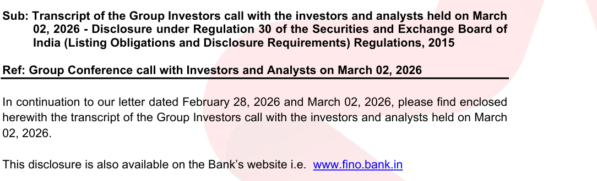

**[Image: March2026.pdf-0001-00.png (518x78, 35.7KB)]**

March 04, 2026 

**BSE Limited** P.J. Towers, Dalal Street, Mumbai- 400 001 **Scrip Code: 543386** 

**National Stock Exchange of India Limited** Exchange Plaza, 5th Floor, Plot No. C/1, G Block, Bandra - Kurla Complex, Bandra (E), Mumbai - 400 051 

**Symbol:  FINOPB** 

Dear Sir/Madam, 

**[Image: March2026.pdf-0001-06.png (1084x330, 91.5KB)]**

<!-- Start of picture text -->
Sub: Transcript of the Group Investors call with the investors and analysts held on March 02, 2026 - Disclosure under Regulation 30 of the Securities and Exchange Board of India (Listing Obligations and Disclosure Requirements) Regulations, 2015 Ref: Group Conference call with Investors and Analysts on March 02, 2026 In continuation to our letter dated February 28, 2026 and March 02, 2026, please find enclosed herewith the transcript of the Group Investors call with the investors and analysts held on March 02, 2026. This disclosure is also available on the Bank’s website i.e.  www.fino.bank.in <!-- End of picture text -->

**[Image: March2026.pdf-0001-07.png (889x330, 33.1KB)]**

<!-- Start of picture text -->
Digitally signed by Basavraj Shivanand Loni Date: 2026.03.04 17:01:42 +05'30' <!-- End of picture text -->

Kindly take the same on your record. 

Thanking You, 

Yours faithfully, 

**For Fino Payments Bank Limited** 

Digitally signed by Basavraj Basavraj Shivanand Loni Shivanand Loni Date: 2026.03.04 17:01:42 +05'30' **Basavraj Loni Company Secretary & Compliance Officer** 

**[Image: March2026.pdf-0001-13.png (860x330, 15.9KB)]**

Place: Navi Mumbai 

**Encl:** As above 

**Fino Payments Bank Limited Registered Office:** Mindspace Juinagar, Plot No Gen 2/1/F, Tower 1, 8th Floor, TTC Industrial Area, MIDC Shirwane, Juinagar, Navi Mumbai  - 400 706 | CIN: L65100MH2007PLC171959 | Tel: (+91 22) 7104 7000 | Website: www.fino.bank.in | Email: <u>cs@fino.bank.in</u> 

**[Image: March2026.pdf-0002-00.png (364x92, 14.8KB)]**

# “Fino Payments Bank Limited 

# Business Update Call” March 02, 2026 

**[Image: March2026.pdf-0002-03.png (275x44, 8.0KB)]**

**[Image: March2026.pdf-0002-04.png (280x74, 9.4KB)]**

**[Image: March2026.pdf-0002-05.png (221x111, 5.5KB)]**

**– MANAGEMENT: MR. KETAN MERCHANT CHIEF FINANCIAL OFFICER – FINO PAYMENTS BANK LIMITED – MR. ANUP AGARWAL HEAD, FINANCE AND – INVESTOR RELATIONS FINO PAYMENTS BANK LIMITED** 

**– MODERATOR: MS. SHEETAL KHANDUJA GO INDIA ADVISORS** 

Page **1** of **18** 

_Fino Payments Bank Limited March 02, 2026_ 

**[Image: March2026.pdf-0003-01.png (363x93, 15.1KB)]**

## **Moderator:** 

Ladies and gentlemen, good day and welcome to the Fino Payments Bank Limited Business Update Call hosted by Go India Advisors. As a reminder, all participant lines will be in the listen-only mode and there will be an opportunity for you to ask questions after the presentation concludes. Should you need assistance during the conference call, please signal an operator by pressing star then zero on your touchtone phone. Please note that this conference is being recorded. 

I now hand the conference over to Ms. Sheetal Khanduja from Go India Advisors. Thank you and over to you, Sheetal. 

## **Sheetal Khanduja:** 

Good morning everyone and thank you for joining us at a short notice. Before we begin, let me introduce the management team on the call. We have with us Mr. Ketan Merchant, Chief Financial Officer, and Mr. Anup Agarwal, Head of Finance and Investor Relations. They are joined by other members of the senior management team. The purpose of today's call is to address the developments disclosed on Saturday and respond to questions pertaining specifically to this matter. In the interest of maintaining a focused discussion, we request that Q&A remains confined to this subject. With that, I will now hand over to Ketan. Over to you, Ketan. 

## **Ketan Merchant:** 

Thank you. Thank you, Sheetal. Good morning everyone and thank you for joining at short notice. You would have seen our disclosures on Friday and Saturday that there have been developments involving our Managing Director and CEO, Mr. Rishi Gupta. We recognize that this has understandably raised questions and concerns across stakeholders, starting from regulators to shareholders. We felt it was important to engage directly, place the facts on record, and reaffirm our stability and continuity of the bank. 

Officials of the Directorate General of GST Intelligence, DGGI Hyderabad, in connection with investigation into alleged GST evasion by certain program managers associated with the bank, have named Mr. Gupta in the matter. As part of their investigation, the authorities have alleged his involvement in relation to provisions of real money gaming services by partner entities and the alleged under-reporting of GST. 

Let me state clearly and unequivocally, the bank and Mr. Gupta in his official capacity has no role in business operations of a program manager in question. Fino Payments Bank remains compliant with all GST regulations and other applicable laws and regulatory requirements. Claims and information relating to GST liabilities due on the bank for hypothetical numbers are completely baseless and factually incorrect. The bank has discharged all its responsibility in compliance with the GST regulations. 

Our legal advisors and consultants have expressed a positive view regarding the legal tenability of the action taken, and the matter will now proceed through a judicial process in Hyderabad. Firmly as an organization, we are ensuring that Mr. Gupta’s family is fully supported during this period. 

From an institutional standpoint, the Board acted immediately to ensure continuity and oversight. A committee comprising of some of the Board members and senior management team of the bank has been constituted to monitor the situation and ensure that the business operations 

Page **2** of **18** 

_Fino Payments Bank Limited March 02, 2026_ 

**[Image: March2026.pdf-0004-01.png (363x93, 15.1KB)]**

of the bank continue to be uninterrupted and there is no impact on services of the bank to its customers or on normal functioning of the bank. A special Board meeting was convened on February 27, 2026, where the Board formally requested that I oversee day-to-day functioning of the bank during this interim period to ensure seamless continuity until further decisions are taken or Mr. Gupta resumes office. 

We have proactively engaged all the regulators, whether it's RBI, SEBI, I4C, FIU, etc. For our other stakeholders, we've informed the stock exchange and issued necessary public disclosures during the last two days on a progressive basis. We will also address your queries in this call. Simultaneously, we've communicated with our employees, customers, business partners, business correspondents, banks, and financial institutions through formal channels, being email, our application, website, our merchant portal, and so on and so forth. This is to ensure that there is no panic and disruption in banking operations. Large business associates have also been directly contacted. 

Now let me go into some speculations which are there in the media and address those in the following statements: The bank and its officials have nothing to do with business or actions of program managers in question. The bank does not directly or indirectly engage or promote any kind of betting activity through any forum, website, platform, or in any form. 

The bank's program manager merchant onboarding process is in line with the regulatory requirement and the said due process has been followed. Onboarding is done by the concerned business relevant teams and not by any individual, neither by MD or CEO of the bank. Further, as a part of onboarding check, one of the preconditions is that merchants referred by the program managers need to have existing banking relationship with other banks for facilitating UPI transactions. 

The bank has not issued any alleged fake invoice. All invoices issued are based on the services utilized by program managers/merchants. The bank does not maintain any current account of the program managers or merchants. The funds received through VPA handle provided by the bank are subsequently settled to the designated accounts of the program managers/merchants with respective banks. 

The bank does not foresee any financial liability at this point of time on account of the matter in question. This is on account of the fact that there is no GST evasion by the bank. As we said earlier, the GST evasion or like about is on the program manager and there is no onus on the bank to monitor the GST payment of the program managers. 

At this juncture, we recognize liquidity is an area stakeholders naturally focus on in this situation of this nature, and accordingly, we are maintaining enhanced monitoring and prudential buffers to ensure continuous stability. Customer balances on Feb 26, 2026, stood at approximately INR2,250 crores and today as I speak, it stands intact and more. Our teams are monitoring this at regular intervals to ensure customers do not face any challenges. 

Our business volumes over the last three days have been maintained without any impact, which itself is a testimony of our faith of our customers, business partners, associates, business 

Page **3** of **18** 

_Fino Payments Bank Limited March 02, 2026_ 

**[Image: March2026.pdf-0005-01.png (363x93, 15.1KB)]**

correspondents, and merchants. Just to provide some statistical data, our daily average CASA opening numbers are maintained at around 10,000 and our throughput remains in the range of INR1,300 crores per day. This, if you recollect of in our earlier calls and submissions, this is in line with the average and in certain cases even better given that there were weekends. 

At Fino, trust has been paramount for us in all our dealings and we have demonstrated it over years. We will continue with this bedrock of trust going forward as well and for forever. Unwavering trust amongst our strong customer and merchant base will always be our key pillar. 

As we move forward, our immediate priorities are to ensure uninterrupted services to our customers and communicate transparently with all stakeholders. I would like to reiterate that Fino Payments Bank remains operationally stable and financially sound, underpinned by a wellestablished governance architecture, rigorous checks and balances, and process-led operations that ensure decisions and controls are institutionalized. 

With this, I will open the questions for Q&A, where me and my team can address any specific concerns if anyone has in this regard. Thank you. Over to you, Sheetal. 

## **Moderator:** 

Thank you, sir. Ladies and gentlemen, we will now begin the question-and-answer session. The first question is from the line of Siddharth Gupta from Voyager Capital. Please go ahead. 

## **Siddharth Gupta:** 

Good morning, Ketan and the team. Thank you so much for hosting this call. I think this really helps in calming stakeholder nerves. Just for my clarity and perhaps for all other stakeholders as well, the first question I have is that could you exactly clarify on the role of a program manager associated with the bank? I know you've used it technically, but could you explain exactly what the process is and what the GST, the DGGI has an issue with? 

And second is when exactly -- was there any intimation or communication before the arrest from the DGGI? As it's a highly irregular move by a government body to arrest the CEO and MD of a listed entity right across? And was it linked to the GST raid in November 2025 when we roughly paid about INR10 crores under protest? Thank you. I'll restrict my questions for now and then join the queue. 

## **Ketan Merchant:** 

Thank you, Siddharth. Sorry for this technical snag. As regards to your first question in context of the role of the program manager, I would urge Shailesh Pandey, who heads this business from the sales perspective and is our Chief Business Officer, to address the point. Shailesh, are you there? 

## **Shailesh Pandey:** 

Yes. Thanks, Ketan. And thanks for the question. The program manager is a payment service provider whose basic role is to identify merchants in the market and refer to the bank to onboard and provide the end-to-end payment services for UPI transactions. 

The program managers fundamentally have multiple relationships where they provide different services to these merchants who require payment services, whether it is, you know, debit cards, credit cards, including UPI transactions. They integrate with multiple banks and Fino is also one of the banks with them, and we basically work with them for UPI collect services. 

Page **4** of **18** 

_Fino Payments Bank Limited March 02, 2026_ 

**[Image: March2026.pdf-0006-01.png (363x93, 15.1KB)]**

## **Ketan Merchant:** 

Okay. Thank you. I think Siddharth, your other two questions were was there any prior notice which was given? I think we've provided our clarification on that. We just had the officials coming in our office on 26th for, in regards to some of the data points and some investigation, etc., for some of the program managers. 

And then I think the late evening of 26th Feb is where they issued a summons to our MD CEO, and maybe, early in the morning on 27th is where we just got to know about their authorization of further taking him, seeking his remand. That's where it stands. 

As regards to the third point, and it's a very fair point, a couple of months back there was an payment of GST INR10 crores which was made. This is mutually exclusive. That was in context of some of the points which the bank has been working - that was regarding to the bank's GST compliance and nothing to do with this here in this context and in this regard. 

As I mentioned it earlier, there is no liability on the bank to monitor GST, so these are mutually exclusive things. This was as we understand because of the GST evasion of a program manager and the duties of which Shailesh just explained. Thank you. 

## **Moderator:** 

Thank you. The next question is from the line of Ashish Kumar from Infinity Alternatives. Please go ahead. 

## **Ashish Kumar:** 

Hi. Thanks for this call Ketan and team. Two, three quick questions. A, what is the proportion of the business which came from this program manager? B, can you please confirm - because there's been lots of news rumors around that the bank has stopped doing any business with online gaming in line with the ban from the government entities? 

And C, In terms of the correspondence with RBI, has the regulator raised any concerns at all in relation to governance or the SFB process or any other thing that the regulator would be concerned on? So maybe if you can answer on all three? 

## **Ketan Merchant:** 

Thank you, Ashish. Let me take the third question first as regards to the SFB planning and any concerns coming from the regulator. See, let us all understand, this is something which is not a normal scenario where a MD and CEO of the bank is alleged for some actions of the program manager. 

So in this regards, there have been various meetings which have happened across all the levels in the Reserve Bank of India. In our stock exchange disclosure as well which has gone out early this morning, we have clarified this point stating that as things stand now, there is no impact whatsoever which we've been made to understand on our SFB plans. 

We continue to operate on our preparations on SFB plan for which we've got a regulatory timelines of 18 months which came from on 5th December onwards. As regards to any other regulatory concerns, I would just like to highlight that despite this news coming across, our liquidity has been intact. I earlier mentioned it off about our number of accounts being opened through our channels this weekend; we had slightly ahead more impetus coming across as well. 

Page **5** of **18** 

_Fino Payments Bank Limited March 02, 2026_ 

**[Image: March2026.pdf-0007-01.png (363x93, 15.1KB)]**

So all of this has been -- RBI has been monitoring. And one thing which you have essentially clarified and to the knowledge of RBI, which they are also cognizant of, that this was something which was pertaining to a particular program manager. 

So all of this taken together, as things stand now, whilst we continue to proactively engage with the Reserve Bank of India, until now we've not seen any kind of, messages or something which should concern us in our normal banking operations and that's how the banking operations are going. On your point first and second, I will just ask Shailesh to address the proportional impact and the online gaming process or online gaming perspective. Shailesh, over to you. 

## **Shailesh Pandey:** 

Yes. Thanks, Ketan. Thanks, Ashish, for the question. So online real money game, till I would say in August 2025, which is a game of skill, was allowed by the Government of India. However, in the month of August 2025, the same was banned by the government. The very next day, all the merchants who were associated with real money game were banned by Fino. So that's the first question’s answer. On the business proportion per se, I would say that these three people who do business would be in the range of about 8% to 10% of the overall throughput for the year. 

## **Ashish Kumar:** 

Thank you. So a quick follow-through for that. So the third quarter numbers that we had was without any online gaming revenues, Ketan? Is that a correct assumption? 

## **Ketan Merchant:** 

Yes, indeed Ashish, it is. 

**Ashish Kumar:** 

Okay. Thank you and wish you all the best. 

**Ketan Merchant:** 

Thanks, Ashish. 

**Moderator:** Thank you, sir. The next question is from the line of Ravi Mehta from One Up. Please go ahead. **Ravi Mehta:** Yes, hi Ketan. Just a question. You said the program managers form around 8% to 10% of… 

**Moderator:** I'm sorry, Mr. Mehta, your voice is breaking. Can you please use your handset or come in the network area please? 

**Ravi Mehta:** No, I just wanted to clarify, you said the three program managers in question form 8% to 10% of throughput or I wanted to know, what is the total business that comes from program managers across? 

**Ketan Merchant:** Shailesh, maybe you want to take that point? 

**Shailesh Pandey:** Yes. So in a program manager, banks act as a payment aggregator. There are also payment aggregators which are licensed by Reserve Bank of India. So if you look at, the business comes from both the sides. Our business has been predominantly on the program manager, but if you look at this quarter, we would be roughly at about 15%, 20% business which comes from payment aggregator and about 80% comes from all the program managers put together. 

**Ravi Mehta:** 

So what is the proportion of overall throughput from the program managers? 80%? 

Page **6** of **18** 

_Fino Payments Bank Limited March 02, 2026_ 

**[Image: March2026.pdf-0008-01.png (363x93, 15.1KB)]**

**Shailesh Pandey:** Yes. The program manager throughput will be about 80% in this quarter. **Ravi Mehta:** And is there any internal exercise done to screen any future accidents? **Shailesh Pandey:** I missed you. Future what? **Ravi Mehta:** I mean, if such things doesn't recur, so is there any way of screening the program managers with a fresh lens? **Ketan Merchant:** Yes. I think Tejas will be better equipped to take this one. **Tejas Maniar:** Hi, good morning. Yes, to answer your questions, there are strict monitoring controls, both at a pre-onboarding level and post-monitoring, post-onboarding level which are regularly conducted on a frequent basis. So to answer your questions, yes. **Ravi Mehta:** Okay. Thanks. I'll come back. **Moderator:** The next question is from the line of Anand Dama from Emkay Global Financial Services Limited. Please go ahead. **Anand Dama:** Yes. Thank you for the opportunity and good to have this call in the morning. My first question is the program manager or the multiple program managers which are involved in this issue, are they operating also with other banks or payment players, one. And secondly, I think you said that these three program managers had significant business through Fino Payment Banks? **Ketan Merchant:** Let me take the first question first and I think in somewhere in our earlier disclosures we've made as well and we've said that and I will just read it so that it is reiterated and registered across: Further, as part of our onboarding check, one of the precondition is that merchants referred by the program managers need to have existing banking relationship with other banks for facilitating UPI transactions. This also answers Ravi's point earlier as well. So when we are onboarding any of the guys which have been referred by program managers, we have a precondition that he has been operating through other banks as well besides all the other checks which we essentially do on that. Sorry, I missed your second question, Anand. What was that? 

**Anand Dama:** So the program managers, whatever business that they used to do, substantial portion was run through Fino Payment Bank? **Ketan Merchant:** I think Shailesh is slightly better placed to answer this point. **Shailesh Pandey:** So program managers' basic role as I told you is sourcing and referring merchants. They work with different, different banks for UPI transactions and other products also. So yes, they work for different banks also. 

**Anand Dama:** And the tax evasion has happened at the program manager level. 

Page **7** of **18** 

_Fino Payments Bank Limited March 02, 2026_ 

**[Image: March2026.pdf-0009-01.png (363x93, 15.1KB)]**

**Ketan Merchant:** 

Again Anand, just to elaborate, the program managers in contention, were they routing their transaction with other banks equally? And the answer is yes. So it was not a only Fino-dominated program manager. They were operating through other banks as well and materially also. 

**Anand Dama:** Okay. And the tax evasion has happened at the program manager level and not at the merchant level? Is that the right understanding? 

**Tejas Maniar:** Yes, so the GST evasion, whatever claimed by the GST authorities has happened at a program level or program manager level or at a merchant level, both, at both levels. 

**Anand Dama:** At both levels. And there is no tax liability which comes in on the bank whatever transaction that they do through the program manager, there we are fully compliant? Is that the right understanding? 

**Tejas Maniar:** Yes, so Anand, just to clarify, in our statement also we mentioned. So bank is liable to the extent of fees or revenue earned from the transaction routed through this program manager, where bank has already discharged all its liability on GST or any other regulations. 

**Anand Dama:** Okay. Sir, I think there was the first question where we said that INR10 crores was the penalty that we paid somewhere in November after the raid. That INR10 crores penalty was not at all related to these revenues, right? 

**Anup Agarwal:** Yes. So Anand, let me clarify that the INR10 crores is not a penalty. So the INR10 crores was an ad hoc payment made for the GST which will be subsequently adjusted against our any normal GST liability. So that was not a penalty. The two issues were totally different. The November when we made this payment were different as against the issue in hand right now. 

**Ketan Merchant:** But Anand, I just want to reiterate that that INR10 crores is not a penalty by any means which has been issued. Whilst it is not connected to this case, but it is important to get a complete clarification on the point. 

**Anand Dama:** Sure. And secondly, what as per you basically or your lawyers that would have led to the arrest of the MD and CEO? That I'm sure the GST authorities also understand that the liability is of the merchant and the program manager, why would they basically arrest the MD and CEO of a bank? So what could be your assessment of this arrest? 

**Anup Agarwal:** So, Anand, I think we've been advised by our lawyers also to not to comment on this right now. This matter is under subjudice and it has multiple repercussions, so we will not be able to comment further on that. 

**Ketan Merchant:** 

Yes, but just one thing on this is, you rightly said Anand that the matter is pertaining to tax evasion and I earlier in my statement has also made it and even in my earlier press release I've just mentioned that any of the bank officials or bank cannot be held accountable for the GST tax evasion of a program manager. 

**Anand Dama:** 

Okay. And any more information has been seek by the authorities beyond these two to three merchants or program managers? 

Page **8** of **18** 

_Fino Payments Bank Limited March 02, 2026_ 

**[Image: March2026.pdf-0010-01.png (363x93, 15.1KB)]**

**Ketan Merchant:** No I think whatever data which they have been asking across we have been giving across to them. Their focus primarily is around these two-three program managers and merchants and the relevant information etcetera which they have seek from us and maybe from some other banks as well, I'm not aware. But we've been providing all our inputs to them as they have been asking across. **Anand Dama:** Sure. And the R&D business basically. **Moderator:** Mr. Dama, I am sorry to interrupt you sir. Sir we have others who are waiting for their turn. **Anand Dama:** I'll come back in the queue. **Moderator:** Thank you so much sir. The next question is from the line of Kaushik from AK Investments. Please go ahead. **Kaushik:** Yes, thanks for the opportunity. Firstly, a quick question: this case is pertaining to which year? Because if I go into the details, right, I mean the guy was arrested in 2024 I guess. So this case was related to which year whatever we are being accountable for? **Anup Agarwal:** So hi, so this case is pertaining to the current financial year. So they have currently, the authorities have been asking the information relating to the current financial year. **Kaushik:** Okay. Okay. And what is the revenue which got generated through this or it was non -- I mean, not on the books? What was the thing? How much revenue? **Anup Agarwal:** So, we cannot comment upon what revenue they were generating or the program managers were generating. As we have clarified that whatever revenue we were generating from these program managers, which was a small component of as a percentage of our revenue, was -- and we have discharged all the GST liabilities on the same. **Kaushik:** Sorry, I did not understand clearly. Can you be more clear? **Anup Agarwal:** So, we will not be able to comment on the revenue generated by the program manager overall. We can only speak about that we have discharged all the GST on the revenue earned by Fino through the transactions routed through this program manager. **Ketan Merchant:** Kaushik, just to add, how much of the revenue which the so-alleged program managers are generating, as the earlier said, we are not the only banks through whom they are operating it off. So we do not have site on what has been their functioning across all the spectrum of the banks and across their business and that's what Anup was trying to emphasize on. **Kaushik:** Okay. From our side, how much that we discharge? **Ketan Merchant:** Shailesh, do you have an idea on what is attributable to us in terms of revenue or else we can just come back later? 

Page **9** of **18** 

_Fino Payments Bank Limited March 02, 2026_ 

**[Image: March2026.pdf-0011-01.png (363x93, 15.1KB)]**

**Shailesh Pandey:** Yes, we'll have to, have a look from the revenue perspective. But as I told you, we'll come back on this. Yes, as I said earlier, these program managers in question do about 8% to 10% of the throughput, so we calculate and we'll come back. **Kaushik:** Okay. Okay. And sir, this whatever the digital services we were doing, can you -- how concentrated our throughput is coming from? Can you share some light on the growth trajectory of digital services also and which are the industries are contributing heavy? Are there any, I mean, one-offs or we are getting throughput? Can you throw some light on digital services? **Ketan Merchant:** So, Kaushik, I think as Sheetal earlier said, this is a call with the intent of a particular incidence which has happened off. I think we should just restrict it to that. Maybe in our other calls and other publication which we are doing across, we can give a detailed update and on the same. **Kaushik:** Okay. Thanks. Thank you. **Moderator:** Thank you. We'll take the next question from the line of Prateek Chaudhary from Samarthya Capital. Please go ahead. **Prateek Chaudhary:** So, you mentioned that the transactions were pertaining to this financial year. So just wanted to seek a clarification that are these transactions pre the ban coming into place or post the ban coming into place? **Anup Agarwal:** So as mentioned by us that the gaming -- the transactions which were involving real money gaming were also blocked by the bank effective whenever the regulations blocking the real gaming partners. We have also blocked those transactions on that day in August 2025. So, this pertaining to that period. The real money gaming transactions are not happening post August 2025. **Prateek Chaudhary:** So, all of this investigation is for all the transactions that happened before the ban came into place? **Ketan Merchant:** Yes, all relating to the real money gaming. So we will presume that it is all pertaining to the prior period. **Prateek Chaudhary:** Okay. Thank you, sir. **Moderator:** Thank you. The next question is from the line of Siddharth Gupta from Voyager Capital. Please go ahead. **Siddharth Gupta:** Hi Ketan and team. Thank you for these clarifications. Just a quick couple of more questions. To clarify, does Rishi have any Directorship on any unlisted any company or partners that are currently in allegation because that's also something that has popped up in media reports that this could have been linked to that? 

So just a clarification on that would help. Second, from what I understand, what you've been consistently saying that it's about 3% to 8% of the UPI throughput, which if you could put a rough number on how much it impacts the bank's actual revenue which I'm assuming is 

Page **10** of **18** 

_Fino Payments Bank Limited March 02, 2026_ 

**[Image: March2026.pdf-0012-01.png (363x93, 15.1KB)]**

substantially lower. I know you said you'll come back with a precise number, but an approximation would also be helpful? 

And if I've understood correctly from everything that you're trying to say that whatever the allegations are against the program managers or the merchants and how they link back to Rishi, the fact that remains is the entities that are involved in this were -- one of the conditions for your working with them for part of your risk management program was that they already engage in UPI related revenue with some other banks? 

And secondly that they do not at least from your checks or at least from your end were very clear on not engaging with any illegal activity. Like a very absolute clarification on this would be very helpful? Thank you. 

## **Ketan Merchant:** 

So, let me just start from the reverse order first. Yes, I think we have our transaction monitoring system where not only for these but for otherwise as well and there are periodic checks which Tejas earlier attempted to explain as well. So irrespective -- it's not a one-time KYC or one-time CPC is what we do. We just continue doing that off, on an ongoing basis and wherever we find that any unusual pattern is coming across, we essentially blocked them. 

As regards to the first point, Rishi having Directorship, I have our company secretary Basavaraj Loni on the line. I presumably he is there, maybe he can just put a light on this. To the best of my understanding, it is not there, but I just want him to confirm. Basavaraj, are you there on the line? Sheetal, can you unmute if he's there? 

## **Moderator:** 

Sure sir, I'll unmute him. Give me a moment please. Basavaraj sir, I have unmuted your line. Please proceed. 

**Basavaraj Loni:** 

Yes, so he's not -- Mr. Rishi Gupta is not a director on the board of any unlisted company. 

**Ketan Merchant:** 

Yes. Thank you. Thank you Basavaraj. 

## **Anup Agarwal:** 

So Siddharth, on the point of how much is the impact, I think in one of the clarifications my colleague Shailesh mentioned that overall the real money gaming transactions for the bank had only a 10% impact when the ban happened. So you can assume that the impact on the revenue till that period from April to August is around 10% of the revenue from the digital payment services. 

## **Ketan Merchant:** 

And Siddharth, just one more point you did say earlier and maybe I also said that is that precondition there in terms of the program managers working with other banks? Yes, I reiterate that is one of the important preconditions which we onboard for all our program managers. 

## **Siddharth Gupta:** 

Right. Thank you so much. And just a quick -- a small request if the con call could be uploaded as soon as whenever it concludes so that we can always revisit it for further details. I'll go back to the queue now. 

## **Moderator:** 

Thank you. We'll take the next question from the line of Suraj Singhania from RatnaTraya Capital. Please go ahead. 

Page **11** of **18** 

_Fino Payments Bank Limited March 02, 2026_ 

**[Image: March2026.pdf-0013-01.png (363x93, 15.1KB)]**

**Suraj Singhania:** Yes, hi. My questions have been answered. Thank you. 

**Moderator:** Thank you. We'll take the next question from the line of Hansini from NW18. Please go ahead. **Hansini:** Hi, good morning. **Moderator:** Ms. Hansini, I'm sorry to interrupt you, ma'am. Your audio is not clear. **Hansini:** Yes. Thank you. Good morning. A couple of questions. So I've gone through your disclosure to stock exchange. Just want to understand, so it was only on the 26th that GST officials first approached the bank on with certain queries or were there communications even prior to that? And I mean, it's unfortunate given what has happened to Mr. Gupta, but should the RBI insist on having a second line of leadership including a CEO, what is the strategy that the company has? 

## **Ketan Merchant:** 

So let me just take the second question first. The way every bank essentially functions and maybe every sound company which essentially functions, there has been a second line which typically gets built across and everyone works with a plan. Board on 27th Feb did a special committee meeting of the Board and have assigned the interim leadership charge as head of organization to me and that has been put into public disclosure as well. 

As regards to, you know, we are a professionally driven bank. That the testimony of that is also coming across in a manner the way our businesses have -- despite such a kind of an event, the way our businesses have been put across or have been holding across the weekend which we just passed through on this. Anup, you want to take the first one. 

**Anup Agarwal:** Yes. Just to provide a sequence of events in terms of the GST officials, so the bank did receive a request for providing certain transaction information on 9th February from the GST officials, which we were provided by the bank, timely provided by the bank. On 26th Feb again they requested certain more details or more information for the program managers/merchants in question. Bank co-operated with providing all the information to the authorities. 

**Hansini:** 

Just as a follow-up to this point, my question is that I take the point that, you know, there may have been a bit of an overreach with the arrest, etcetera. Why did the bank or Mr. Gupta not protest? Because the sections under which he's been arrested are quite severe and it talks about, you know, default above INR5 crores and so on? 

And there are also news reports that suggest that transactions worth INR13,000 crores are in question. Can you please explain the thought process that went through it? Why did the bank or Mr. Gupta not really defend the case prior to arrest? Did you guys not really see it coming? To simply ask. 

**Ketan Merchant:** Okay. Let me just take -- say that, and maybe I'll just go back to what I earlier said is these are nothing of GST and maybe you were also saying the same thing, nothing of GST tax evasion is pertaining to the bank. So numbers which are quoted earlier, I think me and Anup just mentioned it across that we're not able to correlate to that numbers and we put that in our submissions earlier as well. 

Page **12** of **18** 

_Fino Payments Bank Limited March 02, 2026_ 

**[Image: March2026.pdf-0014-01.png (363x93, 15.1KB)]**

You are right that there have been a couple of sections where the allegations have come across and these are sections pertaining to the GST Act. Our fundamental point is does bank or Mr. Gupta carry any of these liabilities on account of the tax evasion? We do not -- it cannot be as a process because it is ownership of the respective program manager, etcetera. 

As regards to the protest, there is a process which is being followed off and let's just understand it of at current stage this is the allegations which have been made and there is a legal recourse and the due process is being followed in terms of the protest. So none of these claims have been accepted to the best of my understanding either by Mr. Gupta and definitely not by the bank and we are working across the judiciary system to ensure that we get a time or we get an opportunity rightfully to put our facts of the case. 

## **Hansini:** 

When is he -- when would he present himself for the next bail application, sir? 

## **Ketan Merchant:** 

I think as Anup earlier said, some of these matters are under subjudice and we may just refrain from giving any further information other than what we've already given. 

**Hansini:** 

Thank you. 

**Moderator:** 

Thank you. The next question is from the line of Adarsh from Enam Asset Management Company Private Limited. Please go ahead. 

## **Adarsh:** 

Yes, hi Ketan. Just couple of questions. First, you said real money gaming as it stopped in August, so post that impact of this numbers are already part of our 2Q and 3Q financials. Would that be appropriate to say? 

## **Ketan Merchant:** 

Yes, I think this similar thing which someone else also asked that does our quarter 3 number are excluding the real gaming? The answer is yes. And I do remember in our earlier earnings call as well, we just highlighted of that how Q3 which was different on account of, you know, the real gaming numbers being banned by us and the organization and the ecosystem, sorry. 

**Adarsh:** 

Got it. And there is no consequent -- I mean, again the question was asked on digital revenues as to on a going-forward basis the constituents of what is part of our digital revenues. If at some point of time you all can just throw up industry-wise details of where the throughputs are coming, it'll be helpful in terms of seeing the concentration of that revenue line item? 

## **Ketan Merchant:** 

No, I think that's absolutely a fair point, Adarsh. As I said at some stage we will separately come across through our digital payments business momentum and I do not know at current stage we want to do any kind of a forward-looking thing, but one thing which I can tell is the business for couple of alleged program managers, the business just doesn't essentially fully get impacted for anyone, not only for us but for anyone. 

I think we will continue to run this product and run it in the right risk management framework which we've done until now as well. As regards to a specific, yes, maybe in our subsequent call or in our earnings call or something like that, we may come and provide a perspective. 

Page **13** of **18** 

_Fino Payments Bank Limited March 02, 2026_ 

**[Image: March2026.pdf-0015-01.png (363x93, 15.1KB)]**

**Adarsh:** And you did mention account openings remain normal, even the balances are not impacted or is there an impact? 

**Ketan Merchant:** Yes. I think in fact, I just mentioned it off typically account opening is a process where weekends are, the way kind of we run it across, the weekends are slightly below average of the weekdays. It was not normal, it was slightly better than what we otherwise expected of and that's the function of our customer trust also which has. And balances are completely normal, there has been no abnormal activities which we have seen across on our balances across last two days. 

**Adarsh:** Perfect. Thanks a lot for the clarification. **Ketan Merchant:** Thank you, Adarsh. **Moderator:** We'll take the next question from the line of Ashwini Agarwal from Demeter Advisors LLP. Please go ahead. **Ashwini Agarwal:** Good morning. Most of the questions have been answered. Just one clarification, there was a question from an earlier participant asking that Mr. Gupta is not a Director in any private company. Just want to clarify that there is no relationship that he has with the alleged three program managers in terms of either having, personal investment or a partnership with them. Could you please state that on record? **Ketan Merchant:** Yes. Ashwini, thanks. I think as a part of a normal banking process, a MD, CEO, or for that matter any KMP or senior management professional cannot be having any kind of interest in any of the business associates which are coming across. So by virtue of that, I can just put it across that there is nothing on record which we are aware of or in any form which we know that there has been any interest which Mr. Gupta carries in any of these partners. **Ashwini Agarwal:** Perfect. And one follow-up question. The three program managers, you continue to do business with them because post RMG being banned they would have other sort of payments that they would be processing and things. So is that a fair assumption? **Ketan Merchant:** Shailesh, you may want to take that question. **Shailesh Pandey:** Yes. Thanks, Ketan. So payment services are offered across different industries. One of the industries is real money game. Gaming otherwise you have apparel, you have furniture, you have online e-commerce. There are multiple categories across which we make payments. So yes, real money gaming it was banned, but the other categories of services are—we've been engaged with them on a continuous basis even after the ban on the real money game. 

**Ketan Merchant:** No, I think Shailesh, perhaps his question was are we doing any business with these program managers? Maybe that's how I understood Ashwini's question. 

**Tejas Maniar:** I would like to take it. Shailesh, maybe I'll take it. Ashwini, the answer to your question is no. Unequivocal no, we are not doing any such business whatsoever in any capacity. 

**Ashwini Agarwal:** Okay. Thanks. That's very useful. Thank you so much, all the best. 

Page **14** of **18** 

_Fino Payments Bank Limited March 02, 2026_ 

**[Image: March2026.pdf-0016-01.png (363x93, 15.1KB)]**

## **Moderator:** 

We'll take the next question from the line of Sharon Sam, an individual investor. Please go ahead. 

## **Sharon Sam:** 

Thank you for the opportunity. Good morning, everyone. I have two questions. One, is there any other individual or employee or any related party to the bank under investigation or under arrest? 

Number two, is there any kind of corporate rivalry or something which is the reason for this kind of case coming in and MD of a bank getting arrested without any other notice? These are these two points. If I can have one more question. How is Mr. Rishi Gupta, is he in hospital, is what I read in online? We can clarify that also? 

## **Ketan Merchant:** 

So let me just take the first question first. Is there any other allegation or any other arrest or anything else which is involving any other official of the bank? The answer to that is no. On your question on corporate rivalry, I think it's all speculations. 

We've clarified our stance and maybe earlier someone also asked that there are some sections which we do not understand how it could apply for a bank MD, etc. So I do not know what is the underlying reasons for that and that's something which is being—the judicial process is being taken care of. As regards to Rishi's current position, yes, he is under the judicial custody in Hyderabad and that is being worked out. 

## **Moderator:** 

Thank you, sir. We'll take the next question from Divyansh Gupta from Latent Advisors. Please go ahead. 

**Divyansh Gupta:** 

Hello. Hi, sir. One quick question. So while the matter remains sub judice and it takes its own course of time, how does it affect Rishi Gupta's involvement with the small finance bank? Let's say not the setup process but let's say ongoing operations whenever the bank operations are launched? Or in other words, how does the fit and proper criteria get affected or becomes applicable or disqualifies him while the matter remains sub judice? 

## **Ketan Merchant:** 

No, you're right. You yourself said the matter remains sub judice now and as things stand now, one is the bank has its own plan for small finance bank and we run a differentiated small finance bank. If the question is pertaining to about Rishi's role, Rishi Gupta's role in terms of the small finance bank, I think it's too early. We are into the second day of our process and the judicial process will take its due course and as and when we get clarifications on that, we will be giving up our thought process and clarifications on the same. 

One point to reiterate as things stand prima facie now and we have mentioned it in our statement as well, is there any kind of oversight which can or any kind of a hangover which can come to the bank or Mr. Rishi Gupta in the capacity of him being an MD, CEO on the alleged case? Our legal counsel's view is essentially no. How this all unfolds is as you rightly said sub judice and we will just keep -- update the market as and when things progress further. 

## **Moderator:** 

Thank you, sir. We'll take the next question from the line of Anand Dama from Emkay Global Financial Services Limited. Please go ahead. 

Page **15** of **18** 

_Fino Payments Bank Limited March 02, 2026_ 

**[Image: March2026.pdf-0017-01.png (363x93, 15.1KB)]**

**Anand Dama:** Just a clarification. I think you already provided but just reconfirming is that the RMG business revenue in third quarter was zero for us as a whole, not only from these partners but for any partners, right? 

**Anup Agarwal:** Yes Anand, you are absolutely correct. **Anand Dama:** So then basically there is no direct impact on the revenue for us from any RMG business at all? **Anup Agarwal:** Absolutely. **Anand Dama:** Any other revenue line item basically gets impacted because of this issue? **Anup Agarwal:** See Anand, as clarified by Ketan in his speech, over the last 3 days the volumes from both on account of CASA and other business volumes are intact, so we don't foresee any impact currently happening on this count. 

**Moderator:** Thank you, sir. The next question is from the line of Kaushik from AK Investments. Please go ahead. **Kaushik:** Yes, thanks for again giving me the opportunity. I have a couple of questions related digital payment and so whatever the issue with respect to merchant is there, right, the merchant was not -- when he was onboarded for us in a Fino Payment, I mean last year, so that last year's scrutiny is also coming into the picture or only the April to August month when you specifically -- only those are in the scrutiny? **Anup Agarwal:** So in terms of the GST, currently the GST officials have asked the information only for the current financial year and we have provided all the information and data relating to that. 

**Kaushik:** Okay. But the client was there with us from the start or last year full? **Ketan Merchant:** Yes, the client was not last year full, but he was there maybe for larger part of the year. 

**Moderator:** Thank you, sir. We'll take the next question from the line of Ashish Kumar from Infinity Alternatives. Please go ahead. **Ashish Kumar:** Thank you. My questions have been answered. 

**Moderator:** Thank you. The next question is from the line of Hansini from NW18. Please go ahead. **Hansini:** Hi. Just as a follow-up to what I asked earlier. Fino, I would like to -- since there is a GST angle involved, I would like to understand whether Fino's role was that of a service receiver or a service provider? 

**Ketan Merchant:** No, sorry. So if I understand your question right, Hansini, what was the role in the entire process in this digital payment services? I would just ask Shailesh to explain this slightly more in detail so that there is complete clarity on it. 

Page **16** of **18** 

_Fino Payments Bank Limited March 02, 2026_ 

**[Image: March2026.pdf-0018-01.png (363x93, 15.1KB)]**

## **Shailesh Pandey:** 

**Shailesh Pandey:** Thanks, Ketan. So merchants typically want to give a payment option to their customers. Yes, I'll repeat again. Merchants typically want to give payment options to their customers and they -- so in this case we are service providers, not service receivers in that case. And for that, the charge which -- the money which is collected is what comes to the bank, which is settled with the partner bank of the program manager or the merchant. **Hansini:** Okay. And when such a merchant is onboarded, I mean the person already has an account with an existing bank, so would you do a full KYC at the start itself or would it be a partial KYC? At what point would you do a full KYC? And would you attribute all of whatever is happening right now only to problems coming from, ban on RMG? **Ketan Merchant:** Yes. I think maybe Tejas is better equipped to answer. Tejas, why don't you just take this one? **Tejas Maniar:** Hi, Hansini. To answer your question, yes, both at the time of pre-onboarding, post-onboarding, there are multiple KYC checks which we do, which include your merchant visit, site visit, enhanced due diligence, your GST certificate, and so and so forth. So to answer your question, yes, there are pre-onboarding checks, post-onboarding checks for a complete KYC as per the prescribed norms both at a regulator level and through NPCI. **Shailesh Pandey:** I'll just add, Ketan here. I think you had one more part of the question which was do they have bank accounts with other banks? Yes, they have bank accounts with other banks where we do the settlement and as Tejas rightly said that we do KYC over and above what the other banks do. **Hansini:** Would you attribute all of this only to accounts pertaining to real money gaming or is it something else also which got clustered in this which is causing the problem for you? **Tejas Maniar:** This is specific to RMG, Hansini, as we speak right now, and I think we should rest it there because that's where it has come from. **Moderator:** Thank you, sir. Ladies and gentlemen, as we have a strict close at 9:00 AM and that was the last question, I would now like to hand the conference over to the management for closing comments. Thank you and over to you, sir. **Ketan Merchant:** Thank you. I would like to reiterate that Fino Payment Bank, remains operationally stable, financially sound, and underpinned by well-established governance architecture, rigorous checks and balances, and process-led operations that ensures decisions and controls are institutionalized. Nothing in Fino Payments Bank works on an individual basis, so that's a reassurance which I just want to give it across. 

Based on the events which have happened, we are working with all our stakeholders and we are thankful for the support which is coming across. Our business remains intact and we are operating with business as usual. And once again, thank you everyone for joining this call and I hope me and my team have been able to provide the right clarifications which were required. Thank you. 

Page **17** of **18** 

_Fino Payments Bank Limited March 02, 2026_ 

**[Image: March2026.pdf-0019-01.png (363x93, 15.1KB)]**

## **Moderator:** 

Thank you members of the management. Ladies and gentlemen, on behalf of Go India Advisors, that concludes this conference. We thank you for joining us and you may now disconnect your lines. Thank you. 

Page **18** of **18** 

---

## Extracted Images

| # | File | Dimensions | Size |
|---|------|------------|------|
| 1 | March2026.pdf-0001-00.png | 518x78 | 35.7KB |
| 2 | March2026.pdf-0001-06.png | 1084x330 | 91.5KB |
| 3 | March2026.pdf-0001-07.png | 889x330 | 33.1KB |
| 4 | March2026.pdf-0001-13.png | 860x330 | 15.9KB |
| 5 | March2026.pdf-0002-00.png | 364x92 | 14.8KB |
| 6 | March2026.pdf-0002-03.png | 275x44 | 8.0KB |
| 7 | March2026.pdf-0002-04.png | 280x74 | 9.4KB |
| 8 | March2026.pdf-0002-05.png | 221x111 | 5.5KB |
| 9 | March2026.pdf-0003-01.png | 363x93 | 15.1KB |
| 10 | March2026.pdf-0004-01.png | 363x93 | 15.1KB |
| 11 | March2026.pdf-0005-01.png | 363x93 | 15.1KB |
| 12 | March2026.pdf-0006-01.png | 363x93 | 15.1KB |
| 13 | March2026.pdf-0007-01.png | 363x93 | 15.1KB |
| 14 | March2026.pdf-0008-01.png | 363x93 | 15.1KB |
| 15 | March2026.pdf-0009-01.png | 363x93 | 15.1KB |
| 16 | March2026.pdf-0010-01.png | 363x93 | 15.1KB |
| 17 | March2026.pdf-0011-01.png | 363x93 | 15.1KB |
| 18 | March2026.pdf-0012-01.png | 363x93 | 15.1KB |
| 19 | March2026.pdf-0013-01.png | 363x93 | 15.1KB |
| 20 | March2026.pdf-0014-01.png | 363x93 | 15.1KB |
| 21 | March2026.pdf-0015-01.png | 363x93 | 15.1KB |
| 22 | March2026.pdf-0016-01.png | 363x93 | 15.1KB |
| 23 | March2026.pdf-0017-01.png | 363x93 | 15.1KB |
| 24 | March2026.pdf-0018-01.png | 363x93 | 15.1KB |
| 25 | March2026.pdf-0019-01.png | 363x93 | 15.1KB |
