**PROSPECTUS** Dated February 11, 2026 Please read Section 26 of the Companies Act, 2013 **100% Book Built Offer** 

(Please scan this QR Code to view the Prospectus) 

**[Image: 1770955551279.pdf-0001-02.png (107x67, 5.2KB)]**

**[Image: 1770955551279.pdf-0001-03.png (203x63, 3.0KB)]**

### **FRACTAL ANALYTICS LIMITED** **<u>CORPORATE IDENTITY NUMBER</u>** <u>: U72400MH2000PLC125369</u> 

|Level 7, C Oberoi Ga (E), Mum|**REGISTERE** ommerz II, Inter rden City, Off W. bai 400 063, Mah|**D OFFICE** national Business Park, E. Highway, Goregaon arashtra, India|**CONTACT PE** Somya Agar _Company Secret_ _Compliance O_|**RSON** **E-MAIL AND TELEPHONE** wal _ary and_ _fficer_ **Email**: investorrelations@fractal.ai **Tel**: +91 22 6850 5800|**WEBSITE** www.fractal.ai|
|---|---|---|---|---|---|
||**OUR PRO** |**MOTERS: SRIKANTH** **NARENDRA KUMA** **DETAILS OF THE OF**|**VELAMAKANN** **R AGRAWAL AN** **FER TO THE PU**|**I, PRANAY AGRAWAL, CHETANA KUM** **D RUPA KRISHNAN AGRAWAL** **BLIC, SELLING SHAREHOLDERS**|**AR,**|
|**TYPE**|**FRESH ISSUE** **SIZE**| **SIZE OF THE** **OFFER FOR SALE**|**TOTAL OFFER** **SIZE**| **ELIGIBILITY AND SHARE RESERVATIO** **NIIs, RIIs AND ELIGIBLE EMPL**|**N AMONG QIBs,** **OYEES**|
|Fresh Issue and Offer for Sale|11,441,751 Equity Shares^ of face value of ₹1 each aggregating to ₹10,235 million*|20,115,554 Equity Shares^of face value of ₹1 each aggregating to ₹18,104 million|31,557,305 Equity Shares^ of face value of ₹1 each aggregating to ₹28,339 million*|The Offer was made pursuant to Regulation 6( and Exchange Board of India (Issue of Capi Requirements) Regulations, 2018, as amend **Regulations**”) as our Company did not fulfil r Regulation 6(1)(b) of the SEBI ICDR Regul details, see “_Other Regulatory and Statuto_ _Eligibility for the Offer_” on page 548. For de share reservation among QIBs, NIIs, RIIs and E see“_Offer Structure_”on page 573.|2) of the Securities tal and Disclosure ed (“**SEBI ICDR** equirements under ations. For further _ry Disclosures –_ tails in relation to ligible Employees,|
|_^ Subject to_ _* A discount_|_finalisation of the B_ _of ₹85 per Equity S_|_asis of Allotment_ _hare was offered to Eligibl_ **DET**|_e Employees bidding_ **AILS OF THE O**|_in the Employee Reservation Portion._ **FFER FOR SALE**||

| | **DETAIL**| **S OF THE OFFER FOR SALE** ||
|---|---|---|---|
|**NAME OF THE SELLING** **SHAREHOLDER**|**TYPE**|**NUMBER OF EQUITY SHARES** **OFFERED/AMOUNT (₹ IN MILLION)**|**WEIGHTED** **AVERAGE COST OF** **ACQUISITION (IN ₹)***|
|Quinag Bidco Ltd|Other Selling Shareholder|9,787,777 Equity Shares^of face value of ₹1 each aggregating to ₹8,809 million|173|
|TPG Fett Holdings Pte. Ltd.|Other Selling Shareholder|5,000,000 Equity Shares^of face value of ₹1 each aggregating to ₹4,500 million|642|
|Satya Kumari Remala and Rao Venkateswara Remala|Other Selling Shareholder|327,777 Equity Shares^of face value of ₹1 each aggregating to ₹295 million|2|
|GLM Family Trust|Other Selling Shareholder|5,000,000 Equity Shares^of face value of ₹1 each aggregating to ₹4,500 million|Nil_**_|
|_* On a fully-diluted basis, as certi_ _** The shareholder was allotted e_ _any purchase transaction, no wei_ ^_Subject tofinalisation of the Bas_|_fied by Nikunj Raichura & Ass_ _quity shares as a gift and subse_ _ghted average cost of acquisitio_ _is of Allotment_|_ociates, Chartered Accountants, by way of their certificate dat_ _quently received bonus shares issued by our Company on Jul_ _n is attributable to these holdings._|_ed February 11, 2026._ _y 29, 2025. In the absence of_|

### **<u><mark>RISKS IN RELATION TO THE FIRST OFFER</mark></u>** 

The face value of the Equity Shares is ₹1 each. This being the first public issue of the Equity Shares of our Company, there has been no formal market for the Equity Shares. The Floor Price, Cap Price, and Offer Price each as determined by our Company, in consultation with the book running lead managers (the “ **Book Running Lead Managers** ” or “ **BRLMs** ”), in accordance with SEBI ICDR Regulations, on the basis of the assessment of market demand for our Equity Shares by way of the Book Building Process, as disclosed in “ _Basis for Offer Price_ ” on page 220 should not be considered to be indicative of the market price of the Equity Shares after the Equity Shares are listed. No assurance can be given regarding an active or sustained trading in the Equity Shares nor regarding the price at which the Equity Shares will be traded <u>after listing.</u> 

### **<u><mark>GENERAL RISK</mark></u>** 

Investments in equity and equity-related securities involve a degree of risk and investors should not invest any funds in the Offer unless they can afford to take the risk of losing their entire investment. Investors are advised to read the risk factors carefully before taking an investment decision in this Offer. For taking an investment decision, investors must rely on their own examination of our Company and the Offer, including the risks involved. The Equity Shares in the Offer have not been recommended or approved by the Securities and Exchange Board of India (“ **SEBI** ”), nor does SEBI guarantee the accuracy or adequacy of the contents of this Prospectus. Specific attention of the investors <u>is invited to “</u> _<u>Risk Factors</u>_ ” on page 36. 

### **<u><mark>COMPANY’S AND SELLING SHAREHOLDERS’ ABSOLUTE RESPONSIBILITY</mark></u>** 

Our Company, having made all reasonable inquiries, accepts responsibility for and confirms that this Prospectus contains all information with regard to our Company and the Offer, which is material in the context of the Offer, that the information contained in this Prospectus is true and correct in all material aspects and is not misleading in any material respect, that the opinions and intentions expressed herein are honestly held and that there are no other facts, the omission of which makes this Prospectus as a whole or any of such information or the expression of any such opinions or intentions, misleading in any material respect. Further, each Selling Shareholder, severally and not jointly, accepts responsibility for and confirms only such statements confirmed or undertaken by each such Selling Shareholder in this Prospectus to the extent such statements pertain to such Selling Shareholder and/or its portion of the Offered Shares and confirms and assumes <u>responsibility that such statements are true and correct in all material respects and are not misleading in any material respect.</u> 

### **<u><mark>LISTING</mark></u>** 

The Equity Shares offered through the Red Herring Prospectus and this Prospectus are proposed to be listed on the stock exchanges, being BSE Limited (“ **BSE** ”) and National Stock Exchange of India Limited (“ **NSE** ”, and together with BSE, the “ **Stock Exchanges** ”). For the <u>purpose of the Offer, NSE is the Designated Stock Exchange.</u> 

|||**BOOK RUNNING LEA**   |**D MANAGERS**  |||
|---|---|---|---|---|---|
|**Name and logo of the** **BRLMs**|**Contact Person**| **Email and Telephone**|**Name and logo of the** **BRLMs**|**Contact** **Person**|**Email and** **Telephone**|
|**Kotak Mahindra Capital** **Company Limited**| Ganesh Rane|**Tel**: +91 22 4336 0000 **E-mail**: fractal.ipo@kotak.com|**Morgan Stanley India** **Company Private Limited**|Sumit Kumar Agarwal| **Tel**: +91 22 6118 1000 **E-mail**: fractalipo@morgans tanley.com|
|**Axis Capital Limited**|Mayuri Arya|**Tel**: +91 22 4325 2183 **E-mail**: fractal.ipo@axiscap.in|**Goldman Sachs (India)** **Securities Private Limited**|Saurav S / Srishti Srivastava|**Tel**: +91 22 6616 9000 **E-mail**: fractalipo@gs.com|
|||**REGISTRAR TO T**|**HE OFFER**|||
|MUFG Intime India Private _Intime India Pri_|Limited (_Former_ _vate Limited_)|_ly Link_ **Contact Person:**|Shanti Gopalkrishnan **Em**|**Tel:**+91 **ail:**fractal.ipo|81081 14949 @in.mpms.mufg.com|
|| |**BID/OFFER PE**|**RIOD**|||
|**ANCHOR INVESTOR** **BID/OFFER PERIOD** |FRIDAY, FEBRUARY 6, 2026 |**BID/OFFER OPENED ON**| MONDAY FEBRUARY 9, 2026 **B** |**ID/OFFER** **CLOSED ON**|WEDNESDAY, FEBRUARY 11, 2026|

**PROSPECTUS** Dated February 11, 2026 Please read Section 26 of the Companies Act, 2013 **100% Book Built Offer** 

**[Image: 1770955551279.pdf-0003-01.png (203x63, 3.0KB)]**

#### **FRACTAL ANALYTICS LIMITED** 

Our Company was originally incorporated as ‘Fractal Communications Limited’ at Mumbai, Maharashtra as a public limited company under the provisions of the Companies Act, 1956, pursuant to a certificate of incorporation dated March 28, 2000, issued by the Registrar of Companies, Maharashtra, at Mumbai (“ **RoC** ”) and commenced its business pursuant to a certificate of commencement of business dated April 6, 2000. The name of our Company was subsequently changed to ‘Fractal Technologies Limited’ to align the name with the business of our Company and our Company received a fresh certificate of incorporation from the RoC on March 28, 2001. The name of our Company was subsequently changed to ‘Fractal Analytics Limited’ to align the name with the business of our Company and our Company received a fresh certificate of incorporation from the RoC on May 7, 2004. Subsequently, our Company was converted to a private limited company, and the name of our Company was changed to ‘Fractal Analytics Private Limited’ and our Company received a fresh certificate of incorporation from the RoC on February 15, 2013. Subsequently, pursuant to the conversion of our Company to a public limited company, the name of our Company was changed to ‘Fractal Analytics Limited’ and the Registrar of Companies, Central Processing Centre issued a fresh certificate of incorporation on May 16, 2024. For details of the change in the name and the registered office address of our Company, see “ _History and Certain Corporate Matters_ ” on page 350. 

**Corporate Identity Number:** U72400MH2000PLC125369 

**Registered Office:** Level 7, Commerz II, International Business Park, Oberoi Garden City, Off W. E. Highway, Goregaon (E), Mumbai 400 063, Maharashtra, India; **Tel:** +91 22685 05800 **Contact Person** : Somya Agarwal, Company Secretary and Compliance Officer 

**E-mail** : investorrelations@fractal.ai; **Website** : <mark>www.fractal.ai</mark> 

**<u><mark>OUR PROMOTERS: SRIKANTH VELAMAKANNI, PRANAY AGRAWAL, CHETANA KUMAR, NARENDRA KUMAR AGRAWAL AND RUPA KRISHNAN AGRAWAL</mark></u>** 

**INITIAL PUBLIC OFFERING OF  31,557,305  EQUITY SHARES****^*** **OF FACE VALUE OF ₹1 EACH (“EQUITY SHARES”) OF FRACTAL ANALYTICS LIMITED (“COMPANY”) FOR CASH AT A PRICE OF ₹900 PER EQUITY SHARE******* **(INCLUDING A SHARE PREMIUM OF ₹899 PER EQUITY SHARE) (“OFFER PRICE”) AGGREGATING TO ₹28,339 MILLION*^, COMPRISING A FRESH ISSUE OF  11,441,751* EQUITY SHARES OF FACE VALUE OF ₹1 EACH AGGREGATING TO ₹10,235 MILLION^ (“FRESH ISSUE”) AND AN OFFER FOR SALE OF  20,115,554  EQUITY SHARES^ OF FACE VALUE OF ₹1 EACH AGGREGATING TO ₹18,104 MILLION (“OFFER FOR SALE”, AND TOGETHER WITH THE FRESH ISSUE, THE “OFFER”), COMPRISING 9,787,777* EQUITY SHARES OF FACE VALUE OF ₹1 EACH AGGREGATING TO ₹8,809 MILLION BY QUINAG BIDCO LTD, 5,000,000 EQUITY SHARES****^** **OF FACE VALUE OF ₹1 EACH AGGREGATING TO ₹4,500 MILLION BY TPG FETT HOLDINGS PTE. LTD., 327,777 EQUITY SHARES****^** **OF FACE VALUE OF ₹1 EACH AGGREGATING UP TO ₹295 MILLION BY SATYA KUMARI REMALA AND RAO VENKATESWARA REMALA AND 5,000,000 EQUITY SHARES****^** **OF FACE VALUE OF ₹1 EACH AGGREGATING UP TO ₹4,500 MILLION BY GLM FAMILY TRUST (COLLECTIVELY, THE “SELLING SHAREHOLDERS”, AND SUCH EQUITY SHARES CUMULATIVELY OFFERED BY THE SELLING SHAREHOLDERS, THE “OFFERED SHARES”). THE OFFER INCLUDED A RESERVATION OF 736,196 EQUITY SHARES*****^** **OF FACE VALUE OF ₹1 EACH, AGGREGATING UP TO ₹600 MILLION^ FOR SUBSCRIPTION BY ELIGIBLE EMPLOYEES (AS DEFINED HEREINAFTER) CONSTITUTING 0.43% OF OUR POST-OFFER PAID-UP EQUITY SHARE CAPITAL (“EMPLOYEE RESERVATION PORTION”). THE OFFER LESS THE EMPLOYEE RESERVATION PORTION IS HEREINAFTER REFERRED TO AS THE “NET OFFER”. THE OFFER AND THE NET OFFER CONSTITUTED 18.35% AND 17.92%, RESPECTIVELY, OF THE POST-OFFER PAID-UP EQUITY SHARE CAPITAL OF OUR COMPANY. OUR COMPANY IN CONSULTATION WITH THE BRLMS, OFFERED A DISCOUNT OF ₹85 ON THE OFFER PRICE TO ELIGIBLE EMPLOYEES BIDDING IN THE EMPLOYEE RESERVATION PORTION. THE FACE VALUE OF THE EQUITY SHARES IS** ₹ **1 EACH AND THE OFFER PRICE IS 900 TIMES THE FACE VALUE OF THE EQUITY SHARES.** 

###### **_^ SUBJECT TO FINALISATION OF THE BASIS OF ALLOTMENT_** 

> **_* A DISCOUNT OF ₹85 PER EQUITY SHARE WAS_** **_<u>OFFERED TO ELIGIBLE EMPLOYEES BIDDING IN THE EMPLOYEE RESERVATION PORTION.</u>_** 

The Offer was made in terms of Rule 19(2)(b) of the SCRR read with Regulation 31 of the SEBI ICDR Regulations. The Offer was made through the Book Building Process, in compliance with Regulation 6(2) of the SEBI ICDR Regulations, where at least 75% of the Net Offer was made available for allocation on a proportionate basis to Qualified Institutional Buyers (“ **QIBs** ”) (the “ **QIB Category** ”), provided that our Company in consultation with the BRLMs, allocated 60% of the QIB Category to Anchor Investors, on a discretionary basis (the “ **Anchor Investor Portion** ”), of which 40% was reserved as under: (i) 33.33% for domestic Mutual Funds; and (ii) 6.67% for Life Insurance Companies and Pension Funds, subject to valid Bids having been received from domestic Mutual Funds, Life Insurance Companies and Pension Funds at or above the price at which Equity Shares were allocated to Anchor Investors. Any under-subscription in the reserved category specified in clause (ii) above were allocated to domestic Mutual Funds. In the event of under-subscription or non-allocation in the Anchor Investor Portion, the balance Equity Shares were added to the QIB Category (excluding the Anchor Investor Portion) (" **Net QIB Category** ”). Further, 5% of the Net QIB Category were available for allocation on a proportionate basis to Mutual Funds only and the remainder of the QIB Category were made available for allocation on a proportionate basis to all QIBs, including Mutual Funds, subject to valid Bids having been received at or above the Offer Price. However, if the aggregate demand from Mutual Funds was less than 5% of the Net QIB Category, the balance Equity Shares were made available for allocation in the Mutual Fund Portion was added to the remaining Net QIB Category for proportionate allocation to QIBs. If at least 75% of the Net Offer could not be Allotted to QIBs, then the entire application money will be refunded forthwith. Further, not more than 15% of the Net Offer were available for allocation to non-institutional investors (“ **Non-Institutional Investors** ” or “ **NIIs** ”) (the “ **Non-Institutional Category** ”) of which one-third of the Non-Institutional Category was available for allocation to Bidders with an application size of more than ₹200,000 and up to ₹1,000,000 and two-thirds of the Non-Institutional Category was available for allocation to Bidders with an application size of more than ₹1,000,000 provided under-subscription in either of these two sub-categories of the Non-Institutional Category were allocated to Bidders in the other sub-category of the Non-Institutional Category in accordance with the SEBI ICDR Regulations, subject to valid Bids being received at or above the Offer Price. Further, not more than 10% of the Net Offer was made available for allocation to retail individual investors (“ **Retail Individual Investors** ” or “ **RIIs** ”) (the “ **Retail Category** ”) in accordance with the SEBI ICDR Regulations, subject to valid Bids being received at or above the Offer Price. All Bidders (other than Anchor Investors) had mandatorily participated in this Offer through the Application Supported by Block Amount (“ **ASBA** ”) process and have provided details of their respective bank account (including UPI ID for UPI Bidders using UPI Mechanism) in which the Bid Amount were blocked by the SCSBs or the Sponsor Banks, as the case may be. Anchor Investors were not permitted to participate in the Offer through the ASBA process. Further, 736,196 Equity Shares^ of face value ₹ 1 each, aggregating to ₹600 million were made available for allocation on a proportionate basis to Eligible Employees applying under the Employee Reservation Portion, subject to valid Bids received from them at or above the Offer Price. For details, specific attention is invited to “ **_^_** _<u>Subject to finalisation of the Basis of AOffer Procedurellotment</u>_ ” on page 578. 

**<mark>RISKS IN RELATION TO THE FIRST OFFER</mark>** The face value of the Equity Shares is ₹1 each. This being the first public issue of the Equity Shares of our Company, there has been no formal market for the Equity Shares. The Floor Price, Cap Price, and Offer Price each as determined by our Company, in consultation with the Book Running Lead Managers, in accordance with SEBI ICDR Regulations, on the basis of the assessment of market demand for our Equity Shares by way of the Book Building Process, as disclosed in “ _Basis for Offer Price_ ” on page 220 should not be considered to be indicative of the market price of the Equity Shares after the Equity Shares are listed. No assurance can be given regarding an active or sustained trading in the Equity Shares nor regarding the price at which the Equity <u>Shares will be traded after listing.</u> 

**<u><mark>GENERAL RISKS</mark></u>** Investments in equity and equity-related securities involve a degree of risk and investors should not invest any funds in this Offer unless they can afford to take the risk of losing their entire investment. Investors are advised to read the risk factors carefully before taking an investment decision in this Offer. For taking an investment decision, investors must rely on their own examination of our Company and the Offer, including the risks involved. The Equity Shares have not been recommended or approved by <u>SEBI, nor does SEBI guarantee the accuracy or adequacy of the contents of this Prospectus. Specific attention of the investors is invited to “</u> _Risk Factors_ ” on page <u>36.</u> 

**<u><mark>COMPANY’S AND SELLING SHAREHOLDERS’ ABSOLUTE RESPONSIBILITY</mark></u>** Our Company, having made all reasonable inquiries, accepts responsibility for and confirms that this Prospectus contains all information with regard to our Company and the Offer, which is material in the context of the Offer, that the information contained in this Prospectus is true and correct in all material aspects and is not misleading in any material respect, that the opinions and intentions expressed herein are honestly held and that there are no other facts, the omission of which makes this Prospectus as a whole or any of such information or the expression of any such opinions or intentions, misleading in any material respect. Further, each Selling Shareholder, severally and not jointly, accepts responsibility for and confirms only such statements confirmed or undertaken by each such Selling Shareholder in this Prospectus to the extent such statements pertain to such Selling Shareholder and/or its portion of the Offered Shares and confirms and assumes responsibility that such statements are true and correct in all material respects and are not misleading in any material respect. 

**<mark>LISTING</mark>** The Equity Shares offered through the Red Herring Prospectus and this Prospectus are proposed to be listed on the Stock Exchanges. We have received in-principle approvals from BSE and NSE for the listing of the Equity Shares pursuant to their letters each dated October 14, 2025. For the purpose of the Offer, NSE is the Designated Stock Exchange. A signed copy of the Red Herring Prospectus and this Prospectus has been filed with the RoC in accordance with Section 26(4) and Section 32 of the Companies Act, 2013. For details of the material contracts and documents that were made available for inspection from the date of the Red Herring Prospectus up to the Bid/Offer Closing Date, see “ _Material Contracts and Documents for Inspection_ ” on <u>page 629.</u> 

||**BOOK RUNNING LE**|**AD MANAGERS **||**REGISTRAR TO THEOFFER**|
|---|---|---|---|---|
|**Kotak Mahindra Capital Company Limited** 1st Floor, 27 BKC, Plot No. C – 27 ‘G’ Block, Bandra Kurla Complex Bandra (East), Mumbai 400 051 Maharashtra, India **Tel:**+91 22 4336 0000 **E-mail:**fractal.ipo@kotak.com **Website:**https://investmentbank.kotak.com **Investor Grievance E-mail:**kmccredressal @kotak.com **Contact Person:**Ganesh Rane **SEBI Registration No.:**INM000008704 |**Morgan Stanley India Company Private** **Limited** Altimus, Level 39 & 40, Pandurang Budhkar Marg, Worli, Mumbai - 400 018 Maharashtra, India **Tel:**+91 22 6118 1000 **E-mail:**fractalipo@morganstanley.com **Website:**www.morganstanley.com **Investor Grievance E-mail:** investors_india@morganstanley.com **Contact Person:**Sumit Kumar Agarwal **SEBI Registration No.:**INM000011203 |**Axis Capital Limited** 1st Floor, Axis House P.B. Marg, Worli Mumbai - 400 025 Maharashtra, India **Tel:**+91 22 4325 2183 **E-mail:**fractal.ipo@axiscap.in  **Website:**www.axiscapital.co.in **Investor Grievance E-mail:** complaints@axiscap.in **Contact Person:**Mayuri Arya **SEBI Registration No.:**INM000012029 **BID/OFFER PERIOD **    |**Goldman** **Sachs** **(India)** **Securities** **Private Limited** 9th and 10th Floor, Ascent-Worli Sudam Kalu Ahire Marg, Worli Mumbai - 400 025, Maharashtra, India **Tel:**+91 22 6616 9000 **E-mail:**fractalipo@gs.com **Investor Grievance E-mail:**india-client- support@gs.com **Website:**www.goldmansachs.com **Contact Person:**Saurav S / Srishti Srivastava **SEBI Registration No.: **INM000011054 |**MUFG** **Intime** **India** **Private** **Limited** **(Formerly Link Intime India Private Limited)** C-101, 1st Floor, 247 Park Lal Bahadur Shastri Marg, Vikhroli (West) Mumbai 400 083, Maharashtra, India **Tel:**+91 81081 14949 **E-mail:**fractal.ipo@in.mpms.mufg.com **Website:**https://in.mpms.mufg.com/ **Investor Grievance E-mail:** fractal.ipo@in.mpms.mufg.com **Contact Person:**Shanti Gopalkrishnan **SEBI Registration No:**INR000004058 |
|**BID/OFFEROPENEDON**|Monday,Februar|y 9,2026 **BID/O **|**FERCLOSEDON**|Wednesday,February11,2026|

**[Image: 1770955551279.pdf-0003-17.png (243x57, 3.0KB)]**

_(This page is intentionally left blank)_ 

## **TABLE OF CONTENTS** 

|**SECTION I - GENERAL ..................................................................................................................................... 1**|
|---|
|**DEFINITIONS AND ABBREVIATIONS ..................................................................................................... 1**|
|**SUMMARY OF THE OFFER DOCUMENT ............................................................................................. 17**|
|**CERTAIN CONVENTIONS, USE OF FINANCIAL INFORMATION AND MARKET DATA AND** |
|**CURRENCY OF PRESENTATION ............................................................................................................ 28** |
|**NOTICE TO PROSPECTIVE INVESTORS .............................................................................................. 31**|
|**FORWARD-LOOKING STATEMENTS ................................................................................................... 34**|
|**SECTION II - RISK FACTORS ....................................................................................................................... 36**|
|**SECTION III - INTRODUCTION ................................................................................................................... 82**|
|**THE OFFER .................................................................................................................................................. 82**|
|**SUMMARY FINANCIAL INFORMATION .............................................................................................. 84**|
|**GENERAL INFORMATION ....................................................................................................................... 91** |
|**CAPITAL STRUCTURE ............................................................................................................................ 101**|
|**OBJECTS OF THE OFFER ....................................................................................................................... 203**|
|**BASIS FOR OFFER PRICE ...................................................................................................................... 220**|
|**STATEMENT OF POSSIBLE SPECIAL TAX BENEFITS ................................................................... 231**|
|**SECTION IV- ABOUT OUR COMPANY ..................................................................................................... 242**|
|**INDUSTRY OVERVIEW ................................................................................................................................ 242**|
|**OUR BUSINESS .......................................................................................................................................... 296**|
|**KEY REGULATIONS AND POLICIES ................................................................................................... 345**|
|**HISTORY AND CERTAIN CORPORATE MATTERS ......................................................................... 350**|
|**OUR SUBSIDIARIES AND ASSOCIATE ................................................................................................ 362**|
|**OUR MANAGEMENT ............................................................................................................................... 382** |
|**OUR PROMOTERS AND PROMOTER GROUP .................................................................................. 403** |
|**DIVIDEND POLICY ................................................................................................................................... 407**|
|**SECTION V – FINANCIAL INFORMATION ............................................................................................. 408**|
|**RESTATED CONSOLIDATED FINANCIAL INFORMATION .......................................................... 408**|
|**OTHER FINANCIAL INFORMATION ................................................................................................... 499**|
|**MANAGEMENT’S DISCUSSION AND ANALYSIS OF FINANCIAL CONDITION AND RESULTS**|
|**OF OPERATIONS ...................................................................................................................................... 501**|
|**CAPITALISATION STATEMENT ........................................................................................................... 533**|
|**FINANCIAL INDEBTEDNESS ................................................................................................................. 534**|
|**SECTION VI - LEGAL AND OTHER INFORMATION ............................................................................ 537**|
|**OUTSTANDING LITIGATION AND MATERIAL DEVELOPMENTS ............................................. 537**|
|**GOVERNMENT AND OTHER APPROVALS ........................................................................................ 543**|
|**OUR GROUP COMPANY ......................................................................................................................... 545**|
|**OTHER REGULATORY AND STATUTORY DISCLOSURES ........................................................... 547**|
|**SECTION VII - OFFER RELATED INFORMATION ................................................................................ 567**|
|**TERMS OF THE OFFER ........................................................................................................................... 567**|
|**OFFER STRUCTURE ................................................................................................................................ 573**|
|**OFFER PROCEDURE................................................................................................................................ 578**|
|**RESTRICTIONS ON FOREIGN OWNERSHIP OF INDIAN SECURITIES ...................................... 598**|
|**SECTION VIII - MAIN PROVISIONS OF THE ARTICLES OF ASSOCIATION ................................. 600**|
|**SECTION IX - OTHER INFORMATION..................................................................................................... 629**|
|**MATERIAL CONTRACTS AND DOCUMENTS FOR INSPECTION ................................................ 629**|
|**SECTION X - DECLARATION ..................................................................................................................... 634**|

### **SECTION I - GENERAL** 

### **DEFINITIONS AND ABBREVIATIONS** 

_This Prospectus uses certain definitions and abbreviations which, unless the context otherwise indicates or implies or unless otherwise specified, the following terms and abbreviations have the following meanings in this Prospectus, and references to any statute or rules or guidelines or regulations or circulars or notifications or policies will include any amendments, clarifications, modifications, replacements or re-enactments notified thereto, from time to time and any reference to a statutory provision shall include any subordinate legislation made from time to time under that provision. Further, the Offer related terms used but not defined in this Prospectus shall have the meanings ascribed to such terms under the General Information Document (as defined below). In case of any inconsistency between the definitions given below and the definitions contained in the General Information Document, the definitions given below shall prevail._ 

_Unless the context otherwise indicates, all references to “the Company”, and “our Company”, are references to Fractal Analytics Limited, a public limited company incorporated in India under the Companies Act, 1956, with its Registered Office at Level 7, Commerz II, International Business Park, Oberoi Garden City, Off W. E. Highway, Goregaon (E), Mumbai 400 063, Maharashtra, India. Furthermore, unless the context otherwise indicates, all references to the terms “we”, “us” and “our” are to our Company and our Subsidiaries (as defined below) and as the context requires to our Associate, on a consolidated basis. Further, the term “Fractal” referred in the section “Our Management” beginning on page 382 specifically refers to our Company and its Subsidiaries._ 

_The words and expressions used but not defined in this Prospectus will have the same meaning as assigned to such terms under the Companies Act, 2013, the SEBI Act, the SEBI ICDR Regulations, the SCRA, the Depositories Act and the rules and regulations notified thereunder. Notwithstanding the foregoing, terms used in the chapters/ sections “Basis for Offer Price”, “Statement of Possible Special Tax Benefits”, “Industry Overview”, “Our Business”, “Key Regulations and Policies”, “History and Certain Corporate Matters”, “Restated Consolidated Financial Information”, “Outstanding Litigation and Material Developments”, “Government and other Approvals”, “Restrictions on Foreign Ownership of Indian Securities and “Main Provisions of the Articles of Association” will have the meaning ascribed to such terms in these respective chapters/ sections._ 

### **Company related terms** 

|**Term(s)**|**Description **|
|---|---|
|4i Consulting|4i Consulting, Inc|
|Amendment and Waiver Agreement|The amendment and waiver agreement to the SHA dated August 1, 2025 entered into by and among our Company, Apax, Founder Group, OLMO Capital, TPG, Chanakya Corporate Services Private Limited, Neo, Gaja Capital India Fund 2020 LLP, Plentitude Fund SPC Trust Group Co-Investors and Whiteoak Group|
|Analytics Vidhya|Analytics VidhyaEducon PrivateLimited|
|Analytics Vidhya USA|Analytics Vidhya Inc.|
|Apax|Quinag Bidco Ltd|
|“Articles of Association” or “Articles”or“AoA”|The articles of association of our Company, as amended from time to time|
|Associate|Qure.ai TechnologiesPrivateLimited|
|Asper. AI|Asper. AI Technologies Private Limited|
|Asper UK|Asper. AI Limited|
|Asper USA|Asper. AI Inc.|
|Audit Committee|The audit committee of our Board, as described in “_Our Management- Committees of our_ _Board– Audit Committee_”on page 390|
|“Board” or “Board of Directors”|The board of directors of our Company. For further details, please see “_Our Management_ _– Board of Directors_”, on page 382|
|“CCPS” or “Preference Shares”|The compulsorily convertible preference shares allotted by our Company of face value of ₹1each|
|Chairman|The chairman of our Company, being Rohan Haldea|
|“Chief Financial Officer” or “CFO”|The chief financial officer of our Company, being Ashwath Bhat|
|Company Secretary and Compliance Officer|The company secretary and compliance officer of our Company, being Somya Agarwal|
|Cuddle India|Cuddle Artificial Intelligence Private Limited|
|Cuddle USA|Cuddle. AI Inc.|
|Director(s)|The director(s) onour Board.Fordetails, see“_Our Management_”onpage 382|

1 

|**Term(s)**|**Description**|
|---|---|
|Equity Shares|Unless the context otherwise requires, refers to the equity shares of our Company bearing face value of ₹1 each|
|ESOP - 2007| 2007 Fractal Employees Stock Option Plan, as amended from time to time, and as described in “_Capital Structure – Notes to Capital Structure – Employee stock option plans of our_ ”|
||_Company_on page 188|
|ESOP - 2019|2019 Fractal Employees Stock Option Plan, as amended from time to time, and as described in “_Capital Structure – Notes to Capital Structure – Employee stock option plans of our_ _Company_”on page 188|
|ESOP Schemes|Collectively, the ESOP – 2007, ESOP – 2019, Time Based MIP - 2019 and Performance|
|| BasedMIP – 2019|
|Eugenie India|Eugenie Technologies Private Limited|
| Eugenie USA| Eugenie. AI Inc|
|Final Mile|Final Mile ConsultantsPrivateLimited|
|Final Mile USA|Final Mile Consulting LLC|
|Founders|TogetherSrikanthVelamakanniandPranayAgrawal|
|Founder Group|,       Together, the PA Group and SV Group|
| Fractal Abu Dhabi| Fractal AI Limited|
|Fractal Alpha India|Fractal Alpha Private Limited|
| Fractal Australia| Fractal Analytics Australia Pty Ltd|
|FractalCanada|Fractal Analytics (Canada)Inc.|
|Fractal China|Fractal Analytics (Shanghai) Limited|
|Fractal Dubai|Fractal L.L.C.–FZ|
|Fractal Frontiers|Fractal Frontiers Inc.|
|Fractal Germany|Fractal Analytics Germany GmbH|
| Fractal Malaysia| Fractal AnalyticsMalaysia SDN.BHD|
|Fractal Netherlands|Fractal Analytics Netherland B.V.|
|Fractal Singapore|Fractal Private Limited|
|Fractal Sweden|Fractal Analytics Sweden AB|
|Fractal Switzerland|Fractal Analytics (Switzerland) GmbH|
|FractalUK| Fractal Analytics UK Ltd|
|Fractal USA|Fractal Analytics Inc.|
|Fractal Shareholders’| Amended and Restated Shareholders’ Agreement dated July 1, 2025 entered into by and|
|Agreement|among our Company, Apax, Founder Group, OLMO Capital, TPG, Chanakya Corporate Services Private Limited, Neo, Gaja Capital India Fund 2020 LLP, and Trust Group Co- Investors read with the Amendment and Waiver Agreement and the deed of adherence dated November 20, 2025 between Pranay Agrawal and Natasha Feldman|
|Group Company|Our group company, namely, Qure.ai Technologies Private Limited, as described in “_Our_ _Group Company_”on page 545|
|Independent Director(s)| The non-executive independent director(s) on our Board. For details, see “_Our_|
|| _Management_”on page 382|
|IPO Committee|The IPO committee of our Board|
|“Key Managerial Personnel” or “KMP”| The key managerial personnel of our Company in terms of Regulation 2(1)(bb) of the SEBI ICDR Regulations, and as described in “_Our Management – Key Managerial Personnel_ _and Senior Management– Key Managerial Personnel_”on page 397|
|Materiality Approach| The approach adopted by our Board on August 8, 2025 for determining (a) material outstanding litigation involving our Company, Promoters, Directors and Subsidiaries; (b) material group companies; and (c) outstanding dues to material creditors by our Company, in accordance with the disclosure requirements under the SEBI ICDR Regulations|
|Material Subsidiaries| Fractal USA, Asper USA, Fractal UK, Fractal Canada, Fractal Australia, Eugenie USA, Asper.AI, Senseforth AI, Senseforth USA, Analytics Vidhya, Cuddle India**, Cuddle USA***and Neal USA*in accordance with Paragraph 11(I)(A)(ii)(b) of Schedule VI of the SEBI ICDR Regulations.|
||However, for the purposes of preparation of statement of possible special tax benefits, only Fractal USA is considered as material subsidiary, determined as per the Listing Regulations in accordance with paragraph 9(M) of Schedule VI of the SEBI ICDR Regulations.|
||*_Neal USA has merged with Fractal USA and does not exist as a separate company as on the date of_ _this Prospectus._ _For further details about the Merger Agreement, see “History and Certain Corporate_ _Matters –Details regarding material acquisitions or divestments of business/undertakings, mergers,_ _amalgamation, any revaluation of assets, etc. in the last 10 years - Merger of Neal USA and Fractal_ _USA”_on page 358 **_Cuddle India was merged with Senseforth_ _AI_._For further details about the scheme of arrangement,_ _see “History and Certain Corporate Matters– Details regarding material acquisitions or divestments_|

2 

|**Term(s)**|**Description** _”_|
|---|---|
||_of business/undertakings, mergers, amalgamation, any revaluation of assets, etc. in the last 10 years_ _on page 353._|
||_***Cuddle USA has been dissolved and does not exist as a separate company as on the date of this_|
||_Prospectus._|
|“Memorandum of| The memorandum of association of our Company|
|Association”or“MoA”||
| MIPs|Together, theTimeBasedMIP – 2019 and thePerformanceBasedMIP – 2019|
|Neal USA Neal India|Neal Analytics, LLC Neal Analytics Services Private Limited|
|Neo| Neo Secondaries Fund and Neo Radiance Fund-Series 1|
|Nomination and Remuneration Committee|The nomination and remuneration committee of our Board, as described in “_Our_ _Management - Committees of our Board – Nomination and Remuneration Committee_” on page 392|
|Non-executive Director(s)|The Nominee Director(s) and Independent Directors on our Board|
|OLMO Capital|Collectively, Gulu Lalchand Mirchandani, Gita Gulu Mirchandani and GLM Family Trust|
| PA Group| Collectively, means Pranay Agrawal, members of his immediate family who are shareholders in our Company and their permitted transferee(s)|
|Promoter (s)|, The promoters of our Company, being Srikanth Velamakanni, Pranay Agrawal, Chetana Kumar, Narendra Kumar Agrawal and Rupa Krishnan Agrawal as disclosed in “_Our_ _Promoters and Promoter Group_”on page 403|
|Promoter Group| The persons and entities constituting the promoter group of our Company in terms of Regulation 2(1)(pp) of the SEBI ICDR Regulations, as disclosed in “_Our Promoters and_ _Promoter Group_”on page403|
|Performance Based MIP – 2019| The Fractal Analytics Limited Performance Based Key Employee Stock Incentive Plan 2019, as amended from time to time, and as described in “_Capital Structure – Notes to_ _Capital Structure– Employee stock option plans of our Company_”on page 188|
|Qure.ai|Our Associate including its subsidiaries|
|Registered Office|The registered office of our Company situated at Level 7, Commerz II, International Business Park, Oberoi Garden City, Off W. E. Highway, Goregaon (E) Mumbai 400 063, Maharashtra, India|
|Restated Consolidated Financial Information| The restated consolidated financial information of the Company comprises the restated consolidated statement of assets and liabilities as at September 30, 2025, September 30, 2024, March 31, 2025, March 31, 2024 and March 31, 2023, the restated consolidated statement of profit and loss (including other comprehensive income), the restated consolidated statement of changes in equity, and the restated consolidated statement of cash flows, for the six months ended September 30, 2025, and six months ended September 30, 2024 and for the Fiscals March 31, 2025, March 31, 2024 and March 31, 2023, the material accounting policies and other explanatory information and notes, which have been prepared in terms of the requirements of Section 26 of Part I of Chapter III of the Companies Act, the SEBI ICDR Regulations and the Guidance Note on “Reports in Company Prospectuses (Revised 2019)” issued by the Institute of Chartered Accountants of India.|
||The Restated Consolidated Financial Information has been prepared to comply in all material respects with Ind AS as specified under Section 133 of the Companies Act read with the Companies (Indian Accounting Standards) Rules, 2015 (as amended from time to time) and presentation requirements of Division II of Schedule III to the Companies Act, as applicable to the consolidated financial statements and other relevant provisions of the|
|| ComaniesAct|
|“Registrar of Companies” or|p . Registrar of Companies, Maharashtra at Mumbai|
| “RoC”||
|Risk Management|The risk management committee of our Board, as described in “_Our Management –_|
| Committee| _Committees of our Board– Risk Management Committee_”on page 394|
|Selling Shareholders| Collectively, Quinag Bidco Ltd, TPG Fett Holdings Pte. Ltd., Satya Kumari Remala and RVkRldGLM FilT|
|“Senior Management” or “SMP”|ao enateswara emaa an  amyrust Senior Management of our Company and Fractal USA in terms of Regulation 2(1)(bbbb) of the SEBI ICDR Regulations, and as disclosed in “_Our Management – Key Managerial_ _Personnel and Senior Management– Senior Management_”on page 397|
|Senseforth AI| Senseforth AI Research Private Limited|
|Senseforth USA|Senseforth Inc|
| SHA|, . Amended and restated shareholders’ agreement dated July 1, 2025 entered into by and among the Company, Apax, Founder Group, OLMO Capital, TPG, Chanakya Corporate Services Private Limited, Neo, Gaja Capital India Fund 2020 LLP, and Trust Group Co- Investors read with the deed of adherence dated November 20, 2025 between Pranay Agrawaland NatashaFeldman|

3 

|**Term(s)**|**Description**|
|---|---|
|Shareholders|The holders of the Equity Shares bearing face value of ₹1 each, from time to time|
|Stakeholders’ Relationship Committee|The stakeholders’ relationship committee of our Board, as described in “_Our Management-_ _Committees of our Board– Stakeholders’ Relationship Committee_”on page 393|
|Statutory Auditor| The current statutory auditor of our Company being B S R & Co. LLP, Chartered Accountants|
|Subsidiaries|The direct and step-down subsidiaries of our Company, collectively Fractal USA, Fractal Singapore, Senseforth AI, Analytics Vidhya, Fractal Frontiers, Fractal Switzerland, Fractal Germany, Fractal Netherlands, Symphony, Final Mile USA, Fractal Australia, Fractal Malaysia, Fractal China, Fractal Sweden, Fractal UK, Fractal Canada, Asper USA, Asper. AI, Asper UK, Senseforth USA, Eugenie USA, Analytics Vidhya USA, Fractal Dubai and Fractal Abu Dhabi as described in “_Our Subsidiaries and Associate_” on page 362|
||In addition to the above, our Company has included Theremin Multistrategy Fund LLP as a“step-down subsidiary”in“_Restated Consolidated Financial Information_”on page 408|
|SV Group|Collectively, means Srikanth Velamakanni, members of his immediate family who are shareholders in our Company, and their permitted transferee(s)|
|Symphony|LimitedLiability Company“Symphony (Ukraine)”|
|Theremin India|Theremin AI Solutions Private Limited|
|Time Based MIP - 2019|The Fractal Analytics Limited Time Based Key Employee Stock Incentive Plan 2019 as amended from time to time, and as described in “_Capital Structure – Notes to Capital_ _Structure– Employee stock option plans of our Company_”on page 188|
|TPG|TPG Fett Holdings Pte. Ltd.|
|Trust Group Co-Investors| In the context of the Fractal Shareholders’ Agreement, collectively, Aspentree Advisors LLP, Ajay T Jaisinghani, Ambika Fincap Consultants Private Limited, Artek Surfin Chemicals Limited, Ashra Family Trust, Aziza Malik Family Trust, Berjis Desai Capital Advisor LLP, Capri Global Holdings Private Limited, and Ketan Hamsukhlal Doshi, Madhusudan Murlidhar Kela, Mohit Saraf, Mukul Mahavir Agrawal, Rafique Malik Family Trust, Rashesh Manharbhai Bhansali, Relativity Resilience Fund I, Starteck Finance Limited, Sunishka Anuj Khetan, Urjita Jagdish Master, Ushma Sheth Sule, Vishal Gupta, Whiteoak Capital India Opportunities Fund, WhiteOak Capital Equity Fund, Balkrishan Gopiram Goenka, Ashoka India Equity Investment Trust Plc, Ashoka WhiteOak Emerging Markets Trust Plc and Plentitude Fund SPC.|
||In the context of the Amendment and Waiver Agreement, collectively, Aspentree Advisors LLP, Ajay T Jaisinghani, Ambika Fincap Consultants Private Limited, Artek Surfin Chemicals Limited, Ashra Family Trust, Aziza Malik Family Trust, Berjis Desai Capital Advisor LLP, Capri Global Holdings Private Limited, and Ketan Hamsukhlal Doshi, Madhusudan Murlidhar Kela, Mohit Saraf, Mukul Mahavir Agrawal, Rafique Malik Family Trust, Rashesh Manharbhai Bhansali, Relativity Resilience Fund I, Starteck Finance Limited, Sunishka Anuj Khetan, Urjita Jagdish Master, Ushma Sheth Sule, Vishal Gupta, and Balkrishan Gopiram Goenka.|
|Whiteoak Group| Collectively, Whiteoak Capital India Opportunities Fund, WhiteOak Capital Equity Fund, Ashoka India Equity Investment Trust Plc, and Ashoka WhiteOak Emerging Markets Trust Plc.|
|Whole-time Director|The whole-time Director on our Board, being Srikanth Velamakanni|

**Offer related terms** 

|**Term**|**Description**|
|---|---|
|Abridged Prospectus|Abridged prospectus means a memorandum containing such salient features of a prospectus asmay be specified by the SEBI inthis behalf|
|Acknowledgment Slip|The slip or document issued by the relevant Designated Intermediary(ies) to a Bidder as proof of registration of the Bid cum Application Form|
|Allotment Advice|The note or advice or intimation of Allotment, sent to each successful Bidder who has been or is to be Allotted the Equity Shares bearing face value of ₹1 each after approval of the Basis of Allotment by the Designated Stock Exchange|
|“Allotted” or “Allotment” or “Allot”|Unless the context otherwise requires, the allotment of Equity Shares bearing face value of ₹1 each offered pursuant to the Fresh Issue and transfer of the Offered Shares pursuant to the Offer for Sale, in each case to successful Bidders|
|Allottee|A successful Bidder to whom the Equity Shares bearing face value of ₹1 each are Allotted|
|Anchor Investor|A QIB, who applied under the Anchor Investor Portion in accordance with the requirements specified in the SEBI ICDR Regulations and the Red Herring Prospectus and this Prospectus and who had Bid for an amount of at least ₹100 million|
|Anchor Investor Allocation|The price at which Equity Shares bearing face value of ₹1 each were allocated to the Anchor|
|Price|Investors in terms of the Red Herring Prospectus and this Prospectus. The Anchor Investor|

4 

|**Term**|**Description** |
|---|---|
||Allocation Price was determined by our Company in consultation with the BRLMs on the Anchor Investor Bidding Date|
|Anchor Investor Application Form| The application form used by an Anchor Investor to make a Bid in the Anchor Investor Portion and which was considered as an application for Allotment in terms of the Red Herring Prospectus and this Prospectus|
|“Anchor Investor Bid/Offer Period” or “Anchor Investor Bidding Date”| Friday, February 6, 2026, being one Working Day prior to the Bid/Offer Opening Date on which Bids by Anchor Investors were submitted, prior to and after which the Book Running Lead Managers did not accept any Bids from Anchor Investors, and allocation to the Anchor Investors was completed|
|Anchor Investor Offer Price| ₹900 per Equity Share|
||The Anchor Investor Offer Price was determined by our Company in consultation with the Book Running Lead Managers, in terms of the Red Herring Prospectus and this Prospectus|
|Anchor Investor Pay-in Date| With respect to Anchor Investor(s), it was the Anchor Investor Bidding Date i.e. Friday, February 6 2026.|
|Anchor Investor Portion|, 60% of the QIB Category constituting 13,869,499 Equity Shares^, aggregating to`₹`12,482 million, which was allocated by our Company in consultation with the Book Running Lead Managers, to Anchor Investors, on a discretionary basis in accordance with the SEBI ICDR Regulations.|
||40% of the Anchor Investor Portion was reserved in the following manner: (i) 33.33% for domestic Mutual Funds; and (ii) 6.67% for Life Insurance Companies and Pension Funds, subject to valid Bids being received from domestic Mutual Funds, Life Insurance Companies and Pension Funds at or above the Anchor Investor Allocation Price, in accordance with the SEBI ICDR Regulations.|
||^_Subject tofinalisation of the Basis of Allotment_|
|“Application Supported by Blocked Amount” or “ASBA”| An application (whether physical or electronic) by an ASBA Bidder to make a Bid and authorising the relevant SCSB to block the Bid Amount in the relevant ASBA Account and included application made by UPI Bidders using UPI Mechanism, where the Bid Amount were blocked upon acceptance of UPI Mandate Request by UPI Bidders using UPI Mechanism|
|ASBA Account| A bank account maintained with an SCSB by an ASBA Bidder and, as specified in the ASBA Form submitted by ASBA Bidders for blocking the Bid Amount mentioned in the relevant ASBA Form which may be blocked by such SCSB or the account maintained by a UPI Bidder linked to a UPI ID, which was blocked upon acceptance of a UPI Mandate Request |
||made by the UPI Bidders, to the extent of the Bid Amount of the ASBA Bidders|
|ASBA Bid|A Bid made by an ASBA Bidder|
|ASBA Bidders| All Bidders except Anchor Investors|
|ASBA Form| An application form, whether physical or electronic, used by ASBA Bidders to submit Bids, which was considered as the application for Allotment in terms of the Red Herring ProspectusandthisProspectus|
|Axis| Axis Capital Limited|
|Bankers to the Offer| Collectively, the Escrow Collection Banks, the Public Offer Account Banks, the Refund Bank and the Sponsor Banks as the case may be|
|Basis of Allotment|, The basis on which the Equity Shares bearing face value of ₹1 each will be Allotted to successful Bidders under the Offer, as described in“_Offer Procedure_”on page 578|
|Bid| An indication to make an offer during the Bid/Offer Period by an ASBA Bidder pursuant to the submission of an ASBA form, or on the Anchor Investor Bidding Date by an Anchor Investor, pursuant to submission of a Bid cum Application Form, to subscribe to or purchase our Equity Shares bearing face value of ₹1 each at a price within the Price Band, including all revisions and modifications thereto, to the extent permissible under the SEBI ICDR Regulations and in terms of the Red Herring Prospectus and the relevant Bid cum Alication Form The term“Biddin”was construed accordinl|
|Bid Amount|pp .ggy. The highest value of optional Bids as indicated in the Bid cum Application Form and paid by the Bidder or was blocked in the ASBA Account of the ASBA Bidder, as the case may be, upon submission of the Bid in the Offer, as applicable In the case of Retail Individual Investors Bidding at the Cut-off Price, the Bid Amount was the Cap Price multiplied by the number of Equity Shares bearing face value of ₹1 each Bid for such Retail Individual Investor and mentioned in the Bid cum Alication Form|
|Bid cum Application Form|pp The form in terms of which the Bidder shall make a Bid, including an ASBA Form and an Anchor Investor Application Form, and which was considered as the application for the Allotment pursuant to the terms of the Red Herring Prospectus and this Prospectus|
|Bid Lot| 16 Equity Shares bearing face value of ₹1 each and in multiples of 16 Equity Shares thereafter|

5 

|**Term** Bid/Offer Closing Date|**Description** Except in relation to any Bids received from the Anchor Investors, the date after which the Designated Intermediaries did not accept any Bid, being Wednesday, February 11, 2026|
|---|---|
|Bid/Offer Opening Date| Except in relation to any Bids received from the Anchor Investors, the date on which the DesignatedIntermediarieshad started acceptingBids, beingMonday,February 9,2026|
|Bid/Offer Period|Except in relation to any Bids received from the Anchor Investors, the period between the Bid/Offer Opening Date and the Bid/Offer Closing Date, inclusive of both days during which the Bidders (excluding Anchor Investors) could submit their Bids, including any revisions thereof, in accordance with the SEBI ICDR Regulations and the terms of the Red Herring Prospectus.|
|Bidder/ Investor|Any investor who made a Bid pursuant to the terms of the Red Herring Prospectus and this Prospectus and the Bid cum Application Form and unless otherwise stated or implied, and includes an Anchor Investor|
|Bidding Centers|Centers at which the Designated Intermediaries accepted the Bid cum Application Forms, being the Designated SCSB Branches for SCSBs, Specified Locations for the Syndicate, Broker Centers for Registered Brokers, Designated RTA Locations for RTAs and Designated CDP Locations for CDPs.|
|Book Building Process| The book building process as described in Part A of Schedule XIII of the SEBI ICDR Regulations, in terms of which the Offer was made|
|“Book Running Lead Managers”or “BRLMs”| The book running lead managers to the Offer, being Kotak, Morgan Stanley, Axis and GS|
|Broker Centers|Broker centers of the Registered Brokers, where ASBA Bidders submitted the ASBA Forms (in case of RIIs only ASBA Forms under UPI) to a Registered Broker. The details of such broker centers, along with the names and contact details of the Registered Brokers, are available on the respective websites of the Stock Exchanges (www.bseindia.com and wwwnseindiacom) and updated from time to time|
|“CAN” or “Confirmation of Allocation Note”|.., Notice or intimation of allocation of the Equity Shares bearing face value of ₹1 each sent to Anchor Investors, who were allocated the Equity Shares bearing face value of ₹1 each, on or after the Anchor Investor Bid/Offer Period|
|CapPrice|The higher end of the Price Band ie`₹`900per EquityShare|
| Cash Escrow and Sponsor Bank Agreement|..,     The agreement dated February 2, 2026 entered into among our Company, the Selling Shareholders, the Registrar to the Offer, the Book Running Lead Managers, Syndicate Member(s) and the Bankers to the Offer for,_inter alia_appointment of the Escrow and Sponsor Banks, collection of the Bid Amounts from Anchor Investors transfer of funds to the Public Offer Account and where applicable, remitting refunds of the amounts collected from Bidders if an to such Bidders on the terms and conditions thereof|
|Client ID|,  y,   , Client identification number of the Bidder’s beneficiary account maintained with one of the Depositories|
|“Collecting Depository Participants” or “CDPs”| A depository participant, as defined under the Depositories Act and registered with SEBI and who was eligible to procure Bids at the Designated CDP Locations in terms of circular no. CIR/CFD/POLICYCELL/11/2015 dated November 10, 2015 as per the list available on the respective websites of the Stock Exchanges, as updated from time to time and the SEBI UPI Circulars issued by SEBI|
|“Collecting Registrar and Share Transfer Agents” or “CRTAs”|, Registrar and share transfer agents registered with SEBI and eligible to procure Bids at the Designated RTA Locations in terms of circular no. CIR/CFD/POLICYCELL/11/2015 dated November 10, 2015 as per the list available on the respective websites of the Stock Exchanges, as updated from time to time and the SEBI UPI Circulars, issued by SEBI|
|Cut-off Price| The Offer Price, being ₹900 per Equity Share of face value of ₹1 each finalised by our Company, in consultation with the Book Running Lead Managers,. Only Retail Individual Investors Bidding in the Retail Category and Eligible Employees Bidding under the Employee Reservation Portion were entitled to Bid at the Cut-off Price. QIBs (including Anchor Investors) and Non-Institutional Investors were not entitled to Bid at the Cut-off Price|
|Demographic Details|. The details of the Bidders including the Bidder’s address, name of the Bidder’s father/husbandinvestorstatusoccupationbankaccountdetailsandUPI IDasapplicable|
|Designated CDP Locations|,  , ,      ,   Such locations of the CDPs where Bidders (except Anchor Investors) submitted the ASBA Forms. The details of such Designated CDP Locations, along with the names and contact details of the CDPs eligible to accept ASBA Forms are available on the respective websites of the Stock Exchanges (www.bseindia.com and www.nseindia.com) and updated from time to time|
|Designated Date| The date on which the funds from the Escrow Account(s) are transferred by the Escrow Collection Banks to the Public Offer Account or the Refund Account, as appropriate, and/or the instructions are issued to the SCSBs in case of UPI Bidders using the UPI Mechanism, |
||instructions issued through the Sponsor Banks for the transfer of the relevant amounts blockedintheASBA Accounts to thePublic Offer Account and/orare unblocked, as|

6 

|**Term**|**Description** applicable, in terms of the Red Herring Prospectus and this Prospectus, after finalisation of the Basis of Allotment in consultation with the Designated Stock Exchange, following which Equity Shares bearing face value of ₹1 each will be Allotted to successful Bidders in the Offer|
|---|---|
|Designated Intermediaries|In relation to ASBA Forms submitted by RIIs and the Eligible Employees Bidding in the Employee Reservation Portion (not using the UPI mechanism), by authorizing an SCSB to block the Bid Amount in the ASBA Account, Designated Intermediaries meant SCSBs.|
||In relation to ASBA Forms submitted by UPI Bidders where the Bid Amount was blocked upon acceptance of UPI Mandate Request by such UPI Bidders using the UPI Mechanism, Designated Intermediaries meant Syndicate, sub-Syndicate/agents, Registered Brokers, CDPs, SCSBs and RTAs.|
||In relation to ASBA Forms submitted by QIBs and Non-Institutional Investors, Designated Intermediaries meant Syndicate, sub-Syndicate/ agents, SCSBs, Registered Brokers, the CDPsandRTAs|
|Designated RTA Locations| Such locations of the CRTAs where Bidders (except Anchor Investors) have submitted the ASBA Forms to the CRTAs. The details of such Designated RTA Locations, along with the names and contact details of the CRTAs are available on the respective websites of the Stock Exchanges (www.nseindia.com and www.bseindia.com) and updated from time to time|
|Designated SCSB Branches| Such branches of the SCSBs which collected the ASBA Forms, a list of which is available on the website of SEBI at https://www.sebi.gov.in/sebiweb/other/OtherAction.do?doRecognised=yes or at such other website as may be prescribed by SEBI from time to time|
|Designated Stock Exchange “Draft Red Herring Prospectus” or “DRHP”| National Stock Exchange of India Limited The draft red herring prospectus dated August 12, 2025 filed with SEBI and issued in accordance with the SEBI ICDR Regulations, which did not contain complete particulars of the price at which the Equity Shares bearing face value of ₹1 each will be Allotted and the size of the Offer|
|Eligible Employees| (a) a permanent employee of our Company or of our Subsidiaries (excluding such employees who were not eligible to invest in the Offer under applicable laws, rules, regulations and guidelines) as of the date of filing of the Red Herring Prospectus with the RoC and who continued to be a permanent employee of our Company or of our Subsidiaries, until the submission of the Bid cum Application Form; and (b) a Director of our Company or of Subsidiaries of our Company, whether whole time or not, who were eligible to apply under the Employee Reservation Portion under applicable law as on the date of filing of the Red Herring Prospectus with the RoC and who continues to be a Director of our Company or of our Subsidiary, until the submission of the Bid cum Application Form, but not including Directors who either themselves or through their relatives or through any body corporate, directly or indirectly, hold more than 10% of the outstanding Equity Shares bearing face value of ₹1 each of our Company.|
||The maximum Bid Amount under the Employee Reservation Portion by an Eligible Employee did not exceed ₹500,000 (net of Employee Discount). However, the initial Allotment to an Eligible Employee in the Employee Reservation Portion did not exceed ₹200,000 (net of Employee Discount). Only in the event of undersubscription in the Employee Reservation Portion, the unsubscribed portion will  be allotted proportionately to all Eligible Employees who have Bid in excess of ₹200,000 (net of Employee Discount), subject to the maximum value of Allotment made to such Eligible Employee not exceeding ₹500000(netof EmployeeDiscount)|
|Eligible NRI|,    . A non-resident Indian, resident in a jurisdiction outside India where it is not unlawful to make an offer or invitation under the Offer and in relation to whom the Red Herring Prospectus and the Bid Cum Application Form constitutes an invitation to subscribe to or h th Eit Sh bi f l f ₹1 h ffd thb|
|Employee Discount|purcase e quy ares earng ace vaue o  eac oere erey Our Company, in consultation with the BRLMs, offered a discount of 9.44% on the Offer Price (equivalent of ₹ 85 per Equity Share) to Eligible Employees which was announced at leasttwoWorkingDayspriortotheBid/OfferOpeningDate|
|Employee Reservation Portion| The portion of the Offer being 736,196 Equity Shares^ bearing face value of ₹1 each, aggregating to ₹600 million^*available for allocation to Eligible Employees, on a proportionate basis, not exceeding 5% of our post-Offer paid-up Equity Share capital.|
||^_Subject to finalisation of Basis of Allotment_ *_A discount of ₹85 per Equity Share was offered to Eligible Employees bidding in the_ _Employee Reservation Portion_|

7 

|**Term** |**Description** |
|---|---|
|Escrow Accounts|Accounts opened with the Escrow Collection Banks for the Offer and in whose favor the Anchor Investors have transferred the money through direct credit or NEFT or RTGS or NACH in respect of the Bid Amount when submitting a Bid|
|Escrow Collection Banks| The banks, which are clearing members and registered with SEBI as a banker to an issue under the SEBI BTI Regulations and with whom the Escrow Accounts were opened, in this case, being Kotak Mahindra Bank Limited and ICICI Bank Limited|
|First Bidder| The Bidder whose name appears first in the Bid cum Application Form or the Revision Form and in case of joint Bids, whose name also appears as the first holder of the beneficiary account held in joint names|
|Floor Price| The lower end of the Price Band being₹857per EquityShare of face value of`₹`1 each|
|Fresh Issue|Fresh issue of 11,441,751 Equity Shares^bearing face value of face value of ₹1 each aggregating up to ₹10,235 million* as part of the Offer, in terms of the Red Herring Prospectus and this Prospectus|
||^_Subject to finalisation of Basis of Allotment_ _*_ _A discount of ₹85 per Equity Share was offered to Eligible Employees bidding in the_ _Employee Reservation Portion_|
|“General Information Document” or “GID”|The general information document for investing in public issues prepared and issued in accordance with the circular no. SEBI/HO/CFD/DIL1/CIR/P/2020/37 dated March 17, 2020 notified by SEBI and the SEBI UPI Circulars and any subsequent circulars or notifications issued by SEBI, as amended from time to time.|
||The General Information Document was available on the websites of the Stock Exchanges and theBRLMs|
|GS|Goldman Sachs (India) Securities Private Limited|
|Gross Proceeds|Gross proceeds of the Fresh Issue that will be available to our Company|
|Kotak| Kotak Mahindra Capital Company Limited|
|Monitoring Agency|CARE Ratings Limited being a credit rating agency registered with SEBI|
| Monitoring Agency Agreement|, The agreement dated January 23, 2026 entered into between our Company and the Monitoring Agency|
| Morgan Stanley Mutual Fund Portion| Morgan Stanley India Company Private Limited 5% of the Net QIB Category or 462,317 Equity Shares^bearing face value of ₹1 each which was available for allocation to Mutual Funds only, on a proportionate basis, subject to valid Bids being received at or above the Offer Price|
||^_Subjecttofinalisationof Basisof Allotment_|
|Net Offer| The Offer less the Employee Reservation Portion|
|Net Proceeds| Proceeds of the Offer that are available to our Company, i.e., gross proceeds of the Fresh Issue,less Offer Expenses to the extent applicable to theFresh Issue.|
|Net QIB Category|The portion of the QIB Category less the number of Equity Shares bearing face value of ₹1 each Allotted to the Anchor Investors|
|Non-Institutional Category| The portion of the Net Offer being not more than 15% of the Net Offer, or 4,623,166 Equity Shares^bearing face value of ₹1 each, which will be made available for allocation to Non- Institutional Investors, of which one-third of the Non-Institutional Category was available for allocation to Bidders with an application size of more than ₹200,000 and up to ₹1,000,000 and two-thirds of the Non-Institutional Category was available for allocation to Bidders with an application size of more than ₹1,000,000 provided that under-subscription in either of these two sub-categories of Non-Institutional Category may be allocated to Bidders in the other sub-category of Non-Institutional Category in accordance with the SEBI ICDR Regulations, subject to valid Bids being received at or above the Offer Price|
||^_Subject to finalisation of Basis of Allotment_|
|“Non-Institutional Investors” or “NIIs”|All Bidders, including FPIs other than individuals, corporate bodies and family offices, registered with SEBI that are not QIBs (including Anchor Investors) or Retail Individual Investors, or the Eligible Employees Bidding in the Employee Reservation Portion who have Bid for Equity Shares bearing face value of ₹1 each for an amount of more than ₹200,000 (butnotincludingNRIsotherthan EligibleNRIs)|
|Offer| The initial public offering of 31,557,305 Equity Shares^bearing face value of ₹1 each for cash at a price of ₹900 each, aggregating up to ₹28,339 million^*comprising the Fresh Issue and the Offer for Sale|
||^_Subject to finalisation of Basis of Allotment_ *_A discount of ₹85 per Equity Share was offered to Eligible Employees bidding in the_ _Employee Reservation Portion_|

8 

|**Term** Offer Agreement|**Description** The agreement dated August 12, 2025 entered into among our Company, the Selling Shareholders and the Book Running Lead Managers, pursuant to which certain arrangements have been agreed to in relation to the Offer|
|---|---|
|Offer for Sale| The offer for sale of 20,115,554 Equity Shares^bearing face value of ₹1 each aggregating up to ₹18,104 million by the Selling Shareholders|
|Offer Price|^_Subject to finalisation of Basis of Allotment_ ₹ 900 per Equity Share bearing face value of ₹1 each, being the final price (within the Price Band) at which Equity Shares bearing face value of ₹1 each were Allotted to the successful Bidders (except Anchor Investors), as determined in accordance with the Book Building Process and determined by our Company in consultation with the Book Running Lead Managers, on the Pricing Date in terms of the Red Herring Prospectus|
||Equity Shares bearing face value of ₹1 each will be Allotted to Anchor Investors at the Anchor InvestorOffer Priceinterms oftheRedHerringProspectus|
|Offered Shares|20,115,554 Equity Shares^bearing face value of ₹1 each aggregating up to ₹18,104 million offered as part of the Offer for Sale, comprising 9,787,777 Equity Shares^bearing face value of ₹1 each aggregating up to ₹8,809 million by Quinag Bidco Ltd, 5,000,000 Equity Shares^ bearing face value of ₹1 each aggregating up to ₹4,500 million by TPG Fett Holdings Pte. Ltd., 327,777^ Equity Shares^bearing face value of ₹1 each aggregating up to ₹295 million by Satya Kumari Remala and Rao Venkateswara Remala and 5,000,000 Equity Shares^ bearing face value of ₹1 each aggregating to ₹4,500 million by GLM Family Trust|
||^_Subject to finalisation of Basis of Allotment_|
|Price Band| Price band ranging from a minimum price of ₹857 per Equity Share (i.e., the Floor Price) to amaximumprice of ₹900 per Equity Share (i.e., the CapPrice)|
|Pricing Date|The date on which our Board or IPO Committee, in consultation with the Book Running Lead Managers, finalized the Offer Price, being Wednesday, February 11, 2026|
|Prospectus| This prospectus dated February 11, 2026 filed with the RoC for this Offer on or after the Pricing Date in accordance with the provisions of Section 26 of the Companies Act, 2013,the SEBI ICDR Regulations, and containing the Offer Price, that is determined at the end of the Book Building Process, the size of the Offer and certain other information. This prospectus together with the final international wrap constitutes this Prospectus for the purpose of distribution outside India|
|Public Offer Account|. The ‘no-lien’ and ‘non-interest bearing’ bank account opened with the Public Offer Account Bank under Section 40(3) of the Companies Act, 2013 to receive monies from the Escrow AccountandtheASBA AccountsontheDesignatedDate|
|Public Offer Account Bank| The bank which is clearing member and registered with SEBI under the SEBI BTI Regulations and with whom the Public Offer Account was opened for collection of Bid Amounts from the Escrow Account and ASBA Accounts on the Designated Date, in this case being Axis Bank Limited|
|QIB Category| The portion of the Net Offer, being not less than 75% of the Net Offer, or  23,115,833 Equity Shares^bearing face value of ₹1 each, which was made available for allocation to QIBs on a proportionate basis, including the Anchor Investor Portion (in which allocation was made on a discretionary basis, as determined by our Company in consultation with the BRLMs), subject to valid Bids being received at or above the Offer Price or the Anchor Investor Offer Price (for Anchor Investors)|
||^_Subject to finalisation of Basis of Allotment_|
|“Qualified Institutional Buyers”or “QIBs”| A qualified institutional buyer as defined under Regulation 2(1)(ss) of the SEBI ICDR Regulations|
|“Red Herrin Prosectus” or|The red herrin rosectus dated Februar 2 2026 issued b our Coman in accordance|
|g p “RHP”|g pp  y ,   y  py with Section 32 of the Companies Act, 2013 and the provisions of the SEBI ICDR Regulations which did not have complete particulars of the price at which the Equity Shares bearing face value of ₹1 each was Allotted and the size of the Offer, including any addenda or corrigenda thereto. The Red Herring Prospectus was filed with the RoC at least three Working Days before the Bid/Offer Opening Date . The red herring prospectus together with the preliminary international wrap constitutes the Red Herring Prospectus for the purpose of |
|Refund Account|distributionoutsideIndia. The account opened with the Refund Bank from which refunds, if any, of the whole or part of the Bid Amount was made to Anchor Investors|
|Refund Bank|The bank which are clearing members registered with SEBI under the SEBI BTI Regulations, with whom the Refund Account has been opened, in this case being ICICI Bank Limited|
|Registered Brokers|Stock brokers registered under the Securities and Exchange Board of India (Stock Brokers) Regulations,1992, as amended withthe stockexchangeshavingnationwide terminals, other|

9 

|**Term**|**Description** than the members of the Syndicate and eligible to procure Bids in terms of circular number no. CIR/CFD/14/2012 dated October 4, 2012 and the SEBI UPI Circulars, issued by SEBI|
|---|---|
|Registrar Agreement| The agreement dated August 12, 2025 entered into between our Company, the Selling Shareholders and the Registrar to the Offer in relation to the responsibilities and obligations of the Registrar to the Offer pertaining to the Offer|
|“Registrar to the Offer” or “Registrar”| MUFG Intime India Private Limited (_Formerly Link Intime India Private Limited_)|
|Retail Category|Portion of the Net Offer being not more than 10% of the Net Offer consisting of 3,082,110 Equity Shares^bearing face value of ₹1 each which  were available for allocation to Retail Individual Investors, which were not less than the minimum Bid Lot, and the remaining Equity Shares bearing face value of ₹1 each Allotted on a proportionate basis|
|“Retail Individual Investors” or “RIIs”|^_Subject to finalisation of Basis of Allotment_ Individual Bidders, other than Eligible Employees Bidding in the Employee Reservation Portion, whose Bid Amount for Equity Shares bearing face value of ₹1 each in the Offer is not more than ₹200,000 in any of the Bidding options in the Offer (including HUFs applying through their karta and Eligible NRIs)|
|Revision Form| The form used by the Bidders to modify the quantity of Equity Shares bearing face value of ₹1 each or the Bid Amount in any of their ASBA Form(s) or any previous Revision Form(s), as applicable.|
||QIBs Bidding in the QIB Category and Non-Institutional Investors Bidding in the Non- Institutional Category were not permitted to withdraw their Bid(s) or lower the size of their Bid(s) (in terms of quantity of Equity Shares bearing face value of ₹1 each or the Bid Amount) at any stage. Retail Individual Investors and Eligible Employees Bidding in the Employee Reservation Portion could revise their Bids during the Bid/Offer Period and withdraw their Bids until the Bid/Offer Closing Date|
|SEBI UPI Circulars| SEBI circular no. SEBI/HO/CFD/DIL2/CIR/P/2019/85 dated July 26, 2019, SEBI RTA Master Circular (to the extent it pertains to UPI), SEBI ICDR Master Circular, along with the circulars issued by the National Stock Exchange of India Limited having reference no. 25/2022 dated August 3, 2022 and the circular issued by BSE Limited having reference no. 20220803-40 dated August 3, 2022, and any subsequent circulars or notifications issued by SEBI ithi d|
|“Self-Certified Syndicate Banks” or “SCSBs”|nsregar (i) The banks registered with SEBI, offering services in relation to ASBA (other than through UPI Mechanism), a list of which is available on the website of SEBI at https://www.sebi.gov.in/sebiweb/other/OtherAction.do?doRecognisedFpi=yes&intmId=34 |
||or https://www.sebi.gov.in/sebiweb/other/OtherAction.do?doRecognisedFpi=yes&intmId=35, as applicable, or such other website as may be prescribed by SEBI and updated from time to time and|
||, (ii) The banks registered with SEBI, enabled for UPI Mechanism, a list of which is available on the website of SEBI at|
||           https://www.sebi.gov.in/sebiweb/other/OtherAction.do?doRecognisedFpi=yes&intmId=40 or such other website as may be prescribed by SEBI and updated from time to time.|
||Applications through the UPI Mechanism in the Offer could be made only through the SCSBs mobile applications (apps) whose name appears on SEBI website. A list of SCSBs and mobile applications, which, are live for applying in public issues using UPI Mechanism is provided as Annexure ‘A’ to the SEBI circular no. SEBI/HO/CFD/DIL2/CIR/P/2019/85|
||dated July 26, 2019 and are appearing in the “list of mobile applications for using UPI in public issues”displayed on SEBI website. The said list shall be updated on SEBI website|
|ShareEscrowAgent Share Escrow Agreement|MUFGIntimeIndiaPrivateLimited (_Formerly Link Intime India Private Limited_) The agreement dated January 29, 2026 entered into by and among the Selling Shareholders, our Company and the Share Escrow Agent in connection with the transfer of the Offered Shares by the Selling Shareholders and credit of such Equity Shares bearing face value of ₹1 hhdfhAll|
|Specified Locations|eac to te emat account o te ottees Bidding Centers where the Syndicate accepted ASBA Forms from the Bidders, a list of which is available on the website of SEBI (www.sebi.gov.in) and updated from time to time|
|Sponsor Banks Stock Exchanges| Bankers to the Offer registered with SEBI, which have been appointed by our Company to act as a conduit between the Stock Exchanges and NPCI in order to push the mandate collect requests and / or payment instructions of the UPI Bidders using the UPI Mechanism and carry out any other responsibilities, in terms of the SEBI UPI Circulars, in this case being Kotak MahindraBank Limited,AxisBank Limited andICICI Bank Limited Together, BSE and NSE|

10 

|**Term**|**Description**|
|---|---|
|“Syndicate” or “members of the Syndicate”| Collectively, the Book Running Lead Managers and the Syndicate Member|
| Syndicate Agreement|The agreement dated February 2, 2026 entered into among the members of the Syndicate, our Company, the Selling Shareholders and the Registrar to the Offer in relation to the collection of Bid cum Application Forms by the Syndicate|
|Syndicate Member|Intermediary registered with SEBI who are permitted to accept Bids, applications, and place orders with respect to the Offer and carry out activities as an underwriter, in this case being Kotak Securities Limited|
|Underwriters|Kotak Mahindra Capital Company Limited, Morgan Stanley India Company Private Limited, Axis Capital Limited, Goldman Sachs (India) Securities Private Limited, Kotak Securities Limited|
|Underwriting Agreement|The agreement dated February 11, 2026 entered into among our Company, the Selling Shareholders, the Registrar and the Underwriters|
|UPI| Unified Payments Interface which is an instant payment mechanism, developed by NPCI|
|UPI Bidders|Collectively, individual investors who applied as (i) Retail Individual Investors in the Retail Category, (ii) Eligible Employees, under the Employee Reservation Portion, and (iii) Non- Institutional Investors with an application size of up to ₹500,000 in the Non-Institutional Category, and Bidding under the UPI Mechanism through ASBA Form(s) submitted with Syndicate Member, Registered Brokers, Collecting Depository Participants and Collecting Registrar and Share Transfer Agents.|
||Pursuant to the SEBI ICDR Master Circular, all individual investors applying in public issues where the application amount is up to ₹500,000 were required to use the UPI Mechanism and were required to provide their UPI ID in the Bid cum Application Form submitted with: (i) a syndicate member, (ii) a stock broker registered with a recognized stock exchange (whose name is mentioned on the website of the stock exchange as eligible for such activity), (iii) a depository participant (whose name is mentioned on the website of the stock exchange as eligible for such activity), and (iv) a registrar to an issue and share transfer agent (whose nameismentioned onthe website ofthe stockexchange as eligibleforsuchactivity)|
|UPI ID|ID created on UPI for single-window mobile payment system developed by the NPCI|
|UPI Mandate Request| A request (intimating the UPI Bidders, by way of a notification on the UPI linked mobile application as disclosed by the SCSBs on the website of SEBI and by way of a SMS directing the UPI Bidders to such UPI linked mobile application) to the UPI Bidders initiated by the Sponsor Banks to authorize blocking of funds equivalent to the Bid Amount in the relevant ASBA Account through the UPI application, and the subsequent debit of funds in case of Allotment|
|UPI Mechanism|The Bidding mechanism used by UPI Bidders to make ASBA Bids in the Offer in accordance with the SEBI UPI Circulars|
|UPI PIN|Password to authenticate UPItransaction|
|Wilful Defaulter or Fraudulent Borrower|A person or company who or which is categorised as a wilful defaulter or a fraudulent borrower by any bank or financial institution (as defined under the Companies Act, 2013) or consortium thereof, in accordance with the guidelines on wilful defaulters or fraudulent borrowers issued by the RBI|
|Working Day(s)| All days on which commercial banks in Mumbai, Maharashtra, India are open for business; provided however, with reference to (a) announcement of Price Band; and (b) Bid/Offer Period, the term Working Day shall mean all days, excluding Saturdays, Sundays and public holidays, on which commercial banks in Mumbai, Maharashtra, India are open for business; and (c) the time period between the Bid/Offer Closing Date and the listing of the Equity Shares on the Stock Exchanges, “Working Day” shall mean all trading days of the Stock Exchanges, excluding Sundays and bank holidays in India, as per circulars issued by SEBI, including the SEBI UPI Circulars|

### **Industry and business related terms** 

|**Term**|**Description **|
|---|---|
|Agent operations platform|Infrastructure to manage and orchestrate multiple AI agents in a coordinated manner|
|AED|AI, engineering and design|
|AgenticAI|AIthat canautonomously plan, decide, and execute tasks with minimal human input|
|AGI|artificial general intelligence|
|AI|Artificial intelligence, meaning emulation of human intelligence processes by machines, especially computer systems|
|AI copilots|Assistive tools using AI to augment human tasks (for example, coding or human resource processes)|
|AI platforms|Frameworks that facilitate the development, orchestration, deployment, and governance of AI solutions|

11 

|**Term** AI sovereignty|**Description** The organization’s ability to control its digital infrastructure, data, and technologies|
|---|---|
| AI twins / Digital twins AI/ML| Virtual replicas of physical systems used for simulation and monitoring Combined term for AIandMLusedinautomationand predictiontasks|
|AI-generated synthetic data|Artificial data generated using AI to supplement training sets|
|AI-Orchestration|Coordinating multiple AI models and tools into a unified workflow|
|AR/VR| Augmented/virtual reality, which are technologies used for immersive user experiences and|
||interfaces|
|AUM|Assets under management|
|B2B|Business to business|
|B2C|Business to consumer|
|Bias and explainability|Challenges in AI around fairness and the ability to interpret decision-making processes|
|BFSI|Banking, financial services and insurance|
|Chain-of-thoughtreasoning| A methodin LLMsforbreaking downcomplexproblems step-by-step|
|Cloud marketplaces|Online platforms for procuring and managing cloud-based software, including AI solutions|
| CPG| Consumer packaged goods|
|CPGR|Consumer packaged goods and retail|
| CPRA| California Privacy Rights Act, successor to CCPA, strengthening privacy rights|
|CRM|Customer relationshipmanagement|
|DAAI|Data, analytics and AI|
|Data sovereignty|Concept of retaining control over enterprise-owned data|
|Deep learning |A subset of ML using neural networks with many layers to analyze various data formats |
|Diffusion models|Models used for image generation by iteratively refining random noise to create a desired output|
|Digital transformation| Use of digital technologies to create or modify business processes, culture, and customer experiences|
|Ecosystemorchestration| Strategic coordinationoftools, platforms, and partners to achieve digitalgoals|
|Everest Group|Everest Business Advisory India Private Limited|
|Everest Report|The report titled “_Everest Group’s Data, Analytics, and AI (DAAI) Industry Overview_” dated|
||January2026, prepared andissued byEverest Group|
|EU AI Act|European legislation regulating the use of AI across risk categories|
|Explainable AI| AI systems that provide understandable justifications for outputs and decisions|
|Foundation Models|Large-scale ML models trained on vast datasets and adaptable to various tasks|
| GDPR| EU’s regulation on data protection and privacy|
|Gen AI| GenerativeAIatypeof AIthatcangeneratetextimagesorother mediafromprompts|
| Hallucination (in AI)|,       , ,      When an AI generates plausible-sounding but incorrect or fabricated content|
| HLS| Healthcare and life sciences|
|ICLR|The Institutional Conference on Learning Representations|
|LLMOps| LLM operations, meaning practices and tools to manage lifecycle operations of LLMs in productionenvironments|
|LLM| Large language models, meaning deep learning models trained to understand and generate human-like text|
|Low-Code/No-CodeTools|Platforms allowing users to build applications with minimalor no coding|
|LRM|Large reasoning models which are AI systems specialized in logic reasoning and decision-|
||,       , , making processes|
|Metaverse| Virtualenvironments that canbe augmented usingAIandimmersive tech|
|MoE|Mixture of experts, which is AI architecture that activates only a subset of the model’s arameters for each inut|
|ML|p   p Machinelearning|
|ML Ops|Machine learning operations, meaning tools and practices for operationalizing ML models from development to deployment|
|Multimodal AI| AI models that process multiple types of data simultaneously|
|MWC|“Must Win Clients” who we define as our clients (i.e. we recognised revenue from them in|
||, the trailing 12 months) who are enterprises that meet one of three criteria: (1) over US$10 billion in annual revenue, (2) over US$20 billion in market capitalisation, or (3) over 30|
|| millin ndtmr|
|NLG|o e-cusoes Natural language generation, an AI technique for producing natural language from structured|
|| dt|
|NLP|aa Natural language processing, an AI field enabling machines to understand and process human l|
|Neuromorphic Computing|anguage Bio-inspiredhardware aimed atincreasing efficiency andreal-timeAIprocessing|
|Neural networks|Computational models inspired by the human brain, consisting of layers of interconnected d () tht  dt d idtif tt|
|Open-sourceAI Models|noes neurons a process aa an eny paerns Community-driven AIsystemsfreely availablefor modificationand deployment|

12 

|**Term**|**Description**|
|---|---|
|R&D|Research and Development|
|RAI|Responsible AI|
|RL|reinforcement learning, a type of learning where an agent learns by interacting with its environment and receiving rewards or penalties|
|SAM|Serviceable addressable market|
|Self-SupervisedLearning|Atraining paradigmthat uses unlabeled data tolearndatarepresentations|
|Sentiment Analysis|Assessing opinions in text data to understand customer emotions|
|SLM|Small language models, meaning lightweight, task-specific models optimized for particular domains or functions|
|TAM|total addressable market|
|TMT|technology,media and telecom|
|Vector Databases|Specialized databases optimized for storing and searching high-dimensional vector embeddings|
|VLM|Vision languagemodels|
|Workflow-based AI Platforms|AI solutions designed to integrate into structured business workflows|

### **Key Performance Indicators** 

|**KPI**|**Description**|
|---|---|
|Revenue from operations|Revenue from operations is stated as per restated consolidated financial information|
|Revenue by segment|Revenue by segmentisrevenuefromoperations split by business segments|
|Revenue in Fractal.ai segment by industry|Revenue by industry is revenue from operations split based on the industry in which the client operates|
|Revenue in Fractal.ai segment by geography|Revenue by geography is revenue from operations split by client billing location|
|Growth in revenue from operations from previous period/ Fiscal (%)|Growth in revenue from operations from previous period / Fiscal is defined as period on period / year on year growth of revenue from operations.|
|Adjusted EBITDA|Adjusted EBITDA is calculated as EBITDA plus (i) employee stock option expense; (ii) ESOP cash bonus; (iii) retention bonus pursuant to acquisition; less (iv) other income; (v) exceptional items gain / (loss); (vi) share of (loss) of an associate|
|Adjusted EBITDA Margin|Adjusted EBITDA Margin is calculated as Adjusted EBITDA for the period / year as a percentage of revenue from operations for the period / year.|
|EBITDA|EBITDA is calculated as profit / (loss) for the period / year plus (i) total tax expense, (ii) depreciation and amortisation expense and (iii) finance costs.|
|EBITDA Margin|EBITDA Margin is calculated as EBITDA for the period / year as a percentage of revenue fromoperationsforthe period / year.|
|Adjusted segment results – Fractal.ai segment|Adjusted segment results – Fractal.ai segment is calculated as Segment results – Fractal.ai segment plus (i) employee stock option expense (including ESOP cash bonus) and (ii) Retentionbonus pursuant to acquisition.|
|Adjusted segment results Margin – Fractal.ai segment|Adjusted segment results margin - Fractal.ai segment is calculated as Adjusted segment results – Fractal.ai segment for the period / year as a percentage of Fractal.ai revenue from operationsforthe period / year.|
|Segment results – Fractal.ai segment|Segment results – Fractal.ai segment is calculated as Fractal.ai revenue from operations for the period / year less (i) employee related expenses and (ii) other expenses for Fractal.ai segment.|
|Segment results – Fractal.ai|Segment results – Fractal.ai segment, as a % of revenue from operations - Fractal.ai segment|
|segment, as a % of revenue from operations - Fractal.ai segment|is calculated as Segment results – Fractal.ai segment for the period / year as a percentage of Fractal.ai revenue from operations for the period / year.|
|Adjusted segment results – Fractal Alpha segment|Adjusted segment results - Fractal Alpha segment is calculated as Segment results - Fractal Alpha segment; plus (i) Employee stock option expense (including ESOP cash bonus); and (ii) Retention bonus pursuant to acquisition.|
|Adjusted segment results Margin – Fractal Alpha segment|Adjusted segment results Margin – Fractal Alpha segment is calculated as Adjusted segment results - Fractal Alpha segment for the period / year as a percentage of Fractal Alpha revenue from operations for the period / year.|
|Segment results – Fractal Alpha segment|Segment results – Fractal Alpha segment is calculated as Fractal Alpha revenue from operations for the period / year less (i) employee related expenses and (ii) other expenses for Fractal Alpha segment.|
|Segment results – Fractal Alpha segment, as a % of revenue from operations - Fractal Alpha segment|Segment results – Fractal Alpha segment, as a % of revenue from operations - Fractal Alpha segment is calculated as Segment results – Fractal Alpha segment for the period / year as a percentage of Fractal Alpha revenue from operations for the period / year.|

13 

|**KPI**|**Description**|
|---|---|
|Adjusted PAT|Adjusted PAT is calculated as profit/(loss) for the period / year plus (i) employee stock option expense; (ii) ESOP cash bonus; (iii) retention bonus pursuant to acquisition; and less (iv) exceptional items gain/(loss), (v) the tax effect of the aforesaid adjustments; less (vi) share of(loss) ofanassociate|
|Adjusted PAT Margin|Adjusted PAT margin is calculated as Adjusted PAT for the period / year as a percentage of revenue from operations for the period / year.|
|Profit / (Loss) for the period / year|Profit/ (Loss) for the period / year is stated as per Restated Consolidated Financial Information|
|PAT Margin|PAT Margin is calculated as profit/(loss) for the period / year as a percentage of revenue fromoperationsforthe period / year|
|Cash flow from operations|Cash flow from operations is net cash flow generated from / (used in) operating activities|
|Net Revenue Retention|Net Revenue Retention in our Fractal.ai segment measures how effectively we retain and expand revenue from our existing clients over a defined period and is calculated by comparing the current period’s revenue from the clients who existed at the start of the period, with their revenue in the previous period — including the effects of upsells, cross- sells and contractions|
|Clients by annual revenue contribution|Clients by annual revenue contribution refers to count of clients with annual revenue of more than US$1 million, US$5 million, US$10 million and US$20 million|
|Client concentration|Client concentration refers to share of revenue out of Fractal.ai segment revenue from operationsfortop10 and top20 clients|
|Net Promoter Score|Net Promoter Score is used in Fractal.ai segment to gauge client satisfaction and advocacy. Clients rate us on a 10-point scale on their willingness to recommend Fractal, and NPS is calculated as the percentage of promoters (scores of 9-10) minus the percentage of detractors (scores of6 and below) (Source:1LatticeReport)|
|Total Employees|Total Employees refers to total full-time employees in our Company and our Subsidiaries|

**Conventional and general terms and abbreviations** 

|**Term**|**Description **|
|---|---|
|AIFs|Alternative Investment Funds|
|CategoryI AIFs|AIFsregistered as“CategoryIalternativeinvestmentfunds”underthe SEBI AIF Regulations|
|Category II AIFs|AIFs registered as “Category II alternative investment funds” under the SEBI AIF Regulations|
|Category III AIFs|AIFs registered as “Category III alternative investment funds” under the SEBI AIF Regulations|
|Category I FPIs|FPIs registered as“Category I foreign portfolio investors”under the SEBI FPI Regulations|
|CategoryII FPIs|FPIsregistered as“CategoryII foreignportfolioinvestors”underthe SEBI FPI Regulations|
|BSE|BSE Limited|
|CAGR|Compounded Annual Growth Rate|
|CDSL|Central Depository Services (India) Limited|
|CIN|Corporate Identity Number|
|Companies Act, 1956|The Companies Act, 1956, read with the rules, regulations, clarifications and modifications notified thereunder|
|Companies Act, 2013|The Companies Act, 2013, read with the rules, regulations, clarifications and amendments notified thereunder|
|Consolidated FDI Policy|The consolidated FDI Policy, effective from October 15, 2020, issued by the DPIIT, and any amendments or substitutions thereof, issued from time to time|
|COVID-19|The novel coronavirus disease, which is an infectious disease caused by a newly discovered coronavirus strain that was discovered in 2019 and has resulted in a global pandemic|
|CSR|Corporate social responsibility|
|Depositories Act|Depositories Act, 1996, read with the rules, regulations, amendments and modifications notified thereunder|
|Depository|A depository registered with SEBI under the Securities and Exchange Board of India (Depositories andParticipants)Regulations,2018|
|“Depository Participant” or “DP”|A depository participant as defined under the Depositories Act|
|DIN|Director IdentificationNumber|
|DP ID|Depository Participant’s identity number|
|DPIIT|Department for Promotion of Industry and Internal Trade, Ministry of Commerce and Industry, Government of India|
|EGM|Extraordinary General Meeting|
|EPS|Earnings pershare|

14 

|**Term** ESOP cash bonus|**Description** ESOP cash bonus represents bonus payable to eligible employees upon vesting of the underlying options. These options vest over a period of 1-4 years from the grant date and are exercisable within 10 years from the grant date|
|---|---|
|FDI| Foreigndirectinvestment|
|FEMA|Foreign Exchange Management Act, 1999, read with rules and regulations notified thereunder|
|FEMA Rules| Foreign Exchange Management (Non-debt Instruments) Rules, 2019|
|“Financial Year” or “Fiscal”|The period of 12 months commencing on April 1 of the immediately preceding calendar year|
|or“FY”|and ending on March 31 of that particular calendar year|
|FPIs| A foreign portfolio investor who has been registered pursuant to the SEBI FPI Regulations|
|FVCI|Foreign Venture Capital Investors (as defined under the SEBI FVCI Regulations) registered|
|| with SEBI|
|“Government of India” or “ ”|The Government of India|
|Central Government or||
|“GoI”||
|GST|Goods and Services Tax|
|HUF(s)|Hindu undivided family(ies)|
|ICAI|TheInstitute ofCharteredAccountants of India|
|IFRS|Ittil Fiil Rti Stdd|
||nernaona nanca eporng anars|
|Income Tax Act “ ”  “|The Income-tax Act, 1961 |
|Ind AS or Indian|The Indian Accounting Standards notified under Section 133 of the Companies Act, 2013|
|Accounting Standards” Indian GAAP|and read with the Companies (Indian Accounting Standards) Rules, 2015 Generally Accepted Accounting Principles in India notified under Section 133 of the Companies Act, 2013 and read together with paragraph 7 of the Companies (Accounts) Rules, 2014 and Companies (Accounting Standards) Amendment Rules, 2016|
|“INR” or “Rupee” or “₹” or|Indian Rupee, the official currency of the Republic of India|
| “Rs.”||
|IPO|Initial public offering|
|IT| Information Technology|
|Life Insurance Companies|Entities registered with the Insurance Regulatory and Development Authority of India under the provisions of the Insurance Act, 1938|
|MCA|MinistrofCororateAffairsGovernmentof India|
| Mutual Funds|y  p ,    Mutual funds registered with SEBI under the Securities and Exchange Board of India (Mutual Funds) Reulations 1996|
|N.A.|g, Not applicable|
|NACH|National Automated Clearing House|
|NAV|Net Asset Value|
|NAV per equity share|Net Asset Value per equity share is Net Worth at the end of the period/ year divided by number of shares outstanding at the end of the period/ year. Number of shares outstanding at the end of the period/ year is an aggregate of number of equity shares, compulsory convertible preference shares (basis as is converted basis) and options exercisable at the end of the period/ |
|NEFT|year National Electronic Fund Transfer|
| Net Worth| As per Regulation 2(1)(hh) of the SEBI ICDR Regulations, Net Worth means the aggregate value of the paid-up share capital and all reserves created out of the profits and securities premium account and debit or credit balance of profit and loss account, after deducting the aggregate value of the accumulated losses, deferred expenditure and miscellaneous expenditure not written off, as per the restated consolidated statement of assets and liabilities, but does not include reserves created out of revaluation of assets, write-back of depreciation d lti|
||an amagamaon. Further, Net Worth is calculated by deducting the remeasurement of defined benefit plans, exchange differences on translating the financial statements of a foreign operation and effective portion of gains on derivatives designated as cash flow hedge (net) from the equity attributable to owners of our Company. Equity attributable to owners of our Company comprises of equity share capital and other equity.|
|NPCI| Ntil PtCti f Idi|
| “NR” or “Non-Resident”|aona aymens orporaonona A person resident outside India, as defined under the FEMA and includes an NRI, FPIs and|
|| FVCIs registered with SEBI|
|NRI NSDL|Non-ResidentIndian National Securities Depository Limited|
|NSE| NationalStock Exchange of IndiaLimited|
|“OCB” or “Overseas|A company, partnership, society or other corporate body owned directly or indirectly to the|
|Corporate Body”|extent of at least 60% by NRIs including overseas trusts, in which not less than 60% of beneficial interestisirrevocablyheld by NRIs directly or indirectly and whichwasin|

15 

|**Term**|**Description**|
|---|---|
||existence on October 3, 2003 and immediately before such date had taken benefits under the general permission granted to OCBs under FEMA and which was de-recognized through the Foreign Exchange Management (Withdrawal of General Permission to Overseas Corporate Bodies (OCBs))Regulations,2003. OCBs arenot allowed toinvestinthe Offer|
|p.a.|Per annum|
|P/E Ratio|Price/Earnings Ratio|
|PAN| Permanent Account Number|
|PAT|Profit / (Loss) for the period/ year|
|Pension Funds|Funds registered with the Pension Fund Regulatory and Development Authority under the provisions of the Pension Fund Regulatory and Development Authority Act, 2013|
|RBI|The Reserve Bank of India|
|RegulationS|RegulationS underthe U.S. SecuritiesAct|
|Retention bonus pursuant to acquisition|Retention bonus pursuant to acquisition represents bonus payable to eligible employees of the entities acquired in Fiscal 2022 subject to completion of the retention period of 3-5 years|
|“Return on Net Worth” or|Return on Net Worth is calculated as profit/(loss) for the period/ year divided by Net Worth|
|“RoNW”|at the end of the period/ year|
|RTGS| Real Time Gross Settlement|
|Rule 144A|Rule 144A under the U.S. Securities Act|
|SCRA|Securities Contracts (Regulation) Act, 1956|
|SCRR| Securities Contracts (Regulation)Rules,1957|
|SMS|Short Message Service|
|SEBI|Securities and Exchange Board of India constituted under the SEBI Act|
|SEBI Act|Securities and Exchange Board of India Act, 1992|
|SEBI AIF Regulations|Securities and Exchange Board of India (Alternative Investment Funds) Regulations, 2012|
|SEBI BTI Regulations|Securities andExchangeBoard of India (Bankers to an Issue)Regulations,1994|
|SEBI FPI Regulations|Securities and Exchange Board of India (Foreign Portfolio Investors) Regulations, 2019|
|SEBI FVCI Regulations|Securities and Exchange Board of India (Foreign Venture Capital Investors) Regulations, 2000|
|SEBI ICDR Master Circular|SEBI master circular no. SEBI/HO/CFD/PoD-1/P/CIR/2024/0154 dated November 11, 2024|
|SEBI ICDR Regulations| Securities and Exchange Board of India (Issue of Capital and Disclosure Requirements) Regulations, 2018|
|SEBI Listing Regulations| Securities and Exchange Board of India (Listing Obligations and Disclosure Requirements) Regulations, 2015|
|SEBI Merchant Bankers| Securities and Exchange Board of India (Merchant Bankers) Regulations, 1992|
|Regulations||
| SEBI RTA Master Circular|SEBI master circular no. SEBI/HO/MIRSD/MIRSD-PoD/P/CIR/2025/91dated June 23, 2025 to the extentit pertains to UPI|
|SEBI SBEBSE Regulations|Securities and Exchange Board of India (Share Based Employee Benefits and Sweat Equity) Regulations, 2021|
|SEBI Takeover Regulations| Securities and Exchange Board of India (Substantial Acquisition of Shares and Takeovers) Regulations, 2011|
|SEBI VCF Regulations| Securities and Exchange Board of India (Venture Capital Fund) Regulations, 1996, as repealed pursuant to the SEBI AIF Regulations|
|State Government|The government of a state of India|
|STT| Securities Transaction Tax|
|TAN|Tax Deduction and Collection Account Number|
|U. S. Securities Act|The United States Securities Act of 1933|
|“US$” or “USD” or “US Dollar”|United States Dollar, the official currency of the United States of America|
|“USA”or“U.S.”or“US”|United States of America|
|U.S. QIBs|U.S. persons that are“qualified institutional buyers”as defined in Rule 144A|
|VCFs|Venture capital funds as defined in and registered with SEBI under the SEBI VCF|
|| Regulations orthe SEBI AIF Regulations, as the casemay be|

16 

### **SUMMARY OF THE OFFER DOCUMENT** 

The following is a general summary of certain disclosures and the terms of the Offer and is not exhaustive, nor does it purport to contain a summary of all the disclosures in this Prospectus or all details relevant to prospective investors. This summary should be read in conjunction with, and is qualified in its entirety by, the more detailed information appearing elsewhere in this Prospectus, including “ _Risk Factors_ ”, “ _The Offer_ ”, “ _Capital Structure_ ”, “ _Objects of the Offer_ ”, “ _Industry Overview_ ”, “ _Our Business_ ”, “ _Our Promoters and Promoter Group_ ”, “ _Restated Consolidated Financial Information_ ”, “ _Outstanding Litigation and Material Developments_ ”, “ _Offer Procedure_ ” and “ _Main Provisions of the Articles of Association_ ” on pages 36, 82, 101, 203, 242, 296, 403, 408, 537, 578, and 600, respectively. 

### **Summary of our primary business** 

Founded in 2000, we are a globally recognized enterprise AI company _(source: Everest Report)_ with a vision to power human decisions in our clients’ enterprises. We support large global enterprises with data-driven insights and assist them in their decision making through our end-to-end AI solutions, which we build by leveraging our technical, domain and functional capabilities developed over our operating history of over 25 years. As of September 30, 2025, our full suite of AI solutions is organized under two segments: Fractal.ai (comprising AI services and AI products primarily hosted on Cogentiq, an agentic AI platform designed to help enterprises accelerate their business transformation and decision systems through a pre-built suite of agents, tools, and connectors with inter-operability features) and Fractal Alpha (comprising independent AI businesses, either incubated or acquired, providing subscription or licensable offerings). 

### **Summary of the industry in which we operate** 

The overall data, analytics and AI (“ **DAAI** ”) market, valued at an estimated US$143 billion (₹12 trillion) in Fiscal 2025 is expected to grow at 16.7% CAGR to US$310 billion (₹23 trillion) by Fiscal 2030. Banking, financial services, and insurance (“ **BFSI** ”), healthcare and life sciences (“ **HLS** ”), retail and distribution, consumer packaged goods (“ **CPG** ”) and technology, media and telecommunications (“ **TMT** ”) were estimated to account for 80% of the global DAAI services market in Fiscal 2025. Increased Gen AI adoption is likely to drive CAGRs for BFSI (16.7%), HLS (18.2%), retail and distribution (15.2%), CPG (15.0%) and TMT (15.7%) over Fiscals 2025-2030. ( _Source: Everest Report_ ) 

For details, see “ _Industry Overview_ ” and “ _Our Business_ ” on pages 242 and 296, respectively. 

### **Promoters** 

Our Promoters are Srikanth Velamakanni, Pranay Agrawal, Chetana Kumar, Narendra Kumar Agrawal and Rupa Krishnan Agrawal. For details, see “ _Our Promoters and Promoter Group_ ” on page 403. 

### **Offer size** 

The details in relation to the Offer is set forth below: 

|**Offer** **_of which_**||31,557,305 Equity Shares(4)(5)of face value of ₹1 each for cash at a price of ₹900 per Equity Share aggregating to₹28,339million(4)(5)|
|---|---|---|
|**(i)**|**Fresh Issue****(1)**|11,441,751 Equity Shares(4)(5)of face value of ₹1 each aggregating to ₹10,235million(4) (5)|
|**(ii)**|**Offer for Sale****(2)**|20,115,554 Equity Shares(4)of face value of ₹1 aggregating to ₹18,104 million by the Selling Shareholders|
|**(iii)**|**Employee Reservation Portion****(3)**|736,196 Equity Shares(4)(5)of face value of ₹1 each aggregating to ₹600 million(4)(5)|

_(1) The Offer has been authorized by a resolution dated August 1, 2025 passed by our Board and the Fresh Issue has been approved by a special resolution dated August 8, 2025 passed by our Shareholders._ 

> _(2) Each of the Selling Shareholders have, severally and not jointly, authorised its participation in the Offer for Sale pursuant to their respective consent letters. For details on the authorization of each of the Selling Shareholders in relation to the Offered Shares, see “Other Regulatory and Statutory Disclosures – Authority for the Offer – Approval from the Selling Shareholders” on page 547._ 

> _(3) The Employee Reservation Portion did not exceed 5% of our post-Offer paid-up Equity Share capital. In the event of under-subscription in the Employee Reservation Portion, the unsubscribed portion was Allotted proportionately to all Eligible Employees who have Bid in excess of ₹200,000 (net of Employee Discount), subject to the maximum value of Allotment made to such Eligible Employee not exceeding ₹500,000(net of Employee Discount). The unsubscribed portion,  in the Employee Reservation Portion (after allocating of up to ₹500,000 (net of Employee Discount)), was added to the Net Offer. For further details, see “Offer Structure” on page 573._ 

> _(4) Subject to finalisation of the Basis of Allotment._ 

> _(5) A discount of ₹85 per Equity Share was offered to Eligible Employees bidding in the Employee Reservation Portion._ 

17 

The Offer and the Net Offer shall constitute 18.35% and 17.92%, respectively, of the post-Offer paid up Equity Share capital of our Company. For further details, see “ _The Offer_ ” and “ _Offer Structure_ ” on pages 82 and 573, respectively. 

### **Objects of the Offer** 

Our Company proposes to utilize the Net Proceeds towards funding the objects set forth below: 

|**Particulars**|**Estimated amount to** **be funded from Net** **Proceeds** **(****_in ₹ million_) **|
|---|---|
|Investment in one of our Subsidiaries, Fractal USA, for pre-payment and/ or scheduled repayment, in full or in part, of its borrowings|2,649|
|Purchase of laptops|571|
|Setting-up new office premises in India|1,211|
|Investment in (a) research and development; and (b) sales and marketing under Fractal Alpha|3,551|
|Funding inorganic growth through unidentified acquisitions and other strategic initiatives, and general corporate purposes(1)|1,611|
|**Net Proceeds**|**9,593**|

_(1) The cumulative amount to be utilized towards funding inorganic growth through unidentified acquisitions and other strategic initiatives and general corporate purposes shall not exceed 35% of the Gross Proceeds. Further, the amount to be utilised for each of: (a) funding inorganic growth through unidentified acquisitions; and (b) general corporate purposes, shall not exceed 25% of the Gross Proceeds._ 

For further details, see “ _Objects of the Offer_ ” on page 203. 

### **Aggregate pre-Offer Shareholding of our Promoters, members of our Promoter Group and Selling Shareholders** 

The aggregate pre-Offer shareholding and percentage of the pre-Offer paid-up Equity Share capital, of each of our Promoters, members of our Promoter Group and Selling Shareholders as on the date of this Prospectus is set forth below: 

|**S.** **No**|**Category and name of** **Shareholder**|**Number of** **Equity** **Shares of** **face value of** **₹1 each**|**Number of** **Equity** **Shares** **of** **face value** **of ₹1 each,** **on a fully** **diluted** **basis**|**Percentag** **e of pre-** **Offer** **Equity** **Share** **capital** **(%)**|**Percenta** **ge of** **pre-** **Offer** **Equity** **Share** **capital,** **on a** **fully** **diluted** **basis** **(%)**|**Number of** **post- Offer** **Equity** **Shares of** **face value** **of ₹1 each**|**Percenta** **ge of** **post-** **Offer** **Equity** **Share** **capital** **(%)**|
|---|---|---|---|---|---|---|---|
|**_Prom_**|**_oters_**|||||||
|1.|SrikanthVelamakanni|7,395,590|8,782,180|4.61|5.17|7,395,590|4.30|
|2.|Pranay Agrawal*|8,121,360|8,199,050|5.06|4.83|8,121,360|4.72|
|3.|  ChetanaKumar|6,377,155|6,567,155|3.97|3.87|6,377,155|3.71|
|4.|Narendra Kumar Agrawal|5,962,180|5,962,180|3.71|3.51|5,962,180|3.47|
|5.|Rupa Krishnan Agrawal|828,910|828,910|0.52|0.49|828,910|0.48|
|**Total **|**(A)**|**28,685,195**|**30,339,475**|**17.87**|**17.87**|**28,685,195**|16.68|
|**_Prom_**|**_oter Group (other than Prom_**|**_oters)_**||||||
|1.|AGI Trust|250,000|250,000|0.16|0.15|250,000|0.15|
|2.|ASI Trust|250,000|250,000|0.16|0.15|250,000|0.15|
|**Total**|**(B)**|**500,000**|**500,000**|**0.32**|**0.30**|**500,000**|0.30|
|**_Sellin_**|**_g Shareholders_**|||||||
|1.|Quinag Bidco Ltd|31,666,210|31,666,210|19.72|18.64|21,878,433|12.72|
|2.|TPG Fett Holdings Pte. Ltd.|43,292,610|43,292,610|26.96|25.49|38,292,610|22.26|
|3.|Satya Kumari Remala and Rao Venkateswara Remala|530,700|530,700|0.33|0.31|202,923|0.12|
|4.|GLM Family Trust|26,482,780|26,482,780|16.49|15.59|21,482,780|12.49|
|**Total **|  **(C)**|**101,972,300**|**101,972,300**|**63.50**|**60.03**|**81,856,746**|**47.59**|

18 

|**S.** **No**|**Category and name of** **Shareholder**|**Number of** **Equity** **Shares of** **face value of** **₹1 each**|**Number of** **Equity** **Shares** **of** **face value** **of ₹1 each,** **on a fully** **diluted** **basis**|**Percentag** **e of pre-** **Offer** **Equity** **Share** **capital** **(%)**|**Percenta** **ge of** **pre-** **Offer** **Equity** **Share** **capital,** **on a** **fully** **diluted** **basis** **(%)**|**Number of** **post- Offer** **Equity** **Shares of** **face value** **of ₹1 each**|**Percenta** **ge of** **post-** **Offer** **Equity** **Share** **capital** **(%)**|
|---|---|---|---|---|---|---|---|
|**Total **|**(D=A+B+C)**|**131,157,495**|**132,811,775**|**81.69**|**78.20**|**111,041,941**|**64.57**|

_*Of the 8,121,360 Equity Shares, Pranay Agrawal is currently the registered owner of 3,332,940 Equity Shares (in dematerialized form) which constitutes 1.96% of the pre-Offer Equity Share capital of our Company on a fully diluted basis, with the beneficial owner being the Agrawal Family Trust. Pranay Agrawal will transfer the registered ownership of these Equity Shares to the Agrawal Family Trust, upon the said trust having opened a demat account in its name, subject to applicable laws. For further details see, “Capital Structure – Notes to Capital Structure – History of build-up of Promoters’ shareholding and lock-in of Promoters’ shareholding - Build-up of Promoters’ shareholding in our Company – Pranay Agrawal” on page 176._ 

For further details, see “ _Capital Structure_ ” on page 101. 

### **Shareholding of our Promoters, members of our Promoter Group and additional top 10 Shareholders of our Company** 

The aggregate pre-Offer and post-Offer shareholding, of each of our Promoters, members of our Promoter Group and additional top 10 Shareholders (apart from Promoters and members of the Promoter Group) is set forth below: 

|**S.** **No.**|**Name of the Shareholder**|**Pre-Offer Shareho** **date of the Pr** **Advertisem** **Number of** **Equity Shares of** **face value of ₹1** **each on a fully** **diluted basis****(1)**|**lding as at the** **ice Band** **ent****(1)** **Pre-Offer** **Shareholdin** **g, on a fully** **diluted basis** **(%)****(1)**|**Post-Offer Share** **Allotmen** **At Offer Pric** **Number of Equity** **Shares of face** **value of ₹1 each** **on a fully diluted**|**holding as at** **t****(1)(2)#** **e (₹900)** **Post-offer** **Shareholding** **(%)****(1)**|
|---|---|---|---|---|---|
||||| **basis****(1)**||
|**_Prom_** |**_oters_** |||||
|1. |Srikanth Velamakanni|8,782,180|5.17%|8,782,180|4.84%|
|2. |Pranay Agrawal*|8,199,050|4.83%|8,199,050|4.52%|
|3. |ChetanaKumar|6,567,155|3.87%|6,567,155|3.62%|
|4. |Narendra Kumar Agrawal|5,962,180|3.51%|5,962,180|3.29%|
|5. |RupaKrishnan Agrawal|828,910|0.49%|828,910|0.46%|
|**_Prom_**|**_oter Group_**|||||
|1.|AGI Trust|250,000|0.15%|250,000|0.14%|
|2.|ASI Trust|250,000|0.15%|250,000|0.14%|
|**_Addi_**|**_tional top 10 Shareholders_**|||||
|1.|TPG Fett Holdings Pte. Ltd.|43,292,610|25.49%|38,292,610|21.12%|
|2.|QuinagBidco Ltd|31,666,210|18.64%|21,878,433|12.07%|
|3.|GLM FamilyTrust|26,482,780|15.59%|21,482,780|11.85%|
|4.|RelativityResilience Fund I|1,734,235|1.02%|1,734,235|0.96%|
|5.|Gaja Capital India Fund 2020 Llp|1,541,615|0.91%|1,541,615|0.85%|
|6.|Dovetail IndiaFund-Class 6 Shares|1,541,540|0.91%|1,541,540|0.85%|
|7.|Neo Secondaries Fund|1,179,265|0.69%|1,179,265|0.65%|
|8.|Ashoka India Equity Investment Trust Plc|990,995|0.58%|990,995|0.55%|
|9.|Madhusudan Murlidhar Kela|900,905|0.53%|900,905|0.50%|
|10.|Neo Radiance Fund Series 1|747,750|0.44%|747,750|0.41%|

_* Of the 8,121,360 Equity Shares, Pranay Agrawal is currently the registered owner of 3,332,940 Equity Shares (in dematerialized form) which constitutes 1.96% of the pre-Offer Equity Share capital of our Company on a fully diluted basis, with the beneficial owner being the Agrawal Family Trust. Pranay Agrawal will transfer the registered ownership of these Equity Shares to the Agrawal Family Trust, upon the said trust having opened a demat account in its name, subject to applicable laws._ 

_#Assuming full subscription in the Offer (Fresh Issue and Offer for Sale). Notes:_ 

_1. The percentage of Equity Share capital on a fully diluted basis has been calculated assuming the issuance of 9,286,167 Equity Shares resulting upon exercise of vested options under ESOP – 2007, ESOP – 2019 and the Time Based MIP - 2019 as on February 11, 2026._ 

_2. Based on the Offer Price of ₹900 and subject to finalisation of the Basis of Allotment._ 

19 

### **Summary of financial information derived from our Restated Consolidated Financial Information** 

The summary of the financial information of our Company as per the Restated Consolidated Financial Information is set forth below. For further details, see “ _Restated Consolidated Financial Information_ ” on page 408. 

|**Particulars**|**As of and for** **the six** **months ended** **September** **30, 2025**|**As of and for** **the six** **months ended** **September** **30, 2024**|_(in_ **As of and** **for the year** **ended** **March 31,** **2025**|_₹ million, other_ **As of and** **for the year** **ended** **March 31,** **2024**|_than share data)_ **As of and** **for the year** **ended** **March 31,** **2023**|
|---|---|---|---|---|---|
|Share capital|142|31|31|31|31|
|Total Equity|19,795|15,559|17,654|14,199|13,634|
|Total borrowings|2,746|2,622|2,662|2,501|3,256|
|Revenue from operations|15,590|13,007|27,654|21,963|19,854|
|Profit / (Loss) for the period / year#|709|729|2,206|(547)|1,944|
|BasicEPS (₹)_(1)_|4.55|4.92|14.49|(3.12)|13.39|
|Diluted EPS(₹)_(1)_|4.09|4.52|13.36|(3.12)*|12.42|
|Net Worth(2)|19,575|15,366|17,483|13,970|13,392|
|Net Asset Value (NAV) per Equity|116|93|104|85|83|
|Share (₹)(3)||||||

_Notes:_ 

_# Profit/ (Loss) for the period / year refer to profit / (loss) after tax expense, as applicable._ 

_*In view of losses during year ended March 31, 2024, the options are anti-dilutive. Accordingly, there is no variation between basic and dilutive earnings per share._ 

- _(1) For further details of Basic EPS and Diluted EPS, see “Other Financial Information” on page 499. Our Basic EPS and Diluted EPS changed in Fiscals 2023, 2024 and 2025, six months ended September 30, 2024 and September 30, 2025 primarily due to changes in our profit / (loss) for the period/year. The Basis EPS and Diluted EPS for the six months ended September 30, 2025 and six months ended September 30, 2024 is not annualized. For further details on EPS, see “Restated Consolidated Financial Information – Annexure VI – Note 35 – Earnings Per Share” on page 494. For further details of our profit / (loss) for the period/ year, see “Management’s Discussions and Analysis of Financial Condition and Results of Operations – Summary Results of Operations – Fiscal 2025 compared to Fiscal 2024” on page 513 and “Management’s Discussions and Analysis of Financial Condition and Results of Operations – Summary Results of Operations – Fiscal 2024 compared to Fiscal 2023” on page 515._ 

- _(2) As per Regulation 2(1)(hh) of the SEBI ICDR Regulations Net Worth means the aggregate value of the paid-up share capital and all reserves created out of the profits and securities premium account and debit or credit balance of profit and loss account, after deducting the aggregate value of the accumulated losses, deferred expenditure and miscellaneous expenditure not written off, as per the restated consolidated statement of assets and liabilities, but does not include reserves created out of revaluation of assets, write-back of depreciation and amalgamation. Further, Net Worth is calculated by deducting the Remeasurement of defined benefit plans, Exchange differences on translating the financial statements of a foreign operation and Effective portion of gains on derivatives designated as cash flow hedge (net) from the equity attributable to owners of the Company. Equity attributable to owners of the Company comprises of equity share capital and other equity. The changes in Net Worth as at the dates indicated were primarily due to an increase in other equity as at such dates. For further details on other equity, see “Restated Consolidated Financial Information – Annexure III – Restated Consolidated Statement of Changes in Equity – (C) Other Equity” on page 420. For a reconciliation of Net Worth, see “Management’s Discussion and Analysis of Financial Condition and Results of Operations - non-GAAP measures” on page 519._ 

- _(3) Net Asset Value per equity share is Net Worth at the end of the period / year divided by number of shares outstanding at the end of the period / year. Number of shares outstanding at the end of the period/ year is an aggregate of number of equity shares, compulsory convertible preference shares (basis as is converted basis) and options exercisable at the end of the period/ year. The changes in Net Asset Value per Equity Share as at the dates indicated were primarily due to changes in Net Worth as at such dates. For a reconciliation of Net Asset Value per equity share, see “Management’s Discussion and Analysis of Financial Condition and Results of Operationsnon-GAAP measures ” on page 519._ 

### **Qualifications of the Statutory Auditor which have not been given effect to in the Restated Consolidated Financial Information** 

There are no qualifications by the Statutory Auditor which have not been given effect to in the Restated Consolidated Financial Information. 

### **Summary of outstanding litigation** 

A summary of outstanding litigation proceedings involving our Company, our Subsidiaries, our Promoters, our Directors, our Key Managerial Personnel and our Senior Management, as disclosed in this Prospectus, is provided below: 

20 

|**Category of** **individuals/** **entities**|**Criminal** **proceedings**|**Tax** **matters**|**Statutory** **or** **regulatory** **actions**|**Disciplinary actions** **by the SEBI or Stock** **Exchanges against** **our Promoters in the** **last five years,** **including outstanding** **action**|**Material** **civil** **litigations** **as per the** **Materiality** **Approach**|**Aggregate** **amount** **involved******* **(in ₹ million)**|
|---|---|---|---|---|---|---|
|**Company**|||||||
|Against our Company|Nil|13|1|N.A.|1|881|
|By our Company|Nil|N.A.|N.A.|N.A.|Nil|Nil|
|**Subsidiaries**|||||||
|Against our Subsidiaries|Nil|6|Nil|N.A.|Nil|1|
|By our Subsidiaries|Nil|N.A.|N.A.|N.A.|Nil|Nil|
| **Directors (excludin**|**g Promoters)**||||||
|Against our|3|Nil|Nil|N.A.|1|9,158|
| Directors|||||||
|By our Directors|Nil|N.A.|N.A.|N.A.|Nil|Nil|
|**Promoters**|||||||
|Against our Promoters|Nil|Nil|Nil|Nil|Nil|Nil|
|By our Promoters|Nil|N.A.|N.A.|Nil|Nil|Nil|
| **Key Managerial Pe**|**rsonnel (exclud**|**ing Promot**|**ers)**||||
|Against our Key|Nil|N.A.|Nil|N.A.|N.A.|Nil|
|Managerial Personnel|||||||
|By our Key|Nil|N.A.|N.A.|N.A.|N.A.|Nil|
|   Managerial Personnel|||||||
| **Senior Managemen**|**t (excluding Pr**|**omoters)**|||||
|Against our Senior|Nil|N.A.|Nil|N.A.|N.A.|Nil|
| Management|||||||
|By our Senior Management|Nil|N.A.|N.A.|N.A.|N.A.|Nil|

_*Included to the extent quantifiable._ 

Further, as on the date of this Prospectus, there are no pending proceedings involving our Group Company which will have a material impact on our Company. 

For further details of the outstanding litigation proceedings, see “ _Outstanding Litigation and Material Developments_ ” on page 537. 

### **Risk factors** 

Specific attention of the Bidders is invited to the section “ _Risk Factors”_ on page 36 to have an informed view before making an investment decision. Set forth below are the top 10 risk factors: 

|**S. No.**|**Risk Factor**|
|---|---|
|1.|Security breaches, cyber-attacks, computer viruses and hacking activities may cause material adverse effects on our business, financial performance and results of operations and expose us to liability, which could adversely affect our business and our reputation.|
|2.|Our success depends on our ability to attract, retain and expand relationships with our clients. We derived 54.2% of our revenue from operations in our Fractal.ai segment from our top-10 clients, of which one client contributed 8.2% of our revenue, in the six months ended September 30, 2025. We also derived 79.6% of our revenue from operations in our Fractal.ai segment from our existing “Must Win Clients” (“**MWC**”) in the six months ended September 30, 2025. If we cannot maintain and expand our relationships with our existing client base or add new clients, our business, financial condition, cash flows and results of operations may be adversely affected.|
|3.|Our focus industries - consumer packaged goods and retail (“**CPGR**”), technology, media and telecom (“**TMT**”), healthcare and life sciences (“**HLS**”), and banking, financial services and insurance (“**BFSI**”) contributed 37.5%, 27.2%, 17.0%, and 12.2%, respectively in the six months ended September 30, 2025 to our revenue from operations in the Fractal.ai segment. Any decrease in demand for AI solutions in these industries could adversely affect our business, financial condition and results of operations.|
|4.| We had a net loss in Fiscal 2024 and losses before exceptional items and tax expense in Fiscals 2024 and 2023. There is no assurance that we will not incur losses in the future as we expand our operations.|

21 

|**S. No.**|**Risk Factor**|
|---|---|
|5.|Our Company, Subsidiaries, and two of our Directors are involved in certain legal proceedings. Any adverse decision in such proceedings may render us/them liable to liabilities/penalties and may adversely affect our business, cash flows and reputation.|
|6.|We derived 64.9%, 64.1%, 65.2%, 61.9% and 66.0% of our revenue from operations from the United States of America for the six months ended September 30, 2025, six months ended September 30, 2024, Fiscal 2025, Fiscal 2024 and Fiscal 2023 respectively. Our global operations involve challenges and risks that could increase our expenses, adversely affect our results of operations and require increased time and attention from our management.|
|7.|Our business depends on the quality and successful implementation of our AI solutions. Delays or failure in meeting contractual timelines or the expectation of our clients may result in cost overrun, loss of business and disputes which inturncould adverselyimpact ourbusiness,financialconditionandresults ofoperations.|
|8.|We have incurred negative cash flows in the past. There is no assurance that we will not incur losses in the future as we expand our operations.|
|9.|We may be adversely affected by the evolving laws and regulations governing our business and the introduction of any new applicable laws and regulations in the jurisdictions we operate in. Failure to comply with the existing, and changes to, laws and regulations applicable to our business could subject our Company to enforcement actions and penalties and otherwise harm our business.|
|10.|Our Statutory Auditor has noted certain observations in auditor’s report under “Report on Other Legal and Regulatory Requirements”and in their reporting under the Companies (Auditor’s Report) Order, 2020.|
|**Summar** The summ Septembe|**y of contingent liabilities** ary of the contingent liabilities derived from our Restated Consolidated Financial Information as of r 30, 2025, is set forth below: (_in ₹ million_)|
|**Particula**|**rs** **As at September 30,** **2025**|
|For incom|e tax matters under appeal* 99|
|For good|and service tax under appeal* 3|
|**Total**|**102**|

The summary of the contingent liabilities derived from our Restated Consolidated Financial Information as of September 30, 2025, is set forth below: 

_*We believe that these claims are not tenable and hence no provision has been made in this regard. The amount of contingent liabilities is disclosed based on the best possible estimate, excluding consequential interest and penalty, if any, which in turn is based on the likelihood of possible outcomes of proceedings by the tax authorities and the possible cash outflow will be known on settlement of the proceedings by the tax authorities._ 

For details, see “ _Restated Consolidated Financial Information – Annexure VI – Note 36 – Commitments and contingent liabilities_ ” on page 494. 

22 

### **Summary of related party transactions** 

The summary of our related party transactions for the six months ended September 30, 2025, and for the six months ended September 30, 2024 and for the Fiscals March 31, 2025, March 31, 2024 and March 31, 2023 is set forth below: 

|||||||||||(_₹ in mill_|_ion, except p_|_ercentage_)|
|---|---|---|---|---|---|---|---|---|---|---|---|---|
|**Particulars**||||**For th**|**e six months e**|**nded**||||**Fiscals**|||
|**Nature of** **Transaction**|**Related parties with** **whom transactions** **have taken place**|**Nature of** **relationship**|**Percentage** **of revenue** **from** **operations** **for the six** **months**|**Septem** **ber 30,** **2025**|**Percentage** **of revenue** **from** **operations** **for the six** **months**|**Septem** **ber 30,** **2024**|**Percenta** **ge of** **revenue** **from** **operation** **s as of**|**2025**|**Percent** **age of** **revenue** **from** **operati** **ons as**|**2024**|**Percent** **age of** **revenue** **from** **operati** **ons as**|**2023**|
||||**ended** **September** **30, 2025** **(in %)**||**ended** **September** **30, 2024** **(in %)**||**Fiscal** **2025** **(in %)**||**of** **Fiscal** **2024** **(in %)**||**of** **Fiscal** **2023** **(in %)**||
|Managerial remuneration*|Key Managerial Personnel||0.8|123|0.7|91|0.7|193|0.5|118| 0.6|116|
|Interest Income|Pranay Agrawal|Non-Executive Director|0.0|7|0.1|7|0.1|14|0.0|10| 0.0|8|
|Receipt of amount towards partly paid equityshares|Srikanth Velamakanni|Whole-time Director|3.1|487|NA|-|NA|-|NA|-|NA|-|
|Loan given|Pranay Agrawal|Non-Executive Director|NA|-|NA|-|NA|-|0.0|8| NA|-|
|Repayment of loan|Pranay Agrawal|Non-Executive Director|NA|-|NA|-|NA|-|0.0|8| 1.3|251|
|Consulting services|Tario Partners LLP|Enterprise in which director (Gavin Echlin Patterson) is interested#|0.0|5|0.0|5|0.0|10|0.0|10| 0.0|7|
|Expenses incurred on behalf of associate company|Qure.ai Technologies Private Limited|Associate Company|NA|-|NA|-|NA|-|0.0|8| 0.0|0|
|Reimbursement of expense|Qure.ai Technologies Private Limited|Associate Company|0.1|9|0.1|7|0.0|7|NA|-| 0.0|0|

_# Gavin Echlin Patterson is designated as a partner in Tario Partners LLP_ 

_*Excludes:_ 

23 

- _1) The remuneration fees paid to non-executive and independent directors amounting to ₹13 million, ₹10 million, ₹23 million, ₹16 million and ₹7 million for the period ended September 30, 2025 and September 30, 2024 and years ended March 31, 2025, March 31, 2024 and March 31, 2023, respectively._ 

- _2) Total employee stock option expense for the period ended September 30, 2025 and September 30, 2024 and year ended March 31, 2025, March 31, 2024 and March 31, 2023 includes a charge of ₹4 million, ₹44 million, ₹62 million, ₹102 million and ₹139 million, respectively, towards key management personnel._ 

For details of the related party transactions and as reported in the Restated Consolidated Financial Information, see “ _Restated Consolidated Financial Information – Annexure VI- Note 27 – related party disclosure_ ” on page 462. 

24 

### **Financing arrangements** 

There have been no financing arrangements whereby the Promoters, members of our Promoter Group, our Directors and their relatives (as defined in the Companies Act, 2013) have financed the purchase by any other person of securities of our Company (other than in the normal course of business of the financing entity) during a period of six months immediately preceding the date of the Draft Red Herring Prospectus and the Red Herring Prospectus and this Prospectus. 

### **Details of price at which specified securities of our Company were acquired by our Promoters, members of the Promoter Group, Selling Shareholders and Shareholders with right to nominate directors or other special rights in the last three years preceding the date of this Prospectus** 

Except as disclosed below, none of the Promoters, members of the Promoter Group, Selling Shareholders or Shareholders with special rights acquired specified securities in the last three years preceding the date of this Prospectus. The details of price at which specified securities acquired are as follows: 

|**Name of the acquirer/** **shareholder**|**Nature of transaction**|**Date of** **acquisition /** **transfer**|**No. of** **Equity** **Shares**|**Face value** **(₹)**|**Acquisition** **price per** **Equity** **Share (in ₹)**|
|---|---|---|---|---|---|
|**_Promoters_**||||||
|Srikanth Velamakanni|Secondary acquisition|January 9, 2025|1,740|1|2,270|
|PranayAgrawal|Secondary acquisition|January 9,2025|1,730|1|2,270|
|Pranay Agrawal|Allotment of shares|April 23, 2025|60,280|1|846|
| Narendra Kumar Agrawal|Gift| June 10, 2025|333,412|1|Nil**|
| Pranay Agrawal|Allotment of shares|June 16, 2025|181,500|1|846|
|Pranay Agrawal|Allotment of shares|June 25, 2025|20,000|1|846|
| PranayAgrawal|Bonusissue|July29,2025|6,505,088$|1|Nil*|
|Rupa Krishnan Agrawal|Bonus issue|July 29, 2025|663,128|1|Nil*|
| Srikanth Velamakanni|Bonus issue| July 29, 2025|5,916,472|1|Nil*|
|Chetana Kumar|Bonus issue|July 29, 2025|5,101,724|1|Nil*|
|Narendra Kumar Agrawal|Bonus issue| July 29, 2025|4,769,744|1|Nil*|
|**_Promoter Group_**||||||
|ASI Trust|Gift|July 2, 2025|50,000|1|Nil**|
|AGI Trust|Gift| July2,2025|50,000|1|Nil**|
|ASI Trust|Bonus issue|July 29, 2025|200,000|1|Nil*|
|AGI Trust|Bonus issue|July 29, 2025|200,000|1|Nil*|
|**_Selling Shareholders _**||||||
|TPG Fett Holdings Pte. Ltd.|Transfer|September 8, 2023|31,638|1|3,485.31|
|TPG Fett Holdings Pte. Ltd.|Transfer|September 8, 2023|31,638|1|3,485.31|
|TPG Fett Holdings Pte. Ltd.|Transfer|September 8, 2023|31,613|1|3,485.31|
|TPG Fett Holdings Pte. Ltd.|Transfer|December 6, 2023|23,720|1|3,512.32|
|TPG Fett Holdings Pte. Ltd.|Bonus issue|July 29, 2025|29,889,692|1|Nil*|
| GLM Family Trust|Gift| January 24, 2024|5,296,556|1|Nil**|
|GLM FamilyTrust|Bonusissue|July29,2025|21,186,224|1|Nil*|
|Quinag Bidco Ltd|Bonus issue|July 29, 2025|11,982,948|1|Nil*|
| Satya Kumari Remala and Rao VenkateswaraRemala|Bonus issue| July 29, 2025|424,560|1|Nil*|
|Quinag Bidco Ltd|Conversion of CCPS (1:5)|January 23, 2026|16,687,525|1|Not Applicable_^_|
|TPG Fett Holdings Pte. Ltd.|Conversion of CCPS (1:5)|January 23, 2026|5,930,495|1|Not applicable_^_|
|**_Shareholders (other than cov_**|**_ered above) with special_**|**_rights^_**||||
|Gita Gulu Mirchandani|Gift|January 16, 2024|2,265,296|1|Nil**|
|Gulu Mirchandani|Bonus issue|July 29, 2025|400,000|1|Nil*|
|Gita GuluMirchandani|Bonusissue| July29,2025|400,000|1|Nil*|

_Note: The above details have been certified by Nikunj Raichura & Associates, Chartered Accountants, by way of their certificate dated February 11, 2026._ 

_$Including 2,666,352 Equity Shares held by Pranay Agrawal as the registered owner on behalf of the Agrawal Family Trust ^Such shareholders are also entitled to nominate Directors on our Board. For details, see “History and Certain Corporate Matters - Shareholders’ agreements and other agreements” on page 359._ 

25 

> _* Acquisition price of bonus shares has been considered as Nil._ 

_**Acquisition price of gifted equity shares has been considered as Nil_ 

_^ These Equity Shares were received pursuant to the conversion of CCPS and no separate price was paid for these Equity Shares. Consideration was paid at the time of allotment/ acquisition of the CCPS._ 

### **Weighted average price at which the Equity Shares were acquired by our Promoters and the Selling Shareholders in the last one year preceding the date of this Prospectus** 

The weighted average price at which the Equity Shares were acquired by the Promoters and the Selling Shareholders in the one year preceding the date of this Prospectus is as follows: 

|**S.** **No.**|**Name**|**Number of Equity Shares** **acquired in last one year**|**Weighted average price of equity** **shares acquired in the last one year (in** **₹)*******|
|---|---|---|---|
|**_Prom_**|**_oters_**|||
|1. |Srikanth Velamakanni|5,916,472|Nil***|
|2. |PranayAgrawal**|6,766,868|33|
|3. |Chetana Kumar|5,101,724|Nil***|
|4. |NarendraKumar Agrawal|5,103,156|Nil***|
|5. |Rupa Krishnan Agrawal|663,128|Nil***|
|**_Sellin_**|**_g Shareholders_**|||
|6. |Quinag Bidco Ltd|11,982,948|Nil***^|
|7. |TPG Fett Holdings Pte. Ltd.|29,889,692|Nil***^|
|8. |Satya Kumari Remala and Rao Venkateswara Remala|424,560|Nil***|
|9. |GLM Family Trust|21,186,224|Nil***|

_*As certified by Nikunj Raichura & Associates, Chartered Accountants, by way of their certificate dated February 11, 2026._ 

_** Pranay Agrawal is currently the registered owner of 3,332,940 equity shares of which the Agrawal Family Trust is the beneficial owner. The Agrawal Family Trust is in process of opening a demat account, post which registered ownership of these shares will be transferred in the name of Agrawal Family Trust._ 

_***The aforementioned shareholder has not purchased any equity shares in the last year and has received bonus shares issued by the Company on July 29, 2025. Since there has been no purchase / acquisition, other than bonus issuance, in last one year, hence no weighted average price is attributable to these holdings._ 

_^ All outstanding CCPS were converted into equity shares pursuant to resolution passed by our Board of Directors dated January 23, 2026 in accordance with the terms of issue of such CCPS. Our Company has considered the same as a separate transaction in the table above. The cost of such converted equity shares is considered as Nil. No separate price was paid at the time of conversion of CCPS into equity shares. Consideration was paid at the time of allotment/acquisition of CCPS._ 

### **Average Cost of Acquisition of Equity Shares for our Promoters and the Selling Shareholders** 

The average cost of acquisition per Equity Share of the Promoters and the Selling Shareholders as at the date of this Prospectus is set forth below: 

|**S.** **No.**|**Name**|**Number of Equity** **Shares held**|**Average cost of** **acquisition per Equity** **Share (₹)^***|
|---|---|---|---|
|**_Pro_**|**_moters_**|||
|1.|Srikanth Velamakanni|7,395,590|65|
|2.|PranayAgrawal****|8,121,360|75|
|3.|Chetana Kumar|6,377,155|1|
|4.|Narendra Kumar Agrawal|5,962,180|0.4|
|5.|Rupa Krishnan Agrawal|828,910|3|
|**_Selli_**|**_ng Shareholders_**|||
|6.|QuinagBidcoLtd|31,666,210|173|
|7.|TPG Fett Holdings Pte. Ltd.|43,292,610|642|
|8.|Satya Kumari Remala and Rao Venkateswara Remala|530,700|2|
|9.|GLM Family Trust|26,482,780|Nil**|

> _^As certified by Nikunj Raichura & Associates, Chartered Accountants, by way of their certificate dated February 11, 2026. * For the purpose of calculating the average cost of acquisition per equity share, only those shares that were purchased or acquired by the respective Promoters / Selling Shareholders have been considered; shares that were sold or transferred have been excluded. ** The shareholder was allotted equity shares as a gift and subsequently received bonus shares issued by the Company on July 29, 2025. In the absence of any purchase transaction, no weighted average price is attributable to these holdings._ **** _Pranay Agrawal is currently the registered owner of 3,332,940 equity shares of which the Agrawal Family Trust is the beneficial owner of shares. The trust is in process of opening demat account, post which registered ownership of these shares will be transferred in the name of Trust._ 

26 

**Weighted average cost of acquisition of all equity shares transacted in the last one year, 18 months and three years preceding the date of this Prospectus** 

|**Period**|**Weighted average cost** **of acquisition (₹)****###**|**Offer Price is ‘X’ times** **the weighted average** **cost of acquisition**|**Range of acquisition** **price: lowest price-** **highest price (₹)*****###**|
|---|---|---|---|
|Last one year preceding the date of|83^|10.84|Nil_##_- 644|
|thisProspectus||||
|Last 18 months preceding the date of this Prospectus|98^|9.18|Nil_##_- 644|
|Last three years preceding the date of this Prospectus|33^|27.27|Nil_##_- 702|

> _*As certified by Nikunj Raichura & Associates, Chartered Accountants, by way of their certificate dated February 11, 2026. ##Acquisition price of bonus shares has been considered as Nil._ 

> _### Adjusted to give impact of bonus issuance by our Company. ^ On January 23, 2026 all outstanding CCPS were converted into equity shares pursuant to resolution passed by our Board of Directors dated January 23, 2026 in accordance with the terms of issue. Our Company has not considered the same as a separate transaction in the above table._ 

### **Details of Pre-IPO placement** 

Our Company has not undertaken any pre-IPO placement of the Equity Shares. 

### **Issue of Equity Shares for consideration other than cash in the last one year (excluding bonus issuance)** 

Our Company has not issued any Equity Shares for consideration other than cash in the one year immediately preceding the date of this Prospectus. 

### **Split/Consolidation of Equity Shares in the last one year** 

There was no split or consolidation of Equity Shares in the last one year. 

### **Exemption from complying with any provisions of securities laws granted by the SEBI** 

As on the date of this Prospectus, our Company has not sought any exemption from complying with any provisions of securities laws from SEBI. 

27 

### **CERTAIN CONVENTIONS, USE OF FINANCIAL INFORMATION AND MARKET DATA AND CURRENCY OF PRESENTATION** 

### **Certain conventions** 

All references to “India” contained in this Prospectus are to the Republic of India and its territories and possessions and all references herein to the “Government”, “Indian Government”, “GoI”, “Central Government” or the “State Government” are to the Government of India, central or state, as applicable. All references to the “U.S.”, “USA” or the “United States” are to the United States of America and its territories and possessions. All references to the “United Kingdom”, “England”, “U.K.” are to the United Kingdom of Great Britain and Northern Ireland and its territories and possessions. All references to “Singapore” are to the Republic of Singapore. All references to “Canada” are to the Dominion of Canada. All references to “UAE” or “United Arab Emirates” are to “United Arab Emirates”. All references to “Germany” are to Federal Republic of Germany. All references to “Netherlands” are to the Kingdom of the Netherlands. All references to “China” are to the Republic of China. All references to “Australia” are to the Government of Australia. All references to “Malaysia” are to the Federation of Malaya. All references to “Switzerland” are to the Swiss Confederation. All references to “Ukraine” are to Ukraine and its territories and possessions. All references to “Sweden” are to the Kingdom of Sweden. 

Unless otherwise specified, any time mentioned in this Prospectus is in Indian Standard Time (“ **IST** ”). Unless indicated otherwise, all references to a year in this Prospectus are to a calendar year. 

Unless indicated otherwise, all references to page numbers in this Prospectus are to the corresponding page numbers of this Prospectus. 

### **Financial data** 

Our Company’s Financial Year commences on April 1 of the immediately preceding calendar year and ends on March 31 of that particular calendar year, so all references to a particular Financial Year or Fiscal, unless stated otherwise, are to the 12-month period commencing on April 1 of the immediately preceding calendar year and ending on March 31 of that particular calendar year. 

Unless stated or the context requires otherwise, the financial data in this Prospectus is derived from the Restated Consolidated Financial Information. The Restated Consolidated Financial Information included in this Prospectus comprise the restated consolidated statement of assets and liabilities as at September 30, 2025, September 30, 2024, March 31, 2025, March 31, 2024 and March 31, 2023, the restated consolidated statement of profit and loss (including other comprehensive income), the restated consolidated statement of changes in equity, and the restated consolidated statement of cash flows, for the six months ended September 30, 2025, and six months ended September 30, 2024 and for the Fiscals March 31, 2025, March 31, 2024 and March 31, 2023, the material accounting policies and other explanatory information and notes, which have been prepared in terms of the requirements of Section 26 of Part I of Chapter III of the Companies Act, the SEBI ICDR Regulations and the Guidance Note on “Reports in Company Prospectuses (Revised 2019)” issued by the Institute of Chartered Accountants of India. The Restated Consolidated Financial Information has been prepared to comply in all material respects with Ind AS as specified under Section 133 of the Companies Act read with the Companies (Indian Accounting Standards) Rules, 2015 (as amended from time to time) and presentation requirements of Division II of Schedule III to the Companies Act, as applicable to the consolidated financial statements and other relevant provisions of the Companies Act. For further details, see “ _Restated Consolidated Financial Information_ ” on page 408. The financial information for the six months ended September 30, 2025 and September 30, 2024 is not indicative of annual results and are not comparable with annual financial information. 

There are differences between the Ind AS, the International Financial Reporting Standards (“ **IFRS** ”) and the Generally Accepted Accounting Principles in the United States of America (“ **U.S. GAAP** ”). Accordingly, the degree to which the financial information included in this Prospectus will provide meaningful information is entirely dependent on the reader’s level of familiarity with Indian accounting policies and practices, the Companies Act, 2013 and the SEBI ICDR Regulations. Any reliance by persons not familiar with accounting standards in India, the Ind AS, the Companies Act, 2013 and the SEBI ICDR Regulations, on the financial disclosures presented in this Prospectus should accordingly be limited. We have not attempted to quantify the differences between the financial data (prepared under Ind AS) and IFRS/U.S. GAAP, nor have we provided a reconciliation thereof. We urge the Bidders to consult their respective advisors regarding such differences and their impact on our financial data. For risks relating to significant differences between Ind AS and other accounting principles, see “ _Risk Factors- Differences exist between Ind AS and other accounting principles, such as IFRS and U.S. GAAP, which_ 

28 

_may be material to investors’ assessments of our financial condition, result of operations and cash flows”_ on page 73. 

Unless the context otherwise indicates, any percentage or amounts, as set forth in “ _Risk Factors_ ”, “ _Our Business_ ” and “ _Management’s Discussion and Analysis of Financial Condition and Results of Operations_ ” on pages 36, 296 and 501, respectively, and elsewhere in this Prospectus have been calculated based on the Restated Consolidated Financial Information. 

Certain figures contained in this Prospectus, including financial information, have been subject to rounding adjustments. All shareholding percentage figures and earnings per share have been rounded off to two decimal places and other percentage figures have been rounded off to one decimal place. In certain instances, (i) the sum or percentage change of such numbers may not conform exactly to the total figure given; and (ii) the sum of the numbers in a column or row in certain tables may not conform exactly to the total figure given for that column or row. However, where any figures that may have been sourced from third-party industry sources are rounded off to other than two decimal places in their respective sources, such figures appear in this Prospectus as rounded-off to such number of decimal places as provided in such respective sources. 

### **Non-GAAP Financial Measures** 

This Prospectus contains certain non-GAAP financial measures like EBITDA, Adjusted EBITDA, Adjusted PAT, EBITDA Margin, Adjusted EBITDA Margin, PAT Margin, Adjusted PAT Margin, Adjusted segment results – Fractal.ai segment, Adjusted segment results margin - Fractal.ai segment, Adjusted segment results - Fractal Alpha segment, Adjusted segment results margin - Fractal Alpha segment, Net Worth, Return on Net Worth and Net Asset Value per Equity Share that are not required by, or presented in accordance with, Ind AS, or IFRS. Further, these non-GAAP measures are not a measurement of our financial performance or liquidity under Ind AS, IFRS or U.S. GAAP and should not be considered in isolation or construed as an alternative to cash flows, profit/ (loss) for the years or any other measure of financial performance or as an indicator of our operating performance, liquidity, profitability or cash flows generated by operating, investing or financing activities derived in accordance with Ind AS, IFRS or U.S. GAAP. For further details, see “ _Risk Factors – We have included certain operational metrics and non-GAAP measures related to our operations and financial performance. These operational metrics and non-GAAP measures may not be comparable with financial or operational information of similar nomenclature computed and presented by other companies_ ” on page 51. We compute and disclose such NonGAAP financial measures as we consider such information to be useful measures of our business and financial performance. These Non-GAAP financial measures may not be computed on the basis of any standard methodology that is applicable across the industry and therefore may not be comparable to financial measures that may be computed and presented by other companies and are not measures of operating performance or liquidity defined by Ind AS and may not be comparable to similarly titled measures presented by other companies. 

### **Industry and market data** 

For the purpose of confirming our understanding of the industry in connection with the Offer, we have commissioned a report exclusively for the purposes of the Offer for an agreed fee, pursuant to an engagement letter dated May 6, 2025, titled “ _Everest Group’s Data, Analytics, and AI (DAAI) Industry Overview_ ” dated January 2026, prepared by Everest Group, which is also available at our Company’s website, at https://fractal.ai/investorsrelations. For risks in this regard, see “ _Risk Factors –Certain sections of this Prospectus contain information from the Everest Report which has been commissioned and paid for by us and any reliance on such information for making an investment decision in this offering is subject to inherent risks_ ” on page 67. Everest Group has required us to include the following disclaimer in connection with the Everest Report: 

“ _Everest Business Advisory India Private Limited’s (“_ **_Everest Group_** _”) report and its content described and cited herein (the “_ **_Everest Report_** _”) represents research opinions or viewpoints, not representations or statements of fact. The Everest Report was paid for by our Company. Unless otherwise specifically stated in the Everest Report, the Everest Report has not been updated or revised since the original publication date of the Everest Report._ 

_Information used in preparing the Everest Report may have been obtained from or through the public, the companies in the Report, or third-party sources. To the extent such information includes estimates or forecasts, Everest Group has assumed that such estimates and forecasts have been properly prepared._ ” 

Industry publications generally state that the information contained in such publications has been obtained from publicly available documents and from various sources believed to be reliable. The data used in these sources may have been reclassified by us for the purposes of presentation. Data from these sources may also not be comparable. 

29 

Industry sources and publications may also base their information on estimates and assumptions that may prove to be incorrect. The extent to which the industry and market data presented in this Prospectus is meaningful depends upon the reader’s familiarity with and understanding of the methodologies used in compiling such data. There are no standard data gathering methodologies in the industry in which we conduct our business and methodologies and assumptions may vary widely among different market and industry sources. Such data involves risks, uncertainties and numerous assumptions and is subject to change based on various factors, including those disclosed in “ _Risk Factors_ ” on page 36. Accordingly, no investment decision should be solely made on the basis of such information. 

### **Currency and units of presentation** 

All references to “₹” or “Rupees” or “Rs.” or “INR” are to Indian Rupees, the official currency of the Republic of India. 

All references to “US$” or “USD” are to United States Dollars, the official currency of the United States of America. All references to “GBP” or “£” are to Pound Sterling, the official currency of the United Kingdom of Great Britain and Northern Ireland. All references to “AED” are to United Arab Emirates Dirham, the official currency of the United Arab Emirates. All references to “SGD” are to Singapore dollar, the official currency of Singapore. All references to “CAD” are to Canadian dollar, the official currency of Canada. All references to “EUR” or “€” are to Euro, the official currency of the European Union. All references to “AUD” are to Australian dollar, the official currency of Australia. All references to “CHF” are to Swiss Franc, the official currency of Switzerland. All references to “RM” are to the Malaysian Ringgit, the official currency of Malaysia. All references to “SEK” are to the Krona, the official currency of Sweden. All references to “CNY” are to the Chinese Yuan, the official currency of People’s Republic of China. 

In this Prospectus, our Company has presented certain numerical information. All figures have been expressed in millions, except where specifically indicated. One million represents 10 lakhs or 1,000,000 and ten million represents 1 crore or 10,000,000. However, where any figures that may have been sourced from third party industry sources are expressed in denominations other than millions in their respective sources, such figures appear in this Prospectus expressed in such denominations as provided in such respective sources. 

### **Exchange rates** 

This Prospectus contains conversions of certain other currency amounts into Indian Rupees that have been presented solely to comply with the SEBI ICDR Regulations. These conversions should not be construed as a representation that these currency amounts could have been, or can be converted into Indian Rupees, at any particular rate or at all. 

The information with respect to the exchange rate between the Indian Rupee and other foreign currencies, as on the dates indicated, is set forth below: 

||||||_(in_₹_)_ |
|---|---|---|---|---|---|
|**Currency**|**Exchange rate** **as on September** **30, 2025**|**Exchange rate** **as on September** **30, 2024**|**Exchange rate** **as on March 31,** **2025**|**Exchange rate** **as on March 31,** **2024**|**Exchange rate** **as on March 31,** **2023**|
|1 AED|24.15|22.79|23.28|22.69|22.36|
|1 AUD|58.27|57.78|53.76|54.25|55.02|
|1 CAD|63.71|61.93|59.72|61.52|60.65|
|1CHF|111.30|99.58|97.04|92.36|89.70|
|1 CNY|12.45|11.94|11.77|11.53|11.94|
|1 EUR|104.01|93.45|92.60|89.94|89.35|
|1 GBP|119.16|111.94|110.64|105.15|101.47|
|1 JPY|0.60|0.59|0.57|0.55|0.62|
|1 RM|21.03|20.28|19.27|17.63|18.57|
|1 SEK|9.43|8.29|8.54|7.82|7.91|
|1SGD|68.76|65.33|63.69|61.67|61.83|
|1 US$|88.71|83.71|85.58|83.37|82.22|

_Source: www.fbil.org.in Note: Exchange rate is rounded off to two decimal places and in case March 31 of any of the respective years is a public holiday, the previous Working Day not being a public holiday has been considered._ 

30 

### **NOTICE TO PROSPECTIVE INVESTORS** 

### **NOTICE TO PROSPECTIVE INVESTORS IN THE UNITED STATES** 

The Equity Shares have not been recommended by any U.S. federal or state securities commission or regulatory authority. Furthermore, the foregoing authorities have not confirmed the accuracy or determined the adequacy of this Prospectus or approved or disapproved the Equity Shares. Any representation to the contrary is a criminal offence in the United States. In making an investment decision, investors must rely on their own examination of our Company and the terms of the Offer, including the merits and risks involved. The Equity Shares offered in the Offer have not been, and will not be, registered under the United States Securities Act of 1933, as amended (the “ **U.S. Securities Act** ”) or any other applicable law of the United States and, unless so registered, may not be offered or sold within the United States, except pursuant to an exemption from, or in a transaction not subject to, the registration requirements of the U.S. Securities Act and applicable state securities laws. Accordingly, the Equity Shares are being offered and sold (a) within the United States only to persons reasonably believed to be “qualified institutional buyers” (as defined in Rule 144A under the U.S. Securities Act and referred to in this Prospectus as “ **U.S. QIBs** ”; for the avoidance of doubt, the term U.S. QIBs does not refer to a category of institutional investor defined under applicable Indian regulations and referred to in this Prospectus as “QIBs”) in transactions exempt from, or not subject to the registration requirements of the U.S. Securities Act and (b) outside the United States in offshore transactions as defined in and in compliance with Regulation S and the applicable laws of the jurisdiction where those offers and sales are made. See “ _Other Regulatory and Statutory Disclosures – Eligibility and Transfer Restrictions_ ” on page 551. 

The Equity Shares have not been and will not be registered, listed or otherwise qualified in any other jurisdiction outside India and may not be offered or sold, and Bids may not be made, by persons in any such jurisdiction except in compliance with the applicable laws of such jurisdiction. 

### **NOTICE TO PROSPECTIVE INVESTORS IN THE EUROPEAN ECONOMIC AREA** 

This Prospectus has been prepared on the basis that all offers of Equity Shares in Member States of the European Economic Area (“ **EEA** ”) (each a “ **Member State** ”) will be made pursuant to an exemption under the Prospectus Regulation (as defined below), as applicable to each Member State, from the requirement to produce a prospectus for offers of Equity Shares. The expression “ **Prospectus Regulation** ” means Regulation (EU) 2017/1129. 

Accordingly, any person making or intending to make an offer to the public within the EEA of Equity Shares which are the subject of the placement contemplated in this Prospectus should only do so in circumstances in which no obligation arises for our Company, any of the Selling Shareholders or any of the Book Running Lead Managers to produce a prospectus for such offer pursuant to Article 3 of the Prospectus Regulation or supplement a prospectus pursuant to Article 23 of the Prospectus Regulation or publish an Annex IX document pursuant to Article 1(4) of the Prospectus Regulation. None of our Company, the Selling Shareholders and the Book Running Lead Managers have authorised, nor do they authorize, the making of any offer of Equity Shares through any financial intermediary, other than the offers made by the Book Running Lead Managers which constitute the final placement of Equity Shares contemplated in this Prospectus. 

For the purposes of this provision, the expression an “offer to the public” in relation to the Equity Shares in any Member State means the communication in any form and by any means of sufficient information on the terms of the Offer and any Equity Shares to be offered so as to enable an investor to decide to purchase or subscribe for any Equity Shares. 

### **INFORMATION TO EEA DISTRIBUTORS (AS DEFINED BELOW)** 

Solely for the purposes of the product governance requirements contained within: (a) EU Directive 2014/65/EU on markets in financial instruments, as amended (“ **MiFID II** ”); (b) Articles 9 and 10 of Commission Delegated Directive (EU) 2017/593 supplementing MiFID II; and (c) local implementing measures (together, the “ **MiFID II Product Governance Requirements** ”), and disclaiming all and any liability, whether arising in tort, contract or otherwise, which any “manufacturer” (for the purposes of the MiFID II Product Governance Requirements) may otherwise have with respect thereto, the Equity Shares have been subject to a product approval process, which has determined that such Equity Shares are: (i) compatible with an end target market of retail investors and investors who meet the criteria of professional clients and eligible counterparties, each as defined in MiFID II; and (ii) eligible for distribution through all distribution channels as are permitted by MiFID II (the “ **Target Market Assessment** ”). Notwithstanding the Target Market Assessment, “distributors” (for the purposes of the MiFID II Product Governance Requirements) (“ **EEA Distributors** ”) should note that: the price of the Equity Shares may 

31 

decline and investors could lose all or part of their investment; the Equity Shares offer no guaranteed income and no capital protection; and an investment in the Equity Shares is compatible only with investors who do not need a guaranteed income or capital protection, who (either alone or in conjunction with an appropriate financial or other adviser) are capable of evaluating the merits and risks of such an investment and who have sufficient resources to be able to bear any losses that may result therefrom. The Target Market Assessment is without prejudice to the requirements of any contractual, legal or regulatory selling restrictions in relation to the Offer. Furthermore, it is noted that, notwithstanding the Target Market Assessment, the Book Running Lead Managers will only procure investors who meet the criteria of professional clients and eligible counterparties. 

For the avoidance of doubt, the Target Market Assessment does not constitute: (a) an assessment of suitability or appropriateness for the purposes of MiFID II; or (b) a recommendation to any investor or group of investors to invest in, or purchase, or take any other action whatsoever with respect to the Equity Shares. Each EEA Distributor is responsible for undertaking its own target market assessment in respect of the Equity Shares and determining appropriate distribution channels. 

### **NOTICE TO PROSPECTIVE INVESTORS IN THE UNITED KINGDOM** 

This Prospectus has been prepared on the basis that all offers to the public of Equity Shares will be made pursuant to an exemption under the Public Offers and Admissions to Trading Regulations 2024 (the “ **POATR** ”) from the prohibition on offers to the public of Equity Shares within the United Kingdom. Accordingly, any person making or intending to make an offer to the public within the United Kingdom of Equity Shares which are the subject of the placement contemplated in this Prospectus should not do so unless the offer is: (a) conditional on the admission of the Equity Shares to trading on the London Stock Exchange plc’s main market (in reliance on the exception in paragraph 6(a) of Schedule 1 of the POATR), or the Equity Shares being offered are at the time of the offer already admitted to trading on London Stock Exchange plc’s main market (in reliance on the exception in paragraph 6(b) of Schedule 1 of the POATR); (b) to any legal entity which is a qualified investor as defined in paragraph 15 of Schedule 1 of the POATR; (c) to fewer than 150 natural or legal persons (other than qualified investors as defined in paragraph 15 of Schedule 1 of the POATR), subject to obtaining the prior consent of BRLMs for any such offer; or (d) made in any other circumstances falling within Part 1 of Schedule 1 of the POATR. For the purposes of this provision, the expression an “offer to the public” in relation to the Equity Shares in the United Kingdom means the communication to any person which presents sufficient information on: (a) the Equity Shares to be offered; and (b) the terms on which they are to be offered, to enable an investor to decide to buy or subscribe for the Equity Shares. None of our Company, the Selling Shareholders and the BRLMs have authorized, nor do they authorize, the making of any offer of Equity Shares through any financial intermediary, other than the offers made by the members of the Syndicate which constitute the final placement of Equity Shares contemplated in this Prospectus. 

In the United Kingdom, this Prospectus is only addressed to and directed to persons (i) who have professional experience in matters relating to investments falling within Article 19 paragraph 5 of the Financial Services and Markets Act 2000 (Financial Promotion) Order 2005, as amended (the “ **Order** ”), (ii) who are high net worth entities falling within Article 49 paragraph 2(a) through (d) of the Order, or (iii) other persons to whom it may otherwise lawfully be communicated (all such persons together being referred to as “ **Relevant Persons** ”). The securities described herein are only available in the United Kingdom to, and any invitation, offer or agreement to subscribe, purchase or otherwise acquire such securities in the United Kingdom will be engaged in only with, Relevant Persons. Any person in the United Kingdom who is not a Relevant Person should not act or rely on this Prospectus or any of its contents. 

### **INFORMATION TO UK DISTRIBUTORS** 

Solely for the purposes of the product governance requirements contained within the FCA Handbook Product Intervention and Product Governance Sourcebook (“ **PROD** ”) (the “ **UK MiFIR Product Governance Rules** ”), and disclaiming all and any liability, whether arising in tort, contract or otherwise, which any “manufacturer” (for the purposes of the UK Product Governance Rules) may otherwise have with respect thereto, the Equity Shares have been subject to a product approval process, which has determined that such Equity Shares are: (i) compatible with an end target market of: (a) investors who meet the criteria of professional clients as defined in point (8) of Article 2(1) of Regulation (EU) No 600/2014 as it forms part of domestic law by virtue of the European Union (Withdrawal) Act 2018; (b) eligible counterparties, as defined in the FCA Handbook Conduct of Business Sourcebook (“ **COBS** ”); and (c) retail clients who do not meet the definition of professional client under (a) or eligible counterparty per (b); and (ii) eligible for distribution through all distribution channels (the “ **Target Market Assessment** ”). Notwithstanding the Target Market Assessment, distributors (for the purposes of the UK MiFIR Product Governance Rules) (“ **UK Distributors** ”) should note that: the price of the Equity Shares may decline and investors could lose all or part of their investment; the Equity Shares offer no guaranteed income and no capital 

32 

protection; and an investment in the Equity Shares is compatible only with investors who do not need a guaranteed income or capital protection, who (either alone or in conjunction with an appropriate financial or other adviser) are capable of evaluating the merits and risks of such an investment and who have sufficient resources to be able to bear any losses that may result therefrom. The Target Market Assessment is without prejudice to the requirements of any contractual, legal or regulatory selling restrictions in relation to the Offer. 

Furthermore, it is noted that, notwithstanding the Target Market Assessment, the Book Running Lead Managers will only procure investors who meet the criteria of professional clients and eligible counterparties. 

For the avoidance of doubt, the Target Market Assessment does not constitute: (a) an assessment of suitability or appropriateness for the purposes of COBS 9A and COBS 10A respectively; or (b) a recommendation to any investor or group of investors to invest in, or purchase or take any other action whatsoever with respect to the Equity Shares. Each UK Distributor is responsible for undertaking its own target market assessment in respect of the Equity Shares and determining appropriate distribution channels. 

### **AVAILABLE INFORMATION** 

Our Company is not currently required to file periodic reports under Section 13 or 15 of the Securities Exchange Act of 1934, as amended (the “ **U.S. Exchange Act** ”). In order to permit compliance with Rule 144A under the U.S. Securities Act in connection with the resales of the Equity Shares, we agree to furnish upon the request of a shareholder or a prospective purchaser the information required to be delivered under Rule 144A(d)(4) of the U.S. Securities Act if at the time of such request we are not a reporting company under Section 13 or Section 15(d) of the U.S. Exchange Act, or are not exempt from reporting pursuant to Rule 12g3-2(b) thereunder. 

33 

### **FORWARD-LOOKING STATEMENTS** 

This Prospectus contains certain “forward-looking statements”. All statements regarding our expected financial condition and results of operations, business, plans and prospects are forward-looking statements, which may include statements with respect to our business strategy, our expected revenue and profitability, our goals (including, without limitation, any operating projections or forecasts) and other matters as may have been discussed in this Prospectus regarding matters that are not historical facts. These forward-looking statements can generally be identified by words or phrases such as “achieve”, “aim”, “anticipate”, “believe”, “can”, “continue”, “could”, “expect”, “estimate”, “intend”, “likely to”, “may”, “objective”, “plan”, “propose”, “project”, “will continue”, “seek to”, “will pursue” or other words or phrases of similar import. Similarly, statements which describe our strategies, objectives, plans or goals are also forward-looking statements. However, these are not the exclusive means of identifying forward-looking statements. 

These forward-looking statements are based on our current plans, estimates and expectations and actual results may differ materially from those suggested by such forward-looking statements. All forward-looking statements are subject to risks, uncertainties and assumptions about us that could cause actual results to differ materially from those contemplated by the relevant forward-looking statement. This could be due to risks or uncertainties associated with our expectations with respect to, but not limited to, regulatory changes in the industry we operate in and our ability to respond to them, our ability to successfully implement our strategy, our growth and expansion, technological changes, our exposure to market risks, general economic and political conditions in India that may have an impact on our business or investments, monetary and fiscal policies of India, inflation, deflation, unanticipated turbulence in interest rates, foreign exchange rates, equity prices or other rates and prices, the general performance of Indian and global financial markets, changes in domestic laws, changes in the competitive landscape and incidence of any natural calamities and/or violence. 

Significant factors that could cause our actual results to differ materially from our expectations include, but are not limited to, the following: 

- Security breaches, cyber-attacks, computer viruses and hacking activities may cause material adverse effects on our business, financial performance and results of operations and expose us to liability, which could adversely affect our business and our reputation. 

- Our success depends on our ability to attract, retain and expand relationships with our clients. We derived 54.2% of our revenue from operations in our Fractal.ai segment from our top-10 clients, of which one client contributed 8.2% of our revenue, in the six months ended September 30, 2025. We also derived 79.6% of our revenue from operations in our Fractal.ai segment from our existing “Must Win Clients” (“ **MWC** ”) in the six months ended September 30, 2025. If we cannot maintain and expand our relationships with our existing client base or add new clients, our business, financial condition, cash flows and results of operations may be adversely affected. 

- Our focus industries - consumer packaged goods and retail (“ **CPGR** ”), technology, media and telecom (“ **TMT** ”), healthcare and life sciences (“ **HLS** ”), and banking, financial services and insurance (“ **BFSI** ”) contributed 37.5%, 27.2%, 17.0%, and 12.2%, respectively in the six months ended September 30, 2025 to our revenue from operations in the Fractal.ai segment. Any decrease in demand for AI solutions in these industries could adversely affect our business, financial condition and results of operations. 

- We had a net loss in Fiscal 2024 and losses before exceptional items and tax expense in Fiscals 2024 and 2023. There is no assurance that we will not incur losses in the future as we expand our operations. 

- Our Company, Subsidiaries, and two of our Directors are involved in certain legal proceedings. Any adverse decision in such proceedings may render us/them liable to liabilities/penalties and may adversely affect our business, cash flows and reputation. 

For a further discussion of factors that could cause our actual results to differ, see “ _Risk Factors_ ”, “ _Our Business_ ” and “ _Management’s Discussion and Analysis of Financial Condition and Results of Operations_ ” on pages 36, 296 and 501, respectively. By their nature, certain market risk disclosures are only estimates and could be materially different from what actually occurs in the future. As a result, actual future gains or losses could materially differ from those that have been estimated. Forward-looking statements reflect our current views as on the date of this Prospectus and are not a guarantee of future performance. We cannot assure investors that the expectations reflected in these forward-looking statements will prove to be correct. 

34 

These statements are based on our management’s belief and assumptions, which in turn are based on currently available information. Although we believe the assumptions upon which these forward-looking statements are based are reasonable, any of these assumptions could prove to be inaccurate and the forward-looking statements based on these assumptions could be incorrect. Given these uncertainties, investors are cautioned not to place undue reliance on such forward-looking statements and not to regard such statements as a guarantee of future performance. 

Neither our Company, our Promoters, the Selling Shareholders, our Directors, our Key Managerial Personnel, the Syndicate nor any of their respective affiliates have any obligation to update or otherwise revise any statements reflecting circumstances arising after the date hereof or to reflect the occurrence of underlying events, even if the underlying assumptions do not come to fruition. 

In accordance with requirements of SEBI and as prescribed under applicable law, our Company will ensure that investors in India are informed of material developments pertaining to our Company and the Equity Shares forming part of the Offer from the date of this Prospectus until the date of Allotment. In accordance with the requirements of SEBI and as prescribed under the applicable law, our Selling Shareholders, in respect of statements made by them in this Prospectus, shall ensure (through our Company and the Book Running Lead Managers) that the investors are informed of material developments in relation to their respective statements specifically confirmed or undertaken by them in the Red Herring Prospectus and this Prospectus until the date of Allotment, with respect to themselves and their Offered Shares. 

35 

### **SECTION II - RISK FACTORS** 

_An investment in equity shares involves a high degree of risk. Investors should carefully consider all the information in this Prospectus, including the risks and uncertainties described below, before making an investment in the Equity Shares. The risks described below are those that we consider to be most significant to our business, results of operations, cash flows and financial condition as of the date of this Prospectus. The risks set out in this section may not be exhaustive and are not the only ones relevant to us or the Equity Shareholders, additional risks and uncertainties, not currently known to us or that we currently do not deem material may also adversely affect us. If any or a combination of the following risks or other risks that are not currently known or are now deemed immaterial actually occur, our business, prospects, results of operations, financial condition and cash flows could suffer, the trading price and the value of your investment in our Equity Shares could decline and you may lose all or part of your investment. Furthermore, some events may be material collectively rather than individually. In order to obtain a complete understanding of our business, prospective investors should read this section in conjunction with “Industry Overview”, “Our Business”, “Key Regulations and Policies”, “Restated Consolidated Financial Information” and “Management’s Discussion and Analysis of Financial Condition and Results of Operations” on pages 242, 296, 345, 408, and 501 respectively, in this Prospectus. Unless the context otherwise indicates, all references to the terms “we”, “us” and “our” are to our Company, our Subsidiaries and Associate on a consolidated basis._ 

_In making an investment decision, prospective investors must rely on their own examination of us and our business and the terms of the Offer including the merits and risks involved. Potential investors should consult their tax, financial and legal advisors about the particular consequences of investing in the Offer. Unless specified or quantified in the relevant risk factors below, we are unable to quantify the financial or other impact of any of the risks described in this section. Prospective investors should pay particular attention to the fact that we are incorporated under the laws of India and are subject to a legal and regulatory environment which may differ in certain respects from that of other countries. This Prospectus also contains forward-looking statements that involve risks, assumptions, estimates and uncertainties. Our actual results could differ materially from those anticipated in these forward-looking statements because of certain factors, including but not limited to the considerations described below. For details, see “Forward-Looking Statements” on page 34._ 

_Only to the extent explicitly indicated, industry and market data used in this section has been derived from the report titled ‘Everest Group’s Data, Analytics, and AI (DAAI) Industry Overview’ dated January 2026, prepared and issued by Everest Business Advisory India Private Limited (the “_ **_Everest Report_** _”), commissioned by and paid for by our Company. The Everest Report has been prepared and issued by Everest Group for the purpose of understanding the industry exclusively in connection with the Offer. Everest Group is not related in any manner to our Company or any of our Directors or Promoters. Unless otherwise indicated, all financial, operational, industry and other related information derived from the Everest Report and included herein with respect to any particular fiscal or calendar year, refers to such information for the relevant year. The Everest Report will be available on the website of our Company at https://fractal.ai/investors-relations from the date of the Red Herring Prospectus until the Bid/Offer Closing Date and has also been included in “Material Contracts and Documents for Inspection Material Documents” on page 629. The data included in this section includes excerpts from the Everest Report and may have been re-ordered by us for the purposes of presentation. For more information, see “Risk Factors - Certain sections of this Prospectus contain information from the Everest Report which has been commissioned and paid for by us and any reliance on such information for making an investment decision in this offering is subject to inherent risks” on page 67._ 

### **Internal Risk Factors** 

**_1. Security breaches, cyber-attacks, computer viruses and hacking activities may cause material adverse effects on our business, financial performance and results of operations and expose us to liability, which could adversely affect our business and our reputation._** 

Security breaches, cyber-attacks, computer viruses, hacking activities and other cybersecurity incidents that affect our systems and the systems of our clients, vendors and third parties whom we rely on for cloud storage and processing of our data, may cause material adverse effects on our business, financial performance and results of operations and may expose us to loss of clients or business, litigation and possible liability. Data-related concerns, such as data privacy concerns, data security threats, lack of data quality, and data silos within enterprises, remain the biggest challenges that enterprises face when adopting data, analytics and AI (“ **DAAI** ”) ( _source: Everest Report_ ). In Everest Group’s Gen AI CIO survey, 55% of enterprise leaders surveyed emphasized data security and privacy concerns associated with generative AI (“ **Gen AI** ”) ( _source: Everest Report_ ). 

36 

We face numerous evolving cybersecurity risks, including from diverse threat actors as well as through diverse attack vectors such as malware (including ransomware), malfeasance by insiders, human or technological error, and as a result of hacking, computer viruses/“bugs”, misconfigurations, social engineering/phishing attacks and other vulnerabilities that threaten the confidentiality, integrity and availability of our systems and confidential or sensitive information and could result in interruptions in access to our website, and other material adverse effects on our operations. In addition, the continued prevalence of hybrid and remote working may result in greater privacy, IT security and fraud vulnerabilities. As techniques and tools used to breach or compromise security – including AI – change or evolve frequently, we may not be able to implement new security measures in a timely manner or effectively defend our system against such attacks. Our reputation and brand names could be materially damaged and the use of our AI solutions may decrease if any such attack is publicized. We have not experienced any cyber-attacks or incidents of data leakages in the six months ended September 30, 2025 and 2024, and in Fiscals 2025, 2024 and 2023 which materially affected our operations, although we have experienced several isolated phishing incidents over the years. In June 2020, we were subject to a ransomware attack. While none of our or our clients’ data was infiltrated and there was no data leakage, some of our systems were unavailable for a short period of time. Despite our informing all clients shortly after the incident, a client terminated their contract with us and a potential client decided not to go ahead with an engagement with us. While this incident has been remediated and there was no material operational or financial impact on us pursuant to the ransomware attack, and we have not faced any such instances in the six months ended September 30, 2025 and 2024, and in Fiscals 2025, 2024 and 2023 that materially affected us, similar attempts to gain access to our systems or facilities or to fraudulently induce our employees, clients or others into disclosing sensitive information may enable access to our or our clients’ data or other confidential, proprietary, or sensitive information. This in turn could have a material adverse impact on our reputation, business and results of operations, and potentially expose us to claims from our clients or others. 

Although we monitor our systems against any unauthorized access to confidential information, there is no guarantee that our monitoring efforts will remain effective, and our insurance coverage may not be sufficient to compensate for all liabilities we incur. While we have not faced any materially adverse incidents of unauthorized use or disclosure of confidential information during the six months ended September 30, 2025 and 2024, and Fiscals 2025, 2024 and 2023, any incidents may result in loss of, or increased costs of our cyber liability insurance for cybersecurity incidents. There is no assurance that our existing insurance coverage will continue to be available on acceptable terms, will be available in sufficient amounts to cover one or more large claims related to a security incident or breach or that the insurer will not deny coverage as to any future claim or that applicable insurance will be available to us at all. Please see also “ _– We rely primarily on third-party insurance policies to insure our operations-related risks. If our insurance coverage is insufficient for the needs of our business or our insurance providers are unable to meet their obligations, we may not be able to mitigate the risks facing our business, which could adversely affect our business, financial condition and results of operations_ ” on page 65. If our insurance coverage is not sufficient, we are likely to incur costs to compensate for such liabilities, which may materially affect our business, financial condition, results of operations and prospects. 

**_2. Our success depends on our ability to attract, retain and expand relationships with our clients. We derived 54.2% of our revenue from operations in our Fractal.ai segment from our top-10 clients, of which one client contributed 8.2% of our revenue, in the six months ended September 30, 2025. We also derived 79.6% of our revenue from operations in our Fractal.ai segment from our existing “Must Win Clients” (“MWC”) in the six months ended September 30, 2025. If we cannot maintain and expand our relationships with our existing client base or add new clients, our business, financial condition, cash flows and results of operations may be adversely affected._** 

Our success depends on our ability to attract, retain and expand relationships with clients, including our focus client base of MWC, which we define as our clients (i.e. we recognised revenue from them in the trailing 12 months) who are enterprises that meet one of three criteria: (a) over US$10 billion in annual revenue, (b) over US$20 billion in market capitalization, or (c) over 30 million end-users, consumers, or customers. In the six months ended September 30, 2025 and 2024, and in Fiscals 2025, 2024 and 2023, substantially all of our revenue from operations came from our Fractal.ai segment. Please see “ _Management’s Discussion and Analysis of Financial Condition and Results of Operations – Principal Components of Restated Consolidated Statement of Profit and Loss – Revenue from operations_ ” on page 507. We derive a significant portion of our revenue from operations in our Fractal.ai segment from our Top 10 clients, Top 20 clients and existing MWCs, as shown in the table below: 

37 

||**For the s** **20** |**ix months e** **25** |**nded Septe** **20** |**mber 30,** **24** |**20** |**25** |_(₹_ **Fis** **20** |_in millions,_ **cal** **24** |_unless othe_ **20** |_rwise stated)_ **23** |
|---|---|---|---|---|---|---|---|---|---|---|
||**Amount**|**As a %** **of** **revenue** **from** **operatio** **ns in** **our** **Fractal.** **ai** **segment**|**Amount**|**As a %** **of** **revenue** **from** **operatio** **ns in** **our** **Fractal.** **ai** **segment**|**Amoun** **t**|**As a %** **of** **revenue** **from** **operatio** **ns in** **our** **Fractal.** **ai** **segment**|**Amount**|**As a %** **of** **revenue** **from** **operatio** **ns in** **our** **Fractal.** **ai** **segment**|**Amount**|**As a %** **of** **revenue** **from** **operatio** **ns in** **our** **Fractal.** **ai** **segment**|
|Revenue from operations in our Fractal.ai segment|15,184|100.0%|12,741|100.0%|27,037|100.0%|21,615|100.0%|19,691|100.0%|
|Revenue from our Top 10 clients in our Fractal.ai segment|8,229|54.2%|7,031|55.2%|14,537|53.8%|11,809|54.6%|10,064|51.1%|
|Revenue from our Top 20 clients in our Fractal.ai segment|10,955|72.2%|9,157|71.9%|18,831|69.6%|15,114|69.9%|13,194|67.0%|
|MWCs (number)(1)|122|-|120|-|113|–|110|–|107|–|
|Revenue from MWCs in our Fractal.ai segment|12,081|79.6%|10,426|81.8%|21,837|80.8%|19,421|89.8%|17,678|89.8%|

**_Note_** _:_ 

_(1) Refers to our clients (i.e. we recognised revenue from them in the trailing 12 months) who are enterprises that meet one of three criteria: (1) over US$10 billion in annual revenue, (2) over US$20 billion in market capitalization, or (3) over 30 million end-customers._ 

We may not successfully acquire and expand new clients, retain existing clients or expand existing client relationships, and in particular with “MWCs”, on time, on commercially favorable terms, or at all. While we have not had material instances of client attrition, other than in the ordinary course of business, there is no assurance that our existing clients will renew their arrangements with us at the end of the respective contract periods. Further, the growth of our business is linked to our existing or prospective clients’ budgets and their strategic decisions to engage third parties for AI and technology services rather than conduct such operations in-house. These decisions are affected by many factors that are outside our control, such as changes in general macroeconomic conditions and our clients’ business operations, outlook, and results and business needs. Furthermore, text, voice, and video data inferenced and/or generated by Gen AI models requires large unstructured training data and significant engineering effort to serve users at low latency and scale, and many enterprises have legacy systems that are not easily compatible with modern AI solutions ( _source: Everest Report_ ). Integrating AI with these existing systems can be challenging, requiring significant time and resources to ensure seamless operations, which can hinder enterprise adoption of DAAI services ( _source: Everest Report_ ). Limited organizational readiness and cultural issues act as deterrents to the success of analytics and AI implementations within enterprises ( _source: Everest Report_ ). A failure to maintain relationships or successfully expand our client relationships could adversely affect our business, cash flows, results of operations and financial condition. 

Specifically, our agreements with our top 10 clients have a term of two to nine years, with options for renewal. Under these contracts, we provide various services to our clients including software development services, design services and work products as per the specific requirements of our clients for a fixed term based on the short-term and long-term statements of work. These agreements may be terminated by either party, subject to specified notice periods, for various reasons such as breach of material covenants or failure to cure such breach within period specified in such agreements, breach of anti-corruption and anti-bribery clauses, or prohibition of performance of agreements by law, amongst others. If the financial condition of any of our top clients were to deteriorate or if they decide to discontinue their AI or development initiatives, or move their AI or development initiatives in-house, and as a result, any or all of these clients were to terminate or reduce their business with us, our revenues would be significantly affected. While all of our top 10 clients in the six months ended September 30, 2025 and 2024, and in Fiscals 2023, 2024 and 2025 remain our clients as of September 30, 2025, some of them have changed their 

38 

engagements with us in the ordinary course of business, for reasons such as completion of an engagement, change in business needs, internal restructuring or development of in-house AI capabilities. For example, in 2022, one of our top 10 clients in the banking, financial services and insurance (“ **BFSI** ”) industry re-evaluated their essential and non-essential spend as part of an internal restructuring. As a result, while they remain one of our key clients, they have reduced their spend with us. There is no assurance that we would be able to retain, renew or replace our client engagements on favorable terms, or at all, which could cause our business, cash flows, results of operations and financial condition to be adversely affected. 

Further, our reliance on a limited number of clients may give them a degree of pricing leverage over us. Although we have not faced material instances of unfavorable price negotiations, we have, in the ordinary course of business, provided discounts and other commercial incentives such as bundled services or value-added services, to maintain and grow client relationships, and continued pricing pressure could adversely impact our financial condition and results of operations. 

**_3. Our focus industries - consumer packaged goods and retail (“CPGR”), technology, media and telecom (“TMT”), healthcare and life sciences (“HLS”), and banking, financial services and insurance (“BFSI”) contributed 37.5%, 27.2%, 17.0%, and 12.2%, respectively in the six months ended September 30, 2025 to our revenue from operations in the Fractal.ai segment. Any decrease in demand for AI solutions in these industries could adversely affect our business, financial condition and results of operations._** 

Our domain expertise spans our focus industries of CPGR, TMT, HLS and BFSI. The following table provides a breakdown of our revenue from operations by industries serviced in the Fractal.ai segment for the periods/years indicated: 

||||||||_(₹ i_ |_n millions,_ |_except per_|_centages)_|
|---|---|---|---|---|---|---|---|---|---|---|
|**Revenue from**|**For the s**|**ix months e**|**nded Septemb**|**er 30,**|||**Fisca**|**l**|||
|**operations**|**202**|**5**|**202**|**4**|**202**|**5**|**2024**||**202**|**3**|
|**contribution by** **industry in our** **Fractal.ai segment**|**Amount**|**%**|**Amount**|**%**|**Amount**|**%**|**Amount**|**%**|**Amount**|**%**|
|CPGR|5,692|37.5%|5,076|39.8%|10,615|39.3%|9,038|41.9%|8,047|40.9%|
|TMT|4,134|27.2%|3,730|29.3%|8,087|29.9%|5,867|27.1%|5,563|28.3%|
|HLS|2,581|17.0%|1,728|13.6%|3,745|13.8%|3,013|13.9%|2,188|11.1%|
|BFSI|1,856|12.2%|1,435|11.3%|2,980|11.0%|2,325|10.8%|2,842|14.4%|
|Others(1)|921|6.1%|772|6.0%|1,610|6.0%|1,372|6.3%|1,051|5.3%|
|**Revenue from** **operations in our** **Fractal.ai segment**|**15,184**|**100.0%**|**12,741**|**100.0%**|**27,037**|**100.0%**|**21,615**|**100.0%**|**19,691**|**100.0%**|

**_Note_** _:_ 

_(1) Others comprises largely energy, travel and industrials._ 

Our growth depends on continued demand for our AI solutions from clients across industries. A downturn or slowdown in any of our targeted industries or the introduction of regulations that restrict companies from thirdparty spending on AI solutions could result in a decrease in the demand for our AI solutions. New regulations could increase our expenses and, in some instances, limit our ability to provide our AI solutions to our clients. With increasing AI adoption, countries worldwide are introducing AI-related regulations and frameworks, and this trend is particularly relevant for Gen AI, as its ability to create new content heightens concerns about potential misuse ( _Source: Everest Report_ ). Other developments in these industries may also lead to a decline in the demand for our AI solutions across industries, and we may not be able to successfully increase demand in other industries. For example, the adoption of Gen AI and Gen AI-powered software development agents by various industries could lead to changes in our clients’ operations. By adopting Gen AI and Gen AI-powered software development agents, our clients may develop in-house capabilities which could potentially impact the extent to which clients rely on us for our AI solutions and reduce their need for our services. Gen AI infusion is significantly enhancing productivity across IT services by automating complex processes through low-code and conversation-enabled SaaS tools, which can result in revenue erosion for third-party providers ( _Source: Everest Report_ ). Consolidation or acquisitions in any of these industries may also decrease the potential number of buyers of our AI solutions. 

### **_4. We had a net loss in Fiscal 2024 and losses before exceptional items and tax expense in Fiscals 2024 and 2023. There is no assurance that we will not incur losses in the future as we expand our operations._** 

While our revenue from operations increased from Fiscal 2023 to Fiscal 2025, and from the six months ended September 30, 2024 to the six months ended September 30, 2025, and our EBITDA was positive for each of the six months ended September 30, 2025 and 2024, and Fiscals 2025, 2024 and 2023, we incurred net loss in Fiscal 

39 

2024 primarily due to lower margins, share of (loss) of associate of ₹(163) million and remeasurement loss of retained associate of ₹(55) million, as compared to net profit of ₹1,944 million in Fiscal 2023, primarily due to a gain on loss of control of subsidiary of ₹5,410 million relating to Qure.ai, which did not reoccur in Fiscal 2024. We had losses before exceptional items and tax expense in Fiscal 2024 and 2023. For more information, see “ _Management’s Discussion and Analysis of Financial Condition and Results of Operations – Summary Results of Operations – Fiscal 2024 Compared to Fiscal 2023_ ” on page 515 . The table below shows our profit/(loss) for the period/year, profit/(loss) before exceptional items and tax expense, revenue from operations and EBITDA for the periods/years indicated. 

|_(₹ in million)_|
|---|

|**Particulars**|**For the six mo** **Septemb**|**nths ended** **er 30,**||**Fiscal**||
|---|---|---|---|---|---|
||**2025**|**2024**|**2025**|**2024**|**2023**|
|Profit/(Loss)for theperiod/year|709|729|2,206|(547)|1,944|
|Profit/(Loss) before exceptional items and tax|1,036|530|2,110|(250)|(2,105)|
|expense||||||
|Revenue from operations|15,590|13,007|27,654|21,963|19,854|
|EBITDA(1)|1,856|1,310|3,980|972|4,368|

**_Note_** _:_ 

_(1) EBITDA is calculated as profit/(loss) for the period/year plus (i) total tax expense, (ii) depreciation and amortization expense and (iii) finance costs. For a reconciliation of EBITDA, see “Management’s Discussion and Analysis of Results of Operations – Non-GAAP measures” on page 519._ 

We expect to continue expending financial and other resources, including expanding our capabilities through investments in R&D and product innovation and accelerating our capabilities through acquisitions. These efforts may require more investment than we expect and may not result in increased revenue or growth in our business. Any increase in our major expenses, including employee benefit costs, software development and maintenance expense and research and development expenses for developing new AI solutions, may increase our operating costs and may be more costly than we expect. These initiatives may not result in increased revenue or profitable growth in our business, which could materially and adversely affect our overall profitability. Any failure to increase our revenue or control costs sufficiently could prevent us from maintaining profitability, which may in turn negatively affect the value of our Equity Shares. For further details on factors affecting our overall operating margin, see _“Management’s Discussion and Analysis of Financial Condition and Results of Operations – Principal Factors Affecting our Financial Condition and Results of Operations_ ” on page 502. 

**_5. Our Company, Subsidiaries, and two of our Directors are involved in certain legal proceedings. Any adverse decision in such proceedings may render us/them liable to liabilities/penalties and may adversely affect our business, cash flows and reputation._** 

Certain legal proceedings involving our Company, Subsidiaries and two of our Directors are pending at different levels of adjudication before various courts, tribunals and authorities. In the event of adverse rulings in the proceedings involving us or consequent levy of penalties, we may need to make payments or make provisions for future payments, which may increase expenses and current or contingent liabilities. A summary of outstanding litigation proceedings involving our Company, Subsidiaries, Directors, Promoters, Key Managerial Personnel and members of Senior Management as disclosed in “ _Outstanding Litigation and Material Developments_ ” on page 537, is provided below: 

|**Category of** **individuals/** **entities**|**Criminal** **proceedings**|**Tax** **matters**|**Statutory** **or** **regulatory** **actions**|**Disciplinary actions** **by the SEBI or Stock** **Exchanges against** **our Promoters in the** **last five years,** **including outstanding** **action**|**Material** **civil** **litigations** **as per the** **Materiality** **Approach**|**Aggregate** **amount** **involved******* **(in ₹ million)**|
|---|---|---|---|---|---|---|
|**Company**|||||||
|Against our Company|Nil|13|1|N.A.|1|881|
|By ourCompany|Nil|N.A.|N.A.|N.A.|Nil|Nil|
|**Subsidiaries**|||||||
|Against our Subsidiaries|Nil|6|Nil|N.A.|Nil|1|
|By our Subsidiaries|Nil|N.A.|N.A.|N.A.|Nil|Nil|
|**Directors (excluding**|**Promoters)**||||||

40 

|**Category of** **individuals/** **entities**|**Criminal** **proceedings**|**Tax** **matters**|**Statutory** **or** **regulatory** **actions**|**Disciplinary actions** **by the SEBI or Stock** **Exchanges against** **our Promoters in the** **last five years,** **including outstanding** **action**|**Material** **civil** **litigations** **as per the** **Materiality** **Approach**|**Aggregate** **amount** **involved******* **(in ₹ million)**|
|---|---|---|---|---|---|---|
|Against our Directors|3|Nil|Nil|N.A.|1|9,158|
|By our Directors|Nil|N.A.|N.A.|N.A.|Nil|Nil|
|**Promoters**|||||||
|Against our|Nil|Nil|Nil|Nil|Nil|Nil|
| Promoters|||||||
|By our Promoters|Nil|N.A.|N.A.|Nil|Nil|Nil|
| **Key Managerial Per**|**sonnel (excludi**|**ng Promot**|**ers)**||||
|Against our Key|Nil|N.A.|Nil|N.A.|N.A.|Nil|
| Managerial Personnel|||||||
|By our Key|Nil|N.A.|N.A.|N.A.|N.A.|Nil|
|   Managerial Personnel|||||||
|**Senior Management**|**(excluding Pro**|**moters)**|||||
|Against our Senior|Nil|N.A.|Nil|N.A.|N.A.|Nil|
| Management|||||||
|By our Senior Management|Nil|N.A.|N.A.|N.A.|N.A.|Nil|

_*Included to the extent quantifiable._ 

Further, as on the date of this Prospectus, there are no pending proceedings involving our Group Company which will have a material and adverse impact on our Company. 

We are in the process of litigating these legal and tax matters and based on the assessment in accordance with applicable accounting standards, we have presently not made provision for any of the pending legal and tax matters. For details of our contingent liabilities, see _“Summary of the Offer Document – Summary of Contingent Liabilities_ ”, and “ _Management’s Discussion and Analysis of Financial Condition and Results of Operations – Contingent Liabilities_ ” on pages 22 and 525, respectively. We cannot assure you that the outcome of any of these matters will be in favor of our Company or our Subsidiaries and Directors, respectively, or that no additional liability will arise out of these proceedings/ matters. An adverse outcome in any of these proceedings/ matters could have an adverse effect on our business, financial position, prospects, results of operations and our reputation. 

Further, we may be subject to legal action by individuals including our employees and/or ex-employees in relation to alleged grievances such as termination of their employment with our Company or alleged claims contending ownership and/or participation rights in our Company. For instance, our Company is involved in a regulatory proceeding which are initiated before the Joint Commissioner of Labour, Rangareddy Zone, Hyderabad and is currently pending before the High Court of State of Telangana wherein a former employee of our Company has alleged arbitrary termination of his employment. For further details, please refer to “ _Outstanding Litigation and Material Developments – Litigation involving our Company – Litigation filed against our Company – Actions by regulatory and statutory authorities”_ on page 538 _._ Additionally, our Company has in the past received certain notices from certain authorities seeking information pertaining to compliance with labor laws, that were duly responded to by our Company, and no action was initiated against us. We cannot assure you that we will not be involved in, or be held liable, in such matters and no action will be taken against us by the authorities. We may also be subject to allegations which may or may not lead to any legal action but may receive media coverage which could adversely affect our reputation. There can be no assurance that such complaints or claims will not result in investigations, enquiries or legal actions by any courts, tribunals or regulatory authorities against us. 

Furthermore, we may not be able to quantify all the claims in which we are involved. If we fail to successfully defend these or other claims, our business and results of operations could be adversely affected. Even if we are successful in defending such cases, we will be subjected to legal and other costs relating to defending such litigation, and such costs could be substantial. An adverse outcome in any of these proceedings may have an adverse effect on our business, financial condition, prospects, cash flows, results of operations and our reputation. 

41 

**_6. We derived 64.9%, 64.1%, 65.2%, 61.9% and 66.0% of our revenue from operations from the United States of America for the six months ended September 30, 2025, six months ended September 30, 2024, Fiscal 2025, Fiscal 2024 and Fiscal 2023 respectively. Our global operations involve challenges and risks that could increase our expenses, adversely affect our results of operations and require increased time and attention from our management._** 

We conduct our business across multiple geographies through our global subsidiaries. The table below provides a breakdown of our revenue from operations by geographical regions based on the billing location of the client for the periods/years indicated: 

||||||||_(₹ in mi_ |_llions, e_ |_xcept perc_|_entages)_|
|---|---|---|---|---|---|---|---|---|---|---|
|**Revenue from**|**For the**|**six months**|**ended Septemb**|**er 30,**|||**Fisc**|**al**|||
|**operations** |**202**|**5**|**2024**||**202**|**5**|**202**|**4**|**202**|**3**|
|**contribution by** **geography**|**Amount**|**%**|**Amount**|**%**|**Amount**|**%**|**Amount**|**%**|**Amount**|**%**|
|Americas|||||||||||
|United States of|10,125|64.9%|8,333|64.1%|18,022|65.2%|13,578|61.9%|13,094|66.0%|
|America|||||||||||
|Other countries(1)|117|0.8%|187|1.4%|333|1.2%|422|1.9%|205|1.0%|
|Europe(2)|3,270|21.0%|2,252|17.3%|4,841|17.5%|4,303|19.6%|3,333|16.8%|
|APAC and others|||||||||||
|India|1,185|7.6%|1,152|8.9%|2,318|8.4%|1,899|8.6%|1,563|7.9%|
|Other Countries(3)|893|5.7%|1,083|8.3%|2,140|7.7%|1,761|8.0%|1,659|8.3%|
|**Total**|**15,590**|**100%**|**13,007**|**100.0%**|**27,654**|**100%**|**21,963**|**100%**|**19,854**|**100%**|

_(1) Primarily includes Barbados, Canada, Brazil and Mexico._ 

_(2) Primarily includes United Kingdom, Netherlands, Switzerland, Austria, Ireland, France, Belgium and Germany._ 

_(3) Primarily includes Australia, UAE, Singapore, Vietnam, Malaysia, Indonesia, Hong Kong, South Africa, Japan, South Korea and Philippines._ 

Our global operations subject us to risks inherent to doing business in such geographies. Some of the risks include: changes in the legal and regulatory environment, such as changes to the data protection and privacy protection requirements, or in relation to taxation laws or laws relating to repatriation of our revenues or profits from foreign jurisdictions to India; requirements of new licenses/ approvals from local regulatory authorities; higher costs associated with doing business in multiple markets; risks related to the political, social or economic environment, including imposition of international sanctions on one or more of the countries in which we operate; risks related to competition from companies that may have more experience with AI operations in international markets, with access to a larger talent pool, advanced research and development engagements, better client relationships and brand value compared to us; difficulties in managing global operations including legal compliance costs associated with multiple international locations; risks related to the enforcement of contracts governed by foreign laws; and exposure to local banking, currency control and other financial-related risks. These factors could impede the success of our international operations or expansion plans and limit our ability to compete effectively or operate efficiently in other countries. For example, the recent imposition of tariffs by the US government has prompted, and may prompt further counter-tariffs from other countries which could increase costs for entities in the US and in other countries, disrupt supply chains, and adversely affect our revenue and profit margins. For further details, see “ _—External Risk Factors— We are subject to macroeconomic risks, including geopolitical tensions and financial instability globally, which may cause increased volatility, including in India_ ” beginning on page 70. Our failure to manage our global operations successfully could adversely affect our profitable growth or make it difficult for us to sustain operations in such foreign markets. 

**_7. Our business depends on the quality and successful implementation of our AI solutions. Delays or failure in meeting contractual timelines or the expectation of our clients may result in cost overrun, loss of business and disputes which in turn could adversely impact our business, financial condition and results of operations._** 

Our AI solutions are deployed in large-scale computing environments with different operating systems, system management software, and equipment and networking configurations, which may cause errors, failures or glitches. While we have experienced such defects, errors and delays in the past, and we typically remedy such defects, errors or delays at our cost, such incidents did not materially impact our operations. Further, we may be required to indemnify our clients for losses incurred by them from defects and delays in our engagement implementation timelines. Delays in engagement implementations could also result in cost overruns for us which may require us to discontinue client engagements. Further, failures in meeting contractual timelines or the expectation of our clients (whether or not as a result of our actions) may result in clients seeking recourse against us under our contracts, client dissatisfaction, loss of client, disputes or reputational harm that could materially impact our 

42 

business. Any changes in the original scope of work contemplated by us in any client engagement due to reasons outside of our control could result in delays in implementation timelines or cost overruns or both. For further details, see also “- _Our pricing structures may not accurately anticipate the cost, complexity and duration of our work, which could consequently impact our profitability_ ” on page 53. For example, in Fiscal 2024, we built an AI solution for a CPG client which was not as efficient in terms of compute consumption as our client had expected, and as a result we had to rectify the code at our cost (mostly being personnel cost), which we did not bill to the client. While this did not have a material impact on our operations and there have been no other such instances in the six months ended September 30, 2025 and 2024, and in Fiscals 2023, 2024 and 2025 which have had a material adverse impact on our business, any such events could adversely impact our business, and may also divert our management’s attention and resources, which in turn may adversely affect our results of operations. 

### **_8. We have incurred negative cash flows in the past. There is no assurance that we will not incur losses in the future as we expand our operations._** 

The table below summarizes the statement of cash flows, as per our restated consolidated statement of cash flows, for the periods/years indicated: 

||**For the six mo** **Septembe**|**nths ended** **r 30,**||**Fiscal**||
|---|---|---|---|---|---|
||**2025**|**2024**|**2025**|**2024**|**2023**|
||||_(₹ in millions)_|||
|Net cash flow (used in) / generated fromoperating activities|(214)|79|3,970|1,595|(306)|
|Net cash flow (used in) / generated from investing activities|(2,021)|646|(1,810)|(1,501)|1,249|
|Net cash flow generated from / (used in) financing activities|593|(146)|(224)|(1,450)|(574)|
|**Net (decrease) / increase in cash and** **cash equivalents**|**(1,642)**|**579**|**1,936**|**(1,356)**|**369**|

Our operating cash flow may decline for various reasons, many of which are beyond our control. Because we continue to incur expenditures for employee benefits, finance costs, legal and professional services, and other expenses, we may continue to experience negative cash flow until we reach a sufficient level of sales to cover operating expenses and working capital requirements. While we had positive operating cash flows in the six months ended September 30, 2024, Fiscal 2025 and Fiscal 2024, we had negative operating cash flows in the six months ended September 30, 2025 and we cannot assure you that we will have positive operating cash flows in the future. Further, we cannot assure you that we will be able to match the timing and amounts of our cash inflows with the timing and amounts of our payment obligations and other cash outflows, and any such occurrences may adversely affect our business, operations, results of operations and financial condition. See “ _Management’s Discussion and Analysis of Financial Condition and Results of Operations_ ” on page 501 for more details. 

**_9. We may be adversely affected by the evolving laws and regulations governing our business and the introduction of any new applicable laws and regulations in the jurisdictions we operate in. Failure to comply with the existing, and changes to, laws and regulations applicable to our business could subject our Company to enforcement actions and penalties and otherwise harm our business._** 

Our business is subject to regulation by various statutory and regulatory authorities in India and globally, including the MCA, and other authorities responsible for enforcing compliance with privacy and data protection related laws, foreign investment laws, IP laws, consumer protection laws, anti-corruption and anti-bribery laws and direct and indirect tax laws. Any failure or alleged failure to comply with the applicable laws, regulations or requirements could subject us to inspection, audit and enforcement actions by the relevant authority; suspension and revocation of the relevant license or approval; civil penalties including payment of damages to the aggrieved party; criminal penalties including payment of fines and imprisonment of concerned directors or employees; and mandatory conciliation and mediation with the aggrieved party or an inability to carry forward our tax losses. For instance, in the past, we (a) had a few instances of delay in submission of the form FC-GPR in contravention of the provisions of the Foreign Exchange Management (Transfer or Issue of security by a person resident outside India) Regulations, 2000, as then applicable and failure to refund the inward remittance on account of non-allotment of Equity Shares within the period prescribed under the Foreign Exchange Management (Transfer or Issue of security by a person resident outside India) Regulations, 2017, as then applicable, and we, subsequently filed a compounding application with the RBI and the RBI by an order in Fiscal 2022, compounded the same and directed our Company to pay a compounding fee of ₹29,210 which was paid by our Company; (b) had filed an application in Fiscal 2022 with the RBI for condonation of delay in relation to filing of annual return on foreign liabilities and 

43 

assets for certain Fiscals, and under the Foreign Exchange Management (Transfer or Issue of security by a person resident outside India) Regulations, 2000. RBI _vide_ its order in Fiscal 2022, condoned the delay in relation to filing of the annual return subject to payment of ₹30,000 by our Company, which was paid by our Company; and (c) have filed an application dated July 26, 2022 with the RBI for condonation of delay in submission of employee stock option filings under the Foreign Exchange Management (Transfer or Issue of security by a person resident outside India) Regulations, 2000 which is currently pending. 

These and similar actions in the future may adversely affect our business, results of operations, financial condition, cash flows and reputation. In addition, responding to any action or litigation may result in a diversion of our management’s attention and resources and an increase in professional fees and compliance costs. Further, the GoI introduced new labor laws relating to social security (Code on Social Security, 2020), occupational safety (Occupational Safety, Health and Working Conditions Code, 2020), industrial relations (Industrial Relations Code, 2020) and wages (Code on Wages, 2019), which were to take effect from April 1, 2021. These codes have come into force from November 21, 2025. The effect of the provisions of these on us and the litigations involving us cannot be predicted with certainty at this stage. 

The laws and regulations governing our business in the jurisdiction we operate in are evolving and may be amended, supplemented or changed at any time. We are exposed to the risk of varying and evolving interpretation of complex laws and regulations governing our business in India, the United States and overseas. Certain of these laws and regulations governing our business are relatively new and evolving, and thus their interpretation and enforcement may involve uncertainties. As a result, we may be required to seek for and follow additional procedures, modify or adjust certain activities, obtain new and additional licenses, registrations or authorizations and incur additional expenses to comply with such laws and regulations, which could divert management attention, increase our cost of compliance and adversely affect our future growth, development and business. See also _“- Our business is subject to evolving laws regarding privacy, data protection and other related matters. Many of these laws are subject to change and could result in claims, changes to our business practices, monetary penalties, increased cost of operations, or declines in user growth or engagement, which may harm our business._ ” 

Any unfavorable changes in the applicability, implementation, or interpretations of existing, or the promulgation of new laws, rules and regulations including foreign investment laws governing our business and operations could result in us being deemed to be in contravention of such laws and may require us to apply for additional approvals. In addition, as the legal and regulatory frameworks in the overseas jurisdictions differ from those in India, we may not possess the same level of proficiency in interpreting and navigating these regulatory frameworks. We have incurred, and will continue to incur, capital and operating expenses and other costs to comply with the current and future regulatory framework. The violation of any of these laws or regulations could result in administrative, civil or criminal penalties or in a cease-and-desist order against our business operations, any of which could damage our reputation and have a material adverse effect on our business, sales and results of operations. Further, changes in the domestic and foreign laws, regulations and policies, as well as changes in policies relating to foreign trade and investment, may affect our ability to operate and the manner in which we manage our business in the countries in which we operate. 

**_10. Our Statutory Auditor has noted certain observations in auditor’s report under “Report on Other Legal and Regulatory Requirements” and in their reporting under the Companies (Auditor’s Report) Order, 2020._** 

While there were no qualifications or modifications in the audit reports for the six months ended September 30, 2025, the six months ended September 30, 2024, and for Fiscal 2025, Fiscal 2024 and Fiscal 2023, our Statutory Auditor has noted certain audit observations under “Report on Other Legal Regulatory Requirements” in their auditor report. For details, see “ _Restated Consolidated Financial Information - Annexure VII – Part B – II_ ” on page 495. Further, our auditor has included certain observations in their reporting under the Companies (Auditor’s Report) Order, 2020 (CARO 2020). For details, see “ _Restated Consolidated Financial Information - Annexure VII – Part B – III_ ” on page 496. In particular, in Fiscal 2025, the auditors of our erstwhile Subsidiaries Cuddle India, Eugenie India, Senseforth AI and Analytics Vidya, and our Associate Qure.ai, noted cash losses in the respective Companies (Auditor’s Report) Order 2020 reports. See also _“- Certain of our Subsidiaries have incurred losses in the six months ended September 30, 2024, and in the last three Fiscals. If they continue to incur losses, we may be required to continue providing financial support to them which may adversely affect our consolidated cash flows, results of operations and financial condition. We cannot assure you that our investments will enhance their profitability or yield intended results._ ” on page 64. To address and rectify these observations, we have simplified the holding structure of some of our Subsidiaries through a scheme of arrangement among certain of our Subsidiaries, aimed at streamlining operations and enhancing management efficiency. For more information, see “ _History and Certain Corporate Matters – Details regarding material acquisitions or divestments of_ 

44 

_business/undertakings, mergers, amalgamation, any revaluation of assets, etc. in the last 10 years – Scheme of arrangement amongst Cuddle India, Final Mile, Neal India, Theremin India, Fractal Alpha India and Eugenie India (collectively “Transferors”) with Senseforth AI (“Transferee”)”_ on page 353. 

While there has been no material impact of these matters on the results of operations, financial condition and cash flows of our Company in the past, we cannot assure you that our Statutory Auditor’s reports for any future financial period will not contain similar matters or other emphasis of matters, adverse remarks, observations or other matters and that such matters will not otherwise affect our results of operations and cash flows in the future. For further information, see “ _Management’s Discussion and Analysis of Financial Condition and Results of Operations — Auditor Observations_ ” on page 525. 

### **_11. Our success depends on our ability to adapt to changes in client or market preferences and to adopt new technologies. Our failure to do so could adversely affect our business and results of operations._** 

Our industry is subject to rapid changes in technology, client requirements, competitive products, and industry standards. Our success depends on our ability to adapt to the latest technologies and offer advanced AI solutions to our clients, including without limitation, our ability to: 

- timely identify industry changes, adapt our strategies, and develop new or enhance and maintain existing products and technologies that meet the evolving needs of these markets, including due to unexpected changes in industry standards or disruptive technological innovation that could render our products incompatible with products developed by other companies; 

- develop or acquire new products and technologies through investments in research and development; 

- launch new AI solutions; 

- expand the ecosystem for our products and technologies; 

- meet evolving and prevailing client and industry safety, security and reliability expectations, and compliance standards; 

- manage product and software lifecycles to maintain client and end-user satisfaction; and 

- develop, acquire, maintain, and secure access to the internal and external infrastructure needed to scale our business, and for acquisition integrations, client support, e-commerce, IP licensing capabilities and cloud service capacity. 

To this end, we invest in research and development to meet our clients’ rapidly evolving current and future needs. The table below sets out our research and development investments for the periods/years indicated: 

||||_(₹ in_|_millions, excep_ |_t percentages)_|
|---|---|---|---|---|---|
|**Particulars**|**For the six mo** **Septemb** **2025**|**nths ended** **er 30,** **2024**|**2025**|**Fiscal** **2024**|**2023**|
|Research and development investments(1)|956|680|1,436|1,422|1,158|
|_As a % of revenue from operations (%)_|6.1%|5.2%|5.2%|6.5%|5.8%|

**_Note_** _:_ 

_(1) Research and development investments comprises operating expenditure and capital expenditure relating to research and development respectively._ 

If we fail to develop or monetize new products and technologies, or if they do not become widely adopted by our clients, our financial results could be adversely affected. Developing new solutions involves a lengthy process and depends on our ability to anticipate and provide features and functionality that clients will demand. Further, there is no assurance that the solutions we launch will be successful and that we will be able to realize any return on our investments. In addition, owing to the rapid technical evolution in AI we cannot be sure that our AI solutions would always be in demand by our clients. If we are unable to anticipate technological developments, enhance our existing AI solutions or develop and introduce new AI solutions to keep pace with evolving technical advancements, and changing client needs, we may not be able to differentiate our AI solutions from our competitors and we may lose our clients. The rapid pace of innovation, particularly in Gen AI methods, techniques, and models, is shortening the shelf life of tools and frameworks and as a result, enterprises struggle to keep up with frequent advancements and face challenges in selecting solutions that remain effective and competitive over time ( _Source: Everest Report_ ). 

45 

For example, we invested in Eugenie in 2017, a product focused on “internet of things” technology which aimed to improve reliability of machines through AI monitoring and reduced downtime. Similarly, we invested in Zerogons in 2021, a “low-code / no-code” AI engineering platform which aimed to streamline software development processes. However, as the technology moved too quickly in the respective fields for these investments, we were unable to obtain the expected results and had to provide for/write off our investments. While these did not have a material adverse effect on our business and financial condition, there can be no assurance that we will continue to keep launching new AI solutions, or successfully commercialize our AI solutions and AI products, and we may not be able to recoup the investment we have made, which would in turn negatively affect our profitability and results of operations. 

### **_12. The development and use of AI, including Gen AI, requires us to retain skilled talent. If we fail to attract, retain, train and optimally utilize these professionals, or if there is an increase in employee costs, our business may be unable to grow and our results of operations and profitability could decline._** 

Our success depends on our ability to attract, develop, motivate, retain and effectively utilize highly skilled employees, including those specializing in AI and Gen AI. It also depends on our ability to retain the continued services of our Key Managerial Personnel and members of our Senior Management, and in particular two of our Promoters and co-founders, Srikanth Velamakanni and Pranay Agrawal, who have been leading the business for over 25 years since our inception and have been instrumental in our AI vision and thought leadership. Please also see “ _Our Business – Our Strengths – Experienced founders-led management team focused on building Fractal for the long term_ ” on page 309. If we are unable to retain the services of two of our Promoters and co-founders, Key Managerial Personnel, members of our Senior Management, or skilled employees, including as a result of attrition, illness, death, or otherwise, our business, results of operations, cash flow and financial condition may be materially and adversely affected. 

While the majority of our workforce are employees, we also engage third party agencies and personnel who offer corporate function support or provide specialist roles for limited period engagements and manage volatile demand scenarios. 

Set forth below are the number of full-time employees and outsourced employees, as well as our employee benefits expense, employee stock option expense and outsourced manpower expense for the periods/years indicated, which are also expressed as a percentage of revenue from operations. 

|**Particulars**|**For the six mo** **Septemb**|**nths ended** **er 30,**|_(₹ in mi_|_llion, unless oth_ **Fiscal**|_erwise stated)_|
|---|---|---|---|---|---|
||**2025**|**2024**|**2025**|**2024**|**2023**|
|Total number of employees as of the end of period/year(Number)|5,722|4,755|5,254|4,639|4,221|
|Total number of outsourced manpower (Number)|149|134|154|138|109|
|Employee attrition rate(%) (1)|15.7%|16.1%|16.3%|15.8%|23.7%|
|Employee benefits expense|11,252|9,717|20,048|17,370|16,085|
|_Employee benefits expense as % of revenue_|72.2%|74.7%|72.5%|79.1%|81.0%|
|_from operations(%)_||||||
|Employee stock option expense|270|418|798|963|1,587|
|_Employee stock option expense as % of_ _revenuefrom operations(%)_|1.7%|3.2%|2.9%|4.4%|8.0%|
|Outsourced manpower expense|275|285|576|600|598|
|_Outsourced manpower expense as % of_ _revenuefrom operations(%)_|1.8%|2.2%|2.1%|2.7%|3.0%|

**_Note_** _:_ 

_(1) Employee attrition rate (including our Key Managerial Personnel and members of our Senior Management) is calculated by dividing the total number of employees who have left the company voluntarily in the trailing 12 months immediately prior to the ending date of the reporting period/year divided by the average of the opening and closing headcount of such period/year_ . 

Although our employee benefits expense has been increasing period-on-period and year-on-year, our employee benefits expense as a percentage of our revenue from operations has decreased to 72.2% in the six months ended September 30, 2025, from 74.7% in the six months ended September 30, 2024, 72.5% in Fiscal 2025, 79.1% in Fiscal 2024 and 81.0% in Fiscal 2023. Our industry is characterized by high demand and intense competition for talent and therefore we cannot assure you that we will be able to attract or retain engineers or other skilled employees. Rapid changes in AI technologies have created challenges in acquiring and retaining the right talent, 

46 

limiting the effective deployment and management of AI systems, and inability to meet this demand and develop internal resources can pose a threat to our business ( _source: Everest Report_ ). Enterprises have been struggling to keep up with the demand for niche and advanced skills ( _source: Everest Report_ ). Rapid changes in AI technologies have further compounded the challenges for enterprises to acquire and retain the right talent and scale their initiatives, limiting the effective deployment and management of AI systems ( _source: Everest Report_ ). Gen AI has further impacted this with the rise of new roles, such as Gen AI engineers, architects, and prompt engineers ( _source: Everest Report_ ). Furthermore, there is a growing demand-supply gap in India, particularly for skilled professionals in machine learning (“ **ML** ”) and Gen AI ( _source: Everest Report_ ). If we fail to attract and retain highly skilled AI and engineering personnel, we may not have the necessary personnel to build the AI solutions for our clients which may have a material adverse effect on our business, financial condition and results of operations. In addition, our employee benefits expense constitutes the largest component of our total expenses, as our employees and their capabilities are of critical importance to our business. See also “ _Management’s Discussion and Analysis of Financial Condition and Results of Operations – Principal Factors Affecting Our Financial Condition and Results of Operations– Our ability to recruit, train and retain employees_ ” on page 502. 

Competition for highly skilled personnel may require us to increase salaries. Salaries in the countries in which we operate are a function of that country’s economic growth, level of employment and overall competition for qualified personnel in the country. Salaries and wages may increase due to various factors, including inflation, ordinary course pay increases, a rise in minimum wage levels, enhancement in social security measures, competition for talent, changes in regulations in the jurisdictions in which we operate, expansion of our business, changes in our team distribution towards a greater percentage of senior personnel, and increases in the number of our employees and subcontractors. Our employee expenses in certain countries, such as India, have historically been lower compared to other countries where we operate such as the United States. In 2025, DAAI services headcount in APAC, accounting for about 60% of the talent market, is dominated by India with its extensive talent pool, lower operational costs, and favorable economic conditions and it is estimated to grow at a rate of 10-15%, while North America, which holds 19-25% of the DAAI talent, is projected to grow at 5-10% over the next few years, driven by a mature talent market and robust infrastructure, although higher costs are a consideration ( _Source: Everest Report)._ However, salary inflation, particularly in India, may prevent us from sustaining this competitive advantage and may negatively affect our profitability. Salaries for personnel in our industry may increase at a faster rate than in the past, which ultimately may make us less competitive unless we are able to increase the efficiency and productivity of our personnel in addition to the prices we can charge for our AI solutions. 

We have expanded our operations in recent years through organic growth and strategic acquisitions, which has resulted in an increase in our headcount and fixed overhead costs. If our human capital is not adequately utilized, our results of operations and profitability will be negatively and adversely impacted. 

### **_13. Internal or external fraud or misconduct by our employees or consultants could adversely affect our reputation and our results of operations._** 

We may be subject to, or held liable for, instances of fraud, misappropriation, unauthorized acts or misconduct by our employees or representatives, which may go unnoticed for certain periods of time before corrective action is taken. Although our internal control procedures are designed to monitor our operations and ensure overall compliance, such procedures may be unable to identify all non-compliance, suspicious transactions, fraud, misappropriation, unauthorized acts or other misconduct in a timely manner, or prevent or deter such instances. Our hiring processes may also not be able to filter all potential bad actors from becoming our employees. Further, we employ third parties for certain operations and accordingly, we are exposed to the risk of theft and embezzlement. In addition, we may be subject to regulatory or other proceedings in connection with such acts by our representatives and employees, which could adversely affect our goodwill. While such instances have not occurred in the six months ended September 30, 2025, and 2024 and in Fiscals 2025, 2024 and 2023, any such instances could also adversely affect our reputation, brand, business, results of operations and financial condition. Even when we identify such instances and pursue legal recourse or file claims with our insurance carriers, we cannot assure you that we will recover any amounts lost through such instances of fraud, misappropriation, unauthorized acts or misconduct by our representatives and employees. 

### **_14. Our cash flows and results of operations may be adversely affected if we are unable to collect on billed and unbilled receivables from clients and we may not be able to recognize revenues, which may cause our margins to fluctuate._** 

The table below sets out our trade receivables (gross), provisions for trade receivables and trade receivable days for the periods/years indicated: 

47 

||||_(₹ in_|_million, unless oth_ |_erwise stated)_|
|---|---|---|---|---|---|
|**Particulars**|**For the six mo** **Septemb**|**nths ended** **er 30,**||**Fiscal**||
||**2025**|**2024**|**2025**|**2024**|**2023**|
|Tradereceivables (gross)|6,305|5,917|5,971|5,433|5,075|
|Allowances for expected credit loss|(105)|(99)|(123)|(100)|(66)|
|Tradereceivable days (2)(days)|71|78|74|86|N/A*|

_*Not applicable, as trade receivables for Fiscal 2022 has not been included in this Prospectus._ 

_Note:_ 

_(1) For more information on allowances for expected credit losses of trade receivables, please see “Restated Consolidated Financial Information - Annexure V – Note 2.13 – Impairment” on page 435_ 

_(2) Trade receivable days are computed as the average of net trade receivables, i.e., (gross trade receivables less allowances for expected credit loss)/revenue for the period/year, x 183 or 365 days, as applicable._ 

Actual losses on client balances could differ from those that we currently anticipate and, as a result, we may need to adjust our provisions. We may not be able to accurately assess the creditworthiness of our clients. Any changes in the financial and operational condition of our clients, their business model, or other material changes, such as consolidation or liquidation, could negatively impact the demand for our AI solutions, and our ability to collect receivables. A lack of liquidity in the capital markets, slow economic performance or a general slow-down in our clients’ business may cause our clients to increase the time they take to settle, delay payments, pay in parts (not as contractually agreed) or to default on their payment obligations, which could lead to an increase in bad debt and negatively affect cash flows for our business and consequently our results of operations and financial condition. Any large-scale bankruptcy or other insolvency proceeding of a client could also reduce or eliminate our clients’ ability to use or pay for our AI solutions and render us unable to recover our receivables. While we have not experienced a material failure to collect receivables from our clients in the six months ended September 30, 2025 and 2024, and in Fiscals 2025, 2024 and 2023, any such instances in the future could impact our operations and financial condition. If clients are unsatisfied with their engagement with us, it may lead to a failure to recover amounts due to us and could negatively impact the demand for our AI solutions and materially affect our business, financial condition, results of operations and prospects. We had experienced occasional client withdrawals in this period; however, these instances did not materially affect our results of operations. 

### **_15. One of our Promoters, Rupa Krishnan Agrawal, does not possess adequate experience in the industry in which we operate._** 

One of our Promoters, Rupa Krishnan Agrawal, does not possess adequate experience in the industry in which we operate. For further details on our Promoters, please refer to “ _Our Promoters and Promoter Group_ ” on page 403. We cannot assure you that such lack of experience will not have any adverse impact on our management and operations. 

**_16. We are required to comply with certain restrictive covenants under our financing agreements. Any non-compliance under these agreements may lead to, amongst others, accelerated repayment schedules and suspension of further drawdowns, which may adversely affect our business, results of operations, financial condition and cash flows._** 

The table below sets forth our total borrowings and interest expense under effective interest rate method on financial liabilities at amortised cost - borrowings as of the dates and for the periods/years indicated: 

||||||_(in ₹ million)_|
|---|---|---|---|---|---|
||**As of and for the** **ended Septe** |**six months** **mber 30,** |**As of and fo** |**r Fiscal ended** |**March 31,** |
||**2025**|**2024**|**2025**|**2024**|**2023**|
|Total borrowings|2,746|2,622|2,662|2,501|3,256|
|Interest expense under effective interest|101|152|255|313|358|
|rate method on financial liabilities at amortised cost – borrowings||||||

We also incurred other borrowing cost of ₹146 million in Fiscal 2025 which primarily related to amortization of arrangement fee pursuant to loan refinancing, which contributed to an increase in our finance costs in Fiscal 2025. 

Some of the financing arrangements entered into by us include conditions that require our Company to obtain respective lenders’ consent prior to carrying out certain activities and entering into certain transactions. Failure to meet these conditions or obtain these consents could have significant consequences on our business and operations. These covenants vary depending on the requirements of the financial institution extending such loan and the 

48 

conditions negotiated under each financing agreement. Certain of our secured loans may also permit the lenders to recall the loan on demand. Some of the corporate actions that require prior consents or intimations to be made to certain lenders include, amongst others, (a) change or modification in our ownership and/or control, (b) change in our management, (c) change in the general nature or scope of our business or undertaking of any new project or expansion, (d) investment in shares, debentures, advances and inter-corporate loans/ deposits to other companies, (e) the repayment of subordinated loans availed from directors or group companies, if any; (f) sell, assign, mortgage or otherwise dispose of any fixed assets; (g) entry into any scheme of amalgamation or reconstruction, and (h) change in the shareholding pattern. In addition, we are required to comply with certain financial covenants based on debt service coverage ratio and total leverage ratio. While we have received all relevant consents required for the purposes of this Offer and have been in compliance with these material covenants, a failure to comply with such covenants in the future may restrict or delay certain actions or initiatives that we may propose to take from time to time. 

A failure to observe the covenants under our financing arrangements or to obtain necessary consents/ waivers may lead to a variety of adverse consequences including termination of one or more of our facilities, levy of penal interest, acceleration of amounts due under such facilities and triggering of cross default provisions. Additionally, lenders under the loan agreements of our uncommitted facilities have the right to review the facilities and can, at their discretion, cancel the facility as a result of which the entire outstanding amount may become due and payable by our Company. As at September 30, 2025, we had ₹2,727 million (US$31 million) in such facilities, which are undrawn. If the obligations under any of our financing documents are accelerated, we may have to dedicate a portion of our cash flow from operations to make payments under such financing documents, thereby reducing the availability of cash for our working capital requirements and other general corporate purposes. In addition, during any period in which we are in default, we may be unable to raise, or face difficulties raising, further financing. 

Our ability to meet debt obligations and repay borrowings depends on cash flow from our operations, primarily from timely payments by clients. Insufficient future cash flow or capital resources, or other factors outside our control, may force us to sell assets, restructure, or refinance debt, and may lead to a failure to pay our debt obligations in a timely manner or at all. If we are not in compliance with our covenants or are unable to repay borrowings on time, and are unable to obtain waivers from the respective lenders, our lenders may call an event of default, accelerate the repayment of the debt and terminate our credit facilities, and this may also result in crossdefaults in respect of other loan(s), if any. Any default on our secured borrowings could also lead to our lenders enforcing their security interests, all of which may have a materially adverse effect on our business, results of operations, and financial condition. For instance, the facilities availed by Fractal USA have been secured by way of pledge of 100% of the shares of Fractal USA. Any invocation of the pledge could potentially lead to a change in control of Fractal USA. For further details, see “ _Financial Indebtedness - Principal terms of the facilities available to or utilized by (borrowings) our Company and our Subsidiaries_ ” on page 534. 

### **_17. We intend to utilize a portion of the Net Proceeds for funding our capital expenditure requirements for purchase of laptops for which we have not entered into any definitive agreement and there may be delay in placement of such orders._** 

We intend to utilize a portion of the Net Proceeds for funding our capital expenditure requirement towards purchase of laptops. While we have obtained quotations from a vendor in relation to the laptops, we have not entered into any definitive agreement or raised purchase orders with the vendors and therefore, the estimation of the purchase price are based solely on such quotations received and remain subject to the execution of the definitive agreements. For details on the equipment and quotations, see “ _Objects of the Offer_ ” on page 203. Accordingly, we are yet to place orders for any of the laptops proposed to be purchased from the Net Proceeds, comprising laptops with an estimated total value ₹571 million. There can be no assurance that we will be able to place orders for such equipment in a timely manner or at all, or that the equipment procured would not be at a higher price or of a differing quality. Further, in the event of any delay in placement of such orders, the proposed schedule implementation and deployment of the Net Proceeds may be extended or may vary accordingly. 

**_18. There have been certain instances of delays in the payment of statutory dues by our Company and Subsidiaries in the past. Any delay in payment of statutory dues by us in future, may result in the imposition of penalties and in turn may have an adverse effect on our Company’s business, financial condition, results of operation and cash flows._** 

Our Company and Subsidiaries are required to pay certain statutory dues, including employee provident fund contributions under the Employees’ Provident Funds and Miscellaneous Provisions Act, 1952, professional taxes, and labour welfare fund. The table below sets forth the details of the statutory dues payable and paid in relation to the employees of our Company and its Indian Subsidiaries for the periods/years indicated below: 

49 

_<u>(in ₹ million)</u>_ 

||**For the six** **ended Septe** |**months** **mber 30,** ||**Fiscal**||
|---|---|---|---|---|---|
|**Nature of Payment**|**2025*****#**|**2024*****#**|**2025**|**2024**|**2023**|
|Employee Provident Fund|309|253|516|436|341|
|Tax deducted at source(on salaries of employees)|1,119|823|1,982|1,526|1,299|
|Professional Tax|5|4|8|7|7|
|Labour Welfare Fund|0|0|1|1|1|

_* Amounts for the month of September 2024 and September 2025 have been paid subsequent to September 2024 and September 2025, within the applicable due dates. # Amount denoted as ‘0’ is less than ₹1 million ._ 

Further, the table below sets out details of instances of delays in the payment of undisputed statutory dues/liabilities by our Company or its Subsidiaries: 

|**Particulars**|**Number** **of** **Instanc** **es**|**Fiscal 2025** **Delay** **(in** **number** **of days)**| **Amount** **(**_₹_**in** **million)** *****| **Number** **of** **Instanc** **es**|**Fiscal 2024** **Delay** **(in** **number** **of days)**| **Amount** **(**_₹_**in** **million)** *****|**Number** **of** **Instanc** **es**|**Fiscal 2023** **Delay** **(in** **number** **of days)**| **Amount** **(**_₹_**in** **million)** *****|
|---|---|---|---|---|---|---|---|---|---|
|Income Tax|Nil|-|Nil|2|25-49|0|2|20-31|1|
|Provident Fund Contribution|1|1|0|Nil|-|Nil|3|2-31|0|
|Labour Welfare Fund|Nil|-|Nil|1|44|1|2|3-180|0|
|Professional Tax|Nil|-|Nil|Nil|-|Nil|1|14|0|

_*Amount denoted as ‘0’ is less than ₹1 million_ 

|**Particulars**|**For the six** **Number of** **Instances**|**months ended Se** **2025** **Delay (in** **number of** **days)**|**ptember 30,** **Amount (**_₹_ **in million)***|**For the six** **Number of** **Instances**|**months ended S** **2024** **Delay (in** **number of** **days)**|**eptember 30,** **Amount (**_₹_ **in million) ***|
|---|---|---|---|---|---|---|
|Income Tax|2|1-63|1|Nil|-|Nil|
|Provident Fund Contribution|Nil|-|Nil|Nil|-|Nil|
|Labour Welfare Fund|Nil|-|Nil|Nil|-|Nil|
|Professional Tax|Nil|-|Nil|Nil|-|Nil|

_*Amount denoted as ‘0’ is less than ₹1 million_ 

The reasons for the delays provided above were primarily due to technical or administrative delays. The above table excludes instances of delays arising due to issues related to Aadhaar linkage with UAN for which payments were subsequently made along with applicable interest and penalties. 

We cannot assure you that we will be able to pay our statutory dues in a timely manner, or at all, in the future. Further, although interest has been paid for delays as applicable and no penalties have been levied as of September 30, 2025 by any of the relevant statutory authorities, any delay in payment of statutory dues which have arisen or may arise in the future could lead to imposition of financial penalties from the relevant statutory authorities which in turn may have an adverse impact on our business, financial condition and cash flows. 

### **_19. We intend to utilize a portion of the Net Proceeds for setting up new office premises in India for which we have not entered into any definitive arrangements and there may be delay in deployment of the Net Proceeds._** 

We intend to utilize a portion of the Net Proceeds of the Offer for setting up new office premises in India and propose to allocate ₹1,211 million for this purpose, as set forth in “ _Objects of the Offer_ ” on page 203. The funding requirements outlined  as a part of the objects of the Offer are based on internal management estimates in view of past expenditures. These estimates are based on current conditions and are subject to change in light of changes in external circumstances, costs, other financial conditions or business strategies. For this purpose, we have relied on an assessment received from an architect, Mridusmita Mondal, and the quotations from Space Matrix Design Consultants Private Limited. However, our Company has not entered into any definitive agreements with any office owners/contractors/vendors for the purpose of setting up of the office premises. These quotations are valid until March 31, 2028 and may be subsequently subject to revisions, and other commercial and technical factors. The deployment of the Net Proceeds will be at the discretion of our Board, subject to compliance of applicable law. 

50 

### **_20. We have certain contingent liabilities in our Restated Consolidated Financial Information, which may adversely affect our financial condition if they materialize._** 

As of September 30, 2025, our contingent liabilities stood at ₹102 million, which related to claims against us that have not been acknowledged as debt for income tax matters and goods and service tax matters under appeal. 

There can be no assurance that we will not incur similar or increased levels of contingent liabilities in the future. Our contingent liabilities may crystallize and become actual liabilities. In the event that any of our contingent liabilities crystallize, our business, financial condition, cash flows and results of operations may be adversely affected. For details regarding our contingent liabilities, see “ _Restated Consolidated Financial Information– Annexure VI – Note 36 – Commitments and contingent liabilities_ ” on page 494, and “ _Management’s Discussion and Analysis of Financial Condition and Results of Operations – Contingent Liabilities_ ” on page 525. 

### **_21. We have included certain operational metrics and non-GAAP measures related to our operations and financial performance. These operational metrics and non-GAAP measures may not be comparable with financial or operational information of similar nomenclature computed and presented by other companies._** 

Certain operational metrics like Net Revenue Retention, Clients by annual revenue contribution, Client concentration, Net Promoter Score and Total Employees and non-GAAP measures like EBITDA, Adjusted EBITDA, Adjusted PAT, EBITDA Margin, Adjusted EBITDA Margin, PAT Margin, Adjusted PAT Margin, Adjusted segment results _–_ Fractal.ai segment, Adjusted segment results margin _–_ Fractal.ai segment, Adjusted segment results _–_ Fractal Alpha segment, Adjusted segment results margin _–_ Fractal Alpha segment, Net Worth, Return on Net Worth and Net Asset Value per Equity Share have been included in this Prospectus. We compute and disclose such operational and non-GAAP measures as we consider such information to be useful measures of our business and financial performance, as they are frequently used by securities analysts, investors and others to evaluate the operational performance of listed companies and are not required by, or presented in accordance with, Indian accounting standards (“ **Ind AS** ”), international financial reporting standards (“ **IFRS** ”) or United States generally accepted accounting principles (“ **U.S. GAAP** ”). Such supplemental financial and operational information is therefore of limited utility as an analytical tool, and investors are cautioned against considering such information either in isolation or as a substitute for an analysis of our Restated Consolidated Financial Information as reported under applicable accounting standards disclosed elsewhere in this Prospectus. These operational and non-GAAP metrics should not be considered in isolation or construed as an alternative to cash flows, profit/ (loss) for the periods/years or any other measure of financial performance or as an indicator of our operating performance, liquidity, profitability or cash flows generated by operating, investing or financing activities derived in accordance with Ind AS, IFRS or U.S. GAAP. These operational and non-GAAP metrics are not measures of operating performance or liquidity defined by generally accepted accounting principles and therefore may not be comparable to financial measures and operational information of similar nomenclature that may be computed and presented by other data and analytics companies. For further information, see “ _Management’s Discussion and Analysis of Financial Condition and Results of Operations – Non-GAAP Measures_ ” beginning on page 519. 

**_22. Our business is subject to evolving laws regarding AI, privacy, data protection and other related matters. Many of these laws are subject to change and could result in claims, changes to our business practices, monetary penalties, increased cost of operations, which may harm our business._** 

Our operations involve the use of AI and machine learning (“ **ML** ”) technology, and the collection, use, storage, sharing, retention and safeguarding, transmission and other processing of our clients’ proprietary data, including potentially personal or identifying information. For example, we obtain survey data and other forms of data and primary intelligence for our clients from third parties and public sources and require access to such data to enhance our AI solutions. While we have not had instances of breaches of data privacy in the six months ended September 30, 2025 and 2024, and in Fiscals 2023, 2024 and 2025, there is no assurance that such instances will not occur in the future. 

We are subject to numerous federal, state and international laws, rules and regulations regarding the use of AI and ML technology (including Gen AI technology), privacy, data protection, information security, and the collection, storing, sharing, use, processing, transfer, disclosure, and protection of personal information and other data. Such laws, rules and regulations are uncertain, complex and subject to differing interpretations, may be inconsistent among the countries and regions in which we and our clients operate or may conflict with other laws and regulations. Further, such laws, rules and regulations are continuing to evolve and any change in their scope and/or interpretation could increase our costs of compliance and business operations and may limit our ability to store and process clients’ data or develop new solutions, software and features. The interpretation and application of 

51 

consumer and data protection laws in India, the United States, the European Union and elsewhere are often uncertain, contradictory and in flux. It is possible that these laws may be interpreted and applied in a manner that is inconsistent with our practices. If so, we may not be able to use or have to limit the use of certain AI technologies, which would in turn make our business less efficient and result in competitive disadvantages, and any actual or alleged breach of laws and regulations could result in government imposed fines or orders requiring that we change our practices, implement onerous compliance measures or delete data, each of which could adversely affect our business. Our failure to adequately address concerns and regulations relating to the responsible use of AI by us or others could undermine public confidence in AI and slow adoption of AI in our products and services or cause reputational or financial harm. 

Set out below are certain laws and regulations in relation to the use of AI and ML technology, privacy and data protection in India, the United States and the European Union which we consider to be critical for our business. Other jurisdictions may also decide to adopt similar or more restrictive legislation that may render the use of such technologies challenging. See also “ _– We may be adversely affected by the evolving laws and regulations governing our business and the introduction of any new applicable laws and regulations in the jurisdictions we operate in. Failure to comply with the existing, and changes to, laws and regulations applicable to our business could subject our Company to enforcement actions and penalties and otherwise harm our business_ ” on page 43 for more details of other laws which may affect us. 

### _India:_ 

In India, we are required to comply with the Information Technology Act, 2000 and the rules thereunder, and which provide for civil and criminal liability including compensation to persons affected, penalties and imprisonment for various cyber related offenses, including unauthorized disclosure of confidential information and unlawful disclosure of sensitive personal data or information. India has already implemented certain privacy laws, which impose limitations and restrictions on the collection, use, disclosure and transfer of personal information. Internationally, many jurisdictions have established their own data security and privacy legal frameworks, including data localization and storage requirements, with which we may need to comply. Additionally, the President of India on August 11, 2023 granted assent to the Digital Personal Data Protection Act, 2023 (the “ **Data Protection Act** ”), the provisions of the Data Protection Act shall come into effect on such date as the Central Government may notify in the official gazette. The Data Protection Act regulates the collection and processing of digital personal data by persons, including companies and provides for personal data protection and privacy of individuals, lays down norms for cross-border transfer of personal data including ensuring the accountability of entities processing personal data. For further details on the key regulations, see “ _Key Regulations and Policies – Key Regulations and Policies in India - Industry - specific Regulations_ ” on page 345. The Indian Government has also been mooting a legislation governing non-personal data (“ **NPD** ”), however no legislation has been passed yet to give effect to the NPD regime. Further, the Draft India Data Accessibility and Use Policy was introduced by the Ministry of Electronics & Information Technology on February 21, 2022 for comments and finalisation which aims to enhance access, quality, and use of non-personal data, in line with the current and emerging technology needs including maximizing access to and use of quality non-personal data available with public sector. The introduction of any new information technology-related legislation may require us to modify our existing systems, or invest in new technologies to ensure compliance with such applicable laws, which may require us to incur additional expenses and adversely affect our financial condition. Our failure to adhere to or successfully implement processes in response to changing regulatory requirements in this area could result in legal liability or adversely affect our reputation in the marketplace, which could have an adverse effect on our business, financial condition, results of operations and prospects. 

### _United States:_ 

In the United States, the rules and regulations to which we may be subject include the Federal Trade Act and rules promulgated under the authority of the Federal Trade Commission, the Gramm Leach Bliley Act, state consumer privacy laws and state cybersecurity and breach notification laws, as well as regulator enforcement positions and expectations. For example, we are subject to the California Consumer Privacy Act of 2018 (the “ **CCPA** ”) , which requires us to, among other things, provide certain disclosures to California residents regarding our collection, use, and disclosure of their personal information and enter into specific contractual provisions with service providers that process California resident personal information on our behalf. The CCPA broadly defines personal information and gives California residents expanded privacy rights and protections, such as affording them the right to access and request deletion of their information and to opt out of certain sharing and sales of personal information. The law also prohibits covered businesses from discriminating against California residents (for example, charging more for solutions and software) for exercising any of their rights under the CCPA. The CCPA provides for civil penalties and statutory damages for violations and includes a private right of action for certain 

52 

data breaches that result in the loss of personal information. This private right of action may increase the likelihood of, and risks associated with, data breach litigation. However, it remains unclear how various provisions of the CCPA will be interpreted and enforced. The enactment of the CCPA has prompted similar legislative developments in other states in the United States, which creates a patchwork of overlapping but different state laws. In addition, various governments have taken an interest in technical developments in AI and machine learning and have responded to such developments in various ways, including by issuing action plans for risk mitigation and introducing legislation to generally oversee the use of AI. For instance, in the United States, recent executive actions have rescinded and replaced prior directives on AI oversight, directing federal agencies to reassess existing AI-related regulations and new policy priorities. Most recently, an “AI Action Plan” was issued by the Trump administration setting out a broad set of recommended actions and guidelines regarding the use of AI technologies. The scope and direction of orders, policies, rules, and regulations related to AI and machine learning at the federal level in the United States in the near future is uncertain. Meanwhile, several states and localities have also enacted measures related to the use of AI and ML technologies in products and services that establish, amongst other things, disclosure, compliance, and accountability requirements for certain uses of AI. From a privacy perspective, the Federal Trade Commission has also required other companies to turn over (or disgorge) valuable insights or trainings generated through the use of AI/ML where they allege the company has violated privacy and consumer protection laws. 

Additionally, the U.S. Department of Justice recently issued a final rule that went into effect in April 2025, known as the “Data Security Program” (the “ **DSP Rule** ”). The DSP Rule places restrictions, and in some cases prohibitions, on certain data transactions transfers that could grant access to U.S. sensitive personal data to certain foreign actors with connections to “countries of concern,” such as China, which the DSP Rule refers to as “covered persons,” and may create operational challenges and legal risks for our business . 

### _Europe/UK:_ 

The EU General Data Protection Regulation (Regulation 2016/679) and the United Kingdom equivalent (together referred to as the “ **GDPR** ”) imposes stringent obligations relating to data protection and security, it authorizes fines computed based on global annual turnover. The GDPR applies to any company established in the EEA and UK as well as to those outside the EEA and UK if they collect, process, and use personal data in connection with the offering of goods or services to individuals in the EEA and UK or the monitoring of their behavior. The GDPR, together with national legislation, regulations and guidelines of the EEA and UK countries governing the processing of personal data, imposes comprehensive obligations in relation to the collection and use of personal information including a principle of accountability and the obligation to demonstrate compliance through policies, procedures, training and audit, as well as regulating cross-border transfers of personal data out of the EEA and the UK. Companies that must comply with the GDPR face increased compliance obligations and risk, including regulatory enforcement of data protection requirements and potential fines for non-compliance of up to €20 million or 4% of the annual global turnover of the non-compliant company, whichever is greater. The UK GDPR mirrors the fines under the GDPR, i.e. fines up to the greater of £17.5million or 4% of global annual turnover. 

In addition, in Europe, on August 1, 2024, the EU Artificial Intelligence Act (“ **EU AI Act** ”) entered into force and establishes a comprehensive, risk-based governance framework for AI in the EU market. The majority of the substantive requirements will apply from August 2, 2026. The EU AI Act applies to companies that develop, use and/or provide AI in the EU and – depending on the AI use case - includes requirements around transparency, conformity assessments and monitoring, risk assessments, human oversight, security, accuracy, general purpose AI and foundation models, and fines for breach of up to 7% of worldwide annual turnover. 

### **_23. Our pricing structures may not accurately anticipate the cost, complexity and duration of our work, which could consequently impact our profitability._** 

Our pricing depends on the clients’ and our internal forecasts, which may be based on limited data and could be inaccurate. Building our AI solutions requires customization, specialized personnel and technology infrastructure. Therefore, human capital and facilities, dedicated or provisioned for a particular client may not be easily reallocated for other clients. While we have not experienced any incidents of under-pricing in the six months ended September 30, 2025 and 2024, and in Fiscals 2025, 2024 and 2023 which had a material impact on us, there is a risk that we may under-price our contracts, or we might fail to accurately estimate the duration, complexity and costs of performing the work or fail to accurately assess the risks associated with potential contracts. If so, we could be exposed to cost overruns, which could in turn make these contracts less profitable or unprofitable. For example, in Fiscal 2024, due to significant deviations between the actual scope of work and the initially contemplated scope of work for a UAE based client, we had to exit an engagement with the client to avoid cost overruns. While this did not have a material adverse effect on our business or results of operations, there can be no assurance that any future 

53 

instances will not have a material adverse effect on our business, financial condition, cash flows, and results of operations. 

We may change our pricing model or pricing terms from time to time as a result of, among other things, our client’s specific requests, competition, global economic conditions, or general reductions in our clients’ spending levels. Similarly, as we introduce new AI solutions, or customize existing AI solutions, we may have difficulty in determining the appropriate pricing structure for them. In addition, as competitors introduce new solutions or software that compete with ours, or revise their pricing structures, we may be unable to attract new clients at the same price or based on the same pricing model as we have used historically or retain clients at a pricing that would allow us to maintain our business performance and results of operations. Moreover, as we continue to target selling our AI solutions to larger organizations, these large organizations may demand substantial price concessions. For further details on factors affecting our overall operating margin, see “ _Management’s Discussion and Analysis of Financial Condition and Results of Operations – Principal Factors Affecting Our Financial Condition and Results of Operations – Pricing Model_ ” on page 504. 

### **_24. Exchange rate fluctuations may adversely affect our results of operations as a significant portion of our revenues are denominated in foreign currencies and may adversely affect the value of our Equity Shares._** 

We are exposed to fluctuations of other currencies compared to our reporting currency for our Restated Consolidated Financial Information, Indian Rupees. Our clients are located across Americas, Europe and APAC and others, and we receive more than 70% of our revenue from operations each period/year in U.S dollars, and more than 90% of our revenue each period/year in currencies other than Indian Rupees (including U.S. dollars, pound sterling and euros). The table below sets out the percentage of revenue denominated in currencies other than Indian Rupees for the periods/years indicated: 

|||||||_(₹ in m_ |_illion, ex_ |_cept for percentages)_|
|---|---|---|---|---|---|---|---|---|
|**Particulars**|**For the si** **202**|**x months** **30** **5**|**ended Se** **,** **20**|**ptember** **24**|**2025**|**Fisc** **202**|**al** **4**|**2023**|
|Revenue|14,477|92.9%|11,898|91.5%|25,411 91.9%|20,116|91.6%|18,407 92.7%|
|denominated in|||||||||
|currencies other|||||||||
|than Indian|||||||||
|Rupees|||||||||

In recent years, the exchange rates of the U.S. dollar, pound sterling and euro have fluctuated significantly against the Indian Rupee. While we had ₹232 million, ₹6 million, ₹126 million, ₹65 million and ₹306 million in foreign exchange gain (net) in the six months ended September 30, 2025 and 2024, and in Fiscals 2025, 2024 and 2023 respectively, there can be no assurance that our results of operations will not be negatively impacted in the future. Full or increased capital account convertibility between Indian Rupees to/from other currencies, if introduced, may result in increased exposure to the volatility in the fluctuations of exchange rates between the Indian Rupee and foreign currencies. Additionally, in the future, foreign exchange controls could potentially restrict us from repatriating income earned in certain foreign countries to India. Any such limitation, restriction or delay in repatriation may cause us to incur losses because of the volatility of these currencies compared to the Indian Rupees. We have a risk management policy to hedge transactions to protect against uncertainty in future exchange rates between foreign currencies through forward contracts, options and structured products. For more details see “ _Management’s Discussion and Analysis of our Results of Operations – Quantitative and qualitative disclosures about market risk, credit risk and liquidity risk – Currency risk_ ” on page 526. However, the policies of the RBI or the countries where we operate may change from time to time, which may limit our ability to hedge our foreign currency exposures adequately. We may, accordingly, not be able to effectively hedge ourselves or our transactional exposure may not be fully hedged as a result of which, we may be exposed to fluctuations in exchange rates that could harm our business, financial condition, results of operations and prospects. 

### **_25. We face ethical and reputational risks associated with the use of our AI (including Gen AI) technology and algorithms, and instances of negative publicity can affect our business, financial condition, results of operations and cash flows._** 

Social, ethical and operational issues relating to the use of AI, including Gen AI and agentic AI, in our offerings may result in reputational harm, liability and additional costs. Rising privacy and ethical concerns around DAAI technology, along with strict regulatory policies, pose a threat to DAAI innovation and enterprise adoption ( _Source:_ 

54 

_Everest Report_ ). We are increasingly incorporating AI technologies, developed by us and by third parties, into many of our offerings. If our AI development, deployment, content labeling or governance is ineffective or inadequate, it may result in incidents that impair the public acceptance of AI solutions or cause harm to individuals, customers or society, or result in our offerings not working as intended or producing unexpected outcomes. Our application of AI or Gen AI algorithms and technologies that power/augment decisions in an enterprise may produce biased analysis and discrimination against inquiry subjects in certain stereotypes, such as unequal risk scoring based on characteristics such as gender and so on. AI algorithms and models may also be flawed. Datasets in AI training, development, or operations may be insufficient or of poor quality, reflect unwanted forms of bias, or raise other legal concerns (for example, the use of AI-generated content also raises copyright and ownership concerns ( _source: Everest Report_ )). Inappropriate or controversial data practices by, or practices reflecting inherent biases of, data scientists, engineers, and end-users of our systems could impair the acceptance of AI solutions. The adoption of Gen AI has increased hallucinatory responses, deep fakes, and bias in AI algorithms ( _source: Everest Report_ ). Third-party AI capabilities that can be integrated with our platforms could also produce false or “hallucinatory” inferences about client data or enterprises, or other information or subject matter. While we have implemented a responsible AI framework and have not faced instances of negative publicity in the six months ended September 30, 2025 and 2024, and in Fiscals 2025, 2024 and 2023, if we enable or offer AI solutions that draw controversy due to their perceived or actual impact on society, we may experience brand or reputational harm, competitive harm or legal liability. The rapid evolution of AI may also require additional resources to develop, test, and maintain our platforms and products to help ensure that AI is implemented appropriately to minimize unintended or harmful impact, which may be costly and may not produce the benefits and results that we expect. For further details of our responsible AI framework, see _“Business - Responsible AI Framework”_ on page 338. 

**_26. We may not be able to prevent unauthorized use of our proprietary tools and other information and our intellectual property rights may not be adequate to protect our business and competitive position. We may also be subject to claims by third parties, which are extremely costly to defend, could require us to pay damages and could limit our ability to use certain technologies, thereby adversely impacting our results of operations and profitability._** 

We rely on trademarks and patents to protect our technical knowhow and intellectual property rights (“IPR”). The table below provides information about our IPRs as of January 19, 2026. For more information of our IPR, please see _“Our Business - Intellectual Property Rights”_ on page 339. 

||**Patents** **Registered** **Pending**|**Trademarks** **Registered** **Pending**|
|---|---|---|
|Companyand Subsidiaries|28 38|376 104|

For our pending trademark and patent applications, we cannot assure you that these applications will be approved, as applications are subject to objections and challenges. In addition, certain of our IPR may not be patentable or registrable (such as copyrights) and, even in the event it is patentable or registrable, we may be unable to obtain the registered IPR in time or at all. In addition, IPR normally have time limits that expire according to the laws in the relevant jurisdictions. If the challenges to our IPR are successful, we could be forced to rebrand or redevelop our AI solutions, which could cost us significant research and development expenses and marketing expenses. Further, we cannot assure you that competitors will not infringe our IPR, or that we will have adequate resources to enforce our IPR. Failure to register IPR would also enable our competitors to deploy such technologies, which could materially and adversely affect our competitiveness. 

In addition, companies in the software and technology industries own large numbers of patents, copyrights, trademarks and trade secrets and frequently enter into litigation based on allegations of infringement or other violations of IPR. For example, our Company and a third party have challenged applications filed by each other to register ‘Fractal’ under class 42 of the Trade Marks Act and the applications are currently under challenge before the Trademark Registry. There is no guarantee that these challenges will be resolved in our favor or that our IPR will deter other companies from asserting IPR claims against us, our partners, our technology partners or our clients. If a third party successfully asserts a claim for infringement against us, with or without merit, defending it could be time-consuming and costly, and we may be liable for damages, be unable to implement our AI solutions, or have to seek a license (which may be on unreasonable terms and would increase our operating expenses) or redevelop our service. The occurrence of any of the foregoing would adversely affect our business, results of operations and financial condition. 

To protect our and our clients’ proprietary information and other IPR, we also require our employees, independent contractors, vendors and clients to enter into written agreements with us which include confidentiality obligations. 

55 

Nonetheless, these agreements may not sufficiently defend us from unauthorized disclosure, misappropriation or use of our trade secrets, know-how or other proprietary or confidential information, and policing unauthorized use of proprietary technology is difficult and expensive. Although we have not encountered any misappropriation of our and our clients’ proprietary technology in the past, there is no assurance that the steps we have taken would be adequate to prevent such incidents in the future. 

**_27. We depend on the effectiveness of our marketing efforts to enhance sales of our AI solutions. Any failure in our marketing efforts could adversely impact our business and financial condition. Further, our business depends on a strong brand and corporate reputation and if we are not able to maintain and enhance our brand, our ability to grow our business and our results of operations and financial condition may be adversely affected._** 

Our ability to grow revenue depends on the effectiveness of our marketing efforts. We spend time, effort and money in marketing without any assurance that our efforts will result in sales of our AI solutions. Further, our methods of marketing and advertising may not be successful in increasing brand awareness or be cost-effective. If we are unable to maintain or enhance prospective client awareness of our brand compared to that of our competitors, or if we are unable to recover our marketing costs through increased sales and usage of our AI solutions, our business, results of operations and financial condition could be adversely affected. The following table provides a breakdown of our marketing expenses for the periods/years indicated: 

||||_(₹ i_|_n million, except_ |_for percentages)_|
|---|---|---|---|---|---|
|**Particulars**|**For the six** **Septem** **2025**|**months ended** **ber 30,** **2024**|**2025**|**Fiscal** **2024**|**2023**|
|Marketingexpenses|75|54|134|193|234|
|_As a % of revenuefrom operations(%)_|0.5%|0.4%|0.5%|0.9%|1.2%|

We have, over the years, developed a brand that we believe has contributed to the success of our business. Maintaining, protecting, and enhancing our brand is critical to expanding our client base, as well as increasing market penetration with our AI solutions. This largely depends on our ability to remain widely known, maintain trust within our organization and with our clients, preserve the integrity of our culture that engenders trust and innovation and continue to provide high quality and secure solutions. Our marketing expenses have decreased from Fiscal 2023 to Fiscal 2024 primarily due to a reduction in subscription of industry publications and marketing partners, and from Fiscal 2024 to Fiscal 2025, primarily due to a change in marketing strategy and change in marketing partners during Fiscal 2025. Our marketing expenses increased from the six months ended September 30, 2024 to the six months ended September 30, 2025, largely in line with our increase in revenue from operations. Since many of our specific client engagements involve tailored AI solutions, our performance and corporate reputation is a significant factor in our clients’ determination of whether to continue engaging us or hire us for prospective AI solutions. However, our corporate reputation is susceptible to damage by various factors such as actions or statements made by current or former employees or clients, competitors, vendors and adversaries in legal proceedings, as well as members of the investment community and the media. There is a risk that negative information about us, on social media or in print, even if based on false rumors or misunderstandings, could adversely affect our business. While we have not experienced any material negative publicity in the six months ended September 30, 2025 and 2024, and in Fiscals 2025, 2024 and 2023, any negative news affecting us might also affect our reputation and brand value. In particular, damage to our reputation could be difficult and timeconsuming to repair, especially due to the competitive nature of our work and our industry, which could make potential or existing clients reluctant to select us for new engagements, resulting in a loss of business, and could adversely affect our employee recruitment and retention efforts. 

**_28. We face intense competition in our markets, and we may lack sufficient financial or other resources to maintain or improve our competitive position and may experience reduced operating margins and loss of market share._** 

Our business is subject to threats and challenges including changing macroeconomic conditions, rise in insourcing, talent retention and up-skilling challenges, among others. As DAAI is one of the fastest growing digital services markets, potential entry of new entrants with differentiated offerings that can cater to enterprise needs may also pose a threat to our business ( _Source: Everest Report_ ). For details, see “ _Industry Overview_ ” on page 242. 

Our AI solutions may be replicated by our competitors, requiring us to constantly innovate, update and improve the quality of our AI solutions to remain competitive. If we fail to do so, it will be difficult for us to differentiate ourselves from the intense competition and we may lose our clients. Our results of operations would also suffer if 

56 

our innovations are not responsive to the needs of our clients, are not appropriately timed with market opportunities, are not effectively brought to market or are not commercialized in a timely manner. Our competitors may be able to offer solutions that are, or that are perceived to be, similar to or better than those we offer, or they may offer such solutions at a lower rate than us. In addition, our competitors may have greater financial, technical and other resources and greater name recognition than we do, as the markets in which we compete have attracted investments from a wide range of funding sources, and our competitors can be highly capitalized. Certain competitors may also have, or over time have, a stronger presence in certain geographic markets, and could have competitive advantages over us in terms of, among other things, brand recognition, marketing budgets and resources, and channel and distribution partners. We may also face competition from in-house development by our clients, academic and government institutions, and the open-source community who may offer similar services, solutions and software or an adequate substitute for our AI solutions. Over the past few years, there has been a steady rise in new in-house setups due to increasing cost competitiveness of captives, greater alignment with enterprise priorities, and better control and governance ( _Source: Everest Report_ ). While there is an opportunity for service providers to capitalize on this shift by enabling captive center setup and transformation, it may also result in reduced enterprise spend on third-party providers ( _Source: Everest Report_ ). These factors may force us to compete on other fronts in addition to the quality of our AI solutions and to expend resources to remain competitive, which we may be unable to do. Any failure by us to compete successfully in any one of these or other areas may reduce the demand for our AI solutions, as well as adversely affect our business, results of operations and financial condition. 

### **_29. If we face immigration or work permit restrictions in any country where we have operations, then our business, financial condition, results of operations and prospects may be adversely affected._** 

The success of our business is dependent on our ability to attract and retain talented and experienced professionals and be able to mobilize them to meet our clients’ needs, both within India and globally. Immigration laws in the countries we operate in are subject to legislative changes, as well as to variations in the standards of application and enforcement due to political forces and economic conditions. It is difficult to predict the political and economic events that could affect immigration laws, or the restrictive impact they could have on obtaining or renewing work visas for our employees or contractors. A few countries, such as the United States and the United Kingdom, have introduced new provisions and standards in immigration law which can impact our ability to provide services in those countries due to restrictive policies and additional costs involved. While we have not been materially affected by any immigration or work permit restrictions in the six months ended September 30, 2025 and 2024, and in Fiscals 2025, 2024 and 2023, our inability to obtain or renew sufficient work permits and/or visas due to the impact of these regulations, including any changes to immigration, work permit and visa regulations in jurisdictions such as the United States, could have a material adverse effect on our business, financial condition, results of operations and prospects. 

### **_30. We may fail to identify or successfully acquire target businesses and our acquisitions could prove difficult to integrate which could disrupt our business and strain our resources._** 

We have gained new clients, enhanced our capabilities and AI solutions, and expanded our market reach through selective acquisitions. For example, in Fiscal 2022, we acquired 100.0% of the share capital in Neal India, 100.0% of the share capital of Senseforth and 55.92% of the share capital of Analytics Vidhya. For further details, see “ _History and Certain Corporate Matters - Details regarding material acquisitions or divestments of business/undertakings, mergers, amalgamation, any revaluation of assets, etc. in the last 10 years_ ” on page 353. As part of our business strategy, we may continue to identify potential strategic transactions, including acquisitions of businesses, new technologies, solutions, and other assets and investments that complement our business, and enhance our technical, functional and domain capabilities. See _“Objects of the Offer”_ on page 203. 

Acquisition and integration activities are complex and time-consuming, and we may encounter unexpected difficulties in or incur unexpected costs for, including, among other things: 

- identifying favorable opportunities, suitable acquisition targets and technological trends and competition from other potential acquirers; 

- potential inability to achieve the business and operating synergies anticipated in the acquisitions including anticipated cost savings and additional revenue opportunities; 

- determining the appropriate purchase price of companies proposed to be acquired, which may result in potential impairment of goodwill; 

57 

- potential increases in debt, which may increase our finance costs as a result of higher interest payments; 

- exposure to unanticipated contingent liabilities of acquired businesses; 

- receipt of requisite governmental, statutory and other regulatory approvals for any proposed acquisition; 

- managing our growing client base and entry into new geographies and industries; 

- retaining clients from acquired businesses; 

- indemnification from sellers for legal liabilities incurred by the acquired company prior to the acquisition; 

- integrating businesses, technologies, solutions, personnel or operations of acquired companies; 

- retaining key personnel necessary to favorably execute the combined companies’ business plan; 

- risks and cost associated with the litigations of the acquired businesses; 

- adhering to and further improving the quality of our AI solutions, process execution standards, and maintaining client satisfaction; 

- maintaining or enhancing our internal controls to ensure timely and accurate reporting of all our operations, particularly as we integrate new acquisitions; and 

- not realizing the benefits from certain investments, or certain investments not resulting in short-term returns. 

We compete with other companies to acquire target businesses, and we may not be able to identify or successfully acquire appropriate strategic targets. If we fail to integrate or manage acquired companies efficiently, or if the acquired businesses do not generate the operational and financial results we expect, we may not be able to realize the benefits of the acquisitions, and our business, financial condition and results of operations, as well as overall growth prospects, could be materially adversely affected. Moreover, the costs of identifying and consummating acquisitions may be significant. Past and future acquisitions and the subsequent integration of new assets and businesses into our own require significant attention from our management and could result in a diversion of resources from our existing business, which in turn could have an adverse effect on our operations. Acquisitions could result in the use of substantial amounts of cash, potentially dilutive issuances of equity securities, the occurrence of significant goodwill impairment charges, amortization expenses for other intangible assets, and exposure to potential unknown defects of the acquired assets or liabilities of the acquired business. 

Our impairment assessment is carried out annually at year end, or when there is an indication of any impairment. As of September 30, 2025, while there has been no goodwill impairment for our acquisitions, intangibles recognized pursuant to acquisition has been provided for, where applicable; accordingly we cannot assure you that we will not have to account for such impairments in the future. Regulatory constraints, particularly competition regulations, may also affect the extent to which we can maximize the value of our acquisitions or investments. Also see, “ _- Our business and activities may be regulated by global anti-trust laws and proceedings may be enforced against us_ ” on page 73. 

### **_31. Artificial general intelligence may disrupt the market and adversely affect our business model and ability to compete._** 

The development of artificial general intelligence (“ **AGI** ”) has the potential to surpass our current AI capabilities, posing a threat to our business model and potentially rendering our existing AI solutions and AI products obsolete. For example, AGI may enable users of all skill levels to perform and create AI and data analytics solutions, which may lead to our clients using AGI products instead for their needs, and which would in turn significantly disrupt our business. While the ongoing development of AGI is uncertain and cannot be predicted, there can be no assurance that we will able to compete effectively with AGI products, if available, and that our business, financial results, cash flows and results of operations will not be materially and adversely affected. 

58 

### **_32. Our ability to implement AI solutions depends in part on our ability to operate with third-party services and any failure to do so could adversely impact our operations._** 

Our ability to implement our AI solutions depends in part on our ability to operate with products and services of third parties, including software services, graphic processing units (GPUs) and infrastructure. For example, we partner with a range of companies, including public cloud infrastructure providers, data providers, GPU suppliers, AI labs (frontier and foundation model, and LLM providers), and technology companies for our operations. There is no assurance that these products and services would be available at our desirable costs, volume and/or speed, or at all. For example, rate limits (which are restrictions that application programming interfaces (“ **APIs** ”) impose on the number of times a user can access services within a specified period of time) imposed by closed source AI labs may create bottlenecks for implementing our AI solutions. Our AI solutions must also integrate with a variety of operating systems, software applications and hardware developed by others. In addition, to the extent a third-party were to develop software or services that compete with ours, that provider may choose not to support our AI solutions. While we have not faced any material breaches of agreements with our third party providers in the six months ended September 30, 2025 and 2024, and in Fiscals 2025, 2024 and 2023, there is no assurance that such risks may not materialise in the future. We intend to facilitate the compatibility of our AI solutions with various third-party hardware, software, and infrastructure by maintaining and expanding our business and technical relationships. If we are not successful in achieving this, our business, financial condition, and results of operations could be adversely impacted. 

Our AI solutions include software or other IP licensed from third parties. Once these licenses expire, we would be required to renew licenses relating to various aspects of these platforms or to seek new licenses for existing or new platforms or other products. There can be no assurance that the necessary licenses would be available on commercially acceptable terms, or at all. In addition, any software we license from third parties for potential use in our platforms may contain errors or defects, which could negatively impact the analytics that we and our clients perform on or with such software. The use of products and services of third parties, including LLMs, may also be restricted in certain jurisdictions by the relevant providers as part of their compliance efforts. For example, certain technology providers will not release their Gen AI programs in Europe due to the underlying data they have trained on, to comply with the GDPR. In addition, the companies we are working with may also be subject to litigations or claims, and as such, they may be required to restrict, suspend or terminate the provision of their products or services. There is no assurance that we could find reasonable alternatives at comparable costs if this happened. 

While we have not experienced any loss of material third party licenses in the six months ended September 30, 2025 and 2024, and in Fiscals 2025, 2024 and 2023, changes in, termination of, or discontinuation of or the loss of third-party licenses could lead to our AI solutions becoming inoperable, roll backs, or the performance of our AI solutions being materially reduced resulting in us potentially needing to incur additional research and development costs to ensure continued performance of our AI solutions or a material increase in the costs of licensing, and we may experience decreased demand for our AI solutions. Moreover, the inclusion in our AI solutions of software or other IP licensed from third parties on a nonexclusive basis could limit our ability to differentiate our AI solutions from products of our competitors and could inhibit our ability to provide the current level of AI solutions to existing clients. 

### **_33. We depend on computing infrastructure operated by third parties to support some of our clients and any errors, disruption, performance problems, or failure in their or our operational infrastructure could adversely affect our business, financial condition, and results of operations._** 

We rely on the technology, infrastructure, and software applications of certain third parties for some of our operations, such as cloud-based, client relationship management activities, billing and order management, cybersecurity program, and financial accounting services. We do not have control over the operations of the facilities of the third parties that we use. If any of these third-party services experience errors, disruptions, security issues, incompatibility issues or other performance deficiencies; it could cause our platforms to fail, our revenue and margins could decline, or our reputation and brand could be damaged. Many of these third-party providers attempt to impose limitations on their liability for such errors, disruptions, defects, performance deficiencies, or failures, and if enforceable, we may have additional liability to our clients which may not be compensated by our third-party providers which are responsible for the liability. Our systems and the third-party systems are vulnerable to damage or interruption from catastrophic events such as earthquakes, floods, fires, power loss, telecommunication failures, cybersecurity threats and incidents, public health crises (such as the COVID-19 pandemic), geopolitical tensions, or acts of misconduct. While we have not faced such instances in the six months ended September 30, 2025 and 2024, and in Fiscals 2025, 2024 and 2023, any significant physical damage to one of these facilities may result in a significant period of time to achieve full resumption of our services, and our 

59 

disaster recovery planning may not account for all eventualities. In addition, any negative publicity arising from these disruptions could harm our reputation and brand and adversely affect our business. 

Moreover, to the extent that we do not effectively address capacity constraints, upgrade our systems as needed, and continually develop our technology and network architecture to accommodate actual and anticipated changes in technology, our business, financial condition, and results of operations could be adversely affected. The provisioning of additional cloud hosting capacity or upgrading technology, infrastructure, and software applications each require lead time and resources. Various cloud server service providers have no obligation to renew their agreements with us on commercially reasonable terms, or at all. If these third parties increase pricing terms, terminate their contracts with us, establish more favorable relationships with our competitors, or change or interpret their terms of service or policies in a manner that is unfavorable to us, we may be required to transfer to other cloud providers or invest in a private cloud. As a result, we may incur significant costs and experience possible service interruption in connection with doing so, or risk loss of client contracts if they are unwilling to accept such a change. 

**_34. If open source software programmers, many of whom we do not employ, or our own internal programmers do not continue to develop and enhance open source technologies, we may be unable to develop new technologies, adequately enhance our existing technologies or meet client requirements for innovation, quality and price, thereby adversely affecting our business, results of operations and financial condition._** 

We rely on a number of open source software programmers, or committers and contributors, to develop and enhance components of our AI products. We rely on software modules of third-party authors under “open source” licenses. The use and distribution of open source software and AI foundation models may entail greater risks than the use of third-party commercial software, as open source licensors generally do not provide warranties or other contractual protections regarding infringement claims or the quality of the code. While we have not breached any terms of open source software licenses in the six months ended September 30, 2025 and 2024, and in Fiscals 2025, 2024 and 2023, if we are held to have breached the terms of an open source software license, we could be required to seek licenses from third-parties to continue offering such affected services on terms that are not economically feasible, to re-engineer these services, to discontinue the sale of such services if re-engineering could not be accomplished on a timely or cost-effective basis, or to make generally available, in source code form, our proprietary code, any of which could adversely affect our business, results of operations and financial condition. Further, we cannot predict whether further developments and enhancements to these technologies would be available from reliable alternative sources. In either event, we may incur additional development expenses and experience delays in technology release and upgrade. Delays in developing, completing, or delivering new or enhanced components to our AI products could cause our AI solutions to be less competitive, impair client acceptance of our solutions, and result in delayed or reduced revenue for our solutions. 

One of the characteristics of open source software is that the governing license terms generally allow liberal modifications of the code and distribution thereof to a wide group of companies and/or individuals. As a result, others could easily develop new platforms and applications based upon those open source programs that compete with existing open source software that we support and incorporate into our software. Such competition with use of the open source software that we utilize can materialise without the same degree of overhead and lead time required by us, particularly if the clients do not value the differentiation of our proprietary components. It is possible for competitors with greater resources than ours to develop their own open source software or hybrid proprietary and open source software offerings, potentially reducing the demand for, and putting price pressure on, our software. In addition, some competitors make open source software available for free download and use, which may affect demand for our AI solutions. We cannot guarantee that we will be able to compete successfully against current and future competitors or that competitive pressure and/or the availability of open source software will not result in price reductions, reduced operating margins and loss of market share, any one of which could seriously harm our business. 

### **_35. Failure to obtain or renew our statutory and regulatory licenses, approvals, consents, registrations and permissions to carry out our operations in a timely manner, or at all, may adversely affect our business, financial condition, cash flows and results of operations._** 

We are required to obtain and maintain certain statutory and regulatory licenses, approvals, consents, registrations and permissions under central, state and local government regulations to carry out/ undertake our business. These approvals, licenses, registrations and permissions may be subject to numerous conditions. If we fail to obtain some or all of these approvals or licenses, or renewals thereof, in a timely manner or at all, or if we fail to comply with applicable conditions or it is claimed that we have breached any such conditions, our license or permission for 

60 

carrying on a particular activity may be suspended or cancelled and we may not be able to carry on such activity, which could adversely affect our business, results of operations, cash flows and financial condition. For further information on the nature of material approvals and registrations required for our Company and its Material Subsidiaries businesses, see “ _Government and Other Approvals_ ” on page 543. 

In addition, we have, and may need to in the future, apply for certain additional approvals, including the renewal of approvals, which may expire from time to time in the ordinary course of business. There is no assurance that such key approvals and licenses will be granted or renewed in a timely manner or at all by the relevant governmental or regulatory authorities. Failure to obtain or renew such key approvals and licenses in a timely manner or at all and any delay in the issuance of such material licenses, permits or approvals by the relevant authorities may result in action by the relevant regulatory authority against us, or imposition of fines or penalties on us. For details on material approvals required by our Company and material Subsidiaries, being Fractal USA and Asper USA, see “ _Government and Other Approvals_ ” on page 543. We have not experienced any instances of material approvals being rejected, suspended or revoked in the six months ended September 30, 2025 and 2024, and in Fiscals 2025, 2024 and 2023. Our licenses and approvals are subject to various conditions, including periodic renewal and maintenance standards. Any actual or alleged failure on our part to comply with the terms and conditions of such regulatory licenses and registrations could expose us to legal action, compliance costs or liabilities, or could affect our ability to continue to operate at the locations or in the manner in which we have been operating thus far. Moreover, if the regulations governing our business are amended, we may incur increased costs and be subject to penalties, which could adversely affect our business. 

**_36. There have been inadvertent inaccuracies in certain of our regulatory filings and we have either lost or been unable to locate certain of our historical regulatory filings and corporate records. We cannot assure you that no legal or regulatory actions will be initiated against us in the future in relation to any such discrepancies/ inconsistencies._** 

There have been inadvertent factual discrepancies and inconsistencies in certain of the forms filed by our Company for the purpose of allotment of equity shares, including with respect to: 

- allotment of equity shares under the ESOP – 2007 on December 11, 2009, wherein the number of equity shares allotted were inadvertently recorded as 5,875 equity shares instead of 5,885 equity shares in the form filing; and 

- allotment of equity shares under the ESOP – 2007 on April 16, 2010, wherein the issued share capital of our Company was inadvertently recorded as 1,399,049 equity shares instead of 1,399,059 equity shares in the form filing. 

In addition, we have been unable to trace certain of our historic regulatory filings, made with the RoC, namely the following: 

- form 23 filed with respect to the bonus allotment dated October 24, 2000; 

- form 23 filed with respect to further issue dated September 12, 2000; and 

- form 23 filed with respect to further issue dated March 24, 2004. 

Additionally, the letter of offer, acceptance letter and documents evidencing renunciation by the then existing Shareholders for the rights issue undertaken by our Company on April 15, 2000 and October 31, 2008 are also not traceable. Further, with respect to the allotment of equity shares pursuant to the ESOP – 2007, for the period from January 13, 2021, till May 27, 2021, the board resolution for allotment of these equity shares, inadvertently mentions that the allotment was pursuant to exercise of options under ESOP -2019 instead of ESOP – 2007, and this was subsequently rectified by our Company. For details, see “ _Capital Structure – Notes to Capital Structure– - Share capital history of our Company_ ” on page 102. 

We engaged a firm of independent practicing company secretaries, Aabid & Co., Company Secretaries, that conducted a physical search of the abovementioned records at the offices of the RoC and have issued a report on such search dated August 4, 2025 (the “ **RoC Search Report** ”). However, we have not been able to retrieve such documents, and accordingly, have relied on the RoC Search Report and other supporting documents available in our records. For further details, see “ _Capital Structure – Notes to the Capital Structure – Share capital history of our Company_ ” on page 102. Further, our Company has sent a letter dated August 6, 2025 to the RoC, informing them about our inability to trace the corporate records required to be filed with them. As of the date of this 

61 

Prospectus, no regulatory action has been initiated by any regulatory or statutory authority in respect of the untraceable secretarial and other corporate records. However, we cannot assure you that no action will be initiated in this regard in the future. 

We have, in the past, lost the file containing documents filed by our Company with the RBI, since incorporation of our Company till June 8, 2012 including form FC-GPRs, RBI’s acknowledgement of receipt of the same, and certain query letters, approval letters and communications with the RBI by our Company and _vice versa_ , on public transport. We had filed a complaint with the Andheri Police Station and have been unable to retrieve the documents from the Foreign Exchange Department as well. Further, we have been unable to trace these documents despite conducting a search at our Company’s offices. We have requested the authorized dealer bank at the time, and RBI for a copy of the above-mentioned documents, vide our letters dated August 2, 2025 and August 5, 2025 respectively. Accordingly, reliance has been placed on, and appropriate disclosures have been made in this Prospectus pursuant to the due diligence of the other relevant corporate records available with our Company such as the minutes of the relevant meetings of the Board and Shareholders, as applicable. We are also unable to trace the form FC-GPR filed for one of the allottees in connection with the allotment made on May 15, 2017 and for another allottee in connection with the allotment made on December 14, 2017 and reliance has been placed on acknowledgements issued by the RBI in relation to the same. We cannot assure you that such inaccuracies and non-compliances will not occur in the future and that our Company will not be subject to any action by statutory and regulatory authorities or imposition of penalties in this respect, which may adversely affect our business, reputation, results of operations and financial position. 

**_37. Any failure to offer quality maintenance and support services for our clients may harm our relationships with our clients and, consequently, our business._** 

Our ability to provide effective client maintenance and support is largely dependent on our ability to attract, train, and retain qualified personnel with experience in supporting clients. The number of our clients has grown and that may potentially put additional pressure on our client maintenance and support teams. We may be unable to respond quickly enough to accommodate short-term increases in client demand for technical or maintenance support or assistance. If one or more of the members of our client maintenance and support teams are unwilling or unable to continue in their present positions, we may not be able to replace them with persons of comparable skill and expertise promptly or at all, which could have a material adverse effect on our business, financial results and prospects. We also may be unable to modify the scope, and delivery of our maintenance services and technical support to compete with changes in the technical services provided by our competitors. Increased client demand for maintenance and support services, without corresponding increment in revenue, could increase costs and negatively affect our operating results and profitability. Our ability to attract new clients is highly dependent on our business reputation and on positive recommendations from our existing clients. Any failure to maintain highquality maintenance and support services or a market perception that we do not maintain high-quality maintenance and support services for our clients, would harm our business. 

**_38. One of our Promoters, and also our Whole-time Director and group chief executive and executive vicechairman, Srikanth Velamakanni, had pledged some of his Equity Shares in favor of 360 ONE Prime Limited. In the event that any encumbrance is enforced, it may dilute the shareholding of our Promoter, which could adversely affect our business and reputation. Additionally, post Offer, our Promoters will hold less than 20% of the post-Offer Equity Share capital of our Company and the shortfall of the minimum promoter contribution will be met by GLM Family Trust, one of our Shareholders._** 

As on the date of the Draft Red Herring Prospectus, our Promoter and Whole-time Director and group chief executive and executive vice-chairman, Srikanth Velamakanni had pledged 3,150,915 Equity Shares constituting 1.87% of our pre-Offer Equity Share capital on a fully diluted basis (“ **Pledged Shares** ”), in favor of 360 ONE Prime Limited, a lender pursuant to the unattested deed of pledge dated June 11, 2025 (“ **Pledge Agreement** ”) in connection with a loan take by him in his personal capacity. Pursuant to the Pledge Agreement, 360 ONE Prime Limited has released the Pledged Shares on January 23, 2026  to enable the Pledged Shares of our Promoter to be put under lock-in as required under Regulation 16 (b) of the SEBI ICDR Regulations. As of date of the Red Herring Prospectus, the Pledged Shares have been released and are not currently pledged with 360 ONE Prime Limited. However, in the event our Company does not file the Red Herring Prospectus within seven days from the date of release of the Pledged Shares, Srikanth Velamakanni will be required to re-pledge the Pledged Shares in favor of 360 ONE Prime Limited within eight days from the date of such release of the Pledged Shares (“ **Re-pledge** ”).  In relation to the Re-pledge, we have received an extension of seven days from 360 ONE Prime Limited pursuant to an e-mail dated January 31, 2026. As on date of this Prospectus, the Pledged Shares have been released and are not currently pledged with 360 ONE Prime Limited. Further, in the event of failure or withdrawal of the Offer post release of such Pledged Shares, Srikanth Velamakanni is required to re-pledge the Pledged Shares within seven 

62 

days from such failure or withdrawal of the Offer. Any default under the agreements pursuant to which these Equity Shares have been pledged will entitle the pledgee to enforce the pledge over these Equity Shares. Any enforcement of, delay in release of, or re-creation of this encumbrance may dilute the shareholding and influence of our Promoter and could adversely affect our business, compliance, and reputation.. For further details, see “ _Capital Structure- Notes to Capital Structure- Share capital history of our Company -- Pledged Equity Shares_ ” on page 174. 

Further, since post-Offer, the shareholding of our Promoters will be less than 20% of the post-Offer Equity Share capital of our Company, which is less than the requisite shareholding required for complying with minimum promoter’s contribution, in accordance with Regulation 14 of the SEBI ICDR Regulations, GLM Family Trust, one of the Shareholders of our Company which will hold at least 5% of post-Offer Equity Share capital of our Company shall contribute such number of Equity Shares as may be required towards the shortfall in Minimum Promoter’s Contribution, pursuant to its consent letter dated August 12, 2025. For further details, see “ _Capital Structure – Details of Lock-In”_ on page 184 _._ 

**_39. Certain of our Promoters, our Directors, Key Managerial Personnel, and members of our Senior Management have interests in our Company in addition to their remuneration and reimbursement of expenses which may lead them to make decisions that is in their best individual interest which may not always be in the best interest of the Company._** 

Certain of our Promoters, our Directors, our Key Managerial Personnel, and members of our Senior Management are interested in our Company to the extent of (i) the remuneration or perquisites to which they are entitled in accordance with the terms of their appointment or reimbursement of expenses incurred by them during the ordinary course of business by our Company and its Subsidiaries; (ii) the Equity Shares and employee stock options held by them and their relatives, if any, including under the MIPs, ESOP - 2019, and 2007 – ESOP and any dividend payable to them and other benefits arising out of such shareholding; (iii) Equity Shares, held by the entities in which they or their relatives are associated as partners or trustees or that may be subscribed by or allotted to the companies, firms, ventures, trusts in which they are interested as promoters, directors, partners, proprietors, members or trustees, pursuant to the Offer, shareholding in our Subsidiaries and Associate and any employee stock options held by them ( _i.e.,_ Srikanth Velamakanni, our Whole-time Director and group chief executive and executive vice-chairman, Pranay Agrawal, our Non-executive Director (also our Promoters) and Gavin Echlin Patterson, our Non-executive Director) under the ESOP Schemes; and (iv) directorship and related benefits in our Subsidiaries. Further, our whole- time director and group chief executive and executive vice-chairman, Srikanth Velamakanni may be interested to the extent of the remuneration payable to his wife Chetana Kumar as the chief sustainability officer of our Company and our non-executive director, Gavin Echlin Patterson may be interested to the extent of the consultancy fees provided to him and Tario Partners LLP, in which he is a partner, in terms of the consultancy services provided to Fractal UK. Further, one of our Promoters, Chetana Kumar is also interested in our Company to the extent of the employee stock options held by her under the ESOP Schemes. 

Additionally, Pranay Agrawal, our Non-executive Director and chief executive officer of our Material Subsidiary, Fractal USA may be interested to the extent of a loan availed by him in his personal capacity from Fractal USA. For further details, please see “ _Our Management - Interests of Directors_ ” on page 388. While the actions carried out by our Company post-listing will be subject to Board and Shareholder approval, as necessary under the Companies Act and the SEBI Listing Regulations, in the interest of the Company and its minority Shareholders, we cannot assure you that our respective Promoters (also our Directors), Key Managerial Personnel and members of our Senior Management may exercise their rights as Shareholders to the benefit and best interest of our Company or not take or block actions with respect to our business which may conflict with the best interests of our Company or that of minority Shareholders. For further details of the interests of our Promoters, Directors, Key Managerial Personnel, and members of our Senior Management, other than reimbursement of expenses incurred or normal remuneration or benefits, see “ _Our Management – Interest of Directors_ ”, “ _Our Management – Interests of Key Managerial Personnel and Senior Management_ ” and “ _Our Promoters and Promoter Group- Interests of Promoters_ ” on pages 388, 401 and 404. 

**_40. Certain Directors of our Company may be associated with ventures which may be engaged in overlapping line of business that are an alternative to our AI solutions. Any conflict of interest which may occur between our business and the activities undertaken by such companies, could adversely affect our business, prospects, results of operations and financial condition._** 

Certain of our Directors may be associated with companies engaged in ventures which are engaged in the same line of activity or business as our Company. For instance, our Chairman & Non - executive Director Rohan Haldea is on board of directors of Thoughtworks Holding, Inc and Infogain Corporation, Non-executive Director, Vivek 

63 

Mohan is on board of Altimetrik HoldCo Inc. and SLK Software Private Limited, Independent Director, Neelam Dhawan is on the board of directors of Tech Mahindra Limited and Karen Ann Terrel is on the board of directors of UiPath Inc. These entities are in similar lines of business as our Company, including AI solutions which our Company may consider offering in the future, and there can be no assurance that they will not expand their presence, solicit our employees or acquire interests in competing ventures in the locations or segments in which we operate. Due to such potential conflicts of interest, our Directors may make decisions which may not be in the best interests of our Shareholders and adversely affect our business, results of operations and financial condition. 

**_41. We have entered into, and will continue to enter into, related party transactions that may potentially involve conflicts of interest and may be subject to additional approvals and compliances under applicable law._** 

In the ordinary course of our business, we enter into and will continue to enter into transactions with related parties. - For more details regarding our related party transactions, see “ _Summary of the Offer Document Summary of related party transactions”_ on page 23 and _“Restated Consolidated Financial Information – Annexure VI – Note 27 – Related Party Disclosure”_ on page 462. 

While we believe that the above mentioned related party transactions are conducted on an arms’ length basis in accordance with the Companies Act and other applicable regulations, there can be no assurance that we could not have achieved more favorable terms if such transactions had not been entered into with related parties. 

Furthermore, it is likely that we will continue to enter into related party transactions in the future. All such related party transactions that we may enter into post-listing, will be subject to our Board or Shareholder approval, as necessary under the Companies Act and the SEBI Listing Regulations, there cannot be no assurance that such approvals will be issued to us in a timely manner, or at all. If we do not receive such approvals in a timely manner, or at all, certain transactions which may be favorable to us may not be executed. We cannot assure you that these arrangements in the future, or any future related party transactions that we may enter into, individually or in the aggregate, will not have an adverse effect on our business, financial condition, results of operations, cash flows and prospects or will perform as expected. Further, any future transactions with our related parties could potentially involve conflicts of interest that may be detrimental to our Company. There can be no assurance that we will be able to address such conflicts of interests or others in the future. 

**_42. We may not be able to obtain financing on favorable terms or at all, and any failure to raise needed funds may impact our liquidity, business, cash flows, financial condition and results of operations._** 

We may require additional financial resources for our operations, including for any investments or acquisitions we may decide to pursue. If our resources are insufficient to satisfy our requirements, we may seek to issue additional equity or debt securities or obtain new or expanded credit facilities. Our ability to obtain external financing in the future is subject to a variety of uncertainties. Indian companies may be required to complete filings with the applicable regulatory authorities before the launch of any onshore or offshore debt issuance. These filing and approval procedures will take time, which may result in our missing the best market windows for debt or equity issuances in the future. In addition, incurring indebtedness would subject us to increased debt service obligations and could result in operating and financial covenants that would restrict our operations. Our existing financing arrangements and indebtedness contain covenants that may restrict our ability to incur additional debt without consent from our existing lenders. Our ability to access international capital and lending markets may be restricted at a time when we would like, or need, to do so, especially during times of increased volatility and reduced liquidity in global financial markets and stock markets, including due to policy changes and regulatory restrictions, which could limit our ability to raise funds. There can be no assurance that financing will be available in a timely manner or in amounts or on terms acceptable to us, or at all. Any failure to raise needed funds at the appropriate time, on terms favorable to us, or at all, may impact our liquidity as well as have a material adverse effect on our business, cash flows, financial condition and results of operations. 

**_43. Certain of our Subsidiaries have incurred losses in the six months ended September 30, 2024, and in the last three Fiscals. If they continue to incur losses, we may be required to continue providing financial support to them which may adversely affect our consolidated cash flows, results of operations and financial condition. We cannot assure you that our investments will enhance their profitability or yield intended results._** 

The table below presents the profits/ (losses) of the Subsidiaries shown for the periods/years indicated. 

64 

||||||_(in ₹ million)_|
|---|---|---|---|---|---|
|**Entity name**|**For the six mon** **September** **2025**|**ths ended** **30,** **2024**|**2025**|**Fiscal** **2024**|**2023**|
|Fractal AnalyticsInc., USA|427|52|315|(730)|(1,886)|
|Senseforth AI Research Private Limited*|10|(73)|(68)|703|(651)|
|Analytics VidhyaEducon PrivateLimited|9|(44)|(56)|(115)|(143)|

* _Certain of our Subsidiaries have merged into Senseforth AI Research Private Limited._ For more information, see “ _History and Certain Corporate Matters – Details regarding material acquisitions or divestments of business/undertakings, mergers, amalgamation, any revaluation of assets, etc. in the last 10 years – Scheme of arrangement amongst Cuddle India, Final Mile, Neal India, Theremin India, Fractal Alpha India and Eugenie India (collectively “Transferors”) with Senseforth AI (“Transferee”)” on page 353._ 

These Subsidiaries incurred losses primarily due to investments in research and development and product support. In the event these Subsidiaries (apart from Fractal USA) continue to incur losses, we may need to provide financial support which may adversely affect our consolidated cash flows, consolidated results of operations and financial condition. Fractal USA is our Material Subsidiary, and as a result, we depend on the results of operations and financial condition of Fractal USA, and in the event that it incurs losses in the future, our consolidated cash flows, results of operations and financial condition may be negatively affected. 

**_44. We rely primarily on third-party insurance policies to insure our operations-related risks. If our insurance coverage is insufficient for the needs of our business or our insurance providers are unable to meet their obligations, we may not be able to mitigate the risks facing our business, which could adversely affect our business, financial condition and results of operations._** 

We procure third-party insurance policies to cover various operations-related risks including commercial general insurance, standard fire and special perils, burglary insurance and electronic equipment insurance policy. For our subsidiaries, in the U.S. in particular, we have obtained commercial general insurance, automobile insurance and umbrella insurance. For all our global subsidiaries we have obtained cyber and data insurance, commercial general liability insurance, professional indemnity insurance, commercial crime insurance and country specific statutory workers’ compensation, employee benefit and keyman insurance. For details in relation to the insurance policies, please see “ _Our Business – Insurance_ ” on page 344. For certain types of operations-related risks or future risks related to our new and evolving AI solutions, we may not be able to, or may choose not to, acquire insurance. 

The table below sets forth our insurance cover as a percentage of gross block of property, plant and equipment for the periods/years indicated: 

||||_(₹ in mi_|_llion, except for_ |_percentages)_|
|---|---|---|---|---|---|
||**For the six mo** **Septemb**|**nths ended** **er 30,**||**Fiscal**||
||**2025**|**2024**|**2025**|**2024**|**2023**|
|Insured assets (out of gross block of property,|1,711|1,284|1,329|1,223|1,181|
|plant and equipment) (_₹ million)_||||||
|Insurance cover as a percentage of gross block ofproperty, plant and equipment(%)|78.2%|75.5%|76.7%|76.0%|76.2%|

However, such insurance may not be adequate to cover all losses or liabilities that may arise from our operations. Our insurance policies contain exclusions and limitations on coverage, and, accordingly, we may not be able to successfully assert claims for the full amount of any liability or losses. Additionally, there may be various other risks and losses for which we are not insured because such risks are either uninsurable or not insurable on commercially acceptable terms. Furthermore, there can be no assurance that in the future we will be able to maintain insurance of the types or at levels which we deem necessary or adequate or at premiums which we deem to be commercially acceptable. Furthermore, our claim records may affect the premiums which insurance companies may charge us in the future. If we are unable to pass the effects of increased insurance costs on to our clients, the costs of higher insurance premiums could have a material adverse effect on our costs and profitability. While our insurance claims have not been rejected in the past, some of our insurance claims may be rejected by the insurance agencies in the future and there can be no assurance that any claim under the insurance policies maintained by us will be honored fully, in part, or on time. The occurrence of an event for which we are not insured, where the loss is in excess of insured limits or where we are unable to successfully assert insurance claims from losses, could result in uninsured liabilities. Any uninsured losses or liabilities could result in an adverse effect on our business operations, financial conditions and results of operations. 

65 

### **_45. Our Company will not receive the entire proceeds from the Offer. Some of our Shareholders are selling Equity Shares in the Offer and will receive proceeds as part of the Offer for Sale._** 

The Offer includes a Fresh Issue of 11,441,751 Equity Shares^* aggregating up to ₹10,235 million* by our Company and an Offer for Sale of 20,115,554 Equity Shares^ aggregating up to ₹18,104 million by the Selling Shareholders. The proceeds from the Offer for Sale will be paid to the Selling Shareholders, in proportion to the respective portion of their Offered Shares (net of their proportion of the Offer-related expenses), and our Company will not receive such proceeds. For further details, see “ _Objects of the Offer_ ” and “ _Other Regulatory and Statutory Disclosures_ ” on pages 203 and 547. 

_^ Subject to finalisation of the Basis of Allotment_ 

_*A discount of ₹85 per Equity Share was offered to Eligible Employees bidding in the Employee Reservation Portion._ 

### **_46. After the completion of the Offer, certain of our existing and future Shareholders may be able to exert significant influence over our Company which may limit your ability to influence the outcome of matters submitted for approval of our Shareholders._** 

Following the completion of the Offer, Apax, OLMO Capital, TPG and our Promoters (along with members of our Promoter Group) will continue to hold approximately 12.72%* , 12.49%* , 22.26%* and 16.68%* of our post-Offer Equity Share capital, respectively. Such shareholding could limit our ability to influence corporate matters requiring Shareholder approval, especially the resolutions which are required to be approved by way of special resolutions by the Shareholders under the provisions of the Companies Act and the SEBI Listing Regulations. This concentration of ownership may delay, defer or even prevent a change in control of our Company and may make some transactions more difficult without the support of these Shareholders. In addition, post listing of the Company pursuant to consummation of the Offer, our Company is required to include necessary resolutions in the agenda for its first general meeting to provide a right to nominate Directors on the Board to the PA Group, Apax, TPG and OLMO Capital (as set forth in the Amendment and Waiver Agreement to Fractal Shareholders’ Agreement and amend the Articles of Association of our Company to incorporate the aforesaid right, subject to receipt of approval by way of a special resolutions of the Shareholders of the Company, as required under applicable Laws including the SEBI Listing Regulations. For further details on our shareholding pattern and the right to appoint nominee directors, see “ _Capital Structure_ ”, and “ _History and Certain Corporate Matters – Shareholders’ Agreements and Other Agreements – Shareholders’ Agreements_ ” on pages 101 and 359, respectively The interests of such Shareholders could conflict with our interests or the interests of our other Shareholders. While the actions carried out by our Company post-listing will be subject to Board and Shareholder approval, as required under the Companies Act and the SEBI Listing Regulations, in the interest of the Company and its minority Shareholders and in compliance with the SEBI Listing Regulations, any such conflict may adversely affect our ability to execute our business strategy or to operate our business. 

> * _Subject to finalisation of Basis of Allotment_ 

### **_47. We are potentially subject to anti-corruption, anti-bribery, anti-money laundering, financial and economic sanctions and similar laws, and non-compliance with such laws can subject us to administrative, civil and criminal fines and penalties, all of which could adversely affect our business, prospects, financial condition, results of operations, and cash flows._** 

Our operations are subject to laws and regulations restricting our operations, including activities involving restricted countries, organizations, entities and persons that have been identified as unlawful actors or that are subject to U.S. sanctions imposed by the Office of Foreign Assets Control (“ **OFAC** ”), or other international economic sanctions that prohibit us from engaging in trade or financial transactions with certain countries, businesses, organizations and individuals. We are also potentially subject to anti-corruption, anti-bribery, antimoney laundering, and similar laws and regulations in various jurisdictions in which we conduct or in the future may conduct activities, including the Prevention of Money Laundering Act, 2002, Prevention of Corruption Act, 1988, U.S. Foreign Corrupt Practices Act (“ **FCPA”),** and other appliable anti-corruption laws and regulations. Such laws prohibit us and our officers, directors, employees and business partners acting on our behalf, including agents, from corruptly offering, promising, authorizing or providing anything of value to a “foreign official” for the purposes of influencing official decisions or obtaining or retaining business or otherwise obtaining favorable treatment. Such laws also require companies to make and keep books, records and accounts that accurately reflect transactions and dispositions of assets and to maintain a system of adequate internal accounting controls. A violation of these laws or regulations could lead to administrative, civil and criminal fines and penalties, collateral consequences or remedial measures which may adversely affect our business, results of operations, financial condition and reputation. We operate in many parts of the world that have experienced governmental corruption to some degree, and, in certain circumstances, strict compliance with anti-bribery laws may conflict with local 

66 

customs and practices. While we have implemented a trade controls policy to comply with our sanctions, FCPA, OFAC, anti-money laundering and anti-bribery obligations, there is no assurance that such instances will not occur in the future. 

We do not currently have contracts directly with the entities or businesses on the sanctions list and we currently do not have operations in Russia, Belarus, the Crimea Region of Ukraine, the so-called Donetsk People’s Republic or the so-called Luhansk People’s Republic. We continuously review and monitor our contractual relationships with suppliers and clients to establish whether any are target of the applicable sanctions. In the unlikely event that our employees identify a party with which we have a business relationship that is the target of applicable sanctions, our employees shall escalate these to our legal department, which shall conduct investigations considering all facts and findings. If such clients/third party or transaction is established to be suspicious, our legal department will report the incidence to our senior management for next steps. However, given the range of possible outcomes, the full costs, burdens, and limitations on our and our clients’ and partners’ businesses are currently unknown and may become significant. 

Furthermore, even if an entity is not formally subject to sanctions, clients and business partners of such entity may decide to re-evaluate or cancel engagements with such entity for reputational or other reasons. Depending on the extent and breadth of sanctions, export controls and other measures that may be imposed in connection with the conflict in Ukraine, it is possible that our business, financial condition and results of operations could be materially and adversely affected. 

### **_48. Our Company has issued securities during the preceding one year at a price that may be below the Offer Price._** 

Our Company has issued securities during the preceding one year at a price that may be lower than the Offer Price. The price at which securities were issued by our Company in the preceding one year is not indicative of the price at which they will be issued or traded after listing. For details on such allotments, see “ _Capital Structure – Notes to Capital Structure - Specified securities issued in the preceding one year below the Offer Price_ ” on page 181. 

**_49. Certain sections of this Prospectus contain information from the Everest Report which has been commissioned and paid for by us and any reliance on such information for making an investment decision in this offering is subject to inherent risks._** 

Certain sections of this Prospectus include information based on, or derived from, the Everest Report or extracts of the Everest Report, prepared by Everest Business Advisory India Private Limited, pursuant to an engagement with our Company. Certain extracts of the Everest Report can be found in _“Industry Overview”_ on page 242 of this Prospectus and the Everest Report can be found in its entirety on the Company’s website at https://fractal.ai/investors-relations. We commissioned and paid for this report for the purpose of confirming our understanding of the industry in which we operate in connection with the Offer. All such information in this Prospectus indicates the Everest Report as its source. Accordingly, any information in this Prospectus derived from, or based on, the Everest Report should be read taking into consideration the foregoing. Industry sources and publications are also prepared based on information as of specific dates and may no longer be current or reflect current trends. Industry sources and publications may also base their information on estimates, projections, forecasts and assumptions that may prove to be incorrect. The Everest Report highlights certain industry and market data and is subject to various limitations and is based upon certain assumptions that may be subjective in nature. Methodologies and assumptions vary widely among different industry sources. Further, such assumptions may change based on various factors. We cannot assure you that the assumptions made by the Everest Report are correct or will not change and accordingly, our position in the market may differ from that presented in this Prospectus. Further, the Everest Report is not a recommendation to invest/disinvest in any company covered in the Everest Report. Accordingly, prospective investors should not place undue reliance on or base their investment decision solely on this information. 

**_50. The valuation reports obtained for acquisitions or divestments of business/undertakings, mergers, amalgamations, any revaluations of assets, etc. in the last 10 years are based on various assumptions and may not be indicative of the true value of the subject matter to which they relate._** 

We have entered into several acquisitions or divestments of business/undertakings, mergers and amalgamations in the last 10 years, and have obtained valuation reports in connection with certain of these transactions. For more details, see “ _History and Certain Corporate Matters_ ” on page 350. Except the valuation report in relation to share purchase agreement dated May 17, 2021, entered into among our Company, Asper USA and Asper.AI as disclosed in “ _History and Certain Corporate Matters- Details regarding material acquisitions or divestments of_ 

67 

_business/undertakings, mergers, amalgamation, any revaluation of assets, etc. in the last 10 years”_ on page 353, these valuation reports have been made available as material documents available for inspection. See “ _Material Contracts and Documents for Inspection – Material documents_ ” on page 629. The valuations are subject to certain assumptions made and conclusions derived which may turn out to be inaccurate or incomplete, which may affect the valuation of the subject matter of such reports. The valuations are an estimate and not a guarantee, and they are fully dependent upon the accuracy of the assumptions contained in each report. Further, each valuer has evaluated the suitability of certain methodologies and has followed a particular methodology to arrive at the valuation. There is no assurance that other methodologies would not have resulted in a different valuation. The valuation reports do not confer rights or remedies upon investors or any other person, and do not constitute and should not be construed as any form of assurance as to our financial condition or future performance or as to any other forward looking statements included therein, including those relating to macro economic factors. Additionally, the price at which we may be able to sell any of the subject matter of such valuation reports in the future may be different from the initial acquisition value of such entities. While there has been no material impact on our Company’s operations and financial performance based on these valuation reports in the past, however, we cannot assure you that other valuers would arrive at the same valuations. Accordingly, investors should not rely solely on the valuation reports in making an investment decision to subscribe to or purchase Equity Shares in the Offer. 

### **_51. If we are unable to establish and maintain effective internal controls and compliance systems, our business and reputation could be adversely affected._** 

We are responsible for establishing and maintaining adequate internal measures commensurate with the size and complexity of operations. To this end, we have passed our annual internal financial controls (“ **IFC** ”) audit under Company Law of India and we have implemented a compliance monitoring mechanism. Our internal audit functions make an evaluation of the adequacy and effectiveness of internal systems on an ongoing basis so that our operations adhere to our policies, compliance requirements and internal guidelines. We periodically test and update our internal processes and systems to respond to incidents effectively. We may be exposed to future operational risks arising from the potential inadequacy or failure of internal processes or systems, and our actions may not be sufficient to ensure effective internal checks and balances in all circumstances. Moreover, any internal controls that we may implement, or our level of compliance with such controls, may deteriorate over time, due to evolving business conditions. In addition, because our risk management and internal control systems are implemented by our employees, we cannot assure you that such implementation will not involve human error or mistakes in the future. 

We take reasonable steps to maintain appropriate procedures for compliance and disclosure and to maintain effective internal controls over our financial reporting so that we produce reliable financial reports and prevent financial fraud. As risks evolve and develop, internal controls must be reviewed on an ongoing basis. Maintaining such internal controls requires human diligence and compliance and is therefore subject to lapses in judgment and failures that result from human error, which can affect the accuracy of our financial reporting, resulting in a loss of investor confidence and a decline in the price of our Equity Shares. There can be no assurance that additional deficiencies in our internal controls will not arise in the future, or that we will be able to implement and continue to maintain adequate measures to rectify or mitigate any such deficiencies in our internal controls. Such instances may also adversely affect our reputation, thereby adversely impacting our business, results of operations and financial condition. 

### **_52. Our offices, including our Registered Office are located on leased premises or in co-working spaces. If these leases are terminated or not renewed on terms acceptable to us, it could have a material adverse effect on our business, financial condition and results of operations._** 

As of September 30, 2025, we had 24 offices across nine countries including our Registered Office, all of which are currently either co-working spaces, held on a lease basis or managed offices. For further information, see “ _Our Business – Facilities and Offices_ ” on page 340. We typically enter into term lease agreements with an option to renew such term which may be terminated by either parties by giving notice for the period specified in such agreements. We may not be able to renew or extend these agreements at commercially acceptable terms in timely manner, or at all. Further, we may be required to re-negotiate rent or other terms and conditions of such agreements during their currency. We may also be required to vacate the premises at short notice period prescribed in the lease agreements, in case of material breach of the terms of the agreements, and we may not be able to obtain alternate location, in a short span of time. Termination of such arrangements, or our failure to renew such agreements, on favorable conditions and in a timely manner could adversely affect our business, financial condition, cash flows and results of operations. While we have not faced any instances of difficulties in negotiating our lease arrangements or premature termination of existing lease agreements that led to any adverse effect on our business or operations in the six months ended September 30, 2025 and 2024, and in Fiscals 2025, 2024 and 2023, there 

68 

can be no assurance that such instances will not occur in the future. In addition, lease agreements are required to be duly registered and adequately stamped under Indian law and if one of our lease agreements is not duly registered and adequately stamped or registered with the registering authority of the appropriate jurisdiction, we may face challenges in enforcing them and they may be inadmissible as evidence in a court in India subject to penalties along with the requisite stamp duty prescribed under applicable Indian law being paid. We may also face similar issues with jurisdictions we operate in outside of India. Occurrence of any of the above events may have a material adverse effect on our business, results of operations and financial condition. Further, any adverse impact on the ownership rights of our landlords may impede our effective future operations. 

### **_53. If the Company is classified as a passive foreign investment company for U.S. federal income tax purposes, U.S. investors in the Offered Shares may be subject to adverse U.S. federal income tax consequences._** 

A non-U.S. corporation will be classified as a passive foreign investment company (a “ **PFIC** ”) for any taxable year if either: (a) at least 75% of its gross income for such year is “passive income” for purposes of the PFIC rules or (b) at least 50% of the value of its assets (determined based on the average of the quarter-end values) during such year is attributable to assets that produce or are held for the production of passive income. For this purpose, passive income includes interest, dividends and other investment income, with certain exceptions. The PFIC rules also contain a look-through rule whereby a non-U.S. corporation will be treated as owning its proportionate share of the assets and earning its proportionate share of the income of any other corporation in which it owns, directly or indirectly, 25 percent or more (by value) of the stock. Based on the current and anticipated composition of the income, assets and operations of the Company and the value of its assets (including the value of its goodwill, going-concern value or any other unbooked intangibles which may be determined based on the price of the Offered Shares), the Company does not expect to be treated as a PFIC for the current taxable year. Whether the Company is treated as a PFIC is a factual determination that is made on an annual basis after the close of each taxable year. This determination will depend on, among other things, the composition of the Company’s income and assets, as well as the value of its assets (which may fluctuate significantly with its market capitalization), from time to time. Accordingly, there can be no assurance that the Company will not be a PFIC for the current taxable year or for any future taxable year. If the Company is treated as a PFIC for any taxable year during which a U.S. investor held the Offer Shares, such U.S. investor could be subject to adverse U.S. federal income tax consequences and may be subject to additional reporting requirements. We urge U.S. investors to consult their own tax advisors regarding the possible application of the PFIC rules to the Offered Shares under the U.S. investor’s particular circumstances. 

### **_54. U.S. persons who hold 10% or more of the total voting power or value of the Company may be subject to U.S. federal income taxation on our undistributed earnings._** 

In general, a “10% U.S. Shareholder” (as defined below) of a non-U.S. corporation that is a controlled foreign corporation (“ **CFC** ”) at any time during a taxable year must include in its gross income for U.S. federal income tax purposes its pro rata share of the CFC’s “subpart F income” and “tested income” (with various adjustments) with respect to any shares that such 10% U.S. Shareholder owns in such non-U.S. corporation (directly or indirectly through certain entities) on the last day (or, for taxable years beginning after December 31, 2025, during any period) in the non-U.S. corporation’s taxable year on which it is a CFC, even if the subpart F income or tested income is not distributed. A “10% U.S. Shareholder” generally is a U.S. person that owns (directly, indirectly through non-U.S. entities or by attribution by application of the constructive ownership rules of Section 958(b) of the Internal Revenue Code of 1986, as amended (i.e., “constructively”)) at least 10% of the total combined voting power or value of all classes of stock of a non-U.S. corporation. “Subpart F income” of a CFC generally includes “foreign personal holding company income” (such as interest, dividends and other types of passive income) and tested income is generally any income of the CFC other than subpart F income and certain other categories of income. An entity treated as a non-U.S. corporation for U.S. federal income tax purposes generally is considered a CFC if 10% U.S. Shareholders own (directly, indirectly through non-U.S. entities or constructively), in the aggregate, more than 50% of the total combined voting power of all classes of voting stock of that non-U.S. corporation or more than 50% of the total value of all stock of that non-U.S. corporation. 

Whether the Company is a CFC for a taxable year will depend upon facts regarding our direct and indirect shareholders, about which the Company has limited information. Accordingly, no assurance can be provided that the Company will not be a CFC. Further, regardless of whether the Company is a CFC, certain of the Company’s non-U.S. subsidiaries are treated as CFCs because the Company’s U.S. subsidiaries are treated as constructively owning the stock of such non-U.S. subsidiaries pursuant to a “downward attribution” rule under current law. This rule, however, will cease to apply to treat such non-U.S. subsidiaries as CFCs for taxable years beginning after December 31, 2025. Accordingly, 10% U.S. Shareholders of the Company may be required to include in gross income for U.S. federal income tax purposes their pro rata shares of all or a portion of the subpart F income and 

69 

tested income generated by the Company and its non-U.S. subsidiaries (with various adjustments), regardless of whether any distributions are made to such 10% U.S. Shareholders. Any such 10% U.S. Shareholders should consult their own tax advisors regarding the application of these rules to them. 

### **External Risk Factors** 

### **_55. We are subject to macroeconomic risks, including geopolitical tensions and financial instability globally, which may cause increased volatility, including in India._** 

In recent years, the global financial markets have experienced significant volatility as a result of, among other things, political uncertainty and geopolitical tensions, including a rise in anti-globalization sentiment. Geopolitical tensions remain a key concern, with intercountry relations becoming more complex. Recent examples include the ongoing conflicts in Ukraine and the Middle East, the India-Pakistan conflict, the implementation of economic security-related legislation, sanctions, export controls and trade restrictions in various markets, and heightened tensions between the United States and China as well as other economies. In the US, a range of tariff measures were announced in 2025, and ongoing changes to these tariffs and international responses have resulted in significant volatility in financial markets and economic uncertainty. For example, in August 2025, the US announced 50% tariffs on India imports. These tariffs could also increase costs for entities in the US and other countries, including our major clients, and further disrupt supply chains, adversely affecting their revenue and profit margins. Additionally, our clients in sectors including CPG, Retail and Technology may experience supply chain disruptions, leading to lower profits and reduced discretionary spending, although this might be counterbalanced by higher US inflation potentially resulting in increased outsourcing. Risks to the US fiscal outlook could impact both US and global markets. Such policies may negatively impact economic activity while pressuring inflation higher and could result in significant repricing of risk premiums across asset markets. Over the longer term, heightened geopolitical tensions and continued broader adoption of protectionist measures could lead to further economic fragmentation, resulting in lower growth potential and higher trend inflation. As the environment gets increasingly complex and downside risks rise, episodes of volatility in financial markets could be more frequent and severe. Frequent shifts in global trade and policy are impacting enterprise investment decisions, and these disruptions are delaying discretionary tech investments, slowing project approvals, and increasing pricing pressure in the DAAI services market ( _source: Everest Report_ ). In the near term, new incremental tariffs on the export of technology components as well as reciprocal tariffs by counterparts are expected to dampen service demand due to tighter spending and broader economic strain, limiting access to AIenabling infrastructure such as semiconductors and compute, with effects varying across industries ( _source: Everest Report_ ). As such, AI compute costs in jurisdictions subject to such tariffs or trade restrictions may increase, which may adversely affect our costs in training AI research models or providing B2C products, which may in turn adversely affect our results of operations, cash flows and financial condition. 

In addition, the relationship between the United States and foreign governments, including India, could be subject to sudden fluctuation and periodic tension. Changes in political conditions in foreign countries and changes in the relations between the United States and other countries, particularly India, are difficult to predict and could adversely affect our operations or cause our business or potential target businesses or their goods and services to become less attractive. 

Persistent inflationary pressures, tightening monetary policies, ongoing tariff discussions, and geopolitical tensions (such as the Russia-Ukraine conflict and the Israel-Hamas war) can impact the spending appetite of enterprises in digital services ( _Source: Everest Report_ ), all of which can in turn affect our business, results of operations, cash flows and financial condition. 

Furthermore, the Indian market and the Indian economy are influenced by economic and market conditions in other countries, including conditions in the United States, Europe, and certain emerging economies in Asia. Any worldwide financial instability may cause increased volatility in the Indian financial markets and, directly or indirectly, adversely affect the Indian economy and financial sector and us. Financial instability in other parts of the world (including any emerging economy) could also have a global influence and thereby negatively affect the Indian economy. Furthermore, the escalation of trade wars could lead to services being included in tariff calculations, with potential tariffs imposed by the US on our services. China, being one of India's major trading partners, presents rising concerns of a possible slowdown in its economy and strained relations with India, which could adversely impact trade relations between the two countries. These developments, or the perception that any related developments could occur, have and may continue to have a material adverse effect on global economic conditions and financial markets, significantly reducing global market liquidity, restricting the ability of key market participants to operate in certain financial markets, or limiting our access to capital. This could have a material 

70 

adverse effect on our business, financial condition, and results of operation, cash flows and reduce the price of the Equity Shares. 

### **_56. Natural disasters, fires, epidemics, pandemics, acts of war, armed conflict, terrorist attacks, civil unrest and other events in the locations in which we operate could materially and adversely affect our business._** 

Natural disasters (such as typhoons, flooding and earthquakes), epidemics, pandemics, man-made disasters, including acts of war, terrorist attacks and other events, many of which are beyond our control, may lead to economic instability, including in India or globally, which may in turn materially and adversely affect our business, financial condition, cash flows and results of operations. Our operations may be adversely affected by fires, natural disasters and/or severe weather, which can result in damage to our property, plant and equipment and generally reduce our productivity and may require us to evacuate personnel and suspend operations. Any terrorist attacks or civil unrest as well as other adverse social, economic and political events in India could have a negative effect on us. Such incidents could also create a greater perception that investment in Indian companies involves a higher degree of risk and could have an adverse effect on our business and the price of the Equity Shares. 

In particular, the COVID-19 outbreak had disrupted the operations of our clients, including as a result of travel restrictions, business shutdowns, uncertainty in the financial markets or other harm to their business and financial results, may lead to a reduction in information technology budgets, delayed purchasing decisions, longer sales cycles, extended payment terms, and postponed or cancelled engagements, and may adversely impact our business. The increase in remote working may result in increased client privacy, data security, and fraud risks, and our understanding of applicable legal and regulatory requirements, as well as any latest guidance from regulatory authorities in connection with the COVID-19 pandemic, may be subject to legal or regulatory challenges, particularly as regulatory guidance evolves in response to future developments. For example, in Fiscal 2022, we uncovered that a few employees who held full-time positions and were on the payrolls of our Company had taken side assignments to earn extra income, breaching the terms of their employment. Subsequently we terminated their employment with immediate effect. While, we believe these are one-off events, if such malpractices become rampant, it could lead to serious productivity consequences and a breach of client trust in the long term. In addition, during the COVID-19 related lockdowns, restrictions on travel had impacted our ability to assign and deploy people at required locations and times to deliver contracted services, thereby impacting our revenue and/or profitability. 

While we have not had such instances in the past, we may not be effective at preventing or mitigating the effects of prolonged or multiple crises, such as civil unrest, military conflict and a pandemic in a concentrated geographic area. 

There is no assurance that COVID-19 or other pandemic of similar scale would not recur, and the impact on our business are highly uncertain and cannot be predicted. The impact of any recurrence of COVID-19 or other pandemic would depend on the severity of the virus, spread of new strains of such virus, the scope and duration of the pandemic, recovery period, future actions taken by governmental authorities in response to the pandemic, precautionary measures to be adopted, the effects on our clients, counterparties, employees and third-party service providers and the actions taken globally to contain such virus or treat its impact, among others, any of which could harm our business and results of operations. 

Furthermore, war or other armed conflict may also adversely affect our operations. For example, on February 24, 2022, Russian military forces invaded Ukraine, and sustained conflict and disruption in the region is likely in the foreseeable future. While we have limited operations in Kyiv, Ukraine, where we had approximately 50 staff in Ukraine as of September 30, 2025, we have not experienced any material interruptions in our infrastructure, supplies, technology systems or networks needed to support our operations, we have no way to predict the progress or outcome of the conflict in Ukraine or its impacts in Ukraine as the conflict, and any resulting government reactions, are rapidly developing and beyond our control. The extent and duration of the military action, sanctions and resulting market disruptions could be significant and could potentially have impact on the global economy and our business for an unknown period of time. Any of the above mentioned factors could affect our business, financial condition and results of operations. Furthermore, it is possible that third parties, such as our clients and suppliers may be impacted by events in Russia and Ukraine, the Middle East, or other armed conflicts globally, which could adversely affect our operations. 

**_57. Changing laws, rules and regulations and legal uncertainties, including the withdrawal of certain benefits or adverse application of tax laws, may adversely affect our business, results of operations, cash flows and financial condition._** 

71 

Our business, financial condition and results of operations could be adversely affected by any change in the extensive central and state tax regime globally applicable to us and our business. Tax and other levies imposed by the central and state governments in India that affect our tax liability, include central and state taxes and other levies, income tax, turnover tax, goods and service tax, stamp duty and other special taxes and surcharges, which are introduced on a temporary or permanent basis from time to time. This extensive central and state tax regime is subject to change from time to time. The final determination of our tax liability involves the interpretation of local tax laws and related regulations in each jurisdiction, as well as the use of estimates and assumptions regarding the scope of future operations and results achieved and the timing and nature of income earned, and expenditures incurred. 

We cannot assure you that the relevant regulatory authorities will not make any material tax demands in the future which could adversely impact our business, results of operations, financial condition, cash flows, and the price of the Equity Shares. The Government of India has announced the union budget for the Financial Year 2026 (the “ **Budget** ”), pursuant to which the Finance Act, 2025 has amended the Income-tax Act, 1961, including the capital gains tax rates with effect from the date of announcement of the Budget. We have not fully determined the effects of these recent and proposed laws and regulations on our business. There is no certainty on the impact of the Budget on tax laws or other regulations, which may adversely affect our business, financial condition, results of operations or on the industry in which we operate. Investors are advised to consult their own tax advisors and to carefully consider the potential tax consequences of owning, investing or trading in our Equity Shares 

The Government introduced (a) the Code on Wages, 2019 (“ **Wages Code** ”); (b) the Code on Social Security, 2020 (“ **Social Security Code** ”); (c) the Occupational Safety, Health and Working Conditions Code, 2020; and (d) the Industrial Relations Code, 2020, which consolidate, subsume and replace numerous existing central labor legislations. These codes have come into force from November 21, 2025. 

The U.S. House of Representatives has recently passed the One Big Beautiful Bill Act (“ **OBBBA** ”). Investors are advised to consult their own tax advisers and to carefully consider the potential tax consequences of owning, investing or trading in the Equity Shares. There is no certainty on the impact that OBBBA may have on our business and operations or on the industry in which we operate. 

Unfavorable changes in or interpretations of existing, or the promulgation of new, laws, rules and regulations including foreign investment and stamp duty laws governing our business and operations could result in us being deemed to be in contravention of such laws and may require us to apply for additional approvals. Uncertainty in the applicability, interpretation or implementation of any amendment to, or change in, governing law, regulation or policy, including by reason of an absence, or a limited body, of administrative or judicial precedent may be time consuming as well as costly for us to resolve and may affect the viability of our current business or restrict our ability to grow our business in the future. 

### **_58. A downgrade in ratings of India, may affect the trading price of the Equity Shares._** 

India’s sovereign debt rating could be downgraded due to various factors, including changes in tax or fiscal policy or a decline in India’s foreign exchange reserves, which are outside our Company’s control. Any adverse revisions to India’s credit ratings for domestic and international debt by international rating agencies may adversely impact our ability to raise additional financing and the interest rates and other commercial terms at which such financing is available, including raising any overseas additional financing. A downgrading of India’s credit ratings may occur, for reasons beyond our control such as, upon a change of government tax or fiscal policy. This could have an adverse effect on our ability to fund our growth on favorable terms or at all, and consequently adversely affect our business and financial performance and the price of the Equity Shares. 

### **_59. Political changes could adversely affect economic conditions in the US, India and other countries in which we operate._** 

We are incorporated in India and the majority of our assets are located in India, while we derive the majority of our revenue from operations overseas. Consequently, our performance and the market price of the Equity Shares may be affected by interest rates, government policies, taxation, social and ethnic instability and other political and economic developments affecting India and the other countries in which we operate, including the US. Our business results depend on a number of general macroeconomic and demographic factors across the globe which are beyond our control. In particular, our revenue and profitability are strongly correlated to consumer discretionary spending, which is influenced by general economic conditions, unemployment levels, the availability of discretionary income and consumer confidence. 

72 

Factors that may adversely affect the Indian economy and the economies in the other countries in which we operate and hence our results of operations and cash flows, may include, among others, (i) the macroeconomic climate, including any increase in interest rates or inflation; (ii) any exchange rate fluctuations, the imposition of currency controls and restrictions on the right to convert or repatriate currency or export assets; (iii) any scarcity of credit or other financing in any country in which we operate, resulting in an adverse effect on economic conditions in such country and scarcity of financing for our expansions; (iv) prevailing income conditions among consumers and companies in countries in which we operate; (v) volatility in and actual or perceived trends in trading activity on, principal stock exchanges in the countries in which we operate; (vi) changes in tax, trade, fiscal or monetary policies of any country in which we operate; (vii) political instability, terrorism or military conflict in the countries in which we operate or globally; (viii) prevailing regional or global economic conditions, including in principal export markets in which we operate; (ix) international business practices that may conflict with other customs or legal requirements to which we are subject to in the countries in which we operate, including anti-bribery and anticorruption laws; (x) protectionist and other adverse public policies, including local content requirements, import/export tariffs, increased regulations or capital investment requirements; (xi) logistical and communications challenges; (xii) difficulty in developing any necessary partnerships with local businesses on commercially acceptable terms or on a timely basis; and (xiii) being subject to the jurisdiction of foreign courts, including uncertainty of judicial processes and difficulty enforcing contractual agreements or judgments in foreign legal systems or incurring additional costs to do so. Any slowdown or perceived slowdown in the Indian economy and the economies, or in specific sectors of the economies of the other countries in which we operate, could adversely affect our business, results of operations, cash flows and financial condition and the price of the Equity Shares. 

### **_60. If inflation rises in the United States, in India or in the countries we operate in, increased costs may result in a decline in profits._** 

Inflation rates in the United States, in India and in the countries, we operate in have been volatile in recent years, and such volatility may continue. In addition, India has experienced high inflation relative to developed countries in the recent past. Increasing inflation in India could cause a rise in the costs of rent, wages, raw materials and other expenses. High fluctuations in inflation rates may make it more difficult for us to accurately estimate or control our costs. Any increase in inflation in India can increase our expenses, which we may not be able to adequately pass on to our clients, whether entirely or in part, and may adversely affect our business and financial condition. If we are unable to increase our revenues sufficiently to offset our increased costs due to inflation, it could have an adverse effect on our business, prospects, financial condition, results of operations and cash flows. Further, the GoI has previously initiated economic measures to combat high inflation rates, and it is unclear whether these measures will remain in effect. There can be no assurance that Indian inflation levels will not worsen in the future. 

### **_61. Differences exist between Ind AS and other accounting principles, such as IFRS and U.S. GAAP, which may be material to investors’ assessments of our financial condition, result of operations and cash flows._** 

Our Restated Consolidated Financial Information for the six months ended September 30, 2025 and 2024, and in Fiscals 2025, 2024 and 2023 included in this Prospectus are derived from the Audited Consolidated Financial Statements prepared under the Ind AS, in each case restated in accordance with the requirements of Section 26 of part I of the Companies Act, 2013, the SEBI ICDR Regulations and the Guidance Note on “Reports in Company Prospectus (Revised 2019)” issued by the ICAI. Ind AS differs from accounting principles with which prospective investors may be familiar, such as IFRS and U.S. GAAP. If our Restated Consolidated Financial Information were to be prepared in accordance with such other accounting principles, our results of operations, cash flows and financial position may be substantially different. Accordingly, the degree to which the Restated Consolidated Financial Information included in this Prospectus will provide meaningful information is entirely dependent on the reader’s level of familiarity with Ind AS. Persons not familiar with Ind AS should limit their reliance on the financial disclosures presented in this Prospectus. 

### **_62. Our business and activities may be regulated by global anti-trust laws and proceedings may be enforced against us._** 

We are subject to global anti-trust laws. Failure to comply with such regulations could adversely impact our reputation, business and results of operations. It could also result in material fines for the Company. Specifically in India, the Competition Act prohibits any anti-competition agreement or arrangement, understanding or action in concert between enterprises, whether formal or informal, which causes or is likely to cause an appreciable adverse effect on competition in India. Any agreement among competitors which directly or indirectly involves the determination of purchase or sale prices, limits or controls production, supply, markets, technical development, 

73 

investment or provision of solutions, shares the market or source of production or provision of solutions in any manner by way of allocation of geographical area, type of goods or services or number of clients in the relevant market or in any other similar way or directly or indirectly results in bid-rigging or collusive bidding is presumed to have an appreciable adverse effect on competition. 

The combination regulation (merger control) provisions under the Competition Act require acquisitions of shares, voting rights, assets or control or mergers or amalgamations that cross the prescribed asset and turnover based thresholds to be mandatorily notified to, and pre-approved by, the Competition Commission of India (“ **CCI** ”). Additionally, the Competition Commission of India (Procedure in regard to the transaction of business relating to combinations) Regulations, 2011, sets out the mechanism for implementation of the merger control regime in India. Any breach of the provisions of Competition Act, may attract substantial monetary penalties. All agreements entered into by us could be within the purview of the Competition Act. Further, the CCI has extra-territorial powers and can investigate any agreements, abusive conduct or combination occurring outside of India if such agreement, conduct or combination has an appreciable adverse effect on competition in India. However, the effect of the provisions of the Competition Act on the agreements entered into by us cannot be predicted with certainty at this stage. We are not currently party to any outstanding proceedings, nor have we ever received any notice in relation to non-compliance with the Competition Act. Any enforcement proceedings initiated by the CCI in future, or any adverse publicity that may be generated due to scrutiny or prosecution by the CCI may affect our business, financial condition and results of operations. 

### **_63. Under Indian law, foreign investors are subject to investment restrictions that limit our ability to attract foreign investors, which may adversely affect the trading price of the Equity Shares. Accordingly, our ability to raise foreign capital may be constrained by Indian law._** 

As an Indian company, we are subject to exchange controls that regulate borrowing in foreign currencies. Further, under applicable foreign exchange regulations currently in force in India, transfer of shares between non-residents and residents are freely permitted (subject to compliance with sectoral norms and certain other restrictions), if they comply with the pricing guidelines and reporting requirements specified under applicable law. If a transfer of shares is not in compliance with such requirements and fall under any of the exceptions specified by the RBI, then the RBI’s prior approval is required. Additionally, shareholders who seek to convert Indian Rupee proceeds from a sale of shares in India into foreign currency and repatriate that foreign currency from India require a no-objection or a tax clearance certificate from the Indian income tax authorities. We cannot assure you that any required approval from the RBI or any other governmental agency can be obtained on any particular terms, or at all. In terms of Press Note 3 of 2020, dated April 17, 2020, issued by the Department for Promotion of Industry and Internal Trade (“ **DPIIT** ”), the foreign direct investment (“ **FDI** ”) policy has been recently amended to state that all investments under the FDI route by entities of a country which shares land border with India or where the beneficial owner of an investment into India is situated in or is a citizen of any such country will require prior approval of the GoI. Further, in the event of transfer of ownership of any existing or future FDI in an entity in India, directly or indirectly, resulting in the beneficial ownership falling within the aforesaid restriction/purview, such subsequent change in the beneficial ownership will also require approval of the GoI. Furthermore, on April 22, 2020, the Ministry of Finance, GoI has also made similar amendment to the Foreign Exchange Management Act (“ **FEMA** ”) Rules. While the term “beneficial owner” is defined under the Prevention of Money-Laundering (Maintenance of Records) Rules, 2005 and the General Financial Rules, 2017, neither the FDI policy nor the FEMA Rules provide a definition of the term “beneficial owner”. The interpretation of “beneficial owner” and enforcement of this regulatory change involves certain uncertainties, which may have an adverse effect on our ability to raise foreign capital. Further, there is uncertainty regarding the timeline within which the said approval from the GoI may be obtained, if at all. 

### **_64. We are and after this offering may remain, a “foreign owned and controlled” company in accordance with the Consolidated FDI Policy and FEMA Rules and accordingly, we shall be subject to Indian foreign investment laws._** 

In accordance with the provisions of the Consolidated FDI Policy and FEMA Rules, we are a foreign owned and controlled company. As a foreign owned and controlled company, we are subject to various requirements under the Consolidated FDI Policy and other Indian foreign investment laws. Such requirements include restriction on undertaking certain business activities without prior GoI approval or at all and pricing guidelines applicable to offer or transfer of our Equity Shares. While we believe that our business activities were and continue to remain, compliant with the requirements under the Consolidated FDI Policy and other Indian foreign investment laws, we cannot assure you that the GoI, or a regulatory or judicial authority, will not take a different interpretation. A determination by the GoI, or a regulatory or judicial authority, that any of our business activities are being, or were, conducted in violation of the Consolidated FDI Policy and other applicable Indian foreign investment laws, would 

74 

attract regulatory sanctions, including monetary penalties. In such an event, we may also have to cease undertaking the relevant business activities. Further, till the time we continue to be a foreign owned and controlled company, we may not be able to undertake certain commercially attractive business activities or investments without prior approval of the GoI or at all. 

### **_65. Subsequent to the listing of the Equity Shares, we may be subject to surveillance measures, such as the Additional Surveillance Measures and the Graded Surveillance Measures by the Stock Exchanges in order to enhance the integrity of the market and safeguard the interest of investors._** 

Subsequent to the listing of the Equity Shares, we may be subject to Additional Surveillance Measures (“ **ASM** ”) and Graded Surveillance Measures (“ **GSM** ”) by the Stock Exchanges. These measures are in place to enhance the integrity of the market and safeguard the interest of investors. The criteria for shortlisting any security trading on the Stock Exchanges for ASM is based on objective criteria, which includes market based parameters such as high low price variation, concentration of client accounts, close to close price variation, market capitalization, average daily trading volume and its change, and average delivery percentage, among others. Securities are subject to GSM when its price is not commensurate with the financial health and fundamentals of the issuer. Specific parameters for GSM include net worth, net fixed assets, price to earnings ratio, market capitalization and price to book value, among others. Factors within and beyond our control may lead to our securities being subject to GSM or ASM. In the event our Equity Shares are subject to such surveillance measures implemented by any of the Stock Exchanges, we may be subject to certain additional restrictions in connection with trading of our Equity Shares such as limiting trading frequency (for example, trading either allowed once in a week or a month) or freezing of price on upper side of trading which may have an adverse effect on the market price of our Equity Shares or may in general cause disruptions in the development of an active trading market for our Equity Shares. 

### **Risks Related to this Offering** 

### **_66. The Offer Price of our Equity Shares and our price-to-earnings ratio may not be indicative of the trading price of our Equity Shares upon listing on the Stock Exchanges subsequent to the Offer and, as a result, you may lose a significant part or all of your investment._** 

Our price to earnings ratio multiple based on diluted earnings per share for Fiscal 2025 was 64.15 times and 67.37 times at the lower and upper end of the Price Band, respectively. While our market capitalization is subject to the determination of the Offer Price, which has been determined by our Company, in consultation with the BRLMs through the book building process, the table below provides the details of our price to earnings ratio for Fiscal 2025: 

|**Particulars**|**Price to earnings ratio**|
|---|---|
|Fiscal 2025(based on diluted EPS)|67.37|

Further, our Offer Price, our price to earnings ratio and ratios disclosed in “ _Basis for Offer Price_ ” beginning on page 220 has been determined based on the various factors included in the section mentioned therein. Accordingly, any valuation exercise undertaken for the purposes of the Offer by our Company in consultation with the BRLMs, would not be based on a benchmark. The relevant financial parameters on the basis of which Price Band has been determined, have been disclosed under “ _Basis for Offer Price_ ” on page 220 and was disclosed in the price band advertisement. 

**_67. The determination of the Price Band is based on various factors and assumptions and the Offer Price of the Equity Shares may not be indicative of the market price of the Equity Shares upon listing on the Stock Exchanges._** 

The determination of the Price Band, is based on various factors and assumptions, and has been determined by our Company, in consultation with the Book Running Lead Managers. Furthermore, the Offer Price of the Equity Shares has been determined by our Company, in consultation with the Book Running Lead Managers through the Book Building Process. These will be based on numerous factors, including those described under “ _Basis for Offer Price_ ” on page 220, and may not be indicative of the market price of the Equity Shares upon listing on the Stock Exchanges. The price of our Equity Shares upon listing on the Stock Exchanges will be determined by the market and may be influenced by many factors outside of our control. For further details, see “ _– Our Equity Shares have never been publicly traded, and after the Offer, the Equity Shares may experience price and volume fluctuations, and an active trading market for the Equity Shares may not develop. Further, the Offer Price may not be indicative of the market price of the Equity Shares after the Offer_ .” on page 76. Further, the current market price of securities 

75 

listed pursuant to certain previous initial public offerings managed by the Book Running Lead Managers is below their respective issue prices. For further details, see “ _Other Regulatory and Statutory Disclosures – Price information of past issues handled by the Book Running Lead Managers_ ” on page 558. 

### **_68. We cannot assure payment of dividends on the Equity Shares in the future._** 

Our Company has not declared dividends on the Equity Shares since incorporation. While our declaration of dividends is at the discretion of our Board and subject to Shareholder’s approval, subject to the provisions of the AoA and applicable law, including the Companies Act as set out “ _Dividend Policy_ ” on page 407. The amount of future dividend payments by our Company, if any, will depend upon, among others, our Company’s profits earned and available for distribution or losses incurred during the Financial Year, internal accruals and accumulated reserves including retained earnings, mandatory transfer of profits earned to specific reserves, such as debenture redemption reserve, etc., if any, net profits earned or losses incurred during Financial Year, cash flows, current and projected cash balances and our working capital requirements, debt repayment schedules, fund requirement for contingencies and unforeseen events with financial implications, regulatory changes, state of economy and any other relevant factors and material events. Our Company may decide to retain all of its earnings to finance the development and expansion of its business and therefore, we may not declare dividends on the Equity Shares. Additionally, we may, in the future, be restricted under the terms of our loan agreements to make any dividend payments unless otherwise agreed with our lenders in case of occurrence of an event of default, and we may, in the future, be subject to such restrictions as well. While we have not experienced any negative equity which prevents us from paying dividend, we cannot assure you that we will be able to pay dividends on the Equity Shares at any point in the future. Further, our Subsidiaries are separate and distinct legal entities, having no obligation to pay dividends and may be restricted from doing so by law or contract, including applicable laws, charter provisions and the terms of their financing arrangements. We cannot assure you that our Subsidiaries will generate sufficient profits and cash flows or otherwise be able to pay dividends to us in the future. 

**_69. Our Equity Shares have never been publicly traded, and after the Offer, the Equity Shares may experience price and volume fluctuations, and an active trading market for the Equity Shares may not develop. Further, the Offer Price may not be indicative of the market price of the Equity Shares after the Offer._** 

Prior to the Offer, there has been no public market for the Equity Shares, and while our Equity Shares are expected to trade on NSE and BSE after the Offer, an active trading market on the Stock Exchanges may not develop, be sustained or be liquid after the Offer, or if such trading or liquidity develops, there can be no assurance that it will continue. If an active trading market does not develop, you may have difficulty selling any of our Equity Shares that you buy. The determination of the Offer Price will be based on various factors and assumptions, and has been determined by our Company, in consultation with the BRLMs through the Book Building Process and may not be indicative of the market price of the Equity Shares at the time of commencement of trading of the Equity Shares or at any time thereafter. The Offer Price will be based on numerous factors, as described in the section “ _Basis for Offer Price_ ” on page 220. Further, there are no listed companies in India that engage in a business similar to that of our Company and our Subsidiaries. Accordingly, it is not possible to provide an industry comparison in relation to our Company. The market price of the Equity Shares may be subject to significant fluctuations in response to, among other factors, variations in our operating results, market conditions specific to the industry we operate in, developments relating to India, volatility in securities markets in jurisdictions other than India, variations in the growth rate of financial indicators, variations in revenue or earnings estimates by research publications, announcements by us or our competitors of new products, significant acquisitions, strategic alliances, joint operations or capital commitments, announcements by third parties or governmental entities of significant claims or proceedings against us, new laws and governmental regulations or changes in laws and governmental regulations applicable to our industry, including market conditions specific to the industry we operate in, additions or departures of key management and changes in economic and legal and other regulatory factors. Consequently, the price of our Equity Shares may be volatile, and you may be unable to resell your Equity Shares at or above the Offer Price, or at all, and may as a result lose all or a part of your investment. 

In addition, the stock market often experiences price and volume fluctuations that are unrelated or disproportionate to the operating performance of a particular company. Recent stock run-ups, divergences in valuation ratios relative to those seen during traditional markets, high short interest or short squeezes, and strong and atypical retail investor interest in the markets may also impact the demand for and price of our shares that are not directly correlated to our operating performance. On some occasions, our stock price may be, or may be purported to be, subject to “short squeeze” activity. A “short squeeze” is a technical market condition that occurs when the price of the stock increases substantially, forcing market participants who have taken a position that its price would fall (i.e. who had sold the stock “short”), to buy it, which in turn may create significant, short-term demand for the stock not for 

76 

fundamental reasons, but rather due to the need for such market participants to acquire the stock in order to forestall the risk of even greater losses. A “short squeeze” condition in the market for a stock can lead to short-term conditions involving very high volatility and trading that may or may not track fundamental valuation models. As a result of these fluctuations, our Equity Shares may trade at prices significantly below the Offer Price. These broad market fluctuations and industry factors may materially reduce the market price of the Equity Shares, regardless of our Company’s performance. There can be no assurance that the investor will be able to resell their Equity Shares at or above the Offer Price. 

### **_70. In the event that our Net Proceeds to be utilised towards inorganic growth initiatives are insufficient for the cost of our proposed inorganic acquisition, we may have to seek alternative forms of funding._** 

We propose to utilize a portion of the Net Proceeds for funding inorganic growth through acquisitions, and other strategic initiatives, subject to (a) the cumulative amount to be utilised for general corporate purposes and our object of ‘Funding inorganic growth through unidentified acquisitions and other strategic initiatives’ shall not exceed 35% of the amount raised by our Company, and (b) the amount to be utilised for our object of ‘Funding inorganic growth through unidentified acquisitions and other strategic initiatives’ shall not exceed 25% of the amount raised by our Company, as set forth in the section “ _Objects of the Offer_ ” beginning on page 203. Further, we intend to deploy the Net Proceeds towards acquisitions over the course of three Fiscals from the date of listing of the Equity Shares pursuant to the Offer, and the actual deployment of funds will depend on a number of factors, including the timing, nature, size and number of initiatives undertaken, as well as general factors affecting our results of operation, financial condition and access to capital. We will from time to time continue to seek attractive inorganic opportunities that will fit well with our strategic business objectives and growth strategies, and the amount of Net Proceeds to be used for acquisitions will be based on our management’s decision. The amounts deployed towards such initiatives may not be the total value or the cost of such acquisitions or investments, resulting in a shortfall in raising requisite capital from the Net Proceeds towards such acquisitions or investments. Consequently, we may be required to explore a range of options to raise requisite capital, including utilizing our internal accruals or raising additional debt **_._** 

**_71. Our funding requirements and proposed deployment of the Net Proceeds of the Offer have not been appraised by a bank or a financial institution and if there are any delays or cost overruns, our business, financial condition and results of operations may be adversely affected. Additionally, any variation in the utilization of the Net Proceeds would be subject to certain compliance requirements, including prior shareholders' approval._** 

We propose to utilize the Net Proceeds for (i) prepayment and/or scheduled repayment of outstanding borrowings availed by Fractal USA; (ii) purchase of laptops; (iii) Setting up new office premises in India; (iv) investment in (a) research and development and (b) sales and marketing (under Fractal Alpha); and (v) funding inorganic growth through unidentified acquisition and other strategic initiatives and general corporate purposes. For details, see " _Objects of the Offer_ " on page 203. The objects of the Offer have not been appraised by any bank, financial institution or independent party. Our Company has appointed the Monitoring Agency, for monitoring utilization of the Net Proceeds, the planned use of the Net Proceeds is based on current conditions, our business plans and internal management estimates and is subject to changes in external circumstances, costs, other financial conditions or business strategies. Based on the competitive nature of our industry, we may have to revise our business plan and/ or management estimates from time to time and consequently our funding requirements may also change. These estimates may be inaccurate, and we may require additional funds to implement the purposes of the Offer. Our internal management estimates may exceed fair market value or the value that would have been determined by third-party appraisals, which may require us to reschedule or reallocate our engagement and capital expenditure and may have an adverse impact on our business, financial condition, results of operations and cash flows. 

Accordingly, at this stage, we cannot determine with any certainty if we will require the Net Proceeds to meet any other expenditure or fund any exigencies arising out of the competitive environment, business conditions, economic conditions or other factors beyond our control. Any delay in our schedule of implementation may cause us to incur additional costs. Such time and cost overruns may adversely impact our business, financial condition, results of operations and cash flows. 

In accordance with Sections 13(8) and 27 of the Companies Act, 2013, we cannot undertake any variation in the utilization of the Net Proceeds or in the terms of any contract as disclosed in this Prospectus without obtaining the Shareholders' approval through a special resolution. In the event of any such circumstances that require us to undertake variation in the disclosed utilization of the Net Proceeds, we may not be able to obtain the Shareholders' approval in a timely manner, or at all. Any delay or inability in obtaining such Shareholders' approval may adversely affect our business or operations. In light of these factors, we may not be able to undertake variation of 

77 

objects of the Offer to use any unutilized proceeds of the Offer, if any, or vary the terms of any contract referred to in this Prospectus, even if such variation is in our interest. This may restrict our ability to respond to any change in our business or financial condition by re-deploying the unutilized portion of the Net Proceeds, if any, or varying the terms of any contract, which may adversely affect our business and results of operations. 

Various risks and uncertainties, such as economic trends and business requirements, competitive landscape, as well as general factors affecting our results of operations, financial condition and access to capital and including those set forth in this section, may limit or delay our efforts to use the Net Proceeds to achieve profitable growth in our business. For example, our growth initiatives and expansion plans could be delayed due to failure to receive regulatory approvals, technical difficulties, human capital, technological or other resource constraints, or for other unforeseen reasons, events or circumstances. Further, we may not be able to attract personnel with sufficient skills or sufficiently train our personnel to manage our expansion plans. Accordingly, use of the Net Proceeds for other purposes identified by our management may not result in actual growth of our business, increased profitability or an increase in the value of our business and your investment. 

### **_72. Investors may be subject to Indian taxes arising out of income or capital gains arising on the sale of the Equity Shares._** 

Under current Indian tax laws, unless specifically exempted, capital gains arising from the sale of equity shares are generally taxable in India. Any capital gain realized on the sale of listed equity shares on a recognized stock exchange held for more than 12 months immediately preceding the date of transfer will be subject to long-term capital gains tax in India at the specified rates depending on certain factors, such as the quantum of gains, and any available treaty relief, among others. Any capital gain realized on sale of listed equity shares on a recognized stock exchange held for not more than 12 months immediately preceding the date of transfer will be subject to short term capital gains tax. 

Further, the Government of India announced the union budget for Fiscal 2026, following which the Finance Bill, 2025 (“ **Finance Bill** ”) was introduced in the Lok Sabha on February 1, 2025. Investors are advised to consult their own tax advisers and to carefully consider the potential tax consequences of owning, investing or trading in the Equity Shares. There is no certainty on the impact that the Finance Act may have on our business and operations or on the industry in which we operate. Uncertainty in the applicability, interpretation or implementation of any amendment to, or change in, governing law, regulation or policy, including by reason of an absence, or a limited body, of administrative or judicial precedent may be time-consuming as well as costly for us to resolve and may affect the viability of our current business or restrict our ability to grow our business in the future. Additionally, the Union Cabinet, Government of India has recently approved the revised Income Tax Bill, 2025 which inter alia, proposes to amend the income tax regime and replace the Income Tax Act, 1961. There is no certainty on the impact of the revised Income Tax Bill, 2025, once enacted, on tax laws or other regulations, which may adversely affect our business, financial condition, results of operations or on the industry in which we operate. 

Pursuant to amendments notified by the Finance Act (No.2) Act, 2024 (“ **Finance Act 2024 II** ”), long-term capital gains exceeding the exempted limit of ₹125,000 arising from the sale of listed equity shares on the stock exchange are subject to tax at the rate of 12.5% (plus applicable surcharge and cess), without benefit of indexation. Further, any capital gains realized on the sale of listed equity shares held for a period of 12 months or less immediately preceding the date of transfer will be subject to short-term capital gains tax at the rate of 20% (plus applicable surcharges and cess) for transfers taking place after July 23, 2024. A securities transaction tax (“ **STT** ”) will be levied both at the time of transfer and acquisition of equity shares (unless exempted) and such STT is collected by an Indian stock exchange on which our Equity Shares are sold. 

Any gain realized on the sale of our Equity Shares other than on a recognized stock exchange (where no STT has been paid), will also be subject to short-term capital gains tax or long-term capital gains tax, at such rates as may be applicable under the Income Tax Act. Further, capital gains arising from the sale of our Equity Shares will be exempt from taxation in India in cases where an exemption is provided under a treaty between India and the country of which the seller is a resident, subject to certain conditions being met. Subject to any relief available under an applicable tax treaty or under the laws of their own jurisdictions, residents of other countries may be liable for tax in India as well as in their own jurisdictions on gains arising from a sale of our Equity Shares. Investors are advised to consult their own tax advisers to understand their tax liability as per the laws prevailing on the date of disposal of Equity Shares. 

The Finance Act, 2019 amended the Indian Stamp Act, 1899 with effect from July 1, 2020 and clarified that, in the absence of a specific provision under an agreement, the liability to pay stamp duty in case of sale of securities through stock exchanges will be on the buyer, while in other cases of transfer for consideration through a 

78 

depository, the onus will be on the transferor. The stamp duty for transfer of securities other than debentures on a delivery basis is specified at 0.015% and on a non-delivery basis is specified at 0.003% of the consideration amount. 

The Finance Act, 2020, has, inter alia, amended the tax regime, including a simplified alternate direct tax regime and that dividend distribution tax will not be payable in respect of dividends declared, distributed or paid by a domestic company after March 31, 2020, and accordingly, that such dividends not be exempt in the hands of the shareholders, and that such dividends are likely to be subject to tax deduction at source. Further, pursuant to the Finance Act 2024 II, any payment received by the shareholders from the Company pursuant to buyback of shares undertaken after October 1, 2024 on account of buy back of shares shall be taxable as dividend and no deduction from such dividend income shall be allowed. 

Investors should consult their own tax advisers about the consequences of investing or trading in the Equity Shares. Further, we cannot predict whether any amendments made pursuant to the Finance Act 2024 II or any subsequent legislation may have an adverse effect on our business, results of operations and financial condition. Unfavorable changes in or interpretations of existing laws, rules and regulations, or the promulgation of new laws, rules and regulations including foreign investment and stamp duty laws governing our business and operations could result in us being deemed to be in contravention of such laws and may require us to apply for additional approvals. 

### **_73. Investors will not be able to sell immediately on an Indian stock exchange any of the Equity Shares they purchase in the Offer._** 

The Equity Shares will be listed on the Stock Exchanges. Pursuant to applicable Indian laws and practice, certain actions in relation to the Offer must be completed before the Equity Shares can be listed and trading in the Equity Shares may commence. Investors’ book entry, or ‘demat’ accounts with depository participants in India, are expected to be credited within one working day of the date on which the Basis of Allotment is approved by the Stock Exchanges. The Allotment of Equity Shares in this Offer and the credit of such Equity Shares to the applicant’s demat account with a depository participant could take approximately two Working Days from the Bid Closing Date and trading in the Equity Shares upon receipt of final listing and trading approvals from the Stock Exchanges is expected to commence within three Working Days of the Bid Closing Date. There could be a failure or delay in listing of the Equity Shares on the Stock Exchanges. Any failure or delay in obtaining the approval or otherwise commence trading in the Equity Shares would restrict investors’ ability to dispose of their Equity Shares. There can be no assurance that the Equity Shares will be credited to investors’ demat accounts, or that trading in the Equity Shares will commence, within the time periods specified in this risk factor. We could also be required to pay interest at the applicable rates if allotment is not made, refund orders are not dispatched or demat credits are not made to investors within the prescribed time periods. 

**_74. Qualified Institutional Buyers (“QIBs”) and Non-Institutional Investors are not permitted to withdraw or lower their Bids (in terms of quantity of Equity Shares or the Bid Amount) at any stage after submitting a Bid, and Retail Individual Investors are not permitted to withdraw their Bids after Bid/Offer Closing Date._** 

Pursuant to the SEBI ICDR Regulations, QIBs and Non-Institutional Investors are required to pay the Bid Amount on submission of the Bid and are not permitted to withdraw or lower their Bids (in terms of quantity of Equity Shares or the Bid Amount) at any stage after submitting a Bid. Retail Individual Investors can revise their Bids during the Bid/Offer Period and withdraw their Bids until Bid/Offer Closing Date, but not thereafter. While our Company is required to complete all necessary formalities for listing and commencement of trading of the Equity Shares on all Stock Exchanges where such Equity Shares are proposed to be listed including Allotment pursuant to the Offer within three Working Days from the Bid/Offer Closing Date or such other timeline as may be prescribed under applicable law, events affecting the Bidders’ decision to invest in the Equity Shares, including material adverse changes in international or national monetary policy, financial, political or economic conditions, our business, results of operation or financial condition may arise between the date of submission of the Bid and Allotment. Our Company may complete the Allotment of the Equity Shares even if such events occur, and such events limit the Bidders’ ability to sell the Equity Shares Allotted pursuant to the Offer or cause the trading price of the Equity Shares to decline on listing. Therefore, QIBs and Non-Institutional Bidders will not be able to withdraw or lower their bids following adverse developments in international or national monetary policy, financial, political or economic conditions, our business, results of operations, cash flows or otherwise at any stage after the submission of their Bids. 

79 

### **_75. Rights of shareholders of companies under Indian law may be more limited than under the laws of other jurisdictions._** 

Our Articles of Association, composition of our Board, Indian laws governing our corporate affairs, the validity of corporate procedures, directors’ fiduciary duties, responsibilities and liabilities, and shareholders’ rights may differ from those that would apply to a company in another jurisdiction. Shareholders’ rights under Indian law, including in relation to class action, may not be as extensive and widespread as shareholders’ rights under the laws of other countries or jurisdictions. Investors may face challenges in asserting their rights as shareholder in an Indian company than as shareholders of an entity in another jurisdiction. 

### **_76. Investors may have difficulty in enforcing foreign judgments against our Company or our management._** 

Our Company is a limited liability company incorporated under the laws of India. Five out of nine Directors on our Board and certain Key Managerial Personnel and members of our Senior Management are foreign residents. A portion of our Company’s assets and the assets of our Directors and Key Managerial Personnel and members of our Senior Management are located in India. As a result, it may be difficult for investors to effect service of process upon us or such persons outside India or to enforce judgments obtained against our Company or such parties outside India. 

India is not a party to any international treaty in relation to the recognition or enforcement of foreign judgments. The United Kingdom, Singapore, United Arab Emirates, and Hong Kong have been declared by the GoI to be reciprocating territories for purposes of Section 44A of the Civil Code. Section 44A of the Civil Code provides that where a foreign judgement has been rendered by a superior court, within the meaning of such section, in any country or territory outside of India which the GoI has by notification declared to be in a reciprocating territory, it may be enforced in India by proceedings in execution as if the judgement had been rendered by the relevant court in India. However, Section 44A of the Civil Code is applicable only to monetary decrees not being of the same nature as amounts payable in respect of taxes, other charges of a like nature or of a fine or other penalties. 

Judgments or decrees from jurisdictions which do not have reciprocal recognition with India, such as United States cannot be enforced by proceedings in execution in India. A final judgement for the payment of money rendered by any court in a non-reciprocating territory for civil liability, whether or not predicated solely upon the general laws of the non-reciprocating territory, would not be enforceable in India. Even if an investor obtained a judgement in such a jurisdiction against us, our officers or directors, it may be required to institute a new proceeding in India and obtain a decree from an Indian court. 

However, the party in whose favor such final judgement is rendered may bring a new suit in a competent court in India based on a final judgement that has been obtained in the United States or other such jurisdiction within three years of obtaining such final judgement. It is unlikely that an Indian court would award damages on the same basis as a foreign court if an action is brought in India. Moreover, it is unlikely that an Indian court would award damages to the extent awarded in a final judgement rendered outside India if it believes that the amount of damages awarded were excessive or inconsistent with public policy or Indian law. In addition, any person seeking to enforce a foreign judgement in India is required to obtain the prior approval of the RBI under the FEMA to execute such a judgement or to repatriate any amount recovered. 

### **_77. Holders of Equity Shares could be restricted in their ability to exercise pre-emptive rights under Indian law and could thereby suffer future dilution of their ownership position._** 

Under the Companies Act, a company having share capital and incorporated in India is required to offer holders of its equity shares pre-emptive rights to subscribe and pay for a proportionate number of equity shares to maintain their existing ownership percentages prior to the issuance of any new equity shares, unless the pre-emptive rights have been waived by the adoption of a special resolutions by holders of three-fourths of the equity shares who have voted on such resolutions. However, if the laws of the jurisdiction that you are located in does not permit the exercise of such pre-emptive rights without us filing an offering document or registration statement with the applicable authority in such jurisdiction, you will be unable to exercise such pre-emptive rights unless we make such a filing. We may elect not to file a registration statement in relation to pre-emptive rights otherwise available by Indian law to you. To the extent that you are unable to exercise pre-emptive rights granted in respect of the Equity Shares, you may suffer future dilution of your ownership position and your proportional interests in us would be reduced. 

80 

**_78. Any future issuance of Equity Shares or convertible securities or other equity linked securities by our Company may dilute your shareholding and sales of the Equity Shares by our Promoters or any other major Shareholders may adversely affect the trading price of the Equity Shares._** 

We may be required to raise additional capital and finance our growth through future equity offerings. Any future issuance of the Equity Shares, convertible securities or securities linked to the Equity Shares by our Company, including issuance of Equity Shares to employees or former employees upon exercise of vested options held by them under the Schemes, may dilute your shareholding. Any such future issuance of Equity Shares or future sales of the Equity Shares by our Promoters or any of our significant Shareholders or any other change in our shareholding structure to comply with minimum public shareholding norms applicable to listed companies in India or any public perception regarding such issuance or sales may also adversely affect the trading price of the Equity Shares and impact our ability to raise funds through an offering of our securities or by incurring debt. Any perception by investors that such issuances or sales might occur could also affect the trading price of the Equity Shares. Additionally, the disposal, pledge or encumbrance of the Equity Shares by any of our Promoters or any significant Shareholders, or the perception that such transactions may occur, may affect the trading price of the Equity Shares. There can be no assurance that we will not issue further Equity Shares or that our existing Shareholders including our Promoters, will not dispose of further Equity Shares after the completion of the Offer (subject to compliance with the lock-in provisions under applicable law) or pledge or encumber their Equity Shares. Any future issuances could also dilute the value of shareholder’s investment in the Equity Shares and adversely affect the trading price of our Equity Shares. Such securities may also be issued at prices below the Offer Price. We may also issue convertible debt securities to finance our future growth or fund our business activities. 

### **_79. A third party could be prevented from acquiring control of our Company because of anti-takeover provisions under Indian law._** 

There are certain provisions in Indian law that may delay, deter, or prevent a future takeover or change in control of our Company, even if a change in control would result in the purchase of your Equity Shares at a premium to the market price or would otherwise be beneficial to you. Such provisions may discourage or prevent certain types of transactions involving actual or threatened change in control of our Company. Under the Takeover Regulations, an acquirer has been defined as any person who, directly or indirectly, acquires or agrees to acquire shares or voting rights or control over a company, whether individually or acting in concert with others. Although these provisions have been formulated to ensure that interests of investors/shareholders are protected, these provisions may also discourage a third party from attempting to take control of our Company. Consequently, even if a potential takeover of our Company would result in the purchase of the Equity Shares at a premium to their market price or would otherwise be beneficial to its stakeholders, it is possible that such a takeover would not be attempted or consummated because of the SEBI Takeover Regulations. 

### **_80. Your ability to acquire and sell Equity Shares is restricted by the distribution and transfer restrictions set forth in this Prospectus._** 

No actions have been taken to permit a public offering of the Equity Shares in any jurisdiction, other than India. As such, the Equity Shares have not and will not be registered under the U.S. Securities Act, any state securities laws or the law of any jurisdiction other than India. Further, the Equity Shares are subject to restrictions on transferability and resale. You are required to inform yourself about and observe these restrictions. We, our representatives and our agents will not be obligated to recognize any acquisition, transfer or resale of the Equity Shares made other than in compliance with the restrictions set forth herein. 

81 

### **SECTION III - INTRODUCTION** 

### **THE OFFER** 

The following table summarizes details of the Offer: 

|**Offer**(1)|31,557,305* Equity Shares of face value of ₹1 each aggregating to ₹28,339 million^|
|---|---|
|_Of which:_||
|Fresh Issue(1)|11,441,751* Equity Shares of face value of ₹1 each aggregating to ₹10,235  million^|
|Offer for Sale(1)|20,115,554* Equity Shares of face value of ₹1 each aggregating to ₹18,104 million|
|_The Offer consists of_: ||
|Employee Reservation Portion(2)|736,196* Equity Shares of face value of ₹1 each aggregating to ₹600 million^|
|_Accordingly_||
|Net Offer|30,821,109* Equity Shares of face value of ₹1 each aggregating to ₹ 27,739 million|
|_The Net Offer comprised of:_||
|**A.** **QIB Category**(3)|23,115,833* EquityShares of face value of ₹1 each|
|_Of which:_||
|Anchor Investor Portion(4)|13,869,499* EquityShares of face value of ₹1 each|
|NetQIB Category|9,246,334* EquityShares of face value of ₹1 each|
|_Of which:_||
|Mutual Fund Portion|462,317* EquityShares of face value of ₹1 each|
|Balance for allQIBs includingMutual Funds|8,784,017* EquityShares of face value of ₹1 each|
|**B.** **Non-Institutional Category****(5)**|4,623,166* EquityShares of face value of ₹1 each|
|_Of which:_||
|One-third of the Non-Institutional Category available for allocation to Bidders with an application size of more than ₹200,000 and up to ₹1,000,000|1,541,055* Equity Shares of face value of ₹1 each|
|Two-third of the Non-Institutional Category available for allocation to Bidders with an application size of more than ₹1,000,000|3,082,111* Equity Shares of face value of ₹1 each|
|**C.** **Retail Category**|3,082,110* EquityShares of face value of ₹1 each|
|**Pre-Offer andpost-Offer Equity Shares**||
|EquityShares outstanding prior to the Offer|160,556,718 EquityShares of face value of ₹1 each|
|EquityShares outstandingafter the Offer|171,998,469* EquityShares of face value of ₹1 each|
|**Use of Net Proceeds of the Offer**|See “_Objects of the Offer_” on page 203 for details regarding the use of proceeds from the Fresh Issue. Our Company will not receive any proceeds from the Offer for Sale.|

_*Subject to finalisation of Basis of Allotment._ 

_^A discount of ₹85 per Equity Share was offered to Eligible Employees bidding in the Employee Reservation Portion._ 

> _(1) The Offer has been authorised by our Board pursuant to its resolution dated August 1, 2025 and the Fresh Issue has been authorized by our Shareholders pursuant to a special resolution dated August 8, 2025_ . _The Selling Shareholders have, severally and not jointly, specifically confirmed that they have authorized their respective participation in the Offer for Sale. Each Selling Shareholder has, severally and specifically confirmed that the Equity Shares being offered by the Selling Shareholders are eligible for being offered for sale in terms of Regulation 8 and Regulation 8A of the SEBI ICDR Regulations. See “Other Regulatory and Statutory Disclosures – Authority for the Offer- Approvals from the Selling Shareholders” on page 547._ 

> _(2) The initial Allotment to an Eligible Employee in the Employee Reservation Portion shall not exceed ₹200,000 (net of Employee Discount), however, an Eligible Employee may submit a Bid for a maximum Bid Amount of ₹500,000 (net of Employee Discount) under the Employee Reservation Portion. Only in the event of an undersubscription in the Employee Reservation Portion, the unsubscribed portion may be Allotted on a proportionate basis to Eligible Employees Bidding in the Employee Reservation Portion, for a value in excess of ₹200,000, subject to the total Allotment to an Eligible Employee not exceeding ₹500,000. The unsubscribed portion if any, in the Employee_ 

82 

_Reservation Portion (after allocation up to ₹500,000(net of Employee Discount)), shall be added back to the Net Offer. Further, an Eligible Employee Bidding in the Employee Reservation Portion can also Bid under the Retail Category in the Net Offer and such Bids were not be treated as multiple Bids. For further details, see “Offer Structure” on page 573._ 

- _(3) If at least 75% of the Net Offer cannot be Allotted to QIBs, the entire application money will be refunded forthwith. In the event aggregate demand in the QIB Category has been met, subject to valid Bids being received at or above the Offer Price, under-subscription, if any, in any category, except the QIB Category, would be allowed to be met with spill-over from other categories or a combination of categories at the discretion of our Company in consultation with the BRLMs and the Designated Stock Exchange, in accordance with applicable laws. Under-subscription, if any, in the Net QIB Category will not be allowed to be met with spill-over from other categories or a combination of categories._ 

- _(4) Our Company may, in consultation with the BRLMs, allocated up to 60% of the QIB Category to Anchor Investors on a discretionary basis in accordance with the SEBI ICDR Regulations. 40 % of the Anchor Investor Portion was reserved as under: (i) 33.33% for domestic Mutual Funds; and (ii) 6.67% for Life Insurance Companies and Pension Funds, subject to valid Bids having been received from domestic Mutual Funds, Life Insurance Companies and Pension Funds at or above the Anchor Investor Allocation Price, in accordance with the SEBI ICDR Regulations. Any under-subscription in the reserved category specified in clause (ii) above was allocated to domestic Mutual Funds. In the event of under-subscription or non-Allotment in the Anchor Investor Portion, the balance Equity Shares in the Anchor Investor Portion was added back to the QIB Category. 5% of the Net QIB Category was available for allocation on a proportionate basis to Mutual Funds only, and the remainder of the QIB Category was available for allocation on a proportionate basis to all QIB Bidders (other than Anchor Investors), including Mutual Funds, subject to valid Bids having been received at or above the Offer Price. In the event the aggregate demand from Mutual Funds is less than as specified above, the balance Equity Shares available for Allotment in the Mutual Fund Portion was added to the Net QIB Category and allocated proportionately to the QIB Bidders (other than Anchor Investors) in proportion to their Bids. For further details, see “Offer Structure” and “Offer Procedure” on pages 573 and 578, respectively._ 

- _(5) Not more than 15% of the Net Offer was made available for allocation to Non-Institutional Investors of which one-third of the NonInstitutional Category was available for allocation to Bidders with an application size of more than ₹200,000 and up to ₹1,000,000 and two-thirds of the Non-Institutional Category was available for allocation to Bidders with an application size of more than ₹1,000,000 and under-subscription in either of these two sub-categories of the Non-Institutional Category was allocated to Bidders in the other subcategory of the Non-Institutional Category. The allotment to each Non-Institutional Investor was not be less than the minimum application size, subject to the availability of Equity Shares in the Non-Institutional Category, and the remaining Equity Shares, if any, was allotted on a proportionate basis._ 

Allocation to Bidders in all categories, except the Retail Category, Non- Institutional Category and the Anchor Investor Portion, if any, was made on a proportionate basis, subject to valid Bids being received at or above the Offer Price, as applicable. Allocation to each Retail Individual Investors was not less than the minimum Bid Lot, subject to availability of Equity Shares in the Retail Category, and the remaining available Equity Shares, if any, was allocated on a proportionate basis. Allocation to Anchor Investors was made on a discretionary basis in accordance with the SEBI ICDR Regulations. For further details, see “ _Offer Procedure_ ” on page 578. For details of the terms of the Offer, see “ _Terms of the Offer_ ” on page 567. For details, including in relation to grounds for rejection of Bids, refer to “ _Offer Structure_ ” and “ _Offer Procedure_ ” on pages 573 and 578, respectively. 

83 

### **SUMMARY FINANCIAL INFORMATION** 

The following tables provide the summary of financial information derived from the Restated Consolidated Financial Information for the six months ended September 30, 2025 and September 30, 2024 and for the Fiscals 2025, 2024 and 2023. 

The summary financial information presented below should be read in conjunction with _“Restated Consolidated Financial Information”_ and _“Management’s Discussion and Analysis of Financial Condition and Results of Operations”_ on pages 408 and 501, respectively. 

84 

**Summary of Restated Consolidated Statement of Assets and Liabilities** 

|**Particulars**|**As at**|**As at**|**As at**| **As at**|(_in ₹ million_) **As at**|
|---|---|---|---|---|---|
|| **September** **30, 2025**| **September** **30, 2024**| **March 31,** **2025**| **March 31,** **2024**| **March 31,** **2023**|
|**ASSETS**||||||
|**(A) Non-current assets**||||||
|(a)Property, plant and equipment|649|241|316|227|412|
|(b)Right-of-use assets|1,411|1,090|1,602|1,166|468|
|(c)Goodwill|3,690|3,525|3,582|3,513|3,475|
|(d)Other Intangible assets|1,587|1,230|1,370|1,356|1,229|
|(e)Intangible assets under development |354 |46 |137 |59 |7 |
|(f) Investment accounted for using the|3,820|4,065|4,258|4,259|4,479|
|equitymethod||||||
|(g)Financial assets||||||
|(i)Investments|66|95|64|79|12|
|(ii)Other financial assets||||||
|- Bank deposits|125|50|9|9|80|
|- Others|186|174|181|164|187|
|(h)Deferred tax assets(net)|621|575|561|479|399|
|(i)Income tax assets(net)|275|234|188|193|162|
|(j)Other non-current assets|10|7|62|12|40|
|**Total non-current assets(A)**|**12,794**|**11,332**|**12,330**|**11,516**|**10,950**|
|**(B) Current assets**||||||
|(a)Financial assets||||||
|(i)Investments|6,717|3,356|5,614|4,455|2,906|
|(ii)Trade receivables|6,200|5,818|5,848|5,333|5,009|
|(iii)Cash and cash equivalents|1,102|1,402|2,649|812|2,132|
|(iv) Bank balances other than (iii) above|3|113|234|66|71|
|(v)Loans|323|290|303|282|269|
|(vi)Other financial assets|20|46|39|65|-|
|(b)Other current assets|2,495|2,074|1,559|1,391|1,150|
|**Total current assets(B)**|**16,860**|**13,099**|**16,246**|**12,404**|**11,537**|
|**Total assets(A+B)** |**29,654**|**24,431**|**28,576**|**23,920**|**22,487**|
|**EQUITY AND LIABILITIES**||||||
|**(C) Equity**||||||
|(a) Share capital|142|31|31|31|31|
|(b)Other equity|19,584|15,415|17,501|14,026|13,400|
|**Equity attributable to owners of the**|**19,726**|**15,446**|**17,532**|**14,057**|**13,431**|
|**Company**||||||
|(c)Non-controllinginterest|69|113|122|142|203|
|**Total equity (C)**|**19,795**|**15,559**|**17,654**|**14,199**|**13,634**|
|**(D) Liabilities**||||||
|**(E) Non-current liabilities**||||||
|(a)Financial liabilities||||||
|(i)Borrowings|2,639|2,563|2,577|2,501|3,221|
|(ii)Lease liabilities (iii)Other financial liabilities|1,102 452|865 410|1,272 450|913 310|243 140|
| (b)Provisions| 185| 272| 188| 187| 118|
|(c)Deferred tax liabilities|688|646|688|1,016|1,016|
|**Total non-current liabilities(E)**|**5,066**|**4,756**|**5,175**|**4,927**|**4,738**|
|**(F) Current liabilities**||||||
|(a)Financial liabilities||||||
|(i)Borrowings|107|59|85|-| 35|
|(ii)Lease liabilities |382|220|356|218|273|
|(iii)Tradepayables||||||
|- Total outstandingdues of|63|67|102|40|5|

85 

|**Particulars**|**As at** **September** **30, 2025**|**As at** **September** **30, 2024**|**As at** **March 31,** **2025**|**As at** **March 31,** **2024**|**As at** **March 31,** **2023**|
|---|---|---|---|---|---|
|micro and small enterprises||||||
|- Total outstanding dues of creditors other than micro and small enterprises|766|664|518|472|566|
|(iv)Other financial liabilities|2,034|1,628|2,913|2,454|1,866|
|(b)Other current liabilities|1,242|1,248|1,647|1,408|1,242|
|(c)Provisions|53|92|64|148|110|
|(d)Current tax liabilities(net)|146|138|62|54|18|
|**Total current liabilities(F)**|**4,793**|**4,116**|**5,747**|**4,794**|**4,115**|
|**Total liabilities(D=E+F)**|**9,859**|**8,872**|**10,922**|**9,721**|**8,853**|
|**Total Equity and Liabilities(C+D)**|**29,654**|**24,431**|**28,576**|**23,920**|**22,487**|

86 

### **Summary of Restated Consolidated Statement of Profit and Loss** 

|**Particulars**|**Six month**|**Six month**|**Year**|**Year**|(_in ₹ million_) **Year**|
|---|---|---|---|---|---|
|| **period** **ended** **September** **30, 2025**| **period** **ended** **September** **30, 2024**| **ended** **March 31,** **2025**| **ended** **March 31,** **2024**| **ended** **March 31,** **2023**|
|**(1) Income**||||||
|(a)Revenue from operations|15,590|13,007|27,654|21,963|19,854|
|(b)Other income |353 |219 |508 |456 |583 |
|**Total Income**|**15,943**|**13,226**|**28,162**|**22,419**|**20,437**|
|**(2) Expenses**||||||
|(a)Employee benefits expense|11,252|9,717|20,048|17,370|16,085|
|(b)Employee stock option expense|270|418|798|963|1,587|
|(c)Finance costs|233|367|577|445|453|
|(d)Dereciation and amortisation exense|635|442|1023|832|781|
|p p  (e)Other expenses| 2,072| 1,537|,  3,309| 2,896| 3,346|
|**Total Expenses**|**14,462**|**12,481**|**25,755**|**22,506**|**22,252**|
|**(3) Profit / (Loss) before share of loss of an** **associate, exceptional items and tax expense** **(1-2)**|**1,481**|**745**|**2,407**|**(87)**|**(1,815)**|
|(4)Share of(loss)of an associate|(445)|(215)|(297)|(163)|(290)|
|**(5) Profit / (Loss) before exceptional items** **and tax expense(3+4)**|**1,036**|**530**|**2,110**|**(250)**|**(2,105)**|
|(6)Exceptional items(loss)/gain|(48)|(29)|270|(55)|5,239|
|**(7) Profit /(Loss) before tax expense(5+6)**|**988**|**501**|**2,380**|**(305)**|**3,134**|
|**(8) Tax expense**||||||
|(a)Current tax|284|220|557|325|179|
|(b)Deferred tax(credit)/ charge|(5)|(448)|(383)|(83)|1,011|
|**Total tax expense**|**279**|**(228)**|**174**|**242**|**1,190**|
|**(9) Profit /(Loss) for theperiod/year(7-8)**|**709**|**729**|**2,206**|**(547)**|**1,944**|
|**(10) Other comprehensive income /(loss)**||||||
|(1) Items that will not be reclassified subsequentlytoprofit or loss||||||
|(a) Remeasurement of defined employee benefitplans|51|(8)|16|23|24|
|(b)Income tax on item(a)above|(12)|2|(4)|(6)|(7)|
|(2) Items that will be reclassified subsequently||||||
|toprofit or loss||||||
|(a) Effective portion of gains on derivatives designated as cash flow hedge|(177)|(65)|(88)|50|-|
|(b) Effective portion of gains on derivatives designated as cash flow hedge reclassified toprofit or loss|50|17|23|(7)|-|
|(c)Income tax on items(a)&(b)above|32|12|16|(11)|-|
|(d) Share of (loss) / gain of associate (net of taxes) recognized in other comprehensive income|7|(0)|(1)|(2)|1|
|(e) Exchange differences on translation of foreign operations|151|33|(12)|1|79|
|**Total other comprehensive income /(loss)**|**102**|**(9)**|**(50)**|**48**|**97**|
|**(11) Total comprehensive income / (loss) for**|**811**|**720**|**2,156**|**(499)**|**2,041**|
| **theperiod/year**||||||
|**Profit / (Loss) for the period/ year**||||||
|**attributable to:**||||||
|Owners of the Company|718|754|2,230|(475)|2,030|
|Non-ControllingInterest|(9)|(25)|(24)|(72)|(86)|
|**Total**|**709**|**729**|**2,206**|**(547)**|**1,944**|
|**Other comprehensive income**/**(loss) for the**||||||

87 

|**Particulars**|**Six month** **period** **ended** **September** **30, 2025**|**Six month** **period** **ended** **September** **30, 2024**|**Year** **ended** **March 31,** **2025**|**Year** **ended** **March 31,** **2024**|**Year** **ended** **March 31,** **2023**|
|---|---|---|---|---|---|
|**period/year attributable to:**||||||
|Owners of the Company|102|(9)|(50)|48|97|
|Non-ControllingInterest|0|0|0|0|0|
|**Total**|**102**|**(9)**|**(50)**|**48**|**97**|
|**Total comprehensive income / (loss) for the** **period/year attributable to:**||||||
|Owners of the Company|820|745|2,180|(427)|2,127|
|Non-ControllingInterest|(9)|(25)|(24)|(72)|(86)|
|**Total**|**811**|**720**|**2,156**|**(499)**|**2,041**|
|**Earnings per share(₹ per share)**||||||
|Face value of ₹1 each||||||
|**(1) Basic EPS***|**4.55**|**4.92**|**14.49**|**(3.12)**|**13.39**|
|**(2) Diluted EPS***|**4.09**|**4.52**|**13.36**|**(3.12)**|**12.42**|

_*EPS for the period ended September 30, 2025 and September 30, 2024 is not annualized._ 

88 

### **Summary of Restated Consolidated Statement of Cash flows** 

|**Pil**|**Si h**|**Si h**|**Y**|**Y**|(_in ₹ million_) **Y**|
|---|---|---|---|---|---|
|**artcuars**|**x mont** **period** **ended** **September** **30, 2025**|**x mont** **period** **ended** **September** **30, 2024**|**ear** **ended** **March** **31, 2025**|**ear** **ended** **March** **31, 2024**|**ear** **ended** **March** **31, 2023**|
|**_(A) Cashflowsfrom operating activities_**||||||
|Profit /(Loss)before tax expense|**988**|**501**|**2,380**|**(305)**|**3,134**|
|**Adjustment for:**||||||
|Depreciation and amortisation expense|422|290|683|583|535|
|Depreciation on right of use assets|213|152|340|249|246|
|Finance costs|231|367|572|445|433|
|Interest income on bank deposits and loan to directors|(17)|(20)|(42)|(30)|(12)|
|Gains (net) on investments mandatorily measured at |(173)|(144)|(276)|(285)|(165)|
|fair value through profit or loss / Gain on redemption/sale of financial instruments||||||
|Fair value loss / (gain) (net) on derivative contracts|115|53|65|(51)|45|
|carried at fair value throughprofit or loss||||||
|Interest income on unwinding of security deposits |(8)|(6)|(13)|(12)|(11)|
|given||||||
|Groups share of losses in associate|445|215|297|163|290|
|(Gain)on loss of control of subsidiary|-|-|-|-|(5,410)|
|Remeasurement (loss)/gain of retained interest in associate|-|(21)|(297)|55|-|
|(Gain)on earlytermination of leases|(2)|-|-|-|-|
|Impairment in value of intangible assets under development|-|50|27|-|171|
|Unrealised foreign exchange(gain)/loss(net)|(145)|2|(84)|41|(32)|
|Employee stock option expense|270|418|798|963|1,587|
|Provision for tax settlement|-|(59)|(59)|5|80|
|Bad Debts|3|(0)|23|1|-|
|Provision for expected credit loss and doubtful|(10)|(1)|17|43|54|
|advances||||||
|Share of upside consideration expense|48|-|-|-|-|
|**Operating cash flow before working capital**|**2,380**|**1,797**|**4,431**|**1,865**|**945**|
|**changes**||||||
|**Adjustment for changes in working capital:**||||||
|Decrease /(Increase)in trade receivables|97|(486)|(452)|(398)|(1,347)|
|Decrease /(Increase)in other current financial assets|1|6|(11)|(8)|96|
|(Increase)in other non-current financial assets|-|(18)|(46)|(13)|(82)|
|(Increase)in other current assets|(874)|(684)|(135)|(257)|(259)|
|Decrease /(Increase)in other non-current assets|7|5|(5)|28|(14)|
|(Decrease)/ Increase in tradepayables|(109)|219|108|(58)|54|
|(Decrease) / Increase in other non-current financial|(6)|60|120|170|140|
|liabilities||||||
|(Decrease) / Increase in other current financial|(1,008)|(565)|309|310|616|
|liabilities||||||
|Increase /(Decrease)inprovisions|37|80|(9)|124|45|
|(Decrease)/ Increase in other current liabilities **Cashgenerated from /(used in) operations**|(437) **88**|(160) **254**|217 **4,527**|155 **1,918**|(288) **(94)**|
|Taxpaid(net of refunds)|(302)|(175)|(557)|(323)|(212)|
|**Net cash flow (used in) / generated from operating**|**(214)**|**79**|**3,970**|**1,595**|**(306)**|
| **activities**||||||
|**_(B) Cashflowfrom investing activities_**||||||
|Purchase of property, plant and equipment and|(1,242)|(507)|(828)|(245)|(339)|
|intangible assets||||||
|Loans repayment|-|-|-|-|251|
|Payment towards investment in equityshares|-|(15)|(15)|(0)|-|

89 

|**Particulars**|**Six month** **period** **ended** **September** **30, 2025**|**Six month** **period** **ended** **September** **30, 2024**|**Year** **ended** **March** **31, 2025**|**Year** **ended** **March** **31, 2024**|**Year** **ended** **March** **31, 2023**|
|---|---|---|---|---|---|
|Sale of financial assets|-|-|-|5|-|
|Payment towards acquisition of shares from non- controllinginterest|-|-|-|(4)|-|
|Maturity/(investment)of bank deposits|115|(87)|(167)|76|182|
|Payment of deferred consideration|-|-|-|(16)|(137)|
|Purchase of mutual fund units|(6,092)|(1,570)|(7,308)|(8,203)|(6,651)|
|Maturity proceeds on redemption of mutual fund units|5,188|2,813|6,482|6,866|7,939|
|Interest on bank deposits|10|12|26|20|4|
|**Net cash flow (used in) / generated from investing** **activities**|**(2,021)**|**646**|**(1,810)**|**(1,501)**|**1,249**|
|**_(C) Cashflowfromfinancing activities_**||||||
|Proceeds from issue of equity shares and share application money pendingallotment|985|222|501|100|151|
|Proceeds from issue of equity shares issued by subsidiarycompanyto non-controllinginterest|26|-|-|0|14|
|Repayment of lease liabilities|(254)|(174)|(371)|(313)|(325)|
|Interestpaid duringtheperiod/year|(130)|(181)|(314)|(401)|(389)|
|Repayments of borrowing|(34)|(13)|(40)|(836)|(25)|
|**Net cash flow generated from / (used in) financing** **activities**|**593**|**(146)**|**(224)**|**(1,450)**|**(574)**|
|**Net (Decrease) / Increase in cash and cash** **equivalents(A+B+C)**|**(1,642)**|**579**|**1,936**|**(1,356)**|**369**|
|Cash and cash equivalents at the beginning of the period /year|2,649|812|812|2,132|1,832|
|Derecognition of Cash and cash equivalents of subsidiary|**-**|-|-|-|(159)|
|Effect of exchange rate changes|95|11|(99)|36|90|
|**Cash and cash equivalents at the end of the period /** **year**|**1,102**|**1,402**|**2,649**|**812**|**2,132**|
|**Cash and cash equivalents comprise of:**||||||
|Cash in hand|0|0|0|0|0|
|Balance with banks:||||||
|In current accounts|1,102|1,402|2,649|812|2,132|
|**Total cash and cash equivalents**|**1,102**|**1,402**|**2,649**|**812**|**2,132**|

90 

### **GENERAL INFORMATION** 

### **Registered Office of our Company** 

Level 7, Commerz II, International Business Park, Oberoi Garden City, Off W. E. Highway, Goregaon (E), Mumbai 400 063 Maharashtra, India 

### **Corporate Identity Number:** U72400MH2000PLC125369 

### **Company Registration Number** : 125369 

For details of our incorporation and changes to our name and our registered office address, see “ _History and Certain Corporate Matters”_ on page 350. 

### **Address of the Registrar of Companies** 

Our Company is registered with the Registrar of Companies, Maharashtra at Mumbai which is located at the following address: 

### **Registrar of Companies** 

100, Everest Marine Drive Mumbai 400 002 Maharashtra, India 

### **Board of Directors of our Company** 

Details regarding our Board as on the date of this Prospectus are set forth below: 

|**Name**|**Designation**|**DIN**|**Address**|
|---|---|---|---|
|Rohan Haldea_^_|Chairman & Non - executive Director|08335883|27, The Little Boltons, London, United Kingdom, SW10 9LL|
|Srikanth Velamakanni#|Whole-time Director and group chief executive and executive vice-chairman|01722758|C 3701, Oberoi Exquisite, Oberoi Garden City, Near Westin Hotel, Goregaon (East), Mumbai Suburban, Mumbai 400 063,Maharashtra,India|
|Pranay Agrawal#*|Non-executive Director|00485739|27, Canoe Brook Road, Short Hills, New Jersey, 07078- 1117,United States|
|Sasha Gulu Mirchandani_*_|Non-executive Director|01179921|162, Tahnee Heights, Petit Hall, Napean Sea Road, Mumbai 400 006,Maharashtra,India|
|Gavin Echlin Patterson^&|Non-executive Director|08553630|The Whiteley, Apartment 210C, 149 Queensway, London,W2 4BJ,United Kingdom|
|Vivek Mohan_&_|Non-executive Director|08306394|Flat No. 2203, Tower E, Raheja Vivarea, Sane Guruji Marg, Jacob Circle, Mumbai – 400 011, Maharashtra, India|
|Neelam Dhawan|Independent Director|00871445|C-3/10,DLF Phase I,Gurgaon 122 002,Haryana,India|
|Karen Ann Terrell|Independent Director|09764751|1744 Williamsport Street, Henderson, Nevada 89052- 6806,United States|
|Janaki Akella|Independent Director|10680793|1848 Emerson St Palo Alto, California - 94301, United States|

_^Nominee of Apax_ 

_#Nominee of SV Group #*Nominee of PA Group_ 

_*Nominee of OLMO Capital_ 

_^&Nominee of Apax and TPG_ 

_&Nominee of TPG_ 

For further details of our Directors, see “ _Our Management_ ” on page 382. 

### **Company Secretary and Compliance Officer** 

Somya Agarwal is our Company Secretary and Compliance Officer. Her contact details are as follows: 

91 

Level 7, Commerz II, International Business Park, Oberoi Garden City, Off W. E. Highway, Goregaon (E), Mumbai 400 063 Maharashtra, India **Tel:** +91 22 6850 5800 **E-mail:** investorrelations@fractal.ai 

### **Statutory Auditor** 

### **B S R & Co. LLP, Chartered Accountants** 

14th Floor, Central B Wing and North C Wing Nesco IT Park 4, Nesco Center Western Express Highway, Goregaon (East) Mumbai – 400 063 Maharashtra, India **Tel** : +91 22 6257 1000 **E-mail** : rajeshmehra@bsraffiliates.com **ICAI Firm’s Registration Number** : 101248W/W-100022 **Peer Review Certificate Number** : 019712 

### **Changes in statutory auditor** 

There has been no change in the statutory auditor of our Company during the last three years immediately preceding the date of this Prospectus. 

### **Book Running Lead Managers** 

**Kotak Mahindra Capital Company Limited Morgan Stanley India Company Private Limited** 1st Floor, 27 BKC, Plot No. C-27 Altimus, Level 39 & 40 G Block, Bandra Kurla Complex Pandurang Budhkar Marg, Worli Bandra (East), Mumbai 400 051 Mumbai 400 018 Maharashtra, India Maharashtra, India **Tel:** +91 22 4336 0000 **Tel:** +91 22 6118 1000 **E-mail** : fractal.ipo@kotak.com **E-mail:** fractalipo@morganstanley.com **Website:** https://investmentbank.kotak.com **Website:** www.morganstanley.com **Investor Grievance E-mail** : **Investor Grievance E-mail:** kmccredressal@kotak.com investors_india@morganstanley.com **Contact Person:** Ganesh Rane **Contact Person:** Sumit Kumar Agarwal **SEBI Registration No** .: INM000008704 **SEBI Registration No.:** INM000011203 

**Axis Capital Limited Goldman Sachs (India) Securities Private Limited** 1st Floor, Axis House 9th and 10th Floor, Ascent-Worli P.B. Marg, Worli Sudam Kalu Ahire Marg, Worli Mumbai 400 025 Mumbai 400 025 Maharashtra, India Maharashtra, India **Tel:** +91 22 4325 2183 **Tel:** +91 22 6616 9000 **E-mail:** fractal.ipo@axiscap.in **E-mail:** fractalipo@gs.com **Website:** www.axiscapital.co.in **Website:** www.goldmansachs.com **Investor Grievance E-mail:** complaints@axiscap.in **Investor Grievance E-mail:** india-client- **Contact Person:** Mayuri Arya support@gs.com **SEBI Registration No.:** INM000012029 **Contact Person:** Saurav S / Srishti Srivastava **SEBI Registration No.:** INM000011054 

### **Inter-se allocation of responsibilities among the Book Running Lead Managers to the Offer** 

The following table sets forth the inter-se allocation of responsibilities for various activities among the Book Running Lead Managers to the Offer: 

92 

|**S.** **No**|**Activity**|**Responsibility**|**Coordinator**|
|---|---|---|---|
|**.** 1.|Capital structuring with the relative components and formalities such as type of instruments, size of issue, allocation between primary and secondary, etc. Due diligence of the Company including its operations/ management/ business/ legal etc. Drafting and design of Draft Red Herring Prospectus, Red Herring Prospectus, Prospectus, abridged prospectus and application form. The BRLMs shall ensure compliance with stipulated requirements and completion of prescribed formalities with the Stock Exchanges, RoC and SEBI includingfinalisation of Prospectus and RoC filing.|Book Running Lead Managers|Kotak|
|2.|Positioning strategy and drafting of business section and industry section of the Draft Red Herring Prospectus, Red Herring Prospectus and Prospectus|Book Running Lead Managers|Kotak and Morgan Stanley|
|3.|Drafting and approval of all statutory advertisements, including Audio & Visualpresentation|Book Running Lead Managers|Kotak|
|4.|Drafting and approval of all publicity material other than statutory advertisement as mentioned above including corporate advertising, brochure, etc. and filingof media compliance report|Book Running Lead Managers|Axis|
|5.|Appointment of intermediaries - Registrar to the Offer, advertising agency, Bankers to the Offer, Sponsor Bank, printer and other intermediaries, including coordination of all agreements to be entered into with such intermediaries|Book Running Lead Managers|Kotak|
|6.|Preparation of road show presentation|Book Running Lead Managers|Morgan Stanley|
|7.|Preparation of frequently asked questions|Book Running Lead Managers|GS|
|8.|International institutional marketing (Asia) of the Offer which will cover,_inter_ _alia_:  Mki|Book Running Lead Managers|Morgan Stanley|
||• aretng strategy; • Finalizing the list and division of investors for one-to-one meetings; and • Finalizing road show and investor meeting schedule|||
|9.| International institutional marketing (Rest of the World) of the Offer which will cover,_inter alia_: • Mkti tt|Book Running Lead Managers|GS|
||areng sraegy; • Finalizing the list and division of investors for one-to-one meetings; and • Finalizing road show and investor meeting schedule|||
|10.|  Domestic institutional marketing of the Offer, which will cover,_inter alia_: • Marketing strategy; • Finalizing the list and division of investors for one-to-one meetings; and • Finalizing road show and investor meeting schedule|Book Running Lead Managers|Kotak|
|11.|  Retail and Non-Institutional marketing of the Offer, which will cover,_inter_ _alia:_|Book Running Lead Managers|Axis|
||• Finalising media, marketing and public relations strategy including list of frequently asked questions at road shows; • Finalising centres for holding conferences for brokers, etc.; • Follow-up on distribution of publicity and Offer material including application form, the Prospectus and deciding on the quantum of the Offer material; and|||
|| • Finalising collection centres|||
|12.|  Coordination with Stock Exchanges for book building software, bidding terminals and mock trading|Book Running Lead Managers|Axis|
|13.|Anchor coordination, anchor CAN and intimation of anchor allocation|Book Running Lead Managers|GS|
|14.|Managing the book and finalisation of pricing in consultation with the Companyand SellingShareholder| Book Running Lead Managers|GS|
|15.|  Post bidding activities including management of escrow accounts, coordinate non- institutional allocation, coordination with Registrar, SCSBs, Sponsor Banks and other Bankers to the Offer, intimation of allocation and dispatch of refund to Bidders, etc. Other post-Offer activities, which shall involve essential follow-up with Bankers to the Offer and SCSBs to get quick| Book Running Lead Managers|Axis|
||estimates of collection and advising Company about the closure of the Offer|||
||, based on correct figures,finalisation of the basis of allotment or weedingout|||

93 

**<mark>S. Activity Responsibility Coordinator</mark> No.** of multiple applications, listing of instruments, dispatch of certificates or demat credit and refunds, payment of STT on behalf of the Selling Shareholders and coordination with various agencies connected with the postOffer activity such as Registrar to the Offer, Bankers to the Offer, Sponsor Bank, SCSBs including responsibility for underwriting arrangements, as applicable. Coordinating with Stock Exchanges and SEBI for submission of all post-Offer reports including the final post-Offer report to SEBI. 

### **Legal Advisors to the Offer** 

### **_Legal Counsel to our Company as to Indian law_** 

### **Shardul Amarchand Mangaldas & Co** 

24th Floor, Express Towers Nariman Point Mumbai 400 021 Maharashtra, India **Tel:** +91 22 4933 5555 Email: cm.partners@AMSShardul.com 

### **_International Legal Counsel to our Company_** 

### **Latham & Watkins LLP** 

9 Raffles Place #42-02 Republic Plaza Singapore 048619 Singapore **Tel:** +65 6536 1161 

### **Registrar to the Offer** 

**MUFG Intime India Private Limited** ( _formerly Link Intime India Private Limited_ ) 

C-101, 1st Floor, 247 Park Lal Bahadur Shastri Marg, Vikhroli (West) Mumbai 400 083 Maharashtra, India **Tel** : +91 81081 14949 **E-mail** : fractal.ipo@in.mpms.mufg.com **Website** : https://in.mpms.mufg.com/ **Investor Grievance E-mail** : fractal.ipo@in.mpms.mufg.com **Contact Person** : Shanti Gopalkrishnan **SEBI Registration No** : INR000004058 

### **Bankers to the Offer** 

### **Public Offer Account Bank** 

### **Axis Bank Ltd** 

Corporate Branch Banking (CBB) <mark>12-A Mittal Tower, 1st Floor Nariman Point, Mumbai – 400021 Maharashtra, India</mark> **Telephone:** 022-22895171/ 9920711148 **E-mail:** CBBMumbai.Operationshead@axisbank.com & CBBMumbai.Branchhead@axisbank.com **Website:** https://www.axis.bank.in **Contact Person:** Sunita Bhagat **SEBI Registration No.:** INBI00000017 

94 

### **Refund Bank** 

### **ICICI Bank Limited** 

Capital Market Division 163, 5th Floor, H.T. Parekh Marg Backbay Reclamation, Churchgate, Mumbai 400 020 Maharashtra, India Telephone: 022 6805 2182 **E-mail:** Ipocmg@icicibank.com **Website:** www.icicibank.com **Contact Person:** Mr. Varun Badai **SEBI Registration No.:** INBI00000004 

### **Escrow Collection Banks** 

**Kotak Mahindra Bank Limited** Intellion Square, 501, 5th Floor, A Wing, Infinity IT Park, Gen. A.K. Vaidya Marg, Malad – East, Mumbai 400 097 Maharashtra, India **Telephone:** 022 – 6941 0754 **E-mail:** cmsipo@kotak.com **Website:** www.kotak.com **Contact Person:** Sumit Panchal **SEBI Registration No.:** INBI00000927 

### **ICICI Bank Limited** 

Capital Market Division 163, 5th Floor, H.T. Parekh Marg Backbay Reclamation, Churchgate, Mumbai 400 020 Maharashtra, India **Telephone:** 022 6805 2182 **E-mail:** Ipocmg@icicibank.com **Website:** www.icicibank.com **Contact Person:** Mr. Varun Badai **SEBI Registration No.:** INBI00000004 

### **Sponsor Banks** 

### **Kotak Mahindra Bank Limited** 

Intellion Square, 501, 5th Floor, A Wing, Infinity IT Park, Gen. A.K. Vaidya Marg, Malad – East, Mumbai 400 097 Maharashtra, India **Telephone** : 022 – 6941 0754 **E-mail** : cmsipo@kotak.com **Website** : www.kotak.com **Contact Person** : Sumit Panchal **SEBI Registration No** .: INBI00000927 

### **ICICI Bank Limited** 

Capital Market Division 163, 5th Floor, H.T. Parekh Marg Backbay Reclamation, Churchgate, Mumbai 400 020 Maharashtra, India **Telephone** : 022 6805 2182 

95 

**E-mail** : Ipocmg@icicibank.com **Website** : www.icicibank.com **Contact Person** : Varun Badai **SEBI Registration No** .: INBI00000004 

### **Axis Bank Ltd** 

Corporate Branch Banking (CBB) <mark>12-A Mittal Tower, 1st Floor Nariman Point, Mumbai – 400021 Maharashtra, India</mark> **Telephon** e: 022-22895171/ 9920711148 **E-mail** : CBBMumbai.Operationshead@axisbank.com & CBBMumbai.Branchhead@axisbank.com **Website** : https://www.axis.bank.in **Contact Person** : Sunita Bhagat **SEBI Registration No** .: INBI00000017 

### **Bankers to our Company** 

### **Citibank N.A.** 

FIFC, 10th FLR, Plot No. C-54 & C-55 G Block, BKC Mumbai – 400 098 Maharastra, India **Tel:** +91 22 6175 6108 **Contact Person:** Hardik Doshi **E-mail:** hardikkumar.doshi@citi.com **Website:** https://www.online.citibank.co.in 

### **Syndicate Member** 

**Kotak Securities Limited** 4 th Floor, 12BKC, G Block, Bandra Kurla Complex, Bandra (East), Mumbai 400 051, Maharashtra, India **Tel:** +91 22 62185410 **E-mail:** umesh.gupta@kotak.com **Website:** www.kotak.com **Contact Person:** Umesh Gupta **SEBI Registration No:** INRZ000200137 

### **Designated Intermediaries** 

### **Self-Certified Syndicate Banks** 

The list of SCSBs notified by SEBI for the ASBA process is available at www.sebi.gov.in/sebiweb/other/OtherAction.do?doRecognised=yes, or at such other website as may be prescribed by SEBI from time to time. A list of the Designated SCSB Branches with which an ASBA Bidder (other than UPI Bidders using the UPI Mechanism), not Bidding through Syndicate/Sub Syndicate or through a Registered Broker, RTA or CDP may submit the Bid cum Application Forms, is available at www.sebi.gov.in/sebiweb/other/OtherAction.do?doRecognisedFpi=yes&intmId=34 or at such other websites as may be prescribed by SEBI from time to time. 

### **Self-Certified Syndicate Banks and mobile applications enabled for UPI Mechanism** 

In accordance with SEBI ICDR Master Circular, UPI Bidders Bidding using the UPI Mechanism may apply through the SCSBs and mobile applications whose names appears on the website of the SEBI (https://www.sebi.gov.in/sebiweb/other/OtherAction.do?doRecognisedFpi=yes&intmId=40) for SCSBs and (https://www.sebi.gov.in/sebiweb/other/OtherAction.do?doRecognisedFpi=yes&intmId=43) for mobile applications, respectively as updated from time to time and at such other websites as may be prescribed by SEBI from time to time. 

96 

### **Syndicate Self-Certified Syndicate Bank Branches** 

In relation to Bids (other than Bids by Anchor Investors) submitted to a member of the Syndicate, the list of branches of the SCSBs at the Specified Locations named by the respective SCSBs to receive deposits of Bid cum Application Forms from the members of the Syndicate is available on the website of the SEBI and updated from time to time or any such other website as may be prescribed by SEBI from time to time. For more information on such branches collecting Bid cum Application Forms from the Syndicate at Specified Locations, see the website of the SEBI at https://www.sebi.gov.in/sebiweb/other/OtherAction.do?doRecognisedFpi=yes&intmId=35 as updated from time to time or any such other website as may be prescribed by SEBI from time to time. 

### **Registered Brokers** 

Bidders could submit ASBA Forms in the Offer using the stockbroker network of the stock exchange, i.e. through the Registered Brokers at the Broker Centers. The list of the Registered Brokers, including details such as postal address, telephone number and e-mail address, is provided on the websites of the Stock Exchanges at https://www.bseindia.com/ and https://www.nseindia.com, as updated from time to time. 

### **Registrar and Share Transfer Agents** 

The list of the RTAs eligible to accept ASBA Forms at the Designated RTA Locations, including details such as address, telephone number and e-mail address, is provided on the websites of the Stock Exchanges at https://www.bseindia.com/Static/PublicIssues/RtaDp.aspx and http://www.nseindia.com/products/content/equities/ipos/asba_procedures.htm, respectively, as updated from time to time. 

### **Collecting Depository Participants** 

The list of the CDPs eligible to accept ASBA Forms at the Designated CDP Locations, including details such as name and contact details, is provided on the websites of the Stock Exchanges at https://www.bseindia.com/Static/PublicIssues/RtaDp.aspx and http://www.nseindia.com/products/content/equities/ipos/asba_procedures.htm, respectively, as updated from time to time. 

### **Experts to the Offer** 

Except as disclosed below, our Company has not obtained any expert opinions: 

Our Company has received a written consent dated January 23, 2026 from our Statutory Auditor, namely, B S R & Co. LLP, Chartered Accountants to include their name as required under Section 26 of the Companies Act, 2013 read with the SEBI ICDR Regulations, this Prospectus, and as an “expert” as defined under Section 2(38) of the Companies Act, 2013 to the extent and in their capacity as our Statutory Auditor, and in respect of their (a) examination report dated January 23, 2026 on the Restated Consolidated Financial Information, and (b) their report dated January 23, 2026 on statement of possible special tax benefits available to our Company and its Shareholders included in this Prospectus and such consent has not been withdrawn as on the date of this Prospectus. However, the term “expert” shall not be construed to mean an “expert” as defined under the U.S. Securities Act. 

Our Company has received a written consent dated January 23, 2026 from Chugh CPAs LLP, Certified Public Accountants to include their name as required under Section 26(5) of the Companies Act, 2013 read with the SEBI ICDR Regulations, in this Prospectus, and as an “expert” as defined under Section 2(38) of the Companies Act, 2013 in respect of their report dated January 23, 2026 on the statement of special tax benefits available to our material subsidiary, Fractal USA included in this Prospectus and such consent has not been withdrawn as on the date of this Prospectus. However, the term “expert” shall not be construed to mean an “expert” as defined under the U.S. Securities Act. 

Our Company has received written consent dated January 23, 2026 from Nikunj Raichura & Associates, Chartered Accountants, holding a valid peer review certificate from the ICAI, to include their name as required under Section 26(5) of the Companies Act read with SEBI ICDR Regulations in this Prospectus and as an ‘expert’ as defined under Section 2(38) of Companies Act in respect of the certificates issued by them in their capacity as an independent chartered accountant to our Company and included in this Prospectus. 

Our Company has received written consent dated January 19, 2026 from Khaitan & Co, in their capacity as an intellectual property consultant, to include their name as required under Section 26(5) of the Companies Act read 

97 

with SEBI ICDR Regulations in this Prospectus and as an ‘expert’ as defined under Section 2(38) of Companies Act in respect of the certificate issued by them in relation to (i) registered patents and trademarks and applications filed for patents and trademarks in India, and (ii) registered copyrights and applications filed for copyrights in India, pertaining to our Company and its Subsidiaries and Associate incorporated in India, in their capacity as an intellectual property consultant to our Company and included in this Prospectus. 

Our Company has received a written consent dated July 29, 2025 from an independent architect, namely, Mridusmita Mondal, bearing architect certificate number CA/2016/77190, to include her name as required under Section 26(5) of the Companies Act read with SEBI ICDR Regulations, this Prospectus and as an ‘expert’ as defined under Section 2(38) of Companies Act in respect of her report on the proposed setting up of new offices through the Net Proceeds by our Company and details derived therefrom included in this Prospectus. 

Such consents have not been withdrawn as on the date of this Prospectus. 

### **IPO Grading** 

No credit rating agency registered with SEBI has been appointed for grading the Offer. 

### **Monitoring Agency** 

Our Company has appointed CARE Ratings Limited, a credit rating agency registered with SEBI as a monitoring agency to monitor the utilization of the Gross Proceeds, in accordance with Regulation 41 of the SEBI ICDR Regulations. For details in relation to the proposed utilization of the Net Proceeds, see “ _Objects of the Offer_ ” beginning on page 203. 

### **CARE Ratings Limited** 

4th Floor, Godrej Coliseum, Somaiya Hospital Road Off Eastern Express Highway, Sion (East), Mumbai 400 022 Maharashtra, India **Telephone:** 99995 10596; **E-mail:** saurabh.vaish@careedge.in; **Website:** www.careratings.com **Contact Person:** Saurabh Vaish **SEBI Registration Number:** IN/CRA/004/1999 

### **Appraising Entity** 

None of the objects for which the Net Proceeds will be utilized have been appraised by any agency or bank / financial institution. 

### **Credit Rating** 

As this is an Offer of Equity Shares, credit rating is not required. 

### **Debenture Trustees** 

As this is an Offer of Equity Shares, the appointment of debenture trustees is not required. 

### **Green Shoe Option** 

No green shoe option is contemplated under the Offer. 

### **Filing of the Draft Red Herring Prospectus** 

A copy of the Draft Red Herring Prospectus had been filed electronically with SEBI through the SEBI intermediary portal at https://siportal.sebi.gov.in, in accordance with the SEBI ICDR Master Circular and as specified in Regulation 25(8) of SEBI ICDR Regulations. A copy of the Draft Red Herring Prospectus was filed with SEBI at: 

### **Securities and Exchange Board of India** 

Corporation Finance Department 

98 

Division of Issues and Listing SEBI Bhavan, Plot No. C4 A, ‘G’ Block Bandra Kurla Complex, Bandra (East) Mumbai 400 051 Maharashtra, India 

### **Filing of the Red Herring Prospectus and this Prospectus** 

A copy of the Red Herring Prospectus, along with the material contracts and documents had been filed, under Section 32 of the Companies Act, with the RoC at its office and a copy of this Prospectus was filed under Section 26 of the Companies Act, with the RoC at its office and through the electronic portal at http://www.mca.gov.in/mcafoportal/loginvalidateuser.do. For details of the address of the RoC, see “- _Address of the Registrar of Companies_ ” on page 91. 

### **Book Building Process** 

Book building, in the context of the Offer, refers to the process of collection of Bids from Bidders on the basis of the Red Herring Prospectus and the Bid Cum Application Forms and the Revision Forms within the Price Band, which were decided by our Company in consultation with the Book Running Lead Managers, and advertised in all editions of the English national daily newspaper, the Financial Express, all editions of the Hindi national daily newspaper Jansatta, and the Mumbai edition of the Marathi daily newspaper, Navshakti, (Marathi being the regional language of Maharashtra, where our Registered Office is located) at least two Working Days prior to the Bid/Offer Opening Date and was made available to the Stock Exchanges for the purpose of uploading on their respective websites. The Offer Price was determined by our Company in consultation with the Book Running Lead Managers, after the Bid/Offer Closing Date. For details, see “ _Offer Procedure_ ” on page 578. 

**All Bidders (other than Anchor Investors) could participate in this Offer mandatorily through the ASBA process by providing the details of their respective bank accounts in which the corresponding Bid Amount was blocked by the SCSBs. In addition to this, the ASBA Bidders participated through the ASBA process by either (a) providing the details of their respective ASBA Account in which the corresponding Bid Amount was blocked by the SCSBs; or (b) through the UPI Mechanism. Anchor Investors were not permitted to participate in the Offer through the ASBA process.** 

**In terms of the SEBI ICDR Regulations, QIBs and Non-Institutional Investors were not permitted to withdraw their Bid(s) or lower the size of their Bid(s) (in terms of the number of Equity Shares or the Bid Amount) at any stage. RIIs and Eligible Employees Bidding in Employee Reservation Portion could revise their Bid(s) during the Bid/ Offer Period and withdraw their Bid(s) until Bid/ Offer Closing Date. Anchor Investors were not allowed to withdraw their Bids after the Anchor Investor Bid/Offer Period.** 

**Each Bidder by submitting a Bid in the Offer, will be deemed to have acknowledged the above restrictions and the terms of the Offer.** 

For further details, see “ _Terms of the Offer_ ” “ _Offer Structure_ ” and “ _Offer Procedure_ ” on pages 567, 573 and 578, respectively. 

**The process of Book Building under the SEBI ICDR Regulations and the Bidding Process are subject to change from time to time and the investors are advised to make their own judgment about investment through this process prior to submitting a Bid in the Offer.** 

Bidder should note that, the Offer is also subject to obtaining (i) the final approval of the RoC after this Prospectus is filed with the RoC; and (ii) final listing and trading approvals of the Stock Exchanges, which our Company shall apply for after Allotment. 

### **Underwriting Agreement** 

Our Company and the Selling Shareholders have entered into and have executed an Underwriting Agreement with the Underwriters for the Equity Shares proposed to be offered through the Offer. The extent of underwriting obligations and the Bids to be underwritten in the Offer was as per the Underwriting Agreement. 

The Underwriting Agreement is dated February 11, 2026. Pursuant to the terms of the Underwriting Agreement, the obligations of each of the Underwriters will be several and will be subject to certain conditions specified therein. 

99 

The Underwriters have indicated their intention to underwrite the following number of Equity Shares: 

|**Name, address, telephone number and e-mail address** **of the Underwriters**|**Indicative number of Equity** **Shares to be underwritten**|**Amount underwritten** **(in ₹ million)**|
|---|---|---|
|**Kotak Mahindra Capital Company Limited** 1st Floor, 27 BKC, Plot No. C-27 |||
|G Block, Bandra Kurla Complex Bandra (East), Mumbai 400 051|2,110,269|1,883.60|
|Maharashtra, India **Tel:**+91 22 4336 0000|||
|**E-mail:**fractal.ipo@kotak.com|||
|**Morgan Stanley India Company Private Limited** Altimus, Level 39 & 40|||
|Pandurang Budhkar Marg, Worli Mumbai 400 018|2,110,368|1,883.69|
|Maharashtra, India|||
|**Tel:**+91 22 6118 1000|||
|**E-mail: **fractalipo@morganstanley.com|||
|**Axis Capital Limited** 1st Floor, Axis House|||
|P.B. Marg, Worli|||
|Mumbai 400 025 Maharashtra, India|2,110,368|1,883.69|
|**Tel:**+91 22 4325 2183|||
|**E-mail: **fractal.ipo@axiscap.in|||
|**Goldman Sachs (India) Securities Private Limited** 9th and 10th Floor, Ascent-Worli|||
|Sudam Kalu Ahire Marg, Worli|||
|Mumbai 400 025 Maharashtra, India|2,110,368|1,883.69|
|**Tel:**+91 22 6616 9000|||
|**E-mail:**fractalipo@gs.com|||
|**Kotak Securities Limited** 4th Floor, 12BKC, G Block,|||
|Bandra Kurla Complex, Bandra (East), Mumbai 400 051, Maharashtra, India **Tel:**+91 22 62185410|100|0.09|
|**E-mail:**umesh.gupta@kotak.com|||

_** The indicative number of Equity Shares to be underwritten is calculated excluding the QIB Portion of  23,115,833* Equity Shares_ 

The aforementioned underwriting commitments are indicative and will be finalized after the Offer Price is determined and the Equity Shares are allocated in accordance with provisions of Regulation 40(2) of the SEBI ICDR Regulations. 

In the opinion of our Board of Directors, the resources of the aforementioned Underwriters are sufficient to enable them to discharge their respective underwriting obligations in full. The aforementioned Underwriters are registered with SEBI under Section 12(1) of the SEBI Act or registered as brokers with the Stock Exchanges. Our Board of Directors, at its meeting held on February 11,2026, approved the acceptance and entering into the Underwriting Agreement mentioned above on behalf of our Company. 

Allocation among the Underwriters may not necessarily be in proportion to their underwriting commitment set forth in the table above. 

**Notwithstanding the above table, the Underwriters shall be severally responsible for ensuring payment with respect to the Equity Shares allocated to investors respectively procured by them in accordance with the Underwriting Agreement.** 

100 

### **CAPITAL STRUCTURE** 

The share capital of our Company, as of the date of this Prospectus is set forth below: 

|||_(in_|_₹, except share data)_|
|---|---|---|---|
|||**Aggregate value at face** **value**|**Aggregate value at** **Offer Price***|
|**A**|**AUTHORISEDSHARECAPITAL**|||
||389,400,000 Equity Shares of face value of ₹1 each|389,400,000|-|
||50,600,000 CCPS of face value of ₹1 each|50,600,000|-|
||**TOTAL**|**440,000,000**|**-**|
|**B**|**ISSUED, SUBSCRIBED AND PAID-UP SHARE CAPITAL BE** **THIS PROSPECTUS**|**FORE THE OFFER, AS**|**OF THE DATE OF**|
||160,556,718 Equity Shares of face value of ₹1 each|160,556,718|-|
||**TOTAL**|**160,556,718**|-|
|**C**|**PRESENT OFFER**|||
||Offer of 31,557,305*^Equity Shares of face value of ₹1 each aggregating to ₹28,339 million(1)|31,557,305*|28,338,997,840^|
||_Comprising:_|||
||Fresh Issue of 11,441,751*^ Equity Shares of face value of ₹1 each aggregating up to ₹10,235 million(1)|11,441,751*|10,234,999,240|
||Offer for Sale of 20,115,554* Equity Shares of face value of ₹1 each aggregating up to ₹18,104 million(2)|20,115,554*|18,103,998,600|
||_Which includes:_|||
||Employee Reservation Portion of 736,196*^ Equity Shares of face value of ₹1 each aggregating up to ₹600 million(3)^|736,196*|599,999,740|
||Net Offer of 30,821,109*Equity Shares of face value of ₹1 each|30,821,109*|27,738,998,100|
|**D**|**ISSUED, SUBSCRIBED AND PAID-UP SHARE CAPITAL AFT**|**ER THE OFFER***||
||171,998,469*Equity Shares of face value of ₹1each|171,998,469*|-|
|**E**|**SECURITIES PREMIUM ACCOUNT**|||
||Before the Offer (in ₹)||14,377,403,117|
||After the Offer (in ₹)||24,600,960,606|

_*Subject to finalisation of Basis of Allotment._ 

- _^A discount of ₹85 per Equity Share was offered to Eligible Employees bidding in the Employee Reservation Portion._ 

_1. The Offer has been authorized by resolutions dated August 1, 2025 passed by our Board and the Fresh Issue has been approved by a special resolution dated August 8, 2025 passed by our Shareholders._ 

_2. Each Selling Shareholder confirms that its portion of the Offered Shares have been held by it, and are eligible for being offered for sale in the Offer in accordance with Regulation 8 of the SEBI ICDR Regulations. Each Selling Shareholder has confirmed that it is in compliance with the conditions specified in Regulation 8A of the SEBI ICDR Regulations, to the extent applicable to it as on the date of the Draft Red Herring Prospectus. Further, our Board has taken on record the approval for the Offer for Sale by the Selling Shareholders pursuant to their resolution dated January 23, 2026. For details of the authorization of each of the Selling Shareholders in relation to their respective Offered Shares, see “The Offer” and “Other Regulatory and Statutory Disclosures – Approvals from the Selling Shareholders” on pages 82 and 547._ 

_3. The Employee Reservation Portion did not exceed 5% of our post-Offer paid-up Equity Share capital._ 

101 

### **Notes to Capital Structure** 

### (i) **Share capital history of our Company** 

(a) The history of the equity share capital of our Company is set forth below: 

|**Date of** **allotment of** **equity shares**|**Name(s) of allottee(s)**|**Number of** **equity shares** **allotted**|**Face value** **per equity** **share (in** ₹**)**|**Issue price** **per equity** **share (in**₹**)**|**Reason for/** **nature of** **allotment**|**Nature of** **consideration**|**Number of** **Allottees**|**Category of** **Shareholder**|
|---|---|---|---|---|---|---|---|---|
|March 30, 2000|1,000 equity shares were allotted to Nilanjan Ray, 1,000 equity shares were allotted to Nirmal Raja Palaparthi, 1,000 equity shares were allotted to Pradeep Suryanarayana, 1,000 equity shares were allotted to Pranay Agrawal, 500 equity shares were allotted to Ramakrishna Reddy Dasari, 1,000 equity shares were allotted to Srikanth Velamakanni, and 500 equity shares were allotted to Shalini Reddy Chanakura|6,000|10|10.00|Initial subscription to the Memorandum of Association^|Cash|07|Promoters, Public|
|April 15, 2000|7,000 equity shares were allotted to Ramakrishna Reddy Dasari, 7,000 equity shares were allotted to Shalini Reddy Chanakura, 14,000 equity shares were allotted to Srikanth Velamakanni, 14,000 equity shares were allotted to Nilanjan Ray, 14,000 equity shares were allotted to Nirmal Raja Palaparthi, 14,000 equity shares were allotted to Pradeep Suryanarayana and 14,000 equity shares were allotted to Pranay Agrawal|84,000|10|10.00|Rights issue|Cash|07|Promoters, Public|
|September 12, 2000| 887 equity shares were allotted to Rajat Monga, and 887 equity shares were allotted to Deepak Pulakurthi|1,774|10|478.49|Further issue|Cash|02|Public|
|September 12, 2000| 2,993 equity shares were allotted to Vandana M. Gadre|2,993|10|478.49|Further issue|Cash|01|Public|
|September 12, 2000| 4,988 equity shares were allotted to Satya Kumari Remala and Rao Venkateswara Remala|4,988|10|478.49|Further issue|Cash|01|Selling Shareholder|
|October 24, 2000| 26,114 equity shares were allotted to Ramakrishna Reddy Dasari, 26,114 equity shares were allotted to Shalini Reddy|347,331|10|N.A.|Bonus issue in the ratio of 1:3.4818|N.A.|11|Promoters, Selling Shareholder, Public|

102 

|**Date of** **allotment of** **equity shares**|   **Name(s) of allottee(s)**|**Number of** **equity shares** **allotted**|**Face value** **per equity** **share (in** ₹**)**|**Issue price** **per equity** **share (in**₹**)**|**Reason for/** **nature of** **allotment**|**Nature of** **consideration**|**Number of** **Allottees**|**Category of** **Shareholder**|
|---|---|---|---|---|---|---|---|---|
||Chanakura, 52,228 equity shares were allotted to Srikanth Velamakanni, 52,228 equity shares were allotted to Nilanjan Ray, 52,228 equity shares were allotted to Nirmal Raja Palaparthi, 52,228 equity shares were allotted to Pradeep Suryanarayana, 52,228 equity shares were allotted to Pranay Agrawal, 3,088 equity shares were allotted to Rajat Monga, 3,088 equity shares were allotted to Deepak Pulakurthi, 10,420 equity shares were allotted to Vandana M. Gadre, and 17,367 equity shares were allotted to Satya Kumari Remala andRao VenkateswaraRemala||||||||
|March 24, 200|4 247,075 equity shares were allotted to Gulu Lalchand Mirchandani, and 247,075 equity shares were allotted to Gita Gulu Mirchandani|494,150|10|55.65|Further issue|Cash|02|Public|
|February 16 2007|, 17,799 equity shares were allotted to Gulu Lalchand Mirchandani, 15,426 equity shares were allotted to Gita Gulu Mirchandani, 4,520 equity shares were allotted to Nirmal Palaparthi, 4,520 equity shares were allotted to Pradeep Suryanarayan, 4,520 equity shares were allotted to Pranay Agrawal, 4,520 equity shares were allotted to Ramakrishna Reddy, 4,520 equity shares were allotted to Srikanth Velamakanni, 1,503 equity shares were allotted to Satya Kumari Remala and Rao Venkateswara Remala, 902 equity shares were allotted to Vandana M Gadre, 267 equity shares were allotted to Deepak Pulakarthi, and 267 equity shares were allotted to Rajat Monga|58,764|10|N.A.|Bonus issue in the ratio of 17:1.061378|N.A.|11|Promoters, Selling Shareholder, Public|
|October 31 2008|, 78,023 equity shares were allotted to Gulu Lalchand Mirchandani, 65,625 equity shares were allotted to Gita Gulu Mirchandani, 19,742 equity shares were|211,540|10|170.00|Rights issue|Cash|08|Promoters, Selling Shareholder, Public|

103 

|**Date of** **allotment of** **equity shares**|**Name(s) of allottee(s)**|**Number of** **equity shares** **allotted**|**Face value** **per equity** **share (in** ₹**)**|**Issue price** **per equity** **share (in**₹**)**|**Reason for/** **nature of** **allotment**|**Nature of** **consideration**|**Number of** **Allottees**|**Category of** **Shareholder**|
|---|---|---|---|---|---|---|---|---|
||allotted to Chetana Kumar, 19,742 equity shares were allotted to Rupa Krishnan Agrawal, 19,742 equity shares were allotted to Nirmal Palaparthi, 6,394 equity shares were allotted to Satya Kumari Remala and Rao Venkateswara Remala, 1,136 equity shares were allotted to Deepak Pulakurthi and 1,136 equity shares were allotted to Rajat Monga||||||||
|December 11, 2009| 375 equity shares were allotted to Tanvi Mehta, 1,000 equity shares were allotted to Ravi Ranjan, 50 equity shares were allotted to Hemant B, 100 equity shares were allotted to Sasha Vyash, 75 equity shares were allotted to Rajat Khatri, 400 equity shares were allotted to Chandra Prakash, 125 equity shares were allotted to Luv Dua, 300 equity shares were allotted to Shubhendra Kanade, 600 equity shares were allotted to Rajesh Jakhotia, 300 equity shares were allotted to Binu Ashokan, 250 equity shares were allotted to Anubhav Jain, 75 equity shares were allotted to Abhijit Ray, 100 equity shares were allotted to Jasvipul Chawla, 150 equity shares were allotted to Murli Krishna, 110 equity shares were allotted to Maladi Vishwakant, 75 equity shares were allotted to Amit Ramesh Rahate, 50 equity shares were allotted to Rohan Deepak Hardas, 50 equity shares were allotted to Ankit Jain, 125 equity shares were allotted to Mansee Jain, 575 equity shares were allotted to Rahul Paharia, 250 equity shares were allotted to Indranath M. and 750 equity shares were allotted to Suhail Sadiq.|5,885$|10|10.00|Allotment under the ESOP - 2007|Cash|22|Employees|
|March 19, 2010| 100 equity shares were allotted to Anil Oruganty, 500 equity shares were allotted to Manju Addagatia, 75 equity shares were|725|10|10.00|Allotment under the ESOP - 2007|Cash|04|Employees|

104 

|**Date of** **allotment of** **equity shares**|**Name(s) of allottee(s)**|**Number of** **equity shares** **allotted**|**Face value** **per equity** **share (in** ₹**)**|**Issue price** **per equity** **share (in**₹**)**|**Reason for/** **nature of** **allotment**|**Nature of** **consideration**|**Number of** **Allottees**|**Category of** **Shareholder**|
|---|---|---|---|---|---|---|---|---|
||allotted to Siddharth Patel, and 50 equity shares were allotted to Jayadevan A||||||||
|April 16, 2010|60,303 equity shares were allotted to Srikanth Velamakanni, 60,303 equity shares were allotted to Pranay Agrawal, and 60,303 equity shares were allotted to Nirmal Palaparthi|180,909$|10|10.00|Further issue|Cash|03|Promoters, Public|
|December 1, 2010|   50 equity shares were allotted to Santosh Mancha, 125 equity shares were allotted to Shilpi Prasad, 25 equity shares were allotted to Supriya Lokhande, 50 equity shares were allotted to Varun Verma, and 213 equity shares were allotted to Ritesh Jain|463|10|10.00|Allotment under the ESOP - 2007|Cash|05|Employees|
|March 7, 2011|1,000 equity shares were allotted to SoumenduBhattacharya|1,000|10|10.00|Allotment under theESOP - 2007|Cash|01|Employees|
|June 27, 2011|18,270 equity shares were allotted to Srikanth Velamakanni, 18,270 equity shares were allotted to Pranay Agrawal and 18,270 equity shares were allotted to Nirmal Raja Daniel Palaparthi|54,810|10|10.00|Further issue|Cash|03|Promoters, Public|
|June 27, 2011| 137 equity shares were allotted to Harendra Kumar Singh, 188 equity shares were allotted to Jai Shanker Singh Jawalant, and 200 equity shares were allotted to Racchit Sahijani|525|10|10.00|Allotment under the ESOP - 2007|Cash|03|Employees|
|Pursuant to a Bo bearing face val capital of our C value of ₹1each|ard resolution dated September 7, 2011 and S ue of ₹10 was split into 10 Equity Shares beari ompany being 1,455,857 equity shares bearing .|hareholders’ res ng face value of face value of ₹1|olution dated ₹1 each. Acco 0 each were|September 30, rdingly, the iss sub-divided int|2011, each equity sh ued, subscribed and o 14,558,570 Equity|are of our Company paid-up equity share Shares bearing face|||
|December 20, 2011| 4,250 Equity Shares were allotted to Mohit Sharma, 87,500 Equity Shares were allotted to Natwar Mall and 26,250 Equity Shares were allotted toRaseshShah|118,000|1|1.00|Allotment under the ESOP - 2007|Cash|03|Employees|
|December 20, 2011| 10,000 Equity Shares were allotted to Shreekant Gupte|10,000|1|20.10|Preferential allotment|Other than cash|01|Public|
|March 6, 2012|1,000 Equity Shares were allotted to Varun Gupta, and 25,000 Equity Shares were|26,000|1|1.00|Allotment under the ESOP-2007|Cash|02|Employees|

105 

|**Date of** **allotment of** **equity shares** **Name(s) of allottee(s)**|**Number of** **equity shares** **allotted**|**Face value** **per equity** **share (in** ₹**)**|**Issue price** **per equity** **share (in**₹**)**|**Reason for/** **nature of** **allotment**|**Nature of** **consideration**|**Number of** **Allottees**|**Category of** **Shareholder**|
|---|---|---|---|---|---|---|---|
|allotted to Sankaranarayanan Balasubramanian||||||||
|November 15, 2013 4,000 Equity Shares were allotted to Vaswati Ghosh|4,000|1|1.00|Allotment under the ESOP-2007|Cash|01|Employees|
|November 15, 2013 275 Equity Shares were allotted to Krithika Balasubramanian, 275 Equity Shares were allotted to Kanika Singhal and 2,350 Equity Shares were allotted to Vaswati Ghosh|2,900|1|40.00|Allotment under the ESOP - 2007|Cash|03|Employees|
|February 19, 2014 1,875 Equity Shares were allotted to Svetlana Joshi|1,875|1|1.00|Allotment under the ESOP-2007|Cash|01|Employees|
|February 19, 2014 100 Equity Shares were allotted to Ruchir Gupta, 275 Equity Shares were allotted to Rahul Garg, 275 Equity Shares were allotted to Dipti Saraf, 4,750 Equity Shares were allotted to Svetlana Joshi and 25,000 Equity Shares were allotted to Rangan Bandyopadhyay|30,400|1|40.00|Allotment under the ESOP - 2007|Cash|05|Employees|
|July 2, 2014 100 Equity Shares were allotted to Deepen Garg|100|1|40.00|Allotment under the ESOP-2007|Cash|01|Employees|
|August 14, 2014 3,500 Equity Shares were allotted to Maheswari Venkat, 3,500 Equity Shares were allotted to Manish Bhaskar Palav, and 5,250 Equity Shares were allotted to Siddharth Patel|12,250|1|1.00|Allotment under the ESOP - 2007|Cash|03|Employees|
|August 14, 2014 1,275 Equity Shares were allotted to Manish Bhaskar Palav, 2,400 Equity Shares were allotted to Siddharth Patel and 550 Equity Shares were allotted to Majid Kamaluddin Ibrahim|4,225|1|40.00|Allotment under the ESOP - 2007|Cash|03|Employees|
|August 25, 2014 2,500 Equity Shares were allotted to Anvi Vora, 2,000 Equity Shares were allotted to Aliasgar I. Rajkotwala, 6,000 Equity Shares were allotted to Arpita Patnaik, 6,000 Equity Shares were allotted to Saurabh Mehta, 10,000 Equity Shares were allotted to Amit Pandey, and 7,500 Equity Shares were allotted to Darshana Balel|34,000|1|1.00|Allotment under the ESOP - 2007|Cash|06|Employees|

106 

|**Date of** **allotment of** **equity shares**|   **Name(s) of allottee(s)**|**Number of** **equity shares** **allotted**|**Face value** **per equity** **share (in** ₹**)**|**Issue price** **per equity** **share (in**₹**)**|**Reason for/** **nature of** **allotment**|**Nature of** **consideration**|**Number of** **Allottees**|**Category of** **Shareholder**|
|---|---|---|---|---|---|---|---|---|
|August 2 2014|5, 550 Equity Shares were allotted to Niteshkumar Tiwari, 1,125 Equity Shares were allotted to Anvi Vora, 1,250 Equity Shares were allotted to Ketul Motilal Savla, 2,550 Equity Shares were allotted to Aliasgar I. Rajkotwala, 775 Equity Shares were allotted to Arpita Patnaik, 275 Equity Shares were allotted to Ajay Prakash Tukral, 1,375 Equity Shares were allotted to Manasi Adhye, 550 Equity Shares were allotted to Ankit Shah, 275 Equity Shares were allotted to Vimal Pujari, 550 Equity Shares were allotted to Suraj Verma, 12,500 Equity Shares were allotted to Ajoy Singh, 1,375 Equity Shares were allotted to Sharmila Shah and 2,000 Equity Shares were allotted to Darshana Balel|25,150| 1|40.00|Allotment under the ESOP - 2007|Cash|13|Employees|
|September   2014|8, 2,000 Equity Shares were allotted to Amit Pandey, 4,000 Equity Shares were allotted to Devendra Vanjara, 750 Equity Shares were allotted to Pradnesh Suresh Nandivadekar, 5,250 Equity Shares were allotted to Prarthana Sanghi, 1,500 Equity Shares were allotted to Lily Wong Ai Wah, and 32,500 Equity Shares were allotted to Deepak Ramanathan|46,000|1|1.00|Allotment under the ESOP - 2007|Cash|06|Employees|
|September   2014|8, 325 Equity Shares were allotted to Amit Pandey, 275 Equity Shares were allotted to Sayanti Bhattacharya, 4,300 Equity Shares were allotted to Naushad Abdul Shaikh, 250 Equity Shares were allotted to Bijal Patel, 550 Equity Shares were allotted to Inderpreet Singh, 550 Equity Shares were allotted to Radhika Kapadia, 550 Equity Shares were allotted to Nilesh Rajan Hande, 200 Equity Shares were allotted to Pradnesh Suresh Nandivadekar, 1,700 Equity Shares were allotted to Prarthana Sanghi, 400 Equity Shares were allotted to|24,600|1|40.00|Allotment under the ESOP - 2007|Cash|11|Employees|

107 

|**Date of** **allotment of** **equity shares**|**Name(s) of allottee(s)**|**Number of** **equity shares** **allotted**|**Face value** **per equity** **share (in** ₹**)**|**Issue price** **per equity** **share (in**₹**)**|**Reason for/** **nature of** **allotment**|**Nature of** **consideration**|**Number of** **Allottees**|**Category of** **Shareholder**|
|---|---|---|---|---|---|---|---|---|
||Lily Wong Ai Wah, and 15,500 Equity Shares were allotted to Deepak Ramanathan||||||||
|November 18, 2014| 1,875 Equity Shares were allotted to Svetlana Joshi|1,875|1|1.00|Allotment under theESOP - 2007|Cash|01|Employees|
|November 18, 2014| 3,125 Equity Shares were allotted to Svetlana Joshi, 825 Equity Shares were allotted to Subhashis Dash and 550 Equity Shares were allotted to Priya Singhal|4,500|1|40.00|Allotment under the ESOP - 2007|Cash|03|Employees|
|February 26, 2015|   3,590 Equity Shares were allotted to Vikram Raj Magon|3,590|1|1.00|Allotment under the ESOP-2007|Cash|01|Employees|
|February 26, 2015| 825 Equity Shares were allotted to Archana Kumari|825|1|40.00|Allotment under the ESOP-2007|Cash|01|Employees|
|March 31, 2015|3,345 Equity Shares were allotted to Sagar Shah and 3,345 Equity Shares were allotted to Vartika Soni|6,690|1|1.00|Allotment under the ESOP - 2007|Cash|02|Employees|
|May 28, 2015|7,125 Equity Shares were allotted to Matthew Gennone|7,125|1|40.00|Allotment under theESOP - 2007|Cash|01|Employees|
|May 28, 2015|7,500 Equity Shares were allotted to Matthew Gennone|7,500|1|1.00|Allotment under the ESOP-2007|Cash|01|Employees|
|July 14, 2015|5,250 Equity Shares were allotted to Prarthana Sanghi, and 8,000 Equity Shares were allotted to Amit Gupta|13,250|1|1.00|Allotment under the ESOP - 2007|Cash|02|Employees|
|July 14, 2015|850 Equity Shares were allotted to Prarthana Sanghi, 10,000 Equity Shares were allotted to Rangan Bandyopadhyay, and 1,250 Equity Shares were allotted to Ketul MotilalSavla|12,100|1|40.00|Allotment under the ESOP - 2007|Cash|03|Employees|
|October 21, 2015| 2,000 Equity Shares were allotted to Amit Gupta, 4,000 Equity Shares were allotted to Supriya Anand Oke, 3,750 Equity Shares were allotted to Neha Singh, 2,410 Equity Shares were allotted to Vikram Magon, 655 Equity Shares were allotted to Sagar Shah, 655 Equity Shares were allotted to Vartika Soni and 2,000 Equity Shares were allotted to Hemanth Kaushik|15,470|1|1.00|Allotment under the ESOP - 2007|Cash|07|Employees|

108 

|**Date of** **allotment of** **equity shares**|   **Name(s) of allottee(s)**|**Number of** **equity shares** **allotted**|**Face value** **per equity** **share (in** ₹**)**|**Issue price** **per equity** **share (in**₹**)**|**Reason for/** **nature of** **allotment**|**Nature of** **consideration**|**Number of** **Allottees**|**Category of** **Shareholder**|
|---|---|---|---|---|---|---|---|---|
|October 21 2015|, 12,125 Equity Shares were allotted to Amit Gupta, 750 Equity Shares were allotted to Svetlana Joshi, 225 Equity Shares were allotted to Supriya Anand Oke, 7,925 Equity Shares were allotted to Neha Singh, 1,300 Equity Shares were allotted to Vikram Magon, 4,700 Equity Shares were allotted to Sagar Shah, 4,700 Equity Shares were allotted to Vartika Soni, and 2,350 Equity Shares were allotted to Hemanth Kaushik|34,075| 1|40.00|Allotment under the ESOP - 2007|Cash|08|Employees|
|October 21 2015|, 8,000 Equity Shares were allotted to Shubham Mehrish|8,000|1|279.00|Allotment under theESOP - 2007|Cash|01|Employees|
|December 16 2015|, 388 Equity Shares were allotted to Arpita Patnaik|388|1|40.00|Allotment under the ESOP-2007|Cash|01|Employees|
|March 28, 201|6 5,000 Equity Shares were allotted to Meenakshi Iyengar|5,000|1|1.00|Allotment under the ESOP-2007|Cash|01|Employees|
|March 28, 201|6 13,500 Equity Shares were allotted to Meenakshi Iyengar, and 275 Equity Shares were allotted to Subhashis Dash|13,775|1|40.00|Allotment under the ESOP - 2007|Cash|02|Employees|
|May 10, 2016|5,082,325 Equity Shares were allotted to Mostyn Investments (Mauritius) Ltd. pursuant to the share subscription agreement dated April 18, 2016, entered into between our Company, Pranay Agrawal, Srikanth Velamakanni and Mostyn Investments (Mauritius)Ltd.|5,082,325|1|595.26|Private placement|Cash|01|Public|
|June 1, 2016|3,500 Equity Shares were allotted to Praneet Aneja|3,500|1|1.00|Allotment under the ESOP-2007|Cash|01|Employees|
|June 1, 2016|1,100 Equity Shares were allotted to Anuja Phadke|1,100|1|40.00|Allotment under the ESOP-2007|Cash|01|Employees|
|August 17 2016| , 1,757,520 Equity Shares were allotted to TA FVCI Investors Limited pursuant to conversion of 1,757,520 cumulative compulsorily convertible preference shares of face value ₹2 each held by TA FVCI Investors Limited, and 1,694,108 Equity Shares were allotted to Mostyn Investments (Mauritius) Limited pursuant|3,451,628|1|Not applicable|Conversion of cumulative compulsorily convertible preference shares of face value ₹2 each|Not applicable*|02|Public|

109 

|**Date of** **allotment of** **equity shares**|   **Name(s) of allottee(s)**|**Number of** **equity shares** **allotted**|**Face value** **per equity** **share (in** ₹**)**|**Issue price** **per equity** **share (in**₹**)**|**Reason for/** **nature of** **allotment**|**Nature of** **consideration**|**Number of** **Allottees**|**Category of** **Shareholder**|
|---|---|---|---|---|---|---|---|---|
||to conversion of 1,694,108 cumulative compulsorily convertible preference shares of face value ₹2 each held by Mostyn Investments (Mauritius) Limited||||||||
|December 15 2016|, 250 Equity Shares were allotted to Akshat Gupta|250|1|279.81|Allotment under the ESOP-2007|Cash|01|Employees|
|February 9 2017|, 2,500 Equity Shares were allotted to Sampath Kumar Jambunathan and 2,500 Equity Shares were allotted to Nitin Kumar Jain|5,000|1|279.81|Allotment under the ESOP - 2007|Cash|02|Employees|
|April 7, 2017|5,000 Equity Shares were allotted to Abhishek Kothari and 3,750 Equity Shares were allotted to Rahul Paramanand Desai|8,750|1|279.81|Allotment under the ESOP - 2007|Cash|02|Employees|
|May 15, 2017|750 Equity Shares were allotted to Svetlana Joshi|750|1|40.00|Allotment under theESOP - 2007|Cash|01|Employees|
|May 15, 2017|875 Equity Shares were allotted to Jason Mestrits|875|1|279.81|Allotment under the ESOP-2007|Cash|01|Employees|
|June 5, 2017|1,000 Equity Shares were allotted to Kapil Paliwal|1,000|1|40.00|Allotment under the ESOP-2007|Cash|01|Employees|
|August 17 2017|, 2,900 Equity Shares were allotted to Siddharth Patel|2,900|1|40.00|Allotment under theESOP - 2007|Cash|01|Employees|
|August 17 2017|, 563 Equity Shares were allotted to Swachhatoya Das|563|1|279.81|Allotment under the ESOP-2007|Cash|01|Employees|
|October 17 2017|, 500 Equity Shares were allotted to Maheswari Mariappa|500|1|1.00|Allotment under the ESOP-2007|Cash|01|Employees|
|October 17 2017|, 300 Equity Shares were allotted to Maheswari Mariappa and 550 Equity Shares were allotted to Ankit Satish Shah|850|1|40.00|Allotment under the ESOP - 2007|Cash|02|Employees|
|October 17 2017|, 563 Equity Shares were allotted to Swachhatoya Das and 500 Equity Shares were allotted toAnkit SatishShah|1,063|1|279.81|Allotment under the ESOP - 2007|Cash|02|Employees|
|December 14 2017|, 550 Equity Shares were allotted to Inderpreet Singh and 8,988 Equity Shares were allotted to Careen Foster|9,538|1|40.00|Allotment under the ESOP - 2007|Cash|02|Employees|
|December 14 2017|, 1,750 Equity Shares were allotted to Inderpreet Singh and 4,999 Equity Shares were allotted to Careen Foster|6,749|1|279.81|Allotment under the ESOP - 2007|Cash|02|Employees|

110 

|**Date of** **allotment of** **equity shares**|**Name(s) of allottee(s)**|**Number of** **equity shares** **allotted**|**Face value** **per equity** **share (in** ₹**)**|**Issue price** **per equity** **share (in**₹**)**|**Reason for/** **nature of** **allotment**|**Nature of** **consideration**|**Number of** **Allottees**|**Category of** **Shareholder**|
|---|---|---|---|---|---|---|---|---|
|February 9, 2018| 2,000 Equity Shares were allotted to Vikram Raj Magon and 200 Equity Shares were allotted to Darshan Karkera|2,200| 1|40.00|Allotment under the ESOP - 2007|Cash|02|Employees|
|April 17, 2018|4,500 Equity Shares were allotted to Santosh Kumar, and 7,500 Equity Shares were allotted to Amit Khare|12,000|1|1.00|Allotment under the ESOP - 2007|Cash|02|Employees|
|April 17, 2018|3,125 Equity Shares were allotted to Svetlana Joshi, 1,100 Equity Shares were allotted to Divya Agarwal and 8,000 Equity Shares were allotted to Amit Khare|12,225|1|40.00|Allotment under the ESOP - 2007|Cash|03|Employees|
|April 17, 2018|2,500 Equity Shares were allotted to Svetlana Joshi and 3,500 Equity Shares were allotted to Divya Agarwal|6,000|1|279.81|Allotment under the ESOP - 2007|Cash|02|Employees|
|August 9, 2018|2,500 Equity Shares were allotted to Gaurav Sachar and 500 Equity Shares were allotted to Sumit Tayal|3,000|1|1.00|Allotment under the ESOP - 2007|Cash|02|Employees|
|August 9, 2018|1,100 Equity Shares were allotted to Sujit Shahir, 2,750 Equity Shares were allotted Yogesh Jain, 5,000 Equity Shares were allotted to Tejas Kirit Sanghavi, 1,100 Equity Shares were allotted to Anuja Ranjan and 550 Equity Shares were allotted toPriya Singhal|10,500|1|40.00|Allotment under the ESOP - 2007|Cash|05|Employees|
|August 9, 2018|5,000 Equity Shares were allotted to Yogesh Jain, 4,375 Equity Shares were allotted to Anuja Ranjan and 30,000 Equity Shares were allotted to Prashant Warier|39,375|1|279.81|Allotment under the ESOP - 2007|Cash|03|Employees|
|November 23, 2018| 3,500 Equity Shares were allotted to Sumit Tayal|3,500|1|1.00|Allotment under the ESOP-2007|Cash|01|Employees|
|November 23, 2018| 10,000 Equity Shares were allotted to Tejas Kirit Sanghavi, 1,950 Equity Shares were allotted to Sumit Tayal and 4,800 Equity Shares were allotted to Praneet Aneja|16,750|1|40.00|Allotment under the ESOP - 2007|Cash|03|Employees|
|November 23, 2018|   2,500 Equity Shares were allotted to Svetlana Joshi, 1,000 Equity Shares were allotted to Abhijeet Singh, 1,125 Equity Shares were allotted to Pragya Prasad and|12,125|1|279.81|Allotment under the ESOP - 2007|Cash|04|Employees|

111 

|**Date of** **allotment of** **equity shares**|   **Name(s) of allottee(s)**|**Number of** **equity shares** **allotted**|**Face value** **per equity** **share (in** ₹**)**|**Issue price** **per equity** **share (in**₹**)**|**Reason** **natur** **allotm**|**for/** **e of** **ent**|**Nature of** **consideration**|**Number of** **Allottees**|**Category of** **Shareholder**|
|---|---|---|---|---|---|---|---|---|---|
||7,500 Equity Shares were allotted to Tejas Kirit Sanghavi|||||||||
|December 17 2018|, 600 Equity Shares were allotted to Pradnesh Suresh Nandivadekar|600|1|40.00|Allotment the ESOP|under -2007|Cash|01|Employees|
|December 17 2018|, 3,375 Equity Shares were allotted to Gaurav Dixit|3,375|1|279.81|Allotment the ESOP|under -2007|Cash|01|Employees|
|January 1 2019|4, 2,500 Equity Shares were allotted to Svetlana Joshi|2,500|1|279.81|Allotment the ESOP|under -2007|Cash|01|Employees|
|February 1 2019|4, 1,375 Equity Shares were allotted to Sharmila Shah|1,375|1|40.00|Allotment the ESOP|under -2007|Cash|01|Employees|
|February 1 2019|4, 7,500 Equity Shares were allotted to Sharmila Shah|7,500|1|279.81|Allotment the ESOP|under -2007|Cash|01|Employees|
|June 4, 2019|7,500 Equity Shares were allotted to Libin VargheseThomas|7,500|1|279.81|Allotment theESOP|under - 2007|Cash|01|Employees|
|July 31, 2019|2,500 Equity Shares were allotted to Sujit Shahir|2,500|1|279.81|Allotment the ESOP|under -2007|Cash|01|Employees|
|September 2 2019|5, 750 Equity Shares were allotted to Saurabh Arora and 1,200 Equity Shares were allotted to Siddharth Patel|1,950|1|279.81|Allotment the ESOP|under - 2007|Cash|02|Employees|
|October 2 2019|9, 61,199 Equity Shares were allotted to Gavin Patterson|61,199|1|845.60|Private pla|cement|Cash|01|Non-Executive Director|
|November 2 2019|0, 1,500 Equity Shares were allotted to Astha Bhatta|1,500|1|1.00|Allotment theESOP|under - 2007|Cash|01|Employees|
|February 4 2020|, 470 Equity Shares were allotted to Astha Bhatta|470|1|40.00|Allotment ESOP-20| the 07|Cash|01|Employees|
|February 4 2020|, 750 Equity Shares were allotted to Bijal Patel|750|1|279.81|Allotment the ESOP|under -2007|Cash|01|Employees|
|February 2 2020|0, 3,750 Equity Shares were allotted to Abhay Ankush Parab|3,750|1|279.81|Allotment theESOP|under - 2007|Cash|01|Employees|
|May 7, 2020|2,250 Equity Shares were allotted to Vikrant Khazanchi|2,250|1|279.81|Allotment the ESOP|under -2007|Cash|01|Employees|
|May 7, 2020|750 Equity Shares were allotted to Vikrant Khazanchi|750|1|640.00|Allotment the ESOP|under -2007|Cash|01|Employees|
|July 29, 2020|14,200 Equity Shares were allotted to Naushad Shaikh|14,200|1|40.00|Allotment the ESOP|under -2007|Cash|01|Employees|
|July 29, 2020|40,000 Equity Shares were allotted to Naushad Shaikh|40,000|1|279.81|Allotment the ESOP|under -2007|Cash|01|Employees|

112 

|**Date of** **allotment of** **equity shares**|   **Name(s) of allottee(s)**|**Number of** **equity shares** **allotted**|**Face value** **per equity** **share (in** ₹**)**|**Issue price** **per equity** **share (in**₹**)**|**Reason** **natur** **allotm**|**for/** **e of** **ent** **Nature of** **consideration**|**Number of** **Allottees**|**Category of** **Shareholder**|
|---|---|---|---|---|---|---|---|---|
|September 11 2020|, 1,250 Equity Shares were allotted to Minu Rachel Philip|1,250| 1|640.00|Allotment the ESOP|under -2007 Cash|01|Employees|
|November 11 2020|, 150 Equity Shares were allotted to Vijay Thamban|150|1|640.00|Allotment the ESOP|under -2007 Cash|01|Employees|
|November 11 2020|, 1,300 Equity Shares were allotted to Sharmila Shah|1,300|1|279.81|Allotment the ESOP|under -2007 Cash|01|Employees|
|December 21 2020|, 1,000 Equity Shares were allotted to Ashutosh Tripathi|1,000|1|279.81|Allotment the ESOP|under -2007 Cash|01|Employees|
|January 13 2021|, 30,000 Equity Shares were allotted to Prashant Warier|30,000|1|279.81|Allotment the ESOP|under –2007 Cash|01|Employees|
|January 13 2021|, 500 Equity Shares were allotted to Anupam Bhatnagar|500|1|640.00|Allotment the ESOP|under –2007 Cash|01|Employees|
|February 12 2021|, 1,200 Equity Shares were allotted to Sharmila Shah|1,200|1|279.81|Allotment theESOP|under – 2007 Cash|01|Employees|
|February 12 2021|, 1,125 Equity Shares were allotted to Sumad Singh|1,125|1|640.00|Allotment the ESOP|under -2007 Cash|01|Employees|
|March 6, 2021| 5,500 Equity Shares were allotted to Gaurav Sachar|5,500|1|40.00|Allotment the ESOP|under –2007 Cash|01|Employees|
|March 6, 2021| 1,500 Equity Shares were allotted to Gaurav Sachar|1,500|1|279.81|Allotment theESOP|under - 2007 Cash|01|Employees|
|April 1, 2021|100 Equity Shares were allotted to Sharon Berly|100|1|640.00|Allotment the ESOP|under –2007 Cash|01|Employees|
|May 27, 2021|1,000 Equity Shares were allotted to Faizan Ansari and 1,000 Equity Shares were allotted to Sumit Tayal|2,000|1|640.00|Allotment the ESOP|under – 2007 Cash|02|Employees|
|June 28, 2021|1,000 Equity Shares were allotted to Vikram Raj Magon|1,000|1|40.00|Allotment the ESOP|under -2007 Cash|01|Employees|
|June 28, 2021|13,000 Equity Shares were allotted to Vikram Raj Magon and 2,250 Equity Shares were allotted to Neha Ukani|15,250|1|279.81|Allotment the ESOP|under - 2007 Cash|02|Employees|
|August 11 2021|, 1,100 Equity Shares were allotted to Kunal Suresh Prajapati|1,100|1|40.00|Allotment the ESOP|under -2007 Cash|01|Employees|
|August 11 2021| , 375 Equity Shares were allotted to Divye Sheth, 2,625 Equity Shares were allotted to Anuja Ranjan and 30,000 Equity Shares were allotted toAjoy Singh|33,000|1|279.81|Allotment the ESOP|under - 2007 Cash|03|Employees|
|August 11 2021|, 29,500 Equity Shares were allotted to Lana Klein|29,500|1|610.00|Allotment the ESOP|under -2007 Cash|01|Employees|

113 

|**Date of** **allotment** **equity shar**|**of** **es** **Name(s) of allottee(s)**|**Number of** **equity shares** **allotted**|**Face value** **per equity** **share (in** ₹**)**|**Issue price** **per equity** **share (in**₹**)**|**Reason for/** **nature of** **allotment**|**Nature of** **consideration**|**Number of** **Allottees**|**Category of** **Shareholder**|
|---|---|---|---|---|---|---|---|---|
|August 2021|11, 1,000 Equity Shares were allotted to Chandramauli Chaudhuri, 200 Equity Shares were allotted to Nikita Agrawal and 2,000 Equity Shares were allotted to Anuja Ranjan|3,200| 1|640.00|Allotment under the ESOP - 2007|Cash|03|Employees|
|August 2021|11, 3,750 Equity Shares were allotted to Sumit Tayal|3,750|1|846.00|Allotment under the ESOP-2007|Cash|01|Employees|
|September 2021|1, 16,000 Equity Shares were allotted to Natwar Mall|16,000|1|40.00|Allotment under the ESOP-2007|Cash|01|Employees|
|September 2021|1, 15,000 Equity Shares were allotted to Mythreyi Mukund|15,000|1|279.00|Allotment under the ESOP-2007|Cash|01|Employees|
|September 2021|1, 3,500 Equity Shares were allotted to Praneet Aneja, 2,000 Equity Shares were allotted to Vikram Raj Magon and 15,000 Equity Shares were allotted to George Mathew|20,500|1|279.81|Allotment under the ESOP - 2007|Cash|03|Employees|
|September 2021|1, 30,000 Equity Shares were allotted to HemantKothavade|30,000|1|610.00|Allotment under theESOP - 2007|Cash|01|Employees|
|September 2021|1, 2,500 Equity Shares were allotted to Sharmila Shah, 3,000 Equity Shares were allotted to Shivendu Shekhar Mishra, 1,000 Equity Shares were allotted to Siddhartha Shankar, 1,250 Equity Shares were allotted to Vikram Raj Magon and 1,250 Equity Shares were allotted to George Mathew|9,000|1|640.00|Allotment under the ESOP - 2007|Cash|05|Employees|
|October 2021| 14, 4,300 Equity Shares were allotted to Saurabh Rajendra Mehta|4,300|1|40.00|Allotment under the ESOP-2007|Cash|01|Employees|
|October 2021|14, 5,000 Equity Shares were allotted to Mythreyi Mukund, 40,000 Equity Shares were allotted to Amitabh Bose, 8,400 Equity Shares were allotted to Devendra Vanjara, 7,000 Equity Shares were allotted to Anuj Kaushik, 3,500 Equity Shares were allotted to Mohit Agarwal, 1,000 Equity Shares were allotted to Saurabh Rajendra Mehta, 16,000 Equity Shares were allotted to Rasesh Dhirendra Shah, 750 Equity Shares were allotted to Tomal Taru Biswas,|121,650|1|279.81|Allotment under the ESOP - 2007|Cash|09|Employees|

114 

|**Date of** **allotment** **equity shar**|**of** **es** **Name(s) of allottee(s)**|**Number of** **equity shares** **allotted**|**Face value** **per equity** **share (in** ₹**)**|**Issue price** **per equity** **share (in**₹**)**|**Reason for/** **nature of** **allotment**|**Nature of** **consideration**|**Number of** **Allottees**|**Category of** **Shareholder**|
|---|---|---|---|---|---|---|---|---|
||and 40,000 Equity Shares were allotted to Natwar Mall||||||||
|October 2021|14, 10,000 Equity Shares were allotted to Amitabh Bose|10,000|1|610.00|Allotment under the ESOP-2007|Cash|01|Employees|
|October 2021|14, 1,500 Equity Shares were allotted to Praneet Aneja, 3,500 Equity Shares were allotted to Devendra Vanjara, 5,500 Equity Shares were allotted to Prateek Trivedi, 2,000 Equity Shares were allotted to Anuj Kaushik, 9,500 Equity Shares were allotted to Mohit Agarwal, 5,500 Equity Shares were allotted to Prithwish Dev, 500 Equity Shares were allotted to Dinesh Ramesh Bijoor, 2,000 Equity Shares were allotted to Shipra Sooden, and 1,500 Equity Shares were allotted toTomal TaruBiswas|31,500|1|640.00|Allotment under the ESOP - 2007|Cash|09|Employees|
|October 2021|14, 3,000 Equity Shares were allotted to Mythreyi Mukund|3,000|1|279.00|Allotment under the ESOP-2007|Cash|01|Employees|
|October 2021| 14, 1,000 Equity Shares were allotted to Sharmila Shah|1,000|1|640.00|Allotment under the ESOP-2007|Cash|01|Employees|
|December 2021|2, 40,000 Equity Shares were allotted to Rajeswari Aradhyula, 7,000 Equity Shares were allotted to Saurabh Srivastava, 1,000 Equity Shares were allotted to Akash Gupta, 7,500 Equity Shares were allotted to Gaurav Sachar, 5,500 Equity Shares were allotted to Rahul Kapur, 2,500 Equity Shares were allotted to Svetlana Joshi, 7,500 Equity Shares were allotted to Aarti Kapur, 563 Equity Shares were allotted to Vishal Jayesh Mehta, and 2,250 Equity Shares were allotted to Neha|73,813|1|279.81|Allotment under the ESOP - 2007|Cash|09|Employees|
|December 2021|2, 2,500 Equity Shares were allotted to Periakaruppan Palaniappan, 1,500 Equity Shares were allotted to Somya Agarwal, 300 Equity Shares were allotted to Vijay Thamban, 2,000 Equity Shares were allotted to Anuj Kaushik, 1,250 Equity Shares were allotted to Svetlana Joshi,|11,550|1|640|Allotment under the ESOP - 2007|Cash|08|Employees|

115 

|**Date of** **allotment of** **equity shares**| **Name(s) of allottee(s)**|**Number of** **equity shares** **allotted**|**Face value** **per equity** **share (in** ₹**)**|**Issue price** **per equity** **share (in**₹**)**|**Reason for/** **nature of** **allotment**|**Nature of** **consideration**|**Number of** **Allottees**|**Category of** **Shareholder**|
|---|---|---|---|---|---|---|---|---|
||1,000 Equity Shares were allotted to Hemanth Kumar A N, 1,500 Equity Shares were allotted to Amit Gupta, and 1,500 Equity Shares were allotted to Neha||||||||
|December 2 2021|, 12,500 Equity Shares were allotted to Mohit Agarwal, and 3,750 Equity Shares were allotted to Sumit Tayal|16,250|1|846.00|Allotment under the ESOP - 2007|Cash|02|Employees|
|December 2 2021|, 3,000 Equity Shares were allotted to Amit Gupta|3,000|1|610.00|Allotment under the ESOP-2007|Cash|01|Employees|
|December 10 2021|, 664,858 Equity Shares were allotted to Srikanth Velamakanni|664,858@|1|734.00@|Private placement|Cash|01|Promoter|
|December 13 2021|, 664,858 Equity Shares were allotted to Pranay Agrawal|664,858|1|734.00|Private placement|Cash|01|Promoter|
|January 7, 202|2 1,125 Equity Shares were allotted to Anvi Vora|1,125|1|40.00|Allotment under the ESOP-2007|Cash|01|Employees|
|January 7, 202|2 15,000 Equity Shares were allotted to John P LaRocca, 7,000 Equity Shares were allotted to Rahul Paramanand Desai, 3,750 Equity Shares were allotted to Sagar Shah, 3,750 Equity Shares were allotted to Vartika Soni, 2,250 Equity Shares were allotted to Anvi Vora, 1,500 Equity Shares were allotted to Brijesh Vora, and 10,000 Equity Shares were allotted to Sandeep Bhogaraju|43,250|1|279.81|Allotment under the ESOP - 2007|Cash|07|Employees|
|January 7, 202|2 35,000 Equity Shares were allotted to David D Yeo and 60,000 Equity Shares were allotted to Satish Avadhanam Raman|95,000|1|610.00|Allotment under the ESOP - 2007|Cash|02|Employees|
|January 7, 202|2 800 Equity Shares were allotted to Nikita Agrawal, 300 Equity Shares were allotted to Vijay Thamban, 1,500 Equity Shares were allotted to Sagar Shah, 1,500 Equity Shares were allotted to Vartika Soni, 500 Equity Shares were allotted to Anvi Vora, 10,000 Equity Shares were allotted to Mrunali Majmudar and 250 Equity Shares were allotted toPrajakta Jadhav|14,850|1|640.00|Allotment under the ESOP - 2007|Cash|07|Employees|
|February 3 2022|, 5,500 Equity Shares were allotted to Onil C Chavan|5,500|1|40.00|Allotment under the ESOP-2007|Cash|01|Employees|

116 

|**Date of** **allotment of** **equity shares**| **Name(s) of allottee(s)**|**Number of** **equity shares** **allotted**|**Face value** **per equity** **share (in** ₹**)**|**Issue price** **per equity** **share (in**₹**)**|**Reason for/** **nature of** **allotment**|**Nature of** **consideration**|**Number of** **Allottees**|**Category of** **Shareholder**|
|---|---|---|---|---|---|---|---|---|
|February 3 2022|, 20,000 Equity Shares were allotted to Louis B Goldner and 3,000 Equity Shares were allotted to Vaibhav Agarwal|23,000| 1|279.81|Allotment under the ESOP - 2007|Cash|02|Employees|
|February 3 2022|, 1,000 Equity Shares were allotted to Sneha Ravindran Pillai, 750 Equity Shares were allotted to Tomal Taru Biswas, 1,000 Equity Shares were allotted to Chandramauli Chaudhuri, 2,500 Equity Shares were allotted to Sandeep Bhogaraju, 750 Equity Shares were allotted to Sharmila Shah, 500 Equity Shares were allotted to Sumit Tayal, 500 Equity Shares were allotted to Faizan Ansari, 750 Equity Shares were allotted to Somya Agarwal, 3,000 Equity Shares were allotted to Sudhir Rithi Srinivasachar, 500 Equity Shares were allotted to Nikita Agrawal, 4,750 Equity Shares were allotted to Mohit Agarwal, 1,000 Equity Shares were allotted to Shipra Sooden, 2,750 Equity Shares were allotted to Prithwish Dev, 1,000 Equity Shares were allotted to Meghashree Shridhar, and 250 Equity Shares were allotted to Anvi Vora|21,000|1|640.00|Allotment under the ESOP - 2007|Cash|15|Employees|
|March 31, 202|2 3,000 Equity Shares were allotted to Ashish Tyagi, 2,500 Equity Shares were allotted to Jitendra Dwivedi, 563 Equity Shares were allotted to Bibhas Dey, 563 Equity Shares were allotted to Nitin Tyagi and 1,500 Equity Shares were allotted to Adlon Pereira|8,126|1|279.81|Allotment under the ESOP - 2007|Cash|05|Employees|
|March 31, 202|2 10,000 Equity Shares were allotted to Jitendra Kumar Dadoo|10,000|1|610.00|Allotment under the ESOP-2007|Cash|01|Employees|
|March 31, 202|2 1,250 Equity Shares were allotted to Sandeep Bhogaraju, 1,500 Equity Shares were allotted to Abhinav Tomar, 1,500 Equity Shares were allotted to Anmol Koul, 750 Equity Shares were allotted to Ashish Tyagi, 3,000Equity Shares were|17,625|1|640.00|Allotment under the ESOP - 2007|Cash|12|Employees|

117 

|**Date of** **allotment of** **equity shares**|**Name(s) of allottee(s)**|**Number of** **equity shares** **allotted**|**Face value** **per equity** **share (in** ₹**)**|**Issue price** **per equity** **share (in**₹**)**|**Reason for/** **nature of** **allotment**|**Nature of** **consideration**|**Number of** **Allottees**|**Category of** **Shareholder**|
|---|---|---|---|---|---|---|---|---|
||allotted to Himanshu Sharma, 1,250 Equity Shares were allotted to Periakaruppan Palaniappan, 5,000 Equity Shares were allotted to Mrunali Majmudar, 1,000 Equity Shares were allotted to Shazia Anjum, 250 Equity Shares were allotted to Vijay Thamban, 750 Equity Shares were allotted to Bibhas Dey, 625 Equity Shares were allotted to Svetlana Joshi, and 750 Equity Shares were allotted to Nitin Tyagi||||||||
|May 20, 2022|7,500 Equity Shares were allotted to Aarti Kapur, 15,000 Equity Shares were allotted to Neha Singh, 700 Equity Shares were allotted to Mythreyi Mukund, 3,750 Equity Shares were allotted to Sumith Balagangadharan, 2,000 Equity Shares were allotted to Anshu Agarwal, 1,000 Equity Shares were allotted to Garima Beniwal, 1,000 Equity Shares were allotted to Mangesh Ravindra Bedarkar, 2,500 Equity Shares were allotted to Amit Khare, 1,125 Equity Shares were allotted to Ganesh Subramanian, and 2,900 Equity Shares were allotted to Nelima Naidu Vemail|37,475|1|279.81|Allotment under the ESOP – 2007|Cash|10|Employees|
|May 20, 2022|3,375 Equity Shares were allotted to Neha Singh, and 200 Equity Shares were allotted to Stebin Mathew|3,575|1|40.00|Allotment under the ESOP – 2007|Cash|02|Employees|
|May 20, 2022|1,000 Equity Shares were allotted to Chandramauli Chaudhuri, 400 Equity Shares were allotted to Manish Gopal Mahajan, 1,500 Equity Shares were allotted to Chirag Agrawal, 800 Equity Shares were allotted to Vishrant Chandrasekhar, 750 Equity Shares were allotted to Anshu Aggarwal, 3,000 Equity Shares were allotted to Abhishek Sharma, 1,000 Equity Shares were allotted to Sharmila Shah, 1,500 Equity Shares were|25,650|1|640.00|Allotment under the ESOP – 2007|Cash|19|Employees|

118 

|**Date of** **allotment of** **equity shares**|**Name(s) of allottee(s)**|**Number of** **equity shares** **allotted**|**Face value** **per equity** **share (in** ₹**)**|**Issue price** **per equity** **share (in**₹**)**|**Reason for/** **nature of** **allotment**|**Nature of** **consideration**|**Number of** **Allottees**|**Category of** **Shareholder**|
|---|---|---|---|---|---|---|---|---|
||allotted to Sahil Wadhwa, 1,500 Equity Shares were allotted to Aashish Singhal, 2,250 Equity Shares were allotted to Garima Baniwal, 1,250 Equity Shares were allotted to Pradeep Kumar Mishra, 750 Equity Shares were allotted to Neha, 2,250 Equity Shares were allotted to Shikha Bakshi, 3,000 Equity Shares were allotted to Rahul Kapur, 750 Equity Shares were allotted to Sagar Shah, 750 Equity Shares were allotted to Vartika Soni, 1,000 Equity Shares were allotted to Anuja Ranjan, 1,500 Equity Shares were allotted to Gaurav Kaushik, and 700 Equity Shares were allotted to Gaurav Singh||||||||
|May 20, 2022|2,836 Equity Shares were allotted to Sandeep Tusharbhai Mehta, 1,891 Equity Shares were allotted to Divya Rakesh, 14,000 Equity Shares were allotted to Ashwath Govind Bhat, and 22,500 Equity Shares were allotted to Don Rafael Vadakkan|41,227|1|846.00|Allotment under the ESOP – 2007|Cash|04|Employees|
|May 20, 2022|800 Equity Shares were allotted to Bhaskar Roy|800|1|610.00|Allotment under the ESOP–2007|Cash|01|Employees|
|May 20, 2022|7,500 Equity Shares were allotted to Sandeep Dutta|7,500|1|595.26|Allotment under the ESOP–2007|Cash|01|Employees|
|May 20, 2022|400 Equity Shares were allotted to Pradnesh S. Nandivadekar|400|1|1.00|Allotment under the ESOP–2007|Cash|01|Employees|
|June 13, 2022|30,000 Equity Shares were allotted to Arpan Dasgupta|30,000|1|279.00|Allotment under the ESOP–2007|Cash|01|Employees|
|June 13, 2022|500 Equity Shares were allotted to Astha Jaganmohan Agarwal, 10,000 Equity Shares were allotted to Arpan Dasgupta, 375 Equity Shares were allotted to Rupam Bhattacharjee, and 375 Equity Shares were allotted to Vivek Prakash Kaushik|11,250|1|279.81|Allotment under the ESOP – 2007|Cash|04|Employees|
|June 13, 2022|750 Equity Shares were allotted to Rupam Bhattacharjee, 800 Equity Shares were allotted to Manish Gopal Mahajan, 750|4,550|1|640.00|Allotment under the ESOP – 2007|Cash|05|Employees|

119 

|**Date of** **allotment of** **equity shares**| **Name(s) of allottee(s)**|**Number of** **equity shares** **allotted**|**Face value** **per equity** **share (in** ₹**)**|**Issue price** **per equity** **share (in**₹**)**|**Reason for/** **nature of** **allotment**|**Nature of** **consideration**|**Number of** **Allottees**|**Category of** **Shareholder**|
|---|---|---|---|---|---|---|---|---|
||Equity Shares were allotted to Vivek Kaushik, 750 Equity Shares were allotted to Rashid Khan, and 1,500 Equity Shares were allotted to Shikha Bakshi||||||||
|June 20, 2022|4,700 Equity Shares were allotted to Andrew J Walter and 2,350 Equity Shares were allotted to Deborah Henretta|7,050|1|3,234.83|Private Placement|Cash|02|Public|
|July 5, 2022|100 Equity Shares were allotted to Neha Singh|100|1|40.00|Allotment under the ESOP–2007|Cash|01|Employees|
|July 5, 2022|500 Equity Shares were allotted to Ram Mehta, 375 Equity Shares were allotted to Abhisairama Chennareddy, 3,000 Equity Shares were allotted to Nishant Kumar Sinha, 475 Equity Shares were allotted to Neelima Naidu Vemali, and 6,000 Equity Shares were allotted to Gaurav Sachar|10,350|1|279.81|Allotment under the ESOP – 2007|Cash|05|Employees|
|July 5, 2022|500 Equity Shares were allotted to Abhisairama Chennareddy, 3,000 Equity Shares were allotted to Subhadip Banerjee, 2,250 Equity Shares were allotted to Nishant Kumar Sinha, 800 Equity Shares were allotted to Neelima Naidu Vemali, 1,000 Equity Shares were allotted to Nikhar Naulakha and 1,500 Equity Shares were allotted to Samiksha Kalra|9,050|1|640.00|Allotment under the ESOP – 2007|Cash|06|Employees|
|July 22, 2022|850 Equity Shares were allotted to Prarthana Sanghi|850|1|40.00|Allotment under theESOP – 2007|Cash|01|Employees|
|July 22, 2022|2,250 Equity Shares were allotted to Prarthana Sanghi, 4,300 Equity Shares were allotted to Mythreyi Mukund, and 2,250 Equity Shares were allotted to Rahul Roy Chowdhury|8,800|1|279.81|Allotment under the ESOP – 2007|Cash|03|Employees|
|August 19 2022| , 2,350 Equity Shares were allotted to StanleyA.McChrystal|2,350|1|3,234.83|Private Placement|Cash|01|Public|
|September 9 2022|, 3,000 Equity Shares were allotted to Rajneesh Kumar, 500 Equity Shares were allotted to Nachiket Sane, 750 Equity Shares were allotted to Amit Gupta and|5,250|1|640.00|Allotment under the ESOP – 2007|Cash|04|Employees|

120 

|**Date of** **allotment** **equity shar**|**of** **es** **Name(s) of allottee(s)**|**Number of** **equity shares** **allotted**|**Face value** **per equity** **share (in** ₹**)**|**Issue price** **per equity** **share (in**₹**)**|**Reason for/** **nature of** **allotment**|**Nature of** **consideration**|**Number of** **Allottees**|**Category of** **Shareholder**|
|---|---|---|---|---|---|---|---|---|
||1,000 Equity Shares were allotted to Anish Padinjaroote||||||||
|September 2022|9, 10,000 Equity Shares were allotted to Hemant Kothavade|10,000|1|610.00|Allotment under the ESOP–2007|Cash|01|Employees|
|September 2022|9, 2,000 Equity Shares were allotted to Ritesh Girish Thakur|2,000|1|279.81|Allotment under the ESOP–2007|Cash|01|Employees|
|September 2022|9, 275 Equity Shares were allotted to Akbar Mohammed|275|1|40.00|Allotment under the ESOP–2007|Cash|01|Employees|
|October 2022|4, 1,500 Equity Shares were allotted to Bhakti Anant Korgaonkar|1,500|1|640.00|Allotment under the ESOP–2007|Cash|01|Employees|
|October 2022|4, 5,000 Equity Shares were allotted to David D Yeo|5,000|1|610.00|Allotment under the ESOP–2007|Cash|01|Employees|
|December 2022|14, 1,500 Equity Shares were allotted to Mohd Affan|1,500|1|640.00|Allotment under theESOP – 2007|Cash|01|Employees|
|December 2022|14, 500 Equity Shares were allotted to Raj Kapoor Nigam|500|1|279.81|Allotment under the ESOP–2007|Cash|01|Employees|
|January 2023|24, 500 Equity Shares were allotted to Faizan Yasin Ansari, and 500 Equity Shares were allotted to Anmol Koul|1,000|1|640.00|Allotment under the ESOP – 2007|Cash|02|Employees|
|January 2023|24, 25 Equity Shares were allotted to Harshit Malaviya, 7 Equity Shares were allotted to Susmita Roy, 250 Equity Shares were allotted to Faizan Yasin Ansari, 35 Equity Shares were allotted to Sushanth R, 50 Equity Shares were allotted to Rohan Surya, 25 Equity Shares were allotted to Abhishek Vigg, 300 Equity Shares were allotted to Aditya Sanjay Lahoti, 25 Equity Shares were allotted to Aman Modi, 463 Equity Shares were allotted to Neha Mitra, 25 Equity Shares were allotted to Prenav Premkumar, 75 Equity Shares were allotted to Manu Mariaraj, 25 Equity Shares were allotted to Reshma Takariya, 113 Equity Shares were allotted to Zubin Divyesh Choksi, 50 Equity Shares were allotted to Sattwika Saha and 25 Equity Shares were allotted to Dilip Saini|1,493|1|846.00|Allotment under the ESOP – 2019|Cash|15|Employees|

121 

|**Date of** **allotment of** **equity shares**|**Name(s) of allottee(s)**|**Number of** **equity shares** **allotted**|**Face value** **per equity** **share (in** ₹**)**|**Issue price** **per equity** **share (in**₹**)**|**Reason for/** **nature of** **allotment**|**Nature of** **consideration**|**Number of** **Allottees**|**Category of** **Shareholder**|
|---|---|---|---|---|---|---|---|---|
|March 6, 2023|50 Equity Shares were allotted to Shifa Srivastava, 8 Equity Shares were allotted to Susmita Roy, 77 Equity Shares were allotted to Kaushal Harish Sharma, 625 Equity Shares were allotted to Hakim Taiyeb Hinglawala, 513 Equity Shares were allotted to Amol Arvind Gaikwad, 100 Equity Shares were allotted to Yugesh B, 25 Equity Shares were allotted to Aashay Chaturvedi, 25 Equity Shares were allotted to Sahil Jain, 25 Equity Shares were allotted to Anudeep Reddy Katta, 75 Equity Shares were allotted to Tania Jain, 50 Equity Shares were allotted to Kartikey Joshi, 25 Equity Shares were allotted to Kushagra Saxena, 25 Equity Shares were allotted to Rohit Lalwani, 50 Equity Shares were allotted to Pallavi Sawant, 250 Equity Shares were allotted to Vijayshree Menon, 463 Equity Shares were allotted to Ruchi Paliwal, and 25 Equity Shares were allotted toRushab Jaiswal|2,411| 1|846.00|Allotment under the ESOP – 2007 and ESOP - 2019, respectively|Cash|17|Employees|
|March 6, 2023|2,000 Equity Shares were allotted to Neelima Naidu, 750 Equity Shares were allotted to Garima Beniwal, 750 Equity Shares were allotted to Rashid Khan, 2,000 Equity Shares were allotted to Carrie Elizabeth Johnson, 2,000 Equity Shares were allotted to Vijayshree Menon, 1,000 Equity Shares were allotted to Anuja Ranjan, and 500 Equity Shares were allotted to Nachiket Sane|9,000|1|640.00|Allotment under the ESOP – 2007|Cash|07|Employees|
|March 6, 2023|1,350 Equity Shares were allotted to Amit Shivshankar Pandey|1,350|1|279.81|Allotment under the ESOP–2007|Cash|01|Employees|
|April 13, 2023|25 Equity Shares were allotted to Gunjan Bhayana, 25 Equity Shares were allotted to Dipendra Tomar, 25 Equity Shares were allotted to Antara Mahimkar, 25 Equity Shares were allotted to Sonali Gouresh|4,016|1|846.00|Allotment under the ESOP – 2019|Cash|36|Employees|

122 

|**Date of** **allotment of** **equity shares**|**Name(s) of allottee(s)**|**Number of** **equity shares** **allotted**|**Face value** **per equity** **share (in** ₹**)**|**Issue price** **per equity** **share (in**₹**)**|**Reason for/** **nature of** **allotment**|**Nature of** **consideration**|**Number of** **Allottees**|**Category of** **Shareholder**|
|---|---|---|---|---|---|---|---|---|
||Parab, 25 Equity Shares were allotted to Madhur Katela, 25 Equity Shares were allotted to Anuj Sharma, 25 Equity Shares were allotted to Shruti Gupta, 113 Equity Shares were allotted to Vishal Jeswani, 388 Equity Shares were allotted to Rushab Devalia, 25 Equity Shares were allotted to Abhimanyu Sen, 1,863 Equity Shares were allotted to Jay Amin, 25 Equity Shares were allotted to Kulwant Singh, 25 Equity Shares were allotted to Manish Dewan, 10 Equity Shares were allotted to Sonam Kala, 25 Equity Shares were allotted to Anuj Nadiyana, 250 Equity Shares were allotted to Harish V, 25 Equity Shares were allotted to Nayan Singhal, 25 Equity Shares were allotted to Garima Chawlani, 25 Equity Shares were allotted to Suyash Bhutara, 50 Equity Shares were allotted to Saumya Gupta, 25 Equity Shares were allotted to Janani R, 250 Equity Shares were allotted to Hitesh Jain, 25 Equity Shares were allotted to Vidushi Pandey, 25 Equity Shares were allotted to Manan Jawahar Lohani, 25 Equity Shares were allotted to Utkarsha Mohan, 50 Equity Shares were allotted to Chandan Mamtora, 10 Equity Shares were allotted to Priyank Bansal, 75 Equity Shares were allotted to Ajinkya Netke, 113 Equity Shares were allotted to Bhushan Kumar, 25 Equity Shares were allotted to Sreelakshman Vaidyanathan Mudiyanur, 41 Equity Shares were allotted to Pratik Sawerdekar, 100 Equity Shares were allotted to Yuvaneet Bhaker, 153 Equity Shares were allotted to Kaushal Harish Sharma, 25 Equity Shares were allotted to Aakash Sharma, 25 Equity Shares were allotted to Aditya Gupta, and||||||||

123 

|**Date of** **allotment of** **equity shares**|**Name(s) of allottee(s)**|**Number of** **equity shares** **allotted**|**Face value** **per equity** **share (in** ₹**)**|**Issue price** **per equity** **share (in**₹**)**|**Reason for/** **nature of** **allotment**|**Nature of** **consideration**|**Number of** **Allottees**|**Category of** **Shareholder**|
|---|---|---|---|---|---|---|---|---|
||25 Equity Shares were allotted to Vandhana Thevar||||||||
|May 20, 2023|25 Equity Shares were allotted to Lakshay Kumar, 25 Equity Shares were allotted to Sasidar B R, 25 Equity Shares were allotted to Rohit Kulkarni, 50 Equity Shares were allotted to Hitesh Malhotra, 25 Equity Shares were allotted to Sangeeta Jaiswal, 8 Equity Shares were allotted to Susmita Roy, 10 Equity Shares were allotted to Vinay Nair, 75 Equity Shares were allotted to Krutika Choudhary, 713 Equity Shares were allotted to Mayuri Ugale, 100 Equity Shares were allotted to Tarun Parmani, 75 Equity Shares were allotted to Rahul Kumar Goyal, 25 Equity Shares were allotted to Aravinda Hati, 25 Equity Shares were allotted to Sudarshan Gagrani, 1 Equity Share was allotted to Keshav Nag, 10 Equity Shares were allotted to Rishi Seth, 10 Equity Shares were allotted to Sarang Pande, 25 Equity Shares were allotted to Ethish Manickam, 1 Equity Share was allotted to Mahamad Asif, 113 Equity Shares were allotted to Tanumoy Pal, 25 Equity Shares were allotted to Gokulraj Subramanian, 80 Equity Shares were allotted to Kaushal Harish Sharma, 550 Equity Shares were allotted to Priyalisa Nath, and 25 Equity Shares were allotted to Deric Joseph|2,021|1|846.00|Allotment under the ESOP – 2019|Cash|23|Employees|
|May 20, 2023| 500 Equity Shares were allotted to Nachiket Sane, and 2,500 Equity Shares were allotted to Usha Viriyala|3,000|1|640.00|Allotment under the ESOP – 2007|Cash|02|Employees|
|May 20, 2023| 5,000 Equity Shares were allotted to Sankaranarayanan Balasubramanian|5,000|1|1.00|Allotment under theESOP – 2007|Cash|01|Employees|
|June 5, 2023|50 Equity Shares were allotted to Neeraj Maniyoor Rajagopalan, 25 Equity Shares were allotted toBoreddy Vinod,113|388|1|846.00|Allotment under the ESOP – 2019|Cash|08|Employees|

124 

|**Date of** **allotment of** **equity shares**|**Name(s) of allottee(s)**|**Number of** **equity shares** **allotted**|**Face value** **per equity** **share (in** ₹**)**|**Issue price** **per equity** **share (in**₹**)**|**Reason for/** **nature of** **allotment**|**Nature of** **consideration**|**Number of** **Allottees**|**Category of** **Shareholder**|
|---|---|---|---|---|---|---|---|---|
||Equity Shares were allotted to Upendra Kawtikwar, 50 Equity Shares were allotted to Amanul Islam Khan, 50 Equity Shares were allotted to Mukundhan Kulur, 25 Equity Shares were allotted to Akash Singh, 25 Equity Shares were allotted to Sajag Jain and 50 Equity Shares were allotted to Tarun Parmani||||||||
|June 5, 2023|1,250 Equity Shares were allotted to Usha Viriyala|1,250|1|640.00|Allotment under the ESOP–2007|Cash|01|Employees|
|June 5, 2023|80,000 Equity Shares were allotted to Arpan Dasgupta|80,000|1|610.00|Allotment under theESOP – 2007|Cash|01|Employees|
|July 25, 2023|200 Equity Shares were allotted to Miten Mehta|200|1|2,270.00|Allotment under the Time Based MIP-2019|Cash|01|Employees|
|July 25, 2023|553 Equity Shares were allotted to Usha Viriyala, 250 Equity Shares were allotted to Anindya Sengupta and 1,110 Equity Shares were allotted to Sharmila Shah|1,913|1|846.00|Allotment under the Time Based MIP - 2019|Cash|03|Employees|
|July 25, 2023|625 Equity Shares were allotted to Kapil Paniker, 25 Equity Shares were allotted to Pavan Mundada, 25 Equity Shares were allotted to Aditi Sonar, 438 Equity Shares were allotted to Aashish Singhal, 75 Equity Shares were allotted to Chintan Salvi, 400 Equity Shares were allotted to Omkar Sohoni, 25 Equity Shares were allotted to Abhishek Gupta, 25 Equity Shares were allotted to Devanshi Shah, 25 Equity Shares were allotted to Kunal Naickar, 10 Equity Shares were allotted to Susmita Roy, 200 Equity Shares were allotted to Heba Nomani, 25 Equity Shares were allotted to Sanchit Goel, 25 Equity Shares were allotted to Saurabh Prajapati, 438 Equity Shares were allotted to Anupriya Sharma, 25 Equity Shares were allotted to Darshi Shah, 25 Equity Shares were allotted toMrunmayeeDhapre,25Equity|2,511|1|846.00|Allotment under the ESOP – 2019|Cash|18|Employees|

125 

|**Date of** **allotment of** **equity shares**|**Name(s) of allottee(s)**|**Number of** **equity shares** **allotted**|**Face value** **per equity** **share (in** ₹**)**|**Issue price** **per equity** **share (in**₹**)**|**Reason for/** **nature of** **allotment**|**Nature of** **consideration**|**Number of** **Allottees**|**Category of** **Shareholder**|
|---|---|---|---|---|---|---|---|---|
||Shares were allotted to Arika Garg, and 78 Equity Shares were allotted to Ashutosh Sharma||||||||
|July 25, 2023|1,250 Equity Shares were allotted to Usha Viriyala, 500 Equity Shares were allotted to Aashish Singhal and 1,750 Equity Shares were allotted to Sharmila Shah|3,500|1|640.00|Allotment under the ESOP – 2007|Cash|03|Employees|
|July 25, 2023|750 Equity Shares were allotted to Adion Pereira|750|1|279.81|Allotment under the ESOP–2007|Cash|01|Employees|
|August 8, 2023|40 Equity Shares were allotted to Priyank Bansal, 25 Equity Shares were allotted to Avijeet Ranawat, 25 Equity Shares were allotted to Sree Chandra Duppala, and 613 Equity Shares were allotted to Ankit Jain|703|1|846.00|Allotment under the ESOP – 2019|Cash|04|Employees|
|August 8, 2023|216 Equity Shares were allotted to Raj Kapoor Nigam|216|1|640.00|Allotment under the ESOP–2007|Cash|01|Employees|
|September 28, 2023| 2,000 Equity Shares were allotted to AbhijeetRoy|2,000|1|640.00|Allotment under theESOP – 2007|Cash|01|Employees|
|September 28, 2023| 25 Equity Shares were allotted to Jayaselvan Athimanjeri Kamalanathan, 25 Equity Shares were allotted to Mayank Gautam, 25 Equity Shares were allotted to Parag Mittal, 25 Equity Shares were allotted to Prajakta Palkar, 50 Equity Shares were allotted to Sarang Pande, 25 Equity Shares were allotted to Aditya Borwankar, 75 Equity Shares were allotted to Vineet Nandkishore, 25 Equity Shares were allotted to Onkar Sunil Gunjkar, 250 Equity Shares were allotted to Abhijeet Roy, 250 Equity Shares were allotted to Rasi Surana, 50 Equity Shares were allotted to Aaradhya Srivastava, 500 Equity Shares were allotted to Aaradhya Srivastava, 25 Equity Shares were allotted to Sudip Banerjee, 25 Equity Shares were allotted to Sneha Sree Vavilapalli, 25 Equity Shares were allotted toKarunesh|1,425|1|846.00|Allotment under the ESOP – 2019|Cash|16|Employees|

126 

|**Date o** **allotmen** **equity sha**|**f** **t of** **res** **Name(s) of allottee(s)**|**Number of** **equity shares** **allotted**|**Face value** **per equity** **share (in** ₹**)**|**Issue price** **per equity** **share (in**₹**)**|**Reason for/** **nature of** **allotment**|**Nature of** **consideration**|**Number of** **Allottees**|**Category of** **Shareholder**|
|---|---|---|---|---|---|---|---|---|
||Bhushan Loke and 25 Equity Shares were allotted to Shivratan Tripathi||||||||
|October 2023|31, 165 Equity Shares were allotted to Reshma Suhas|165|1|846.00|Allotment under the Time Based MIP - 2019|Cash|01|Employees|
|October 2023|31, 25 Equity Shares were allotted to Shreyash Baijal, 25 Equity Shares were allotted to Pranjal Sharma, 25 Equity Shares were allotted to Shubham Ashish, 50 Equity Shares were allotted to Namrata Netke, and 25 Equity Shares were allotted to Nikhil Chowdhary Undavalli|150|1|846.00|Allotment under the ESOP – 2019|Cash|05|Employees|
|October 2023|31, 625 Equity Shares were allotted to Svetlana Joshi, 625 Equity Shares were allotted to Vikram Magon and 500 Equity Shares were allotted to GauravKaushik|1,750|1|640.00|Allotment under the ESOP – 2007|Cash|03|Employees|
|December 2023|2, 25 Equity Shares were allotted to Mohit Agarwal, 10 Equity Shares were allotted to Anna Abraham, 25 Equity Shares were allotted to Harshil Khatri, 50 Equity Shares were allotted to Animesh Sinha, 50 Equity Shares were allotted to Praveen Kumar Kudari, 1 Equity Share was allotted to Sushil Kumar|161|1|846.00|Allotment under the ESOP – 2019|Cash|05|Employees|
|December 2023|2, 275 Equity Shares were allotted to Akbar Mohammed|275|1|40.00|Allotment under the ESOP–2007|Cash|01|Employees|
|January 2024|22, 40 Equity Shares were allotted to Sarang Pande, 25 Equity Shares were allotted to Mohit Belokar, 75 Equity Shares were allotted to Hrishikesh Mukund, 25 Equity Shares were allotted to Aarti Kuruvilla, 50 Equity Shares were allotted to Pritesh Patel, 25 Equity Shares were allotted to Abhishek Rout, 1 Equity Share was allotted to Samsensurya S, 525 Equity Shares were allotted to Sandeep Reddy Illuri, 50 Equity Shares were allotted to Chetan Madhavi, 40 Equity Shares were allotted to Sonam Kala, 50 Equity Shares were allotted to Sagar|1,868|1|846.00|Allotment under the ESOP – 2019|Cash|27|Employees|

127 

|**Date of** **allotment of** **equity shares**|   **Name(s) of allottee(s)**|**Number of** **equity shares** **allotted**|**Face value** **per equity** **share (in** ₹**)**|**Issue price** **per equity** **share (in**₹**)**|**Reason for/** **nature of** **allotment**|**Nature of** **consideration**|**Number of** **Allottees**|**Category of** **Shareholder**|
|---|---|---|---|---|---|---|---|---|
||Mehta, 1 Equity Share was allotted to Govind Kumar, 75 Equity Shares were allotted to Akash Shah, 25 Equity Shares were allotted to Poojith Ravishankar, 25 Equity Shares were allotted to Arshiya Thukral, 100 Equity Shares were allotted to Christina Sebastian, 10 Equity Shares were allotted to Vinutha K, 50 Equity Shares were allotted to Vedant Pathak, 25 Equity Shares were allotted to Deric Joseph, 50 Equity Shares were allotted to Vikram Zarpuriya, 50 Equity Shares were allotted to Pallavi Sawant, 50 Equity Shares were allotted to Saurabh Sharma, 1 Equity Share was allotted to Siddhesh Dosi, 50 Equity Shares were allotted to Vishal Rajpoot, 400 Equity Shares were allotted to Omkar Sohoni, 25 Equity Shares were allotted to Sonali Parab, and 25 Equity Shares were allotted to Harshit Malaviya||||||||
|January 2 2024| 2, 250 Equity Shares were allotted to Gaurav Kaushik|250|1|2,270.00|Allotment under the ESOP–2019|Cash|01|Employees|
|January 2 2024|2, 700 Equity Shares were allotted to Neelima Naidu|700|1|640.00|Allotment under the ESOP–2007|Cash|01|Employees|
|January 2 2024|2, 1 Equity Share was allotted to Ajay Tukral|1|1|40.00|Allotment under the ESOP–2007|Cash|01|Employees|
|February 2 2024|6, 25 Equity Shares were allotted to Sudip Banerjee, 25 Equity Shares were allotted to Jayaselvan A K, 27 Equity Shares were allotted to Vamsi Manyam, 50 Equity Shares were allotted to Rajkumar Soni, 25 Equity Shares were allotted to Ravi Sharma, 25 Equity Shares were allotted to Sheshank Katta, 25 Equity Shares were allotted to Madhur Katela, 25 Equity Shares were allotted to Kaushal Hissaria, 25 Equity Shares were allotted to Gaurang Ramesh Kothari, 50 Equity Shares were allotted toPrabhu S,1,443Equity Shares|3,046|1|846.00|Allotment under the ESOP – 2019|Cash|26|Employees|

128 

|**Date of** **allotment of** **equity shares**|**Name(s) of allottee(s)**|**Number of** **equity shares** **allotted**|**Face value** **per equity** **share (in** ₹**)**|**Issue price** **per equity** **share (in**₹**)**|**Reason for/** **nature of** **allotment**|**Nature of** **consideration**|**Number of** **Allottees**|**Category of** **Shareholder**|
|---|---|---|---|---|---|---|---|---|
||were allotted to Anuja Ranjan, 250 Equity Shares were allotted to Fazian Ansari, 25 Equity Shares were allotted to Suyash Bhutara, 25 Equity Shares were allotted to DL Chetas, 25 Equity Shares were allotted to Sushant Magoo, 463 Equity Shares were allotted to Ruchi Paliwal, 50 Equity Shares were allotted to Akshat Singh, 50 Equity Shares were allotted to Rohit Pandey, 113 Equity Shares were allotted to Zubin Choksi, 50 Equity Shares were allotted to Sanjay Punera, 25 Equity Shares were allotted to Dipendra Tomar, 25 Equity Shares were allotted to Janani R, 25 Equity Shares were allotted to Poojith Ravhishankar, 100 Equity Shares were allotted to Sarang Pande, 50 Equity Shares were allotted to Archita Baranwal and 25 Equity Shares were allotted to Vikas Tiwari||||||||
|February 26, 2024| 500 Equity Shares were allotted to Neelima Naidu and 1,000 Equity Shares were allotted to Chandramauli Chaundhuri|1,500|1|640.00|Allotment under the ESOP – 2007|Cash|02|Employees|
|March 27, 2024|2,250 Equity Shares were allotted to Faizan Shaikh, and 1,000 Equity Shares were allotted to Shipra Sooden|3,250|1|640.00|Allotment under the ESOP – 2007|Cash|02|Employees|
|March 27, 2024|50 Equity Shares were allotted to Siddesh Pisal, 50 Equity Shares were allotted to Hemnath Raja, 50 Equity Shares were allotted to Mohit Yadav, 50 Equity Shares were allotted to Aniket Shani, 25 Equity Shares were allotted to Garima Chawlani, 3,776 Equity Shares were allotted to Ajoy Singh, 75 Equity Shares were allotted to Chintan Salvi, 200 Equity Shares were allotted to Vinay Nair, 100 Equity Shares were allotted to Neha Jain, 513 Equity Shares were allotted to Amol Gaikwad, 100 Equity Shares were allotted to Anji Babu Palla, 25 Equity Shares were allotted to|5,926|1|846.00|Allotment under the ESOP – 2019 and the Time Based MIP - 2019, respectively|Cash|17|Employees|

129 

|**Date of** **allotment of** **equity shares**|**Name(s) of allottee(s)**|**Number of** **equity shares** **allotted**|**Face value** **per equity** **share (in** ₹**)**|**Issue price** **per equity** **share (in**₹**)**|**Reason for/** **nature of** **allotment**|**Nature of** **consideration**|**Number of** **Allottees**|**Category of** **Shareholder**|
|---|---|---|---|---|---|---|---|---|
||Arshiya Thukral, 777 Equity Shares were allotted to Shipra Sooden, 25 Equity Shares were allotted to Reshma Takariya, 10 Equity Shares were allotted to Yogesh Krishna Ambekar, 50 Equity Shares were allotted to Naman Agarwal and 50 Equity Shares were allotted to Suruchi Garg||||||||
|April 16, 2024|25 Equity Shares were allotted to Rashmi Saxena, 350 Equity Shares were allotted to Hakim Hinglawala, 50 Equity Shares were allotted to Rahul Yarragodula, 100 Equity Shares were allotted to Anji Babu Palla, 165 Equity Shares were allotted to Pramod Krishnana, 50 Equity Shares were allotted to Baggam Sujan Sri Vardhan, 25 Equity Shares were allotted to Rahul Chaurasia, 50 Equity Shares were allotted to Namrata Netke, 250 Equity Shares were allotted to Anindya Sengupta, 700 Equity Shares were allotted to Anmol Koul, 50 Equity Shares were allotted to Swarnika Sinha, 1,863 Equity Shares were allotted to Jay Amin, 100 Equity Shares were allotted to Navea Sathyapal, 50 Equity Shares were allotted to Vivek Suhanda, 500 Equity Shares were allotted to Shashidhar Ramakrishniah, 1,150 Equity Shares were allotted to Abhijeet Roy, 25 Equity Shares were allotted to Mohit Belokar, 720 Equity Shares were allotted to Anshu Aggarwal, 25 Equity Shares were allotted to Gauraang Ramesh Kothari, 200 Equity Shares were allotted to Sarang Pande, 438 Equity Shares were allotted to Aashish Singhal, 550 Equity Shares were allotted to Gaurav Acharekar, 4,000 Equity Shares were allotted to Amit Khare, 2,886 Equity Shares were allotted to Svetlana Joshi, 2,500 Equity Shares were allotted to|45,237|1| 846.00|Allotment under the ESOP – 2019 and the Time Based MIP - 2019, respectively|Cash|59|Employees|

130 

|**Date of** **allotment of** **equity shares**| **Name(s) of allottee(s)**|**Number of** **equity shares** **allotted**|**Face value** **per equity** **share (in** ₹**)**|**Issue price** **per equity** **share (in**₹**)**|**Reason for/** **nature of** **allotment**|**Nature of** **consideration**|**Number of** **Allottees**|**Category of** **Shareholder**|
|---|---|---|---|---|---|---|---|---|
||Svetlana Joshi, 100 Equity Shares were allotted to Harneet Singh, 50 Equity Shares were allotted to Sattwika Saha, 50 Equity Shares were allotted to Vivek Agrey, 1,713 Equity Shares were allotted to Yuvaneet Bhaker, 978 Equity Shares were allotted to Saurabh Bajpai, 2,776 Equity Shares were allotted to Rasesh Shah, 250 Equity Shares were allotted to Harish V, 100 Equity Shares were allotted to Prateek Singh, 10 Equity Shares were allotted to Shivam Goel, 50 Equity Shares were allotted to Anubhac Srivastava, 366 Equity Shares were allotted to Kaushal Harish Sharma, 626 Equity Shares were allotted to Aditya Sanjay Lahoti, 500 Equity Shares were allotted to Omkar Vanjpe, 50 Equity Shares were allotted to Brendan Dmelio, 100 Equity Shares were allotted to Milind Jadhav, 400 Equity Shares were allotted to Karan Khanna, 25 Equity Shares were allotted to Gagandeep Singh, 788 Equity Shares were allotted to Suvam Ray, 25 Equity Shares were allotted to Kulwant Singh, 25 Equity Shares were allotted to Vinay Rao, 20 Equity Shares were allotted to Sai Madhavan, 50 Equity Shares were allotted to Ayushi Gupta, 10 Equity Shares were allotted to Josna Dsouza, 25 Equity Shares were allotted to Aditya Gupta, 50 Equity Shares were allotted to Sumit Agarwal, 50 Equity Shares were allotted to Sainyam Bajaj, 50 Equity Shares were allotted to Aayushi Agrawal, 553 Equity Shares were allotted to Amit Gupta, 1 Equity Share was allotted to Siddhesh Puralkar, 15,552 Equity Shares were allotted to Natwar Mall, 550 Equity Shares were allotted to Priyalisa Nath, 830 Equity||||||||

131 

|**Date of** **allotment of** **equity shares**|**Name(s) of allottee(s)**|**Number of** **equity shares** **allotted**|**Face value** **per equity** **share (in** ₹**)**|**Issue price** **per equity** **share (in**₹**)**|**Reason for/** **nature of** **allotment**|**Nature of** **consideration**|**Number of** **Allottees**|**Category of** **Shareholder**|
|---|---|---|---|---|---|---|---|---|
||Shares were allotted to Geetanjali Sahi, 1,260 Equity Shares were allotted to Astha Agarwal, and 432 Equity Shares were allotted to Sajin Krishnan Ganesh||||||||
|April 16, 2024|250 Equity Shares were allotted to Ashish Tyagi, 250 Equity Shares were allotted to Anshu Aggarwal, 500 Equity Shares were allotted to Nachiket Sane, 500 Equity Shares were allotted to Nikhar Naulakha, 100 Equity Shares were allotted to Angad Singh, 750 Equity Shares were allotted to Amit Gupta, and 750 Equity Shares were allotted to SomyaAgarwal.|3,100|1|640.00|Allotment under the ESOP – 2007|Cash|07|Employees|
|April 16, 2024|50 Equity Shares were allotted to Shanthi Swaroop Dandamudi, 250 Equity Shares were allotted to Gaurav Kaushik, 2,000 Equity Shares were allotted to Sagar Shah, and 750 Equity Shares were allotted to Sagar Shah|3,050|1|2,270.00|Allotment under the ESOP – 2019 and the Time Based MIP - 2019, respectively|Cash|04|Employees|
|April 16, 2024|100 Equity Shares were allotted to Ankit Sardana|100|1|40.00|Allotment under the ESOP–2007|Cash|01|Employees|
|May 3, 2024|1,325 Equity Shares were allotted to Sagar Shah, 2,000 Equity Shares were allotted to Sagar Shah, 750 Equity Shares were allotted to Sumit Tayal, and 1,225 Equity Shares were allotted to Anuja Ranjan|5,300|1|2,270.00|Allotment under the ESOP – 2019 and the Time Based MIP - 2019, respectively|Cash|04|Employees|
|May 3, 2024|750 Equity Shares were allotted to Sagar Shah, 1,900 Equity Shares were allotted to Angad Singh, 1,000 Equity Shares were allotted to Himanshu Sharma, 500 Equity Shares were allotted to Sumit Tayal, 1,050 Equity Shares were allotted to Manish Mahajan, 1,500 Equity Shares were allotted to Praneet Aneja, 625 Equity Shares were allotted to Vikram Magon, and 2,000 Equity Shares were allotted to SaurabhSrivastava.|9,325|1|640.00|Allotment under the ESOP – 2007|Cash|08|Employees|

132 

|**Date of** **allotment of** **equity shares**|**Name(s) of allottee(s)**|**Number of** **equity shares** **allotted**|**Face value** **per equity** **share (in** ₹**)**|**Issue price** **per equity** **share (in**₹**)**|**Reason for/** **nature of** **allotment**|**Nature of** **consideration**|**Number of** **Allottees**|**Category of** **Shareholder**|
|---|---|---|---|---|---|---|---|---|
|May 3, 2024|720 Equity Shares were allotted to Anshu Aggarwal, 500 Equity Shares were allotted to Angad Singh, 2,500 Equity Shares were allotted to Somya Agarwal, 1,106 Equity Shares were allotted to Somya Agarwal, 50 Equity Shares were allotted to Dipti Shirke, 1,260 Equity Shares were allotted to Suruchi Kothari, 1,090 Equity Shares were allotted to Ashish Tyagi, 1,443 Equity Shares were allotted to Sumit Tayal, 5 Equity Shares were allotted to Abhijeet Boridkar, 22 Equity Shares were allotted to Saurabh Bajpai, 50 Equity Shares were allotted to Aditya Tibrewal, 1 Equity Share was allotted to Karthick K, 1 Equity Share was allotted to Divyansh Jain, 25 Equity Shares were allotted to Nayan Singhal, 25 Equity Shares were allotted to Chinmay Rajan Paradkar, 50 Equity Shares were allotted to Sachin Sarathe, 25 Equity Shares were allotted to Kartik Chauhan, 12,500 Equity Shares were allotted to Manish Tiwari, 300 Equity Shares were allotted to Anmol Koul, 25 Equity Shares were allotted to Sheshank Katta, 1,443 Equity Shares were allotted to Anuja Ranjan, 990 Equity Shares were allotted to Shivam Goel, 100 Equity Shares were allotted to Ankit Chauhan, 226 Equity Shares were allotted to Harshitha Parsi, 5,552 Equity Shares were allotted to Rajeswari Aradhyula, 50 Equity Shares were allotted Chetan Madhavi, 50 Equity Shares were allotted to Mayur Dakoliya, 650 Equity Shares were allotted to Khushboo Parmar, 2,776 Equity Shares were allotted to Rasesh Shah, 1,300 Equity Shares were allotted to Deeptangshu Baidya, 50 Equity Shares were allotted to|50,269| 1| 846.00|Allotment under the ESOP – 2019 and the Time Based MIP - 2019, respectively|Cash|47|Employees|

133 

|**Date of** **allotment of** **equity shares**|**Name(s) of allottee(s)**|**Number of** **equity shares** **allotted**|**Face value** **per equity** **share (in** ₹**)**|**Issue price** **per equity** **share (in**₹**)**|**Reason for/** **nature of** **allotment**|**Nature of** **consideration**|**Number of** **Allottees**|**Category of** **Shareholder**|
|---|---|---|---|---|---|---|---|---|
||Nimit Kothari, 2,886 Equity Shares were allotted to Vikram Magon, 2,000 Equity Shares were allotted to Neelima Naidu, 270 Equity Shares were allotted to Abarna Priyaa, 50 Equity Shares were allotted to Sagar Kalsekar, 50 Equity Shares were allotted to Hemanthkumar Das, 5 Equity Shares were allotted to Akhila Ummaleti, 50 Equity Shares were allotted to Sanjana Hemaraju, 1,863 Equity Shares were allotted to Sudipto Bhattacharya, 713 Equity Shares were allotted to Pawan Puthran, 25 Equity Shares were allotted to Sangeeta Jaiswal, 6,224 Equity Shares were allotted to Ajoy Singh, 250 Equity Shares were allotted to Vivek Joon, 25 Equity Shares were allotted to Pramod Kumar 200 Equity Shares were allotted to Vinay Palyekar, 310 Equity Shares were allotted Jatin Nath, and 463 Equity Shares were allotted Yuvaneet Bhaker||||||||
|May 3, 2024|250 Equity Shares were allotted to Suruchi Kothari|250|1|279.81|Allotment under the ESOP – 2007|Cash|01|Employees|
|May 7, 2024|50 Equity Shares were allotted Varun Patwal, 250 Equity Shares were allotted to Tejashree Kamthe, 50 Equity Shares were allotted to Yash Raina, 5 Equity Shares were allotted to Aakash Bhardwaj, 750 Equity Shares were allotted to Bhavana Raghav, 50 Equity Shares were allotted to Kshitij Mahajan, 50 Equity Shares were allotted to Priyank Bansal, 2,000 Equity Shares were allotted to Manish Tiwari, 50 Equity Shares were allotted to Nikhil Arora, 100 Equity Shares were allotted to Chiraj Poladia 50 Equity Shares were allotted to Yashi Grover, 100 Equity Shares were allotted to Ankita Grover, 226 Equity|3,756|1|846.00|Allotment under the ESOP – 2019 and the Time Based MIP - 2019, respectively|Cash|14|Employees|

134 

|**Date of** **allotment of** **equity shares**|**Name(s) of allottee(s)**|**Number of** **equity shares** **allotted**|**Face value** **per equity** **share (in** ₹**)**|**Issue price** **per equity** **share (in**₹**)**|**Reason for/** **nature of** **allotment**|**Nature of** **consideration**|**Number of** **Allottees**|**Category of** **Shareholder**|
|---|---|---|---|---|---|---|---|---|
||Shares were allotted to Uday Ratilal Ashar, and 25 Equity Shares were allotted to Mayank Gautam||||||||
|May 14, 2024|5,000 Equity Shares were allotted Mrunali Nikunj Majmudar, 750 Equity Shares were allotted to Vartika Soni, and 1,000 Equity Shares were allotted to Rahul Kapur.|6,750|1|640.00|Allotment under the ESOP – 2007|Cash|03|Employees|
|May 14, 2024| 7,500 Equity Shares were allotted to Sumit Tayal, 1,443 Equity Shares were allotted to Sumit Tayal, 2,263 Equity Shares were allotted to Sumit Tayal, 14,000 Equity Shares were allotted to Ashwath Govind Bhat, 588 Equity Shares were allotted to Shankar Paswan, 500 Equity Shares were allotted to Manish Tiwari, 75 Equity Shares were allotted to Stanley Fernandes, 100 Equity Shares were allotted to Hakim Hinglawala, 75 Equity Shares were allotted to Pooja Sathe, 200 Equity Shares were allotted to Dipti Shirke, 175 Equity Shares were allotted to Pramod Krishnan, 100 Equity Shares were allotted to Ruchika Shah, 50 Equity Shares were allotted to Shubham Yadav, 1,376 Equity Shares were allotted to Pratik Gujrathi 50 Equity Shares were allotted to Anshaj Upadhyay, 1,774 Equity Shares were allotted to Veena Bramhakal, and 420 Equity Shares were allotted to Vinay Nair|30,689|1|846.00|Allotment under the ESOP – 2019, ESOP - 2007 and the Time Based MIP - 2019, respectively|Cash|17|Employees|
|May 14, 2024|1,440 and 1,700 Equity Shares were allotted to Vartika Soni|3,140|1|2,270.00|Allotment under the ESOP – 2019 and the Time Based MIP - 2019,|Cash|01|Employees|
||||||respectively||||
|August 23, 2024| 3,800 Equity Shares were allotted to Gaurav Sachar, 1,667 Equity Shares were allotted to Praneet Aneja, 100 Equity Shares were allotted toMilind Jadhav,400|29,147|1|846.00| Allotment under the ESOP – 2019 and the Time Based MIP -|Cash|103|Employees|

135 

|**Date of** **allotment of** **equity shares**|**Name(s) of allottee(s)**|**Number of** **equity shares** **allotted**|**Face value** **per equity** **share (in** ₹**)**|**Issue price** **per equity** **share (in**₹**)**|**Reason for/** **nature of** **allotment**|**Nature of** **consideration**|**Number of** **Allottees**|**Category of** **Shareholder**|
|---|---|---|---|---|---|---|---|---|
||Equity Shares were allotted to Shivam Goel, 688 Equity Shares were allotted to Flevina Almeida, 175 Equity Shares were allotted to Hakim Hinglawala, 100 Equity Shares were allotted to Ekta Ramakant Gound, 625 Equity Shares were allotted to Goldie Gill, 43 Equity Shares were allotted to Amit Gamare, 1,400 Equity Shares were allotted to Garima Beniwal, 700 Equity Shares were allotted to Mohammad Affan, 1,110 Equity Shares were allotted to Rahul Kapur, 300 Equity Shares were allotted to Vinay Nair, 1,443 Equity Shares were allotted to Mythreyi Mukund, 1,260 Equity Shares were allotted to Amruta Allundi, 500 Equity Shares were allotted to Abhinav Tomar, 200 Equity Shares were allotted to Kaushal Harish Sharma, 876 Equity Shares were allotted to Swarali Satish Thipsay, 1 Equity Share was allotted to Saloni Kewlani, 300 Equity Shares were allotted to Anmol Koul, 1 Equity Share was allotted to Shourya Hinger, 1 Equity Share was allotted to Kshitij Marwah, 626 Equity Shares were allotted to Komal Parakh, 200 Equity Shares were allotted to Anji Babu Palla, 38 Equity Shares were allotted to Manish Shukla, 788 Equity Shares were allotted to Harsh Bakhai, 500 Equity Shares were allotted to Kritika Arora, 500 Equity Shares were allotted to Sagar Mandakki, 20 Equity Shares were allotted to Yeshwanth Bathuloor, 1 Equity Share was allotted to Md Zeeshan Khan, 150 Equity Shares were allotted to Hashini Paramasivam, 75 Equity Shares were allotted to Vineet Nandkishore, 80 Equity Shares were allotted to Susmita Roy, 580 Equity Shares were allotted to Milan Sahu,||||2019, respectively||||

136 

|**Date of** **allotment of** **equity shares**|**Name(s) of allottee(s)**|**Number of** **equity shares** **allotted**|**Face value** **per equity** **share (in** ₹**)**|**Issue price** **per equity** **share (in**₹**)**|**Reason for/** **nature of** **allotment**|**Nature of** **consideration**|**Number of** **Allottees**|**Category of** **Shareholder**|
|---|---|---|---|---|---|---|---|---|
||208 Equity Shares were allotted to Snehotosh Banerjee, 100 Equity Shares were allotted to Arpit Joshi, 20 Equity Shares were allotted to Josna Dsouza, 100 Equity Shares were allotted to Madonna Thomas, 500 Equity Shares were allotted to Mothi Prasad Kanoj, 10 Equity Shares were allotted to Dimpal Jayani, 100 Equity Shares were allotted to Sanchit Dwivedi, 50 Equity Shares were allotted to Shubham Kumar, 50 Equity Shares were allotted to Ajmal Rasheed, 50 Equity Shares were allotted to Ritika Tayal, 80 Equity Shares were allotted to Sai Madhavan, 50 Equity Shares were allotted to Papiya Bhattacharya, 50 Equity Shares were allotted to Ashish Karda, 583 Equity Shares were allotted to Anindya Sengupta, 100 Equity Shares were allotted to Sanjeev Kumar, 416 Equity Shares were allotted to Avijit Verma, 300 Equity Shares were allotted to Abarna Priyaa, 50 Equity Shares were allotted to Sumit Garg, 50 Equity Shares were allotted to Kriti Mittal, 750 Equity Shares were allotted to Ruchika Shah, 50 Equity Shares were allotted to Tushar Verma, 50 Equity Shares were allotted to Subham Mukhopadhyay, 50 Equity Shares were allotted to Divyansh Gupta, 25 Equity Shares were allotted to Rashmi Saxena, 25 Equity Shares were allotted to Chinmay Rajan Paradkar, 25 Equity Shares were allotted to DL Chetas, 1,666 Equity Shares were allotted to Yash Verma, 50 Equity Shares were allotted to Radhika Wadhawan, 50 Equity Shares were allotted to Vidhi Singhal, 50 Equity Shares were allotted to Aditi Awasthi, 825 and 165 Equity Shares were allotted to||||||||

137 

|**Date of** **allotment of** **equity shares**| **Name(s) of allottee(s)**|**Number of** **equity shares** **allotted**|**Face value** **per equity** **share (in** ₹**)**|**Issue price** **per equity** **share (in**₹**)**|**Reason for/** **nature of** **allotment**|**Nature of** **consideration**|**Number of** **Allottees**|**Category of** **Shareholder**|
|---|---|---|---|---|---|---|---|---|
||Pramod Krishnan, 50 Equity Shares were allotted to Swadha K, 50 Equity Shares were allotted to Umme Salma, 50 Equity Shares were allotted to Ruchita Kumari, 50 Equity Shares were allotted to Abhinav Gupta, 50 Equity Shares were allotted to Abhishek Bajpai, 50 Equity Shares were allotted to Anan Ashraf, 50 Equity Shares were allotted to Ashish Ranjan, 50 Equity Shares were allotted to Shivam Mittal, 50 Equity Shares were allotted to Shubham Maurya, 39 Equity Shares were allotted to Sachin Krishna, 50 Equity Shares were allotted to Ayush Aggarwal, 20 Equity Shares were allotted to Nivedita M Nair, 50 Equity Shares were allotted to Rajanidi Ganesh Phanindra, 50 Equity Shares were allotted to Roshan JP, 25 Equity Shares were allotted to Pavan Mundada, 50 Equity Shares were allotted to Abhishek Prasad, 25 Equity Shares were allotted to Anuj Sharma, 50 Equity Shares were allotted to Nithin Upadhya B K, 50 Equity Shares were allotted to Adarsh Kumar Agrawal, 50 Equity Shares were allotted to Manish Shukla, 25 Equity Shares were allotted to Aditi Sonar, 500 Equity Shares were allotted to Samy Arokia Dass, 25 Equity Shares were allotted to Rohit Lalwani, 250 Equity Shares were allotted to Hitesh Jain, 25 Equity Shares were allotted to Aashay Chaturvedi, 50 Equity Shares were allotted to Soumyajit Sur, 50 Equity Shares were allotted to Subhash Khanal, 50 Equity Shares were allotted to Nirmit Tushar Kothari, 990 Equity Shares were allotted to Rishi Seth, 1 Equity Share was allotted to Kunal Jagtap, 1 Equity Share was allotted to Bhavesh Solanki, 50 Equity Shares were||||||||

138 

|**Date of** **allotment of** **equity shares** **Name(s) of allottee(s)**|**Number of** **equity shares** **allotted**|**Face value** **per equity** **share (in** ₹**)**|**Issue price** **per equity** **share (in**₹**)**|**Reason for/** **nature of** **allotment**|**Nature of** **consideration**|**Number of** **Allottees**|**Category of** **Shareholder**|
|---|---|---|---|---|---|---|---|
|allotted to Chirag Thakkar, 50 Equity Shares were allotted to Apeksha Sharma, 100 Equity Shares were allotted to Hina Kausar Khan, 25 Equity Shares were allotted to Sushant Magoo, 50 Equity Shares were allotted to Praveen Gupta, 50 Equity Shares were allotted to Sharanya Shetty, and 50 Equity Shares were allotted to Tanushree NA||||||||
|August 23, 2024 775 Equity Shares were allotted to Ritesh Thakur, 1,534 Equity Shares were allotted to Raj Kapoor Nigam, 1,250 Equity Shares were allotted to Sandeep Bhogaraju, 500 Equity Shares were allotted to Mohammad Affan, 440 Equity Shares were allotted to Vishranth Chandrashekar, 500 Equity Shares were allotted to Abhinav Tomar, 1,700 Equity Shares were allotted to Bhaskar Roy, 5 Equity Shares were allotted to Prajakta Jadhav, 1 Equity Share was allotted toKishor Kukreja|6,705|1|640.00|Allotment under the ESOP–2007|Cash|09|Employees|
|August 23, 2024 3,001 Equity Shares were allotted to Suraj Amonkar, and 225 Equity Shares were allotted to Ritesh Thakur|3,226|1|279.81|Allotment under the ESOP–2007|Cash|02|Employees|
|August 23, 2024 5,000 Equity Shares were allotted to Sandeep Dutta|5,000|1|595.26|Allotment under the ESOP–2007|Cash|01|Employees|
|August 23, 2024 2,200 Equity Shares were allotted to Bhaskar Roy|2,200|1|610.00|Allotment under the ESOP–2007||01|Employees|
|September 13, 2024 1,667 Equity Shares were allotted to Praneet Aneja, 350 Equity Shares were allotted to Ashish Tyagi, 450 Equity Shares were allotted to Shivam Goel, 500 Equity Shares were allotted to Jitendra Jambhale, 826 Equity Shares were allotted to Pinki Kadyan, 1 Equity Share was allotted to Ganesh More, 1,050 Equity Shares were allotted to Gunjan Taneja, 1,110 Equity Shares were allotted to Rahul Kapur, 1,443 Equity Shares were allotted toMythreyi|28,186|1|846.00|Allotment under the ESOP–2019 and the Time Based MIP - 2019, respectively|Cash|46|Employees|

139 

|**Date of** **allotment of** **equity shares**|**Name(s) of allottee(s)**|**Number of** **equity shares** **allotted**|**Face value** **per equity** **share (in** ₹**)**|**Issue price** **per equity** **share (in**₹**)**|**Reason for/** **nature of** **allotment**|**Nature of** **consideration**|**Number of** **Allottees**|**Category of** **Shareholder**|
|---|---|---|---|---|---|---|---|---|
||Mukund, 388 Equity Shares were allotted to Brinetta Thomas D’Mello, 488 Equity Shares were allotted to Sejal Gandhi, 720 Equity Shares were allotted to Chandramauli Chaudhuri, 10 Equity Shares were allotted to Dipesh Nair, 650 Equity Shares were allotted to Mohsin Shaikh, 325 Equity Shares were allotted to Onishkushlanand Chamoli, 50 Equity Shares were allotted to Shalika Gupta, 626 Equity Shares were allotted to John Deric, 777 Equity Shares were allotted to Shipra Sooden, 500 Equity Shares were allotted to Akash Gupta, 78 Equity Shares were allotted to Md Zeeshan Khan, 360 Equity Shares were allotted to Nilesh Pandey, 75 Equity Shares were allotted to Gagandeep Singh, 75 Equity Shares were allotted to Ninad Dholakia, 226 Equity Shares were allotted to Prince Arora, 100 Equity Shares were allotted to Vaibhav Tiwari, 50 Equity Shares were allotted to Aditya Roshan, 50 Equity Shares were allotted to Rishiraj Borah, 75 Equity Shares were allotted to Anindya Sengupta, 12,000 Equity Shares were allotted to Ashwath Govind Bhat, 50 Equity Shares were allotted to Naveen Saini, 50 Equity Shares were allotted to Vasudha Mahajan, 38 Equity Shares were allotted to Rohit Gupta, 50 Equity Shares were allotted to Navya Gaur, 50 Equity Shares were allotted to Rishabh Tripathi, 50 Equity Shares were allotted to Prithivi Shenoy, 25 Equity Shares were allotted to Ujjwal Manoj Yadav, 25 Equity Shares were allotted to Pramod Kumar, 50 Equity Shares were allotted to Vinay Gupta, 165 Equity Shares were allotted to Subhadip Banerjee, 50 Equity Shares were allotted to||||||||

140 

|**Date of** **allotment of** **equity shares**|   **Name(s) of allottee(s)**|**Number of** **equity shares** **allotted**|**Face value** **per equity** **share (in** ₹**)**|**Issue price** **per equity** **share (in**₹**)**|**Reason for/** **nature of** **allotment**|**Nature of** **consideration**|**Number of** **Allottees**|**Category of** **Shareholder**|
|---|---|---|---|---|---|---|---|---|
||Prateek Nigam, 49 Equity Shares were allotted to Bhavesh Solanki, 50 Equity Shares were allotted to Namita Haibat, 25 Equity Shares were allotted to Umesh Devadiga, 1,650 Equity Shares were allotted to Seema Agarwal, 263 Equity Shares were allotted to Rushikesh Omprakash Tapdiya, 526 Equity Shares were allotted to Ankesh Prasad||||||||
|September 13 2024|, 275 Equity Shares were allotted to Akbar Mohamed.|275|1|40.00|Allotment under the ESOP – 2007|Cash|01|Employees|
|September 13 2024|, 2,000 Equity Shares were allotted to Arjun Sivasundar, 1,260 Equity Shares were allotted to Nitin Nair, 100 Equity Shares were allotted to Raj Kapoor Nigam, 450 Equity Shares were allotted to Prajakta Jadhav, 4,750 Equity Shares were allotted to Mohit Agarwal, and 50 Equity Shares were allotted to Akshatha Chandrashekar Lekshman|8,610|1|640.00|Allotment under the ESOP – 2007|Cash|06|Employees|
|September 13 2024|, 1,000 Equity Shares were allotted to Rahul Desai|1,000|1|279.81|Allotment under the ESOP-2007|Cash|01|Employees|
|September 13 2024|, 2,000 Equity Shares were allotted to Sandeep Dutta|2,000|1|595.26|Allotment under the ESOP-2007|Cash|01|Employees|
|September 20 2024|, 625 Equity Shares were allotted to Goldie Gill, 300 Equity Shares were allotted to Pinki Kadyan, 1,050 Equity Shares were allotted to Akashdeep Sah, 1,000 Equity Shares were allotted to Vaishnavi G, 12,500 Equity Shares were allotted to Mohit Agarwal, 876 Equity Shares were allotted to Dinesh Rohra, 80 Equity Shares were allotted to Zaeem Mohammed Shuaeb Ansari, 50 Equity Shares were allotted to Saurabh Dichwalkar, 100 Equity Shares were allotted to Shalika Gupta, 50 Equity Shares were allotted to Yugesh B, 1,803 Equity Shares were allotted to|20,958|1|846.00|Allotment under the ESOP – 2007, ESOP – 2019 and the Time Based MIP - 2019, respectively|Cash|26|Employees|

141 

|**Date of** **allotment of** **equity shares**|   **Name(s) of allottee(s)**|**Number of** **equity shares** **allotted**|**Face value** **per equity** **share (in** ₹**)**|**Issue price** **per equity** **share (in**₹**)**|**Reason for/** **nature of** **allotment**|**Nature of** **consideration**|**Number of** **Allottees**|**Category of** **Shareholder**|
|---|---|---|---|---|---|---|---|---|
||Periakaruppan Palaniappan, 688 Equity Shares were allotted to Dora Peris, 85 Equity Shares were allotted to Vidhu Vaibhav, 500 Equity Shares were allotted to Shreya Neogy, 50 Equity Shares were allotted to Manand Bhide, 1 Equity Share was allotted to Sujit Shahir, 25 Equity Shares were allotted to Himanshu Manohargorle, 50 Equity Shares were allotted to Ekta Pawar, 50 Equity Shares were allotted to Anshul Arora, 100 Equity Shares were allotted to Rohit Shah, 100 Equity Shares were allotted to Saikumar Sirigiri, 500 Equity Shares were allotted to Kaustubh Pawar, 25 Equity Shares were allotted to Kartik Chauhan, 50 Equity Shares were allotted to Sonam Kala, 250 Equity Shares were allotted to Vineeta Gupta, 50 Equity Shares were allotted to Gaurav Borle||||||||
|September 20 2024|, 7,500 Equity Shares were allotted to Sankaranaryanan B|7,500|1|40.00|Allotment under the ESOP–2007|Cash|01|Employees|
|September 2 2024|0 1,150 Equity Shares were allotted to Raj Kapoor Nigam, 500 Equity Shares were allotted to Rashid Khan, 100 Equity Shares were allotted Akshatha Chandrashekar Lekshman, 499 Equity Shares were allotted to Kishor Kukreja, 2,000 Equity Shares were allotted to Cindy Arsenaul, and 1,250 Equity Shares were allotted to Perakaruppan Palaniapan|5,499|1|640.00|Allotment under the ESOP – 2007|Cash|06|Employees|
|September 20 2024| , 526 Equity Shares were allotted to Cindy Arsenault and 200 Equity Shares were allotted to Sachin Sogani|726|1|2,270.00|Allotment under the ESOP – 2019|Cash|02|Employees|
|September 20 2024|, 5,000 Equity Shares were allotted to Sankaranarayanan B|5,000|1|1.00|Allotment under theESOP – 2007|Cash|01|Employees|
|October 30 2024|, 1,176 Equity Shares were allotted to Pradnesh Suresh Nandivadekar, 926 Equity Shares were allotted toMangesh Bedarkar,|33,293|1|846.00|Allotment under the ESOP - 2007, ESOP – 2019 and|Cash|55|Employees|

142 

|**Date of** **allotment of** **equity shares**|**Name(s) of allottee(s)**|**Number of** **equity shares** **allotted**|**Face value** **per equity** **share (in** ₹**)**|**Issue price** **per equity** **share (in**₹**)**|**Reason for/** **nature of** **allotment**|**Nature of** **consideration**|**Number of** **Allottees**|**Category of** **Shareholder**|
|---|---|---|---|---|---|---|---|---|
||300 Equity Shares were allotted to Stebin Mathew, 5,552 Equity Shares were allotted to Ajoy Singh, 50 Equity Shares were allotted to Milind Jadhav, 713 Equity Shares were allotted to Pawan Puthran, 312 Equity Shares were allotted to Shankar Paswan, 1,775 Equity Shares were allotted to Sourabh Kumar Agrawal, 1,443 Equity Shares were allotted to Sandeep Bhogaraju, 588 Equity Shares were allotted to Amol Chaudhari, 330 Equity Shares were allotted to Vinay Nair, 876 Equity Shares were allotted to Shubhangi Shailesh Govardhane, 388 Equity Shares were allotted to Vividha Ravindra Vartak, 160 Equity Shares were allotted to Sejal Gandhi, 886 Equity Shares were allotted to Divya Khan, 926 Equity Shares were allotted to Samip Saraiya, 324 Equity Shares were allotted to Shourya Hinger, 640 Equity Shares were allotted to Dipesh Nair, 2 Equity Shares were allotted to Aniket Tukaram Jadhav, 200 Equity Shares were allotted to Vinay Palyekar, 250 Equity Shares were allotted to Tejashree Kamthe, 30 Equity Shares were allotted to Yeshwanth Bathulor, 688 Equity Shares were allotted to Dora Peris, 10,000 Equity Shares were allotted to Biju Joseph Dominic, 75 Equity Shares were allotted to Pooja Sathe, 50 Equity Shares were allotted to Gagandeep Singh, 250 Equity Shares were allotted to Uday Ratilal Ashar, 155 Equity Shares were allotted to Pratik Sawerdekar, 200 Equity Shares were allotted to Ramnath Raghuveer, 50 Equity Shares were allotted to Siddhesh Bhurke, 50 Equity Shares were allotted to Rachit Goyal, 50 Equity Shares were allotted to||||the Time Based MIP - 2019||||

143 

|**Date of** **allotment of** **equity shares**| **Name(s) of allottee(s)**|**Number of** **equity shares** **allotted**|**Face value** **per equity** **share (in** ₹**)**|**Issue price** **per equity** **share (in**₹**)**|**Reason for/** **nature of** **allotment**|**Nature of** **consideration**|**Number of** **Allottees**|**Category of** **Shareholder**|
|---|---|---|---|---|---|---|---|---|
||Dhokare Saurabh Parshuram, 50 Equity Shares were allotted to Rohit Pawar, 50 Equity Shares were allotted to Jyotica Singh, 50 Equity Shares were allotted to Shikha Kanakia, 1,876 Equity Shares were allotted to Prateek Sharma, 25 Equity Shares were allotted to Abhishek Gajji, 603 Equity Shares were allotted to Abarna Priyaa, 50 Equity Shares were allotted to Sreyoshi Saha, 50 Equity Shares were allotted to Prabal Modi, 50 Equity Shares were allotted to Nivi Dubey, 50 Equity Shares were allotted to Dhruthi S, 50 Equity Shares were allotted to Mohit Jain, 50 Equity Shares were allotted to Ayush Kumar Shah, 50 Equity Shares were allotted to Vasu Bhasin, 49 Equity Shares were allotted to Karthick K, 100 Equity Shares were allotted to Nabyendu Ghosh, 50 Equity Shares were allotted to Sukriti Saxena, 7 Equity Shares were allotted to Harish G, 50 Equity Shares were allotted Sakshi Kedia, 165 Equity Shares were allotted to Subhadip Banerjee, 50 Equity Shares were allotted to Ayisha Shahul, 53 Equity Shares were allotted to Vamsi Manyam, 50 Equity Shares were allotted to Vignesh Muralidharan, 250 Equity Shares were allotted to Vineeta Gupta, 50 Equity Shares were allotted to Vipul Khandeparkar.||||||||
|October 30 2024| , 250 Equity Shares were allotted to Anvi Vora, 750 Equity Shares were allotted to Neha, 1,300 Equity Shares were allotted to Gaurav Singh, 500 Equity Shares were allotted to Sovijot Singh Behl, 3,000 Equity Shares were allotted to Divya Khan, 100 Equity Shares were allotted Akshatha Chandrashekar Lekshman, 2,000 Equity|7,901|1| 640.00|Allotment under the ESOP – 2007|Cash|08|Employees|

144 

|**Date of** **allotment of** **equity shares** **Name(s) of allottee(s)**|**Number of** **equity shares** **allotted**|**Face value** **per equity** **share (in** ₹**)**|**Issue price** **per equity** **share (in**₹**)**|**Reason for/** **nature of** **allotment**|**Nature of** **consideration**|**Number of** **Allottees**|**Category of** **Shareholder**|
|---|---|---|---|---|---|---|---|
|Shares were allotted to Riya Dutta, and 1 Equity Share was allotted to Kishor Kukreja.||||||||
|October 30, 2024 3,750 Equity Shares were allotted to Sankaranaryanan B.|3,750|1|40.00|Allotment under ESOP - 2007|Cash|01|Employees|
|October 30, 2024 450 Equity Shares were allotted to Radhika Kapadia, 2,500 Equity Shares were allotted to Krishna Kishore Bharatula, 500 Equity Shares were allotted to Takshila Sethi.|3,450|1|279.81|Allotment under ESOP - 2007|Cash|03|Employees|
|October 30, 2024 886 Equity Shares were allotted to Takshila Sethi|886|1|2,270.00|Time Based MIP - 2019|Cash|01|Employees|
|October 30, 2024 1,000 Equity Shares were allotted to Sandeep Dutta|1,000|1|595.26|Allotment under ESOP-2007|Cash|01|Employees|
| December 4, 2024 500 Equity Shares were allotted to Samit Chakraborty, 150 Equity Shares were allotted to Mounika Gajavilli, 1 Equity Share was allotted to Abhishek Kapoor, 50 Equity Shares were allotted to Aaruni Parimal, 50 Equity Shares were allotted to PSH Phanikumari, 2,000 Equity Shares were allotted to Shashidhar Ramakrishnaiah, 830 Equity Shares were allotted to S Chandramowleshwar Rao Nayudu, 113 Equity Shares were allotted to Haritha Sanugari, 50 Equity Shares were allotted to Prashita Jain, 60 Equity Shares were allotted to Susmita Roy, 200 Equity Shares were allotted to Kunal Khandelwal, 25 Equity Shares were allotted to Sindhura Ravindra, 300 Equity Shares were allotted to Pramod Krishnan, 225 Equity Shares were allotted to Nilesh Pandey, 25 Equity Shares were allotted to Gagandeep Singh, 200 Equity Shares were allotted to Jitendra Jambhale, 592 Equity Shares were allotted to Ramnath Raghuveer, 50 Equity Shares were allotted to Angad Toor, 330 Equity Shares were allotted to Sourabh Kumar, 50|43,974| 1|846.00|Allotment under ESOP - 2007, the ESOP – 2019 and the Time Based MIP - 2019, respectively|Cash|50|Employees|

145 

|**Date of** **allotment of** **equity shares**|**Name(s) of allottee(s)**|**Number of** **equity shares** **allotted**|**Face value** **per equity** **share (in** ₹**)**|**Issue price** **per equity** **share (in**₹**)**|**Reason for/** **nature of** **allotment**|**Nature of** **consideration**|**Number of** **Allottees**|**Category of** **Shareholder**|
|---|---|---|---|---|---|---|---|---|
||Equity Shares were allotted to Shruti Das, 900 Equity Shares were allotted to Pooja Vilas Dali, 25 Equity Shares were allotted to Mohit Patil, 80 Equity Shares were allotted to Sanket Suryakant Saple, 50 Equity Shares were allotted to Yeshwanth Bathuloor, 100 Equity Shares were allotted to Amol Chaudhari, 4 Equity Shares were allotted to Aniket Tukaram Jadhav, 50 Equity Shares were allotted to Ronak Gangwal, 50 Equity Shares were allotted to Vikram Chugh, 50 Equity Shares were allotted to Akbar Surani, 50 Equity Shares were allotted to Aishwarya Nasa, 100 Equity Shares were allotted to Srinath Narsimhan, 50 Equity Shares were allotted to Shambhavi Tiwari, 876 Equity Shares were allotted to Binjal Salil Shah, 50 Equity Shares were allotted to Snigdha Sharma, 50 Equity Shares were allotted to Anji Babu Palla, 50 Equity Shares were allotted to Muskan Gupta, 226 Equity Shares were allotted to Bhavani Bhasutkar, 526 Equity Shares were allotted to Aziz Dahodwala, 50 Equity Shares were allotted to Ankit Sharma, 30,000 Equity Shares were allotted to Biju Joseph Dominic, 700 Equity Shares were allotted to Gaurav Singh, 150 Equity Shares were allotted to Prashant Ishwar Rajpal, 100 Equity Shares were allotted to Nishan Nihar Ranjan Gantayat, 50 Equity Shares were allotted to Sreejith MT, 50 Equity Shares were allotted to Pradeep Moturi, 200 Equity Shares were allotted to Namdev Munde, 50 Equity Shares were allotted to Ashwathy Chulliparambil, 2,886 Equity Shares were allotted to Neha Singh, 50 Equity Shares were allotted to Chandan Mamtora, 600||||||||

146 

|**Date of** **allotment of** **equity shares**| **Name(s) of allottee(s)**|**Number of** **equity shares** **allotted**|**Face value** **per equity** **share (in** ₹**)**|**Issue price** **per equity** **share (in**₹**)**|**Reason for/** **nature of** **allotment**|**Nature of** **consideration**|**Number of** **Allottees**|**Category of** **Shareholder**|
|---|---|---|---|---|---|---|---|---|
||Equity Shares were allotted to Vijaya Chandrakant Sakpal||||||||
|December 4, 2024|1,500 Equity Shares were allotted to Rajat Bhadauria, and 1,000 Equity Shares were allotted toAshish Kumar.|2,500|1|279.81|Allotment under ESOP - 2007|Cash|02|Employees|
|December 4, 2024|6,553 Equity Shares were allotted to Mrunali Majmudar, 1,176 Equity Shares were allotted to Jatin Agrawal, 1,000 Equity Shares were allotted to Shikhar Hasija, 554 Equity Shares were allotted to Bruno Melone|9,283|1|2,270.00|Allotment under ESOP - 2019 and Time Based MIP - 2019|Cash|04|Employees|
|December 4, 2024|795 Equity Shares were allotted to Prajakta Jadhav, and 100 Equity Shares were allotted to Akshata Chandrashekar Lekshmen|895|1|640.00|Allotment under ESOP - 2007|Cash|02|Employees|
|January 10 2025|, 100 Equity Shares were allotted to Gyati Khanna, 50 Equity Shares were allotted to Sohail Khan, 50 Equity Shares were allotted to Shashank Shekhar Raj, 80 Equity Shares were allotted to Maninder Singh, 50 Equity Shares were allotted to Shivam Singhal, 25 Equity Shares were allotted to Gokulraj Subramanian, 4 Equity Shares were allotted to Aniket Tukaram Jadhav, 100 Equity Shares were allotted to Pranjal Gharat, 537 Equity Shares were allotted to Neha Mitra, 50 Equity Shares were allotted to Shipra Sharan, 550 Equity Shares were allotted to Avinash Kumar, 300 Equity Shares were allotted to Manish Shukla, 50 Equity Shares were allotted to Suyash Shekhawat, 20,000 Equity Shares were allotted to Ashwath Govind Bhat, 53 Equity Shares were allotted Abarna Priyaa Muralidharan, 100 Equity Shares were allotted to Anmol Koul, 400 Equity Shares were allotted Faraz Musaddiq Ismail, 50 Equity Shares were allotted to Satbir Singh, 50Equity Shares were allotted Nitin|32,150|1|846.00|Allotment under the ESOP – 2019 and the Time Based MIP - 2019, respectively|Cash|27|Employees|

147 

|**Date of** **allotment of** **equity shares** **Name(s) of allottee(s)**|**Number of** **equity shares** **allotted**|**Face value** **per equity** **share (in** ₹**)**|**Issue price** **per equity** **share (in**₹**)**|**Reason for/** **nature of** **allotment**|**Nature of** **consideration**|**Number of** **Allottees**|**Category of** **Shareholder**|
|---|---|---|---|---|---|---|---|
|Bangera, 500 Equity Shares were allotted to Manikandan Muralindharan, 50 Equity Shares were allotted Anji Babu Palla, 50 Equity Shares were allotted to Preetika Tavargera, 50 Equity Shares were allotted Santsarad Singh, 7,500 Equity Shares were allotted to Manish Tiwari, 876 Equity Shares were allotted Krittika Sharma, 500 Equity Shares were allotted to Vijay Chidambaram, and 25 Equity Shares were allotted to Yeshwant Bathloor.||||||||
|January 10, 2025 875 Equity Shares were allotted to Vishal Rajpal|875|1|2,270.00|Allotment under ESOP - 2019|Cash|01|Employees|
|January 10, 2025 750 Equity Shares were allotted to Manish Mahajan, 2,000 Equity Shares were allotted to Prateek Marwah, 220 Equity Shares were allotted to Prajakta Jadhav, and 1,000 Equity Shares were allotted to Anish Padinjaroote|3,970|1|640.00|Allotment under ESOP - 2007|Cash|04|Employees|
|January 10, 2025 138 Equity Shares were allotted to Ajay Tukral|138|1|40.00|Allotment under ESOP-2007|Cash|01|Employees|
|January 29, 2025 1,250 Equity Shares were allotted Amarava Roy, 788 Equity Shares were allotted to Sandep Bhayyar, 238 Equity Shares were allotted Kaushal Harish Sharma, 75 Equity Shares were allotted to Chintan Salvi, 25 Equity Shares were allotted Sonali Parab, 25 Equity Shares were allotted to Ashish Ranjan, 50 Equity Shares were allotted to Himadri Pan, 463 Equity Shares were allotted Mangesh Bedarkar, 550 Equity Shares were allotted to Namdev Munde, 25 Equity Shares were allotted Rachit Goyal, 25 Equity Shares were allotted to Sanjana Hemaraju, 25 Equity Shares were allotted to Rahul Yarragodula, 4 Equity Shares were allotted Aniket Tukaram Jadhav, 400 Equity Shares were allotted to Omkar S. Sohani,220Equity Shares were allotted|6,869|1|846.00|Allotment under the ESOP – 2019 and the Time Based MIP - 2019, respectively|Cash|37|Employees|

148 

|**Date of** **allotment of** **equity shares** **Name(s) of allottee(s)**|**Number of** **equity shares** **allotted**|**Face value** **per equity** **share (in** ₹**)**|**Issue price** **per equity** **share (in**₹**)**|**Reason for/** **nature of** **allotment**|**Nature of** **consideration**|**Number of** **Allottees**|**Category of** **Shareholder**|
|---|---|---|---|---|---|---|---|
|Anji Babu Palla, 843 Equity Shares were allotted to Amit Gamare, 25 Equity Shares were allotted to Ashish Karda, 100 Equity Shares were allotted Keshav Nag, 50 Equity Shares were allotted to Varun Bhargava, 50 Equity Shares were allotted Md Zeeshan Khan, 25 Equity Shares were allotted to Rashmi Saxena, 50 Equity Shares were allotted to Sattwika Saha, 113 Equity Shares were allotted Zubin Choksi, 25 Equity Shares were allotted to Sudip Banerjee, 100 Equity Shares were allotted Kritika Arora, 150 Equity Shares were allotted to James Cherian, 150 Equity Shares were allotted to Ateet Tiwari, 75 Equity Shares were allotted Nikhil Prabhakar, 54 Equity Shares were allotted Pratik Sawerdekar, 25 Equity Shares were allotted to Shamshuddin Shaikh, 338 Equity Shares were allotted to Manish Shukla, 50 Equity Shares were allotted Christina Sebastian, 250 Equity Shares were allotted to Sagar Mandakki, 75 Equity Shares were allotted to Hashini Paramasivam, 8 Equity Shares were allotted to Sushil Kumar, 50 Equity Shares were allotted Saumya Pathak, and 100 Equity Shares were allotted to Abhijeet ||||||||
|Kodarkar.||||||||
|January 29, 2025 250 Equity Shares were allotted Samarendra Sahoo, and 50 Equity Shares were allotted to Ashish Sinha.|300|1|2,270.00|Allotment under ESOP - 2019|Cash|02|Employees|
|January 29, 2025 7,000 Equity Shares were allotted Amarava Roy.|7,000|1|280.00|Allotment under ESOP-2007|Cash|01|Employees|
|January 29, 2025 150 Equity Shares were allotted Akshatha Chandrashekar Lekshman.|150|1|640.00|Allotment under ESOP - 2007|Cash|01|Employees|
|January 29, 2025 136 Equity Shares were allotted Ajay Tukral|136|1|40.00|Allotment under ESOP-2007|Cash|01|Employees|

149 

|**Date of** **allotment** **equity shar**|**of** **es** **Name(s) of allottee(s)**|**Number of** **equity shares** **allotted**|**Face value** **per equity** **share (in** ₹**)**|**Issue price** **per equity** **share (in**₹**)**|**Reason for/** **nature of** **allotment**|**Nature of** **consideration**|**Number of** **Allottees**|**Category of** **Shareholder**|
|---|---|---|---|---|---|---|---|---|
|January 2025|31, 200 Equity Shares were allotted Kaushal Harish Sharma, 50 Equity Shares were allotted to Yashutosh Bansal, and 7,500 Equity Shares were allotted Ashwath GovindBhat.|7,750| 1|846.00|Allotment under the ESOP – 2019|Cash|03|Employees|
|January 2025|31, 1,440 Equity Shares were allotted Alok Gangaramany|1,440|1|2,270.00|Allotment under the Time Based MIP-2019|Cash|01|Employees|
|February 2025|19, 330 Equity Shares were allotted to Nishant Mishra|330|1|2,270|Allotment under the Time Based MIP-2019|Cash|01|Employees|
|February 2025|19, 2,276 Equity Shares were allotted to Prarthana Sanghi, 75 Equity Shares were allotted to Papireddigari Sai Praneeth, 226 Equity Shares were allotted to Bhushan Kumar, 1,000 Equity Shares were allotted to Pratyasha Rath, 839 Equity Shares were allotted to Pratik Sawerdekar, 1,000 Equity Shares were allotted to Vaibhav Agarwal, 100 Equity Shares were allotted to Gnanesh S, 100 Equity Shares were allotted to Ankit Sharma, 150 Equity Shares were allotted to Vipin Kumar Mishra, 75 Equity Shares were allotted to Kranti Mane, 25 Equity Shares were allotted to Jayaselvan A K, 113 Equity Shares were allotted to Harshitha Parsi, 25 Equity Shares were allotted to Garima Chawlani, 25 Equity Shares were allotted to Suyash Bhutara, 25 Equity Shares were allotted to Shivam Mittal, 438 Equity Shares were allotted to Shubhangi Shailesh Govardhane, 8,000 Equity Shares were allotted to Ashwath Govind Bhat, 588 Equity Shares were allotted to Pradnesh Suresh Nandivadekar, 250 Equity Shares were allotted to Amol Chaudhari, 2 Equity Shares were allotted to Kshitij Marwah, 75 Equity Shares were allotted to Rajashri Chakraborty, 500|16,264|1|846.00|Allotment under the ESOP – 2019 and Time Based MIP - 2019, respectively|Cash|26|Employees|

150 

|**Date of** **allotment of** **equity shares**| **Name(s) of allottee(s)**|**Number of** **equity shares** **allotted**|**Face value** **per equity** **share (in** ₹**)**|**Issue price** **per equity** **share (in**₹**)**|**Reason for/** **nature of** **allotment**|**Nature of** **consideration**|**Number of** **Allottees**|**Category of** **Shareholder**|
|---|---|---|---|---|---|---|---|---|
||Equity Shares were allotted to Jitendra Dwivedi, 208 Equity Shares were allotted to Snehotosh Banerjee, 4 Equity Shares were allotted to Aniket Tukaram Jadhav, 120 Equity Shares were allotted to Kritika Arora, and 25 Equity Shares were allotted to Nikhil Arora||||||||
|February 19 2025|, 250 Equity Shares were allotted to Rupam Bhattacharjee, and 2,000 Equity Shares were allotted to Vaibhav Agarwal|2,250|1|640.00|Allotment under ESOP - 2007|Cash|02|Employees|
|February 19 2025|, 500 Equity Shares were allotted to Jitendra Dwivedi|500|1|279.81|Allotment under ESOP - 2007|Cash|01|Employees|
|March 26, 202|5 75 Equity Shares were allotted to Martin Perupunchail, 75 Equity Shares were allotted to Ojasvi Bhardwaj, 50 Equity Shares were allotted to Ketan Deshpande, 570 Equity Shares were allotted to Pranav Maru, 875 Equity Shares were allotted to Nalina Ranka, 75 Equity Shares were allotted to Aarti Pagare, 75 Equity Shares were allotted to Ashwini Mishra, 250 Equity Shares were allotted to Faizan Ansari, 30 Equity Shares were allotted to Kritika Arora, 25 Equity Shares were allotted to Shubham Maurya, 4,550 Equity Shares were allotted to Wazifa Majid Koltharkar (nominee of late Majid Ibrahim, an ex-employee of our Company), 225 Equity Shares were allotted to Suhani Mathur, 24,375 Equity Shares were allotted to Dipita Chakraborty, 99 Equity Shares were allotted to Kunal Jagtap, 1,200 Equity Shares were allotted to Stebin Mathew, 25 Equity Shares were allotted to Shriya Bagga, 25 Equity Shares were allotted to Rishiraj Borah, 75 Equity Shares were allotted to Lakshay Chhabra, 150 Equity Shares were allotted to Basavaraj Gundlur, 250 Equity Shares were allotted to|35,099|1|846.00|Allotment under ESOP - 2019|Cash|28|Employees|

151 

|**Date of** **allotment of** **equity shares**|**Name(s) of allottee(s)**|**Number of** **equity shares** **allotted**|**Face value** **per equity** **share (in** ₹**)**|**Issue price** **per equity** **share (in**₹**)**|**Reason for/** **nature of** **allotment**|**Nature of** **consideration**|**Number of** **Allottees**|**Category of** **Shareholder**|
|---|---|---|---|---|---|---|---|---|
||Nachiket Sane, 25 Equity Shares were allotted to Satbir Singh, 25 Equity Shares were allotted to Reshma Takariya, 74 Equity Shares were allotted to Samsensurya S, 775 Equity Shares were allotted to Anushka Ashok, 200 Equity Shares were allotted to Srikanth Vijaya Kumar Badampudi, 438 Equity Shares were allotted to Swarali Satish Thipsay, 25 Equity Shares were allotted to Dipendra Tomar, and 463 Equity Shares were allotted to Aditya Sanjay Lahoti.||||||||
|March 26, 2025| 250 Equity Shares were allotted to Kishan Pujara|250|1|3,218.00|Allotment under ESOP-2019|Cash|01|Employees|
|March 26, 2025|425 Equity Shares were allotted to Vishranth Chandrashekar, 1,000 Equity Shares were allotted to Wazifa Majid Koltharkar (nominee of late Majid Ibrahim, an ex-employee of our Company),2,000 Equity Shares were allotted to Saurabh Srivastava, 5 Equity Shares were allotted to Tomal T Biswas, and 1,000 Equity Shares were allotted to Krishna Kishore Bharatula|4,430|1|640.00|Allotment under ESOP - 2007|Cash|05|Employees|
|March 26, 2025|563 Equity Shares were allotted to Wazifa Majid Koltharkar (nominee of late Majid Ibrahim, an ex-employee of our Company)|563|1|279.81|Allotment under ESOP - 2007|Cash|01|Employees|
|March 26, 2025|5,000 Equity Shares were allotted to Dipita Chakraborty, and 1,225 Equity Shares were allotted to Anuja Ranjan|6,225|1|2,270.00|Allotment under ESOP - 2019|Cash|02|Employees|
|April 2, 2025|150 Equity Shares were allotted to Nirav Desai, 4 Equity Shares were allotted to Aniket Tukaram Jadhav, 75 Equity Shares were allotted to Kolluru Pavani, 25 Equity Shares were allotted to Kartik Chauhan, 1,400 Equity Shares were allotted to Mohammad Affan, 500 Equity Shares were allotted to Srikanth Vijaya Kumar Badampudi, 1,250 Equity Shares were allotted toManish Mahajan,100Equity|5,562|1|846.00|Allotment under ESOP - 2019 and Time Based MIP- 2019|Cash|15|Employees|

152 

|**Date of** **allotment of** **equity shares**|**Name(s) of allottee(s)**|**Number of** **equity shares** **allotted**|**Face value** **per equity** **share (in** ₹**)**|**Issue price** **per equity** **share (in**₹**)**|**Reason for/** **nature of** **allotment**|**Nature of** **consideration**|**Number of** **Allottees**|**Category of** **Shareholder**|
|---|---|---|---|---|---|---|---|---|
||Shares were allotted to Jitendra Jambhale, 25 Equity Shares were allotted to Preetika Tavargera, 688 Equity Shares were allotted to Dora Peris, 75 Equity Shares were allotted to Parth Shah, 250 Equity Shares were allotted to Rishi Seth, 50 Equity Shares were allotted to Hina Kausar Khan, 250 Equity Shares were allotted to Harish V, and 720 Equity Shares were allotted to AnshuAggarwal.||||||||
|April 2, 2025|4,374 Equity Shares were allotted to Dipita Chakraborty, 720 Equity Shares were allotted to Alok Gangaramany, 2,000 Equity Shares were allotted to Takshila Sethi, and 875 Equity Shares were allotted to Arumugam Jayabalan.|7,969|1|2,270.00|Allotment under ESOP - 2019 and Time Based MIP- 2019|Cash|04|Employees|
|April 2, 2025| 1,000 Equity Shares were allotted to Takshila Sethi, and 1,000 Equity Shares were allotted to Vishal Shah|2,000|1|640.00|Allotment under ESOP - 2007|Cash|02|Employees|
|April 22, 2025|338 Equity Shares were allotted to Manish Shukla, 30 Equity Shares were allotted to Shubham Ashish, 1,000 Equity Shares were allotted to Arjun Sivasundar, 71 Equity Shares were allotted to Md Zeeshan Khan, 25 Equity Shares were allotted to Aaruni Parimal, 25 Equity Shares were allotted to Jyotica Singh, 25 Equity Shares were allotted to Ritika Tayal, 50 Equity Shares were allotted to Yeshwanth Bathuloor, 4 Equity Shares were allotted to Aniket Tukaram Jadhav, 225 Equity Shares were allotted to Karamjeet Rathee, 200 Equity Shares were allotted to Arihant A, 75 Equity Shares were allotted to Deepali Garg, 200 Equity Shares were allotted to Virendrakumar Pandey, 75 Equity Shares were allotted to Karthikeyan Viswanathan, 75 Equity Shares were allotted to|3,118|1|846.00|Allotment under ESOP - 2019 and Time Based MIP- 2019|Cash|16|Employees|

153 

|**Date of** **allotment of** **equity shares**|**Name(s) of allottee(s)**|**Number of** **equity shares** **allotted**|**Face value** **per equity** **share (in** ₹**)**|**Issue price** **per equity** **share (in**₹**)**|**Reason for/** **nature of** **allotment**|**Nature of** **consideration**|**Number of** **Allottees**|**Category of** **Shareholder**|
|---|---|---|---|---|---|---|---|---|
||Gagandeep Singh, and 700 Equity Shares were allotted to Garima Beniwal.||||||||
|April 22, 2025|50 Equity Shares were allotted to Yash Mittal|50|1|3,218.00|Allotment under ESOP-2019|Cash|01|Employees|
|April 22, 2025|500 Equity Shares were allotted to Kavita Kulkarni|500|1|2,270.00|Allotment under ESOP-2019|Cash|01|Employees|
|April 23, 2025|60,280 Equity Shares were allotted to Pranay Agrawal|60,280|1|846.00|Allotment under Time Based MIP- 2019|Cash|01|Promoter|
|May 26, 2025|150 Equity Shares were allotted to Monisha Sadhwani, 50 Equity Shares were allotted to Hariharan Iyer, 1,500 Equity Shares were allotted to Neha Jain, 150 Equity Shares were allotted to Rohit Kumaran, 150 Equity Shares were allotted to Bhaskar Roy, 75 Equity Shares were allotted to Sachin Kotian, 150 Equity Shares were allotted to Vineet Gupta, 35 Equity Shares were allotted to Ashutosh Tiwari, 25 Equity Shares were allotted to Abhishek Bajpai, 50 Equity Shares were allotted to Pallavi Sawant, 75 Equity Shares were allotted to Mahesh Kembhavi, 3 Equity Shares were allotted to Kshitij Marwah, 70 Equity Shares were allotted to Aakash Bhardwaj, 50 Equity Shares were allotted to Chetan Madhavi, 50 Equity Shares were allotted to Sonam Kala, 250 Equity Shares were allotted to Nachiket Sane, 30 Equity Shares were allotted to Yugesh B, 139 Equity Shares were allotted to Arihant A and 139 Equity Shares were allotted to Virendrakumar Pandey|3,141|1|846.00|Allotment under ESOP - 2019 and Time Based MIP- 2019|Cash|19|Employee|
|May 26, 2025| 500 Equity Shares were allotted to Ruchita Bhoy, and 8,300 Equity Shares were allotted to Bhaskar Roy|8,800|1|640.00|Allotment under ESOP - 2007|Cash|02|Employees|
|May 26, 2025| 200 Equity Shares were allotted to Yash Mittal|200|1|3,218.00|Allotment under ESOP - 2019|Cash|01|Employees|

154 

|**Date of** **allotment of** **equity shares**|**Name(s) of allottee(s)**|**Number of** **equity shares** **allotted**|**Face value** **per equity** **share (in** ₹**)**|**Issue price** **per equity** **share (in**₹**)**|**Reason for/** **nature of** **allotment**|**Nature of** **consideration**|**Number of** **Allottees**|**Category of** **Shareholder**|
|---|---|---|---|---|---|---|---|---|
|June 16, 2025|75 Equity Shares were allotted to Rutuja Gopal Bhagat, 5 Equity Shares were allotted to Kumar Sahil, 50 Equity Shares were allotted to Shruti Gupta, 75 Equity Shares were allotted to Nimisha Jain, 208 Equity Shares were allotted to Avijit Verma, 200 Equity Shares were allotted to Karan Khanna, 250 Equity Shares were allotted to Omkar Vanjpe, 25 Equity Shares were allotted to Pramod Kumar, 175 Equity Shares were allotted to Srikanth Vijaya Kumar Badampudi, 75 Equity Shares were allotted to Harsha Singh, 25 Equity Shares were allotted to Kriti Mittal, 250 Equity Shares were allotted to Mothi Prasad Kanoj, 25 Equity Shares were allotted to Tanushree NA, 149 Equity Shares were allotted to Abhishek Kapoor, 1,110 Equity Shares were allotted to Milind Jadhav, 250 Equity Shares were allotted to Pramod Krishnan, 330 Equity Shares were allotted to Sushil Kumar, 50 Equity Shares were allotted to Chandan Mamtora, 2,510 Equity Shares were allotted to Bhaskar Roy, 1,650 Equity Shares were allotted to Mahesh Shetty, 25 Equity Shares were allotted to Nitin Bangera, 1,400 Equity Shares were allotted to Gaurav Sachar, 150 Equity Shares were allotted to Pooja Vasu, 1,234 Equity Shares were allotted to Sujit Shahir, 400 Equity Shares were allotted to Anindya Sengupta, 700 Equity Shares were allotted to Abhijeet Roy, 1,000 Equity Shares were allotted to Neelima Naidu, 125 Equity Shares were allotted to Vivek Joon, 495 Equity Shares were allotted to Prosenjit Banerjee, 50 Equity Shares were allotted to Md Zeeshan Khan, 250 Equity Shares were allotted to Rishi Seth, 2,150 Equity Shares|302,579| 1| 846.00|Allotment under ESOP - 2019 and Time Based MIP- 2019|Cash|36|Promoter, Employees|

155 

|**Date of** **allotment of** **equity shares**|**Name(s) of allottee(s)**|**Number of** **equity shares** **allotted**|**Face value** **per equity** **share (in** ₹**)**|**Issue price** **per equity** **share (in**₹**)**|**Reason for/** **nature of** **allotment**|**Nature of** **consideration**|**Number of** **Allottees**|**Category of** **Shareholder**|
|---|---|---|---|---|---|---|---|---|
||were allotted to Srinath Narasimhan, 1,863 Equity Shares were allotted to Jay Amin, 10,000 Equity Shares were allotted to Ashwath Govind Bhat, 181,500 Equity Shares were allotted to Pranay Agrawal, and 93,750 Equity Shares were allotted to Shailendra Singh||||||||
|June 16, 2025|495 Equity Shares were allotted to Rohit Saini|495|1|2,270.00|Allotment under Time Based MIP- 2019|Cash|01|Employees|
|June 16, 2025|3,750 Equity Shares were allotted to Sankaranarayanan B|3,750|1|40.00|Allotment under ESOP - 2007|Cash|01|Employees|
|June 16, 2025|75 Equity Shares were allotted to Yash Mittal|75|1|3,218.00|Allotment under ESOP-2019|Cash|01|Employee|
|June 25, 2025|20,000 Equity Shares were allotted to Pranay Agrawal|20,000|1|846.00|Allotment under Time Based MIP- 2019|Cash|01|Promoter|
|June 25, 2025|12,500 Equity Shares were allotted to Satish Raman|12,500|1|2,270.00|Allotment under Time Based MIP- 2019|Cash|01|Employees|
|June 28, 2025|690 Equity Shares were allotted to Rohit Agarwal, 165 Equity Shares were allotted to Pranali Kadam, 375 Equity Shares were allotted to Pratik Sawerdekar, 75 Equity Shares were allotted to Kailash Hudda, 238 Equity Shares were allotted to Uday Ratilal Ashar, 25 Equity Shares were allotted to Aashay Chaturvedi, 165 Equity Shares were allotted to Sourabh Kumar, 700 Equity Shares were allotted to Jitendra Jambhale, 700 Equity Shares were allotted to Anmol Koul, 1,615 Equity Shares were allotted to Pramod Krishnan, 630 Equity Shares were allotted to Amruta Allundi, 1,464 Equity Shares were allotted to Karamjeet Rathee, 4,620 Equity Shares were allotted to Abhishek Rathi, 5,970 Equity Shares were allotted to Sumit Tayal, 2,694 Equity Shares were allotted to|76,402|1|846.00|Allotment under ESOP - 2019 and Time Based MIP- 2019|Cash|60|Employees|

156 

|**Date of** **allotment of** **equity shares**|**Name(s) of allottee(s)**|**Number of** **equity shares** **allotted**|**Face value** **per equity** **share (in** ₹**)**|**Issue price** **per equity** **share (in**₹**)**|**Reason for/** **nature of** **allotment**|**Nature of** **consideration**|**Number of** **Allottees**|**Category of** **Shareholder**|
|---|---|---|---|---|---|---|---|---|
||Svetlana Joshi, 25 Equity Shares were allotted to Vivek Suhanda, 1,444 Equity Shares were allotted to Mythreyi Mukund, 750 Equity Shares were allotted to Bhargav Shailesh Upadhyay, 1,250 Equity Shares were allotted to Anjali Garg, 1,330 Equity Shares were allotted to Ravitej Somayajula, 738 Equity Shares were allotted to Vijaya Chandrakant Sakpal, 975 Equity Shares were allotted to Bharatesh Annsaheb Bagane, 80 Equity Shares were allotted to Riya Swapnil Gandhi, 1,444 Equity Shares were allotted to Vikram Magon, 2,778 Equity Shares were allotted to Rasesh Shah, 100 Equity Shares were allotted to Anindya Sengupta, 10 Equity Shares were allotted to Sujit Shahir, 750 Equity Shares were allotted to Somsankar Ghosh, 1,750 Equity Shares were allotted to Nalina Ranka, 880 Equity Shares were allotted to Priyamvada Vanamali, 75 Equity Shares were allotted to Umang Kumar, 75 Equity Shares were allotted to Aashika Jain, 525 Equity Shares were allotted to Bramhanand Kedia, 150 Equity Shares were allotted to Satnam Madan, 1,650 Equity Shares were allotted to Zubin Katrak, 3,726 Equity Shares were allotted to Sudipto Bhattacharya, 1,716 Equity Shares were allotted to Manish Palav, 500 Equity Shares were allotted to Saurabh Bajpai, 25 Equity Shares were allotted to Kshitij Mahajan, 275 Equity Shares were allotted to Gaurav Acharekar, 400 Equity Shares were allotted to Samip Saraiya, 250 Equity Shares were allotted to Hitesh Jain, 1,444 Equity Shares were allotted to Anuja Ranjan, 8 Equity Shares were allotted to Aniket Tukaram Jadhav, 1,666 Equity||||||||

157 

|**Date of** **allotment of** **equity shares**|**Name(s) of allottee(s)**|**Number of** **equity shares** **allotted**|**Face value** **per equity** **share (in** ₹**)**|**Issue price** **per equity** **share (in**₹**)**|**Reason for/** **nature of** **allotment**|**Nature of** **consideration**|**Number of** **Allottees**|**Category of** **Shareholder**|
|---|---|---|---|---|---|---|---|---|
||Shares were allotted to Praneet Aneja, 1,250 Equity Shares were allotted to Somya Agarwal, 554 Equity Shares were allotted to Somya Agarwal, 75 Equity Shares were allotted to Aditya Naik, 600 Equity Shares were allotted to Vaibhav Agarwal, 150 Equity Shares were allotted to Vaibhav Jambhorkar, 75 Equity Shares were allotted to Vartika Pathak, 153 Equity Shares were allotted to Homan Fouzdar, 25 Equity Shares were allotted to Sindhura Ravindra, 113 Equity Shares were allotted to Bhavani Bhasutkar, 75 Equity Shares were allotted to Prashant Ishwar Rajpal, 999 Equity Shares were allotted to Divya Agarwal, 750 Equity Shares were allotted to Shivam Goel, 720 Equity Shares were allotted to Chandramauli Chaudhari, 1,110 Equity Shares were allotted to Rahul Kapur, 22,500 Equity Shares were allotted to Pavan Palety, 113 Equity Shares were allotted to Prince Arora, and 225 Equity Shares were allotted to Divya Garg||||||||
|June 28, 2025|250 Equity Shares were allotted to Pervez Sethna, 4,250 Equity Shares were allotted to Sumit Tayal, 5,400 Equity Shares were allotted to Sagar Shah, 4,700 Equity Shares were allotted to Saurabh Srivastava, 750 Equity Shares were allotted to Anjali Garg, 250 Equity Shares were allotted to Avijit Verma, 875 Equity Shares were allotted to Nalina Ranka, 800 Equity Shares were allotted to Ekta Kapadia, 500 Equity Shares were allotted to Shibani Katti, 500 Equity Shares were allotted to Mrudulesh Parikh, 4,330 Equity Shares were allotted to Nishant Sinha, 700 Equity Shares were allotted to Hemant Shukla, 875 Equity Shares were allotted to Arumugam|29,300|1|2,270.00|Allotment under ESOP - 2019 and Time Based MIP- 2019|Cash|15|Employees|

158 

|**Date of** **allotment of** **equity shares**|**Name(s) of allottee(s)**|**Number of** **equity shares** **allotted**|**Face value** **per equity** **share (in** ₹**)**|**Issue price** **per equity** **share (in**₹**)**|**Reason for/** **nature of** **allotment**|**Nature of** **consideration**|**Number of** **Allottees**|**Category of** **Shareholder**|
|---|---|---|---|---|---|---|---|---|
||Jayabalan, 1,000 Equity Shares were allotted to Devendra Vanjara and 4,120 Equity Shares were allotted to Vartika Soni||||||||
|June 28, 2025|999 Equity Shares were allotted to Kishor Kukreja, 50 Equity Shares were allotted to Nabendu Karmakar, 500 Equity Shares were allotted to Ruchita Bhoy, 2,000 Equity Shares were allotted to Darshana V Shah, 900 Equity Shares were allotted to Anish Padinjaroote, 750 Equity Shares were allotted to Nishant Sinha, and 400 Equity Shares were allotted to Pradish Purushottaman|5,599|1|640.00|Allotment under ESOP - 2007|Cash|07|Employees|
|June 28, 2025|375 Equity Shares were allotted to Gaurav Ghorpade|375|1|3,218.00|Allotment under ESOP-2019|Cash|01|Employees|
|June 28, 2025|375 Equity Shares were allotted to Bramhanand Kedia, 563 Equity Shares were allotted to Manish Palav, 1,750 Equity Shares were allotted to Darshana V Shah, 2,000 Equity Shares were allotted to Onil Chavan, and 20,000 Equity Shares were allotted to Sankaranarayanan B|24,688|1|279.81|Allotment under ESOP - 2007|Cash|05|Employees|
|July 29, 2025|Allotment of 109,623,164 Equity Shares to such holders of Equity Shares of our Company, whose names appear in the register of members on the record date, i.e. July28,2025|109,623,164|1|N.A.|Bonus issue in the ratio 1:4|N.A.|861|Promoters, Employees, Selling Shareholders, Public|
|September 24, 2025| 2,500 Equity Shares were allotted to Devanshi Shah, 13,125 Equity Shares were allotted to Hetal Assar, and 1,875 Equity Shares were allotted to Aditi Gupta.|17,500|1|454|Allotment under ESOP - 2019|Cash|3|Employees|
|September 24, 2025| 875 Equity Shares were allotted to Rupesh Kumar Kamat.|875|1|643.60|Allotment under ESOP - 2019|Cash|1|Employees|
|September 24, 2025| 250 Equity Shares were allotted to Ajit Jhadav, 750 Equity Shares were allotted to Prateek Dhawalia, 750 Equity Shares were allotted to Shikha Raisinghani, 1,125 EquityShares were allotted to Harsha|78,759|1|169.20|Allotment under ESOP - 2019|Cash|95|Employees|

159 

|**Date of** **allotment of** **equity shares**| **Name(s) of allottee(s)**|**Number of** **equity shares** **allotted**|**Face value** **per equity** **share (in** ₹**)**|**Issue price** **per equity** **share (in**₹**)**|**Reason for/** **nature of** **allotment**|**Nature of** **consideration**|**Number of** **Allottees**|**Category of** **Shareholder**|
|---|---|---|---|---|---|---|---|---|
||Doddamani, 1,000 Equity Shares were allotted to Dipti Shirke, 375 Equity Shares were allotted to Nihal Handoo, 1,810 Equity Shares were allotted to Sohini Pal, 375 Equity Shares were allotted to Aditya Chopra, 750 Equity Shares were allotted to Stanley Fernandes, 140 Equity Shares were allotted to Vimalesh Vijaykumar, 375 Equity Shares were allotted to Ajinkya Rajukar, 550 Equity Shares were allotted to Susmita Roy, 750 Equity Shares were allotted to Utkarsh Gupta, 750 Equity Shares were allotted to Digvijay Damame, 125 Equity Shares were allotted to Rohit Lalwani, 250 Equity Shares were allotted to Sai Madhavan, 1,625 Equity Shares were allotted to Dipesh Nair, 125 Equity Shares were allotted to Madhur Katela, 125 Equity Shares were allotted to Pradeep Moturi, 2,000 Equity Shares were allotted to Vinay Nair, 125 Equity Shares were allotted to Gaurav Borle, 750 Equity Shares were allotted to Ankit Mishra, 375 Equity Shares were allotted to Sayali Martal, 3,430 Equity Shares were allotted to Dora Peris, 750 Equity Shares were allotted to Hrishikesh Borthakur, 375 Equity Shares were allotted to Chandni Motwani, 2,555 Equity Shares were allotted to Yogesh Krishna Ambedkar, 375 Equity Shares were allotted to Sahil Bansal, 530 Equity Shares were allotted to Josna Dsouza, 375 Equity Shares were allotted to Aniket Shetty, 375 Equity Shares were allotted to Himanshu Gupta, 250 Equity Shares were allotted to Priyam Garg,1,750 EquityShares were||||||||

160 

|**Date of** **allotment of** **equity shares**|**Name(s) of allottee(s)**|**Number of** **equity shares** **allotted**|**Face value** **per equity** **share (in** ₹**)**|**Issue price** **per equity** **share (in**₹**)**|**Reason for/** **nature of** **allotment**|**Nature of** **consideration**|**Number of** **Allottees**|**Category of** **Shareholder**|
|---|---|---|---|---|---|---|---|---|
||allotted to Zaeem Mohammed Shuaeb Ansari, 1,250 Equity Shares were allotted to Nachiket Sane, 1,470 Equity Shares were allotted to Anji Babu Palla, 375 Equity Shares were allotted to Nirav Desai, 1,085 Equity Shares were allotted to Rushikesh Omprakash Tapdiya, 75 Equity Shares were allotted to Kumar Sahil, 375 Equity Shares were allotted to Vignesh Shanmugam, 15 Equity Shares were allotted to Priyam Nagar, 100 Equity Shares were allotted to Hitvinson Chinnappan, 975 Equity Shares were allotted to Yeshwanth Bathuloor, 1,813 Equity Shares were allotted to Aniket Tukaram Jadhav, 750 Equity Shares were allotted to Shrijan Choudhary, 600 Equity Shares were allotted to Maninder Singh, 2,000 Equity Shares were allotted to Paushali Pal, 375 Equity Shares were allotted to Asma Fathima, 1000 Equity Shares were allotted to Amol Gaikwad, 1,180 Equity Shares were allotted to Hakim Hinglawala, 185 Equity Shares were allotted to Rohit Gupta, 250 Equity Shares were allotted to Gagandeep Singh, 375 Equity Shares were allotted to Neeraj Sharma, 375 Equity Shares were allotted to Sachin Gaikwad, 125 Equity Shares were allotted to Mohit Belokar, 375 Equity Shares were allotted to Vineeth Uppada, 375 Equity Shares were allotted to Kakrla Ajay Kumar Reddy, 375 Equity Shares were allotted to Shubhom Choudhury, 60 Equity Shares were allotted to Kshitij Marwah,450 EquityShares were allotted||||||||

161 

|**Date of** **allotment of** **equity shares**|**Name(s) of allottee(s)**|**Number of** **equity shares** **allotted**|**Face value** **per equity** **share (in** ₹**)**|**Issue price** **per equity** **share (in**₹**)**|**Reason for/** **nature of** **allotment**|**Nature of** **consideration**|**Number of** **Allottees**|**Category of** **Shareholder**|
|---|---|---|---|---|---|---|---|---|
||to Yugesh B, 200 Equity Shares were allotted to Prajakta Jadhav, 1,125 Equity Shares were allotted to Tushar Chhajer, 1,530 Equity Shares were allotted to Homan Fouzdar, 2,000 Equity Shares were allotted to Ruchi Gupta, 500 Equity Shares were allotted to Siddhant Modi, 165 Equity Shares were allotted to Divyansh Jain, 575 Equity Shares were allotted to Riya Swapnil Gandhi, 500 Equity Shares were allotted to Pankaj Patidar, 228 Equity Shares were allotted to Aarti Mayekar, 750 Equity Shares were allotted to Amol Bandagale, 375 Equity Shares were allotted to Sonali Pandey, 4,875 Equity Shares were allotted to Gaurav Israni, 25 Equity Shares were allotted to Paras Mal, 251 Equity Shares were allotted to Manshi Pratik Jivani, 125 Equity Shares were allotted to Vedant Pathak, , 125 Equity Shares were allotted to Karthick K, 125 Equity Shares were allotted to DL Chetas, 125 Equity Shares were allotted to Tushar Verma, 250 Equity Shares were allotted to Nabyendu Ghosh, 125 Equity Shares were allotted to Shipra Sharan, 250 Equity Shares were allotted to Ankita Grover, 4,500 Equity Shares were allotted to Sourabh Kumar Agarwal, 3,150 Equity Shares were allotted to Astha Agarwal, 375 Equity Shares were allotted to Abhishek Singh, 4,500 Equity Shares were allotted to Richa Kaushik, 375 Equity Shares were allotted to Abhishek Shukla, 375 Equity Shares were allotted to Dipika Baskaran, 2,580 Equity Shares were allotted to Sejal Gandhi,2,880 Equity||||||||

162 

|**Date of** **allotment of** **equity shares**|**Name(s) of allottee(s)**|**Number of** **equity shares** **allotted**|**Face value** **per equity** **share (in** ₹**)**|**Issue price** **per equity** **share (in**₹**)**|**Reason for/** **nature of** **allotment**|**Nature of** **consideration**|**Number of** **Allottees**|**Category of** **Shareholder**|
|---|---|---|---|---|---|---|---|---|
||Shares were allotted to Vijay Chandrakant Sakpal, 640 Equity Shares were allotted to Milind Jhadav, 22 Equity Shares were allotted to Priyanka Singh, 375 Equity Shares were allotted to Shivangi Gupta, 1,625 Equity Shares were allotted to Onish Kushlanand Chamoli, 315 Equity Shares were allotted to Samip Saraiya, 125 Equity Shares were allotted to Aditi Awasthi, and 300 Equity Shares were allotted to Prasanna Pandrakula.||||||||
|September 24, 2025| 455 Equity Shares were allotted to Anindya Sengupta, 500 Equity Shares were allotted to Chetan Dixit, 825 Equity Shares were allotted to Subhadip Banarjee, 2,075 Equity Shares were allotted to Geetanjali Sahi, 4,550 Equity Shares were allotted to Manish Mahajan, 100 Equity Shares were allotted to Anand R, 1,000 Equity Shares were allotted to Debasis Panda and 3,750 EquityShares were allotted to Bibhas Dey|13,255|1|169.20|Allotment under Time Based MIP- 2019|Cash|8|Employees|
|September 24, 2025| 4,050 Equity Shares were allotted to Sneha Ravindran Pillai, 1,675 Equity Shares were allotted to Vishranth Chandrashekar, 1,400 Equity Shares were allotted to Prajakta Jadhav, 5,000 Equity Shares were allotted to Abhisairama Reddy, 1,250 Equity Shares were allotted to Bibhas Dey, 10,000 Equity Shares were allotted to Richa Kaushik, 9,200 Equity Shares were allotted to Manas Sehra, and 6,000 Equity Shares were allotted to Rahul RoyChowdhury|38,575|1|128|Allotment under ESOP - 2007|Cash|8|Employees|
|September 24, 2025| 1,375 Equity Shares were allotted to Akbar Mohammed.|1,375|1|8|Allotment under ESOP - 2007|Cash|1|Employees|
|September 24, 2025| 2,000 Equity Shares were allotted to Akbar Mohammed.|2,000|1|55.96|Allotment under ESOP - 2007|Cash|1|Employees|

163 

|**Date of** **allotment of** **equity share**| **s** **Name(s) of allottee(s)**|**Number of** **equity shares** **allotted**|**Face value** **per equity** **share (in** ₹**)**|**Issue price** **per equity** **share (in**₹**)**|**Reason for/** **nature of** **allotment**|**Nature of** **consideration**|**Number of** **Allottees**|**Category of** **Shareholder**|
|---|---|---|---|---|---|---|---|---|
|November   2025|7, 5,000 Equity Shares were allotted to Ankit Sardana, 3,750 Equity Shares were allotted to Anoop Singh, 30,000 Equity Shares were allotted to Anuj Khandelwal, 2,500 Equity Shares were allotted to Kavita Amey Raut, 1,250 Equity Shares were allotted to Mithu Goswami and 20,000 Equity Shares were allotted to Sankaranarayanan B|62,500| 1|55.96|Allotment under ESOP - 2007|Cash|6|Employees|
|November   2025|7, 2,500 Equity Shares were allotted to Abhisairama Reddy, 25,000 Equity Shares were allotted to Akhil Behl, 15,000 Equity Shares were allotted to Anoop Singh, 20,000 Equity Shares were allotted to Anuj Kaushik, 10,000 Equity Shares were allotted to Anuj Khandelwal, 17,500 Equity Shares were allotted to Devendra Vanjara, 18,000 Equity Shares were allotted to Pradish Purushottaman, 3,500 Equity Shares were allotted to Prathap Maniyur, 13,750 Equity Shares were allotted to Prithwish Dev, 4,000 Equity Shares were allotted to Rahul Roy Chowdhury, 5,000 Equity Shares were allotted to Ruchita Bhoy, 9,000 Equity Shares were allotted to Sharath Ramanath Gowd, 3,000 Equity Shares were allotted to Swaroop Kishan, 3,725 Equity Shares were allotted to Tomal T Biswas and 5,000 Equity Shares were allotted to Avishek Singh|154,975|1|128|Allotment under ESOP - 2007|Cash|15|Employees|
|November   2025| 7, 105 Equity Shares were allotted to Aarti Mayekar, 251 Equity Shares were allotted to Aashutosh Bhatt, 1,250 Equity Shares were allotted to Abhinav Tomar, 233 Equity Shares were allotted to Abhinay Pednekar, 9,450 Equity Shares were allotted to Abhisairama Reddy,10 Equity|229,854|1|169.20|Allotment under ESOP - 2019|Cash|149|Employees|

164 

|**Date of** **allotment of** **equity shares**|**Name(s) of allottee(s)**|**Number of** **equity shares** **allotted**|**Face value** **per equity** **share (in** ₹**)**|**Issue price** **per equity** **share (in**₹**)**|**Reason for/** **nature of** **allotment**|**Nature of** **consideration**|**Number of** **Allottees**|**Category of** **Shareholder**|
|---|---|---|---|---|---|---|---|---|
||Shares were allotted to Adarsh Kulkarni, 375 Equity Shares were allotted to Akhil Nair, 1,125 Equity Shares were allotted to Alice Anthony, 750 Equity Shares were allotted to Amaninder Singh, 150 Equity Shares were allotted to Anika Maheshwari, 2,155 Equity Shares were allotted to Aniket Tukaram Jadhav, 2,500 Equity Shares were allotted to Anushka Ashok, 5,500 Equity Shares were allotted to Anvi Vora, 375 Equity Shares were allotted to Apurva Shantaram Malpure, 750 Equity Shares were allotted to Arjit Sharma, 375 Equity Shares were allotted to Arvind Kumar, 375 Equity Shares were allotted to Ashutosh Yadav, 750 Equity Shares were allotted to Attaluri ShivaKumar, 1,315 Equity Shares were allotted to Aziz Dahodwala, 2,955 Equity Shares were allotted to Bhagyashree Raul, 3,000 Equity Shares were allotted to Bhaskar Sharma, 1,370 Equity Shares were allotted to Bhavana Raghav, 5,345 Equity Shares were allotted to Bramhanand Kedia, 5,500 Equity Shares were allotted to Brijesh Vora, 250 Equity Shares were allotted to Chandrakant Kumar, 1,125 Equity Shares were allotted to Dattaram Navalu, 750 Equity Shares were allotted to Devika Rani, 1,100 Equity Shares were allotted to Dinesh Rohra, 750 Equity Shares were allotted to Dipti Shirke, 375 Equity Shares were allotted to Divyansh Narayan, 1,000 Equity Shares were allotted to Faraz Musaddiq Ismail, 2,625 Equity Shares were allotted to Gunjan Taneja, 375 EquityShares were allotted to Hari||||||||

165 

|**Date of** **allotment of** **equity shares**| **Name(s) of allottee(s)**|**Number of** **equity shares** **allotted**|**Face value** **per equity** **share (in** ₹**)**|**Issue price** **per equity** **share (in**₹**)**|**Reason for/** **nature of** **allotment**|**Nature of** **consideration**|**Number of** **Allottees**|**Category of** **Shareholder**|
|---|---|---|---|---|---|---|---|---|
||Krishna, 35 Equity Shares were allotted to Harish G, 1,970 Equity Shares were allotted to Harsh Bakhai, 750 Equity Shares were allotted to Himani Grover, 375 Equity Shares were allotted to Himanshu Suneja, 3,330 Equity Shares were allotted to Homan Fouzdar, 750 Equity Shares were allotted to Hrishikesh Mukund, 375 Equity Shares were allotted to Ishaan Khunger, 200 Equity Shares were allotted to Jayant Bisht, 675 Equity Shares were allotted to Jayanto Paul, 500 Equity Shares were allotted to Jitendra Dwivedi, 650 Equity Shares were allotted to Josna Dsouza, 375 Equity Shares were allotted to Kajal Verma, 9,195 Equity Shares were allotted to Kapil Sachdeva, 1,200 Equity Shares were allotted to Kavita Amey Raut, 375 Equity Shares were allotted to Kiran Tummalapalli, 375 Equity Shares were allotted to Kritika Goel, 120 Equity Shares were allotted to Kshitij Marwah, 275 Equity Shares were allotted to Kumar Sahil, 1,695 Equity Shares were allotted to Latish Prabhakar Nayak, 101 Equity Shares were allotted to Mahesh Gautam Tapase, 375 Equity Shares were allotted to Manda Prajith, 1,622 Equity Shares were allotted to Manhardeep Singh Kochhar, 500 Equity Shares were allotted to Maninder Singh, 500 Equity Shares were allotted to Manish Kumar, 1,865 Equity Shares were allotted to Manshi Pratik Jivani, 350 Equity Shares were allotted to Mithu Goswami, 1,625 Equity Shares were allotted to Mohsin Shaikh,375 EquityShares were allotted to||||||||

166 

|**Date of** **allotment of** **equity shares**|**Name(s) of allottee(s)**|**Number of** **equity shares** **allotted**|**Face value** **per equity** **share (in** ₹**)**|**Issue price** **per equity** **share (in**₹**)**|**Reason for/** **nature of** **allotment**|**Nature of** **consideration**|**Number of** **Allottees**|**Category of** **Shareholder**|
|---|---|---|---|---|---|---|---|---|
||Mukesh M, 111 Equity Shares were allotted to Mukul Kumar, 125 Equity Shares were allotted to Namita Haibat, 25,000 Equity Shares were allotted to Neeraj Sharma, 375 Equity Shares were allotted to Neha Chamatkar, 2,000 Equity Shares were allotted to Nidhi Jhunjhunwala, 250 Equity Shares were allotted to Nikhil Chowdhary Undavalli, 2,985 Equity Shares were allotted to Nilesh Pandey, 750 Equity Shares were allotted to Niranjan Kumar Gupta, 375 Equity Shares were allotted to Nitesh Churi, 125 Equity Shares were allotted to Nivi Dubey, 1,200 Equity Shares were allotted to Onish Kushlanand Chamoli, 2,500 Equity Shares were allotted to Pankaj Patidar, 375 Equity Shares were allotted to Pooja Sathe, 375 Equity Shares were allotted to Pooja Sonkar, 5,250 Equity Shares were allotted to Pradish Purushottaman (Non-Repat), 5,250 Equity Shares were allotted to Pradish Purushottaman (Repat), 75 Equity Shares were allotted to Prasanna Pandrakula, 5,625 Equity Shares were allotted to Prasanna Ramraj V S, 375 Equity Shares were allotted to Prateek Panth, 3,440 Equity Shares were allotted to Pratik Gujarathi, 1,695 Equity Shares were allotted to Pratik Raut, 25 Equity Shares were allotted to Priyam Nagar, 125 Equity Shares were allotted to Puja Rajesh Shukla, 6,000 Equity Shares were allotted to Rahul Shashikant Contractor, 750 Equity Shares were allotted to Rajalakshmi P, 750 Equity Shares were allotted to Rajesh Pandey,||||||||

167 

|**Date of** **allotment of** **equity shares**|**Name(s) of allottee(s)**|**Number of** **equity shares** **allotted**|**Face value** **per equity** **share (in** ₹**)**|**Issue price** **per equity** **share (in**₹**)**|**Reason for/** **nature of** **allotment**|**Nature of** **consideration**|**Number of** **Allottees**|**Category of** **Shareholder**|
|---|---|---|---|---|---|---|---|---|
||3,000 Equity Shares were allotted to Ratul Ramchandani, 375 Equity Shares were allotted to Richa Goyal, 125 Equity Shares were allotted to Rithik Jain, 500 Equity Shares were allotted to Ritu B, 2,000 Equity Shares were allotted to Riya Swapnil Gandhi, 8,820 Equity Shares were allotted to Rohan Dharamshi, 1,000 Equity Shares were allotted to Ruchi Gupta, 2,315 Equity Shares were allotted to Ruchi Paliwal, 500 Equity Shares were allotted to Ruchita Bhoy, 200 Equity Shares were allotted to Rushabh Kapasi, 1,500 Equity Shares were allotted to Rushikesh Omprakash Tapdiya, 1,125 Equity Shares were allotted to Sagar Ghodeswar, 650 Equity Shares were allotted to Sajin Krishnan Ganesh, 800 Equity Shares were allotted to Saloni Kewlani, 750 Equity Shares were allotted to Sameer Sane, 1,250 Equity Shares were allotted to Samy Arokia Dass, 750 Equity Shares were allotted to Sandip Sawant, 950 Equity Shares were allotted to Sanket Suryakant Saple, 125 Equity Shares were allotted to Shalika Gupta, 100 Equity Shares were allotted to Shamshuddin Shaikh, 375 Equity Shares were allotted to Shrey Mehta, 250 Equity Shares were allotted to Shriya Bagga, 750 Equity Shares were allotted to Shruti Jain, 375 Equity Shares were allotted to Shubham Kulshreshtha, 375 Equity Shares were allotted to Shubhi Vashistha, 3,500 Equity Shares were allotted to Siddhartha Sabale, 125 Equity Shares were allotted to Siddhesh Bhurke,||||||||

168 

|**Date of** **allotment of** **equity shares**|**Name(s) of allottee(s)**|**Number of** **equity shares** **allotted**|**Face value** **per equity** **share (in** ₹**)**|**Issue price** **per equity** **share (in**₹**)**|**Reason for/** **nature of** **allotment**|**Nature of** **consideration**|**Number of** **Allottees**|**Category of** **Shareholder**|
|---|---|---|---|---|---|---|---|---|
||220 Equity Shares were allotted to Smit Talashilkar, 3,000 Equity Shares were allotted to Sohini Pal, 375 Equity Shares were allotted to Sourav Raj, 750 Equity Shares were allotted to Souvik Dey, 1,125 Equity Shares were allotted to Sriram Viswanathan, 3,150 Equity Shares were allotted to Suruchi Kothari, 280 Equity Shares were allotted to Susmita Roy, 200 Equity Shares were allotted to Swagat Sahoo, 750 Equity Shares were allotted to Swapnil Srivastava, 2,110 Equity Shares were allotted to Swati Shriyan, 1,250 Equity Shares were allotted to Tanay Vijay Kumar, 750 Equity Shares were allotted to Tejas Gandhi, 100 Equity Shares were allotted to Timanshu Virmani, 5,688 Equity Shares were allotted to Tomal T Biswas, 250 Equity Shares were allotted to Tripati Agrawal, 1,510 Equity Shares were allotted to Vaibhavi Baburao Sawant, 2,500 Equity Shares were allotted to Vaishnavi G, 350 Equity Shares were allotted to Vamsi Manyam, 650 Equity Shares were allotted to Vidhu Vaibhav, 10 Equity Shares were allotted to Vikas Gawade, 116 Equity Shares were allotted to Vimal Pujari, 60 Equity Shares were allotted to Vimalesh Vijayakumar, 1,150 Equity Shares were allotted to Vinay Nair, 9,450 Equity Shares were allotted to Vishranth Chandrashekar, 750 Equity Shares were allotted to Viswanathan Muthiah, 125 Equity Shares were allotted to Vivek Agrey, 375 Equity Shares were allotted to Vivek Khanna,1,900 Equity||||||||

169 

|**Date of** **allotment of** **equity shares**|   **Name(s) of allottee(s)**|**Number of** **equity shares** **allotted**|**Face value** **per equity** **share (in** ₹**)**|**Issue price** **per equity** **share (in**₹**)**|**Reason for/** **nature of** **allotment**|**Nature of** **consideration**|**Number of** **Allottees**|**Category of** **Shareholder**|
|---|---|---|---|---|---|---|---|---|
||Shares were allotted to Vividha Ravindra Vartak, 375 Equity Shares were allotted to Yasoda Thapa, 1,150 Equity Shares were allotted to Yeshwanth Bathuloor, 200 Equity Shares were allotted to Yogesh Krishna Ambekar, 2,400 Equity Shares were allotted to Yugesh B, 375 Equity Shares were allotted to Yukti Gupta, 350 Equity Shares were allotted to Sourabh Kumar Agrawal and 2,722 Equity Shares were allotted to Zaeem Mohammed Shuaeb Ansari||||||||
|November 7 2025|, 12,500 Equity Shares were allotted to Tom Trounce and 530 Equity Shares were allotted to Hatim Ratlami|13,030|1|643.60|Allotment under ESOP - 2019|Cash|2|Employees|
|November 7 2025|, 8,750 Equity Shares were allotted to Abhishek Yadav, 3,750 Equity Shares were allotted to Anjali Garg, 1,550 Equity Shares were allotted to Anshuman Nayak, 7,500 Equity Shares were allotted to Dinesh Nory, 1,250 Equity Shares were allotted to Gaurav Kaushik, 1,000 Equity Shares were allotted to Monisha Sadhwani, 2,500 Equity Shares were allotted to Mrudulesh Parikh, 4,375 Equity Shares were allotted to Nalina Ranka, 1,880 Equity Shares were allotted to Natesh Keragodi Ramakrishnaiah, 1,500 Equity Shares were allotted to Rajshekar Jenne, 1,875 Equity Shares were allotted to Rishi Seth, 3,500 Equity Shares were allotted to Saurabh Srivastava, 2,500 Equity Shares were allotted to Shivanshu Monga, 6,875 Equity Shares were allotted to Takshila Sethi, 1,695 Equity Shares were allotted to Taqhee Mohammed, 6,945 Equity Shares were allotted to Vijay Mulik, 10,000 Equity Shares were allotted to Vinita Upadhyay,|84,945|1|454|Allotment under ESOP - 2019|Cash|19|Employees|

170 

|**Date of** **allotment of** **equity shares**|   **Name(s) of allottee(s)**|**Number of** **equity shares** **allotted**|**Face value** **per equity** **share (in** ₹**)**|**Issue price** **per equity** **share (in**₹**)**|**Reason for/** **nature of** **allotment**|**Nature of** **consideration**|**Number of** **Allottees**|**Category of** **Shareholder**|
|---|---|---|---|---|---|---|---|---|
||12,500 Equity Shares were allotted to Viswanathan K S and 5,000 Equity Shares were allotted to Sachin Sogani||||||||
|November   2025|7, 16,665 Equity Shares were allotted to Anoop Singh, 3,600 Equity Shares were allotted to Ashish Tyagi, 3,600 Equity Shares were allotted to Chandramauli Chaudhuri, 500 Equity Shares were allotted to Chetan Dixit, 1,000 Equity Shares were allotted to Debasis Panda, 16,650 Equity Shares were allotted to Dinesh Nory, 2,200 Equity Shares were allotted to Divya Khan, 6,255 Equity Shares were allotted to Neha Gupta, 3,750 Equity Shares were allotted to Rahul Roy Chowdhury, 61,000 Equity Shares were allotted to Rohini Singh, 14,435 Equity Shares were allotted to Sandeep Bhogaraju, 2,475 Equity Shares were allotted to Smriti Sharma, 3,120 Equity Shares were allotted to Visvapriya Sathiyam, 250 Equity Shares were allotted to Sreenivasa Kumbale and 4,430 Equity Shares were allotted to Veena Bramhakal|139,930|1| 169.20|Allotment under Time Based MIP- 2019|Cash|15|Employees|
|November   2025|7, 17,500 Equity Shares were allotted to Akhil Behl, 6,650 Equity Shares were allotted to Anuj Khandelwal, 40,000 Equity Shares were allotted to Prithwish Dev, 2,220 Equity Shares were allotted to Takshila Sethi, and 5,800 Equity Shares were allotted to Venkata Chippagiri|72,170|1| 454|Allotment under Time Based MIP- 2019|Cash|5|Employees|
|January 2 2026|3, 16,687,525 Equity Shares to Quinag Bidco Ltd and 5,930,495 Equity Shares to TPG Fett Holdings Pte. Ltd.|22,618,020|1| Not applicable**|Allotment pursuant to conversion of CCPS|Cash**|2|Selling Shareholders|

_*Consideration for such allotment of Equity Shares was paid at the time of allotment of cumulative compulsorily convertible preference shares of face value ₹2 each._ 

_^Our Company was incorporated on March 28, 2000. The date of subscription to the Memorandum of Association is March 24, 2000 and the allotment of equity shares pursuant to such subscription was taken on record by our Board on March 30, 2000._ 

171 

> _$ In relation to allotment of equity shares on December 11, 2009, the number of equity shares allotted were inadvertently recorded as 5,875 equity shares instead of 5,885 equity shares in the form filing. With respect to allotment of equity shares on April 16, 2010, the issued share capital of our Company was inadvertently recorded 1,399,049 equity shares instead of 1,399,059 equity shares in the form filing. For further details in relation to such inadvertent inaccuracies and intractability of certain historic regulatory filings, see “Risk Factors -There have been inadvertent inaccuracies in certain of our regulatory filings and we have either lost or been unable to locate certain of our historical regulatory filings and corporate records. We cannot assure you that no legal or regulatory actions will be initiated against us in the future in relation to any such discrepancies/ inconsistencies” on page 61._ 

_@Such 664,858 equity shares bearing face value of ₹1 each allotted to Srikanth Velamakanni were partly paid-up. On application, ₹0.50 was paid towards share capital (face value) and ₹0.50 was paid towards share premium. The balance of ₹733.00 per equity share (i.e. face value of ₹0.50 and premium of ₹732.50 per equity share) was paid by Srikanth Velamakanni when called upon by our Board on June 16, 2025 and pursuant to resolution of our Board dated June 25, 2025, 664,858 Equity Shares held by Srikanth Velamakanni were converted from partly paid-up equity shares to fully paid-up equity shares._ 

_** The consideration was paid at the time of allotment of the CCPS. These Equity Shares were allotted pursuant to the conversion of CCPS and no separate price was paid for these Equity Shares._ 

### _(b)_ History of Preference Share capital of our Company: 

As on date of this  Prospectus, our Company does not have any outstanding Preference Shares. The history of the preference share capital of our Company is set forth below: 

|**Date of** **allotment of** **preference** **shares**|**Name(s) of allottee(s)**|**Number of** **preference** **shares allotted**|**Face value** **per** **preference** **share (in**₹**)**|**Issue price** **per** **preference** **share (in**₹**)**|**Reason for/** **nature of** **allotment**|**Nature of** **consideration**|**Conversion** **ratio**|**Maximum** **number of** **Equity** **Shares to** **be** **allotted** **post** **conversion **|**Estimated** **price per** **Equity** **Share** **(based on** **the** **conversion** **ratio) (₹)**|
|---|---|---|---|---|---|---|---|---|---|
|May 14, 2021|3,337,505 CCPS were allotted to Quinag Bidco Ltd|3,337,505|1|916.10|Private placement|Cash|1:5|16,687,525|183.22|
|March 29, 2022|1,186,099 CCPS were allotted to TPG Fett Holdings Pte. Ltd.|1,186,099|1|3,218.13|Private placement|Cash|1:5|5,930,495|643.63|
|January 23, 2026| 16,687,525 Equity Shares to Quinag Bidco Ltd and 5,930,495 Equity Shares to TPG Fett Holdings Pte. Ltd.|(4,523,604)|1|-|Conversion of CCPS to Equity Shares|-|1:5|22,618,020|Not applicable*|
|**TOTAL**||**Nil**||||||||

_* The consideration was paid at the time of allotment of the CCPS. These Equity Shares were allotted pursuant to the conversion of CCPS and no separate price was paid for these Equity Shares._ 

### _(c)_ Details of secondary transactions involving the Promoters, Promoter Group and Selling Shareholders 

Except as disclosed in _“– Notes to the Capital Structure – History of build-up of Promoters’ shareholding and lock-in of Promoters’ shareholding – Build-up of Promoters’ shareholding in our Company_ ” on page 175 and as set out below, there has been no acquisition of specified securities of our Company through secondary transactions by our Promoters, members of Promoter Group, and Selling Shareholders. 

|**Sr. No.** **Date of transfer** **Name of transferee**|**Name of transferor**|**Number of equity shares**|**Face value (in ₹)**|**Transfer price per**|
|---|---|---|---|---|
|||||**equity share (in ₹)**|
|**_TPG Fett Holdings Pte. Ltd. – Selling Shareholder _**|||||

172 

|**Sr. No.**|**Date of transfer**|**Name of transferee**|**Name of transferor**|**Number of equity shares**|**Face value (in ₹)**|**Transfer price per** **equity share (in ₹)**|
|---|---|---|---|---|---|---|
|1.|March 29, 2022|TPG Fett Holdings Pte. Ltd.|Quinag Bidco Ltd|7,353,814|1|3,203.99|
|2.|September 8, 2023|TPG Fett Holdings Pte. Ltd.|Pranay Agrawal|31,638|1|3,485.31|
|3.|September 8, 2023|TPG Fett Holdings Pte. Ltd.|Rupa Krishnan Agrawal|31,638|1|3,485.31|
|4.|September 8, 2023|TPG Fett Holdings Pte. Ltd.|Narendra Kumar Agrawal|31,613|1|3,485.31|
|5.|December6,2023|TPGFettHoldingsPte.Ltd.|ChetanaKumar|23,720|1|3,512.32|
|**_Quinag_**|**_Bidco Ltd– Selling Shar_**|**_eholder_**|||||
|1.|February15,2019|QuinagBidcoLtd|TA FVCI InvestorsLimited|3,242,601|1|854.42|
|2.|February 15, 2019|Quinag Bidco Ltd|Mostyn Investments (Mauritius) Limited|8,470,541|1|854.42|
|3.|February15,2019|QuinagBidcoLtd|GuluLalchandMirchandani|562,375|1|854.42|
|4.|February 15, 2019|Quinag Bidco Ltd|Aimia Proprietary Loyalty Singapore Pte. Ltd.|616,651|1|854.42|
|5.|May2,2019|QuinagBidcoLtd|Ajoy Singh|5,001|1|845.60|
|6.|May 2, 2019|Quinag Bidco Ltd|Anand Jhaveri|15,000|1|845.60|
|7.| May 2, 2019| Quinag Bidco Ltd|Sharmila Shah|8,875|1|845.60|
|8.|May 2, 2019|Quinag Bidco Ltd|Siddharth Patel|2,900|1|845.60|
|9.|May 2, 2019|Quinag Bidco Ltd|Nitin Jain|2,500|1|845.60|
|10.|May2,2019|QuinagBidcoLtd|Svetlana Joshi|8,750|1|845.60|
|11.|May 2, 2019|Quinag Bidco Ltd|Tejas Sanghavi|22,500|1|845.60|
|12.| May2,2019| QuinagBidcoLtd| Inderpreet Singh|2,300|1|845.60|
|13.|May 2, 2019|Quinag Bidco Ltd|Natwar Mall|86,429|1|845.60|
|14.| May 2, 2019| Quinag Bidco Ltd|Sunil Kishinchandani|24,103|1|845.60|
|15.|May2,2019|QuinagBidcoLtd|AmitKhare|15,500|1|845.60|
|16.|May 2, 2019|Quinag Bidco Ltd|Rahul Paharia|2,250|1|845.60|
|17.|May2,2019|QuinagBidcoLtd|MaheswariVenkat|800|1|845.60|
|18.|May 2, 2019|Quinag Bidco Ltd|Vaswati Ghosh|3,000|1|845.60|
|19.| May 2, 2019| Quinag Bidco Ltd|Murali Mamillapalli|1,500|1|845.60|
|20.|May 2, 2019|Quinag Bidco Ltd|Rasesh Shah|9,357|1|845.60|
|21.| May 2, 2019| Quinag Bidco Ltd|Pradnesh Nandivadekar|600|1|845.60|
|22.|May2,2019|QuinagBidcoLtd|Gaurav Sachar|2,500|1|845.60|
|23.|May 2, 2019|Quinag Bidco Ltd|Meenakshi Iyengar|27,851|1|845.60|
|24.| May 2, 2019| Quinag Bidco Ltd| Ketul Savla|1,250|1|845.60|
|25.|May 2, 2019|Quinag Bidco Ltd|Anil Oruganty|1,000|1|845.60|
|26.|May 2, 2019|Quinag Bidco Ltd|Abhishek Kothari|5,000|1|845.60|
|27.| May2,2019| QuinagBidcoLtd|Mohit Sharma|4,250|1|845.60|
|28.|May 2, 2019|Quinag Bidco Ltd|Shilpi Prasad|1,250|1|845.60|
|29.|May 13, 2019|Quinag Bidco Ltd|Lily Wong Ai Wah|1,900|1|850.94|
|30.|May 13, 2019|Quinag Bidco Ltd|Satya Kumari Remala and Rao Venkateswara Remala|107,000|1|850.94|

173 

|**Sr. No.**|**Date of transfer**|**Name of transferee**|**Name of transferor**|**Number of equity shares**|**Face value (in ₹)**|**Transfer price per** **equity share (in ₹)**|
|---|---|---|---|---|---|---|
|31.|May 13, 2019|Quinag Bidco Ltd|Vikram Raj Magon|9,300|1|845.60|
|32.|May 13, 2019|Quinag Bidco Ltd|Sankaranarayanan Balasubramanian|25,000|1|845.60|
|33.|May 13, 2019|Quinag Bidco Ltd|Indranath Mukherjee|2,500|1|845.60|
|34| May132019| QuinagBidcoLtd| VishwakantMalladi|1100|1|84560|
|.  **_GLM Fa_**|,  **_mily Trust– Selling Sha_**| **_reholder_**||,||.|
|1.|January 24, 2024|GLM Family Trust|Gita Gulu Mirchandani|5,296,556|1|Not applicable|
|**_Satya Ku_**| **_mari Remala and Rao V_**| **_enkateswara Remala– Selling S_**|**_hareholder_**||||
|1|March 25 2004|Satya Kumari Remala and|Nilanjan Ray|1719|10|1000|
|.|,| Rao Venkateswara Remala||,||.|
|**_AGI Tru_**|**_st– Promoter Group_**||||||
|1.|July 2, 2025|AGI Trust|Srikanth Velamakanni|50,000|1|Not applicable|
|**_ASI Trus_**| **_t – Promoter Group_**||||||
|1.|July 2, 2025|ASI Trust|Chetana Kumar|50,000|1|Not applicable|
|**_Agrawal_**| **_Family Trust* – Promot_**|**_er Group_**|||||
|1.|May 14, 2025|Agrawal Family Trust|Pranay Agrawal|666,588|1|Not applicable|

_*Our Promoter, Pranay Agrawal is currently the registered owner of 3,332,940 Equity Shares (in dematerialized form) which constitutes 1.96% of the pre-Offer Equity Share capital of our Company on a fully diluted basis, with the beneficial owner being the Agrawal Family Trust. Pranay Agrawal will transfer the registered ownership of these Equity Shares to the Agrawal Family Trust, upon the said trust having opened a demat account in its name, subject to applicable laws._ 

There have been no secondary transactions of preference shares of our Company by the Promoters, members of Promoter Group and Selling Shareholders. 

### (d) Pledged Equity Shares 

As on the date of the Draft Red Herring Prospectus, 3,150,915 Equity Shares constituting 1.87% of our pre-Offer Equity Share capital on a fully diluted basis (“ **Pledged Shares** ”), held by Srikanth Velamakanni, one of our Promoters and also our Whole-time Director and group chief executive and executive vice-chairman, were pledged in favour of 360 ONE Prime Limited, a lender pursuant to the unattested deed of pledge dated June 11, 2025 (“ **Pledge Agreement** ”) in connection with a loan take by him in his personal capacity. Pursuant to the Pledge Agreement, 360 ONE Prime Limited has released the Pledged Shares on January 23, 2026 to enable the Pledged Shares of our Promoter to be put under lock-in as required under Regulation 16 (b) of the SEBI ICDR Regulations. As of date of the Red Herring Prospectus, the Pledged Shares have been released and are not pledged with 360 ONE Prime Limited. Srikanth Velamakanni may re-pledge the Pledged Shares held by him post completion of the Offer. However, in the event our Company does not file the Red Herring Prospectus within seven days from the date of release of the Pledged Shares, Srikanth Velamakanni will be required to re-pledge the Pledged Shares in favour of 360 ONE Prime Limited within eight days from the date of such release of the Pledged Shares (“ **Re-pledge** ”). In relation to the Re-pledge, we have received an extension of seven days from 360 ONE Prime Limited pursuant to an e-mail dated January 31, 2026. As on date of this Prospectus, the Pledged Shares have been released and are not currently pledged with 360 ONE Prime Limited. Further, in the event of failure or withdrawal of the Offer post release of such Pledged Shares, Srikanth Velamakanni is required to re-pledge the Pledged Shares within seven days from such failure or withdrawal of the Offer. For further details, see “ _Risk Factors- One of our Promoters, and also our Whole-time Director and group chief executive and executive vice-chairman, Srikanth Velamakanni, had pledged some of his Equity Shares in favor of 360 ONE Prime Limited. In the event that any encumbrance is enforced, it may dilute the shareholding of our Promoter, which could adversely affect our business and reputation. Additionally, post Offer, our_ 

174 

_Promoters will hold less than 20% of the post-Offer Equity Share capital of our Company and the shortfall of the minimum promoter contribution will be met by GLM Family Trust, one of our Shareholders_ ” on page 62. 

### (ii) **History of build-up of Promoters’ shareholding and lock-in of Promoters’ shareholding** 

As on the date of this Prospectus, our Promoters hold an aggregate of 28,685,195* Equity Shares, which constitutes 17.87%** of the pre-Offer issued, subscribed and paid-up Equity Share capital of our Company, on a fully diluted basis. All the Equity Shares held by our Promoters , Selling Shareholders, Promoter Group, Directors, Key Managerial Personnel and Senior Management and employees, to the extent applicable, are held in dematerialized form. 

_*Of the 8,121,360 Equity Shares, Pranay Agrawal is currently the registered owner of 3,332,940 Equity Shares (in dematerialized form) which constitutes 1.96% of the pre-Offer Equity Share capital on a fully diluted basis, with the beneficial owner being the Agrawal Family Trust. Pranay Agrawal will transfer the registered ownership of these Equity Shares to the Agrawal Family Trust, upon the said trust having opened a demat account in its name, subject to applicable laws._ 

_**Assuming exercise of all vested options held by certain of our Promoters_ 

### **(a) Build-up of Promoters’ shareholding in our Company** 

Set forth below is the build-up of our Promoters’ equity shareholding since the incorporation of our Company: 

### 1. **_Srikanth Velamakanni_** 

|**Date of allotment/** **transfer**|**Nature of transaction**|**No. of Equity** **Shares allotted/** **transferred**|**Nature of** **consideration**|**Face value per** **Equity Share** **(₹)**|**Issue/ acquisition/** **transfer price per** **Equity Share (₹)**|**% of the pre-Offer** **Equity Share** **capital** |**% of the pre-** **Offer Share** **capital on a** **fully-diluted** **basis****#**|
|---|---|---|---|---|---|---|---|
|March 30, 2000|Initial subscription to the Memorandum of Association^|1,000|Cash|10|10.00|0.01%|0.01%|
|April 15, 2000|Rights issue|14,000|Cash|10|10.00|0.09%|0.08%|
|October 24,2000|Bonusissue|52,228|Not applicable|10|Not applicable|0.33%|0.31%|
|March 25, 2004|Transfer from Nilanjan Ray|5,171|Cash|10|10.00|0.03%|0.03%|
|February 16, 2007|Bonus issue|4,520|Not applicable|10|Not applicable|0.03%|0.03%|
|November 14, 2007|Transferred to Prashant Bhatt|(1)|Cash|10|10.00|Negligible|Negligible|
|November 14, 2007|Transferred to Amit Shah|(1)|Cash|10|10.00|Negligible|Negligible|
|November 14,2007|Transferred to ChetanaKumar|(8)|Cash|10|10.00|Negligible|Negligible|
|April 16, 2010|Further issue|60,303|Cash|10|10.00|0.38%|0.36%|
|August 6, 2010|Transfer from Pradeep Suryanarayana|8,791|Cash|10|227.51|0.05%|0.05%|
|August 6, 2010|Transfer from Ramakrishna Reddy|8,791|Cash|10|227.51|0.05%|0.05%|
|November 1, 2010|Transfer from Ramakrishna Reddy|2,198|Cash|10|227.48|0.01%|0.01%|

175 

|**Date of allotment/** **transfer**|**Nature of transaction**|**No. of Equity** **Shares allotted/** **transferred**|**Nature of** **consideration**|**Face value per** **Equity Share** **(₹)**|**Issue/ acquisition/** **transfer price per** **Equity Share (₹)**|**% of the pre-Offer** **Equity Share** **capital** |**% of the pre-** **Offer Share** **capital on a** **fully-diluted** **basis****#**|
|---|---|---|---|---|---|---|---|
|November 1, 2010|Transfer from Pradeep Suryanarayana|2,198|Cash|10|227.48|0.01%|0.01%|
|January 19, 2011|Transfer from Pradeep Suryanarayana|2,198|Cash|10|227.48|0.01%|0.01%|
|January 19, 2011|Transfer from Ramakrishna Reddy|2,198|Cash|10|227.48|0.01%|0.01%|
|April 19, 2011|Transfer from Ramakrishna Reddy|2,197|Cash|10|227.58|0.01%|0.01%|
|April 19, 2011|Transfer from Pradeep Suryanarayana|2,197|Cash|10|227.58|0.01%|0.01%|
|June 27, 2011|Further issue|18,270|Cash|10|10.00|0.11%|0.11%|
|Pursuant to a resolution was split into 10 Equity Shares of face value of |of the board of directors dated Sep Shares bearing face value of ₹1 e ₹1 each. |tember 7, 2011 and s ach. Accordingly, 18 |hareholders’ resolutio 6,250 equity shares o |n dated September 30 f face value of ₹10 ea |, 2011, each equity shar ch held by Srikanth Ve |e of the Company bearin lamakanni were split int |g face value of ₹10 o 1,862,500 Equity |
|December 26, 2012|Transferred from Amit Shah|10|Cash|1|1.00|Negligible|Negligible|
|December 26, 2012|Transferred from Prashant Bhatt|10|Cash|1|1.00|Negligible|Negligible|
|December 26, 2012|Gift to Binod Kumar|(1,000,000)|Not applicable|1|Not applicable|(0.62%)|(0.59%)|
|December 10, 2021|Private placement|664,858*|Cash|1|734.00|0.41%|0.39%|
|January 9, 2025| Transfer from Don Vadakan|1,740|Cash|1|2,270.00|Negligible|Negligible|
|July2,2025|Gift toAGI Trust|(50,000)|Not applicable|1|Not applicable|(0.03%)|(0.03%)|
|July 29, 2025|Bonus issue|5,916,472|Not applicable|1|Not applicable|3.68%|3.48%|
|**Total**||**7,395,590**||||||

_# Assuming exercise of all vested options_ 

_^Our Company was incorporated on March 28, 2000. The date of subscription to the Memorandum of Association is March 24, 2000, and the allotment of equity shares pursuant to such subscription was taken on record by our Board on March 30, 2000._ 

_*Such 664,858 equity shares bearing face value of ₹1 each allotted to Srikanth Velamakanni were partly paid-up. On application, ₹0.50 was paid towards share capital (face value) and ₹0.50 was paid towards share premium. The balance of ₹733.00 per equity share (i.e. face value of ₹0.50 and premium of ₹732.50 per equity share) was paid by Srikanth Velamakanni when called upon by our Board on June 16, 2025 and pursuant to resolution of our Board dated June 25, 2025, 664,858 Equity Shares held by Srikanth Velamakanni were converted from partly paid-up Equity Shares to fully paid-up equity shares._ 

176 

### **2.** **_Pranay Agrawal_** 

|**Date of allotment/** **transfer**|**Nature of transaction**|**No. of Equity** **Shares allotted/** **transferred**|**Nature of** **consideration**|**Face value per** **Equity Share** **(₹)**|**Issue/** **acquisition/** **transfer price** **per Equity Share** **(₹)**|**% of the pre-** **Offer Equity** **Share capital**|**% of the pre-** **Offer Share** **capital on a fully-** **diluted basis****#**|
|---|---|---|---|---|---|---|---|
|March 30, 2000|Initial subscription to the Memorandum of Association^|1,000|Cash|10|10.00|0.01%|0.01%|
|April 15,2000|Rightsissue|14,000|Cash|10|10.00|0.09%|0.08%|
|October 24, 2000|Bonus issue|52,228|Not applicable|10|Not applicable|0.33%|0.31%|
|March 25, 2004|Transfer from Nilanjan Ray|5,171|Cash|10|10.00|0.03%|0.03%|
|February 16, 2007|Bonus issue|4,520|Not applicable|10|Not applicable|0.03%|0.03%|
|September 4, 2008|Transfer from Vandana Gadre|2,046|Cash|10|195.50|0.01%|0.01%|
|April 16,2010|Further issue|60,303|Cash|10|10.00|0.38%|0.36%|
|December 6, 2010|Transfer from Ramakrishna Reddy|2,198|Cash|10|227.48|0.01%|0.01%|
|December 6, 2010|Transfer from Pradeep Suryanarayana|2,198|Cash|10|227.48|0.01%|0.01%|
|January 19, 2011|Transfer from Pradeep Suryanarayana|2,198|Cash|10|227.48|0.01%|0.01%|
|January 19, 2011|Transfer from Pradeep Suryanarayana|8,791|Cash|10|227.51|0.05%|0.05%|
|January19,2011|Transfer from RamakrishnaReddy|2,198|Cash|10|227.48|0.01%|0.01%|
|April 19, 2011|Transfer from Ramakrishna Reddy|2,197|Cash|10|227.58|0.01%|0.01%|
|April 19,2011|Transfer from Pradeep Suryanarayana|2,197|Cash|10|227.58|0.01%|0.01%|
|June 27, 2011|Further issue|18,270|Cash|10|10.00|0.11%|0.11%|

|Pursuant to a resoluti was split into 10 Equ face value of ₹1 each |on of the board of directors dated Septemb ity Shares bearing face value of ₹1 each. A   |er 7, 2011 and shareh ccordingly, 179,515 e |olders’ resolution dated S quity shares of face value |eptember 30, 2 of ₹10 each h |011, each equity share of eld by Pranay Agrawal w |the Company beari ere split into 1,795,1 |ng face value of ₹10 50 Equity Shares of |
|---|---|---|---|---|---|---|---|
|February 29, 2012|Transfer from Nirmal Palaparthi|346,918|Cash|1|31.60|0.22%|0.20%|
|June12,2012|Transferto NarendraKumar Agrawal|(79,114)|Cash|1|31.60|(0.05%)|(0.05%)|
|December 26, 2012|Gift to Narendra Kumar Agrawal|(1,000,000)|Not applicable|1|Not applicable|(0.62%)|(0.59%)|
|December 13, 2021|Private placement|664,858|Cash|1|734.00|0.41%|0.39%|
|September 8, 2023|Transfer to TPG Fett Holdings Pte. Ltd.|(31,638)|Cash|1|3,485.31|(0.02%)|(0.02%)|
|January 9,2025|Transfer from DonVadakan|1,730|Cash|1|2,270.00|Negligible|Negligible|
|April 23, 2025|Allotment of Equity Shares|60,280|Cash|1|846.00|0.04%|0.04%|
|June 10, 2025|Gift to Narendra Kumar Agrawal|(333,412)|Not applicable|1|Not applicable|(0.21%)|(0.20%)|
|June 16, 2025|Allotment of Equity Shares|181,500|Cash|1|846.00|0.11%|0.11%|
|June 25, 2025|Allotment of Equity Shares|20,000|Cash|1|846.00|0.01%|0.01%|
|July 29, 2025|Bonus issue|6,505,088|Not applicable|1|Not applicable|4.05%|3.83%|
|November 20, 2025|Gift to Natasha Feldman|(10,000)|Not applicable|1|Not applicable|Negligible|Negligible|
|**Total**||**8,121,360****||||||

_# Assuming exercise of all vested options_ 

177 

_^Our Company was incorporated on March 28, 2000. The date of subscription to the Memorandum of Association is March 24, 2000, and the allotment of equity shares pursuant to such subscription was taken on record by our Board on March 30, 2000._ 

_**Pursuant to gift deed dated May 14, 2025, Pranay Agrawal has transferred the beneficial ownership of 666,588 Equity Shares to Agrawal Family Trust. Therefore, of the 8,121,360 Equity Shares, Pranay Agrawal is currently the registered owner of 3,332,940 Equity Shares (in dematerialized form) which constitutes 1.96% of the pre-Offer Equity Share capital of our Company on a fully diluted basis, with the beneficial owner being the Agrawal Family Trust. Pranay Agrawal will transfer the registered ownership of these Equity Shares to the Agrawal Family Trust, upon the said trust having opened a demat account in its name, subject to applicable laws._ 

### **3.** **_Chetana Kumar_** 

|**Date** **of** **allotment/** **transfer**|**Nature of transaction**|**No. of Equity** **Shares allotted/** **transferred**|**Nature of** **consideration**|**Face value per** **Equity Share** **(₹)**|**Issue/ acquisition/** **transfer price per** **Equity Share (₹)**|**% of the pre-** **Offer Equity** **Share capital** |**% of the pre-** **Offer Share** **capital on a fully-** **diluted basis****#**|
|---|---|---|---|---|---|---|---|
|November 14, 2007|Transfer from Srikanth Velamakanni|8|Cash|10|10.00|Negligible|Negligible|
|September 4, 2008|Transfer from Vandana Gadre|2,046|Cash|10|195.50|0.01%|0.01%|
|October 31, 2008|Rights issue|19,742|Cash|10|170.00|0.12%|0.12%|
|Pursuant to a resolution was split into 10 Equity face value of ₹1 each.|of the board of directors dated Sep Shares bearing face value of ₹1 e|tember 7, 2011 and sha ach. Accordingly, 21,7|reholders’ resolution d 96 equity shares of fac|ated September 30, 2 e value of ₹10 each h|011, each equity share o eld by Chetana Kumar|f the Company bea were split into 217|ring face value of ₹10 ,960 Equity Shares of|
|February 29, 2012|Transfer from Nirmal Raja Palaparthi|184,182|Cash|1|31.60|0.11%|0.11%|
|February 29, 2012|Transfer from Nirmal Raja Palaparthi as natural guardian of Mihika Palaparthi|162,736|Cash|1|31.60|0.10%|0.10%|
|June 21, 2013|Transfer to TA FVCI Investors Limited|(215,727)|Cash|1|261.91|(0.13%)|(0.13%)|
|August 9, 2018|Transfer from Binod Kumar by way ofgift|1,000,000|Not applicable|1|Not applicable|0.62%|0.59%|
|December 6, 2023|Transfer to TPG Fett Holdings Pte. Ltd.|(23,720)|Cash|1|3,512.32|(0.01%)|(0.01%)|
|July2,2025|Gift toASI Trust|(50,000)|Not applicable|1|Not applicable|(0.03%)|(0.03%)|
|July 29, 2025|Bonus issue|5,101,724|Not applicable|1|Not applicable|3.18%|3.00%|
|**Total **||**6,377,155**||||||

> _# Assuming exercise of all vested options_ 

178 

### **4.** **_Rupa Krishnan Agrawal_** 

|**Date** **of** **allotment/** **transfer**| **Nature of transaction**|**No. of Equity** **Shares allotted/** **transferred**|**Nature of** **consideration**|**Face value per** **Equity Share** **(₹)**|**Issue/** **acquisition/** **transfer price** **per Equity Share** **(₹)**|**% of the pre-** **Offer Equity** **Share capital** |**% of the pre-** **Offer Share** **capital on a fully-** **diluted basis****#**|
|---|---|---|---|---|---|---|---|
|October31,2008|RightsIssue|19,742|Cash|10|170.00|0.12%|0.12%|
|Pursuant to a resolution was split into 10 Equity Shares of face value of|of the board of directors dated Sep Shares bearing face value of ₹1 e ₹1 each.|tember 7, 2011 and sha ach. Accordingly, 19,7|reholders’ resolution d 42 equity shares of fa|ated September 30, 2 ce value of ₹10 each|011, each equity share o held by Rupa Krishnan|f the Company bea Agrawal were spl|ring face value of ₹10 it into 197,420 Equity|
|September 8, 2023|Transfer to TPG Fett Holdings Pte. Ltd.|(31,638)|Cash|1|3,485.31|(0.02%)|(0.02%)|
|July 29, 2025|Bonus issue|663,128|Not applicable|1|Not applicable|0.41%|0.39%|
|**Total**||**828,910**||||||

> _# Assuming exercise of all vested options_ 

### **5.** **_Narendra Kumar Agrawal_** 

|**Date** **of** **allotment/** **transfer**|**Nature of transaction**|**No. of Equity** **Shares allotted/** **transferred**|**Nature of** **consideration**|**Face value per** **Equity Share** **(₹)**|**Issue/** **acquisition/** **transfer price** **per Equity Share** **(₹)**|**% of the pre-** **Offer Equity** **Share capital** |**% of the pre-** **Offer Share** **capital on a fully-** **diluted basis****#**|
|---|---|---|---|---|---|---|---|
|August 6, 2010|Transfer from Ramakrishna Reddy|2,725|Cash|10|227.52|0.02%|0.02%|

Pursuant to a resolution of the board of directors dated September 7, 2011 and shareholders’ resolution dated September 30, 2011, each equity share of the Company bearing face value of ₹10 was split into 10 Equity Shares bearing face value of ₹1 each. Accordingly, 2,725 equity shares of face value of ₹10 each held by Narendra Kumar Agrawal were split into 27,250 Equity Shares <u>of face value of ₹1 each.</u> 

|June 12, 2012|Transfer Agrawal|from Pranay|79,114|Cash 1|31.60|0.05%|0.05%|
|---|---|---|---|---|---|---|---|
|December 26, 2012|Transfer Agrawal b|from Pranay y way of gift|1,000,000|Not applicable 1|Not applicable|0.62%|0.59%|
|June 21, 2013|Transfer Investors|to TA FVCI Limited|(215,727)|Cash 1|261.91|(0.13%)|(0.13%)|
|September 8, 2023|Transfer Holdings|to TPG Fett Pte. Ltd.|(31,613)|Cash 1|3,485.31|(0.02%)|(0.02%)|
|June 10, 2025|Gift from|Pranay Agrawal|333,412|Not applicable 1|Not applicable|0.21%|0.20%|
|July 29, 2025|Bonus iss|ue|4,769,744|Not applicable 1|Not applicable|2.97%|2.81%|
|**Total **|||**5,962,180**|||||

> _# Assuming exercise of all vested options_ 

179 

### **(b) Shareholding of our Promoters and the member of our Promoter Group** 

Except as disclosed below, our Promoters and the member of our Promoter Group do not hold any Equity Shares or Preference Shares in our Company: 

|**Name of shareholder**|||**Pre-Of**|**fer **||**Post-Of**|**fer*******|
|---|---|---|---|---|---|---|---|
||**No. of Equity Shares**|**% of pre-Offer** **Equity Share** **capital**|**No. of Preference** **Shares**|**No. of Equity Shares** **held on a fully diluted** **basis****#**|**% of pre-Offer** **Equity Share** **capital on a fully** **diluted basis (%)****#**|**No. of Equity** **Shares**|**% of post-Offer** **Equity Share** **capital**|
|**_Promoters_**||||||||
|SrikanthVelamakanni|7,395,590|4.61%|Nil|8,782,180|5.17%|7,395,590|4.30%|
|Pranay Agrawal^|8,121,360|5.06%|Nil|8,199,050|4.83%|8,121,360|4.72%|
|Chetana Kumar|6,377,155|3.97%|Nil|6,567,155|3.87%|6,377,155|3.71%|
|RupaKrishnan Agrawal|828,910|0.52%|Nil|828,910|0.49%|828,910|0.48%|
|Narendra Kumar Agrawal|5,962,180|3.71%|Nil|5,962,180|3.51%|5,962,180|3.47%|
| **Total (A)**|**28,685,195**|**17.87%**|Nil|**30,339,475**|**17.87%**|**28,685,195**|**16.68%**|
|**_Promoter group_**||||||||
|AGI Trust|250,000|0.16%|Nil|250,000|0.15%|250,000|0.15%|
|ASI Trust|250,000|0.16%|Nil|250,000|0.15%|250,000|0.15%|
|**Total (B)**|**500,000**|**0.32%**|Nil|**500,000**|**0.30%**|**500,000**|**0.30%**|

> * _Subject to finalisation of Basis of Allotment._ 

_^Of the 8,121,360 Equity Shares, Pranay Agrawal is currently the registered owner of 3,332,940 Equity Shares (in dematerialized form) which constitutes 1.96% of the pre-Offer Equity Share capital of our Company on a fully diluted basis, with the beneficial owner being the Agrawal Family Trust. Pranay Agrawal will transfer the registered ownership of these Equity Shares to the Agrawal Family Trust, upon the said trust having opened a demat account in its name, subject to applicable laws. For further details see, “Capital Structure – Notes to Capital Structure – History of build-up of Promoters’ shareholding and lock-in of Promoters’ shareholding - Build-up of Promoters’ shareholding in our Company – Pranay Agrawal” on page 176._ 

_#The percentage of Equity Share capital on a fully diluted basis, including those which will result upon exercise of all vested options under the ESOP Schemes._ 

### (iii) **Equity Shares and preference shares issued for consideration other than cash (excluding bonus issuance)** 

Except as disclosed below, our Company has not issued equity shares or preference shares for consideration other than cash, on the date of this Prospectus: 

|**Date of** **allotment**|**Name(s) of allottee(s)** **Reason** **allo**|**/ Nature of** **tment**|**No. of Equity** **Shares allotted**|**Face value per** **Equity Share** **(₹) **|**Issue price per** **Equity** **Share (₹) **|**Nature of** **consideration**|**Benefits to our** **Company**|
|---|---|---|---|---|---|---|---|
|December 20,|10,000 Equity Shares were Preferentia|l allotment|10,000|1|20.10|Other than cash|Consulting and coaching|
|2011|allotted to Shreekant Gupte||||||services provided to the management|

### (iv) **Equity Shares issued out of revaluation reserves** 

Our Company has not issued any shares out of revaluation reserves since incorporation. 

180 

- (v) **Issue of equity shares and preference shares pursuant to any scheme approved under Section 391 and 394 of the Companies Act, 1956 or Sections 230 to 234 of the Companies Act, 2013** 

Our Company has not allotted any equity shares or preference shares pursuant to any scheme approved under Section 391 and 394 of the Companies Act, 1956 or Sections 230 to 234 of the Companies Act, 2013. 

### (vi) **Issue of equity shares under employee stock option schemes** 

For details of equity shares issued by our Company pursuant to the exercise of options which have been granted under the ESOP – 2007, ESOP - 2019 and the Time Based MIP - 2019, see “ _- Notes to Capital Structure- Share capital history of our Company_ ” on page 102. 

### (vii) **Specified securities issued in the preceding one year below the Offer Price** 

Except as disclosed above under “ _– Notes to Capital Structure – Share capital history of our Company_ ” on page 102, our Company has not issued any Equity Shares at a price which may be lower than the Offer Price during a period of one year preceding the date of this Prospectus. 

181 

### (viii) **Shareholding Pattern of our Company** 

The table below presents the equity shareholding pattern of our Company, as on the date of this Prospectus: 

|**Categor**|**y** **Category of**|**Number of**|**Number of** |**Number**| **Number of**|**Total**|**Shareholding**| **Number of V**|**oting Rights held in e**|**ach class** |**Number of share**|**s** **Shareholding,**|**Number of**|**Number of Shares**| **Number of**|
|---|---|---|---|---|---|---|---|---|---|---|---|---|---|---|---|
|**(I)**|**shareholder** **(II)** |**shareholders** **(III)**| **fully paid up** **equity** **shares held** **(IV)**|**of** **Partly** **paid-up** **equity** **shares** **held** **(V)**| **shares** **underlying** **Depository** **Receipts** **(VI)**|**number of** **shares held** **(VII)** **=(IV)+(V)+** **(VI)**|**as a % of** **total number** **of shares** **(calculated** **as per** **SCRR, 1957)** **(VIII) As a** **% of** **(A+B+C2)**|**Number ** **Class e.g.:** **Equity** **Shares**|**of securities** **(IX)** **of Voting Rights** **Class** **e.g.:** **Others** **Total**|**Total as** **a % of** **(A+B+** **C)**|**Underlying** **Outstanding** **convertible** **securities** **(including** **Warrants)** **(X)**|**as a %** **assuming full** **conversion of** **convertible** **securities (as** **a percentage** **of diluted** **share capital)** **(XI)=** **(VII)+(X) As** **a % of** **(A+B+C2)** |**Locked in** **shares** **(XII)** **Number** **(a)** **As a** **% of** **total** **Shares** **held** (b)|**pledged or** **otherwise** **encumbered** **(XIII) **   **Number** **(a)** **As a %** **of total** **Shares** **held** **(b)**|**equity shares** **held in** **dematerialized** **form** **(XIV)**     |
|**(A)**|**Promoter** **and** **Promoter** **Group**|7|29,185,195*|-|-|29,185,195*|18.18%|29,185,195|- 29,185,195|18.18%|1,654,280|18.16%|- -|- -|29,185,195|
|**(B)**|**Public**|1,047|131,371,523|-|-|131,371,523|81.82%|131,371,523|- 131,371,523|81.82%|7,631,887|81.84%|-|- -|131,359,272|
|**(C)**|**Non** **Promoter-** **Non Public**|-|-|-|-|-|0.00%|-|- -|0.00%|-|0.00%|-|-|-|
|**(C1)**|**Shares** **underlying** **depository** **receipts**|-|-|-|-|-|0.00%|-|- -|0.00%|-|0.00%|-|-|-|
|**(C2)**|**Shares held** **by** **employee** **trusts**|-|-|-|-|-|0.00%|-|- -|0.00%|-|0.00%|-|-|-|
||**Total **|1,054|**160,556,718**|**-**|**-**|**160,556,718**|**100.00%**|**160,556,718**|**-** **160,556,718 **|**100.00%**|**9,286,167 **|**100.00%**|**-** **-**|**-** **-**|**160,544,467 **|

_* Of the 8,121,360 Equity Shares, Pranay Agrawal is currently the registered owner of 3,332,940 Equity Shares (in dematerialized form) which constitutes 1.96% of the pre-Offer Equity Share capital of our Company on a fully diluted basis, with the beneficial owner being the Agrawal Family Trust. Pranay will transfer the registered ownership of these Equity Shares to the Agrawal Family Trust, upon the said trust having opened a demat account in its name, subject to applicable laws._ 

182 

### (ix) **Details of equity shareholding of the major Shareholders of our Company:** 

1. Set forth below are details of Shareholders holding 1% or more of the paid-up Equity Share capital of our Company (comprising at least 80% of the paid-up Equity Share capital) as on the date of this Prospectus: 

|**Sr.** **No.**|**Name of the Shareholder**|**Number of** **Equity** **Shares held**|**Percentage** **of the** **Equity** **Share** **capital (%)**|**Number of** **Equity** **Shares on a** **fully diluted** **basis***|**Percentage** **of the** **Equity** **Share** **capital on a** **fully diluted** **basis (%)***|
|---|---|---|---|---|---|
|1|TPG Fett Holdings Pte. Ltd.|43,292,610|26.96%|43,292,610|25.49%|
|2|Quinag Bidco Ltd|31,666,210|19.72%|31,666,210|18.64%|
|3|GLM Family Trust|26,482,780|16.49%|26,482,780|15.59%|
|4|Pranay Agrawal**|8,121,360|5.06%|8,199,050|4.83%|
|5|Srikanth Velamakanni|7,395,590|4.61%|8,782,180|5.17%|
|6|Chetana Kumar|6,377,155|3.97%|6,567,155|3.87%|
|7|NarendraKumar Agrawal|5,962,180|3.71%|5,962,180|3.51%|
|8|Relativity Resilience Fund I|1,734,235|1.08%|1,734,235|1.02%|
|**Total**||**131,032,120**|**81.60%**|**132,686,400**|**78.12%**|

_* Assuming exercise of all options under the ESOP – 2007, ESOP – 2019 and the Time Based MIP - 2019 that are vested as of the date of this Prospectus._ 

_**Of the 8,121,360 Equity Shares, Pranay Agrawal is currently the registered owner of 3,332,940 Equity Shares (in dematerialized form) which constitutes 1.96% of the pre-Offer Equity Share capital of our Company on a fully diluted basis, with the beneficial owner being the Agrawal Family Trust. Pranay Agrawal will transfer the registered ownership of these Equity Shares to the Agrawal Family Trust, upon the said trust having opened a demat account in its name, subject to applicable laws. For further details see above, “ – Notes to Capital Structure – History of build-up of Promoters’ shareholding and lock-in of Promoters’ shareholding - Build-up of Promoters’ shareholding in our Company – Pranay Agrawal” on page 176._ 

2. Set forth below are details of Shareholders holding 1% or more of the paid-up Equity Share capital of our Company (comprising at least 80% of the paid-up Equity Share capital) as of 10 days prior to the date of this Prospectus: 

|**Sr.** **No.**|**Name of the Shareholder**|**Number of** **Equity** **Shares held**|**Percentage** **of the** **Equity** **Share** **capital (%)**|**Number of** **Equity** **Shares on a** **fully diluted** **basis***|**Percentage** **of the** **Equity** **Share** **capital on a** **fully diluted** **basis (%)***|
|---|---|---|---|---|---|
|1|TPG Fett Holdings Pte. Ltd.|43,292,610|26.96%|43,292,610|25.50%|
|2|Quinag Bidco Ltd|31,666,210|19.72%|31,666,210|18.65%|
|3|GLM Family Trust|26,482,780|16.49%|26,482,780|15.60%|
|4|Pranay Agrawal**|8,121,360|5.06%|8,199,050|4.83%|
|5|Srikanth Velamakanni|7,395,590|4.61%|8,782,180|5.17%|
|6|ChetanaKumar|6,377,155|3.97%|6,567,155|3.87%|
|7|Narendra Kumar Agrawal|5,962,180|3.71%|5,962,180|3.51%|
|8|Relativity Resilience Fund I|1,734,235|1.08%|1,734,235|1.02%|
|**Total**||**131,032,120**|**81.60%**|**132,686,400**|**78.15%**|

_*Assuming exercise of all options under the ESOP – 2007, ESOP – 2019 and the Time Based MIP - 2019 that were vested as of 10 days prior to date of this Prospectus._ 

_**Of the 8,121,360 Equity Shares, Pranay Agrawal is currently the registered owner of 3,332,940 Equity Shares (in dematerialized form) which constitutes 1.96% of the pre-Offer Equity Share capital of our Company on a fully diluted basis, with the beneficial owner being the Agrawal Family Trust. Pranay Agrawal will transfer the registered ownership of these Equity Shares to the Agrawal Family Trust, upon the said trust having opened a demat account in its name, subject to applicable laws. For further details see above, “ – Notes to Capital Structure – History of build-up of Promoters’ shareholding and lock-in of Promoters’ shareholding - Build-up of Promoters’ shareholding in our Company – Pranay Agrawal” on page 176._ 

183 

3. Set forth below are details of Shareholders holding 1% or more of the paid-up equity share capital of our Company (comprising at least 80% of the paid-up Equity Share capital) as of one year prior to the date of this Prospectus: 

|**Sr.** **No.**|**Name of the Shareholder**|**Number of** **Equity** **Shares held**|**Percentage** **of the** **Equity** **Share** **capital (%)**|**Number of** **Equity** **Shares on a** **fully diluted** **basis***|**Percentage of** **the equity** **share capital** **on a fully** **diluted basis** **(%)***|
|---|---|---|---|---|---|
|1|TPGFettHoldingsPte.Ltd.|7,472,423|28.26%|8,658,522|25.92%|
|2|QuinagBidcoLtd|5,939,620|22.46%|9,277,125|27.77%|
|3|GLM Family Trust|5,296,556|20.03%|5,296,556|15.86%|
|4|Pranay Agrawal|1,697,904|6.42%|1,975,222|5.91%|
|5|SrikanthVelamakanni|1,529,118|5.78%**|1,806,436|5.41%|
|6|Chetana Kumar|1,325,431|5.01%|1,361,431|4.08%|
|7|NarendraKumar Agrawal|859,024|3.25%|859,024|2.57%|
|**Total**||**24,120,076**|**91.21%**|**29,234,316**|**87.52%**|

***** _Assuming the partly paid equity shares held by Srikanth Velamakanni being made fully-paid up, conversion of the outstanding CCPS at the then effective conversion ratio of 1:1 and exercise of all options that were vested as on that date under the ESOP Schemes._ 

_**664,858 equity shares held by Srikanth Velamakanni were partly paid up to the extent of ₹0.50 per equity share_ 

4. Set forth below are details of Shareholders holding 1% or more of the paid-up equity share capital of our Company (comprising at least 80% of the paid-up Equity Share capital) as of two years, prior to the date of this Prospectus: 

|**Sr.** **No.**|**Name of the Shareholder**|**Number of** **Equity** **Shares held**|**Percentage** **of the** **Equity** **Share** **capital (%)**|**Number of** **Equity** **Shares on a** **fully diluted** **basis***|**Percentage of** **the equity share** **capital on a fully** **diluted basis** **(%)***|
|---|---|---|---|---|---|
|1|TPGFettHoldingsPte.Ltd.|7,472,423|28.77%|8,658,522|26.54%|
|2|Quinag Bidco Ltd|5,939,620|22.87%|9,277,125|28.44%|
|3|GLM Family Trust|5,296,556|20.39%|5,296,556|16.24%|
|4|Pranay Agrawal|1,696,174|6.53% |1,881,052|5.77%|
|5|SrikanthVelamakanni|1,527,378|5.88%**|1,712,256|5.25%|
|6|Chetana Kumar|1,325,431|5.10%|1,351,431|4.14%|
|8|Narendra Kumar Agrawal|859,024|3.31%|859,024|2.63%|
|**Total**||**24,116,606**|**92.85%**|**29,035,966**|**89.01%**|

> _*Assuming the partly paid equity shares held by Srikanth Velamakanni being made fully-paid up, conversion of the outstanding CCPS at the then effective conversion ratio of 1:1 and exercise of all options that were vested as on that date under the ESOP Schemes._ 

_**664,858 equity shares held by Srikanth Velamakanni were partly paid up to the extent of ₹0.50 per equity share._ 

### (x) **Details of Lock-In** 

Pursuant to Regulations 14 and 16 of the SEBI ICDR Regulations, an aggregate of 20% of the fully diluted postOffer Equity Share capital of our Company held by our Promoters (assuming full conversion of the outstanding Preference Shares into Equity Shares and exercise of all vested options) was considered as minimum promoters’ contribution and locked-in for a period of 18 months or any other period as may be prescribed under applicable law, from the date of Allotment (“ **Minimum Promoters’ Contribution** ”). 

As on the date of this Prospectus our Promoters hold in aggregate 28,685,195* Equity Shares which constitutes 17.87% _**_ of the subscribed and paid-up share capital of our Company on a fully diluted basis pre-Offer. Since, post-Offer, the shareholding of our Promoters will be less than 20% of the post-Offer Equity Share capital of our Company, which is less than the requisite shareholding required for complying with minimum promoters’ contribution, therefore, in accordance with Regulation 14 of the SEBI ICDR Regulations, Shareholder of our Company, GLM Family Trust, has agreed to contribute towards the shortfall in the Minimum Promoters’ Contribution by way of their consent letter in the following manner: 

> _*Of the 8,121,360 Equity Shares, Pranay Agrawal is currently the registered owner of 3,332,940 Equity Shares (in dematerialized form) which constitutes 1.96% of the pre-Offer Equity Share capital of our Company on a fully diluted basis, with the beneficial owner being the Agrawal Family Trust. Pranay Agrawal will transfer the registered ownership of these_ 

184 

_Equity Shares to the Agrawal Family Trust, upon the said trust having opened a demat account in its name, subject to applicable laws._ 

_**Assuming exercise of all vested options held by certain of our Promoters_ 

|**Name of the Shareholder**|**Date of consent letter**|**Number of Equity Shares**|
|---|---|---|
|GLM Family Trust|August 12, 2025|17,203,625*|

_* Subject to finalisation of Basis of Allotment_ 

The aforementioned Equity Shares are collectively referred to as the “ **PC Shortfall Shares** ”. 

GLM Family Trust has agreed to contribute towards the shortfall in the Minimum Promoters’ Contribution on the basis that, among others: 

- (a) the PC Shortfall Shares will be locked-in only for a period of 18 months from the date of Allotment; and 

- (b) more than 50% of the proceeds from Offer from the Fresh Issue in the Offer shall not be utilized by the Company for capital expenditure purposes, and in the event of any change in the objects of the Offer resulting in more than 50% of the proceeds from Offer from the Fresh Issue in the Offer being utilized by our Company for capital expenditure purposes, the Company shall obtain our prior written consent of GLM Family Trust. 

The PC Shortfall Shares constitute 9.49% of the subscribed and paid-up share capital of our Company, on a fully diluted basis post-Offer towards the shortfall in Minimum Promoters’ Contribution. The Shareholder contributing towards the PC Shortfall Shares in compliance with Regulation 14 of the SEBI ICDR Regulations, are not, and have not been at any time, identified as a Promoter of our Company. This Shareholder, _i.e.,_ GLM Family Trust, shall not be identified as our Promoters pursuant to their contribution towards the PC Shortfall Shares in the manner set above. 

Our Promoters and our Shareholder, GLM Family Trust, have agreed not to sell, transfer, pledge, lien or otherwise encumber in any manner the Minimum Promoters’ Contribution from the date of filing of the Draft Red Herring Prospectus and this Prospectus, until the expiry of the lock-in period specified above, except as may be permitted, in accordance with the SEBI ICDR Regulations. 

The details of Equity Shares held by our Promoters and GLM Family Trust, which will be locked-in for Minimum Promoters’ Contribution, for a period of 18 months as prescribed under the SEBI ICDR Regulations from the date of Allotment as Minimum Promoters’ Contribution are as provided below: 

|**Name of the** **Promoter/** **Shareholder**|**Number of** **Equity Shares** **locked-in*^**|**Date of** **allotment/** **transfer/** **acquisition**|**Nature of transaction**|**Face** **value** **per** **Equity** **Share** **(₹)^**|**Issue/** **Acquisition** **price per** **Equity** **Share (₹)^**|**Percentage of** **pre-Offer** **paid-up** **Equity Share** **capital on a** **fully diluted** **basis****#**| **Percentage of** **post-Offer** **paid-up** **Equity Share** **capital on a** **fully diluted** **basis****#**|
|---|---|---|---|---|---|---|---|
|**_Promoters_**||||||||
|Srikanth|322,120|April 16, 2010|Further issue |1|1.00|0.19%|0.18%|
|Velamakanni|87,910| August 6, 2010|Transfer from Pradeep Suryanarayana |1|22.75|0.05%|0.05%|
||87,910|August 6, 2010|Transfer from Ramakrishna Reddy |1|22.75|0.05%|0.05%|
||21,980|November 1, 2010| Transfer from Ramakrishna Reddy |1|22.75|0.01%|0.01%|
||21,980|November 1, 2010| Transfer from Pradeep Suryanarayana |1|22.75|0.01%|0.01%|
||21,980|January 19, 2011|Transfer from Pradeep Suryanarayana |1|22.75|0.01%|0.01%|
||21,980|January 19, 2011|Transfer from Ramakrishna Reddy |1|22.75|0.01%|0.01%|
||21,970|April 19, 2011|Transfer from Ramakrishna Reddy |1|22.76|0.01%|0.01%|
||21,970|April 19, 2011|Transfer from Pradeep Suryanarayana |1|22.76|0.01%|0.01%|
||182,700|June 27, 2011|Further Issue |1|1.00|0.11%|0.10%|
||10|December 26, 2012| Transferred from Amit Shah |1|1.00|0.00%|0.00%|
||10|December 26, 2012| Transferred from Prashant Bhatt |1|1.00|0.00%|0.00%|

185 

|**Name of the** **Promoter/** **Shareholder**|**Number of** **Equity Shares** **locked-in*^**|**Date of** **allotment/** **transfer/** **acquisition**|**Nature of transaction**|**Face** **value** **per** **Equity** **Share** **(₹)^**|**Issue/** **Acquisition** **price per** **Equity** **Share (₹)^**|**Percentage of** **pre-Offer** **paid-up** **Equity Share** **capital on a** **fully diluted** **basis****#**|   **Percentage of** **post-Offer** **paid-up** **Equity Share** **capital on a** **fully diluted** **basis****#**|
|---|---|---|---|---|---|---|---|
||3,250,080|July 29, 2025|Bonus issue|1|Not applicable|1.91%|1.79%|
|**_Sub-total (A)_**|**4,062,600**|||||**2.40%**|**2.24%**|
|Pranay Agrawal|14,456|January 19, 2011|Transfer from Pradeep Suryanarayana|1|22.75|0.01%|0.01%|
||87,910|January 19, 2011| Transfer from Pradeep Suryanarayana|1|22.75|0.05%|0.05%|
||21,980|January 19, 2011| Transfer from Ramakrishna Reddy|1|22.75|0.01%|0.01%|
||21,970|April 19, 2011| Transfer from Ramakrishna Reddy|1|22.76|0.01%|0.01%|
||21,970|April 19, 2011| Transfer from Pradeep Suryanarayana|1|22.76|0.01%|0.01%|
||182,700|June 27, 2011| Further issue|1|1.00|0.11%|0.10%|
||346,918|February 29, 2012| Transfer from Nirmal Palaparthi|1|31.60|0.20%|0.19%|
||2,791,616|July 29, 2025| Bonus issue|1|Not applicable|1.64%|1.54%|
|**_Sub-total (B)_**|**3,489,520**|||||**2.05%**|**1.92%**|
|Chetana Kumar|112,695|February 29, 2012| Transfer from Nirmal Raja Palaparthi|1|31.60|0.07%|0.06%|
||162,736|February 29, 2012| Transfer from Nirmal Raja Palaparthi as natural guardian of Mihika Palaparthi|1|31.60|0.10%|0.09%|
||1,000,000|August 9, 2018| Transfer from Binod Kumar by way of gift|1|Not applicable|0.59%|0.55%|
||5,101,724|July 29, 2025|Bonus issue|1|Not applicable|3.00%|2.81%|
|**_Sub-total (C)_**|**6,377,155**|||||**3.75%**|**3.52%**|
|Narendra Kumar Agrawal| 859,024|December 26, 2012| Transfer from Pranay Agrawal by way of gift|1|Not applicable|0.51%|0.47%|
||3,436,096|July 29, 2025| Bonus issue|1| Not applicable|2.02%|1.90%|
|**_Sub-total (D)_**|**4,295,120**|||||**2.53%**|**2.37%**|
|Rupa Krishnan| 165,782|October 31, 2008|Rights Issue|1|17.00|0.10%|0.09%|
| Agrawal|663,128|July 29, 2025| Bonus issue|1|Not applicable|0.39%|0.37%|
|**_Sub-total  (E)_**|**828,910**|||||**0.49%**|**0.46%**|
| **_Total (F = A + B +_** **_C + D + E)_**|   **19,053,305**|||||**11.22%**|**10.51%**|
| **_Shareholder_**||||||||
|GLM Family Trust| 17,203,625|July 29, 2025|Bonus issue|1|Not Applicable|10.13%|9.49%|
|**_Sub-total (G)_**|**17,203,625**|||||**10.13%**|**9.49%**|
| **Total (F + G)**| **36,256,930**|||||**21.35%**|**20.00%**|

_^Pursuant to a resolution of the board of directors dated September 7, 2011 and shareholders’ resolution dated September 30, 2011, each equity share of the Company bearing face value of ₹10 was split into 10 Equity Shares bearing face value of ₹1 each._ 

_# The percentage of Equity Share capital on a fully diluted basis, including those which will result upon exercise of all vested options under the ESOP Schemes._ 

_* Subject to finalisation of Basis of Allotment._ 

Our Company undertakes that the Equity Shares that are being locked-in are not ineligible for computation of Minimum Promoters’ Contribution in terms of Regulation 15 of the SEBI ICDR Regulations. For details of the build-up of the share capital held by our Promoters, see “ **–** _Notes to the Capital Structure – History of build-up of Promoters’ shareholding and lock-in of Promoters’ shareholding – Build-up of Promoters’ shareholding in our Company_ ” on page 175. 

In this connection, we confirm the following: 

- (i) the Equity Shares offered for Minimum Promoters’ Contribution do not include Equity Shares acquired in the three immediately preceding years: (a) for consideration other than cash and revaluation of assets or capitalization of intangible assets not involved in such transactions; or (b) resulting from bonus issue by utilization of revaluation reserves or unrealized profits of our Company or resulted from bonus issue 

186 

against Equity Shares which are otherwise ineligible for computation of Minimum Promoters’ Contribution; 

- (ii) since the Equity Shares forming part of the Minimum Promoters’ Contribution shall arise upon conversion of the Preference Shares, at a price not lower than the Offer Price, the Minimum Promoters’ Contribution does not include any Equity Shares acquired during the immediately preceding year at a price lower than the price at which the Equity Shares are being offered to the public in the Offer; 

- (iii) our Company has not been formed by the conversion of a partnership firm or a limited liability partnership firm into a company; 

- (iv) the Equity Shares forming part of the Minimum Promoters’ Contribution are not subject to any pledge with any creditor; and 

- (v) all the Equity Shares held by our Promoters are held in dematerialized form. 

- **_(a) Details of Equity Shares locked-in for six months_** 

In terms of Regulation 17 of the SEBI ICDR Regulations, except for: 

- (i) the Minimum Promoters’ Contribution and any Equity Shares held by our Promoters and GLM Family Trust in excess of the Minimum Promoters’ Contribution, which shall be locked-in as above; 

- (ii) any Equity Shares allotted to employees, whether currently an employee or not, pursuant to any employee stock option schemes prior to the Offer; 

- (iii) Equity Shares held by an employee stock option trust or transferred to the employees by an employee stock option trust pursuant to exercise of options by the employees, whether currently employees or not, in accordance with the employee stock option plan or employee stock purchase scheme; and 

- (iv) Equity Shares held by a VCF or Category I AIF or Category II AIF or FVCI; 

the entire pre-Offer equity share capital held by persons other than our Promoters, will be locked-in for a period of six months from the date of Allotment. In terms of Regulation 17(c) of the SEBI ICDR Regulations, Equity Shares held by a VCF or Category I AIF or Category II AIF or FVCI shall not be locked-in for a period of six months from the date of Allotment, provided that such Equity Shares shall be locked-in for a period of at least six months from the date of purchase by such shareholders. 

### **_(b) Lock-in of Equity Shares Allotted to Anchor Investors_** 

50% of the Equity Shares Allotted to Anchor Investors in the Anchor Investor Portion shall be locked-in for a period of 90 days from the date of Allotment and the remaining 50% of the Equity Shares Allotted to Anchor Investors in the Anchor Investor Portion shall be locked-in for a period of 30 days from the date of Allotment. 

### **_(c) Other requirements in respect of lock-in_** 

As required under Regulation 20 of the SEBI ICDR Regulations, our Company shall ensure that the details of the Equity Shares locked-in are recorded by the relevant Depository. 

The Equity Shares held by our Promoters, which are locked-in, may be pledged only with scheduled commercial banks or public financial institutions or NBFC-SIs or housing finance companies, as collateral security for loans granted by such banks or public financial institutions or Systemically Important NBFCs or housing finance companies in terms of Regulation 21 of the SEBI ICDR Regulations. In terms of Regulation 21(a) of the SEBI ICDR Regulations, the Equity Shares held by our Promoters which are locked-in for a period of 18 months from the date of Allotment may be pledged only with the entities mentioned above, provided that such loans have been granted for the purpose of financing one or more of the objects of the Offer and pledge of the Equity Shares is a term of sanction of such loans. Further, pursuant to Regulation 21(b) of the SEBI ICDR Regulations, the Equity Shares held by our Promoters, which are locked-in for a period of six months from the date of Allotment, may be pledged only with the entities mentioned above, provided that such pledge of the Equity Shares is one of the terms of the sanction of such loans. However, the relevant lock-in period shall continue post the invocation of the pledge referenced above, and the relevant transferee shall not be eligible to transfer the Equity Shares till the relevant lock-in period has expired in terms of the SEBI ICDR Regulations. 

187 

In terms of Regulation 22 of the SEBI ICDR Regulations, Equity Shares held by our Promoters which are lockedin for a period of six months may be transferred amongst our Promoters or any member of the Promoter Group or to any new promoter, subject to continuation of lock-in in the hands of the transferees for the remaining period and in compliance with the provisions of the Takeover Regulations, as applicable and such transferee shall not be eligible to transfer them till the lock-in period stipulated in SEBI ICDR Regulations has expired. The Equity Shares held by persons other than our Promoters prior to the Offer and locked-in for a period of six months may be transferred to any other person holding Equity Shares which are locked-in along with the Equity Shares proposed to be transferred, subject to the continuation of the applicable lock-in and the transferee being ineligible to transfer such Equity Shares until expiry of the lock-in period, and in compliance with the provisions of the Takeover Regulations. 

- (xi) As on the date of filing of this Prospectus, our Company has 1,054 Shareholders. 

- (xii) Except for the transactions disclosed below, our Directors, or any of their relatives have not purchased or sold any securities of our Company during the period of six months immediately preceding the date of this Prospectus: 

|**Date of transfer**|**Name of the** **transferor**|**Name of the** **transferee**|**Number of** **Equity Shares** **transferred**|**Nature of** **consideration**| **Face** **value per** **Equity** **Share (**₹**)**|**Sale/** **purchase** **price per** **Equity Share** **(₹)**|
|---|---|---|---|---|---|---|
|November 20,|Pranay Agrawal|Natasha|10,000|Gift|1|Nil|
|2025||Feldman|||||

- (xiii) Except for the (i) allotment of Equity Shares pursuant to the Fresh Issue; and (ii) issuance of Equity Shares pursuant to exercise of options granted under the ESOP – 2007, ESOP - 2019, Time Based MIP - 2019 and Performance Based MIP - 2019, our Company presently does not intend or propose and is not under negotiations or considerations to alter its capital structure for a period of six months from the Bid/Offer Opening Date, by way of split or consolidation of the denomination of Equity Shares or further issue of Equity Shares (including issue of securities convertible into or exchangeable, directly or indirectly for Equity Shares) whether on a preferential basis or by way of issue of bonus shares or on a rights basis or by way of further public issue of Equity Shares or otherwise. 

- (xiv) Our Company shall ensure that transactions in Equity Shares by our Promoters and the member of our Promoter Group during the period between the date of filing of this Prospectus and the date of closure of the Offer shall be reported to the Stock Exchanges within 24 hours of such transaction. 

- (xv) There have been no financing arrangements whereby our Promoters, member of our Promoter Group, our Directors or any of their relatives have financed the purchase by any other person of securities of our Company other than in the normal course of business of the financing entity during the period of six months immediately preceding the date of filing of this Prospectus. 

- (xvi) All equity shares and Preference Shares issued by our Company from the date of incorporation of our Company till the date of filing of this Prospectus have been made in compliance with Companies Act, 2013 or Companies Act, 1956, as applicable. 

- (xvii) Our Company, our Directors and the Book Running Lead Managers have not entered into any buy-back arrangements for purchase of Equity Shares from any person. 

- (xviii) As on the date of this Prospectus, the Book Running Lead Managers and their respective associates (as defined under the SEBI Merchant Bankers Regulations) do not hold any Equity Shares. 

- (xix) Except as disclosed under “ _Our Management - Shareholding of Directors in our Company ”_ on page 388 and “ _Our Management - Shareholding of the Key Managerial Personnel and Senior Management in our Company_ ” on page 400, none of our Directors, Key Managerial Personnel or Senior Management hold any Equity Shares. 

- (xx) All Equity Shares issued pursuant to the Offer shall be fully paid-up at the time of Allotment and there are no partly paid-up Equity Shares as on the date of this Prospectus. 

188 

- (xxi) Except for the options granted pursuant to the ESOP - 2007, ESOP – 2019, Time Based MIP - 2019 and Performance Based MIP - 2019, there are no outstanding warrants, options to be issued or rights to convert debentures, loans or other convertible instruments of our Company into, or which would entitle any person any option to receive, Equity Shares as on the date of this Prospectus. 

- (xxii) The allottees of Equity Shares pursuant to ESOP - 2007, ESOP – 2019, and Time Based MIP - 2019 were either employees of the Company or its Subsidiaries, as of the date of the grant of their respective options - 

- under ESOP - 2007, ESOP – 2019, Time Based MIP 2019. All grant of options under the ESOP - 2007, ESOP – 2019, Time Based MIP - 2019 and Performance Based MIP - 2019 are in compliance with Companies Act, 2013 or Companies Act 1956, as applicable. 

- (xxiii) There shall be no further issue of Equity Shares whether by way of issue of bonus shares, preferential allotment, rights issue or in any other manner during the period commencing from filing of this Prospectus with the SEBI until the Equity Shares have been listed on the Stock Exchanges, or all application monies have been refunded, as the case may be, other than in connection with the (i) Fresh Issue; and (ii) issuance of Equity Shares pursuant to exercise of options granted under the ESOP Schemes. 

- (xxiv) No person connected with the Offer, including, but not limited to, our Company, the Selling Shareholders, the members of the Syndicate, our Promoters, member of our Promoter Group or our Directors, shall offer any incentive, whether direct or indirect, in any manner, whether in cash or kind or services or otherwise to any Bidder for making a Bid, except for fees or commission for services rendered in relation to the Offer. 

- (xxv) **Employee stock options plans of our Company** 

Our Company has four employee stock options plans, namely, 2007 Fractal Employees Stock Option Plan (“ **ESOP – 2007** ”), 2019 Fractal Employees Stock Option Plan (“ **ESOP – 2019** ”), Fractal Analytics Limited Time Based Key Employee Stock Incentive Plan 2019 (“ **Time Based MIP - 2019** ”) and Fractal Analytics Limited Performance Based Key Employee Stock Incentive Plan 2019 (“ **Performance Based MIP - 2019** ”) and collectively, the “ **ESOP Schemes** ”). 

Certain of our Promoters, Srikanth Velamakanni, Pranay Agrawal and Chetana Kumar, were granted stock options by our Company under the ESOP Schemes, between 2020 and 2022, solely in their capacity as employees of our Company and Fractal USA, as applicable, as of those dates, which they would continue to hold and/ or exercise in accordance with the terms of such grants. 

### _ESOP – 2007_ 

Our Company instituted the ESOP - 2007 pursuant to the resolution passed by our Board in its meeting held on May 21, 2007 and our Shareholders at their meeting held on February 11, 2008, which was last amended by way of the resolutions passed by our Board and Shareholders on August 1, 2025 and August 8, 2025, respectively. As on the date of this Prospectus, no further grant of options are proposed to be undertaken under the ESOP – 2007. The ESOP - 2007 is in compliance with the SEBI SBEBSE Regulations. 

Details of the ESOP - 2007 are disclosed below: 

|**Particulars**|**Total**|
|---|---|
|Total options granted|30,948,830|
|Exercise price of the options in (as on the date of grant)|Between ₹ 0.20 to ₹169|
|Total options vested (including options that have been exercised)|12,944,038|
|Total options exercised|11,411,653|
|Total number of Equity Shares that would arise as a result of full exercise of options granted (net of forfeited/ lapsed/ cancelled options)|12,944,038|
|Total options forfeited/lapsed/cancelled|18,004,793|
|Total number of options outstanding in force|1,532,385|
|Total Equity Shares issued|11,411,653|

The following table sets forth the particulars of the ESOP - 2007, including options granted during the 

189 

last three Fiscals, and as on the date of this Prospectus: 

|**Particulars**|**From October** **1, 2025 to date** **of filing of this** **Prospectus**|**Six months** **ended** **September 30,** **2025**|**Fiscal 2025**|**Fiscal 2024**|**Fiscal 2023**|
|---|---|---|---|---|---|
|Optionsgranted| -|-|-|-|-|
|Exercise Price(in ₹)|-|-|-|-|-|
|Options vested (including options that have been exercised)|-|-|202,500|221,250|953,750|
| Options exercised|217,475|266,135|825,865|515,960|938,625|
|The total number of Equity Shares arising as a result of exercise of options|217,475|266,135|825,865|515,960|938,625|
|Options forfeited/lapsed/cancelled|12,500|7,500|92,500|143,315|28,250|
| Variation of terms of options|No variation|No Variation|No variation|No variation|No variation|
| Money realized by exercise ofoptions|23,334,425|22,613,833|100,652,847|60,012,138|79,534,222|
|Total number of options in force|1,532,385|1,797,360|2,050,995|2,969,360|3,628,635|
|Employee-wise detail of options granted to:||||||
| i. Key managerial personnel|Nil|Nil|Nil|Nil|Nil|
|ii Senior managerial personnel|Nil|Nil|Nil|Nil|Nil|
| iii. Any other employee who received a grant in any one year of options amounting to 5% or more of the options granted during the year|Nil|Nil|Nil|Nil|Nil|
| iv. Identified employees who were granted|Nil|Nil|Nil|Nil|Nil|
|options, during any one year equal to or exceeding 1% of the issued capital (excluding outstanding warrants and conversions) of our Company at the time of ||||||
|grant Fully diluted EPS on a pre-Offer basis pursuant|NA|4.09|13.36|(3.12)|12.42|
|to the issue of equity shares on exercise of||||||
|options calculated in accordance with the accounting standard Ind ‘||||||
|AS 33 for Earnings per Share’||||||
|Lock-in|NA|NA|NA|NA|NA|
|Difference, if any,|Not Applicable,|Not|Not|Not|Not|
|between employee compensation cost|since the employee|Applicable, since the|Applicable, since the|Applicable, since the|Applicable, since the|
|calculated using the|compensation|employee|employee|employee|employee|
| iii l f k| h b| i| i| i| i|
|ntrnsc vaue o stoc options and the employee|cost as een computed|compensaton cost has been|compensaton cost has been|compensaton cost has been|compensaton cost has been|
| compensation cost calculated on the basis of| based on Fair value of| computed based on Fair| computed based on Fair| computed based on Fair| computed based on Fair|
| fairvalue ofstockoptions| options| value of| value of| value of| value of|

190 

|**Particulars**|**From October** **1, 2025 to date** **of filing of this** **Prospectus**|**Six months** **ended** **September 30,** **2025**|**Fiscal 2025**|**Fiscal 2024**|**Fiscal 2023**|
|---|---|---|---|---|---|
|and its impact on profits and on the Earnings per equity share (face value of ₹ 1 Equity Share)||options|options|options|options|
| Description of the pricing formula method and significant assumptions used during the year to estimate the fair values of   |Black & Scholes Model Risk Free rate: 5.45% to 9.19% |Black & Scholes Model Risk Free rate: 5.45% to 9.19% |Black & Scholes Model Risk Free rate: 5.45% to 9.19% |Black & Scholes Model Risk Free rate: 5.45% to |Black & Scholes Model Risk Free rate: 5.45% to 9.19% |
|options, including|Option Life:|Option Life:|Option Life:|9.19%|Option Life:|
|weighted-average information, namely, risk-free interest rate,|5.5 to 14 years Expected Volatility:|5.5 to 14 years Expected Volatility:|5.5 to 14 years Expected Volatility:|Option Life: 5.5 to 14 years Expected| 5.5 to 14 years Expected Volatility:|
|expected life, expected volatility, expected| 9.76% to 63.91%| 9.76% to 63.91%| 9.76% to 63.91%| Volatility: 9.76% to| 9.76% to 63.91%|
|dividends and the price of the underlying share in market at the time of grant |Expected Growth in Dividend: 0%|Expected Growth in Dividend: 0%|Expected Growth in Dividend: 0%|63.91% Expected Growth in |Expected Growth in Dividend: 0%|
|of the option Impact on profit and earnings per Equity Share (face value of ₹ 1 Equity Share) of the last three years if the accounting policies prescribed in the SEBI SBEBSE Regulations had been followed in respect of options granted in the last|Not applicable since company has followed similar accounting policies as mentioned in the SEBI SBEBSE Regulations|Not applicable since company has followed similar accounting policies as mentioned in the SEBI SBEBSE Regulations|Not applicable since company has followed similar accounting policies as mentioned in the SEBI SBEBSE Regulations|Dividend: 0% Not applicable since company has followed similar accounting policies as mentioned in the SEBI SBEBSE Regulations|Not applicable since company has followed similar accounting policies as mentioned in the SEBI SBEBSE Regulations|
|three years||||||
| Intention of the key managerial personnel, senior management and whole-time directors who are holders of Equity|||**Refer note 1**|||
|Shares allotted on||||||
|exercise of options granted under an||||||
| employee stock option scheme or allotted under||||||
|an emloee stock||||||
| py   purchase scheme, to sell their Equity Shares within three months after the date||||||
|of listing of the Equity Shares in the initial public offer if an||||||
|,  y Intention to sell Equity Shares arising out of an employee stock option scheme within three months after the listing of Equity Shares, by Directors, senior|Nil|Nil|Nil|Nil|Nil|
|management personnel and employees having Equity Shares arising out of an employee stock option scheme, amountin to more than||||||
|g 1% of the issued capital ldi di||||||
|(excung outstanng warrants and conversions)||||||

191 

Following are the details of the Equity Shares of face value ₹1 each issued under the ESOP - 2007 on a quarterly basis, as on the date of this Prospectus: 

|**Quarter ended**|**Aggregate number of Equity Shares of** **face value of ₹1 each issued pursuant to** **exercise of vested employee stock** **options granted under the ESOP- 2007**|**Price at which each Equity Share of ₹1** **each was issued (in ₹) range between**|
|---|---|---|
|Q1 FY 2023|606,000|0.20-128|
|Q2 FY 2023|233,375|8-128|
|Q3FY 2023|42,500|56– 128|
|Q4 FY 2023|56,750|56-128|
|Q1 FY 2024|446,250|0.20-128|
|Q2 FY 2024|32,330|56-128|
|Q3 FY 2024|10,125|8-128|
|Q4 FY 2024|27,255|8- 128|
|Q1 FY 2025|135,125|8-169|
|Q2 FY 2025|297,575|0.20–169|
|Q3 FY 2025|297,480|8-169|
|Q4 FY 2025|95,685|8-128|
|Q1 FY 2026|222,185|8- 128|
|Q2 FY 2026|43,950|8–128|
|Q3FY 2026|217,475|56- 128|
|Q4 FY 2026 (Until the date of this Prospectus)|-|-|
|**Total **|**2,764,060**||

### _ESOP – 2019_ 

Our Company instituted the ESOP - 2019 pursuant to the resolution passed by our Board in its meeting held on December 21, 2020 and our Shareholders at their meeting held on December 30, 2020, which was last amended by way of the resolutions passed by our Board and Shareholders on August 1, 2025 and August 8, 2025, respectively. Our Company may grant a maximum of 14,194,955 options under the ESOP - 2019. In accordance with the terms of the ESOP - 2019, upon exercise of the options, the option holder will be entitled to be allotted one Equity Share for each option. Therefore, the number of Equity Shares that may be issued under the ESOP - 2019 shall not exceed 14,194,955 Equity Shares. Further, the options that have been granted under the ESOP – 2007, Time Based MIP -2019 and Performance Based MIP - 2019 that may expire or lapse for any reason shall again be available for the grant under the ESOP – 2019. The ESOP - 2019 is in compliance with the SEBI SBEBSE Regulations. 

Details of the ESOP - 2019 are disclosed below: 

|**Particulars**|**Details**|
|---|---|
|Total optionsgranted|19,403,122|
|Exerciseprice of the options in(as on the date ofgrant)|Between ₹169to ₹1,075|
|Total options vested(includingoptions that have been exercised)|8,201,745|
|Total options exercised|2,997,478|
|Total number of Equity Shares that would arise as a result of full exercise of optionsgranted(net of forfeited/ lapsed/ cancelled options)|15,420,202|
|Total options forfeited/lapsed/cancelled |3,982,920|
|Total number of options outstandingin force|12,422,724|
|Total EquityShares issued|2,997,478|

The following table sets forth the particulars of the ESOP - 2019, including options granted during the last three Fiscals, and as on the date of this Prospectus: 

|**Particulars**|**From October 1, 2025** **to date of filing of this** **Prospectus**|**Six months** **ended** **September 30,** **2025**|**Fiscal 2025**|**Fiscal 2024**|**Fiscal** **2023**|
|---|---|---|---|---|---|
|Options granted|156,037|4,098,175|2,726,500|1,103,250|1,307,030|
|Exercise Price (in ₹)|Between ₹ 169 to ₹|Between ₹ 169 to|Between ₹ 169 to|454|Between|
||1075|₹ 1075|₹ 454||₹ 169 to|

192 

|**Particulars**|**From October 1, 2025** **to date of filing of this** **Prospectus**|**Six months** **ended** **September 30,** **2025**|**Fiscal 2025**|**Fiscal 2024**|**Fiscal** **2023**|
|---|---|---|---|---|---|
||||||₹644|
|Options vested (including options that have been exercised)|896,860|936,510|2,543,150|2,234,345| 2,180,986|
|Options exercised The total number of Equity Shares arising as a result of exercise of options|324,329 324,329|1,107,874 1,107,874|1,257,275 1,257,275|82,345 82,345|225,655 225,655|
| Options forfeited/lapsed/canc|278,430|545,675|555,700|867,880|1,424,485|
|elled||||||
|Variation of terms of options|No variation|No Variation|No variation|No variation|No variation|
| Money realized by exercise of options|84,253,435|224,308,981|236,609,178|14,288,774|38,180,82 6|
| Total number of options in force|12,422,724|12,872,071|10,427,445|9,511,295|9,358,270|
|Employee-wise detail ofoptions granted to:||||||
|i. Key managerial personnel|Nil|Nil|Nil|Nil|Nil|
| ii Senior managerial personnel|Nil|a. Dylan Dias – 100,000 b. Satish Avadhanam|Nil|Nil|Nil|
|||Raman–50,000||||
|iii. Any other employee who received a grant in any one year of options amounting to 5% or more of the options granted during the year|Nil| Nil|a. Satish Avadhanam Raman - 225,000 b. Sankaranarayanan Balasubramanian – 175,000 c. Sandeep Dutta – 150,000 d. Natwar Mall – 150,000 e. Rohini Singh - 150,000|a. Ashwath Bhat – 125,000 b. Suraj Amonkar – 100,000 c. Mrunali Nikunj Majmudar – 100,000 d. Dipita Chakraborty – 100,000 e. Shashidhar Ramakrishnaia h – 100000| John LaRocca – 83,350|
|iv. Identified employees who were granted options during any one year equal to or exceeding 1% of the issued capital (excluding outstanding warrants and conversions) of our Company at the time of grant|Nil|Nil|Nil|, Nil|Nil|
| Fully diluted EPS on a pre-Offer basis pursuant to the issue of equity shares on exercise of options calculated in|NA|4.09|13.36|(3.12)|12.42|

193 

|**Particulars**|**From October 1, 2025** **to date of filing of this** **Prospectus**|**Six months** **ended** **September 30,** **2025**|**Fiscal 2025**|**Fiscal 2024**|**Fiscal** **2023**|
|---|---|---|---|---|---|
|accordance with the accounting standard Ind AS 33 for ‘Earnings per Share’||||||
|Lock-in|NA|NA|NA|NA|NA|
|Difference, if any, between employee compensation cost calculated using the intrinsic value of stock options and the employee compensation cost calculated on the basis of fair value of stock options and its impact on profits and on the Earnings per equity share (face value of ₹ 10 Equity |Not Applicable, since the employee compensation cost has been computed based on Fair value of options|Not Applicable, since the employee compensation cost has been computed based on Fair value of options|Not Applicable, since the employee compensation cost has been computed based on Fair value of options|Not Applicable, since the employee compensation cost has been computed based on Fair value of options| Not Applicabl e, since the employee compensa tion cost has been computed based on Fair value of options|
|Share)||||||
|Description of the|Black & Scholes Model|Black & Scholes|Black & Scholes|Black &|Black &|
|pricing formula method and significant assumptions used during the year to estimate the fair values of options, including weighted- average information, namely, risk-free interest rate, expected life,|Risk Free rate: 5.53% to 7.40% Option Life: 5 to 7 years Expected Volatility: 18.63% to 55.38% Expected Growth in Dividend: 0%|Model Risk Free rate: 5.53% to 7.40% Option Life: 5 to 7 years Expected Volatility: 18.63% to 55.38% Expected Growth in Dividend: 0%|Model Risk Free rate: 5.53% to 7.40% Option Life: 5 to 7 years Expected Volatility: 18.63% to 55.38% Expected Growth in Dividend: 0%|Scholes Model Risk Free rate: 5.53% to 7.40% Option Life: 5 to 7 years Expected Volatility: 18.63% to 55.38% Expected|   Scholes Model Risk Free rate: 5.53% to 7.40% Option Life: 5 to 7 years Expected Volatility : 18.63%|
|expected volatility, expected dividends and the price of the underlying share in market at the time of grant of the option||||Growth in Dividend: 0%| to 55.38% Expected Growth in Dividend: 0%|
|Impact on profit and|Not applicable since|Not applicable|Not applicable|Not applicable|   Not|
|earnings per Equity Share (face value of ₹ 1 Equity Share) of the last three years if the accounting policies prescribed in the SEBI SBEBSE Regulations had been followed in respect of options granted in the last three years|company has followed similar accounting policies as mentioned in the SEBI SBEBSE Regulations|since company has followed similar accounting policies as mentioned in the SEBI SBEBSE Regulations|since company has followed similar accounting policies as mentioned in the SEBI SBEBSE Regulations|since company has followed similar accounting policies as mentioned in the SEBI SBEBSE Regulations| applicabl e since company has followed similar accountin g policies as mentione d in the SEBI SBEBSE Regulatio |
|Intention of the||**Ref**|**er note 1**||ns|

Intention of the KMPs/SMPs and whole time directors who are holders of Equity Shares allotted <u>on exercise of options</u> 

194 

|**Particulars**|**From October 1, 2025** **to date of filing of this** **Prospectus**|**Six months** **ended** **September 30,** **2025**|**Fiscal 2025**|**Fiscal 2024**|**Fiscal** **2023**|
|---|---|---|---|---|---|
|granted to sell their equity shares within three months after the date of listing of Equity Shares pursuant to the Offer||||||
|Intention to sell|Nil|Nil|Nil|Nil|Nil|
|Equity Shares arising out of an employee stock option scheme within three months after the listing of Equity Shares, by||||||
|Directors, senior management personnel and employees having Equity Shares arising out of an employee stock option scheme, amounting to more than 1% of the issued capital (excluding outstanding warrants and conversions)||||||

Following are the details of the Equity Shares of face value ₹1 each issued under the ESOP - 2019 on a quarterly basis, as on the date of this Prospectus: 

|**Quarter ended**|**Aggregate** **number of** **Equity** **Shares of face value of ₹1 each** **issued pursuant to exercise of** **vested employee stock options** **granted under the ESOP-2019**|**Price at which each Equity Share** **of ₹1 each was issued (in ₹) range** **between**|
|---|---|---|
|Q1 FY 2023|206,135|169|
|Q2 FY 2023|-|-|
|Q3FY 2023|-|-|
|Q4 FY 2023|19,520|169|
|Q1 FY 2024|32,125|169|
|Q2 FY 2024|23,195|169|
|Q3 FY 2024|1,555|169|
|Q4 FY 2024|25,470|169- 454|
|Q1 FY 2025|360,060|169-454|
|Q2 FY 2025|240,090|169-454|
|Q3 FY 2025|136,755|169-454|
|Q4 FY 2025|520,370|169-644|
|Q1 FY 2026|1,012,740|169-644|
|Q2 FY 2026|95,134|169–644|
|Q3 FY 2026|324,329|169–644|
|Q4 FY 2026 (Until the date of this Prospectus)|-|-|
|**Total **|**2,997,478**||

### _Time Based MIP – 2019_ 

Our Company instituted the Time Based MIP - 2019 pursuant to the resolution passed by our Board in its meeting held on September 1, 2021 and our Shareholders at their meeting held on September 15, 2021 and is effective from February 15, 2019. The Time Based MIP - 2019 was last amended by way of the resolutions passed by our Board and Shareholders on August 1, 2025 and August 8, 2025, respectively. In accordance with the terms of the Time Based MIP – 2019, upon exercise of the options, the option holder will be entitled to be allotted one Equity Share for each option. As on the date of this Prospectus, 

195 

no further grant of options are proposed to be undertaken under the Time Based MIP – 2019. The Time Based MIP - 2019 is in compliance with the SEBI SBEBSE Regulations. 

Details of the Time Based MIP - 2019 are disclosed below: 

|**Particulars**|**Details**|
|---|---|
|Total optionsgranted|5,546,660|
|Exerciseprice of the options in(as on the date ofgrant)|Between ₹ 169to ₹ 454|
|Total options vested(includingoptions that have been exercised)|4,941,685|
|Total options exercised|2,392,170|
|Total number of Equity Shares that would arise as a result of full exercise of optionsgranted(net of forfeited/ lapsed/ cancelled options)|5,028,230|
|Total options forfeited/lapsed/cancelled|518,430|
|Total number of options outstandingin force|2,636,060|
|Total EquityShares issued|2,392,170|

The following table sets forth the particulars of the Time Based MIP - 2019, including options granted during the last three Fiscals, and as on the date of this Prospectus: 

|**Particulars**|**From October** **1, 2025 to date** **of filing of this** **Prospectus**|**Six months** **ended** **September 30,** **2025**|**Fiscal 2025**|**Fiscal 2024**|**Fiscal 2023**|
|---|---|---|---|---|---|
|Options granted|-|-|-|-|265,080|
|Exercise Price (in ₹)|-|-|-|-|Between ₹169 to ₹ 454|
|Options vested (including options that have been exercised)|-|36,570|1,610,384|1,688,814|1,705,988|
|Options exercised|215,600|1,615,245|519,955|41,370|-|
|The total number of Equity Shares arising as a result of exercise of options|215,600|1,615,245|519,955|41,370|-|
|Options forfeited/lapsed/ cancelled|5,385|13,835|30,315|225,245|237,850|
|Variation of terms of options|No variation|No Variation|No variation|No variation|No variation|
|Money realized by exercise ofoptions|58,030,336|315,790,190|109,625,458|7,284,604|-|
|Total number of options in force|2,636,060|2,857,045|4,486,125|5,036,395|5,303,010|
|Employee-wise detail of options granted to:||||||
|i. Key managerial personnel|Nil|Nil|Nil|Nil|Nil|
|ii Senior managerial Personnel|Nil|Nil|Nil|Nil|Nil|
|iii. Any other employee|Nil|Nil|Nil|Nil|1. Prithwish|
|who received a grant in any one year of|||||Dev- 40,000 2.Gavin|
|options amounting to|||||Patterson-|
|5% or more of the options granted|||||52,000 3.Ann|
|during the year|||||Hintzman- 58,300|
|iv. Identified employees who were granted options during any one year equal to or exceeding 1% of the|Nil|Nil|Nil|Nil|Nil|
|issued capital (excluding outstanding warrants||||||

196 

|**Particulars**|**From October** **1, 2025 to date** **of filing of this** **Prospectus**|**Six months** **ended** **September 30,** **2025**|**Fiscal 2025**|**Fiscal 2024**|**Fiscal 2023**|
|---|---|---|---|---|---|
|and conversions) of our Company at the tim f rnt||||||
|e o ga Fully diluted EPS on a pre-Offer basis pursuant to the issue of equity shares on exercise of options calculated in accordance with the accounting standard Ind AS 33 for ‘Earnings per ’|NA|4.09|13.36|(3.12)|12.42|
|Share Lock-in|NA|NA|NA|NA|NA|
| Difference, if any, between employee compensation cost calculated using the intrinsic value of stock options and the employee compensation cost calculated on the basis of fair value of stock options and its impact on profits and on the Earnings per equity share (face value of ₹ 1 Eit Sh)| Not Applicable, since the employee compensation cost has been computed based on Fair value of options| Not Applicable, since the employee compensation cost has been computed based on Fair value of options| Not Applicable, since the employee compensation cost has been computed based on Fair value of options|   Not Applicable, since the employee compensation cost has been computed based on Fair value of options|       Not Applicable, since the employee compensation cost has been computed based on Fair value of options|
|quy are Description of the pricing formula method and significant assumptions used during the year to estimate the fair values of options, including weighted-average information, namely, risk-free interest rate, expected life, expected volatility, expected dividends and the price of the underlying share in market at the time of rant of the otion|Black & Scholes Model Risk Free rate: 5.75% to 7.13% Option Life: 5 years Expected Volatility: 19.98% to 39.76% Expected Growth in Dividend: 0%|Black & Scholes Model Risk Free rate: 5.75% to 7.13% Option Life: 5 years Expected Volatility: 19.98% to 39.76% Expected Growth in Dividend: 0%|Black & Scholes Model Risk Free rate: 5.75% to 7.13% Option Life: 5 years Expected Volatility: 19.98% to 39.76% Expected Growth in Dividend: 0%| Black & Scholes Model Risk Free rate: 5.75% to 7.13% Option Life: 5 years Expected Volatility: 19.98% to 39.76% Expected Growth in Dividend: 0%| Black & Scholes Model Risk Free rate: 5.75% to 7.13% Option Life: 5 years Expected Volatility: 19.98% to 39.76% Expected Growth in Dividend: 0%|
|g   p Impact on profit and earnings per Equity Share (face value of ₹1 Equity Share) of the last three years if the accounting policies prescribed in the SEBI SBEBSE Regulations had been followed in respect of options granted in the last three |Not applicable since company has followed similar accounting policies as mentioned in the SEBI SBEBSE Regulations|Not applicable since company has followed similar accounting policies as mentioned in the SEBI SBEBSE Regulations|Not applicable since company has followed similar accounting policies as mentioned in the SEBI SBEBSE Regulations|Not applicable since company has followed similar accounting policies as mentioned in the SEBI SBEBSE Regulations|Not applicable since company has followed similar accounting policies as mentioned in the SEBI SBEBSE Regulations|
|years Intention of the KMPs/SMPs and whole time directors who are holders of Equity Shares allotted on exercise of ti td t ll|||**Refer note 1**|||
|opons grane o se their equity shares||||||

197 

|**Particulars**|**From October** **1, 2025 to date** **of filing of this** **Prospectus**|**Six months** **ended** **September 30,** **2025**|**Fiscal 2025**|**Fiscal 2024**|**Fiscal 2023**|
|---|---|---|---|---|---|
|within three months after the date of listing||||||
|of Equity Shares pursuant to the Offer||||||
|Intention to sell Equity Shares arising out of an employee stock option scheme within three months after the listing of Equity Shares, by Directors, senior management personnel and employees having|Nil|Nil|Nil|Nil|Nil|
|Equity Shares arising out of an employee stock option scheme, amounting to more than 1% of the issued capital (excluding outstanding warrants and conversions)||||||

Following are the details of the Equity Shares of face value ₹1 each issued under the Time Based MIP - 2019 on a quarterly basis, as on the date of this Prospectus: 

|**Quarter ended**|**Aggregate number of Equity Shares of** **face value of ₹1 each issued pursuant to** **exercise of vested employee stock** **options granted under the Time Based** **MIP- 2019**|**Price at which each Equity Share of ₹1** **each was issued (in ₹) range between**|
|---|---|---|
|Q1 FY 2023|-|-|
|Q2 FY 2023|-|-|
|Q3 FY 2023|-|-|
|Q4 FY 2023|-|-|
|Q1 FY 2024|-|-|
|Q2 FY 2024|10,565|169-454|
|Q3 FY 2024|825|169|
|Q4 FY 2024|29,980|169|
|Q1 FY 2025|309,645|169- 454|
|Q2 FY 2025|92,495|169|
|Q3 FY 2025|100,425|169-454|
|Q4 FY 2025|17,390|169-454|
|Q1 FY 2026|1,601,990|169–454|
|Q2 FY 2026|13,255|169|
|Q3 FY 2026|215,600|169-454|
|Q4 FY 2026 (until the date of this Prospectus)|-|-|
|**Total **|**2,392,170**||

### _Performance Based MIP – 2019_ 

Our Company instituted the Performance Based MIP - 2019, pursuant to the resolution passed by our Board in its meeting held on September 1, 2021 and our Shareholders at their meeting held on September 15, 2021 and is effective from February 15, 2019. The Performance Based MIP – 2019 was last amended by way of the resolutions passed by our Board and Shareholders on August 1, 2025 and August 8, 2025, respectively. In accordance with the terms of the Performance Based MIP - 2019, upon exercise of the options, the option holder will be entitled to be allotted one Equity Share for each option. As on the date of this Prospectus, no further grant of options are proposed to be undertaken under the Performance Based MIP – 2019. The Performance Based MIP - 2019 is in compliance with the SEBI SBEBSE Regulations. 

198 

Details of the Performance Based MIP - 2019 are disclosed below: 

|**Particulars**|**Details**|
|---|---|
|Total optionsgranted|11,221,060|
|Exerciseprice of the options in(as on the date ofgrant)|Between ₹ 169to ₹ 454|
|Total options vested (including options that have been exercised)|-|
|Total options exercised|-|
|Total number of Equity Shares that would arise as a result of full exercise of options granted (net of forfeited/ lapsed/ cancelled options)|9,835,030|
|Total options forfeited/lapsed/cancelled|1,386,030|
|Total number of options outstandingin force|9,835,030|
|Total EquityShares issued|-|

The following table sets forth the particulars of the Performance Based MIP - 2019, including options granted during the last three Fiscals, and as on the date of this Prospectus: 

|**Particulars**|**From October 1,** **2025 to date of** **filing of this** **Prospectus**|**Six months** **ended** **September 30,** **2025**|**Fiscal 2025**|**Fiscal 2024**|**Fiscal 2023**|
|---|---|---|---|---|---|
|Optionsgranted|-|-|-|-|530,920|
|Exercise Price (in ₹)|-|-|-|-|Between ₹ 169 to ₹ 454|
|Options vested (including options that have been exercised)|-|-|-|-|-|
|Options exercised|-|-|-|-|-|
|The total number of|-|-|-|-|-|
|Equity Shares arising as a result of exercise of options||||||
|Options forfeited/lapsed/ cancelled|87,625|163,885|60,150|502,170|560,500|
|Variation of terms of options|No variation|No Variation|No variation|No variation|No variation|
|Money realized by exercise of options|-|-|-|-|-|
|Total number of options in force|9,835,030|99,22,655|10,086,540|10,146,690|10,648,860|
|Employee-wise detail of optionsgranted to:||||||
|i. Key managerial personnel|Nil|Nil|Nil|Nil|Nil|
|ii Senior managerial personnel|Nil|Nil|Nil|Nil|Nil|
|iii. Any other|Nil|Nil|Nil|Nil|1. Prithwish|
|employee who received a grant in|||||Dev-80,000 2.Gavin|
|any one year of|||||Patterson-|
|options amounting|||||104,000|
|to 5% or more of|||||3.Ann|
|the options granted|||||Hintzman-|
|duringtheyear|||||116,700|
|iv. Identified employees who|Nil|Nil|Nil|Nil|Nil|

199 

|**Particulars**|**From October 1,** **2025 to date of** **filing of this** **Prospectus**|**Six months** **ended** **September 30,** **2025**|**Fiscal 2025**|**Fiscal 2024**|**Fiscal 2023**|
|---|---|---|---|---|---|
|were granted options during any one year equal to or exceeding 1% of the issued capital (excluding outstanding warrants and conversions) of our Company at the||||||
|time ofgrant||||||
|Fully diluted EPS on a pre-Offer basis|NA|4.09|13.36|(3.12)|12.42|
|pursuant to the issue of equity shares on exercise of options calculated in accordance with the accounting standard||||||
| Ind AS 33 for||||||
|‘Earningsper Share’||||||
|Lock-in|NA|NA|NA|NA|NA|
|Difference, if any,|Not Applicable,|Not|Not|Not|Not|
| between employee compensation cost calculated using the intrinsic value of stock| since the employee compensation cost has been computed based on Fair value|Applicable, since the employee compensation|Applicable, since the employee compensation|Applicable, since the employee compensation|Applicable, since the employee compensation|
|options and the employee compensation cost calculated on the basis|of options|cost has been computed based on Fair value of|cost has been computed based on Fair value of|cost has been computed based on Fair value of|cost has been computed based on Fair value of|
|of fair value of stock options and its impact||options|options|options|options|
|on profits and on the Earnings per equity share (face value of||||||
| ₹10 EquityShare)||||||
|Description of the|Binomial Model|Binomial|Binomial|Binomial|Binomial|
|pricing formula|Risk Free rate:|Model|Model|Model|Model|
| method and significant|5.75% to 7.13%|Risk Free rate:|Risk Free rate:|Risk Free rate:|Risk Free rate:|
| ti d|Oti Lif 5|575% t|575% t|575% t|575% t|
|assumpons use during the year to|pon e: years|. o 7.13%|. o 7.13%|. o 7.13%|. o 7.13%|
|estimate the fair values|Expected|Option Life: 5|Option Life: 5|Option Life: 5|Option Life: 5|
|of options, including weighted-average| Volatility: 19.98% to 3976%| years Expected| years Expected| years Expected| years Expected|
| information, namely,|. Expected Growth| Volatility:| Volatility:| Volatility:| Volatility:|
| risk-free interest rate,| in Dividend: 0%| 19.98% to| 19.98% to| 19.98% to| 19.98% to|
|expected life expected||3976%|3976%|3976%|3976%|
|, volatility, expected||. Expected|. Expected|. Expected|. Expected|
|   dividends and the|| Growth in| Growth in| Growth in| Growth in|
|price of the underlying share in market at the time of grant of the option||Dividend: 0%|Dividend: 0%|Dividend: 0%|Dividend: 0%|

200 

|**Particulars**|**From October 1,** **2025 to date of** **filing of this** **Prospectus**|**Six months** **ended** **September 30,** **2025**|**Fiscal 2025**|**Fiscal 2024**|**Fiscal 2023**|
|---|---|---|---|---|---|
|Impact on profit and earnings per Equity Share (face value of ₹ 10 Equity Share) of the last three years if the accounting policies prescribed in the SEBI SBEBSE Regulations had been followed in|Not applicable since company has followed similar accounting policies as mentioned in the SEBI SBEBSE Regulations|Not applicable since company has followed similar accounting policies as mentioned in the SEBI SBEBSE|Not applicable since company has followed similar accounting policies as mentioned in the SEBI SBEBSE|Not applicable since company has followed similar accounting policies as mentioned in the SEBI SBEBSE|Not applicable since company has followed similar accounting policies as mentioned in the SEBI SBEBSE|
|respect of options granted in the last||Regulations|Regulations|Regulations|Regulations|
|three years Intention of the|Nil|Nil|Nil|Nil|Nil|
|KMPs/SMPs and whole time directors who are holders of Equity Shares allotted on exercise of options granted to sell their equity shares within three months after the date of listing of Equity Shares ||||||
|pursuant to the Offer||||||
| Intention to sell Equity|Nil|Nil|Nil|Nil|Nil|
|Shares arising out of||||||
|an employee stock option scheme within three months after the||||||
|listing of Equity Shares, by Directors, senior management||||||
|personnel and||||||
|employees having Equity Shares arising out of an employee stock option scheme, amounting to more than 1% of the issued||||||
|capital (excluding||||||
|outstanding warrants and conversions)||||||

Following are the details of the Equity Shares of face value ₹1 each issued under the Performance Based MIP - 2019 on a quarterly basis, as on the date of this Prospectus: 

|**Quarter ended**|**Aggregate number of Equity Shares of** **face value of ₹1 each issued pursuant to** **exercise of vested employee stock options** **granted under the Performance Based** **MIP- 2019**|**Price at which each Equity Share of** **₹1 each was issued (in ₹)**|
|---|---|---|
|Q1 FY 2023|-|-|
|Q2 FY 2023|-|-|
|Q3 FY 2023|-|-|
|Q4 FY 2023|-|-|

201 

|**Quarter ended**|**Aggregate number of Equity Shares of** **face value of ₹1 each issued pursuant to** **exercise of vested employee stock options** **granted under the Performance Based** **MIP- 2019**|**Price at which each Equity Share of** **₹1 each was issued (in ₹)**|
|---|---|---|
|Q1 FY 2024|-|-|
|Q2 FY 2024|-|-|
|Q3FY 2024|-|-|
|Q4 FY 2024|-|-|
|Q1 FY 2025|-|-|
|Q2 FY 2025|-|-|
|Q3 FY 2025|-|-|
|Q4 FY 2025|-|-|
|Q1 FY 2026|-|-|
|Q2 FY 2026|-|-|
|Q3 FY 2026|-|-|
|Q4 FY 2026 (Until the date ofthisProspectus)|-|-|

Pursuant to the ESOP Schemes, our Company has issued 16,801,301 Equity Shares to 1,074 employees of our Company, as of the date of this Prospectus. 

|**S.** **No**|**ESOP Scheme** **details**|**No. of Equity** **Shares – Allotted**|**No. of** **employees**|**No. of Equity Shares –** **Allotment is under** **process**|**No. of** **employees**|
|---|---|---|---|---|---|
|1.|ESOP-2007|11,411,653|270|-|-|
|2.|ESOP-2019|2,997,478|724|-|-|
|3.|Time Based MIP – 2019|2,392,170|80|-|-|
|4.|Performance Based MIP – 2019|-|-|-|-|
||**Total**|**16,801,301**|**1,074**|**-**|**-**|

#### **Note 1:** 

|**Name of Employee**|**No. of equity shares – Intention to sell**|
|---|---|
|Ashwath Bhat|85,000|
|Somya Agarwal|42,050|
|AjoySingh|227,760|
|Manish Tiwari|112,500|
|Mrunali NikunjMajmudar|132,765|
|Natwar Mall|300,000|
|Raja Rajeswari Aradhyula|227,760|
|Rasesh Dhirendra Shah|121,650|
|SandeepDutta|25,000|
|Sankaranarayanan Balasubramanian|200,000|
|Biju Joseph Dominic|50,000|
|Shailendra PratapSingh|300,000|
|Rohini Aditya Singh|61,000|

_(The remainder of this page is intentionally left blank)_ 

202 

### **OBJECTS OF THE OFFER** 

The Offer comprises a Fresh Issue of 11,441,751 Equity Shares*^ bearing face value of ₹1 each, aggregating up to ₹10,235 million^ by our Company and an Offer for Sale of 20,115,554 Equity Shares* bearing face value of ₹1 each, aggregating up to ₹18,104 million by the Selling Shareholders. For details of the Selling Shareholders and its portion of the Offered Shares, see “ _Other Regulatory and Statutory Disclosures – Authority for the Offer_ ” on page 547. 

_*Subject to finalisation of Basis of Allotment_ 

_^A discount of ₹85 per Equity Share was offered to Eligible Employees bidding in the Employee Reservation Portion._ 

### **Offer for Sale** 

The object of the Offer for Sale is to allow the Selling Shareholders to sell 20,115,554 Equity Shares* held by them aggregating up to ₹18,104 million. The Selling Shareholders have, severally and not jointly, specifically confirmed and authorised the transfer and Allotment of its portion of the Offered Shares pursuant to the Offer for Sale, as set out below: 

_*Subject to finalisation of Basis of Allotment_ 

|**Sr.** **No.**|**Name of the** **Selling** **Shareholder**|**Date of** **resolution by** **trustee,** **board or** **committee of** **directors, as** **applicable**|**Date of** **consent** **letter**|**Quantum o** **Offer fo**|**ffered in** **r Sale**|**Percentage** **of** **Offered** **Shares****#**|**Number** **of Shares** **(Pre-** **Offer)**|**Number of** **Shares** **(Post-** **Offer)****#**|
|---|---|---|---|---|---|---|---|---|
|1.|Quinag Bidco Ltd|July 31, 2025|January 23, 2026|9,787,777* Shares of fac ₹1 each ag up to ₹8,809|Equity e value of gregating million|48.65%|31,666,210|21,878,433*|
|2.|TPG Fett Holdings Pte. Ltd.|January 23, 2026|January 23, 2026|5,000,000* Shares of fac ₹1 each ag up to ₹4,500|Equity e value of gregating million|24.86%|43,292,610|38,292,610*|
|3.|Satya Kumari Remala and Rao Venkateswara Remala|Not applicable|January 23, 2026|327,777* Shares of fac ₹1 each ag up to ₹295 m|Equity e value of gregating illion|1.63%|530,700| 202,923*|
|4.|GLM Family Trust|January 23, 2026|January 23, 2026|5,000,000* Shares of fac ₹1 each ag up to ₹4,500|Equity e value of gregating million|24.86%|26,482,780|21,482,780*|

> **#** _Subject to finalisation of Basis of Allotment._ 

Each Selling Shareholder will be entitled to its share of the proceeds of the Offer for Sale after deducting its proportion of the Offer related expenses and relevant taxes thereon. Our Company will not receive any proceeds from the Offer for Sale by the Selling Shareholders and the proceeds received from the Offer for Sale will not _-_ form part of the Net Proceeds. For further details, see “ _Offer related expenses_ ” on page 216 below. 

### **Fresh Issue** 

The details of the proceeds from the Fresh Issue are set forth in the table below: 

||(_in ₹ million_)|
|---|---|
|**Particulars**|**Amount**|
|Gross Proceeds from the Fresh Issue|10,235|
|(Less) Estimated Offer expenses in relation to the Fresh Issue|642|
|**Net Proceeds**|**9,593**|

203 

### **Requirement of funds** 

We propose to utilise the Net Proceeds towards funding the following objects: 

1. Investment in one of our Subsidiaries, Fractal USA, for pre-payment and/ or scheduled repayment, in full or in part, of its borrowings; 

2. Purchase of laptops; 

3. Setting-up new office premises in India; 

4. Investment in (a) research and development; and (b) sales and marketing under Fractal Alpha; and 

5. Funding inorganic growth through unidentified acquisitions and other strategic initiatives, and general corporate purposes, 

### (collectively, the “ **Objects** ”). 

The main objects and objects incidental and ancillary to the main objects set out in the Memorandum of Association enable us to undertake our existing business activities and other activities set out therein. Further, the activities proposed to be funded from the Net Proceeds would be as permitted under the main objects set out in the Memorandum of Association. 

In addition to the Objects, our Company expects to receive the benefits of listing of the Equity Shares on the Stock Exchanges, enhancement of our Company’s visibility and brand name and creation of a public market for our Equity Shares in India. 

### **Utilisation of Net Proceeds** 

The proposed utilisation of the Net Proceeds is set forth in the table below **:** 

|**Particulars**|**Estimated amount to** **be funded from Net** **Proceeds** **(****_in ₹ million_) **|
|---|---|
|Investment in one of our Subsidiaries, Fractal USA, for pre-payment and/ or scheduled repayment, in full or in part, of its borrowings|2,649|
|Purchase of laptops|571|
|Setting-up new office premises in India|1,211|
|Investment in (a) research and development; and (b) sales and marketing under Fractal Alpha|3,551|
|Funding inorganic growth through unidentified acquisitions and other strategic initiatives, and general corporate purposes(1)|1,611|
|**Net Proceeds**|**9,593**|

_(1) The cumulative amount to be utilized towards funding inorganic growth through unidentified acquisitions and other strategic initiatives and general corporate purposes shall not exceed 35% of the Gross Proceeds. Further, the amount to be utilised for each of: (a) funding inorganic growth through unidentified acquisitions; and (b) general corporate purposes, shall not exceed 25% of the Gross Proceeds._ 

### **Proposed schedule of implementation and deployment of Net Proceeds** 

Our Company proposes to deploy the Net Proceeds for the Objects in accordance with the schedule of deployment of funds set forth in the table below: 

||**Particulars**|**Estimated** **amount to be** **funded from** **Net Proceeds**|**Amount to be deployed** **from the Net Proceeds in** **Fiscal 2026** **Fiscal 2027**|(_in ₹ million_)   **Fiscal 2028**|
|---|---|---|---|---|
|Investment|in one of our|2,649|26 2,623|-|
|Subsidiaries payment repayment,|, Fractal USA, for pre- and/ or scheduled in full or in part, of its||||
|borrowings|||||
|Purchase of|laptops|571|- 261|310|

204 

|**Particulars**|**Estimated** **amount to be** ||**Amount to be deployed** **from the Net Proceeds i**| **n**|
|---|---|---|---|---|
||**funded from** **Net Proceeds**|**Fiscal 2026**|**Fiscal 2027**|**Fiscal 2028**|
|Setting-up new office premises in|1,211||- 585|626|
|India|||||
|Investment in (a) research and|3,551||- 1,545|2,006|
|development; and (b) sales and marketing under Fractal Alpha|||||
|Funding inorganic growth through unidentified acquisitions and other strategic initiatives, and general corporate purposes(1)|1,611||- 806|805|

_(1) The cumulative amount to be utilized towards funding inorganic growth through unidentified acquisitions and other strategic initiatives and general corporate purposes shall not exceed 35% of the Gross Proceeds. Further, the amount to be utilised for each of: (a) funding inorganic growth through unidentified acquisitions; and (b) general corporate purposes, shall not exceed 25% of the Gross Proceeds._ 

Pursuant to a resolution dated January 23, 2026 passed by our Board, our Company has approved the utilisation of the Net Proceeds for the Objects, in accordance with the aforementioned schedule of implementation and deployment. 

The fund requirements and actual deployment of funds will depend on a number of factors, including prevailing market conditions, exchange rate fluctuations, our Board’s analysis of economic trends and business requirements, competitive and regulatory landscape, current business plan, internal management estimates, current and valid quotations from the vendors which are subject to change in the future, certain other commercial and technical factors, prevailing interest rates, costs and other charges, financing and other agreements entered into by our Company and respective Subsidiaries, and also our ability to identify and consummate new business initiatives, inorganic and geographic expansion opportunities, as well as general factors affecting our results of operations, financial condition, access to capital, business and strategy. 

Our fund requirements are based on internal management estimates, current circumstances of our business plan and the prevailing market conditions, which may be subject to change. Our fund requirements described herein have not been appraised by any bank or financial institution or other independent agency. For further details, please see “ _Risk Factors – Our funding requirements and proposed deployment of the Net Proceeds of the Offer have not been appraised by a bank or a financial institution and if there are any delays or cost overruns, our business, financial condition and results of operations may be adversely affected. Additionally, any variation in the utilisation of the Net Proceeds would be subject to certain compliance requirements, including prior shareholders' approval_ ” on page 77. These are subject to revisions on account of changes in costs, financial and market conditions, our management’s analysis of economic trends and our business requirements, negotiation with vendors, ability to identify and consummate new business initiatives, our strategy or other external circumstances which may not be within the control of our management. This may entail rescheduling and revising the planned funding requirement for a particular Object or increasing or decreasing the amounts earmarked towards any of the aforementioned Objects at the discretion of our management, subject to compliance with applicable law. 

In case of any surplus amount after utilization of the Net Proceeds towards any of the aforementioned Objects (other than general corporate purposes), we may use such surplus amount towards other Objects as set out above, subject to (i) the cumulative amount to be utilized towards funding inorganic growth through unidentified acquisitions and other strategic initiatives and general corporate purposes not exceeding 35% of the Gross Proceeds; and (ii) the amount to be utilised for each of (a) funding inorganic growth through unidentified acquisitions; and (b) general corporate purposes, not exceeding 25% of the Gross Proceeds. Further, in case of a shortfall in meeting the aforementioned Objects, we may explore a range of alternate funding options including utilizing our internal accruals and availing future debt from lenders. For further details, see “ _Risk Factors – In the event that our Net Proceeds to be utilised towards inorganic growth initiatives are insufficient for the cost of our proposed inorganic acquisition, we may have to seek alternative forms of funding_ ” on page 77. 

In the event the Net Proceeds are not utilized (in full or in part) for the Objects during the period stated above due to factors such as (i) the timing of completion of the Offer; (ii) market conditions outside the control of our Company; and (iii) any other economic, business and commercial considerations, the remaining Net Proceeds shall be utilized in Fiscal 2029 or during subsequent periods as may be determined by our Company, in accordance with applicable laws. For further details, please see “- _Variation in the Objects_ ” on page 219. 

### **Means of finance** 

205 

The entire requirement of funds towards the Objects will be met from the Net Proceeds and our internal accruals. Accordingly, we confirm that there is no requirement for us to make firm arrangements of finance under Regulation 7(1)(e) of the SEBI ICDR Regulations, through verifiable means towards at least 75% of the stated means of finance, excluding the amount to be raised from the Net Proceeds or through existing identifiable internal accruals. In case of a shortfall in the Net Proceeds or any increase in the actual utilisation of funds earmarked for the Objects, our Company may explore a range of options including utilizing its internal accruals. 

### **Details of the Objects** 

### **_(1) Investment in one of our Subsidiaries, Fractal USA, for pre-payment and/ or scheduled repayment in full or, in part of its borrowings_** 

Our Company intends to prepay/ repay the entire outstanding amount of the loan availed by Fractal USA, through the Net Proceeds. Our wholly-owned subsidiary, Fractal USA is engaged in the business of providing services with respect to advanced analytics, including as a solution provider, and providing management and consulting services in the artificial intelligence space. Fractal USA’s revenue from operations for the six months ended September 30, 2025, the six months ended September 30, 2024 and for the Fiscals 2025, 2024 and 2023 and its contribution to the revenue from operations of our Company are as follows: 

||**Particulars**|**For the six** **months** **period** **ended** **September** **30, 2025**|**For the six** **months** **period** **ended** **September** **30, 2024**|**Fiscal 2025**|**Fiscal 2024**|**Fiscal 2023**|
|---|---|---|---|---|---|---|
|Revenue from (in ₹ million)|operations of Fractal USA|12,029|10,104|21,542|17,188|14,213|
|Contribution operations of|to the revenue from ourCompany|77.2%|77.7%|77.9%|78.3%|71.6%|

Fractal USA has availed a term loan of USD 32 million (equivalent to ₹2,675 million) by way of an agreement dated September 26, 2024, to refinance its outstanding indebtedness availed under the credit agreement dated as of December 21, 2021 (the “ **Term Loan** ”). Our Company proposes to utilize an estimated amount of ₹2,649 million from the Net Proceeds, as below, towards pre-payment and/ or scheduled repayment in full or, in part of the amount outstanding under the Term Loan. 

Our Company proposes to infuse funds received from the Net Proceeds into the wholly-owned Subsidiary, Fractal USA through equity. 

The prepayment/ repayment of the Term Loan availed by Fractal USA will help reduce the outstanding indebtedness of Fractal USA and our Company (at a consolidated level), reduce debt servicing costs, improve our debt-to-equity ratio, and enable utilization of our accruals for further investment in our business growth and expansion. In addition, we believe that since our debt-equity ratio will improve, it may enable us to raise further resources at competitive rates and additional funds/ capital in the future to fund potential business development opportunities. 

Given the nature of the Term Loan and the terms of scheduled repayment/ prepayment, the aggregate outstanding borrowing amounts may vary from time to time. 

206 

The following table sets forth the details of the Term Loan drawn down by Fractal USA that is proposed to be prepaid/ repaid from the Net Proceeds: 

|**Name of** **the** **lenders**|**Nature of** **borrowing**|**Date of loan** **agreement**|**Date of** **disbursement**|**Purpose of** **borrowing** **under the loan** **documentation** **(Also refer Note** **1)*******|**Principal** **loan** **amount** **sanctioned** **(in ₹** **million)**|**Principal** **loan** **amount** **disbursed** **(Gross)** **(in ₹** **million)**|**Amount** **of loan** **utilised** **(Gross)** **(in ₹** **million)**|**Outstanding** **amount** **(Gross) as** **per** **unaudited** **books of** **account as** **at** **November** **30, 2025 (in** **₹ million)** **(Refer Note** **2)**|**Purpose for** **which loan** **utilised**|**Repayment** **Schedule**|**Interest rate**|**Pre-** **payment** **penalty**|
|---|---|---|---|---|---|---|---|---|---|---|---|---|
|Citibank,|Term loan|September 26,|September 27,|To refinance all|2,675|2,675|2,675| 2,796|Refinance all|The term|Secured|None|
|N.A; and HSBC||2024|2024|outstanding indebtedness||(Refer Note 2)|(Refer Note 2)||outstanding indebtedness|loan is required to|Overnight Financing Rate||
|Bank||||under credit|||||under credit|be repaid in|(SOFR) + 150||
|USA,||||agreement dated|||||agreement|nine|Basis Point||
|N.A.||||as of December 21, 2021 by and|||||dated as of December 21,|quarterly instalments|(BPS)||
|||||among Fractal|||||2021 by and|till the|||
|||||USA, our|||||among|maturity|||
|||||Company,|||||Fractal|date, i.e.,|||
|||||Acquiom|||||Analytics|December|||
|||||Agency Services LLC, and the|||||Inc., our Company,|15, 2026.|||
|||||financial|||||Acquiom||||
|||||institutions party|||||Agency||||
|||||thereto (the|||||Services||||
|||||“**Credit**|||||LLC, and the||||
|||||**Agreement**”) as|||||financial||||
|||||lenders and to|||||institutions||||
|||||pay transaction|||||party thereto||||
|||||expenses.|||||as lenders (the “**Credit** **Agreement**”) and pay transaction expenses||||

- _Our Statutory Auditor by way of their certificate dated January 23, 2026, have confirmed that the utilization of the facility above is as per the Loan Agreement entered into with the lenders._ 

> _(1) The purpose of borrowing under credit agreement dated as of December 21, 2021 inter-alia was for (a) permitted acquisitions and other investments permitted under the loan documents and (b) any fees, costs, and expenses incurred in connection therewith._ 

_(2) The term loan was obtained in USD and the amount outstanding as at November 30, 2025 is USD 31.30 million. Principal loan amount sanctioned was USD 32.00 million. The amount disbursed and utilized was USD 31.94 million which is net of upfront fees and term fees amounting to USD 0.06 million._ 

207 

### **_(2) Purchase of laptops_** 

We aim to purchase laptops to aid in the running of our business. We have in the past invested, and continue to invest, in our information technology equipment and infrastructure in order to improve our efficiency and meet changing customer requirements and expectations. We propose to purchase laptops from a portion of the Net Proceeds aggregating to ₹571 million. 

Our capital expenditure on purchasing laptops for the six-months period ended September 30, 2025 and September 30, 2024 and for the Fiscals 2025, 2024 and 2023, along with percentages of such expenses against the total expenses during the respective periods are as follows: 

|**Particulars**|**Six-mont** **ended Sep** **20**|**hs period** **tember 30,** **25**|**Six-mon** **ended Sep** **2**|**ths period** **tember 30,** **024**|**Fisca**|**l 2025**|**Fisca**|**ls 2024**|**Fisca**|**ls 2023**|
|---|---|---|---|---|---|---|---|---|---|---|
||**Amount** **(in ₹** **million)**|**% of total** **expenses**|**Amount** **(in ₹** **million)**|**% of total** **expenses**|**Amount** **(in ₹** **million)**|**% of total** **expenses**|**Amount** **(in ₹** **million)**|**% of total** **expenses**|**Amount** **(in ₹** **million)**|**% of total** **expenses**|
|Laptops|148|Negligible*|87|Negligible*|149|Negligible*|41|Negligible*|140|Negligible*|

_* Less than 1%_ 

While our Company intends to utilise ₹571 million from the Net Proceeds to purchase laptops as set out below, based on our current estimates and business requirements, the specific number and configuration of such laptops may change depending on our future business requirements and technological advancements. 

|**Name of the** **supplier /** **vendor **|**Date of** **quotation**|**Period of** **validity**|**Description** **of the** **product**|**Expected** **year of** **purchase**|**Quantity**|**Cost per** **unit** **(****_in ₹_)* **|**Total price** **(****_in ₹_** **_million_) ***|
|---|---|---|---|---|---|---|---|
|COMnet|May 27,|March 31,|Laptops -|Fiscal 2027|2,904|90,000|261|
|Solutions|2025|2028|HP ZBook|Fiscal 2028|3,444|90,000|310|
|Private Limited|||Firefly 14 inchG11|||||
|**Total**|||||||**571**|

_* Exclusive of taxes, duties, and local levies._ 

The quotations received from the vendor mentioned above are valid as on the date of this Prospectus. However, since we have not entered into any definitive agreement / raised purchase orders with the vendor, there can be no assurance that the same vendor would be engaged to eventually supply laptops of the same configuration or at the same costs. Further, the Company may purchase laptops of different configuration, make and model depending upon its requirements. If there is any increase in the costs of the laptops, the additional costs shall be paid by our Company from its internal accruals. For details, please see “ _Risk Factors – We intend to utilize a portion of the Net Proceeds for funding our capital expenditure requirements for purchase of laptops for which we have not entered into any definitive agreement and there may be delay in placement of such orders_ ” on page 49. 

Our Company does not intend to purchase any second-hand laptops as part of the above stated spend on capital expenditure. Further, we are yet to place orders for any of the laptops proposed to be purchased through the Net Proceeds. 

### **_(3) Setting-up new office premises in India_** 

We utilise office premises held by us on a leasehold basis or managed offices space or co-working spaces in various cities in India and across the globe, including Mumbai, Maharashtra; Bengaluru, Karnataka; Gurugram, Haryana; Chennai, Tamil Nadu; Pune, Maharashtra; Noida, Uttar Pradesh; Indore, Madhya Pradesh in India, and New York, United States of America; Bellevue, United States of America; Palo Alto, United States of America; London, the United Kingdom; Sydney, Australia; Eindhoven, the Netherlands; Kyiv, Ukraine; Abu Dhabi, the United Arab Emirates; Dubai, the United Arab Emirates; and Singapore, outside India. As on September 30, 2025, we operated from 24 offices comprising 10 offices on a leasehold basis, one managed office space and 13 offices set up at co-working spaces across 18 cities in India and abroad. 

Our Company proposes to utilise a portion of the Net Proceeds, i.e., ₹1,211 million, towards setting up four new office premises on a leasehold basis in India in Bengaluru, Karnataka; Gurugram, Haryana; Pune, Maharashtra and Noida, Uttar Pradesh in Fiscals 2027 and 2028. We believe this will improve our operational efficiency and increase our outreach to our existing clients and help us acquire new clients by expanding our workforce and operations in these cities. 

208 

We have appointed an architect, Mridusmita Mondal (holding an architect certificate bearing number CA/2016/77190) (the “ **Architect** ”), to undertake an assessment for setting up of offices on leasehold basis in (a) Bengaluru, India; (b) Gurugram, India; (c) Pune, India; and (d) Noida, India. The Architect’s report dated July 29, 2025 (“ **Report** ”) was taken on record by our Board in its meeting held on August 8, 2025. 

In connection with our requirements as laid out above, the Report includes details regarding an estimated cost for setting up of offices on leasehold basis in (a) Bengaluru, India; (b) Gurugram, India; (c) Pune, India; and (d) Noida, India and the details are set forth below: 

|**City**|**Expe** **comm** **of o**|**cted year** **for** **encement** **peration**|**Estimated** **area** **required** **(****_in sq. ft._)**|**Capital** **expenditure*** **(****_Refer note 1_) ** **(in ₹ million)**|**Estimat** **(** **(** **Fiscal** **2027**|**ed total leasi** **_Refer note 2_) ** **in ₹ million)** **Fiscal** **2028**|**ng cost**   **Total**|**Total*** **(in ₹** **million)**|
|---|---|---|---|---|---|---|---|---|
|Bengaluru, India|Fiscal H2&&|2028 –|100,000|400|-|77|77(a)|477|
|Gurugram, India|Fiscal H2&&|2027 –|55,000|231|44|89|133(b)|364|
|Pune, India|Fiscal H2&&|2027 –|30,000|126|16|32|48(c)|174|
|Noida, India|Fiscal H2&&|2027 –|30,000|154|14|28|43(d)|197|
||||**Total**|**911**|**74**|**226**|**300**|**1,211**|

_* Exclusive of taxes, duties, and local levies._ 

> && _Second half of the financial year_ 

_(a) For the six-month period from October 2027 to March 2028._ 

_(b) For the (i) six-month period from October 2026 to March 2027; and (ii) Financial Year ended March 31, 2028. (c) For the (i) six-month period from October 2026 to March 2027; and (ii) Financial Year ended March 31, 2028._ 

_(d) For the (i) six-month period from October 2026 to March 2027; and (ii) Financial Year ended March 31, 2028._ 

**Note 1:** The capital expenditure primarily comprises the following heads: 

|**Quotation** **details**|**Major head**|**Inclusions**|**Amou**|**nt to be incurred** **expenditure (in**|**towards ca** **₹ million)***|**pital**|
|---|---|---|---|---|---|---|
||||**Bengaluru,** **India**|**Gurugram,** **India**|**Pune,** **India**|**Noida,** **India**|
|Quotation|Civil and interior|Interiors work,|270|156|85|104|
|issued by vendor/||furniture including chairs, loose furniture,|||||
|contractor||phone booths, carpets,|||||
|Space Matrix||partitions, etc.|||||
|Design|Mechanical,|Electrical and low side|100|58|32|39|
|Consultants|electrical and|work, uninterrupted|||||
|Private|plumbing|power supply (UPS),|||||
|Limited on||heating ventilation and|||||
|July 23, 2025||air conditioning|||||
|which is valid till March 31, 2028.||(HVAC), fire alarm (FA), public address (PA), rodent, water leak detection (WLD), intrusion and fault monitoring system for server, extinguishers, signages, etc.|||||
||Safety and security system|Access control and closed circuit television (CCTV)|10|6|3|4|
||IT passive Infrastructure|Network works|10|6|3|4|
||Designcost|Design fee|10|6|3|4|
||**Total**||**400**|**231**|**126**|**154**|
|||||**911**|||

* _Exclusive of taxes, duties, and local levies._ 

The exact amount and cost break-up for capital expenditure is dependent on the fit-out specifications, layout, building efficiency, area and floor plate. 

209 

- **Note 2:** The estimated total leasing cost for an office in a particular city is computed based on the average of the total estimated leasing costs of commercial premises (which is computed based on the warm-shell rental range) per month in the following key locations in each such city, multiplied by the number of months: 

|**Key locations****(a)**|**Warm-shell rental** **range per month** **per sq. ft. (in ₹)****(b)**|**Quoted warm-** **shell average rent** **per month per sq.** **ft.****(c)****(in ₹)**|**Leasing cost** **per month (in** **₹ million)****(d)**|**Total leasing** **cost****(e)****for** **Fiscal 2027** **(in ₹** **million)**|**Total** **leasing** **cost****(e)****for** **Fiscal 2028** **(in ₹** **million)**|
|---|---|---|---|---|---|
|**_Bengaluru, India_****_(f)_**||||||
|Outer Ring Road|105-130|118|12|-|71|
|North Bangalore|95-120|108|11|-|65|
|Extended Business District|120-200|160|16|-|96|
|**_Average_**||||-|**77**|
|**_Gurugram, India_****_(g)_**||||||
|Cybercity|120-130|125|7|41|83|
|Golf Course Road|80-210|145|8|48|96|
|NH-8|80-185|133|7|44|87|
|**_Average_** ||||**44**|**89**|
|**_Pune, India_****_(h)_**||||||
|SBD East|55-108|82|2|15|29|
|SBD West|55-111|83|2|15|30|
|CBD|68-135|102|3|18|37|
|**_Average_**||||**16**|**32**|
|**_Noida, India_****_(i)_**||||||
|Sector62|50-65|58|2|10|21|
|Sector 16, 16A, 16B and 18|75-125|100|3|18|36|
|**_Average_**||||**14**|**28**|

_(a) The key locations within the cities have been selected as these are locations with a significant concentration of IT/ITES offices._ 

_(b) The estimated warm shell rental ranges have been derived based on market data published by third-party real estate services and investment company._ 

_(c) Quoted warm shell average rent per month per sq. ft. is an average of warm shell rental range per month per sq.ft_ 

_(d) Leasing cost per month = Estimated area required (in sq. ft.) X quoted warm shell average rent per month per sq. ft._ 

_(e) Total leasing cost = Leasing cost per month X Number of months_ 

_(f) For the six-month period from October 2027 to March 2028._ 

_(g) For the (i) six-month period from October 2026 to March 2027; and (ii) Financial Year ended March 31, 2028._ 

_(h) For the (i) six-month period from October 2026 to March 2027; and (ii) Financial Year ended March 31, 2028._ 

_(i) For the (i) six-month period from October 2026 to March 2027; and (ii) Financial Year ended March 31, 2028_ 

- **Note 3:** The above estimates are valid until March 31, 2028. However, the estimates may vary as applicable at the time of option selection and commercial negotiations per prevalent market conditions. The quantity of equipment/ fit-outs to be purchased is based on the present estimates of our management. Further, while we currently propose to purchase equipment / fit outs for the aforementioned new offices proposed to be set-up with Net Proceeds, our management may consider a different location in the abovementioned cities or a different city and size of the office based on future business requirements and business dynamics. Our Company shall have the flexibility to deploy such equipment/ fit-outs according to the business requirements. 

The proposed capital expenditure for the setting up of new offices has been approved by our Board through its resolution dated August 8, 2025. 

The assessment received from the Architect and the quotations from Space Matrix Design Consultants Private Limited mentioned above are valid as on the date of this Prospectus. Our Company has not entered into any definitive agreements with any office owners/contractors/vendors for the purpose of setting up of the office premises. If there is an increase in the costs set out above, the additional costs shall be paid by our Company from its internal accruals. Further, our Company does not intend to purchase any second-hand equipment as part of the above stated spend on capital expenditure. As on the date of this Prospectus, we have not placed any orders towards the purchase of any equipment in connection with the setting up of these offices. 

_Government Approvals_ 

210 

Our Company is not required to obtain any material approvals in respect of these offices as on the date of this Prospectus and will apply for the relevant approvals as and when applicable and in accordance with applicable laws. We shall, in due course, obtain the material registrations/ licenses required to be obtained by us under the respective shops and establishments legislations, Contract Labour (Regulation and Abolition) Act, 1970 and fire safety NOC from the relevant government authority, as applicable, at the time of setting up these offices. 

### **_(4) Investment in (a) research and development; and (b) sales and marketing under Fractal Alpha_** 

Research and development, and technological modernisations are at the core of our operations. We have consistently invested in AI research and development, exploring the latest AI methodologies and technologies in areas like advancements in quantum computing, computational neuroscience and Generative AI (knowledge systems, foundation models, reasoning models and agentic platforms and products i.e. Cogentiq platform and products). We also work on introducing new algorithms and frameworks that can be applied to real world problems, thereby enabling us to expedite results for our clients while demonstrating our AI expertise. 

We have demonstrated a track record of innovation, including identifying emerging trends in AI, developing new AI solutions, and acquiring businesses to expand our capabilities, which is evidenced by investments in R&D. We consistently innovate and invest to stay at the forefront of technologies that solve our clients’ most important business challenges. Our research and development investments leverage our domain expertise and global talent base with an aim to address challenges efficiently. For more details, see “ _Our Business – Research and Development_ ” and “ _Our Business – Our Strengths_ - _Track record of inventing and investing to benefit clients_ ” on pages 330 and 306, respectively. 

Our AI solutions are operated under two segments, 

- i. _Fractal.ai segment:_ Through AI services and AI products we build customized AI solutions for the client’s specific use case. Our AI products are designed for industry specific as well as cross-industry use cases. 

- ii. _Fractal Alpha segment_ : Fractal Alpha enables incubation of new businesses and integration of acquired businesses. Ideas are sourced from both internal teams as well as from external sources. After reaching a certain maturity, these ideas undergo a secondary assessment. Ideas with a strong platform play and/or reliance on services are absorbed into Fractal.ai. Market-validated and scalable ideas are developed as independent AI businesses within the Fractal Alpha ecosystem. These businesses target Fractal.ai’s core MWCs and broader markets and new geographies, with each business under separate management. 

Our Company proposes to utilise a portion of the Net Proceeds _i.e.,_ ₹3,551 million, towards investment in (i) research and development; and (ii) sales and marketing under Fractal Alpha segment. For further details regarding Fractal.ai and Fractal Alpha, please refer “ _Our Business – Our AI solutions – Fractal.ai segment_ ” and “ _Our Business – Our AI Solutions – Fractal Alpha segment_ ” on pages 316 and 325. The bifurcation of investment in (a) research and development; and (b) sales and marketing under Fractal Alpha segment is set out in the table below: 

|||||_(in ₹ million)_|
|---|---|---|---|---|
|**Particulars**|**Fiscal 2026**|**Fiscal 2027**|**Fiscal 2028**|**Total**|
|**_Fractal.ai_**|||||
|- Research and development|-|679|990|1,669|
|**Sub-total (A)**|-|**679**|**990**|**1,669**|
|**_Fractal Alpha_**|||||
|- Research and development|-|631|691|1,322|
|- Sales and marketing|-|235|325|560|
|**Sub-total (B)**|-|**866**|**1,016**|**1,882**|
|**Total (A+B)**|**-**|**1,545**|**2,006**|**3,551 **|

Pursuant to a resolution dated January 23, 2026 passed by our Board, our Company has approved the bifurcation of investment in (a) research and development; and (b) sales and marketing under Fractal Alpha in the manner set out above. 

We incur several manpower and non-manpower costs, as part of our costs for research and development and sales and marketing. The manpower costs include remuneration for engineers, AI scientists, designers, data scientists product managers and other employees. As part of overall research and development spending, we intend to 

211 

undertake spend for, among others, remunerating our existing teams as part of manpower costs, and increasing non-manpower costs. The actual deployment of funds will also depend on a number of factors, including the current business plan, management estimates and other commercial and technical factors. The non-manpower costs include hosting costs for creating and hosting websites, costs for training, hosting and inferencing our foundation models on cloud, costs for inferencing _via_ third party Gen AI APIs and costs to maintain our computer assets including GPUs (Graphics Processing Units) on premise on which we train, host and inference our foundation models. Further, there are costs associated with trademarking and copyrighting our proprietary research and products including those for filing patents. We also incur costs associated to data procurement for training our foundation models. 

Our investment in such products is contingent on various factors including applicable regulatory requirements governing investment and will be in the form of equity or compulsory convertible preference shares into our Subsidiaries, including step-down subsidiaries of the Company that fall under the Fractal.ai and Fractal Alpha segments. Further, all such investments by us will be subject to compliance with the provisions of applicable law in India and of the respective geographies. 

### **_(a) Research and Development_** 

We have a suite of AI products hosted on Cogentiq, which are built for industry-specific as well as cross-industry use cases, as of September 30, 2025. We have a structured R&D approach, where we carefully evaluate potential investments and their viability. Our R&D investments are classified based on two key factors, (i) breadth of the problem to be solved, and (ii) revenue generating visibility. This two-tier approach helps us invest effectively in near-term and long-term technological advancements. 

We established our “Fractal Sciences” program in 2012 to strengthen our R&D creation and to cater AI demand. We incubated various AI solutions under Fractal Sciences such as Concordia, Trial Run and Customer Genomics (now Cogentiq Campaign Assist and Cogentiq Sales Assist) to address problems frequently faced by enterprises. In addition, we built our own foundation models –Vaidya.ai (medical multi-modal foundation model ecosystem consisting of LLMs, VLMs and medical reasoning systems) and Fathom-R1-14B (open source large reasoning foundation model) ), Fathom-Search-4B (optimized for long-horizon, evidence-seeking through live web search) and Fathom-Synthesizer-4B (designed for open-ended synthesis and report generation.). We are investing further in developing reasoning capabilities in foundation models by (a) creating Project Ramanujan, initiative for creating reasoning models as a part of which we created a mathematical large reasoning model; and (b) we are also advancing multi-agentic digital organization like ‘Pioneer’ to streamline and enhance the software development life cycle (SDLC) and for autonomous data science problem solving. 

We developed our own Gen AI stack in Fiscal 2023 and introduced new Gen AI solutions as well as incorporated Gen AI into several of our other existing AI products including Cogentiq Business Insights (formerly known as Crux Intelligence) and Cogentiq Campaign Assist and Cogentiq Sales Assist (formerly a part of Customer Genomics). Based on our R&D efforts we launched consumer-facing Gen AI products which are accessible by the public on the eponymous webpages MarshallGoldsmith.ai, Kalaido.ai, our Gen AI powered text-to-image generator that operates across multiple Indian languages, and Vaidya.ai, our Gen AI powered publicly accessible medical assist multi-modal model ecosystem to showcase AI’s potential in real-world scenarios. 

Additionally, we aim to build premium AI products for MWCs by continuing to invest in Cogentiq, Fractal’s agentic AI platform that helps product owners accelerate building and upgrading AI products through a pre-built suite of agents, tools, connectors with in-built low-code, security, governance, auditability and inter-operability features. We plan to port pre-existing AI products onto the Cogentiq platform to make them more agentic and enterprise ready. 

Some of our AI products include Cogentiq Business Insights (formerly known as Crux Intelligence), Cogentiq Campaign Assist and Cogentiq Sales Assist (formerly a part of Customer Genomics), Cogentiq Digital Commerce (formerly known as eHub),Vaidya.ai, Cogentiq Data Foundation (formerly known as Quark), Trial Run and Cogentiq CX (formerly known as Senseforth.ai). For further details of these products, please see “ _Our Business – Our AI Solutions – Fractal.ai segment_ ” on page 316. 

‘Fractal Alpha’ is one of our business segments, and plays a vital role in our research and product development efforts. Fractal Alpha comprises our AI product businesses. For further details of the AI products under Fractal Alpha, please see “ _Our Business – Our AI Solutions – Fractal Alpha segment_ ” on page 325. 

212 

We also invest in building software solutions and AI products for application in industry specific use cases by leveraging our extensive experience of solving a range of problems across multiple industries. 

Under our product development initiatives, we focus on fostering capabilities and techniques beneficial to our AI product businesses. We intend to introduce new features and make enhancements to our products housed under Fractal Alpha. For instance, we introduced demand planning module in Asper.ai which integrates internal data with external factors like weather and holidays to help clients anticipate risks and recover potential revenue. Asper.ai provides AI recommendations, nudges and decision automation to maximize value opportunity and reduce dependence on manual effort and expertise. 

The table below sets out our investments for the six months period ended September 30, 2025 and September 30, 2024 and for Fiscals 2025, 2024 and 2023, pertaining to research and development, and its percentage of our revenue from operations for the periods indicated. 

|**Particulars**|**For the six m** **end** |**onths period** **ed** ||**Fiscal** ||
|---|---|---|---|---|---|
||**September** **30, 2025**|**September** **30, 2024**|**2025**|**2024**|**2023**|
|**Research and Development**||||||
|Manpower costs (in ₹ million)|699|527|1,106|1,180|976|
|Non-manpowercosts (in ₹ million)|257|153|330|242|182|
|**Total** **research** **and** **development** **investments (in ₹ million)**|956|680|1,436|1,422|1,158|
|**Research and development investments** **as a percentage of revenue from** **operations**|6.1%|5.2%|5.2%|6.5%|5.8%|

### **_Sales and Marketing under Fractal Alpha segment_** 

Our Fractal Alpha businesses address problems that are different from our Fractal.ai segment. They also serve clients which may be outside Fractal.ai’s target client set. Therefore, these AI businesses have dedicated sales and marketing teams, that help scale these businesses. Our marketing and promotional activities have focused on digital media, print media, networking at industry body events. 

In order to improve the overall effectiveness and presence of our AI businesses, we intend to undertake, among others, brand awareness campaigns, product launch campaigns, digital marketing campaigns and social media, marketing and sales lead generation through emails and phone calls, client nurturing and education campaigns _via_ emails and webinars, train our sales team on our AI product features and benefits and participate in trade conferences/ events and sponsor conferences. 

The table below sets out our expenses for the six months period ended September 30, 2025 and September 30, 2024 and for Fiscals 2025, 2024 and 2023, regarding Fractal Alpha’s sales marketing and its percentage of our revenue from operations for the periods indicated. 

|**Particulars**|**For the six mont** **ended** |**hs period** ||**Fiscal** ||
|---|---|---|---|---|---|
||**September 30,** **2025**|**September** **30, 2024**|**2025**|**2024**|**2023**|
|**Sales and Marketing**||||||
|Manpower costs (in ₹ million)|103|98|227|155|53|
|Non-manpowercosts (in ₹ million)|36|28|54|56|147|
|Total sales and marketing expenses (in ₹ million)|139|126|281|211|200|
|Sales and marketing expenses as a percentage of our revenuefromoperations|0.9%|1.0%|1.0%|1.0%|1.0%|

**_(5) Funding inorganic growth through unidentified acquisitions and other strategic initiatives, and general corporate purposes_** 

_(a) Funding inorganic growth through unidentified acquisition and other strategic initiatives_ 

Our Company proposes to deploy up to ₹ 1,611 million towards funding inorganic growth through unidentified acquisition and other strategic initiatives, subject to (i) the cumulative amount to be utilized towards funding inorganic growth through unidentified acquisitions and other strategic initiatives and general corporate purposes 

213 

not exceeding 35% of the Gross Proceeds; and (ii) the amount to be utilised for each of (a) funding inorganic growth through unidentified acquisitions; and (b) general corporate purposes, not exceeding 25% of the Gross Proceeds. 

We intend to undertake inorganic initiatives to increase our client centricity, enhance our capabilities, build and enhance operational, functional and domain expertise. We have demonstrated a track record of successfully identifying, acquiring and integrating complimentary businesses and plan to selectively pursue acquisition and strategic investments to accelerate our growth strategy. 

We have benefited significantly from the acquisitions and investments undertaken by us in the past. The table below summarizes the key acquisitions that we have undertaken or made in the last 10 Fiscals. 

|**Sr.** **No.**|**Acquisition**|**Calendar** **year of** **acquisition**|**Percentage of** **shareholding** **of our** **Company or** **our** **Subsidiaries** **(fully diluted)** **as on date (%)**|**Reason for** **acquisition**|**Benefit of** **acquisition**|**Consideration** **(**₹**in million)** **(Excludes** **contingent or** **deal linked** **payouts)**|
|---|---|---|---|---|---|---|
|1.|Samya. AI_(now_ _known as Asper._ _AI Inc.)_|2021|88.30|To create a one- stop end-to-end strategic revenue growth management AI platform to enable real-time decision making|Strengthens our Company’s revenue growth management capabilities and expands our reach across industries and non-”Must Win Clients”.|418|
|2.|Neal Analytics _(now merged into_ _Fractal USA)_|2021|100.00|To strengthen data engineering capabilities and cloud-first offerings on a leading hyperscaler’s multi cloud ecosystem|Deepens our Company’s capability to scale AI on a leading hyperscaler’s multi cloud ecosystem for its Fortune 500® clients and further expand our Company’s presence in North |2,984|
||||||America||
|3.|Analytics Vidhya|2021|100.00|To assist in building talent supply chain in AI, engineering, data science, and analytics across all levels|Delivers industry focused training programs to individuals and corporations, and enriches talent pipeline in AI,|408|
|||2025||To shape Fractal’s enterprise talent business to provide end-to- end talent lifecycle coverage|engineering, data science & analytics which also extends to our clients.|539|
|4.|Senseforth AI|2021|100.00|To strengthen conversational AI offerings and natural language processing (NLP) capabilities|Bolsters our capabilities in natural language processing (NLP), Gen AI and is a key contributor to the development of the Cogentiq platform|478|
|5.|Final Mile|2018|100.00|To bring data science and behavioural| Applies behavioural science and design thinking to explore|259|

214 

|**Sr.** **No.**|**Acquisition**|**Calendar** **year of** **acquisition**|**Percentage of** **shareholding** **of our** **Company or** **our** **Subsidiaries** **(fully diluted)** **as on date (%)**|**Reason for** **acquisition**|**Benefit of** **acquisition**|**Consideration** **(**₹**in million)** **(Excludes** **contingent or** **deal linked** **payouts)**|
|---|---|---|---|---|---|---|
|||||science together to drive better decision making and outcomes for our clients|the nuances of human behavior and decision-making across industries and non-profit sectors.||
|6.|4i Consulting _(now merged into_ _Fractal USA)_|2017|100.00|To strengthen our forecasting, and commercial capabilities in the consumer packaged goods industry|Expands our consulting capabilities and deepens our presence in the consumer-packaged goodsindustry|234|

For further details, see “ _History and Certain Corporate Matters - Details regarding material acquisitions or divestments of business/undertakings, mergers, amalgamation, any revaluation of assets, etc. in the last 10 years”_ on page 353. 

### _Rationale for future inorganic initiatives_ 

The actual deployment of funds will depend on a number of factors, including but not limited to the timing, nature, size and number of initiatives undertaken, as well as general factors affecting our results of operation, financial condition and access to capital. We continue to selectively pursue acquisitions and investments of various types and scale with the aim of advancing our strategic, operational, or financial objectives. These may include increasing our client centricity, enhancing our capabilities, building operational, functional and domain expertise across industries we currently operate in or may look to operate in. We may identify and evaluate potential targets for strategic investments, based on factors, like (a) strategic fit with our existing businesses or potential extensions, (b) incremental/new capabilities to serve clients, (c) expertise in the geographies, domain and markets we operate in or wish to expand into; and (d) strengthening our team, talent and capabilities. 

### _Acquisition Process_ 

The typical framework and process followed by us for acquisitions involves identifying the strategic acquisitions based on the criteria set out above, entering into requisite non-disclosure agreements and conducting diligence of the target. On satisfactory conclusion of the diligence exercise, we enter into definitive agreements to acquire stake or invest in the target based on the approval of our Board and the Shareholders, as may be required. 

As on the date of this Prospectus, however, we have not entered into any definitive agreements towards any future acquisitions or strategic initiatives for this Object. The proposed inorganic investments or acquisitions shall be undertaken either by the Company directly or through any of its subsidiaries in accordance with the applicable laws, including the Companies Act, FEMA and the regulations notified thereunder, as the case may be. In the event that any such acquisition is undertaken through a subsidiary, the Company will infuse funds into the relevant subsidiary in a manner that will be determined at the time of such investment and in accordance with applicable law. 

The amount of Net Proceeds to be used for each individual acquisition and/ or investments will be based on our management’s decision and may not be the total value or cost of any such investment but is expected to provide us with sufficient financial leverage to pursue such investments. The actual deployment of funds will also depend on a number of factors, including the timing, nature, size and number of acquisitions undertaken in a particular period, as well as general factors affecting our results of operation, financial condition and access to capital. These factors will also determine the form of investment for these potential acquisitions, i.e., whether they will be in the form of equity, debt or any other instrument or combination thereof, or whether these will be in the nature of asset or technology acquisitions or joint ventures. Acquisitions and inorganic growth initiatives may be undertaken as share-based transactions, including share swaps, or a combination thereof, or be undertaken as cash transactions. 

215 

At this stage, our Company cannot identify any acquisition targets and whether the form of investment will be through equity, debt or any other instrument or combinations thereof. 

### _(b) General corporate purposes_ 

The Net Proceeds will first be utilised for the Objects as set out above. Subject to this, our Company intends to deploy the balance Net Proceeds towards general corporate purposes and the business requirements of our Company, as approved by the Board, from time to time, provided that (i) such utilisation for general corporate purposes not exceeding 25% of the amount being raised in the Offer; and (ii) the cumulative amount to be utilized towards general corporate purposes and funding inorganic growth through acquisitions and other strategic initiatives shall not exceed 35% of the amount being raised in the Offer, in compliance with the SEBI ICDR Regulations. 

The general corporate purposes for which our Company proposes to utilise the Net Proceeds include, without limitation, (i) meeting ongoing general corporate contingencies and exigencies and business requirements of our Company, (ii) expenses incurred in the ordinary course of business; (iii) employee and other personnel expenses; (iv) brand building and other marketing expenses; (v) working capital of our Company or our Subsidiaries; and (v) any other purpose, as may be approved by our Board or a duly constituted committee thereof from time to time, subject to compliance with applicable law, including provisions of the Companies Act. 

The allocation or quantum of utilisation of funds towards the specific purposes described above will be determined by the Board, based on our business requirements and other relevant considerations (including applicable law), from time to time. Our management, in accordance with the policies of the Board, shall have the flexibility in utilising surplus amounts, if any. 

### **Offer related expenses** 

The total expenses in relation to the Offer are estimated to be approximately ₹1,770 million. The expenses in relation to the Offer include, among others, listing fees, underwriting commission, selling commission, fees payable to the BRLMs, fees payable to legal counsel, fees payable to the Registrar to the Offer, Bankers to the Offer, processing fee to the SCSBs for processing ASBA Forms, brokerage and selling commission payable to Registered Brokers, RTAs and CDPs, printing and stationery expenses, advertising and marketing expenses and all other incidental and miscellaneous expenses for listing the Equity Shares on the Stock Exchanges. 

All charges, fees and expenses associated with and incurred in connection with the Offer, except listing fees which shall be borne by our Company and fees and expenses in relation to the legal or accounting fees of the independent advisors of the Selling Shareholders, which will be borne by the respective Selling Shareholders, shall be paid by our Company in the first instance. 

Upon the successful completion of the Offer, each Selling Shareholder will reimburse our Company, in proportion to its portion of the Equity Shares in the Offer, for expenses, as agreed upon between our Company and the respective Selling Shareholders, that have been incurred by our Company, on behalf such Selling Shareholder, in accordance with Section 28 of the Companies Act, 2013. However, in the event any Selling Shareholder withdraws, abandons or terminates its participation in the Offer for Sale at any stage prior to the completion of Offer, it will reimburse to our Company all costs, charges, fees and expenses incurred in connection with the Offer on a pro-rata basis, up to the date of such withdrawal, abandonment or termination with respect to such Selling Shareholder in a reasonable manner as may be mutually agreed between our Company and the Selling Shareholder. Additionally, in the event that the Offer is postponed or withdrawn or abandoned for any reason or is not successfully completed, our Company and the Selling Shareholders will on a _pro-rata_ basis be liable for the expenses incurred in relation to the Offer. 

The break-down of the estimated Offer expenses is disclosed below: 

|**Sr.**|**Activity**||**Estimated**|**As a % of total**|**As a % of Offer**|
|---|---|---|---|---|---|
|**No**|||**amount****(1)**|**estimated offer** |**Size****(1)**|
||||**(****_in ₹million_)**|**expenses****(1)**||
|1. |BRLMs’ fees and commissions underwriting commission)|(including|711|40.2%|2.5%|

216 

|**Sr.** **No** **Activity** **Estimated** **amount****(1)** **(****_in ₹ million_) **|**As a % of total** **estimated offer** **expenses****(1)**|**As a % of Offer** **Size****(1)**|
|---|---|---|
|2. Commission/processing fee for SCSBs, Sponsor Banks and Bankers to the Offer. Brokerage, underwriting commission and selling commission for Syndicate Member and bidding charges for Members of the Syndicate, Registered Brokers, RTAs and CDPs. (2)(3) 24|1.4%|0.1%|
|3. Fees payable to the Registrar to the Offer 1|0.0%|0.0%|
|4. Fees payable to auditors, legal counsel, consultants, market research firm, monitoring agency and other parties to the Offer 709|40.1%|2.5%|
|5. Advertising and marketing expenses 138|7.8%|0.5%|
|6. Otherexpenses: 187|10.5%|0.6%|
|(i) Listing fees, SEBI filing fees, upload fees, BSE and NSE processing fees, book building softwarefees and other regulatory expenses 83|4.7%|0.3%|
|(ii) Printing and stationery expenses 6|0.4%|0.0%|
|(iii) Miscellaneous 98|5.4%|0.3%|
|**Total estimated Offer Expenses** **1,770**|**100.0%**|**6.2%**|
|_(1)_ _Offer expenses include applicable taxes, where applicable._ _(2)_ _Selling commission payable to the SCSBs on the portion for RIBs, Non-Institutional Bidd_ _directly procured and uploaded by the SCSBs, would be asfollows:_ _Portionfor RIBs*_ _0.30% of the Amoun_|_ers, Eligible Employee_ _t Allotted(plus applica_|_Bidders and which are_ _ble taxes)_|
|_Portionfor Non-Institutional Bidders*_ _0.15% of the Amoun_|_t Allotted(plus applica_|_ble taxes)_|
|_Portionfor Eligible Employees*_ _0.15% of the Amoun_|_t Allotted(plus applica_|_ble taxes)_|

_* Amount Allotted is the product of the number of Equity Shares Allotted and the Offer Price._ 

_Selling Commission payable to the SCSBs will be determined on the basis of the bidding terminal id as captured in the Bid book of BSE or NSE._ 

_No processing fees shall be payable by the Company and the Selling Shareholders to the SCSBs on the applications directly procured by them._ 

_Processing fees payable to the SCSBs for capturing Syndicate Member/Sub-syndicate (Broker)/Sub-broker code on the ASBA Form for Non-Institutional Bidders and Qualified Institutional Bidders with bids above ₹ 0.5 million would be Rs. 10 plus applicable taxes, per valid application._ 

_The total processing fees payable to SCSBs as mentioned above will be subject to a maximum cap of ₹ 0.6  million (exclusive of applicable taxes). In case the total uploading charges/processing fees payable exceeds ₹ 0.6 million (exclusive of applicable taxes), then the amount payable to SCSBs, would be proportionately distributed based on the number of valid applications such that the total uploading charges /processing fees payable do not exceed ₹ 0.6 million (exclusive of applicable taxes)._ 

- _(3) Brokerage, selling commission and processing/uploading charges on the portion for RIBs (using the UPI mechanism), Eligible Employee Bidders, and Non-Institutional Bidders which are procured by members of the Syndicate (including their sub-Syndicate Members), RTAs and CDPs or for using 3-in-1 type accounts- linked online trading, demat & bank account provided by some of the brokers which are members of Syndicate (including their sub-Syndicate Members) would be as follows:_ 

|_Portionfor RIBs*_|_0.30% of the Amount Allotted(plus applicable taxes)_|
|---|---|
|_Portionfor Non-Institutional Bidders*_|_0.15% of the Amount Allotted(plus applicable taxes)_|
|_Portionfor Eligible Employees*_|_0.15% of the Amount Allotted(plus applicable taxes)_|

_* Amount Allotted is the product of the number of Equity Shares Allotted and the Offer Price._ 

_The Selling commission payable to the Syndicate / sub-Syndicate Members (RII up to ₹ 0.2 million), and Non-Institutional Bidders (from ₹ 0.2 - ₹ 0.5 million) will be determined on the basis of the application form number / series, provided that the application is also bid by the respective Syndicate / sub-Syndicate Members. For clarification, if a Syndicate ASBA application on the application form number / series of a Syndicate / sub-Syndicate Members, is bid by an SCSB, the Selling Commission will be payable to the SCSB and not the Syndicate / sub-Syndicate Members._ _<u>For Non-Institutional Bidders (above ₹ 0.5 million), Syndicate ASBA Form bearing SM Code & Sub-Syndicate Code of the application form submitted to SCSBs for Blocking of the Fund and uploading on the Exchanges platform by SCSBs. For clarification, if a Syndicate</u> -_ _<u>ASBA application on the application form number / series of a Syndicate / Sub Syndicate Member, is bid by an SCSB, the Selling Commission will be payable to the Syndicate / Sub Syndicate members and not the SCSB.</u>_ 

_Uploading Charges payable to members of the Syndicate (including their sub-Syndicate Members), RTAs and CDPs on the applications made by RIBs,  Eligible Employee Bidders and using 3-in-1 accounts/Syndicate ASBA mechanism and Non-Institutional Bidders which are procured by them and submitted to SCSB for blocking or using 3-in-1 accounts/Syndicate ASBA mechanism, would be as follows: ₹ 10 plus applicable taxes, per valid application bid by the Syndicate (including their sub-Syndicate Members), RTAs and CDPs._ 

_Bidding charges payable on the application made using 3-in-1 accounts will be subject to a maximum cap of ₹ 1.50 million (plus applicable taxes), in case the total processing fees exceeds ₹ 1.50 million (plus applicable taxes) then processing fees will be paid on a pro-rata basis for portion of (i) RIB’s (ii) NIB’s (iii) Eligible Employee, as applicable,_ 

_The selling commission and bidding charges payable to Registered Brokers, the RTAs and CDPs will be determined on the basis of the bidding terminal id as captured in the Bid Book of BSE or NSE._ 

_Selling commission/ uploading charges payable to the Registered Brokers on the portion for RIBs, Eligible Employee Bidders, and Non-Institutional Bidders which are directly procured by the Registered Broker and submitted to SCSB for processing, would be as follows:_ 

217 

|_Portionfor RIBs*_|_₹ 10per valid application(plus applicable taxes)_|
|---|---|
|_Portionfor Non-Institutional Bidders*_|_₹ 10per valid application(plus applicable taxes)_|
|_Portionfor Eligible Employees*_|_₹ 10per valid application(plus applicable taxes)_|
|_Uploading charges/ Processing fees for applications made by RIBs us_ _Institutional Bidders(from ₹ 0.2 - ₹ 0.5 million) would be as under:_|_ing the UPI Mechanism (up to ₹ 0.2 million) and Non-_|
|_Members of the Syndicate / RTAs / CDPs /Registered Brokers_|_₹ 30 per valid application (plus applicable taxes) subject to a_ _maximum cap of ₹ 3.00 million(plus applicable taxes)_|

_* Based on valid applications_ 

_The total uploading charges / processing fees payable to Members of the Syndicate, RTAs, CDPs, Registered Brokers will be subject to a maximum cap of ₹ 3.00 million (plus applicable taxes). In case the total uploading charges/processing fees payable exceeded ₹ 3.00 million, then the amount payable to Members of the Syndicate, RTAs, CDPs, Registered Brokers would be proportionately distributed based on the number of valid applications such that the total uploading charges / processing fees payable does not exceed ₹ 3.00 million._ 

_All such commissions and processing fees set out above shall be paid as per the timelines in terms of the Syndicate Agreement and Cash Escrow and Sponsor Bank Agreement._ 

|_Axis Bank Limited_|_Nil for per applications made by UPI Bidders using the UPI mechanism (plus applicable taxes)._ _The Sponsor Bank(s) shall be responsible for making payments to third parties such as remitter_ _bank, NPCI and such other parties as required in connection with the performance of its duties_ _under the SEBI circulars, the Syndicate Agreement and other applicable laws._|
|---|---|
|_Kotak Mahindra Bank Limited_|_Nil for per applications made by UPI Bidders using the UPI mechanism (plus applicable taxes)._ _The Sponsor Bank(s) shall be responsible for making payments to third parties such as remitter_ _bank, NPCI and such other parties as required in connection with the performance of its duties_ _under the SEBI circulars, the Syndicate Agreement and other applicable laws._|
|_ICICI Bank Limited_|_Nil for per applications made by UPI Bidders using the UPI mechanism (plus applicable taxes)._ _The Sponsor Bank(s) shall be responsible for making payments to third parties such as remitter_ _bank, NPCI and such other parties as required in connection with the performance of its duties_ _under the SEBI circulars, the Syndicate Agreement and other applicable laws._|

_The processing fees for applications made by UPI Bidders using the UPI Mechanism may be released to the remitter banks (SCSBs) only after such banks provide a written confirmation on compliance with SEBI RTA Master Circular, in a format as prescribed by SEBI, from time to time and in accordance with SEBI circular no. SEBI/HO/CFD/DIL2/CIR/P/2022/51 dated April 20, 2022._ 

### **Interim use of Gross Proceeds** 

The Gross Proceeds shall be retained in the Public Offer Account until receipt of the listing and trading approvals from the Stock Exchanges by our Company. Pending utilisation of the Net Proceeds towards the Objects described above, our Company will temporarily invest the Net Proceeds in deposits in one or more scheduled commercial banks included in the Second Schedule of Reserve Bank of India Act, 1934 as may be approved by the Board. In accordance with Section 27 of the Companies Act, 2013, our Company confirms that it shall not use the Gross Proceeds for buying, trading or otherwise dealing in shares of any other listed company or for any investment in the equity markets. 

### **Bridge financing facilities** 

Our Company has not raised any bridge loans from any bank or financial institution as at the date of this Prospectus, which are proposed to be repaid from the Net Proceeds. 

### **Monitoring utilisation of funds** 

Our Company has appointed CARE Ratings Limited as the monitoring agency in accordance with Regulation 41 of the SEBI ICDR Regulations. Our Audit Committee and the Monitoring Agency will monitor the utilization of the Gross Proceeds and the Monitoring Agency shall submit the report required under Regulation 41(2) of the SEBI ICDR Regulations, on a quarterly basis, until such time as the Gross Proceeds have been utilized in full. Our Company undertakes to place the report(s) of the Monitoring Agency on receipt before the Audit Committee without any delay. 

Our Company will disclose and continue to disclose the utilization of the Gross Proceeds, including interim use under a separate head in our balance sheet for such fiscal periods as required under the SEBI ICDR Regulations, the SEBI Listing Regulations and any other applicable law, clearly specifying the purposes for which the Gross Proceeds have been utilized, until the time any part of the Fresh Issue proceeds remains unutilized. Our Company will also, in its balance sheet for the applicable fiscal periods, provide details, if any, in relation to all such Gross Proceeds that have not been utilized, if any, of such currently unutilized Gross Proceeds. Further, our Company, on a quarterly basis, shall include the deployment of Net Proceeds under various heads, as applicable, in the notes to our consolidated financial results. Such heads will include an item by item description for all the expense heads and sub-heads disclosed under each of the objects of the Offer, as set out in this  Prospectus. 

218 

Pursuant to Regulation 18(3), Regulation 32(3) and Part C of Schedule II of the SEBI Listing Regulations, our Company shall, on a quarterly basis, disclose to the Audit Committee the uses and applications of the Net Proceeds. The Audit Committee shall make recommendations to our Board for further action, if appropriate. On an annual basis, our Company shall prepare a statement of funds utilized for purposes other than those stated in this Prospectus and place it before the Audit Committee and make other disclosures as may be required until such time as the Gross Proceeds remain unutilized in compliance with Regulation 32(5) of the SEBI Listing Regulations. Such disclosure shall be made only until such time that all the Gross Proceeds have been utilized in full. Further, since our Company intends to utilize a portion of the Gross Proceeds towards certain inorganic growth through acquisition and other strategic initiatives, details pertaining to such acquisitions, as and when undertaken, will be published on the website of our Company and will be disclosed to the Stock Exchanges in accordance with Regulation 30 and Part A of Schedule III, of the SEBI Listing Regulations. Furthermore, in accordance with Regulation 32(1) of the SEBI Listing Regulations, our Company shall furnish to the Stock Exchanges on a quarterly basis, a statement indicating (i) deviations, if any, in the actual utilization of the proceeds of the Fresh Issue from the Objects; and (ii) details of category wise variations in the actual utilization of the proceeds of the Fresh Issue from the Objects. 

### **Variation in the Objects** 

In accordance with Section 13(8) and Section 27 of the Companies Act, 2013, read with Regulation 59 and Schedule XX of the SEBI ICDR Regulations and applicable rules, our Company shall not vary the Objects without our Company being authorised to do so by the Shareholders by way of a special resolution. In addition, the notice issued to the Shareholders in relation to the passing of such special resolution (“ **Notice** ”) shall specify the prescribed details, including justification for such variation and be published and placed on website of our Company, as required under the Companies Act, 2013 read with applicable rules. The Notice shall simultaneously be published in the newspapers, one in English and one in Marathi, being the vernacular language of Maharashtra, where the Registered and Corporate Office is located. Pursuant to Section 13(8) of the Companies Act, 2013, the controlling Shareholders will be required to provide an exit opportunity to such Shareholders who do not agree to the proposal to vary the Objects, subject to the provisions of the Companies Act, 2013 and in accordance with such terms and conditions, including in respect of pricing of the Equity Shares, in accordance with the Companies Act, 2013 and the SEBI ICDR Regulations. 

### **Appraising agency** 

None of the Objects for which the Net Proceeds will be utilised has been appraised by any bank or financial institution or any other independent agency. 

### **Other confirmations** 

Except to the extent of the proceeds received from the Offer for Sale, no part of the proceeds from the Offer will be paid by our Company to our Promoters, Promoter Group, Directors, Key Managerial Personnel and Senior Management, and Group Companies. Further, there are no existing or anticipated transactions in relation to utilization of Net Proceeds by our Company with our Promoters, Promoter Group, Directors, Key Managerial Personnel, Senior Management or the Group Companies. 

219 

### **BASIS FOR OFFER PRICE** 

The Price Band and Offer Price has been determined by our Company, in consultation with the Book Running Lead Managers, on the basis of assessment of market demand for the Equity Shares offered through the Book Building Process and the quantitative and qualitative factors as described below. The face value of the Equity Shares is ₹1 each and the Offer Price is 900 times the face value per Equity Share. Investors should refer to “ _Risk Factors_ ”, “ _Our Business_ ”, “ _Restated Consolidated Financial Information_ ” and “ _Management’s Discussion and Analysis of Financial Condition and Results of Operations_ ” on pages 36, 296, 408 and 501, respectively, to have an informed view before making an investment decision. 

### **Qualitative factors** 

Some of the qualitative factors which form the basis for computing the Offer Price are: 

**_1. Leading Player in a large and growing AI market_** 

   - We are India’s leading pure-play enterprise AI company, recognized globally, with capabilities across the DAAI value chain ( _source: Everest Report_ ). Our revenue from operations grew at a CAGR of 18.0% over Fiscals 2023 to 2025, compared to the DAAI global third-party market’s CAGR of 11.0% ( _source: Everest Report_ ). While we are incorporated in India, we cater to a global clientele, with 92.4% of our revenue in the six months ended September 30, 2025 and 91.6% of our revenue in Fiscal 2025 from clients located outside of India. 

### **_2. Long-standing and growing relationships with marquee, global clients contributing to a diversified revenue base_** 

- We work with marquee clients across our focus industries of CPGR, TMT, HLS and BFSI. Our clients include Citibank, N.A (“ **Citi** ”), Costco, Franklin Templeton, Mars, Mondelez, Nationwide, Nestle, Philips, among others. 

- Our revenue base is diversified both across, and within, our focus industries. As of March 31, 2025, we worked with 10 of the 20 largest CPG companies, eight of the 20 largest TMT companies, three of the 20 largest BFSI companies, 10 of the 20 largest HLS companies and five of the 20 largest retail companies, based on Fiscal 2025 revenue _(source: Everest Report)_ . Our revenues from our focus industries grew at a CAGR of 16.8% from Fiscal 2023 to Fiscal 2025. Increased Gen AI adoption is likely to drive the CAGRs for BFSI (16.7%), HLS (18.2%), retail and distribution as well as CPG (15.0%), and TMT (15.7%) over Fiscal 2025 to Fiscal 2030 _(source: Everest Report)_ . 

### **_3._** 

### **_Deep and integrated technical, domain, and functional expertise_** 

- We design, build and deliver end-to-end AI solutions for our clients across industries leveraging our technical, domain and functional capabilities and expertise built over our operating history of over 25 years. 

- We attribute our growth to our understanding of our clients’ enterprise contexts including enterprise data, different technology stacks, multiple software systems, as well as specific preferences such as data hosting choices, data privacy considerations and security protocols. Our ability to build end-to-end solutions with responsible AI considerations and ability to drive adoption of our AI solutions enables us to address AI implementation challenges faced by clients and provide seamless interoperability for scaling enterprise-wide AI solutions. 

### **_4._** 

### **_Track record of inventing and investing to benefit clients_** 

- We have demonstrated a track record of inventing, by identifying emerging trends in AI, developing new AI solutions, which is evidenced by investments in R&D, and acquiring businesses to expand our capabilities. As of January 19, 2026, we had 28 registered patents and 38 patent applications. Our commitment to technological research and development is aligned with our belief that the technology landscape is ever evolving, and it is critical for enterprises to be well-prepared to incorporate the latest techniques and technologies to drive competitive differentiation. 

220 

### **_5. Experienced founders-led management team focused on building Fractal for the long term_** 

- Our founders have been leading the business for over 25 years since our inception and have been instrumental in our AI vision and thought leadership. Our co-founder, Srikanth Velamakanni, brings extensive expertise in AI – he was appointed as Nasscom’s vicechairperson in September 2024, and has, since 2014, actively served Nasscom in various other capacities, showcasing his long-standing commitment to the industry. Srikanth was presented the IIT Delhi Distinguished Alumni Award in August, 2025. Srikanth has also received an honorary doctorate in philosophy (PhD) from NIIT University in October, 2025 in recognition and appreciation of his contributions to the advancement of AI and its transformative impact on enterprise decision making. 

- Our co-founder, Pranay Agrawal has been recognized as one of Analytics India Magazine’s Top 20 CEOs of Data Science Service Providers, 2023. In 2019, Indian Institute of Management, Ahmedabad awarded Srikanth and Pranay the Young Alumni Achiever’s Award in the field of Entrepreneurship. 

- Our leadership team has a combined average tenure of over 12 years with our Company. 

- Our directors have diverse business experience in areas including technology, investment, marketing and consulting and many of them have held senior leadership positions in well-known organizations. We have appointed certain advisors, comprising of industry veterans who bring their experience from several of our focused industries and across a broad spectrum of areas including IT, consulting, and finance. They support and guide us in areas such as business strategy, go to market, and CFO advisory services, amongst others. 

For further details, see _“Risk Factors”_ and _“Our Business”_ on pages 36 and 296, respectively. 

### **Quantitative factors** 

Some of the information presented below relating to our Company is based on the Restated Consolidated Financial Information. For details, see _“Restated Consolidated Financial Information”_ on page 408. 

Some of the quantitative factors which may form the basis for calculating the Offer Price are as follows: 

**1. Basic and diluted Earnings per Share (“EPS”) at face value of ₹1 each:** 

### **As per Restated Consolidated Financial Information:** 

|**Year ended**|**Basic EPS (₹)**|**Diluted EPS** **(₹)**|**Weight**|
|---|---|---|---|
|March 31, 2025|14.49|13.36|3|
|March 31, 2024|(3.12)|(3.12)|2|
|March31,2023|13.39|12.42|1|
|**Weighted Average** |**8.44**|**7.71**||
|Six months ended September 30, 2025*|4.55|4.09|-|
|Six months ended September 30, 2024*|4.92|4.52|-|

_*EPS for the periods ended September 30, 2025 and September 30, 2024 are not annualized._ 

_Notes:_ 

_1. Weighted average = Aggregate of year-wise weighted EPS divided by the aggregate of weights i.e. (EPS x weight) for each year divided by the total of weights._ 

_2. The figures disclosed above are based on the Restated Consolidated Financial Information._ 

_3. The face value of each Equity Share is ₹1._ 

_4. The above statement should be read with material accounting policies and the notes to the Restated Consolidated Financial Information._ 

_5. The parent Company issued bonus shares in accordance with Section 63 of the Companies Act, 2013 in the ratio of 1:4 (for every one equity share four bonus shares were issued) to all equity shareholders with equity shares on July 29, 2025 as approved by Shareholders. Further, in the board meeting on January 23, 2026, the board approved conversion of 4,523,604 outstanding CCPS into 22,618,020 equity shares in accordance with the terms of the Fractal Shareholders’ Agreement. The weighted average number of equity shares for the period ended September 30, 2024 and years ended March 31, 2025, March 31, 2024 and March 31, 2023 have been adjusted to reflect  the impact of the above as per Ind AS 33 and accordingly Basic EPS and Diluted EPS are further retrospectively adjusted for the above changes._ 

221 

### **2.** 

### **Price/Earning (“P/E”) ratio in relation to Offer Price of ₹900 per Equity Share:** 

|**Particulars**|**P/E at the Offer Price** **(no. of times)**|
|---|---|
|Based on basic EPS for Fiscal 2025 on Restated Consolidated Financial Information|62.11|
|Based on diluted EPS for Fiscal 2025 on Restated Consolidated Financial Information|67.37|

### **3. Industry Peer Group P/E ratio** 

There are no listed companies in India or globally which operate in a similar business model as ours. 

### **4. Return on Net Worth (“RoNW”)** 

|**Year ended**|**RoNW (%)**|**Weight**|
|---|---|---|
|March31,2025|12.6%|3|
|March 31, 2024|(3.9)%|2|
|March 31, 2023|14.5%|1|
|**Weighted Average**|**7.4%**||
|Six months ended September 30, 2025*|3.6%|-|
|Six months ended September30,2024*|4.7%|-|

- _Return on Net Worth is not annualized for the periods ended September 30, 2025 and September 30, 2024 Notes:_ 

_1. Return on Net Worth (%) =_ Return on Net Worth is calculated as profit/(loss) for the period/ year divided by Net Worth at the end of the period/ year. _For a reconciliation of Return on Net Worth, see “Management’s Discussion and Analysis of Results of Operations – Non-GAAP measures” on page 519._ 

_2. As per Regulation 2(1)(hh) of the SEBI ICDR Regulations Net Worth means the aggregate value of the paid-up share capital and all reserves created out of the profits and securities premium account and debit or credit balance of profit and loss account, after deducting the aggregate value of the accumulated losses, deferred expenditure and miscellaneous expenditure not written off, as per the restated consolidated statement of assets and liabilities, but does not include reserves created out of revaluation of assets, write-back of depreciation and amalgamation. Further, Net Worth is calculated by deducting the Remeasurement of defined benefit plans, Exchange differences on translating the financial statements of a foreign operation and Effective portion of gains on derivatives designated as cash flow hedge (net) from the equity attributable to owners of the Company. Equity attributable to owners of the Company comprises of equity share capital and other equity. For a reconciliation of Net Worth, see “Management’s Discussion and Analysis of Results of Operations – Non-GAAP measures” on page 519._ 

### **5. NAV per Equity Share (Face value of ₹1 each), as adjusted for change in capital** 

|**NAV**|**(₹)**|
|---|---|
|As on September 30, 2025|116|
|As on March 31, 2025|104|
|After the Offer||
|-At Offer Price|164|

_Notes:_ 

_1. Net Asset Value per equity share is Net Worth at the end of the period/ year divided by number of shares outstanding at the end of the period/ year. Number of shares outstanding at the end of the period/ year is an aggregate of number of equity shares, compulsory convertible preference shares (basis as is converted basis) and options exercisable at the end of the period/ year. For a reconciliation of NAV per equity share, see “Management’s Discussion and Analysis of Results of Operations – Non-GAAP measures” on page 519._ 

2. _The Parent Company issued bonus shares in accordance with Section 63 of the Companies Act, 2013 in the ratio of 1:4 (for every one equity share four bonus shares were issued) to all equity shareholders with equity shares on July 29, 2025 as approved by Shareholders. Further, in the board meeting on January 23, 2026, the board approved conversion of 4,523,604 outstanding CCPS into 22,618,020 equity shares in accordance with the terms of the Shareholder agreement. The weighted average number of shares for the period ended September 30, 2024 and years ended March 31, 2025, March 31, 2024 and March 31, 2023 have been adjusted to reflect the impact of the above._ 

### **6. Comparison of accounting ratios with listed industry peers** 

There are no listed companies in India or globally which operate in a similar business model as ours. Our Company is a leading pure-play enterprise data, analytics, and AI company, recognized globally, with capabilities across the DAAI value chain. It is placed uniquely among the other industry players, with active investments in expanding its AI and Gen AI software portfolio and R&D capabilities. 

222 

Our Company occupies a distinctive competitive position and differentiates itself from the other Industry players across segments as follows: 

_When compared to the industry players providing diversified IT services:_ 

- These industry players offer a broader suite of services beyond DAAI, including IT, cloud, cybersecurity, and ERP services, among others. 

- While some diversified IT service providers have built strong DAAI services capabilities and have invested in AI and Gen AI software, they hold relatively fewer patents per 1,000 employees and have not reported any Gen AI foundation model development. 

_When compared to the industry players providing pure-play DAAI services:_ 

- These industry players primarily operate as services firms, delivering bespoke DAAI services and solutions. Many such entities show strong DAAI services maturity in a few specialized functions or industries but may lag in others. 

- Across the industry players set as above, there is limited presence of Gen AI-specific software and foundation models. Further, DAAI-specific patent filings are minimal compared to our Company. 

_When compared to specific product-focused industry players:_ 

- These industry players derive a significant portion of their revenue from licensed AI software with services primarily tied to these offerings. In contrast, our Company complements its product portfolio with standalone DAAI services. 

- Two industry players have reported a high number of patents per 1,000 employees and significant R&D spending. However, our Company has differentiated itself by developing four Gen AI foundation models – a capability not reported by any other Industry player in the group. 

### **7. Key Performance Indicators** 

The KPIs disclosed below have been used historically by our Company to understand and analyze our business performance, which in result, help us in analyzing the growth of business. The table below sets forth the details of KPIs that our Company considers have a bearing for arriving at the basis for Offer Price. The Bidders can refer to the below-mentioned KPIs, being a combination of financial and operational key financial and operational KPIs, to make an assessment of our Company’s performance in various business verticals and make an informed decision. The key financial and operational metrics set forth below, have been approved and verified by the Audit Committee pursuant to its resolution dated February 2, 2026 (copy made available under “ _Material Contracts and Documents for Inspection_ ” on page 629). Further, the Audit Committee has on February 2, 2026 taken on record that other than the key financial and operational metrics set out below and certified by our Chief Financial Officer on behalf of the management of our Company by way of certificate dated February 2, 2026, our Company has not disclosed any other key performance indicators at any point of time during the three years preceding this Prospectus to its investors. The management and the members of our Audit Committee have confirmed that the KPIs disclosed below have been identified and disclosed in accordance with the SEBI ICDR Regulations, SEBI circular with bearing number SEBI/HO/CFD/CFD-PoD-2/P/CIR/2025/28 dated February 28, 2025 and the Industry Standards on Key Performance Indicators Disclosures in the Draft Offer Document and Offer Document (“ **KPI Standards** ”). Additionally, the KPIs have been certified by way of certificate dated February 2, 2026, issued by Nikunj Raichura & Associates, Chartered Accountants, who hold a valid certificate issued by the peer review board of the Institute of Chartered Accountants of India. and has been included in ‘ _Material Contracts and Documents for Inspection – Material Documents_ ’ on page 629. 

For details of our other operating metrics disclosed elsewhere in this Prospectus, see “ _Our Business_ ”, and “ _Management’s Discussion and Analysis of Financial Position and Results of Operations_ ” on pages 296 and 501, respectively. 

Subject to applicable law, our Company confirms that it shall continue to disclose all the key performance indicators included in this “ **_Basis for Offer Price_** ” section on a periodic basis, at least once a year (or for any lesser period as determined by the Board of our Company), for a duration that is at least the later of (i) one year after the date of listing of the Equity Shares on the Stock Exchanges); or (ii) until the 

223 

utilization of the Net Proceeds. 

The list of our KPIs along with brief explanation of the relevance of the KPI for our business operations are set forth below. In addition, the definition of our KPIs has also been disclosed in “ _Definitions and Abbreviations – Key Performance Indicators_ ” on page 13. 

### **Description on the historic use of the KPIs by our Company to analyze, track or monitor the operational and/or financial performance of our Company** 

In evaluating our business, we consider and use certain KPIs, as presented below, as a supplemental measure to review and assess our financial and operating performance. The presentation of these KPIs is not intended to be considered in isolation or as a substitute for the Restated Consolidated Financial Information. Some of these KPIs are not defined under Ind AS and are not presented in accordance with Ind AS. These KPIs have limitations as analytical tools. Therefore, these KPIs should not be considered in isolation or construed as an alternative to Ind AS financial statements or as an indicator of our operating performance, liquidity, profitability or results of operation. Although these KPIs are not a measure of performance calculated in accordance with applicable accounting standards, our Company’s management believes that it provides an additional tool for investors to use in evaluating our operating results and trends and in comparing our financial results with other companies in our industry. Investors are encouraged to review the Ind AS financial measures and to not rely on any single financial or operational metric to evaluate our business. 

**Details of our KPIs as of and for six months ended September 30, 2025, six months ended September 30, 2024 and for Financial Years ended March 31, 2025, March 31, 2024, and March 31, 2023, is set out below:** 

|**S.** **No.**|**Particulars**|||**As at and** **six mo** **end** **Septem**|**for the** **nths** **ed** **ber 30,**|**As a** **financ** |**t and for** **ial year e** **March 31,**|**the** **nded** |
|---|---|---|---|---|---|---|---|---|
|||**Note**|**Unit**|**2025**|**2024**|**2025**|**2024**|**2023**|
||**Financial Measures**||||||||
||**Our Group**||||||||
|1.|Revenue from operations|1|₹million|15,590|13,007|27,654|21,963|19,854|
|2.|Growth in revenue from operations from previous period/ Fiscal|2|%|19.9|N/A*|25.9|10.6|N/A*|
|3.|Cash flow from operations|3|₹million|(214)|79|3,970|1,595|(306)|
|4.|Profit/ (Loss) for the period/ year|4|₹million|709|729|2,206|(547)|1,944|
|5.|PAT Margin|5|%|4.5|5.6|8.0|(2.5)|9.8|
|6.|Adjusted PAT|6|₹million|1,430|1,356|3,478|(45)|540|
|7.|Adjusted PAT Margin|7|%|9.2|10.4|12.6|(0.2)|2.7|
|8.|EBITDA|8|₹million|1,856|1,310|3,980|972|4,368|
|9.|EBITDA Margin|9|%|11.9|10.1|14.4|4.4|22.0|
|10.|AdjustedEBITDA|10|₹million|2,332|2,062|4,821|2,321|1,343|
|11.|Adjusted EBITDA Margin|11|%|15.0|15.9|17.4|10.6|6.8|
||**Fractal.ai segment**||||||||
|12.  |Revenue from operations |1 |₹million |15,184 |12,741 |27,037 |21,615 |19,691 |
|13.|Growth in revenue from operations fromprevious period/Fiscal|2|%|19.2|N/A*|25.1|9.8|N/A*|
|14.|Revenue in Fractal.ai segment by industry|14|||||||
||CPGR (Consumer Packaged Goods and Retail)||₹million|5,692|5,076|10,615|9,038|8,047|
||TMT (Technology, Media, & Telecom)||₹million|4,134|3,730|8,087|5,867|5,563|
||HLS (Healthcare and Life Sciences)||₹million|2,581|1,728|3,745|3,013|2,188|
||BFSI (Banking, Financial Services andInsurance)||₹million|1,856|1,435|2,980|2,325|2,842|
||Others|13|₹million|921|772|1,610|1,372|1,051|
|15.|Revenue in Fractal.ai segment by industry, as a % of revenue from Fractal.ai segment|14|||||||

224 

|**S.** **No.**|**Particulars**|||**As at and** **six mo** **end** **Septem**|**for the** **nths** **ed** **ber 30,**|**As** **finan** |**at and for** **cial year e** **March 31**|**the** **nded** **,**|
|---|---|---|---|---|---|---|---|---|
|||**Note**|**Unit**| **2025**| **2024**|**2025**|**2024**|**2023**|
||CPGR (Consumer Packaged Goods and Retail)||%|37.5|39.8|39.3|41.9|40.9|
|| TMT (Technology, Media, & Telecom)||%|27.2|29.3|29.9|27.1|28.3|
|| HLS (Healthcare and Life Sciences)||%|17.0|13.6|13.8|13.9|11.1|
||BFSI (Banking, Financial Services and Insurance)||%|12.2|11.3|11.0|10.8|14.4|
|| Others|13|%|6.1|6.0|6.0|6.3|5.3|
|16.|Revenue in Fractal.ai segment by geography|15|||||||
|| Americas||₹million|9,993|8,378|17,988|13,791|13,221|
||Europe||₹million|3,219|2,241|4,792|4,291|3,333|
||APAC and others||₹million|1,972|2,122|4,257|3,533|3,137|
|17.|Revenue in Fractal.ai segment by geography, as a % of revenue from Fractal.ai segment|15|||||||
|| Americas||%|65.8|65.8|66.5|63.8|67.2|
||Europe||%|21.2|17.6|17.7|19.9|16.9|
||APAC and others||%|13.0|16.6|15.8|16.3|15.9|
|18.|Segment results – Fractal.ai segment|16|₹million|2,177|1,526|3,788|1,233|(315)|
|19.| Segment results – Fractal.ai segment, as a % of revenue from operations-Fractal.ai segment|17|%|14.3|12.0|14.0|5.7|(1.6)|
|20.| Adjusted segment results – Fractal.aisegment|18|₹million|2,510|2,235|5,084|2,769|2,115|
|21.| Adjusted segment results Margin – Fractalai sement|19|%|16.5|17.5|18.8|12.8|10.7|
||. g **Fractal Alpha segment**||||||||
|22.|Revenue from operations|1|₹million|451|275|644|365|190|
|23.| Growth in revenue from operations fromprevious period/Fiscal|2|%|64.0|N/A*|76.4|92.1|N/A*|
|24.|Segment results – Fractal Alpha sement|24|₹million|(66)|(197)|(283)|(494)|(616)|
|25.|g Segment results – Fractal Alpha segment, as a % of revenue from operations-Fractal Alpha segment|25|%|(14.6)|(71.6)|(43.9)|(135.3)|(324.2)|
|26.| Adjusted segment results – Fractal Alpha segment|26|₹million|(63)|(179)|(257)|(443)|(539)|
|27.| Adjusted segment results Margin – Fractal Alpha segment|27|%|(14.0)|(65.1)|(39.9)|(121.4)|(283.7)|
||**Oerational KPI**||||||||
||**p** **Our Group**||||||||
|28.| Total Employees|12|Number|5,722|4,755|5,254|4,639|4,221|
|Frac|al.ai segment||||||||
| 29.|  NetRevenueRetention|20|%|114.0|119.1|121.3|110.2|151.0|
|30.|Clients by annual revenue |21|||||||
||contribution >US$20million||Number|4|4|5|2|1|
||>US$10 million||Number|7|6|6|5|5|
||>US$5 illi||Nb|17|15|15|11|10|
||mon >US$1 millin||umer Nmbr| 52| 47| 53| 48| 45|
|31.|o Client concentration|22|ue||||||
||Top10||₹million|8,229|7,031|14,537|11,809|10,064|
||Top 10||%|54.2|55.2|53.8|54.6|51.1|
|| Top 20||₹million|10,955|9,157|18,831|15,114|13,194|
||Top 20||%|722|719|696|699|670|
|32.| Net Promoter Score|23| Score|. 76|. 78|. 77|. 77|. 73|

225 

_*Not applicable, as revenue from operations from Fiscal 2022 and for the six months ended September 30, 2023 have not been included in this Prospectus._ 

**_Notes_** _:_ 

_1. Revenue from operations is stated as per Restated Consolidated Financial Information 2. Growth in revenue from operations from previous period / Fiscal is defined as period on period growth / year on year growth of revenue from operations_ 

_3. Cash flow from operations is net cash flow generated from / (used in) operating activities 4. Profit / Loss for the period / year is stated as per Restated Consolidated Financial Information 5. PAT Margin is calculated as profit/(loss) for the period / year as a percentage of revenue from operations for the period / year. For a reconciliation of PAT Margin, see “Management’s Discussion and Analysis of Results of Operations – NonGAAP measures” on page 519._ 

_6. Adjusted PAT is calculated as profit / (loss) for the period / year plus (i) employee stock option expense; (ii) ESOP cash bonus; (iii) retention bonus pursuant to acquisition; and less (iv) exceptional items gain/(loss), (v) the tax effect of the aforesaid adjustments; less (vi) share of (loss) of an associate. For a reconciliation of Adjusted PAT, see “Management’s Discussion and Analysis of Results of Operations – Non-GAAP measures” on page 519._ 

_7. Adjusted PAT margin is calculated as Adjusted PAT for the period / year as a percentage of revenue from operations for the period / year. For a reconciliation of Adjusted PAT Margin, see “Management’s Discussion and Analysis of Results of Operations – Non-GAAP measures” on page 519._ 

_8. EBITDA is calculated as profit / (loss) for the period / year plus (i) total tax expense, (ii) depreciation and amortisation expense and (iii) finance costs. For a reconciliation of EBITDA, see “Management’s Discussion and Analysis of Results of Operations – Non-GAAP measures” on page 519. The changes in EBITDA from Fiscal 2023 to Fiscal 2025 and from the six months ended September 30, 2024 to the six months ended September 30, 2025 are primarily due to changes in revenue from operations, employee benefits expense, other expenses, and exceptional items gain / (loss). For further details of our revenue from operations, employee benefits expense, other expenses and exceptional items gain / (loss) for the six months ended September 30, 2025 and 2024, and in Fiscals 2025, 2024 and 2023, see “Management’s Discussions and Analysis of Financial Condition and Results of Operations – Summary Results of Operations – Six months ended September 30, 2025 compared to Six months ended September 30, 2024” on page 511, “Management’s Discussions and Analysis of Financial Condition and Results of Operations – Summary Results of Operations – Fiscal 2025 compared to Fiscal 2024” on page 513 and “Management’s Discussions and Analysis of Financial Condition and Results of Operations – Summary Results of Operations – Fiscal 2024 compared to Fiscal 2023”on page 515._ 

_9. EBITDA Margin is calculated as EBITDA for the period / year as a percentage of revenue from operations for the period / year. For reconciliation of EBITDA Margin, see “Management’s Discussion and Analysis of Results of Operations – NonGAAP measures” on page 519._ 

_10. Adjusted EBITDA is calculated as EBITDA plus (i) employee stock option expense; (ii) ESOP cash bonus; (iii) retention bonus pursuant to acquisition; less (iv) other income; (v) exceptional items gain / (loss); (vi) share of (loss) of an associate. For a reconciliation of Adjusted EBITDA, see “Management’s Discussion and Analysis of Results of Operations – NonGAAP measures” on page 519. The changes in Adjusted EBITDA from Fiscal 2023 to Fiscal 2025 and from the six months ended September 30, 2024 to the six months ended September 30, 2025 are primarily due to changes in revenue from operations, employee benefits expense and other expenses. For further details of our revenue from operations, employee benefits expense and other expenses for the six months ended September 30, 2025 and 2024, and in Fiscals 2025, 2024 and 2023, see “Management’s Discussions and Analysis of Financial Condition and Results of Operations – Summary Results of Operations – Six months ended September 30, 2025 compared to Six months ended September 30, 2024” on page 511, “Management’s Discussions and Analysis of Financial Condition and Results of Operations – Summary Results of Operations – Fiscal 2025 compared to Fiscal 2024” on page 513 and “Management’s Discussions and Analysis of Financial Condition and Results of Operations – Summary Results of Operations – Fiscal 2024 compared to Fiscal 2023”on page 515._ 

_11. Adjusted EBITDA Margin is calculated as Adjusted EBITDA for the period / year as a percentage of revenue from operations for the period / year. For a reconciliation of Adjusted EBITDA Margin, see “Management’s Discussion and Analysis of Results of Operations – Non-GAAP measures” on page 519._ 

_12. Total Employees refers to total full-time employees in our Company and our Subsidiaries_ 

_13. Others comprises primarily energy, travel and industrials._ 

_14. Revenue by Industry is revenue from operations split based on the industry in which the client operates_ 

_15. Revenue by Geography is revenue from operations split by client billing location_ 

_16. Segment results – Fractal.ai segment is calculated as Fractal.ai revenue from operations for the period / year less (i) employee related expenses and (ii) other expenses for Fractal.ai segment._ 

_17. Segment results – Fractal.ai segment, as a % of revenue from operations - Fractal.ai segment is calculated as Segment results – Fractal.ai segment for the period / year as a percentage of Fractal.ai revenue from operations for the period / year._ 

_18. Adjusted segment results – Fractal.ai segment is calculated as Segment results – Fractal.ai segment plus (i) employee stock option expense (including ESOP cash bonus) and (ii) Retention bonus pursuant to acquisition. For a reconciliation of Adjusted segment results – Fractal.ai segment in our Fractal.ai segment, see “Management’s Discussion and Analysis of Results of Operations – Non-GAAP measures” on page 519._ 

_19. Adjusted segment results Margin – Fractal.ai segment is calculated as Adjusted segment results – Fractal.ai segment for the period / year as a percentage of Fractal.ai revenue from operations for the period / year. For a reconciliation of Adjusted segment results Margin – Fractal.ai segment, see “Management’s Discussion and Analysis of Results of Operations – NonGAAP measures” on page 519._ 

_20. Net Revenue Retention in our Fractal.ai segment measures how effectively we retain and expand revenue from our existing clients over a defined period and is calculated by comparing the current period’s revenue from the clients who existed at the start of the period, with their revenue in the previous period — including the effects of upsells, cross-sells and contractions_ 

_21. Clients by annual revenue contribution refers to count of clients with annual revenue of more than US$1million, US$5 million, US$10 million and US$20 million_ 

_22. Client concentration refers to Share of revenue out of Fractal.ai segment revenue from operations for top 10 and top 20 clients_ 

_23. Net Promoter Score is used in Fractal.ai segment to gauge client satisfaction and advocacy. Clients rate us on a 10-point scale on their willingness to recommend Fractal, and NPS is calculated as the percentage of promoters (scores of 9-10) minus the percentage of detractors (scores of 6 and below) (Source: 1Lattice Report)_ 

226 

_24. Segment results – Fractal Alpha segment is calculated as Fractal Alpha revenue from operations for the period / year less (i) employee related expenses and (ii) other expenses for Fractal Alpha segment._ 

_25. Segment results – Fractal Alpha segment, as a % of revenue from operations - Fractal Alpha segment is calculated as Segment results – Fractal Alpha segment for the period / year as a percentage of Fractal Alpha revenue from operations for the period / year._ 

_26. Adjusted segment results - Fractal Alpha segment is calculated as Segment results - Fractal Alpha segment; plus (i) Employee stock option expense (including ESOP cash bonus); and (ii) Retention bonus pursuant to acquisition. For a reconciliation of Adjusted segment results – Fractal Alpha segment in our Fractal Alpha segment, see “Management’s Discussion and Analysis of Results of Operations – Non-GAAP measures” on page 519._ 

_27. Adjusted segment results Margin – Fractal Alpha segment is calculated as Adjusted segment results - Fractal Alpha segment for the period / year as a percentage of Fractal Alpha revenue from operations for the period / year. For a reconciliation of Adjusted segment results Margin – Fractal Alpha segment, see “Management’s Discussion and Analysis of Results of Operations – Non-GAAP measures” on page 519._ 

### **Explanation for the KPI metrics** 

Set out below is the explanation of the KPIs: 

|**S. No.**|**KPI**|**Explanation for the KPI**|
|---|---|---|
|1.|Revenue from operations|Revenue from operations is the income generated from the core business activities making it a key indicator of our company’s performance in its primary business activities|
|2.|Revenue by Segment|Revenue by segment is revenue from operations split by business segments|
|3.|Revenue in Fractal.ai segment by industry|We track our revenues by the industries in which our clients operate such as CPGR, TMT, BFSI, HLS and others. Others comprise primarily energy, travel and industrials|
|4.|Revenue in Fractal.ai segment by geography|We track our revenues based on our clients’ billing location such as Americas,Europe andAPAC and others|
|5.|Growth in revenue from operations from previous period /Fiscal(%)|Period on period / year on year growth of revenue from operations helps us in tracking our business and financial performance of our company|
|6.|Cash flow from Operations|Cash flow from operations serves as a crucial indicator of our Company’s ability to efficiently manage core business activities and offers critical insight into the strength and consistency of our operational performance and efficiency.|
|7.|Profit/(Loss) for the period/ year| Profit / (loss) for the period / year enables us to monitor the overall results of operations and financial performance of our Company.|
|8.|PAT Margin|PAT Margin is calculated as profit / (loss) for the period / year as a percentage of revenue from operations for the period / year|
|9.|Adjusted PAT|Adjusted PAT is calculated as profit / (loss) for the period / year plus (i) employee stock option expense; (ii) ESOP cash bonus; (iii) Retention bonus pursuant to acquisition; and less (iv) exceptional items gain/(loss), (v) the tax effect of the aforesaid adjustments; less (vi) share of (loss) of an associate.|
|10.|Adjusted PAT Margin|Adjusted profit / (loss) margin is calculated as Adjusted PAT as a percentage of revenue from operations for the period / year.|
|11.|Adjusted EBITDA|Adjusted EBITDA provides information of our normalized operating results and is useful in the understanding of the operational and financial performance|
|12.|Adjusted EBITDA Margin| Adjusted EBITDA Margin for a period / year equals Adjusted EBITDA for the period / year as a percentage of revenue from operations for the period / year. Adjusted EBITDA % helps us evaluate our Company’s operational and financial performance|
|13.|EBITDA| EBITDA gives an overview of our Company’s profitability from its core operations and helps us evaluate the operating performance|
|14.|EBITDA Margin| EBITDA Margin gives an overview of our Company’s profitability from its core operations and helps us evaluate the operating performance|
|15.|Adjusted segment results - Fractal.ai segment| Adjusted segment results – Fractal.ai provides information of our normalized operating results and is useful in the understanding of the operational and financial performance of the Fractal.ai segment|
|16.|Adjusted segment results margin - Fractal.ai segment| Adjusted segment results margin- Fractal.ai helps us evaluate Fractal.ai segment’s operational and financial performance|
|17.| Segment results - Fractal.ai segment|Segment results- Fractal.ai gives an overview of the Fractal.ai segment’s profitability from its core operations and helps us evaluate the operating performance|

227 

|**S. No.**|**KPI**|**Explanation for the KPI**|
|---|---|---|
|18.|Segment results – Fractal.ai segment, as a % of revenue from operations - Fractal.ai segment| Segment results – Fractal.ai segment, as a % of revenue from operations - Fractal.ai segment gives an overview of the Fractal.ai segment’s profitability from its core operations and helps us evaluate the operating performance|
|19.|Adjusted segment results - Fractal Alpha segment|Adjusted segment results – Fractal Alpha provides information of our normalized operating results and is useful in the understanding of the operationalandfinancialperformance oftheFractal Alpha segment|
|20.|Adjusted segment results margin- Fractal Alpha segment|Adjusted segment results margin- Fractal Alpha helps us evaluate Fractal Alpha segment’s operational and financial performance|
|21.|Segment results - Fractal Alpha segment|Segment results- Fractal Alpha gives an overview of the Fractal Alpha segment’s profitability from its core operations and helps us evaluate the operating performance|
|22.|Segment results – Fractal Alpha segment, as a % of revenue from operations - Fractal Alpha segment| Segment results – Fractal Alpha segment, as a % of revenue from operations - Fractal Alpha segment gives an overview of the Fractal Alpha segment’s profitability from its core operations and helps us evaluate the operating performance|
|23.|Net Revenue Retention|Net Revenue Retention in our Fractal.ai segment measures how effectively we retain and expand revenue from our existing clients over a defined period and is calculated by comparing the current period’s revenue from the same set of clients who existed at the start of the period, with their revenue in the previous period — including the effects of upsells, cross- sells and contractions.|
|24.|Clients by annual revenue contribution|Count of clients with annual revenue of more than US$1 million, US$5 million, US$10 million and US$20 million indicates how effectively we are scaling revenues from our clients over a period and is a key performance indicator of the operational performance|
|25.|Client concentration| Revenue earned from our top 10 and top 20 clients as a percentage of total revenue from operations of the Fractal.ai segment. This helps us analyze the revenue concentration of our top clients|
|26.|Net Promoter Score| Net Promoter Score is a key indicator of our performance as it reflects our clients’ satisfaction and is calculated as the percentage of promoters i.e. respondents with a score of at least 9/10, less the percentage of detractors i.e. respondents with a score of 6 and below|
|27.|Total employees|Total full-time employees in our Company and our Subsidiaries|

### **8. Comparison of KPIs based on additions or dispositions to our business** 

The impact of all material acquisitions or dispositions of assets or business undertaken by our Company during the periods covered by the KPIs, i.e., six months ended September 30, 2025, and September 30, 2024 and for the Fiscals ended 2025, 2024 and 2023, is reflected in the KPIs disclosed in this Prospectus. For further details, see “ _History and Certain Corporate Matters - Details regarding material acquisitions or divestments of business/ undertakings, mergers, amalgamation, any revaluation of assets, etc. in the last 10 years_ ” on page 353. 

### **9. Weighted average cost of acquisition, Floor Price and Cap Price** 

### **A. The price per share of our Company based on the primary/ new issue of shares (equity/ convertible securities** 

Details of the Equity Shares or convertible securities issued during the 18 months preceding the date of this Prospectus, excluding shares issued under the ESOP – 2007 and ESOP – 2019 and issuance of bonus shares, where such issuance is equal to or more that 5% of the fully diluted paid-up share capital of our Company (calculated based on the pre-Offer capital before such transaction(s) and excluding ESOPs granted but not vested), in a single transaction or multiple transactions combined together over a span of rolling 30 days (“ **Primary Issuance** ”) are as follows: 

228 

|**Date of** **Allotment**| **Name of t**|**he Allotte**|**es**|**Number of** **Equity Shares or** **convertible** **securities** **Preference** **Shares allotted**|**Transaction as a %** **of fully diluted** **capital of the** **Company** **(calculated based** **on the pre-issue** **capital before such** **(%)**|**Total Cost (₹)***|**Weighted average** **cost of acquisition** **based on primary** **issue of Equity** **Shares or** **convertible** **securities (₹)**|
|---|---|---|---|---|---|---|---|
|January 23, 2026|Conversion 4,523,604 0.001 % C convertible shares| Series ompulso prefere|of B rily nce|       22,618,020| 13.32%|6,874,497,855| 304|

* _The acquisition price has been considered as of the date of issuance of CCPS, post adjustment as per the terms of CCPS._ 

### **B. The price per share of our Company based on secondary sale/ acquisitions of shares (equity / convertible securities)** 

Details of secondary sales / acquisitions of Equity Shares or any convertible securities (“ **Security(ies** )”), where the Promoters, members of the Promoter Group, Selling Shareholders or Shareholder(s) having the right to nominate director(s) on the board of directors of our Company are a party to the transaction (excluding gifts), during the 18 months preceding the date of this Prospectus, where either acquisition or sale is equal to or more than 5% of the fully diluted paid up share capital of our Company (calculated based on the pre-Offer capital before such transaction/s and excluding employee stock options granted but not vested), in a single transaction or multiple transactions combined together over a span of rolling 30 days are as follows. 

### Nil 

C. **Since there are no such transaction to report under (B) above, therefore, information on price per equity share for the last five secondary transactions (secondary transactions where Promoters, members of the Promoter Group, Selling Shareholders or Shareholder(s) having the right to nominate director(s) on our Board, are a party to the transaction), not older than three years prior to the date of filing of this Prospectus irrespective of the size of the transaction, is as below:** 

_Secondary transactions in last three years_ 

|**Nature of** **transaction**_**_|**Nature** **of** **conside** **ration** **(Cash/** **other** **than** **cash)**|**Date of** **acquisition/** **allotment /** **transfer**|**Face** **Valu** **e (₹)**|**No. of** **shares** **acquired/** **allotted**|**Cumulat** **ive** **number** **of** **Equity** **Shares**|**Acquisitio** **n price** **per share** **(including** **securities** **premium)** **(₹)*******|**Total Cost** **(₹)**|**Weig** **hted** **Aver** **age** **Cost** **(WA** **C)**|**Cumulative** **amount paid** **for the** **Equity** **Shares**|
|---|---|---|---|---|---|---|---|---|---|
|||||**A**||**B**|**C=A*B **|||
|Transfer|Cash|July 14, 2025| 1|1,541|1,541|5,550|8,552,550|5,550|8,552,550|
|Transfer|Cash|July 15, 2025| 1|1,927|3,468|5,550|10,694,850|5,550|19,247,400|
|Transfer|Cash|July 16, 2025| 1|13,513|16,981|5,550|74,997,150|5,550|94,244,550|
|Transfer|Cash|July 24, 2025| 1|5,518|22,499|5,550|30,624,900|5,550|124,869,450|
|Transfer|Cash|July 25, 2025| 1|344,344|366,843|5,550|1,911,109,200|5,550|2,035,978,650|
|**Total **||||**366,843**|||**2,035,978,650**|||

> ***** _The acquisition price considered is before considering the impact of the bonus shares issued on July 29, 2025._ 

- _** "Transfer" refers to the transfer of equity shares by existing shareholders of the Company to another person._ 

### **10. Weighted average cost of acquisition and Offer Price** 

|**Type of transactions**|**WACA**** **(in ₹)**|**Offer Price** **(₹900)**|
|---|---|---|
|Weighted average cost of acquisition for last 18 months preceding the date|304|2.96|
|of this Prospectus for primary / new issue of shares (equity/ convertible securities), excluding shares issued under the ESOP – 2007 and ESOP – 2019 and issuance of bonus shares,where such issuance is equal to or more|||

229 

|**Type of transactions**|**WACA**** **(in ₹)**|**Offer Price** **(₹900)**|
|---|---|---|
|than five per cent of the fully diluted paid-up share capital of our Company (calculated based on the pre-issue capital before such transaction/s and excluding employee stock options granted but not vested), in a single transaction or multiple transactions combined together over a span of rolling30 days|||
|Weighted average cost of acquisition for last 18 months preceding the date of this Prospectus for secondary sale / acquisition of shares equity/convertible securities), where our Promoters or members of the Promoter, Selling Shareholders or Shareholder(s) having the right to nominate director(s) in our Board are a party to the transaction (excluding gifts), where either acquisition or sale is equal to or more than five per cent of the fully diluted paid-up share capital of our Company (calculated based on the pre-Offer capital before such transaction/s and excluding employee stock options granted but not vested), in a single transaction or multiple transactions combined together over a span of rolling30 days|NA|NA|
|Since there was no secondary transactions in last 18 months which is equivalent or more than 5% of the fully diluted paid-up Equity Share capital, the details has been disclosed for weighted average price per share of the Company based on the last five secondary transactions (secondary transactions where Promoters, Selling Shareholders or Shareholder(s) having the right to nominate Director(s) on our Board, are a party to the transaction), not older than three years prior to the date of this Prospectus irrespective of the size of transactions.|1,110**|0.81|

_^As certified by Nikunj Raichura & Associates, Chartered Accountants, by way of their certificate dated February 11, 2026._ 

_** Adjusted to give impact of bonus issuance made by our Company on July 29, 2025, for the purpose of calculation of weighted average cost of acquisition._ 

**11. Detailed explanation for Offer Price/Cap Price along with our Company’s KPIs and financial ratios for the periods presented in the Restated Consolidated Financial Information and in view of the external factors which may have influenced the pricing of the issue, if any.** 

   1. We are a globally recognized enterprise artificial intelligence (“AI”) company (source: Everest Report). We work with large global enterprise clients to help them navigate the entire life cycle of AI transformation from ideation to adoption to drive decisions in the enterprise. 

   2. As of March 31, 2025, we worked with 10 of the top 20 consumer packaged goods companies, eight of the top 20 technology, media and telecom companies, three of the top 20 banking, financial services and insurance companies, 10 of the top 20 healthcare and life sciences companies and five of the top 20 retail companies based on Fiscal 2025 revenue (source: Everest Report). 

   3. Our NPS for our Fractal.ai segment was 76, 78, 77, 77 and 73 in the six months ended September 30, 2025, the six months ended September 30, 2024, Fiscal 2025, Fiscal 2024 and Fiscal 2023 respectively (source: 1Lattice Report) 

   4. Our revenue from operations increased by 19.9% to ₹15,590 million in the six months ended September 30, 2025 from ₹13,007 million in the six months ended September 30, 2024, and increased by 25.9% to ₹27,654 million in Fiscal 2025 from ₹21,963 million in Fiscal 2024, which represented a 10.6% increase from ₹19,854 million in Fiscal 2023. 

   5. As of January 19, 2026, we had 28 registered patents and 38 patent applications. 

The trading price of the Equity Shares could decline due to the factors mentioned in the section ‘ _Risk Factors_ ’ on page 36 and any other factors that may arise in the future and you may lose all or part of your investments. 

Investors should read the above mentioned information along with “ _Risk Factors_ ”, “ _Our Business_ ” and “ _Restated Consolidated Financial Information_ ” on pages 36, 296 and 408, respectively, to have a more informed view. The trading price of the Equity Shares of our Company could decline due to the factors mentioned in “ _Risk Factors_ ” on page 36 and you may lose all or part of your investments. 

230 

### **STATEMENT OF POSSIBLE SPECIAL TAX BENEFITS** 

### **REPORT ON STATEMENT OF POSSIBLE SPECIAL TAX BENEFITS** 

The Board of Directors 

**Fractal Analytics Limited Level 7, Commerz II, International Business Park, Oberoi Garden City, Off Western Express Highway, Goregaon (East), Mumbai - 400 063.** 

Date: 23 January 2026 

**Subject:  Statement of possible special tax benefits (“the Statement”) available to Fractal Analytics Limited (“the Company”) and its shareholders prepared in accordance with the requirement under Schedule VI – Part A - Clause (9) (L) of the Securities and Exchange Board of India (Issue of Capital and Disclosure Requirements) Regulations, 2018, as amended (“the ICDR Regulations”)** 

This report is issued in accordance with the Engagement Letter dated 15 November 2025 and subsequent addendum dated 17 November 2025. 

We hereby report that the enclosed Annexure I prepared by the Company, initialed by us for identification purpose, states the possible special tax benefits available to the Company and its shareholders, under direct and indirect taxes (together “the Tax Laws”), presently in force in India as on the signing date, which are defined in Annexure II (List of Direct and Indirect Tax Laws (‘Tax Laws’) prepared by the Company, initialed by us for identification purpose. These possible special tax benefits are dependent on the Company and its shareholders, fulfilling the conditions prescribed under the relevant provisions of the Tax Laws. Hence, the ability of the Company and its shareholders to derive these possible special tax benefits is dependent upon their fulfilling such conditions, which is based on business imperatives the Company may face in the future and accordingly, the Company and its shareholders may or may not choose to fulfill. 

The benefits discussed in the enclosed Annexure I cover the possible special tax benefits available to the Company and its shareholders and do not cover any general tax benefits available to the Company and its shareholders. Further, the preparation of the enclosed Annexure I and its contents is the responsibility of the management of the Company. We were informed that the Statement is only intended to provide general information to the investors and is neither designed nor intended to be a substitute for professional tax advice. In view of the individual nature of the tax consequences and the changing Tax Laws, each investor is advised to consult his or her own tax consultant with respect to the specific tax implications arising out of their participation in the proposed initial public offering of equity shares of the Company (the “Proposed Offer”) particularly in view of the fact that certain recently enacted legislation may not have a direct legal precedent or may have a different interpretation on the possible special tax benefits, which an investor can avail. Neither we are suggesting nor advising the investors to invest money based on the Statement. 

We conducted our examination in accordance with the “Guidance Note on Reports or Certificates for Special Purposes (Revised 2016)” ( “Guidance Note”) issued by the Institute of Chartered Accountants of India. The Guidance Note requires that we comply with ethical requirements of the Code of Ethics issued by the Institute of Chartered Accountants of India. Our scope of work did not involve performance of any audit test in this context of our examination. Accordingly, we do not express an audit opinion. 

We have complied with the relevant applicable requirements of the Standard on Quality Control (SQC) 1, Quality Control for Firms that Perform Audits and Reviews of Historical Financial information, and Other Assurance and Related Services Engagements. 

We do not express any opinion or provide any assurance as to whether: 

- i. the Company and its shareholders will continue to obtain these possible special tax benefits in future; or 

- ii. the conditions prescribed for availing the possible special tax benefits where applicable, have been/would be met with. 

231 

The contents of the enclosed Annexures are based on the information, explanation and representations obtained from the Company, and on the basis of our understanding of the business activities and operations of the Company. 

Our views expressed herein are based on the facts and assumptions indicated to us. No assurance is given that the revenue authorities/ courts will concur with the views expressed herein. Our views are based on the existing provisions of the Tax Laws and its interpretation, which are subject to change from time to time. We do not assume responsibility to update the views consequent to such changes. We shall not be liable to the Company for any claims, liabilities or expenses relating to this assignment except to the extent of fees relating to this assignment, as finally judicially determined to have resulted primarily from bad faith or intentional misconduct. We will not be liable to the Company and any other person in respect of this report, except as per applicable law. 

We hereby give consent to include this report in the Red Herring Prospectus and Prospectus and in any other material used in connection with the Proposed Offer, and it is not to be used, referred to or distributed for any other purpose without our prior written consent. 

_For_ **B S R & Co. LLP** _Chartered Accountants_ Firm’s Registration No.:101248W/W-100022 

Place: Mumbai Date: 23 January 2026 

**Rajesh Mehra** **_Partner_** Membership No.: 103145 UDIN: 26103145TCTKCM5266 

232 

### **ANNEXURE I** 

STATEMENT OF POSSIBLE SPECIAL TAX BENEFITS AVAILABLE TO FRACTAL ANALYTICS LIMITED (“THE COMPANY”) AND ITS SHAREHOLDERS UNDER THE APPLICABLE DIRECT AND INDIRECT TAXES (“TAX LAWS”) 

Outlined below are the Possible Special Tax Benefits available to the Company and its shareholders under the Tax Laws. These Possible Special Tax Benefits are dependent on the Company and its shareholders fulfilling the conditions prescribed under the Tax Laws. Hence, the ability of the Company and its shareholders to derive the Possible Special Tax Benefits is dependent upon fulfilling such conditions, which are based on business imperatives it faces in the future, it may or may not choose to fulfill. 

### **UNDER THE TAX LAWS** 

**_1. Special tax benefits available to the Company_** 

### **i)** **<u>Direct Taxes</u>** 

- **a. Lower corporate tax rate under section 115BAA of the Income-tax Act, 1961 (‘the Act’)** 

The Taxation Laws (Amendment) Act, 2019 introduced section 115BAA wherein domestic companies are entitled to avail a concessional tax rate of 22% (plus applicable surcharge and cess) on fulfillment of certain conditions. The option to apply this tax rate was available from Financial Year (‘FY’) 2019-20 relevant to Assessment Year (‘AY’) 2020-21 and the option once exercised shall apply to subsequent AYs. The concessional rate is subject to a company not availing any of the following deductions under the provisions of the Act: 

- Section10AA: Tax holiday available to units in a Special Economic Zone. 

- Section 32(1)(iia): Additional depreciation; 

- Section 32AD: Investment allowance. 

- Section 33AB/3ABA: Tea coffee rubber development expenses/site restoration expenses 

- Section 35(1)/35(2AA)/ 35(2AB): Expenditure on scientific research. 

- Section 35AD: Deduction for capital expenditure incurred on specified businesses. 

- Section 35CCC/35CCD: expenditure on agricultural extension /skill development. 

- Chapter VI-A except for the provisions of section 80JJAA and section 80M. 

The total income of a company availing the concessional rate of 25.168% (i.e., 22% along with surcharge and health and education cess) is required to be computed without set-off of any carried forward loss and depreciation attributable to any of the aforesaid deductions/incentives. A company can exercise the option to apply for the concessional tax rate in its return of income filed under section 139(1) of the Act. Further, provisions of Minimum Alternate Tax (“MAT’) under section 115JB of the IT Act shall not be applicable to companies availing this reduced tax rate, thus, any carried forward MAT credit also cannot be claimed. 

The provisions do not specify any limitation/condition on account of turnover, nature of business or date of incorporation for opting for the concessional tax rate. Accordingly, all existing as well as new domestic companies are eligible to avail this concessional rate of tax. 

The Company has opted for section 115BAA of the IT Act for the financial year 2024-25 (AY 2025-26). 

### **b. Deduction in respect of inter - corporate dividends section 80M of the Act** 

Up to 31st March 2020, any dividend paid to a shareholder by a company was liable to Dividend 

233 

Distribution Tax (“DDT”), and the recipient shareholder was exempt from tax. Pursuant to the amendment made by the Finance Act, 2020, DDT stands abolished, and dividend received by a shareholder on or after 1st April, 2020 is liable to tax in the the hands of the shareholder. The Company is required to deduct Tax Deducted at Source (“TDS”) at applicable rate specified under the Act read with applicable Double Taxation Avoidance Agreement (if any). 

With respect to a resident corporate shareholder, a new section 80M has been inserted in the IT Act to remove the cascading effect of taxes on inter-corporate dividends during FY 2020-21 and thereafter. The section provides that where the gross total income of a domestic company in any previous year includes any income by way of dividends from any other domestic company or a foreign company or a business trust, there shall, in accordance with and subject to the provisions of this section, be allowed in computing the total income of such domestic company, a deduction of an amount equal to so much of the amount of income by way of dividends received from such other domestic company or foreign company or business trust as does not exceed the amount of dividend distributed by it on or before the due date. The “due date” means the date one month prior to the date for furnishing the return of income under subsection (1) of section 139 of the IT Act. 

The Company has not availed the benefit of section 80M for the Financial Year 2024-25 (Assessment Year 2025-26). 

### **c.** 

### **Deduction in respect of employment of new employees – Section 80JJAA of the Act.** 

Subject to fulfilment of prescribed conditions specified in subsection (2) of Section 80JJAA of the Act, the Company is entitled to claim deduction, under the provisions of Section 80JJAA of the IT Act, of an amount equal to thirty per cent of additional employee cost (relating to specified category of employees) incurred in the course of business in the previous year, for three assessment years including the assessment year relevant to the previous year in which such employment is provided. 

The Company has not availed the benefit of section 80JJAA for the Financial Year 2024-25 (Assessment Year 2025-26). 

### **ii)** **<u>Indirect Taxes</u>** 

- A. **Under the Special Economic Zones Act (SEZ), 2005, read with corresponding indirect tax legislations, following indirect tax benefits are available to the Company on procurement subject to fulfilment of specified conditions and procedures prescribed under the relevant legislations** : 

   - **a.** Duty free domestic procurement as per Section 16 of Integrated Goods and Services Tax Act, 2017 (IGST Act) on goods or services brought from DTA to SEZ unit to carry on the authorized operations as approved by the Development Commissioner. 

   - **b.** Exemption from payment of duties of Customs on import of goods under the Customs Act, 1962 or the Custom Tariff Act, 1975 in terms of **Notification No. 64/2017Customs dated 5th July 2017** . 

   - **c.** Exemption from payment of IGST under IGST Act, 2017, on services imported by a unit in the Special Economic Zone for authorized operations in terms of **Notification No. 18/2017 -Integrated Tax (Rate) dated 5th July 2017** . 

### B. 

### **Zero rated benefit under GST on export of services:** 

- **a.** The Company is entitled to claim the benefit of zero-rated supplies with respect to services provided to customers located outside India, subject to fulfilment of conditions prescribed under the IGST Act, 2017. 

- **b.** The Company is entitled to claim refund of unutilized input tax credit (ITC) in terms of Section 54 of the CGST Act, 2017 read with Rule 89 of the CGST Rules, 2017 in respect of zero-rated supplies made under Letter of Undertaking without payment of tax subject to fulfilment of the specified conditions and procedures as prescribed under 

234 

the relevant provisions. 

### **_2. Special tax benefits available to the Shareholders_** 

### **i)** **<u>Direct Taxes</u>** 

- **a.** Dividend income earned by the shareholders would be taxable in their hands at the applicable rates. However, in case of domestic corporate shareholders, deduction under Section 80M of the IT Act would be available on fulfilling the conditions (as discussed above). Further, in case of shareholders who are individuals, Hindu Undivided Family, Association of Persons, Body of Individuals, whether incorporated or not and every artificial juridical person, surcharge would be restricted to 15%, irrespective of the amount of dividend. 

- **b.** As per Section 112A of the IT Act, long-term capital gains arising from transfer of an equity share, or a unit of an equity-oriented fund or a unit of a business trust shall be taxed at 10% (without indexation) of such capital gains subject to fulfilment of prescribed conditions under the Act as well as per Notification No. 60/2018/F. No.370142/9/2017-TPL dated 01 October 2018. It is relevant to note that tax shall be levied only where such capital gains exceed INR 1,25,000 (AY 2025-26 onward). With effective from 23 July 2024, long-term capital gains arising from transfer of an equity share, or a unit of an equity-oriented fund or a unit of a business trust shall be taxed at 12.5% (without indexation). This rate shall be further increased by the applicable surcharge and health & education cess, as per the provisions of the Income Tax Act. 

- **c.** As per Section 111A of the IT Act, short term capital gains arising from transfer of an equity share, or a unit of an equity-oriented fund or a unit of a business trust shall be taxed at 15% subject to fulfilment of prescribed conditions under the IT Act. Please note that the taxation of Short-Term Capital Gain for listed equity shares, a unit of an equity-oriented fund, and a unit of a business trust has been increased to 20% from 15% with effect from 23rd July 2024. This rate shall be further increased by the applicable surcharge and health & education cess, as per the provisions of the Income Tax Act. 

- **d.** Resident as well as non-resident buyers should independently evaluate their obligations to withhold tax on transaction involving sale of shares by the shareholders of the company in light of the provisions of section 195 and other provisions of the IT Act. 

### **ii)** **<u>Indirect Taxes:</u>** 

No special tax benefits are available to the shareholders of the Company under the Indirect Tax Laws. 

### **NOTES:** 

1. The above is as per the current Tax Laws. 

2. The above Statement of possible special tax benefits sets out the provisions of Tax Laws in a summary manner only and is not a complete analysis or listing of all the existing and potential tax consequences of the purchase, ownership and disposal of equity shares of the Company. 

3. This Statement does not discuss any tax consequences in any country outside India of an investment in the equity shares of the Company. The shareholders / investors in any country outside India are advised to consult their own professional advisors regarding possible income tax consequences that apply to them under the laws of such jurisdiction. 

For Fractal Analytics Limited 

Ashwath Bhat _Chief Financial Officer_ Place: Mumbai Date: January 23, 2026 

235 

### **ANNEXURE II** 

### **LIST OF DIRECT AND INDIRECT TAX LAWS (‘TAX LAWS’)** 

|**Sr. No.**|**Details of tax laws**|
|---|---|
|1.|Income-tax Act, 1961 and Income-tax Rules, 1962|
|2.|Central Goods and Services Tax Act, 2017 (CGST Act)|
|3.|Integrated Goods and ServicesTax Act,2017 (IGST Act)|
|4.|State Goods and Services Tax Act, 2017 (SGST Act)|
|5.|Special Economic Zones Act, 2005 and Special Economic Zones Rules, 2006, as amended|
|6.|Customs Act, 1962 and Customs Tariff Act, 1975 read with respective rules, circulars and notifications made thereunder|
|7.|Foreign TradePolicy2023read with Handbookof Procedures|
|8.|Goods and Services Tax (Compensation to States) Act, 2017, as amended and read with respective circulars and notifications made thereunder|

For Fractal Analytics Limited 

Ashwath Bhat _Chief Financial Officer_ Place: Mumbai Date: January 23, 2026 

236 

### **STATEMENT OF SPECIAL TAX BENEFITS AVAILABLE TO FRACTAL ANALYTICS, INC. UNDER THE TAX LAWS OF THE UNITED STATES OF AMERICA** 

Date: 23 January 2026 

To, The Board of Directors **Fractal Analytics Limited** Level 7, Commerz II International Business Park, Oberoi Garden City Off W. E. Highway, Goregaon (E) Mumbai - 400 063 Maharashtra, India 

### **and** 

### **Fractal Analytics Inc** 

Suite 76J, One World Trade Center New York, NY 10007 

**Re: Proposed initial public offering of equity shares of Fractal Analytics Limited (the “Company”, and such proposed initial public offering, the “Offer”)** 

**Subject: Statement of Special Tax Benefits (“the Statement”) available to Fractal Analytics Inc, the material subsidiary of the Company (the “Material Subsidiary”) under United States Tax laws** 

I, Kislay Banka, licensed Certified Public Accountant, by the California Board of Accountancy, hereby confirm that the enclosed **Annexure II** describes the special tax benefits available to Material Subsidiary (the **Statement** ”), under direct and indirect taxes (together the “ **Tax Laws** ”), presently in force in the United States of America and as applicable to the Material Subsidiary, as described in **Annexure I** . 

Certain of these benefits are dependent on the Material Subsidiary fulfilling the conditions prescribed under the relevant provisions of the Tax Laws and/or other applicable laws. Hence, the ability of the Material Subsidiary to derive these special tax benefits is dependent upon their fulfilling such conditions, which is based on business imperatives the Material Subsidiary may face in the future, and accordingly, the Material Subsidiary may or may not fulfil such conditions. 

The benefits mentioned in the enclosed **Annexure II** are neither exhaustive nor conclusive. It covers only the special tax benefits available to the Material Subsidiary and does not cover general tax benefits that are available to the Material Subsidiary. 

The benefits mentioned in the enclosed **Annexure II** are only intended to provide general information to investors and are neither designed nor intended to be a substitute for professional tax advice. Given the individual nature of the tax consequences and the changing tax laws, each investor is advised to consult his or her or its own tax consultant with respect to the specific tax implications arising out of their participation in the proposed Offer, particularly in view of the fact that certain recently enacted legislation may not have a direct legal precedent or may have a different interpretation on the special tax benefits, which an investor can avail. Neither do we suggest, nor do we advise the investors to invest money based on this Statement. 

We do not express any opinion or provide any assurance as to whether: 

- i. the Material Subsidiary will continue to obtain these special tax benefits in the future; or 

- ii. the conditions prescribed for availing the special tax benefits where applicable, have been/would be met with, or 

- iii. the revenue authorities will concur with the views expressed herein. 

The contents of the enclosed **Annexures I and II** are based on the information, explanation, and representations obtained from the Material Subsidiary, and on the basis of our understanding of the business activities and operations of the Material Subsidiary. 

237 

We confirm that the information in this Statement is true and correct and there is no untrue statement or omission which would render the contents of this Statement misleading in its form or context. 

This Statement is issued for the purpose of the Offer, and can be used, in full or part, for inclusion in the updated draft red herring prospectus, the red herring prospectus, the prospectus prepared by the Company in connection with the Offer and any other material prepared/used in connection with the Offer (together, the “ **Offer Documents** ), which may be filed by the Company with SEBI, BSE Limited (“ **BSE** ”) and National Stock Exchange of India Limited (“ **NSE** ” and together with BSE, the Stock Exchanges), the registrar of companies, Maharashtra at Mumbai (“ **RoC** ”) and/or any other regulatory or statutory authority. 

We hereby consent to our name and the aforementioned details being included in the Offer Documents and/or consent to the submission of this certificate as may be necessary, to the SEBI, RoC, Stock Exchanges, and/or any regulatory/statutory authority as may be required and/or for the records to be maintained by the Book Running Lead Managers in connection with the Offer and in accordance with applicable laws. 

We consent to the inclusion of our names as “experts” in the Offer Documents as defined under Section 2(38) of the Companies Act 2013 read with the SEBI (Issue of Capital and Disclosure Requirements) Regulations, 2018, as amended, in respect of the Statement issued by us. 

This certificate may be relied on by the Company, the Book Running Lead Managers, their affiliates, and the legal counsel to each of the Company and the Book Running Lead Managers appointed in relation to the Offer and to assist the Book Running Lead Managers in conducting and documenting their investigation of the affairs of the Company in connection with the Offer. We hereby consent to this Statement being disclosed by the Book Running Lead Managers, if required (i) by reason of any law, regulation, order or request of a court or by any governmental or competent regulatory authority, or (ii) in seeking to establish a defence in connection with, or to avoid, any actual, potential or threatened legal, arbitral or regulatory proceeding or investigation. 

We confirm that we are an independent firm, and are not related to the Company, its Promoters, the members of the Promoter Group, its Subsidiaries, its Directors, its Key Managerial Personnel, and its Senior Management. We further confirm that we are not and have not been engaged or interested in the formation or promotion or management of the Company. We also consent to the inclusion of this certificate as a part of the “ _Material Contracts and Documents for Inspection_ ” in connection with this Offer, which will be available to the public for inspection from the date of the filing of the red herring prospectus until the Bid / Offer Closing Date. This certificate can also be uploaded on the repository portal of the Stock Exchanges / SEBI as required pursuant to the SEBI circular dated December 5, 2024, and the subsequent requirements of the Stock Exchanges / SEBI, as applicable. 

We undertake to immediately communicate, in writing, any changes to the above information/confirmations, as and when: (i) made available to us; or (ii) we become aware of any such changes, to the Book Running Lead Managers and the Company until the Equity Shares allotted in the Offer commence trading on the Stock Exchanges. In the absence of any such communication from us, the Company, the Book Running Lead Managers and the legal advisors appointed with respect to Offer can assume that there is no change to the information/confirmations forming part of this certificate and accordingly, such information should be considered to be true and correct. 

All capitalized terms used but not defined herein shall have the meaning assigned to them in the Offer Documents. 

Yours Sincerely, **For Chugh CPAs LLP** 

**Kislay Banka** Partner 

Place of Signature: Santa Clara, California (USA) 

Date: 23 January 2026 

238 

### **ANNEXURE I** 

### **LIST OF TAX LAWS** 

|**Sr No.**|**Details of Tax Laws**|
|---|---|
|1.|Internal Revenue Code of 1986(IRC)- Title 26 of the United States Code(26 USC)|
|2.|TreasuryRegulations issued bythe U.S. Department of the Treasury|

239 

### **ANNEXURE II** 

### **Statement of Special Tax Benefit available to Material Subsidiary under tax laws of the United States of America** 

### **A. Direct Tax Laws** 

### **1. Consolidated US Federal Tax Return:** 

_IRC Section 1501_ 

Privilege to file a consolidated tax return with respect to the US federal income tax imposed by Chapter 1 of Subtitle A of the Internal Revenue Code of 1986, as amended (the “Code”), under Code section 1501, in lieu of separate federal US income tax returns for each relevant US corporation is available to the Company. For certain purposes, such consolidated filing permits the various members of the consolidated group to be treated as a single entity for Federal income tax purposes. 

### **2. Global Intangible Low Taxed Income Deduction:** 

_IRC Section 951A & Sec 250_ 

The Global Intangible Low-Taxed Income (GILTI) Deduction is a key component of the tax reforms introduced by the Tax Cuts and Jobs Act (TCJA) of 2017. Its purpose is to address the issue of U.S. multinational corporations shifting profits to foreign subsidiaries in low-tax jurisdictions. The income inclusion under IRC Section 951A and corresponding deduction under Section 250 is designed to reduce the tax burden on foreign earnings that qualify as GILTI, making the U.S. tax system more competitive with international tax regimes. 

The Material Subsidiary and its foreign subsidiaries are classified as Controlled Foreign Corporations ("CFCs"). As part of the Consolidated U.S. Group, each CFC’s GILTI is included in the group's gross income on an annual basis. This GILTI income is subject to the standard 21% U.S. Federal Corporate Income Tax rate. 

Under Section 250, The Material Subsidiary and its foreign subsidiaries may be eligible for a 50% deduction on their GILTI income inclusion each year, which could effectively reduce the U.S. tax rate on GILTI to 10.5% 

Pursuant to the enactment of  “The One Big Beautiful Bill Act” (OBBB) which will apply to the Company for GILTI Income from taxable Year beginning April 1, 2026, Key impact is removal of deduction available for Net deemed tangible income return and reduces the deduction available under Section 250 for net CFC Tested Income to 40%, resulting in 12.6% effective tax rate 

### **3. Foreign Tax Credit:** 

The Foreign Tax Credit (FTC) is a U.S. tax benefit designed to prevent double taxation on income that is taxed both by a foreign country and by the U.S. government. If a U.S. entity pays taxes to a foreign government on income earned abroad, the FTC allows that entity to offset its U.S. tax liability by claiming a credit for the foreign taxes paid. If the FTC exceeds the U.S. tax liability in a given year, the entity may carry the unused portion back one year or forward up to 10 years. 

This can be a significant advantage for the Material Subsidiary, as it reduces the possibility of double taxation on international earnings. 

FTC in the US for 80% of foreign taxes paid or accrued on the above-referenced net GILTI inclusion under Section 951A is available to the Material Subsidiary. 

OBBB increases the GILTI allowance to 90% i.e. disallows 10% of the deemed paid FTC allowed for distributions of previously taxed net CFC tested income. Accordingly, no residual U.S. tax would be owed on income subject to a 14% foreign tax rate. 

240 

### **4. Bonus Depreciation – IRC Section 168(k)** 

The Material Subsidiary may be eligible for a 100% deduction of the cost of qualifying tangible property, provided the property has a useful life of 20 years or less, as additional depreciation for property placed in service between 2018 and 2022. 

The deduction rate will decrease to 80% in 2023, then to 60% in 2024, 40% in 2025, and 20% in 2026. After 2026, the deduction will expire unless extended by legislation in future. 

OBBB permanently reinstates 100% bonus depreciation for most qualified property acquired after January 19, 2025. 

### **5. Consolidated/Combined State Tax Returns:** 

_Code Section / Ruling: Various state laws_ 

Privilege to file a consolidated/combined state tax return in various jurisdictions with respect to the income tax imposed by various state laws is available to the Material Subsidiary. 

### **B. Indirect Tax Laws** 

There are no possible special indirect tax benefits available to the Material Subsidiary. 

### **<u>Notes:</u>** 

These Annexure sets out the possible special tax benefits available to the Material Subsidiary, in the United States of America. 

No assurance is given that revenue authorities or courts will concur with the views expressed herein. Our views are based on the existing provisions of law and applicable interpretations thereof, which are subject to change from time to time. We do not assume responsibility to update the views subsequent to such changes. 

This statement covers only certain possible special tax benefits, read with the relevant rules, regulations, and guidance in force in the United States. This statement also does not discuss any tax consequences in any country outside the United States, of an investment in the shares of a United States entity. 

The above statement of possible special tax benefits is as per the current tax laws and several of these benefits are dependent on Material Subsidiary or its shareholders satisfying the conditions prescribed under the relevant provisions of the Code and/or other applicable law. 

This Annexure is intended only to provide general information to investors and is neither designed nor intended to be a substitute for professional tax advice. In view of the individual nature of tax consequences, each investor is advised to consult his/her own tax advisor with respect to specific tax arising out of their participation in the Offer. 

241 

### **SECTION IV- ABOUT OUR COMPANY** 

### **INDUSTRY OVERVIEW** 

_Unless otherwise indicated, industry and market data used in this section have been derived from the report titled “Everest Group’s Data, Analytics, and AI (DAAI) Industry Overview” dated January 2026 (the “_ **_Everest Report_** _”) prepared and issued by Everest Business Advisory India Private Limited (“_ **_Everest Group_** _”), which has been commissioned by and paid for by our Company exclusively in connection with the offer for the purposes of confirming our  understanding of the industry in which we operate. Everest Group is not related in any manner to our Company or any of our Directors or Promoters. Neither we, nor the BRLMs, nor any other person connected  with the Offer has independently verified any third-party statistical, financial and other industry information in  the Everest Report. Unless otherwise indicated, all financial, operational, industry and other related information  derived from the Everest Report and included herein with respect to any particular year, refers to such information  for the relevant year. In this section, currency conversions are based on an average exchange rate of US$1 = INR83.67 for calendar year 2024 (Source: Everest Group (2025)). In this section, “Fiscal” or “FY” refers to the 12-month period ended March 31 of the relevant year, and “H1” refers to the sixmonth period ended September 30 of the relevant year. The data included herein includes excerpts from the Everest Report and may have been re-ordered by us for the purposes of presentation. For further details and risks in relation to the Everest Report, see “Risk Factors — Certain sections of this Prospectus contain information from the Everest Report which has been commissioned and paid for by us and any reliance on such information for making an investment decision in this offering is subject to inherent risks” on page 67. The Everest Report will form part of the material documents for inspection and will be available on the website of our Company at https://fractal.ai/investors-relations upon filing of this Prospectus._ 

### **_EVEREST GROUP’S DATA, ANALYTICS, AND AI (DAAI) INDUSTRY OVERVIEW_** 

Since its conceptualization in 1956, Artificial Intelligence (AI) has been a remarkable technology that has helped reshape industries, optimize processes, and redefine human-machine interactions. Over the last two decades, there have been significant advances in data (big data and non-relational database management systems), compute (public cloud offerings and hardware), and AI and Machine Learning (ML) techniques (deep learning, reinforcement learning, General Adversarial Network (GAN), and transformers), among others. In recent times, AI has been showing promise of exceeded human performance in as per 2024 benchmarks, performance of AI systems has significantly improved on various benchmarks such as MMMU and GPQA1 . These advances have built the foundation for AI adoption across verticals, geographies, and enterprises of various sizes. 

Customer-ready commercial products – such as motion-sensing gaming devices and voice assistants that use Natural Language Processing (NLP) to answer questions, make recommendations, personalize advertisements, enable smart search, and perform actions – have democratized access to AI in recent years. Additionally, the emergence of robust AI software and tooling ecosystems, as well as growth in open source, has driven experimentation with and adoption of AI applications. 

> 1 Based on Stanford’s AI Index Report 2025, available at https://hai.stanford.edu/assets/files/hai_ai_index_report_2025.pdf 

242 

**Exhibit 1 highlights a few key milestones in enterprise AI adoption** 

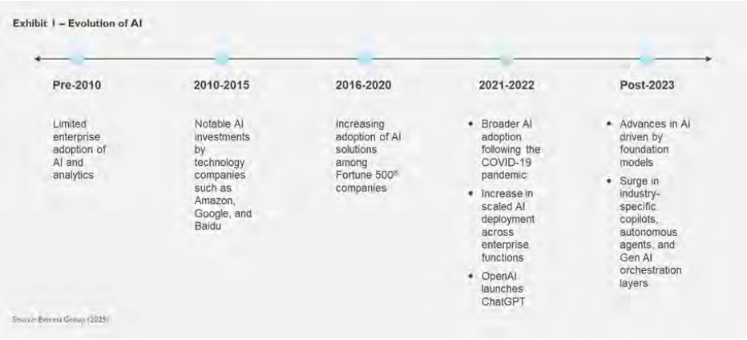

**[Image: 1770955551279.pdf-0247-01.png (932x424, 203.4KB)]**

Traditionally, AI has excelled in performing repetitive tasks, such as recognizing patterns and identifying objects. ChatGPT’s introduction in late 2022 and its unprecedented adoption has propelled Generative AI (Gen AI), a form of AI that can generate and synthesize new content across text, videos, images, and codes, along with higher accuracy on conventional AI tasks, such as personalization, sentiment analysis, and document processing. As of October 2025, ChatGPT has over 800 million weekly active users2 and Google Gemini reports 650 million monthly active users3 , while Google AI Overview serves over 2 billion users monthly3 . Google has almost tripled its monthly processed token count from 480 trillion in May 2025 to 1.3 quadrillion by October 20254 . Similarly, Microsoft has also reported to have processed over 100 trillion tokens in the third quarter of the fiscal year ended June 30, 20255 , underscoring the scale of Gen AI adoption. 

**Exhibit 2 compares the time it took different consumer applications to gain 1 million users.** 

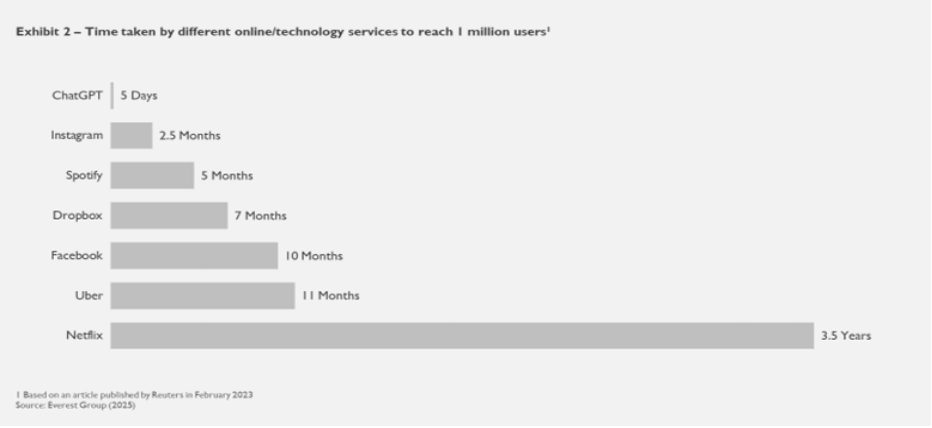

**[Image: 1770955551279.pdf-0247-04.png (932x428, 32.1KB)]**

Gen AI employs large-scale ML models, called foundation models, trained on massive unlabeled datasets. This 

> 2 Based on the article “OpenAI launches AI browser Atlas in latest challenge to Google” published by Reuters in October 2025, available at https://www.reuters.com/technology/openai-unveils-ai-browser-atlas-2025-10-21/ 

> 3 Based on Alphabet’s Q3 2025 earnings call available at https://abc.xyz/investor/events/event-details/2025/2025-Q3Earnings-Call-2025-4OI4Bac_Q9/default.aspx 

> 4 Based on Google’s blog on Alphabet’s Q3 earnings call available at https://blog.google/inside-google/message-ceo/alphabetearnings-q3-2025/#search 

> 5 - Based on Microsoft earnings call transcript for the third quarter of 2025 available at <u>https://www.microsoft.com/en us/investor/events/fy-2025/earnings-fy-2025-q3</u> 

243 

training allows them to adapt to various tasks through fine-tuning, making them useful and versatile tools across diverse AI applications. Notably, according to Everest Group’s Gen AI Chief Information Officer (CIO) survey6 , nearly 83% of the surveyed enterprises are either actively testing Gen AI’s capabilities through pilot programs or have already adopted Gen AI for one or more production-grade use cases. 

**Exhibit 3 illustrates the key differences between traditional and Gen AI.** 

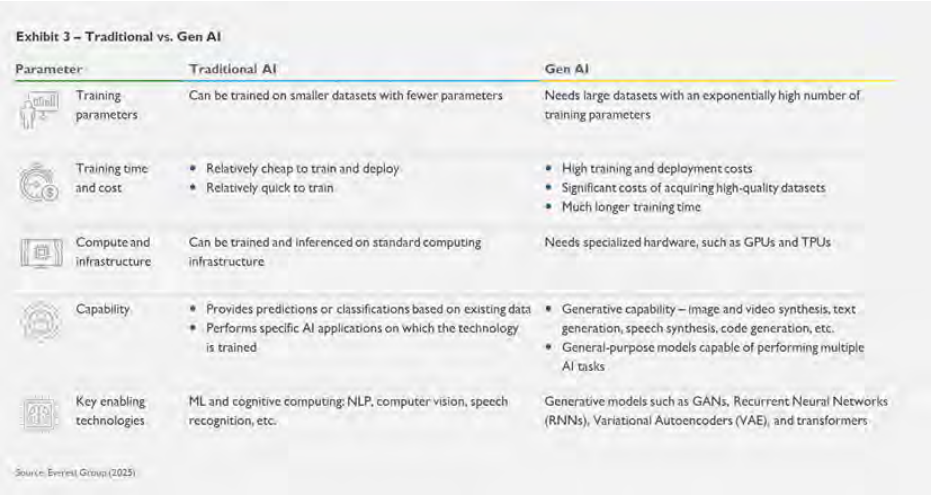

**[Image: 1770955551279.pdf-0248-02.png (932x497, 303.3KB)]**

Today, AI’s applications can be found in weather forecasting, driverless cars, drug discovery, diagnosis, predictive maintenance to reduce machinery downtime, demand forecasting, and image recognition, among others. For example, Waymo, Alphabet’s autonomous driving technology company, has operated a fully driverless ridehailing service since October 2020 and has announced that it has logged more than 10 million autonomous trips 100 million autonomous miles, and is conducting over 250,000 weekly trips as of 20257 ,8 . 

Advances in Gen AI and foundation models have resulted in more immersive user experiences, enhanced automation, and the emergence of entirely new application categories, such as knowledge management, report summarization, code generation, and video or image creation. For example, chatbots and conversational AI systems powered by NLP and Large Language Models (LLMs) that can understand human context better and service a range of queries, enabling enterprises to handle the surge in online customer interactions, resulting in faster issue resolution and higher customer satisfaction. 

As AI continues to evolve, its ability to match or exceed human performance is becoming more apparent. However, achieving superior results requires algorithms that are not only powerful but also explainable and fair. Ensuring transparency in AI decision-making and eliminating human biases are critical to building trust and driving widespread adoption. Additionally, to further integrate AI for effective adoption, thoughtful design and intuitive UI/UX components, such as multimodal interactions and self-service configuration panels, are important factors that enable ease of access and interpretation of AI systems. 

Factors driving this adoption and growth include: 

- Enterprises embedding AI and Gen AI as a key enabling layer into their products, services, and processes to increase operational efficiencies, improve employee productivity, aid decision-making, and deliver enhanced stakeholder experience, including customer experience. 

- Expansion of use cases across industries and business functions due to growth in AI/ML techniques and 

> 6 Based on survey responses from the CIOs of 50+ global enterprises conducted in November 2023 

> 7 Based on Reuters article available at https://www.reuters.com/business/autos-transportation/alphabets-waymo-picks-upspeed-tesla-robotaxi-service-expands-2025-07-15/ 

> 8 Based on CNBC article available at Waymo reports 250,000 paid robotaxi rides per week in U.S. 

244 

algorithms. 

- Increasing adoption of low-code/no-code tools and user-friendly interfaces to address the talent gap and AI literacy issues, helping enterprises democratize AI across their organizations. 

- Progress on building blocks, such as specialized hardware, data foundation, cloud computing, and foundation models (closed and open source), making scaled AI feasible; increased enterprise spending on cloud and SaaS further adds an infrastructure layer for enterprise AI adoption. 

Further, AI is a general-purpose technology with business benefits across industries and, consequently, the potential to impact global outcomes. According to Everest Group’s Key Issues 2024 study9 , 67% of enterprises expect Gen AI to improve existing workflows by enhancing operational efficiencies and employee productivity. 

AI has become a key building block to enabling data-driven decision-making and enhancing stakeholder experience, while ensuring operational resilience. It helps businesses and government bodies understand customer behaviors to launch new products, optimize costs by automating processes, ensure operational efficiencies by reducing manual work, provide recommendations to business users or employees, and reimagine core business functions. For example, Amazon has developed a new foundational model for its robotic fleet and has deployed 1 million robots in its operations10 . 

Agentic AI represents an emerging direction in the evolution of AI. It is an advanced form of AI that creates autonomous agents with a focus on intelligence, adaptability, and decision-making. These agents can perform tasks based on natural language inputs, including goal setting, planning, and taking actions in dynamic environments, with limited human intervention. Agentic AI frameworks integrate technologies such as LLMs and NLP to orchestrate more autonomous and context-aware behaviors. By emphasizing autonomy, task delegation, and continuous interaction, agentic AI is reshaping the DAAI landscape. It enables AI systems to act more independently within defined boundaries, optimize data-driven processes, and support business operations with greater flexibility and efficiency. 

### **GLOBAL ENTERPRISE DIGITAL SERVICES SPEND** 

Enterprises have a diverse range of technology requirements, which vary by industry, local market dynamics, regulatory environment, and technology maturity, among other factors. Most of these technology requirements pertain to services that leverage next-generation technologies to improve business growth, operational efficiencies, and stakeholder experience. In Everest Group’s Key Issues 2024 study, 61% of enterprises expect an increase in their technology spend, with analytics and AI, including Gen AI being high priorities. 

> 9 Based on Everest Group’s Key Issues 2024 study of 170+ enterprises 

> 10 - Based on Amazon’s press release from June 2025 available at <u>https://www.aboutamazon.com/news/operations/amazon million-robots-ai-foundation-model</u> Note: Currency conversions are based on an average exchange rate of US$1 = INR83.67 for calendar year 2024 Source: Everest Group (2025) 

245 

**Exhibit 4 highlights enterprises’ top digital/next-generation investment priorities.** 

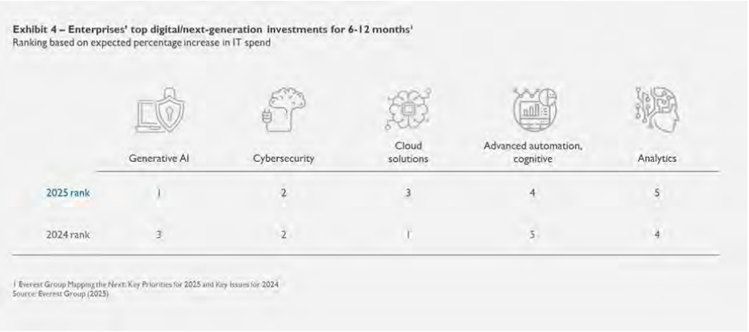

**[Image: 1770955551279.pdf-0250-01.png (938x416, 140.0KB)]**

The COVID-19 pandemic accelerated digitalization as enterprises worked to manage disruptions, build safeguards for the future, improve operational resilience, enhance stakeholder health and safety, and strengthen cybersecurity. 

In 2025, enterprises continue to drive digital adoption by leveraging advances in AI, particularly Gen AI, to enable intuitive business-technology interaction through conversational interfaces. These capabilities help increase operational efficiency by augmenting workflows, speeding up turnaround times, and automating content generation, data enrichment, and complex decision-making. As a result, Gen AI has become a key focus of Information Technology (IT) investments, signaling its growing role in shaping enterprise transformation agendas. 

Enterprises are meeting their digital services requirements in two ways – either through in-house teams or by relying on third-party service providers – and the choice typically depends on the following considerations. 

- Retained with in-house teams: The business’ core services, including those that require domain contextualization and those that may pose risks around governance, quality, and security, are typically retained internally. 

- Third-party service providers: Enterprises typically offload services to access superior talent, scale quickly and on demand, access pre-built solutions/Intellectual Property (IP)/tools/accelerators, deepen ecosystem relationships, learn best practices, acquire domain expertise, and achieve cost efficiencies. 

Certain enterprises may choose to keep all processes in-house to maintain tight control, ensure greater alignment with enterprise priorities, and protect their key technologies, while others may opt to keep only core IP-related processes in-house, outsourcing non-core functions to third-party providers for efficiency and cost-effectiveness. An emerging factor influencing these sourcing decisions is the growing emphasis on digital sovereignty, the ability of an organization to retain control over its data, digital infrastructure, and technology decisions, free from external jurisdiction or dependency. As regulatory environments evolve, enterprises are placing increased importance on ownership, accountability, and strategic control over digital assets. 

246 

**Exhibit 5 illustrates enterprises’ distribution of digital services spend over Fiscal 2021-30 (projected).** 

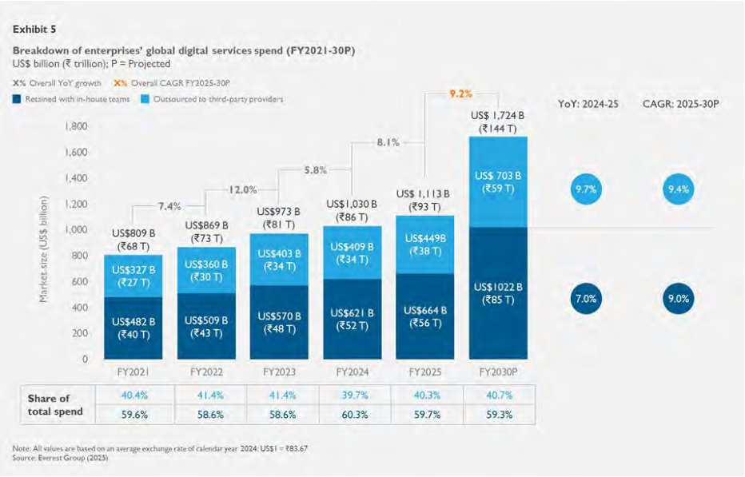

**[Image: 1770955551279.pdf-0251-01.png (932x597, 568.4KB)]**

In Fiscal 2025, enterprises allocated an estimated 40.3% of their total global digital services spend, estimated at US$449 billion (₹38 trillion), to third-party services. While recent macroeconomic conditions may have pushed enterprises to develop more in-house capabilities, the share of third-party spend is expected to continue to increase at an estimated 9.4% CAGR by Fiscal 2030, due to the following reasons: 

- Strategic partnerships: Enterprises can leverage service providers as strategic partners for digital services. In such partnerships, service providers tend to leverage their domain expertise and understanding of enterprises’ tech stacks to customize solutions, identify use cases, support enterprise teams, and gain first-mover advantage in evolving areas. 

- Shortage of niche talent: As technology advances, the demand-supply gap for niche skills and specialized technical experts, such as ML model architects, AI engineers, and prompt engineers, is anticipated to increase and will be difficult for enterprises to fill internally. 

- Ecosystem orchestration: Enterprises are finding it difficult to navigate the digital landscape with an increase in the number of technology companies, especially within the data and AI ecosystem. Enterprises can leverage providers’ strategic partnerships with technology vendors instead of maintaining talent with diverse skill sets and multiple tools and platforms. 

- Access to pre-built technology: Third-party providers deliver pre-built solutions, tools, and accelerators, allowing enterprises to leverage advanced technologies and use cases without the time and cost required for in-house development. 

- Scale and global presence: Enterprises are increasingly looking to leverage third-party providers’ ondemand scalability and delivery footprints across geographies. 

According to Everest Group’s Mapping the Next: Key Priorities11 survey, nearly 54% of the surveyed enterprises are looking for providers that can integrate Gen AI into their overall solutions. 

### **The enterprise DAAI services market** 

> 11 Based on Everest Group’s Key Priorities 2025 study of 200+ major enterprises worldwide (Source: Everest Group (2025)) 

247 

To drive enterprise-wide digital transformation, augment decision making, and maximize value from their data, enterprises are investing in DAAI capabilities at various levels, including data collection, storage, modernization, analysis, AI/ML model development, and deployment. Further, enterprises are increasingly engaging with thirdparty providers for DAAI services, as they find it difficult to navigate the rapidly evolving DAAI market and access the right talent and technologies, while managing internal costs and core competencies. 

**Exhibit 6 depicts the breakdown of enterprises’ third-party digital services spend over Fiscal 2021-30 (projected).** 

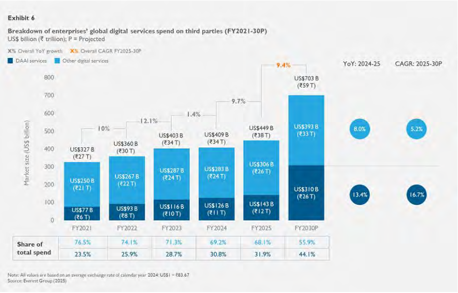

**[Image: 1770955551279.pdf-0252-02.png (932x597, 553.7KB)]**

The DAAI services market accounted for an estimated 31.9% (US$143 billion or ₹12 trillion) of the overall thirdparty digital services spend in Fiscal 2025 and is expected to reach an estimated 44.1% (US$310 billion or ₹26 trillion) of the spend by Fiscal 2030. 

The surge in demand for DAAI services during the COVID-19 pandemic highlighted the importance of services such as data management, modernization, governance, AI-assisted forecasting and productivity tools in driving business resilience and agility. In recent years, this growth has stabilized as enterprises exercise caution due to significant cost pressures and focus on maintaining profitability. However, despite a recessionary macroenvironment, uncertain international tariffs, and evolving enterprise priorities, DAAI remains one of the key investment areas for organizations. 

AI has been an integral component in DAAI since its inception. Increasing advances in AI, bolstered by recent developments in Gen AI, are pushing enterprises to actively invest in a strong AI strategy to achieve businessoriented outcomes and improve stakeholder experience. 

248 

**Exhibit 7 depicts the breakdown of global third-party DAAI services spend over Fiscal 2021-2030 (projected).** 

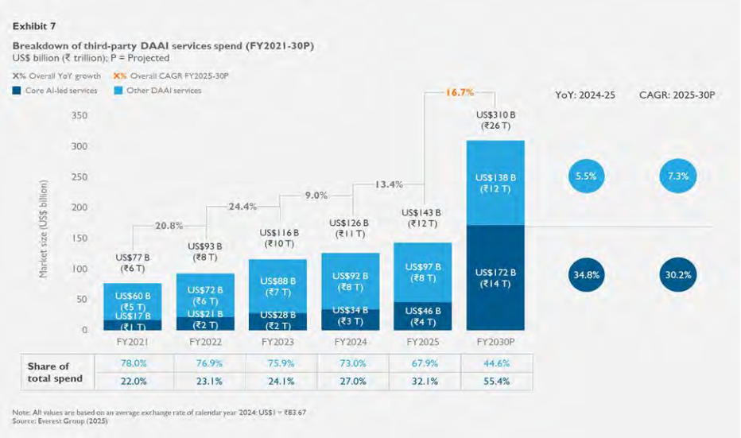

**[Image: 1770955551279.pdf-0253-01.png (932x551, 492.1KB)]**

Core AI-led services focus on the application of AI, ML, and Gen AI for advanced analytics, predictive modeling, conversational interface development to generate text, voice, and video outputs, data augmentation with synthetic data and record generation, among others. These services include AI and Gen AI consulting, maturity assessment, model development, fine-tuning and deployment, and maintenance and monitoring of solutions after deployment, while ensuring governance and responsible AI. The core AI-led services market accounted for an estimated 32.1% (US$46 billion or ₹4 trillion) of the overall third-party DAAI services spend in Fiscal 2025 and is expected to reach 55.4% (US$172 billion or ₹14 trillion) by Fiscal 2030. 

**Exhibit 8 illustrates the breakdown of global third-party core AI-led services spend over Fiscal 2021-2030 (projected).** 

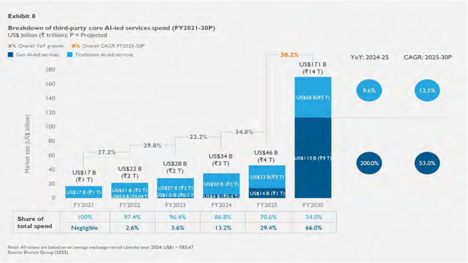

**[Image: 1770955551279.pdf-0253-04.png (932x524, 428.6KB)]**

249 

Traditional AI focuses on recognizing patterns and automating repetitive tasks such as enabling predictive analytics, prescriptive recommendations, demand forecasting, and rule-based process automation. In contrast, Gen AI creates entirely new content by learning from existing data. Enterprises can leverage this capability to automate business report generation, accelerate application development through code generation, generate synthetic datasets to improve model performance and compliance, simulate business scenarios for better planning, and personalize customer interactions at scale across channels. The Gen AI-led services spend for Fiscal 2025 was estimated to be US$14 billion (₹1 trillion) and is expected to grow at approximately 53.0% CAGR by Fiscal 2030. 

### **The DAAI services value chain** 

To unlock the full potential of data-driven decision-making, enterprises are investing in various DAAI services, including end-to-end capabilities such as strategy formulation, data management, AI and Gen AI development, deployment, monitoring, and AI adoption. 

The DAAI services value chain includes four key elements: 

- DAAI strategy: This involves activities related to planning and strategy formulation, including identifying, analyzing, and translating an enterprise's core business processes into technical requirements before an enterprise embarks on implementing core DAAI services. For example, enterprises are utilizing DAAI strategy services to assess the maturity of their infrastructure and prioritize use-cases based factors such as revenue generation, cost savings, RoI, profitability, and scalability. 

- Data foundation: The data layer acts as the core foundation on which analytics and AI (traditional and Gen AI) use cases are developed, and this part of the value chain pertains to setting up, modernizing, or modifying the data architecture to access, store, integrate, and improve data. 

- Analytics and AI (AAI) foundation: This refers to activities related to the development, deployment, and enablement of AI/ML, Gen AI, and analytics use cases. This can include working with technologies such as NLP / Natural Language Generation (NLG), LLMs, computer vision, and reinforced learning to build use cases such as predictive maintenance, knowledge management, and personalized recommendations. 

- AAI adoption: This refers to the consumption layer within the value chain and refers to the end products typically consumed by end users across enterprises through conversational interfaces and interactive virtual assistants, AI agents, Internet of Things (IoT) enabled devices, Augmented Reality (AR) / Virtual Reality (VR), Robotic Process Automation (RPA), Intelligent Document Processing (IDP), amongst others. 

Effective implementation of AI and analytics use cases requires more than just model development. Enterprises must invest significantly in supporting infrastructure, particularly in data management, integration, and userfacing interfaces—to ensure scalability, reliability, and business impact. These foundational components are essential to operationalize AI and drive measurable outcomes. 

### **Exhibit 9 outlines the components of the DAAI services value chain.** 

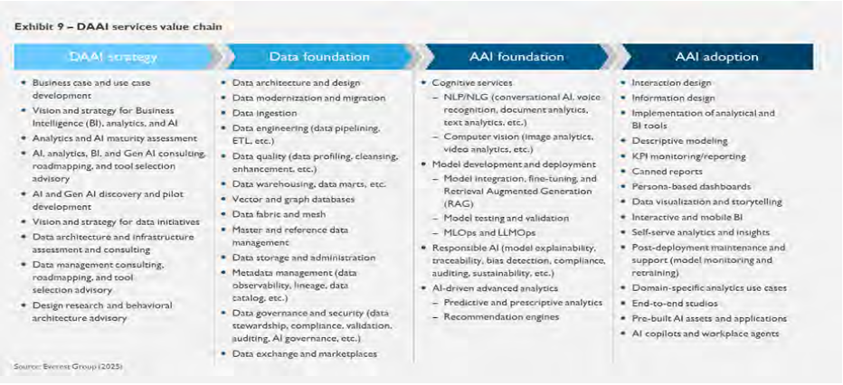

**[Image: 1770955551279.pdf-0254-10.png (932x426, 426.1KB)]**

250 

**Exhibit 10 shows the breakdown of the DAAI services market by value chain element over Fiscal 2021-30 (projected).** 

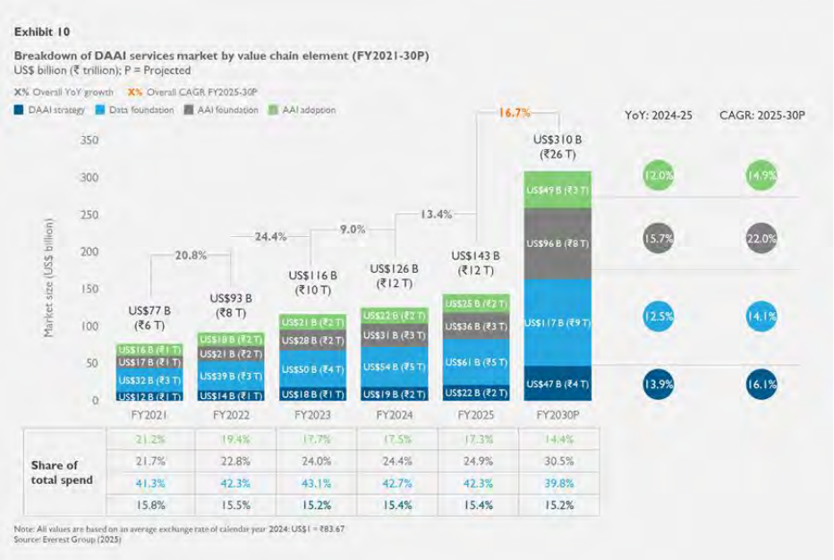

**[Image: 1770955551279.pdf-0255-01.png (932x626, 589.3KB)]**

DAAI strategy, data foundation, AAI foundation, and AAI adoption shares were estimated as 15.4%, 42.3%, 24.9%, and 17.3%, respectively, in Fiscal 2025 and are expected to reach 15.2%, 39.8%, 30.5%, and 14.4%, respectively, in Fiscal 2030. 

A DAAI service engagement is distributed across the value chain depending on the enterprise’s requirements and its level of technical maturity. However, in the early stages of adopting next-gen technologies, the focus is heavier on the DAAI strategy and foundational components. For example, a Gen AI-led services engagement may include larger components of DAAI strategy, data foundation, AAI foundation (such as model development and finetuning), among others. 

Several factors are driving the growth of the DAAI services market across its value chain. 

**Exhibit 11 outlines the key growth drivers for DAAI services.** 

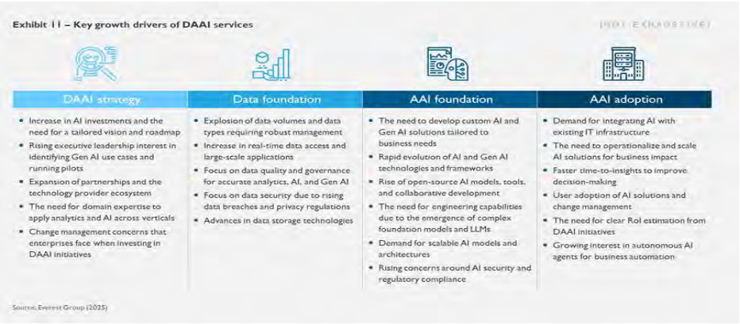

**[Image: 1770955551279.pdf-0255-06.png (932x409, 374.1KB)]**

251 

It has generally been observed that a strong data foundation plays an important role in enabling an enterprise to create the foundation for and scale AAI adoption. Further, the need to effectively capture and manage complex data for Gen AI and agentic AI implementation within enterprises is pushing the growth of data foundation services such as data modernization and processing, managed vector databases and graph databases, and data governance. Additionally, Gen AI will result in the emergence of new services such as Gen AI consulting, LLMOps, and synthetic data-as-a-service across the value chain. 

However, there is also the potential for increasing automation in certain DAAI services, such as traditional BI and reporting, due to the standardization and productization facilitated by Gen AI. With the advancement of agentic AI, the scope of processes that can be automated or augmented is expected to expand further, increasing efficiency across a broader range of enterprise functions. 

### **Key growth drivers of the DAAI services market** 

The factors driving the growth of the DAAI services market can be categorized into the following key areas: business growth drivers, technology developments, and macroeconomic influences. 

### **_Business growth drivers_** 

The strategic adoption of DAAI and expansion of its deployment across functions, geographies, and the workforce, helps companies strengthen its competitive advantage. AI's ability to glean insights from vast datasets fosters a deeper understanding of customer behavior and market trends. This empowers businesses to proactively anticipate customer needs, optimize internal processes, and make data-driven choices that propel them forward. Furthermore, AI automates repetitive tasks, enabling human capital to focus on higher-value strategic endeavors. From personalized marketing campaigns to streamlined production lines, AI empowers businesses to accelerate time-to-market and lower operational costs to assist in achieving market leadership. 

Several business outcomes drive the adoption of DAAI services across enterprises: 

- New product development: Enterprises are leveraging predictive analytics and Gen AI to identify whitespace opportunities – unmet or underserved customer needs and market gaps. They also leverage it to develop customized products and target relevant market segments. Gen AI enhances concept testing, idea generation, and user research by creating realistic personas and usage scenarios, translating customer needs into relevant features. Additionally, Gen AI facilitates rapid prototyping, allowing businesses to test and refine designs quickly and cost-effectively. 

- Cost and operational optimization: In response to challenging macroeconomic conditions, enterprises are increasingly focusing on cutting costs and reducing time-to-deployment. According to Everest Group's Key Priorities 2025 study, enterprises remain optimistic about Gen AI’s potential and are investing significantly to scale their use cases by 2025, with Gen AI seeing the highest percentage increase in IT spend across priorities, reflecting its importance in driving efficiency. Gen AI's ability to produce highquality content and handle complex tasks (for example, call center automation) at scale is instrumental in reducing manual effort and resources. 

- Revenue/business growth: To gain revenue-oriented outcomes from sales, marketing, and customer analytics use cases, enterprises are focusing on AI and Gen AI-driven initiatives. Gen AI can analyze vast amounts of customer data to create highly personalized marketing campaigns, product recommendations, and NLP-based virtual assistants, enhancing customer engagement and conversion rates. 

- Risk and compliance: The growing frequency of data breaches and the tightening of regulatory frameworks are prompting enterprises to adopt DAAI services to strengthen cybersecurity resilience and ensure compliance. Organizations are leveraging AI and Gen AI to enhance threat detection, monitor data access patterns, automate compliance reporting, and improve response times to potential security incidents, particularly in highly regulated industries such as Banking, Financial Services, and Insurance (BFSI) and Healthcare and Life Sciences (HLS). 

### **_Technology developments_** 

The development of AI foundation models, domain-specific Gen AI algorithms, and knowledge graphs is driving more accurate and efficient AI applications across industries. Self-supervised learning techniques enable ML 

252 

models to learn from vast amounts of unlabeled data while multi-modal AI/ML models integrate and process multiple types of data (e.g., text, images, audio) simultaneously, maximizing the utilization of enterprise data. 

In addition to the rapid advances in DAAI technology, there are multiple technology-related developments that enable the adoption of DAAI services among enterprises, such as: 

- Rising data volumes and enhanced utilization: Connected cars, smart homes, and wearables are generating massive real-time data streams, while advances in genomics and bioinformatics contribute vast datasets for scientific discovery. This evolving data ecosystem is a key enabling factor for the adoption of advanced analytics, AI, and Gen AI, which can harness this data. 

- Evolving compute capabilities: Advances in chip technology and parallel computing have enabled scalable data storage and server hardware. The development of high-performance computing resources, such as Graphics Processing Units (GPUs), Tensor Processing Units (TPUs), and AI-specialized compute, has enabled faster and more efficient data processing, facilitating the creation and deployment of sophisticated AI solutions. The recent launch of xAI’s AI training system, Colossus, is claimed by xAI to have over 200,000 GPUs. With its high compute power and throughput, it can help develop AI models at scale12 . Additionally, techniques such as distillation, quantization, and test-time compute optimization have the potential to reduce computational cost and latency. 

- Decrease in marginal cost of intelligence: As advanced models have been launched over time, there has been an observed reduction in inference costs. For example, in August 2025, OpenAI’s ChatGPT5 reasoning model is priced over 85 percent lower per token than its predecessor, O1, launched in December 202413 , while Google’s Gemini 2.5 Flash-Lite costs less than US$1 per million tokens14 ; together, these per token cost reductions should assist enterprises to embed intelligence in more workflows, reducing the strain of compute budgets, accelerating DAAI adoption across functions. 

- Increasing cloud adoption: The widespread adoption of cloud infrastructure enables the processing of large datasets and the deployment of complex AI models at scale. High-performance computing resources and enhanced storage capabilities support the development of sophisticated AI solutions, offering flexibility, scalability, reduced downtime, and cost-effectiveness. The availability of cloudbased DAAI-related Platform-as-a-Service (PaaS) solutions further simplifies analytics and AI adoption. With the rise in demand for cloud technologies and AI services, technology providers are increasing their expenditure. For example, Google has increased its capital expenditure in 2025 to be in the range of US$91 billion to US$93 billion15 . 

- Self-service low-code/no-code and conversational tools: The availability of affordable and user-friendly low-code/no-code tools help enterprises scale AI/ML use cases by simplifying the development process with pre-trained algorithms and step-by-step guidelines. Gen AI further enables data and AI democratization by providing natural language-based support to business users that have no prior experience in AI/ML development. 

- Advances in training architecture: Innovations such as transformers, Reinforcement Learning from Human Feedback (RLHF), Reinforcement Learning from AI Feedback (RLAF), and Supervised FineTuning (SFT) enhance model accuracy, efficiency, and adaptability. These advancements enable enterprises to deploy lighter, more capable models that can be fine-tuned with limited data, expanding the scope and scalability of AI solutions across industries. 

- Quantum computing and quantum processors: Quantum processors offer unprecedented computational speed, enabling breakthroughs in areas such as network optimization, cryptography, and drug discovery. As quantum computing matures, it is expected to unlock new analytics and AI capabilities to address complex enterprise challenges. 

- Neuromorphic computing: Advances in this approach can lead to more efficient and powerful AI models capable of handling complex tasks with significantly lower power consumption. This can drive adoption 

> 12 Based on XAI website for Colossus available at https://x.ai/colossus 

> 13 Based on API pricing of OpenAI models available at https://openai.com/api/pricing/ 

> 14 - - Based on pricing of models under Google Vertex AI available at https://cloud.google.com/vertex <u>ai/generative ai/pricing</u> 15 Based on Alphabet’s Q3 earnings call available at https://abc.xyz/investor/events/event-details/2025/2025-Q3-EarningsCall-2025-4OI4Bac_Q9/default.aspx 

253 

for applications requiring real-time data processing and autonomous systems, thereby enabling faster, more responsive AI-driven solutions, as enterprises seek to harness the benefits of high computational efficiency. 

- Expanding open-source ecosystem: The proliferation of open-source frameworks and tools (Meta’s Llama, Hugging Face) in the DAAI market is expected to drive future trends by fostering innovation, accelerating the development and deployment of AI solutions, and enabling privacy and security. This growth in open-source contributions enables enterprises to leverage advanced analytics and AI technologies more cost-effectively and collaboratively. 

### **_The impact of Gen AI_** 

The increasing availability of enterprise-ready Gen AI tools and technologies is prompting enterprises to sharpen their focus on AI. Gen AI, which gained traction after ChatGPT’s release, offers advanced capabilities in NLP, image generation, and automated decision-making. Industry experts recognize technology’s transformative potential and strategic implications for business operations and are increasingly emphasizing AI and Gen AI adoption across business functions, in meetings and earnings calls. This top-down interest will ensure substantial investment in AI technologies and necessary resources and attention to AI initiatives. 

Subsequently, rising interest and the need for Gen AI services are accelerating the adoption of various DAAI services due to factors such as: 

- Improved data augmentation and efficiency: Gen AI algorithms are trained on complex foundation models that require large volumes of data for training and fine-tuning. Enterprises are investing in robust digital foundations and augmented data management that build high-quality and accurate Gen AI models. 

- Shift in focus from data collection to data generation: Gen AI’s ability to create accurate synthetic data addresses challenges associated with data privacy, security, and limited access to real-world data in specific domains. For instance, synthetic data can be used to train AI models for healthcare applications without compromising patient confidentiality. By creating realistic and usable datasets, Gen AI enables the development of robust AI applications and model training, while ensuring compliance with stringent privacy regulations. 

- Increase in vertical-specific use cases: Gen AI drives highly specialized applications. For example, in marketing, it can craft personalized advertising content. In pharmaceuticals, it can accelerate drug discovery by simulating molecular interactions. These diverse applications broaden the applicability of AI solutions, making them indispensable across industries and business functions. The emergence of domain-specific foundation models that are trained on proprietary enterprise data to incorporate private, organization-specific knowledge into AI solutions, further drives DAAI adoption for tailored use cases. 

### **_The impact of agentic AI_** 

The emergence of agentic AI marks another step forward in enterprise AI maturity, enabling systems to autonomously interpret objectives, make decisions, and act in real time with limited human oversight. Agentic AI extends the impact of Gen AI by introducing self-directed, continuously learning agents that adapt to changing data and environments. Agentic AI development is reshaping the DAAI services landscape in several ways: 

- Redefining traditional DAAI services: Agentic AI is increasingly automating complex tasks across traditional data and analytics workflows with the potential to pave the way for new services. For example, with limited human oversight, AI agents can handle real-time data processing, data ingestion, transformation, and quality enhancement, which human teams managed previously. Model monitoring and drift detection are also being streamlined, with agents performing continuous assessments and adjustments. Additionally, with the help of agentic AI, decision-making processes such as AI roadmap planning may shift toward adaptive, AI-driven strategy recommendations. 

- Expanding autonomous decision-making across industries: Agentic AI reduces the need for continuous human oversight by making autonomous decisions, adapting dynamically, and optimizing workflows in real time. Large Reasoning Models (LRMs), Model Context Protocols (MCPs), and agent operations platforms are enabling this shift by helping autonomous agents orchestrate complex decisions, coordinate across functions, and scale real-time responsiveness. In the BFSI industry, AI agents can potentially act as autonomous financial advisors, fraud sentinels, and claims processors by learning from real-time data 

254 

to detect anomalies, personalize investment strategies, and optimize risk responses. In the HLS sector, agentic systems may enhance drug discovery, early diagnosis, and virtual health support by learning from interactions to refine recommendations and improve patient engagement. In the Consumer Packaged Goods (CPG) and manufacturing sectors, likely areas of impact include adaptive warehouse operations, real-time routing, and responsive demand planning. 

- Driving function-level transformation: Across business functions, agentic AI transforms traditional workflows by enabling context-aware automation. In finance and accounting, systems are automating financial reporting, compliance, and analytics; reducing manual review; and improving reporting accuracy. In sales and marketing, agentic tools are managing lead qualifications, generating personalized campaigns, and automating social media engagement. In Human Resources (HR), use cases include automated screening, onboarding support, and interactive training assistants that adjust to employee learning styles. 

- Introducing new governance and ethical challenges: As agentic AI systems gain autonomy, they raise new concerns regarding accountability, transparency, and ethical decision-making. Some systems incorporate operational guardrails to ensure that agent behavior remains within defined safety bounds. However, as agents take on greater responsibilities, questions emerge about the ownership of outcomes, bias in adaptive learning, and compliance with regulatory standards, highlighting the need for robust governance frameworks and responsible AI practices. 

- Transforming workforce roles and skill requirements: By automating routine tasks and learning from human feedback, agentic AI enables employees to focus on higher-value work requiring creativity, strategy, and interpersonal skills. For instance, AI-powered assistants in HR can reduce repetitive training tasks by capturing and reusing effective onboarding approaches. As these systems continue to evolve, businesses will need to invest in reskilling programs that align workforce capabilities with new AI-driven workflows, facilitating greater human-AI collaboration and productivity. 

### **_The impact of DeepSeek_** 

DeepSeek, a China-based AI start-up founded in 2023, gained prominence by enhancing reasoning capabilities in AI through Reinforcement Learning (RL). Its initial breakthrough, DeepSeek-R1-Zero, was trained entirely via RL, bypassing traditional supervised fine-tuning. This was followed by DeepSeek-R1, which further demonstrated how AI systems could develop advanced reasoning autonomously. By achieving high performance with reduced computational requirements, DeepSeek introduced a shift in model development, offering more efficient and adaptable AI systems that can be deployed at scale. 

These innovations are expected to impact the DAAI services market in the following ways: 

- Enhanced deployment flexibility across industries: Unlike proprietary models from OpenAI, Google, and Anthropic. DeepSeek models are released under an open-source license, enabling developers to customize and deploy them based on specific business needs. This allows organizations to implement the models on premises, in private clouds, or within secure data centers, enhancing data privacy and reducing dependency on third-party platforms. The result is greater customization, lower operational costs, and broader AI accessibility AI across industry segments. 

- Improved decision-making and advanced reasoning: Reasoning models, first introduced with OpenAI’s o1 model, address complex problems through structured, step-by-step analysis. DeepSeek-R1 enhances this approach by integrating chain-of-thought reasoning with RL, allowing models to refine their logic through trial and error. This training approach incorporates feedback to iteratively improve model performance, supporting the development of specialized capabilities by allowing models to adapt to the specific decision-making patterns and complexities of workloads across different sectors. The rise of LRMs has impacted industries such as BFSI, HLS, and manufacturing increasingly demand domainspecific reasoning capabilities. For instance, Tiger Brokers integrated DeepSeek-R1 into its AI assistant, TigerGPT, to help users evaluate stock valuations and identify trading opportunities, demonstrating the model’s practical application in enhancing decision support16 . With the introduction of hybrid reasoning models such as Anthropic Claude 3.7 Sonnet, which can switch between rapid responses and deeper 

> 16 Based on the article ‘Tiger Broker adopts DeepSeek model as Chinese brokerages, funds rush to embrace AI’ published by Reuters in February 2025, available at <u>https://www.reuters.com/technology/artificial-intelligence/tiger-brokers-adoptsdeepseek-model-chinese-brokerages-funds-rush-embrace-ai-2025-02-18/</u> 

255 

chain-of-thought analysis within a single system, users can achieve both speed and enhanced reasoning depth, further improving complex workflows. 

- Driving cost-effective and scalable AI solutions: DeepSeek’s models use techniques such as Mixture of Experts (MoE) and multi-head attention, activating only relevant model parameters for each task. This architecture enables smaller, high-performing models with lower computational overheads, reducing infrastructure demands. Consequently, businesses, including smaller enterprises, can access advanced AI capabilities, promoting wider adoption of DAAI services even in cost-sensitive or infrastructure-limited environments. 

- Enhanced real-time data processing: By combining RL with reasoning frameworks, DeepSeek models are optimized for dynamic data environments, including streaming data and real-time analytics. Their architecture supports fast, autonomous data interpretation, which is useful in scenarios such as fraud detection, real-time audits, and rapid healthcare diagnostics. Decentralized deployment can further enable localized data processing, minimizing latency and enhancing responsiveness across use cases. 

- Fragmentation risks in the AI ecosystem: While DeepSeek’s open-source approach encourages innovation, it also introduces risks related to ecosystem fragmentation. With multiple organizations customizing the model, inconsistencies in performance, compatibility, and interoperability may arise. These challenges highlight the need for standardized deployment frameworks and best practices to ensure reliability and coherence across enterprise implementations. 

- Concerns over ethical AI and data sovereignty: DeepSeek has faced scrutiny over its data sourcing practices, including allegations of unauthorized use of training data from platforms such as OpenAI. These concerns raise broader questions about data ownership, bias, and transparency, particularly in regulated sectors such as finance and healthcare. The open-access nature of DeepSeek also increases the risk of malicious misuse, including cyberattacks or unauthorized surveillance. Cybersecurity risks such as exposed endpoints or model-serving vulnerabilities underscore the need for robust safeguards. 

### **Key challenges hindering enterprise adoption of DAAI services** 

AI is one of the biggest technological waves to date and is being leveraged by enterprises to guide their business strategies and optimize routine business operations. However, the paucity of high-quality data for AI and advanced analytics, low RoI for AI solutions given how they are designed and built, and governance and data privacy concerns continue to hinder broader enterprise adoption. 

### **Exhibit 12 depicts key enterprise concerns for adopting Gen AI.** 

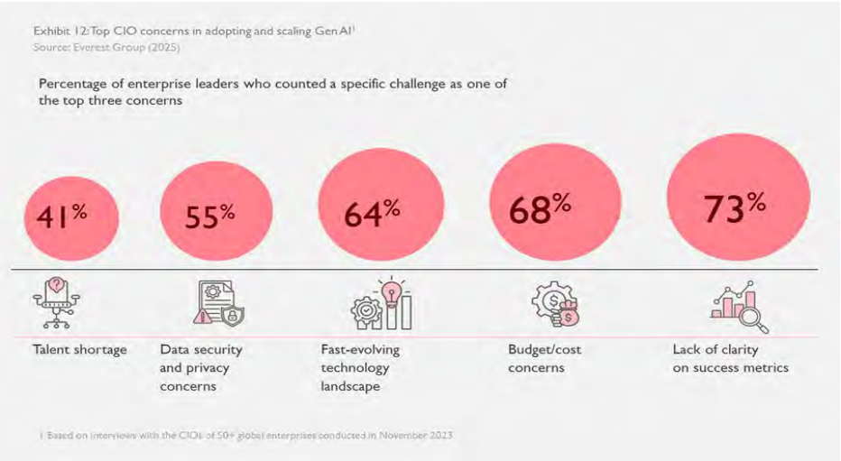

**[Image: 1770955551279.pdf-0260-08.png (932x511, 387.3KB)]**

Key challenges hindering enterprise adoption of DAAI services: 

256 

- RoI issues for AI: AI solutions are often built on the data readily available within an organization rather than being focused on solving specific domain or business problems. In some cases, enterprises try to implement AI solutions without investing enough in designing and customizing them for their specific needs or users. This one-size-fits-all approach leads to lower RoI realization for enterprises. According to Everest Group’s Gen AI CIO survey, 73% of surveyed enterprises considered the lack of clarity on success metrics as a key concern in scaling Gen AI. 

- The lack of a multi-disciplinary approach to problem solving: For successful deployment and scaling of DAAI services across enterprises, possessing technology capabilities is not the only success factor. Enterprises also need to consider certain business aspects, including: 

   - Change management: Limited organizational readiness and cultural issues act as deterrents to the success of analytics and AI implementations. 

   - Project failure due to complex systems and low adoption: In many scenarios, enterprises end up developing AI systems that are very complex and difficult to interpret, which might lead to resistance from end users to adopt them, leading to project failure. 

   - Lack of transparency: Black-box AI systems are leading to lower enterprise trust, hindering AI adoption. Hence, enterprises are increasingly prioritizing transparency and explainability in AI solutions. 

- Governance concerns: Data-related concerns, such as data privacy concerns, data security threats, lack of data quality, and data silos within enterprises, remain the biggest challenges that enterprises face when adopting DAAI. The adoption of Gen AI has increased hallucinatory responses, deep fakes, and bias in AI algorithms. For example, In September 2025, Deloitte’s Future Made in Australia report commissioned to the Department of Employee and Workplace Relations, contained alleged errors such as references to non-existent academic research papers and a fabricated quote from a federal judge.17 The use of AI-generated content also raises copyright and ownership concerns. In Everest Group’s Gen AI CIO survey, 55% of enterprise leaders surveyed emphasized data security and privacy concerns associated with Gen AI. 

- Talent availability: Enterprises have been struggling to keep up with the demand for niche and advanced skills. Rapid changes in AI technologies have further compounded the challenges for enterprises to acquire and retain the right talent and scale their initiatives, limiting the effective deployment and management of AI systems. Gen AI has further impacted this with the rise of new roles, such as Gen AI engineers, architects, and prompt engineers. 

- Fast-evolving technologies: The rapid pace of innovation, particularly in Gen AI methods, techniques, and models, is shortening the shelf life of tools and frameworks. As a result, enterprises struggle to keep up with frequent advancements and face challenges in selecting solutions that remain effective and competitive over time. 

- Legacy data and infrastructure: Text, voice, and video data inferenced and/or generated by Gen AI models requires large unstructured training data and significant engineering effort to serve users at low latency and scale. Many enterprises have legacy systems that are not easily compatible with modern AI solutions. Integrating AI with these existing systems can be challenging, requiring significant time and resources to ensure seamless operations. 

- Geopolitical uncertainty: Frequent shifts in global trade and policy are impacting enterprise investment decisions. These disruptions are delaying discretionary tech investments, slowing project approvals, and increasing pricing pressure in the DAAI services market. In the near term, new incremental tariffs on the export of technology components as well as reciprocal tariffs by counterparts are expected to dampen service demand due to tighter spending and broader economic strain, limiting access to AI-enabling infrastructure such as semiconductors and compute, with effects varying across industries. 

Enterprises are taking several steps to overcome these challenges, including developing internal processes, skill training, and strategic technology partnerships, and working with third-party service providers, which may better 

> 17 Based on the article published by Fortune in October 2025, available at https://fortune.com/2025/10/07/deloitte-ai- <u>australia-government-report-hallucinations-technology-290000-refund/</u> (Source: Everest Group (2025)) 

257 

understand the evolving domain. 

### **Regulatory policies impacting the DAAI services market** 

Despite its considerable potential, DAAI has several legal, financial, and reputational implications for businesses, including concerns around data security and privacy, hallucinations and explainability, accountability and ownership, and bias and ethics. 

### **Key data privacy regulations** 

Data sovereignty is becoming a key challenge in the market. Data privacy and security regulations and AI-related frameworks are proliferating across geographies, as concerns around data protection rise. Europe is leading the regulatory landscape with its push to sovereign data through the General Data Protection Regulation (GDPR) and other regulations, such as the EU AI Act 2024. India's Digital Personal Data Protection (DPDP) Act 2023, California Privacy Rights Act (CPRA), and US Executive Order 14028 also demonstrate the focus on data governance in the digital age. 

### **Exhibit 13 highlights key data security and privacy regulations in major geographies.** 

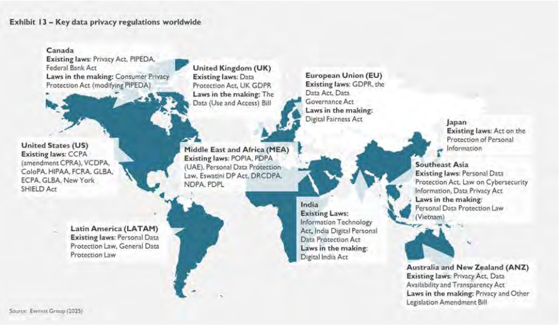

**[Image: 1770955551279.pdf-0262-06.png (932x543, 556.5KB)]**

Stringent regulations pose substantial challenges for enterprises, including reputational damage and costly penalties resulting from legal actions. Notable cases include: 

- In March 2025, a popular social media platform was fined US$600 million under an EU data privacy law by the Irish Data Protection Commission for improperly transferring users’ personal data to China18 . 

- In August 2024, a leading ride-hailing platform was fined US$324 million by the Dutch Data Protection Authority for violating EU data protection laws by unlawfully transferring drivers’ personal data to the US19 . 

### **Vertical-specific data-related regulations** 

> 18 Based on the article ‘TikTok Fined $600 Million for Sending European User Data to China’ published by The New York Times in May 2025, available at https://www.nytimes.com/2025/05/02/business/tiktok-eu-data-china.html 

> 19 Based on the article ‘Uber fined in Netherlands for sending drivers' data to the US’ published by Reuters in August 2024, available at <u>https://www.reuters.com/technology/cybersecurity/dutch-privacy-watchdog-fines-uber-sending-drivers-data-us2024-08-26/</u> 

> Source: Everest Group (2025) 

258 

While data regulations are generally applicable across industries, compliance requirements are increasingly rising in regulated industries such as BFS, insurance, and HLS. 

### **Exhibit 14 lists a few industry-specific regulations across geographies.** 

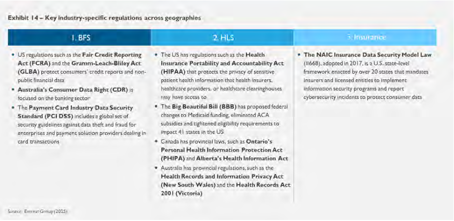

**[Image: 1770955551279.pdf-0263-02.png (932x455, 377.7KB)]**

### **AI regulations and frameworks** 

With increasing AI adoption, countries across the globe are coming up with AI-related regulations and frameworks. While some countries are amending existing copyright and privacy laws, some have started formulating best practices for AI-related initiatives to help enterprises and government entities ensure that bias does not creep into AI models. This trend is particularly relevant for Gen AI, as its ability to create new content heightens concerns about potential misuse. 

The EU AI Act, effective from August 2024, sets a global precedent by establishing a comprehensive legal framework for AI and classifies AI applications into different risk categories, with stricter requirements for highrisk systems, such as facial recognition. The regulation mandates transparency, human oversight, and rigorous testing for high-risk AI, while prohibiting certain applications, such as social scoring and real-time biometric surveillance, which are deemed incompatible with fundamental rights. By adopting a risk-based approach, the EU aims to foster innovation responsibly, protect citizens from potential harm, and establish a trusted environment for AI deployment across sectors. 

South Korea is also actively shaping its AI landscape with a proposed AI Act, which promotes responsible AI development and use, including measures for data protection, transparency, and accountability. 

### **Exhibit 15 depicts key AI-related regulations and frameworks across geographies.** 

259 

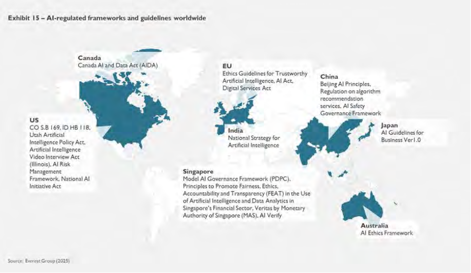

**[Image: 1770955551279.pdf-0264-00.png (932x540, 375.5KB)]**

The high regulatory impositions pose risks related to enterprise branding and hefty fines due to lawsuits, or in some cases lengthy litigation processes even when the outcome is favorable. Some notable examples are: 

- In December 2023, a leading newspaper company, claiming damages in billions, sued a major Gen AI company for copyright infringement20 . 

- In September 2024, the Dutch Data Protection Authority fined a facial recognition company for building an illegal facial recognition database21 . 

- In September 2025, a copyright lawsuit was filed against a major Gen AI company; a U.S. federal judge ruled with a preliminary approval for a settlement of US$1.5 billion.22 . 

Third-party service providers specializing in DAAI services are strategically developing talent pools equipped with the requisite skill sets at scale, alongside robust frameworks to ensure meticulous data and AI governance. Amid escalating talent shortages and mounting regulatory concerns, numerous enterprises find themselves grappling with these challenges. This presents an opportunity for third-party service providers to be adept at offering comprehensive digital services, particularly effectively and responsibly deploying advanced AI technologies while maintaining trust and cost efficiencies. 

### **A DEEP DIVE INTO THE DAAI SERVICES MARKET** 

### **Vertical deep dive** 

BFSI, HLS, retail and distribution, CPG, and TMT were estimated to account for 80% of the global DAAI services market in Fiscal 2025. Increased Gen AI adoption is likely to drive the CAGRs for BFSI (at 16.7%), HLS (18.2%), retail and distribution at (15.2%), CPG at (15.0%), and Technology, Media, and Telecommunications (TMT) (15.7%) over Fiscal 2025-30. While different industries have diverse business operating models, they may share certain value chain elements and face similar problems. For example, CPG and retail and distribution have 

> 20 Based on the article ‘The Times Sues OpenAI and Microsoft Over A.I. Use of Copyrighted Work’ published by The New York Times in December 2023, available at <u>https://www.nytimes.com/2023/12/27/business/media/new-york-times-open-aimicrosoft-lawsuit.html/</u> 

> 21 Based on the article ‘Clearview AI fined by Dutch agency for facial recognition database’ published by Reuters in September 2024, available at <u>https://www.reuters.com/technology/artificial-intelligence/clearview-ai-fined-by-dutch-agency-facialrecognition-database-2024-09-03/</u> 

> 22 Based on the article ‘US judge preliminarily approves $1.5 billion Anthropic copyright settlement’ published by Reuters in September 2025, available at https://www.reuters.com/sustainability/boards-policy-regulation/us-judge-approves-15-billionanthropic-copyright-settlement-with-authors-2025-09-25/ 

260 

common supply chain elements, such as sourcing and procurement and logistics and distribution, while HLS has elements of manufacturing, supply chain, and distribution. 

**Exhibit 16 illustrates the breakdown of DAAI services revenue by industry over Fiscal 2021-30 (projected).** 

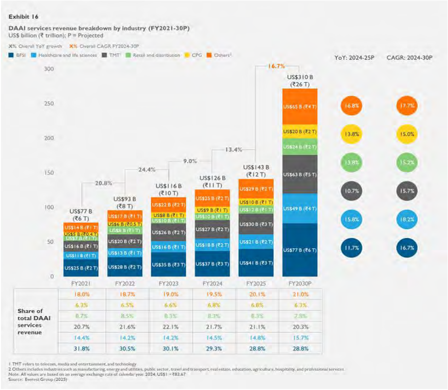

**[Image: 1770955551279.pdf-0265-02.png (924x805, 790.6KB)]**

### **Key vertical-specific developments and growth drivers** 

### **_BFSI_** 

Recent developments in the BFSI vertical driving the adoption of DAAI services are: 

- Macroeconomic conditions and recessionary pressures: BFSI enterprises globally are facing cost pressures and diminishing profitability, driving the importance of analytics, AI, and Gen AI capabilities to streamline operations, enhance decision-making processes, and drive business growth. 

- Rise in transaction volume and rapid digitization of customer information: Digital banking has led to a surge in datasets across multiple payment channels that drives AI and Gen AI use to predict credit scores, manage risks, identify stock price movement trends, deploy virtual agents for wealth management, utilize conversational bots for customer support, and build synthetic datasets. 

- Proliferation of advanced technology: Enterprises are adopting blockchain with analytics and AI to automate decision-making, streamline processes, and respond to security threats in real-time. Coupled with technologies such as image recognition and Gen AI, blockchain can reduce costs, automate transactions, facilitate Know Your Customer (KYC) processes and payment workflows, and address copyright and security challenges. 

- Tightening of regulatory and security norms: BFS firms must follow risk and fraud management 

261 

mandates and compliance norms, such as the PCI DSS and ISO 20022, driving the adoption of structured and unstructured data analytics and AI for regulatory reporting, fraud detection, and risk assessment. Recent advances in Gen AI can further personalize financial products and generate synthetic credit risk models. 

### **Top DAAI services use cases that BFSI enterprises demand are outlined in Exhibit 17.** 

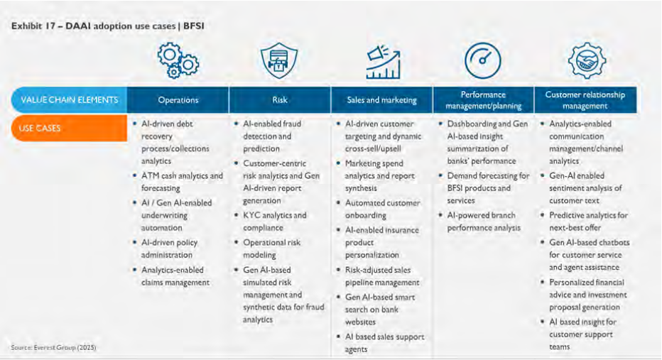

**[Image: 1770955551279.pdf-0266-02.png (932x507, 468.1KB)]**

### **Retail and distribution** 

Key developments in the retail and distribution sector driving the development of enterprise technology solutions and the adoption of DAAI services across enterprises are: 

- Experiential retail for hyper-personalized customer experience: Retailers are adopting AI and Gen AI to boost online and in-store experience through digital installations, interactive displays, AR-based virtual try-ons, visual search, metaverse-based stores, and generated catalogs and descriptions. 

- Rise of social and mobile commerce: Social media and mobile commerce channels present retailers with new opportunities for customer engagement. Data from these platforms can be used to personalize marketing campaigns, optimize product recommendations, and develop marketing creatives, ads, and social media posts, driving analytics, Gen AI, and other AI adoptions. 

- Behavior-driven optimization: Retailers use advanced analytics and AI to forecast demand, understand consumer behavior, capture buying trends, and carry out feedback analysis to optimize product assortment and categorization. Metaverse simulations and Gen AI-generated product layouts can help retailers to optimize their merchandizing strategies by understanding consumer preferences and demographics. 

262 

**Key DAAI services use cases in retail and distribution are listed in Exhibit 18.** 

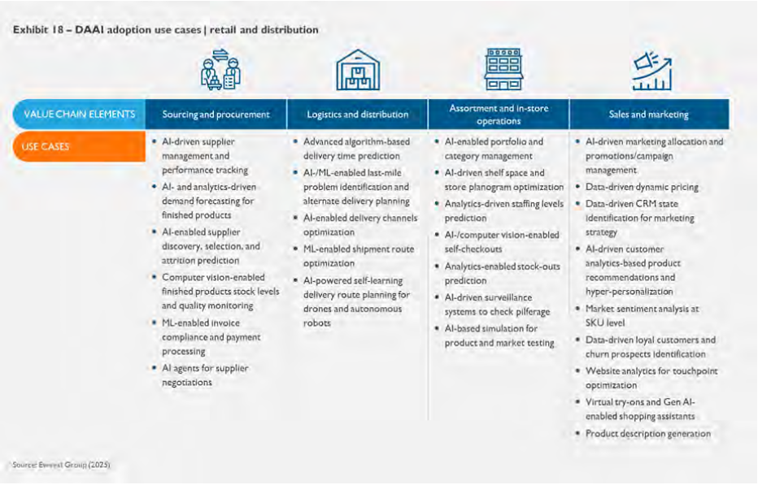

**[Image: 1770955551279.pdf-0267-01.png (932x597, 497.5KB)]**

### **_CPG_** 

Key developments in the CPG sector driving the adoption of DAAI services across enterprises are: 

- Increased focus on Direct-to-customer (D2C) selling: CPG brands are investing in D2C channels to save channel margins, increase control, and drive sales operations visibility. Many emerging digitally native brands sell exclusively through online channels. This shift demands a strong DAAI strategy, with enhanced data, analytics, AI, and Gen AI, to identify customer needs and design personalized campaigns. 

- Emerging small and midsize brands: Competition from rising agile brands has made it imperative for enterprises to achieve high utilization, minimize wastage, expedite delivery times, and ensure product innovation and quality using real-time data-driven decision-making. CPG enterprises are also experimenting with Gen AI-driven product and packaging design to increase customer mindshare. 

- Growing demand for hyper-personalized consumer experience: Consumers expect tailored products, messaging, and engagement across digital and physical channels. Gen AI enables real-time analysis of behavioral and transactional data to deliver customized recommendations, dynamic pricing, and individualized product innovation at scale. 

263 

### **Exhibit 19 lists key DAAI services use cases in CPG.** 

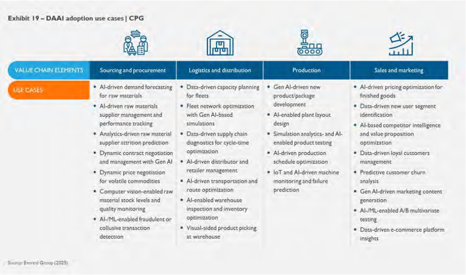

**[Image: 1770955551279.pdf-0268-01.png (932x551, 455.6KB)]**

### **_HLS_** 

Several recent developments in HLS are driving the adoption of DAAI services: 

- Rising importance of connected Value-based Care (VBC): Increasing healthcare expenditures have brought VBC and connected care ecosystems into prominence. Gen AI, along with population health analytics, health information exchange, and claims analytics, helps identify care gaps, optimize resource allocation, and proactively engage patients in preventive treatments. 

- High focus on proactive healthcare: Wearables and IoT medical devices enable access to health data with real-time vital collection, remote patient monitoring, medication adherence, and lifestyle tracking, driving DAAI adoption for data-driven treatment and early prognosis. Precision medicine benefits from understanding data patterns to predict diseases and individual treatment outcomes. 

- Need for faster clinical trials and pharmacovigilance: Rising health concerns push for faster drug discovery and effective vaccines, driving the adoption of AI and Gen AI to speed up trial design, patient recruitment, drug efficacy studies, and risk monitoring. 

- Evolving regulatory landscape in AI-led medical writing: With no unified global mandate, agencies like the Food and Drug Administration (FDA) are tightening region-specific norms. AI-enabled regulatory writing aids in adapting to varying compliance standards, accelerating submissions, and ensuring audit readiness through intelligent automation. 

264 

### **Key DAAI services use cases in HLS are depicted in Exhibit 20.** 

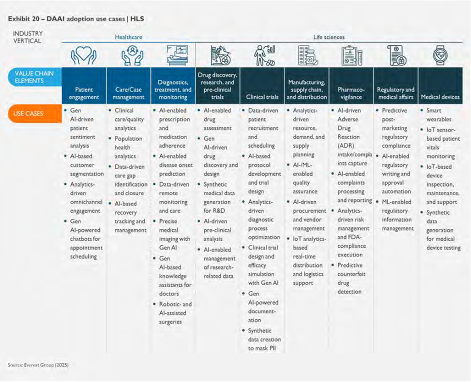

**[Image: 1770955551279.pdf-0269-01.png (942x764, 698.8KB)]**

### **_TMT_** 

Key developments in the TMT vertical that are driving the adoption of DAAI services are: 

- Rising global telecom traffic and the need to self-optimize networks: Manually configuring growing networks and traffic volumes can be time consuming and prone to errors. Self-optimizing networks use AI and Gen AI to proactively fix anomalies, reduce congestion, optimize energy consumption, monitor equipment, and offer personalized network slicing for stable connectivity across devices and applications. 

- Focus on 6G development: AI and Gen AI facilitate the development of radio access technologies, antennas, chipsets, and base stations, enabling equipment providers to advance 6G technologies. 

- High consumption of content: Enterprises are using analytics and Gen AI tools to understand consumption patterns and preferences, ensuring relevant recommendations and content creation, such as subtitle generation, script writing, storyboarding, personalized narratives, and special effects in audio and visual production. This further helps reduce content creation costs. 

- Proliferation of AR/VR: Growing investments in AR/VR and metaverse technology present vast opportunities for the TMT industry. By using data and Gen AI, TMT companies can build immersive virtual environments and avatars that drive user engagement and content consumption. 

- Improvements in IT operations: Expectations of immediate customer support and faster software delivery have driven technology companies to invest in AI-enabled IT operations and software development. AI and Gen AI help gather deeper insights across an application’s life cycle, generate code, automate testing, drive NLP-enabled customer support, and streamline processes and resources for faster value delivery. 

265 

### **Exhibit 21 highlights key DAAI services use cases in TMT.** 

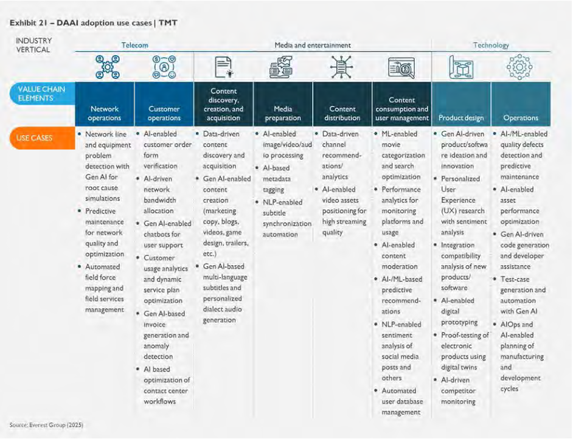

**[Image: 1770955551279.pdf-0270-01.png (942x722, 648.2KB)]**

### **Buyer size deep dive** 

Large buyers (annual revenue > US$5 billion or > ₹418 billion) were estimated to account for more than 70% of the DAAI services market in Fiscal 2025 and are expected to grow at a 15.6% CAGR during Fiscal 2025-30. Midsize and small buyers accounted for an estimated 28% of the market in Fiscal 2025 – their investments are also expected to rise in the future. 

To reduce their reliance on multiple partners across the DAAI value chain, enterprises, especially large buyers, prefer to engage with a single partner for AI solutions. 

266 

**Exhibit 22 depicts the breakdown of DAAI services revenue by buyer size over Fiscal 2021-30 (projected)** 

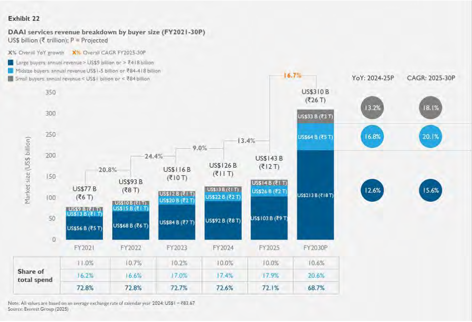

**[Image: 1770955551279.pdf-0271-01.png (942x643, 573.5KB)]**

Key imperatives for buyer size segments 

- Large buyers: Typically, large enterprises (annual revenue > US$5 billion or > ₹418 billion) often have higher DAAI maturity and skilled AI talent. Data-led digital transformation, data asset rationalization, data explosion, compliance, and data monetization drive DAAI adoption in this buyer segment. Topdown pressures are pushing large enterprises to use bespoke AI and Gen AI solutions for competitive differentiation. To realize value faster, these enterprises are breaking down larger transformation deals into smaller chunks. 

- Midsize buyers: The midsize buyer segment (annual revenue US$1-5 billion or ₹84-418 billion) experienced significant DAAI growth in Fiscal 2024-25, driven by investments in their data layers to enable the development of analytics and AI/ML use cases. These enterprises tend to be more agile in exploring use cases and prefer innovative and competitive pricing constructs. Cloud data migration, data warehouse modernization, and shortage of AI skills are other demand areas for this segment. 

- Small buyers: Small enterprises (annual revenue < US$1 billion or < ₹84 billion), traditionally lagging in DAAI maturity, are catching up with their larger peers. Data architecture modernization and Business Intelligence (BI) application development are the key demand areas for this buyer segment. 

### **Geography deep dive** 

In terms of DAAI services adoption, North America is the most mature market, closely followed by Europe. North America and Europe together accounted for approximately 80% of the overall DAAI services market in Fiscal 2025. Other prominent geographies included Japan, China, the Middle East, Australia and New Zealand (ANZ), and Singapore, and they are also expected to witness increased adoption in the future. 

### **Key geography-specific trends, developments, and growth drivers** 

### **_North America_** 

North America has two major markets for DAAI Services – the US and Canada – which are also major markets for many large enterprises. The US has been one of the largest advanced analytics and AI markets since the early 

267 

2000s (with an estimated 13.7% CAGR over Fiscal 2025-30). The region is also a global leader in foundation model development, venture capital funding, and advanced enterprise AI use cases. Canada, which forms a smaller portion of the North American DAAI market, is expected to witness high growth, as enterprises in the region have lower data maturity and are investing in building a strong data management layer and AI capabilities. 

High adoption of DAAI services in North America is driven by the following key developments: 

- Government-led strategies: The US and Canadian governments have initiated various programs to drive AI adoption. Initiatives such as the American Artificial Intelligence Initiative and the US National Science Foundation aim to promote AI research. The US has established the AI Safety Institute Consortium (AISIC) to drive responsible AI through development and usage guidelines. 

- High-performance Computing (HPC) and data center infrastructure: North American institutions boast of some of the world's most powerful supercomputers and also holds one of the highest data center capacities across the world. This readily available HPC infrastructure is crucial for training complex foundation models that require massive datasets and processing power. For example, Google PaLM has 540 billion parameters23 and Llama 4 Behemoth will have 288 billion parameters24 . Additionally, Open AI and Oracle have entered into an agreement to develop 4.5 gigawatts of additional Stargate data center capacity in the U.S which will run over 2 million chips25 . 

### **_Europe_** 

Europe has witnessed remarkable DAAI services growth in recent years, especially in the UK, France, and Germany (with an estimated 15.8% CAGR over Fiscal 2025-30). This surge reflects a strategic embrace of advanced analytics and AI technologies, fostering innovation and competitiveness. Regulatory support and digitalization trends underscore Europe's emergence as a hub for DAAI innovation. Adoption of DAAI services in Europe is driven by the following key developments: 

- Integrated data solutions: Modern data platforms in Europe offer integrated solutions for robust data governance and security across enterprises. The increasing penetration of cloud technology is anticipated to drive the demand for these platforms, streamlining data management and analytics processes. 

- Governmental investments into AI: European governments are intensifying investments in AI research and development. The establishment of European Commission’s AI Office and the European Union’s AI act aim to regulate and promote AI and Gen AI adoption. These initiatives, coupled with growing demand from various industries, are propelling the adoption of AI solutions and fostering an environment conducive to innovation. 

### **_Middle East and Africa (MEA)_** 

MEA, especially the UAE and Saudi Arabia, is an emerging market for DAAI with significant potential for growth (an estimated 30.3% CAGR over Fiscal 2025-30) due to a rapidly growing tech ecosystem, an expanding AI talent pool, supportive government and corporate training initiatives, an evolving regulatory landscape, and a booming oil economy. 

- Rapidly growing tech ecosystem: The MEA region is increasing investments in cloud infrastructure and digital transformation. The growing number of start-ups and technology companies are contributing to a maturing tech ecosystem that provides enterprises with relevant infrastructure and support to deploy and manage DAAI solutions effectively. 

- Emerging AI talent pool: Although the current base of AI talent in MEA is relatively small, government initiatives and universities are developing specialized AI and data science programs to create a pipeline 

> 23 Based on the blog “Pathways Language Model (PaLM): Scaling to 540 billion parameters for breakthrough performance” published by Google in April 2022, available at https://research.google/blog/pathways-language-model-palm-scaling-to-540- <u>billion-parameters-for-breakthrough-performance/</u> 

> 24 Based on the blog ‘The Llama 4 herd: The beginning of a new era of natively multimodal AI innovation’ published by Meta in April 2025, available at <u>https://ai.meta.com/blog/llama-4-multimodal-intelligence/?utm_source=llama-homebehemoth&utm_medium=llama-referral&utm_campaign=llama-utm&utm_offering=llama-behemothpreview&utm_product=llama</u> 25 Based on OpenAI’s press release from July 2025, available at https://openai.com/index/stargate-advances-with-partnership- <u>with-oracle/</u> 

268 

of skilled professionals that attract enterprises seeking DAAI solutions. The Saudi Data and Artificial Intelligence Authority is launching several AI research and training programs as part of Saudi Arabia's Vision 2030. 

### **_ANZ_** 

ANZ has embraced DAAI services, driving innovation and competitiveness. Regulatory support and a growing tech ecosystem underline ANZ's position as a hub for innovation (with an estimated 27.3% CAGR over Fiscal 2025-30). DAAI services adoption in the region is driven by the following key developments: 

- Government strategies driving AI adoption: The governments of Australia and New Zealand are taking several initiatives to boost AI adoption within their countries, including Australia’s Artificial Intelligence in Government Taskforce (AIGT) for responsible AI and the National AI Center to drive business adoption of AI, as well as New Zealand’s National AI Strategy to drive economic growth and public welfare through AI. 

- Growing investment in skill development: ANZ universities are developing specialized AI and data science programs, coupled with government initiatives promoting industry-academia collaboration. This proactive approach, along with a focus on skilling the existing workforce in data literacy and AI fundamentals, allows businesses to adopt and leverage DAAI solutions effectively. 

### **Exhibit 23 illustrates the breakdown of DAAI services revenue by geography over Fiscal 2021-30 (projected).** 

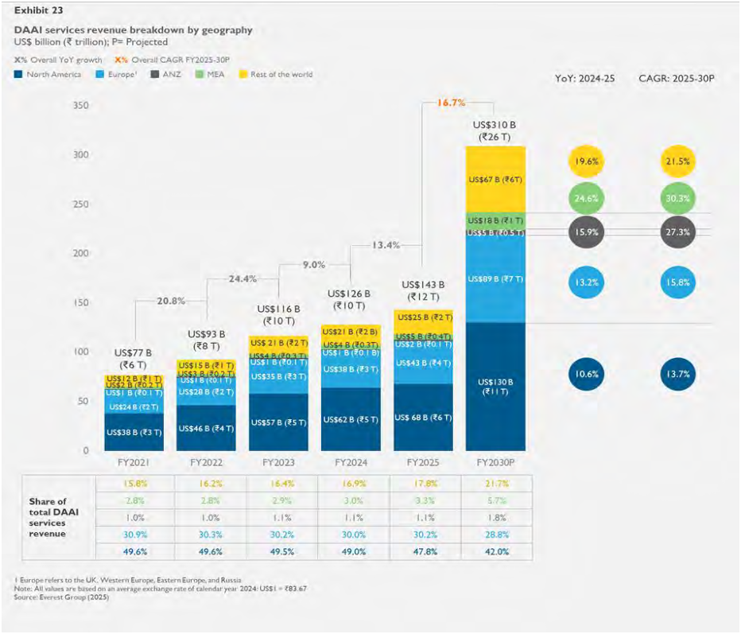

**[Image: 1770955551279.pdf-0273-06.png (932x797, 688.5KB)]**

### **Functional deep dive** 

The data layer, which includes data management, consulting, road mapping, data modernization, data migration, 

269 

data warehousing, governance, and security, pervades all functional areas across an enterprise. Therefore, AAI foundation and AAI adoption have been considered to calculate the revenue breakdown by functional area because these segments comprise functional area-specific use cases, such as sales forecasting, sentiment analysis, campaign management, and expense management. 

Customer experience, sales and marketing, HR, and supply chain together accounted for more than 55% of the AAI foundation and AAI adoption services market in Fiscal 2025. Further, customer experience, sales and marketing, and IT operations are expected to grow at a faster pace during Fiscal 2025-30 due to high Gen AI penetration. 

### **Exhibit 24 depicts the breakdown of DAAI services revenue by functional area over Fiscal 2021-30 (projected).** 

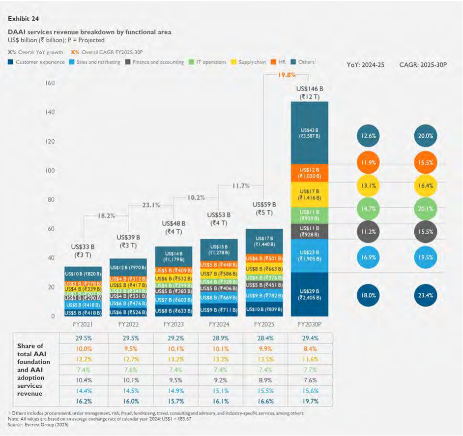

**[Image: 1770955551279.pdf-0274-03.png (942x886, 901.2KB)]**

### **Key function-specific developments and growth drivers** 

### **_Customer experience_** 

Key developments that drive DAAI adoption in customer experience are as follows: 

- Rise of Gen AI virtual assistants for immediate support: Unlike traditional chatbots, Gen AI-powered chatbots can handle complex conversations, understand nuances, and generate personalized responses. They enable a more natural and engaging customer service experience and generate cost savings, with limited involvement of human agents. 

270 

- Proactive customer interactions: AI can proactively anticipate customer needs by analyzing past interactions, purchase history, and real-time data. It allows for proactive support, such as suggesting solutions before problems arise, anticipating inquiries based on browsing behavior, or offering targeted discounts. 

- Gen AI for agent assistance: Gen AI can further enhance customer experience by providing real-time support and knowledge management, drafting responses, transcribing customer calls, and summarizing notes, among others, allowing human agents to focus on more complex issues and enhancing productivity. 

### **_Sales and marketing_** 

Recent developments driving DAAI adoption in sales and marketing are: 

- Rising importance of social media marketing: Gen AI can streamline creative content production by generating original marketing materials, such as product descriptions, social media posts, and personalized video ads. By analyzing brand guidelines, Gen AI can create consistent content that fits brand identity. 

- Increased emphasis on relationship building and customer retention: The adoption of analytics and AI helps enterprises improve customer delight, identify disengaged customers, and provide personalized experiences by analyzing customer journey data, including demographics, lifestyles, past experiences, buying habits, and preferred communication channels. 

- Greater lead conversion: In an uncertain market, ML algorithms can support automated lead scoring by leveraging customer data, past sales interactions, and market trends, enabling sales teams to prioritize their efforts and close deals faster. Gen AI-powered consultative sales agents can also autonomously engage with leads, preventing leads from going cold, keeping the sales funnel relatively active. 

### **_Supply chain_** 

Key developments driving DAAI adoption in the supply chain are: 

- The need for disruption-proof supply chains: AI can help businesses design efficient logistics networks, such as transportation routes, warehouse layouts, and inventory allocation strategies, by simulating various scenarios, which allow for testing and optimization before implementation. 

- Changing customer demand: With increasing emphasis on customer experience, enterprises want to improve demand forecasting, manage product assortment and inventory, and design products that rapidly respond to changing customer preferences, driving the adoption of analytics and AI. 

- The need to strengthen supplier relations: With NLP, Gen AI can analyze supplier data, past purchase history, and market trends to identify cost-saving opportunities, negotiate more favorable terms with suppliers, optimize raw material purchases, and manage inventory storage costs. 

### **_Finance and accounting_** 

Key developments driving DAAI adoption in finance and accounting are: 

- Increasing accounting regulations: Regulatory and compliance requirements, such as International Financial Reporting Standards (IFRS), Generally Accepted Accounting Principles (US GAAP), and Indian Accounting Standards (Ind AS) impose stringent reporting and audit requirement, emphasizing the need to adopt AI-enabled systems that monitor documents, identify gaps, and flag issues. 

- The need for better portfolio management and financial planning: Enterprises are adopting financial analytics and AI services that support asset management, investment planning, product portfolio planning, capital deployment, and market forecasting. The use of AI-driven predictive modeling techniques enables precise financial forecasting, fortifying risk management and decision-making. 

- Automation of repetitive tasks: Gen AI can automate many tedious and error-prone tasks in accounting, such as data entry, reconciliation, report summarization, and invoice processing, which allows accountants to focus on more strategic analysis and decision-making. 

271 

### **_IT operations_** 

Key developments driving DAAI adoption in IT operations are: 

- Rising complexity in IT infrastructure: The increasing complexity of IT infrastructure has led to the adoption of AIOps, which helps reduce resolution time and accurately monitor any unexpected changes in services or infrastructure. Data analytics platforms equipped with AI capabilities can automate anomaly detection and generate real-time alerts, proactively preventing system outages. 

- Protection from cybersecurity threats: AI copilots can serve as virtual cybersecurity partners for IT professionals by predicting vulnerabilities, detecting anomalies, offering instant access to security knowledge, and even helping draft security-focused responses. 

- Remote device management: The shift to a hybrid workplace has pushed IT operations teams to manage remote assets centrally. Enterprises are adopting IoT solutions, along with analytics and AI, to monitor device performance, firmware updates, and battery condition, among others, through asset tracking and management systems. 

### **_HR_** 

Key developments driving DAAI adoption in HR are: 

- High number of job applications: A high number of job applications is pushing enterprises to adopt AI and Gen AI to screen applicants, maintain databases, arrange interviews, write job descriptions, and address candidate queries, thereby significantly reducing hiring effort and time. 

- Increased focus on employee training and development: Enterprises are investing in analytics and AI to map personalized learning journeys and recommend relevant content based on job roles, employee skill sets, learning styles, and future goals. Gen AI-based virtual coaches can assist trainers in offering realtime responses to frequently asked questions. 

- The need for workforce management: AI-powered sentiment analysis can help identify factors that contribute to employee satisfaction and dissatisfaction, which can then be used to create targeted initiatives to improve employee engagement and reduce turnover. Gen AI-powered chatbots can provide 24/7 support by answering questions, directing employees to resources, and scheduling appointments with HR professionals. 

### **DAAI talent footprint by geography** 

In 2025, the overall DAAI services headcount has grown significantly worldwide. Asia Pacific (APAC), accounting for about 60% of the global DAAI talent market, is estimated to grow at the rate of 10-15% annually from 2025-26. India leads the region with its extensive talent pool, lower operational costs, and favorable economic conditions, accounting for more than 40% of global DAAI professionals. According to OECD.AI, India is ranked among the top 3 countries, with the highest number of AI research publications26 . However, there is a growing demand-supply gap in India, particularly for skilled professionals in ML and Gen AI. In March 2024, the government of India launched AI India mission, to build strong AI computing and semiconductor infrastructure and upskill professionals in AI capabilities. 

China has made significant efforts to hire AI talent but faces economic headwinds and tighter regulations. AI chip export restrictions and new data-privacy rules are constraining digital investment. However, at the same time, firms like DeepSeek are actively expanding China’s footprint in the AI sector. 

North America holds 19-25% of the DAAI talent and is projected to grow at 5-10% over from 2024 to 2025. This growth is driven by a mature talent market and robust infrastructure, although higher costs are a consideration. The US leads in developing LLM models, while Canada follows US footsteps, aiming to strengthen its existing AI framework, introduce new laws, and invest in AI skill development. Recent tariff reports on imported semiconductors and AI hardware and regulatory alignment have introduced cost uncertainties, prompting organizations to diversify their talent procurement strategies. 

> 26 Based on live data published by OECD.AI on their website, available at <u>https://oecd.ai/en/data?selectedArea=airesearch&selectedVisualization=top-countries-in-ai-publications-in-time  (Source: Everest Group (2025))</u> 

272 

Europe, which contributes 15-20% to the global DAAI talent market, includes the UK, which accounts for about half of the total European delivery footprint. Europe is making significant strides in AI, having recently introduced the EU AI Act to encourage the responsible use of AI and is estimated to grow at 5-10% over the year 2024-2025. Despite the Russia-Ukraine conflict constraining growth in Central and Eastern Europe (CEE), the Czech Republic, Hungary, and Poland remain important for DAAI services delivery. 

South America accounts for 3-4% of the market. While the region is expanding its footprint, growth has slowed due to economic challenges and political uncertainties. Despite this, South America remains a growing market for DAAI services. 

Similarly, MEA, which holds 3–5% of the market, is a strategic focus area projected to grow by 40% in 2024– 2025, driven by rising investments in its AI talent pool—currently smaller than in most mature markets. Despite this high growth rate, political instability, language barriers, and a relatively small base limit its ability to capture a larger market share. 

Despite these regional variations, the global demand for DAAI services continues to rise, with enterprises increasingly investing in AI and analytics to drive innovation and operational efficiency. 

**Exhibit 25 depicts the distribution of DAAI service professionals by geography.** 

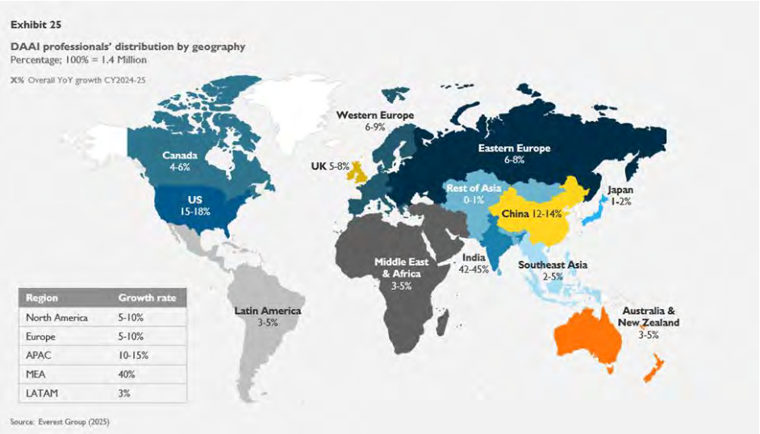

**[Image: 1770955551279.pdf-0277-05.png (942x538, 484.9KB)]**

### **TOTAL AND SERVICEABLE ADDRESSABLE MARKET FOR FRACTAL** 

As Fractal offers services across the DAAI value chain, the overall DAAI market size can be interpreted as Fractal’s Total Addressable Market (TAM), valued at an estimated US$143 billion (₹12 trillion) in Fiscal 2025 and expected to grow at a CAGR of 16.7% to US$ 310 billion (₹23 trillion) by Fiscal 2030 (Refer to Exhibit 7). 

The Serviceable Addressable Market (SAM) for Fractal has been calculated by considering Fractal’s focus areas in terms of geographic spread (focus geographies are North America, Europe, MEA, and ANZ), vertical spread (focus industries are BFSI, retail and distribution, manufacturing, CPG, HLS, and TMT), and buyer size spread (focus on enterprises with annual revenue > US$5 billion or > ₹418 billion). The DAAI services SAM for Fractal is also expected to grow in double digits, as enterprise focus on digital transformation further drives data, AI, and cloud adoption. 

Fractal’s SAM in DAAI services was estimated to be US$76 billion (₹6 trillion) in Fiscal 2024, US$85 billion (₹7 trillion) in Fiscal 2025, and is likely to grow to US$171 billion (₹14 trillion) by Fiscal 2030 at an estimated CAGR of 15.1%. 

**Exhibit 26 depicts Fractal’s SAM in DAAI services over Fiscal 2024-30 (projected).** 

273 

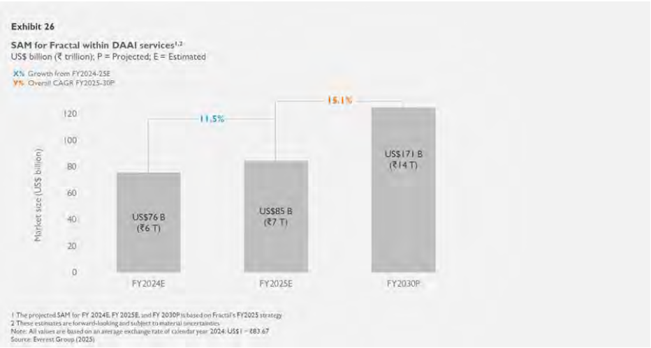

**[Image: 1770955551279.pdf-0278-00.png (932x499, 156.9KB)]**

### **THE AI SOFTWARE MARKET** 

The AI software market is poised for significant growth in the coming years as enterprises increase their digital maturity and scale their AI and Gen AI investments. Advances in computing power, AI algorithms, and the growing demand for automation and personalization will further drive this market’s growth. Additionally, as Gen AI and agentic AI technologies evolve, enterprises will further move from a phase of exploration to experimentation and production. Based on Everest Group’s Gen AI CIO survey, the percentage of enterprises at the experimentation stage increased from 28% in H1 2023 to 61% in H2 2023. This has further introduced a plethora of applications built on the intelligent model layer, addressing impactful use cases across industries. 

AI software providers are AI-first companies that develop and integrate AI as a central component in their products and solutions to the extent that – without it – their offerings would be incomplete. These providers offer AI solutions for B2B purposes and do not include pure-play hardware and service-based AI providers. 

### **Definitional framework of the AI software market** 

274 

### **The key segments that constitute the AI software market are depicted in Exhibit 27.** 

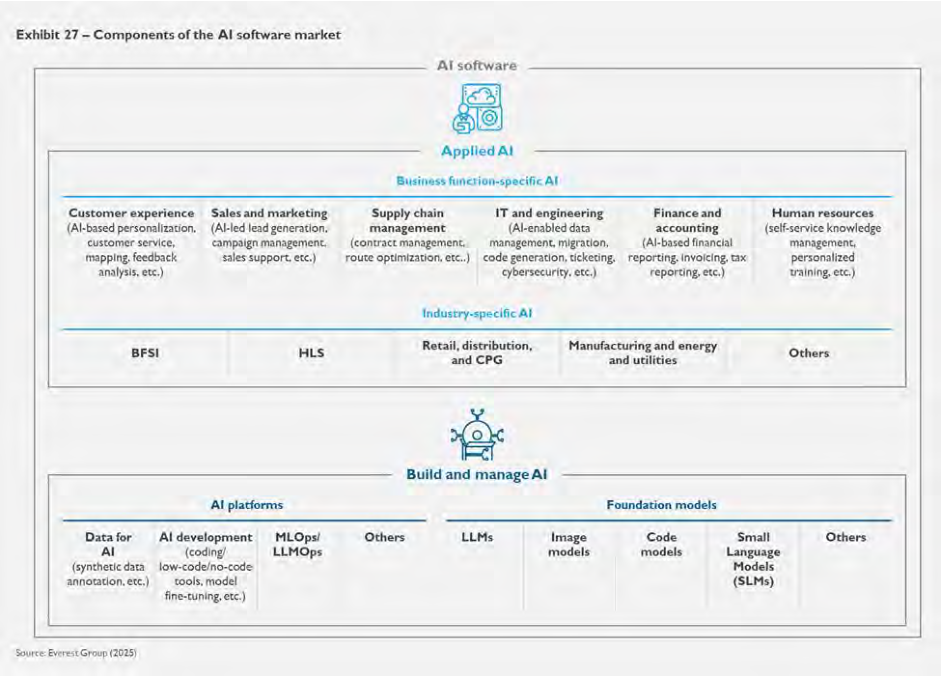

**[Image: 1770955551279.pdf-0279-01.png (942x678, 442.6KB)]**

### **_Build and manage AI_** 

The build and manage AI layer includes tools and technologies required for developing, deploying, and maintaining AI solutions. It serves as the foundation upon which applied AI applications are built. 

Key components of build and manage AI include: 

- AI platforms: This software integrates libraries, frameworks, and pre-built models to streamline AI application development, deployment, and management. Vendors in this segment offer software tools, such as Google Cloud Vertex AI, AWS Bedrock, and Fractal’s Cogentiq, for the entire AI lifecycle, including data generation, preparation, annotation, model training, fine-tuning, and development. These platforms may also offer MLOps/LLMOps frameworks, which facilitate model deployment, AI orchestration tools to ensure efficient workflow integration, AI governance frameworks to ensure ethical and responsible use of AI models, pipeline monitoring, and regulatory compliance. These AI platforms may be coding based, no-code/low-code, or workflow based. 

- Foundation models: These include large deep learning neural networks that have been pre-trained on massive datasets of text, code, images, or other forms of generalized and unlabeled data and can understand language, generate text and images, and converse in natural language. These can be further fine-tuned on enterprise data for contextualization. The most widely recognized AI models driving the segment’s growth include LLMs that generate and understand human language (such as OpenAI’s GPT4, Anthropic’s Claude 3, Fractal Vaidya); reasoning models (such as OpenAI’s O3, DeepSeek’s R1, Anthropic’s Claude Sonnet 4, and Fractal’s Fathom-R1-14B) that tackle complex, multi-step thinking; diffusion models (such as Google’s Imagen and Fractal’s Kalaido.ai), which generate high-quality images; and multimodal models that handle multiple data types, such as text, images, and audio. 

Small Language Models (SLMs) and domain-specific models are gaining traction due to the larger size and resource-intensive nature of general-purpose foundation models. These emerging models are tailored to specific industries and use cases, allowing for more precise and relevant applications. 

275 

While a few enterprises are developing their own private foundation models, most are fine-tuning third-party models due to constraints around cost, talent, resources, regulatory compliance, technology infrastructure, and privacy and security requirements. These third-party models may be proprietary (such as GPT4 and Gemini) or publicly available open-source foundation models (such as Llama and Gemma). Facilitating community collaboration, rapid innovation cycles, and ongoing adaptation due to massive pre-training, open-source models are increasingly gaining traction and strongly competing with other types of foundation models. 

### **_Applied AI_** 

Applied AI software leverages AI and Gen AI techniques, such as ML, NLP, and computer vision, to solve specific problems across industries or business functions. By using the capabilities of build and manage AI, applied AI solutions translate AI advances into practical applications and can be consumed directly by enterprises and end users to achieve targeted objectives. 

The applied AI layer includes business function- and industry-specific AI segments: 

- Business function-specific AI: This includes AI software that can be applied across multiple or all industries to enable common business functions, such as customer service, sales and marketing, and human resources. Illustrative examples include chatbots for customer-service automation and sentimentanalysis tools for marketing campaigns; Jasper and Writer, which help sales and marketing teams create content; Cogentiq Campaign Assist, campaign building tool for content and outreach; Cogentiq Migration, which assists IT teams with cloud migration; and Cogentiq Business Insights, which delivers personalized query-resolution experiences. 

- Industry-specific AI: It includes AI software tailored to address the unique needs of banking, healthcare, and retail sectors, among others. These solutions leverage domain-specific data and expertise to serve vertical-specific use cases, such as AI-driven fraud detection and risk management in banking or predictive equipment maintenance in manufacturing. Examples include software such as Arterys and Viz.ai, which analyze Computed Tomography (CT) scans and Magnetic Resonance Imaging (MRIs) to improve cardiovascular disease diagnosis. Fractal’s Asper.ai offers AI-driven dynamic demand planning to CPG enterprises. Fractal’s Trial run offers business experimentation for aspects such as store remodeling and shelf tactics in the retail and distribution space. Qure.ai provides AI solutions for HLS enterprises to interpret radiology reports such as X-rays and CT scans. 

### **Growth drivers and challenges** 

Key growth drivers of the AI software market are: 

- Rising enterprise preference for pre-built AI products: Enterprises are increasingly choosing AI software over building in-house AI capabilities that require significant Research & Development (R&D) investments, AI talent sourcing, and talent development. Pre-configured third-party software helps enterprises to focus on their core business activities, reduce time-to-market, and avoid operational overheads related to maintenance, feature updates, and navigating the technology landscape. 

- Expansion of cloud marketplaces and cloud computing: Cloud marketplaces make AI software more accessible through the Software-as-a-Service (SaaS) model and scalable deployment capabilities. Cloud providers are continuously investing in expanding their infrastructures to support the growing demand for high AI computing power. 

- Democratization of AI with foundation models: Pre-trained foundational models, such as LLMs, image models, and video models, are making AI more accessible. These models require minimal data and expertise to fine-tune, enabling a wider range of companies to leverage AI capabilities. The rapid adoption of user-friendly tools for text, image, and video creation, software engineering, and customer interaction tools are also gaining traction. 

- Productization of mature and repeatable use cases: Productization of AI use cases refer to the process of converting proven, high-impact AI solutions into standardized, scalable, and commercially viable software or modular offerings. This trend is witnessing an uptick as AI technologies mature and enterprises identify repeatable use cases. Gen AI has accelerated the development of newer use cases across industries and business functions. For example, as Gen AI algorithms evolve, there is a rise in the availability of conversation-based search platforms for enterprise knowledge management. 

276 

Key challenges hindering the growth of the AI software market are: 

- Limited customization: Off-the-shelf AI products usually serve generic use cases and often require significant customization to meet enterprise needs or integrate effectively with existing systems. There is also limited availability of AI software that offers strong domain or business contextualization and comprehensive support services. For example, while general-purpose AI systems such as ChatGPT can simulate playing chess, when competing against a world champion like Magnus Carlsen, it lost the game without capturing a single piece.27 This highlights the importance of developing specialized models and training, while sometimes requiring tailored implementations that align with specific business contexts and performance requirements. 

- Data quality, security, and privacy concerns: High-quality data is critical to ensuring the accuracy and reliability of AI and Gen AI outcomes. Inaccurate predictions, biases, unexpected outcomes, and model hallucinations, often caused by limitations in training data, can push enterprises to limit their investments. Data breaches are also causing consumer dissent and discouraging organizations from using Gen AI technology that transfers confidential data outside enterprise premises. 

- A rapidly evolving tech landscape: The rapid evolution of AI tools has shortened product lifespans and made it difficult for businesses to integrate software with existing platforms and infrastructure. Constant changes create a challenging environment for businesses to keep their AI systems up to date, relevant, and valuable in competitive environments. 

- Change management concerns: Stakeholder resistance due to legacy technology investments, limited business user experience with AI tools, high switching costs, and high implementation efforts can act as barriers. Furthermore, the traditional black-box nature of AI, exacerbated by Gen AI's complexity, limits explainability and reduces users' ability to comprehend and trust AI outputs. 

### **AI software market overview** 

The AI software market was estimated to be worth US$101 billion (₹8 trillion) in Fiscal 2025 and is expected to reach US$283 billion (₹24 trillion) in Fiscal 2030. The overall AI software market is estimated to grow at a CAGR of 22.9% over Fiscal 2025-30. 

> 27 Based on the article published by Times of India in July 2025, available at https://timesofindia.indiatimes.com/technology/tech-news/magnus-carlsen-defeats-chatgpt-at-chess-in-53flawless-moves/articleshow/122401668.cms 

277 

**Exhibit 28 illustrates the AI software market’s size over Fiscal 2021-30 (projected).** 

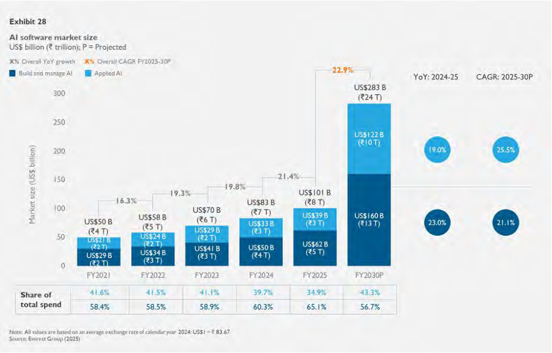

**[Image: 1770955551279.pdf-0282-01.png (942x603, 500.8KB)]**

### **Geography overview** 

North America leads in AI software adoption and was estimated to account for 47% of the global AI software market in Fiscal 2025. This dominance is due to high technology maturity, widespread internet penetration, and a thriving start-up ecosystem supported by venture capitalists. The region benefits from a large pool of skilled AI researchers, engineers, and data scientists, along with vast amounts of data from social media, e-commerce, and IoT devices, which are crucial for developing and training Gen AI models. Additionally, significant growth can be attributed to increased AI spending by defense and government entities on AI for national security, defense modernization, and public sector applications. 

Although strict regulations have traditionally been a deterrent for AI software adoption in Europe, many EU countries are formulating national strategies and regulatory frameworks (such as AI for Humanity in France and AI Made in Germany) to drive adoption among enterprises and public sector entities. The development of a research ecosystem and government initiatives such as the European AI Alliance, AI4EU Project, and Digital Europe Program further support these efforts, providing the infrastructure and resources for businesses to integrate AI technologies. Consequently, companies across industries are increasingly recognizing the potential of AI investments, driving growth and adoption. 

APAC is poised for continued rapid growth in the AI software market due to growing investments, especially in technology infrastructure development, such as cloud computing and robust data centers. An expanding ecosystem of start-ups in APAC, increasing digital maturity of enterprises across key industries, and country-level government initiatives, such as China’s Next Generation Artificial Intelligence Development Plan and India's National Program on Artificial Intelligence, are driving AI adoption in the region. China, Japan, India, and ANZ are some of the key AI software markets in APAC. 

278 

### **Exhibit 29 depicts the AI software market by geography over Fiscal 2021-30 (projected).** 

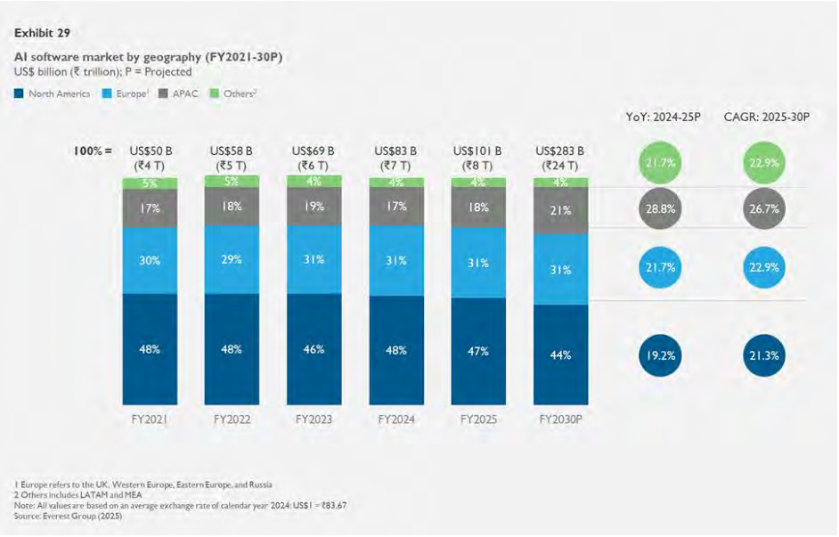

**[Image: 1770955551279.pdf-0283-01.png (942x603, 517.1KB)]**

### **Deep dive of the AI software market** 

Below we discuss the key AI software segments and demand themes driving growth. 

### **_Build and manage AI_** 

### **Exhibit 30 depicts the build and manage AI market size over Fiscal 2021-30 (projected).** 

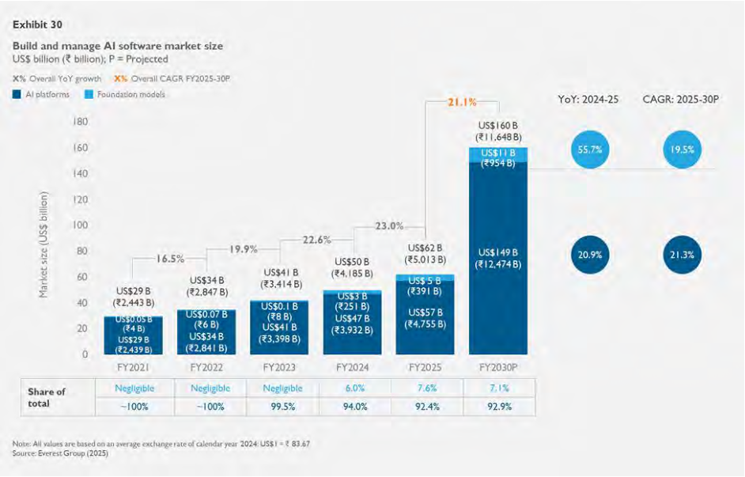

**[Image: 1770955551279.pdf-0283-06.png (942x603, 494.5KB)]**

279 

### **_AI platforms_** 

The AI platforms market was estimated to be worth US$57 billion (₹4.8 trillion) in Fiscal 2025 and is expected to reach US$149 billion (₹12.5 trillion) in Fiscal 2030, growing at an estimated CAGR of 21.3%. 

The key demand themes for AI platforms include: 

- Use case orchestration and deployment of tailored AI use cases: AI platforms offer a flexible and scalable environment and a range of tools and libraries for customizing, developing, and deploying tailored AI solutions. For example, a retail company may use an AI platform to build a custom recommendation engine. AI platforms also enable efficient orchestration and management of AI applications and use cases across enterprises. 

- Increasing access to various AI models and tools: The evolution of AI technologies has increased the accessibility of pre-trained models, specialized tools, and customizable frameworks. This enables organizations to select the most suitable models for specific use cases, accelerating AI development and deployment. 

- Focus on AI operationalization: Challenges in scaling AI initiatives are driving the adoption of MLOps platforms to deploy, monitor, govern, and operationalize AI/ML models. With the rise of LLMs, the need for LLMOps, which help manage vast computational requirements, extensive training data, and the need for frequent updates is also witnessing growth. 

- Low-code/No-code tools enabling AI democratization: Auto-ML capabilities empower non-technical users to build AI pipelines and solutions. Further, AI copilots and code assistants can provide real-time suggestions and automate parts of the coding process. The involvement of business users also enables enterprises to focus on extracting more business-oriented outcomes from these AI initiatives. 

### **Foundation models** 

The software market for foundation models was estimated at US$5 billion (₹391 billion) in Fiscal 2025 and is expected to reach US$11 billion (₹954 billion) in Fiscal 2030, growing at an estimated CAGR of 19.5%. 

The key demand themes for foundation models include: 

- Higher accuracy in AI development: Building accurate AI models from scratch requires substantial data, computational resources, and understanding of traditional ML architectures. Foundation models, pretrained on extensive datasets, provide a starting point for creating specialized AI applications, such as text summarization, machine translation, and product recommendations. Furthermore, these models often achieve higher accuracy compared to off-the-shelf ML models, can be fine-tuned with domain-specific data for more precise results, and require less data and computational power than building a model from scratch. 

- The need for multimodal capabilities: The demand for better contextual understanding has created the need for AI applications capable of processing and understanding information from text, images, audio and video content, and Graphics Interchange Format (GIFs). Multimodal foundation models enable the development of sophisticated AI solutions, especially where concurrent analysis of diverse data types leads to a more nuanced understanding of complex scenarios. 

- Increasing relevance of SLMs: The growing need for AI solutions that can efficiently process and analyze domain-specific information is driving the demand for SLMs. These smaller, resource-efficient models are tailored to specific industries and applications, such as legal document analysis, financial forecasting, and medical diagnostics, in which specialized terminology and data patterns are prevalent. 

### **_Applied AI_** 

280 

**Exhibit 31 depicts the applied AI software market’s size over Fiscal 2021-30 (projected).** 

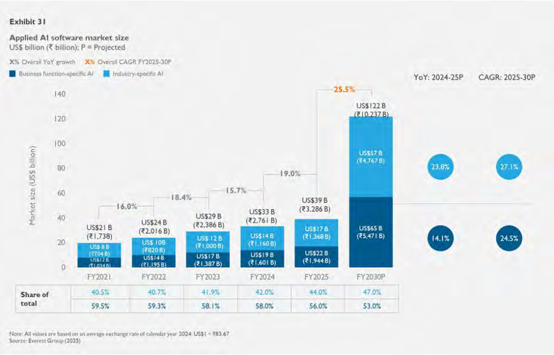

**[Image: 1770955551279.pdf-0285-01.png (940x603, 472.6KB)]**

### **Business function-specific AI** 

The software market for business function-specific AI was estimated to be US$22 billion (₹2 trillion) in Fiscal 2025 and is expected to reach US$65 billion (₹5 trillion) in Fiscal 2030, growing at an estimated CAGR of 24.5%. 

### **Key business function-specific developments and growth drivers** 

### **_Customer experience_** 

Key developments driving AI software adoption in customer experience are as follows: 

- Self-serve customer service: Advances in NLP/NLG allow AI-powered chatbots and virtual assistants to offer 24x7 customer support, manage high volumes of customer inquiries, reduce operational costs, and improve response times, while understanding complex queries accurately and being tailored for enterprises’ specific needs. With the advancements in transformer-based LLMs, Gen AI chatbots and virtual assistants can further provide context-aware support through text or voice generation. 

- Agent assistance: AI tools augment customer agents by providing real-time knowledge management and customer history, automating repetitive tasks such as data entry, auditing and summarizing calls, offering real-time call transcription, suggesting responses, performing sentiment analysis, and categorizing interactions without manual intervention, thereby improving response times and customer satisfaction. 

### **_Sales and marketing_** 

Recent developments driving AI software adoption in sales and marketing are: 

- The need for autonomous sales processes: AI and intelligent automation can automate repetitive tasks, such as lead generation, qualification, email outreach, pricing optimization, and data entry, for better targeting and higher engagement rates. Gen AI-based consultative sales agents can further augment sales by providing tailored recommendations and highlighting upsell/cross-sell opportunities. 

- Hyper-targeted campaigns and ad optimization: Rising competition and the demand for hyperpersonalization are driving the adoption of Gen AI tools for crafting personalized promotional offers and 

281 

generating targeted marketing campaigns, advertisements, logos, slogans, and marketing materials. By analyzing customer demographics and behavior, these tools can design personalized ad copies and visuals that resonate with target audience segments. 

### **_Supply chain management_** 

Key developments driving AI software adoption in the supply chain are: 

- End-to-end supply chain management: AI enables businesses to track goods in real time throughout the supply chain by analyzing data from sensors, Radio-Frequency Identification (RFID) tags, and other devices. This helps predict potential disruptions such as weather changes or port congestion, optimize inventory levels and supply routes, adjust production schedules to avoid stockouts and overstocking. 

- Contract management: AI and Gen AI can streamline procurement and legal processes by autonomously reviewing and editing contracts and creating tailored clauses, while ensuring compliance with legal standards and organizational policies. Virtual procurement assistants can analyze data from historical delivery performance, audits and financial reports, past contractual agreements, and credit scores to augment negotiations. 

- Automation for warehouses and return management: AI software facilitates the use of Automated Guided Vehicles (AGVs), conveyors, and robotics in warehouses for streamlined order picking, packing, and shipping. It automates return processing, minimizes manual efforts and errors, and reduces labor costs, while enabling faster product resupply. 

### **_IT and engineering_** 

Key developments driving AI software adoption in IT and engineering include: 

- AI-powered IT infrastructure management: AI tools enable cloud migration, resource optimization, system failure prediction, and automation of tasks and system configurations, along with intelligent ticket creation, escalation, and resolution. AI-powered automated testing tools autonomously execute tests, identify bugs, and validate software functionalities, minimizing the need for manual updates. 

- AI-assisted code generation: IT professionals and developers leverage AI-based code generation tools that assist in generating code snippets, templates, and programs based on predefined parameters and user inputs, reducing coding errors and expediting development. Gen AI-based tools can also automate the creation of code based on user specifications in a product requirement document. 

- Gen AI based code migration: Gen AI based code migration tools accelerate legacy-code migration, automatically translating codebases between languages or frameworks, refactoring outdated patterns, and surfacing compatibility issues for rapid modernization. 

- AI-driven data management: AI-enabled D&A enables IT operations teams to seamlessly manage, govern, clean, or anonymize enterprise data, support migration, integration, and metadata management by automating repetitive and resource-intensive tasks to extract greater value from these assets. Gen AIbased conversational BI provides intuitive, conversational interfaces for querying and analyzing data and AI-enabled vector and graph databases to enhance data retrieval. 

### **_Finance and accounting_** 

Key developments driving AI software adoption in finance and accounting are: 

- Streamlined accounting and financial reporting: AI and Gen AI are being adopted in financial and accounting to analyze financial data, identify discrepancies, check compliance, and generate financial statements. The increasing complexity of regulatory and tax compliance has further driven the adoption of advanced AI solutions for effective and timely tax calculations and regulatory filings such as Securities and Exchange Commission (SEC) and Internal Revenue Service (IRS) and the identification of compliance risks. 

- Automated billing and invoice functions: AI-based invoice processing streamlines the accounts receivable and payable functions by automating invoice receipt, matching, verification, validation, coding, approvals, and payments. It eliminates manual data entry and paper handling, streamlines 

282 

supplier onboarding, and helps detect fraud and errors. 

- Gen AI for general ledger tasks, financial report generation, and forecasting: Gen AI can generate balance sheets, cash flow statements, and income statements that comply with specific accounting principles. These tools conduct advanced analytics to forecast liquidity, cash flows, and capital needs, enabling organizations to anticipate future requirements and make informed decisions. 

### **_HR_** 

Key developments driving AI software adoption in human resources are: 

- The need for a streamlined recruitment process: The rising number of job applicants is driving the adoption of AI-powered tools to analyze candidate behavior in real time, automate screening, parse resumes, and identify top candidates. Gen AI tools that predict candidate success, personalize interview planning, and dynamically generate questions for each candidate assessment are also gaining traction. Gen AI initiatives that rely on fully automated interviews to assess applicants are currently in pilot stages. 

- The need for engaging training content: AI-driven learning management systems tailor training modules and personalize learning journeys based on employees' skills, roles, and career goals. By analyzing performance data and learning preferences, these systems recommend personalized development plans and improve retention. AI-driven coaching assistants support trainers by providing real-time responses, personalized feedback, and virtual coaching sessions to develop critical leadership skills. 

- Automating administrative and routine tasks: AI tools automate payroll processing, benefits administration, and compliance reporting, reducing HR’s administrative burden. Gen AI chatbots provide 24/7 support, answer questions, direct resources, and schedule appointments. These platforms also autonomously handle tasks such as filing timesheets and expense reports. 

### **_Industry-specific AI_** 

The software market for industry-specific AI was estimated to be worth US$17 billion (₹1 trillion) in Fiscal 2025 and is expected to reach US$57 billion (₹5 trillion) in Fiscal 2030, growing at a CAGR of 27.1%. 

Key industries leading AI software adoption are BFSI; HLS; retail, distribution, and CPG; and manufacturing. The key demand themes that impact AI software adoption in these industries are discussed below. 

### **_BFSI_** 

The BFSI AI software market forms a significant share of the vertical-specific AI market. Key demand themes in this market are: 

- AI-enabled fraud detection and regulatory compliance: According to the US Federal Trade Commission (FTC),28 consumers reported to have lost US$12.5 billion to fraud in 2024, representing a rise of 25% over 2023. The rise in fraudulent transactions has increased the demand for Gen AI fraud detection systems, which assist in anomaly detection and flag suspicious transactions. Enterprises are using synthetic data generators to create datasets for training fraud detection models and other AI tools for regulatory compliance, including anti-money laundering, KYC, employee surveillance, monitoring internal/external communications, and drafting compliance documents. 

- AI for credit score assessment and loan processing: AI-driven credit score assessments comprehensively evaluate borrowers' creditworthiness by identifying patterns and correlations in digital payment records and behavioral data. BFSI institutions are also using AI tools to streamline loan application processing, predict risks, and enhance back-office operations. 

- AI for core insurance functions: Insurers are using AI tools to automate claim validation, and payout calculations by analyzing claims data, past records, and images. Underwriters are also employing ML models to predict risk more accurately and tailor insurance policies by analyzing customer demographics, 

> 28 Based on the article ‘New FTC Data Show a Big Jump in Reported Losses to Fraud to $12.5 Billion in 2024’ published by US FTC in March 2025, available at <u>https://www.ftc.gov/news-events/news/press-releases/2025/03/new-ftc-data-show-bigjump-reported-losses-fraud-125-billion-2024 (Source: Everest Group (2025)</u> 

283 

behavioral data, and historical claims data. 

- Hyper-personalization of customer experience: Banks are investing in AI decision engines to deliver tailored financial insights, and product offers inside their digital channels. Personalized credit-line tuning, dynamic pricing of lending products, and context-aware reward solutions help deepen customer engagement and grow wallet share. 

### **_HLS_** 

The HLS AI software market is among the fastest-growing segments in the vertical-specific AI market. Key demand themes in the healthcare AI software market are: 

- AI chatbots and assistants for telemedicine: AI chatbots can interact with users, analyze symptoms, schedule appointments, and provide personalized health advice or match patients to relevant physicians. Doctors are using AI tools with Automated Speech Recognition (ASR) and Gen AI to recommend prescriptions, suggest follow-up questions, transcribe doctor-patient interactions, and convert voicerecorded medical reports into text. Gen AI models trained on medical jargon can capture contextual nuances to automate Electronic Health Records (EHRs) updates. 

- Deep learning for diagnostics: AI tools extract insights from medical images and scans, such as CT scans and X-rays, to improve diagnostics. Gen AI-based tools generate report summaries, synthetic medical images, patient-specific anatomical models, and provide clarifications to patient questions. 

- Gen AI-driven drug discovery and development: Gen AI models and tools accelerate R&D by generating drug target hypotheses, simulating chemical reactions, and predicting clinical trial outcomes. These models help identify promising drug candidates and protein sequence designs, streamline development, and enable researchers to explore a broader chemical space. Certain scientists also leverage Gen AI to simulate molecular interactions and predict potential side effects. 

- Automated claims management: Gen AI tools streamline the end-to-end claim management process from intake and eligibility checks to adjudication and fraud detection. These models extract data from various unstructured documents to validate claims, flag anomalies, and generate summaries for authorization or denial. 

### **Retail, distribution, and CPG** 

The retail, distribution, and CPG AI software market is growing fast and is expected to be driven by the high demand for AI-enabled products that drive sales and marketing and store operations. Key demand themes in the retail, distribution, and CPG AI software market are: 

- AI-enabled inventory management: Retail and CPG enterprises are investing in AI-enabled tools to optimize demand forecasting, procurement, and inventory levels, while reducing waste and ensuring product availability on demand. 

- Evolving shopping practices: To keep consumers engaged, retail firms are increasingly looking for Gen AI tools that allow them to generate product recommendations based on individual preferences, enhance shopping experiences through virtual fittings, and boost customer satisfaction through intelligent search functionalities. 

- AI for retail analytics and store planogram design: AI-powered analytics software optimizes merchandising and store planning. Gen AI can create optimized layouts and planograms that can position products based on sales history, product compatibility, and customer traffic patterns. 

- Product concept development and cataloguing: AI tools help CPG firms identify new product opportunities, automate product classifications, and generate creative concepts for packaging and prototypes. They also streamline catalog updates and generate Search Engine Optimization (SEO)optimized product descriptions. 

- AI based e-commerce optimization: Retail firms are investing in AI solutions for dynamic product pricing, personalization of online search results, consumption tracking and analytics, and churn prediction to boost traffic and visibility, drive conversion, optimize investments, and increase sales. 

284 

### **Manufacturing and energy and utilities** 

Manufacturing and energy and utilities enterprises have traditionally lagged in investing in advanced technologies such as AI. However, with the increasing need for operational resilience and business continuity, this segment’s reliance on AI is expected to grow in the future. 

The key demand themes in the AI software market for manufacturing and energy and utilities are: 

- Predictive maintenance: Manufacturing and energy firms are implementing AI and analytics tools to monitor asset maintenance schedules, predict equipment failures, and proactively implement corrective actions. 

- AI-enabled product quality management: Manufacturing and energy and utilities firms are using advanced analytics and AI to manage product safety standards, reduce scrap and costs, and develop immersive solutions (AR/VR) to deploy advanced test simulations, remotely test finished products, and inspect utilities pipelines and infrastructure. 

- Computer vision to enhance worker safety: Computer vision technology can continuously monitor the work environment for safety hazards, such as improper personal protective equipment use, machinery malfunctions, and unsafe worker behavior. Real-time alerts enable immediate corrective actions, preventing accidents. Computer vision also ensures compliance with safety regulations by monitoring and recording safety practices and providing data for incident analysis. 

### **Fractal’s AI IP portfolio** 

Fractal’s business can be broadly categorized under two buckets, namely: 

- Fractal.ai: majority of the business (~97.8% of Fractal’s revenue29 in Fiscal 2025), which houses DAAI service offerings, accelerators, and licensable software 

- Fractal Alpha: focused on incubated and acquired licensable offerings deployed across multiple clients 

**Exhibit 32 outlines IP from Fractal.ai and Fractal Alpha focused on the AI software market.** 

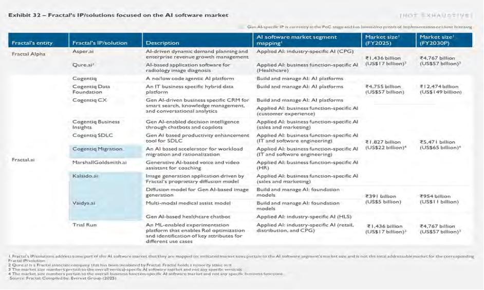

**[Image: 1770955551279.pdf-0289-11.png (942x566, 450.5KB)]**

29 Based on information provided by Fractal Analytics Limited (Source: Everest Group (2025)) 

285 

Fractal is currently focused on developing AI-specific IPs: 

- Vaidya, a publicly accessible medical multi-modal foundation model ecosystem consisting of LLMs, VLMs, and medical reasoning systems 

- Kalaido.ai, a diffusion-based foundation model system for image creation from text that operates across multiple Indian languages 

- Project Ramanujan, an initiative for creating reasoning models, that won the inaugural Meta Hacker Cup (AI Track) at NeurIPS 202430 

- Fathom R1-14B, an open-sourced large reasoning foundation model 

- Fathom DeepResearch, an agentic Deep Research system with two components: 

   - Fathom Search-4B, an LLM trained for evidence-based deep search 

   - Fathom-Synthesizer-4B, an LLM designed for response synthesis and report generation 

- Pioneer, a multi-agentic AI system to streamline and enhance the Software Development Lifecycle (SDLC) and for autonomous data science problem solving 

- Cogentiq, an AI platform with a pre-built suite of agents, tools, and connectors with in-built low-code, security, governance, auditability, and interoperability features 

As per internal benchmark studies conducted under controlled conditions by Fractal, Vaidya has performed well across several benchmarks and claims to be at par or better than several other state-of-the-art models of 2024. 

- According to benchmarking results in the Fractal research paper accepted for AutoML 2025, Pioneer, powered by the o3 mini high model, achieved the highest average percentile and secured the most medals among all tested model and system combinations. 

- The benchmarks published by Fractal on Hugging Face show: Fathom R1-14B has performed better than the DeepSeek R1 distilled model with 32B and 14B parameters, o3-mini-low, and o1-mini on AIME (American Invitational Mathematics Examination) and HMMT (Harvard-MIT Math Tournament) in 2025. 

- Fathom DeepResearch has also scored higher than comparative models from organizations such as Perplexity, Anthropic, and OpenAI, in the deep search domain on benchmarks such as DeepResearch Bench, SimpleQA, and WebWalkerQA. 

Previous efforts of IP investments have yielded tangible outcomes, including other publicly accessible IP such as MarshallGoldsmith.ai and Kalaido.ai. Fractal’s proprietary tools, platforms, and solutions are designed for industry-specific as well as cross-industry use cases. 

Fractal also owns a minority stake in Qure.ai, a healthcare start-up incubated by Fractal, which offers AI application software for radiology image diagnosis, some of which have received US FDA pre-market notification (510(k)) clearance. 

Fractal has also invested in Analytics Vidhya. Based on Everest Group’s analysis, it is the largest analytics and data science community originating in India. As of March 31, 2025, it is bringing together more than 4.9 million registered users worldwide. It does this through forums, public hackathons, discussions, blogs, and other collaborative learning activities along with dedicated job boards and hiring challenges. 

Additionally, as of January 19, 2026, Fractal has filed for 66 patents31,32 , of which 28 have been granted and 38 are in the application stage. This total includes 18 patents filed under Asper.AI, of which 6 have been granted. 

> 30 Based on NeurIPS 2024 results available at https://neurips.cc/virtual/2024/competition/84789 

> 31 Each patent registration is counted separately for every jurisdiction (country) in which it has been filed, even if it pertains to the same invention and does not include any patent which have been abandoned. 

> 32 Additional/Subsequent claims made on an invention have been counted separately, as the continuation of an application is considered to be a separate application (Source: Everest Group 2025) 

286 

Further, Qure.ai has filed for 61 patents, of which 40 have been granted. 

In addition to these offerings, Fractal.ai has developed a large pool of IP, currently being embedded in the company’s service delivery. Fractal.ai does not offer the IP as independent licensable offerings currently but may choose to do so in the future. 

### **Exhibit 33 details other IP/solutions offered by Fractal.ai.** 

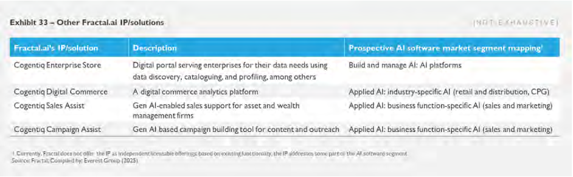

**[Image: 1770955551279.pdf-0291-03.png (942x292, 263.5KB)]**

### **FRACTAL’S COMPETITIVE POSITIONING** 

Fractal focuses on AI and advanced analytics and provides DAAI consulting and technology services, software solutions, and AI products, with advanced capabilities in Computer Vision (CV), NLP, and Gen AI, to enterprises. In essence, making Fractal an end-to-end player in the DAAI market. It was positioned as a Leader on Everest Group’s Analytics and AI Services Specialists PEAK Matrix_®_ assessments in 2024, 2022, and 2021 and Data and AI Services Specialists PEAK Matrix® Assessment 2025 – North America. The Analytics and AI Services Specialists PEAK Matrix_®_ Assessment 2021 highlighted Fractal’s capabilities across behavioral sciences, design thinking, data science and AI, and cloud engineering, which differentiated its holistic approach to problemsolving. Everest Group’s Analytics and AI Services Specialists PEAK Matrix_®_ Assessment 2024 highlighted Fractal’s strong IP and asset portfolio across the DAAI value chain. Fractal’s clients include many Fortune 500_®_ companies. The company has also served public agencies in the past. In addition to offering DAAI services, the firm has made investments in developing technology IP and assets that can be licensed to clients. 

Players operating in the broad segment covered by Fractal’s offerings can be categorized into the following: 

- Product-focused companies such as C3.ai and Palantir 

- Diversified IT service providers, such as Accenture, Coforge, Globant, Happiest Minds, and Persistent Systems 

- Pure-play DAAI service providers, such as Artefact, LatentView, Quantiphi, Quantium, Tiger Analytics, and Tredence 

Exhibit 34 compares the DAAI capabilities and financial metrics of industry players across the three segments based on information published on their websites and latest financial reports. Fractal is India’s leading pure-play enterprise data, analytics, and AI company, recognized globally, with capabilities across the DAAI value chain. It is placed uniquely among the players benchmarked within the cohorts, with active investments in expanding its AI and Gen AI software portfolio and R&D capabilities. It recorded revenue growth at a CAGR of 18.0% over Fiscal 2023-25 compared to the DAAI global third-party market’s CAGR of 11.0%, demonstrating its ability to win market share. Fractal received 4.4 out of 5 rating on Glassdoor33 for culture and values, along with an overall rating of 4.2 out of 5, as of November 26, 2025. It has also been recognized by Glassdoor as one of the Best-Led Companies of 202534 . 

Fractal Group recorded gross margins– calculated as the ratio of revenue from operations less operating cost of 

> 33 Based on Fractal’s Glassdoor rating available at <u>https://www.glassdoor.co.in/Reviews/Fractal-Reviews-E270403.htm</u> (Source: Everest Group (2025)) 

> 34 Based on Glassdoor’s website available at https://www.glassdoor.com/Award/Best-Led-Companies-LST_KQ0,18.htm 

287 

delivery to revenue from operations: 

- Fractal Group recorded 45.9% in Fiscal 2025, 44.5% in Fiscal 2024, and 44.8% in Fiscal 2023, indicating stable profits and financial performance. Fractal.ai recorded gross margins of 45.3% in Fiscal 2025, 44.2% in Fiscal 2024, and 44.9% in Fiscal 2023, while Fractal Alpha recorded 69.9% in Fiscal 2025, 62.7% in Fiscal 2024, and 40.0% in Fiscal 2023. 

- Fractal Group recorded 45.8% in H1 2026 vs 44.2% in H1 2025, Fractal.ai recorded gross margins of 45.2% in H1 2026 vs 43.7% in H1 2025, while Fractal Alpha recorded 67.3% in H1 2026 vs 65.4% in H1 2025. 

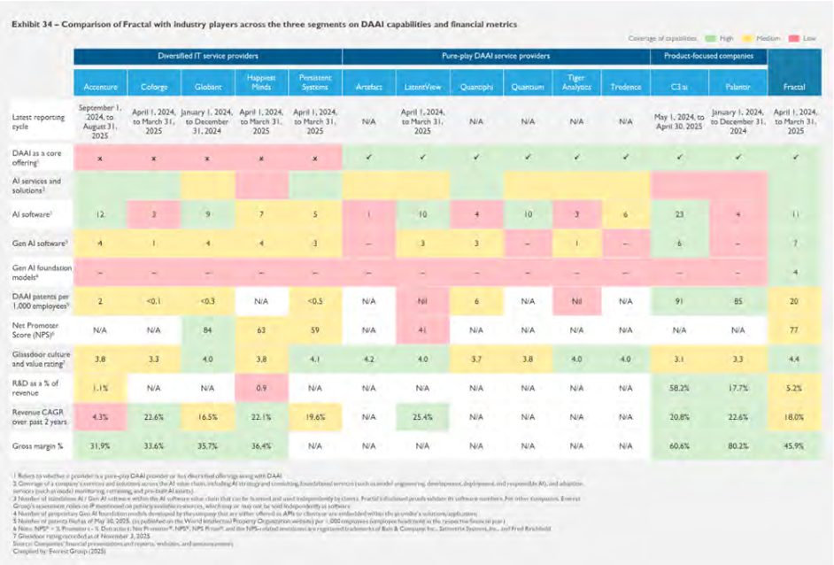

**[Image: 1770955551279.pdf-0292-03.png (942x638, 735.4KB)]**

Based on the above exhibit, Fractal occupies a distinctive competitive position and differentiates itself from industry players across segments as follows: 

When compared to benchmarked industry players providing diversified IT services: 

- These players offer a broader suite of services beyond DAAI, including IT, cloud, cybersecurity, and ERP services, among others. 

- While some diversified IT service providers have built strong DAAI services capabilities and have invested in AI and Gen AI software, they hold relatively fewer patents per 1000 employees and have not reported any Gen AI foundation model development. 

When compared to benchmarked industry players providing pure-play DAAI services: 

- These industry players primarily operate as services firms, delivering bespoke DAAI services and solutions. Many such entities show strong DAAI services maturity in a few specialized functions or verticals but may lag in others. 

- Across the above industry player set, Gen AI-specific software and DAAI-specific patents are minimal when compared to Fractal. Further, these players have not reported the development of any foundational models 

- Fractal distinguishes itself by offering its solutions such as Vaidya.ai, Kalaido.ai, and 

288 

MarshallGoldsmith.ai directly to consumers (B2C). 

• Additionally, Fractal has invested in Analytics Vidhya, the largest India-originated data science community, with over 4.9 million registered users worldwide. 

When compared to benchmarked product-focused players in the DAAI industry: 

- These players derive a significant portion of their revenue from licensed AI software with services primarily tied to these offerings. In contrast, Fractal complements its product portfolio with standalone DAAI services. 

- Both these players have reported a high number of patents per 1000 employees and significant R&D spending. However, Fractal has differentiated itself by developing four Gen AI foundation models – a capability not reported by any other players in the group. 

Further, Fractal has experience in serving several large enterprises including majority of the “magnificent seven” companies (Alphabet, Amazon, Apple, Meta, Microsoft, Nvidia, and Tesla). 

**Exhibit 35 indicates the company’s clientele among the top 20 enterprises across verticals.** 

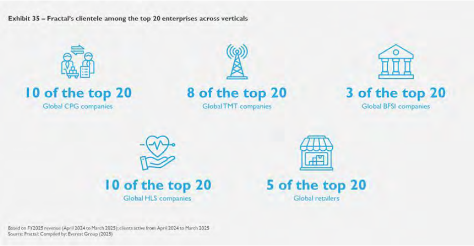

**[Image: 1770955551279.pdf-0293-07.png (940x488, 348.1KB)]**

The firms compared in Exhibits 36 and 37 have a global clientele and serve diverse industries and geographies, demonstrating their versatility, expertise, and ability to adapt to different business contexts. 

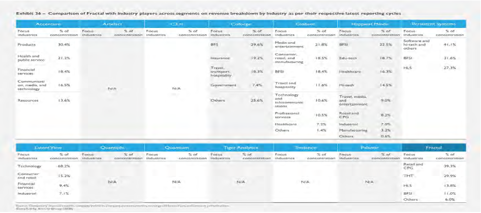

**[Image: 1770955551279.pdf-0293-09.png (946x420, 341.8KB)]**

289 

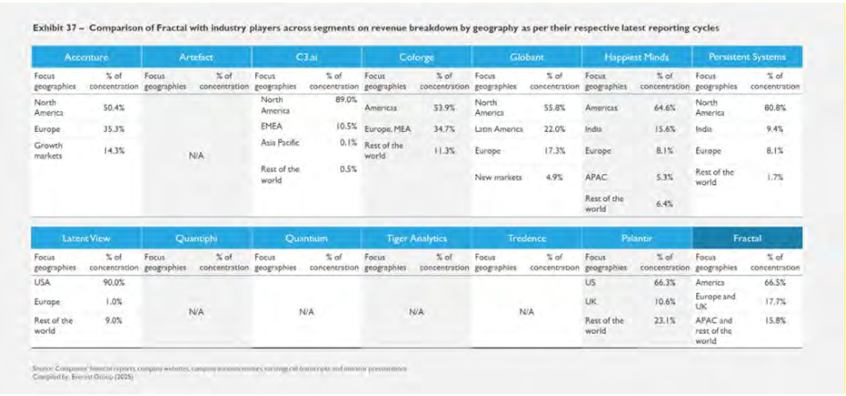

**[Image: 1770955551279.pdf-0294-00.png (942x441, 414.8KB)]**

### **Everest Group Analytics and AI (rebranded to Data and AI) Services Specialists PEAK Matrix Assessment** 

Everest Group published the Analytics and AI Services Specialists PEAK Matrix® Assessment in 2021 2022, and 2024. The 2025 iteration of the Analytics and AI Services Specialists PEAK Matrix® Assessment was launched under the name of Data and AI Services Specialists PEAK Matrix® Assessment – North America. The four assessments from 2021 through 2025 featured 15-32 service providers for whom analytics and AI services and solutions were a major revenue stream. The service providers were relatively assessed on their data, analytics, and AI capabilities. The PEAK Matrix® assessment is based on information collected from primary research, including interactions with participating firms and client reference checks, and targeted secondary research (including nonparticipating vendors). 

- The PEAK Matrix® assesses each service provider on two dimensions: market impact and vision and capability. Market impact is captured through three subdimensions: market adoption, client portfolio mix, and value delivered (value delivered to the client based on customer feedback and transformational impact). Vision and capability is measured by vision and strategy, scope of services offered, innovation and investments, and delivery footprint. Based on the analysis, service providers are classified as Leaders, Major Contenders, and Aspirants. 

- Fractal was positioned as a Leader on the Everest Group Specialists PEAK Matrix® Assessment from 2021 through 2025. Leaders demonstrate capabilities across several areas, including design thinking, behavioral sciences, data science, and data engineering. They focus on organic and inorganic investments to plug their portfolio gaps. Leaders also focus on talent development through extensive internal training programs. They can support analytics use cases that drive business impact and long-term value, ensure solutions’ quality, and follow sound account management practices. 

- For more details on the PEAK Matrix® methodology, please refer to Everest Group’s website. 

### **Everest Group’s Analytics and AI Services Specialists PEAK Matrix® Assessment 2021 and Fractal’s positioning** 

Fractal Analytics was recognized as a “Leader” in Everest Group’s 2021 PEAK Matrix® Assessment. The following strengths were highlighted: 

- Fractal demonstrated strong interdisciplinary capabilities combining behavioral sciences, design thinking, data science, and cloud engineering. These strengths were built through both acquisitions (e.g., Final Mile, Samya.ai, Zerogons) as well as internal development. 

- The firm focused on enhancing cloud and data engineering capabilities through partnerships with AWS, Azure, GCP, Snowflake, and Databricks. 

- It invested in R&D areas such as quantum computing (in collaboration with AWS), AI ethics, and community building via investments like Analytics Vidhya. 

290 

• Referenced clients viewed Fractal as a go-to partner for complex analytics with strong business impact orientation and long-term value creation. 

**Exhibit 38 presents Everest Group’s Analytics and AI Services Specialists PEAK Matrix Assessment 2021** 

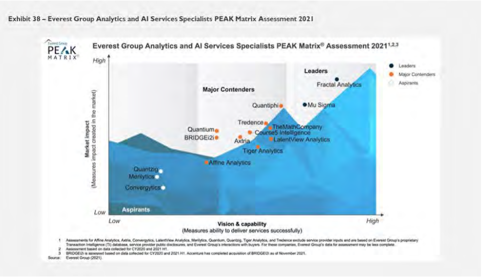

**[Image: 1770955551279.pdf-0295-02.png (942x543, 397.3KB)]**

### **Everest Group’s Analytics and AI Services Specialists PEAK Matrix® Assessment 2022 and Fractal’s positioning** 

Everest Group’s Analytics and AI Services Specialists PEAK Matrix® Assessment 2022 also identified Fractal as a “Leader”. The 2022 assessment highlighted several key strengths: 

- Fractal built capabilities in core DAAI areas such as AI, advanced analytics, visualization, insights generation, and domain-specific problem-solving. 

- It has developed a robust portfolio of platforms and accelerators for data analysis, image and video analytics, and industry-specific functions like pricing and promotions. Flagship tools include AIDE (Automated Insights for Digital Evolution) and Concordia for data integration. 

- Referenced buyers praised Fractal’s technical depth and its unique strategic perspective in engagements. 

**Exhibit 39 presents Everest Group’s Analytics and AI Services Specialists PEAK Matrix Assessment 2022** 

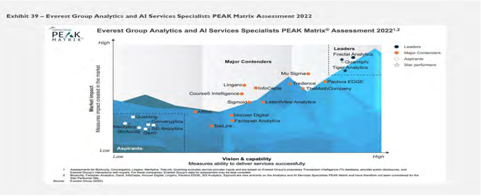

**[Image: 1770955551279.pdf-0295-09.png (942x385, 297.2KB)]**

291 

### **<u>Everest Group’s Analytics and Artificial Intelligence (AI) Services Specialists PEAK Matrix® Assessment 2024 and Fractal’s positioning</u>** 

Everest Group’s Analytics and AI Services Specialists PEAK Matrix® Assessment 2024 identified Fractal Analytics as a “Leader.” The 2024 assessment identified the following strengths of Fractal: 

- Fractal has developed strong domain expertise across BFSI, retail, manufacturing, and healthcare sectors, allowing it to contextualize AI use cases and deliver industry-relevant solutions. Flagship offerings such as Cogentiq (an agentic AI orchestration platform), Kalaido.ai (a generative image diffusion model), and MarshallGoldsmith.ai (a behavioral science-backed coaching tool) highlight its verticalized approach. 

- The firm has institutionalized responsible AI practices through a formal evaluation and certification framework, ensuring ethical, transparent, and explainable AI deployment. 

- Clients acknowledged Fractal’s co-innovation capabilities, proactive delivery orientation, and flexible engagement models as key strengths. 

- Fractal has invested significantly in structured talent development programs and academic partnerships to advance expertise in Gen AI, LLMOps, and data engineering. 

### **Exhibit 40 presents Everest Group’s Analytics and AI Services Specialists PEAK Matrix Assessment 2024** 

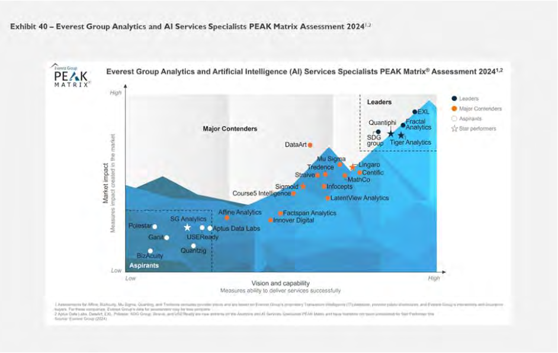

**[Image: 1770955551279.pdf-0296-07.png (942x595, 386.9KB)]**

### **<u>Everest Group’s Data and AI Services Specialists – North America PEAK Matrix® Assessment 2025 and Fractal’s positioning</u>** 

This assessment identified Fractal Analytics as a “Leader.” The 2025 assessment identified the following strengths of Fractal: 

- Fractal has actively expanded its IP portfolio in North America, integrating agentic AI capabilities and deep domain models to accelerate time-to-value for enterprise clients. 

- Referenced clients highlighted Fractal’s strong delivery capabilities, high-quality AI solutions, and structured delivery governance. 

- The company continues to lead in building advanced AI infrastructure, having launched Cogentiq as a unified platform for orchestrating AI pipelines, natural language queries, and multi-modal data access. 

292 

- Fractal's collaborative delivery model and high client retention were noted as critical enablers of longterm strategic partnerships. 

**Exhibit 41 presents Everest Group’s Data and AI Services Specialists PEAK Matrix® Assessment – North America 2025** 

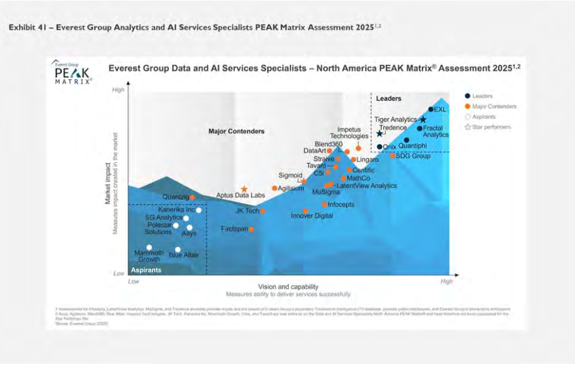

**[Image: 1770955551279.pdf-0297-02.png (940x597, 386.4KB)]**

### **Threats and challenges to Fractal** 

While Fractal is a leading analytics and AI services specialist, there are several threats and challenges to its business, including: 

- Changing macroeconomic conditions: Persistent inflationary pressures, tightening monetary policies, ongoing tariff discussions, and geopolitical tensions (such as the Russia-Ukraine conflict and the IsraelHamas war) can impact the spending appetite of enterprises in digital services. 

- Rise in insourcing: Over the past few years, there has been a steady rise in new in-house setups due to increasing cost competitiveness of captives, greater alignment with enterprise priorities, and better control and governance. While there is an opportunity for service providers to capitalize on this shift by enabling captive center setup and transformation, it may also result in reduced enterprise spend on thirdparty providers. 

- Talent retention and upskilling challenges: Rapid changes in AI technologies have created challenges in acquiring and retaining the right talent, limiting the effective deployment and management of AI systems. Inability to meet this demand and develop internal resources by Fractal can pose a threat to its business. 

- Service revenue erosion due to productization: Gen AI infusion is significantly enhancing productivity across IT services by automating complex processes through low-code and conversation-enabled SaaS tools, which can result in revenue erosion for third-party providers. 

- Governance and security risks: With increasing AI adoption, countries worldwide are introducing AIrelated regulations and frameworks. This trend is particularly relevant for Gen AI, as its ability to create new content heightens concerns about potential misuse. Rising privacy and ethical concerns around DAAI technology, along with strict regulatory policies, pose a threat to DAAI innovation and enterprise adoption. 

293 

- Possibility of new market entrants: Since DAAI is among the fastest-growing digital services markets, new entrants with differentiated offerings that can serve enterprise needs may pose a threat to Fractal’s business. 

### **GLOSSARY** 

- FY2024 refers to the financial year beginning April 1, 2023, through March 31, 2024 

- FY2025 refers to the financial year beginning April 1, 2024, through March 31, 2025 

- Currency conversions are based on an average exchange rate of US$1 = INR83.67 for calendar year 2024 

- Agent operations platform: Infrastructure to manage and orchestrate multiple AI agents in a coordinated manner 

- Agentic AI: AI that can autonomously plan, decide, and execute tasks with minimal human input 

- AI (Artificial Intelligence): Simulation of human intelligence processes by machines, especially computer systems 

- AI copilots: Assistive tools using AI to augment human tasks (e.g., coding, HR processes) 

- AI platforms: Frameworks that facilitate the development, orchestration, deployment, and governance of AI solutions 

- AI sovereignty: The organization’s ability to control its digital infrastructure, data, and technologies 

- AI twins / Digital twins: Virtual replicas of physical systems used for simulation and monitoring 

- AI/ML: Combined term for Artificial Intelligence and Machine Learning used in automation and prediction tasks 

- AI-generated synthetic data: Artificial data generated using AI to supplement training sets 

- AI-Orchestration: Coordinating multiple AI models and tools into a unified workflow 

- AR/VR (Augmented/virtual reality): Technologies used for immersive user experiences and interfaces 

- Bias and explainability: Challenges in AI around fairness and the ability to interpret decision-making processes 

- Chain-of-thought reasoning: A method in LLMs for breaking down complex problems step-by-step 

- Cloud marketplaces: Online platforms for procuring and managing cloud-based software, including AI solutions 

- CPRA: California Privacy Rights Act, successor to CCPA, strengthening privacy rights 

- Data sovereignty: Concept of retaining control over enterprise-owned data 

- Deep learning: A subset of ML using neural networks with many layers to analyze various data formats 

- Diffusion models: Models used for image generation by iteratively refining random noise to create a desired output 

- Digital transformation: Use of digital technologies to create or modify business processes, culture, and customer experiences 

- Ecosystem orchestration: Strategic coordination of tools, platforms, and partners to achieve digital goals 

- EU AI Act: European legislation regulating the use of AI across risk categories 

294 

- Explainable AI: AI systems that provide understandable justifications for outputs and decisions 

- Foundation Models: Large-scale ML models trained on vast datasets and adaptable to various tasks 

- GDPR: EU’s regulation on data protection and privacy 

- Gen AI (Generative AI): Type of AI that can generate text, images, or other media from prompts 

- Hallucination (in AI): When an AI generates plausible sounding but incorrect or fabricated content 

- LLMOps: Practices and tools to manage lifecycle operations of LLMs in production environments 

- LLMs (Large Language Models): Deep learning models trained to understand and generate human-like text 

- Low-Code/No-Code Tools: Platforms allowing users to build applications with minimal or no coding 

- LRMs (Large Reasoning Models): AI systems specialized in logic, reasoning, and decision-making processes 

- Metaverse: Virtual environments that can be augmented using AI and immersive tech 

- Mixture of experts (MoE): AI architecture that activates only a subset of the model’s parameters for each input 

- MLOps: Tools and practices for operationalizing ML models from development to deployment. 

- Multimodal AI: AI models that process multiple types of data simultaneously. 

- Natural Language Generation (NLG): AI technique for producing natural language from structured data 

- Natural Language Processing (NLP): AI field enabling machines to understand and process human language 

- Neuromorphic Computing: Bio-inspired hardware aimed at increasing efficiency and real-time AI processing 

- Neural networks: Computational models inspired by the human brain, consisting of layers of interconnected nodes (neurons) that process data and identify patterns 

- Open-source AI Models: Community-driven AI systems freely available for modification and deployment 

- Reinforcement Learning (RL): A type of learning where an agent learns by interacting with its environment and receiving rewards or penalties 

- Self-Supervised Learning: A training paradigm that uses unlabeled data to learn data representations 

- Sentiment Analysis: Assessing opinions in text data to understand customer emotions 

- SLMs (Small Language Models): Lightweight, task-specific models optimized for particular domains or functions 

- Vector Databases: Specialized databases optimized for storing and searching high-dimensional vector embeddings 

- Workflow-based AI Platforms: AI solutions designed to integrate into structured business workflows 

295 

### **OUR BUSINESS** 

_Some of the information in the following section, including information with respect to our business plans and strategies, consists of certain forward-looking statements that involve risks and uncertainties. Our actual results may differ materially from those expressed in, or implied by, these forward-looking statements. Unless otherwise stated, or the context otherwise requires, the financial information used in this section is derived from our “Restated Consolidated Financial Information” included in this Prospectus beginning on page 408. Also see, “Certain Conventions, Use of Financial Information and Market Data and Currency of Presentation – Industry and Market Data” on page 29. Unless otherwise indicated, the industry-related information contained in this Prospectus is derived from the Everest Report which has been commissioned and paid for by our Company, exclusively for the purposes of confirming our understanding of the industry, exclusively for the Offer. Everest Group was engaged by our Company to prepare the Everest Report pursuant to an engagement letter dated May 6, 2025. The Everest Report is available at https://fractal.ai/investors-relations. Everest Group is not related in any manner to our Company or any of our Directors or Promoters. Unless otherwise indicated, all financial, operational, industry and other related information derived from the Everest Report and included herein with respect to any particular year refers to such information for the relevant year. See “Risk Factors – Internal Risk Factors - Certain sections of this Prospectus contain information from the Everest Report which has been commissioned and paid for by us and any reliance on such information for making an investment decision in this offering is subject to inherent risks” on page 67 for more details. All translations from Indian Rupees to United States of America (“_ **_US_** _” or “_ **_United States_** _”) dollars are based on the rate of ₹88.71 per US$1.00, the closing exchange rate published by the Reserve Bank of India (“_ **_RBI_** _”) and Financial Benchmarks India Private Limited as of September 30, 2025._ 

### **Business Overview** 

Founded in 2000, we are a globally recognized enterprise artificial intelligence (“ **AI** ”) company ( _source: Everest Report_ ), with a vision to power human decisions in our clients’ enterprises by leveraging AI. We support large global enterprises with data-driven insights and assist them in their decision making through our end-to-end AI solutions. We build our AI solutions by leveraging our technical, domain and functional capabilities built over our operating history of over 25 years. As of September 30, 2025, our full suite of AI solutions is organized under two segments: Fractal.ai (comprising AI services and AI products primarily hosted on Cogentiq) and Fractal Alpha (comprising AI businesses). Through these two segments, we cater to the diverse business needs of our clients across industries and business functions. 

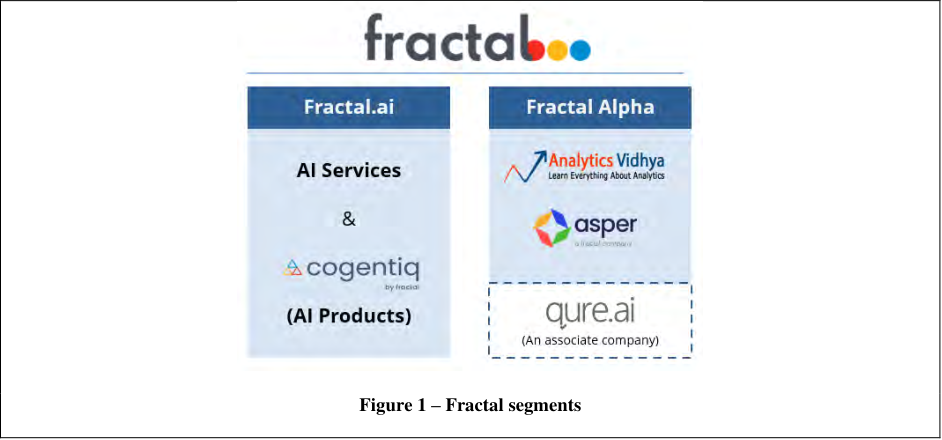

**[Image: 1770955551279.pdf-0300-04.png (942x440, 219.7KB)]**

<!-- Start of picture text -->
Figure 1 – Fractal segments <!-- End of picture text -->

Some of the key areas of business performance where we help our clients are identified below: 

- _Enabling clients to understand, predict and shape their customer behavior:_ For example, we leveraged Generative AI (“ **Gen AI** ”) to develop a contact strategy and customer intelligence system for a global asset manager, through which the client’s independent advisors provide relevant investment recommendations to its customers. 

296 

- _<mark>Improving operational efficiency:</mark>_ <mark>For example, we developed a Gen AI powered call auditing,</mark> summarizing, escalation identification and sentiment monitoring engine for a US healthcare payer with an aim to reduce manual call auditing as well as better understand and improve call quality. 

- • _Building better products faster:_ For example, we assisted a leading global consumer goods company in launching a new antiperspirant by providing data-driven insights. Leveraging our AI solutions, we analyzed consumer data to identify growth opportunities and unmet needs, which resulted in a product that improved underarm skin health and tackled concerns like irritation and discoloration. 

- _Enabling sustainability and resilience:_ For example, we created a Gen AI powered product concept generator for a global consumer health and personal care company to identify opportunities and pain points for customers based on consumer reviews and social media trends. 

- _Driving better executive decisions:_ For example, we enabled a payments app provider to scale its count of users by creating an AI, data and analytics infrastructure, conducting country-level business reviews, forecasting user growth and budgets, identifying key drivers of ongoing engagement and powering several growth experiments for the product and marketing teams. 

We work with large global enterprise clients to help them navigate the entire life cycle of AI transformation from ideation to adoption to drive decisions in the enterprise. We aim to become a trusted partner to our clients. We focus on our “Must Win Clients” (“ **MWC** ”s), who we define as our clients (i.e. we recognised revenue from them in the trailing 12 months) who are enterprises that meet one of three criteria: (1) over US$10 billion in annual revenue, (2) over US$20 billion in market capitalization, or (3) over 30 million end-customers. As of September 30, 2025, we served 122 MWCs; our clients include Citibank, N.A (“ **Citi** ”), Costco, Franklin Templeton, Mars, Mondelez, Nationwide, Nestle, Philips, among others. As of March 31, 2025, we served a majority of the “magnificent seven” companies35 ( _source Everest Report)_ . 

Our domain expertise spans across our focus industries of consumer packaged goods (“ **CPG** ”) & retail (together with CPG, “ **CPGR** ”), technology, media and telecom (“ **TMT** ”), healthcare and life sciences (“ **HLS** ”) and banking, financial services and insurance (“ **BFSI** ”). As of March 31, 2025, we worked with 10 of the top 20 CPG companies, eight of the top 20 TMT companies, three of the top 20 BFSI companies, 10 of the top 20 HLS companies and five of the top 20 retail companies based on Fiscal 2025 revenue ( _source: Everest Report_ ). Our ability to address clients’ problems across industries is driven by our deep technical, domain and functional expertise. We integrate AI, engineering and design (“ **AED** ”) to power decisions in our clients’ enterprises and our strategic intent is to create outsized value for every client we work with. In this process, we aspire to become the most respected enterprise AI company globally. 

We are a client-centric company, which focuses on prioritizing our clients’ success and creating long-term value for them. Our “client first” value is reflected in the tenure of our relationship with our top clients and our Net Promoter Score (“ **NPS** ”) based on client surveys. We have served our top ten clients by revenue in the six months ended September 30, 2025 (who contributed 54.2% to our revenue from operations in our Fractal.ai segment) for an average of more than eight years. Our NPS for our Fractal.ai segment was 76, 78, 77, 77 and 73 in the six months ended September 30, 2025, the six months ended September 30, 2024, Fiscal 2025, Fiscal 2024 and Fiscal 2023 respectively ( _source: 1Lattice Report_ ). 

We are India’s leading pure-play enterprise data, analytics and AI company, recognized globally, with capabilities across the data, analytics and AI (“ **DAAI** ”) value chain ( _source: Everest Report_ ). We are uniquely placed among other industry players, with active investments in expanding our AI and Gen AI software portfolio and research and development (“ **R&D** ”) capabilities ( _source: Everest Report_ ). Forrester categorized us as a “Leader” in five Forrester WavesTM for Customer Analytics Service Providers in 2025, 2023, 2021, 2019 and 2017, and Everest Group recognized us as a “Leader” in the Everest Group Data and AI Services Specialists PEAK Matrix® Assessment (and its predecessor Analytics and AI Services Specialists PEAK Matrix® Assessment) in 2021 through 2025. 

We are committed to technological innovation and have consistently invested in AI research and development, exploring the latest AI methodologies and technologies. As an example, we have built foundation models 

> 35 “magnificent seven” companies are defined in the Everest Report as Microsoft, Apple, Nvidia, Alphabet, Amazon, Meta, and Tesla. 

297 

including Kalaido.ai, our own diffusion-based text-to-image model and Vaidya.ai, a medical multi-modal foundation model ecosystem consisting of large language models (“ **LLMs** ”), vision language models (“ **VLMs** ”) and medical reasoning systems. We are developing Project Ramanujan, an initiative for creating reasoning models. As a part of Project Ramanujan, we created a mathematical large reasoning model, which won the inaugural Meta HackerCup (AI Competition) at NeurIPS 2024 and learnings from which were presented in The Institutional Conference on Learning Representations (“ **ICLR** ”) 2025. Fathom-R1-14B is another AI large reasoning foundation model that we have open-sourced along with its datasets. In October 2025, we also open-sourced Fathom Deep-Research, an agentic DeepResearch system along with two specialized models: Fathom-Search-4B, optimized for long-horizon, evidence-seeking through live web search, and Fathom-Synthesizer-4B designed for open-ended synthesis and report generation. 

Additionally, we are advancing multi-agentic systems such as Pioneer to streamline and enhance the software development lifecycle and for autonomous data science problem solving. Several of our products are publicly accessible, such as Kalaido.ai, MarshallGoldsmith.ai and Vaidya.ai. 

We are building Fractal for the long term, through our culture that creates an environment conducive to learning and growth. We have been awarded “Great Place to Work” by the Great Place to Work® in India consistently for the last eight years (2018 to 2025). We were given the same recognition in seven countries we operate in – Australia, India, UK, Ukraine, UAE, Canada and the US. We were also awarded the Best WorkplacesTM for Women (Top 50 in 2025 and Top 100 for five years in a row from 2020 to 2024) by Great Place to Work® in India, Best WorkplacesTM for Diversity, Equity, Inclusion and Belonging (Top 25) for three consecutive years (2023 to 2025) and received a “Workplace with Inclusive Practices” recognition in 2022 and 2023. We were also awarded ‘India’s Top 100 Best Companies to Work For’ by Great Place to Work® in India in 2017 and 2025 . The Great Place to Work® , based on its Great Place to Work® survey, issues a trust indexTM (out of 100) to participating companies. Our global trust index score and India trust index score consistently exceeded 75 from 2016 to 2025. Our employer brand and organizational culture are reflected in our 4.4 out of 5 rating on Glassdoor for culture and values and an overall rating on 4.2 out of 5, each as of November 26, 2025 ( _source: Everest Report_ ). We have also been recognized as one of the Best-Led Companies of 2025 by Glassdoor (Top 50) ( _source: Everest Report_ ). 

We were co-founded by Srikanth Velamakanni and Pranay Agrawal, both of whom possess extensive experience in the AI industry and are acknowledged for their contributions to the field. They have been leading us for over 25 years since our inception. In addition, our Board of Directors has domain expertise across retail technology and healthcare. We have also appointed certain advisors comprising industry veterans who guide and support our growth and development. 

We operate under two segments: 

- Fractal.ai: This consists of AI services and AI products – our AI products are primarily hosted on Cogentiq, our flagship agentic AI platform designed to help product owners and enterprises accelerate building and upgrading products through a pre-built suite of agents, tools, connectors with in-built lowcode, security, governance, auditability and inter-operability features. 

- Fractal Alpha: This consists of independent AI businesses that target Fractal.ai’s core MWCs and broader markets and new geographies, with each business under separate management. 

For further details, see **“** _- Our AI Solutions_ ” on page 316. 

### **_Our Capabilities_** 

We leverage our technical, domain and functional capabilities to build AI solutions for clients. Our technical capabilities include AI, engineering and design (“ **AED** ”), which enables us to identify and reframe problems, build the required AI algorithms along with the supporting infrastructure, user-interfaces and data pipelines and design and implement solutions. Our domain and functional capabilities are built on our experience in working with clients across industries and their various business functions including customer experience, supply chain, finance and accounting and sales and marketing, among others. For further details, see “ _- Our Technical, Domain and Functional Capabilities_ ” on page 313. 

298 

**Figure 2 - The image below shows our capabilities and some of our AI products:** 

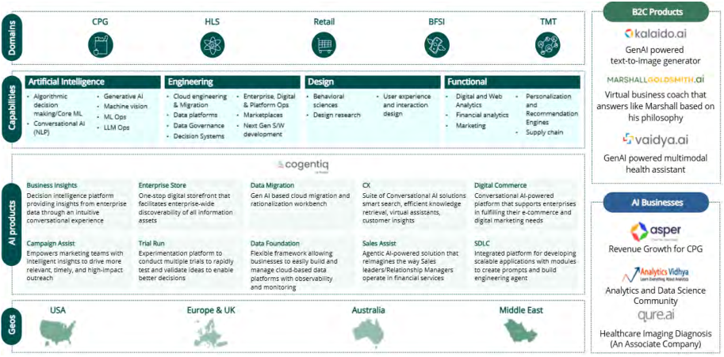

**[Image: 1770955551279.pdf-0303-01.png (913x451, 530.2KB)]**

_Notes: CPGR refers to consumer packaged goods and retail; HLS refers to healthcare and life sciences; TMT refers to technology, media and telecom and BFSI refers to banking, financial services and insurance. For details on our capabilities, see “– Our Technical, Domain and Functional Capabilities” starting on page 313; for details on our AI solutions, see “- Our AI Solutions” starting on page 316._ 

### **_Our Approach_** 

Our approach to problem solving through our AI solutions, which we refer to as the “ **Fractal Approach** ”, integrates our AI, engineering and design (“ **AED** ”) and domain capabilities for scaled problem solving and incorporates three key aspects: (i) a user-centric, decision-backwards approach; i.e., understanding and reframing business problems from the end-user’s perspective; (ii) integrating behavioral science and data science to design AI solutions for better adoption; and (iii) complementing technical expertise with functional expertise. Please see “ – _Fractal Approach_ ” on page 311. 

### **_Selected operational and financial metrics_** 

We have achieved consistent revenue growth. Our revenue from operations increased by 19.9% to ₹15,590 million in the six months ended September 30, 2025 from ₹13,007 million in the six months ended September 30, 2024, and increased by 25.9% to ₹27,654 million in Fiscal 2025 from ₹21,963 million in Fiscal 2024, which represented a 10.6% increase from ₹19,854 million in Fiscal 2023. Our PAT Margin was 4.5%, 5.6%, 8.0%, (2.5)% and 9.8% in the six months ended September 30, 2025 and 2024, and in Fiscal 2025, 2024, 2023, respectively. Our Adjusted PAT Margin was 9.2%, 10.4%, 12.6%, (0.2)% and 2.7% in the six months ended September 30, 2025 and 2024, and in Fiscal 2025, 2024 and 2023, respectively. Our EBITDA Margin was 11.9%, 10.1%, 14.4%, 4.4% and 22.0% in the six months ended September 30, 2025 and 2024, and in Fiscal 2025, 2024 and 2023, respectively. Our Adjusted EBITDA Margin was 15.0%, 15.9%, 17.4%, 10.6% and 6.8% in the six months ended September 30, 2025 and 2024, and in Fiscal 2025, 2024 and 2023, respectively. 

The following table provides a snapshot of our performance for the periods/years and as at the dates indicated. 

|**Particulars**|**Unit**|**As at and fo** **months e** **Septemb**|**r the six** **nded** **er 30,**|**As at and for**|**Fiscal ended**|**March 31,**|
|---|---|---|---|---|---|---|
|||**2025**|**2024**|**2025**|**2024**|**2023**|
|**_Financial Measures_**|||||||
|_Our Group_|||||||
|Revenue from operations|₹ million|15,590|13,007|27,654|21,963|19,854|
|Growth in revenue from operations|%|19.9|N/A*|25.9|10.6|N/A*|
|fromprevious period /Fiscal|||||||
|Cash flow from operations(1)|₹ million|(214)|79|3,970|1,595|(306)|
|Profit/(Loss) for the period/year|₹ million|709|729|2,206|(547)|1,944|
|PAT Margin(2)|%|4.5|5.6|8.0|(2.5)|9.8|

299 

|**Particulars**|**Unit**|**As at and fo** |**r the six** |**As at and for**|**Fiscal ended**|**March 31,**|
|---|---|---|---|---|---|---|
|||**months e** **Setemb**|**nded** **er 30**||||
|||**p** **2025**|**,** **2024**|**2025**|**2024**|**2023**|
|AdjustedPAT(3)|₹ million| 1,430| 1,356| 3,478| (45)| 540|
|Adjusted PAT Margin(4)|%|9.2|10.4|12.6|(0.2)|2.7|
|EBITDA(5)|₹ million|1,856|1,310|3,980|972|4,368|
|EBITDA Margin(6)|%|11.9|10.1|14.4|4.4|22.0|
|Adjusted EBITDA(7)|₹ million|2,332|2,062|4,821|2,321|1,343|
|Adjusted EBITDA Margin(8) _Fractal.ai segment_|%|15.0|15.9|17.4|10.6|6.8|
| Revenuefromoperations|₹ million|15,184|12,741|27,037|21,615|19,691|
|Growth in revenue from operations|%|19.2|N/A*|25.1|9.8|N/A*|
| from previous period / Fiscal|||||||
| Revenue in Fractal.ai segment by|||||||
|industry|||||||
| CPGR|₹ million|5,692|5,076|10,615|9,038|8,047|
|TMT|₹ million| 4,134| 3,730| 8,087| 5,867| 5,563|
|HLS|₹ million|2,581|1,728|3,745|3,013|2,188|
|BFSI|₹ million|1,856|1,435|2,980|2,325|2,842|
|Others(9)|₹ million|921|772|1,610|1,372|1,051|
|Revenue in Fractal.ai segment by|||||||
|industry, as a % of revenue from|||||||
| Fractal.ai segment|||||||
| CPGR|%|37.5|39.8|39.3|41.9|40.9|
|TMT|%|27.2|29.3|29.9|27.1|28.3|
|HLS|%|17.0|13.6|13.8|13.9|11.1|
|BFSI|%|12.2|11.3|11.0|10.8|14.4|
|Others(9)|%|61|60|60|63|53|
|Revenue in Fractal.ai segment by||.|.|.|.|.|
| geography|||||||
|Americas|₹ million|9,993|8,378|17,988|13,791|13,221|
|Europe|₹ million|3,219|2,241|4,792|4,291|3,333|
|APAC and others|₹ million|1,972|2,122|4,257|3,533|3,137|
|Revenue in Fractal.ai segment by |||||||
|geography, as a % of revenue from Fractal.aisegment|||||||
| Americas|%|65.8|65.8|66.5|63.8|67.2|
|Europe|%|21.2|17.6|17.7|19.9|16.9|
|APAC and others|%|13.0|16.6|15.8|16.3|15.9|
|Segment results – Fractal.ai|₹ million|2,177|1,526|3,788|1,233|(315)|
|segment(10)|||||||
|Segment results – Fractal.ai segment,|%|14.3|12.0|14.0|5.7|(1.6)|
|as a % of revenue from operations - Fractal.ai segment|||||||
| Adjusted segment results – Fractal.ai sement(11)|₹ million|2,510|2,235|5,084|2,769|2,115|
|g Adjusted segment results Margin –|%|16.5|17.5|18.8|12.8|10.7|
|Fractal.aisegment (12)|||||||
|_Fractal Alpha segment_|||||||
| Revenuefromoperations|₹ million|451|275|644|365|190|
|Growth in revenue from operations f i id/Fil|%|64.0|N/A*|76.4|92.1|N/A*|
|rom prevous perosca Segment results – Fractal Alpha|₹ million|(66)|(197)|(283)|(494)|(616)|
| segment(13)|||||||
|Segment results – Fractal Alpha|%|(14.6)|(71.6)|(43.9)|(135.3)|(324.2)|
| segment, as a % of revenue from operations– Fractal Alphasegment|||||||
| Adjusted segment results – Fractal Alpha segment(14)|₹ million|(63)|(179)|(257)|(443)|(539)|
| Adjusted segment results Margin –|%|(14.0)|(65.1)|(39.9)|(121.4)|(283.7)|
|Fractal Alpha segment(15) |||||||
|**_Operational Measures_** _O G_|||||||
|_ur roup_ Total employees|number|5,722|4,755|5,254|4,639|4,221|

300 

|**Particulars**||**Unit**|**As at and fo** **months e** **Septemb**|**r the six** **nded** **er 30,**|**As at and for**|**Fiscal ended**|**March 31,**|
|---|---|---|---|---|---|---|---|
||||**2025**|**2024**|**2025**|**2024**|**2023**|
|_Fractal.ai segment_||||||||
|Net Revenue Retention(16)||%|114.0|119.1|121.3|110.2|151.0|
|Clients by annual contribution(17)|revenue|||||||
|>US$20 million||number|4|4|5|2|1|
|>US$10million||number|7|6|6|5|5|
|>US$5 million||number|17|15|15|11|10|
|>US$1 million||number|52|47|53|48|45|
|Client concentration||||||||
|Top 10||₹ million|8,229|7,031|14,537|11,809|10,064|
|Top10||%|54.2|55.2|53.8|54.6|51.1|
|Top 20||₹ million|10,955|9,157|18,831|15,114|13,194|
|Top 20||%|72.2|71.9|69.6|69.9|67.0|
|Net Promoter Score(18)||Score|76|78|77|77|73|

***** _not applicable, as revenue from operation for six months ended September 30, 2023 and Fiscal 2022, as applicable, has not been included in this Prospectus._ 

**_Notes_** _:_ 

- _(1) Cash flow from operations is net cash flow generated from / (used in) operating activities._ 

- _(2) PAT Margin is calculated as profit/(loss) for the period/year as a percentage of revenue from operations for the period/year. For a reconciliation of PAT Margin, see “Management’s Discussion and Analysis of Results of Operations – Non-GAAP measures” on page 519._ 

- _(3) Adjusted PAT is calculated as profit/(loss) for the period/year plus (i) employee stock option expense; (ii) ESOP cash bonus; (iii) retention bonus pursuant to acquisition; and less (iv) exceptional items gain/(loss), (v) the tax effect of the aforesaid adjustments; less (vi) share of (loss) of an associate. For a reconciliation of Adjusted PAT, see “Management’s Discussion and Analysis of Results of Operations – Non-GAAP measures” on page 519._ 

- _(4) Adjusted PAT Margin is calculated as Adjusted PAT for the period/year as a percentage of revenue from operations for the period/year. For a reconciliation of Adjusted PAT Margin, see “Management’s Discussion and Analysis of Results of Operations – Non-GAAP measures” on page 519._ 

- _(5) EBITDA is calculated as profit/(loss) for the period/year plus (i) total tax expense, (ii) depreciation and amortisation expense and (iii) finance costs. For a reconciliation of EBITDA, see “Management’s Discussion and Analysis of Results of Operations – Non-GAAP measures” on page 519. The changes in EBITDA from Fiscal 2023 to Fiscal 2025 and from the six months ended September 30, 2024 to the six months ended September 30, 2025 are primarily due to changes in revenue from operations, employee benefits expense, other expenses, and exceptional items gain / (loss). For further details of our revenue from operations, employee benefits expense, other expenses and exceptional items gain / (loss) for the six months ended September 30, 2025 and 2024, and in Fiscals 2025, 2024 and 2023, see “Management’s Discussions and Analysis of Financial Condition and Results of Operations – Summary Results of Operations – Six months ended September 30, 2025 compared to Six months ended September 30, 2024” on page 511, “Management’s Discussions and Analysis of Financial Condition and Results of Operations – Summary Results of Operations – Fiscal 2025 compared to Fiscal 2024” on page 513 and “Management’s Discussions and Analysis of Financial Condition and Results of Operations – Summary Results of Operations – Fiscal 2024 compared to Fiscal 2023”on page 515._ 

- _(6) EBITDA Margin is calculated as EBITDA for the period/year as a percentage of revenue from operations for the period/year. For a reconciliation of EBITDA Margin, see “Management’s Discussion and Analysis of Results of Operations – Non-GAAP measures” on page 519._ 

- _(7) Adjusted EBITDA is calculated as EBITDA plus (i) employee stock option expense; (ii) ESOP cash bonus; (iii) retention bonus pursuant to acquisition; less (iv) other income; (v) exceptional items gain / (loss); (vi) share of (loss) of an associate. For a reconciliation of Adjusted EBITDA, see “Management’s Discussion and Analysis of Results of Operations – Non-GAAP measures” on page 519. The changes in Adjusted EBITDA from Fiscal 2023 to Fiscal 2025 and from the six months ended September 30, 2024 to the six months ended September 30, 2025are primarily due to changes in revenue from operations, employee benefits expense and other expenses. For further details of our revenue from operations, employee benefits expense and other expenses for the six months ended September 30, 2025 and 2024, and in Fiscals 2025, 2024 and 2023, see “Management’s Discussions and Analysis of Financial Condition and Results of Operations – Summary Results of Operations – Six months ended September 30, 2025 compared to Six months ended September 30, 2024” on page 511, “Management’s Discussions and Analysis of Financial Condition and Results of Operations – Summary Results of Operations – Fiscal 2025 compared to Fiscal 2024” on page 513 and “Management’s Discussions and Analysis of Financial Condition and Results of Operations – Summary Results of Operations – Fiscal 2024 compared to Fiscal 2023”on page 515._ 

- _(8) Adjusted EBITDA Margin is calculated as Adjusted EBITDA for the period/year as a percentage of revenue from operations for the period/year. For a reconciliation of Adjusted EBITDA Margin, see “Management’s Discussion and Analysis of Results of Operations – Non-GAAP measures” on page 519._ 

- _(9) Others comprises primarily energy, travel and industrials._ 

- _(10) Segment results – Fractal.ai segment is calculated as Fractal.ai revenue from operations for the period/year less (i) employee related expenses and (ii) other expenses for Fractal.ai segment._ 

- _(11) Adjusted segment results – Fractal.ai segment is calculated as Segment results - Fractal.ai segment; plus (i) Employee stock option expense (including ESOP cash bonus); and (ii) Retention bonus pursuant to acquisition. For a reconciliation of Adjusted segment results – Fractal.ai segment, see “Management’s Discussion and Analysis of Results of Operations – Non-GAAP measures” on page 519._ 

- _(12) Adjusted segment results Margin – Fractal.ai segment is calculated as Adjusted segment results – Fractal.ai segment for the period/year as a percentage of Fractal.ai revenue from operations for the period/year. For a reconciliation of Adjusted segment results Margin – Fractal.ai segment, see “Management’s Discussion and Analysis of Results of Operations – Non-GAAP measures” on page 519._ 

- _(13) Segment results – Fractal Alpha segment is calculated as Fractal Alpha revenue from operations for the period/year less (i) employee related expenses and (ii) other expenses for Fractal Alpha segment._ 

301 

- _(14) Adjusted segment results - Fractal Alpha segment is calculated as Segment results - Fractal Alpha segment; plus (i) Employee stock option expense (including ESOP cash bonus); and (ii) Retention bonus pursuant to acquisition. For a reconciliation of Adjusted segment results - Fractal Alpha segment, see “Management’s Discussion and Analysis of Results of Operations – Non-GAAP measures” on page 519._ 

- _(15) Adjusted segment results Margin – Fractal Alpha segment is calculated as Adjusted segment results – Fractal Alpha segment for the period/year as a percentage of Fractal Alpha revenue from operations for the period/year. For a reconciliation of Adjusted segment results Margin – Fractal Alpha segment, see “Management’s Discussion and Analysis of Results of Operations – Non-GAAP measures” on page 519._ 

- _(16) Net Revenue Retention in our Fractal.ai segment measures how effectively we retain and expand revenue from our existing clients over a defined period and is calculated by comparing the current period’s revenue from the clients who existed at the start of the period with their revenue in the previous period — including the effects of upsells, cross-sells and contractions._ 

- _(17) Clients by annual revenue contribution is determined on a trailing-12-months basis._ 

- _(18) Net Promoter Score is used in Fractal.ai segment to gauge client satisfaction and advocacy. Clients rate us on a 10-point scale on their willingness to recommend Fractal and NPS is calculated as the percentage of promoters (scores of 9-10) minus the percentage of detractors (scores of 6 and below). (source: 1Lattice Report)._ 

### **Our Strengths** 

### **_Leading Player in a large and growing AI market_** 

AI is one of the biggest technological waves to date and is being leveraged by enterprises to guide their business strategies and optimize routine business operations ( _source: Everest Report_ ). Further, enterprises are increasingly engaging with third-party providers for third party data, analytics and AI (“ **DAAI** ”) services, as they find it difficult to navigate the rapidly evolving DAAI market and access the right talent and technologies, while managing internal costs and core competencies ( _source: Everest Report_ ). As Fractal offers services across the DAAI value chain, the overall DAAI market can be interpreted as Fractal’s total addressable market (“ **TAM** ”), valued at an estimated US$143 billion (₹12 trillion) in Fiscal 2025 and is estimated to grow at a CAGR of 16.7% to reach US$310 billion (₹23 trillion) by Fiscal 2030 ( _source: Everest Report_ ). To reduce their reliance on multiple partners across the DAAI value chain, enterprises, especially large buyers (with annual revenue > US$5 billion or > ₹418 billion), prefer to engage with a single partner for AI solutions ( _source: Everest Report_ ). Service providers with end-to-end DAAI capabilities are thus well positioned to capture this market. We focus on AI and advanced analytics and provide DAAI consulting and technology services, software solutions, and AI products, with advanced capabilities in computer vision, natural language processing, and Gen AI, to enterprises; in essence, making us an end-to-end player in the DAAI market ( _source: Everest Report_ ). 

We are India’s leading pure-play enterprise data, analytics and AI company, recognized globally, with capabilities across the DAAI value chain. We recorded revenue growth at a CAGR of 18.0% over Fiscals 2023 to 2025 compared to the DAAI global third-party market’s CAGR of 11.0%, demonstrating our ability to win market share ( _source: Everest Report_ ). While we are incorporated in India, we cater to a global clientele, with 92.4% of our revenue in the six months ended September 30, 2025 and 91.6% of our revenue in Fiscal 2025 from clients located outside of India. We have also achieved global recognition through various industry awards, for example: (i) Everest Group recognized us as a “Leader” in the Everest Group Data and AI Services Specialists PEAK Matrix® Assessment in 2025 (and its predecessor Analytics and AI Services Specialists PEAK Matrix® Assessment in 2021, 2022 and 2024); and (ii) Forrester categorized us as a “Leader” in five Forrester WavesTM for Customer Analytics Service Providers in 2025, 2023, 2021, 2019 and 2017, as illustrated in Figure 3 below. 

**Figure 3 – Fractal consistently categorized as a “Leader” in five Forrester Waves****TM** 

302 

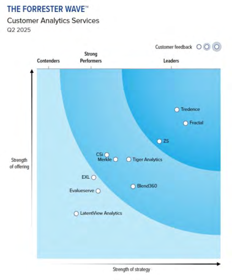

**[Image: 1770955551279.pdf-0307-00.png (465x561, 202.4KB)]**

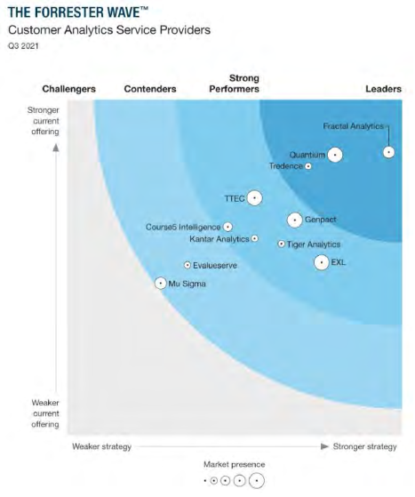

**[Image: 1770955551279.pdf-0307-01.png (467x559, 195.5KB)]**

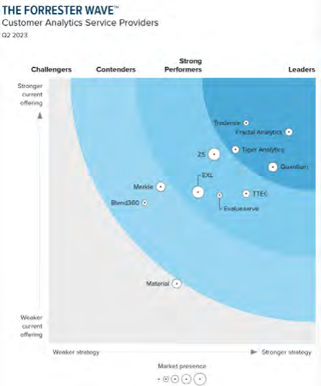

**[Image: 1770955551279.pdf-0307-02.png (466x561, 207.5KB)]**

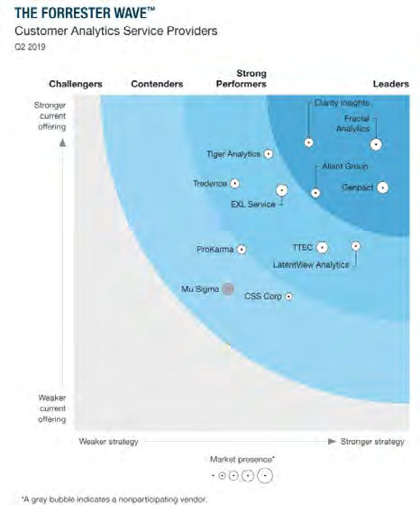

**[Image: 1770955551279.pdf-0307-03.png (466x560, 224.9KB)]**

303 

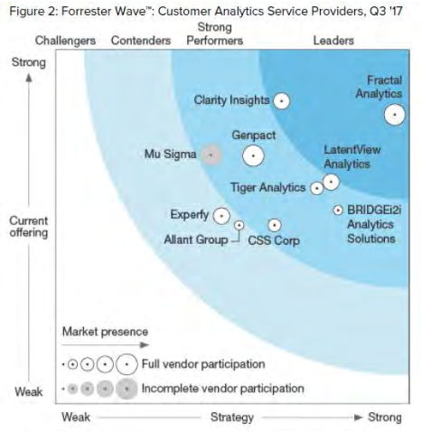

**[Image: 1770955551279.pdf-0308-00.png (467x478, 233.7KB)]**

### **_Long-standing and growing relationships with marquee, global clients contributing to a diversified revenue base_** 

We work with marquee clients across our focus industries of CPGR, TMT, HLS and BFSI. Our clients include Citi, Costco, Franklin Templeton, Mars, Mondelez, Nationwide, Nestle, Philips, among others. Our revenue base is diversified both across and within our focus industries. As of March 31, 2025, we worked with 10 of the top 20 CPG companies, eight of the top 20 TMT companies, three of the top 20 BFSI companies, 10 of the top 20 HLS companies and five of the top 20 retail companies, based on Fiscal 2025 revenue ( _source: Everest Report_ ). Our revenues from our focus industries grew at a CAGR of 16.8% from Fiscal 2023 to Fiscal 2025. Increased Gen AI adoption is likely to drive the CAGRs for BFSI (16.7%), HLS (18.2%), retail and distribution (15.2%), CPG (15.0%) and TMT (15.7%) over Fiscal 2025 to Fiscal 2030 ( _source: Everest Report_ ). Our presence in these industries positions us to capitalize on this potential. The following table sets forth a breakdown of our revenue from operations in our Fractal.ai segment by industry serviced for the periods/years indicated: 

|||_(₹_ |_in millions, except_ |_percentages)_|
|---|---|---|---|---|
|**Revenue contribution by industry in** **Fractal.ai segment**|**For the ** **2025** **Amount**|**six months ende** **%**|**d September 30,** **2024** **Amount**|**%**|
|CPGR|5,692|37.5%|5,076|39.8%|
|TMT|4,134|27.2%|3,730|29.3%|
|HLS|2,581|17.0%|1,728|13.6%|
|BFSI |1,856|12.2%|1,435|11.3%|
|Others(1)|921|6.1%|772|6.0%|
|**Revenue from operations in Fractal.ai segment**|**15,184**|**100.0%**|**12,741**|**100.0%**|

|**Revenue contribution by** **industry in Fractal.ai** **segment**|**2025** **Amount**|**%**|**Fiscal** **2024** **Amount**|_(₹ in _ **%**|_millions, except _ **2023** **Amount**|_percentages)_   **%**|
|---|---|---|---|---|---|---|
|CPGR|10,615|39.3%|9,038|41.9%|8,047|40.9%|
|TMT|8,087|29.9%|5,867|27.1%|5,563|28.3%|
|HLS|3,745|13.8%|3,013|13.9%|2,188|11.1%|
|BFSI|2,980|11.0%|2,325|10.8%|2,842|14.4%|
|Others(1)|1,610|6.0%|1,372|6.3%|1,051|5.3%|
|**Revenue from operations in**|**27,037**|**100.0**%|**21,615**|**100.0%**|**19,691**|**100.0%**|
|**Fractal.ai segment**|||||||

**_Note_** _:_ 

_(1) Others comprise primarily energy, travel and industrials._ 

We have deepened our business relationship with our clients in our Fractal.ai segment over the past few years as demonstrated in the table below: 

304 

||**For the six mo** **Septemb**|**nths ended** **er 30,**|_(₹ in mill_|_ions, unless oth_ **Fiscal**|_erwise stated)_|
|---|---|---|---|---|---|
||**2025**|**2024**|**2025**|**2024**|**2023**|
|MWCs(1)(number)|122|120|113|110|107|
|Revenue from operations attributable to top ten clients(%)|54.2%|55.2%|53.8%|54.6%|51.1%|
|Net Revenue Retention in our Fractal.ai segment(2) (%)|114.0%|119.1%|121.3%|110.2%|151.0%|
|Number of clients which generated at least|52|47|53|48|45|
|US$1 million of our revenue from operations for the Fiscal||||||
|Netpromoter score(NPS)(3) (score)|76|78|77|77|73|

**_Notes_** _:_ 

_(1) Refers to our clients (i.e. we recognised revenue from them in the trailing 12 months) who are enterprises that meet one of three criteria: (i) over US$10 billion in annual revenue, (ii) over US$20 billion in market capitalization or (iii) over 30 million end-customers._ 

_(2) Net Revenue Retention in our Fractal.ai segment measures how effectively we retain and expand revenue from our existing clients over a defined period and is calculated by comparing the current period’s revenue from the clients who existed at the start of the period with their revenue in the previous period — including the effects of upsells, cross-sells and contractions._ 

_(3) Net Promoter Score is used in Fractal.ai segment to gauge client satisfaction and advocacy. Clients rate us on a 10-point scale on their willingness to recommend Fractal and NPS is calculated as the percentage of promoters (scores of 9-10) minus the percentage of detractors (scores of 6 and below) (source: 1Lattice Report)._ 

The depth of our engagement with clients is evidenced by the tenure of our relationship with our top clients as well as revenues from our top clients. As of September 30, 2025, among our top 10 clients in the six months ended September 30, 2025, we have been engaged by a US-based global technology company for over eight years; a US-based multinational CPG corporation for over 19 years; and a global HLS player for over 10 years. We have served our top ten clients by revenue in the six months ended September 30, 2025 for an average of more than eight years and they contributed 54.2% to our revenue from operations in the six months ended September 30, 2025. 58.5% of our revenue from operations in the six months ended September 30, 2025 was contributed by clients that we served for at least five years. Our Net Revenue Retention in our Fractal.ai segment was 114.0%, 119.1%, 121.3%, 110.2% and 151.0% for the six months ended September 30, 2025 and 2024, and in Fiscals 2025, 2024 and 2023 respectively, demonstrating our ability to retain and expand revenue from our existing clients. 

We strive to be a strategic partner to our clients by delivering a wide range of end-to-end AI solutions across business functions and teams. 

<mark>For example, we have been working with a multinational technology company since 2017. Our initial</mark> engagement was for the client's business to business (“ **B2B** ”) marketing team for their advertising technology product. By 2025, we expanded our services to over 50 teams within the client’s organization across its payment service, video streaming platform, applications marketplace and cloud service divisions, among others. As of September 30, 2025, we worked with over 200 stakeholders across 56 teams to support engagements with the client. 

### **_Deep and integrated technical, domain and functional expertise_** 

We design, build and deliver end-to-end AI solutions for our clients across industries leveraging our technical, domain and functional capabilities and expertise built over our operating history of over 25 years. 

- **_Technical expertise_ :** We have strong AED capabilities including Gen AI, machine vision, algorithmic decision making, cloud and data engineering, behavioral science and human-centered design, amongst others. In the Everest Group’s PEAK Matrix® Assessment 2025, they highlighted our data-centric competencies, particularly our AI capabilities complemented by ongoing enhancements in data capabilities around data engineering and data management. We also contribute to the DAAI industry through publications and conferences. For example, we presented two research papers (one on the textto-image methods underlying Kalaido.ai and the other on reasoning in LLMs for improved Mathematical Olympiad Performance) at the NeurIPS 2024 AI Conference and ICLR 2025. We are collaborating with reputable engineering institutes in India to advance studies on Neuromorphic computing, quantum computing, foundation models and Gen AI algorithms. 

305 

- **_Domain expertise_ :** Our experience across our focus industries positions us well to understand industryspecific problems. For example, we started working for a leading CPG company in Fiscal 2007. Initially, we built a demand forecasting AI solution for the sales department of the company. We then expanded our role with the client to develop solutions across other industries and functions such as product supply, revenue growth management, operational intelligence and across geographies. In the CPG industry, as of March 31, 2025, we worked with 10 of the top 20 CPG companies ( _source: Everest Report_ ). In the six months ended September 30, 2025, our revenue in our Fractal.ai segment in the CPGR and TMT industries was ₹5,692 million and ₹4,134 million respectively, strengthening our ability to both expand with our existing clients and acquire new clients within such industries. We have developed domainspecific products such as Trial Run, an experimentation platform for retail clients and Cogentiq Digital Commerce, an e-commerce and digital marketing platform for CPG clients. 

- **_Functional expertise_ :** We work with our clients across their various business functions like sales and marketing, supply chain, finance & accounting and data & AI among others. While different industries have diverse business operating models, they may share certain value chain elements and face similar problems ( _source: Everest Report_ ). For example, CPG and retail and distribution have common supply chain elements, such as sourcing and procurement and logistics and distribution, while HLS has elements of manufacturing, supply chain and distribution ( _source: Everest Report_ ). We have built functionspecific products like Cogentiq Sales Assist (formerly part of Customer Genomics) and Cogentiq Campaign Assist (formerly part of Customer Genomics), our personalization engines for sales & marketing teams, and Cogentiq Enterprise Store (formerly Enterprise Marketplace), a one-stop digital storefront for data teams. 

We attribute our growth to our understanding of our clients’ enterprise contexts including enterprise data, different technology stacks, multiple software systems, as well as specific preferences such as data hosting choices, data privacy considerations and security protocols. Our ability to build end-to-end solutions with responsible AI considerations and ability to drive adoption of our AI solutions enables us to address AI implementation challenges faced by clients and provide seamless interoperability for scaling enterprise-wide AI solutions. Our AI expertise and capabilities are further strengthened through our partnerships with large-scale cloud infrastructure providers such as Google Cloud, cloud platform providers such as Databricks, foundation model providers, AI labs such as Open AI, software companies, leading enterprise AI software providers such as C3 AI, and data aggregators such as Nielsen IQ. Our partnerships enable us to market, promote, and resell services from these providers to both potential and existing clients. Our technical, domain and functional expertise are demonstrated through the case studies discussed in “ _– Our Technical, Domain and Functional Capabilities_ ” on page 313. 

### **_Track record of inventing and investing to benefit clients_** 

We have demonstrated a track record of inventing, by identifying emerging trends in AI, developing new AI solutions, which is evidenced by investments in R&D and acquiring businesses to expand our capabilities. The table below sets out our research and development investments for the periods/years indicated: 

|||||_(_|_₹ in millions, ex_ |_cept percentages)_|
|---|---|---|---|---|---|---|
|**Particul**|**ars**|**For the six m** **Septem** **2025**|**onths ended** **ber 30** **2024**|**2025**|**Fiscal** **2024**|**2023**|
|Research and investments(1)|development|956|680|1,436|1,422|1,158|
|_As a % of revenue from_|_operations (%)_|6.1%|5.2%|5.2%|6.5%|5.8%|

**_Note_** _:_ 

_(1) Research and development investments comprise operating expenditure and capital expenditure relating to research and development._ 

As of January 19, 2026, we had 28 registered patents and 38 patent applications. Our commitment to technological research and development is aligned with our belief that the technology landscape is ever evolving and it is critical for enterprises to be well-prepared to incorporate the latest techniques and technologies to drive competitive differentiation. 

As of September 30, 2025, we had a suite of AI products hosted on Cogentiq, including our proprietary tools and platforms, which are built for industry-specific as well as cross-industry use cases. For example, Cogentiq Business Insights enables businesses to make informed, data-driven decisions through an intuitive conversational experience and Cogentiq Campaign Assist and Cogentiq Sales Assist respectively enable enterprise marketing and sales teams to drive intelligent, real-time customer engagement at scale. For more information on our AI 

306 

products, see “ _– our AI solutions – Fractal.ai segment_ ” on page 316. Our R&D investments are classified based on two key factors, (i) breadth of the problem to be solved and (ii) revenue generating visibility. This two-tier approach helps us invest effectively in near term and long-term technological advancements. Highlights of our R&D initiatives since 2012 include: 

- **Established “Fractal Sciences”:** To strengthen our R&D creation and to cater to AI demand, we established our “Fractal Sciences” program in 2012. As early as 2012, we incubated various AI solutions under Fractal Sciences such as Concordia, Trial Run and Customer Genomics to address problems frequently faced by enterprises. 

- **Launched “ai.now” program:** In 2017, we launched our “ai.now” program under which we conducted AI focused knowledge sharing events for multinational corporations across industries. We also launched various AI products including IVA (i.e., image & video analytics), Eugenie.ai, E-hub, Trial Run and Customer Genomics. 

- **Scaling through inorganic growth:** We focus on accelerating our core capabilities through inorganic growth. We cumulatively invested _₹_ 5,581 million (US$74 million) from Fiscal 2022 to Fiscal 2025 in acquisitions. For example, we acquired FinalMile in Fiscal 2018 to strengthen our capabilities in behavioral science. We acquired Neal India in Fiscal 2022 to strengthen our data engineering capabilities and cloud-first offerings on a leading hyperscaler’s multi cloud ecosystem. We acquired Senseforth.ai in Fiscal 2022 which enhanced our capabilities in conversational AI. 

- **Investment in Gen AI powered solutions and in-house R&D:** Beginning in Fiscal 2023, we developed several Gen AI solutions. We introduced new offerings including Enterprise Marketplace (now Cogentiq Enterprise Store), while also incorporating Gen AI capabilities into our existing AI products such as Crux Intelligence (now Cogentiq Business Insights) and Customer Genomics (now Cogentiq Sales Assist and Cogentiq Campaign Assist). We also launched Gen AI based products which are accessible by the public, such as MarshallGoldsmith.ai, Kalaido.ai, our own diffusion-based text-to-image model which operates across multiple Indian languages, and learnings from which were presented at NeurIPS 2024 and Vaidya.ai, our medical multi-modal foundation model ecosystem consisting of LLMs, VLMs and medical reasoning systems. We also created Project Ramanujan, an initiative for creating reasoning models. As a part of Project Ramanujan, we created a mathematical large reasoning model, which won the inaugural Meta HackerCup (AI Competition) at NeurIPS 2024 and learnings from which were presented in ICLR 2025. Fathom-R1-14B is another AI large reasoning foundation model that we have open-sourced along with its datasets. In October 2025, we also open-sourced Fathom Deep-Research, an agentic DeepResearch system along with two specialized models: Fathom-Search-4B, optimized for long-horizon, evidence-seeking through live web search, and Fathom-Synthesizer-4B designed for openended synthesis and report generation. 

- **IndiaAI Mission:** We have also been selected by the Government of India under the IndiaAI Mission to build India’s first large reasoning model. As part of this initiative, we will build sovereign reasoning models from small to large scale, spanning from 2 billion “up to 70 billion” parameters and develop specialized medical reasoning models aimed at advancing healthcare in India. 

We have fostered a culture where employees are encouraged to innovate through participation in conferences and expos, interaction with the research community as well as publishing of research papers. As of September 30, 2025, we had published several research papers in the areas of synthetic data, quantum computing, image and video and neuroscience. These have been recognized by global journals and conferences including Artificial Intelligence Applications & Innovations (“ **AIAI** ”), IEEE, ICLR, NeurIPS and Cognitive Computational Neuroscience (“ **CCN** ”). For more details, see “ _– Research and Development_ ” on page 330. 

### **_Culture of trust, transparency & freedom to nurture talent_** 

Our success relies heavily on our employee talent. As of September 30, 2025, we had 5,722 employees. We believe our cultural values, multiple hiring channels and consistent focus on training and development enable us to hire and retain talent. 

> **Figure 4** – Our “Culture Donut” represents our culture which is designed around the three elements of our people principles, leadership principles and values. 

307 

**[Image: 1770955551279.pdf-0312-00.png (942x442, 378.5KB)]**

We continually strive to enhance our AED capabilities by scaling our teams and upskilling and reskilling them. We hire talent through scalable channels including Iqigai.ai (our proprietary, AI powered hiring assessment platform), Imagineer Program (our campus recruitment program), lateral hiring program and ReBoot (our return from career break (“returnship”) program) to attract employees. We are highly selective in our hiring. In the six months ended September 30, 2025, we hired 964 Fractalites, amounting to 1.2% of the 79,629 applications that we had received. The strength of our culture is evidenced by the fact that approximately 23.5% of our lateral hires in the six months ended September 30, 2025 joined us through referrals from existing employees. We also recorded an employee attrition rate of 15.7% in the same period. 

We focus on continuously training and upskilling our employees through our training and development programs which include, (i) Fractal certified programs, (ii) external learning partnerships (such as with Coursera and Skillsoft), (iii) internal learning programs (such as masterclasses, boot camps and hackathons) offered through Fractal Analytics Academy (“ **FAA** ”), our in-house training academy and (iv) training through Analytics Vidhya, the largest data science and analytics community originating in India, bringing together more than 4.9 million registered users worldwide as of March 31, 2025 ( _source: Everest Report_ ). We have been awarded by Brandon Hall Group Excellence Awards for our accomplishments in learning and development, including the Gold Medals for “Best Use of AI for learning” and “Best Learning Team” in 2024, Silver Medals for “Best Coaching and Mentoring Program” (2025), “Best E- learning, Blended, Flipped Classroom Solution or Remote Solution” (2025), “Best Innovation - Generative AI Powered Learning Solution” (2025) and Bronze Medals for “Best Use of AI for Business Impact” (2025) and “Best Team Development Program” (2025) from Brandon Hall Group. In 2025, we also won the ‘Coursera AI Innovation Award’ in India for enhancing learning experiences through innovative AI driven tools, marking the second year in a row that we have won this award. 

We have been awarded “Great Place to Work” by Great Place to Work® in India consistently for the last eight years (CY 2018 to 2025). We were given the same recognition in seven countries we operate in – Australia, India, UK, Ukraine, UAE, Canada and the US. We were also awarded Best WorkplacesTM for Women (Top 100) by Great Place to Work® in India for five years in a row (2020 to 2024), Best WorkplacesTM for Diversity, Equity, Inclusion and Belonging (Top 25) for the periods/years 2023 and 2024 and accredited for Inclusive Practices in 2022 and 2023. We were also awarded “India’s Top 100 Best Companies to Work For” by Great Place to Work® in India in 2017 and 2025 . The Great Place to Work®, based on its Great Place to Work® survey, issues a trust indexTM (out of 100) to participating companies. Our global trust index score and India trust index score have consistently exceeded 75 from 2016 to 2025. Our employer brand and organizational culture are reflected in our 4.4 out of 5 rating on Glassdoor for culture and values and an overall rating on 4.2 out of 5, each as of November 26, 2025 ( _source: Everest Report_ ). We have also been recognized as one of the Best-Led Companies of 2025 by Glassdoor (Top 50) ( _source: Everest Report_ ). 

In addition, we take several initiatives to drive employee engagement and retention such as active conversations with all Fractalites, regular one-on-one connects, mobility opportunities across departments within the organization, employee stock options plan (“ **ESOP** ”) grants, retention increments and robust new hire integration programs. 

308 

### **_Experienced founders-led management team focused on building Fractal for the long term_** 

Our growth and our culture of innovation have been fostered by our co-founders and leadership team. Our founders have been leading the business for over 25 years since our inception and have been instrumental in our AI vision and thought leadership. Our co-founder, Srikanth Velamakanni, brings extensive expertise in AI – he was appointed as Nasscom’s vice-chairperson in September 2024 and has since 2014, actively served Nasscom in various other capacities, showcasing his long-standing commitment to the industry. Srikanth was presented with the IIT Delhi Distinguished Alumni Award in 2025. Srikanth has also received an honorary doctorate in philosophy (PhD) from NIIT University in October 2025 in recognition and appreciation of his contributions to the advancement of AI and its transformative impact on enterprise decision making. 

Our co-founder, Pranay Agrawal has been recognized as one of Analytics India Magazine’s Top 20 CEOs of Data Science Service Providers, 2023. In 2019, Indian Institute of Management, Ahmedabad awarded Srikanth and Pranay the Young Alumni Achiever’s Award in the field of Entrepreneurship. 

Our leadership team has an average tenure of over 12 years with our Company. 

We have a Board of Directors with extensive domain expertise. Our directors have diverse business experience in areas including technology, investment, marketing and consulting and many of them have held senior leadership positions in well-known organizations. We have appointed certain advisors, comprising of industry veterans who bring their experience from several of our focused industries and across a broad spectrum of areas including IT, consulting and finance. They support and guide us on areas such as business strategy, go to market and CFO advisory services, amongst others. 

### **Our Strategy** 

### **_Acquire and grow “must win clients”, or “MWCs”_** 

Our strategic intent is to create outsized value for every client we work with by powering human decisions in the enterprise by leveraging AI. We will continue our focus on MWCs by expanding and deepening our relationships with such clients. We intend to also continue to invest in our dedicated sales, account management and partnerships and alliances teams across our target geographies - US, UK, Europe, Australia and the Middle East, to win new MWCs. 

We help our clients power decisions in the enterprise by helping them navigate the entire life cycle of building multiple AI solutions, from ideation to adoption. We will further deepen our understanding of our clients’ data and data systems and integrate with their partner ecosystem to provide AI solutions. We will continue to enhance our technical, domain and functional capabilities by scaling our teams and upskilling and reskilling them. We will also strengthen our teams by recruiting experienced leaders with technical skills. We will continue leveraging Gen AI as one of the penetration points for our go-to-market activities. 

We intend to continue focusing on enhancing client outcomes and satisfaction, operating through deeply integrated client teams led by client business partners who continually liaise with key stakeholders in the client organization to understand their priorities and then work with our internal teams to bring together the right AI solution incorporating the required capabilities and AI products to help them achieve their priorities. We measure client satisfaction through NPS, which is a well-recognized indicator of customer satisfaction. 

### **_Expand capabilities by investing in AI research and product innovation_** 

We will continue to proactively innovate and invest to ensure we remain at the forefront of technological advancements, prepared to implement them as they become commercially viable for scale. This approach will allow us to enhance our value proposition for clients and align with their readiness and aspirations. Our strategy involves identifying emerging trends in AI, conducting fundamental AI research in areas such as Gen AI, quantum computing and computational neuroscience, developing new AI solutions and acquiring businesses to accelerate our capabilities. 

Our AI research team’s vision is to advance the frontiers of AI towards artificial general intelligence (“ **AGI** ”) by developing agentic systems that automate and augment tasks of varying complexity, enhancing both human and machine performance, through cutting-edge methods. Our research has been focused on three systems: knowledge systems, reasoning systems and action systems. Corresponding to these, we have been conducting fundamental AI research that has been published in top international forums and have democratized our AI research through 

309 

open sourcing or business-to-consumer (“ **B2C** ”) products. We have built foundational models including Kalaido.ai – our own diffusion-based text-to-image model, Vaidya.ai - an ecosystem of medical multi-modal foundation models consisting of LLMs, VLMs and medical reasoning systems and open-sourced our large reasoning model (“ **LRM** ”) Fathom-R1-14B along with its datasets. In October 2025, we also open-sourced Fathom Deep-Research, an agentic DeepResearch system along with two specialized models: Fathom-Search-4B, optimized for long-horizon, evidence-seeking through live web search, and Fathom-Synthesizer-4B designed for open-ended synthesis and report generation. 

We also intend to continue launching consumer-facing AI products such as MarshallGoldsmith.ai, Vaidya.ai and Kalaido.ai to showcase AI's potential in real-world scenarios. This would help our clients visualize how similar technologies may be implemented within their own organizations, inspiring relevant use cases. Further, we will continue to engage with reputed educational institutions to co-create and build capabilities in new technologies. 

Additionally, we aim to build AI products for MWCs, by continuing to invest in Cogentiq, Fractal's agentic AI platform that helps product owners accelerate building and upgrading AI products through a pre-built suite of agents, tools, connectors with in-built low-code, security, governance, auditability and inter-operability features. We plan to port pre-existing AI products onto the Cogentiq platform to make them more agentic and enterprise ready. Additionally, we are advancing multi-agentic systems such as Pioneer to streamline and enhance the software development lifecycle and for autonomous data science problem solving. We are also sharpening our business capabilities to spin off successful consumer-facing and enterprise-facing AI products as Fractal Alpha companies. 

### **_Continue to build a great place to work_** 

We believe our culture is a long-term differentiator that will enable us to build our Company for the long term. We will continue to build a great place to work by focusing on fostering a culture of trust, transparency and freedom guided by our values, people principles and leadership principles. Our ability to recruit and retain talent is fundamental to the success of our business. We will continue hiring talent through scalable channels focusing on individuals with the right aptitude and providing them with the necessary internal and external training programs to facilitate continuous learning and growth. We are also focused on building strong leaders at Fractal through various leadership programs across employee levels. We will continue to encourage peer learning and knowledge sharing among Fractalites and have a designated in-house knowledge sharing platform for Gen AI and behavioral science techniques. For our internal teams, our aim is to enhance operational efficiencies across functions – we have developed our own AI powered hiring assessment platform (being Iqigai.ai) and a virtual AI assistant (being Dexter) to address employee queries related to IT, human capital and payroll. We are also focused on enhancing our efficiency in building AI solutions by incorporating various coding productivity tools including external coding tools and our own AI coding agents into our workflows. 

### **_Partner with leading technology companies_** 

We have identified a set of leading data and technology companies including large-scale cloud infrastructure providers (hyperscalers) such as Google Cloud, cloud platform providers such as Databricks, foundation model providers, AI labs such as Open AI, software companies, leading enterprise AI software providers such as C3 AI and data aggregators such as Nielsen IQ to partner with and will focus on diversifying across them. Our partnership strategy involves a mutual exchange of value with our partners. We build relationships with partner account teams in our mutual clients/customers. We help drive their objectives (typically consumption footprints) and leverage their extensive resources and innovative capabilities to enhance our client acquisition and lead generation. We will continue to conduct joint planning sessions with our partners to identify strategic go-to-market and growth opportunities. Additionally, we will continue to utilize their funding programs, where available, to accelerate our deal velocity and client conversion. 

We aim to develop a detailed understanding of our clients’ technology roadmap, particularly in relation to their hyperscaler, data and AI platforms strategy to win new business. We intend to continue to upskill our teams on partner offerings and incorporate existing partner offerings in our services and products which will allow us to deliver an end-to-end solution and a faster time to value for clients. 

### **_Accelerate our capabilities through acquisitions_** 

Our acquisition strategy is designed to strengthen our client focus and our commitment to client centricity. We will continue to selectively pursue acquisitions to enhance our existing technical and functional capabilities and continue to build our domain expertise across the industries we operate in. We will continue to identify and 

310 

evaluate potential targets for strategic investments and acquisitions based on factors such as complementary capabilities, strategic alignment and potential synergies with our current business, expansion of our geographical reach and complementary expertise from both a client and talent perspective, amongst others. 

We have developed a disciplined and comprehensive mergers and acquisitions (“ **M&A** ”) process that has been improved and optimized through a number of successful transactions, which aims to de-risk the capital allocation process and derive the benefits and synergies expected from transactions. We have, from our early stages, focused on M&A as a lever for growth and this has led to the development of our capability to source potential opportunities, evaluate targets, integrate intellectual property and retain “acqui-hired” talent to deliver benefits from M&A transactions over a sustained period of time. 

For example, our acquisition of Samya.ai (which has evolved into Asper.ai) illustrates how the technology acquired has been further developed as a tool to deliver growth in client demand forecasting and decision analytics. Our acquisition of Senseforth.ai (now known as Cogentiq CX) has bolstered our capabilities in natural language processing, Gen AI and the development of the Cogentiq platform. Our acquisition of Analytics Vidhya has supported our client service requirements by enriching the talent pipeline, which is an important factor towards maintaining and augmenting our commitment to client centricity. Our acquisition of Neal Analytics has, in addition to strengthening our data engineering capabilities and cloud-first offerings on a leading hyperscaler’s multi cloud ecosystem, paved the way to expand our partnerships and alliances channel. 

We have distilled our experience into integration principles for future acquisitions. Our integration team collaborates with the founders and executive teams of target companies to prepare them for the acquisition and structure the organization and its processes to accelerate synergies and enable successful integration. With a track record of identifying, acquiring and integrating complementary businesses, we plan to selectively pursue acquisitions and strategic investments to accelerate our growth strategy. 

### **Our Evolution** 

We founded our Company in 2000 with the objective of enabling businesses to create value by helping them make better decisions using AI. Today, we are India’s leading pure-play enterprise data, analytics, and AI company, recognized globally, with capabilities across the DAAI value chain ( _source: Everest Report_ ). 

**Figure 5 - A summary of our evolution** 

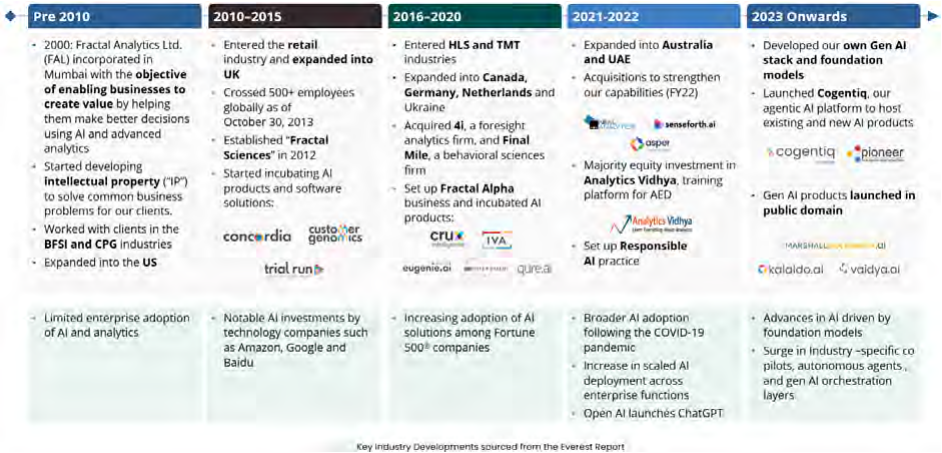

**[Image: 1770955551279.pdf-0315-07.png (942x453, 516.1KB)]**

### **Fractal Approach** 

Our approach to problem solving through our AI solutions, which we refer to as “The Fractal Approach” incorporates three key aspects: 

**_“User-centric, decision-backwards” approach; we start with understanding what decision the end-user is interested in taking, understanding and reframing business problems from the end-user’s perspective._** 

311 

To design an AI solution, we use a “user-centric, decision-backwards” approach to identify and understand the business problem from the perspective of users, which could be end-customers of the client or the client’s personnel. Our approach starts with exploring and understanding the decisions to be made, defining the business problems to be solved and then thinking backwards to determine the required data, algorithms, systems and solutions to address the problems. The decision-backwards aspect is in contrast to the traditional data/tech forward approach where solutions are built on the data and technology that is already available. 

<mark>To illustrate our user-centric, decision-backwards approach, a global manufacturer of confectionary products</mark> was looking to drive higher sales. We first defined the problem of the end-users (i.e., salespeople could not make decisions in time to drive sales, as they were not able to easily track their sales on-the-go and they did not have enough insights on where to intervene), before identifying data insights to support this. We then identified data insights that would support salespeople in achieving their targets. On this basis, we designed a personalized AI-enabled mobile application that provided salespeople with (a) a real-time view of their performance indicators, (b) AI driven personalized early warnings for targets that are at risk of not being met and alerts on potential decisions and actions to take and (c) AI generated personalized additional information on the targets which are at risk. 

### **_Integrating behavioral science and data science to design AI solutions for better adoption_** 

Our approach to designing AI solutions is based on understanding human behavior and decision-making dynamics. We leverage our data science capabilities to analyze large volumes of data using a variety of tools and techniques to find patterns and derive insights for our clients. Based on the patterns and insights from such analysis, we build predictive AI models using different algorithms. We use our behavioral science techniques (Behavior ArchitectureTM ) to provide insights into our client’s customers’ behavior and also understand factors that guide decisions non-consciously (for example, emotions, impulse, habits, or reflex actions ). In addition, our proprietary research framework, EthnoLabTM , uses gamification to collect responses from users in a simulated environment, which helps us identify how people actually behave instead of how they claim to behave. 

<mark>A US beverage and coffee company faced frequent stockouts, hurting sales and retailer relationships.</mark> Previously used digital tools did not work well due to low adoption by account managers (“ **AM** "s), driven by lack of trust, poor usability and poor alignment with daily workflow. We developed an AI assistant using data science and behavioral science to optimize store-level ordering. Through deep user research in pilot markets— gathering feedback, understanding habits, emotions, and motivational levers that influence frontline decision, we designed a solution that fits into daily workflows and gets adopted by AMs. We linked our AI recommendations to trusted anchors like key retailer’s brand guidelines and provided targets, visual feedback and loss aversion cues to AMs (i.e. highlighting the potential AM commissions losses from not following the AI recommendations). The AI assistant integrated real-time data (across sales, inventory, promotion and seasonal data) across multiple enterprise systems and used machine learning to suggest optimal orders by SKU and store. These proactive recommendations were provided through a simple mobile interface tailored to reduce information overload and easily align with daily workflow. 

### **_Complementing technical expertise with functional expertise._** 

To reduce their reliance on multiple partners across the DAAI value chain, enterprises, especially large buyers (with annual revenue > US$5 billion or > ₹418 billion), prefer to engage with a single partner for AI solutions ( _source: Everest Report_ ). We have developed specialized functional capabilities to solve business problems across multiple functions, such as sales & marketing, supply chain, finance and accounting and data & AI. These functional capabilities are integrated with our technical capabilities in AED and domain capabilities which enable us to solve business problems for our clients and serve them across industries. 

For example, a global asset management company was looking to increase assets under management of the sales team of its advisory channel. Leveraging our functional and technical capabilities, we studied the client’s sales organization and identified areas of high advisor engagement. We created a recommendation engine and a contact strategy system / customer intelligence system to enable financial advisors to have personalized conversations with their end customers. 

312 

### **Our Technical, Domain and Functional Capabilities** 

The implementation of the Fractal Approach is driven by our expertise to integrate our technical capabilities, our domain capabilities as well as our functional capabilities to deliver benefits to our clients. 

### **_Our Technical Capabilities_** 

Our AI, engineering and design (“ **AED** ”) capabilities enable us to identify and reframe the problem, build the required AI algorithms with supporting infrastructure and data pipelines and design and implement the final solution. 

**Figure 6 – Our AED capabilities** 

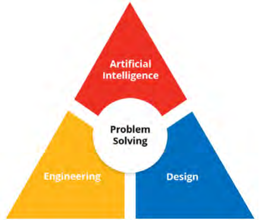

**[Image: 1770955551279.pdf-0317-05.png (436x370, 146.1KB)]**

**AI** is required to build algorithms that can match or exceed human performance to deliver better results. There are six pillars on which we organize our AI capabilities – Gen AI, conversational AI, computer vision, algorithmic decision making/core ML, Machine Learning Operations (“ **ML Ops** ”) and LLM Operations (“ **LLM Ops** ”). It is important to make algorithms explainable and fair, without human biases. To ensure this, we have setup a Responsible AI practice that **_–_** reviews all our solutions. For more details, see “ _Responsible AI Framework_ ” at page 338. 

**Engineering** is key to identifying the availability, quality, type and readiness of data to build an effective AI solution, creating the necessary integration frameworks to ensure seamless connectivity across different infrastructure elements and building efficient data architecture that facilitates real-time automated AI solutions designed for scale. We leverage our engineering capabilities to operationalize the decisions from data process for our clients. 

**Design** is important to gain a deep understanding of human behavior across the entire journey, from framing the right business problem to solving it in a manner that accelerates adoption and drives impact. Our design team brings together cross-functional expertise in behavioral science, economics, ethnography, information & interaction design and user experience. 

### <u>AI</u> 

Our AI capabilities include the following: 

|**Capabilities**|**Description**|
|---|---|
|Algorithmic decision making/Core ML|Processing and analyzing large amounts of data to produce an output such as a score, prediction orprobabilitythat can be leveraged for makingAI enabled business decisions|
|Machine vision|Technology and methods for extracting relevant information from visual data on an automated basis and usingthis information to make decisions|
|Conversational AI (NLP)|Technologies that enable machines to communicate with humans and to process, understand and respond to human languages usingML and natural languageprocessing|
|ML Ops|Scaling AI solutions requires model training, monitoring and deployment supported by continuously integrated pipelines, model lifecycle management and model governance. We help our clients establish a set of practices that aim to deploy and maintain machine learning models in production reliably and efficiently, bridging the gap between ML development and deployment.|

313 

|**Capabilities**|**Description**|
|---|---|
|LLM Ops|Methods, strategies and tools used to manage LLMs in real-world settings into commercial products|
|Gen AI|Algorithms that create new content, such as images, text, or music, mimicking human|
||creativity. Foundation models act as thepowerful backbone for manyGen AI applications.|

### <u>Engineering</u> 

Our engineering capabilities include the following: 

|**Capabilities**|**Description**|
|---|---|
|Cloud engineering and migration|Cloud engineering capabilities include architecture consulting, data estate modernization, data governance, security and cloud cost optimization for public cloud platforms such as Google Cloud,Databricks and Microsoft Azure|
|Data platforms|Helping clients design and build scalable and cost-effective data platforms to reduce data fragmentation by storing internal, external, structured, semi-structured and unstructured data,all linked together|
|Platform Ops|Build and operate scalable, enterprise-grade platforms for data and analytics—engineered with DevSecOps and designed for reliabilityand observability|
|Data Governance|Enabling enterprises to unlock value through a strong foundation of secure, trusted and reliable datapowered bythe rightpolicies, process and technology|
|Marketplaces|Self-discoverable intuitive digital store fronts for consumers and producers to share trusted dataproducts|
|Enterprise Ops & Digital Ops|Automated monitoring for all engineering projects to provide a controlled environment to run andgovern the entire data estate|
|Decision Systems|Building business intelligence tools & dashboards along with conversational AI and web apps/mobile apps to derive intelligent insights for clients|
|Next Gen software development|Developing products such as Cogentiq Migration, a Gen AI based cloud migration and rationalization workbench which helps fast-track development and accelerates migration projects across different migration use cases|

### <u>Design</u> 

Our design capabilities include the following: 

|**Capabilities**|**Description**|
|---|---|
|Behavioral sciences|Our Behavior Architecture™ approach integrates human-centered design with behavioral science to understand the reasons behind an individual’s decisions and their decision- making approach. We use research methods like emotional appraisal and simulated games to understand the predominant human emotions that influence decisions. It is difficult to research human behavior through interviews, surveys and focus groups that tend to rely on self-reporting by participants and hence we developed our proprietary framework, Ethnolab™. Ethnolab™ uses context simulations, gamification and scenario-based research models to test the drivers behind decisions and eliminate the biases of self-reported responses|
|Design research|We undertake (i) ethnographic research, a qualitative method of research where we observe how AI and humans actually perform under real conditions of use; (ii) lean research, a research framework that focuses on improved research outcomes by improving the experience of the research participants; and (iii) user experience research, a research method that studies target users and their requirements to add realistic context and insight to design processes|
|User experience and interaction design|We have developed a design system, the “Phi Design system”, to accelerate our design process. This design system provides tools and templates for discovery, developing user interfaces and implementing AI and data analytics.|
||We have developed the Cogentiq Design System, a foundational document that ensures consistency, clarity and efficiency in how the Cogentiq Platform and Products are visually and experientiallyrepresented in the world.|

To illustrate how we deploy our technical capabilities into our AI solutions, a client in the media and entertainment industry sought to drive better customer experience and increase product sales and cross-sales 

314 

<mark>through personalization of customer interactions with their contact center agents. The existing client strategy</mark> was for their agents to pitch products to customers based on the client’s business priorities, which did not necessarily align with customers’ requirements. We recommended a change in approach and built an AI driven recommendation system for the client. We engineered an AI solution which could de-fragment data from multiple data sources and deliver the relevant, real-time recommendations to agents based on customers’ interests and preferences, instead of the client’s business priorities. The front-end interface was designed to show agents the relevant product recommendations for customers along with talking points and explanations of the relevant product. 

### **_Our Domain Capabilities_** 

Our domain expertise is developed and aggregated through many years of experience serving clients in our focused industries, including our experience addressing industry specific needs and our ability to expand our client base and deepen business relationships with existing clients. 

|**No.**|**Client Description**|**Problem / Use-** **case**|**Industry** **Domain**|**Our Solution**|**Business** **Function**|
|---|---|---|---|---|---|
|1.|Mars|Support digital transformation across various business pillars|CPG|User-centric design to identify areas in need of digital transformation, followed by agile experimentation|Data & AI|
|2.|Leading media and entertainment player|Personalization of customer interactions with contact center agents|TMT|AI driven recommendation engine to provide real-time product recommendations for customers to call center agents based on customers’ interests and preferences|Sales and Marketing|
|3.|Global CPG Player|Manage excessive inventory|CPG|Inventory optimization AI solution to monitor inventory across the network, classify slow moving SKUs into categories (blocked, discontinued, obsolete or excess), identify root cause for non-performing inventory and provide early warning alerts of inventory accumulation|Supply chain|
|4.|US health insurance provider|Drive member satisfaction and conversions through customized outreach|HLS|Automated AI-driven engine for precise targeting, message selection, optimal outreach timing and effective delivery|Customer engagement|
|5.|Leading confectionary manufacturer|Enhance efficiency for collection team|CPG|Created an AI driven collections module that predicted late customer payments for proactive reach outs and generated a prioritizedlistfor follow-ups|Finance & accounting|

For further case studies demonstrating our industries and domain expertise, please refer to “ _– Our clients – Select Case Studies_ ” on page 327. 

### **_Our Functional Capabilities_** 

We have developed industry-agnostic specialized capabilities to solve typical business problems across business functions. The key functional areas that we are currently focused on are detailed below: 

|**Capabilities**|**Description**|
|---|---|
|Personalization and|Provides end-to-end customer decision making by developing a harmonized view of|
|recommendation engines|customers’ behavioral patterns which allows the profiling and predicting of customer behavior.|

315 

|**Capabilities**|**Description**|
|---|---|
|Supply chain|Help clients across industries through AI solutions to increase efficiencies across the supply chain network through strategic initiatives and operational decisions in key areas such as planning, risk mitigation, inventory optimization, cost efficiency (reducing waste, alternative sourcing,amongothers)and capacity planning,amongst others|
|Financial analytics|Provide AI solutions to automate and standardize financial data, reduce accounting risks and fraud, simplify finance practices through solutions focused on financial planning, controllership,businesspartneringand treasuryand risk|
|Marketing|Measure returns on marketing investments and help optimize future marketing plans through solutions that provide a forward-looking view of business performance, early warningsignals and marketingsimulators|
|Digital and Web Analytics|Enables clients to enhance digital engagement and online conversions by optimizing customer journeys through improved interaction tracking, frictionless experiences, enhanced customer experience andpersonalized web and appinterfaces|

### **Our AI solutions** 

### **_Fractal.ai segment_** 

**Figure 7** -The Fractal.ai segment comprises (i) our AI services and (ii) our AI products (some of which are shown in the image below): 

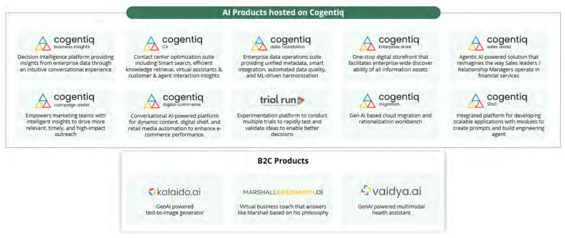

**[Image: 1770955551279.pdf-0320-04.png (942x397, 383.7KB)]**

The following is an overview of some of our AI products shown above (in alphabetical order): 

### **_Cogentiq_** 

Cogentiq is our flagship agentic AI platform, designed to help clients and internal teams rapidly build and deploy intelligent AI products and solutions. It provides a suite of pre-built tools and components, including an SMEoriented Agent and Workflow Builder, connectors for diverse enterprise data sources, a library of reusable tools and agents and built-in security and governance. Cogentiq enables intelligent agents that plan, act and correct autonomously, integrating with diverse systems, analyzing data in real time and driving proactive decisions across the enterprise. As an example, for a major healthcare provider, Cogentiq automated call auditing and insights generation, reduced call duration and improved operational efficiency. Development of Cogentiq began in July 2024, with an early release in January 2025 featuring solutions for Business Intelligence, Knowledge Management and Contact Centers. We plan to continue to expand Cogentiq with domain-specific, end-to-end agentic AI solutions. 

316 

**Figure 8** - The below visuals illustrate how various types of apps can be built on Cogentiq with various underlying agents and tools. 

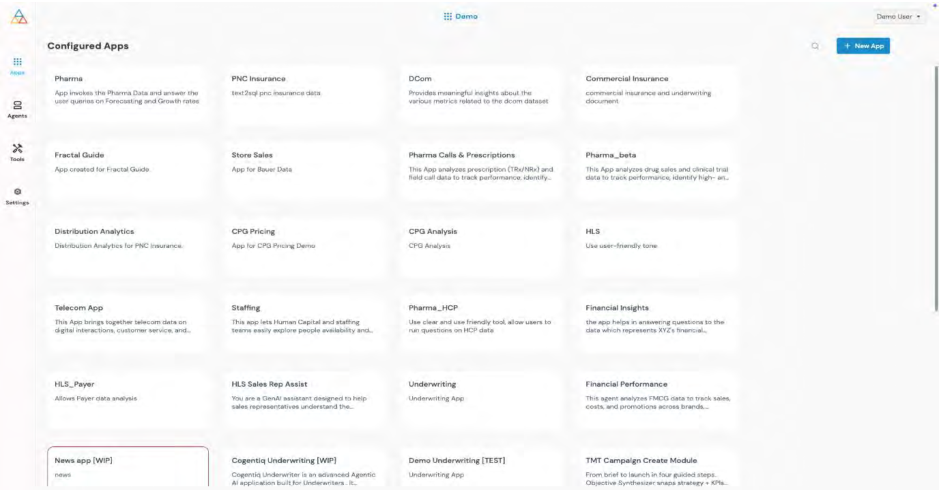

**[Image: 1770955551279.pdf-0321-01.png (940x491, 215.1KB)]**

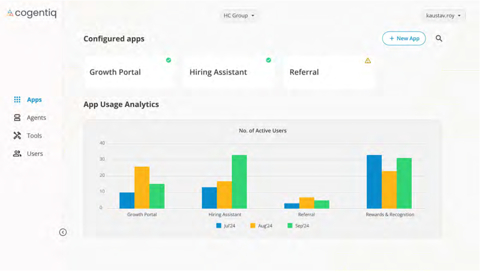

**[Image: 1770955551279.pdf-0321-02.png (942x532, 273.3KB)]**

_Note: All data in the interfaces above is dummy (synthetic) data. No client data is shown or used in the interfaces and the images of the interfaces are only illustrative._ 

317 

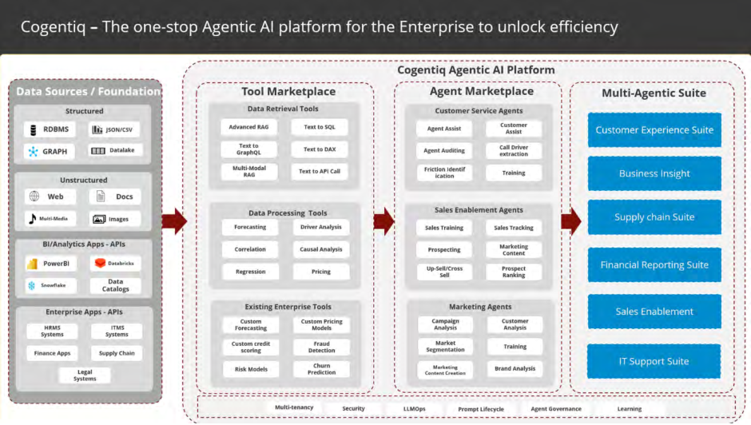

**[Image: 1770955551279.pdf-0322-00.png (940x532, 685.2KB)]**

**_Cogentiq Business Insights_** _(formerly known as Cuddle and Crux Intelligence)_ 

Cogentiq Business Insights is an agentic AI-powered decision intelligence platform that enables businesses to make informed, data-driven decisions through an intuitive conversational experience. Cogentiq Business Insights generates narratives, offers dependable insights on enterprise structured datasets and has rapid customization options for personalizing across use cases. It is a multi-agent framework that allows organizations to deploy their own algorithms and custom models to answer “Why, Where and How” questions. Cogentiq Business Insights is enterprise-ready, cloud agnostic and industry agnostic. We started developing Cogentiq Business Insights (formerly known as Cuddle and Crux Intelligence) in 2017 and obtained a patent for Crux Intelligence in the U.S. in 2024. 

**Figure 9** - The image below illustrates a detailed data-based response to a conversational question asked to Cogentiq Business Insights: 

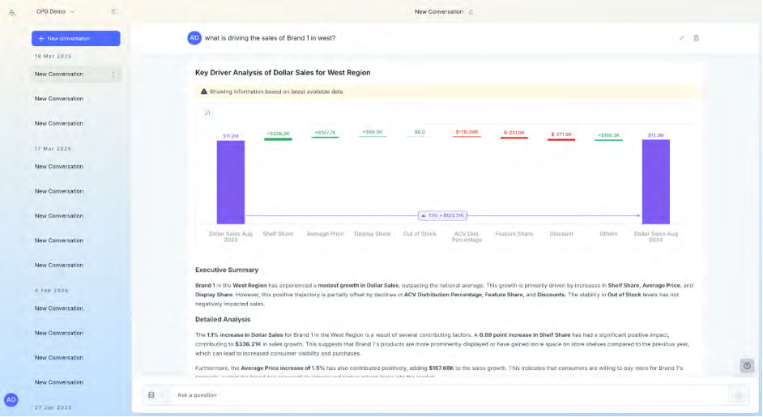

**[Image: 1770955551279.pdf-0322-04.png (942x515, 298.5KB)]**

_Note: All data in the interface above is dummy (synthetic) data. No client data is shown or used in the interface and the image of the interface is only illustrative._ 

318 

### **_Cogentiq CX_** _(formerly known as Senseforth.ai)_ 

Cogentiq CX is an Agentic AI powered contact center optimization suite. It includes several modules: 

1. **_Gen AI Smart Search and Virtual Assistant/Voice Assistant:_** enhances the ability of website users to quickly locate pertinent information using text or voice, which shortens their journey and boosts customer satisfaction and deflects calls from reaching the contact center. Example of a Smart Search on a website: 

**Figure 10 -** Example of a Smart Search on a website: 

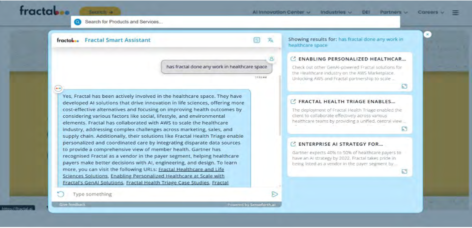

**[Image: 1770955551279.pdf-0323-04.png (944x457, 485.0KB)]**

_Note: All data in the interface above is dummy (synthetic) data. No client data is shown or used in the interface and the image of the interface is only illustrative._ 

2. **_Gen AI Knowledge Assist / Live Call Assist / Gen AI Coaching:_** provides assistance to contact center representatives to prepare for and respond to customers more effectively when on a call, helping reduce average handling time, improve compliance and improve customer experience. 

**Figure 11** - The image below illustrates an on-call knowledge assistant in action providing real-time suggestions to the call center agent through the Live Agent Assist module: 

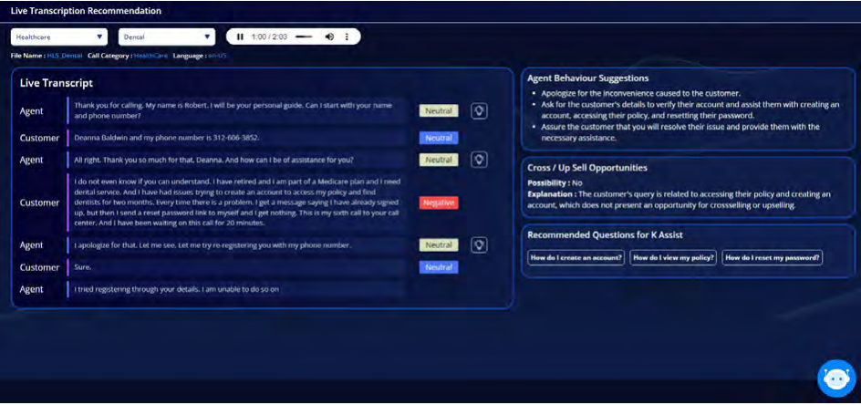

**[Image: 1770955551279.pdf-0323-08.png (944x444, 535.9KB)]**

_Note: All data in the interface above is dummy (synthetic) data. No client data is shown or used in the interface and the image of the interface is only illustrative._ 

319 

3. **_Customer Interaction Insight and Agent performance Insights:_** which can analyze customer interactions in calls/chats and derive insights around reasons for the call/chat and CSR performance, helping automate auditing. The following screenshot shows a typical dashboard generated by the solution: 

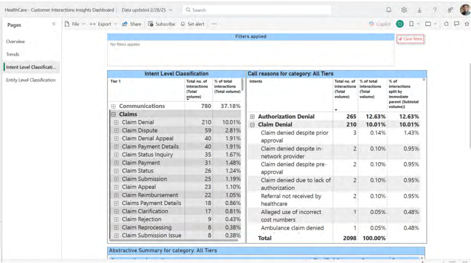

**[Image: 1770955551279.pdf-0324-01.png (942x526, 437.0KB)]**

_Note: All data in the interface above is dummy (synthetic) data. No client data is shown or used in the interface and the image of the interface is only illustrative._ 

We launched Cogentiq CX (formerly known as Senseforth.ai) in 2017 and we obtained a patent in the U.S. in 2020. 

### **Cogentiq Campaign Assist (formerly a part of Customer Genomics)** 

Cogentiq Campaign Assist empowers marketing teams with intelligent insights to drive more relevant, timely and high-impact outreach. By harnessing Agentic AI, it redefines customer engagement through hyper-personalized experiences that deliver measurable, ROI-driving results. 

Cogentiq Campaign Assist includes the following features: 

- Precision Audience Segmentation - Generate audiences optimized to your business objectives and campaign briefs, powered by customer behavioral metrics and Next Best Action recommendations. 

- Content Generation for digital channels - Employ neuroscience-driven proprietary Micro Stimuli strategies to dynamically tailor messaging to individual customer intent and context, enhancing market efficiency by reducing execution costs and generating highly engaging content. 

- Real-time Intent Detection - Capture and act on customer signals instantly to deliver timely, personalized experiences. 

- Measure Campaign Performance - Leverage Agentic AI to continuously test, learn and scale what works best. 

- Boost Profitability - Drive incremental revenue by precisely targeting audiences primed for cross-sell and up-sell. 

- Seamless CRM Integration - Pre-built connectors for upstream and downstream integrations with CRM, sales and marketing platforms. 

Cogentiq Campaign Assist drives measurable results and accelerates time-to-value and competitive edge. Also, it is an enterprise-grade and secure tool built for seamless integration into a marketing and sales tech stack. 

320 

**Figure 13** - The image below illustrates a marketing email drafted by Cogentiq Campaign Assist that incorporates messaging, product suggestions and relevant promotions tailored to the customer’s persona and transaction history: 

**[Image: 1770955551279.pdf-0325-01.png (880x795, 992.9KB)]**

_Note: All data in the interface above is dummy (synthetic) data. No client data is shown or used in the interface and the image of the interface is only illustrative._ 

### **Cogentiq Sales Assist** **_(formerly a part of Customer Genomics)_** 

**Cogentiq Sales Assist** is an Agentic AI-powered solution that assists client facing sales leaders or relationship managers who operate in financial services, who need to be well prepared for client meetings and spend a lot of time preparing for such meetings. **Cogentiq Sales Assist** provides an AI-powered solution to streamline the enduser’s preparation to pitch, to better enable them to talk to the right clients with the right information. 

This solution is designed to drive sales in institutional banking (such as Asset Management, Wealth Management, Business banking, Corporate banking, Investment banking and Private equity) and enable greater efficiency, stronger and more personalized client relationships and improved conversion and asset under management (“ **AUM** ”). 

Built on a multi-agent architecture, Cogentiq Sales Assist orchestrates and engages a network of agents undertaking data harmonization, next-best-action recommendation, intent interpretation, prioritization, scheduling, etc., with customer relationship management (“ **CRM** ”) integration to offer an end-to-end portal for all **learn** , **prioritize** and **scheduling** tasks. Each agent specializes in a distinct task and collaborates with others to dynamically adapt interventions based on evolving customer behavior and business objectives. 

Based on behavioral science led immersions with actual end-users, Cogentiq Sales Assist is designed with nuances that help client-facing personas better adopt to the portal. It incorporates the aversion relationship managers may 

321 

have towards having to seek information from a co-pilot, while utilizing AI so that they can still consume information in a customized preference-based manner. 

Cogentiq Sales Assist builds on the foundations of Customer Genomics, which is our inhouse personalization accelerator platform. Launched in 2017, Customer Genomics obtained patents in India in February 2020 and in the United States in July 2022. 

**Figure 14** - The snapshot below shows the “Prepare” module of Cogentiq Sales Assist. For the end-user (sales leader or relationship manager), this module contains detailed notes generated to help them prepare for client meetings, incorporating insights and information from multiple sources that would help the user provide focused advice to a client for achieving a profitable portfolio. 

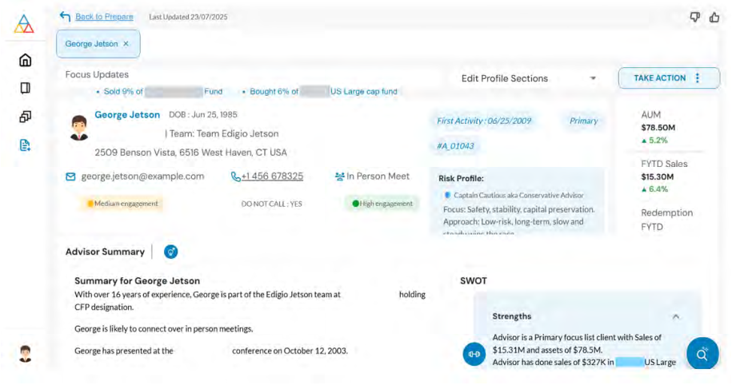

**[Image: 1770955551279.pdf-0326-03.png (915x482, 313.1KB)]**

_Note: All data in the interface above is dummy (synthetic) data. No client data is shown or used in the interface and the image of the interface is only illustrative._ 

### **_Cogentiq Digital Commerce_** _(formerly known as eHub)_ 

Cogentiq Digital Commerce is a conversational AI-powered dynamic content management and automation platform that supports clients in fulfilling their e-commerce and digital marketing needs. Some of the features include alert system, digital shelf wellness, tracking brand performance, understanding consumer journey, retailer search algorithm, budget optimization, price analysis, AI powered dynamic content management and automation. These features help enterprises to drive incremental sales, enhance their digital footprint, optimize retail media budget allocation, improve implementation efficiency, evaluate pricing strategies, optimize assortment and create content, among others. We obtained a patent for Cogentiq Digital Commerce in the U.S. in 2024. 

322 

**Figure 15** - The visual below illustrates attribution of ecommerce sales and sales opportunities across multiple touchpoints to help ecommerce businesses optimize spending across channels: 

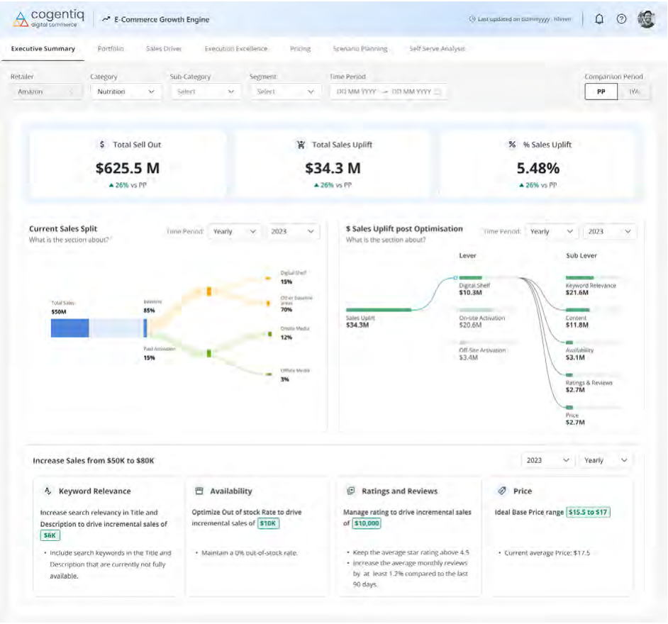

**[Image: 1770955551279.pdf-0327-01.png (942x880, 457.7KB)]**

_Note: All data in the interface above is dummy (synthetic) data. No client data is shown or used in the interface and the image of the interface is only illustrative._ 

### **_Kalaido.ai_** 

Kalaido.ai is our proprietary diffusion model for text-to-image generation and image creation based on text instructions. It creates high-quality images from text prompts in multiple languages including Indian languages such as Hindi, Kannada, Sanskrit, amongst others. Its diffusion pipeline is designed to generate images with intricate details, high quality and photorealism. This approach aims to reduce generation time and carbon footprint without compromising on the quality of images. Kalaido.ai integrates safeguards to promote the responsible creation of AI-generated images. We developed Kalaido.ai in 2023 and it was released publicly in 2024. Since its launch, we have more than 29,000 user registrations and more than 700,000 images have been created using Kalaido.ai as of September 30, 2025. We filed a patent in India in 2025 for Kalido.ai. 

323 

**Figure 16** -The image below illustrates the images generated based on a prompt provided: 

**[Image: 1770955551279.pdf-0328-01.png (942x535, 598.3KB)]**

_Note: All data in the interface above is dummy (synthetic) data. No client data is shown or used in the interface and the image of the interface is only illustrative._ 

### **_Cogentiq Data Foundation_** 

Cogentiq Data Foundation helps enterprises streamline their data operations through an integrated agentic AI platform, which contributes to delivering efficiency gains with improved accuracy by unifying data quality, observability and harmonization in a single solution. It consists of four different modules (i) Cogentiq Unified Metadata – for capturing and maintaining asset catalog, profiling, versioning and overall observability, (ii) Cogentiq Data Integration – to integrate and process data from various sources and create data products, (iii) Cogentiq Data Quality – to perform data quality checks when the data is at rest or in motion and (iv) Cogentiq Data Harmonization – to harmonize and standardize the data from different sources through machine learning (“ **ML** ”) algorithms. We launched Cogentiq Data Integration, Cogentiq Data Quality and Cogentiq Unified Metadata modules of Cogentiq Data Foundation in 2022. We are in the process of filing a patent in India for the Cogentiq Data Integration module in 2025. 

**Figure 17** - The image below illustrates the ease of use of different modules of Cogentiq Data Foundation that allows users to configure the data sources, perform data transformations to be performed and the output datasets/sinks, check the data quality and harmonize the data with a unified observability dashboard. 

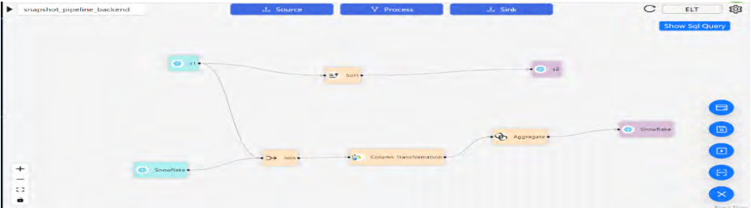

**[Image: 1770955551279.pdf-0328-06.png (928x257, 162.8KB)]**

_Note: All data in the interface above is dummy (synthetic) data. No client data is shown or used in the interface and the image of the interface is only illustrative._ 

324 

### **_Trial Run_****_TM_** 

Launched in 2016, Trial RunTM is a comprehensive software, covering the entire life cycle of business experiments – from defining objects to taking right business decisions to reduce risk and increase profitability. Trial RunTM enables our clients to test ideas across physical sites (such as retail stores, bank branches and restaurants), markets and customers. The aim is to lower the risk of failed product launches, increase profitability and make well informed business decisions. Trial Run is ISO 27001:2022 certified. 

**Figure 18** - The image below demonstrates Trial Run’s roll-out simulator that is recommending store locations (at a state level in the United States) based on returns on investment (RoI) for a particular product. (The map uses graded grayscale shading, where darker areas show higher RoI and lighter areas show lower RoI.) 

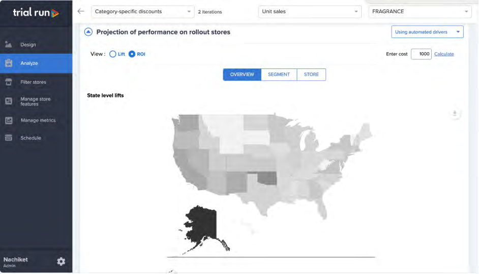

**[Image: 1770955551279.pdf-0329-03.png (942x540, 223.9KB)]**

_Note: All data in the interface above is dummy (synthetic) data. No client data is shown or used in the interface and the image of the interface is only illustrative._ 

### **Fractal Alpha segment** 

### **_Fractal Alpha: AI Businesses_** 

Fractal Alpha enables incubation of new businesses and integration of certain acquired businesses. Ideas are sourced from both internal teams and external sources. After reaching a certain maturity, these ideas undergo a secondary assessment. Ideas with a strong platform play and/or reliance on services are absorbed into Fractal.ai. Market-validated and scalable ideas are developed as independent AI businesses within the Fractal Alpha ecosystem. These businesses target Fractal.ai’s core MWCs and broader markets and new geographies, with each business under separate management. 

The following is a brief description of our AI businesses: 

### **_Asper.ai_** _(formerly known as Samya.ai)_ 

Asper.ai was built with a mission to be the most preferred enterprise growth AI platform, bringing AI-first SaaS to help CPG companies with revenue growth management. It helps them manage revenue growth by using AI for sales and distribution, pricing and promotions, demand planning and inventory management. Its demand planning module integrates internal data with external factors like weather and holidays to help clients anticipate risks and recover potential revenue leakage. Asper.ai provides AI recommendations, nudges and decision automation to maximize value opportunity and reduce dependence on manual effort and expertise. As of January 19, 2026, Asper filed for 18 patents for its AI approaches across the US and India and received six patent approvals. 

325 

**Figure 19** - The snapshot below illustrates Asper.ai’s interface: 

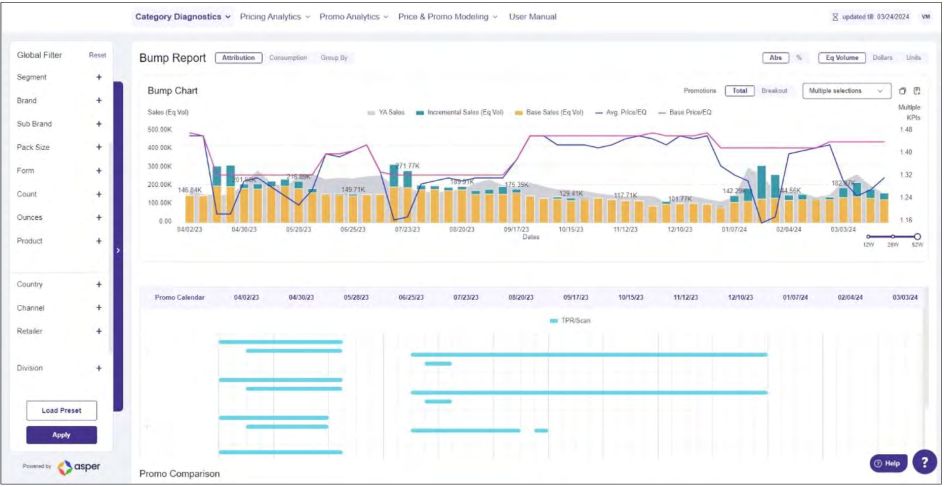

**[Image: 1770955551279.pdf-0330-01.png (944x487, 368.0KB)]**

_Note: All data in the interface above is dummy (synthetic) data. No client data is shown or used in the interface and the image of the interface is only illustrative._ 

### **_Analytics Vidhya_** 

Analytics Vidhya is the largest analytics and data science community originating in India, bringing together more than 4.9 million registered users worldwide as of March 31, 2025 ( _source: Everest Report_ ). Their mission is to build next-generation AI enterprises and professionals by providing them with the latest AI content, cutting-edge AI training and upskilling programs. Their platforms feature comprehensive AI blogs, AI programs, engaging hackathons and an active, thriving community. Through Analytics Vidhya, we provide enterprise clients with custom AI training programs and hiring & branding hackathons to attract top AI talent and boost brand visibility. 

Analytics Vidhya started as a blog in 2013 and the company was incorporated in 2014. On paid-up capital basis, we acquired a 55.92% stake in Analytics Vidhya in 2021 and the balance 44.08% stake in 2025. 

### **_Qure.ai_** 

Founded in 2016, Qure.ai was developed to make healthcare more accessible. Doctors use Qure.ai to identify medical conditions fast and prioritize treatment planning.  Qure.ai specializes in providing: (i) end-to-end digitized tuberculosis workflows; (ii) comprehensive offerings across the lung cancer workflow; and (iii) AI-augmented hub and spoke stroke care workflow. We incubated Qure.ai in 2017 and established it as a standalone AI business in 2018. Qure.ai has raised multiple rounds of late-stage funding, with the latest being a Series D round in 2024. Qure.ai has won prestigious awards across the globe including the Emerging BioStartUp of the Year Award’ at the BioSpectrum India Excellence Awards 2023, AI Gamechanger Awards at the GPAI Summit 2023 and the Siemens Healthineers Startup Award 2024 for Pioneering Healthcare AI Solutions in 2024. In 2025, Qure.ai was recognized in TIME100 Most Influential Companies 2025. Since April 2022, we own a minority stake in Qure.ai and hence it is an associate company and is not consolidated in our Restated Consolidated Financial Information. Qure.ai has filed for 61 patents, of which 40 have been granted _(source: Everest Report)_ 

### **Our Clients** 

We are a trusted partner to several of our clients including our focus base of MWCs for their business needs. As of September 30, 2025 and 2024, and March 31, 2025, 2024 and 2023, we served 122, 120, 113, 110 and 107 MWCs, respectively, across Americas, Europe, Asia Pacific and other regions. Client satisfaction is our priority, the results of which are evidenced by NPS in our Fractal.ai segment as set out in the 1Lattice Report, of 76, 78, 77, 77 and 73 as of September 30, 2025 and 2024, and March 31, 2025, 2024 and 2023, respectively and our Net Revenue Retention within our Fractal.ai segment of 114.0%, 119.1%, 121.3%, 110.2% and 151.0% for the six months ended September 30, 2025 and 2024, and in Fiscals 2025, 2024 and 2023, respectively. 

326 

### **_Select Case Studies_** 

### _A multinational technology conglomerate_ 

- Client: A global technology company that has been our client since 2017 

- Industry: TMT 

- AI solution: AI consulting and technology services 

<u>Situation: The client wanted to simplify operations by having analytical tools to measure the success of its product</u> launches and growth campaigns. The client further aimed to have predictive models to analyze customer, merchant and category trends that can drive better product decisions. The client also wanted to monitor the performance of its payments application and the impact of its marketing initiatives on user behavior. 

<u>Solution:</u> We worked with the client to set up analytics foundations for their payments application and built enterprise data warehouse tables feeding into product life cycle indicators. We built centralized dashboards for product and marketing executives to track performance metrics for the applications on a real-time basis and drive product and marketing decisions based on customer behavior. We also created dashboards to track the performance of product updates and marketing campaigns, both before and after launch, focusing on product adoption and market share. To improve the quality and actionability of insights, we also built AI solutions to address variations among names for the same merchant and improve the mapping of SMB online merchants into custom-defined business categories helping clients drive better marketing decisions for product growth. We continue to support the client with product and marketing analytics. 

_An AI software company_ 

- Client: C3 AI, a leading enterprise AI software provider for accelerating digital transformation that has been our client since 2023 

- Industry: TMT 

- AI solution: Product Engineering and Deployment 

<u>Situation: C3 AI wanted to identify a partner that could deploy and configure full-stack, AI-based enterprise</u> applications on the C3 AI Platform, to test, troubleshoot and enhance customer software applications with and on behalf of customers. They further wanted the partner to train, validate and deploy machine learning pipelines through active collaboration with data and subject matter experts from customer teams to seek, understand, validate, interpret and correctly use data and business insights. 

<u>Solution: We deployed experts directly embedded within C3 AI’s product engineering teams to develop, release</u> and support Enterprise AI solutions in the marketplace. We provided product, data science and AI, data and software engineering, site reliability engineering and project management expertise in a forward deployed construct to deliver value to C3 AI’s end users and customers. This resulted in faster time to market for developing and releasing applications, increased velocity of release cycles and improved customer responsiveness and time to value through increased capacity for serving customer base. 

_A healthcare technology company_ 

- Client: Philips, a healthcare technology company and a global medical device manufacturer that has been our client since 2014 

- Industry: HLS 

- AI solution: Data engineering, Customer analytics (next best recommendation function) 

<u>Situation: The client caters to medical care businesses spanning small clinics to large hospitals and is engaged in</u> various segments including diagnostic imaging, image-guided therapy, patient monitoring, health informatics, consumer health and home care. The client was looking to design a business-to-business sales strategy that could help increase its market share by cross-selling or up-selling to existing customers (i.e., medical care businesses) as well as expand its customer base. 

327 

<u>Solution: Using our decision-backwards approach, we determined that, to optimize their B2B sales, it is important</u> to understand (i) the potential of medical care organizations across segments for product sales and (ii) the target medical care organizations to improve the market share. For this, we gathered information, such as, location, affiliations, medical care type and clinical parameters, among others, on these organizations from both internal and external databases. With this we mapped the medical care organizations to their market size and potential buying power. We used our AI, engineering and design (“ **AED** ”) capabilities to build a customer segmentation program aimed to generate incremental revenue through new opportunities from both existing as well as new customers. Our segmentation suggested focus areas based on the medical care organizations’ profile. For example, if a medical care organization is a leading player in the cardiology segment, they may be more amenable to buy best in class cardiology products, prompting the client to show their best products to the customer. We developed a recommendation engine for up-selling and cross-selling products. Leveraging ML, the recommendation engine analyzed precedent transaction patterns to predict the next most likely product purchase for medical care organizations. 

Our AI solution was deployed across 32 countries and enabled the client to uplift sales from its existing customers as well as add new customers. We have gradually scaled our relationship with the client over the years delivering engagements across B2B sales and marketing, finance, functions including human capital analytics, travel, real estate, internal audit and procurement, digital, cloud data transformation and connected customer platform. 

### _US retailer_ 

- Client: A NASDAQ-listed distribution company providing business services and supplies, products & technology solutions to small, medium and enterprise businesses, that has been our client since 2018 

- Industry: Retail 

- AI solution: Comprehensive customer analytics-based solution 

<u>Situation: The client was looking to improve its customer base by enabling targeted interactions. The aim was to</u> identify top products and services and to build customer centric intelligence to drive consistent targeting across direct mail and web placements for selling products and services to its customers. 

<u>Solution: We leveraged our customer analytics capabilities to deliver the</u> following AI solutions for the client’s marketing team: 

_Purchase cadence_ : We developed a purchase cadence (follow-up strategy) model for product sub-categories which predicts the probability of a customer coming back for purchase within a stipulated time; 

_Product recommendation_ : We developed a solution which recommends the top 10 products based on a customer’s purchase behavior and seasonality for each customer segment; 

_Predicting high value leads:_ We developed two real-time models to predict high value leads scores - (i) a high value lead model which predicted whether a lead would turn into a high value customer or not; and (ii) a lead scoring model which assigned a score to each lead based on details in the lead form. The graphic on the right is an illustration of our real-time models. 

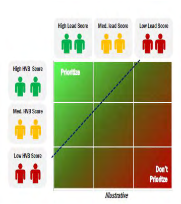

**[Image: 1770955551279.pdf-0332-11.png (359x403, 224.4KB)]**

**Figure 20** 

We continue to work with the client in the areas of personalization, media test measurement and customer, sales and marketing analytics. 

### _Australian global financial services group_ 

- Client: An Australian global financial services group whose offerings range across asset management, banking, investments, global markets and commodities that has been our client since 2021 

- 

- Industry: BFSI 

328 

- AI solution: Gen AI powered website search – Cogentiq CX 

<u>Situation: The client’s Banking and Financial Services division provides personal banking, wealth management,</u> business banking and vehicle finance products and services to retail and business clients. The division was looking to enhance customer interaction, by aiming to streamline conversations and providing precise responses with reduced user effort. The objective was to optimize the end-user experience through an easily accessible application. 

<u>Solution: We implemented our Gen AI powered proprietary “Smart Search” solution in eight weeks to extract</u> content from the bank’s website and other authorized sources to deliver a conversational experience. As compared to the traditional website search, the “Smart Search” implementation uses a semantic search approach to interpret the meaning of words and phrases rather than using just keyword matching to fetch results. 

We continue to work with the client in delivering GenAI and Agentic-AI powered solutions to drive efficiencies across contact center optimization and internal productivity enhancement initiatives. We also support their cloud migration efforts and build new data assets to support key business requirements across retail and wealth banking. 

### _Global asset manager_ 

- Client: Franklin Templeton, a global asset manager, selling mutual funds to investors through financial advisors, that has been our client since 2014 

- Industry: BFSI 

- AI solution: Advisor personalization, portfolio optimization, Gen AI platform, Gen AI sales assistant, Document Search 

<u>Situation:</u> The sales team of the client wanted to improve their efficiency in approaching leads to improve conversion. The client wanted to augment its existing analytics, processes and procedures to support strategic business decisions for sales and marketing teams. The client wanted to identify drivers, models that can enhance sales and marketing communications, including future engagements with customers. 

The client aimed to create a unified AI platform to host dedicated use cases for productivity enhancement and recommend the next best actions. 

### <u>Solution:</u> 

We developed Advisor Genomics for Franklin Templeton, that allowed its sales and digital marketing teams to prioritize and personalize advisor conversations. The pilot study resulted in incremental sales of 26% within the pilot group of US financial advisors. Some of the insights from this pilot program were subsequently applied in broader sales and marketing processes for Franklin Templeton. 

We created an AI powered sales assistant to help the sales team identify sales targets, when to target and what to talk about during the meeting. This is achieved by creating customized target lists based on user inputs and constraints, creating a concise collection of points to help the sales team prepare for the meeting and optimize their calendar to recommend optimal leads. We integrated our Customer Genomics solution with the Sales Assistant solution. Customer Genomics helps sales teams to suggest recommended products and personalize talking points. Additionally, we built an AI-powered platform that integrated multiple Gen AI use cases in one place. 

Further, we built a Gen AI powered “Operation Assist” platform to automate front, back and middle office in operations. This is achieved by building capabilities to automate, among others, the manual reconciliation process, fund reporting and break analysis. We also built a goal optimization engine. Apart from recommending portfolio and the corresponding probability, the algorithm has been extended to recommend additional information to help the end-user in his/her investment journey. 

We continue to work with the sales and distribution team to facilitate incremental AUM as well as cost savings and workforce optimization through tailored AI solutions and implementing intelligence-led AI automation. 

329 

_US technology company_ 

- Client: A US technology company specializing in designing and supplying graphics processing units (GPUs), APIs for data science and high-performance computing as well as being a specialist AI hardware and software provider 

- Industry: TMT 

- AI solution: Gen AI powered document analysis tool for research papers and other documents 

<u>Situation: In 2024, global sales operations team of the client was looking at automating the research process for</u> their account representatives and building an AI tool which would enable interactive and informative experience for end-users. The aim of the client was to incorporate a system that would allow its team to explore a large set of research papers from different perspectives and facilitate account representatives to take efficient decisions. 

### <u>Solution:</u> 

We built a Gen AI powered knowledge assistant. The system would allow the team to explore a large set of research papers and other documents from different perspectives that can help take actionable decisions in a more speedy and efficient manner. It enables users to get research paper summaries, ask open-ended questions and receive citations from uploaded research papers and documents. Our solution was also selected by the client and showcased at a leading annual global AI conference for developers. 

### **Research and Development** 

We consistently innovate and invest to stay at the forefront of technologies that solve our clients’ most important business challenges. We conduct fundamental research to develop theoretical foundations for solutions and integrate the necessary AI, engineering and design (“ **AED** ”) components to develop scalable solutions. 

As an example, we invested in deep learning and computer vision to improve radiology diagnostics. This led to **_—_** the incubation of Qure.ai in Fiscal 2016. See “ _Our Solutions—Fractal Alpha segment—Qure.ai_ ” starting on page 326. 

In 2024, we invested in developing a virtual coach, MarshalGoldsmith.ai, in collaboration with executive coach Marshall Goldsmith and launched it in the public domain. After experiencing the product, a major Asian Financial Services company partnered with us to create a customized enterprise version for their employees in 2025. 

We prioritize our R&D investments based on two factors: 

1. Breadth of the problem solved: 

   - Broad client problems: Develop technical capability addressing complex, wide-ranging Enterprise AI challenges. 

   - Sharp capabilities: Design specialized solutions for specific client needs. 

   - Advanced pure research: Invest in cutting-edge research exploring novel technical concepts. 

2. Investment horizon and revenue visibility: 

   - Today: Solve immediate client needs and generate revenue now and in the near term. 

   - Tomorrow: Target emerging client demands expected in the medium term. 

   - Day after tomorrow: Focus on long-term fundamental research exploring future commercial viability and client adoption. 

330 

**Figure 21 – Our R&D prioritization framework** 

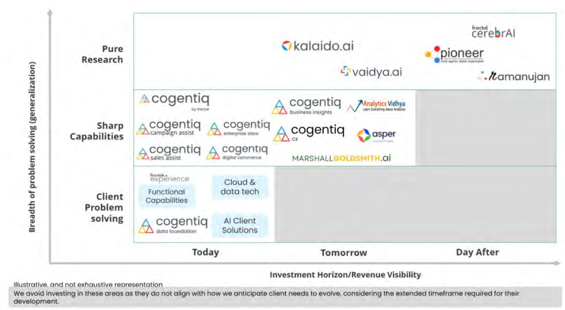

**[Image: 1770955551279.pdf-0335-01.png (942x518, 313.4KB)]**

We make strategic investments to enhance existing capabilities and develop new AI solutions. For example, in Fiscal 2022, we acquired Neal India to enhance our data engineering capabilities and cloud-first offerings on a leading hyperscaler’s multi cloud ecosystem, Samya.ai (now Asper.ai) to strengthen our revenue growth management offering and Senseforth.ai (now Cogentiq CX) to enhance our conversational AI capabilities. We also invest in certain areas in anticipation they become instrumental for future solutions, such as research into quantum computing algorithms that began in Fiscal 2021. 

Our focus on IP led to the creation of Fractal Sciences in 2012 to streamline and strengthen IP creation and drive revenue growth through IPs. Fractal Sciences incubated AI products such as Concordia, Trial Run and Customer Genomics, to solve enterprise problems. We have structured our organization to ensure dedicated teams focus on capabilities, research and product development. Our initiatives include: 

- **_Cerebral (Computational Neuroscience team):_** In 2021, we established the Cerebral team, a dedicated neuroscience research team, to explore the nuances of human behavior and decision-making. This team’s main goal is to gain insights into the complex mechanisms of the human brain in the moments before making a choice. Their joint research, which has been acknowledged in notable conferences, led to the creation of a distinctive ‘microstimuli’ framework that concentrates on the final moments before a decision is made and the influences in that time that can affect the decision, which enables us to better understand and design structures that influence end-consumer choice for the benefit of our clients. 

- **_AI Research team:_** With the advent of foundational model-based AI, we consolidated all our AI research efforts to form the Fractal AI research team in 2023, with a mission to advance AI systems on the path to AGI. The team works across key areas of foundational AI systems – knowledge based foundational models (LLMs, diffusion models, multimodal VLMs), reasoning-based systems (LRMs and various reasoning and reinforcement learning-based systems) and agentic based systems (single and multi-agentbased systems). The team has presented their research work at peer-reviewed AI conferences. The team’s achievements include competition wins in top AI competitions including winning the inaugural Meta HackerCup (AI Competition) at NeurIPS 2024 and winning the Silver Medal at the AIMO Math Olympiad competition. We also emerged as the top performing team at the 65th AAPM (American Association of Physicists in Medicine) for “Deep Generative Modelling for Learning Medical Image Statistics Challenge” and the release of several products including Kalaido.ai, Vaidya.ai, MarshallGoldsmith.ai and Project Ramanujan, an initiative for creating reasoning models. We have open sourced our AI large reasoning foundation model Fathom-R1-14B along with its datasets and Fathom Deep-Research. We have also been selected by the Government of India under the IndiaAI Mission to build India’s first large reasoning model. As part of this initiative, we will build sovereign reasoning 

331 

models from small to large scale, spanning from 2 billion “up to 70 billion” parameters and develop specialized medical reasoning models aimed at advancing healthcare in India. 

- **_Products team:_** In 2023, we established this team to unify our AI products for robust go-to-market and interoperability. The team is responsible for productizing all existing IP and developing new AI products. In 2024, this team started developing Cogentiq to unify our products and accelerators onto a single platform. For further details on Cogentiq, see **“** **_–_** _Our AI Solutions – Fractal.ai solutions – Cogentiq_ ” on page 316. 

- **_Capability building_** : we are investing in functional capabilities and domain capabilities to address both function- and industry-specific challenges, while also strengthening our AED capabilities to develop technical solutions. Through talent acquisition, research, technology development and strategic partnerships, we have built bespoke solutions and AI products. For further details, see “ _– Our AI Solutions_ ” on page 316. These investments contribute to our solutions continuing to be impactful and aligning with evolving industry and functional needs. 

Our commitment to research and development has led to the launch of new products, some of which are listed below: 

|Cogentiq|An agentic AI platform that provides, manages and runs agents that use tools and connectors to access structured and unstructured data from a diverse set of sources|
|---|---|
|Fathom-R1-14B|An open-sourced large reasoning foundation model that scored high on competitive math reasoningbenchmarks|
|Fathom Deep-Research|An agentic DeepResearch system with two underlying specialized models: Fathom-Search- 4B, optimized for long-horizon, evidence-seeking through live web search, and Fathom- Synthesizer-4B designed for open-ended synthesis and reportgeneration.|
|Kalaido.ai|Our own diffusion-based foundation model system which is a text-to-image model system that operates across multiple Indian languages|
|MarshallGoldsmith.ai|Digital knowledge avatar of executive coach Dr. Marshall Goldsmith, imbued with his expertise in leadership, developed from the knowledge of his books, speeches and personallycurated responses alongwith an AI clone of his voice.|
|Pioneer|A multi-agent digital organization to streamline and enhance the Software Development Lifecyle(SDLC)and for autonomous Data Scienceproblem solving.|
|Project Ramanujan|An initiative for creating reasoning models. As a part of Project Ramanujan, we created a mathematical large reasoning model, which won the inaugural Meta HackerCup (AI Competition)at NeurIPS 2024 andpresented learnings from it at ICLR 2025.|
|Vaidya.ai|A medical multi-modal foundation model ecosystem consisting of LLMs, VLMs and medical reasoningsystems.|

Our employees actively participate in conferences and expos and interact with the research community as well as publish research papers in emerging areas like Gen AI, quantum computing and computational neuroscience, some of which are listed below: 

|ICLR 2025|||1. “SBSC: Step-by-Step Coding for Improving Mathematical Olympiad Performance” underlying Project Ramanujan 2. “NO STRESS NO GAIN: Stress Testing-Based Self-Consistency for Olympiad Programming” for Project Ramanujan|
|---|---|---|---|
|NeurIPS Conference|2024|AI|3. Winner of the inaugural Meta HackerCup (AI Competition) for solving Olympiad-level competitive programming problems leveraging LLM reasoning capabilities unlocked through Project Ramanujan. 4. “SBSC: Step-by-Step Coding for Improving Mathematical Olympiad Performance” underlying Project Ramanujan 5. “Effective Text-to-Image Alignment with Quality Aware Pair Ranking”, text-to-image methods underlyingKalaido.ai|
|ICLR 2024|||6. Notable distinction awarded to paper on “Visual prompting methods for gpt-4v based zero-shotgraphic layout designgeneration”|
|ICLR 2023|||7. “FosteringEffective Communication between Humans and Machines”|
|Conference o Computational|n Cogn |itive|8. “Role of Visual Stimuli in Final Seconds of Decision-Making”|
|Neuroscience|2022,|San||
|Francisco||||

332 

|Artificial Applications (AIAI),2023|Intelligence & Innovation|9.|“3D Attention Based YOLO-SWINF for Real-Time Video Object Detection” to help build people-detection system for low-latency environments like drones-based real- time analysis of videos.|
|---|---|---|---|
|Institute of Electronics (“**IEEE**”) 202|Electric and Engineers 4|10.  11.|“Quantum Graph Neural Networks for Portfolio Optimization in Complex Financial Markets, A Novel Approach” Quantum Simulation of 1D & 2D Lattice-based Fermi Hubbard Model using VariationalQuantum Algorithms”|
|IEEE 2023||12.  13.  14.|“Variational Quantum Algorithms for Chemical Stimulation and Drug Discovery” “Synthetic Data Generation Using Genetic Algorithm” “YOLO-MAXVOD for real time video object detection”|

Our innovations have been recognized through patents. For more details, see “ **_–_** _Intellectual Property Rights_ ” on page 339. 

### **Data Privacy and Security** 

We prioritize client trust and emphasize data privacy and security by investing in security tools, people, processes and infrastructure. We have partnered with several OEMs and service providers to build a robust cybersecurity infrastructure to ensure security while retaining user flexibility. Our cybersecurity efforts, implemented by a dedicated team of employees - Information Security Forum focus on protecting all elements of the digital ecosystem – users, endpoints, infrastructure, apps, data and network. All our apps and services undergo regular technical risk and security assessments. Our security program addresses the security and compliance requirements of clients, vendors and employee data. We continuously review risks, screen for threats, conduct penetration tests and review and upgrade our existing tools and services. Our cybersecurity framework is aligned with industry standards, such as ISO 27001:2013, Payment Card Industry Data Security Standard v3.2 and Service Organization Control 2 TYPE II. 

We partner with a third-party vendor for 24/7 security monitoring that manages incidents in real-time. The information security team assesses threats to detect vulnerabilities and strengthen cybersecurity defenses. This collaboration is intended to ensure continuous monitoring, prompt response and robust protection against evolving cyber threats. 

We collect and use customer information to improve our AI solutions, while ensuring compliance with applicable privacy and data security laws, including GDPR. Our policies are regularly updated to reflect changes in law, technology, or geo-political landscapes. We post privacy policies on our website and have additional policies on data security and usage. Data security measures include access controls, encryption and monitoring systems. We encrypt data in transit and at rest and securely delete data when no longer needed. We have taken steps to further secure ourselves against data privacy breaches and other risks by rolling out a Gen AI usage policy. 

We also maintain cyber liability insurance. For more information, see “ _Our Business – Insurance_ ” on page 344. 

### **Sales and Marketing** 

### **_Sales_** 

We actively engage with MWCs to identify ways in which our solutions can create long-term value for them. We proactively understand our client's challenges based on our deep domain knowledge and then design and deploy AI solutions to drive value. Our client engagement typically begins with providing our AI solutions for a specific use case, which then evolves and scales across their business functions and geographies. As client accounts mature, our investment costs relative to revenue generally decrease while the value of our AI solutions provided to our clients increases as clients use our AI solutions across their business functions. 

Our commercial go-to-market teams are organized amongst: 

- New logo acquisition teams segmented by growth, vertical and regional teams; 

- Partnerships & alliances teams; and 

- Industry practice teams responsible for account management. 

At the start of our relationship with a client, our new logo acquisition teams and partnership & alliances teams, adopting the Fractal Approach discussed above, engage closely with the client to identify the right problem to start and scale the engagement. Once the relationship has matured, it transitions to one of our Industry Practice teams, where we continue to focus on strengthening the client relationship by gaining a deeper understanding of their business functions and their specific areas of focus. 

333 

### **_Marketing_** 

Our marketing team is responsible for building our market position and branding amongst clients, prospects and the community of AI & analytics professionals. We do this by focusing on four key pillars (i) showcasing thought leadership focused on AI, engineering and design, (ii) engaging with industry analysts, (iii) hosting and participating in exclusive and relevant events and (iv) sharing inspiring stories of Fractalites and culture-in-action at Fractal. 

### _Showcasing thought leadership_ 

We publish success stories and case studies, research papers, whitepapers, newsletters, blogs and articles on our website which reflect not only our perspectives on AI and analytics trends but also create awareness of Fractal's offerings. 

We publish ai:sight semi-annually, Fractal’s digital and print publication on enterprise AI that helps equip readers with knowledge and insights on how AI can be used to create value and drive growth. It covers perspectives of industry leaders, authors and Fractal experts through contributions (interviews and quotes). Our publication is positioned prominently on the Fractal website. 

### _Engaging with industry analysts_ 

We have also achieved global recognition through various industry awards, for example: (i) Everest Group recognized us as a “Leader” in the Everest Group Data and AI Services Specialists PEAK Matrix® Assessment in 2025 (and its predecessor Analytics and AI Services Specialists PEAK Matrix® Assessment in 2021, 2022 and 2024); (ii) Forrester categorized us as a “Leader” in five Forrester WavesTM for Customer Analytics Service in 2025, 2023, 2021, 2019 and 2017; and (iii) International Data Corporation named us as a major player in the IDC MarketScape: Worldwide Data Modernization Services 2024 Vendor Assessment. This has gained recognition for our expertise, also contributing to a high recall for “Fractal” during client and prospect conversations. 

### _Hosting and participating in exclusive and relevant events_ 

As part of our client-centric approach, we host exclusive events like executive summits, roundtables and the Fractal Annual Convergence of Thought-leaders. We also actively engage in leading third-party conferences. The platforms bring together senior executives from Fortune 500_®_ enterprises to forge meaningful connections and drive impactful conversations. 

Our events provide a premier forum for the exchange of insights and ideas among industry leaders, with a strong emphasis on driving the next level of growth through AI. By staying ahead of industry trends and focusing on key themes and topics relevant to our clients, we ensure that the events remain at the forefront of innovation. 

Each session is carefully crafted to deliver thought leadership content, featuring top leaders from diverse industries in fireside chats and client panel discussions. These sessions offer valuable insights from their journeys, enriching the overall experience and learning for our attendees. 

The events blend keynotes, expert conversations and peer-to-peer executive sessions. We’ve hosted summits across London, New York, San Francisco, Dallas and beyond; roundtables in cities like Bengaluru, Sydney and Perth; and our webinars that dive deep into key topics, fostering meaningful discussions within the community. 

We also participate in AI related events organized by industry associations like Nasscom, FICCI, ASSOCHAM & CII. We also participate in events hosted by top AI and analytics media firms such as Analytics India Magazine (Machinecon, Cypher, Data Engineering Summit, MLDS, Rising), edtech firms like Analytics Vidhya (DataHack Summit) and other such third-party events. 

### _Sharing inspiring stories of Fractalites and culture-in-action at Fractal_ 

We showcase our culture through series such as Fractal Unfiltered, Being Fractal, AI Quotient series, Fractalverse, Spotlight series, where Fractalites share personal journeys, growth stories and moments of resilience. Alongside celebrating these stories over our social platforms, we also celebrate their accomplishments and creativity, especially during festive occasions. These efforts help Fractalites discover each other’s strengths and talent, while giving clients and future talents a glimpse into life at Fractal. 

334 

### **Our Culture** 

Our culture fosters a conducive work environment that attracts employees, clients, partners and other stakeholders. Our employees embody our vision and strive to achieve it every day. Our culture is designed around three elements, which we represent as a “Culture Donut”: 

- Core Values: At the center are our values, the underlying beliefs that guide all our choices. These are essential to building a resilient and innovative company that is well-equipped to serve our clients and adapt to the evolving landscape of artificial intelligence and analytics. 

- People Principles: These define how we treat each other and form the bedrock of experiences at Fractal. Each principle in essence is a promise that we will treat each other fairly, with respect and ensure that Fractal is experienced consistently regardless of employee status. 

- Leadership Principles: These define the way Fractalites lead themselves, their teams and the business which in turn guides decision-making and builds a common vocabulary for our discussions and actions. 

#### **Figure 22 – Our culture “donut”** 

**[Image: 1770955551279.pdf-0339-06.png (940x443, 395.7KB)]**

We have established People Pods (employee resource groups), which are Fractal communities driving change within Fractal. They represent, listen to and lead change from within, providing Fractalites with a platform to voice their perspectives and contribute to shaping policies that foster an environment where everyone feels heard and valued. We have institutionalized three pods – one for women, one for LGBTQIA+ individuals and one for new parents. Our efforts have been acknowledged with the Great Place to Work institute recognizing us as a Top 50 Company in 2025 and Top 100 company in their Best WorkplacesTM for Women in India for five consecutive years – from 2020 to 2024, as a Top 25 company for Best WorkplacesTM for Diversity, Equity, Inclusion and Belonging for three consecutive years (2023-2025) and a "Workplace with Inclusive Practices" recognition in 2022 and 2023. Our employer brand and organizational culture are reflected in our 4.4 out of 5 rating on Glassdoor for culture and values and an overall rating on 4.2 out of 5, each as of November 26, 2025 ( _source: Everest Report_ ). We have also been recognized as one of the Best-Led Companies of 2025 by Glassdoor (Top 50) ( _source: Everest Report_ ). In 2025, we won the Gold Award for Excellence in Cultivating a Culture of Trust and High Performance at the ET Human Capital Awards and in 2023. We will continue to invest in building the right environment and culture for Fractalites to succeed. 

### **Our Competition** 

We operate in a competitive environment. Players operating in the broad segment covered by our offerings can be categorized into the following: (i) product-focused companies, (ii) diversified IT service providers and (iii) pure-play DAAI service providers ( _source: Everest Report_ ). We are uniquely placed among other industry players, with active investments in expanding our AI and Gen AI software portfolio and R&D capabilities. ( _source: Everest_ 

335 

_Report)_ . Please refer to the sections “ _Industry Overview_ ” and “ _Risk Factors_ ” on pages 242 and 36, respectively, for further information on our industry and competition. 

### **Our Human Capital** 

As of September 30, 2025 and 2024, and March 31, 2025, 2024 and 2023, we had 5,722, 4,755, 5,254, 4,639 and 4,221 employees worldwide. We also enter into operational partnerships with third-parties on a contract basis such as workforce skill development agencies, strategic workforce mobility partners, specialist service providers and partners for distinct special services. As of September 30, 2025, we had 149 contractors. 

The following table provides a breakdown of our employee base by employment type for the periods indicated: 

|**Number of employees**|**As of Septe**|**mber 30,**||**As of March 31,**||
|---|---|---|---|---|---|
||**2025**|**2024**|**2025**|**2024**|**2023**|
|Full-time employees|5,722|4,755|5,254|4,639|4,221|
|Third-party contractors|149|134|154|138|109|

The following table provides a breakdown of our employee base by location for the periods indicated: 

|**Country / Region**|**For the six m** **Septem** |**onths ended** **ber 30,** ||**Fiscal** ||
|---|---|---|---|---|---|
||**2025**|**2024**|**2025**|**2024**|**2023**|
|India|5,167|4,196|4,688|4,121|3,669|
|US |382|353|378|314|325|
|Others(1)|173|206|188|204|227|

(1) Others include UK, Australia, Canada, Singapore, China, UAE, Germany, Netherlands, Ukraine and Switzerland. 

As at the date of this Prospectus, none of our employees are represented by labor unions or are covered by a collective bargaining agreement with respect to their employment. We have not experienced any work stoppages since our incorporation. 

### **_Hiring_** 

**Figure 23 – Our hiring framework** 

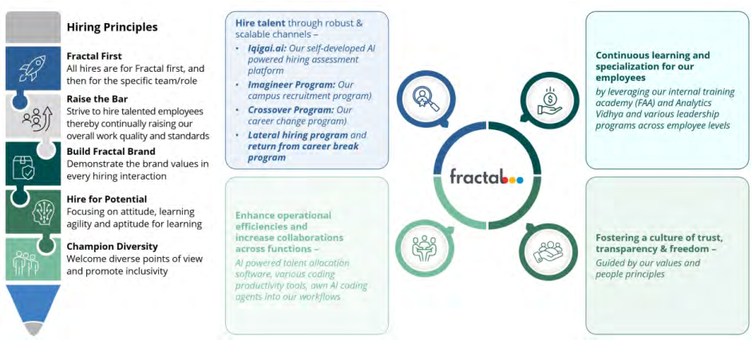

**[Image: 1770955551279.pdf-0340-11.png (942x426, 489.3KB)]**

We are selective in hiring applicants from campus placements and laterally across all our geographical locations. During six months ended September 30, 2025, we hired 964 Fractalites – that is 1.2% of the 79,629 applications that we received. Iqigai.ai, our self-developed, AI powered hiring assessment platform helps us gauge candidates’ aptitude and coding skill through video proctoring, thereby increasing hiring efficiency and reducing biases. 

In addition to our regular lateral and campus hires, we have three hiring programs: 

336 

- 

- 

- 

_Imagineer_ : Our flagship campus hiring program to develop our future leaders, is a structured 24+ month program with the first year focused on training and shadow projects after which Imagineers are aligned with business practices. Over the course of the program, the Imagineers transition to regular grades at pre-determined intervals and graduate at the end of the program. Additionally, the top 10.0% of the cohort are offered a sabbatical for higher education, co-sponsored by Fractal, with the understanding that they would resume at Fractal upon completion of their respective program. 

- _Crossover_ : Our program designed to offer opportunities to talent in the IT services industry to switch careers into AI and engineering. Selected individuals undergo a five-week program with a mix of courses focused on technical skills and consulting skills. 

ReBoot: Our 16-week “returnship” program targeting individuals who have taken a career break and want to transition back into the workforce. We conduct training programs that aim to update their technical and professional skills and they also receive on-the-job experience by shadowing and working on live projects. 

We aspire to hire individuals who are humble, hungry and smart. Humble individuals put the team first, give credit to others, and strive for shared success. Hungry individuals are driven, eager to grow, and take on new challenges. Smart individuals work effectively with others, using strong interpersonal skills and good judgment. 

### **_Learning and development_** 

At Fractal, we believe learning is critical given rapid technological developments in our industry. Every employee is required to undergo regular training. 

We enable our employees to enhance their technical, business and life skills through programs and initiatives such as (i) Fractal certified programs, (ii) external learning partnerships (such as with Coursera and Skillsoft), (iii) internal learning programs (such as masterclasses, boot camps and hackathons) through FAA (Fractal Analytics Academy), our internal skilling academy and Analytics Vidhya, our subsidiary. We have been awarded by Brandon Hall Group Excellence Awards for our accomplishments in learning and development, including the Gold Medals for “Best Use of AI for learning” and “Best Learning Team” in 2024 , and Silver Medals for “Best Coaching and Mentoring Program” (2025), “Best E- learning, Blended, Flipped Classroom Solution or Remote Solution” (2025), “Best Innovation - Generative AI Powered Learning Solution” (2025) and Bronze Medals for “Best Use of AI for Business Impact” (2025) and “Best Team Development Program” (2025) from Brandon Hall Group and the Training Magazine APEX award in three consecutive years (2023-2025) for overall learning and development programs and initiatives. 

We use a “problem-solving first” approach for trainings and an application-based training in addition to tools and techniques-based training. We are focused on building strong leaders at Fractal through our manager development program that focus on specific development tracks that include self, people management and business skills. 

### **_Onboarding_** 

We have built an onboarding program for new employees to feel welcome and included and help them integrate into the organization faster by providing them information in an engaging and easily consumable manner. Our onboarding program provides all new joiners a smooth onboarding experience through first impressions, gamification and evidence-based learning. 

### **_Engagement and retention_** 

We implement several initiatives to enhance engagement and retention, beginning with actively listening to our employees. We have active conversations with all Fractalites through regular one-on-one connects, skip level meetings and confidential discussions. We also gather feedback through focus group discussions, daily pulse surveys, annual surveys, anonymous feedback links, quarterly project manager evaluations and upward feedback surveys for managers. Furthermore, we conduct fortnightly town halls for Fractalites to stay informed about company developments and provide a platform for posing questions to senior leadership. 

Our engagement and retention initiatives include employee stock option plan (ESOP) grants. 4,960 current employees as of July 31, 2025 have been granted ESOPs. We also have a variable pay policy for our Fractalites, where variable payout for Fractalites at junior grades is paid out in full every year, while those at the senior level receive performance-based payouts. 

337 

We have implemented policies around employee wellbeing, learning and development, performance management and career progression, among others, to support our workforce. Our well-being calendar is diversified across social, emotion, financial, mental and physical well-being. In Fiscal 2025, we conducted several webinars and workshops on various aspects on well-being. 

Our people policies consider the needs of Fractalites and are designed to support them through their personal journeys as well. As an example, Fractalites (with a tenure of at least two years) can take an extended break or sabbatical from work to support their quest to innovate, pursue their interest or manage their personal responsibilities. We have well-defined work from home policies that balance the flexibility requirements of individuals and their work commitments. 

We also have a recognition program to reward employees for their contributions to Fractal and their demonstration of Fractal values. 

### **Responsible AI Framework** 

Our commitment to building a more ethical and accountable AI landscape is reflected in our Responsible AI (“ **RAI** ”) framework and policy guidelines. These initiatives steer our work in AI, engineering and design, to prioritize safety, fairness and transparency. We maintain several foundational principles for responsible AI, forming the underlying tenets on our RAI framework, drawing on policy statements, existing laws and legislative and regulatory proposals from jurisdictions around the world, including: 

- **<mark>Social well-being and Planet-inclusive:</mark>** <mark>In a cost-benefit analysis, AI should be used for a net positive</mark> for humans, society and the planet. 

- **<mark>Privacy & Safety:</mark>** <mark>Controls should be implemented to respect and protect personal and enterprise</mark> information from unauthorized access or misuse. 

- **<mark>Fairness & Equity:</mark>** <mark>AI should be used in ways that promote fair, inclusive and equitable outcomes, with</mark> potential biases and other harms identified and mitigated. 

- **<mark>Robustness and stability:</mark>** <mark>We focus on developing AI systems that operate reliably under various</mark> conditions and are resilient to attacks and errors. 

- **Accountability:** Humans should be responsible and accountable for governance for AI. 

- **<mark>Transparency:</mark>** <mark>AI systems should be understandable to users, explaining how and why decisions are made, thus demystifying AI processes.</mark> 

- Our RAI framework promotes the following behaviors, which are designed to uphold our foundational principles: 

- **<mark>Contestability:</mark>** <mark>We adopt the "newspaper test", where we consider whether we would be comfortable</mark> with our decisions being reported the following day on the front page of a newspaper. 

- **<mark>Human-Centricity:</mark>** <mark>We prioritize human-centric design, which involves evaluating and mitigating</mark> biases. 

- **<mark>Adaptability:</mark>** <mark>Adaptability in AI refers to the system's ability to update and learn from new data and</mark> improve over time by augmenting signals. 

- **<mark>Upskilling – Future of Work:</mark>** <mark>As AI technologies evolve, there is a need for continuous upskilling of</mark> the workforce, which involves unlearning and relearning positively. 

- **Explainability:** This means that the factors influencing AI decisions should be traceable. 

- **<mark>Attribution:</mark>** <mark>We seek to ensure that creators of content or data used by AI systems are properly attributed, and endeavor to avoid issues of copyright infringement especially with respect to monetization of content.</mark> 

A multipronged strategy is necessary to recognize the limits of the law, markets and changing social norms. We have created several accelerators to help activate and operationalize responsible AI behaviors in a self-governing process: 

338 

- **Codebase** : We utilize reusable, scalable and model-agnostic APIs built on an open-source foundation, fostering transparency and collaboration. 

- **Education:** We offer educational courses and certifications on RAI on the online platform Coursera. 

- **Adoption:** We have a Responsible AI certification process that certifies our products and client solutions, which includes a nudge toolkit. 

- **ESG Diagnostic:** We incorporate circular economy principles when assessing our operations for ESG performance. 

- **Synthetic Data:** We use synthetic data in our operations, which allow for customer privacy by design. 

### **Intellectual Property Rights** 

The details of our patents and trademarks as of January 19, 2026 are set out below. 

||**Patent**|**s**|**Trade**|**marks**|
|---|---|---|---|---|
||**Registered**|**Pending**|**Registered**|**Pending**|
|Company and Subsidiaries|28|38|376|104|

We have numerous trademark registrations in India, including “Concordia”, “Customer Genomics”, “Fractal”, “Fractal Analytics” and “Fractal.ai”. We have made 22 applications for registration of trademarks overseas, including “Fractal Dimension” under various classes, of which 21 applications are currently pending before the US Patent and Trademark Office. We also own copyright and patent registrations with respect to our technologies “Alligator”, “Bisk”, “Nexus” and “Unifi” and our AI products including Concordia, Crux Intelligence, Customer Genomics and Cogentiq CX, among others, in India and/or in the US. In addition to the protection provided by our intellectual property rights, we enter into non-disclosure agreements with our employees to protect our proprietary information. We also control the use of our proprietary technology and intellectual property rights through provisions in our agreements with clients. Further, we customarily enter into non-disclosure agreements with our clients with respect to the use of their software systems and platforms. 

### **Corporate Social Responsibility and Sustainability** 

We are committed to enhancing equitable educational outcomes for disadvantaged children, empowering women to be financially independent, improving the quality and affordability of healthcare and safe housing solutions, reducing our carbon footprint, protecting biodiversity and addressing climate change and its impacts in line with the United Nations Sustainable Development Goal 13. 

Our initiatives to address social issues include: 

- Since Fiscal 2019, we have awarded scholarships to women pursuing degrees in science, technology, engineering and mathematics (STEM) and technical courses at Indian colleges. In Fiscal 2025, we sponsored scholarships for 13 students. 

- In Fiscal 2021, we launched a mentorship program for young, underprivileged scholars through our employees. Fifty-three mentees from Indian colleges have benefited from this initiative. 

- In Fiscal 2024, Fractal volunteers participated in a beach clean-up drive to remove waste and contribute to environmental preservation. The event aimed to raise awareness about the detrimental effects of plastic pollution on marine ecosystems and local wildlife. 

- From Fiscal 2018, we have been sponsoring employees to participate in city marathons with the goal of raising awareness for better educational outcomes for disadvantaged children. 

We also partner with governments, non-profits and local communities. Key initiatives include: 

- Reducing water head loading drudgery for rural Indian communities in Palghar, Dahanu and Osmanabad from Fiscal 2018 – 2022, Fiscal 2022 and in Fiscal 2025 

- Establishing an iMobile Innovation lab in Mumbai’s municipal schools from Fiscal 2022 to Fiscal 2024. 

339 

- Sponsoring projects for marginalized rural farmers in Dahanu, such as bamboo planting, vegetable farming and solar irrigation, in Fiscals 2023, 2024 and 2025. 

- Supporting the disabled by providing artificial limbs and other mobility aids to underprivileged individuals, since Fiscal 2024. 

We are committed to building a sustainable world by managing our carbon footprint through various measures: 

- We have implemented various sustainability initiatives, such as transitioning Fractal’s leased corporate offices at Oberoi Commerz II and at Bengaluru, 4th Floor, West Tower, in Block 2A, Embassy Tech Village, to green energy and electrifying portions of Fractal’s surface business travel (such as companyarranged cab services). Our administered offices in Mumbai and Bengaluru now use 100% green electricity from its energy providers. We are in the process of setting our Net Zero emissions targets. 

- We have been practicing carbon accounting and maintaining a greenhouse gas inventory using an operational control approach across our leased offices in India, in Mumbai, Gurugram and in Embassy Tech Village, Block 2 A, 4th Floor, West Tower, Bengaluru office, since its baseline year of Fiscal 2020, as part of our ongoing efforts to reach Net Zero. We have received independent third-party assurance for our Scope 1, 2 and 3 emissions, in line with the AA1000AS standard – moderate level assurance covering Fiscal 2020 to Fiscal 2025, for our greenhouse gas inventory. 

- We have been reporting greenhouse-gas emissions on the Carbon Disclosure Project portal and received a B score for Climate Change in the 2025 cycle. 

- We implement sustainable and efficient energy and water management measures in our workspace. Our offices in Mumbai and Bengaluru are “Leadership in Energy and Environmental Design” (LEED) Gold certified workspaces, conserving resources and managing waste responsibly. Additionally, our Mumbai office is WELL Platinum certified and has also been utilizing green energy from the grid since February 2022. 

- We have conducted tree plantation drives to promote biodiversity, reduce carbon emissions, enhance wildlife habitats and create livelihood opportunities. In Fiscal 2024, Fractal planted over 8,500 trees for the Hangul deer biodiversity project at Dachigam National Park in Kashmir, Thane, the Mumbai Metropolitan Region and Sundarbans National Park in West Bengal. In Fiscal 2025, we planted over 11,000 trees in Haridwar to support leopard habitats. 

### **Facilities and Offices** 

We operate entirely out of leased premises, managed offices and co-working spaces. Our Registered Office is located at Level 7, Commerz II, International Business Park, Oberoi Garden City, Off Western Express Highway, Goregaon (E) Mumbai 400063, Maharashtra, India, where we lease approximately 65,952 square feet of space under a lease that expires on February 28, 2029. Our other offices are located in Bengaluru, Karnataka; Gurugram, Haryana; Kyiv, Ukraine; Bellevue, U.S.; New York, U.S.; Indore, Madhya Pradesh; and Mumbai, Maharashtra. We use managed offices in Chennai, Tamil Nadu while we use shared co-working spaces in London; Sydney; Eindhoven; Dubai; Abu Dhabi; Palo Alto; Noida, Uttar Pradesh; Bengaluru, Karnataka; Pune, Maharashtra; and Singapore. See below for a summary of these facilities and offices: 

|**Sr.** **No.**|**Address of the** **Leased Property**|**Name** **of the** **Lessor**|**Name of** **the** **Lessee**|**Numbe** **r of** **employ** **ees** **accom** **modate** **d on a** **daily** **basis**|**Total** **Area** **(squar** **e feet)**|**Usage**|**Lease** **Tenure**|**Whether** **the Lessor** **is a related** **party(incl** **uding** **whether a** **member of** **the** **promoter/** **promoter** **group)**|**Wheth** **er** **lease** **deed is** **adequ** **ately** **stamp** **ed/** **registe** **red**|
|---|---|---|---|---|---|---|---|---|---|
|1|5th, 6th, 7th & 8th floor, Commerz II, International Business Park, Oberoi Garden|Oberoi Realty Limited|Fractal Analytics Limited|741 seats|65,952|Registere d Office|60 months (March 1, 2024 to|No|Yes|

340 

|**Sr.** **No.**|**Address of the** **Leased Property**|**Name** **of the** **Lessor**|**Name of** **the** **Lessee**|**Numbe** **r of** **employ** **ees** **accom** **modate** **d on a** **daily** **basis**|**Total** **Area** **(squar** **e feet)**|**Usage**|**Lease** **Tenure**|**Whether** **the Lessor** **is a related** **party(incl** **uding** **whether a** **member of** **the** **promoter/** **promoter** **group)**|**Wheth** **er** **lease** **deed is** **adequ** **ately** **stamp** **ed/** **registe** **red**|
|---|---|---|---|---|---|---|---|---|---|
||City, Off. Western Express Highway, Goregaon (East), Mumbai - 400 063. India||||||February 28, 2029)|||
|2| Level 2 Chimes Building Plot 61, Sector – 44, Gurugram 122003|Chimes Private Limited|Fractal Analytics Limited|143 seats|13,855|Office|3 years (Novemb er 1, 2024 to October 31, 2027)|No|Yes|
|3|4th floor, West Tower Block 2A,Embassy Tech Village Devarabesanahall i,Outer Ring Road Bengaluru 560103|Vikas Teleco m Private Limited|Fractal Analytics Limited|206 seats|30,870|Office| 5 years (Decemb er 2, 2024 to Decembe r 1, 2029)|No|Yes|
|4| 3rd floor, East Tower, Block 2A, Embassy Tech Village Devarabesanahall i, Outer Ring Road Bengaluru 560103|Vikas Teleco m Private Limited|Fractal Analytics Limited|229 seats|37,268|Office|5 years (Decemb er 30, 2024 to Decembe r 29, 2029)|No|Yes|
|5|4th floor, L3- Hazel, Embassy Manyata Business Park, Hebbal Outer Ring Rd, Manayata Tech Park, Nagavara, Bengaluru 560045|Manyat a Promot ers Private Limited|Fractal Analytics Limited|230 seats|32,510|Office|5 years (October 15, 2024 to October 14, 2029)|No|Yes|
|6| Symbyont, Level 5, Olympia Cyberspace, No. 21/22, 2nd street, Alandur Road, Arulayiammanpet , Guindy, Chi600 032|Symby ont Asset Manage ment Pvt Ltd|Fractal Analytics Limited|90 seats|NA|Office|5 years (May 1, 2024 to April 30, 2029)|No|Yes|
|7|enna-. Eleven West Baner, Pan Card Club road, Baner, Pune, MH 411045|WeWor k India Manage ment Private Limited|Fractal Analytics Limited|102 seats|NA|Office|24 months (Septem ber 30, 2024 to Septemb er 30, 2026)|No|Yes|

341 

|**Sr.** **No.**|**Address of the** **Leased Property**|**Name** **of the** **Lessor**|**Name of** **the** **Lessee**|**Numbe** **r of** **employ** **ees** **accom** **modate** **d on a** **daily** **basis**|**Total** **Area** **(squar** **e feet)**|**Usage**|**Lease** **Tenure**|**Whether** **the Lessor** **is a related** **party(incl** **uding** **whether a** **member of** **the** **promoter/** **promoter** **rou)**|**Wheth** **er** **lease** **deed is** **adequ** **ately** **stamp** **ed/** **registe** **red**|
|---|---|---|---|---|---|---|---|---|---|
|8|Galaxy Business Park, Sector 62 , A-44 & 45, Sushil Marg, Block A, Industrial Area|WeWor k India Manage ment Private|Fractal Analytics Limited|72 seats|NA|Office|24 months (Septem ber 30, 2024 to|**gp** No|Yes|
|| , Noida, UP 201309| Limited||||| Septemb er 30, 2026)|||
|9|WeWork Vaishnavi Signature, office no. 05-102 & 05- 105, 5th floor, Bellandur, No. 78/9, Outer Ring Road, Bellandur Village, Varthur, Hobli, Bangalore, KA 560103|WeWor k India Manage ment Private Limited|Asper.ai Technolog ies Private Limited|192 seats|NA|Office| 24 calendar months (March 1, 2025 - February 28, 2027)|No|Yes|
|10| 11911 NE First Street, Suite 206, Bellevue, WA 98005|Eastrid ge Partners LLC|Fractal Analytics Inc.|40 seats|5,688|Office|6 years (January 1, 2021 to Decembe r 31, 2026)|No|Yes|
|11|Suite 76J, One World Trade Center, New York, NY 10007|WTC Tower 1 LLC (The Durst Organiz ation)|Fractal Analytics Inc.|36 seats|7,822|Office|5 years and 5 months (Novemb er 1, 2023 to March 31, |No|Yes|
|12|14 Vasylkivska Street, building B, 3rd floor, Kyiv 03040|Additio nal Liabilit y Compa ny Kyiv Experi mental Machin e- Buildin g Plant Std|Limited Liability Company “Symphon y (Ukraine) ”|25 seats|3,066|Office|2029) 12 months (July 1, 2025 to June 30, 2026)|No|Yes|
|13|Levels 20 & 21, Tower 2, Darling Park, 201 Sussex Street, Sydney, New South Wales, NSW 2000, Australia|en Regus Australi a Manage ment Pty. Ltd.|Fractal Analytics Australia Pty Ltd|4 seats|NA|Office|18 months (Septem ber 1, 2024 to February 28, 2026)|No|Yes|

342 

|**Sr.** **No.**|**Address of the** **Leased Property**|**Name** **of the** **Lessor**|**Name of** **the** **Lessee**|**Numbe** **r of** **employ** **ees** **accom** **modate** **d on a** **daily** **basis**|**Total** **Area** **(squar** **e feet)**|**Usage**|**Lease** **Tenure**|**Whether** **the Lessor** **is a related** **party(incl** **uding** **whether a** **member of** **the** **promoter/** **promoter** **rou)**|**Wheth** **er** **lease** **deed is** **adequ** **ately** **stamp** **ed/** **registe** **red**|
|---|---|---|---|---|---|---|---|---|---|
|14|Regus, Office M21, Retail Unit – 311, Jumeirah Living Marina Gate, Mezzanine Floor, Dubai Marina, PO Box 121828, Dubai, UAE|RME Holding s (Dubai Branch)|Fractal L.L.C-FZ|1 seat|NA|Office|24 months (Decemb er 1, 2024 to Novemb er 30, 2026)|**gp** No|Yes|
|15| Regus, Office 2040-2041, 2nd Floor, Dubai Supreme Court Complex, Umm Hurair 2, Dubai, UAE|DSC Busines s Centre LLC|Fractal L.L.C-FZ|2 seats|NA|Office| 24 months (Decemb er 1, 2024 to Novemb er 30, 2026)|No|Yes|
|16|Unit 7, Level 7, Al Maryah Tower, ADGM Square, Al Maryah Island, Abu Dhabi, UAE|TEC Busines s Center FZE|Fractal AI Limited|7 seats|NA|Office|12 months (May 1, 2025 to April 30, 2026)|No|Yes|
|17|2nd Floor, MyOffiz, Plot No 270, Udyog Vihar, Phase 2, Gurugram - 122016|KRW Leasing LLP|Analytics Vidhya Educon Private Limited|158 seats|NA|Office| 22 months (March 1, 2025 to Decembe r 31, 2026)|No|Yes|
|18|207 B (Chamber 1) Corporate House, 169 RNT Marg, Indore - 452001|Smt. Nirupa ma Jain|Analytics Vidhya Educon Private Limited|1 seat|NA|Office|3 years (Februar y 26, 2024 to February 25, 2027)|No|Yes|
|19|WeWork, office No.: 06-103, 5 Merchant Square Tenant Limited, London, W2 1AY, UK|5 Mercha nt Square Tenant Limited|Fractal Analytics UK Ltd|31 seats|NA|Office| 25 Months (Novemb er 1, 2024 to Novemb er 30, 2026|No|Yes|
|20|Playground, 380 Portage Avenue, Palo Alto, CA, 94306|Playgro und Global, LLC|Fractal Analytics Inc.|13 seats|NA|Office|) 12 months (May 04, 2025 to May 04, 2026)|No|Yes|

343 

|**Sr.** **No.**|**Address of the** **Leased Property**|**Name** **of the** **Lessor**|**Name of** **the** **Lessee**|**Numbe** **r of** **employ** **ees** **accom** **modate** **d on a** **daily** **basis**|**Total** **Area** **(squar** **e feet)**|**Usage**|**Lease** **Tenure**|**Whether** **the Lessor** **is a related** **party(incl** **uding** **whether a** **member of** **the** **promoter/** **promoter** **group)**|**Wheth** **er** **lease** **deed is** **adequ** **ately** **stamp** **ed/** **registe** **red**|
|---|---|---|---|---|---|---|---|---|---|
|21|30 Raffles Place #23-01, OXLEY @ RAFFLES 048622,Singapor e|WeWor k Singapo re Pte. Ltd|Fractal Private Limited|2 seats|NA|Office|18 months (Septem ber 1, 2024 To February 28, 2026)|No|Yes|
|22|Twice Eindhoven B.V., High tech. Campus 10, Postbus 8026, 5600 CD, Eindhoven, Netherlands|Twice Eindho ven B.V.|Fractal Analytics Netherlan d B.V.|3 seats|NA|Office|7 years February 1, 2022 to February 1, 2029|No|Yes|
|23|Sydney, Spaces Parramatta Square, 49th Floor, 8 Parramatta Square, Parramatta, Sydney, New South Wales - 2150, Australia|Regus Australi a manage ment Pty. Ltd.|Fractal Analytics Australia Pty Limited|2 seats|NA|Office|1 year (Septem ber 01, 2025 to August 31, 2026)|No|Yes|
||||||||Average Tenure: 3 years 01 month|||

### **Insurance** 

We have obtained insurance against various operations-related risks including standard office package insurance (fire and allied peril, burglary, money, plate glass, baggage, fidelity guarantee and public liability), group insurance, group personal accident insurance, group term life insurance, commercial general liability insurance, technology and telecommunications professional indemnity insurance, commercial crime insurance, directors’ and officers’ liability and company re-imbursement insurance, employment practice liability insurance, digital business and data protection insurance, employee compensation insurance, cyber liability insurance, family income protector insurance (only covering group chief executive officer) and country-specific insurance as required. Our insurance policies may not be sufficient to cover all losses or liabilities that may arise from our operations. 

344 

### **KEY REGULATIONS AND POLICIES** 

_The following is an overview of certain key laws and regulations which are applicable to us. The information available in this section has been obtained from various legislations, rules and regulations notified thereunder and other regulatory requirements available in the public domain. The description of laws and regulations set out below may not be exhaustive and is only intended to provide general information to the Bidders and are neither designed nor intended to substitute for professional legal advice. The statements below are based on the current provisions of the law and the judicial, regulatory and administrative interpretations thereof, which are subject to change or modification by subsequent legislative actions, regulatory, administrative, quasi-judicial, or judicial decisions._ 

Given below is a brief description of certain relevant legislations that are currently applicable to the business carried on by us. 

### **I. Key Regulations and Policies in India** 

### **A. Industry-specific Regulations** 

### **_The Information Technology Act, 2000 (the “IT Act”) and the rules notified thereunder_** 

The IT Act seeks to: (i) provide legal recognition to transactions carried out by various means of electronic data interchange involving alternatives to paper-based methods of communication and storage of information; (ii) facilitate electronic filing of documents; and (iii) create a mechanism for the authentication of electronic documentation through digital signatures. The IT Act provides for extraterritorial jurisdiction over any offence or contravention under the IT Act committed outside India by any person, irrespective of their nationality, if the act or conduct constituting the offence or contravention involves a computer, computer system or computer network located in India. Additionally, the IT Act empowers the Government of India to direct any of its agencies to intercept, monitor or decrypt any information in the interest of sovereignty, integrity, defense and security of India, among other things. The Information Technology (Procedure and Safeguards for Blocking for Access of Information by Public) Rules, 2009 specifically permit the Government of India to block access of any information generated, transmitted, received, stored or hosted in any computer resource by the public, the reasons for which are required to be recorded by it in writing. 

The IT Act facilitates electronic commerce by recognizing contracts concluded through electronic means, protects intermediaries in respect of third-party information liability and creates liability for failure to protect sensitive personal data. The IT Act also prescribes civil and criminal liability including fines and imprisonment for computer related offences including those relating to unauthorized access to computer systems, tampering with or unauthorized manipulation of any computer, computer system or computer network and damaging computer systems, and creates liability for negligence in dealing with or handling any sensitive personal data or information in a computer resource and in maintaining reasonable security practices and procedures in relation thereto, among others. Further, the IT Act empowers the Government of India to formulate rules with respect to reasonable security practices and procedures and sensitive personal data. 

The IT Act empowers the Government of India to formulate rules with respect to reasonable security practices and procedures and sensitive personal data. In exercise of this power, the Department of Information Technology, (“ **DoIT** ”) Ministry of Electronics and Information Technology, Government of India, in April 2011, notified the Information Technology (Reasonable Security Practices and Procedures and Sensitive Personal Data or Information) Rules, 2011 (“ **IT Security Rules** ”) which prescribe directions for the collection, disclosure, transfer and protection of sensitive personal data by a body corporate or any person acting on behalf of a body corporate. The IT Security Rules require every such body corporate to provide a privacy policy for handling and dealing with personal information, including sensitive personal data, ensuring security of all personal data collected by it and publishing such policy on its website. The IT Security Rules further require that all such personal data be used solely for the purposes for which it was collected, and any third party disclosure of such data is made with the prior consent of the information provider, unless contractually agreed upon between them or where such disclosure is mandated by law. 

### **_Draft India Data Accessibility and Use Policy, 2022_** 

<mark>The Draft India Data Accessibility and Use Policy (“</mark> **<mark>Data Policy</mark>** <mark>”) was introduced by the Ministry of Electronics & Information Technology on February 21, 2022. The Data Policy aims to enhance access, quality, and use of non-personal data, in line with the current and emerging technology needs of the decade. The primary objectives</mark> 

345 

<mark>of the policy include: (i) maximizing access to and use of quality non personal data available with public sector; (ii) enhancing the efficiency of service delivery; (iii) protecting privacy and security of all citizens; (iv) building digital and data capacity, knowledge and competency of government officials; (v) increasing the availability of datasets of national importance; and (vi) streamlining inter-government data sharing while maintaining privacy, etc</mark> 

### **_The Digital Personal Data Protection Act, 2023 (the “Data Protection Act”)_** 

The Parliament passed the Data Protection Act on August 9, 2023. The Data Protection Act received the assent of the President and was notified on August 11, 2023.. The Data Protection Act regulates the collection and processing of digital personal data by persons, including companies. Further, the Data Protection Act identifies certain companies as ‘significant data fiduciaries’ basis factors including the volume and sensitivity of the personal data possessed. These significant data fiduciaries will be required to fulfil certain additional obligations under the Data Protection Act including appointment of a data protection officer who will be the point of contact between such fiduciaries and individuals for grievance redressal. Further such significant data fiduciaries will also be required to appoint an independent data auditor who will evaluate their compliance with the Data Protection Act. The Central Government will also establish the Data Protection Board of India whose key functions include: (i) monitoring compliance and imposing penalties, (ii) directing data fiduciaries to take necessary measures in the event of a data breach, and (iii) hearing grievances made by data principals. 

The Government of India has notified the Digital Personal Data Protection Rules, 2025 on November 14, 2025 (“ **Rules** ”) on the Official Gazette. The Rules facilitate the implementation of the Digital Protection Act. It aims to strengthen the legal framework for the protection of digital personal data by providing necessary details and an actionable framework. The Rules lays down various implementation aspects such as the notice by the data fiduciary to the individuals, registration and obligations of consent manager, processing of personal data for issuance of subsidy, benefit, services by State, applicability of reasonable security safeguards, intimation of personal data breach, providing details about availing of the rights by the individuals, processing of personal data of child or of person with disability, setting up the Data Protection Board (“ **Board** ”), appointment and service conditions of the chairperson and other members of the Board, functioning of Board as digital office, procedure to appeal to appellate tribunal among others. 

### **_Special Economic Zones Act, 2005 (“SEZ Act”)_** 

A Special Economic Zone (“ **SEZ** ”) is a specifically delineated duty-free enclave, deemed to be a foreign territory for the purposes of trade as well as duties and tariffs. They are regulated and governed by the SEZ Act. The SEZ Act has been enacted for the establishment, development and management of the SEZs for the promotion of exports. Under the SEZ laws, any goods or services exported out of, or imported into, or procured from a nonSEZ area by SEZ units or developers, shall, subject to the terms, conditions and limitations as may be prescribed by the Government, be exempt from the payment of certain taxes, duties or cess. 

A board of approval (“ **SEZ Board** ”) has been set up under the SEZ Act, which is responsible for promoting the SEZ and ensuring its orderly development. The SEZ Board has a number of powers including the authority to approve proposals for the establishment of the SEZ, the operations to be carried out in the SEZ by the developer, the foreign collaborations and foreign direct investments. 

### **_The Special Economic Zones Rules, 2006 (the “SEZ Rules”)_** 

The SEZ Rules have been enacted to effectively implement the provisions of the SEZ Act. The SEZ Rules provide for a simplified procedure for a single window clearance from central and state governments for setting up of SEZs and a “unit” in SEZ. The SEZ Rules also prescribe the procedure for the operation and maintenance of an SEZ, for setting up and conducting business therein with an emphasis on self-certification and the terms and conditions subject to which entrepreneur and developer shall be entitled to exemptions, drawbacks and concessions. The SEZ Rules also provide for the minimum area requirement for various categories of SEZs. 

### **_Consumer Protection Act, 2019 (the “Consumer Protection Act”)_** 

The Consumer Protection Act, which repeals the Consumer Protection Act, 1986, was designed and enacted to provide simpler and quicker access to redress consumer grievances. It _inter alia_ seeks to promote and protect the interests of consumers against deficiencies and defects in goods or services and secure the rights of a consumer against unfair trade practices, which may be practiced by manufacturers, service providers and traders. It provides for the establishment of consumer disputes redressal forums and commissions for the purposes of redressal of 

346 

consumer grievances. In addition to awarding compensation and/or passing corrective orders, the forums and commissions under the Consumer Protection Act, in cases of misleading and false advertisements, are empowered to impose imprisonment for a term which may extend to two years and fine which may extend to rupees ten lakhs. 

### **B. Intellectual property laws** 

Intellectual property in India enjoys protection under both common law and statutes. The key legislations are the Patents Act, 1970 for patent protection, the Copyright Act, 1957 for copyright protection, and the Trade Marks Act, 1999 for trademark protection. These enactments provide for the protection of intellectual property by imposing civil and criminal liability for infringement. 

### **_The Trade Marks Act, 1999 (“Trademarks Act”)_** 

The Trademarks Act provides for the application and registration of trademarks in India for granting exclusive rights to marks such as a brand, label and heading and obtaining relief in case of infringement. The Trademarks Act also prohibits any registration of deceptively similar trademarks or chemical compounds among others. It also provides penalties for infringement, falsifying and falsely applying for trademarks. The registration of a trade mark shall be for a period of 10 years unless cancelled, but may be renewed from time to time as prescribed under the Trademarks Act. Further, pursuant to the notification of the Trademark (Amendment) Act, 2010, the simultaneous protection of trademarks in India and other countries has been made available to owners of Indian and foreign trademarks. The Trademark (Amendment) Act, 2010, also seeks to simplify the law relating to transfer of ownership of trademarks by assignment or transmission and to conform Indian trademark law with international practice. 

### **_The Patents Act 1970 (“Patents Act”)_** 

The Patents Act governs the patent regime in India. A patent under the Patents Act is an intellectual property right relating to inventions and grant of exclusive right, for limited period, provided by the Government to the patentee, in exchange of full disclosure of his invention, for excluding others from making, using, selling and importing the patented product or process or produce that product. Being a signatory to the Agreement on Trade Related Aspects of Intellectual Property Rights, India is required to recognize product patents as well as process patents. In addition to the broad requirement that an invention must satisfy the requirements of novelty, utility and non-obviousness in order for it to avail patent protection, the Patents Act further provides that patent protection may not be granted to certain specified types of inventions and materials even if they satisfy the above criteria. 

### **_The Copyright Act, 1957_** 

The Copyright Act, 1957, along with the Copyright Rules, 2013 (“ **Copyright Laws** ”) governs copyright protection in India. The Copyright Laws protect the legal rights of the creator of an ‘original work’ by preventing others from reproducing the work in any other way. The intellectual property protected under the Copyright Laws includes literary works, dramatic works, musical works, artistic works, cinematography and sound recordings. Even while copyright registration is not a prerequisite for acquiring or enforcing a copyright in an otherwise copyrightable work, registration under the Copyright Laws acts as prima facie evidence of the particulars entered therein and helps expedite infringement proceedings and reduce delay caused due to evidentiary considerations. The Copyright Laws prescribe a fine, imprisonment or both for violations, with enhanced penalty on second or subsequent convictions. Upon registration, the copyright protection for a work exists for a period of 60 years following the demise of the author. Reproduction of a copyrighted work for sale or hire, issuing of copies to the public, performance or exhibition in public, making a translation of the work, making an adaptation of the work and making a cinematograph film of the work without consent of the owner of the copyright are all acts which expressly amount to an infringement of copyright. 

### **Labour laws and regulations** 

In respect of our business and operations, we are also required to obtain licenses and registrations and make timely payments as prescribed under certain labour laws, including, Employees’ Provident Fund and Miscellaneous Provisions Act, 1952, Employee State Insurance Act, 1948 and Contract Labour (Regulations and Abolition Act), 1970. Further, the provisions of local professional tax and shops and establishments legislations applicable in the states in India where our establishments are set up, require such establishments to be registered such as under the Maharashtra Shop and Establishments (Regulations of Employment and Conditions of Service) Act, 2017 and Karnataka Shops and Commercial Establishment Act, 1961, The Tamil Nadu Shops And Establishments Act, 1947 and the Punjab Shops and Commercial Establishment Act, 1958 are also applicable to us. 

347 

<mark>In order to rationalize and reform labour laws in India, the Government of India has enacted four labour codes that would subsume primarily all the central laws and would collectively form the governing labour legislations.</mark> The aforesaid codes became effective from November 21, 2025. These four codes are: 

- _<mark>The Industrial Relations Code, 2020</mark>_ <mark>received the assent of the President of India on September 28, 2020, and it subsume three existing legislations, namely, the Industrial Disputes Act, 1947, the Trade Unions</mark> Act, 1926 and the Industrial Employment (Standing Orders) Act, 1946.; 

- _<mark>The Code on Wages, 2019</mark>_ <mark>received the assent of the President of India on August 8, 2019, and subsume four existing laws namely, the Payment of Wages Act, 1936, the Minimum Wages Act, 1948, the Payment of Bonus Act, 1965 and the Equal Remuneration Act, 1976. Through its notification dated December 18, 2020, the Government of India brought into force certain sections of the Code on Wages,</mark> 2019.; 

- _<mark>The Occupational Safety, Health and Working Conditions Code, 2020</mark>_ <mark>received the assent of the President of India on September 28, 2020 and it subsume certain existing legislations, including the Factories Act, 1948, the Contract Labour (Regulation and Abolition) Act, 1970, the Inter-State Migrant Workmen (Regulation of Employment and Conditions of Service) Act, 1979 and the Building and Other</mark> Construction Workers (Regulation of Employment and Conditions of Service) Act, 1996.; and 

- _<mark>The Code on Social Security, 2020</mark>_ <mark>received the assent of the President of India on September 28, 2020 and it subsume certain existing legislations including the Employee's Compensation Act, 1923, the Employees’ State Insurance Act, 1948, the Employees’ Provident Funds and Miscellaneous Provisions Act, 1952, the Maternity Benefit Act, 1961, the Payment of Gratuity Act, 1972, the Building and Other Construction Workers’ Welfare Cess Act, 1996 and the Unorganized Workers’ Social Security Act, 2008. Through its notification dated April 30, 2021, the Government of India brought into force section 142 of the Code on Social Security, 2020. The remaining provisions of this code became effective from November 21, 2025.</mark> 

### **C. Tax related legislations** 

The Goods and Services Tax (“ **GST** ”) is levied on supply of goods or services or both jointly by the Central Government and State Governments. GST provides for imposition of tax on the supply of goods or services and will be levied by the Central Government and by the state government including union territories on intra-state supply of goods or services. Further, the Central Government levies GST on the inter-state supply of goods or services. The GST is enforced through various acts viz. Central Goods and Services Act, 2017 (“ **CGST** ”), relevant state’s Goods and Services Act, 2017 (“ **SGST** ”), Union Territory Goods and Services Act, 2017 (“ **UTGST** ”), Integrated Goods and Services Act, 2017 (“ **IGST** ”), Goods and Services (Compensation to States) Act, 2017 and various rules made thereunder. 

Further, the Income-tax Act, 1961 (the “ **Income Tax Act** ”) is applicable to every company, whether domestic or foreign whose income is taxable under the provisions of the Income Tax Act or rules made there under depending upon its “Residential Status” and “Type of Income” involved. The Income Tax Act provides for the taxation of persons resident in India on global income and persons not resident in India on income received, accruing or arising in India or deemed to have been received, accrued or arising in India. Every company assessable to income tax under the Income Tax Act is required to comply with the provisions thereof, including those relating to tax deduction at source, advance tax, minimum alternate tax, etc. In 2019, the Government has also passed an amendment act pursuant to which concessional rates of tax are offered to a few domestic companies and new manufacturing companies. 

### **_Customs Act, 1962 (“Customs Act”)_** 

The Customs Act, as amended, regulates import of goods into and export of goods from India by providing for levy and collection of customs duties on goods in accordance with the Customs Tariff Act, 1975. Any company requiring to import or export goods is required to obtain an Importer Exporter Code under Foreign Trade (Development and Regulation) Act, 1992. Customs duties are administrated by Central Board of Indirect Tax and Customs under the Ministry of Finance. 

348 

### **D. Environmental Legislations** 

### **_The Environment (Protection) Act, 1986 (“EPA”)_** 

EP Act empowers the government to take all measures to protect and improve the quality of environment, such as by laying down standards for emission and discharge of pollutants, providing for restrictions regarding areas where industries may operate and laying down safeguards for handling hazardous substances, among others. It is in the form of an umbrella legislation designed to provide a framework for Central Government to coordinate the activities of various central and state authorities established under previous laws. It is also in the form of an enabling law, which delegates wide powers to the executive to frame necessary rules and regulations like the Noise Pollution (Regulation and Control) Rules, 2000, the Batteries (Management and Handling) Rules, 2022, The E-Waste (Management) Rules, 2022. 

### **E. Miscellaneous Laws** 

### **_Foreign Trade (Development and Regulation) Act, 1992 (“FTA”)_** 

The FTA is the main legislation concerning foreign trade in India. The FTA, read along with the Foreign Trade (Regulation) Rules, 1993, provides for the development and regulation of foreign trade by facilitating imports into, and augmenting exports from, India and for matters connected therewith or incidental thereto. It authorizes the government to formulate as well as announce the foreign trade policy and to keep amending the same on a timely basis. The government has also been given a wide power to prohibit, restrict and regulate the exports and imports in general as well as specified cases of foreign trade. The FTA read with the Foreign Trade Policy, 2023, prohibits anybody from undertaking any import or export except under an importer-exporter code (“ **IEC** ”) number granted by the Director General of Foreign Trade. Hence, every entity in India engaged in any activity involving import/export is required to obtain an IEC unless specifically exempted from doing so. The IEC shall be valid until it is suspended or cancelled by the issuing authority. An IEC number allotted to an applicant is valid for all its branches, divisions, units and factories. Failure to obtain the IEC number shall attract penalty under the FTA. 

### **Foreign Investment Regulations** 

Foreign investment in India is governed by the provisions of the Foreign Exchange Management Act, 1999 (“ **FEMA** ”), as amended, along with the rules, regulations and notifications made by the Reserve Bank of India thereunder, and the consolidated FDI Policy (“ **FDI Policy** ”) issued by the Department for Promotion of Industry and Internal Trade, Ministry of Commerce and Industry, Government of India from time to time. Further, the RBI has enacted the Foreign Exchange Management (Mode of Payment and Reporting of Non-Debt Instruments) Regulations, 2019 which regulate the mode of payment and reporting requirements for investments in India by a person resident outside India. Under the current FDI Policy (effective October 15, 2020), 100% foreign direct investment in companies engaged in the sector in which we operate. 

### **II. Key Regulations and Policies in USA** 

Our Material Subsidiary, Fractal USA in the United States is subject to laws and regulations of the jurisdictions in which it operates. The United States does not have a single national law governing business entities. As a result, the business entities, including Fractal USA, are subject to a range of foreign, federal, state, and local laws and regulations. Our operations are also subject to laws and regulations restricting our operations, including activities involving restricted countries, organizations, entities and persons that have been identified as unlawful actors or that are subject to US sanctions imposed by the Office of Foreign Assets Control, or OFAC, or other international economic sanctions that prohibit us from engaging in trade or financial transactions with certain countries, businesses, organizations and individuals. We are also subject to a number of anti-corruption laws, including the FCPA in the United States, and the Prevention of Corruption Act, 1988 in India. We are also subject to laws, rules, regulations and industry standards related to data privacy and cyber security and restrictions or technological requirements regarding the collection, use, storage, protection, retention or transfer of data. In the United States, the rules and regulations to which we may be subject include those promulgated under the authority of the Federal Trade Commission, the Gramm Leach Bliley Act and state cybersecurity and breach notification laws, as well as regulator enforcement positions and expectations. 

349 

### **HISTORY AND CERTAIN CORPORATE MATTERS** 

### **Brief history of our Company** 

Our Company was originally incorporated as ‘Fractal Communications Limited’ at Mumbai, Maharashtra as a public limited company under the provisions of the Companies Act, 1956, pursuant to a certificate of incorporation dated March 28, 2000, issued by the RoC and commenced its business pursuant to a certificate of commencement of business dated April 6, 2000. The name of our Company was subsequently changed to ‘Fractal Technologies Limited’ to align the name with the business of our Company and our Company received a fresh certificate of incorporation from the RoC on March 28, 2001. The name of our Company was subsequently changed to ‘Fractal Analytics Limited’ to align the name with the business of our Company and our Company received a fresh certificate of incorporation from the RoC on May 7, 2004. Subsequently, our Company was converted to a private limited company and the name of our Company was changed to ‘Fractal Analytics Private Limited’ and our Company received a fresh certificate of incorporation from the RoC on February 15, 2013. Subsequently, pursuant to the conversion of our Company to a public limited company, the name of our Company was changed to ‘Fractal Analytics Limited’ and the Registrar of Companies, Central Processing Centre issued a fresh certificate of incorporation on May 16, 2024. 

### **Changes in our Registered Office** 

The following table sets forth details of the change in the registered office of our Company since the date of its incorporation: 

|**Date of change**|**Details of the address of the registered office**|**Reason for change**|
|---|---|---|
|June 12, 2001|The registered office of our Company was changed from 4/A/1 Takshila, Mahakali, Andheri (E), Mumbai 400 093 to A-13/14 Nand Bhuvan Industrial Estate, Mahakali Caves Road, Andheri (East), Mumbai 400 093, Maharashtra, India|Due to administrative and operational convenience|
|March 25, 2002|The registered office of our Company was changed from A-13/14 Nand Bhuvan Industrial Estate, Mahakali Caves Road, Andheri (East), Mumbai 400 093, Maharashtra, India to Ground Floor, Plot 11B, Mahal Industrial Estate, near Paper Box, off Mahakali Caves Road, Andheri (E), Mumbai 400 093, Maharashtra, India||
|December 9, 2004|The registered office of our Company was changed from Plot 11B, Ground Floor, Mahal Industrial Estate, near Paper Box, opposite Mahakali Caves Road, Andheri (E), Mumbai 400 093, Maharashtra, India to 602 A, 6thFloor, Olympia, Hiranandani Business Park, Powai, Mumbai 400 076, Maharashtra, India||
|November 14, 2007|The registered office of our Company was changed from 602 A, 6thFloor, Olympia, Hiranandani Business Park, Powai, Mumbai 400 076, Maharashtra, India to Level 4 & 5, Corporate Enclave, B.D. Sawant Marg, Andheri (East), Mumbai 400 099, Maharashtra, India||
|April 1, 2011|The registered office of our Company was changed from Level 4 & 5, Corporate Enclave, B.D. Sawant Marg, Andheri (E), Mumbai 400 099, Maharashtra, India to 701, 702, Silver Metropolis, Western Express Highway, Mumbai 400 063, Maharashtra, India||
|March 25, 2019|The registered office of our Company was changed from 701, 702, Silver Metropolis, Western Express Highway, Mumbai 400 063, Maharashtra, India to Level 7, Commerz II, International Business Park, Oberoi Garden City, Off W. E. Highway, Goregaon (E), Mumbai 400 063,Maharashtra,India||

### **Main objects of our Company** 

The main objects contained in our Memorandum of Association are as follows: 

_1._ “ _To carry on the business of providing internet and information technology based solutions and services including media communication, e-commerce, as internet service providers, portal site hosts, web page designers, market research, organizers of seminars and conferences, information providers, query service managers, archive managers, advertisement space providers._ 

_2. To carry on business as software developers, programmers, data managers, data storage providers, forward services, communication manager, bulletin board managers, provider of cable television_ 

350 

_network, satellite channels, multimedia, databases, online magazines, and other publications either through the internet service or otherwise, manufacture computer, telecommunication, electronic products._ 

_3. To carry on business through the internet or other electronic media the transmission and distribution of publications, journals, features, articles, animation serials, clippings, reviews, pictorials, circulars, documentaries, cine and to arrange for their circulation through electronic or any other mode or channel of communication.”_ 

The main objects as contained in our Memorandum of Association enable our Company to carry on the business presently being carried out. 

### **Amendments to our Memorandum of Association** 

The following table sets forth details of the amendments to our Memorandum of Association in the last 10 years preceding the date of this Prospectus: 

|**Date of Shareholders’** **resolution**|**Details of the amendments**|
|---|---|
|September 20, 2016|Clause V of the Memorandum of Association was amended to reflect the reclassification of the authorized share capital of our Company from ₹50,000,000 divided into 37,500,000 equity shares of ₹1 each and 6,250,000 cumulative compulsorily convertible preference shares of ₹2 each to ₹50,000,000 divided into 50,000,000 equity shares of ₹1 each.|
|April 30, 2021|Clause V of the Memorandum of Association was amended to reflect the reclassification of the authorized share capital of our Company from ₹50,000,000 divided into 50,000,000 equity shares of ₹1 each to ₹50,000,000 divided into 45,000,000 equity shares of ₹1 each and 5,000,000 compulsorily convertible preference shares of ₹1 each.|
|December 3, 2021|Clause V of the Memorandum of Association was amended to reflect the reclassification of the authorized share capital of our Company from ₹50,000,000 divided into 45,000,000 equity shares of ₹1 each and 5,000,000 compulsorily convertible preference shares of ₹1 each to ₹50,000,000 divided into 43,650,000 equity shares of ₹1 each and 6,350,000 compulsorily convertible preference shares of ₹1 each.|
|July 29, 2022|Clause V of the Memorandum of Association was amended to reflect the increase in the authorized share capital of our Company from ₹50,000,000 divided into 43,650,000 equity shares of ₹1 each and 6,350,000 compulsorily convertible preference shares of ₹1 each to ₹387,300,000 divided into 349,200,000 equity shares of ₹1 each and 38,100,000 compulsorily convertible preference shares of ₹1 each.|
|March 28, 2024|Clause I of the Memorandum of Association was amended to reflect the change in the name of our Company from ‘Fractal Analytics Private Limited’ to ‘Fractal Analytics Limited’ pursuant to the conversion of our Company from a private limited company to a public limited company**.**|
|October 9, 2024|Clause V of the Memorandum of Association was amended to reflect the increase in the authorized share capital of our Company from ₹387,300,000 divided into 349,200,000 equity shares of ₹1 each and 38,100,000 compulsorily convertible preference shares of ₹1 each to ₹440,000,000 divided into 389,400,000 equity shares of ₹1 each and 50,600,000 compulsorily convertible preference shares of ₹1 each.|

### **Major events and milestones in the history of our Company** 

The table below sets forth the key events and milestones in the history of our Company: 

|**Fiscal Year**|**Particulars**|
|---|---|
|2013|Investment by TA FVCI Investors Limited in our Company|
|2014|Investment by AIMIA India Loyalty Management Private Limited in our Company|
|2016|Investment byMostyn Investments (Mauritius)LtdinourCompany|
|2019|Investment by Quinag Bidco Ltd in our Company|
|2022|Investment byTPGFettHoldingsPte.Ltd.inourCompany|
|2024|Launch of‘Kalaido.ai’, a text to image diffusion model|
|2024|Launch of‘Marshallgoldsmith.ai’, an AI business coach|
|2025|Launch of‘Cogentiq’, an agentic AI platform|
|2025|Launch of‘Vaidya.ai’, our medical multi-modal foundation model ecosystem|
|2026|Release of Fathom-R1-14B, ouropen-sourcedlargereasoningmodel|

351 

**Key awards, accreditations and recognitions of our Company and its Subsidiaries** 

|**Calendar Year ** **_Company_**|**Award**|
|---|---|
| 2017|Ranked 91stin the ‘India’s Best Companies to Work for 2017’ category by Great Place to Work|
||Institute,India|
|2017|Recognized as a leader among the ‘Customer Analytics Service Providers’ in the Forrester Wave:|
||Customer Analytics Service Providers, Q3 2017 Report prepared by Forrester ‘ ’|
|2018|Certified as a GreatPlace to Workby GreatPlace to Work Institute,India|
|2019|Certified as a‘Great Place to Work’by Great Place to Work Institute, India|
|2019|Recognized as a leader among the ‘Customer Analytics Service Providers’ in the Forrester Wave:|
|| Customer Analytics Service Providers, Q2 2019 Report prepared by Forrester|
|2020|Certified as a‘Great Place to Work’by Great Place to Work Institute, India|
|2020| Recognized among ‘India’s 100 Best Workplaces for Women’ by Great Place to Work Institute, India|
|2020|Recognized as a leader among the ‘Computer Vision Consultancies’ in the Forrester New Wave: Computer Vision Consultancies, Q4 2020 Report prepared by Forrester|
|2021|Recognized as ‘India’s Best Workplaces for Women’ in the top 100 (large) category by Great Place to Work Institute, India|
|2021|Recognized as‘Great Workplace’by GreatPlace to Work Institute,India|
|2021|Recognized as a leader in the ‘Analytics and AI Services Specialists PEAK Matrix® Assessment 2021’prepared by Everest Group (_Source: Everest Report_)|
|2021| Recognized as a ‘Leader’ among the ‘Customer Analytics Service Providers’ in the Forrester Wave: Customer Analytics Service Providers Q3 2021 Report prepared by Forrester|
|2022|, Recognized as‘Great Workplace’by Great Place to Work Institute, India|
|2022| Our Company and Analytics Vidhya were recognized for having the most viewers of an artificial intelligence programming lesson livestream on a bespoke platform which was 1,842 by Guinness World Records|
|2022|Recognizedasoneofthe‘EmployersoftheFuture’byFortuneIndia|
| 2022| Recognized as a ‘Leader’ in the Analytics and AI Services Specialists PEAK Matrix® Assessment 2022 by Everest Group (_Source: Everest Report_).|
|2023|Recognized as a ‘Leader’ among the ‘Customer Analytics Service Providers’ in The Forrester Wave™: Customer Analytics Service Providers, Q2 2023 by Forrester|
|2024|Recognized as a ‘Leader’ in the Analytics and AI Services Specialists PEAK Matrix® Assessment|
||2024byEverest Group (_Source: Everest Report_)|
|2024|Recognized as a Great Place to work in India, USA, UK, Canada, Australia|
|2024| Named as a major player in the IDC MarketScape: Worldwide Data Modernization Services 2024 Vendor Assessment byInternational Data Corporation|
|2025|Recognized as a leader among the ‘Customer Analytics Service Providers’ in the Forrester Wave:|
||Customer Analytics Services, Q2 2025 Report prepared by Forrester Research, Inc.|
|2025|Recognized as a‘NotableProvider’ in TheAIConsulting ServicesLandscape, Q32025 byForrester|
|2025|Recognized among ‘India’s Best Companies to Work for 2025’ by Great Place to Work Institute, India|
|2025|Recognized as a ‘Leader’ in the Data and AI Services Specialists – North America PEAK Matrix® Assessment 2025 by Everest Group (_Source: Everest Report_)|
|2025| Selected by Ministry of Electronics and Information Technology for the development of India’s foundation models undertheIndiaAI Mission|
|2025|Recognized for Best Indian LLM Innovation with a special mention for Outstanding Work in AI Implementation at the ET Making AI Work Awards 2025 by the Economic Times|
|2025|Recognized as Best AI Application of Tech for Good at the Financial Express Futech Summit &|
|| Awards|
|2025|Awarded the‘Best Workplace of the Year’in the Entrepreneur Awards 2025|
|2025| Recognized as one of the Best-Led Companies of 2025 by Glassdoor (Top 50)_(source: Everest_|
||_Report)_|
|2025|Recognized among the Top 50 | large India’s best workplaces for women by Great Place to Work India2025|
|2025| Recognized among the large India’s best workplaces for diversity, equity, inclusion and belonging|
|| by Great Place to Work India 2025|
|2025|Recognisedfor BestE- learning,Blended,Flipped ClassroomSolutionor Remote Solution|
|2025|Recognised for Best Innovation-Generative AI Powered Learning Solution|
|**_Subsidiaries_**||
| 2022|Fractal UK was certified as a‘Great Place to Work’by Great Place to Work Institute, UK|
|2022| Fractal USA was certified as a‘Great Place to Work’by Great Place to Work Institute, USA|
|2022|Fractal Australia was certified as a‘GreatPlace to Work’by GreatPlace to Work InstituteAustralia|
|2022|, Symphony was certified as a‘Great Place to Work’by Great Place to Work Institute, Ukraine|

352 

### **Time and cost overrun** 

Except for certain delays in the ordinary course of business in the implementation timelines of our clients’ engagement, our Company has not experienced any time/cost overruns pertaining to its business operations. For further details, see **“** _Risk Factors – Our business depends on the quality and successful implementation of our AI solutions. Delays or failure in meeting contractual timelines or the expectation of our clients may result in cost overrun, loss of business and disputes which in turn could adversely impact our business, financial condition and results of operations._ ” on page 42. 

### **Guarantees provided to third parties by our Promoters offering their Equity Shares in the Offer for Sale** 

Our Promoters have not given any guarantees, on behalf of our Company, to third parties that are outstanding as of the date of this Prospectus. 

### **Defaults or re-scheduling/restructuring of borrowings with financial institutions/ banks** 

There have been no defaults or rescheduling/ restructuring of borrowings with financial institutions/ banks in respect of our Company’s borrowings. 

### **Significant financial and strategic partners** 

Our Company does not have any significant financial or strategic partners as on the date of this Prospectus. 

### **Capacity/ facility creation or location of offices** 

For the details of capacity/facility creation and location of our offices, to the extent applicable, see “ _Our Business_ ” beginning on page 296. 

### **Launch of key products or services, entry into new geographies or exit from existing markets** 

For the details of key products or services launched by our Company, entry into new geographies or exit from existing markets to the extent applicable, see “ _Our Business_ ” beginning on page 296. 

### **Details regarding material acquisitions or divestments of business/undertakings, mergers, amalgamation, any revaluation of assets, etc. in the last 10 years** 

Except as disclosed below, our Company has not made any material acquisitions or divestments of business/undertakings, mergers, amalgamation, or undertaken any revaluation of assets, etc. in the last 10 years preceding the date of this Prospectus. 

1. **_Scheme of arrangement amongst Cuddle India, Final Mile, Neal India, Theremin India, Fractal Alpha India and Eugenie India (collectively “Transferors”) with Senseforth AI (“Transferee”)_** 

Pursuant to order dated September 3, 2025, read with rectified order dated September 23, 2025 (“ **Order** ”), National Company Law Tribunal, Mumbai, Maharashtra (“ **Tribunal** ”) has approved the scheme of arrangement (“ **Scheme** ”) under Sections 230 to 232 read with Section 66 and 52 of the Companies Act, 2013, and the rules made thereunder, for the (i) amalgamation of Transferors with and into the Transferee; and (ii) reduction of paidup equity share capital of the Transferee **_._** 

The effective date of the Scheme was considered as the date on which the last of the approval or events under the Scheme were obtained or satisfied from the Tribunal (“ **Effective Date** ”). The Scheme will be made effective from April 1, 2024, as approved by the Tribunal (“ **Appointed Date** ”). The rationale for the Scheme is that the Transferors and Transferee are part of the same group, therefore the management of Transferors and Transferee are contemplating to simplify the holding structure through the amalgamation of Transferors with and into the Transferee and reduction of paid-up equity share capital of the Transferee with effect from the Appointed Date **_._** 

353 

Once approval of the Scheme was obtained from the Tribunal, and the Scheme became effective and upon the transfer and vesting of the assets and liabilities of the Transferors to the Transferee, the Transferee has issued and allotted equity shares to the shareholders of the Transferors. The Transferee filed the Order with the RoC on October 24, 2025 which was subsequently approved by the RoC vide e-mail dated November 12, 2025. The fair share exchange ratio for the amalgamation was determined based on the valuation report dated December 16, 2024, issued by Rashmi Shah, FCA Registered Valuer, prepared using the discounted cash flows method and the net asset value method. 

As on the date of this Prospectus, the Transferors cease to be our Subsidiaries and have been merged with the Transferee. 

### 2. **_Business transfer agreement dated April 1, 2024 (“Senseforth BTA”) entered into among our Company and Senseforth AI_** 

In terms of the Senseforth BTA, our Company acquired from Senseforth AI, as a whole and on a going concern basis and by way of a slump sale, the business activities carried out by Senseforth AI in relation to the intangible assets, namely, ‘Senseforth’ (the “ **Business** ”) including all assets, properties, intellectual property rights, liabilities, consultants and employees in relation to the Business for a lump sum consideration of ₹0.1 million with effect from April 1, 2024. 

None of our Promoters and Directors have any relationship with Senseforth.AI. 

### 3. **_Business transfer agreement dated November 1, 2023 (“Final Mile BTA”) entered into among our Company and Final Mile_ (** **_now merged with Senseforth AI_ )** 

In terms of the Final Mile BTA, our Company acquired from Final Mile, as a whole and on a going concern basis and by way of a slump sale, the business activities carried out by Final Mile in relation to the intangible assets, namely, ‘FINAL MILE CONSULTANTS PRIVATE LIMITED’ (the “ **Business** ”) including all assets, properties, intellectual property rights, liabilities, consultants and employees in relation to the Business for a lump sum consideration of ₹31 million with effect from November 1, 2023. 

Except Chetana Kumar, who was the director on the board of Final Mile, none of our Promoters and Directors have any relationship with Final Mile. 

### 4. **_Intellectual property assignment agreement dated November 1, 2023 (“Final Mile IP Agreement”) entered into among our Company and Final Mile_ (** **_now merged with Senseforth AI_ )** 

Pursuant to the Final Mile IP Agreement dated November 1, 2023, Final Mile has transferred, assigned to our Company among other things, on a royalty free and worldwide basis, all the rights, title, benefits and interests of whatever kind, patents, patent applications, trade names, trademarks, trademark registrations, service marks, service mark registrations, software licenses, domain name, copyrights, design rights and trade secret (“ **Assigned Properties** ”) for a consideration of ₹10,000 solely for the purposes of assigning a value to the Assigned Properties for the payment of stamp duty in connection with this agreement and does not reflect an understanding of the parties to allocate value to any identified asset of Final Mile with effect from November 1, 2023. 

Except Chetana Kumar, who was the director of Final Mile, none of our Promoters and Directors have any relationship with Final Mile. 

### 5. **_Business transfer agreement dated June 1, 2023 (“Cuddle India BTA”) entered into among our Company and Cuddle India_ (** **_now merged with Senseforth AI_ )** 

In terms of the Cuddle India BTA, our Company acquired from Cuddle India, as a whole and on a going concern basis and by way of a slump sale, the business activities carried out by Cuddle India in relation to the intangible assets, namely, ‘Cuddle/Cuddle. AI/Crux Intelligence’ (the “ **Business** ”) was acquired including all assets, properties, liabilities, consultants and employees in relation to the Business for a lump sum consideration of ₹84 million with effect from June 1, 2023. 

None of our Promoters and Directors have any relationship with Cuddle India. 

6. **_Intellectual property assignment agreement dated June 1, 2023 (“Cuddle IP Agreement”) entered into among our Company and Cuddle India_ (** **_now merged with Senseforth AI_ )** 

354 

Pursuant to the Cuddle IP Agreement dated June 1, 2023, Cuddle India has transferred, assigned to our Company among other things, on a royalty free and worldwide basis, all the rights, title, benefits and interests of whatever kind, patents, patent applications, trade names, trademarks, trademark registrations, service marks, service mark registrations, software licenses, domain name, copyrights, design rights and trade secret (“ **Assigned Properties** ”) for a consideration of ₹10,000 solely for the purposes of assigning a value to the Assigned Properties for the payment of stamp duty in connection with this agreement and does not reflect an understanding of the parties to allocate value to any identified asset of Cuddle India with effect from June 1, 2023. 

None of our Promoters and Directors have any relationship with Cuddle India. 

7. **_Business transfer agreement dated June 1, 2023 (“Neal BTA”) entered into among our Company and Neal India_ (** **_now merged with Senseforth AI_ )** 

In terms of the Neal BTA, our Company acquired from Neal India, as a whole and on a going concern basis and by way of a slump sale, among other things, the assets, liabilities, properties, consultants and employees of Neal India for a lump sum consideration of ₹78 million with effect from June 1, 2023. 

None of our Promoters and Directors have any relationship with Neal India. 

8. **_Share purchase agreement dated May 9, 2023, entered into among our Company, Cuddle India_ (** **_now merged with Senseforth AI_ )** **_and Abhay Ankush Parab, Sumith Balagangadharan, Neha Raghuvir Prabhugaonkar, Unni Krishnan, Suresh Kumar, Abhishek Vichare, Nehal Gala, Sujeet Kumar, Ankita Vijay Sawant, Mohak Jhaveri and Suman Das (collectively “Sellers”)_** 

Pursuant to the share purchase agreement dated May 9, 2023 **_,_** our Company purchased 3,016,085 equity shares of Cuddle India, constituting 1.85% of the equity share capital in Cuddle India on a fully diluted basis, from the Sellers, for an aggregate consideration of ₹3 million with effect from May 17, 2023. The consideration was determined based on the valuation report dated April 26, 2023, issued by SMBC & Company LLP, Chartered Accountants, prepared using the discounted cash flows method. 

None of our Promoters and Directors have any relationship with Sellers. 

9. **_Share purchase agreement dated December 17, 2021, entered into among our Company, Neal India_ (** **_now merged with Senseforth AI_ )** **_, and Neal USA and Osborne Bonaventure Dias (together the “Sellers”)_** 

Pursuant to the share purchase agreement dated December 17, 2021 **_,_** our Company purchased 10,000 equity shares of Neal India, constituting 100% of the equity share capital of Neal India on a fully diluted basis, from the Sellers, for an aggregate consideration of USD equivalent of ₹300 million with effect from December 22, 2021. The consideration was determined based on the valuation report dated December 17, 2021, issued by V R Associates, Chartered Accountants, prepared using the discounted cash flows method. 

None of our Promoters and Directors have any relationship with Sellers. 

10. **_Share purchase and investment agreement dated September 10, 2021, entered into among our Company, Analytics Vidhya, and Kunal Jain, Divya Jain, Naveen Kukreja, T.R. Ramachandran, Jitendra Nayyar, Chhavi Gupta, Sunil Ray, Simran Jasbir Singh, Anand Mishra, Rajesh Ranjan and Ankit Chaudhary (collectively the “Sellers”) read with share purchase agreement dated November 22, 2025 entered into among our Company, Analytics Vidhya, Kunal Jain, Divya Jain, Kushagra Jain, Preeti Srivastava, Neetu Gujral and Chhavi Gupta (collectively the “Sellers II”)_** 

Pursuant to the share purchase agreement dated September 10, 2021 **_,_** our Company (a) purchased 44,399 equity shares of Analytics Vidhya, constituting 18.38% of the then equity share capital of Analytics Vidhya on a fully diluted basis, from the Sellers for an aggregate consideration of ₹148 million; and (b) subscribed to 82,624 equity shares of Analytics Vidhya, constituting 34.21% of the then equity share capital of Analytics Vidhya on a fully diluted basis, for an aggregate investment amount of ₹260 million with effect from October 29, 2021. The consideration was determined based on the valuation report dated September 8, 2021, issued by Finshore Management Services Limited, prepared using the discounted cash flows method. 

Further, pursuant to the share purchase agreement dated November 22, 2025 **_,_** our Company (a) purchased 100,138 equity shares of Analytics Vidhya, constituting 41.46% of the equity share capital of Analytics Vidhya on a fully diluted basis, from the Sellers II for an aggregate consideration of ₹487 million with effect from November 22, 

355 

2025. The consideration was determined based on the valuation report dated November 17, 2025, issued by DLS & Associates LLP, prepared using the discounted cash flows method. 

As on date, post the acquisition of the equity shares of Analytics Vidhya, our Company holds 100% shareholding in Analytics Vidhya making it one of our wholly owned Subsidiaries. 

None of our Promoters and Directors have any relationship with Sellers and Sellers II. 

11. **_Share purchase agreement dated August 3, 2021, entered into among our Company, Senseforth USA, Senseforth AI, and Shridhar Marri, Krishna Kadiri and Ritesh Radhakrishnan (collectively the “Sellers”)_** 

Pursuant to the share purchase agreement dated August 3, 2021 **_,_** our Company purchased 100,000 equity shares of Senseforth AI, constituting 100.00% of the equity share capital of Senseforth AI on a fully diluted basis, from Senseforth USA and the Sellers, for an aggregate consideration of ₹129 million with effect from August 27, 2021. The consideration was determined based on the valuation report dated August 19, 2021, issued by GPSV & Co, Chartered Accountants, prepared using the discounted cash flows method. 

None of our Promoters and Directors have any relationship with Sellers. 

12. **_Share purchase agreement dated May 17, 2021, entered into among our Company, Samya. AI Inc. (“Samya USA”) (now known as Asper USA and Samya. AI Technologies Private Limited (“Samya. AI”) (now known as Asper. AI_ )** **_read with the amendment agreement dated June 7, 2021_** 

Pursuant to the share purchase agreement dated May 17, 2021 **_,_** our Company purchased 9,674,643 equity shares of Samya. AI, constituting 100% of the equity share capital of Samya. AI on a fully diluted basis, from Samya USA, for an aggregate sale consideration of USD equivalent of ₹121 million with effect from June 11, 2021. The consideration was determined based on the valuation report dated May 10, 2021, issued by an independent valuer, prepared using the discounted cash flows method. 

Except Pranay Agrawal, who is a director on the board of Samya USA, none of our Promoters and Directors have any relationship with Samya USA. 

13. **_Business transfer agreement dated February 1, 2021 (“Eugenie BTA”) entered into among our Company and Eugenie India_ (** **_now merged with Senseforth AI_ )** 

In terms of the Eugenie BTA, our Company transferred to Eugenie India, as a whole and on a going concern basis and by way of a slump sale, the business activities carried out by our Company in relation to the intangible assets being developed under the trade name ‘Eugenie/ Eugenie.AI’ (the “ **Business** ”) including all contracts, records and employees in relation to the Business for a lump sum consideration of ₹62 million (along with adjustments made to the consideration owing to the details relating to the net addition of capital work in progress, if any, as provided by the management of our Company) with effect from February 1, 2021. The consideration was determined based on the valuation report dated February 1, 2021, issued by V.B. Desai Financial Services Limited, prepared using the net asset value method. 

None of our Promoters and Directors have any relationship with Eugenie India. 

14. **_Intellectual property assignment agreement dated December 23, 2020 (“Zerogons IP Agreement”), entered into among our Company, Zerogons Softwares India Private Limited_** _(“_ **_Zerogons_** _”)_ **_and Divya Rakesh and Sandeep Mehta (collectively “Parties”) read with the framework agreement dated December 15, 2020, entered into among our Company, Divya Rakesh and Sandeep Mehta_** 

Pursuant to the Zerogons IP Agreement, our Company has purchased intellectual property assets (Code base of Streamflux Software, Zergons.com (domain name) and Streamflux trademark bearing certificate number 2381799 and application number 4158232) and assets (Zerogons domain – www.zerogons.com) from Zerogons for an aggregate consideration of ₹0.50 million. Further, in terms of the framework agreement dated December 15, 2020, our Company, Divya Rakesh and Sandeep Mehta had also set out the framework for (i) hiring of employees of Exadatum Software Services Private Limited (erstwhile owner of the intellectual property set forth above which was acquired by Zerogons for an aggregate consideration of ₹0.50 million) by our Company; and (ii) winding up of Zerogons and determine the rights and obligations of the Parties and our Company with effect from December 15, 2020. 

356 

None of our Promoters and Directors have any relationship with the Parties. 

15. **_Share subscription agreement dated September 11, 2020, entered into among our Company, Theremin India (now merged with Senseforth AI), Hemant Kothavade and Gulu Lalchand Mirchandani (collectively “Investors”)_** 

Pursuant to the share subscription agreement dated September 11, 2020 **_,_** the Investors and our Company invested in Theremin India. Our Company had subscribed to 10 equity shares of par value ₹1 each and 31,249,990 fully and compulsorily convertible cumulative preference shares of par value ₹1 each and a premium of ₹0.2 each of Theremin India, for a total subscription amount of ₹38 million. The effective date of the transaction was September 29, 2020. The consideration was determined based on the valuation report dated August 17, 2020, issued by Raj Pradip Shroff, prepared using the discounted cash flows method. 

Except Srikanth Velamakanni and Sasha Gulu Mirchandani, who were the directors on the board of Theremin India, none of our Promoters and Directors have any relationship with Theremin India. 

16. **_Business transfer agreement dated March 1, 2019 (“Theremin BTA”) entered into among our Company and Theremin India (now merged with Senseforth AI)_** 

In terms of the Theremin BTA, our Company transferred to Theremin India, as a whole and on a going concern basis and by way of a slump sale, the business activities carried out by our Company in relation to the intangible assets being developed under the trade name ‘Theremin/Theremin. AI’ (the “ **Business** ”) including all contracts, records and employees in relation to the Business for a lump sum consideration of ₹ 29 million (along with adjustments made to the consideration owing to the details relating to the net addition of capital work in progress, if any, as provided by the management of our Company) with effect from March 1, 2019. The consideration was determined based on the valuation report dated February 15, 2019, issued by V.B. Desai Financial Services Limited, prepared using the net asset value method. 

Except Srikanth Velamakanni and Sasha Gulu Mirchandani, who are the directors on the board of Theremin India, none of our Promoters and Directors have any relationship with Theremin India _._ 

17. **_Business transfer agreement dated August 1, 2018 (“Cuddle BTA”) entered into among our Company and Cuddle India (now merged with Senseforth AI)_** 

In terms of the Cuddle BTA, our Company transferred to Cuddle India, as a whole and on a going concern basis and by way of a slump sale, the business activities carried out by our Company in relation to the intangible assets being developed by it under the trade name ‘Cuddle/Cuddle. AI’ (the “ **Business** ”) including all contracts, records and employees in relation to the Business for a lump sum consideration of ₹68 million (along with adjustments made to the consideration owing to the details relating to the net addition of capital work in progress, if any, as provided by the management of our Company) with effect from August 1, 2018. The consideration was determined based on the valuation report dated July 23, 2018, issued by V.B. Desai Financial Services Limited, prepared using the net asset value method. 

None of our Promoters and Directors have any relationship with Cuddle India. 

18. **_Share purchase agreement dated February 5, 2018, entered into among our Company, Final Mile (now merged with Senseforth AI), Anand Parameswaran, Anurag Vaish, Biju Dominic, Rama Prasad Reddy Challapalle, Jose Peter, Mary Babu, Jude Fernandes, Prasanna Vedula Peri and Manoranjan Mahapatra (collectively “Sellers”)_** 

Pursuant to the share purchase agreement dated February 5, 2018, our Company purchased 12,000 equity shares of Final Mile, constituting 100.00% of the issued and paid-up share capital of Final Mile, from the Sellers for an aggregate consideration of ₹259 million less (a) transaction expenses, if any; and (b) financial audit costs with effect from March 1, 2018. The consideration was determined based on the valuation report dated January 1, 2018, issued by Krit Mishra & Associates, Chartered Accountants, prepared using the fair market value method. 

Except Chetana Kumar, who was the director on the board of Final Mile,none of our Promoters and Directors have any relationship with Final Mile. 

19. **_Business transfer agreement dated February 1, 2018 (“Qure BTA”) entered into among our Company and Qure.ai_** 

357 

In terms of the Qure BTA, our Company transferred to Qure.ai, as a whole and on a going concern basis and by way of a slump sale, the business activities carried out by our Company in relation to the intangible assets being developed under the trade name ‘qure.ai/Qure.ai’ (the “ **Business** ”) including all contracts, records and employees in relation to the Business for a lump sum consideration of ₹109 million (along with adjustments made to the consideration owing to the details relating to the net addition of capital work in progress, if any, as provided by the management of our Company) with effect from February 1, 2018. The consideration was determined based on the valuation report dated January 22, 2018, issued by V.B. Desai Financial Services Limited, prepared using the net asset value method. 

Except, Pranay Agrawal and Srikanth Velamakanni, who hold 624,750 equity shares (0.08% of the shareholding on a fully diluted basis) and 1,145,833 equity shares (0.14% of the shareholding on a fully diluted basis), respectively, in Qure.ai, none of our Promoters and Directors have any relationship with Qure.ai. 

### 20. **_Merger of Neal USA and Fractal USA_** 

Neal USA, a Washington limited liability company, merged into Fractal USA, under the terms of Section 904 of the Business Corporation Law of the State of New York and Section RCW 25.05.390 of the Revised Code of Washington. The effective dates for the merger is April 9, 2024, in New York and on April 29, 2024, in Washington (“ **Effective Dates** ”), at which point Neal USA ceased to exist, and Fractal USA continues as the surviving entity. 

Fractal USA’s board of directors had approved the merger agreement and the completion of the merger. It also submitted this merger agreement to all Fractal USA stockholders for approval on April 4, 2024. Concurrently, Neal USA members representing 100% of the membership interests had approved the merger agreement on the same date. 

As of the Effective Dates, each share of Fractal USA’s common stock, with a par value of $1 per share, that was outstanding immediately before the merger, remains unaffected and will continue to exist as a share of the Fractal USA. 

### 21. **_Merger of 4i Consulting and Fractal USA_** 

The merger was formally approved by the board of 4i Consulting and its shareholders on March 29, 2023. This approval process was conducted in accordance with Section 8.45 and Section 805 ILCS 517.10 of the Illinois Business Corporation Act of 1983. 

As part of this merger, every share of the 4i Consulting that was issued and outstanding prior to the filing of the articles of merger with the State of Illinois has been cancelled. The shares of the Fractal USA were unaffected by the merger and remain outstanding. The effective date for the transaction is April 1, 2023. 

22. **_Unit purchase agreement dated December 17, 2021 (“UPA”) entered into among Fractal USA, Neal USA, Dias Holdings LLC, Albrecht Holdings LLC, Neuburger Holdings LLC, Spencer Holdings LLC, Komarnitsky Holdings LLC, Pradeep Singh, Stanford Group, Alexander Rublowsky, Chase Morgan, R Credo Holdings, SKamran Consulting Services Inc. and James Neuburger (solely in his capacity as the equityholder representative) (collectively “Sellers”)_** 

Pursuant to the UPA, Fractal USA ( _i.e._ buyer) purchased 3,901,229 Class B-1 units and 5,902,500 Class B-2 units of Neal USA, from the Sellers for a consideration of USD 24.60 million. The effective date of transaction is December 29, 2021. 

23. **_Stock purchase agreement dated August 3, 2021, entered into among Fractal USA, Senseforth USA, Shridhar Marri (in his capacity as the seller representative), Krishna Kadiri, Suryaprakash C.V., Narendra Paruchuri, Kodali Ramakrishna Prasad, Ramprakash Lakshmi and Padmaja Aluri (jointly), Ajay Potluri, Jyothi Basu Chennu, Venu Gopal Kanury, VVGNS Hariprasad Chalapati, Dr. Kishore Mulpuri Inc., Dr. Lakshmi Yatham Inc. and Ritesh Radhakrishnan (collectively “Sellers”)_** 

Pursuant to the stock purchase agreement dated August 3, 2021, Fractal USA ( _i.e._ buyer) purchased 100% of the outstanding shares of capital stock of Senseforth USA from the Sellers for a total consideration of USD 6.53 million. The effective date of transaction is August 31, 2021. 

24. **_Stock purchase agreement dated May 17, 2021, entered into among Fractal USA, Samya. AI Inc. (“Samya USA”)(now known as Asper. AI Inc.), SCI Investments VI-1, Deepinder Dhingra,_** 

358 

### **_Shailendra Singh (in his capacity as the seller representative) and Paven Palety (collectively “Sellers”)_** 

Pursuant to the stock purchase agreement dated May 17, 2021, Fractal USA ( _i.e._ buyer) purchased 100% of the issued and outstanding equity securities of Samya USA from the Sellers for total consideration of USD 5 million. The effective date of transaction is June 15, 2021. 

25. **S** **_tock purchase agreement dated May 16, 2017, entered into among the Fractal USA, 4i Consulting, Eugene Roytburg and Lana Klein (collectively “Sellers”) read with and first amendment to the stock purchase agreement dated May 16, 2017_** 

Pursuant to the stock purchase agreement dated May 16, 2017, Fractal USA ( _i.e._ buyer) purchased 100% of the outstanding shares of common stock of 4i Consulting from the Sellers holding 50% each, for a total consideration of USD 5 million paid as annual payments of USD 0.83 million to each Seller over the next three years, i.e., on January 1, 2019, January 1, 2020, and January 1, 2021. The effective date of transaction is May 31, 2017. 

### **Shareholders’ Agreements and Other Agreements** 

### **_Shareholders’ Agreements_** 

**_1. Amended and restated shareholders’ agreement dated July 1, 2025 (“SHA”), entered into by and among the Company, Apax, Founder Group, OLMO Capital, TPG, Chanakya Corporate Services Private Limited, Neo, Gaja Capital India Fund 2020 LLP, and Trust Group Co-Investors (collectively the “Parties”) read with the amendment and waiver agreement entered into by and among our Company, Apax, Founder Group, OLMO Capital, TPG, Chanakya Corporate Services Private Limited, Neo, Gaja Capital India Fund 2020 LLP, Plentitude Fund SPC, Trust Group Co-Investors and Whiteoak Group dated August 1, 2025 (“Amendment and Waiver Agreement”) and the deed of adherence dated November 20, 2025 between Pranay Agrawal and Natasha Feldman (collectively the “Fractal Shareholders’ Agreement”)_** 

The Fractal Shareholders’ Agreement sets out the _inter se_ rights and obligations of the Parties in connection with the governance and management of our Company. The SHA sets out, amongst others, the following rights of the respective Parties, as applicable: (i) the right to appoint directors on our Board; (ii) quorum rights; (iii) voting rights; (iv) lock-in requirements on Founder Group; (v) restrictions on transfer of Equity Shares including the right of first offer; (vi) right of co-sale; (vii) pre-emptive rights; (viii) information rights to our Shareholders; and (ix) certain exit rights including buy-back right with TPG and drag rights. Pursuant to the deed of adherence dated November 20, 2025, Natasha Feldman was included as a party to the SHA. 

Subsequently, pursuant to the Amendment and Waiver Agreement, the relevant Parties of the SHA have, to facilitate the Offer, (i) amended certain provisions of the SHA; (ii) waived certain rights that may be triggered as a result of our Company undertaking the Offer for matters such as (a) Board reconstitution rights, (b) right related to constitution, quorum and operations of the Nomination and Remuneration Committee, Audit Committee, Corporate Social Responsibility Committee, and any other statutory committee of our Board excluding IPO Committee, will be carried out in accordance with the provisions of applicable laws, including the Companies Act, 2013 and the SEBI Listing Regulations; (c) transfer restrictions, right of first offer, Trust Group Co-Investors right to first offer and right of co-sale; (d) rights related to buy-back and further issuance of capital; (iii) consented to certain matters relating to the Offer; and (iv) agreed that the Fractal Shareholders’ Agreement and the special rights provided therein will terminate upon Consummation of the IPO ( _defined below_ ). Further, after the Consummation of the IPO, our Company shall include necessary resolutions in the agenda for the first general meeting, to be held post listing of Equity Shares of our Company pursuant to the Offer, to provide a right to nominate directors on our Board to the relevant Shareholders and amend the Articles of Association to incorporate the aforesaid right and such right shall be subject to receipt of approval by way of special resolutions of our Shareholders, as required under applicable laws including the SEBI Listing Regulations. Further, the Parties have agreed to waive their information rights in the Company under the SHA, from the date of the filing of the Red Herring Prospectus. 

It is confirmed that no special rights granted by our Company to the respective Parties shall survive post listing of the Equity Shares and the same shall cease to exist upon listing of the Equity Shares, without requiring any further action by any party. 

The Articles of Association has been presented in two parts, identified as Part A and Part B of which the former part conforms to the requirements and directions provided by SEBI and the Stock Exchanges, and contains such 

359 

other articles as are required by a public limited company under the Companies Act, 2013 and the later part contains the extant articles, which comprise of rights of shareholders as contained in the Fractal Shareholders’ Agreement. Until the receipt of final listing and trading approval from the Stock Exchanges for the listing and trading of the Equity Shares pursuant to the Offer (“ **Consummation of the IPO** ”), both Part A and Part B of the Articles of Association shall, unless the context otherwise requires, co-exist with each other. Both, Part A and Part B shall, unless the context otherwise requires, coexist with each other and in case of a conflict or inconsistency or contradiction or overlap between Part A and Part B, Part B of the Articles of Association, subject to applicable laws, over-ride and prevail over Part A until the Consummation of the IPO, or such earlier date as prescribed by SEBI. Upon Consummation of the IPO, Part B shall automatically stand deleted, shall not have any force and shall be deemed to be removed from the Articles of Association, and the provisions of the Part A shall automatically come in effect and be in force, without any further corporate or other action by the Parties. For further details on the Articles of Association, please see “ _Main Provisions of Articles of Association_ ” on page 600. 

The Amendment and Waiver Agreement shall stand automatically terminated and each of the consents and waivers provided hereunder shall be automatically rescinded and revoked (and shall have no force and effect) without any further action or deed required on the part of any party, upon the earlier of the following dates: (i) the earlier of (a) July 9, 2026; or (b) the date which falls 9 months from the date when final observations on the Draft Red Herring Prospectus are received from SEBI; or (c) such later date as may be mutually agreed among our Company and significant shareholders in writing; or (ii) the date on which our Board decides not to undertake the Offer or withdraw any offer document or Draft Red Herring Prospectus filed with any regulator in relation to the Offer, or terminate the Offer Agreement. 

**_2. Shareholders’ agreement dated March 9, 2022, entered into among our Company, Prashant Warier, Peak XV Partners Investments VI (formerly known as SCI Investment) (“Peak VI”), Redwood Trust (“Redwood”), Novo Holding A/S (“Novo”), Healthquad Fund II (“Healthquad”) and MassMutual Ventures Southeast Asia I LLC (“MassMutual”) (collectively “Investors”), Qure.ai and Pooja Rao, the amendment agreement entered into among our Company, Prashant Warier, Qure.ai, Investors and Teamfund LP dated September 14, 2022, deed of adherence cum amendment agreement entered into among our Company, Qure.ai, Prashant Warier, Merck Global Health Innovation Fund, LLC, Investors and Teamfund LP, dated May 8, 2024 and the amendment agreement entered into among Company, Qure.ai, Prashant Warier, Merck Global Health Innovation Fund, LLC, Investors, Teamfund LP, Merck Holdings II Corp, Akshat Greentech Private Limited, Lightspeed India Partners –_** 

**_IV, LLC, 360 ONE Asset Management and Beacon Trusteeship Limited KAEL Opportunities Fund dated September 24, 2024 (“Qure.ai SHA”)_** 

Our Company currently holds 31.51% of the paid-up equity share capital of Qure.ai., on fully diluted basis. The Qure.ai SHA, provides for, among other things, (i) the composition of the board of directors of Qure.ai under which our Company has the right to nominate two directors on the board of directors of Qure.ai, provided we hold in excess of 20% of the equity shares of Qure.ai on a fully diluted basis; (ii) right of first refusal in case of transfer of shares; (iii) pre-emptive rights in the event Qure.ai issues any new shares; (iv) tag along rights in case of a sale of shares; and (v) certain other transfer restrictions in relation to the equity shares held by our Company in Qure.ai. The Qure.ai SHA shall be terminated automatically with respect to our Company upon our Company ceasing to hold any securities of Qure.ai or upon consummation of the initial public offering of Qure.ai. 

### **_Key terms of other subsisting material agreements_** 

Except as disclosed above in – “ _Shareholders’ Agreements”,_ our Company has not entered into any other subsisting material agreements, including with strategic partners, joint venture partners and/or financial partners, other than in the ordinary course of business. 

Except as disclosed above in – “ _Shareholders’ Agreements”,_ there are no agreements entered into by our Shareholders, Promoters, members of the Promoter Group, our related parties, Directors, Key Managerial Personnel, or the employees of our Company, or Subsidiaries, or Associate, among themselves or with our Company or with a third party, solely or jointly, which, either directly or indirectly or potentially or whose purpose and effect is to, (a) impact the management or control of our Company or (b) other than in the ordinary course of business, impose any restriction or create any liability upon our Company, including disclosure of any rescission, amendment or alteration of such agreements, as required to be disclosed pursuant to Clause 5A of Paragraph A of Part A of Schedule III of the SEBI Listing Regulations. 

360 

### **_Inter-se Arrangements_** 

Except as disclosed above in – “ _Shareholders’ Agreements”,_ there are no other inter-se agreements or arrangements between our Shareholders, deeds of assignment, acquisition agreements, shareholders’ agreements or other agreements of a like nature, or agreements containing clauses/ covenants which are material, adverse or pre-judicial to the interest of the minority/public shareholders and which need to be disclosed or non-disclosure of which may have a bearing on the investment decision in connection with the Offer. 

### **_Agreements with Key Managerial Personnel, Senior Management, Promoters, Directors or any other employee_** 

As on date of this Prospectus, there are no agreements entered into by our Key Managerial Personnel, Senior Management, Promoters or Directors or any other employee of our Company, either by themselves or on behalf of any other person, with any shareholder or any other third party with regard to compensation or profit sharing in connection with dealings in the securities of our Company. 

### **Holding company and joint ventures** 

As of the date of this Prospectus, our Company does not have any holding company or joint ventures. 

361 

### **OUR SUBSIDIARIES AND ASSOCIATE** 

### **Our Subsidiaries** 

As on the date of this Prospectus, our Company has four direct Subsidiaries, 20 step-down Subsidiaries and one Associate. 

In addition, below is the financial information of Material Subsidiaries identified in accordance with SEBI ICDR Regulations. 

### **Direct Subsidiaries** 

**1. Fractal Analytics Inc. (“Fractal USA”)** 

### _Corporate Information_ 

Fractal USA was incorporated on October 2, 2003, as a corporation, under the Business Corporation Law and bearing registration number 2961125. The registered office of Fractal USA is located at 1 World Trade Center Ste 76J, New York 10007 United States. 

### _Nature of Business_ 

Fractal USA is engaged in the business of software development and provides various services, solutions, and products using advanced analytics, artificial intelligence, data engineering, and behavioural sciences. 

### _Capital Structure_ 

The authorized stock of Fractal USA is US$1,200,000 divided into 1,200,000 shares of common stock of the par value of US$1 each. 

The subscribed, issued and paid up common stock of Fractal USA is US $1,055,337 divided into 1,055,337 shares of common stock of the par value of US$1 each. 

### _Shareholding_ 

||**Name of the shareholder**|**Number of shares of**|**Percentage of the total**|
|---|---|---|---|
|||**common stock of par** **value US$**1**each**|**shareholding (%)**|
|Our Company||1,055,337|100.00|
|**Total**||1,055,337|100.00|

_Financial information_ 

Certain key financial indicators of Fractal USA are set forth below: 

||||_(in ₹ m_|_illion, unless speci_ |_fied otherwise)_|
|---|---|---|---|---|---|
|**Particulars**|**For the period** **ended** **September 30,** **2025**|**For the period** **ended** **September 30,** **2024**|**2025**|**For the Fiscal** **2024***|**2023***|
|Revenue from operations (A)|12,029|10,104|21,542|17,188|16,204|
|Total income|12,089|10,119|21,576|17,290|16,380|
|Profit/(Loss) for the period/year (B)|427|52|315|(730)|(1,886)|
|Profit/(Loss) for the period/ year as a % of revenue from operations (B/A)|3.5%|0.5%|1.5%|(4.2)%|(11.6)%|
|Basic Earnings per share (in ₹)|404.61|52.11|312.20|(731.50)|(1,889.87)|
|Diluted Earnings per share (in ₹)**|404.61|52.11|312.20|(731.50)|(1,889.87)|

362 

_*amounts have been restated to give effect of merger_ 

_** Basic Earnings per share and Diluted Earnings per share for the period ended September 30, 2025 and September 30, 2024 are not annualized._ 

### _Accumulated profits or losses not accounted for by our Company_ 

There are no accumulated profits or losses of Fractal USA not accounted for by our Company in the Restated Consolidated Financial Information. 

### **2. Fractal Private Limited (“Fractal Singapore”)** 

### _Corporate Information_ 

Fractal Singapore was incorporated on September 26, 2003, as a private company limited by shares, under the Companies Act, 1967 (Cap 50) and bearing the registration number 200309600D. The registered office of Fractal Singapore is located at 30 Raffles Place #23-01, Singapore 048622. 

### _Nature of Business_ 

Fractal Singapore is engaged in the business of software development and provides various services, solutions, and products using advanced analytics, artificial intelligence, data engineering, and behavioral sciences. 

### _Capital Structure_ 

The authorized share capital of Fractal Singapore is SGD 100,000 and its issued, subscribed and paid-up share capital is SGD 100,000 divided into 100,000 shares of SGD 1 each. 

### _Shareholding_ 

|**Name of the shareholder**|**Number of ordinary** **shares of face value**|**Percentage of the** **total shareholding**|
|---|---|---|
||**SGD 1 each**|**(%)**|
|Our Company|100,000|100.00|
|**Total **|**100,000**|**100.00**|

### _Accumulated profits or losses not accounted for by our Company_ 

There are no accumulated profits or losses of Fractal Singapore not accounted for by our Company in the Restated Consolidated Financial Information. 

### **3. Senseforth AI Research Private Limited (“Senseforth AI”)** 

### _Corporate Information_ 

Senseforth AI was incorporated on March 27, 2017, as a private limited company, under the Companies Act, 2013. The corporate identity number of Senseforth AI is U72900MH2017PTC436180. The registered office of Senseforth AI is located at Level 7, Commerz II, International Business Park, Oberoi Garden City, Off W. E. Highway, Goregaon (East), Mumbai 400 063, Maharashtra, India. For further details, please see “ _History and Certain Corporate Matters - Details regarding material acquisitions or divestments of business/undertakings, mergers, amalgamation, any revaluation of assets, etc. in the last 10 years – Scheme of arrangement amongst Cuddle India, Final Mile, Neal India, Theremin India, Fractal Alpha India and Eugenie India (collectively “Transferors”) with Senseforth AI (“Transferee”)_ ” on page 353. 

### _Nature of Business_ 

Senseforth AI is engaged in the business of providing products and/or services relating to conversational AI solutions that enable automated, human-like conversations between organisations and people. 

### _Capital Structure_ 

The authorized capital of Senseforth AI is ₹642,099,997 divided into 54,248,232 equity shares of ₹10 each and preference shares of 99,617,677 divided into 99,617,677 shares of ₹1 each. 

363 

The issued, subscribed, and paid-up share capital of Senseforth AI is ₹262,788,470 divided into 26,278,847 equity shares of ₹10 each. 

### _Shareholding_ 

|**Name of the shareholder**|**Number of equity** **shares of face value** **₹10 each**|**Percentage of the total** **shareholding (%)**|
|---|---|---|
|Our Company|26,278,812|100.00|
|Srikanth Velamakanni##|30|Negligible*|
|Mrudulesh Parikh#|1|Negligible*|
|SomyaAgarwal#|1|Negligible*|
|Zubin Katrak#|1|Negligible*|
|Abhishek Rathi#|1|Negligible*|
|Nalina Ranka#|1|Negligible*|
|**Total**|**26,278,847**|**100.00**|

> # _Nominee shareholder on behalf of our Company_ 

> ## _Includes one share on behalf of and as the nominee shareholder of our Company * Less than 0.01%_ 

### _Financial information_ 

Certain key financial indicators of Senseforth AI are set forth below: 

||||_(in ₹ m_ |_illion, unless spec_ |_ified otherwise)_|
|---|---|---|---|---|---|
|**Particulars**|**For the period** **ended** **September 30,** **2025**|**For the period** **ended** **September 30,** **2024**|**F** **2025**|**or the Fiscal** **2024**|**2023**|
|Revenue from operations (A)|5|15|22|247|731|
|Total income|11|54|100|285|756|
|Profit/(Loss) for the period/year(B)|10|(73)|(68)|703|(651)|
|Profit/(Loss) for the period/year as a % of revenue from operations (B/A)|200.0%|(486.7)%|(309.1)%|284. 6%|(89.1)%|
|Basic Earnings per share (in ₹)*|3.99|(27.93)|(25.76)|267.46|(247.77)|
|Diluted Earnings per share (in ₹)*|3.99|(27.93)|(25.76)|267.46|(247.77)|

_*Basic Earnings per share and Diluted Earnings per share for the period ended September 30, 2025 and September 30, 2024 are not annualized._ 

_Accumulated profits or losses not accounted for by our Company_ 

There are no accumulated profits or losses of Senseforth AI not accounted for by our Company in the Restated Consolidated Financial Information. 

### **4. Analytics Vidhya Educon Private Limited (“Analytics Vidhya”)** 

### _Corporate Information_ 

Analytics Vidhya was incorporated on February 18, 2014, as a private limited company, under the Companies Act, 1956 and bearing corporate identity number U80904MP2014PTC032389. The registered office of Analytics Vidhya is located at 207 B Block, (Chamber-1) Corporate House 169, RNT Marg, Indore- 452 001, Madhya Pradesh, India. 

### _Nature of Business_ 

Analytics Vidhya is engaged in the business of providing a web platform service to impart knowledge related to analytics through paper and web articles, competitions, community events, and also includes corporate training, placement, and job provider services. 

364 

### _Capital Structure_ 

The authorized share capital of Analytics Vidhya is ₹3,000,000 divided into ₹250,000 equity shares of ₹10 each and ₹50,000 compulsorily convertible cumulative preference shares of ₹10 each. 

The issued, subscribed, and paid-up capital of Analytics Vidhya is ₹2,271,610 divided into 227,161 equity shares of ₹10 each. 

### _Shareholding_ 

|**Name of the shareholder**|**Number of equity** **shares of face value** **₹10 each**|**Percentage of the** **total shareholding** **(%)**|
|---|---|---|
|OurCompany|227,155|100.00|
|Prateek Sharma**|1|Negligible*|
|Mrudulesh Parikh**|1|Negligible*|
|Mahesh Shetty**|1|Negligible*|
|Srikanth Velamakanni**|1|Negligible*|
|SomyaAgarwal**|1|Negligible*|
|Zubin Katrak**|1|Negligible*|
|**Total **|**227,161 **|**100.00**|

> * _Less than 0.01%_ 

> ** _Nominee shareholder on behalf of our Company_ 

### _Financial information_ 

Certain key financial indicators of Analytics Vidhya are set forth below: 

|**Particulars**|**For the period** **ended** **September 30,** **2025**|**For the period** **ended** **September 30,** **2024**|**F** **2025**|**or the Fiscal** **2024**|**2023**|
|---|---|---|---|---|---|
|Revenue from operations (A)|175|104|222|132|90|
|Total income|176|105|226|139|99|
|Profit/(Loss) for the period/year(B)|9|(44)|(56)|(115)|(143)|
|Profit/(Loss) for the period/year as a % of revenue from operations (B/A)|5.1%|(42.3%)|(25.3)%|(86.8)%|(159.1)%|
|Basic Earnings per share (in ₹)*|39.00|(191.62)|(247.28)|(505.29)|(630.45)|
|Diluted Earnings per share (in ₹)*|37.42|(184.79)|(237.27)|(489.37)|(618.57)|

_*Basic Earnings per share and Diluted Earnings per share for the period ended September 30, 2025 and September 30, 2024 are not annualized._ 

### _Accumulated profits or losses not accounted for by our Company_ 

There are no accumulated profits or losses of Analytics Vidhya not accounted for by our Company in the Restated Consolidated Financial Information. 

### **Step-down Subsidiaries** 

### **1. Fractal Frontiers Inc. (“Fractal Frontiers”)** 

### _Corporate Information_ 

Fractal Frontiers was incorporated on March 3, 2022, as a corporation under the Delaware General Corporation Law and bearing the file number 6652403. The registered office of Fractal Frontiers is located at 251 Little Falls Drive, Wilmington, DE, New Castle - 19808, State of Delaware, United States. 

_Nature of Business_ 

365 

Fractal Frontiers is engaged in the business of providing artificial intelligence related services including information technology based enabled services/solutions/technologies and business support services, advisory services, consultancy services, shared services, managerial and administration services. 

### _Capital Structure_ 

The authorized share capital of Fractal Frontiers is US$75,000 divided into 75,000 shares of common stock of the par value US$1.00 each and US$25,000 divided into 25,000 shares of preferred stock of the par value US$1.00 each. 

The issued, subscribed and paid up share capital of the company is NIL, as there is no fund infusion done in Fractal Frontiers. 

### _Shareholding_ 

There is no fund infusion done in Fractal Frontiers and hence, there are no shareholders, as on date. 

### _Accumulated profits or losses not accounted for by our Company_ 

There are no accumulated profits or losses of Fractal Frontiers not accounted for by our Company in the Restated Consolidated Financial Information. 

### **2. Fractal Analytics (Switzerland) GmbH (“Fractal Switzerland”)** 

### _Corporate Information_ 

Fractal Switzerland was incorporated on June 16, 2014, as a limited liability company, under the Swiss Code of Obligations and bearing the registration number CHE-471.180.260. The registered office of Fractal Switzerland is located at Baarerstrasse 77 6300 Zug, Switzerland. 

### _Nature of Business_ 

Fractal Switzerland is engaged in the business of software development and provides various services, solutions, and products using advanced analytics, artificial intelligence, data engineering, and behavioral sciences. 

### _Capital Structure_ 

The authorized, issued subscribed and paid-up capital contribution of Fractal Switzerland is CHF 20,000 divided into 200 company shares with a nominal value of CHF 100 each. 

### _Shareholding_ 

|**Name of the shareholder**|**Number of capital** **contributions with a** **nominal value CHF**|**Percentage of the total** **shareholding (%)**|
|---|---|---|
||**100 each**||
|Fractal Singapore|200|100.00|
|**Total **|**200**|**100.00**|

### _Accumulated profits or losses not accounted for by our Company_ 

There are no accumulated profits or losses of Fractal Switzerland not accounted for by our Company in the Restated Consolidated Financial Information. 

### **3. Fractal Analytics Germany GmbH (“Fractal Germany”)** 

### _Corporate Information_ 

Fractal Germany was incorporated on January 16, 2017 as a corporation under the Limited Liability Company Act (GmbHG; Gesetzbetreffend die Gesellschaften mit beschränkter Haftung) and under the laws of Germany with registration number HRB 107465. The registered office of Fractal Germany is located at Äußere Sulzbacher Straße 100, 90491 Nürnberg, Germany. 

366 

### _Nature of Business_ 

Fractal Germany is engaged in the business of software development and provides various services, solutions, and products using advanced analytics, artificial intelligence, data engineering, and behavioral sciences. 

### _Capital Structure_ 

The subscribed share capital of Fractal Germany is €25,000 divided into 1 share of €25,000. 

### _Shareholding_ 

|**Name of the shareholder**|**Number of shares of**|**Percentage of the**|
|---|---|---|
||**face value €25,000**|**total shareholding**|
||**each**|**(%)**|
|Fractal Singapore|1|100.00|
|**Total**|**1**|**100.00**|

### _Accumulated profits or losses not accounted for by our Company_ 

There are no accumulated profits or losses of Fractal Germany not accounted for by our Company in the Restated Consolidated Financial Information. 

### **4. Fractal Analytics Netherland B.V. (“Fractal Netherlands”)** 

### _Corporate Information_ 

Fractal Netherlands was incorporated on July 18, 2017, as a private limited liability company, under Dutch Civil Code and bearing the business registration number 69252696. The registered office of Fractal Netherlands is located at High Tech Campus 9, Bèta gebouw, unit K1.04, 5656AE Eindhoven. 

### _Nature of Business_ 

Fractal Netherlands is engaged in the business of software development and provides various services, solutions, and products using advanced analytics, artificial intelligence, data engineering, and behavioral sciences. 

### _Capital Structure_ 

The issued and paid-up capital of Fractal Netherlands is <mark>€20,000 d</mark> ivided into 20,000 shares of €1 each. 

### _Shareholding_ 

|**Name of the shareholder**|**Number of shares of**|**Percentage of the total**|
|---|---|---|
||**face value €1 each **|**shareholding (%)**|
|Fractal Singapore|20,000|100.00|
|**Total**|**20,000**|**100.00**|

_Accumulated profits or losses not accounted for by our Company_ 

There are no accumulated profits or losses of Fractal Netherlands not accounted for by our Company in the Restated Consolidated Financial Information. 

### **5. Limited Liability Company Symphony (Ukraine) (“Symphony”)** 

### _Corporate Information_ 

Symphony was incorporated on August 1, 2017, as a limited liability company, under the laws of Ukraine. The identification code of Symphony is 41492074. The registered office of Symphony is located at 14 Vasylkivska Street, Kyiv City, 03040, Ukraine. 

### _Nature of Business_ 

367 

Symphony is engaged in the business of software development and provides various services, solutions, and products using advanced analytics, artificial intelligence, data engineering, and behavioral sciences. 

### _Capital Structure_ 

The charter capital of Symphony is USD 300,000. 

### _Shareholding_ 

|**Name of the shareholder**|**Total charter capital**|**Percentage of the**|
|---|---|---|
||**(US$)**|**total chartered**|
|||**capital (%)**|
|Fractal Singapore|300,000|100.00|
|**Total**|**300,000**|**100.00**|

### _Accumulated profits or losses not accounted for by our Company_ 

There are no accumulated profits or losses of Symphony not accounted for by our Company in the Restated Consolidated Financial Information. 

### **6. Final Mile Consulting LLC (“Final Mile USA”)** 

### _Corporate Information_ 

Final Mile USA was incorporated on July 6, 2012, as a limited liability company, under the Delaware Limited Liability Companies Act and bearing file number 5180309. The registered office of Final Mile USA is located at 251 Little Falls Drive, Wilmington, Delaware, 19808 USA. 

### _Nature of Business_ 

Final Mile USA is engaged in the business of providing and acting as management and technical consultants covering all branches and disciplines of management and engineering, like organizational studies and systems analysis. 

### _Capital Structure_ 

The capital contribution of Final Mile USA is US$12,000 divided into 1,000 units of US$12 each. 

_Shareholding_ 

|**Name of the shareholder**|**Number of units of**|**Percentage of the**|
|---|---|---|
||**face value US$ 12**|**total shareholding**|
||**each**|**(%)**|
|Fractal USA|1,000|100.00|
|**Total **|**1,000**|**100.00**|

_Accumulated profits or losses not accounted for by our Company_ 

There are no accumulated profits or losses of Final Mile USA not accounted for by our Company in the Restated Consolidated Financial Information. 

### **7. Fractal Analytics Australia Pty Ltd (“Fractal Australia”)** 

### _Corporate Information_ 

Fractal Australia was incorporated on June 6, 2018, as a company limited by shares, under the Corporations Act, 2001 and bearing the registration number Australian Company Number (A.C.N) 626 639 272 & Australian Business Number (A.B.N) 83 626 639 272. The registered office of Fractal Australia is located at Tower 2 Darling Park, Level 16, 201 Sussex Street, Sydney NSW 2000, Australia. 

### _Nature of Business_ 

368 

Fractal Australia is engaged in the business of software development and provides various services, solutions, and products using advanced analytics, artificial intelligence, data engineering, and behavioral sciences. 

### _Capital Structure_ 

The issued and paid-up share capital of Fractal Australia is AUD 500,000 divided into 500,000 shares of AUD 1 each. 

### _Shareholding_ 

|**Name of the shareholder**|**Number of shares of**|**Percentage of the total**|
|---|---|---|
||**face value AUD 1**|**charted capital (%)**|
||**each**||
|Fractal Singapore|500,000|100.00|
|**Total**|**500,000**|**100.00**|

### _Financial information_ 

Certain key financial indicators of Fractal Australia are set forth below: 

||||_(in ₹ mill_ |_ion, unless speci_ |_fied otherwise)_|
|---|---|---|---|---|---|
|**Particulars**|**For the period** **ended** **September 30,** **2025**|**For the period** **ended** **September 30,** **2024**|**F** **2025**|**or the Fiscal** **2024**|**2023**|
|Revenue from operations (A)|127|264|485|562|466|
|Total income|129|264|487|563|466|
|Profit/(Loss) for the period/year (B)|9|29|43|35|27|
|Profit/(Loss) for the|7.1%|11.0%|8.8%|6.2%|5.8%|
|period/year as a % of revenue from operations (B/A)||||||
|Basic Earnings per share (in ₹)*|18.25|57.10|85.20|70.17|53.57|
|Diluted Earnings per share (in ₹)*|18.25|57.10|85.20|70.17|53.57|

_*Basic Earnings per share and Diluted Earnings per share for the period ended September 30, 2025 and September 30, 2024 are not annualized._ 

_Accumulated profits or losses not accounted for by our Company_ 

There are no accumulated profits or losses of Fractal Australia not accounted for by our Company in the Restated Consolidated Financial Information. 

### **8. Fractal Analytics Malaysia SDN. BHD (“Fractal Malaysia”)****^^** 

### _Corporate Information_ 

Fractal Malaysia was incorporated on September 4, 2018, as a private company, under the Companies Act, 2016 and bearing the registration number 1294003- U. The registered office of Fractal Malaysia is located at Unit No. L25-1, Level 25 TSLAW Tower No. 39, Jalan Kamuning 55100 Kuala Lumpur W.P. Kuala Lumpur, Malaysia. 

### _Nature of Business_ 

Fractal Malaysia is engaged in the business of software development and provides various services, solutions, and products using advanced analytics, artificial intelligence, data engineering, and behavioural sciences. 

_Capital Structure_ 

369 

The issued, subscribed, and paid-up capital of Fractal Malaysia is RM 500,000 divided into 5,00,000 equity shares of RM 1 each. 

### _Shareholding_ 

|**Name of the shareholder**|**Number of equity**|**Percentage of the**|
|---|---|---|
||**shares of face value**|**total shareholding**|
||**RM 1 each**|**(%)**|
|Fractal Singapore|500,000|100.00|
|**Total**|**500,000**|**100.00**|

### _Accumulated profits or losses not accounted for by our Company_ 

There are no accumulated profits or losses of Fractal Malaysia not accounted for by our Company in the Restated Consolidated Financial Information. 

> **^^** _The Board of Directors at its meeting held on September 4, 2024, passed a resolution approving the winding up of Fractal Malaysia._ 

### **9. Fractal Analytics (Shanghai) Limited (“Fractal China”)** 

### _Corporate Information_ 

Fractal China was incorporated on November 19, 2018, as a limited liability company, under the Company law of People's Republic of China and bearing the registration number 91310115MA1HAC0Q47. The registered office of Fractal China is located at 2F/1B, No. 84 Sanlin Road, Pudong New District, Shanghai, China. 

### _Nature of Business_ 

Fractal China is engaged in the business of software development and provides various services, solutions, and products using advanced analytics, artificial intelligence, data engineering, and behavioral sciences. 

### _Capital Structure_ 

The registered and paid-up share capital of Fractal China is US$ 250,000. 

### _Shareholding_ 

|**Name of the shareholder**|**Total capital** |**Percentage of the total**|
|---|---|---|
||**contribution in US$**|**shareholding (%)**|
|Fractal Singapore|250,000|100.00|
|**Total **|**250,000**|**100.00**|

_Accumulated profits or losses not accounted for by our Company_ 

There are no accumulated profits or losses of Fractal China not accounted for by our Company in the Restated Consolidated Financial Information. 

### **10. Fractal Analytics Sweden AB (“Fractal Sweden”)****^^** 

### _Corporate Information_ 

Fractal Sweden was incorporated on December 20, 2018, and registered on February 14, 2019, as a limited liability company, under the laws of Sweden and bearing the identification code (organization number) 559195-1032. The registered office of Fractal Sweden is located at Brunnsgatan 7 111 38 Stockholm, Sweden. 

### _Nature of Business_ 

370 

Fractal Sweden is engaged in the business of software development and provides various services, solutions, and products using advanced analytics, artificial intelligence, data engineering, and behavioral sciences. 

### _Capital Structure_ 

The authorized share capital of Fractal Sweden is SEK 200,000 divided into 200,000 shares of SEK 1 each and the issued, subscribed and paid-up share capital is SEK 50,000 divided into 50,000 shares of SEK 1 each. 

### _Shareholding_ 

|**Name of the shareholder**|**Number of shares of**|**Percentage of the total**|
|---|---|---|
||**face value SEK** **1** **each**|**shareholding (%)**|
|Fractal Singapore|50,000|100.00|
|**Total**|**50,000**|**100.00**|

### _Accumulated profits or losses not accounted for by our Company_ 

There are no accumulated profits or losses of Fractal Sweden not accounted for by our Company in the Restated Consolidated Financial Information. 

> **^^** _At the shareholder's meeting of Fractal Sweden held on January 31, 2025, it has been resolved that Fractal Sweden will go into liquidation from May 13, 2025, onwards, and a liquidator has been appointed accordingly._ 

### **11. Fractal Analytics UK Ltd (“Fractal UK”)** 

### _Corporate Information_ 

Fractal UK was incorporated on March 19, 2010, as a private company limited by shares under the Companies Act, 2006 and bearing the registration number 07195737. The registered office of Fractal UK is located at 5 Churchill Place, 10th Floor, London, England E145HU, United Kingdom. 

### _Nature of Business_ 

Fractal UK is engaged in the business of software development and provides various services, solutions, and products using advanced analytics, artificial intelligence, data engineering, and behavioural sciences. 

### _Capital Structure_ 

The subscribed, issued and paid-up share capital of Fractal UK is £100 divided into 100 equity shares of £1 each. 

### _Shareholding_ 

|**Name of the shareholder**|**Number of equity** **shares of face value £1**|**Percentage of the total** **shareholding (%)**|
|---|---|---|
||**each**||
|FractalUSA|100|100.00|
|**Total**|100|100.00|

### _Financial information_ 

Certain key financial indicators of Fractal UK are set forth below: 

||||_(in ₹mill_ |_ion, unless speci_ |_fied otherwise)_|
|---|---|---|---|---|---|
|**Particulars**|**For the period** **ended** **September 30,** **2025**|**For the period** **ended** **September 30,** **2024**|**F** **2025**|**or the Fiscal** **2024**|**2023**|
|Revenue from|753|714|1,329|1,379|1,348|
|operations (A)||||||
|Total income|753|714|1,369|1,434|1,348|
|Profit/(Loss) for the period/year(B)|46|48|69|139|68|

371 

|**Particulars**|**For the period** **ended** **September 30,** **2025**|**For the period** **ended** **September 30,** **2024**|**2025**|**For the Fiscal** **2024**|**2023**|
|---|---|---|---|---|---|
|Profit/(Loss) for the period/year as a % of revenue from operations (B/A)|6.1%|6.7%|5.2%|10.1%|5.1%|
|Basic Earnings per share (in ₹)*|464,558.12|475,022.63|685,135.13|1,389,103.40|684,598.58|
|Diluted Earnings per share (in ₹)*|464,558.12|475,022.63|685,135.13|1,389,103.40|684,598.58|

_*Basic Earnings per share and Diluted Earnings per share for the period ended September 30, 2025 and September 30, 2024 are not annualized._ 

### _Accumulated profits or losses not accounted for by our Company_ 

There are no accumulated profits or losses of Fractal UK not accounted for by our Company in the Restated Consolidated Financial Information. 

### **12. Fractal Analytics (Canada) Inc. (“Fractal Canada”)** 

### _Corporate Information_ 

Fractal Canada was incorporated on December 11, 2013, as a corporation, under the Canada Business Corporations Act and bearing the registration number 002399507. The registered office of Fractal Canada is located at 22 St Clair Avenue East, Suite 200, Toronto, Ontario, M4T2S3, Canada. 

### _Nature of Business_ 

Fractal Canada is engaged in the business of software development and provides various services, solutions, and products using advanced analytics, artificial intelligence, data engineering, and behavioral sciences. 

### _Capital Structure_ 

The issued and paid-up share capital of Fractal Canada is CAD 10,000 divided into 10,000 common shares of CAD 1 each. 

### _Shareholding_ 

|**Name of the shareholder**|**Number of common** **shares of face value**|**Percentage of the total** **shareholding (%)**|
|---|---|---|
||**CAD 1** **each**||
|Fractal Singapore|10,000|100.00|
|**Total**|**10,000**|**100.00**|

### _Financial information_ 

Certain key financial indicators of Fractal Canada are set forth below: 

||||_(in ₹ mill_ |_ion, unless speci_ |_fied otherwise)_|
|---|---|---|---|---|---|
|**Particulars**|**For the period** **ended** **September 30,** **2025**|**For the period** **ended** **September 30,** **2024**|**F** **2025**|**or the Fiscal** **2024**|**2023**|
|Revenue from operations (A)|96|199|354|552|397|
|Total income|96|200|357|552|397|
|Profit/(Loss) for the period/year (B)|7|13|24|36|25|
|Profit/(Loss) for the period/year as a % of revenue from operations (B/A)|7.3%|6.5%|6.9%|6.5%|6.3%|

372 

|**Particulars**|**For the period** **ended** **September 30,** **2025**|**For the period** **ended** **September 30,** **2024**|**F** **2025**|**or the Fiscal** **2024**|**2023**|
|---|---|---|---|---|---|
|Basic Earnings per share (in ₹)*|716.09|1,283.20|2,427.81|3,591.99|2,480.30|
|Diluted Earnings per share (in ₹)*|716.09|1,283.20|2,427.81|3,591.99|2,480.30|

_*Basic Earnings per share and Diluted Earnings per share for the period ended September 30, 2025 and September 30, 2024 are not annualized._ 

### _Accumulated profits or losses not accounted for by our Company_ 

There are no accumulated profits or losses of Fractal Canada not accounted for by our Company in the Restated Consolidated Financial Information. 

### **13. Asper. AI Inc. (“Asper USA”)** 

### _Corporate Information_ 

Asper USA was incorporated as “Heiko. AI Inc” as a corporation, under the Delaware General Corporation Law, on May 10, 2019, and its name was changed to “Samya. AI Inc” pursuant to certificate of amendment of the certificate of incorporation dated June 05, 2019 and its name was further changed to “Asper. AI Inc.” pursuant to certificate of amendment of the certificate of incorporation dated November 04, 2022. The file number of Asper USA is 7413770. The registered office of Asper USA is located at 251 Little Falls Drive, Wilmington, DE, New Castle- 19808, State of Delaware, United States. 

### _Nature of Business_ 

Asper USA is engaged in the business of providing artificial intelligence technology-based product and service solutions to organisations in the areas of sales and distribution, pricing and promotion, and inventory management. 

### _Capital Structure_ 

The authorised classes of stock of Asper USA are (i) 25,000,000 shares of common stock, US$0.0001 par value per share, (ii) 9,200,000 shares of preferred stock or series A preferred stock, US$0.0001 par value per share. 

The issued, subscribed and paid-up common stock of Asper USA is (i) ) 18,228,308 shares of common stock, US$0.0001 par value per share, (ii) 9,200,000 shares of preferred stock or series A preferred stock, US$0.0001 par value per share. 

### _Shareholding_ 

|**Name of the shareholder**|**Number of common** **stock of face value** **US$0.0001** **each**|**Percentage of the** **total shareholding** **(%)**|
|---|---|---|
|Fractal USA|16,585,329|90.99|
|MohitAgarwal|11,71,339|6.43|
|Anuj Kaushik|2,25,758|1.24|
|Tarun Kataria|66,660|0.37|
|Soudip Roy Chowdhury|55,284|0.30|
|Vibhor Mishra|33,664|0.18|
|GuhaAthreya|33,325|0.18|
|Avishek Singh|18,333|0.10|
|Chandramohan Subbiah|10,000|0.05|
|Kirandeep Virdi|19,950|0.11|
|Harrangad Singh Bhalla|6,666|0.04|
|Samruddha Shah|1,000|0.01|
|Pratyush Kumar|1,000|0.01|
|**Total **|**18,228,308**|**100.00**|

373 

|**Name of the shareholder**|**Number of series A** **preferred stock of** **face value US$0.0001** **each**|**Percentage of the** **total shareholding** **(%)**|
|---|---|---|
|FractalUSA|9,200,000|100.00|
|**Total**|9,200,000|**100.00**|

_Financial information_ 

Certain key financial indicators of Asper USA are set forth below: 

|||||_(in ₹mill_ |_ion, unless specif_ |_ied otherwise)_|
|---|---|---|---|---|---|---|
|**Particulars**||**For the period** **ended** **September 30,** **2025**|**For the period** **ended** **September 30,** **2024**|**F** **2025**|**or the Fiscal** **2024**|**2023**|
|Revenue operations (A)|from|268|152|399|218|99|
|Total income||268|152|400|219|99|
|(Loss) for period/year (B)|the|(190)|(158)|(240)|(298)|(272)|
|(Loss) for|the|(70.9%)|(103.9%)|(60.1)%|(136.7)%|(275.2)%|
| period/year as a revenue operations (B/A)   |% of from||||||
|Basic Earnings|per|(10.51)|(9.24)|(14.01)|(19.74)|(27.75)|
| share (in ₹)*|||||||
|Diluted Earnings share (in ₹)*|per|(10.51)|(9.24)|(14.01)|(19.74)|(27.75)|

_*Basic Earnings per share and Diluted Earnings per share for the period ended September 30, 2025 and September 30, 2024 are not annualized._ 

_Accumulated profits or losses not accounted for by our Company_ 

There are no accumulated profits or losses of Asper USA not accounted for by our Company in the Restated Consolidated Financial Information. 

### **14. Asper. AI Technologies Private Limited (“Asper. AI”)** 

_Corporate Information_ 

Asper. AI was originally incorporated as “Samya. AI Artificial Intelligence Technologies Private Limited” on September 18, 2019, as a private limited company, under the Companies Act, 2013 and bearing corporate identity number U72900KA2019FTC128045. The name of Asper. AI was subsequently changed to “Samya. AI Technologies Private Limited” and received a certificate of incorporation from the Registrar of Companies -Bangalore on February 28, 2020 and thereafter to “Asper. AI Technologies Private Limited” and received a certificate of incorporation from the Registrar of Companies -Bangalore on December 2, 2022. The registered office of Asper. AI is located at 05-102 & 05-105, Vaishnavi Signature, No 78/9, Outer Ring Road, Bellandur Village, Varthur Hobli, Bangalore 560103. 

_Nature of Business_ 

Asper.AI is engaged in the business of providing artificial intelligence technology-based product and service solutions to organizations in the areas of sales and distribution, pricing and promotion, and inventory management. 

_Capital Structure_ 

The authorized share capital of Asper. AI is ₹100,000,000 divided into 10,000,000 equity shares of ₹10 each. 

The issued, subscribed, and paid-up capital of Asper. AI is ₹96,746,430 divided into 9,674,643 equity shares of ₹10 each. 

374 

### _Shareholding_ 

|**Name of the shareholder**|**Number of equity** **shares of face value** **₹10 each**|**Percentage of the total** **shareholding (%)**|
|---|---|---|
|Asper USA|9,674,637|100.00|
|Srikanth Velamakanni##|1|Negligible#|
|Mrudulesh Parikh##|1|Negligible#|
|Zubin Katrak##|1|Negligible#|
|Prateek Sharma##|1|Negligible#|
|MaheshShetty##|1|Negligible#|
|Somya Agarwal##|1|Negligible#|
|**Total**|**9,674,643**|**100.00**|

> ## _Nominee shareholder on behalf of Asper USA_ 

> # _Less than 0.01%_ 

### _Financial information_ 

Certain key financial indicators of Asper.AI are set forth below: 

||||_(in ₹m_|_illion, unless specif_ |_ied otherwise)_|
|---|---|---|---|---|---|
|**Particulars**|**For the period** **ended** **September 30,** **2025**|**For the period** **ended** **September 30,** **2024**|**2025**|**For the Fiscal** **2024**|**2023**|
|Revenue from operations (A)|313|193|400|311|242|
|Total income|322|194|404|313|248|
|Profit/(Loss) for the period/year(B)|33|19|39|31|24|
|Profit/(Loss) for the period/year as a % of revenue from operations (B/A)|10.5%|9.8%|9.7%|10.0%|9.9%|
|Basic Earnings per share (in ₹)*|3.44|1.96|4.01|3.20|2.48|
|Diluted Earnings per share (in ₹)*|3.44|1.96|4.01|3.20|2.48|

_*Basic Earnings per share and Diluted Earnings per share for the period ended September 30, 2025 and September 30, 2024 are not annualized._ 

### _Accumulated profits or losses not accounted for by our Company_ 

There are no accumulated profits or losses of Asper. AI not accounted for by our Company in the Restated Consolidated Financial Information. 

### **15. Asper. AI Limited (“Asper UK”)** 

### _Corporate Information_ 

Asper UK was incorporated as “Samya.AI Limited” on November 7, 2019, as a private company limited by shares, under the Companies Act, 2006 and its name was changed to “Asper.AI Limited” pursuant to board resolution dated October 20, 2022 and amended incorporation certificate issued on November 17, 2022. The company number of Asper UK is 12303315. The registered office of Asper UK is located at 2 Churchill Court, 58 Station Road, North Harrow, Middlesex, United Kingdom, HA2 7SA, United Kingdom. 

### _Nature of Business_ 

Asper UK is engaged in the business of providing sales services support to artificial intelligence technology-based product and service solutions to organisations in the areas of sales and distribution, pricing and promotion, and inventory management. 

_Capital Structure_ 

375 

The issued, subscribed and paid-up capital of Asper UK is £50,000 divided into 50,000 equity shares of £1 each. 

### _Shareholding_ 

|**Name of the shareholder**|**Number of equity**|**Percentage of the**|
|---|---|---|
||**shares of face value**|**total shareholding**|
||**£1 each**|**(%)**|
|Asper USA|50,000|100.00|
|**Total**|**50,000**|**100.00**|

### _Accumulated profits or losses not accounted for by our Company_ 

There are no accumulated profits or losses of Asper UK not accounted for by our Company in the Restated Consolidated Financial Information. 

### **16. Senseforth, Inc. (“Senseforth USA”)** 

### _Corporate Information_ 

Senseforth USA was incorporated on February 23, 2017, as a corporation, under the Delaware General Corporation Law and bearing the file number 6325287. The registered office of Senseforth USA is located at 1013 Centre Road, Suite 403- B, in the City of Wilmington, Country of New Castle, Zip Code 19805- 127, USA. 

### _Nature of Business_ 

Senseforth USA is engaged in the business of providing products and/or services relating to conversational AI solutions that enable automated, human-like conversations between organizations and people. 

### _Capital Structure_ 

The authorised classes of stock of Senseforth USA are 15,200,000, consisting of (i) 13,600,000 shares of common stock at US$0.00001 per share: and (ii) 1,600,000 shares of preferred stock at US$0.00001 per share. 

The issued, subscribed and paid up stock of Senseforth USA consists of (i) 9,000,000 shares of common stock at US$0.00001 per share and (ii) 1,100,000 shares of preferred stock at US$0.00001 per share. 

### _Shareholding_ 

|**Name of the shareholder**|**Number of common** **stocks of face value** **US$0.00001** **each**|**Percentage of the** **total shareholding** **(%)**|
|---|---|---|
|Fractal USA|9,000,000|100.00|
|**Total **|**9,000,000**|**100.00**|
|**Name of the shareholder**|**Number of preferred** **stocks of face value** **US$0.00001** **each**|**Percentage of the** **total shareholding** **(%)**|
|Fractal USA|1,100,000|100.00|
|**Total**|**1,100,000**|**100.00**|

### _Financial information_ 

Certain key financial indicators of Senseforth USA are set forth below: 

376 

||||_(in ₹ m_|_illion, unless speci_ |_fied otherwise)_|
|---|---|---|---|---|---|
|**Particulars**|**For the period** **ended** **September 30,** **2025**|**For the period** **ended** **September 30,** **2024**|**2025**|**For the Fiscal** **2024**|**2023**|
|Revenue from operations (A)|-|3|9|32|15|
|Total income|0|3|9|33|15|
|Profit/(Loss) for the period/year (B)|(0)|0|1|(52)|(54)|
|Profit/(Loss) for the period/year as a % of revenue from operations (B/A)|-|0.0%|10.9%|(159.6)%|(364.8)%|
|Basic Earnings per share (in ₹)*|(0.01)|0.04|0.11|(5.72)|(6.03)|
|Diluted Earnings per share (in ₹)*|(0.01)|0.04|0.10|(5.10)|(5.37)|

_*Basic Earnings per share and Diluted Earnings per share for the period ended September 30, 2025 and September 30, 2024 are not annualized._ 

### _Accumulated profits or losses not accounted for by our Company_ 

There are no accumulated profits or losses of Senseforth USA not accounted for by our Company in the Restated Consolidated Financial Information. 

### **17. Eugenie. AI Inc. (“Eugenie USA”)** 

### _Corporate Information_ 

Eugenie USA was incorporated on February 15, 2021, as a corporation, under the Delaware General Corporation Law and bearing file number 5108201. The registered office of Eugenie USA is located at 251 Little Falls Drive, Wilmington, New Castle- 19808, State of Delaware, United States. 

### _Nature of Business_ 

Eugenie USA is engaged in the business of providing AI-based sustainability technology products and service solutions that enable manufacturers of all sizes to track, trace, and reduce greenhouse gas (GHG) emissions. 

### _Capital Structure_ 

The authorized stock of Eugenie USA is US$50,000 divided into 500,000 shares of common stock at US$0.10 per share. 

The issued, subscribed and paid up stock of Eugenie USA is US$ 5,000 divided into 50,000 shares of common stock of US$ 0.10 per share. 

### _Shareholding_ 

|**Name of the shareholder**|**Number of stocks of** **face value US$0.10** **each**|**Percentage of the total** **shareholding (%)**|
|---|---|---|
|Fractal USA|50,000|100.00|
|**Total **|**50,000**|**100.00**|

### _Financial information_ 

Certain key financial indicators of Eugenie USA are set forth below: 

377 

||||_(in ₹ m_|_illion, unless spec_ |_ified otherwise)_|
|---|---|---|---|---|---|
|**Particulars**|**For the period** **ended** **September 30,** **2025**|**For the period** **ended** **September 30,** **2024**|**2025**|**For the Fiscal** **2024**|**2023**|
|Revenue from operations (A)|-|-|1|2|1|
|Total income|0|0|1|3|1|
|Profit/(Loss) for the period/year (B)|0|(8)|103|(92)|(244)|
|Profit/(Loss) for the period/year as a % of revenue from operations (B/A)|-|-|12,167.1%|(3,820.2)%|(45,066.8)%|
|Basic Earnings per|0.45|(152.17)|2,019.94|(1,738.02)|(4,595.83)|
|   share (in ₹)*||||||
|Diluted Earnings per share (in ₹)*|0.45|(152.17)|2,019.94|(1,738.02)|(4,595.83)|

_*Basic Earnings per share and Diluted Earnings per share for the period ended September 30, 2025 and September 30, 2024 are not annualized._ 

### _Accumulated profits or losses not accounted for by our Company_ 

There are no accumulated profits or losses of Eugenie USA not accounted for by our Company in the Restated Consolidated Financial Information. 

### **18. Analytics Vidhya Inc. (“Analytics Vidhya USA”)** 

### _Corporate Information_ 

Analytics Vidhya USA was incorporated on August 8, 2023, as a corporation, under the Delaware General Corporation Law and bearing file number 7612506. The registered office of Analytics Vidhya USA is located at 251 Little Falls Drive, Wilmington, DE 19808, State of Delaware, United States. 

### _Nature of Business_ 

Analytics Vidhya USA is engaged in the business of distributing web-based products and services, offering knowledge related to the analytics industry through online subscription courses. 

### _Capital Structure_ 

The authorised stock of Analytics Vidhya USA is US$1,000 divided into 10,000,000 shares of common stock at US$ 0.0001 per share. 

The issued, subscribed and paid-up stock capital is US$ 500 divided into 5,000,000 shares of common stock at US$ 0.0001 per share. 

_Shareholding_ 

|**Name of the shareholder**|**Number of stocks of** **face value US$ 0.0001**|**Percentage of the total** **shareholding (%)**|
|---|---|---|
||**each**||
|Analytics Vidhya|5,000,000|100.00|
|**Total**|5,000,000|100.00|

_Accumulated profits or losses not accounted for by our Company_ 

There are no accumulated profits or losses of Analytics Vidhya USA not accounted for by our Company in the Restated Consolidated Financial Information. 

378 

### **19. Fractal L.L.C. – FZ (“Fractal Dubai”)** 

### _Corporate Information_ 

Fractal Dubai was incorporated on September 2, 2022, as a Limited Liability Company, under the Meydan - Free Zone regulations. The formation number of Fractal Dubai is 2203459. The registered office of Fractal Dubai is located at Business Center 1, M Floor, The Meydan Hotel, Nad Al Sheba, Dubai, U.A.E. 

### _Nature of Business_ 

Fractal Dubai is engaged in the business of software development and provides various services, solutions, and products using advanced analytics, artificial intelligence, data engineering, and behavioral sciences. 

### _Capital Structure_ 

The authorized, issued, subscribed and paid-up capital of Fractal Dubai is AED 100,000 divided into 100 shares AED 1,000 each. 

### _Shareholding_ 

|**Name of the shareholder**|**Number of stocks of** **face value AED 1000**|**Percentage of the total** **shareholding (%)**|
|---|---|---|
||**each**||
|FractalSingapore|100|100.00|
|**Total**|**100**|**100.00**|

### _Accumulated profits or losses not accounted for by our Company_ 

There are no accumulated profits or losses of Fractal Dubai not accounted for by our Company in the Restated Consolidated Financial Information. 

### **20. Fractal AI Limited (“Fractal Abu Dhabi”)** 

### _Corporate Information_ 

Fractal Abu Dhabi was incorporated on June 26, 2024, as a private limited company, pursuant to Abu Dhabi Global Market Companies Regulations 2020 and bearing registration number 17357. The registered office of Fractal Abu Dhabi is Unit 7, Level 7, Al Maryah Tower, Abu Dhabi Global Market Square, Al Maryah Island, Abu Dhabi, United Arab Emirates. 

### _Nature of Business_ 

Fractal Abu Dhabi is engaged in the business of software development and provides various services, solutions, and products using advanced analytics, artificial intelligence, data engineering, and behavioral sciences. 

### _Capital Structure_ 

The subscribed and issued share capital of Fractal Abu Dhabi is USD 50,000 divided into 50,000 shares of USD 1 each. 

### _Shareholding_ 

|**Name of the shareholder**|**Number of equity** **shares of face value $1** **each**|**Percentage of the total** **shareholding (%)**|
|---|---|---|
|FractalSingapore|50,000|100.00|
|**Total**|**50,000**|**100.00**|

379 

_Accumulated profits or losses not accounted for by our Company_ 

There are no accumulated profits or losses of Fractal Abu Dhabi not accounted for by our Company in the Restated Consolidated Financial Information. 

### **Other information** 

In addition to the above, our Company has included Theremin Multistrategy Fund LLP as a “ _step -down subsidiary_ ” in the Restated Consolidated Financial Information. As on the date of this Prospectus, Theremin Multistrategy Fund LLP has been struck-off from the registrar of companies pursuant to notice dated August 21, 2025. 

### **Our Associate Company** 

### **21. Qure.ai Technologies Private Limited (“Qure.ai”)** 

### _Corporate Information_ 

Qure.ai was incorporated on July 19, 2016, as a private limited company, under the Companies Act, 2013 and bearing corporate identity number U74999MH2016PTC283891. The registered office of Qure.ai is located at 6th Floor, 606, Wing E, Times Square, Andheri-Kurla Road, Marol, Andheri (East), Marol Naka, Mumbai - 400059, Maharashtra. 

### _Nature of Business_ 

Qure.ai is engaged in the business of providing AI solutions in the healthcare field through the deployment of machine-supported tools and automation. 

### _Capital Structure_ 

The authorized share capital of Qure.ai is ₹6,455.34 million divided into 399,999,997 equity shares of ₹1 each, 129,509,856 Series B cumulative compulsorily convertible preference shares of ₹5 each, 174,340,200 Series C cumulative compulsorily convertible preference shares of ₹18 each, 2,398,331 optionally convertible preference shares of ₹10 each, 2,250,000 Series C1-A cumulative compulsorily convertible preference shares of ₹ 40 each, 1,500,000 Series C1-B cumulative compulsorily convertible preference shares of ₹ 40 each, 350,000 Series C2-A cumulative compulsorily convertible preference shares of ₹ 40 each, 700,000 Series C2-B cumulative compulsorily convertible preference shares of ₹ 40 each, 4,958,000 Series D1 cumulative compulsorily convertible preference shares of ₹ 20 each, 97,726,000 Series D2 compulsorily convertible cumulative preference shares of ₹20 each and 100 Series D2 A compulsorily convertible cumulative preference shares of ₹20 each. 

The issued and subscribed share capital of Qure.ai is ₹5,638.35 million divided into 364,445,810 equity shares of ₹1 each, 43,169,952 Series B cumulative compulsorily convertible preference shares of ₹5 each, 154,969,064 Series C cumulative compulsorily convertible preference shares of ₹18 each, 2,398,331 optionally convertible preference shares of ₹10 each, 2,250,000 Series C1-A cumulative compulsorily convertible preference shares of ₹ 40 each, 1,500,000 Series C1-B cumulative compulsorily convertible preference shares of ₹40 each, 341,348 Series C2-A cumulative compulsorily convertible preference shares of ₹40 each, 682,695 Series C2-B cumulative compulsorily convertible preference shares of ₹40 each, 4,957,644 Series D1 cumulative compulsorily convertible preference shares of ₹ 20 each, 97,725,955 Series D2 cumulative compulsorily convertible preference shares of ₹20 each and 60 Series D2A cumulative compulsorily convertible preference shares of ₹20 each. 

The paid up share capital of Qure.ai is ₹ 5,425.80 million divided into 364,445,810 equity shares of ₹1 each, 43,169,952 Series B cumulative compulsorily convertible preference shares of ₹5 each, 154,969,064 Series C cumulative compulsorily convertible preference shares of ₹18 each, 2,398,331 optionally convertible preference shares of ₹10 each, 2,250,000 Series C1-A cumulative compulsorily convertible preference shares of ₹40 each, 1,500,000 Series C1-B cumulative compulsorily convertible preference shares of ₹40 each, 341,348 Series C2-A cumulative compulsorily convertible preference shares of ₹40 each, 682,695 Series C2-B cumulative compulsorily convertible preference shares of ₹40 each, 4,957,644 Series D1 cumulative compulsorily convertible preference shares of ₹20 each, 97,725,955 Series D2 cumulative compulsorily convertible preference shares of ₹20 each and 60 Series D2A cumulative compulsorily convertible preference shares of ₹20 each. 

380 

### _Shareholding_ 

Our Company holds 250,000,000 equity shares of ₹1 each of Qure.ai amounting to 31.51% of the issued and paid-up capital of Qure.ai on a fully diluted basis. 

### **Other confirmations** 

### _Listing_ 

As on the date of this Prospectus, none of the securities of our Subsidiaries are listed in India or abroad. Further, none of the securities of our Subsidiaries have been refused listing by any stock exchange in India or abroad. 

### _Interest in our Company_ 

As on the date of this Prospectus, except as disclosed in “ _Restated Consolidated Financial Information – Note 27Related Party Transactions_ ” on page 462, our Subsidiaries or Associate do not have any: (a) business interest in our Company; or (b) related business transactions with our Company. 

### _Common pursuits_ 

Our Subsidiaries and Associate are engaged in the same line of business as that of our Company, and accordingly, have common pursuits with our Company. We shall adopt necessary procedures and practices as permitted by law to address any situations that may lead to conflict, as and when they arise. 

381 

### **OUR MANAGEMENT** 

In terms of Part A of our Articles of Association, the maximum number of Directors that our Company can have shall not be more than 15. 

Details regarding our Board as on the date of this Prospectus are set forth below: 

|**Sr.** | **Name, designation, term, period of directorship,** |**Other Directorships**|
|---|---|---|
|**No.**| **address, occupation, date of birth, DIN, age**||
|1.|**Rohan Haldea**|_Foreign Companies_|
||**Designation:**Chairman & Non - executive Director^ **Term:**Liable to retire by rotation **Period of Directorship:**Since February 15, 2019|1. Reaper Topco Limited 2. Thoughtworks Holding, Inc 3. Infogain Corporation 4. Anthracite Topco, Inc|
||**Address:**27, The Little Boltons, London, United Kingdom, SW10 9LL||
||**Occupation:**Professional||
||**Date of Birth:**December 23, 1978||
||**DIN:**08335883||
||**Age:**47 years||
|2.|**Srikanth Velamakanni**|_Indian Companies_|
||**Designation:**Whole-time Director and group chief executive and executive vice-chairman#|1. Metro Brands Limited 2. NIIT Limited 3 IdeaFore Technolo Limited|
||**Term:**Five years with effect from June 30, 2024_i.e.,_until June 29, 2029 and liable to retire by rotation|. g gy 4. Broadcast Audience Research Council _Forein Comanies_|
||**Period of Directorship:**Since March 28, 2000|_g p_  |
||**Address:**C 3701, Oberoi Exquisite, Oberoi Garden City, Near Westin Hotel, Goregaon (East), Mumbai Suburban, Mumbai 400 063, Maharashtra, India|1. Fractal Analytics Sweden AB 2. Fractal Analytics Inc. (USA)|
||**Occupation:**Business||
||**Date of Birth:**February 16, 1974||
||**DIN:**01722758||
||**Age:**51 years||
|3.|**Pranay Agrawal**|_Indian Companies_|
||**Designation:**Non- executive Director_#*_|1. Asper.Ai Technologies Private Limited|
||**Term:**Liable to retire by rotation|_Foreign Companies_|
||**Period of Directorship:**Since March 28, 2000 **Address:**27, Canoe Brook Road, Short Hills, New Jersey, 07078-1117, United States|1. Fractal Analytics Inc. (USA) 2. Asper.Ai Limited 3. Asper.Ai Inc|
||**Occupation:**Business||
||**Date of Birth:**February 12, 1975||
||**DIN:**00485739||

382 

|**Sr.** **No.**|**Name, designation, term, period of directorship,** **address, occupation, date of birth, DIN, age**|**Other Directorships**|
|---|---|---|
||**Age:**50 years||
|4.|**Sasha Gulu Mirchandani**|_Indian Companies_|
||**Designation:**Non - executive Director*|1. Nazara Technologies Limited 2. Bright Lifecare Private Limited|
||**Term:**Liable to retire by rotation| 3. Proparent Solutions Private Limited 4. Kae Capital Management Private Limited|
||**Period of Directorship:**With effect from April 26, 2024| 5. Mumbai Angel Venture Mentors 6. MIRC Electronics Limited|
||**Address:**162, Tahnee Heights, Petit Hall, Napean Sea Road, Mumbai 400 006, Maharashtra, India|7. Kayla Capital Management Private Limited|
|||_Foreign Companies_|
||**Occupation:**Service||
|||1. HST Solar Farms Inc.|
||**Date of Birth:**February 26, 1972|2. Cloudbyte Inc.|
||**DIN:**01179921 **Age:**53 years||
|5.|**Gavin Echlin Patterson**|_Foreign Companies_|
||**Designation:**Non-executive Director_^&_|1. Tario Ventures Ltd|
|||2. Elixirr International PLC|
||**Term:**Liable to retire by rotation|3. Mobileum Inc.|
|||4 Tario Partners Members Ltd|
||**Period of Directorship:**Since September 10, 2019|.   5. WIX.Com Ltd|
|||6. Kahoot! AS|
||**Address:** The Whiteley, Apartment 210C, 149 Queensway, London, W2 4BJ, United Kingdom|7. Granahan Mccourt Capital X3T Holdings Limited 8. Malt Community SA 9. London School of Economics and Political Science|
||**Occupation:**Business|10. Ocado Group PLC |
|||11. AppLogic LLC|
||**Date of Birth:**September 6, 1967| 12. Zayo Europe Limited |
|||13. Callsign Inc.|
||**DIN:**08553630| 14. Ascendx Cloud Limited|
||**Age:**58 years||
|6.|**Vivek Mohan**|_Indian Companies_|
||**Designation:**Non-executive Director&|1. Tessolve Semiconductor Private Limited 2. SLK Software Private Limited|
||**Term:**Liable to retire by rotation||
||**Period of Directorship:**Since March 29, 2022|_Foreign Companies_|

**Address:** Flat No. 2203, Tower E, Raheja Vivarea, Sane 1. Altimetrik HoldCo Inc. Guruji Marg, Jacob Circle, Mumbai – 400 011, Maharashtra, India 

**Occupation:** Service 

**Date of Birth:** January 16, 1983 

**DIN:** 08306394 

**Age:** 43 years 

_Indian Companies_ 

7. **Neelam Dhawan** _Indian Companies_ **Designation:** Independent Director 1. Nudge Lifeskills Foundation <u>2. Hindustan Unilever Limited</u> 

383 

|**Sr.** **No.**|**Name, designation, term, period of directorship,** **address, occupation, date of birth, DIN, age**|**Other Directorships**|
|---|---|---|
||**Term:**Five years with effect from October 11, 2025,_i.e.,_ until October 10, 2030 **Period of Directorship:**Since October 11, 2022 **Address:**C-3/10, DLF Phase I, Gurgaon 122 002, Haryana, India|3. Capillary Technologies India Limited 4. Tech Mahindra Limited 5. Ather Energy Limited _Foreign Companies_ 1. Capita PLC|
||**Occupation:**Retired||
||**Date of Birth:**October 22, 1959||
||**DIN:**00871445||
||**Age:**66 years||
|8.|**Karen Ann Terrell**|_Foreign Companies_|
||**Designation:**Independent Director **Term:**Five years with effect from October 26, 2025,_i.e.,_ until October 25, 2030 **Period of Directorship:**Since October 26, 2022|1. UiPath Inc. 2. Eaton Corporation PLC 3. Switch Inc 4. Fertile Chaos Inc (dba Ethermed)|
||**Address:**1744 Williamsport Street, Henderson, Nevada 89052-6806, United States||
||**Occupation:**Founding Partner of KAT Advisory, LLC||
||**Date of Birth:**March 22, 1961||
||**DIN:**09764751||
||**Age:**64 years||
|9.|**Janaki Akella**|_Foreign Companies_|
||**Designation:**Independent Director **Term:**Three years with effect from August 1, 2024_i.e.,_ until July 31, 2027 **Period of Directorship:**Since August 1, 2024|1. Southern Company 2. Sallie Mae 3. averQ Inc. 4. Akamai Technologies, Inc. 5. Fractal Analytics Inc.|
||**Address:**1848 Emerson St Palo Alto, California - 94301, United States||

**Occupation:** Professional **Date of Birth:** October 12, 1960 

**DIN:** 10680793 

**Age:** 65 years 

_^Nominee of Apax_ 

_#Nominee of SV Group_ 

_#*Nominee of PA Group_ 

- _*Nominee of OLMO Capital_ 

_^&Nominee of Apax and TPG_ 

_&Nominee of TPG_ 

384 

### **Brief Profiles of our Directors** 

**Rohan Haldea** is the Chairman & Non - executive Director of our Company being a nominee of Apax on our Board. He holds a bachelor’s of technology degree in manufacturing science and engineering from the Indian Institute of Technology, New Delhi and a master’s degree in business administration from Harvard University, USA. He has over 17 years of experience in the investment sector. He has been associated with Apax Partners LLP since 2007 and is currently their partner. 

**Srikanth Velamakanni** is the Whole-time Director and group chief executive and executive vice-chairman of our Company. He has been a director in our Company since March 28, 2000. He is responsible for, among others, strengthening client partnerships, delivering overall revenue growth and increasing the visibility and scalability of Fractal. He holds a bachelor’s of technology degree in electrical engineering from the Indian Institute of Technology, New Delhi and a post-graduate diploma in management from the Indian Institute of Management, Ahmedabad. He received the Young Alumni Achievers Award in the field of entrepreneurship from the Indian Institute of Management, Ahmedabad in Fiscal 2019. He was also recognized as the ‘Best Founder’ in the Unicorn Summit & Awards organized by BW BusinessWorld in the year 2022 and received the award for ‘CEO of the year (large business)’ at Entrepreneur Awards in the year 2023. Further, he received the Distinguished Alumni Award 2025 from the Indian Institute of Technology, Delhi for his outstanding achievements in entrepreneurship. He is the vice chairperson of Nasscom. He is also one of the founders and trustee member at Plaksha University, Punjab. He has over 25 years of experience in the technology sector. He is one of the founders of our Company and has been associated with our Company since its incorporation. 

**Pranay Agrawal** is the Non - executive Director of our Company. He is also the chief executive officer of our Material Subsidiary, Fractal USA. He is responsible for, among others, strengthening client partnerships, delivering overall revenue growth and increasing the visibility and scalability of Fractal. He holds a bachelor’s of commerce degree from Bangalore University and a post-graduate diploma in management from the Indian Institute of Management, Ahmedabad. He received the Young Alumni Achievers Award in the field of entrepreneurship from the Indian Institute of Management, Ahmedabad in Fiscal 2019. He has over 25 years of experience in the technology sector. He is one of the founders of our Company and has been associated with our Company since its incorporation. 

**Sasha Gulu Mirchandani** is the Non - executive Director of our Company being a nominee of OLMO Capital on our Board. He holds a bachelor of science degree in business administration from Strayer University, Washington, D.C., USA. He is currently enrolled in the YPO president’s program at Harvard Business School. He was inducted into the 2019 Hall of Fame as an Outstanding Angel Investor by TiE Mumbai. He has around 17 years of experience in the investment sector. He has been associated with Kae Capital Management Private Limited since 2008 as its founder and is currently its managing partner. 

**Gavin Echlin Patterson** is the Non - executive Director of our Company being a nominee of Apax and TPG on our Board. He holds a bachelor’s degree in arts from Emmanuel College, University of Cambridge, United Kingdom, master’s degree in arts from Emmanuel College, University of Cambridge, United Kingdom and a master’s degree in engineering from Emmanuel College, University of Cambridge, United Kingdom. He serves as a non-executive chairman on the board of directors of Elixirr International PLC and is also the chair on the board of Alzheimer’s Research UK and co-chair in Writer EMEA Advisory Board. Prior to joining our Company, he was the president, chief revenue officer of Salesforce UK Ltd. He was also a member on the board of BT Group plc, British Airways Plc, British American Business Inc. of New York and London. Further, he has also served on the board of trustees of the British Museum. He was also associated with the Business in the Community (BITC) as its chairman and trustee in 2022. 

**Vivek Mohan** is the Non - executive Director of our Company being a nominee of TPG on our Board. He holds a bachelor’s of engineering (honours) (in electrical and electronics engineering) degree from the Birla Institute of Technology and Science, Pilani, Rajasthan and a post graduate diploma in management from the Indian Institute of Management, Calcutta. He has over 13 years of experience in the investment sector. He is employed with TPG Capital-India Private Limited Asia since 2019 and is currently their business unit partner. 

**Karen Ann Terrell** is an Independent Director of our Company. She holds a bachelor’s of science degree in electrical engineering from General Motors Institute, United States and a master’s of science degree in electrical engineering from Purdue University, United States. She is a recipient of the Fisher-Hopper Prize for lifetime achievement in CIO Leadership in 2016. Prior to joining our Company, she has been associated with Wal-mart Stores, Inc. as their chief information officer, with GSK plc. (formerly known as GlaxoSmithKline) as their chief digital & technology officer, with Baxter International, Inc. as their chief information officer. 

385 

**Neelam Dhawan** is an Independent Director of our Company. She holds a bachelor of arts (honours course) degree in economics from University of Delhi, New Delhi and a master of business administration degree from University of Delhi, New Delhi. She was recognized by Fortune India and Forbes as one of the ‘Most Powerful Women in Business’. She has over 29 years of experience in the technology sector. Prior to joining our Company, she has been associated with Hewlett Packard Enterprise India Private Limited as their vice-president – solutions sales and as its managing director, Hewlett-Packard Asia Pacific Pte. Ltd. as their sales vice-president IV, Microsoft Corporation (India) Pvt Ltd as its managing director and she was on the supervisory board of Royal Philips, Netherlands. 

**Janaki Akella** is an Independent Director of our Company. She holds a degree in doctor of philosophy in electrical and computer engineering from Carnegie Mellon University, United States. She has over 23 years of experience in the technology sector. Prior to joining our Company, she has been associated with Mckinsey & Company Inc. as their partner and with Google LLC. 

### **Terms of Appointment of our executive Director** 

### **Srikanth Velamakanni** 

Pursuant to the resolution dated June 26, 2024, passed by our Board, and resolution passed by our Shareholders at their meeting held on August 30, 2024, read along with the appointment agreement dated July 4, 2024 governing his appointment as a group chief executive and executive vice-chairman of our Company, Srikanth Velamakanni is entitled to remuneration and other benefits, the details of which are set forth below: 

|**Particulars**|**Description**|
|---|---|
|Basic salary|Fiscal 2025: ₹100 million (Base salary: ₹67 million and Variable Pay: ₹33 million) Fiscal 2026: ₹105 million (Base salary: ₹70 million and Variable Pay: ₹35 million) Fiscal 2027: ₹110 million (Base salary: ₹74 million and Variable Pay: ₹37 million) Fiscal 2028: ₹116 million (Base salary: ₹77 million and Variable Pay: ₹39 million) Fiscal 2029: ₹122 million (Base salary: ₹81 million and Variable Pay: ₹41 million)|
|Benefits package|a) Group health insurance for self, spouse, two dependent children and parents (self /spouse) b) Group life insurance and personal accident insurance c) Flexitime and flexspace d) Mobile phone bills for all official business calls e) Allbusiness-related travel, accommodationand business development expenses|

He received a gross remuneration of ₹94 million ( _including the variable compensation that accrued in Fiscal 2025_ ) for Fiscal 2025 from our Company. 

### **Relationship between our Directors and Key Managerial Personnel and Senior Management** 

Except as discussed below, none of our Directors are related to each other or to any of our Key Managerial Personnel and Senior Management. 

|**Name**|**Related to**|**Relationship**|
|---|---|---|
|SrikanthVelamakanni|ChetanaKumar|Spouse|

### **Arrangement or understanding of Directors with major shareholders, customers, suppliers or others** 

Except for (i) Srikanth Velamakanni and Pranay Agrawal (nominated by the SV Group and PA Group, respectively, pursuant to the terms of the Fractal Shareholders’ Agreement); (ii) Sasha Gulu Mirchandani (nominated by OLMO Capital pursuant to the terms of the Fractal Shareholders’ Agreement); (iii) Rohan Haldea (nominated by Apax pursuant to the terms of the Fractal Shareholders’ Agreement); (iv) Vivek Mohan (nominated by TPG pursuant to the terms of the Fractal Shareholders’ Agreement); and (v) Gavin Echlin Patterson (nominated by Apax and TPG pursuant to the terms of the Fractal Shareholders’ Agreement), there is no arrangement or understanding with the major Shareholders, customers, suppliers or others, pursuant to which any of our other Directors were appointed on our Board. 

### **Service Contracts with our Directors** 

Other than statutory benefits payable upon termination of employment of our Whole-time Director and group chief executive and executive vice-chairman as specified below, our Company has not entered into any service contracts with our Directors which provide for benefits upon the termination of their employment. 

386 

In case of termination for any reason or in case of termination of services by our Company without cause or termination by Srikanth Velamakanni with good reason (as defined under his employment agreement), Srikanth Velamakanni is entitled to the payment of his base salary, benefits vested in him under the employee benefit plan through the date of termination, and any accrued but unpaid bonus. In addition to the aforesaid, in case of termination of services by our Company without cause or termination by Srikanth Velamakanni with good reason (as defined under his employment agreement), Srikanth Velamakanni will also be entitled to receive a severance pay equivalent to 12 months of his base salary (in accordance with the terms set forth under his employment agreement). It is clarified that, in case of termination of his employment by himself, other than for good reason (as defined under his employment agreement with our Company), our Company may place Srikanth Velamakanni on paid leave for the remainder of his notice period. 

### **Confirmations** 

None of our Directors is or was a director of any listed company during the five years immediately preceding the date of this Prospectus, whose shares have been or were suspended from being traded on any stock exchange during the term of their directorship in such company. 

None of our Directors is or was a director of any listed company which has been or was delisted from any stock exchange during the term of their directorship in such company. 

Further, our Directors have neither been identified as Wilful Defaulters nor have been identified as Fraudulent Borrowers, as defined under the SEBI ICDR Regulations. 

### **Remuneration paid/ payable to the Non-executive Directors** 

Pursuant to the resolution dated July 26, 2024 passed by our Board and resolution dated August 30, 2024 passed by our Shareholders, for Janaki Akella, our Independent Director, is entitled to receive sitting fees in accordance with the policies of our Company, and remuneration by way of profit based commission or any other payment in case of inadequacy of profits as may be recommended by our Board, up to a maximum of USD 100,000 (₹9.16 million)* per annum (subject to compliance with the provisions of applicable law) and reimbursement of expenses for attending the meetings of our Board and the committees of our Board. 

Also, pursuant to the resolution dated October 5, 2025 passed by our Board and resolution dated October 10, 2025 passed by our Shareholders, respectively, for Neelam Dhawan and Karen Ann Terrell, our Independent Directors, are entitled to receive sitting fees in accordance with the policies of our Company, and remuneration by way of profit based commission or any other payment in case of inadequacy of profits as may be recommended by our Board, up to a maximum of USD 125,000 (₹11.45 million)* per annum and reimbursement of expenses for attending the meetings of our Board and the committees of our Board. 

Except for Neelam Dhawan, Karen Ann Terrell and Janaki Akella who received a remuneration of ₹8 million, ₹8 million and ₹6 million, respectively, for Fiscal 2025** from our Company, no remuneration was paid to the Nonexecutive Directors for Fiscal 2025. 

_*U.S.$ 1 = ₹91.58 as of January 22, 2026  (Source: www.fbil.org.in) **includes accrued amounts paid subsequent to March 31, 2025_ 

### **Contingent and deferred compensation payable to our Directors** 

As on the date of this Prospectus, there is no contingent or deferred compensation payable at a later date to our Directors, which accrued in Fiscal 2025. However, the variable component of the annual compensation payable to our Whole-time Director and group chief executive and executive vice-chairman which accrued in the previous Fiscal is payable in the first quarter of the next Fiscal in accordance with our Company’s policy. 

For details on the above pertaining to Pranay Agrawal, our Non- executive Director, in his capacity as chief executive officer of Fractal USA, see “- _Contingent and deferred compensation payable to the Key Managerial Personnel and Senior Management_ ” on page 401. 

### **Remuneration paid to our Directors by our Subsidiaries or our Associate** 

As on the date of this Prospectus, except Pranay Agrawal, none of our Directors are entitled to remuneration from our Subsidiaries or our Associate. Under the terms of the employment contract dated July 4, 2024, with Fractal USA entered into in his capacity as chief executive officer, Pranay Agrawal is entitled to receive USD 1,200,000 

387 

per annum. The employment contract is effective from June 30, 2024 to June 29, 2029. The remuneration paid to Pranay Agrawal by Fractal USA, as its chief executive officer, for Fiscal 2025 was ₹99 million ( _including the variable compensation that accrued in Fiscal 2025_ ). 

### **Shareholding of Directors in our Company** 

As on the date of this Prospectus, none of our Directors hold any Equity Shares, except as disclosed below: 

|**Name of the Director**|**Number of Equity** **Shares held**|**Number of Equity** **Shares held on a** **fully diluted basis**|**Percentage of pre-** **Offer Equity Share** **capital (%)**|**Percentage of pre-** **Offer Equity Share** **capital, on a fully** **diluted basis (%)**_**_|
|---|---|---|---|---|
|SrikanthVelamakanni|7,395,590|8,782,180|4.61%|5.17_% _|
|Pranay Agrawal|8,121,360*|8,199,050*|5.06%*|4.83_% _*|
|Gavin Echlin Patterson|305,995|357,995|0.19%|0.21%|
|Neelam Dhawan|6,755|6,755|Negligible|Negligible|
|Janaki Akella|7,705|7,705|Negligible|Negligible|
|_* Of the 8,121,360 Equity Shares, P_ _which constitutes 1.96% of pre-Offe_ _Agrawal Family Trust. Pranay Agra_ _said trust having opened a demat acc_ _Structure –_ _History of build-up of Pr_ _our Company – Pranay Agrawal” on_ _** Assuming exercise of all vested o_|_ranay Agrawal is currently_ _r the Equity Share capital of_ _wal will transfer the register_ _ount in its name, subject to a_ _omoters’ shareholding and l_ _page 176._ _ptions including those held b_|_the registered owner of_ _our Company on a fully_ _ed ownership of these Eq_ _pplicable laws. For furthe_ _ock-in of Promoters’ shar_ _y our Promoters, Srikant_|_3,332,940 Equity Shares_ _diluted basis, with the b_ _uity Shares to the Agraw_ _r details see, “Capital Str_ _eholding - Build-up of Pr_ _h Velamakanni and Prana_|_(in dematerialized form),_ _eneficial owner being the_ _al Family Trust, upon the_ _ucture – Notes to Capital_ _omoters’ shareholding in_ _y Agrawal._|

Our Articles of Association does not require our Directors to hold any qualification shares. 

### **Shareholding of Directors in our Subsidiaries** 

Except as disclosed in the section “ _Our Subsidiaries and our Associate_ ” on page 362, none of our Directors hold any Equity Shares in our Subsidiaries. 

### **Interests of Directors** 

Our Non-executive Directors may be deemed to be interested to the extent of commission, sitting fees and reimbursements, if any, payable to them for attending meetings of our Board or committees thereof, Srikanth Velamakanni, our Whole-time Director and group chief executive and executive vice-chairman, may be deemed to be interested to the extent of remuneration and perquisites payable to him by our Company and reimbursement of expenses, if any, and Pranay Agrawal, our Non-executive Director, in his capacity as a chief executive officer of Fractal USA, may be deemed to be interested to the extent of remuneration and perquisites payable to him and reimbursement of expenses, if any, by Fractal USA. For further details, see “ **_-_** _Terms of appointment of our executive Director”_ and “ _Remuneration paid to our Directors by our Subsidiaries or our Associate_ ” on pages 386 and 387. Further, some of our Directors may be interested to the extent of their directorship on the board of directors of our Subsidiaries. 

Some of our Directors may be interested to the extent of Equity Shares, if any, held by them, their relatives or held by the entities in which they are associated as partners, or that may be subscribed by or allotted to the companies, firms, ventures, trusts in which they are interested as promoters, directors, partners, proprietors, grantor, members or trustees, pursuant to the Offer, shareholding in our Subsidiaries and Associate and any employee stock options held by them ( _i.e.,_ Srikanth Velamakanni, our Whole-time Director and group chief executive and executive vice-chairman, Pranay Agrawal, our Non-executive Director (also our Promoters) and Gavin Echlin Patterson, our Non-executive Director) or their relatives employed with our Company or its Subsidiaries including under the ESOP – 2007, ESOP – 2019 and MIPs and any dividend, interest and other distributions payable in respect of such Equity Shares. 

Additionally, Srikanth Velamakanni may also be deemed to be interested to the extent of the remuneration payable to his wife Chetana Kumar as the chief sustainability officer of our Company. 

Further, Gavin Echlin Patterson may also be interested to the extent of the consultancy fees provided to him and Tario Partners LLP, in which he is a partner, in terms of the consultancy services provided to Fractal UK. 

No sum has been paid or agreed to be paid to our Directors or to firms or companies in which they may be members, in cash or shares or otherwise by any person either to induce him/ her to become, or to qualify him/ her as, a Director, or otherwise for services rendered by him/ her or by such firm or company, in connection with the 

388 

promotion or formation of our Company. 

Pranay Agrawal, our Non - executive Director and chief executive officer of our Material Subsidiary, Fractal USA, has availed a loan of ₹492 million (USD 6.50 million) from Fractal USA in Fiscal 2022. The loan carries a simple interest of 5.26% per annum and is repayable by December 8, 2027. The loan has been given solely for his own beneficial interest. As of Fiscal 2025, ₹303 million (including interest amount) was outstanding. There have been no constraints in repayment of the loan availed by Pranay Agrawal in the past. For further details, see “ _Restated Consolidated Financial Information -Annexure VI -Loans”_ on page 478. 

None of our Directors have any interest in any property acquired or proposed to be acquired by our Company. 

Excluding Srikanth Velamakanni and Pranay Agrawal, who are our founders and were initial subscribers to our MoA, none of our other Directors have any interest in the promotion and formation of our Company. 

None of our Directors have any interest in any transaction by our Company for acquisition of land, construction of building or supply of machinery, etc. 

### **Changes in our Board in the last three years** 

Details of the changes in our Board in the last three years are set forth below: 

|**Name**|**Date of** **Change**|**Reason**|**Reason for Resignation**|
|---|---|---|---|
|Neelam Dhawan|October 11, 2022|Appointment as an additional Non–Executive Independent1Director|-|
|Karen Ann Terrell|October 26, 2022|Appointment as an additional Non–Executive Independent1Director|-|
|Shashank Singh|August 3, 2023|Resignation as a Non-executive Director|Withdrawal of nomination as director|
|Anurag Sud|August 9, 2023|Appointment as an additional Non-executive Director1|-|
|Sasha Gulu Mirchandani|April 26, 2024|Appointment as an additional Non-executive Director2|-|
|Gulu L Mirchandani|April 26, 2024|Resignation as a Non-executive Director|Increasing age and associated health issues|
|Srikanth Velamakanni|June 30, 2024|Reappointment as a Whole-time Director|-|
|Janaki Akella|August 1, 2024|Appointment as an additional Non-Executive Independent Director2|-|
|Anurag Sud|March 28, 2025|Resignation as a Non-executive Director|Personal reasons|
|Puneet Bhatia|August 2, 2025|Resignation as a Non-executive Director|Withdrawal of nomination as director|
|Neelam Dhawan|October 11, 2025|Re- appointment as an Independent Director|-|
|Karen Ann Terrell|October 26, 2025|Re-appointment as an Independent Director|-|

_1 Regularized pursuant to a resolution passed by our Shareholders on August 31, 2023_ 

_2 Regularized pursuant to a resolution passed by our Shareholders on August 30, 2024_ 

### **Borrowing Powers of Board** 

Our Board is empowered to borrow money in accordance with Section 179 and Section 180 of the Companies Act, 2013 and our Articles of Association. Pursuant to a special resolution passed by our Shareholders at their extra ordinary general meeting held on October 9, 2024, our Board is authorized to borrow money from time to time up to a limit not exceeding in aggregate ₹35,000 million notwithstanding that the money to be borrowed, together with money already borrowed by the Company (apart from temporary loans obtained from the Company’s bankers in the ordinary course of business), will exceed the aggregate of the paid-up share capital of the Company and its free reserves. 

### **Corporate Governance** 

The provisions of the SEBI Listing Regulations (as applicable to an equity listed company) with respect to corporate governance will be applicable to us immediately upon the listing of our Equity Shares with the Stock 

389 

Exchanges. We are in compliance with the requirements of the applicable regulations, including the SEBI Listing Regulations, the Companies Act, 2013 and other applicable regulations of SEBI, in respect of corporate governance including in respect of the constitution of our Board and Committees thereof, and formulation and adoption of policies. 

As on the date of this Prospectus, we have nine Directors on our Board, comprising one executive Director ( _i.e.,_ the Whole-time Director) and eight Non-executive Directors including three independent women Directors. In compliance with Section 152 of Companies Act, 2013, not less than two-thirds of our Directors (excluding Independent Directors) are liable to retire by rotation. 

### **Committees of our Board** 

Our Company has constituted the following committees of our Board in terms of the SEBI Listing Regulations and the Companies Act, 2013: 

### **_Audit Committee_** 

The Audit Committee was constituted pursuant to resolution passed by our Board in its meeting held on June 19, 2013, and was last reconstituted by the meeting of our Board on August 1, 2025. The Audit Committee currently comprises: 

|**S. No.**|**Name of our Director**|**Designation**|
|---|---|---|
|1.|Neelam Dhawan|Chairperson|
|2.|Gavin Echlin Patterson|Member|
|3.|Karen Ann Terrell|Member|
|4.|Janaki Akella|Member|

The scope and functions of the Audit Committee are in accordance with Section 177 of the Companies Act, 2013 and the SEBI Listing Regulations and its terms of reference as stipulated pursuant to resolution passed by our Board in its meeting held on August 1, 2025 are set forth below: 

1. Overseeing our Company’s financial reporting process and disclosure of its financial information to ensure that its financial statements are correct, sufficient and credible; 

2. Recommending to our Board the appointment, re-appointment, replacement, remuneration and terms of appointment of the statutory auditor of our Company; 

3. Reviewing and monitoring the statutory auditor’s independence and performance, and effectiveness of audit process; 

4. Approving payments to the statutory auditor for any other services rendered by the statutory auditor; 

5. Reviewing, with the management, the annual financial statements and auditor’s report thereon before submission to our Board for approval, with particular reference to: 

   - a. Matters required to be included in the director’s responsibility statement to be included in our Board’s report in terms of clause (c) of sub-section 3 of Section 134 of the Companies Act; 

   - b. Changes, if any, in accounting policies and practices and reasons for the same; 

   - c. Major accounting entries involving estimates based on the exercise of judgment by management; 

   - d. Significant adjustments made in the financial statements arising out of audit findings; 

   - e. Compliance with listing and other legal requirements relating to financial statements; 

   - f. Disclosure of any related party transactions; and 

   - g. Qualifications and modified opinions in the draft audit report. 

6. Reviewing, with the management, the quarterly, half-yearly and annual financial statements including consolidated financial statements, if any, before submission to our Board for approval; 

390 

7. Reviewing, with the management, the statement of uses/ application of funds raised through an issue (public issue, rights issue, preferential issue, etc.), the statement of funds utilized for purposes other than those stated in the offer document/ prospectus/ notice and the report submitted by the monitoring agency monitoring the utilization of proceeds of a public or rights issue or preferential issue or qualified institutions placement, and making appropriate recommendations to our Board to take up steps in this matter; 

8. Approval and review or any subsequent modifications of transactions of our Company with related parties and omnibus approval for related party transactions proposed to be entered into by our Company subject to such conditions as may be prescribed; 

9. Approval of related party transaction to which our Subsidiary is a party (the Company may or may not be a party); 

**Explanation** : The term "related party transactions" shall have the same meaning as provided in Clause 2(zc) of the SEBI Listing Regulations and/or the applicable accounting standards and/or the Companies Act, 2013. 

10. Scrutiny of inter-corporate loans and investments; 

11. Valuation of undertakings or assets of our Company, wherever it is necessary; 

12. Evaluation of internal financial controls and risk management systems; 

13. Our Company shall formulate a vigil mechanism for directors and employees to report their genuine concerns or grievances and the vigil mechanism shall provide access to the chairperson of the Audit Committee to directly hear the grievances of victimization of employees and directors, who used vigil mechanism to report genuine concerns in appropriate and exceptional cases; 

14. Reviewing, with the management, the performance of statutory and internal auditors, and adequacy of the internal control systems; 

15. Reviewing the adequacy of internal audit function if any, including the structure of the internal audit department, staffing and seniority of the official heading the department, reporting structure coverage and frequency of internal audit; 

16. Discussing with internal auditors on any significant findings and follow up thereon; 

17. Reviewing the findings of any internal investigations by the internal auditors into matters where there is suspected fraud or irregularity or a failure of internal control systems of a material nature and reporting the matter to our Board; 

18. Discussing with statutory auditor before the audit commences, about the nature and scope of audit as well as post-audit discussion to ascertain any area of concern; 

19. Looking into the reasons for substantial defaults in the payment to the depositors, debenture holders, shareholders (in case of non-payment of declared dividends) and creditors; 

20. Reviewing the functioning of the whistle blower mechanism; 

21. Approving the appointment of the chief financial officer heading after assessing the qualifications, experience and background, etc. of the candidate; 

22. Reviewing the utilization of loans and/ or advances from/investment by the holding company in any subsidiary exceeding rupees 100 crore or 10% of the asset size of the subsidiary, whichever is lower including existing loans/ advances/ investments; 

23. Considering and commenting on the rationale, cost-benefits and impact of schemes involving merger, demerger, amalgamation etc., on our Company and its Shareholders; and 

24. Such roles as may be delegated by our Board and/or prescribed under the Companies Act and SEBI Listing Regulations or other applicable law. 

391 

The powers of the Audit Committee will include the following: 

- a. To investigate any activity within its terms of reference; 

- b. To seek information from any employee; 

- c. To obtain outside legal or other professional advice; and 

- d. To secure attendance of outsiders with relevant expertise, if it considers necessary. 

The Audit Committee shall mandatorily review the following information: 

- a. management’s discussion and analysis of financial condition and result of operations; 

- b. management letters/letters of internal control weaknesses issued by the statutory auditor; 

- c. internal audit reports relating to internal control weaknesses; 

- d. the appointment, removal and terms of remuneration of the chief internal auditor; and 

- e. statement of deviations, including: 

   - i) quarterly statement of deviation(s) including report of monitoring agency, if applicable, submitted to stock exchange(s) in terms of Regulation 32(1) of the SEBI Listing Regulations; and 

- ii) annual statement of funds utilized for purposes other than those stated in the offer document/prospectus/notice in terms of Regulation 32(7) of the SEBI Listing Regulations. 

- f. review the financial statements, in particular, the investments made by any unlisted subsidiary; and 

- g. Any other such information apart from the information mentioned above, as may be prescribed under the Companies Act and SEBI Listing Regulations. 

### **_Nomination and Remuneration Committee_** 

The Nomination and Remuneration Committee was constituted pursuant to a resolution passed by our Board in its meeting held on May 21, 2007 and was last reconstituted by the meeting of our Board on August 1, 2025. The Nomination and Remuneration Committee currently comprises: 

|**S. No.**||**Name of our Director **|**Designation **|
|---|---|---|---|
|1.|Karen Ann Terrell||Chairperson|
|2.|Vivek Mohan||Member|
|3.|Janaki Akella||Member|

The scope and functions of the Nomination and Remuneration Committee are in accordance with Section 178 of the Companies Act and the SEBI Listing Regulations and its terms of reference as stipulated pursuant to resolution passed by our Board in its meeting held on August 1, 2025 are set forth below: 

1. Formulating the criteria for determining qualifications, positive attributes and independence of a director and recommend to our Board, a policy relating to the remuneration of our Directors, Key Managerial Personnel, Senior Management and other employees; while formulating the policy, following to be ensured: 

   - a. the level and composition of remuneration be reasonable and sufficient to attract, retain and motivate directors of the quality required to run the Company successfully; 

   - b. relationship of remuneration to performance is clear and meets appropriate performance benchmarks; and 

   - c. remuneration to directors, key managerial personnel and senior management involves a balance 

392 

between fixed and incentive pay reflecting short and long term performance objectives appropriate to the working of the company and its goals. 

2. For the appointment of an independent director, the Nomination and Remuneration Committee shall evaluate the balance of skills, knowledge and experience on our Board and on the basis of such evaluation, prepare a description of the role and capabilities required of an independent director. The person recommended to our board of directors of our Company for appointment as an independent director shall have the capabilities identified in such description. For the purpose of identifying suitable candidates, the Committee may: 

   - a. use the services of external agencies, if required, 

   - b. consider candidates from a wide range of backgrounds, having due regard to diversity, and 

   - c. consider the time commitments of the candidates. 

3. Formulation of criteria for evaluation of the performance of Independent Directors and our Board; 

4. Devising a policy on diversity of our Board; 

5. Identifying persons, who are qualified to become Directors or who may be appointed in senior management in accordance with the criteria laid down, recommending to our Board their appointment and removal and carrying out evaluation of every Director’s performance; 

6. Determining whether to extend or continue the term of appointment of the Independent Director, on the basis of the report of performance evaluation of Independent Directors; 

7. Recommending to our Board, all remuneration, in whatever form, payable to senior management; 

8. Performing such functions as are required to be performed by the compensation committee under the SEBI SBEBSE Regulations, as amended from time to time, including the following: 

   - a. administering any existing and proposed employee stock option schemes formulated by the Company from time to time; 

   - b. determining the eligibility of employees to participate under the employee stock option schemes; 

   - c. granting options to eligible employees and determining the date of grant; 

   - d. determining the number of options to be granted to an employee; 

   - e. determining the exercise price under the employee stock option schemes and 

   - f. construing and interpreting the employee stock option schemes and any agreements defining the rights and obligations of the Company and eligible employees under the employee stock option schemes, and prescribing, amending and/or rescinding rules and regulations relating to the administration of the employee stock option schemes; and 

9. Performing such other functions as may be delegated by our Board and/or prescribed under the SEBI Listing Regulations, Companies Act, each as amended from time to time or other applicable law. 

### **_Stakeholders’ Relationship Committee_** 

The Stakeholders’ Relationship Committee was constituted pursuant to a resolution passed by our Board in its meeting held on August 1, 2025. 

The Stakeholders’ Relationship Committee currently comprises: 

|**S. No.**|**Name of our Director**|**Designation**|
|---|---|---|
|1.|Janaki Akella|Chairperson|
|2.|SrikanthVelamakanni|Member|
|3.|Sasha Gulu Mirchandani|Member|

393 

The scope and functions of the Stakeholder Relationship Committee are in accordance with Section 178 of the Companies Act, 2013 and the SEBI Listing Regulations and its terms of reference as stipulated pursuant to resolution passed by our Board in its meeting held on August 1, 2025 are set forth below: 

1. Resolve the grievances of security holders of our Company, including complaints related to transfer/transmission of shares, non-receipt of annual report, non-receipt of declared dividends, issue of new/duplicate certificates, general meetings, etc.; 

2. Review of measures taken for effective exercise of voting rights by Shareholders; 

3. Review of adherence to the service standards adopted by our Company in respect of various services being rendered by the Registrar and Share Transfer Agent; 

4. Review of the various measures and initiatives taken by our Company for reducing the quantum of unclaimed dividends and ensuring timely receipt of dividend warrants/annual reports/statutory notices by our Shareholders of our Company; and 

5. Resolve the grievances of debenture holders (if any) related to creation of charge, payment of interest/principal, maintenance of security cover and any other covenants (if and when debentures are issued) and 

6. Performing such other functions as may be delegated by our Board and such terms of reference as may be prescribed under the Companies Act and SEBI Listing Regulations or other applicable law. 

### **_Risk Management Committee_** 

The Risk Management Committee was constituted by a resolution of our Board dated August 1, 2025, in compliance with the SEBI Listing Regulations. The Risk Management Committee currently comprises: 

|**S. No.**|**Name of our members**||**Designation **|
|---|---|---|---|
|1.|Gavin Echlin Patterson|Chairman||
|2.|SrikanthVelamakanni|Member||
|3.|Janaki Akella|Member||
|4.|Vivek Mohan|Member||
|5.|Ashwath Bhat|Member||

### _Scope and terms of reference:_ 

The Risk Management Committee shall be responsible for, among other things, as may be required by the under applicable law, the following: 

1. Formulation of a detailed risk management policy which shall include: (a) a framework for identification of internal and external risks specifically faced by the listed entity, in particular including financial, operational, sectoral, sustainability (particularly, ESG related risks), information, cyber security risks or any other risk as may be determined by the Risk Management Committee; (b) measures for risk mitigation including systems and processes for internal control of identified risks; and (c) business continuity plan; 

2. Ensuring that appropriate methodology, processes and systems are in place to monitor and evaluate risks associated with the business of our Company; 

3. Monitoring and overseeing implementation of the risk management policy, including evaluating the adequacy of risk management systems; 

4. Periodically reviewing the risk management policy, at least once in two years, including by considering the changing industry dynamics and evolving complexity; 

5. Keeping our Board informed about the nature and content of its discussions, recommendations and actions to be taken; 

6. Review the appointment, removal and terms of remuneration of the chief risk officer (if any); 

394 

7. Coordinating its activities with other committees, in instances where there is any overlap with activities of such committees, as per the framework laid down by the board of directors; and 

8. Such other terms of reference and activities as may be delegated by our Board and/or prescribed under the SEBI Listing Regulations or other applicable law. 

### **Other Committees** 

In addition to the committees mentioned above, our Company has constituted other committees at our Board level, namely the Corporate Social Responsibility & Environmental, Social and Governance Committee and IPO Committee. 

395 

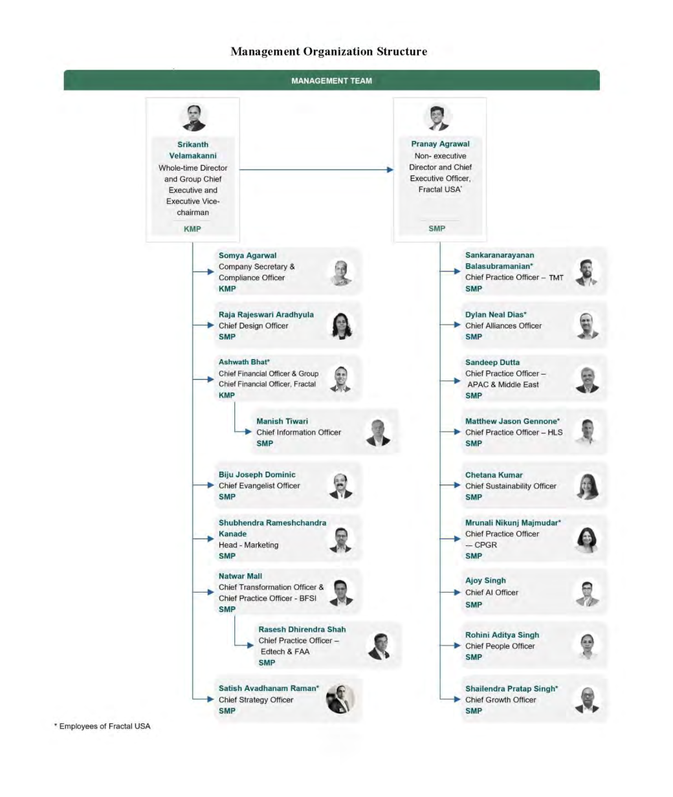

**[Image: 1770955551279.pdf-0400-00.png (1040x1232, 664.0KB)]**

396 

### **Key Managerial Personnel and Senior Management** 

### _Key Managerial Personnel_ 

In addition to our Whole-time Director, whose details are provided in “ _– Brief profiles of our Directors_ ” on page 384, the details of our other Key Managerial Personnel as on the date of this Prospectus are as set forth below: 

**Ashwath Bhat** is the Chief Financial Officer of our Company since August 1, 2025 and designated as the group chief financial officer of Fractal and has been employed with Fractal USA as its chief financial officer and treasurer since January 25, 2021. He is responsible for managing the financial operations and statutory compliances and networks and administrative functions of Fractal. He is an associate of the ICAI. Prior to joining our Company, he was associated with Nielsen Company where he held various leadership roles in finance such as vice president financial planning and analysis, finance director for the Middle East, North Africa and Pakistan, chief finance officer for Africa and Middle East and chief financial officer at Gracenote – a Nielsen Company. He was also associated with IBM India Private Limited as its manager – finance, and WGE Healthcare Private Limited as its customer advocacy (OTR) leader- DI. Further, he has completed the financial management program organized by GE. Additionally, in 2004, he was recognized for his proficiency in the GE Green Belt – DMAIC six sigma methodology and awarded the ‘GE Company Certification as a GE Green Belt in Six Sigma’ for his contribution to making six sigma ‘The Way We Work’. He was also acknowledged for his contribution to the Nielsen Company in 2011 and 2013 and for his contribution to the 2011 Nielsen regional leadership program and 2013 Nielsen leadership program. He did not receive any compensation from our Company in Fiscal 2025, since he was appointed as our Chief Financial Officer in Fiscal 2026, and will further receive compensation for his role in Fractal from Fractal USA only. He received compensation from our Subsidiary, Fractal USA of ₹59 million* in Fiscal 2025. 

**Somya Agarwal** is the Company Secretary and Compliance Officer of our Company. She has been associated with our Company since April 9, 2018. She has been an associate member of the Institute of Company Secretaries of India since 2003. She is responsible for managing the legal and secretarial compliances of our Company. She holds a dual bachelor’s degree in commerce and in law from Chhatrapati Shahu Ji Maharaj University, Kanpur and a post graduate diploma in business administration from Symbiosis Centre for Distance Learning, Pune. Prior to joining our Company, she was associated with Win-Medicare Private Limited and SAIC India Private Limited as their company secretary, NourishCo Beverages Limited as their assistant vice president (AVP) - legal and company secretary and TLG India Private Limited and Roots Corporation Limited as their head-legal and company secretary. She received a compensation of ₹11 million* in Fiscal 2025. 

* _Including the variable compensation that accrued in Fiscal 2025_ . 

### _Senior Management_ 

In addition to our Chief Financial Officer and our Company Secretary and Compliance Officer, who are also our Key Managerial Personnel and whose details have been disclosed above and Pranay Agrawal, our Non - executive Director and chief executive officer of our Material Subsidiary, Fractal USA, whose details are provided in “ _– Brief profiles of our Directors_ ” on page 384, the details of our other Senior Management as on the date of this Prospectus are as set forth below: 

**Ajoy Singh** is the chief AI officer of our Company. He has been associated with our Company since May 2, 2012. He is responsible for developing our Company’s capabilities in the areas of artificial intelligence and cloud & data technology and also heads functional capabilities of supply chain, financial planning and analytics, integrated marketing effectiveness, personalization and recommendation engines, and digital & web analytics. He holds a bachelor of technology degree in mechanical engineering from the Indian Institute of Technology, Delhi and a post- graduate diploma degree in computer aided management from Indian Institute of Management, Calcutta, West Bengal. He was also recognized as one of the “Top 10 AI Leaders” at AV Luminary Award (Datahack Summit) in the year 2023. Prior to joining our Company, he was associated with GE Countrywide Consumer Financial Services Limited as their AVP-risk, Standard Chartered Investments & Loans (India) Limited as their head-credit policy, Barclays Bank PLC as their director- consumer risk, CitiFinancial Consumer Finance India Ltd. as their vice president and Citicorp Overseas Software Limited. He received a compensation of ₹24 million* in Fiscal 2025. 

**Manish Tiwari** is the chief information officer of our Company. He has been associated with our Company since December 6, 2021. He is responsible for the internal digital transformation, protection of information systems and networks and administrative functions in Fractal. He holds a bachelor of science degree in mathematics, chemistry 

397 

and physics from Kanpur University and has completed a program in business management for Armed Forces from Management Development Institute, Gurgaon. He is a certified ISMS professional (STQC -CISP) from STQC Directorate. He has also served in the Indian Navy as a commander. He was also awarded "Security Leader of the Year" at DSCI Excellence Award 2019. After leaving the Armed Forces and prior to joining our Company, he was associated with Aujas Networks Private Limited as their associate vice president, Microsoft Corporation (India) Pvt. Ltd. as their chief security advisor and Bharti Airtel Ltd. as their CISO. He received a compensation of ₹24 million* in Fiscal 2025. 

**Raja Rajeswari Aradhyula** is the chief design officer of our Company. She has been associated with our Company since February 19, 2008. She is responsible for developing our Company’s design capabilities. She has passed the bachelor of science degree examination from Osmania University, Hyderabad, holds a master of science degree in mathematics from University of Hyderabad, and a master of science degree from University of Toledo, Ohio. Prior to joining our Company, she was associated with Integrated Decisions and Systems (India) Pvt. Ltd. as their technical leader. She received a compensation of ₹16 million* in Fiscal 2025. 

**Rasesh Dhirendra Shah** is the chief practice officer - Edtech & FAA of our Company. He has been associated with our Company since January 16, 2008. He is responsible for internal learning via the Fractal Analytics Academy and external training through the EdTech practice in our Company. He holds a bachelor of engineering degree in electronics engineering from University of Bombay and has passed the examination for master’s of administrative management from University of Mumbai. Prior to joining our Company, he was associated with Mastek Limited as their group software manager and Tata Infotech Limited. He received a compensation of ₹15 million* in Fiscal 2025. 

**Rohini Aditya Singh** is the chief people officer of our Company. She has been associated with our Company since May 14, 2019. She is responsible for cultural transformation, change management, talent acquisition, and talent management. She has passed the examination for bachelor’s of arts (honors) degree in psychology and master’s degree in psychology from University of Delhi. Prior to joining our Company, she was associated with Amrop International Pvt. Ltd., Essar Services India Private Limited and Jet Airways (India) Limited. She received a compensation of ₹23 million* in Fiscal 2025. 

**Biju Joseph Dominic** is the chief evangelist officer of our Company and shall continue to hold this position for a period of three years until May 26, 2027. He has been associated with our Company since November 1, 2023. He is responsible for helping to better understand and influence human decision-making process, by integrating learning from neuroscience, artificial intelligence and design in our Company. He has passed the bachelor of technology degree examination at the mechanical branch from University of Kerala, and a postgraduate diploma in management degree from Xavier Institute of Management, Bhubaneswar, Orissa. Prior to joining our Company, he has been associated with Lowe Lintas and Partners as their associate vice president and DDB Mudra Private Limited as their vice president. He received a compensation of ₹18 million* in Fiscal 2025. 

**Shubhendra Rameshchandra Kanade** is the head - marketing of our Company. He has been associated with our Company since November 1, 2023. He is responsible for marketing of our Company. He has passed the bachelor of engineering degree examination in computer engineering from University of Mumbai. Prior to joining our Company, he has been associated with Greater Mumbai Municipal Corporation as their chief analytics officer, Axis Bank Limited as their vice president, Sutherland Global Services as their senior manager, analytics. He received a compensation of ₹15 million* in Fiscal 2025. 

**Natwar Mall** is the chief transformation officer and chief practice officer - BFSI of our Company. He has been associated with our Company since February 6, 2006. He is responsible for our financial services and insurance practice and the process transformation of our Company. He holds a bachelor of technology degree in mechanical engineering from Indian Institute of Technology, Bombay and a postgraduate diploma in computer aided management degree from Indian Institute of Management, Calcutta. Prior to joining our Company, he has been associated with Kotak Securities as their associate vice president, Infosys Technologies Limited as their senior associate and Hindustan Lever Limited. He received a compensation of ₹22 million* in Fiscal 2025. 

**Sandeep Dutta** is the chief practice officer – APAC & Middle East of our Company. He has been associated with our Company since June 1, 2016. He heads our Asia Pacific and Middle East business and is responsible for the industrials, energy and travel vertical in Fractal. He holds a bachelors in arts (honors) degree in economics from University of Delhi and a master’s degree in arts in business economics from University of Delhi, Delhi and has completed a full-time intensive course for master of international business from the India Institute of Foreign Trade. Prior to joining our Company, he has been associated with Nipuna Services Limited as their assistant vice president, Satyam Computer Servies as their general manager -business development, Wipro Technologies (a 

398 

division of Wipro Ltd.) as their regional practice manager, Tata Consultancy Servies Limited as their Sub P&L owner and Mphasis Limited as their senior vice president. He received a compensation of ₹22 million* in Fiscal 2025. 

**Chetana Kumar** is the chief sustainability officer of our Company. She has been associated with our Company since October 3, 2020. Prior to aforesaid, since February 9, 2017, she was engaged by our Company as a CSR consultant ( _on a pro bono basis_ ). She is responsible for heading the corporate social responsibility function of our Company. She holds a bachelor of social, legal sciences degree from University of Pune and a bachelor of laws degree from Savitribai Phule Pune University, Pune ( _formerly known as University of Pune_ ), diploma in master’s programme in international business from Symbiosis Institute of International Business, Pune and has completed YPO: Harvard Business Leadership Program for Spouse/Partners 2021 from Harvard Business School, Massachusetts, United States. Prior to joining our Company, she has been associated with e-Serve International Limited. She received a compensation of ₹7 million* in Fiscal 2025. 

**Shailendra Pratap Singh** is the chief growth officer of Fractal USA. He has been associated with Fractal USA since June 16, 2021. He is responsible for building the US and Europe business for Fractal, helping in the acquisition and growth of Fractal. He holds a bachelor’s of commerce degree (honours course) from University of Delhi, Delhi and has completed the course in “Strategic Negotiations: Dealmaking for the long term” from Harvard Business School, Massachusetts, United States. He was awarded “Entrepreneur of the Year” by IBM in the year 2008. Prior to joining our Company, he was the chief executive officer and director of Samya.ai which was acquired by our Company in 2021 and Uptron Colour Picture Tubes Limited, Mu Sigma Incas their executive vice president, head of geography. He received a compensation from Fractal USA of ₹105 million* in Fiscal 2025. 

**Dylan Neal Dias** is the chief alliances officer of Fractal USA. He has been associated with Fractal USA since April 1, 2023. He is responsible for the partnerships and alliance function at Fractal. He has passed the bachelor of engineering degree examination in electronics engineering from V. J. Technical Institute of the University of Mumbai and a master of engineering management degree and master of business administration from Northwestern University. Prior to joining Fractal USA, he has been with e-Emphasys Technologies Inc. as their project manager in the enterprise application systems division. He received a compensation from Fractal USA of ₹79 million* in Fiscal 2025. 

**Satish Avadhanam Raman** is the chief strategy officer of Fractal USA. He has been associated with Fractal USA since July 5, 2017. He is responsible for driving Fractal-wide formulation, development and execution of Fractal’s corporate strategy, efforts in corporate development, mergers & acquisitions, incubating new partnerships and alliances, external strategic investments as well as long term capital planning and capital market activities. He holds a bachelor’s of commerce degree from Loyola College, University of Madras. He has received the ‘Buyers/ Sellers Dealmaker of the Year’ award at the 14th annual M&A Advisor Awards and received recognition as a winner in the ‘Dealmaker category’ at 6th annual 40 Under 40 Emerging Leaders Awards. Prior to joining Fractal USA, he was associated with Sutherland Global Services, as their global head - corporate development, Spark Capital Advisors Private Limited, Bharat S Raut & Co. and served on the board of iQor Holdings Inc. He currently serves on the boards of Senseforth USA, Analytics Vidhya USA, Fractal Frontiers, and Qure.ai. He received a compensation from Fractal USA of ₹79 million* in Fiscal 2025. 

**Matthew Jason Gennone** is the chief practice officer – HLS of Fractal USA. He has been associated with Fractal USA since December 3, 2018. He is responsible for shaping, developing, and executing the vision and strategy for healthcare AI which involves the alignment of capabilities, talent, and offerings with client needs, market trends, and Fractal’s overall growth objectives. He holds a bachelor of arts (psychology) degree from Eberly College of Arts and Sciences, West Virginia University, USA. Prior to joining Fractal USA, he was associated with Accenture as their digital strategy senior manager and Antuit Inc. He received a compensation from Fractal USA of ₹51 million* in Fiscal 2025. 

**Mrunali Nikunj Majmudar** is the chief practice officer – CPGR of Fractal USA. She has been associated with Fractal since April 1, 2015 (and specifically with Fractal USA since September 1, 2020). She is responsible for sales, profitability and customer success operations for our clients in the consumer goods and retail industries of Fractal. She has passed the bachelor of science (mathematics major) degree examination and master of management studies degree examination from University of Bombay. Prior to joining Fractal USA, she has been associated with Procter & Gamble Hygiene and Health Care Ltd., Marico Limited and her own entrepreneurial venture, Chrome Cube. She received a compensation from Fractal USA of ₹56 million* in Fiscal 2025. 

**Sankaranarayanan Balasubramanian** is the chief practice officer – TMT of Fractal USA. He has been associated with Fractal since May 15, 2006 (and specifically with Fractal USA since August 14, 2023). He is 

399 

responsible for driving: a) consulting & delivery, b) sales & account management, and c) innovation & solution development for the technology, media & telecom (TMT) vertical of Fractal. He holds a bachelor’s degree in instrumentation & control engineering from University of Madras and post graduate diploma in management from Indian Institute of Management, Ahmedabad. Prior to joining Fractal USA, he was associated with SCT Software Solutions India Private Limited. He received a compensation from Fractal USA of ₹53 million* in Fiscal 2025. 

* _Including the variable compensation that accrued in Fiscal 2025_ . 

### **Status of the Key Managerial Personnel and Senior Management** 

Except for Ashwath Bhat, Pranay Agrawal, Dylan Neal Dias, Matthew Jason Gennone, Mrunali Nikunj Majmudar, Sankaranarayanan Balasubramanian, Satish Avadhanam Raman and Shailendra Pratap Singh who are permanent employees of our wholly-owned Subsidiary, Fractal USA, all the Key Managerial Personnel and Senior Management are permanent employees of our Company. 

### **Relationship among the Key Managerial Personnel and Senior Management** 

Except as disclosed under “ _- Relationship between our Directors and Key Managerial Personnel and Senior Management_ ” on page 386 above, none of the Key Managerial Personnel and Senior Management are related to each other. 

### **Bonus or profit-sharing plan for our Directors, Key Managerial Personnel and Senior Management** 

Other than the performance bonus component of their remuneration, as applicable, our Company does not have any bonus or profit-sharing plan for our Directors, Key Managerial Personnel or members of our Senior Management. 

Term sheets were entered into by certain shareholders for payment of upside consideration to (i) Srikanth Velamakanni; (ii) Pranay Agrawal; and/ or  (iii) certain members of the senior management team of our Company, and certain of its subsidiaries, pursuant to which the relevant parties had entered into profit sharing agreements each dated December 1, 2025. Pursuant to the resolutions passed by our Board and the board of directors of the relevant subsidiaries each dated January 23, 2026, they have approved the termination of the profit sharing agreements to which they are party. Subsequently, each of the parties to the profit sharing agreements have executed termination letters dated February 2, 2026 for termination of the profit sharing agreements. 

### **Shareholding of Key Managerial Personnel and Senior Management in our Company** 

Except as disclosed under “ _- Shareholding of Directors in our Company_ ” on page 387 above and as disclosed below, none of our Key Managerial Personnel and Senior Management hold any Equity Shares: 

|**Name of the Key Managerial Personnel and Senior Management**|**Number of Equity Shares** **of face value ₹1 held**|
|---|---|
|Somya Agarwal|42,050|
|Ashwath Bhat|436,150|
|Rasesh Dhirendra Shah|130,300|
|Raja Rajeswari Aradhyula|236,410|
|Natwar Mall|371,410|
|Manish Tiwari|121,150|
|MrunaliNikunjMajmudar|132,765|
|Sandeep Dutta|86,150|
|Chetana Kumar|6,377,155|
|Biju Joseph Dominic|200,000|
|Shubhendra Rameshchandra Kanade|15,000|
|DylanNeal Dias|8,650|
|Ajoy Singh|236,410|
|Sankaranarayanan Balasubramanian|365,360|
|Satish Avadhanam Raman|396,480|
|Shailendra Pratap Singh|477,400|
|Rohini Aditya Singh|61,000|

For further details in relation to employee stocks options held by our Key Managerial Personnel and Senior Management, please see “ _Capital Structure – Notes to Capital Structure – Share Capital history of our Company_ ” 

400 

on page 102. 

### **Service Contracts with the Key Managerial Personnel and Senior Management** 

Except for benefits payable upon termination of employment of Pranay Agrawal, Ashwath Bhat, and Dylan Neal Dias, as specified below, as also provided in “– _Service Contracts with our Directors_ ”, and statutory benefits payable upon termination of employment of our Key Managerial Personnel and Senior Management, our Company and Fractal USA has not entered into any service contracts with our Key Managerial Personnel and Senior Management which provide for benefits upon the termination of their employment. 

- In case of termination for any reason or in case of termination of services by Fractal USA without cause or termination by Pranay Agrawal with good reason (as defined under his employment agreement with Fractal USA), Pranay Agrawal is entitled to the payment of his base salary, benefits vested in him under the employee benefit plan through the date of termination, and any accrued but unpaid bonus. In addition to the aforesaid, in case of termination of services by Fractal USA without cause or termination by Pranay Agrawal with good reason (as defined under his employment agreement with Fractal USA), Pranay Agrawal will also be entitled to receive a severance pay equivalent to 12 months of his base salary (in accordance with the terms set forth under his employment agreement with Fractal USA). It is clarified that, in case of termination of his employment by himself, other than for good reason (as defined under his employment agreement with Fractal USA), Fractal USA may place Pranay Agrawal on paid leave for the remainder of his notice period. 

- In case of a termination for cause, in addition to the payment of his base salary and payments (at the rate of his base salary), Ashwath Bhat is entitled to the vested equity and retirement benefits in him under the plan documents and insurance continuation rights (as mentioned in his employment agreement with Fractal USA). In addition to the aforesaid, in case of termination of services by Fractal USA without cause, or within six months following a change in control or in case Ashwath Bhat resigns for good reason (as defined under his employment agreement with Fractal USA), and he executes a release of claims in the form acceptable to Fractal USA, Ashwath Bhat is entitled to receive a severance pay equivalent to five months of his base salary. 

- In case of a termination for cause, in addition to the payment of his base salary and payments (at the rate of his base salary), Dylan Neal Dias is entitled to the vested equity and retirement benefits in him under the plan documents and insurance continuation rights (as mentioned in his employment agreement with Fractal USA). In addition to the aforesaid, in case of termination of services by Fractal USA without cause and Dylan Neal Dias executes a release of claims in the form acceptable to Fractal USA (as provided under the employment agreement with Fractal USA) and once effective, Dylan Neal Dias is entitled to receive a severance pay equivalent to five months of his base salary. 

### **Interests of Key Managerial Personnel and Senior Management** 

Other than as provided in “– _Interests of Directors_ ” above, our Key Managerial Personnel and Senior Management do not have any interests in our Company, other than to the extent of (i) the remuneration or benefits to which they are entitled in accordance with the terms of their appointment or reimbursement of expenses incurred by them during the ordinary course of business by our Company and its Subsidiaries; (ii) the Equity Shares and employee stock options held by them and their relatives employed with our Company or its Subsidiaries, if any, including under the ESOP- 2007, ESOP - 2019 and MIPs, and any dividend payable to them and other benefits arising out of such shareholding; (iii) the equity shares held in our Subsidiaries and Associate; and (iv) directorship and related benefits in our Subsidiaries. For details, see “- _Shareholding of Key Managerial Personnel and Senior Management in our Company_ ” and “ _Capital Structure – Notes to Capital Structure – Employee stock option plans of our Company_ ” on pages 400 and 188. 

### **Contingent and deferred compensation payable to the Key Managerial Personnel and Senior Management** 

As on the date of this Prospectus, there is no contingent or deferred compensation payable at a later date to our Key Managerial Personnel and members of our Senior Management, which accrued in Fiscal 2025. However, the variable component of the annual compensation payable to our Key Managerial Personnel and members of our Senior Management which accrued in the previous Fiscal is payable in the first quarter of the next Fiscal in accordance with our Company’s / Fractal USA’s policy. 

For details on the above pertaining to Srikanth Velamakanni, our Whole-time Director and group chief executive 

401 

and executive vice-chairman, see “- _Contingent and deferred compensation payable to our Directors_ ” on page 387. 

### **Arrangements and understanding with major shareholders, customers, suppliers or others** 

Except as disclosed in _“Arrangement or understanding of Directors with major shareholders, customers, suppliers or others”_ , none of the Key Managerial Personnel and Senior Management have been appointed pursuant to any arrangement or understanding with the major Shareholders, customers, suppliers or any other person. 

### **Changes in our Key Managerial Personnel and Senior Management in the three immediately preceding years** 

Details of the changes in our Key Managerial Personnel and Senior Management in the last three years are set forth below: 

|**Name**|**Date of Change**|**Reason**|
|---|---|---|
|Ashwath Bhat|August1,2025|Appointment as the Chief FinancialOfficer|
|Ann Hintzman|November 10, 2023|Resignation as chief design officer of Fractal USA|
|Sharmila Shah|June 16, 2023|Resignation as client partner of our Company|
|Arpan Dasgupta|May 12, 2023|Resignation as chief practice officer of Fractal USA|

### **Payment or benefit to officers of our Company** 

Except for the Retention bonus of USD 450,000 (₹38.04 million), USD 450,000 (₹38.04 million) and USD 600,000 (₹50.72 million) paid to Dylan Neal Dias, one of the members of our Senior Management, in Fiscals 2023, 2024 and 2025, respectively, no amount or benefit has been paid or given to any officer of our Company within the two years preceding the date of this Prospectus or is intended to be paid or given, other than in the ordinary course of their employment, any employee stock options, for services rendered as officers of our Company, dividend that may be payable in their capacity as Shareholders, and as disclosed in “ _Restated Consolidated Financial Information_ ” on page 408. 

### **Employee stock option plan and employee stock purchase plan** 

For details of the ESOP- 2007, ESOP - 2019 and MIPs, see “ _Capital Structure – Notes to Capital Structure – Employee stock option plans of our Company_ ” on page 188. 

402 

### **OUR PROMOTERS AND PROMOTER GROUP** 

Srikanth Velamakanni, Pranay Agrawal, Chetana Kumar, Narendra Kumar Agrawal and Rupa Krishnan Agrawal are the Promoters of our Company. As on the date of this Prospectus, our Promoters hold an aggregate of 28,685,195* Equity Shares of face value of ₹1 each, comprising 17.87%** of the pre-Offer issued, subscribed and paid-up Equity Share capital of our Company on a fully diluted basis. For further details regarding the shareholding of our Promoters, see “ _Capital Structure – Notes to Capital Structure – Build-up of Promoter’s shareholding in our Company”_ on page 175. 

_*Of the 8,121,360 Equity Shares, Pranay Agrawal is currently the registered owner of 3,332,940 Equity Shares (in dematerialized form) which constitutes 1.96% of the pre-Offer Equity Share capital of our Company on a fully diluted basis, with the beneficial owner being the Agrawal Family Trust. Pranay Agrawal will transfer the registered ownership of these Equity Shares to the Agrawal Family Trust, upon the said trust having opened a demat account in its name, subject to applicable laws. For further details see, “Capital Structure – Notes to Capital Structure – History of build-up of Promoters’ shareholding and lock-in of Promoters’ shareholding - Build-up of Promoters’ shareholding in our Company – Pranay Agrawal” on page 176._ 

_**Assuming exercise of all vested options held by certain of our Promoters_ 

### **Details of our Promoters** 

#### **Srikanth Velamakanni** 

**[Image: 1770955551279.pdf-0407-06.png (274x301, 96.0KB)]**

Srikanth Velamakanni, born on February 16, 1974, aged 51 years, is a Wholetime Director and group chief executive and executive vice-chairman of our Company. He currently resides at C 3701, Oberoi Exquisite, Oberoi Garden City, Near Westin Hotel, Goregaon (East), Mumbai Suburban, Mumbai 400 063, Maharashtra, India. 

For the complete profile of Srikanth Velamakanni, along with details of his educational qualifications, experience in the business, position / posts held in the past, directorships in other entities, other ventures, special achievements, business and financial activities, see “ _Our Management – Brief profiles of our Directors_ ” on page 385. 

His PAN is ABUPV3233F. 

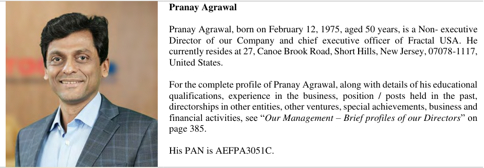

**[Image: 1770955551279.pdf-0407-10.png (942x328, 247.7KB)]**

<!-- Start of picture text -->
Pranay Agrawal Pranay Agrawal, born on February 12, 1975, aged 50 years, is a Non- executive Director of our Company and chief executive officer of Fractal USA. He currently resides at 27, Canoe Brook Road, Short Hills, New Jersey, 07078-1117, United States. For the complete profile of Pranay Agrawal, along with details of his educational qualifications, experience in the business, position / posts held in the past, directorships in other entities, other ventures, special achievements, business and financial activities, see “ Our Management – Brief profiles of our Directors ” on page 385. His PAN is AEFPA3051C. <!-- End of picture text -->

**[Image: 1770955551279.pdf-0407-11.png (296x301, 148.7KB)]**

#### **Chetana Kumar** 

Chetana Kumar, born on July 16, 1979 aged 46 years, is the chief sustainability officer of our Company. She currently resides at C 3701, Oberoi Exquisite, Oberoi Garden City, Near Westin Hotel, Goregaon (East), Mumbai Suburban, Mumbai 400 063, Maharashtra, India. 

For the complete profile of Chetana Kumar, along with details of her educational qualifications, experience in the business, position / posts held in the past, directorships in other entities, other ventures, special achievements, business and financial activities see “ _Our Management – Key Managerial Personnel and Senior Management - Senior Management_ ” on page 397. 

Her PAN is ANXPK6029K. 

403 

#### **Narendra Kumar Agrawal** 

**[Image: 1770955551279.pdf-0408-01.png (299x251, 173.6KB)]**

Narendra Kumar Agrawal, born on July 8, 1949, aged 76 years. He currently resides at Off Bannerghatta Road, Flat No B-504 Amoda Valmark 132/3, Doddakammanahalli, Bannerughatta, Bengaluru 560 083, Karnataka, India. 

He holds a bachelors degree in engineering from VNIT, Nagpur University and has passed the examination of master of management science from University of Poona. He has also been a fellow at the Indian Institute of Management, Ahmedabad. He has completed fellow programme in management from Indian Institute of Management, Ahmedabad. He has also completed H.A.L. engineering graduate management trainee course in aircraft structures and aero engines, conducted at Air Force Technical College in 1979. He has sectoral experience in leadership teaching and training and has previously served as a professor at Indian Institute of Management, Bangalore. He received first prize and commendation prize on Annual Awards on Public Sector Studies at Parliamentary Forum on Public Sector, Centre for Public Sector Studies in 1987 and 1985, respectively, and Best Case Study prize at All India Management Association in 2025. 

#### <u>His PAN is ABSPA7657C.</u> 

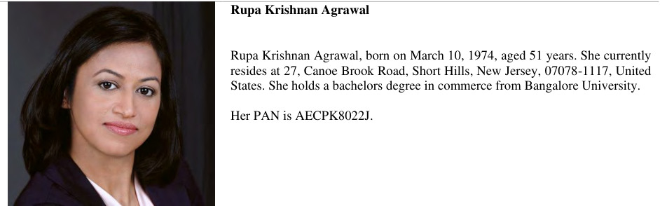

**[Image: 1770955551279.pdf-0408-05.png (942x294, 184.7KB)]**

<!-- Start of picture text -->
Rupa Krishnan Agrawal Rupa Krishnan Agrawal, born on March 10, 1974, aged 51 years. She currently resides at 27, Canoe Brook Road, Short Hills, New Jersey, 07078-1117, United States. She holds a bachelors degree in commerce from Bangalore University. Her PAN is AECPK8022J. <!-- End of picture text -->

Our Company confirms that the PAN, bank account numbers, Aadhaar card numbers, passport numbers and driving license numbers, as applicable, of our Promoter have been submitted to the Stock Exchanges at the time of filing of the Draft Red Herring Prospectus. 

### **Change in control of our Company** 

Srikanth Velamakanni, Pranay Agrawal, Chetana Kumar, Narendra Kumar Agrawal and Rupa Krishnan Agrawal have been identified as the Promoters pursuant to a resolution dated August 1, 2025 adopted by our Board. There has not been any change in the control of our Company in the five years immediately preceding the date of this Prospectus. 

### **Interests of Promoters** 

Our Promoters are interested in our Company to the extent (i) that they are promoters of our Company; (ii) that they hold any direct shareholding in our Company, our Subsidiaries, and our Associate the shareholding of entities in which our Promoters are interested, in our Company, and any dividends, if any, or any other distributions payable in respect thereof; (iii) Pranay Agrawal is interested in his capacity as the Non- executive Director of our Company and chief executive officer of Fractal USA and Srikanth Velamakanni is interested in his capacity as the Whole-time Director and group chief executive and executive vice-chairman, and to the extent of remuneration payable to them in this regard by Fractal USA and our Company, as applicable; and (iv) Chetana Kumar is interested in her capacity as the chief sustainability officer of our Company, and to the extent of remuneration payable to her in this role. For details of the shareholding of our Promoter in our Company, see “ _Capital Structure – Build-up of the Promoters’ shareholding in our Company_ ” on page 175. For details of the interest of Pranay Agrawal and Srikanth Velamakanni as Directors of our Company, see “ _Our Management-Interest of Directors_ ” and “ _Our Management - Service Contracts with the Key Managerial Personnel and Senior Management_ ” on pages 388 and 401. For details of the interest of Chetana Kumar as member of Senior Management of our Company, see “ _Our Management- Interests of Key Managerial Personnel and Senior Management_ ” on page 401. 

(1) Our Promoters have no interest, whether direct or indirect, in any property acquired by our Company in 

404 

the three years preceding the date of this Prospectus, or proposed to be acquired by our Company, or in any transaction by our Company for acquisition of land, construction of building or supply of machinery, etc. 

- (2) Our Promoters are not interested as a member in any firm or company which has any interest in our Company. 

- (3) No sum has been paid or agreed to be paid to any of our Promoters or to any firm or company in which any of our Promoters are interested as a member, in cash or shares or otherwise by any person either to induce any of our Promoters to become, or qualify them as a director, or otherwise for services rendered by any of our Promoters or by such firm or company in connection with the promotion or formation of our Company. 

### **Payments or benefits to our Promoters or members of our Promoter Group** 

Except as stated in, “ _Restated Consolidated Financial Information – Note 27 – Related Party Disclosures_ ” on page 462, no payment or benefits has been paid or given to our Promoters or members of our Promoter Group during the two years preceding the filing of this Prospectus nor is there any intention to pay or give any benefit to our Promoter or the members of our Promoter Group. 

### **Material guarantees given by our Promoters to third parties with respect to the Equity Shares** 

Our Promoters have not given any material guarantee to any third party with respect to the Equity Shares of our Company, as on the date of this Prospectus. 

### **Companies or firms with which our Promoter have disassociated in the last three years** 

Our Promoters have not disassociated themselves from any company or firm in the three years preceding the date of this Prospectus. 

### **Promoter Group** 

In addition to our Promoters, the individuals and entities that form part of the Promoter Group of our Company in terms of Regulation 2(1)(pp) of the SEBI ICDR Regulations are set out below: 

_Natural persons forming part of the Promoter Group_ 

The natural persons who are part of the Promoter Group, are as follows: 

|**Name of Promoter**|**Name of relative**|**Relationship**|
|---|---|---|
|**Srikanth Velamakanni**|Velamakanni Kanakadurga|Mother|
||Chetana Kumar|Spouse|
||Rajendra Kumar Velamakanni|Brother|
||Sridhar Velamakanni|Brother|
||Kolachana Bharathi|Sister|
||SrianaKumarVelamakanni|Daughter|
||Binod Kumar|Father of spouse|
|**Pranay Agrawal**|Narendra Kumar Agrawal|Father|
||Vimala Agrawal|Mother|
||Rupa Krishnan Agrawal|Spouse|
||PraneetaAgrawal|Sister|
||Shlok Agrawal|Son|
||Shakti Agrawal|Daughter|
||Kudundirapally Perumaliyer Krishnan|Father of spouse|
||Lalitha Krishnan|Mother of spouse|
||Rekha Ronald Fernandes|Sister of spouse|
|**Chetana Kumar**|Binod Kumar|Father|
||SrikanthVelamakanni|Spouse|
||Sriana Kumar Velamakanni|Daughter|
||Velamakanni Kanakadurga|Mother of spouse|
||Rajendra Kumar Velamakanni|Brother of spouse|
||SridharVelamakanni|Brother of spouse|
||KolachanaBharathi|Sisterofspouse|

405 

|**Name of Promoter**|**Name of relative**|**Relationship**|
|---|---|---|
|**Narendra Kumar Agrawal**|Vimala Agrawal|Spouse|
||Shankarlal Madanlal Agrawal|Brother|
||PranayAgrawal|Son|
||Praneeta Agrawal|Daughter|
||Kaushal Kumar Agrawal|Brother of spouse|
||Brijesh Kumar Agrawal|Brother of spouse|
||Rajendra Kumar Agrawal|Brother of spouse|
||SurendraKumar Agrawal|Brotherofspouse|
||Virendra Kumar Agrawal|Brother of spouse|
||Kanti Agrawal|Sisterofspouse|
|**Rupa Krishnan Agrawal**|Kudundirapally Perumaliyer Krishnan|Father|
||Lalitha Krishnan|Mother|
||PranayAgrawal|Spouse|
||Rekha Ronald Fernandes|Sister|
||Shlok Agrawal|Son|
||Shakti Agrawal|Daughter|
||Narendra Kumar Agrawal|Father of spouse|
||Vimala Agrawal|Mother of spouse|
||Praneeta Agrawal|Sister of spouse|

### **_Entities forming part of the Promoter Group_** 

The entities forming part of our Promoter Group, are as follows: 

1. Agrawal Family Trust; 

2. Aashish Traders; 

3. AGI Trust; 

4. ASI Trust; 

5. Cognosia Institute Private Limited; 

6. Rajendra Puneet And Associates; 

7. M/s Subhash Printing Press; and 

8. Parkss Ventures Ltd. 

406 

### **DIVIDEND POLICY** 

The dividend distribution policy of our Company was approved and adopted by our Board pursuant to its resolution dated August 8, 2025 (“ **Dividend Policy** ”). The declaration and payment of dividend on our Equity Shares, if any, will be recommended by our Board and approved by our Shareholders, at their discretion, subject to the provisions of our Articles of Association, Dividend Policy and the applicable laws including the Companies Act, 2013 together with the applicable rules notified thereunder and the SEBI Listing Regulations. Our Board would declare an interim dividend, as and when considers appropriate, in line with the Dividend Policy and applicable laws. Our Company may pay dividend by cheque or any electronic mode, as may be approved by the Board from time to time. 

In terms of the Dividend Policy, the quantum of dividend, if any, and our ability to pay dividends will depend on a number of factors, including but not limited to, our Company’s profits earned and available for distribution during the Financial Year, accumulated reserves including retained earnings, mandatory transfer of profits earned to specific reserves such as debenture redemption reserve, etc., net profits earned during Financial Year as per the consolidated financial statements, cash flows, current and projected cash balances and Company’s working capital requirements, earning stability, debt repayment schedules, if any, dividend payout trends, fund requirement for contingencies and unforeseen events with financial implications, upgradation of technology and physical infrastructure, macro-economic environment, regulatory changes, state of economy and any other relevant factors and material events. In addition, our ability to pay dividends may be impacted by a number of factors, including restrictive covenants under our current or future loan or financing documents. For more information on restrictive covenants under our current loan agreements, see “ _Financial Indebtedness_ ” on page 534. We may retain all our future earnings, if any, for use in the operations and expansion of our business. 

We have not declared and paid any dividends on our Equity Shares or preference shares in any of the three Financial Years preceding the date of this Prospectus and until the date of this Prospectus. There is no guarantee that any dividends will be declared or paid in the future. See, “ _Risk Factors – We cannot assure payment of dividends on the Equity Shares in the future_ ” on page 75. 

407 

### **SECTION V – FINANCIAL INFORMATION** 

### **RESTATED CONSOLIDATED FINANCIAL INFORMATION** 

|**Particulars**|**Page**|
|---|---|
|Examination report of the Statutory Auditor on the Restated Consolidated Financial Information|409|
|Restated ConsolidatedFinancial Information|418|

408 

### **INDEPENDENT AUDITOR’S EXAMINATION REPORT ON RESTATED CONSOLIDATED FINANCIAL INFORMATION** 

The Board of Directors Fractal Analytics Limited Level 7, Commerz II, International Business Park Oberoi Garden City Off Western Express Highway Goregaon (East) Mumbai – 400 063 

Dear Sirs, 

1. We, B S R & Co. LLP, Chartered Accountants have examined the attached restated consolidated financial information of Fractal Analytics Limited (formerly known as Fractal Analytics Private Limited) (the “Company” or the “Issuer”) and its subsidiaries (the Company and its subsidiaries together referred to as the “Group") and its associate, comprising the restated consolidated statement of assets and liabilities as at 30 September 2025, 30 September 2024, 31 March 2025, 31 March 2024 and 31 March 2023, the restated consolidated statement of profit and loss (including other comprehensive income), the restated consolidated statement of changes in equity and the restated consolidated statement of cash flows for the six-months periods ended 30 September 2025 and 30 September 2024 and for the years ended 31 March 2025, 31 March  2024 and 31 March 2023, the material accounting policies, and other explanatory information and notes (collectively, the “Restated Consolidated Financial Information”), as approved by the Board of Directors of the Company at their meeting held on 23 January 2026 for the purpose of inclusion in the Red Herring Prospectus (“RHP”) and Prospectus prepared by the Company in connection with its proposed initial public offer of equity shares (“ IPO”) prepared in terms of the requirements of: 

   - a) Section 26 of Part I of Chapter III of the Companies Act, 2013, as amended (the “Act”); 

   - b) The Securities and Exchange Board of India (Issue of Capital and Disclosure Requirements) Regulations, 2018, as amended ("ICDR Regulations"); and 

   - c) The Guidance Note on Reports in Company Prospectuses (Revised 2019) issued by the Institute of Chartered Accountants of India (“ICAI”) (the “Guidance Note”). 

2. The Company’s Board of Directors is responsible for the preparation of the Restated Consolidated Financial Information for the purpose of inclusion in the RHP and Prospectus to be filed with Securities and Exchange Board of India, Bombay Stock Exchange Limited (‘BSE’) and, National Stock Exchange of India Limited (”NSE”) (the “NSE” together with “BSE”, the “Stock Exchanges”) and Registrar of Companies, Maharashtra, situated at Mumbai, in connection with the proposed IPO. The Restated Consolidated Financial Information have been prepared by the management of the Company on the basis of preparation stated in note 2.1 to the Restated Consolidated Financial Information. The responsibility of respective Board of Directors of the companies included in the Group and its associate includes designing, implementing and maintaining adequate internal control relevant to the preparation and presentation of the Restated Consolidated Financial Information. The respective Board of Directors are also responsible for identifying and ensuring that the Group and its associate complies with the Act, ICDR Regulations and the Guidance Note. 

3. We have examined such Restated Consolidated Financial Information taking into consideration: 

   - a) The terms of reference and terms of our engagement agreed upon with you in accordance with our engagement letter dated 15 November 2025 in connection with the proposed IPO of equity shares of the Company; 

   - b) The Guidance Note. The Guidance Note also requires that we comply with the ethical requirements of the Code of Ethics issued by the ICAI; 

   - c) Concepts of test checks and materiality to obtain reasonable assurance based on verification of evidence supporting the Restated Consolidated Financial Information; and 

   - d) The requirements of Section 26 of the Act and the ICDR Regulations. Our work was performed 

409 

solely to assist you in meeting your responsibilities in relation to your compliance with the Act, the ICDR Regulations and the Guidance Note in connection with the proposed IPO. 

4. These Restated Consolidated Financial Information have been compiled by the management from: 

   - a) Audited special purpose consolidated interim financial statements of the Group and its associate as at and for the six months period ended 30 September 2025 prepared in accordance with the basis of preparation described in Note 2.1 to the special purpose consolidated interim financial statements, which have been approved by the Board of Directors at their meeting held on 7 November 2025; 

   - b) Audited special purpose consolidated interim financial statements of the Group and its associate as at and for the six months period ended 30 September 2024 prepared in accordance with the basis of preparation described in Note 2.1 to the special purpose consolidated interim financial statements, which have been approved by the Board of Directors at their meeting held on 23 January 2026; and 

   - c) Audited consolidated financial statements of the Group and its associate as at and for the years ended 31 March  2025, 31 March  2024 and 31 March  2023 prepared in accordance with Indian Accounting Standards (“Ind AS”) as prescribed under Section 133 of the Act read with Companies (Indian Accounting Standards) Rules, 2015, as amended, and other accounting principles generally accepted in India, which have been approved by the Board of Directors at their meetings held on 20 May 2025, 17 June 2024 and 19 July 2023, respectively. 

5. For the purpose of our examination, we have relied on: 

   - a) Auditor’s report issued by us dated 15 November 2025 on the special purpose consolidated interim financial statements of the Group and its associate as at and for the six months period ended 30 September 2025 as referred in Paragraph 4 (a) above. 

   - b) Auditor’s report issued by us dated 23 January 2026 on the special purpose consolidated interim financial statements of the Group and its associate as at and for the six months period ended 30 September 2024 as referred in Paragraph 4 (b) above. 

   - c) Auditor’s report issued by us dated 21 May 2025, 17 June 2024 and 19 July 2023 on the consolidated financial statements of the Group and its associate as at and for the years ended 31 March 2025, 31 March 2024 and 31 March 2023, respectively as referred in Paragraph 4(c) above. 

### 6. 

- As indicated in our Auditor’s reports referred above: 

- a) we did not audit the financial statements of ten, fourteen, sixteen, nine and five subsidiaries as at and for the six-months periods ended 30 September 2025 and 30 September 2024 and as at and for the years ended 31 March 2025, 31 March 2024 and 31 March 2023, respectively  and an associate as at and for the six-months periods ended 30 September 2025 and 30 September 2024 and as at and for the year ended 31 March 2025 whose financial statements reflects total assets (before consolidation adjustments), total revenues (before consolidation adjustments), net cash inflows / (outflows) (before consolidation adjustments) and share of net loss (and other comprehensive loss) in its associate included in the consolidated financial statements, for the relevant periods/years as tabulated below, which have been audited by other auditors (Refer Annexure I, II III, IV and V), and whose reports have been furnished to us by the management and our opinion on the consolidated financial statements, in so far as it relates to the amounts and disclosures included in respect of these subsidiaries and associate, is based solely on the reports of the other auditors. 

||||||(Rs in million)|
|---|---|---|---|---|---|
|**Particulars**|**As at/ for the** **period ended 30** **September 2025**|**As at/ for the** **period ended 30** **September 2024**|**As at/  for the** **year ended** **March 31,** **2025**|**As at/  for the** **year ended** **March 31,** **2024**|**As at/  for the** **year ended** **March 31,** **2023**|
|Total assets|3,040|1,352|2,774|858|446|
|(before||||||

410 

|**Particulars**|**As at/ for the** **period ended 30** **September 2025**|**As at/ for the** **period ended 30** **September 2024**|**As at/  for the** **year ended** **March 31,** **2025**|**As at/  for the** **year ended** **March 31,** **2024**|**As at/  for the** **year ended** **March 31,** **2023**|
|---|---|---|---|---|---|
|consolidation adjustments)||||||
|Total revenue (before consolidation adjustments)| 1,799|666|3,221|690|482|
|Net cash inflows/ (outflows) (before consolidation adjustments)| (299)|(38)|336|35|(7)|

|**Particulars**|**For the period** **ended 30 September** **2025**|**For the period** **ended 30 September** **2024**|(Rs in million) **For the year ended** **March 31, 2025**|
|---|---|---|---|
|Share of net loss (and other comprehensive income/ loss) in its associate|438|215|298|

Three subsidiaries for the period ended 30 September 2025 are located outside India whose financial statements and other financial information have been prepared in accordance with generally accepted accounting principles of the respective countries, which have been audited by other auditors under generally accepted auditing standards applicable in their respective countries and we have audited only the conversion adjustments prepared by the management of the Group from the generally accepted accounting principles of the respective countries to the generally accepted accounting principles of India. 

Two subsidiaries for the year ended 31 March 2025 are located outside India whose financial statements and other financial information have been prepared in accordance with generally accepted accounting principles of the respective countries, which have been audited by other auditors under generally accepted auditing standards applicable in their respective countries and we have audited only the conversion adjustments prepared by the management of the Group from the generally accepted accounting principles of the respective countries to the generally accepted accounting principles of India. 

- b) The financial statements/financial information of fourteen, seventeen, fourteen, twenty two and nineteen subsidiaries as at and for the periods ended 30 September 2025 and 30 September 2024 and as at and for the years ended 31 March 2025, 31 March 2024 and 31 March 2023, respectively and an associate as at and for the year ended 31 March 2024 whose financial statements/financial information reflects total assets (before consolidation adjustments), total revenues (before consolidation adjustments), net cash inflows / (outflows) (before consolidation adjustments) and share of  net loss (and other comprehensive loss) in its associate included in the consolidated financial statements for the relevant periods/years as tabulated below, have not been audited either by us or by other auditors (Refer Annexure VI, VII, VIII, IX and X). These unaudited financial statements / financial information have been furnished to us by management and our opinion on the consolidated financial statements for the said years, in so far as it relates to the amounts and disclosures included in respect of these subsidiaries and an associate, is based solely on such unaudited financial statements / financial information. In our opinion and according to the information and explanations given to us by management, these financial statements/ financial information are not material to the Group. 

<u>(Rs in million)</u> 

|**Partic**|**ulars** **As at/ for the** **period ended**|**As at/ for the** **period ended**|**As at/  for the** **year ended**|**As at/  for the** **year ended**|**As at/  for the** **year ended**|
|---|---|---|---|---|---|
||**30 September** **2025**|**30 September** **2024**|**March 31,** **2025**|**March 31,** **2024**|**March 31,** **2023**|
|Total|assets 770|1,622|637|2,767|1,908|
|(before||||||

411 

|**Particulars**|**As at/ for the** **period ended** **30 September** **2025**|**As at/ for the** **period ended** **30 September** **2024**|**As at/  for the** **year ended** **March 31,** **2025**|**As at/  for the** **year ended** **March 31,** **2024**| **As at/  for the** **year ended** **March 31,** **2023**|
|---|---|---|---|---|---|
|consolidation adjustments)||||||
|Total revenue (before consolidation adjustments)|403|1,283|720|3,404|2,966|
|Net cash inflows/ (outflows) (before consolidation adjustments)|50|87|69|(191)|(65)|
||||||(Rs in million)|
|**Particulars**||||**For the year** |**ended March 31,** **2024**|
|Share of netlo|ss (and othercom|prehensiveloss)in|its associate||166|

Our opinion on the consolidated financial statements is not modified in respect of these matters. 

The other auditors of material subsidiaries and an associate as referred to in Annexure XI, have examined the restated consolidated financial information/ restated financial information and have confirmed that the restated consolidated financial information/ restated financial information: 

   - a. have been prepared after incorporating adjustments for the changes in accounting policies, material errors and regrouping/reclassifications retrospectively in the six-months period ended 30 September 2024 and in the financial years ended 31 March 2025, 31 March 2024 and 31 March 2023 to reflect the same accounting treatment as per the accounting policies and grouping/classifications followed as at and for the six-months period ended 30 September 2025; 

   - b. does not contain any modification requiring adjustments. Moreover, matters in the Auditor’s report, which do not require any corrective adjustments in the restated consolidated financial information have been disclosed in Part B of Annexure VII of the Restated Consolidated Financial Information; and 

   - c. have been prepared in accordance with the Act, ICDR Regulations and the Guidance Note. 

7. Based on our examination and according to the information and explanations given to us and also as per the reliance placed on the audit reports and examination reports submitted by the other auditors for the respective periods/years, we report that the Restated Consolidated Financial Information: 

   - a. have been prepared after incorporating adjustments for the changes in accounting policies, material errors and regrouping/ reclassifications retrospectively in the six-months period ended 30 September 2024 and in the financial years ended 31 March 2025, 31 March 2024 and 31 March 2023 to reflect the same accounting treatment as per the accounting policies and grouping/classifications followed as at and for the six-months period ended 30 September 2025; 

   - b. does not contain any modification requiring adjustments. Moreover, matters in the Auditor’s report, which do not require any corrective adjustments in the Restated Consolidated Financial Information have been disclosed in Part B of Annexure VII of the Restated Consolidated Financial Information; and 

   - c. have been prepared in accordance with the Act, ICDR Regulations and the Guidance Note. 

8. We have not audited any financial statements of the Group and its associate as of any date or for any period subsequent to 30 September 2025. Accordingly, we express no opinion on the financial position, results of operations, cash flows and statement of changes in equity of the Group and its associate as of any date or for any period subsequent to 30 September 2025. 

412 

9. The Restated Consolidated Financial Information do not reflect the effects of events that occurred subsequent to the respective dates of the reports on the special purpose consolidated interim financial statements and consolidated financial statements mentioned in paragraph 5 above. 

10. This report should not in any way be construed as a reissuance or re-dating of any of the previous audit reports issued by us, nor should this report be construed as a new opinion on any of the financial statements referred to herein. 

11. We have no responsibility to update our report for events and circumstances occurring after the date of the report. 

12. Our report is intended solely for use of the Board of Directors for inclusion in the RHP and Prospectus to be filed with Securities and Exchange Board of India, Stock Exchanges and Registrar of Companies, Maharashtra, situated at Mumbai in connection with the proposed IPO. Our report should not be used, referred to, or distributed for any other purpose except with our prior consent in writing. Accordingly, we do not accept or assume any liability or any duty of care for any other purpose or to any other person to whom this report is shown or into whose hands it may come without our prior consent in writing. 

For **B S R & Co. LLP** _Chartered Accountants_ Firm’s Registration Number: 101248W/W-100022 

Place: Mumbai Date: 23 January 2026 

**Rajesh Mehra** _Partner_ Membership Number: 103145 ICAI UDIN: 26103145HJZSHK1188 

413 

### **Annexure I - The name of entities audited by other auditors for the period ended 30 September 2025** 

|**Name of the Entity**|**Relationship**|**Name of the auditor **|
|---|---|---|
|Fractal Analytics UK Limited|Subsidiary|Lubbock Fine LLP|
|Fractal Analytics (Canada) Inc.|Subsidiary|Nisarg J Shah & Co.|
|Fractal Analytics Australia Pty Limited|Subsidiary|MVAB Assurance|
|Eugenie.Ai Inc.|Subsidiary|Nisarg J Shah & Co.|
|Asper.AI TechnologiesPrivateLimited|Subsidiary|Nisarg J Shah& Co.|
|Asper.Ai Inc.|Subsidiary|Nisarg J Shah & Co.|
|Asper.AI Limited|Subsidiary|ACN Accountants|
|Senseforth AI Research Private Limited|Subsidiary|Nisarg J Shah & Co.|
|Senseforth Inc.|Subsidiary|Nisarg J Shah & Co.|
|Analytics VidhyaEducon PrivateLimited|Subsidiary|JainGautam& Co|
|Qure.ai Technologies Private Limited|Associate|Price Waterhouse Chartered Accountants LLP|

### **Annexure II - The name of entities audited by other auditors for the period ended 30 September 2024** 

|**Name of the Entity**|**Relationship**|**Name of the auditor**|
|---|---|---|
|CuddleArtificial IntelligencePrivateLimited|Subsidiary|Nisarg J Shah& Co.|
|Cuddle.ai Inc.|Subsidiary|Nisarg J Shah & Co.|
|Final Mile Consultants Private Limited|Subsidiary|Ashish Shah & Associates|
|Fractal Analytics (Canada) Inc|Subsidiary|Nisarg J Shah & Co.|
|Theremin AI Solutions Private Limited|Subsidiary|Nisarg J Shah & Co.|
|EugenieTechnologiesPrivateLimited|Subsidiary|AshishShah&Associates|
|Eugenie.Ai Inc.|Subsidiary|Nisarg J Shah & Co.|
|Asper.AI Technologies Private Limited|Subsidiary|Nisarg J Shah & Co.|
|Asper.Ai Inc.|Subsidiary|Nisarg J Shah & Co.|
|Senseforth AI Research Private Limited|Subsidiary|Nisarg J Shah & Co.|
|Senseforth Inc.|Subsidiary|Nisarg J Shah& Co.|
|Neal Analytics Services Private Limited|Subsidiary|Ashish Shah & Associates|
|Fractal AlphaPrivateLimited|Subsidiary|AshishShah&Associates|
|Analytics Vidhya Educon Private Limited|Subsidiary|Jain Gautam & Co|
|Qure.ai Technologies Private Limited|Associate|Price Waterhouse Chartered AccountantsLLP|

### **Annexure III - The name of entities audited by other auditors for the year ended 31 March 2025** 

|**Name of the Entity**|**Relationship**|**Name of the auditor**|
|---|---|---|
|Fractal Analytics UK Ltd|Subsidiary|Lubbock Fine LLP|
|Cuddle Artificial Intelligence Private Limited|Subsidiary|Nisarg J Shah & Co|
|Cuddle.ai Inc|Subsidiary|Nisarg J Shah& Co|
|Final Mile Consultants Private Limited|Subsidiary|Ashish Shah & Associates|
|Fractal Analytics (Canada)Inc.|Subsidiary|Nisarg J Shah& Co|
|Fractal Analytics Australia Pty Limited|Subsidiary|MVAB Assurance|
|Theremin AI Solutions Private Limited|Subsidiary|Nisarg J Shah & Co|
|Eugenie Technologies Private Limited|Subsidiary|Ashish Shah & Associates|
|Eugenie.Ai Inc.|Subsidiary|Nisarg J Shah & Co|
|Asper.AI TechnologiesPrivateLimited|Subsidiary|Nisarg J Shah& Co|
|Asper.Ai Inc.|Subsidiary|Nisarg J Shah & Co|
|Senseforth AI Research Private Limited|Subsidiary|Nisarg J Shah & Co|
|Senseforth Inc.|Subsidiary|Nisarg J Shah & Co|
|Neal Analytics Services Private Limited|Subsidiary|Ashish Shah & Associates|
|Fractal AlphaPrivateLimited|Subsidiary|AshishShah&Associates|
|Analytics Vidhya Educon Private Limited|Subsidiary|Jain Gautam & Co|
|Qure.ai Technologies Private Limited|Associate|Price Waterhouse Chartered AccountantsLLP|

414 

**Annexure IV – The name of entities audited by other auditors for the year ended 31 March 2024** 

|**Name of the Entity**|**Relationship**|**Name of the auditor **|
|---|---|---|
|Eugenie Technologies Private Limited|Subsidiary|Ashish Shah & Associates|
|Final Mile Consultants Private Limited|Subsidiary|Ashish Shah & Associates|
|Fractal Alpha Private Limited|Subsidiary|Ashish Shah & Associates|
|Neal Analytics Services Private Limited|Subsidiary|Ashish Shah & Associates|
|CuddleArtificial IntelligencePrivateLimited|Subsidiary|Nisarg J Shah& Co|
|Asper.AI Technologies Private Limited|Subsidiary (Step- down subsidiary)|Nisarg J Shah & Co|
|Theremin AISolutionsPrivateLimited|Subsidiary|Nisarg J Shah& Co|
|Senseforth AI Research Private Limited|Subsidiary|Nisarg J Shah & Co|
|Analytics VidhyaEducon PrivateLimited|Subsidiary|JainGautam& Co|

**Annexure V – The name of entities audited by other auditors for the year ended 31 March 2023** 

|**Name of the Entity**|**Relationship**|**Name of the auditor**|
|---|---|---|
|Asper.AI Technologies Private Limited|Subsidiary|Nisarg J Shah & Co|
|Senseforth AI Research Private Limited|Subsidiary|Ramaswamy Vijayanand|
|Analytics VidhyaEducon PrivateLimited|Subsidiary|Abhishek Kala & Company|
|Fractal Alpha Private Limited|Subsidiary|Ashish Shah & Associates|
|Cuddle.ai Inc|Subsidiary (Step- downsubsidiary)|Ashish Shah & Associates|

### **Annexure VI -List of subsidiaries whose financial statements have not been audited either by us or by other auditors for the period ended 30 September 2025** 

|**Name of the entity**|**Subsidiary/ Associate**|
|---|---|
|Fractal Private Limited|Subsidiary|
|Cuddle.ai Inc.|Subsidiary|
|Final Mile ConsultingLLC|Subsidiary|
|Fractal Analytics (Switzerland) GmbH|Subsidiary|
|Fractal Analytics Germany GmbH.|Subsidiary|
|Fractal Analytics Netherlands B.V.|Subsidiary|
|Limited Liability Company Symphony (Ukraine)|Subsidiary|
|Fractal AnalyticsMalaysia SDNBHD|Subsidiary|
|Fractal Analytics Shanghai Limited|Subsidiary|
|Fractal Analytics Sweden AB|Subsidiary|
|Fractal Frontiers Inc.|Subsidiary|
|Fractal LLC–FZ|Subsidiary|
|Fractal AI Limited|Subsidiary|
|Analytics Vidhya Inc|Subsidiary|

### **Annexure VII -List of subsidiaries whose financial statements have not been audited either by us or by** 

### **other auditors for the period ended 30 September 2024** 

|**Name of the entity**|**Subsidiary/ Associate**|
|---|---|
|Fractal Private Limited|Subsidiary|
|Final Mile ConsultingLLC|Subsidiary|
|Fractal Analytics (Switzerland) GmbH|Subsidiary|
|Fractal Analytics Germany GmbH.|Subsidiary|
|Fractal Analytics Netherlands B.V.|Subsidiary|
|Limited Liability Company Symphony (Ukraine)|Subsidiary|
|Fractal AnalyticsAustraliaPTY Limited|Subsidiary|
|Fractal Analytics Malaysia SDN BHD|Subsidiary|
|Fractal Analytics Shanghai Limited|Subsidiary|
|Fractal Analytics Sweden AB|Subsidiary|
|Asper.AI Limited|Subsidiary|
|Fractal Frontiers Inc|Subsidiary|
|Fractal LLC–FZ|Subsidiary|
|FractalJapan KK|Subsidiary|

415 

|**Name of the entity**|**Subsidiary/ Associate**|
|---|---|
|Fractal Analytics UK Limited|Subsidiary|
|Neal Analytics LLC|Subsidiary|
|Analytics VidhyaInc.|Subsidiary|

### **Annexure VIII -List of subsidiaries whose financial statements have not been audited either by us or by other auditors for the year ended 31 March 2025** 

|**Name of the entity**|**Subsidiary/ Associate**|
|---|---|
|Fractal Private Limited|Subsidiary|
|Final Mile Consulting LLC|Subsidiary|
|Fractal Analytics (Switzerland) GmbH|Subsidiary|
|Fractal Analytics Germany GmbH|Subsidiary|
|Fractal Analytics Netherlands B.V.|Subsidiary|
|Limited Liability Company Symphony (Ukraine)|Subsidiary|
|Fractal Analytics Malaysia SDN. BHD|Subsidiary|
|Fractal Analytics Shanghai Limited|Subsidiary|
|Fractal Analytics Sweden AB|Subsidiary|
|Asper. AI Limited|Subsidiary|
|Fractal Frontiers Inc.|Subsidiary|
|Fractal L.L.C.-FZ|Subsidiary|
|Fractal AI Limited|Subsidiary|
|Analytics Vidhya Inc.|Subsidiary|

### **Annexure IX -List of subsidiaries and associate whose financial statements have not been audited either by us or by other auditors for the year ended 31 March 2024** 

|**Name of the entity**|**Subsidiary/ Associate**|
|---|---|
|Fractal Private Limited|Subsidiary|
|Fractal Analytics (Canada)Inc.|Subsidiary|
|Fractal Analytics (Switzerland) GmbH|Subsidiary|
|Fractal Analytics Germany GmbH|Subsidiary|
|Fractal Analytics Netherlands B.V.|Subsidiary|
|Limited Liability Company Symphony (Ukraine)|Subsidiary|
|Fractal AnalyticsAustraliaPtyLimited|Subsidiary|
|Fractal Analytics Malaysia SDN. BHD|Subsidiary|
|Fractal Analytics Sweden AB|Subsidiary|
|Fractal Analytics Shanghai Limited|Subsidiary|
|Fractal L.L.C.-FZ|Subsidiary|
|FractalJapan KK|Subsidiary|
|Cuddle.ai Inc|Subsidiary|
|Asper.Ai Inc.|Subsidiary|
|Asper. AI Limited|Subsidiary|
|Senseforth Inc.|Subsidiary|
|Eugenie.Ai Inc.|Subsidiary|
|Fractal Analytics UK Ltd|Subsidiary|
|Final Mile ConsultingLLC|Subsidiary|
|Neal Analytics LLC|Subsidiary|
|Fractal Frontiers Inc.|Subsidiary|
|Analytics Vidhya Inc.|Subsidiary|
|Qure.ai Technologies Private Limited|Associate|

### **Annexure X -List of subsidiaries whose financial statements have not been audited either by us or by other auditors for the year ended 31 March 2023** 

|**Name of the entity**|**Subsidiary/ Associate**|
|---|---|
|Fractal Private Limited|Subsidiary|
|Fractal Analytics UK Ltd|Subsidiary|
|4i Consulting Inc|Subsidiary|
|Fractal Analytics (Switzerland) GmbH|Subsidiary|
|Fractal Analytics Malaysia SDN. BHD|Subsidiary|

416 

|**Name of the entity** **Subsidiary/ Associate**|
|---|
|Fractal Analytics Germany GmbH Subsidiary|
|Fractal Analytics (Canada) Inc. Subsidiary|
|Fractal Analytics NetherlandsB.V. Subsidiary|
|Fractal Analytics Australia Pty Limited Subsidiary|
|Fractal Analytics Sweden AB Subsidiary|
|Fractal Analytics Shanghai Limited Subsidiary|
|Limited Liability Company Symphony (Ukraine) Subsidiary|
|Theremin MultiStrategyFundLLP Subsidiary|
|Eugenie.Ai Inc Subsidiary|
|Asper.Ai Inc. Subsidiary|
|Asper. AI Limited Subsidiary|
|Senseforth Inc. Subsidiary|
|Fractal FrontiersInc. Subsidiary|
|Fractal L.L.C.-FZ Subsidiary|

### **Annexure XI** 

|**Name of the Entity**|**Relationship**|**Name of the auditor**|**Examination report issued for** **period / year ended**|
|---|---|---|---|
|Cuddle Artificial Intelligence Private Limited|Subsidiary|Nisarg J Shah & Co|31 March 2025 and 31 March 2024|
|Cuddle.ai Inc|Subsidiary (Step-down subsidiary)|Nisarg J Shah & Co|30 September 2025, 30 September 2024, 31 March 2025, 31 March 2024 and 31 March 2023|
|Qure.ai Technologies Private Limited|Associate|Price Waterhouse Chartered Accountants LLP|30 September 2025, 30 September 2024, 31 March 2025 and 31 March 2024|
|Fractal Analytics UK Ltd|Subsidiary (Step-down subsidiary)|Lubbock Fine LLP|30 September 2025, 30 September 2024, 31 March 2025, 31 March 2024 and 31 March 2023|
|Fractal Analytics (Canada) Inc.|Subsidiary (Step-down subsidiary)|Nisarg J Shah & Co|30 September 2025, 30 September 2024, 31 March 2025, 31 March 2024 and 31 March 2023|
|Fractal Analytics Australia Pty Limited|Subsidiary (Step-down subsidiary)|MVAB Assurance|30 September 2025, 30 September 2024, 31 March 2025, 31 March 2024 and 31 March 2023|
|Eugenie.Ai Inc|Subsidiary (Step-down subsidiary)|Nisarg J Shah & Co|30 September 2025, 30 September 2024, 31 March 2025, 31 March 2024 and 31 March 2023|
|Asper.AI Technologies Private Limited|Subsidiary (Step-down subsidiary)|Nisarg J Shah & Co|30 September 2025, 30 September 2024, 31 March 2025, 31 March 2024 and 31 March 2023|
|Asper.AI Inc.|Subsidiary (Step-down subsidiary)|Nisarg J Shah & Co|30 September 2025, 30 September 2024, 31 March 2025, 31 March 2024 and 31 March 2023|
|Senseforth AI Research Private Limited|Subsidiary|Nisarg J Shah & Co|30 September 2025, 30 September 2024, 31 March 2025, 31 March 2024 and 31 March 2023|
|Senseforth Inc.|Subsidiary (Step-down subsidiary)|Nisarg J Shah & Co|30 September 2025, 30 September 2024, 31 March 2025, 31 March 2024 and 31 March 2023|
|Analytics Vidhya Educon Private Limited|Subsidiary|Jain Gautam & Co|30 September 2025, 30 September 2024, 31 March 2025, 31 March 2024 and 31 March 2023|
|Neal Analytics LLC|Subsidiary (Step-down subsidiary)|Nisarg J Shah & Co|31 March 2024|

417 

###### **Fractal Analytics Limited** 

_(formerly known as Fractal Analytics Private Limited)_ 

###### **Annexure I** 

###### **Restated Consolidated Statement of Assets and Liabilities** 

||||||(in Rupees million) |
|---|---|---|---|---|---|
|**Particulars** **_Notes to Annexure VI_**|**As at** **September 30, 2025**|**As at** **September 30, 2024**|**As at** **March 31, 2025**|**As at** **March 31, 2024**|**As at** **March 31, 2023**|
|**ASSETS** **(A) Non-current assets**||||||
| (a) Property, plant and equipment _(1)_|649|241|316|227|412|
|(b) Right-of-use assets _(2)_|1,411|1,090|1,602|1,166|468|
|(c) Goodwill _(3)_|3,690|3,525|3,582|3,513|3,475|
|(d) Other intangible assets _(4)_|1,587|1,230|1,370|1,356|1,229|
|(e) Intangible assets under development _(4.1)_|354|46|137|59|7|
|(f) Investment accounted for using the equity method _(5.1)_|3,820|4,065|4,258|4,259|4,479|
|(g) Financial assets||||||
|(i) Investments _(5.2)_|66|95|64|79|12|
|(ii) Other financial assets||||||
|- Bank deposits _(9)_|125|50|9|9|80|
|- Others _(9)_   |186 |174 |181 |164 |187 |
|(h) Deferred tax assets (net) _(11)_|621|575|561|479|399|
|(i) Income tax assets (net)|275|234|188|193|162|
|(j) Other non-current assets _(10)_|10|7|62|12|40|
|**Total non-current assets (A)**|**12,794**|**11,332**|**12,330**|**11,516**|**10,950**|
|**(B) Current assets** (a) Financial assets||||||
| (i)  Investments _(5.2)_|6,717|3,356|5,614|4,455|2,906|
|(ii) Trade receivables _(6)_|6,200|5,818|5,848|5,333|5,009|
|(iii) Cash and cash equivalents _(7a)_   |1,102 |1,402 |2,649 |812 |2,132 |
|(iv) Bank balances other than (iii) above _(7b)_|3|113|234|66|71|
|(v) Loans _(8)_ (vi) Other financial assets _(9)_|323 20|290 46|303 39|282 65|269 -|
|(b) Other current assets _(10)_|2,495|2,074|1,559|1,391|1,150|
|**Total current assets (B)**|**16,860**|**13,099**|**16,246**|**12,404**|**11,537**|
|**Total assets (A+B)**|**29,654**|**24,431**|**28,576**|**23,920**|**22,487**|
|**EQUITY AND LIABILITIES**||||||
|**(C) Equity**||||||
| (a) Share capital _(12)_|142|31|31|31|31|
|  (b) Other equity _(13)_|19,584|15,415|17,501|14,026|13,400|
|**Equity attributable to owners of the Company**|**19,726**|**15,446**|**17,532**|**14,057**|**13,431**|
|(c) Non-controlling interest|69|113|122|142|203|
|**Total equity (C)**|**19,795**|**15,559**|**17,654**|**14,199**|**13,634**|
|**(D) Liabilities**||||||
|**(E) Non-current liabilities**||||||
|(a) Financial liabilities||||||
|(i) Borrowings _(14)_|2,639|2,563|2,577|2,501|3,221|
|(ii) Lease liabilities _(28)_|1,102|865|1,272|913|243|
|  (iii) Other financial liabilities _(16)_|452|410|450|310|140|
|(b) Provisions _(18)_|185|272|188|187|118|
|(c) Deferred tax liabilities _(11)_|688|646|688|1,016|1,016|
|**Total non-current liabilities (E)**|**5,066**|**4,756**|**5,175**|**4,927**|**4,738**|
|**(F) Current liabilities** (a) Financial liabilities||||||
|(i) Borrowings _(14)_|107|59|85|-|35|
|(ii) Lease liabilities _(28)_|382|220|356|218|273|
|  (iii) Trade aables _(15)_||||||
|py  - Total outstanding dues of micro and small enterprises|63|67|102|40|5|
| - Total outstanding dues of creditors other than micro and small enterprises|766|664|518|472|566|
| (iv) Other financial liabilities _(16)_|2,034|1,628|2,913|2,454|1,866|
|  (b) Other current liabilities _(17)_|1,242|1,248|1,647|1,408|1,242|
|(c) Provisions _(18)_|53|92|64|148|110|
|  (d) Current tax liabilities (net)|146|138|62|54|18|
|**Total current liabilities (F)**|**4,793**|**4,116**|**5,747**|**4,794**|**4,115**|
|**Total liabilities (D=E+F)**|**9,859**|**8,872**|**10,922**|**9,721**|**8,853**|
|**Total equity and liabilities (C+D)**|**29,654**|**24,431**|**28,576**|**23,920**|**22,487**|

The above Annexure should be read with the basis of preparation and material accounting policies appearing in Annexure V, notes to the restated consolidated financial information appearing in Annexure VI and statement on adjustments to the restated consolidated financial information appearing in Annexure VII. 

As per our report of even date attached. 

**For B S R & Co. LLP** _Chartered Accountants_ Firm’s Registration Number: 101248W/W-100022 

###### **For and on behalf of the Board of Directors of Fractal Analytics Limited** 

CIN: U72400MH2000PLC125369 

**Rajesh Mehra** _Partner_ Membership Number: 103145 Place : Mumbai Date : January 23, 2026 

###### **Srikanth Velamakanni** 

**Srikanth Velamakanni Pranay Agrawal** _Whole-time Director Director_ DIN: 01722758 DIN: 00485739 Place : Mumbai Place : New York Date : January 23, 2026 Date : January 23, 2026 

###### **Ashwath Bhat** 

_Chief Financial Officer_ 

Place : Mumbai Date : January 23, 2026 

###### **Somya Agarwal** 

_Company Secretary_ Membership number: A17336 Place : Mumbai Date : January 23, 2026 

418 

###### **Fractal Analytics Limited** 

_(formerly known as Fractal Analytics Private Limited)_ 

###### **Annexure II** 

**Restated Consolidated Statement of Profit and Loss** 

|**Particulars** **_Notes to Annexure VI_**|**Period ended** **September 30, 2025**|**Period ended** **September 30, 2024**|**Year ended** **March 31, 2025**|**Year ended** **March 31, 2024**|(in Rupees million) **Year ended** **March 31, 2023**|
|---|---|---|---|---|---|
|**(1) Income**||||||
|(a) Revenue from operations _(19)_|15,590|13,007|27,654|21,963|19,854|
|(b) Other income _(20)_|353|219|508|456|583|
|**Total Income**|**15,943**|**13,226**|**28,162**|**22,419**|**20,437**|
|**(2) Expenses**||||||
|(a) Employee benefits expense _(21)_|11,252|9,717|20,048|17,370|16,085|
|(b) Employee stock option expense _(31)_|270|418|798|963|1,587|
|  (c) Finance costs _(22)_|233|367|577|445|453|
|(d) Depreciation and amortisation expense _(23)_|635|442|1,023|832|781|
|(e) Other expenses _(24)_|2,072|1,537|3,309|2,896|3,346|
|**Total Expenses**|**14,462**|**12,481**|**25,755**|**22,506**|**22,252**|
|**(3) Profit / (Loss) before share of loss of an associate, exceptional items and tax expense (1-2)**|**1,481**|**745**|**2,407**|**(87)**|**(1,815)**|
|(4) Share of (loss) of an associate _(34)_|(445)|(215)|(297)|(163)|(290)|
|**(5) Profit / (Loss) before exceptional items and tax expense (3+4)**|**1,036**|**530**|**2,110**|**(250)**|**(2,105)**|
|(6) Exceptional items (loss) /gain _(24.1)_|(48)|(29)|270|(55)|5,239|
|**(7) Profit / (Loss) before tax expense (5+6)**|**988**|**501**|**2,380**|**(305)**|**3,134**|
|**(8) Tax expense** _(11)_||||||
|  (a) Current tax|284|220|557|325|179|
| (b) Deferred tax (credit) / charge|(5)|(448)|(383)|(83)|1,011|
|**Total tax expense**|**279**|**(228)**|**174**|**242**|**1,190**|
|**(9) Profit / (Loss) for the period / year (7-8)**|**709**|**729**|**2,206**|**(547)**|**1,944**|
|**(10) Other comprehensive income**||||||
|(1) Items that will not be reclassified subsequently to profit or loss||||||
|(a) Remeasurement of defined employee benefit plans _(26)_|51|(8)|16|23|24|
|(b) Income tax on item (a) above|(12)|2|(4)|(6)|(7)|
|(2) Items that will be reclassified subsequently to profit or loss (a) Effective portion of gains on derivatives designated as cash flow hedge|(177)|(65)|(88)|50|-|
|(b) Effective portion of gains on derivatives designated as cash flow hedge reclassified to profit or loss |50 |17 |23 |(7) |-|
|(c) Income tax on items (a) & (b) above|32|12|16|(11)|-|
|(d) Share of (loss) / gain of associate (net of taxes) recognised in other comprehensive income _(34)_|7|(0)|(1)|(2)|1|
|  (e) Exchange differences on translation of foreign operations|151| 33| (12)|1|79|
| **Total other comprehensive income / (loss)**|**102**|**(9)**|**(50)**|**48**|**97**|
|**(11) Total comprehensive income / (loss) for the period / year (9+10)**|**811**|**720**|**2,156**|**(499)**|**2,041**|
|**Profit / (Loss) for the period / year attributable to:**||||||
|Owners of the Company|718|754|2,230|(475)|2,030|
|Non-controlling Interest|(9)|(25)|(24)|(72)|(86)|
| **Total**|**709**|**729**|**2,206**|**(547)**|**1,944**|
|**Other comprehensive income / (loss) for the period / year attributable to:**||||||
|Owners of the Company|102|(9)|(50)|48|97|
| Non-controlling Interest|0|0|0|0|0|
| **Total**|**102**|**(9)**|**(50)**|**48**|**97**|
|**Total comprehensive income / (loss) for the period / year attributable to:**||||||
| Owners of the Company|820|745|2,180|(427)|2,127|
| Non-controlling Interest|(9)|(25)|(24)|(72)|(86)|
|**Total**|**811**|**720**|**2,156**|**(499)**|**2,041**|
|**Earnings per share (Rupees per share)** _(35)_||||||
|Face value of Rs 1 each ||||||
|(1) Basic EPS (2) Diluted EPS|4.55 4.09|4.92 4.52|14.49 13.36|(3.12) (3.12)|13.39 12.42|

The above Annexure should be read with the basis of preparation and material accounting policies appearing in Annexure V, notes to the restated consolidated financial information appearing in Annexure VI and statement on adjustments to the restated consolidated financial information appearing in Annexure VII. 

As per our report of even date attached. 

|**For B S R & Co. LLP**|
|---|

_Chartered Accountants_ 

Firm’s Registration Number: 101248W/W-100022 

**For and on behalf of the Board of Directors of Fractal Analytics Limited** CIN: U72400MH2000PLC125369 

**Rajesh Mehra** _Partner_ Membership Number: 103145 Place : Mumbai Date : January 23, 2026 

**Srikanth Velamakanni Pranay Agrawal** _Whole-time Director Director_ DIN: 01722758 DIN: 00485739 Place : Mumbai Place : New York Date : January 23, 2026 Date : January 23, 2026 **Ashwath Bhat Somya Agarwal** _Chief Financial Officer Company Secretary_ Membership number: A17336 Place : Mumbai Place : Mumbai Date : January 23, 2026 Date : January 23, 2026 

419 

**Fractal Analytics Limited** _(formerly known as Fractal Analytics Private Limited)_ **Annexure III Restated Consolidated Statement of Changes in Equity** 

###### **(A) Equity share capital** 

||(in Rupees million)|
|---|---|
|**Particulars**|**Amount** **_Notes to Annexure VI_**|
|**Balance as at April 1, 2025**|**26**|
|Changes in equity share capital during the period|_(12)_ 1|
|Changes in equity share capital for issue of bonus shares during the period|_(12)_ 110|
|**Balance as at September 30, 2025**|**137**|
|**Balance as at April 1, 2024**|**26**|
|Changes in equity share capital during the period|_(12)_ 0|
|**Balance as at September 30, 2024**|**26**|
|**Balance as at April 1, 2024**|**26**|
|Changes in equity share capital during the year|_(12)_ 0|
|**Balance as at March 31, 2025**|**26**|
|**Balance as at April 1, 2023**|**26**|
|Changes in equity share capital during the year|_(12)_ 0|
|**Balance as at March 31, 2024**|**26**|
|**Balance as at April 1, 2022**|**26**|
|Changes in equity share capital during the year|_(12)_ 0|
|**Balance as at March 31, 2023**|**26**|
|**Instruments entirely equity in nature - Series B 0.001 % Compuls**|**orily convertible preference shares** (in Rupees million)|
|**Particulars**|**Amount** **_Notes to Annexure VI_**|
|**Balance as at April 1, 2025**|**5**|
|Changes in preference share capital during the period|_(12)_ **-**|
|**Balance as at September 30, 2025**|**5**|
|**Balance as at April 1, 2024**|**5**|
|Changes in preference share capital during the period|_(12)_ **-**|
|**Balance as at September 30, 2024**|**5**|
|**Balance as at April 1, 2024**|**5**|
|Changes in preference share capital during the year|_(12)_ -|
|**Balance as at March 31, 2025**|**5**|
|**Balance as at April 1, 2023**|**5**|
|Changes in preference share capital during the year|_(12)_ -|
|**Balance as at March 31, 2024**|**5**|
|**Balance as at April 1, 2022**|**5**|
|Changes in preference share capital during the year|_(12)_ -|
|**Balance as at March 31, 2023**|**5**|

- **(B) Instruments entirely equity in nature - Series B 0.001 % Compulsorily convertible preference shares** 

- **(C) Other equity** 

(in Rupees million) 

||**Share application**||**Re**|**serve and Surplus**||**Items of other com**|**prehensive income**|**Total attributable**|**Attributable to**||
|---|---|---|---|---|---|---|---|---|---|---|
|**Particulars**|**money pending** **allotment**|**Securities** **premium**|**Employee stock** **option reserve** **(ESOP)**|**Capital** **reserve** **Retained** **earnings**|**Remeasurement** **of defined benefit** **plans**|**Exchange differences on** **translation of foreign** **operations**|**Effective portion of** **gains on derivatives** **designated as cash flow** **hedge (net)**|**to Owners of the** **Company**|**Non-controlling** **interest**|**Total equity**|
|**Balance as at April 01, 2025** |**76**|**12,894**|**3,309**|**-** **1,173** |**(89)**|**155**| **(17)**|**17,501** |**122** |**17,623** |
|Profit / (loss) for the period Other comprehensive income / (loss)|- -|- -|- -|- 718 - -|- 39|- 158|- (95)|718 102|(9) 0|709 102|
|**Total comprehensive income** Issue of equity shares |**-** (563) |- 1,049|- -|- **718** - -|**39** -|**158** -|**(95)** -|**820** 486 |**(9)** 26|**811** 512 |
|Share application money received during the period Utilization of security premium against issuance of bonus shares |499 -|- (110)|- - |- - - -|- -|- -|- -|499 (110) |- - |499 (110) |
|Employee stock option expense|-|-|268|- -|-|-|-|268|2|270|
|Share of upside consideration expense (Refer note 24.1)|-|-|-|48 -|-|-|-|48|-|48|
|Transfer to retained earnings on account of vested ESOP lapsed|-|-|(17)|- 17|-|-|-|-|-|-|
| Transfer to securities premium on account of exercised ESOP|-|259|(259)|- **-**|-|-|-|-|-|-|
|Transfer to retained earnings due to merger of subsidiaries|-|-|-|- 72|-|-|-|72|(72)|-|
| (Refer note 33)|||||||||||
| **Balance as at September 30, 2025**|**12**|**14,092**|**3,301**|**48** **1,980**|**(50)**|**313**|**(112)**|**19,584**|**69**|**19,653**|
|**Balance as at April 01, 2024** |**22**|**12,108**|**2,880**|**-** **(1,071)** |**(112)**|**167**|**32**|**14,026** |**142** |**14,168** |
|Profit / (loss) for the period Other comprehensive income / (loss)|- -|- -|- -|- 754 - -|- (6)|- 33|- (36)|754 (9)|(25) (0)|729 (9)|
| **Total comprehensive income**|**-**|-|-|- **754**|**(6)**|**33**|**(36)**|**745**|**(25)**|**720**|
|Issue of equity shares Share application money received during the period|(236) 222|236 -|- -|- **-** - -|- -|- -|- -|- 222|- -|- 222|
| Transfer from remeasurement of defined benefit plans|-|-|-|- (2)|2|-|-|-|-|-|
|Employee stock option expense|-|-|417|- -|-|-|-|417|1|418|
|Transfer to retained earnings on account of vested ESOP lapsed |-|- |(14) |- 19|-|-|-|5|(5)|-|
|Transfer to securities premium on account of exercised ESOP **Balance as at September 30, 2024**|**-** **8**|228 **12,572**|(228) **3,055**|- **-** **-** **(300)**|**-** **(116)**|**-** **200**|**-** **(4)**|-   **15,415**|**-** **113**|- **15,528**|
|**Balance as at April 01, 2024**|**22**|**12,108**|**2,880**|**-** **(1,071)**|**(112)**|**167**|**32**|**14,026**|**142**|**14,168**|
|Profit / (loss) for the year Other comrehensie income / (loss)|- -|- -|- -|- 2,230 - -|- 11|- (12)|- (49)|2,230 (50)|(24) 0|2,206 (50)|
|pv **Total comprehensive income**|**-**|-|-|- **2,230**|**11**|**(12)**|**(49)**|**2,180**|**(24)**|**2,156**|
|Issue of equity shares |(447) |447|-|- **-**|-|-|-|- |-|- |
|Share application money received during the year|501|-|-|- -|-|-|-|501|-|501|
|Derecognition of non-controlling interest|-|-|-|- (5)|-|-|-|(5)|5|-|
| Transfer from remeasurement of defined benefit plans|-|-|-|- (12)|12|-|-|-|-|-|
|Employee stock option expense|-|-|794|- -|-|-|-|794|4|798|
|Transfer to retained earnings on account of vested ESOP lapsed f  ii i   f id|-|- |(26) |- 31|-|-|-|5|(5)|-|
|Transer to securtes premum on account o exercse ESOP **Balance as at March 31, 2025**|**-** **76**|339 **12,894**|(339) **3,309**|- **-** **-** **1,173**|**-** **(89)**|**-** **155**|**-** **(17)**|- **17,501**|**-** **122**|- **17,623**|
|**Balance as at April 01, 2023**|**3**|**11,977**|**2,017**|**-** **(636)**|**(127)**|**166**|**-**|**13,400**|**203**|**13,603**|
|(Loss) for the year Other comrehensive income|- -|- -|- -|- (475) - -|- 15|- 1|- 32|(475) 48|(72) 0|(547) 48|
|p **Total comprehensive income**|**-**|**-**|**-**|**-** **(475)**|**15**|**1**|**32**|**(427)**|**(72)**|**(499)**|
|Issue of equity shares Sh liti  id di th|(3) 22|81 |**-** |**-** **-**  |- |- |- |78 22|0 |78 22|
|are appcaon money receve urng e year ||**-**|**-**|**-** **-** |-|-|-||- ||
|Derecognition of non-controlling interest|-|**-**|-|- (5)|-|-|-|(5)|6|1|
|Employee stock option expense|-|**-**|948|- -|-|-|-|948|15|963|
| Tf  id i   f d ESOP ld|||35|45||||10|10||
|ranser to retane earnngs on account o veste  apse |-|**-** |() |- |-|-|-||()|-|
|Transfer to securities premium on account of exercised ESOP **Balance as at March 31, 2024**|- **22**|50 **12,108**|(50) **2,880**|- - **-** **(1,071)**|- **(112)**|- **167**|- **32**|- **14,026**|- **142**|- **14,168**|
|**Balance as at April 1, 2022**|**-**|**11,786**|**487**|**-** **(2,660)**|**(151)**|**87**|**-**|**9,549**|**1,450**|**10,999**|
|Profit / (loss) for the year |-|-|-|- 2,030|- |- |-|2,030 |(86) |1,944 |
|Other comprehensive income **Total comprehensive income**|- **-**|- **-**|- **-**|- - **-** **2,030**|18 **18**|79 **79**|- **-**|97 **2,127**|0 **(86)**|97 **2,041**|
|Issue of equity shares |**-** |148|**-**|**-** **-**|-|-|-|148 |14|162 |
|Share application money received during the year Derecognition of non-controlling interest due to change in relationship|3 -|**-** **-**|**-** -|**-** **-** - -|- -|- -|- -|3 -|- (1,189)|3 (1,189)|
| from subsidiary entity to associate entity |||||||||||
|Transfer of other comprehensive loss of associate entity to retained earnings|-|**-**|-|- (6)|6|-|-|-|-|-|
| Employee stock option expense|-|**-**|1,573|- -|-|-|-|1,573|14|1,587|
|Transfer to retained earnings on account of vested ESOP lapsed Tf t iti i  t f id ESOP|- |**-** 43|(0) (43)|- 0  |- |- |- |- |- |- |
|ranser o secures premum on accoun o exercse **Balance as at March 31, 2023**|- **3**|**11,977**|**2,017**|- - **-** **(636)**|- **(127)**|- **166**|- **-**|- **13,400**|- **203**|- **13,603**|

The above Annexure should be read with the basis of preparation and material accounting policies appearing in Annexure V, notes to the restated consolidated financial information appearing in Annexure VI and statement on adjustments to the restated consolidated financial information appearing in Annexure VII. 420 

**Fractal Analytics Limited** 

_(formerly known as Fractal Analytics Private Limited)_ 

**Annexure III Restated Consolidated Statement of Changes in Equity** 

**(C) Other equity (continued)** 

**Nature and purpose of reserves** 

**(a) Share application money pending allotment:** Share application money pending allotment represents application money received on account of employees stock option plan. 

**(b) Securities premium :** The amount received in excess of face value of the equity shares is recognised in securities premium. It can be used only in accordance with provisions of Companies Act, 2013 for specified purposes. 

- **(c) Employee stock option reserve:** This relates to stock options granted by the Parent Company to its Group's employees under an Employee stock options plan. 

**(d) Capital reserve:** This relates to payment of upside consideration by certain shareholders (Investors) of the Company to identified promoters and certain members of senior management team representing contribution by the Investors in a share-based payment transaction. 

- **(e) Retained earnings:** Retained earnings are the profits that the Group has earned till date net of appropriations. 

- **(f) Remeasurement of defined benefit plans :** Comprises actuarial gains and losses and return on plan assets (excluding interest income). 

**(g) Exchange differences on translating the financial statements of a foreign operation :** Exchange differences relating to the translation of the results and net assets of the Group’s foreign operations from their functional currencies to the Group’s presentation currency i.e. Rs. are recognised directly in the other comprehensive income and accumulated in foreign currency translation reserve.  Exchange difference previously accumulated in the foreign currency translation reserve are subsequently reclassified to restated consolidated statement of profit and loss on the disposal of the foreign operation. **(h) Effective portion of gains on derivatives designated as cash flow hedge (net) :** The cash flow hedge reserve represents the cumulative effective portion of gains or losses arising on changes in fair value of designated portion of hedging instruments entered into for cash flow hedges. Such gains or loss will be reclassified to restated consolidated statement of profit and loss in the year in which the underlying hedged transactions are settled. 

As per our report of even date attached. 

**For and on behalf of the Board of Directors of For B S R & Co. LLP Fractal Analytics Limited** _Chartered Accountants_ Firm’s Registration Number: 101248W/W-100022 CIN: U72400MH2000PLC125369 

|**Rajesh Mehra**|**Srikanth Velamakanni**|**Pranay Agrawal**|**Ashwath Bhat**|**Somya Agarwal**|
|---|---|---|---|---|
|_Partner_|_Whole-time Director_|_Director_|_Chief Financial Officer_|_Company Secretary_|
|Membership Number: 103145|DIN: 01722758|DIN: 00485739||Membership number: A17336|
|Place : Mumbai|Place : Mumbai|Place : New York|Place : Mumbai|Place : Mumbai|
|Date : January 23, 2026|Date : January 23, 2026|Date : January 23, 2026|Date : January 23, 2026|Date : January 23, 2026|

421 

**Fractal Analytics Limited** _(formerly known as Fractal Analytics Private Limited)_ **Annexure IV Restated Consolidated Statement of Cash flows** 

|**Particulars** **Period ended** **September 30, 2025**|**Period ended** **September 30, 2024**|**Year ended** **March 31, 2025**|**Year ended** **March 31, 2024**|(in Rupees million) **Year ended** **March 31, 2023**|
|---|---|---|---|---|
|**_(A) Cash flows from operating activities_** Profit / (Loss) before tax expense **988** |**501**|**2,380**|**(305)**|**3,134**|
|**Adjustment for:** Depreciation and amortisation expense 422 Depreciation on right of use assets 213|290 152|683 340|583 249|535 246|
|Finance costs 231|367|572|445|433|
|Interest income on bank deposits and loan to directors (17) Gains (net) on investments mandatorily measured at fair value through profit or loss / gain on redemption / sale (173)|(20) (144)|(42) (276)|(30) (285)|(12) (165)|
| of financial instruments |||||
| Fair value loss / (gain) (net) on derivative contracts carried at fair value through profit or loss 115   |53 |65 |(51) |45 |
|Interest income on unwinding of security deposits given (8) Groups share of losses in associate 445 (Gain) on loss of control of subsidiary (Refer note 24.1 and 34) -|(6) 215 -|(13) 297 -|(12) 163 -|(11) 290 (5,410)|
|Remeasurement (loss) / gain of retained interest in associate - (Gain) on early termination of leases (2)|(21) -|(297) -|55 -|- -|
|  Impairment in value of intangible assets under development -|50|27|-|171|
| Unrealised foreign exchange (gain) / loss (net) (145)   |2 |(84) |41 |(32) |
|Employee stock option expense 270 Provision for tax settlement (Refer note 24(a)) -|418 (59)|798 (59)|963 5|1,587 80|
|Bad debts 3 Provision for expected credit loss and doubtful advances (10) Share of uside consideration exense 48|(0) (1) -|23 17 -|1 43 -|- 54 -|
|p  p  **Operating cash flow before working capital changes** **2,380**|**1,797**|**4,431**|**1,865**|**945**|
|**Adjustment for changes in working capital:** Decrease / (Increase) in trade receivables 97|(486)|(452)|(398)|(1,347)|
|Decrease / (Increase) in other current financial assets 1 (Increase) in other non current financial assets -|6 (18)|(11) (46)|(8) (13)|96 (82)|
|(Increase) in other current assets (874)|(684)|(135)|(257)|(259)|
|  Decrease / (Increase) in other non current assets 7 (Decrease) / Increase in trade payables (109)   |5 219 |(5) 108 |28 (58) |(14) 54 |
|(Decrease) / Increase in other non current financial liabilities (6) (Decrease) / Increase in other current financial liabilities (1,008)|60 (565)|120 309|170 310|140 616|
|Increase / (Decrease) in provisions 37|80|(9)|124|45|
|(Decrease) / Increase in other current liabilities (437)|(160)|217|155|(288)|
|**Cash generated from / (used in) operations** **88** T id (t f fd) (302)|**254** (175)|**4,527** (557)|**1,918** (323)|**(94)** (212)|
|ax pa ne o reuns  **Net cash flow (used in) / generated from operating activities** **(214)**|**79**|**3,970**|**1,595**|**(306)**|
|**_(B) Cash flow from investing activities_**|||||
|Purchase of property, plant and equipment and intangible assets (1,242) Loans repayment -|(507) -|(828) -|(245) -|(339) 251|
| Pament towards investment in euit shares -|(15)|(15)|(0)|-|
|y    qy Sale of financial assets - |-|-|5 |-|
|Payment towards acquisition of shares from non-controlling interest - Maturity / (investment) of bank deposits 115|- (87)|- (167)|(4) 76|- 182|
|Payment of deferred consideration - Purchase of mutual fund units (6,092)|- (1,570)|- (7,308)|(16) (8,203)|(137) (6,651)|
|Maturity proceeds on redemption of mutual fund units 5,188 Itt  bk dit 10|2,813 12|6,482 26|6,866 20|7,939 4|
|neres on an eposs    |||||
|**Net cash flow (used in) / generated from investing activities** **(2,021)**|**646**|**(1,810)**|**(1,501)**|**1,249**|
|**_(C) Cash flow from financing activities_** Proceeds from issue of equity shares and share application money pending allotment 985|222|501|100|151|
|Proceeds from issue of equity shares by subsidiary company to non-controlling interest 26 Repayment of lease liabilities (254)|- (174)|- (371)|0 (313)|14 (325)|
|  Interest paid during the period / year (130)   |(181) |(314) |(401) |(389) |
|Repayments of borrowing (Refer sub note 2 and 3 below) (34) **Net cash flow generated from / (used in) financing activities** **593**|(13) **(146)**|(40) **(224)**|(836) **(1,450)**|(25) **(574)**|
|**Net (Decrease) / Increase in cash and cash equivalents (A+B+C)** **(1,642)**|**579**|**1,936**|**(1,356)**|**369**|
|Cash and cash equivalents at the beginning of the period / year 2,649 Dereconition of cash and cash euivalents of subsidiar (Refer note 34) -|812 -|812 -|2,132 -|1,832 (159)|
|g     q  y  Efft f h t h 95|11|(99)|36|90|
|ec o excange rae canges  **Cash and cash equivalents at the end of the period / year** **1,102**|**1,402**|**2,649**|**812**|**2,132**|
|**Cash and cash equivalents comprise of:**|||||
|Cash in hand 0|0|0|0|0|
|Balance with banks: In current accounts 1102|1402|2649|812|2132|
| , **Total cash and cash equivalents** **1,102**|, **1,402**|, **2,649**|**812**|, **2,132**|
|**1.**Purchase of property, plant and equipment and intangibles are shown inclusive of movements in intangible asset under development.|||||
|**2. Details of borrowings**||||(in Rupees million)|
|**Particulars** **As at** **September 30, 2025**|**As at** **September 30, 2024**|**As at** **March 31, 2025**|**As at** **March 31, 2024**|**As at** **March 31, 2023**|
|Balance at the beginning of the year 2,662 Cash movement (net) (34)|2,501 (13)|2,501 (40)|3,256 (836)|3,009 (25)|
|  Arrangement fees expensed off on refinancing of borrowings 13   |132 |137 |- |- |
|Exchange differences on translation of foreign operations 105 **Balance at the end of the year** **2,746**|2 **2,622**|64 **2,662**|81 **2,501**|272 **3,256**|

3. The proceeds has been settled on net basis of Rs 2,631 million (USD 31.48 Million). The Company has paid Rs 57 million as arrangement fees on refinancing of borrowings. 

###### 4. Refer note 28(i) for movement of lease liabilities. 

The above Annexure should be read with the basis of preparation and material accounting policies appearing in Annexure V, notes to the restated consolidated financial information appearing in Annexure VI and statement on adjustments to the restated consolidated financial information appearing in Annexure VII. 

As per our report of even date attached. 

**For B S R & Co. LLP** 

_Chartered Accountants_ Firm’s Registration Number: 101248W/W-100022 

**For and on behalf of the Board of Directors of Fractal Analytics Limited** CIN: U72400MH2000PLC125369 

**Rajesh Mehra** _Partner_ Membership Number: 103145 Place : Mumbai Date : January 23, 2026 

###### **Srikanth Velamakanni** 

**Srikanth Velamakanni Pranay Agrawal** _Whole-time Director Director_ DIN: 01722758 DIN: 00485739 Place : Mumbai Place : New York Date : January 23, 2026 Date : January 23, 2026 

**Ashwath Bhat** 

_Chief Financial Officer_ 

**Somya Agarwal** 

_Company Secretary_ Membership number: A17336 Place : Mumbai Date : January 23, 2026 

422 

Place : Mumbai Date : January 23, 2026 

**Fractal Analytics Limited** 

_(formerly known as Fractal Analytics Private Limited)_ 

#### **Annexure V – Material Accounting Policies to Restated Consolidated Financial Information** 

#### **1. Corporate Information** 

Fractal Analytics Limited (‘Fractal’ or ‘the Company’ or ‘the Parent’) (Formerly known as Fractal Analytics Private Limited) is a limited Company, incorporated and domiciled in India. The Company and its subsidiaries (hereinafter referred to as ‘the Group’) is the leading provider of advanced analytics that helps companies leverage data driven insights in taking considered decisions. The analytics solution of Group helps companies to enhance profitability by powering their customer management efforts with scientific decision making. 

The registered office of the Parent Company is located at Level 7, Commerz II, International Business Park, Oberoi Garden City, Western Express Highway, Goregaon (E), Mumbai, India. The Company changed its name to Fractal Analytics Limited effective from May 16, 2024. 

#### **2. Material accounting policies followed by the Group** 

#### **2.1 Basis of Preparation of restated consolidated financial information** 

#### **A. Statement of compliance** 

The restated consolidated financial information of the Group and an associate comprise the restated consolidated statement of assets and liabilities as at September 30, 2025, September 30, 2024, March 31, 2025, March 31, 2024 and March 31, 2023, the restated consolidated statement of profit and loss (including other comprehensive income), restated consolidated statement of changes in equity and the restated consolidated statement of cash flows for the period ended September 30, 2025 and September 30, 2024 and for the years ended March 31, 2025, March 31, 2024 and March 31, 2023, the material accounting policies and other explanatory information and notes (collectively, the ‘restated consolidated financial information’). 

The restated consolidated financial information have been prepared on a going concern basis. The accounting policies are applied consistently to all the years presented in the restated consolidated financial information. These restated consolidated financial information have been prepared by the management as required under the Securities and Exchange Board of India (Issue of Capital and Disclosure Requirements) Regulations, 2018, as amended (‘ICDR Regulations’) issued by the Securities and Exchange Board of India ('SEBI'), in pursuance of the Securities and Exchange Board of India Act, 1992, for the purpose of inclusion in the Red Herring Prospectus (‘RHP’) and Prospectus in connection with the proposed initial public offering of equity shares of face value of ₹1 each of the Company comprising a fresh issue of equity shares and an offer for sale of equity shares held by the selling shareholders (the ‘Offer’). Accordingly, the Restated Consolidated Financial Information may not be suitable for any other purpose and this report should not be used, referred to or distributed for any other purpose. 

These restated consolidated financial information have been prepared by the Company in terms of the requirements of: 

- a. Section 26 of Part I of Chapter III of the Companies Act, 2013, as amended (‘the Act’); 

- b. The Securities and Exchange Board of India (Issue of Capital and Disclosure Requirements) Regulations, 2018 as amended; and 

- c. The Guidance Note on Reports in Company Prospectuses (Revised 2019) issued by the Institute of Chartered Accountants of India (ICAI) (the ‘Guidance Note’). 

The restated consolidated financial information have been prepared to comply in all material respects with the Indian Accounting Standards (‘Ind AS’) as specified under Section 133 of the Act read with the Companies (Indian Accounting Standards) Rules, 2015 (as amended from time to time), presentation requirements of Division II of Schedule III to the Companies Act, 2013, as applicable to the consolidated financial statements and other relevant provisions of the Act. 

The restated consolidated financial information has been compiled by the Group and its associate from 

- a) Audited special purpose consolidated interim financial statements of the Group and its associate as at and for the six months period ended September 30, 2025 prepared in accordance with Indian Accounting Standard (Ind AS) 34 “Interim Financial Reporting” as specified under section 133 of the Act and other accounting principles generally accepted in India and presentation requirements of 

423 

**Fractal Analytics Limited** _(formerly known as Fractal Analytics Private Limited)_ 

#### **Annexure V – Material Accounting Policies to Restated Consolidated Financial Information** 

   - Schedule III of the Act, except for presenting statements of profit and loss for the current interim three months period ended September 30, 2025 and its comparative interim period of the immediately preceding financial year as required by Ind AS 34, which have been approved by the Board of Directors at their meeting held on November 07, 2025; 

- b) Audited special purpose consolidated interim financial statements of the Group and its associate as at and for the six months period ended September 30, 2024 prepared in accordance with Indian Accounting Standard (Ind AS) 34 “Interim Financial Reporting” as specified under section 133 of the Act and other accounting principles generally accepted in India and presentation requirements of Schedule III of the Act, except for presenting statements of profit and loss for the current interim three months period ended September 30, 2024 and its comparative interim period of the immediately preceding financial year as required by Ind AS 34, which have been approved by the Board of Directors at their meeting held on January 23, 2026; and 

- c) Audited consolidated financial statements of the Group and its associate as at and for the years ended March  31, 2025, March 31, 2024 and March 31, 2023 prepared in accordance with Indian Accounting Standards (“Ind AS”) as prescribed under Section 133 of the Act read with Companies (Indian Accounting Standards) Rules, 2015, as amended, and other accounting principles generally accepted in India, which have been approved by the Board of Directors at their meetings held on May 20, 2025, June 17, 2024 and July 19, 2023, respectively. 

The restated consolidated financial information: 

a) have been prepared after incorporating adjustments for the regrouping / reclassifications retrospectively in the period ended September 30, 2024, financial years ended March 31, 2025, March 31, 2024 and March 31, 2023 to reflect the same accounting treatment as per the accounting policies and grouping / classifications followed as at and for the period ended September 30, 2025. 

b) does not contain any modification requiring adjustments. Moreover, matters in the Auditor’s report, which do not require any corrective adjustments in the restated consolidated financial information have been disclosed in Part B and Part C of Annexure VII of the restated consolidated financial information; and 

c) have been prepared in accordance with the Act, ICDR Regulations and Guidance Note. 

The restated consolidated financial information is presented in Indian rupees (INR), which is the Company’s functional currency. All values are rounded off to nearest million, except when otherwise indicated. Amount denoted as ‘0’ is less than Rs 1 million in the restated consolidated financial information. 

#### **B. Basis of preparation and presentation** 

These restated consolidated financial information have been prepared in accordance with Indian Accounting Standards (Ind AS) notified under section 133 of the Companies Act, 2013 (the Act) [Companies (Indian Accounting Standards) Rules, 2015] and other relevant provisions of the Act. 

The accounting policies have been consistently applied by the Group in preparation of the restated consolidated financial information and are consistent with those adopted in the preparation of restated consolidated financial information for the period ended September 30, 2025. These restated consolidated financial information do not reflect the effects of events that occurred subsequent to the respective dates of auditor’s reports on the audited consolidated financial statements mentioned above. 

#### **Basis of Consolidation** 

The restated consolidated financial information comprise the financial statements of the Company and its subsidiaries and its associate as at and for the period ended September 30, 2025 and September 30, 2024 and for the year ended March 31, 2025, March 31, 2024 and March 31, 2023. 

The restated consolidated financial information are prepared on historical cost basis, except for derivative financial instruments, investment in mutual funds and equity / preference securities and share based payment arrangements which are measured at fair value; net defined benefit (asset) / liability is measured at present value of defined obligation less fair value of plan asset (refer note 2.10) 

424 

**Fractal Analytics Limited** 

_(formerly known as Fractal Analytics Private Limited)_ 

#### **Annexure V – Material Accounting Policies to Restated Consolidated Financial Information** 

Intra-group balances and transactions, and any unrealized income and expenses arising from intra-group transactions, are eliminated. Unrealised losses are eliminated in the same way as unrealised gains, but only to the extent that there is no evidence of impairment. 

#### **2.2 Business Combination** 

- (i) The Group accounts for each business combination by applying the acquisition method. The acquisition date is the date on which control is transferred to the acquirer. Judgment is applied in determining the acquisition date and determining whether control is transferred from one party to another. 

- (ii) Control exists when the Group is exposed to, or has rights to, variable returns from its involvement with the entity and has the ability to affect those returns through power over the entity. 

- (iii) The Group measures goodwill as of the applicable acquisition date at the fair value of the consideration transferred less the net recognized amount of the identifiable assets acquired and liabilities (including contingent liabilities in case such a liability represents a present obligation and arises from a past event, and its fair value can be measured reliably) assumed. When fair value of the net identifiable assets acquired and liabilities assumed exceeds the consideration transferred, a bargain purchase gain is recognized in the OCI and accumulated in equity as capital reserve if there exists clear evidence of the underlying reasons for classifying the business combination as a bargain purchase. 

- (iv) Consideration transferred includes the fair values of the assets transferred, liabilities incurred by the Company to the previous owners of the acquiree, and equity interests issued by the Company. Consideration transferred also includes the fair value of any contingent consideration. Consideration transferred does not include amounts related to settlement of pre-existing relationships. Such amounts are generally recognised in the restated consolidated statement of profit and loss. 

- (v) Any contingent consideration is measured at fair value at the date of acquisition. If an obligation to pay contingent consideration that meets the definition of a financial instrument is classified as equity, then it is not remeasured, and settlement is accounted for within equity. Otherwise subsequent changes in the fair value of the contingent consideration are recognised in the restated consolidated statement of profit and loss. 

- (vi) Transaction costs that the Group incurs in connection with a business combination, such as finder’s fees, legal fees, due diligence fees and other professional and consulting fees, are expensed as incurred. 

- (vii) Non-controlling interest is measured at proportionate share in the recognised amounts of the acquiree’s identifiable net assets. 

Any goodwill that arises on account of such business combination is tested annually for impairment. 

#### **2.3 Loss of control** 

A change in the ownership interest of a subsidiary, without a loss of control, is accounted for as an equity transaction. If the Group loses control over a subsidiary, it: 

- (i) Derecognises the assets (including goodwill) and liabilities of the subsidiary. 

- (ii) Derecognises the carrying amount of any non-controlling interests. 

- (iii) Derecognises the cumulative translation differences recorded in equity. 

- (iv) Recognises the fair value of the consideration received. 

- (v) Recognises any surplus or deficit in in the restated consolidated statement of profit and loss. 

- (vi) Reclassifies the parent’s share of components previously recognised in OCI to profit and loss or retained earnings, as appropriate, as would be required if the Group had directly disposed off the related assets or liabilities. 

425 

**Fractal Analytics Limited** _(formerly known as Fractal Analytics Private Limited)_ 

#### **Annexure V – Material Accounting Policies to Restated Consolidated Financial Information** 

#### **2.4 Investment in associate** 

- (i) An associate is an entity over which the investor has significant influence. Significant influence is the power to participate in the financial and operating policy decisions of the investee but has no control or joint control of those policies. Investments in associate is accounted for using the equity method unless otherwise stated. 

- (ii) Under the equity method, on initial recognition the investment in an associate is recognised at deemed cost. The carrying amount of the investment in associate is increased or decreased to recognise the Group’s share of the profit or loss after the date of acquisition, unless the share purchase agreement specify otherwise. When necessary, adjustments are made to bring the accounting policies in line with those of the Group. Unrealised gains and losses on transactions between the Group and its associate are eliminated to the extent of the Group’s interest in those entities. Where unrealised losses are eliminated, the underlying asset is also tested for impairment. 

- (iii) Pursuant to change in ownership interest in associate, the Group has continued to apply equity method. The gain or loss on the change in ownership interest in an equity-accounted investee is calculated as the difference between: 

   - the entity's ownership interest in the new assets received by the investee for the subscription of the new shares; and 

   - the reduction in ownership interest in the previous carrying amount and any resulting gain or loss is recognised in restated consolidated statement of profit and loss. 

#### **2.5 Property, plant and equipment (‘PPE’)** 

All items of property, plant and equipment are stated at historical cost less accumulated depreciation and accumulated impairment losses, if any. Historical cost includes expenditure that is directly attributable to the acquisition of the items. Such cost includes its purchase price including inward freight, duties, taxes and all incidental expenses incurred to bring the asset to its present location and condition. 

Subsequent costs are included in the asset’s carrying amount or recognised as a separate asset, as appropriate, only when it is probable that future economic benefits associated with the item will flow to the Group and the cost of the item can be measured reliably. 

Capital work in progress includes cost of PPE under development as at the restated consolidated statement of assets and liabilities date and is carried at cost, comprising of direct cost and directly attributable cost. 

The carrying amount of PPE is eliminated from the restated consolidated financial information, either on disposal or when retired from active use. Losses / gains arising on derecognition of the PPE is recognised in the restated consolidated statement of profit and loss. 

The carrying amount of any component accounted for as a separate asset is derecognised when it is replaced or retired or discarded. All other repairs and maintenance are charged to restated consolidated statement of profit and loss during the reporting period in which they are incurred. 

#### **Depreciation** 

Depreciation on PPE is computed using the straight-line method over the estimated useful lives. The management basis its past experience has estimated the useful lives, which is at variance with the life prescribed in Part C of Schedule II to the Act and has accordingly, depreciated the assets over such useful lives. 

Useful life of assets considered are as below: 

|**Description of assets**|**Useful life of assets**|
|---|---|
|Furniture and fixtures|10 years|
|Office equipment|3 years|
|Leasehold improvements|Over the period of lease|
|Computers and accessories|3-6 years|

426 

**Fractal Analytics Limited** 

_(formerly known as Fractal Analytics Private Limited)_ 

#### **Annexure V – Material Accounting Policies to Restated Consolidated Financial Information** 

#### **2.6 Intangible assets** 

Intangible assets are recognised when it is probable that the future economic benefits that are attributable to the assets will flow to the Group and the cost of the asset can be measured reliably. 

The intangible assets are stated at cost less accumulated amortization and impairment losses, if any. Cost comprises of the acquisition price, and any cost directly attributable and allocable on a reasonable basis for making the asset ready for its intended use. 

Intangible assets under development includes intellectual property under development as at the restated consolidated statement of assets and liabilities date. Product development costs are incurred on developing / upgrading the software products to launch new service modules and functionality to provide an enhanced suite of services. These development costs are capitalized and recognised as an intangible asset when the following can be demonstrated: 

- The technical feasibility of completing the intangible asset so that it will be available for use or sale; 

- Its ability and intention to use or sell the asset; 

- The availability of adequate resources to complete the development and to use or sell the asset; and 

- The ability to measure reliably the expenditure attributable to the intangible assets and probability of how the same will generate future economic benefits. 

#### **Subsequent expenditure** 

Subsequent expenditure is capitalized only when it increases the future economic benefits embodied in the specific assets to which it relates and the cost of the asset can be measured reliably. All other expenditure is recognised in the restated consolidated statement of profit and loss as incurred. 

#### **Amortization** 

Amortization is recognised in the restated consolidated statement of profit and loss on a straight-line basis over the estimated useful lives of the intangible assets from the date that they are available for use. 

The estimated useful lives are as follows: 

|**Description of assets**|**Useful life of assets(Years)**|
|---|---|
|Computer Software|3|
|Client Relationships|3 -10|
|Patent|3|
|Brand|5|
|Developed Content|10|
|Internally generated intellectual property|3-5|

The amortisation period and the amortisation method for an intangible asset are reviewed at the end of each financial year. Changes in the expected useful life are considered to modify the amortisation period and are treated as changes in accounting estimates. 

Intangible assets are amortised over their expected useful life and assessed for impairment whenever there is an indication that the intangible asset may be impaired. 

An intangible asset is de-recognised on disposal, or when no future economic benefits are expected from use or disposal. Gains and losses on disposals are determined by comparing net disposal proceeds with carrying amount. These are included in the restated consolidated statement of profit and loss. 

#### **2.7 Impairment of non-financial assets** 

Consideration is given at each restated consolidated statement of assets and liabilities date to determine whether there is any indication of impairment of the carrying amount of the Group’s each class of non-financial assets. If any indication exists, an asset’s recoverable amount is estimated. An impairment loss is recognized whenever the 

427 

**Fractal Analytics Limited** _(formerly known as Fractal Analytics Private Limited)_ 

#### **Annexure V – Material Accounting Policies to Restated Consolidated Financial Information** 

carrying amount of an asset exceeds its recoverable amount. The recoverable amount is the greater of the net selling price and value in use. In assessing value in use, the estimated future cash flows are discounted to their present value based on an appropriate discount factor. Intangible assets under development are tested for impairment annually. 

Goodwill represents the excess of consideration transferred, together with the amount of non-controlling interest in the acquiree, over the fair value of the Group’s share of identifiable net assets acquired. Goodwill is measured at cost less accumulated impairment losses. A cash-generating unit to which goodwill has been allocated is tested for impairment annually, or more frequently when there is an indication that the unit may be impaired. 

The goodwill acquired in a business combination is, for the purpose of impairment testing, allocated to cashgenerating units that are expected to benefit from the synergies of the combination. Any impairment loss for goodwill is recognised directly in restated consolidated statement of profit and loss. They are first used to reduce the carrying amount of any goodwill allocated to CGU and then to reduce the carrying amounts of the other assets in the CGU on a pro rate basis. An impairment loss recognised for goodwill is not reversed in subsequent periods. In respect of other assets for which impairment loss has been recognised in prior periods, the Group reviews at each reporting date whether there is any indication that the loss has decreased or no longer exists. An impairment loss is reversed if there has been a change in the estimates used to determine the recoverable amount. Such a reversal is made only to the extent that the asset’s carrying amount does not exceed the carrying amount that would have been determined, net of depreciation or amortisation, if no impairment loss had been recognised. On disposal of a cash-generating unit to which goodwill is allocated, the goodwill associated with the disposed cashgenerating unit is included in the carrying amount of the cash-generating unit when determining the gain or loss on disposal. 

#### **2.8 Foreign Currency Translation** 

#### **Functional and presentation currency** 

Items included in the restated consolidated financial information of the Group are measured using the currency of the primary economic environment in which the entity operates (‘the functional currency’). These restated consolidated financial information are presented in Indian Rupees (INR), which is functional and presentation currency of the Parent Company. 

#### **Transactions and balances** 

Transactions in foreign currencies are initially recognised using exchange rates prevailing on the date of transaction. Monetary assets and liabilities denominated in foreign currencies are translated to the functional currency at the exchange rates prevailing at the reporting date and foreign exchange gain or loss are recognised in restated consolidated statement of profit and loss. 

Non-monetary items that are measured in terms of historical cost in a foreign currency are translated using the exchange rates at the dates of the initial transaction. 

#### **Group Companies** 

The results and financial position of foreign operations that have a functional currency different from the presentation currency are translated into the presentation currency as follows: 

- assets and liabilities are translated at the closing rate at the date of the restated consolidated statement of assets and liabilities 

- income and expenses are translated at the dates of the transactions or an average rate if the average rate approximates the actual rate at the date of the transaction 

428 

**Fractal Analytics Limited** _(formerly known as Fractal Analytics Private Limited)_ 

#### **Annexure V – Material Accounting Policies to Restated Consolidated Financial Information** 

On consolidation, exchange differences are recognized in OCI and accumulated in equity (as exchange differences on translating the financial statements of a foreign operation). 

#### **2.9 Revenue recognition** 

Revenue is recognized when the Group satisfies performance obligations under the terms of its contracts, and control of the services is transferred to its customers, in an amount that reflects the consideration the Group expects to receive from its customers in exchange for those services. This process involves identifying the customer contract, determining the performance obligations in the contract, determining the transaction price, allocating the transaction price to the distinct performance obligations in the contract, and recognizing revenue when the performance obligations have been satisfied. A performance obligation is considered distinct from other obligations in a contract when it: 

(a) provides a benefit to the customer either on its own or together with other resources that are readily available to the customer and; 

(b) is separately identified in the contract. The Group considers a performance obligation satisfied once it has transferred control of services to the customer, meaning the customer has the ability to use and obtain the benefit from the services rendered. 

Revenue from time and material contracts is recognised as and when services are performed on output basis measured by efforts expended. 

Revenue related to fixed price retainership contracts is recognised based on time elapsed and is recognised on a straight-line basis over the period of performance. 

In respect of other fixed-price contracts, revenue is recognised using percentage-of-completion method (‘POC method’) with contract costs incurred determining the degree of completion of the performance obligation. 

Subscription income consist of fees from customers accessing Group’s cloud based software solutions or other offerings. Revenues are generally recognized over the period when control of these services is transferred to customers, in an amount that reflects the consideration expected to be entitled to in exchange for those services. The Group’s subscription arrangements are considered service contracts and the customer does not have the right to take possession of the software. 

Revenue is measured based on the transaction price, which is the consideration, adjusted for volume discounts, price concessions and incentives, if any, as specified in the contract with the customer. Revenue also excludes taxes collected from customers. 

Contract assets are recognised when there is excess of revenue earned over billings on contracts. Contract assets are classified as unbilled receivables (only act of invoicing is pending) when there is unconditional right to receive cash, and only passage of time is required, as per contractual terms. 

Unearned and deferred revenue (‘contract liability’) is recognised when there are billings in excess of revenues. 

The billing schedules agreed with customers include periodic performance-based payments and / or milestone based progress payments. Invoices are payable within contractually agreed credit period. 

Contracts are subject to modification to account for changes in contract specification and requirements. The Group reviews modification to contract in conjunction with the original contract, basis which the transaction price could be allocated to a new performance obligation, or transaction price of an existing obligation could undergo a change. 

429 

**Fractal Analytics Limited** _(formerly known as Fractal Analytics Private Limited)_ 

#### **Annexure V – Material Accounting Policies to Restated Consolidated Financial Information** 

In the event transaction price is revised for existing obligation, a cumulative adjustment is accounted for. 

#### **2.10 Employee benefits** 

#### **Defined contribution plans** 

The Group’s contribution to Provident fund are considered as defined contribution plans and are charged as an expense based on the amount of contribution required to be made as and when services are rendered by the employees. 

#### **Defined benefit plans** 

For defined benefit plans, the cost of providing benefits is determined using the Projected Unit Credit Method, with actuarial valuations being carried out at each year end. Remeasurement, comprising actuarial gains and losses, the effect of the changes to the asset ceiling and the return on plan assets (excluding interest), is reflected immediately in the restated consolidated statement of assets and liabilities with a charge or credit recognised in restated consolidated other comprehensive income in the period in which they occur. 

The retirement benefit obligations recognised in the restated consolidated statement of assets and liabilities represents the present value of the defined benefit obligations reduced by the fair value of scheme assets. Any asset resulting from this calculation is limited to the present value of available refunds and reductions in future contributions to the scheme. 

The Group provides benefits such as gratuity to its employees which are treated as defined benefit plans. 

#### **Short-term employee benefits** 

The undiscounted amount of short-term employee benefits expected to be paid in exchange for the services rendered by employees are recognised during the year when the employees render the service. These benefits include performance linked incentive and compensated absences in few geographies which are expected to occur within twelve months after the end of the period in which the employee renders the related service. 

Compensated absences are measured basis accrual for unutilized leave balance determined for the entire available leave balance outstanding to the credit of the employees at period-end. The leave balance eligible for carryforward is valued at gross compensation cost. 

#### **2.11 Taxation** 

Income tax expense represents the sum of the tax currently payable and deferred tax. 

#### **Current tax** 

The current income tax charge is calculated on the basis of the tax laws enacted or substantively enacted at the end of the reporting period. Taxable profit differs from ‘profit before tax’ as reported in the restated consolidated statement of profit and loss because of items of income or expense that are taxable or deductible in other years and items that are not taxable or deductible. 

Current tax assets and liabilities are offset only if there is a legally enforceable right to set off the recognised amounts, and it is intended to realise the asset and settle the liability on a net basis or simultaneously. 

#### **Deferred tax** 

Deferred tax is recognised on temporary differences between the carrying amounts of assets and liabilities in the restated consolidated financial information and the corresponding tax bases used in the computation of taxable profit. Deferred tax liabilities are generally recognised for all taxable temporary differences. Deferred tax assets are generally recognised for all deductible temporary differences to the extent that it is probable that taxable profits will be available against which those deductible temporary differences and the carry forward of unused tax 

430 

**Fractal Analytics Limited** 

_(formerly known as Fractal Analytics Private Limited)_ 

#### **Annexure V – Material Accounting Policies to Restated Consolidated Financial Information** 

losses can be utilised. Such deferred tax assets and liabilities are not recognised if the temporary difference arises from the initial recognition (other than in a business combination) of assets and liabilities in a transaction that affects neither the taxable profit nor the accounting profit at the time of the transaction and does not give rise to equal taxable and deductible temporary differences. 

The carrying amount of deferred tax assets is reviewed at the end of each reporting period and reduced to the extent that it is no longer probable that sufficient taxable profits will be available to allow all or part of the asset to be recovered and any such reduction shall be reversed to the extent that it becomes probable that sufficient taxable profit will be available. 

Deferred tax liabilities and assets are measured at the tax rates that are expected to apply in the period in which the liability is settled or the asset realised, based on tax rates (and tax laws) that have been enacted or substantively enacted by the end of the reporting period. 

The measurement of deferred tax liabilities and assets reflects the tax consequences that would follow from the manner in which the Group expects, at the end of the reporting period, to recover or settle the carrying amount of its assets and liabilities. 

Deferred tax assets and deferred tax liabilities are offset when there is a legally enforceable right to set off the recognized amounts and there is an intention to settle the asset and the liability on a net basis. 

#### **Current and deferred tax for the year** 

Current and deferred tax are recognised in the restated consolidated statement of profit and loss, except when they relate to items that are recognised in other comprehensive income or directly in equity, in which case, the current and deferred tax are also recognised in other comprehensive income or directly in equity respectively. 

#### **2.12 Leases** 

#### **The Group as a lessee** 

The Group’s lease asset classes primarily consist of leases for office premises and vehicles. The Group assesses whether a contract contains a lease, at inception of the contract. A contract is, or contains, a lease if the contract conveys the right to control the use of an identified asset for a period of time in exchange for consideration. To assess whether a contract conveys the right to control the use of an identified asset, the Group assesses whether: 

(i) the contract involves the use of an identified asset 

(ii)the group has substantially all of the economic benefits from use of the asset through the period of the lease and 

(iii) the group has the right to direct the use of the asset. 

At the date of commencement of the lease, the group recognizes a right-of-use asset (‘ROU’) and a corresponding lease liability for all lease arrangements in which it is a lessee, except for leases with a term of twelve months or less (short-term leases) and low value leases. For these short-term and low value leases, the group recognizes the lease payments as an operating expense on a straight-line basis over the term of the lease. 

The group recognises right-of-use asset representing its right to use the underlying asset for the lease term at the lease commencement date. The cost of the right -of-use asset measured at inception shall comprise of the amount of the initial measurement of the lease liability adjusted for any lease payments made at or before the commencement date, plus any initial direct costs incurred and an estimate of costs to be incurred by the lessee in dismantling and removing the underlying asset or restoring the underlying asset or site on which it is located. The right -of-use assets is subsequently measured at cost less any accumulated depreciation, accumulated impairment losses, if any and adjusted for any remeasurement of the lease liability. The right-of-use assets is depreciated using the straight -line method from the commencement date over the lease term. 

The group measures the lease liability at the present value of the lease payments that are not paid at the commencement date of the lease. The lease payments are discounted using the incremental borrowing rate. Lease 

431 

#### **Fractal Analytics Limited** 

_(formerly known as Fractal Analytics Private Limited)_ 

#### **Annexure V – Material Accounting Policies to Restated Consolidated Financial Information** 

liabilities are remeasured with a corresponding adjustment to the related right of use asset if the group changes its assessment as to whether it will exercise an extension or a termination option. 

Lease liability and ROU asset have been separately presented in the restated consolidated statement of assets and liabilities and lease payments have been classified as financing activity in restated consolidated statement of cash flows. 

The Group does not have any lease contracts wherein it acts as a lessor. 

#### **2.13 Financial instruments** 

A financial instrument is any contract that gives rise to a financial asset of one entity and a financial liability or equity instrument of another entity. 

#### **A. Financial assets** 

#### **(i) Classification, recognition and measurement:** 

Financial assets are initially recognized at fair value when the Group becomes a party to the contractual provisions of the instrument except for trade receivables which are initially measured at transaction price. 

The Group classifies its financial assets in the following measurement categories: 

- a) those to be measured subsequently at fair value (either through other comprehensive income, or through profit and loss), and 

- b) those to be measured at amortized cost. 

The classification depends on the Group’s business model for managing the financial assets and whether the contractual terms of the financial asset give rise on specified dates to cash flows that are solely payments of principal and interest on the principal amount outstanding. 

For assets measured at fair value, gains and losses will either be recorded in restated consolidated statement of profit and loss or other comprehensive income. For investments in debt instruments, this will depend on the business model in which the investment is held. For investments in equity instruments, this will depend on whether the Group has made an irrevocable election at the time of initial recognition to account for the equity investment at fair value through other comprehensive income. 

|**Type** **of** **instruments**|**Classification**|**Rationale** **for** **classification**|**Initial** **measurement**|**Subsequent measurement**|
|---|---|---|---|---|
|Debt instruments|Amortized cost|Assets that are held for collection of contractual cash flows where those cash flows represent solely payments of principal and interest on principal amount outstanding are measured at amortized cost.|At fair value plus transaction costs that are directly attributable to the acquisition of the financial asset|Amortized cost is calculated using Effective Interest Rate (EIR) method, taking into account interest income, transaction cost and discount or premium on acquisition. EIR amortization is included in finance income. Any gain or loss on derecognition of the financial instrument measured at amortized cost is recognised in restated consolidated statement of profit and loss.|

432 

**Fractal Analytics Limited** _(formerly known as Fractal Analytics Private Limited)_ 

#### **Annexure V – Material Accounting Policies to Restated Consolidated Financial Information** 

||Fair value through other comprehensive income (FVOCI)|Assets that are held for collection of contractual cash flows and for selling the financial assets, where contractual terms give rise on specified dates to cash flows that are solely payments of principal and interest on principal amount outstanding, are measured at FVOCI.|At fair value plus transaction costs that are directly attributable to the acquisition of the financial asset| Changes in carrying value of such instruments are recorded in OCI except for impairment losses, interest income (including transaction cost and discounts or premium on amortization) and foreign exchange gain / loss which is recognized in restated consolidated statement of profit and loss Interest income, transaction cost and discount or premium on acquisition are recognized in the restated consolidated statement of profit and loss (finance income) using effective interest rate method. On derecognition of the financial assets measured at FVOCI, the cumulative gain or loss previously recognized in OCI is classified from Equity to restated consolidated statement of profit and loss in other gain and loss head.|
|---|---|---|---|---|
||Fair value through profit and loss (FVTPL)|Assets that do not meet the criteria for amortized cost or FVOCI are measured at fair value through profit and loss.|At fair value. Transaction costs of financial assets expensed to restated consolidated statement of profit and loss|Any gain or loss on a debt instrument that is subsequently measured at fair value through profit and loss and is not part of a hedging relationship is recognized in profit and loss in the period in which it arises. Changes in fair value of such assets are recorded in restated consolidated statement of profit and loss as other gains /  (losses) in the period in which it arises. Interest income from these financial assets is included in the finance income.|
|Equity instruments|FVOCI|The Group’s management has made an irrevocable|At fair value plus transaction costs that are directly attributable to the| Changes in fair value of such instruments are recorded in OCI. On disposal of such|

433 

_(formerly known as Fractal Analytics Private Limited)_ 

#### **Fractal Analytics Limited** 

#### **Annexure V – Material Accounting Policies to Restated Consolidated Financial Information** 

||election at the time of initial recognition to account for the equity investment (on an instrument by instrument basis) at fair value through other comprehensive income. This election is not permitted if the equity investment is held for trading. The classification is made on initial recognition and is irrevocable.|acquisition of the financial asset|instruments, no amount is reclassified to restated consolidated statement of profit and loss Impairment losses (and reversal of impairment losses) on equity investments measured at FVOCI are not reported separately from other changes in fair value. Dividend income from such instruments are however recorded in restated consolidated statement of profit and loss unless the dividend clearly represents a recovery of part of the cost of the investment.|
|---|---|---|---|
|FVTPL|When no such election is made, the equity instruments are measured at FVTPL|At fair value. Transaction costs of financial assets expensed to restated consolidated statement of profit and loss|Changes in fair value of such assets are recorded in restated consolidated statement of profit and loss.|

All financial assets are recognised initially at fair value and for those instruments that are not subsequently measured at FVTPL, they are recorded as plus / minus transaction costs that are attributable to the acquisition of the financial assets. 

#### **Instruments in hedging relationship** 

The Group is exposed to foreign currency fluctuations on foreign currency assets, liabilities, net investment in foreign operations and forecasted cashflows denominated in foreign currency. The Group limits the effect of foreign exchange rate fluctuation by following established risk management policies including the use of derivatives. The Group enters into derivative financial instruments where the counterparty is primarily a bank. The Group holds derivative financial instruments such as foreign exchange forward and option contracts. 

The hedge instruments are designated and documented as hedges at the inception of the contract. The Group determines the existence of an economic relationship between the hedging instrument and hedged item based on the currency, amount and timing of their respective cash flows. The effectiveness of hedge instruments to reduce the risk associated with the exposure being hedged is assessed and measured at inception and on an ongoing basis. If the hedged future cash flows are no longer expected to occur, then the amounts that have been accumulated in other equity are immediately reclassified in net foreign exchange gains in the restated consolidated statement of profit and loss. 

The effective portion of change in the fair value of the designated hedging instrument is recognised in the other comprehensive income and accumulated under the heading effective portion of gains / (losses) on derivatives designated as cashflow hedge. 

434 

_(formerly known as Fractal Analytics Private Limited)_ 

#### **Fractal Analytics Limited** 

#### **Annexure V – Material Accounting Policies to Restated Consolidated Financial Information** 

Hedge accounting is discontinued when the hedging instrument expires or is sold, terminated or no longer qualifies for hedge accounting. Any gain or loss recognised in other comprehensive income and accumulated in equity till that time remains and is recognised in the restated consolidated statement of profit and loss when the forecasted transaction ultimately affects profit and loss. Any gain or loss is recognised immediately in the restated consolidated statement of profit and loss when the hedge becomes ineffective. 

#### **Instruments not in hedging relationship** 

The Group enters into contracts that are effective as hedges from an economic perspective, but they do not qualify for hedge accounting. The change in the fair value of such instrument is recognised in the restated consolidated statement of profit and loss. 

#### **Impairment** 

In accordance with Ind AS 109, the Group applies Expected Credit Loss (ECL) model for measurement and recognition of impairment loss on the following financial assets and credit risk exposure: 

- a) Financial assets that are debt instruments, and are measured at amortized cost e.g., loans, deposits, and bank balance. 

- b) Trade receivables 

- c) Contract assets 

The Group follows ‘simplified approach’ for recognition of impairment loss allowance on trade receivables which do not contain a significant financing component. 

The application of simplified approach does not require the Group to track changes in credit risk. Rather, it recognises impairment loss allowance based on lifetime ECLs at each reporting date, right from its initial recognition. 

For recognition of impairment loss on other financial assets and risk exposure, the Group determines that whether there has been a significant increase in the credit risk since initial recognition. The Group applies a simplified approach in calculating ECLs. Therefore, the Group does not track changes in credit risk, but instead recognises a loss allowance based on lifetime ECLs at each reporting date. 

#### **(ii) Derecognition of financial assets:** 

A financial asset is derecognised only when 

- (a) The contractual terms to the cash flows from the financial assets expire or the Group has transferred the rights to receive cash flows from the financial asset in which either substantially all of the risks and rewards of ownership of the financial asset are transferred or the Group neither transfers nor retains substantially all of the risks and rewards of ownership and it does not retain control of the financial asset. 

#### **B. Financial liabilities and equity instruments:** 

Debt and equity instruments issued by an entity are classified as either financial liabilities or as equity in accordance with the substance of the contractual arrangements and the definitions of a financial liability and an equity instrument. 

435 

**Fractal Analytics Limited** _(formerly known as Fractal Analytics Private Limited)_ 

#### **Annexure V – Material Accounting Policies to Restated Consolidated Financial Information** 

#### **(a) Equity Instruments:** 

An equity instrument is any contract that evidences a residual interest in the assets of an entity after deducting all of its liabilities. Equity instruments issued by the Group are recognised at the proceeds received, net of direct issue costs. 

#### **(b) Financial liabilities:** 

#### **Initial recognition and measurement:** 

Financial liabilities are initially recognised at fair value minus any transaction costs that are attributable to the issue of the financial liabilities except financial liabilities at FVTPL which are initially measured at fair value. 

#### **Subsequent measurement:** 

The financial liabilities are classified for subsequent measurement into following categories: 

- at amortized cost 

- at fair value through profit and loss (FVTPL) 

#### **(i) Financial liabilities at amortized cost:** 

The Group is classifying the following under amortized cost; 

- Borrowings from banks 

- Borrowings from others 

- Trade payables 

Amortized cost for financial liabilities represents amount at which financial liability is measured at initial recognition minus the principal repayments, plus or minus the cumulative amortization using the effective interest method of any difference between that initial amount and the maturity amount. 

#### **(ii) Financial liabilities at fair value through profit and loss:** 

Financial liabilities held for trading are measured at FVTPL. 

Financial liabilities at FVTPL are stated at fair value with any gains or losses arising on remeasurement, recognised in restated consolidated statement of profit and loss. The net gain or loss recognised in the restated consolidated statement of profit and loss incorporates any interest paid on the financial liability. 

#### **Derecognition:** 

A financial liability is removed from the restated consolidated statement of assets and liabilities when the obligation is discharged, or is cancelled, or expired. When an existing financial liability is replaced by another from the same lender on substantially different terms, or the terms of an existing liability are substantially modified, such an exchange or modification is treated as the derecognition of the original liability and the recognition of a new liability. The difference in the carrying amounts extinguished and consideration paid is recognised in the restated consolidated statement of profit and loss. 

#### **2.14 Fair value measurement:** 

The Group measures financial instruments such as, certain investments and derivative instruments, at fair value at each year end. 

Fair value is the price that would be received to sell an asset or paid to transfer a liability in an orderly transaction between market participants at the measurement date. The fair value measurement is based on the presumption that the transaction to sell the asset or transfer the liability takes place either: 

436 

**Fractal Analytics Limited** _(formerly known as Fractal Analytics Private Limited)_ 

#### **Annexure V – Material Accounting Policies to Restated Consolidated Financial Information** 

- In the principal market for the asset or liability, or 

- 

- In the absence of a principal market, in the most advantageous market for the asset or liability. 

The principal or the most advantageous market must be accessible by the Group. 

The fair value of an asset or a liability is measured using the assumptions that market participants would use when pricing the asset or liability, assuming that market participants act in their economic best interest. 

All assets and liabilities for which fair value is measured or disclosed in the restated consolidated financial information are categorised within the fair value hierarchy, described as follows, based on the lowest level input that is significant to the fair value measurement as a whole: 

- Level 1 — Quoted (unadjusted) market prices in active markets for identical assets or liabilities. 

- Level 2 — Inputs other than quoted prices included in Level 1 that are observable  for the asset or liability, either directly (i.e. as prices) or indirectly (i.e. derived from prices). 

- Level 3 — Inputs for the asset or liability that are not based on observable market data (unobservable inputs). 

Further information about the assumptions made in measuring fair values is included in the following notes: 

Note 2.13: Financial Instruments Note 2.16: Share-based payment arrangements 

#### **2.15 Provisions and Contingencies** 

Provisions are recognised when the Group has a present legal or constructive obligation as a result of past events, it is probable that an outflow of resources will be required to settle the obligation and the amount can be reliably estimated. Provisions are not recognised for future operating losses. 

Provisions are measured at the present value of management’s best estimate of the expenditure required to settle the present obligation at the end of the reporting period. The discount rate used to determine the present value is a pre-tax rate that reflects current market assessments of the time value of money and the risks specific to the liability. The increase in the provision due to the passage of time is recognised as interest expense. 

A provision for onerous contracts is recognized when the expected benefits to be derived by the Group from a contract are lower than the unavoidable cost of meeting its obligations under the contract. The provision is measured at the present value of the lower of the expected cost of terminating the contract and the expected net cost of continuing with the contract. Before a provision is established, the Group recognizes any impairment loss on the assets associated with that contract. 

Contingent liabilities are disclosed when there is a possible obligation arising from past events, the existence of which will be confirmed only by occurrence or non-occurrence of one or more uncertain future events not wholly within the control of the Group or a present obligation that arises from past events where it is either not probable that an outflow of resources will be required to settle or a reliable estimate of the amount cannot be made. Contingent assets are not recognised. However, when the realisation of income is virtually certain, then the related asset is no longer a contingent asset, and is recognised as an asset. Provisions, contingent liabilities and contingent assets are reviewed at each year end. 

#### **2.16 Share-based payments:** 

The cost of equity-settled transactions with employees is measured at fair value at the date such share awards are granted. The fair value of share awards is determined with the assistance of an external valuer and the fair value at the grant date is expensed on a proportionate basis over the vesting period based on the Group’s estimate of shares that will eventually vest. The estimate of the number of awards likely to vest is reviewed at each year end up to the vesting date at which point the estimate is adjusted to reflect the current expectations. 

437 

**Fractal Analytics Limited** _(formerly known as Fractal Analytics Private Limited)_ 

#### **Annexure V – Material Accounting Policies to Restated Consolidated Financial Information** 

#### **2.17 Segment reporting:** 

An operating segment is a component of the Group that engages in business activities from which it may earn revenues and incur expenses, whose operating results are regularly reviewed by the Group’s chief operating decision maker to make decisions for which discrete financial information is available. Based on the management approach as defined in Ind AS 108, the chief operating decision maker evaluates the Group’s performance and allocates resources based on an analysis of various performance indicators. 

#### **2.18 Cash and cash equivalents:** 

Cash and cash equivalents in the restated consolidated statement of assets and liabilities comprises cash at bank and on hand and short-term deposits with an original maturity of three months or less, which are subject to an insignificant risk of changes in value. 

#### **2.19 Government grants:** 

Government grants are recognised where there is reasonable assurance that the grant will be received, and all attached conditions will be complied with. When the grant relates to an expense item, it is recognised as reduction from expense on a systematic basis over the period of the related costs. 

#### **2.20 Earnings per share:** 

The basic earnings per share (‘EPS’) is computed by dividing the net profit / (loss) after tax for the period / year attributable to the equity shareholders by the weighted average number of equity shares outstanding during the period /year. 

Ordinary shares that will be issued upon the conversion of a mandatorily convertible instrument are included in the calculation of basic earnings per share from the date the contract is entered into. 

The diluted earnings per share (‘DEPS’) is computed by dividing the net profit / (loss) after tax for the period / year attributable to the equity shareholders by the weighted average number of equity shares outstanding during the period / year, as adjusted for the effects of all dilutive potential equity shares. 

#### **2.21 Current / Non-current classification:** 

An asset is classified as current if: 

- (a) it is expected to be realised or sold or consumed in the Group’s normal operating cycle; 

- (b) it is held primarily for the purpose of trading; 

- (c) it is expected to be realised within twelve months after the reporting period; or 

- (d) it is cash or a cash equivalent unless it is restricted from being exchanged or used to settle a liability for at least twelve months after the reporting period. 

All other assets are classified as non-current. 

A liability is classified as current if: 

- (a) it is expected to be settled in the normal operating cycle; 

- (b) it is held primarily for the purpose of trading; 

- (c) it is expected to be settled within twelve months after the reporting period; or 

- (d) the Group has no unconditional right to defer the settlement of the liability for at least twelve months after the reporting period. 

All other liabilities are classified as non-current. 

The operating cycle is the time between acquisition of assets for processing and their realisation in cash and cash equivalents. The Group’s normal operating cycle is twelve months. 

438 

**Fractal Analytics Limited** 

_(formerly known as Fractal Analytics Private Limited)_ 

#### **Annexure V – Material Accounting Policies to Restated Consolidated Financial Information** 

#### **2.22 Significant accounting estimates, judgements and assumptions:** 

The preparation of the Group’s restated consolidated financial information in conformity with Ind AS requires management to make judgements, estimates and assumptions that affect the reported amounts of revenues, expenses, assets and liabilities and the accompanying disclosures, and the disclosure of contingent liabilities. Uncertainty about these assumptions and estimates could result in outcomes that require a material adjustment to the carrying amount of assets or liabilities affected in future periods. The estimates and associated assumptions are based on historical experience and various other factors that are believed to be reasonable under the circumstances existing when the restated consolidated financial information were prepared. The estimates and underlying assumptions are reviewed on an ongoing basis. Revision to accounting estimates is recognised in the year in which the estimates are revised and in any future year affected. 

In the process of applying the Group’s accounting policies, management has made the following judgements which have significant effect on the amounts recognised in the restated consolidated financial information: 

- **a. Useful lives of property, plant and equipment and intangible assets:** The Group reviews the useful lives of property, plant and equipment and intangibles at the end of each reporting period. This reassessment may result in change in depreciation and amortisation expense in future periods. 

- **b. Defined benefit plan:** The cost of the defined benefit gratuity obligation is determined using actuarial valuations. An actuarial valuation involves making various assumptions that may differ from actual developments in the future. These include the determination of the discount rate, future salary increases and attrition rates. Due to the complexities involved in the valuation and its long-term nature, a defined benefit obligation is highly sensitive to changes in these assumptions. All assumptions are reviewed at each reporting date. 

- **c. Allowances for uncollected accounts receivable and advances:** Trade receivables do not carry interest and are stated at their normal value as reduced by appropriate allowances for estimated irrecoverable amounts. Individual trade receivables are written off when management deems them not collectable. Impairment is made on the expected credit loss model, which is the present value of the cash shortfall over the expected life of the financial assets. The impairment provisions for financial assets are based on assumption about the risk of default and expected loss rates. Judgement in making these assumptions and selecting the inputs to the impairment calculation are based on past history, existing market condition as well as forward looking estimates at the end of each reporting period. 

- **d. Provisions and contingencies:** The Group estimates the provisions that have present obligations as a result of past events and it is probable that outflow of resources will be required to settle the obligations. These provisions are reviewed at the end of each reporting period and are adjusted to reflect the current best estimates. The Group uses significant judgements to assess contingent liabilities. Contingent liabilities are disclosed when there is a possible obligation arising from past events, the existence of which will be confirmed only by the occurrence or non-occurrence of one or more uncertain future events not wholly within the control of the Group or a present obligation that arises from past events where it is either not probable that an outflow of resources will be required to settle the obligation or a reliable estimate of the amount cannot be made. Contingent assets are neither recognised nor disclosed in the restated consolidated financial information. 

- **e. Share-based payments:** The Group measures the cost of equity-settled transactions with employees using Black-Scholes and binomial model to determine the fair value of the liability incurred on the grant date. Estimating fair value for share-based payment transactions requires determination of the most appropriate valuation model, which is dependent on the terms and conditions of the grant. This estimate also requires determination of the most appropriate inputs to the valuation model including the expected life of the share option, volatility and dividend yield and making assumptions about them. The assumptions and models used for estimating fair value for share-based payment transactions are disclosed in Note 31. 

439 

**Fractal Analytics Limited** _(formerly known as Fractal Analytics Private Limited)_ 

#### **Annexure V – Material Accounting Policies to Restated Consolidated Financial Information** 

**Provision for income tax and deferred tax assets:** The Group uses judgements based on the relevant rulings in the areas of allocation of revenue, costs, allowances and disallowances which is exercised while determining the provision for income tax. A deferred tax asset is recognised to the extent that it is probable that future taxable profit will be available against which the deductible temporary differences and tax losses can be utilised. Accordingly, the Group exercises its judgement to reassess the carrying amount of deferred tax assets at the end of each reporting period. 

#### **f. Revenue recognition:** 

The Group exercises judgement in determining whether the performance obligation is satisfied at a point in time or over a period of time. The Group considers indicators such as how customer consumes benefits as services are rendered or who controls the asset as it is being created or existence of enforceable right to payment for performance to date and alternate use of such product or service, transfer of significant risks and rewards to the customer, acceptance of delivery by the customer, etc. 

Revenue for fixed-price contracts is recognised using percentage-of-completion method. The Group estimates the future cost-to-completion of the contracts which is used to determine the degree of the completion of the performance obligation. 

#### **g. Leases:** 

The Group evaluates if an arrangement qualifies to be a lease as per the requirements of Ind AS 116. Identification of a lease requires significant judgment. The Group uses significant judgement in assessing the lease term (including anticipated renewals) and the applicable discount rate. 

The Group determines the lease term as the non-cancellable period of a lease, together with both periods covered by an option to extend the lease if the Group is reasonably certain to exercise that option; and periods covered by an option to terminate the lease if the Group is reasonably certain not to exercise that option. In assessing whether the Group is reasonably certain to exercise an option to extend a lease, or not to exercise an option to terminate a lease, it considers all relevant facts and circumstances that create an economic incentive for the Group to exercise the option to extend the lease, or not to exercise the option to terminate the lease. The Group revises the lease term if there is a change in the non-cancellable period of a lease. The discount rate is generally based on the incremental borrowing rate specific to the lease being evaluated. 

#### **2.23 Recent Indian Accounting Standards (Ind AS)** 

Ministry of Corporate Affairs (“MCA”) notifies new standards or amendments to the existing standards under Companies (Indian Accounting Standards) Rules as issued from time to time. 

In May 2025, MCA notified amendments to Ind AS 21 - The Effects of Changes in Foreign Exchange Rates, applicable w.e.f. April 1, 2025. The Group has reviewed the amendment and based on its evaluation has determined that it does not have any significant impact in its financial statements. 

In August 2025, MCA notified the following amendments to: 

1. Ind AS 1, Presentation of Financial Statements, applicable w.e.f. April 1, 2025 - The amendment relates to classification of liabilities as current or non -current and non-current liabilities with covenants. In the context of classifying a liability as current, it removes the requirement of existence of a right to defer settlement for at least 12 months after the reporting date, and instead requires that the said right should exist on the reporting date and have substance. The amendment also introduces guidance on classification of liabilities with covenants. The Group has no impact of these amendments in its classification criteria of current and non-current liabilities. 

440 

**Fractal Analytics Limited** _(formerly known as Fractal Analytics Private Limited)_ 

#### **Annexure V – Material Accounting Policies to Restated Consolidated Financial Information** 

2. Ind AS 7, Statement of Cash Flows and Ind AS 107, Financial Instruments - Disclosures, applicable w.e.f April 1, 2025 – The amendment in Ind AS 7 requires to inform users of financial statements of the existence of supplier finance arrangements and explain the nature of the arrangements, the carrying amount of liabilities and the range of payment due dates. Ind AS 107 has been amended to add supplier finance arrangements as a factor that may cause concentration of liquidity risk. The Group has reviewed the amendment and based on its evaluation has determined that it does not have any significant impact in its financial statements. 

3. Ind AS 12, International Tax Reform – Pillar Two Model Rules applicable immediately - The amendments provide a temporary mandatory relief from deferred tax accounting for top-up tax and disclose that they have applied the relief. This relief is immediate and applies retrospectively. The amendments also require companies to provide new disclosures to compensate for potential loss of information resulting from the relief. Such disclosures are to be provided for annual reporting periods beginning on or after April 1, 2025. The Group has determined that the rules are not applicable as of now. 

#### **2.24 Amendment issued but not effective (effective from April 01, 2026):** 

The Ministry of Corporate Affairs (MCA) through notification dated August 13, 2025, notified amendment to Ind AS 1, Presentation of Financial statements. This amendment removes the carve-outs in Ind AS 1 from IAS 1 when there is a breach of a material covenant that transforms the liability from noncurrent to current. The Group will evaluate the requirements and apply these amendments from the effective date. However, presently the Group does not see any material impact on the financial statements. 

_(This space is intentionally left blank)_ 

441 

**Fractal Analytics Limited** _(formerly known as Fractal Analytics Private Limited)_ **Annexure VI Notes to the Restated Consolidated Financial Information** 

- **(1) Property, plant and equipment** 

||||||(in Rupees million)|
|---|---|---|---|---|---|
|**Particulars**|**Computers and** **accessories**|**Leasehold** **improvements**|**Furniture and** **fixtures**|**Office equipment**|**Total**|
|**Gross carrying amount** ||||||
|As at April 01, 2025 Additions|1,027 222|476 184|67 27|163 8|1,733 441|
|Disposals / derecognition|(2)|-|(2)|-|(4)|
| Exchane differences on translation of forein oerations| 7| 9| 1| 2| 19|
|g     g p **As at September 30, 2025** **Altd diti**| **1,254**| **669**| **93**| **173**| **2,189**|
|**ccumuae eprecaon** As at April 01, 2025 Charge for the period|752 89|476 16|43 4|146 2|1,417 111|
| On disposals / derecognition Exchange differences on translation of foreign operations| (2) 5| - 9| (2) 1| - 1| (4) 16|
|**As at September 30, 2025**|**844**|**501**|**46**|**149**|**1,540**|
|**Net carrying amount as at September 30, 2025**|**410**|**168**|**47**|**24**|**649**|
|**Gross carrying amount**||||||
|As at April 01, 2024 |889 |482 |65 |173 |1,609 |
|Additions Disosals / dereconition|108 (19)|- -|0 -|2 -|110 (19)|
|p  g Eh diff  tlti f fi ti| 1 | 1| 0| 1| 1|
|xcange erences on ransaon o oregn operaons **As at September 30, 2024** **Accumulated depreciation**|()   **977**| **483**| **65**| **176**| **1,701**|
| As at April 01, 2024 Ch f th id|702 88|481 1|41 4|158 1|1,382 94|
|arge or e pero | | | | | |
|On disposals / derecognition |(19) |- |- |- |(19) |
|Exchange differences on translation of foreign operations **As at September 30, 2024**|1 **772**|1 **483**|0 **45**|1 **160**|3 **1,460**|
| **Net carrying amount as at September 30, 2024**|**205**|-|**20**|**16**|**241**|
|**Gross carrying amount**||||||
|As at April 01, 2024|889|482|65|173|1,609|
| Additions |260 |- |5 |5 |270 |
|Disposals / derecognition Exchange differences on translation of foreign operations|(123) 1|(12) 6|(3) 0|(16) 1|(154) 8|
| **As at March 31, 2025** **Accumulated depreciation**|**1,027**|**476**|**67**|**163**|**1,733**|
|As at April 01, 2024|702|481|41|158|1,382|
|Charge for the year |162 |1 |5 |4 |172 |
|On disposals / derecognition|(112)|(12)|(3)|(16)|(143)|
|Exchange differences on translation of foreign operations|(0)|6|0|(0)|6|
|**A t Mh 31 2025**|**752**|**476**|**43**|**146**|**1417**|
|**s a arc ,** **Net carrying amount as at March 31, 2025**|**275**|**-**|**24**|**17**|**,** **316**|
|**Gross carrying amount**||||||
| As at April 01, 2023|834|260|64|392|1,550|
|Reclassification^ Additions|- 72|220 -|- 1|(220) 4|- 77|
|Disosals / dereconition|(19)|(1)|(0)|(3)|(23)|
|p  g Exchange differences on translation of foreign operations|2|3|-|-|5|
|**As at March 31, 2024** **Accumulated dereciation**|**889**|**482**|**65**|**173**|**1,609**|
|**p** As at April 01, 2023|517|232|36|353|1,138|
|Reclassification^|-|196|-|(196)|-|
|Charge for the year |202 |51 |5 |4 |262 |
|On disposals / derecognition Exchange differences on translation of foreign operations|(19) 2|(1) 3|(0) -|(3) 0|(23) 5|
|**As at March 31, 2024**|**702**|**481**|**41**|**158**|**1,382**|
|**Net carrying amount as at March 31, 2024**|**187**|**1**|**24**|**15**|**227**|
|**Gross carrying amount**||||||
|As at April 01, 2022|693|260|64|368|1,385|
|Additions |182|-|0|4|186|
|Derecognition on account of loss of control of subsidiary company (Refer note 34) Disosals / dereconition|(33) (11)|- -|- (0)|(0) (0)|(33) (11)|
|p  g Exchange differences on translation of foreign operations|3|-|-|20|23|
|**As at March 31, 2023** **Al ii**|**834**|**260**|**64**|**392**|**1,550**|
|**ccumuated deprecaton** As at April 01, 2022|361|203|31|295|890|
|Derecognition on account of loss of control of subsidiary company (Refer note 34) |(18) |- |- |(0) |(18) |
|Charge for the year On disposals / derecognition|181 (9)|29 -|5 -|41 (0)|256 (9)|
|Exchange differences on translation of foreign operations|2|-|-|17|19|
|**As at March 31, 2023** **Net carrying amount as at March 31, 2023**|**517** **317**|**232** **28**|**36** **28**|**353** **39**|**1,138** **412**|

^ Leasehold improvement is reclassified for one of the office premises from office equipment. 

_Note : The Group does not hold any immovable properties._ 

442 

**Fractal Analytics Limited** 

_(formerly known as Fractal Analytics Private Limited)_ **Annexure VI Notes to the Restated Consolidated Financial Information** 

**(2) Right-of-use assets** 

(in Rupees million) 

|**Particulars** **Office premises** **Vehicles** |**Total**|
|---|---|
|**Gross carrying amount** As at April 01, 2025 1,925 51|1,976|
|Additions 16 11 il 22 1|27 23|
|Dsposas () ()   |() |
|Exchange differences on translation of foreign operations 12 - **As at September 30, 2025** **1,931** **61**|12 **1,992**|
|  **Accumulated depreciation**||
| As at April 01, 2025 365 9|374|
|Charge for the period 203 10 On disosals (11) (0)|213 (11)|
|p   Exchange differences on translation of foreign operations 5 -|5|
|**As at September 30, 2025** **562** **19**|**581**|
|**Net carrying amount as at September 30, 2025** **1,369** **42**|**1,411**|
|**Gross carrying amount**||
|As at April 01, 2024 1,383 -|1,383|
|Additions 46 30 |76|
|Disposals - - Exchange differences on translation of foreign operations 0 -|- 0|
|**As at September 30, 2024** **1,429** **30**|**1,459**|
|  **Accumulated depreciation**||
|As at April 01, 2024 217 -|217|
|Charge for the period 150 2 O dil|152|
|n sposas - -   |- |
|Exchange differences on translation of foreign operations 0 -|0|
|**As at September 30, 2024** **367** **2** **Net carrying amount as at September 30, 2024** **1,062** **28**|**369** **1,090**|
|**Gross carrying amount**||
|As at April 01, 2024 1,383 **-**|1,383|
|Additions 719 52|771|
|Disposals (185) (1)|(186)|
|Exchange differences on translation of foreign operations 8 -|8|
|**As at March 31, 2025** **1,925** **51**|**1,976**|
|**Accumulated depreciation**||
| As at April 01, 2024 217 -|217|
|Charge for the year 331 9|340|
|On disposals (185) (0)|(185)|
|   Exchange differences on translation of foreign operations 2 -|2|
|**As at March 31, 2025** **365** **9**|**374**|
|**Net carrying amount as at March 31, 2025** **1,560** **42**|**1,602**|
|**Gross carrying amount**||
|As at April 01, 2023 1,224 -|1,224|
|Additions 948 -|948|
|Disposals (793) - |(793)|
|Exchange differences on translation of foreign operations 4 - **As at March 31 2024** **1383** **-**|4 **1383**|
|**,** **,**  **Accumulated depreciation**|**,**|
| As at April 01, 2023 756 -|756|
|Charge for the year 249 -|249|
|On disposals (790) -|(790)|
|Exchange differences on translation of foreign operations 2 -|2|
|**As at March 31, 2024** **217** **-**|**217**|
|**Net carrying amount as at March 31, 2024** **1,166** **-**|**1,166**|
|**Gross carrying amount**||
| As at April 01, 2022 1,148 -|1,148|
|Additions 276 -|276|
|Disposals (218) -|(218)|
|Exchange differences on translation of foreign operations 18 -|18|
| **As at March 31, 2023** **1,224** **-**|**1,224**|
|**Accumulated depreciation**||
| As at April 01, 2022 689 -|689|
|Charge for the year 246 -|246|
| On disposals (187) -|(187)|
|Exchange differences on translation of foreign operations 8 -   |8 |
|**As at March 31, 2023** **756** **-** **Net carrying amount as at March 31, 2023** **468** **-**|**756** **468**|

###### **Note :** 

1. The right-of-use assets as per Ind AS-116 comprises of lease of office premises and vehicles. 

2. Exchange differences on translation of foreign operations reflects change in value of asset adjusted for closing rate of local currency in respective geography. 

3. The aggregate depreciation expense on right-of-use assets is included under depreciation and amortisation expenses in the restated consolidated statement of profit and loss. 

443 

###### **Fractal Analytics Limited** 

###### _(formerly known as Fractal Analytics Private Limited)_ **Annexure VI Notes to the Restated Consolidated Financial Information** 

###### **(3) Goodwill** 

||||||(in Rupees million)|
|---|---|---|---|---|---|
|**Particulars**|**As at** **September 30, 2025**|**As at** **September 30, 2024**|**As at** **March 31, 2025**|**As at** **March 31, 2024**|**As at** **March 31, 2023**|
|**Goodwill at the beginning of the period / year**|**3,582**|**3,513**|**3,513**|**3,475**|**3,261**|
|Add: Exchange differences on translation of foreign operations|108|12 |69|38|214|
|**Goodwill at the end of the period / year**|**3,690**|**3,525**|**3,582**|**3,513**|**3,475**|

**The carrying amount of goodwill allocated to acquisitions forming part of operating segments (as defined in note 32) are as follows :** 

||||||(in Rupees million)|
|---|---|---|---|---|---|
|**Particulars**|**As at** **September 30, 2025**|**As at** **September 30, 2024**|**As at** **March 31, 2025**|**As at** **March 31, 2024**|**As at** **March 31, 2023**|
|Fractal.ai|3,379|3,221|3,274|3,208|3,171|
|Fractal alpha||||||
|-  Asper.ai Group|129|122|126|123|122|
|-  Analytics Vidhya Educon Private Limited|182|182|182|182|182|
|**Total**|**3,690**|**3,525**|**3,582**|**3,513**|**3,475**|

The Group during the year ended March 31, 2024 had integrated its businesses for the Neal Analytics, Final Mile Consultants Private Limited, 4i Consulting Inc and Senseforth.ai CGU's into Fractal.ai and post integration considers Fractal.ai as a single CGU. The carrying amount of Goodwill of Neal Analytics group was Rs 2,314 million, Final Mile Consultants Private Limited was Rs 278 million,4i Consulting Inc was Rs 217 million and Senseforth.ai Group was Rs 362 million as at March 31, 2023. 

Cash-generating units to which goodwill is allocated are tested for impairment at each reporting date, or more frequently when there is an indication that the unit may be impaired. If the recoverable amount of the cash-generating unit is less than the carrying amount of the unit, the impairment loss is allocated first to reduce the carrying amount of any goodwill allocated to that unit. The Group estimates the value-in-use of the cash generating units (CGUs) based on the future cash flows after considering current economic conditions and trends, estimated future operating results and growth rate and anticipated future economic and regulatory conditions. The estimated cash flows are developed using internal forecasts. The discount rates used for the CGUs represent the weighted average cost of capital based on the historical market returns of comparable companies. 

The goodwill amount for respective years (relating to different CGUs individually) has been evaluated based on the cash flow forecasts of the related CGUs over a period of five years and the recoverable amounts of these CGUs exceeded their carrying amounts. 

An analysis of the sensitivity of the computation to a change in key parameters (operating margin, discount rates and long term average growth rate), based on reasonable assumptions, did not identify any probable scenario in which the recoverable amount of the CGU would decrease below its carrying amount as on date. 

The estimated value-in-use of CGUs is based on the future cash flows using terminal growth rate of 3% to 5% as at September 30, 2025 (September 30, 2024 : 3% to 5%, March 31, 2025 : 3% to 5% , March 31, 2024 : 3% to 5%, March 31, 2023 : 3% to 5%)  and discount rate of 15% to 25% as at September 30, 2025 (September 30, 2024 : 18% to 25%, March 31, 2025 : 18% to 25%,  March 31, 2024 : 18% to 30%, March 31, 2023 : 18% to 30%). 

The discount rate is based on the Weighted Average Cost of Capital (WACC) which represents the weighted average return attributable to all the assets of the Cash Generating Unit (CGU). 

_(This space is intentionally left blank)_ 

444 

**Fractal Analytics Limited** _(formerly known as Fractal Analytics Private Limited)_ **Annexure VI Notes to the Restated Consolidated Financial Information** 

###### **(4) Other intangible assets** 

(in Rupees million) 

|**Particulars**|**Computer Software**|**Client relationship**|**Internally generated** **Intellectual Property**|**Brand**|**Developed Content**|**Patent**|**Total**|
|---|---|---|---|---|---|---|---|
|**Gross carrying amount** As at April 01, 2025 Additions Disosals|791 353 -|960 - -|1,124 124 -|30 - -|102 - -|6   -   - |3,013 477 -|
|p Exchange differences on translation of foreign operations |39 |36 |25 |- |- | 0   | 100 |
|**As at September 30, 2025** **Accumulated amortisation**|**1,183**|**996**|**1,273**|**30**|**102**|**6**|**3,590**|
| As at April 01, 2025 Charge for the period Disposals|240 167 -|385 43 -|958 93 -|20 3 -|34 5 -|6   -   - |1,643 311 -|
|Exchange differences on translation of foreign operations **As at September 30 2025**|13 **420**|15 **443**|21 **1072**|- **23**|- **39**|0   **6**|49 **2003**|
|**,** **Net carrying amount as at September 30, 2025**|**763**|**553**|**,** **201**|**7**|**63**|**-**|**,** **1,587**|
|**Gross carrying amount** As at April 01, 2024|424|939|1,109|30|102|5|2,609|
|Additions Disosals|10 -|- -|84 -|- -|- -|- -|94 **-**|
|p Exchange differences on translation of foreign operations|2|4|3|-|-|1|10|
|**As at September 30, 2024** **Accumulated amortisation**|**436**|**943**|**1,196**|**30**|**102**|**6**|**2,713**|
| As at April 01, 2024 |108 |261 |841 |14 |24 |5|1,253 |
|Charge for the period Provision for impairment loss (Refer sub note 2a) |45 -|44 -|99 31 |3 -|5 -|- -|196 31|
|Disposals |-|- |- |-|-|- |- |
|Exchange differences on translation of foreign operations|-|1|1|-|-|1|3|
|**As at September 30, 2024** **Net carrying amount as at September 30, 2024**|**153** **283**|**306** **637**|**972** **224**|**17** **13**|**29** **73**|**6** **-**|**1,483** **1,230**|
|**Gross carrying amount**||||||||
|As at April 01, 2024|424|939|1,109|30|102|5|2,609|
|Additions Dil Rf b t 2b|353|-|143 140|-|-|-|496 140|
|sposas (eer su noe ) Exchange differences on translation of foreign operations|- 14|- 21|() 12|- -|- -|- 1|() 48|
|**As at March 31, 2025** **Accumulated amortisation**|**791**|**960**|**1,124**|**30**|**102**|**6**|**3,013**|
| As at April 01, 2024|108|261|841|14|24|5|1,253|
|Charge for the year|128|118|249 |6|10|-|511|
|Disposals (Refer sub note 2b) Exchange differences on translation of foreign operations|- 4|- 6|(140) 8|- -|- -|- 1|(140) 19|
|**As at March 31, 2025**|**240**|**385**|**958**|**20**|**34**|**6**|**1,643**|
|**Net carrying amount as at March 31, 2025**|**551**|**575**|**166**|**10**|**68**|**-**|**1,370**|
|**Gross carrying amount**||||||||
|As at April 01, 2023 |107|927|981|30|102|4|2,151|
|Additions Exchange differences on translation of foreign operations|313 4|- 12|119 9|- -|- -|- 1|432 26|
|**As at March 31, 2024** **Accumulated amortisation**|**424**|**939**|**1,109**|**30**|**102**|**5**|**2,609**|
|As at April 01, 2023 |65|165|666 |8 |14|4|922|
|Charge for the year Exchange differences on translation of foreign operations|42 1|93 3|170   5|6 -|10 -|- 1|321 10|
|**As at March 31, 2024**|**108**|**261**|**841**|**14**|**24**|**5**|**1,253**|
|**Net carrying amount as at March 31, 2024**|**316**|**678**|**268**|**16**|**78**|**-**|**1,356**|
|**Gross carrying amount**||||||||
|As at April 01, 2022 |56 |859|885 |30|102|4|1,936 |
|Additions Derecognition on account of loss of control of subsidiary company|48 -|- -|231   (183)|- -|- -|- -|279 (183)|
|Exchange differences on translation of foreign operations|3|68|48|-|-|-|119|
| **As at March 31, 2023** **Accumulated amortisation**|**107**|**927**|**981**|**30**|**102**|**4**|**2,151**|
|As at April 01, 2022|49|68|505|2|4|4|632|
| Derecognition on account of loss of control of subsidiary company |-|-|(108) |- |-|-|(108)|
|Charge for the year Impairment losses (Refer note 2c)|13 -|93 -|157   84|6 -|10 -|- -|279 84|
| Exchange differences on translation of foreign operations|3|4|28|-|-|-|35|
| **As at March 31, 2023**|**65**|**165**|**666**|**8**|**14**|**4**|**922**|
|**Net carrying amount as at March 31, 2023**|**42**|**762**|**315**|**22**|**88**|**-**|**1,229**|
|Note 1 : The estimated amortisation of intangible assets for the period en|ded subsequent to September 3|0, 2025 is as follows :||||||
|Year ending March 31 2026|in Rupees Million 281|||||||
|2027|495|||||||
|After 2027|811|||||||
|Note 2 :||||||||

(a) The Group during the period ended September 30, 2024 had assessed the carrying value of its intangible assets of one of the subsidiary and basis its assessment, the recoverable amount is less than the carrying value and accordingly has provided for 100% impairment loss of Rs 31 million. 

(b)The Group during the year ended March 31, 2025 had assessed the carrying value of its intangible assets of its subsidiary and basis its assessment the Group is not intending to use its assets and accordingly has written-off of Rs 140 million. 

(c) The Group during the year ended March 31, 2023 had assessed the carrying value of its intangible assets of one of the subsidiary and basis its assessment, the recoverable amount is less than the carrying value and accordingly has provided 100% impairment loss of Rs 84 million. 

445 

**Fractal Analytics Limited** _(formerly known as Fractal Analytics Private Limited)_ **Annexure VI Notes to the Restated Consolidated Financial Information** 

###### **(4.1) Intangible assets under development (IAUD)** 

||(in Rupees million)|
|---|---|
|**Particulars**|**Amount**|
|**Gross carrying amount**||
|As at April 01, 2025|137|
|Additions|342|
|Less: Capitalisation|(129)|
|Exchange differences on translation of foreign operations|4|
|**As at September 30, 2025**|**354**|
|**Gross carrying amount**||
|As at April 01, 2024|59|
|Additions|100|
|Less: Capitalisation|(94)|
|Less: Impairment losses (Refer sub note 1 below)|(19)|
|**As at September 30, 2024**|**46**|
|**Gross carrying amount**||
|As at April 01, 2024|59|
|Additions|261|
|Less: Capitalisation|(156)|
|Less: Amount written off (net of impairment) (Refer sub note 2 below)|(27)|
|**As at March 31, 2025**|**137**|
|**Gross carrying amount**||
|As at April 01, 2023|7|
|Additions|171|
|Less: Capitalisation|(119)|
|**As at March 31, 2024**|**59**|
|**Gross carrying amount**||
|As at April 01, 2022 |299|
|Additions |102|
|Less: Capitalisation|(231)|
|Less: Impairment losses (Refer sub note 3 and 4 below)|(87)|
|Less: Derecognition of assets on account of loss of control of|(76)|
|subsidiary company||
|**As at March 31, 2023**|**7**|

Note 1 : During the period ended September 30, 2024, the Group has assessed the carrying value of its intangible assets in a subsidiary company, leading to intangible asset under development's recoverable amount to be below its carrying amount and hence 100% impairment provision is recognised amounting to Rs 19 million. 

Note 2 : During the year ended March 31, 2025, the Group has assessed the carrying value of its intangible assets in a subsidiary company, leading to intangible asset under development's recoverable amount to be below its carrying amount and hence written-off Rs 27 million. 

Note 3 : During the year ended March 31, 2023, the Group has assessed the carrying value of its intangible assets in a subsidiary company, leading to intangible asset under development's recoverable amount to be below its carrying amount and hence 100% impairment provision is recognised amounting to Rs 4 million. 

Note 4: Based on the evaluation done by the Group as at March 31, 2023, one of the subsidiary company does not foresee commercial operation in near future date, leading to intangible asset under development's recoverable amount to be below its carrying amount and hence 100% impairment provision is recognised amounting to Rs 83 million. 

###### **Ageing of Projects in progress :** 

(in Rupees million) 

||**Less than 1 year**|**1-2 years** **Amount in**|**2-3 years** **IAUD**|**More than 3 years**|**Gross carrying** **amount**|**Provision for** **impairment**|**Net carrying** **amount**|
|---|---|---|---|---|---|---|---|
|As at September 30, 2025|338|16|-|-|354|-|354|
|As at September 30, 2024|65|-|28|59|152|(106)|46|
|As at March 31, 2025|137 |-|-|-|137|-|137|
|As at March 31, 2024|59|13|15|59|146|(87)|59|
|As at March 31, 2023|20|15|13|46|94|(87)|7|

**For Projects in progress, which has exceeded its cost compared to its original plan, for which details of when the project is expected to be completed as at September 30, 2025 is as follows:** 

(in Rupees million) 

|**Particulars**||| **To be comp**| **leted in**||**Total**|
|---|---|---|---|---|---|---|
|||**Less than 1 year**|**1-2 years**|**2-3 years**|**More than 3 years**||
|Projects in progress||121|-|-|-|121|
|**Breakup of nature of expenses towards internally genera**|**ted intellectual property which has bee** |**n capitalised:** |||(in Rupees million) ||
|**Particulars**|**As at** **September 30, 2025**|**As at** **September 30, 2024**|**As at** **March 31, 2025**|**As at** **March 31, 2024**|**As at** **March 31, 2023**||
|Salaries, wages and bonus|258|79 |203|88|95||
|Other expenses|84|18 |49|83|7||
|**Total**|**342**|**97**|**252**|**171**|**102**||

_(This space is intentionally left blank)_ 

446 

###### **Fractal Analytics Limited** 

_(formerly known as Fractal Analytics Private Limited)_ 

###### **Annexure VI** 

###### **Notes to the Restated Consolidated Financial Information** 

|**Particulars**|**As at** **September 30, 2025**|**As at** **September 30, 2024**|**As at** **March 31, 2025**|**As at** **March 31, 2024**|(in Rupees million) **As at** **March 31, 2023**|
|---|---|---|---|---|---|
|**(5.1) Investment accounted for using the equity method** **Investments in unquoted equity instruments** Qure.ai Technologies Private Limited 250,000,000 (September 30, 2024 : 250,000,000 March 31, 2025 : 250,000,000 March 31, 2024 : 250,000,000 March 31, 2023 : 250,000,000) equity shares of Rs 1 fully paid up (Refer note 34)|3,820|4,065|4,258|4,259|4,479|
|**Total carrying value**|**3,820**|**4,065**|**4,258**|**4,259**|**4,479**|
|**(5.2) Investments (Non-current)** **A. Investment in Equity instruments** **(Unquoted, measured at fair value through profit and loss) (Refer note 29(b))** Commure, Inc. (Refer sub note 1 below) 5,003 (September 30, 2024 : 5,003 March 31, 2025 : 5,003 March 31, 2024 : 5,003 March 31, 2023 : Nil) shares of common stock|1|33|1|33|-|
|Qi-Cap Investments Private Limited 141,217 (September 30, 2024 : 141,217 March 31, 2025 : 141,217 March 31, 2024 : 132,567 March 31, 2023 : Nil) shares of face value Rs 1 each|15|15|15|0|-|
|**B. Investment in preferred stock** **(Unquoted, measured at fair value through profit and loss) (Refer note 29(b))** Commure, Inc. (Refer sub note 1 below) 6,941 (September 30, 2024 : 6,941 March 31, 2025 : 6,941 March 31, 2024 : 6,941 March 31, 2023 : Nil) shares of series D preferred stock|50|47|48|46|-|
|RX.health, Inc. (Refer sub note 1 below) Nil (September 30, 2024 : Nil March 31, 2025 : Nil March 31, 2024 : Nil March 31, 2023 : 658,761) shares of series Seed-2 preferred stock|-|-|-|-|12|
||**66**|**95**|**64**|**79**|**12**|
|**Total (non-current)**|**3,886**|**4,160**|**4,322**|**4,338**|**4,491**|
|**(5.2) Investments (Current)**||||||
|(Measured at fair value through profit and loss) Investment in liquid mutual funds units (unquoted)|6,717|3,356|5,614|4,455|2,906|
|**Total other investments**|**6,717**|**3,356**|**5,614**|**4,455**|**2,906**|
|**(a) Aggregate carrying value of unquoted investments**|**10,603**|**7,516**|**9,936**|**8,793**|**7,397**|

Note 1 : During the year ended March 31, 2024, the Group has received common stock and series D preferred stock of Commure, Inc in exchange of RX.health, Inc. series Seed-2 preferred stock on account of merger of RX.health, Inc. into Commure, Inc. 

447 

**Annexure VI Notes to the Restated Consolidated Financial Information** 

###### **Fractal Analytics Limited** 

_(formerly known as Fractal Analytics Private Limited)_ 

###### **(6) Trade receivables** 

||**Particulars**||**As at** **September 30, 2025** **As at** **September 30, 2024**|**As at** **March 31, 2025**|**As at** **March 31, 2024**|(in Rupees million) **As at** **March 31, 2023**|
|---|---|---|---|---|---|---|
|- Unsecured, considered good |||4,916 4,511  |4,161 |3,825 |3,454  |
|- Unsecured, credit impaired - Unbilled receivables - Unsecured, considered good|||12 12 1,377 1,394|12 1,798|12 1,596|12  1,609|
|**Sub Total** Allowances for expected credit loss|||**6,305** **5,917** (105) (99)|**5,971** (123)|**5,433** (100|**5,075** ) (66)|
|**Total trade receivables**|||**6,200** **5,818**|**5,848**|**5,333**|**5,009**|
|**Ageing of Trade receivables**||||||(in Rupees million)|
|**As at September 30, 2025**|||||||
|**Pil**|||**Outstanding for following periods from due d**|**ate of payment**|||
|**artcuars**|**Current but not due**|**Less than 6 Months**|**6 months – 1 year** **1-2 years**|**2-3 years**|**More than 3 years**|**Total**|
|**Trade receivables** (i) Undisputed Trade receivables – considered good (ii) Undisputed Trade receivables – credit impaired|4,084 -   |823 - |9                                      0 -                                       - |- - |- 12 |4,916  12 |
|Trade receivables - Unbilled|**4,084**|**823**|**9                                       0**|**-**|**1**|**4,928** 1,377|
|||||||**6,305**|
|Less:  Allowances for expected credit loss ||||||(105) |
|**Total**||||||**6,200**|
|**As at September 30, 2024**|||**Outstanding for following periods from due d**|**ate of payment**|||
|**Particulars**|**Current but not due**|**Less than 6 Months**|**6 months – 1 year** **1-2 years** |**2-3 years** |**More than 3 years**|**Total**|
|**Trade receivables** (i) Undisputed Trade receivables – considered good (ii) Undisputed Trade receivables – credit impaired|3,882 - |608 -|2                                    13 -                                       -|4 -|2 12|4,511  12|
||**3,882**|**608**|**2                                     13**|**4**|**14**|**4,523** |
|Trade receivables - Unbilled||||||1,394|
|||||||**5,917**|
|Less:  Allowances for expected credit loss **Total**||||||(99) **5,818**|
|**As at March 31, 2025**|||**Outstanding for following periods from due d**|**ate of payment**|||
|**Particulars**|**Current but not due**|**Less than 6 Months**|**6 months – 1 year** **1-2 years**|**2-3 years**|**More than 3 years**|**Total**|
|**Trade receivables**|||||||
|(i) Undisputed Trade receivables – considered good (ii) Undisputed Trade receivables – credit impaired|3,344 -|795 -|19                                       1 -                                        -|2 -|- 12|4,161 12|
||**3,344**|**795**|**19                                       1**|**2**|**12**|**4,173**|
|Trade receivables - Unbilled||||||1,798 **5971**|
|Less:  Allowances for expected credit loss||||||**,** (123)|
|**Total**|||||| **5,848**|
|**As at March 31, 2024**|||**Outstanding for following periods from due d**|**ate of payment**|||
|**Particulars**|**Current but not due**|**Less than 6 Months**|**6 months – 1 year** **1-2 years** |**2-3 years** |**More than 3 years**|**Total**|
|**Trade receivables**   (i) Undisputed Trade receivables – considered good|3,230 |550 |10                                     28 |6 |1 |3,825 |
|(ii) Undisputed Trade receivables – credit impaired|- |- |-                                        - |- |1 |12 |
|Trade receivables - Unbilled|**3,230**|**550**|**10                                     28**|**6**|**1**|**3,837** 1,596 **5,433**|
|Less:  Allowances for expected credit loss|||||| (100)|
|**Total**|||||| **5,333**|
|**As at March 31, 2023**|||||||
||||**Outstanding for following periods from due d**|**ate of payment**|||
|**Particulars**|**Current but not due**|**Less than 6 Months**|**6 months – 1 year** **1-2 years**|**2-3 years**|**More than 3 years**|**Total**|
|**Trade receivables**   (i) Undisputed Trade receivables – considered good|3,103 |285 |45                                     17 |4 |- |3,454 |
|(ii) Undisputed Trade receivables – credit impaired|- **3,103**|- **285**|-                                        - **45                                     17**|- **4**|12 **12**|12 **3,466**|
|Trade receivables - Unbilled||||||1,609 **5075**|
|Less:  Allowances for expected credit loss **Total**||||||**,** (66) **5,009**|

_(This space is intentionally left blank)_ 

448 

###### **Fractal Analytics Limited** 

_(formerly known as Fractal Analytics Private Limited)_ 

###### **Annexure VI Notes to the Restated Consolidated Financial Information** 

- **(7a) Cash and cash equivalents** 

(in Rupees million) 

||**Particulars**|**As at** **September 30, 2025**|**As at** **September 30, 2024**|**As at** **March 31, 2025**|**As at** **March 31, 2024**|**As at** **March 31, 2023**|
|---|---|---|---|---|---|---|
|**Cash on hand**||0|0|0|0|0|
|**Balance with banks**|||||||
|In current accounts||1,102|1,402|2,649|812|2,132|
|**Total cash and cash equivalents**||**1,102**|**1,402**|**2,649**|**812**|**2,132**|
|**(7b)** **Bank balance other than above**|||||||
|||||||(in Rupees million)|
||**Particulars**|**As at** **September 30, 2025**|**As at** **September 30, 2024**|**As at** **March 31, 2025**|**As at** **March 31, 2024**|**As at** **March 31, 2023**|
|In fixed deposit account (with original maturity|of more than 3 months but less than 12 months)|3|113|234|66|71|
|**Total other bank balances**||**3**|**113**|**234**|**66**|**71**|

- **(8) Loans (Current)** 

|||||||||(in Rupees million)|
|---|---|---|---|---|---|---|---|---|
||**Particulars**|||**As at** **September 30, 2025**|**As at** **September 30, 2024**|**As at** **March 31, 2025**|**As at** **March 31, 2024**|**As at** **March 31, 2023**|
|**Unsecured, considered good**|||||||||
|Loan to director (Refer note 27)||||323|-|303|-|-|
|**Secured, considered good**|||||||||
|Loan to director (Refer note 27)||||-|290|-|282|269|
|**Total current loans**||||**323**|**290**|**303**|**282**|**269**|
|**Type of Borrower**|**As** **Septembe**|**at** **r 30, 2025**|**A** **Septembe**|**s at** **r 30, 2024**|||||
||**Amount of loan** **outstanding**|**% of total Loans**|**Amount of loan** **outstanding**|**% of total Loans**|||||
|Loan to directors|323|100%|290|100%|||||
|**Total**|**323**|**100%**|**290**|**100%**|||||
||**As**|**at**|**A**|**s at**|**As a**|**t**|||
|**T f B**|**March 3**|**1, 2025**|**March**|**31, 2024**|**March 31**|**, 2023**|||
|**ype o orrower**|||||||||
||**Amount of loan** **outstanding**|**% of total Loans**|**Amount of loan** **outstanding**|**% of total Loans**|**Amount of loan** **outstanding**|**% of total Loans**|||
|Loan to directors|303|100%|282|100%|269|100%|||
|**Total**|**303**|**100%**|**282**|**100%**|**269**|**100%**|||

**Note :** Loan is given to a director on December 8, 2021. The loan along with interest will be repaid subsequent to the public offer of Fractal Analytics Limited. The loan as at September 30, 2024 was secured against the shares of Fractal Analytics Limited held by the director on full recourse basis at prevailing interest rate of that jurisdiction. Loan given is solely for director's own account and beneficial interest. 

- **(9) Other financial assets** 

**(10)** 

|**Particulars**|**As at** **September 30, 2025**|**As at** **September 30, 2024**|**As at** **March 31, 2025**|**As at** **March 31, 2024**|(in Rupees million) **As at** **March 31, 2023**|
|---|---|---|---|---|---|
|**_Non-current financial assets_**||||||
|Other bank deposits|125|50|9|9|80|
|**Sub total (A)**|**125**|**50**|**9**|**9**|**80**|
|Derivative asset|-|5|3|17|-|
|Security deposits|188|169|180|147|187|
|Less : Provision for doubtful balances|(2)|-|(2)|-|-|
|**Sub total (B)**|**186**|**174**|**181**|**164**|**187**|
|**Total non-current other financial assets**|**311**|**224**|**190**|**173**|**267**|
|**_Current financial assets_**||||||
|Derivative asset|-|38|18|53|-|
|Security deposits|17|4|18|4|-|
|Receivables from related parties (Refer note 27)|-|1|-|5|-|
|Other advances|1|1|1|3|-|
|Interest accrued but not due|2|2|2|-|-|
|**Total current other financial assets**|**20**|**46**|**39**|**65**|**-**|
|**Other assets**|||||(in Rupees million)|
|**Particulars**|**As at** **September 30, 2025**|**As at** **September 30, 2024**|**As at** **March 31, 2025**|**As at** **March 31, 2024**|**As at** **March 31, 2023**|
|**_Non-Current assets_**||||||
|Prepaid expenses|10|7|17|12|35|
|Employee advances|-|-|45|-|5|
|**Total non-current other assets**|**10**|**7**|**62**|**12**|**40**|
|**_Current assets_**||||||
|Prepaid expenses (Refer note below)|1,136|790|580|403|383|
|Contract assets (Refer note 25)|1,044|1,120|847|896|555|
|Advances to vendors and others|30|25|62|14|35|
|Balance with government authorities|285|149|80|88|187|
|Less : Provision for doubtful advances|-|(10)|(10)|(10)|(10)|
|**Total current other assets**|**2,495**|**2,074**|**1,559**|**1,391**|**1,150**|

Note : Prepaid expenses includes Rs 476 million (September 30, 2024 : Rs 184 million, March 31, 2025 : Rs 243 million, March 31, 2024 : Rs 128 million, March 31, 2023 : Rs 114 million) towards planning for initial public offer and is to be shared between the Parent Company and selling shareholders. 

449 

**Fractal Analytics Limited** 

_(formerly known as Fractal Analytics Private Limited)_ **Annexure VI Notes to the Restated Consolidated Financial Information** 

**(11) Deferred tax assets / (liabilities)** 

||**Particulars**|||**As at** **September 30, 2025**|**As at** **September 30, 2024**|**As at** **March 31, 2025**|**As at** **March 31, 2024**|(in Rupees million) **As at** **March 31, 2023**|
|---|---|---|---|---|---|---|---|---|
|**Significant components of deferred tax assets**|||||||||
|**Deferred tax assets / (liabilities)**|||||||||
|Business losses / unabsorbed depreciation||||400|378|385|378|368|
|Property, plant & equipment and intangible assets||||61|67|68|59|29|
|Mark to market on derivatives||||59|-|15|(17)|7|
|Right-of-use assets||||(90)|(192)|(145)|(226)|(54)|
|Lease liabilities||||117|195|164|224|68|
|Others*||||74|127|74|61|(19)|
|**Total Deferred tax assets (net)**||||**621**|**575**|**561**|**479**|**399**|
|_*Others include impact for mark to market gain / loss_|_on fair value of investments a_|_nd other temporary differences_|||||||
|Fair value of associate company||||(688)|(646)|(688)|(1,016)|(1,016)|
|**Total Deferred tax liabilities**||||**(688)**|**(646)**|**(688)**|**(1,016)**|**(1,016)**|
|**Movements in deferred tax assets / (liabilities)**||||||||(in Rupees million)|
|||**Property plant &**|**Business losses /**||||||
|**Particulars**|**Mark to market on** **derivatives**|**,** **equipment and intangible** **assets**| **unabsorbed** **depreciation**|**Fair value of associate** **company**|**Right-of-use assets**|**Lease liabilities**|**Others***|**Total**|
|**At April 01, 2025** |**15**|**68**|**385**|**(688)**|**(145)**|**164**|**74**|**(127)**|
|(Charged) / Credited - to profit or loss - to other comprehensive income|12 32|(7) -|- -|- -|55 -|(47) -|(8) -|5 32|
|- Exchange differences on translation of foreign operations|-|-|15|-|-|-|8|23|
|**At September 30, 2025**|**59**|**61**|**400**|**(688)**|**(90)**|**117**|**74**|**(67)**|
|**At April 01, 2024** (Charged) / Credited|**(17)**|**59**|**378**|**(1,016)**|**(226)**|**224**|**61**|**(537)**|
| - to profit or loss (Refer sub-note (a) below)|4|8|-|370|34|(29)|61|448|
|- to other comprehensive income - Exchange differences on translation of foreign operations|12 1|- (0)|- (0)|- -|- -|- -|- 5|12 6|
|**At September 30, 2024**|**-**|**67**|**378**|**(646)**|**(192)**|**195**|**127**|**(71)**|
|**At April 01, 2024**|**(17)**|**59**|**378**|**(1,016)**|**(226)**|**224**|**61**|**(537)**|
|(Charged) / Credited|||||||||
|- to profit or loss  (Refer sub-note (b) below)|16|9|-|328|81|(60)|9|383|
|- to other comprehensive income|16|-|-|-|-|-|-|16|
|- Exchange differences on translation of foreign operations|-|-|7|-|-|-|4|11|
|**At March 31, 2025**|**15**|**68**|**385**|**(688)**|**(145)**|**164**|**74**|**(127)**|
|**At April 01, 2023**|**7**|**29**|**368**|**(1,016)**|**(54)**|**68**|**(19)**|**(617)**|
|(Charged) / Credited|||||||||
|- to profit or loss|(13)|32|-|-|(172)|156|80|83|
|- to other comprehensive income|(11)|-|-|-|-|-|-|(11)|
|- Exchange differences on translation of foreign operations|-|(2)|10|-|-|-|-|8|
|**At March 31, 2024** |**(17)**|**59**|**378**|**(1,016)**|**(226)**|**224**|**61**|**(537)**|
|**At April 01, 2022**|**(5)**|**9**|**341**|**-**|**(94)**|**115**|**1**|**367**|
|(Charged) / Credited|||||||||
| - to profit or loss |12|19|-|(1,016)|40|(47)|(19)|(1,011)|
|- to other comprehensive income |-|- |- |-|-|-|- |- |
|- Exchange differences on translation of foreign operations|-|1|27|-|-|-|(1)|27|
|**At March 31, 2023** |**7**|**29**|**368**|**(1,016)**|**(54)**|**68**|**(19)**|**(617)**|

**(a) Movements in deferred tax assets / (liabilities)** 

- a) During the period ended September 30, 2024, Finance Act 2024 was passed and there were amendments in the manner of calculation of long-term capital gain. Further, the Finance Act, 2024 reduced the tax rate on long term capital gain from previously 20% to 12.5% (excluding applicable surcharge and education cess thereon). Consequently to above amendments, the Company has reversed the Deferred tax liability of Rs 370 million in the period ended September 30, 2024. 

- b) During the year ended March 31, 2025, Finance Act 2024 was passed and there were amendments in the manner of calculation of long-term capital gain. Further, the Finance Act, 2024 reduced the tax rate on long term capital gain from previously 20% to 12.5% (excluding applicable surcharge and education cess thereon). Consequently to above amendments, the Company has reversed the deferred tax liability of Rs 370 million in the year ended March 31, 2025. The Group has created additional deferred tax liability of Rs 42 million on remeasurement gain on retained interest in associate Company recorded under exceptional items. 

**[Image: 1770955551279.pdf-0454-07.png (7x7, 0.2KB)]**

c) For one of the foreign subsidiary, the Group has recognised deferred tax asset on unutilised losses to the extent that it believes that it will be able to generate sufficient taxable profit in the near future, based on various internal measures taken, against which unused losses and thereby such deferred tax assets can be realised. Further, no deferred tax assets has been recognised on balance tax losses and deductible temporary differences of Rs 1,045 million (September 30, 2024- Rs 1,074 million, March 31, 2025- Rs 971 million, March 31, 2024- Rs 1,008 million, March 31, 2023 - Rs 1,043 million)., 

- **(b)** The tax losses of the Group will lapse in subsequent period / years as follows: 

|||||(in Rupees million)|
|---|---|---|---|---|
|**As at** **September 30, 2025** **Particulars**|**As at** **September 30, 2024**|**As at** **March 31, 2025**|**As at** **March 31, 2024**|**As at** **March 31, 2023**|
|0 - 5 years 462|520|505 |548|132|
|From 5 - 8 years 439|762|649 |741|1,099|
|Beyond 8 years 976|1,540|965 |1,536|1,514|
|Indefinite 3,697|3,080|3,281 |2,652|2,626|
|**(c) Income tax expense** This note provides analysis of Group's income tax expense, amounts that are recognised directly in equity and how the tax expense is affected by non-deductible items. It a|lso explains significant estimat|es in relation to the Group's t|ax position.||
|**Income tax expense is as follows:**|||||
|||||(in Rupees million)|
|**Period ended** **September 30, 2025** **Particulars**|**Period ended** **September 30, 2024**|**Year ended** **March 31, 2025**|**Year ended** **March 31, 2024**|**Year ended** **March 31, 2023**|
|**Profit and loss**|||||
|(a) Current Tax|||||
|-  For the period / year 291|229|531|227|174|
|-  Tax adjustment for earlier period / year (7)|(9)|26|98|5|
|(b) Deferred tax charge / (credit) (5)|(448)|(383)|(83)|1,011|
|**Total current tax expense** **279**|**(228)**|**174**|**242**|**1,190**|
|**(d) Reconciliation of tax expense and the book profit computed by applying income tax rate:** **Period ended** **September 30, 2025** **Particulars**|**Period ended** **September 30, 2024**|**Year ended** **March 31, 2025**|**Year ended** **March 31, 2024**|(in Rupees million) **Year ended** **March 31, 2023**|
|**Profit / (Loss) before tax** **988**|**501**|**2,380**|**(305)**|**3,134**|
|Tax rate 25.17%|25.17%|25.17%|25.17%|25.17%|
|**Computed tax expense** **249**|**126**|**599**|**(77)**|**789**|
|**Adjustments:**|||||
|Current year losses / temporary differences / utilisation of losses for which deferred tax asset is not recognised (92)|15|(76)|189|364|
|Expenses not deductible for tax purpose 25|11|15|34|146|
|Tax adjustment for earlier period / years (7)|(7)|18|98|5|
|Impact of different tax rate (15)|(4)|(57)|(13)|(155)|
|Impact on account of changes in enacted tax rates -|(370)|(370)|-|-|
|Share of loss of associate 112|49|75|41|73|
|State taxes 2|1|20|4|13|
|Others 5 |(49)|(50)|(34)|(45)|
|**Tax expense** **279** 450|**(228)**|**174**|**242**|**1,190**|
|**Consolidated effective tax rate** **28.2%**|**45.5%**|**7.3%**|**79.4%**|**38.0%**|

|**(d) Reconciliation of tax expense and the book profit computed by applying income tax rate:**|
|---|

**Fractal Analytics Limited** _(formerly known as Fractal Analytics Private Limited)_ **Annexure VI Notes to the Restated Consolidated Financial Information** 

**(12) Equity share capital** 

|**As at** **September 30, 2025** **As at** **September 30, 2024** **Particulars**|**As at** **March 31, 2025** **As at** **March 31, 2024**|(in Rupees million) **As at** **March 31, 2023**|
|---|---|---|
|**_Authorised_** 389,400,000 equity shares of face value Rs. 1 each 389 349 |389 349|349|
|(September 30, 2024 : 349,200,000 equity shares of face value Rs. 1 each) (March 31, 2025 : 389,400,000 equity shares of face value Rs. 1 each)^ (March 31, 2024 : 349,200,000 equity shares of face value Rs. 1 each) (March 31, 2023 : 349,200,000 equity shares of face value Rs. 1 each)^^|||
|50,600,000 Series B 0.001 % Compulsorily convertible preference shares of face value Rs. 1 each 51 38 (September 30, 2024 : 38,100,000 Series B 0.001 % Compulsorily convertible preference shares of face value Rs. 1 each)|51 38|38|
|(March 31, 2025 : 50,600,000 Series B 0.001 % Compulsorily convertible preference shares of face value Rs. 1 each)^|||
|(March 31, 2024 : 38,100,000 Series B 0.001 % Compulsorily convertible preference shares of face value Rs. 1 each)|||
|(March 31, 2023 : 38,100,000 Series B 0.001 % Compulsorily convertible preference shares of face value Rs. 1 each)  |||
|**440** **387** ^Th thid h itl f th C h b id id tdi l ti lti dt Otb 9 2024|**440** **387**|**387**|
|e auorse sare capa o e ompany as een ncrease ve exra-ornary genera meeng resouon ae coer , . ^^The authorised share capital of the Company has been increased vide board resolution date July 22, 2022.|||
|**_Issued share capital_** 137,181,294 equity shares of face value Rs. 1 each 137 27 (September 30, 2024 : 26,604,787 equity shares of Rs. 1 each) (March 31, 2025 : 26,838,408 equity shares of  Rs. 1 each) (March 31, 2024 : 26,317,789 equity shares of Rs. 1 each) (March 31, 2023 : 26,189,854 equity shares of Rs. 1 each)|27 26|26|
|4,523,604  Series B 0.001 % Compulsorily convertible preference shares of face value Rs. 1 each 5 5 Stb 30 2024  4523604 Si B 0001 % Clil tibl f h f f l R 1 h|5 5|5|
|(epemer ,  : ,, eres  .  ompusory convere preerence sares o ace vaue s.  eac) (March 31, 2025 : 4,523,604 Series B 0.001 % Compulsorily convertible preference shares of face value Rs. 1 each) |||
|(March 31, 2024 : 4,523,604 Series B 0.001 % Compulsorily convertible preference shares of face value Rs. 1 each) (March 31, 2023 : 4,523,604 Series B 0.001 % Compulsorily convertible preference shares of face value Rs. 1 each)|||
|**142** **32** **_Sbibd d ll id_**|**32** **31**|**31**|
|**_uscre an fuy pa-up_** 137,181,294 equity shares of face value Rs. 1 each 137 26 |26 26|26|
|(September 30, 2024 : 25,939,929  equity shares of Rs. 1 each fully paid up) (March 31, 2025 : 26,173,550 equity shares of Rs. 1 each fully paid up) (March 31, 2024 : 25,652,931 equity shares of Rs. 1 each fully paid up) (March 31, 2023 : 25,524,996 equity shares of Rs. 1 each fully paid up)|||
|4,523,604  Series B 0.001 % Compulsorily convertible preference shares of face value Rs. 1 each fully paid up 5 5 (September 30, 2024 : 4,523,604 Series B 0.001 % Compulsorily convertible preference shares of face value Rs. 1 each fully paid up) |5 5|5|
|(March 31, 2025 : 4,523,604 Series B 0.001 % Compulsorily convertible preference shares of face value Rs. 1 each fully paid up) (March 31, 2024 : 4,523,604 Series B 0.001 % Compulsorily convertible preference shares of face value Rs. 1 each fully paid up)|||
|(March 31, 2023 : 4,523,604 Series B 0.001 % Compulsorily convertible preference shares of face value Rs. 1 each fully paid up)|||
|**142** **31**|**31** **31**|**31**|
|**_Subscribed but not fully paid-up_** Nil equity share of face value Rs. 1 each - 0   (September 30, 2024 : 664,858 equity share of face value Rs. 1 each (Rs 0.5 paid up)) (March 31, 2025 : 664,858 equity share of face value Rs. 1 each (Rs 0.5 paid up)) (March 31, 2024 : 664,858 equity share of face value Rs. 1 each (Rs 0.5 paid up))|0                                   0|0|
| (March 31, 2023 : 664,858 equity share of face value Rs. 1 each (Rs 0.5 paid up)) **-** **0**|**0** **0**|**0**|
|**142** **31**|**31** **31**|**31**|
|**(a)** **Reconciliation of shares outstanding at the beginning and at the end of the period / year** (in Rupees million)|||
| **Particulars** **As at** **September 30, 2025** **As at** **September 30, 2024**|||
|**Number of shares** **Amount** **Number of shares** **Amount**|||
|**_Equity shares_** At the commencement of the period 26,838,408 26 26,317,789 26|||
|Add :- Shares issued during the period under : - artl aid u shares - 0 - -|||
|py p p     - employee stock option plan (Refer note (i) below) 719,722 1 286,998 0 - bonus shares (Refer note (ii) below) 109,623,164 110 - -|||
|**At the end of the period** **137,181,294** **137** **26,604,787** **26**|||
||(in Rupees million)||
|**Particulars** **As at** **March 31, 2025** **As at** **March 31, 2024**|**As at** **March 31, 2023**||
|**Number of shares** **Amount** **Number of shares** **Amount** |**Number of shares** **Amount**||
|**_Equity shares_** At the commencement of the year 26,317,789 26 26,189,854 26 Add  Sh id di h  d|25,947,598 26||
|:- ares ssue urng te year uner : - employee stock option plan (Refer note (i) below) 520,619 0 127,935 0|232,856 0||
|- private placement of shares (Refer note (iii) below) - - - - **At the end of the year** **26,838,408** **26** **26,317,789** **26**|9,400 0 **26,189,854** **26**||

(i) During the period ended September 30, 2025 : 719,722  shares (September 30, 2024: 286,998 shares and years ended March 31, 2025: 520,619 shares, March 31, 2024: 127,935 shares, March 31, 2023: 232,856 shares) were issued under employee stock option plan 

- at various price. (Refer note 31) 

- (ii) During the period ended September 30, 2025, the Board of Directors and shareholders of the Parent Company in their meeting dated July 22, 2025 and July 29, 2025 respectively approved issue of four bonus shares for every one existing fully paid up equity share of face value of Rs. 1 each. 

- (iii) During the year ended March 31, 2023 : 9,400 shares were issued on private placement basis. 

###### **_Instruments entirely equity in nature - Series B 0.001 % Compulsorily convertible preference shares_** 

|**Particulars**|**As at** **September 30, 2025** **As at** **September 30,**|**2024**|||
|---|---|---|---|---|
||**Number of shares** **Amount** **Number of shares**|**Amount**|||
|At the commencement of the period Issued during the period|4,523,604 5 4,523,604 - - -|5 -|||
|**At the end of the period**|**4,523,604** **5** **4,523,604**|**5**|||
|||||(in Rupees million)|
|**Particulars**|**Number of shares** **Amount** **Number of shares** **As at** **March 31, 2025** **As at** **March 31, 2**|**Amount** **024**|**As at** **March 31, 2023** **Number of shares**|**Amount**|
|At the commencement of the year|4,523,604 5 4,523,604|5|4,523,604|5|
|Issued during the year|- - -|-|-|-|
|**At the end of the year**|**4,523,604** **5** **4,523,604** 451|**5**|**4,523,604**|**5**|

**Fractal Analytics Limited** _(formerly known as Fractal Analytics Private Limited)_ **Annexure VI Notes to the Restated Consolidated Financial Information** 

**(12) Equity share capital (continued)** 

**(b) Particulars of shareholders holding more than 5% shares of a class of shares** 

||**As a**|**t**|**As at**||||
|---|---|---|---|---|---|---|
||**September 3**|**0, 2025**|**September 30**|**, 2024**|||
|**Particulars**|**f**||**f**||||
||**% o total**||**% o total**||||
||**shares in** **the class**|**Number of** **shares**|**shares in** **the class**|**Number of** **shares**|||
|**(a) Equity shares of Rs. 1 each fully paid-up held by**|||||||
|Quinag Bidco Limited|10.92%|14,978,685|22.33%|5,939,620|||
|TPG Fett Holdings Pte Limited|27.24%|37,362,115|28.09%|7,472,423|||
|Gulu Mirchandani|19.30%|26,482,780|19.91%|5,296,556|||
|(on behalf of GLM Family Trust)|||||||
|Gita Mirchandani|0.36%|500,000|0.38%|100,000|||
|Gulu Mirchandani|0.36%|500,000|0.38%|100,000|||
|Pranay Agrawal|5.93%|8,131,360|6.38%|1,696,174|||
|Srikanth Velamakanni*|5.39%|7,395,590|5.74%|1,527,378|||
|Chetana Kumar|4.65%|6,377,155|4.98%|1,325,431|||
|**(b) Series B 0.001 % Compulsorily convertible preference shares of Rs. 1 each**|||||||
|**fully paid-up held by**|||||||
|Quinag Bidco Limited|73.78%|3,337,505|73.78%|3,337,505|||
|TPG Fett Holdings Pte Limited|26.22%|1,186,099|26.22%|1,186,099|||
||**As a** **March 31,**|**t** **2025**|**As at** **March 31, 2**|**024**|**As at** **March 31, 2023**||
|**Particulars**|||||||
||**% of total** |**Number of**|**% of total** |**Number of**|**% of total** |**Number of**|
||**shares in** **the class**|**shares**|**shares in** **the class**|**shares**|**shares in** **the class**|**shares**|
|**(a) Equity shares of Rs. 1 each fully paid-up held by**|||||||
|Quinag Bidco Limited|22.13%|5,939,620|22.57%|5,939,620|22.68%|5,939,620|
|TPG Fett Holdings Pte Limited|27.84%|7,472,423|28.39%|7,472,423|28.08%|7,353,814|
|Gulu Mirchandani|19.73%|5,296,556|20.13%|5,296,556|-|-|
|(on behalf of GLM Family Trust)|||||||
|Gita Mirchandani|0.37%|100,000|0.38%|100,000|11.96%|3,131,260|
|Gulu Mirchandani|0.37%|100,000|0.38%|100,000|9.03%|2,365,296|
|Pranay Agrawal|6.33%|1,697,904|6.44%|1,696,174|6.60%|1,727,812|
|Srikanth Velamakanni*|5.70%|1,529,118|5.80%|1,527,378|5.83%|1,527,378|
|Chetana Kumar|4.94%|1,325,431|5.04%|1,325,431|5.15%|1,349,151|
|**(b) Series B 0.001 % Compulsorily convertible preference shares of Rs. 1 each fully**|**paid-up held by**||||||
|Quinag Bidco Limited|73.78%|3,337,505|73.78%|3,337,505|73.78%|3,337,505|
|TPG Fett Holdings Pte Limited|26.22%|1,186,099|26.22%|1,186,099|26.22%|1,186,099|

* includes 664,858 partly paid up shares issued on private placement basis during the period ended September 30, 2024 and years ended March 31, 2025, March 31, 2024 and March 31, 2024. During the period ended September 30, 2025 these shares have been converted into fully paid up equity shares. 

###### **(c) Rights, preferences and restrictions attached to equity shares** 

The Company has one class of equity shares having a par value of Rs 1 per share. Each shareholder is eligible for one vote per share held. The dividend proposed by the Board of Directors is subject to the approval of the shareholders in the ensuing Annual General Meeting, except in case of interim dividend. In the event of liquidation, the equity shareholders are eligible to receive the remaining assets of the Company after distribution of all preferential amounts, in proportion to their shareholding. 

###### **(d) Rights, preferences and restrictions attached to Series B 0.001% Compulsorily Convertible Preference Shares (CCPS)** 

Series B 0.001% Compulsorily convertible preference shares: All outstanding CCPS shall be converted in the ratio of 1:1 on the earlier of : 

- (i) 1 (one) Business Day of the expiry of 5 (five) years from the Closing Date;, as applicable; or 

(ii) 1 (one) Business Day prior to the date of voluntary or involuntary liquidation, winding up or dissolution of the Company, including through a shareholders’, members’ or creditors’ voluntary winding up process or a court directed winding-up process 

(iii) 1 (one) Business Day prior to the date of consummation of the sale of any Securities by the Investor to a third party in accordance with the terms of the Shareholders agreement 

(iv) 1 (one) Business Day prior to the last date for the conversion of convertible instruments under applicable Laws, prior to an IPO or a QIPO (as defined in the Shareholders Agreement) in terms of the Shareholders Agreement, as amended 

The CCPS shall bear a coupon rate of 0.001% per annum (calculated on the face value) at the time of conversion of the last outstanding CCPS. The CCPS shall be non-cumulative. The CCPS holder shall be entitled to participate (on an as converted basis) in any dividends payable to the holders of Equity Shares. If any CCPS are outstanding and any dividend is declared on the Equity Shares, the Company shall declare dividend on the CCPS equal to the per Equity Share dividend pro-rated to the Assumed Equity Percentage. 

The Company covenants that till such time that any of the CCPS are outstanding, the Company shall not be entitled to declare any dividend on any Equity Shares in any year till such time as the dividend in relation to the CCPS has been provided for in full. 

The CCPS shall not have any voting rights other than as available under the Act to preference shares. The CCPS shall rank pari passu with the Equity Shares on liquidation and shall have no liquidation preference. 

Pursuant to the issue of bonus shares to the equity shareholders, the CCPS holders are entitled to additional CCPS as specified and calculated in accordance with the terms of issue of the CCPS. Accordingly, 4,523,604 outstanding CCPS will be converted into 22,618,020 number of equity shares. Refer note 39 for subsequent conversion of CCPS into equity shares. 

**(e) Shares reserved for issued under options** 

|**Particulars**|**September 30, 2025**|**September 30, 2024**|**March 31, 2025**|**March 31, 2024**|**March 31, 2023**|
|---|---|---|---|---|---|
||**No. of shares**|**No. of shares**|**No. of shares**|**No. of shares**|**No. of shares**|
|Equity shares of Rs. 1 each reserved for issue under employee stock option scheme (refer note 31)|28,212,246|5,721,875 |6,240,300|6,008,873|6,136,808|
|Note - Refer (a) and (d) for conversion of CCPS||||||
|Aggregate number of bonus shares issued, shares issued for consideration other than cash and shares bought back during the period of fiv|**September 30, 2025** e years immediately preceding the re|**September 30, 2024** porting date :|**March 31, 2025**|**March 31, 2024**|**March 31, 2023**|
|Aggregate number and class of shares allotted as fully paid up by way of bonus shares|109,623,164|Nil|Nil|Nil|Nil|
|Aggregate number and class of shares allotted as fully paid up pursuant to contract(s) without payment being received in cash|Nil|Nil|Nil|Nil|Nil|
|Aggregate number and class of shares bought back|Nil|Nil|Nil|Nil|Nil|

**(f)** Aggregate number of bonus shares issued, shares issued for consideration other than cash and shares bought back during the period of five years immediately preceding the reporting date : 

_(This space is intentionally left blank)_ 

452 

**Fractal Analytics Limited** _(formerly known as Fractal Analytics Private Limited)_ **Annexure VI Notes to the Restated Consolidated Financial Information** 

**(12) Equity share capital (continued)** 

###### **(g)** Disclosure of shareholding of promoters 

###### **Disclosure of shareholding of promoters as at September 30, 2025** 

The Board of Directors of the Company, pursuant to resolution dated August 01, 2025 have taken on record that the below persons are identified as promoters of the Company for all regulatory and statutory purposes including for its proposed initial public offering. 

###### Shares held by promoters 

||**As** **September**|**at** **30, 2025**|
|---|---|---|
|**Promoter name**|**Number of** **shares**|**% holding**|
|Srikanth Velamakanni|7,395,590|5.39%|
|Chetana Kumar|6,377,155|4.65%|
|Pranay Agrawal|8,131,360|5.93%|
|Narendra Kumar Agrawal|5,962,180|4.35%|
|Rupa Agrawal|828,910|0.60%|
|**Total**|**28,695,195**||

**(h)** No dividend is declared by the Company during the period ended September 30, 2025, September 30, 2024 and year ended March 31, 2025, March 31, 2024 and March 31, 2023. 

||||||(in Rupees million)|
|---|---|---|---|---|---|
|**Particulars**|**As at** **September 30, 2025**|**As at** **September 30, 2024**|**As at** **March 31, 2025**|**As at** **March 31, 2024**|**As at** **March 31, 2023**|
|**(13)** **Other equity**||||||
|Securities premium|14,092|12,572|12,894|12,108|11,977|
|Employee stock option reserve|3,301|3,055|3,309|2,880|2,017|
|Remeasurement of defined benefit plans|(50)|(116)|(89)|(112)|(127)|
|Effective portion of (loss) / gains on derivatives designated as cash flow hedge (net)|(112)|(4)|(17)|32|-|
|Share application money pending allotment|12|8|76|22|3|
|Exchange differences on translation of foreign operations|313|200|155|167|166|
|Capital reserve|48|-|-|-|-|
|Retained earnings|1,980|(300)|1,173|(1,071)|(636)|
|**Total other equity**|**19,584**|**15,415**|**17,501**|**14,026**|**13,400**|

Note : For movement during the period / year, refer restated consolidated statement of changes in equity. 

_(This space is intentionally left blank)_ 

453 

_(formerly known as Fractal Analytics Private Limited)_ **Annexure VI Notes to the Restated Consolidated Financial Information** 

**(14) Borrowings** 

###### **Fractal Analytics Limited** 

(in Rupees million) 

|**Particulars**|**As at** **September 30, 2025**|**As at** **September 30, 2024**|**As at** **March 31, 2025**|**As at** **March 31, 2024**|**As at** **March 31, 2023**|
|---|---|---|---|---|---|
|**_Non-current borrowings_**||||||
|_(at amortised cost)_||||||
|**Secured**||||||
|- Term loan (Gross) (Refer note (a) below)|2,780|2,679|2,708|2,623|3,416|
|Less : Arrangement fees|(34)|(57)|(46)|(122)|(160)|
|**- Term loan (Net) at amortised cost**|**2,746**|**2,622**|**2,662**|**2,501**|**3,256**|
|Less : Current maturities of long term debt|(107)|(59)|(85)|-|(35)|
|**Total non-current secured borrowings**|**2,639**|**2,563**|**2,577**|**2,501**|**3,221**|
|**_Current borrowings_**||||||
|**Secured**||||||
|- Current maturities of long term debt - Term loan (Refer note (a) below)|107|59|85|-|35|
|**Total current secured borrowings**|**107**|**59**|**85**|**-**|**35**|

###### **Note :** 

(a) The Group has refinanced the outstanding amount of existing floating rate loan amounting to USD 31.48 million (Rs 2,631 million) through banks on September 26, 2024. The Term loan sanctioned is USD 32 million (Rs 2,675 million) and the amount outstanding (Gross) as at September 30, 2025 is USD 31.30 million (Rs 2,780 million). 

The Group has incurred transaction cost amounting to USD 0.69 million (Rs 57 million) in respect of the said transaction which are disclosed as net from the actual proceeds and are amortised over the tenure of the loan to the restated consolidated statement of profit and loss. Given below are various terms pertaining to the term loan. 

|**Period / year ended**|**Total**|**Current** **Non Current** **Interest rate**|**Duration**|**Repayment terms**|**Purpose of borrowings**|
|---|---|---|---|---|---|
|September 30, 2025 September 30, 2024 March 31, 2025|2,746 2,622 2,662|107                                 2,639 59                                 2,563 85                                 2,577 Secured Overnight Financing Rate (SOFR) + 150 Basis Point (BPS)| Last payment is due on December 15, 2026|Quarterly repayment with no prepayment penalty| To refinance the existing borrowing from financial institution and to pay transaction expenses|
|March 31, 2024 March 31, 2023|2,501   3,256|-                                   2,501 35                                 3,221 Term SOFR ("Secured Overnight Financing Rate") (Cap at 1%) + 6%|Five years ending on December 21, 2026|The Group is eligible to make bullet repayment for the outstanding principal amount at the end of the facility tenure with out prepayment penalty|Permitted acquisitions and other investments permitted under the loan documents |

###### **Collateral :** 

Pledge of charge over 100% (one hundred percent) equity shares, equivalent to 1,055,337 equity shares having face value of USD 1 (United States Dollar One) each held by the Group in its wholly owned subsidiary abroad, i.e., Fractal Analytics Inc., an entity incorporated under the laws of United States of America. 

###### **Guarantor :** 

The above borrowing is backed by the guarantee given by Fractal Analytics Limited. The terms of arrangement with the banks also specifies 1.5% of the loan payable towards guarantee fees. 

_(This space is intentionally left blank)_ 

454 

###### **Fractal Analytics Limited** 

_(formerly known as Fractal Analytics Private Limited)_ 

###### **Annexure VI Notes to the Restated Consolidated Financial Information** 

###### **(15) Trade payables** 

|**As at** **September 30, 2025** **Particulars**|**As at** **September 30, 2024**|**As at** **March 31, 2025**|**As at** **March 31, 2024**|(in Rupees million) **As at** **March 31, 2023**|
|---|---|---|---|---|
|- Total outstanding dues of micro and small enterprises (Refer below note) 63 - Total outstanding dues of creditors other than micro and small enterprises|67|102|40|5|
| - Related parties (Refer note 27) 4 - Others 762|7 657|- 518|1 471|- 566|
|**Total trade payables** **829**|**731**|**620**|**512**|**571**|
|**Dues of micro and small enterprises** Under the Micro, Small and Medium Enterprises Development Act, 2006 ('MSMED') which came into force from 2 October 2006, certain disclosures are required related to MSME. On the basis of the information and records available with the Group, following|||||
| are the details of dues:|||||
|63 -  the principal amount and the interest due thereon remaining unpaid to any supplier at the end of each accounting year;|67|102|40|5|
|- -  the amount of interest paid by the buyer in terms of section 16 of the Micro, Small and Medium Enterprises Development Act, 2006, along with the amount of the payment made to the supplier beyond the appointed day during each accounting year;|-|-|-|-|
|- -  the amount of interest due and payable for the period of delay in making payment but without adding the interest specified under the Micro, Small and Medium Enterprises Development Act, 2006;|-|-|-|-|
|5 -  the amount of interest accrued and remaining unpaid at the end of each accounting year; and|1|3|1|-|
|- -  the amount of further interest remaining due and payable even in the succeeding years, until such date when the interest dues above are actually paid to the small enterprise, for the purpose of disallowance of a deductible expenditure under section 23 of the Micro, Small and Medium Enterprises Development Act, 2006.|-|-|-|-|
|**Ageing of Trade payables**||||(in Rupees million)|
|**As at September 30, 2025**|**Outstanding for foll**|**owing periods from due d**|**te of payment**||
|**Less than 1 year**   **Particulars** **Not due** |**1-2  years** |**2-3 years** |**More than 3 years** |**Total** |
|12 2 (i) Total outstanding dues of micro and small enterprises |-|-|-|14|
|209 12 (ii) Total outstanding dues of creditors other than micro and small enterprises|-|-|-|221|
|(iii) Disputed dues of creditors other than micro and small enterprises - -|-|-|7|7|
|**Total** **221                                     14** Accrued expenses|**-**|**-**|**7**|**242** 587|
| **Total**|||| **829**|
|**As at September 30, 2024**|||||
|**Particulars** **Not due**|**Outstanding for foll**|**owing periods from due d**|**ate of payment**||
|**Less than 1 year**  |**1-2  years**|**2-3 years**|**More than 3 years**|**Total**|
|11 0 79 74 (i) Total outstanding dues of micro and small enterprises (ii) Total outstandin dues of creditors other than micro and small enterrises|- 18|- -|- -|11 171|
|(iii) Disputed dues of creditors other than micro and small enterprises - -    g         p|- |- |7 |7 |
|**Total** **90                                     74** Accrued expenses|**18**|**-**|**7**|**189** 542|
|**Total**||||**731**|
|**As at March 31, 2025**|||||
|**Less than 1 year** **Not due** **Particulars**|**1-2  years** **Outstanding for foll**|**2-3 years** **owing periods from due d**|**More than 3 years** **ate of payment**|**Total**|
|26 7 (i) Total outstanding dues of micro and small enterprises|-|-|-|33|
|85 45 (ii) Total outstanding dues of creditors other than micro and small enterprises|-|-||130|
|(iii) Disputed dues of creditors other than micro and small enterprises - -|-|-|7|7|
|**Total** **111                                      52**|**-**|**-**|**7**|**170**|
|Accrued expenses||||450|
|**Total**||||**620**|
|**As at March 31, 2024**|||||
|**Particulars** **Not due**|**Outstanding for foll**|**owing periods from due d**|**ate of payment**||
|**Less than 1 year**  |**1-2  years**|**2-3 years**|**More than 3 years**|**Total**|
| 2 8 (i) Total outstanding dues of micro and small enterprises| -| -| -|10|
|2 32 (ii) Total outstanding dues of creditors other than micro and small enterprises|19|-|-|53|
|(iii) Disputed dues of creditors other than micro and small enterprises - - |-|-|7|7|
|**Total** **4                                      40**|**19**|**-**|**7**|**70**|
|Accrued expenses **Total**||||442 **512**|
|**As at March 31, 2023**|||||
|**Less than 1 year** 1 4 **Particulars**   **Not due**|**1-2  years** **Outstanding for foll**|**2-3 years** **owing periods from due d**|**More than 3 years** **ate of payment**|**Total** 5|
|123 101 (ii) Total outstanding dues of creditors other than micro and small enterprises (i) Total outstanding dues of micro and small enterprises|- -|- -|- -|224|
|(iii) Disputed dues of creditors other than micro and small enterprises - - |-|7|-|7|
|**Total** **124                                    105**|**-**|**7**|**-**|**236**|
|Accrued expenses **Total**||||335 **571**|

_(This space is intentionally left blank)_ 

455 

_(formerly known as Fractal Analytics Private Limited)_ **Annexure VI Notes to the Restated Consolidated Financial Information** 

###### **Fractal Analytics Limited** 

**(16) Other financial liabilities** 

(in Rupees million) 

||**Particulars**|**As at** **September 30, 2025**|**As at** **September 30, 2024**|**As at** **March 31, 2025**|**As at** **March 31, 2024**|**As at** **March 31, 2023**|
|---|---|---|---|---|---|---|
|**Non-current financial liabilities**|||||||
|Derivative liability||11|40|20|-|-|
|Employee related obligation||441|370|430|310|140|
|**Total non-current financial liabilities**||**452**|**410**|**450**|**310**|**140**|
|**Current financial liabilities**|||||||
|Employee related obligation||1,485|1,573|2,446|2,135|1,825|
|Capital creditors||257|18|404|315|-|
|Derivative liability||291|35|61|-|24|
|Deferred consideration payable||-|-|-|-|16|
|Interest accrued and due||1|2|2|4|1|
|**Total current financial liabilities**||**2,034**|**1,628**|**2,913**|**2,454**|**1,866**|
|**Other liabilities**|**Particulars**|**As at** **September 30, 2025**|**As at** **September 30, 2024**|**As at** **March 31, 2025**|**As at** **March 31, 2024**|(in Rupees million) **As at** **March 31, 2023**|
|**_Current liabilities_**|||||||
|Unearned revenue (Refer note 25)||800|738|1,108|1,031|868|
|Contract liabilities||76|-|112|-|-|
|Advance from customer||2|90|8|40|12|
|Statutory dues payable**||364|420|419|337|348|
|Other payables||-|-|-|-|14|
|**Total current liabilities**||**1,242**|**1,248**|**1,647**|**1,408**|**1,242**|

**(17) Other liabilities** 

(in Rupees million) 

**Includes tax deducted at sources, provident fund payable, professional taxes 

**(18) Provisions** 

(in Rupees million) 

|**Particulars**|**As at** **September 30, 2025**|**As at** **September 30, 2024**|**As at** **March 31, 2025**|**As at** **March 31, 2024**|**As at** **March 31, 2023**|
|---|---|---|---|---|---|
|**_Non-current provisions_**||||||
|Gratuity (Refer note 26)|185|272|188|187|118|
|**Total non-current provisions**|**185**|**272**|**188**|**187**|**118**|
|**_Current provisions_**||||||
|Provision for employee benefits:||||||
|Gratuity (Refer note 26)|-|0|1|2|1|
|Compensated absences (Refer note 26)|53|66|63|61|29|
|Other provisions (Refer movement below and note 24.a)|-|26|-|85|80|
|**Total current provisions**|**53**|**92**|**64**|**148**|**110**|
|**Movement of other provisions**||||||
|Opening balance|-|85|85|80|-|
|Amount paid during the period / year|-|-|(26)|-|-|
|Provision created during the period / year|-|-|-|5|80|
|Provision reversed during the period / year|-|(59)|(59)|-|-|
|**Closing balance**|**-**|**26**|**-**|**85**|**80**|

_(This space is intentionally left blank)_ 

456 

**Fractal Analytics Limited** 

_(formerly known as Fractal Analytics Private Limited)_ 

**Annexure VI Notes to the Restated Consolidated Financial Information** 

###### **(19) Revenue from operations** 

||||||(in Rupees million)|
|---|---|---|---|---|---|
|**Particulars**|**Period ended** **September 30, 2025**|**Period ended** **September 30, 2024**|**Year ended** **March 31, 2025**|**Year ended** **March 31, 2024**|**Year ended** **March 31, 2023**|
|Revenue from services and products (Refer note 25)|15,590|13,007|27,654|21,963|19,854|
|**Total revenue from operations**|**15,590**|**13,007**|**27,654**|**21,963**|**19,854**|

|**(20)** **Other income**|||||(in Rupees million) |
|---|---|---|---|---|---|
|**Particulars**|**Period ended** **September 30, 2025**|**Period ended** **September 30, 2024**|**Year ended** **March 31, 2025**|**Year ended** **March 31, 2024**|**Year ended** **March 31, 2023**|
|Interest income under effective interest rate method on financial assets at amortised cost :||||||
|- bank deposits|10|13|28|20|4|
|- loan to directors (Refer note 27)|7|7|14|10|8|
|Interest income as per effective interest rate method for :||||||
|- unwinding of security deposits given|8|6|13|12|11|
|Fair value gain on derivative contracts carried at fair value through profit or loss|-|-|-|50|-|
|Gains (net) on investments mandatorily measured at fair value through profit or loss|26|45|20|122|69|
|Gain on redemption / sale of financial instruments measured at fair value through profit or loss|65|139|291|163|96|
|Foreign exchange gain (net)|232|6|126|65|306|
|Miscellaneous income|5|3|16|14|89|
|**Total other income**|**353**|**219**|**508**|**456**|**583**|

- **(21) Employee benefits expense** 

||||||(in Rupees million)|
|---|---|---|---|---|---|
|**Particulars**|**Period ended** **September 30, 2025**|**Period ended** **September 30, 2024**|**Year ended** **March 31, 2025**|**Year ended** **March 31, 2024**|**Year ended** **March 31, 2023**|
|Salaries, wages and bonus*|10,476|9,172|18,827|16,398|15,261|
|Contribution to provident and other funds (Refer note 26)|194|161|328|229|182|
|Gratuity (Refer note 26)|118|90|206|189|148|
|Staff welfare expense|464|294|687|554|494|
|**Total employee benefits expense**|**11,252**|**9,717**|**20,048**|**17,370**|**16,085**|

*During the period ended September 30, 2025, the Group has accrued / received government grants amounting to Rs (8) million (September 30, 2024 : Rs 8 million, and year ended March 31, 2025 : Rs 49 million, March 31, 2024 : Rs 76 million and March 31, 2023 : Nil) from foreign governments on compliance of several employment-related conditions and accordingly, accounted as a credit to employee benefits expense. 

*During the period ended September 30, 2025, the Group has accrued retention bonus pursuant to acquisition amounting to Rs 6 million (September 30, 2024 : Rs 209 million, and year ended March 31, 2025 : Rs 293 million, March 31, 2024 : Rs 383 million and March 31, 2023 : Rs 541 million) and ESOP cash bonus amounting to Rs 60 million (September 30, 2024 : Rs 100 million, and year ended March 31, 2025 : Rs 231 million, March 31, 2024 : Rs 241 million and March 31, 2023 : Rs 379 million). 

###### **(22) Finance costs** 

||||||(in Rupees million)|
|---|---|---|---|---|---|
|**Particulars**|**Period ended** **September 30, 2025**|**Period ended** **September 30, 2024**|**Year ended** **March 31, 2025**|**Year ended** **March 31, 2024**|**Year ended** **March 31, 2023**|
|Interest expense under effective interest rate method on financial liabilities at amortised cost :||||||
|- borrowings|101|152|255|313|358|
|- others|31|29|55|43|30|
|Interest on lease liabilities (Refer note 28)|88|54|121|41|45|
|Other borrowing cost|13|132|146|48|20|
|**Total finance costs**|**233**|**367**|**577**|**445**|**453**|

**(23) Depreciation and amortisation expense** 

||||||(in Rupees million)|
|---|---|---|---|---|---|
|**Particulars**|**Period ended** **September 30, 2025**|**Period ended** **September 30, 2024**|**Year ended** **March 31, 2025**|**Year ended** **March 31, 2024**|**Year ended** **March 31, 2023**|
|Depreciation on property, plant and equipment (Refer note 1)|111|94|172|262|256|
|Depreciation on right-of use assets (Refer note 2)|213|152|340|249|246|
|Amortisation on intangible assets (Refer note 4)|311|196|511|321|279|
|**Total depreciation and amortisation expense**|**635**|**442**|**1,023**|**832**|**781**|

**(24) Other expenses** 

||||||(in Rupees million)|
|---|---|---|---|---|---|
|**Particulars**|**Period ended** **September 30, 2025**|**Period ended** **September 30, 2024**|**Year ended** **March 31, 2025**|**Year ended** **March 31, 2024**|**Year ended** **March 31, 2023**|
|Outsourced manpower expense|275|285|576|600|598|
|Legal and professional fees|330|254|523|463|560|
|Software license and maintenance expense|315|266|544|435|432|
|Travelling and conveyance expense|306|230|469|346|327|
|Cloud and communication expense|295|216|423|323|269|
|Recruitment expense|66|20|68|33|169|
|Marketing expense|75|54|134|193|234|
|Repairs and maintenance expense (Computers and others)|63|42|105|63|78|
|Facility management expense|38|20|48|41|38|
|Rent, rates and taxes (Refer sub-note (a) below)|41|(12)|81|94|169|
|Insurance expense|20|21|43|45|45|
|Subcontracting expense|34|21|46|30|56|
|Fair value loss (net) on derivative contracts carried at fair value through profit or loss|115|52|65|-|152|
|Provision for doubtful advances|(10)|1|17|9|10|
|Bad debts|3|(1)|23|35|44|
|Membership and subscription charges|22|16|37|57|64|
|Corporate social responsibility (Refer note 37)|18|4|7|7|6|
|Miscellaneous expenses|66|48|100|122|95|
|**Total other expenses**|**2,072**|**1,537**|**3,309**|**2,896**|**3,346**|

457 

**Fractal Analytics Limited** _(formerly known as Fractal Analytics Private Limited)_ **Annexure VI Notes to the Restated Consolidated Financial Information** 

###### **(24) Other expenses (continued)** 

###### **a. Note:** 

(a) During the year ended March 31, 2023, the Parent Company and all the Directors of the Parent Company had received show cause notice (SCN) as to why prosecution proceedings under the Income tax Act, 1961 (Act) should not be initiated against them for delay in deposit of tax deducted at source ('TDS') of Rs 405 million during FY 2019-20 (albeit the deposit of TDS was made with due interest for the delay without any intimation from the tax authorities). Detailed justification was provided against the said SCN to establish a reasonable cause for the delay in deposit of TDS. However, without acceptance / admission of guilt of offence under the provisions of the Act and to avoid litigation, the Parent Company in its capacity and and on behalf of all directors, on December 7, 2022 filed an application for compounding of offence before the tax department. The Group had provided Rs 80 million during the year ended March 31, 2023 and Rs 5 million during the year ended March 31, 2024 which was disclosed under rent, rates and taxes. 

During the year ended March 31, 2025, the Parent Company has paid the compounding charges of Rs 26 million based on intimation received from tax authorities. Further, the tax authorities issued a Compounding Order to the Parent Company and all the six Directors in office as co-accused stating that the order is intended to resolve the offence and should not be considered as an admission of guilt of offence post which no further action is required on the matter by the Parent Company or its Directors. Accordingly, the Group has written back provision of Rs 59 million during the year ended March 31, 2025. 

###### **(24.1) Exceptional Items** 

|**Particulars**|**Period ended** **September 30, 2025**|**Period ended** **September 30, 2024**|**Year ended** **March 31, 2025**|**Year ended** **March 31, 2024**|(in Rupees million) **Year ended** **March 31, 2023**|
|---|---|---|---|---|---|
|Impairment / amount written off in value of intangible assets and intangible assets under development|-|(50)|(27)|-|(171)|
|(Refer note 4.1)||||||
|Remeasurement gain / (loss) of retained interest in associate|-|21|297|(55)|-|
|(Refer note 34)||||||
|Gain on loss of control of subsidiary (Refer note 34)|-|-|-|-|5,410|
|Share of upside consideration expense (Refer note below)|(48)|-|-|-|-|
|**Total exceptional items gain / (loss)**|**(48)**|**(29)**|**270**|**(55)**|**5,239**|
|Certain shareholders of the Company (Investors) have independently entered into binding term sheets to re senior management team of the Company and its subsidiaries (in India and overseas) (Upside Parties). The the Investors, the manner and proportion thereof, will be determined in accordance with the respective pro Company or Indian subsidiaries of the Company, the cost has been determined on fair value basis in accord The key assumptions for Monte Carlo model for calculating fair value is as follows :|cord the terms and conditions of t amount of upside consideration visions of the binding term sheets ance with Ind AS 102 Share base|he payment of upside considera payable by the Investors to the U . While the Company is acting s d payments.|tion by the Investors to the (i) pside Parties upon sale of the olely as a facilitator for the pa|identified promoters and (ii) specified quantum of securit yments from Investors to the|certain members of the ies of the Company held by resident employees of the|
|**Particulars**|**Period ended** **September 30, 2025**|||||
|Risk free rate|5.80%|||||
|Expected volatility|38.30%|||||
|Tenure|2-5 years|||||

_(This space is intentionally left blank)_ 

458 

###### **Fractal Analytics Limited** 

_(formerly known as Fractal Analytics Private Limited)_ 

###### **Annexure VI** 

###### **Notes to the Restated Consolidated Financial Information** 

###### **(25) Revenue from contracts with customers (clients)** 

The Group disaggregates revenue from operations based on contribution by industry in which client operates and from contracts with clients by nature of services. 

###### **a. Revenue disaggregation by industry is as follows:** 

||||||(in Rupees million)|
|---|---|---|---|---|---|
|**Particulars**|**Period ended** **September 30, 2025**|**Period ended** **September 30, 2024**|**Year ended** **March 31, 2025**|**Year ended** **March 31, 2024**|**Year ended** **March 31, 2023**|
|Consumer packaged goods and retail (CPGR)|5,692|5,076|10,615|9,038|8,047|
|Technology, Media and Telecom (TMT)|4,134|3,730|8,087|5,867|5,563|
|Healthcare and life sciences (HLS)|2,581|1,728|3,745|3,013|2,188|
|Banking, financial services and insurance (BFSI)|1,856|1,435|2,980|2,325|2,842|
|Others|921|772|1,610|1,372|1,051|
|**Total industry wise revenue for Fractal.ai segment**|**15,184**|**12,741**|**27,037**|**21,615** |**19,691**|
|Fractal Alpha revenue|451|275|644|365|190|
|Inter segment eliminations|(45)|(9)|(27)|(17)|(27)|
|**Total revenue from operations**|**15,590**|**13,007**|**27,654**|**21,963** |**19,854**|
|**b. Revenue disaggregation by nature of services is as follows:**|||||(in Rupees million)|
|**Particulars**|**Period ended** **September 30, 2025**|**Period ended** **September 30, 2024**|**Year ended** **March 31, 2025**|**Year ended** **March 31, 2024**|**Year ended** **March 31, 2023**|
|Analytical services|15,124|12,739|27,010|21,721|19,691|
|Subscriptions / product revenue|466|268|644|242|163|
|**Total**|**15,590**|**13,007**|**27,654**|**21,963** |**19,854**|

The billing schedules agreed with clients include periodic performance-based payments and / or milestone based progress payments. Invoices are payable within contractually agreed credit period. 

While disclosing the aggregate amount of transaction price yet to be recognised as revenue towards unsatisfied (or partially satisfied) performance obligations, along with the broad time range for the expected time to recognise those revenues, the Group has applied the practical expedient in Ind AS 115. Accordingly, the Group has not disclosed the aggregate transaction price allocated to unsatisfied (or partially satisfied) performance obligations which pertain to contracts where revenue recognized corresponds to the value transferred to client typically involving time and material, outcome based and event based contracts. 

The Group has applied practical expedient as per paragraph 121 of Ind AS 115 and does not disclose information about remaining performance obligations that have original expected duration of one year or less. 

Changes in contract assets are as follows: 

||||||(in Rupees million)|
|---|---|---|---|---|---|
|**Particulars**|**Period ended** **September 30, 2025**|**Period ended** **September 30, 2024**|**Year ended** **March 31, 2025**|**Year ended** **March 31, 2024**|**Year ended** **March 31, 2023**|
|Balance at the beginning of the period / year|847|896|896|555|524|
|Derecognition on account of change in relationship from subsidiary to associate|-|-|-|-|(116)|
|Revenue recognized during the period / year|4,654|3,356|7,969|6,417|3,650|
|Invoices raised during the period / year|(4,496)|(3,148)|(8,072)|(6,084)|(3,538)|
|Others|39|16|54|8|35|
|**Balance at the end of the period / year**|**1,044**|**1,120**|**847**|**896**|**555**|

|Changes in unearned revenue are as follows:|
|---|

||||||(in Rupees million)|
|---|---|---|---|---|---|
|**Particulars**|**Period ended** **September 30, 2025**|**Period ended** **September 30, 2024**|**Year ended** **March 31, 2025**|**Year ended** **March 31, 2024**|**Year ended** **March 31, 2023**|
|Balance at the beginning of the period / year|1,108|1,031|1,031|868 |836|
|Derecognition on account of change in relationship from subsidiary to associate|-|-|-|- |(146)|
| Revenue recognized that was included in the unearned balance at the beginning of the period / year|(700)|(504)|(645)|(410)|(422)|
| Increase due to invoicing during the period / year, excluding amounts recognized as revenue during the period / year|349|240|759|562 |546|
|Others |43|(29)|(37)|11|54|
|**Balance at the end of the period / year**|**800**|**738**|**1,108**|**1,031**|**868**|

Reconciliation of revenue recognized with the contracted price is as follows: 

||||||(in Rupees million)|
|---|---|---|---|---|---|
|**Particulars**|**Period ended** **September 30, 2025**|**Period ended** **September 30, 2024**|**Year ended** **March 31, 2025**|**Year ended** **March 31, 2024**|**Year ended** **March 31, 2023**|
|Contracted price|15,825|13,197|28,013 |22,221|20,056|
|Reductions towards variable consideration components|(235)|(190)|(359)|(258)|(202)|
|**Revenue recognized**|**15,590**|**13,007**|**27,654** |**21,963**|**19,854**|

Note : Variable consideration includes volume discount / service credit to clients. 

_(This space is intentionally left blank)_ 

459 

**Fractal Analytics Limited** _(formerly known as Fractal Analytics Private Limited)_ **Annexure VI Notes to the Restated Consolidated Financial Information** 

**(26) Employee benefits** 

The Group contributes to the following post-employment defined contribution plan and defined benefit plans in India and United States of America. 

###### **(a) Defined contribution plan** 

The Group entities in India have a defined contribution plan in respect of provident fund. Contributions are made to Employee's provident fund organisation which is the provident fund authority in India for employees as per regulations. The contributions are made to registered provident fund administered by the Government of India. One of the group subsidiary contributes to 401K plan for its employees in United States of America with effect from April 01, 2024. The obligation of the Group is limited to the amount contributed and it has neither further contractual nor any constructive obligation. 

(in Rupees million) 

|**Particulars** **Period ended** **September 30, 2025**|**Period ended** **September 30, 2024**|**Year ended** **March 31, 2025**|**Year ended** **March 31, 2024**|**Year ended** **March 31, 2023**|
|---|---|---|---|---|
|Employer's contribution to provident and other funds 194|161|328|229|182|
|Included in 'Contribution to provident and other funds under employee benefits expense (Refer Note 21)|||||

###### **(b) Compensated absences** 

Liability under Compensated absences pertains to leave balances in subsidiary company and is disclosed under current provisions. Below table summarizes the expense incurred in respective periods / years : 

||||||(in Rupees million)|
|---|---|---|---|---|---|
|**Particulars**|**Period ended** **September 30, 2025**|**Period ended** **September 30, 2024**|**Year ended** **March 31, 2025**|**Year ended** **March 31, 2024**|**Year ended** **March 31, 2023**|
|Compensated absences expense|5|14|24|42|18|

- **(c) Defined benefit plans** 

###### **Gratuity:** 

The Group entities in India provide for gratuity for employees as per the Payment of Gratuity Act, 1972. Employees who are in continuous service for a period of 5 years or more are eligible for gratuity. The amount of gratuity payable on retirement / termination is the employees' last drawn basic salary per month computed proportionately for 15 days salary multiplied for the number of years of service. The gratuity plan is a funded plan with respect to Parent Company. 

###### **Key assumptions used for actuarial valuation by an Independent actuary under the Projected Unit Credit Method are as under :** 

|**Particulars**|**September 30, 2025**|**September 30, 2024**|**March 31, 2025**|**March 31, 2024**|**March 31, 2023**|
|---|---|---|---|---|---|
|Discount rate|7.15%|7.15%|6.90%|7.15%|7.50%|
|Future salary increases|9.00%|9.00%|9.00%|9.00%|10.00%|
|**Attrition rate**||||||
|Based on Completed Years of service||||||
|Up to 2 years|7.00%|10.00%|7.00%|10.00%|23.00%|
|3 - 4 years|10.00%|6.00%|10.00%|6.00%|5.00%|
|Above 4 years|2.00%|2.00%|2.00%|2.00%|2.00%|
|Mortality Rate|Indian Assured Lives|Indian Assured Lives|Indian Assured Lives|Indian Assured Lives|Indian Assured Lives|
||Mortality (2012-14) Ultimate -100%| Mortality (2012-14) Ultimate -100%|Mortality (2012-14) Ultimate -100%|Mortality (2012-14) Ultimate -100%|Mortality (2012-14) Ultimate -100%|

###### **Notes:** 

1. Discount rate: The discount rate is based on the prevailing market yields of Indian government securities for the estimated term of the obligations. 

2. Salary escalation rate: The estimates of future salary increases considered takes into account the inflation, seniority, promotion and other relevant factors. 

3. Assumptions regarding future mortality experience are set in accordance with the statistics published by the Life Insurance Corporation of India. 

###### **a. The amounts recognised in the restated consolidated statement of assets and liabilities and movements in the net defined benefit obligation (DBO) are as follows :** 

|||||(in Rupees million)|||
|---|---|---|---|---|---|---|
|**Change in the present value of obligation**|**September 3**|**0, 2025**|**September 3**|**0, 2024**|||
||**Funded Plan***|**Unfunded Plan**|**Funded Plan***|**Unfunded Plan**|||
|**Present value of obligation at the beginning of the period**|739|30|553|32|||
|Interest cost|25|1|20|1|||
|Current service cost|101|11|81|2|||
|Transfer in / (out)|-|-|7|(7)|||
|Benefits paid|(19)|(3)|(15)|(0)|||
|**Remeasurement recognised in other comprehensive income  due to**|||||||
|Actuarial loss / (gain) arising from change in financial assumptions|(38)|(1) |24|1|||
|Actuarial loss / (gain) arising on account of experience changes|(14)|2 |(17)|(2)|||
|Actuarial loss / (gain) arising on account of demographical assumptions|-|- |-|-|||
|**Present value of obligation at the end of the period**|**794**|**40**|**653**|**27**|||
|**Change in the present value of obligation**|**March 31,**|**2025**|**March 31,**|**2024**|**March 31**|**, 2023**|
||**Funded Plan***|**Unfunded Plan**|**Funded Plan***|**Unfunded Plan**|**Funded Plan***|**Unfunded Plan**|
|**Present value of obligation at the beginning of the year**|553|32|383|47|296|40|
|Derecognition of liability on account of change of relationship of subsidiary entity to associate||||||(10)|
|company|-|-|-|-|-||
|Interest cost|40|2|29|2|21|3|
|Current service cost|184|8|173|8|127|13|
|Transfer in / (out)|8|(8)|20|(20)|-|-|
|Benefits paid|(29)|(3)|(33)|(0)|(33)|(3)|
|**Remeasurement recognised in other comprehensive income  due to**|||||||
|Actuarial loss / (gain) arising from change in financial assumptions |35|1|(26)|(0)|(15)|3|
|Actuarial loss / (gain) arising on account of experience changes |(33)|(1)|6|(5)|(24)|0|
|Actuarial loss / (gain) arising on account of demographical assumptions |(19)|(1)|1|0|11|1|
|**Present value of obligation at the end of the year**|**739**|**30**|**553**|**32**|**383**|**47**|

*The Group has invested the amounts in pension fund with insurers. 

460 

**Fractal Analytics Limited** _(formerly known as Fractal Analytics Private Limited)_ **Annexure VI Notes to the Restated Consolidated Financial Information** 

###### **(26) Employee benefits (continued)** 

**b. The amounts recognised in the restated consolidated statement of assets and liabilities and movements in the fair value of plan assets over the period / year are as follows :** 

(in Rupees million) 

|**Change in the fair value of plan assets**|**September 30, 2025**|**September 30, 2024**|**March 31, 2025**|**March 31, 2024**|**March 31, 2023**|
|---|---|---|---|---|---|
|**Fair value of plan assets at the beginning of the period / year**|580|396|396|311|214|
|Expected returns on plan assets|(1)|(2)|(2)|(1)|(2)|
|Interest on plan assets|20|14|28|23|15|
|Contributions made by the Company|50|-|158|63|84|
|**Fair value of plan assets at the end of the period / year**|**649**|**408**|**580**|**396**|**311**|
||||||(in Rupees million)|
|**Reconciliation of present value of defined benefit obligation and the fair value of assets**|**September 30, 2025**|**September 30, 2024**|**March 31, 2025**|**March 31, 2024**|**March 31, 2023**|
|Present value of obligation at the end of the period / year|834|680|769|585|430|
|Fair value of plan assets as at the end of the period / year|(649)|(408)|(580)|(396)|(311)|
|**Net liability in restated consolidated statement of assets and liabilities**|**185**|**272**|**189**|**189**|**119**|
|- liability of funded plan|145|245|159|157|72|
|- liability of unfunded plan|40|27||||
||||30|32|47 (in Rupees million)|
|**Amount recognised in the restated consolidated statement of profit and loss**|**September 30, 2025**|**September 30, 2024**|**March 31, 2025**|**March 31, 2024**|**March 31, 2023**|
|Current service cost|112|83|192|181|140|
|Interest cost (net)|6|7|14|8|8|
|**Total expense recognized in the restated consolidated statement of profit and loss**|**118**|**90**|**206**|**189**|**148**|
|- Total expense recognized for obligation with funded plan|106|87|196|179|133|
|- Total expense recognized for obligation with unfunded plan|12|3|10|10|15 (in Rupees million)|
|**Amount recognised in other comprehensive income**|**September 30, 2025**|**September 30, 2024**|**March 31, 2025**|**March 31, 2024**|**March 31, 2023**|
|**Remeasurements during the period / year due to**||||||
|Changes in financial assumptions|(39)|25|36|(26)|(12)|
|Changes in demographic assumptions|-|0|(20)|1|12|
|Experience adjustments|(12)|(19)|(34)|1|(24)|
|Expected return on plan assets|0|2|2|1|-|
|**Amount recognised in other comprehensive income during the period / year**|**(51)**|**8**|**(16)**|**(23)**|**(24)**|
|- Total expense / (income) recognized for obligation with funded plan|(51)|9|(15)|(18)|(28)|
|- Total expense / (income) recognized for obligation with unfunded plan|0|(1)|(1)|(5)|4|

**c. The sensitivity of significant assumptions used for valuation of defined benefit obligation is as follows :** 

(in Rupees million) 

|**Closing liability on percentage point increase / decrease in**|**September 30, 2025**|**September 30, 2024**|**March 31, 2025**|**March 31, 2024**|**March 31, 2023**|
|---|---|---|---|---|---|
|Discount rate +100 basis points|(670)|(564)|(641)|(484)|(355)|
|Discount rate -100 basis points|997|824|931|710|521|
|Salary increase rate +100 basis points|902|753|842|654|476|
|Salary increase rate -100 basis points|(723)|(602)|(689)|(500)|(380)|
|Attrition rate +50%|(783)|(659)|(743)|(566)|(393)|
|Attrition rate -50%|846|699|796|602|431|

The above sensitivity analysis are based on a change in an assumption while holding all other assumptions constant. In practice it is unlikely to occur, and changes in some of the assumptions may be correlated. The methods and types of assumption used in preparing the sensitivity analysis did not change compared to previous period / year. 

###### **d. Maturity profile of defined benefit obligation :** 

|**Particulars**|**As at** **September 30, 2025**|**As at** **September 30, 2024**|**As at** **March 31, 2025**|**As at** **March 31, 2024**|**As at** **March 31, 2023**|
|---|---|---|---|---|---|
|Gratuity Plan|19 Years|20 Years|20 Years|20 Years|21 Years|
|**Expected future benefit payments on undiscounted basis**|||||(in Rupees million)|
|**Expected cash flows for following period / year**|**September 30, 2025**|**September 30, 2024**|**March 31, 2025**|**March 31, 2024**|**March 31, 2023**|
|Expected total benefit payments in next||||||
|1 year|16|10|15|9|6|
|Year 2 - 5 years|92|67|83|62|43|
|6 - 10 years|172|117|174|108|82|
|More than 10 years|3,597|2,912|3,234|2,782|2,279|

###### **e. Expected future benefit payments on undiscounted basis** 

###### **f. Funding arrangements and funding policy** 

The Parent Company has purchased an insurance policy to provide for payment of gratuity to the employees. Every year, the insurance company carries out a funding valuation based on the latest employee data provided by the Parent Company. Any deficit in the assets arising as a result of such valuation is funded by the Parent Company. 

**g.** Expected contribution during the next annual reporting period : The Group's best estimate of contribution during the next year is Rs 145 million. 

###### **h. Interest rate risk** 

- The plan is defined benefit in nature which is sponsored by the parent Company and hence it underwrites all the risk pertaining to the plan. In particular, this exposes the Parent Company to the actual risk such as adverse salary growth, changes in demographic experience, inadequate return on underlying plan assets. This may result in an increase in cost of providing these benefits to the employees in future. Since the benefits are lumpsum in nature, the plan is not subject to any longevity risks. 

461 

**Fractal Analytics Limited** _(formerly known as Fractal Analytics Private Limited)_ **Annexure VI Notes to the Restated Consolidated Financial Information** 

###### **(27) Related party disclosure** 

###### **(a) Related parties** 

|**Sr. No**||**Name of the party**|**Nature of relationship**|
|---|---|---|---|
|1|Quinag Bidco Limited||Company having significant influence|
|2|TPG Fett Holdings Pte. Limited||Company having significant influence|
|3|Qure.ai Technologies Private Limited||Associate Company|
|**ey ma** **Sr. No**|**nagerial personnel**|**Particulars**|**Nature of relationship**|
|1|Mr. Srikanth Velamakanni^*||Whole-time Director|
|2|Mr. Pranay Agrawal^*||Non- Executive Director|
|3|Mr. Gulu Mirchandani (upto April 26, 2024)*||Non- Executive Director|
|4|Mr. Sasha Gulu Mirchandani (w.e.f April 26, 2024)||Non- Executive Director|
|5|Mr. Rohan Haldea||Non- Executive Director|
|6|Mr. Anurag Sud (upto March 27, 2025)||Non- Executive Director|
|7|Mr. Gavin Patterson # ^ *||Non- Executive Director|
|8|Mr. Puneet Bhatia (upto August 01, 2025)||Non- Executive Director|
|9|Mr. Vivek Mohan||Non- Executive Director|
|10|Ms. Karen Ann Terrell**||Non- Executive and Independent Director|
|11|Ms. Neelam Dhawan**||Non- Executive and Independent Director|
|12|Ms. Janaki Akella (w.e.f August 01, 2024)||Non- Executive and Independent Director|
|13|Mr. Ashwath Bhat (w.e.f August 01, 2025) ^*||Chief financial officer|

###### **(b) Key managerial personnel** 

###### **(c) Enterprise in which Director is interested #** 

###### **Sr. No** 

###### **Particulars** 

1 Tario Partners LLP 

###### **(d) Transactions and balances** 

|||||||(in Rupees million) |
|---|---|---|---|---|---|---|
|**Sr. No**|**Nature of Transaction**|**Period ended** **September 30, 2025**|**Period ended** **September 30, 2024**|**Year ended** **March 31, 2025**|**Year ended** **March 31, 2024**|**Year ended** **March 31, 2023**|
|1|**Managerial remuneration**|123|91|193|118|116|
|2|**Receipt of amount towards partly paid equity shares** Srikanth Velamakanni|487|-|-|-|-|
|3|**Interest Income**||||||
||Pranay Agrawal|7|7|14|10|8|
|4|**Loan given**||||||
||Pranay Agrawal|-|-|-|8|-|
|5|**Consulting services**||||||
||Tario Partners LLP|5|5|10|10|7|
|6|**Repayment of loan**||||||
||Pranay Agrawal|-|-|-|8|251|
|7|**Expenses incurred on behalf of associate company**||||||
||Qure.ai Technologies Private Limited|-|-|-|8|0|
|8|**Reimbursement of expense**||||||
||Qure.ai Technologies Private Limited|9|7|7|-|0|
|**Sr. No**|**Balances**|**As at** **September 30, 2025**|**As at** **September 30, 2024**|**As at** **March 31, 2025**|**As at** **March 31, 2024**|(in Rupees million) **As at** **March 31, 2023**|
|1|**Loans including interest accrued**||||||
||Pranay Agrawal|323|290|303|282|269|
|2|**Other receivables**||||||
||Qure.ai Technologies Private Limited|-|1|-|5|0|
|3|**Trade payables (including provisions)** Qure.ai Technologies Private Limited|4|7|-|1|1|

*The above key managerial personnel have been issued four bonus shares for every one existing fully paid up share of face value of Rs. 1 each held by them. (Refer note 12(a)(ii)). 

**The remuneration fees paid to non-executive and independent directors amounting to  Rs 13 million, Rs 10 million, Rs 23 million, Rs 16 million and Rs 7 million for the period ended September 30, 2025 and September 30, 2024 and year ended March 31, 2025, March 31, 2024 and March 31, 2023 respectively. 

^Total employee stock option expense for the period ended September 30, 2025 and September 30, 2024, and year ended March 31, 2025, March 31, 2024 and March 31, 2023 includes a charge of  Rs 4 million, Rs 44 million, Rs 62 million, Rs 102 million and Rs 139 million, respectively, towards key management personnel. Refer note 10 with respect to initial public offer expenses. 

Key managerial personnel who are under the employment of the Parent Company are entitled to post employment benefits recognized as per Ind AS 19 - 'Employee Benefits' in the restated consolidated financial information. As these employee benefits are amounts provided on the basis of actuarial valuation, the same is not included above. Gratuity has been computed for the entity as a whole and hence excluded. 

The transactions with related parties are made on terms equivalent to those that prevail in arm’s length transactions. Outstanding balances at the year-end are unsecured and settlement occurs in cash. 

462 

**Fractal Analytics Limited** 

_(Formerly known as Fractal Analytics Private Limited)_ **Annexure VI Notes to the Restated Consolidated Financial Information** 

###### **(27) Related party disclosure (continued)** 

**Details of transactions in accordance with Securities and Exchange Board of India (Issue of Capital and Disclosure Requirements) Regulations, 2018** 

**The following are the details of the transactions eliminated as at period ended September 30, 2025 and September 30,2024, and year ended March 31, 2025 , March 31, 2024 and March 31, 2023. While Cuddle Artificial Intelligence Private Limited, Final Mile Consultants Private Limited, Neal Analytics Services Private Limited, Theremin AI Solutions Private Limited, Fractal Alpha Private Limited and Eugenie Technologies Private Limited have been merged with Senseforth AI Research Private Limited (Refer Note 33 to Restated Consolidated Financial Information), for the purposes of this disclosure they have been considered as separate legal entities for all the years/periods presented.** 

(in Rupees million) 

|**Name of the Entity**|**Name of the Counterparty**|**Nature of Transactions**|**Period ended** **September 30, 2025**|**Period ended** **September 30, 2024**|**Year ended** **March 31, 2025**|**Year ended** **March 31, 2024**|**Year ended** **March 31, 2023**|
|---|---|---|---|---|---|---|---|
|Fractal Analytics Limited (Formerly known as Ftl Alti Pit Liitd|Fractal Analytics Inc, USA|Income from unwinding of interest and guarantee fees|13|15|28|31|39|
|raca naycs rvae me) Fractal Analytics Limited (Formerly known as Fractal Analtics Private Limited)|Fractal Analytics Inc, USA|Revenue from operation|6,367|4,870|10,551|8,463|7,099|
|y Fractal Analytics Limited (Formerly known as Fractal Analytics Private Limited)|Fractal Analytics Inc, USA|Deemed Investment in subsidiary company|51|150|274|265|253|
| Fractal Analytics Limited (Formerly known as Fractal Analytics Private Limited)|Fractal Analytics Inc, USA|Reimbursement of expenses from (creating receivable position)|28|29|46|52|-|
|Fractal Analytics Limited (Formerly known as Fractal Analytics Private Limited) |Fractal Analytics Inc, USA |Expenses incurred for the company to(creating payable position) |73 |3 |37 |- |- |
|Fractal Analytics Limited (Formerly known as |Fractal Analytics Inc, USA|Investments in equity instruments in subsidiary (assets)|-|-|859|-|-|
|Fractal Analytics Private Limited) Fractal Analytics Limited (Formerly known as Fractal Analtics Private Limited)|Fractal Private Limited, Singapore|Deemed Investment in subsidiary company|0|0|2|-|-|
|y Fractal Analytics Limited (Formerly known as Fractal Analytics Private Limited)|Fractal Private Limited, Singapore|Reimbursement of expenses from (creating receivable position)|0|0|0|-|-|
| Fractal Analytics Limited (Formerly known as Fractal Analytics Private Limited)|Fractal Private Limited, Singapore|Expenses incurred for the company to(creating payable position)|-|-|1|-|-|
| Fractal Analytics Inc, USA|4i Consulting, Inc|Expenses incurred for the company to(creating payable position)|-|-|-|-|2|
|Fractal Analytics Australia Pty Limited|Fractal Analytics Inc, USA|Reimbursement of expenses from (creating receivable position)|-|-|-|-|2|
|Fractal Analytics Inc, USA |Asper.AI Inc (Formerly known as Samya.AI Inc) |Cost of delivery |- |- |- |- |16 |
|4i Consulting, Inc|Fractal Analytics Inc, USA|Reimbursement of expenses from (creating receivable itin)|-|-|-|-|2|
|Fractal Analytics Limited (Formerly known as Fractal Analtics Private Limited)|Cuddle Artificial Intelligence Private Limited|poso Provision for doubtful receivables and loans|-|-|-|-|365|
|y Fractal Analytics Limited (Formerly known as Fractal Analytics Private Limited)|Cuddle Artificial Intelligence Private Limited|Reimbursement of common expenses from (creating receivable position)|-|-|-|-|8|
| Fractal Analytics Limited (Formerly known as Fractal Analytics Private Limited)|Cuddle Artificial Intelligence Private Limited| Collection on behalf by group company|-|2|2|-|-|
| Fractal Analytics Limited (Formerly known as Fractal Analytics Private Limited)|Cuddle Artificial Intelligence Private Limited|Cost of delivery|-|-|-|-|11|
|Fractal Analytics Limited (Formerly known as |Cuddle Artificial Intelligence Private Limited|Intercorporate loan/ advance given (asset)|-|-|-|-|155|
|Fractal Analytics Private Limited) Fractal Analytics Limited (Formerly known as |Cuddle Artificial Intelligence Private Limited|Intercorporate loans/advances with interest recovered |-|-|-|-|87|
|Fractal Analytics Private Limited) Fractal Analytics Limited (Formerly known as Ftl Alti Pit Liitd|Cuddle Artificial Intelligence Private Limited|from subsidiaries (asset) Interest Income|-|-|-|-|17|
|raca naycs rvae me) Fractal Analytics Limited (Formerly known as Fractal Analytics Private Limited)|Cuddle Artificial Intelligence Private Limited|Reimbursement of expenses from (creating receivable position)|-|-|-|-|10|
| Fractal Analytics Limited (Formerly known as Fractal Analytics Private Limited)|Cuddle Artificial Intelligence Private Limited|Expenses incurred for the company to(creating payable position)|-|-|-|2|-|
| Fractal Analytics Limited (Formerly known as Fractal Analytics Private Limited)|Cuddle Artificial Intelligence Private Limited|Purchase of business under business transfer arrangement|-|-|-|-|84|
| Fractal Analytics Limited (Formerly known as Fractal Analytics Private Limited)|Final Mile Consulting Private Limited|Reimbursement of common expenses from (creating receivable position)|-|-|-|-|4|
|Fractal Analytics Limited (Formerly known as |Final Mile Consulting Private Limited|Collection on behalf by group company|-|0|0|-|-|
|Fractal Analytics Private Limited) Fractal Analytics Limited (Formerly known as Fl Ali Pi Liid|Final Mile Consulting Private Limited|Collection for the group company|-|2|2|-|-|
|racta naytcs rvate mte) Fractal Analytics Limited (Formerly known as Fractal Analytics Private Limited)|Final Mile Consulting Private Limited|Revenue from operation|-|-|-|2|-|
| Fractal Analytics Limited (Formerly known as Fractal Analytics Private Limited)|Final Mile Consulting Private Limited|Reimbursement of expenses from (creating receivable position)|-|0|0|-|4|
| Fractal Analytics Limited (Formerly known as Fractal Analytics Private Limited)|Final Mile Consulting Private Limited|Expenses incurred for the company to(creating payable position)|-|-|-|-|19|
|Fractal Analytics Limited (Formerly known as Fractal Analytics Private Limited)|Final Mile Consulting Private Limited|Purchase of business under business transfer arrangement|-|-|-|-|31|
|Fractal Analytics Limited (Formerly known as |Final Mile Consulting LLC|Revenue from operation|-|-|-|36|-|
|Fractal Analytics Private Limited) Fractal Analytics Limited (Formerly known as |Fractal Analytics UK Limited, UK|Deemed Investment in subsidiary company|12|33|63|109|216|
|Fractal Analytics Private Limited) Fractal Analytics Limited (Formerly known as Fractal Analtics Private Limited)|Fractal Analytics UK Limited, UK|Reimbursement of expenses from (creating receivable osition)|1|1|1|1|-|
|y Fractal Analytics Limited (Formerly known as Fractal Analytics Private Limited)|Fractal Analytics UK Limited, UK|p Expenses incurred for the company to(creating payable position)|8|5|20|-|-|
| Fractal Analytics Limited (Formerly known as Fractal Analytics Private Limited)|Fractal Analytics (Canada) Inc|Deemed Investment in subsidiary company|1|1|1|-|-|
|Fractal Analytics Limited (Formerly known as Fractal Analytics Private Limited)|Fractal Analytics (Canada) Inc|Reimbursement of expenses from (creating receivable position)|0|0|0|0|-|
|Fractal Analytics Limited (Formerly known as |Fractal Analytics Netherlands B.V|Deemed Investment in subsidiary company|5|-|0|-|-|
|Fractal Analytics Private Limited) Fractal Analytics Limited (Formerly known as |Fractal Analytics Netherlands B.V|Reimbursement of expenses from (creating receivable |0|0|0|-|-|
|Fractal Analytics Private Limited) Fractal Analytics Limited (Formerly known as Frtl Anlti Prit Limitd)|Fractal Analytics Netherlands B.V|position) Expenses incurred for the company to(creating payable itin)|-|0|0|-|-|
|aca aycs vae e Fractal Analytics Limited (Formerly known as Fractal Analytics Private Limited)|Fractal Analytics Australia Pty Limited|poso Deemed Investment in subsidiary company|2|-|1|-|-|
| Fractal Analytics Limited (Formerly known as Fractal Analytics Private Limited)|Fractal Analytics Australia Pty Limited|Reimbursement of expenses from (creating receivable position)|-|0|0|0|-|
|Fractal Analytics Limited (Formerly known as Fractal Analytics Private Limited)|Fractal Analytics Australia Pty Limited|Expenses incurred for the company to(creating payable position)|-|1|1|-|-|
|Fractal Analytics Limited (Formerly known as|Fractal Analytics Malaysia SDN BHD|Expenses incurred for the company to(creating payable|-|-|0|-|-|
|Fractal Analytics Private Limited) Fractal Analytics Limited (Formerly known as |Theremin AI Solutions Private Limited|position) Provision for doubtful receivables and loans|-|-|-|2|24|
|Fractal Analytics Private Limited) Fractal Analytics Limited (Formerly known as Ftl Alti Pit Liitd|Theremin AI Solutions Private Limited|Reversal of provision for doubtful receivables and loans|-|5|25|-|-|
|raca naycs rvae me) Fractal Analytics Limited (Formerly known as Fractal Analtics Private Limited)|Theremin AI Solutions Private Limited|Reimbursement of common expenses from (creating receivable osition)|-|-|-|0|3|
|y Fractal Analytics Limited (Formerly known as Fractal Analytics Private Limited)|Theremin AI Solutions Private Limited|p Intercorporate loan/ advance given (asset)|-|-|-|3|-|
|Fractal Analytics Limited (Formerly known as Fractal Analytics Private Limited)|Theremin AI Solutions Private Limited|Intercorporate loans/advances with interest recovered from subsidiaries (asset)|-|-|-|3|-|
|Fractal Analytics Limited (Formerly known as |Theremin AI Solutions Private Limited|Reimbursement of expenses from (creating receivable |-|-|-|1|3|
|Fractal Analytics Private Limited) Fractal Analytics Limited (Formerly known as Ftl Alti Pit Liitd|Theremin AI Solutions Private Limited|position) Sundry balance written off|-|-|20|-|-|
|raca naycs rvae me) Fractal Analytics Limited (Formerly known as Fractal Analtics Private Limited)|Eugenie Technologies Private Limited|Reversal of impairment provision for investment in 01% comulsor convertible debentures|-|-|-|92|-|
|y Fractal Analytics Limited (Formerly known as Fractal Analytics Private Limited)|Eugenie Technologies Private Limited|. py Provision for doubtful receivables and loans|-|1|-|7|56|
| Fractal Analytics Limited (Formerly known as Fractal Analytics Private Limited)|Eugenie Technologies Private Limited|Reversal of provision for doubtful receivables and loans|-|0|53|10|-|

463 

**Fractal Analytics Limited** 

_(Formerly known as Fractal Analytics Private Limited)_ **Annexure VI Notes to the Restated Consolidated Financial Information** 

###### **(27) Related party disclosure (continued)** 

**Details of transactions in accordance with Securities and Exchange Board of India (Issue of Capital and Disclosure Requirements) Regulations, 2018** 

**The following are the details of the transactions eliminated as at period ended September 30, 2025 and September 30,2024, and year ended March 31, 2025 , March 31, 2024 and March 31, 2023. While Cuddle Artificial Intelligence Private Limited, Final Mile Consultants Private Limited, Neal Analytics Services Private Limited, Theremin AI Solutions Private Limited, Fractal Alpha Private Limited and Eugenie Technologies Private Limited have been merged with Senseforth AI Research Private Limited (Refer Note 33 to Restated Consolidated Financial Information), for the purposes of this disclosure they have been considered as separate legal entities for all the years/periods presented.** 

(in Rupees million) 

|**Name of the Entity**|**Name of the Counterparty**|**Nature of Transactions**|**Period ended** **September 30, 2025**|**Period ended** **September 30, 2024**|**Year ended** **March 31, 2025**|**Year ended** **March 31, 2024**|**Year ended** **March 31, 2023**|
|---|---|---|---|---|---|---|---|
|Fractal Analytics Limited (Formerly known as Ftl Alti Pit Liitd|Eugenie Technologies Private Limited|Reimbursement of common expenses from (creating ibl iti|-|-|-|2|8|
|raca naycs rvae me) Fractal Analytics Limited (Formerly known as Ftl Alti Pit Liitd)|Eugenie Technologies Private Limited|recevae poson) Intercorporate loan/ advance given (asset)|-|4|4|-|10|
|raca naycs rvae me Fractal Analytics Limited (Formerly known as Fractal Analytics Private Limited)|Eugenie Technologies Private Limited|Intercorporate loans/advances with interest recovered from subsidiaries (asset)|-|4|4|10|17|
| Fractal Analytics Limited (Formerly known as Fractal Analytics Private Limited)|Eugenie Technologies Private Limited| Interest Income|-|0|0|0|1|
|Fractal Analytics Limited (Formerly known as Fractal Analytics Private Limited)|Eugenie Technologies Private Limited|Reimbursement of expenses from (creating receivable position)|-|-|-|5|7|
|Fractal Analytics Limited (Formerly known as Fractal Analytics Private Limited)|Eugenie Technologies Private Limited|Expenses incurred for the company to(creating payable position)|-|0|0|1|-|
|Fractal Analytics Limited (Formerly known as Fractal Analytics Private Limited) |Eugenie Technologies Private Limited |Redemption of investment in 0.1% Optional Convertible Debentures |- |- |- |92 |- |
|Fractal Analytics Limited (Formerly known as Fractal Analytics Private Limited)|Eugenie Technologies Private Limited|Sundry balance written off|-|-|53|-|-|
| Fractal Analytics Limited (Formerly known as Fractal Analytics Private Limited)|Asper.AI Technologies Private Limited (Formerly known as SamyaAI Technologies Private Limited)|Reimbursement of common expenses from (creating receivable position)|2|4|5|9|5|
| Fractal Analytics Limited (Formerly known as|. Asper.AI Technologies Private Limited (Formerly| Reimbursement of expenses from (creating receivable|44|26|52|52|27|
| Fractal Analytics Private Limited)| known as Samya.AI Technologies Private Limited)| position)||||||
| Fractal Analytics Limited (Formerly known as Fractal Analytics Private Limited)| Asper.AI Technologies Private Limited (Formerly known as Samya.AI Technologies Private Limited)|Expenses incurred for the company to(creating payable position)|1|0|0|-|-|
| Fractal Analytics Limited (Formerly known as Fractal Analytics Private Limited)| Asper.AI Inc (Formerly known as Samya.AI Inc)|Reimbursement of expenses from (creating receivable position)|0|0|0|-|-|
|Fractal Analytics Limited (Formerly known as Fractal Analytics Private Limited) |Asper.AI Inc (Formerly known as Samya.AI Inc) |Sale of investment in equity instruments of subsidiary |- |- |- |138 |- |
|Fractal Analytics Limited (Formerly known as |Asper.AI Limited,UK (Formerly known as |Expenses incurred for the company to(creating payable |-|-|1|-|-|
|Fractal Analytics Private Limited) Fractal Analytics Limited (Formerly known as Fractal Analtics Private Limited)|Samya.AI Limited) Senseforth AI Research Private Limited|position) Impairment provision for investment in equity instruments in subsidiar|184|-|-|-|-|
|y Fractal Analytics Limited (Formerly known as Fractal Analytics Private Limited)|Senseforth AI Research Private Limited|y Provision for doubtful receivables and loans|-|68|101|98|-|
| Fractal Analytics Limited (Formerly known as Fractal Analytics Private Limited)|Senseforth AI Research Private Limited|Reimbursement of common expenses from (creating receivable position)|-|2|0|10|6|
| Fractal Analytics Limited (Formerly known as Fractal Analytics Private Limited)|Senseforth AI Research Private Limited| Revenue from operation|1|7|2|-|-|
|Fractal Analytics Limited (Formerly known as |Senseforth AI Research Private Limited|Passthrough revenue|4|2|6|-|-|
|Fractal Analytics Private Limited) Fractal Analytics Limited (Formerly known as |Senseforth AI Research Private Limited|Cost of delivery|-|-|1|13|-|
|Fractal Analytics Private Limited) Ftl Alti Liitd Fl k|Sfth AI Rh Pit Liitd|Dd Itt i bidi||3|174|19|36|
|raca naycs me (ormery nown as Fractal Analtics Private Limited)|enseor  esearc rvae me|eeme nvesmen n susary company|-|||||
|y Fractal Analytics Limited (Formerly known as Fractal Analytics Private Limited)|Senseforth AI Research Private Limited|Intercorporate loan/ advance given (asset)|29|49|49|120|116|
| Fractal Analytics Limited (Formerly known as|Senseforth AI Research Private Limited|Interest Income|7|1|2|1|4|
| Fractal Analytics Private Limited)||||||||
|Fractal Analytics Limited (Formerly known as Fractal Analytics Private Limited)|Senseforth AI Research Private Limited|Reimbursement of expenses from (creating receivable position)|3|3|7|7|14|
|Fractal Analytics Limited (Formerly known as Fractal Analytics Private Limited) |Senseforth AI Research Private Limited |Expenses incurred for the company to(creating payable position) |19 |1 |1 |5 |- |
|Fractal Analytics Limited (Formerly known as l li i iid|Senseforth AI Research Private Limited|Purchase of business under business transfer |-|0|0|-|-|
|Fracta Anaytcs Prvate Lmte) Fractal Analytics Limited (Formerly known as Fractal Analytics Private Limited)|Senseforth AI Research Private Limited|arrangement Sundry balance written off|-|-|33|-|-|
| Fractal Analytics Limited (Formerly known as Fractal Analytics Private Limited)|Senseforth AI Research Private Limited|Reversal of provision for doubtful receivables and loans|-|-|200|-|-|
| Fractal Analytics Limited (Formerly known as|Senseforth AI Research Private Limited|Provision for impairment on deemed investment|-|-|169|-|-|
|Fractal Analytics Private Limited) Fractal Analytics Limited (Formerly known as|Neal Analytics Services Private Limited|Intercorporate loan/ advance given (asset)|-|-|-|-|11|
|Fractal Analytics Private Limited) Fractal Analytics Limited (Formerly known as |Neal Analytics Services Private Limited|Intercorporate loans/advances with interest recovered |-|-|-|-|11|
|Fractal Analytics Private Limited) Fractal Analytics Limited (Formerly known as Ftl Alti Pit Liitd|Neal Analytics Services Private Limited|from subsidiaries (asset) Interest Income|-|-|-|-|0|
|raca naycs rvae me) Fractal Analytics Limited (Formerly known as Fractal Analtics Private Limited)|Neal Analytics Services Private Limited|Reimbursement of expenses from (creating receivable position)|-|-|-|-|0|
|y Fractal Analytics Limited (Formerly known as|Neal Analytics Services Private Limited|Expenses incurred for the company to(creating payable|-|-|-|1|-|
| Fractal Analytics Private Limited)|| position)||||||
|Fractal Analytics Limited (Formerly known as Fractal Analytics Private Limited)|Neal Analytics Services Private Limited|Purchase of business under business transfer arrangement|-|-|-|-|78|
|Fractal Analytics Limited (Formerly known as |Neal Analytics LLC|Deemed Investment in subsidiary company|-|-|-|-|19|
|Fractal Analytics Private Limited) Fractal Analytics Limited (Formerly known as Fractal Analytics Private Limited) |Fractal Alpha Private Limited |Provision for impairment of equity investment |- |- |- |5 |- |
|Fractal Analytics Limited (Formerly known as Fractal Analtics Private Limited)|Fractal Alpha Private Limited|Provision for doubtful receivables and loans|-|-|-|1|-|
|y Fractal Analytics Limited (Formerly known as Fractal Analytics Private Limited)|Fractal Alpha Private Limited|Intercorporate loan/ advance given (asset)|-|-|-|1|1|
| Fractal Analytics Limited (Formerly known as Fractal Analytics Private Limited)|Fractal Alpha Private Limited|Intercorporate loans/advances with interest recovered from subsidiaries (asset)|-|-|-|-|1|
|Fractal Analytics Limited (Formerly known as Fractal Analytics Private Limited)|Fractal Alpha Private Limited|Interest Income|-|0|0|0|0|
|Fractal Analytics Limited (Formerly known as |Fractal Alpha Private Limited|Expenses incurred for the company to(creating payable |-|-|-|0|-|
|Fractal Analytics Private Limited) Fractal Analytics Limited (Formerly known as Ftl Alti Pit Liitd|Fractal Alpha Private Limited|position) Provision for impairment of deemed investment|-|-|1|-|-|
|raca naycs rvae me) Fractal Analytics Limited (Formerly known as Fractal Analtics Private Limited)|Fractal Alpha Private Limited|Investment in equity shares of subsidiary company|-|-|-|-|5|
|y Fractal Analytics Limited (Formerly known as Fractal Analytics Private Limited)|Fractal Alpha Private Limited|Reversal of provision for doubtful receivables and loans|-|-|1|-|-|
| Fractal Analytics Limited (Formerly known as Fractal Analytics Private Limited)|Fractal Alpha Private Limited|Deemed Investment in subsidiary company|-|-|1|-|-|
|Fractal Analytics Limited (Formerly known as Fractal Analytics Private Limited)|Analytics Vidhya Educon Private Limited|Revenue from operation|5|3|6|-|-|
|Fractal Analytics Limited (Formerly known as |Analytics Vidhya Educon Private Limited|Staff training expenses|40|6|20|15|9|
|Fractal Analytics Private Limited) Fractal Analytics Limited (Formerly known as |Analytics Vidhya Educon Private Limited|Expenses incurred for the company to(creating payable |0|-|0|-|-|
|Fractal Analytics Private Limited) Fractal Analytics Limited (Formerly known as Fractal Analytics Private Limited)|Fractal Analytics FZ LLC|position) Reimbursement of expenses from (creating receivable position)|0|0|0|0|-|
| Fractal Analytics Limited (Formerly known as Fractal Analytics Private Limited)|Fractal AI Ltd. Abu Dhabi|Reimbursement of expenses from (creating receivable position)|0|0|0|-|-|
| Fractal Analytics Limited (Formerly known as Fractal Analytics Private Limited)|Fractal AI Ltd. Abu Dhabi|Expenses incurred for the company to(creating payable position)|-|-|1|-|-|

464 

**Fractal Analytics Limited** 

_(Formerly known as Fractal Analytics Private Limited)_ 

###### **Annexure VI Notes to the Restated Consolidated Financial Information** 

###### **(27) Related party disclosure (continued)** 

**Details of transactions in accordance with Securities and Exchange Board of India (Issue of Capital and Disclosure Requirements) Regulations, 2018** 

**The following are the details of the transactions eliminated as at period ended September 30, 2025 and September 30,2024, and year ended March 31, 2025 , March 31, 2024 and March 31, 2023. While Cuddle Artificial Intelligence Private Limited, Final Mile Consultants Private Limited, Neal Analytics Services Private Limited, Theremin AI Solutions Private Limited, Fractal Alpha Private Limited and Eugenie Technologies Private Limited have been merged with Senseforth AI Research Private Limited (Refer Note 33 to Restated Consolidated Financial Information), for the purposes of this disclosure they have been considered as separate legal entities for all the years/periods presented.** 

(in Rupees million) 

|**Name of the Entity**|**Name of the Counterparty**|**Nature of Transactions**|**Period ended** **September 30, 2025**|**Period ended** **September 30, 2024**|**Year ended** **March 31, 2025**|**Year ended** **March 31, 2024**|**Year ended** **March 31, 2023**|
|---|---|---|---|---|---|---|---|
|Fractal Analytics Inc, USA|Fractal Analytics Limited (Formerly known as Ftl Alti Pit Liitd)|Expenses from guarantee fees|12|14|34|29|35|
|Fractal Analytics Inc, USA|raca naycs rvae me Fractal Analytics Limited (Formerly known as Fractal Analytics Private Limited)|Cost of delivery|6,304|4,870|10,561|8,432|7,099|
|Fractal Analytics Inc, USA| Fractal Analytics Limited (Formerly known as Fractal Analytics Private Limited)|Deemed capital contribution|51|150|274|265|253|
|Fractal Analytics Inc, USA| Fractal Analytics Limited (Formerly known as|Reimbursement of expenses from (creating receivable|73|3|37|-|-|
|| Fractal Analytics Private Limited)| position)||||||
|Fractal Analytics Inc, USA|Fractal Analytics Limited (Formerly known as Fractal Analytics Private Limited)|Expenses incurred for the company to(creating payable position)|28|29|46|52|-|
|Fractal Analytics Inc, USA |Fractal Private Limited, Singapore |Revenue from operation |32 |57 |100 |66 |35 |
|Fractal Analytics Inc, USA |Cuddle Artificial Intelligence Private Limited |Provision for doubtful receivables and loans |- |- |- |- |5 |
|Fractal Analytics Inc, USA Fractal Analytics Inc, USA|Cuddle Artificial Intelligence Private Limited Cuddle Artificial Intelligence Private Limited|Cost of delivery Receivable balances of subsidairies written off|- -|- -|- -|7 35|59 -|
|Fractal Analytics Inc, USA|Cuddle.ai Inc, USA|Provision for impairment of trade, unbilled and other receivables|-|-|-|-|396|
|Fractal Analytics Inc, USA Fractal Analtics Inc USA|Cuddle.ai Inc, USA Cuddleai Inc USA|Intercorporate loan/ advance given (asset) Reimbursement of exenses from (creatin receivable|- -|- -|- -|36 -|142 11|
|y ,|. ,|p  g position)||||||
|Fractal Analytics Inc, USA Fractal Analytics Inc, USA|Cuddle.ai Inc, USA Cuddle.ai Inc, USA|Write off intercorporate loans taken Receivable balances of subsidairies written off|- -|- -|- -|179 265|- -|
| Fractal Analytics Inc, USA|Qure Technologies Inc.|Reimbursement of expenses from (creating receivable position)|-|-|-|8|-|
|Fractal Analytics Inc, USA|Final Mile Consulting LLC|Revenue from operation|-|13|10|-|-|
|Fractal Analytics Inc, USA|Final Mile Consulting LLC|Reimbursement of expenses from (creating receivable |-|-|-|-|86|
|Fractal Analytics Inc, USA |Final Mile Consulting LLC |position) Investment in common stock and preferred stock |- |- |- |9 |- |
|Fractal Analytics Inc, USA |Fractal Analytics UK Limited, UK |Cost of delivery |279 |289 |388 |474 |870 |
|Fractal Analytics Inc, USA Fractal Analytics Inc, USA|Fractal Analytics UK Limited, UK Fractal Analytics UK Limited, UK|Dividend income Expenses incurred for the company to(creating payable iti|- 5|- 3|- 6|- -|162 -|
|Fractal Analytics Inc, USA Fractal Analytics Inc USA|Fractal Analytics UK Limited, UK 4i Consulting Inc|poson) Reimbursement of expenses from (creating receivable position) Cost of delivery|- -|- -|0 -|- -|- 308|
|, Fractal Analytics Inc USA|, Fractal Analytics (Canada) Inc| Cost of delivery| 88| 200| 345| 526| 259|
|, Fractal Analytics Inc, USA| Fractal Analytics (Canada) Inc| Expenses incurred for the company to(creating payable position)|-|4|4|-|-|
|Fractal Analytics Inc, USA|Fractal Analytics (Canada) Inc|Reimbursement of expenses from (creating receivable position)|5|-|0|-|-|
|Fractal Analytics Inc, USA |Fractal Analytics (Switzerland) GmbH |Cost of delivery |8|16|29|22|3|
|Fractal Analytics Inc, USA Fractal Analytics Inc, USA |Fractal Analytics Germany GmbH Fractal Analytics Netherlands B.V |Cost of delivery Cost of delivery |11 69 |1 49 |4 92 |17 71 |30 51 |
|Fractal Analytics Inc, USA |Limited Liability Company Symphony (Ukraine) |Cost of delivery |28 |21 |42 |75 |- |
|Fractal Analytics Inc, USA Fractal Analytics Inc, USA|Fractal Analytics Australia Pty Limited Fractal Analytics Australia Pty Limited|Cost of delivery Expenses incurred for the company to(creating payable |- -|43 -|14 -|385 -|305 2|
|Fractal Analytics Inc, USA Frtl Anlti In USA|Fractal Analytics Malaysia SDN BHD Frtl Anlti (Shnhi) Ltd|position) Cost of delivery Ct f dlir|- 2|- 6|- 5|0 29|2 15|
|aca aycs c, Fractal Analytics Inc, USA Ftl Alti I USA|aca aycs aga Fractal Analytics Sweden AB Ei Thli Pit Liitd|os o evey Cost of delivery Pii f dbtfl ibl d l| - | - | - | 2 | 1 2|
|raca naycs nc, Fractal Analytics Inc USA|ugene ecnooges rvae me Eugenieai Inc|rovson or ouu recevaes an oans Provision for doubtful receivables and loans|- -|- 17|- -|- 176| 174|
|, Fractal Analytics Inc, USA Fractal Analytics Inc USA|. Eugenie.ai Inc Eugenieai Inc| Revenue transfer Intercorporate loan/ advance given (asset)| - -| - 17| 1 17| - 153| - -|
|, Fractal Analytics Inc, USA|. Eugenie.ai Inc| Reimbursement of expenses from (creating receivable position)| -| -| -| 23| 42|
|Fractal Analytics Inc, USA Fractal Analytics Inc, USA|Eugenie.ai Inc Eugenie.ai Inc|Receivable balances of subsidairies written off Provision for impairment of deemed investment|- -|- -|380 282|- -|- -|
|Fractal Analytics Inc, USA|Asper.AI Inc (Formerly known as Samya.AI Inc)|Passthrough revenue|0|1|1|46|1|
|Fractal Analytics Inc, USA Fractal Analytics Inc, USA|Asper.AI Inc (Formerly known as Samya.AI Inc) Asper.AI Inc (Formerly known as Samya.AI Inc)|Revenue transfer Intercorporate loan/ advance given (asset)*|11 -|13 -|23 -|2 66|16 16|
|Fractal Analytics Inc, USA|Asper.AI Inc (Formerly known as Samya.AI Inc)|Intercorporate loans/advances with interest recovered|-|-|-|66|16|
|Fractal Analytics Inc, USA Fractal Analytics Inc, USA|Asper.AI Inc (Formerly known as Samya.AI Inc) Asper.AI Inc (Formerly known as Samya.AI Inc)|from subsidiaries (asset)* Interest Income Expenses incurred for the company to(creating payable |- -|- 12|- 17|1 -|0 -|
|Fractal Analytics Inc, USA|Asper.AI Inc (Formerly known as Samya.AI Inc)|position) Reimbursement of expenses from (creating receivable iti)|41|27|61|78|73|
|Fractal Analytics Inc, USA Fractal Analytics Inc, USA|Asper.AI Inc (Formerly known as Samya.AI Inc) Asper.AI Limited,UK (Formerly known as Samya.AI Limited)|poson Investment in common stock and preferred stock Cost of delivery|86 -|209 -|209 -|472 0|- -|
|Fractal Analytics Inc, USA| Senseforth AI Research Private Limited|Cost of delivery|-|-|-|-|4|
| Fractal Analytics Inc, USA|Senseforth AI Research Private Limited| Cost of delivery -- Reversal (Income)|-|-|-|1|-|
|Fractal Analytics Inc, USA|Senseforth AI Research Private Limited|Reimbursement of expenses from (creating receivable position)|4|8|14|-|-|
|Fractal Analytics Inc, USA Fractal Analytics Inc, USA|Senseforth, Inc Senseforth, Inc|Provision for doubtful receivables and loans Cost of delivery|- -|- 2|- 8|- 27|191 -|
|Fractal Analytics Inc, USA|Senseforth, Inc|Reimbursement of expenses from (creating receivable |-|-|-|22|12|
|Fractal Analytics Inc, USA |Neal Analytics LLC |position) Cost of delivery |- |- |- |- |179 |
|Fractal Analytics Inc, USA|Neal Analytics LLC|Intercorporate loans/advances with interest recovered f bidii|-|-|-|-|80|
|Fractal Analtics Inc USA|Neal Analtics LLC|rom susares (asset) Interest Income|-|-|-|-|2|
|y , Fractal Analytics Inc, USA|y Neal Analytics LLC| Expenses incurred for the company to(creating payable osition)| -| -| -| -| 6|
|Fractal Analytics Inc, USA|Neal Analytics LLC|p Investment in equity shares of subsidiary company|-|-|-|-|241|
| Fractal Analytics Inc, USA Fractal Analytics Inc, USA| Fractal Frontier, Inc Fractal Frontier, Inc| Provision for doubtful receivables and loans Intercorporate loan/ advance given (asset)|- -|1 1|- 1|2 0|- 0|
|Fractal Analytics Inc, USA Fractal Analytics Inc, USA|Fractal Frontier, Inc Fractal Frontier, Inc|Receivable balances of subsidairies written off Provision for impairment of deemed investment|- -|- -|3 3|- -|- -|
|Fractal Analytics Inc, USA Fractal Analytics Inc, USA|Fractal Analytics FZ LLC Fractal Analytics FZ LLC|Cost of delivery Intercorporate loan/ advance given (asset)|- -|28 -|82 -|53 -|6 2|
|Fractal Analytics Inc, USA|Fractal Analytics FZ LLC|Intercorporate loans/advances with interest recovered from subsidiaries (asset)|-|-|-|-|2|
|Fractal Analytics Inc, USA|Fractal Analytics FZ LLC|Reimbursement of expenses from (creating receivable |-|-|-|1|-|
|Fractal Analytics Inc, USA Fractal Private Limited, Singapore|Fractal AI Ltd. Abu Dhabi Fractal Analytics Limited (Formerly known as Fl Ali Pi Liid|position) Cost of delivery Deemed capital contribution|4 0|5 0|12 2|- -|- -|
|Fractal Private Limited, Singapore|racta naytcs rvate mte) Fractal Analytics Limited (Formerly known as Fractal Analytics Private Limited)|Reimbursement of expenses from (creating receivable position)|-|-|1|-|-|
|Fractal Private Limited, Singapore| Fractal Analytics Limited (Formerly known as Fractal Analytics Private Limited)|Expenses incurred for the company to(creating payable position)|0|0|0|-|-|

465 

**Fractal Analytics Limited** 

###### _(Formerly known as Fractal Analytics Private Limited)_ **Annexure VI Notes to the Restated Consolidated Financial Information** 

###### **(27) Related party disclosure (continued)** 

**Details of transactions in accordance with Securities and Exchange Board of India (Issue of Capital and Disclosure Requirements) Regulations, 2018** 

**The following are the details of the transactions eliminated as at period ended September 30, 2025 and September 30,2024, and year ended March 31, 2025 , March 31, 2024 and March 31, 2023. While Cuddle Artificial Intelligence Private Limited, Final Mile Consultants Private Limited, Neal Analytics Services Private Limited, Theremin AI Solutions Private Limited, Fractal Alpha Private Limited and Eugenie Technologies Private Limited have been merged with Senseforth AI Research Private Limited (Refer Note 33 to Restated Consolidated Financial Information), for the purposes of this disclosure they have been considered as separate legal entities for all the years/periods presented.** 

(in Rupees million) 

|**Name of the Entity**|**Name of the Counterparty**|**Nature of Transactions**|**Period ended** **September 30, 2025**|**Period ended** **September 30, 2024**|**Year ended** **March 31, 2025**|**Year ended** **March 31, 2024**|**Year ended** **March 31, 2023**|
|---|---|---|---|---|---|---|---|
|Fractal Private Limited, Singapore Fractal Private Limited, Singapore|Fractal Analytics Inc, USA Fractal AI Ltd. Abu Dhabi|Cost of delivery Reimbursement of expenses from (creating receivable |32 -|57 -|100 12|66 -|35 -|
|Cuddle Artificial Intelligence Private Limited|Fractal Analytics Limited (Formerly known as Fractal Analytics Private Limited)|position) Allocation of shared expenses incurred by the holding company (creating payable position)|-|-|-|-|8|
|Cuddle Artificial Intelligence Private Limited| Fractal Analytics Limited (Formerly known as Fractal Analytics Private Limited)| Collection for the group company|-|2|2|-|-|
|Cuddle Artificial Intelligence Private Limited| Fractal Analytics Limited (Formerly known as Fractal Analytics Private Limited)|Revenue from operation|-|-|-|1|11|
|Cuddle Artificial Intelligence Private Limited| Fractal Analytics Limited (Formerly known as Fractal Analytics Private Limited)|Inter-company loan taken(Liability)|-|-|-|-|155|
|Cuddle Artificial Intelligence Private Limited |Fractal Analytics Limited (Formerly known as Fractal Analytics Private Limited) |Intercorporate loans/advances with interest repaid by subsidiaries(liability) |- |- |- |- |88 |
|Cuddle Artificial Intelligence Private Limited|Fractal Analytics Limited (Formerly known as Fractal Analtics Private Limited)|Interest expense|-|-|-|3|17|
|Cuddle Artificial Intelligence Private Limited|y Fractal Analytics Limited (Formerly known as Fractal Analytics Private Limited)|Expenses incurred for the company to(creating payable position)|-|-|-|2|10|
|Cuddle Artificial Intelligence Private Limited| Fractal Analytics Limited (Formerly known as Fractal Analytics Private Limited)|Slump sale consideration received|-|-|-|84|-|
|Cuddle Artificial Intelligence Private Limited| Fractal Analytics Limited (Formerly known as Fractal Analytics Private Limited)|Write back intercorporate loans taken|-|-|-|170|-|
|Cuddle Artificial Intelligence Private Limited| Fractal Analytics Limited (Formerly known as |Write back interest payable on loan|-|-|-|34|-|
|Cuddle Artificial Intelligence Private Limited|Fractal Analytics Private Limited) Fractal Analytics Limited (Formerly known as Ftl Alti Pit Liitd)|Write back intercompany trade payable|-|-|-|156|-|
|Cuddle Artificial Intelligence Private Limited Cddl Artifiial Intllin Priat Limitd|raca naycs rvae me Fractal Analytics Inc, USA Fratal Analti In USA|Revenue from operation Writ bak intrman trad aabl|- |- |- |6 35|61 |
|ue c egece ve e Cuddle Artificial Intelligence Private Limited|c ycs c, Cuddle.ai Inc, USA|e c ecopy e pye Impairment provision for deemed investment in subsidiaries|- -|- -|- -| -|- 3|
|Cuddle Artificial Intelligence Private Limited|Cuddle.ai Inc, USA|Impairment provision reversal for deemed investment in subsidiaries|-|-|-|3|-|
|Cuddle Artificial Intelligence Private Limited Cuddle Artificial Intelligence Private Limited|Cuddle.ai Inc, USA Cuddle.ai Inc, USA|Revenue from operation Deemed Investment in subsidiary company|- -|- -|- -|- -|2 1|
| Cuddle Artificial Intelligence Private Limited| Cuddle.ai Inc, USA| Expenses incurred for the company to(creating payable position)|-|-|-|-|2|
|Cuddle Artificial Intelligence Private Limited|Cuddle.ai Inc, USA|Marketing support services availed from|-|-|-|-|162|
|Cuddle Artificial Intelligence Private Limited|Cuddle.ai Inc, USA|Write off deemed investment|-|-|-|3|-|
|Cuddle Artificial Intelligence Private Limited|Cuddle.ai Inc, USA|Write back intercompany trade payable|-|-|-|433|-|
|Cuddle.ai Inc, USA |Fractal Analytics Inc, USA |Inter-company loan taken(Liability) |- |- |- |36 |142 |
|Cuddle.ai Inc, USA Cuddle.ai Inc, USA|Fractal Analytics Inc, USA Fractal Analytics Inc, USA|Interest expense Expenses incurred for the company to(creating payable |- -|- -|- -|- -|7 11|
|Cuddle.ai Inc, USA Cuddle.ai Inc, USA Cddli I USA|Fractal Analytics Inc, USA Fractal Analytics Inc, USA Ftl Alti I USA|position) Write back interest payable on loan Write back intercorporate loans taken Ribl bl f bidii itt bk|- - |- - |- - |7 179 265|- -|
|ue.a nc, Cuddle.ai Inc, USA|raca naycs nc, Cuddle Artificial Intelligence Private Limited|ecevae aances o susares wren ac Reversal of provision for doubtful receivables and loans|- -|- -|- -| 272|- -|
|Cuddle.ai Inc, USA Cuddle.ai Inc USA|Cuddle Artificial Intelligence Private Limited Cuddle Artificial Intelligence Private Limited|Cost of delivery Deemed capital contribution|- -|- -|- -|- -|2 1|
|, Cuddle.ai Inc, USA| Cuddle Artificial Intelligence Private Limited| Reimbursement of expenses from (creating receivable position)|-|-|-|-|2|
|Cuddle.ai Inc, USA|Cuddle Artificial Intelligence Private Limited|Receivable balances of subsidairies written off|-|-|-|272|-|
|Qure.ai Technologies Private Limited|Fractal Analytics Limited (Formerly known as Fractal Analytics Private Limited)|Reimbursement of expenses from (creating receivable position)|9|-|8|-|-|
|Qure.ai Technologies Private Limited|Qure Technologies Inc.|Reimbursement of expenses from (creating receivable |-|-|-|-|7|
|Qure.ai Technologies Private Limited|Qure Technologies Inc.|position) Expenses incurred for the company to(creating payable iti|-|-|-|-|17|
|Qure.ai Technologies Private Limited Qure.ai Technologies Private Limited|Qure Technologies Inc. Eugenie Technologies Private Limited|poson) Marketing support services availed from Expenses incurred for the company to(creating payable osition)|- -|- -|- -|- -|153 1|
|Qureai Technologies Private Limited|Qureai Technologies Limited UK|p Marketing support services availed from|-|-|-|-|125|
|. Qure.ai Technologies Private Limited|.  , Mr.Prashant Warier| Employee stock option expenses| -| -| -| -| 11|
| Qure Technologies Inc.|Fractal Analytics Inc, USA| Expenses incurred for the company to(creating payable position)|-|-|-|8|-|
|Qure Technologies Inc.|Qure.ai Technologies Private Limited|Expenses incurred for the company to(creating payable|-|-|-|-|7|
|Qure Technologies Inc.|Qure.ai Technologies Private Limited|position) Reimbursement of expenses from (creating receivable position)|-|-|-|-|17|
|Qure Technologies Inc. Final Mile Consulting Private Limited|Qure.ai Technologies Private Limited Fractal Analytics Limited (Formerly known as l li i ii|Marketing support services given Allocation of shared expenses incurred by the holding i l ii|- -|- -|- -|- -|153 4|
|Final Mile Consulting Private Limited|Fracta Anaytcs Prvate Lmted) Fractal Analytics Limited (Formerly known as Fractal Analtics Private Limited)|company (creatng payabe poston) Collection on behalf by group company|-|2|2|-|-|
|Final Mile Consulting Private Limited|y Fractal Analytics Limited (Formerly known as Fractal Analytics Private Limited)|Collection for the group company|-|0|0|-|-|
|Final Mile Consulting Private Limited| Fractal Analytics Limited (Formerly known as Fractal Analytics Private Limited)|Cost of delivery|-|-|-|2|-|
|Final Mile Consulting Private Limited |Fractal Analytics Limited (Formerly known as Fractal Analytics Private Limited) |Inter-company loan taken(Liability) |-|-|-|-|4|
|Final Mile Consulting Private Limited|Fractal Analytics Limited (Formerly known as |Intercorporate loans/advances with interest repaid by |-|-|-|-|4|
|Final Mile Consulting Private Limited|Fractal Analytics Private Limited) Fractal Analytics Limited (Formerly known as Ftl Alti Pit Liitd)|subsidiaries(liability) Reimbursement of expenses from (creating receivable iti)|-|-|-|-|19|
|Final Mile Consulting Private Limited|raca naycs rvae me Fractal Analytics Limited (Formerly known as Fractal Analytics Private Limited)|poson Expenses incurred for the company to(creating payable position)|-|0|0|-|4|
|Final Mile Consulting Private Limited| Fractal Analytics Limited (Formerly known as Fractal Analytics Private Limited)|Slump sale consideration received|-|-|-|31|-|
|Final Mile Consulting Private Limited| Final Mile Consulting LLC|Revenue from operation|-|-|-|-|39|
|Final Mile Consulting LLC|Fractal Analytics Limited (Formerly known as Fractal Analytics Private Limited)|Cost of delivery|-|-|-|36|-|
|Final Mile Consulting LLC|Fractal Analytics Inc, USA|Cost of delivery|-|13|10|-|-|
|Final Mile Consulting LLC|Fractal Analytics Inc, USA|Expenses incurred for the company to(creating payable |-|-|-|-|86|
|Final Mile Consulting LLC Fil Mil Cli LLC|Fractal Analytics Inc, USA Fil Mil Cli Pi Liid|position) Issue of Equity shares C f dli|- |- |- |9 |- 39|
|na e onsutng Fractal Analytics UK Limited, UK|na e onsutng rvate mte Fractal Analytics Limited (Formerly known as Fractal Analtics Private Limited)|ost o every Deemed capital contribution|- 12|- 33|- 63|- 109| 216|
|Fractal Analytics UK Limited, UK|y Fractal Analytics Limited (Formerly known as Fractal Analytics Private Limited)|Reimbursement of expenses from (creating receivable position)|8|5|20|-|-|
|Fractal Analytics UK Limited, UK| Fractal Analytics Limited (Formerly known as|Expenses incurred for the company to(creating payable|1|1|1|1|-|
| Fractal Analytics UK Limited, UK| Fractal Analytics Private Limited) Fractal Analytics Inc, USA| position) Revenue from operation|275|289|406|459|862|

466 

**Fractal Analytics Limited** 

_(Formerly known as Fractal Analytics Private Limited)_ 

###### **Annexure VI Notes to the Restated Consolidated Financial Information** 

###### **(27) Related party disclosure (continued)** 

**Details of transactions in accordance with Securities and Exchange Board of India (Issue of Capital and Disclosure Requirements) Regulations, 2018** 

**The following are the details of the transactions eliminated as at period ended September 30, 2025 and September 30,2024, and year ended March 31, 2025 , March 31, 2024 and March 31, 2023. While Cuddle Artificial Intelligence Private Limited, Final Mile Consultants Private Limited, Neal Analytics Services Private Limited, Theremin AI Solutions Private Limited, Fractal Alpha Private Limited and Eugenie Technologies Private Limited have been merged with Senseforth AI Research Private Limited (Refer Note 33 to Restated Consolidated Financial Information), for the purposes of this disclosure they have been considered as separate legal entities for all the years/periods presented.** 

(in Rupees million) 

|**Name of the Entity**|**Name of the Counterparty**|**Nature of Transactions**|**Period ended** **September 30, 2025**|**Period ended** **September 30, 2024**|**Year ended** **March 31, 2025**|**Year ended** **March 31, 2024**|**Year ended** **March 31, 2023**|
|---|---|---|---|---|---|---|---|
|Fractal Analytics UK Limited, UK Fractal Analytics UK Limited, UK|Fractal Analytics Inc, USA Fractal Analytics Inc, USA|Dividend expense Reimbursement of expenses from (creating receivable |- 5|- 3|- 6|- -|159 -|
|Fractal Analytics UK Limited, UK Fractal Analtics UK Limited UK|Fractal Analytics Inc, USA Senseforth AI Research Private Limited|position) Expenses incurred for the company to(creating payable position) Cost of deliver|- -|- -|0 -|- 4|- -|
|y  , 4i Consultin Inc| Fractal Analtics Inc USA|y Revenue from oeration| -| -| -| -| 308|
|g, 4i Consulting Inc|y , Limited Liability Company Symphony (Ukraine)|p Cost of delivery| -| -| -| -| 91|
|, 4i Consulting Inc| Asper.AI Inc (Formerly known as Samya.AI Inc)| Reimbursement of expenses from (creating receivable| -| -| -| -| 1|
|,|| position)||||||
|4i Consulting, Inc|Senseforth, Inc|Reimbursement of expenses from (creating receivable position)|-|-|-|-|1|
|Fractal Analytics (Canada) Inc|Fractal Analytics Limited (Formerly known as Fractal Analytics Private Limited)|Deemed capital contribution|1|1|1|-|-|
|Fractal Analytics (Canada) Inc |Fractal Analytics Limited (Formerly known as Fractal Analytics Private Limited) |Expenses incurred for the company to(creating payable position) |0 |0 |0 |0 |- |
|Fractal Analytics (Canada) Inc Fractal Analytics (Canada) Inc|Fractal Analytics Inc, USA Fractal Analytics Inc, USA|Revenue from operation Reimbursement of expenses from (creating receivable position)|87 -|199 4|346 4|526 -|259 -|
|Fractal Analytics (Canada) Inc|Fractal Analytics Inc, USA|Expenses incurred for the company to(creating payable position)|5|-|0|-|-|
|Fractal Analytics (Canada) Inc Fractal Analytics (Switzerland) GmbH Fractal Analytics Germany GmbH|Neal Analytics LLC Fractal Analytics Inc, USA Fractal Analytics Inc USA|Revenue from operation Revenue from operation Revenue from operation|- 8 11|- 16 1|- 29 4|- 22 17|36 3 31|
| Fractal Analytics Netherlands B.V|, Fractal Analytics Limited (Formerly known as Fractal Analytics Private Limited)| Deemed capital contribution| 5| -| 0| -| -|
|Fractal Analytics Netherlands B.V|Fractal Analytics Limited (Formerly known as Fractal Analytics Private Limited)|Expenses incurred for the company to(creating payable position)|0|0|0|-|0|
|Fractal Analytics Netherlands B.V|Fractal Analytics Limited (Formerly known as Fractal Analytics Private Limited)|Reimbursement of expenses from (creating receivable position)|-|0|0|-|-|
|Fractal Analytics Netherlands B.V |Fractal Analytics Inc, USA |Revenue from operation |68 |49 |92 |71 |50 |
|Limited Liability Company Symphony (Ukraine) |Fractal Analytics Inc, USA |Revenue from operation |28 |20 |42 |75 |- |
|Limited Liability Company Symphony (Ukraine) Fractal Analytics Australia Pty Limited|4i Consulting, Inc Fractal Analytics Limited (Formerly known as |Revenue from operation Deemed capital contribution|- 2|- -|- 1|- -|91 -|
|Fractal Analytics Australia Pty Limited|Fractal Analytics Private Limited) Fractal Analytics Limited (Formerly known as Fractal Analtics Priate Limited)|Reimbursement of expenses from (creating receivable osition)|-|1|1|-|-|
|Fractal Analytics Australia Pty Limited|y v Fractal Analytics Limited (Formerly known as|p Expenses incurred for the company to(creating payable|-|0|0|0|-|
|| Fractal Analytics Private Limited)| position)||||||
|Fractal Analytics Australia Pty Limited Fractal Analytics Australia Pty Limited Fractal Analytics Australia Pty Limited| Fractal Analytics Inc, USA Senseforth AI Research Private Limited Senseforth, Inc|Revenue from operation Cost of delivery Revenue from operation|- - -|43 - -|14 - -|387 18 -|307 - 0|
| Fractal Analytics Australia Pty Limited| Senseforth, Inc| Cost of delivery|-|-|-|-|2|
|Fractal Analytics Australia Pty Limited|Senseforth, Inc|Reimbursement of expenses from (creating receivable|-|-|-|-|2|
|||position)||||||
|Fractal Analytics Malaysia SDN BHD |Fractal Analytics Limited (Formerly known as Fractal Analytics Private Limited) |Reimbursement of expenses from (creating receivable position) |- |- |0 |- |- |
|Fractal Analytics Malaysia SDN BHD Fractal Analytics (Shanghai) Ltd |Fractal Analytics Inc, USA Fractal Analytics Inc, USA |Revenue from operation Revenue from operation |- 2 |- 6 |- 5 |0 29 |1 15 |
|Fractal Analytics Sweden AB Theremin AI Solutions Private Limited|Fractal Analytics Inc, USA Fractal Analytics Limited (Formerly known as |Revenue from operation Allocation of shared expenses incurred by the holding |- -|- -|- -|1 0|1 3|
|Theremin AI Solutions Private Limited|Fractal Analytics Private Limited) Fractal Analytics Limited (Formerly known as Ftl Alti Pit Liitd|company (creating payable position) Inter-company loan taken(Liability)|-|-|-|3|-|
|Theremin AI Solutions Private Limited|raca naycs rvae me) Fractal Analytics Limited (Formerly known as Fractal Analytics Private Limited)|Intercorporate loans/advances with interest repaid by subsidiaries(liability)|-|-|-|3|-|
|Theremin AI Solutions Private Limited| Fractal Analytics Limited (Formerly known as|Expenses incurred for the company to(creating payable|-|-|-|1|3|
|| Fractal Analytics Private Limited)| position)||||||
|Theremin AI Solutions Private Limited|Fractal Analytics Limited (Formerly known as Fractal Analytics Private Limited)|Sundry balance written Back|-|-|20|-|-|
|Theremin AI Solutions Private Limited|Theremin Multi Strategy Fund LLP|Redemption of Investments in equity instruments in subsidiary (Assets)|-|-|0|-|-|
|Theremin AI Solutions Private Limited |Theremin Multi Strategy Fund LLP |Investment in equity shares of subsidiary company |- |- |- |- |0 |
|Theremin AI Solutions Private Limited|Mr. Hemant Kothavade|Expenses incurred for the company to(creating payable osition)|-|-|-|0|0|
|Eugenie Technologies Private Limited|Fractal Analytics Limited (Formerly known as Fractal Analtics Private Limited)|p Allocation of shared expenses incurred by the holding coman (creatin aable osition)|-|-|-|2|8|
|Eugenie Technologies Private Limited|y Fractal Analytics Limited (Formerly known as Fractal Analytics Private Limited)|py g py p Inter-company loan taken(Liability)|-|4|4|-|10|
|Eugenie Technologies Private Limited| Fractal Analytics Limited (Formerly known as Fractal Analytics Private Limited)|Intercorporate loans/advances with interest repaid by subsidiaries(liability)|-|4|4|10|17|
|Eugenie Technologies Private Limited|Fractal Analytics Limited (Formerly known as Fractal Analytics Private Limited)|Interest expense|-|0|0|0|1|
|Eugenie Technologies Private Limited|Fractal Analytics Limited (Formerly known as |Reimbursement of expenses from (creating receivable |-|0|0|1|-|
|Eugenie Technologies Private Limited|Fractal Analytics Private Limited) Fractal Analytics Limited (Formerly known as Ftl Alti Pit Liitd|position) Expenses incurred for the company to(creating payable iti|-|-|-|5|7|
|Eugenie Technologies Private Limited|raca naycs rvae me) Fractal Analytics Limited (Formerly known as Fractal Analytics Private Limited)|poson) Repayment of debentures|-|-|-|92|-|
|Eugenie Technologies Private Limited| Fractal Analytics Limited (Formerly known as Fractal Analytics Private Limited)|Sundry balance written Back|-|-|53|-|-|
|Eugenie Technologies Private Limited| Qure.ai Technologies Private Limited|Reimbursement of expenses from (creating receivable position)|-|-|-|-|1|
|Eugenie Technologies Private Limited|Eugenie.ai Inc|Revenue from operation|-|7|7|68|108|
|Eugenie.ai Inc|Fractal Analytics Inc, USA|Revenue from operation|-|-|1|-|-|
|Eugenie.ai Inc|Fractal Analytics Inc, USA|Inter-company loan taken(Liability)|-|17|17|153|-|
|Eugenie.ai Inc|Fractal Analytics Inc, USA|Expenses incurred for the company to(creating payable |-|-|-|23|42|
|Eugenie.ai Inc |Fractal Analytics Inc, USA |position) Sundry Balances Write Back |- |- |98 |- |- |
|Eugenie.ai Inc Asper.AI Technologies Private Limited (Formerly |Eugenie Technologies Private Limited Fractal Analytics Limited (Formerly known as |Cost of delivery Allocation of shared expenses incurred by the holding |- 2|7 4|8 5|68 9|106 5|
|known as Samya.AI Technologies Private Limited) Asper.AI Technologies Private Limited (Formerly k  SAI Thli Pit Liitd|Fractal Analytics Private Limited) Fractal Analytics Limited (Formerly known as Ftl Alti Pit Liitd|company (creating payable position) Reimbursement of expenses from (creating receivable iti|1|0|0|-|-|
|nown as amya. ecnooges rvae me) AAI Thli Pit Liitd Fl|raca naycs rvae me) Ftl Alti Liitd Fl k|poson) E id f th  tti bl|44|26|52|52|27|
|sper. ecnooges rvae me (ormery known as SamyaAI Technologies Private Limited)|raca naycs me (ormery nown as Fractal Analytics Private Limited)|xpenses ncurre or e company o(creang payae position)||||||
|. Asper.AI Technologies Private Limited (Formerly known as Samya.AI Technologies Private Limited)| Asper.AI Inc (Formerly known as Samya.AI Inc)|Revenue from operation|313|188|400|311|242|
| Asper.AI Technologies Private Limited (Formerly known as Samya.AI Technologies Private Limited)|Asper.AI Inc (Formerly known as Samya.AI Inc)|Cost of delivery |7|-|13|-|-|
| Asper.AI Technologies Private Limited (Formerly known as Samya.AI Technologies Private Limited)|Asper.AI Inc (Formerly known as Samya.AI Inc)|Deemed capital contribution |1|0|1|1|-|

467 

**Fractal Analytics Limited** 

_(Formerly known as Fractal Analytics Private Limited)_ 

###### **Annexure VI Notes to the Restated Consolidated Financial Information** 

###### **(27) Related party disclosure (continued)** 

**Details of transactions in accordance with Securities and Exchange Board of India (Issue of Capital and Disclosure Requirements) Regulations, 2018** 

**The following are the details of the transactions eliminated as at period ended September 30, 2025 and September 30,2024, and year ended March 31, 2025 , March 31, 2024 and March 31, 2023. While Cuddle Artificial Intelligence Private Limited, Final Mile Consultants Private Limited, Neal Analytics Services Private Limited, Theremin AI Solutions Private Limited, Fractal Alpha Private Limited and Eugenie Technologies Private Limited have been merged with Senseforth AI Research Private Limited (Refer Note 33 to Restated Consolidated Financial Information), for the purposes of this disclosure they have been considered as separate legal entities for all the years/periods presented.** 

(in Rupees million) 

|**Name of the Entity**|**Name of the Counterparty** **Nature of Transactions**|**Period ended** **September 30, 2025**|**Period ended** **September 30, 2024**|**Year ended** **March 31, 2025**|**Year ended** **March 31, 2024**|**Year ended** **March 31, 2023**|
|---|---|---|---|---|---|---|
|Asper.AI Inc (Formerly known as Samya.AI Inc)|Fractal Analytics Limited (Formerly known as Fractal Analtics Private Limited) Expenses incurred for the company to(creating payable osition) |0|0|0|-|-|
|Asper.AI Inc (Formerly known as Samya.AI Inc)|y p Fractal Analytics Limited (Formerly known as Fractal Analytics Private Limited) Investment in equity shares of subsidiary company |-|-|-|138|-|
|Asper.AI Inc (Formerly known as Samya.AI Inc) Asper.AI Inc (Formerly known as Samya.AI Inc)| Fractal Analytics Inc, USA Revenue from operation Fractal Analytics Inc USA Cost of delivery|11 0|13 1|23 1|46 2|16 1|
| Asper.AI Inc (Formerly known as Samya.AI Inc) AAI I Fl k  SAI I|,   Fractal Analytics Inc, USA Inter-company loan taken(Liability) Fl Ali I USA I l/d ih i id b |- |- |- |66 66|16 16|
|sper. nc (ormery nown as amya. nc)|racta naytcs nc, ntercorporate oansavances wt nterest repa y subsidiaries(liability) |-|-|-|||
|Asper.AI Inc (Formerly known as Samya.AI Inc) Asper.AI Inc (Formerly known as Samya.AI Inc)|Fractal Analytics Inc, USA Interest expense Fractal Analytics Inc, USA Reimbursement of expenses from (creating receivable position) |- -|- 12|- 17|1 -|0 -|
|Asper.AI Inc (Formerly known as Samya.AI Inc)|Fractal Analytics Inc, USA Expenses incurred for the company to(creating payable position) |41|27|61|78|73|
|Asper.AI Inc (Formerly known as Samya.AI Inc)|Fractal Analytics Inc, USA Issue of compulsory redeemable preference share|86|209|209|472|-|
|Asper.AI Inc (Formerly known as Samya.AI Inc)|4i Consulting, Inc Expenses incurred for the company to(creating payable ii |-|-|-|-|1|
|Asper.AI Inc (Formerly known as Samya.AI Inc)|poston) Asper.AI Technologies Private Limited (Formerly known as SamyaAI Technologies Private Limited) Cost of delivery |310|189|399|310|239|
|Asper.AI Inc (Formerly known as Samya.AI Inc)|. Asper.AI Technologies Private Limited (Formerly known as Samya.AI Technologies Private Limited) Revenue from operation|7|-|12|-|-|
|Asper.AI Inc (Formerly known as Samya.AI Inc)| Asper.AI Technologies Private Limited (Formerly known as Samya.AI Technologies Private Limited) Deemed Investment in subsidiary company |1|0|1|1|-|
|Asper.AI Inc (Formerly known as Samya.AI Inc)|Asper.AI Limited,UK (Formerly known as SamaAI Limited) Revenue from operation|42|13|50|23|-|
|Asper.AI Inc (Formerly known as Samya.AI Inc)|y. Asper.AI Limited,UK (Formerly known as Cost of delivery |22|1|8|4|1|
|| Samya.AI Limited) ||||||
|Asper.AI Inc (Formerly known as Samya.AI Inc) Asper.AI Limited,UK (Formerly known as|Mohit Agarwal Equity Share Capital (Liability) Fractal Analytics Limited (Formerly known as Reimbursement of expenses from (creating receivable |- -|- -|- 1|- -|14 -|
|Samya.AI Limited) Asper.AI Limited,UK (Formerly known as |Fractal Analytics Private Limited) position) Fractal Analytics Inc, USA Revenue from operation |-|-|-|0|-|
|Samya.AI Limited) Asper.AI Limited,UK (Formerly known as SAI Liitd|Asper.AI Inc (Formerly known as Samya.AI Inc) Revenue from operation |22|1|8|3|1|
|amya. me) Asper.AI Limited,UK (Formerly known as SAI Liitd|Asper.AI Inc (Formerly known as Samya.AI Inc) Cost of delivery |42|13|50|23|-|
|amya. me) Senseforth AI Research Private Limited|Fractal Analytics Limited (Formerly known as Allocation of shared expenses incurred by the holding |-|2|-|10|6|
|| Fractal Analytics Private Limited)   company (creating payable position) ||||||
|Senseforth AI Research Private Limited|   Fractal Analytics Limited (Formerly known as Fractal Analytics Private Limited) Revenue from operation|4|2|6|13|-|
|Senseforth AI Research Private Limited| Fractal Analytics Limited (Formerly known as Fractal Analytics Private Limited) Passthrough revenue |1|7|-|-|-|
|Senseforth AI Research Private Limited|Fractal Analytics Limited (Formerly known as   Inter-company loan taken(Liability) |29|53|97|120|116|
|Senseforth AI Research Private Limited|Fractal Analytics Private Limited) Fractal Analytics Limited (Formerly known as Fractal Analtics Private Limited) Interest expense|7|11|22|14|4|
|Senseforth AI Research Private Limited|y Fractal Analytics Limited (Formerly known as Fractal Analytics Private Limited) Reimbursement of expenses from (creating receivable position) |19|1|1|5|-|
|Senseforth AI Research Private Limited|  Fractal Analytics Limited (Formerly known as Fractal Analytics Private Limited) Expenses incurred for the company to(creating payable position) |3|3|7|7|14|
|Senseforth AI Research Private Limited|  Fractal Analytics Limited (Formerly known as Fractal Analytics Private Limited) Sale of business under business transfer arrangement |-|0|0|-|-|
|Senseforth AI Research Private Limited| Fractal Analytics Limited (Formerly known as Fractal Analytics Private Limited) Sundry balance written Back |-|-|33|-|-|
|Senseforth AI Research Private Limited|Fractal Analytics Inc, USA Revenue from operation|-|-|-|-|4|
|Senseforth AI Research Private Limited Senseforth AI Research Private Limited|Fractal Analytics Inc, USA Service revenue reversal (expense) Fractal Analytics Inc, USA Expenses incurred for the company to(creating payable  |- 4|- 8|- 14|1 -|- -|
|Senseforth AI Research Private Limited Senseforth AI Research Private Limited |position) Fractal Analytics UK Limited, UK Revenue from operation Fractal Analytics Australia Pty Limited Revenue from operation   |- - |- - |- - |4 18 |- - |
|Senseforth AI Research Private Limited |Senseforth, Inc Cost of delivery -- Ancillary   |- |- |0 |- |- |
|Senseforth AI Research Private Limited |Senseforth, Inc Revenue from operation   |- |0 |0 |46 |55 |
|Senseforth AI Research Private Limited Senseforth, Inc |Senseforth, Inc Royalty Expenses/ Licensing fees Fractal Analytics Inc, USA Revenue from operation     |- - |- 2 |- 8 |1 27 |6 - |
|Senseforth, Inc|Fractal Analytics Inc, USA Expenses incurred for the company to(creating payable iti |-|-|-|22|12|
|Senseforth, Inc|poson) 4i Consulting, Inc Expenses incurred for the company to(creating payable position) |-|-|-|-|1|
|Senseforth, Inc Senseforth, Inc|Fractal Analytics Australia Pty Limited Revenue from operation Fractal Analytics Australia Pty Limited Cost of delivery|- -|- -|- -|- -|2 0|
| Senseforth, Inc|   Fractal Analytics Australia Pty Limited Expenses incurred for the company to(creating payable position) |-|-|-|-|2|
|Senseforth, Inc|Senseforth AI Research Private Limited Cost of delivery|-|-|0|45|54|
|Senseforth, Inc Senseforth, Inc|Senseforth AI Research Private Limited Revenue from operation Senseforth AI Research Private Limited Royalty Income/ Licensing fees|- -|- -|0 -|- -|- 6|
|Neal Analytics Services Private Limited|Fractal Analytics Limited (Formerly known as Inter-company loan taken(Liability) |-|-|-|-|11|
|Neal Analytics Services Private Limited |Fractal Analytics Private Limited) Fractal Analytics Limited (Formerly known as Fractal Analytics Private Limited) Intercorporate loans/advances with interest repaid by subsidiaries(liability)     |- |- |- |- |11 |
|Neal Analytics Services Private Limited|Fractal Analytics Limited (Formerly known as   Interest expense|-|-|-|-|0|
|Neal Analytics Services Private Limited|Fractal Analytics Private Limited) Fractal Analytics Limited (Formerly known as Ftl Alti Pit Liitd) Reimbursement of expenses from (creating receivable iti) |-|-|-|1|-|
|Neal Analytics Services Private Limited|raca naycs rvae me poson Fractal Analytics Limited (Formerly known as Expenses incurred for the company to(creating payable |-|-|-|-|0|
|| Fractal Analytics Private Limited)   position) ||||||
|Neal Analytics Services Private Limited|  Fractal Analytics Limited (Formerly known as Fractal Analytics Private Limited) Slump sale consideration received |-|-|-|78|-|
|Neal Analytics Services Private Limited Neal Analytics LLC|Neal Analytics LLC Revenue from operation Fractal Analytics Limited (Formerly known as Deemed capital contribution |- -|- -|- -|0 -|350 19|
|Neal Analytics LLC|Fractal Analytics Private Limited) Fractal Analytics Inc, USA Revenue from operation|-|-|-|-|168|
|Neal Analytics LLC|Fractal Analytics Inc, USA Intercorporate loans/advances with interest repaid by  |-|-|-|-|80|
|Neal Analytics LLC Neal Analytics LLC|subsidiaries(liability) Fractal Analytics Inc, USA Interest expense Fractal Analytics Inc, USA Reimbursement of expenses from (creating receivable osition) |- -|- -|- -|- -|2 6|
|Neal Analytics LLC Neal Analytics LLC Fractal Alpha Private Limited|p Fractal Analytics (Canada) Inc Cost of delivery Neal Analytics Services Private Limited Cost of delivery Fractal Analytics Limited (Formerly known as Inter-company loan taken(Liability) |- - -|- - -|- - -|- 0 1|36 347 1|
|| Fractal Analytics Private Limited)   ||||||
|Fractal Alpha Private Limited| Fractal Analytics Limited (Formerly known as Fractal Analytics Private Limited) Intercorporate loans/advances with interest repaid by subsidiaries(liability) |-|-|-|-|1|

468 

**Fractal Analytics Limited** 

_(Formerly known as Fractal Analytics Private Limited)_ 

###### **Annexure VI Notes to the Restated Consolidated Financial Information** 

###### **(27) Related party disclosure (continued)** 

**Details of transactions in accordance with Securities and Exchange Board of India (Issue of Capital and Disclosure Requirements) Regulations, 2018** 

**The following are the details of the transactions eliminated as at period ended September 30, 2025 and September 30,2024, and year ended March 31, 2025 , March 31, 2024 and March 31, 2023. While Cuddle Artificial Intelligence Private Limited, Final Mile Consultants Private Limited, Neal Analytics Services Private Limited, Theremin AI Solutions Private Limited, Fractal Alpha Private Limited and Eugenie Technologies Private Limited have been merged with Senseforth AI Research Private Limited (Refer Note 33 to Restated Consolidated Financial Information), for the purposes of this disclosure they have been considered as separate legal entities for all the years/periods presented.** 

(in Rupees million) 

|**Name of the Entity**|**Name of the Counterparty**|**Nature of Transactions**|**Period ended** **September 30, 2025**|**Period ended** **September 30, 2024**|**Year ended** **March 31, 2025**|**Year ended** **March 31, 2024**|**Year ended** **March 31, 2023**|
|---|---|---|---|---|---|---|---|
|Fractal Alpha Private Limited|Fractal Analytics Limited (Formerly known as Fractal Analytics Private Limited)|Interest expense|-|0|0|0|0|
|Fractal Alpha Private Limited|Fractal Analytics Limited (Formerly known as Fractal Analytics Private Limited)|Reimbursement of expenses from (creating receivable position)|-|-|-|0|-|
|Fractal Alpha Private Limited|Fractal Analytics Limited (Formerly known as Fractal Analytics Private Limited)|Deemed capital contribution|-|-|1|-|-|
|Analytics Vidhya Educon Private Limited| Fractal Analytics Limited (Formerly known as Fractal Analytics Private Limited)|Staff training Income|40|6|20|15|9|
|Analytics Vidhya Educon Private Limited|Fractal Analytics Limited (Formerly known as Fractal Analytics Private Limited)|Cost of delivery|5|3|6|-|-|
|Analytics Vidhya Educon Private Limited|Fractal Analytics Limited (Formerly known as Fractal Analytics Private Limited)|Reimbursement of expenses from (creating receivable position)|0|-|0|-|-|
|Fractal Frontier, Inc Fractal Frontier, Inc | Fractal Analytics Inc, USA Fractal Analytics Inc, USA |Inter-company loan taken(Liability) Sundry balance written Back |- - |1 - |1 3 |0 - |0 - |
|Fractal Analytics FZ LLC|Fractal Analytics Limited (Formerly known as Fractal Analytics Private Limited)|Expenses incurred for the company to(creating payable position)|0|0|0|0|-|
|Fractal Analytics FZ LLC Ftl Alti FZ LLC| Fractal Analytics Inc, USA Ftl Alti I USA|Revenue from operation It l tkLibilit|- |28 |81 |53 |6 2|
|raca naycs Fractal Analytics FZ LLC|raca naycs nc, Fractal Analytics Inc, USA|ner-company oan aen(ay) Intercorporate loans/advances with interest repaid by subsidiaries(liability)|- -|- -|- -|- -| 2|
|Fractal Analytics FZ LLC|Fractal Analytics Inc, USA|Expenses incurred for the company to(creating payable position)|-|-|-|1|-|
|Fractal AI Ltd. Abu Dhabi|Fractal Analytics Limited (Formerly known as |Expenses incurred for the company to(creating payable |0|0|0|-|-|
|Fractal AI Ltd. Abu Dhabi|Fractal Analytics Private Limited) Fractal Analytics Limited (Formerly known as Fractal Analtics Private Limited)|position) Reimbursement of expenses from (creating receivable osition)|-|-|1|-|-|
|Fractal AI Ltd. Abu Dhabi |y Fractal Analytics Inc, USA |p Revenue from operation |4 |5 |12 |- |- |
|Fractal AI Ltd. Abu Dhabi|Fractal Private Limited, Singapore|Expenses incurred for the company to(creating payable ii|-|-|12|-|-|
|Qure.ai Technologies Limited, UK Fractal Analytics Inc, USA|Qure.ai Technologies Private Limited Eugenie.ai Inc|poston) Marketing support services given Deemed Investment in subsidiary company|- -|- -|- 282|- -|125 -|
|Eugenie.ai Inc|Fractal Analytics Inc, USA|Deemed capital contribution|-|-|282|-|-|
|Fractal Analytics Inc, USA Fractal Frontier, Inc|Fractal Frontier, Inc Fractal Analytics Inc, USA|Deemed Investment in subsidiary company Deemed capital contribution|- -|- -|3 3|- -|- -|
|Eugenie Technologies Private Limited|Eugenie.ai Inc|Sundry balance written off|-|-|12|-|-|
|Eugenie.ai Inc Fractal Analytics Inc USA|Eugenie Technologies Private Limited Senseforth Inc|Sundry balance written Back Provision for impairment of deemed investment|- -|- -|12 355|- -|- -|
|, Fractal Analytics Inc, USA|, Eugenie.ai Inc| Reversal of provision for impairment on loan & receivables| -| -| 362| -| -|
|Fractal Analytics Inc, USA|Fractal Frontier, Inc|Reversal of provision for impairment on loan & receivables|-|-|-1|-|-|
|Qure.ai Technologies Private Limited i Thli Pit Liitd|Qure Technologies Inc. i Thli Liitd UK|Revenue from operation R f ti|- |- |- |- |1 36|
|Qure.a ecnooges rvae me |Qure.a ecnooges me, |evenue rom operaon |- |- |- |- | |
|Qure Technologies Inc. |Qure.ai Technologies Private Limited |Cost of delivery |- |- |- |- |1 |
|Qure.ai Technologies Limited, UK Senseforth AI Research Private Limited|Qure.ai Technologies Private Limited Senseforth, Inc|Cost of delivery Sundry balance written off|- -|- -|- -|- 13|36 -|
|Senseforth, Inc Senseforth AI Research Private Limited|Senseforth AI Research Private Limited Fractal Analytics Limited (Formerly known as Fl Ali Pi Liid|Sundry balance written Back Deemed capital contribution (ESOP)|- -|- 3|- 194|12 19|- 36|
|Fractal Analytics Inc, USA|racta naytcs rvate mte) Eugenie Technologies Private Limited|Reversal of provision for doubtful receivables and loans|-|-|-|2|-|
|Neal Analytics LLC|Fractal Analytics Inc, USA|Inter company recruitment service given|-|-|-|-|17|
|Fractal Analytics Limited (Formerly known as Fractal Analytics Private Limited)|Fractal Analytics FZ LLC|Deemed Investment in subsidiary company|2|-|-|-|-|
| Fractal Analytics FZ LLC|Fractal Analytics Limited (Formerly known as Fractal Analytics Private Limited)|Deemed capital contribution|2|-|-|-|-|
|Asper.AI Limited,UK (Formerly known as Samya.AI Limited)|Fractal Analytics UK Limited, UK|Expenses incurred for the company to(creating payable position)|1|-|-|-|-|
|Senseforth AI Research Private Limited|Asper.AI Technologies Private Limited (Formerly known as Samya.AI Technologies Private Limited)|Reimbursement of expenses from (creating receivable position)|0|-|-|-|-|
|Asper.AI Technologies Private Limited (Formerly known as Samya.AI Technologies Private Limited)| Senseforth AI Research Private Limited|Expenses incurred for the company to(creating payable position)|0|-|-|-|-|
| Fractal Analytics UK Limited, UK|Asper.AI Limited,UK (Formerly known as SamyaAI Limited)|Reimbursement of expenses from (creating receivable position)|1|-|-|-|-|
|Senseforth AI Research Private Limited|. Fractal Analytics Inc, USA|Reimbursement of common expenses from (creating receivable position)|0|-|-|-|-|
|Senseforth AI Research Private Limited|Fractal Analytics Limited (Formerly known as Fractal Analtics Private Limited)| Cost of delivery|-|-|9|-|-|
|Fractal Analytics Inc, USA|y Asper.AI Technologies Private Limited (Formerly known as Samya.AI Technologies Private Limited)|Expenses incurred for the company to(creating payable position)|0|-|-|-|-|
|Asper.AI Technologies Private Limited (Formerly known as Samya.AI Technologies Private Limited)| Fractal Analytics Inc, USA|Reimbursement of expenses from (creating receivable position)|0|-|-|-|-|
| Fractal Analytics Inc, USA l Ali Ali  iid|Fractal Analytics Australia Pty Limited l Ali  A|Revenue from operation f dli|17 1|- |- |- |- |
|Fracta naytcs ustraa Pty Lmte Fractal Analytics Inc, USA |Fracta naytcs Inc, US Final Mile Consulting LLC |Cost o every Cost of delivery |7 19 |- - |- - |- - |- - |
|Final Mile Consulting LLC |Fractal Analytics Inc, USA |Revenue from operation |19 |- |- |- |- |
|Fractal Analytics Inc, USA Fractal Analytics FZ LLC|Fractal Analytics FZ LLC Fractal Analytics Inc, USA|Revenue from operation Cost of delivery|14 14|- -|- -|- -|- -|
|Fractal Analytics Limited (Formerly known as|Fractal AI Ltd. Abu Dhabi|Deemed Investment in subsidiary company|0|-|-|-|-|
|Fractal Analytics Private Limited) Fractal AI Ltd. Abu Dhabi|Fractal Analytics Limited (Formerly known as |Deemed capital contribution|0|-|-|-|-|
|Fractal Analytics Inc, USA|Fractal Analytics Private Limited) Fractal Analytics Sweden AB|Provision for impairment of trade, unbilled and other receivables|0|-|-|-|-|
|Fractal Analytics Inc, USA|Senseforth AI Research Private Limited|Provision for impairment of trade, unbilled and other receivables|19|-|-|-|-|
|Fractal Analytics Limited (Formerly known as Fractal Analytics Private Limited)|Senseforth AI Research Private Limited|Reversal of deemed investment in subsidiary company|1|-|-|-|-|
| Senseforth AI Research Private Limited|Fractal Analytics Limited (Formerly known as Fractal Analytics Private Limited)|Reversal of deemed capital contribution|1|-|-|-|-|
|Analytics Vidhya Educon Private Limited Analytics Vidhya Inc., USA|Analytics Vidhya Inc., USA Analytics Vidhya Educon Private Limited|Revenue from operation Cost of delivery|23 23|- -|22 22|- -|- -|

_(This space is intentionally left blank)_ 

469 

**Fractal Analytics Limited** 

_(Formerly known as Fractal Analytics Private Limited)_ **Annexure VI Notes to the Restated Consolidated Financial Information** 

###### **(27) Related party disclosure (continued)** 

**Details of transactions in accordance with Securities and Exchange Board of India (Issue of Capital and Disclosure Requirements) Regulations, 2018** 

**The following are the details of the transactions eliminated as at period ended September 30, 2025 and September 30,2024, and year ended March 31, 2025 , March 31, 2024 and March 31, 2023. While Cuddle Artificial Intelligence Private Limited, Final Mile Consultants Private Limited, Neal Analytics Services Private Limited, Theremin AI Solutions Private Limited, Fractal Alpha Private Limited and Eugenie Technologies Private Limited have been merged with Senseforth AI Research Private Limited (Refer Note 33 to Restated Consolidated Financial Information), for the purposes of this disclosure they have been considered as separate legal entities for all the years/periods presented.** 

|**Name of the Entity**|**Name of the Counterparty**|**Nature of Closing Balances**|**Period ended** **September 30, 2025**|**Period ended** **September 30, 2024**|**As at** **March 31, 2025**| **As at** **March 31, 2024**|(in Rupees million) **As at** **March 31, 2023**|
|---|---|---|---|---|---|---|---|
|Fractal Analytics Limited (Formerly known as Fractal Analytics Private Limited)|Fractal Analytics Inc, USA|Credit liabilities from financial guarantees|27|48|37|55|80|
| Fractal Analytics Limited (Formerly known as Fractal Analytics Private Limited)|Fractal Analytics Inc, USA|Guarantee commission receivable|29|63|39|132|125|
|Fractal Analytics Limited (Formerly known as Fractal Analytics Private Limited) |Fractal Analytics Inc, USA |Deemed Investment in subsidiary company |999 |823 |947 |654 |390 |
|Fractal Analytics Limited (Formerly known as |Fractal Analytics Inc, USA|Trade and other receivables including unbilled |5,741|6,754|7,882|5,888|5,691|
|Fractal Analytics Private Limited) Fractal Analytics Limited (Formerly known as Fractal Analytics Private Limited)|Fractal Analytics Inc, USA|receivables Trade and other payables|186|63|98|62|-|
| Fractal Analytics Limited (Formerly known as Fractal Analytics Private Limited)|Fractal Analytics Inc, USA|Investments in equity instruments in subsidiary (assets)|4,285|3,426|4,285|3,426|3,426|
| Fractal Analytics Limited (Formerly known as Fractal Analytics Private Limited)|Fractal Private Limited, Singapore|Deemed Investment in subsidiary company|2|0|2|-|-|
|Fractal Analytics Limited (Formerly known as |Fractal Private Limited, Singapore|Trade and other receivables including unbilled |0|0|0|-|-|
|Fractal Analytics Private Limited) Fractal Analytics Limited (Formerly known as Fractal Analytics Private Limited)|Fractal Private Limited, Singapore|receivables Trade and other payables|1|-|1|-|-|
| Fractal Analytics Limited (Formerly known as|Fractal Private Limited, Singapore|Investments in equity instruments in subsidiary (assets)|3|3|3|3|3|
| Fractal Analytics Private Limited)||||||||
|Fractal Analytics Limited (Formerly known as Fractal Analytics Private Limited)|Cuddle Artificial Intelligence Private Limited|Provision for Impairment of trade, unbilled and other receivables|-|-|-|-|365|
|Fractal Analytics Limited (Formerly known as |Cuddle Artificial Intelligence Private Limited|Inter-corporate loan/advances given|-|-|-|-|254|
|Fractal Analytics Private Limited) Fractal Analytics Limited (Formerly known as Fractal Analtics Private Limited)|Cuddle Artificial Intelligence Private Limited|Interest receivable|-|-|-|-|33|
|y Fractal Analytics Limited (Formerly known as Fractal Analytics Private Limited)|Cuddle Artificial Intelligence Private Limited|Trade and other receivables including unbilled receivables|-|19|17|17|157|
| Fractal Analytics Limited (Formerly known as Fractal Analytics Private Limited)|Cuddle Artificial Intelligence Private Limited|Trade and other payables|-|0|-|0|-|
|Fractal Analytics Limited (Formerly known as |Cuddle Artificial Intelligence Private Limited|Investments in equity instruments in subsidiary (assets)|-|7|7|7|165|
|Fractal Analytics Private Limited) Fractal Analytics Limited (Formerly known as |Qure.ai Technologies Private Limited|Investments in equity shares in associate|250|250|250|250|250|
|Fractal Analytics Private Limited) Fractal Analytics Limited (Formerly known as Fractal Analytics Private Limited)|Final Mile Consulting Private Limited|Trade and other receivables including unbilled receivables|-|1|2|0|-|
| Fractal Analytics Limited (Formerly known as Fractal Analytics Private Limited)|Final Mile Consulting Private Limited|Trade and other payables|-|-|-|-|22|
|Fractal Analytics Limited (Formerly known as |Final Mile Consulting Private Limited|Investments in equity instruments in subsidiary (assets)|-|143|143|143|474|
|Fractal Analytics Private Limited) Fractal Analytics Limited (Formerly known as Fl Ali Pi Liid|Final Mile Consulting LLC|Trade and other receivables including unbilled ibl|-|32|-|32|-|
|racta naytcs rvate mte) Fractal Analytics Limited (Formerly known as Fractal Analtics Private Limited)|Fractal Analytics UK Limited, UK|recevaes Deemed Investment in subsidiary company|417|375|405|342|233|
|y Fractal Analytics Limited (Formerly known as|Fractal Analytics UK Limited UK|Trade and other receivables including unbilled|1|1|0|0|0|
| Fractal Analytics Private Limited) Fractal Analytics Limited (Formerly known as Fractal Analytics Private Limited)|, Fractal Analytics UK Limited, UK| receivables Trade and other payables|31|6|21|-|-|
|Fractal Analytics Limited (Formerly known as |Fractal Analytics (Canada) Inc|Deemed Investment in subsidiary company|3|1|1|-|-|
|Fractal Analytics Private Limited) Fractal Analytics Limited (Formerly known as Ftl Alti Pit Liitd)|Fractal Analytics (Canada) Inc|Trade and other receivables including unbilled ibl|0|0|0|0|-|
|raca naycs rvae me Fractal Analytics Limited (Formerly known as Fractal Analytics Private Limited)|Fractal Analytics Netherlands B.V|recevaes Deemed Investment in subsidiary company|5|-|0|-|-|
| Fractal Analytics Limited (Formerly known as Fractal Analytics Private Limited)|Fractal Analytics Netherlands B.V|Trade and other receivables including unbilled receivables|0|-|0|-|-|
|Fractal Analytics Limited (Formerly known as |Fractal Analytics Australia Pty Limited|Deemed Investment in subsidiary company|3|-|1|-|-|
|Fractal Analytics Private Limited) ||||||||
|Fractal Analytics Limited (Formerly known as l li i ii|Fractal Analytics Australia Pty Limited|Trade and other receivables including unbilled il|-|-|0|0|-|
|Fracta Anaytcs Prvate Lmted) Fractal Analytics Limited (Formerly known as Fractal Analytics Private Limited)|Fractal Analytics Australia Pty Limited|recevabes Trade and other payables|1|-|1|-|-|
| Fractal Analytics Limited (Formerly known as Fractal Analytics Private Limited)|Fractal Analytics Malaysia SDN BHD|Trade and other payables|-|-|0|-|-|
|Fractal Analytics Limited (Formerly known as Fractal Analytics Private Limited) |Theremin AI Solutions Private Limited |Impairment provision for investment in equity instruments in subsidiary |- |100 |153 |100 |100 |
|Fractal Analytics Limited (Formerly known as |Theremin AI Solutions Private Limited|Provision for Impairment of trade, unbilled and other |-|20|-|25|24|
|Fractal Analytics Private Limited) Fl Ali Liid Fl k|Thi AI Sli Pi Liid|receivables Ii ii f i i f h| |53||53|53|
|racta naytcs mte (ormery nown as Fractal Analytics Private Limited)|eremn  outons rvate mte|mparment provson or nvestment n preerence sares in subsidiary| -||-|||
| Fractal Analytics Limited (Formerly known as Fractal Analytics Private Limited)|Theremin AI Solutions Private Limited| Impairment provision for deemed investment in subsidiaries|-|2|2|2|2|
| Fractal Analytics Limited (Formerly known as Fractal Analytics Private Limited)|Theremin AI Solutions Private Limited|Deemed Investment in subsidiary company|-|2|2|2|2|
|Fractal Analytics Limited (Formerly known as |Theremin AI Solutions Private Limited|Trade and other receivables including unbilled |-|20|-|25|24|
|Fractal Analytics Private Limited) Fractal Analytics Limited (Formerly known as Fractal Analtics Private Limited)|Theremin AI Solutions Private Limited|receivables Investments in preference shares in subsidiary|-|53|-|53|53|
|y Fractal Analytics Limited (Formerly known as Fractal Analytics Private Limited)|Theremin AI Solutions Private Limited|Investments in equity instruments in subsidiary (assets)|-|100|153|100|100|
| Fractal Analytics Limited (Formerly known as Fractal Analytics Private Limited)|Eugenie Technologies Private Limited|Provision for Impairment of trade, unbilled and other receivables|-|53|-|53|46|
|Fractal Analytics Limited (Formerly known as Fractal Analytics Private Limited) |Eugenie Technologies Private Limited |Provision for Impairment of equity investment |- |1 |1 |1 |1 |
|Fractal Analytics Limited (Formerly known as Ftl Alti Pit Liitd|Eugenie Technologies Private Limited|Impairment provision for investment in compulsory tibl dbt|-|-|-|-|92|
|raca naycs rvae me) Fractal Analytics Limited (Formerly known as Fractal Analytics Private Limited)|Eugenie Technologies Private Limited|convere eenures Provision for impairment on inter corporate loan|-|-|-|-|10|
| Fractal Analytics Limited (Formerly known as Fractal Analytics Private Limited)|Eugenie Technologies Private Limited|Investment in 0.1% compulsory convertible debentures|-|-|-|-|92|
|Fractal Analytics Limited (Formerly known as|Eugenie Technologies Private Limited|Inter-corporate loan/advances given|-|-|-|-|10|
|Fractal Analytics Private Limited) Fractal Analytics Limited (Formerly known as |Eugenie Technologies Private Limited|Interest receivable|-|-|-|0|0|
|Fractal Analytics Private Limited) Fractal Analytics Limited (Formerly known as Fractal Analytics Private Limited)|Eugenie Technologies Private Limited|Trade and other receivables including unbilled receivables|-|53|0|53|47|
| Fractal Analytics Limited (Formerly known as Fractal Analytics Private Limited)|Eugenie Technologies Private Limited|Investments in equity instruments in subsidiary (assets)|-|1|1|1|1|
| Fractal Analytics Limited (Formerly known as Fractal Analytics Private Limited)|Asper.AI Technologies Private Limited (Formerly known as Samya.AI Technologies Private Limited)|Trade and other receivables including unbilled receivables|111|31|62|78|11|
|Fractal Analytics Limited (Formerly known as |Asper.AI Technologies Private Limited (Formerly |Trade and other payables|1|0|-|-|-|
|Fractal Analytics Private Limited) |known as Samya.AI Technologies Private Limited) |||||||
|Fractal Analytics Limited (Formerly known as |Asper.AI Technologies Private Limited (Formerly |Investments in equity instruments in subsidiary (assets)|-|-|-|-|121|
|Fractal Analytics Private Limited) Fractal Analytics Limited (Formerly known as Fractal Analtics Private Limited)|known as Samya.AI Technologies Private Limited) Asper.AI Inc (Formerly known as Samya.AI Inc)|Trade and other receivables including unbilled receivables|0|-|-|-|-|
|y Fractal Analytics Limited (Formerly known as Fractal Analytics Private Limited)|Asper.AI Limited,UK (Formerly known as Samya.AI Limited)|Trade and other payables|-|1|0|-|-|

470 

**Fractal Analytics Limited** 

_(Formerly known as Fractal Analytics Private Limited)_ **Annexure VI Notes to the Restated Consolidated Financial Information** 

###### **(27) Related party disclosure (continued)** 

**Details of transactions in accordance with Securities and Exchange Board of India (Issue of Capital and Disclosure Requirements) Regulations, 2018** 

**The following are the details of the transactions eliminated as at period ended September 30, 2025 and September 30,2024, and year ended March 31, 2025 , March 31, 2024 and March 31, 2023. While Cuddle Artificial Intelligence Private Limited, Final Mile Consultants Private Limited, Neal Analytics Services Private Limited, Theremin AI Solutions Private Limited, Fractal Alpha Private Limited and Eugenie Technologies Private Limited have been merged with Senseforth AI Research Private Limited (Refer Note 33 to Restated Consolidated Financial Information), for the purposes of this disclosure they have been considered as separate legal entities for all the years/periods presented.** 

(in Rupees million) 

|**Name of the Entity**|**Name of the Counterparty**|**Nature of Closing Balances**|**Period ended** **September 30, 2025**|**Period ended** **September 30, 2024**|**As at** **March 31, 2025**|**As at** **March 31, 2024**|**As at** **March 31, 2023**|
|---|---|---|---|---|---|---|---|
|Fractal Analytics Limited (Formerly known as Ftl Alti Pit Liitd|Senseforth AI Research Private Limited|Provision for Impairment of trade, unbilled and other ibl| -| 41| -| 14| -|
|raca naycs rvae me) Fractal Analytics Limited (Formerly known as Fractal Analytics Private Limited)|Senseforth AI Research Private Limited|recevaes Provision for Impairment of equity investment|-|119|-|119|-|
| Fractal Analytics Limited (Formerly known as Fractal Analytics Private Limited)|Senseforth AI Research Private Limited|Provision for impairment on inter corporate loan|-|125|-|72|-|
|Fractal Analytics Limited (Formerly known as|Senseforth AI Research Private Limited|Inter-corporate loan/advances given|209|289|180|236|116|
|Fractal Analytics Private Limited) Fractal Analytics Limited (Formerly known as |Senseforth AI Research Private Limited|Deemed Investment in subsidiary company|188|68|186|65|46|
|Fractal Analytics Private Limited) Fractal Analytics Limited (Formerly known as Fractal Analytics Private Limited)|Senseforth AI Research Private Limited|Interest receivable|7|16|-|3|3|
| Fractal Analytics Limited (Formerly known as Fractal Analytics Private Limited)|Senseforth AI Research Private Limited|Trade and other receivables including unbilled receivables|57|28|29|11|23|
| Fractal Analytics Limited (Formerly known as Fractal Analytics Private Limited)|Senseforth AI Research Private Limited|Investments in equity instruments in subsidiary (assets)|206|130|-|-|-|
|Fractal Analytics Limited (Formerly known as Fractal Analytics Private Limited)|Senseforth AI Research Private Limited|Provision for Impairment on deemed investment|-|-|169|-|-|
|Fractal Analytics Limited (Formerly known as Fl Ali Pi Liid|Senseforth, Inc|Advance from customers|5|5|5|-|-|
|racta naytcs rvate mte) Fractal Analytics Limited (Formerly known as Fractal Analytics Private Limited)|Senseforth, Inc|Trade and other payables|-|0|0|-|-|
| Fractal Analytics Limited (Formerly known as Fractal Analytics Private Limited)|Neal Analytics Services Private Limited|Trade and other payables|-|1|-|1|-|
| Fractal Analytics Limited (Formerly known as|Neal Analytics Services Private Limited|Investments in equity instruments in subsidiary (assets)|-|81|81|81|300|
|Fractal Analytics Private Limited) Fractal Analytics Limited (Formerly known as Ftl Alti Pit Liitd|Neal Analytics LLC|Deemed Investment in subsidiary company|-|-|-|19|19|
|raca naycs rvae me) Fractal Analytics Limited (Formerly known as Fractal Analtics Private Limited)|Fractal Alpha Private Limited|Impairment provision for deemed investment in subsidiaries|-|-|1|-|-|
|y Fractal Analytics Limited (Formerly known as Fractal Analytics Private Limited)|Fractal Alpha Private Limited|Provision for Impairment of trade, unbilled and other receivables|-|0|-|0|-|
| Fractal Analytics Limited (Formerly known as|Fractal Alpha Private Limited|Provision for Impairment of equity investment|-|5|5|5|-|
|Fractal Analytics Private Limited) Fractal Analytics Limited (Formerly known as|Fractal Alpha Private Limited|Provision for impairment on inter corporate loan|-|1|-|1|-|
|Fractal Analytics Private Limited) Fractal Analytics Limited (Formerly known as |Fractal Alpha Private Limited|Inter-corporate loan/advances given|-|1|-|1|0|
|Fractal Analytics Private Limited) Fractal Analytics Limited (Formerly known as Fl Ali Pi Liid|Fractal Alpha Private Limited|Interest receivable|-|0|-|0|-|
|racta naytcs rvate mte) Fractal Analytics Limited (Formerly known as|Fractal Alpha Private Limited|Trade and other payables|-|-|-|0|-|
| Fractal Analytics Private Limited) Fractal Analytics Limited (Formerly known as| Fractal Alpha Private Limited| Investments in equity instruments in subsidiary (assets)|-|5|5|5|5|
|Fractal Analytics Private Limited) Fractal Analytics Limited (Formerly known as |Fractal Alpha Private Limited|Deemed Investment in subsidiary company|-|-|1|-|-|
|Fractal Analytics Private Limited) ||||||||
|Fractal Analytics Limited (Formerly known as Ftl Alti Pit Liitd|Fractal Alpha Private Limited|Trade and other receivables including unbilled ibl|-|-|0|-|-|
|raca naycs rvae me) Fractal Analytics Limited (Formerly known as|Analytics Vidhya Educon Private Limited|recevaes Provision for Impairment of equity investment|16|16|16|16|-|
| Fractal Analytics Private Limited) Fractal Analytics Limited (Formerly known as| Analytics Vidhya Educon Private Limited| Trade and other payables| 12| 6| 7| 5| -|
|Fractal Analytics Private Limited) Fractal Analytics Limited (Formerly known as |Analytics Vidhya Educon Private Limited|Investments in equity instruments in subsidiary (assets)|408|408|408|408|408|
|Fractal Analytics Private Limited) Fractal Analytics Limited (Formerly known as |Fractal Analytics FZ LLC|Trade and other receivables including unbilled |0|0|-|0|-|
|Fractal Analytics Private Limited) Fractal Analytics Inc, USA|Fractal Analytics Limited (Formerly known as Fractal Analtics Private Limited)|receivables Guarantee commission payable|-|14|-|66|36|
|Fractal Analytics Inc, USA|y Fractal Analytics Limited (Formerly known as Fractal Analytics Private Limited)|Capital Contribution(ESOP)|999|823|947|654|390|
|Fractal Analytics Inc, USA| Fractal Analytics Limited (Formerly known as|Trade and other payables|5,741|6,754|7,882|5,888|5,691|
|Fractal Analytics Inc, USA|Fractal Analytics Private Limited) Fractal Analytics Limited (Formerly known as |Trade and other receivables including unbilled |186|63|98|62|-|
|Fractal Analytics Inc, USA|Fractal Analytics Private Limited) Fractal Private Limited, Singapore|receivables Trade and other receivables including unbilled ribl|33|52|26|-|4|
|Fractal Analytics Inc, USA Fractal Analytics Inc, USA|Fractal Private Limited, Singapore Cuddle Artificial Intelligence Private Limited|ecevaes Advance from customers Provision for Impairment of trade, unbilled and other ibl|- -|- -|- -|0 0|- 5|
|Fractal Analytics Inc, USA Fractal Analytics Inc, USA|Cuddle Artificial Intelligence Private Limited Cuddle Artificial Intelligence Private Limited|recevaes Trade and other payables Trade and other receivables including unbilled|- -|- -|- -|- -|30 35|
|Fractal Analytics Inc, USA|Cuddle.ai Inc, USA|receivables Provision for Impairment of trade, unbilled and other |-|-|-|-|259|
|Fractal Analytics Inc, USA |Cuddle.ai Inc, USA |receivables Provision for impairment on inter corporate loan |- |- |- |- |146 |
|Fractal Analytics Inc, USA Fractal Analytics Inc, USA|Cuddle.ai Inc, USA Cuddle.ai Inc, USA|Inter-corporate loan/advances given Trade and other receivables including unbilled ibl|- -|- -|- -|- -|146 259|
|Fractal Analytics Inc, USA|Qure Technologies Inc.|recevaes Trade and other receivables including unbilled receivables|-|1|-|5|-|
|Fractal Analytics Inc, USA|Final Mile Consulting LLC|Trade and other receivables including unbilled|336|338|343|341|356|
|Fractal Analytics Inc, USA|Final Mile Consulting LLC|receivables Investments in equity instruments in subsidiary (assets)|9|9|9|9|-|
|Fractal Analytics Inc, USA |Fractal Analytics UK Limited, UK |Trade and other payables |740 |554 |603 |455 |270 |
|Fractal Analytics Inc, USA Fractal Analytics Inc, USA|Fractal Analytics UK Limited, UK 4i Consulting, Inc|Investment in common stock Trade and other receivables including unbilled ibl|0 -|0 -|0 -|0 -|0 409|
|Fractal Analytics Inc, USA Fractal Analytics Inc, USA|4i Consulting, Inc Fractal Analytics (Canada) Inc|recevaes Investment in common stock Trade and other receivables including unbilled receivables|- -|- -|- 0|- -|367 -|
|Fractal Analytics Inc, USA|Fractal Analytics (Canada) Inc|Trade and other payables|121|127|115|137|39|
| Fractal Analytics Inc, USA Fractal Analytics Inc, USA| Fractal Analytics (Switzerland) GmbH Fractal Analytics Germany GmbH| Trade and other payables Trade and other payables|28 13|22 12|24 15|16 10|2 13|
| Fractal Analytics Inc, USA| Fractal Analytics Netherlands B.V| Trade and other payables|31|19|27|17|14|
|Fractal Analytics Inc, USA Fractal Analytics Inc, USA Fractal Analytics Inc, USA|Limited Liability Company Symphony (Ukraine) Fractal Analytics Australia Pty Limited Fractal Analytics Malaysia SDN BHD|Trade and other payables Trade and other payables Trade and other payables|34 - -|30 17 -|30 -4 -|26 104 -|- 50 0|
|Fractal Analytics Inc, USA |Fractal Analytics Malaysia SDN BHD |Advance to vendors |- |1 |- |1 |- |
|Fractal Analytics Inc, USA Fractal Analytics Inc, USA |Fractal Analytics (Shanghai) Ltd Fractal Analytics Sweden AB |Trade and other payables Trade and other payables |11 - |13 0 |11 - |12 1 |8 0 |
|Fractal Analytics Inc, USA Fractal Analytics Inc, USA|Eugenie Technologies Private Limited Eugenie Technologies Private Limited|Provision for doubtful receivables and loans Trade and other receivables including unbilled ribl|- -|- -|- -|- -|2 1|
|Fractal Analytics Inc, USA|Eugenie.ai Inc|ecevaes Provision for Impairment of trade, unbilled and other ibl|-|96|-|96|71|
|Fractal Analytics Inc, USA|Eugenie.ai Inc|recevaes Provision for impairment on inter corporate loan|-|276|-|258|103|

471 

**Fractal Analytics Limited** 

**Annexure VI Notes to the Restated Consolidated Financial Information** 

_(Formerly known as Fractal Analytics Private Limited)_ 

###### **(27) Related party disclosure (continued)** 

**Details of transactions in accordance with Securities and Exchange Board of India (Issue of Capital and Disclosure Requirements) Regulations, 2018** 

**The following are the details of the transactions eliminated as at period ended September 30, 2025 and September 30,2024, and year ended March 31, 2025 , March 31, 2024 and March 31, 2023. While Cuddle Artificial Intelligence Private Limited, Final Mile Consultants Private Limited, Neal Analytics Services Private Limited, Theremin AI Solutions Private Limited, Fractal Alpha Private Limited and Eugenie Technologies Private Limited have been merged with Senseforth AI Research Private Limited (Refer Note 33 to Restated Consolidated Financial Information), for the purposes of this disclosure they have been considered as separate legal entities for all the years/periods presented.** 

(in Rupees million) 

|**Name of the Entity**|**Name of the Counterparty**|**Nature of Closing Balances**|**Period ended** **September 30, 2025**|**Period ended** **September 30, 2024**|**As at** **March 31, 2025**|**As at** **March 31, 2024**|**As at** **March 31, 2023**|
|---|---|---|---|---|---|---|---|
|Fractal Analytics Inc, USA |Eugenie.ai Inc |Provision for Impairment of equity investment |4 |4 |4 |4 |4 |
|Fractal Analytics Inc, USA |Eugenie.ai Inc |Inter-corporate loan/advances given |- |276 |- |258 |103 |
|Fractal Analytics Inc, USA|Eugenie.ai Inc|Trade and other receivables including unbilled receivables|-|96|-|96|71|
|Fractal Analytics Inc, USA Fractal Analtics Inc USA|Eugenie.ai Inc Euenieai Inc|Investment in common stock Deemed Investment in subsidiar coman|4 282|4 -|4 282|4 -|4 -|
|y , Fractal Analytics Inc, USA|g. Eugenie.ai Inc|y py Provision for Impairment of deemed investment| 282| -| 282| -| -|
| Fractal Analytics Inc, USA Fractal Analytics Inc, USA| Asper.AI Inc (Formerly known as Samya.AI Inc) Asper.AI Inc (Formerly known as Samya.AI Inc)| Trade and other payables Trade and other receivables including unbilled receivables|- 50|8 59|0 -|- 28|- 77|
|Fractal Analytics Inc, USA|Asper.AI Inc (Formerly known as Samya.AI Inc)|Investments in preference shares in subsidiary|766|680|680|472|163|
|Fractal Analytics Inc, USA Fractal Analytics Inc, USA|Asper.AI Inc (Formerly known as Samya.AI Inc) Asper.AI Limited,UK (Formerly known as|Investment in common stock Trade and other payables|375 -|375 0|375 -|375 0|212 -|
|Fractal Analytics Inc, USA|Samya.AI Limited) Senseforth AI Research Private Limited|Trade and other receivables including unbilled |19|8|15|1|-|
|Fractal Analytics Inc, USA Ftl Alti I USA|Senseforth, Inc Sfth I|receivables Provision for Impairment of equity investment Td d th bl|558 12|199 27|558 11|198 3|196 |
|raca naycs nc, Fractal Analytics Inc, USA|enseor, nc Senseforth, Inc|rae an oer payaes Trade and other receivables including unbilled receivables| -| 22| -| -|- 0|
|Fractal Analytics Inc, USA|Senseforth, Inc|Investments in preference shares in subsidiary|52|52|52|52|52|
| Fractal Analytics Inc, USA Fractal Analytics Inc, USA| Senseforth, Inc Neal Analytics LLC| Investment in common stock Trade and other payables|426 -|426 -|426 -|426 -|426 84|
| Fractal Analytics Inc, USA Fractal Analytics Inc, USA| Neal Analytics LLC Fractal Frontier, Inc| Investment in common stock Provision for impairment on inter corporate loan|- -|- 3|- -|- 2|3,021 -|
|Fractal Analytics Inc, USA Fractal Analytics Inc, USA|Fractal Frontier, Inc Fractal Frontier, Inc|Inter-corporate loan/advances given Provision for Impairment of deemed investment|- 3|3 -|- 3|2 -|0 -|
|Fractal Analytics Inc, USA Fractal Analytics Inc, USA|Fractal Frontier, Inc Fractal Analytics FZ LLC|Deemed Investment in subsidiary company Trade and other payables|3 -|- -|3 -24|- 3|- 4|
| Fractal Analytics Inc, USA| Fractal Analytics FZ LLC| Trade and other receivables including unbilled |126|39|1|-|-|
|Fractal Analytics Inc, USA |Fractal AI Ltd. Abu Dhabi |receivables Trade and other payables |- |5 |1 |- |- |
|Fractal Private Limited, Singapore|Fractal Analytics Limited (Formerly known as |Capital Contribution(ESOP)|2|0|2|-|-|
|Fractal Private Limited, Singapore|Fractal Analytics Private Limited) Fractal Analytics Limited (Formerly known as Fractal Analtics Priate Limited)|Trade and other receivables including unbilled receiables|1|-|1|-|-|
|Fractal Private Limited, Singapore|y v Fractal Analytics Limited (Formerly known as Fractal Analytics Private Limited)|v Trade and other payables|0|0|0|-|-|
|Fractal Private Limited, Singapore Fractal Private Limited, Singapore| Fractal Analytics Inc, USA Fractal Analytics (Canada) Inc|Trade and other payables Investments in equity instruments in subsidiary (assets)|33 1|52 1|26 1|- 1|4 1|
|Fractal Private Limited, Singapore|Fractal Analytics (Switzerland) GmbH|Investments in equity instruments in subsidiary (assets)|2|2|2|2|2|
|Fractal Private Limited, Singapore|Fractal Analytics Germany GmbH|Investments in equity instruments in subsidiary (assets)|2|2|2|2|2|
|Fractal Private Limited, Singapore Fractal Private Limited, Singapore|Fractal Analytics Netherlands B.V Limited Liability Company Symphony (Ukraine)|Investments in equity instruments in subsidiary (assets) Investments in equity instruments in subsidiary (assets)|2 22|2 22|2 22|2 22|2 22|
|Fractal Private Limited, Singapore Fractal Private Limited, Singapore |Fractal Analytics Australia Pty Limited Fractal Analytics Malaysia SDN BHD |Investments in equity instruments in subsidiary (assets) Investments in equity instruments in subsidiary (assets) |26 9|26 9|26 9|26 9|26 9|
|Fractal Private Limited, Singapore |Fractal Analytics (Shanghai) Ltd |Investments in equity instruments in subsidiary (assets) |18 |18 |18 |18 |18 |
|Fractal Private Limited, Singapore Fractal Private Limited, Singapore |Fractal Analytics Sweden AB Fractal Analytics FZ LLC |Investments in equity instruments in subsidiary (assets) Investments in equity instruments in subsidiary (assets) |5 2 |5 2 |5 2 |5 2 |5 2 |
|Fractal Private Limited, Singapore Fractal Private Limited, Singapore|Fractal Japan K K Fractal AI Ltd. Abu Dhabi|Investments in equity instruments in subsidiary (assets) Trade and other receivables including unbilled il|- 10|- 9|- 15|3 -|- -|
|Cuddle Artificial Intelligence Private Limited|Fractal Analytics Limited (Formerly known as Fractal Analytics Private Limited)|recevabes Inter corporate loan/advances taken|-|-|-|-|254|
|Cuddle Artificial Intelligence Private Limited| Fractal Analytics Limited (Formerly known as|Interest accrued and but not due(payable)|-|-|-|-|33|
|Cuddle Artificial Intelligence Private Limited|Fractal Analytics Private Limited) Fractal Analytics Limited (Formerly known as Fractal Analytics Private Limited)|Trade and other payables|-|19|17|17|157|
|Cuddle Artificial Intelligence Private Limited|Fractal Analytics Limited (Formerly known as |Trade and other receivables including unbilled |-|0|0|0|-|
|Cuddle Artificial Intelligence Private Limited Cuddle Artificial Intelligence Private Limited|Fractal Analytics Private Limited) Fractal Analytics Inc, USA Fractal Analytics Inc, USA|receivables Trade and other payables Trade and other receivables including unbilled receivables|- -|- -|- -|- -|35 30|
|Cuddle Artificial Intelligence Private Limited|Cuddle.ai Inc, USA|Provision for Impairment of equity investment|-|0|0|0|0|
| Cuddle Artificial Intelligence Private Limited| Cuddle.ai Inc, USA| Impairment provision for deemed investment in subsidiaries|-|-|-|-|3|
|Cuddle Artificial Intelligence Private Limited|Cuddle.ai Inc, USA|Deemed Investment in subsidiary company|-|-|-|-|3|
|Cuddle Artificial Intelligence Private Limited Cuddle Artificial Intelligence Private Limited|Cuddle.ai Inc, USA Cuddle.ai Inc, USA|Trade and other payables Trade and other receivables including unbilled |- -|- -|- -|- -|432 5|
|Cuddle Artificial Intelligence Private Limited Cuddle.ai Inc, USA|Cuddle.ai Inc, USA Fractal Analytics Inc, USA|receivables Investment in common stock Inter corporate loan/advances taken|- -|0 -|0 -|0 -|0 146|
|Cuddle.ai Inc, USA Cuddle.ai Inc, USA |Fractal Analytics Inc, USA Fractal Analytics Inc, USA |Interest accrued and but not due(payable) Trade and other payables |- - |- - |- - |- - |7 259 |
|Cuddle.ai Inc, USA Cuddle.ai Inc, USA|Cuddle Artificial Intelligence Private Limited Cuddle Artificial Intelligence Private Limited|Trade and other payables Trade and other receivables including unbilled |- -|- -|- -|- -|5 270|
|Qure.ai Technologies Private Limited Qureai Technoloies Private Limited|Qure Technologies Inc. Qure Technoloies Inc|receivables Deemed Investment in subsidiary company Trade and other aables|- -|- -|- -|- -|3 97|
|. g Qure.ai Technologies Private Limited|g . Qure Technologies Inc.|py Trade and other receivables including unbilled| -| -| -| -| 1|
|Qure.ai Technologies Private Limited|Eugenie Technologies Private Limited|receivables Trade and other receivables including unbilled receivables|-|-|-|1|1|
|Qure.ai Technologies Private Limited |Qure.ai Technologies Limited, UK |Deemed Investment in subsidiary company |- |- |- |- |4 |
|Qure.ai Technologies Private Limited Qure.ai Technologies Private Limited|Qure.ai Technologies Limited, UK Qure.ai Technologies Limited, UK|Trade and other payables Trade and other receivables including unbilled |- -|- -|- -|- -|129 40|
|||receivables ||||||
|Qure Technologies Inc. Thli I|Fractal Analytics Inc, USA i Thli Pit Liitd|Trade and other payables Citl CtibtiESOP|- |1 |- |5 |- 3|
|Qure ecnooges nc. Qure Technologies Inc.|Qure.a ecnooges rvae me Qure.ai Technologies Private Limited|apa onruon() Trade and other receivables including unbilled receivables|- -|- -|- -|- -| 97|
|Qure Technologies Inc.|Qure.ai Technologies Private Limited|Trade and other payables|-|-|-|-|1|
| Final Mile Consulting Private Limited| Fractal Analytics Limited (Formerly known as| Trade and other payables|-|1|2|0|-|
| Final Mile Consulting Private Limited| Fractal Analytics Private Limited) Fractal Analytics Limited (Formerly known as| Trade and other receivables including unbilled|-|-|-|-|22|
||Fractal Analytics Private Limited) |receivables ||||||
|Final Mile Consulting Private Limited|Final Mile Consulting LLC|Trade and other receivables including unbilled |-|-|-|-|5|
|Final Mile Consulting LLC|Fractal Analytics Limited (Formerly known as |receivables Trade and other payables|-|32|-|32|-|
|Final Mile Consulting LLC Final Mile Consultin LLC|Fractal Analytics Private Limited) Fractal Analytics Inc, USA Final Mile Consultin Private Limited|Trade and other payables Trade and other aables|336 -|338 -|343 -|341 -|356 5|
|g Fractal Analytics UK Limited, UK|g Fractal Analytics Limited (Formerly known as Fractal Analytics Private Limited)|py Capital Contribution(ESOP)| 417| 375| 405| 342| -|

472 

**Fractal Analytics Limited** 

_(Formerly known as Fractal Analytics Private Limited)_ **Annexure VI Notes to the Restated Consolidated Financial Information** 

###### **(27) Related party disclosure (continued)** 

**Details of transactions in accordance with Securities and Exchange Board of India (Issue of Capital and Disclosure Requirements) Regulations, 2018** 

**The following are the details of the transactions eliminated as at period ended September 30, 2025 and September 30,2024, and year ended March 31, 2025 , March 31, 2024 and March 31, 2023. While Cuddle Artificial Intelligence Private Limited, Final Mile Consultants Private Limited, Neal Analytics Services Private Limited, Theremin AI Solutions Private Limited, Fractal Alpha Private Limited and Eugenie Technologies Private Limited have been merged with Senseforth AI Research Private Limited (Refer Note 33 to Restated Consolidated Financial Information), for the purposes of this disclosure they have been considered as separate legal entities for all the years/periods presented.** 

(in Rupees million) 

|**Name of the Entity**|**Name of the Counterparty**|**Nature of Closing Balances**|**Period ended** **September 30, 2025**|**Period ended** **September 30, 2024**|**As at** **March 31, 2025**|**As at** **March 31, 2024**|**As at** **March 31, 2023**|
|---|---|---|---|---|---|---|---|
|Fractal Analytics UK Limited, UK|Fractal Analytics Limited (Formerly known as Fractal Analtics Priate Limited)   |Trade and other receivables including unbilled eceiables| 31| 6| 21| -| -|
|Fractal Analytics UK Limited, UK|y v  Fractal Analytics Limited (Formerly known as Fractal Analytics Private Limited) |v Trade and other payables|1|1|0|0|0|
|Fractal Analytics UK Limited, UK Fractal Analytics UK Limited, UK|Fractal Analytics Inc, USA   Fractal Analytics Inc, USA   |Trade and other payables Trade and other receivables including unbilled receivables|- 740|- 555|0 603|- 455|- 270|
|Fractal Analytics UK Limited, UK|Asper.AI Limited,UK (Formerly known as Samya.AI Limited)   |Trade and other receivables including unbilled receivables|1|-|0|-|-|
|Fractal Analytics UK Limited, UK Fractal Analytics UK Limited, UK|Senseforth AI Research Private Limited   Senseforth AI Research Private Limited   |Trade and other payables Trade and other receivables including unbilled ibl|- -|- -|- -|1 1|- -|
|4i Consulting, Inc 4i Consulting Inc|Fractal Analytics Inc, USA   Limited Liability Company Symphony (Ukraine) |recevaes Trade and other payables Trade and other payables|- -|- -|- -|- -|409 21|
|, 4i Consulting, Inc|   Asper.AI Inc (Formerly known as Samya.AI Inc)   | Trade and other receivables including unbilled receivables| -| -| -| -| 1|
|4i Consulting, Inc|Senseforth, Inc   |Trade and other receivables including unbilled receivables|-|-|-|-|1|
|Fractal Analytics (Canada) Inc|Fractal Analytics Limited (Formerly known as l Ali i iid |Capital Contribution(ESOP)|3|1|1|-|-|
|Fractal Analytics (Canada) Inc |Fracta naytcs Prvate Lmte) Fractal Analytics Limited (Formerly known as Fractal Analytics Private Limited)     |Trade and other payables |0 |0 |0 |0 |- |
|Fractal Analytics (Canada) Inc Fractal Analytics (Canada) Inc|Fractal Analytics Inc, USA   Fractal Analytics Inc, USA   |Trade and other payables Trade and other receivables including unbilled |- 121|- 127|0 115|- 137|- 39|
|Fractal Analytics (Canada) Inc|Neal Analytics LLC   |receivables Trade and other receivables including unbilled receivables|-|-|-|-|5|
|Fractal Analytics (Switzerland) GmbH|Fractal Analytics Inc, USA   |Trade and other receivables including unbilled |28|22|24|16|3|
|Fractal Analytics Germany GmbH|Fractal Analytics Inc, USA   |receivables Trade and other receivables including unbilled |13|12|15|10|13|
|Fractal Analytics Netherlands B.V|Fractal Analytics Limited (Formerly known as Ftl Alti Pit Liitd |receivables Capital Contribution(ESOP)|5|-|0|-|-|
|Fractal Analytics Netherlands B.V|raca naycs rvae me) Fractal Analytics Limited (Formerly known as Fractal Analytics Private Limited) |Trade and other payables|0|-|0|-|-|
|Fractal Analytics Netherlands B.V|Fractal Analytics Inc, USA |Trade and other receivables including unbilled|31|19|27|17|14|
|Limited Liability Company Symphony (Ukraine)|Fractal Analytics Inc, USA   |receivables Trade and other receivables including unbilled |34|29|30|26|-|
|| |receivables ||||||
|Limited Liability Company Symphony (Ukraine)|4i Consulting, Inc   |Trade and other receivables including unbilled receivables|-|-|-|-|21|
|Fractal Analytics Australia Pty Limited|Fractal Analytics Limited (Formerly known as Fractal Analytics Private Limited) |Capital Contribution(ESOP)|3|-|1|-|-|
|Fractal Analytics Australia Pty Limited| Fractal Analytics Limited (Formerly known as |Trade and other receivables including unbilled|1|-|1|-|-|
|Fractal Analytics Australia Pty Limited|Fractal Analytics Private Limited)  Fractal Analytics Limited (Formerly known as   |receivables Trade and other payables|-|-|0|0|-|
|Fractal Analytics Australia Pty Limited|Fractal Analytics Private Limited) Fractal Analytics Inc, USA   |Trade and other receivables including unbilled ibl|-|18|-4|104|50|
|Fractal Analytics Australia Pty Limited Fractal Analtics Australia Pt Limited|Senseforth AI Research Private Limited   Senseforth Inc |recevaes Trade and other payables Trade and other aables|- -|0 -|- -|3 -|- 2|
|y  y Fractal Analytics Australia Pty Limited|,   Senseforth, Inc |py Trade and other receivables including unbilled| -| -| -| -| 2|
|Fractal Analytics Malaysia SDN BHD|Fractal Analytics Limited (Formerly known as Fractal Analytics Private Limited)   |receivables Trade and other receivables including unbilled receivables|-|-|0|-|-|
|Fractal Analytics Malaysia SDN BHD|Fractal Analytics Inc, USA   |Trade and other receivables including unbilled |-|-|-|-|0|
|Fractal Analytics Malaysia SDN BHD Fractal Analytics (Shanghai) Ltd|Fractal Analytics Inc, USA   Fractal Analytics Inc, USA   |receivables Advance from customers Trade and other receivables including unbilled |- 11|1 14|- 11|1 12|- 8|
|Fractal Analytics Sweden AB|Fractal Analytics Inc, USA   |receivables Trade and other receivables including unbilled receivables|-|0|-|1|0|
|Theremin AI Solutions Private Limited|Fractal Analytics Limited (Formerly known as |Deemed capital contribution|-|2|2|2|2|
|Theremin AI Solutions Private Limited|Fractal Analytics Private Limited) Fractal Analytics Limited (Formerly known as Fractal Analytics Private Limited) |Trade and other payables|-|20|-|25|24|
|Theremin AI Solutions Private Limited Eugenie Technologies Private Limited|Theremin Multi Strategy Fund LLP   Fractal Analytics Limited (Formerly known as   |Investments in equity instruments in subsidiary (assets) Borrowings (Debentures)|- -|0 -|- -|0 -|0 92|
|Eugenie Technologies Private Limited|Fractal Analytics Private Limited) Fractal Analytics Limited (Formerly known as Fractal Analytics Private Limited) |Inter corporate loan/advances taken|-|-|-|-|10|
|Eugenie Technologies Private Limited| Fractal Analytics Limited (Formerly known as Fractal Analytics Private Limited) |Interest accrued and but not due(payable)|-|-|-|0|0|
|Eugenie Technologies Private Limited|Fractal Analytics Limited (Formerly known as |Trade and other payables|-|53|0|53|47|
|Eugenie Technologies Private Limited |Fractal Analytics Private Limited) Fractal Analytics Inc, USA     |Trade and other payables |- |- |- |- |1 |
|Eugenie Technologies Private Limited Eugenie Technologies Private Limited|Qure.ai Technologies Private Limited   Eugenie.ai Inc   |Trade and other payables Trade and other receivables including unbilled ibl|- -|- 12|- 0|1 23|1 102|
|Eugenie.ai Inc Eugenieai Inc|Fractal Analytics Inc, USA   Fractal Analytics Inc USA |recevaes Inter corporate loan/advances taken Trade and other payables|- -|276 96|- -|258 96|103 71|
|. Eugenie.ai Inc Eugenie.ai Inc Asper.AI Technologies Private Limited (Formerly|,   Fractal Analytics Inc, USA   Eugenie Technologies Private Limited   Fractal Analytics Limited (Formerly known as | Deemed capital contribution Trade and other payables Trade and other payables| 282 - 111| - 12 31| 282 0 62| - 23 78| - 102 11|
| known as Samya.AI Technologies Private Limited)| Fractal Analytics Private Limited) |||||||
|Asper.AI Technologies Private Limited (Formerly|Fractal Analytics Limited (Formerly known as |Trade and other receivables including unbilled|1|0|0|-|-|
|known as Samya.AI Technologies Private Limited) Asper.AI Technologies Private Limited (Formerly |Fractal Analytics Private Limited)  Asper.AI Inc (Formerly known as Samya.AI Inc) |receivables Capital Contribution(ESOP)|2|1|2|1|-|
|known as Samya.AI Technologies Private Limited) Asper.AI Technologies Private Limited (Formerly |Asper.AI Inc (Formerly known as Samya.AI Inc)   |Trade and other receivables including unbilled |338|185|262|214|134|
|known as Samya.AI Technologies Private Limited) Asper.AI Technologies Private Limited (Formerly |Asper.AI Inc (Formerly known as Samya.AI Inc) |receivables Trade and other payables|20|-|13|-|-|
|known as Samya.AI Technologies Private Limited) Asper.AI Inc (Formerly known as Samya.AI Inc)|Fractal Analytics Limited (Formerly known as Fractal Analytics Private Limited) |Trade and other payables|0|-|-|-|-|
|Asper.AI Inc (Formerly known as Samya.AI Inc)| Fractal Analytics Inc, USA |Trade and other payables|50|59|7|47|77|
| Asper.AI Inc (Formerly known as Samya.AI Inc)|   Fractal Analytics Inc, USA   | Trade and other receivables including unbilled receivables|-|8|7|19|-|
|Asper.AI Inc (Formerly known as Samya.AI Inc)|4i Consulting, Inc |Trade and other payables|-|-|-|-|1|
|Asper.AI Inc (Formerly known as Samya.AI Inc)|Asper.AI Technologies Private Limited (Formerly   |Deemed Investment in subsidiary company|2|1|2|1|-|
|Asper.AI Inc (Formerly known as Samya.AI Inc)|known as Samya.AI Technologies Private Limited) Asper.AI Technologies Private Limited (Formerly     |Trade and other receivables including unbilled |20|-|13|-|-|
|Asper.AI Inc (Formerly known as Samya.AI Inc)|known as Samya.AI Technologies Private Limited)  Asper.AI Technologies Private Limited (Formerly known as SamaAI Technoloies Private Limited) |receivables Trade and other payables|338|189|262|214|134|
|Asper.AI Inc (Formerly known as Samya.AI Inc)|y. g Asper.AI Technologies Private Limited (Formerly known as Samya.AI Technologies Private Limited) |Investment in common stock|142|140|142|139|-|

473 

**Fractal Analytics Limited** 

**Annexure VI Notes to the Restated Consolidated Financial Information** 

_(Formerly known as Fractal Analytics Private Limited)_ 

###### **(27) Related party disclosure (continued)** 

**Details of transactions in accordance with Securities and Exchange Board of India (Issue of Capital and Disclosure Requirements) Regulations, 2018** 

**The following are the details of the transactions eliminated as at period ended September 30, 2025 and September 30,2024, and year ended March 31, 2025 , March 31, 2024 and March 31, 2023. While Cuddle Artificial Intelligence Private Limited, Final Mile Consultants Private Limited, Neal Analytics Services Private Limited, Theremin AI Solutions Private Limited, Fractal Alpha Private Limited and Eugenie Technologies Private Limited have been merged with Senseforth AI Research Private Limited (Refer Note 33 to Restated Consolidated Financial Information), for the purposes of this disclosure they have been considered as separate legal entities for all the years/periods presented.** 

(in Rupees million) 

|**Name of the Entity**|**Name of the Counterparty**|**Nature of Closing Balances**|**Period ended** **September 30, 2025**|**Period ended** **September 30, 2024**|**As at** **March 31, 2025**|**As at** **March 31, 2024**|**As at** **March 31, 2023**|
|---|---|---|---|---|---|---|---|
|Asper.AI Inc (Formerly known as Samya.AI Inc)|Asper.AI Limited,UK (Formerly known as SAI Liitd|Trade and other payables| 23| 3| 1| 3| 1|
|Asper.AI Inc (Formerly known as Samya.AI Inc)|amya. me) Asper.AI Limited,UK (Formerly known as SamaAI Limited)|Trade and other receivables including unbilled receivables|76|24|38|11|-|
|Asper.AI Inc (Formerly known as Samya.AI Inc)|y. Asper.AI Limited,UK (Formerly known as Samya.AI Limited)|Investment in common stock|5|5|5|5|5|
|Asper.AI Limited,UK (Formerly known as| Fractal Analytics Limited (Formerly known as|Trade and other receivables including unbilled|-|1|0|-|-|
|Samya.AI Limited) Asper.AI Limited,UK (Formerly known as |Fractal Analytics Private Limited) Fractal Analytics Inc, USA|receivables Trade and other receivables including unbilled |-|0|-|0|-|
|Samya.AI Limited) Asper.AI Limited,UK (Formerly known as SamaAI Limited)|Fractal Analytics UK Limited, UK|receivables Trade and other payables|1|-|0|-|-|
|y. Asper.AI Limited,UK (Formerly known as SamaAI Limited)|Asper.AI Inc (Formerly known as Samya.AI Inc)|Trade and other payables|76|24|38|11|-|
|y. Asper.AI Limited,UK (Formerly known as Samya.AI Limited)|Asper.AI Inc (Formerly known as Samya.AI Inc)|Trade and other receivables including unbilled receivables|23|3|1|3|1|
|Senseforth AI Research Private Limited|Fractal Analytics Limited (Formerly known as Fractal Analytics Private Limited)|Inter corporate loan/advances taken|209|289|180|236|116|
|Senseforth AI Research Private Limited |Fractal Analytics Limited (Formerly known as Fractal Analytics Private Limited) |Capital Contribution(ESOP) |258 |68 |259 |65 |46 |
|Senseforth AI Research Private Limited fh  h i ii|Fractal Analytics Inc, USA l li ii l k|Advance from customers l|- |- |- |1 |- |
|Senseort AI Researc Prvate Lmted|Fracta Anaytcs Lmted (Formery nown as Fractal Analytics Private Limited)|Interest accrued and but not due(payabe)|7|26|-|16|4|
|Senseforth AI Research Private Limited| Fractal Analytics Limited (Formerly known as Fractal Analytics Private Limited)|Trade and other payables|57|28|29|11|23|
|Senseforth AI Research Private Limited Senseforth AI Research Private Limited| Fractal Analytics Inc, USA Fractal Analytics UK Limited, UK|Trade and other payables Trade and other payables|19 -|8 -|15 -|- 1|- -|
|Senseforth AI Research Private Limited|Fractal Analytics UK Limited, UK|Trade and other receivables including unbilled|-|-|-|1|-|
|Senseforth AI Research Private Limited|Fractal Analytics Australia Pty Limited|receivables Trade and other receivables including unbilled |-|0|-|3|-|
|Senseforth AI Research Private Limited |Senseforth, Inc |receivables Trade and other payables |0 |0 |- |- |13 |
|Senseforth AI Research Private Limited|Senseforth, Inc|Trade and other receivables including unbilled receivables|-|0|-|-|-|
|Senseforth AI Research Private Limited Senseforth, Inc|Senseforth, Inc Fractal Analytics Inc, USA|Advance from customers Trade and other payables|- -|- 22|- -|35 -|31 0|
| Senseforth, Inc| Fractal Analytics Inc, USA| Trade and other receivables including unbilled receivables|12|30|11|3|-|
|Senseforth, Inc|4i Consulting, Inc|Trade and other payables|-|-|-|-|1|
|Senseforth, Inc|Fractal Analytics Australia Pty Limited|Trade and other payables|-|-|-|-|2|
|Senseforth, Inc|Fractal Analytics Australia Pty Limited|Trade and other receivables including unbilled |-|-|-|-|2|
|Senseforth, Inc|Senseforth AI Research Private Limited|receivables Trade and other receivables including unbilled ibl|-|-|-|-|13|
|Senseforth, Inc Senseforth Inc|Senseforth AI Research Private Limited Fractal Analtics Limited (Formerl known as|recevaes Advance to vendors Advance to vendors|- 38|- 36|- 36|35 -|31 -|
|,|y  y Fractal Analytics Private Limited)|||||||
|Neal Analytics Services Private Limited| Fractal Analytics Limited (Formerly known as Fractal Analytics Private Limited)|Trade and other receivables including unbilled receivables|-|1|-|1|-|
|Neal Analytics Services Private Limited| Neal Analytics LLC|Trade and other receivables including unbilled |-|-|-|-|102|
|Neal Analytics LLC|Fractal Analytics Limited (Formerly known as |receivables Capital Contribution(ESOP)|-|-|-|19|19|
|Neal Analytics LLC|Fractal Analytics Private Limited) Fractal Analytics Inc, USA|Trade and other receivables including unbilled receivables|-|-|-|-|84|
|Neal Analytics LLC Neal Analytics LLC|Fractal Analytics (Canada) Inc Neal Analytics Services Private Limited|Trade and other payables Trade and other payables|- -|- -|- -|- -|5 102|
| Fractal Alpha Private Limited| Fractal Analytics Limited (Formerly known as| Inter corporate loan/advances taken|-|1|-|1|0|
|Fractal Alpha Private Limited|Fractal Analytics Private Limited) Fractal Analytics Limited (Formerly known as Fractal Analytics Private Limited)|Interest accrued and but not due(payable)|-|0|-|0|0|
|Fractal Alpha Private Limited|Fractal Analytics Limited (Formerly known as |Trade and other receivables including unbilled |-|-|-|0|-|
|Fractal Alpha Private Limited|Fractal Analytics Private Limited) Fractal Analytics Limited (Formerly known as Fl Ali Pi Liid|receivables Capital Contribution(ESOP)|-|-|1|-|-|
|Fractal Alha Private Limited|racta naytcs rvate mte) Fractal Analtics Limited (Formerl known as|Trade and other aables|-|-|0|-|-|
|p|y  y Fractal Analytics Private Limited)|py||||||
|Analytics Vidhya Educon Private Limited| Fractal Analytics Limited (Formerly known as Fractal Analytics Private Limited)|Trade and other receivables including unbilled receivables|12|6|7|5|-|
|Fractal Frontier, Inc Fractal Frontier, Inc| Fractal Analytics Inc, USA Fractal Analytics Inc, USA|Inter corporate loan/advances taken Deemed capital contribution|- 3|3 -|- 3|2 -|0 -|
|Fractal Analytics FZ LLC|Fractal Analytics Limited (Formerly known as |Trade and other payables|0|0|-|0|-|
|Fractal Analytics FZ LLC Fractal Analytics FZ LLC|Fractal Analytics Private Limited) Fractal Analytics Inc, USA Fractal Analytics Inc, USA|Trade and other payables Trade and other receivables including unbilled |126 -|38 -|1 -24|- 3|- 4|
|Fractal AI Ltd. Abu Dhabi|Fractal Analytics Inc, USA|receivables Trade and other receivables including unbilled receivables|-|5|1|-|-|
|Fractal AI Ltd. Abu Dhabi|Fractal Private Limited, Singapore|Trade and other payables|10|9|15|-|-|
|Qure.ai Technologies Limited, UK| Qure.ai Technologies Private Limited| Capital Contribution(ESOP)|-|-|-|-|4|
|Qure.ai Technologies Limited, UK|Qure.ai Technologies Private Limited|Trade and other receivables including unbilled |-|-|-|-|129|
|Fractal Analytics Inc, USA|Neal Analytics LLC|receivables Trade and other receivables including unbilled ibl|-|-|-|-|15|
|Neal Analytics LLC Qure.ai Technologies Private Limited|Fractal Analytics Inc, USA Qure Technologies Inc.|recevaes Trade and other payables Investments in equity instruments in subsidiary (assets)|- -|- -|- -|- -|15 44|
|Asper.AI Inc (Formerly known as Samya.AI Inc)|Fractal Analytics Inc, USA|Borrowings (Compulsorily redeemable preference|786|686|701|475|-|
|Qure.ai Technologies Limited, UK Fractal Analytics Limited (Formerly known as|Qure.ai Technologies Private Limited Fractal Analytics Australia Pty Limited|shares) Trade and other payables Advance from customers|- 0|- 0|- -|- -|40 -|
|Fractal Analytics Private Limited) Fractal Analytics Australia Pty Limited|Fractal Analytics Limited (Formerly known as |Advance to vendors|0|0|-|-|-|
|Asper.AI Inc (Formerly known as Samya.AI Inc)|Fractal Analytics Private Limited) Asper.AI Technologies Private Limited (Formerly known as SamyaAI Technologies Private Limited)| Advance to vendors|-|4|-|-|-|
|Fractal Analytics Limited (Formerly known as Fractal Analytics Private Limited)|. Fractal Analytics FZ LLC|Deemed Investment in subsidiary company|2|-|-|-|-|
| Fractal Analytics FZ LLC|Fractal Analytics Limited (Formerly known as|Deemed capital contribution|2|-|-|-|-|
|Fractal Analytics Inc, USA|Fractal Analytics Private Limited) Fractal AI Ltd. Abu Dhabi|Trade and other receivables including unbilled ibl|12|-|-|-|-|
|Fractal Analytics Australia Pty Limited Fl AI Ld Ab Dhbi|Fractal Analytics Inc, USA Fl Ali I USA|recevaes Trade and other payables Td d h bl|22 12|- |- |- |- |
|racta  t. u a Fractal Analytics Inc, USA|racta naytcs nc, Fractal Analytics Australia Pty Limited|rae an oter payaes Trade and other receivables including unbilled receivables| 22|- -|- -|- -|- -|

474 

**Fractal Analytics Limited** 

**Annexure VI Notes to the Restated Consolidated Financial Information** 

_(Formerly known as Fractal Analytics Private Limited)_ 

###### **(27) Related party disclosure (continued)** 

**Details of transactions in accordance with Securities and Exchange Board of India (Issue of Capital and Disclosure Requirements) Regulations, 2018** 

**The following are the details of the transactions eliminated as at period ended September 30, 2025 and September 30,2024, and year ended March 31, 2025 , March 31, 2024 and March 31, 2023. While Cuddle Artificial Intelligence Private Limited, Final Mile Consultants Private Limited, Neal Analytics Services Private Limited, Theremin AI Solutions Private Limited, Fractal Alpha Private Limited and Eugenie Technologies Private Limited have been merged with Senseforth AI Research Private Limited (Refer Note 33 to Restated Consolidated Financial Information), for the purposes of this disclosure they have been considered as separate legal entities for all the years/periods presented.** 

(in Rupees million) 

|**Name of the Entity**|**Name of the Counterparty**|**Nature of Closing Balances**|**Period ended** **September 30, 2025**|**Period ended** **September 30, 2024**|**As at** **March 31, 2025**|**As at** **March 31, 2024**|**As at** **March 31, 2023**|
|---|---|---|---|---|---|---|---|
|Senseforth AI Research Private Limited|Asper.AI Technologies Private Limited (Formerly known as Samya.AI Technologies Private Limited)|Trade and other receivables including unbilled receivables|0|-|-|-|-|
|Asper.AI Technologies Private Limited (Formerly known as Samya.AI Technologies Private Limited)|Senseforth AI Research Private Limited|Trade and other payables|0|-|-|-|-|
|Fractal Analytics Inc, USA|Asper.AI Technologies Private Limited (Formerly known as Samya.AI Technologies Private Limited)|Advance from customers|0|-|-|-|-|
|Asper.AI Technologies Private Limited (Formerly known as Samya.AI Technologies Private Limited)|Fractal Analytics Inc, USA|Advance to vendors|0|-|-|-|-|
| Fractal Analytics Inc, USA|Fractal Analytics Sweden AB|Provision for Impairment of trade, unbilled and other receivables|0|-|-|-|-|
|Fractal Analytics Inc, USA|Senseforth AI Research Pvt. Ltd.|Provision for Impairment of trade, unbilled and other receivables|19|-|-|-|-|
|Fractal Analytics Limited (Formerly known as Fractal Analytics Private Limited)|Fractal AI Ltd. Abu Dhabi|Trade and other receivables including unbilled receivables|0|-|-|-|-|
|Fractal AI Ltd. Abu Dhabi|Fractal Analytics Limited (Formerly known as Fractal Analytics Private Limited)|Trade and other payables|0|-|-|-|-|
|Fractal Analytics Limited (Formerly known as Fractal Analytics Private Limited)|Fractal AI Ltd. Abu Dhabi|Deemed Investment in subsidiary company|0|-|-|-|-|
|Fractal AI Ltd. Abu Dhabi|Fractal Analytics Limited (Formerly known as Fractal Analytics Private Limited)|Deemed capital contribution|0|-|-|-|-|
|Fractal Analytics Inc, USA|Fractal Analytics Sweden AB|Advance to vendors|0|-|-|-|-|
|Fractal Analytics Sweden AB|Fractal Analytics Inc, USA|Advance from customers|0|-|-|-|-|
| Qure.ai Technologies Private Limited| Fractal Analytics Limited (Formerly known as Fractal Analytics Private Limited)|Trade and other receivables including unbilled receivables|4|-|-|-|-|
|Fractal Analytics Limited (Formerly known as Fractal Analytics Private Limited)| Senseforth AI Research Private Limited|Impairment provision for investment in equity instruments in subsidiary|159|-|-|-|-|
| Analytics Vidhya Educon Private Limited|Analytics Vidhya Inc., USA| Trade and other receivables including unbilled receivables|1|-|22|-|-|
|Analytics Vidhya Educon Private Limited|Analytics Vidhya Inc., USA|Investment in Common stock|0|-|-|-|-|
|Analytics Vidhya Inc., USA|Analytics Vidhya Educon Private Limited|Trade and other payables|1|-|22|-|-|
| Fractal Analytics Limited (Formerly known as Fractal Analytics Private Limited)| Senseforth AI Research Private Limited| Trade and other payables|13|-|-|-|-|
| Senseforth AI Research Private Limited|Fractal Analytics Limited (Formerly known as Fractal Analytics Private Limited)|Trade and other receivables including unbilled receivables|13|-|-|-|-|
|Fractal Analytics Limited (Formerly known as Fractal Analytics Private Limited)|Senseforth AI Research Private Limited|Impairment provision for deemed investment in subsidiaries|172|-|-|-|-|

_(This space is intentionally left blank)_ 

475 

**Fractal Analytics Limited** _(formerly known as Fractal Analytics Private Limited)_ **Annexure VI Notes to the Restated Consolidated Financial Information** 

###### **(28) Leases** 

###### **Group as lessee** 

The Group entities have entered into cancellable leasing arrangement in respect of office premises and vehicles for a period of 2-5 years which are renewable on mutual consent. 

###### **Ind AS 116 - Lease liabilities** 

||||||(in Rupees million)|
|---|---|---|---|---|---|
|**Particulars**|**As at** **September 30, 2025**|**As at** **September 30, 2024**|**As at** **March 31, 2025**|**As at** **March 31, 2024**|**As at** **March 31, 2023**|
|Non-current|1,102|865|1,272|913|243|
|Current|382|220|356|218|273|
|**Total**|**1,484**|**1,085**|**1,628**|**1,131**|**516**|
|**(i)** **Movement in Lease liabilities :**|||||(in Rupees million)|
|**Particulars**|**As at** **September 30, 2025**|**As at** **September 30, 2024**|**As at** **March 31, 2025**|**As at** **March 31, 2024**|**As at** **March 31, 2023**|
|Opening Balance|1,628|1,131|1,131|516|543|
|Add: Additions on account of new leases|27|73|743|885|277|
|Add: Finance cost accrued during the period / year|88|54|121|41|45|
|Less: Termination / cancellation|(14)|-|(1)|(2)|(33)|
|Add: Exchange differences on translation of foreign operations|9|1|5|4|9|
|Less: Payment of lease liabilities|(254)|(174)|(371)|(313)|(325)|
|**Closing Balance**|**1,484**|**1,085**|**1,628**|**1,131**|**516**|

###### **(ii) The contractual maturities of Lease liabilities are as under on undiscounted basis :** 

||||||(in Rupees million)|
|---|---|---|---|---|---|
|**Particulars**|**As at** **September 30, 2025**|**As at** **September 30, 2024**|**As at** **March 31, 2025**|**As at** **March 31, 2024**|**As at** **March 31, 2023**|
|Payable within one year|507|314|500|317|313|
|Payable later than one year and not later than five years|1,253|1,020|1,503|1,084|268|
|Payable after five years|-|-|-|-|28|

###### **(iii) Following amounts are recognised in the restated consolidated statement of profit and loss :** 

||||||(in Rupees million)|
|---|---|---|---|---|---|
|**Particulars**|**Period ended** **September 30, 2025**|**Period ended** **September 30, 2024**|**Year ended** **March 31, 2025**|**Year ended** **March 31, 2024**|**Year ended** **March 31, 2023**|
|Depreciation on right-of-use assets|213|152|340|249|246|
|Interest expense on lease liabilities|88|54|121|41|45|
|Expense relating to low value assets / short term leases| 54|36|130|80|33|
|(included in other expense)||||||

The Group does not face a significant liquidity risk with regard to its lease liabilities as the current assets are sufficient to meet the obligations related to lease liabilities as and when they fall due. 

_(This space is intentionally left blank)_ 

476 

**Fractal Analytics Limited** _(formerly known as Fractal Analytics Private Limited)_ **Annexure VI Notes to the Restated Consolidated Financial Information** 

###### **(29) Fair value measurement** 

The following table shows the carrying amounts and fair values of financial assets and financial liabilities, including their levels in the fair value hierarchy. It does not include fair value information for financial assets and financial liabilities if the carrying amount is a reasonable approximation of fair value - those include cash and cash equivalents, other bank balances, trade receivables, other financial assets, trade payables and other financial liabilities. 

|||||||(in Rupees million)|
|---|---|---|---|---|---|---|
|**Fair value through profit and loss (FVTPL)**|**Level**|**As at** **September 30, 2025**|**As at** **September 30, 2024**|**As at** **March 31, 2025**|**As at** **March 31, 2024**|**As at** **March 31, 2023**|
|**Assets**|||||||
|Investments (Refer note a below)|2|6,717|3,356|5,614|4,455|2,906|
|Investments (Refer note b below)|3|66|95|64|79|12|
|Derivative asset|2|-|19|5|27|-|
|**Total assets**||**6,783**|**3,470**|**5,683**|**4,561**|**2,918**|
|**Liabilities**|||||||
|Derivative liability|2|153|46|44|-|24|
|**Total liabilities**||**153**|**46**|**44**|**-**|**24**|
|||||||(in Rupees million)|
|**Fair value through other comprehensive income**|**Level**|**As at** **September 30, 2025**|**As at** **September 30, 2024**|**As at** **March 31, 2025**|**As at** **March 31, 2024**|**As at** **March 31, 2023**|
|**Assets**|||||||
|Derivative asset|2|-|24 |16|43|**-**|
|**Total assets**||**-**|**24**|**16**|**43**|**-**|
|**Liabilities**|||||||
|Derivative liability|2|149|29 |37|**-**|**-**|
|**Total liabilities**||**149**|**29**|**37**|**-**|**-**|
|||||||(in Rupees million)|
|**Amortised cost**||**As at** **September 30, 2025**|**As at** **September 30, 2024**|**As at** **March 31, 2025**|**As at** **March 31, 2024**|**As at** **March 31, 2023**|
|**Assets**|||||||
|Trade receivables||6,200|5,818|5,848|5,333|5,009|
|Cash and cash equivalents||1,102|1,402|2,649|812|2,132|
|Bank balances other than cash and cash equivalents||128|163|243|75|151|
|Loans||323|290|303|282|269|
|Other financial assets||206|177|199|159|187|
|**Total assets**||**7,959**|**7,850**|**9,242**|**6,661**|**7,748**|
|**Liabilities**|||||||
|Borrowings||2,746|2,622 |2,662|2,501|3,256|
|Trade payables||829|731 |620|512|571|
|Other financial liabilities||2,184|1963 |3,282|2,764|1,982|
|**Total liabilities**||**5,759**|, **5,316**|**6,564**|**5,777**|**5,809**|

Note: Carrying amounts of trade receivables, cash and cash equivalents, bank balances other than cash and cash equivalents, loans, other financial assets, borrowings, trade payables and other financial liabilities as at period ended September 30, 2025, September 30, 2024 and year ended March 31, 2025, March 31, 2024 and March 31, 2023 approximate the fair value. 

**(a)** Valuation technique : Fair value of  investments and derivative assets / liabilities is considered based on the valuation quotes received from mutual fund house for investments and bankers for derivative instruments which are considered under level 2. 

###### **(b) Reconciliation of fair value measurement of the investment categorised at level 3:** 

||||||(in Rupees million)|
|---|---|---|---|---|---|
|**Particulars**|**As at** **September 30, 2025**|**As at** **September 30, 2024**|**As at** **March 31, 2025**|**As at** **March 31, 2024**|**As at** **March 31, 2023**|
|**At fair value through profit and loss**||||||
|Opening Balance|64|79|79|12|12|
|Addition during the period / year|-|15|15|0|-|
|Fair valuation (loss) / gain of financial instruments|-|-|(33)|67|-|
|Exchange differences on translation of foreign operations|2|1|3|-|-|
|**Closing Balance**|**66**|**95**|**64**|**79**|**12**|

Sensitivity of level 3 financial instrument’s fair value to changes in significant unobservable inputs (price per share) used in their fair valuation: 

||||||(in Rupees million)|
|---|---|---|---|---|---|
|||**Impact**|**on profit after tax and e**|**quity**||
|**Particulars**|**As at** **September 30, 2025**|**As at** **September 30, 2024**|**As at** **March 31, 2025**|**As at** **March 31, 2024**|**As at** **March 31, 2023**|
|Level 3 Investments||||||
|- Increase by 5%|2|4|2|3|0|
|- Decrease by 5%|(2)|(4)|(2)|(3)|(0)|

Valuation of investments is determined basis transaction price determined as per acquisition / independent valuation report. 

###### **Note:** 

There are no transfers between any of these levels during all the periods / years presented. 

477 

**Fractal Analytics Limited** _(formerly known as Fractal Analytics Private Limited)_ **Annexure VI Notes to the Restated Consolidated Financial Information** 

###### **(30) Financial risk management framework** 

The Parent Company’s Board of Directors has overall responsibility for the establishment and oversight of the Group’s risk management framework. Additionally, the Board for each Group entity is responsible for developing and monitoring the risk management policies. The Board holds regular meetings on its activities. 

The Group’s risk management policies are established to identify and analyse the risks faced by the Group, to set appropriate risk limits and controls and to monitor risks and adherence to limits. Risk management policies and systems are reviewed regularly to reflect changes in market conditions and each Company’s activities. The Group, through its training and management standards and procedures, aims to maintain a disciplined and constructive control environment in which all employees understand their roles and obligations. 

The Board oversees how management monitors compliance with the Group’s risk management policies and procedures, and reviews the adequacy of the risk management framework in relation to the risks faced by the Group. 

###### **a) Credit risk** 

Credit risk is the risk of financial loss to the Group if a customer or counterparty to a financial instrument fails to meet its contractual obligations, and arises principally from the Group's receivables from customers. Financial instruments that are subject to concentration of credit risk principally consist of trade receivables, investments, cash and cash equivalents and other balances with banks. None of the financial instruments of the Group result in material concentration of credit risk. 

###### **Cash and cash equivalents** 

Credit risk on cash and cash equivalents and other deposits with banks is limited as the Group generally keep the funds in the banks with high credit ratings, accordingly the Group considers that the related credit risk is minimal. 

###### **Trade receivables** 

The Group’s exposure to credit risk is influenced mainly by the individual characteristics of each customer. However, management also considers the factors that may influence the credit risk of its customer base, including the default risk of the industry and country in which customers operate. 

A default on a financial asset is when the counterparty fails to make contractual payments when they fall due. This definition of default is determined by considering the business environment in which entity operates and other macro-economic factors. 

Credit quality of a customer is assessed based on its credit worthiness. Outstanding customer receivables are regularly monitored. 

The management uses a simplified approach for the purpose of computation of expected credit loss for trade receivables. 

The Group's exposure to customers is diversified and one customer contributed to more than 10% of outstanding trade receivables (including unbilled receivables) as at September 30, 2025 (one customer as at September 30, 2024, one customer as at March 31, 2025, two customers as at March 31, 2024 and one customer as at March 31, 2023). 

**The movement in the allowance for expected credit loss in respect of trade receivables is as follows :** 

||||||(in Rupees million) |
|---|---|---|---|---|---|
|**Particulars**|**September 30, 2025**|**September 30, 2024**|**March 31, 2025**|**March 31, 2024**|**March 31, 2023**|
|Balance at the beginning of the period / year|123|100|100 |66|22|
|Movement during the period / year|(18)|(1)|23|34|44|
|Exchange differences on translation of foreign operations|(0)|-|0|0|0|
|**Balance at the end of the period / year**|**105**|**99**|**123**|**100**|**66**|

###### **Loans and other financial assets** 

Loans and other financial assets mainly consists of security deposits and loan to related party. The security deposits pertains to rent deposits given to lessors. The Group does not expect any losses from non performance by these parties including loans to related party, accordingly the Group considers that the credit risk is low on these assets. 

###### **Investments** 

Investments primarily include investment in liquid mutual fund units with high credit ratings assigned by external credit rating agencies, accordingly the Group considers that the related credit risk is low. 

###### **Derivatives** 

The derivatives are entered into with banks with good credit ratings. 

###### **b) Liquidity risk** 

Liquidity risk is the risk that the Group will encounter difficulty in meeting the obligations associated with its financial liabilities that are settled by delivering cash or another financial asset. The Group’s approach to managing liquidity is to ensure, as far as possible, that it will have sufficient liquidity to meet its liabilities when they are due. The Group has access to undrawn uncommitted revolving credit facility as at September 30, 2025 amounting to Rs 2,727 million (USD 31 million) (September 30, 2024 amounting to Rs 2,589 million (USD 31 million), March 31, 2025 amounting to Rs 2,649 million (USD 31 million), March 31, 2024 amounting to Rs 2,333 million (USD 28 million) and March 31, 2023 amounting to Rs 1,479 million (USD 18 million)) which could be used for the working capital needs as and when required. 

_(This space is intentionally left blank)_ 

478 

**Fractal Analytics Limited** _(formerly known as Fractal Analytics Private Limited)_ **Annexure VI Notes to the Restated Consolidated Financial Information** 

###### **(30) Financial risk management framework (continued)** 

###### **Maturities of financial liabilities** 

The below table analyses the Group’s financial liabilities into relevant maturity based on their contractual maturities. The amounts disclosed in the table are contractual undiscounted cash flows. 

|||||(in Rupees million)|
|---|---|---|---|---|
|**Particulars**|**Carrying amount**|**Un**|**iscounted amounts**||
|||**<12months**|**1 - 2 years**|**More than 2 years**|
|**September 30, 2025** |||||
|**Non derivative financial instruments**|||||
|Trade payables |829|829|-|-|
|Other financial liabilities|2,184|1,743|441|-|
|Lease liabilities|1,484|507|477|776|
|Borrowings|2,746|107|2,673|-|
|**Derivative financial instruments** Other financial liabilities|302|291|11|-|
|**September 30, 2024**|||||
|**Non derivative financial instruments**|||||
|Trade payables|731|731|-|-|
|Other financial liabilities|1,963|1,593|370|-|
|Lease liabilities|1,085|314|292|728|
|Borrowings|2,622|59|100|2,520|
|**Derivative financial instruments**|||||
|Other financial liabilities|75|35|40|-|
|**March 31, 2025** |||||
|**Non derivative financial instruments**|||||
|Trade payables|620|620|-|-|
|Other financial liabilities |3,282|2,852|430|-|
|Lease liabilities|1,628|500|485|1,018|
|Borrowings|2,662|85|2,623|-|
|**Derivative financial instruments**|||||
|Other financial liabilities|81|61|20|-|
|**March 31, 2024**|||||
|**Non derivative financial instruments**|||||
|Trade payables|512|512|-|-|
|Other financial liabilities|2,764|2,454|310|-|
|Lease liabilities|1,131|317|277|807|
|Borrowings|2,501|-|-|2,623|
|**March 31, 2023**|||||
|**Non derivative financial instruments**|||||
|Trade payables|571|571|-|-|
|Other financial liabilities|1,982|1,842|140|-|
|Lease liabilities|516|313|107|189|
|Borrowings|3,256|35|35|3,347|
|**Derivative financial instruments** |||||
|Other financial liabilities|24|24|-|-|

**(c)  Market risk** 

Market risk is the risk arising from changes in market prices – such as foreign exchange rates and interest rates – that will affect the Group’s income or the value of its holdings of financial instruments. Market risk is attributable to all market risk sensitive financial instruments including foreign currency receivables and payables and long term debt. The Group is exposed to market risk primarily related to foreign exchange rate risk, interest rate risk and the market value of the investments. Thus, the exposure to market risk is a function of investing and borrowing activities and revenue generating and operating activities in foreign currency. 

_(This space is intentionally left blank)_ 

479 

**Fractal Analytics Limited** _(formerly known as Fractal Analytics Private Limited)_ **Annexure VI Notes to the Restated Consolidated Financial Information** 

###### **(30) Financial risk management framework (continued)** 

###### **(i) Currency risk** 

The Group is exposed to currency risk on account of foreign currency transactions including recognized assets and liabilities denominated in a currency that is not the company's functional currency. The Group ensures that the net exposure is kept to an acceptable level. 

###### **Exposure to currency risk** 

The Group's exposure to foreign currency risk at the end of the reporting period expressed in INR, is as follows : 

###### **As at September 30, 2025** 

|**Particulars**|**USD**|**EUR**|**GBP**|(in Rupees million) **Others**|
|---|---|---|---|---|
|**Financial assets** |||||
|Cash and cash equivalents Trade receivables|3 5,784|- 693|- 27|0 102|
|**Net exposure to foreign currency (assets)**|**5,787**|**693**|**27**|**102**|
|**Financial liabilities** Trade payables|193|0|31|4|
| **Net exposure to foreign currency (liabilities)**|**193**|**0**|**31**|**4**|
|**Net exposure to foreign currency**|**5,594**|**693**|**(4)**|**98**|
|**As at September 30, 2024** **Particulars**|**USD**|**EUR**|**GBP**|(in Rupees million) **Others**|
|**Financial assets** Ch d h il|0||||
|as an cas equvaents Trade receivables|7,655|- 770|- 22|- 92|
|**Net exposure to foreign currency (assets)**|**7,655**|**770**|**22**|**92**|
|**Financial liabilities** |||||
|Trade payables **Net exposure to foreign currency (liabilities)**|1 **1**|2 **2**|- **-**|- **-**|
|**Net exposure to foreign currency** **As at March 31, 2025**|**7,654**|**768**|**22**|**92** (in Rupees million)|
|**Particulars**|**USD**|**EUR**|**GBP**|**Others**|
|**Financial assets** Cash and cash equivalents|0|0|0|0|
| Trade receivables|7,983|476|24|61|
|**Net exposure to foreign currency (assets)**|**7,983**|**476**|**24**|**61**|
|**Fiil libilii**|||||
|**nanca ates** Trade payables|5|-|-|-|
|**Net exposure to foreign currency (liabilities)**|**5**|**-**|**-**|**-**|
|**Net exposure to foreign currency**|**7,978**|**476**|**24**|**61**|
|**As at March 31, 2024** **Particulars**|**USD**|**EUR**|**GBP**|(in Rupees million) **Others**|
|**Financial assets** |||||
|Cash and cash equivalents Trade receivables|0 5,970|0 704|0 17|0 105|
|**Net exposure to foreign currency (assets)**|**5,970**|**704**|**17**|**105**|
|**Financial liabilities** Trade aables|38|1|-|-|
|py Other financial liabilities|3|-|-|-|
|**Net exposure to foreign currency (liabilities)**|**41**|**1**|**-**|**-**|
|**Net exposure to foreign currency**|**5,929**|**703**|**17**|**105**|
|**As at March 31, 2023**||||(in Rupees million)|
|**Particulars**|**USD**|**EUR**|**GBP**|**Others**|
|**Financial assets**|||||
|Trade receivables |6,083 |507 |131 |90 |
|**Net exposure to foreign currency (assets)**|**6,083**|**507**|**131**|**90**|
|**Financial liabilities** |||||
|Trade payables **Net exposure to foreign currency (liabilities)**|343 **343**|- **-**|- **-**|17 **17**|
|**Net exposure to foreign currency**|**5,740**|**507**|**131**|**73**|

480 

**Fractal Analytics Limited** _(formerly known as Fractal Analytics Private Limited)_ **Annexure VI Notes to the Restated Consolidated Financial Information** 

**(30) Financial risk management framework (continued)** 

###### **Sensitivity analysis of currency risk** 

Any change with respect to strengthening (weakening) of the Indian Rupee against various currencies as at period ended September 30, 2025, September 30, 2024 and year ended March 31, 2025, March 31, 2024 and March 31, 2023 would have affected the measurement of financial instruments denominated in respective currencies and affected equity and profit or loss by the amounts shown below. This analysis assumes that all other variables, in particular interest rates, remain constant and ignore any impact of forecast sales and purchases. 

||||||(in Rupees million)|
|---|---|---|---|---|---|
|**Particulars**|| **Impact on**| **profit after tax and equ**| **ity**||
||**September 30, 2025**|**September 30, 2024**|**March 31, 2025**|**March 31, 2024**|**March 31, 2023**|
|USD||||||
|- Increase by 5%|209|286|299|222|215|
|- Decrease by 5%|(209)|(286)|(299)|(222)|(215)|
|EUR||||||
|- Increase by 5%|26|29|18|26|19|
|- Decrease by 5%|(26)|(29) |(18)|(26)|(19)|
|GBP||||||
|- Increase by 5%|(0)|1 |1|1|5|
|- Decrease by 5%|0|(1) |(1)|(1)|(5)|
|Others||||||
|- Increase by 5%|4|3|2|4|3|
|- Decrease by 5%|(4)|(3)|(2)|(4) |(3)|

###### **Outstanding derivative contracts** 

The Group hedges exposures to changes in foreign currency through currency forwards and options. The counterparty for these contracts is a bank. Contracts are valued at fair value through profit and loss and through other comprehensive income based on quotes received from the counter party. 

The following table gives details in respect of outstanding hedge contracts: 

|||||||(in Rupees million)|
|---|---|---|---|---|---|---|
|||**As at** **September 30, 2025**|||**As at** **September 30, 2024**||
|**Particulars**|**Notional amount** **of contracts** **(in million)**|**Notional amount** **of contracts** **(Rs in million)**|**Average strike** **price**|**Notional amount** **of contracts** **(in million)**|**Notional amount** **of contracts** **(Rs in million)**|**Average strike price**|
|(fair valuation through profit and loss)|||||||
|USD|46|4,040|88.79 |76|6,406|83.80|
|EUR|4|444|104.18 |8|788|93.30|
|(fair valuation through other comprehensive income)|||||||
|USD|40|3,552|88.79 |77|6,415|83.80|
|EUR|9|968|104.18 |12|1,110|93.30|
|||||||(in Rupees million)|
|||**As at** **March 31, 2025**|||**As at** **March 31, 2024**||
|**Particulars**|**Notional amount** **of contracts** **(in million)**|**Notional amount** **of contracts** **(Rs in million)**|**Average strike** **price**|**Notional amount** **of contracts** **(in million)**|**Notional amount** **of contracts** **(Rs in million)**|**Average strike price**|
|(fair valuation through profit and loss)|||||||
|USD|50|4,231|85.48 |17|1,376|83.41|
|EUR|5|459|92.55 |-|-|-|
|(fair valuation through other comprehensive income)|||||||
|USD|68|5,770|85.48 |61|5,089|83.41|
|EUR|8|782|92.55 |7|603|89.99|
||||(in Rupees million)||||
|||**As at** **March 31, 2023**|||||
|**Particulars**|**Notional amount**|**Notional amount**|**Averae strike**||||
||**of contracts**|**of contracts**|**g** **i**||||
||**(in million)**|**(Rs in million)**|**prce**||||
|(fair valuation through profit and loss)|||||||
|USD|51|4,196|82.17||||
|EUR|6|517|89.08||||
|(fair valuation through other comprehensive income)|||||||
|USD|-|-|-||||
|EUR|-|-|-||||

, 

The Group has entered into derivative instruments not in hedging relationship by way of foreign exchange forward and currency options. As at September 30, 2025, September 30, 2024,  March 31, 2025, March 31, 2024 and as at March 31, 2023, the notional amount of outstanding contracts aggregated to Rs 3,803 million, Rs 4,872 million, Rs 3,621 million, Nil and Nil respectively, and the respective fair value of these contracts have a gain of  Rs 129 million, Rs 28 million, Rs 27 million, Nil and Nil respectively. 

Exchange Fair value gain of Rs 25 million, Rs 2 million, Rs 12 million, Rs 27 million and loss of Rs 24 million on foreign exchange forward and currency options contracts that do not qualify for hedge accounting have been recognised in the restated consolidated statement of profit and loss for the period ended September 30, 2025, September 30, 2024 and years ended March 31, 2025, March 31, 2024 and March 31, 2023 respectively. 

481 

**Fractal Analytics Limited** _(formerly known as Fractal Analytics Private Limited)_ **Annexure VI Notes to the Restated Consolidated Financial Information** 

**(30) Financial risk management framework (continued)** 

###### **Sensitivity analysis of outstanding derivative contracts** 

A reasonably possible strengthening (weakening) of the Indian Rupee against USD and EUR currencies would have affected the measurement of financial instruments denominated in a foreign currency profit or loss by the amounts shown below. This analysis assumes that all other variables, in particular interest rates, remain constant and ignores any impact of forecast sales and purchases. 

(in Rupees million) 

|**Particulars**|| **Impact on**| **profit after tax and equ**| **ity**||
|---|---|---|---|---|---|
||**September 30, 2025**|**September 30, 2024**|**March 31, 2025**|**March 31, 2024**|**March 31, 2023**|
|(fair valuation through profit and loss)||||||
|USD||||||
|- Increase by 5%|151|240|158|51|157|
|- Decrease by 5%|(151)|(240)|(158)|(51)|(157)|
|EUR||||||
|- Increase by 5%|17|29|17|-|19|
|- Decrease by 5%|(17)|(29)|(17)|-|(19)|
|(fair valuation through other comprehensive income)||||||
|USD||||||
|- Increase by 5%|133|240|216|190|-|
|- Decrease by 5%|(133)|(240)|(216)|(190)|-|
|EUR||||||
|- Increase by 5%|36|42 |29|23|-|
|- Decrease by 5%|(36)|(42)|(29)|(23)|-|

###### **(ii) Interest rate risk** 

Interest rate risk is the risk that the fair value or future cash flows of a financial instrument will fluctuate because of changes in market interest rates or change in interest rate on account of non compliance of covenants on borrowings. The Group’s exposure to the risk of changes in market interest rates relates primarily to the Group’s long-term debt obligations with floating interest rates. 

###### **Exposure to interest rate risk** 

The Group manages its interest rate risk by having a balanced portfolio of fixed and variable rate loans and borrowings. 

The Group is exposed to interest rate risk on the borrowing outstanding in the books at the end of each reporting period / year pursuant to movement in Term SOFR / LIBOR. The interest reset period or the amortization schedule is not fixed under this credit facility and hence the same has not been hedged. 

###### **Sensitivity analysis** 

The following table demonstrates the sensitivity to a reasonably possible change in interest rates on that portion of loans and borrowings affected, after the impact of hedge accounting. With all other variables held constant, the Group's profit after tax is affected through the impact on floating rate borrowings, as follows: 

(in Rupees million) 

|**Particulars**|| **Impact on**| **profit after tax and equi**| **ty**||
|---|---|---|---|---|---|
||**September 30, 2025**|**September 30, 2024**|**March 31, 2025**|**March 31, 2024**|**March 31, 2023**|
|Change in Term SOFR/LIBOR||||||
|- Increase by 1%|(21)|(20)|(20) |(20)|(26)|
|- Decrease by 1%|21|20|20|20|26|

###### **(iii) Capital management** 

The Group aims to manage its capital efficiently so as to safeguard its ability to continue as a going concern and to optimise returns to its shareholders. The capital structure is based on management’s judgement of the appropriate balance of key elements in order to meet its strategic and day-to-day needs. The policy is to maintain a stable and strong capital structure with a focus on total equity so as to maintain investor, creditors and market confidence and to sustain future development and growth of its business. 

Net gearing ratio at the end of the reporting period is as follows: 

||||||(in Rupees million)|
|---|---|---|---|---|---|
|**Particulars**|**September 30, 2025**|**September 30, 2024**|**March 31, 2025**|**March 31, 2024**|**March 31, 2023**|
|Borrowings|2,746|2,622|2,662|2,501|3,256|
|Less : Cash and cash equivalents|(1,102)|(1,402)|(2,649)|(812)|(2,132)|
|Less : Other bank balances|(128)|(163)|(243)|(75)|(151)|
|**Net Debt (A)**|**1,516**|**1,057**|**(230)**|**1,614**|**973**|
|**Total Equity (B)**|19,795|15,559|17,654|14,199|13,634|
|**Net Gearing Ratio (A/B)**|**0.08**|**0.07**|**-**|**0.11**|**0.07**|

Investment in mutual funds is not considered for computation of net debt. 

_(This space is intentionally left blank)_ 

482 

**Fractal Analytics Limited** _(formerly known as Fractal Analytics Private Limited)_ **Annexure VI Notes to the Restated Consolidated Financial Information** 

###### **(31) Employee Stock Options Scheme (ESOP)** 

###### **(a) The expense recognised for employee services received during the period / year is shown in the following table :** 

||||||(in Rupees million)|
|---|---|---|---|---|---|
|**Particulars**|**Period ended** **September 30, 2025**|**Period ended** **September 30, 2024**|**Year ended** **March 31, 2025**|**Year ended** **March 31, 2024**|**Year ended** **March 31, 2023**|
|Employee Stock Options Scheme (Refer note b)|306|136|271|641|1,019|
|Management Stock Options Scheme (Refer note c)|(38)|281|523|307|554|
|Employee Stock Options Scheme expense pertaining to subsidiaries*|2|1|4|15|14|
|**Total**|**270**|**418**|**798**|**963**|**1,587**|

*This expense pertains to ESOP of subsidiary companies and expense has been recognised using black-scholes model as per the terms of the respective plans. 

###### **(b) Employee Stock Options Scheme** 

The Company has granted options under Fractal Employees Stock Option Plan (ESOP) to its employees which was approved by its Board and Shareholders and further amended in line with the provisions of Companies Act, 2013. Pursuant to the Plan, the Parent Company has issued grants to its various employees from time to time from financial year ended March 31, 2008 to period ended September 30, 2025. These options vest over the period of 1-4 years from the grant date and are exercisable within 10 years from vesting date for 2007 scheme and are exercisable within 10 years from grant date for 2019 scheme. In the case of resignation of the employee, the vested grants lapse (if not exercised) after 60 days from the date of resignation from service. Vesting of options is subject to continued employment with the Company. The plan is an equity settled plan. The employee compensation expense for the period / year is determined on fair value basis. 

###### **Movement of Options Granted with Weighted Average Exercise Price (WAEP)** 

|**Particulars**|**As at September 3**|**0, 2025**|**As at September 30,**|**2024**||||
|---|---|---|---|---|---|---|---|
||**Nos**|**WAEP**|**Nos**|**WAEP**||||
|**Options outstanding at the beginning of the period**|**2,495,688**|**1,239**|**2,496,131**|**1,078**||||
|**Options outstanding at the beginning of the period - Post**|**12,478,440**|**248**||||||
|**Bonus issue ****||||||||
|Options granted during the period|4,098,175|1,007|90,800|2,270||||
|Options lapsed during the period|(557,930)|613|(49,903)|1,365||||
|Options settled/cancelled / expired during the period|-|-|-|-||||
|Options revived during the period|24,755|186|525|2,202||||
|Options exercised during the period|(1,374,009)|180|(206,570)|778||||
|**Options outstanding at the end of the period**|**14,669,431**|**452**|**2,330,983**|**1,146**||||
|**Options exercisable at the end of the period**|**6,447,781**|**208**|**1,295,787**|**910**||||
|**Particulars**|**As at March 31,**|**2025**|**As at March 31, 2**|**024**|**As at March 31,**|**2023**||
||**Nos**|**WAEP**|**Nos**|**WAEP**|**Nos**|**WAEP**||
|**Options outstanding at the beginning of the year**|**2,496,131**|**1,078** |**2,597,381**|**952**|**2,856,378**|**787**||
|Options granted during the year|545,300|1,712 |220,650|2,270|261,406|2,120||
|Options lapsed during the year|(129,640)|1,529 |(202,139)|1,021|(234,810)|1,026||
|Options settled/cancelled / expired during the year|-|- |(100)|846|(55,737)|846||
|Options revived during the year|525|2,202 |-|-|3,000|640||
|Options exercised during the year|(416,628)|810 |(119,661)|621|(232,856)|506||
|**Options outstanding at the end of the year**|**2,495,688**|**1,239**|**2,496,131**|**1,078**|**2,597,381**|**952**||
|**Options exercisable at the end of the year**|**1,391,967**|**967**|**1,352,786**|**850**|**1,056,133**|**707**||
|** On July 29, 2025 the company has allotted a bonus in the ratio of Weighted average remaining contractual life (years) of the options b The options granted under the above Scheme, shall vest in graded m The weighted average fair values of the options granted during the p The weighted average stock price of the options granted during the p|1:4 as approved by shareholders. ased on the exercise price : anner over a period of 1-4 years. E eriod ended was Rs 195 (adjusted f eriod ended was Rs 677 (adjusted|ach option will entitle the partic or post bonus issue price) (Sep for post bonus issue price) (Sep|ipant to one equity share. tember 30, 2024 Rs 1,037, y tember 30, 2024 Rs 2,270, y|ear ended March 31, 2025 ear ended March 31, 202|: Rs 1,294, March 31, 2 5 : Rs 1,712, March 31, 2|024 : Rs 933, March 31, 2 024 : Rs 2,270, March 31,|023 : Rs 1,109). 2023 : Rs 2,270).|
|**Exercise Price**|**56**|**119**|**122**|**128**|**169**|**454**|**464                            644                         1,075**|
|No. of options outstanding|332,310 |122,500|75,000|782,550|6,277,671|3,041,445|290,000                    264,455                 3,483,500|
|Weighted average remaining contractual||||||||
|life (in years)|3.80|3.77|5.76 |6.11 |6.98|8.37|9.66                          6.62                          9.73|

The fair valuation of options has been done by an independent firm of Chartered Accountants on the date of grant using the Black-Scholes Model. 

The key assumptions in the Black-Scholes Model for calculating fair value as on the date of grant for all respective year ended are as follows : 

|**Particulars**|**Period ended** **September 30, 2025**|**Period ended** **September 30, 2024**|**Year ended** **March 31, 2025**|**Year ended** **March 31, 2024**|**Year ended** **March 31, 2023**|
|---|---|---|---|---|---|
|Risk free rate|5.45 % - 9.19 %|5.45 % - 9.19 %|5.45 % - 9.19 %|5.45 % - 9.19 %|5.45 % - 9.19 %|
|Option life (Based on simplified average method)|5 to 14 years|5 to 14 years|5 to 14 years|5 to 14 years|5 to 7 years|
|Expected volatility*|9.76 % -  63.91 %|9.76 % -  63.91 %|9.76 % -  63.91 %|9.76 % -  63.91 %|9.76 % -  63.91 %|
|Expected growth in dividend|0%|0%|0%|0%|0%|

*Expected volatility during the expected term of the options is based on historical volatility of the observed market price of the publicly traded equity shares of comparable companies during the year equivalent to the expected term of the options. 

_(This space is intentionally left blank)_ 

483 

**Fractal Analytics Limited** _(formerly known as Fractal Analytics Private Limited)_ **Annexure VI Notes to the Restated Consolidated Financial Information** 

###### **(31) Employee Stock Options Scheme (ESOP) (continued)** 

- **(c) Management Stock Options Scheme** 

The Company has granted stock option under it ‘Employee Stock Option Plan (ESOP) Time / Performance Based Management Incentive Plan (MIP) 2019' to its employees which was approved by its Board and Shareholders. Pursuant to the Plan, the Company has issued grants to its various employees from time to time. Of these options, time based options will vest over the period of 1-4 years from the grant date, whereas performance based options will vest over satisfaction of milestones stipulated in performance based management plan. These MIP's are exercisable within 10 years from grant date. In the case of termination of employment without cause or resignation for good reason of the management personnel , the vested grant lapses (if not exercised) after 3 months from the date of resignation from service. Vesting of options is subject to continued employment with the Company. The plan is an equity settled plan. The employee compensation expense for the period / year is determined on fair value basis. 

###### **Movement of Options Granted with Weighted Average Exercise Price (WAEP)** 

||**Time bas**|**ed**|**Performance**|**based**|**Time bas**|**ed**|**Performanc**|**e based**|
|---|---|---|---|---|---|---|---|---|
|**Particulars**|**As at September**|**30, 2025**|**As at September**|**30, 2025**|**As at September**|**30, 2024**|**As at**||
||**No. of options**|**WAEP**|**No. of options**|**WAEP**|**No. of options**|**WAEP**|**No. of options**|**WAEP**|
|**Options outstanding at the beginning of the period**|**897,225**|**1,027**|**2,017,308**|**1,015**|**1,007,279**|**1,029**|**2,029,338**|**1,016**|
|**Options outstanding at the beginning of the period -** **Post Bonus issue ****|**4,486,125**|**205**|**10,086,540**|**203**|||||
|Options granted during the period|-|-|-|-|-|-|-|-|
|Options lapsed during the period|(13,835)|364|(163,885)|305|(6,063)|924|(9,020)|846|
|Options settled/cancelled during the period|-|-|-|-|-|-|-|-|
|Options exercised during the period|(1615245)|196|-|-|(80428)|942|-|-|
| **Options outstanding at the end of the period**|,, **2,857,045**|**210**|**9,922,655**|**201**|, **920,788**|**1,033**|**2,020,318**|**1,017**|
|**Options exercisable at the end of the period** |**2,765,026**|**1,049**|**-**|**-**|**578,350**|**1,043**|**-**|**-**|
||**Time bas**|**ed**|**Performance**|**based**|**Time bas**|**ed**|**Performanc**|**e based**|
|**Particulars**|**As at March 3**|**1, 2025**|**As at March 3**|**1, 2025**|**As at March 3**|**1, 2024**|**As at March**|**31, 2024**|
||**No. of options**|**WAEP**|**No. of options**|**WAEP**|**No. of options**|**WAEP**|**No. of options**|**WAEP**|
|**Options outstanding at the beginning of the year**|**1,007,279**|**1,029**|**2,029,338**|**1,016**|**1,060,602**|**1,055**|**2,129,772**|**1,044**|
|Options granted during the year|-|-|-|-|-|-|-|-|
|Options lapsed during the year|(6,063)|924|(12,030)|1,202|(45,049)|1,676|(100,434)|1,598|
|Options settled/cancelled during the year|-|-|-|-|-|-|-|-|
|Options exercised during the year|(103,991)|1,054|-|-|(8,274)|880|-|-|
|**Options outstanding at the end of the year**|**897,225**|**1,027**|**2,017,308**|**1,015**|**1,007,279**|**1,029**|**2,029,338**|**1,016**|
|**Options exercisable at the end of the year** |**869,266**|**1,018**|**-**|**-**|**655,513**|**1,024**|**-**|**-**|
||**Time bas**|**ed**|**Performance**|**based**|||||
|**Particulars**|**As at March 3**|**1, 2023**|**As at March 3**|**1, 2023**|||||
||**No. of options**|**WAEP**|**No. of options**|**WAEP**|||||
|**Options outstanding at the beginning of the year**|**1,055,156**|**1,054**|**2,135,688**|**1,054**|||||
|Options granted during the year|53,016|1,580|106,184|1,579|||||
|Options lapsed during the year|(27,940)|1,702|(56,060)|1,702|||||
|Options settled/cancelled during the year|(19,630)|1,582|(56,040)|1,787|||||
|Options exercised during the year|-|-|-|-|||||
|**Options outstanding at the end of the year**|**1,060,602**|**1,055**|**2,129,772**|**1,044**|||||
|**Options exercisable at the end of the year**   ** On July 29, 2025 the company has allotted a bonus in the ratio of 1: The weighted average fair values of the options granted during the year The weighted average stock price of the options granted during the year The fair valuation of option has been done by an independent firm of C **Exercise Price**   No. of options outstanding   Weighted average remaining contractual life (in years)*   Weighted average remaining contractual life (years) of the options base The options granted under the above Scheme, shall vest in graded mann|**335,679** 4 as approved by shareholders. ended March 31, 2023 was Rs ended March 31, 2023 was R hartered Accountants on the dat **169** 11,250,345   6.27 d on the exercise price : er over a period of 1-4 years. E|**1,046** 1,351. No options have been s 2,270. No options have bee e of grant using the Binomial **454** 1,529,355 6.47 ach option will entitle the pa|**-** granted during the period e n granted during the period e Model. rticipant to one equity share.|**-** nded September 30, 2025, nded September 30, 2025|September 30, 2024 and , September 30, 2024 and|year ended March 31, year ended March 31,|2025, March 31, 2024. 2025, March 31, 2024.||

- *includes remaining contractual life of both time based and performance based MSOPs 

The key assumptions for Binomial Model for calculating fair value as on the date of grant for respective year ended are as follows : 

|**Particulars**|**Period ended** **September 30, 2025**|**Period ended** **September 30, 2024**|**Year ended** **March 31, 2025**|**Year ended** **March 31, 2024**|**Year ended** **March 31, 2023**|
|---|---|---|---|---|---|
|Risk free rate|5.75% to 7.13%|5.75% to 7.13%|5.75% to 7.13%|5.75% to 7.13%|5.75% to 7.13%|
|Option life (Based on simplified average method)|5 years|5 years|5 years|5 years|5 years|
|Expected volatility*|19.98% -39.76%|19.98% -39.76%|19.98% -39.76%|19.98% -39.76%|19.98% -39.76%|
|Expected growth in dividend|0%|0%|0%|0%|0%|

*Expected volatility during the expected term of the options is based on historical volatility of the observed market price of the publicly traded equity shares of comparable companies during the period equivalent to the expected term of the options. 

- **(d)** Refer note 24.1 for cost booked towards share of upside consideration expense on fair value basis as per Ind AS 102. 

484 

**Fractal Analytics Limited** _(formerly known as Fractal Analytics Private Limited)_ **Annexure VI Notes to the Restated Consolidated Financial Information** 

###### **(32) Operating Segment** 

###### **Basis of segmentation** 

The Group’s segments are reflected based on principal business activities carried on by the Group. The Group’s businesses are as under: 

1) Fractal.ai: This consists of AI services and AI products – our AI products are primarily hosted on Cogentiq, our flagship agentic AI platform designed to help product owners and enterprises accelerate building and upgrading products through a pre-built suite of agents, tools, connectors with in-built lowcode, security, governance, auditability and inter-operability features. 

2) Fractal Alpha: This consists of independent AI businesses that target Fractal.ai’s core Must Win Clients (MWCs) and broader markets and new geographies, with each business under separate management. 

The Chief executive officers of the Group has been identified as Chief Operating Decision Maker (CODM) who allocates the resources based on analysis of various performance indicators of the Group as disclosed for the above segment. 

While Fractal.ai and Fractal alpha are distinct segments of the Fractal Group, both segments contribute collaboratively to create solutions with both product and services in their scope to solve business problems of clients and cater to both the AI services and software markets. 

###### **Geographical information** 

The Group's operations are majorly based in Americas, Europe and APAC & Others. 

###### **Segment accounting policies** 

Segment accounting policies are in line with accounting policies of the Group. In addition, the following specific accounting policies have been followed for segment reporting : 

i) Segment revenue includes income directly identifiable with the segments. 

ii) Segment result is derived after deducting employee related expenses and other expenses from segment revenue. Expenses and Income which relate to the Group as a whole and not allocable to segments are included under "Unallocated". 

iii) Expenses and Incomes that are directly identifiable with the segments are considered for determining the segment result. 

vi) Segment assets and liabilities include those directly identifiable with the respective segments. Unallocable corporate assets and liabilities represent the assets and liabilities that relate to the Group as a whole and not allocable to any segment. 

###### **Summarised segment information for the period ended September 30, 2025, September 30, 2024 and for the year ended March 31, 2025, March 31, 2024 and March 31, 2023, is as follows :** 

(in Rupees million) 

|**September 30, 2025**||||||
|---|---|---|---|---|---|
|**Particulars**|**Fractal.ai**|**Fractal alpha**|**Unallocated**|**Intersegment elimination**|**Total**|
|Revenue from operations|15,184|451|-|(45)|15,590|
|Segment result*|2,177|(66)|(115)|-|1,996|
|Other income|-|-|353|-|353|
|Finance cost|-|-|(233)|-|(233)|
|Depreciation and amortisation|-|-|(635)|-|(635)|
|Share of (loss) of associate|-|-|(445)|-|(445)|
|Exceptional items|-|-|(48)|-|(48)|
|**Profit before tax**|||||**988**|

*Segment result is net of employee stock option expense (including ESOP cash bonus (refer note 21)) of Rs 329 million and Rs 1 million for Fractal.ai and Fractal alpha and retention bonus pursuant to acquisition of Rs 4 million and Rs 2 million respectively. 

###### **September 30, 2024** 

|**Particulars**|**Fractal.ai**|**Fractal alpha**|**Unallocated**|**Intersegment elimination**|**Total**|
|---|---|---|---|---|---|
|Revenue from operations|12,741|275|-|(9)|13,007|
|Segment result*|1,526|(197)|6|-|1,335|
|Other income|-|-|219|-|219|
|Finance cost|-|-|(367)|-|(367)|
|Depreciation and amortisation|-|-|(442)|-|(442)|
|Share of (loss) of associate|-|-|(215)|-|(215)|
|Exceptional items|-|-|(29)|-|(29)|
|**Profit before tax**|||||**501**|

*Segment result is net of employee stock option expense (including ESOP cash bonus (refer note 21)) of Rs 514 million and Rs 4 million for Fractal.ai and Fractal alpha and retention bonus pursuant to acquisition of Rs 195 million and Rs 14 million respectively. 

###### **March 31, 2025** 

|**Particulars**|**Fractal.ai**|**Fractal alpha**|**Unallocated**|**Intersegment elimination**|**Total**|
|---|---|---|---|---|---|
|Revenue from operations|27,037|644|-|(27)|27,654|
|Segment result*|3,788|(283)|(6)|-|3,499|
|Other income|-|-|508|-|508|
|Finance cost|-|-|(577)|-|(577)|
|Depreciation and amortisation|-|-|(1,023)|-|(1,023)|
|Share of (loss) of associate|-|-|(297)|-|(297)|
|Exceptional items|-|-|270|-|270|
|**Profit before tax**|||||**2,380**|

*Segment result is net of employee stock option expense (including ESOP cash bonus (refer note 21)) of Rs 1,019 million and Rs 10 million for Fractal.ai and Fractal alpha and retention bonus pursuant to acquisition of Rs 277 million and Rs 16 million respectively. 

###### **March 31, 2024** 

|**Particulars**|**Fractal.ai**|**Fractal alpha**|**Unallocated**|**Intersegment elimination**|**Total**|
|---|---|---|---|---|---|
|Revenue from operations|21,615|365|-|(17)|21,963|
|Segment result*|1,233|(494)|(5)|-|734|
|Other income|-|-|456|-|456|
|Finance cost|-|-|(445)|-|(445)|
|Depreciation and amortisation|-|-|(832)|-|(832)|
|Share of (loss) of associate|-|-|(163)|-|(163)|
|Exceptional items|-|-|(55)|-|(55)|
|**Profit before tax**|||||**(305)**|

*Segment result is net of employee stock option expense (including ESOP cash bonus (refer note 21)) of Rs 1,189 million and Rs 15 million for Fractal.ai and Fractal alpha and retention bonus pursuant to acquisition of Rs 347 million and Rs 36 million respectively. 

_(This space is intentionally left blank)_ 

485 

**Fractal Analytics Limited** _(formerly known as Fractal Analytics Private Limited)_ **Annexure VI Notes to the Restated Consolidated Financial Information** 

###### **(32) Operating Segment (continued)** 

(in Rupees million) 

|**March 31, 2023**||||||
|---|---|---|---|---|---|
|**Particulars**|**Fractal.ai**|**Fractal alpha**|**Unallocated**|**Intersegment elimination**|**Total**|
|Revenue from operations|19,691|190|-|(27)|19,854|
|Segment result*|(315)|(616)|(233)|-|(1,164)|
|Other income|-|-|583|-|583|
|Finance cost|-|-|(453)|-|(453)|
|Depreciation and amortisation|-|-|(781)|-|(781)|
|Share of (loss) of associate|-|-|(290)|-|(290)|
|Exceptional items|-|-|5,239|-|5,239|
|**Profit before tax**|||||**3,134**|

*Segment result is net of employee stock option expense (including ESOP cash bonus (refer note 21)) of Rs 1,947 million and Rs 19 million for Fractal.ai and Fractal alpha and retention bonus pursuant to acquisition of Rs 483 million and Rs 58 million respectively. 

||||||(in Rupees million)|
|---|---|---|---|---|---|
||**As at** **September 30, 2025**|**As at** **September 30, 2024**|**As at** **March 31, 2025**|**As at** **March 31, 2024**|**As at** **March 31, 2023**|
|**Segment Asset**||||||
|Fractal.ai|16,356|14,556|15,857|12,714|13,290|
|Fractal alpha|4,659|4,969|5,019|5,143|5,374|
|Unallocated|8,639|4,906|7,700|6,063|3,823|
||**29,654**|**24,431**|**28,576**|**23,920**|**22,487**|
|**Segment Liabilities**||||||
|Fractal.ai|4,596|4,890|5,553|5,910|4,890|
|Fractal alpha|1,054|276|1,079|178|193|
|Unallocated|4,226|3,706|4,290|3,633|3,770|
||**9,876**|**8,872**|**10,922**|**9,721**|**8,853**|
|**Capital expenditure**||||||
|Fractal.ai|1,048|158|764|462|259|
|Fractal alpha|83|51|120|91|78|
|Unallocated|27|77|771|956|276|
||**1,158**|**286**|**1,655**|**1,509**|**613**|

###### **Geographical disclosure** 

Geographical revenue is allocated based on the location of the customer. Information regarding geographical revenue is as follows : 

||||||(in Rupees million)|
|---|---|---|---|---|---|
|**Country**|**Period ended** **September 30, 2025**|**Period ended** **September 30, 2024**|**Year ended** **March 31, 2025**|**Year ended** **March 31, 2024**|**Year ended** **March 31, 2023**|
|Americas||||||
|- United States of America|10,125|8,333|18,022|13,578|13,094|
|- Other countries|117|187|333|422|205|
|Europe|3,270|2,252|4,841|4,303|3,333|
|APAC & Others||||||
|- India|1,185|1,152|2,318|1,899|1,563|
|- Other countries|893|1,083|2,140|1,761|1,659|
||**15,590**|**13,007**|**27,654**|**21,963**|**19,854**|

Geographical non-current assets (Comprisinig of property, plant and equipment, right-of-use assets, goodwill, other intangible assets, income tax assets and other non-current assets) are allocated based on the location of the assets 

###### **Information regarding geographical non-current assets is as follows :** 

||||||(in Rupees million)|
|---|---|---|---|---|---|
|**Country**|**As at** **September 30, 2025**|**As at** **September 30, 2024**|**As at** **March 31, 2025**|**As at** **March 31, 2024**|**As at** **March 31, 2023**|
|Americas||||||
|- United States of America|4,574|3,948|4,174|4,068|3,919|
|Europe|18|16|7|19|33|
|APAC & Others||||||
|- India|3,379|2,408|3,048|2,439|1,839|
|- Other countries|2|0|1|0|1|
|**Total**|**7,973**|**6,372**|**7,230**|**6,526**|**5,792**|

###### **Disclosure of top customer having sales more than 10 % of the total revenues :** 

||||**% of Total Revenue**|||
|---|---|---|---|---|---|
|**Customer**|**Period ended** **September 30, 2025**|**Period ended** **September 30, 2024**|**Year ended** **March 31, 2025**|**Year ended** **March 31, 2024**|**Year ended** **March 31, 2023**|
|(under Fractal.ai Segment)||||||
|Customer A|7%|10%|10%|12%|14%|

486 

###### **Fractal Analytics Limited** 

_(formerly known as Fractal Analytics Private Limited)_ 

###### **Annexure VI** 

###### **Notes to the Restated Consolidated Financial Information** 

**(33) Particulars of subsidiaries considered in the preparation of the restated consolidated financial information :** 

|**Subsidiaries**|**Country of incorporation /** **Place of business**|**As at** **September 30, 2025**|**As at** **September 30, 2024**|**As at** **March 31, 2025**|**As at** **March 31, 2024**|**As at** **March 31, 2023**|
|---|---|---|---|---|---|---|
|**(a) Subsidiaries directly held**|||||||
|Fractal Analytics Inc, USA|United States of America|100.00%|100.00%|100.00%|100.00%|100.00%|
|Fractal Private Limited, Singapore|Singapore|100.00%|100.00%|100.00%|100.00%|100.00%|
|Cuddle Artificial Intelligence Private Limited* ##|India|-|100.00%|100.00%|100.00%|98.15%|
|Final Mile Consultants Private Limited ##|India|-|100.00%|100.00%|100.00%|100.00%|
|Theremin AI Solutions Private Limited* ##|India|-|71.03%|71.03%|97.30%|97.30%|
|Eugenie Technologies Private Limited ##|India|-|100.00%|100.00%|100.00%|100.00%|
|Asper.AI Technologies Private Limited^^||-|-|-|-|100.00%|
|(upto August 31, 2023) (Formerly known as Samya.AI Technologies Private Limited|India||||||
|Senseforth AI Research Private Limited ##|India|100.00%|100.00%|100.00%|100.00%|100.00%|
|Analytics Vidhya Educon Private Limited*|India|55.92%|55.92%|55.92%|55.92%|55.92%|
|Neal Analytics Services Private Limited ##|India|100.00%|100.00%|100.00%|100.00%|100.00%|
|Fractal Alpha Private Limited ##|India|-|100.00%|100.00%|100.00%|100.00%|
|**(b) Subsidiaries indirectly held**|||||||
|Fractal Analytics UK Limited|United Kingdom|100.00%|100.00%|100.00%|100.00%|100.00%|
|Fractal Analytics (Switzerland) GmbH|Switzerland|100.00%|100.00%|100.00%|100.00%|100.00%|
|Fractal Analytics (Canada) Inc.|Canada|100.00%|100.00%|100.00%|100.00%|100.00%|
|Fractal Analysis Germany GmbH (Germany)|Germany|100.00%|100.00%|100.00%|100.00%|100.00%|
|Fractal Analytics Netherland B.V (Netherlands)|Netherlands|100.00%|100.00%|100.00%|100.00%|100.00%|
|Cuddle.ai Inc.*^|United States of America|-|-|-|100.00%|98.15%|
|4i Consulting Inc||-|-|-|-|10000%|
|. (merged in Fractal Analytics Incorporated, USA from April 01, 2023)|United States of America|||||.|
|Limited Liability Company Symphony (Ukraine)|Ukraine|100.00%|100.00%|100.00%|100.00%|100.00%|
|Final Mile Consulting LLC|United States of America|100.00%|100.00%|100.00%|100.00%|100.00%|
|Fractal Analytics Sweden AB|Sweden|100.00%|100.00%|100.00%|100.00%|100.00%|
|Fractal Analytics (Shanghai) Limited|China|100.00%|100.00%|100.00%|100.00%|100.00%|
|Fractal Analytics Malaysia SDN BHD|Malaysia|100.00%|100.00%|100.00%|100.00%|100.00%|
|Fractal Analytics Australia Pty. Ltd|Australia|100.00%|100.00%|100.00%|100.00%|100.00%|
|Theremin Multistrategy Fund LLP|India|-|71.03%|71.03%|97.30%|97.30%|
|Asper.AI Limited (Formerly known as Samya.AI Limited)|United Kingdom|91.78%|94.76%|96.69%|94.76%|94.76%|
|Asper.AI Inc (Formerly known as Samya.AI Incorporated)*|United States of America|91.78%|94.76%|96.69%|94.76%|94.76%|
|Asper.AI Technologies Private Limited (w.e.f September 01, 2023)^^|India|91.78%|94.76%|96.69%|94.76%|-|
|Senseforth AI Research Inc|United States of America|100.00%|100.00%|100.00%|100.00%|100.00%|
|Eugenie Inc.|United States of America|100.00%|94.12%|100.00%|94.12%|94.12%|
| Neal Analytics LLC^^^|United States of America|-|-|-|100.00%|100.00%|
|Fractal Analytics FZ LLC (w.e.f September 02, 2022)|United Arab Emirates|100.00%|100.00%|100.00%|100.00%|100.00%|
|Fractal Frontiers Inc|United States of America|100.00%|100.00%|100.00%|100.00%|100.00%|
|Analytics Vidhya Inc (w.e.f August 08, 2023)|United States of America|55.92%|55.92%|55.92%|55.92%|-|
|Fractal Japan KK (w.e.f August 21, 2023) #|Japan|-|-|-|100.00%|-|
|Fractal AI Limited (w.e.f June 26 2024)|United Arab Emirates|100.00%|100.00%|100.00%|-|-|

*Based on equity holding excluding dilution due to convertible instruments and employee stock option pool of subsidiary companies. 

The Group is engaged in principal activity of Analytics, Machine Learning and Artificial Intelligence. 

^During the period ended September 30, 2024 and year ended March 31, 2025, Cuddle.ai Inc. one of step down subsidiary filed for dissolution and was approved dated April 24, 2024 with State of Delaware to be effective from March 31, 2024 and subsequently all the approvals for dissolution have been received by March 31, 2025. 

^^During the year ended March 31, 2024, parent entity had sold the shares of Asper.ai Technologies Private Limited to Asper.AI Inc, accordingly Asper.AI Technologies Private Limited has become indirect subsidiary w.e.f September 01, 2023. 

^^^During the period ended September 30, 2024 and year ended March 31, 2025 subsidiary Neal Analytics LLC was merged with Fractal Analytics Incorporated, USA w.e.f April 09, 2024. 

# During the period ended September 30, 2024 and year ended March 31, 2025, Fractal Japan KK has been dissolved w.e.f July 31, 2024. 

## The Board of Directors of Cuddle Artificial Intelligence Private Limited, Final Mile Consultants Private Limited, Neal Analytics Services Private Limited, Theremin AI Solutions Private Limited, Fractal Alpha Private Limited, Eugenie Technologies Private Limited and Senseforth AI Research Private Limited in their respective board meetings had approved scheme of arrangement amongst each other subject to requisite approvals, consents permissions of the shareholders and creditors as applicable, of these companies and due sanction of National Company Law Tribunal ('NCLT') Mumbai bench based on share exchange ratio as determined. The NCLT in its original order dated September 03, 2025 and revised order dated September 23, 2025 has approved the scheme of merger and necessary filings with the Registrar of Companies (RoC) have been made. Accordingly, the Company has carried out the accounting of the scheme as per Appendix C to Ind AS 103 for Business combinations of entities under common control during the period ended September 30, 2025 in the restated consolidated financial information. 

_(This space is intentionally left blank)_ 

487 

###### **Fractal Analytics Limited** 

_(formerly known as Fractal Analytics Private Limited)_ 

###### **Annexure VI Notes to the Restated Consolidated Financial Information** 

**(33) As per Schedule III of the Companies Act 2013, the required information on subsidiaries and associate is provided in the following table:** 

**As at and for period ended September 30, 2025** 

|**Name of the subsidiaries**|**Net Assets i.e. T** **minus Total L**|**otal Assets** **iabilities**|**Share in Prof**|**it or Loss**|**Share in**|**OCI**|(in Ru **As % of** **Share in Total Co** **Incom**|pees million) **mprehensive** **e**|
|---|---|---|---|---|---|---|---|---|
||**As % of** **Consolidated** **Net Assets**|**Amount**|**As % of** **Consolidated** **Profit or Loss**|**Amount**|**As % of** **Consolidated** **OCI**|**Amount**|**Consolidated** **Total** **Comprehensive** |**Amount**|
||||||||**Income**||
|**Parent** |||||||||
|Fractal Analytics Limited|108%|21,330|90%|639|-56%|(57)|72%|582|
|**Subsidiaries**|||||||||
|Fractal Analytics Inc., USA|5%|1,017|60%|427|0%|-|53%|427|
|Fractal Private Limited, Singapore |1% |152 |1% |4 |0% |- |0% |4 |
|Senseforth AI Research Private Limited^|0%|28|1%|10|2%|2|1%|12|
|Analytics Vidhya Educon Private Limited|-0%|(14)|1%|9|1%|1|1%|9|
|**Step down Subsidiaries**|||||||||
|Fractal Analytics UK Limited|4%|861 |7%|46 |0%|-|6%|46 |
|Asper.AI Inc|-4%|(795)|-27%|(190)|0%|-|-23%|(190)|
| Asper.AI Technologies Private Limited |1%|213 |5%|33 |-2%|(2)|4%|31 |
|Senseforth AI Research Inc|0%|58|-0%|(0)|0%|-|-0%|(0)|
|Asper.AI Limited, UK |0% |6 |0% |1 |0% |-|0% |1 |
|Fractal Analytics (Switzerland) GmbH|0%|26|0%|1|0%|-|0%|1|
|Fractal Analytics Malaysia SDN BHD|0%|4|0%|1|0%|-|0%|1|
|Fractal Analytics (Germany) GmbH|0%|11|0%|1|0%|-|0%|1|
| Fractal Analytics (Canada) Inc. |1%|118 |1%|7 |0%|-|1%|7 |
|Fractal Analytics  Netherlands B.V|0%|33|1%|5|0%|-|1%|5|
|Fractal Analytics Australia Pty. Limited|1%|153|1%|9|0%|-|1%|9|
|Fractal Analytics Sweden AB |0% |0 |0% |1 |0% |-|0% |1 |
|Fractal Analytics (Shanghai) Limited|0%|36|0%|0|0%|-|0%|0|
|Fractal L.L.C-FZ|0%|40|2%|12|0%|-|1%|12|
|Fractal AI Limited|0%|4|0%|1|0%|-|0%|1|
|Fractal Frontiers, Inc|-0%|(0)|-0%|(0)|0%|-|-0%|(0)|
|Limited Liability Company “Symphony (Ukraine)|0%|35|0%|2|0%|-|0%|2|
|Final Mile Consulting LLC |-1%|(290)|1% |4 |0% |-|0% |4 |
|Cuddle.ai Inc |- |- |-0% |(0) |0% |-|-0% |(0) |
|Eugenie.AI INC|0%|3|0%|0|0%|-|0%|0|
|Analytics Vidhya Inc|0%|2|0%|1|0%|-|0%|1|
|**Total**|**116%**|**23,031**|**144%**|**1,024**|**-55%**|**(56)**|**119%**|**967**|
|Adjustments arising out of consolidation:|-32%|(6,437)|20%|139|148%|151|36%|291|
|Adjustment for associate entity accounted under equity|16%|3132|63%|445|7%|7|54%|438|
|method||,|-|()|||-|()|
|Non-controlling interest|0%|69|-1%|(9)|0%|0|-1%|(9)|
|**Total**|**100%**|**19,795**|**100%**|**709**|**100%**|**102**| **100%**|**811**|

^ During the period ended September 30, 2025, Cuddle Artificial Intelligence Private Limited, Final Mile Consultants Private Limited, Neal Analytics Services Private Limited, Theremin AI Solutions Private Limited, Fractal Alpha Private Limited, Eugenie Technologies Private Limited had merged with Senseforth AI Research Private Limited on receipt of certified copy of the approval of the Scheme of arrangement filed with the Hon'ble National Company Law Tribunal ('NCLT'). The effective appointed date of the Scheme is April 01, 2024. Pursuant to the above scheme of merger, Senseforth AI Research Private Limited has accounted for the merger as per the applicable accounting principles prescribed under Appendix C to Ind AS 103 for Business combinations of entities under common control. 

488 

_(formerly known as Fractal Analytics Private Limited)_ 

# **Fractal Analytics Limited** 

###### **Notes to the Restated Consolidated Financial Information** 

**(33) As per Schedule III of the Companies Act 2013, the required information on subsidiaries and associate is provided in the following table** 

###### **As at and for period ended September 30, 2024** 

||||||||(in |Rupees million) |
|---|---|---|---|---|---|---|---|---|
||**Net Assets i.e. Tota** **Total Liab**|**l Assets minus** **ilities**|**Share in Prof**|**it or Loss**|**Share in**|**OCI**|**Share in Total C** **Inco**|**omprehensive** **me**|
||||||||**As % of** ||
|**Name of the subsidiaries**|**As % of** **Consolidated** **Net Assets**|**Amount**|**As % of** **Consolidated** **Profit or Loss**|**Amount**|**As % of** **Consolidated** **OCI**|**Amount**|**Consolidated** **Total** **Comprehensive** **Income**|**Amount**|
|**Parent** |||||||||
|Fractal Analytics Limited|116%|18,041|76%|554|481%|(43)|71%|511|
|**Subsidiaries**|||||||||
|Fractal Analytics Inc., USA|-5%|(744)|7%|52|0%|-|7%|52|
|Fractal Private Limited, Singapore|1%|138|0%|4|0%|-|1%|4|
|Cuddle Artificial Intelligence Private Limited|0%|6|0%|(0)|0%|-|0%|(0)|
|Final Mile Consultants Private Limited|1%|169|0%|5|0%|-|1%|5|
|Theremin AI Solutions Private Limited|0%|(10)|1%|8|0%|-|1%|8|
|Eugenie Technologies Private Limited|0%|(34)|0%|(1)|17%|(2)|0%|(2)|
|Fractal Alpha Private Limited|0%|(1)|0%|(0)|0%|-|0%|(0)|
|Senseforth AI Research Private Limited|-2%|(349)|-12%|(87)|1%|(0)|-12%|(87)|
|Analytics Vidhya Educon Private Limited|0%|(12)|-6%|(44)|-1%|0|-6%|(43)|
|Neal Analytics Services Private Limited|1%|85|0%|2|0%|-|0%|2|
|**Step down Subsidiaries**|||||||||
|Fractal Analytics UK Limited|4%|674|7%|48|0%|-|7%|48|
|4i Consulting Inc|0%|(0)|0%|-|0%|-|0%|-|
|Asper.AI Inc|-3%|(516)|-22%|(158)|0%|-|-22%|(158)|
|Asper.AI Technologies Private Limited|1%|160|3%|19|-1%|0|3%|19|
| Senseforth AI Research Inc|0%|54|0%|0|0%|-|0%|0|
|Asper.AI Limited, UK|0%|5|0%|0|0%|-|0%|0|
|Neal Analytics LLC|0%|-|0%|-|0%|-|0%|-|
|Fractal Analytics (Switzerland) GmbH|0%|21|0%|1|0%|-|0%|1|
|Fractal Analytics Malaysia SDN BHD|0%|5|0%|(1)|0%|-|0%|(1)|
|Fractal Analytics (Germany) GmbH|0%|9|0%|(0)|0%|-|0%|(0)|
|Fractal Analytics (Canada) Inc.|0%|94|2%|13|0%|-|2%|13|
| Fractal Analytics  Netherlands B.V|0%|17|0%|4|0%|-|1%|4|
| Fractal Analytics Australia Pty. Limited|1%|120|3%|25|0%|-|3%|25|
|Fractal Analytics Sweden AB|0%|(1)|0%|(2)|0%|-|0%|(2)|
|Fractal Analytics (Shanghai) Limited |0% |34 |0% |0 |0% |-|0% |0 |
|Fractal L.L.C-FZ|0%|16|1%|6|0%|-|1%|6|
|Fractal AI Limited|0%|0|0%|0|0%|-|0%|0|
|Fractal Frontiers Inc|0%|(2)|0%|(1)|0%|-|0%|(1)|
|, Limited Liability Company “Symphony (Ukraine)|0%|30|0%|2|0%|-|0%|2|
| Final Mile Consulting LLC|-2%|(281)|1%|4|0%|-|1%|4|
|Cuddle.ai Inc|0%|(0)|0%|(0)|0%|-|0%|(0)|
|EugenieAI INC|-2%|(383)|-1%|(8)|0%|-|-1%|(8)|
|. Theremin Multistrategy Fund LLP|0%|-|0%|-|0%|-|0%|-|
| Analytics Vidhya Inc|0%|4|1%|4|0%|0|1%|4|
|**Total**|**112%**|**17,349**|**62%**|**449**|**497%**|**(45)**|**56%**|**405**|
|Adjustments arising out of Consolidation:|-39%|(5,968)|71%|520|-401%|36|77%|555|
|Adjustment for associate entity accounted under equity method|26%|4,065|-29%|(215)|4%|(0)|-30%|(215)|
|Non controlling interest|1%|113|-3%|(25)|0%|(0)|-3%|(25)|
|**Total**|**100%**|**15,559**|**100%**|**729**|**100%**|**(9)**|**100%**|**720**|

489 

**Fractal Analytics Limited** _(formerly known as Fractal Analytics Private Limited)_ **Annexure VI Notes to the Restated Consolidated Financial Information** 

**(33) As per Schedule III of the Companies Act 2013, the required information on subsidiaries and associate is provided in the following table:** 

**As at and for year ended March 31, 2025** 

||||||||(in Ru|pees million)|
|---|---|---|---|---|---|---|---|---|
|**Name of the subsidiaries**|**Net Assets i.e. T** **minus Total L**|**otal Assets** **iabilities**|**Share in Profi**|**t or Loss**|**Share in**|**OCI**|**As % of** **Share in Total Com** **Income**|**prehensive**|
||**As % of** **Consolidated** **Net Assets**|**Amount**|**As % of** **Consolidated** **Profit or Loss**|**Amount** |**As % of** **Consolidated OCI**|**Amount**|**Consolidated** **Total** **Comprehensive** **Income**|**Amount**|
|**Parent**|||||||||
|Fractal Analytics Limited|110%|19,467|60%|1,321|75%|(37)|60%|1,284|
|**Subsidiaries**|||||||||
|Fractal Analytics Inc., USA*|3%|487|14%|315|0%|-|10%|219|
|Fractal Private Limited, Singapore|1%|143|0%|9|8%|-|0%|5|
|Cuddle Artificial Intelligence Private Limited|0%|5|0%|(1)|0%|-|0%|(1)|
|Final Mile Consultants Private Limited|1%|174|0%|10|0%|-|0%|10|
|Theremin AI Solutions Private Limited|0%|7|1%|25|0%|-|1%|25|
|Eugenie Technologies Private Limited|0%|2|2%|35|-4%|2|2%|37|
|Fractal Alpha Private Limited|0%|(0)|0%|(1)|0%|-|0%|(1)|
|Senseforth AI Research Private Limited|-1%|(213)|-6%|(141)|0%|0|-7%|(141)|
|Analytics Vidhya Educon Private Limited|0%|(24)|-3%|(56)|2%|(1)|-3%|(57)|
|Neal Analytics Services Private Limited|0%|88|0%|5|0%|-|0%|5|
|**Step down Subsidiaries**|||||||||
|Fractal Analytics UK Limited|4%|742|3%|69|-61%|-|5%|100|
|Asper.AI Inc|-3%|(605)|-11%|(240)|23%|-|-12%|(252)|
|Asper.AI Technologies Private Limited|1%|181|2%|39|-2%|1|2%|40|
|Senseforth AI Research Inc|0%|56|0%|1|-1%|-|0%|2|
|Asper.AI Limited, UK|0%|5|0%|0|0%|-|0%|0|
| Fractal Analytics (Switzerland) GmbH|0%|22|0%|3|-1%|-|0%|3|
|Fractal Analytics Malaysia SDN BHD|0%|4|0%|(2)|-1%|-|0%|(1)|
|Fractal Analytics (Germany) GmbH|0%|9|0%|(0)|0%|-|0%|0|
|Fractal Analytics (Canada) Inc.|0%|103|1%|24|5%|-|1%|21|
|Fractal Analytics  Netherlands B.V|0%|20|0%|7|0%|-|0%|7|
|Fractal Analytics Australia Pty. Limited|1%|129|2%|43|6%|-|2%|40|
| Fractal Analytics Sweden AB|0%|(1)|0%|(2)|-9%|-|0%|3|
|Fractal Analytics (Shanghai) Limited|0%|34|0%|0|0%|-|0%|0|
|Fractal L.L.C-FZ|0%|25|1%|15|-1%|-|1%|15|
|Fractal AI Limited|0%|2|0%|2|0%|-|0%|2|
|Fractal Frontiers, Inc|0%|0|0%|(1)|0%|-|0%|(1)|
|Limited Liability Company “Symphony (Ukraine)|0%|32|0%|3|8%|-|0%|(1)|
|Final Mile Consulting LLC|-2%|(283)|0%|8|0%|-|0%|8|
|Cuddle.ai Inc|0%|0|0%|0|0%|-|0%|0|
|Eugenie.AI INC|0%|3|5%|103|16%|-|4%|95|
| Theremin Multistrategy Fund LLP|0%|-|0%|-|0%|-|0%|-|
|Analytics Vidhya Inc|0%|1|0%|1|0% |- |0%|1|
|**Total**|**117%**|**20,615**|**72%**|**1,594**|**62%**|**(35)**|**68%**|**1,467**|
|Adjustments arising out of Consolidation:|-38%|(6,653)|14%|308|27%|(14)|18%|386|
|Adjustment for associate entity accounted under equity |20%|3,570|15%|328|3%|(1)|15%|327|
|method|||||||||
|Non-controlling interest|1%|122|-1%|(24)|0%|0|-1%|(24)|
|**Total**|**100%**|**17,654**|**100%**|**2,206**|**100%**|**(50)**|**100%**|**2,156**|

* The net assets and share in profit or loss have been restated and changed to Rs 487 million and Rs 315 million respectively from Rs 837 million and Rs 665 million with corresponding change in ‘Adjustments arising out of Consolidation’. 

490 

**Fractal Analytics Limited** _(formerly known as Fractal Analytics Private Limited)_ **Annexure VI Notes to the Restated Consolidated Financial Information** 

**(33) As per Schedule III of the Companies Act 2013, the required additional information on subsidiaries and associate is provided in the following table :** 

###### **As at and for year ended March 31, 2024** 

(in Rupees million) 

||**Net Assets i.e. T** **minus Total L**|**otal Assets** **iabilities**|**Share in Profit**|**or Loss**|**Share in**|**OCI**|**Share in Total Co** **Income**|**mprehensive** |
|---|---|---|---|---|---|---|---|---|
|**Name of the subsidiaries**|||||||**As % of**||
||**As % of** **Consolidated** **Net Assets**|**Amount**|**As % of** **Consolidated** **Profit or Loss**|**Amount**|**As % of** **Consolidated OCI**|**Amount**|**Consolidated** **Total** **Comprehensive**|**Amount**|
||||||||**Income**||
|**Parent**|||||||||
|9001 Fractal Analytics Limited|119%|16,898|-146%|799|93%|45|-169%|844|
|**Subsidiaries**|||||||||
|9002 Fractal Analytics Inc., USA|-4%|(587)|120%|(656)|0%|-|0%|(656)|
|9003 Fractal Private Limited, Singapore|1%|132|0%|3|0%|-|0%|3|
|9004 Cuddle Artificial Intelligence Private Limited|0%|6|-145%|795|0%|-|-159%|795|
|9008 Final Mile Consultants Private Limited|1%|165|-3%|18|0%|-|-4%|18|
|9021 Theremin AI Solutions Private Limited|0%|(16) |4%|(23)|0%|-|5%|(23)|
|9022 Eugenie Technologies Private Limited|0%|(35)|-1%|6|5%|3|-2%|9|
|9031 Fractal Alpha Private Limited|0%|(1)|0%|(0)|0%|-|0%|(0)|
|9024 Asper.AI Technologies Private Limited|1%|140|-6%|31|-2%|(1)|0%|30|
|9027 Senseforth AI Research Private Limited|-2%|(265)|17%|(94)|6%|3|0%|(91)|
|9032 Analytics Vidhya Educon Private Limited|0%|32|21%|(115)|0%|0|0%|(115)|
|9029 Neal Analytics Services Private Limited|1%|83|0%|2|0%|-|0%|2|
|**Step down Subsidiaries**|||||||||
|9010 Fractal Analytics UK Limited|4%|553|-15%|83|0%|-|0%|83|
|9011 4i Consulting Inc|0%|-|0%|-|0%|-|0%|-|
|9025 Asper.AI Inc|-3%|(361)|55%|(298)|0%|-|60%|(298)|
|9028 Senseforth AI Research Inc|0%|54|9%|(52)|0%|-|10%|(52)|
|9026 Asper.AI Limited, UK|0%|4 |0%|0 |0%|-|0%|0 |
|9030 Neal Analytics LLC|2%|253|-9%|48|0%|-|-10%|48|
|9013 Fractal Analytics (Switzerland) GmbH|0%|18|0%|2|0%|-|0%|2|
|9018 Fractal Analytics Malaysia SDN BHD|0%|5|0%|(0)|0%|-|0%|(0)|
|9014 Fractal Analytics (Germany) GmbH|0%|9|0%|0|0%|-|0%|0|
|9012 Fractal Analytics (Canada) Inc.|1%|80|-5%|26|0%|-|-5%|26|
|9015 Fractal Analytics  Netherlands B.V|0%|12|-1%|5|0%|-|-1%|5|
|9017 Fractal Analytics Australia Pty. Limited|1%|88|-4%|23|0%|-|-5%|23|
|9020 Fractal Analytics Sweden AB|0%|1|0%|0|0%|-|0%|0|
|9019 Fractal Analytics (Shanghai) Limited|0%|33|-1%|3|0%|-|-1%|3|
|9034 Fractal L.L.C-FZ|0%|10|-1%|7|0%|-|-1%|7|
|9033 Fractal Frontiers, Inc|0%|(2)|0%|(1)|0%|-|0%|(1)|
|9016 Limited Liability Company “Symphony (Ukraine)|0%|29|-1%|3|0%|-|-1%|3|
| 9009 Final Mile Consulting LLC|-2%|(284)|0%|3|0%|-|-1%|3|
|9005 Cuddle.ai Inc|0%|(0)|-79%|430|0%|-|-86%|430|
|9023 Eugenie.AI INC|-3%|(373)|17%|(93)|0% |- |19%|(93)|
|Theremin Multistrategy Fund LLP|0%|-|0%|-|0%|-|0%|-|
|**Total**|**117%**|**16,681**|**-176%**|**955**|**102%**|**50**|**-202%**|**1,005**|
|Adjustments arising out of Consolidation:|-42%|(5,867)|222%|(1,211)|0%|(0)|244%|(1,211)|
|Adjustment for associate entity accounted under equity|||||||||
|method|23%|3,243|40%|(219)|-2%|(2)|44%|(221)|
|Non-controlling interest|1%|142|13%|(72)|0%|(0)|14%|(72)|
|**Total**|**100%**|**14,199**|**100%**|**(547)**|**100%**|**48**|**100%**|**(499)**|

491 

**Fractal Analytics Limited** 

_(formerly known as Fractal Analytics Private Limited)_ **Annexure VI Notes to the Restated Consolidated Financial Information** 

**(33) As per Schedule III of the Companies Act 2013, the required additional information on subsidiaries and associate is provided in the following table :** 

**As at and for year ended March 31, 2023** 

||**Net Assets i.e. T** **minus Total L**|**otal Assets** **iabilities**|**Share In Profi**|**t or Loss**|**Share In O**|**CI**|(in Ru **Share in Total Com** **Income**|pees million) **prehensive** |
|---|---|---|---|---|---|---|---|---|
||||||||**As % of**||
|**Name of the subsidiaries**|**As % of** **Consolidated** **Net Assets**|**Amount**|**As % of** **Consolidated** **Profit or Loss**|**Amount**|**As % of** **Consolidated OCI**|**Amount**|**Consolidated** **Total** **Comprehensive** **Income**|**Amount**|
|**Parent**|||||||||
|Fractal Analytics Limited|112%|15,005|-28%|(560)|20%|20|-25%|(540)|
|**Subsidiaries**|||||||||
|Fractal Analytics Inc., USA|6%|746|-63%|(1,272)|0%|-|-60%|(1,272)|
|Fractal Private Limited, Singapore|1%|117|0%|7|0%|-|0%|7|
|Cuddle Artificial Intelligence Private Limited|-6%|(791)|-16%|(324)|0%|0|-15%|(324)|
|Final Mile Consultants Private Limited|1%|147|1%|17|0%|(0)|1%|17|
|Theremin AI Solutions Private Limited|0%|8|-6%|(129)|0%|0|-6%|(129)|
|Eugenie Technologies Private Limited|0%|(44)|1%|16|-1%|(1)|1%|15|
|Fractal Alpha Private Limited|0%|(0)|0%|(5)|0%|-|0%|(5)|
|Asper.AI Technologies Private Limited|1%|109|1%|24|0%|0|1%|24|
|Senseforth AI Research Private Limited|-1%|(193)|-13%|(259)|-1%|(1)|-12%|(260)|
|Analytics Vidhya Educon Private Limited|1%|136|-7%|(143)|0%|0|-7%|(143)|
|Neal Analytics Services Private Limited|1%|81|2%|33|-2%|(2)|1%|31|
|**Step down Subsidiaries**|||||||||
|Fractal Analytics UK Limited|3%|353|8%|164|0%|-|8%|164|
|4i Consulting Inc|-3%|(432)|1%|28|0%|-|1%|28|
|Asper.AI Inc|0%|(62)|-13%|(272)|0%|-|-13%|(272)|
|Senseforth AI Research Inc|1%|104|-3%|(54)|0%|-|-3%|(54)|
| Asper.AI Limited, UK|0%|4|0%|0|0%|-|0%|-|
|Neal Analytics LLC|2%|243|-10%|(207)|0%|-|-10%|(207)|
|Fractal Analytics (Switzerland) GmbH|0%|16|0%|0|0%|-|0%|-|
|Fractal Analytics Malaysia SDN BHD|0%|6|0%|0|0%|-|0%|-|
|Fractal Analytics (Germany) GmbH|0%|9|0%|3|0%|-|0%|3|
| Fractal Analytics (Canada) Inc.|0%|54|2%|35|0%|-|2%|35|
|Fractal Analytics  Netherlands B.V|0%|7|0%|5|0%|-|0%|5|
|Fractal Analytics Australia Pty. Limited|0%|66|2%|36|0%|-|2%|36|
|Fractal Analytics Sweden AB|0%|1|0%|0|0%|-|0%|-|
|Fractal Analytics (Shanghai) Limited|0%|31|0%|3|0%|-|0%|3|
| Fractal Frontiers, Inc|0%|(0)|0%|(0)|0%|-|0%|-|
|Limited Liability Company “Symphony (Ukraine)|0%|28|0%|6|0%|-|0%|6|
|Final Mile Consulting LLC|-2%|(283)|-1%|(30)|0%|-|-1%|(30)|
|Cuddle.ai Inc|-3%|(424)|-21%|(427)|0%|-|-20%|(427)|
|Eugenie.AI INC|-2%|(262)|-11%|(231)|0%|-|-11%|(231)|
|Theremin Multistrategy Fund LLP|0%|-|0%|-|0%|-|0%|-|
|**Total**|**112%**|**14,780**|**-174%**|**(3,536)**|**16%**|**16**|**-172%**|**(3,520)**|
|Adjustments arising out of Consolidation:|-46%|(5,828)|572%|11,266|83%|80|556%|11,346|
|Adjustment for associate entity accounted under equity|33%|4479|293%|(5700)|1%|1|279%|(5699)|
|method||,|-|,|||-|,|
|Non-controlling interest|1%|203|-4%|(86)|0%|-|-4%|(86)|
|**Total**|**100%**|**13,634**|**100%**|**1,944**|**100%**|**97**|**100%**|**2,041**|

Note : 

Disclosures in respect of entities other than the parent company have been restated to rectify inadvertent use of opposite symbol (+/-) for the year ended March 31, 2024, to segregate disclosure relating to investment accounted for under equity method for the years ended March 31, 2024 and March 31, 2023 and to align OCI of subsidiaries for all the years presented. 

492 

**Annexure VI** 

**Notes to the Restated Consolidated Financial Information** 

###### **Fractal Analytics Limited** 

_(formerly known as Fractal Analytics Private Limited)_ 

###### **(34) Investment accounted for using the equity method** 

As of September 30, 2025, the Group has interest of 31.51% (September 30, 2024 : 35.93%, March 31, 2025 : 31.51 %, March 31, 2024 : 36.92 %, March 31, 2023 : 37.39 %) in Qure.ai Technologies Private Limited ('Qure.ai'). During the year ended March 31, 2023, Qure.ai sought investment in its equity shares from external investors resulting in Group losing control of Qure.ai. The Company has assessed that it has significant influence over Qure.ai and has considered it as associate company with effect from April 08, 2022. For the administrative purpose, loss of control and significant influence thereafter is considered with effect from April 01, 2022. 

Pursuant to this change in relationship, the Company has derecognised all the assets and liabilities as at April 01, 2022 and has recorded the investment in Qure.ai at fair value effective that date. This has resulted in gain of Rs 5,410 millions which has been recorded in restated consolidated statement of profit and loss for the year ended March 31, 2023. 

||||||(in Rupees million)|
|---|---|---|---|---|---|
|**(a)** **Particulars**|**As at** **September 30, 2025**|**As at** **September 30, 2024**|**As at** **March 31, 2025**|**As at** **March 31, 2024**|**As at** **March 31, 2023**|
|Opening value of investment|4,258|4,259|4,259|4,479|4,768|
|Loss for the period / year|(438)|(215)|(298)|(165)|(289)|
|Remeasurement gain / (loss) of retained interest in associate|**-**|21|297|(55)|-|
|**Aggregate carrying amount**|**3,820**|**4,065**|**4,258**|**4,259**|**4,479** (in Rupees million)|
|**(b)** **Summary of statement of assets and liabilities**|**As at** **September 30, 2025**|**As at** **September 30, 2024**|**As at** **March 31, 2025**|**As at** **March 31, 2024**|**As at** **March 31, 2023**|
|Non current assets|1,373|723|1,472|529|334|
|Current assets|2,920|2,241|4,063|2,826|3,312|
|Non current liabilities|(180)|(171)|(164)|(95)|(19)|
|Current liabilities|(758)|(652)|(702)|(757)|(769)|
|**Equity**|**3,355**|**2,141**|**4,669**|**2,503**|**2,858**|
||||||(in Rupees million)|
|**(c)** **Summary of statement of profit and loss**|**Period ended** **September 30, 2025**|**Period ended** **September 30, 2024**|**Year ended** **March 31, 2025**|**Year ended** **March 31, 2024**|**Year ended** **March 31, 2023**|
|Revenue from operations and other income|244|721|1,904|1,540|913|
|Net loss after tax|(1,412)|(564)|(904)|(479)|(778)|
|Total comprehensive loss for the period / year|(1,390)|(565)|(908)|(481)|(776)|
|Group's share of loss in associate|(445)|(215)|(297)|(163)|(290)|
|Group's share of other comprehensive income / (loss) in associate|7|(0)|(1)|(2)|1|
|Group's share of total comprehensive (loss) in associate|(438)|(215)|(298)|(165)|(289)|

_(This space is intentionally left blank)_ 

493 

**Fractal Analytics Limited** _(formerly known as Fractal Analytics Private Limited)_ **Annexure VI Notes to the Restated Consolidated Financial Information** 

###### **(35) Earnings per share** 

|**Particulars**|**Period ended** **September 30, 2025***|**Period ended** **September 30, 2024***|**Year ended** **March 31, 2025**|**Year ended** **March 31, 2024**|**Year ended** **March 31, 2023**|
|---|---|---|---|---|---|
|Profit / (Loss) attributable to the equity holders of the Parent Company (in Rupees million)|718 |754|2,230|(475)|2,030|
|Weighted average number of equity shares for Basic EPS (in nos)|157,801,300|30,660,234|30,782,447|30,471,259|30,320,356|
|Bonus shares issued during the period ended September 30, 2025|-|122,640,936|123,129,788|121,885,036|121,281,424|
|Revised weighted average number of equity shares for Basic EPS (in nos)**|157,801,300|153,301,170|153,912,235|152,356,295|151,601,780|
|Add : Potential equity shares on exercise of options (in nos)**|17,926,886|13,352,535|12,951,565|13,690,425|11,910,500|
|Revised weighted average number of equity shares for Diluted EPS (in nos)|175,728,186|166,653,705|166,863,800|166,046,720|163,512,280|
|Earnings per share (in Rs.):||||||
|- Basic|4.55|4.92|14.49|(3.12)|13.39|
|- Diluted|4.09|4.52|13.36|(3.12)|12.42|
|Face value per equity share (Rs.)|1.00|1.00|1.00|1.00|1.00|

*Not annualised 

**During the period ended September 30, 2025, the Parent Company issued bonus shares in accordance with Section 63 of the Companies Act, 2013 in the ratio of 1:4 (for every one equity share four bonus shares were issued) to all equity shareholders with equity shares on July 29, 2025 as approved by shareholders. Consequently, assuming conversion of CCPS into Equity Shares, 4,523,604 outstanding CCPS will be converted into 22,618,020 equity shares in accordance with the terms of the shareholder agreement. 

The weighted average number of shares for the period ended September 30, 2024, year ended March 31, 2025, March 31, 2024 and March 31, 2023 have been adjusted to reflect the impact of the above as per Ind AS 33. 

Options granted to employees under the stock option plan are considered to be potential equity shares. Details relating to the options are set out in note 33. They have been included in the determination of diluted earnings per share to the extent to which they are dilutive. In view of losses during year ended March 31, 2024, the options are anti-dilutive. Accordingly, there is no variation between basic and dilutive earnings per share. 

###### **(36) Commitments and contingent liabilities** 

||||||(in Rupees million)|
|---|---|---|---|---|---|
|**Particulars**|**As at** **September 30, 2025**|**As at** **September 30, 2024**|**As at** **March 31, 2025**|**As at** **March 31, 2024**|**As at** **March 31, 2023**|
|**(a) Commitments**||||||
|Capital commitments|- |6|253|11|19|
|**(b) Contingent liabilities** Claims against the Group not acknowledged as debt: For income tax matters under appeal*|99|101|136|76|98|
|For goods and service tax under appeal*|3|-|3|-|-|

*The Group believes that these claims are not tenable and hence no provision has been made in this regard. The amount of contingent liabilities is disclosed based on the best possible estimate, excluding consequential interest and penalty, if any, which in turn is based on the likelihood of possible outcomes of proceedings by the tax authorities and the possible cash outflow will be known on settlement of the proceedings by the tax authorities. 

###### **(37) Corporate social responsibility** 

||||||(in Rupees million)|
|---|---|---|---|---|---|
|**Particulars**|**As at** **September 30, 2025**|**As at** **September 30, 2024**|**As at** **March 31, 2025**|**As at** **March 31, 2024**|**As at** **March 31, 2023**|
|**Corporate social responsibility expenditure**||||||
|Amount required to be spent as per Section 135 of the Companies Act, 2013*|16|6 |6|7|6|
|Amount spent during the period / year on:||||||
|(i)  Construction / acquisition of an asset|-|-|-|-|-|
|(ii) Purposes other than (i) above|15|4|7|7|6|
|(iii) Nature of CSR activities i) contribution to Public Trust|-|-|-|-|-|
|ii) contribution to Charitable Trust (The amount during the period / year has been spent towards artificial aids & appliances to disabled people, scholarship supports for higher education for girl students pursuing technical courses, providing farming solution model for people and planet and Empowering women to be financially independent by skill training.)|15|4|7|7|6|

- The amounts disclosed are for the full year and not proportionate for the period ended September 30, 2025 and September 30, 2024. 

###### **(38) Other Statutory Information** 

- (i) The Group has not advanced or loaned or invested funds (either from borrowed funds or share premium or any other sources or kind of funds) to or in any other person(s) or entity(ies), including foreign entities (“Intermediaries”), with the understanding, whether recorded in writing or otherwise, that the Intermediary shall: 

- (a) directly or indirectly lend or invest in other persons or entities identified in any manner whatsoever by or on behalf of the Group (“Ultimate Beneficiaries”); or 

- (b) provide any guarantee, security or the like to or on behalf of the Ultimate Beneficiaries. 

(ii) The Group has not received any funds from any person(s) or entity(ies), including foreign entities (“Funding Parties”), with the understanding, whether recorded in writing or otherwise, that the Company shall: 

- (a) directly or indirectly, lend or invest in other persons or entities identified in any manner whatsoever by or on behalf of the Funding Parties (“Ultimate Beneficiaries”); or 

(b) provide any guarantee, security or the like on behalf of the Ultimate Beneficiaries. (iii) The Group has not surrendered or disclosed any such transaction which is not recorded in the books of accounts as income during the year in the tax assessments under the Income Tax Act, 1961 (such as, search or survey or any other relevant provisions of the Income Tax Act, 1961). 

###### **(39) Subsequent events :** 

(i)The Board of Directors in its meeting on January 23, 2026 has approved the conversion of Compulsorily Convertible Preference Shares (CCPS) into equity shares. Accordingly, the CCPS holders will be issued 22,618,020 equity shares in lieu of the CCPS held by them. 

(ii) The Ministry of Labour & Employment has enacted the Code on Wages, 2019, the Industrial Relations Code, 2020, the Code on Social Security, 2020 and the Occupational Safety, Health and Working Conditions Code, 2020 effective November 21, 2025 and the Group is in the process of assessing the impact of the same. However, these labour codes have no impact on these restated consolidated financial information. 

(iii) The Board of Directors in its meeting on November 21, 2025 has approved purchase of balance stake of 44.08% on paid-up capital basis of Analytics Vidhya Educon Private Limited for a consideration of Rs. 487 million. The share purchase agreement has been executed on November 22, 2025 and it has become a 100% subsidiary of the Company effective this date. 

- **(40)** The restated consolidated financial information were authorised for issue by the Parent's Board of directors on January 23, 2026. 

_(This space is intentionally left blank)_ 

494 

###### **Fractal Analytics Limited** 

_(formerly known as Fractal Analytics Private Limited)_ 

###### **Annexure VII** 

###### **Statement of adjustments to the Restated Consolidated Financial Information** 

**Part A. Summarised below are the restatement adjustments made to the Statement of Profit and Loss and equity of the audited consolidated financial statements of the Group for the period ended September 30, 2025, September 30, 2024 and year ended March 31, 2025, March 31, 2024 and March 31, 2023 and their consequential impact on the equity of the Group :** 

- **I Reconciliation between audited profit / (loss) and restated profit / (loss)** 

**II** 

|**Particulars**|**Period ended** **September 30, 2025**|**Period ended** **September 30, 2024**|**Year ended** **March 31, 2025**|**Year ended** **March 31, 2024**|(in Rupees Million) **Year ended** **March 31, 2023**|
|---|---|---|---|---|---|
|A. Profit / (loss) after tax (as per audited financial statements)|709|729|2,206|(547)|1,944|
|B. Restatement adjustments|-|-|-|-|-|
|**Restated profit / (loss) after tax (A+B)**|**709**|**729**|**2,206**|**(547)**|**1,944**|
|**Reconciliation between total audited equity and total restated equity**|||||(in Rupees Million)|
|**Particulars**|**As at** **September 30, 2025**|**As at** **September 30, 2024**|**As at** **March 31, 2025**|**As at** **March 31, 2024**|**As at** **March 31, 2023**|
|A. Total equity (as per audited consolidated financial statements) B. Restatement adjustments|19,795 -|15,559 -|17,654 -|14,199 -|13,634 -|
|**Total equity as per restated consolidated financial** **information (A+B)**|**19,795**|**15,559**|**17,654**|**14,199**|**13,634**|

**Part B. Non Adjusting events** 

**I. Audit qualifications for the respective years, which do not require any adjustments in the restated consolidated financial information are as follows :** 

i. There are no such audit qualification in auditor's report for the period ended September 30, 2025, September 30, 2024 and  years ended March 31, 2025, March 31, 2024 and March 31, 2023 respectively. 

**II. Audit observation included in auditor's report under "Report on Other Legal and Regulatory Requirements" which do not require any corrective adjustments in the restated consolidated financial information :** 

###### **As at and for the year ended March 31, 2025 :** 

###### **i. Fractal Analytics Limited (formerly known as Fractal Analytics Private Limited)** 

a) clause 2A (b) of Report on Other Legal and Regulatory Requirements : 

In our opinion, proper books of account as required by law relating to preparation of the aforesaid consolidated financial statements have been kept so far as it appears from our examination of those books and the reports of the other auditors, except: 

- for the matter stated in the paragraph 2(B)(f) below on reporting under Rule 11(g) of the Companies (Audit and Auditors) Rules, 2014; 

- in respect of Holding Company, we are unable to comment whether the back-up of accounting software used for maintaining revenue transactions which forms part of the books of account and other relevant books and papers in electronic mode has been taken on daily basis for the period 1 April 2024 to 17 December 2024; 

- in respect of Holding Company, the back-up of software used for maintaining payroll master which forms part of the ‘books of account and other relevant books and papers in electronic mode’ have not been maintained on the servers physically located in India; 

- the back-up of books of account and and other relevant books and papers in electronic mode in respect of six subsidiaries and one step-down subsidiary which are companies incorporated in India has not been kept on servers physically located in India; 

b) clause 2A (e) of Report on Other Legal and Regulatory Requirements : 

On the basis of the written representations received from the directors of the Holding Company as on 31 March 2025, 1 April 2025 and 16 April 2025 taken on record by the Board of Directors of the Holding Company and the reports of the statutory auditors of its subsidiary companies and associate company incorporated in India, none of the directors of the Group companies and its associate company incorporated in India is disqualified as on 31 March 2025 from being appointed as a director in terms of Section 164(2) of the Act except in case of associate company, in the absence of written representation from Mr. Tarun Sharma, director of the associate company, we are unable to comment if he is disqualified as on 31 March 2025 from being appointed as a director in terms of Section 164(2) of the Act. 

c) clause 2(B)(f) of Report on Other Legal and Regulatory Requirements : 

Based on our examination, which included test checks, considering reports of independent auditor’s in relation to controls at the service organisation for accounting softwares and the procedures performed by the respective auditors of the subsidiary companies and associate company which are companies incorporated in India whose financial statements/financial information have been audited under the Act, except for the instances mentioned below, the Holding Company and its subsidiary companies and associate company have used accounting softwares for maintaining its books of account which, along with privilege access management tools, wherever applicable, have a feature of recording audit trail (edit log) facility and the same has operated throughout the year for all relevant transactions recorded in the respective softwares: 

i. In respect of Holding Company, six subsidiaries and one step-down subsidiary, at the application level for the accounting software used for maintaining general ledger for certain tables relating to transactions and master data audit trail was not enabled for the period 1 April 2024 to 3 December 2024. Further, in the absence of change log over audit trail feature at the application level, we are unable to comment whether audit trail feature of the said software was enabled. 

- ii. In respect of Holding Company, six subsidiaries and one step-down subsidiary, at the database level, in the absence of an independent auditor’s report in relation to controls at a service organization, for an accounting software used for maintaining general ledger, which is operated by third party software service provider, we are unable to comment whether the audit trail feature for the said software was enabled and operated throughout the year for all the relevant transactions recorded in the software. 

- iii. In respect of Holding Company, due to the absence of sufficient and appropriate reporting on compliance with the audit trail requirements in the independent auditor’s report of the service organization, we are unable to comment whether audit trail feature of the software used for maintaining payroll master was enabled and operated throughout the year for all relevant transactions recorded in the said software. 

- iv. In respect of two subsidiaries and one step-down subsidiary, with regard to the software used for maintaining payroll master, the independent auditor’s report of the service organization was available only for the period up to 30 September 2024 and did not provide adequate 

information on compliance with audit trail requirements. Additionally, the report for the remaining period was not available. Hence, we are unable to comment on whether the audit trail feature was enabled and functioned throughout the year for all relevant transactions. 

- v. In respect of one subsidiary, the feature of recording audit trail (edit log) facility was not enabled at the database level to log any direct data changes for the accounting softwares used for maintaining the books of account 

- vi. In respect of associate company, based on our examination, which included test checks, the Company has used an accounting software for maintaining its books of account which has a feature of recording audit trail (edit log) facility that has operated during the year for all 

relevant transactions recorded in the software, however in the absence of sufficient and appropriate information pertaining to audit trail in the independent service auditors’ report, we are unable to comment on the audit trail (edit log) feature at the database level to log any direct data changes. 

Further, where audit trail (edit log) facility was enabled and operated, we and the respective auditors of such subsidiary companies, step-down subsidiary companies and associate company, did not come across any instance of the audit trail feature being tampered with. Additionally, since audit trail was not enabled in the previous year, we and the respective auditors of such subsidiary companies, step-down subsidiary companies and associate company cannot comment if audit trail has been preserved by the Company as per the statutory requirements. 

###### **As at and for the year ended March 31, 2024 :** 

###### **i. Fractal Analytics Limited (formerly known as Fractal Analytics Private Limited)** 

a) clause 2A (b) of Report on Other Legal and Regulatory Requirements : 

ln our opinion, proper books of account as required by law relating to preparation of the aforesaid consolidated financial statements have been kept so far as it appears from our examination of those books except for the matters stated in the paragraph 2(B)(f) below on reporting under Rule 11(g) of the Companies (Audit and Auditors) Rules, 2014 and that the back-up of the books of account and other relevant books and papers in electronic mode in respect of the Holding Company and eight subsidiaries which are companies incorporated in lndia has not been kept on servers physically located in lndia. 

_(This space is intentionally left blank)_ 

495 

**Fractal Analytics Limited** 

_(formerly known as Fractal Analytics Private Limited)_ 

**Statement of adjustments to the Restated Consolidated Financial Information** 

###### **Annexure VII** 

###### **II. Audit observation included in auditor's report under "Report on Other Legal and Regulatory Requirements" which do not require any corrective adjustments in the restated consolidated financial information (continued) :** 

###### b) clause 2(B)(f) of Report on Other Legal and Regulatory Requirements : 

Based on our examination which included test checks and that performed by the respective auditors of the subsidiary companies incorporated in lndia whose financial statements have been audited under the Act, except for instances mentioned below, the Company and its subsidiary companies have used accounting softwares for maintaining its books of account, which along with access management tool, as applicable, have a feature of recording audit trail (edit log) facility and the same has operated throughout the year for all relevant transactions recorded in the respective softwares: 

i. ln respect of the Holding Company and its eight subsidiaries, the feature of recording audit trail (edit log) facility was not enabled for the accounting software used for maintaining the general ledger for the entire year and in the absence of an independent auditor’s report in relation to controls at the service organisation for accounting softwares used for maintaining payroll master and for payroll processing (1 October 2023 to 31 March 2024), which are operated by third party software service providers, we are unable to comment whether the audit trail feature for the said softwares was enabled and operated throughout the year for all the relevant transactions recorded in the softwares. ii. ln respect of the Holding Company and its eight subsidiaries, the feature of recording audit trail (edit log) facility was not enabled for the accounting software used for maintaining the revenue transactions for the period April 2023 to August 2023 at application level and for the period April 2023 to June 2023 at database level. 

Further, where audit trail (edit log) facility was enabled and operated throughout the year, we and the auditors of the subsidiary companies did not come across any instance of audit trail feature being tampered with during the course of the audits. 

###### **As at and for the year ended March 31, 2023 :** 

###### **i. Fractal Analytics Limited (formerly known as Fractal Analytics Private Limited)** 

###### a) clause 2A (b) of Report on Other Legal and Regulatory Requirements : 

ln our opinion, proper books of account as required by law relating to preparation of the aforesaid consolidated financial statements have been kept so far as it appears from our examination of those books and the reports of the other auditors, except that in respect of two subsidiaries, the back-up of a project ticketing software which forms part of the 'books of account and other relevant books and papers in electronic mode' of those subsidiaries, has not been maintained on the servers physically located in lndia. 

###### b) clause 2A (e) of Report on Other Legal and Regulatory Requirements : 

On the basis of the written representations received from the directors of the Holding Company as on 31 March 2023 taken on record by the Board of Directors of the Holding Company and the reports of the statutory auditors of its subsidiary companies and associate company incorporated in lndia, none of the directors of the Group companies and its associate company incorporated in lndia is disqualified as on 31 March 2023 from being appointed as a director in terms of Section 164(2) of the Act except that one director of a subsidiary company has not provided written representation as required in terms of section 164(2) of the Act. ln the absence of such representation, we are unable to comment whether the said director is disqualified from being appointed as director under Section 164(2) of the Act as at 31 March 2023. 

###### **III. Auditor's Comment in the Companies (Auditor's Report) Order, 2020 (CARO 2020), which do not require any corrective adjustments in the restated consolidated financial information :** 

###### **As at and for the year ended March 31, 2025 :** 

###### **i. Fractal Analytics Limited (formerly known as Fractal Analytics Private Limited)** 

###### Clause (xxi) of the CARO 2020 Order 

In our opinion and according to the information and explanations  given  to  us,  following companies incorporated in India and included in the consolidated financial statements, have unfavourable remarks, qualification or adverse remarks given by the respective auditors in their reports under the Companies (Auditor’s Report) Order, 2020 (CARO): 

|**Sr.** **No.** **Name of the entities**|**CIN**|**Holding Company/** **Subsidiary/ JV/ Associate**| **Clause number of the CARO report which is** **unfavourable or qualified or adverse**|
|---|---|---|---|
|1 Cuddle Artificial Intelligence Private Limited|U74999MH2016PTC283206|Subsidiary Company|Clause xvii - Pertaining to cash losses|
|2 Theremin AI Solutions Private Limited|U72900MH2018PTC318795|Subsidiary Company|Clause xvii - Pertaining to cash losses in the preceding financial year|
|3 Eugenie Technologies Private Limited|U74999MH2020PTC347625|Subsidiary Company|Clause xvii - Pertaining to cash losses|
|4 Senseforth AI Research Private Limited|U72900MH2017PTC436180|Subsidiary Company|Clause xvii - Pertaining to cash losses|
|5 Neal Analytics Services Private Limited|U72900MH2014FTC254858|Subsidiary Company|Clause xvii - Pertaining to cash losses in the preceding financial year|
|6 Fractal Alpha Private Limited|U72900MH2022PTC377868|Subsidiary Company|Clause xvii - Pertaining to cash losses in the preceding financial year|
|7 Analytics Vidhya Educon Private Limited|U80904MP2014PTC032389|Subsidiary Company|Clause xvii - Pertaining to cash losses|
|8 Qure.ai Technologies Private Limited|U74999MH2016PTC283891|Associate Company|Clause xvii - Pertaining to cash losses|
|**As at and for the year ended March 31, 2024 :** **i. Fractal Analytics Limited (formerly known as Fractal**   Clause (xxi) of the CARO 2020 Order ln our opinion and according to the information and explana reports under the Companies (Auditors Report) Order,2020|**Analytics Private Limited)** tions given to us, following companies incorporated in lndia and included in the con (CARO):| solidated financial statements, have unfavourable re|marks, qualification or adverse remarks given by its respective auditors in their |
|**Sr.** **No.** **Name of the entities**|**CIN**|**Holding Company/** **Subsidiary/ JV/ Associate**| **Clause number of the CARO report which is** **unfavourable or qualified or adverse**|
|1 Cuddle Artificial Intelligence Private Limited|U74999MH2016PTC283206|Subsidiary|(xvii) relating to cash losses|
|2 Senseforth AI Research Private Limited|U72900KA2017PTC101706|Subsidiary|(xvii) relating to cash losses|
|3 Analytics Vidhya Educon Private Limited|U80904MP2014PTC032389|Subsidiary|(xvii) relating to cash losses|
|**As at and for the year ended March 31, 2023 :** **i. Fractal Analytics Limited (formerly known as Fractal**   Clause (xxi) of the CARO 2020 Order ln our opinion and according to the information and explana Report) Order, 2020 (CARO):|**Analytics Private Limited)** tions given to us, following companies incorporated in lndia and included in the con| solidated financial statements, have certain remark| given by the respective auditors in their reports under the Companies (Auditor's|
|**Sr.** **No.** **Name of the entities**|**CIN**|**Holding Company/** **Subsidiary/ JV/ Associate**| **Clause number of the CARO report which is** **unfavourable or qualified or adverse**|
|(i) Analytics Vidhya Educon Private Limited|U80904MP2014PTC032389|Subsidiary|Clause (xvii) relating to cash losses|
|(ii) Senseforth AI Research Private Limited|U72900KA2017PTC101706|Subsidiary|Clause (xvii) relating to cash losses|

- **IV. Audit observation included in auditor's report of the other auditor of the associate under "Report on Other Legal and Regulatory Requirements" which do not require any corrective adjustments in the restated consolidated financial information :** 

###### **As at and for the year ended March 31, 2024 :** 

###### **i. Qure.ai Technologies Private Limited** 

a) paragraph 17(b) of Report on Other Legal and Regulatory Requirements : 

In our opinion, proper books of account as required by law have been kept by the Holding Company so far as it appears from our examination of those books, except that the back-up of books of account and other books and papers maintained in electronic mode has not been maintained on a daily basis on servers physically located in India during the year ended March 31, 2024, and the matters stated in paragraph 17(h)(vi) below on reporting under Rule 11(g) of the Companies (Audit and Auditors) Rules, 2014 (as amended) (the "Rules"). 

b) paragraph 17(h)(vi) of Report on Other Legal and Regulatory Requirements : 

Based on our examination, the Holding Company has used accounting software for maintaining its books of account. However, in the absence of adequate evidence of necessary controls and documentation regarding whether audit trail feature is enabled for all relevant transactions, we are unable to comment on the audit trail feature of the aforesaid software. Accordingly, the question of our commenting on whether the Audit trail had 

operated throughout the year or was tampered with, does not arise. 

- **V. Other auditor’s comments in the Companies (Auditor's Report) Order, 2020 (CARO 2020) of the associate, which do not require any corrective adjustments in the restated consolidated financial information :** 

###### **As at and for the year ended March 31, 2024 :** 

###### **i. Qure.ai Technologies Private Limited** 

a) Clause (vii)(a) of CARO 2020 Order 

In our opinion, the Company is generally regular in depositing undisputed statutory dues in respect of professional tax, though there has been a slight delay in a few cases, and is regular in depositing undisputed statutory dues, including provident fund, income tax, duty of customs, cess, goods and services tax and other material statutory dues, as applicable, with the appropriate authorities. 

- b) Clause (xvii) of CARO 2020 Order 

The Company has incurred cash losses of INR 259,919 thousands in the financial year and of INR 568,023 thousands in the immediately preceding financial year. 

- c) Clause (xviii) of CARO 2020 Order 

There has been resignation of the statutory auditor during the year and we have taken into consideration the issues, objections or concerns raised by the outgoing auditors. 

496 

**Fractal Analytics Limited** _(formerly known as Fractal Analytics Private Limited)_ **Annexure VII Statement of adjustments to the Restated Consolidated Financial Information** 

###### **Part C. Regrouping** 

Appropriate regroupings have been made in the restated consolidated statements of assets and liabilities, profit and loss and cash flows, wherever required, by reclassification of the corresponding items of income, expenses, assets, liabilities and cash flows, in order to bring them in line with the accounting policies and classification as per the Ind AS financial information of the Group for the period ended September 30, 2025 prepared in accordance with Schedule III of Companies Act,2013, requirements of Ind AS 1 - 'Presentation of financial statements' and other applicable Ind AS principles and the requirements of the Securities and Exchange Board of India (Issue of Capital & Disclosure Requirements) Regulations, 2018, as amended. 

||||**As reorted in**||(in Rupees million)|
|---|---|---|---|---|---|
|**Particulars**|**Period /** **Year ended**|**As reported** **earlier**|**p** **restated financial** **information**|**Difference**|**Reason for reclassification**|
|**Segment disclosure :**||||||
|**Revenue by Geography**||||||
|Americas|March 31, 2024|14,323|14,000 |323||
|Europe|March 31, 2024|4,209|4,303 |(94)||
|AA  h|h 1 224|41||229 ||
|PC & Oters|Marc 3, 0|3,3|3,660 |()   |Aligned the classification and disclosure as per the |
|Americas|March 31, 2023|13,339|13,299 |40 l|atest audited financial statements.|
|Europe|March 31, 2023|3,467|3,333 |134||
|APAC & Others|March 31, 2023|3,048|3,222 |(174)||
|**Trade payables ageing :**||||||
|Total outstanding dues of creditors other than micro and small enterprises |March 31, 2023|167|123 |44||
|(Not due)|||||Accrued expenses earlier included under 'Total|
|Total outstanding dues of creditors other than micro and small enterprises (Less than 1 year)|March 31, 2023|392|101 |291     i| outstanding dues' have now been disclosed separately n line with disclosures made in subsequent years.|
|Accrued expenses||-|335 |(335) ||
|**Trade payables ageing :** ||||||
|Total outstanding dues of creditors other than micro enterprises and small enterprises|March 31, 2023|7|- |7 |' '|
|(1-2 years)|||| |rade payables under the category of disputed dues were not segregated earlier and are now reclassed in|
|Disputed dues of creditors other than micro enterprises and small enterprises (2-3 years)|March 31, 2023|-|7 |(7)   l | ine with the disclosure made in the consolidated iil|
||||||nanca statements.|
|**Trade receivables ageing :** ||||||
|Undisputed trade receivables -- considered good (6 months - 1 year) Undisputed trade receivables -- considered good (1-2 years)|March 31, 2023 March 31 2023|12 -|45   17 |(33) (17) |d di l ii li ildd d|
| |, ||  |     |xpecte cret oss provson earer ncue uner |
|Undisputed trade receivables -- considered good (2-3 years) Undisputed trade receivables -- credit impaired (6 months - 1 year)|March 31, 2023 March 31, 2023|- 34|4   - |(4) 34   |Receivables classified as 'Credit impaired' has now been segregated in line with disclosures made in|
| | |||1   | ubseuent ears|
|Undisputed trade receivables -- credit impaired (1-2 years) Undisputed trade receivables -- credit impaired (2-3 years)|March 31, 2023 March 31, 2023|17 4|-   - |7 4 |q y.|
|**Tax related disclosures:**||||||
|**Period in which tax losses of Group will lapse in subsequent years :**||||||
|0 - 5 years|March 31, 2025|504|505 |(1)||
|From 5 - 8 years|March 31, 2025|353|649 |(296)||
|Beyond 8 years|March 31, 2025|1,200|965 |235||
| Indefinite|March 31, 2025|3,474|3,281 |193||
|0 - 5 years|March 31, 2024|396|548 |(152)||
| From 5 - 8 years|March 31, 2024|496| 741 | (245)   |Amounts are restated and / or reclassified basis return / i  fil  i f  i|
|Beyond 8 years|March 31 2024|1778|1536 |242   |evsed return ed and updaton o amounts n respect |
| Indefinite|, March 31, 2024|, 3,194|,   2,652 | 542 |of certain entities which were not included earlier.|
|0 - 5 years|March 31, 2023|-|132 |(132)||
|From 5 - 8 years |March 31, 2023 |812 |1,099    |(287) ||
|Beyond 8 years Indefinite|March 31, 2023 March 31, 2023|2,374 950|1,514   2,626 |860 (1,676)||
|**Tax related disclosures :**||||||
|Deferred tax not recognised on balance tax losses and deductible temporary differences |March 31, 2025 |910 |971    |(61)     |Amounts are restated basis return / revised return filed |
|Deferred tax not recognised on balance tax losses and deductible temporary differences Deferred tax not recognised on balance tax losses and deductible temporary differences|March 31, 2024 March 31, 2023|512 829|1,008   1,043 |(496) (214)   |and updation of amounts in respect of certain entities which were not included earlier.|
|**Employee benefit expenses and other expenses :**||||||
| Salaries, wages and bonus|March 31, 2023|15,243|15,261 |(18)||
| Staff welfare expense| March 31, 2023|512| 494 | 18||
|Recruitment expenses|March 31, 2023|158|169 |(11) |Aligned the disclosure as per the latest audited financial|
| Ri d i C d h| h||  | 15   | ttt|
|epars an mantenance (omputers an oters) Rent, rates and taxes|Marc 31, 2023 March 31, 2023|93 153|78   169 | (16) |aemens.|
| Miscellaneous expenses| March 31, 2023|107| 95 | 12||
|**Investment accounted for using the equity method :**||||||
|Non current assets |March 31, 2025 |704 |1,472    |(768)     |Aligned the disclosure as per the latest audited iil ttt|
|Current assets|March 31, 2025|4,831|4,063 |768 |nanca saemens.|

_(This space is intentionally left blank)_ 

497 

**Fractal Analytics Limited** _(formerly known as Fractal Analytics Private Limited)_ **Annexure VII Statement of adjustments to the Restated Consolidated Financial Information** 

###### **Part C. Regrouping (continued)** 

||||**As reported in**||(in Rupees million)|
|---|---|---|---|---|---|
|**Particulars**|**Year ended**|**As reported** **earlier**| **restated financial** **information**|**Difference**|**Reason for reclassification**|
|**Outstanding hedge contracts** ||||||
|(fair value through profit and loss)||||||
|**Notional amount of contracts (Rs in million)**||||||
| USD|March 31, 2024|1,411|1,376|35||
|USD|March 31, 2023|4,282|4,196|86||
|EUR|March 31, 2023|501|517|(16)|Aligned the conversion rate used (strike vs closing) as|
|(fair value through other comprehensive income)||||| per the principle followed for the latest audited |
|**Notional amount of contracts (Rs in million)**|||||financial statements.|
|USD|March 31, 2024|5,184|5,089|95||
|EUR|March 31, 2024|634|603|31||
|**Financial risk management framework**||||||
|The movement in the allowance for expected credit loss in respect of trade receivables|March 31, 2025|3|23|(20)|Amount updated in the Note to agree to the closing |
||||||balance of expected credit loss.|
|Other changes made in the restated consolidated financial statement have been explained u|nder note 27 and 33.|||||
|||For and on behalf of the|Board of Directors of|||
|**For B S R & Co. LLP** ||**Fractal Analytics Limit**|**ed**|||
|_Chartered Accountants_||||||
|Firm’s Registration Number: 101248W/W-100022||CIN: U72400MH2000PL|C125369|||
|**Rajesh Mehra**||**Srikanth Velamakanni**||**Pranay Agrawal**||
|_Partner_||_Whole-time Director_||_Director_||
|Membership Number: 103145||DIN: 01722758||DIN: 00485739||
|Place : Mumbai||Place : Mumbai||Place : New York||
|Date : January 23, 2026||Date : January 23, 2026||Date : January 23, 2026||
|||**Ashwath Bhat**||**Somya Agarwal**||
|||_Chief Financial Officer_||_Company Secretary_||
|||||Membership number: A|17336|
|||Place : Mumbai||Place : Mumbai||
|||Date : January 23, 2026||Date : January 23, 2026||

498 

### **OTHER FINANCIAL INFORMATION** 

The audited standalone financial statements of our Company as at and for the years ended March 31, 2025, March 31, 2024, and March 31, 2023 (“ **Company Standalone Financial Statements** ”) are available at www.fractal.ai. Further, the audited standalone financial statements of Fractal USA, Fractal UK, Fractal Canada, Fractal Australia, Eugenie USA, Asper. AI, Senseforth AI, Senseforth USA, Analytics Vidhya, Cuddle India* , Cuddle USA, Asper USA as at and for the years ended March 31, 2025, March 31, 2024, and March 31, 2023 and Neal USA as at and for the years ended March 31, 2024, and March 31, 2023 together with all the annexures, schedules and notes thereto, identified in accordance with the requirements of the SEBI ICDR Regulations, as at and for the last three Fiscals and the reports thereon (“ **Material Entities Standalone Financial Statements”,** together with the Company Standalone Financial Statements, the “ **Standalone Financial Statements** ”) are also available at www.fractal.ai. Our Company is providing a link to this website solely to comply with the requirements specified in the SEBI ICDR Regulations. 

> * _Cuddle India was merged with Senseforth AI_ . _For further details about the scheme of arrangement, see “History and Certain Corporate Matters– Details regarding material acquisitions or divestments of business/undertakings, mergers, amalgamation, any revaluation of assets, etc. in the last 10 years” on page 353._ 

The Standalone Financial Statements do not constitute, (i) a part of the Draft Red Herring Prospectus, or (ii) Red Herring Prospectus, or (iii) this Prospectus, a statement in lieu of a prospectus, an offering circular, an offering memorandum, an advertisement, an offer or a solicitation of any offer or an offer document to purchase or sell any securities under the Companies Act, 2013, the SEBI ICDR Regulations, or any other applicable law in India or elsewhere in the world. The Standalone Financial Statements should not be considered as part of information that any investor should consider to subscribe for or purchase any securities of our Company, or any entity in which it or its shareholders have significant influence (collectively, the “ **Group** ”) and should not be relied upon or used as a basis for any investment decision. Due caution is advised when accessing and placing reliance on any historic or other information available in the public domain. None of the Group or any of their advisors, nor any Book Running Lead Managers or the Selling Shareholders, nor any of their respective employees, directors, affiliates, agents or representatives, accept any liability whatsoever for any loss, direct or indirect, arising from any information presented or contained in the Standalone Financial Statements, or the opinions expressed therein. 

The accounting ratios required under Clause 11 of Part A of Schedule VI of the SEBI ICDR Regulations derived from our Restated Consolidated Financial Information are given below: 

|**Particulars**|**As at and for** **the six moths** **ended** **September 30,** **2025**|**As at and for** **the six moths** **ended** **September 30,** **2024**|**As at and for** **the year ended** **March 31,** **2025**|**As at and for** **the year ended** **March 31,** **2024**|**As at and for** **the year ended** **March 31,** **2023**|
|---|---|---|---|---|---|
|Profit / (Loss) for the period/ year attributable to: Owners of the Company (A) (₹ in million)|718|754|2,230|(475)|2,030|
|Revised Weighted average number of equity shares for basic EPS (B)|157,801,300|153,301,170|153,912,235|152,356,295|151,601,780|
|Revised Weighted average number of equity shares for diluted EPS (C)|175,728,186|166,653,705|166,863,800|166,046,720|163,512,280|
|**Basic Earnings per share** **(in ₹) (D= A/B)****#**|**4.55**|**4.92**|**14.49**|**(3.12)**|**13.39**|
|**Diluted** **Earnings** **per** **share (in ₹) (E= A/C)****#**|**4.09**|**4.52**|**13.36**|**(3.12)****_*_**|**12.42**|
|Total Equity (F) (₹ in million)|19,795|15,559|17,654|14,199|13,634|
|Net Worth (G) (₹ in million)|19,575|15,366|17,483|13,970|13,392|
|Profit / (Loss) for the period/ year (H) (₹ in million)|709|729|2,206|(547)|1,944|
|**Return on Net Worth (I =** **H/G) (%)****#**|3.6|4.7|12.6|(3.9)|14.5|

499 

||**Particulars**|**As at and for** **the six moths** **ended** **September 30,** **2025**|**As at and for** **the six moths** **ended** **September 30,** **2024**|**As at and for** **the year ended** **March 31,** **2025**|**As at and for** **the year ended** **March 31,** **2024**|**As at and for** **the year ended** **March 31,** **2023**|
|---|---|---|---|---|---|---|
|Total at end (J)******|Outstanding shares of the period/ year|169,012,121|165,012,640|168,116,225|164,248,460|160,526,350|
|**Net** **Equit** (in ₹)|**Asset Value per** **y Share (K = G/J)**|116|93|104|85|83|

_Notes:_ 

_# Basic Earnings per share, Diluted Earnings per share and Return on Net Worth for the period ended September 30, 2025 and September 30, 2024 are not annualized._ 

_* In view of losses during the year ended March 31, 2024, the options are anti-dilutive. Accordingly, there is no variation between basic and dilutive earnings per share._ 

_**Total Outstanding shares outstanding at the end of the year is an aggregate of number of equity shares, compulsory convertible preference shares (basis as is converted basis) and options exercisable at the end of the year._ 

_1. As per Regulation 2(1)(hh) of the SEBI ICDR Regulations Net Worth means the aggregate value of the paid-up share capital and all reserves created out of the profits and securities premium account and debit or credit balance of profit and loss account, after deducting the aggregate value of the accumulated losses, deferred expenditure and miscellaneous expenditure not written off, as per the restated consolidated statement of assets and liabilities, but does not include reserves created out of revaluation of assets, write-back of depreciation and amalgamation. Further, Net Worth is calculated by deducting the Remeasurement of defined benefit plans, Exchange differences on translating the financial statements of a foreign operation and Effective portion of gains on derivatives designated as cash flow hedge (net) from the equity attributable to owners of the Company. Equity attributable to owners of the Company comprises of equity share capital and other equity._ 

_2. Return on Net Worth is calculated as profit/(loss) for the period/ year divided by Net Worth at the end of the period/ year. 3. Net Asset Value per equity share is Net Worth at the end of the period/ year divided by number of shares outstanding at the end of the period/ year. Number of shares outstanding at the end of the period/ year is an aggregate of number of equity shares, compulsory convertible preference shares(basis as is converted basis) and options exercisable at the end of the period/ year._ 

For a reconciliation of non-GAAP measures, see “ _Management’s Discussion and Analysis of our Results of Operations – non-GAAP Measures_ ” on page 519. 

### **Related Party Transactions** 

For details of the related party transactions, as per the requirements under applicable Accounting Standards i.e. Ind AS 24 ‘Related Party Disclosures’, read with the SEBI ICDR Regulations, for the six months ended September 30,2025 and September 30, 2024 and the Fiscals 2025, 2024 and 2023, and as reported in the Restated Consolidated Financial Information, see “ _Restated Consolidated Financial Information_ – _Note 27_ – Related party disclosure ” on page 462. 

500 

### **MANAGEMENT’S DISCUSSION AND ANALYSIS OF FINANCIAL CONDITION AND RESULTS OF OPERATIONS** 

_Unless otherwise stated, references in this section to “we”, “our” or “us” are to our Company together with our Subsidiaries and Associate, on a consolidated basis. The following discussion is intended to convey the management’s perspective on our financial condition and results of operations for the six months ended September 30, 2025 and 2024, and in Fiscals 2025, 2024 and 2023. Unless otherwise stated, the financial information in this section has been derived from the Restated Consolidated Financial Information included in this Prospectus available from page 408. The Restated Consolidated Financial Information is prepared and presented in accordance with Indian Accounting Standards (“_ **_Ind AS_** _”), in each case restated in accordance with the requirements of Section 26 of the Companies Act, 2013 read with Rule 4 of Companies (Prospectus and Allotment of Securities) Rules 2014, as amended, the SEBI ICDR Regulations and the Guidance Note on “Reports in Company Prospectus (Revised 2019)” issued by the ICAI (the “Guidance Note_ ”) _. Ind AS differs in certain respects from IFRS and U.S. GAAP and other accounting principles with which prospective investors may be familiar. Please also see “Risk Factors - Internal Risks - Differences exist between Ind AS and other accounting principles, such as IFRS and U.S. GAAP, which may be material to investors’ assessments of our financial condition, result of operations and cash flows” on page 73. The following discussion of our financial condition and results of operations should be read in conjunction with our Restated Consolidated Financial Information on page 408. Our financial year ends on March 31 of each year. Accordingly, references to “Fiscal 2025”, “Fiscal 2024” and “Fiscal 2023”are to the 12-month period ended March 31 of the relevant year._ 

_This discussion contains certain forward-looking statements that involve risks and uncertainties. Our actual results may differ materially from those anticipated in these forward-looking statements as a result of certain factors, such as the risks set forth in the chapters entitled “Risk Factors” and “Forward Looking Statements” on pages 36 and 34 respectively._ 

_Unless otherwise indicated, the industry-related information contained in this Prospectus is derived from the Everest Report, which has been commissioned and paid for by our Company for the purposes of confirming our understanding of the industry, exclusively in connection with the Offer. We officially engaged Everest Group for purposes of commissioning the report for the Offer pursuant to an engagement letter dated May 6, 2025. Everest Group is not related in any manner to our Company or any of our Directors or Promoters. Unless otherwise indicated, all financial, operational, industry and other related information derived from the Everest Report and included herein with respect to any particular year, refers to such information for the relevant year. For more information, see “Risk Factors – Certain sections of this Prospectus contain information from the Everest Report which has been commissioned and paid for by us and any reliance on such information for making an investment decision in this offering is subject to inherent risks” on page 67. Also see, “Certain conventions, Presentations of Financial, Industry and Market Data and Currency of Presentation – Industry and Market Data” on page 28._ 

### **Overview** 

Founded in 2000, we are a globally recognized enterprise artificial intelligence (“ **AI** ”) company ( _source: Everest Report_ ), with a vision to power human decisions in our clients’ enterprises by leveraging AI. We support large global enterprises with data-driven insights and assist them in their decision making through our end-to-end AI solutions. We build our AI solutions by leveraging our technical, domain and functional capabilities built over our operating history of over 25 years. As of September 30, 2025, our full suite of AI solutions is organized under two segments: Fractal.ai (comprising AI services and AI products primarily hosted on Cogentiq) and Fractal Alpha (comprising AI businesses). Through these two segments, we cater to the diverse business needs of our clients across industries and business functions. 

501 

**[Image: 1770955551279.pdf-0506-00.png (942x440, 219.9KB)]**

<!-- Start of picture text -->
Figure 1 – Fractal segments <!-- End of picture text -->

Fractal.ai consists of AI services and AI products – our AI products are primarily hosted on Cogentiq, our flagship agentic AI platform designed to help product owners and enterprises accelerate building and upgrading products through a pre-built suite of agents, tools, connectors with in-built low-code, security, governance, auditability and inter-operability features; while Fractal Alpha consists of independent AI businesses that target Fractal.ai’s core “Must Win Clients” (“ **MWCs** ”, which we define as our clients (i.e. we recognised revenue from them in the trailing 12 months) who are enterprises that meet one of the three criteria: (i) over US$10 billion in revenue, (ii) over US$20 billion in market capitalization, or (iii) over 30 million end-customers) and broader markets and new geographies, with each business under separate management. 

We work with large global enterprise clients to help them navigate the entire life cycle of AI transformation from ideation to adoption to drive decisions in the enterprise. Our ability to address clients’ problems across industries is driven by our deep technical, domain and functional expertise. We integrate AI, engineering and design (“ **AED** ”) to power decisions in our clients’ enterprises and our strategic intent is to create outsized value for every client we work with. In this process, we aspire to become the most respected enterprise AI company globally. 

For more details on our business, see “ _Our Business_ ” on page 296. 

### **Principal Factors Affecting Our Financial Condition and Results of Operations** 

The following is a discussion of factors that have had and we expect will continue to have a significant effect on our financial condition and results of operations. 

### **_Our ability to acquire, retain and expand client relationships_** 

### _Acquire_ 

Our success depends on our ability to attract clients, specifically our focus client base of MWCs. The following table shows the number of MWCs for the periods/years indicated: 

||**For the six m** **Septem** |**onths ended** **ber 30,** ||**Fiscal** ||
|---|---|---|---|---|---|
||**2025**|**2024**|**2025**|**2024**|**2023**|
|MWCs(number)(1)|122|120|113|110|107|

**_Note_** _:_ 

_(1) Refers to our clients (i.e. we recognised revenue from them in the trailing 12 months) who are enterprises that meet one of three criteria:_ 

_(i) over US$10 billion in annual revenue (ii) over US$20 billion in market capitalization or (iii) over 30 million end-customers._ 

From an industry perspective, we focus on acquiring new clients in our target industries of consumer packaged goods (“ **CPG** ”) & retail (together with CPG, “ **CPGR** ”), technology, media and telecom (“ **TMT** ”), healthcare and life sciences (“ **HLS** ”) and banking, financial services and insurance (“ **BFSI** ”) in our target geographies across Americas, Europe and APAC. 

502 

At the start of our relationship with a client, our new logo acquisition teams and partnership & alliances teams, adopting the Fractal Approach, engage closely with the client to identify the right problem to start and scale the engagement. For more information, see “ _Our Business – Fractal Approach_ ” on page 311. Once the relationship has matured, it transitions to one of our industry practice teams, where we continue to focus on strengthening the client relationship by gaining a deeper understanding of their business functions and their specific areas of focus. Our marketing team builds our market position and branding amongst existing and prospective clients and the community of AI & analytics professionals, by focusing on four key pillars (i) showcasing thought leadership focused on AI, engineering and design, (ii) engaging with industry analysts, (iii) hosting and participating in exclusive and relevant events and (iv) sharing inspiring stories of Fractalites and culture-in-action at Fractal. For further details, see “ _Our Business – Sales and Marketing_ ” on page 271. 

The following table shows a breakdown of our revenue from operations in our Fractal.ai segment by industries serviced for the periods/years indicated: 

||||_(₹ in millions, exce_|_pt percentages)_|
|---|---|---|---|---|
|**Revenue from operations** **contribution by industry in our** **Fractal.ai segment**|**For th** **2025** **Amount**|**e six months en** **%**|**ded September 30,** **2024** **Amount**|**%**|
|CPGR|5,692|37.5%|5,076|39.8%|
|TMT|4,134|27.2%|3,730|29.3%|
|HLS|2,581|17.0%|1,728|13.6%|
|BFSI|1,856|12.2%|1,435|11.3%|
|Others(1)|921|6.1%|772|6.0%|
|**Revenue from operations in our**|**15,184**|**100.0%**|**12,741**|**100.0%**|
|**Fractal.ai segment**|||||

|**Revenue from operations** **contribution by industry in** **our Fractal.ai segment**|**2025** **Amount**|**%**|**Fiscal** **2024** **Amount**|_(₹ in_ **%**|_millions, except_ **2023** **Amount**|_percentages)_   **%**|
|---|---|---|---|---|---|---|
|CPGR|10,615|39.3%|9,038|41.9%|8,047|40.9%|
|TMT|8,087|29.9%|5,867|27.1%|5,563|28.3%|
|HLS|3,745|13.8%|3,013|13.9%|2,188|11.1%|
|BFSI|2,980|11.0%|2,325|10.8%|2,842|14.4%|
|Others(1)|1,610|6.0%|1,372|6.3%|1,051|5.3%|
|**Revenue from operations in** **our Fractal.ai segment**|**27,037**|**100.0%**|**21,615**|**100.0%**|**19,691**|**100.0%**|

**_Note_** _: (1) Others comprise primarily energy, travel and industrials._ 

Our ability to grow our client base depends on the strength of our brand, marketing, sales efforts to acquire new clients and our ability to continuously invent and invest to benefit our clients. Through acquiring new clients, our revenue from operations has also correspondingly demonstrated consistent growth. The requirements of our clients vary across industries, geographies and service or technical requirements. To service and grow our relationships with our existing clients and to win new clients, we must provide them with AI solutions that address their requirements, anticipate and understand trends in their markets and continually address their requirements as they change and evolve. If we are able to anticipate and respond to our client’s requirements on a timely and cost-efficient basis, we could receive repeat business from existing clients. 

We intend to acquire new clients, with a specific focus on MWCs in our strategic markets, and we have added industrial expertise across new industries, such as pharmaceutical, energy, travel and automotive. We have also accelerated our ecosystem of partnerships and alliances, which further enables us to acquire new clients. We have dedicated client acquisition teams for our respective industry segments who work together with our partnerships and alliances. 

### _Retain and expand_ 

One of our key values is to be “client first”. We strive to be a strategic partner to our clients by delivering a wide range of end-to-end AI solutions across business functions and teams. We seek to expand our relationships by solving additional business problems within departments, scaling successful solutions to new locations and establishing partnerships with new departments within the same organization, which allows us the opportunity to evolve from a vendor into a comprehensive AI partner seeking to drive lasting value across our clients’ entire organizations. We help our clients’ power decisions in the enterprise by helping them navigate the entire life cycle 

503 

of building multiple AI solutions, from ideation to adoption. Our ability to address industry-specific challenges through client-specific solutions across business functions is driven by our deep technical, domain and functional expertise. This expertise allows us to integrate technology within our clients’ business context to address their business problems. 

Our ability to increase sales to existing clients, which we measure through Net Revenue Retention, depends on a number of factors, including client satisfaction with our services, which we measure through Net Promoter Scores (“ **NPS** ”); their willingness to avail additional services from us; and the size of the client and their engagement term with us. 

_<u>Net Revenue Retention.</u>_ Net Revenue Retention in our Fractal.ai segment measures how effectively we retain and expand revenue from our existing clients over a defined period and is calculated by comparing the current period’s revenue from the same set of clients who existed at the start of the period, with their revenue in the previous period — including the effects of upsells, cross-sells and contractions. The table below sets out our Net Revenue Retention for the periods/years indicated. 

|**Particulars**|**For the six m**|**onths ended**||**Fiscal**||
|---|---|---|---|---|---|
||**Septem**|**ber 30,**||||
||**2025**|**2024**|**2025**|**2024**|**2023**|
|Net Revenue Retention|114.0%|119.1%|121.3%|110.2%|151.0%|

_<u>Net Promoter Score</u>_ <u>. NPS is used in Fractal.ai segment to gauge client satisfaction and advocacy. Clients rate us</u> on a 10-point scale on their willingness to recommend Fractal and NPS is calculated as the percentage of promoters (scores of 9-10) minus the percentage of detractors (scores of 6 and below) _(source: 1Lattice Report)_ . 

|**Particulars**|**For the six months ended**||**Fiscal**||
|---|---|---|---|---|
||**September 30,**||||
||**2025** **2024**|**2025**|**2024**|**2023**|
|Net Promoter Score|76 78|77|77|73|

_<u>Size of client and client terms.</u>_ As of March 31, 2025, we worked with 10 of the top 20 CPG companies, eight of the top 20 TMT companies, three of the top 20 BFSI companies, 10 of the top 20 HLS companies and five of the top 20 retail companies based on Fiscal 2025 revenue ( _source: Everest Report_ ). We have served our top ten clients by revenue in our Fractal.ai segment in the six months ended September 30, 2025 (who contributed 54.2% to our revenue from operations in our Fractal.ai segment) for an average of more than eight years. The table below sets out our number of clients by annual revenue above US$20 million, US$10 million, US$5 million and US$1 million as at the dates indicated. 

||**As at Sept **|**ember 30,**||**As at March 31,**||
|---|---|---|---|---|---|
||**2025**|**2024**|**2025**|**2024**|**2023**|
|Clients by annual revenue contribution(1)||||||
|>US$20 million(number)|4|4|5|2|1|
|>US$10 million(number)|7|6|6|5|5|
|>US$5 million(number)|17|15|15|11|10|
|>US$1 million(number)|52|47|53|48|45|
|**Note:**||||||

_(1) Clients by annual revenue contribution is determined on a trailing-12-months basis._ 

### **_Pricing Model_** 

The fees we charge our clients depend on the type of contract, the type of engagement, the AI solutions provided and the locations of personnel involved. Our contracts have four principal types of pricing models: (i) fixed price, (ii) subscription and licensing revenue (iii) output based and (iv) time and material, depending largely on a client’s preference and internal specifications. The fees we charge our clients depend on the type of contracts, the type of engagement, the AI solution provided to a client and the mix and locations of personnel involved: 

- _Fixed price contracts:_ Under such contracts, the scope and price are agreed at the time of signing the contract. Our assessment of the execution risk is made on a case-to-case basis, considering type and complexity of engagement, skill mix required, length of engagement and geographic coverage. Revenue for fixed price retainership contracts is recognized based on time elapsed and is recognized on a straight- 

504 

line basis over the period of performance. In respect of other fixed-price contracts, revenue is recognized using the percentage-of-completion method (“ **POC method** ”) with contract costs incurred determining the degree of completion of the performance obligation. 

- _Subscription based contracts:_ Certain contracts for our AI products are license and /or subscription based, under which we charge our clients a license / subscription fee based on the terms of the engagement. 

- _Output-based contracts:_ Such contracts are based on an agreed upon output with the client. We recognize revenue under such contracts using milestones of agreed outputs completed or final output at completion. 

- _Time-and-material contracts:_ We charge our clients based on the number of employees assigned or the actual time expended towards the engagement. We are compensated for actual time incurred by our employees or contractors at agreed hourly/daily/monthly rates. Revenue under such contracts is recognized as services are rendered over time. 

### **_Our ability to leverage the latest trends in the fast-changing AI industry_** 

AI is one of the biggest technological waves to date and is being leveraged by enterprises to guide their business strategies and optimize routine business operations ( _source: Everest Report_ ). As we offer services across the data, analytics and AI (“ **DAAI** ”) value chain, the overall DAAI market size can be interpreted as our total addressable market (“ **TAM** ”), valued at an estimated US$143 billion (₹12 trillion) in Fiscal 2025 and expected to grow at a CAGR of 16.7% to US$310 billion (₹23 trillion) by Fiscal 2030 ( _source: Everest Report_ ). Our serviceable addressable market (“ **SAM** ”) in DAAI services was estimated to be US$76 billion (₹6 trillion) in Fiscal 2024, US$85 billion (₹7 trillion) in Fiscal 2025, and is likely to grow to US$171 billion (₹14 trillion) by FY2030 at an estimated CAGR of 15.1% ( _source: Everest Report_ ). To reduce their reliance on multiple partners across the DAAI value chain, enterprises, especially large buyers, prefer to engage with a single partner for AI solutions ( _source: Everest Report_ ). Service providers with end-to-end DAAI capabilities are thus well positioned to capture this market. We focus on AI and advanced analytics and provide DAAI consulting and technology services, software solutions, and AI products, with advanced capabilities in computer vision, natural language processing and Gen AI to enterprises, in essence; making us an end-to-end player in the DAAI market. ( _source: Everest Report_ ). 

We intend to continue capturing market opportunities in our industry, with a strategic focus on serving “MWCs” and we aim to leverage favorable industry trends to strengthen our position with such clients. To address our clients’ needs, we are committed to technological innovation. We have made investments in AI research and development, exploring the latest AI methodologies and technologies. This includes areas like advancements in quantum computing, computational neuroscience and generative AI (“ **Gen AI** ”) (such as knowledge systems, reasoning models and agentic platforms and products i.e., Cogentiq platform and Cogentiq products). We have also made investments in capabilities and skilling through Fractal Analytics Academy and Analytics Vidhya as well as acquisitions that helps us keep up with the latest AI trends, for example, the acquisition of Senseforth.ai and their expertise in conversational AI and natural language processing which leads to additional Gen AI engagements. We also focus on pioneering new algorithms and frameworks that can be applied to real world problems, thereby enabling us to expedite results for our clients while demonstrating our AI expertise. 

The table below sets out our research and development investments for the periods/years indicated. 

||||_(₹_|_in millions, exc_ |_ept percentages)_|
|---|---|---|---|---|---|
|**Particulars**|**For the six** **Septem** **2025**|**months ended** **ber 30,** **2024**|**2025**|**Fiscal** **2024**|**2023**|
|Research and development investments(1)|956|680|1,436|1,422|1,158|
|_As a % of revenuefrom operations(%)_|6.1%|5.2%|5.2%|6.5%|5.8%|

**_Note_** _:_ 

- _(1) Research and development investments comprises operating expenditure and capital expenditure relating to research and development respectively._ 

For more details on our research and development initiatives, see “ _Our Business – Our Strengths – Track record of inventing and investing to benefit clients_ ” on page 305 and “ _Our Business – Research and Development_ ” on page 330. 

**_Our ability to recruit, train and retain employees_** 

505 

Recruitment, training and retention of our employees are fundamental to our success. We take several initiatives to drive engagement and retention such as active conversations with all Fractalites, one-on-one connects, mobility opportunities within the organization, stock options granted under employee stock options plans (“ **ESOPs** ”), annual merit increases, retention increments and new hire integration programs. We intend to continue building a great place to work by focusing on fostering a culture of trust, transparency and freedom; hiring game-changing talent through robust and scalable channels; investing in developing experts and leaders of tomorrow; and empowering Fractalites (our employees) to own their careers. We will also continue our hiring efforts to recruit specialists across our career tracks and train them through the Fractal Analytics Academy and Analytics Vidhya. The level of competition among employers across the globe for skilled personnel in our industry is high and we believe that our leading industry position, brand recognition and positive reputation are key advantages in attracting qualified and talented candidates. For more details, see “ _Our Business – Our Human Capital_ ” on page 304 and “– _Principal Components of Restated Consolidated Financial Information – Expenses – Employee Benefits Expense and Employee Stock Option Expense_ ” on page 509. 

Although our employee benefits expense has been increasing period-on-period and year-on-year, to ₹11,252 million in the six months ended September 30, 2025 from ₹9,717 million in the six months ended September 30, 2024, and to ₹20,048 million in Fiscal 2025 from ₹17,370 million in Fiscal 2024 and ₹16,085 million in Fiscal 2023, our employee benefits expense as a percentage of our revenue from operations has decreased to 72.2% in the six months ended September 30, 2025, from 74.7% in the six months ended September 30, 2024, 72.5% in Fiscal 2025, from 79.1% in Fiscal 2024 and 81.0% in Fiscal 2023. Our employee stock option expense has decreased period-on-period and year-on-year, to ₹270 million in the six months ended September 30, 2025 from ₹418 million in the six months ended September 30, 2024, and to ₹798 million in Fiscal 2025 from ₹963 million in Fiscal 2024 and ₹1,587 million in Fiscal 2023, comprising 1.7%, 3.2%, 2.9%, 4.4% and 8.0% as a percentage of revenue from operations in the respective periods/Fiscals. As a percentage of revenue from operations, our employee benefits expense and employee stock option expense combined has decreased to 73.9% in the six months ended September 30, 2025, from 77.9% in the six months ended September 30, 2024, and to 75.4% in Fiscal 2025 from 83.5% in Fiscal 2024 and 89.0% in Fiscal 2023. We have historically managed to mitigate the impact of wage inflation on our margins through our efficient delivery systems and processes by (i) managing the mix of expertise and location of talent working on a client engagement (for example, through organizing our employees under specialized divisions with deepened domain and industry expertise which increased our efficiency in building AI solutions), (ii) cost of living adjusted price increases in our contracts with clients, (iii) driving better utilization, (iv) focused interventions on lowering cost of talent through diversified sourcing strategies and upskilling programs and (v) better use of technology in our internal processes. As we continue to grow, we are likely to incur costs in relation to increasing our market penetration, sales and marketing initiatives and recruiting and retaining sales and other employees in India and overseas. Our ability to continue to manage our employee benefits expense and employee stock option expense in the future will be important to our financial results. 

### **_Foreign exchange rate fluctuations_** 

Our reporting and functional currency is the Indian rupee. However, we conduct business across multiple countries in currencies, such as the US dollar, euro, pound sterling (“ **GBP** ”) and Australian dollar, and exchange rate fluctuations, especially between the Indian Rupee and the US dollar, impact our results of operations. See also “ _– Quantitative and Qualitative Disclosures about Market Risk, Credit Risk and Liquidity Risk – Market Risk – Currency Risk_ ” on page 526. 

We are exposed to fluctuations in foreign exchange rates because a majority of our revenue from operations is derived from currencies other than Indian rupees, whereas relatively more of our expenses are denominated in Indian rupees. Currency fluctuations, especially the depreciation of the Indian rupee relative to the US dollar, the euro and GBP, could positively impact our results of operations, while an appreciation of the Indian rupee relative to the US dollar, euro and/or GBP could negatively impact our results of operations. We have adopted a risk management policy to enable us to mitigate, among others, cash flow risk and revaluation risk. In addition, we hedge exposures to changes in foreign currency through currency forwards and options with a bank counterparty. 

We are also exposed to foreign exchange rate fluctuations on assets denominated in other foreign currencies. We utilize forward foreign exchange derivative contracts to hedge the risk of foreign exchange volatility on part of our future revenues. For further information regarding the impact of foreign exchange rate fluctuations on our results of operations and our use of foreign exchange derivative contracts, see “ _Risk Factors — Exchange rate fluctuations may adversely affect our results of operations as a significant portion of our revenues are denominated in foreign currencies and may adversely affect the value of our Equity Shares_ ” on page 54. 

506 

### **_Macroeconomic conditions_** 

Macroeconomic conditions and recessionary pressures may affect clients’ demand for our services. For example, BFSI enterprises globally are facing cost pressures and diminishing profitability, driving the importance of analytics, AI and Gen AI capabilities to streamline operations, enhance decision-making processes and drive business growth ( _source: Everest Report)_ . Persistent inflationary pressures, tightening monetary policies and geopolitical tensions can impact the spending appetites of enterprises in digital services. In response to challenging macroeconomic conditions, enterprises may increasingly focus on cutting costs and shortening time-todeployment. In general, economic factors, such as interest rates, employment trends, inflation and industry trends affecting our clients’ industries can affect our business. For example, tighter monetary policies, including interest rate hikes adopted by the U.S. Federal Reserve or inflation may increase our clients’ costs of borrowing and business expenses, thereby reducing their disposable capital and propensity to pay for large-scale technology solutions, thereby affecting the demand for our services. 

### **Principal Components of Restated Consolidated Statement of Profit and Loss** 

### _Total income_ 

Our total income comprises (i) revenue from operations and (ii) other income. 

### _Revenue from operations_ 

We earn revenue from operations primarily from the sale of our AI solutions. Our full suite of AI solutions is categorized under Fractal.ai (AI services and AI products) and Fractal Alpha (AI businesses) segments. See “ _Our Business – Our AI Solutions_ ” on page 316 for further details. 

We have global operations and operate across multiple industries. We typically enter into master service agreements (“ **MSAs** ”) that govern the overall relationship and terms of arrangement with the client. For each engagement under an MSA, we enter into a separate statement of work (“ **SOW** ”) with the client. These SOWs define the scope, timing, pricing terms and performance criteria for each individual engagement under the respective MSA. Depending on client preference and internal specifications, our MSAs may include one or more of our pricing models as described above. The fees we charge our clients depend on the type of contracts, the nature and duration of engagement, the AI solution provided (and the underlying intellectual property involved) and locations and skillset of personnel involved. 

We have two reportable segments: (i) Fractal.ai and (ii) Fractal Alpha. The table below shows revenue from operations from our segments for the periods/years indicated: 

||**For the six mo** **Septembe** |**nths ended** **r 30,** ||**Fiscal** |_(₹ in millions)_ |
|---|---|---|---|---|---|
|**Particulars**|**2025**|**2024**|**2025**|**2024**|**2023**|
|Revenue from operations in our Fractal.ai|15,184|12,741|27,037|21,615|19,691|
|segment||||||
|Revenue from operations in our Fractal|451|275|644|365|190|
|Alpha segment||||||
|Intersegment elimination|(45)|(9)|(27)|(17)|(27)|
|**Revenue from operations**|**15,590**|**13,007 **|**27,654 **|**21,963**|**19,854 **|

Within our Fractal.ai segment, our revenue contribution across our industries serviced and geographies is provided below: 

### _<u>Revenue from operations in our Fractal.ai segment by industry</u>_ 

The following table provides a breakdown of our revenue from operations in our Fractal.ai segment by industries serviced for the periods/years indicated. 

|   ||_(₹ in millions, exce_ |_pt percentages)_|
|---|---|---|---|
|**Revenue** **from** **operations**|**For the six months en**|**ed September 30,**||
|**contribution by industry in our**|**2025**|**2024**||
|**Fractal.ai segment**|**Amount** **%**|**Amount**|**%**|
|CPGR|5,692 37.5%|5,076|39.8%|

507 

|**Revenue** **from** **operations** **contribution by industry in our** **Fractal.ai segment**|**For t** **2025** **Amount**|**he six months end** **%**|**ed September 30,** **2024** **Amount**|**%**|
|---|---|---|---|---|
|TMT|4,134|27.2%|3,730|29.3%|
|HLS|2,581|17.0%|1,728|13.6%|
|BFSI|1,856|12.2%|1,435|11.3%|
|Others(1)|921|6.1%|772|6.0%|
|**Revenue from operations in our**|**15,184**|**100.0%**|**12,741**|**100.0%**|
|**Fractal.ai segment**|||||

|||||_(₹ in_|_millions, except_|_percentages)_|
|---|---|---|---|---|---|---|
|**Revenue from operations** **contribution by industry** **in our Fractal.ai segment**|**2025** **Amount**|**%**|**Fiscal** **2024** **Amount**|**%**|**2023** **Amount**| **%**|
|CPGR|10,615|39.3%|9,038|41.9%|8,047|40.9%|
|TMT|8,087|29.9%|5,867|27.1%|5,563|28.3%|
|HLS|3,745|13.8%|3,013|13.9%|2,188|11.1%|
|BFSI|2,980|11.0%|2,325|10.8%|2,842|14.4%|
|Others(1)|1,610|6.0%|1,372|6.3%|1,051|5. 3%|
|**Revenue from operations**|**27,037**|**100.0%**|**21,615**|**100.0%**|**19,691**|**100.0%**|
|**in our Fractal.ai segment**|||||||

**_Note_** _: (1) Others comprise primarily energy, travel and industrials._ 

### _<u>Revenue from operations by geography</u>_ 

Within our Fractal.ai segment, we have consistently expanded in all of our major markets including the Americas, Europe and APAC and others, with a stable revenue contribution from these locations based on billing locations of our clients in the six months ended September 30, 2025 and 2024, and in Fiscals 2025, 2024 and 2023, respectively, as demonstrated in the tables below. 

|   | ||_(₹ i_ |_n millions, excep_ |_t percentages)_|
|---|---|---|---|---|---|
|**Revenue** **from** **op**|**erations** **For **|**the six months **|**ended Sept**|**ember 30,**||
|**contribution by geography**|**in our** **2025**|||**2024**||
|**Fractal.ai segment**|**Amount**|**%**|**Amo**|**unt**|**%**|
|Americas(1)|9,993|65.8%||8,378|65.8%|
|Europe(2)|3,219|21.2%||2,241|17.6%|
|APAC and others(3)|1,972|13.0%||2,122|16.6%|
|**Revenue from operations**|**in our** **15,184**|**100.0%**||**12,741**|**100.0%**|
|**Fractal.ai segment** |||_(₹ i_|_n millions, excep_|_t percentages)_|
|**Revenue from operations** **contribution by geography** **in our Fractal.ai segment**|**2025** **Amount** **%**|**Fiscal** **2024** **Amount**|**%**|**202** **Amount**|**3** **%**|
|Americas(1)|17,988 66.5%|13,791|63.8%|13,221|67.2%|
|Europe(2)|4,792 17.7%|4,291|19.9%|3,333|16.9%|
|APAC and others(3)|4,257 15.8%|3,533|16.3%|3,137|15.9%|
|**Revenue from operations**|**27,037** **100.0%**|**21,615**|**100.0%**|**19,691**|**100.0%**|
|**in our Fractal.ai segment**||||||

_________________ 

_(1) Primarily includes USA, Barbados, Canada, Brazil and Mexico._ 

_(2) Primarily includes United Kingdom, Netherlands, Switzerland, Austria, Ireland, France, Belgium, Italy, Germany and Finland._ 

_(3) Primarily includes India, Australia, UAE, Singapore, Vietnam, Malaysia, Philippines, Indonesia, Hong Kong, Thailand, Egypt, South Africa, Japan and South Korea._ 

### _Other income_ 

Our other income comprises (i) interest income under effective interest rate method on financial assets at amortised cost on bank deposits and loan to directors; (ii) interest income as per effective interest rate method for unwinding of security deposits given, (iii) fair value gain on derivative contracts carried at fair value through profit or loss, (iv) gains (net) on investments mandatorily measured at fair value through profit or loss, (v) gain 

508 

on redemption / sale of financial instruments measured at fair value through profit or loss, (vi) foreign exchange gain (net) and (vii) miscellaneous income. 

### _Expenses_ 

Our expenses comprise (i) employee benefits expense, (ii) employee stock option expense, (iii) finance costs, (iv) depreciation and amortization expense and (v) other expenses. Our employee benefits expense and employee stock option expense represent a majority of our total expenses, as our employees and their capabilities are of critical importance to our business. See also “ _– Principal Factors Affecting Our Financial Condition and Results of Operations– Our ability to recruit, train and retain employees._ ” on page 502. 

### _Employee benefits expense and Employee stock option expense_ 

The following table provides a breakdown of our employee benefits expense and employee stock option expense including as a percentage of revenue from operations for the periods/years indicated. 

||||_(₹_|_in millions, exce_ |_pt percentages)_|
|---|---|---|---|---|---|
||**For the six m** **Septem** |**onths ended** **ber 30,** ||**Fiscal** ||
||**2025**|**2024**|**2025**|**2024**|**2023**|
|Employee benefits expense|11,252|9,717|20,048|17,370|16,085|
|_As a % of revenue from operations (%)_|72.2%|74.7%|72.5%|79.1%|81.0%|
|Employee stock option expense|270|418|798|963|1,587|
|_As a % of revenue from operations (%)_|1.7%|3.2%|2.9%|4.4%|8.0%|

As of September 30, 2025 and 2024, and March 31, 2025, 2024 and 2023, we had 5,722, 4,755, 5,254, 4,639 and 4,221 employees worldwide. Our employee benefits expense primarily includes salaries and bonus that we pay to our employees. We also incur employee stock option expense with respect to our employee stock option plans. For more information, see “ _Capital Structure – Notes to Capital Structure_ ” on page 102. Pursuant to the stock option plans, we have issued grants to our employees from Fiscal 2008. These options vest over periods of one to four years from the grant date. Options granted under our ESOP – 2007 plan are exercisable within 10 years from the vesting date. Options granted under our ESOP - 2019 plan are exercisable within 10 years from the grant date. 

Our employee benefits expense includes ₹6 million, ₹209 million, ₹293 million, ₹383 million and ₹541 million in Retention bonus pursuant to acquisition and ₹60 million, ₹100 million, ₹231 million, ₹241 million and ₹379 million in ESOP cash bonus for the six months ended September 30, 2025 and 2024, and in Fiscals 2025, 2024 and 2023, respectively. Our employee benefits expense also includes amount (accrued)/received for government grants of ₹(8) million, ₹8 million, ₹49 million, ₹76 million and Nil in the six months ended September 30, 2025 and 2024, and Fiscals 2025, 2024 and 2023 respectively from various countries on compliance of several employment-related conditions which were accounted as credit to the employee benefit expense in the respective Fiscals. 

### _Finance costs_ 

Our finance costs primarily include interest expense on borrowings, lease liabilities and others. For more details on our indebtedness, see “ _– Indebtedness_ ” on page 534. Our finance costs for the periods/years indicated are as below: 

||||_(₹_|_in millions, exc_|_ept percentages)_|
|---|---|---|---|---|---|
||**For the six m** **Septem** **2025**|**onths ended** **ber 30,** **2024**|**2025**|**Fiscal** **2024**|**2023**|
|Finance costs|233|367|577|445|453|

### _Depreciation and amortization expense_ 

Our depreciation and amortization expense primarily includes expense associated with depreciation of our physical assets such as computers and accessories, furniture and fixtures, leasehold improvements and right of use assets and amortization of intangible assets such as computer software, internally generated intellectual property, brand, developed content and patent. Our depreciation and amortization expense, including as a percentage of revenue from operations for the periods/years indicated is as below: 

509 

||**For the six m** **Septem** **2025**|**onths ended** **ber 30,** **2024**|_(₹_ **2025**|_in millions, exc_ **Fiscal** **2024**|_ept percentages)_ **2023**|
|---|---|---|---|---|---|
|Depreciationand amortizationexpense|635|442|1,023|832|781|
|_As a % of revenue from operations_|4.1%|3.4%|3.7%|3.8%|3.9%|

While our depreciation and amortization expense has been increasing year-on-year, it has been decreasing as a percentage of revenue from operations. See “ _– Summary Results of Operations_ ” for a detailed discussion of the changes in our depreciation and amortization expense. 

### _Other expenses_ 

Our other expenses primarily include (i) outsourced manpower expense that we incur to support our operations by engaging third party agencies and personnel; (ii) software license and maintenance expense that we incur for technology infrastructure and maintaining and upgrading our information technology systems, (iii) travelling and conveyance; (iv) cloud and communication charges; and (v) legal and professional fees, primarily for our acquisitions, corporate reorganizations, business support and ongoing global compliance. 

The table below provides our other expenses, including as a percentage of revenue from operations for the periods/years indicated: 

||||_(_|_₹ in millions, exc_ |_ept percentages)_|
|---|---|---|---|---|---|
||**For the six m** **Septem** **2025**|**onths ended** **ber 30,** **2024**|**2025**|**Fiscal** **2024**|**2023**|
|Other expenses|2,072|1,537|3,309|2,896|3,346|
|_As a % of revenue from operations_|13.3%|11.8%|12.0%|13.2%|16.9%|

Our other expenses have been decreasing as a percentage of revenue from operations across Fiscals 2023, 2024 and 2025. See “ _– Summary Results of Operations_ ” for a detailed discussion of the changes in our other expenses. 

### _Tax expense_ 

We are subject to income taxes in jurisdictions where we operate. Our profit is impacted by the tax regimes applicable to us and our effective tax rate may fluctuate significantly as a result of differences between, among other factors, domestic and foreign jurisdiction tax rates. 

### **Summary Results of Operations** 

The following table sets forth select financial data from our restated consolidated statement of profit and loss for the six months ended September 30, 2025 and 2024, and in Fiscals 2025, 2024 and 2023, the components of which are also expressed as a percentage of total income. 

||**Fo** |**r the six mo** |**nths ended** |**September 3** |**0,** ||_(_ |_₹ in millions_ **Fiscal** |_, except pe_ |_rcentages)_ |
|---|---|---|---|---|---|---|---|---|---|---|
||**20** |**25** |**20** |**24** |**20** |**25** |**20** |**24** |**20** |**23** |
||**Amount**|**As a %** **of total** **income**|**Amount**|**As a %** **of total** **income**|**Amount**|**As a %** **of total** **income**|**Amount**|**As a %** **of total** **income**|**Amount**|**As a %** **of total** **income**|
|**Income**|||||||||||
|Revenue |15,590|97.8%|13,007|98.3%|27,654|98.2%|21,963|98.0%|19,854|97.1%|
|from operations|||||||||||
|Other |353|2.2%|219|1.7%|508|1.8%|456|2.0%|583|2.9%|
|income|||||||||||
|**Total**|**15,943**|**100.0%**|**13,226**|**100.0%**|**28,162**|**100.0%**|**22,419**|**100.0%**|**20,437**|**100.0%**|
|**Income**|||||||||||
|**Expenses**|||||||||||
|Employee benefits expense|11,252|70.6%|9,717|73.5%|20,048|71.2%|17,370|77.5%|16,085|78.7%|
|Employee stock option|270|1.7%|418|3.2%|798|2.8%|963|4.3%|1,587|7.8%|

510 

||**Fo** **20**|**r the six mo** **25**|**nths ended** **20**|**September 3** **24**|**0,** **20**|**25**|**20**|**Fiscal** **24**|**20**|**23**|
|---|---|---|---|---|---|---|---|---|---|---|
||**Amount**|**As a %**|**Amount**|**As a %**|**Amount**|**As a %**|**Amount**|**As a %**|**Amount**|**As a %**|
|||**of total** **income**||**of total** **income**||**of total** **income**||**of total** **income**||**of total** **income**|
|expense Finance costs|233|1.4%|367|2.8%|577|2.1%|445|2.0%|453|2.2%|
|Depreciati on and amortizati on expense|635|4.0%|442|3.3%|1,023|3.6%|832|3.7%|781|3.8%|
| Other expenses|2,072|13.0%|1,537|11.6%|3,309|11.8%|2,896|12.9%|3,346|16.4%|
| **Total** **Exenses**|**14,462**|**90.7%**|**12,481**|**94.4%**|**25,755**|**91.5%**|**22,506**|**100.4%**|**22,252**|**108.9%**|
|**p** **Profit** **/** **(Loss)** **before** **share** **of** **loss of an** **associate,** **exception** **al** **items** **and** **tax**|**1,481**|**9.3%**|**745**|**5.6%**|**2,407**|**8.5%**|**(87)**|**(0.4)%**|**(1,815)**|**(8.9)%**|
|**expense**|||||||||||
| Share of (loss) of an|(445)|(2.8)%|(215)|(1.6)%|(297)|(1.0)%|(163)|(0.7)%|(290)|(1.4)%|
|associate **Profit** **/** **(Loss)** **before** **exception** **al** **items** **and** **tax** **exense**|**1,036**|**6.5%**|**530**|**4.0%**|**2,110**|**7.5%**|**(250)**|**(1.1)%**|**(2,105)**|**(10.3)%**|
|**p** Exception al items|(48)|(0.3)%|(29)|(0.2)%|270|1.0%|(55)|(0.3)%|5,239|25.6%|
|(loss) / gain|||||||||||
| **Profit** **/** **(Loss)** **before tax** **expense**|**988**|**6.2%**|**501**|**3.8%**|**2,380**|**8.5%**|**(305)**|**(1.4)%**|**3,134**|**15.3%**|
|**Tax** **Expense**|||||||||||
| Current tax|284|1.8%|220|1.7%|557|2.0%|325|1.4%|179|0.9%|
| Deferred tax (credit)/ chare|(5)|(0.0)%|(448)|(3.4)%|(383)|(1.4)%|(83)|(0.4)%|1,011|4.9%|
|g **Total Tax** **Exense**|**279**|**1.8%**|**(228)**|**(1.7)%**|**174**|**0.6%**|**242**|**1.0%**|**1,190**|**5.8%**|
|**p** **Profit** **/** **(Loss) for** **the** **period/ye** **ar**|**709**|**4.4%**|**729**|**5.5%**|**2,206**|**7.9%**|**(547)**|**(2.4)%**|**1,944**|**9.5%**|

### **_Six Months Ended September 30, 2025 compared to Six Months Ended September 30, 2024_** 

### _Total Income_ 

Our total income increased by 20.5% to ₹15,943 million in the six months ended September 30, 2025 from ₹13,226 million in the six months ended September 30, 2024, primarily due to an increase in our revenue from operations by 19.9% to ₹15,590 million in the six months ended September 30, 2025 from ₹13,007 million in the six months ended September 30, 2024. 

<u>Revenue from operations</u> 

511 

- Revenue from operations from our Fractal.ai segment increased by 19.2% to ₹15,184 million in the six months ended September 30, 2025 from ₹12,741 million in the six months ended September 30, 2024. The increase is primarily attributable to growth in revenue from existing clients (demonstrated by our Net Revenue Retention of 114.0% in the six months ended September 2025), increase in the number of clients and our ability to charge a higher price for AI services and AI products. 

- Revenue from operations for our Fractal Alpha business segment increased by 64.0% to ₹451 million for the six months ended September 30, 2025 from ₹275 million for the six months ended September 30, 2024. This increase is primarily due to an increase in the sale of AI businesses in the six months ended September 30, 2025 compared to the six months ended September 30, 2024, attributable primarily to increase in revenue from operations from existing clients and our ability to charge a higher price. 

- All industries and most geographies experienced growth. Within our Fractal.ai segment, we experienced particularly strong growth in HLS and BFSI, with an increase in revenue from operations of 49.4% (to ₹2,581 million from ₹1,728 million) and 29.3% (to ₹1,856 million from ₹1,435 million) respectively to six months ended September 30, 2025 from six months ended September 30, 2024. Our revenue from operations in our Fractal.ai segment from Americas increased by 19.3% to ₹9,993 million for the six months ended September 30, 2025 from ₹8,378 million for the six months ended September 30, 2024. 

### <u>Other income</u> 

Our other income increased by 61.2% to ₹353 million for the six months ended September 30, 2025 from ₹219 million in the six months ended September 30, 2024, primarily due to an increase in foreign exchange gain (net) of ₹232 million for the six months ended September 30, 2025 from ₹6 million in the six months ended September 30, 2024. The increase is offset by decrease in gain on redemption / sale of financial instruments measured at fair value through profit or loss of ₹65 million for the six months ended September 30, 2025 from ₹139 million in the six months ended September 30, 2024. 

### _Expenses_ 

### <u>Employee benefits expense</u> 

Our employee benefits expense increased by 15.8% to ₹11,252 million in the six months ended September 30, 2025 from ₹9,717 million in the six months ended September 30, 2024, primarily due to salary increments offered to our employees and increase in our employee headcount to 5,722 as of September 30, 2025 from 4,755 as of September 30, 2024. 

### <u>Employee stock option expense</u> 

Our employee stock option expense decreased by 35.4% to ₹270 million in the six months ended September 30, 2025 from ₹418 million in the six months ended September 30, 2024, primarily due to graded vesting of a majority of the employee stock options, which were granted towards the end of Fiscal 2022. 

### <u>Finance costs</u> 

Our finance costs decreased by 36.5% to ₹233 million in the six months ended September 30, 2025 from ₹367 million in the six months ended September 30, 2024, primarily due to the decrease in interest on borrowings to ₹101 million in the six months ended September 30, 2025 from ₹152 million in the six months ended September 30, 2024, primarily due to a reduction in interest rates leading to lower interest and a decrease in other borrowing cost to ₹13 million in the six months ended September 30, 2025 from ₹132 million in the six months ended September 30, 2024 which primarily related to an arrangement fee for a loan refinancing. 

### <u>Depreciation and amortization expense</u> 

Our depreciation and amortization expense increased by 43.7% to ₹635 million in the six months ended September 30, 2025 from ₹442 million in the six months ended September 30, 2024, primarily due to an increase in depreciation on right-of use assets to ₹213 million in the six months ended September 30, 2025 from ₹152 million in the six months ended September 30, 2024, primarily as a result of additional office premises taken on lease and an increase in amortization on intangible assets to ₹311 million in the six months ended September 30, 2025 from ₹196 million in the six months ended September 30, 2024 related to software acquired post September 30, 2024 in Fiscal 2025. 

512 

### <u>Other expenses</u> 

Our other expenses increased by 34.8% to ₹2,072 million in the six months ended September 30, 2025 compared to ₹1,537 million in the six months ended September 30, 2024, primarily due to: 

- Software license and maintenance expenses: increased by 18.4% to ₹315 million in the six months ended September 30, 2025 from ₹266 million in the six months ended September 30, 2024, due to increase in software licensing fees in line with our increased employee count. 

- Cloud and communication expense: increased by 36.6% to ₹295 million in the six months ended September 30, 2025 from ₹216 million in the six months ended September 30, 2024, as we incurred additional cloud and communication expense in line with our increase in revenue from operations, primarily attributable to increased Gen AI adoption, delivery based needs for clients and research and development usage. 

- Legal and professional fees: increased by 29.9% to ₹330 million in the six months ended September 30, 2025 compared to ₹254 million in the six months ended September 30, 2024, primarily due to an increase in fees paid to consultants and/or professionals for various compliance requirements, higher costs for increased business and technical support as well as various corporate activities. 

- Fair value loss (net) on derivative contracts carried at fair value through profit or loss: increased by 121.2% to ₹115 million in the six months ended September 30, 2025 compared to ₹52 million in the six months ended September 30, 2024, primarily due to currency exchange movements of USD and EUR. 

### _Share of (loss) of associate_ 

Our share of (loss) of associate in the six months ended September 30, 2025 was ₹(445) million compared to ₹(215) million in the six months ended September 30, 2024, primarily due to larger losses of Qure.ai for the six months ended September 30, 2025. 

### _Tax expense_ 

Our total tax expense in the six months ended September 30, 2025 was ₹279 million compared to ₹(228) million in the six months ended September 30, 2024. The primary reason for this was deferred tax credit of ₹448 million in the six months ended September 30, 2024, following amendments introduced by the Finance Act 2024.  These amendments changed the calculation method for long-term capital gains and reduced the applicable tax rate from 20% to 12.5% (excluding applicable surcharge and education cess thereon). As a result, our Company reversed a deferred tax liability of ₹370 million. 

### _Profit/ (Loss) for the period_ 

As a result of the foregoing factors, profit for the period was ₹709 million in the six months ended September 30, 2025 compared to a profit of ₹729 million in the six months ended September 30, 2024. 

### **_Fiscal 2025 compared to Fiscal 2024_** 

### _Total Income_ 

Our total income increased by 25.6% to ₹28,162 million in Fiscal 2025 from ₹22,419 million in Fiscal 2024, primarily due to an increase in our revenue from operations by 25.9% to ₹27,654 million in Fiscal 2025 from ₹21,963 million in Fiscal 2024. 

### <u>Revenue from operations</u> 

- Revenue from operations from our Fractal.ai segment increased by 25.1% to ₹27,037 million in Fiscal 2025 from ₹21,615 million in Fiscal 2024. The increase is primarily attributable to growth in revenue from existing clients (demonstrated by our Net Revenue Retention of 121.3% in Fiscal 2025), increase in the number of clients and our ability to charge a higher price for AI services and AI products. 

- Revenue from operations for our Fractal Alpha business segment increased by 76.4% to ₹644 million for Fiscal 2025 from ₹365 million for Fiscal 2024. This increase is primarily due to an increase in the sale of AI businesses in Fiscal 2025 compared to Fiscal 2024, attributable primarily to an increase in the 

513 

number of clients and an increase in revenue from operations from existing clients and our ability to charge a higher price. 

- All industries and geographies experienced growth. Within our Fractal.ai segment, we experienced particularly strong growth in TMT and BFSI, with an increase in revenue from operations of 37.8% (to ₹8,087 million from ₹5,867 million) and 28.2% (to ₹2,980 million from ₹2,325 million) respectively to Fiscal 2025 from Fiscal 2024. Our revenue from operations in our Fractal.ai segment from Americas increased by 30.4% to ₹17,988 million for Fiscal 2025 from ₹13,791 million for Fiscal 2024. 

### <u>Other income</u> 

Our other income increased by 11.4% to ₹508 million for Fiscal 2025 from ₹456 million in Fiscal 2024, primarily due to an increase in gain on redemption/sale of financial instruments of ₹291 million in Fiscal 2025 compared to ₹163 million in Fiscal 2024 and a foreign exchange gain (net) of ₹126 million in Fiscal 2025 compared to ₹65 million in Fiscal 2024. 

### _Expenses_ 

### <u>Employee benefits expense</u> 

Our employee benefits expense increased by 15.4% to ₹20,048 million in Fiscal 2025 from ₹17,370 million in Fiscal 2024, primarily due to salary increments offered to our employees and increase in our employee headcount to 5,254 as of March 31, 2025 from 4,639 as of March 31, 2024. 

### <u>Employee stock option expense</u> 

Our employee stock option expense decreased by 17.1% to ₹798 million in Fiscal 2025 from ₹963 million in Fiscal 2024, primarily due to graded vesting of a majority of the employee stock options, which were granted towards the end of Fiscal 2022. 

### <u>Finance costs</u> 

Our finance costs increased by 29.7% to ₹577 million in Fiscal 2025 from ₹445 million in Fiscal 2024, primarily due to an increase in interest on lease liabilities to ₹121 million in Fiscal 2025 from ₹41 million in Fiscal 2024 due to additional office premises taken on lease and renewal of lease terms for existing office premises. We also incurred other borrowing cost of ₹146 million in Fiscal 2025 which primarily related to an arrangement fee for a loan refinancing. This was partially offset by a decrease in interest on borrowings to ₹255 million in Fiscal 2025 from ₹313 million in Fiscal 2024, as a result of such loan refinancing. 

### <u>Depreciation and amortization expense</u> 

Our depreciation and amortization expense increased by 23.0% to ₹1,023 million in Fiscal 2025 from ₹832 million in Fiscal 2024, primarily due to an increase in depreciation on right-of use assets to ₹340 million in Fiscal 2025 from ₹249 million in Fiscal 2024 due to additional office premises taken on lease and an increase in amortization of intangible assets to ₹511 million in Fiscal 2025 from ₹321 million in Fiscal 2024 relating to software acquired in 2024, which was accounted for the full year in Fiscal 2025, as compared to a shorter period in Fiscal 2024. 

### <u>Other expenses</u> 

Our other expenses increased by 14.3% to ₹3,309 million in Fiscal 2025 compared to ₹2,896 million in Fiscal 2024, primarily due to: 

- _Travelling and conveyance expense_ : increased by 35.5% to ₹469 million in Fiscal 2025 compared to ₹346 million in Fiscal 2024, largely in line with our increase in revenue from operations. 

- _Software license and maintenance expenses:_ increased by 25.1% to ₹544 million in Fiscal 2025 from ₹435 million in Fiscal 2024, due to increase in software licensing fees in line with our increased employee count. 

- _Cloud and Communication expense_ : increased by 31.0% to ₹423 million in Fiscal 2025 compared to ₹323 million in Fiscal 2024, as we incurred additional cloud and communication expense in line with 

514 

our increase in revenue from operations, primarily attributable to increased Gen AI adoption, deliverybased needs for clients, research and development usage. 

- _Legal and professional fees:_ increased by 13.0% to ₹523 million in Fiscal 2025 compared to ₹463 million in Fiscal 2024, primarily due to increase in fees paid to consultants and/or professionals for various compliance requirements, higher costs for increased business and technical support as well as various corporate activities. 

These increases were partially offset by a decrease in our marketing expenses, which decreased by 30.6% to ₹134 million in Fiscal 2025 from ₹193 million in Fiscal 2024, primarily due to a change in marketing strategy and change in marketing partners during Fiscal 2025. 

### _Tax expense_ 

Our total tax expense in Fiscal 2025 was ₹174 million compared to ₹242 million in Fiscal 2024. The primary reason for this was deferred tax credit of ₹383 million in Fiscal 2025 as the Finance Act 2024 passed in Fiscal 2025 included amendments in the manner of calculation of long-term capital gain and reduced the tax rate on long term capital gain from 20% to 12.5% (excluding applicable surcharge and education cess thereon). Consequent to these amendments, our Company reversed a deferred tax liability of ₹370 million in Fiscal 2025, partially offset by additional deferred tax liability of ₹42 million created on remeasurement gain on retained interest in associate company recorded under exceptional items. 

### _Profit/ (Loss) for the year_ 

As a result of the foregoing factors, profit for the year was ₹2,206 million in Fiscal 2025 compared to a loss of ₹547 million in Fiscal 2024. 

### **_Fiscal 2024 compared to Fiscal 2023_** 

### _Total Income_ 

Our total income increased by 9.7% to ₹22,419 million in Fiscal 2024 from ₹20,437 million in Fiscal 2023, primarily due to an increase in our revenue from operations by 10.6% to ₹21,963 million in Fiscal 2024 from ₹19,854 million in Fiscal 2023. The increase in our total income was partially offset by a decrease in other income by 21.8% to ₹456 million in Fiscal 2024 from ₹583 million in Fiscal 2023 primarily due to a decrease in foreign exchange gain (net) to ₹65 million in Fiscal 2024 from ₹306 million in Fiscal 2023. 

### <u>Revenue from operations</u> 

- Revenue from operations from our Fractal.ai segment increased by 9.8% to ₹21,615 million in Fiscal 2024 from ₹19,691 million in Fiscal 2023. The increase is primarily attributable to growth in revenue from existing clients (demonstrated by our Net Revenue Retention of 110.2% in Fiscal 2024), increase in the number of clients and our ability to charge a higher price for AI solutions. 

- Revenue from operations for our Fractal Alpha business segment increased by 92.1% to ₹365 million in Fiscal 2024 from ₹190 million in Fiscal 2023. This increase is primarily due to an increase in the sale of AI businesses in Fiscal 2024 compared to Fiscal 2023, attributable primarily to an increase in the number of clients and an increase in revenue from operations from existing clients and our ability to charge a higher price. 

- Most industries and all geographies experienced growth. Within our Fractal.ai segment, we experienced particularly strong growth in HLS and CPGR, with an increase in revenue from operations of 37.7% (to ₹3,013 million in Fiscal 2024 from ₹2,188 million in Fiscal 2023) and 12.3% (to ₹9,038 million in Fiscal 2024 from ₹8,047 million in Fiscal 2023) respectively, partially offset by a decrease in revenue from BFSI by 18.2% to ₹2,325 million in Fiscal 2024 from ₹2,842 million in Fiscal 2023. Our revenue from operations within Fractal.ai from Europe increased by 28.7% to ₹4,291 million in Fiscal 2024 from ₹3,333 million in Fiscal 2023. 

### <u>Other income</u> 

Other income decreased by 21.8% to ₹456 million in Fiscal 2024 from ₹583 million in Fiscal 2023 primarily due to decrease in foreign exchange gain (net) of ₹65 million in Fiscal 2024 compared to ₹306 million in Fiscal 2023, 

515 

which was partially offset by (i) an increase in gain (net) on investment mandatorily measured at fair value through profit or loss of ₹122 million in Fiscal 2024 compared to ₹69 million in Fiscal 2023 and (ii) an increase in gain on redemption/sale of financial instruments of ₹163 million in Fiscal 2024 compared to ₹96 million in Fiscal 2023. 

### _Expenses_ 

### <u>Employee benefits expense</u> 

Our employee benefits expense increased by 8.0% to ₹17,370 million in Fiscal 2024 from ₹16,085 million in Fiscal 2023, primarily due to salary increments offered to our employees and increase in our employee headcount to 4,639 as of March 31, 2024 from 4,221 as of March 31, 2023. 

### <u>Employee stock option expense</u> 

Our employee stock option expense decreased by 39.3% to ₹963 million in Fiscal 2024 from ₹1,587 million in Fiscal 2023, primarily due to the effect of graded vesting of employee stock options, which were granted towards the end of Fiscal 2022. 

### <u>Finance costs</u> 

Our finance costs marginally decreased by 1.8% to ₹445 million in Fiscal 2024 from ₹453 million in Fiscal 2023. 

### <u>Depreciation and amortization expense</u> 

Our depreciation and amortization expense increased by 6.5% to ₹832 million in Fiscal 2024 from ₹781 million in Fiscal 2023, primarily due to an increase in amortization of intangible assets such as software licenses purchased during the year. 

### <u>Other expenses</u> 

Our other expenses decreased by 13.4% to ₹2,896 million in Fiscal 2024 compared to ₹3,346 million in Fiscal 2023, primarily due to: 

- _Legal and professional fees_ : our legal and professional fees decreased by 17.3% to ₹463 million in Fiscal 2024 compared to ₹560 million in Fiscal 2023, as we incurred higher legal and professional services in Fiscal 2023 in connection with certain acquisitions related costs. 

- _Recruitment expenses:_ our recruitment expenses decreased by 80.5% to ₹33 million in Fiscal 2024 from ₹169 million in Fiscal 2023, primarily due to a significant decline in the use of external recruitment agencies, driven by the insourcing of recruitment efforts during Fiscal 2024. 

- _Rent, rates and taxes_ : our rent, rates and taxes decreased by 44.4% to ₹94 million in Fiscal 2024 compared to ₹169 million in Fiscal 2023, primarily due to a provision booked for compounding of tax offence, without acceptance or admission of guilt under the provisions of the Income Tax Act, 1961 in Fiscal 2023 relating to a delay in deposit of tax deducted at source during an earlier Fiscal. 

- _Fair value loss on derivative and forward contracts_ : We incurred fair value loss (net) on derivative contracts carried at fair value through profit or loss of ₹152 million in Fiscal 2023. In Fiscal 2024, the same was recorded under other income on account of fair value gain on derivatives and forward contracts. 

This decrease was partially offset by an increase in our cloud and communication expenses by 20.1% to ₹323 million in Fiscal 2024 from ₹269 million in Fiscal 2023. 

### _Exceptional items_ 

We incurred an exceptional loss of ₹(55) million in Fiscal 2024 as a result of remeasurement of retained interest in associate; and exceptional gain of ₹5,239 million in Fiscal 2023, as a result of (i) gain on loss of control of subsidiary of ₹5,410 million, as we ceased to consolidate Qure.ai as part of our consolidated financial statements after deemed loss of control due to reduction in our percentage of shareholding in Qure.ai without sale of shares due to issuance of new shares by Qure.ai, and as a result recognized the investment in Qure.ai at fair value with 

516 

effect from April 1, 2022 in our restated consolidated statement of profit and loss in Fiscal 2023; and (ii) impairment in value of intangible assets and intangible assets under development of ₹(171) million. 

### _Tax expense_ 

Our tax expense decreased by 79.7% to ₹242 million in Fiscal 2024 from ₹1,190 million in Fiscal 2023, primarily due to recognition of deferred tax liability of ₹1,016 million on fair value of associate company in Fiscal 2023. 

### _Profit/ (Loss) for the year_ 

As a result of the foregoing factors, loss for the year was ₹547 million in Fiscal 2024 compared to profit for the year of ₹1,944 million in Fiscal 2023. 

### **Selected Financial and Operational Measures** 

In evaluating our business, we consider and use certain non-GAAP financial measures and operational measures as supplemental measures to review and assess our operating performance. The presentation of these non-GAAP financial measures and operational measures are not intended to be considered in isolation or as a substitute for the Restated Consolidated Financial Information. We present these non-GAAP financial measures and operational measures because they are used by our management to evaluate our operating performance. These non-GAAP financial measures are not defined under GAAP and are not presented in accordance with GAAP. The non-GAAP financial measures and operational measures have limitations as analytical tools. Further, these non-GAAP financial measures and operational measures are not standardized terms and may differ from the similar information used by other companies and hence their comparability may be limited. Therefore, these measures should not be considered in isolation or construed as an alternative to GAAP measures of performance or as an indicator of our operating performance, liquidity, profitability or results of operation. 

The following table provides a snapshot of our performance for the periods/years and as at the dates indicated. 

|**Particulars**|**Unit**|**As at and fo** **months e** **Septemb**|**r the six** **nded** **er 30,**|**As at and for**|**Fiscal ended**|**March 31,**|
|---|---|---|---|---|---|---|
|||**2025**|**2024**|**2025**|**2024**|**2023**|
|**_Financial Measures_**|||||||
|_Our Group_|||||||
|Revenuefromoperations|₹ million|15,590|13,007|27,654|21,963|19,854|
|Growth in revenue from operations from previous period / Fiscal|%|19.9|N/A*|25.9|10.6|N/A*|
|Cash flowfromoperations (1)|₹ million|(214)|79|3,970|1,595|(306)|
|Profit/(Loss) for the period/year|₹ million|709|729|2,206|(547)|1,944|
|PAT Margin(2)|%|4.5|5.6|8.0|(2.5)|9.8|
|Adjusted PAT(3)|₹ million|1,430|1,356|3,478|(45)|540|
|Adjusted PAT Margin(4)|%|9.2|10.4|12.6|(0.2)|2.7|
|EBITDA(5)|₹ million|1,856|1,310|3,980|972|4,368|
|EBITDA Margin(6)|%|11.9|10.1|14.4|4.4|22.0|
|Adjusted EBITDA(7)|₹ million|2,332|2,062|4,821|2,321|1,343|
|Adjusted EBITDA Margin(8)|%|15.0|15.9|17.4|10.6|6.8|
|_Fractal.ai segment_|||||||
|Revenuefromoperations|₹ million|15,184|12,741|27,037|21,615|19,691|
|Growth in revenue from operations from previous period / Fiscal|%|19.2|N/A*|25.1|9.8|N/A*|
|Revenue in Fractal.ai segment by industry|||||||
|CPGR|₹ million|5,692|5,076|10,615|9,038|8,047|
|TMT|₹ million|4,134|3,730|8,087|5,867|5,563|
|HLS|₹ million|2,581|1,728|3,745|3,013|2,188|
|BFSI|₹ million|1,856|1,435|2,980|2,325|2,842|
|Others(9)|₹ million|921|772|1,610|1,372|1,051|
|Revenue in Fractal.ai segment by industry, as a % of revenue from Fractal.ai segment|||||||
|CPGR|%|37.5|39.8|39.3|41.9|40.9|
|TMT|%|27.2|29.3|29.9|27.1|28.3|

517 

|**Particulars**|**Unit**|**As at and fo**|**r the six**|**As at and for**|**Fiscal ended**|**March 31,**|
|---|---|---|---|---|---|---|
|||**months** **Septemb**|**ended** **er 30,**||||
|||**2025**|**2024**|**2025**|**2024**|**2023**|
|HLS|%|17.0|13.6|13.8|13.9|11.1|
|BFSI|%|12.2|11.3|11.0|10.8|14.4|
|Others(9)|%|6.1|6.0|6.0|6.3|5.3|
|Revenue in Fractal.ai segment by |||||||
|geography|||||||
| Americas|₹ million|9,993|8,378|17,988|13,791|13,221|
|Europe|₹ million|3,219|2,241|4,792|4,291|3,333|
|APAC and others|₹ million|1,972|2,122|4,257|3,533|3,137|
|Revenue in Fractal.ai segment by geography, as a % of revenue from Fractal.ai segment|||||||
| Americas|%|65.8|65.8|66.5|63.8|67.2|
|Europe|%|21.2|17.6|17.7|19.9|16.9|
|APAC and others|%|13.0|16.6|15.8|16.3|15.9|
|Segment results – Fractal.ai|₹ million|2,177|1,526|3,788|1,233|(315)|
|segment(10)|||||||
|Segment results – Fractal.ai segment, as a % of revenue from operations -|%|14.3|12.0|14.0|5.7|(1.6)|
| Fractal.ai segment|||||||
| Adjusted segment results – Fractal.ai |₹ million|2,510|2,235|5,084|2,769|2,115|
|segment (11)|||||||
|Adjusted segment results Margin –|%|16.5|17.5|18.8|12.8|10.7|
|Fractal.ai segment(12)|||||||
|_Fractal Alpha segment_|||||||
| Revenue from operations|₹ million|451|275|644|365|190|
|Growth in revenue from operations|%|64.0|N/A*|76.4|92.1|N/A*|
|from previous period/Fiscal|||||||
| Segment results – Fractal Alpha |₹ million|(66)|(197)|(283)|(494)|(616)|
|segment(13)|||||||
|Segment results – Fractal Alpha|%|(14.6)|(71.6)|(43.9)|(135.3)|(324.2)|
| segment, as a % of revenue from |||||||
|operations–Fractal Alpha segment|||||||
|Adjusted segment results – Fractal Alpha segment(14)|₹ million|(63)|(179)|(257)|(443)|(539)|
| Adjusted segment results Margin – |%|(14.0)|(65.1)|(39.9)|(121.4)|(283.7)|
|Fractal Alpha segment(15)|||||||
|**_Operational Measures_**|||||||
|_Our Group_|||||||
|Total employees|number|5,722|4,755|5,254|4,639|4,221|
|_Fractal.ai segment_|||||||
| Net Revenue Retention(16)|%|114.0|119.1|121.3|110.2|151.0|
|Clients by annual revenue contribution(17)|||||||
|>US$20 million|number|4|4|5|2|1|
|>US$10 million|number|7|6|6|5|5|
| >US$5million| number| 17| 15| 15| 11| 10|
|>US$1 million|number|52|47|53|48|45|
|Client concentration|||||||
|Top 10|₹ million|8,229|7,031|14,537|11,809|10,064|
| Top 10|%| 54.2| 55.2| 53.8| 54.6| 51.1|
| Top20|₹ million|10,955|9,157|18,831|15,114|13,194|
|Top 20|%|72.2|71.9|69.6|69.9|67.0|
| NetPromoterScore(18)|Score|76|78|77|77|73|

***** _not applicable, as revenue from operation for six months ended September 30, 2023 and Fiscal 2022, as applicable, has not been included in this Prospectus._ 

**_Notes_** _:_ 

_(1) Cash flow from operations is net cash flow generated from / (used in) operating activities._ 

_(2) PAT Margin is calculated as profit/(loss) for the period/year as a percentage of revenue from operations for the period/year. For a reconciliation of PAT Margin, see “Management’s Discussion and Analysis of Results of Operations – Non-GAAP measures” on page 519._ 

_(3) Adjusted PAT is calculated as profit/(loss) for the period/year plus (i) employee stock option expense; (ii) ESOP cash bonus; (iii) retention bonus pursuant to acquisition; and less (iv) exceptional items gain/(loss), (v) the tax effect of the aforesaid adjustments; less_ 

518 

_(vi) share of (loss) of an associate. For a reconciliation of Adjusted PAT, see “Management’s Discussion and Analysis of Results of Operations – Non-GAAP measures” on page 519._ 

- _(4) Adjusted PAT Margin is calculated as Adjusted PAT for the period/year as a percentage of revenue from operations for the period/year. For a reconciliation of Adjusted PAT Margin, see “Management’s Discussion and Analysis of Results of Operations – Non-GAAP measures” on page 519._ 

- _(5) EBITDA is calculated as profit/(loss) for the period/year plus (i) total tax expense, (ii) depreciation and amortisation expense and (iii) finance costs. For a reconciliation of EBITDA, see “Management’s Discussion and Analysis of Results of Operations – Non-GAAP measures” on page 519. The changes in EBITDA from Fiscal 2023 to Fiscal 2025 and from the six months ended September 30, 2024 to the six months ended September 30, 2025 are primarily due to changes in revenue from operations, employee benefits expense, other expenses, and exceptional items gain / (loss). For further details of our revenue from operations, employee benefits expense, other expenses and exceptional items gain / (loss) for the six months ended September 30, 2025 and 2024, and in Fiscals 2025, 2024 and 2023, see “Management’s Discussions and Analysis of Financial Condition and Results of Operations – Summary Results of Operations – Six months ended September 30, 2025 compared to Six months ended September 30, 2024” on page 511, “Management’s Discussions and Analysis of Financial Condition and Results of Operations – Summary Results of Operations – Fiscal 2025 compared to Fiscal 2024” on page 513 and “Management’s Discussions and Analysis of Financial Condition and Results of Operations – Summary Results of Operations – Fiscal 2024 compared to Fiscal 2023”on page 515._ 

- _(6) EBITDA Margin is calculated as EBITDA for the period/year as a percentage of revenue from operations for the period/year. For a reconciliation of EBITDA Margin, see “Management’s Discussion and Analysis of Results of Operations – Non-GAAP measures” on page 519._ 

- _(7) Adjusted EBITDA is calculated as EBITDA plus (i) employee stock option expense; (ii) ESOP cash bonus; (iii) retention bonus pursuant to acquisition; less (iv) other income; (v) exceptional items gain / (loss); (vi) share of (loss) of an associate. For a reconciliation of Adjusted EBITDA, see “Management’s Discussion and Analysis of Results of Operations – Non-GAAP measures” on page 519. The changes in Adjusted EBITDA from Fiscal 2023 to Fiscal 2025 and from the six months ended September 30, 2024 to the six months ended September 30, 2025are primarily due to changes in revenue from operations, employee benefits expense and other expenses. For further details of our revenue from operations, employee benefits expense and other expenses for the six months ended September 30, 2025 and 2024, and in Fiscals 2025, 2024 and 2023, see “Management’s Discussions and Analysis of Financial Condition and Results of Operations – Summary Results of Operations – Six months ended September 30, 2025 compared to Six months ended September 30, 2024” on page 511, “Management’s Discussions and Analysis of Financial Condition and Results of Operations – Summary Results of Operations – Fiscal 2025 compared to Fiscal 2024” on page 513 and “Management’s Discussions and Analysis of Financial Condition and Results of Operations – Summary Results of Operations – Fiscal 2024 compared to Fiscal 2023”on page 515._ 

- _(8) Adjusted EBITDA Margin is calculated as Adjusted EBITDA for the period/year as a percentage of revenue from operations for the period/year. For a reconciliation of Adjusted EBITDA Margin, see “Management’s Discussion and Analysis of Results of Operations – Non-GAAP measures” on page 519._ 

- _(9) Others comprises primarily energy, travel and industrials._ 

- _(10) Segment results – Fractal.ai segment is calculated as Fractal.ai revenue from operations for the period/year less (i) employee related expenses and (ii) other expenses for Fractal.ai segment._ 

- _(11) Adjusted segment results – Fractal.ai segment is calculated as Segment results - Fractal.ai segment; plus (i) Employee stock option expense (including ESOP cash bonus); and (ii) Retention bonus pursuant to acquisition. For a reconciliation of Adjusted segment results – Fractal.ai segment, see “Management’s Discussion and Analysis of Results of Operations – Non-GAAP measures” on page 519._ 

- _(12) Adjusted segment results Margin – Fractal.ai segment is calculated as Adjusted segment results – Fractal.ai segment for the period/year as a percentage of Fractal.ai revenue from operations for the period/year. For a reconciliation of Adjusted segment results Margin – Fractal.ai segment, see “Management’s Discussion and Analysis of Results of Operations – Non-GAAP measures” on page 519._ 

- _(13) Segment results – Fractal Alpha segment is calculated as Fractal Alpha revenue from operations for the period/year less (i) employee related expenses and (ii) other expenses for Fractal Alpha segment._ 

- _(14) Adjusted segment results - Fractal Alpha segment is calculated as Segment results - Fractal Alpha segment; plus (i) Employee stock option expense (including ESOP cash bonus); and (ii) Retention bonus pursuant to acquisition. For a reconciliation of Adjusted segment results - Fractal Alpha segment, see “Management’s Discussion and Analysis of Results of Operations – Non-GAAP measures” on page 519._ 

- _(15) Adjusted segment results Margin – Fractal Alpha segment is calculated as Adjusted segment results – Fractal Alpha segment for the period/year as a percentage of Fractal Alpha revenue from operations for the period/year. For a reconciliation of Adjusted segment results Margin – Fractal Alpha segment, see “Management’s Discussion and Analysis of Results of Operations – Non-GAAP measures” on page 519._ 

- _(16) Net Revenue Retention in our Fractal.ai segment measures how effectively we retain and expand revenue from our existing clients over a defined period and is calculated by comparing the current period’s revenue from the clients who existed at the start of the period with their revenue in the previous period — including the effects of upsells, cross-sells and contractions._ 

- _(17) Clients by annual revenue contribution is determined on a trailing-12-months basis._ 

- _(18) Net Promoter Score is used in Fractal.ai segment to gauge client satisfaction and advocacy. Clients rate us on a 10-point scale on their willingness to recommend Fractal and NPS is calculated as the percentage of promoters (scores of 9-10) minus the percentage of detractors (scores of 6 and below). (source: 1Lattice Report)._ 

_Note: Our Top 10 clients include Philips, Mars, Mondelez, and C3 AI. The names of the remaining Top 10 clients have not been disclosed due to non-receipt of their consents._ 

### **Non-GAAP measures** 

### **_Reconciliations of EBITDA, Adjusted EBITDA, Adjusted PAT, EBITDA Margin, Adjusted EBITDA Margin and Adjusted PAT Margin_** 

PAT Margin is calculated as profit/(loss) for the period/year as a percentage of revenue from operations for the period/year. 

Adjusted PAT is calculated as profit/(loss) for the period/year plus (i) employee stock option expense; (ii) ESOP cash bonus; (iii) retention bonus pursuant to acquisition; and less (iv) exceptional items gain/(loss), (v) the tax effect of the aforesaid adjustments; less (vi) share of (loss) of an associate. 

519 

Adjusted PAT Margin is calculated as Adjusted PAT for the period/year as a percentage of revenue from operations for the period/year. 

EBITDA is calculated as profit/(loss) for the period/year plus (i) total tax expense, (ii) depreciation and amortisation expense and (iii) finance costs. 

EBITDA Margin is calculated as EBITDA for the period/year as a percentage of revenue from operations for the period/year. 

Adjusted EBITDA is calculated as EBITDA plus (i) employee stock option expense; (ii) ESOP cash bonus; (iii) retention bonus pursuant to acquisition; less (iv) other income; (v) exceptional items gain / (loss); (vi) share of (loss) of an associate. 

Adjusted EBITDA Margin is calculated as Adjusted EBITDA for the period/year as a percentage of revenue from operations for the period/year. 

The table below reconciles EBITDA and Adjusted EBITDA to profit/(loss) for the period/year. 

||**For the six mo** **Septemb**|**nths ended** **er 30,**|_(₹ in_|_million, except_ **Fiscal**|_percentages)_|
|---|---|---|---|---|---|
||**2025**|**2024**|**2025**|**2024**|**2023**|
|**Profit / (Loss) for the period/year (A)**|709|729|2,206|(547)|1,944|
|Add: Total tax expense (B)|279|(228)|174|242|1,190|
|Add: Depreciation and amortization expense (C)|635|442|1,023|832|781|
|Add: Finance costs (D)|233|367|577|445|453|
|**EBITDA (E= A + B + C+ D)**|**1,856**|**1,310**|**3,980**|**972**|**4,368**|
|Add:Employee stockoptionexpense (F)|270|418|798|963|1,587|
|Add: ESOP cash bonus (G)|60|100|231|241|379|
|Add: Retention bonus pursuant to acquisition|6|209|293|383|541|
|(H)||||||
|Less: Other income (I)|353|219|508|456|583|
|Less:Exceptional items (loss) / gain(J)|(48)|(29)|270|(55)|5,239|
|Less: Share of (loss) of an associate (K)|(445)|(215)|(297)|(163)|(290)|
|**Adjusted EBITDA (L= E+F+G+H-I-J-K)**|**2,332**|**2,062**|**4,821**|**2,321**|**1,343**|
|Revenue from operations (M)|15,590|13,007|27,654|21,963|19,854|
|**EBITDA Margin (N= E/M)**|**11.9%**|**10.1%**|**14.4%**|**4.4%**|**22.0%**|
|**Adjusted EBITDA Margin(O = L/M)**|**15.0%**|**15.9%**|**17.4%**|**10.6%**|**6.8%**|

The table below reconciles Adjusted PAT to Profit / (Loss) for the period/year. 

||**For the six** **ended Septe** |**months** **mber 30,** |_(₹ in_ |_million, except_ **Fiscal** |_percentages)_ |
|---|---|---|---|---|---|
||**2025**|**2024**|**2025**|**2024**|**2023**|
|**Profit / (Loss) for the period/year (A)**|**709**|**729**|**2,206**|**(547)**|**1,944**|
|Add: Employee stock option expense (B)|270|418|798|963|1,587|
|Add: ESOP cash bonus (C)|60|100|231|241|379|
|Add:Retentionbonus pursuant to acquisition(D)|6|209|293|383|541|
|Less: Exceptional items (loss) / gain (E)|(48)|(29)|270|(55)|5,239|
|**Total adjustments (F= B+C+D-E)**|**384**|**756**|**1,052**|**1,642**|**(2,732)**|
|Consolidated effective tax rate (G)|28.2%|45.5%|7.3%|79.4%|38.0%|
|Tax adjustment (H=F*G)|108|344|77|1,303|(1,038)|
|Less: Share of(loss) ofanassociate (I)|(445)|(215)|(297)|(163)|(290)|
|**Adjusted PAT (J= A+F-H-I)**|**1,430**|**1,356**|**3,478**|**(45)**|**540**|
|Revenuefromoperations (K)|15,590|13,007|27,654|21,963|19,854|
|**PAT Margin (L=A/K)**|**4.5%**|**5.6%**|**8.0%**|**(2.5)%**|**9.8%**|
|**Adjusted PAT Margin(M =J/K)**|**9.2%**|**10.4%**|**12.6%**|**(0.2)%**|**2.7%**|

### **_Reconciliations of Adjusted segment results and Adjusted segment results Margin_** 

Adjusted segment results – Fractal.ai segment is calculated as Segment results - Fractal.ai segment; plus (i) Employee stock option expense (including ESOP cash bonus); and (ii) Retention bonus pursuant to acquisition. 

520 

Adjusted segment results Margin - Fractal.ai segment is calculated as Adjusted segment results – Fractal.ai segment for the period/year as a percentage of Fractal.ai revenue from operations for the period/year. 

Adjusted segment results - Fractal Alpha segment is calculated as Segment results - Fractal Alpha segment; plus (i) Employee stock option expense (including ESOP cash bonus); and (ii) Retention bonus pursuant to acquisition. 

Adjusted segment results Margin - Fractal Alpha segment is calculated as Adjusted segment results – Fractal Alpha segment for the period/year as a percentage of Fractal Alpha revenue from operations for the period/year. 

### **The table below reconciles Adjusted segment results for our Fractal.ai and Fractal Alpha segments to their respective segment results:** 

|**Particulars** |**For the six mo** **Septemb**|**nths ended** **er 30,**|_(₹ in_|_million, excep_ **Fiscal**|_t percentages)_|
|---|---|---|---|---|---|
||**2025**|**2024**|**2025**|**2024**|**2023**|
|**Fractal.ai Segment**||||||
|Segment results–Fractal.ai segment (A)|2,177|1,526|3,788|1,233|(315)|
|Add: Employee stock option expense (includingESOPcashbonus) (B)|329|514|1,019|1,189|1,947|
|Add: Retention bonus pursuant to acquisition|4|195|277|347|483|
|(C)||||||
|**Adjusted segment results - Fractal.ai** **segment** **(D= A+B+C)**|**2,510**|**2,235**|**5,084**|**2,769**|**2,115**|
|Revenuefromoperations-- Fractal.ai(E)|15,184|12,741|27,037|21,615|19,691|
|**Adjusted** **segment** **results** **Margin** **–** **Fractal.ai segment (F= D/E)**|**16.5%**|**17.5%**|**18.8%**|**12.8%**|**10.7%**|
|**Fractal Alpha Segment**||||||
|Segmentresults– Fractal Alpha segment (G)|(66)|(197)|(283)|(494)|(616)|
|Add: Employee stock option expense (including ESOP cash bonus) (H)|1|4|10|15|19|
|Add: Retention bonus pursuant to acquisition (I)|2|14|16|36|58|
|**Adjusted segment results – Fractal Alpha** **segment (J=G+H+I)**|**(63)**|**(179)**|**(257)**|**(443)**|**(539)**|
|Revenue from operations–Fractal Alpha (K)|451|275|644|365|190|
|**Adjusted segment results Margin – Fractal** **Alpha segment (L =J/K)**|**(14.0)%**|**(65.1)%**|**(39.9)%**|**(121.4)%**|**(283.7)%**|

### **_Net Worth and Return on Net Worth_** 

As per Regulation 2(1)(hh) of the SEBI ICDR Regulations Net Worth means the aggregate value of the paid-up share capital and all reserves created out of the profits and securities premium account and debit or credit balance of profit and loss account, after deducting the aggregate value of the accumulated losses, deferred expenditure and miscellaneous expenditure not written off, as per the restated consolidated statement of assets and liabilities, but does not include reserves created out of revaluation of assets, write-back of depreciation and amalgamation. Further, Net Worth is calculated by deducting the Remeasurement of defined benefit plans, Exchange differences on translation of foreign operations and Effective portion of gains on derivatives designated as cash flow hedge (net) from the equity attributable to owners of the Company. Equity attributable to owners of the Company comprises of equity share capital and other equity. 

Return on Net Worth is calculated as profit/(loss) for the period/year divided by Net Worth at the end of the period/ year. 

||||_(₹ in _|_million, except _ |_percentages)_|
|---|---|---|---|---|---|
|**Particulars**|**For the six** **ended Sept **|**months** **ember 30,**||**Fiscal**||
||**2025**|**2024**|**2025**|**2024**|**2023**|
|Share Capital(A)|142|31|31|31|31|
|Other equity (B)|19,584|15,415|17,501|14,026|13,400|

521 

|**Particulars**|**For the six** **ended Sept **|**months** **ember 30,**||**Fiscal**||
|---|---|---|---|---|---|
||**2025**|**2024**|**2025**|**2024**|**2023**|
|**Equity attributable to owners of the Company**|**19,726**|**15,446**|**17,532**|**14,057**|**13,431**|
|**(C = A+B)**||||||
|Less: Remeasurement of defined benefitplans(D)|(50)|(116)|(89)|(112)|(127)|
|Less: Exchange differences on translation of|313|200|155|167|166|
|foreign operations(E)||||||
|Less: Effective portion of gains on derivatives designated as cash flow hedge(net) (F)|(112)|(4)|(17)|32|**-**|
|**Net Worth(G = C+D+E+F)**|**19,575**|**15,366**|**17,483**|**13,970**|**13,392**|
|Profit /(Loss)for theperiod/year(H)|709|729|2,206|(547)|1,944|
|**Return on Net Worth(I = H/G)* **|**3.6%**|**4.7%**|**12.6%**|**(3.9)% **|**14.5%**|

_*Return on Net Worth for the six months ended September 30, 2025 and the six months ended September 30, 2024 is not annualised._ 

### **_Net Asset Value per Equity Share_** 

Net Asset Value per equity share is Net Worth at the end of the period/year divided by number of shares outstanding at the end of the period/year. Number of shares outstanding at the end of the period/year is an aggregate of number of equity shares, compulsory convertible preference shares (basis as is converted basis) and options exercisable at the end of the period/year. 

|**Particulars**|**For the six m** **Septem**|**onths ended** **ber 30,**|_(₹ in millio_|_n except NAV p_ **Fiscal**|_er equity share)_|
|---|---|---|---|---|---|
||**2025**|**2024**|**2025**|**2024**|**2023**|
|Net Worth(A)|19,575|15,366|17,483|13,970|13,392|
|Equity shares outstanding at the end of the period/year(B)|137,181,294|133,023,935|134,192,040|131,588,945|130,949,270|
|Compulsory convertible preference shares|22,618,020|22,618,020|22,618,020|22,618,020|22,618,020|
|(basis as is converted basis) outstanding at end of theperiod/year(C)||||||
|Options exercisable at end of the period/year(D)|9,212,807|9,370,685|11,306,165|10,041,495|6,959,060|
|**Total shares outstanding at end of the** **year(E = B+C+D)**|**169,012,121**|**165,012,640**|**168,116,225**|**164,248,460**|**160,526,350**|
|**Net Asset Value (NAV) per equity share** **(F = A/E)**|**116**|**93**|**104**|**85**|**83**|

### **Liquidity and Capital Resources** 

Historically, our primary liquidity requirements have been to finance our working capital needs for our operations and acquisitions. We have met these requirements primarily through cash flows from operations, equity infusions from shareholders and borrowings. As of September 30, 2025, we had ₹1,102 million in cash and cash equivalents, ₹128 million in bank balances and deposits other than cash and cash equivalents and ₹6,717 million in investment in liquid mutual funds units (unquoted). 

We believe that our current cash and bank balances, investment in liquid mutual fund units (unquoted) and cash flows provided by operating activities and the estimated net proceeds from this Offering will be sufficient to meet our present working capital needs and in the next 12 months following the date of this Prospectus. We may, however, need additional cash resources in the future if we experience changes in business condition or other developments, or if we find and wish to pursue opportunities for investments, acquisitions, capital expenditures or similar actions. If we determine that our cash requirements exceed the amount of cash and bank balances we have on hand at the time or that at any given time, we may seek to issue equity or debt securities, or obtain credit facilities. 

### _Cash flows_ 

The table below summarizes the statement of cash flows, as per our restated consolidated statement of cash flows, for the periods/years indicated: 

522 

||**For the six mo** **Septemb**|**nths ended** **er 30,**|| **Fiscal**|_(₹ in millions)_|
|---|---|---|---|---|---|
||**2025**|**2024**|**2025**|**2024**|**2023**|
|Net cash flow (used in) / generated from operating activities|(214)|79|3,970|1,595|(306)|
|Net cash flow (used in) / generated from investing activities|(2,021)|646|(1,810)|(1,501)|1,249|
|Net cash flow generated from / (used in) financing activities|593|(146)|(224)|(1,450)|(574)|
|**Net (decrease) / increase in cash and cash** **equivalents**|**(1,642)**|**579**|**1,936**|**(1,356)**|**369**|
|Cash and cash equivalents at the beginning ofthe period / year|2,649|812|812|2,132|1,832|
|Derecognition of cash and cash equivalents of subsidiary|-|-|-|-|(159)|
|Effect ofexchangerate changes|95|11|(99)|36|90|
|**Cash and cash equivalents at the end of** **the period / year**|**1,102**|**1,402**|**2,649**|**812**|**2,132**|

### _Operating activities_ 

Net cash flow used in operating activities in the six months ended September 30, 2025 was ₹(214) million which primarily consisted of (a) operating cash flow before working capital changes of ₹2,380 million, (b) increase in other current assets of ₹874 million, (c) decrease in trade payables, other current financial liabilities and other current liabilities of ₹1,554 million and (d) tax paid (net of refunds) of ₹302 million. 

Net cash flow generated from operating activities in the six months ended September 30, 2024 was ₹79 million which primarily consisted of (a) operating cash flow before working capital changes of ₹1,797 million, (b) increase in trade receivables and other current assets of ₹1,170 million, (c) decrease in other current financial liabilities and other current liabilities of ₹725 million and (d) increase in trade payables, other non current financial liabilities and provisions of ₹359 million (e) tax paid (net of refunds) of ₹175 million. 

Net cash flow generated from operating activities in Fiscal 2025 was ₹3,970 million which primarily consisted of (a) operating cash flow before working capital changes of ₹4,431 million, (b) increase in trade receivables and other current assets of ₹587 million, (c) increase in trade payables, other non current financial liabilities, other current financial liabilities and other current liabilities of ₹754 million and (d) tax paid (net of refunds) of ₹557 million. 

Net cash flow generated from operating activities in Fiscal 2024 was ₹1,595 million which primarily consisted of (a) operating cash flow before working capital changes of ₹1,865 million, (b) increase in trade receivables and other current assets of ₹655 million, (c) increase in other non current financial liabilities, other current financial liabilities, provisions and other current liabilities of ₹759 million and (d) tax paid (net of refunds) of ₹323 million. 

Net cash flow used in operating activities in Fiscal 2023 was ₹306 million which primarily consisted of (a) operating cash flow before working capital changes of ₹945 million, (b) increase in trade receivables and other current assets of ₹1,606 million, (c) net increase in trade payables, other non current financial liabilities, other current financial liabilities, provisions and other current liabilities of ₹567 million and (d) tax paid (net of refunds) of ₹212 million. 

### _Investing activities_ 

Net cash flow used in investing activities in the six months ended September 30, 2025 was ₹2,021 million, which primarily included purchase of mutual fund units of ₹6,092 million and purchase of property, plant and equipment and intangible assets of ₹1,242 million. This was partially offset by maturity proceeds on redemption of mutual fund units of ₹5,188 million. 

Net cash flow generated from investing activities in the six months ended September 30, 2024 was ₹646 million, which primarily included maturity proceeds on redemption of mutual fund units of ₹2,813 million. This was partially offset by purchase of mutual fund units of ₹1,570 million and purchase of property, plant and equipment and intangible assets of ₹507 million. 

523 

Net cash flow used in investing activities in Fiscal 2025 was ₹1,810 million, which primarily included purchase of mutual fund units of ₹7,308 million and purchase of property, plant and equipment and intangible assets of ₹828 million. This was partially offset by maturity proceeds on redemption of mutual fund units of ₹6,482 million. 

Net cash flow used in investing activities in Fiscal 2024 was ₹1,501 million, which primarily included purchase of mutual fund units of ₹8,203 million and purchase of property, plant and equipment and intangible assets of ₹245 million. This was partially offset by maturity proceeds on redemption of mutual fund units of ₹6,866 million. 

Net cash flow generated from investing activities in Fiscal 2023 was ₹1,249 million, which primarily included maturity proceeds on redemption of mutual fund units of ₹7,939 million. This was partially offset by purchase of mutual fund units of ₹6,651 million and purchase of property, plant and equipment and intangible assets of ₹339 million. 

### _Financing activities_ 

Net cash flow generated from financing activities in the six months ended September 30, 2025 was ₹593 million which primarily included proceeds from issue of equity shares and share application money pending allotment and proceeds from issue of equity shares by subsidiary company to non-controlling interest of ₹1,011 million. This was partially offset by repayment of lease liabilities amounting to ₹254 million and interest paid during the period of ₹130 million. 

Net cash flow used in financing activities in the six months ended September 30, 2024 was ₹146 million which primarily included repayment of lease liabilities amounting to ₹174 million and interest paid during the period of ₹181 million. This was partially offset by proceeds from issue of equity shares and share application money pending allotment of ₹222 million. 

Net cash flow used in financing activities in Fiscal 2025 was ₹224 million which primarily included repayment of lease liabilities amounting to ₹371 million and interest paid during the year of ₹314 million. This was partially offset by proceeds from issue of equity shares and share application money pending allotment of ₹501 million. 

Net cash flow used in financing activities in Fiscal 2024 was ₹1,450 million, which primarily included repayment of borrowings amounting to ₹836 million, interest paid during the year of ₹401 million and repayment of lease liabilities of ₹313 million. This was partially offset by proceeds from issue of equity shares and share application money pending allotment of ₹100 million. 

Net cash flow used in financing activities in Fiscal 2023 was ₹574 million, primarily included interest paid during the year of ₹389 million and repayment of lease liabilities amounting to ₹325 million. This was partially offset by proceeds from issue of equity shares and share application money pending allotment of ₹151 million. 

### **_Indebtedness_** 

As of September 30, 2025, we had secured borrowings consisting of a term loan of ₹2,639 million of non-current borrowings and ₹107 million of current-borrowings from banks. Our borrowings comprise a floating interest term loan from banks. Fractal USA is the borrower of the loan. The last loan instalment is repayable on December 15, 2026. The loan is secured by a pledge over 100% of the equity shares held by the Company in Fractal Analytics Inc. This borrowing is guaranteed by the Company. The loan was taken to refinance existing borrowings which were taken for acquisitions and other investments. For further information, see “ _Financial Indebtedness_ ” on page 534. 

### **_Contractual Obligations_** 

The tables below set forth our financial liabilities, based on their contractual maturities on an undiscounted cash flow basis, as of September 30, 2025. 

||||_(₹ in millions)_|
|---|---|---|---|
||**Carrying** **amount**|**Undiscounted amou** **Less than 12** **months** **1-2 years**|**nts** **More than 2** **years**|
|**Non derivative financial instruments**||||
|Trade payables|829|829 -|-|
|Other financial liabilities|2,184|1,743 441|-|
|Lease liabilities|1,484|507 477|776|

524 

||**Carrying** **amount**|**Un** **Less than 12** **months**|**discounted amou** **1-2 years**|**nts** **More than 2** **years**|
|---|---|---|---|---|
|Borrowings|2,746|107|2,673|-|
|**Derivative financial instruments**|||||
|Other financial liabilities|302|291|11|-|

### **Contingent Liabilities** 

As of September 30, 2025, we had contingent liabilities amounting to ₹102 million which related to claims against us that have not been acknowledged as debt for income tax matters and goods and service tax matters under appeal. We believe that these claims under contingent liabilities are not tenable and hence no provision has been made in this regard. 

### **Capital Expenditures** 

Our capital expenditures include expenditures on property, plant and equipment and intangible assets. Property, plant and equipment include computers and accessories, leasehold improvements, furniture and fixtures and office equipment. Intangible assets primarily include computer software and internally generated intangible assets. For the six months ended September 30, 2025 and 2024, and for Fiscals 2025, 2024 and 2023, our cash outflows towards purchase of property, plant and equipment and intangible assets amounted to ₹1,242 million, ₹507 million, ₹828 million, ₹245 million and ₹339 million respectively. 

We expect to meet our capital expenditures requirements for the next 12 months primarily from cash flows from operating activities as well as the proceeds from this Offer. 

### **Off-Balance Sheet Arrangements** 

We do not have any off-balance sheet arrangements, derivative instruments or other relationships with other entities that would have been established for the purpose of facilitating off-balance sheet arrangements. 

### **Auditor Observations** 

Our Statutory Auditor has noted certain audit observations under “ _Report on Other Legal Regulatory Requirements_ ” in their auditor report. For details, see “ _Restated Consolidated Financial Information - Annexure VII – Part B – II_ ” on page 495. 

Further, our auditor has included certain observations in their reporting under the Companies (Auditor’s Report) Order, 2020 (CARO 2020). For details, see “ _Restated Consolidated Financial Information - Annexure VII – Part B – III_ ” on page 496. 

For more information, see “ _Risk Factors - Our Statutory Auditor has noted certain observations in auditor’s report under “Report on Other Legal and Regulatory Requirements” and in their reporting under the Companies (Auditor’s Report) Order, 2020_ ” on page 44 . 

### **Related Party Transactions** 

We enter into various transactions with related parties. For further information see “ _Restated Consolidated Financial Information – Note 27- Related party disclosures_ ” on page 462. 

### **Quantitative and Qualitative Disclosures about Market Risk, Credit Risk and Liquidity Risk** 

Our risk management policies are established to identify and analyze the risks faced by us, to set appropriate risk limits and controls and to monitor risks and adherence to limits. Risk management policies and systems are reviewed regularly to reflect changes in market conditions and our activities. We aim to maintain a disciplined and constructive control environment in which all our employees understand their respective roles and obligations. Our Board oversees the management’s implementation of our policies and reviews the adequacy of the risk management framework. 

### **_Market risk_** 

Market risk is the risk arising from changes in market price, such as foreign exchange rates and interest rates that may affect our income or the value of our holdings of financial instruments. Market risk is attributable to all 

525 

market risk sensitive financial instruments including foreign currency receivables and payables and long-term debt. We are exposed to market risk that primarily relates to foreign exchange rate risk, interest rate risk and the market value of the investments. Thus, the exposure to market risk is a function of investing and borrowing activities and revenue generating and operating activities in foreign currency. 

### _Currency risk_ 

We are exposed to currency risk resulting from foreign currency transactions including recognized assets and liabilities denominated in currencies that is not our functional currency. 

### <u>Sensitivity analysis</u> 

Any change with respect to strengthening (weakening) of the Indian Rupee against various currencies as of September 30, 2025 and 2024, and as of March 31, 2025, 2024 and 2023, would have affected the measurement of financial instruments denominated in respective currencies and affected equity and profit or loss by the amounts shown below. This analysis assumes that all other variables, in particular interest rates, remain constant and ignore any impact of forecast sales and purchases. 

|**Particulars**||**Impact on** |**profit after tax a** |**nd equity** |_(₹ in millions)_ |
|---|---|---|---|---|---|
||**September 30,** **2025**|**September 30,** **2024**|**March 31,** **2025**|**March 31,** **2024**|**March 31,** **2023**|
|**USD**||||||
|- Increase by 5%|209|286|299|222|215|
|- Decrease by5%|(209)|(286)|(299)|(222)|(215)|
|**EUR**||||||
|- Increase by 5%|26|29|18|26|19|
|- Decrease by5%|(26)|(29)|(18)|(26)|(19)|
|**GBP**||||||
|- Increase by 5%|(0)|1|1|1|5|
|- Decrease by5%|0|(1)|(1)|(1)|(5)|
|**Others**||||||
|- Increase by 5%|4|3|2|4|3|
|- Decrease by5%|(4)|(3)|(2)|(4)|(3)|

### _Interest rate risk_ 

Interest rate risk is the risk that the fair value or future cash flows of a financial instrument will fluctuate because of changes in market interest rates. Our exposure to the risk of changes in market interest rates relates primarily to our long-term debt obligations with floating interest rates. We are exposed to interest rate risks on outstanding borrowings resulting from changing SOFR/LIBOR rates. The interest reset period, or the amortization schedule is not fixed under this credit facility and hence the same has not been hedged. 

### <u>Sensitivity analysis</u> 

The following table demonstrates the sensitivity to a reasonably possible change in interest rates on that portion of loans and borrowings affected, after the impact of hedge accounting. With all other variables held constant, our profit before tax is affected through the impact of floating rate borrowings, as follows: 

||||||_(₹ in millions)_|
|---|---|---|---|---|---|
|**Particulars**|**September 30,** **2025**|**Impact on** **September 30,** **2024**|**profit after tax a** **March 31,** **2025**|**nd equity** **March 31,** **2024**|**March 31,** **2023**|
|**Change in SOFR/LIBOR**||||||
|-Increase by 1%|(21)|(20)|(20)|(20)|(26)|
|- Decrease by1%|21|20|20|20|26|

### **_Credit risk_** 

Credit risk is the risk of financial loss to us if a client or counterparty to a financial instrument fails to meet its contractual obligations and arises principally from our receivables from clients. Financial instruments that are subject to concentration of credit risk principally consist of trade receivables, investments, cash and cash equivalents and other balances with banks. None of our financial instruments result in material concentration of 

526 

credit risk. 

### **_Liquidity risk_** 

Liquidity risk is the risk that we encounter when we face difficulty in meeting the obligations associated with our financial liabilities that are settled by delivering cash or another financial asset. Our approach to managing liquidity is to ensure, as far as possible, that we will have sufficient liquidity to meet our liabilities when they are due. We have access to an uncommitted, undrawn revolving credit facility amounting to ₹2,727 million (US$31 million) as at September 30, 2025, ₹2,589 million (US$31 million) as at September 30, 2024, ₹2,649 million (US$31 million) as at March 31, 2025, ₹2,333 million (US$28 million) as at March 31, 2024 and ₹1,479 million (US$18 million) as at March 31, 2023 which could be used for the working capital needs as and when required. 

### **Critical Accounting Policies, Use of Judgments and Estimates** 

### _Revenue recognition_ 

Revenue is recognized when the Group satisfies performance obligations under the terms of its contracts and control of the services is transferred to its clients, in an amount that reflects the consideration the Group expects to receive from its clients in exchange for those services. This process involves identifying the client contract, determining the performance obligations in the contract, determining the transaction price, allocating the transaction price to the distinct performance obligations in the contract and recognizing revenue when the performance obligations have been satisfied. A performance obligation is considered distinct from other obligations in a contract when it: 

- (a) provides a benefit to the client either on its own or together with other resources that are readily available to the client and; 

- (b) is separately identified in the contract. The Group considers a performance obligation satisfied once it has transferred control of services to the client, meaning the client has the ability to use and obtain the benefit from the services rendered. 

Revenue from time and material contracts is recognized on output basis measured by efforts expended. 

Revenue related to fixed price retainership contracts is recognized based on time elapsed and is recognized on a straight-line basis over the period of performance. 

In respect of other fixed-price contracts, revenue is recognized using percentage-of-completion method (“ **POC method** ”) with contract costs incurred determining the degree of completion of the performance obligation. 

Subscription income consist of fees from clients accessing our software solutions. Revenues are generally recognized over the period when control of these services is transferred to clients, in an amount that reflects the consideration expected to be entitled to in exchange for those services. Our subscription arrangements are considered service contracts and the client does not have the right to take possession of the software. 

Revenue is measured based on the transaction price, which is the consideration, adjusted for volume discounts, price concessions and incentives, if any, as specified in the contract with the client. Revenue also excludes taxes collected from clients. 

Contract assets are recognized when there is excess of revenue earned over billings on contracts. Contract assets are classified as unbilled receivables (only act of invoicing is pending) when there is unconditional right to receive cash and only passage of time is required, as per contractual terms. 

Unearned and deferred revenue (“ **contract liability** ”) is recognized when there are billings in excess of revenues. 

The billing schedules agreed with clients include periodic performance-based payments and / or milestone-based progress payments. Invoices are payable within contractually agreed credit period. 

Contracts are subject to modification to account for changes in contract specification and requirements. The Group reviews modification to contract in conjunction with the original contract, basis which the transaction price could be allocated to a new performance obligation, or transaction price of an existing obligation could undergo a change. 

527 

In the event transaction price is revised for existing obligation, a cumulative adjustment is accounted for. 

### _Intangible Assets_ 

Intangible assets are recognized when it is probable that the future economic benefits that are attributable to the assets will flow to the Group and the cost of the asset can be measured reliably. 

The intangible assets are stated at cost less accumulated amortization and impairment losses, if any. Cost comprises of the acquisition price and any cost directly attributable and allocable on a reasonable basis for making the asset ready for its intended use. 

Intangible assets under development includes intellectual property under development as at the balance sheet date. Product development costs are incurred on developing/upgrading the software products to launch new service modules and functionality to provide an enhanced suite of services. These development costs are capitalized and recognized as an intangible asset when the following can be demonstrated: 

- a) The technical feasibility of completing the intangible asset so that it will be available for use or sale; 

- b) Its ability and intention to use or sell the asset; 

- c) The availability of adequate resources to complete the development and to use or sell the asset; and 

- d) The ability to measure reliably the expenditure attributable to the intangible assets and probability of how the same will generate future economic benefits. 

### _Subsequent expenditure_ 

Subsequent expenditure is capitalized only when it increases the future economic benefits embodied in the specific assets to which it relates and the cost of the asset can be measured reliably. All other expenditure is recognized in the Restated Consolidated Statement of Profit and Loss as incurred. 

### _Amortization_ 

Amortization is recognized in the Restated Consolidated Statement of Profit and Loss on a straight-line basis over the estimated useful lives of the intangible assets from the date that they are available for use. 

The estimated useful lives are as follows: 

|**Description of assets**|**Useful life of assets (years)**|
|---|---|
|Computer Software|3|
|ClientRelationships|3– 10|
|Patent|3|
|Brand|5|
|Developed Content|10|
|Internally generatedintellectualproperty|3-5|

The amortization period and the amortization method for an intangible asset are reviewed at the end of each financial year. Changes in the expected useful life are considered to modify the amortization period and are treated as changes in accounting estimates. 

Intangible assets are amortized over their expected useful life and assessed for impairment whenever there is an indication that the intangible asset may be impaired. 

An intangible asset is de-recognized on disposal, or when no future economic benefits are expected from use or disposal. Gains and losses on disposals are determined by comparing net disposal proceeds with carrying amount. These are included in the Restated Consolidated Statement of Profit and Loss. 

### _Impairment of non-financial assets_ 

Consideration is given at each balance sheet date to determine whether there is any indication of impairment of the carrying amount of the Groups’ each class of non-financial. If any indication exists, an asset’s recoverable amount is estimated. An impairment loss is recognized whenever the carrying amount of an asset exceeds its recoverable amount. The recoverable amount is the greater of the net selling price and value in use. In assessing 

528 

value in use, the estimated future cash flows are discounted to their present value based on an appropriate discount factor. Intangible assets under development are tested for impairment annually. 

Goodwill represents the excess of consideration transferred, together with the amount of noncontrolling interest in the acquiree, over the fair value of the Group’s share of identifiable net assets acquired. Goodwill is measured at cost less accumulated impairment losses. A cash-generating unit to which goodwill has been allocated is tested for impairment annually, or more frequently when there is an indication that the unit may be impaired. 

The goodwill acquired in a business combination is, for the purpose of impairment testing, allocated to cashgenerating units that are expected to benefit from the synergies of the combination. Any impairment loss for goodwill is recognized directly in Restated Consolidated Statement of Profit and Loss. They are first used to reduce the carrying amount of any goodwill allocated to CGU and then to reduce the carrying amounts of the other assets in the CGU on a pro rate basis. An impairment loss recognized for goodwill is not reversed in subsequent periods. In respect of other assets for which impairment loss has been recognized in prior periods, the Group reviews at each reporting date whether there is any indication that the loss has decreased or no longer exists. An impairment loss is reversed if there has been a change in the estimates used to determine the recoverable amount. Such a reversal is made only to the extent that the asset’s carrying amount does not exceed the carrying amount that would have been determined, net of depreciation or amortization, if no impairment loss had been recognized. On disposal of a cash-generating unit to which goodwill is allocated, the goodwill associated with the disposed cash-generating unit is included in the carrying amount of the cash-generating unit when determining the gain or loss on disposal. 

### **_Significant accounting estimates, judgements and assumptions_** 

In the process of applying our accounting policies, we have made the following judgments which have significant effect on the amounts recognized in the restated consolidated financial information: 

- a. Useful lives of property, plant and equipment and intangible assets: we review the useful lives of property, plant and equipment and intangibles at the end of each reporting period. This reassessment may result in change in depreciation and amortization expense in future periods. 

- b. Defined benefit plan: the cost of the defined benefit gratuity obligation is determined using actuarial valuations. An actuarial valuation involves making various assumptions that may differ from actual developments in the future. These include the determination of the discount rate; future salary increases and attrition rates. Due to the complexities involved in the valuation and its long-term nature, a defined benefit obligation is highly sensitive to changes in these assumptions. All assumptions are reviewed at each reporting date. 

- c. Allowances for uncollected accounts receivable and advances: Trade receivables do not carry interest and are stated at their normal value as reduced by appropriate allowances for estimated irrecoverable amounts. Individual trade receivables are written off when management deems them not collectable. Impairment is made on the expected credit loss model, which is the present value of the cash shortfall over the expected life of the financial assets. The impairment provisions for financial assets are based on assumption about the risk of default and expected loss rates. Judgment in making these assumptions and selecting the inputs to the impairment calculation are based on past history, existing market condition as well as forward looking estimates at the end of each reporting period. 

- d. Provisions and contingencies: We estimate the provisions that have present obligations as a result of past events and it is probable that outflow of resources will be required to settle the obligations. These provisions are reviewed at the end of each reporting period and are adjusted to reflect the current best estimates. We use significant judgments to assess contingent liabilities. Contingent liabilities are disclosed when there is a possible obligation arising from past events, the existence of which will be confirmed only by the occurrence or nonoccurrence of one or more uncertain future events not wholly within the control of the Group or a present obligation that arises from past events where it is either not probable that an outflow of resources will be required to settle the obligation or a reliable estimate of the amount cannot be made. Contingent assets are neither recognized nor disclosed in the restated consolidated financial information. 

- e. Share-based payments: we measure the cost of equity-settled transactions with employees using BlackScholes and binomial model to determine the fair value of the liability incurred on the grant date. Estimating fair value for share-based payment transactions requires determination of the most 

529 

appropriate valuation model, which is dependent on the terms and conditions of the grant. This estimate also requires determination of the most appropriate inputs to the valuation model including the expected life of the share option, volatility and dividend yield and making assumptions about them. The assumptions and models used for estimating fair value for share-based payment transactions are disclosed in Note 31 of our Restated Consolidated Financial Information. 

### f. 

Provision for income tax and deferred assets: we use judgements based on the relevant rulings in the areas of allocation of revenue, costs, allowances and disallowances which is exercised while determining the provision for income tax. A deferred tax asset is recognized to the extent that it is probable that future taxable profit will be available against which the deductible temporary differences and tax losses can be utilized. Accordingly, we exercise our judgement to reassess the carrying amount of deferred tax assets at the end of each reporting period. 

g. Revenue recognition: We exercise judgment in determining whether the performance obligation is satisfied at a point in time or over a period of time. We consider indicators such as how client consumes benefits as services are rendered or who controls the asset as it is being created or existence of enforceable right to payment for performance to date and alternate use of such product or service, transfer of significant risks and rewards to the client, acceptance of delivery by the client, etc. 

Revenue for fixed-price contracts is recognized using percentage-of-completion method. We estimate the future cost-to-completion of the contracts which is used to determine the degree of the completion of the performance obligation. 

- h. Leases: We evaluate if an arrangement qualifies to be a lease as per the requirements of Ind AS 116. Identification of a lease requires significant judgment. The Group uses significant judgement in assessing the lease term (including anticipated renewals) and the applicable discount rate. We determine the lease term as the non-cancellable period of a lease, together with both periods covered by an option to extend the lease if we are reasonably certain to exercise that option; and periods covered by an option to terminate the lease if we are reasonably certain not to exercise that option. In assessing whether we are reasonably certain to exercise an option to extend a lease, or not to exercise an option to terminate a lease, we consider all relevant facts and circumstances that create an economic incentive for us to exercise the option to extend the lease, or not to exercise the option to terminate the lease. We revise the lease term if there is a change in the non-cancellable period of a lease. The discount rate is generally based on the incremental borrowing rate specific to the lease being evaluated. 

### **Change in Accounting Policies** 

Ministry of Corporate Affairs (“ **MCA** ”) notifies new standards or amendments to the existing standards under Companies (Indian Accounting Standards) Rules as issued from time to time. For Fiscal 2025, MCA has notified Ind AS 117 – Insurance Contracts and amendments to Ind AS 116 – Leases, relating to sale and leaseback transactions, applicable to us with effect from April 1, 2024. We have reviewed the new pronouncements and based on our evaluation have determined that it does not have any significant impact in our restated financial statements. 

In August 2025, MCA notified the following amendments to: 

1. Ind AS 1, Presentation of Financial Statements, applicable with effect from April 1, 2025 - The amendment relates to classification of liabilities as current or non -current and non-current liabilities with covenants. In the context of classifying a liability as current, it removes the requirement of existence of a right to defer settlement for at least 12 months after the reporting date, and instead requires that the said right should exist on the reporting date and have substance. The amendment also introduces guidance on classification of liabilities with covenants. We are not impacted by these amendments in our classification criteria of current and non-current liabilities. 

2. Ind AS 7, Statement of Cash Flows and Ind AS 107, Financial Instruments - Disclosures, applicable with effect from April 1, 2025 – The amendment in Ind AS 7 requires to inform users of financial statements of the existence of supplier finance arrangements and explain the nature of the arrangements, the carrying amount of liabilities and the range of payment due dates. Ind AS 107 has been amended to add supplier finance arrangements as a factor that may cause concentration of liquidity risk. We have reviewed the amendment and based on our evaluation has determined that it does not have any significant impact in our financial statements. 

530 

3. Ind AS 12, International Tax Reform – Pillar Two Model Rules applicable immediately – the amendments provide a temporary mandatory relief from deferred tax accounting for top-up tax and disclose that they have applied the relief. This relief is immediate and applies retrospectively. The amendments also require companies to provide new disclosures to compensate for potential loss of information resulting from the relief. Such disclosures are to be provided for annual reporting periods beginning on or after April 1, 2025. We have determined that the rules are not applicable as of now. 

The Ministry of Corporate Affairs (“ **MCA** ”) through notification dated August 13, 2025, notified amendment to Ind AS 1, Presentation of Financial statements. This amendment removes the carve-outs in Ind AS 1 from IAS 1 when there is a breach of a material covenant that transforms the liability from noncurrent to current. We will evaluate the requirements and apply these amendments from the effective date. However, presently we do not see any material impact on the financial statements. 

Except as described in this Prospectus, there have been no changes in our accounting policies in the last three Fiscals. 

### **Significant Economic Changes That Materially Affect Or Are Likely To Affect Revenue From Operations** 

Other than as described above under the heading titled “– _Principal Factors Affecting Our Financial Condition and Results of Operations_ ”, to the knowledge of our management, there are no other significant economic changes that materially affect or are likely to affect revenue from operations. 

### **Unusual or Infrequent Events of Transactions** 

Except as described in this Prospectus, there have been no other events or transactions that, to our knowledge, may be described as “unusual” or “infrequent”. 

### **Known Trends or Uncertainties** 

Our business has been affected and we expect will continue to be affected by the trends identified above in the heading titled “– _Principal Factors Affecting Our Financial Condition and Results of Operations_ ” on page 502 and the uncertainties described in the section titled “ _Risk Factors_ ” on page 36. To our knowledge, except as described or anticipated in this Prospectus, there are no known factors which we expect will have a material adverse impact on our revenue from operations. 

### **Significant Dependence on Clients** 

Please see “ _Risk Factors – Our success depends on our ability to attract, retain and expand relationships with our clients. We derived 54.2% of our revenue from operations in our Fractal.ai segment from our top-10 clients, of which one client contributed 8.2% of our revenue, in the six months ended September 30, 2025. We also derived 79.6% of our revenue from operations in our Fractal.ai segment from our existing “Must Win Clients” (“MWC”) in the six months ended September 30, 2025. If we cannot maintain and expand our relationships with our existing client base or add new clients, our business, financial condition, cash flows and results of operations may be adversely affected._ ” on page 37. 

### **Seasonality of Business** 

Our business and results of operations do not generally exhibit seasonality. 

### **New Products or Business Segments Expected** 

Except as disclosed in “ _Our Business_ ” on page 296 and products that we announce in the ordinary course of business, we have not announced and do not expect to announce in the near future any new products or business segments. 

### **Future Relationship Between Cost and Income** 

Other than as described elsewhere in this Prospectus, to the knowledge of our management, there are no known factors that might affect the future relationship between costs and revenues. 

### **Competitive Conditions** 

531 

We operate in a competitive environment. Please refer to the sections “ _Industry Overview_ ”, “ _Our Business_ ” and “ _Risk Factors_ ” on pages 242, 296 and 36 respectively, for further information on our industry and competition. 

### **Significant Developments After Six Months Ended September 30, 2025 That May Affect our Future Results of Operations** 

Except stated below and elsewhere in this Prospectus, to our knowledge, no circumstances have arisen since the date of the Restated Consolidated Financial Information as disclosed in this Prospectus which materially and adversely affect or are likely to affect our operations or profitability, or the value of our assets or our ability to pay our material liabilities within the next twelve months: 

- the Board in its meeting on January 23, 2026 approved the conversion of CCPS into Equity Shares. Accordingly, the CCPS holders have been allotted 22,618,020 equity shares in lieu of the CCPS held by them. For further details, please see “ _Capital Structure – Notes to Capital Structure_ ” on page 102 

- the Ministry of Labour & Employment has enacted the Code on Wages, 2019, the Industrial Relations Code, 2020, the Code on Social Security, 2020 and the Occupational Safety, Health and Working Conditions Code, 2020 effective November 21, 2025 and our Group is in the process of assessing the impact of the same. However, these labour codes have no impact on the Restated Consolidated Financial Information. 

   - the Board in its meeting on November 21, 2025 has approved purchase of balance stake of 44.08% on paid-up capital basis of Analytics Vidhya for a consideration of ₹487 million. The share purchase agreement has been executed on November 22, 2025 and it has become a 100% subsidiary of the Company effective this date. For further details. Please see “ _History and Certain Corporate Matters - Details regarding material acquisitions or divestments of business/undertakings, mergers, amalgamation, any revaluation of assets, etc. in the last 10 years - Share purchase and investment agreement dated September 10, 2021, entered into among our Company, Analytics Vidhya, and Kunal Jain, Divya Jain, Naveen Kukreja, T.R. Ramachandran, Jitendra Nayyar, Chhavi Gupta, Sunil Ray, Simran Jasbir Singh, Anand Mishra, Rajesh Ranjan and Ankit Chaudhary (collectively the “Sellers”) read with share purchase agreement dated November 22, 2025 entered into among our Company, Analytics Vidhya, Kunal Jain, Divya Jain, Kushagra Jain, Preeti Srivastava, Neetu Gujral and Chhavi Gupta (collectively the “Sellers II”)” on page_ 355. 

532 

### **CAPITALISATION STATEMENT** 

The following table sets forth our Company’s capitalisation as at September 30, 2025, on the basis of the amounts derived from the Restated Consolidated Financial Information, and as adjusted for the Offer. This table should be read in conjunction with “ _Risk Factors_ ”, “ _Restated Consolidated Financial Information_ ” and “ _Management’s Discussion and Analysis of Financial Condition and Results of Operations_ ”, on pages 36, 408, and 501, respectively. 

|||_(in ₹ million)_ |
|---|---|---|
|**Particulars**|**Pre-Offer as at** **September 30, 2025**|**As adjusted for** **the Offer***|
|**Borrowings**|||
|Non-current borrowings (I)|2,639|2,639|
|Current borrowings (II)|107|107|
|**Total borrowings (III= I + II)**|**2,746**|**2,746**|
|**Equity**|||
|Share capital (IV)|142|153|
|Other equity (V)|19,584|29,808|
|Non-controlling interest (VI)|69|69|
|**Total equity (VII = IV +V+VI)**|**19,795**|**30,030**|
|**Total borrowings / Total equity (VIII= III / VII)**|**13.9%**|**9.1%**|
|**Non-current borrowings /Total equity (IX= I / VII)**|**13.3%**|**8.8%**|

_* “Adjusted for the Offer” column reflects changes due to (i) The proceeds from the Fresh Issue of ₹10,235 million, out of which 11,441,751 of Equity Shares of face value of ₹1 each amounting to ₹ 11 million has been adjusted towards Equity Share capital and ₹ 10,224 million has been adjusted towards securities premium (comprising of 736,196 Equity Shares issued to Eligible Employees at a premium of ₹814 per Equity Share and balance 10,705,555 Equity Shares issued at a premium of ₹899 per Equity Share), included in Other Equity (ii) Other Equity has not been adjusted for conversion of outstanding Preference Shares pursuant to the terms of such Preference Shares as approved by the Board pursuant to the Board resolution dated January 23, 2026 (iii) the figures pertaining to borrowings and non-controlling interest under the “Adjusted for the Offer” column are as at September 30, 2025 and (iv) does not reflect changes in Other Equity on account of Issue related expenses._ 

533 

### **FINANCIAL INDEBTEDNESS** 

Our Company and its Subsidiaries have credit facilities available, which are utilised in their ordinary course of business for meeting their respective working capital requirements and refinancing term loans. 

Our Board is empowered to borrow money in accordance with Sections 179 and 180 of the Companies Act and our Articles of Association. For details of the borrowing powers of our Board, see “ _Our Management –Borrowing Powers of our Board_ ” on page 389. 

As on November 30, 2025, the aggregate outstanding borrowings of our Company and Subsidiaries, amounted to ₹ 2,796 million on a consolidated basis, and a brief summary of such borrowings is set forth below: 

|**Particulars**|**Sanctioned amount** **as on November 30, 2025** **_(₹ in million)_**|**Outstanding amount as** **on November 30, 2025******* **_(₹ in million)_**|
|---|---|---|
|**_Fund based_**|||
|**Secured**|||
|Term loan|2,859|2,796|
|Line of Credit|1,787|-|
|Cash Credit|180|-|
|Working Capital|100|-|
|**Total (A)**|4,926|2,796|
|**_Non-fund based_**|||
|**Secured**|||
|Bank Guarantee|20|-|
|**Total (B)**|20|-|
|**_Combined Facility_**|||
|**Secured**|||
|Citibank –CombinedFacility (1)|220|-|
|**Total (C)**|220|-|
|**Unsecured**|||
|Standard Chartered Bank-Combined Facility(2)|185|-|
|HSBC Bank-Combined Facility(3)|200|-|
|**Total (D)**|385|-|
|**Total (A+B+C+D)**|5,551|2,796|

_*As certified by Nikunj Raichura & Associates, Chartered Accountants, by way of their certificate dated February 11, 2026._ 

_(1) The combined facility from Citibank includes working capital, pre-shipment finance, bills discounted, post-shipment finance, cash credit_ 

_(CC), working capital demand loan, bank guarantee and commercial card facilities, with an overall sanctioned limit of ₹220 million._ 

_(2) The combined facility from Standard Chartered Bank includes short-term loan facilities, with an overall sanctioned limit of ₹185 million_ 

_(3) The combined facility from HSBC comprises overdraft, working capital demand -loan, export/seller facilities including pre/post shipment seller loans (both export and domestic) and import/buyer facilities including trade pay (both import and domestic) with an overall sanctioned limit of ₹200 million._ 

### **Principal terms of the facilities available to or utilized by (borrowings) our Company and our Subsidiaries** 

The details provided below are indicative and there may be additional terms, conditions and requirements under the various borrowing arrangements entered into by us: 

1. **_Interest:_** The interest rate for the working capital facilities available with our Company and our Subsidiaries are typically tied to benchmark rates such as Marginal Cost of Funds based Lending Rate (“ **MCLR** ”) or T-bill rate, which currently  ranges from 9.2% to 10.3% per annum, and are mutually agreed by the lender and our Company and Subsidiaries. The term loan and revolving credit line facilities carries interest at a floating rate comprising Secured Overnight Financing Rate (“ **SOFR** ”) plus a margin of 1.5% per annum to 3.0% per annum. 

2. **_Tenor:_** The tenor of our working capital facilities and refinancing term loans ranges from 90 days to 27 months, respectively. 

3. **_Security:_** The term loan is secured by a pledge of the receivables and deposit accounts owned by Fractal USA and a pledge of 100% of the equity shares of Fractal USA held by our Company. Additionally, the term loan is secured by a corporate guarantee issued by our Company. The working capital facilities are typically secured by a first ranking _pari passu_ charge through hypothecation of the current assets or are backed by fixed deposits. 

534 

4. **_Repayment:_** The working capital facilities available with our Company and our Subsidiaries are either repayable on the respective due dates advised by lenders at the time of utilization or are repayable on demand. The term loan facility is repayable in quarterly instalments. 

5. **_Prepayment Penalty:_** There is no prepayment penalty on the term loan and the uncommitted credit line facilities availed by Fractal USA. The other facilities available to our Company and Subsidiaries typically have prepayment provisions which allow for prepayment of the outstanding loan amount on obtaining prior approval from the relevant lender subject to such prepayment penalties as set out in the facility agreements. The prepayment penalty is generally nil to 2.0% on the principal amount of the loan being prepaid, or such other additional cost as may be levied at the discretion of the lender. 

_6._ **_Penalty_** : The terms of the facilities available or utilized by our Company and our Subsidiaries prescribe penalties for delayed payment or default in the repayment obligations, delay in creation/perfection of the stipulated security, breach of sanction terms or certain other specified obligations, which is typically 2.0% per annum over and above the applicable interest rate on the sanctioned limits or the outstanding/overdue amounts or the irregular portions. 

_7._ **_Key Covenants:_** The borrowing arrangements entered into by us with our lenders entail various restrictive covenants and conditions restricting certain corporate actions, and we are required to take the prior approval of, or provide prior intimation to, the respective lender before carrying out such actions, including for: 

   - (a) any change or modification in our ownership and/or control; 

   - (b) any change in our management; 

   - (c) any change in the general nature or scope of our business or undertaking of any new project or expansion; 

   - (d) investment in shares, debentures, advances and inter-corporate loans/ deposits to other companies; 

   - (e) the repayment of subordinated loans availed from directors or group companies, if any; 

   - (f) sell, assign, mortgage or otherwise dispose of any fixed assets; 

   - (g) entering into any scheme of amalgamation or reconstruction; and 

   - (h) any change in the shareholding pattern. 

8. **_Events of Default:_** In terms of borrowing arrangements for the facilities available to us or utilized by us, the occurrence of any of the following events, among others, constitute an event of default: 

   - (a) non-payment or defaults of any amount including the principal, interest or other charges; 

   - (b) breach of the terms and conditions, covenants or undertakings under or in connection with the facility documents; 

   - (c) cross default; 

   - (d) change in control without prior consent of the lender; 

   - (e) use of facilities for a purpose other than for which they were sanctioned; 

   - (f) any representation or undertaking made by our Company being proven incorrect or misleading in any material respect as at the time it was made; and 

   - (g) occurrence of a material adverse change or upon happening of any circumstance which would or may prejudicially or adversely affect in any manner our capacity to repay the loan. 

The event of default provisions under the facility agreements of our Company does not trigger any provision that grants the lender control over our Company 

535 

9. **_Consequences of Occurrence of Events of Default:_** In terms of the borrowing arrangements entered into by us with various lenders, for the facilities available to us or utilized by us, upon the occurrence of events of default, the concerned lenders may: 

   - (a) suspend or cancel any of the obligations for any advance under the facility documentation; 

   - (b) enforce security provided by us; 

   - (c) review the management set up or organisation of our Company and require it to be restructured as considered necessary by the lender; and 

   - (d) require us to obtain their prior written consent to undertake any new project, amend or modify the constitution documents and issue further capital declare or pay any dividend to the shareholders if there is any default in servicing the lender’s dues. 

In connection with the Offer, we have obtained the necessary consents required under the relevant loan documentation for undertaking activities, such as, among others, change in equity, change in the composition of our Board, change in our constitutional documents and change in shareholding pattern. For details of the restrictive covenants required to be complied with, by us, in relation to our loan obligations, see “ _Risk Factors - We are required to comply with certain restrictive covenants under our financing agreements. Any non-compliance under these agreements may lead to, amongst others, accelerated repayment schedules and suspension of further drawdowns, which may adversely affect our business, results of operations, financial condition and cash flows”_ beginning on page 48. 

For details of the borrowings as reported in the Restated Consolidated Financial Information, see “ _Financial Information - Restated Consolidated Financial Information – Annexure VI - Note 14_ ” on page 454. 

536 

### **SECTION VI - LEGAL AND OTHER INFORMATION** 

### **OUTSTANDING LITIGATION AND MATERIAL DEVELOPMENTS** 

_Except as disclosed in this section, as on the date of this Prospectus, there are no outstanding (i) criminal proceedings (including such matters which are at first information report stage (“_ **_FIR_** _”) and no / some cognizance has been taken by any court or judicial authority), (ii) actions taken by regulatory or statutory authorities (including any penalties or notices issued by such authorities), (iii) claims related to direct and indirect taxes, (iv) disciplinary action including penalties imposed by SEBI or any of the Stock Exchanges against our Promoters in the last five financial years, preceding the date of this Prospectus including outstanding action, and (v) other pending litigation/ arbitration proceeding as determined to be material pursuant to the Materiality Approach (as defined below), in each case involving our Company, our Subsidiaries, our Promoters and our Directors (collectively, the “_ **_Relevant Parties_** _”). Further, except as disclosed in this section, there are no outstanding criminal proceedings (including first information reports for which no cognizance has been taken by any court or any judicial authority) and actions initiated by regulatory and statutory authorities against our Key Managerial Personnel and members of Senior Management._ 

_For the purpose of disclosure of pending material litigation in (v) above, our Board in its meeting held on August 8, 2025 has considered and adopted the materiality approach for identification of material litigation to be disclosed by our Company in this Prospectus (“_ **_Materiality Approach_** _”)_ . _In terms of the Materiality Approach, the following pending litigation involving the Relevant Parties, other than (i) criminal proceedings, (ii) actions by regulatory or statutory authorities, and (iii) claims related to direct and indirect taxes, would be considered “material”:_ 

- _a) All such proceedings where the monetary claim/ amount in dispute by or against the Relevant Party in any such outstanding proceedings is equal to or in excess of, to the extent quantifiable, the monetary threshold of (a) 2% of turnover for the most recent financial year as the Restated Consolidated Financial Information; or (b) 2% of the net worth, as at the end of the most recent financial period as per the Restated Consolidated Financial Information; or (c) 5% of the average of the absolute value of the profit/loss after tax for the last three financial years as per the Restated Consolidated Financial Information, whichever is lower, in this case being 5% of the average of the absolute value of the profit/loss after tax for the last three financial years which is ₹78 million (“_ **_Materiality Threshold_** _”); or_ 

- _b) Any outstanding civil litigation / arbitration proceedings involving the Relevant Parties where the monetary liability is not quantifiable, or does not exceed the Materiality Threshold identified in (a), if the outcome of any such proceeding could have a material adverse effect on the business, operations, performance, prospects, financial position or reputation of the Company; or any outstanding legal proceedings where the decision in one case is likely to affect the decision in similar cases, even though the amount involved in an individual matter may not exceed the Materiality Threshold._ 

_Further, for claims related to indirect and direct tax matters which exceed the Materiality Threshold (as defined above), a brief disclosure will be included._ 

_For the purposes of the above, pre-litigation notices received by the Relevant Parties (excluding those notices issued by statutory or regulatory or taxation authorities or FIRs) shall not be evaluated for materiality until such persons are impleaded as defendants or respondents in proceedings before any judicial/arbitral forum or is notified by any governmental, statutory, or regulatory authority of any such proceeding that may be commenced. It is clarified that pre-litigation notices seeking information/documents from the Relevant Parties shall not be considered in the context described herein._ 

_Furthermore, there are no pending litigation involving our Group Company, which may have a material impact on our Company._ 

_Except as stated in this section, there are no outstanding material dues to creditors of our Company. In terms of the Materiality Approach, outstanding dues to any creditor of our Company exceeding ₹ 41 million_ **_,_** _i.e., 5% of the consolidated trade payables of our Company as on the latest date of the Restated Consolidated Financial Information shall be considered as “material”. Accordingly, as of September 30, 2025, any outstanding dues exceeding ₹41 million have been considered as material outstanding dues for the purposes of disclosure in this section. Further, for outstanding dues to any party which is a micro, small or a medium enterprise (“_ **_MSME_** _”), the disclosure will be based on information available with our Company regarding status of the creditor as defined_ 

537 

_under Section 2 of the Micro, Small and Medium Enterprises Development Act, 2006, as amended, as has been relied upon by the Statutory Auditor._ 

_All terms defined in a particular litigation disclosure below pertain to that litigation only._ 

### **Summary of the outstanding litigation** 

A summary of outstanding litigation proceedings involving our Company, our Subsidiaries, our Promoters, our Directors, our Key Managerial Personnel and our Senior Management, as disclosed in this Prospectus, is provided below: 

|**Category of** **individuals/** **entities**|**Criminal** **proceedings**|**Tax** **matters**|**Statutory** **or** **regulatory** **actions**|**Disciplinary actions** **by the SEBI or Stock** **Exchanges against** **our Promoters in the** **last five years,** **including outstanding** **action**|**Material** **civil** **litigations** **as per the** **Materiality** **Approach**|**Aggregate** **amount** **involved******* **(in ₹ million)**|
|---|---|---|---|---|---|---|
|**Company**|||||||
|Against our Company|Nil|13|1|N.A.|1|881|
|By our Company|Nil|N.A.|N.A.|N.A.|Nil|Nil|
|**Subsidiaries**|||||||
|Against our Subsidiaries|Nil|6|Nil|N.A.|Nil|1|
|By our Subsidiaries|Nil|N.A.|N.A.|N.A.|Nil|Nil|
| **Directors (excludin**|**g Promoters)**||||||
|Against our Directors|3|Nil|Nil|N.A.|1|9,158|
|By our Directors|Nil|N.A.|N.A.|N.A.|Nil|Nil|
|**Promoters**|||||||
|Against our Promoters|Nil|Nil|Nil|Nil|Nil|Nil|
|By our Promoters|Nil|N.A.|N.A.|Nil|Nil|Nil|
| **Key Managerial Pe**|**rsonnel (exclud**|**ing Promot**|**ers)**||||
|Against our Key|Nil|N.A.|Nil|N.A.|N.A.|Nil|
|Managerial Personnel|||||||
|By our Key|Nil|N.A.|N.A.|N.A.|N.A.|Nil|
|   Managerial Personnel|||||||
|**Senior Managemen**|**t (excluding Pr**|**omoters)**|||||
|Against our Senior Management|Nil|N.A.|Nil|N.A.|N.A.|Nil|
|By our Senior Management|Nil|N.A.|N.A.|N.A.|N.A.|Nil|

_*Included to the extent quantifiable._ 

### **Litigation involving our Company** 

- _A. Litigation filed against our Company_ 

   - **a. Criminal proceedings** 

Nil 

### **b. Actions by regulatory and statutory authorities** 

Nishant Mishra, a former employee of our Company (“ **Ex-Employee** ”) submitted an e-mail representation to the Joint Commissioner of Labour, Rangareddy Zone, Hyderabad (“ **Labour Commissioner** ”) dated September 18, 2024 (the “ **Complaint** ”) in relation to the alleged arbitrary termination of his employment by our Company and seeking damages of ₹ 66 million from our Company. Although notices were issued by the Labour Commissioner ordering the parties to conduct joint meetings, the parties were unable to amicably settle the dispute, and 

538 

ultimately our Company received a notice dated December 6, 2024 from the Labour Commissioner (“ **Impugned Notice** ”) and consequent order dated December 20, 2024 (“ **Impugned Order** ”) requiring our Company to appear for joint meetings with the ExEmployee. Our Company had filed a writ petition on January 8, 2025 before the High Court of the State of Telangana (“ **High Court** ”) challenging the Impugned Notice and Impugned Order and seeking a stay on (i) the proceedings initiated by the Ex-Employee through the Complaint; and (ii) the Impugned Notice and Impugned Order. The High Court has granted an interim stay on the Impugned Notice and Impugned Order. The matter is currently pending. 

### **c. Material civil proceedings** 

A former employee of our Company has filed a civil suit dated February 7, 2026, before the High Court of Judicature at Bombay against our Company seeking inter alia: (i) a declaration that the equity shares underlying certain alleged 24,380 vested employee stock options belong to him and; (ii) an injunction against our Company for creation of any third-party rights on such options. The matter is currently pending. 

### _B. Litigation filed by our Company_ 

### **a. Criminal proceedings** 

Nil 

- **b. Material civil proceedings** 

Nil 

### **II. Litigation involving our Subsidiaries** 

- _A. Litigation filed against our Subsidiaries_ 

   - **a. Criminal proceedings** 

### Nil 

- **b. Actions by regulatory and statutory authorities** 

Nil 

### **c. Material civil proceedings** 

Nil 

_B. Litigation filed by our Subsidiaries_ 

- **a. Criminal proceedings** 

Nil 

- **b. Material civil proceedings** 

Nil 

### **III. Litigation involving our Directors** 

_A. Litigation filed against our Directors_ 

- **a. Criminal proceedings** 

1. A complaint under Sections 120, 406 and 420 of the Indian Penal Code, 1860 (“ **Complaint** ”) was filed by Inam Commercial Enterprises Private Limited (“ **Inam** ”) before the Metropolitan Magistrate 24th Court, Mumbai (“ **MM Court** ”) against Infiniti Retail Limited (“ **IRL** ”), Hewlett Packard (“ **HP** ”), one of our Independent Directors, Neelam Dhawan, and others 

539 

(“ **Respondents** ”), alleging supply of a defective wireless printer to Inam. Through its order dated June 21, 2013, the MM Court issued process against the Respondents (“ **Issue Process Order** ”), against which a revision application was filed by IRL in the Court of Sessions, Dindoshi, Mumbai, Maharashtra (“ **Sessions Court** ”). The Sessions Court set aside the Issue Process Order and directed the matter to the MM Court for reconsideration. HP and Neelam Dhawan have filed an application before the MM Court under Section 256 of Code of Criminal Procedure seeking their acquittal from the Complaint. The matter is currently pending. 

### 2. 

3. 

A complaint was filed against our Independent Director, Neelam Dhawan, in her capacity as a director of ICICI Bank Limited (“ **Bank** ”) by Rajesh Kumar Jain and Sangeeta Jain (“ **Complainants** ”), alleging that they had purchased certain shares of the Bank during the years 1992 to 1995. The share certificates in relation to the purchased shares were allegedly misplaced by the Complainants, and hence they approached the Bank requesting for issuance of duplicate share certificates. The Bank had further informed that such shares were already sold and denied the new share certificates. The Complainants filed a first information report under section 156(3) of Criminal Procedure Code, 1973 against the Bank and Neelam Dhawan (in her capacity as director of Bank). The matter is currently pending. 

ICICI Bank Limited (“ **Bank** ”) had initiated SARFAESI actions against M/s. Bhairavnath Super Market (the “ **Proprietorship** ”) and Mahadeo Chodhar, Kiran Chodhar and Lilabai Chodhar, who are the promoters of the Proprietorship, before the Chief Judicial Magistrate, Pune, seeking a possession order. In connection with this recovery action by the Bank, a private criminal complaint has been filed by Mahadeo Pandurang Chodhar against members of the board of Bank and other officials, including our Independent Director, Neelam Dhawan, before the Judicial Magistrate (First Class), Baramati, under section 175(3) and 223 of Bharatiya Nagarik Suraksha Sanhita, 2023 for recovery action initiated by the Bank pursuant to the default by the borrower. The matter is currently pending. 

### **b. Actions by regulatory and statutory authorities** 

Nil 

### **c. Material civil proceedings** 

On October 24, 2023, certain affiliates of H.I.G. Capital filed a suit against certain affiliates of Audax, AG Mobile Holdings, L.P and related individuals in the Delaware Superior Court, alleging that Audax fraudulently induced H.I.G. Capital into paying an inflated purchase price when Audax sold a majority stake in Mobileum Inc. to H.I.G. Capital in March 2022. On October 31, 2023, an affiliate of Audax, AG Mobile Holdings, L.P. (the “ **Chancery Plaintiff** ”) filed an action before the Delaware Court of Chancery (the “ **Chancery Action** ”) against certain affiliates of H.I.G. Capital and three members of a special committee (the “ **Special Committee** ”) of the board of directors of Mobileum Inc. including Gavin Echlin Patterson, our Non-executive Director. Gavin Echlin Patterson, in his capacity as the director of Mobileum Inc., in the Chancery Action where Audax affiliate has claimed that it incurred damages of USD 100 million* (INR 9,158 million) which is to be proven at trial. The Special Committee was constituted for investigating claims of accounting irregularities, including alleged misconduct by Audax.  The Chancery Action alleged, among other things, that H.I.G. Capital improperly denied Audax a seat on the Special Committee. On February 13, 2025, the judge presiding over this proceeding issued a memorandum opinion permitting a claim to proceed against the members of the Special Committee, including Gavin Echlin Patterson, for allegedly breaching a provision of the limited partnership agreement governing Mobileum Inc.’s parent company by refusing to allow Audax a seat on the Special Committee. This claim is currently pending before the Delaware Court of Chancery. 

_*U.S.$ 1 = ₹91.58 as of January 22, 2026 (Source: www.fbil.org.in)_ 

_Litigation filed by our Directors_ 

### **a. Criminal proceedings** 

Nil 

540 

**b. Material civil proceedings** Nil **IV. Litigation involving our Promoters** 

_A. Litigation filed against our Promoters_ 

- **a. Criminal proceedings** 

Nil 

**b. Actions by regulatory and statutory authorities** Nil 

- **c. Material civil proceedings** 

Nil 

_B. Litigation filed by our Promoters_ 

**a. Criminal proceedings** 

Nil 

**b. Material civil proceedings** 

Nil 

_C. Disciplinary actions including penalties imposed by SEBI or Stock Exchanges in the last five financial years preceding the date of this Prospectus including outstanding actions_ 

Nil 

**V. Criminal proceedings involving and actions by regulatory and statutory authorities against our Key Managerial Personnel and Senior Management** 

- **a. Criminal proceedings** 

Nil 

- **b. Actions by regulatory and statutory authorities** 

Nil 

**VI. Tax matters involving our Company, Subsidiaries, Promoters and Directors** 

Details of outstanding tax matters involving our Company, Subsidiaries, Promoters and Directors as of the date of this Prospectus are disclosed below: 

|**Nature of matters**|**Number of Proceedings**|**Amount involved*** **(in ₹ million)**|
|---|---|---|
|**_Company_**|||
|Direct tax|11|812|
|Indirect tax|2|3|
|**_Subsidiaries_**|||
|Direct tax|5|1|
|Indirect tax|1|1|
|**_Directors^_**|||
|Direct tax|Nil|Nil|
|Indirect tax|Nil|Nil|
|**_Promoters^_**|||
|Direct tax|Nil|Nil|

541 

|**Nature of matters**|**Number of Proceedings**|**Amount involved***|
|---|---|---|
|||**(in ₹ million) **|
|Indirect tax|Nil|Nil|

_* To the extent quantifiable._ 

_^ Includes the matters against our Directors who are also our Promoters._ 

### **Material Tax Litigation** 

Our Company has received an assessment order dated December 23, 2025, for the assessment year 2022-23 (the “ **Impugned Order** ”) issued by the Income Tax Department under sections 143(3) and 144C(13) read with section 144B of the Income Tax Act, 1961 (the “ **IT Act** ”), recomputing our total income basis transfer pricing adjustments pertaining to international transactions for provision and availing of integrated services and provision of corporate guarantees. In this regard, our Company has also received a tax demand notice under section 156 of the IT Act for an amount of ₹672 million (the “ **Demand** ”). Our Company has filed a stay application dated January 21, 2026 before the Deputy Commissioner of Income Tax, Income Tax Department (the “ **Deputy Commissioner”** ), requesting grant of a stay on the Demand and that recovery proceedings not be initiated till receipt of the order of the Income Tax Appellate Tribunal with regard to the appeal proposed to be filed against the Impugned Order. Further our Company has filed a rectification application dated January 21, 2026, before the Deputy Commissioner requesting rectification of the Impugned Order. The matter is currently pending. 

### **Outstanding dues to creditors** 

In terms of the Materiality Approach, the creditors to whom the amount due by our Company exceeds 5% of the consolidated total trade payables (i.e., 5% of ₹829 million which is ₹41 million) of our Company as on September 30, 2025 as provided in the Restated Consolidated Financial Information have been considered as material creditors of our Company for the purposes of disclosure in this Prospectus. Details of outstanding dues owed to material creditors, MSME creditors and other creditors of our Company based on such determination, as on September 30, 2025, are disclosed below: 

|**Type of creditors**|**Number of creditors**|**Amount outstanding** **_(in ₹ million)_**|
|---|---|---|
|Micro, small and medium enterprises*|122|63|
|Materialcreditor(s)|1|171|
|Other creditors**|358|595|
|**Total **|**481 **|**829**|

_*Includes payables to the extent of ₹49 million for which services have been received but the corresponding bills/invoices have not yet been received. ** Includes payables to the extent of ₹494 million for which services have been received but the corresponding bills/invoices have not yet been received._ 

The details pertaining to outstanding dues to the material creditor along with the name and amount involved for such material creditor is available on the website of our Company at https://fractal.ai/investors-relations. 

Information provided on the website of our Company is not a part of this Prospectus. Anyone placing reliance on any other source of information, including our Company’s website, https://fractal.ai/investors-relations, would be doing so at their own risk. 

### **Material Developments** 

Other than as stated in “ _Management’s Discussion and Analysis of Financial Condition and Results of Operations_ ” on page 501, in the opinion of our Board, no circumstances have arisen, since the date of the last financial information disclosed in this Prospectus, which materially and adversely affect or are likely to affect our operations, our trading or profitability or the value of our assets or our ability to pay our liabilities within the next 12 months. 

542 

### **GOVERNMENT AND OTHER APPROVALS** 

_We have set out below a list of approvals, consents, licenses, registrations and permissions issued by relevant governmental, statutory and regulatory authorities of the respective jurisdictions required to be obtained by our Company and our material Subsidiaries, being Fractal USA and Asper USA, which are considered material for the purpose of undertaking our business activities and operations, as currently conducted and disclosed in this Prospectus (“_ **_Material Approvals_** _”). In view of the Material Approvals listed below, our Company can undertake this Offer and our Company and material Subsidiaries can undertake their respective business activities, as applicable. In addition, certain Material Approvals may have lapsed or expired or may lapse or expire in the ordinary course of business, from time to time and our Company and material Subsidiaries have either already made an application to the appropriate authorities for renewal of such Material Approvals or are in the process of making such renewal applications, in accordance with applicable requirements and procedures. Unless stated otherwise, Material Approvals as set out below, are valid as on the date of this Prospectus._ 

_For details of risk associated with not obtaining or delay in obtaining requisite approvals, see “Risk Factors - Failure to obtain or renew our statutory and regulatory licenses, approvals, consents, registrations and permissions to carry out our operations in a timely manner, or at all, may adversely affect our business, financial condition, cash flows and results of operations.” on page 60. For details in connection with the applicable regulatory and legal framework governing our operations, see “Key Regulations and Policies” on page 345._ 

### **_A. Our Company_** 

### **I. Incorporation details of our Company** 

For incorporation details of our Company, see “ _History and Certain Corporate Matters -Brief history of our Company_ ” on page 350. 

### **II. Approvals in relation to the Offer** 

For details regarding the approvals and authorizations obtained by our Company in relation to the Offer, see “ _Other Regulatory and Statutory Disclosures – Authority for the Offer_ ” on page 547. 

### **III. Material Approvals in relation to our business and operations** 

Our Company has originally obtained a letter of approval dated August 22, 2014 (“ **Letter of Approval** ”) from the Department of Commerce, Government of India under the Special Economic Zones Act, 2005 for undertaking operations in the Embassy Tech Village (formerly known as Vrindavan Tech) Special Economic Zone in the state of Karnataka. The Letter of Approval has been subsequently renewed and is valid until July 30, 2030. 

### **IV. Material labour/employment related approvals** 

Our Company has obtained registrations under several employee and labour related laws including the Contract Labour (Regulation and Abolition) Act, 1970, Employees’ Provident Funds and Miscellaneous Provisions Act, 1952, the Employees State Insurance Act, 1948 and the relevant shops and establishment legislations, as applicable state-wise. 

### **V. Foreign trade related approvals** 

<mark>Our Company has obtained an importer exporter code bearing number 0302033106 from the Office of Additional Directorate General of Foreign Trade, Mumbai, Ministry of Commerce and Industry, Government of India. This code is valid until cancelled.</mark> 

### **VI. Tax related and other approvals** 

Our Company has obtained registrations under central and state specific tax laws such as the Income-tax Act, 1961, central and state specific goods and services tax acts and state specific profession tax acts. The permanent account number and tax deduction account number of our Company are AAACF4502D and MUMF03926G, respectively. 

543 

### **_B. Material Subsidiaries_** 

### **1. Fractal Analytics Inc. (“Fractal USA”)** 

Fractal USA has been duly incorporated and validly exists under the laws of the USA. Further, Fractal USA has received all material approvals and has made all material declarations and filings with, governmental, administrative, statutory, judicial, quasi-judicial or regulatory authorities or agencies or bodies having jurisdiction over Fractal USA (whether at the national or local level) which are necessary or required for Fractal USA to own, lease, license and use its assets and properties and to conduct its business. 

### **2. Asper. AI Inc. (formerly known as Samya. AI Inc.) (“Asper USA”)** 

Asper USA has been duly incorporated and validly exists under the laws of the USA. Further, Asper USA has received all Material Approvals and has made all material declarations and filings with, governmental, administrative, statutory, judicial, quasi-judicial or regulatory authorities or agencies or bodies having jurisdiction over Asper USA (whether at the national or local level) which are necessary or required for Asper USA to own, lease, license and use its assets and properties and to conduct its business. 

For incorporation details of our Subsidiaries, see “ _Our Subsidiaries and Associate”_ on page 362. 

### **_C._ Material Approvals for which applications are pending** 

As on date of filing of this Prospectus, except as disclosed below, there are no Material Approvals for which our Company and our material Subsidiaries, Fractal USA and Asper USA, have made any applications that are pending: 

|**S.** **No.**|**Description**|**Registration/** **Renewal**|**Authority**|**Date** **of** **Application**|
|---|---|---|---|---|
|1.|Applications for renewal of registration under the Karnataka|Renewal|Senior Labour Inspector, 5thCircle,|January 16, 2026|
||Shops and Commercial||Government of||
||Establishment Act,1961||Karnataka||

### **_D._ Material Approvals required and not obtained** 

As on date of filing of this Prospectus there are no Material Approvals that are required and have not been obtained by our Company and our material Subsidiaries, Fractal USA and Asper USA. 

### **_E._ Intellectual property rights** 

As on January 19, 2026, our Company and our Subsidiaries have been granted (i) seven patents, (ii) 301 trademarks and wordmark, and (iii) seven copyrights in India, and (i) 21 patents and (ii) 75 trademarks and wordmarks in foreign jurisdictions. Further, as on January 19, 2026 our Company and our Subsidiaries have filed applications for (i) 21 patents, (ii) 89 trademarks, (iii) 7 copyrights in India, and (i) 17 patents, and (ii) 15 trademarks and wordmarks in foreign jurisdictions, which are pending. For further details, see “ _Our Business – Intellectual Property Rights_ ” on page 339. 

544 

### **OUR GROUP COMPANY** 

For the purpose of disclosure in this Prospectus, in terms of the SEBI ICDR Regulations and pursuant to the Board resolution dated August 8, 2025 the following have been considered as Group Companies of our Company: (i) such companies (other than our Promoters and Subsidiaries) with which there were related party transactions as per the Restated Consolidated Financial Information; and (ii) any other companies considered material by our Board of Directors. 

<mark>In relation to (ii) above, companies (other than Promoters and Subsidiaries) forming part of our Promoter Group in terms of Regulation 2(1)(pp) of the SEBI ICDR Regulations, with which our Company has had transactions in the most recent financial year, which individually or in the aggregate, exceed 10% of the total restated consolidated revenue from operations of our Company for the most recent financial year, as per the Restated Consolidated Financial Information are considered material.</mark> 

Accordingly, our Board has identified Qure.ai Technologies Private Limited as our Group Company. 

### **Details of our Group Company** 

### **Qure.ai Technologies Private Limited (“Qure.ai”)** 

### _Registered office_ 

Qure.ai’ s registered office is situated at 6th Floor, Wing E, 606, Times Square, Andheri-Kurla Road, Marol, Andheri (East), Mumbai – 400 059, Maharashtra, India. 

### _Financial Information_ 

In accordance with the SEBI ICDR Regulations, information with respect to: (i) reserves (excluding revaluation reserve); (ii) sales; (iii) profit/(loss) after tax; (iv) earnings per share; (v) diluted earnings per share; and (vi) net asset value, of our Group Company determined on the basis of its annual turnover, based on its audited financial statements for the preceding three years are hosted on website as indicated below: 

|**S. No.**|**Name of the Group Company** **Website**|
|---|---|
|1.|Qure.ai Technologies Private Limited https://fractal.ai/investors-relations|

Our Company has provided links to such websites solely to comply with the requirements specified under the SEBI ICDR Regulations. The information provided on the website given above should not be relied upon or used as a basis for any investment decision. 

### **Nature and extent of interest of Group Company** 

### _In the promotion of our Company_ 

Our Group Company do not have any interest in the promotion of our Company and do not hold any Equity Shares. 

_In the properties acquired by our Company in the three years preceding the date of filing of this Prospectus or proposed to be acquired by our Company_ 

Our Group Company are not interested in the properties (i) acquired by our Company in the three years preceding the date of filing of this Prospectus; or (ii) proposed to be acquired by our Company, as on the date of this Prospectus. 

_In the transactions for acquisition of land, construction of building and supply of machinery, etc._ 

Our Group Company do not have an interest in any transaction by our Company pertaining to acquisition of land, construction of building, supply of machinery, etc. 

545 

### **Related business transactions within our group and significance on the financial performance of our Company** 

Except the transactions disclosed in “ _Restated Consolidated Financial Information – Note 27 – Related party disclosure_ ” on page 462, there are no other related business transactions between our Group Companies and our Company. 

### **Common pursuits** 

Qure.ai, is engaged in business of providing AI solutions in the healthcare field through the deployment of machine-supported tools and automation, and is engaged in a business similar to our Company’s business. As a result of such common pursuit, there is no conflict of interest between our Company and Qure.ai. as its business is synergistic with the business of our Company. However, we shall adopt necessary procedures and practices as permitted by law to address any situations that may lead to conflict, as and when they arise. 

### **Business and other interests** 

Our Group Company do not have or currently propose to have any business or other interest in our Company, except as otherwise disclosed in “ _Restated Consolidated Financial Information – Annexure VI – Note 34 - Investment accounted for using the equity method_ ”, on page 493. 

### **Litigation** 

As on the date of this Prospectus, there is no pending litigation involving our Group Company which may have a material impact on our Company. 

### **Other confirmations** 

As on date of this Prospectus, our Group Company are not listed on any stock exchange in India or abroad. Further, our Group Company has not made any public, rights issue or composite issue (as defined under the SEBI ICDR Regulations) of securities in the preceding three years. 

546 

### **OTHER REGULATORY AND STATUTORY DISCLOSURES** 

### **Authority for the Offer** 

_Corporate Approvals_ 

- The Offer has been authorised by a resolution dated August 1, 2025, passed by our Board and the Fresh Issue has been authorised by way of a special resolution dated August 8, 2025 passed by our Shareholders under Section 62(1)(c) of the Companies Act, 2013. 

- Our Board pursuant to their resolution dated August 11, 2025 and IPO Committee pursuant to its resolution dated August 12, 2025 has approved the Draft Red Herring Prospectus for filing with SEBI and the Stock Exchanges. 

- Our Board has taken on record the approval for the Offer for Sale by the Selling Shareholders pursuant to its resolution dated January 23, 2026. 

- Our Board has approved the Red Herring Prospectus pursuant to a resolution passed at its meeting held on February 2, 2026. 

- Our Board has approved this Prospectus pursuant to a resolution passed at its meeting held on February 11, 2026. 

### _Approvals from the Selling Shareholders_ 

The Selling Shareholders have, severally and not jointly, confirmed and authorised the transfer and Allotment of its portion of the Offered Shares pursuant to the Offer for Sale, as set out below: 

|**Sr.** **No.**|**Name of the Selling** **Shareholder**|**Date of resolution by** **trustee, board or** **committee of directors,** **as applicable**|**Date of** **consent** **letter**|**Quantum offered in Offer for Sale**|
|---|---|---|---|---|
|1.|Quinag Bidco Ltd|July 31, 2025|January 23, 2026|9,787,777*  Equity Shares of face value of ₹1 each aggregating to ₹8,809 million|
|2.|TPG Fett Holdings Pte.Ltd.|January 23, 2026|January 23, 2026|5,000,000*  Equity Shares of face value of ₹1eachaggregating to₹4,500million|
|3.|Satya Kumari Remala and Rao Venkateswara Remala|Not applicable|January 23, 2026|327,777*  Equity Shares of face value of ₹1 each aggregating  to ₹295 million|
|4.|GLM Family Trust|January 23, 2026|January 23, 2026|5,000,000*  Equity Shares of face value of ₹1 each aggregating  to ₹4,500 million|

_*Subject to finalisation of Basis of Allotment_ 

Each Selling Shareholder, severally and not jointly, confirms that, as required under Regulation 8 of the SEBI ICDR Regulations, it has held the Equity Shares proposed to be offered and sold by it in the Offer for a period of at least one year prior to the date of filing of this Prospectus and, to the extent that the Equity Shares being offered by such Selling Shareholder in the Offer have not been held by it for a period of at least one year prior to the filing of the Red Herring Prospectus: (i) where such Equity Shares have resulted from a bonus issue, such bonus issue has been on Equity Shares held for a period of at least one year prior to the filing of the Red Herring Prospectus; and (ii) where such Equity Shares have resulted or shall result from conversion of any preference shares, such preference shares and the Equity Shares resulting from conversion thereof shall have been held for a period of at least one year prior to the filing of the Red Herring Prospectus. Further, in this regard, our Company confirms that such bonus issue was not and shall not be undertaken by capitalizing or by utilization of revaluation reserves or unrealized profits of our Company. 

In accordance with Regulation 8A of the SEBI ICDR Regulations, the number of Equity Shares offered in the Offer for Sale by the: (i) Selling Shareholders holding, individually or with persons acting in concert, more than 20% of pre-Offer shareholding of our Company (on a fully diluted basis), shall not exceed more than 50% of their respective pre-Offer shareholding (on a fully diluted basis); and (ii) Selling Shareholders holding, individually or with persons acting in concert, less than 20% of pre-Offer shareholding of our Company (on a fully diluted basis), shall not exceed more than 10% of the pre-Offer shareholding of our Company (on a fully diluted basis). 

_In-principle listing approvals_ 

547 

Our Company has received in-principle approvals from BSE and NSE for the listing of the Equity Shares pursuant to their letters, each dated October 14, 2025. 

### **Prohibition by SEBI, RBI or Other Governmental Authorities** 

Our Company, our Promoters, members of our Promoter Group, our Directors, the persons in control of our Company, and the Selling Shareholders are not prohibited from accessing the capital markets or debarred from buying, selling or dealing in securities under any order or direction passed by SEBI or any securities market regulator in any other jurisdiction or any authority or court having jurisdiction over them. 

### **Compliance with the Companies (Significant Beneficial Owners) Rules, 2018** 

Our Company, our Promoters and members of Promoter Group, and the Selling Shareholders, severally and not jointly, confirm that they are in compliance with the Companies (Significant Beneficial Owners) Rules, 2018, as amended, to the extent applicable to them, as on the date of this Prospectus. 

### **Directors associated with the Securities Market** 

Except for our Non-Executive Director, Sasha Gulu Mirchandani, who is associated with Gulita Securities Limited (as shareholder of Gulita Securities Limited) and Kae Capital Management Private Limited (as a shareholder and director on board of Kae Capital Management Private Limited),  none of our Directors are associated with the securities market in any manner and there is no outstanding action that has been initiated by SEBI against our Directors in the five years preceding the date of this Prospectus. 

### **Eligibility for the Offer** 

Our Company is eligible to undertake the Offer in accordance with eligibility criteria provided in Regulation 6(2) of the SEBI ICDR Regulations, which states as follows: 

“ _An issuer not satisfying the condition stipulated in sub-regulation (1) shall be eligible to make an initial public offer only if the issue is made through the book-building process and the issuer undertakes to allot at least seventy five per cent. of the net offer to qualified institutional buyers and to refund the full subscription money if it fails to do so._ ” 

We did not satisfy the condition specified under Regulation 6(1)(b) of the SEBI ICDR Regulations, of having an operating profit in each of the three preceding year. 

We are therefore required to allot at least 75% of the Net Offer to QIBs to meet the conditions as detailed under Regulation 6(2) of the SEBI ICDR Regulations. Further, not more than 15% of the Net Offer was available for allocation to Non-Institutional Investors of which one-third of the Non-Institutional Category was available for allocation to Bidders with an application size of more than ₹200,000 and up to ₹1,000,000 and two-thirds of the Non-Institutional Category was available for allocation to Bidders with an application size of more than ₹1,000,000 provided that under-subscription in either of these two sub-categories of the Non-Institutional Category may be allocated to Bidders in the other sub-category of Non-Institutional Category in accordance with the SEBI ICDR Regulations, subject to valid Bids being received at or above the Offer Price. Further, not more than 10% of the Net Offer was available for allocation to RIIs in accordance with the SEBI ICDR Regulations, subject to valid Bids being received at or above the Offer Price. In the event we fail to do so, the full application monies was refunded to the Bidders, in accordance with the SEBI ICDR Regulations and other applicable law. 

Our Company confirms that it is in compliance with the conditions specified in Regulation 7(1) of the SEBI ICDR Regulations, to the extent applicable, and will ensure compliance with the conditions specified in Regulation 7(2) of the SEBI ICDR Regulations, to the extent applicable. 

Further, in accordance with Regulation 49(1) of the SEBI ICDR Regulations, our Company shall ensure that the number of Allottees under the Offer shall be not less than 1,000, failing which the entire application money will be refunded forthwith in accordance with the SEBI ICDR Regulations and other applicable laws. 

Further, our Company confirms that it is in compliance with the conditions specified in Regulation 5 of the SEBI ICDR Regulations: 

- (a) Our Company, Promoters, members of our Promoter Group, our Directors and each of the Selling Shareholders, severally and not jointly, are not debarred from accessing the capital markets by SEBI. 

548 

- (b) None of our Promoters nor our Directors are promoters or directors of companies which are debarred from accessing the capital markets by SEBI. 

- (c) None of our Company, our Promoters, members of the Promoter Group nor any of our Directors have been declared as a Wilful Defaulter or a Fraudulent Borrower. 

- (d) None of our Promoters or our Directors is a fugitive economic offender under section 12 of the Fugitive Economic Offenders Act, 2018; and 

- (e) Except for the options granted pursuant to the ESOP -2007, ESOP – 2019, the MIPs, there are no outstanding warrants, options or rights to convert debentures, loans or other instruments convertible into, or any other rights which would entitle any person any option to receive Equity Shares, as on the date of this Prospectus. For further details, see “ **_Capital Structure_** ” on page 101. 

### **DISCLAIMER CLAUSE OF THE SEBI** 

**IT IS TO BE DISTINCTLY UNDERSTOOD THAT SUBMISSION OF THE DRAFT RED HERRING PROSPECTUS TO SEBI SHOULD NOT, IN ANY WAY, BE DEEMED OR CONSTRUED THAT THE SAME HAS BEEN CLEARED OR APPROVED BY SEBI. SEBI DOES NOT TAKE ANY RESPONSIBILITY EITHER FOR THE FINANCIAL SOUNDNESS OF ANY SCHEME OR THE PROJECT FOR WHICH THE OFFER IS PROPOSED TO BE MADE OR FOR THE CORRECTNESS OF THE STATEMENTS MADE OR OPINIONS EXPRESSED IN THE DRAFT RED HERRING PROSPECTUS. THE BOOK RUNNING LEAD MANAGERS, KOTAK MAHINDRA CAPITAL COMPANY LIMITED, MORGAN STANLEY INDIA COMPANY PRIVATE LIMITED, AXIS CAPITAL LIMITED AND GOLDMAN SACHS (INDIA) SECURITIES PRIVATE LIMITED , AND HAVE CERTIFIED THAT THE DISCLOSURES MADE IN THE DRAFT RED HERRING PROSPECTUS ARE GENERALLY ADEQUATE AND ARE IN CONFORMITY WITH THE SECURITIES AND EXCHANGE BOARD OF INDIA (ISSUE OF CAPITAL AND DISCLOSURE REQUIREMENTS) REGULATIONS, 2018, AS AMENDED. THIS REQUIREMENT IS TO FACILITATE INVESTORS TO TAKE AN INFORMED DECISION FOR MAKING AN INVESTMENT IN THE PROPOSED OFFER.** 

**IT SHOULD ALSO BE CLEARLY UNDERSTOOD THAT WHILE OUR COMPANY IS PRIMARILY RESPONSIBLE FOR THE CORRECTNESS, ADEQUACY AND DISCLOSURE OF ALL RELEVANT INFORMATION IN THE DRAFT RED HERRING PROSPECTUS, THE BOOK RUNNING LEAD MANAGERS ARE EXPECTED TO EXERCISE DUE DILIGENCE TO ENSURE THAT OUR COMPANY DISCHARGES ITS RESPONSIBILITY ADEQUATELY IN THIS BEHALF AND TOWARDS THIS PURPOSE, THE BOOK RUNNING LEAD MANAGERS HAVE FURNISHED TO SEBI, A DUE DILIGENCE CERTIFICATE DATED AUGUST 12, 2025 IN THE FORMAT PRESCRIBED UNDER SCHEDULE V(A) OF THE SECURITIES AND EXCHANGE BOARD OF INDIA (ISSUE OF CAPITAL AND DISCLOSURE REQUIREMENTS) REGULATIONS, 2018, AS AMENDED.** 

**THE FILING OF THE DRAFT RED HERRING PROSPECTUS, THE RED HERRING PROSPECTUS AND THIS PROSPECTUS DOES NOT, HOWEVER, ABSOLVE OUR COMPANY FROM ANY LIABILITIES UNDER THE COMPANIES ACT, 2013 OR FROM THE REQUIREMENT OF OBTAINING SUCH STATUTORY AND/OR OTHER CLEARANCES AS MAY BE REQUIRED FOR THE PURPOSE OF THE PROPOSED OFFER. SEBI FURTHER RESERVES THE RIGHT TO TAKE UP, AT ANY POINT OF TIME, WITH THE BOOK RUNNING LEAD MANAGERS, ANY IRREGULARITIES OR LAPSES IN THE DRAFT RED HERRING PROSPECTUS.** 

All legal requirements pertaining to this Offer have been complied with at the time of filing of the Red Herring Prospectus with the RoC including in terms of Section 32 of the Companies Act 2013. All legal requirements pertaining to this Offer have been complied with at the time of filing of this Prospectus with the RoC including in terms of Sections 26, 32, 33(1) and 33(2) of the Companies Act 2013. 

**Disclaimer from our Company, our Promoters, our Directors, the Selling Shareholders and the Book Running Lead Managers** 

Our Company, our Promoters, our Directors, each of the Selling Shareholders, severally and not jointly and the Book Running Lead Managers accept no responsibility for statements otherwise than in this Prospectus or in the advertisements or any other material issued by or at our Company’s instance and anyone placing reliance on any 

549 

other source of information, including our Company’s website www.fractal.ai, or any of the websites of any of the affiliates of our Company or the Selling Shareholders or any website, our Subsidiaries or our Group Company, would be doing so at his or her own risk. It is clarified that neither the Selling Shareholders nor their respective directors, affiliates, associates and officers, as applicable, accept and/or undertake any responsibility for any statements made or undertakings provided other than those specifically made or undertaken by the Selling Shareholders in relation to itself and/or the Equity Shares offered by it through the Offer for Sale. 

The Book Running Lead Managers accept no responsibility, save to the limited extent as provided in the Offer Agreement and in the Underwriting Agreement. 

All information shall be made available by our Company, each of the Selling Shareholders, severally and not jointly (to the extent that the information pertains to itself and the Offered Shares) and the Book Running Lead Managers to the public and investors at large and no selective or additional information would be available for a section of the investors in any manner whatsoever, including at road show presentations, in research or sales reports, at Bidding Centers or elsewhere. 

Bidders who have bid in the Offer were required to confirm and are deemed to have represented to our Company, our Subsidiaries, our Promoters, members of Promoter Group, the Selling Shareholders, Underwriters and their respective directors, officers, agents, affiliates, as applicable, and representatives that they are eligible under all applicable laws, rules, regulations, guidelines and approvals to acquire the Equity Shares and will not issue, sell, pledge, or transfer the Equity Shares to any person who is not eligible under any applicable laws, rules, regulations, guidelines and approvals to acquire the Equity Shares. Our Company, our Subsidiaries, our Promoters and members of Promoter Group, the Selling Shareholders, Underwriters and their respective directors, officers, agents, affiliates, and representatives, as applicable, accept no responsibility or liability for advising any investor on whether such investor is eligible to acquire the Equity Shares. 

The Book Running Lead Managers and their respective associates and affiliates, in their capacity as principals or agents, may engage in transactions with, and perform services for, our Company, our Group Company, the Selling Shareholders and their respective affiliates or associates or third parties in the ordinary course of business and have engaged, or may in the future engage, in commercial banking and investment banking transactions with our Company, our Group Company, the Selling Shareholders and their respective affiliates or associates or third parties, for which they have received, and may in the future receive, compensation. 

### **Disclaimer in respect of Jurisdiction** 

Any dispute arising out of the Offer will be subject to the jurisdiction of appropriate court(s) in Mumbai, Maharashtra only. 

This Offer was made in India to persons resident in India (who are competent to contract under the Indian Contract Act, 1872, as amended, including Indian nationals resident in India, Hindu Undivided Families (“ **HUFs** ”), companies, other corporate bodies and societies registered under the applicable laws in India and authorised to invest in shares, Indian Mutual Funds registered with the SEBI, Indian financial institutions, commercial banks, regional rural banks, co-operative banks (subject to RBI permission), or trusts under the applicable trust laws, and who are authorised under their respective constitutions to hold and invest in equity shares, multilateral and bilateral development financial institutions, state industrial development corporations, insurance companies registered with IRDAI, provident funds (subject to applicable law) and pension funds, National Investment Fund, insurance funds set up and managed by army, navy or air force of Union of India, insurance funds set up and managed by the Department of Posts, GoI, systemically important NBFCs registered with RBI) and permitted Non-Residents including FPIs and Eligible NRIs, AIFs and other eligible foreign investors, if any, provided that they are eligible under all applicable laws and regulations to purchase the Equity Shares. The Red Herring Prospectus and this Prospectus does not constitute an offer to sell or an invitation to subscribe to Equity Shares offered hereby, in any jurisdiction to any person to whom it is unlawful to make an offer or invitation in such jurisdiction. Any person into whose possession this Prospectus comes is required to inform himself or herself about, and to observe, any such restrictions. Invitations to subscribe to or purchase the Equity Shares in the Offer was made only pursuant to the Red Herring Prospectus if the recipient was in India or the preliminary offering memorandum for the Offer, which comprised the Red Herring Prospectus and the preliminary international wrap for the Offer, if the recipient was outside India. 

No person outside India is eligible to Bid for Equity Shares in the Offer unless that person has received the preliminary offering memorandum for the Offer, which contains the selling restrictions for the Offer outside India. 

550 

No action has been, or will be taken to permit a public offering in any jurisdiction where action would be required for that purpose, except that the Draft Red Herring Prospectus has been filed with SEBI for its observations. Accordingly, the Equity Shares represented hereby may not be offered or sold, directly or indirectly, and the Red Herring Prospectus and this Prospectus may not be distributed, in any jurisdiction, except in accordance with the legal requirements applicable in such jurisdiction. Neither the delivery of the Red Herring Prospectus and this Prospectus, nor any offer or sale hereunder, shall, under any circumstances, create any implication that there had been no change in our affairs or in the affairs of the Selling Shareholders from the date hereof or that the information contained herein is correct as of any time subsequent to this date. 

### **Eligibility and transfer restrictions** 

**The Equity Shares offered in the Offer have not been, and will not be, registered under the U.S. Securities Act or any state securities laws in the United States and, unless so registered, have not been offered or sold within the United States, except pursuant to an exemption from, or in a transaction not subject to, the registration requirements of the U.S. Securities Act and applicable state securities laws. Accordingly, the Equity Shares were offered and sold (i) within the United States only to persons reasonably believed to be “qualified institutional buyers” (as defined in Rule 144A under the U.S. Securities Act and referred to in this Prospectus as “U.S. QIBs”, for the avoidance of doubt, the term U.S. QIBs does not refer to a category of institutional investor defined under applicable Indian regulations and referred to in this Prospectus as “QIBs”) in transactions exempt from, or not subject to, the registration requirements of the U.S. Securities Act, and (ii) outside the United States in offshore transactions as defined in and in compliance with Regulation S under the U.S. Securities Act and the applicable laws of the jurisdiction where those offers and sales occur.** 

**The Equity Shares have not been and will not be registered, listed or otherwise qualified in any other jurisdiction outside India and may not be offered or sold, and Bids may not be made by persons in any such jurisdiction, except in compliance with the applicable laws of such jurisdiction.** 

Until the expiry of 40 days after the commencement of the Offer, an offer or sale of the Equity Shares within the United States by a dealer (whether or not it is participating in the Offer) may violate the registration requirements of the U.S. Securities Act, unless made pursuant to Rule 144A or another available exemption from the registration requirements of the U.S. Securities Act and in accordance with applicable state securities laws in the United States. 

### **Eligible Investors** 

The Equity Shares were offered and sold: 

- i. in the United States to investors that are U.S. QIBs in transactions exempt from, or not subject to, the registration requirements of the U.S. Securities Act; and 

- ii. outside the United States in “offshore transactions” as defined in and in reliance on Regulation S under the U.S. Securities Act and the applicable laws of the jurisdiction where those offers and sales occur; 

and in each case who are deemed to have made the representations set forth immediately below. 

### **Equity Shares Offered and Sold within the United States** 

Each purchaser that is acquiring the Equity Shares offered pursuant to the Offer within the United States, by its acceptance of the Red Herring Prospectus, Prospectus and of the Equity Shares, will be deemed to have acknowledged, represented and warranted to and agreed with the Company, the Selling Shareholders and the Book Running Lead Managers that it has received a copy of the Red Herring Prospectus and this Prospectus and such other information as it deems necessary to make an informed investment decision and that: 

1. the purchaser is authorized to consummate the purchase of the Equity Shares offered pursuant to the Offer in compliance with all applicable laws and regulations; 

2. the purchaser acknowledges that the Equity Shares pursuant to this Offer have not been and will not be registered under the U.S. Securities Act or with any securities regulatory authority of any state or other jurisdiction of the United States and accordingly, unless so registered, may not be offered or sold within the United States except pursuant to an exemption from, or in a transaction not subject to, the registration requirements of the U.S. Securities Act; 

551 

3. the purchaser (i) is a U.S. QIB, (ii) is aware that the sale to it is being made in a transaction exempt from, or not subject to, the registration requirements of the U.S. Securities Act, and (iii) is acquiring such Equity Shares for its own account or for the account of one or more U.S. QIBs with respect to which it exercises sole investment discretion; 

4. the purchaser is not an affiliate of the Company or a person acting on behalf of an affiliate; 

5. if, in the future, the purchaser decides to offer, resell, pledge or otherwise transfer such Equity Shares, or any economic interest therein, such Equity Shares or any economic interest therein may be offered, sold, pledged or otherwise transferred, only (A) (i) to a person whom the beneficial owner and/or any person acting on its behalf reasonably believes is a U.S. QIB in a transaction meeting the requirements of Rule 144A under the U.S. Securities Act, or (ii) in an “offshore transaction” complying with Regulation S under the U.S. Securities Act; and (B) in accordance with all applicable laws, including the state securities laws in the United States. The purchaser understands that the transfer restrictions will remain in effect until our Company determines, in its sole discretion, to remove them; 

6. the Equity Shares are “restricted securities” within the meaning of Rule 144(a)(3) under the U.S. Securities Act and no representation is made as to the availability of the exemption provided by Rule 144 under the U.S. Securities Act for resales of any such Equity Shares; 

7. the purchaser will not deposit or cause to be deposited such Equity Shares into any depositary receipt facility established or maintained by a depositary bank other than a Rule 144A restricted depositary receipt facility, so long as such Equity Shares are “restricted securities” within the meaning of Rule 144(a)(3) under the U.S. Securities Act; 

8. the purchaser agrees that neither the purchaser, nor any of its affiliates (as defined in Rule 405 of the U.S. Securities Act), nor any person acting on behalf of the purchaser or any of its affiliates (as defined in Rule 405 of the U.S. Securities Act), will make any “directed selling efforts” (as that term is defined in Regulation S under the U.S. Securities Act) in the United States with respect to the Equity Shares or any form of “general solicitation” or “general advertising” (as defined in Regulation D under the U.S. Securities Act) in connection with any offer or sale of the Equity Shares; 

9. the purchaser understands that such Equity Shares (to the extent they are in certificated form), unless the Company determines otherwise in accordance with applicable law, will bear a legend substantially to the following effect: 

**“THE EQUITY SHARES REPRESENTED HEREBY HAVE NOT BEEN, AND WILL NOT BE, REGISTERED UNDER THE U.S. SECURITIES ACT OF 1933, AS AMENDED (THE “U.S. SECURITIES ACT”) OR WITH ANY SECURITIES REGULATORY AUTHORITY OF ANY STATE OR OTHER JURISDICTION OF THE UNITED STATES AND WERE NOT OFFERED OR SOLD WITHIN THE UNITED STATES, EXCEPT PURSUANT TO AN EXEMPTION FROM, OR IN A TRANSACTION NOT SUBJECT TO, THE REGISTRATION REQUIREMENTS OF THE U.S. SECURITIES ACT AND ACCORDINGLY, THE EQUITY SHARES MAY BE OFFERED, SOLD, PLEDGED OR OTHERWISE TRANSFERRED (1) WITHIN THE UNITED STATES, SOLELY TO A PERSON WHOM THE SELLER OR ANY PERSON ACTING ON ITS BEHALF REASONABLY BELIEVES IS A QUALIFIED INSTITUTIONAL BUYER WITHIN THE MEANING OF RULE 144A UNDER THE U.S. SECURITIES ACT IN A TRANSACTION MEETING THE REQUIREMENTS OF RULE 144A UNDER THE U.S. SECURITIES ACT OR ANOTHER EXEMPTION FROM, OR TRANSACTION NOT SUBJECT TO, THE REGISTRATION REQUIREMENTS OF THE U.S. SECURITIES ACT, OR (2) OUTSIDE THE UNITED STATES, IN AN “OFFSHORE TRANSACTION” AS DEFINED IN AND IN COMPLIANCE WITH REGULATION S UNDER THE U.S. SECURITIES ACT, AND THE APPLICABLE LAWS OF THE JURISDICTIONS WHERE THOSE OFFERS AND SALES OCCUR.”** 

10. the Company will not recognize any offer, sale, pledge or other transfer of such Equity Shares made other than in compliance with the above-stated restrictions; and 

11. the purchaser acknowledges that the Company, the Selling Shareholders, the Book Running Lead Managers, their respective affiliates and others will rely upon the truth and accuracy of the foregoing acknowledgements, representations and agreements and agrees that, if any of such acknowledgements, 

552 

representations and agreements deemed to have been made by virtue of its purchase of such Equity Shares are no longer accurate, it will promptly notify the Company and the Book Running Lead Managers, and if it is acquiring any of such Equity Shares as a fiduciary or agent for one or more accounts, it represents that it has sole investment discretion with respect to each such account and that it has full power to make the foregoing acknowledgements, representations and agreements on behalf of such account. 

### **_All Other Equity Shares Offered and Sold in the Offer_** 

Each purchaser that is acquiring the Equity Shares offered pursuant to the Offer outside the United States, by its acceptance of the Draft Red Herring Prospectus, the Red Herring Prospectus, this Prospectus and of the Equity Shares offered pursuant to the Offer, will be deemed to have acknowledged, represented and warranted to and agreed with our Company, each of the Selling Shareholders and the Book Running Lead Managers that it has received a copy of the Draft Red Herring Prospectus, the Red Herring Prospectus, this Prospectus and such other information as it deems necessary to make an informed investment decision and that: 

- (a) the purchaser is authorised to consummate the purchase of the Equity Shares offered pursuant to the Offer in compliance with all applicable laws and regulations; 

- (b) the purchaser acknowledges that the Equity Shares offered pursuant to the Offer have not been and will not be registered under the U.S. Securities Act or with any securities regulatory authority of any state of or other jurisdiction of the United States and accordingly, may not be offered, resold, pledged or transferred within the United States except pursuant to an exemption from, or in a transaction not subject to, the registration requirements of the U.S. Securities Act; 

- (c) the purchaser is purchasing the Equity Shares offered pursuant to the Offer in an offshore transaction meeting the requirements of Rule 903 of Regulation S under the U.S. Securities Act; 

- (d) the purchaser and the person, if any, for whose account or benefit the purchaser is acquiring the Equity Shares offered pursuant to the Offer, was located outside the United States at the time (i) the offer for such Equity Shares was made to it and (ii) when the buy order for such Equity Shares was originated and continues to be located outside the United States and has not purchased such Equity Shares for the account or benefit of any person in the United States or entered into any arrangement for the transfer of such Equity Shares or any economic interest therein to any person in the United States; 

- (e) the purchaser is not an affiliate of our Company or a person acting on behalf of an affiliate; 

- (f) if, in the future, the purchaser decides to offer, resell, pledge or otherwise transfer such Equity Shares, or any economic interest therein, such Equity Shares or any economic interest therein may be offered, sold, pledged or otherwise transferred only (A) (i) to a person whom the beneficial owner and/or any person acting on its behalf reasonably believes is a U.S. QIB in a transaction meeting the requirements of Rule 144A, or (ii) in an offshore transaction complying with Rule 903 or Rule 904 of Regulation S under the U.S. Securities Act and (B) in accordance with all applicable laws, including the securities laws of the States of the United States. The purchaser understands that the transfer restrictions will remain in effect until our Company determines, in its sole discretion, to remove them; 

- (g) neither the purchaser nor any of its affiliates (as defined in Rule 405 of the U.S. Securities Act) nor any person acting on behalf of the purchaser or any of its affiliates (as defined in Rule 405 of the U.S. Securities Act) is acquiring the Equity Shares as a result of any “directed selling efforts” as defined in Regulation S under the U.S. Securities Act in the United States with respect to the Equity Shares; 

- (h) the purchaser understands that such Equity Shares (to the extent they are in certificated form), unless our Company determine otherwise in accordance with applicable law, will bear a legend substantially to the following effect: 

**“THE EQUITY SHARES REPRESENTED HEREBY HAVE NOT BEEN AND WILL NOT BE REGISTERED UNDER THE U.S. SECURITIES ACT OF 1933, AS AMENDED (THE “U.S. SECURITIES ACT”) OR WITH ANY SECURITIES REGULATORY AUTHORITY OF ANY STATE OR OTHER JURISDICTION OF THE UNITED STATES AND MAY NOT BE OFFERED, SOLD, PLEDGED OR OTHERWISE TRANSFERRED EXCEPT (1) TO A PERSON WHOM THE SELLER OR ANY PERSON ACTING ON ITS BEHALF REASONABLY BELIEVES IS A QUALIFIED INSTITUTIONAL BUYER WITHIN THE MEANING OF RULE 144A UNDER THE U.S. SECURITIES ACT IN A TRANSACTION MEETING THE** 

553 

### **REQUIREMENTS OF RULE 144A UNDER THE U.S. SECURITIES ACT, OR (2) IN AN OFFSHORE TRANSACTION COMPLYING WITH RULE 903 OR RULE 904 OF REGULATION S UNDER THE U.S. SECURITIES ACT, IN EACH CASE IN ACCORDANCE WITH ANY APPLICABLE SECURITIES LAWS OF ANY STATE OF THE UNITED STATES.”** 

- (i) our Company will not recognize any offer, sale, pledge or other transfer of such Equity Shares made other than in compliance with the above-stated restrictions; and 

- (j) the purchaser acknowledges that our Company, each of the Selling Shareholders, the Book Running Lead Managers, their respective affiliates and others will rely upon the truth and accuracy of the foregoing acknowledgements, representations and agreements and agrees that, if any of such acknowledgements, representations and agreements deemed to have been made by virtue of its purchase of such Equity Shares are no longer accurate, it will promptly notify our Company, each of the Selling Shareholders and the Book Running Lead Managers, and if it is acquiring any of such Equity Shares as a fiduciary or agent for one or more accounts, it represents that it has sole investment discretion with respect to each such account and that it has full power to make the foregoing acknowledgements, representations and agreements on behalf of such account. 

**Bidders were advised to ensure that any Bid from them did not exceed investment limits or the maximum number of Equity Shares that could be held by them under applicable law. Further, each Bidder was required to agree in the Allotment Advice that such Bidder would not sell or transfer any Equity Shares or any economic interest therein, including any off-shore derivative instruments, such as participatory notes, issued against the Equity Shares or any similar security, other than in accordance with applicable laws.** 

### **Disclaimer Clause of BSE** 

As required, a copy of the Draft Red Herring Prospectus was submitted to BSE. The disclaimer clause as intimated by BSE to our Company, vide its in-principal approval dated October 14, 2025, is as under- 

“ _BSE Limited (“the Exchange”) has given vide its letter dated October 14, 2025, permission to this Company to use the Exchange’s name in this offer document as one of the stock exchanges on which this company's securities are proposed to be listed. The Exchange has scrutinized this offer document for its limited internal purpose of deciding on the matter of granting the aforesaid permission to this Company. The Exchange does not in any manner: -_ 

- _a. warrant, certify or endorse the correctness or completeness of any of the contents of this offer document; or_ 

- _b. warrant that this Company’s securities will be listed or will continue to be listed on the Exchange; or_ 

- _c. take any responsibility for the financial or other soundness of this Company, its promoters, its management or any scheme or project of this Company._ 

_and it should not for any reason be deemed or construed that this offer document has been cleared or approved by the Exchange. Every person who desires to apply for or otherwise acquires any securities of this Company may do so pursuant to independent inquiry, investigation and analysis and shall not have any claim against the Exchange whatsoever by reason of any loss which may be suffered by such person consequent to or in connection with such subscription/acquisition whether by reason of anything stated or omitted to be stated herein or for any other reason whatsoever._ ” 

### **Disclaimer Clause of NSE** 

As required, a copy of the Draft Red Herring Prospectus was submitted to NSE. The disclaimer clause as intimated by NSE to our Company, vide its in-principal approval dated October 14, 2025, is as under- . 

“ _As required, a copy of this Offer Document has been submitted to National Stock Exchange of India Limited (hereinafter referred to as NSE). NSE has given vide its letter Ref.: NSE/LIST/5874 dated October 14, 2025, permission to the Issuer to use the Exchange’s name in this Offer Document as one of the Stock Exchanges on which this Issuer’s securities are proposed to be listed. The Exchange has scrutinized this draft offer document for its limited internal purpose of deciding on the matter of granting the aforesaid permission to this Issuer. It is to be distinctly understood that the aforesaid permission given by NSE should not in any way be deemed or construed that the offer document has been cleared or approved by NSE; nor does it in any manner warrant, certify or endorse the correctness or completeness of any of the contents of this offer document; nor does it warrant that this Issuer’s securities will be listed or will continue to be listed on the Exchange; nor does it take any_ 

554 

_responsibility for the financial or other soundness of this Issuer, its promoters, its management or any scheme or project of this Issuer._ 

_Every person who desires to apply for or otherwise acquire any securities of this Issuer may do so pursuant to independent inquiry, investigation and analysis and shall not have any claim against the Exchange whatsoever by reason of any loss which may be suffered by such person consequent to or in connection with such subscription /acquisition whether by reason of anything stated or omitted to be stated herein or any other reason whatsoever._ **”** 

### **Listing** 

The Equity Shares proposed to be Allotted pursuant to the Red Herring Prospectus and this Prospectus are proposed to be listed on the Stock Exchanges. Applications will be made to the Stock Exchanges for obtaining permission to deal in and for an official quotation of the Equity Shares being issued and sold in the Offer and NSE is the Designated Stock Exchange, with which the Basis of Allotment will be finalised for the Offer. 

If the permission to deal in and for an official quotation of the Equity Shares is not granted by the Stock Exchanges, our Company shall forthwith repay, without interest, all monies received from the applicants in pursuance of this Prospectus in accordance with applicable law. Our Company shall ensure that all steps for the completion of the necessary formalities for listing and commencement of trading of Equity Shares at the Stock Exchanges are taken within three Working Days of the Bid/Offer Closing Date or such other period as may be prescribed by the SEBI. If our Company does not Allot the Equity Shares within two Working Days from the Bid/Offer Closing Date or within such timeline as prescribed by SEBI, all amounts received in the Public Offer Account will be transferred to the Refund Account and it shall be utilized to repay, without interest, all monies received from applicants, failing which interest shall be due to be paid to the applicants as prescribed under applicable law. If such money is not repaid within the prescribed time, then our Company and every officer in default shall be liable to repay the money, with interest, as prescribed under applicable law. All interest borne, and expenses incurred (with regard to delayed payment of refunds), by the Company on behalf of any of the Selling Shareholders (if any) to the extent of the Equity Shares offered by such Selling Shareholder in the Offer, will be adjusted or reimbursed by such Selling Shareholder (severally and not jointly) to the Company, in accordance with applicable law. For the avoidance of doubt, subject to applicable law, the Selling Shareholders shall not be responsible to pay and/or reimburse any expenses towards refund or any interest thereon for any delay, unless such failure or default or delay, as the case may be, is by, and is directly attributable to, an act or omission, of the Selling Shareholders and such liability shall be limited to the extent of its portion of the Offered Shares. 

The liability prescribed under Section 447 of the Companies Act 2013 involving an amount of at least ₹1 million or 1% of the turnover of our Company, whichever is lower, includes imprisonment for a term of not less than six months extending up to 10 years (provided that where the fraud involves public interest, such term shall not be less than three years) and fine of an amount not less than the amount involved in the fraud, extending up to three times of such amount. In case the fraud involves (i) an amount which is less than ₹1 million or 1% of the turnover of our Company, whichever is lower; and (ii) does not involve public interest, then such fraud is punishable with an imprisonment for a term extending up to five years or a fine of an amount extending up to ₹5 million or with both **.** 

### **Consents** 

Consents in writing of: (a) the Selling Shareholders, our Directors, the Statutory Auditor, the Company Secretary and Compliance Officer, legal counsel to our Company as to Indian law, international legal counsel to our Company, Everest Group, the Book Running Lead Managers and the Registrar to the Offer, to act in their respective capacity were obtained; and (b) the Syndicate Member, Escrow Collection Banks, Public Offer Account Banks, Refund Banks, Sponsor Banks and Monitoring Agency to act in their respective capacities, will be obtained and will be filed along with a copy of the Red Herring Prospectus with the RoC as required under the Companies Act. Further, such consents shall not be withdrawn up to the time of the filing of this Prospectus with the RoC. 

### **Expert** 

### **Experts to the Offer** 

Except as disclosed below, our Company has not obtained any expert opinions: 

Our Company has received a written consent dated January 23, 2026 from our Statutory Auditor, namely, B S R & Co. LLP, Chartered Accountants to include their name as required under Section 26 of the Companies Act, 2013 read with the SEBI ICDR Regulations, in this Prospectus, and as an “expert” as defined under Section 2(38) 

555 

of the Companies Act, 2013 to the extent and in their capacity as our Statutory Auditor, and in respect of their (a) examination report dated January 23, 2026 on the Restated Consolidated Financial Information, and (b) their report dated January 23, 2026 on statement of possible special tax benefits available to our Company and its Shareholders included in this Prospectus and such consent has not been withdrawn as on the date of this Prospectus. However, the term “expert” shall not be construed to mean an “expert” as defined under the U.S. Securities Act. 

Our Company has received a written consent dated January 23, 2026 from Chugh CPAs LLP, Certified Public Accountants to include their name as required under Section 26(5) of the Companies Act, 2013 read with the SEBI ICDR Regulations, in this Prospectus, and as an “expert” as defined under Section 2(38) of the Companies Act, 2013 in respect of their report dated January 23, 2026 on the statement of special tax benefits available to our material subsidiary, Fractal USA included in this Prospectus and such consent has not been withdrawn as on the date of this Prospectus. However, the term “expert” shall not be construed to mean an “expert” as defined under the U.S. Securities Act. 

Our Company has received written consent dated January 23, 2026 from Nikunj Raichura & Associates, Chartered Accountants, holding a valid peer review certificate from the ICAI, to include their name as required under Section 26(5) of the Companies Act read with SEBI ICDR Regulations in this Prospectus and as an ‘expert’ as defined under Section 2(38) of Companies Act in respect of the certificates issued by them in their capacity as an independent chartered accountant to our Company and included in this Prospectus. 

Our Company has received written consent dated January 19, 2026, from Khaitan & Co, in their capacity as an intellectual property consultant, to include their name as required under Section 26(5) of the Companies Act read with SEBI ICDR Regulations in this Prospectus and as an ‘expert’ as defined under Section 2(38) of Companies Act in respect of the certificate issued by them in relation to (i) registered patents and trademarks and applications filed for patents and trademarks in India, and (ii) registered copyrights and applications filed for copyrights in India, pertaining to our Company and its Subsidiaries and Associate incorporated in India, in their capacity as an intellectual property consultant to our Company and included in this Prospectus. 

Our Company has received a written consent dated July 29, 2025 from an independent architect, namely, Mridusmita Mondal, bearing architect certificate number CA/2016/77190, to include her name as required under Section 26(5) of the Companies Act read with SEBI ICDR Regulations in this Prospectus and as an ‘expert’ as defined under Section 2(38) of Companies Act in respect of her report on the proposed setting up of new offices through the Net Proceeds by our Company and details derived therefrom included in this Prospectus. 

Such consents have not been withdrawn as on the date of this  Prospectus. 

### **Particulars regarding public or rights issues during the last five years** 

Our Company has not undertaken any public issue in the five years preceding the date of this Prospectus. Except as disclosed in “ _Capital Structure – Notes to Capital Structure_ ” on page 102, our Company has not undertaken any rights issues in the five years immediately preceding the date of this Prospectus. 

### **Commission or brokerage on previous issues in the last five years** 

Since this is an initial public offering of the Equity Shares, no sum has been paid or has been payable as commission or brokerage for subscribing to or procuring or agreeing to procure public subscription for any of the Equity Shares in the five years immediately preceding the date of this Prospectus. 

### **Capital issues in the preceding three years by our Company** 

Except as disclosed in “ _Capital Structure_ ” on page 101, our Company has not made any capital issue during the three years preceding the date of this Prospectus. 

### **Capital issues in the preceding three years by listed group company, subsidiaries and associates of our Company** 

Our Group Company, Associate and Subsidiaries are not listed on any stock exchange. 

556 

### **Performance vis-à-vis objects** 

Our Company has not undertaken any public issue in the five years preceding the date of this Prospectus. Except as disclosed in “ _Capital Structure – Notes to Capital Structure_ ” on page 102, our Company has not undertaken any rights issues in the five years immediately preceding the date of this Prospectus. 

### **Performance vis-à-vis Objects - Public/rights issue of the listed Subsidiaries and promoters of our Company** 

As on date of this Prospectus, our Subsidiaries are not listed on any stock exchange. Further, as on the date of this Prospectus, our Company does not have any corporate promoters. 

557 

### **Price information of past issues handled by the Book Running Lead Managers** 

### **A. Kotak Mahindra Capital Company Limited** 

_1. Price information of past issues (during the current financial year and two financial years preceding the current financial year) handled by Kotak Mahindra Capital Company Limited_ 

|**S. No.**|**Issue name**|**Issue size** **(₹ million)**|**Issue price** **(₹)**|**Listing date**|**Opening** **price on** **listing date** **(in ₹)**|**+/- % change in closing** **price, [+/- % change in** **closing benchmark]- 30****th** **calendar days from listing**|**+/- % change in closing** **price, [+/- % change in** **closing benchmark]- 90****th** **calendar days from listing**|**+/- % change in closing** **price, [+/- % change in** **closing benchmark]- 180****th** **calendar days from listing**|
|---|---|---|---|---|---|---|---|---|
|1.|Amagi Media Labs Limited#|17,886.19|361.00|January 21, 2026|317.00|Not applicable|Not applicable|Not applicable|
|2.|ICICI Prudential Asset Management CompanyLimited^|106,026.50|2,165.00|December 19, 2025|2,600.00|+35.59%, [-1.05%]|Not applicable|Not applicable|
|3.|CORONA Remedies Limited^|6,553.71|1,062.001|December 15, 2025|1,470.00|+34.92%, [-1.13%]|Not applicable|Not applicable|
|4.|Meesho Limited^|54,212.04|111.00|December 10, 2025|162.50|+48.56%, [+0.46%]|Not applicable|Not applicable|
|5.|Aequs Limited^|9,218.12|124.002|December 10, 2025|140.00|+15.61%, [+0.46%]|Not applicable|Not applicable|
|6.|Physicswallah Limited^|34,800.00|109.003|November 18, 2025|145.00|+22.76%, [-0.35%]|Not applicable|Not applicable|
|7.|Emmvee Photovoltaic Power Limited^|29,000.00|217.00|November 18, 2025|217.00|-18.14%, [-0.35%]|Not applicable|Not applicable|
|8.|Billionbrains Garage Ventures Limited^|66,323.01|100.00|November 12, 2025|112.00|+45.45%, [+0.09%]|+66.18%, [-0.03%]|Not applicable|
|9.|Lenskart Solutions Limited^|72,780.15|402.004|November 10, 2025|395.00|+1.60%, [+1.04%]|+13.76%, [+0.47%]|Not applicable|
|10.|Orkla India Limited#|16,673.30|730.005|November 6, 2025|751.50|-13.60%, [+2.88%]|-24.79%, [+0.51%]|Not applicable|

_^NSE as designated stock exchange; #BSE as designated stock exchange Source: www.nseindia.com; www.bseindia.com_ 

_Notes:_ 

_1. In CORONA Remedies Limited, the issue price to eligible employees was ₹ 1,008 after a discount of ₹ 54 per equity share_ 

_2. In Aequs Limited, the issue price to eligible employees was ₹ 113 after a discount of ₹ 11 per equity share_ 

_3._ 

_4._ 

_5._ 

   - _In Physicswallah Limited, the issue price to eligible employees was ₹ 99 after a discount of ₹ 10 per equity share_ 

   - _In Lenskart Solutions Limited, the issue price to eligible employees was ₹ 383 after a discount of ₹ 19 per equity share_ 

   - _In Orkla India Limited, the issue price to eligible employees was ₹ 661 after a discount of ₹ 69 per equity share_ 

_6. In the event any day falls on a holiday, the price/index of the immediately preceding trading day has been considered._ 

_7. The 30th, 90th, 180th calendar days from listed day have been taken as listing day plus 29, 89 and 179 calendar days._ 

_8. Designated Stock Exchange as disclosed by the respective Issuer at the time of the issue has been considered for disclosing the price information._ 

_9. Restricted to last 10 equity initial public issues._ 

10. _Summary statement of price information of past issues (during the current Financial Year and two Financial Years preceding the current Financial Year) handled by Kotak Mahindra Capital Company Limited_ 

**Financial Total amount of No. of IPOs trading at discount - No. of IPOs trading at premium - No. of IPOs trading at discount - No. of IPOs trading at premium - Year funds raised 30th calendar days from listing 30th calendar days from listing 180th calendar days from listing 180th calendar days from listing** 

558 

||**Total**|**(₹ million)**|**Over 50%**|**Between**|**Less than**|**Over 50%**|**Between**|**Less than**|**Over 50%**|**Between**|**Less than**|**Over 50%**|**Between**|**Less than**|
|---|---|---|---|---|---|---|---|---|---|---|---|---|---|---|
||**no. of**|||**25-50%**|**25%**||**25-50%**|**25%**||**25-50%**|**25%**||**25-50%**|**25%**|
||**IPOs**||||||||||||||
|2025-26|18|729,820.20|-|-|5|1|4|7|-|-|2|-|-|2|
|2024-25|18|999,474.07|-|-|3|2|7|6|1|1|5|4|3|4|
|2023-24|11|179,436.83|-|-|-|2|4|5|-|-|-|7|3|1|

_Notes:_ 

_1. The information is as on the date of this Prospectus._ 

_The information for each of the financial years is based on issues listed during such financial year_ 

### **B. Morgan Stanley India Company Private Limited** 

_1. Price information of past issues (during the current financial year and two financial years preceding the current financial year) handled by Morgan Stanley India Company Private Limited_ 

|**S. No.**|**Issue name** **I**|**ssue size (₹** **million)**|**Issue price** **(₹)**|**Listing date** **O** **o**|**pening price** **n listing date** **(in ₹)**|**+/- % change in closing** **price, [+/- % change in** **closing benchmark]- 30****th** **calendar days from** **listing**|**+/- % change in closing** **price, [+/- % change in** **closing benchmark]- 90****th** **calendar days from** **listing**|**+/- % change in closing** **price, [+/- % change in** **closing benchmark]-** **180****th****calendar days** **from listing**|
|---|---|---|---|---|---|---|---|---|
|1.|Shadowfax TechnologiesLtd|19,072.69|124.00|January28,2026|112.60|NA|NA|NA|
|2.|ICICI Prudential Asset Management CompanyLimited|106,026.50|2,165.00|December 19, 2025|2,600.00|+35.6%[-0.5%]|NA|NA|
|3.|Meesho Limited|54,212.00|111.00|December 10, 2025|162.50|+48.6%[+0.1%]|NA|NA|
|4.|Pine Labs Limited|38,999.08|221.00|November 14, 2025|242.00|+7.3% [+0.6%]|-5.5%[+0.3%]|NA|
|5.|Lenskart Solutions Limited|72,780.15|402.00|November 10, 2025|395.00|+1.6% [+1.4%]|+13.8%[+0.4%]|NA|
|6.|LGElectronicsIndiaLimited|116,047.00|1,140.00|October 14,2025|1,710.10|+45.4% [+2.6%]|+23.1% [+1.8%]|NA|
|7.|Urban Company Limited|19,000.00|103.00|September 17, 2025|162.25|+53.8% [+1.4%]|+19.7% [+3.1%]|NA|
|8.|HDB Financial Services Limited|125,000.00|740.00|July02,2025|835.00|+2.5%, [-3.0%]|+1.1%, [-3.6%]|+2.5% [+2.0%]|
|9.|SchlossBangaloreLimited|35,000.00|435.00|June 02,2025|406.00|-6.9% [+3.2%]|-8.2%, [-1.3%]|-5.3%, [+5.9%]|
|10.|Dr Agarwal’s Health Care Limited|30,272.60|402.00|February 04, 2025|402.00|+4.0% [-4.4%]|-12.0% [+4.2%]|+12.4%, [+5.2%]|
|11.|International Gemmological Institute (India) Limited|42,250.00|417.00|December 20, 2024|510.00|+ 24.2% [- 3.1%]|- 21.4% [- 4.4%]|-11.5% [+3.8%]|
|12.|Sai Life Sciences Limited|30,426.20|549.00|December 18, 2024|650.00|+ 30.6% [- 4.2%]|+ 28.4% [- 7.5%]|+40.3% [+1.6%]|
|13.|Vishal Mega Mart Limited|80,000.00|78.00|December 18, 2024|104.00|+ 40.0% [- 4.2%]|+ 29.9% [- 7.5%]|+58.6% [+1.6%]|
|14.|Zinka Logistics Solutions Limited|11,147.22|273.00|November 22, 2024|280.90|+ 83.8% [+ 1.0%]|+54.3% [-1.8%]|+78.2 [+5.7%]|
|15.|Niva Bupa Health Insurance Company limited|22,000.00|74.00|November 14, 2024|78.14|+ 13.0% [+ 5.1%]|+8.1% [-2.1%]|+15.0% [+5.8%]|
|16.|Hyundai Motor IndiaLimited|278,556.83|1,960.00|October 22,2024|1,934.00|-6.6% [-5.1%]|-8.7% [-6.4%]|-15.2% [-3.8%]|

559 

|**S. No.**|**Issue name**|**Issue size (₹** **million)**|**Issue price** **(₹)**|**Listing date**|**Opening price** **on listing date** **(in ₹)**|**+/- % change in closing** **price, [+/- % change in** **closing benchmark]- 30****th** **calendar days from** **listing**|**+/- % change in closing** **price, [+/- % change in** **closing benchmark]- 90****th** **calendar days from** **listing**|**+/- % change in closing** **price, [+/- % change in** **closing benchmark]-** **180****th****calendar days** **from listing**|
|---|---|---|---|---|---|---|---|---|
|17.|Brainbees Solutions Limited|41,937.28|465.00|August 13, 2024| 651.00|+ 37.5% [+ 2.3%]|+21.4% [-0.8%]|-10.0% [-3.2%]|
|18.|GoDigit General InsuranceLimited|26,146.26|272.00|May23,2024|286.00|+22.8% [+4.0%]|+30.8% [+9.3%]|+16.3% [+3.8%]|

**_Source_** _: www.nseindia.com; for price information and prospectus/ basis of allotment for issue details._ 

##### **_Notes:_** 

_1. Issue Size is as per the prospectus filed with SEBI with the figures rounded off to the nearest decimal point._ 

_2. Benchmark index considered is NIFTY50._ 

_3. If the 30th/90th/180th day falls on a trading holiday then pricing information on the preceding trading day has been considered._ 

_4. Pricing performance for the company is calculated as per the final offer price._ 

_5. Pricing performance for the benchmark index is calculated as per the close on the day prior to the listing date._ 

_2. Summary statement of price information of past issues (during current Financial Year and two Financial Years preceding the current Financial Year) handled by Morgan Stanley:_ 

|**Financial** **Year**|**Total no.** **of IPOs**|**Total amount of** **funds raised** **(₹ Mn.)**|**No. of IPO** **calen** **Over 50%**|**s trading at disc** **dar days from li** **Between 25-** **50%**|**ount - 30****th** **sting** **Less than** **25%**|**No. of IPO** **calen** **Over 50%**|**s trading at pre** **dar days from l** **Between 25-** **50%**|**mium - 30****th** **isting** **Less than** **25%**|**No. of IPOs** **calen** **Over 50%**|**trading at disc** **dar days from l** **Between 25-** **50%**|**ount - 180****th** **isting** **Less than** **25%**|**No. of IPOs** **calen** **Over 50%**|**trading at pre** **dar days from** **Between 25-** **50%**|**mium - 180****th** **listing** **Less than** **25%**|
|---|---|---|---|---|---|---|---|---|---|---|---|---|---|---|
|2025-26|9|586,137.42|-|-|1|1|3|3|-|-|1*|-|-|1*|
|2024-25|9|562,736.58|-|-|1|1|3|4|-|-|3|2|1|3|
|2023-24|-|-|-|-|-|-|-|-|-|-|-|-|-|-|

_Source: www.nseindia.com_ 

_Notes:_ 

_* Only for those IPOs which has completed 180 calendar days from listing till now._ 

_Total number of IPOs and total amounts of funds raised includes 18 Issues: Shadowfax Technologies Ltd, ICICI Prudential Asset Management Company Limited, Meesho Limited, Pine Labs Limited, Lenskart Solutions Limited, LG Electronics India Limited, Urban Company Limited,  HDB Financial Services Limited, Schloss Bangalore Limited, Dr Agarwal’s Health Care Limited, International Gemmological Institute (India) Limited, Sai Life Sciences Limited, Vishal Mega Mart Limited, Zinka Logistics Solutions Limited, Niva Bupa Health Insurance Company limited, Hyundai Motor India Limited, Brainbees Solutions Limited and Go Digit General Insurance Limited. Trading performance includes 17 issues: ICICI Prudential Asset Management Company Limited, Meesho Limited, Pine Labs Limited, Lenskart Solutions Limited, LG Electronics India Limited, Urban Company Limited,  HDB Financial Services Limited, Schloss Bangalore Limited, Dr Agarwal’s Health Care Limited, International Gemmological Institute (India) Limited, Sai Life Sciences Limited, Vishal Mega Mart Limited, Zinka Logistics Solutions Limited, Niva Bupa Health Insurance Company limited, Hyundai Motor India Limited, Brainbees Solutions Limited and Go Digit General Insurance Limit_ 

560 

### **Axis Capital Limited** 

_1. Price information of past issues (during current financial year and two financial years preceding the current financial year) handled by Axis Capital Limited_ 

|**Sr.** **No.**|**Issue name** |**Issue size** **(**₹**millions)** |**Issue** **price (**₹**)**|**Listing date**|**Opening** **price on** **listing** **date** **(in**₹**)**|**+/- % change in closing** **price, [+/- % change in** **closing benchmark]- 30th** **calendar days from listing**|**+/- % change in closing** **price, [+/- % change in** **closing benchmark]- 90th** **calendar days from listing**|**+/- % change in closing** **price, [+/- % change in** **closing benchmark]- 180th** **calendar days from listing**|
|---|---|---|---|---|---|---|---|---|
|1|ICICI Prudential Asset Management Company Limited(2)|106.026.53|2165.00|December 19, 2025|2600.00|+35.59%, [-0.83%]|-|-|
|2|WakefitInnovation Limited(2)|12,888.00|195.00|December 15,2025|195.00|-0.87%, [-0.69%]|**-**|**-**|
|3|MeeshoLimited(2)|54,212.04|111.00|December 10,2025|162.50|+48.56%, [-0.13%]|**-**|**-**|
|4|Tenneco Clean Air IndiaLimited(2)|36,000.00|397.00|November 19,2025|505.00|+18.35%, [-0.92%]|-|-|
|5|Physicswallah Ltd**(2)|34,800.00|109.00|November 18,2025|145.00|+22.76%, [-0.35%]|-|-|
|6|PineLabsLimited*(2)|38,999.08|221.00|November 14,2025|242.00|+7.30%, [+0.53%]|-5.54%, [+0.17%]|-|
|7|Billionbrains Garage VenturesLimited(2)|66,323.01|100.00|November 12,2025|112.00|+45.45%, [+0.09%]|-16.03%, [+5.02%]|-|
|8|Lenskart Solutions Limited ^(2)|72,780.15|402.00|November 10, 2025|395.00|+1.60%, [+1.04%]|+13.76%, [+0.27%]|-|
|9|Rubicon Research Limited&(2)|13,775.00|485.00|October 16,2025|620.00|+47.18%, [+1.27%]|+39.61%, [+0.57%]|-|
|10 _Source: w_|CanaraRobecoAssetManagement CompanyLimited(2) _ww.nseindia.com and www.bseindia.com_|13,261.26|266.00|October 16,2025|280.25|+9.81%, [+1.27%]|+5.62%, [+0.57%]|-|

_(1)BSE as Designated Stock Exchange_ 

_(2)NSE as Designated Stock Exchange_ 

- _** Offer Price was ₹ 99.00 per equity share to Eligible Employees_ 

- _Offer Price was ₹ 200.00 per equity share to Eligible Employees_ 

- _^Offer Price was ₹ 383.00 per equity share to Eligible Employees_ 

- _& Offer Price was ₹ 439.00 per equity share to Eligible Employees Notes:_ 

_1. Issue Size derived from Prospectus/final post issue reports, as available._ 

_2. The CNX NIFTY or S&P BSE SENSEX is considered as the Benchmark Index as per the Designated Stock Exchange disclosed by the respective Issuer at the time of the issue, as applicable._ 

_3. Price on NSE or BSE is considered for all of the above calculations as per the Designated Stock Exchange disclosed by the respective Issuer at the time of the issue, as applicable._ 

_4. In case 30th/90th/180th day is not a trading day, closing price of the previous trading day has been considered._ 

_5. Since 30 calendar days, 90 calendar days and 180 calendar days, as applicable, from listing date has not elapsed for few of the above issues, data for same is not available._ 

561 

_2. Summary statement of price information of past issues (during current financial year and two financial years preceding the current financial year) handled by Axis Capital Limited_ 

|**Financial** **Year**|**Total** **no. of**|**Total funds** **raised**|**Nos. of IPOs trading at** **on as on 30th calend**|**discount** **ar days**| **Nos. of IPOs tradi** **premium on as on 30th**|**ng at** **calenda**|**r** **Nos. of I** **as on 180**|**POs trading a** **th calendar d**|**t discount** **ays from**| **Nos. of IPOs trad** **premium as on 180th**|**ing at** **calendar**|
|---|---|---|---|---|---|---|---|---|---|---|---|
||**IPOs**|**(**₹**in Millions)**|**from** **listing date**||**days from** **listing date**|||**listing date**||**days from listing**|**date**|
||||**Over 50%** **Between**|**Less**|**Over 50%** **Between**|**Less**|**Over 50%**| **Between**|**Less**|**Over 50%** **Between**|**Less**|
||||**25%-50%**|**than**|**25%-50%**|**than**||**25%-50%**|**than**|**25%-50%**|**than**|
|||||**25%**||**25%**|||**25%**||**25%**|
|2025-2026*|21|923,314.03|- -|4|1 6|10|-|-|3|2 1|-|
|2024-2025|20|445,928.65|- 1|2|7 6|4|-|3|3|9 1|4|
|2023-2024|18|218,638.22|- -|4|2 6|6|-|-|3|7 4|4|

_* The information is as on the date of this Prospectus The information for each of the financial years is based on issues listed during such financial year._ 

_Note: Since 30 calendar days and 180 calendar days, as applicable, from listing date has not elapsed for few of the above issues, data for same is not available._ 

### **C. Goldman Sachs (India) Securities Private Limited** 

_1. Price information of past issues (during the current financial year and two financial years preceding the current financial year) handled by Goldman Sachs (India) Securities Private Limited_ 

|**S. No.**|**Issue name**|**Issue size** **(₹ million)**|**Issue price (₹)**|**Listing date**|**Opening price** **on listing date** **(in ₹)**|**+/- % change in closing price,** **[+/- % change in closing** **benchmark]- 30****th****calendar** **days from listing**|**+/- % change in closing price,** **[+/- % change in closing** **benchmark]- 90****th****calendar** **days from listing**| **+/- % change in closing price,** **[+/- % change in closing** **benchmark]- 180****th****calendar** **days from listing**|
|---|---|---|---|---|---|---|---|---|
|1.|Amagi Media Labs Limited|17,886.19|361.00|January 21, 2026|317.00|NA|NA|NA|
|2.|ICICI Prudential Asset Management Company Limited|106,026.5|2,165.00|December 19, 2025|2,600.00|+35.59% / [-1.05%]|NA|NA|
|3.|Physicswallah Limited|34,800.00|109.00|November 18, 2025|145.00|+22.76% / [-0.35%]|NA|NA|
|4.|Urban Company Limited|19,000.00|103.00|September 17, 2025|162.25|+53.83% / [+1.01%]|+19.69% / [+2.75%]|NA|
|5.|JSW Cement Limited|36,000.00|147.00|August 14,2025|153.50|+1.17% /[+1.96%]|-16.64% /[+4.32%]|-16.03% /[+5.02%]|
|6.|HDB Financial Services Limited|125,000.00|740.00|July 02, 2025|835.00|+2.51% / [-2.69%]|+1.10% /[-3.22%]|+2.49% / [+2.31%]|
|7.|Bajaj Housing Finance Limited|65,600.00|70.00|September 16, 2024|150|+99.86% / [-1.29%]|+89.23% / [-2.42%]|+64.64% / [-11.77%]|
|8.|Ola Electric Mobility Limited|61,455.59|76.00|August 9, 2024|76|+44.17% / [+1.99%]|-2.11% / [+0.48%]|-1.51% / [-2.58%]|
|9.|TBO Tek Limited|15,508.09|920.00|May15,2024|1,426|+69.94% /[+5.40%]|+84.90% /[+9.67%]|+85.23% /[+8.77%]|

_Source: www.nseindia_ .com; www.bseindia.com 

_Notes:_ 

a) _Benchmark index considered is NIFTY 50_ 

562 

- b) _30th, 90th, 180th calendar day from listed day have been taken as listing day plus 29, 89 and 179 calendar days, except wherever 30th, 90th, 180th calendar day is a holiday, in which case we have considered the closing data of the preceding trading day._ 

- c) _In Ola Electric Mobility Limited, the issue price to eligible employees was ₹ 69 after a discount of ₹ 7 per equity share._ 

_2. Summary statement of price information of past issues (during the current financial year and two financial years preceding the current financial year) handled by Goldman Sachs (India) Securities Private Limited_ 

|**Fiscal**|**Total** **no. of** **IPOs**|**Total amount of** **funds raised** **(₹ million)**|**No. of IP** **30****th****cale**|**Os trading at** **ndar days fr**|**discount –** **om listing**|**No. of IP** **– 30****th****cal**|**Os trading a** **endar days f**|**t premium** **rom listing**|**No. of IP** **180****th****cal**|**Os trading at** **endar days fr**|**discount –** **om listing**|**No. of IP** **– 180****th****ca**|**Os trading a** **lendar days**|**t premium** **from listing**|
|---|---|---|---|---|---|---|---|---|---|---|---|---|---|---|
||||**Over**|**Between**|**Less than**|**Over**|**Between**|**Less than**|**Over**|**Between**|**Less than**|**Over**|**Between**|**Less than**|
||||**50%**|**25-50%**|**25%**|**50%**|**25-50%**|**25%**|**50%**|**25-50%**|**25%**|**50%**|**25-50%**|**25%**|
|2025-2026|6|338,712.69|NA|NA|NA|1|1|3|NA|NA|NA|NA|NA|1|
|2024-2025|3|142,563.68|NA|NA|NA|2|1|NA|NA|NA|1|2|NA|NA|
|2023-2024|-|-|-|-|-|-|-|-|-|-|-|-|-|-|

_Notes:_ 

_1. The information is as on the date of this Prospectus._ 

_2. The information for each of the financial years is based on issues listed during such financial year._ 

563 

### **Track record of past issues handled by the BRLMs** 

For further details regarding the track record of the BRLMs, as specified under Circular reference CIR/MIRSD/1/2012 dated January 10, 2012 issued by SEBI, see the websites of the BRLMs mentioned below: 

||**BRLM**|**Website**|
|---|---|---|
|Kotak||https://investmentbank.kotak.com|
|Morgan Stanley||www.morganstanley.com|
|Axis||http://www.axiscapital.co.in|
|GS||www.goldmansachs.com|

### **Stock market data of the Equity Shares** 

This being the initial public offering of the Equity Shares of our Company, the Equity Shares are not listed on any stock exchange as on the date of this Prospectus, and accordingly, no stock market data is available for the Equity Shares. 

### **Mechanism for redressal of investor grievances** 

The Registrar Agreement provides for retention of records with the Registrar to the Offer for a minimum period of eight years from the date of listing and commencement of trading of the Equity Shares on the Stock Exchanges, in order to enable the investors to approach the Registrar to the Offer for redressal of their grievances. 

Bidders may contact our Company Secretary and Compliance Officer and/or the Registrar to the Offer in case of any pre-Offer or post-Offer related problems such as non-receipt of Allotment Advice, non-credit of Allotted Equity Shares in the respective beneficiary account, non-receipt of refund orders or non-receipt of funds by electronic mode, etc. For all Offer related queries and for redressal of complaints, investors may also write to the BRLMs. 

All Offer related grievances, other than those of Anchor Investors may be addressed to the Registrar to the Offer with a copy to the relevant Designated Intermediary with whom the ASBA Form was submitted, giving full details such as name of the sole or First Bidder, ASBA number, Bidder’s DP ID, Client ID, PAN, address of Bidder, number of Equity Shares applied for, ASBA Account number in which the amount equivalent to the Bid Amount was blocked or the UPI ID (for UPI Bidders), date of ASBA Form, and the name and address of the relevant Designated Intermediary where the Bid was submitted. Further, the Bidder shall enclose the Acknowledgment Slip or the application number from the Designated Intermediary in addition to the documents or information mentioned hereinabove. All grievances relating to Bids submitted through Registered Brokers may be addressed to the Stock Exchanges with a copy to the Registrar to the Offer. 

All Offer related grievances of the Anchor Investors may be addressed to the Registrar to the Offer, giving full details such as the name of the sole or first Bidder, Anchor Investor Application Form number, Bidders’ DP ID, Client ID, PAN, date of the Anchor Investor Application Form, address of the Bidder, number of the Equity Shares applied for, Bid Amount paid on submission of the Anchor Investor Application Form and the name and address of the BRLMs where the Anchor Investor Application Form was submitted by the Anchor Investor. 

In terms of SEBI ICDR Master Circular and any subsequent circulars, as applicable, issued by SEBI, any ASBA Bidder whose Bid has not been considered for Allotment, due to failure on the part of any SCSB, shall have the option to seek redressal of the same within three months of the date of listing of the Equity Shares with the concerned SCSB. SCSBs are required to resolve these complaints within 15 days, failing which the concerned SCSB would have to pay interest at the rate of 15% per annum for any delay beyond this period of 15 days. 

Separately, pursuant to the SEBI ICDR Master Circular, the following compensation mechanism shall be applicable for investor grievances in relation to Bids made through the UPI Mechanism, for which the relevant SCSBs shall be liable to compensate the investor: 

|**Scenario**||**Compensation amount**|**Compensation period**|
|---|---|---|---|
|Delayed unblock cancelled/withdrawn/deleted applications|for|₹100 per day or 15% per annum of the Bid Amount, whichever is higher|From the date on which the request for cancellation/withdrawal/deletion is placed on the bidding platform of the Stock Exchanges till the date of actual unblock|

564 

|**Scenario**|**Compensation amount**|**Compensation period**|
|---|---|---|
|Blocking of multiple amounts for the same Bid made through the UPI Mechanism|1. Instantly revoke the blocked funds other than the original Bid Amount; and 2. ₹100 per day or 15% per annum of the total cumulative blocked amount except the original Bid Amount, whichever is higher|From the date on which multiple amounts were blocked till the date of actual unblock|
|Blocking more amount than the Bid Amount|1. Instantly revoke the difference amount, i.e., the blocked amount less the Bid Amount; and 2. ₹100 per day or 15% per annum of the difference amount, whichever is higher|From the date on which the funds to the excess of the Bid Amount were blocked till the date of actual unblock|
|Delayed unblock for non Allotted/partially Allotted applications|₹100 per day or 15% per annum of the Bid Amount, whichever is higher|From the Working Day subsequent to the finalisation of the Basis of Allotment till the date of actual unblock|

Further, in the event there is a delay in redressal of the investor grievance, the BRLMs shall compensate the investors at the rate higher of ₹ 100 or 15% per annum of the application amount. The compensation shall be payable for the period ranging from the day on which the investor grievance is received till the date of actual unblock. 

In case of any delay in unblocking of amounts in the ASBA Accounts (including amounts blocked through the UPI Mechanism) exceeding two Working Days from the Bid/Offer Closing Date, the Bidder shall be compensated by the intermediary responsible for causing such delay in unblocking in accordance with applicable law. Further, investors shall be entitled to compensation in the manner specified in the SEBI ICDR Master Circular in case of delays in resolving investor grievances in relation to blocking/unblocking of funds. 

Further, in terms of SEBI ICDR Master Circular, the payment of processing fees to the SCSBs shall be undertaken pursuant to an application made by the SCSBs to the BRLMs, and such application shall be made only after (i) unblocking of application amounts for each application received by the SCSB has been fully completed, and (ii) applicable compensation relating to investor complaints has been paid by the SCSB. 

Our Company, the BRLMs and the Registrar to the Offer accept no responsibility for errors, omissions, commission of any acts of the Designated Intermediaries, including any defaults in complying with its obligations under the SEBI ICDR Regulations. 

For grievance redressal contact details of the BRLMs pursuant to the SEBI ICDR Master Circular issued by the SEBI, see “ _Offer Procedure – General Instructions_ ” on page 589. 

### **Disposal of investor grievances by our Company** 

Our Company estimates that the average time required by our Company or the Registrar to the Offer, for the redressal of routine investor grievances shall be ten Working Days from the date of receipt of the complaint. In case of non-routine complaints and complaints where external agencies are involved, our Company will seek to redress these complaints as expeditiously as possible. 

Our Company has also appointed Somya Agarwal, Company Secretary of our Company, as the Compliance Officer for the Offer. For details, “ _General Information – Company Secretary and Compliance Officer_ ” beginning on page 91. 

Our Company has obtained authentication on the Securities and Exchange Board of India Complaints Redress System (“ **SCORES** ”) platform, and shall comply with the circulars issued by SEBI from time to time, including SEBI circular (CIR/OIAE/1/2014) dated December 18, 2014 and SEBI circular (SEBI/HO/OIAE/IGRD/CIR/P/2021/642) dated October 14, 2021, in relation to redressal of investor grievances through SCORES. 

Further, our Board has constituted a Stakeholders’ Relationship Committee comprising our Directors, Janaki Akella, Srikanth Velamakanni and Sasha Gulu Mirchandani, which is responsible for the review and redressal of grievances of the security holders of our Company. For more information, see “ _Our Management – Committees of our Board_ ” on page 390. 

565 

Each of the Selling Shareholders, severally and not jointly, has authorised the Company Secretary and Compliance Officer of the Company, and the Registrar to the Offer to deal with, on its behalf any investor grievances received in the Offer in relation to its portion of the Offered Shares. 

Our Company has not received any investor complaint during the three years preceding the date of this Prospectus. Further, no investor complaint in relation to our Company is pending as on the date of this Prospectus. 

### **Other confirmations** 

Any person connected with the Offer shall not offer any incentive, whether direct or indirect, in any manner, whether in cash or kind or services or otherwise, to any person for making a Bid in the Offer, except for fees or commission for services rendered in relation to the Offer. 

### **Exemption from complying with any provisions of securities laws granted by the SEBI** 

As on date of this Prospectus, our Company has not sought any exemption from complying with any provisions of securities law. 

566 

### **SECTION VII - OFFER RELATED INFORMATION** 

### **TERMS OF THE OFFER** 

The Equity Shares offered and Allotted in the Offer will be subject to the provisions of the Companies Act, 2013, the SEBI ICDR Regulations, the SCRA, the SCRR, the Memorandum of Association, the Articles of Association, the SEBI Listing Regulations, the terms of the Red Herring Prospectus and this Prospectus, the Bid cum Application Form, the Revision Form, the CAN, the Abridged Prospectus and other terms and conditions as may be incorporated in the Allotment Advices and other documents and certificates that may be executed in respect of the Offer. The Equity Shares will also be subject to all applicable laws, guidelines, rules, notifications and regulations relating to issue and offer for sale and listing and trading of securities, issued from time to time, by SEBI, Government of India, Stock Exchanges, the RoC, RBI and/or other authorities to the extent applicable or such other conditions as maybe prescribed by such governmental and/or regulatory authority while granting approval for the Offer. 

### **The Offer** 

The Offer comprised a Fresh Issue by our Company and an Offer for Sale by the Selling Shareholders. 

### **Ranking of Equity Shares** 

The Equity Shares offered and Allotted/transferred in the Offer will be subject to the provisions of the Companies Act, 2013, the Memorandum of Association and the Articles of Association and will rank _pari passu_ in all respects with the existing Equity Shares of our Company, including in respect of dividends and other corporate benefits, if any, declared by our Company. For more information, see “ _Main Provisions of the Articles of Association_ ” on page 600. 

### **Mode of payment of dividend** 

Our Company will pay dividend, if declared, to our Shareholders, as per the provisions of the Companies Act, 2013, the SEBI Listing Regulations, the Memorandum of Association and the Articles of Association, and any guidelines or directives that may be issued by the Government of India in this respect. Any dividends declared after the date of Allotment (including pursuant to the transfer of Equity Shares from the Offer for Sale) in this Offer will be payable to the Allottees in accordance with applicable law. For more information, see “ _Dividend Policy_ ” and “ _Main Provisions of the Articles of Association_ ” on pages 407 and 600, respectively. 

### **Face value, Offer Price, and Price Band** 

The face value of each Equity Share is ₹1. At any given point of time there will be only one denomination for the Equity Shares. The Floor Price of the Equity Shares is ₹857 per Equity Share and the Cap Price of the Equity Shares is ₹900 per Equity Share. The Offer Price is ₹900 per Equity Share. The Anchor Investor Offer Price is ₹900 per Equity Share. 

The Price Band and the minimum Bid Lot were decided by our Company, in consultation with the Book Running Lead Managers, and was advertised at least two Working Days prior to the Bid/Offer Opening Date along with the relevant financial ratios calculated at the Floor Price and Cap Price, in all editions of Financial Express (a widely circulated English national daily newspaper) all editions of Jansatta (a widely circulated Hindi national daily newspaper) and Mumbai edition of Navshakti (a widely circulated Marathi daily newspaper, Marathi being the regional language of Maharashtra, where the Registered Office is located), and were made available to the Stock Exchanges for the purpose of uploading on their websites. The Price Band, along with the relevant financial ratios calculated at the Floor Price and at the Cap Price were pre-filled in the Bid cum Application Forms available at the websites of the Stock Exchanges. 

The Offer Price was determined by our Company, in consultation with the Book Running Lead Managers, after the Bid/Offer Closing Date on the basis of assessment of market demand for the Equity Shares issued by way of the Book Building Process. 

### **Compliance with disclosure and accounting norms** 

Our Company shall comply with all disclosure and accounting norms as specified by SEBI from time to time. 

567 

### **Rights of the Shareholders** 

Subject to applicable laws, rules, regulations and guidelines and the provisions of our Articles of Association, the Shareholders will have the following rights: 

- Right to receive dividend, if declared; 

- Right to attend general meetings and exercise voting powers, unless prohibited by law; 

- Right to vote on a poll either in person or by proxy or e-voting in accordance with the provisions of the Companies Act, 2013; 

- Right to receive offers for rights shares and be allotted bonus shares, if announced; 

- Right to receive surplus on liquidation subject to any statutory and preferential claims being satisfied; 

- Right of free transferability of their Equity Shares, subject to applicable foreign exchange regulations and other applicable law; and 

- Such other rights as may be available to a shareholder of a listed public company under the Companies Act, 2013, the terms of the SEBI Listing Regulations and the Memorandum of Association and Articles of Association and other applicable laws. 

For a detailed description of the main provisions of the Articles of Association relating to voting rights, dividend, forfeiture, lien, transfer, transmission, consolidation and splitting, see “ _Main Provisions of the Articles of Association_ ” on page 600. 

### **Allotment only in dematerialized form** 

In terms of Section 29 of the Companies Act, 2013, and the SEBI ICDR Regulations, the Equity Shares shall be Allotted only in dematerialized form. As per the SEBI ICDR Regulations, the trading of the Equity Shares shall only be in dematerialized form. In this context, the following agreements have been signed among our Company, the respective Depositories and the Registrar to the Offer: 

- tripartite agreement dated February 20, 2015 among our Company, NSDL and the Registrar to the Offer; and 

- tripartite agreement dated March 10, 2022 among our Company, CDSL and the Registrar to the Offer. 

### **Market lot and trading lot** 

Since trading of the Equity Shares is in dematerialized form, the tradable lot is one Equity Share. Allotment in the Offer will be only in dematerialized form in multiples of one Equity Share, subject to a minimum Allotment of 16 Equity Shares. For the method of the Basis of Allotment, see “ _Offer Procedure_ ” on page 578. 

### **Joint holders** 

Subject to the provisions of our Articles of Association, where two or more persons are registered as the holders of any Equity Shares, they are deemed to hold such Equity Shares as joint-tenants with benefits of survivorship. 

### **Nomination facility** 

In accordance with Section 72 of the Companies Act, 2013, read with the Companies (Share Capital and Debentures) Rules, 2014, as amended, the sole or First Bidder, with other joint Bidders, may nominate any one person in whom, in the event of the death of sole Bidder or in case of joint Bidders, death of all the Bidders, as the case may be, the Equity Shares Allotted, if any, will vest, to the exclusion of all other persons, unless the nomination is verified or cancelled in the prescribed manner. A person, being a nominee, entitled to the Equity Shares by reason of the death of the original holder(s), will, in accordance with Section 72 of the Companies Act, 2013, be entitled to the same benefits to which he or she will be entitled if he or she were the registered holder of the Equity Shares. Where the nominee is a minor, the holder(s) may make a nomination to appoint, in the prescribed manner, any person to become entitled to Equity Share(s) in the event of the holder’s death during minority. A nomination shall stand rescinded upon a sale or transfer or alienation of Equity Shares by the holder 

568 

of such Equity Shares. A nomination may be cancelled, or varied by nominating any other person in place of the present nominee, by the holder of the Equity Shares who has made the nomination, by giving a notice of such cancellation or variation to our Company in the prescribed form. A fresh nomination can be made only on the prescribed form, which is available on request at the Registered Office or with the registrar and transfer agent of our Company. 

Further, any person who becomes a nominee by virtue of Section 72 of the Companies Act, 2013, will, on the production of such evidence as may be required by our Board, elect either: 

- to register himself or herself as holder of Equity Shares; or 

- to make such transfer of the Equity Shares, as the deceased holder could have made. 

Further, our Board may at any time give notice requiring any nominee to choose either to be registered himself or herself or to transfer the Equity Shares, and if the notice is not complied with within a period of 90 days, our Board may thereafter withhold payment of all dividend, interests, bonuses or other monies payable in respect of the Equity Shares, until the requirements of the notice have been complied with. 

Since the Allotment of Equity Shares in the Offer will be made only in dematerialized form, there is no need to make a separate nomination with our Company. Nominations registered with the respective Depository Participant of the Bidder will prevail. If Bidders want to change their nomination, they are advised to inform their respective Depository Participant. 

### **Bid/Offer Period** 

|**BID/OFFER OPENED ON**|Monday,February9,2026|
|---|---|
|**BID/OFFER CLOSED ON**|Wednesday,February11,2026#|
|**FINALISATION OF THE BASIS OF ALLOTMENT**|Thursday,February12,2026|
|**INITIATION OF REFUNDS (IF ANY, FOR ANCHOR**|Friday, February 13, 2026|
|**INVESTORS)/UNBLOCKING OF FUNDS FROM ASBA** **ACCOUNTS****||
|**CREDIT** **OF** **EQUITY** **SHARES** **TO** **DEPOSITORY** **ACCOUNTS**|Friday, February 13, 2026|
|**COMMENCEMENT OF TRADING**|Monday,February16,2026|

_** In case of (i) any delay in unblocking of amounts in the ASBA Accounts (including amounts blocked through the UPI Mechanism) exceeding two Working Days from the Bid/Offer Closing Date for cancelled / withdrawn / deleted ASBA Forms, the Bidder shall be compensated at a uniform rate of ₹100 per day or 15% per annum of the Bid Amount, whichever is higher from the date on which the request for cancellation/ withdrawal/ deletion is placed in the Stock Exchanges bidding platform until the date on which the amounts are unblocked (ii) any blocking of multiple amounts for the same ASBA Form (for amounts blocked through the UPI Mechanism), the Bidder shall be compensated at a uniform rate ₹100 per day or 15% per annum of the total cumulative blocked amount except the original application amount, whichever is higher from the date on which such multiple amounts were blocked till the date of actual unblock; (iii) any blocking of amounts more than the Bid Amount, the Bidder shall be compensated at a uniform rate of ₹100 per day or 15% per annum of the difference in amount, whichever is higher from the date on which such excess amounts were blocked till the date of actual unblock; (iv) any delay in unblocking of non-allotted/ partially allotted Bids, exceeding two Working Days from the Bid/Offer Closing Date, the Bidder shall be compensated at a uniform rate of ₹ 100 per day or 15% per annum of the Bid Amount, whichever is higher for the entire duration of delay exceeding two Working Days from the Bid/Offer Closing Date by the intermediary responsible for causing such delay in unblocking. The BRLMs shall, in their sole discretion, identify and fix the liability on such intermediary or entity responsible for such delay in unblocking. Further, the Bidder shall be compensated in the manner specified in the SEBI ICDR Master Circular, which for the avoidance of doubt, shall be deemed to be incorporated in the deemed agreement of the Company with the SCSBs, to the extent applicable._ 

_#UPI mandate end time was at 5.00 pm on Bid/ Offer Closing Date, i.e., Wednesday, February 11, 2026._ 

The processing fees for applications made by UPI Bidders using the UPI Mechanism may be released to the remitter banks (SCSBs) only after such banks provide a written confirmation on compliance with SEBI ICDR Master Circular. 

The above timetable, is indicative in nature and does not constitute any obligation or liability on our Company, the Selling Shareholders or the members of the Syndicate. 

While our Company will use best efforts to ensure that listing and trading of the Equity Shares on the Stock Exchanges commences within three Working Days of the Bid/Offer Closing Date or such other period as may be prescribed by SEBI, the timetable may be subject to change for various reasons, including extension of Bid/Offer Period by our Company in consultation of the Book Running Lead Managers, due to revision of the Price Band, any delays in receipt of final listing and trading approvals from the Stock Exchanges, delay in receipt of final certificates from SCSBs, etc. The commencement of trading of the Equity Shares will be entirely at the discretion 

569 

of the Stock Exchanges in accordance with applicable law. Each Selling Shareholder, severally and not jointly, confirms that it shall extend reasonable co-operation in relation to its portion of the Offered Shares, to the extent required by our Company and the Book Running Lead Managers for the completion of the necessary formalities for listing and commencement of trading of the Equity Shares at the Stock Exchanges within three Working Days from the Bid/Offer Closing Date or such other time as may be prescribed by SEBI. 

The Registrar to the Offer shall submit the details of cancelled/withdrawn/deleted applications to the SCSBs on daily basis within 60 minutes of the Bid closure time from the Bid/Offer Opening Date till the Bid/Offer Closing Date by obtaining the same from the Stock Exchanges. The SCSBs shall unblock such applications by the closing hours of the Working Day and submit the confirmation to the Book Running Lead Managers and the Registrar to the Offer not later than the next working day from the finalisation of basis of allotment by the Registrar to the Offer, as per the format prescribed in SEBI ICDR Master Circular. 

The Equity Shares offered in the Offer have not been, and will not be, registered under the U.S. Securities Act or any other applicable law of the United States and, unless so registered, may not be offered or sold within the United States, except pursuant to an exemption from, or in a transaction not subject to, the registration requirements of the U.S. Securities Act and applicable state securities laws. Accordingly, the Equity Shares are only being offered and sold (i) within the United States only to U.S. QIBs in transactions exempt from, or not subject to, the registration requirements of the U.S. Securities Act, and (ii) outside the United States in “offshore transactions” as defined in and in compliance with Regulation S under the U.S. Securities Act and the applicable laws of the jurisdiction where those offers and sales occur. For the avoidance of doubt, the term “U.S. QIBs” does not refer to a category of institutional investors defined under applicable Indian regulations and referred to in this Prospectus as “QIBs”. 

The Equity Shares have not been and will not be registered, listed or otherwise qualified in any other jurisdiction outside India and may not be offered or sold, and Bids may not be made by persons in any such jurisdiction, except in compliance with the applicable laws of such jurisdiction. 

In terms of the SEBI UPI Circulars, in relation to the Offer, the Book Running Lead Managers will be required to submit reports of compliance with listing timelines and activities in connection with the allotment and listing procedure within such time from the Bid/Issue Closing Date as prescribed by SEBI, identifying non-adherence to timelines and processes and an analysis of entities responsible for the delay and the reasons associated with it. 

SEBI is in the process of streamlining and reducing the post issue timeline for initial public offerings. Further, the offer procedure is subject to change basis any revised circulars to this effect from SEBI. 

### **Submission of Bids (other than Bids from Anchor Investors):** 

|**Bid/Offer Period (except t** |**he Bid/Offer Closing Date)** |
|---|---|
|Submission and Revision in Bids **Bid/Offer C**|Only between 10.00 a.m. and 5.00 p.m. (Indian Standard Time (“**IST**”) **losing Date***|
|Submission of Electronic Applications (Online ASBA through 3-in-1 accounts)–For RIIs|Only between 10.00 a.m. and up to 5.00 p.m. IST|
|Submission of Electronic Applications (Bank ASBA through Online channels like Internet Banking, Mobile Banking and Syndicate UPI ASBA applications) where Bid Amount is up to ₹500,000)|Only between 10.00 a.m. and up to 4.00 p.m. IST|
|Submission of Electronic Applications (Syndicate Non- Retail, Non-Individual Applications)|Only between 10.00 a.m. and up to 3.00 p.m. IST|
|Submission of Physical Applications (Bank ASBA)|Only between 10.00 a.m. and up to 1.00 p.m. IST|
|Submission of Physical Applications (Syndicate Non-Retail, Non-Individual Applications of QIBs and Non-Institutional Investors where Bid Amount is more than ₹500,000)|Only between 10.00 a.m. and up to 12.00 p.m. IST|
|**Modification/ Revisio**|**n/cancellation of Bids**|
|Upward Revision of Bids by QIBs and Non-Institutional Investors categories#|Only between 10.00 a.m. on the Bid/Offer Opening Date and up to 4.00 p.m. IST on Bid/Offer Closing Date|
|Upward or downward Revision of Bids or cancellation of Bids by RIIs|Only between 10.00 a.m. on the Bid/Offer Opening Date and up to 5.00 p.m. IST on Bid/Offer Closing Date|

_*UPI mandate end time and date was at 5:00 pm on the Bid/Offer Closing Date. #QIBs and Non-Institutional Investors could neither revise their bids downwards nor cancel/ withdraw their Bids._ 

**On the Bid/Offer Closing Date, the Bids were uploaded until:** 

570 

- i. 4.00 p.m. Indian Standard Time in case of Bids by QIBs and Non-Institutional Investors, and 

- ii. until 5.00 p.m. Indian Standard Time or such extended time as permitted by the Stock Exchanges, in case of Bids by Retail Individual Investors and Eligible Employees Bidding under the Employee Reservation Portion. 

It is clarified that Bids shall be processed only after the application monies are blocked in the ASBA Account and Bids not uploaded on the electronic bidding system or in respect of which the full Bid Amount was not blocked by SCSBs or not blocked under the UPI Mechanism in the relevant ASBA Account, as the case may be, were rejected. 

Due to limitation of time available for uploading Bids on the Bid/Offer Closing Date, Bidders were advised to submit Bids one day prior to the Bid/Offer Closing Date and in any case no later than 1.00 p.m. IST on the Bid/Offer Closing Date. Any time mentioned in this Prospectus is IST. Bidders were cautioned that, in the event a large number of Bids are received on the Bid/ Offer Closing Date, some Bids could not get uploaded due to lack of sufficient time. Such Bids that could not be uploaded on the electronic bidding system would not be considered for allocation under this Offer. Bids will be accepted on the Stock Exchange platform only during Working Days, during the Bid/ Offer Period and revisions shall not be accepted on Saturdays and public holidays. The Designated Intermediaries shall modify select fields uploaded in the Stock Exchange Platform during the Bid/Offer Period till 5.00 pm on the Bid/Offer Closing Date after which the Stock Exchange(s) send the bid information to the Registrar to the Offer for further processing. Further, as per letter no. list/SMD/SM/2006 dated July 3, 2006 and letter no. NSE/IPO/25101- 6 dated July 6, 2006 issued by BSE and NSE, respectively, Bids and any revision in Bids shall not be accepted on Saturdays, Sundays and public/bank holidays as declared by the Stock Exchanges. Bids by ASBA Bidders shall be uploaded by the relevant Designated Intermediary in the electronic system to be provided by the Stock Exchanges. 

In case of discrepancy in data entered in the electronic book vis-à-vis data contained in the Bid cum Application Form for a particular Bidder, the details as per the Bid file received from the Stock Exchanges shall be taken as the final data for the purpose of Allotment. 

### **Minimum subscription** 

If our Company does not receive the minimum subscription in the Offer as specified under Rule 19(2)(b) of the SCRR or the minimum subscription of 90% of the Fresh Issue on the Bid/Offer Closing Date; or subscription level falls below aforesaid minimum subscription after the Bid/Offer Closing Date due to withdrawal of Bids or technical rejections or any other reason; or if the listing or trading permission is not obtained from the Stock Exchanges for the Equity Shares in the Offer, our Company shall forthwith refund the entire subscription amount received. If there is a delay beyond such time period as prescribed under applicable law, as applicable, our Company and every Director of our Company who are officers in default, shall pay interest at the rate of 15% per annum or such other rate as prescribed under applicable law. 

The requirement for minimum subscription is not applicable to the Offer for Sale. 

Further, in terms of Regulation 49(1) of the SEBI ICDR Regulations, our Company shall ensure that the number of Bidders to whom the Equity Shares will be Allotted will be not less than 1,000. 

In the event of an under-subscription in the Offer, subject to receiving minimum subscription for 90% of the Fresh Issue and compliance with Rule 19(2)(b) of the SCRR, if there remain any valid Bids in the Offer, post the Allotment made towards the Fresh Issue as required under Rule 19 (2)(b) of the SCRR and the Allotment of Equity Shares made in the first instance, towards subscription for 90% of the Fresh Issue, the Allotment for the balance valid Bids will be (i) first made on a pro-rata basis in a manner proportionate to the respective portion of the Offered Shares of each Selling Shareholder through the sale of the Offered Shares being offered by each of the Selling Shareholders; (ii) followed by allocation towards the balance part of the Fresh Issue. 

In terms of the SEBI ICDR Master Circular our Company shall within two days from the closure of the Offer, refund the subscription amount received in case of non – receipt of minimum subscription or in case our Company fails to obtain listing or trading permission from the Stock Exchanges for the Equity Shares. If there is a delay beyond such time period as prescribed under applicable law, interest at the rate of 15% per annum shall be paid. 

Each Selling Shareholder shall, severally and not jointly, be liable to refund money raised in the Offer together with any interest for delays in making refunds as per applicable law to the Bidders, if required to do so for any reason as per applicable law or under any direction or order of the SEBI or any other Governmental Authority, 

571 

only to the extent of its respective portion of Offered Shares, provided that none of the Selling Shareholders shall be liable or responsible to pay any interest or expenses unless such delay is caused solely by, and is directly attributable to, an act or omission of such Selling Shareholder. All interest borne, and expenses incurred (with regard to delayed payment of refunds), by the Company on behalf of any of the Selling Shareholders (if any) to the extent of the Equity Shares offered by such Selling Shareholder in the Offer, will be adjusted or reimbursed by such Selling Shareholder (severally and not jointly) to the Company, in accordance with Applicable Law. 

### **Arrangement for disposal of odd lots** 

Since the Equity Shares will be traded in dematerialized form only and the market lot for the Equity Shares will be one Equity Share, no arrangements for disposal of odd lots are required. 

### **New financial instruments** 

Our Company is not issuing any new financial instruments through this Offer. 

### **Restriction on transfer of shares and transmission of Equity Shares** 

Except for lock-in of the pre-Offer capital of our Company and the Anchor Investor lock-in in the Offer as detailed in “ _Capital Structure_ ” on page 101, and except as provided in the Articles of Association as detailed in “ _Main Provisions of the Articles of Association_ ” on page 600, there are no restrictions on transfers and transmission of Equity Shares and on their consolidation/splitting. 

572 

### **OFFER STRUCTURE** 

The Offer is of 31,557,305 Equity Shares*^ of face value of ₹1 each for cash at a price of ₹900 per Equity Share^ (including a share premium of ₹899 per Equity Share) aggregating up to ₹28,339 million, comprising a Fresh Issue of 11,441,751 Equity Shares*^  of face value of ₹1 each aggregating up to ₹10,235 million^  by our Company and an Offer for Sale of 20,115,554 Equity Shares of face value of ₹1 each aggregating to ₹18,104 million by the Selling Shareholders. The Offer shall constitute 18.35%, respectively of the post-Offer paid-up Equity Share capital of our Company. 

The Offer includes an Employee Reservation Portion of 736,196 Equity Shares*^ of face value of ₹1 each aggregating to ₹600 million^ , for subscription by Eligible Employees. The Employee Reservation Portion did not exceed 5% of our post-Offer Equity Share capital. The Offer less the Employee Reservation Portion is the Net Offer. The Offer and the Net Offer shall constitute 18.35% and 17.92%, respectively, of the post-Offer paid-up Equity Share capital of our Company. 

### _*Subject to finalisation of Basis of Allotment_ 

_^A discount of ₹85 per Equity Share was offered to Eligible Employees bidding in the Employee Reservation Portion._ 

In terms of Rule 19(2) (b) of the SCRR and Regulation 6(2) of the SEBI ICDR Regulations, the Offer is being made through the Book Building Process, in compliance with Regulation 31 and Regulation 32 (2) of the SEBI ICDR Regulations. 

|**Particulars**|**Eligible** **Employees****#**|**QIBs****(1)**|**Non-Institutional** **Investors**|**Retail Individual** **Investors**|
|---|---|---|---|---|
|Number of Equity Shares available for Allotment/allocation^(2)|736,196*  Equity Shares bearing face value of ₹1 each|23,115,833* Equity Shares of face value ₹1 each.|4,623,166* Equity Shares bearing face value of ₹1 each or Net Offer less allocation to QIBs and Retail Individual Investors|3,082,110*  Equity Shares bearing face value of ₹1 each or Net Offer less allocation to QIBs and Non- Institutional Investors|
|Percentage of Offer Size available for Allotment or allocation|0.43% of the post-Offer Equity Share capital of our Company|Not less than 75% of the Net Offer size was made available for allocation to QIBs. 5% of the Net QIB Category was made available for allocation proportionately to Mutual Funds only. Mutual Funds participating in the Mutual Fund Portion were also eligible for allocation in the remaining balance for Net QIB Category. The unsubscribed portion in the Mutual Fund Portion will be available for allocation to other QIBs|Not more than 15% of the Net Offer or the Net Offer less allocation to QIBs and Retail Individual Investors was available for allocation. One-third of the Non- Institutional Category was available for allocation to Bidders with an application size of more than ₹200,000 and up to ₹1,000,000 and two-thirds of the Non-Institutional Category was available for allocation to Bidders with an application size of more than ₹1,000,000 and under-subscription in either of these two sub-categories of the Non-Institutional Category may be allocated to Bidders in the other sub-category of the Non-Institutional Category in accordance with the SEBI ICDR Regulations, subject to valid Bids being received at or above the Offer Price|Not more than 10% of the Net Offer or the Net Offer less allocation to QIBs and Non-Institutional Investors was made available for allocation|

573 

|**Particulars**|**Eligible** **Emloees****#**|**QIBs****(1)**|**Non-Institutional** **Investors**|**Retail Individual** **Investors**|
|---|---|---|---|---|
|Basis of Allotment if respective category is oversubscribed|**py** Proportionate, unless the Employee Reservation Portion is undersubscribed, the value of allocation to an Eligible Employee did not exceed ₹ 200,000. In the event of under- subscription in the Employee Reservation Portion, the unsubscribed portion was Allotted, on a proportionate basis, to Eligible Employees for value exceeding ₹ 200,000 (Net of Employee Discount), subject to total Allotment to an Eligible Employee not exceeding ₹ 500,000 (Net of Employee Discount)|Proportionate as follows (excluding the Anchor Investor Portion): (a) Up to 462,317* Equity Shares bearing face value of ₹1 each was made available for allocation on a proportionate basis to Mutual Funds only; and (b) Up to 8,784,017* Equity Shares bearing face value of ₹1 each was made available for allocation on a proportionate basis to all QIBs, including Mutual Funds receiving allocation as per (a) above Up to 60% of Net QIB Category up to 13,869,499* Equity Shares bearing face value of ₹1 each may be allocated on a discretionary basis to Anchor Investors of which 40% was made reserved as under: (i) 33.33% for domestic Mutual Funds; and (ii) 6.67% for Life Insurance Companies and Pension Funds, subject to valid Bids being received from domestic Mutual Funds, Life Insurance Companies and Pension Funds at or above the Anchor Investor Allocation Price, in accordance withthe SEBI|The allotment to each Non-Institutional Investor was not less than the minimum Bid Lot, subject to availability of Equity Shares in the Non- Institutional Category and the remaining available Equity Shares if any, were allotted on a proportionate basis, in accordance with the SEBI ICDR Regulations. For details, see “_Offer Procedure_” on page 578|The allotment to each Retail Individual Investor was not less than the minimum Bid Lot, subject to availability of Equity Shares in the Retail Category and the remaining available Equity Shares if any, were allotted on a proportionate basis. For further details, see the General Information Document and “_Offer_ _Procedure_” on page 578|

574 

|**Particulars**|**Eligible** **Employees****#**|**QIBs****(1)**|**Non-Institutional** **Investors**|**Retail Individual** **Investors**|
|---|---|---|---|---|
|||ICDR Regulations.|||
|Mode of Bidding|Through ASBA process only (including the UPI Mechanism)|Through ASBA process only (including the UPI Mechanism) (except for Anchor Investor)|Through ASBA process only (excluding the UPI Mechanism)|Through ASBA process only (including the UPI Mechanism) for Bids up to ₹500,000)|
|Minimum Bid|16 Equity Shares of face value of ₹1 each and in multiples of 16 Equity Shares bearing face value of ₹1 each thereafter| Such number of Equity Shares of face value of ₹1 each in multiples of 16 Equity Shares bearing face value of ₹1 each so that the Bid Amount d|Such number of Equity Shares of face value of ₹1 each in multiples of 16 Equity Shares bearing face value of ₹1 each so that the Bid Amount exceeds ₹200,000|16 Equity Shares of face value of ₹1 each and in multiples of 16 Equity Shares bearing face value of ₹1 each thereafter|
|||excees ₹200000|||
|Maximum Bid|Such number of Equity Shares of face value of ₹1 each in multiples of 16 Equity Shares bearing face value of ₹1 each so that the Bid Amount does not exceed ₹ 500,000|, Such number of Equity Shares of face value of ₹1 each in multiples of 16 Equity Shares bearing face value of ₹1 each so that the Bid does not exceed the Net Offer size, subject to|Such number of Equity Shares of face value of ₹1 each in multiples of 16 Equity Shares bearing face value of ₹1 each so that the Bid does not exceed the Net Offer size (excluding the QIB Category), subject to applicable limits|Such number of Equity Shares of face value of ₹1 each in multiples of 16 Equity Shares bearing face value of ₹1 each so that the Bid Amount does not exceed ₹200,000|
|||applicablelimits|||
|Mode of Allotment BidLot |16Equity Shares b | Compulsorily in de earingface value of |materialized form ₹1eachandin multiples of |16Equity Shares thereafter |
|Allotment Lot Tdi L|16 Equity Shares b O Ei Sh|earing face value of|₹1 each and in multiples of|one Equity Share thereafter|
|rang ot Who can Apply(3)|ne quty are Eligible Employees (such that the Bid Amount does not exceed ₹ 500,000) (Net of Employee Discount)|Public financial institutions specified in Section 2(72) of the Companies Act 2013, FPIs registered with SEBI (other than individuals, corporate bodies and family offices), scheduled commercial banks, mutual funds registered with SEBI, venture capital funds registered with the SEBI, FVCIs, AIF, multilateral and bilateral development financial institutions, state industrial development|Resident Indian individuals, HUFs (in the name of Karta), companies, corporate bodies, Eligible NRIs, scientific institutions, societies and trusts and any individuals, corporate bodies and family offices which are re-categorized as Category II FPI (as defined in the SEBI FPI Regulations) and registered with SEBI|Resident Indian individuals, HUFs (in the name of the Karta) and Eligible NRIs|

575 

|**Particulars**|**Eligible** **Employees****#**|**QIBs****(1)** **Non-Institutional** **Investors** **Retail Individual** **Investors**|
|---|---|---|
|||corporations, systematically important non- banking finance company (“**NBFC-SI**”), insurance companies registered with the Insurance Regulatory and Development Authority,|
|||provident funds with a minimum corpus of ₹250 million, pension funds with a minimum corpus of ₹250 million registered with the Pension Fund|
|||Regulatory and|
||| Development |
|||established under |
|||section 3(1) of the Pension Fund l |
|||Reguatory and|
|||Development|
||| Authority Act,|
|||2013, the |
|||National Investment Fund|
||| set up by|
|||resolution F. No. 2/3/2005-DD-II|
|||dated November |
|||23, 2005 of the|
|||GoI published in|
|||, the Gazette of|
|||India, insurance |
|||funds set up and|
|||managed by the |
|||army, navy, or air f f th|
|||orce o e Union of India|
|||and insurance|
|||   funds set up and|
||| managed by the Department of|
||| Posts, India,|
|||accredited   |
|||investors as defined in SEBI|
||| AIF Regulations.|
|Terms of Payment|| **_In case of Anchor Investors:_**Full Bid Amount shall be payable by the Anchor Investors at the time of submission of their Bids(4)|
|||**_In case of all other Bidders:_**Full Bid Amount shall be blocked by the SCSBs in the bank account of the Bidders, or by the Sponsor Banks through the UPI Mechanism (other than Anchor Investors) that is specified in the Bid cum Application Form at the time of the submission of the Bid cum Application Form|

_*Subject to finalisation of Basis of Allotment_ 

_^Assuming full subscription in the Offer._ 

576 

_# The Employee Reservation Portion did not exceed 5% of our post-Offer Equity Share capital. Eligible Employees Bidding in the Employee Reservation portion could Bid up to a Bid Amount of ₹ 500,000 (Net of Employee Discount). However, a Bid by an Eligible Employee in the Employee Reservation Portion were considered for allocation, in the first instance, for a Bid Amount of up to ₹ 200,000 (Net of Employee Discount). In the event of undersubscription in the Employee Reservation Portion, the unsubscribed portion was available for allocation and Allotment, proportionately to all Eligible Employees who have Bid in excess of ₹ 200,000 (Net of Employee Discount), subject to the maximum value of Allotment made to such Eligible Employee not exceeding ₹ 500,000 (Net of Employee Discount). Further, an Eligible Employee Bidding in the Employee Reservation Portion could also Bid in the Net Offer and such Bids were not be treated as multiple Bids subject to applicable limits. The unsubscribed portion if any, in the Employee Reservation Portion shall be added back to the Net Offer. In case of undersubscription in the Net Offer, spill-over to the extent of such under-subscription shall be permitted from the Employee Reservation Portion._ 

- _(1) Our Company may, in consultation with the BRLMs, allocated up to 60% of the QIB Category to Anchor Investors at the price at the Anchor Investor Allocation Price, on a discretionary basis, subject to there being (i) minimum of two and maximum of 15 Anchor Investors, where the allocation under the Anchor Investor Portion is up to ₹2,500 million under the Anchor Investor Portion, subject to a minimum Allotment of ₹50 million per Anchor Investor, and (ii) in case of allocation above ₹2,500 million under the Anchor Investor Portion, a minimum of five such investors and a maximum of 15 Anchor Investors for allocation up to ₹2,500 million, and an additional 15 Anchor Investors for every additional ₹2,500 million or part thereof will be permitted, subject to minimum allotment of ₹50 million per Anchor Investor. An Anchor Investor could make a minimum Bid of such number of Equity Shares, that the Bid Amount is at least ₹100 million. 40% of the Anchor Investor Portion were reserved as under: (i) 33.33% for domestic Mutual Funds; and (ii) 6.67% for Life Insurance Companies and Pension Funds, subject to valid Bids being received from domestic Mutual Funds, Life Insurance Companies and Pension Funds at or above the Anchor Investor Allocation Price, in accordance with the SEBI ICDR Regulations._ 

- _(2) This Offer was being made in accordance with Rule 19(2)(b) of the SCRR, through the Book Building Process, in compliance with Regulation 6(2) of the SEBI ICDR Regulations, wherein not less than 75% of the Net Offer was available for allocation to QIBs on a proportionate basis, provided that the Anchor Investor Portion was allocated on a discretionary basis. Further, not more than 15% of the Net Offer was available for allocation on a proportionate basis to Non-Institutional Investors, of which one-third of the NonInstitutional Category was available for allocation to Bidders with an application size of more than ₹200,000 and up to ₹1,000,000 and two-thirds of the Non-Institutional Category was available for allocation to Bidders with an application size of more than ₹1,000,000 provided under-subscription in either of these two sub-categories of Non-Institutional Category may be allocated to Bidders in the other sub-category of Non-Institutional Category in accordance with SEBI ICDR Regulations, subject to valid Bids being received at or above the Offer Price. Further, not more than 10% of the Net Offer was available for allocation to Retail Individual Investors in accordance with SEBI ICDR Regulations, subject to valid Bids being received at or above the Offer Price. Under-subscription, if any, in any category, except the QIB Category, were met with spill-over from any other category or categories, as applicable, at the discretion of our Company in consultation with the BRLMs and the Designated Stock Exchange, subject to valid Bids being received at or above the Offer Price and in accordance with applicable laws. Under-subscription, if any, in the Net QIB Category will not  be allowed to be met with spillover from other categories or a combination of categories._ 

- _(3) If the Bid is submitted in joint names, the Bid cum Application Form  contained only the name of the First Bidder whose name also appeared as the first holder of the depository account held in joint names. The signature of only the First Bidder would be required in the Bid cum Application Form and such First Bidder would be deemed to have signed on behalf of the joint holders._ 

- _(4) Full Bid Amount was payable by the Anchor Investors at the time of submission of the Bid cum Application Form, provided that any difference between the price at which Equity Shares are allocated to the Anchor Investors and the Anchor Investor Offer Price, was payable by the Anchor Investor Pay-in Date as mentioned in the CAN._ 

Bidders will be required to confirm and will be deemed to have represented to our Company, the Selling Shareholders, the members of the Syndicate, the Underwriters, their respective directors, officers, agents, affiliates and representatives that they are eligible under applicable law, rules, regulations, guidelines and approvals to acquire/ subscribe the Equity Shares. 

Bids by FPIs with certain structures as described under “ _Offer Procedure– Bids by FPIs_ ” on page 583 and having same PAN may be collated and identified as a single Bid in the Bidding process. The Equity Shares Allocated and Allotted to such successful Bidders (with same PAN) may be proportionately distributed. 

Subject to valid Bids being received at or above the Offer Price, under-subscription, if any, in any category except the QIB Category, would be met with spill-over from the other categories at the discretion of our Company, in consultation with the Book Running Lead Managers and the Designated Stock Exchange, subject to applicable laws. However, under-subscription, if any, in the QIB Category will not be allowed to be met with spill-over from other categories or a combination of categories. For further details, see “ _Terms of the Offer_ ” on page 567. 

577 

### **OFFER PROCEDURE** 

_All Bidders were advised to read the General Information Document which highlights the key rules, processes and procedures applicable to public issues in general in accordance with the provisions of the Companies Act, the SCRA, the SCRR and the SEBI ICDR Regulations which is part of the Abridged Prospectus accompanying the Bid cum Application Form. The General Information Document was available on the websites of the Stock Exchanges and the Book Running Lead Managers. Please refer to the relevant provisions of the General Information Document which are applicable to the Offer, especially in relation to the process for Bids by UPI Bidders through the UPI Mechanism. The investors should note that the details and process provided in the General Information Document should be read along with this section._ 

_Additionally, all Bidders may refer to the General Information Document for information in relation to (i) category of investors eligible to participate in the Offer, (ii) maximum and minimum Bid size, (iii) price discovery and allocation, (iv) payment instructions for ASBA Bidders, (v) issuance of Confirmation of Allocation Note (“_ **_CAN_** _”) and Allotment in the Offer, (vi) general instructions (limited to instructions for completing the Bid cum Application Form), (vii) Designated Date, (viii) disposal of applications, (ix) submission of Bid cum Application Form, (x) other instructions (limited to joint bids in cases of individual, multiple bids and instances when an application would be rejected on technical grounds), (xi) applicable provisions of Companies Act, 2013 relating to punishment for fictitious applications, (xii) mode of making refunds, and (xiii) interest in case of delay in Allotment or refund._ 

_SEBI through its circular (SEBI/HO/CFD/DIL2/CIR/P/2018/138) dated November 1, 2018, as amended from time to time, including pursuant to circular (SEBI/HO/CFD/DIL2/CIR/P/2019/50) dated April 3, 2019 (“_ **_SEBI UPI Circular_** _”) introduced an alternate payment mechanism using Unified Payments Interface (“_ **_UPI_** _”) and consequent reduction in timelines for listing in a phased manner. UPI has been introduced in a phased manner as a payment mechanism with the ASBA for applications by Retail Individual Investors through intermediaries from January 1, 2019. The UPI Mechanism for Retail Individual Investors applying through Designated Intermediaries, in phase I, was effective along with the prior process and timeline of T+6 days (“_ **_UPI Phase I_** _”), until June 30, 2019. Subsequently, for applications by Retail Individual Investors through Designated Intermediaries, the process of physical movement of forms from Designated Intermediaries to Self-Certified Syndicate Banks (“_ **_SCSBs_** _”) for blocking of funds has been discontinued and Retail Individual Investors (“_ **_RIIs_** _”) submitting their ASBA Forms through Designated Intermediaries (other than SCSBs) can only use UPI Mechanism with timeline of T+6 days until further notice pursuant to SEBI circular SEBI/HO/CFD/DIL2/CIR/P/2020/50 dated March 30, 2020 (“_ **_UPI Phase II_** _”). The final reduced timeline of T+3 days for the UPI Mechanism for applications by UPI Bidders (“_ **_UPI Phase III_** _”) and modalities of the implementation of UPI Phase III was notified by SEBI vide its circular no. SEBI/HO/CFD/TPD1/CIR/P/2023/140 dated August 9, 2023 and made effective on a voluntary basis for all issues opening on or after September 1, 2023 and on a mandatory basis for all issues opening on or after December 1, 2023 (“_ **_T+3 Notification_** _”). Accordingly, the Offer will be undertaken pursuant to the processes and procedures under UPI Phase III on mandatory basis, subject to any circulars, clarification or notification issued by the SEBI pursuant to the T+3 Notification._ 

_The SEBI ICDR Master Circular has consolidated and rescinded the aforementioned circulars to the extent they relate to the SEBI ICDR Regulations. Further, the SEBI ICDR Master Circular has introduced certain additional measures for streamlining the process of initial public offers and redressing investor grievances. The provisions of these circulars are deemed to form part of this Prospectus._ 

_Pursuant to the UPI Circulars, SEBI has set out specific requirements for redressal of investor grievances for applications that have been made through the UPI Mechanism. The requirements of the UPI Circulars include, appointment of a nodal officer by the SCSB and submission of their details to SEBI, the requirement for SCSBs to send SMS alerts for the blocking and unblocking of UPI mandates, the requirement for the Registrar to submit details of cancelled, withdrawn or deleted applications, and the requirement for the bank accounts of unsuccessful Bidders to be unblocked no later than one day from the date on which the Basis of Allotment is finalised. Failure to unblock the accounts within the timeline would result in the SCSBs being penalized under the relevant securities law. Additionally, if there is any delay in the redressal of investors’ complaints, the relevant SCSB as well as the post–Offer BRLM will be required to compensate the concerned investor._ 

_Pursuant to circular no. NSDL/CIR/II/28/2023 dated August 8, 2023 issued by NSDL and circular no. CDSL/OPS/RTA/POLCY/2023/161 dated August 8, 2023 issued by CDSL, our Company may request  the  Depositories  to  suspend/  freeze  the  ISIN  in  depository  system  till  listing/  trading  effective date .Pursuant  to  the  aforementioned  circulars,  our  Company  may  request  the  Depositories  to  suspend/_ 

578 

_freeze  the  ISIN  in  depository  system  from  or  around  the  date  of  this  Red  Herring  Prospectus  till  the  li sting and commencement of trading of our Equity Shares._ 

_The shareholders who intend to transfer the pre-Offer shares may request our Company and/ or the  Registrar  for  facilitating  transfer  of  shares  under  suspended/  frozen  ISIN  by  submitting  requisite  do cuments to our Company and/ or the Registrar. Our Company  and/ or the Registrar would then send  the  requisite  documents  along  with  applicable  stamp  duty  and  corporate  action  charges  to  the  res pective depository to execute the transfer of shares under suspended ISIN through corporate action.  Such  transfer request  was accepted by the Depositories from our Company till one day prior to Bid/  Offer Opening Date._ 

_Our Company has appointed one of the SCSBs as a sponsor bank to act as a conduit between the Stock Exchanges and NPCI in order to facilitate collection of requests and / or payment instructions of the UPI Bidders. All SCSBs offering facility of making application in public issues shall also provide facility to make application using UPI._ 

_In terms of Regulation 23(5) and Regulation 52 of SEBI ICDR Regulations, the timelines and processes mentioned in SEBI RTA Master Circular, shall continue to form part of the agreements being signed between the intermediaries involved in the public issuance process and lead managers shall continue to coordinate with intermediaries involved in the said process._ 

_Our Company, the Selling Shareholders and the Syndicate are not liable for any amendment, modification or change in the applicable law which may occur after the date of this Prospectus. Bidders are advised to make their independent investigations and ensure that their Bids are submitted in accordance with applicable laws and do not exceed the investment limits or maximum number of Equity Shares that can be held by them under applicable law or as specified in the Red Herring Prospectus and this Prospectus._ 

_Further, our Company, the Selling Shareholders and the Syndicate are not liable for any adverse occurrences consequent to the implementation of the UPI Mechanism for application in this Offer._ 

### **Book Building Procedure** 

The Offer was made in terms of Rule 19(2)(b) of the SCRR through the Book Building Process in accordance with Regulation 6(2) of the SEBI ICDR Regulations wherein in terms of Regulation 32 (2) of SEBI ICDR Regulations at least 75% of the Net Offer was Allotted on a proportionate basis to QIBs, provided that our Company may, in consultation with the Book Running Lead Managers, could allocate up to 60% of the QIB Category to Anchor Investors on a discretionary basis in accordance with the SEBI ICDR Regulations, of which 40 % of the Anchor Investor Portion was reserved as under: (i) 33.33% for domestic Mutual Funds; and (ii) 6.67% for Life Insurance Companies and Pension Funds, subject to valid Bids having been received from domestic Mutual Funds, Life Insurance Companies and Pension Funds at or above the Anchor Investor Allocation Price, in accordance with the SEBI ICDR Regulations. Any under-subscription in the reserved category specified in clause (ii) above was allocated to domestic Mutual Funds. In the event of under-subscription, or non-allotment in the Anchor Investor Portion, the balance Equity Shares was added to the Net QIB Category. Further, 5% of the Net QIB Category was available for allocation on a proportionate basis only to Mutual Funds, and the remainder of the Net QIB Category was available for allocation on a proportionate basis to all QIBs (other than Anchor Investors), including Mutual Funds, subject to valid Bids having been received at or above the Offer Price. Further, not more than 15% of the Net Offer was made available for allocation to Non-Institutional Investors of which one-third of the Non-Institutional Category were available for allocation to Bidders with an application size of more than ₹ 200,000 and up to ₹ 1,000,000 and two-thirds of the Non-Institutional Category were available for allocation to Bidders with an application size of more than ₹ 1,000,000 provided that under-subscription in either of these two sub-categories of Non-Institutional Category were allocated to Bidders in the other sub-category of Non-Institutional Category in accordance with the SEBI ICDR Regulations, subject to valid Bids being received at or above the Offer Price. Further, not more than 10% of the Net Offer was made available for allocation to RIIs in accordance with the SEBI ICDR Regulations, subject to valid Bids being received at or above the Offer Price. 

The Offer includes an Employee Reservation Portion of 736,196 Equity Shares^ of face value of ₹1 each, aggregating up to ₹600 million*^ for subscription by Eligible Employees not exceeding 5% of our post-Offer paid up Equity Share capital. The Offer less the Employee Reservation Portion is hereinafter referred to as the Net Offer. The Offer and the Net Offer shall constitute 18.35% and 17.92%, respectively, of the post-Offer paid-up Equity Share capital of our Company. 

_^Subject to finalisation of Basis of Allotment_ 

579 

_* A discount of ₹85 per Equity Share was offered to Eligible Employees bidding in the Employee Reservation Portion._ 

Under-subscription, if any, in any category, including the Employee Reservation Portion, except in the QIB Category, were allowed to be met with spill over from any other category or combination of categories of Bidders at the discretion of our Company, in consultation with the Book Running Lead Managers and the Designated Stock Exchange subject to receipt of valid Bids received at or above the Offer Price. Under-subscription, if any, in the QIB Category, were not be allowed to be met with spill-over from any other category or a combination of categories. 

The Equity Shares, on Allotment, shall be traded only in the dematerialized segment of the Stock Exchanges. 

**Investors were requested to note that the Equity Shares would be Allotted to all successful Bidders only in dematerialized form. The Bid cum Application Forms which did not have the details of the Bidders’ depository account, including DP ID, Client ID and PAN, and UPI ID (for UPI Bidders Bidding through the UPI Mechanism), as applicable were treated as incomplete and were rejected. Bidders did not have the option of being Allotted Equity Shares in physical form. However, they may get the Equity Shares rematerialized subsequently.** 

**Investors must ensure that their PAN is linked with Aadhaar and are in compliance with the notification dated February 13, 2020 issued by the Central Board of Direct Taxes and the press release dated June 25, 2021, September 17, 2021, CBDT circular no.7 of 2022, dated March 30, 2022 and March 28, 2023 and any subsequent press release in this regard.** 

### **Bid cum Application Form** 

Copies of the Bid cum Application Form (other than for Anchor Investors) and the Abridged Prospectus was available with the Designated Intermediaries at relevant Bidding Centers and at our Registered Office. The electronic copy of the Bid cum Application Forms will also be available for download on the websites of NSE (www.nseindia.com) and BSE (www.bseindia.com) at least one day prior to the Bid/Offer Opening Date. 

For Anchor Investors, the Bid cum Application Forms was available at the offices of the Book Running Lead Managers. 

All Bidders (other than Anchor Investors) could compulsorily use the ASBA process to participate in the Offer. UPI Bidders could Bid in the Offer through UPI Mechanism must provide the valid UPI ID for submitting their bids to Designated Intermediaries and were allowed to use ASBA Process by way of ASBA Forms to submit their bids directly to SCSBs. Anchor Investors were not permitted to participate in this Offer through the ASBA process. 

Bidder (other than Anchor Investor and UPI Bidders) must provide bank account details and authorization by the ASBA account holder to block funds in their respective ASBA Accounts in the relevant space provided in the ASBA Form and the ASBA Form that does not contain such detail are liable to be rejected. 

UPI Bidders submitting their ASBA Form to any Designated Intermediary (other than SCSBs) was required to bid using the UPI Mechanism and must provide the UPI ID in the relevant space provided in the ASBA Form. UPI Bidders submitting their ASBA Form to any Designated Intermediary (other than SCSBs) without mentioning the UPI ID are liable to be rejected. Applications made using third party bank account or using third party linked bank account UPI ID are liable for rejection. UPI Bidders may also apply through the SCSBs and mobile applications using the UPI handles as provided on the website of the SEBI. 

Further, ASBA Bidders shall ensure that the Bids are submitted at the Bidding Centres only on ASBA Forms bearing the stamp of a Designated Intermediary (except in case of electronic Bid cum Application Forms) and ASBA Forms not bearing such specified stamp maybe liable for rejection. UPI Bidders, shall submit their ASBA Forms with the Syndicate, Sub-Syndicate members, Registered Brokers, RTAs or CDPs. UPI Bidders authorising an SCSB to block the Bid Amount in the ASBA Account may submit their ASBA Forms with the SCSBs. Bidders, using the ASBA process to participate in the Offer, must ensure that the ASBA Account has sufficient credit balance such that an amount equivalent to the full Bid Amount can be blocked therein. 

For all initial public offerings opening on or after September 1, 2022, as specified by SEBI, pursuant to the SEBI ICDR Master Circular, the ASBA applications in public issues shall be processed only after the application monies are blocked in the investor’s bank accounts. Stock Exchanges shall accept the ASBA applications in their electronic book building platform only with a mandatory confirmation on the application monies blocked. This 

580 

circular is applicable for all Bidders which is Retail, QIBs and also for all modes through which the applications are processed. The prescribed color of the Bid cum Application Forms for various categories is as follows: 

|**Category**|**Colour of Bid cum** **Application Form***|
|---|---|
|Resident Indians including resident QIBs, Non-Institutional Investors, Retail Individual Investors and Eligible NRIs applying on a non-repatriation basis^|White|
|Non-Residents including FPIs, Eligible NRIs, FVCIs and registered bilateral and multilateral institutions applying on a repatriation basis^|Blue|
|Anchor Investors**|White|
|Eligible Employees Bidding in the Employee Reservation Portion$|Pink|

_* Excluding electronic Bid cum Application Forms._ 

_**Bid cum Application Forms for Anchor Investors were made available at the offices of the Book Running Lead Managers. $ Bid cum Application Forms for Eligible Employees Bidding in the Employee Reservation Portion were available at the Registered Office of our Company._ ^ _Electronic Bid cum Application Forms and the Abridged Prospectus was also be available for download on the website of NSE (www.nseindia.com) and BSE (www.bseindia.com)._ 

Designated Intermediaries (other than SCSBs) shall submit/deliver the Bid cum Application Forms (except ASBA Forms submitted by UPI Bidders) to the respective SCSB, where the Bidder has a bank account and shall not submit it to any non-SCSB bank or any Escrow Collection Banks. For UPI Bidders, the Stock Exchanges shall share the Bid details (including UPI ID) with the Sponsor Banks on a continuous basis to enable the Sponsor Banks to initiate a UPI Mandate Request to such UPI Bidders for blocking of funds. Designated Intermediaries (other than SCSBs) shall not accept any ASBA Form from a UPI Bidder who is not Bidding using the UPI Mechanism. 

Stock Exchanges shall validate the electronic bids with the records of the depository for DP ID/Client ID and PAN, on a real time basis through API integration and bring inconsistencies to the notice of the relevant Designated Intermediaries, for rectification and re-submission within the time specified by Stock Exchanges. Stock Exchanges shall allow modification of either DP ID/Client ID or PAN ID (but not both), bank code and location code in the Bid details already uploaded. For UPI Bidders, the Stock Exchanges shall share the Bid details (including UPI ID) with the Sponsor Banks on a continuous basis through API integration to enable the Sponsor Banks to initiate UPI Mandate Request to UPI Bidders for blocking of funds. The Sponsor Banks shall initiate request for blocking of funds through NPCI to UPI Bidders, who shall accept the UPI Mandate Request for blocking of funds on their respective mobile applications associated with UPI ID linked bank account. The Sponsor Banks will undertake a reconciliation of Bid responses received from Stock Exchanges and sent to NPCI and will also ensure that all the responses received from NPCI are sent to the Stock Exchanges platform with detailed error code and description, if any. Further, the Sponsor Banks will undertake reconciliation of all Bid requests and responses throughout their lifecycle on daily basis and share reports with BRLMs the in the format and within the timelines as specified under the UPI Circulars. Sponsor Banks and issuer banks shall download UPI settlement files and raw data files from the NPCI portal after every settlement cycle and do a three-way reconciliation with Banks UPI switch data, CBS data and UPI raw data. 

**The Equity Shares offered in the Offer have not been, and will not be, registered under the U.S. Securities Act or any other applicable law of the United States and, unless so registered, may not be offered or sold within the United States, except pursuant to an exemption from, or in a transaction not subject to, the registration requirements of the U.S. Securities Act and applicable U.S. state securities laws. Accordingly, the Equity Shares are only being offered and sold (i) within the United States only to U.S. QIBs in transactions exempt from, or not subject to, the registration requirements of the U.S. Securities Act, and (ii) outside the United States in “offshore transactions” as defined in and in compliance with Regulation S under the U.S. Securities Act and the applicable laws of the jurisdiction where those offers and sales occur. For the avoidance of doubt, the term “U.S. QIBs” does not refer to a category of institutional investors defined under applicable Indian regulations and referred to in this Prospectus as “QIBs”.** 

**The Equity Shares have not been and will not be registered, listed or otherwise qualified in any other jurisdiction outside India and may not be offered or sold, and Bids may not be made by persons in any such jurisdiction, except in compliance with the applicable laws of such jurisdiction.** 

**Electronic registration of Bids** 

- a) The Designated Intermediaries were allowed to register the Bids using the on-line facilities of the Stock Exchanges. The Designated Intermediaries could also set up facilities for off-line electronic registration 

581 

of Bids, subject to the condition that they may subsequently upload the off-line data file into the on-line facilities for Book Building on a regular basis before the closure of the Offer, subject to applicable law. 

- b) On the Bid/Offer Closing Date, the Designated Intermediaries could upload the Bids till such time as may be permitted by the Stock Exchanges and was disclosed in this Prospectus. 

- c) Only Bids that were uploaded on the Stock Exchanges Platform were considered for allocation/Allotment. The Designated Intermediaries were given till 5:00 pm IST on the next Bid/Offer Closing Date to modify select fields uploaded in the Stock Exchange Platform during the Bid/Offer Period after which the Stock Exchange(s) sent the bid information to the Registrar to the Offer for further processing 

- d) QIBs and Non-Institutional Bidders could neither revise their bids downwards not cancel/ withdraw their bids. 

### **Participation by the associates and affiliates of the Book Running Lead Managers, the Syndicate Member and persons related to the Book Running Lead Managers and the Syndicate Member** 

The Book Running Lead Managers and the Syndicate Member were not allowed to purchase the Equity Shares in any manner, except towards fulfilling their underwriting obligations. However, the respective associates and affiliates of the Book Running Lead Managers and the Syndicate Member were allowed to purchase Equity Shares in the Offer, either in the QIB Category or in the Non-Institutional Category as may be applicable to such Bidders, where the allocation is on a proportionate basis or in any other manner as introduced under applicable laws and such subscription may be on their own account or on behalf of their clients. All categories of investors, including respective associates or affiliates of the Book Running Lead Managers and Syndicate Member, were treated equally for the purpose of allocation to be made on a proportionate basis. 

Except as stated below, neither the Book Running Lead Managers nor any associate of the Book Running Lead Managers could apply in the Offer under the Anchor Investor Portion: 

- (i) mutual funds sponsored by entities which are associate of the Book Running Lead Managers; 

- (ii) insurance companies promoted by entities which are associate of the Book Running Lead Managers; 

- (iii) AIFs sponsored by the entities which are associate of the Book Running Lead Managers; 

- (iv) FPIs (other than individuals, corporate bodies and family offices) sponsored by the entities which are associate of the Book Running Lead Managers; or 

- (v) Pension funds sponsored by entities which are associated with the Book Running Lead Managers. 

Further, an Anchor Investor shall be deemed to be an “associate of the Book Running Lead Manager” if: 

- (i) either of them controls, directly or indirectly through its subsidiary or holding company, not less than 15% of the voting rights in the other; or 

- (ii) either of them, directly or indirectly, by itself or in combination with other persons, exercises control over the other; or 

- (iii) there is a common director, excluding nominee director, among the Anchor Investors and the Book Running Lead Managers. 

### **Bids by Mutual Funds** 

With respect to Bids by Mutual Funds, a certified copy of their SEBI registration certificate was required to be lodged along with the Bid cum Application Form. Failing this, our Company, in consultation with the Book Running Lead Managers, reserve the right to reject any Bid without assigning any reason thereof, subject to applicable law. 

Bids made by asset management companies or custodians of Mutual Funds shall specifically state names of the concerned schemes for which such Bids are made. 

582 

In case of a Mutual Fund, a separate Bid was made in respect of each scheme of the Mutual Fund registered with SEBI and such Bids in respect of more than one scheme of the Mutual Fund were not treated as multiple Bids provided that the Bids clearly indicate the scheme concerned for which such Bid has been made. 

No Mutual Fund scheme shall invest more than 10% of its NAV in equity shares or equity-related instruments of any single company, provided that the limit of 10% shall not be applicable for investments in case of index funds or sector or industry specific schemes. No Mutual Fund under all its schemes should own more than 10% of any company’s paid-up share capital carrying voting rights. 

### **Bids by Eligible NRIs** 

Eligible NRIs could obtain copies of ASBA Form from the offices of the Designated Intermediaries. Only Bids accompanied by payment in Indian Rupees or freely convertible foreign exchange were considered for Allotment. Eligible NRIs applying on a repatriation basis should authorize their SCSBs or confirm or accept the UPI Mandate Request (in case of UPI Bidders) to block their Non-Resident External (“ **NRE** ”) accounts, or Foreign Currency Non-Resident (“ **FCNR** ”) accounts, and Eligible NRIs Bidding on a non-repatriation basis should authorize their SCSBs or confirm or accept the UPI Mandate Request (in case of UPI Bidders) to block their Non-Resident Ordinary (“ **NRO** ”) accounts for the full Bid amount, at the time of submission of the ASBA Form. NRIs applying in the Offer through the UPI Mechanism were advised to enquire with the relevant bank, whether their account is UPI linked, prior to submitting a ASBA Form. 

In accordance with the FEMA rules, the total holding by any individual NRI, on a repatriation basis, did not exceed 5% of the total paid-up equity capital on a fully diluted basis or did not exceed 5% of the paid-up value of each series of debentures or preference shares or share warrants issued by an Indian company and the total holdings of all NRIs and OCIs put together did not exceed 10% of the total paid-up equity capital on a fully diluted basis or did not exceed 10% of the paid-up value of each series of debentures or preference shares or share warrant. Provided that the aggregate ceiling of 10% may be raised to 24% if a special resolution to that effect is passed by the general body of the Indian company. 

Eligible NRIs Bidding on a repatriation basis were advised to use the Bid cum Application Form meant for NonResidents (Blue in color). 

Participation of Eligible NRI(s) in the Offer shall be subjected to the FEMA Rules. 

Eligible NRIs Bidding on non-repatriation basis were advised to use the Bid cum Application Form for residents (White in color). 

For details of restrictions on investment by NRIs, see “ _Restrictions on Foreign Ownership of Indian Securities_ ” on page 598. 

### **Bids by HUFs** 

Bids by HUFs, was required to be made in the individual name of the Karta. The Bidder/Applicant was required to specify that the Bid is being made in the name of the HUF in the Bid cum Application Form/Application Form as follows: “Name of sole or First Bidder/Applicant: XYZ Hindu Undivided Family applying through XYZ, where XYZ is the name of the Karta”. Bids/Applications by HUFs were considered at par with Bids/Applications from individuals. 

### **Bids by FPIs** 

In terms of the SEBI FPI Regulations, the investment in Equity Shares by a single FPI including its an investor group (which means multiple entities registered as FPIs and directly or indirectly having common ownership of more than 50% or common control) shall be below 10% of the total paid-up Equity Share Capital on a fully diluted basis. Further, in terms of the FEMA Rules, the total holding by each FPI or an investor group shall be below 10% of the total paid-up Equity Share capital on a fully diluted basis of our Company or less than 10% percent of the paid-up value of each series of debentures or preference shares or share warrants issued by an Indian entity. With effect from April 1, 2020, the aggregate limit by FPIs shall be the sectoral caps applicable to the Indian company as prescribed in the FEMA Rules with respect to its paid-up equity capital on a fully diluted basis. While the aggregate limit as provided above could have been decreased by the concerned Indian companies to a lower threshold limit of 24% or 49% or 74% as deemed fit, with the approval of its board of directors and its shareholders through a resolution and a special resolution, respectively before March 31, 2020, our Company has not decreased 

583 

such limit and accordingly the applicable limit with respect to our Company is 100%. In terms of the FEMA Rules, for calculating the aggregate holding of FPIs in a company, holding of all registered FPIs shall be included. 

In case of Bids made by FPIs, a certified copy of the certificate of registration issued under the SEBI FPI Regulations is required to be attached to the Bid cum Application Form, failing which our Company in consultation with the Book Running Lead Managers, reserves the right to reject any Bid without assigning any reason. FPIs who wish to participate in the Offer are advised to use the Bid cum Application Form for NonResidents (Blue in color). 

A FPI may purchase or sell equity shares of an Indian company which is listed or to be listed on a recognized stock exchange in India, and/or may purchase or sell securities other than equity instruments. 

FPIs are permitted to participate in the Offer subject to compliance with conditions and restrictions which may be specified by the Government from time to time. 

In case the total holding of an FPI increases beyond 10% of the total paid-up Equity Share capital, on a fully diluted basis or 10% or more of the paid-up value of any series of debentures or preference shares or share warrants issued that may be issued by our Company, the total investment made by the FPI will be re-classified as FDI subject to the conditions as specified by SEBI and the RBI in this regard and our Company and the investor will be required to comply with applicable reporting requirements. 

To ensure compliance with the above requirement, SEBI, pursuant to its circular SEBI/HO/AFD/AFD-PoD2/P/CIR/2024/70 dated May 30, 2024, has directed that at the time of finalisation of the Basis of Allotment, the Registrar to the Offer shall (i) use the PAN issued by the Income Tax Department of India for checking compliance for a single FPI, and (ii) obtain validation from Depositories for the FPIs who have invested in the Offer to ensure there is no breach of the investment limit, within the timelines for issue procedure, as prescribed by SEBI from time to time. 

Subject to compliance with all applicable Indian laws, rules, regulations, guidelines and approvals in terms of Regulation 21 of the SEBI FPI Regulations, an FPI, was required to issue, subscribe to or otherwise deal in offshore derivative instruments (as defined under the SEBI FPI Regulations as any instrument, by whatever name called, which is issued overseas by an FPI against securities held by it in India, as its underlying) directly or indirectly, only in the event (i) such offshore derivative instruments are issued only by persons registered as Category I FPIs, (ii) such offshore derivative instruments are issued only to persons eligible for registration as Category I FPIs, (iii) such offshore derivative instruments are issued after compliance with “know your client” norms, and (iv) such other conditions as may be specified by SEBI from time to time. 

An FPI issuing offshore derivate instruments was also required to ensure that any transfer of offshore derivative instrument is made by, or on behalf of it subject to, among others, the following conditions: 

- (a) each offshore derivative instruments are transferred to persons subject to fulfilment of SEBI FPI Regulations; and 

- (b) prior consent of the FPI is obtained for such transfer, except when the persons to whom the offshore derivative instruments are to be transferred to are pre-approved by the FPI. 

Further, Bids by following FPIs, submitted with the same PAN but with different beneficiary account numbers, Client IDs and DP IDs were not be regarded as multiple Bids: 

- FPIs which utilize the multi-investment manager (“ **MIM** ”) structure. 

- Offshore derivative instruments (“ **ODI** ”) which have obtained separate FPI registration for ODI and proprietary derivative investments. 

- Sub funds or separate class of investors with segregated portfolio who obtain separate FPI registration. 

- FPI registrations granted at investment strategy level/sub fund level where a collective investment scheme or fund has multiple investment strategies/sub-funds with identifiable differences and managed by a single investment manager. 

- Multiple branches in different jurisdictions of foreign bank registered as FPIs. 

584 

- Government and Government related investors registered as Category I FPIs. 

- Entities registered as collective investment scheme having multiple share classes. 

The Bids belonging to the aforesaid seven structures and having same PAN were required to be collated and identified as a single Bid in the Bidding process. The Equity Shares allotted in the Bid were required to be proportionately distributed to the applicant FPIs (with same PAN). In order to ensure valid Bids, FPIs making multiple Bids using the same PAN, and with different beneficiary account numbers, Client IDs and DP IDs, are required to provide a confirmation along with each of their Bid cum Application Forms that the relevant FPIs making multiple Bids utilised any of the above-mentioned structures and indicated the name of their respective investment managers in such confirmation. In the absence of such confirmation from the relevant FPIs, such multiple Bids were required to be rejected. 

### **Bids by SEBI registered AIFs, VCFs and FVCIs** 

The SEBI AIF Regulations prescribe, among others, the investment restrictions on AIFs. Post the repeal of the SEBI VCF Regulations, the VCFs which have not re-registered as an AIF under the SEBI AIF Regulations shall continue to be regulated by the SEBI VCF Regulations until the existing fund or scheme managed by the fund is wound up and such fund shall not launch any new scheme after the notification of the SEBI AIF Regulations. The SEBI FVCI Regulations prescribe the investment restrictions on FVCIs. 

Category I AIFs and Category II AIFs cannot invest more than 25% of the investible funds in one investee company directly or through investment in the units of other AIFs. A Category III AIF cannot invest more than 10% of the investible funds in one investee company directly or through investment in the units of other AIFs. 

The holding in any company by any individual VCF or FVCI registered with SEBI should not exceed 25% of the corpus of the VCF or FVCI. Further, VCFs and FVCIs can invest only up to 33.33% of the investible funds in various prescribed instruments, including in initial public offerings. 

Further, the shareholding of VCFs, Category I AIFs or Category II AIFs and FVCIs in a company prior to an initial public offering being undertaken by such company, shall be exempt from lock-in requirements, provided that such equity shares shall be locked in for a period of at least six months from the date of purchase by the VCF or AIF or FVCI. However, if such VCFs, Category I AIFs or Category II AIFs and FVCIs hold individually or with persons acting in concert, more than 20% of the pre-offer shareholding of such company, this exemption from lock-in requirements will not be applicable. 

**There is no reservation for Eligible NRIs, AIFs, FPIs and FVCIs. All such Bidders will be treated on the same basis with other categories for the purpose of allocation. Participation of VCFs, AIFs or FVCIs in the Offer shall be subject to the FEMA Rules.** 

**All non-resident investors should note that refunds (in case of Anchor Investors), dividends and other distributions, if any, will be payable in Indian Rupees only and net of bank charges and commission.** 

Our Company, the Selling Shareholders or the Book Running Lead Managers will not be responsible for loss, if any, incurred by the Bidder on account of conversion of foreign currency. 

Participation of AIFs, VCFs and FVCIs shall be subject to the FEMA Rules 

### **Bids by Eligible Employees** 

The Bid were required to be for a minimum of 16 Equity Shares and in multiples of 16 Equity Shares thereafter so as to ensure that the Bid Amount payable by the Eligible Employee does not exceed ₹500,000 (Net of Employee Discount). However, initial allocation to an Eligible Employee in the Employee Reservation Portion shall not exceed ₹ 200,000 (Net of Employee Discount). Allotment in the Employee Reservation Portion will be as detailed in the section “ _Offer Structure_ ” on page 573. 

However, Allotments to Eligible Employees in excess of ₹200,000 (Net of Employee Discount), was considered on a proportionate basis, in the event of undersubscription in the Employee Reservation Portion, subject to the total Allotment to an Eligible Employee not exceeding ₹500,000 (Net of Employee Discount). Subsequent undersubscription, if any, in the Employee Reservation Portion was added back to the Net Offer. Eligible Employees Bidding in the Employee Reservation Portion may Bid at the Cut-off Price. 

585 

Bids under Employee Reservation Portion by Eligible Employees were required to: 

- (a) Made only in the prescribed Bid cum Application Form or Revision Form (i.e. Pink color form). 

- (b) The Bidder should be an Eligible Employee as defined herein. In case of joint bids, the first Bidder shall be an Eligible Employee. 

- (c) Only Eligible Employees would be eligible to apply in this Offer under the Employee Reservation Portion. 

- (d) Only those Bids, which were received at or above the Offer Price would be considered for Allotment under this category. 

- (e) Eligible Employees can apply at Cut-off Price. 

- (f) If the aggregate demand in this category is less than or equal to 736,196 Equity Shares* at or above the Offer Price, full allocation shall be made to the Eligible Employees to the extent of their demand. 

- (g) Under-subscription, if any, in the Employee Reservation Portion will be added back to the Net Offer. 

Bids by Eligible Employees in the Employee Reservation Portion and in the Net Offer portion were not be treated as multiple Bids. Our Company in consultation with the BRLMs, reserved the right to reject, in its discretion, all or any multiple Bids in any or all categories. 

In case of under-subscription in the Net Offer, spill over to the extent of under-subscription shall be permitted from the Employee Reservation Portion. If the aggregate demand in this category is greater than 736,196 Equity Shares* at or above the Offer Price, the allocation shall be made on a proportionate basis. 

* _Subject to finalisation of the Basis of Allotment_ 

### **Bids by limited liability partnerships** 

In case of Bids made by limited liability partnerships registered under the Limited Liability Partnership Act, 2008, a certified copy of certificate of registration issued under the Limited Liability Partnership Act, 2008, was attached to the Bid cum Application Form. Failing this, our Company, in consultation with the Book Running Lead Managers, reserved the right to reject any Bid without assigning any reason thereof. 

### **Bids by banking companies** 

In case of Bids made by banking companies registered with RBI, certified copies of: (i) the certificate of registration issued by RBI, and (ii) the approval of such banking company’s investment committee were required to be attached to the Bid cum Application Form, failing which our Company, in consultation with the Book Running Lead Managers, reserved the right to reject any Bid without assigning any reason. 

The investment limit for banking companies in non-financial services companies as per the Banking Regulation Act, 1949, as amended, (“ **Banking Regulation Act** ”), and the Master Directions - Reserve Bank of India (Financial Services provided by Banks) Directions, 2016, as amended, is 10% of the paid-up share capital of the investee company, not being its subsidiary engaged in non-financial services, or 10% of the banking company’s paid-up share capital and reserves, whichever is lower. 

However, a banking company would be permitted to invest in excess of 10% but not exceeding 30% of the paidup share capital of such investee company if (i) the investee company is engaged in non-financial activities permitted for banking companies in terms of Section 6(1) of the Banking Regulation Act, or (ii) the additional acquisition is through restructuring of debt, or to protect the banking company’s interest on loans/investments made to a company. No banking company shall hold along with its subsidiaries, associates or joint ventures or entities directly or indirectly controlled by the bank, and mutual funds managed by asset management companies controlled by the bank, more than 20% of the investee company’s paid up share capital engaged in non-financial services. However, this cap does not apply to the cases mentioned in (i) and (ii) above. 

Further, the aggregate investment by a banking company in all its subsidiaries and other entities engaged in financial services and non-financial services, including overseas investments, cannot exceed 20% of the banking company’s paid up share capital and reserves. 

586 

The banking company is required to submit a time-bound action plan for disposal of such shares within a specified period to RBI. A banking company would require a prior approval of RBI to make (i) investment in a subsidiary or a financial services company that is not a subsidiary (with certain exceptions prescribed), and (ii) investment in a non-financial services company in excess of 10% of such investee company’s paid-up share capital as stated in para 5(a)(v)(c)(i) of the Reserve Bank of India (Financial Services provided by Banks) Directions, 2016, as amended. 

### **Bids by SCSBs** 

SCSBs participating in the Offer were required to comply with the terms of the SEBI ICDR Master Circular. Such SCSBs were required to ensure that for making applications on their own account using ASBA, they should have a separate account in their own name with any other SEBI registered SCSBs. Further, such account shall be required to be solely for the purpose of making application in public issues and clear demarcated funds was available in such account for such Bids. 

### **Bids by insurance companies** 

In case of Bids made by insurance companies registered with the IRDAI, a certified copy of certificate of registration issued by IRDAI was required to be attached to the Bid cum Application Form. Failing this, our Company in consultation with the BRLMs, reserved the right to reject any Bid without assigning any reason thereof, subject to applicable law. 

The exposure norms for insurers are prescribed under the Insurance Regulatory and Development Authority of India (Actuarial, Finance and Investment Functions of Insurers) Regulations, 2024 (“ **IRDAI Regulations** ”), and are based on investments in the equity shares of a company, the entire group of the investee company and the industry sector in which the investee company operates. Insurance companies are entitled to invest only in other listed insurance companies and insurance companies participating in the Offer were required to advised to refer to the IRDAI AFIFI Regulations, for specific investment limits applicable to them and shall comply with all applicable regulations, guidelines and circulars issued by IRDAI from time to time. 

### **Bids by NBFC-SI** 

In case of Bids made by NBFC-SI, a certified copy of the certificate of registration issued by RBI, a certified copy of its last audited financial statements on a standalone basis and a net worth certificate from its statutory auditor(s), must be attached to the Bid cum Application Form. Failing this, our Company, in consultation with the Book Running Lead Managers, reserved the right to reject any Bid, without assigning any reason thereof. NBFC-SI participating in the Offer shall comply with all applicable regulations, guidelines and circulars issued by RBI from time to time. 

The investment limit for Systemically Important NBFCs shall be as prescribed by RBI from time to time. 

In accordance with existing regulations issued by RBI, OCBs cannot participate in this Offer. 

### **Bids under power of attorney** 

In case of Bids made pursuant to a power of attorney by limited companies, corporate bodies, registered societies, eligible FPIs, AIFs, Mutual Funds, insurance companies, NBFC-SI, insurance funds set up by the army, navy or air force of the India, insurance funds set up by the Department of Posts, India or the National Investment Fund and provident funds with a minimum corpus of ₹250 million (subject to applicable laws) and pension funds with a minimum corpus of ₹250 million registered with the Pension Fund Regulatory and Development Authority established under section 3(1) of the Pension Fund Regulatory and Development Authority Act, 2013, a certified copy of the power of attorney or the relevant resolution or authority, as the case may be, along with a certified copy of the memorandum of association and articles of association and/or bye laws must be lodged along with the Bid cum Application Form. Failing this, our Company in consultation with the Book Running Lead Managers, reserved the right to accept or reject any Bid in whole or in part, in either case, without assigning any reason thereof. 

Our Company, in consultation with the Book Running Lead Managers, in their absolute discretion, reserved the right to relax the above condition of simultaneous lodging of the power of attorney along with the Bid cum Application Form, subject to such terms and conditions that our Company, in consultation with the Book Running Lead Managers, may deem fit. 

587 

### **Bids by Anchor Investors** 

In accordance with the SEBI ICDR Regulations, in addition to details and conditions mentioned in this section, the key terms for participation by Anchor Investors are provided below: 

1. Anchor Investor Application Forms were made available for the Anchor Investor Category at the offices of the Book Running Lead Managers. 

2. The Bid was required to be for a minimum of such number of Equity Shares so that the Bid Amount exceeds ₹ 100 million. A Bid could not be submitted for over 60% of the QIB Portion. In case of a Mutual Fund, separate Bids by individual schemes of a Mutual Fund will be aggregated to determine the minimum application size of ₹ 100 million. 

3. 40 % of the Anchor Investor Portion were reserved as under: (i) 33.33% for domestic Mutual Funds; and (ii) 6.67% for Life Insurance Companies and Pension Funds, subject to valid Bids being received from domestic Mutual Funds, Life Insurance Companies and Pension Funds in accordance with the SEBI ICDR Regulations. Bidding for Anchor Investors will open one Working Day before the Bid/Offer Opening Date, and will be completed on the same day. 

4. Our Company, in consultation with the Book Running Lead Managers, finalized allocation to the Anchor Investors on a discretionary basis, provided that the minimum number of Allottees in the Anchor Investor Category was not less than: (i) minimum of two and maximum of 15 Anchor Investors, where the allocation under the Anchor Investor Portion is up to ₹2,500 million under the Anchor Investor Portion, subject to a minimum Allotment of ₹50 million per Anchor Investor, and (ii) in case of allocation above ₹2,500 million under the Anchor Investor Portion, a minimum of five such investors and a maximum of 15 Anchor Investors for allocation up to ₹2,500 million, and an additional 15 Anchor Investors for every additional ₹2,500 million or part thereof will be permitted, subject to minimum allotment of ₹50 million per Anchor Investor. 

5. Allocation to Anchor Investors was completed on the Anchor Investor Bidding Date. The number of Equity Shares allocated to Anchor Investors and the price at which the allocation was made, wasmade available in the public domain by the Book Running Lead Managers before the Bid/Offer Opening Date, through intimation to the Stock Exchanges. 

6. Anchor Investors could not withdraw or lower the size of their Bids at any stage after submission of the Bid. 

7. If the Offer Price is greater than the Anchor Investor Allocation Price, the additional amount being the difference between the Offer Price and the Anchor Investor Allocation Price will be payable by the Anchor Investors on the Anchor Investor Pay-in Date specified in the CAN. If the Offer Price is lower than the Anchor Investor Allocation Price, Allotment to successful Anchor Investors will be at the higher price, i.e., the Anchor Investor Offer Price. 

8. 50% Equity Shares Allotted to Anchor Investors in the Anchor Investor Category were locked-in for a period of 90 days from the date of Allotment and the remaining 50% were locked-in for a period of 30 days from the date of Allotment. 

9. Neither the (a) Book Running Lead Managers (s) or any associate of the Book Running Lead Managers (other than mutual funds sponsored by entities which are associate of the Book Running Lead Managers or insurance companies promoted by entities which are associate of the Book Running Lead Managers or Alternate Investment Funds (AIFs) sponsored by the entities which are associates of the Book Running Lead Managers or FPIs, other than individuals, corporate bodies and family offices, sponsored by the entities which are associate of the Book Running Lead Managers) or pension fund sponsored by entities which are associate of the Book Running Lead Managers applied under the Anchor Investors category. 

10. Bids made by QIBs under both the Anchor Investor Portion and the QIB Portion will not be considered multiple Bids. 

For more information, please read the General Information Document. In accordance with existing regulations issued by the RBI, OCBs cannot participate in the Offer. 

588 

### **Bids by provident funds/pension funds** 

In case of Bids made by provident funds/pension funds, subject to applicable laws, with minimum corpus of ₹250 million, a certified copy of certificate from a chartered accountant certifying the corpus of the provident fund/pension fund must be attached to the Bid cum Application Form. Failing this, our Company in consultation with the Book Running Lead Managers, reserved the right to reject any Bid, without assigning any reason therefor. 

**The above information was given for the benefit of the Bidders. Our Company, the Selling Shareholders and the Book Running Lead Managers are not liable for any amendments or modification or changes in applicable laws or regulations, which may occur after the date of this Prospectus. Bidders were advised to make their independent investigations and ensure that any single Bid from them did not exceed the applicable investment limits or maximum number of the Equity Shares that can be held by them under applicable laws or regulation and as specified in this Prospectus, when filed.** 

### **Information for Bidders** 

The relevant Designated Intermediary entered a maximum of three Bids at different price levels opted in the Bid cum Application Form and such options were not considered as multiple Bids. It was the Bidder’s responsibility to obtain the acknowledgment slip from the relevant Designated Intermediary. The registration of the Bid by the Designated Intermediary did not guarantee that the Equity Shares shall be allocated/Allotted. Such acknowledgement slip was required to be non-negotiable and by itself will not create any obligation of any kind. When a Bidder revised his or her Bid, he /she surrendered the earlier acknowledgement slip andrequested for a revised acknowledgment slip from the relevant Designated Intermediary as proof of his or her having revised the previous Bid. 

In relation to electronic registration of Bids, the permission given by the Stock Exchanges to use their network and software of the electronic bidding system should not in any way be deemed or construed to mean that the compliance with various statutory and other requirements by our Company, the Selling Shareholders and/or the Book Running Lead Managers are cleared or approved by the Stock Exchanges, nor does it in any manner warrant, certify or endorse the correctness or completeness of compliance with the statutory and other requirements, nor does it take any responsibility for the financial or other soundness of our Company, the management or any scheme or project of our Company, nor does it in any manner warrant, certify or endorse the correctness or completeness of any of the contents of the Red Herring Prospectus or this Prospectus, nor does it warrant that the Equity Shares will be listed or will continue to be listed on the Stock Exchanges. 

### **General instructions** 

Please note that QIBs and Non-Institutional Investors were not permitted to withdraw their Bid(s) or lower the size of their Bid(s) (in terms of quantity of Equity Shares or the Bid Amount) at any stage. Retail Individual Investors could revise their Bid(s) during the Bid/Offer Period and withdraw their Bid(s) until Bid/Offer Closing Date. Anchor Investors were not allowed to withdraw or lower the size of their Bids after the Anchor Investor Bid/Offer Period. 

### **Do’s:** 

1. Check if you are eligible to apply as per the terms of the Red Herring Prospectus and under applicable law, rules, regulations, guidelines and approvals; 

2. Ensure that you have Bid within the Price Band; 

3. Ensure that you (other than the Anchor Investors) have mentioned the correct ASBA Account number (for all Bidders other than UPI Bidders) in the Bid cum Application Form (with a maximum length of 45 characters) and such ASBA account belongs to you and no one else. Further, UPI Bidders must also mention their UPI ID and shall use only his/her own bank account which is linked to his/her UPI ID; 

4. UPI Bidders shall ensure that the bank, with which they have their bank account, where the funds equivalent to the application amount are available for blocking is UPI 2.0 certified by NPCI before submitting the ASBA Form to any of the Designated Intermediaries; 

5. UPI Bidders through the SCSBs and mobile applications shall ensure that the name of the bank appears in the list of SCSBs which are live on UPI, as displayed on SEBI website. UPI Bidders shall ensure that the name of the app and the UPI handle which is used for making the application appears on the list 

589 

displayed on SEBI website. An application made using incorrect UPI handle or using a bank account of an SCSB or bank which is not mentioned on SEBI website is liable to be rejected; 

6. Read all the instructions carefully and complete the Bid cum Application Form in the prescribed form; 

7. Ensure that the details about the PAN, DP ID, Client ID and UPI ID (where applicable) are correct and the Bidders depository account is active, as Allotment of the Equity Shares will be in dematerialized form only; 

8. Ensure that your PAN is linked with Aadhaar and are in compliance with Central Board of Direct Taxes notification dated February 13, 2020 and press release dated June 25, 2021; 

9. Ensure that your Bid cum Application Form bearing the stamp of a Designated Intermediary is submitted to the Designated Intermediary at the Bidding Centre within the prescribed time. UPI Bidders, may submit their ASBA Forms with Syndicate Member, Registered Brokers, RTAs or CDPs and should ensure that the ASBA Form contains the stamp of such Designated Intermediary; 

10. In case of joint Bids, ensure that first Bidder is the ASBA Account holder (or the UPI-linked bank account holder, as the case may be) and the signature of the first Bidder is included in the Bid cum Application Form; 

11. If the first Bidder is not the ASBA Account holder (or the UPI-linked bank account holder, as the case may be), ensure that the Bid cum Application Form is signed by the ASBA Account holder (or the UPIlinked bank account holder, as the case may be). Bidders (except UPI Bidders) should ensure that they have an account with an SCSB and have mentioned the correct bank account number of that SCSB in the Bid cum Application Form. UPI Bidders should ensure that they have mentioned the correct UPI-linked bank account number and their correct UPI ID in the Bid cum Application Form; 

12. All Bidders (other than Anchor Investors) should submit their Bids through the ASBA process only; 

13. Ensure that the name(s) given in the Bid cum Application Form is/are exactly the same as the name(s) in which the beneficiary account is held with the Depository Participant. In case of joint Bids, the Bid cum Application Form should contain only the name of the First Bidder whose name should also appear as the first holder of the beneficiary account held in joint names; 

14. Ensure that you request for and receive a stamped acknowledgment in the form of a counterfoil or by specifying the application number for all your Bid options as proof of registration of the Bid cum Application Form from the concerned Designated Intermediary; 

15. Ensure that you have funds equal to the Bid Amount in the ASBA Account maintained with the SCSB before submitting the ASBA Form to any of the Designated Intermediaries; 

16. Submit revised Bids to the same Designated Intermediary, through whom the original Bid was placed and obtain a revised acknowledgment; 

17. Except for Bids (i) on behalf of the Central or State Governments and the officials appointed by the courts, who, in terms of a SEBI circular dated June 30, 2008, may be exempt from specifying their PAN for transacting in the securities market, (ii) Bids by persons resident in the state of Sikkim, who, in terms of a SEBI circular dated July 20, 2006, may be exempted from specifying their PAN for transacting in the securities market, and (iii) any other category of Bidders, including without limitation, multilateral/bilateral institutions, which may be exempted from specifying their PAN for transacting in the securities market, all Bidders should mention their PAN allotted under the IT Act. The exemption for the Central or the State Government and officials appointed by the courts and for investors residing in the State of Sikkim is subject to (a) the Demographic Details received from the respective depositories confirming the exemption granted to the beneficiary owner by a suitable description in the PAN field and the beneficiary account remaining in “active status”; and (b) in the case of residents of Sikkim, the address as per the Demographic Details evidencing the same. All other applications in which PAN was not mentioned were rejected; 

18. Ensure that the Demographic Details are updated, true and correct in all respects; 

590 

19. Ensure that thumb impressions and signatures other than in the languages specified in the Eighth Schedule to the Constitution of India are attested by a Magistrate or a Notary Public or a Special Executive Magistrate under official seal; 

20. Ensure that the category and the investor status is indicated in the Bid cum Application Form to ensure proper upload of your Bid in the electronic Bidding system of the Stock Exchanges; 

21. Ensure that in case of Bids under power of attorney or by limited companies, corporates, trust etc., relevant documents, including a copy of the power of attorney, are submitted; 

22. Ensure that Bids submitted by any person outside India should be in compliance with applicable foreign and Indian laws; 

23. Bidders (except UPI Bidders ) should instruct their respective banks to release the funds blocked in the ASBA Account under the ASBA process. UPI Bidders, should ensure that they approve the UPI Mandate Request generated by the Sponsor Bank to authorize blocking of funds equivalent to application amount and subsequent debit of funds in case of Allotment, in a timely manner; 

24. Note that in case the DP ID, Client ID and the PAN mentioned in their Bid cum Application Form and entered into the online IPO system of the Stock Exchanges by the relevant Designated Intermediary, as the case may be, do not match with the DP ID, Client ID and PAN available in the Depository database, then such Bids are liable to be rejected. However, Bids received from FPIs bearing the same PAN shall not be treated as multiple Bids in the event such FPIs utilize the MIM Structure and such Bids such Bids have been made with different beneficiary account numbers, Client IDs and DP IDs; 

25. Ensure that while Bidding through a Designated Intermediary, the Bid cum Application Form (other than for Anchor Investors and Retail Individual Investors) is submitted to a Designated Intermediary in a Bidding Centre and that the SCSB where the ASBA Account, as specified in the ASBA Form, is maintained has named at least one branch at that location for the Designated Intermediary to deposit ASBA Forms (a list of such branches is available on the website of SEBI at www.sebi.gov.in); 

26. Ensure that you have correctly signed the authorization/undertaking box in the Bid cum Application Form, or have otherwise provided an authorization to the SCSB via the electronic mode, for blocking funds in the ASBA Account equivalent to the Bid Amount mentioned in the Bid cum Application Form at the time of submission of the Bid; 

27. UPI Bidders Bidding shall ensure that details of the Bid are reviewed and verified by opening the attachment in the UPI Mandate Request and then proceed to authorize the UPI Mandate Request using his/her UPI PIN. Upon the authorization of the mandate using his/her UPI PIN, the UPI Bidders may be deemed to have verified the attachment containing the application details of the UPI Bidders Bidding in the UPI Mandate Request and have agreed to block the entire Bid Amount and authorised the Sponsor Bank to issue a request to block the Bid Amount mentioned in the Bid Cum Application Form in his/her ASBA Account; 

28. UPI Bidders Bidding should mention valid UPI ID of only the Bidder (in case of single account) and of the First Bidder (in case of joint account) in the Bid cum Application Form; 

29. UPI Bidders Bidding using the UPI Mechanism, who have revised their Bids subsequent to making the initial Bid, should also approve the revised UPI Mandate Request generated by the Sponsor Bank to authorize blocking of funds equivalent to the revised Bid Amount in his/her account and subsequent debit of funds in case of allotment in a timely manner; 

30. Bids by Eligible NRIs, HUFs and FPIs other than individuals, corporate bodies and family offices, for a Bid Amount of less than ₹200,000 would be considered under the Retail Category for the purposes of allocation and Bids for a Bid Amount exceeding ₹200,000 would be considered under the NonInstitutional Category for allocation in the Offer; 

31. Ensure that Anchor Investors submit their Bid cum Application Forms only to the Book Running Lead Managers; and 

32. Ensure that the Bid cum Application Forms are delivered by the Bidders within the time prescribed as per the Bid cum Application Form and the Red Herring Prospectus. Application made using incorrect 

591 

UPI handle or using a bank account of an SCSB or SCSBs which is not mentioned on the website of the SEBI, is liable to be rejected. 

### **Don’ts:** 

1. Do not Bid for lower than the minimum Bid size; 2. Do not Bid/revise Bid Amount to less than the Floor Price or higher than the Cap Price; 3. Do not Bid on another Bid cum Application Form after you have submitted a Bid to a Designated Intermediary; 

4. Do not pay the Bid Amount in cash, by money order, cheques or demand drafts or by postal order or by stock invest; 

5. Do not send Bid cum Application Forms by post; instead submit the same to the Designated Intermediary only; 

6. Anchor Investors should not Bid through the ASBA process; 7. Do not submit the Bid cum Application Forms to any non-SCSB bank or to our Company or at a location other than the Bidding Centers; 

8. Do not Bid on a physical Bid cum Application Form that does not have the stamp of the relevant Designated Intermediary; 

9. Do not Bid at Cut-off Price (for Bids by QIBs and Non-Institutional Investors); 10. Do not fill up the Bid cum Application Form such that the Equity Shares Bid for exceeds the Offer size and/or investment limit or maximum number of the Equity Shares that can be held under the applicable laws or regulations or maximum amount permissible under the applicable regulations or under the terms of the Red Herring Prospectus; 

11. Do not submit your Bid after 3.00 pm on the Bid/Offer Closing Date; 12. If you are a QIB, do not submit your Bid after 3.00 p.m. on the QIB Bid/Offer Closing Date; 13. Do not Bid if for Equity Shares in excess of what is specified for each category; 14. Do not Bid for a Bid Amount exceeding ₹200,000 for Bids by Retail Individual Investors; 15. Do not submit the General Index Register (GIR) number instead of the PAN; 

16. Do not submit incorrect details of the DP ID, Client ID, PAN and UPI ID (where applicable) or provide details for a beneficiary account which is suspended or for which details cannot be verified by the Registrar to the Offer; 

17. Do not submit the Bid without ensuring that funds equivalent to the entire Bid Amount are available for blocking in the relevant ASBA Account or in the case of UPI Bidders Bidding using the UPI Mechanism, in the UPI-linked bank account where funds for making the Bid are available; 

18. Do not withdraw your Bid or lower the size of your Bid (in terms of quantity of the Equity Shares or the Bid Amount) at any stage, if you are a QIB or a Non-Institutional Investor. RIIs and Eligible Employees Bidding in the Employee Reservation Portion can revise or withdraw their Bids on or before the Bid/Offer Closing Date; 

19. Do not submit Bids on plain paper or on incomplete or illegible Bid cum Application Forms or on Bid cum Application Forms in a color prescribed for another category of Bidder; 

20. Do not link the UPI ID with a bank account maintained with a bank that is not UPI 2.0 certified by the NPCI in case of Bids submitted by UPI Bidders using the UPI Mechanism; 

592 

21. Do not submit a Bid in case you are not eligible to acquire Equity Shares under applicable laws or your relevant constitutional documents or otherwise; 

22. Do not Bid if you are not competent to contract under the Indian Contract Act, 1872 (other than minors having valid depository accounts as per Demographic Details provided by the Depository); 

23. Do not submit more than one Bid cum Application Form per ASBA Account. If you are a UPI Bidder and are using UPI Mechanism, do not submit more than one Bid cum Application Form for each UPI ID; 

24. Do not submit a Bid using UPI ID, if you are not a UPI Bidder; 

25. Do not submit a ASBA Form with third party linked UPI ID or using a third party bank account (in case of Bids submitted by UPI Bidders); 

26. Do not submit ASBA Forms to a Designated Intermediary at a Bidding Centre unless the SCSB where the ASBA Account is maintained, as specified in the ASBA Form, has named at least one branch in the relevant Bidding Centre, for the Designated Intermediary to deposit ASBA Forms (a list of such branches is available on the website of SEBI at www.sebi.gov.in); 

27. Do not submit the ASBA Forms to any Designated Intermediary that is not authorised to collect the relevant ASBA Forms or to our Company; 

28. Do not Bid for Equity Shares more than what is specified by respective Stock Exchange for each category; 

29. Do not submit Bids to a Designated Intermediary at a location other than Specified Locations. If you are UPI Bidder and are using UPI Mechanism, do not submit the ASBA Form directly with SCSBs; 

30. Do not Bid if you are an OCB; and 

31. Do not instruct your respective banks to release the funds blocked in the ASBA Account under the ASBA process. 

### **Grounds for technical rejection** 

In addition to the grounds for rejection of Bids on technical grounds as provided in the GID, Bidders are requested to note that Bids could be rejected on the following additional technical grounds: 

- (a) Bids submitted without instruction to the SCSBs to block the entire Bid Amount; 

- (b) Bids which did not contain details of the Bid Amount and the bank account details in the ASBA Form; 

- (c) Bids submitted on a plain paper; 

- (d) Bids submitted by UPI Bidders through an SCSBs and/or using a mobile application or UPI handle, not listed on the website of SEBI; 

- (e) Bids under the UPI Mechanism submitted by UPI Bidders using third-party bank accounts or using a third-party linked bank account UPI ID (subject to availability of information regarding third-party account from Sponsor Banks); 

- (f) Anchor Investors could submit Anchor Investor Application Form only to the Book Running Lead Managers; 

- (g) Do not Bid on another Bid cum Application Form and the Anchor Investor Application Form, as the case may be, after you have submitted a Bid to any of the Designated Intermediary; 

- (h) ASBA Form by the UPI Bidders using third party bank accounts or using third party linked bank account UPI IDs; 

- (i) ASBA Form submitted to a Designated Intermediary does not bear the stamp of the Designated Intermediary; 

593 

- (j) Bids submitted without the signature of the First Bidder or Sole Bidder; 

- (k) The ASBA Form not being signed by the account holders, if the account holder is different from the Bidder; 

- (l) Bids by persons for whom PAN details have not been verified and whose beneficiary accounts are “suspended for credit” in terms of SEBI circular CIR/MRD/DP/ 22 /2010 dated July 29, 2010; 

- (m) GIR number furnished instead of PAN; 

- (n) Bids by RIBs with Bid Amount of a value of more than ₹200,000; 

- (o) Bids by persons who are not eligible to acquire Equity Shares in terms of all applicable laws, rules, regulations, guidelines and approvals; 

- (p) Bids accompanied by stock invest, money order, postal order, or cash; and 

- (q) Bids uploaded by QIBs and by Non-Institutional Bidders after 4.00 pm on the Bid/Offer Closing Date and Bids by RIBs uploaded after 5.00 p.m. on the Bid/Offer Closing Date, unless extended by the Stock Exchanges. On Bid/Offer Closing Date, extension of time may be granted by Stock Exchanges only for uploading Bids received RIBs, after taking into account the total number of Bids received and as reported by the BRLMs to the Stock Exchanges. 

Further, in case of any pre-Offer or post -Offer related issues regarding share certificates/ demat credit/refund orders/unblocking etc., investors can reach out to the Company Secretary and Compliance Officer. For further details of the Company Secretary and Compliance Officer, see “ _General Information_ ” and “ _Our Management_ ” on pages 91 and 382, respectively. 

In case of any delay in unblocking of amounts in the ASBA Accounts (including amounts blocked through the UPI Mechanism) exceeding two Working Days from the Bid/ Offer Closing Date, the Bidder shall be compensated at a uniform rate of ₹100 per day for the entire duration of delay exceeding two Working Days from the Bid/ Offer Closing Date by the intermediary responsible for causing such delay in unblocking. The Book Running Lead Managers shall, in their sole discretion, identify and fix the liability on such intermediary or entity responsible for such delay in unblocking. Further, Bidders shall be entitled to compensation in the manner specified in the SEBI ICDR Master Circular in case of delays in resolving investor grievances in relation to blocking/unblocking of funds. 

For details of grounds for technical rejections of a Bid cum Application Form, please see the General Information Document. 

### **The Bid cum Application Form is liable to be rejected if the above instructions, as applicable, are not complied with.** 

Further, in case of any pre-Offer or post-Offer related issues regarding share certificates/demat credit/refund orders/unblocking etc., investors shall reach out to the Company Secretary and Compliance Officer and the Registrar to the Offer. For details of the Company Secretary and Compliance Officer and the Registrar to the Offer, see “ _General Information_ ” on page 91. 

### **Names of entities responsible for finalizing the Basis of Allotment in a fair and proper manner** 

The authorised employees of the Designated Stock Exchange, along with the Book Running Lead Managers and the Registrar to the Offer, shall ensure that the Basis of Allotment is finalised in a fair and proper manner in accordance with the procedure specified in the SEBI ICDR Regulations. 

### **Method of allotment as may be prescribed by SEBI from time to time** 

Our Company will not make any Allotment in excess of the Equity Shares offered through the Red Herring Prospectus and this Prospectus except in case of oversubscription for the purpose of rounding off to make Allotment, in consultation with the Designated Stock Exchange. Further, upon oversubscription, an Allotment of not more than 1% of the Net Offer to public may be made for the purpose of making Allotment in minimum Bid Lots. 

594 

The Allotment of Equity Shares to applicants other than to the Retail Individual Investors, Non-Institutional Investors and Anchor Investors shall be on a proportionate basis within the respective investor categories and the number of securities allotted shall be rounded off to the nearest integer, subject to minimum Allotment being equal to the minimum application size as determined and disclosed. 

The Allotment of Equity Shares to each Retail Individual Investor and Non-Institutional Investor shall not be less than the minimum Bid Lot, subject to the availability of Equity Shares in the Retail Individual Investor category and the Non-Institutional Category, respectively, and the remaining available Equity Shares, if any, shall be Allotted on a proportionate basis subject to compliance with applicable law. 

### **Payment into Escrow Account for Anchor Investors** 

Our Company, in consultation with the Book Running Lead Managers in their absolute discretion, decided the list of Anchor Investors to whom the CAN will be sent, pursuant to which the details of the Equity Shares allocated to them in their respective names was notified to such Anchor Investors. Anchor Investors were not permitted to Bid in the Offer through the ASBA process. Instead, Anchor Investors should transfer the Bid Amount (through direct credit, RTGS or NEFT). The payment instruments for payment into the Escrow Account was drawn in favor of: 

- (i) In case of resident Anchor Investors and underwriters: “Fractal Analytics Limited - Anchor Investor – R”; and 

- (ii) In case of non-resident Anchor Investors: “Fractal Analytics Limited - Anchor Investor – NR”. 

Anchor Investors were required to note that the escrow mechanism is not prescribed by SEBI and has been established as an arrangement between our Company, the Selling Shareholders, the Syndicate, the Bankers to the Offer and the Registrar to the Offer to facilitate collections from Anchor Investors. 

### **Pre-Offer and Price Band advertisement** 

Subject to Section 30 of the Companies Act, 2013, our Company  after filing the Red Herring Prospectus with the RoC, published a pre-Offer and Price Band advertisement, in the form prescribed by the SEBI ICDR Regulations, in all editions of Financial Express (a widely circulated English national daily newspaper) all editions of Jansatta (a widely circulated Hindi national daily newspaper) and Mumbai edition of Navshakti (a widely circulated Marathi daily newspaper, Marathi being the regional language in Maharashtra where the Registered Office is located). Our Company has in the Price Band advertisement stated the Bid/Offer Opening Date, the Bid/Offer Closing Date and the QIB Bid/Offer Closing Date. This advertisement, subject to the provisions of Section 30 of the Companies Act, 2013, shall be in the format prescribed in Part A of Schedule X of the SEBI ICDR Regulations. 

### **Post-Offer Advertisement** 

Our Company, the BRLMs and the Registrar to the Offer shall publish a post-Offer advertisement in terms of Regulation 51(1) of SEBI ICDR Regulations on or before the date of commencement of trading, disclosing the date of commencement of trading in all editions of Financial Express, an English national daily newspaper, all editions of Jansatta, a Hindi national daily newspaper, and Mumbai edition of Navshakti, a Marathi daily newspaper (Marathi being the regional language of Maharashtra where our Registered Office is located), each with wide circulation. 

**The above information is given for the benefit of the Bidders/applicants. Our Company, the Selling Shareholders and the members of the Syndicate are not liable for any amendments or modification or changes in applicable laws or regulations, which may occur after the date of the Red Herring Prospectus. Bidders/applicants are advised to make their independent investigations and ensure that the number of Equity Shares Bid for do not exceed the prescribed limits under applicable laws or regulations.** 

### **Signing of Underwriting Agreement and filing of Prospectus with the RoC** 

Our Company and the Selling Shareholders have entered into an Underwriting Agreement with the Underwriters and Registrar to the Offer, on or immediately after the determination of the Offer Price. This Prospectus includes details of the Offer Price, Anchor Investor Offer Price, Offer size and underwriting arrangements and is complete in all material respects. 

595 

### **Undertakings by our Company** 

Our Company undertakes the following: 

- (i) The complaints received in respect of the Offer shall be attended to by our Company expeditiously and satisfactorily; 

- (ii) All steps will be taken for completion of the necessary formalities for listing and commencement of trading at all the Stock Exchanges where the Equity Shares are proposed to be listed within such timeline as may be prescribed by SEBI; 

- (iii) Adequate arrangements shall be made to collect all Bid cum Application Forms; 

- (iv) If the Allotment is not made within the prescribed time under applicable law, application monies will be refunded/unblocked in the ASBA Accounts within four days from the Bid/Offer Closing Date or such other time as may be specified by SEBI, failing which our Company shall pay interest prescribed under the Companies Act, 2013 and the SEBI ICDR Regulations for the delayed period; 

- (v) Funds required for making refunds/unblocking to unsuccessful applicants as per the mode(s) disclosed shall be made available to the Registrar to the Offer by our Company; 

- (vi) Where refunds (to the extent applicable) are made through electronic transfer of funds, a suitable communication shall be sent to the applicant within four days from the Bid/Offer Closing Date, or such time period as specified by SEBI, giving details of the bank where refunds shall be credited along with amount and expected date of electronic credit of refund; 

- (vii) No further issue of Equity Shares shall be made until the Equity Shares offered through the Red Herring Prospectus and this Prospectus are listed or until the Bid monies are refunded/unblocked in the ASBA Accounts on account of non-listing, under-subscription etc.; 

- (viii) If our Company and the Selling Shareholders do not proceed with the Offer after the Bid/Offer Closing Date but prior to Allotment, the reason thereof shall be given as a public notice within two days of the Bid/Offer Closing Date. The public notice shall be issued in the same newspapers where the pre-Offer advertisements are published. The Stock Exchanges on which the Equity Shares are proposed to be listed shall also be informed promptly; 

- (ix) If our Company and the Selling Shareholders withdraw the Offer after the Bid/Offer Closing Date, our Company shall be required to file a fresh draft offer document with SEBI, in the event our Company or the Selling Shareholders subsequently decides to proceed with the Offer; 

- (x) The allotment of securities/refund confirmation to Eligible NRIs shall be dispatched within specified time; 

- (xi) Our Company shall not have recourse to the Net Proceeds until the final approval for listing and trading of the Equity Shares from all the Stock Exchanges where listing is sought has been received; and 

- (xii) Promoter’s contribution in full, if any, shall be brought in advance before the Bid/ Offer Opening Date. 

### **Impersonation** 

Attention of the Bidders is specifically drawn to the provisions of sub-section (1) of Section 38 of the Companies Act, 2013, which is reproduced below: 

### **“** **_Any person who:_** 

- **_(a) makes or abets making of an application in a fictitious name to a company for acquiring, or subscribing for, its securities; or_** 

- **_(b) makes or abets making of multiple applications to a company in different names or in different combinations of his name or surname for acquiring or subscribing for its securities; or_** 

- **_(c) otherwise induces directly or indirectly a company to allot, or register any transfer of, securities to him, or to any other person in a fictitious name, shall be liable for action under Section 447._ ”** 

596 

The liability prescribed under Section 447 of the Companies Act, 2013 for fraud involving an amount of at least ₹1 million or one per cent of the turnover of the company, whichever is lower, includes imprisonment for a term which shall not be less than six months extending up to 10 years (provided that where the fraud involves public interest, such term shall not be less than three years) and fine of an amount not less than the amount involved in the fraud, extending up to three times of such amount. Further, where the fraud involves an amount less than ₹1 million or one per cent of the turnover of the company, whichever is lower, and does not involve public interest, any person guilty of such fraud shall be punishable with imprisonment for a term which may extend to five years or with fine which may extend to ₹5 million or with both. 

### **Undertakings by the Selling Shareholders** 

Each of the Selling Shareholders, severally and not jointly, specifically undertakes and/or confirms the following with respect to itself as a Selling Shareholder and its portion of the Offered Shares: 

- (i) The Equity Shares offered for sale by it in the Offer are eligible for being offered in the Offer for Sale in terms of Regulation 8 and Regulation 8A of the SEBI ICDR Regulations; 

- (ii) It is the legal and, to the extent such Selling Shareholder is not a trust, the beneficial owner of its Offered Shares, which shall be transferred pursuant to the Offer, free and clear of any encumbrances and shall be in dematerialized form, at the time of transfer; 

- (iii) it shall not offer any incentive, whether direct or indirect, in any manner, whether in cash or kind or services or otherwise to any Bidder for making a Bid in the Offer; and 

- (iv) it has deposited its Equity Shares offered for sale in the Offer in an escrow demat in accordance with the Share Escrow Agreement. 

The statements and undertakings provided above, in relation to the Selling Shareholders, are statements which are specifically confirmed or undertaken by each Selling Shareholder in relation to itself and its portion of Offered Shares. All other statements or undertakings or both in this Prospectus in relation to the Selling Shareholders, shall be statements made by our Company, even if the same relate to the Selling Shareholders. 

### **Utilization of Offer Proceeds** 

Our Board certifies that: 

- (i) all monies received out of the Fresh Issue shall be credited/transferred to a separate bank account other than the bank account referred to in sub-Section (3) of Section 40 of the Companies Act, 2013; 

- (ii) details of all monies utilized out of the Fresh Issue shall be disclosed, and continue to be disclosed till the time any part of the Fresh Issue proceeds remains unutilized, under an appropriate head in the balance sheet of our Company indicating the purpose for which such monies have been utilized; and 

- (iii) details of all unutilized monies out of the Fresh Issue, if any shall be disclosed under an appropriate separate head in the balance sheet indicating the form in which such unutilized monies have been invested. Our Company and the Selling Shareholders specifically confirm and declare that all monies received out of the Offer shall be transferred to a separate bank account other than the bank account referred to in sub-section 3 of Section 40 of the Companies Act, 2013. 

### **Withdrawal of the Offer** 

Our Company in consultation with the Book Running Lead Managers, reserves the right not to proceed with the Offer, after the Bid/Offer Opening Date but before the Allotment. In such an event, our Company will issue a public notice within two days from the Bid/Offer Closing Date, or such time as may be prescribed by SEBI, providing reasons for not proceeding with the Offer. The Book Running Lead Managers, through the Registrar to the Offer, will instruct the SCSBs or the Sponsor Banks, as the case may be, to unblock the ASBA Accounts within one Working Day from the day of receipt of such instruction. The notice of withdrawal will be issued in the same newspapers where the pre-Offer advertisements have appeared, and the Stock Exchanges will also be informed promptly by our Company. 

If our Company in consultation with the Book Running Lead Managers, withdraw the Offer after the Bid/Offer Closing Date and thereafter determine that they will proceed with a public offering of Equity Shares, our Company will file a fresh draft red herring prospectus with SEBI and the Stock Exchanges. 

Notwithstanding the foregoing, the Offer is also subject to obtaining the final listing and trading approvals of the Stock Exchanges, which our Company will apply for only after Allotment and within such time period as prescribed under applicable law. 

597 

### **RESTRICTIONS ON FOREIGN OWNERSHIP OF INDIAN SECURITIES** 

Foreign investment in Indian securities is regulated through the Industrial Policy, 1991 of the Government of India, FEMA, the Consolidated FDI Policy and the circulars and notifications issued thereunder. While the Industrial Policy, 1991 prescribes the limits and the conditions subject to which foreign investment can be made in different sectors of the Indian economy, FEMA regulates the precise manner in which such investment may be made. Under the Industrial Policy, 1991 unless specifically restricted, foreign investment is freely permitted in all sectors of the Indian economy up to any extent and without any prior approvals, but the foreign investor is required to follow certain prescribed procedures for making such investment. The responsibility of granting approval for foreign investment under the FDI Policy and FEMA has been entrusted to the RBI and concerned ministries / departments. 

The Government of India has from time to time made policy pronouncements on FDI through press notes and press releases. The Department for Promotion of Industry and Internal Trade, Ministry of Commerce and Industry (formerly known as Department of Industrial Policy & Promotion), Government of India (“ **DPIIT** ”) issued the Consolidated FDI Policy, which consolidates and supersedes all previous press notes, press releases and clarifications on FDI issued by the DPIIT that were in force and effect prior to October 15, 2020 (“ **Consolidated FDI Policy** ”). The Consolidated FDI Policy will be valid until the DPIIT issues an updated circular. FDI in companies engaged in sectors/ activities which are not listed in the Consolidated FDI Policy is permitted up to 100% of the paid-up share capital of such company under the automatic route. The Consolidated FDI Policy will be valid and remain in force until superseded in totality or in part thereof. Under the current Consolidated FDI Policy, 100% foreign direct investment is permitted in sector, in which our Company operates. 

The transfer of shares between an Indian resident and a non-resident does not require the prior approval of RBI, provided that: (i) the activities of the investee company are under the automatic route under the Consolidated FDI Policy and such transfer does not attract the provisions of the SEBI Takeover Regulations, (ii) the non-resident shareholding is within the sectoral limits under the Consolidated FDI Policy, and (iii) the pricing is in accordance with the guidelines prescribed by the SEBI/RBI. 

Further, in accordance with Press Note No. 3 (2020 Series), dated April 17, 2020 issued by the DPIIT and the Foreign Exchange Management (Non-debt Instruments) Amendment Rules, 2020 which came into effect from April 22, 2020, any investment, subscription, purchase or sale of equity instruments by entities of a country which shares land border with India or where the beneficial owner of an investment into India is situated in or is a citizen of any such country (“ **Restricted Investors** ”), will require prior approval of the Government, as prescribed in the Consolidated FDI Policy and the FEMA Rules. Further, in the event of transfer of ownership of any existing or future foreign direct investment in an entity in India, directly or indirectly, resulting in the beneficial ownership falling within the aforesaid restriction/ purview, such subsequent change in the beneficial ownership will also require approval of the Government. Pursuant to the Foreign Exchange Management (Non-debt Instruments) (Fourth Amendment) Rules, 2020, issued on December 8, 2020, a multilateral bank or fund, of which India is a member, shall not be treated as an entity of a particular country nor shall any country be treated as the beneficial owner of the investments of such bank or fund in India. Each Bidder should seek independent legal advice about its ability to participate in the Offer. In the event such prior approval of the Government of India is required, and such approval has been obtained, the Bidder shall intimate our Company and the Registrar to the Offer in writing about such approval along with a copy thereof within the Offer Period. 

As per the existing policy of the Government of India, OCBs cannot participate in this Offer. 

For further details, see “ _Offer Procedure– Bids by Eligible NRIs_ ” and “ _Offer Procedure – Bids by FPIs_ ” on page 583. 

**The Equity Shares offered in the Offer have not been, and will not be, registered under the U.S. Securities Act or any other applicable law of the United States and, unless so registered, may not be offered or sold within the United States, except pursuant to an exemption from, or in a transaction not subject to, the registration requirements of the U.S. Securities Act and applicable state securities laws. Accordingly, the Equity Shares are being offered and sold (i) within the United States only to U.S. QIBs in transactions exempt from, or not subject to, the registration requirements of the U.S. Securities Act, and (ii) outside the United States in “offshore transactions” as defined in and in compliance with Regulation S under the U.S. Securities Act and the applicable laws of the jurisdiction where those offers and sales occur. For the avoidance of doubt, the term “U.S. QIBs” does not refer to a category of institutional investors defined under applicable Indian regulations and referred to in this Prospectus as “QIBs”.** 

598 

**The Equity Shares have not been and will not be registered, listed or otherwise qualified in any other jurisdiction outside India and may not be offered or sold, and Bids may not be made by persons in any such jurisdiction, except in compliance with the applicable laws of such jurisdiction.** 

**The above information is for the benefit of the Bidders. Our Company, the Selling Shareholders and the Book Running Lead Managers are not liable for any amendments or modification or changes in applicable laws or regulations, which may occur after the date of this Prospectus. Bidders were advised to make their independent investigations and ensure that the number of Equity Shares Bid for do not exceed the applicable limits under laws or regulations.** 

599 

### **SECTION VIII - MAIN PROVISIONS OF THE ARTICLES OF ASSOCIATION** 

_Capitalized terms used in this section have the meanings that have been given to such terms in the Articles of Association of our Company. Pursuant to the SEBI ICDR Regulations, the main provisions of the Articles of Association of our Company are detailed below._ 

_These Articles have been adopted by our Board of Directors pursuant to a resolution dated August 1, 2025 and approved by our Shareholders pursuant to a special resolution dated August 8, 2025. No material clause of the Articles of Association that has a bearing on the Offer and on the disclosures in this Prospectus has been excluded._ 

### **_Part A_** 

### **THE COMPANIES ACT, 2013 COMPANY LIMITED BY SHARES ARTICLES OF ASSOCIATION OF FRACTAL ANALYTICS LIMITED** 

The Articles of Association of the Company comprise of two parts, Part A and Part B, which parts shall, unless the context otherwise requires, co-exist with each other until the receipt of final listing and trading approval pursuant to an initial public offer of Equity Shares of the Company (“ **IPO** ”). In case of inconsistency or contradiction, conflict or overlap between Part A and Part B, the provisions of Part B shall, subject to applicable law, prevail and be applicable. 

All articles of Part B shall automatically terminate and cease to have any force and effect from the date of receipt of final listing and trading approvals from the stock exchanges for the listing and trading of the Equity Shares of the Company pursuant to the IPO and the provisions of Part A shall continue to be in effect and be in force, without any further corporate or other action, by the Company or by its shareholders 

### **PART A** 

### **PRELIMINARY** 

1. Subject as hereinafter provided, the regulations in Table "F" in Schedule I to the Companies Act, 2013 shall apply to Fractal Analytics Limited and constitute its Regulations, so far as they are not inconsistent with any of the provisions contained in these Articles/Regulations or modifications thereof and only to the extent that there is no specific provision in these Regulations. In case of any conflict between the provisions of these Articles and Table “F”, the provisions of these Articles shall prevail. 

### **INTERPRETATION AND DEFINITIONS** 

2. Interpretation 

   - (a) Unless the context otherwise requires, words or expressions contained in these Regulations shall bear the same meaning as in the Companies Act, 1956 (to the extent and as may be applicable) and the Companies Act, 2013 or any statutory modifications thereof in force. 

   - (b) Words importing the singular number only include the plural number and vice versa and words importing the masculine gender also include feminine gender and vice versa. 

   - (c) Unless the context otherwise requires, words and expressions used in these Articles in the context of dematerialized shares, but not defined in these Articles, shall have the same meaning as is assigned thereto in the Act or the Depositories Act, 1996 or any modifications or reenactments thereof for the time being in force. 

   - (d) The marginal notes and/or headings are inserted for convenience and shall not affect the construction hereof. 

3. In these Regulations: 

   - (a) “ **Act** ” means the Companies Act, 2013 (and the applicable rules made thereunder, for the time being in force, as prescribed under relevant sections of the Act) or any statutory modification or re-enactment thereof for the time being in force and the term shall be deemed to refer to the applicable section thereof which is relatable to the relevant Article in which the said term appears in these Articles and the Companies Act, 1956 (and the applicable rules made 

600 

thereunder), so far as may be applicable. 

- (b) “ **Articles** ” or “ **Regulations** ” means the Articles of Association of the Company, as altered from time to time. 

- (c) “ **Company** ” means Fractal Analytics Limited. 

- (d) “ **Board** ” or “ **Board of Directors** ” means the collective body of the Directors of the Company. 

- (e) “ **Depository** ” shall mean a depository as defined in the Depositories Act, 1996. 

- (f) “ **Director** ” means any person appointed as and occupying the position of, a director of the Company. 

- (g) " **Office** " means the registered office for the time being of the Company. 

- (h) " **Seal** " means the common seal of the Company. 

### **PUBLIC COMPANY** 

4. The Company is a public company within the meaning of Section 2(71) of the Act. 

### **SHARE CAPITAL AND VARIATION OF RIGHTS** 

5. (a) The authorized share capital of the Company shall be as laid out in the Memorandum of Association of the Company, from time to time. The Company shall have the power to increase, reduce, cancel, subdivide, consolidate or to repay the same or divide the same into several classes, and to attach thereto any rights, privileges or conditions or to consolidate or subdivide or re-organize or re-classify or cancel the shares or convert the shares into stock (or re-convert that stock into fully paid up shares), subject to the provisions of applicable laws, and to vary rights attached thereto, as may be determined in accordance with the Articles of the Company. 

   - (b) The Company may, by resolution as prescribed by the Act, reduce in any manner and in accordance with the provisions of the Act and the rules and with, and subject to, any incident authorized and consent required by law- 

      - (i) its share capital; and/or 

      - (ii) any capital redemption reserve account; and/or 

      - (iii) any share/securities premium account; and/or 

      - (iv) any other reserve in the nature of share capital. 

   - (c) The paid up capital of the Company shall be minimum of Rs. 1,00,000/- (Rupees One Lakh Only). 

   - (d) Except so far as otherwise provided by the conditions of issue or by these Articles, any capital, raised by the creation of new shares, shall be considered part of the existing capital and shall be subject to the provisions herein contained with reference to the payment of calls and installments, transfer and transmission, forfeiture, lien, surrender, voting and otherwise. 

6. Subject to the provisions of the Act and these Articles, the shares in the capital of the Company shall be under the control of the Directors who may issue, allot or otherwise dispose of the same or any of them to such persons, in such proportion and on such terms and conditions and either at a premium or at par and at such time as they may from time to time think fit. 

7. (1) The Company may issue the following kinds of shares in accordance with these Articles, the Act, the Rules and other applicable laws: 

      - (a) Equity share capital: 

         - (i) with voting rights; and/or 

601 

         - (ii) with differential rights as to dividend, voting or otherwise in accordance with such rules as maybe prescribed under the Act. 

      - (b) Preference share capital 

   - (2) Where at any time, the Company proposes to increase its subscribed capital by the issue of further shares, such shares shall be offered – 

      - (a) to persons who, at the date of the offer, are holders of equity shares of the Company in proportion, as nearly as circumstances admit, to the paid-up share capital on those shares by sending a letter of offer subject to the following conditions, namely:— 

         - (i) the offer shall be made by notice specifying the number of shares offered and limiting a time not being less than 15 days or such lesser number of days as may be prescribed under the Act and not exceeding 30 days from the date of the offer within which the offer, if not accepted, shall be deemed to have been declined; 

         - (ii) the offer aforesaid shall be deemed to include a right exercisable by the person concerned to renounce the shares offered to him or any of them in favour of any other person; and the notice referred to in clause (i) of Article 7(2)(a) herein above shall contain a statement of this right; 

         - (iii) after the expiry of the time specified in the notice aforesaid, or on receipt of earlier intimation from the person to whom such notice is given that he declines to accept the shares offered, the Board of Directors may dispose of them in such manner which is not dis-advantageous to the shareholders and the Company; 

      - (b) to employees under a scheme of employees’ stock option, subject to special resolution passed by the Company and subject to such conditions as may be prescribed under the Act and any other law in force at the time, including the conditions set out under the employees’ stock option guidelines issued by the Securities and Exchange Board of India(as may be applicable); or 

      - (c) to any persons, if it is authorized by a special resolution, whether or not those persons include the persons referred to in clause (a) or clause (b) hereinabove, either for cash or for a consideration other than cash, at such price as may be determined in compliance with the Act and the rules made thereunder and in accordance with applicable law. 

   - (3) The notice referred above shall be dispatched through registered post or speed post or through electronic mode or courier or any other mode having proof of delivery to all the existing shareholders. 

   - (4) Nothing in Article 7(2)(a)(ii) shall be deemed: 

      - (a) To extend the time within which the offer should be accepted; or 

      - (b) To authorize any person to exercise the right of renunciation for a second time on the ground that the person in whose favour the renunciation was first made has declined to take the shares compromised in the renunciation 

8. Subject to the applicable provisions of the Act, the Board shall have the power to issue or re- issue preference shares of one or more classes which are liable to be redeemed, or converted to equity shares, on such terms and conditions and in such manner as determined by the Board in accordance with the Act. 

9. If at any time the share capital is divided into different classes of shares, the rights attached to any class (unless otherwise provided by the terms of issue of the shares of that class) may, subject to the provisions of the Act, and whether or not the Company is being wound up, be varied with the consent in writing of such number of the holders of the issued shares of that class, or with the sanction of a resolution passed at a separate meeting of the holders of the shares of that class, as prescribed by the Act. 

602 

10. The rights conferred upon the holders of the shares of any class issued with preferred or other rights shall not, unless otherwise expressly provided by the terms of issue of the shares of that class, be deemed to be varied by the creation or issue of further shares ranking pari passu therewith. 

11. If any share stands in the name of two or more persons, the person first named in the register of members or in the records of the Depository shall, as regards receipt of dividends or interest or service of notices and all other matters connected with the Company, except voting at meetings, and the transfer of the share, be deemed the sole holder thereof. 

12. Subject to the provisions of the Act and these Articles, the Board may allot and issue shares in the capital of the Company as payment or part payment for any property or assets of any kind whatsoever (including goodwill of any business) sold or transferred, goods or machinery supplied, or for services rendered to the Company, either in or about the formation or promotion of the Company, or the conduct of its business or otherwise, and any shares which may be so allotted may be issued as fully paid up shares or partly paid up otherwise than in cash and, if so issued, shall be deemed to be fully paid up or partly paidup shares as aforesaid. The Board shall cause returns to be filed of any such allotment in accordance with applicable provisions of the Act. 

13. The Board or the Company as the case may be, may, in accordance with the applicable provisions of the Act and the applicable rules, issue further shares, and in the manner, as prescribed under the Act to – 

   - (a) persons who, at the date of the offer, are holders of equity shares of the Company; such offer shall be deemed to include a right exercisable by the person concerned to renounce the shares offered to him or any of them in favour of any other person; or 

   - (b) employees under any scheme of employees’ stock option; or 

   - (c) any persons, whether or not those persons include the persons referred to in clause (a) or clause (b) above. 

A further issue of shares may be made including by way of rights issue, bonus issue, preferential offer or private placement, subject to and in accordance with the applicable provisions of the Act and the applicable rules or in any other way as prescribed under the Act. 

### **SHARE CERTIFICATES** 

14. Every person whose name is entered as a member in the register of members shall be entitled to receive share certificates, within two months after allotment or within one month after the application for the registration of transfer or transmission or within such other period as provided for in the Act and the Companies (Share Capital and Debentures) Rules, 2014. In case the shares are held in dematerialized form, then no such share certificates shall be issued to the person and the Company shall intimate the Depository of the details of allotment of share and on receipt of the information, the Depository shall enter in its record the name of the allottee as the beneficial owner of the share. 

15. Every certificate shall be issued under the seal and shall specify the shares to which it relates and the amount paid-up thereon and shall be signed by two Directors or by a Director and the company secretary, wherever the Company has appointed a company secretary. 

16. In respect of any share or shares held jointly by several persons, the Company shall not be bound to issue more than one certificate, and delivery of a certificate for a share to one of several joint holders shall be sufficient delivery to all such holders. 

17. Except as required or permitted by law, no person shall be recognized by the Company as holding any share upon any trust, and the Company shall not be bound by, or be compelled in any way to recognize (even when having notice thereof) any equitable, contingent, future or partial interest in any share, or any interest in any fractional part of a share, or (except only as by these regulations or by law otherwise provided) any other rights in respect of any share except an absolute right to the entirety thereof in the registered holder. 

18. If any certificate be worn out, defaced, mutilated or torn or if there be no further space on the back thereof for endorsement of transfer, then upon production and surrender thereof to the Company, a new certificate may be issued in lieu thereof, and if any certificate is lost or destroyed then upon proof thereof 

603 

to the satisfaction of the Company and on execution of such indemnity as the Company deems adequate, being given, a new certificate in lieu thereof shall be given to the party entitled to such lost or destroyed certificate. Every certificate under this Article shall be issued without payment of fees if the Board so decides, or on payment of such fees (not exceeding Rs.50/- for each Certificate) as the Board may prescribe. Provided that no fee shall be charged for issue of new certificates in replacement of those which are old, defaced or worn out or where there is no further space on the back thereof for endorsement of transfer or certificates issued in lieu of split or consolidation of shares. 

Provided that notwithstanding what is stated above the Board shall comply with such rules or regulations made under the Act. 

19. The provisions of the foregoing Articles relating to issue of share certificates shall mutatis mutandis apply to issue of certificates for debentures or such other securities of the Company, as may be determined by Board from time to time (except where the Act otherwise requires). 

### **DEMATERIALISATION AND REMATERIALISATION OF SECURITIES** 

20. The provisions of Articles 21 to 28 shall apply only in respect of securities held in dematerialized mode and the provisions of the other Articles shall be construed accordingly. 

21. Notwithstanding anything contained in these Articles, the Company shall be entitled to dematerialize its existing shares, debentures and other securities as also re-materialize its shares, debentures and other securities held in dematerialized mode if permitted by the law and/or offer securities in a dematerialized form pursuant to the applicable provisions of the Depositories Act, 1996 and the rules framed thereunder. 

22. (a) Every person subscribing to or holding securities of the Company shall have the option to receive security certificates in accordance with provisions of these Articles or to hold the same with a Depository. Such a person who is the beneficial owner of the securities may/can at any time opt out of the Depository, if permitted by law, in respect of any security in the manner provided by the Depositories Act, 1996 and rules thereunder, including any amendments or modifications thereto, and the Company shall in the manner and within the time prescribed therein, issue to the beneficial owner the required certificates of the securities. 

   - (b) If a person opts to hold his security with a Depository, the Company shall intimate such Depository the details of allotment of security, and on receipt of the information, the Depository shall enter in its record the name of the allottee as the beneficial owner of that security. 

   - (c) The Board of Directors of the Company shall have the power to fix a fee payable by the shareholder to the Company for the services of dematerializing and/or rematerializing of the Company’s securities, as they in their discretion may determine. 

23. (a) All the securities held by a Depository shall be dematerialized and be in fungible form. 

   - (b) Nothing contained in Section 113 of the Act shall apply to a Depository in respect of the securities held by it on behalf of the beneficial owners. 

24. (a) Notwithstanding anything to the contrary contained in these Articles, a Depository shall be deemed to be the registered owner for the purposes of effecting transfer of ownership of securities on behalf of the beneficial owner. 

   - (b) Save as otherwise provided in Article 24 (a) above, the Depository as the registered owner of the securities shall not have any voting rights or any other rights in respect of the securities held by it. 

   - (c) Every person holding securities of the Company and whose name is entered as the beneficial owner in the records of the Depository shall be deemed to be a member of the Company. 

   - (d) The beneficial owner of securities shall be entitled to all the rights and benefits and be subject to all the liabilities of a member in respect of his/her securities, which are held by a Depository. 

25. Notwithstanding anything contained in the Act and these Articles where securities are held with a Depository, the records of the beneficial ownership may be served by such Depository on the Company 

604 

by means of electronic mode or by delivery of floppies or discs or in such other manner as may be practicable. 

26. (a) Save and except as otherwise provided in Articles 66 and 67, nothing contained in this Part A shall apply to a transfer of securities effected by a transferor and transferee both of whom are entered as beneficial owners in the records of a Depository. 

   - (b) In the case of transfer or transmission of shares or other securities where the Company has not issued any certificates and where such shares or securities are being held in an electronic and fungible form with a Depository, the provisions of the Depositories Act, 1996, including any amendments or modifications thereto, shall apply. 

27. Nothing contained in the Act or these Articles regarding the necessity of having distinctive numbers for securities issued by the Company shall apply to the securities held with a Depository. 

28. The register and index of beneficial owners maintained by a Depository under the Depositories Act, 1996, shall be deemed to be the register and index of members and security holders as the case may be for the purposes of these Articles. 

### **LIEN** 

29. The Company shall have a first and paramount lien on every share (not being a fully paid share), including on all dividends payable and bonuses declared from time to time in respect of such share, for all monies (whether presently payable or not) called, or payable at a fixed time, in respect of that share; and on all shares (not being fully paid shares) standing registered in the name of a single person, for all monies presently payable by him or his estate to the Company. Provided that the Board may at any time declare any share to be wholly or in part exempt from the provisions of this Article. Provided further that fully paid up shares shall be free from all lien. 

30. The Company may sell, in such manner as the Board thinks fit, any shares on which the Company has a lien. Provided that no sale shall be made (i) unless a sum in respect of which the lien exists is presently payable, or (ii) until the expiration of fourteen days after a notice in writing stating and demanding payment of such part of the amount in respect of which the lien exists as is presently payable, has been given to the registered holder for the time being of the share or the person entitled thereto by reason of his death or insolvency. 

31. To give effect to any such sale as specified in Article 30 above, the Board may authorise any person to transfer the shares sold to the purchaser thereof and cause the purchaser’s name to be entered in the register in respect of the shares sold. In such case, the purchaser shall be registered as the holder of the shares comprised in any such transfer. The purchaser shall not be bound to see to the application of the purchase money, nor shall his title to the shares be affected by any irregularity or invalidity in the proceedings in reference to the sale and after his name has been entered in the Register in respect of such shares the validity of the sale shall not be impeached for any reason, and the remedy of any person aggrieved by the sale shall be in damages only and exclusively against the Company. 

32. Upon any such sale as set out in Article 30 above, the certificates in respect of the shares sold shall stand cancelled and become null and void and of no effect and the Board shall be entitled to issue a new certificate or certificates in lieu thereof to the purchaser. 

33. The net proceeds of the sale mentioned in Article 30 above, shall be received by the Company and after payment of the costs of such sale shall be applied in payment of such part of the amount in respect of which the lien exists as is presently payable and / or the debts, liabilities or engagements of such member to the Company. The residue, if any, shall, subject to a like lien for sums not presently payable as existed upon the shares before the sale, be paid to the person entitled to the shares by transmission or otherwise to the shares so sold at the date of the sale. 

### **CALLS ON SHARES** 

34. The Board may, from time to time, make calls upon the members in respect of any monies unpaid on their shares (whether on account of the nominal value of the shares or by way of premium) and not by the conditions of allotment thereof made payable at fixed times. In case of non-payment of such sum, all the relevant provisions of these Articles as to payment of interest and expenses, forfeiture or otherwise 

605 

shall apply as if such sum had become payable by virtue of a call duly made and notified. 

35. Each member shall, subject to receiving at least seven (7) days’ notice specifying the time or times and place of payment, pay to the Company, at the time or times and place so specified, the amount called on his shares. 

36. If the Board so specifies, a call may be payable in installments. A call may be extended, revoked or postponed at the discretion of the Board. 

37. A call shall be deemed to have been made at the time when the resolution of the Board authorising the call was passed and may be required to be paid by installments. . The option or right to call of shares shall not be issued except with the sanction of the Company in a general meeting by a special resolution. 

38. The joint holder(s) of the shares shall not be relieved of his/their obligations in respect of payment of all installments and calls due on the share and all incidents thereof in accordance with these Articles and the joint holders of a share shall be jointly and severally liable to pay all calls in respect thereof. 

39. If a sum called in respect of a share is not paid before or on the day appointed for payment thereof, the person from whom the sum is due shall pay interest thereon from the day appointed for payment thereof to the time of actual payment at 18 per cent per annum compounded annually or at such other rate, if any, as the Board may determine. The Board shall be at liberty to waive payment of any such interest wholly or in part. 

40. Any sum which by the terms of issue of a share becomes payable on allotment or at any fixed date, whether on account of the nominal value of the share or by way of premium, shall, for the purposes of these Articles, be deemed to be a call duly made and payable on the date on which by the terms of issue such sum becomes payable. In case of non-payment of such sum, all the relevant provisions of these Articles as to payment of interest and expenses, forfeiture or otherwise shall apply as if such sum had become payable by virtue of a call duly made and notified. 

41. No member shall be entitled to receive any dividend or any bonus shares or rights shares or exercise any privileges or rights (including, without limitation, any voting rights) in respect of any shares registered in his name or jointly on which any calls or other sums presently payable by him have not been paid, or in respect of which the Company has exercised any right of lien until he shall have paid all calls and other sums for the time being due and payable on every share held by him, whether alone or jointly with any person, together with interest and expenses, if any, or until the lien has ceased, as the case may be. The Board may deduct from the interest or dividend all sums of money so due to the Company. 

42. Any money due from the Company to a member may, without the consent of such member, be applied by the Company in and towards payment of any money due from him to the Company for calls or otherwise. 

43. Subject to the provisions of the Act and these Articles, on the trial or hearing of any action or suit brought by the Company against any member, or his representatives to recover any debt or money claimed to be due to the Company in respect of his shares, or in any suit or action against the Company, it shall be sufficient to prove that the name of the member in respect of whose shares the money is sought to be recovered is or was, when the claim arose, on the register of members of the Company or in the records of the Depository of the Company, as a holder or one of the holders of the shares in respect of which such claim is made, that the resolution making the call is duly recorded in the minute book and that notice of such call was duly given in pursuance of these Articles and that the amount claimed is not entered as paid in the books of the Company, and it shall not be necessary to prove the appointment of the Directors, who made such call nor any other matter whatsoever, but the proof of the matters aforesaid shall be conclusive evidence of the debt. 

44. Every member, his executors, administrators or other legal representatives shall pay to the Company the proportion of the capital represented by his share or shares, which may, for the time being, remain unpaid thereon, in such amounts, at such time or times, and in such manner, as the Board shall, from time to time, in accordance with these Articles, require or fix for the payment thereof. 

45. If, by the conditions of allotment of any share, the whole or part of the amount or issue price thereof is payable by installments, every such installment shall, when due, be paid to the Company by the person who, for the time being and from time to time, shall be the registered holder of the share (including 

606 

without limitation all transferees) or his legal representatives. 

46. The Board may, if it thinks fit, subject to the provisions of Section 50 and/or such other applicable provisions of the Act, agree to and receive from any member willing to advance the same whole or any part of the moneys due upon the shares held by him beyond the sums actually called for, and upon the amount so paid or satisfied in advance, or so much thereof as from time to time exceeds the amount of the calls then made upon the shares in respect of which such advance has been made, the Company may pay interest at such rate, as the member paying such sum in advance and the Board agrees upon provided that money paid in advance of calls shall not confer a right to participate in profits or dividend. The Board may at any time repay the amount so advanced. Provided that money paid in advance of calls on any share may carry interest but shall not confer a right to dividend or to participate in profits. 

The members shall not be entitled to any voting rights in respect of the moneys so paid by him until such payment, become presently payable. 

47. The provisions of these Articles shall mutatis mutandis apply to the calls on debentures of the Company. 

### **EMPLOYEE STOCK OPTION PLAN (ESOP)** 

48. The Company may, subject to the provisions of laws and any guidelines thereof and these Articles, implement an Employee Stock Option Scheme ( **“ESOS”** ) or an Employee Stock Purchase Scheme ( **“ESPS”** ) or such other related schemes for the ’Employees’ ( _as hereinafter defined)_ / Directors of the Company (collectively referred as **“Fractal ESOP”** ). Any such ESOS, ESPS or such related schemes shall be subject to applicable laws. ‘Employee’ shall include the directors/employees of the Company or subsidiary/ies in India or outside India. 

49. Subject to the terms of the Scheme as approved by the Company, all the shares issued / transferred to Employees / Directors pursuant to Article 48, shall have voting rights as per the terms of the Scheme. 

50. Subject to the terms of the scheme/Fractal ESOP, as approved by the Company and notwithstanding Article 49 above, shares issued/transferred as per Article 48 on or before record date shall be eligible for dividend. The options (which are unvested) or shares which are not issued/transferred (as may be applicable) shall be eligible for bonus options or bonus shares (as the case may be under relevant scheme/s). 

51. Unless otherwise provided in the terms of the scheme as approved by the Company, all the shares issued / transferred as per Article 48, shall be locked-in as per the lock in period mentioned in the applicable scheme/Fractal ESOP. 

52. Subject to the terms of the Scheme as approved by the Company and notwithstanding Article 49, all the shares issued/transferred to/ by Employees / Directors pursuant to Article 48 shall carry voting rights. 

### **FORFEITURE OF SHARES** 

53. If a member fails to pay the whole or any part of any call, or installment of a call, or any money due in respect of any shares either by way of principal or interest on or before the day appointed for the payment of the same, the Board may, at any time thereafter during such time as the call or installment or any part thereof or other moneys remains unpaid or a judgment or decree in respect thereof remains unsatisfied in whole or in part, serve a notice on such member or on the person (if any) entitled to the share by transmission requiring him to pay such call or installment or such part thereof or other moneys as remain unpaid together with any interest at the rate of 18 % p.a. compounded annually that may have accrued and all expenses (legal or otherwise) that may have been incurred by the Company by reason of such non-payment. Such notice shall: 

   - (a) name a further day (not being earlier than the expiry of fourteen days from the date of service of the notice) on or before which the payment required by the notice is to be made; 

   - (b) name a place or places at which the money is to be paid; and 

   - (c) state that, in the event of non-payment of such money on or before the day so named and at the place appointed, the shares in respect of which the call was made will be liable to be forfeited. 

607 

54. If the requirements of any such notice as aforesaid are not complied with, any share in respect of which the notice has been given may, at any time thereafter, but before the payment required by the notice has been made, be forfeited by a resolution of the Board to that effect. Such forfeiture shall include all dividends declared, interest or other moneys payable in respect of the forfeited shares and not actually paid before the forfeiture. No unclaimed or unpaid dividend shall be forfeited by the Board. 

55. The forfeiture of a share shall involve the extinction at the time of the forfeiture of all interest in and also of all claims and demands against the Company in respect of the share and all other rights incidental to the share. 

56. Every share so forfeited shall be deemed to be the property of the Company and may be sold or otherwise disposed of on such terms and in such manner as the Board thinks fit subject to the same restrictions and conditions as for transfer of shares provided by these Articles. 

57. The Board may, at any time before any share so forfeited shall have been sold, re-allotted or otherwise disposed off, cancel or annul the forfeiture thereof on such terms as it thinks fit. 

58. A person whose shares have been forfeited shall cease to be a member in respect of the forfeited shares, but shall, notwithstanding the forfeiture, remain liable to pay to the Company all monies which, at the date of forfeiture, were presently payable by him to the Company in respect of the shares. The liability of such person shall cease if and when the Company shall have received payment in full of all such monies in respect of the shares. 

59. When any share is so forfeited, notice of the forfeiture shall be given to the holder of the share, and an entry of the forfeiture, with the date thereof, shall forthwith be made in the register of members, but no forfeiture shall in any manner be invalidated by any omission or neglect to give such notice or to make such entry as aforesaid. Where any member whose shares have been forfeited has failed to deliver to the Company the relative certificate or certificates within fourteen days from the date of being called upon to do so, the Board may cause such certificate or certificates to be cancelled and issue a new certificate or certificates for the shares comprised therein distinguishing it or them in such manner as the Board may think fit from the certificate and certificates not so delivered and cancelled. 

60. A duly verified declaration in writing that the declarant is a Director, the manager or the secretary of the Company, as the case may be and that a share in the Company has been duly forfeited on a date stated in the declaration, shall be conclusive evidence of the facts therein stated as against all persons claiming to be entitled to the share. Where any shares have been so forfeited, an entry of forfeiture with the date thereof shall be entered into register of members 

61. The Company may receive the consideration, if any, given for the share on any sale or disposal thereof and may execute a transfer of the share in favour of the person to whom the share is sold or disposed of. The transferee shall thereupon be registered as the holder of the share. 

62. The transferee shall not be bound to see to the application of the purchase money, if any, nor shall his title to the share be affected by any irregularity or invalidity in the proceedings in reference to the forfeiture, sale or disposal of the share. 

63. Neither a judgment nor a decree in favour of the Company for calls or other monies due in respect of any shares nor any part payment or satisfaction thereunder nor the receipt by the Company of a portion of any money which shall from time to time be due from any member in respect of any shares either by way of principal or interest nor any indulgence granted by the Company in respect of the payment of any money shall preclude the forfeiture of such shares as herein provided. 

64. The provisions of these Articles as to forfeiture shall apply in the case of non-payment of any sum which, by the terms of issue of a share, becomes payable at a fixed time, whether on account of the nominal value of the share or by way of premium, as if the same had been payable by virtue of a call duly made and notified. 

### **TRANSFER AND TRANSMISSION OF SHARES** 

65. There shall be a common form for the transfer of shares in use. The instrument of transfer of any share in the Company shall be executed by or on behalf of both the transferor and transferee, as applicable. The transferor shall be deemed to remain a holder of the share until the name of the transferee is entered 

608 

in the register of members, in respect thereof. 

66. The Board may, at its own absolute and uncontrolled discretion and by giving reasons, decline to register or acknowledge any transfer of shares (held physically or in dematerialized form) whether fully paid or not and the right of refusal, shall not be affected by the circumstances that the proposed transferee is already a member of the Company but in such cases, the Board shall within one month from the date on which the instrument of transfer was lodged with the Company, send to the transferee and transferor notice of the refusal to register such transfer provided that registration of transfer shall not be refused on the ground of the transferor being either alone or jointly with any other person or persons indebted to the Company on any account whatsoever except when the Company has a lien on the shares. 

67. The Board may, subject to the provisions of the Act and subject to the other provisions of these Articles, decline to register any transfer of shares on which Company has a lien. 

68. The Board may decline to recognize any instrument of transfer unless : 

   - (a) The instrument of transfer is in the form as prescribed in rules made under applicable law; 

   - (b) The instrument of transfer is accompanied by the certificate of shares to which it relates, and such other evidence as the Board may reasonably require to show the right of the transferor to make the transfer; and 

   - (c) The instrument of transfer is in respect of only one class of shares. 

69. On giving not less than seven (7) days previous notice to all the member of the Company the registration of transfers may be suspended at such times and for such periods as the Board may from time to time determine. 

Provided that such registration shall not be suspended for more than thirty (30) days at any one time or for more that forty-five (45) days in the aggregate in any year. 

70. Where the application is made by the transferor and relates to partly paid shares, the transfer shall not be registered, save as otherwise provided in these Articles, unless the Company gives notice of the application to the transferee and the transferee provides its no objection to the transfer within two weeks from the receipt of the notice. 

71. In the event of no communication from the transferee pursuant to the notice from the Company under Article 70 it shall be deemed that the transferee has provided it’s no objection. For the purpose of Article 70 notice to the transferee shall be deemed to have been duly given if it is dispatched to the address of the transferee given in the instrument of transfer, in the same manner and shall be deemed to have been duly delivered as is provided in the case of notices to members under the Act. 

72. The nominee, appointed in pursuance of Section 72 and/or such other applicable provisions of the Act, shall be entitled to all the rights in the shares of the Company as per the said Section 72 and/or such other applicable provisions of the Act and the Company, subject to the provisions of the Act, is entitled to vest all the rights in the shares of the Company in favour of duly appointed nominee as per provisions of the Act. 

73. On the death of a member, the survivor or survivors where the member was a joint holder, the executor or administrator of a deceased member or a holder of a succession certificate in respect of shares of a deceased member where he was the sole or only surviving holder shall be the only persons recognized by the Company as having any title to his interest in the shares and the Company shall not be bound to recognize such executor or administrator unless such executor or administrator shall have first obtained probate or letters of administration or other legal representation, as may be applicable, from a duly constituted court in India. Provided that in any case, where the Board in their absolute discretion think fit, the Board may dispense with the production of probate or letters of administration or succession certificates upon such terms as to indemnity, affidavit or otherwise as the Board may deem fit and register the name of any person who claims to be absolutely entitled to the shares standing in the name of a deceased member as a member. Nothing in this Article shall release the estate of a deceased joint holder from any liability in respect of any share which had been jointly held by him with other persons. 

74. Any person becoming entitled to a share in consequence of the death, lunacy or insolvency of a member 

609 

may, upon such evidence being produced as may from time to time properly be required by the Board and subject as hereinafter provided, elect, either- 

   - (a) to be registered himself as holder of the share; or 

   - (b) to make such transfer of the share as the deceased, undischarged or insolvent member could have made. 

75. The Board shall, in either of the cases, as set out under Article 74, have the same right to decline or suspend registration as it would have had, if the deceased or insolvent member had transferred the share before his death or insolvency. 

76. The Company shall be fully indemnified by such person as referred to in Article 74 from all liability, if any, for actions taken by the Board to give effect to such registration or transfer. 

77. If the person so becoming entitled shall elect to be registered as holder of the share himself, he shall deliver or send to the Company a notice in writing signed by him stating that he so elects. 

78. If the person aforesaid (as referred to in Article 74) shall elect to transfer the share, he shall testify his election by executing a transfer of the share. 

79. All the limitations, restrictions and provisions of these Articles relating to the right to transfer and the registration of transfers of shares shall be applicable to any such notice of transfer as aforesaid as if the death or insolvency of the member had not occurred and the notice of transfer were a transfer signed by that member. 

80. In the event of there being a specific procedure for transmission of dematerialized shares in the applicable rules, bye-laws and regulations, the said procedure shall apply. 

81. Every transmission of a share shall be verified in such manner as the Board may require and the Company may refuse to register any such transmission until the same be so verified or until or unless an indemnity be given to the Company with regard to such registration which the Board at their discretion shall consider sufficient provided nevertheless that there shall not be any obligation on the Company or the Board to accept any indemnity. 

82. The Board shall have the same right to refuse to register a person entitled by transmission to any shares or his nominee as it would have had as if such person or nominee were a transferee named in an ordinary transfer for registration. The Company shall not be bound to register a transmission unless the intimation of such transmission has been delivered to the Company under a proper transmission form duly executed by the person entitled by transmission and specifying the name, address and occupation, if any, of such person along with the relative share certificates or the letters of allotment, as the case may be. All the limitations, restrictions and provisions of these Articles relating to the right to transfer and registration of transfers of shares shall be applicable to any such intimation of transmission or any notice of transfer as if the circumstances entitling such person to the shares by transmission had not occurred and as if the person entitled by transmission or his nominee were the transferee named in an ordinary transfer presented for registration. The Company shall not charge any fee for registration of transfer or transmission, probate, succession certificate and letters of administration, certificate of death or marriage, power of attorney or similar other document in respect of share or debentures of the Company. 

83. A person becoming entitled to a share by reason of the death, lunacy, bankruptcy or insolvency of any member or by any lawful means other than by a transfer in accordance with these Articles, shall be entitled to the same dividends, or interest and other benefits to which he would be entitled if he were the registered holder of the share except that he shall not, before being registered as a member in respect of the share be entitled in respect of such share to exercise any right conferred by membership in relation to meetings of the Company. Provided that the Board may at any time give notice requiring any such person to elect either to be registered himself or transfer the share and if the notice is not complied with within ninety days, the Board may thereafter withhold payment of all dividends, bonuses or other moneys payable in respect of the share, until the compliance of the requirements of the notice to the satisfaction of the Board. 

84. Before registering any transfer tendered for registration, the Board may, in cases where it thinks fit, give notice by letter posted in the ordinary course to the registered holder that such transfer deed has been 

610 

lodged and that unless objection is taken the transfer will be registered and if such registered holder fails to lodge an objection in writing at the Office of the Company within ten days from the posting of such notice to him, he shall be deemed to have accepted the validity of the said transfer. 

85. Neither the Company nor any of its Directors shall incur any liability or responsibility whatever in consequence of their registering, giving effect to, or acting upon any transfer of shares made or purported to be made by any apparent legal owner thereof (as shown or appearing in register of members), to the prejudice of the person having or claiming any equitable or other right, title or interest to or in the same shares although the same may by reason of any fraud or other cause not known to the Company or any of its Directors, be legally inoperative or insufficient to pass the property in the shares proposed or professed to be transferred and although the transfer may as between the transferor and the transferee, be liable to be set aside and notwithstanding that the Company may have had notice:- (i) that the instrument of the transfer was signed or executed and delivered by the transferor in blank as to the name of the transferee or the particulars of the shares transferred or otherwise in a defective manner; or (ii) of any equitable or other right, title or interest or notice prohibiting registration of such transfer and may have entered such notice or referred thereto in any book of the Company; and the Company and/or any of its Directors shall not be bound or required to regard or attend or give effect to any notice which may be given to them of any equitable or other right, title or interest, or be under any liability whatsoever for refusing or neglecting to do so, though it may have been entered or referred to in some books of the Company; if the Board shall so think fit. In every such transfer, the person registered as transferee, his executors, administrators and assigns alone shall be entitled to be recognised as the holder thereof and so far as the Company is concerned, the entire and complete title shall be deemed to have been validly transferred to such transferee. 

86. Where two or more persons are registered as the holders of any share they shall be deemed (so far as the Company is concerned) to hold the same as joint holders with benefits of survivorship subject to the followings and other provisions contained in these Articles: 

   - (a) The Company shall not be bound to register more than three persons as the holders of any share. 

   - (b) The joint holders of any share shall be liable severally as well as jointly for and in respect of all installments, calls, other payments which ought to be made in respect of such share. 

   - (c) On the death of any of such joint holders, the survivor or survivors shall be the only person or persons recognised by the Company as having any title to the share but the Directors may require such evidence of death as they may deem fit and nothing herein contained shall be taken to release the estate of a deceased joint holder from any liability on shares held by him jointly with any other person. 

   - (d) Any one of such joint holders may give effectual receipts of any dividends or interest or other moneys payable in respect of such share. 

   - (e) Only the person whose name stands first in the register of members or in the records of the Depository as one of the joint holders of any share unless otherwise directed by all of them in writing shall be entitled to delivery of certificate relating to such share from the Company and/or any document served on or sent to such person shall be deemed service on all the joint holders. 

   - (f) Any one of two or more joint holders may vote at any meeting either personally or by attorney or by proxy in respect of such share as if he were solely entitled thereto and if more than one of such joint holders be present at any meeting personally or by attorney or by proxy then that one of such persons so present whose name stands first or higher (as the case may be) on the register in respect of such share shall alone be entitled to vote in respect thereof but the other or others of the joint holders shall be entitled to be present at the meeting; provided always that a joint holder present at any meeting personally shall be entitled to vote in preference to a joint holder present by an attorney or by proxy although the name of such joint holder present by an attorney or proxy stands first or higher (as the case may be) in the register in respect of such shares. Several executors or administrators of a deceased member in whose (deceased member’s) sole name any share stands shall for the purpose of this sub-clause be deemed joint holders. 

87. The Board may, subject to the provisions of the Act, accept a surrender of any share from or by any member desirous of surrendering on such terms as the Board may think fit. 

611 

88. All provisions of these Articles relating to Forfeiture, Lien, Transfer, Transmission, Issue of certificates as are applicable to shares shall apply mutatis mutandis to all securities issued by the Company. 

### **DEBENTURES** 

89. The Company shall have the power to issue bonds, debentures, debenture-stock or other such securities, but in exercising this power the provisions of the Act and these Articles shall be complied with. 

90. All such bonds, debentures, debenture-stock or other such securities issued or to be issued by the Company shall be under the control of the Board who may issue them upon such terms and conditions and in such manner and for such considerations as it shall consider to be for the benefit of the Company. 

91. Any debenture, debenture-stock or other such securities may be issued at a discount (subject to the provisions of the Act), premium or otherwise and may be issued on condition that they shall be convertible into shares of any denomination and with any privileges and conditions as to redemption, surrender, drawing, allotment of shares, attending (but not voting) at the general meeting, appointment of Debenture Directors and otherwise. Debentures with the right to conversion into or allotment of shares shall be issued only with the consent of the Company in the general meeting by a special resolution. 

   - The Company shall also have power to re-issue redeemed debentures in accordance with the provisions of the Act. 

92. If any uncalled capital of the Company is included in or charged by any mortgage, hypothecation or any other encumbrance, the Board shall, subject to the provisions of the Act and these Articles, make calls on the members in respect of such uncalled capital in trust for the person in whose favour such mortgage, charge, hypothecation or other encumbrance is executed or, unless prohibited by or under the Act, may authorise the person in whose favour such mortgage, charge, hypothecation or other encumbrance is executed or any other person in trust for him to make calls on the members in respect of such uncalled capital, and the provisions hereinbefore contained in regard to calls shall mutatis mutandis apply to calls made under such authority, and such authority may be made exercisable either conditionally or unconditionally and either presently or contingently and by exclusion of the Board’s powers or otherwise, and shall be assignable if expressed so to be. 

93. Where any uncalled capital of the Company is charged, all persons taking any subsequent charge thereon shall take the same subject to such prior charge and shall not be entitled by notice to the shareholders or otherwise, to obtain priority over such charge. 

### **CAPITALISATION OF PROFITS** 

94. The Company shall have power to capitalize its profits in the manner provided under Section 63 or any other provisions of the Act. 

95. Subject to the provisions of the Act, including without limitation, Sections 52, 55 and 123 of the Act, the Company in general meeting may, upon the recommendation of the Board, resolve: 

   - (a) that it is desirable to capitalise any part of the amount for the time being standing to the credit of any of the Company’s reserve accounts or to the credit of the profit and loss account or otherwise available for distribution; and 

   - (b) that such sum be accordingly set free for distribution in the manner specified in the Article immediately below amongst the members who would have been entitled thereto, if distributed by way of dividend and in the same proportions. 

96. The sum aforesaid shall not be paid in cash but shall be applied, subject to the provision contained in Article 97, either in or towards- 

   - (a) paying up amounts for the time being unpaid on any shares held by such members respectively; or 

   - (b) paying up in full, unissued shares of the Company to be allotted and distributed, credited as fully paid up bonus shares to and amongst such members in the proportions as aforesaid; or 

612 

   - (c) partly in the way specified in sub-clause (a) and partly in that specified in sub-clause (b). 

97. A security/share premium account and capital redemption reserve may, for the purpose of these Articles, be applied in the paying up unissued shares to be issued to members of the Company as fully paid bonus shares. 

98. The Board shall give effect to the resolution passed by the Company in pursuance of Articles 95 to 97. 

99. Whenever such resolution referred to in Article 95 shall have been passed, the Board shall- 

   - (a) make all appropriations and applications of the undivided profits resolved to be capitalised thereby, and all allotments and issues of fully paid up shares, if any, and 

   - (b) generally do all acts and things required to give effect thereto. 

100. The Board shall have full power – 

   - (a) to make such provisions, by the issue of fractional certificates or by payment in cash or otherwise as it thinks fit, in the case of shares or debentures becoming distributable in fractions; and 

   - (b) to authorize any person to enter, on behalf of all members entitled thereto, into an agreement with the Company providing for the allotment to them respectively, credited as fully paid-up, of any further shares to which they may be entitled upon such capitalisation, or (as the case may require) for the payment by the Company on their behalf, by the application thereto of their respective proportions of the profits resolved to be capitalised, of the amounts or any part of the amounts remaining unpaid on their existing shares. 

101. Any agreement made under such authority shall be effective and binding on all such members. 

### **BUY-BACK OF SHARES** 

102. Notwithstanding anything contained in these Articles but subject to the provisions of Sections 68, 69 and 70 of the Act and any other applicable provision of the Act or any other law for the time being in force, the Company may purchase its own shares or other specified securities as it may consider appropriate subject to such limits, restrictions, terms and conditions, approvals as may be required under the provisions of the Act. 

### **GENERAL MEETINGS** 

103. All general meetings other than annual general meeting shall be called “extra-ordinary general meeting”. The accidental omission to give notice of a meeting to, or the non-receipt of notice of a meeting by, any person entitled to receive the notice shall not invalidate the proceedings at that meeting. 

104. The Board may, whenever it thinks fit, call an extra-ordinary general meeting. If at any time Directors capable of acting who are sufficient in number to form a quorum are not within India, any Director or any two members of the Company may call an extra-ordinary general meeting in the same manner, as nearly as possible, as that in which such a meeting may be called by the Board. 

### **PROCEEDINGS AT GENERAL MEETINGS** 

105. No business shall be transacted at any general meeting unless a quorum of members for the general meetings is present at all times during the meeting, either in person or through proxy at the time when the meeting proceeds to business 

106. The chairman, if any, of the Board shall preside as chairman at every general meeting of the Company. 

107. If there is no such chairman, or if he is not present within thirty (30) minutes after the time appointed for holding the meeting, or is unwilling to act as chairman of the meeting, the Directors present shall elect one of the Directors present to be the chairman of the meeting. 

108. If at any meeting no Director is willing to act as chairman or if no Director is present within thirty (30) minutes after the time appointed for holding the meeting, the members present shall choose one of the 

613 

members present to be the chairman of the meeting. 

109. At any general meeting a resolution put to vote at the meeting shall unless a poll is demanded, be decided on a show of hands. Any business, other than that upon which a poll has been demanded, may be proceeded with pending the taking of the poll. 

110. In the case of an equality of votes, whether on a show of hands or on a poll, the chairman of the meeting at which the show of hands takes place, or at which the poll is demanded, shall be entitled to a casting vote, in addition to his own vote or votes to which he may be entitled as a member. 

111. A declaration by the chairman of the meeting of the passing of a resolution or otherwise by show of hands and an entry to that effect in the books containing the minutes of the meeting of the Company shall be conclusive evidence of the fact of passing of such resolution or otherwise. 

112. Before or on the declaration of the result of the voting on any resolution on show of hands, a poll may be ordered to be taken by the chairman of the meeting on his own motion, and shall be ordered to be taken by him on a demand made in that behalf, by the members present in person or by proxy, where allowed, and having not less than one-tenth of the total voting power or holding shares on which an aggregate sum of not less than five lakh rupees or such higher amount as may be prescribed has been paid-up. The chairman of the meeting shall have power to regulate the manner in which the poll shall be taken. The result of the poll shall be deemed to be the decision of the meeting on the resolution on which the poll was taken. 

113. There shall not be included in the minutes of the meeting of shareholders, any matter which, in the opinion of the chairman of the meeting – 

   - (a) is or could reasonably be regarded, as defamatory of any person; or 

   - (b) is irrelevant or immaterial to the proceedings; or 

   - (c) is detrimental to the interests of the Company. 

114. The chairman shall exercise an absolute discretion in regard to the inclusion or non-inclusion of any matter in the minutes on the grounds mentioned in Article 113. 

115. The minutes of the meeting kept in accordance with the provisions of the Act shall be evidence of the proceedings recorded therein. 

### **ADJOURNMENT OF GENERAL MEETING** 

116. The chairman may, with the consent of the members present at any general meeting at which a quorum is present, and shall, if so directed by the members present at the meeting, adjourn the meeting from time to time and from place to place. No business shall be transacted at any adjourned meeting other than the business left unfinished at the meeting from which the adjournment took place unless a new notice of such additional business has been given as in the case of an original meeting. 

117. When a meeting is adjourned for thirty days or more, notice of the adjourned meeting shall be given as in the case of an original meeting. 

118. Save as aforesaid, and save as provided in the Act, it shall not be necessary to give any notice of an adjournment or of the business to be transacted at an adjourned meeting. 

### **VOTES OF MEMBERS & PROXY** 

119. Save as otherwise provided in these Articles, and subject to the terms of the issue and any rights or restrictions for the time being attached to any class or classes of shares: 

   - (a) on a show of hands, every member (including a body corporate present by a representative duly authorized in accordance with the provisions of Section 113 and/or such other applicable provisions of the Act) present in person and entitled to vote shall have one vote; and 

   - (b) on a poll, every member (including a body corporate present by a representative duly authorized in accordance with the provisions of Section 113 and/or such other applicable provisions of the 

614 

Act) present in person or by attorney or by proxy shall be entitled to vote in proportion to his/her share in the paid-up equity share capital of the Company. 

120. Subject to Article 86, in the case of joint holders, the vote of the first holder who tenders a vote shall be accepted to the exclusion of the votes of the other joint holders. For this purpose, the first holder shall be determined by the order in which the names stand in the register of members. 

121. A member of unsound mind, or in respect of whom an order has been made by any Court having jurisdiction in lunacy, may vote, whether on a show of hands or on a poll, by his committee or other legal guardian, and any such committee or guardian may, on a poll, vote by proxy. If any member be a minor, the vote in respect of his guardians, if more than one, to be elected in case of dispute by the chairman of the meeting. 

122. No member shall be entitled to vote at any general meeting unless all calls or other sums presently payable by him in respect of shares in the Company have been paid. 

   - Subject to the provisions of the Act and these Articles, no objection shall be raised to the qualification of any voter except at the meeting or adjourned meeting at which the vote objected to is given or tendered, and every vote not disallowed at such meeting shall be valid for all purposes. Any such objection made in due time shall be referred to the chairman of the meeting, whose decision shall be final and conclusive. 

123. Subject to the provisions of the Act and these Articles, the chairman of any meeting shall be the sole judge of the validity of every vote tendered at such meeting. Subject as aforesaid chairman present at the taking of a poll shall be the sole judge of the validity of every vote tendered at such poll. 

124. Subject to the provisions of the Act and these Articles, votes may be given either personally or by an attorney or by proxy or in the case of a body corporate also by a representative duly authorized under Section 113 and/or such other applicable provisions of the Act. 

125. Subject to the provisions of the Act and other provisions of these Articles, any person entitled to any shares by way of transmission may vote at any general meeting in respect thereof as if he was the registered holder of such shares, provided that at least forty-eight (48) hours before the time of holding of the meeting or adjourned meeting, as the case may be at which he proposes to vote he shall satisfy the Directors of his right to transmission of such shares unless the Directors shall have previously admitted his right to vote at such meeting in respect thereof. 

126. The instrument appointing a proxy and the power of attorney or other authority, if any, under which it is signed or a notarised certified copy of that power or authority, shall be deposited at the Office of the Company not less than twenty four (24) hours before the time for holding the meeting or adjourned meeting at which the person named in the instrument proposes to vote, or in the case of a poll, not less than twenty-four (24) hours before the time appointed for the taking of the poll; and in default the instrument of proxy shall not be treated as valid. In case the meeting is called at a shorter notice, then the instrument appointing a proxy shall be deposited at the Office of the Company any time before the commencement of the meeting. 

127. An attorney shall not be entitled to vote unless the power of attorney or other instrument has been registered in the records of the Company at any time not less than twenty-four (24) hours before the time for holding the meeting at which the attorney proposes to vote or is deposited at the Office of the Company not less than twenty-four (24) hours before the time fixed for such meeting as aforesaid. Notwithstanding that a power of attorney or other authority has been registered in the records of the Company, the Company may by notice in writing addressed to the member or the attorney require him to produce the original power of attorney or authority and unless the same is thereon deposited with the Company not less than twenty-four (24) hours before the time fixed for the meeting or within twentyfour (24) hours of the receipt of the notice by the member or attorney (whichever is later) the attorney shall not be entitled to vote at such meeting unless the Directors in their absolute discretion excuse such non-production and deposit. In case the meeting is called at a shorter notice, then the instrument appointing the attorney shall be registered with the Company at any time before the commencement of the meeting. 

128. Every instrument of a proxy whether for a specified meeting or otherwise shall as nearly as circumstances will admit, be in the form as prescribed under the Act. 

615 

|129.|An instrument of proxy may appoint a proxy either for the purposes of a particular meeting specified in the instrument and any adjournment thereof.|
|---|---|
|130.|If any such instrument of appointment is confined to the object of appointing an attorney or proxy, it shall remain permanently, or for such time as the Directors may determine, in the custody of the Company; and if embracing other objects, a copy thereof which has been examined by the Company with the original shall be delivered to the Company to remain in its custody.|
|131.|A vote given in accordance with the terms of an instrument of proxy or by an attorney shall be valid, notwithstanding the previous death or insanity of the principal or revocation of the proxy or power of attorney as the case may be or of any power of attorney under which such proxy was signed, or the transfer of the share in respect of which the vote is given, provided that no intimation in writing of the death, insanity, revocation or transfer shall have been received at the Company’s Office before the meeting at which the proxy is used.|
|132.|In the event of a company/corporation/body corporate, whether a company within the meaning of the Act, or not which is a member of this Company authorising any of its officials or any other person to act as its representative at any meeting of this Company, the production of a copy of such resolution certified|
||by one director or the secretary or any other authorized person of such corporation or body corporate or company shall be accepted by this Company as sufficient evidence of the validity of the said representative’s appointment and his right to vote, provided always that the corporation or company which he represents has a right to vote.|
|133.|Any member shall enjoy the same rights and be subject to the same liabilities as all other members of the same class. **BOARD OF DIRECTORS**|
|134.|The appointment of Directors by the Company shall be governed by the provisions of Section 161 and/or such other applicable provisions of the Act and these Articles.|
|135.|Subject to the provisions of Section 149 and any other applicable provisions of the Act and until otherwise determined by the Company in general meeting, the number of Directors of the Company shall not be less than 3(three) and shall not be more than 15 (fifteen), inclusive of all Directors on the Board at any given point of time.|
|136.|The fees to be paid, if any, to the Director for attending the meeting of the Board or committee thereof or a general meeting shall be decided by the Board of Directors from time to time within the maximum limits of such fees that may be prescribed under the Act and the applicable rules.|
|137.|The remuneration payable to the Directors, including any managing or whole-time Director or manager, if any, shall be determined by the Board. In addition to such remuneration and sitting fees, if any, payable to them the Directors may be paid all travelling, hotel and other expenses properly incurred by them in attending and returning from meetings of the Board of Directors or any committee thereof or general meetings of the Company; or in connection with the business of the Company.|
|138.|If any Director be called upon to go or reside out of his usual place of business on the Company's business or otherwise perform extra services or special exertions or efforts, the Board may arrange with such Director for such special remuneration for such extra services or special exertions or efforts either for a fixed sum or otherwise as may be determined by the Board subject to the provisions of the Act and such remuneration may be either in addition to or in substitution for his remuneration mentioned in Articles 136 and 137 above.|
|139.|Subject to the provisions of Section 161 and/or such other applicable provisions of the Act or any statutory modifications thereof, the Board of Directors shall have the power to appoint a person as the alternate Director during the absence of a Director for a period of not less than three months from India.|
|140.|The Board of Directors shall have the power to fill up casual vacancies.|
|141.|A Director shall not be required to hold any qualification shares.|
|142.|Subject to the provisions of Section 149 and 161 of the Act, the Board shall have power at any time, and|

616 

from time to time, to appoint a person as an additional director, provided the number of the Directors and additional directors together shall not at any time exceed the maximum strength fixed for the Board by the Articles. Such person shall hold office only up to the date of the next annual general meeting of the Company or the last date on which the annual general meeting should have been held, whichever is earlier, but shall be eligible for appointment by the Company as a Director at that meeting subject to the provisions of the Act. 

143. The Company may, by ordinary resolution, of which special notice has been given in accordance with the provisions of Section 169 of the Act, remove any Director including the managing Director, if any, before the expiration of the period of his office, notwithstanding anything contrary contained in these Regulations or in any agreement between the Company and such Director. Such removal shall be without prejudice to any contract of service between him and the Company. 

144. Subject to the provisions of the Act, a Director may resign his office at any time by notice in writing addressed to the Company or to the Board of Directors. 

145. Any trust deed for securing debentures or debenture stock may, if so agreed, provide for the appointment of, and such provision shall entitle the trustees thereof or the holders of the debentures or debenture stock, as the case may be, to appoint, one person as a Director on the Board of Directors of the Company with power to remove any Director so appointed and on vacancy being caused in such office for any cause, whether by resignation, death, removal or otherwise, to appoint another person as a Director of the Company. The Director appointed under this Article is hereinafter referred to as “Debenture Director” and the term “Debenture Director” means a Director for the time being in office under this Article. The trust deed may contain such ancillary provisions as may be arranged between the Company and the trustees, and all such provisions shall have effect notwithstanding any of the other provisions herein contained. 

146. The same individual may, at the same time, be appointed as the chairman of the Company as well as the managing Director or chief executive officer of the Company. 

147. In case the Company obtains any loans/ other facilities from financial institutions/banks/NBFC/others (entities) and it is a term thereof that the said entities shall have the right to nominate one or more Directors, then subject to such terms and conditions as may be agreed upon, the said entities shall be entitled to nominate one or more Directors as the case may be, on the Board of Directors of the Company and to remove/replace from office any such Director so appointed. Any Director or Directors so nominated shall not be liable to retire by rotation. Any such nomination or removal or replacement shall be made in writing and by a resolution of the board of directors of such entities and shall be signed by the said entities or by any person duly authorized by it. Removal or replacement of any such nominee Director by any such entities shall take effect upon communication by such entities in writing confirming compliance of the procedure stated above. 

148. The nominee Director/s so appointed under Article 147 shall hold the said office only so long as any moneys remain owing by the Company to the said entities or the liability of the Company arising out of the guarantee is outstanding and the nominee Director/s so appointed in exercise of the said power shall ipso facto vacate such office immediately upon the moneys owing by the Company to the said entities being paid off or on the satisfaction of the liability of the Company arising out of the guarantee furnished by the said entities. 

149. The Company shall pay to the nominee Director/s sitting fees and expenses to which the other Directors of the Company are entitled, but if any other fees, commission, monies or remuneration in any form is payable to the Directors of the Company, the fees, commission, moneys and remuneration in relation to such nominee Director/s shall accrue to the said entities and the same shall accordingly be paid by the Company directly to such financial institution/banks. Any expenses that may be incurred by the said entities or such nominee Director/s in connection with their appointment or directorship shall also be paid or reimbursed by the Company to the said entities or, as the case may be to such nominee Director/s. 

150. Provided also that in the event of the nominee Director/s being appointed as whole-time director/s, such nominee Director/s shall exercise such powers and duties as may be approved by the said entities and the Board of Directors and have such rights as are usually exercised or available to a whole-time Director in the management of the affairs of the Company. Such whole-time Director/s shall be entitled to receive such remuneration, fees, commission and monies as may be determined by the Board and approved by 

617 

the financial institution/banks that they represent on the Board of the Company. 

### **POWERS OF THE BOARD** 

151. Subject to the provisions of the Act and these Articles, the Board shall have the power of general direction, management and superintendence of the business of the Company with full powers to authorize/delegate its powers to officers of the Company and to do all such acts, matters and things deemed necessary, proper or expedient for carrying on the business of the Company, and to make and sign all such contracts and to draw and accept on behalf of the Company all such bills of exchange, cheques, drafts and other Government papers and instruments that shall be necessary, proper or expedient, for the authority and direction of the Company except to the extent any of them on account of applicable laws or by these presents are expressly directed to be exercised by shareholders in the general meeting or by any other person in such manner as the Board shall from time to time by a resolution determine. The Directors shall have the right to delegate any of their powers to such managers, agents or other persons as they may deem fit and may at their own discretion revoke such powers. 

152. The Board shall have the power to open bank accounts, authorize any Director to sign cheques on behalf of the Company and to operate all banking accounts of the Company and to receive payments, make endorsements, draw and accept negotiable instruments, hundies and bills or may authorize any other person or persons to exercise such powers. 

153. Subject to the restrictions contained in Section 179 and/or such other applicable provisions of the Act, the Board of Directors may delegate any of their powers to any officers of the Company or to the committees of the Board consisting of such Directors as they think fit, and they may from time to time revoke and discharge any such committee either wholly or in part, and either as to person or purposes; but every committee as aforementioned shall in the exercise of the powers so delegated conform to any conditions as may from time to time be imposed upon them by the Board, all acts done by any such committee in conformity with such conditions and in fulfillment of the purposes of their appointment, but not otherwise, shall have the like force and effect as if done by the Board. 

154. The meeting and proceedings of any committee of the Board shall be governed by the provisions herein contained for regulating the meetings and proceedings of the Board so far as the same are applicable thereto and are not superseded by any regulations made in that behalf by the Board. 

155. Without prejudice to the general powers conferred by these Articles but subject to the provisions of the Act and the restrictions imposed by these Articles and subject to Article 153, it is hereby expressly declared that the Directors shall have, including but not limited to, the following powers: 

   - (a) To carry out the objects and exercise the power contained in Clause III of the Memorandum of Association of the Company. 

   - (b) To appoint a managing Director / whole-time Director / chief executive officer of the Company and delegate such power as the Board may deem fit to such person from time to time, including the power to further sub-delegate the powers to such person as the said managing director / whole-time director/ chief executive officer may deem fit, and to have superintendence, control and direction over the managing Director, managers, whole-time Directors and all other officers of the Company. 

   - (c) To provide for the management of the affairs of the Company in the specified localities where the Company carries out its business or outside India and to delegate to any person in charge of the local management such powers as may be deemed fit by the Board. 

   - (d) To appoint and at their discretion remove or suspend such managers, officers, technicians, clerks, agents and servants, for permanent, temporary or special services as they may from time to time think fit, and to determine their powers and duties and fix their salaries or emoluments, and to require security in such instances and to such amounts as they think fit. 

   - (e) For or in relation to any of the matters aforesaid or otherwise for the purposes of the Company, to enter into all such negotiations and contracts, and rescind and vary all such contracts and execute and do all such acts, deeds and things in the name and on behalf of the Company or to delegate their powers to officers of the Company, in this regard, as they may consider expedient. 

618 

- (f) To appoint at any time and from time to time by a power of attorney, any person, as the attorney of the Company in respect of such matters in which the powers are delegated, including without limitation the power to appoint a substituted attorney thereof or to further sub-delegate the powers. 

- (g) To appoint any person or persons (whether incorporated or not incorporated) to accept and hold in trust for the Company, any property belonging to the Company, or in which it is interested or for any other purposes and to execute and do all such deeds and things as may be requisite in relation to any such trust and to provide for the remuneration of such trustees. 

- (h) To insure and keep insured against loss or damage by fire or otherwise for such period and to such extent as they may think proper all or any part of the buildings, machinery, goods, stores, produce and other moveable property of the Company either separately or co-jointly also to insure all or any part of the goods, produce, machinery and other articles imported or exported by the Company and to insure loss of profit and standing charges and to insure retrenchment compensation and lay-off liabilities and to insure accidental insurance on all the employees of the Company and to sell, assign, surrender or discontinue any policies of insurance effected in pursuance of this power. 

- (i) To determine by resolution from time to time the name of person or persons who shall be entitled to do all or any of the acts mentioned in these Articles on behalf of the Company. 

- (j) To appoint employees, offices, servants and clerks for permanent, temporary or special services as the Board may from time to time think fit and on such terms and conditions as the Board may think fit. 

- (k) To give, award or allow any bonus, pension, gratuity or compensation to any employee of the Company or his widow, children or dependents that may appear to the Directors just or proper whether such employee or his widow, children or dependents have or have not a legal claim upon the Company. 

- (l) To sanction, pay and reimburse the officers of the Company in respect of any expenses incurred by them on behalf of the company. 

- (m) To act on behalf of the Company in all matters relating to bankruptcy and insolvency. 

- (n) To invest and deal with any of the moneys of the Company and to vary or release such investments. 

- (o) To refer claims and demands by or against the Company to arbitration and observe and perform any awards made thereon. 

- (p) To institute, conduct, defend, compound, compromise or abandon any legal proceedings by or against the Company or its officers or otherwise concerning the affairs of the Company and also to compound or allow time for payment or satisfaction of any debts due and of claims or demands by or against the Company and to refer any claims or demands by or against the Company to arbitration and observe and perform any awards made thereon and to appoint solicitors, advocates, counsel and other legal advisors for such purposes and to settle and pay their remuneration. 

- (q) To establish, maintain, support and subscribe to any charitable or public object or any society institution, or club which may be for the benefit of the Company or its employees. 

- (r) To subscribe or contribute or authorise to assist or to guarantee money to charitable, benevolent, religious, scientific, national, public, political or any other useful institutions, objects or purposes or for any exhibition. 

- (s) Subject to the provisions of Sections 179, 188 and/or such other applicable provisions of the Act, to purchase or otherwise acquire for the Company any lands, buildings, machinery, premises, hereditaments, property, effects, assets, rights, credits, royalties, rights, privileges, business and goodwill of any person (including from any associated company on arms-length basis) which the Company is authorized to acquire at or at such price or consideration and 

619 

generally on such terms and conditions as they may think fit, and in such purchase or other acquisition to accept such title as all the then prevailing circumstances of the case may justify in the interests of the Company. 

- (t) At their discretion to pay for any property, right or privileges acquired by or services rendered to the Company either wholly or partially in cash, or in shares, bonds, debentures or other securities of the Company and any such shares may be issued either as fully paid up or with such amount credited as paid up thereon as may be agreed upon, and any such bonds, debentures or other securities may be either specifically charged upon all or any part of the property of the Company its uncalled capital or not so charged. 

- (u) To make and alter rules and regulations concerning the manner of payment of the contributions of the employees and the Company respectively to any fund and accruals, employment, suspensions and forfeiture of the benefits of the said fund and the applications and disposals thereof and otherwise in relation to the working and management of the said funds as the Directors shall from time to time think fit. 

- (v) Subject to provisions of Section 179 of the Act and any other applicable provisions of the Act, borrow moneys or raise or borrow or secure the repayment of any money or any moneys or sums of money for the purpose of the Company, in such manner and upon on such terms and conditions and subject to such limits as the Board may deem fit. The payment or repayment of moneys so borrowed may be secured in such manner and upon such terms and conditions in all respects as the Board may think fit and in particular by a resolution passed at the meeting of the Board (and not by circular resolution) including by the issue of debentures or debenture stock and other securities, may be made assignable free from any equities between the Company and the person to whom the same may be issued, charged upon all or any part of the undertakings or property of the Company (both present and future) and its uncalled share capital for the time being pursuant to a resolution. 

- (w) To make and give receipts, releases and other discharges for moneys or properties payable or transferred to the Company and for the claims and demands of the Company. 

- (x) To secure the fulfillment of any contracts or engagements entered into by the Company by mortgage or charge of all or any of the property of the Company and its unpaid capital for the time being or in such manner as they may think fit. 

- (y) To accept from any member, so far as may be permissible by law, surrender of his shares or stock or any part thereof, on such terms and conditions as shall be agreed. 

- (z) To open current, overdraft, cash credit and fixed deposit accounts with any bank, company, firm or individual and to operate thereon. 

- (aa) To exercise other powers referred to under these Articles not specifically mentioned in this Article. 

- (bb) To keep foreign registers of members and debenture holders in accordance with the provisions of the Companies Act, 2013 and exercise the powers conferred on by Section 88 and/or such other applicable provisions of the Act and impose such conditions as it may think fit respecting the keeping of any such registers. 

- (cc) To establish and maintain or procure the establishment and maintenance of any contributory or non-contributory pension or superannuation funds, for the benefit of and give or procure the giving of donations, gratuities, pensions, allowances or emoluments, to any persons who are or were at any time in the employment or service of the Company, or of any company which is a subsidiary of the Company, or is allied to or associated with the Company or with any such subsidiary company, or who are or were at any time directors or officers of the Company or of any such other company as aforesaid and the wives, widows, families and dependents of any such persons, and also establish and subscribe to any institution, associations, clubs or funds calculated to be for the benefit of or to advance the interests and well-being of the Company or of any such other company as aforesaid, and make payment to or towards the insurance of any such person as aforesaid and do any of the matters aforesaid, either alone or in conjunction with 

620 

any such other company as aforesaid. 

- (dd) To guarantee the obligations of any person. 

- (ee) To do all such acts, matters and things as may be required under the Act deemed necessary, proper or expedient for carrying on the business of the Company and to sign, execute and deliver documents and writings of every kind, including without limitation, any agreements including but not limited to leave and license, lease agreement, bonds, undertakings, affidavits, addendum, contracts, power of attorney, declarations, opinions, certificates, confirmations, consents, clarifications and such other documents/papers as may be required to be executed, delivered and issued from time to time or depending upon the nature of business or for certain specific purpose, for and on behalf of the Company, with various individuals or companies or firms or any other such entities, including but not limited to, the Company’s shareholders, employees, vendors, service providers, clients, or any third parties, lenders or any regulatory, statutory or governmental authority and to authorise further any person to act on behalf of them and do all such acts, deeds and things as may be necessary and required for and on behalf of the Company or to delegate their authority to any other person, as may be required, for the purpose of carrying out any activity in relation to the business of the Company. 

### **PROCEEDINGS OF THE BOARD AND COMMITTEE** 

156. The Board of Directors may meet for the conduct of business, adjourn and otherwise regulate its meetings, as it thinks fit. 

157. The Company shall hold a minimum number of meetings of its Board of Directors every year in such a manner as prescribed under the Act. 

158. The participation of Directors in a meeting of the Board may be either in person or through video conferencing or audio visual means or teleconferencing, as may be prescribed by the rules or permitted under law. 

159. The Board may elect a chairman of its meetings and determine the period for which he is to hold office. If no such chairman is elected, or if at any meeting the chairman is not present within thirty (30) minutes after the time appointed for holding the meeting, the Directors present may choose one of the Directors present to be the chairman of the meeting. - 

160. A meeting of the Board for the time being, at which a quorum is present, shall be competent to exercise all or any of the authorities, powers and discretions by law or under these Articles for the time being vested in or exercisable by the Board. 

161. The continuing Directors may act notwithstanding any vacancy in the Board; but, if and so long as their number is reduced below the quorum fixed by the Act for a meeting of the Board, the continuing Directors or Director may act for the purpose of increasing the number of Directors to that fixed for the quorum, or of summoning a general meeting of the Company, but for no other purpose. 

162. The chairman or any one Director or the company secretary, if any, appointed by the Board of Directors under the Act or any other authorized officer of the Company on the direction or on behalf of any Director or the chairman may, at any time, summon a meeting of the Board. 

163. The matters to be decided and the questions arising therefrom, if any, at any meeting of the Board unless otherwise provided under these Articles shall be decided by a majority of the Directors present and voting and in case of any equality of vote, the chairman shall have a casting vote. 

164. A resolution passed by the members of the committee by circulation shall be deemed to have been duly passed by the members of the committee as if it is a resolution passed at a meeting of the members of the committee duly convened and held, if such resolution is approved and signed by a majority of the members for the time being entitled to receive notice of a meeting of the committee and entitled to vote on the resolution. Any such resolution may be contained in a single document or may consist of several documents, all in like form. For the purposes of this Article “in writing” and “signed” shall include approval by facsimile or any other electronic means. 

165. Save as otherwise expressly provided in the Act and these Articles, the Board may, subject to the 

621 

provisions of the Act, delegate any of its powers to committees consisting of such member or members of its body as it thinks fit. 

166. Any committee so formed shall, in the exercise of the powers so delegated, conform to any regulations that may be imposed on it by the Board. 

167. The participation of Directors in a meeting of the Committee may be either in person or through video conferencing or audio visual means or teleconferencing, as may be prescribed by the Rules or permitted under law. 

168. A committee may elect a chairman of its meetings. If no such chairman is elected, or if at any meeting the chairman is not present within thirty (30) minutes after the time appointed for holding the meeting, the members present may choose one of their numbers to be chairman of the meeting. 

169. A committee may meet and adjourn, as it thinks proper. 

170. Save as otherwise expressly provided in these Articles, the matters to be decided and the questions arising therefrom, if any, at any meeting of a committee shall be determined by a majority of the members present and voting, and in case of an equality of votes, the chairman shall have a casting vote. 

171. The meetings and proceedings of any such committee consisting of two or more members shall be governed by the provisions herein contained for regulating the meetings and proceeding of the Directors so far as the same are applicable thereto, and are not superseded by the regulations made by the Directors. Subject to the provisions of the Act and these Articles, no resolution shall be deemed to have been passed by a committee at its meeting unless resolution is passed by a majority of members of the committee present and voting, and in case of an equality of votes, the chairman shall have a casting vote. 

172. All acts done by any meeting of the Board or of a committee thereof or by any person acting as a Director, shall, notwithstanding that it may be afterwards discovered that there was some defect in the appointment of any one or more of such Directors or of any person acting as aforesaid, or that they or any of them were disqualified, be as valid as if every such Director or such person had been duly appointed and was qualified to be a Director. 

173. Every Director present at any meeting of the Board or of a committee thereof shall sign his name in the attendance sheet or relevant attendance register maintained by the Company in relation to the said meeting. 

174. The Company shall cause minutes of all proceedings of every meeting of its Board of Directors or every committee of the Board to be kept as and in manner prescribed under Section 118 and/or such other applicable provisions of the Act. 

### **MANAGING DIRECTOR/ WHOLE-TIME DIRECTOR** 

175. The Board may, from time to time, subject to the provisions of Section 161, 196 to the extent applicable and/or such other applicable provisions of the Act appoint one or more of their body to the office of the managing Director and/ or whole-time Director for such period and on such remuneration and other terms, as they think fit and subject to the terms of any agreement entered into in any particular case, may revoke such appointment. This appointment will be automatically terminated if such managing Director or whole-time Director ceases to be a Director. Provided the Company shall not appoint or re-appoint any person as its managing Director / whole-time Director for a term exceeding five years at a time and shall not re-appoint such person as managing Director / whole-time Director earlier than one year before the expiry of his term. 

176. Subject to Section 196 and 197 of the Act, a managing or whole-time Director may be paid such remuneration (whether by way of salary, commission or participation in profits or partly in one way and partly in other or in any other manner) as the Board may determine whether the Company has made profit or no profit or inadequate profits. 

177. The Board subject to Section 179 of the Act, may entrust to and confer upon a managing or whole- time Director any of the powers exercisable by them, upon such terms and conditions and with such restrictions, as they may think fit and either collaterally with or to the exclusion of their own powers and may, from time to time, revoke, withdraw or alter or vary all or any of such powers. 

622 

### **APPOINTMENT OF MANAGEMENT CONSULTANTS/ CHARTERED ACCOUNTANTS** 

178. The Board shall be entitled to appoint, whenever they consider it necessary to do so, any person engaged in management or any other consultancy business to inspect and examine the working of the Company and its subsidiaries and to report to the Board, as may be required. 

179. The Board shall also be entitled to appoint, whenever they consider it necessary to do so, any chartered accountants/ cost accountants as their auditors for (a) carrying out any specific assignment(s) or to examine the financial or cost accounting systems and procedures adopted by the Company for its working; (b) as concurrent or internal auditors; or (c) for conducting any special audit of the Company. 

180. The costs, charges and expenses, including traveling costs of such consultants or auditors referred above shall be borne by the Company as approved by the Board. 

### **CHIEF EXECUTIVE OFFICER, MANAGER, COMPANY SECRETARY OR CHIEF FINANCIAL OFFICER** 

181. Subject to the provisions of the Act and these Articles, a chief executive officer, manager, company secretary or chief financial officer may be appointed by the Board for such term, at such remuneration and upon such conditions as it may think fit; and any chief executive officer, manager, company secretary or chief financial officer so appointed may be removed by means of a resolution of the Board. An individual or Director may, subject to the provisions of the Act, at the same time be appointed or reappointed as the chairman of the Company as well as managing Director, chief executive officer, manager, company secretary or chief financial officer. 

### **THE SEAL** 

182. The Board shall provide for the safe custody of the Seal. 

183. The Seal of the Company may be affixed to any instrument by the authority of a resolution of the Board or of a committee of the Board authorized by it in that behalf or in the presence of any Director or authorized officer or the secretary, if any appointed by the Board, or such other person as the Board or committee of the Board may appoint for the purpose. Any such aforesaid Director or authorized officer shall sign every instrument to which the Seal of the Company is so affixed in their presence. 

### **REGISTERS** 

184. The Company shall keep and maintain at its Office or such other place as may be decided by the Board in accordance with the provisions of the Act and the rules, all statutory registers unless otherwise prescribed, and in such manner and containing such particulars as prescribed under the Act and the applicable rules. The registers and copies of annual return shall be open for inspection and may be closed, and extracts may be taken therefrom and copies thereof may be required, in the same manner, as prescribed under the Act and the applicable rules or on such other terms as may be decided by the Board in accordance with the provisions of the Act. 

185. The Company may exercise the powers conferred on it by the Act with regard to the keeping of a foreign register, if applicable; and the Board may (subject to the provisions of the Act) make and vary such regulations as it may think fit respecting the keeping of any such register. The foreign register, if applicable shall be open for inspection and may be closed, and extracts may be taken therefrom and copies thereof may be required, in the same manner, mutatis mutandis, as is applicable to the register of members. 

### **DIVIDENDS AND RESERVES** 

186. The Company in general meeting may declare dividends, but no dividend shall exceed the amount recommended by the Board. 

187. Subject to the provisions of Section 123 of the Act, the Board may from time to time pay to the members such interim dividends as appear to it to be justified by the profits of the Company. 

188. Notice of any dividends that may have been declared shall be given to the persons entitled to share therein in the manner mentioned in the Act. 

623 

189. No dividend shall bear interest against the Company. 

190. The Board may, before recommending any dividend, set aside out of the profits of the Company such sums as it thinks proper as a reserve or reserves which shall, at the discretion of the Board, be applicable for any purpose to which the profits of the Company may be properly applied, including provision for meeting contingencies or for equalising dividends; and pending such application, may, at the like discretion, either be employed in the business of the Company or be invested in such investments (other than shares of the Company) as the Board may, from time to time, think fit. 

191. The Board may also carry forward any profits which it may think prudent not to divide, without setting them aside as a reserve. 

192. Subject to the rights of persons, if any, entitled to shares with special rights as to dividends, all dividends shall be declared and paid according to the amounts paid or credited as paid on the shares in respect whereof the dividend is paid, but if and so long as nothing is paid upon any of the shares in the Company, dividends may be declared and paid according to the amounts of the shares. 

193. No amount paid or credited as paid on a share in advance of calls shall be treated for the purposes of these Articles as paid on the share. 

194. All dividends shall be apportioned and paid proportionately to the amounts paid or credited as paid on the shares during any portion or portions of the period in respect of which the dividend is paid; but if any share is issued on terms providing that it shall rank for dividend as from a particular date such share shall rank for dividend accordingly. 

195. The Board may deduct from any dividend payable to any member all sums of money if any, presently payable by him to the Company on account of calls or otherwise in relation to the shares of the Company. 

196. Any dividend, interest or other monies payable in cash in respect of shares may be paid by electronic mode or through appropriate banking channels or by cheque or warrant sent through the post/courier directed to the registered address of the member or person entitled or in case of joint holders to that one of them first named in the register in respect of the joint holding. Every such cheque shall be made payable to the order of the person to whom it is sent. The Company shall not be liable or responsible for any cheque or warrant lost in transmission, or for any dividend lost to the member or person entitled thereto, by the forged endorsement of any cheque or warrant or the fraudulent recovery thereof by any other means. 

197. Subject to the provisions of the Act and the Articles, the Board may retain the dividends payable upon shares in respect of which any person is under Article 74 entitled to become a member, or which any person under that Article is entitled to transfer until such person shall have become a member in respect of such shares, or has duly transferred the same. 

198. The waiver in whole or in part of any dividend on any share by any document shall be effective only if such document is signed by the member (or the person entitled to the share in consequence of the death or bankruptcy of the holder) and delivered to the Company and if or to the extent that the same is accepted as such or acted upon by the Board. 

199. Where the Company has declared a dividend which remains unclaimed or unpaid, then such unpaid or unclaimed dividend shall be dealt with, in accordance with the provisions of the Act. Further, there shall be no forfeiture of unclaimed or unpaid dividends before the claim becomes barred by law and the Company shall comply with the provisions of Sections 124 and 125 of the Act in respect of all unclaimed or unpaid Dividends. 

### **ACCOUNTS** 

200. The Board shall from time to time determine whether and to what extent, and at what times and places, and under what conditions or regulations, the accounts and books and papers of the Company, or any of them, shall be open to the inspection of Directors. 

201. No member (not being a Director) shall have any right of inspecting any account or book or document of the Company except as conferred by law or authorized by the Board or by the Company in general meeting. 

624 

202. The books containing the minutes of the proceedings of any general meeting of the Company shall be kept at the Office or any other place designated by the Board and shall be open to inspection to any member without charge on working days (except Saturdays) between the hours to be fixed by the Board from time to time. 

203. Any member of the Company shall be entitled to be furnished within seven days after he has made a request in that behalf to the Company with a copy of any minutes on payment of such amount as may be prescribed by law. 

### **DOCUMENT AND SERVICE OF DOCUMENTS** 

204. The Company shall make service of any document on its members in the manner provided in Section 20 and/or such other applicable provisions of the Act and such service shall be deemed to have been effected as provided in the Section 20 of the Act. 

205. A document may be served on the Company or an officer thereof in the manner provided in Section 20 of the Act and such service shall be deemed to have been effected as provided in Section 20 and/or such other applicable provisions of the Act. 

206. Every person, who by operation of law, transfer or other means whatsoever, shall become entitled to any share, shall be bound by every document in respect of such share, which previously to his name and address being entered on the register, shall have duly served on or sent to the person from whom he derives his title to such share. 

207. Save as otherwise expressly provided in the Act or these Articles, a document or proceedings requiring authentication by the Company may be signed by any Director or the company secretary, if so appointed by the Board or any authorized officer of the Company as authorized by the Board and need not be under its Seal. 

### **WINDING UP** 

208. Subject to the applicable provisions of the Act and the rules made thereunder- 

   - (a) if the Company shall be wound up whether voluntarily or otherwise, the liquidator may, with the sanction of a special resolution of the Company and any other sanction required by the Act, divide amongst the members, in specie or kind, the whole or any part of the assets of the Company, whether they shall consist of property of the same kind or not. 

   - (b) for this purpose, the liquidator may set such value as he deems fair upon any property to be divided as aforesaid and may determining how such division shall be carried out as between the members or different classes of members. 

   - (c) the liquidator may, with the sanction of a special resolution of the Company and any other sanction required by the Act, vest the whole or any part of such assets in trustees upon such trusts for the benefit of the contributories as the liquidator with a like sanction shall think fit, but so that no members shall be compelled to accept any shares or other securities whereon there is any liability. 

### **INDEMNITY AND INSURANCE** 

209. Except as otherwise provided in the Articles, every officer or agent of the Company shall be indemnified out of the assets of the Company against any liability incurred by him in defending any proceedings, whether civil or criminal, in relation to the affairs of the Company, in which judgment is given in his favour or in which he is acquitted or in connection with any application under applicable provisions of the Act in which relief is granted to him by the court. 

210. Subject to applicable provisions of the Act, the managing Director and every Director, manager, secretary and other officer or employee of the Company shall be indemnified by the Company against, and it shall be the duty of Directors, out of the funds of the Company, to pay all costs, losses and expenses (including traveling expenses) which any such managing Director, Director, manager, secretary, officer or employee may incur or become liable to by reason of any contract entered into or act or deed done by him as such 

625 

managing Director, Director, manager, secretary, officer or employee or in any way in the discharge of his duties in relation to the affairs of the Company. 

211. Subject to the provisions of the Act and these Articles, if the Directors or any of them as mentioned above, or any officer or other person shall incur or be about to incur any liability whether as principal or as surety for the payment of any such sum primarily due from the Company, the Directors may execute or cause to be executed any mortgage, charge or security over or affecting the whole or any part of the assets of the Company by way of indemnity to secure the Directors or person so becoming liable as aforesaid from any loss in respect of such liability. 

212. Subject to applicable provisions of the Act, no Director or other officers of the Company shall be liable for the acts, receipts, neglects or defaults of any other Director or officer or for joining in any receipt or other act for conformity, or for any loss or expense happening to the Company through insufficiency of any security in which any of the monies of the Company shall be invested or for any loss or damage arising from the bankruptcy, insolvency or tortuous act of any person, company or corporation with whom any monies, securities or effects shall be entrusted or deposited or for any loss occasioned by any error of judgement or oversight on his part or for any other loss damage or misfortune whatever which shall happen in the execution of the duties of his office or in relation thereto unless the same happens through his own dishonesty. 

213. A Director or manager or any officer of the Company shall not be liable to make such further contribution unless the tribunal deems it necessary to require (and, at all times, as required by the Act) the contribution in order to satisfy the debts and liabilities of the Company, and the costs, charges and expenses of winding up. 

214. The Company may take and maintain any insurance as the Board may think fit on behalf of its present and/or former Directors and key managerial personnel for indemnifying all or any of them against any liability for any acts in relation to the Company for which they may be liable but have acted honestly and reasonably. 

### **SECRECY** 

215. Every manager, auditor, trustee, Director, member of a committee, officer, servant, agent, accountant or any other person employed in the business of the Company shall, if so required by the Board of Directors, before entering upon the duties, sign a declaration pledging himself to observe strict secrecy in respect of all bona-fide transactions (whether existing or proposed) of the Company with its customers and the state of accounts with individuals and in matters relating thereto and shall by such declaration pledge himself not to reveal any of the matters which may come to his knowledge in the discharge of his duties except when required to do so by the Directors or by any general meeting or by the law of the country and except so far as may be necessary in order to comply with any of the provisions in these presents and the provisions of applicable laws. 

216. No member shall be entitled to visit or inspect any premises of the Company without the permission of any Director or the Board or to require discovery of any information relating to the Company’s business, trading or any matter which is or may be in the nature of a trade secret or secret process which may relate to the conduct of the business of the Company and which in the opinion of the Board shall be inexpedient in the interest of the members of the Company to communicate to the public. 

### **GENERAL AUTHORITY** 

217. Wherever in the Act or any other law, it has been provided that the Company shall have any right, privilege or authority or that the Company could carry out any transaction only if the Company is so authorized by its Articles, then and in that case this Article hereby authorizes and empowers the Company to have such rights, privileges or authorities and to carry out such transactions as have been permitted by the Act or any other law, without there being any specific Article in that behalf herein provided. All 

626 

future privileges or exemption applicable to public companies brought in by virtue of an amendment to the Act or to the rules thereunder, shall be deemed incorporated in this Part A (as and when such exemption or privilege becomes available), and to the extent such privileges or exemptions are inconsistent with Part A of these Articles, the former shall, subject to Part B, prevail. 

627 

### **_Part B_** 

Part B of the Articles of Association of the Company provides for, among other things, the rights and obligations of certain Shareholders pursuant to the SHA as amended by Amendment and Waiver Agreement dated August 1, 2025 to the Fractal Shareholders’ Agreement. For further details on the Fractal Shareholders’ Agreement, see “ _History and Certain Corporate Matters – Shareholders’ agreements and other agreements_ ” beginning on page 359. 

If the Equity Shares do not get listed and commence trading on the Stock Exchanges, the Company shall take all steps to amend the Articles of Association to reflect the terms of the Fractal Shareholders’ Agreement. 

628 

### **SECTION IX - OTHER INFORMATION** 

### **MATERIAL CONTRACTS AND DOCUMENTS FOR INSPECTION** 

The copies of the following documents and contracts (not being contracts entered into in the ordinary course of business carried on by our Company) which are, or may be deemed material, have been entered or are to be entered into by our Company. The copies of these documents and contracts have been attached to the copy of the Red Herring Prospectus and this Prospectus, as applicable filed with the RoC. Copies of the contracts and documents for inspection referred to hereunder, were made available for inspection at our Registered Office, from 10.00 am to 5.00 pm IST on all Working Days and were also made available on the website of our Company at https://fractal.ai/investors-relations , from the date of the Red Herring Prospectus until the Bid/ Offer Closing Date, except for such contracts and documents that will be entered into or executed subsequent to the completion of the Bid/ Offer Closing Date. 

Any of the contracts or documents mentioned in this Prospectus may be amended or modified at any time if so, required in the interest of our Company or if required by other parties, without reference to the Shareholders, subject to compliance of the provisions contained in the Companies Act 2013 and other applicable law. 

### **Material Contracts to the Offer** 

1. Offer agreement dated August 12, 2025, entered into among our Company, the Selling Shareholders and the BRLMs. 

2. Registrar agreement dated August 12, 2025, entered into among our Company, the Selling Shareholders and the Registrar to the Offer. 

3. Monitoring agency agreement dated January 23, 2026 entered into between our Company and the Monitoring Agency. 

4. Cash escrow and sponsor bank agreement dated February 2, 2026 entered into among our Company, the Selling Shareholders, the BRLMs, the Syndicate Member, Bankers to the Offer and the Registrar to the Offer. 

5. Share escrow agreement dated January 29, 2026 entered into among the Selling Shareholders, our Company and the Share Escrow Agent. 

6. Syndicate agreement dated February 2, 2026 entered into among the members of the Syndicate, our Company, the Selling Shareholders and the Registrar to the Offer. 

7. Underwriting agreement dated February 11, 2026 entered into among our Company, the Selling Shareholders, the Registrar and the Underwriters. 

### **Material documents** 

1. Certified copies of the Memorandum of Association and the Articles of Association, as amended until this Prospectus. 

2. Certificate of incorporation dated March 28, 2000 issued by the RoC. 

3. Certificate of commencement of business dated April 6, 2000. 

4. Fresh certificate of incorporation dated March 28, 2001, issued by the RoC, consequent to the change of our name from ‘Fractal Communications Limited’ to ‘Fractal Technologies Limited’. 

5. Fresh certificate of incorporation dated May 7, 2004 issued by RoC, consequent to the change of our name from ‘Fractal Technologies Limited’ to ‘Fractal Analytics Limited’. 

6. Fresh certificate of incorporation dated February 15, 2013 issued by RoC, consequent to conversion to a private limited company and the name of our Company was changed from ‘Fractal Analytics Limited’ to ‘Fractal Analytics Private Limited’. 

629 

7. Fresh certificate of incorporation dated May 16, 2024 issued by the Registrar of Companies, Central Processing Centre, consequent to the change of our name from ‘Fractal Analytics Private Limited’ to ‘Fractal Analytics Limited’. 

8. Copies of the annual reports of the Company as of and for the Financial Years ended March 31, 2025, March 31, 2024, and March 31, 2023. 

9. Resolution dated August 1, 2025 passed by our Board authorizing the Offer and other related matters. 10. Resolution dated August 8, 2025 passed by our Shareholders authorizing the Fresh Issue and other related matters. 

11. Consent letters issued by the Selling Shareholders for participation in the Offer for Sale, as detailed in “ _Other Regulatory and Statutory Disclosures- Authority for the Offer – Approvals from the Selling Shareholders_ ” on page 547. 

12. Resolution dated August 11, 2025 passed by our Board, approving the Draft Red Herring Prospectus. 13. Resolution dated August 12, 2025 passed by the IPO Committee, approving the Draft Red Herring Prospectus. 

14. Resolution of our Board dated February 2, 2026 approving the Red Herring Prospectus. 

15. Resolution of our Board dated February 11, 2026, approving this Prospectus. 16. Resolution of Audit Committee dated February 2, 2026, approving the KPIs. 

17. Certificate dated February 2, 2026 from Nikunj Raichura & Associates, Chartered Accountants, certifying the KPIs of our Company. 

18. Certificates dated February 11, 2026 from Nikunj Raichura and Associates, Chartered Accountants, confirming (i) the weighted average price, average cost of acquisition, price at which specified securities were acquired and details of qualifying transactions in specified securities of our Company; and (ii) financial indebtedness. 

19. Certificate dated January 23, 2026, from Statutory Auditor confirming the utilization of the Term Loan drawn down by Fractal USA that is proposed to be prepaid/ repaid from the Net Proceeds. 

20. Report titled “ _Everest Group’s Data, Analytics, and AI (DAAI) Industry Overview_ ” dated January 2026, issued by Everest Group. 

21. Consent letter dated January 23, 2026 issued by Everest Group with respect to the report titled “ _Everest Group’s Data, Analytics, and AI (DAAI) Industry Overview_ ” dated January 2026. 

22. The examination report dated January 23, 2026 of the Statutory Auditor on the Restated Consolidated Financial Information. 

23. The report dated January 23, 2026 of the Statutory Auditor, on the report on statement of possible special tax benefits. 

24. Consent dated January 23, 2026 from our Statutory Auditor, namely, B S R & Co. LLP, Chartered Accountants to include their name as required under Section 26 of the Companies Act, 2013 read with the SEBI ICDR Regulations, in this Prospectus, and as an “expert” as defined under Section 2(38) of the Companies Act, 2013 to the extent and in their capacity as our Statutory Auditor, and in respect of their (a) examination report dated January 23, 2026 on the Restated Consolidated Financial Information, and (b) their report dated January 23, 2026 on the report on statement of possible special tax benefits available to our Company and its Shareholders included in the Red Herring Prospectus and such consent has not been withdrawn as on the date of this Prospectus. 

25. Consent dated January 23, 2026 from Nikunj Raichura & Associates, Chartered Accountants, holding a valid peer review certificate from the ICAI, to include their name as required under Section 26(5) of the Companies Act read with SEBI ICDR Regulations in this Prospectus and as an ‘expert’ as defined under 

630 

Section 2(38) of Companies Act in respect of the certificates issued by them in their capacity as an independent chartered accountant to our Company and included in this Prospectus. 

26. Consent dated January 19, 2026 from Khaitan & Co, in their capacity as an intellectual property consultant, to include their name as required under Section 26(5) of the Companies Act read with SEBI ICDR Regulations in this Prospectus and as an ‘expert’ as defined under Section 2(38) of Companies Act in respect of the certificate issued by them in relation to (i) registered patents and trademarks and applications filed for patents and trademarks in India, and (ii) registered copyrights and applications filed for copyrights in India, pertaining to our Company and its Subsidiaries and Associate incorporated in India, in their capacity as an intellectual property consultant to our Company and included in this Prospectus. 

27. Consent letter dated January 23, 2026 from Chugh CPAs LLP to include their name as required under section 26 (5) of the Companies Act, 2013 read with the SEBI ICDR Regulations, in this Prospectus, and as an “expert” as defined under Section 2(38) of the Companies Act, 2013 in respect of their report dated January 23, 2026 on the statement of special tax benefits available to our material subsidiary, Fractal USA included in this Prospectus. 

28. Consent dated July 29, 2025 from an independent architect, namely, Mridusmita Mondal, bearing architect number CA/2016/77190, to include her name as required under Section 26(5) of the Companies Act read with SEBI ICDR Regulations in this Prospectus and as an ‘expert’ as defined under Section 2(38) of Companies Act in respect of her report on the proposed setting up of new offices through the Net Proceeds by our Company d details derived therefrom included in this Prospectus. 

29. Consents in writing of: the Selling Shareholders, our Directors, the Company Secretary and Compliance Officer, legal counsel to our Company as to Indian law, the Book Running Lead Managers, independent architect, intellectual property consultant and the Registrar to the Offer, to act in their respective capacities. 

30. Business transfer agreement dated April 1, 2024 entered into among our Company and Senseforth AI. 

31. (i) Scheme of Arrangement amongst Cuddle Artificial Intelligence Private Limited, Final Mile, Neal India, Theremin AI Solutions Private Limited, Fractal Alpha India and Eugenie India with Senseforth AI; (ii) valuation report dated December 16, 2024, issued by Rashmi Shah FCA, Registered Valuer; and (iii) order dated September 3, 2025, read with rectified order dated September 23, 2025, National Company Law Tribunal, Mumbai, Maharashtra. 

32. Business transfer agreement dated November 1, 2023 entered into among our Company and Final Mile. 

33. Intellectual property assignment agreement dated November 1, 2023 entered into among our Company and Final Mile. 

34. Business transfer agreement dated June 1, 2023 entered into among our Company and Cuddle India. 

35. Intellectual property assignment agreement dated June 1, 2023 entered into among our Company and Cuddle India. 

36. Business transfer agreement dated June 1, 2023 entered into among our Company and Neal India. 

37. (i) Share purchase agreement dated May 9, 2023, entered into among our Company, Cuddle India and Abhay Ankush Parab, Sumith Balagangadharan, Neha Raghuvir Prabhugaonkar, Unni Krishnan Suresh Kumar, Abhishek Vichare, Nehal Gala, Sujeet Kumar, Ankita Vijay Sawant, Mohak Jhaveri and Suman Das; (ii) Valuation report dated April 26, 2023, issued by SMBC & Company LLP, Chartered Accountant. 

38. (i) Share purchase agreement dated December 17, 2021, entered into among our Company, Neal India, Neal USA and Osborne Bonaventure Dias; (ii) Valuation report dated December 17, 2021, issued by V R Associates, Chartered Accountants. 

39. (i) Share purchase and investment agreement dated September 10, 2021, entered into among our Company, Analytics Vidhya, Kunal Jain, Divya Jain, Naveen Kukreja, T.R. Ramachandran, Jitendra Nayyar, Chhavi Gupta, Sunil Ray, Simran Jasbir Singh, Anand Mishra, Rajesh Ranjan and Ankit 

631 

Chaudhary; (ii) Valuation report dated September 8, 2021, issued by Finshore Management Services Limited; (iii) Share purchase agreement dated November 22, 2025 entered into among our Company, Analytics Vidhya, and Kunal Jain, Divya Jain, Kushagra Jain, Preeti Srivastava, Neetu Gujral and Chhavi Gupta; and (iv) Valuation report dated November 17, 2025, issued by DLS & Associates LLP LLP. 

40. (i) Share purchase agreement dated August 3, 2021, entered into among our Company, Senseforth USA, Senseforth AI, Shridhar Marri, Krishna Kadiri and Ritesh Radhakrishnan; (ii) Valuation report dated August 19, 2021, issued by GPSV & Co, Chartered Accountant. 

41. (i) Share purchase agreement dated May 17, 2021, entered into among our Company, Samya.AI Inc., and Samya. AI Technologies Private Limited; and  (ii) amendment agreement dated June 7, 2021. 

42. (i) Business transfer agreement dated February 1, 2021 entered into among our Company and Eugenie India; (ii) Valuation report dated February 1, 2021, issued by V.B. Desai Financial Services Limited. 

43. Intellectual property assignment agreement dated December 23 2020, entered into among our Company, Zerogons Softwares India Private Limited, Divya Rakesh and Sandeep Mehta; and (ii) framework agreement dated December 15, 2020, entered into among our Company, Divya Rakesh and Sandeep Mehta. 

44. Share subscription agreement dated September 11, 2020, entered into among our Company, Theremin India, Hemant Kothavade and Gulu Lalchand Mirchandani; and (ii) Valuation report dated August 17, 2020, issued by Raj Pradip Shroff. 

45. (i) Business transfer agreement dated March 1, 2019 entered into among our Company and Theremin India; (ii) Valuation report dated February 15, 2019, issued by V.B. Desai Financial Services Limited. 

46. (i) Business transfer agreement dated August 1, 2018 entered into among our Company and Cuddle India; (ii) Valuation report dated July 23, 2018, issued by V.B. Desai Financial Services Limited. 

47. (i) Share purchase agreement dated February 5, 2018, entered into among our Company, Final Mile, Anand Parameswaran, Anurag Vaish, Biju Dominic, Rama Prasad Reddy Challapalle, Jose Peter, Mary Babu, Jude Fernandes, Prasanna Vedula Peri and Manoranjan Mahapatra; (ii) Valuation report dated January 1, 2018, issued by Krit Mishra & Associates. 

48. (i) Business transfer agreement dated February 1, 2018 entered into among our Company and Qure.ai; (ii) Valuation report dated January 22, 2018, issued by V.B. Desai Financial Services Limited. 

49. Merger dated April 9, 2024 between Fractal USA and Neal USA. 

50. Merger dated April 1, 2023 between Fractal USA and 4i Consulting Inc. 

51. Unit purchase agreement dated December 17, 2021 entered into among Fractal USA, Neal USA, Dias Holdings LLC, Albrecht Holdings LLC, Neuburger Holdings LLC, Spencer Holdings LLC, Komarnitsky Holdings LLC, Pradeep Singh, Stanford Group, Alexander Rublowsky, Chase Morgan, R Credo Holdings, SKamran Consulting Services Inc. and James Neuburger (solely in its capacity as the equityholder representative). 

52. Stock purchase agreement dated August 3, 2021, entered into among Fractal USA, Senseforth USA, Shridhar Marri (in his capacity as the seller representative), Krishna Kadiri, Suryaprakash C.V., Narendra Paruchuri, Kodali Ramakrishna Prasad, Ramprakash Lakshmi and Padmaja Aluri (jointly), Ajay Potluri, Jyothi Basu Chennu, Venu Gopal Kanury, VVGNS Hariprasad Chalapati, Dr. Kishore Mulpuri Inc., Dr. Lakshmi Yatham Inc. and Ritesh Radhakrishnan. 

53. Stock purchase agreement dated May 17, 2021, entered into among Fractal USA, Samya.AI Inc., SCI Investments VI-1, Deepinder Dhingra, Shailendra Singh (in his capacity as the seller representative) and Paven Palety. 

54. Stock Purchase agreement dated May 16, 2017 entered into among Fractal USA, 4i Consulting Inc., Eugene Roytburg and Lana Klein. 

632 

55. Amended and Restated Shareholders’ Agreement dated July 1, 2025 entered into by our Company, Apax, Founder Group, OLMO Capital, TPG, Chanakya Corporate Services Private Limited, Neo, Gaja Capital India Fund 2020 LLP, and Trust Group Co-Investors. 

56. Amendment and Waiver Agreement to the SHA dated August 1, 2025 entered into by and among our Company, Apax, Founder Group, OLMO Capital, TPG, Chanakya Corporate Services Private Limited, Neo, Gaja Capital India Fund 2020 LLP, Plentitude Fund SPC, Trust Group Co-Investors and Whiteoak Group read with the deed of adherence dated November 20, 2025 between Pranay Agrawal and Natasha Feldman 

57. Shareholders’ agreement dated March 9, 2022, entered into among our Company, Prashant Warier, Peak XV Partners Investments VI (formerly known as SCI Investment), Redwood Trust, Novo Holding A/S, Healthquad Fund II and MassMutual Ventures Southeast Asia I LLC, Qure.ai and Pooja Rao. 

58. Amendment agreement dated September 14, 2022 entered into among our Company, Prashant Warrier, Qure ai, and Teamfund LP. 

59. Deed of adherence cum amendment agreement dated May 8, 2024 entered into among our Company, Qure.ai, Prashant Warier, Merck Global Health Innovation Fund, LLC, Novo, HealthQuad, MassMutual, Teamfund LP, Peak VI and Redwood. 

60. Offer of appointment dated July 4, 2024, executed between our Company and Srikanth Velamakanni. 

61. Tripartite agreement dated February 20, 2015, among our Company, NSDL and the Registrar to the Offer. 

62. Tripartite agreement dated March 10, 2022, among our Company, CDSL and the Registrar to the Offer. 63. Due diligence certificate to SEBI from the Book Running Lead Managers dated August 12, 2025. 64. The RoC Search Report dated August 4, 2025, issued by Aabid & Co., Company Secretaries. 65. Copy of the complaint filed with the Andheri Police Station for the lost documents filed by our Company with the RBI. 

66. The engagement letter dated April 18, 2024 along with further amendments dated May 2, 2025 and May 6, 2025, with the Company for commissioning the report titled “ _Everest Group’s Data, Analytics, and AI (DAAI) Industry Overview_ ” dated January 2026, by Everest Business Advisory India Private Limited 

67. In-principle listing approvals each dated October 14, 2025 from BSE and NSE. 

68. SEBI final observations letter bearing number SEBI/HO/CFD/RAC-DIL3/P/OW/2025/0000028923/1 dated November 18, 2025. 

633 

### **SECTION X - DECLARATION** 

I hereby confirm, certify and declare that all relevant provisions of the Companies Act 2013, and the rules, regulations and guidelines issued by the Government of India, or the rules, regulations and guidelines issued by the Securities and Exchange Board of India established under Section 3 of the Securities and Exchange Board of India Act, 1992, as the case may be, have been complied with and no statements, disclosures and undertakings made in this Prospectus are contrary to the provisions of the Companies Act, 2013, the Securities and Exchange Board of India Act, 1992, the Securities Contracts (Regulation) Act, 1956 and the Securities Contracts (Regulation) Rules, 1957, each as amended, or the rules, regulations and guidelines issued thereunder, as the case may be. I further certify that all the statements, disclosures and undertakings in this Prospectus are true and correct. 

### **SIGNED BY THE DIRECTOR OF OUR COMPANY** 

### **_______________________ Rohan Haldea** 

_Chairman & Non - executive Director_ 

Place: London, United Kingdom 

Date: February 11, 2026 

634 

### **DECLARATION** 

I hereby confirm, certify and declare that all relevant provisions of the Companies Act 2013, and the rules, regulations and guidelines issued by the Government of India, or the rules, regulations and guidelines issued by the Securities and Exchange Board of India established under Section 3 of the Securities and Exchange Board of India Act, 1992, as the case may be, have been complied with and no statements, disclosures and undertakings made in this Prospectus are contrary to the provisions of the Companies Act, 2013, the Securities and Exchange Board of India Act, 1992, the Securities Contracts (Regulation) Act, 1956 and the Securities Contracts (Regulation) Rules, 1957, each as amended, or the rules, regulations and guidelines issued thereunder, as the case may be. I further certify that all the statements, disclosures and undertakings in this Prospectus are true and correct. 

### **SIGNED BY THE DIRECTOR OF OUR COMPANY** 

### **______________________ Srikanth Velamakanni** 

_Whole-time Director and group chief executive and executive vice-chairman_ 

Place: Mumbai, Maharashtra, India 

Date: February 11, 2026 

635 

### **DECLARATION** 

I hereby confirm, certify and declare that all relevant provisions of the Companies Act 2013, and the rules, regulations and guidelines issued by the Government of India, or the rules, regulations and guidelines issued by the Securities and Exchange Board of India established under Section 3 of the Securities and Exchange Board of India Act, 1992, as the case may be, have been complied with and no statements, disclosures and undertakings made in this Prospectus are contrary to the provisions of the Companies Act, 2013, the Securities and Exchange Board of India Act, 1992, the Securities Contracts (Regulation) Act, 1956 and the Securities Contracts (Regulation) Rules, 1957, each as amended, or the rules, regulations and guidelines issued thereunder, as the case may be. I further certify that all the statements, disclosures and undertakings in this Prospectus are true and correct. 

### **SIGNED BY THE DIRECTOR OF OUR COMPANY** 

**_____________________ Pranay Agrawal** _Non-executive Director_ 

Place: New York, United States of America 

Date: February 11, 2026 

636 

### **DECLARATION** 

I hereby confirm, certify and declare that all relevant provisions of the Companies Act 2013, and the rules, regulations and guidelines issued by the Government of India, or the rules, regulations and guidelines issued by the Securities and Exchange Board of India established under Section 3 of the Securities and Exchange Board of India Act, 1992, as the case may be, have been complied with and no statements, disclosures and undertakings made in this Prospectus are contrary to the provisions of the Companies Act, 2013, the Securities and Exchange Board of India Act, 1992, the Securities Contracts (Regulation) Act, 1956 and the Securities Contracts (Regulation) Rules, 1957, each as amended, or the rules, regulations and guidelines issued thereunder, as the case may be. I further certify that all the statements, disclosures and undertakings in this Prospectus are true and correct. 

### **SIGNED BY THE DIRECTOR OF OUR COMPANY** 

**_______________________ Sasha Gulu Mirchandani** _Non - executive Director_ 

Place: Mumbai, Maharashtra, India 

Date: February 11, 2026 

637 

### **DECLARATION** 

I hereby confirm, certify and declare that all relevant provisions of the Companies Act 2013, and the rules, regulations and guidelines issued by the Government of India, or the rules, regulations and guidelines issued by the Securities and Exchange Board of India established under Section 3 of the Securities and Exchange Board of India Act, 1992, as the case may be, have been complied with and no statements, disclosures and undertakings made in this Prospectus are contrary to the provisions of the Companies Act, 2013, the Securities and Exchange Board of India Act, 1992, the Securities Contracts (Regulation) Act, 1956 and the Securities Contracts (Regulation) Rules, 1957, each as amended, or the rules, regulations and guidelines issued thereunder, as the case may be. I further certify that all the statements, disclosures and undertakings in this Prospectus are true and correct. 

### **SIGNED BY THE DIRECTOR OF OUR COMPANY** 

**_______________________ Gavin Echlin Patterson** _Non-executive Director_ 

Place: London, United Kingdom 

Date: February 11, 2026 

638 

### **DECLARATION** 

I hereby confirm, certify and declare that all relevant provisions of the Companies Act 2013, and the rules, regulations and guidelines issued by the Government of India, or the rules, regulations and guidelines issued by the Securities and Exchange Board of India established under Section 3 of the Securities and Exchange Board of India Act, 1992, as the case may be, have been complied with and no statements, disclosures and undertakings made in this Prospectus are contrary to the provisions of the Companies Act, 2013, the Securities and Exchange Board of India Act, 1992, the Securities Contracts (Regulation) Act, 1956 and the Securities Contracts (Regulation) Rules, 1957, each as amended, or the rules, regulations and guidelines issued thereunder, as the case may be. I further certify that all the statements, disclosures and undertakings in this Prospectus are true and correct. 

### **SIGNED BY THE DIRECTOR OF OUR COMPANY** 

### **_______________________** 

**Vivek Mohan** _Non-executive Director_ 

Place: Bengaluru, Karnataka, India 

Date: February 11, 2026 

639 

### **DECLARATION** 

I hereby confirm, certify and declare that all relevant provisions of the Companies Act 2013, and the rules, regulations and guidelines issued by the Government of India, or the rules, regulations and guidelines issued by the Securities and Exchange Board of India established under Section 3 of the Securities and Exchange Board of India Act, 1992, as the case may be, have been complied with and no statements, disclosures and undertakings made in this Prospectus are contrary to the provisions of the Companies Act, 2013, the Securities and Exchange Board of India Act, 1992, the Securities Contracts (Regulation) Act, 1956 and the Securities Contracts (Regulation) Rules, 1957, each as amended, or the rules, regulations and guidelines issued thereunder, as the case may be. I further certify that all the statements, disclosures and undertakings in this Prospectus are true and correct. 

### **SIGNED BY DIRECTOR OF OUR COMPANY** 

**_______________________ Neelam Dhawan** _Independent Director_ 

Place: Mumbai, Maharashtra, India 

Date: February 11, 2026 

640 

### **DECLARATION** 

I hereby confirm, certify and declare that all relevant provisions of the Companies Act 2013, and the rules, regulations and guidelines issued by the Government of India, or the rules, regulations and guidelines issued by the Securities and Exchange Board of India established under Section 3 of the Securities and Exchange Board of India Act, 1992, as the case may be, have been complied with and no statements, disclosures and undertakings made in this Prospectus are contrary to the provisions of the Companies Act, 2013, the Securities and Exchange Board of India Act, 1992, the Securities Contracts (Regulation) Act, 1956 and the Securities Contracts (Regulation) Rules, 1957, each as amended, or the rules, regulations and guidelines issued thereunder, as the case may be. I further certify that all the statements, disclosures and undertakings in this Prospectus are true and correct. 

### **SIGNED BY DIRECTOR OF OUR COMPANY** 

### **_______________________ Karen Ann Terrell** _Independent Director_ 

Place: San Francisco, California, United States of America 

Date: February 11, 2026 

641 

### **DECLARATION** 

I hereby confirm, certify and declare that all relevant provisions of the Companies Act 2013, and the rules, regulations and guidelines issued by the Government of India, or the rules, regulations and guidelines issued by the Securities and Exchange Board of India established under Section 3 of the Securities and Exchange Board of India Act, 1992, as the case may be, have been complied with and no statements, disclosures and undertakings made in this Prospectus are contrary to the provisions of the Companies Act, 2013, the Securities and Exchange Board of India Act, 1992, the Securities Contracts (Regulation) Act, 1956 and the Securities Contracts (Regulation) Rules, 1957, each as amended, or the rules, regulations and guidelines issued thereunder, as the case may be. I further certify that all the statements, disclosures and undertakings in this Prospectus are true and correct. 

### **SIGNED BY DIRECTOR OF OUR COMPANY** 

### **_______________________ Janaki Akella** _Independent Director_ 

Place: Palo Alto, California, United States of America 

Date: February 11, 2026 

642 

### **DECLARATION** 

I hereby confirm, certify and declare that all relevant provisions of the Companies Act 2013, and the rules, regulations and guidelines issued by the Government of India, or the rules, regulations and guidelines issued by the Securities and Exchange Board of India established under Section 3 of the Securities and Exchange Board of India Act, 1992, as the case may be, have been complied with and no statements, disclosures and undertakings made in this Prospectus are contrary to the provisions of the Companies Act, 2013, the Securities and Exchange Board of India Act, 1992, the Securities Contracts (Regulation) Act, 1956 and the Securities Contracts (Regulation) Rules, 1957, each as amended, or the rules, regulations and guidelines issued thereunder, as the case may be. I further certify that all the statements, disclosures and undertakings in this Prospectus are true and correct. 

### **SIGNED BY THE CHIEF FINANCIAL OFFICER OF OUR COMPANY** 

**_______________________ Ashwath Bhat** Chief Financial Officer 

Place: Mumbai, Maharashtra, India 

Date: February 11, 2026 

643 

### **DECLARATION** 

We, Quinag Bidco Ltd hereby confirm, certify and declare that all statements and undertakings specifically made or confirmed by us in this Prospectus about or in relation to ourselves as a Selling Shareholder and our portion of the Offered Shares, are true and correct. We assume no responsibility for any other statements, disclosure or undertakings including, any of the statements made or confirmed by or relating to the Company or any other Selling Shareholder or any other person(s) in this Prospectus. 

### **FOR AND ON BEHALF OF QUINAG BIDCO LTD** 

**_______________________** Bhavish Banipersad 

Designation: Director Place: Mauritius 

Date: February 11, 2026 

644 

### **DECLARATION** 

We, TPG Fett Holdings Pte. Ltd., hereby certify, confirm and declare that all statements and undertakings specifically made or confirmed by us in this Prospectus about or in relation to ourselves as a Selling Shareholder and our portion of the Offered Shares, are true and correct. We assume no responsibility for any other statements, disclosure or undertakings including, any of the statements made or confirmed by or relating to the Company or any other Selling Shareholder or any other person(s) in this  Prospectus. 

### **SIGNED BY FOR AND ON BEHALF OF TPG FETT HOLDINGS PTE. LTD.** 

**_______________________** Dominic John Picone 

Designation: Director Place: Singapore 

Date: February 11, 2026 

645 

### **DECLARATION** 

We, Satya Kumari Remala and Rao Venkateswara Remala, hereby confirm, certify and declare that all statements and undertakings specifically made or confirmed by us in this  Prospectus about or in relation to ourselves as a Selling Shareholder and our portion of the Offered Shares, are true and correct. We assume no responsibility for any other statements, disclosure or undertakings including, any of the statements made or confirmed by or relating to the Company or any other Selling Shareholder or any other person(s) in this Prospectus. 

### **SIGNED BY SATYA KUMARI REMALA AND RAO VENKATESWARA REMALA** 

**_______________________** 

Name: Satya Kumari Remala 

Place: Kanchipuram, Tamil Nadu, India 

Date: February 11, 2026 

646 

### **DECLARATION** 

We, GLM Family Trust, hereby confirm that all statements and undertakings specifically made or confirmed by us in this Prospectus about or in relation to ourselves as a Selling Shareholder and our portion of the Offered Shares, are true and correct. We assume no responsibility for any other statements, disclosure or undertakings including, any of the statements made or confirmed by or relating to the Company or any other Selling Shareholder or any other person(s) in this Prospectus. 

### **SIGNED BY FOR AND ON BEHALF OF GLM FAMILY TRUST** 

**_______________________** 

Name: Gita Gulu Mirchandani 

Designation: Trustee 

Place: Mumbai, Maharashtra, India 

Date: February 11, 2026 

647 

---

## Extracted Images

| # | File | Dimensions | Size |
|---|------|------------|------|
| 1 | 1770955551279.pdf-0001-02.png | 107x67 | 5.2KB |
| 2 | 1770955551279.pdf-0001-03.png | 203x63 | 3.0KB |
| 3 | 1770955551279.pdf-0003-01.png | 203x63 | 3.0KB |
| 4 | 1770955551279.pdf-0003-17.png | 243x57 | 3.0KB |
| 5 | 1770955551279.pdf-0247-01.png | 932x424 | 203.4KB |
| 6 | 1770955551279.pdf-0247-04.png | 932x428 | 32.1KB |
| 7 | 1770955551279.pdf-0248-02.png | 932x497 | 303.3KB |
| 8 | 1770955551279.pdf-0250-01.png | 938x416 | 140.0KB |
| 9 | 1770955551279.pdf-0251-01.png | 932x597 | 568.4KB |
| 10 | 1770955551279.pdf-0252-02.png | 932x597 | 553.7KB |
| 11 | 1770955551279.pdf-0253-01.png | 932x551 | 492.1KB |
| 12 | 1770955551279.pdf-0253-04.png | 932x524 | 428.6KB |
| 13 | 1770955551279.pdf-0254-10.png | 932x426 | 426.1KB |
| 14 | 1770955551279.pdf-0255-01.png | 932x626 | 589.3KB |
| 15 | 1770955551279.pdf-0255-06.png | 932x409 | 374.1KB |
| 16 | 1770955551279.pdf-0260-08.png | 932x511 | 387.3KB |
| 17 | 1770955551279.pdf-0262-06.png | 932x543 | 556.5KB |
| 18 | 1770955551279.pdf-0263-02.png | 932x455 | 377.7KB |
| 19 | 1770955551279.pdf-0264-00.png | 932x540 | 375.5KB |
| 20 | 1770955551279.pdf-0265-02.png | 924x805 | 790.6KB |
| 21 | 1770955551279.pdf-0266-02.png | 932x507 | 468.1KB |
| 22 | 1770955551279.pdf-0267-01.png | 932x597 | 497.5KB |
| 23 | 1770955551279.pdf-0268-01.png | 932x551 | 455.6KB |
| 24 | 1770955551279.pdf-0269-01.png | 942x764 | 698.8KB |
| 25 | 1770955551279.pdf-0270-01.png | 942x722 | 648.2KB |
| 26 | 1770955551279.pdf-0271-01.png | 942x643 | 573.5KB |
| 27 | 1770955551279.pdf-0273-06.png | 932x797 | 688.5KB |
| 28 | 1770955551279.pdf-0274-03.png | 942x886 | 901.2KB |
| 29 | 1770955551279.pdf-0277-05.png | 942x538 | 484.9KB |
| 30 | 1770955551279.pdf-0278-00.png | 932x499 | 156.9KB |
| 31 | 1770955551279.pdf-0279-01.png | 942x678 | 442.6KB |
| 32 | 1770955551279.pdf-0282-01.png | 942x603 | 500.8KB |
| 33 | 1770955551279.pdf-0283-01.png | 942x603 | 517.1KB |
| 34 | 1770955551279.pdf-0283-06.png | 942x603 | 494.5KB |
| 35 | 1770955551279.pdf-0285-01.png | 940x603 | 472.6KB |
| 36 | 1770955551279.pdf-0289-11.png | 942x566 | 450.5KB |
| 37 | 1770955551279.pdf-0291-03.png | 942x292 | 263.5KB |
| 38 | 1770955551279.pdf-0292-03.png | 942x638 | 735.4KB |
| 39 | 1770955551279.pdf-0293-07.png | 940x488 | 348.1KB |
| 40 | 1770955551279.pdf-0293-09.png | 946x420 | 341.8KB |
| 41 | 1770955551279.pdf-0294-00.png | 942x441 | 414.8KB |
| 42 | 1770955551279.pdf-0295-02.png | 942x543 | 397.3KB |
| 43 | 1770955551279.pdf-0295-09.png | 942x385 | 297.2KB |
| 44 | 1770955551279.pdf-0296-07.png | 942x595 | 386.9KB |
| 45 | 1770955551279.pdf-0297-02.png | 940x597 | 386.4KB |
| 46 | 1770955551279.pdf-0300-04.png | 942x440 | 219.7KB |
| 47 | 1770955551279.pdf-0303-01.png | 913x451 | 530.2KB |
| 48 | 1770955551279.pdf-0307-00.png | 465x561 | 202.4KB |
| 49 | 1770955551279.pdf-0307-01.png | 467x559 | 195.5KB |
| 50 | 1770955551279.pdf-0307-02.png | 466x561 | 207.5KB |
| 51 | 1770955551279.pdf-0307-03.png | 466x560 | 224.9KB |
| 52 | 1770955551279.pdf-0308-00.png | 467x478 | 233.7KB |
| 53 | 1770955551279.pdf-0312-00.png | 942x442 | 378.5KB |
| 54 | 1770955551279.pdf-0315-07.png | 942x453 | 516.1KB |
| 55 | 1770955551279.pdf-0317-05.png | 436x370 | 146.1KB |
| 56 | 1770955551279.pdf-0320-04.png | 942x397 | 383.7KB |
| 57 | 1770955551279.pdf-0321-01.png | 940x491 | 215.1KB |
| 58 | 1770955551279.pdf-0321-02.png | 942x532 | 273.3KB |
| 59 | 1770955551279.pdf-0322-00.png | 940x532 | 685.2KB |
| 60 | 1770955551279.pdf-0322-04.png | 942x515 | 298.5KB |
| 61 | 1770955551279.pdf-0323-04.png | 944x457 | 485.0KB |
| 62 | 1770955551279.pdf-0323-08.png | 944x444 | 535.9KB |
| 63 | 1770955551279.pdf-0324-01.png | 942x526 | 437.0KB |
| 64 | 1770955551279.pdf-0325-01.png | 880x795 | 992.9KB |
| 65 | 1770955551279.pdf-0326-03.png | 915x482 | 313.1KB |
| 66 | 1770955551279.pdf-0327-01.png | 942x880 | 457.7KB |
| 67 | 1770955551279.pdf-0328-01.png | 942x535 | 598.3KB |
| 68 | 1770955551279.pdf-0328-06.png | 928x257 | 162.8KB |
| 69 | 1770955551279.pdf-0329-03.png | 942x540 | 223.9KB |
| 70 | 1770955551279.pdf-0330-01.png | 944x487 | 368.0KB |
| 71 | 1770955551279.pdf-0332-11.png | 359x403 | 224.4KB |
| 72 | 1770955551279.pdf-0335-01.png | 942x518 | 313.4KB |
| 73 | 1770955551279.pdf-0339-06.png | 940x443 | 395.7KB |
| 74 | 1770955551279.pdf-0340-11.png | 942x426 | 489.3KB |
| 75 | 1770955551279.pdf-0400-00.png | 1040x1232 | 664.0KB |
| 76 | 1770955551279.pdf-0407-06.png | 274x301 | 96.0KB |
| 77 | 1770955551279.pdf-0407-10.png | 942x328 | 247.7KB |
| 78 | 1770955551279.pdf-0407-11.png | 296x301 | 148.7KB |
| 79 | 1770955551279.pdf-0408-01.png | 299x251 | 173.6KB |
| 80 | 1770955551279.pdf-0408-05.png | 942x294 | 184.7KB |
| 81 | 1770955551279.pdf-0454-07.png | 7x7 | 0.2KB |
| 82 | 1770955551279.pdf-0506-00.png | 942x440 | 219.9KB |
