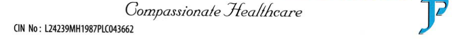
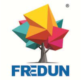
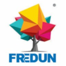
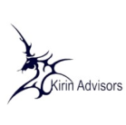
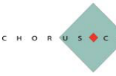
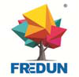

**[Image: 5ba74ad4-311d-4eec-818b-a91fcf837a8e.pdf-0001-00.png (946x46, 7.4KB)]**

**[Image: 5ba74ad4-311d-4eec-818b-a91fcf837a8e.pdf-0001-01.png (946x46, 75.9KB)]**

**[Image: 5ba74ad4-311d-4eec-818b-a91fcf837a8e.pdf-0001-02.png (949x93, 32.0KB)]**

**Date: 06****th** **August, 2025** 

To 

## **BSE Limited** 

Listing Department, Phiroze Jeejeebhoy Towers, Dalal Street ‐ Fort, Mumbai — 400 001. 

## **Ref.: BSE Scrip Code ‐ 539730** 

**<u>Subject: Transcript of the Earnings Conference call held on 1</u>****<u>st</u>** **<u>August 2025 for Q1 FY26 Results</u>** 

Dear Sir / Madam, 

In addition to our earlier intimation dated 1st August, 2025 regarding audio recording of the Investors ‘Conference Call and pursuant to Regulation 30 of the SEBI (Listing Obligations and Disclosure Requirements) Regulations, 2015, we are enclosing herewith the transcript of Investors’ Conference Call held on **Friday, 01****st** **August 2025 at 11:00 a.m. for Q1 FY26** Results. The transcript is also available on Company’s website at 

**<u>The transcript is also available on Company’s website at:</u>** 

|**Link**|http://www.fredungroup.com/investor-investor-|
|---|---|
||meet.html#investor|

You are requested to kindly take note of the same. 

**Thanking you,** 

## **For Fredun Pharmaceuticals Limited** 

Digitally signed by FREDUN FREDUN NARIMAN MEDHORA DN: c=IN, o=Personal, postalCode=400014, st=Maharashtra, NARIMAN serialNumber=F06F6F733147D04D5 C3AB31DBBCC8289F5146D25F7EBC 171F6E5FF3E749D8E80, MEDHORA cn=FREDUN NARIMAN MEDHORA Date: 2025.08.06 18:03:39 +05'30' **Fredun Medhora Managing Director DIN: 01745348** 

**[Image: 5ba74ad4-311d-4eec-818b-a91fcf837a8e.pdf-0001-17.png (940x37, 0.6KB)]**

**[Image: 5ba74ad4-311d-4eec-818b-a91fcf837a8e.pdf-0001-18.png (940x38, 1.3KB)]**

**[Image: 5ba74ad4-311d-4eec-818b-a91fcf837a8e.pdf-0001-19.png (940x37, 10.4KB)]**

**[Image: 5ba74ad4-311d-4eec-818b-a91fcf837a8e.pdf-0001-20.png (940x38, 26.4KB)]**

**[Image: 5ba74ad4-311d-4eec-818b-a91fcf837a8e.pdf-0001-21.png (940x73, 37.3KB)]**

**[Image: 5ba74ad4-311d-4eec-818b-a91fcf837a8e.pdf-0002-00.png (159x157, 31.5KB)]**

# “Fredun Pharmaceuticals Limited” 

Q1 FY '26 Results Conference Call 

August 01, 2025 

**[Image: 5ba74ad4-311d-4eec-818b-a91fcf837a8e.pdf-0002-04.png (132x132, 25.6KB)]**

**[Image: 5ba74ad4-311d-4eec-818b-a91fcf837a8e.pdf-0002-05.png (139x138, 10.0KB)]**

**[Image: 5ba74ad4-311d-4eec-818b-a91fcf837a8e.pdf-0002-06.png (163x107, 11.2KB)]**

**MANAGEMENT: MR. FREDUN MEDHORA – MANAGING DIRECTOR AND CHIEF FINANCIAL OFFICER -- FREDUN PHARMACEUTICALS LIMITED RAKESH – FREDUN PHARMACEUTICALS LIMITED GAJANAN NIMBHORKAR -- ACCOUNTS AND FINANCE DEPUTY HEAD -- FREDUN PHARMACEUTICALS** 

**MODERATOR: MS. CHANDNI CHANDE -- KIRIN ADVISORS** 

_Fredun Pharmaceuticals Limited August 01, 2025_ 

**[Image: 5ba74ad4-311d-4eec-818b-a91fcf837a8e.pdf-0003-01.png (100x98, 14.8KB)]**

### **Moderator:** 

Ladies and gentlemen, good day, and welcome to Q1 FY '26 Results Conference Call of Fredun Pharmaceuticals Limited, hosted by Kirin Advisors Private Limited. As a reminder, all participant lines will be in the listen-only mode, and there will be an opportunity for you to ask questions after the presentation concludes. Should you need assistance during the conference call, please signal an operator by pressing star then zero on your touchtone phone. Please note that this conference is being recorded. 

I now hand the conference over to Ms. Chandni from Kirin Advisors. Thank you, and over to you, ma'am. 

### **Chandni Chande:** 

### **Management:** 

Thank you. On behalf of Kirin Advisors, I welcome you all to the conference call of Fredun Pharmaceuticals Limited. From management team, we have Mr. Fredun, Mr. Rakesh, Mr. Gajanan and Mr. [Khanjan 0:48:50]. Now I hand over the call to Mr. Khanjan. Over to you, sir. 

Thank you, Chandni. Good morning, everyone. Thank you all for joining. I'm happy to welcome you to the Fredun Pharmaceuticals Limited Q1 FY '26 Earnings Conference Call. Let me start by briefly introducing our company. 

Fredun Pharmaceuticals Limited is a diversified pharmaceutical company with a strong presence across India and 52 international markets. Over the years, we have transited from an OEM manufacturer into a holistic healthcare company with offering across branded generics, nutraceuticals, cosmeceuticals, animal healthcare, and mobility aids. 

Today we have over 1,200 products under registration domestically and internationally and 697 products already registered. We operate with a manufacturing base in Palghar, supported by a contract manufacturing at 37 additional locations across India. We have built a large and scalable product portfolio and are continuing to expand across the key therapies such as antidiabetics, antiinfectives and cardiac care with a growing footprint across Africa, Southeast Asia, CIS countries, and Latin America. 

Fredun is the only player in India to have a patent of bone graft. The first quarter of FY '26 has been a strong one for us, a reflection of our consistent focus on execution and our shift towards higher-margin verticals and pet healthcare. 

Key financial highlights for Q1 FY '26. Our revenue grew by 52% year-on-year to INR1,19.86 crores. EBITDA grew by 62% to INR16.99 crores with a margin expansion to 14.18. [inaudible 0:02:46]. 

Net profit rose by 64% to INR6.77 crores. EPS grew by over 63% year-on-year, reaching INR14.33. In terms of business momentum, our order book currently stands at over INR200 crores, providing a strong visibility for the upcoming quarters. At an industry level, the environment 

_Fredun Pharmaceuticals Limited August 01, 2025_ 

**[Image: 5ba74ad4-311d-4eec-818b-a91fcf837a8e.pdf-0004-01.png (100x98, 14.8KB)]**

continues to be supportive. The global generics market is expected to grow exponentially in coming years. 

Indian pet care industry is also projected to grow at over 17% CAGR, driven by rising adoption, better awareness, and evolving consumer needs. Fredun is strategically aligned to this higher growth segments. Our new age business; pet care, nutrition, mobility, and wellness are expected to grow at 35% to 40% CAGR, and we are focused on building long-term value in these categories. Our goal is that by FY '29, our entire revenue will be driven by our vintage generics business. By FY '32, we aim for over 51% of our revenue to come specifically from new age business. 

A key focus area for us is building a complete pet care ecosystem. Under our Freossi brand, we offer a full range of products from MCHC-based nutraceuticals, grooming solutions, and functional food to pharmaceuticals and diagnostic services. In Q1, we took a major step by acquiring One Pet Stop, a tech-enabled doorstep grooming platform, which complements our existing offerings and help us serve the urban pet owners more holistically. 

We also launched India's first 24x7 dedicated pet diagnosis center equipped with CBCT imaging and advanced ultrasound, a move that positions us uniquely in the organized pet wellness space. Over the next few quarters, we plan to expand this network across major Indian metros. 

We believe that this integrated approach across human and animal wellness will help Fredun create a sustainable differentiation in the market. We have made a good start to FY '26 financially, operationally, and strategically. We remain focused on scaling our branded portfolio, deepening our presence in India and the key global markets and building strong verticals in pet care, nutrition, and wellness. Thank you once again for being with us today. We look forward to your questions. Thank you. 

### **Moderator:** 

**Management:** 

**Moderator:** 

### **Surabhi:** 

**Management:** 

Should we begin with the question and answer session now? 

Yes, sure. 

The first question is from the line of Surabhi from NV Alpha. 

So I want to understand more on your generics business. Firstly, the split between domestic and export and also which therapies you're more focused on in the branded generics space? And the other thing, if you could give a split on of your total revenue pie, what comes from branded generics and what comes from pet care, nutraceutical, and other segments as well? 

So I'll answer your first question. You guys can hear me, right? 

Yes. 

**Moderator:** 

_Fredun Pharmaceuticals Limited August 01, 2025_ 

**[Image: 5ba74ad4-311d-4eec-818b-a91fcf837a8e.pdf-0005-01.png (100x98, 14.8KB)]**

**Management:** 

I'll answer your first question. The generics division was started in order to offset the OEM manufacturing because we have a very clear target that by Jan 2029, every single product that comes out of our ecosystem should be Fredun branded. Having said that in mind, all our products that we have raised in generics in India have to be launched in phases and together. Generics cannot be in quanta. We have to have a basket of at least 350 products across 15 to 20 therapeutic segments together. 

Right now, in terms of the distribution, about 25% to 27% of our entire sales is exports and the remaining is in India through third-party distribution and local sales. We tend to add -- we are in process of adding more therapeutic ranges and to create a basket of around 500-plus products and envisioning the GX business to cross around INR250 crores to INR300 crores in the next 8 to 12 quarters. 

### **Surabhi:** 

**Management:** 

**Surabhi:** 

**Management:** 

**Surabhi:** 

**Management:** 

Just a small follow-up on that. The entire generics business is branded generics, correct? There is -- or is there OEM manufacturing here as well? 

No, no, no. It's all under our brand. It's all under our brand. 

So out of the INR450 crores… 

Yes, most -- every product is branded generics, only generic-generic generally technically does not exist. But I get your question. Yes, it is under our Fredun brand only. 

And out of the INR450 crores in FY '25, around INR250 crores to INR300 crores would be from branded generics and then would be the other segment? 

Yes. So for us, we don't break up in that sense. How we break it up is new age business and old age business. So around INR350 crores is our vintage business. The remaining INR100 crores, INR110 crores comes from our new age business. 

In the new age business, we have started this generic line. The remaining products also. So Fredun Gx is a brand. It is not generic division. So the Fredun Gx does around -- did around INR55 crores to INR60 crores of business last year. 

So that we are planning to take it to around INR85 crores this year and then about INR150 crores the year later. So in terms of a long-term target, we are looking at around INR250 crores to INR300 crores of revenue within the next 12 to -- around 12 quarters from the Gx line, from the Fredun Gx brand. The remaining products are also, some are exported, some are sold locally, some are through different distribution channels. 

That are, of course, all generics because in India, even Sun Pharma and Cipla all only make generics, but they have, what you call, the Fredun brand name, and it does not go under Fredun Gx. Fredun Gx is a specific brand, which we have started about 2.5 years ago in order to penetrate the 

_Fredun Pharmaceuticals Limited August 01, 2025_ 

**[Image: 5ba74ad4-311d-4eec-818b-a91fcf837a8e.pdf-0006-01.png (100x98, 14.8KB)]**

local Tier 2, Tier 3, Tier 4 distribution markets in India and to reduce our dependency on OEM and third-party manufacturing. 

### **Surabhi:** 

So what percentage of our manufacturing is own manufacturing versus what percentage do we outsource? And when you say INR250 crores, INR300 crores of branded that includes the pet care or like pet care comes under the new age… 

**Management:** No, no. That INR350 crores of branded Fredun products are allopathic formulations. About INR30 crores is pet care, about INR16 crores to INR17 crores is nutra, about INR9 crores is cosmetics, and about INR6.5 crores is dermaceutics, about INR18 crores to INR19 crores is around our mobility and the new segments. 

So that is how we are breaking up. So the whole business, we are metamorphizing from a contract manufacturing company with our own brands and exports to actually having our own branded lines in India with different divisions, which we also have a base in our exports market to offset the MOQ and the economies of scale. 

**Surabhi:** And in the export market, I'm guessing it's mainly African like or very semi-regulated areas. **Management:** East Africa, South Africa, Southeast Asia, CIS countries, Latin America. **Surabhi:** So any of these are tender based, out of the 27, is anything on tender? **Management:** Tender-based, no. But in India, about around INR18 crores to INR25 crores annually is institutional sales. This year, we'll do -- end up doing around INR35 crores, INR35 crores to INR40 crores. **Surabhi:** And if I can just squeeze in one more. What is the strategy for the new age, the Gx line? Like I -- because anyway, it would be a brand… **Management:** The strategy for the Gx line is to have -- the strategy for the Gx line is very simple and succinct, to penetrate in Tier 2, Tier 3, Tier 4 cities, to have a product portfolio which is vast and varied, which we can manufacture ourselves where we have control over the pricing. And we -- our unit pricing comes low because we have one of the largest capacity of plants in the country. 

Hopefully, within the next 2 years, we'll have one of the largest plants in the country for a single location. And the 37 locations that we have added recently in the last, say, 1.5 years or 2, those will help us create portfolio of products, which we cannot manufacture under one roof. And those -- that basket in addition to it will give us a good base for penetration within the country. 

### **Moderator:** 

The next question is from the line of Kushal Kasliwal from InVed Research. 

_Fredun Pharmaceuticals Limited August 01, 2025_ 

**[Image: 5ba74ad4-311d-4eec-818b-a91fcf837a8e.pdf-0007-01.png (100x98, 14.8KB)]**

### **Kushal Kasliwal:** 

So Fredun, basically, this is your first con call. I just wanted to understand the business model. The previous participant has already asked the overall split in the business. So just wanted to get a sense on where your focus will be going forward? I mean, pet is something which is pretty hot. 

But do you only plan to focus on pet care business? Or it seems like your new age business, which is the generic line, is also a focus area. So just wanted to get a sense of where is the future growth heading towards? This is my first question. 

### **Management:** 

Yes. So in order to answer your question, I would like to say that for us, we didn't start pet because there was a craze in the market in the last 3, 4 years. Pet has -- we have developed products for pet care years ago, in fact, decades ago because we are a very strong tech-based company. Both the promoters, my parents, were PhD research scientists. So they have developed a lot of products, but I did not feel the time was opportune. 

In the last 4, 5 years, the time was opportune. So we launched those products, and we have got tremendous success. Plus the marketing channels that we have used to penetrate into the Indian market is very different from the others. So therefore, we have got very good traction. Pet care, yes. 

Why? Because we are the only pet care company right now in the country, which has allopathic formulations, nutraceuticals, functional foods, herbals, diagnostics, and medical devices such as bone grafts, all manufactured under the same roof. That gives -- including grooming products. 

So that gives us a very good control over our products, that gives us control over our quality and allows us to do further R&D in new age products. Some products which we are launching in the next quarter or in the next 2 quarters, which are in Stage 3 and Stage 4 trials right now, are also very new to the Indian or even the Asian market. 

So we are very strong in what we are doing for pet. Including the diagnostics, our -- we are the only pet diagnostic standalone center in India right now, which runs 24/7 and has a full-time anesthetist. This is in line with our goal for pet care for our company that by 2032 no pet in India can be born or die without using a Freossi product. That is our vision and our goal. And we are -- therefore, we are in all segments. 

Luckily, we could be in all segments because of our manufacturing prowess and capability to manufacture those products in our blocks at our locations. So pet care, yes, definitely is a good vision. Dermaceutics and nutraceuticals is also a very strong vision-driven division for us because we are already exporting specialized nutraceuticals, specialized dermaceutics in our export markets. So we have got good hold over those products. We know what sells. 

We are also doing OEM for many manufacturers, many brands for dermaceutics in India for quite some time. So we know the market. We have known the terrain quite well, and it allows us easy 

_Fredun Pharmaceuticals Limited August 01, 2025_ 

**[Image: 5ba74ad4-311d-4eec-818b-a91fcf837a8e.pdf-0008-01.png (100x98, 14.8KB)]**

foray into this demographic. So nutrition, dermaceutics, and pet care is our goal. Fredun Mobility has done phenomenally well. 

In fact, from October 2023 to this year, this year, we'll end up doing around INR35 crores of branded mobility products like [inaudible 0:18:44], they are doing. So they all at one level go handin-hand. For many, the distribution channels are also the same. So it becomes easy for us to market them also. So the new age business per se will be our focus. 

And the reason why it is our focus is because the vintage business is going to grow around 15% to 20% year-on-year for the next 7 to 9 years. The reason being we have another 1,290 registrations in the pipeline. Those 1,290 registrations will have fruition within the next 3 to 4 years. Even if 10% of those registrations yield continuous orders and even 10% of those yield bumper orders, we are still set for an easy growth of around 15% year-on-year. So the runway for what we used to do is set for the 9 year -- next 7 to 9 years. 

Therefore, we can focus on our new age business and create brands which we have already got traction for. 

### **Kushal Kasliwal:** 

I think -- thanks for the detailed answer. So I think you have already kind of given a guidance or aspiration where we want to head in terms of our new age business. Within new age, we -- you already told that Fredun Gx is doing roughly INR50 crores, INR60 crores this year. Next year is INR85 crores. Next to that is roughly INR150 crores is what we are targeting. 

On an overall business level, could you give like an aspirational guidance or maybe a realistic guidance for the next maybe 2, 3 years in terms of top line margins? Can you just help us there? 

### **Management:** 

What I can tell you is our target for the next 3 years is to -- 3 to 4 years is to double our revenue and to double our PAT from where we are right now. So we are looking at somewhere around INR800 crore plus top line with a INR90-plus crore PAT kind of thing after a few years. And we are -- in process, we are also going to start eliminating low-margin products, which don't yield results and keep on creating efficiencies, cost efficiencies by increasing our capability in order to manufacture. In the next -- as I said earlier, in the next 18 to 24 months, we should be one of the largest plants in the country for a single location, and we are on route to that. We are almost there. 

So as a vision, top line is the target. Bottom line is growing consistently. And considering all our guidances which we have given since 2017, touch wood, we have achieved them, some have been overachieved, and we hope to do the same in the coming years. 

### **Kushal Kasliwal:** 

I just missed your last point. You're saying INR800 crore top line, INR90 crore PAT in the next 3, 4 years. Is what you're saying? 

Yes. So we are looking at -- yes, that is our target. 

**Management:** 

_Fredun Pharmaceuticals Limited August 01, 2025_ 

**[Image: 5ba74ad4-311d-4eec-818b-a91fcf837a8e.pdf-0009-01.png (100x98, 14.8KB)]**

**Kushal Kasliwal:** INR90 crores PAT you are saying, this is almost 3x. Got it. **Management:** Because we are looking at a 10% to 11% PAT kind of scenario. 

**Kushal Kasliwal:** So you are expecting a slightly higher EBITDA and PAT margin. 

**Management:** The new age business is all higher gross margins of above 50%. So once those start reaching cost efficiencies, profitability will start building in. 

**Moderator:** The next question is from the line of Dixit Doshi from Whitestone Financial Advisors. 

**Dixit Doshi:** So as you have explained in detail about the different division and your vision towards the different division, I just have a couple of questions. Firstly, on -- if you can mention that how much is our inventory and receivables as of June? 

**Management:** So right now, our inventories will be in the base of around INR200-plus crores. And in terms of -- in July, our receivables are around -- in fact, 31st July, our receivables will be under INR100 crores. 

**Dixit Doshi:** So under INR100 crores. So it has -- both has improved a lot from what -- where we were as on 31st March? 

**Management:** Yes. 31st March also, the -- we have to realize that the debtors, those seem higher from the last year from INR77 crores to INR177 crores. We also have to realize that there's a shift in the business model in terms of local sales and generics. At the same time, the last quarter itself was INR165 crores. So the debtors have increased because the sales have increased. 

And inventory levels will remain high for the next 6 to 7 quarters because we have a lot of SKUs running. We have to hold inventories. We have to hold a few months of stock. But the ratios are improving for the last 18 to 19 months. Hopefully, within the next 6 to 7 quarters, our inventory will align at around 125 to 130 days. So that is not a worry for us at all. In fact, we are very confident of where we are heading. So we are very steadfast in our goal. 

**Dixit Doshi:** And in terms of receivable, what kind of days we are looking? 

**Management:** Receivables, see, we have to realize -- I cannot give you an absolute number. What we can say is the receivables will be in the tune of about 120 to 130 days right now because when the new age brands are going into the market, we have to give it time to the market to understand the product and accept it. We have water tight agreements with every single distributor in the country. So all the goods are one-way valve and are on solid -- not even water tight, air tight terms and payment terms. So touch wood, we have no bad debt also. 

_Fredun Pharmaceuticals Limited August 01, 2025_ 

**[Image: 5ba74ad4-311d-4eec-818b-a91fcf837a8e.pdf-0010-01.png (100x98, 14.8KB)]**

So the debtors will be somewhere around 120 to 130 days going forward at any given time within maybe 1.5 years or 2, maybe it might come down to 90 days, 95 days, considering the acceptance of our brands and products and it will improve. But in Indian markets, in the distribution channel market that we have approached, 90 to 120 days credit has to be given. 

### **Dixit Doshi:** 

And our debt equity was almost 1:1 considering the working capital loan. So till what level we are comfortable? And any plan of fundraising we are looking because we have a very high growth plan? 

**Management:** Yes, of course, we will definitely look for some equity around in the coming months. But in terms of what we are doing, we don't have any long-term debt in our books. Most of the debt is working capital, and we have orders for those things. So even if we don't raise any funds in the next month or 2 months or 3 months or 6 months, it's not going to hamper our growth. In fact, we haven't raised any funds and still we have grown about 30% last financial year, including growth of profits. So yes, sometimes necessary will have to be carried on, but that's part of the game. 

### **Dixit Doshi:** 

And just last question. So if you could -- so I missed the earlier part. So how -- what is the difference between the Fredun Gx and the vintage, I mean, is the therapeutics are different or…? 

**Management:** In India, most people -- in India, most people are confused by saying that the company makes generic and this company makes brand. Nobody makes branded, everyone makes a branded generic. For example, an ointment. An ointment by default can never be a generic. No doctor will be able to write in a generic name for an ointment or a cough syrup or some. So many products by default are all branded. 

For us, the differentiation is very simple and clear, crystal clear that the new age business, which includes the Gx line, which we started 2, 2.5 years ago in order to offset the third party and OEM manufacturing, which we do for other brands, where we have a goal that we do not want any product that's coming out of our ecosystem, which is not of a Fredun brand post Jan '29. 

**Dixit Doshi:** So this vintage INR350 crores revenue which we have, this will grow -- or I mean this includes…? 

**Management:** That's what I said. I just said that it will grow around 15% to 18% year-on-year because we have 1,290 registrations in the pipeline. 

**Dixit Doshi:** Okay. And this includes the OEM, I mean, for other brands which we make? 

**Management:** Yes. At one point, we cannot put a hard stop to our associates, which we have associated for more than 30 years. Some are associated more than 20 years. So some lines will grow and we are going to figure out ways of how we can make them happy as well. But those brands right now are going to grow. 

_Fredun Pharmaceuticals Limited August 01, 2025_ 

**[Image: 5ba74ad4-311d-4eec-818b-a91fcf837a8e.pdf-0011-01.png (100x98, 14.8KB)]**

### **Dixit Doshi:** 

And last thing is, you mentioned INR200 crores order book. So if you can explain that this is firm order book. So is it like a vintage? 

**Management:** Yes, we always have -- our order books are always firm. We get orders from all our export markets for a 6-month period. Our local markets, we get orders now for a 6-month period, including our third-party orders. So every order that we have, we don't book that into our system unless it's a confirmed order. 

**Dixit Doshi:** So we can say that other than the new age business, generally, we have 2 quarters' order book? **Management:** 100%. 100%. In fact, we definitely grow. 

**Moderator:** The next question is from the line of Mr. Souresh Pal from KRSP Capital. 

**Souresh Pal:** Sir, I would like to know about our -- for the last 3, 4 years, if I look at the balance sheet of the company, the cash flow from operations has been negative consistently. On the other hand, debt has been increased consistently. So any thoughts on improving our balance sheet? 

**Management:** Yes, that is -- this answer is in line with what I just explained to the previous gentleman that once the inventories line-up days reduces and the debtors reduce, the cash flows will start getting positive shortly. So we have to wait and buckle up. It's a necessary evil that we have to endure in order to create brands in the country, which lasts for a prolonged period of time. 

**Souresh Pal:** So in the history of the company, has there been any bad receivables or something like that? 

**Management:** No. With the grace of God, for 31 years of operation and we are existing for almost 37 years, there has been no bad debt. 

**Souresh Pal:** And sir, what is the revenue growth guidance and PAT growth guidance going ahead? 

**Management:** Sorry, can you repeat the question, please? 

**Souresh Pal:** Yes. What is the revenue growth guidance in coming years and… 

**Management:** That's what I'm saying. We are looking at around 15% to 20% growth overall year-on-year. And our PAT will also substantially grow. So, the reason for the increase in PAT even last quarter or from the first quarter of this financial year has nothing to do with what we are doing now. It is our prolonged, continuous effort for the last many years. 

The results and the numbers that we are seeing in FY '26 is for the work that we have done in FY '21 or FY '22 or FY '20. What we are doing now, you will see the results in FY '30, FY '31 because we plan about 3.5 to 4 years ahead right now because we are -- we have orders in hand, we have the foresight and we have the products in place and the F&D team and the marketing team in place. 

_Fredun Pharmaceuticals Limited August 01, 2025_ 

**[Image: 5ba74ad4-311d-4eec-818b-a91fcf837a8e.pdf-0012-01.png (100x98, 14.8KB)]**

We are lucky enough to plan for about 3.5 to 4 years ahead because the current foreseeable future, we are already sorted. So we are looking at a sizable growth in terms of our profit margins coming in from a new age business because they are higher gross products. At the same time, we are increasing our own branded products and reducing dependence on OEM. So margins will increase. We will substantially grow and, hopefully, we will achieve what we intend to do. 

**Souresh Pal:** 

And sir, when are we planning for fund raise? 

**Moderator:** Sorry to interrupt, Mr. Souresh, but we request you to limit… 

**Souresh Pal:** Yes, that is the last question. That is the last question. 

**Management:** Yes. We are definitely planning. We will definitely understand our requirements and hopefully have a raise soon. 

**Moderator: Aditya:** 

The next question is from the line of Aditya from Ajarvika Capital. 

Sir, my first question is on our pet health care segment, One Pet Stop's indicative synergies. So with the acquisition for controlling stake in One Pet Stop and what is the plan with this acquisition? And what specific synergies are you targeting? And how will this acquisition…? 

**Management:** So One Pet Stop was an MMRDA-centric company where they used to do grouping for clients across the MMRDA. MMRDA region is a region in near Mumbai. If you're from Mumbai, you would know. So they had 4,000 customers for grooming, along with the grooming vans and equipments and everything. So we have taken over that because that gives us direct access to all the 4,000 pet owners and pet parents across the MMRDA region. 

And that allows us to cross-sell our products with those ready customer bases on a month-to-month basis on a personal basis because when there is a grooming happening, generally, the pet parent is the one who is continuously in touch with the grooming parlor. So the customers have a hands-on approach and the customers are known by name. So it's a very low-hanging fruit and allows us instant penetration into the market to cross-sell our products. So it was a strategic move in order to foray deeper into the MMRDA region in Mumbai itself. 

**Aditya:** And sir, what is the revenue model? Like is it a subscription based, something like that or is it one time? 

**Management:** No, there will be -- yes, yes. Right now, for the first 2 quarters, the company itself will not have any in terms of revenue as we are aligning ourselves and cross-selling our pet care products through the customer base of One Pet Stop. Then that will slowly add our other functional food products, that is our OTC products for pet care, and that will be sold via that. So the revenues will start coming in shortly. 

_Fredun Pharmaceuticals Limited August 01, 2025_ 

**[Image: 5ba74ad4-311d-4eec-818b-a91fcf837a8e.pdf-0013-01.png (100x98, 14.8KB)]**

**Aditya:** And sir, my next question is product variation pipeline side. So sir, on your last press release, you have mentioned that 

### **Moderator:** 

Mr. Aditya, sorry to interrupt, but we request you to rejoin the queue for follow-up questions as there are many participants left. The next question is from the line of Dixit Doshi from Whitestone Financial Advisors. 

**Dixit Doshi:** So you mentioned that One Pet Shop already have 4,000 customers. So what is their current revenue, annual revenue, and profitability? 

### **Management:** 

So they were doing only grooming right now, right? They were only doing grooming. So they were not selling any products to the customers. So their revenues will be very miniscule because they were only doing grooming jobs. For us, the revenue was immaterial. 

For us, it was the access to 4,000 paying customers across the diaspora of MMRDA, who are also pet parents. So by default, they will be using all the products that we are currently making. So the revenue of One Pet Stop was immaterial to us when we took the decision. 

### **Dixit Doshi:** 

And this diagnostic center business, so we only have one center now, and we are planning to expand it to multiple large cities. So if you can broadly explain the per center capex or revenue model? 

**Management:** 

No. So we are not going to do any franchises. The one center right now has a potential to do around INR15 crores annually in terms of revenue with a 20% to 25% net. That is the easy numbers that we can target. So we just started this -- you can say we started in February, full-fledged operations and everything were started in, say, this quarter. 

Within the next 18 months, we will hit the run rate to achieve INR15 crores annually per center. By end of this year, we are planning one more center in north of Mumbai. That will cover Mumbai for us. We have 4 24/7 ambulances stationed across Mumbai to get the pet from any place in Mumbai to our center within 35 to 40 minutes. We are also having a full-time anesthetist at our center, which even human centers don't have because for a CT and a CBCT and those kind of tests, the pet has to be what you call anesthetized. 

And so we have that facility also. We have a blood collection facility also. And for us, we are not using any additional bandwidth to sell those products. My Freossi team is already going to all the doctors anyways for our products, and we are getting substantial prescribed sales. All my team has to do is saying that a lot of pet centers have come, we have also got a pet center now. So without using additional bandwidth of our marketing team and work team, it adds and works in our favor and has a natural synergy. 

And how much capex does this center require, initial setup? 

**Dixit Doshi:** 

_Fredun Pharmaceuticals Limited August 01, 2025_ 

**[Image: 5ba74ad4-311d-4eec-818b-a91fcf837a8e.pdf-0014-01.png (100x98, 14.8KB)]**

**Management:** Sorry, the capex? 

**Dixit Doshi:** Yes. **Management:** Capex will be depending upon what machines you get, but it will be somewhere around INR8 crores. **Dixit Doshi:** INR8 crores per center. Okay. **Management:** Yes. INR6 crores to INR8 crores. **Moderator:** The next question is from the line of Somil Shah from Paras Investment. **Somil Shah:** I joined in a bit late, so I don't know if this question was answered. What is the reason for high debtor days? I mean if I look at last 3 years, the debtor days are constantly going up. **Management:** Again, I had answered that question earlier. I'll reiterate. The debtor in absolute numbers have gone up because the sale has also gone up. And in the last year, the last quarter sale was INR165 crores and the total debtor outstanding was INR177 crores. So it is only the 90 to 110-day debtor, which is a common phenomenon in the Indian market. 

But because the numbers increased from INR77 crores to INR177 crores, people are feeling that there is a INR100 crores rise. As on 31st of July, the debtors are less than INR80 crores to INR90 crores, again, because we have got all our receivables. Again, when we do our sales, again, the debtors will go up. So this cycle will continue. 

But overall, within the next 6 to 8 quarters, the debtors will stabilize at around 125 to 127 days after the new age brands start kicking in, in terms of cost efficiency and repeat orders on continuous levels across the existing markets and new markets as well. In India, we will definitely try to get it from 120 to maybe about 100 days. But below that, it will be difficult and the business model is such that it requires 90 to 110 days of debtors. 

### **Somil Shah:** 

And sir, my final question, sir, if I look at the EBITDA margins also 

### **Moderator:** 

Sorry to interrupt, Mr. Shah, but we request you to rejoin the queue for the follow-up questions. We're just taking one question per participant. The next question is from the line of Krisha from Molecule Ventures. 

### **Krisha:** 

Sir, I only have one question related to our business. So in FY '25, we clocked a top line of INR456 crores. Now I have 2 sub-questions. One is how much of INR456 crores was contributed by our vintage business and how much was contributed by the new age business? And another subquestion is, if you can just throw some light on, because I'm also new to the company, what exactly 

_Fredun Pharmaceuticals Limited August 01, 2025_ 

**[Image: 5ba74ad4-311d-4eec-818b-a91fcf837a8e.pdf-0015-01.png (100x98, 14.8KB)]**

is included in the vintage business and which segments are included in new age. So if you can give us this breakup, it would be helpful. 

**Management:** Yes, I've already answered that question a couple of times, but I'll reiterate it. Around INR350 crores to INR360 crores in terms of vintage business. Vintage business is what we are -- includes all our export business, which is our own brands and everything and also the third-party OEM manufacturing, also the loan licensing parties, also the distribution of our own brands, which we are doing for the last 7, 8, 10 years in India in terms of various product categories and different therapeutic classes. The new age business constitutes for the rest of the, what you call, the revenue. I hope that answers your question. 

**Krisha:** Sir, in new age business, apart from Fredun Gx, what else is included? **Management:** That's everything, Fredun Nutrition, Freossi, Fredun Mobility, Fredun Gx, Beauty Fred and Bird and Beauty. 

**Krisha:** Okay. Understood. And in vintage, what percentage is contributed by contract manufacturing that you…? **Moderator:** Sorry to interrupt, Ms. Krisha, can you please rejoin the queue for the follow-up question? **Krisha:** This is just a related question, ma'am. I just want to know the percentage contribution of contract manufacturing in the vintage business. **Management:** So the contract manufacturing is broken down into 3 parts. One is loan licensing, one is third-party, and one is distribution of their brands. That will add up to around about INR100 crores or so. **Moderator:** The next question is from the line of Jayshree Bajaj from Trinetra Asset Managers. **Jayshree Bajaj:** Most of my questions have been answered. My question is, recently we have appointed Mr. Anshu Agarwal and Ms. Sonal Desai as the Independent Directors. So could you please elaborate on the specific areas or strategic initiatives where their diverse expertise is expected to be of value to the company's growth trajectory and how 

**Management:** Yes. Both of them have a good background in terms of understanding finance, banking, and certain administrative parts. They also have decent backgrounds in terms of distribution channels and new age businesses. So they are fresh eyes that will come in with a fresh mind that in order to understand and grow the company internally and externally. So they have a quite robust background, plus they are hands-on active and available. Those are independent directors. 

**Moderator:** The next question is from the line of Aditya from Ajarvika Capital. **Aditya:** Sir, actually the product pipeline… 

_Fredun Pharmaceuticals Limited August 01, 2025_ 

**[Image: 5ba74ad4-311d-4eec-818b-a91fcf837a8e.pdf-0016-01.png (100x98, 14.8KB)]**

**Management:** I'm sorry, your voice was a little muffled. Can you please repeat your question? Sorry. 

**Aditya:** So sir, actually, in your last press release, you have mentioned that 1,200 products currently under registered, right? **Management:** Yes, 1,290. Yes. **Aditya:** Yes. So is it all the products is contributing in our revenue? **Management:** Currently contributing in our revenue, you mean? **Aditya:** Yes. Yes, sir. **Management:** No, those 1,290 products, yes, of course. See, when we register a product, it is the molecule that is registered, not the brand. And in some cases, it is the brand. So sometimes it is the same molecule which is registered under multiple brands. Sometimes it is multiple molecules, which is registered. So most of the products, yes, of course, there will be molecules which we are already making because there are a limited group of molecules which are existing in the market. And there are some molecules which are not -- we are not making. So the ratio of what we are making to not making will be always around 20% to 80%. 

So every time we register in a country, there will be about 15% to 20% of molecules which we have not made, which they are specific for the geographies or demographics and 80%, which we are already making, like paracetamol. So paracetamol or tramadol or azithromycin or amoxicillin. So amoxicillin is a staple product. In any country I go, even in any state I enter without an amoxicillin, without azithromycin, without a paracetamol, nobody will take my product basket. 

**Aditya:** And sir, what is the -- I think which product is contributing more…? 

**Moderator:** Sorry to interrupt, Mr. Aditya, we are taking just one question. **Management:** Sorry, sir, can you… 

**Moderator:** As the call was scheduled for 1 hour, that was the last participant for today. I now hand over the conference to Ms. Chandni for closing comments. 

**Chandni Chande:** Thank you, everyone, for joining the conference call of Fredun Pharmaceuticals Limited. If you have any queries, you can write to us at research@kirinadvisors.com. Once again, thank you for joining the conference call. Thank you, team Fredun. 

**Management:** Thank you. I appreciate. Thank you, all. Thank you so much for all your queries. Look forward to answering more in times to come. Thank you. 

_Fredun Pharmaceuticals Limited August 01, 2025_ 

**[Image: 5ba74ad4-311d-4eec-818b-a91fcf837a8e.pdf-0017-01.png (100x98, 14.8KB)]**

**Moderator:** 

On behalf of Kirin Advisors Private Limited, that concludes this conference. Thank you for joining us, and you may now disconnect your lines. 

---

## Extracted Images

| # | File | Dimensions | Size |
|---|------|------------|------|
| 1 | 5ba74ad4-311d-4eec-818b-a91fcf837a8e.pdf-0001-00.png | 946x46 | 7.4KB |
| 2 | 5ba74ad4-311d-4eec-818b-a91fcf837a8e.pdf-0001-01.png | 946x46 | 75.9KB |
| 3 | 5ba74ad4-311d-4eec-818b-a91fcf837a8e.pdf-0001-02.png | 949x93 | 32.0KB |
| 4 | 5ba74ad4-311d-4eec-818b-a91fcf837a8e.pdf-0001-17.png | 940x37 | 0.6KB |
| 5 | 5ba74ad4-311d-4eec-818b-a91fcf837a8e.pdf-0001-18.png | 940x38 | 1.3KB |
| 6 | 5ba74ad4-311d-4eec-818b-a91fcf837a8e.pdf-0001-19.png | 940x37 | 10.4KB |
| 7 | 5ba74ad4-311d-4eec-818b-a91fcf837a8e.pdf-0001-20.png | 940x38 | 26.4KB |
| 8 | 5ba74ad4-311d-4eec-818b-a91fcf837a8e.pdf-0001-21.png | 940x73 | 37.3KB |
| 9 | 5ba74ad4-311d-4eec-818b-a91fcf837a8e.pdf-0002-00.png | 159x157 | 31.5KB |
| 10 | 5ba74ad4-311d-4eec-818b-a91fcf837a8e.pdf-0002-04.png | 132x132 | 25.6KB |
| 11 | 5ba74ad4-311d-4eec-818b-a91fcf837a8e.pdf-0002-05.png | 139x138 | 10.0KB |
| 12 | 5ba74ad4-311d-4eec-818b-a91fcf837a8e.pdf-0002-06.png | 163x107 | 11.2KB |
| 13 | 5ba74ad4-311d-4eec-818b-a91fcf837a8e.pdf-0003-01.png | 100x98 | 14.8KB |
| 14 | 5ba74ad4-311d-4eec-818b-a91fcf837a8e.pdf-0004-01.png | 100x98 | 14.8KB |
| 15 | 5ba74ad4-311d-4eec-818b-a91fcf837a8e.pdf-0005-01.png | 100x98 | 14.8KB |
| 16 | 5ba74ad4-311d-4eec-818b-a91fcf837a8e.pdf-0006-01.png | 100x98 | 14.8KB |
| 17 | 5ba74ad4-311d-4eec-818b-a91fcf837a8e.pdf-0007-01.png | 100x98 | 14.8KB |
| 18 | 5ba74ad4-311d-4eec-818b-a91fcf837a8e.pdf-0008-01.png | 100x98 | 14.8KB |
| 19 | 5ba74ad4-311d-4eec-818b-a91fcf837a8e.pdf-0009-01.png | 100x98 | 14.8KB |
| 20 | 5ba74ad4-311d-4eec-818b-a91fcf837a8e.pdf-0010-01.png | 100x98 | 14.8KB |
| 21 | 5ba74ad4-311d-4eec-818b-a91fcf837a8e.pdf-0011-01.png | 100x98 | 14.8KB |
| 22 | 5ba74ad4-311d-4eec-818b-a91fcf837a8e.pdf-0012-01.png | 100x98 | 14.8KB |
| 23 | 5ba74ad4-311d-4eec-818b-a91fcf837a8e.pdf-0013-01.png | 100x98 | 14.8KB |
| 24 | 5ba74ad4-311d-4eec-818b-a91fcf837a8e.pdf-0014-01.png | 100x98 | 14.8KB |
| 25 | 5ba74ad4-311d-4eec-818b-a91fcf837a8e.pdf-0015-01.png | 100x98 | 14.8KB |
| 26 | 5ba74ad4-311d-4eec-818b-a91fcf837a8e.pdf-0016-01.png | 100x98 | 14.8KB |
| 27 | 5ba74ad4-311d-4eec-818b-a91fcf837a8e.pdf-0017-01.png | 100x98 | 14.8KB |
