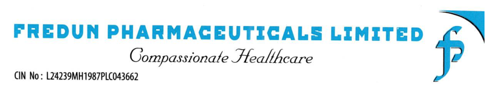

**[Image: e75d19e2-499e-49b5-93eb-cd6b4ceb02d7.pdf-0001-00.png (947x182, 108.8KB)]**

## **Date: 17****th** **February, 2026** 

To 

## **BSE Limited** 

Listing Department, Phiroze Jeejeebhoy Towers, Dalal Street - Fort, Mumbai — 400 001. 

## **Ref.: BSE Scrip Code - 539730** 

## **<u>Subject: Transcript of the Earnings Conference call held on 12th February 2026 for Q3 & 9 Months FY26.</u>** 

Dear Sir / Madam, 

In addition to our earlier intimation dated 12th February, 2026 regarding audio recording of the Investors ‘Conference Call and pursuant to Regulation 30 of the SEBI (Listing Obligations and Disclosure Requirements) Regulations, 2015, we are enclosing herewith the transcript of Investors’ Conference Call held on Thursday, 12th February, 2026, **at 12:00 p.m. for Q3 & 9 Months FY26** results. 

## **The transcript is also available on Company’s website at:** 

**<u>LINK</u>** <u>http://www.fredungroup.com/investor-investormeet.html#investor</u> 

You are requested to kindly take note of the same. 

Thanking you, 

## **FOR FREDUN PHARMACEUTICALS LIMITED** 

FREDUN Digitally signed by FREDUN NARIMAN NARIMAN MEDHORA Date: 2026.02.17 17:27:25 MEDHORA +05'30' 

**FREDUN MEDHORA MANAGING DIRECTOR DIN: 01745348** 

**[Image: e75d19e2-499e-49b5-93eb-cd6b4ceb02d7.pdf-0001-16.png (940x219, 71.8KB)]**

**[Image: e75d19e2-499e-49b5-93eb-cd6b4ceb02d7.pdf-0002-00.png (359x80, 21.6KB)]**

# “ Fredun Pharmaceuticals Limited Q3 & 9M FY'26 Results Conference Call” **February 12, 2026** 

**[Image: e75d19e2-499e-49b5-93eb-cd6b4ceb02d7.pdf-0002-02.png (271x63, 14.4KB)]**

**[Image: e75d19e2-499e-49b5-93eb-cd6b4ceb02d7.pdf-0002-03.png (107x107, 7.6KB)]**

**[Image: e75d19e2-499e-49b5-93eb-cd6b4ceb02d7.pdf-0002-04.png (225x109, 13.5KB)]**

**– MANAGEMENT: MR. FREDUN MEDHORA MANAGING DIRECTOR AND – CHIEF FINANCIAL OFFICER FREDUN PHARMACEUTICALS LIMITED** 

**– MR. RAKESH FREDUN PHARMACEUTICALS LIMITED MR. KHANJAN -- FREDUN PHARMACEUTICALS LIMITED MR. GAJANAN -- FREDUN PHARMACEUTICALS LIMITED** 

**– MODERATOR: MS. SAKHI PANJIYARA KIRIN ADVISORS PRIVATE LIMITED** 

_Fredun Pharmaceuticals Limited February 12, 2026_ 

**[Image: e75d19e2-499e-49b5-93eb-cd6b4ceb02d7.pdf-0003-01.png (232x56, 11.2KB)]**

### **Moderator:** 

Ladies and gentlemen, good day, and welcome to Q3 and 9 Months FY '26 Results Conference Call of Fredun Pharmaceuticals Limited, hosted by Kirin Advisors Private Limited. As a reminder, all participants' lines will be in listen-only mode and there will be an opportunity for you to ask questions after the presentation concludes. Should you need assistance during this conference call, please signal an operator by pressing star then zero on your touch-tone phone. Please note that this conference is being recorded. 

I now hand over the call to Ms. Sakhi Panjiyara from Kirin Advisors Private Limited. Thank you, and over to you, ma'am. 

### **Sakhi Panjiyara:** 

Good day, everyone. On behalf of Kirin Advisors, I welcome you all to the Q3 and 9 Months FY '26 Earnings Conference Call of Fredun Pharmaceuticals Limited. 

We have today with us Mr. Fredun Medhora, Managing Director of the company, along with members of the management team, [Mr. Rakesh, Mr. Gajanan, Mr. Khanjan 0:00:56]. Before handing over the call to Fredun sir to address your questions, let me briefly walk you through the company's performance for the quarter and 9 months ended FY '26. 

During the Q3 FY '26, total income stood at INR160.92 crores, registering a strong growth of 57% year-on-year. EBITDA came in at INR26.34 crores, reflecting a robust growth of 99% year-on-year. EBITDA margin improved to 16%, expanded by 384 basis points. Net profit for the quarter stood at INR10.48 crores, nearly doubling with a growth of 96% year-on-year. Net profit margin improved to 7%, while EPS stood at INR22.19. 

For the 9-month period, total income reached INR426 crores, marking a 48% year-on-year growth. EBITDA stood at INR65.66 crores, up by 74% year-on-year, while EBITDA margin improving to 15%, an expansion of 237 basis points. 

Net profit increased to INR26.98 crores, delivering a strong 96% growth year-on-year. Net profit margin improved to 6% and EPS stood at INR57.13. Overall, the company has demonstrated strong revenue growth along with meaningful margin expansion and improved profitability during both the quarter and 9 months period. 

With that brief overview, I would now like to hand over to Fredun sir for taking your questions. We can now open the floor for Q&A. 

### **Moderator:** 

The first question is from the line of Abhi Jain from AJ Capital. 

### **Abhi Jain:** 

I had a two-part question. The first part of that question was that given the growth that you're seeing and obviously, it is higher than what you had anticipated, do you see any immediate requirements of funds? Obviously, you have done a QIP and raised some funds. But -- and you said that the working 

_Fredun Pharmaceuticals Limited February 12, 2026_ 

**[Image: e75d19e2-499e-49b5-93eb-cd6b4ceb02d7.pdf-0004-01.png (232x56, 11.2KB)]**

capital cycle improvement will take some time. So I'm sure that cash generation might be chock-ablock for the short term. But in the next 12 to 18 months, do you think that the funds at hand are sufficient for the kind of growth that Fredun Pharma is seeing? Or do you think that there will be another round of fund rise that would be required? 

### **Fredun Medhora:** 

Okay. That's both part of your questions? 

### **Abhi Jain:** 

Yes, sorry. And the second part is that given the growth that you're seeing and obviously, the newer parts of the business, the nutri and the pet care must be contributing handsomely to the growth, I think that the next 2 to 3 years, obviously, the kind of guidance that you have given seems to be a bit conservative. So can you just throw some light on that also? That's it. 

### **Fredun Medhora:** 

Sure. So addressing your first question, we are expanding quite rapidly. We are right now also increasing our production capacities at our current plants, and we have also added new partner facilities where we ourselves manufacture across various locations. So we have around 37 of those. 

Currently, the way we are anticipating that the new brands which we have launched in the last 2, 3 years are suddenly taking a lot of traction. The growth that you have seen is because many of our products across various brands that we have launched in various segments that we have launched have picked up quite well and are doing very well in the pockets that we have launched them. 

So yes, we do not envision any sudden need of funds in the next 12 to 18 months. Business is dynamic. We are growing. If there are a need of funds maybe after 18 months or 24 months or 30 months, we might look into it. If we have to raise funds for a different division or something, we might. There is nothing on the table right now, and there is no immediate need for any funds for that. The second part of your question was -- if you can... 

### **Abhi Jain:** 

Yes. I just wanted to understand that given the growth that we are seeing in the company and obviously… 

### **Fredun Medhora:** 

Conservative numbers. If you have seen my BSE guidances from 2016 onwards, every single guidance has been conservative because I do not believe in just giving a number and then if I overachieve that number, I'm comfortable. I don't want to be ever in a position where I'm underachieving a number. And we have to take into factor market situations. 

We have to take into factor so many of the situations that arise on a day-to-day basis. It's better to be conservative. Our conservative numbers are also robust growth. Our investors, our partners, the people who believe in us need to be in sync with the journey and that is what I want. 

If we overachieve, yes, we might have a better guidance maybe next year or the year later. We are on track to achieving our guidances. We have taken buffers for any unforeseen circumstances that 

_Fredun Pharmaceuticals Limited February 12, 2026_ 

**[Image: e75d19e2-499e-49b5-93eb-cd6b4ceb02d7.pdf-0005-01.png (232x56, 11.2KB)]**

may arise. But currently, the trajectory on which multiple of our divisions are going, I think we are quite comfortable in overachieving those. 

**Moderator:** The next question is from the line of Pritesh from Lucky. **Pritesh:** So just one question. In the 9 months, what is the growth in the legacy business and the size of the legacy business and what is the size of the new-age business? If you could just give that split for the 9 months? **Fredun Medhora:** Yes. So I have explained this in previous things. I'll again say. The legacy business is expected to grow at somewhere around 12% to 18% year-on-year. **Pritesh:** Sir, I was asking your performance in the 9 months, what it has done? **Fredun Medhora:** Yes, yes. I will address that. We expect to grow at around 12% to 18% year-on-year for the next 5 to 6 years based on our registration. So last year, our exports, our direct exports were about INR118 crores to INR120 crores. Our institutional sales was around INR40 crores. Our third-party business and our tolling business constituted for about INR100 crores. So on that basis, this year, we will -- on the 9-month basis, proactively, we have grown at around 15% to 20% on that. **Pritesh:** Okay. Can you then tell us what is the size of the... **Fredun Medhora:** I'll answer that question. Yes, yes. So I just told you. So the institutional sales, the export business and the third-party business on last year on that, about INR110 crores, INR45 crores and INR90 crores will grow at around 15% to 18%, which has grown. So that number will be somewhere around close to that same number as well, plus or minus INR1 crore or INR2 crores. **Pritesh:** And how much is the size of the new business in the 9 months? How much portion of your revenue is now new business? **Fredun Medhora:** So the remaining portion of that business is the new-age business. So this year, we have pegged -- this year at year-end closing, we are pegged to do somewhere around INR60 crores of our Gx business, around INR42 crores of our pet care business, around INR26 crores of our nutritional business. And that gives us a head -- runway to reach around INR600 crores and we are comfortable -- and around INR550 crores, INR570 crores to INR580 crores, and we will easily achieve those numbers. So the remaining part is the new-age business, which includes mobility, which includes dermaceutics, which includes cosmetics. **Pritesh:** And can you update us on the biscuits line, the pet biscuits line, what -- has it started and what revenue run rate it is? 

_Fredun Pharmaceuticals Limited February 12, 2026_ 

**[Image: e75d19e2-499e-49b5-93eb-cd6b4ceb02d7.pdf-0006-01.png (232x56, 11.2KB)]**

**Fredun Medhora:** The pet biscuits line is doing phenomenally well. The revenues and numbers right now, we are adding more and more divisions right now and products. We started production in the second quarter of -- actually third quarter of this year, so this quarter. So the numbers you will start showing in from this quarter and the next quarter onwards. **Pritesh:** Okay. Start showing from next quarter. **Fredun Medhora:** No, the numbers will start showing from this quarter. The numbers will start showing from this quarter. **Moderator:** The next question is from the line of Sayandeep from Eureka Stock & Share Broking Services. **Sayandeep:** Congratulations for the good set of numbers. I just have a simple bookkeeping question. We have seen a steep jump in finance cost as well as other expenses. Can you throw some light about that? **Fredun Medhora:** Any growing company and rapidly expanding company has -- always requires working capital. So certain things, plus we had changed our banks also. And we have taken new machinery loans also. So those all add up to the finance cost part of it. This will decline over the next 2 to 3 quarters because our fundraise money has come in this quarter actually, on the third quarter, and we are going to sizably use it for working capital as planned. And also, we will have our own internal cash flows, which are improving, as you can see. So that's -- it's part of growing our company. **Sayandeep:** Okay. Sir, I just want to know about the margin side. We have seen improvement in gross margin over the last 2, 3 years. I just want to know, does this margin level sustainable for next 2 to 3 years? And what is your outlook on key raw material costs over the next 2 to 3 years? **Fredun Medhora:** Yes, as any number grows -- you guys are in the number business, any number grows, the bigger it gets, you cannot sustain the same percentage growth. On a smaller number, you can sustain a percentage growth. On a larger number, it is not possible to sustain a number. It's not technically possible. But because our numbers are small right now, in the foreseeable future, we are okay to see it. There will be a sudden growth in the profits even further in the next 2 to 3 years because of the operational efficiencies coming into our high-margin business, especially dermaceutics, especially our pet care, especially our new line of businesses. So you might, in fact, see a further jump in the profits coming in the next 6 to 7 quarters. And then it might have a gradual growth phase from there. So that's about it. **Moderator:** The next question is from the line of Dixit Doshi from Whitestone Financial Advisors. Sir, the participant has been disconnected. Can we move further? **Fredun Medhora:** Yes, sure. 

_Fredun Pharmaceuticals Limited February 12, 2026_ 

**[Image: e75d19e2-499e-49b5-93eb-cd6b4ceb02d7.pdf-0007-01.png (232x56, 11.2KB)]**

**Moderator:** The next question is from the line of Gaurav Shukla from Fin Investors. 

**Gaurav Shukla:** Congratulations for good set of numbers. Sir, one thing I want to ask that, that deal has happened in India and U.S. and India and EU. What will be the effect of this deal in our company's performance? **Fredun Medhora:** There will be no effect. We don't sell any products to U.S. and neither do we sell any products to Europe, neither do we intend to sell any products to U.S. The companies which are manufacturing in Europe who are planning to sell to India will still be extremely non-competitive into certain of our products that we do. 

So overall, the products don't bother us. We are predominantly focused for the next decade to manufacturing in India for India. So it does not affect our plans. It does not affect our numbers. It doesn't affect our profitability or our sales at all. 

**Gaurav Shukla:** Okay, sir. In last con call, sir, it is written that we have outlined -- you have said that in FY '29, our revenue will be fully driven by vintage generics and in FY '32, 51% will come from U.S. business. That's why I have asked. 

**Fredun Medhora:** It's not U.S. It's new-age business, new age, not U.S. 51% of our business will come from new-age business. New-age business is the brand that we are... 

**Gaurav Shukla:** It's written is U.S. 

**Fredun Medhora:** May be. It might be a mistake. I will get it corrected. It's not U.S., new-age business. **Gaurav Shukla:** In last transcript U.S. is written. So I have asked. **Moderator:** The next question is from the line of Kush from Care PMS. 

**Kush:** I wanted to understand about the seasonality in the business. So generally, March quarter is heavy in terms of revenues where margins are lower versus normal average. So what would be the reason for the same? 

**Fredun Medhora:** See, like all sellers, we are selling to importers, distributors, wholesalers. So like how we have a sale target, they have a purchase target. So if you see our numbers, if you see our business from 1995 onwards, our last quarter is always higher. It's a part of the business that we are in. 

And when you have a higher number, you have to give schemes, you have to give discounts, monthend schemes, year-end closing schemes, each distribution, each retail -- I mean, CNF and all those have targets If you complete this much, you will get this much discount on these products. You will get this much discount on these products. 

_Fredun Pharmaceuticals Limited February 12, 2026_ 

**[Image: e75d19e2-499e-49b5-93eb-cd6b4ceb02d7.pdf-0008-01.png (232x56, 11.2KB)]**

So definitely, people would want to buy more. It allows our products to penetrate further into the market, and it allows our visibility of our products further. The idea of giving our products in bulk and sometimes giving a slight discount also on it allows that our products remain on the shelf and the more our products stay on the shelf, someone else's product is not on that shelf and that allows us further growth as we go. 

As we go into a new-age business, that seasonality will change because we are doing the pet care ethical marketing and also OTC marketing. We are doing cosmetics, OTC marketing and dermaceutics ethical marketing. We are also planning specialized dermaceutics ethical marketing. We are entering into hormones. 

So over the next -- once -- 5 to 6 years, the strong change in the last quarter will decline, I think all quarters will be the same. But the way our business goes, the first quarter is always the weakest, the last quarter is always the strongest. 

### **Kush Gangar:** 

Got it. And margins in last 2, 3 quarters have been improving. What would be the sustainable margin that we see for our current business, say, over the next 1, 2 years? 

### **Fredun Medhora:** 

See, anything over 5%, 6% is a great margin at the rate that we are growing because our top line is growing, our margins are also growing. Margin growth, you will see a sudden increase after a few quarters once the cost efficiencies of the new-age brands start kicking in because they are intrinsically higher gross margin products, 50%, 60%, 70% gross margin products. 

But right now, we are in the placement. In some places, we are in penetration, some places, we are in repeat sales and diversifying our folio. So cost efficiencies, once they start hitting in, it will definitely hit our numbers. So if you see the margins, I would say what we have right now, we should consider it. As I said earlier in the call, I love being conservative. 

### **Kush Gangar:** 

So 5%, 6% you mentioned PAT margin? 

### **Fredun Medhora:** 

Yes, that's about it. 

### **Kush Gangar:** 

And how would the -- how do -- yes, please continue, sir. 

**Fredun Medhora:** Yes, yes. So that will improve over time, as I've explained to you why. 

**Kush Gangar:** Yes, sure. And so continuing on the answer, how do you see the trajectory of new-age business from here onwards, say, by FY '27, '28, how do you see the growth and where do you see the mix? 

### **Fredun Medhora:** 

I've said in multiple calls before, by 2029, 2030, 51% of the business should be from the new-age business. That's what we are targeting. We are growing because they are smaller numbers right now, 20%, 25% growth in each of the divisions year-on-year. Some divisions are growing even faster because they have a smaller base. So we are quite comfortable in what we have. 

_Fredun Pharmaceuticals Limited February 12, 2026_ 

**[Image: e75d19e2-499e-49b5-93eb-cd6b4ceb02d7.pdf-0009-01.png (232x56, 11.2KB)]**

When you are launching a product across multiple states, you cannot directly determine 5% growth and 10% growth and 50% growth because there are a lot of challenges that take place in launching the product. However, we have surmounted those challenges, and we have still achieved a 20%, 25% growth year-on-year on the new brands since we have launched it since 2020. So we are comfortable on that growth path. The vintage business will grow at between 12% to 18%. 

### **Moderator:** 

The next question is from the line of Dixit Doshi from Whitestone Financial Advisors Private Limited. 

### **Dixit Doshi:** 

Sir, my first question is, if you can give as of December, how much is our inventory trade receivable and loan? 

### **Fredun Medhora:** 

Yes. So those numbers are already in our balance sheet and our things which are declared. Inventories are on the same level as the quarter before, absolutely same level. And trade receivables have drastically reduced, but they are again dynamic as we are into local sales. Once it goes to the distributor level, the orders are cyclic. You don't sell -- we are not a D2C company. So when -- in certain months, you will have higher sales, certain months, you will have lower sales. 

In December -- I mean, on 31st March, if we have to consider in Indian market and at least a 90-day credit period, in -- on 31st March, you will see a slightly higher debtor sales. If you see -- in the first quarter, you will see lower debtor sales. Same thing happened last calendar year also. So this financial year also. 

Last year, our inventory, our receivables were INR177 crores, but we received almost INR380 crores of receivables till September 2025. So again, our receivables went down to around INR80 crores, INR85 crores, even after the turnover increasing by 50% to 60%. 

So this is not -- pharma sales is where you have bulk sales -- and you don't have a daily sales in the sense you don't sell everything daily on per day average. It is -- for 10 days, you will have a lot of sales and for 2, 3 days because of the production cycles, because nature of business has the cyclic nature. So -- and quarter -- sometimes production times are 2 months, sometimes they are 2.5 months, sometimes they are 1.5 months. So -- and quarters are sharp 3 months. So numbers will change quarter-on-quarter. 

But a sharp financial analyst will understand the nature of business and seeing the kind of receivables averaged over the last 2, 3 quarters, they will understand that, yes, the receivables are quite robust and the creditor levels are remaining the same and the debtor levels are the same, plus the inventory is identical to what it was last quarter. 

**Dixit Doshi:** 

Okay. So more or less... 

Sorry to interrupt, sir. 

**Moderator:** 

_Fredun Pharmaceuticals Limited February 12, 2026_ 

**[Image: e75d19e2-499e-49b5-93eb-cd6b4ceb02d7.pdf-0010-01.png (232x56, 11.2KB)]**

**Dixit Doshi:** 

No, no, I'm not asking a new question, just reconfirming. So what you are saying that the trade receivables and inventory are more or less at similar level of what it was reported in September. 

### **Fredun Medhora:** 

Yes. 

**Moderator:** The next question is from the line of Lavneesh from BlueOcean Asset Management. 

**Lavneesh:** 

I just have one question and one suggestion. My suggestion is that please as part of your quarterly earnings release, please provide us the breakup of the legacy business and the new-age business. And that's the metric that most investors are actively trying to figure out? 

The second question that I -- the question that I have is the legacy business with your current sort of establishment and cost, what kind of growth can you get in the new-age business? And when do you think sort of the operating leverage will start to play out? 

**Fredun Medhora:** 

Yes. As I said earlier, the vintage business, that's what I want to call it, the legacy business called the vintage business, and that will be growing at around 12% to 18% year-on-year for the next 5 to 7 years. The reason why it will grow at this percent is because we have about 1,300 to 1,400 registrations in the pipeline. 

Those registrations are going to keep on kicking in, and they're going to come on new age -- I mean, in the new-age business, the growth is about 20% to 25%. Operational efficiencies in certain parts, certain divisions, we cannot launch all states at the same time. We have launched Maharashtra. Then after, say, 3 months, 6 months, we launched, say, Karnataka, then we launched Kerala. We can't launch the whole India at the same time. 

Now Maharashtra will start getting operationally leveraged, say, within 9 months. But now we have started Karnataka. So you are again going to be putting in funds and energy into that state. So considering that we are doing this off and on for the last 4.5 years for multiple brands in the next 5 to 6 quarters, you will see a good set of numbers, and that is what I told the other participants as well and a few other -- I mean, the same questions that were asked earlier that, yes, between 5 to 7 quarters, you will see some kind of leverage coming in some kind of brands. 

### **Lavneesh:** 

Sure. So the only request I have is going forward, your quarterly earnings release, please try and give the revenue breakup between vintage and the new-age business. So that's the only suggestion that I have. 

### **Fredun Medhora:** 

It's a good suggestion. We'll keep that in mind. Appreciate it. 

### **Moderator:** 

The next question is from the line of Ishika from Perpetuity Ventures. 

### **Ishika:** 

I just wanted to know as the new-age business scales and takes a larger share of revenue and the mix over the next 2 to 3 years, how should we think about the manufacturing mix, specifically the CMO 

_Fredun Pharmaceuticals Limited February 12, 2026_ 

**[Image: e75d19e2-499e-49b5-93eb-cd6b4ceb02d7.pdf-0011-01.png (232x56, 11.2KB)]**

versus in-house manufacturing? Will the new-age business be more asset-light or will increasingly be manufactured internally? 

### **Fredun Medhora:** 

Yes. Good question. There are certain products. I mean, of course, one plant cannot manufacture every single product. We are into mobility products. We are into pet care, we are into herbal, nutraceutical. We are ourselves into pharmaceuticals. We have 1,700 products, but at the same time, we have other things. So there is a lot of variance in kind of product type. 

Now we in our plants -- in the cluster of 3 plants that we have and the fourth one that we have just started, we are making somewhere close to around 2,000 kind of SKUs. But definitely say, like in our mobility range, we have walkers and we have wheelchairs and we have -- so we're definitely not going to start a wheelchair plant and a walker plant, at least anytime soon. 

So of course, the new things that we are going to start is going to be asset-light. It suits our things also. We don't want to start manufacturing everything we sell. We want to use someone else's cost efficiencies, which have been achieved and use those to penetrate further into the markets that we already have. So say, 4 to 5 years from now, more and more products will be manufactured not directly by us. 

### **Moderator:** 

The next question is from the line of Keshav Toshniwal from Kanakala Capital. 

### **Keshav Toshniwal:** 

Fredun, congratulations for a great set of numbers again. I wanted to understand more with regard to mobility and Beautyfred brand, especially with regard to mobility. Like I see like you visit any chemist shop as there is a pampers section, there is a mobility section, too. 

For a company like us who has always believed into penetration of distribution like at least one product of Fredun should be there in like every chemist shop, how is the mobility going for us? And 3, 4 years down the line, how big you see this mobility brand getting created? Because in mobility - - it's just brand -- is just that product, right? 

### **Fredun Medhora:** 

Yes, yes. So I mean, people -- I'll just explain on the mobility front. People right now relate to mobility as knee brace, leg brace, back brace, right? But it has more than 800 products. We have also launched a moblitic brand, which is our brand -- our ortho brand is called Braceon. Our, say, BP meters, our glucometer is called [DGon 0:34:00] and our nebulizers are called Nebon. 

We have also launched a physiotherapist product-related brand called Mobility, Fredun Mobility, which also comes under the Fredun Mobility umbrella. So we are not only planning, we want and we will ensure that our products are there in most of the retail outlets. 

We are adding almost 30, 40 retail outlets every week in the markets that we are doing right now consistently. The physiotherapy part of it are also being launched in April, where it will go to all the physiotherapists and those products will be specifically tailored for the physiotherapists, which the 

_Fredun Pharmaceuticals Limited February 12, 2026_ 

**[Image: e75d19e2-499e-49b5-93eb-cd6b4ceb02d7.pdf-0012-01.png (232x56, 11.2KB)]**

physiotherapists can further sell to their clients and also utilize themselves. So that will encompass the entire range of the mobility segment in this sector. 

So we are doing quite well. We are doing quite well. And step by step, we are going to launch these products. It is growing almost at 25% to 30% year-on-year. This year, we'll anticipate further growth also. I mean, I'm talking about the coming year because we are adding another 4 to 5 states, and that will kind of complete almost 60% of India. These are volumetric products. 

So we cannot penetrate like a pharma product where you can just put in 10,000, 20,000 packs. This you have to put in 100 chairs. You have to put in 300 chairs. You have to get the market demand for it. You see the products, they will feel it. They will have a tactile understanding of the product. Then they will place further orders because these are volumetric products. 

So penetration for any company in mobiltics is -- in mobility segment is slow. But it is -- for us, we have got such a good response that we are now selling I think one of the highest numbers of wheelchairs in the state. In Maharashtra, at least, we are selling -- practically most of the places in Mumbai have our products, and that will continue to go across states. 

### **Moderator:** 

Sir, the line for the participant has been disconnected. Can we move further? 

### **Fredun Medhora:** 

Yes, sure. 

### **Moderator:** 

The next question is from the line of Pal Balar from Trinetra Asset Managers. 

**Pal Balar:** Congrats on good set of numbers. Sir, I just wanted to ask you like do we see any kind of inventory write-off in the near future? 

### **Fredun Medhora:** 

- Inventory write-off is not possible in the kind -- our write-off of inventory is like INR1,000, INR1,400, INR7,000 like that, sometimes if there is any damage. Big inventory -- generally in pharmaceuticals, the innate inventory of the raw material is around 3 to 5 years. So there is no question of any pertinent write-off at this point in stage or even in the conceivable future. 

### **Moderator:** 

- Ladies and gentlemen, that was the last question from the participant. I now hand over the conference to Ms. Sakhi Panjiyara from Kirin Advisors Private Limited for closing comments. Over to you, ma'am. 

**Sakhi Panjiyara:** Thank you, everyone, for joining the conference call of Fredun Pharmaceuticals Limited. If you have any inquiries, you can write to us at research@kirinadvisors.com. Thank you, everyone. Good day. 

### **Fredun Medhora:** 

Thank you. God bless. Thanks. 

### **Moderator:** 

On behalf of Kirin Advisors Private Limited, that concludes this conference. Thank you for joining us, and you may now disconnect your lines. Thank you. 

---

## Extracted Images

| # | File | Dimensions | Size |
|---|------|------------|------|
| 1 | e75d19e2-499e-49b5-93eb-cd6b4ceb02d7.pdf-0001-00.png | 947x182 | 108.8KB |
| 2 | e75d19e2-499e-49b5-93eb-cd6b4ceb02d7.pdf-0001-16.png | 940x219 | 71.8KB |
| 3 | e75d19e2-499e-49b5-93eb-cd6b4ceb02d7.pdf-0002-00.png | 359x80 | 21.6KB |
| 4 | e75d19e2-499e-49b5-93eb-cd6b4ceb02d7.pdf-0002-02.png | 271x63 | 14.4KB |
| 5 | e75d19e2-499e-49b5-93eb-cd6b4ceb02d7.pdf-0002-03.png | 107x107 | 7.6KB |
| 6 | e75d19e2-499e-49b5-93eb-cd6b4ceb02d7.pdf-0002-04.png | 225x109 | 13.5KB |
| 7 | e75d19e2-499e-49b5-93eb-cd6b4ceb02d7.pdf-0003-01.png | 232x56 | 11.2KB |
| 8 | e75d19e2-499e-49b5-93eb-cd6b4ceb02d7.pdf-0004-01.png | 232x56 | 11.2KB |
| 9 | e75d19e2-499e-49b5-93eb-cd6b4ceb02d7.pdf-0005-01.png | 232x56 | 11.2KB |
| 10 | e75d19e2-499e-49b5-93eb-cd6b4ceb02d7.pdf-0006-01.png | 232x56 | 11.2KB |
| 11 | e75d19e2-499e-49b5-93eb-cd6b4ceb02d7.pdf-0007-01.png | 232x56 | 11.2KB |
| 12 | e75d19e2-499e-49b5-93eb-cd6b4ceb02d7.pdf-0008-01.png | 232x56 | 11.2KB |
| 13 | e75d19e2-499e-49b5-93eb-cd6b4ceb02d7.pdf-0009-01.png | 232x56 | 11.2KB |
| 14 | e75d19e2-499e-49b5-93eb-cd6b4ceb02d7.pdf-0010-01.png | 232x56 | 11.2KB |
| 15 | e75d19e2-499e-49b5-93eb-cd6b4ceb02d7.pdf-0011-01.png | 232x56 | 11.2KB |
| 16 | e75d19e2-499e-49b5-93eb-cd6b4ceb02d7.pdf-0012-01.png | 232x56 | 11.2KB |
