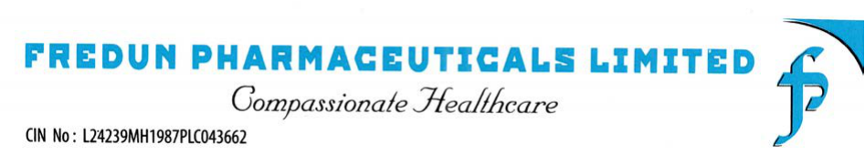
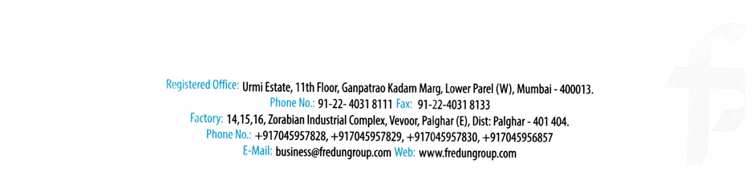
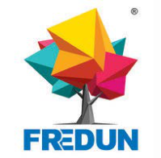
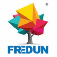
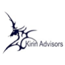
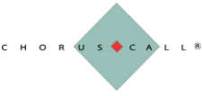
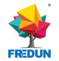

**[Image: 898dddfe-efd2-40f1-af05-6c36b4b87477.pdf-0001-00.png (947x182, 114.8KB)]**

# **Date: 14****th** **November, 2025** 

To 

# **BSE Limited** 

Listing Department, Phiroze Jeejeebhoy Towers, Dalal Street - Fort, Mumbai — 400 001. 

# **Ref.: BSE Scrip Code - 539730** 

**<u>Subject: Transcript of the Earnings Conference call held on 11</u>****th** **<u>November 2025 for Q2 & H1 FY26.</u>** 

Dear Sir / Madam, 

In addition to our earlier intimation dated 06th November, 2025 regarding audio recording of the Investors ‘Conference Call and pursuant to Regulation 30 of the SEBI (Listing Obligations and Disclosure Requirements) Regulations, 2015, we are enclosing herewith the transcript of Investors’ Conference Call held on **Tuesday, 11****th** **November, 2025 at 12:30 p.m. for Q2 & H1 FY26** Results. 

# **<u>The transcript is also available on Company’s website at:</u>** 

**Link** <u>http://www.fredungroup.com/investor-investormeet.html#investor</u> 

You are requested to kindly take note of the same. 

# **Thanking you,** 

# **FOR FREDUN PHARMACEUTICALS LIMITED** 

Digitally signed by FREDUN NARIMAN FREDUN MEDHORA DN: c=IN, o=Personal, postalCode=400014, st=Maharashtra, NARIMAN serialNumber=F06F6F733147D04D5C3AB31DBBCC8289F5146D25F7EBC17 1F6E5FF3E749D8E80, cn=FREDUN MEDHORA NARIMAN MEDHORA Date: 2025.11.14 18:49:42 +05'30' 

**FREDUN MEDHORA MANAGING DIRECTOR DIN: 01745348** 

**[Image: 898dddfe-efd2-40f1-af05-6c36b4b87477.pdf-0001-16.png (940x219, 56.1KB)]**

**[Image: 898dddfe-efd2-40f1-af05-6c36b4b87477.pdf-0002-00.png (199x196, 47.9KB)]**

“Fredun Pharmaceuticals Limited” Q2 & H1 FY'26 Results Conference Call November 11, 2025 

**[Image: 898dddfe-efd2-40f1-af05-6c36b4b87477.pdf-0002-02.png (116x116, 19.0KB)]**

**[Image: 898dddfe-efd2-40f1-af05-6c36b4b87477.pdf-0002-03.png (107x107, 6.7KB)]**

**[Image: 898dddfe-efd2-40f1-af05-6c36b4b87477.pdf-0002-04.png (225x107, 7.4KB)]**

**MANAGEMENT: MR. FREDUN MEDHORA – MANAGING DIRECTOR AND CHIEF FINANCIAL OFFICER -- FREDUN PHARMACEUTICALS LIMITED MR. RAKESH – FREDUN PHARMACEUTICALS LIMITED MR. KHANJAN -- FREDUN PHARMACEUTICALS LIMITED MR. GAJANAN -- FREDUN PHARMACEUTICALS LIMITED MODERATOR: MS. MANALI -- KIRIN ADVISORS** 

**[Image: 898dddfe-efd2-40f1-af05-6c36b4b87477.pdf-0003-00.png (100x103, 16.0KB)]**

### **Moderator:** 

## _Fredun Pharmaceuticals Limited November 11, 2025_ 

Ladies and gentlemen, good day, and welcome to Fredun Pharmaceuticals Limited Q2 and H1 FY '26 Results Conference Call. 

This conference call may contain forward-looking statements about the company, which are based on beliefs, opinions and expectations of the company as on date of this call. These statements are not guarantee of future performance and involve risks and uncertainties that are difficult to predict. 

As a reminder, all participant lines will be in the listen-only mode, and there will be an opportunity for you to ask questions after the presentation concludes. Should you need assistance during the conference call, please signal an operator by pressing star then zero on your touchtone phone. Please note that this conference is being recorded. 

I now hand the conference over to Ms. Manali from Kirin Advisors. Thank you, and over to you. 

### **Manali:** 

### **Khanjan:** 

Thank you. On behalf of Kirin Advisors, I welcome you all to the conference call of Fredun Pharmaceuticals Limited. From the management team, we have Mr. Fredun Medhora, Managing Director and Chief Financial Officer; and we also have Mr. Rakesh, and Mr. Gajanan, Mr. Khanjan from management team. Now I hand over the call to Mr. Khanjan for his opening remarks. Over to you, sir. 

Thank you for Fredun Pharmaceuticals Limited Q2 and H1 FY '26. Earnings Conference Call. The first half of FY26 has been marked by steady growth, operational discipline, and continued progress in strengthening our presence across key markets. We have further reinforced our focus on highmargin businesses and expanded our foothold in the fast-growing pet care segment, which continues to be a major driver of our transformation journey. Let me start by briefly introducing our company. Fredun Pharmaceuticals Limited is a diversified health care company with a strong presence across India and 52 international markets. Over the years, we have transited from an OEM manufacturer into a holistic healthcare company with offering across branded generics, nutraceuticals, cosmeceuticals, animal healthcare, and mobility aids. 

We have over 1,200 products under registration and 697 products already approved globally. Our manufacturing base in Palghar, supported by 37 contract manufacturing sites, enables scalability and flexibility. We have commenced expansion of our state-of-the-art manufacturing facility at Palghar to enhance capacity, improve operational efficiency, and support the growing demand across both domestic and international markets. 

I am sorry sir, but your voice is breaking. 

**Moderator:** 

_Fredun Pharmaceuticals Limited November 11, 2025_ 

**[Image: 898dddfe-efd2-40f1-af05-6c36b4b87477.pdf-0004-01.png (100x103, 16.0KB)]**

### **Khanjan:** 

We have commenced expansion of our state-of-the-art manufacturing facility at Palghar to enhance the capacity, improve operational efficiency and support the growing demand across both domestic and international markets. We also hold India's only patent for bone graft, underscoring our focus on innovation and differentiated health care solutions. 

Q2 FY '26 was another strong quarter. Total income stood at INR145.29 crores, growing by 35% year-on-year, while EBITDA grew by 60% to INR22.34 crores with margin improving to 15.37%. Net profit grew by 128% to INR9.73 crores. 

For H1 FY '26, total income stood at INR265.15 crores, grew by 42%. EBITDA grew by 61% to INR39.33 crores, and PAT grew by 96% to INR16.50 crores. We witnessed the healthy momentum across all our new age verticals with a strong contribution from nutraceutical, pet wellness and health care. Operating cash flows also turned positive, underscoring steady improvement in efficiency and profitability. 

Through the acquisition of One Pet Stop Private Limited, a tech-enabled pet grooming and wellness platform serving over 4,000 recurring pet parents, we entered the organized Pet Care service market. The platform offering at-home grooming service and a digital interface complement our Freossi brand, enabling us to integrate products and services to reach a broader consumer base. 

We also acquired Wagr.ai, a pioneering pet tech platform that introduced GPS tracking, health monitoring and veterinary consultation service in India. With over 140,000 pet parents patented technology, a strong veterinary network, Wagr.ai enhance our vision of building connected technology-led pet wellness ecosystem. 

As a part of our strategy to expand the animal health care vertical, we launched Snacky Jain India's first pure Jain functional food for pets under the Freossi brand. Developed through in-house R&D, Snacky Jain is 100% vegetarian functional pet snack enriched with calcium and essential nutrients to promote bone strength, digestion and immunity with 12 tons already with calcium and essential nutritent to promote bone strength, digestion, and immunity. With 12 tons already sold through preorders, the product is being rolled out across 6 major cities through veterinary clinics, online platforms and retail partners. 

The response reflects India's growing shift towards ethical plant-based and functional pet nutrition. As one of our early movers in India organized Pet Care industry, we continue to build leadership through innovation, integration and consumer trust. Under the Freossi brand, we are developing a holistic ecosystem that connects products, services and technology to address every aspect of pet wellness. 

_Fredun Pharmaceuticals Limited November 11, 2025_ 

**[Image: 898dddfe-efd2-40f1-af05-6c36b4b87477.pdf-0005-01.png (100x103, 16.0KB)]**

The Indian Pet Care industry is witnessing strong growth, and it's projected to reach USD6 billion by 2030, driven by rising adoption, urbanization and growing awareness of preventive health care. This positions Fredun Pharmaceuticals as a key player in this evolving market backed by our expanding Freossi portfolio and technology-driven initiatives. 

Looking ahead, we have outlined a clear strategic roadmap. By FY '29, our revenue will be fully driven by vintage generics and by FY '32, over 51% will come from our U.S. business. Our longterm vision is that by 2032, no pet in India should be born or die without using Freossi products, reflecting our mission to build India's most trusted and comprehensive pet wellness ecosystem. 

We believe the progress achieved in the first half of FY '26 has built a strong foundation for sustainable growth. With continued focus on innovation, operational excellence and disciplined execution, Fredun Pharmaceutical is well positioned to deliver long-term growth. Thank you. 

### **Moderator:** 

### **Fredun Medhora:** 

### **Moderator:** 

### **Pal Balar:** 

### **Fredun Medhora:** 

Team can we go ahead with the question and answer session now? 

Yes sure. 

Our first question comes from the line of Pal Balar from Trinetra Asset Managers. 

Thanks for the opportunity sir. I wanted to ask you about the mix between in-house manufacturing and outsourced production and how this mix influence your cost efficiency? 

Nice question. So, we ourselves make around 1,700 products. We have a portfolio of all 1,700 products. Most of the products we can manufacture at our end. We have a cluster of 3 plants and a unique mix where we have a block for Ayurvedic, we have a block for FSSAI. We have a block for cosmetics. We have a block for allopathic formulations, and we have a separate block for nutraceuticals. So, a lot of our, and also a separate block for veterinary and Pet Care. 

So, in a cluster of 3 plants, we can make a huge number of products. However, considering the product portfolio that we need to add for our future, we have added 37 locations across India in the last 24 months, where we ourselves will manufacture products, which we cannot manufacture in our own facilities due to licensing constraints, due to other MOQs and stuff like that. 

Considering that right now, the outsourced products are hardly about 5% to 7%. And this will increase to about 15% to 20% in the coming years as we ourselves are also increasing the capacity of our manufacturing as I'm sure you must have heard that we have started an expansion. So hopefully, within the next 2 years, we should be one of the largest plants for a single location in the country. 

_Fredun Pharmaceuticals Limited November 11, 2025_ 

**[Image: 898dddfe-efd2-40f1-af05-6c36b4b87477.pdf-0006-01.png (100x103, 16.0KB)]**

So, our in-house capacities are also increasing. But because of the product portfolio, we will be adding more locations where we ourselves are contract manufacturing because apart from Pet Care, we are also doing mobility, we are also doing, We are also doing nutraceuticals, cosmeticals, and dermaceuticals, so many of the products which we cannot make at our end we are manufacturing. So, it would not have a great effect on our margins. 

In fact, the reason why some products we outsource is because we get a better price, because the company is manufacturing more of that particular kind of product. So we get better economies of scale manufacturing it at somewhere else. So overall, it will not have any great ramification. In fact, it might actually improve our margins to understand the right kind of product mix with the right kind of manufacturing. 

### **Pal Balar:** 

### **Fredun Medhora:** 

Thank you for the detailed answer. I wanted to ask you that you have done, recently done the fundraising. So, could you please share how these funds are being allocated across the current and upcoming capex project, and what kind of impact you expect on revenue growth and profitability over the next 2 to 3 years? 

Yes. I mentioned that in my previous calls also, I'll explain again. The funds that is going to be used for new product development, team building, marketing, distribution, we are going to have some capex and we are going to have some reserves. The money that we have raised is going to be used as growth capital to expedite our journey towards 2029, 2030 to have sustainable growth in the new age businesses that we have gained. 

Our idea is to focus more on our new age businesses because the vintage business is going to grow for the next 7 to 9 years at around 15% CAGR because of the registrations and the existing channels in place. So, this will help as a catalyst and give a small impetus and boost to the same. 

And also, it will help us have some reserves and a lot will go towards the working capital as well because launching new products means a lot of SKUs. Those SKUs require working capital that's sustainable in the short term. But in the long run, we have good margins that will help us grow further. 

### **Moderator:** 

### **Krishna Bahirwani:** 

Our next question comes from the line of Krishna Bahirwani, an Individual Investor. 

Fredun, congratulations on the numbers. It's great to see how the business has been playing out over these years. I just wanted to ask about the mobility business, nutraceuticals and cosmeceuticals, how you plan to scale those up? Because I can see Fredun Gx and the Pet Care division pretty clearly. I wanted to get a sense on how you're looking at the other 3 divisions. 

_Fredun Pharmaceuticals Limited November 11, 2025_ 

**[Image: 898dddfe-efd2-40f1-af05-6c36b4b87477.pdf-0007-01.png (100x103, 16.0KB)]**

### **Fredun Medhora:** 

Sure. I'll start with the mobility. So, the Fredun mobility has the same kind of products as Vissco and Tynor, if you know those brands. We started through MMRDA and then we went on to a couple of states. It's doing phenomenally well. We have, in fact, exceeded our sales expectations for most of our SKUs in mobility. There is less competition for good products. And for us, it is the same distribution channel. 

The Gx line, which sells pharmaceutical products and allopathic formula products are the same lines which, because most of the chemist shops, most of the pharmacies, most of the distributors who do allopathic formula also do mobility because it goes side-by-side as a complementary product. 

Because we are already in that line because we have already distribution for us, getting inroads, getting our products added and getting the sales for our mobility products is far easier than a new company who is planning to set up mobility by itself, because they would not have the distribution lines and channels already carved out like we do, into mobility because it has a considerably lower distribution and penetration cost for us as pre-existing in the same channels as for someone else, and we use that to our advantage to, in fact, grow. 

That is why the mobility is growing double digits. We anticipate a 25% to 30% growth year-on-year on the numbers, and there will be a sharp increase once we add more geographies in the latter half of next year. Plus, we have also launched this last month, we launched Mobilitex, which is our physiotherapist targeted product division because a lot of the products, which are specialty products in the mobility range are used by the physiotherapists as well. 

And that is generally a very gray untapped market right now, but a very potential one and a highgrowth one for our country, considering the population, considering the growth in the treatments required and also in terms of the age, we are one of the youngest populations in the country. So, the stickability of certain brands will last for a prolonged period of time, especially in mobility where people would require some of the other products as time goes by in their lives. 

For nutraceutical products, as I've said before, we are one of the only companies to have doubleblinded clinical trials for nutraceutical products as well, which even much bigger companies don't have. We are giving complementary products to the allopathic formulations where the doctors understand the requirements for the same and ensure that such complementary nutraceutical products are part of the lifestyle. 

For example, someone is having cholesterol or someone is having diabetes. Most probably once someone has diabetes, they have diabetes for the rest of their lives. So, they are on some kind of medication in terms of allopathic formulations. And we have especially curated products which go complementary along with those lifestyle products. So, if the nutraceutical becomes chronic, it is 

**[Image: 898dddfe-efd2-40f1-af05-6c36b4b87477.pdf-0008-00.png (100x103, 16.0KB)]**

_Fredun Pharmaceuticals Limited November 11, 2025_ 

well research-based. So, the doctors stand by it. And we have added a few more geographies last year, and we are adding more. 

The way we are growing the nutraceuticals is going city by city and going in those hubs and metros and targeting the consumers there. For cosmeceuticals, cosmeceuticals is divided into 2 ranges. One is Beautyfred, which is a mass market cosmetic and one is dermaceutics under Bird N Beauty. The mass market cosmetics, again, are distribution, good quality cosmetics are not available at a reasonable price. 

We have launched innovative products even in the cosmetic range. For example, our sunscreen SPF 100 is not there in India. And we have launched the first time an SPF 100 in a single-use sachet form. So such small changes, small innovations make us -- have instantly clicked in the market. For example, our wet wipes. We are the cheapest wet wipe in the country in terms of the cost to the distributors and the PTS, we are selling about 350,000, 400,000 pieces only in the MMRDA and the Maharashtra region almost every month. 

So we have got good inroads and we are doing quite well in terms of cosmetics as well. Our reach for Beautyfred will increase in the next 24 to 36 months, but we want to reach the Tier 2, Tier 3 markets before we go to the Tier 1 markets with our mass market cosmetics. 

### **Krishna Bahirwani:** 

I think that clarifies it pretty well. All the best, and I hope to see things only get better and better for you and for the company from here. 

### **Moderator:** 

Our next question comes from the line of Keshav Toshniwal from Kanakala Capital. 

### **Keshav Toshniwal:** 

Firstly, congratulations to the company and you for producing such excellent set of numbers. Company has been growing quarter-on-quarter, year-on-year. So, I've got a couple of questions. First is with respect to the Wagr deal we have recently done, right, if you could elaborate a bit about the founders and how you're going to like scale this? 

### **Fredun Medhora:** 

Yes. Yes, sure. See, we have to understand why the company has taken over this platform in the first place. I want people to reflect that in India right now, there is no neutral space for Pet Care. HUFT and Just Dogs and a couple of other companies are selling most of their products and pushing every time a good product sells, they brand the products themselves and push it. 

There are so many consumers, I mean, so many manufacturers who have good quality products, but have no avenue to sell them. So we will be India's first neutral space where a good quality product can also come and it will be completely neutral. 

There will be no one, even Freossi products will not be pushed before other products on the platform. Another reason for Wagr is right now, there is a vast void in terms of clarity and knowledge in terms 

**[Image: 898dddfe-efd2-40f1-af05-6c36b4b87477.pdf-0009-00.png (100x103, 16.0KB)]**

## _Fredun Pharmaceuticals Limited November 11, 2025_ 

of first line -- first-time pet parents. They have no idea where to go. They have, the breeders are disorganized, the dog groomers, the dog trainers, the dog walkers, completely disorganized sector. And there is no way to authenticate who is good, who is not. 

Every trainer you ask right now in the market will say I'm the best in the market. And there is no way to verify it. So, and generally, pet parents, as India people say it's a growing pet market. So in a growing pet market, there will be more first-time pet parents than repeat pet parents. So they would want to definitely have these other services also, but there is no way to go. 

So we want to have a central platform, a lifestyle kind of product for pet parents where right from the manufacturers who have good quality products, but no avenue to sell them, Amazon charges 25%, 30% markup, 40% markup on products, sometimes don't even get listing. And there are so many good small manufacturers who give excellent products, but no avenues to sell them. 

We want to be a platform where they can onboard, and luckily for us, we are not an e-commerce company, but we have the e-commerce platform and the science tech platform. So we can actually verify the products scientifically before they get uploaded on the website so that the pet parents are sure that a company who is in this industry for almost 3 decades have vetted the product before it is sold. 

Right now, there are so many products that are sold on other e-commerce platform. There's no way, the platform does not take any guarantee of the products. We would not be taking guarantees of the products, but we would be 100% sure as this product is good for the pet, only then we would onboard it on our platform. 

It also has some patents like live tracking and diagnostics. Just like how humans wear smart watches, we would have devices which a pet parent can buy and a certain live tracking of their pet can happen. That way, pet parents are more secure in terms of their child's health. 

So as a company, I feel that Wagr is a very important acquisition that we have done. And it would only grow the pet space in the country, and it will give a small impetus for the industry ahead, not only for us as a company, but for the whole Pet Care market as such. 

### **Keshav Toshniwal:** 

Right, right. That was quite a detailed answer. Thanks for that. Secondly, right, the path, the way in which the company is pivoting, right, the role of investing into high-quality teams become really paramount. And given the bandwidth the company has got because of the prep and the extra funds you've got, so like how you're seeing to build like a high-quality team over, like, a period of 8 to 12 months? Like various... 

**[Image: 898dddfe-efd2-40f1-af05-6c36b4b87477.pdf-0010-00.png (100x103, 16.0KB)]**

### **Fredun Medhora:** 

_Fredun Pharmaceuticals Limited November 11, 2025_ 

Yes. So, our team for Wagr is already being built. They are one of the top people in the country in terms of the e-commerce space. They've already onboarded. They are starting their own teams. Hopefully, by mid-Jan or by first week of Feb, we should have the teams launch for Wagr and our online platforms for the teams, which we are hired for new product development. 

Luckily, we are very strong for a company our size in terms of F&D because of the background of my parents, both my parents are research scientists. So we have 40 people F&D in the plant, which is very rare for a company our size. So we are going to add more people there. 

And definitely, even right now, the heads of all the brands, each brand works like a separate, like a company itself. It works like a separate unit. Every brand has a separate head. Every brand has an operations team. Every brand has a supply chain and finance team. 

So there will be more what you say, building a more robust human infrastructure in each of those brands in each of those verticals, it is mandatory. Without good people, you cannot grow a company. So, and one person can't do ship. 

So it is almost mandatory and imperative that hiring is on a continuous basis. There will be filtrations. There will be new people hiring and new blood joining. Hopefully, within the next 24 to 36 months, the world will be able to see the effects of the new team coming in and interact with the team as well. 

### **Keshav Toshniwal:** 

Right, right. And finally, your plan to reduce the percentage of interest cost. 

### **Moderator:** 

I'm sorry to interrupt you, sir, but you can rejoin the queue for more questions. 

### **Keshav Toshniwal:** 

Yes. That was my final question. 

**Fredun Medhora:** Yes, definitely. That is in the charts and the plan. So it is part of the growth strategy. 

**Moderator:** Our next question comes from the line of Khushi Jain from Shareindia Security Limited. Please go ahead. 

**Khushi Jain:** Congratulations for a good set of numbers. Just a couple of question regarding the Pet Care division. So, we saw multiple acquisitions and significant SKUs coming along. So, are we primarily focusing on Pet Care as a segment or how it is? 

### **Fredun Medhora:** 

So, our company is existing for 36 years. Pet Care is something which we started 5 years ago in terms, but we have already those products aligned for the last 15 to 24 years. And we have developed products for large animals also. We have developed products for pets also. 

**[Image: 898dddfe-efd2-40f1-af05-6c36b4b87477.pdf-0011-00.png (100x103, 16.0KB)]**

## _Fredun Pharmaceuticals Limited November 11, 2025_ 

We want to be a company which is not just a pet company because we have the prowess to manufacture nutraceuticals, and we have a power to manufacture mobility. And I think mobility can be a very big division for us in the future. 

Nutraceuticals will be a very profitable division for us in the future. And dermaceutics will be, we are pioneers in dermaceutics in terms of certain products, we are the first ones in the products. So, we are using our experience for the last 3.5 decades. And now as we have the bandwidth infrastructurally, financially, operational-wise, we are going to use that to grow each of the verticals sustainably and have a founded growth rather than a hockey stick kind of approach. 

So yes, Pet is our focus. We have one of the best range of products in the country for Pet Care. But are we only a Pet Care company? Absolutely not. We have other almost 1,600 products, which are doing phenomenally well even in the allopathic range and even in the GX range. So, I think that should answer your question. 

**Khushi Jain:** Sure, sir. Thank you so much for the answer. Next thing I wanted to ask regarding like any export related plans for the new age categories which have come up right now? 

**Fredun Medhora:** Sorry, can you repeat the question? I couldn't hear you. 

**Khushi Jain:** Am I audible now? 

**Fredun Medhora:** Yes, you are audible. You were cracking. 

**Khushi Jain:** Yes. So I'm just asking the new age business have been going up pretty well right now. So, any export strategy for next 1 to 2 years for the newer portfolio? 

**Fredun Medhora:** For exporting our new age products? 

**Khushi Jain:** Yes. 

**Fredun Medhora:** We have launched Pet Care in Sri Lanka. We are getting our products registered right now in Philippines. We are also getting our products registered in the GCC area. So definitely, export we are present in 52 countries directly and indirectly. So, we are going to tap those channels. Right now, we wanted to create a strong affirmative base for our products in India. And then export market comes very natural to us. So, we are sure that once we build our base in India, we can immediately catapult into the various markets thereon. 

**Khushi Jain:** Okay. Perfect, sir. So any guidance for next 1 to 2 years if you can give on the new age side? 

**[Image: 898dddfe-efd2-40f1-af05-6c36b4b87477.pdf-0012-00.png (100x103, 16.0KB)]**

## _Fredun Pharmaceuticals Limited November 11, 2025_ 

**Fredun Medhora:** All I can say for the new age business, the growth will be as we have been seeing, we will have steady founded growth. Over the last 18 years, there is not a single year that we have de-grown and we like to continue that growth trajectory. We have a larger base, so we have more work to do in order to achieve that, but we are sure to achieve our numbers as planned and targeted. 

So the vintage business will grow sustainably and for the next 7 to 9 years, almost on auto cruise control. And the new age business is growing month-on-month actually. So with where we're heading. And we are here -- we have a 7-year plan for Pet Care. We have a 5 to 6 year plan for Nutra right now and a 3-year plan for mobility, we are on track to execute those things. So let's see, we take it as it comes. 

**Khushi Jain:** Okay. Perfect, sir. Thank you so much for all your answers and all the very best. 

**Moderator:** Thank you. Our next question comes from the line of Ashish Soni from Family Office. Please go ahead. 

**Ashish Soni:** Regarding investment for Wagr and how different is it from Amazon platform. You mentioned certain things, but can you elaborate more on that in terms of markup fees and all those things? 

**Fredun Medhora:** In terms of what sir, sorry? 

**Ashish Soni:** You said, right Amazon has mark up fees of 25%, 40%, but investment is required for how long? 

**Fredun Medhora:** As Wagr is an addition to our core business and is not our core business. We would have the liberty to ensure that it becomes reasonable for new vendors to join in compared to other e-commerce platforms. It will vary from product to product. It will vary from location to location. It will vary from the kind of distribution channel required for a very specific kind of product because these are multiple SKUs and each product requires some require cold chains, some require volume, some are value base. 

So it changes from product to product, it changes from demographic to demographics. I would not be able to pinpoint at what product at what margins we would be giving at Wagr, but it will definitely be more reasonable than most of the other platform. To give a footage which other platforms don't plus there would be a verification of those products through our F&D and R&D teams at stationed in our in-house rather than just be an online platform, which is passive in nature, we will be very active in terms of decision-making and product understanding. 

I think investment required for this platform, I ask the question? 

**Ashish Soni:** 

_Fredun Pharmaceuticals Limited November 11, 2025_ 

**[Image: 898dddfe-efd2-40f1-af05-6c36b4b87477.pdf-0013-01.png (100x103, 16.0KB)]**

### **Fredun Medhora:** 

The investment, luckily, we have made a very spectacular deal, which is one of its kinds where we have not paid a single penny for the acquisition. The acquisition we have made in a way that the existing stakeholders take a small stake in the new company formed and we take a majority stake of almost 80% and hold that company because I have reason with the founders, I have reason with the investors of those founders also that the money that we are going to spend for the next 3 years, 4 years should be spent for the website and not for paying the acquisition cost. 

So our acquisition cost is zero. We are investing about INR4 crores to INR5 crores in the next 18 to 24 months for getting basic things aligned. And then we intend to invest another INR5 crores to INR7 crores later on. But we have to understand that this is not a typical e-commerce platform. We already have our channel set with our Pet Care in ground. 

So we need to just add on this platform in order to promote the sales. It is not a brand-new channel that we need to invent for marketing this e-commerce platform. It will be marketed via our existing channels, through our channel partners, through our tie-ups with our distributors to our tie-ups with our retailers, we have almost a 90% coverage for our retailers in Mumbai. 

A 95% coverage in Mumbai itself and in MMRDA, a lot of good coverage in the North, a very good coverage in South and again heading towards East. So we are going to create a layer of this website on our existing channels. So we are not going to burn money like the other e-commerce platform. So we don't need a crazy amount of burn as compared to a standalone e-commerce platform. 

**Ashish Soni:** And how much can we scale in terms of revenue, total revenue from this particular Wagr in 3 to 4 years? 

**Fredun Medhora:** We consider next 5 to 7 years, it can, 5 to 7 years, the Wagr revenue itself can be a few million dollars a month. Yes, maybe more than that. 

### **Ashish Soni:** Thanks a lot. 

**Moderator:** Thank you, sir. Our next question comes from the line of Ankit from The Money Mart. Please go ahead. 

### **Ankit:** 

Hi, Fredun congratulations on a spectacular set of numbers, but I'm not surprised because I'm used to seeing these good numbers from your side. One is that. Second, you recently had a disclosure that now you have entered into Jain products for pets. So I know it's too early, but how is that shaping up? And also, you had mentioned in the last call of a INR90 crores PAT guidance for FY'29. So is that intact or we can expect much more than that? 

_Fredun Pharmaceuticals Limited November 11, 2025_ 

**[Image: 898dddfe-efd2-40f1-af05-6c36b4b87477.pdf-0014-01.png (100x103, 16.0KB)]**

### **Fredun Medhora:** 

I'll answer your second question first. I always under promise, I believe in under promising and over delivering, it's better to be conservative than be over enthusiastic. We take certain worst-case scenarios and try to give certain guidance. We would definitely be on track to achieve those numbers as for now, whether we would be doing better than that. If we do, that's good for all of us. 

So let's see how it goes. And we do plan about 5 to 7 years in advance. We take one quarter at a time and take baby steps. So I appreciate your good words. Coming to the Snacky Jain part of it, we have got a crazy phenomenal response, unbelievable response. And in fact, we do not even anticipate the kind of orders that we have got for it. 

We had to go back on our drawing board and revisit our manufacturing and procurement and everything, with the kind of growth that, I mean, with the kind of order book that we have for Snacky Jain, hopefully, by November end, it should be in stores across certain geographies and within the next 6 months, possibly in most parts of the country. 

So yes, it is a product. It is not a product where we are telling people to give Jain food to the dogs. We are not. We are nowhere propagating Jain food to the dogs. We are propagating that there is a community which loves animals, there's a community which cares for the animals and they love feeding dogs. 

And there is, they would end up giving some product like a Parle G or they would give a product like other biscuit or something which is not so nutritious for an animal because of the lack of avenues. So there is a nutritive functional food created for the community, which understands the sensibility of the community as well and also the requirements and the nutritional requirements for an animal and combine both and launch this product. 

So it would not only help the community, it would also help the animal and we are launching more variants of the Jain product because we've got some crazy demand and crazy requirements. So we are going to have a whole range of Jain-related products coming up in the next 6 months, for Snacky Jain, which would be targeted in terms of their gut health or in terms of their mobility health in terms of their overall nutritional requirements and also their health requirements. 

Some there will be certain products for Jain, which will be for geriatric dogs. There will be certain gain for young dogs. So we are coming out of lines. We are practically getting a few calls a day requesting our entire stock for themselves. So we have understood we have, we knew that this market exists. That is why we launched it. And it is a good cause for a good community. 

**Ankit:** 

Thank you, Fredun. I'm always happy to hear you all. And I think since the time you all have started this call, it is only going to help investors like us. So congratulations for great numbers and all the best for the many, many more years to come. 

**[Image: 898dddfe-efd2-40f1-af05-6c36b4b87477.pdf-0015-00.png (100x103, 16.0KB)]**

_Fredun Pharmaceuticals Limited November 11, 2025_ 

**Fredun Medhora:** Thank you. Thank you so much. I really appreciate that. **Moderator:** Ladies and gentlemen, due to the time constraint, that was the last question for today. I would like to hand the conference over to Ms. Manali from Kirin Advisors for closing comments. Thank you, and over to you, ma'am. **Manali:** Thank you, everyone for joining the conference call of Fredun Pharmaceuticals Limited. If you have any queries, you can write us at research@kirinadvisors.com. Once again, thank you for joining the conference call. Thank you, team Fredun. 

**Fredun Medhora:** 

Thank you. 

---

## Extracted Images

| # | File | Dimensions | Size |
|---|------|------------|------|
| 1 | 898dddfe-efd2-40f1-af05-6c36b4b87477.pdf-0001-00.png | 947x182 | 114.8KB |
| 2 | 898dddfe-efd2-40f1-af05-6c36b4b87477.pdf-0001-16.png | 940x219 | 56.1KB |
| 3 | 898dddfe-efd2-40f1-af05-6c36b4b87477.pdf-0002-00.png | 199x196 | 47.9KB |
| 4 | 898dddfe-efd2-40f1-af05-6c36b4b87477.pdf-0002-02.png | 116x116 | 19.0KB |
| 5 | 898dddfe-efd2-40f1-af05-6c36b4b87477.pdf-0002-03.png | 107x107 | 6.7KB |
| 6 | 898dddfe-efd2-40f1-af05-6c36b4b87477.pdf-0002-04.png | 225x107 | 7.4KB |
| 7 | 898dddfe-efd2-40f1-af05-6c36b4b87477.pdf-0003-00.png | 100x103 | 16.0KB |
| 8 | 898dddfe-efd2-40f1-af05-6c36b4b87477.pdf-0004-01.png | 100x103 | 16.0KB |
| 9 | 898dddfe-efd2-40f1-af05-6c36b4b87477.pdf-0005-01.png | 100x103 | 16.0KB |
| 10 | 898dddfe-efd2-40f1-af05-6c36b4b87477.pdf-0006-01.png | 100x103 | 16.0KB |
| 11 | 898dddfe-efd2-40f1-af05-6c36b4b87477.pdf-0007-01.png | 100x103 | 16.0KB |
| 12 | 898dddfe-efd2-40f1-af05-6c36b4b87477.pdf-0008-00.png | 100x103 | 16.0KB |
| 13 | 898dddfe-efd2-40f1-af05-6c36b4b87477.pdf-0009-00.png | 100x103 | 16.0KB |
| 14 | 898dddfe-efd2-40f1-af05-6c36b4b87477.pdf-0010-00.png | 100x103 | 16.0KB |
| 15 | 898dddfe-efd2-40f1-af05-6c36b4b87477.pdf-0011-00.png | 100x103 | 16.0KB |
| 16 | 898dddfe-efd2-40f1-af05-6c36b4b87477.pdf-0012-00.png | 100x103 | 16.0KB |
| 17 | 898dddfe-efd2-40f1-af05-6c36b4b87477.pdf-0013-01.png | 100x103 | 16.0KB |
| 18 | 898dddfe-efd2-40f1-af05-6c36b4b87477.pdf-0014-01.png | 100x103 | 16.0KB |
| 19 | 898dddfe-efd2-40f1-af05-6c36b4b87477.pdf-0015-00.png | 100x103 | 16.0KB |
