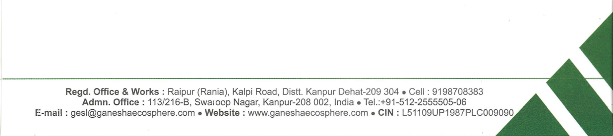

**[Image: 11277899-d966-4acd-a776-b0ddc25b4f47.pdf-0001-00.png (1240x238, 324.8KB)]**

<!-- Start of picture text -->
GANESHA ECOSPHERE LIMITED <!-- End of picture text -->

Digitally signed by Bharat Kumar Bharat Kumar Sajnani Sajnani Date: 2026.02.13 18:58:33 +05'30' 

**[Image: 11277899-d966-4acd-a776-b0ddc25b4f47.pdf-0001-02.png (1236x275, 139.7KB)]**

<!-- Start of picture text -->
Regd. Office Admn.  Office: & Works  113i216-B S · Raipur (Ran'a) K I · R  J  ,  a p1  oa d , D1stt. ·  Kanpur Dehat-209 304 •Cell: 9198708383 E-mail:  gesl@ganeshaecosphere  co~ .w;i~p.tN~gar,  Kanpur-208 002,  India• Tel.:+91-512-2555505-06 ·  s1  e · www.ganeshaecosphere.com •  CIN:  L51109UP1987PLC009090 <!-- End of picture text -->

**[Image: 11277899-d966-4acd-a776-b0ddc25b4f47.pdf-0002-00.png (405x53, 24.6KB)]**

# Ganesha Ecosphere Limited Q3FY26 Earning’s Conference Call 

## **February 09, 2026** 

**[Image: 11277899-d966-4acd-a776-b0ddc25b4f47.pdf-0002-03.png (328x43, 16.9KB)]**

**[Image: 11277899-d966-4acd-a776-b0ddc25b4f47.pdf-0002-04.png (137x160, 19.7KB)]**

**[Image: 11277899-d966-4acd-a776-b0ddc25b4f47.pdf-0002-05.png (214x103, 6.1KB)]**

- **MANAGEMENT: MR. GOPAL AGARWAL – CHIEF FINANCIAL OFFICER, GANESHA ECOSPHERE LIMITED MR. PRASHANT KHANDELWAL – SENIOR VICE PRESIDENT, GANESHA ECOSPHERE LIMITED MR. YASH SHARMA – DIRECTOR, GANESHA ECOPET PRIVATE LIMITED** 

- **MODERATOR: MR. MANISH MAHAWAR – ANTIQUE STOCK BROKING LIMITED** 

Page 1 of 18 

_Ganesha Ecosphere Limited February 09, 2026_ 

**[Image: 11277899-d966-4acd-a776-b0ddc25b4f47.pdf-0003-01.png (328x45, 17.0KB)]**

### **Moderator:** 

Ladies and gentlemen, good day and welcome to Ganesha Ecosphere Limited Q3 and 9 months FY26 Post-Result’s Conference Call hosted by Antique Stock Broking Limited. 

As a reminder, all participant lines will be in the listen-only mode and there will be an opportunity for you to ask questions after the presentation concludes. Should you need assistance during this conference call, please signal an operator by pressing ‘*’, then ‘0’ on your touchtone phone. Please note that this conference is being recorded. 

I now hand the conference over to Mr. Manish Mahawar from Antique Stock Broking Limited. Thank you and over to you, Mr. Manish. 

### **Manish Mahawar:** 

Thank you, moderator. Good morning, everyone. I am pleased to host today's earning call of Ganesha Ecosphere. 

Today, we have a leadership team represented by Mr. Gopal Agarwal – CFO; Mr. Prashant Khandelwal - Senior Vice President; Mr. Yash Sharma - Director Ganesha Ecopet. 

Without any delay, I would like to invite Mr. Yash Sharma to start with opening comment. Post which, we will open the floor for Q&A. Thank you and over to you, Yash. 

### **Yash Sharma:** 

Thank you, Manish! 

Good noon, everyone. I welcome you all to our post-results earnings concall to discuss Q3Y26 performance. 

This quarter has been marked by resilience and progress across our legacy operations, despite sectoral headwinds such as higher US tariffs on Indian textile products. I am pleased to share that our standalone business delivered good set of numbers, with production volumes growing 13% quarter-on-quarter and sales volumes up by 7%. Revenue from operations increasing sequentially and grew by 5.24% as compared to last quarter, while EBITDA stood at ₹18.54 crore and PAT at ₹15.94 crore—surpassing the combined earnings of the previous two quarters. 

On standalone basis, capacity utilisation exceeded 100% with production volume of 29,088 MT as against 25,689 tons in previous quarter. Sales volume at 31,107 tons -made during the quarter was the highest in last 5 years. The Company earned a revenue of ₹272.95 crore, compared to ₹259.35 crore in Q2FY26, reflecting a growth of 5.24%. EBITDA per ton came in at ₹5,962 as against Rs. 2,812 during Q2FY26. EBITDA margins were at 6.79% of the operational revenue as against 3.15% of the last quarter. 

Raw material prices were pretty stable during the quarter, in contrast to the high volatility we experienced previously, which further supported the margins. We have continued to diversify our portfolio, reducing dependency on the yarn spinning sector with over 35% of quarterly sales volume was generated from non-woven and home furnishing segments. 

Page 2 of 18 

_Ganesha Ecosphere Limited February 09, 2026_ 

**[Image: 11277899-d966-4acd-a776-b0ddc25b4f47.pdf-0004-01.png (328x45, 17.0KB)]**

On a consolidated basis, performance was impacted by ongoing uncertainty surrounding the draft notification issued by the Ministry of Environment, Forest and Climate Change, which delayed the integration of recycled PET into supply chains and weakened demand for rPET granules. Overall, Subsidiary businesses saw capacity utilization drop to 50% and revenues decline by 23%. 

Consolidated production stood at 38,768 tons, with revenue of ₹357.22 crore—marginally lower than last quarter. Of this, ₹272.95 crore came from standalone operations and ₹84.27 crore from subsidiaries. Quarterly EBITDA rose 37.67% to ₹30.73 crore, with standalone and subsidiary contributions of ₹18.54 crore and ₹12.19 crore, respectively. Consolidated EBITDA margins improved to 8.6%, and EBITDA per ton climbed to ₹7,638 from ₹5,703 in Q2. Consolidated PAT was ₹4.74 crore. EBITDA of subsidiary business stood at 14.5%. 

Although much‑awaited clarity on the draft notification would have benefited both the user industry and the recycling sector, its extraordinary delay has defeated the purpose. Even if the final notification is issued now, providing some relief in 30% norms for mandatory use of recycled content, the packaging industry will not be able to meet such lower targets within the remaining span of the current financial year. 

FY26 is a transitional year for implementing the PWM Rules on mandatory recycled content, and the adoption was somehow challenging for the user industry and the regulator. We believe that the initial hindrances are being addressed and that adequate approved recycling capacities are now in place, making adoption much smoother from FY27 onwards. Since the regulation mandating recycled content remains unchanged, the user industry cannot continue to be non‑compliant any more. Overall, we are confident of achieving the desired performance from this business in FY27, albeit with a delay of one year. 

Our legacy business has regained sustainable momentum and recently announced reduction of US tariff on Indian textile products should provide an additional boost in the coming quarters. B2B granules business is also expected to perform comparatively better in Q4. 

In a recent development, our recycled Filament yarn has successfully qualified with a leading global textile brand-improving the margins and volumes for filament yarn business. 

We are pleased to share that we have now become a regular supplier to the International Cricket Council (ICC), providing stadium‑sized flags of various countries as well as unity flags made with our recycled materials for World Cup tournaments. This collaboration highlights the global recognition of our sustainable products. 

Overall, Q3FY26 reflects both the strength of our core operations and the long-term potential of our sustainability-driven initiatives. We remain confident in our ability to navigate near-term challenges while building a stronger and sustainable business for the future. 

Page 3 of 18 

_Ganesha Ecosphere Limited February 09, 2026_ 

**[Image: 11277899-d966-4acd-a776-b0ddc25b4f47.pdf-0005-01.png (328x45, 17.0KB)]**

**Moderator:** Alright. Thank you very much. We will now begin with the question-and-answer session. The first question is from the line of Achal Mehta from Bastion Research. Please go ahead. **Achal Mehta:** Hello, sir. Thank you for the opportunity. I want to ask that in foodgrade rPET earlier there were 5-6 approved manufacturers from FSSAI. However, as of September 2025, many new players have entered, taking a total of 13. So, has this increased competition for us significantly? And how does the Ministry of Environment sees this? Do you feel there is enough manufacturing capacity in the industry now to fulfill FY '27's demand? **Yash Sharma:** Yes, thanks for your question. So, yes, definitely the number of FSSAI-approved players has gone up quite significantly and there have been much newer capacities. Yes, certainly because of that there is obviously increased competition in the industry. So, the increased competition is because of the reason that the offtake of the industry has not really taken off as per the volume increase which has happened and the capacity and supply available. Going forward, now there is enough capacity available to meet the targets for the next year and I think that definitely the industry is going to mature much more in a better way now. **Achal Mehta:** So, my second question is, what is the export revenue for the quarter and for the 9 months? **Yash Sharma:** So, on consol level, we made the export about Rs. 30 crores and for 9 months, we made the export more than Rs. 100 crores. **Achal Mehta:** So, why we have not been able to sell to Europe and US, sir where we have approval there and there is no tariff on our products considering on the ongoing delays, they should have been able to offset the decline in domestic demand? **Yash Sharma:** So, actually, the tariff is also applicable on our products as well. So, when the US tariff was implemented earlier in May, at that time PET polymer or rPET granules were in the exemption list, but on 2nd September when the new modification of the tariffs and the exemption list came out, the PET was excluded out of the exemption list. Since 2nd September, the tariffs are also applicable on our product. So, because of that, we have not been able to work out any supplies to the US market because of the tariff conditions of 50% reciprocal tariffs. **Achal Mehta:** And what is the broad range on volume and margins on the rFilament order? **Gopal Agarwal:** So, it is very low at present, but we have been qualified with a global textile brand and from the next quarter onwards, the volume would increase significantly. **Achal Mehta:** And do you expect realization to uptake towards 1 lakh per ton level for the legacy business, now that there are reduced tariffs on our end customer industry? **Gopal Agarwal:** Yes, certainly, the volumes are very good in this quarter also. We have sold the Rs. 31,000 tons volume from our legacy business in this quarter and definitely, it will be well above 1 lakh tons for the entire year. 

Page 4 of 18 

_Ganesha Ecosphere Limited February 09, 2026_ 

**[Image: 11277899-d966-4acd-a776-b0ddc25b4f47.pdf-0006-01.png (328x45, 17.0KB)]**

**Achal Mehta:** Thank you so much. **Moderator:** Thank you. The next question is from the line of Dheeraj Ram from B&K Securities. Please go ahead. **Dheeraj Ram:** Hi sir, thank you for taking up my question. Two-three questions. So, first one is on standalone business. Margins have been improved sequentially. So, is it due to raw material prices? If it is yes, then could you let me know the average raw material price of consumption during the quarter and how do you see that in 4Q? **Gopal Agarwal:** Yes. Dheeraj, the raw material prices are quite stable during the quarter. The uncertainty which prevailed in our last 2 quarters is not there. So, it helps us in margins improvement in our legacy business. **Dheeraj Ram:** Any price that you want to quote, sir? Right now, how is the price trend? **Gopal Agarwal:** Right now, the bottle prices are in the range of Rs. 46-Rs. 47 a kg. **Dheeraj Ram:** Got it. And the subsidiary business, I feel it was really being impacted just because of the utilization. But how can we go about for 4Q and for FY '27, how do you see the inflation levels for rPET especially in subsidiary? **Gopal Agarwal:** In the Q4 for this year, we are quite hopeful that the volumes will be better in Q4 than the Q3. We are expecting overall capacity utilization in between 70%-80% in Q4. **Dheeraj Ram:** Understood. And can we take the same for FY '27, sir? Or do we take between 60%-70%? **Gopal Agarwal:** So, FY '27 must be a good one and on the expected lines which we have thought for FY '26. But because of the chaos on the regulation side, it could not happen in this year. So, definitely, it could happen in FY '27 when the regulation would be for 40%. And there is much clarity now over the offtake basis. The regulation is live and intact. **Dheeraj Ram:** Great. Got it. And last question, sir. We had some outstanding to be received from the government authorities. Any progress on that or is it still to be received? **Gopal Agarwal:** Yes. So, we got the Rs. 70 crores from the government out of our outstanding incentives, about Rs. 110 crore from the Telangana Government for Warangal plant. The amount we have received in this January only. **Dheeraj Ram:** Got it. Great. Last question, sir. How do you see this PWMR coming into effect in FY '27? I understand that capacities are up and running now and demand is meeting the capacity and that is how you are guiding for FY '27 PWMR. But is there any chance to roll this forward to FY '28? 

Page 5 of 18 

_Ganesha Ecosphere Limited February 09, 2026_ 

**[Image: 11277899-d966-4acd-a776-b0ddc25b4f47.pdf-0007-01.png (328x45, 17.0KB)]**

**Prashant Khandelwal:** 

So, basically, as far as the PWMR is concerned, plastic waste management, we have to understand the chronology of this notification. The notification came into force in 2022, mentioning that every brand owner or plastic packaging manufacturer has to use a certain percentage of recycled content from FY '25- ‘26. So, it was 30% and then it has to increase by 10% every year till FY '29 up to 60%. If any shortfall is there in using this recycled content, there is a penalty provision. For first year, it is 2,900 per ton, the second year, it is 5,800 per ton and the third year, it is 8,700 per ton. So, because in very initial stage, there was not much capacity available, there was a stakeholder's representation for this with the government and the government has assured everyone that they will look into it and will provide some relief if any capacity is not available to complete 30% target for first year only. In that case, government may give some relief and everybody was waiting for that relief the whole year. It is a relaxation because you see, even we are discussing as on date, the 30% recycled content consumption notification is there. Everybody has to use 30% recycled content. If any notifications for the relaxation comes coming forward in next 2 months, because it is now irrelevant because whole year has passed into. In less than 2 months, you cannot do much with your consumption or nonconsumption. But even if any relaxation comes in the remaining period, there will certainly be a big number of brands who are going to pay penalty for the first year itself. So, everybody will be in that category of first year penalty of Rs. 2,900. From April onwards, they have to pay Rs. 5,800 if any shortfall comes in the next year. So, the notification is intact and the implementation. As per our discussion with the government officers and the stakeholders from government side, this notification is intact and a lot of investment has come into it in this particular recycling field, not only in PET, but also in polyolefins and other plastics. So, there is not much delays or any major modification is going to be happening in coming days. 

**Dheeraj Ram:** Got it. Agreed, sir. Agreed. Just last question then I will come back in the queue. This new client that you are talking about in filament yarn, when do you see the offtake going for this client and how do you see margins and realizations for this and what is expected to be the offtake for this? **Yash Sharma:** So, the offtake will be started from February itself and we are expecting that almost 20%-30% utilizations of our capacity of the filament yarn are going to be increased working for our partnership that we have started with them and the margins are quite good as expected on our line for the filament project. Sorry, but we cannot disclose exactly the numbers for the particular product due to competitive reasons, but it will be good. **Dheeraj Ram:** Great. Thank you. 

**Moderator:** Thank you. The next question is from the line of Mehul Panjuani from 40 Cents. Please go ahead. **Mehul Panjuani:** Hello, sir. Thank you so much for the opportunity. Sir, now that our legacy businesses done well in terms of volumes, when can we comment on how soon it will take to be out of the woods in the non-legacy business? 

Page 6 of 18 

_Ganesha Ecosphere Limited February 09, 2026_ 

**[Image: 11277899-d966-4acd-a776-b0ddc25b4f47.pdf-0008-01.png (328x45, 17.0KB)]**

**Gopal Agarwal:** So, Mehul, we are expecting the offtake will start in the current quarter itself. We are expecting good demand and we are expecting a good demand from April onwards. So, FY '27 would be the year which we are expecting from FY '26. But definitely, FY '27 would be the good year. **Mehul Panjuani:** And sir, the government regulation which we are expecting, is it out or it is yet to expect, yet not out? **Gopal Agarwal:** So, the regulation is already there. So, the one notification, draft notification was there for giving some relief to the user industry. But that draft notification has not been finalized yet. And now the current financial year is coming to, approaching to end. So, we don't think it will come now. **Mehul Panjuani:** It won't come. So, how does it? **Gopal Agarwal :** Basis the capacity of rPET available in the Indian market, the government may also not provide the relief, sort of provide the user industry at the beginning of the financial year. **Mehul Panjuani:** So, government may not, if government is not expected to provide any relief, then our business will be significantly impacted, right? **Yash Sharma:** No, it is a policy. **Management:** Notification has to come for the relaxation to the brand owner, not to the recycler. For recycler, for brand owner, it is 30% mandate and it is intact for the year. If any relaxation comes that, okay, instead of 30%, we will allow you 10% of this EPR content responsibility target to be transferred to the next year. So, brand owner has to get a relief. If relief doesn't come, then they have to use 30%. **Mehul Panjuani:** So, that is a benefit to us in that means? **Gopal Agarwal:** Yes. **Mehul Panjuani:** But only thing is that it will start flowing into our numbers from Q1 of FY '27? **Gopal Agarwal:** Yes. **Mehul Panjuani:** Thank you so much. **Moderator:** Thank you. The next question is on the line of Bharat Gulati from Dalal & Broacha. Please go ahead. **Bharat Gulati:** Yes. Hi sir. Thank you for the question. I just had a question regarding the standalone business, in terms of EBITDA per ton that has seen a significant degrowth year-on-year. And that has been on a downward trend year-on-year, but has picked up Q-o-Q. So, are we seeing this going forward to improve further on? And will we be able to reach back to our FY '25 levels or are we 

Page 7 of 18 

_Ganesha Ecosphere Limited February 09, 2026_ 

**[Image: 11277899-d966-4acd-a776-b0ddc25b4f47.pdf-0009-01.png (328x45, 17.0KB)]**

going to create a base which is lower than that and then sustain that? If you can help me understand what kind of EBITDA per tons we have going forward? Thank you. 

**Gopal Agarwal:** Yes. So, Bharatji, actually, this business was under distress since last 3-4 quarters, because of the reasons already explained in various concalls by us. So, now, this business has come back on the track. And so, the margins have started to improve. And we are expecting in FY '27, we would be able to make the margins which we are earning earlier on our legacy business. It is in the range of around 9,000 tons to 10,000 tons EBITDA per ton. **Bharat Gulati:** So, it would be back to let us say, our FY '24 levels, which is of Rs. 10 per ton of EBITDA? **Gopal Agarwal:** Yes. We are expecting because of the demand, because of the recent US tariff relaxation, we are expecting that it would come back on the track in this time period. **Bharat Gulati:** Got it. And sir, just to understand our business, our rPET Granules business in Warangal, if you can help me understand what kind of peak revenues can we get from that in terms of once utilizations will pick up next year? **Gopal Agarwal:** Yes. So, next year, we would be operating at about 70,000 tons capacity of rPET in Warangal. So, the peak revenue potential is about Rs. 700-Rs. 850 crores. **Bharat Gulati:** And just to understand the EBITDA per ton there also has gotten hit. So, do we see that also coming back to normalized levels or will that be on impermanent pressures creating a new base because of the higher raw material costs that we are facing now? **Gopal Agarwal:** You see, the EBITDA margins has been affected because of the lower capacity utilization. And also, as the listing is not there in the market and so many units have got the FSSAI licenses and so the supply side is more in comparison to demand. And so the pressure was there in the prices also, margins also. But going forward, we see when the demand will pick up from the sector in next year and the supply. So, it will be matching. And so, the pressure which we are facing now must berelaxed to some level in next year. 

**Bharat Gulati:** So, sir, could you just help me with the number of what kind of EBITDA per tons would we be expecting to do next year? **Gopal Agarwal:** So, for the EBITDA, we cannot comment as of now currently because so many developments are there in the market in the current year. So, the market is evolving and so EBITDA margins, exactly forecasting the EBITDA margins is not possible as of now. We will be able to comment on next quarter itself. **Bharat Gulati:** Got it. And just one last question. Sir, in terms of Q4 for the business that focuses on the F&B segment, is that seen any pickup in terms of customers trying to fulfill whatever they can and reduce their penalties or is it still in the same trajectory as it has been? 

Page 8 of 18 

_Ganesha Ecosphere Limited February 09, 2026_ 

**[Image: 11277899-d966-4acd-a776-b0ddc25b4f47.pdf-0010-01.png (328x45, 17.0KB)]**

**Yash Sharma:** No, sir. Definitely compared to the last quarter, there has been an uptake in the demand and consumption from the F&B players. But it is still not to the level that we expected it should be. So, yes, it has improved. Definitely, yes. But still not way lower than where it should be actually. **Gopal Agarwal:** Yes. So, basically, basis the current situation. We are expecting the capacity utilization of warangal plants by about in between 70%-80%, as against 50% which we have got in this Q3 quarter. **Bharat Gulati:** Got it, sir. Got it. That was helpful, sir. Thank you. I will get back in the queue. **Moderator:** Thank you. The next question is from the line of Darshika Khemka from AV Fincorp. Please go ahead. **Darshika Khemka:** Hello, sir. Thank you for the opportunity. I had a couple of questions. Firstly, on the lines of the fact that 2 quarters of our FY '26 year have been impacted by the MoEF notification. Do you think that this is now behind us or there could be a probability of the government giving this sort of relaxation once again in FY '27, considering the fact that the 30% implementation would be difficult in Q4 and this would sort of be carried forward in the next year? 

**Gopal Agarwal:** So, unless the relaxation notification doesn't come, there is no carry forward. So, this year, 30% consumption was mandatory and whatever the shortfall is there, the penalty would be levied. Penalty is leviable. It depends. And for next year, it is 40% and the relaxation notification was proposed. Basis the recycling capacity was not there in the beginning of the FY '26. But now, the approved capacity is almost 250,000 ton to 300,000 ton in between. And so it meets the requirement of the user industry for the next year. So, we don't expect there would be any relaxation notification will come further for next year. 

**Darshika Khemka:** So, considering this background, would we like to change our guidance for FY '27 that we had given in the last year, both for the legacy business and for the consolidated business and the legacy business, particularly around the fact that the raw material prices have now normalized and you had expected 10% margin for Q4 FY '26 and a slight improvement further towards 11% for FY '27. Is that guidance intact or are we improving it further? And also for the rPET business, what is the guidance that we are now giving? Is there any change? 

**Gopal Agarwal:** No. So, basically, our legacy business, we are expecting, we will come back to 9%-10% EBITDA margin next year. And for the rPET business, yes, we are expecting 40% mandatory use is intact. We will be doing much better. **Darshika Khemka:** And we had expected 65% of our revenue coming from rPET by FY '28. That is also still intact, right? **Gopal Agarwal:** Yes. Once the offtake starts, definitely, we will move on our capacity expansion. **Darshika Khemka:** Got it. All right. That is it for me. Thank you so much. 

Page 9 of 18 

_Ganesha Ecosphere Limited February 09, 2026_ 

**[Image: 11277899-d966-4acd-a776-b0ddc25b4f47.pdf-0011-01.png (328x45, 17.0KB)]**

**Moderator:** Thank you. The next question is from the line of Bhavik Shah from Invexa Capital. Please go ahead. 

Yes. Sir, my first question is, our realizations are actually not improved, despite you mentioning the notification is still in place. So, what is actually leading that the companies are not buying in the volumes they require to fulfill for the year, one? Second is, then, have you seen any traction in the last quarter currently, like in terms of the improvement in realizations? 

**Bhavik Shah:** Yes. Sir, my first question is, our realizations are actually not improved, despite you mentioning the notification is still in place. So, what is actually leading that the companies are not buying in the volumes they require to fulfill for the year, one? Second is, then, have you seen any traction in the last quarter currently, like in terms of the improvement in realizations? **Yash Sharma:** So, you see, basically, if you look at the same, as Prashant had put in detail, the chronological order, what happened is that the regulation for 30% offtake is live. But in June, the government came out with a draft, giving some relaxation that you can carry because there is capacity shortfall to meet the target, you can carry forward to the next 3 years. Since then, there has been a lot of to and fro happening between the industry bodies and the government, and they are finally working with the final notification. Everyone is awaiting and postponing their purchases for the final notification to come out, which is with the relaxation, basically. And because of that, everyone has been holding off to do their purchases since December. So, if you look at the current situation, it is because the government has told that everyone that we will be coming out with it very soon. So, everyone has definitely started again. The offtakes, yes, obviously, it has not reached to the level that it is expected. But since the notification is still not out, a lot of brands, I would say 90% of the people have not really started the offtake in the right volume way, manner. And the realizations have also been very consistent. They have not improved because still the capacity or the supply of the material is way more than the demand. So, the realizations have not really improved any bit. 

**Bhavik Shah:** Understood. So, sir, basically, they are ready to pay the penalty of 2900 per ton, but they are not willing to purchase the additional volumes, right? **Yash Sharma:** So, you see, it is much more complex than that. You can say when it comes to bigger brands, paying penalties for them is a very big issue from their brand equity point of view. Second is that paying the penalty also does not absolve you of the requirement. It just carries forward the volume requirement to the forward years. And also, there is another EC clause, which is the Environmental Compensation Act, where they can levy a much more stringent penalty on you if you are not fulfilling the mandate. So, paying penalty, it is not as simple as it seems like. But the problem is that they are awaiting the final notification, the relaxation notification from the government because of which they have been postponing the usage. 

**Bhavik Shah:** Understood. And sir, when we say 9%-10% margins we are guiding for, so can you just help us understand like, do we expect our cost to be lower? Do we expect our realizations to improve to come to this margin? Or what are we factoring in to come to this margin? 

**Gopal Agarwal:** So, 9%-10% guidance is regarding our legacy business, the standalone business for the Ganesha Ecosphere. So, basically, the stability in the raw material prices is the key factor. And with the increase in the volume and shifting of our production, our dependence on the spinning sector, it will be driving the margins. 

Page 10 of 18 

_Ganesha Ecosphere Limited February 09, 2026_ 

**[Image: 11277899-d966-4acd-a776-b0ddc25b4f47.pdf-0012-01.png (328x45, 17.0KB)]**

**Bhavik Shah:** Understood. So, just let us assume that this notification is there without any changes. So, how do we see our volumes in FY '27? **Gopal Agarwal:** So, this relaxation notification is meant only for the FY '26. It has nothing to do with the FY '27. So, the regulation of 40% for the FY '27 is intact. **Bhavik Shah:** So, then, how do we see our volumes improving, sir, in terms of? **Gopal Agarwal:** So, for next year, basis the regulation is intact for 40%. We are expecting we would be able to utilize 85%-90% capacity utilization. And next year, we will be having around 70,000 tons capacity. And so we will be expecting a volume of around 55,000-60,000 tons and more than 60,000 ton. **Bhavik Shah:** Thank you so much and all the best. **Moderator:** Thank you. The next question is from the line of Avnish from Vaikarya. Please go ahead. **Avnish:** In terms of these F&B customers you have, the number of vendors they have approved earlier, has there been any change in that because a lot of capacity which has come in or have they signed up or approved more vendors? **Yash Sharma:** Yes, definitely. They are obviously working with more vendors also. And the bigger problem here is that it is not that they are approving other vendors. The real is that the volume offtake is not going up with the capacity increase that is coming in. That has been the biggest issue which has caused this kind of outlook in the rPET industry currently. And they will have to do that. They will have to work with all the recycling desks because the capacity needed to fulfill the mandate requirement is obviously currently still under, it is almost matching. Obviously, the industry will have to work with the people who are also putting up capacities. The bigger problem is that the number of players who are using the rPET currently has not gone up. We were expecting that as the mandate comes to final, see this thing, the number of players should now start to increase. It is increasing, but not at the rate that it should actually. **Gopal Agarwal:** And as far as the approval is concerned, yes, our product is approved from almost all the big brands. **Avnish:** Right. No, I meant to say your customers, let us say, we are working with the 2 recyclers. They now have approved 3, 4 or 5 recyclers because more capacity have come in. **Yash Sharma:** They have. Correct. Absolutely, they have. Yes. **Avnish:** Got it. And let us say, as you mentioned, some of these global brands, if they have to be really careful about breaching the norms, will they have it like even the notification comes in February and March, they don't have much time if they have to fulfill this 30% irrespective of whether realization comes or not. They need to decide whether to pay a penalty or offtake, right? Or they 

Page 11 of 18 

_Ganesha Ecosphere Limited February 09, 2026_ 

**[Image: 11277899-d966-4acd-a776-b0ddc25b4f47.pdf-0013-01.png (328x45, 17.0KB)]**

can offtake, let us say, just in the month of March, and they offtake enough quantity to meet this guideline? **Yash Sharma:** Please go on, sir. **Prashant Khandelwal:** So, I think you see the 30% mandate is there. If any relaxation, lets presume whatever was in the year, 10% relaxation comes for the current year. Even if 10% relaxation comes, you are very correct that most of the brands are going to pay penalties for the first year. And the first-year penalty of 2900 is only for the first default. Once a first default has been done, on case of next default, you have to pay a penalty of 5800. And in case of third default, there will be a penalty of 8700. Over and above this, there will be environment compensation. So, if any relaxation comes for the first year, because government has been represented by all the brand owners, many of the brand owners that not enough capacity is available for the first year. So, they were seeking some relaxation in the percentage for the first year. So, for next year, there is a mandate of 40%, which has to be fulfilled by the brand owners. And looking to this 40% number, there will be good demand. And Ganesha, as the largest capacity holder, is well placed for taking that demand in the business. **Avnish:** I was trying to understand that there is a relaxation of 10% and they have to fulfill this 20%. Somebody who does not want to be in this spot of not being compliant, will they have this 1 month with so much material that they can meet this 20%, not just with Ganesha, but across the industry, that availability is so high that they can fulfill this in one month? Otherwise, they will be, they can pay penalty and all, but this will be having the challenge of not meeting the norm? **Gopal Agarwal:** Yes. So, in any case, if any relaxation comes out together, so it is sure that you will not be able to fulfill it, even the lower targets. **Avnish:** They will not be able to fulfill it. The second question I had was export side. Now, if the tariffs are reduced to this 18%, so your product will be covered with the 18%. Were you looking at exporting opportunity or do you think 18% is also too high to make this export viable for you? **Yash Sharma:** So, you see the market is currently very evolving across and definitely we are currently in discussions with consumers there and we will get to know about this only with time of what kind of volume and business is possible. **Avnish:** Great. Thank you. **Moderator:** Thank you. The next question is from the line of Dhirendra Kumar Patro from Spark PMS. Please go ahead. **Dhirendra Kumar Patro:** Hi, sir. Thank you for the opportunity. My first question is that based on CAPEX, can you provide any color on CAPEX plans, Brownfield and Greenfield in FY '26, ‘27 and ‘28 in terms of investments and metric tons? 

Page 12 of 18 

_Ganesha Ecosphere Limited February 09, 2026_ 

**[Image: 11277899-d966-4acd-a776-b0ddc25b4f47.pdf-0014-01.png (328x45, 17.0KB)]**

|**Gopal Agarwal:**|So, we are already implementing a brownfield project. The brownfield project could be|
|---|---|
||operational by March and April. And so it involves a core CAPEX of around Rs. 130 crores, which has been largely incurred so far. For the next leg of expansion, Greenfield expansion or the Brownfield expansion, as per our plans, around Rs. 450 crores is to be invested in the next 2 years.|
|**Dhirendra Kumar Patro:**|So, Rs. 130 crores of Brownfield that is around 22,500 tons of rPET in Warangal, right?|
|**Gopal Agarwal:**|Correct.|
|**Dhirendra Kumar Patro:**|And so if I heard it right, you said 4Q, you will be able to do 70% utilization in the subsidiary business. That 70% is including the brownfield expansion?|
|**Gopal Agarwal:**|Correct.|
|**Dhirendra Kumar Patro:**|Those are my questions. Thank you.|
|**Moderator:**|Thank you. The next question is from the line of Athar Syed from SmartSync Services. Please go ahead.|
|**Athar Syed:**|Hello, sir. Thank you for the opportunity. This is my first time I am attending con call. Sorry if I have some basic questions. But I wanted to understand, do we have any seasonality in our business? So, can you please explain the seasonality in our business?|
|**Gopal Agarwal:**|So, seasonality, in case of legacy business, the seasonality is largely from the raw material side. So, in case of Northern India, in winter season, the raw material availability reduces somewhat. And in the summer season, the availability is superior. But from our finished goods level, there is no such seasonality in our legacy business. And for our new B2B Granules business, yes, there is a seasonality. Though it is a very new business, so it will be much competent in next financial year. But certainly, the user industry is having the seasonality when there is a winter season. And from August to September onwards, they reduce their production. And the production is again geared up from the January itself.|
|**Athar Syed:**|So, basically, the main seasonality which we have in our legacy business is because of raw material prices?|
|**Gopal Agarwal:**|Correct.|
|**Athar Syed:**|So, what are the measures we are taking to mitigate this risk, mainly raw material prices?|
|**Gopal Agarwal:**|So, basically, we try to make some inventory. Basically, you see our raw material is scrap. It is not an organized business. It is not a standard material. So, the collection is going on and you have to buy it. So, you cannot stock it in too big quantity. But certainly, we try to maintain an inventory of around 30-35 days. And in summer season, we will try to increase the inventory by 4-5 days, additional inventory stocking.|

Page 13 of 18 

_Ganesha Ecosphere Limited February 09, 2026_ 

**[Image: 11277899-d966-4acd-a776-b0ddc25b4f47.pdf-0015-01.png (328x45, 17.0KB)]**

|**Athar Syed:**|As you are talking about this draft notification, so can you please explain more on this? Like the|
|---|---|
||players are expecting 10% relaxation also. So, can you please throw some light on the draft?|
|**Gopal Agarwal:**|Yes. So, for the draft, basically, the regulation was implemented for 30% mandatory content of recycled granules in the plastic packaging industry. And the regulation was implemented from April 25. But when the regulation was implemented, the enough capacity, recycling capacity was not available. And only around 70,000-75,000 approved capacity was there, while the consumption was expected to be much more than that. And so the user industry contacted the Ministry, MOEFCC, for some relaxation. So, in June, the government has come out with a draft notification in which they propose to make some relaxation in 30% target and allowing the shortfall for over next 3 years. That was a draft notification, which is not finalized yet.|
|**Moderator:**|Athar sir, may I request you to join the queue for a follow-up question. The next question is from the line of Mehul Panjuani from 40 Cents. Please go ahead.|
|**Mehul Panjuani:**|Hello, thank you, sir. Thank you for the follow-up. So, sir, regarding the preceding question, you said that the draft notification was for 3 years. So, it has not come yet, right?|
|**Gopal Agarwal:**|It is not for the 3 years. It is not only for the FY '26, but any shortfall was to be carried forward for next year. Suppose the 30% target is there and someone uses the 20%, so 10% is a shortfall. The 10% shortfall could be recouped over the next 3 years.|
|**Mehul Panjuani:**|Got it. And sir, my next question is, sir, can we expect that Q4 is absolutely better than Q2 and Q3?|
|**Gopal Agarwal:**|Yes. We are expecting a better Q4 than the Q3.|
|**Mehul Panjuani:**|And it will be mainly aided by the legacy business or overall?|
|**Gopal Agarwal**|Overall. Both legacy business as well as our new business, our subsidiary business.|
|**Mehul Panjuani:**|Thank you so much for answering all the questions. Thank you.|
|**Moderator:**|Thank you. The next question is from the line of Siddhartha Barman from Sagun Capital. Please go ahead.|
|**Siddhartha Barman:**|Yes, sir. I was just trying to understand what would be the kind of margin we would be looking next year and forward. Any kind of ballpark figure if you can tell us?|
|**Gopal Agarwal:**|So, we are not providing any guidance as of now because of the uncertainty prevailed in this financial year over the notification and the regulation. But we are expecting that this uncertainty would not be there for FY27 certainly the margins would improve with the increased offtakes and volumes. But any margin guidance overall, we would be able to provide only in the next quarter.|

Page 14 of 18 

_Ganesha Ecosphere Limited February 09, 2026_ 

**[Image: 11277899-d966-4acd-a776-b0ddc25b4f47.pdf-0016-01.png (328x45, 17.0KB)]**

|**Siddhartha Barman:** **Gopal Agarwal:**|So, it will be same as the TTM or we can expect at least a slight increase? We are expecting much better than that.|
|---|---|
|**Siddhartha Barman:**|Fine. Thank you. That is all from my side.|
|**Moderator:**|Thank you. The next question is on the line of Reuben Matthews from Equity Intelligence. Please go ahead.|
|**Reuben Matthews:**|Hi. I just wanted to know which were discussions with these big large branded players, how much are they right now? What is their percentage of recycled material that they are using for the B2B?|
|**Yash Sharma:**|So, see, it is very difficult to give the exact numbers because even we don't have the exact numbers. But it is fairly low. I would say it is lower than 10%-15%, maybe somewhere in the ballpark. I am just talking about the global big brands. But very difficult to come with the exact number.|
|**Reuben Matthews:**|So, you are saying that they are right now at around 10%-15%. And with your recent discussions, do you see them ramping up to at least 20%-25% with the purchases that they are making?|
|**Yash Sharma:**|So, see, currently, they are not ramping up. But definitely, there would be post the government / MoEF notification, will be there.|
|**Reuben Matthews:**|And this expansion plan, you don't need to, you already have funds for the expansion, right? There is no more additional funds required?|
|**Gopal Agarwal:**|Yes, we are having the funds. And our leverage position is also very comfortable. So, we will manage from that.|
|**Reuben Matthews:**|And just to help me out with the average realization of your product now, is it around Rs. 100 for the recycled plastic for the bottles?|
|**Gopal Agarwal:**|So, it is different for the different products. So, for the Fiber, it is around Rs. 85. And for the Granules, of course, it is more than Rs. 95.|
|**Reuben Matthews:**|More than 95. And just one last question. Now, I am just starting to follow this company. So, now, you are looking at collection of raw materials, right, for the plastic bottles. Now, with all these additional companies setting up their capacities, do you see there being a shortfall in collection of these raw materials? Or would you look at importing plastics, maybe? How would you go about it?|

Page 15 of 18 

_Ganesha Ecosphere Limited February 09, 2026_ 

**[Image: 11277899-d966-4acd-a776-b0ddc25b4f47.pdf-0017-01.png (328x45, 17.0KB)]**

**Gopal Agarwal:** So, you see that the collection is very good in the country, as far as PET bottles are concerned. And the user industry is from the fiber, from B2B business. And so, certainly, the demand is much more than the supply side. So, the Fiber industry is trying to use some textile waste and other waste as against the PET bottle itself. And so, the industry is now moving from the PET bottle itself to some other alternatives. And so, it will relieve the pressure on the supply side for the PET bottles. 

**Reuben Matthews:** Fine. **Moderator:** Thank you. The next question is from the line of Sibasish Padhy from Manish Mundada & Associates. Please go ahead. **Sibasish Padhy:** Thank you. So, my first question is regarding the competitive landscape. As I have heard from a media release that Reliance Industries is also collaborating with Sri Chakra Ecotech to enter into the recycling PET business. So, they are targeting to recycle around 5 billion plus PET bottles. And in an industry where Reliance is going to enter, we can expect a stiff competition there. So, what is your opinion and perspective on it? I want to know that. And add on to it that Reliance is also having chemical recycling technology. As per my knowledge, we, Ganesha Ecosphere, is currently using the mechanical recycling technology. So, I also want to take some, what is your take on it? Actually, I want to know? **Yash Sharma:** Sure. So, yes, you are right. So, I think this news is not new. I think it is pretty old news. So, basically, yes, the Reliance and Sri Chakra are collaborating. But the collaboration is regarding the RPSF, the traditional, the legacy business that we have, Recycled Polyester Staple Fiber business. That is the collaboration to do recycling of the PET bottle waste basically. Reliance also has a capacity of its own to do RPSF. And they partner with Sri Chakra for building some more capacity of the RPSF product, which is our legacy product. And talking about competition, I think it is pretty clear that the Recycled PET industry has always been very competitive, I would say very highly competitive from the last 25 years, and it remains to be so. And Ganesha has still been able to navigate and has maintained its position as the leader of the industry in spite of the industry condition. **Sibasish Padhy:** And what about, sir, are we planning to set up any chemical recycling plant or we are just planning to continue with our existing mechanical recycling facility? **Gopal Agarwal:** So, we are basically into mechanical recycling and as far as, only the mechanical recycling is is a proven one. Chemical recycling is at very nascent stage and its costing is too high, operational cost is too high, as well as the capex is also too high. So, it will take time to be commercially viable. **Sibasish Padhy:** And sir, are we having any plan to recycle HDPE and flexible plastic and other hard plastics in future? Or are you just going to focus on PET recycling? 

Page 16 of 18 

_Ganesha Ecosphere Limited February 09, 2026_ 

**[Image: 11277899-d966-4acd-a776-b0ddc25b4f47.pdf-0018-01.png (328x45, 17.0KB)]**

**Gopal Agarwal:** Yes, we are also starting the recycling of the Polyolefins apart from the PET. We are exploring that. As any complete plan is not yet, as of now, finalized, but definitely we are looking for it. **Sibasish Padhy:** Are you planning to do some exports? **Gopal Agarwal:** Yes. So, we are already making some export around 9%-10% of our fiber volume which has been exported. And because of the tariff in the US, so we have started the export of some of our rPET but because of the tariff it was stopped, now we are expecting it will again, we can get some vendors. **Moderator:** Sorry to interrupt you, sir. You may join the queue for the next follow-up question. The next question is from the line of Dheeraj Ram from B&K Securities. Please go ahead. **Dheeraj Ram:** Thank you for taking up my question again. Sir, for this rPET realizations, historically, in FY '24 and FY '25 around, it used to be higher and now it slightly came down in FY '27, do you expect it to go back to previous levels? Or is it too much to go back to previous levels? **Gopal Agarwal:** So, basically the realization of rPET depends on the prices of the bottle, scrap bottle also. So, it moves with the prices of scrap bottle. **Dheeraj Ram:** Got it. And based on landscape of competition, what previous participant was asking, could you throw some light on this Indorama JV with Varun Beverages? If we consider that maybe coming in FY '27 or FY '28, do we still have a shortfall of demand versus capacity of recycle? **Yash Sharma:** Yes, definitely. So, see, it is not about shortfall of demand versus capacity. It is about managing the demand and supply. So, what is happening now in the industry is that we are working together to establish a very coherent demand supply situation for the industry to work in a better way, in a more efficient way. So, what is not going to happen is that in the last couple of quarters, no new capacities are coming up or are coming up to be announced in the future because the industry is waiting for the demand to firm up and the numbers to stabilize. So, even with the JV volumes which are coming in, we have already considered it in the current set of numbers. We will be almost at par with the demand and supply equation. **Dheeraj Ram:** Got it, sir. Sure. Thank you. **Moderator:** Thank you. Ladies and gentlemen, we take that as the last question of the day. And now, I would like to hand the conference over to management for the closing comments. **Prashant Khandelwal:** Thank you. Thank you all for joining today and for your continued trust in our journey. We appreciate your continued engagement and look forward to updating you on our progress in the next call. Until then, stay safe and stay connected. Thank you. **Moderator:** On behalf of Antique Stock Broking Limited, that concludes this conference. Thank you for joining us and you may now disconnect your lines. 

Page 17 of 18 

_Ganesha Ecosphere Limited February 09, 2026_ 

**[Image: 11277899-d966-4acd-a776-b0ddc25b4f47.pdf-0019-01.png (328x45, 17.0KB)]**

**<mark>Note:</mark>** 

<mark>1. This is a transcription and may contain transcription errors. The Company takes no responsibility of such errors, although an effort has been made to ensure high level of accuracy.</mark> 

<mark>2. Any of the statements made herein may be construed as opinions only and as of the date. We expressly disclaim any obligation or undertaking to release any update or revision to any of the views contained herein to reflect any changes in our expectations with regard to any change in events, conditions or circumstances on which any of these opinions might have been based upon.</mark> 

<mark>3. It is also confirmed that no unpublished price sensitive information was discussed during the call.</mark> 

Page 18 of 18 

---

## Extracted Images

| # | File | Dimensions | Size |
|---|------|------------|------|
| 1 | 11277899-d966-4acd-a776-b0ddc25b4f47.pdf-0001-00.png | 1240x238 | 324.8KB |
| 2 | 11277899-d966-4acd-a776-b0ddc25b4f47.pdf-0001-02.png | 1236x275 | 139.7KB |
| 3 | 11277899-d966-4acd-a776-b0ddc25b4f47.pdf-0002-00.png | 405x53 | 24.6KB |
| 4 | 11277899-d966-4acd-a776-b0ddc25b4f47.pdf-0002-03.png | 328x43 | 16.9KB |
| 5 | 11277899-d966-4acd-a776-b0ddc25b4f47.pdf-0002-04.png | 137x160 | 19.7KB |
| 6 | 11277899-d966-4acd-a776-b0ddc25b4f47.pdf-0002-05.png | 214x103 | 6.1KB |
| 7 | 11277899-d966-4acd-a776-b0ddc25b4f47.pdf-0003-01.png | 328x45 | 17.0KB |
| 8 | 11277899-d966-4acd-a776-b0ddc25b4f47.pdf-0004-01.png | 328x45 | 17.0KB |
| 9 | 11277899-d966-4acd-a776-b0ddc25b4f47.pdf-0005-01.png | 328x45 | 17.0KB |
| 10 | 11277899-d966-4acd-a776-b0ddc25b4f47.pdf-0006-01.png | 328x45 | 17.0KB |
| 11 | 11277899-d966-4acd-a776-b0ddc25b4f47.pdf-0007-01.png | 328x45 | 17.0KB |
| 12 | 11277899-d966-4acd-a776-b0ddc25b4f47.pdf-0008-01.png | 328x45 | 17.0KB |
| 13 | 11277899-d966-4acd-a776-b0ddc25b4f47.pdf-0009-01.png | 328x45 | 17.0KB |
| 14 | 11277899-d966-4acd-a776-b0ddc25b4f47.pdf-0010-01.png | 328x45 | 17.0KB |
| 15 | 11277899-d966-4acd-a776-b0ddc25b4f47.pdf-0011-01.png | 328x45 | 17.0KB |
| 16 | 11277899-d966-4acd-a776-b0ddc25b4f47.pdf-0012-01.png | 328x45 | 17.0KB |
| 17 | 11277899-d966-4acd-a776-b0ddc25b4f47.pdf-0013-01.png | 328x45 | 17.0KB |
| 18 | 11277899-d966-4acd-a776-b0ddc25b4f47.pdf-0014-01.png | 328x45 | 17.0KB |
| 19 | 11277899-d966-4acd-a776-b0ddc25b4f47.pdf-0015-01.png | 328x45 | 17.0KB |
| 20 | 11277899-d966-4acd-a776-b0ddc25b4f47.pdf-0016-01.png | 328x45 | 17.0KB |
| 21 | 11277899-d966-4acd-a776-b0ddc25b4f47.pdf-0017-01.png | 328x45 | 17.0KB |
| 22 | 11277899-d966-4acd-a776-b0ddc25b4f47.pdf-0018-01.png | 328x45 | 17.0KB |
| 23 | 11277899-d966-4acd-a776-b0ddc25b4f47.pdf-0019-01.png | 328x45 | 17.0KB |
