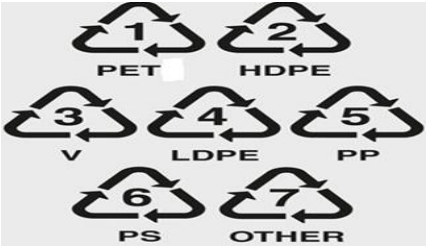
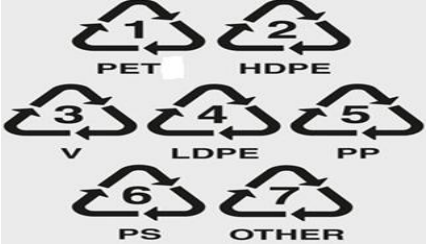

Gopal Agarwal 

Digitally signed by Gopal Agarwal Date: 2026.04.01 10:08:46 +05'30' 

रजिसरी सं. डी.एल.- 33004/99 

REGD. No. D. L.-33004/99 

**[Image: f1d73aaf-8fc8-4a3c-8af5-ac812f77318e_-1-.pdf-0002-02.png (972x296, 53.8KB)]**

सी.जी.-डी.एल.-अ.-31032026-271465 **xxxGIDHxxx CG-DL-E-31032026-271465xxx** GIDE **xxx** 

## असाधारण **EXTRAORDINARY** 

भाग **II** — खण ड **3** — उप-खण ड **(i) PART II—Section 3—Sub-section (i)** <mark>पाजधकार स</mark> पकाजित **PUBLISHED BY AUTHORITY** 

सं **. 218]** नई दिलली, मंगलवार **,** माचा **31, 2026/** चैत **10, 1948 No. 218] NEW DELHI, TUESDAY, MARCH 31, 2026/CHAITRA 10, 1948** 

# पराावरण, वन और िलवारु पररवतान मंतालर 

# अधिसूचना 

# नई दिल्ली, 31 माचच, 2026 

सा.का.धन. 237(अ).— प्लाजस्ट्िक अपजिष्ट प्रबंधन जनर्म, 2016 का और संिोधन करने के जलए प्रारूप जनर्म भारत के रािपत्र, असाधारण, भाग II, खंड 3, उपखंड (i) में सा.का.जन. सं. 365(अ), दिनांक 3 िून, 2025 द्वारा उन सभी व्यजिर्ों से, जिनका प्रभाजवत होना संभाव्य है, आक्षेप और सुझाव आमंजत्रत करते हुए, उस दिनांक जिसको उि अजधसूचना वाले रािपत्र की प्रजतर्ां िनसाधारण को उपलब्ध कराई गई थीं, से साठ दिवस की अवजध के भीतर प्रकाजित की गई थी; 

उि अजधसूचना की प्रजतर्ां िनसाधारण को 3 िून, 2025 को उपलब्ध करा िी गई थीं; 

उि प्रारूप अजधसूचना के संबंध में केन्द्रीर् सरकार द्वारा जवजभन्न पणधाररर्ों से जवजनर्िाष्ट अवजध के भीतर प्राप्त हुए आक्षेपों और सुझावों पर सम्र्क् रूप से जवचार कर जलर्ा गर्ा है; 

अत:, अब केन्द्रीर् सरकार, पर्ाावरण (संरक्षण) अजधजनर्म, 1986 (1986 का 29) की धारा 3, धारा 6 और धारा 25 द्वारा प्रित्त िजिर्ों का प् ोग करते हुए प्लाजस्ट्िक अपजिष्ट प्रबंधन जनर्म, 2016 का और संिोधन करने के जलए जनम्नजलजखत जनर्म बनाती है, अथाात्:- 

1. (1) इन जनर्मों का संजक्षप्त नाम प्लाजस्ट्िक अपजिष्ट प्रबंधन (संिोधन) जनर्म, 2026 है। 

- (2) र्े उनके रािपत्र में प्रकािन की दिनांक को प्रवृत्त होंगे। 

2343 GI/2026 

(1) 

2 

<u>[PART II—SEC. 3(i)]</u> 

THE GAZETTE OF INDIA : EXTRAORDINARY 

2 . प्लाजस्ट्िक अपजिष्ट प्रबंधन जनर्म, 2016 (जिसे इसमें इसके पश्चात् उि जनर्म कहा गर्ा है) के जनर्म 3 में,-- 

(क) खंड (छक) के स्ट्थान पर जनम्नजलजखत खंड रखा िाएगा, अथाात:-- 

(छक) “िीवन के अंत में जनपिान” से ऊिाा पुनप्रााजप्त के उद्देश्र् से प्लाजस्ट्िक कचरे का उपर्ोग अजभप्रेत है, जिसमें सीमेंि, इस्ट्पात, र्ा दकसी अन्द्र् समान उद्योग िैसे उद्योगों में सह-प्रसंस्ट्करण, अपजिष्ट-से-ऊिाा प्रदिर्ाएं, अपजिष्ट-से-तेल रूपांतरण, और लागू दििाजनिेिों के अनुसार सड़क जनमााण में उपर्ोग सजम्मजलत है: 

(ख) उप-जनर्म (थक) में, “नए उत्पािों में रूपांतरण” िब्िों के पश्चात्, “र्ा ऊिाा का उत्पािन” िब्ि अंत:स्ट्थाजपत दकए िाएंगे; 

(ग) जनर्म 3 के उप-जनर्म (थख) के स्ट्थान पर, जनम्नजलजखत उप-जनर्म रखा िाएगा, अथाात:-- 

“(थख) “प्लाजस्ट्िक अपजिष्ट संसाधक” से ऐसी संस्ट्थाएं अजभप्रेत है, िो प्लाजस्ट्िक अपजिष्ट के पुनचािण में सजम्मजलत हैं, र्ा िो प्लाजस्ट्िक अपजिष्ट के अंजतम जनपिान में लगी हुई हैं; 

(घ) खंड (ब) में,- 

(i) "िहरी स्ट्थानीर् जनकार्" िब्िों के पश्चात् "र्ा प्राजधकरण" िब्ि अंत:स्ट्थाजपत दकए िाएंगे; 

(ii) "दकसी अन्द्र् स्ट्थानीर् जनकार्" िब्िों के पश्चात् "र्ा स्ट्थानीर् प्राजधकरण र्ा अन्द्र् प्राजधकरण" िब्ि अंत:स्ट्थाजपत दकए िाएंगे; 

(ङ) खंड (पक) के स्ट्थान पर जनम्नजलजखत खंड रखे िाएंगे, अथाात् 

(पक) "रजिस्ट्रीकृत पर्ाावरण लेखा परीक्षक" से ऐसा पर्ाावरण लेखा परीक्षक अजभप्रत है िो पर्ाावरण लेखापरीक्षा जनर्म, 2025 के अधीन र्था पररभाजषत है; 

(पख) "पुन: उपर्ोग" से दकसी वस्ट्तु र्ा संसाधन सामग्री का र्ा तो उसी उद्देश्र् के जलए र्ा दकसी अन्द्र् उद्देश्र् के जलए, वस्ट्तु की संरचना को बिले जबना पुनः उपर्ोग करना अजभप्रेत है; 

(पग) "जविेता" से ऐसा व्यजि अजभप्रत है िो प्लाजस्ट्िक पैकेजिंग के उत्पािन में प्ुि प्लाजस्ट्िक कच्चे माल िैसे रेजिन र्ा पेलेट्स र्ा मध्र्वती सामग्री का जविर् करता है; 

3. जनर्म 11 के उपजनर्म (2) के स्ट्थान पर जनम्नजलजखत उपजनर्म रखा िाएगा, अथाात् 

"(2) प्रत्र्ेक पुनचादित प्लाजस्ट्िक पैकेजिंग र्ा वस्ट्तु भारतीर् मानक आईएस 14534:2023, जिसका िीषाक 'प्लाजस्ट्िक - प्लाजस्ट्िक अपजिष्ट की पुनप्रााजप्त और पुनचािण - दििाजनिेि' है, के अनुरूप होनी चाजहए और उस पर नीचे ििााए गए लेबल और जचह्न होने चाजहए िो उि मानक के अनुसार पुनचादित प्लाजस्ट्िक सामग्री के उपर्ोग को ििााते हों, और साथ ही खाद्य संपका अनुप् ोगों के संबंध में भारतीर् खाद्य सुरक्षा और मानक प्राजधकरण द्वारा जनर्िाष्ट लागू जचह्नांकन और लेबजलंग आवश्र्कताओं का भी अनुपालन करना चाजहए 

**[Image: f1d73aaf-8fc8-4a3c-8af5-ac812f77318e_-1-.pdf-0003-18.png (426x247, 74.2KB)]**

रिपपण: पीईिी-पॉलीइथाइलीन िेरेफ्थेलेि, एचडीपीईE-हाई डेंजसिी पॉलीइथाइलीन, वी-जवनाइल (पीवीसी), एलडीपीईलो डेंजसिी पॉलीइथाइलीन, पीपी-पॉलीप्रोपाइलीन, पीएच-पॉलीस्ट्िाइरीन और 'अन्द्र्' से िेष सभी रेज़िन और मल्िी- 

<u>[</u> भाग II— खण् ड 3(i)] 

भारत का रािपत्र : असाधारण 

3 

मिीररर्ल, िैसे एबीएस (एदिलोनाइराइल ब्र्ूिाडीन स्ट्िाइरीन), पीपीओ (पॉलीफेजनलीन ऑक्साइड), पीसी (पॉलीकाबोनेि), पीबीिी (पॉलीब्र्ूरिलीन िेरेफ्थेलेि) अजभप्रेत है। 

4. जनर्म 12 में, उप-जनर्म (3) के पश्चात्, जनम्नजलजखत उप-जनर्म अंत:स्ट्थाजपत दकए िाएँगे, अथाात्:-- 

(3अ)   अपनी अजधकाररता में संबंजधत स्ट्थानीर् जनकार्, कचरा उत्पनन करने वाले द्वारा कचरा प्रबंधन, प्लाजस्ट्िक कैरी बैग, प्लाजस्ट्िक िीि र्ा वैसी ही मिों, प्लाजस्ट्िक िीि से बने कवर और प्लाजस्ट्िक पैकेजिंग के प् ोग पर रोक र्ा प्रजतजषद्ध, और इन जनर्मों के जनर्म 4 के अधीन प्रजतजषद्ध की गई मिों से िुड़े इन जनर्मों के उपबंधों को लागू करने के जलए प्राजधकृत होगा। और जिन मामलों में िहरी स्ट्थानीर् जनकार् और संबंजधत जवजधर्ों के अधीन गरठत स्ट्थानीर् प्राजधकरण के अजधकार क्षेत्र आपस में जमलते हैं, वहाँ इस उप-जनर्म के अधीन उपबंधों को लागू करने के जलए िहरी स्ट्थानीर् जनकार् प्राजधकृत होगा; और िहरी स्ट्थानीर् जनकार् के अजधकार क्षेत्र से बाहर, लेदकन स्ट्थानीर् प्राजधकरण के अजधकार क्षेत्र के भीतर आने वाले क्षेत्रों जिनमें िहरी सीमा से सिे क्षेत्र भी सजम्मजलत हैं के जलए, इस उप-जनर्म के अधीन उपबंधों को लागू करने के जलए स्ट्थानीर् प्राजधकरण प्राजधकृत होगा। 

(3आ)  अपनी अजधकाररता में संबंजधत ग्राम पंचार्त, कचरा उत्पनन करने वाले द्वारा कचरा प्रबंधन, प्लाजस्ट्िक कैरी बैग, प्लाजस्ट्िक िीि र्ा वैसी ही मिों, प्लाजस्ट्िक िीि से बने कवर और प्लाजस्ट्िक पैकेजिंग के प् ोग पर रोक र्ा प्रजतषेद्ध, और इन जनर्मों के जनर्म 4 के अधीन प्रजतजषद्ध की गई मिों से िुड़े इन जनर्मों के उपबंधों को लागू करने के जलए प्राजधकृत होगी। 

(3इ)   अपनी अजधकाररता में जिला स्ट्तर पर संबंजधत पंचार्त, कचरा उत्पन्न करने वाले द्वारा कचरा प्रबंधन, प्लाजस्ट्िक कैरी बैग, प्लाजस्ट्िक िीि र्ा वैसी ही मिों, प्लाजस्ट्िक िीि से बने कवर और प्लाजस्ट्िक पैकेजिंग के प् ोग पर रोक र्ा प्रजतजषद्ध, और इन जनर्मों के जनर्म 4 के अधीन प्रजतजषद्ध की गई मिों से िुड़े इन जनर्मों के उपबंधों को लागू करने के जलए प्राजधकृत होगी। 

5. इन जनर्मों के जनर्म 16 में,— 

(i) उप-जनर्म (1) के स्ट्थान पर जनम्नजलजखत उप-जनर्म प्रजतस्ट्थाजपत दकर्ा िाएगा:— 

“(1) राज्र् सरकार र्ा संघ राज्र् क्षेत्र प्रिासन, इन जनर्मों को लागू करने की प्रभावी जनगरानी के उद्देश्र् से, एक राज्र् स्ट्तरीर् जनगरानी सजमजत का गठन करेगा, जिसमें नीचे दिए गए व्यजि सजम्मजलत होंगे, अथाात्— 

|(1)|(2) |(3) |
|---|---|---|
|(क)|राजर सरकार क मखर सजचव रा सघ राजर कत पिासन क पमख |अधरक |
|(ख)|नगर पिासन क जलए उतरिारी राजर सरकार रा सघ राजर कत पिासन क जवभाग क अपर मखर सजचव रा पधान सजचव रा पभारी सजचव रा उनका नाजमत वजि |सिसर |
|(ग)|पचारती राि ससथाओ क जलए उतरिारी राजर सरकार रा सघ राजर कत पिासन क जवभाग क अपर मखर सजचव रा पधान सजचव रा पभारी सजचव रा उनका नाजमत वजि |सिसर |
|(घ)|िहरी जवकास क जलए उतरिारी राजर सरकार रा सघ राजर कत पिासन क जवभाग क अपर मखर सजचव रा पधान सजचव रा पभारी सजचव रा उनका नाजमत वजि |सिसर |
|(ङ)|गामीण जवकास क जलए उतरिारी राजर सरकार रा सघ राजर कत पिासन क जवभाग क अपर मखर सजचव रा पधान सजचव रा पभारी सजचव रा उनका नाजमत वजि|सिसर|
|(च)|परावरण क जलए उतरिारी  राजर सरकार रा सघ राजर कत पिासन क जवभाग क अपर मखर सजचव रा पधान सजचव रा पभारी सजचव रा उनका नाजमत वजि|सिसर|
|(छ)|राजर पिषण जनरतण बोड रा पिषण जनरतण सजमजत क सिसर सजचव|सिसर|
|(ि)|िस लाख रा उसस अजधक िनसखरा वाल िहरो क नगरपाजलका आरि|सिसर|

4 

<u>[PART II—SEC. 3(i)]</u> 

THE GAZETTE OF INDIA : EXTRAORDINARY 

|(झ)|िस लाख रा उसस अजधक िनसखरा वाल िहरो स जभन िहरो क एक नगरपाजलका आरि|सिसर|
|---|---|---|
|(ञ)|जिला सतरीर पचारतो काएक मखर कारकारी अजधकारी|सिसर|
|(ि)|अपजिष पबधन म अनतवजलत दकसी गर-सरकारी सगठन स राजर सरकार रा सघ राजर कत पिासन दारा नाजमत दकरा िान वालाएक जविषज|सिसर|
|(ठ)|राजर सरकार रा सघ राजर कत पिासन दारा नाजमत दकरा िान वाला दकसी उदोग सघ काएक पजतजनजध|सिसर|
|(ड)|राजर सरकार रा सघ राजर कत पिासन दारा नाजमत दकरा िान वाला उदोग कत सएक जविषज|सिसर|
|(ढ)|राजर सरकार रा सघ राजर कत पिासन दारा नाजमत दकरा िान वाला जिका िगत काएक जविषज|सिसर|
|(ण)|पचारती राि ससथाओ क जलए उतरिारी राजर सरकार रा सघ राजर कत पिासन क जवभाग का पभारी जनििक|सिसर|
|(त)|नगर पिासन क जलए उतरिारी राजर सरकार रा सघ राजर कत पिासन क जवभाग का पभारी जनििक|सिसर सजचव“|

(ii) उप-जनर्म (2) में “जविेषज्ञों को आमंजत्रत कर सकेगा” िब्िों के स्ट्थान पर “जविेषज्ञों और अन्द्र् सरकारी पिाजधकाररर्ों 

को, जिनमें जिला स्ट्तर के पिजधकारी भी सजम्मजलत हैं, को आंमजत्रत कर सकेगा” िब्ि िोड़े रखे िाएंगे। 

6. उि जनर्मों के जनर्म 17 में,— 

(i) उप-जनर्म (5) में “नामजनर्िाष्ट अजभकरण के माध्र्म से” िब्िों के पश्चात “र्ा पंिीकृत पर्ाावरण लेखा परीक्षक” िब्ि अंतःस्ट्थाजपत दकए िाएंगे। 

7. उि जनर्मों की अनुसूची-II में,— 

(i) पैरा 7 में,— 

(क) उपपैरा (7.2) मेः— 

(अ) खंड (क) में, “4 (iii)” अंक एवं कोष्ठक के स्ट्थान “4 (ग)” अंक, कोषिक व अक्षर रखे िाएंगे; 

(आ) खंड (घ) के स्ट्थान पर जनम्नजलजखत खंड रखा िाएगा, अथाात् :— 

“(घ) पुनचादित प्लाजस्ट्िक सामग्री के उपर्ोग का िाजर्त्व (उपाबंध में उिाहरण 6 िेजखए) 

(i) उत्पािक जनम्नानुसार िी गई प्रवगावार प्लाजस्ट्िक पैकेजिंग में पुनचादित प्लाजस्ट्िक का उपर्ोग सुजनजश्चत करेगा, अथाात् :— सारणी 

प्लाजस्ट्िक पैकेजिंग में पुनचादित प्लाजस्ट्िक का अजनवार्ा उपर्ोग 

(वषा के जलए जवजनर्मात प्लाजस्ट्िक पैकेजिंग का %) 

|पलाजसिक पकजिग पवग|2025-26|2026-27|2027-28|2028-29 और उसक बाि|
|---|---|---|---|---|
|(1)|(2)|(3)|(4)|(5)|
|पवग I|30|40|50|60|
|पवग II|10|10|20|20|
|पवग III|5|5|10|10|

<u>[</u> भाग II— खण् ड 3(i)] 

भारत का रािपत्र : असाधारण 

5 

ऊपर दिर्े गर्े प्रवगावार पुनचादित प्लाजस्ट्िक के अजनवार्ा उपर्ोग के लक्ष्र् उन मामलों में लागू नहीं होंगे, िहां दकसी जवजध र्ा जवजनर्म र्ा जनर्म, जिसे केन्द्रीर् सरकार र्ा कानूनी जनकार् िैसे भारतीर् खाद्य सुरक्षा एवं मानक प्राजधकरण, केंरीर् औषध मानक जनर्ंत्रण संगठन, र्ा केंरीर् कीिनािक बोडा द्वारा अजधसूजचत दकर्ा गर्ा हो, र्ा दकसी प्रवृत्त अजनवार्ा भारतीर् मानक र्ा केन्द्रीर् सरकार द्वारा जवजनर्िाष्ट दकसी अन्द्र् कानूनी अपेक्षा के अधीन प्लाजस्ट्िक पैकेजिंग में पुनचादित प्लाजस्ट्िक का उपर्ोग अनुज्ञात नहीं है। 

परंतु इस उपबंध के अधीन छूि का िावा करते समर् उत्पािक, आर्ातक र्ा ब्ांड स्ट्वामी को सुसंगत जवजध र्ा जवजनर्म र्ा जनर्म र्ा अजनवार्ा भारतीर् मानक को केन्द्रीर्कृत ऑनलाइन पोिाल पर अपनी वार्षाक जववरणी में प्रस्ट्तुत करेंगे। रिपपण : 

1. कानूनी अपेक्षा से ऐसे कानून र्ा जवजनर्म र्ा जनर्म र्ा अजनवार्ा भारतीर् मानक अजभप्रेत है, जिसमें पुनचादित प्लाजस्ट्िक सामग्री का उपर्ोग अनुज्ञात नहीं है। 

2. प्लाजस्ट्िक पैकेजिंग में पुनचादित सामग्री के उपर्ोग के लेखा परीक्षण एवं सत्र्ापन हेतु मागाििी जसद्धान्द्त इन जनर्मों की अजधसूचना की तारीख से छह मास के भीतर केंरीर् प्रिूषण जनर्ंत्रण बोडा द्वारा जनजहत दकए िाएंगे। 

3. बहु-स्ट्तरीर् प्लाजस्ट्िक पैकेजिंग (प्रवगा III) के मामले में पुनचादित प्लाजस्ट्िक सामग्री के उपर्ोग का लक्ष्र् केवल उसमें जवद्यमान प्लाजस्ट्िक परतों के भार तक सीजमत होगा।” 

(ii) उत्पािक को वषा 2025-26 के जलए खाद्य संपका अनुप् ोगों में प्ुि प्लाजस्ट्िक पैकेजिंग में पुनचादित प्लाजस्ट्िक सामग्री के अजनवार्ा उपर्ोग के अपूणा लक्ष्र् को 2026-27 से प्रारंभ होने वाली लगातार तीन वषा तक, उन वषा के जलए अजनवार्ा लक्ष्र् के अजतररि, अग्रेजषत करना अनुज्ञात है, परंतु उि अवजध के प्रत्र्ेक वषा में अपूणा लक्ष्र् का कम से कम एक जतहाई भाग पूरा दकर्ा िाए, िब तक दक संपूणा अग्रेजषत अपूणा लक्ष्र् पूरा न हो िाए। 

(ख) उप-पैरा (7.3) में, 

(अ) खंड (क) में, “4 (iii)” अंक एवं कोष्ठक के स्ट्थान पर “4 (ग)” अंक, कोष्टक और अक्षर रखे िाएंगे; 

(आ) खंड (घ) के स्ट्थान पर जनम्नजलजखत खंड रखा िाएगा, अथाात् :— 

“(घ) पुनचादित प्लाजस्ट्िक सामग्री के उपर्ोग की बाध्र्ता (उपाबंध में उिाहरण 6 िेखें) 

- (i) आर्ातक जनम्नानुसार प्रवगा-वार प्लाजस्ट्िक पैकेजिंग में पुनचादित प्लाजस्ट्िक का उपर्ोग सुजनजश्चत करेगा, अथाात् :— 

# सारणी 

प्लाजस्ट्िक पैकेजिंग में पुनचादित प्लाजस्ट्िक का अजनवार्ा उपर्ोग (वषा के जलए आर्ाजतत प्लाजस्ट्िक पैकेजिंग का प्रजतित) 

|पलाजसिक पकजिग पवग|2025-26|2026-27|2027-28|2028-29 और उसक बाि|
|---|---|---|---|---|
|(1)|(2)|(3)|(4)|(5)|
|पवग I|30|40|50|60|
|पवग II|10|10|20|20|
|पवग III|5|5|10|10|

6 

<u>[PART II—SEC. 3(i)]</u> 

THE GAZETTE OF INDIA : EXTRAORDINARY 

I. आर्ाजतत सामग्री में प्ुि दकसी भी पुनचादित प्लाजस्ट्िक की बाध्र्ता की पूर्ता हेतु नहीं जगना िाएगा। आर्ातक को अपने पुनचादित सामग्री के उपर्ोग की बाध्र्ता को (मात्रात्मक रूप में) ऐसे उत्पािकों, आर्ातकों और ब्ांड स्ट्वाजमर्ों से समतुल्र् मात्रा के प्रमाण-पत्र खरीिकर पूरा करना होगा, जिन्द्होंने अपनी बाध्र्ता से अजधक पुनचादित सामग्री का उपर्ोग दकर्ा है। केंरीर् प्रिूषण जनर्ंत्रण बोडा ऐसे जवजनमर् के जलए केन्द्रीर्कृत ऑनलाइन पोिाल पर तंत्र जवकजसत करेगा। 

II. ऊपर दिए गए प्रवगावार पुनचादित प्लाजस्ट्िक के अजनवार्ा उपर्ोग के लक्ष्र् उन मामलों में लागू नहीं होंगे, िहां दकसी जवजध र्ा जवजनर्म र्ा जनर्म, िहां केन्द्रीर् सरकार र्ा कानूनी जनकार् िैसे भारतीर् खाद्य सुरक्षा और मानक प्राजधकरण, केंरीर् ओषजध मानक जनर्ंत्रण संगठन, तथा केंरीर् कीिनािक बोडा द्वारा अजधसूजचत दकर्ा गर्ा हो, र्ा दकसी प्रवृत्त अजनवार्ा भारतीर् मानक के अधीन र्ा केन्द्रीर् सरकार द्वारा जवजनर्िाष्ट दकसी अन्द्र् कानूनी अपेक्षा के अधीन प्लाजस्ट्िक पैकेजिंग में पुनचादित प्लाजस्ट्िक का उपर्ोग अनुज्ञात नहीं है। 

परंतु इस उपबंध के अधीन छूि का िावा करते समर् उत्पािक, आर्ातक र्ा ब्ांड स्ट्वामी को सुसंगत जवजध र्ा जवजनर्म र्ा जनर्म र्ा अजनवार्ा भारतीर् मानक को केन्द्रीर्कृत ऑनलाइन पोिाल पर अपनी वार्षाक जववरणी में प्रस्ट्तुत करना होगा. 

रिपपण: 

1. कानूनी अपेक्षा से ऐसी प्रवृत्त जवजध र्ा जवजनर्म र्ा जनर्म र्ा अजनवार्ा भारतीर् मानक अजभप्रेत है, िहां पुनचादित प्लाजस्ट्िक सामग्री का उपर्ोग अनुज्ञात नहीं है। 

2. प्लाजस्ट्िक पैकेजिंग में पुनचादित सामग्री के उपर्ोग के लेखा परीक्षा और सत्र्ापन के जलए मागाििाक-जसद्धांत इन जनर्मों की अजधसूचना की तारीख से छह मास की अवजध के भीतर केंरीर् प्रिूषण जनर्ंत्रण बोडा द्वारा जवजहत दकए िाएंगे। 

3. बहु-स्ट्तरीर् प्लाजस्ट्िक पैकेजिंग (प्रवगा III) के मामले में पुनचादित प्लाजस्ट्िक सामग्री के उपर्ोग का लक्ष्र् बहुस्ट्तरीर् प्लाजस्ट्िक पैकेजिंग (प्रवगा III) में जवद्यमान प्लाजस्ट्िक परतों के भार तक सीजमत होगा।” 

II. आर्ातक को वषा 2025-26 के जलए खाद्य संपका अनुप् ोगों में प्ुि प्लाजस्ट्िक पैकेजिंग में पुनचादित प्लाजस्ट्िक सामग्री के अजनवार्ा उपर्ोग के अपूणा लक्ष्र् को 2026-27 से प्रारंभ होने वाली लगातार तीन वषा तक, उन वषा के जलए अजनवार्ा लक्ष्र् के अजतररि, अग्रेजषत करना अनुज्ञात है, परंतु उि अवजध के प्रत्र्ेक वषा में अपूणा लक्ष्र् का कम से कम एक जतहाई भाग पूरा दकर्ा िाए, िब तक दक संपूणा अग्रेजषत अपूणा लक्ष्र् पूरा न हो िाए। 

# (ङ) उपपैरा 7.4 में, खंड (ख) में— 

# (क) उप-खंड (I) के स्ट्थान पर, जनम्नजलजखत उपखंड रखा िाएगा, अथाात्— 

“(I) प्रवगा I (कठोर) प्लाजस्ट्िक पैकेजिंग का उपर्ोग करने वाले ब्ांड स्ट्वाजमर्ों पर जनम्नानुसार ऐसी पैकेजिंग के पुनः उपर्ोग का न्द्र्ूनतम बाद्यता होगी:— 

परंतु उपरोि उपबंध उन मामलों में लागू नहीं होंगे िहां प्रवगा I कठोर प्लाजस्ट्िक पैकेजिंग का पुनः उपर्ोग दकसी जवजध र्ा जवजनर्म र्ा जनर्म, जिसे केन्द्रीर् सरकार र्ा कानूनी जनकार् िैसे भारतीर् खाद्य सुरक्षा और मानक प्राजधकरण, केंरीर् ओषजध मानक जनर्ंत्रण संगठन, तथा केंरीर् कीिनािक बोडा द्वारा अजधसूजचत दकर्ा गर्ा हो, र्ा दकसी प्रवृत्त अजनवार्ा भारतीर् मानक र्ा केन्द्रीर् सरकार द्वारा जवजनर्िाष्ट दकसी अन्द्र् कानूनी अपेक्षा के अधीन अनुज्ञात नहीं है. 

परंतु र्ह और दक इस उपबंध के अधीन छूि का िावा करते समर् उत्पािक, आर्ातक र्ा ब्ांड स्ट्वामी को सुसंगत अजधसूचना र्ा कानूनी आिेि र्ा जनर्म र्ा जवजनर्म र्ा अजनवार्ा भारतीर् मानक को केन्द्रीर्कृत ऑनलाइन पोिाल पर अपनी वार्षाक जववरणी में प्रस्ट्तुत करना होगा: 

रिपपण: 1 . कानूनी अपेक्षा से ऐसी प्रवृत्त जवजध र्ा जवजनर्म र्ा जनर्म र्ा अजनवार्ा भारतीर् मानक अजभप्रेत है, जिसमें प्रवगा I कठोर प्लाजस्ट्िक पैकेजिंग का पुनः उपर्ोग अनुज्ञात नहीं है।” 

(ख) उपखंड (II) के स्ट्थान पर, जनम्नजलजखत उपखंड प्रजतस्ट्थाजपत दकर्ा िाएगा, अथाात्— 

<u>[</u> भाग II— खण् ड 3(i)] 

भारत का रािपत्र : असाधारण 

7 

# “(II) प्रवगा I (कठोर प्लाजस्ट्िक पैकेजिंग) के पुनः उपर्ोग के जलए न्द्र्ूनतम िाजर्त्व। 

सारणी 

|ि. स.| वष|लकर (पजतवष बच िान वाल उतपािो म पवग I की कठोर पलाजसिक पकजिग क पजतित क रप म)|
|---|---|---|
|(1)|(2)|(3)|
|क|पवग I की कठोर पलाजसिक पकजिग जिसकी रथाजसथजत आरतन रा माता 0.9 लीिर रा दकलोगाम क बराबर रा उसस अजधक हो दकनत 4.9 लीिर रा दकलोगाम स कम हो,||
|1.|2025 – 26|10|
|2.|2026 – 27|15|
|3.|2027-28|20|
|4.|2028-29 और उसक बाि|25|
|ख|पवग I की कठोर पलाजसिक पकजिग जिसकी रथाजसथजत आरतन रा माता 4.9 लीिर रा दकलोगाम क बराबर रा उसस अजधक हो, जिसका उपरोग परिल की पकजिग क जलएदकरा िाताह।||
|1.| 2025 – 26|70|
|2.| 2026 – 27|75|
|3.| 2027-28|80|
|4.|2028-29 और उसक बाि|85|
|ग|पवग I की कठोर पलाजसिक पकजिग जिसकी रथाजसथजत आरतन रा माता 4.9 लीिर रा दकलोगाम क बराबर रा उसस अजधक हो, जिसका उपरोग परिल स जभन अनर उतपािो की पकजिग क जलएदकरा िाताह।||
|1.|2025 – 26|10|
|2.|2026 – 27|10|
|3.|2027-28|15|
|4.|2028-29 और उसक बाि|15|

ब्ांड स्ट्वामी को वषा 2025-26 के जलए पुनः उपर्ोग की न्द्र्ूनतम बाद्यता के अपूणा लक्ष्र् को वषा 2026-27 से प्रारंभ होने वाली अजधकतम तीन लगातार वषा तक, उन वषा के जलए आजनवार्ा लक्ष्र् के अजतररि अग्रेजषत करना अनुज्ञात होगा, परंतु उि अवजध के प्रत्र्ेक वषा में अपूणा लक्ष्र् का कम से कम एक-जतहाई भाग पूरा दकर्ा िाएगा िब तक दक पूरा अपूणा लक्ष्र् पूरा न हो िाए : 

परंतु र्ह और दक उत्पाि की गुणवत्ता और प्रामाजणकता सुजनजश्चत करने तथा अजनवार्ा भारतीर् मानकों/जनर्मों के अनुपालन का उत्तरिाजर्त्व संबंजधत ब्ांड स्ट्वामी का होगा;” 

8 

<u>[PART II—SEC. 3(i)]</u> 

THE GAZETTE OF INDIA : EXTRAORDINARY 

# (ग) उपखंड (III) के स्ट्थान पर, जनम्नजलजखत उपखंड रखा िाएगा:— 

“(III) ब्ांड स्ट्वामी को कठोर प्लाजस्ट्िक पैकेजिंग में कुल जबिी, वर्िान प्लाजस्ट्िक सामग्री के उपर्ोग तथा पुनचादित प्लाजस्ट्िक सामग्री के उपर्ोग का जववरण केन्द्रीर् प्रिूषण जनर्ंत्रण बोडा द्वारा जवकजसत केन्द्रीर्कृत पोिाल पर अपनी वार्षाक जववरणी में प्रस्ट्तुत करना होगा।” 

(घ) उपखंड (ङ) के स्ट्थान पर, जनम्नजलजखत उपखंड रखा िाएगा:— 

“(ङ) पुनचादित प्लाजस्ट्िक सामग्री के उपर्ोग की बाद्यता (उपाबंध में उिाहरण 6 िेखें) 

- (i) ब्ांड स्ट्वामी जनम्नानुसार प्लाजस्ट्िक पैकेजिंग में पुनचादित प्लाजस्ट्िक का उपर्ोग सुजनजश्चत करेगा अथाात् :— 

# सारणी 

# प्लाजस्ट्िक पैकेजिंग में पुनचादित प्लाजस्ट्िक का अजनवार्ा उपर्ोग 

(वषा में उपर्ोग की गई प्लाजस्ट्िक पैकेजिंग का %) 

|पलाजसिक पकजिग पवग|2025-26|2026-27|2027-28|2028-29 और उसक बाि|
|---|---|---|---|---|
|(1)|(2)|(3)|(4)|(5)|
|पवग I|30|40|50|60|
|पवग II|10|10|20|20|
|पवग III|5|5|10|10|

ऊपर दिए गए प्रवगा-वार प्लाजस्ट्िक पैकेजिंग में पुनचादित प्लाजस्ट्िक के अजनवार्ा उपर्ोग के प्रवगावार लक्ष्र् उन मामलों में लागू नहीं होंगे, िहां केंरीर् सरकार र्ा भारतीर् खाद्य सुरक्षा और मानक प्राजधकरण, केंरीर् औषजध मानक जनर्ंत्रण संगठन और केंरीर् कीिनािक बोडा िैसे कानून जनकार्ों द्वारा अजधसूजचत दकसी जवजध, जनर्म र्ा जवजनर्म के अधीन र्ा दकसी प्रवृत्त भारतीर् अजनवार्ा मानक र्ा केंरीर् सरकार द्वारा जवजनर्िाष्ट दकसी अन्द्र् कानूनी अपेक्षा के अधीन प्लाजस्ट्िक पैकेजिंग में पुनचादित प्लाजस्ट्िक का उपर्ोग अनुज्ञात नहीं है। 

परंतु र्ह और दक इस प्रावधान के अधीन छूि का िावा करते समर्, उत्पािक, आर्ातक र्ा ब्ांड स्ट्वामी को सुसंगत जवजध, जनर्म र्ा जवजनर्म र्ा भारतीर् अजनवार्ा मानक को केंरीकृत ऑनलाइन पोिाल पर अपनी वार्षाक जववरण में प्रस्ट्तुत करना होगा। 

# रिपपण : 

1. कानून अपेक्षा से दकसी ऐसे जवजध, जनर्म, जवजनर्म र्ा अजनवार्ा भारतीर् मानक अजभप्रेत है, जिसके अधीन पुनचादित प्लाजस्ट्िक सामग्री का उपर्ोग अनुज्ञात नहीं है। 

2. प्लाजस्ट्िक पैकेजिंग में पुनचादित सामग्री के उपर्ोग के जलए लेखापरीक्षा और सत्र्ापन संबंधी मागा ििाक जसद्धांत इन जनर्मों की अजधसूचना की तारीख से छह मास के भीतर की प्रवजध केंरीर् प्रिूषण जनर्ंत्रण जवभाग द्वारा जवजहत दकए िाएंगे। 

3. बहुस्ट्तरीर् प्लाजस्ट्िक पैकेजिंग (प्रवगा III) के मामले में पुनचादित प्लाजस्ट्िक सामग्री के उपर्ोग का लक्ष्र् बहुस्ट्तरीर् प्लाजस्ट्िक पैकेजिंग (प्रवगा III) में जवद्यमान प्लाजस्ट्िक परतों के कुल भार तक सीजमत होगा। 

<u>[</u> भाग II— खण् ड 3(i)] 

भारत का रािपत्र : असाधारण 

9 

(ii) ब्ांड स्ट्वामी को वषा 2025-26 के जलए खाद्य संपका अनुप् ोगों में प्ुि प्लाजस्ट्िक पैकेजिंग में पुनचादित प्लाजस्ट्िक सामग्री के अजनवार्ा उपर्ोग के अपूणा लक्ष्र् को 2026-27 से प्रारंभ होने वाली लगातार तीन वषा तक, उन वषा के जलए अजनवार्ा लक्ष्र् के अजतररि, अग्रेजषत करना अनुज्ञात है, परंतु उि अवजध के प्रत्र्ेक वषा में अपूणा लक्ष्र् का कम से कम एक जतहाई भाग पूरा दकर्ा िाए, िब तक दक संपूणा अग्रेजषत अपूणा लक्ष्र् पूरा न हो िाए। 

8. उि जनर्मों की अनुसूची II में, 

- (क) पैरा 12 के उपपैरा (12.4) में, “नामजनर्िाष्ट अजभकरण के माध्र्म से” िब्िों के पश्चात् “र्ा पंिीकृत पर्ाावरण लेखा परीक्षक” िब्ि अंतःस्ट्थाजपत दकए िाएंगे; 

- (ख) पैरा 13 के उपपैरा में (13.1) में, “नामजनर्िाष्ट अजभकरण के माध्र्म से” िब्िों के पश्चात् “र्ा पंिीकृत पर्ाावरण लेखा परीक्षक” िब्ि अतःसथाजपत दकए िाएंगे। 

[फा. सं. 17/4/2025-एचएसएम] नीलेि कुमार साह, संर्ुक् त सजचव 

- रिपपणः मूल जनर्म भारत के रािपत्र में सा.का.जन. 320(अ), तारीख 18 माचा, 2016 द्वारा प्रकाजित दकए गए थे तथा तत्पश्चात अजधसूचना संख्र्ांक सा.का.जन. 285(अ), तारीख 27 माचा, 2018; सा.का.जन. 571(अ), तारीख 12 अगस्ट्त, 2021; सा.का.जन. 647(अ), तारीख 17 जसतम्बर, 2021; सा.का.जन. 133(अ), तारीख 16 फरवरी, 2022; सा.का.जन. 522(अ), तारीख 7 िुलाई, 2022; सा.का.जन. 318(अ), तारीख 27 अप्रैल, 2023; सा.का.जन. 807(अ), तारीख 30 अक्िूबर, 2023; सा.का.जन. 201(अ), तारीख 14 माचा, 2024 तथा सा.का.जन. 73(अ), तारीख 23 िनवरी, 2025 द्वारा अंजतम बार संिोजधत दकए गए थे। 

## **MINISTRY OF ENVIRONMENT, FOREST AND CLIMATE CHANGE** 

## **NOTIFICATION** 

New Delhi, the 31st March, 2026 

**G.S.R. 237(E).—** WHEREAS, the draft rules further to amend the Plastic Waste Management Rules, 2016, were published in the Gazette of India, Extraordinary, Part II, Section 3, Sub-section (i), _vide_ notification number No. G.S.R 365 (E) dated the 3rd June 2025, for inviting objections and suggestions from all persons likely to be affected thereby within a period of sixty days from the date on which the copies of the Gazette containing the said draft rules were made available to the public; 

AND WHEREAS, copies of the said Gazette were made available to the public on the 3rd June 2025; 

AND WHEREAS, objections and suggestions received within the specified period have been duly considered by the Central Government. 

NOW, THEREFORE, in exercise of the powers conferred by sections 3, 6, and 25 of the Environment (Protection) Act 1986 (29 of 1986), the Central Government hereby makes the following rules further to amend the Plastic Waste Management Rules, 2016, namely:— 

1. (1) These rules may be called the Plastic Waste Management (Amendment) Rules, 2026. 

- (2)     They shall come into force on the date of their publication in the Official Gazette. 

10 

<u>[PART II—SEC. 3(i)]</u> 

THE GAZETTE OF INDIA : EXTRAORDINARY 

2.       In the Plastic Waste Management Rules, 2016 (hereinafter referred to as the said rules) in rule 3, — 

- (a) For clause (ga), the following clause shall be substituted, namely:— 

- ‘(ga) “end of life disposal” ―means the utilisation of plastic waste for the purpose of energy recovery including coprocessing in industries such as cement, steel, and any other similar industry, waste-to-energy processes, wasteto-oil conversion, and use in road construction in accordance with applicable guidelines; 

   - Provided that, it shall not include processes wherein plastic waste is converted into feedstock chemicals, or for the production of new plastic , which shall be considered as recycling;’; 

- (b) in clause (qa), after the words “transformation into new products”, the words “ or generation of energy” shall be inserted; 

- (c) for clause (qb), the following clause shall be substituted, namely:— 

‘(qb) “Plastic Waste Processors” means entities involved in recycling of plastic waste or entities engaged in end of life disposal of plastic waste”; 

- (d)  in clause (w),— 

   - (i) after the words “urban local body”, the words “or authority” shall be inserted; 

   - (ii) after the words “any other local body”, the words “or local authority or other authority” shall be inserted; 

- (e )  for clause (ua), the following clauses shall be substituted, namely:— 

‘(ua) “registered environment auditor" means Environment Auditor as defined under the Environment Audit Rules, 2025; 

(ub) “reuse” means using an object or resource material  again for either the same purpose or another purpose without changing the object’s structure; 

(uc) “seller” means a person who sells plastic raw material such as resins or pellets or intermediate material used for producing plastic packaging;’. 

3. In rule 11, for sub-rule (2), the following sub-rule shall be substituted, namely,: — 

“(2) Each recycled plastic packaging or commodity shall conform to the Indian Standard: IS 14534: 2023 titled ‘Plastics—Recovery and Recycling of Plastics Waste—Guidelines’, and shall bear the label and marking as shown below indicating the use of recycled plastic content in accordance with the said standard, and shall also comply with the applicable marking and labelling requirements specified by the Food Safety and Standards Authority of India, in respect of food contact application.”. 

**[Image: f1d73aaf-8fc8-4a3c-8af5-ac812f77318e_-1-.pdf-0011-19.png (426x245, 74.2KB)]**

- **NOTE:** PET-Polyethylene terephthalate, HDPE-High density polyethylene, V-Vinyl (PVC), LDPE- Low density polyethylene, PP-Polypropylene, PS-Polystyrene and Other means all other resins and multi-materials like ABS (Acrylonitrile butadiene styrene), PPO (Polyphenylene oxide), PC (Polycarbonate), PBT (Polybutylene terephalate)”. 

4. In rule 12, after sub-rule (3), the following sub-rules shall be inserted, namely:— 

“(3A)   The concerned Local Body in its jurisdiction shall be the authority for enforcement of the provisions of these rules relating to waste management by the waste generator, restriction or prohibition on use of plastic carry bags, plastic sheets or like, covers made of plastic sheets and plastic packaging and items prohibited under rule 4, and in cases where 

<u>[</u> भाग II— खण् ड 3(i)] 

भारत का रािपत्र : असाधारण 

11 

urban local body and a local authority, constituted under relevant statutes, have overlapping jurisdictions, the urban local body shall be the authority for enforcement of the provisions under this sub-rule, and for areas beyond the jurisdiction of urban local body but within the jurisdiction of local authority including peri urban areas, the local authority shall be the authority for enforcement of the provisions under this sub-rule. 

(3B) The concerned Gram Panchayat  in its jurisdiction shall be the authority for enforcement of the provisions of these rules relating to waste management by the waste generator, restriction or prohibition on use of plastic carry bags, plastic sheets or like, covers made of plastic sheets and plastic packaging and items prohibited under rule 4. 

(3C) The concerned Panchayat at District Level in its jurisdiction shall be the authority for enforcement of the provisions of these rules relating to waste management by the waste generator, restriction or prohibition on use of plastic carry bags, plastic sheets or like, covers made of plastic sheets and plastic packaging and items prohibited under rule 4.”. 

5. In Rule 16 of the said rules, — 

(i) for sub-rule (1), the following sub-rule shall be substituted, namely:— 

“(1) The State Government or the Union territory Administration shall, for the purposes of effective monitoring of implementation of these rules, constitute a State Level Monitoring Committee, consisting of the persons as per the following table, namely:— 

|(1)|(2)|(3)|
|---|---|---|
| (a)| Chief Secretary of State Government or Head of Union territory Administration| Chairman|
|(b)|Additional Chief Secretary or Principal Secretary or Secretary in charge of the Department of the State Government or Union territory Administration responsible for municipal administration or his nominee|Member|
|(c)|Additional Chief Secretary or Principal Secretary or Secretary in charge of the Department of the State Government or Union territory Administration responsible for Panchayati Raj Institutions or his nominee|Member|
|(d)|Additional Chief Secretary or Principal Secretary or Secretary in charge of the Department of the State Government or Union territory Administration responsible for Urban Development or his nominee|Member|
|(e )|Additional Chief Secretary or Principal Secretary or Secretary in charge of the Department of the State Government or Union territory Administration responsible for Rural Development or his nominee|Member|
|(f)|Additional Chief Secretary or Principal Secretary or Secretary in charge of the Department of the State Government or Union territory Administration responsible for Environment or his nominee|Member|
|(g)|Member Secretary of the State Pollution Control Board or Pollution Control Committee|Member|
|(h)|Municipal Commissioners of cities having a population of one million or more|Member|
|(i)|One Municipal Commissioner from cities other than cities having a population of one million or more|Member|
|(j)|One Chief Executive Officer of the District Level Panchayats|Member|
|(k)|One expert from a Non-Governmental Organisation involved in Waste management to be nominated by the State Government or Union territory Administration|Member|
|(l)|One representative of an industry association to be nominated by the State Government or Union territory Administration|Member|
|(m)|One expert from the field of Industry to be nominated by the State Government or Union territory Administration|Member|
|(n)|One expert from academia to be nominated by the State Government or Union territory Administration|Member|
|(o)|Director in charge, Department of the State Government or a Union territory administration responsible for Panchayati Raj Institutions|Member|
|(p)|Director in charge, Department of the State Government or a Union territory administration responsible for municipal administration|Member- Secretary”;|

12 

<u>[PART II—SEC. 3(i)]</u> 

THE GAZETTE OF INDIA : EXTRAORDINARY 

(ii) in sub-rule (2), after the words “may invite experts” the words “and other Government officials including district level officials” shall be inserted. 

6.       In Rule 17 of the said rules, in sub-rule (5), after the words “designated agency” the words “or Registered Environment Auditor” shall be inserted. 

7. In the said rules, in Schedule II, in paragraph 7, — 

- (a) in sub-paragraph (7.2) — 

- (A)  in  clause (a), for the figures and brackets “4 (iii)”, the figure, brackets and letter “4 (c)” shall be substituted; 

- (B) for clause (d), the following clause shall be substituted, namely: — 

- “(d **)** Obligation for use of recycled plastic content (refer example 6 in Annexure) 

- (i) The producer shall ensure use of recycled plastic in plastic packaging category-wise as per the table given 

below, namely: — 

## **TABLE** 

Mandatory use of recycled plastic in plastic packaging 

(% of plastic packaging manufactured for the year) 

|Plastic packaging category|2025-26|2026-27|2027-28|2028-29 and onwards|
|---|---|---|---|---|
|(1)|(2)|(3)|(4)|(5)|
|Category I|30|40|50|60|
|Category II|10|10|20|20|
|Category III|5|5|10|10|

The targets for mandatory use of recycled plastic in plastic packaging category-wise, as given above, shall not 

be applicable in cases, where use of recycled plastic in plastic packaging is not permitted, under a law or regulation or rule notified by Central Government or by statutory bodies such as Food Safety and Standards Authority of India, Central Drugs Standard Control Organisation, or the Central Insecticide Board or any mandatory Indian standard, in force, or any other statutory requirement specified by the Central Government: 

Provided that while claiming exemption under this provision the producer, importer or brand owner shall 

submit the applicable law or regulation or rule or a mandatory Indian standard in their annual returns on the centralised online portal. 

## **Note:** 

1. Statutory requirement shall mean a law or regulation or rule or a mandatory Indian Standard, in force, where use of recycled plastic content is not permitted. 

2. Guideline for audit and verification for use of recycled content in plastic packaging shall be prescribed by the Central Pollution Control Board within a period of six months from the date of notification of these rules. 

3. The target for use of recycled plastic content, in case of multi-layered plastic packaging (Category III), shall be limited to the weight of plastic layers present in the multi-layered plastic packaging (Category III). 

(ii) The producer is permitted to carry forward the unfulfilled target for mandatory use of recycled plastic content in plastic packaging used in food contact applications for the year 2025-26, for a period of up to three consecutive years starting from 2026-27 over and above the target mandated for those years, while ensuring that a minimum of one third of the unfulfilled carried forward target is fulfilled in each year of that said period, till the complete carried forward unfulfilled target is fulfilled. 

<u>[</u> भाग II— खण् ड 3(i)] 

भारत का रािपत्र : असाधारण 

13 

- (b) in sub-paragraph (7.3), — 

- (A) in clause (a), for the figures and brackets “4 (iii)”, the figure, brackets and letter  “4 (c)” shall be substituted; 

- (B) for clause (d),  the following clause shall be substituted, namely: — 

- “(d)    Obligation for use of recycled plastic content (Refer example 6 in Annexure) 

(i) The Importer shall ensure use of recycled plastic in plastic packaging category-wise as per the table given below, namely: — 

## **TABLE** 

Mandatory use of recycled plastic in plastic packaging 

(% of imported plastic packaging for the year) 

|Plastic packaging category|2025-26|2026-27|2027-28|2028-29 and onwards|
|---|---|---|---|---|
|(1)|(2)|(3)|(4)|(5)|
|Category I|30|40|50|60|
|Category II|10|10|20|20|
|Category III|5|5|10|10|

I. Any recycled plastic used in imported material shall not be counted towards fulfilment of obligation. The importer shall fulfil its obligation of use of recycled content (in quantitative terms) through purchase of certificate of equivalent quantity from such Producers, Importers, and Brand Owners who have used recycled content in excess of their obligation. Central Pollution Control Board will develop mechanism for such exchange on the centralised online portal. 

II. The targets for mandatory use of recycled plastic in plastic packaging category-wise, as given above, shall not be applicable in cases, where use of recycled plastic in plastic packaging is not permitted, under a law or regulation or rule notified by Central Government or by statutory bodies such as Food Safety and Standards Authority of India, Central Drugs Standard Control Organisation, or the Central Insecticide Board or any mandatory Indian standard, in force, or any other statutory requirement specified by the Central Government: 

Provided that while claiming exemption under this provision the producer, importer or brand owner shall submit the applicable law or regulation or rule or a mandatory Indian standard in their annual returns on the centralised online portal. 

## **Note:** 

1. Statutory requirement shall mean a law or regulation or rule or a mandatory Indian Standard, in force, where use of recycled plastic content is not permitted. 

2. Guideline for audit and verification for use of recycled content in plastic packaging shall be prescribed by the Central Pollution Control Board within a period of six months from the date of notification of these rules. 

3. The target for use of recycled plastic content, in case of multi-layered plastic packaging (Category III), shall be limited to the weight of plastic layers present in the multi-layered plastic packaging (Category III). 

(ii) The importer is permitted to carry forward the unfulfilled target for mandatory use of recycled plastic content 

in plastic packaging used in food contact applications for the year 2025-26, for a period of up to three consecutive years 

14 

<u>[PART II—SEC. 3(i)]</u> 

THE GAZETTE OF INDIA : EXTRAORDINARY 

starting from 2026-27 over and above the target mandated for those years, while ensuring that a minimum of one third of the unfulfilled carried forward target is fulfilled in each year of that said period, till the complete carried forward unfulfilled target is fulfilled 

- (c)      in sub-paragraph 7.4, in clause (b) — 

- (A) for sub-clause (I), the following sub-clause shall be substituted, namely: — 

- “(I)          The Brand Owners using Category I (rigid) plastic packaging for their products shall have minimum obligation to reuse such packaging as per the table given below: 

Provided that the above target provided in table shall not be applicable in cases where reuse of Category I rigid plastic packaging is not permitted under a law or regulation or rule notified by the Central Government or by statutory bodies, such as Food Safety and Standards Authority of India, Central Drugs Standard Control Organisation, or the Central Insecticide Board or mandatory Indian standard, in force, or any other statutory requirement specified by the Central Government: 

Provided further that while claiming exemption under this provision the brand owner shall provide the applicable notification or statutory order or rules or regulation or a mandatory Indian standard in their annual returns on the centralised online portal. 

**Note** : 1. Statutory requirement shall mean a law or regulation or rule or a mandatory Indian Standard in force, where reuse of Category I rigid plastic packaging is not permitted.”; 

- (B)   for sub-clause (II), the following sub-clause shall be substituted, namely: — 

- “(II) Minimum obligation to reuse for Category I (rigid plastic packaging). 

## **TABLE** 

|Sr. No.|Year|Target (as percentage of Category I rigid plastic packaging in products sold annually)|
|---|---|---|
|(1)|(2)|(3)|
|A|Category I rigid plastic packaging with volume or weight equal or more than 0.9 litre or kg but less than 4.9 litres or kg, as the case maybe||
|1.|2025 – 26|10|
|2.|2026 – 27|15|
|3.|2027-28|20|
|4.|2028-29 and onwards|25|
|B|Category I rigid plastic packaging with volume of weight equal or more than 4.9 litres or kg used for packaging of drinking water.||
|1.| 2025 – 26|70|
|2.| 2026 – 27|75|
|3.| 2027-28|80|
|4.| 2028-29 and onwards|85|
|C|Category I rigid plastic packaging with volume of weight equal or more than 4.9 litres or kg used for packaging of products other than drinkingwater.||
|1.| 2025 – 26|10|
|2.| 2026 – 27|10|
|3.| 2027-28|15|
|4.| 2028-29 and onwards|15|

The brand owner is permitted to carry forward the unfulfilled target of minimum obligation to reuse for Category I (rigid plastic packaging), for the year 2025-26, for a period of up to three consecutive years starting from 2026-27 over and above the target mandated for those years while ensuring that a minimum of one third of the unfulfilled 

<u>[</u> भाग II— खण् ड 3(i)] 

भारत का रािपत्र : असाधारण 

15 

carried forward target is fulfilled in each year of that said period, till the complete carried forward unfulfilled target is fulfilled: 

Provided that responsibility for ensuring product quality and authenticity of products being packaged and implementation of mandatory Indian Standards or mandatory regulations shall lie with the concerned Brand owner.”: 

(C)   for sub-clause (III), the following sub-clause shall be substituted, namely:- 

“(III) The Brand Owner shall furnish information on the total  sales, use of virgin plastic content and recycled plastic content in the rigid plastic packaging  in their annual return, on the centralised portal developed by the Central Pollution Control Board.”; 

- (D)     for sub-clause (e), the following sub-clause shall be substituted, namely: — 

“(e **)** Obligation for use of recycled plastic content (refer example 6 in Annexure) 

(i)        The brand owner shall ensure use of recycled plastic in plastic packaging category-wise as per the table given below, namely:— 

## **TABLE** 

Mandatory use of recycled plastic in plastic packaging 

(% of plastic packaging used in the year) 

|Plastic packaging category|2025-26|2026-27|2027-28|2028-29 and onwards|
|---|---|---|---|---|
|(1)|(2)|(3)|(4)|(5)|
|Category I|30|40|50|60|
|Category II|10|10|20|20|
|Category III|5|5|10|10|

The targets for mandatory use of recycled plastic in plastic packaging category-wise, as given above, shall not be applicable in cases, where use of recycled plastic in plastic packaging is not permitted, under a law or regulation or rule notified by Central Government or by statutory bodies such as Food Safety and Standards Authority of India, Central Drugs Standard Control Organisation, or the Central Insecticide Board or any mandatory Indian standard, in force, or any other statutory requirement specified by the Central Government: 

Provided that while claiming exemption under this provision the producer, importer or brand owner shall submit the relevant law or regulation or rule or a mandatory Indian standard in their annual returns on the centralised online portal. 

## **Note:** 

1. Statutory requirement shall mean a law or regulation or rule or a mandatory Indian Standard, in force, where use of recycled plastic content is not permitted. 

2. Guideline for audit and verification for use of recycled content in plastic packaging shall be prescribed by the Central Pollution Control Board within a period of six months from the date of notification of these rules. 

3. The target for use of recycled plastic content, in case of multi-layered plastic packaging (Category III), shall be limited to the weight of plastic layers present in the multi-layered plastic packaging (Category III). 

(ii) The brand owner is permitted to carry forward the unfulfilled target for mandatory use of recycled plastic content in plastic packaging used in food contact applications for the year 2025-26, for a period of up to three consecutive years starting from 2026-27 over and above the target mandated for those years, while ensuring that a minimum of one 

16 

<u>[PART II—SEC. 3(i)]</u> 

THE GAZETTE OF INDIA : EXTRAORDINARY 

third of the unfulfilled carried forward target is fulfilled in each year of that said period, till the complete carried forward unfulfilled target is fulfilled 

- (8) In the said rules, in Schedule II, — 

- (a) in paragraph 12, in sub-paragraph (12.4), after the words “through a designated agency”, the words “or Registered Environment Auditor” shall be inserted; 

- (b)  in paragraph 13, in sub-paragraph (13.1), after the words “through a designated agency”,  the words “or Registered Environment Auditor” shall be inserted. 

[F. No. 17/4/2025-HSM] 

NEELESH KUMAR SAH, Jt. Secy. 

- **Note:** The principal rules were published in the Gazette of India, _vide_ number G.S.R. 320(E), dated the 18th March, 2016 and subsequently amended _vide_ notification number G.S.R. 285(E), dated the 27th March, 2018; G.S.R. 571(E), dated the 12th August, 2021; G.S.R. 647(E), dated the 17th September, 2021; G.S.R. 133(E), dated the 16th February 2022; G.S.R. 522(E) dated the 7th July 2022; G.S.R. 318(E), dated the 27th April 2023; G.S.R. 807(E) dated the 30th October 2023; G.S.R. 201(E) dated the14th March 2024 and last amended _vide_ notification number G.S.R. 73 (E) dated the 23rd January 2025. 

Uploaded by Dte. of Printing at Government of India Press, Ring Road, Mayapuri, New Delhi-110064 and Published by the Controller of Publications, Delhi-110054.  SARVESH KUMAR SRIVASTAVA Digitally signed by SARVESH KUMAR SRIVASTAVA Date: 2026.03.31 20:11:20 +05'30' 

---

## Extracted Images

| # | File | Dimensions | Size |
|---|------|------------|------|
| 1 | f1d73aaf-8fc8-4a3c-8af5-ac812f77318e_-1-.pdf-0002-02.png | 972x296 | 53.8KB |
| 2 | f1d73aaf-8fc8-4a3c-8af5-ac812f77318e_-1-.pdf-0003-18.png | 426x247 | 74.2KB |
| 3 | f1d73aaf-8fc8-4a3c-8af5-ac812f77318e_-1-.pdf-0011-19.png | 426x245 | 74.2KB |
